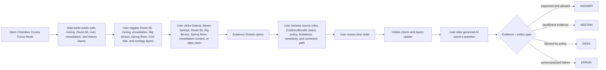
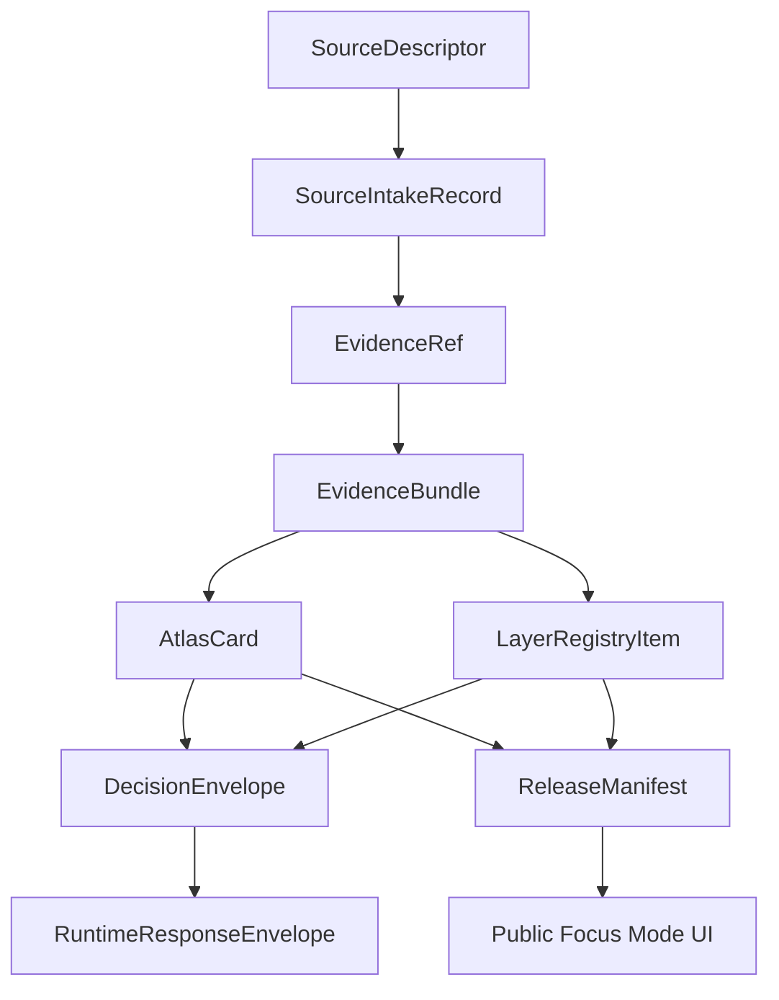

<!--
doc_id: NEEDS_VERIFICATION
title: Cherokee County Focus Mode Build Plan
type: standard
version: v1
status: draft
owners: [NEEDS_VERIFICATION]
created: 2026-05-21
updated: 2026-05-21
policy_label: public_draft
related:
  - docs/focus-modes/ellsworth-county/build-plan.md
  - docs/focus-modes/riley-county/build-plan.md
  - docs/focus-modes/shawnee-county/build-plan.md
  - docs/focus-modes/ford-county/build-plan.md
  - docs/focus-modes/wyandotte-county/build-plan.md
  - docs/focus-modes/sedgwick-county/build-plan.md
  - docs/focus-modes/douglas-county/build-plan.md
  - docs/focus-modes/leavenworth-county/build-plan.md
  - docs/focus-modes/reno-county/build-plan.md
  - docs/focus-modes/johnson-county/build-plan.md
  - docs/focus-modes/barton-county/build-plan.md
  - docs/focus-modes/geary-county/build-plan.md
  - docs/focus-modes/finney-county/build-plan.md
  - docs/focus-modes/cherokee-county/README.md
  - docs/focus-modes/cherokee-county/layer-registry.md
  - docs/focus-modes/cherokee-county/acceptance-checklist.md
tags: [kfm, focus-mode, cherokee-county, route-66, galena, baxter-springs, tri-state-mining-district, big-brutus, spring-river]
notes:
  - Draft plan prepared without mounted repository inspection.
  - Paths, owners, doc IDs, schema homes, and validator names require repository verification before merge.
  - Lead/zinc mining, coal mining, remediation, Route 66, Civil War, Indigenous history, Spring River, public health, infrastructure, and property claims require source intake and evidence review before publication.
-->

<a id="top"></a>

# Cherokee County Focus Mode Build Plan

> **Purpose:** establish a fourteenth Kansas Frontier Matrix county proof slice after Ellsworth, Riley, Shawnee, Ford, Wyandotte, Sedgwick, Douglas, Leavenworth, Reno, Johnson, Barton, Geary, and Finney counties, with a distinct southeast Kansas profile: **Galena, Baxter Springs, Columbus, Route 66, Tri-State lead and zinc mining, coal strip mining, Big Brutus, Spring River, Ozark-edge ecology, Civil War / border conflict, environmental remediation, abandoned mine hazards, and public-health geoprivacy.**


---

## Quick links

- [1. Why Cherokee County](#1-why-cherokee-county)
- [2. Product thesis](#2-product-thesis)
- [3. Scope boundary](#3-scope-boundary)
- [4. First demo layers](#4-first-demo-layers)
- [5. User journeys](#5-user-journeys)
- [6. UI surfaces](#6-ui-surfaces)
- [7. Governed object model](#7-governed-object-model)
- [8. Proposed repository shape](#8-proposed-repository-shape)
- [9. Build phases](#9-build-phases)
- [10. First PR sequence](#10-first-pr-sequence)
- [11. Acceptance checklist](#11-acceptance-checklist)
- [12. Risk register](#12-risk-register)
- [13. Source seed list](#13-source-seed-list)
- [14. Open verification questions](#14-open-verification-questions)
- [15. Recommended first milestone](#15-recommended-first-milestone)

---

## Operating posture

> [!IMPORTANT]
> Cherokee County Focus Mode is a **governed mining-remediation / Route 66 / Spring River / borderlands proof slice**, not a loose road-trip or abandoned-mine map. It must preserve KFM’s core invariants:
>
> - EvidenceBundle outranks generated language.
> - Public clients use governed APIs, released artifacts, catalog records, tile services, and policy-safe runtime envelopes.
> - Public UI must not read directly from `RAW`, `WORK`, `QUARANTINE`, unpublished candidate data, canonical/internal stores, or direct model runtime outputs.
> - Publication is a governed state transition, not a file move.
> - AI outputs are downstream carriers, not sovereign truth.
> - Mining hazards, contaminated land, Superfund/remediation records, public health, private wells, private property, exact sensitive ecology, Indigenous history, burial/cemetery locations, and infrastructure details must remain source-bound, generalized where needed, and correction-friendly.

---

# 1. Why Cherokee County

Cherokee County is the right fourteenth Focus Mode because it gives KFM a **southeast Kansas mining, remediation, Route 66, borderlands, and Ozark-edge ecology proof slice**.

Earlier county plans cover forts, rivers, reservoirs, wetlands, agriculture, cities, military bases, suburban growth, groundwater, and state government. Cherokee County adds a new stress test:

| KFM capability | Cherokee County proof value |
|---|---|
| Tri-State mining legacy | lead/zinc mining, coal strip mining, Galena, Baxter Springs, abandoned mine lands |
| Environmental remediation | chat piles, mine drainage, contaminated soils/water, Superfund/source-role handling |
| Public-health privacy | aggregate health/environment context without household-level exposure |
| Route 66 cultural landscape | Galena, Riverton, Baxter Springs, Brush Creek/Rainbow Bridge, tourism vs. evidence |
| Big Brutus / coal mining | West Mineral, coal-strip-mining public history, industrial artifact context |
| Spring River and Ozark edge | stream ecology, water quality, floodplain, cross-state basin context |
| Borderlands and Civil War history | Baxter Springs, Missouri/Oklahoma border context, conflict/memorialization |
| Infrastructure and hazard caution | mine shafts, subsidence, contaminated sites, rail/highways, bridges, private property |
| Multi-state data problem | Kansas-Missouri-Oklahoma Tri-State district requires source harmonization |
| Public tourism vs. proof | Route 66 and mining museums must be source-classified, not treated as sovereign truth |

> [!NOTE]
> Cherokee County should prove KFM can show contaminated-land and mining history responsibly: visible enough to explain place, cautious enough to avoid unsafe exploration, property harm, public-health overclaiming, or legal conclusions.

---

# 2. Product thesis

## User-facing thesis

> **Cherokee County Focus Mode lets a user explore how Galena, Baxter Springs, Columbus, Route 66, lead/zinc mining, coal mining, Big Brutus, the Spring River, Ozark-edge ecology, borderland conflict, and remediation shaped southeast Kansas — while keeping mine hazards, contamination, private wells, property, public health, and sensitive ecology layers public-safe and evidence-backed.**

## Internal KFM thesis

Cherokee County should prove that Focus Mode can handle:

```text
mining legacy + environmental remediation + Route 66 public history + Civil War borderlands + Spring River ecology + multi-state source harmonization
```

without converting regulatory records into health/legal conclusions or tourism content into evidence-grade history.

The system must preserve distinctions between:

- mining history vs. active hazard
- public mining museum context vs. abandoned mine location exposure
- environmental observation vs. remediation status vs. legal/liability conclusion
- contaminated site record vs. household health claim
- private well/water data vs. public basin context
- Route 66 tourism narrative vs. historical transportation record
- bridge/road public-history object vs. infrastructure vulnerability
- Civil War claim vs. memorial/public-history interpretation
- source-backed claim vs. generated explanation

---

# 3. Scope boundary

## 3.1 Geography

Initial scope:

```text
Cherokee County, Kansas
```

Priority spatial anchors:

- Cherokee County boundary
- Columbus
- Galena
- Baxter Springs
- Riverton
- West Mineral / Big Brutus context
- Spring River corridor
- Shoal Creek / Short Creek / Cow Creek / local drainage context where source-supported
- Route 66 corridor through Kansas, including Galena, Riverton, and Baxter Springs
- Brush Creek / Rainbow Bridge public-history context
- Tri-State mining district public-safe context
- lead/zinc mining, coal mining, chat/remediation context, generalized
- Civil War / Baxter Springs public-history context
- Ozark Plateau / Cherokee Lowlands edge ecology context
- agriculture / pasture / woodland / mined-land reclamation context
- public-safe water-quality and floodplain context
- cemeteries, memorials, and battle/massacre contexts, generalized and sensitivity-reviewed

## 3.2 Time range

Initial buckets:

| Bucket | Role in demo |
|---|---|
| Before 1800 | Indigenous, Ozark-edge ecology, river/stream, prairie/woodland, and pre-territorial context; public-safe and culturally cautious |
| 1800–1854 | borderland movement, early roads, military/trade context, pre-territorial settlement |
| 1854–1865 | territorial conflict, Civil War borderlands, Baxter Springs public-history context |
| 1866–1890 | railroad, settlement, early mining expansion, county institutions |
| 1891–1926 | Tri-State mining growth, coal mining, towns, labor, industry, public-health legacy context |
| 1926–1945 | Route 66 designation/roadside commerce, mining peak/decline transitions |
| 1946–1985 | mining decline, Route 66 changes, environmental legacy recognition, reclamation beginnings |
| 1986–present | remediation, tourism, Big Brutus preservation, Route 66 heritage, water/ecology/public-health context |

> [!CAUTION]
> Time buckets are planning scaffolds. They are not publication claims until evidence-reviewed.

## 3.3 Not in MVP

Do **not** include in the first Cherokee County MVP:

- precise abandoned mine shaft / collapse / unsafe exploration locations
- private well or household water-quality details
- household-level health risk or medical claims
- property-value, liability, or legal conclusions
- parcel ownership treated as title truth
- exact sensitive habitat, rare species, cave/bat/karst, or nest locations
- exact sensitive burial, sacred, cemetery, or archaeological details
- active emergency operations or live flood/weather alerts
- infrastructure vulnerability details for bridges, rail, roads, utilities, or remediation works
- public direct model endpoint

---

# 4. First demo layers

## 4.1 MVP layer registry

| Layer ID | Layer | Domain | Purpose | Initial posture |
|---|---|---:|---|---|
| `kfm.layer.cherokee.county_boundary.v1` | Cherokee County boundary | civic | establish spatial frame | public draft |
| `kfm.layer.cherokee.galena_baxter_columbus_context.v1` | Galena / Baxter Springs / Columbus context | civic/history | county, mining, and Route 66 anchors | public draft, evidence-required |
| `kfm.layer.cherokee.route_66_context.v1` | Kansas Route 66 corridor context | transportation/public history | Galena, Riverton, Baxter Springs, bridges, roadside culture | public draft |
| `kfm.layer.cherokee.tri_state_mining_context.v1` | Tri-State lead/zinc mining context | mining/environment/history | mining legacy and source-role anchor | public-safe generalized |
| `kfm.layer.cherokee.coal_big_brutus_context.v1` | Coal mining / Big Brutus context | mining/public history | coal strip mining and industrial artifact | public draft, evidence-required |
| `kfm.layer.cherokee.remediation_public_context.v1` | Remediation / contaminated-land context | environment/regulatory | Superfund/AML/remediation source-role handling | generalized, not legal advice |
| `kfm.layer.cherokee.spring_river_context.v1` | Spring River / stream-water context | hydrology/ecology | basin, water quality, floodplain, ecology | public draft |
| `kfm.layer.cherokee.borderlands_civil_war_context.v1` | Civil War / borderlands public-history context | history/public memory | Baxter Springs and border conflict | public draft, source-framed |
| `kfm.layer.cherokee.ecology_mined_land_context.v1` | Ozark-edge / mined-land ecology context | ecology/environment | habitat, reclamation, public-safe ecology | generalized |
| `kfm.layer.cherokee.timeline_events.v1` | Timeline events | cross-domain | temporal navigation | public draft |
| `kfm.layer.cherokee.atlas_claims.v1` | Atlas claim points / corridors | cross-domain | clickable evidence-backed claims | requires EvidenceRef |

## 4.2 Layer contract

Each layer must have:

```yaml
layer_id: kfm.layer.cherokee.<name>.v1
title: NEEDS_VERIFICATION
domain: NEEDS_VERIFICATION
layer_type: observed | derived | interpreted | modeled | administrative
geometry_type: point | line | polygon | raster | tile | mixed
source_refs: []
evidence_refs: []
policy_label: public_draft | restricted | internal | public
review_state: draft | review | published | deprecated
rights_status: unknown | public | open | controlled | restricted
sensitivity: public | generalized | restricted | review_required
temporal_scope:
  start: NEEDS_VERIFICATION
  end: NEEDS_VERIFICATION
limitations: []
correction_path: NEEDS_VERIFICATION
```

---

# 5. User journeys

## 5.1 Primary public journey



## 5.2 Example public questions

Supported after evidence review:

- “Why is Cherokee County important to Kansas Route 66?”
- “How did lead and zinc mining shape Galena and Baxter Springs?”
- “What can KFM safely show about abandoned mining and remediation?”
- “How does the Spring River connect mining, ecology, and water quality?”
- “What is Big Brutus, and why is it tied to coal mining history?”
- “Which remediation layers are regulatory records, observations, or derived indicators?”
- “Why are mine hazard and private well layers generalized?”

Should abstain or deny unless governed release permits them:

- “Show exact abandoned mine openings.”
- “Show private well contamination by household.”
- “Tell me whether this property is safe or liable.”
- “Show exact sensitive cave/bat/rare species locations.”
- “Treat tourism text as proof.”
- “Treat a regulatory record as a health diagnosis.”
- “Treat generated text as evidence.”
- “Publish a claim with no EvidenceBundle.”

---

# 6. UI surfaces

## 6.1 Map canvas

Required:

- MapLibre GL JS map
- placeholder basemap
- Cherokee County boundary
- Galena / Baxter Springs / Columbus / Route 66 / Big Brutus / Spring River anchors
- clickable mock features
- selected feature highlight
- layer toggles
- scale bar
- attribution
- zoom controls
- compass / orientation affordance
- public-safe layer legend

## 6.2 Layer registry panel

Show for every layer:

| Field | Meaning |
|---|---|
| Layer name | human-readable layer title |
| Domain | mining, remediation, Route 66, hydrology, ecology, Civil War, tourism |
| Layer type | observed, derived, interpreted, modeled, administrative |
| Evidence state | resolved, unresolved, not required, pending |
| Policy label | public, public_draft, restricted, internal |
| Review state | draft, review, published, deprecated |
| Sensitivity | public, generalized, restricted, review_required |
| Time coverage | start/end or bucketed range |
| Limitations | short public-facing warning |
| Source-role warning | official record, regulatory record, public-history interpretation, tourism context, hazard context, derived indicator |

## 6.3 Timeline panel

Initial buckets:

```text
Before 1800
1800–1854
1854–1865
1866–1890
1891–1926
1926–1945
1946–1985
1986–present
```

Timeline should control:

- visible atlas claims
- Route 66 and roadside public-history cards
- mining / coal / Big Brutus cards
- remediation and water-quality context layers
- Civil War / borderlands cards
- Spring River and ecology layers
- feature styling by temporal relevance

## 6.4 Evidence Drawer

When a user clicks a layer feature or atlas claim, show:

```yaml
title: NEEDS_VERIFICATION
claim_text: NEEDS_VERIFICATION
object_type: AtlasCard | LayerFeature | TimelineEvent | EvidenceBundle
spatial_scope: NEEDS_VERIFICATION
temporal_scope: NEEDS_VERIFICATION
evidence_refs: []
evidence_bundle_status: unresolved | resolved | restricted | missing
source_roles: []
interpretation_status: fact_claim | interpretation | public_history | tourism_context | regulatory_context | remediation_context | hazard_context | derived_indicator
policy_label: public_draft
rights_status: unknown
sensitivity: review_required
review_state: draft
limitations: []
correction_path: NEEDS_VERIFICATION
```

## 6.5 Atlas Card panel

Minimum atlas card types:

| Card type | Example |
|---|---|
| `route_66_context` | Kansas Route 66 / Galena / Baxter Springs |
| `mining_district_context` | Tri-State lead and zinc mining |
| `coal_mining_artifact_context` | Big Brutus / West Mineral |
| `remediation_public_context` | Superfund / abandoned mine land / chat context |
| `river_water_quality_context` | Spring River |
| `borderlands_civil_war_context` | Baxter Springs public-history context |
| `ecology_reclamation_context` | mined-land ecology / Ozark edge |
| `community_context` | Columbus, Galena, Baxter Springs, Riverton |
| `derived_layer_context` | mine buffer, remediation status, land cover, water-quality, or floodplain baseline |

## 6.6 Governed AI panel

The AI panel must only emit finite runtime outcomes:

```text
ANSWER
ABSTAIN
DENY
ERROR
```

Example response envelope:

```json
{
  "object_type": "RuntimeResponseEnvelope",
  "schema_version": "v1",
  "question": "How did lead and zinc mining shape Galena and Baxter Springs?",
  "outcome": "ABSTAIN",
  "answer": null,
  "reason": "Evidence bundle is not yet resolved for publication-grade response.",
  "evidence_refs": [
    "kfm://evidence-ref/cherokee/tri-state-mining-context/v1"
  ],
  "policy_label": "public_draft",
  "limitations": [
    "This draft object requires source intake, rights review, and mining/remediation source-role review before publication."
  ]
}
```

---

# 7. Governed object model

## 7.1 Object flow



## 7.2 SourceDescriptor draft

```yaml
id: kfm.source.cherokee.tri_state_mining.placeholder
title: Cherokee County Tri-State mining source placeholder
domain: mining_remediation_history
source_type: geoscience_or_public_history_reference
role: context_NEEDS_VERIFICATION
rights_status: unknown
spatial_coverage: Cherokee County, southeast Kansas, Tri-State district context
temporal_coverage: NEEDS_VERIFICATION
status: proposed
limitations:
  - Requires source intake and review before claims are published.
  - Must separate mining history, remediation records, hazard context, public-health context, and legal/property conclusions.
```

## 7.3 EvidenceRef draft

```yaml
id: kfm.evidence_ref.cherokee.tri_state_mining_context.v1
bundle_id: kfm.evidence_bundle.cherokee.tri_state_mining_context.v1
claim_scope: Public-safe Tri-State lead/zinc mining and remediation context within Cherokee County Focus Mode
resolution_required: true
```

## 7.4 EvidenceBundle draft

```yaml
id: kfm.evidence_bundle.cherokee.tri_state_mining_context.v1
resolved: false
source_refs:
  - kfm.source.cherokee.tri_state_mining.placeholder
policy_label: public_draft
rights_status: unknown
sensitivity: review_required
review_state: draft
limitations:
  - Draft bundle. Do not publish final mining/remediation claims until source-reviewed.
  - Do not expose exact unsafe mine openings, household/private well details, or property/legal conclusions.
```

## 7.5 AtlasCard draft

```yaml
id: kfm.atlas_card.cherokee.tri_state_mining.v1
title: Cherokee County Tri-State Mining Context
card_type: mining_district_context
spatial_scope: Cherokee County, Kansas NEEDS_VERIFICATION
temporal_scope: NEEDS_VERIFICATION
evidence_refs:
  - kfm.evidence_ref.cherokee.tri_state_mining_context.v1
policy_label: public_draft
review_state: draft
limitations:
  - Draft card. Not a final mining, environmental, public-health, property, safety, or legal authority statement.
```

## 7.6 DecisionEnvelope draft

```yaml
id: kfm.decision.cherokee.question.tri_state_mining_context.v1
question: How did lead and zinc mining shape Galena and Baxter Springs?
outcome: ABSTAIN
reason: Evidence bundle unresolved.
evidence_refs:
  - kfm.evidence_ref.cherokee.tri_state_mining_context.v1
policy_label: public_draft
```

## 7.7 ReleaseManifest draft

```yaml
id: kfm.release.cherokee.focus_mode.v0_1
release_state: draft
included_layers:
  - kfm.layer.cherokee.county_boundary.v1
  - kfm.layer.cherokee.galena_baxter_columbus_context.v1
  - kfm.layer.cherokee.route_66_context.v1
  - kfm.layer.cherokee.tri_state_mining_context.v1
  - kfm.layer.cherokee.spring_river_context.v1
validation_state: pending
rollback_plan: required_before_publication
correction_path: required_before_publication
```

---

# 8. Proposed repository shape

> [!WARNING]
> Repository access is **not confirmed** in this planning session. Treat all paths as proposed until checked against the live branch and KFM Directory Rules.

```text
docs/
  focus-modes/
    cherokee-county/
      README.md
      build-plan.md
      layer-registry.md
      evidence-model.md
      acceptance-checklist.md
      source-seed-list.md
      public-safety-notes.md
      mining-and-remediation-notes.md
      route-66-and-public-history-notes.md
      spring-river-water-quality-notes.md
      civil-war-borderlands-notes.md
      ecology-and-sensitive-habitat-notes.md
      property-public-health-and-well-privacy-notes.md

data/
  catalog/
    sources/
      cherokee/
        source_descriptors.yaml
    stac/
      cherokee/
        README.md

contracts/
  focus_mode/
    focus_mode_payload.schema.json
  atlas/
    atlas_card.schema.json
  evidence/
    evidence_ref.schema.json
    evidence_bundle.schema.json
  release/
    release_manifest.schema.json

fixtures/
  focus_modes/
    cherokee/
      valid/
        focus_mode_payload.valid.json
        layer_registry.valid.json
        atlas_card.route_66.valid.json
        atlas_card.tri_state_mining.valid.json
        atlas_card.big_brutus.valid.json
        evidence_bundle.tri_state_mining.valid.json
        evidence_bundle.route_66.valid.json
      invalid/
        unresolved_evidence_ref.invalid.json
        exact_abandoned_mine_opening.invalid.json
        private_well_or_household_water_quality.invalid.json
        regulatory_record_as_health_diagnosis.invalid.json
        contaminated_site_as_property_legal_conclusion.invalid.json
        tourism_text_as_historical_proof.invalid.json
        infrastructure_vulnerability.invalid.json
        exact_sensitive_species_or_cave_location.invalid.json
        exact_sensitive_burial_site.invalid.json
        parcel_as_title_truth.invalid.json
        missing_policy_label.invalid.json
        model_output_as_evidence.invalid.json
        public_raw_access.invalid.json

apps/
  web/
    src/
      focus-modes/
        cherokee/
          index.js
          layers.js
          mock-api.js
          mock-data.js
          evidence-drawer.js
          timeline.js
          ai-panel.js
          styles.css

tools/
  validators/
    validate_focus_mode_payload.py
    validate_atlas_card.py
    validate_evidence_bundle.py
    validate_layer_registry.py
```

---

# 9. Build phases

## Phase 1 — Control plane

Goal: establish Cherokee County Focus Mode as a governed mining/remediation/Route 66/borderlands/ecology template.

Deliverables:

- `docs/focus-modes/cherokee-county/README.md`
- `build-plan.md`
- `layer-registry.md`
- `source-seed-list.md`
- `public-safety-notes.md`
- `mining-and-remediation-notes.md`
- `route-66-and-public-history-notes.md`
- `spring-river-water-quality-notes.md`
- `civil-war-borderlands-notes.md`
- `ecology-and-sensitive-habitat-notes.md`
- `property-public-health-and-well-privacy-notes.md`
- first schema references
- valid and invalid fixture plan

Definition of done:

```text
[ ] scope is explicit
[ ] mining/remediation layers distinguish history, hazard, regulatory record, and legal/health conclusions
[ ] exact abandoned mine openings and unsafe exploration locations are denied/generalized
[ ] private well, household, property, and public-health details are excluded
[ ] Route 66/tourism layers cannot be treated as proof without evidence role
[ ] Spring River/water-quality layers distinguish observation/model/regulatory/derived roles
[ ] Civil War/borderlands claims require source-role and public-memory framing
[ ] ecology layers generalize sensitive species/cave/habitat where needed
[ ] all layers have policy labels
[ ] all claim-bearing objects require EvidenceRef
[ ] placeholders are clearly marked
```

## Phase 2 — Mock governed API

Goal: make Cherokee Focus Mode run without live pipelines.

Mock endpoints:

```text
GET /api/focus-modes/cherokee
GET /api/layers/cherokee
GET /api/evidence/{bundle_id}
GET /api/atlas-cards/{card_id}
POST /api/ai/answer
GET /api/releases/cherokee-focus-mode
```

Definition of done:

```text
[ ] mock payloads validate
[ ] unresolved evidence produces ABSTAIN
[ ] exact abandoned mine location requests produce DENY
[ ] private well/household health requests produce DENY
[ ] contaminated-site-as-legal-conclusion payloads fail validation
[ ] tourism-text-as-proof payloads fail validation
[ ] invalid payloads fail closed
[ ] public layer payloads do not reference RAW / WORK / QUARANTINE
```

## Phase 3 — UI prototype

Goal: show the full Cherokee Focus Mode surface in a browser.

Deliverables:

- MapLibre map
- layer registry
- clickable mock Galena, Baxter Springs, Columbus, Route 66, Big Brutus, Spring River, remediation, and Civil War/borderlands features
- evidence drawer
- timeline
- atlas card panel
- governed AI answer panel

Definition of done:

```text
[ ] user can click Route 66 context and see public-history/source-role limits
[ ] user can click Tri-State mining context and see remediation/hazard/privacy limits
[ ] user can click Big Brutus context and see coal-mining artifact evidence status
[ ] user can click Spring River context and see water-quality/source-role warnings
[ ] user can click borderlands/Civil War context and see source/public-memory framing
[ ] user can toggle Route 66 / mining / remediation / Big Brutus / river / Civil War / ecology layers
[ ] timeline changes visible claim set
[ ] AI panel returns all four finite outcomes through examples
```

## Phase 4 — Validators and negative fixtures

Goal: prove failure modes before publication.

Required invalid fixtures:

| Fixture | Expected failure |
|---|---|
| `unresolved_evidence_ref.invalid.json` | publication attempted with unresolved evidence |
| `exact_abandoned_mine_opening.invalid.json` | unsafe mine opening/exploration location exposed |
| `private_well_or_household_water_quality.invalid.json` | private well/household water-quality data exposed |
| `regulatory_record_as_health_diagnosis.invalid.json` | regulatory/environment record treated as health diagnosis |
| `contaminated_site_as_property_legal_conclusion.invalid.json` | remediation record treated as liability/property conclusion |
| `tourism_text_as_historical_proof.invalid.json` | tourism text treated as evidence-grade proof |
| `infrastructure_vulnerability.invalid.json` | bridge/rail/utility/remediation vulnerability exposed |
| `exact_sensitive_species_or_cave_location.invalid.json` | exact sensitive ecology/cave location exposed |
| `exact_sensitive_burial_site.invalid.json` | exact sensitive burial/sacred/cemetery detail exposed |
| `parcel_as_title_truth.invalid.json` | property/assessor record treated as title truth |
| `missing_policy_label.invalid.json` | public object lacks policy posture |
| `model_output_as_evidence.invalid.json` | AI output treated as proof |
| `public_raw_access.invalid.json` | public client references RAW/WORK/QUARANTINE |

## Phase 5 — Source intake upgrade

Goal: replace placeholders with inspected sources.

Deliverables:

- source descriptors
- intake records
- rights review notes
- sensitivity review notes
- evidence bundle drafts
- reviewed atlas cards
- limitations notes

Minimum real-evidence targets:

```text
[ ] one Cherokee County official-history / county formation claim
[ ] one Galena / Baxter Springs / Tri-State lead-zinc mining claim
[ ] one Route 66 corridor / bridge / roadside public-history claim
[ ] one Big Brutus / coal mining public-history claim
[ ] one remediation / abandoned mine land / contaminated-land source-role claim
[ ] one Spring River / water-quality / floodplain claim
[ ] one Civil War / Baxter Springs / borderlands public-history claim
[ ] one Ozark-edge ecology / mined-land reclamation public-safe claim
```

## Phase 6 — Release candidate

Goal: prepare `v0.1` public-safe release.

Deliverables:

- `ReleaseManifest`
- validation report
- correction path
- rollback plan
- public-safe layer manifest
- known limitations
- release notes

Definition of done:

```text
[ ] public layers have policy labels and review states
[ ] rights status is resolved or blocked
[ ] unsafe mine openings and exact hazard locations are excluded or generalized
[ ] private wells/households/public-health details are excluded
[ ] remediation records do not become health/legal/property conclusions
[ ] Route 66/tourism claims preserve source role and limitations
[ ] Spring River/water-quality claims preserve source role and uncertainty
[ ] exact sensitive ecology/burial/sacred locations are excluded or generalized
[ ] release can be rolled back
[ ] public UI only consumes governed surfaces
```

---

# 10. First PR sequence

## PR-0001 — Cherokee County Focus Mode Control Plane

Files:

```text
docs/focus-modes/cherokee-county/README.md
docs/focus-modes/cherokee-county/build-plan.md
docs/focus-modes/cherokee-county/layer-registry.md
docs/focus-modes/cherokee-county/source-seed-list.md
docs/focus-modes/cherokee-county/public-safety-notes.md
docs/focus-modes/cherokee-county/mining-and-remediation-notes.md
docs/focus-modes/cherokee-county/route-66-and-public-history-notes.md
docs/focus-modes/cherokee-county/spring-river-water-quality-notes.md
docs/focus-modes/cherokee-county/civil-war-borderlands-notes.md
docs/focus-modes/cherokee-county/ecology-and-sensitive-habitat-notes.md
docs/focus-modes/cherokee-county/property-public-health-and-well-privacy-notes.md
docs/focus-modes/cherokee-county/acceptance-checklist.md
```

Acceptance:

```text
[ ] Focus Mode scope is clear.
[ ] Cherokee County is justified as a complementary proof slice.
[ ] Every planned layer has a policy posture.
[ ] Mining/remediation hazard and legal/health boundaries are explicit.
[ ] Route 66/tourism source-role boundaries are explicit.
[ ] Spring River/water-quality source-role boundaries are explicit.
[ ] Private well/household/property/public-health privacy boundaries are explicit.
[ ] Ecology/cave/sensitive-habitat boundaries are explicit.
[ ] No publication claims are made from placeholders.
```

## PR-0002 — Cherokee Contracts and Fixtures

Files:

```text
fixtures/focus_modes/cherokee/valid/focus_mode_payload.valid.json
fixtures/focus_modes/cherokee/valid/layer_registry.valid.json
fixtures/focus_modes/cherokee/valid/atlas_card.route_66.valid.json
fixtures/focus_modes/cherokee/valid/atlas_card.tri_state_mining.valid.json
fixtures/focus_modes/cherokee/invalid/exact_abandoned_mine_opening.invalid.json
fixtures/focus_modes/cherokee/invalid/private_well_or_household_water_quality.invalid.json
fixtures/focus_modes/cherokee/invalid/regulatory_record_as_health_diagnosis.invalid.json
fixtures/focus_modes/cherokee/invalid/missing_policy_label.invalid.json
```

Acceptance:

```text
[ ] Valid fixtures include required governed fields.
[ ] Invalid fixtures represent real failure modes.
[ ] EvidenceRef / EvidenceBundle relationship is explicit.
[ ] Mock cards remain draft until evidence intake.
```

## PR-0003 — Cherokee Mock API

Files:

```text
apps/web/src/focus-modes/cherokee/mock-api.js
apps/web/src/focus-modes/cherokee/layers.js
apps/web/src/focus-modes/cherokee/mock-data.js
```

Acceptance:

```text
[ ] Mock API returns finite runtime outcomes.
[ ] Layer registry is API-shaped, not UI-only.
[ ] Public-safe data is separated from restricted mock examples.
[ ] Sensitivity/source-role status is included for mining, remediation, Route 66, Spring River, Civil War, and ecology objects.
```

## PR-0004 — Cherokee UI Shell

Files:

```text
apps/web/src/focus-modes/cherokee/index.js
apps/web/src/focus-modes/cherokee/evidence-drawer.js
apps/web/src/focus-modes/cherokee/timeline.js
apps/web/src/focus-modes/cherokee/ai-panel.js
apps/web/src/focus-modes/cherokee/styles.css
```

Acceptance:

```text
[ ] Map renders.
[ ] Layer panel renders.
[ ] Evidence Drawer renders.
[ ] Atlas Card panel renders.
[ ] Timeline filters mock claims.
[ ] AI panel demonstrates ANSWER / ABSTAIN / DENY / ERROR.
```

## PR-0005 — Validator Hardening

Files:

```text
tools/validators/validate_focus_mode_payload.py
tools/validators/validate_atlas_card.py
tools/validators/validate_evidence_bundle.py
tools/validators/validate_layer_registry.py
```

Acceptance:

```text
[ ] Public RAW / WORK / QUARANTINE references fail.
[ ] Missing EvidenceRef fails for claim-bearing objects.
[ ] Missing policy label fails.
[ ] Exact unsafe mine/hazard location fails public release.
[ ] Private well/household/public-health detail fails public release.
[ ] Remediation record as health/legal conclusion fails.
[ ] Tourism text as proof fails.
[ ] Model output as proof fails.
```

---

# 11. Acceptance checklist

```text
[ ] Cherokee County map loads.
[ ] User can toggle at least 5 public-safe layers.
[ ] User can click Route 66 context and open Evidence Drawer.
[ ] User can click Galena / Baxter Springs context and open Evidence Drawer.
[ ] User can click Tri-State mining context and open Evidence Drawer.
[ ] User can click Big Brutus / coal mining context and open Evidence Drawer.
[ ] User can click Spring River context and open Evidence Drawer.
[ ] User can click remediation context and see legal/health/property limitations.
[ ] User can inspect at least 3 Atlas Cards.
[ ] Timeline control changes visible claims/layers.
[ ] Governed AI panel returns ANSWER for supported claims.
[ ] Governed AI panel returns ABSTAIN for unresolved evidence.
[ ] Governed AI panel returns DENY for restricted/sensitive requests.
[ ] Governed AI panel returns ERROR for invalid payload/system failure.
[ ] Every visible claim has EvidenceRef.
[ ] Every EvidenceRef points to an EvidenceBundle.
[ ] Every layer has policy_label.
[ ] Every layer has review_state.
[ ] Every public object has correction path.
[ ] No public UI path reads RAW, WORK, or QUARANTINE.
[ ] Exact unsafe mine/hazard locations are excluded or generalized.
[ ] Private wells/households/public-health details are excluded.
[ ] Remediation records are not represented as health/legal/property conclusions.
[ ] Tourism text is not represented as evidence-grade proof.
[ ] ReleaseManifest exists before anything is called published.
```

---

# 12. Risk register

| Risk | Why it matters | Control |
|---|---|---|
| Exact abandoned mine openings leak | safety and trespass risk | deny/generalize by default |
| Remediation record becomes health/legal conclusion | public-health/legal harm risk | source-role labels and limitations |
| Private well or household water data leaks | privacy and harm risk | aggregate/generalize; deny private details |
| Tourism text becomes proof | evidence failure | source-role classification and EvidenceBundle requirement |
| Route 66 layer ignores industrial/mining context | historical distortion risk | connect road, mining, towns, and sources |
| Spring River water layer overclaims safety | public-health/environment risk | distinguish observation/model/regulatory/derived |
| Sensitive cave/bat/ecology locations leak | species/habitat risk | generalized ecology layer |
| Infrastructure vulnerabilities exposed | public safety risk | exclude vulnerability details |
| Generated narrative treated as source | evidence failure | model output cannot be proof |
| Mock placeholders become doctrine | demo pollution | all placeholders marked draft/unresolved |

---

# 13. Source seed list

> [!NOTE]
> These are **candidate source seeds**, not yet KFM-ingested sources. Each requires `SourceDescriptor`, rights review, sensitivity review, checksum/citation handling, and EvidenceBundle resolution before publication-grade use.

| Seed | Use | Starting URL |
|---|---|---|
| Cherokee County official site | current county civic source routing | https://www.cherokeecountykssheriff.com/cherokee-county-kansas |
| Cherokee County Economic Development / county links | local source routing and public context | https://www.cherokeecountykansas.com/ |
| Kansas Geological Survey — Lead and Zinc Mining in Kansas | lead/zinc mining source routing | https://kgs.ku.edu/lead-and-zinc-mining-kansas |
| National Park Service — Route 66 Kansas | Kansas Route 66, lead mining, Galena/Baxter Springs/Riverton context | https://www.nps.gov/articles/000/route-66-kansas.htm |
| Big Brutus official site | coal mining public-history / West Mineral source routing | https://bigbrutus.org/ |
| Kansas Sampler — Big Brutus | public-history/tourism source routing | https://kansassampler.org/8wondersofkansas-overall/big-brutus-west-mineral |
| Kansas Historical Society markers | marker-based public-history source routing | https://www.kansashistory.gov/p/kansas-historical-markers/14999 |
| Kansas Memory | historic maps/photos/documents source routing | https://www.kansasmemory.org/ |
| National Park Service — Historic Resources of Route 66 in Kansas | historic route context / structures source routing | https://www.nps.gov/subjects/travelroute66/index.htm |
| EPA Superfund search | remediation/regulatory source routing | https://www.epa.gov/superfund/search-superfund-sites-where-you-live |
| KDHE Bureau of Environmental Remediation | state remediation source routing | https://www.kdhe.ks.gov/172/Bureau-of-Environmental-Remediation |
| Kansas Department of Health and Environment — Surface Water Quality | water-quality source routing | https://www.kdhe.ks.gov/1513/Surface-Water-Quality |
| USGS National Hydrography | river and stream source routing | https://www.usgs.gov/national-hydrography |
| USGS National Water Dashboard | stream gage and water observation source routing | https://dashboard.waterdata.usgs.gov/ |
| FEMA Flood Map Service Center | regulatory floodplain source routing | https://msc.fema.gov/portal/home |
| USDA Cropland Data Layer | agriculture / land-cover source routing | https://www.nass.usda.gov/Research_and_Science/Cropland/SARS1a.php |

---

# 14. Open verification questions

```text
[ ] What is the canonical repo path for Focus Mode documents?
[ ] Does KFM already have a focus_mode_payload schema?
[ ] Does KFM already define AtlasCard fields differently?
[ ] Does KFM already define mining/remediation source-role fields?
[ ] Does KFM already define abandoned mine hazard public-safety fields?
[ ] Does KFM already define private well/public-health privacy fields?
[ ] Does KFM already define tourism/public-history evidence-role fields?
[ ] Does KFM already define cave/bat/sensitive-ecology exact-location filters?
[ ] Which validators already exist?
[ ] Should Cherokee County share contracts with Crawford/Labette/Neosho southeast Kansas mining counties?
[ ] What public-safe geometry source should be used for county boundary?
[ ] What source authority should define Galena/Baxter Springs mining claims?
[ ] What source authority should define Route 66 claims?
[ ] What source authority should define Big Brutus / coal mining claims?
[ ] What source authority should define remediation and contaminated-land claims?
[ ] What source authority should define Spring River / water-quality claims?
[ ] What exact policy rule controls abandoned mine/hazard exposure?
[ ] What exact policy rule controls contaminated site legal/health conclusions?
[ ] What exact policy rule controls private well and household environmental data?
[ ] What release manifest naming convention should be used?
[ ] What rollback/correction path should a county Focus Mode use?
```

---

# 15. Recommended first milestone

## Milestone 1: Cherokee County Focus Mode Control Plane

Build the documentation, layer registry, source seed list, public-safety notes, mining/remediation notes, Route 66/public-history notes, Spring River/water-quality notes, Civil War/borderlands notes, ecology/sensitive-habitat notes, property/public-health/well-privacy notes, and fixtures before the UI.

This keeps the Cherokee proof slice from becoming a hazardous abandoned-mine, remediation, or Route 66 tourism map with weak evidence, safety, public-health, and property boundaries.

The first concrete deliverable should be:

```text
docs/focus-modes/cherokee-county/build-plan.md
```

Once this is stable, use it to generate the mock API and single-file UI prototype.

---

[Back to top](#top)
