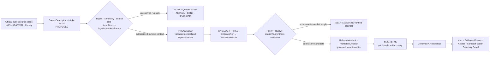
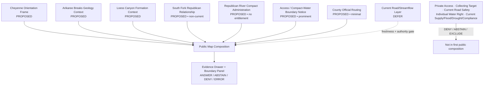
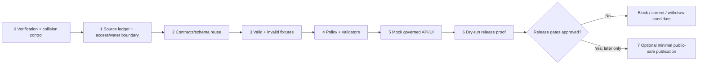

<!-- [KFM_META_BLOCK_V2]
doc_id: NEEDS_VERIFICATION — <REGISTERED_KFM_DOC_ID>
title: Cheyenne County Focus Mode Build Plan — Arikaree Breaks and Republican River Compact Context Without Access or Water-Entitlement Conclusions
type: county-focus-mode-build-plan
version: v0.1-draft
status: draft
owners:
  - NEEDS_VERIFICATION — <OWNER:focus-mode-steward>
  - NEEDS_VERIFICATION — <OWNER:geology-and-landform-reviewer>
  - NEEDS_VERIFICATION — <OWNER:interstate-water-governance-reviewer>
  - NEEDS_VERIFICATION — <OWNER:public-safety-currentness-reviewer>
created: 2026-05-24
updated: 2026-05-24
policy_label: public_draft
county: Cheyenne County, Kansas
county_slug: cheyenne
proof_slice: Arikaree Breaks loess-canyon geology, rural access-currentness restraint, and South Fork Republican River / Republican River Compact administrative-water context
primary_public_safe_boundary: Official geology and interstate-water materials may support generalized, time-attributed public context; KFM must not turn unpaved-road access descriptions into current travel or safety guidance, expose restricted or private locality/access detail, or convert compact, streamflow, or water-administration material into individual water-right, legal-entitlement, current-supply, drought, flood, irrigation-availability, or emergency conclusions.
release_status: NEEDS_VERIFICATION — NOT_RELEASED planning artifact; no release record created or inspected
review_assignments:
  - NEEDS_VERIFICATION — source admission and rights reviewer
  - NEEDS_VERIFICATION — geological/scientific-locality and access-sensitivity reviewer
  - NEEDS_VERIFICATION — interstate-water compact and legal-nondetermination reviewer
  - NEEDS_VERIFICATION — live weather/road/emergency-currentness reviewer
  - NEEDS_VERIFICATION — public-safe release reviewer
correction_path: NEEDS_VERIFICATION — no implemented correction path asserted
rollback_path: NEEDS_VERIFICATION — no implemented rollback path asserted
unverified_repository_paths:
  - PROPOSED / NEEDS_VERIFICATION — docs/focus-modes/cheyenne-county/build-plan.md
  - PROPOSED / NEEDS_VERIFICATION — docs/focus-modes/cheyenne-county/
  - PROPOSED / NEEDS_VERIFICATION — fixtures/focus_modes/cheyenne/
schema_contract_policy_homes:
  - PROPOSED / NEEDS_VERIFICATION — contracts/focus_mode/
  - PROPOSED / NEEDS_VERIFICATION — schemas/contracts/v1/focus_mode/
  - PROPOSED / NEEDS_VERIFICATION — policy/runtime/, policy/sensitivity/, policy/rights/, policy/release/
collision_search:
  completed_register: CONFIRMED — Cheyenne County is absent from the user-supplied completed/collision register; Butler, Wilson, Franklin, Haskell, Grant, Comanche, Labette, Meade, and Norton were additionally excluded because plan artifacts were generated earlier in this continuing series.
  available_project_materials: CONFIRMED — Cheyenne-targeted searches across accessible uploaded/project materials and File Library were performed on 2026-05-24; returned county-plan artifacts belonged to other counties and did not surface a Cheyenne County Focus Mode Build Plan.
  live_repository_index: CONFIRMED — docs/focus-mode/counties/COUNTY_INDEX.md on main was inspected and lists Cheyenne as not-started with validation not-run.
  candidate_rejected: CONFIRMED — Graham County was observed as draft in the live index during candidate screening and was not selected.
  live_repository_control_plane: CONFIRMED — docs/focus-mode/README.md, docs/doctrine/directory-rules.md §6.7, and tools/validators/validate_focus_mode_index.py were inspected during this continuing session; the validator self-identifies as PROPOSED implementation and no validator execution is claimed.
  live_repository_target_search: CONFIRMED — targeted searches for cheyenne_county_focus_mode_build_plan, Cheyenne County Focus Mode, cheyenne-county, and Arikaree Breaks Republican River Compact Cheyenne County returned no matching live-repository result.
  exhaustive_absence: NEEDS_VERIFICATION — unindexed branches, private artifacts, and unsearched prior outputs may still exist.
directory_rules_basis:
  - CONFIRMED — attached Directory Rules.pdf was inspected during this continuing session; it requires responsibility-root placement, schema-home separation, and the RAW → WORK / QUARANTINE → PROCESSED → CATALOG / TRIPLET → PUBLISHED lifecycle.
  - CONFIRMED — live docs/doctrine/directory-rules.md §6.7 was inspected; Focus Modes are cross-cutting compositional proof slices, not root folders, and doctrine identifies docs/focus-modes/<area>-<scope>/ as the documentation pattern.
  - NEEDS_VERIFICATION / DIVERGENCE — observed live county index and README are under docs/focus-mode/ while current doctrine and README prose refer to docs/focus-modes/; landing requires reconciliation before repository work.
official_source_checks:
  - CONFIRMED — Kansas Geological Survey / GeoKansas, Arikaree Breaks page, checked 2026-05-24.
  - CONFIRMED — Kansas Department of Agriculture, Division of Water Resources, Republican River Compact page, checked 2026-05-24.
  - CONFIRMED — Kansas Department of Agriculture, Division of Water Resources main page, checked 2026-05-24.
  - CONFIRMED — Cheyenne County, Kansas official government homepage, checked 2026-05-24.
source_check_date: 2026-05-24
tags: [kfm, focus-mode, cheyenne-county, arikaree-breaks, loess, south-fork-republican-river, republican-river-compact, access-currentness, water-governance, cite-or-abstain, public-safe]
notes:
  - This document is a planning artifact and does not claim implementation, source admission, rights clearance, policy approval, review completion, promotion, publication, correction readiness, or rollback readiness.
  - The checked geology page itself warns that access uses unpaved county roads that may not be passable in wet weather; this plan treats access as official-current and field-safety dependent rather than a static map promise.
  - EvidenceBundle outranks generated language; interstate-water administration and compact background remain administrative/legal-context sources, not individual entitlement or current-supply determinations.
[/KFM_META_BLOCK_V2] -->

<a id="top"></a>

# Cheyenne County Focus Mode Build Plan
## Arikaree Breaks and Republican River Compact Context Without Access or Water-Entitlement Conclusions

> **Product thesis:** Present Cheyenne County’s Arikaree Breaks loess-canyon landscape and South Fork Republican River compact context through official, evidence-visible interpretation while refusing current travel/safety, private-access, water-entitlement, supply, drought, flood, or emergency conclusions.


| Identity / status field | Value |
|---|---|
| County selected | **Cheyenne County, Kansas** |
| Draft status | `PROPOSED` planning artifact; no implementation or publication asserted |
| Distinct proof slice | Arikaree Breaks geological interpretation paired with South Fork Republican River / Republican River Compact administrative-water context and access-currentness restraint |
| Most consequential public-safe boundary | **Generalized geological and compact context is eligible for review; current road/passability/travel safety, private access, individual water-right, legal-entitlement, streamflow/supply, drought/flood, irrigation-availability, and emergency conclusions are withheld or redirected by default.** |
| Official seeds checked in this run | Kansas Geological Survey / GeoKansas; KDA Division of Water Resources Republican River Compact; KDA Division of Water Resources authority page; Cheyenne County official government website |
| Live index collision check | `CONFIRMED` inspected: Cheyenne row presently says `not-started` / `not-run` |
| Candidate rejected during screen | `CONFIRMED`: Graham was not selected because live index showed `draft` |
| Targeted repository search | `CONFIRMED` performed; no Cheyenne plan collision surfaced |
| Accessible project-material search | `CONFIRMED` performed; no Cheyenne plan surfaced among examined results |
| Exhaustive collision absence | `NEEDS_VERIFICATION` |
| Intended landing location | `PROPOSED / NEEDS_VERIFICATION` — `docs/focus-modes/cheyenne-county/build-plan.md` |
| Release / review / rollback | `NOT_RELEASED`; review, correction, and rollback mechanisms `NEEDS_VERIFICATION` |

## Quick links

[Operating posture](#1-operating-posture) · [Why this county](#2-why-this-county) · [Product thesis](#3-product-thesis) · [Scope boundary](#4-scope-boundary) · [First demo layers](#5-first-demo-layers) · [User journeys](#6-user-journeys) · [UI surfaces](#7-ui-surfaces) · [Governed object model](#8-governed-object-model) · [Repository shape](#9-proposed-repository-shape) · [Build phases](#10-build-phases) · [First PR sequence](#11-first-pr-sequence) · [Acceptance checklist](#12-acceptance-checklist) · [Fixture plan](#13-fixture-plan) · [Risk register](#14-risk-register) · [Sources](#15-source-seed-list) · [Verification](#16-open-verification-questions) · [First milestone](#17-recommended-first-milestone) · [Appendices](#appendix-a--public-safe-narrative-skeleton)

---

## Executive build note

**Cheyenne County is selected as a combined landform-and-interstate-water governance proof slice.** The checked Kansas Geological Survey / GeoKansas Arikaree Breaks page identifies a narrow band of ravines and canyons cutting across northern Cheyenne County, explains erosion of loess into steep canyon walls, connects the landscape to Republican River tributaries, and states that access is on unpaved county roads that may not be passable in wet weather.[^s1]

The checked Kansas Department of Agriculture, Division of Water Resources (DWR) Republican River Compact page identifies the South Fork Republican River as flowing through Cheyenne County and describes the compact as allocating basin waters between Colorado, Nebraska, and Kansas. DWR separately identifies its responsibility for Kansas water appropriation functions and the state’s interstate river compacts.[^s2][^s3]

This is a distinctive KFM trust test: the same county supports an attractive public geological narrative, an explicit official access/currentness limitation, and legally consequential interstate-water context. The first product must **show these relationships without offering navigation or safety assurances, private-land/access implications, water-entitlement interpretations, legal-compliance findings, or current supply/flow/hazard verdicts**.

> [!CAUTION]
> ## Public-safe boundary — scenic geology and compact administration are not present-use authority
>
> **KFM may eventually show admitted, generalized Arikaree Breaks geology and time-attributed Republican River Compact context. KFM must not say that an unpaved route is passable or safe now, guide users through private or restricted access, disclose collecting or sensitive locality targets, determine an individual or municipal water entitlement, infer legal compliance, decide present irrigation availability, or convert compact or streamflow materials into flood, drought, supply, or emergency guidance.**
>
> Requests of that kind resolve to `ABSTAIN`, `DENY`, or a verified official-current redirect.

### Evidence boundary at authoring time

| Label | What is established for this plan | What is not established |
|---|---|---|
| `CONFIRMED` | KGS/GeoKansas checked page identifies the Arikaree Breaks in northern Cheyenne County, explains generalized loess-canyon formation, connects drainage to Republican tributaries, and states the unpaved-road wet-weather access limitation; DWR checked compact page connects the South Fork Republican River to Cheyenne County and explains compact administration/allocation context; DWR checked division page establishes agency responsibility context; Cheyenne County official website was checked as a public-service surface; live index, control-plane, and Directory Rules evidence were inspected; targeted collision searches were performed. | — |
| `PROPOSED` | Focus Mode scope, public-safe card/layer design, boundary panel, governed objects, fixtures, policy reason codes, phases, milestone, and intended responsibility-rooted repository paths. | No proposed component is represented as implemented. |
| `NEEDS_VERIFICATION` | Full project-wide collision absence; repository landing after singular/plural path divergence; authoritative county geometry; road/current-access authority; derivative-display rights; sensitivity for locality detail; compact/streamflow public layer fitness; shared contracts/schemas/policies; review assignments; correction/rollback machinery. | — |
| `UNKNOWN` | Present road conditions, access permission, flow/supply/drought/flood conditions, individual water rights, any unindexed prior Cheyenne plan, eventual review/release state, or deployed runtime behavior. | — |

---

# 1. Operating posture

## 1.1 Governing rules applied to Cheyenne County

| KFM rule | Cheyenne County application |
|---|---|
| EvidenceBundle outranks generated language | Geological or compact-water explanation must resolve to admitted official evidence; a fluent map story cannot establish access, safety, or legal entitlement. |
| Cite-or-abstain | Generalized, source-bounded landscape and administrative context may be answered; current access, legal, or operational water questions abstain or deny unless governed current evidence exists. |
| Public clients consume governed surfaces only | The eventual public UI consumes released public-safe artifacts through governed interfaces; it never reads `RAW`, `WORK`, `QUARANTINE`, unpublished candidate material, restricted material, or direct model output. |
| Source roles remain distinct | KGS scientific landscape context, DWR compact administration, county public-service routing, any later live hydrology or travel source, and generated narrative may not collapse into one truth surface. |
| Promotion is a governed transition | A checked public page or extracted map is not a released layer; policy, review, evidence closure, release record, correction, and rollback are required. |
| Sensitivity and currentness fail closed | Site-finding, collecting, private-access implications, road condition claims, and legally or operationally consequential water claims are withheld or redirected unless specifically authorized. |
| AI is interpretive only | AI may explain public-safe context and the reason for abstention; it must not issue road, water, access, legal, or emergency verdicts. |

## 1.2 Truth-label and finite-outcome key

| Token | Meaning in this plan |
|---|---|
| `CONFIRMED` | Verified in this run from checked official public sources, inspected live repository materials, uploaded governing materials, or generated artifact evidence. |
| `PROPOSED` | Design recommendation or planned artifact not verified as implemented. |
| `NEEDS_VERIFICATION` | Checkable before action but not sufficiently established now. |
| `UNKNOWN` | Not resolved from available admissible evidence in this run. |
| `ANSWER` | A bounded public-safe response backed by resolved admitted evidence and allowed policy. |
| `ABSTAIN` | Evidence, authority, freshness, rights, sensitivity, or admissibility is unresolved for the requested claim. |
| `DENY` | The request crosses an access, safety, sensitive-locality, legal-water, private-detail, or operational boundary. |
| `ERROR` | Contract, evidence resolution, validation, or runtime failure prevents a trusted response. |

## 1.3 Public trust membrane



## 1.4 County-specific non-negotiable guardrails

| Guardrail | Required posture | Default outcome when violated |
|---|---|---|
| Unpaved-road and trip currentness | KGS states access roads may not be passable in wet weather; KFM cannot assure present route safety or passability from static context. | `ABSTAIN` — `CURRENT_ROAD_PASSABILITY_REQUIRES_AUTHORITY` |
| Private/restricted access | A visible scenic/geological context layer confers no entry, crossing, parking, or collecting permission. | `DENY` — `PRIVATE_OR_RESTRICTED_ACCESS_NOT_ESTABLISHED` |
| Scientific/locality disturbance | No public layer should direct a user to fragile micro-sites or collecting targets absent an explicit public-use review and rights/sensitivity clearance. | `DENY` — `SCIENTIFIC_LOCALITY_OR_COLLECTING_GUIDANCE_DENIED` |
| Compact as individual entitlement | Compact administration and basin allocations are not KFM determinations of an individual, parcel, well, municipality, or irrigation entitlement. | `DENY` — `COMPACT_NOT_INDIVIDUAL_WATER_ENTITLEMENT` |
| Current water supply or irrigation availability | Administrative background and agreements do not prove current supply or operational availability. | `ABSTAIN` — `CURRENT_WATER_AVAILABILITY_REQUIRES_OFFICIAL_AUTHORITY` |
| Streamflow, flood, drought, and emergency meaning | A scientific or compact layer cannot be transformed into live flood/drought/emergency advice. | `ABSTAIN` — `CURRENT_WATER_HAZARD_GUIDANCE_REQUIRES_AUTHORITY` |
| Regulatory/legal conclusions | KFM cannot determine compact compliance, lawful use, or legal rights from contextual pages. | `DENY` — `LEGAL_OR_COMPLIANCE_CONCLUSION_DENIED` |
| County service routing | County emergency, public-works, or appraiser surfaces may be referenced only as routing/exclusion categories until admitted; not as evidence of current conditions, title, or permission. | `ABSTAIN` / `DENY` — `COUNTY_OPERATIONAL_OR_PROPERTY_DETAIL_OUT_OF_SCOPE` |

---

# 2. Why this county

## 2.1 Selection and collision screen

| Screen | Result | Status | Effect on selection |
|---|---|---:|---|
| User-supplied completed/collision register | Cheyenne County is not listed. | `CONFIRMED` | Eligible to evaluate. |
| Plans generated earlier in this continuing series | Butler, Wilson, Franklin, Haskell, Grant, Comanche, Labette, Meade, and Norton were excluded from reselection. | `CONFIRMED` | Avoids current-series duplicate. |
| Candidate rejection performed during this run | Graham County was observed as `draft` in the live index and was not selected. | `CONFIRMED` | Demonstrates that a surfaced existing-plan signal rejects a candidate. |
| Accessible uploaded/project-material and File Library search | Cheyenne-targeted searches were performed; returned county-plan artifacts belonged to other counties and no Cheyenne plan appeared among examined results. | `CONFIRMED` for performed search; `NEEDS_VERIFICATION` exhaustively | Candidate not rejected. |
| Live repository master county index | Inspected `docs/focus-mode/counties/COUNTY_INDEX.md`; Cheyenne is listed `not-started` with validation `not-run`. | `CONFIRMED` observation only | Candidate not rejected; index status is not release proof. |
| Live repository control-plane evidence | README, Directory Rules, and validator evidence were inspected in this continuing session; singular/plural path divergence remains and no validator execution is claimed. | `CONFIRMED` | Landing remains bounded and conditional. |
| Live repository targeted string search | Searches for `cheyenne_county_focus_mode_build_plan`, `Cheyenne County Focus Mode`, `cheyenne-county`, and `Arikaree Breaks Republican River Compact Cheyenne County` returned no result. | `CONFIRMED` for performed searches | No repository collision discovered. |
| Exhaustive project-wide uniqueness | All branches, private files, and unsearched prior artifacts were not proven absent. | `NEEDS_VERIFICATION` | Repeat before any repository landing. |

> [!NOTE]
> Cheyenne County was selected only after collision screening against the supplied register, generated artifacts in this continuation, accessible project materials/File Library, and inspected live repository evidence. No collision surfaced in the performed checks; exhaustive absence remains a future gate.

## 2.2 Proof-slice rationale

| Selection dimension | Cheyenne County proof value | Evidence basis / status |
|---|---|---|
| Geology and landform | KGS identifies the Arikaree Breaks as ravines/canyons cutting diagonally across northern Cheyenne County and explains their loess-erosion formation. | `CONFIRMED` official source checked.[^s1] |
| Hydrologic setting | KGS identifies drainage toward the Arikaree River and North Fork Republican and notes that the South Fork Republican dissects Cheyenne County. | `CONFIRMED` scientific context.[^s1] |
| Access-currentness challenge | KGS states the Breaks are accessed on unpaved county roads that may not be passable in wet weather. | `CONFIRMED` official limitation; foundational public-safe boundary.[^s1] |
| Interstate water governance | DWR identifies the South Fork Republican River as flowing through Cheyenne County and explains compact administration and basin allocation context. | `CONFIRMED` official administrative context.[^s2] |
| Legal/non-determination challenge | Compact allocations and compliance arrangements can be misread as personal, municipal, or parcel-level water answers. | `PROPOSED` governance objective grounded in source role.[^s2][^s3] |
| Local public-service boundary | Official county website exposes emergency, public works, and appraiser functions. | `CONFIRMED`; route/exclusion posture only.[^s4] |
| Distinct series value | Joins scenic loess canyonland and rural access fitness to interstate water administration, not merely reservoir recreation or groundwater records. | `PROPOSED` comparative rationale. |

## 2.3 Distinct series proof

| Completed or collision-identified proof slice | Boundary already tested | What Cheyenne adds without duplicating it |
|---|---|---|
| Gove County | Geohydrology currentness, fossil/scientific-locality restraint, and private-well nondetermination. | A scenic landform whose official source explicitly identifies wet-weather access limits, paired with interstate compact-water administration. |
| Haskell / Grant counties | Groundwater records, water-right/lawful-use, or subsurface-resource nondetermination. | Surface-river compact allocations and compliance context, not only groundwater/well records. |
| Butler / Norton counties | Reservoir or dynamic refuge/recreation currentness. | Rural landform travel/access fitness plus interstate-water/legal scope, rather than managed-lake conditions. |
| Comanche County | Cave/rock-art/sensitive-locality exposure in a geological landscape. | Loess canyon access safety and compact-water interpretation; no cultural-resource claim required for MVP. |
| Franklin County | Nation-authoritative cultural representation and flood-currentness. | Interstate-water administrative/legal scope and road-access limitation rather than cultural-authority representation. |

## 2.4 Public benefit and governance value

The first Cheyenne product can help the public understand:

- why the Arikaree Breaks appear as dramatic canyonland in far northwest Kansas;
- that the official geological explanation includes a practical wet-weather road-access caution;
- how the South Fork Republican River links Cheyenne County to multi-state water administration;
- why compact materials describe basin/state administration and allocation rather than answering a user’s personal entitlement or present water-supply question;
- why a public map must distinguish educational context from current travel, legal, water, and emergency authority.

## 2.5 Official-source anchors

| Anchor | Supported statement for this plan | Source role | Status |
|---|---|---|---:|
| Arikaree Breaks location | KGS places the rugged canyonland across northern Cheyenne County, extending across state lines. | Scientific/geological context | `CONFIRMED` |
| Loess-canyon formation | KGS explains stream-carved gullies, ravines, and canyons through loess and underlying formations. | Scientific/geological context | `CONFIRMED` |
| Hydrologic relationship | KGS connects the region to Arikaree/North Fork drainage and identifies the South Fork Republican as dissecting Cheyenne County. | Scientific/hydrologic context | `CONFIRMED` |
| Access limitation | KGS states access is on unpaved county roads that may not be passable in wet weather. | Public-use/currentness limitation | `CONFIRMED` |
| Compact/Cheyenne connection | DWR states the South Fork Republican River flows through Cheyenne County in its compact/agreement context. | Interstate administrative-water context | `CONFIRMED` |
| Compact authority and scope | DWR explains compact allocation/administration among Colorado, Kansas, and Nebraska; its division page identifies agency compact and water-appropriation responsibilities. | Administrative/legal-context authority | `CONFIRMED` |
| County current-routing surface | Official county website identifies emergency, public-works, and appraiser service surfaces. | Local administrative/current-routing/exclusion surface | `CONFIRMED`; not evidence of conditions or title |

---

# 3. Product thesis

## 3.1 One-sentence thesis

> **Cheyenne County Focus Mode should let the public explore admitted Arikaree Breaks geological context and bounded Republican River Compact administration context while making it impossible to mistake KFM for present road/access, legal water-entitlement, water-supply, irrigation, flood, drought, or emergency authority.**

## 3.2 What the first product promises

| Promise | Implementation meaning |
|---|---|
| A bounded Cheyenne county frame | Public-safe orientation extent after authoritative geometry and rights admission. |
| Evidence-visible Arikaree Breaks context | General geology and drainage relationships trace to KGS evidence with source-role limitations. |
| Access-currentness visibility | The official wet-weather unpaved-road limitation is prominent in UI and answer behavior. |
| Compact-water scope clarity | DWR administrative context can display only with explicit no-entitlement/no-current-supply limitations. |
| Finite outcomes | Supported broad context may produce `ANSWER`; access, current-conditions, and legal/individual-water questions produce `ABSTAIN` or `DENY`. |
| Reversibility | Any future release requires correction and rollback closure; none are claimed now. |

## 3.3 What the first product does not promise

| Non-promise | Required user-facing posture |
|---|---|
| Whether a road to a scenic feature is passable, safe, or open now | Abstain and route to verified current local/official sources when available. |
| Access permission, parking, entry, crossing, or collecting rights | Deny; public context is not permission. |
| Exact fragile/locality or collecting-target detail | Withhold unless specifically admitted and safe; not part of first product. |
| Individual, municipal, parcel, well, or irrigation entitlement | Deny; compact context is not a legal determination. |
| Current streamflow, water availability, drought, or flood status | Abstain absent separately governed current data/authority. |
| Compliance with the Republican River Compact or any water law | Deny legal/compliance interpretation. |
| Released product or implemented routes | This is a planning artifact only. |

---

# 4. Scope boundary

## 4.1 First-slice classification

| Content family | First-slice posture | Why | Governing boundary |
|---|---:|---|---|
| Cheyenne county orientation extent | `PROPOSED` public-safe | Provides bounded map frame; authoritative geometry remains to verify. | No access/property/legal-water inference. |
| Generalized Arikaree Breaks context card | `PROPOSED` public-safe after admission | KGS supplies official scientific explanation. | No route safety, collecting, or precise-locality interpretation. |
| Loess canyon formation card | `PROPOSED` public-safe after admission | High educational value and stable scientific scope. | Generalized terrain explanation only. |
| Republican tributary relationship card | `PROPOSED` public-safe after admission | KGS supports broad drainage context. | Not current streamflow or hazard guidance. |
| `AccessCurrentnessBoundaryNotice` | `PROPOSED` **priority public-safe card** | KGS explicitly states unpaved roads may be impassable in wet weather. | No current route/passability verdict. |
| `CompactAdministrativeContextCard` | `PROPOSED` public-safe after admission | DWR provides official interstate compact and Cheyenne/South Fork context. | No personal/right/supply/compliance conclusion. |
| `WaterEntitlementBoundaryNotice` | `PROPOSED` **priority public-safe card** | Prevents compact narrative from becoming legal/user-specific advice. | Deny legal/individual-entitlement inferences. |
| County official current-routing card | `PROPOSED` minimal | Official county site can identify local service routes. | No emergency, road, title, or access conditions copied into MVP. |
| Live road/passability or travel-safety map | `EXCLUDE` / `DEFER` | Requires fit current local/road/weather authority and expiry behavior. | No static safety layer. |
| Streamflow/drought/flood/current-supply layer | `DEFER` | Requires separately admitted live source and claim-specific policy. | No current or legal inference. |
| Water-right/compact-compliance or individual-entitlement layer | `DENY` | Legally consequential and outside public interpretation scope. | Not a public product. |
| Sensitive scientific/collecting/private-access detail | `DENY` / `DEFER` | Not necessary for first public interpretation. | Withhold by default. |

## 4.2 Public-safe content requirements

Every first-slice public object must expose, where applicable:

- authority and declared source role;
- checked date and temporal/currentness basis;
- evidence resolution state;
- rights and sensitivity posture;
- spatial generalization level;
- road/access-currentness limitation where scenic use is implied;
- compact/legal-water nondetermination limitation where DWR context is displayed;
- review, release, correction, and rollback state before any public publication.

## 4.3 County-specific denied and abstained content

| Public request example | Outcome | Candidate reason code |
|---|---:|---|
| “Can I drive the Arikaree Breaks route today, and is it safe after rain?” | `ABSTAIN` | `CURRENT_ROAD_PASSABILITY_REQUIRES_AUTHORITY` |
| “Give me a route onto private land or the best off-road access point.” | `DENY` | `PRIVATE_OR_RESTRICTED_ACCESS_NOT_ESTABLISHED` |
| “Where should I collect specimens or find fragile exposures?” | `DENY` | `SCIENTIFIC_LOCALITY_OR_COLLECTING_GUIDANCE_DENIED` |
| “Does the compact guarantee water for this well, parcel, farm, or municipality?” | `DENY` | `COMPACT_NOT_INDIVIDUAL_WATER_ENTITLEMENT` |
| “Is irrigation water available right now from the South Fork?” | `ABSTAIN` | `CURRENT_WATER_AVAILABILITY_REQUIRES_OFFICIAL_AUTHORITY` |
| “Is Cheyenne County currently in flood or drought danger based on this river context?” | `ABSTAIN` | `CURRENT_WATER_HAZARD_GUIDANCE_REQUIRES_AUTHORITY` |
| “Did a user or state comply legally with compact obligations?” | `DENY` | `LEGAL_OR_COMPLIANCE_CONCLUSION_DENIED` |
| “Who owns this route or parcel, and may I enter?” | `DENY` | `COUNTY_OPERATIONAL_OR_PROPERTY_DETAIL_OUT_OF_SCOPE` |

---

# 5. First demo layers

## 5.1 Prioritized first public-safe layer/card set

| Priority | Layer or card | Public purpose | Checked official seed | Evidence / policy gate | Status |
|---:|---|---|---|---|---:|
| 1 | `AccessAndCompactWaterBoundaryNotice` | Makes road/access and water-entitlement limits unavoidable. | KGS + DWR + county surface[^s1][^s2][^s3][^s4] | Boundary policy; reason-code fixtures; no unsafe detail. | `PROPOSED` |
| 2 | `ArikareeBreaksGeologyContextCard` | Presents general landform setting and educational explanation. | KGS / GeoKansas[^s1] | Source admission; EvidenceBundle; generalized spatial scope. | `PROPOSED` |
| 3 | `LoessCanyonFormationCard` | Explains erosion/material relationship. | KGS / GeoKansas[^s1] | Scientific role badge; no collecting or site-stability inference. | `PROPOSED` |
| 4 | `AccessCurrentnessNotice` | Demonstrates why scenic-drive questions require current authority. | KGS / GeoKansas[^s1] | Preserve wet-weather-road limitation; no route/passability conclusion. | `PROPOSED` |
| 5 | `SouthForkRepublicanContextCard` | Shows broad river relationship to the county. | KGS + DWR[^s1][^s2] | Separate scientific relationship from water administration; no flow/safety claim. | `PROPOSED` |
| 6 | `RepublicanRiverCompactAdministrativeCard` | Explains county relevance to interstate water governance. | KDA/DWR Republican River Compact[^s2] | Administrative/legal-context role; no entitlement/compliance conclusion. | `PROPOSED` |
| 7 | `CountyOfficialRoutingCard` | Identifies available local official service routing. | Cheyenne County official homepage[^s4] | Minimal linkout/exclusion only; no operational property/emergency data. | `PROPOSED` |
| 8 | Current road condition / wet-weather travel layer | Potential future official-current service only if authority and expiry rules exist. | Source not admitted this run. | Currentness, authority, liability, and rollback review. | `DEFER` |
| 9 | Streamflow/current water-status layer | Potential future time-aware service only with authoritative source. | DWR points to live-source context; not admitted here. | Hydrology, legal nondetermination, expiry, and error behavior. | `DEFER` |
| 10 | Water-entitlement/compliance/private-access/locality display | Unsafe or legally inappropriate for first public proof slice. | Boundary policy. | Prohibited first slice. | `DENY` |

## 5.2 Map composition



## 5.3 Layer-card truth contract

| Required field | Purpose | Failure posture |
|---|---|---|
| `layer_id` / `card_id` | Deterministic public-object reference candidate. | `ERROR` in fixture/runtime when absent. |
| `county_scope: cheyenne` | Prevent scope drift and cross-border overclaim. | `ABSTAIN` if mismatched. |
| `source_role` | Distinguish geological context, compact administration, county routing, and any later current source. | `ABSTAIN`; no release if absent. |
| `temporal_basis` | Captures checked date and whether a claim is stable context or current-source dependent. | `ABSTAIN` for present-condition questions without fitness. |
| `spatial_generalization` | Proves public geology is generalized and not a route/locality target. | `DENY` if unsafe or absent where required. |
| `access_limitation` | Preserves no-passability/no-permission promise. | Fail public validation if omitted from travel-relevant object. |
| `water_legal_limitation` | Preserves no-entitlement/no-compliance/no-supply conclusion. | Fail public validation if omitted from compact object. |
| `evidence_refs` | Requires claim support. | `ABSTAIN`; candidate release fails if unresolved. |
| `rights_status` / `sensitivity` | Controls derivative representation and disclosure. | Quarantine/deny when unresolved or restricted. |
| `policy_decision_ref` | Binds representation to evaluated policy. | Fail closed if missing. |
| `limitations` | Makes county-specific non-determination readable in UI and API. | Fail public validation if missing. |
| `correction_ref` / `rollback_ref` | Enables reversal after any future release. | No publication without closure. |

---

# 6. User journeys

## 6.1 Public learning journeys

| Journey | User action | Public-safe response | Trust affordance |
|---|---|---|---|
| Landform orientation | Opens Cheyenne and selects Arikaree Breaks context. | Shows KGS-backed generalized landform explanation. | Evidence Drawer states scientific scope and no-route/access promise. |
| Hydrologic setting | Selects South Fork Republican context. | Shows source-bounded river relationship to Cheyenne County. | Scientific versus administrative badges remain separate. |
| Interstate-water learning | Selects Compact Administration card. | Explains DWR-backed compact context at state/basin scale. | “Not an individual water entitlement or current supply answer” visible. |
| Why navigation/status is missing | Opens Boundary Notice. | Explains wet-weather-road limitation and legal/current-water scope. | Reason-code examples and official-routing posture visible. |

## 6.2 Trust-demonstration journeys

| Query or interaction | Expected outcome | Demonstrated KFM property |
|---|---:|---|
| “What official source says the Arikaree Breaks cross Cheyenne County?” | `ANSWER` after evidence resolution | Scientific context with citation. |
| “What does the official source say about roads to the Breaks?” | `ANSWER` only as a source limitation | Access-currentness caution without travel advice. |
| “Why is the South Fork relevant to interstate water administration?” | `ANSWER` at DWR administrative scope | Source-role and legal-scope separation. |
| “Can I drive there this afternoon?” | `ABSTAIN` | Static geology source does not replace current road/weather authority. |
| User opens a compact card lacking EvidenceBundle or policy decision | `ABSTAIN` | Evidence/policy closure required. |

## 6.3 Denied or abstained requests

| Request | Runtime result | Public explanation seed | Candidate reason code |
|---|---:|---|---|
| “Are the Breaks roads passable today after rain?” | `ABSTAIN` | KGS notes wet-weather passability risk; current road condition requires appropriate authority. | `CURRENT_ROAD_PASSABILITY_REQUIRES_AUTHORITY` |
| “Map a private access shortcut or tell me where I may enter.” | `DENY` | KFM does not provide property-entry or restricted-access permission. | `PRIVATE_OR_RESTRICTED_ACCESS_NOT_ESTABLISHED` |
| “Where are the best fragile exposures or collecting spots?” | `DENY` | KFM does not facilitate disturbance or unreviewed scientific-locality targeting. | `SCIENTIFIC_LOCALITY_OR_COLLECTING_GUIDANCE_DENIED` |
| “Does the Republican River Compact guarantee this farmer water?” | `DENY` | Interstate compact context does not determine individual entitlements. | `COMPACT_NOT_INDIVIDUAL_WATER_ENTITLEMENT` |
| “Is water available to irrigate this parcel right now?” | `ABSTAIN` / `DENY` | KFM does not make private/legal/current-supply determinations from compact context. | `CURRENT_WATER_AVAILABILITY_REQUIRES_OFFICIAL_AUTHORITY` |
| “Is current streamflow evidence a flood or drought emergency?” | `ABSTAIN` | Present hazard guidance requires competent official-current evidence. | `CURRENT_WATER_HAZARD_GUIDANCE_REQUIRES_AUTHORITY` |
| “Has a state complied with its legal compact obligation?” | `DENY` | KFM does not render legal/compliance determinations. | `LEGAL_OR_COMPLIANCE_CONCLUSION_DENIED` |
| “Use the county appraiser surface to establish title/access.” | `DENY` | Administrative property services are not title or access authority within this product. | `COUNTY_OPERATIONAL_OR_PROPERTY_DETAIL_OUT_OF_SCOPE` |

---

# 7. UI surfaces

## 7.1 Required surfaces

| Surface | Public function | Cheyenne-specific trust behavior | Status |
|---|---|---|---:|
| Header | Identifies county, evidence/release state, and primary boundary. | Persistent badge: “No live access or water-entitlement verdict.” | `PROPOSED` |
| Map canvas | Shows released public-safe contextual composition. | Generalized landform and administrative context only; no sensitive route/locality or current-condition layer. | `PROPOSED` |
| Layer drawer | Toggles public-safe cards/layers. | Each card displays role, checked date, generalization, and access/legal-water limitation badges. | `PROPOSED` |
| Evidence Drawer | Resolves visible claims to sources and limitations. | Opens KGS wet-road limitation and DWR compact non-entitlement scope alongside relevant cards. | `PROPOSED` |
| Answer panel | Answers bounded context questions. | Can explain geology and compact context; cannot answer current route/water/legal questions. | `PROPOSED` |
| Denial panel | Explains refusal without exposing unsafe detail. | Refuses access, collecting, and entitlement/compliance requests; abstains for current conditions. | `PROPOSED` |
| Timeline / time-basis surface | Communicates stable context versus current-source dependency. | Shows source checked date; marks route/passability/flow/status as “official-current required.” | `PROPOSED` |
| **Access & Compact-Water Boundary Panel** | Makes primary public-safe boundary visible. | Displays access caution, no-entitlement rule, official routing, and reason codes. | `PROPOSED` |
| Source-role legend | Differentiates geology, administrative-water, and county current-routing sources. | Prevents scientific/administrative/legal/operational collapse. | `PROPOSED` |
| Release/correction panel | Exposes future release and reversal status. | States `NOT_RELEASED` in draft/mock experience. | `PROPOSED` |

## 7.2 Legend vocabulary

| UI label | Meaning | May support | Must not be used as |
|---|---|---|---|
| `Scientific landform context` | KGS-backed generalized explanation of the Arikaree Breaks. | Bounded geology and drainage interpretation. | Road-condition, access-permission, hazard, or legal-water answer. |
| `Access-currentness caution` | Official source warns that travel conditions may change. | Explaining abstention/redirect behavior. | A current route recommendation. |
| `Interstate water administration` | DWR-backed compact background and administrative context. | Basin/state relationship explanation. | Individual entitlement, lawful use, compliance, or current-supply determination. |
| `County official routing` | County website identifies local service categories. | Redirect/exclusion posture. | Emergency status, title, access, or operational evidence. |
| `Deferred current data` | Useful status source not admitted for public KFM display. | Backlog/review posture. | Current fact or prediction. |
| `Withheld locality/access` | Precision or permission not public-safe. | Explanation of absence. | Confirmation or reconstruction clue. |
| `Draft / mock` | Planning/testing only. | UI/policy proof. | Published truth. |

## 7.3 UI / API / policy / evidence sequence

```mermaid
sequenceDiagram
    actor U as Public user
    participant UI as Explorer UI
    participant API as Governed API
    participant P as Policy gate
    participant E as Evidence resolver
    participant R as Released artifacts
    participant O as Verified official-current redirect
    U->>UI: Open Cheyenne / ask landform or water question
    UI->>API: Request public context envelope
    API->>P: Evaluate source role, scope, time, sensitivity, and legal/currentness risk
    alt Generalized geology or compact context allowed
        P->>E: Resolve EvidenceRef
        E->>R: Read released public-safe EvidenceBundle
        R-->>E: EvidenceBundle + limitations
        E-->>API: Resolved evidence
        API-->>UI: ANSWER + citations + boundary notice
        UI-->>U: Context card + Evidence Drawer
    else Current road/flow/supply/hazard question
        P-->>API: ABSTAIN + official-current obligation
        API->>O: Optional verified official route only
        API-->>UI: ABSTAIN/redirect envelope; no KFM verdict
        UI-->>U: Boundary panel + current-source direction
    else Access/collecting/legal-entitlement/compliance request
        P-->>API: DENY + reason code
        API-->>UI: DENY envelope; no restricted detail
        UI-->>U: Safe explanation only
    end
```

---

# 8. Governed object model

## 8.1 Shared KFM object families to reuse or verify

| Object family | Role in the Cheyenne proof slice | County-specific requirement | Implementation status |
|---|---|---|---:|
| `SourceDescriptor` | Declares authority, source role, checked date, rights, sensitivity, and intended use. | Separate KGS geology/access limitation, DWR compact administration, and county routing sources. | `PROPOSED / NEEDS_VERIFICATION` |
| `EvidenceRef` | Stable link from visible claim/card to proof. | Required for all claim-bearing geology, hydrology, and compact-context cards. | `PROPOSED / NEEDS_VERIFICATION` |
| `EvidenceBundle` | Resolved evidence package outranking generated language. | Retains access-currentness and no-entitlement/no-current-supply limitations. | `PROPOSED / NEEDS_VERIFICATION` |
| `PolicyDecision` | Enforces allow/abstain/deny obligations. | Must deny access/collecting/entitlement/compliance and abstain on current route/water/hazard without fit evidence. | `PROPOSED / NEEDS_VERIFICATION` |
| `RuntimeResponseEnvelope` | Carries finite outcome: `ANSWER`, `ABSTAIN`, `DENY`, `ERROR`. | Must not leak sensitive route/locality/property or imply legal/current water status. | `PROPOSED / NEEDS_VERIFICATION` |
| `CitationValidationReport` | Confirms visible claims remain within admitted evidence scope. | Must fail if a KGS page becomes current travel advice or DWR compact page becomes personal legal guidance. | `PROPOSED / NEEDS_VERIFICATION` |
| `ReleaseManifest` | Records any future public-safe composition. | Cannot include current access, sensitive locality, individual-water entitlement, or unsupported hazard/supply content. | `PROPOSED / NEEDS_VERIFICATION` |
| `AIReceipt` | Records generated-output dependencies and outcome. | Generated text cannot create access permission, entitlement, or current-condition truth. | `PROPOSED / NEEDS_VERIFICATION` |
| `ReviewRecord` | Records required review findings. | Geological/locality, currentness/access, water/legal scope, and public-release review required. | `PROPOSED / NEEDS_VERIFICATION` |
| `CorrectionNotice` | Corrects released output after source or interpretation change. | Needed if route/status or compact-scope text is later shown to be misleading. | `PROPOSED / NEEDS_VERIFICATION` |
| `RollbackPlan` / rollback reference | Enables reversible withdrawal. | Required before any output is called published. | `PROPOSED / NEEDS_VERIFICATION` |

## 8.2 County-specific object candidates

| Candidate object | Purpose | Public-safe fields | Excluded meaning |
|---|---|---|---|
| `ArikareeBreaksGeologyContextCard` | Presents generalized KGS-supported landform explanation. | county scope, scientific role, checked date, EvidenceRef, limitations. | No route, access, collecting, hazard, or current condition. |
| `AccessCurrentnessNotice` | Encodes wet-weather/passability limitation in machine-readable form. | source scope, checked date, official-current requirement, reason code. | No statement that a route is passable, closed, or safe now. |
| `SouthForkRepublicanContextCard` | Presents broad watercourse relationship. | river relation, source roles, evidence, and currentness limitation. | No live flow/flood/drought/supply answer. |
| `CompactAdministrativeContextCard` | Explains DWR compact relationship at public-context level. | agency, compact name, county-relevant contextual statement, no-entitlement limitation. | No legal, individual, parcel, or compliance determination. |
| `WaterEntitlementBoundaryNotice` | Encodes legal/current-water refusal rule. | prohibited classes, official authority, reason codes, and obligations. | No individual right or allocation record. |
| `CountyOfficialRoutingCard` | Identifies local official service categories for redirects. | service category and official base surface only. | No title, passability, emergency, property, or permission assertion. |

## 8.3 Source-role anti-collapse rules

| Source family | Valid role in Cheyenne Focus Mode | Must not collapse into |
|---|---|---|
| KGS / GeoKansas Arikaree Breaks page | Scientific landform/drainage context and stated access limitation. | Live route guidance, collecting permission, private-access truth, hazard verdict, or water law. |
| KDA/DWR Republican River Compact page | Administrative/interstate-water context and compact-background authority. | Individual water right, lawful use, present supply, legal-compliance, or emergency conclusion. |
| KDA/DWR division page | Agency-role and official-routing context. | County-specific determination without admitted source. |
| Cheyenne County official homepage | Local official service-routing/exclusion surface. | Title/access, road safety, emergency status, or operational detail within MVP. |
| Later live weather/streamflow/road sources | Candidate official-current routing or data after admission. | Static or uncited present-condition layer. |
| Generated AI narrative | Downstream evidence/policy-bounded explanation. | Evidence, legal authority, review approval, or release state. |

## 8.4 Minimal public runtime response JSON — allowed geological context

```json
{
  "schema_version": "v1",
  "object_type": "RuntimeResponseEnvelope",
  "response_id": "kfm.runtime.cheyenne.arikaree_geology.answer.v1",
  "county": "cheyenne",
  "outcome": "ANSWER",
  "answer_scope": "public_safe_generalized_geology_context",
  "answer": "Checked Kansas Geological Survey material identifies the Arikaree Breaks as a narrow ravine-and-canyon landscape cutting across northern Cheyenne County and explains that streams eroded thick loess deposits to form the terrain.",
  "evidence_refs": [
    "kfm.evidence_ref.cheyenne.kgs_arikaree_context.v1"
  ],
  "source_roles": [
    "scientific_landform_context"
  ],
  "spatial_generalization": "county_and_regional_context_only",
  "temporal_basis": {
    "source_checked_on": "2026-05-24",
    "claim_currentness": "stable_scientific_context_only"
  },
  "limitations": [
    "This response does not indicate current road passability, site access, collecting permission, or trip safety.",
    "This response does not determine present water, hazard, or emergency conditions."
  ],
  "policy_label": "public_safe_candidate",
  "review_state": "NEEDS_VERIFICATION",
  "release_state": "NOT_RELEASED",
  "citation_validation": "NEEDS_VERIFICATION",
  "spec_hash": "NEEDS_VERIFICATION"
}
```

## 8.5 Minimal public runtime response JSON — allowed compact context

```json
{
  "schema_version": "v1",
  "object_type": "RuntimeResponseEnvelope",
  "response_id": "kfm.runtime.cheyenne.compact_context.answer.v1",
  "county": "cheyenne",
  "outcome": "ANSWER",
  "answer_scope": "public_safe_interstate_water_administration_context",
  "answer": "Checked Kansas Division of Water Resources material identifies the South Fork Republican River as flowing through Cheyenne County in its Republican River Compact context and explains that the compact allocates basin waters among Colorado, Nebraska, and Kansas.",
  "evidence_refs": [
    "kfm.evidence_ref.cheyenne.dwr_republican_compact_context.v1"
  ],
  "source_roles": [
    "interstate_water_administration_context"
  ],
  "temporal_basis": {
    "source_checked_on": "2026-05-24",
    "claim_currentness": "agency_published_compact_context_only"
  },
  "limitations": [
    "This response does not determine individual or municipal water entitlement, lawful use, compact compliance, irrigation availability, or current supply.",
    "This response does not provide flood, drought, or emergency guidance."
  ],
  "policy_label": "public_safe_candidate",
  "review_state": "NEEDS_VERIFICATION",
  "release_state": "NOT_RELEASED",
  "citation_validation": "NEEDS_VERIFICATION",
  "spec_hash": "NEEDS_VERIFICATION"
}
```

## 8.6 Abstention JSON — current road or water availability

```json
{
  "schema_version": "v1",
  "object_type": "RuntimeResponseEnvelope",
  "response_id": "kfm.runtime.cheyenne.current_access_or_water.abstain.v1",
  "county": "cheyenne",
  "outcome": "ABSTAIN",
  "reason_code": "CURRENT_ROAD_PASSABILITY_REQUIRES_AUTHORITY",
  "message": "Official geological context notes that access roads may not be passable in wet weather, but KFM does not determine current travel conditions or present water availability from static context sources.",
  "evidence_refs": [
    "kfm.evidence_ref.cheyenne.kgs_access_limitation.v1",
    "kfm.evidence_ref.cheyenne.dwr_compact_scope_boundary.v1"
  ],
  "official_redirects": [
    {
      "authority": "Appropriate current local road/weather/emergency authority",
      "purpose": "present travel or public-safety conditions",
      "status": "NEEDS_VERIFICATION"
    },
    {
      "authority": "Kansas Department of Agriculture, Division of Water Resources",
      "purpose": "official water administration or compact-related inquiry"
    }
  ],
  "policy_label": "public_abstain",
  "review_state": "NEEDS_VERIFICATION",
  "release_state": "NOT_RELEASED",
  "spec_hash": "NEEDS_VERIFICATION"
}
```

## 8.7 Denial JSON — water entitlement or access guidance

```json
{
  "schema_version": "v1",
  "object_type": "RuntimeResponseEnvelope",
  "response_id": "kfm.runtime.cheyenne.entitlement_or_access.deny.v1",
  "county": "cheyenne",
  "outcome": "DENY",
  "reason_code": "COMPACT_NOT_INDIVIDUAL_WATER_ENTITLEMENT",
  "message": "KFM does not determine individual, parcel, farm, or municipal water entitlement from interstate compact context and does not provide private-access or collecting guidance for scenic localities.",
  "evidence_refs": [
    "kfm.evidence_ref.cheyenne.public_safe_boundary.v1"
  ],
  "withheld_fields": [
    "individual_or_municipal_water_determination",
    "private_access_or_permission_detail",
    "collecting_target_or_micro_locality",
    "current_supply_or_hazard_conclusion"
  ],
  "policy_label": "public_deny",
  "review_state": "NEEDS_VERIFICATION",
  "release_state": "NOT_RELEASED",
  "spec_hash": "NEEDS_VERIFICATION"
}
```

## 8.8 Deterministic identity and `spec_hash` posture

| Item | Candidate identity pattern | Hash posture |
|---|---|---|
| Source descriptor | `kfm.source.cheyenne.<authority>.<source_slug>.v1` | Hash normalized identity, role, checked date, rights, sensitivity, and limitations. |
| Evidence bundle | `kfm.evidence_bundle.cheyenne.<claim_scope>.v1` | Hash admitted evidence, generalization/currentness/legal limitations, and policy/review links. |
| Card/layer | `kfm.card.cheyenne.<public_safe_card>.v1` / `kfm.layer.cheyenne.<layer>.v1` | Hash display specification plus evidence, policy, and scope constraints. |
| Runtime fixture | `kfm.runtime.cheyenne.<scenario>.<outcome>.v1` | Hash fixture per verified canonical utility. |
| Release candidate | `kfm.release.cheyenne.focus_mode.v0_1` | Hash manifest and proof/review/correction/rollback closure. |

> [!IMPORTANT]
> These identity patterns and `spec_hash` behaviors are `PROPOSED`. Existing identifier grammar, hashing utilities, and shared object contracts must be inspected before implementation.

---

# 9. Proposed repository shape

## 9.1 Directory Rules basis and observed divergence

| Finding | Label | Consequence for this plan |
|---|---:|---|
| Attached `Directory Rules.pdf` states that location encodes responsibility, governance, and lifecycle, and topic does not justify a new root. | `CONFIRMED` inspected during this continuing session | Cheyenne is a Focus Mode lane within responsibility roots, not a new top-level county/geology/water folder. |
| Attached Directory Rules states lifecycle `RAW → WORK / QUARANTINE → PROCESSED → CATALOG / TRIPLET → PUBLISHED` and that promotion is a governed state transition, not a file move. | `CONFIRMED` | No webpage, map, response, or source extraction is public merely because it is captured or rendered. |
| Live `docs/doctrine/directory-rules.md` §6.7 states Focus Modes are multi-root compositional proof slices and gives `docs/focus-modes/<area>-<scope>/`. | `CONFIRMED` doctrine | Intended documentation path follows `docs/focus-modes/cheyenne-county/`, pending reconciliation. |
| Live `docs/focus-mode/README.md` restates the doctrine and refers to plural `docs/focus-modes/`, while itself and the county index exist under singular `docs/focus-mode/`. | `CONFIRMED` observed divergence | Do not silently create a sibling lane without documented resolution. |
| Live index lists Cheyenne `not-started`; inspected validator exists but self-identifies as `PROPOSED implementation`. | `CONFIRMED` observed evidence | No lane existence, validator execution, or canonical landing is claimed. |

> [!WARNING]
> **All repository paths below remain `PROPOSED / NEEDS_VERIFICATION` unless explicitly identified as inspected live evidence.** This artifact neither modifies the repository nor authorizes a path decision. Resolve the singular/plural Focus Mode control-plane divergence and verify actual authority homes before implementation.

## 9.2 Candidate path table

| Responsibility root | Proposed path | Purpose | Verification gate |
|---|---|---|---|
| Human documentation | `docs/focus-modes/cheyenne-county/build-plan.md` | This plan as a county proof-slice document. | Reconcile singular/plural control-plane convention and any accepted ADR. |
| Human documentation companions | `docs/focus-modes/cheyenne-county/{README.md,layer-registry.md,evidence-model.md,acceptance-checklist.md,source-seed-list.md,public-safety-notes.md,access-currentness-and-scientific-locality-notes.md,interstate-water-and-legal-scope-notes.md}` | Boundary and control-plane documentation. | Confirm lane convention and index update procedure. |
| Semantic contracts | `contracts/focus_mode/` | Reuse or extend shared object meaning. | Inspect existing contracts; avoid parallel family. |
| Machine schemas | `schemas/contracts/v1/focus_mode/` | Shared machine-checkable payload shapes. | Verify schema authority and existing definitions. |
| Fixtures | `fixtures/focus_modes/cheyenne/{valid,invalid}/` | Finite-outcome and fail-closed proof inputs. | Verify fixture-home convention. |
| UI shell | `apps/explorer-web/src/focus-modes/cheyenne/` | Mock/public UI behind governed API. | Verify live app conventions. |
| Validators | `tools/validators/` | Shared checks for evidence/currentness/access/sensitivity/legal-water behavior. | Inspect validator registry and avoid duplicates. |
| Source catalog | `data/catalog/sources/cheyenne/source_descriptors.yaml` | Admitted public-source descriptor records. | Rights, sensitivity, time, and role review. |
| Published artifacts | `data/published/layers/cheyenne/`, `data/published/api_payloads/focus-modes/cheyenne.json` | Future released public-safe artifacts only. | Not first-PR; governed promotion required. |
| Release decisions | `release/candidates/cheyenne-focus-mode/`, `release/manifests/cheyenne-focus-mode-v<n>.json` | Future candidate/manifest records. | Review, correction, and rollback verified. |
| Optional pipeline composition | `pipeline_specs/focus_modes/cheyenne/` | Only if distinct current-source composition is justified. | Avoid when shared composition suffices. |

## 9.3 Proposed responsibility-rooted tree

```text
# PROPOSED / NEEDS_VERIFICATION — no repository changes asserted

docs/
└── focus-modes/
    └── cheyenne-county/
        ├── README.md
        ├── build-plan.md
        ├── layer-registry.md
        ├── evidence-model.md
        ├── acceptance-checklist.md
        ├── source-seed-list.md
        ├── public-safety-notes.md
        ├── access-currentness-and-scientific-locality-notes.md
        └── interstate-water-and-legal-scope-notes.md

contracts/
└── focus_mode/                         # shared semantic family; verify/reuse

schemas/
└── contracts/v1/focus_mode/            # shared machine shape; verify/reuse

fixtures/
└── focus_modes/cheyenne/
    ├── valid/
    │   ├── focus_mode_payload.public_safe_context.valid.json
    │   ├── evidence_bundle.arikaree_geology.valid.json
    │   ├── evidence_bundle.compact_administration.valid.json
    │   ├── runtime_response.access_currentness_boundary.valid.json
    │   └── runtime_response.water_legal_scope_boundary.valid.json
    └── invalid/
        ├── current_road_passability_from_static_geology.invalid.json
        ├── private_access_permission_from_map.invalid.json
        ├── collecting_locality_target.invalid.json
        ├── compact_as_individual_entitlement.invalid.json
        ├── compact_as_current_supply.invalid.json
        ├── river_context_as_flood_drought_guidance.invalid.json
        ├── compact_compliance_as_kfm_legal_verdict.invalid.json
        ├── county_appraiser_as_title_or_access.invalid.json
        ├── unresolved_evidence_ref.invalid.json
        ├── model_output_as_evidence.invalid.json
        └── public_raw_work_quarantine_access.invalid.json

apps/
└── explorer-web/src/focus-modes/cheyenne/     # mock/UI only after contract verification

data/
├── catalog/sources/cheyenne/                  # admitted descriptors only
└── published/                                 # prohibited until governed promotion

release/
├── candidates/cheyenne-focus-mode/            # later candidate only
└── manifests/                                 # later governed release only
```

## 9.4 Placement prohibitions

- Do **not** create root-level `cheyenne/`, `arikaree-breaks/`, `republican-river/`, `water-compacts/`, or `focus_modes/` authority folders.
- Do **not** place machine schemas inside `contracts/focus_mode/` or source-derived records beside semantic contracts.
- Do **not** use `apps/web/` for new Focus Mode work when inspected doctrine identifies `apps/explorer-web/`.
- Do **not** publish unreviewed route/passability, private-access, collecting-locality, or sensitive-scientific-location detail.
- Do **not** transform compact or streamflow context into individual entitlement, compliance, current supply, flood/drought, or emergency truth.
- Do **not** allow the UI, map tiles, narratives, or generated responses to read `RAW`, `WORK`, or `QUARANTINE`.
- Do **not** populate `data/published/` or `release/manifests/` because this plan exists.

---

# 10. Build phases

| Phase | Goal | Entry gates | Planned outputs | Exit validation | Rollback posture |
|---:|---|---|---|---|---|
| 0 | Verify collision and control-plane placement | Register checked; live index/README/rules/validator inspected; targeted searches repeated near PR time | Verification note; reconciled landing decision; collision receipt candidate | No surfaced Cheyenne collision; path divergence resolved or blocked | Stop without repository addition if unresolved |
| 1 | Admit source ledger and primary boundary | KGS/DWR/county seeds inventoried; access/legal/currentness questions explicit | Descriptor candidates; Access & Compact-Water Boundary Notice; role/scope matrix | Each source has role, time basis, rights/sensitivity, and allowed scope; unsafe current/legal/detail claims excluded | Preserve notes only; do not promote |
| 2 | Confirm/reuse shared contracts and schemas | Existing object-family inventory performed | Reuse decision or governed extension proposal | No parallel authority homes | Revert proposed changes; retain docs |
| 3 | Build valid and invalid fixtures | Contracts and boundary sufficiently specified | Public-safe context fixtures; high-risk access/legal/currentness pack | Unsafe cases fail closed; no pass claim without run evidence | Delete unaccepted fixtures |
| 4 | Policy and validator proof | Fixture family exists | Policy candidates and evidence/access/currentness/legal-scope validators | All finite outcomes covered; unsafe cases block | Revert candidate; block release |
| 5 | Mock governed API and UI | Contracts, fixtures, and policy posture agreed | Mock envelopes; Evidence Drawer; Access/Compact-Water Boundary Panel | No internal stores or unsafe current/legal/precision claims; `NOT_RELEASED` visible | Disable mock route/component |
| 6 | Dry-run release proof | Sources admitted; reviews/tests available | Candidate dossier, proof report, correction/rollback drafts | No public alias; closure tested only | Withdraw candidate |
| 7 | Optional minimal public-safe publication | Explicit evidence, policy, rights, review, and release approvals | Narrow released static context via governed interfaces only | Limitations/currentness visible; rollback actionable | Activate recorded correction/rollback |



---

# 11. First PR sequence

> [!IMPORTANT]
> **Live source integration and public release are not first-PR work.** The first work must resolve placement/collision verification and encode the access/currentness and compact-water legal-scope boundary before any current-condition or public-release behavior is attempted.

| Order | Proposed PR objective | Principal content | Acceptance emphasis |
|---:|---|---|---|
| 1 | Verification and documentation control | Repeat collision search; reconcile or block Focus Mode path divergence; authorized control-plane docs only. | No duplicate plan; no guessed canonical path. |
| 2 | Source ledger/admission and public-safe boundary | KGS/DWR/county source candidates; role/time/sensitivity matrix; boundary notices. | Scientific and administrative context does not become access, current-condition, or legal-entitlement truth. |
| 3 | Contracts/schemas or shared-object reuse | Inspect existing shared object families; reuse or govern extension. | No parallel homes; contract/schema/policy separation. |
| 4 | Valid and invalid fixtures | Safe geology/compact examples plus access/collecting/entitlement/supply/hazard failures. | Fail-closed proof before live features. |
| 5 | Policy and validators | Evidence, source role, currentness, access, sensitivity, and legal-water checks. | All finite outcomes represented; unsafe cases block. |
| 6 | Mock governed API/UI | Mock envelopes; Evidence Drawer; Access & Compact-Water Boundary Panel. | Trust demonstration, not live product. |
| 7 | Dry-run release proof | Candidate manifest; validation/review/correction/rollback references. | Rehearsal only; no publication. |
| 8 | Only then optional minimal public-safe publication | Narrow stable context after completed gates. | Public output remains traceable, scoped, and reversible. |

---

# 12. Acceptance checklist

## 12.1 Governance and evidence

- [ ] Collision check is repeated immediately before any repository landing.
- [ ] Cheyenne remains absent from newly discovered county-plan artifacts.
- [ ] Every public claim-bearing layer/card/answer resolves `EvidenceRef` to `EvidenceBundle`.
- [ ] Every source declares authority role, checked date/currentness, intended use, rights, and sensitivity posture.
- [ ] KGS scientific, DWR compact-administration, county-routing, and generated-narrative roles remain distinct.
- [ ] Generated language is never treated as proof, permission, legal interpretation, or current official advice.
- [ ] `ANSWER`, `ABSTAIN`, `DENY`, and `ERROR` fixture paths exist.
- [ ] No validation/pass/release claim is made without execution evidence and governance closure.

## 12.2 Public/sensitive boundary

- [ ] Access & Compact-Water Boundary Panel is prominent.
- [ ] Unpaved-road/wet-weather limitation is visible wherever scenic access is discussed.
- [ ] No public route/passability/safety promise is derived from static geological context.
- [ ] No private access, entry, parking, or collecting guidance is given.
- [ ] No precise fragile/scientific locality target is disclosed in the first product.
- [ ] DWR compact context cannot become an individual, parcel, farm, municipal, or irrigation entitlement.
- [ ] Current supply, flow, drought, flood, or emergency questions abstain or route to verified official-current authority.
- [ ] Compact-compliance/legal determinations are denied.
- [ ] County appraiser/emergency/public-works surfaces are not treated as title, access, or current-condition evidence in MVP.

## 12.3 Product and UI

- [ ] Header states county, draft/release state, and “No live access or water-entitlement verdict.”
- [ ] Map renders only admitted/released public-safe static context in any eventual public mode.
- [ ] Layer drawer exposes source role, evidence state, checked date, generalization, and boundary badges.
- [ ] Evidence Drawer clearly separates scientific geology from interstate administrative-water context.
- [ ] Answer panel supports bounded geological and compact-context questions only.
- [ ] Denial panel handles access, collecting, entitlement, and compliance requests without leakage.
- [ ] Timeline/time-basis panel distinguishes stable context from current-source-dependent claims.
- [ ] Mock/demo state remains visibly `NOT_RELEASED`.

## 12.4 Repository, validation, release, correction, and rollback

- [ ] Directory Rules basis is cited in any future path-bearing PR.
- [ ] `docs/focus-mode/` versus `docs/focus-modes/` divergence is reconciled or blocks landing.
- [ ] Existing contracts, schemas, policy, fixtures, and validator families are inspected before extension.
- [ ] No parallel schema, contract, policy, source-registry, proof, receipt, release, or publication authority home is created.
- [ ] Public UI has no route or payload path to `RAW`, `WORK`, or `QUARANTINE`.
- [ ] Candidate release proves no unsafe access/currentness, locality, legal-entitlement, supply/hazard, or property output.
- [ ] Correction and rollback references exist before publication.
- [ ] Promotion, if ever approved, is a governed state transition rather than a file move.

---

# 13. Fixture plan

## 13.1 Valid fixture candidates

| Fixture candidate | Scenario | Evidence requirement | Expected outcome | Status |
|---|---|---|---:|---:|
| `focus_mode_payload.public_safe_context.valid.json` | Initial Cheyenne payload contains generalized geology, compact context, and boundary notices only. | Resolved public-safe evidence refs or explicit mock state. | Future schema/policy pass. | `PROPOSED` |
| `evidence_bundle.arikaree_geology.valid.json` | KGS-backed Arikaree generalized context. | Checked descriptor/admitted claim scope and generalization. | `ANSWER` eligible after release. | `PROPOSED` |
| `evidence_bundle.compact_administration.valid.json` | DWR-backed interstate administrative context. | Checked descriptor, no-entitlement/no-compliance limitations. | `ANSWER` eligible at bounded scope after release. | `PROPOSED` |
| `runtime_response.access_currentness_boundary.valid.json` | User asks why road passability is not answered. | KGS access limitation and policy decision. | `ANSWER` about boundary / `ABSTAIN` on current status. | `PROPOSED` |
| `runtime_response.water_legal_scope_boundary.valid.json` | User asks why compact cannot answer personal rights. | DWR role and policy boundary. | `ANSWER` about limitation / `DENY` on entitlement. | `PROPOSED` |
| `runtime_response.official_current_redirect.valid.json` | User asks present road or water-hazard status. | Verified redirect policy once established. | `ABSTAIN` with redirect. | `PROPOSED` |

## 13.2 Invalid / fail-closed fixture candidates

| Invalid fixture | Failure exercised | Expected outcome / failed rule | Primary boundary relevance |
|---|---|---|---|
| `current_road_passability_from_static_geology.invalid.json` | Static KGS context becomes travel-safe/passable-now conclusion. | `ABSTAIN`; `CURRENT_ROAD_PASSABILITY_REQUIRES_AUTHORITY`. | Highest |
| `private_access_permission_from_map.invalid.json` | Public map suggests private entry or route permission. | `DENY`; `PRIVATE_OR_RESTRICTED_ACCESS_NOT_ESTABLISHED`. | Highest |
| `collecting_locality_target.invalid.json` | Map/AI provides collecting target or fragile micro-locality. | `DENY`; `SCIENTIFIC_LOCALITY_OR_COLLECTING_GUIDANCE_DENIED`. | High |
| `compact_as_individual_entitlement.invalid.json` | DWR compact context becomes personal/parcel/farm/municipal right conclusion. | `DENY`; `COMPACT_NOT_INDIVIDUAL_WATER_ENTITLEMENT`. | Highest |
| `compact_as_current_supply.invalid.json` | Administrative context becomes present supply/irrigation-availability answer. | `ABSTAIN`; `CURRENT_WATER_AVAILABILITY_REQUIRES_OFFICIAL_AUTHORITY`. | Highest |
| `river_context_as_flood_drought_guidance.invalid.json` | Geological/compact layer becomes live hazard/emergency advice. | `ABSTAIN`; `CURRENT_WATER_HAZARD_GUIDANCE_REQUIRES_AUTHORITY`. | High |
| `compact_compliance_as_kfm_legal_verdict.invalid.json` | Map/AI states compact compliance or legal result. | `DENY`; `LEGAL_OR_COMPLIANCE_CONCLUSION_DENIED`. | High |
| `county_appraiser_as_title_or_access.invalid.json` | County service surface becomes title/access truth. | `DENY`; `COUNTY_OPERATIONAL_OR_PROPERTY_DETAIL_OUT_OF_SCOPE`. | High |
| `missing_access_or_water_limitation.invalid.json` | Context card omits key boundary statement. | Validation failure; release block. | High |
| `unresolved_evidence_ref.invalid.json` | Visible claim lacks resolved EvidenceBundle. | `ABSTAIN`; release block. | Core invariant |
| `model_output_as_evidence.invalid.json` | AI narrative is cited as proof or official/legal advice. | `ERROR` / release block; `AI_NOT_EVIDENCE`. | Core invariant |
| `public_raw_work_quarantine_access.invalid.json` | Public payload references internal lifecycle stores. | `ERROR` / release block; `PUBLIC_INTERNAL_LIFECYCLE_ACCESS`. | Core invariant |

## 13.3 Fixture-to-test matrix

| Test family | Valid fixtures | Invalid fixtures | Required result |
|---|---|---|---|
| Evidence closure | Arikaree and compact evidence bundles | unresolved evidence; AI-as-evidence | No public claim without resolved evidence. |
| Access currentness | Access-boundary response | static-road passability; private-access permission | No present travel/permission answer from static context. |
| Scientific-locality restraint | Generalized geology card | collecting target/locality invalid | No public targeting or disturbance guidance. |
| Legal-water scope | Compact context answer | entitlement; compliance; current-supply invalids | No individual/legal/current-water conclusion. |
| Hazard/emergency currentness | Official-current redirect candidate | river context as flood/drought guidance | No KFM emergency guidance. |
| Administrative-property boundary | Minimal county-routing card | appraiser-as-title/access invalid | No title/access determination. |
| Lifecycle membrane | Public-safe payload | RAW/WORK/QUARANTINE access | Public surface cannot cross trust membrane. |
| Release closure | Candidate-only output | missing limitation/review/correction/rollback | No published state without closure. |

## 13.4 Highest-risk invalid fixture pack — access and compact-water overclaim

| Pack element | Trigger | Required detection | Expected public behavior |
|---|---|---|---|
| Travel safety overclaim | Static geology page becomes present road/passability/trip-safety answer. | Temporal/currentness policy fails. | `ABSTAIN`; current authority required. |
| Access permission inference | Map feature or narrative implies entry/crossing/private access. | Access/property policy fails. | `DENY`; no directions or permission statement. |
| Locality targeting | User receives collecting or fragile-exposure location assistance. | Scientific-locality sensitivity rule fails. | `DENY`; generalized education only. |
| Water-entitlement overclaim | Compact/admin content is applied to a person, well, parcel, farm, or municipality. | Legal-water policy fails. | `DENY`; DWR/appropriate legal-authority routing. |
| Current water/hazard overclaim | River/compact context becomes supply, irrigation, drought, flood, or emergency status. | Currentness/authority gate fails. | `ABSTAIN`; no verdict. |
| Compliance verdict | AI/map declares a compact or water-law compliance outcome. | Legal-adjudication gate fails. | `DENY`; context only. |

---

# 14. Risk register

| Risk | Likelihood | Impact | Required mitigation | Release posture |
|---|---:|---:|---|---|
| Scenic geology card is read as current safe-access guidance | High | High | Prominent wet-weather-access limitation; no routes/passability; abstention fixture. | No current travel layer in first slice. |
| Public experience implies private access or collecting permission | Medium | High/Critical | No access/collecting layer; denial reason codes; review for any feature precision. | `DENY`. |
| Fragile/scientific locality is over-exposed | Medium | High | Generalization, no micro-locality targets, sensitivity review. | `DEFER` / `DENY`. |
| Compact context becomes individual water entitlement | High | Critical | Nondetermination notice, DWR role labels, and denial tests. | `DENY`. |
| Administrative-water narrative becomes current supply/irrigation claim | High | Critical | Currentness boundary; separate admitted current source required. | `ABSTAIN`. |
| River context becomes flood/drought/emergency advice | Medium | Critical | Official-current redirect only; no alerting product. | `ABSTAIN`. |
| Compact-compliance/legal result inferred by AI | Medium | Critical | Legal-scope prohibition, reason code, and validator. | `DENY`. |
| County services become title/access/emergency truth | Medium | High | Minimal routing only; appraiser/emergency data excluded from MVP. | `DENY` / `ABSTAIN`. |
| Rights/derivative display unclear for maps/assets | Medium | High | Source-descriptor rights review before copying/display. | Quarantine until resolved. |
| Source-role collapse in generated narrative | High | High | Evidence/policy-scoped prompts, citation validation, and AI receipts. | Block answer/release. |
| Singular/plural Focus Mode path drift hardens | High | Medium | Reconcile before repository landing. | Planning artifact only. |
| Existing Cheyenne plan discovered late | Low/Medium | Medium | Repeat collision search before PR; never overwrite. | Stop and reconcile. |
| Mock content mistaken as released truth | Medium | High | Persistent draft labels and no public alias. | Mock only until gates pass. |

---

# 15. Source seed list

## 15.1 Current official public sources actually checked in this run

| ID | Checked source | Authority / source role | Verified source anchor | Intended public-safe use | Allowed claim scope | Rights, sensitivity, operational/currentness, and publication limits | Status |
|---|---|---|---|---|---|---|---:|
| `S1` | Kansas Geological Survey / GeoKansas, **Arikaree Breaks**[^s1] | Official scientific/geological and public-geology interpretation source | Identifies Arikaree Breaks as canyonland cutting diagonally across northern Cheyenne County; explains loess erosion; identifies drainage relationships; states access uses unpaved county roads that may not be passable in wet weather. | Generalized geology cards; hydrologic relationship card; Access Currentness Notice. | Generalized scientific and source-stated access-limitation context only. | No current road/passability/safety answer, private-access permission, collecting target, precise sensitivity claim, or water/legal conclusion. Image/text derivative-display rights require admission review. | `CONFIRMED` checked |
| `S2` | Kansas Department of Agriculture, Division of Water Resources, **Republican River Compact**[^s2] | Official interstate-water administrative/legal-context authority | States the South Fork Republican River flows through Cheyenne County; explains compact multi-state allocation/administration background and public supporting materials. | Compact Administrative Context Card and Water Entitlement Boundary Notice. | Administrative/basin/public-background context only. | No individual/municipal entitlement, lawful-use, compliance, current-supply, irrigation-availability, drought/flood, or emergency conclusion. Linked maps/data require separate admission and sensitivity review. | `CONFIRMED` checked |
| `S3` | Kansas Department of Agriculture, Division of Water Resources, **Division of Water Resources**[^s3] | State water-administration and official-routing authority | States DWR administers Kansas water-appropriation responsibilities, water structures, and four interstate river compacts. | Authority-role label and official redirect basis. | Agency responsibility context only. | Does not establish a Cheyenne-specific current condition or any entitlement/permission; specific claims require fit source and policy. | `CONFIRMED` checked |
| `S4` | Cheyenne County, Kansas, **Official Government Homepage**[^s4] | Local administrative/current-routing surface | Provides official service routes including emergency, public-works, and appraiser functions. | County official-routing card and exclusion/currentness design input. | Existence of local official-service surfaces only. | No ingestion of property, emergency, road-condition, or operational details into MVP; not title/access/current-safety evidence. | `CONFIRMED` checked |

## 15.2 Candidate official sources for later verification

| Candidate official source family | Candidate use | Why later, not now | Required pre-admission verification |
|---|---|---|---|
| Cheyenne County or City of St. Francis official road, tourism, or emergency-current surfaces | Official-current travel/access redirect for Arikaree Breaks. | Current road/safety authority not sufficiently established for KFM display in this run. | Authority, update cadence, expiry, liability/scope, and allowed public fields. |
| USGS real-time gages linked through DWR Republican River material | Time-aware streamflow context or redirect. | Live data can be misread as flood, supply, or legal meaning. | Station relevance, cadence, missing-data semantics, expiry, and no-hazard/no-entitlement policy. |
| RRCA official multi-state site and current meeting/accounting materials | Compact administration/update context. | Legal/current administrative interpretation requires narrow source-role review. | Authority, effective period, claim scope, and no legal adjudication. |
| Kansas official boundary source or Census TIGER/Line | County orientation geometry. | Not admitted in this plan. | Authority, vintage, CRS, rights, and simplification receipt. |
| National Weather Service Goodland current weather/hazard products | Official-current redirect for travel/weather risk. | KFM must not become an emergency/weather advisory surface. | Geographic fit, refresh/expiry behavior, and redirect-only posture. |
| KGS or other official ecology/soil material for northwestern Kansas | Generalized landform/habitat enrichment. | Not necessary for first boundary proof; possible locality sensitivity. | Rights, ecology/soil role, generalization, and no land-use/private inference. |

## 15.3 Source admission checklist

- [ ] Create or reuse a verified `SourceDescriptor` contract and canonical source-registry/catalog home.
- [ ] Record publisher, source identity, checked date, stable locator, and source-role classification.
- [ ] Declare roles: `scientific_landform_context`, `access_currentness_limitation`, `interstate_water_administration_context`, `water_authority_redirect`, and `county_official_routing`.
- [ ] Record rights/terms and derivative-display permission before copying images, maps, features, or extensive text.
- [ ] Record sensitivity/generalization posture before representing any locality, route, scientific exposure, or access-adjacent feature.
- [ ] Record freshness/expiry obligations before using road, streamflow, weather, drought, flood, or emergency information.
- [ ] Preserve legal-water nondetermination: compact context never becomes individual entitlement, compliance, or supply truth.
- [ ] Resolve `EvidenceRef` to `EvidenceBundle` before claim promotion.
- [ ] Run high-risk negative fixtures before any release candidate.
- [ ] Keep unresolved, unsafe, restricted, or stale source-derived material in `WORK` or `QUARANTINE`; never summarize it into public truth.

---

# 16. Open verification questions

## 16.1 Repository-path and existing-plan verification

- [ ] Has any Cheyenne County Focus Mode Build Plan been created in an unindexed branch, private artifact store, or prior output not returned by accessible searches?
- [ ] How should the live singular `docs/focus-mode/` index/README paths be reconciled with doctrine references to plural `docs/focus-modes/`?
- [ ] When should a drafted plan affect the county index: artifact creation, complete lane creation, or validated lane?
- [ ] Has `validate_focus_mode_index.py` ever been executed against the live branch, and what results are authorized to modify index status?

## 16.2 Existing shared contract/schema/policy family verification

- [ ] Which shared `SourceDescriptor`, `EvidenceRef`, `EvidenceBundle`, `PolicyDecision`, `RuntimeResponseEnvelope`, `CitationValidationReport`, `ReviewRecord`, `ReleaseManifest`, `CorrectionNotice`, and `RollbackPlan` definitions exist?
- [ ] Are `contracts/focus_mode/`, `schemas/contracts/v1/focus_mode/`, `fixtures/focus_modes/<area>/`, and `apps/explorer-web/src/focus-modes/<area>/` implemented consistently?
- [ ] Does an existing reason-code vocabulary cover access currentness, locality/collecting sensitivity, water-entitlement denial, compact legal-scope limits, and hazard abstention?
- [ ] What validator/policy machinery enforces no public `RAW`/`WORK`/`QUARANTINE` access and no AI-as-evidence behavior?

## 16.3 Source authority, rights, geometry, and currentness

- [ ] What authoritative public county-boundary geometry and derivative-display rule should be admitted?
- [ ] What official current source can responsibly answer or redirect road/passability/travel-safety inquiries for the Arikaree Breaks, if any?
- [ ] What KGS images or maps may be displayed or transformed in a public product, under what terms and attribution?
- [ ] Which DWR/RRCA compact materials are appropriate for a public educational card without creating legal or user-specific inference?
- [ ] Which live streamflow or hydrologic sources, if any, may be displayed only with timestamps, expiry, and non-hazard/non-entitlement limitations?
- [ ] What detail threshold prevents a generalized geology card from enabling private-access or locality-targeting behavior?

## 16.4 Sensitivity and review duties

- [ ] Which reviewer approves locality/generalization and collecting-disturbance constraints for the landform experience?
- [ ] Which reviewer owns water-compact legal-scope and nondetermination policy?
- [ ] Should all road/access questions abstain, or can a verified official-current redirect be surfaced without reproducing status?
- [ ] What county property, emergency, and public-works surfaces must be excluded from AI context unless separately admitted?

## 16.5 Correction, rollback, and release machinery

- [ ] What release-object and manifest naming convention is canonical?
- [ ] What correction process applies if a public card later appears to promise access, route safety, or water entitlement?
- [ ] What rollback target immediately disables an unsafe access/water/legal output while preserving audit history?
- [ ] What proof pack demonstrates no unsafe locality, access, currentness, legal-water, or hazard content before publication?

---

# 17. Recommended first milestone

## Milestone 1 — Cheyenne Access and Compact-Water Boundary Control Plane

### Milestone statement

> Establish a documentation-and-fixture-first Cheyenne County proof slice in which admitted generalized Arikaree Breaks geology and Republican River Compact administrative context may be explained, while current road/passability guidance, private access, collecting/locality targets, individual water entitlement, current supply/irrigation availability, flood/drought advice, and legal-compliance determinations are machine-testable fail-closed outcomes.

### Planned milestone deliverables

| Deliverable | Purpose | Status |
|---|---|---:|
| Placement and collision verification note | Confirms Cheyenne remains unused and records/reconciles path divergence. | `PROPOSED` |
| Cheyenne build plan and companion boundary notes | Establishes public-safe scope and access/legal-water rule. | `PROPOSED` |
| Checked-source seed ledger | Records KGS/DWR/county roles, currentness, rights, and admission questions. | `PROPOSED` |
| Shared-object reuse decision | Prevents parallel contract/schema/policy/source/release homes. | `PROPOSED` |
| Valid public-safe context fixture set | Demonstrates bounded geology and compact answers. | `PROPOSED` |
| Highest-risk invalid access/legal-water pack | Demonstrates road/access/locality/entitlement/supply/hazard/compliance failures. | `PROPOSED` |
| Mock finite-outcome examples | Demonstrates `ANSWER`, `ABSTAIN`, `DENY`, and `ERROR` without release. | `PROPOSED` |

### Definition of done

- [ ] Collision checks are rerun and recorded; no Cheyenne collision is surfaced.
- [ ] Intended documentation lane is reconciled with Directory Rules and observed live control-plane/index convention.
- [ ] KGS descriptor candidate retains scientific role, spatial generalization, and wet-weather-road limitation.
- [ ] DWR compact descriptor candidate retains administrative/legal-context role and no-entitlement/no-compliance/no-current-supply limitations.
- [ ] County descriptor candidate is limited to official-routing/exclusion posture.
- [ ] `AccessAndCompactWaterBoundaryNotice` is specified and visible in the mock/public design.
- [ ] `DENY` fixtures cover private access, collecting/locality targeting, individual entitlement, and compliance verdicts.
- [ ] `ABSTAIN` fixtures cover current road passability, water availability, and flood/drought/emergency status.
- [ ] No live integration, review-completion, validation-pass, promotion, or publication claim is made.
- [ ] Correction and rollback obligations are documented for any future release.

### Go / no-go decision table

| Decision | Required evidence | Result if absent |
|---|---|---|
| **GO** to documentation/control-plane PR | Resolved landing path, repeated no-collision check, source-role ledger, and review path. | No repository landing. |
| **GO** to fixtures/policy PR | Verified shared-object homes and agreed boundary/reason-code contract. | Planning docs only. |
| **GO** to mock UI/API | Fixtures and policy tests demonstrate fail-closed finite outcomes. | No data-bearing mock surface. |
| **GO** to dry-run release proof | Admitted sources, rights/sensitivity/currentness/legal-scope review, evidence closure, citation validation, and correction/rollback drafts. | No release candidate. |
| **GO** to public publication | Governed promotion decision and completed public-safe gates. | `NOT_RELEASED`; abstain from publication claims. |

---

# Appendix A — Public-safe narrative skeleton

## A.1 Landing narrative

**Cheyenne County: rugged landforms and interstate-water context with visible boundaries**

Cheyenne County supports a public orientation experience unlike the reservoir and urban proof slices. A checked Kansas Geological Survey source explains the Arikaree Breaks as a striking loess-canyon landscape in northern Cheyenne County. Checked Kansas Division of Water Resources material explains why the South Fork Republican River makes the county relevant to interstate compact administration. Each visible card should expose source role, evidence status, checked date, and limitation.

## A.2 Boundary narrative

A scenic geological page can state a visitor-use caution without serving as real-time route guidance. A compact administration page can explain the basin without granting or denying water entitlement. KFM therefore makes access and water-scope boundaries central: it does not promise road passability, access permission, collecting opportunities, legal water rights, current irrigation availability, flood/drought status, or emergency advice.

## A.3 Map narrative

A public-safe map may eventually include:

1. a verified Cheyenne county orientation frame;
2. a KGS-attributed generalized Arikaree Breaks geology card;
3. a generalized loess-canyon formation card;
4. a broad South Fork Republican relationship card;
5. a DWR-attributed Republican River Compact administrative-context card;
6. the prominent Access & Compact-Water Boundary Notice;
7. minimal verified official routing for current-condition questions.

It does not include private-access routes, collecting/locality targets, present road-passability claims, individual water-right or legal-compliance determinations, current supply/irrigation conclusions, or flood/drought/emergency guidance.

## A.4 Evidence Drawer narrative

For each visible card, the drawer should show:

- **Source role:** scientific landform context, access-currentness limitation, interstate-water administration, or official routing;
- **Time basis:** checked date and whether the claim is stable context or current-source dependent;
- **Allowed claim scope:** generalized public interpretation only;
- **Forbidden inference:** route safety, private access, collecting, entitlement, compliance, current supply, or hazard status;
- **Review/release state:** draft until gates pass;
- **Correction/rollback:** required before any public release.

---

# Appendix B — Required negative-path reason-code categories

| Reason-code category | Candidate code | Trigger | Expected outcome |
|---|---|---|---:|
| Current road/passability | `CURRENT_ROAD_PASSABILITY_REQUIRES_AUTHORITY` | Present route/travel safety asked from static geological context. | `ABSTAIN` |
| Private/restricted access | `PRIVATE_OR_RESTRICTED_ACCESS_NOT_ESTABLISHED` | Access, entry, parking, or permission assistance requested. | `DENY` |
| Locality/collecting restraint | `SCIENTIFIC_LOCALITY_OR_COLLECTING_GUIDANCE_DENIED` | Collecting or fragile/locality targeting requested. | `DENY` |
| Compact not individual entitlement | `COMPACT_NOT_INDIVIDUAL_WATER_ENTITLEMENT` | Compact context applied to an individual, well, parcel, farm, user, or municipality. | `DENY` |
| Current water availability | `CURRENT_WATER_AVAILABILITY_REQUIRES_OFFICIAL_AUTHORITY` | Present supply or irrigation-availability conclusion requested. | `ABSTAIN` |
| Current hazard guidance | `CURRENT_WATER_HAZARD_GUIDANCE_REQUIRES_AUTHORITY` | Flood, drought, or emergency interpretation requested from contextual evidence. | `ABSTAIN` |
| Legal/compliance conclusion | `LEGAL_OR_COMPLIANCE_CONCLUSION_DENIED` | KFM asked to judge compact or water-law compliance. | `DENY` |
| County operation/property detail | `COUNTY_OPERATIONAL_OR_PROPERTY_DETAIL_OUT_OF_SCOPE` | Appraiser/emergency/public-works route used as title/access/current-status evidence. | `DENY` / `ABSTAIN` |
| Source admission unresolved | `SOURCE_ADMISSION_UNRESOLVED` | Source material invoked before rights/sensitivity/currentness admission. | `ABSTAIN` / quarantine |
| Evidence unresolved | `EVIDENCE_BUNDLE_UNRESOLVED` | Claim lacks resolved evidence. | `ABSTAIN` |
| Generated output misuse | `AI_NOT_EVIDENCE` | Generated language presented as proof or legal/current official advice. | `ERROR` / release block |
| Trust-membrane violation | `PUBLIC_INTERNAL_LIFECYCLE_ACCESS` | Public surface reads `RAW`, `WORK`, or `QUARANTINE`. | `ERROR` / release block |

---

# Appendix C — References and evidence-use note

## C.1 Official public sources checked on 2026-05-24

[^s1]: Kansas Geological Survey / GeoKansas, **Arikaree Breaks**. Checked 2026-05-24. [Official source page](https://geokansas.ku.edu/arikaree-breaks). Used for generalized Arikaree Breaks location, loess-canyon formation, broad Republican tributary relationship, and the source-stated wet-weather unpaved-road access limitation. It is not used to claim current road safety/passability, permission, collecting rights, private access, or legal/current water conditions.

[^s2]: Kansas Department of Agriculture, Division of Water Resources, **Republican River Compact**. Checked 2026-05-24. [Official source page](https://www.agriculture.ks.gov/divisions-programs/division-of-water-resources/interstate-rivers-and-compacts/republican-river-compact). Used for public administrative context that the South Fork Republican River flows through Cheyenne County and for compact administration/allocation background. It is not used to determine an individual or municipal entitlement, compliance, present supply, irrigation availability, flood, drought, or emergency status.

[^s3]: Kansas Department of Agriculture, Division of Water Resources, **Division of Water Resources**. Checked 2026-05-24. [Official source page](https://www.agriculture.ks.gov/divisions-programs/division-of-water-resources). Used only for DWR agency-role and official-routing context, including its water-appropriation and interstate-compact responsibilities.

[^s4]: Cheyenne County, Kansas, **Official Government Homepage**. Checked 2026-05-24. [Official source page](https://cncoks.us/). Used only to establish an official local public-service routing surface, including emergency, public-works, and appraiser service categories. It is not used as evidence of current conditions, title, access, permission, emergency status, or road passability.

## C.2 Repository and project-material evidence checked

| Evidence inspected | Use in this plan | Status |
|---|---|---:|
| Uploaded `Directory Rules.pdf` | Responsibility-root doctrine, lifecycle invariant, schema-home separation, and public trust-path principles. | `CONFIRMED` inspected in continuing session |
| Live repository `docs/doctrine/directory-rules.md` §6.7 on `main` | Current Focus Mode placement doctrine and multi-root composition pattern. | `CONFIRMED` inspected |
| Live repository `docs/focus-mode/counties/COUNTY_INDEX.md` on `main` | Collision/index check; Cheyenne observed `not-started` / `not-run`; Graham observed as `draft` and rejected during selection. | `CONFIRMED` inspected |
| Live repository `docs/focus-mode/README.md` on `main` | Control-plane evidence and singular/plural path divergence. | `CONFIRMED` inspected |
| Live repository `tools/validators/validate_focus_mode_index.py` on `main` | Validator vocabulary and self-described proposed status; no execution claimed. | `CONFIRMED` inspected |
| Targeted live-repository searches for Cheyenne plan/county/proof terms | Collision prevention. | `CONFIRMED` performed; no match surfaced |
| Targeted searches across accessible uploaded/project materials and File Library for Cheyenne plan terms | Collision prevention against visible corpus. | `CONFIRMED` performed; returned plan artifacts belonged to other counties; no Cheyenne plan surfaced among examined results; exhaustive absence `NEEDS_VERIFICATION` |

## C.3 Evidence-use note

This build plan is **not** an `EvidenceBundle`, source-admission record, `PolicyDecision`, `ReviewRecord`, `ReleaseManifest`, or published product. Official source checking in this run supports selection of Cheyenne County and design of a conservative public-safe boundary. Any future implementation must separately admit source material, verify rights, freshness, and sensitivity, resolve EvidenceRefs, validate contracts and fixtures, pass policy/review/release gates, and preserve correction and rollback before public publication.

---

[Back to top](#top)
