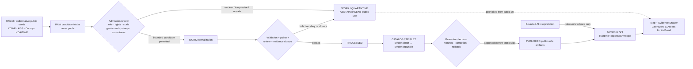
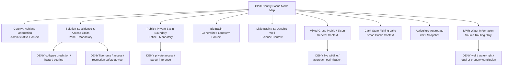
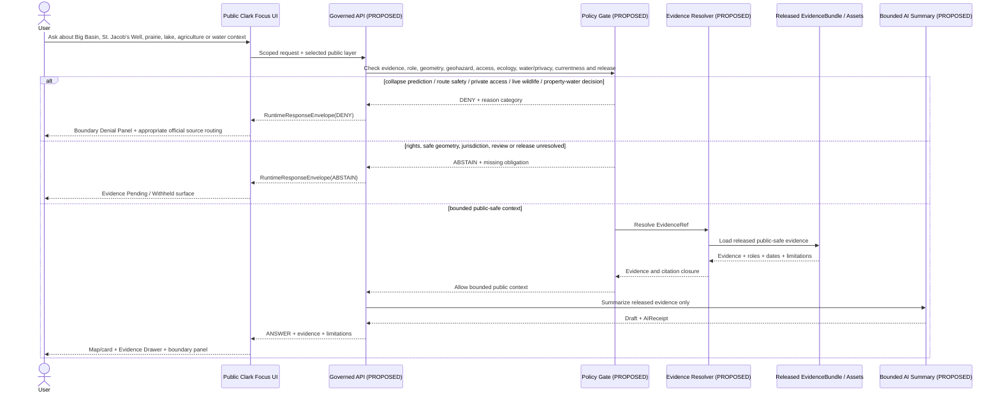
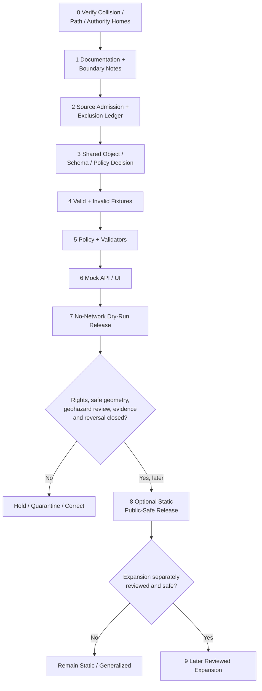

<!-- KFM_META_BLOCK_V2
doc_id: NEEDS_VERIFICATION
title: Clark County Focus Mode Build Plan
type: standard
version: v1
status: draft
owners: [NEEDS_VERIFICATION]
created: 2026-05-22
updated: 2026-05-22
policy_label: public_draft
repository_path: NEEDS_VERIFICATION - candidate only: docs/focus-modes/clark-county/clark_county_focus_mode_build_plan.md
schema_contract_policy_homes: NEEDS_VERIFICATION - inspect the live repository, accepted ADRs, per-root READMEs and shared object-family authority before any extension or landing decision
review_assignments: NEEDS_VERIFICATION - geohazard/subsidence, public-access/safety, ecology/wildlife, private-property, groundwater/water-governance, rights, documentation and release review duties must be established before implementation or publication
correction_path: NEEDS_VERIFICATION
rollback_path: NEEDS_VERIFICATION
release_status: NEEDS_VERIFICATION - planning artifact only; no implementation, source admission, promotion or publication claimed
related:
  - Directory Rules.pdf (consulted in this run; supplied canonical placement doctrine)
  - KFM county Focus Mode completed-county register supplied in the series prompt
  - Jefferson County, Hamilton County, Graham County, Mitchell County, Marshall County and Logan County generated during this continuation sequence
tags: [kfm, focus-mode, clark-county, ashland, big-basin, little-basin, st-jacobs-well, red-hills, solution-subsidence, sinkhole, kdwp, kgs, state-fishing-lake, agriculture, geohazard, public-safe-boundary]
notes:
  - CONFIRMED: Clark County is not included in the completed-county register available in this series context and is distinct from the immediately preceding generated county-plan artifacts.
  - CONFIRMED: Accessible uploaded/File Library project materials were searched during this run; no Clark County Focus Mode Build Plan artifact was returned.
  - CONFIRMED: Directory Rules.pdf was consulted during this run before any repository-path proposals were made.
  - CONFIRMED: Official or authoritative public-source pages were checked during this run for Big Basin Prairie Preserve, Big Basin/Little Basin and St. Jacob's Well science context, Clark State Fishing Lake, county administration, agricultural aggregates and water-source-routing context.
  - NEEDS_VERIFICATION: A live KFM repository, complete project index, accepted ADR set, implemented object homes, source-rights register, review assignments and release machinery were not inspected for final collision, implementation or landing verification.
  - PROPOSED: Clark County is selected as the next active-subsidence, public-access and private-boundary proof slice.
-->

<a id="top"></a>

# Clark County Focus Mode Build Plan

> **Product thesis:** Build a public-safe Clark County Focus Mode around Big Basin Prairie Preserve, Little Basin and St. Jacob's Well that teaches Red Hills-edge solution-subsidence, mixed-grass prairie, public recreation and working-landscape context - without converting public geologic features into live hazard or route-safety judgments, exposing unnecessary precise hazard or wildlife-use details, implying access to private land, or turning groundwater and agricultural sources into legal or individual conclusions.


| Identity / status field | Determination |
|---|---|
| Selected county | **Clark County, Kansas** |
| Selection status | **PROPOSED** as the next KFM county Focus Mode proof slice. |
| Completed-register comparison | **CONFIRMED** within available series evidence: Clark County is absent from the user-supplied completed register and is not one of the newly generated Jefferson, Hamilton, Graham, Mitchell, Marshall or Logan plans. |
| Available-material collision search | **CONFIRMED** for the accessible project corpus searched during this run: queries for `Clark County Focus Mode Build Plan`, `clark_county_focus_mode_build_plan.md`, and Clark/Big Basin/St. Jacob's Well Focus Mode terms returned Directory Rules and general KFM materials, not a Clark County plan. |
| Full collision verification | **NEEDS_VERIFICATION** because no live repository tree or complete project index was inspected. |
| Distinct proof-slice value | Big Basin Prairie Preserve; Little Basin and St. Jacob's Well; KGS/KDWP public statements that solution-subsidence formed the basins and may still be occurring; public/private boundary within Big Basin; mixed-grass prairie and bison context; Clark State Fishing Lake; agriculture aggregates; DWR water-map and modeling source categories requiring non-adjudication. |
| Most consequential public-safe boundary | **Geohazard and public-access non-determination:** KFM may explain officially described sinkhole and solution-subsidence context, but it must not forecast collapse, declare any trail/road/overlook/parking/fishing area safe or unsafe, provide emergency or engineering guidance, encourage off-route exploration, or expose unnecessary fine-scale hazard geometry. |
| Coupled public-safe boundary | **Private/property and water-governance restraint:** the western third of Big Basin is publicly described by KDWP as privately owned; DWR map/model sources must not be used to infer individual water rights, legal restrictions, well viability, property hazards, or agricultural compliance. |
| Document posture | Repo-ready, source-checked future implementation plan; not an implemented, reviewed, promoted or published county product. |
| Directory placement posture | **PROPOSED / NEEDS_VERIFICATION:** candidate human-documentation home under `docs/focus-modes/clark-county/`, justified by supplied Directory Rules but not confirmed in the live repository. |
| First milestone | **Clark Big Basin Solution-Subsidence Trust Boundary Proof** |

## Quick links

[Executive build note](#executive-build-note) · [Evidence boundary](#evidence-boundary-table) · [Operating posture](#1-operating-posture) · [Why Clark County](#2-why-this-county) · [Product thesis](#3-product-thesis) · [Scope boundary](#4-scope-boundary) · [First demo layers](#5-first-demo-layers) · [User journeys](#6-user-journeys) · [UI surfaces](#7-ui-surfaces) · [Governed object model](#8-governed-object-model) · [Repository shape](#9-proposed-repository-shape) · [Build phases](#10-build-phases) · [First PR sequence](#11-first-pr-sequence) · [Acceptance checklist](#12-acceptance-checklist) · [Fixture plan](#13-fixture-plan) · [Risk register](#14-risk-register) · [Source seeds](#15-source-seed-list) · [Verification questions](#16-open-verification-questions) · [First milestone](#17-recommended-first-milestone) · [Appendices](#appendix-a---public-safe-narrative-skeleton)

<a id="executive-build-note"></a>

## Executive build note

**PROPOSED.** Clark County is a strong next KFM proof slice because it presents an unusually clear question for a map-first evidence system: how can a public product teach people about accessible, dramatic geologic features whose public-source descriptions also carry live safety, private-property and continuing-process implications?

Kansas Department of Wildlife and Parks publicly describes Big Basin Prairie Preserve as 1,818 acres of native mixed-grass prairie in the Red Hills region; states that Big Basin is approximately a mile in diameter and about 100 feet deep; identifies a privately owned western third of Big Basin; and describes Little Basin, St. Jacob's Well and solution-subsidence that is thought still to be occurring, with small depressions noted within Little Basin. Kansas Geological Survey independently describes the basins as collapse features produced after groundwater dissolved underground salt and gypsum, and describes the appearance of new depressions as a likely sign that dissolution and subsidence continue.

Those facts make Clark distinct from the preceding Logan County geoheritage slice. Logan is centered on fragile chalk formations, paleontological-resource protection and sensitive habitat. Clark centers **dynamic collapse/sinkhole interpretation, public route safety, and a public/private boundary embedded within an iconic public landscape**. A successful first product will be informative while refusing to become a collapse-risk prediction tool, an access-permission map, a live recreation-safety service or a groundwater/property inference system.

> [!CAUTION]
> ## Defining public-safe boundary - sinkhole science is not a current safety, access or property decision
> Official public sources support a bounded educational description of Big Basin, Little Basin and St. Jacob's Well as solution-subsidence features in Clark County. KDWP also states that solution-subsidence is thought to still be occurring and notes small depressions forming within Little Basin; its page includes precise public facility coordinates and states that the western third of Big Basin is privately owned.
>
> The first Clark County Focus Mode may show **generalized, source-attributed public context** and direct users to official visitor/source pages. It must **DENY or ABSTAIN** from requests to predict new collapse, certify route or recreation safety, identify hidden sinkholes, optimize vehicle or foot access, invite entry onto private portions, show real-time bison/wildlife locations, infer parcel hazard or insurance/permit status, or convert water maps/models into individual water-right, well-supply or compliance conclusions.

<a id="evidence-boundary-table"></a>

## Evidence-boundary table

| Truth label | What this document supports now | What this document cannot imply |
|---|---|---|
| `CONFIRMED` | Clark County is not in the completed-county register available to this run; accessible project-material search returned no Clark County plan; `Directory Rules.pdf` was consulted; official/authoritative public pages identified in §15 were checked; this downloadable Markdown artifact was generated during this run. | No live-repository file presence, implementation, admitted source, rights clearance, approved public geometry, safety/hazard review, ecological review, schema/policy/test/API/UI behavior, release or publication is confirmed. |
| `PROPOSED` | Clark County selection; first-slice thesis; map/cards/UI; source-admission posture; object candidates; repository paths; fixtures/tests; policy gates; phased delivery; PR sequence and milestone. | A design recommendation does not show that the described system has been built or approved. |
| `NEEDS_VERIFICATION` | Live-repository collision/path check; accepted ADRs and shared object homes; rights/attribution and derivative-display permissions; safe scale for basin/lake/facility geometry; active geohazard/currentness review duties; Clark-specific water jurisdiction; correction and rollback mechanics. | Checkable gaps cannot be treated as passed implementation or release gates. |
| `UNKNOWN` | Any Clark plan stored outside searched accessible materials; current KFM implementation maturity; deployed routes; test/CI state; release state; named reviewers. | Unsupported assumptions remain outside claim scope. |

---

## 1. Operating posture

### KFM governing rules applied to Clark County

| Governing rule | Clark County consequence |
|---|---|
| EvidenceBundle outranks generated language. | Every public claim about basins, well, lake, prairie, bison, agriculture or water context must resolve to admitted evidence with source role, date, scale and limitation. |
| Public clients use governed interfaces and released artifacts only. | Public Focus Mode must not access `RAW`, `WORK`, `QUARANTINE`, unpublished hazard candidates, sensitive/detail-rich source extracts, canonical/internal stores, direct source side effects or direct model runtime output. |
| Cite-or-abstain is the truth posture. | Missing evidence closure, source rights, safe scale, currentness, review or release state leads to `ABSTAIN`, `DENY` or `ERROR`, not plausible map prose. |
| Publication is a governed state transition. | A rendered sinkhole marker, hillshade, trail line, lake card or AI summary is not public truth simply because it exists. |
| Source roles remain separate. | KDWP public-access/management context, KGS scientific interpretation, Clark County administration, KDA statistical aggregate, DWR water-management/source-routing information and generated narrative cannot collapse. |
| Risk-sensitive handling fails closed. | Geohazard prediction, road/trail/recreation safety, private-land access, fine hazard geometry, wildlife-use optimization, property/legal and individual water inferences are denied, deferred or generalized. |
| AI is interpretive only. | AI may summarize released bounded evidence, but cannot predict collapse, approve public access, provide safety advice, decide water rights or establish release status. |
| Corrections and rollback are auditable. | Any future public Clark card or layer must be capable of withdrawal/correction if a feature becomes unsafe, a source changes, rights are challenged or an interpretation overclaims. |

### Truth labels and finite outcomes

| Label / outcome | Meaning for this artifact |
|---|---|
| `CONFIRMED` | Verified in this run from supplied doctrine, accessible project-file search, opened official/authoritative public sources or generated artifact output. |
| `PROPOSED` | Future design, path, object, schema/policy/fixture, workflow, UI, review or release recommendation. |
| `NEEDS_VERIFICATION` | A checkable item not yet verified strongly enough for implementation or publication. |
| `UNKNOWN` | Not resolved from available evidence. |
| `ANSWER` | A bounded public-safe response supported by admitted/released evidence and policy/citation/review closure. |
| `ABSTAIN` | Evidence, rights, safe scale, currentness, authority or release state is insufficient. |
| `DENY` | A request would create unsafe access/safety/legal/private inference, expose unnecessary risk detail or bypass governance. |
| `ERROR` | A governed failure returns no unsupported claim. |
| `DEFER` | Candidate intentionally held for a later verified slice. |
| `EXCLUDE` | Candidate content unsuitable for this proposed public product. |

### Public trust-membrane flowchart



### County-specific non-negotiable guardrails

1. **Solution-subsidence non-prediction guardrail.** Official descriptions of a continuing geological process may support education, not site-specific forecasting, safety certification or hazard scoring.
2. **Precision minimization guardrail.** KDWP publicly provides location information for facilities and geological features. A KFM public artifact must still justify whether precise geometry is necessary and safe; public availability is not automatic permission for amplification.
3. **Private-access guardrail.** KDWP states that the western third of Big Basin is privately owned. KFM must not imply access, title, public route continuity or permission from nearby public context.
4. **Visitor-safety/currentness guardrail.** Trail/road condition, vehicle suitability, storm runoff, heat, flooding, falling hazards or closure questions require current official sources and are not first-slice KFM answers.
5. **Bison/wildlife/ecology guardrail.** The preserve's bison and prairie context may be generalized; live or fine-scale animal locations, hunting/observation optimization or sensitive habitat details are not first-slice outputs.
6. **Water/property/legal guardrail.** DWR map and modeling categories may inform future source routing, but KFM may not determine individual water rights, well viability, land-value risk, insurance, permit status or agricultural compliance.
7. **Lake/recreation guardrail.** Clark State Fishing Lake may appear as broad public-use context only; detailed facilities, current water/access conditions and hunting/recreation strategy remain outside the first slice.
8. **Historic/scientific role guardrail.** KGS scientific explanation clarifies how landscape features form; it is not a current hazard assessment or authority for recreational access.
9. **No inferred jurisdiction guardrail.** Clark County's southwest Kansas location is not sufficient to assign it to a groundwater-management district or control area; official page verification is required before any jurisdiction card.

---

## 2. Why this county

### Selection screen against completed counties

| Selection test | Result | Status |
|---|---|---|
| Is Clark County listed in the completed-county register available in this series context? | No match found. | `CONFIRMED` within available register evidence |
| Is Clark County one of the subsequently generated Jefferson, Hamilton, Graham, Mitchell, Marshall or Logan artifacts? | No. | `CONFIRMED` |
| Did accessible project-material search identify a Clark County Focus Mode plan? | No Clark County build-plan artifact returned from searched current-conversation/File Library materials. | `CONFIRMED` within searched corpus |
| Was a live repository and every project store searched? | No. | `NEEDS_VERIFICATION` |
| Does Clark add a distinct proof slice? | Yes. The centerpiece is a publicly accessible, private-adjacent, potentially continuing solution-subsidence landscape rather than a fossil-collection/fragile-chalk site, reservoir cultural landscape or historic-trail feature. | `PROPOSED`, supported by checked KDWP/KGS evidence |
| Are strong official public source seeds available? | Yes. Current/authoritative pages were checked from KDWP, KGS/GeoKansas, Clark County and KDA/DWR. | `CONFIRMED` source checks; admission remains `NEEDS_VERIFICATION` |

### Proof-slice rationale

| Proof dimension | Checked public-source anchor | KFM proof value | Public-safe constraint |
|---|---|---|---|
| Sinkhole / solution-subsidence landscape | KDWP describes Big Basin, Little Basin and St. Jacob's Well as formed by solution-subsidence and states the process is thought to still be occurring; KGS explains groundwater dissolution of salt and gypsum followed by collapse. | Tests geological explanation with present-safety and hazard-prediction controls. | Context only; no hazard forecast or safety determination. |
| Public/private interface embedded in public feature | KDWP states U.S. Highway 283 bisects Big Basin and the western third is privately owned, while the eastern portion lies in the preserve. | Tests private-property/access boundary in a map-centric public destination. | No access inference, parcel overlay or route optimization. |
| Managed public prairie and bison setting | KDWP describes 1,818 acres of native mixed-grass prairie managed by KDWP and identifies bison/ecosystem context; KGS also references mixed-grass prairie and bison. | Tests generalized habitat/recreation card. | No live animal locations, hunting/observation targeting or sensitive-use output. |
| St. Jacob's Well public attraction and risk meaning | KDWP and KGS describe the spring-fed pool/sinkhole within Little Basin; KDWP records public facility/location information and mentions legends while rejecting unsupported underground-stream/blind-fish claims. | Tests source-visible myth/science distinction and precision minimization. | No unsafe approach guidance or unnecessary coordinate amplification. |
| State fishing lake/canyon recreation candidate | KDWP identifies Clark State Fishing Lake as a 300-acre impoundment in scenic canyon country with public recreation and hunting context; page includes detailed facility coordinates. | Tests public recreation content with operational/minimum-necessary extraction controls. | Broad context only initially; detail/current-use layer deferred. |
| Agriculture / working landscape aggregate | KDA reports 264 farms, 560,252 acres and $186 million in crop/livestock sales in 2022, according to USDA 2022 Census of Agriculture. | Supports a bounded county aggregate card. | No owner/operator/water-use/property or ecological-impact inference. |
| Water-model/map governance | DWR's map library exposes groundwater-use, water-level-change, saturated-thickness, estimated usable lifetime, models, monitoring and basin map categories; DWR's groundwater-model page states models are approximations used in management decisions. | Tests deliberate deferral of legal/private/current groundwater interpretation. | Candidate official source routing only; no Clark-specific, individual or legal conclusions absent verification. |
| Civic/administrative orientation | Clark County official site identifies the county administrative surface at Ashland and exposes public department routing. | Supports county identity/source routing. | No appraiser, property, health, emergency or legal data integrated into first slice. |

### Why Clark adds a distinct series proof

Clark County extends the KFM series into a new governance mode: **a natural feature that is publicly accessible, scientifically explainable and actively bounded by uncertainty, safety and private-land considerations**.

Compared with Logan County, which tests fossil-collection and fragile-chalk protection, Clark tests:

- public understanding of **potentially continuing solution-subsidence** without converting the UI into a geohazard forecast;
- the representation of a dramatic visitor feature where **public and private land intersect in the same mapped basin**;
- the need to decline precise route/safety implications even though official public pages display coordinates and visitor context;
- the separation of geologic science from water-law, property-risk or insurance conclusions;
- the deliberate exclusion of detailed water-management material until Clark-specific authority and public-safe scope are proven.

### Public benefit and governance value

| Public benefit | Governance value |
|---|---|
| Learn how Big Basin, Little Basin and St. Jacob's Well relate to the Red Hills-edge geology of Clark County. | Demonstrates educational geohazard context without hazard prediction. |
| Understand why official public-access information does not automatically make all basin detail public-safe for derived maps. | Demonstrates minimum-necessary geometry and access rights discipline. |
| Explore mixed-grass prairie, bison and lake context at broad scale. | Demonstrates ecological/recreation generalization without operational targeting. |
| See county agricultural scale through transparent aggregate statistics. | Demonstrates statistics without private-operation inference. |
| Find official water/map source categories while KFM declines individual legal/current claims. | Demonstrates non-adjudication and source-role fidelity. |
| Inspect evidence, limitations, denial reasons, correction and rollback posture. | Demonstrates trust-visible Focus Mode design. |

### Specific county anchors supported by checked official sources

| County anchor | Verified public statement used in this plan | Source role |
|---|---|---|
| Big Basin Prairie Preserve | KDWP identifies 1,818 acres of native mixed-grass prairie managed by KDWP in the Red Hills region. | State public-land/management context |
| Big Basin | KDWP describes a circular depression about a mile in diameter and about 100 feet deep; KGS describes a mile-scale collapsed depression. | Public geologic/site interpretation |
| Private boundary | KDWP states the western third of Big Basin is privately owned. | Public access/property-boundary notice |
| Little Basin and St. Jacob's Well | KDWP and KGS describe a spring-fed sinkhole within a sinkhole and public scientific context. | Public geologic/visitor context |
| Continuing process | KDWP states solution-subsidence is thought to still be occurring; KGS describes new depressions as likely signs that dissolution/subsidence continue. | Geologic process context requiring hazard restraint |
| Clark State Fishing Lake | KDWP identifies a 300-acre impoundment in scenic canyon country with public recreation context. | Public recreation/wildlife context |
| Agriculture | KDA reports 264 farms, 560,252 acres and $186 million in crop/livestock sales in 2022. | Statistical aggregate |
| County administration | Clark County official site exposes administrative/public source routing from Ashland. | Administrative context |
| Water information category | DWR pages expose water-map/model categories and explain model purpose/limitations. | Administrative/scientific source routing candidate |

---

## 3. Product thesis

### One-sentence thesis

**Clark County Focus Mode should present Big Basin Prairie Preserve, Little Basin and St. Jacob's Well as a source-backed solution-subsidence and mixed-grass prairie landscape, joined to safe recreation and agricultural context, while visibly refusing geohazard prediction, unsafe access guidance, private-land inference and individual water/property conclusions.**

### What the first product promises

| Promise | Proposed public behavior |
|---|---|
| Public-safe geological orientation | A static generalized county/preserve/basin context with clear KDWP/KGS role labels. |
| Geohazard limits visible before exploration | A Solution-Subsidence & Access Limits panel opens with basin interactions. |
| Public/private boundary clarity | A visible notice states that public-land context does not imply access to privately owned parts of Big Basin. |
| Minimum-necessary recreation/ecology context | Broad preserve, prairie, bison and state-lake context without precise/current optimization. |
| Bounded aggregate and source routing | Agriculture may be shown at county scale; water/model information is source-routed and deferred where risky. |
| Evidence-centered answer behavior | Public answers expose evidence, limitations, truth outcome, release posture, correction and rollback expectations. |

### What the first product does not promise

- It is **not** a sinkhole-collapse forecast, hazard alert, engineering opinion or terrain-safety certification.
- It is **not** route, vehicle, footpath, weather, flooding, lake-access, bison-safety or recreation advice for current conditions.
- It is **not** an access-permission, parcel, title, trespass, insurance, permit or property-value system.
- It is **not** a water-right, groundwater-availability, well-yield, compliance or environmental-health decision service.
- It is **not** a wildlife observation/hunting optimization product.
- It is **not** evidence that repository paths, schemas, policies, API/UI routes, validations, review assignments or releases currently exist.

---

## 4. Scope boundary

### Public-safe first-slice content

| Included first-slice content | Checked-source basis | Required presentation limit | Status |
|---|---|---|---|
| Clark County / Ashland public administrative orientation | Clark County official website | County/source-routing context only; no appraiser/property/emergency/health records ingested. | `PROPOSED` |
| Big Basin Prairie Preserve generalized context | KDWP Big Basin Prairie Preserve; KGS GeoKansas | Static public-land/general landscape card; no fine hazard/access optimization. | `PROPOSED` |
| **Solution-Subsidence & Access Limits panel** | KDWP and KGS basin/sinkhole statements | Mandatory; explains education vs. safety/prediction/property boundary. | `PROPOSED` - mandatory |
| Big Basin / Little Basin / St. Jacob's Well science card | KDWP; KGS | Generalized scientific/public feature context, myth-versus-evidence note and no unsafe route conclusion. | `PROPOSED` |
| Public/private basin boundary notice | KDWP statement that western third of Big Basin is private | Visible boundary notice, not a parcel map. | `PROPOSED` - mandatory |
| Mixed-grass prairie and bison broad context card | KDWP; KGS | General ecological setting only; no animal tracking or behavior guidance. | `PROPOSED` |
| Clark State Fishing Lake broad public-context card | KDWP | General scenic/recreation context; detailed facilities/current-use data omitted initially. | `PROPOSED` |
| Agriculture aggregate snapshot | KDA Clark County statistics | County aggregate and 2022 reference year visible. | `PROPOSED` |
| Water-information source-routing card | KDA/DWR maps and hydrologic-model pages | Identifies source categories and why water/legal/property inferences are deferred. | `PROPOSED`; Clark-specific water layer `DEFER` |

### Deferred content

| Deferred candidate | Why deferred | Required unlock |
|---|---|---|
| Fine-grained basin edge, depression or evolving-subsidence feature geometry | Could imply current hazard intelligence or direct users into unsafe terrain. | Official suitability, review, necessity and safe scale/generalization decision. |
| Precise St. Jacob's Well/facility/trail/parking coordinate rendering from source pages | Public availability does not establish KFM need or derivative safe-display decision. | Access/currentness/rights/safety review and minimal-public-purpose determination. |
| Live road/trail/access/weather/flood or site-safety card | Current conditions and hazard meaning. | Dedicated currentness/no-alert/non-advice policy with official source routing and rollback. |
| Clark State Fishing Lake facilities/ramps/hunting detail | May become current access/recreation optimization or safety content. | Rights/currentness/ecology/public-safety review. |
| Real-time or detailed bison/wildlife location context | Misuse and visitor/wildlife safety risk. | Ecology/safety review; likely exclude live/fine detail. |
| Groundwater-use, saturated thickness, usable-life or water-right-derived mapping | Legal/private/property and overclaim risk; Clark-specific jurisdiction not yet verified. | Source authority/jurisdiction, rights, minimization, non-adjudication, privacy and temporal-fitness design. |
| Floodplain/property interaction or insurance/permit cards | Property/legal/currentness burden. | Effective official source, rights, no-determination UX and policy review. |
| Historic/local legend/cultural narrative beyond verified public science | Authority and interpretation scope unclear. | Appropriate authoritative public evidence and review; no generated elaboration. |

### Denied-by-default or excluded content

| Request/content class | Required outcome | Reason |
|---|---|---|
| “Which area of Little Basin is most likely to collapse next?” | `DENY` | Site-specific geohazard prediction outside public-safe evidence scope. |
| “Tell me whether the vehicle trail or path to St. Jacob's Well is safe today.” | `DENY` with official-current-source routing | Live visitor/safety decision outside KFM role. |
| “Give me exact coordinates for new depressions or hidden sinkholes.” | `DENY` | Hazard-amplification and unsafe exploration risk. |
| “Map a route across the private western third of Big Basin.” | `DENY` | Private access/property inference. |
| “Where are the bison now, and what is the safest/closest way to approach?” | `DENY` | Live wildlife/visitor safety and disturbance risk. |
| “Use DWR water maps to tell me whether this well, farm or parcel has safe or sufficient water.” | `DENY` | Individual groundwater/property/legal overclaim. |
| “Will this parcel lose value or require a permit because of subsidence?” | `DENY` | Property/legal/engineering inference. |
| “Use fishing-lake or water information to tell me the safest recreation choice right now.” | `DENY` | Operational/current public-safety conclusion. |
| Restricted, non-public, official-use-only, tactical or rights-unclear content | `EXCLUDE` / `QUARANTINE` | Not acceptable for public-derived product. |

### Boundary implementation matrix

| Risk-bearing topic | Safe first-slice expression | Visible notice | Prohibited transformation |
|---|---|---|---|
| Big/Little Basin solution-subsidence | General science/context card from KDWP/KGS. | “Geologic context - not hazard forecast or safety decision.” | Collapse prediction or danger score. |
| St. Jacob's Well | Generalized public feature context. | “Official visitor information governs access/current conditions.” | Hidden-feature route or precise hazard amplification. |
| Private western basin boundary | Textual/public-boundary notice. | “Public preserve context does not grant access to private land.” | Parcel/access route layer. |
| Prairie/bison | Broad ecological setting. | “Wildlife detail may be withheld; observe official rules.” | Live/fine location or encounter optimization. |
| Clark State Fishing Lake | Broad public recreation context. | “Current facility/condition guidance remains official-source only.” | Ramp/access/hunting/fishing strategy output. |
| Agriculture | KDA aggregate snapshot. | “Aggregate; 2022 reference period.” | Farm/landowner/water-impact inference. |
| DWR water maps/models | Candidate source-routing explanation. | “Model/map availability is not individual/legal outcome.” | Well/right/compliance/property decision. |

---

## 5. First demo layers

### Prioritized first public-safe layer/card table

| Priority | Proposed public-safe layer or card | Checked source seed(s) | Source role | Evidence/policy gate | Status |
|---:|---|---|---|---|---|
| 1 | Clark County / Ashland orientation card | Clark County official website | Administrative/public-source routing | Verify map geometry/right source; no property or emergency fields. | `PROPOSED` |
| 2 | **Solution-Subsidence & Access Limits panel** | KDWP Big Basin; KGS Big Basin/Little Basin | Public-land management + scientific context | Mandatory with basin interactions; no hazard forecast/current safety/private access. | `PROPOSED` - mandatory |
| 3 | **Public/Private Basin Boundary notice** | KDWP Big Basin page | Public management/property-boundary context | Mandatory where basin context appears; no parcel/access route. | `PROPOSED` - mandatory |
| 4 | Big Basin generalized landform card | KDWP; KGS | Public geologic/visitor-science context | Generalized geometry and evidence/time/limitations; no fine hazard detail. | `PROPOSED` |
| 5 | Little Basin / St. Jacob's Well science card | KDWP; KGS | Public geologic/visitor-science context | Explain solution-subsidence and evidence-limited claims; no route/safety/advice. | `PROPOSED` |
| 6 | Mixed-grass prairie and bison context card | KDWP; KGS | Public ecology/management context | Broad setting only; no real-time/fine animal data. | `PROPOSED` |
| 7 | Clark State Fishing Lake broad context card | KDWP Clark State Fishing Lake | Public recreation/ecology context | General only; omit detailed coordinate/operational content in first slice. | `PROPOSED` |
| 8 | 2022 agriculture aggregate card | KDA Clark County statistics | Statistical aggregate | Year/source visible; no farm/landowner/water inference. | `PROPOSED` |
| 9 | DWR water-information source-routing card | KDA/DWR Maps; Hydrologic Models; High Plains Aquifer pages | Administrative/scientific source category | Explain that Clark-specific jurisdiction/data/public use is not yet admitted; deny individual/legal conclusions. | `PROPOSED` |
| — | Fine-scale active subsidence / new depression layer | Any source | Hazard-sensitive | No public first-slice need; requires exceptional review. | `DENY` / `DEFER` |
| — | Current route/trail/road/visitor-safety layer | Future official sources | Operational/current | No currentness/safety design yet. | `DEFER` |
| — | Water rights, well or property-risk layer | DWR/other records | Legal/private/high-risk | Not required for proof and unsafe in public first slice. | `DENY` / `EXCLUDE` |
| — | Live bison/wildlife or hunting optimization layer | Any candidate | Ecology/public safety | Not public-safe for first slice. | `DENY` / `EXCLUDE` |

### Mermaid map-composition diagram



### Layer-card truth contract

Every future public-visible claim-bearing card or layer is `PROPOSED` to require:

| Required field or obligation | Clark County rule |
|---|---|
| `card_id` / `layer_id` / `schema_version` | Stable deterministic identity candidate and controlled version. |
| `county_id` | `ks-clark`; the card cannot silently imply another Red Hills, groundwater or regional scope. |
| `claim_scope` | Narrow public purpose and expressly prohibited transformations. |
| `source_role_refs[]` | Preserve KDWP management/visitor context, KGS scientific interpretation, Clark County administration, KDA statistics and DWR administrative/scientific routing roles. |
| `evidence_ref` | Resolves to an admitted `EvidenceBundle`; missing closure blocks `ANSWER` and claim-bearing display. |
| `geohazard_posture` | States `context_only`, `safety_currentness_deferred`, `fine_geometry_withheld` or other approved finite posture. |
| `access_property_posture` | Declares whether the content is public-context only and denies private-land access inference. |
| `ecology_wildlife_posture` | Defines allowed generalized display and forbidden live/fine-scale wildlife use. |
| `water_legal_privacy_posture` | Records no individual water-right, well-supply, compliance or property conclusion. |
| `time_basis` | Checked date, source publication/effective status, aggregate reference year or future currentness status visible. |
| `rights_status` | Rights/terms/attribution and derivative-display status verified before public artifact generation. |
| `geometry_posture` | Generalized, withheld, deferred or released scale with transform receipt as required. |
| `policy_decision_ref` | Required before display or answer. |
| `review_record_refs[]` | Required for geohazard, public-safety, private-boundary, ecology, water or release-significant outputs. |
| `citation_validation_ref` | Required for public narrative. |
| `release_manifest_ref` | Required before published labeling. |
| `correction_ref` / `rollback_ref` | Required before public release. |

---

## 6. User journeys

### Public learning journeys

| User question or action | Proposed safe experience | Boundary behavior |
|---|---|---|
| “What are Big Basin and Little Basin?” | Source-backed generalized landform card and evidence drawer explaining solution-subsidence. | Education allowed; no collapse forecast or safety claim. |
| “What is St. Jacob's Well?” | Public science/context card describes the spring-fed pool within Little Basin and links to official visitor source. | No hidden-route or condition advice. |
| “Why does the UI warn about safety and private land?” | Boundary panel explains continuing-process and private-western-third statements in KDWP material. | Trust is explicit, not hidden. |
| “What public landscape and wildlife context is here?” | Generalized mixed-grass prairie/bison card. | No live animal location or encounter guidance. |
| “What recreation feature besides the basins can I learn about?” | Broad Clark State Fishing Lake card. | Current facilities and usage details remain official-source only. |
| “How large is the county's agricultural working landscape?” | KDA/USDA-referenced 2022 aggregate card. | No farm, landowner, water-use or impact inference. |
| “What water data could later support county context?” | DWR source-routing card identifies map/model categories and states why detailed use is deferred. | No Clark-specific/legal/private conclusion. |
| “Can this map tell me if a place is safe?” | UI refuses and points to appropriate official/current source class. | `DENY` for safety decision. |

### Trust-demonstration journeys

| Trust test | Proposed UI behavior | Finite outcome |
|---|---|---|
| User opens Evidence Drawer for Big Basin card | Shows KDWP/KGS roles, source check dates, solution-subsidence limitation, geometry posture and no-current-safety warning. | `ANSWER` for bounded context |
| User asks where new sinkholes may form | Denial panel explains KFM is not a geohazard forecast service. | `DENY` |
| User asks for a route across the western basin | Public/Private Boundary panel declines access inference. | `DENY` |
| User asks where bison are today | Wildlife limits panel refuses live/fine location information. | `DENY` |
| User asks for county agriculture aggregate | Safe card presents referenced year and no-individual limitation. | `ANSWER` |
| User requests water maps to decide well/property safety | Water limits panel denies legal/property/current inference. | `DENY` |
| Rights, safe geometry or review state remains unresolved | Proposed layer remains withheld. | `ABSTAIN` |
| Public client attempts access to candidate/raw detail-rich source assets | Trust membrane blocks it. | `DENY` / `ERROR` |

### County-specific denied or abstained requests

| Example request | Required outcome | Candidate reason code |
|---|---|---|
| “Which parts of Little Basin will collapse next?” | `DENY` | `GEOHAZARD_PREDICTION_OUT_OF_SCOPE` |
| “Give me exact coordinates of recent depressions or unsafe ground.” | `DENY` | `FINE_GEOHAZARD_GEOMETRY_WITHHELD` |
| “Is the road, parking area or footpath to the well safe today?” | `DENY` | `LIVE_VISITOR_SAFETY_ADVICE_OUT_OF_SCOPE` |
| “Map a path through the private portion of Big Basin.” | `DENY` | `PRIVATE_ACCESS_OR_PROPERTY_INFERENCE` |
| “Tell me how to approach the bison for the best photographs.” | `DENY` | `LIVE_WILDLIFE_ENCOUNTER_GUIDANCE_OUT_OF_SCOPE` |
| “Use DWR maps to decide if this farm's well is sustainable or legally protected.” | `DENY` | `INDIVIDUAL_WATER_OR_PROPERTY_CONCLUSION_OUT_OF_SCOPE` |
| “Does the sinkhole context affect insurance, permits or value on this parcel?” | `DENY` | `PROPERTY_HAZARD_OR_LEGAL_CONCLUSION_OUT_OF_SCOPE` |
| “Publish all coordinates from the official source since they are already public.” | `ABSTAIN` | `MINIMUM_NECESSARY_DISPLAY_NOT_ESTABLISHED` |
| “Merge KDWP, KGS and DWR material into a single definitive safety answer.” | `ABSTAIN` | `SOURCE_ROLE_COLLAPSE_REQUESTED` |

---

## 7. UI surfaces

### Required UI surface register

| UI surface | Clark County role | Trust-visible requirements | Status |
|---|---|---|---|
| Header | “Clark County - Big Basin Solution-Subsidence & Red Hills-Edge Context.” | Shows draft/release status, cite-or-abstain posture and geohazard/access boundary badge. | `PROPOSED` |
| Map canvas | Renders only approved static/generalized public-safe artifacts. | No raw/current observation, fine hazard geometry, private route, live wildlife or unreviewed detail-rich source layer. | `PROPOSED` |
| Layer drawer | Groups county, basin science, boundary notices, prairie/bison, lake, agriculture and deferred water source-routing layers. | Each item shows source role, time basis, sensitivity/currentness, evidence and release state. | `PROPOSED` |
| Evidence Drawer | Main trust inspection surface. | Displays EvidenceBundle, source roles, geometry/generalization posture, no-safety/no-private/no-water-decision limits, policy/review, correction and rollback references. | `PROPOSED` |
| Answer panel | Presents bounded Focus Mode results. | Finite outcome, citations, scope and limitations; no unverified route/hazard language. | `PROPOSED` |
| Denial panel | Explains denied or abstained requests. | Safe reason category and official-source routing where appropriate; never repeats withheld hazard/private/wildlife detail. | `PROPOSED` |
| Timeline/time-basis surface | Distinguishes geologic process/public description, 2022 aggregate statistics, checked-source date and any later current hazard/access/water source. | Prevents unlabeled “current” or forecast implications. | `PROPOSED` |
| **Solution-Subsidence & Access Limits panel** | Defines primary county public-safe boundary. | Opens with any basin or well interaction; explains no forecast/safety certification/fine geometry. | `PROPOSED` - mandatory |
| **Public / Private Basin Boundary panel** | Defines access and ownership restraint. | Visible with Big Basin map; states public preserve context does not grant access to private lands. | `PROPOSED` - mandatory |
| Ecology and Recreation Limits panel | Controls bison/lake/recreation interpretation. | Broad context only; current/specific safety and wildlife encounter guidance deferred. | `PROPOSED` |
| Water / Property Non-Determination panel | Controls DWR or future hydrology source interactions. | No water right, well, compliance, insurance, permit or parcel hazard answer. | `PROPOSED` |
| Correction / withdrawal surface | Supports future safe repair. | Correction, supersession, withdrawal and rollback state visible when releases exist. | `PROPOSED` |

### Legend vocabulary table

| Legend label | Meaning shown to users | Display constraint |
|---|---|---|
| `Public administrative context` | Official county/source-routing context. | No property/legal/emergency conclusion. |
| `Solution-subsidence context - static` | Officially supported general geological explanation. | Not hazard prediction or safety certification. |
| `Generalized public preserve feature` | Approved public feature rendered at safe scale. | Fine hazard/access detail withheld. |
| `Private boundary notice` | Public source states part of the basin is private. | No parcel display or route permission. |
| `Mixed-grass prairie context` | Broad ecological/management setting. | No sensitive/live wildlife output. |
| `Public recreation context - current details deferred` | Broad state-lake setting. | Not facility status or recreation-safety guidance. |
| `Statistical aggregate - 2022` | County-level agriculture summary. | No individual/operator/property inference. |
| `Official water source routing - deferred use` | DWR source category identified for future verification. | No legal/private/current water answer. |
| `Evidence pending / withheld` | Admission, safe geometry, rights, review or release incomplete. | No claim-bearing display. |
| `Denied: safety, property or sensitive detail` | Request exceeds public-safe scope. | No protected or hazardous output. |

### UI / API / policy / evidence sequence diagram



---

## 8. Governed object model

### Shared KFM object-family proposal

| Object family | Clark County application | Critical trust control | Status |
|---|---|---|---|
| `SourceDescriptor` | Classifies KDWP, KGS, Clark County, KDA statistics and DWR source-routing candidates. | Declares role, permitted scope, rights, date/currentness, geometry and prohibition posture. | `PROPOSED`; shared-home verification required |
| `EvidenceRef` | Connects public cards/layers/answers to support. | No consequential public output unless resolved. | `PROPOSED` |
| `EvidenceBundle` | Packages admitted public-safe evidence and limitations. | Carries solution-subsidence, access/private, ecology and water non-determination limits. | `PROPOSED` |
| `PolicyDecision` | Encodes allow/abstain/deny/review obligations. | Geohazard prediction, precise geometry, current safety, private property, wildlife and water/legal gates. | `PROPOSED` |
| `RuntimeResponseEnvelope` | Public output carrier. | Only `ANSWER`, `ABSTAIN`, `DENY`, `ERROR`. | `PROPOSED` |
| `CitationValidationReport` | Confirms evidence support for visible narrative. | Rejects unsafe geohazard/safety/property/water overclaims and source-role collapse. | `PROPOSED` |
| `ReleaseManifest` | Future release record. | Requires evidence, rights, policy, review, correction and rollback closure. | `PROPOSED` |
| `AIReceipt` | Records bounded AI summarization. | Cannot provide hazard forecast, safe route, legal decision or release authority. | `PROPOSED` |
| `CorrectionNotice` | Carries future correction/withdrawal statement. | Required if public representation becomes unsafe, stale, over-precise or incorrect. | `PROPOSED` |
| `RollbackPlan` or rollback reference | Defines removal/reversion target. | Required before any public release. | `PROPOSED` |
| `ReviewRecord` | Records steward/reviewer decisions. | Required for public geohazard geometry, access/currentness, ecology, water/privacy and release. | `PROPOSED` |

### Clark-specific object candidates

| Candidate object | Purpose | Mandatory policy behavior |
|---|---|---|
| `SolutionSubsidenceBoundaryNotice` | Makes geological-context-versus-safety limits visible. | Blocks site-specific forecasting and safety certification. |
| `PrivateBasinBoundaryNotice` | Expresses public/private land boundary in the public experience. | No parcel, owner or access-route inference. |
| `FineGeohazardGeometrySuppressionDecision` | Determines safe spatial resolution for basin/depression detail. | Withhold or generalize unnecessary precision. |
| `BigBasinPublicContextCard` | Static public preserve and landform overview. | No current hazard or route fields. |
| `LittleBasinStJacobsWellContextCard` | Static public scientific/visitor context. | No hidden-feature/current safety output. |
| `PrairieBisonGeneralizationDecision` | Governs ecology/wildlife representation. | No live/fine animal or sensitive-use detail. |
| `ClarkStateFishingLakeBroadContextCard` | Broad state-lake public context. | Detailed/current facility/recreation content deferred. |
| `AgricultureAggregateSnapshot` | Holds 2022 KDA summary. | Aggregate only; no private/water inference. |
| `WaterInformationSourceRoutingCard` | Explains DWR map/model candidate category. | No Clark-specific or individual/legal conclusion absent verification. |
| `UnsafeAccessOrHazardDenialReceipt` | Records refusals without disclosing denied detail. | Public surface returns category only. |

### Source-role anti-collapse rules

| Must remain distinct | Why it matters in Clark County | Required enforcement |
|---|---|---|
| KDWP visitor/management material ↔ KGS scientific explanation | One manages public setting and contains access details; one supports science context. | Distinct role badges and claim scopes. |
| Public geologic context ↔ hazard forecast/safety advice | Statements that subsidence may continue are not predictions of specific failure or safe access. | Denial fixtures and `geohazard_posture`. |
| Public preserve context ↔ private access permission | KDWP states a basin portion is private. | Boundary notice; no route/parcel join. |
| Wildlife/prairie context ↔ live animal or hunting/photo optimization | Broad ecological narrative can become unsafe guidance when spatialized. | Generalized card only. |
| Clark State Fishing Lake public page ↔ current facility/safety/recreation output | Public facility detail is not a governed current KFM layer. | Minimum-necessary extraction; defer detail. |
| KDA aggregate ↔ private operation/water use | County agriculture metrics do not identify any person or farm. | Aggregate-only object and denial rules. |
| DWR maps/models ↔ Clark-specific water/legal/property outcome | Source availability and model descriptions require authority/jurisdiction verification and bounded use. | Routing-only first slice; no detailed water map. |
| AI-generated language ↔ evidence or safety authority | Fluent prose can obscure critical limitations. | Evidence closure, policy check and `AIReceipt`. |

### Minimal public runtime response JSON example

```json
{
  "schema_version": "v1",
  "object_type": "RuntimeResponseEnvelope",
  "response_id": "kfm.response.clark.big_basin_public_context.v1",
  "county_id": "ks-clark",
  "outcome": "ANSWER",
  "question_scope": "Bounded public educational context for Big Basin, Little Basin and St. Jacob's Well.",
  "answer": "Big Basin, Little Basin and St. Jacob's Well are presented here through admitted Kansas Department of Wildlife and Parks and Kansas Geological Survey public context as solution-subsidence features in Clark County. This view is educational and generalized: it does not forecast collapse, certify current route or recreation safety, provide precise emerging-hazard locations, grant access to private land, identify live wildlife locations, or determine individual water or property outcomes.",
  "evidence_refs": [
    "kfm.evidence_ref.clark.kdwp.big_basin_public_context.v1",
    "kfm.evidence_ref.clark.kgs.solution_subsidence_science_context.v1"
  ],
  "policy": {
    "decision": "allow_bounded_public_context",
    "boundary_notice": "SOLUTION_SUBSIDENCE_ACCESS_AND_PROPERTY_LIMITS_APPLY"
  },
  "citations_validated": true,
  "limitations": [
    "Geologic context only - not a current hazard forecast or safety decision.",
    "Public preserve context does not imply access to private portions of Big Basin.",
    "No fine-scale hazard, live wildlife, water-right or parcel-risk result is displayed."
  ],
  "release_manifest_ref": "NEEDS_VERIFICATION",
  "review_record_refs": ["NEEDS_VERIFICATION"],
  "correction_ref": "NEEDS_VERIFICATION",
  "rollback_ref": "NEEDS_VERIFICATION",
  "spec_hash": "NEEDS_VERIFICATION"
}
```

### Minimal denial envelope example

```json
{
  "schema_version": "v1",
  "object_type": "RuntimeResponseEnvelope",
  "response_id": "kfm.response.clark.collapse_prediction.denied.v1",
  "county_id": "ks-clark",
  "outcome": "DENY",
  "reason_code": "GEOHAZARD_PREDICTION_OUT_OF_SCOPE",
  "answer": null,
  "public_message": "This public Focus Mode explains approved geological context but does not predict new sinkholes, certify current route safety, reveal fine hazard locations or make property decisions. Consult responsible official or professional sources for current safety, hazard or property questions.",
  "safe_redirect_category": "OFFICIAL_CURRENT_SAFETY_OR_PROFESSIONAL_HAZARD_SOURCE",
  "evidence_refs": [],
  "spec_hash": "NEEDS_VERIFICATION"
}
```

### Deterministic identity candidates and `spec_hash` posture

| Identity candidate | Canonical identity intent | Status |
|---|---|---|
| `kfm.source.clark.<authority>.<resource>.v1` | Authority + bounded public resource + role/admission version. | `PROPOSED` |
| `kfm.card.clark.solution_subsidence_boundary.v1` | County + geohazard/non-determination boundary + version. | `PROPOSED` |
| `kfm.card.clark.private_basin_boundary.v1` | County + public/private access constraint + version. | `PROPOSED` |
| `kfm.card.clark.big_basin_public_context.v1` | County + bounded public landscape claim + version. | `PROPOSED` |
| `kfm.layer.clark.<public_safe_scope>.v1` | County + approved generalized spatial scope + transform/version. | `PROPOSED` |
| `kfm.evidence_ref.clark.<claim_scope>.v1` | County claim scope + evidence-resolution target. | `PROPOSED` |
| `spec_hash` | Canonical hash of meaning-bearing payload, evidence references, geometry transform, policy posture and public-release declaration; algorithm/canonicalization must reuse a verified KFM standard. | `PROPOSED / NEEDS_VERIFICATION` |

---

## 9. Proposed repository shape

### Directory Rules basis

**CONFIRMED doctrine inspected during this run.** The supplied `Directory Rules.pdf` states that file location encodes responsibility, governance and lifecycle; topic does not justify a root folder; human-facing explanation belongs under `docs/`; object meaning belongs under `contracts/`; machine-checkable shape belongs under `schemas/`; allow/deny/restrict/abstain behavior belongs under `policy/`; fixtures and tests have their own roots; lifecycle data belongs under `data/`; and release decisions, correction and rollback belong under `release/`. It further states that domain-specific material appears as a segment within responsibility roots, identifies `schemas/contracts/v1/<...>` as the default schema-home convention and preserves the lifecycle:

`RAW -> WORK / QUARANTINE -> PROCESSED -> CATALOG / TRIPLET -> PUBLISHED`

> [!WARNING]
> Every repository path below is **`PROPOSED / NEEDS_VERIFICATION`** until checked against a live KFM repository, accepted ADRs, per-root README contracts and current authority homes. This file does not claim those paths exist and does not modify a repository.

### Candidate path table

| Responsibility | Candidate path | Directory Rules basis | Status |
|---|---|---|---|
| This build-plan document | `docs/focus-modes/clark-county/clark_county_focus_mode_build_plan.md` | Human planning document belongs under `docs/`; exact Focus Mode series lane must be verified in repo. | `PROPOSED / NEEDS_VERIFICATION` |
| County overview / boundary notes | `docs/focus-modes/clark-county/README.md`, `public-safe-boundary.md` | Human-facing product/governance explanation. | `PROPOSED` |
| Source seed and admission narrative | `docs/focus-modes/clark-county/source-seed-list.md` | Human-readable source planning; does not replace registry. | `PROPOSED` |
| Layer/card registry narrative | `docs/focus-modes/clark-county/layer-registry.md` | Human-facing product planning. | `PROPOSED` |
| Hazard/access/ecology review notes | `docs/focus-modes/clark-county/geohazard-access-review-notes.md` | Human review/verification explanation. | `PROPOSED` |
| Semantic contract extension only if genuinely required | `contracts/domains/focus_mode/clark/` | Contracts own meaning; shared reuse preferred. | `NEEDS_VERIFICATION` |
| Machine-schema extension only if genuinely required | `schemas/contracts/v1/domains/focus_mode/clark/` | Schemas own machine shape under supplied default schema-home doctrine. | `NEEDS_VERIFICATION` |
| Policy/profile extension only if genuinely required | `policy/domains/focus_mode/clark/` or verified shared geohazard/access policy | Policy owns allow/deny/abstain/restrict; reuse preferred. | `NEEDS_VERIFICATION` |
| Valid/invalid fixtures | `fixtures/domains/focus_mode/clark/{valid,invalid}/` | Fixtures own test inputs. | `NEEDS_VERIFICATION` |
| Tests | `tests/domains/focus_mode/clark/` | Tests prove enforceability. | `NEEDS_VERIFICATION` |
| Validator reuse/extension | `tools/validators/focus_mode/` or verified canonical lane | Tools own reusable validators; avoid county-only forks without need. | `NEEDS_VERIFICATION` |
| Source registry records | `data/registry/sources/focus_mode/clark/` or verified canonical source-registry lane | Source/lifecycle records belong under data registry. | `NEEDS_VERIFICATION` |
| Future processed/catalog products | `data/processed/focus_mode/clark/`, `data/catalog/domain/focus_mode/clark/` | Lifecycle products only after admission/validation. | `PROPOSED`; not created |
| Future published public-safe assets | `data/published/layers/focus_mode/clark/` | Published artifacts only after promotion. | `PROPOSED`; not created |
| Future release/correction/rollback decisions | `release/candidates/focus_mode/clark/` and verified decision homes | Release owns decisions and reversal. | `NEEDS_VERIFICATION`; not created |

### Proposed responsibility-rooted tree

```text
# Candidate target only - not an observed repository inventory.

docs/
  focus-modes/
    clark-county/
      README.md
      clark_county_focus_mode_build_plan.md
      public-safe-boundary.md
      source-seed-list.md
      layer-registry.md
      geohazard-access-review-notes.md
      acceptance-checklist.md

contracts/
  domains/
    focus_mode/
      clark/                          # only if shared semantic contracts cannot be reused

schemas/
  contracts/
    v1/
      domains/
        focus_mode/
          clark/                      # only after live schema-home verification

policy/
  domains/
    focus_mode/
      clark/                          # prefer shared geohazard/access/water policies

fixtures/
  domains/
    focus_mode/
      clark/
        valid/
        invalid/

tests/
  domains/
    focus_mode/
      clark/

data/
  registry/
    sources/
      focus_mode/
        clark/
  processed/
    focus_mode/
      clark/                          # future admitted products only
  catalog/
    domain/
      focus_mode/
        clark/                        # future evidence/catalog products only
  published/
    layers/
      focus_mode/
        clark/                        # future promoted public-safe artifacts only

release/
  candidates/
    focus_mode/
      clark/                          # future decisions/manifests/correction/rollback only
```

### Placement prohibitions

- Do **not** create top-level `clark/`, `big-basin/`, `sinkholes/`, `red-hills/`, `st-jacobs-well/`, `geohazards/` or `focus-mode/` authority buckets.
- Do **not** create parallel contract, schema, policy, source-registry, receipt, proof, release or published-artifact homes without a verified ADR or migration decision.
- Do **not** place fine geohazard geometry, private-access candidates, live wildlife/current-condition data, detailed lake facility material, private water/property records or rights-unclear assets in public artifact/UI homes.
- Do **not** place public map assets under `release/` or release decisions under `data/published/`.
- Do **not** transform official coordinate availability into an automatic publication decision.
- Do **not** assign Clark to a water-management jurisdiction merely by geographic association; verify the official authority first.
- Do **not** claim files exist unless a repository has been inspected.

---

## 10. Build phases

| Phase | Purpose | Entry gate | Proposed outputs | Exit validation | Rollback posture |
|---:|---|---|---|---|---|
| 0 | Verify collision, paths and authority homes | Current artifact and accessible search evidence only. | Live repo/county-index search; ADR/root README/object/policy/release inventory; final landing decision. | No duplicate Clark plan; documented path basis. | Do not land/rename until resolved. |
| 1 | Establish documentation and public-safe boundaries | Phase 0 placement result. | Build plan; geohazard/access boundary note; public/private boundary note; water non-determination note. | Primary boundaries prominent and internally consistent. | Revert documentation-only change. |
| 2 | Source admission and exclusion ledger | Checked public sources identified. | Candidate source descriptors; permitted/prohibited scope; rights/currentness/geometry/review/exclusion checklist. | No source supports claims beyond its role. | Withdraw candidate admission; retain audit note. |
| 3 | Shared object/schema/policy decision | Existing authority homes verified. | Reuse map; minimal extension only where proven; ADR/migration note if needed. | Single authority per object/rule family; identity posture defined. | Supersede unnecessary extension. |
| 4 | Fixture-first negative-path proof | Object and policy scope settled. | Valid bounded-context fixtures and invalid hazard/access/property/water/ecology/currentness fixtures. | Highest-risk cases fail closed before UI work. | Revert fixtures with no public effect. |
| 5 | Policy and validators | Fixtures exist in verified repo environment. | Evidence closure, geometry, hazard, access/property, ecology, water/non-adjudication and release validation/policy. | Repo-native tests pass; unsafe paths denied/abstained. | Roll back policy/validator change and preserve lineage. |
| 6 | Mock governed API/UI | Fixture and policy behavior stable. | Static fixture-driven map/cards; Evidence Drawer; mandatory panels; denial/timeline surfaces. | UI reads fixture/released-envelope mocks only; no raw/live/private inputs. | Remove mock bindings. |
| 7 | No-network dry-run release proof | Mock slice validates. | Candidate manifest, citation report, review record, AIReceipt, correction and rollback refs. | Closure/withdrawal rehearsal succeeds without publication. | Invalidate dry-run manifest. |
| 8 | Optional minimal static public-safe publication | Explicit evidence, rights, safe-geometry, policy, review and release approval. | Narrow generalized static cards/layers. | Output is bounded, citeable, correctable and reversible. | Execute approved withdrawal/rollback. |
| 9 | Optional later reviewed expansion | Dedicated currentness/geohazard/water/ecology proof. | Carefully scoped extension only. | New risk-specific gates pass. | Remove expansion and return to static slice. |

### Mermaid dependency graph



---

## 11. First PR sequence

> [!IMPORTANT]
> **Live source integration and public release are not first-PR work.** Clark County requires geohazard non-prediction, minimum-necessary geometry, public/private access and water non-adjudication controls before map enrichment or generated narratives can be treated as product.

| PR | Required sequence | Proposed contents | Acceptance emphasis |
|---:|---|---|---|
| 1 | Verification and documentation control | Inspect live repo for Clark collision, approved docs lane, shared authority homes and ADRs; land this plan/boundary note only after verification. | No implementation/release claim; defining boundary prominent. |
| 2 | Source ledger/admission and public-safe boundary | Candidate descriptors, role/scope table, rights/currentness/geometry/review backlog and omitted-detail registry. | Public coordinates/detail are not automatically a public KFM layer. |
| 3 | Contracts/schemas or shared-object reuse | Verify shared object families and policies; minimally extend only where a real gap exists. | No parallel authority homes. |
| 4 | Valid and invalid fixtures | Static context examples plus hazard forecast, precise feature, route safety, private access, wildlife, water/property and release-closure failures. | Denial behavior defined before UI. |
| 5 | Policy and validators | Evidence, role, geometry, hazard, access, ecology, water/non-adjudication/currentness and release gates. | Unsafe prompts/artifacts fail closed. |
| 6 | Mock governed API/UI | Fixture-backed map/cards, Evidence Drawer, mandatory boundary panels, Denial panel and Timeline. | No raw/live/private/unreleased input. |
| 7 | Dry-run release proof | Fixture-only manifest/citation/review/AI/correction/rollback closure. | Demonstrate auditability/reversibility without release. |
| 8 | Only then optional minimal public-safe publication | A narrow generalized static slice after explicit approval. | No live hazard/safety/water/property/wildlife layer. |
| 9 | Later reviewed expansion | New hydrology, visitor-currentness or safe geometry only after dedicated gates. | Remains constrained and reversible. |

### Explicit first-PR exclusions

The first PR and recommended first milestone must **not** include:

- active-collapse prediction or fine emerging-depression geometry;
- public current road, footpath, parking, storm, flood or recreation-safety advice;
- routes across privately owned parts of Big Basin;
- live or fine-scale bison/wildlife layers;
- detailed Clark State Fishing Lake facility/recreation optimization;
- groundwater-use, water-right, well, parcel hazard, permit or insurance conclusions;
- published map artifacts;
- direct public AI/model endpoints.

---

## 12. Acceptance checklist

### Governance and evidence

- [ ] Clark County remains unused after final live repository/project-index verification.
- [ ] Final landing path is supported by Directory Rules and any applicable accepted ADR/root README evidence.
- [ ] Every consequential public card/layer/answer resolves through `EvidenceRef` to an admissible public-safe `EvidenceBundle`.
- [ ] Each source defines source role, bounded allowed claim, prohibited inference, rights posture, time/currentness and safe-geometry obligations.
- [ ] KDWP, KGS, Clark County, KDA statistical and DWR water-source roles remain distinct.
- [ ] AI does not provide hazard prediction, access permission, current safety, private/property/water conclusion or release authority.
- [ ] Finite outcomes `ANSWER`, `ABSTAIN`, `DENY`, `ERROR` are modeled and testable.
- [ ] Missing evidence, rights, safe geometry, authority, currentness, review or release closure fails closed.

### Public/sensitive boundary

- [ ] Solution-Subsidence & Access Limits panel is mandatory in the first product.
- [ ] Public / Private Basin Boundary notice is mandatory in the first product.
- [ ] Collapse prediction, fine hazard geometry and unsafe route guidance are denied.
- [ ] Current road/trail/recreation/weather/flood/safety decisions are absent and denied if requested.
- [ ] No access, title, route or property inference is made for privately owned basin portions.
- [ ] Live/fine wildlife/bison encounter or hunting/photography optimization is denied.
- [ ] Clark State Fishing Lake remains broad context only unless later currentness/safety review is completed.
- [ ] DWR source routing cannot produce individual water, well, legal, property or agricultural compliance conclusions.
- [ ] KDA agriculture metrics remain aggregate only.
- [ ] Rights-unclear/restricted/unsafe detail is withheld, excluded or quarantined.

### Product and UI

- [ ] Header shows draft/release posture and the geohazard/access boundary.
- [ ] Map canvas contains only approved generalized public-safe artifacts.
- [ ] Layer drawer shows source role, time basis, rights/sensitivity, evidence and release state.
- [ ] Evidence Drawer exposes geometry posture, no-safety/no-private/no-water-decision constraints and correction/rollback references.
- [ ] Denial panel communicates the reason category without exposing fine hazard/private/wildlife detail.
- [ ] Timeline separates geological/public description, source check date, 2022 statistics and any later current observation or hazard material.
- [ ] User can learn about the basins and preserve without receiving safety, access or legal decisions.

### Repository, validation, release, correction and rollback

- [ ] Live repository and county-plan index are inspected before landing.
- [ ] Shared contract/schema/policy/validator/fixture/release homes are verified before any county-specific additions.
- [ ] Valid/invalid fixtures cover hazard, geometry, access, ecology, water/property and release failures.
- [ ] Validators prevent public access to `RAW`, `WORK`, `QUARANTINE`, unresolved evidence or incomplete release closure.
- [ ] No-network dry-run demonstrates bounded response, citation, review, correction and rollback posture.
- [ ] Release manifest, correction route and rollback target exist before any future published label.
- [ ] No repository modification, test success, review completion, implemented route or publication is claimed without evidence.

---

## 13. Fixture plan

### Valid fixture table

| Valid fixture candidate | What it demonstrates | Minimum safe content | Status |
|---|---|---|---|
| `clark_county_public_orientation.valid.json` | County/Ashland public-source orientation can be shown. | Administrative source role, no property/health/emergency records. | `PROPOSED` |
| `solution_subsidence_boundary_notice.valid.json` | Product can explain geologic context versus safety/prediction limits. | KDWP/KGS evidence refs, deny classes, no fine hazard geometry. | `PROPOSED` |
| `public_private_basin_boundary_notice.valid.json` | Public/private boundary can be made visible safely. | Textual boundary, no owner/parcel/access route. | `PROPOSED` |
| `big_basin_generalized_context.valid.json` | Public basin context may be displayed at safe scale. | Generalized geometry/context, evidence, no forecast. | `PROPOSED` |
| `little_basin_st_jacobs_context.valid.json` | Public scientific well/basin context may be displayed. | General context and official-source routing; no safety route. | `PROPOSED` |
| `prairie_bison_generalized_context.valid.json` | Broad ecology/management context may be shown. | No live animal/sensitive location fields. | `PROPOSED` |
| `clark_state_fishing_lake_broad_context.valid.json` | State-lake context can be safely bounded. | General setting; detailed/current facilities withheld. | `PROPOSED` |
| `clark_agriculture_aggregate_2022.valid.json` | County aggregate is safe for display. | Metrics/year/aggregate label; no identities/inference. | `PROPOSED` |
| `water_information_source_routing.valid.json` | DWR source category can be shown safely. | Source category and deferred-use posture; no Clark-specific individual conclusion. | `PROPOSED` |

### Invalid / fail-closed fixture table

| Invalid fixture candidate | Unsafe payload or inference | Expected outcome | Boundary tested |
|---|---|---|---|
| `collapse_prediction_specific_location.invalid.json` | Predicts new collapse at a location. | `DENY` | Geohazard prediction |
| `fine_new_depression_geometry.invalid.json` | Publishes precise recent/emerging-depression locations. | `DENY` / validation fail | Hazard geometry |
| `live_trail_or_vehicle_safety.invalid.json` | Advises whether route/access is safe today. | `DENY` | Public safety/currentness |
| `private_basin_access_route.invalid.json` | Provides path through private portion or implies permission. | `DENY` | Property/access |
| `live_bison_encounter_guidance.invalid.json` | Guides approach or location-based wildlife encounter. | `DENY` | Ecology/safety |
| `lake_facility_current_recreation_strategy.invalid.json` | Uses detailed facilities/current state for recreation decision. | `DENY` / `DEFER` | Operations/currentness |
| `dwr_water_map_well_or_property_verdict.invalid.json` | Uses DWR map/model data for well/property/legal conclusion. | `DENY` | Water/legal/property |
| `ag_aggregate_to_private_farm.invalid.json` | Infers operation/owner/water behavior from aggregate. | `DENY` | Privacy/statistics |
| `unverified_groundwater_jurisdiction.invalid.json` | Assigns Clark to GMD/control jurisdiction without authority proof. | `ABSTAIN` / validation fail | Source authority |
| `source_role_collapse.invalid.json` | Blends KDWP, KGS, DWR and aggregate claims into definitive safety/legal answer. | `ABSTAIN` / validation fail | Evidence integrity |
| `unresolved_evidence_ref.invalid.json` | Claim-bearing output lacks EvidenceBundle resolution. | `ABSTAIN` / validation fail | Evidence |
| `rights_or_safe_geometry_missing.invalid.json` | Public layer has no rights or geometry-review closure. | Block / `ABSTAIN` | Rights/review |
| `missing_release_correction_rollback.invalid.json` | Artifact marked public absent reversal controls. | Validation fail | Publication |
| `public_raw_work_quarantine_access.invalid.json` | Public output reads internal/unreleased candidate source. | `DENY` / validation fail | Trust membrane |

### Fixture-to-test matrix

| Test objective | Valid fixtures | Invalid fixtures | Required proof |
|---|---|---|---|
| Geohazard context without prediction | `solution_subsidence_boundary_notice`, `big_basin_generalized_context`, `little_basin_st_jacobs_context` | `collapse_prediction_specific_location`, `fine_new_depression_geometry`, `live_trail_or_vehicle_safety` | Educational context allowed; predictive/current safety detail denied. |
| Private-access restraint | `public_private_basin_boundary_notice` | `private_basin_access_route` | Public/private warning allowed; permission/route inference denied. |
| Ecology/recreation generalization | `prairie_bison_generalized_context`, `clark_state_fishing_lake_broad_context` | `live_bison_encounter_guidance`, `lake_facility_current_recreation_strategy` | Broad context allowed; operational/live optimization denied. |
| Agriculture/privacy | `clark_agriculture_aggregate_2022` | `ag_aggregate_to_private_farm` | Aggregate permitted; private inference denied. |
| Water/source authority | `water_information_source_routing` | `dwr_water_map_well_or_property_verdict`, `unverified_groundwater_jurisdiction` | Candidate source routing allowed; jurisdiction/outcome inference blocked. |
| Evidence/source-role closure | all valid fixtures | `source_role_collapse`, `unresolved_evidence_ref`, `rights_or_safe_geometry_missing` | `ANSWER` requires evidence, rights/safe scale and role fidelity. |
| Release/lifecycle closure | future valid dry-run release fixture | `missing_release_correction_rollback`, `public_raw_work_quarantine_access` | No public state absent governed lifecycle and reversal. |

### Highest-risk fixture pack required before mock UI acceptance

```text
invalid/
  collapse_prediction_specific_location.invalid.json
  fine_new_depression_geometry.invalid.json
  live_trail_or_vehicle_safety.invalid.json
  private_basin_access_route.invalid.json
  live_bison_encounter_guidance.invalid.json
  dwr_water_map_well_or_property_verdict.invalid.json
  unverified_groundwater_jurisdiction.invalid.json
  rights_or_safe_geometry_missing.invalid.json
  missing_release_correction_rollback.invalid.json
```

---

## 14. Risk register

| County-specific risk | Likelihood before controls | Impact | Required mitigation | Release posture |
|---|---:|---:|---|---|
| Public KFM context is mistaken for current sinkhole/collapse hazard prediction | High absent visible controls | Severe | Mandatory Solution-Subsidence panel; static/generalized layers only; denial fixtures; official/current routing. | Block violating output. |
| Fine-scale feature/coordinate display increases unsafe exploration or misrepresents risk | Medium/High | High/Severe | Minimum-necessary geometry; safe-scale decision; no emerging feature layer; review record. | Withhold precision unless approved. |
| Product implies public access to privately owned western portion of Big Basin | Medium | High | Mandatory boundary notice; no parcel/route overlay; deny private access prompts. | `DENY` unsafe inference. |
| Visitor relies on static map for current route, storm, flood or recreation safety | Medium/High | Severe | No live/current advice; official source routing; currentness panel; correction/withdrawal readiness. | Live feature deferred. |
| Bison or wildlife context becomes approach/hunting/photo optimization | Medium | Medium/High | Broad ecology context only; deny live/fine location; visitor-safety warning. | Detail excluded/deferred. |
| Clark State Fishing Lake detail becomes current operational/recreation advice | Medium | High | Minimal broad card only; omit detailed facility/current content initially. | Detailed layer deferred. |
| DWR maps/models become well, water-right, property or compliance conclusions | Medium | Severe | Water Non-Determination panel; verify jurisdiction; source-routing only; deny fixtures. | Detailed water layers excluded first slice. |
| Aggregate agriculture is joined to private farm/water impacts | Low/Medium | High | Aggregate-only object; no joins; deny fixture. | Aggregate only. |
| Rights/derivative-display terms for maps, images, coordinates or cached source extracts remain unclear | Medium | High | Source admission and rights checklist; quarantine until resolved. | No release while unclear. |
| Existing Clark artifact/path conflict is missed | Medium until repo check | Medium | Live collision/path/ADR verification before landing. | No merge until verified. |
| AI produces convincing but unsafe safety, private-access or water/property guidance | Medium | Severe | No direct public model path; evidence-only output; policy/citation validation; AIReceipt. | Block if unmitigated. |

---

## 15. Source seed list

### Current official or authoritative public sources actually checked during this run

Checked-at date: **2026-05-22**. “Checked” means the public page was opened or reviewed during planning for a bounded source anchor. It does **not** mean that material has been admitted into KFM, that derivative-display rights have been resolved, that safe map precision has been approved, or that a release exists.

| Checked source | Source character / authority role | Verified source anchor used in this plan | Intended first-slice use | Allowed claim scope now | Rights, sensitivity, currentness and publication limits |
|---|---|---|---|---|---|
| [Kansas Department of Wildlife and Parks - Big Basin Prairie Preserve](https://www.ksoutdoors.gov/about-kdwp/where-we-work/wildlife-areas/big-basin-prairie-preserve) | State public-land management / visitor context / feature-description source | KDWP states the preserve is 1,818 acres of native mixed-grass prairie managed by KDWP in the Red Hills region; describes Big Basin, Little Basin and St. Jacob's Well; states U.S. Highway 283 bisects Big Basin and the western third is privately owned; states solution-subsidence is thought still to be occurring and small depressions have been noted in Little Basin; provides public facility-coordinate detail. | Core preserve card, Solution-Subsidence & Access panel and Public/Private Boundary notice. | Source-attributed general public landscape, public-management and boundary context. | KFM must minimize coordinate/detail reuse; does not authorize hazard forecast, route safety, private access, live wildlife output or public transformed geometry without review. |
| [Kansas Geological Survey / GeoKansas - Big Basin and Little Basin, Clark County](https://geokansas.ku.edu/big-basin-and-little-basin-clark-county) | State-university authoritative scientific/public education source | KGS states groundwater dissolved underground salt and gypsum and ground above collapsed; describes Big Basin/Little Basin/St. Jacob's Well and says new depressions in Little Basin are likely signs dissolution/subsidence continue; identifies KDWP-managed preserve and prairie/bison context. | Solution-subsidence science card and evidence for non-prediction boundary. | Bounded geologic/public landscape explanation. | Not a current hazard assessment, property decision or safety service; rights/transform/scale review remains required. |
| [Clark County official website](https://www.clarkcountyks.com/) | County government / administrative-source routing | Official county page exposes public departments and lists the county government location at 913 Highland, Ashland, Kansas. | County/Ashland orientation and official public-source routing. | County administrative identity/routing only. | No property, health, emergency, LEPP, appraiser, road/bridge or legal record is admitted into first slice; rights/geometry use `NEEDS_VERIFICATION`. |
| [Kansas Department of Wildlife and Parks - Clark State Fishing Lake](https://www.ksoutdoors.gov/about-kdwp/where-we-work/state-fishing-lakes/clark-state-fishing-lake) | State public recreation/ecology/facility context | KDWP states Clark State Fishing Lake is a 300-acre impoundment in scenic canyon country in Clark County, surrounded by public hunting area and public recreation opportunities; page also contains detailed facility coordinates. | Candidate broad recreation/landscape card and evidence for minimum-necessary handling. | General public setting only in initial slice. | Detailed facilities/coordinates/current recreation guidance are omitted pending rights, currentness and public-safety review. |
| [Kansas Department of Agriculture - Clark County Agricultural Statistics](https://www.agriculture.ks.gov/kansas-agriculture/kansas-agricultural-statistics/clark-county) | State statistical aggregate summary referencing USDA Census | KDA states Clark County had 264 farms accounting for 560,252 acres and $186 million in crop and livestock sales in 2022, according to USDA 2022 Census of Agriculture. | Agriculture aggregate snapshot. | County-level aggregate with explicit reference year. | No individual farm, operator, landowner, water-use, compliance or environmental-impact inference; evidence packaging/right status `NEEDS_VERIFICATION`. |
| [Kansas Department of Agriculture / Division of Water Resources - Maps](https://www.agriculture.ks.gov/divisions-programs/division-of-water-resources/dwr-library/maps) | State water administrative/source-routing surface | DWR page exposes water-information map categories including groundwater use, water-level change, saturated thickness, estimated usable lifetime, monitoring wells, basin/boundary maps and hydrologic models. | Water-information source-routing and exclusion card. | Establishes official map-category availability and reasons for careful later verification. | Does not by itself prove Clark-specific admissibility, jurisdiction, safe public map use, individual result or public redistribution rights. |
| [Kansas Department of Agriculture / Division of Water Resources - Hydrologic Models](https://www.agriculture.ks.gov/divisions-programs/division-of-water-resources/managing-kansas-water-resources/information-about-kansas-water-resources/hydrologic-models) | State administrative/scientific source-routing and model-limit source | DWR describes a groundwater model as an approximation of natural groundwater systems and states that no model is perfect; lists model resources. | Water/model-limits notice and deferred-source rationale. | Supports explanation that model results require bounded interpretation and agency context. | No Clark-specific model result, individual property/well/right or present condition may be asserted without separate verification. |
| [KDA/DWR - G.M.D. No. 3](https://www.agriculture.ks.gov/divisions-programs/division-of-water-resources/managing-kansas-water-resources/groundwater-management-districts/g-m-d-no-3) | State administrative source used as a negative verification check | DWR's official GMD No. 3 page lists twelve included counties or partial counties and does **not** list Clark County. | Prevents unsupported assumption that Clark belongs to GMD No. 3 because of southwestern location. | Supports only the cautious determination that this page does not establish Clark as GMD3 territory. | Clark's applicable water-management jurisdiction, if required for a future card, remains `NEEDS_VERIFICATION`; do not infer exclusion from all water authorities. |

### Source handling note: detail present but not first-slice public content

| Detail found in official page | Why it is not automatically emitted in KFM public output | Proposed handling |
|---|---|---|
| KDWP lists precise St. Jacob's Well and preserve facility coordinates. | A public source may be more detailed than a derived public-safe learning layer needs; precision could imply current access/safety or amplify hazard interpretation. | Use broad/generalized context initially; precise geometry `NEEDS_VERIFICATION`. |
| KDWP states solution-subsidence is thought still to occur and small depressions have been noted. | The statement supports scientific and safety-boundary context, not a prediction of where/when danger will occur. | Display as limitation/context; deny forecast requests. |
| KDWP states the western third of Big Basin is privately owned. | Public information supports access restraint, not publication of parcel/owner/access routes. | Display boundary notice without property layer. |
| KDWP Clark State Fishing Lake page contains detailed facilities and coordinates. | Such detail may become current recreation/safety optimization in a derived product. | Show broad lake context only; defer detailed facility map. |
| DWR provides map/model categories that could become highly interpretive. | Source category does not establish Clark-specific data fitness, authority, privacy or legal public-use scope. | Routing/exclusion note only; detailed water layers deferred. |

### Candidate official sources for later verification

| Candidate source family | Potential later use | Required verification before admission |
|---|---|---|
| FEMA Flood Map Service Center / Kansas effective floodplain products for Clark County | Official flood-source routing and possibly generalized flood-context layer. | Current effective status, rights, scale, LOMR handling, no property/permit/safety determination UX. |
| KDOT official Clark county maps / highway context | Public administrative transport context for U.S. Highway 283/160 relation. | Rights/version and no route/hazard/infrastructure-vulnerability inference. |
| KDWP current notices, public access or visitor rules for Big Basin and Clark State Fishing Lake | Official current source link-out only or later tightly governed UI. | Refresh/stale/withdrawal/no-safety design and minimum-necessary display. |
| KGS modern sinkhole/subsidence/geology datasets or publications | Enhanced scientific context. | Fitness, scale, rights and strict no-hazard-prediction policy. |
| USGS/NOAA official hydrology or weather sources relevant to Clark, if located and admitted | Future official source routing or timestamped observation context. | Relevance, freshness, outage/revision and no visitor-safety/no property inference. |
| Clark County or municipal GIS/materials if available | County administrative frame or source routing. | Authority, rights, public-safe field minimization and property restrictions. |
| USDA/NASS underlying Clark County record | Reproducible agriculture EvidenceBundle. | Stable retrieval, citation, public-display terms and aggregation posture. |
| Appropriate KDWP ecology/public-land stewardship material | Generalized prairie/bison/ecology learning. | Sensitivity, animal-location, seasonal/current-use and visitor-safety review. |
| DWR/KGS source establishing Clark's applicable groundwater jurisdiction or non-GMD status | Correct water-authority routing. | Verify exact official status before any jurisdiction card; no individual right/use output. |

### Source admission checklist

- [ ] Verify publisher/authority and stable source identity.
- [ ] Record checked/retrieved date, publication/effective/reference date, update expectation and stale-state rule.
- [ ] Assign precise source role: administrative, public-land management, scientific/geologic, ecological/recreation, statistical aggregate, water administrative/model or current observation.
- [ ] Define the exact permitted public claim scope and prohibited transformations.
- [ ] Confirm rights, attribution, redistribution and derivative-display permissions for text, maps, coordinates, images, data and generated layers.
- [ ] Apply geohazard, visitor safety, private-property, ecology, water/legal/privacy and operational-currentness classifications.
- [ ] Determine whether geometry is generalized, withheld, deferred or approved; record any transform receipt requirement.
- [ ] Treat coordinate availability in an official source as an intake fact, not automatic release permission.
- [ ] Verify Clark-specific water jurisdiction before presenting any jurisdiction label.
- [ ] Resolve admitted claims through `EvidenceRef` to `EvidenceBundle`.
- [ ] Obtain required policy decisions and review records.
- [ ] Require release manifest, correction and rollback closure before public publication.
- [ ] Recheck rights, currentness, safe-scale and source status immediately before any release.

---

## 16. Open verification questions

### Repository-path and existing-plan verification

- [ ] Does the live KFM repository contain an existing Clark County, Big Basin, Little Basin, St. Jacob's Well or Red Hills Focus Mode artifact not surfaced by accessible file search?
- [ ] Is `docs/focus-modes/<county>/` an approved human-documentation lane, or does the live repo use a different responsibility-rooted convention?
- [ ] Do accepted ADRs or per-root README contracts alter the proposed document, schema, policy, source-registry or release paths?
- [ ] Is there a county-plan index or plan lineage register that must be updated after landing?

### Existing shared contract/schema/policy verification

- [ ] Does KFM already implement `SourceDescriptor`, `EvidenceRef`, `EvidenceBundle`, `PolicyDecision`, `RuntimeResponseEnvelope`, `CitationValidationReport`, `ReviewRecord`, `ReleaseManifest`, `AIReceipt`, `CorrectionNotice` and `RollbackPlan`?
- [ ] Is `schemas/contracts/v1/...` the live canonical schema home under accepted ADRs, or has it been amended?
- [ ] Is there an existing geohazard, public-access, private-property, ecology, water-governance or currentness policy profile to reuse?
- [ ] Does Focus Mode already carry geometry posture, public/private boundary, currentness and denial-reason fields?
- [ ] Which existing fixtures/tests/validators and UI components are canonical?

### Geohazard, geometry, access and ecology

- [ ] What public geometry and zoom/export level is appropriate for Big Basin, Little Basin and St. Jacob's Well in a released KFM layer?
- [ ] Should first publication show only a general preserve/context extent rather than feature or facility points?
- [ ] What KDWP/site-manager review is appropriate before any derived public map includes the basins, well or visitor route context?
- [ ] What current visitor/safety source should a future UI link to without generating advice?
- [ ] What bison/wildlife information is safe to generalize, and what live or fine detail must be denied?
- [ ] How should KFM respond if official sources or stewards identify new safety or sensitivity concerns after release?

### Water, property and official-source authority

- [ ] What official DWR/KGS source establishes Clark County's relevant groundwater-management jurisdiction or absence from a GMD?
- [ ] Which DWR source categories, if any, can be represented as broad public context without supporting individual water/property conclusions?
- [ ] What floodplain/current effective product applies to Clark County at a future release date?
- [ ] How should property/public-private boundaries be expressed without consuming or exposing parcel data?
- [ ] What Clark State Fishing Lake content is necessary for broad education versus too current/detail-rich for first publication?

### Correction and rollback machinery

- [ ] What canonical homes and object shapes govern release manifests, reviews, correction notices, withdrawal notices and rollback plans?
- [ ] How is a released public layer immediately disabled if it becomes unsafe, over-precise or misleading about access/hazard?
- [ ] How are official-source updates, rights changes, new geohazard findings or privacy concerns propagated into public release state?
- [ ] How are withdrawn artifacts retained for audit while public aliases are removed or superseded?

### Final uniqueness confirmation

- [ ] Immediately before merge, rerun live repository and project-index search to confirm Clark County has not already been built elsewhere.

---

## 17. Recommended first milestone

## Milestone 1 - Clark Big Basin Solution-Subsidence Trust Boundary Proof

### Milestone statement

Create the documentation-, source-ledger-, policy-profile- and fixture-first control plane proving that KFM can present **bounded public context about Big Basin Prairie Preserve, Little Basin and St. Jacob's Well** while refusing geohazard prediction, unsafe/current route advice, private-basin access inference, live wildlife guidance and individual water/property conclusions.

### Deliverables

| Deliverable | Purpose | Status |
|---|---|---|
| Verified landing decision for this plan | Prevent duplicate or wrong-home repository work. | `NEEDS_VERIFICATION` |
| `public-safe-boundary.md` companion candidate | Consolidate solution-subsidence, access/property, ecology and water non-determination boundaries. | `PROPOSED` |
| Geohazard/access/ecology review-duty note | Record required KDWP/rights/safe-scale/currentness verification before expansion. | `PROPOSED` |
| Source admission and exclusion ledger | Preserve roles, rights, dates, allowed scope and withheld-detail categories. | `PROPOSED` |
| Minimal layer/card registry | Define only a narrow safe first product before rendering. | `PROPOSED` |
| Valid/invalid fixture package | Make the highest-risk refusal and abstention behavior testable. | `PROPOSED` |
| Shared-object/path verification memo | Avoid authority-home drift and implementation overclaim. | `PROPOSED` |
| Mock Evidence Drawer and boundary-panel specification | Demonstrate trust-visible UI without publication. | `PROPOSED` |
| No-network dry-run release outline | Define evidence/policy/review/correction/rollback closure without public release. | `PROPOSED` |

### Definition-of-done checklist

- [ ] Live repository collision, path and authority-home inspection is completed before landing or explicitly blocks it.
- [ ] Final path cites Directory Rules and any applicable accepted ADR/root README.
- [ ] Geohazard/non-prediction and public/private access boundaries appear in metadata, executive note, UI, source ledger, fixtures, policy backlog and risk register.
- [ ] No active-collapse prediction, fine hazard geometry or live/current safety layer enters the first public product.
- [ ] No private access, bison encounter, individual groundwater or property-risk inference enters the first product.
- [ ] Official coordinates or detailed facility content are not published merely because source pages expose them.
- [ ] Valid and invalid fixtures specify required finite outcomes and are ready for repo-native implementation.
- [ ] Mock UI uses only fixture/released-envelope simulation and no raw/live/private/unreviewed candidates.
- [ ] No public release or direct public model path is included.
- [ ] Correction and rollback obligations remain explicit.

### Go / no-go decision table

| Decision point | `GO` only when | `NO-GO` condition |
|---|---|---|
| Land documentation | Live repo verifies no collision and approved docs lane. | Existing Clark plan or placement conflict. |
| Admit source candidate | Role, rights, time/currentness, allowed scope, safe geometry and required review are recorded. | Rights, jurisdiction, access, safety or scale uncertainty. |
| Build mock public UI | Only bounded fixture-derived context and denial behavior are needed. | UI requires fine hazard geometry, current safety, private access or detailed water content. |
| Make static public release candidate | Evidence/policy/rights/safe-scale/review/citation/correction/rollback closure is complete. | Any geohazard, property, ecology, water or currentness gap. |
| Expand later | Dedicated hazard/currentness/ecology/water verification and safe-transform review approved. | Expansion risks irreversible disclosure or misleading safety/legal use. |

---

## Appendix A - Public-safe narrative skeleton

> **Draft public-safe narrative skeleton - not published content**
>
> Clark County may be explored through public, evidence-linked context about Big Basin Prairie Preserve, Little Basin and St. Jacob's Well. Kansas Department of Wildlife and Parks describes the preserve as a native mixed-grass prairie landscape in the Red Hills region and describes the basins and well as features formed by solution-subsidence; Kansas Geological Survey explains that groundwater dissolution of salt and gypsum led to collapse and identifies continued-depression context in Little Basin. The first KFM experience may teach that landscape story and show bounded county, prairie, lake and agricultural context. It must not predict where collapse will occur, certify current visitor or route safety, amplify fine hazard geometry, imply access to privately owned portions of Big Basin, guide live wildlife encounters or produce individual water/property/legal conclusions. Every released claim must remain evidence-linked, source-role-labeled, reviewable, correctable and reversible.

### Candidate first-view sequence

1. **Where this is:** Clark County and Ashland public administrative orientation.
2. **Boundary before exploration:** Solution-Subsidence & Access Limits panel.
3. **Property restraint:** Public / Private Basin Boundary notice.
4. **Landform context:** Big Basin generalized card.
5. **Nested sinkhole context:** Little Basin / St. Jacob's Well science card.
6. **Ecology without targeting:** mixed-grass prairie and bison broad context.
7. **Public recreation without current advice:** Clark State Fishing Lake broad card.
8. **Working landscape:** 2022 agriculture aggregate.
9. **Water source routing without adjudication:** DWR map/model candidate card.
10. **Trust tools:** Evidence Drawer, denial panel, correction and rollback explanation.

---

## Appendix B - Required negative-path reason-code categories

| Reason-code category | Candidate reason code | Required system posture |
|---|---|---|
| Site-specific collapse prediction | `GEOHAZARD_PREDICTION_OUT_OF_SCOPE` | `DENY`; no forecast or danger scoring. |
| Fine geohazard geometry | `FINE_GEOHAZARD_GEOMETRY_WITHHELD` | `DENY` or approved generalized output only. |
| Live visitor/route safety | `LIVE_VISITOR_SAFETY_ADVICE_OUT_OF_SCOPE` | `DENY`; official current-source routing only. |
| Private access/property inference | `PRIVATE_ACCESS_OR_PROPERTY_INFERENCE` | `DENY`. |
| Wildlife encounter optimization | `LIVE_WILDLIFE_ENCOUNTER_GUIDANCE_OUT_OF_SCOPE` | `DENY`. |
| Detailed recreation/current facility advice | `LIVE_RECREATION_OR_FACILITY_GUIDANCE_OUT_OF_SCOPE` | `DENY` / `DEFER`. |
| Individual water/property/legal conclusion | `INDIVIDUAL_WATER_OR_PROPERTY_CONCLUSION_OUT_OF_SCOPE` | `DENY`. |
| Unverified water jurisdiction | `WATER_JURISDICTION_UNVERIFIED` | `ABSTAIN` / validation failure. |
| Aggregate-to-individual inference | `AGGREGATE_TO_INDIVIDUAL_INFERENCE` | `DENY`. |
| Minimum-necessary display not established | `MINIMUM_NECESSARY_DISPLAY_NOT_ESTABLISHED` | `ABSTAIN`; withhold excess detail. |
| Source rights unknown | `SOURCE_RIGHTS_UNVERIFIED` | `ABSTAIN` / quarantine. |
| Source currentness unknown or stale | `SOURCE_CURRENTNESS_UNVERIFIED` | `ABSTAIN`; no current display. |
| Source-role collapse | `SOURCE_ROLE_COLLAPSE_REQUESTED` | `ABSTAIN` / validation failure. |
| Evidence unresolved | `EVIDENCE_REF_UNRESOLVED` | `ABSTAIN` / validation failure. |
| Required review missing | `REQUIRED_REVIEW_NOT_RECORDED` | Block display/promotion. |
| Publication closure incomplete | `PUBLICATION_GATE_INCOMPLETE` | Block promotion/publication. |
| Public internal lifecycle access | `PUBLIC_INTERNAL_LIFECYCLE_ACCESS` | `DENY` / validation failure. |
| Model output treated as evidence | `MODEL_OUTPUT_NOT_EVIDENCE` | `ABSTAIN` / validation failure. |

---

## Appendix C - References and evidence-use note

### Evidence-use note

This document is a **future implementation planning artifact**, not a released Clark County Focus Mode product.

1. **KFM doctrine used:** `Directory Rules.pdf` was consulted in this run and supports the responsibility-root, schema-home and lifecycle placement posture in §9. It does not prove that any proposed path exists in a live repository.
2. **Series collision control:** Clark County was compared with the completed-county register available in this series context, including the newly generated Jefferson, Hamilton, Graham, Mitchell, Marshall and Logan plans. Accessible project materials were searched and no Clark plan was returned. Final live-repository collision verification remains required.
3. **Official-source checks:** the public pages listed below were opened or reviewed for bounded planning anchors. They are candidate source seeds, not admitted KFM data or approved released artifacts.
4. **Geohazard/currentness boundary:** official sources describe solution-subsidence and continuing-process context; those facts are not site-specific hazard forecasts or current safety decisions.
5. **Minimum-necessary and private boundary:** official pages expose facility information and state that part of Big Basin is private; KFM must not amplify detail or imply access merely because it is public in a source.
6. **Water/legal boundary:** DWR map/model pages support later source evaluation and non-adjudication design, not Clark-specific individual conclusions.
7. **Rights/release boundary:** public page access is not itself proof of rights to transform, cache, tile, spatially amplify or publish material in a KFM product.

### Official or authoritative public-source references checked this run

- Kansas Department of Wildlife and Parks. **Big Basin Prairie Preserve.** Checked 2026-05-22.  
  <https://www.ksoutdoors.gov/about-kdwp/where-we-work/wildlife-areas/big-basin-prairie-preserve>
- Kansas Geological Survey / GeoKansas. **Big Basin and Little Basin, Clark County.** Checked 2026-05-22.  
  <https://geokansas.ku.edu/big-basin-and-little-basin-clark-county>
- Clark County, Kansas. **Official Website.** Checked 2026-05-22.  
  <https://www.clarkcountyks.com/>
- Kansas Department of Wildlife and Parks. **Clark State Fishing Lake.** Checked 2026-05-22.  
  <https://www.ksoutdoors.gov/about-kdwp/where-we-work/state-fishing-lakes/clark-state-fishing-lake>
- Kansas Department of Agriculture. **Clark County Agricultural Statistics.** Checked 2026-05-22.  
  <https://www.agriculture.ks.gov/kansas-agriculture/kansas-agricultural-statistics/clark-county>
- Kansas Department of Agriculture / Division of Water Resources. **Maps.** Checked 2026-05-22.  
  <https://www.agriculture.ks.gov/divisions-programs/division-of-water-resources/dwr-library/maps>
- Kansas Department of Agriculture / Division of Water Resources. **Hydrologic Models.** Checked 2026-05-22.  
  <https://www.agriculture.ks.gov/divisions-programs/division-of-water-resources/managing-kansas-water-resources/information-about-kansas-water-resources/hydrologic-models>
- Kansas Department of Agriculture / Division of Water Resources. **G.M.D. No. 3.** Checked 2026-05-22 as a negative jurisdiction-verification control only.  
  <https://www.agriculture.ks.gov/divisions-programs/division-of-water-resources/managing-kansas-water-resources/groundwater-management-districts/g-m-d-no-3>

### Artifact status statement

**PROPOSED planning artifact only.** This document selects and designs a possible Clark County Focus Mode slice. It does not claim repository modification, source admission, rights clearance, approved hazard/public geometry, review completion, current visitor-safety support, implemented schemas/policies/tests/runtime, promotion, release or publication.

[Back to top](#top)
