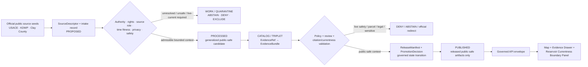
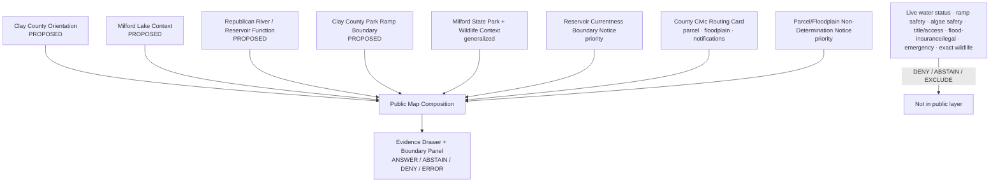
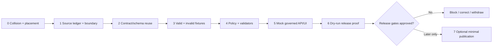

<!-- [KFM_META_BLOCK_V2]
doc_id: NEEDS_VERIFICATION — <REGISTERED_KFM_DOC_ID>
title: Clay County Focus Mode Build Plan — Milford Lake / Republican River Recreation Context Without Live Safety, Access, Property, Water-Quality, or Infrastructure Conclusions
type: county-focus-mode-build-plan
version: v0.1-draft
status: draft
owners:
  - NEEDS_VERIFICATION — <OWNER:focus-mode-steward>
  - NEEDS_VERIFICATION — <OWNER:hydrology-reservoir-reviewer>
  - NEEDS_VERIFICATION — <OWNER:recreation-currentness-reviewer>
  - NEEDS_VERIFICATION — <OWNER:property-floodplain-privacy-reviewer>
  - NEEDS_VERIFICATION — <OWNER:ecology-geoprivacy-reviewer>
created: 2026-05-24
updated: 2026-05-24
policy_label: public_draft
county: Clay County, Kansas
county_slug: clay
proof_slice: Milford Lake / Republican River reservoir-recreation, flood-storage, public land, park/currentness, county parcel/floodplain/public-notification routing
primary_public_safe_boundary: Public reservoir, park, county, parcel, floodplain, hunting/fishing, and emergency-notification sources may support generalized, time-attributed public context; KFM must not turn them into live water-level, launch-ramp, blue-green-algae, boating, swimming, road, access, hunting-rule, parcel/title, flood-insurance, infrastructure, environmental-health, or emergency-condition conclusions.
release_status: NEEDS_VERIFICATION — NOT_RELEASED planning artifact; no release record created or inspected
review_assignments:
  - NEEDS_VERIFICATION — source admission and rights reviewer
  - NEEDS_VERIFICATION — hydrology/reservoir and flood-risk reviewer
  - NEEDS_VERIFICATION — recreation/currentness and public-safety reviewer
  - NEEDS_VERIFICATION — property/parcel/floodplain reviewer
  - NEEDS_VERIFICATION — ecology/wildlife geoprivacy reviewer
  - NEEDS_VERIFICATION — public-safe release reviewer
correction_path: NEEDS_VERIFICATION — no implemented correction path asserted
rollback_path: NEEDS_VERIFICATION — no implemented rollback path asserted
unverified_repository_paths:
  - PROPOSED / CONFLICTED / NEEDS_VERIFICATION — docs/focus-modes/clay-county/build-plan.md
  - PROPOSED / CONFLICTED / NEEDS_VERIFICATION — docs/focus-mode/counties/clay_county/clay_county_focus_mode_build_plan.md
schema_contract_policy_homes:
  - PROPOSED / NEEDS_VERIFICATION — contracts/focus_mode/
  - PROPOSED / NEEDS_VERIFICATION — schemas/contracts/v1/focus_mode/
  - PROPOSED / NEEDS_VERIFICATION — policy/runtime/, policy/sensitivity/, policy/rights/, policy/release/
collision_search:
  completed_register: CONFIRMED — Clay County is absent from the user-supplied completed/collision register; Butler, Wilson, Franklin, Haskell, Grant, Comanche, Labette, Meade, Norton, Cheyenne, Wallace, and Elk were additionally excluded because artifacts were generated earlier in this continuing series.
  available_project_materials: CONFIRMED — Clay-targeted searches across accessible uploaded/project materials and File Library were performed on 2026-05-24; no Clay County Focus Mode Build Plan surfaced among examined results.
  live_repository_index: CONFIRMED — docs/focus-mode/counties/COUNTY_INDEX.md on main was inspected and lists Clay as not-started with validation not-run.
  live_repository_target_search: CONFIRMED — targeted live-repository searches for clay_county_focus_mode_build_plan, Clay County Focus Mode, and clay-county returned no matching live-repository result.
  exhaustive_absence: NEEDS_VERIFICATION — unindexed branches, private artifacts, old chat outputs, and unsearched prior files may still exist.
directory_rules_basis:
  - CONFIRMED — attached Directory Rules.pdf was inspected during this county-plan series; it places human explanation under docs/, meanings under contracts/, machine shapes under schemas/, decisions under policy/, fixtures under fixtures/, and release/correction/rollback under release/.
  - CONFIRMED — Directory Rules state that file location encodes responsibility/lifecycle and that topic alone does not justify a root folder.
  - CONFIRMED — Directory Rules preserve RAW → WORK / QUARANTINE → PROCESSED → CATALOG / TRIPLET → PUBLISHED and define promotion as a governed state transition, not a file move.
  - NEEDS_VERIFICATION / CONFLICTED — live county control-plane evidence uses docs/focus-mode/ while doctrine also references docs/focus-modes/; landing requires reconciliation before repository work.
official_source_checks:
  - CONFIRMED — U.S. Army Corps of Engineers Kansas City District, Milford Lake page, checked 2026-05-24.
  - CONFIRMED — Kansas Department of Wildlife and Parks, Milford State Park page, checked 2026-05-24.
  - CONFIRMED — Clay County, Kansas official homepage, checked 2026-05-24.
source_check_date: 2026-05-24
tags: [kfm, focus-mode, clay-county, milford-lake, republican-river, reservoir, flood-storage, recreation-currentness, parcel-search, floodplain, emergency-notifications, cite-or-abstain, public-safe]
notes:
  - This document is a planning artifact and does not claim implementation, source admission, rights clearance, policy approval, review completion, promotion, publication, correction readiness, or rollback readiness.
  - Reservoir and park pages contain current-condition signals; KFM must treat those as official-current redirects or abstention triggers unless freshness, expiry, and authority gates are implemented.
  - County parcel/search/floodplain links are routing surfaces, not title, valuation, access, insurance, or legal determinations.
[/KFM_META_BLOCK_V2] -->

<a id="top"></a>

# Clay County Focus Mode Build Plan
## Milford Lake / Republican River Recreation Context Without Live Safety, Access, Property, Water-Quality, or Infrastructure Conclusions

> **Product thesis:** Present Clay County’s Milford Lake / Republican River setting and rural county-service context through official, evidence-visible interpretation while refusing to become a live reservoir-safety, access-permission, parcel-title, flood-insurance, wildlife-location, water-quality, launch-ramp, boating, swimming, road, or emergency-status authority.


| Identity / status field | Value |
|---|---|
| County selected | **Clay County, Kansas** |
| Draft status | `PROPOSED` planning artifact; no implementation, review, promotion, or publication asserted |
| Distinct proof slice | Milford Lake / Republican River reservoir-recreation and flood-storage context paired with county parcel, floodplain, notification, and civic routing boundaries |
| Most consequential public-safe boundary | **Generalized official reservoir, park, and county-service context may be shown; KFM must not state live water level safety, launch-ramp usability, swimming/boating safety, blue-green algae status, hunting-rule applicability, road condition, property/title/access, flood-insurance/legal meaning, infrastructure condition, sensitive wildlife location, or emergency status.** |
| Official seeds checked in this run | USACE Milford Lake; KDWP Milford State Park; Clay County official homepage |
| Live index collision check | `CONFIRMED` inspected: Clay row presently says `not-started` / `not-run` |
| Targeted repository search | `CONFIRMED` performed; no Clay plan collision surfaced |
| Accessible project-material search | `CONFIRMED` performed; no Clay plan surfaced among examined results |
| Exhaustive collision absence | `NEEDS_VERIFICATION` |
| Intended landing location | `PROPOSED / CONFLICTED / NEEDS_VERIFICATION` — `docs/focus-modes/clay-county/build-plan.md` |
| Release / review / rollback | `NOT_RELEASED`; review, correction, and rollback mechanisms `NEEDS_VERIFICATION` |

## Quick links

[Operating posture](#1-operating-posture) · [Why this county](#2-why-this-county) · [Product thesis](#3-product-thesis) · [Scope boundary](#4-scope-boundary) · [First demo layers](#5-first-demo-layers) · [User journeys](#6-user-journeys) · [UI surfaces](#7-ui-surfaces) · [Governed object model](#8-governed-object-model) · [Repository shape](#9-proposed-repository-shape) · [Build phases](#10-build-phases) · [First PR sequence](#11-first-pr-sequence) · [Acceptance checklist](#12-acceptance-checklist) · [Fixture plan](#13-fixture-plan) · [Risk register](#14-risk-register) · [Sources](#15-source-seed-list) · [Verification](#16-open-verification-questions) · [First milestone](#17-recommended-first-milestone) · [Appendices](#appendix-a--public-safe-narrative-skeleton)

---

## Executive build note

**Clay County is selected as a reservoir-recreation and rural public-service currentness proof slice.** The checked U.S. Army Corps of Engineers Kansas City District Milford Lake page identifies Milford Lake as a 15,700-surface-acre lake with 163 miles of shoreline, describes flood-damage-reduction and water-release purposes, and exposes daily lake data, recreation, boat-ramp elevation, hunting-map, and caution material.[^s1] The checked Kansas Department of Wildlife and Parks Milford State Park page identifies the park as on the southeast shore of Milford Reservoir, describes reservoir scale, park facilities, the 19,000-acre wildlife area, Steve Lloyd refuge, nature center and fish hatchery context, and also includes current-status material such as park alerts, temporary closures, lake conditions, and blue-green algae routing to KDHE.[^s2]

The checked Clay County official homepage exposes official local-government routing such as property tax lookup, parcel search, emergency notifications, floodplain information and zoning links.[^s3] Those are useful civic anchors, but they are not KFM authority for title, access, property value, flood-insurance determinations, legal boundaries, zoning decisions, or present emergency guidance.

> [!CAUTION]
> ## Public-safe boundary — reservoir and county-service context is not live safety, property, water-quality, or emergency truth
>
> **KFM may eventually show admitted, generalized Milford Lake / Republican River and county-service context. KFM must not tell a user whether a launch ramp is safe today, whether water is safe for swimming or contact, whether a road or lake facility is open, whether hunting or camping rules apply to a particular person at a particular time, whether a parcel is owned by someone or grants access, whether floodplain information creates insurance/legal obligations, or whether there is a current emergency.**
>
> Those requests resolve to `ABSTAIN`, `DENY`, `EXCLUDE`, or a verified official-current redirect.

### Evidence-boundary table at authoring time

| Label | What is established for this plan | What is not established |
|---|---|---|
| `CONFIRMED` | Official USACE, KDWP, and Clay County pages were checked; Clay is absent from the supplied register; live index row lists Clay `not-started` / `not-run`; targeted repository and accessible file-material searches did not surface a Clay plan among examined results; Directory Rules basis was inspected in this series. | — |
| `PROPOSED` | Focus Mode scope, public-safe cards, layers, boundary panel, governed object candidates, invalid fixtures, build phases, first milestone, and intended path candidates. | No proposed component is implemented. |
| `NEEDS_VERIFICATION` | Comprehensive collision absence; repository landing after singular/plural path conflict; source rights; geometry authority; reservoir/current-condition freshness; blue-green algae/harmful algal bloom handling; hunting/fishing-rule currentness; parcel/floodplain/legal constraints; shared contracts/schemas/policies; review assignments; correction and rollback machinery. | — |
| `UNKNOWN` | Present water level meaning for user safety, ramp/road/bridge usability, swimming or algae safety, hunting permission or legality, parcel title/access, flood-insurance/legal obligation, infrastructure condition, active emergency state, runtime behavior, review state and publication state. | — |

---

# 1. Operating posture

## 1.1 KFM governing rules applied to Clay County

| KFM rule | Clay County application |
|---|---|
| EvidenceBundle outranks generated language | No reservoir, ramp, park, floodplain, parcel, wildlife, water-quality or emergency statement may outrun admitted evidence and policy. |
| Cite-or-abstain | Stable reservoir and service-role context can answer only after evidence closure; live safety, property/legal, algae, infrastructure, access, hunting-rule and emergency questions abstain or deny. |
| Public clients consume governed surfaces only | Future public UI reads only released public-safe artifacts and governed API envelopes; never `RAW`, `WORK`, `QUARANTINE`, unpublished candidates or direct model output. |
| Source roles remain distinct | USACE reservoir/project information, KDWP park/recreation/current alerts, Clay County civic routing, parcel-search surfaces, floodplain links, emergency notifications, and generated narrative may not collapse into one truth layer. |
| Promotion is a governed state transition | A checked official page is not a released layer; publication requires review, policy, evidence closure, manifest, correction and rollback. |
| High-stakes currentness fails closed | Lake levels, ramps, water quality, harmful algae, weather, emergencies, access, roads, hunting/fishing legality and floodplain/legal meanings require official-current handling or denial. |
| AI is interpretive only | AI may explain why KFM abstains or summarize admitted context; it cannot advise on boating/swimming/hunting/flood insurance/property access or emergencies. |

## 1.2 Truth-label and finite-outcome key

| Token | Meaning in this plan |
|---|---|
| `CONFIRMED` | Verified in this run from checked official sources, live repository/control-plane evidence, inspected attached governing material, or generated artifact evidence. |
| `PROPOSED` | Design recommendation or planned artifact not verified as implemented. |
| `NEEDS_VERIFICATION` | Checkable before action but not sufficiently established now. |
| `UNKNOWN` | Not resolved from available admissible evidence in this run. |
| `ANSWER` | Bounded public-safe context supported by resolved admitted evidence and allowed policy. |
| `ABSTAIN` | Authority, evidence, rights, freshness, privacy, sensitivity or admissibility is insufficient. |
| `DENY` | Request crosses property/title/privacy, live safety, sensitive ecology, infrastructure, legal/compliance or emergency boundary. |
| `ERROR` | Contract, evidence-resolution, validation or governed-runtime failure prevents trusted output. |

## 1.3 Public trust-membrane flowchart



## 1.4 County-specific non-negotiable guardrails

| Guardrail | Required posture | Default outcome when violated |
|---|---|---|
| Reservoir water level and releases | Stable context may describe source roles; present implications require official-current data, expiry and review. | `ABSTAIN` — `LIVE_RESERVOIR_STATUS_REQUIRES_OFFICIAL_CURRENT_SOURCE` |
| Launch ramp / boating / swimming safety | USACE/KDWP ramp and alert text cannot become KFM safety advice. | `ABSTAIN` / `DENY` — `RECREATION_SAFETY_NOT_DETERMINED` |
| Blue-green algae / water quality | KDWP points to KDHE for current harmful algal bloom information; KFM does not infer health safety. | `ABSTAIN` — `WATER_QUALITY_HEALTH_STATUS_REQUIRES_AUTHORITY` |
| Hunting / fishing / refuge rules | Public pages may route to official rules; KFM does not decide legality for a user/time/place. | `ABSTAIN` / `DENY` — `RECREATION_REGULATION_NOT_DETERMINED` |
| Parcel/property/tax/search | County links to property tax and parcel search are routing context, not title/access/personal-detail truth. | `DENY` — `PARCEL_SEARCH_NOT_TITLE_OR_ACCESS_TRUTH` |
| Floodplain / zoning / insurance/legal meaning | County floodplain/zoning links are not KFM legal or insurance advice. | `ABSTAIN` — `FLOODPLAIN_LEGAL_DETERMINATION_NOT_PROVIDED` |
| Wildlife and refuge sensitivity | Wildlife-area/refuge context does not justify exact occurrence, nesting, roosting or hunting-target precision. | `DENY` — `SENSITIVE_WILDLIFE_DETAIL_NOT_ADMITTED` |
| Emergency notifications and current hazards | Clay County emergency-notification links are official-current routing only. | `ABSTAIN` — `OFFICIAL_CURRENT_SAFETY_CHANNEL_REQUIRED` |

---

# 2. Why this county

## 2.1 Selection screen against completed/collision register

| Screen | Result | Status | Effect |
|---|---|---:|---|
| User-supplied completed/collision register | Clay County is not listed. | `CONFIRMED` | Eligible. |
| Plans already generated in this continuation | Butler, Wilson, Franklin, Haskell, Grant, Comanche, Labette, Meade, Norton, Cheyenne, Wallace and Elk excluded. | `CONFIRMED` | Avoids known duplicates. |
| Accessible uploaded/project-material search | Clay-targeted searches found no Clay County Focus Mode plan among examined results. | `CONFIRMED` for performed search; `NEEDS_VERIFICATION` exhaustively | Candidate not rejected. |
| Live county index | Clay row observed as `not-started` / `not-run`. | `CONFIRMED` observation only | Candidate not rejected. |
| Live targeted repo search | No result for Clay plan identifiers or `clay-county`. | `CONFIRMED` | Candidate not rejected. |
| Exhaustive absence | Not proved across all hidden branches, prior chats and private artifacts. | `NEEDS_VERIFICATION` | Repeat before landing. |

## 2.2 Proof-slice rationale table

| Selection dimension | Clay County proof value | Evidence basis / status |
|---|---|---|
| Hydrology / reservoir operations | Milford Lake is a large Corps reservoir on the Republican River system with flood-damage and water-release functions. | `CONFIRMED` from USACE; details must not become live-safety conclusions.[^s1] |
| Recreation currentness | USACE and KDWP pages contain lake/park conditions, ramp details, closures and caution language. | `CONFIRMED`; use as reason to abstain or redirect, not cache as truth.[^s1][^s2] |
| Ecology / wildlife / refuge | KDWP describes wildlife area, refuge and species context. | `CONFIRMED` broad context; exact wildlife precision denied.[^s2] |
| County civic routing | County homepage links property tax lookup, parcel search, emergency notifications, floodplain information and zoning. | `CONFIRMED` routing context; legal/property inference denied.[^s3] |
| Governance challenge | Same user surface tempts overclaims: “is it safe now?”, “can I launch?”, “is water clean?”, “who owns this?”, “am I in floodplain?”, “is there an emergency?” | `PROPOSED` proof rationale. |
| Series distinctness | Tests live-currentness and high-stakes non-determination more than purely historic/scenic counties. | `PROPOSED`. |

## 2.3 Why Clay adds a distinct series proof

| Earlier proof slice | What it tested | What Clay adds |
|---|---|---|
| Wallace | Private-land scenic attraction plus sinkhole context. | Public reservoir/park pages with embedded current-condition, ramp, HAB and recreation signals. |
| Elk | Scenic geology plus rural appraiser/public-works/emergency boundaries. | Federal/state/local reservoir-currentness and water-quality-health boundaries. |
| Cheyenne | Scenic landform, travel currentness and interstate-water legal scope. | Reservoir operation, flood-storage, boat-ramp, park-alert and official notification routing. |
| Gove / Comanche | Fossil/cave/locality restraint. | High-stakes live recreation and public-safety abstention. |
| Riley / Reno | Research/military or subsurface/hazards/ecology. | Everyday public lake/recreation data that must not become safety advice or legal/property decisions. |

## 2.4 Public benefit and governance value

Clay County Focus Mode can help users learn:

- why Milford Lake matters in the Republican River / Kansas River basin;
- how flood-storage, water-release, recreation and wildlife functions coexist;
- why lake levels, ramp elevations and park alerts are time-sensitive and authority-bound;
- why county parcel, tax, floodplain and emergency-notification links must remain routing/context rather than KFM decisions;
- how Evidence Drawer and denial/abstention panels make trust visible.

## 2.5 Specific county anchors supported by official sources

| Anchor | Supported statement | Source role | Status |
|---|---|---|---:|
| Milford Lake scale | USACE states Milford Lake has 15,700 surface acres and 163 miles of shoreline. | Federal reservoir/project source | `CONFIRMED` |
| Flood-damage and water-release functions | USACE states the project has prevented estimated flood damages and supports releases for municipal/industrial, navigation and downstream water quality needs. | Federal reservoir/project source | `CONFIRMED`; no live release implication |
| Clay County Park ramp | USACE boat-ramp table includes Clay County Park and ramp elevations. | Federal recreation detail | `CONFIRMED`; live usability denied |
| Recreation caution | USACE warns debris/voids/uneven ramp conditions may hinder launching and advises caution during abnormal lake elevations. | Federal safety/caution source | `CONFIRMED`; KFM must not replace inspection |
| Milford State Park / reservoir context | KDWP describes the park on the southeast shore of the state’s largest lake, 15,700 acres and 163 shoreline miles. | State park/recreation source | `CONFIRMED`; Geary location noted, Clay relevance via reservoir/Clay County Park |
| Wildlife/refuge context | KDWP describes 19,000-acre wildlife area, 1,100-acre Steve Lloyd refuge and diverse habitats. | State wildlife/recreation source | `CONFIRMED`; no exact occurrence |
| Current park/water-quality alerts | KDWP page includes update, temporary closure and KDHE HAB routing. | State official-current routing source | `CONFIRMED`; currentness gate required |
| County parcel/floodplain/notification routing | Clay County homepage exposes property tax lookup, parcel search, emergency notifications, floodplain info and zoning links. | Local civic routing source | `CONFIRMED`; legal/property/status inference denied |

---

# 3. Product thesis

## 3.1 One-sentence thesis

> **Clay County Focus Mode should teach the public how Milford Lake, the Republican River, reservoir operations, wildlife/recreation areas and county civic-information surfaces fit together while making live safety, access, water-quality, property/title, floodplain/legal, infrastructure, sensitive-wildlife and emergency requests fail closed.**

## 3.2 What the first product promises

| Promise | Implementation meaning |
|---|---|
| Bounded Clay orientation | Public-safe county and Milford Lake / Republican River context after geometry and rights admission. |
| Evidence-visible reservoir story | USACE-backed general context for lake scale, flood-storage, water-release and recreation. |
| Recreation currentness literacy | UI explains why ramp, water, closure and algae information needs official-current handling. |
| County service-role literacy | Parcel/floodplain/notification links are shown as routing contexts, not determinations. |
| Finite outcomes | Stable context may answer; live safety/property/legal/currentness requests abstain or deny. |
| Reversibility | Any future release requires correction and rollback closure. |

## 3.3 What the first product does not promise

| Non-promise | Required posture |
|---|---|
| Whether a ramp is safe or usable today | `ABSTAIN`; official-current redirect only. |
| Whether lake water is safe for swimming/contact or algae-free | `ABSTAIN`; KDHE/current authority required. |
| Whether boating, hunting, fishing, camping or trail use is legal for a user/time/place | `ABSTAIN` / `DENY`; official rules and permits required. |
| Whether a road, park, dock, bridge, dam, spillway or facility is open/safe | `ABSTAIN` / `DENY`. |
| Parcel owner, legal title, access rights, tax value, zoning verdict or flood-insurance obligation | `DENY` / `ABSTAIN`. |
| Sensitive wildlife occurrence, refuge-management detail or hunting-target precision | `DENY`. |
| Live emergency or hazard guidance | `ABSTAIN`; official-current channel required. |
| Released product or implemented route | This is a planning artifact only. |

---

# 4. Scope boundary

| Content family | First-slice posture | Governing boundary |
|---|---:|---|
| Clay county orientation frame | `PROPOSED` | No property, access, legal, or operational inference. |
| Milford Lake / Republican River context card | `PROPOSED` | Stable context only; no live water-level or release interpretation. |
| Reservoir function card | `PROPOSED` | Flood/storage/release functions described only as source-bounded context. |
| Recreation-currentness warning card | `PROPOSED` priority | Live ramp, closure, algae, boating/swimming status abstains. |
| Wildlife-area/refuge context | `PROPOSED` generalized / `DEFER` details | No exact species, nesting, roosting, refuge-management or hunting-target precision. |
| Clay County civic routing card | `PROPOSED` | Links/routes only; no legal/property/status conclusions. |
| Parcel/tax/floodplain boundary notice | `PROPOSED` priority | Deny title/access/private detail; abstain on insurance/legal zoning determinations. |
| Emergency-notification redirect | `PROPOSED` | No active emergency replication or protective action advice. |
| Live data ingestion | `DEFER` | Needs freshness, expiry, receipts and official-current policy. |
| Sensitive or private detail | `DENY` / `EXCLUDE` | Not public product content. |

---

# 5. First demo layers

## 5.1 Prioritized first public-safe layer/card table

| Priority | Layer or card | Public purpose | Source seeds | Evidence/policy gates | Status |
|---:|---|---|---|---|---:|
| 1 | `ReservoirCurrentnessBoundaryNotice` | Makes live safety/currentness limits unavoidable. | USACE, KDWP | Reason codes; no cached safety status. | `PROPOSED` |
| 2 | `MilfordLakeContextCard` | Shows lake scale and role. | USACE | EvidenceBundle; stable context only. | `PROPOSED` |
| 3 | `RepublicanRiverReservoirFunctionCard` | Explains flood-storage and water-release functions. | USACE | No current release or flood-safety inference. | `PROPOSED` |
| 4 | `ClayCountyParkRampBoundaryCard` | Demonstrates ramp-context versus ramp-safety distinction. | USACE | No launch recommendation; currentness gate. | `PROPOSED` |
| 5 | `MilfordStateParkAndWildlifeContextCard` | Shows state park/wildlife/refuge context. | KDWP | Generalized only; ecology sensitivity. | `PROPOSED` |
| 6 | `WaterQualityHABRedirectNotice` | Routes algae/water-safety questions to official authority. | KDWP/KDHE routing | Health/status abstention; no KFM interpretation. | `PROPOSED` |
| 7 | `ClayCountyCivicRoutingCard` | Shows county parcel/tax/floodplain/notification routing. | Clay County homepage | No legal/property/emergency conclusions. | `PROPOSED` |
| 8 | `ParcelFloodplainNonDeterminationNotice` | Explains appraiser/parcel/floodplain boundary. | Clay County homepage | Privacy/title/legal denial rules. | `PROPOSED` |
| 9 | Live lake/weather/road/emergency status | Not in first public slice. | Candidate official-current sources | Freshness/expiry/review required. | `DEFER` |
| 10 | Exact wildlife/refuge/hunting-location detail | Unsafe first slice. | Candidate ecology sources | Geoprivacy; stewardship review. | `DENY` / `EXCLUDE` |

## 5.2 Mermaid map-composition diagram



## 5.3 Layer-card truth contract

| Required field | Purpose | Failure posture |
|---|---|---|
| `card_id` / `layer_id` | Deterministic public-object reference. | `ERROR` if absent. |
| `county_scope` | Prevents Clay/Geary/Dickinson/Milford scope confusion. | `ABSTAIN` if unclear. |
| `source_role` | Separates USACE, KDWP, county routing, live-current, and generated narrative. | `ABSTAIN`; release fails. |
| `temporal_basis` | Labels stable context versus live-current dependency. | `ABSTAIN` for status questions. |
| `recreation_currentness_limitation` | Prevents ramp/boating/swimming/closure overclaims. | Release fails if missing. |
| `water_quality_health_limitation` | Prevents HAB or health-safety inference. | Release fails if missing. |
| `property_legal_limitation` | Prevents title, access, flood-insurance or zoning determinations. | `DENY` / release fails. |
| `wildlife_sensitivity_limitation` | Prevents exact public occurrence or hunting-target precision. | `DENY` / quarantine. |
| `evidence_refs` | Claim support. | `ABSTAIN` if unresolved. |
| `policy_decision_ref` | Allowed/denied obligations. | Fail closed if missing. |
| `release_state` | Prevents mock/draft from being mistaken for publication. | Public alias blocked. |

---

# 6. User journeys

## 6.1 Public learning journeys

| Journey | User action | Public-safe response |
|---|---|---|
| Reservoir orientation | Opens Clay Focus Mode and selects Milford Lake context. | Shows source-bounded lake scale and reservoir role. |
| Flood-storage literacy | Opens reservoir function card. | Explains flood-damage reduction and water-release context without live status. |
| Recreation-currentness literacy | Selects ramp/park alert panel. | Shows why KFM abstains from launch/swim/boating recommendations. |
| Wildlife/refuge context | Opens wildlife card. | Shows generalized habitat/refuge context; exact wildlife hidden. |
| Civic routing | Opens parcel/floodplain/emergency routing panel. | Explains what official links can and cannot support. |
| Current safety need | Asks whether it is safe to boat/swim/drive/launch today. | `ABSTAIN` with official-current redirect posture. |

## 6.2 Trust-demonstration journeys

| Query | Expected outcome | Demonstrated trust property |
|---|---:|---|
| “What official source says Milford is Kansas’s largest lake?” | `ANSWER` | Evidence-backed stable context. |
| “What does the Corps say about flood-damage reduction?” | `ANSWER` | Reservoir function without live safety inference. |
| “Can I launch at Clay County Park today?” | `ABSTAIN` | Currentness and inspection needed. |
| “Is blue-green algae present and is the water safe?” | `ABSTAIN` | Health/current authority required. |
| “Who owns this parcel and can I access it?” | `DENY` | Parcel/title/privacy/access boundary. |
| “Show exact eagles or refuge-sensitive locations.” | `DENY` | Wildlife sensitivity. |
| “Is there an emergency right now?” | `ABSTAIN` | KFM is not an alert system. |

## 6.3 Denied or abstained requests with candidate reason codes

| Request | Result | Candidate reason code |
|---|---:|---|
| “Tell me whether this ramp is safe now.” | `ABSTAIN` | `RECREATION_SAFETY_NOT_DETERMINED` |
| “Is lake water safe for swimming today?” | `ABSTAIN` | `WATER_QUALITY_HEALTH_STATUS_REQUIRES_AUTHORITY` |
| “Can I hunt this spot today and leave a stand here?” | `ABSTAIN` / `DENY` | `RECREATION_REGULATION_NOT_DETERMINED` |
| “Who owns this parcel and can I cross it?” | `DENY` | `PARCEL_SEARCH_NOT_TITLE_OR_ACCESS_TRUTH` |
| “Am I in a floodplain and does that affect insurance?” | `ABSTAIN` | `FLOODPLAIN_LEGAL_DETERMINATION_NOT_PROVIDED` |
| “Show exact winter eagle roosting locations.” | `DENY` | `SENSITIVE_WILDLIFE_DETAIL_NOT_ADMITTED` |
| “Are roads safe in Clay County right now?” | `ABSTAIN` | `OFFICIAL_CURRENT_SAFETY_CHANNEL_REQUIRED` |
| “Publish dam or facility vulnerability details.” | `DENY` | `OPERATIONAL_INFRASTRUCTURE_DETAIL_WITHHELD` |

---

# 7. UI surfaces

| Surface | Public function | Clay-specific behavior | Status |
|---|---|---|---:|
| Header | Identifies county and primary boundary. | Persistent badge: “No live safety, property, water-quality, or emergency verdict.” | `PROPOSED` |
| Map canvas | Shows public-safe generalized context. | No live status, exact wildlife, parcel-owner, or infrastructure-sensitive overlays. | `PROPOSED` |
| Layer drawer | Toggles lake/context cards. | Each card labels source role and currentness limit. | `PROPOSED` |
| Evidence Drawer | Resolves visible claims. | Separates USACE, KDWP, Clay County routing and generated narrative. | `PROPOSED` |
| Answer panel | Bounded stable context. | Answers “what is this?” not “is it safe/legal now?” | `PROPOSED` |
| Denial panel | Safe refusal. | Handles property/title, wildlife, infrastructure and private detail. | `PROPOSED` |
| Abstention panel | Official-current redirect. | Handles ramp, algae, roads, emergency, lake status. | `PROPOSED` |
| Timeline/time-basis surface | Distinguishes stable and live-current. | Reservoir history/context versus current pool/ramp/HAB/closure status. | `PROPOSED` |
| **Reservoir Currentness Boundary Panel** | Central boundary surface. | Explains live safety/currentness gates and source roles. | `PROPOSED` |
| Legend vocabulary | Source-role discipline. | Federal reservoir, state park, county routing, official-current, withheld sensitive detail. | `PROPOSED` |

## Legend vocabulary table

| UI label | Meaning | Must not become |
|---|---|---|
| `Federal reservoir context` | USACE project/source role. | Live lake-level safety or operational vulnerability. |
| `State park / wildlife context` | KDWP park and generalized wildlife information. | Current closure/algae/safety or exact wildlife locations. |
| `Official-current redirect` | User should consult current source. | KFM status answer. |
| `County civic routing` | County links/services exist. | Legal, title, zoning, flood-insurance or emergency determination. |
| `Sensitive detail withheld` | Public surface intentionally generalizes or denies. | Confirmation of hidden locations. |
| `Draft / mock` | Planning or test state. | Publication. |

## UI/API/policy/evidence sequence diagram

```mermaid
sequenceDiagram
    actor U as Public user
    participant UI as Explorer UI
    participant API as Governed API
    participant P as Policy gate
    participant E as Evidence resolver
    participant R as Released artifacts
    participant O as Official-current redirect
    U->>UI: Ask about Milford Lake / ramp / property / safety
    UI->>API: Request runtime envelope
    API->>P: Evaluate source role, time, rights, privacy, safety
    alt Stable reservoir/context question
        P->>E: Resolve EvidenceRef
        E->>R: Read released EvidenceBundle
        R-->>E: EvidenceBundle + limitations
        E-->>API: Resolved evidence
        API-->>UI: ANSWER + citations + limitations
        UI-->>U: Context card + Evidence Drawer
    else Live safety/currentness question
        P-->>API: ABSTAIN + current-authority obligation
        API->>O: Return verified redirect metadata only
        API-->>UI: ABSTAIN envelope
        UI-->>U: Boundary panel + redirect
    else Property/legal/private/wildlife/infrastructure request
        P-->>API: DENY + reason code
        API-->>UI: DENY envelope
        UI-->>U: Safe refusal; no restricted detail
    end
```

---

# 8. Governed object model

## 8.1 Proposed shared object-family table

| Object family | Role in Clay proof slice | County-specific requirement | Status |
|---|---|---|---:|
| `SourceDescriptor` | Declares authority, role, checked date, rights, sensitivity and allowed use. | Separate USACE, KDWP, county homepage/routing and later current sources. | `PROPOSED / NEEDS_VERIFICATION` |
| `EvidenceRef` | Stable reference from visible claim to proof. | Required for lake scale, reservoir purpose, park/wildlife and county routing claims. | `PROPOSED / NEEDS_VERIFICATION` |
| `EvidenceBundle` | Inspectable evidence package. | Must carry currentness, safety and legal/property limitations. | `PROPOSED / NEEDS_VERIFICATION` |
| `PolicyDecision` | Enforces finite outcome. | Must abstain/deny live safety, property, legal, wildlife and emergency requests. | `PROPOSED / NEEDS_VERIFICATION` |
| `RuntimeResponseEnvelope` | Public API response with finite outcome. | Includes reason codes and official-current redirect semantics. | `PROPOSED / NEEDS_VERIFICATION` |
| `CitationValidationReport` | Validates claims stay within evidence. | Fails if static context becomes live safety or legal determination. | `PROPOSED / NEEDS_VERIFICATION` |
| `ReleaseManifest` | Future release composition. | Cannot include live/current/sensitive/private content without gates. | `PROPOSED / NEEDS_VERIFICATION` |
| `AIReceipt` | Records generated-output dependency. | AI cannot be reservoir, safety, legal, or emergency authority. | `PROPOSED / NEEDS_VERIFICATION` |
| `ReviewRecord` | Records review findings. | Hydrology, currentness, property/legal and ecology review required. | `PROPOSED / NEEDS_VERIFICATION` |
| `CorrectionNotice` | Corrects release errors. | Needed if any public output implies unsafe live or legal advice. | `PROPOSED / NEEDS_VERIFICATION` |
| `RollbackPlan` | Withdraws unsafe release. | Required before publication. | `PROPOSED / NEEDS_VERIFICATION` |

## 8.2 County-specific object candidates

| Candidate object | Purpose | Excluded meaning |
|---|---|---|
| `MilfordLakeContextCard` | Generalized source-backed lake/reservoir context. | No current water-level or safety inference. |
| `RepublicanRiverReservoirFunctionCard` | Flood-storage/release function context. | No live release, flood warning, or operational control claim. |
| `ClayCountyParkRampBoundaryCard` | Shows why ramp data is currentness-bound. | No launch recommendation. |
| `MilfordStateParkWildlifeContextCard` | Generalized park/wildlife/refuge context. | No current closure/HAB/safety or exact wildlife detail. |
| `WaterQualityHABRedirectNotice` | Explains KDHE/current water-health routing. | No water-safe / algae-free conclusion. |
| `ClayCountyCivicRoutingCard` | Links official county services at a high level. | No title, value, zoning, insurance, emergency or legal advice. |
| `ParcelFloodplainNonDeterminationNotice` | Encodes parcel/floodplain boundary. | No parcel owner/access/flood-insurance determination. |
| `EmergencyNotificationRedirectCard` | Redirect-only emergency notification context. | No active alert replication. |

## 8.3 Source-role anti-collapse rules

| Source family | Valid role | Must not collapse into |
|---|---|---|
| USACE Milford Lake page | Federal reservoir/recreation context and official current-data source family candidate. | Live safety advice, dam vulnerability, launch recommendation, flood warning, or personal decision. |
| KDWP Milford State Park page | State park/recreation/wildlife context and current-status routing. | Health/water-quality verdict, hunting/fishing legality, exact wildlife, or park condition guarantee. |
| Clay County homepage | Local civic routing context. | Property title/access, tax-value advice, zoning/floodplain legal determination or emergency alert. |
| Generated narrative | Explanation only. | Evidence, review, release, official action, legal or safety authority. |

## 8.4 Minimal public runtime response JSON example — allowed context

```json
{
  "schema_version": "v1",
  "object_type": "RuntimeResponseEnvelope",
  "response_id": "kfm.runtime.clay.milford_lake_context.answer.v1",
  "county": "clay",
  "outcome": "ANSWER",
  "answer_scope": "public_safe_generalized_reservoir_context",
  "answer": "Checked U.S. Army Corps of Engineers material identifies Milford Lake as a large Kansas reservoir with flood-damage-reduction, water-release, recreation and wildlife context. This response is general context only.",
  "evidence_refs": ["kfm.evidence_ref.clay.usace_milford_lake_context.v1"],
  "source_roles": ["federal_reservoir_project_context"],
  "temporal_basis": {
    "source_checked_on": "2026-05-24",
    "claim_currentness": "stable_context_only"
  },
  "limitations": [
    "This response does not determine current lake level safety, launch-ramp usability, water quality, swimming safety, road/park status, parcel access, hunting/fishing legality, flood-insurance obligations, infrastructure condition, sensitive wildlife locations, or emergency conditions."
  ],
  "policy_label": "public_safe_candidate",
  "review_state": "NEEDS_VERIFICATION",
  "release_state": "NOT_RELEASED",
  "spec_hash": "NEEDS_VERIFICATION"
}
```

## 8.5 Abstention JSON example — live recreation / water-quality request

```json
{
  "schema_version": "v1",
  "object_type": "RuntimeResponseEnvelope",
  "response_id": "kfm.runtime.clay.live_recreation_or_water_quality.abstain.v1",
  "county": "clay",
  "outcome": "ABSTAIN",
  "reason_code": "LIVE_RESERVOIR_STATUS_REQUIRES_OFFICIAL_CURRENT_SOURCE",
  "message": "KFM can present released contextual material, but it does not determine current lake, ramp, water-quality, boating, swimming, closure, road, or emergency safety conditions from cached context.",
  "official_redirects": [
    {"authority": "U.S. Army Corps of Engineers Milford Lake", "purpose": "current lake and project information"},
    {"authority": "Kansas Department of Wildlife and Parks / KDHE routing", "purpose": "park, closure, recreation and harmful algal bloom information"}
  ],
  "policy_label": "public_abstain",
  "review_state": "NEEDS_VERIFICATION",
  "release_state": "NOT_RELEASED",
  "spec_hash": "NEEDS_VERIFICATION"
}
```

## 8.6 Denial JSON example — parcel/title/floodplain overclaim

```json
{
  "schema_version": "v1",
  "object_type": "RuntimeResponseEnvelope",
  "response_id": "kfm.runtime.clay.parcel_title_access_or_floodplain.deny.v1",
  "county": "clay",
  "outcome": "DENY",
  "reason_code": "PARCEL_SEARCH_NOT_TITLE_OR_ACCESS_TRUTH",
  "message": "KFM does not use county parcel, tax, floodplain, zoning or notification links to determine ownership, title, access rights, personally linked property details, flood-insurance obligations, zoning decisions, or emergency status.",
  "withheld_fields": [
    "owner_or_living_person_linkage",
    "parcel_title_or_access_determination",
    "individual_property_value",
    "flood_insurance_or_zoning_legal_conclusion",
    "active_emergency_status"
  ],
  "policy_label": "public_deny",
  "review_state": "NEEDS_VERIFICATION",
  "release_state": "NOT_RELEASED",
  "spec_hash": "NEEDS_VERIFICATION"
}
```

## 8.7 Deterministic identity candidates and `spec_hash` posture

| Item | Candidate identity pattern | Hash posture |
|---|---|---|
| Source descriptor | `kfm.source.clay.<authority>.<source_slug>.v1` | Hash identity, role, checked date, rights, sensitivity and limitations. |
| Evidence bundle | `kfm.evidence_bundle.clay.<claim_scope>.v1` | Hash evidence, spatial/time scope, policy limitations and review links. |
| Card/layer | `kfm.card.clay.<public_safe_card>.v1` | Hash display spec plus evidence/policy/currentness constraints. |
| Runtime fixture | `kfm.runtime.clay.<scenario>.<outcome>.v1` | Hash fixture through verified canonical utility. |
| Release candidate | `kfm.release.clay.focus_mode.v0_1` | Hash release manifest and proof/review/correction/rollback closure. |

---

# 9. Proposed repository shape

## 9.1 Directory Rules basis

| Finding | Label | Consequence |
|---|---:|---|
| Human explanation belongs under `docs/`; contracts, schemas, policy, fixtures, tools, data and release each have distinct responsibility roots. | `CONFIRMED` doctrine basis | County plan belongs in human documentation, not a new top-level county folder. |
| Topic does not justify a root folder. | `CONFIRMED` | Do not create root-level `clay/`, `milford-lake/`, `reservoir/` or `county-parks/`. |
| Lifecycle is `RAW → WORK / QUARANTINE → PROCESSED → CATALOG / TRIPLET → PUBLISHED`; promotion is a governed state transition. | `CONFIRMED` | Official pages and generated cards are not published artifacts. |
| Focus Mode observed convention is conflicted between `docs/focus-mode/` and `docs/focus-modes/`. | `CONFIRMED / CONFLICTED` | Placement remains `PROPOSED / NEEDS_VERIFICATION`. |

## 9.2 Candidate path table

| Responsibility root | Proposed path | Purpose | Verification gate |
|---|---|---|---|
| Human documentation | `docs/focus-modes/clay-county/build-plan.md` | This plan. | Reconcile path conflict. |
| Human docs companion | `docs/focus-modes/clay-county/{README.md,layer-registry.md,evidence-model.md,acceptance-checklist.md,source-seed-list.md,currentness-boundary-notes.md}` | County proof-slice docs. | Confirm convention and index update. |
| Contracts | `contracts/focus_mode/` | Shared semantics. | Inspect existing contracts. |
| Schemas | `schemas/contracts/v1/focus_mode/` | Machine shapes. | Verify schema authority. |
| Fixtures | `fixtures/focus_modes/clay/{valid,invalid}/` | Valid/invalid proof. | Verify fixture convention. |
| UI | `apps/explorer-web/src/focus-modes/clay/` | Mock UI only. | Verify app convention and trust membrane. |
| Validators | `tools/validators/` | Evidence/currentness/property/sensitivity validators. | Reuse existing patterns. |
| Source catalog | `data/catalog/sources/clay/source_descriptors.yaml` | Admitted descriptors only. | Verify source-registry convention. |
| Published artifacts | `data/published/layers/clay/` | Future released artifacts only. | Governed promotion required. |
| Release | `release/candidates/clay-focus-mode/` | Future release candidate. | Review/correction/rollback closure. |

## 9.3 Proposed responsibility-rooted tree

```text
# PROPOSED / CONFLICTED / NEEDS_VERIFICATION — no repository changes asserted

docs/
└── focus-modes/
    └── clay-county/
        ├── README.md
        ├── build-plan.md
        ├── layer-registry.md
        ├── evidence-model.md
        ├── acceptance-checklist.md
        ├── source-seed-list.md
        ├── currentness-boundary-notes.md
        ├── parcel-floodplain-nondetermination-notes.md
        └── wildlife-and-recreation-sensitivity-notes.md

fixtures/
└── focus_modes/clay/
    ├── valid/
    └── invalid/

contracts/
└── focus_mode/

schemas/
└── contracts/v1/focus_mode/

apps/
└── explorer-web/src/focus-modes/clay/

data/
├── catalog/sources/clay/
└── published/layers/clay/        # prohibited until governed promotion

release/
└── candidates/clay-focus-mode/   # later candidate only
```

## 9.4 Placement prohibitions

- Do not create new root-level county, reservoir, park, ramp, parcel, floodplain or emergency folders.
- Do not put schemas in docs or beside instance data.
- Do not publish live or stale lake/ramp/algae/emergency conditions from static cards.
- Do not ingest parcel data into public products or expose person-linked fields.
- Do not expose exact wildlife/refuge-sensitive locations.
- Do not allow public UI access to `RAW`, `WORK`, `QUARANTINE`.
- Do not call any output released without release manifest, review, correction and rollback.

---

# 10. Build phases

| Phase | Goal | Entry gates | Outputs | Exit validation | Rollback posture |
|---:|---|---|---|---|---|
| 0 | Verify collision and placement | Repeat repository and file searches; resolve path conflict | Verification note | No surfaced collision; placement accepted or blocked | Stop if conflict/collision |
| 1 | Source ledger and boundary | USACE/KDWP/county sources inventoried | Descriptor candidates and boundary matrix | Roles, currentness, rights, limitations declared | Keep in docs only |
| 2 | Shared object reuse | Inspect contracts/schemas/policies | Reuse/extension decision | No parallel homes | Revert proposal |
| 3 | Fixtures | Boundary specified | Valid/invalid fixtures | Unsafe cases fail closed | Delete invalid proposals |
| 4 | Policy/validators | Fixtures exist | Currentness/property/ecology/emergency validators | Finite outcomes covered | Block release |
| 5 | Mock API/UI | Contracts and policies agreed | Mock envelopes and UI panels | No live/internal/sensitive paths | Disable mock |
| 6 | Dry-run release proof | Reviews/tests available | Candidate proof pack | No public alias; rollback tested | Withdraw |
| 7 | Optional future publication | All gates closed | Narrow released context | Public-safe, reversible | Activate rollback if unsafe |



---

# 11. First PR sequence

1. **Verification and documentation control.** Repeat collision searches, inspect the county index, resolve `docs/focus-mode/` versus `docs/focus-modes/`, and update only authorized docs.
2. **Source ledger/admission and public-safe boundary.** Add checked source candidates and the Reservoir Currentness Boundary.
3. **Contracts/schemas or shared-object reuse.** Inspect existing families before extension.
4. **Valid and invalid fixtures.** Add stable context fixtures and fail-closed currentness/property/wildlife/emergency fixtures.
5. **Policy and validators.** Enforce evidence closure, source-role, currentness, property/legal, wildlife and emergency boundaries.
6. **Mock governed API/UI.** Add mock envelopes and Evidence Drawer/Boundary Panel only after contracts and fixtures.
7. **Dry-run release proof.** Candidate manifest plus review/correction/rollback references.
8. **Only then optional minimal public-safe publication.** No live source integration or public release in first PR.

---

# 12. Acceptance checklist

## Governance and evidence

- [ ] Clay collision search rerun and recorded.
- [ ] Every claim resolves EvidenceRef to EvidenceBundle before publication.
- [ ] USACE, KDWP and county roles remain distinct.
- [ ] Currentness-dependent claims abstain unless official-current gates exist.
- [ ] No AI output is evidence.
- [ ] `ANSWER`, `ABSTAIN`, `DENY`, `ERROR` fixtures exist.
- [ ] Review, release, correction and rollback are closed before any public alias.

## Public/sensitive boundary

- [ ] Reservoir Currentness Boundary Panel is prominent.
- [ ] No launch, swimming, boating, road, closure, water-quality or emergency advice.
- [ ] No hunting/fishing legality or permit advice.
- [ ] No parcel owner/title/access/value or person-linked property detail.
- [ ] No flood-insurance, zoning or legal determination.
- [ ] No sensitive wildlife/refuge precision.
- [ ] No dam/facility vulnerability detail.

## Product and UI

- [ ] Header says `NOT_RELEASED` and primary boundary.
- [ ] Map shows generalized context only.
- [ ] Layer drawer has source role/currentness badges.
- [ ] Evidence Drawer shows limits.
- [ ] Denial/abstention panels include reason codes.
- [ ] Official-current redirects are labeled as redirects, not answers.

## Repository, validation, release, correction and rollback

- [ ] Path conflict resolved.
- [ ] No parallel authority homes.
- [ ] Public UI cannot read internal lifecycle stores.
- [ ] Validators block unsafe fixtures.
- [ ] Candidate release has manifest, proof, review, correction and rollback.
- [ ] Promotion is governed, not a file move.

---

# 13. Fixture plan

## 13.1 Valid fixture table

| Fixture | Scenario | Expected outcome | Status |
|---|---|---:|---:|
| `focus_mode_payload.public_safe_context.valid.json` | Generalized lake/county context only. | Pass after gates. | `PROPOSED` |
| `evidence_bundle.milford_lake_context.valid.json` | USACE lake scale and reservoir purpose. | `ANSWER` eligible. | `PROPOSED` |
| `evidence_bundle.state_park_wildlife_context.valid.json` | KDWP park/wildlife context generalized. | `ANSWER` eligible. | `PROPOSED` |
| `evidence_bundle.county_civic_routing.valid.json` | County tax/parcel/floodplain/notification routing only. | `ANSWER` about roles. | `PROPOSED` |
| `runtime_response.currentness_redirect.valid.json` | Live safety question abstains with redirect. | `ABSTAIN`. | `PROPOSED` |

## 13.2 Invalid/fail-closed fixture table

| Fixture | Failure | Expected result |
|---|---|---:|
| `lake_level_as_boating_safety.invalid.json` | Current lake data becomes safety advice. | `ABSTAIN` |
| `boat_ramp_as_safe_to_launch.invalid.json` | Ramp table becomes launch recommendation. | `ABSTAIN` |
| `blue_green_algae_as_water_safe.invalid.json` | Cached page becomes health/water-quality verdict. | `ABSTAIN` |
| `hunting_rules_as_personal_permission.invalid.json` | Public rule text becomes legal advice. | `DENY` / `ABSTAIN` |
| `parcel_search_as_title_or_access.invalid.json` | County parcel link becomes title/access truth. | `DENY` |
| `floodplain_link_as_insurance_determination.invalid.json` | Floodplain link becomes legal/insurance advice. | `ABSTAIN` |
| `exact_wildlife_or_refuge_location.invalid.json` | Wildlife context exposes precise sensitive locations. | `DENY` |
| `emergency_notification_as_live_alert.invalid.json` | Notification link becomes active emergency status. | `ABSTAIN` |
| `dam_or_facility_vulnerability.invalid.json` | Infrastructure vulnerabilities are exposed. | `DENY` |
| `unresolved_evidence_ref.invalid.json` | Visible claim lacks evidence. | `ABSTAIN` |
| `model_output_as_evidence.invalid.json` | AI narrative is proof. | `ERROR` |
| `public_raw_work_quarantine_access.invalid.json` | Public surface reads internal lifecycle stores. | `ERROR` |

## 13.3 Fixture-to-test matrix

| Test family | Valid fixture | Invalid fixture | Required result |
|---|---|---|---|
| Evidence closure | Lake/context bundles | unresolved evidence | No public claim without evidence. |
| Currentness | Redirect fixture | lake/ramp/HAB/emergency invalids | Abstain or redirect only. |
| Property/legal | Civic routing bundle | parcel/floodplain invalids | Deny/abstain legal-property claims. |
| Ecology sensitivity | Wildlife generalized card | exact wildlife invalid | No exact sensitive wildlife. |
| Infrastructure | Context only | vulnerability invalid | No operational detail. |
| Lifecycle membrane | Public-safe payload | RAW/WORK/QUARANTINE invalid | Public path blocked. |

## 13.4 Highest-risk invalid fixture pack

| Pack element | Trigger | Required detection | Expected public behavior |
|---|---|---|---|
| Live lake status inflation | Water level or alert becomes safety advice. | Currentness gate. | `ABSTAIN`. |
| Launch-ramp recommendation | Ramp table becomes “safe to launch.” | Recreation-safety gate. | `ABSTAIN`. |
| HAB/health overclaim | Cached page becomes algae-free/safe-water statement. | Health-currentness gate. | `ABSTAIN`. |
| Parcel/title/access overclaim | Parcel search becomes ownership/access. | Property/privacy/legal gate. | `DENY`. |
| Floodplain/legal overclaim | Floodplain link becomes insurance/legal answer. | Legal-determination gate. | `ABSTAIN`. |
| Wildlife precision | Refuge/wildlife context becomes exact location. | Geoprivacy gate. | `DENY`. |
| Emergency status inflation | Notification routing becomes active alert. | Emergency-currentness gate. | `ABSTAIN`. |

---

# 14. Risk register

| Risk | Likelihood | Impact | Required mitigation | Release posture |
|---|---:|---:|---|---|
| Lake-level data becomes boating or swimming safety advice | High | Critical | Currentness panel; abstention fixtures. | `ABSTAIN`. |
| Ramp table becomes launch recommendation | High | High | No recommendation wording; official-current redirect. | `ABSTAIN`. |
| HAB/water-quality material becomes health verdict | High | Critical | KDHE/current authority only; no cached status. | `ABSTAIN`. |
| Hunting/fishing/public-land rules become legal advice | Medium | High | Permit/rule disclaimer; official link only. | `ABSTAIN` / `DENY`. |
| Parcel search becomes title/access/person detail | High | Critical | Minimize/exclude parcel fields; deny title/access. | `DENY`. |
| Floodplain link becomes insurance/legal determination | Medium | High | Legal non-determination notice. | `ABSTAIN`. |
| Wildlife/refuge context exposes sensitive locations | Medium | High | Generalize; geoprivacy review. | `DENY`. |
| Emergency notifications cached as active alerts | Medium | Critical | Redirect-only; no status cache. | `ABSTAIN`. |
| Infrastructure vulnerability exposure | Medium | Critical | No dam/facility/operational detail. | `DENY`. |
| Cross-county reservoir scope confusion | Medium | Medium | Explicit Clay/Geary/Dickinson labels. | Block unsupported scope. |
| Rights/derivative display unclear | Medium | High | Source admission and rights review. | Quarantine. |
| Existing Clay plan discovered later | Low/Medium | Medium | Repeat collision search. | Stop and reconcile. |
| Mock content mistaken for release | Medium | High | Persistent `NOT_RELEASED` labels. | Mock only. |

---

# 15. Source seed list

## 15.1 Current official public sources actually checked in this run

| ID | Checked source | Authority / role | Verified source anchor | Intended use | Allowed claim scope | Limitations | Status |
|---|---|---|---|---|---|---|---:|
| `S1` | U.S. Army Corps of Engineers Kansas City District, **Milford Lake**[^s1] | Federal reservoir/project and recreation source | Lake scale, flood-damage-reduction and release-purpose context; boat ramps, data/weather, recreation and caution material. | Lake/reservoir context; currentness boundary examples. | General context and official-current redirect family. | No live lake, ramp, boating, flood, infrastructure or emergency conclusion; detailed maps/data require rights/currentness review. | `CONFIRMED` |
| `S2` | Kansas Department of Wildlife and Parks, **Milford State Park**[^s2] | State park/recreation/wildlife source | Park context, reservoir scale, wildlife area/refuge, current alerts, closure and KDHE HAB routing. | State park/wildlife context and currentness boundary. | General context and redirect family. | No cached closure, algae, health, hunting, fishing, access or wildlife-location verdict. | `CONFIRMED` |
| `S3` | Clay County, Kansas official homepage[^s3] | Local civic-routing source | Property tax lookup, parcel search, emergency notifications, floodplain information and zoning links. | County service-role and boundary notice. | Routing/service categories only. | No title, access, valuation, legal, zoning, flood-insurance or emergency determination. | `CONFIRMED` |

## 15.2 Candidate official sources for later verification

| Candidate source | Candidate use | Required verification |
|---|---|---|
| KDHE Harmful Algal Blooms | Current water-quality redirect only. | Freshness, expiry, authority, no health inference beyond official advisory. |
| USACE water.usace.army.mil | Current lake data redirect. | API/source terms, expiry, units, audit receipts, no safety verdict. |
| KDOT / KanDrive | Road/bridge currentness redirect. | Official-current integration and no KFM travel advice. |
| FEMA Flood Map Service Center / county floodplain office | Floodplain public-safe context. | Legal limitations, geometry rights, no insurance/advice determinations. |
| USGS NWIS / National Map / NHD | Hydrology/geography context. | Gauge/location fit, time basis, rights and no current safety judgment. |
| KDWP hunting/fishing regulations | Regulation routing. | Current season/permit/legal language; no personalized legality advice. |
| Official county GIS / KansasGIS parcel service | Parcel routing only or excluded. | Privacy/title/access/legal limitations and field minimization. |
| Kansas Biological Survey / bathymetric/sediment reports | Reservoir science context. | Source role, age, rights and no present navigability/safety claim. |

## 15.3 Source admission checklist

- [ ] Register source descriptor with authority, URL, checked date, role, rights and sensitivity.
- [ ] Separate stable context from live-current data.
- [ ] Declare expiry for any live water, ramp, closure, HAB, weather, road or emergency surface.
- [ ] Preserve non-determination for boating/swimming/hunting/legal/property questions.
- [ ] Generalize or deny wildlife/refuge-sensitive material.
- [ ] Resolve EvidenceRef to EvidenceBundle before claim promotion.
- [ ] Run invalid fixture pack before release candidate.
- [ ] Quarantine unresolved rights/currentness/private/sensitive material.

---

# 16. Open verification questions

## Repository-path and existing-plan verification

- [ ] Does any Clay County Focus Mode plan exist in an unindexed branch, previous artifact or private store?
- [ ] Which path is canonical: `docs/focus-mode/` or `docs/focus-modes/`?
- [ ] What status should county index use for generated markdown artifacts versus validated lanes?
- [ ] What validator controls county plan index state?

## Shared contract/schema/policy verification

- [ ] Which shared object-family definitions already exist?
- [ ] Is there a currentness-policy vocabulary for reservoir/park/HAB/current safety?
- [ ] Is there an existing parcel/floodplain non-determination policy?
- [ ] What validator blocks public `RAW`/`WORK`/`QUARANTINE` paths?

## Source authority, rights and geometry

- [ ] Which authoritative geometry supports Clay county frame and reservoir extent?
- [ ] May USACE/KDWP maps or images be transformed or displayed?
- [ ] Which current lake/HAB/road/emergency sources can be used only as redirects?
- [ ] Can parcel/floodplain links be externally referenced without ingestion?
- [ ] What wildlife details require generalization or exclusion?

## Sensitivity and review duties

- [ ] Who reviews reservoir-currentness and recreation-safety wording?
- [ ] Who reviews water-quality/HAB health posture?
- [ ] Who reviews parcel/title/floodplain legal boundary?
- [ ] Who reviews wildlife/refuge geoprivacy?
- [ ] Who approves emergency-currentness redirects?

## Correction, rollback and release

- [ ] What release manifest naming convention applies?
- [ ] What rollback disables an unsafe live/currentness card immediately?
- [ ] What correction notice is required if a card implies safety, access, title or legal advice?
- [ ] What proof pack demonstrates no high-stakes overclaim?

---

# 17. Recommended first milestone

## Milestone 1 — Clay Reservoir Currentness and Civic Non-Determination Control Plane

### Milestone statement

> Establish a documentation-and-fixture-first Clay County proof slice where admitted generalized Milford Lake, Republican River, park/wildlife and county-service context may be explained, while live reservoir safety, water quality, ramp usability, recreation legality, parcel/title/access, floodplain/legal, sensitive wildlife and emergency-status claims are machine-testable fail-closed outcomes.

### Deliverables

| Deliverable | Purpose | Status |
|---|---|---:|
| Collision/placement verification note | Confirms Clay remains unused and path is acceptable. | `PROPOSED` |
| Clay build plan and boundary notes | Defines public-safe scope. | `PROPOSED` |
| Checked-source ledger | Records USACE/KDWP/county roles and limitations. | `PROPOSED` |
| Shared object reuse decision | Prevents parallel homes. | `PROPOSED` |
| Valid context fixtures | Proves stable context answers. | `PROPOSED` |
| Invalid currentness/property/wildlife pack | Proves fail-closed behavior. | `PROPOSED` |
| Mock runtime examples | Shows `ANSWER`, `ABSTAIN`, `DENY`, `ERROR`. | `PROPOSED` |

### Definition of done

- [ ] Clay collision checks rerun.
- [ ] Directory/path conflict resolved or formally blocked.
- [ ] USACE/KDWP/county descriptors separated by source role.
- [ ] Reservoir-currentness boundary encoded in docs and fixtures.
- [ ] Parcel/floodplain non-determination encoded.
- [ ] Wildlife geoprivacy encoded.
- [ ] HAB/water-quality health boundary encoded.
- [ ] Emergency-currentness redirect encoded.
- [ ] No live integration, review-completion, promotion or publication claim made.

### Go / no-go table

| Decision | Required evidence | Result if absent |
|---|---|---|
| GO to documentation PR | No collision; path resolved; source roles recorded. | No landing. |
| GO to fixtures/policy | Shared homes verified; reason codes accepted. | Docs only. |
| GO to mock UI/API | Fixtures and policy demonstrate fail-closed behavior. | No mock surface. |
| GO to dry-run release | Evidence, rights, review, correction and rollback drafts exist. | No candidate. |
| GO to publication | Governed promotion and all gates pass. | `NOT_RELEASED`. |

---

# Appendix A — Public-safe narrative skeleton

## A.1 Landing narrative

**Clay County: Milford Lake, the Republican River and public-service boundaries**

A public-safe Clay County Focus Mode can explain that Milford Lake is a major reservoir in the Republican River/Kansas River system, with federal reservoir-management, recreation and wildlife context. It can also show that county parcel, floodplain and notification resources exist as civic routing surfaces. It must not answer live safety or legal-property questions.

## A.2 Reservoir narrative

USACE source material supports generalized discussion of lake scale, flood-damage reduction and water-release purposes. KFM must not convert those facts into a current flood, water-level, ramp, boating, swimming, road or emergency verdict.

## A.3 Park and wildlife narrative

KDWP source material supports generalized park, recreation, wildlife-area and refuge context. KFM must not expose exact wildlife locations, decide hunting/fishing legality, or cache park closures and HAB statuses as user safety judgments.

## A.4 Civic routing narrative

Clay County official pages support routing to property tax lookup, parcel search, emergency notifications, floodplain information and zoning. KFM must not treat those links as title, access, valuation, zoning, flood-insurance or emergency determinations.

---

# Appendix B — Required negative-path reason-code categories

| Category | Candidate code | Trigger | Outcome |
|---|---|---|---:|
| Reservoir live status | `LIVE_RESERVOIR_STATUS_REQUIRES_OFFICIAL_CURRENT_SOURCE` | Lake data becomes safety decision. | `ABSTAIN` |
| Recreation safety | `RECREATION_SAFETY_NOT_DETERMINED` | Ramp/boating/swimming/closure recommendation requested. | `ABSTAIN` |
| Water quality / HAB | `WATER_QUALITY_HEALTH_STATUS_REQUIRES_AUTHORITY` | Algae or safe-contact status requested. | `ABSTAIN` |
| Recreation regulation | `RECREATION_REGULATION_NOT_DETERMINED` | Hunting/fishing/camping legality requested. | `ABSTAIN` / `DENY` |
| Parcel/title/access | `PARCEL_SEARCH_NOT_TITLE_OR_ACCESS_TRUTH` | Parcel/GIS/tax data used as title/access truth. | `DENY` |
| Floodplain/legal | `FLOODPLAIN_LEGAL_DETERMINATION_NOT_PROVIDED` | Floodplain/zoning/insurance conclusion requested. | `ABSTAIN` |
| Sensitive wildlife | `SENSITIVE_WILDLIFE_DETAIL_NOT_ADMITTED` | Exact wildlife/refuge detail requested. | `DENY` |
| Operational infrastructure | `OPERATIONAL_INFRASTRUCTURE_DETAIL_WITHHELD` | Dam/facility vulnerability requested. | `DENY` |
| Current emergency | `OFFICIAL_CURRENT_SAFETY_CHANNEL_REQUIRED` | Active emergency/road/weather status requested. | `ABSTAIN` |
| Evidence unresolved | `EVIDENCE_BUNDLE_UNRESOLVED` | Claim lacks evidence. | `ABSTAIN` |
| AI misuse | `AI_NOT_EVIDENCE` | Model output used as proof. | `ERROR` |
| Lifecycle violation | `PUBLIC_INTERNAL_LIFECYCLE_ACCESS` | Public surface reads internal lifecycle stores. | `ERROR` |

---

# Appendix C — References and evidence-use note

## C.1 Official public sources checked on 2026-05-24

[^s1]: U.S. Army Corps of Engineers, Kansas City District, **Milford Lake**. Checked 2026-05-24. <https://www.nwk.usace.army.mil/Locations/District-Lakes/Milford-Lake/>. Used for federal reservoir/project context, lake scale, flood-damage-reduction and water-release purpose, boat-ramp/currentness caution, recreation and official-current redirect posture. It is not used to claim live safety, ramp usability, water quality, access, road status, emergency status or infrastructure vulnerability.

[^s2]: Kansas Department of Wildlife and Parks, **Milford State Park**. Checked 2026-05-24. <https://ksoutdoors.gov/State-Parks/Locations/Milford>. Used for state park, recreation, wildlife area/refuge, nature-center/fish-hatchery and official-current park/HAB-routing context. It is not used to claim present closure status, water health, hunting/fishing legality, exact wildlife locations or user safety.

[^s3]: Clay County, Kansas, **Official Website**. Checked 2026-05-24. <https://www.claycountykansas.org/>. Used for local civic routing context including property tax lookup, parcel search, emergency notifications, floodplain information and zoning links. It is not used to determine title, access, property value, zoning, flood-insurance, legal obligations or emergency status.

## C.2 Repository and project-material evidence checked

| Evidence inspected | Use | Status |
|---|---|---:|
| Uploaded `Directory Rules.pdf` | Responsibility-root doctrine and lifecycle placement. | `CONFIRMED` inspected in county-plan series |
| Live `docs/focus-mode/counties/COUNTY_INDEX.md` | Clay row observed `not-started` / `not-run`. | `CONFIRMED` |
| Live repository targeted searches | Clay collision prevention. | `CONFIRMED` performed; no match surfaced |
| Accessible uploaded/project-material and File Library searches | Clay collision prevention. | `CONFIRMED` performed; no Clay plan surfaced among examined results |

## C.3 Evidence-use note

This build plan is **not** an `EvidenceBundle`, source-admission record, legal/property/floodplain decision, water-quality or health advisory, recreation permit decision, emergency bulletin, release manifest, review record or published product. Official sources support selection and boundary design only. Future implementation must separately admit sources, verify rights and freshness, resolve EvidenceRefs, validate policies and fixtures, pass reviews, and preserve correction/rollback before publication.

---

[Back to top](#top)
