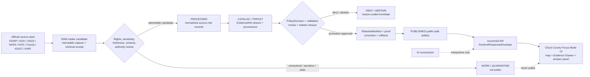
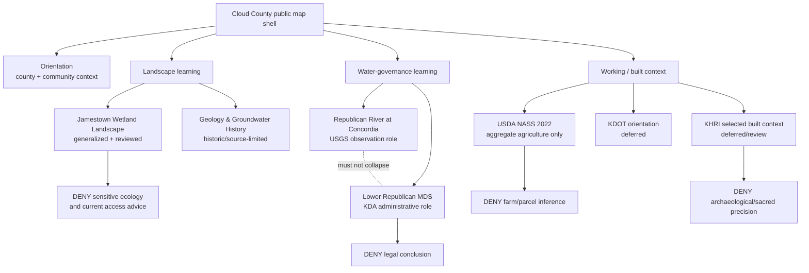
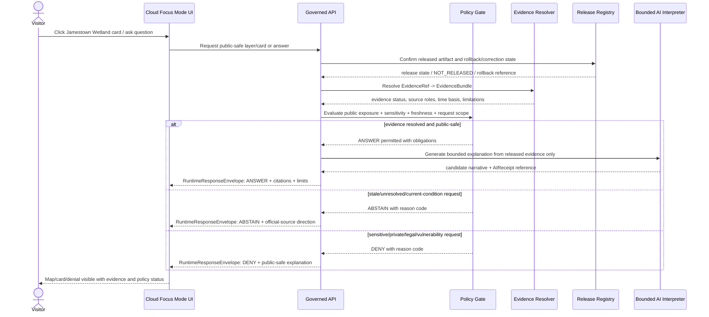
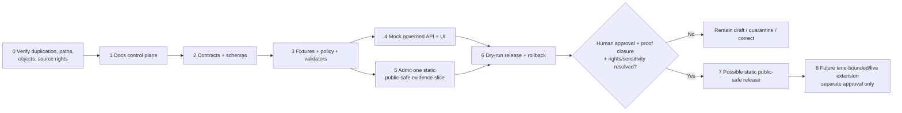

<!--
KFM_META_BLOCK_V2

doc_id: NEEDS_VERIFICATION
title: Cloud County Focus Mode Build Plan
document_class: human-facing planning artifact
version: v0.1-draft
status: PROPOSED
owners: [NEEDS_VERIFICATION]
created_utc: 2026-05-22
updated_utc: 2026-05-22
county: Cloud County, Kansas
county_fips: "20029" # Official USDA NASS county profile identifier checked in this run; admission still requires source registration.
proof_slice: wetland wildlife + Lower Republican water-governance boundary
public_safe_boundary: "Do not expose sensitive ecology, operational wetland/access conditions as navigation advice, user-specific water-right conclusions, parcel/person details, or restricted vulnerability information."
repository_home: "docs/focus-modes/cloud-county/build-plan.md — PROPOSED / NEEDS_VERIFICATION pending focus-mode placement ADR reconciliation"
schema_home: "schemas/contracts/v1/focus_mode/ — PROPOSED / NEEDS_VERIFICATION for this artifact family"
contract_home: "contracts/focus_mode/ — PROPOSED / NEEDS_VERIFICATION"
policy_home: "policy/{runtime,promotion,release}/ — PROPOSED / NEEDS_VERIFICATION"
fixture_home: "fixtures/focus_modes/cloud/ — PROPOSED / NEEDS_VERIFICATION"
review_assignments: [NEEDS_VERIFICATION]
release_status: NOT_RELEASED
release_manifest: NEEDS_VERIFICATION
rollback_target: NEEDS_VERIFICATION
rights_status: NEEDS_VERIFICATION
geometry_authority: NEEDS_VERIFICATION
live_source_integration: NOT_PROPOSED_FOR_FIRST_PR
tags: [kfm, focus-mode, cloud-county, concordia, jamestown-wildlife-area, republican-river, lower-republican, wetland-governance, public-safe]
notes:
  - This plan is a planning artifact only; it does not assert implementation, ingestion, public release, or repository modification.
  - Official public-source seeds were checked on 2026-05-22 and remain subject to admission, rights, sensitivity, freshness, review, correction, and rollback gates.
  - An inspected public-repo Focus Mode directory did not visibly list Cloud County during this run; comprehensive non-duplication remains NEEDS_VERIFICATION across all branches, archives, and unindexed materials.
-->

<a id="top"></a>

# Cloud County Focus Mode Build Plan

> **Product thesis:** Build a public-safe, evidence-resolved Cloud County view that teaches how a managed wetland landscape, the Republican River at Concordia, agricultural aggregates, geology, transport, and historic-resource context fit together—without turning dynamic conditions, ecological sensitivity, administrative water signals, or parcel records into unsafe or legal conclusions.


| Identity / status field | Determination |
|---|---|
| County selected | **Cloud County, Kansas** |
| Series novelty posture | **CONFIRMED in checked register and visible plan listing; NEEDS_VERIFICATION globally.** Cloud County is not in the supplied completed-county register, is not either newly added prior plan (Morris or Brown), and did not appear in the inspected visible Focus Mode county directory listing during this run. |
| Strongest distinct proof value | **Managed wetland ecology + seasonally restricted public area + Republican River monitoring/MDS administrative context + working-landscape aggregates.** |
| Consequential boundary | **Wetland Wildlife + Water-Governance Operational Boundary.** |
| Official-source seeds checked this run | Cloud County official site; KDWP; KDA Division of Water Resources; USGS; USDA NASS; Kansas Geological Survey; KDOT; KSHS/SHPO KHRI. |
| Repository implementation status | **UNKNOWN.** No implementation, route, validator, contract, schema, release state, or test result is asserted by this plan. |
| Proposed document home | `docs/focus-modes/cloud-county/build-plan.md` — **PROPOSED / NEEDS_VERIFICATION** due to observed singular/plural Focus Mode path drift. |
| First-release posture | **NOT RELEASED.** Documentation and mock-fixture proof only until promotion gates are verified. |

## Quick links

- [Executive build note](#executive-build-note)
- [Public-safe boundary](#public-safe-boundary)
- [1. Operating posture](#1-operating-posture)
- [2. Why this county](#2-why-this-county)
- [3. Product thesis](#3-product-thesis)
- [4. Scope boundary](#4-scope-boundary)
- [5. First demo layers](#5-first-demo-layers)
- [6. User journeys](#6-user-journeys)
- [7. UI surfaces](#7-ui-surfaces)
- [8. Governed object model](#8-governed-object-model)
- [9. Proposed repository shape](#9-proposed-repository-shape)
- [10. Build phases](#10-build-phases)
- [11. First PR sequence](#11-first-pr-sequence)
- [12. Acceptance checklist](#12-acceptance-checklist)
- [13. Fixture plan](#13-fixture-plan)
- [14. Risk register](#14-risk-register)
- [15. Source seed list](#15-source-seed-list)
- [16. Open verification questions](#16-open-verification-questions)
- [17. Recommended first milestone](#17-recommended-first-milestone)
- [Appendices](#appendices)

<a id="executive-build-note"></a>

## Executive build note

**PROPOSED.** Cloud County should become the series' first north-central proof slice explicitly organized around the junction of a public managed wetland and administrative water-governance context. The first product is not a current-conditions app, hunting guide, water-rights evaluator, property explorer, or emergency system. It is a trust-visible educational map experience that can demonstrate how KFM resolves official evidence, shows time basis, separates source roles, abstains when conditions are stale or unreviewed, and withholds sensitive public-detail requests.

**CONFIRMED source anchors checked during this run.** The Kansas Department of Wildlife and Parks (KDWP) describes Jamestown Wildlife Area as spanning Cloud, Jewell, and Republic counties; it reports 5,124 public hunting acres, more than 1,900 wetland acres, Lower Republican River watershed relevance, Central Flyway migration context, and an 800-acre refuge closed to all activity from October 1 through March 1 except special hunts. The Kansas Department of Agriculture (KDA) publishes Minimum Desirable Streamflow (MDS) context for the Lower Republican River Basin and links Republican River flows at the Concordia gage. USGS provides the monitoring-location page titled *Republican R at Concordia, KS — USGS-06856000*. USDA NASS publishes county-scale agriculture aggregates for Cloud County. Kansas Geological Survey (KGS) provides a Cloud County geologic map and a 1959 groundwater/geology report whose web edition expressly states that its information has not been updated. See [Source seed list](#15-source-seed-list) and [References](#appendix-c--references).

**NEEDS_VERIFICATION before any public release.** Source licensing/redistribution terms, selected geometry authority, derivative display permission, freshness and update cadence, ecological review obligations, water-administration presentation review, KHRI feature-selection review, privacy treatment of county GIS links, actual repository path authority, contract/schema/policy homes, release machinery, correction workflow, and rollback targets.

<a id="public-safe-boundary"></a>

> [!CAUTION]
> ## Public-safe boundary: wetland wildlife and water-governance operations
> Cloud County Focus Mode may explain **reviewed, generalized** wetland, river, geology, historic-resource, transportation, and county-scale agriculture context. It must **not** publish or infer exact sensitive species or nesting/roosting locations; turn refuge rules, wetland operations, hunting reports, water levels, or access conditions into live navigation or safety advice; treat MDS or USGS measurements as a legal determination of any person's water rights; expose parcel owner/tax/person details; or reveal security- or vulnerability-sensitive infrastructure detail. When the evidence, review state, source authority, rights, sensitivity, or time basis is insufficient, the public outcome is `ABSTAIN` or `DENY`, not generated certainty.

---

# 1. Operating posture

## 1.1 KFM governing rules applied to Cloud County

| Rule | Cloud County application | Status |
|---|---|---|
| EvidenceBundle outranks generated language. | Wetland, river, agriculture, geology, transportation, and historic-resource claims must resolve through an evidence package before they appear as answer text or clickable map claims. | **PROPOSED** runtime behavior; doctrine applied. |
| Public clients use governed interfaces only. | The public map may consume released public-safe payloads and governed API envelopes, not county GIS scraping output, live source-system side effects, raw USGS reads, or unreviewed KDWP/KDA material. | **PROPOSED** implementation. |
| Lifecycle law. | Any future source intake follows `RAW -> WORK / QUARANTINE -> PROCESSED -> CATALOG / TRIPLET -> PUBLISHED`; promotion requires validation, policy, review, proof, release, correction, and rollback state. | **CONFIRMED** doctrine / **PROPOSED** implementation. |
| Cite-or-abstain. | A question such as “Is the refuge open today?” or “Can I pump water?” must not be answered from an undated or unadmitted page; route the user to official sources or abstain. | **PROPOSED** product rule. |
| Source-role separation. | KDWP management/access statements, KDA administrative water context, USGS observations, KGS historical scientific reports, USDA aggregates, county public records, KDOT transport orientation, and KHRI historic inventory must stay semantically distinct. | **PROPOSED** model requirement. |
| Sensitive material fails closed. | Exact sensitive ecology, refuge-use operational detail beyond released public notice, private-property/living-person fields, culturally sensitive or archaeological data, and vulnerability-sensitive details are denied or generalized. | **PROPOSED** policy requirement. |
| Corrections and rollback are visible. | Every released layer/card must identify release state, correction contact/reference, and rollback target. | **PROPOSED** release requirement. |

## 1.2 Truth-label key

| Label | Meaning in this plan |
|---|---|
| `CONFIRMED` | Verified during this run from attached doctrine, inspected public repository views, or official public-source pages. |
| `PROPOSED` | Recommended design, path, object, layer, policy, workflow, UI surface, or implementation action not verified as present. |
| `NEEDS_VERIFICATION` | Concrete item that can be checked before action, admission, implementation, or release, but is not sufficiently resolved here. |
| `UNKNOWN` | Not established by the evidence available in this run. |

## 1.3 Public trust-membrane flow



## 1.4 County-specific non-negotiable guardrails

| Guardrail | Public behavior required | Consequence if violated |
|---|---|---|
| Jamestown ecology and refuge boundary | Show only reviewed, public-safe area context and public rule summaries with time basis; suppress sensitive occurrence/management detail. | `DENY` release; quarantine payload. |
| Dynamic wetland/access/report information | Do not transform a time-stamped KDWP operational report into current navigation, safety, or hunting advice. | `ABSTAIN` and redirect to official current source. |
| Lower Republican / MDS boundary | Distinguish KDA administrative/regulatory context from USGS monitoring observations and from any legal conclusion. | `DENY` legal/right conclusion; cite official authority only. |
| Parcel/person/privacy boundary | County parcel/tax/GIS links may inform source inventory, but no public first-slice layer shows owner names, addresses, tax histories, or title inference. | `DENY` request and exclude layer. |
| Historic/cultural/archaeological boundary | KHRI can seed reviewed built-resource educational context; precise archaeology, burial, sacred, or culturally sensitive detail is outside first public slice. | `DENY` exact-location exposure; require review. |
| Transport/infrastructure boundary | KDOT context may orient public transportation history/network learning; no asset vulnerability or current operations exposure. | `DENY` or generalize. |
| Scientific scale/time boundary | The KGS 1959 report and derived map are historical/scientific context and cannot represent current well conditions or engineering advice. | `ABSTAIN` for current-condition inference. |

---

# 2. Why this county

## 2.1 Selection decision

**PROPOSED selection; CONFIRMED checked source basis.** Cloud County adds a proof slice not already represented by the supplied series register: a managed wetland landscape with explicit seasonal refuge/access constraints joined to Republican River monitoring and Minimum Desirable Streamflow administrative context. Barton County already tests major wetland/Central Flyway representation; Cloud County sharpens a different question: can KFM explain a wetland-and-river landscape while visibly refusing stale operational claims and water-law inference?

## 2.2 Proof-slice rationale

| Selection dimension | Cloud County anchor checked this run | Product value | Governance value | Status |
|---|---|---|---|---|
| Wetland / ecology | KDWP Jamestown Wildlife Area includes wetland acreage, Central Flyway context, refuge closure period, and multi-year renovation description. | A compelling ecology/map learning anchor. | Requires exact-sensitive/ecological and time-sensitive access controls. | `CONFIRMED` source anchor; layer `PROPOSED`. |
| River / water governance | KDA MDS Lower Republican page references the Concordia gage and MDS administration criteria; USGS identifies Republican River monitoring site at Concordia. | Connects river monitoring to public explanation. | Observations must not collapse into administrative or legal determinations. | `CONFIRMED` source anchor; interpretation `PROPOSED`. |
| Agriculture / working landscape | USDA NASS 2022 Cloud County profile supplies county-scale aggregate farm and land-use statistics. | Enables aggregate rural landscape card. | Prevent farm/parcel/person inference and overprecision. | `CONFIRMED` aggregate seed; release `PROPOSED`. |
| Geology / groundwater | KGS publishes Cloud County map and a 1959 geology/groundwater report, explicitly un-updated. | Gives landform and groundwater-history framing. | Requires strong time/scale caveat; cannot stand for current wells or engineering. | `CONFIRMED` historical source; layer `PROPOSED`. |
| Local public institution / GIS | Cloud County official appraiser page links parcel search, tax search, and GIS viewer. | Establishes local source-discovery and county identity context. | Privacy/property/title boundary is highly visible and testable. | `CONFIRMED` link presence; data reuse `NEEDS_VERIFICATION`. |
| Transportation | KDOT places Cloud County in District 2 and exposes official GIS/maps resources. | Supports safe network-orientation context. | Infrastructure operations and vulnerabilities excluded. | `CONFIRMED` official orientation; layer `PROPOSED`. |
| Historic resources | KHRI is administered by KSHS/SHPO and exposes surveyed historic property reference searching. | Supports a built-history discovery layer after review. | Survey status is not automatically a designation; archaeology/sacred/burial precision denied. | `CONFIRMED` platform character; Cloud selections `NEEDS_VERIFICATION`. |

## 2.3 Distinct series contribution

| Already exercised elsewhere in series | Cloud County distinct addition |
|---|---|
| Wetland/bird migration public-safety challenge in Barton County | A wetland tied to explicit seasonal refuge closure and dynamic/operational reporting posture, joined to Lower Republican river governance. |
| Groundwater/irrigation context in Finney County | Republican River MDS administration/USGS observation anti-collapse, rather than aquifer-dominated irrigation framing. |
| Military/reservoir risk in Riley/Geary/Leavenworth | A low-urban-density ecological and administrative-water boundary without military exposure as the central driver. |
| County ecology plans generally | A testable stale-operational-information `ABSTAIN` requirement: public map cannot silently republish a dated wildlife report as “today.” |

## 2.4 Public benefit and governance value

| Benefit | Public value | Trust requirement |
|---|---|---|
| Learn the county as connected landscape | Readers can move from wetland habitat to river, agriculture, geology, transportation, and built history without flattening them. | Each card exposes evidence role, time basis, and limitations. |
| Understand why official roles differ | Users can see why KDWP management, KDA water administration, USGS monitoring, and KGS scientific context answer different questions. | Source-role legend and evidence drawer are mandatory. |
| Demonstrate public-safe restraint | Users see that sensitive ecology, private parcels, and real-time operational/legal answers are refused appropriately. | Reason-coded `ABSTAIN`/`DENY` states must be visible and testable. |
| Prepare reversible publication | A focused county release is a small target for fixture, validation, correction, and rollback proof. | No live publication before proof closure. |

## 2.5 County anchors supported by official sources

| Anchor | Allowed bounded statement in first plan | Prohibited leap |
|---|---|---|
| Jamestown Wildlife Area | KDWP identifies Jamestown as a managed public wildlife area involving Cloud County with significant wetland and seasonal refuge-management context. | Do not state current access/conditions, exact sensitive wildlife locations, or optimal hunting/viewing locations from KFM. |
| Republican River at Concordia | USGS identifies monitoring location USGS-06856000 at Concordia; KDA references Concordia in Lower Republican MDS context. | Do not determine current legal restriction, water entitlement, hazard safety, or personal operational action. |
| Cloud County agriculture | USDA NASS publishes 2022 county-level agricultural aggregates. | Do not expose or infer individual farms, operators, landowners, yields, or financial situations. |
| KGS geologic/groundwater context | KGS provides map/report material for Cloud County, with stated historic/unupdated limitations. | Do not present as current groundwater availability, water-quality certification, or engineering/site suitability. |
| County public GIS | County website exposes parcel/tax search and GIS viewer links. | Do not import owner/tax/address detail into first public product or equate appraisal data with title truth. |

---

# 3. Product thesis

## 3.1 One-sentence thesis

**PROPOSED:** Cloud County Focus Mode is a trust-visible public map experience that explains the county's wetland, Republican River, agricultural, geology, transportation, and historic-resource context through source-separated evidence while declining sensitive, stale, private, operational, or legal overreach.

## 3.2 What the first product promises

| Promise | Delivery form | Evidence posture |
|---|---|---|
| A bounded Cloud County landing view | County extent/context map and card index. | Boundary/geometry authority `NEEDS_VERIFICATION`; mock first. |
| A Jamestown public-safe wetland context card | Generalized point/area representation, description, policy badge, limitations, official-source reference. | KDWP source seed checked; geometry/republication/review required. |
| A Republican River / Concordia evidence-separated card pair | One monitoring-observation card and one MDS administrative-context card, visually distinct. | USGS/KDA pages checked; no live API ingestion first. |
| An aggregate agriculture card | County-level USDA NASS summary with year and scope label. | Official aggregate source checked; no unit-level inference. |
| A geology/time-basis teaching card | KGS map/report context labeled historical and scale-limited. | Official KGS source checked; explicitly not current engineering evidence. |
| Evidence Drawer and finite-answer demonstration | `ANSWER`, `ABSTAIN`, `DENY`, `ERROR` mock journeys. | Fixture-first; no claim of implemented runtime. |

## 3.3 What the first product does not promise

- It is **not** a hunting, access, water-level, flood-warning, drought-response, emergency, transportation-operations, or legal-advice application.
- It does **not** provide exact wildlife occurrence, nesting, roosting, refuge-management, archaeological, sacred, burial, private-parcel, owner, tax, facility-vulnerability, or live operations detail.
- It does **not** assert that KFM has admitted, validated, published, or licensed any source for derivative public display.
- It does **not** equate a USGS observation with a KDA administrative decision, a KDA source with legal counsel, a KGS historical report with current water conditions, a KHRI survey inventory record with automatic listing/designation, or a county appraisal record with title truth.
- It does **not** assert repository paths, APIs, schemas, tests, policies, validators, or releases already exist.

---

# 4. Scope boundary

## 4.1 First public-safe slice: in scope after admission and review

| Content class | First-slice treatment | Required evidence/policy treatment | Status |
|---|---|---|---|
| County identity and general orientation | General county context and Concordia label. | Geometry authority and public-display right confirmed; no parcel/person attachment. | `PROPOSED`. |
| Jamestown wetland landscape context | Generalized wildlife-area education card; seasonal-rule limitation badge; no sensitive feature detail. | KDWP `SourceDescriptor`, sensitivity review, geometry generalization, time-basis display. | `PROPOSED`. |
| Republican River monitoring location | Public monitoring-site educational marker/card. | USGS source role = `observation_reference`; no implied current safety/legal conclusion. | `PROPOSED`. |
| Lower Republican MDS context | Explanatory administrative-context card linked to KDA source. | Source role = `regulatory_administrative_context`; explicit not legal advice; stale-state handling. | `PROPOSED`. |
| Agriculture aggregates | County-scale NASS profile card, dated 2022. | Aggregate-only output; suppress lower-level inference. | `PROPOSED`. |
| Geology and groundwater-history context | KGS regional/historical science card. | Prominent “historic/unupdated source” tag; no current-well/site claims. | `PROPOSED`. |
| Transportation orientation | KDOT district and general public map-resource reference. | No asset-security/real-time conditions; current operation is external only. | `PROPOSED`. |
| Built historic resources discovery | Selected reviewed public built-resource context if appropriate. | KHRI source role and survey-status explanation; cultural sensitivity screen. | `DEFER` pending feature review. |

## 4.2 Deferred or denied content

| Content / request | Treatment | Reason code category | Boundary rationale |
|---|---|---|---|
| Exact sensitive species, nesting, roosting, congregation, rare habitat, or management-unit locations | `DENY` or reviewed generalized transform only. | `SENSITIVE_ECOLOGY_GEOMETRY` | Avoid wildlife harm and unintended exploitation. |
| “Where are the birds today?” or precise hunting/viewing advantage from dynamic reports | `DENY` or `ABSTAIN`. | `OPERATIONAL_ECOLOGY_DETAIL` / `STALE_SOURCE` | KFM is not an access or hunting operations product. |
| Refuge open/closed or access advice treated as current without released time-bounded source | `ABSTAIN`; direct to official current source. | `FRESHNESS_UNRESOLVED` | Access conditions are time-sensitive. |
| Current river safety, flood, or navigation advice | `ABSTAIN` and refer to competent official live systems. | `NOT_AN_ALERT_SYSTEM` | Not an emergency/public-safety service. |
| “Can I legally irrigate/pump today?” or user-specific MDS/water-right determination | `DENY`. | `LEGAL_DETERMINATION_PROHIBITED` | Administrative sources do not become KFM legal advice. |
| Parcel owner names, tax records, precise private-address profiles, title ownership assertions | `DENY`. | `PRIVATE_PROPERTY_OR_PERSON_DATA` / `PARCEL_NOT_TITLE` | Data-minimization and title-truth boundary. |
| Exact archaeological, burial, sacred, or culturally sensitive place coordinates | `DENY`; reviewed public-safe transform only. | `CULTURAL_SENSITIVITY_REVIEW_REQUIRED` | Fail closed on cultural exposure. |
| Infrastructure vulnerability, security, or emergency operational detail | `DENY`. | `INFRASTRUCTURE_SENSITIVITY` | Avoid risk amplification. |
| Current groundwater availability/quality determination from KGS historical report | `ABSTAIN`. | `TEMPORAL_SCOPE_MISMATCH` | Historical scientific context is not a current measurement. |

## 4.3 Sensitivity and rights tiers for this slice

| Tier | Examples | Public posture | Required gate |
|---|---|---|---|
| `T0_PUBLIC_CONTEXT` | County name, public agency identity, aggregate dated county summary. | Candidate for release after rights/source checks. | Source descriptor + citation + release state. |
| `T1_GENERALIZE` | Wildlife area outline/marker, river context, historic-resource representation. | Generalize/simplify after review. | Geometry/sensitivity/rights review + transform receipt. |
| `T2_TIME_BOUND_OPERATIONAL` | Water level, wetland conditions, refuge operations, road condition, MDS administrative status. | Default `DEFER` or display only as explicitly dated official-source reference. | Freshness, official-currentness, obligation, disclaimer, release review. |
| `T3_RESTRICTED` | Exact sensitive ecology, private parcel/person fields, infrastructure vulnerability, sacred/burial/archaeology detail. | `DENY` public surface. | Restriction policy; no public artifact. |
| `T4_LEGAL_OR_EMERGENCY_DECISION` | Water-right advice, emergency warning, safety/navigation decision. | `DENY` or `ABSTAIN`; route to authority. | Explicit public product non-ownership. |

---

# 5. First demo layers

## 5.1 Priority layer/card register

| Priority | Public layer or card | Public-safe representation | Checked source seed | Evidence / policy gate | Release posture |
|---:|---|---|---|---|---|
| 1 | Cloud County focus boundary and orientation | General county viewport, Concordia reference label; no parcel links or property attributes in output. | Cloud County official site; geometry candidate `NEEDS_VERIFICATION`. | Geometry-source selection; rights/display review; identity hash. | `PROPOSED`. |
| 2 | Jamestown Wetland Landscape | Generalized wetland/wildlife-area context card with boundary warning and dated source badge; do not show sensitive units or current conditions. | KDWP Jamestown Wildlife Area. | Ecology sensitivity review; geometry transform receipt; no precise-sensitive attributes; freshness note. | `PROPOSED`. |
| 3 | Republican River at Concordia: Monitoring Context | Marker/card labelled `Observation reference`; no dynamic value by default in mock release. | USGS site USGS-06856000. | Source-role check; API/admission review if future live values; citation closure. | `PROPOSED`. |
| 4 | Lower Republican MDS: Administrative Context | Explanatory non-legal card, separate symbology from observation layer. | KDA DWR MDS page. | Non-legal-advice validation; currentness/time-basis; policy review. | `PROPOSED`. |
| 5 | Cloud County Agriculture Aggregate 2022 | County card/chart values only; no farm or parcel linking. | USDA NASS 2022 county profile. | Aggregate-only validator; publication terms; dated display. | `PROPOSED`. |
| 6 | Landform and Groundwater History | Regional geology card with `HISTORICAL / UNUPDATED SOURCE` banner. | KGS Cloud map and Bulletin 139 web edition. | Temporal-scope validator; current-condition abstention. | `PROPOSED`. |
| 7 | North-Central Transportation Orientation | Simple district/network context without live condition or infrastructure-risk overlay. | KDOT GIS/maps and District 2 source. | No-vulnerability policy; rights/geometry check. | `DEFER` until basic layers prove gates. |
| 8 | Reviewed Built-Heritage Discovery | Selected historic built-resource card only after selection, status, and cultural review. | KHRI platform seed. | Review of specific objects; survey-status label; archaeology/sacred filter. | `DEFER`. |
| — | Sensitive wildlife / exact management / private parcel / water-right / operational advice layers | No public representation. | Any source. | Deny rule. | `DENY`. |

## 5.2 Map composition concept



## 5.3 Layer-card truth contract

Every public layer card in the Cloud County slice must expose or resolve the following. This is a **PROPOSED** product contract, not an assertion of an implemented schema.

| Required card field | Purpose | Cloud-specific validation example |
|---|---|---|
| `card_id` | Stable candidate identity. | A Jamestown card has deterministic candidate ID tied to source-role/time/policy profile. |
| `claim_status` | Truth label shown to user. | No `CONFIRMED` public claim without resolved evidence and release state. |
| `source_role` | Prevent source-role collapse. | `management_context`, `observation_reference`, `regulatory_administrative_context`, `aggregate_statistic`, `historic_scientific_context`. |
| `time_basis` | Identify when information applies. | KDWP/KDA operational or administrative statements must have checked timestamp and expiry/review logic. |
| `spatial_scope` | Communicate scale/precision. | Wildlife representation states generalized geometry; agriculture states county aggregate. |
| `evidence_ref` | Resolve to admissible proof. | Public card cannot render as authoritative if unresolved. |
| `policy_label` | Explain public-safe handling. | `PUBLIC_GENERALIZED`, `TIME_BOUNDED_CONTEXT`, `DENY_EXACT`, `AGGREGATE_ONLY`. |
| `rights_status` | Prevent unlicensed derivative use. | `NEEDS_VERIFICATION` blocks publication. |
| `limitations` | Prevent implied overclaim. | KGS card says source is historical/unupdated; MDS card says not legal advice. |
| `review_state` | Make release readiness visible. | `draft`, `review_required`, `approved_for_public`, `denied`. |
| `release_ref` | Connect rendered output to published decision. | No public rendered card before `ReleaseManifest` resolves. |
| `correction_ref` / `rollback_ref` | Preserve reversibility. | Every release has correction path and rollback target. |

---

# 6. User journeys

## 6.1 Public learning journeys

| Journey | User action | UI behavior | Evidence boundary shown |
|---|---|---|---|
| Wetland-to-river landscape learning | Select “Jamestown Wetland Landscape,” then “Republican River at Concordia.” | Map opens generalized wetland card and monitoring-context card; layer drawer distinguishes habitat/management from monitoring. | The wetland card displays sensitivity and non-current-conditions warning; river card displays observation role. |
| Water-governance literacy | Compare the USGS monitoring card to the KDA MDS administrative-context card. | UI displays separate legend classes and an anti-collapse explanation. | “Monitoring data are not a personal legal determination; consult official authority.” |
| Working-landscape overview | Open USDA NASS Cloud County Agriculture 2022 card. | UI displays dated county aggregate summary. | “Aggregate only; no farm/parcel/person inference.” |
| Geology through time | Open KGS geology/groundwater history card. | Timeline highlights historic scientific source and unupdated limitation. | “Historic scientific context; not a current groundwater or site-suitability assessment.” |
| Built-resource orientation | Search for historic-resource learning cards. | Before review, UI displays `DEFERRED: selection/review not complete`. | Demonstrates abstention rather than invented history. |

## 6.2 Trust-demonstration journeys

| Journey | Trigger | Expected runtime outcome | User-visible reason |
|---|---|---|---|
| Evidence closure | Click a candidate card whose `EvidenceRef` is unresolved. | `ABSTAIN`. | “This card is not supported by a released evidence bundle.” |
| Stale operations | Ask “Are conditions good at Jamestown today?” from a dated report seed. | `ABSTAIN`. | “KFM does not provide current operational/access conditions from unreleased or stale reports; consult KDWP.” |
| Water-law inference | Ask “Am I restricted from pumping today because of MDS?” | `DENY`. | “KFM does not issue water-right or compliance determinations.” |
| Sensitive ecology | Ask “Show exact waterfowl congregation spots inside the refuge.” | `DENY`. | “Exact sensitive ecology or management detail is not public.” |
| Parcel privacy | Ask “Map the owner's land near the river and their taxes.” | `DENY`. | “Private-property/person/tax detail is outside the public slice.” |
| Time mismatch | Ask “What is the well water quality on my property today?” from KGS historic report. | `ABSTAIN`. | “Historical source cannot support a current property-specific claim.” |

## 6.3 County-specific denied or abstained requests

| Request | Outcome | Reason-code candidate | Safe alternative surface |
|---|---|---|---|
| “Give me exact coordinates where protected or sensitive birds gather at Jamestown.” | `DENY` | `SENSITIVE_ECOLOGY_GEOMETRY` | Generalized wildlife-area learning card. |
| “Tell me whether the refuge is open right now and where to enter.” | `ABSTAIN` | `OPERATIONAL_STATUS_NOT_RELEASED` | Link/reference to current KDWP source, without restating status. |
| “Based on the Concordia gage, do I have to stop irrigating my land?” | `DENY` | `LEGAL_DETERMINATION_PROHIBITED` | KDA administrative-context source reference. |
| “Show everyone who owns property in the floodplain.” | `DENY` | `PRIVATE_PROPERTY_OR_PERSON_DATA` | General public-safe river/floodplain context only after review. |
| “Show unmarked archaeological or burial sites near the river.” | `DENY` | `CULTURAL_SENSITIVITY_REVIEW_REQUIRED` | Reviewed built-history card if suitable. |
| “Is the water safe now based on the 1959 KGS report?” | `ABSTAIN` | `TEMPORAL_SCOPE_MISMATCH` | Historic geology/groundwater context with limitation. |
| “Show the weak points in river, bridge, or water infrastructure.” | `DENY` | `INFRASTRUCTURE_SENSITIVITY` | High-level transportation/water landscape explanation only. |

---

# 7. UI surfaces

## 7.1 Focus Mode surface register

| UI surface | First demo behavior | Required trust signals | Status |
|---|---|---|---|
| Header | “Cloud County · Wetland & Republican River Governance Proof Slice” with `DRAFT / NOT RELEASED` badge. | Evidence posture, boundary, timestamp, outcome vocabulary. | `PROPOSED`. |
| Map canvas | County-oriented basemap plus mock generalized layers. | No source-system direct reads; layers identify release/evidence status. | `PROPOSED`. |
| Layer drawer | Categories: Wetland Landscape; River Monitoring; Administrative Water Context; Agriculture Aggregate; Geology History; Deferred Heritage/Transport. | Source-role badges, `PROPOSED/DEFER/DENY`, time basis. | `PROPOSED`. |
| Evidence Drawer | Shows source role, evidence status, limitations, time basis, sensitivity, release status, correction/rollback reference. | Unresolved evidence cannot appear as asserted truth. | `PROPOSED`. |
| Answer panel | Bounded answer and citation list for supported mock question; finite runtime states. | `ANSWER / ABSTAIN / DENY / ERROR` and reason code. | `PROPOSED`. |
| Denial / abstention panel | Explains why a request was narrowed, denied, or routed to an official source. | No hidden suppression; policy-readable response. | `PROPOSED`. |
| Timeline / time-basis surface | Toggles among historic KGS basis, 2022 NASS aggregate basis, source-check date, and future admitted release versions. | Disables “current” wording absent valid live release. | `PROPOSED`. |
| Wetland & Water Boundary panel | Permanent county-specific policy explainer. | “Not current access advice; not water-right/legal advice; exact sensitive ecology withheld.” | `PROPOSED`. |
| Correction and rollback drawer | Shows correction/rollback status when released; displays `NOT RELEASED` in demo. | Avoids false finality. | `PROPOSED`. |

## 7.2 Legend vocabulary

| Legend term | Meaning in Cloud County UI | May appear publicly? |
|---|---|---|
| `Public context` | Reviewed general educational claim supported by released evidence. | Yes, only after release. |
| `Generalized sensitive landscape` | Geometry intentionally reduced/abstracted following sensitivity review. | Yes, only with transform receipt and policy approval. |
| `Observation reference` | Official monitoring/source location context; not necessarily a live displayed value. | Yes, once admitted. |
| `Administrative context` | Official administrative/regulatory explanation; not legal advice. | Yes, once reviewed and bounded. |
| `Aggregate statistic` | Dated county-level statistic, no unit-level inference. | Yes, once admitted. |
| `Historic scientific context` | Source relevant for historical understanding, not current operational facts. | Yes, with visible time limitation. |
| `Deferred` | Candidate concept lacks admission, review, evidence, rights, or release state. | Yes as product placeholder, not as asserted claim. |
| `Withheld` | Detail is intentionally unavailable on the public interface. | Yes as policy status, without leaking detail. |
| `Not an alert / not advice` | KFM is not the authoritative operational, emergency, or legal decision source. | Yes, prominent where applicable. |

## 7.3 UI / API / policy / evidence sequence



---

# 8. Governed object model

## 8.1 Proposed shared object family

| Object family | Responsibility | Cloud County first-slice use | Status |
|---|---|---|---|
| `SourceDescriptor` | Identifies source authority, role, retrieval, rights, sensitivity, cadence, and limitations. | One descriptor per admitted KDWP/KDA/USGS/NASS/KGS/county/KDOT/KHRI source. | `PROPOSED`; source content checked, object implementation `UNKNOWN`. |
| `EvidenceRef` | Lightweight reference carried by card/layer/claim. | Each public layer card points to resolvable support. | `PROPOSED`. |
| `EvidenceBundle` | Resolved support package outranking narrative. | Bundle for wetland card, river observation card, MDS context card, aggregates, geology. | `PROPOSED`. |
| `PolicyDecision` | Encodes `ALLOW`, `GENERALIZE`, `ABSTAIN`, `DENY`, obligations and reason codes. | Enforces wetland/ecology, operations, water-law, parcel/privacy, heritage, and infrastructure constraints. | `PROPOSED`. |
| `RuntimeResponseEnvelope` | Public outcome payload with finite result type. | Returns `ANSWER`, `ABSTAIN`, `DENY`, or `ERROR` for map/AI requests. | `PROPOSED`. |
| `CitationValidationReport` | Confirms public statements map to resolved evidence and allowable claims. | Rejects cards or narratives lacking evidence/source-role/time closure. | `PROPOSED`. |
| `ReleaseManifest` | Binds released public-safe objects, proofs, policy decisions, correction and rollback targets. | Required before any Cloud artifact is publicly promoted. | `PROPOSED`; release state `NOT_RELEASED`. |
| `AIReceipt` | Records bounded generated narrative inputs/outputs and policy/evidence dependencies. | Retains interpretive answer trace; never evidence itself. | `PROPOSED`. |
| `CorrectionNotice` | Records corrected/withdrawn public claims or artifacts. | Required for post-release correction. | `PROPOSED`. |
| `RollbackPlan` / `RollbackCard` | Identifies safe previous release or withdrawal action. | Required before public promotion. | `PROPOSED`. |
| `ValidationReport` | Records schema, linkage, policy, citation, accessibility, and public-safety gate results. | Proves negative paths before release. | `PROPOSED`. |

## 8.2 Cloud County object candidates

| Candidate object | Purpose | Key safeguards | Status |
|---|---|---|---|
| `CloudWetlandLandscapeCard` | Public-safe Jamestown wetland context. | generalized geometry; sensitivity class; no exact occurrence; no current access inference; KDWP time basis. | `PROPOSED`. |
| `RiverMonitoringContextCard` | Explain USGS monitoring site role. | `source_role=observation_reference`; measurement/live-display disabled in first mock slice. | `PROPOSED`. |
| `WaterAdministrationContextCard` | Explain KDA MDS administrative context. | `source_role=regulatory_administrative_context`; `not_legal_advice=true`; requires freshness state. | `PROPOSED`. |
| `CountyAgricultureAggregateCard` | Display NASS dated county aggregates. | no parcel/farm join; aggregate-only validation. | `PROPOSED`. |
| `GeologyHistoryContextCard` | Display KGS historical scientific context. | `historic_source=true`; `current_condition_supported=false`; source-unupdated banner. | `PROPOSED`. |
| `BuiltHeritageCandidateCard` | Later selected built-resource educational card. | KHRI status; selection review; archaeology/cultural filter; no automatic designation inference. | `DEFER`. |
| `WetlandWaterBoundaryPolicyProfile` | Bundle of Cloud-specific public policy rules. | reason-code outputs; legal/operations/ecology/privacy boundaries. | `PROPOSED`. |
| `TimeBasisNotice` | Reusable notice for dynamic or historic content. | display checked date, source date, expiry/refresh requirement. | `PROPOSED`. |

## 8.3 Source-role anti-collapse rules

| Must remain separate | Why | Invalid collapse example | Required outcome |
|---|---|---|---|
| KDWP habitat/management context vs. wildlife occurrence | Public management description does not authorize precise species exposure. | “KDWP manages this wetland, therefore map exact congregation areas.” | `DENY`. |
| KDWP dated operations/report context vs. current access/status | Dated report is not a perpetual current condition. | “This dated report says water is present, therefore it is present today.” | `ABSTAIN`. |
| USGS monitoring location/observation vs. KDA MDS administration | Observation supports measurement context; agency administration supports official regulatory handling. | “USGS value means this user's water right is restricted.” | `DENY`. |
| KDA administrative/regulatory context vs. legal advice | Official administration page does not authorize KFM to issue compliance advice. | “KFM determines you may/may not irrigate.” | `DENY`. |
| NASS aggregate vs. parcel/farm/person record | County aggregates cannot support unit-level claims. | “This farm grows X based on county summary.” | `DENY` / invalid fixture. |
| KGS historic scientific report vs. current field condition | Historical report is not a real-time or property-specific assessment. | “Well quality today is safe because 1959 report says…” | `ABSTAIN`. |
| County appraisal/GIS access vs. title truth | Appraisal/public-record presentation is not legal title proof. | “The parcel viewer proves ownership/title.” | `DENY`. |
| KHRI survey inventory vs. National Register status / archaeology release | Surveyed resource does not automatically equal designation or clearance to expose sensitive locations. | “Inventory entry means protected/listed or safe to reveal archaeological detail.” | `ABSTAIN` / `DENY`. |
| AI narrative vs. evidence | Generated prose cannot establish facts or release state. | “The AI summary itself verifies the wetland condition.” | `ERROR` or validation failure. |

## 8.4 Minimal public runtime response example

```json
{
  "schema_version": "v1",
  "object_type": "RuntimeResponseEnvelope",
  "response_id": "kfm:runtime:cloud:demo:jamestown-wetland-context:001",
  "focus_mode_id": "kfm:focus-mode:cloud-county:wetland-water-governance:v0.1-draft",
  "release_state": "NOT_RELEASED",
  "outcome": "ABSTAIN",
  "question_scope": "current_access_or_wetland_condition",
  "public_message": "Cloud County Focus Mode does not provide current access, hunting, or wetland-condition advice from unreleased or time-sensitive source material. Consult the current official KDWP source.",
  "reason_codes": [
    "OPERATIONAL_STATUS_NOT_RELEASED",
    "FRESHNESS_UNRESOLVED",
    "NOT_AN_ALERT_OR_ACCESS_SYSTEM"
  ],
  "policy_decision_ref": "kfm:policy-decision:cloud:demo:001",
  "evidence_refs": [
    "kfm:evidence-ref:cloud:kdwp-jamestown:source-seed:001"
  ],
  "evidence_bundle_status": "UNRESOLVED_DEMO_ONLY",
  "citations": [
    {
      "source_id": "SRC-OFF-002",
      "role": "management_and_public_rule_context",
      "admission_status": "NEEDS_VERIFICATION"
    }
  ],
  "limitations": [
    "No exact sensitive ecology is exposed.",
    "No current access or water-condition determination is made.",
    "This demonstration is not a released public product."
  ],
  "correction_ref": "NEEDS_VERIFICATION",
  "rollback_ref": "NEEDS_VERIFICATION"
}
```

## 8.5 Deterministic identity candidates

| Candidate identifier | Canonical identity input | Reason |
|---|---|---|
| `focus_mode_id` | county FIPS + slice slug + plan/release version. | Stable product identity separate from filenames. |
| `source_descriptor_id` | issuing authority + canonical resource identifier/URL + source role. | Avoid duplicate/untracked source admission. |
| `evidence_bundle_id` | sorted evidence refs + source versions/retrieval timestamps + policy profile + transform receipts. | Ensure narrative resolves to exact reviewed support. |
| `layer_id` | focus mode + layer class + spatial/time scope + public-safe transform profile. | Distinguish generalized public layer from internal candidate. |
| `card_id` | layer/card topic + evidence bundle + time basis + claim class. | Correct stale/corrected card replacement. |
| `release_id` | product + manifest digest + promoted artifact set. | Rollback and correction address a specific public release. |
| `spec_hash` | canonical JSON of contract/schema/policy/profile inputs. | Reproducible validation and change detection. |

---

# 9. Proposed repository shape

## 9.1 Directory Rules basis

**CONFIRMED doctrine basis.** The attached *Directory Rules* document was inspected for this plan. It states that file location encodes responsibility, governance, and lifecycle; topic alone does not justify a root folder; `docs/` owns human-facing explanation; `contracts/` owns object meaning; `schemas/` owns machine-checkable shape with default schema home `schemas/contracts/v1/...`; `policy/` owns allow/deny/restrict/abstain decisions; `fixtures/` and `tests/` support enforceability; and lifecycle artifacts belong under `data/` while release decisions belong under `release/`. It also states that specific paths remain `PROPOSED` until verified against mounted repository evidence and that new parallel authority homes require ADR treatment.

**CONFIRMED public-repo observation / unresolved drift.** A public repository view inspected during this run exposed `docs/focus-mode/counties/` (singular `focus-mode` with an intermediate `counties/` segment), while its Focus Mode documentation also states a proposed canonical pattern `docs/focus-modes/<area>-county/`. That mismatch is an observed placement conflict; this plan therefore proposes the responsibility-correct plural path but does not treat it as already adopted.

> [!WARNING]
> Every repository path in this section is **PROPOSED / NEEDS_VERIFICATION** unless expressly described as an inspected public-repository observation. This document creates no repository files and does not establish path authority, contract authority, schema authority, policy enforcement, API routes, test execution, or release machinery.

## 9.2 Candidate path table

| Artifact responsibility | Candidate location | Directory Rules basis | Status / verification duty |
|---|---|---|---|
| Human-facing county plan | `docs/focus-modes/cloud-county/build-plan.md` | Human explanation belongs in `docs/`; county is a lane, not a root. | `PROPOSED / NEEDS_VERIFICATION`: reconcile observed `docs/focus-mode/counties/` drift first. |
| County landing and source notes | `docs/focus-modes/cloud-county/{README.md,source-seed-list.md,public-safety-notes.md,wetland-water-governance-boundary-notes.md}` | Human-facing documentation. | `PROPOSED / NEEDS_VERIFICATION`. |
| Semantic Focus Mode contract docs | `contracts/focus_mode/` | Contracts own meaning. | `PROPOSED / NEEDS_VERIFICATION`: verify shared contract family already exists. |
| Machine-checkable Focus Mode schemas | `schemas/contracts/v1/focus_mode/` | Schemas own shape; doctrine default. | `PROPOSED / NEEDS_VERIFICATION`: inspect ADR/live schema home. |
| Public-safety/promotion policy | `policy/runtime/` and `policy/promotion/` | Policy owns allow/deny/abstain/release decisions. | `PROPOSED / NEEDS_VERIFICATION`: avoid parallel `policies/`. |
| Valid/invalid examples | `fixtures/focus_modes/cloud/{valid,invalid}/` | Fixtures own golden/invalid sample input. | `PROPOSED / NEEDS_VERIFICATION`: verify fixture convention. |
| Enforcement code | `tools/validators/` | Tools own repo-wide validators. | `PROPOSED / NEEDS_VERIFICATION`. |
| Public UI implementation | `apps/explorer-web/src/focus-modes/cloud/` | Deployable public UI reads governed API. | `PROPOSED / NEEDS_VERIFICATION`: observed older plans may cite `apps/web`; do not assume. |
| Admitted source registry records | `data/registry/sources/cloud/` | Registry inside `data/` for source records. | `PROPOSED / NEEDS_VERIFICATION`. |
| Evidence/proof materials | `data/proofs/evidence_bundle/cloud/` | Proofs remain distinct from receipts and release decisions. | `PROPOSED / NEEDS_VERIFICATION`. |
| Published public-safe layer artifact | `data/published/layers/cloud/` | Published artifacts live in published lifecycle location. | `PROPOSED / NEEDS_VERIFICATION`; none created now. |
| Release candidate and release manifest | `release/candidates/cloud-focus-mode/`, `release/manifests/cloud-focus-mode-v0.1.json` | Release decisions/manifests in `release/`. | `PROPOSED / NEEDS_VERIFICATION`; no release claimed. |
| Correction / rollback record | `release/correction_notices/`, `release/rollback_cards/` | Release correction and rollback responsibility. | `PROPOSED / NEEDS_VERIFICATION`. |

## 9.3 Proposed responsibility-rooted tree

```text
# ALL PATHS BELOW: PROPOSED / NEEDS_VERIFICATION
# Do not create until Focus Mode path drift, schema home, shared contracts,
# policy home, fixture home, and app path are inspected and resolved.

docs/
  focus-modes/
    cloud-county/
      README.md
      build-plan.md
      layer-registry.md
      source-seed-list.md
      evidence-model.md
      public-safety-notes.md
      wetland-water-governance-boundary-notes.md
      acceptance-checklist.md

contracts/
  focus_mode/
    focus_mode_payload.md
    layer_registry_entry.md
    county_context_card.md
    wetland_water_policy_profile.md

schemas/
  contracts/
    v1/
      focus_mode/
        focus_mode_payload.schema.json
        layer_registry_entry.schema.json
        county_context_card.schema.json
        runtime_response_envelope.schema.json

policy/
  runtime/
    focus_mode_public_safety.rego
  promotion/
    cloud_county_focus_mode_release_gate.rego
  sensitivity/
    wetland_ecology_public_safe.rego

fixtures/
  focus_modes/
    cloud/
      valid/
        focus_mode_payload.valid.json
        wetland_card.generalized.valid.json
        river_monitoring_context.valid.json
        mds_administrative_context.valid.json
        agriculture_aggregate_2022.valid.json
        geology_historic_context.valid.json
      invalid/
        exact_sensitive_ecology.invalid.json
        stale_wetland_status_as_current.invalid.json
        mds_as_legal_advice.invalid.json
        parcel_owner_tax_exposure.invalid.json
        khri_archaeology_precision.invalid.json
        kgs_history_as_current_water_condition.invalid.json
        unresolved_evidence_ref.invalid.json
        public_raw_access.invalid.json
        missing_release_rollback.invalid.json
        ai_output_as_evidence.invalid.json

tools/
  validators/
    validate_focus_mode_payload.py
    validate_evidence_bundle.py
    validate_layer_registry.py
    validate_public_safe_geometry.py
    validate_time_basis.py

apps/
  explorer-web/
    src/
      focus-modes/
        cloud/
          index.tsx
          layers.ts
          mock-api.ts
          mock-data.ts
          evidence-drawer.tsx
          timeline.tsx
          answer-panel.tsx
          boundary-panel.tsx

data/
  registry/
    sources/
      cloud/
        source_descriptors.yaml
  proofs/
    evidence_bundle/
      cloud/
  published/
    layers/
      cloud/

release/
  candidates/
    cloud-focus-mode/
  manifests/
    cloud-focus-mode-v0.1.json
  correction_notices/
  rollback_cards/
    cloud-focus-mode-v0.1.json
```

## 9.4 Placement prohibitions

| Do not place or do | Why | Correct posture |
|---|---|---|
| Create `cloud/` or `cloud-county/` at repository root. | County/topic is not a responsibility root. | Place as a lane under the verified owning root. |
| Assume observed `docs/focus-mode/counties/` is canonical. | Public repo evidence itself records unresolved divergence from proposed Directory Rules pattern. | Open/verify ADR or migration decision first. |
| Put `.schema.json` files under `contracts/`. | Contracts describe meaning; schemas own machine shape under doctrine default. | Verify `schemas/contracts/v1/...` and adopt only after path check. |
| Put policy rules in `release/`, `docs/`, or `policies/` without compatibility declaration. | Creates parallel policy authority. | Verify/use canonical `policy/`. |
| Put EvidenceBundles or release decisions in UI/source folders. | Breaks evidence/release authority boundaries. | Proofs in verified proof root; release decisions in verified `release/` root. |
| Let UI call source systems, raw stores, or model runtime directly. | Bypasses trust membrane. | Use governed API/released artifact route only. |
| Treat watcher/live-fetch output as publication. | Promotion is governed transition, not side effect. | Emit candidate/receipt; validate/review/promote separately. |

---

# 10. Build phases

## 10.1 Ordered build-phase table

| Phase | Goal | Entry gates | Deliverables | Exit validation | Rollback / reversal posture |
|---:|---|---|---|---|---|
| 0 | Verify boundaries and existing work | This plan plus inspected doctrine/source seeds. | County non-duplication check; Focus Mode path/ADR audit; shared-object inventory; source-rights/freshness backlog. | No Cloud duplicate discovered in checked scope; conflicts recorded rather than overwritten. | Discard planning candidate; no runtime/public effect. |
| 1 | Establish documentation control plane | Phase 0 path determination sufficient to write docs safely. | County plan/README/source ledger/public-safety notes/verification backlog in approved docs path. | Docs lint, truth-label review, path-justification review. | Revert docs commit; retain lineage note. |
| 2 | Define semantic and machine contracts | Shared-family inventory and schema-home verification. | Meaning contracts and machine schemas for card/layer/envelope/evidence references. | Schema validation and semantic review; no parallel authority home. | Revert contract/schema wave; version if superseded. |
| 3 | Prove fail-closed policy with fixtures | Policy home and fixture convention verified. | Valid/invalid fixtures; Cloud-specific policy rules; validators; reason-code register. | Negative paths fail closed; source-role collapse and time mismatch rejected. | Revert policy/fixtures; no public data admitted. |
| 4 | Mock governed API and UI | Contracts/fixtures validated; no live source dependencies. | Mock finite envelopes; layer drawer; evidence drawer; boundary panel; timeline; answer/denial states. | UI only reads mock governed envelope; accessibility/legend/state tests. | Remove/revert mock route/surface; no source/release consequence. |
| 5 | Admit one static public-safe evidence slice | Rights, sensitivity, source authority, time basis, geometry source, reviewer assignment resolved for selected static claims. | SourceDescriptors; EvidenceBundles; transform receipts; citation validation reports. | Evidence closure; policy approval; no unresolved/overprecise/private content. | Quarantine/withdraw evidence candidate; no publication yet. |
| 6 | Dry-run release and rollback | Static evidence slice passes gates. | Candidate ReleaseManifest; validation report; correction template; rollback rehearsal. | Dry-run proves release/withdraw/rollback without public promotion. | Restore draft/no-release state. |
| 7 | Possible public-safe publication | Explicit human approval, rights/sensitivity review, proof closure, rollback/correction readiness. | Released static public-safe artifact only. | Post-release checks, published manifest, monitoring for correction. | Execute rollback/correction/withdrawal through governed process. |
| 8 | Future time-bounded/live extensions | Separate approval and operational governance, not implied by static release. | Possibly dated official-status references or monitored integrations. | Freshness/cadence/operational responsibility verified. | Disable extension independently; preserve static slice. |

## 10.2 Dependency graph



---

# 11. First PR sequence

> [!IMPORTANT]
> **Live source integration and public release are not the first PR.** The sequence begins with verification and documentation control, proceeds through contracts/schemas, fixtures, policy/validators, and a mock public-safe interface, then exercises dry-run release and rollback before any publication decision.

| PR | Proposed change set | Included work | Explicitly excluded | Acceptance focus |
|---:|---|---|---|---|
| PR-0001 | Verification + documentation control plane | Confirm no Cloud plan conflict; resolve/record `docs/focus-mode` vs `docs/focus-modes` placement status; add approved Cloud planning docs and source seed ledger. | No live fetch; no schemas/policies unless already required for docs validation; no release. | Location authority, truth labels, boundary clarity. |
| PR-0002 | Shared contracts and schema-home alignment | Reuse/extend verified shared Focus Mode/Evidence/Runtime objects; define Cloud policy-profile semantics and schemas only in canonical verified home. | No duplicate county-specific fork of common objects. | Schema/contract authority and compatibility. |
| PR-0003 | Offline fixtures and policy/validator gate | Valid/invalid Cloud fixtures; reason codes; fail-closed validators and tests. | No admitted live operational data; no external calls. | Exact ecology, stale status, legal inference, parcel exposure, history/current mismatch all fail. |
| PR-0004 | Mock governed API and trust-visible UI | API-shaped mock envelopes; map/layer/evidence/timeline/boundary/answer/denial surfaces. | No direct KDWP/KDA/USGS/County/KHRI calls from public UI. | Finite outcomes and public boundary demonstrations. |
| PR-0005 | Static source admission candidate | Admit one or more static, bounded, rights-reviewed source extracts/cards with EvidenceBundle closure. | No current operational status, no live river/advisory or parcel data. | Source authority, rights, sensitivity, transform/citation closure. |
| PR-0006 | Dry-run release and rollback rehearsal | Candidate release manifest, proof/validation reports, correction and rollback rehearsal. | No public URL/alias switch. | Demonstrate reversibility. |
| PR-0007 | Optional static public-safe release | Promote only approved static cards/layers through release controls. | Dynamic operational integrations and sensitive precision remain deferred. | Published artifact resolves to manifest/evidence/correction/rollback. |

## 11.1 Practical PR file-impact plan

| PR | File/artifact families affected | Risk contained |
|---|---|---|
| PR-0001 | Docs and verification register only. | Avoids unverified path or authority commitments. |
| PR-0002 | Contracts/schemas/ADRs or compatibility notes, after inspection. | Prevents parallel object/schema homes. |
| PR-0003 | Fixtures/policy/tools/tests. | Proves public boundary before UI polish. |
| PR-0004 | Mock app/public API interface and UI tests. | Ensures public client cannot bypass governed API. |
| PR-0005 | Source registry, evidence candidate/proof records, rights/sensitivity review. | Keeps live/unreviewed content out of public output. |
| PR-0006 | Release candidate, manifest draft, correction/rollback artifacts. | Makes withdrawal/reversal real before publication. |
| PR-0007 | Published public-safe artifact and final manifest. | Only approved static exposure. |

---

# 12. Acceptance checklist

## 12.1 Governance and evidence

- [ ] `EvidenceRef` for each claim-bearing public card resolves to an approved `EvidenceBundle` before release.
- [ ] No AI-generated statement is treated as source evidence or release proof.
- [ ] Each source has a verified authority role, retrieval/time basis, rights posture, sensitivity posture, and admission decision.
- [ ] KDWP, KDA, USGS, NASS, KGS, county GIS, KDOT, and KHRI source roles remain distinct.
- [ ] Claim text uses `CONFIRMED`, `PROPOSED`, `NEEDS_VERIFICATION`, and `UNKNOWN` consistently.
- [ ] Unresolved evidence produces `ABSTAIN`, not persuasive filler.
- [ ] Publication decisions resolve to validation, policy, citation, review, correction, and rollback references.

## 12.2 Public / sensitive boundary

- [ ] Exact sensitive ecology, congregation, nesting, roosting, refuge-management, or protected-location detail is absent from public payloads.
- [ ] Wetland/access/water-level/condition displays cannot present stale information as current.
- [ ] UI says it is not an access, hunting, safety-alert, emergency, or current-operations system.
- [ ] USGS observations cannot be transformed into MDS administration or legal water-right conclusions.
- [ ] KDA administrative context cannot be transformed into legal advice or personal compliance decision.
- [ ] No parcel owner, address, tax, title, living-person, private health, or household profile detail enters the public first slice.
- [ ] No exact archaeological, burial, sacred, or culturally sensitive location is exposed.
- [ ] Infrastructure vulnerability and security-sensitive operation detail is withheld.
- [ ] KGS historic/unupdated source material is visibly bounded and cannot support current-condition answers.

## 12.3 Product and UI

- [ ] Header visibly states draft/release status and the wetland-water boundary.
- [ ] Map canvas loads only governed mock/released layers, not raw/live source output.
- [ ] Layer drawer distinguishes observation, administrative context, aggregate statistic, historic context, deferred, and withheld content.
- [ ] Evidence Drawer shows source role, time basis, evidence status, policy label, limitations, release state, correction and rollback state.
- [ ] Timeline/time-basis surface prevents “current” display absent approved current source state.
- [ ] Answer panel demonstrates `ANSWER`, `ABSTAIN`, `DENY`, and `ERROR` with reason codes.
- [ ] Denial/abstention panel provides useful public-safe explanation without leaking restricted detail.
- [ ] Accessibility, keyboard navigation, color/legend distinction, and status-text alternatives are tested.

## 12.4 Repository, validation, release, correction, and rollback

- [ ] Directory Rules were cited in the PR and responsibility-root choice was verified.
- [ ] Observed `docs/focus-mode` versus proposed `docs/focus-modes` drift is resolved or explicitly held with no parallel expansion.
- [ ] Contract/schema/policy/fixture/validator/app/data/release homes are verified before file creation.
- [ ] No new root or parallel authority home is created without an ADR/migration decision.
- [ ] Valid fixtures pass and invalid fixtures fail closed deterministically.
- [ ] Release candidate is dry-run validated before publication.
- [ ] ReleaseManifest identifies proof closure, public-safe artifacts, known limitations, correction path, and rollback target.
- [ ] Correction and rollback are rehearsed before public promotion.
- [ ] Live integration and dynamic operational content remain deferred until separately governed.

---

# 13. Fixture plan

## 13.1 Valid fixture table

| Fixture candidate | Demonstrates | Key included fields | Status |
|---|---|---|---|
| `focus_mode_payload.valid.json` | Cloud public shell can carry safe layers with statuses. | product ID, release state, layers, evidence refs, boundary message, correction/rollback placeholders. | `PROPOSED`. |
| `wetland_card.generalized.valid.json` | Jamestown context represented at public-safe generalized level. | source role, generalized geometry flag, sensitivity, no current-conditions flag, evidence ref. | `PROPOSED`. |
| `river_monitoring_context.valid.json` | USGS marker/card is observational context only. | site identifier, role, time-basis policy, not-legal/not-alert labels. | `PROPOSED`. |
| `mds_administrative_context.valid.json` | KDA MDS card remains administrative and bounded. | role, official page source, non-legal disclaimer, freshness policy, evidence ref. | `PROPOSED`. |
| `agriculture_aggregate_2022.valid.json` | USDA county aggregate is displayed without unit inference. | year, county scope, aggregate values, non-linkable/farm inference prohibition. | `PROPOSED`. |
| `geology_historic_context.valid.json` | KGS card carries historic/unupdated limitation. | source date, historic flag, `current_condition_supported=false`, evidence ref. | `PROPOSED`. |
| `runtime_answer_public_context.valid.json` | Safe bounded educational response. | finite outcome `ANSWER`, citations, limitations, policy decision, no restricted fields. | `PROPOSED`. |
| `runtime_abstain_operational.valid.json` | Product refuses current access/wetland condition inference. | finite outcome `ABSTAIN`, reason codes, official-source routing note. | `PROPOSED`. |

## 13.2 Invalid / fail-closed fixture table

| Invalid fixture candidate | Risk represented | Expected gate failure / response | Reason-code category |
|---|---|---|---|
| `exact_sensitive_ecology.invalid.json` | Exact habitat/congregation/nesting exposure. | Reject public payload; `DENY`. | `SENSITIVE_ECOLOGY_GEOMETRY`. |
| `stale_wetland_status_as_current.invalid.json` | Dated operational report presented as current. | Reject public claim; `ABSTAIN`. | `FRESHNESS_UNRESOLVED`. |
| `current_access_advice_from_unreleased_source.invalid.json` | KFM supplies access/hunting direction. | Reject answer; `ABSTAIN`/`DENY`. | `NOT_AN_ACCESS_SYSTEM`. |
| `usgs_observation_as_mds_determination.invalid.json` | Monitoring value becomes administrative determination. | Reject semantic collapse. | `SOURCE_ROLE_COLLAPSE`. |
| `mds_as_legal_advice.invalid.json` | Agency context used for personal compliance advice. | Reject answer; `DENY`. | `LEGAL_DETERMINATION_PROHIBITED`. |
| `parcel_owner_tax_exposure.invalid.json` | Owner/address/tax/private parcel exposed. | Reject public layer; `DENY`. | `PRIVATE_PROPERTY_OR_PERSON_DATA`. |
| `parcel_as_title_truth.invalid.json` | Appraisal/GIS record asserted as legal title. | Reject claim; `DENY`. | `PARCEL_NOT_TITLE`. |
| `khri_archaeology_precision.invalid.json` | Historic-resource source exposes archaeology/burial/sacred precision. | Reject public geometry; `DENY`. | `CULTURAL_SENSITIVITY_REVIEW_REQUIRED`. |
| `kgs_history_as_current_water_condition.invalid.json` | Historical report supports present water/safety claim. | Reject claim; `ABSTAIN`. | `TEMPORAL_SCOPE_MISMATCH`. |
| `infrastructure_vulnerability.invalid.json` | Infrastructure risk detail revealed. | Reject layer; `DENY`. | `INFRASTRUCTURE_SENSITIVITY`. |
| `unresolved_evidence_ref.invalid.json` | Public object has no evidence closure. | Reject release; `ABSTAIN`. | `EVIDENCE_UNRESOLVED`. |
| `missing_policy_label.invalid.json` | Layer lacks exposure posture. | Validation failure. | `POLICY_LABEL_MISSING`. |
| `missing_time_basis.invalid.json` | Dynamic/historic claim has no effective date. | Validation failure/abstain. | `TIME_BASIS_MISSING`. |
| `ai_output_as_evidence.invalid.json` | Generated response used as proof. | Validation failure/`ERROR`. | `AI_NOT_EVIDENCE`. |
| `public_raw_access.invalid.json` | UI references RAW/WORK/QUARANTINE/source side effect. | Validation failure/`DENY`. | `TRUST_MEMBRANE_BYPASS`. |
| `release_missing_rollback.invalid.json` | Publication attempted without reversal path. | Reject promotion. | `ROLLBACK_MISSING`. |

## 13.3 Fixture-to-test matrix

| Test family | Valid fixtures | Invalid fixtures | Required assertion |
|---|---|---|---|
| Schema validation | All valid card/payload/runtime fixtures. | Missing fields, malformed status/time fields. | Shape passes/fails deterministically in canonical schema home. |
| Evidence closure | Wetland/river/MDS/ag/geology valid cards. | `unresolved_evidence_ref.invalid.json`. | Claim-bearing public object cannot release without evidence closure. |
| Ecology sensitivity policy | Generalized wetland valid card. | `exact_sensitive_ecology.invalid.json`. | Exact-sensitive attributes/geometry cannot escape public gate. |
| Freshness and operational policy | `runtime_abstain_operational.valid.json`. | `stale_wetland_status_as_current.invalid.json`; `current_access_advice_from_unreleased_source.invalid.json`. | Current operational assertion is refused unless explicitly approved and current. |
| Source-role anti-collapse | Separate river/MDS cards. | `usgs_observation_as_mds_determination.invalid.json`; `mds_as_legal_advice.invalid.json`. | Observation/admin/legal roles remain distinct. |
| Privacy/property policy | Public orientation valid payload. | Parcel owner/tax/title fixtures. | No public first-slice property/person exposure or title inference. |
| Historic/cultural policy | Deferred built-history state. | `khri_archaeology_precision.invalid.json`. | Sensitive cultural precision cannot be publicly displayed. |
| Temporal-scope policy | KGS historical context valid card. | `kgs_history_as_current_water_condition.invalid.json`. | Old evidence cannot answer present-specific claim. |
| Trust-membrane test | Governed mock API payload. | `public_raw_access.invalid.json`; `ai_output_as_evidence.invalid.json`. | UI and AI remain downstream of governed evidence/release. |
| Release/rollback test | Candidate release with rollback reference. | `release_missing_rollback.invalid.json`. | No public promotion without correction/rollback readiness. |

---

# 14. Risk register

| ID | County-specific risk | Likelihood | Impact | Required mitigation | Release posture |
|---|---|---:|---:|---|---|
| `R-01` | Jamestown representation enables sensitive wildlife exploitation or identifies management-sensitive detail. | High | High | Generalized geometry; sensitivity policy; negative fixtures; ecology review; no exact occurrence layer. | Block release until mitigated. |
| `R-02` | Dated wetland/access/hunting-condition material is displayed as current. | High | High | Time-basis field, expiry, `ABSTAIN` for operational queries, official-source redirection. | Dynamic content deferred. |
| `R-03` | USGS monitoring and KDA MDS context collapse into water-right/compliance advice. | Medium | High | Distinct source roles/symbology; legal-denial policy; source-role tests. | Static educational context only after review. |
| `R-04` | Parcel/tax/GIS availability causes public privacy exposure or title inference. | Medium | High | Do not include parcel/person layer in first slice; property-denial fixtures; data minimization. | Deny parcel-derived public features. |
| `R-05` | KGS historic source is presented as present-condition or site-specific truth. | Medium | Medium/High | Prominent historic/unupdated limitation; temporal mismatch validator. | Release only as historical context. |
| `R-06` | Historic-resource selection reveals archaeology/burial/sacred/culturally sensitive detail or misstates registry status. | Medium | High | Defer feature selection; cultural review; suppress sensitive geometry; survey-status vocabulary. | Defer until reviewed. |
| `R-07` | Infrastructure/transport layer exposes vulnerability or current operational detail. | Low/Medium | High | Orientation-only layer; withhold asset-risk fields; no live road operations first slice. | Defer or generalize. |
| `R-08` | Source rights/redistribution/derivative-map permissions are assumed. | Medium | High | Source admission checklist; rights review; no publication without resolved terms. | Block release if unresolved. |
| `R-09` | Wrong geometry becomes perceived as authoritative county/wetland boundary. | Medium | Medium | Select authority, record precision/transform, cite geometry source, show limitation. | Mock geometry only until verified. |
| `R-10` | Existing Cloud plan elsewhere is overwritten or competing plan home created. | Low/Medium | Medium | Search repo/history/library; resolve path drift; append or reconcile rather than overwrite. | PR-0001 gate. |
| `R-11` | Focus Mode path drift creates parallel documentation authority. | High | Medium/High | Resolve singular/plural structure through ADR/migration note before adding canonical documents. | Do not silently expand both paths. |
| `R-12` | Public UI reads source systems/candidate data directly. | Medium | High | Governed API contract; no-network/mock test; trust-membrane checks. | Block release. |
| `R-13` | Release has no correction or rollback path. | Low/Medium | High | Required manifest fields; dry-run rollback before promotion. | Block release. |

---

# 15. Source seed list

## 15.1 Current official public sources checked during this run

All rows below identify **source seeds checked on 2026-05-22**. Checking a page verifies that the cited public seed was available and contained the bounded information described; it does **not** establish KFM source admission, derivative-display rights, geometry authority, current operational validity, reviewer approval, or publication permission.

| Source ID | Official source checked | Issuing authority / source character | Intended first-slice use | Allowed claim scope from this check | Rights / sensitivity / operational limitation | Admission status |
|---|---|---|---|---|---|---|
| `SRC-OFF-001` | [Cloud County official Parcel / Tax Search page](https://www.cloudcountyks.org/appointed/appraiser/parcel_search.php) | Cloud County official website; local administrative/public-access discovery source. | Establish county-source seed and identify that GIS/parcel/tax resources exist; possible county orientation source after review. | The official page links Cloud County Parcel Search, Cloud County Tax Search, and a GIS Viewer. | Does **not** authorize KFM redistribution or public owner/tax display; owner/address/title/privacy exposure denied first slice; geometry authority `NEEDS_VERIFICATION`. | `CHECKED / NOT_ADMITTED`. |
| `SRC-OFF-002` | [Jamestown Wildlife Area](https://ksoutdoors.gov/KDWP-Info/Locations/Wildlife-Areas/Public-Wildlife-Areas-in-Northwest-Kansas/Jamestown) | Kansas Department of Wildlife and Parks; wildlife-area management/public-rule context. | Generalized wetland landscape card and sensitivity/operational-boundary teaching. | Page states area includes Cloud/Jewell/Republic; describes public hunting acres/wetlands, renovation, Lower Republican watershed role, migration route, seasonal refuge closure and special restrictions. | Exact sensitive ecology/management detail withheld; current access/condition claims require freshness/release review; derivative geometry/display terms `NEEDS_VERIFICATION`. | `CHECKED / HIGH-PRIORITY ADMISSION CANDIDATE`. |
| `SRC-OFF-003` | [Minimum Desirable Streamflow (MDS)](https://www.agriculture.ks.gov/divisions-programs/division-of-water-resources/water-appropriation/minimum-desirable-streamflow) | Kansas Department of Agriculture, Division of Water Resources; administrative/regulatory context source. | Lower Republican MDS explanation card separate from observation layer. | Page describes Lower Republican MDS administration criteria and references Republican River Concordia/Clay Center gages and thresholds. | Must not become legal advice or person-specific rights determination; current administrative status/time basis must be separately verified at release. | `CHECKED / HIGH-PRIORITY ADMISSION CANDIDATE`. |
| `SRC-OFF-004` | [Republican R at Concordia, KS — USGS-06856000](https://waterdata.usgs.gov/monitoring-location/USGS-06856000/) | U.S. Geological Survey; monitoring-location/observation source. | River monitoring-context marker/card; later dynamic data only under separate governance. | Page identifies the monitoring location at Concordia and cooperation with USACE Kansas City District. | Dynamic measurements not admitted in this plan; not a safety alert, MDS determination, or legal conclusion. | `CHECKED / STATIC CONTEXT CANDIDATE`. |
| `SRC-OFF-005` | [2022 Census of Agriculture — Kansas County Profiles](https://www.nass.usda.gov/Publications/AgCensus/2022/Online_Resources/County_Profiles/Kansas/index.php) and Cloud County profile PDF linked there | USDA National Agricultural Statistics Service; county aggregate statistical source. | County-level working-landscape aggregate card. | Publishes a Cloud County, Kansas 2022 county profile; checked profile reports county-level farm/land/market/cropland/pasture/irrigation statistics. | Aggregate-only; do not infer individual farm/operator/parcel behavior; citation/methodology/redistribution review required. | `CHECKED / STATIC AGGREGATE CANDIDATE`. |
| `SRC-OFF-006` | [KGS Cloud County Geologic Map](https://www.kgs.ku.edu/General/Geology/County/abc/cloud.html) and [Geology and Ground-water Resources of Cloud County](https://www.kgs.ku.edu/General/Geology/Cloud/index.html) | Kansas Geological Survey; scientific/geologic and historical-source context. | Landform/geology/groundwater-history educational card. | KGS states the county map is extracted from the state geologic map because no detailed digital mapping has been done; the web edition of Bulletin 139 says the 1959 information has not been updated and is based on 1953–1954 field information. | Must be labelled historic/unupdated/scale-limited; no current well, engineering, water-quality, or property-level determination. | `CHECKED / HISTORICAL-CONTEXT CANDIDATE`. |
| `SRC-OFF-007` | [KDOT Districts](https://www.ksdot.gov/about/our-organization/districts) and official Kansas Maps and GIS resources navigation | Kansas Department of Transportation; administrative/transport orientation source. | Future general transport-orientation card. | KDOT lists Cloud County in District 2 North Central Kansas and exposes official map/GIS categories. | No current road condition or asset vulnerability layer; geometry/reuse terms `NEEDS_VERIFICATION`. | `CHECKED / DEFERRED`. |
| `SRC-OFF-008` | [Kansas Historic Resources Inventory (KHRI)](https://khri.kansasgis.org/) | State Historic Preservation Office at Kansas Historical Society; searchable surveyed historic-property inventory. | Later reviewed built-resource discovery card(s). | KHRI describes itself as a public education/reference inventory of surveyed historic properties and explains survey does not automatically result in register listing. | Specific Cloud records and rights/review not selected here; cultural/archaeology/burial/sacred precision must fail closed. | `CHECKED / DEFERRED`. |

## 15.2 Candidate official sources for later verification

| Candidate source family | Why potentially needed | Verification required before use | Initial posture |
|---|---|---|---|
| Authoritative county-boundary/administrative geometry source, potentially Kansas GIS/DASC or verified county service | Public map needs traceable county extent and precision. | Service terms, layer authority, version, CRS/precision, derivative display rights, retrieval/correction path. | `NEEDS_VERIFICATION`. |
| FEMA/Kansas floodplain mapping relevant to Concordia/Republican River | Could support floodplain educational context. | Current effective map/product, public-use terms, not-an-alert posture, property/privacy/safety framing. | `DEFER`. |
| Kansas Water Office or DWR time-bounded drought/water reports | Could explain official operational context separately from observation. | Cadence, stale-state behavior, legal/operational framing, release obligation. | `DEFER`. |
| USGS data API endpoint for admitted river observations | Could later support time-series learning. | API terms, schema, revisions, monitoring cadence, stale/outage behavior, no-alert gate. | `DEFER`. |
| KDWP current conditions/regulations feed or page updates | Could later support official-source referral display. | Whether KFM republishes or only links, update cadence, sensitive details, operational liability, review. | `DEFER / DEFAULT ABSTAIN`. |
| Cloud County planning, emergency, public works, or GIS datasets | Could provide administrative context. | Privacy, infrastructure sensitivity, terms, source authority, public-benefit need. | `DEFER`. |
| Tribal/Nation official sources if a selected historical/cultural interpretation touches Nation histories or culturally significant places | Nation-authoritative framing may be necessary for public representation. | Appropriate Nation authority, consultation/review duties, CARE/sovereignty posture, sensitivity restrictions. | `NEEDS_VERIFICATION / FAIL CLOSED`. |

## 15.3 Source admission checklist

For each source considered for KFM admission, complete and retain the following before it supports a public claim:

- [ ] Identify issuing authority and exact resource/version/endpoint.
- [ ] Assign source role: observation, management context, regulatory/administrative context, aggregate, scientific/historic interpretation, public-record discovery, transport orientation, or historic inventory.
- [ ] Record retrieval timestamp, temporal coverage, update cadence, and stale-state behavior.
- [ ] Confirm terms, licensing, derivative-display permission, attribution requirements, redistribution limits, and API conditions.
- [ ] Identify spatial precision, geometry authority, projection/scale, transformations, and generalization requirements.
- [ ] Assess rights, ecological sensitivity, cultural/tribal sovereignty, archaeology/burial/sacred risk, privacy, infrastructure/public-safety risk, and operational risk.
- [ ] Decide `ALLOW_PUBLIC`, `GENERALIZE`, `DEFER`, `ABSTAIN`, or `DENY`, with reason and reviewer.
- [ ] Create immutable intake/retrieval receipt and validation record according to verified repo conventions.
- [ ] Resolve claim-bearing `EvidenceRef` to `EvidenceBundle`.
- [ ] Verify public card/layer includes source role, time basis, limitations, policy label, review/release state, correction path, and rollback target.
- [ ] Confirm no map/UI/AI layer directly reads RAW/WORK/QUARANTINE or live ungoverned source output.

---

# 16. Open verification questions

## 16.1 Repository and placement verification

| Question | Why it matters | Status / next check |
|---|---|---|
| Is a Cloud County plan already present on another branch, archived location, prior PR, unindexed file library, or non-visible repo path? | Avoid duplicate or overwrite. | `NEEDS_VERIFICATION`: current checked register and visible directory listing showed none. |
| Is `docs/focus-modes/<county>-county/` accepted canonical, or does the repo retain/migrate `docs/focus-mode/counties/`? | Avoid expanding parallel human-doc authorities. | `NEEDS_VERIFICATION`: observed divergence requires ADR/migration decision. |
| Which shared Focus Mode objects and county conventions already exist? | Reuse common contracts and avoid county-specific forks. | `NEEDS_VERIFICATION`: inspect live repo tree/contracts/docs before PR. |
| Does the live repo enforce `schemas/contracts/v1/...` per the Directory Rules/ADR, and does `policy/` remain canonical singular? | Avoid schema/policy authority drift. | `NEEDS_VERIFICATION`. |
| What is the verified public app/trust-membrane path (`apps/explorer-web`, governed API naming, compatibility shims)? | UI proposal must not invent or bypass runtime authority. | `NEEDS_VERIFICATION`. |

## 16.2 Source authority, rights, geometry, and freshness

| Question | Required resolution |
|---|---|
| Which official geometry may represent county boundary and Jamestown public-safe footprint? | Select authoritative source; document precision, transformation/generalization, terms, version and correction process. |
| Can official source material be reproduced or derived into public cards/layers under required attribution and terms? | Conduct rights/licensing/redistribution review for every source. |
| What KDWP source content may be shown safely without exposing operational or ecological sensitivity? | Ecology/sensitivity review; define generalization and current-status abstention policy. |
| How will KDA MDS information be represented without implying legal or current personal compliance conclusions? | Regulatory-context review; explicit non-legal vocabulary; freshness gate. |
| Can future USGS observation values be displayed, cached, or summarized, and under what freshness/revision handling? | API/terms/version/freshness/revision check; separate operational extension plan. |
| What NASS aggregates are safe and methodologically appropriate for display? | Confirm profile fields, rounding/suppression, citation/methodology, no unit inference. |
| What KGS material is fit for public historic/scientific explanation? | Preserve unupdated/historical limitation and map scale. |
| Which KHRI built resources, if any, are appropriate for public cards? | Select reviewed records; distinguish survey from listing; screen cultural/sensitive location risks. |

## 16.3 Review, correction, rollback, and operations

| Question | Required resolution |
|---|---|
| Who reviews wetland ecology sensitivity and operational restrictions? | Assign role and signoff before release. |
| Who reviews water-administration wording and legal/non-legal boundary? | Assign qualified review; ensure no KFM legal conclusion. |
| Who reviews cultural/tribal/historic representation and whether Nation-authoritative sources are needed? | Determine consultation/authority duties; fail closed absent resolution. |
| What are release, correction, withdrawal, and rollback object implementations? | Verify or design before any public promotion. |
| What is the refresh/expiry obligation for any future dynamic card? | Define time-to-live, stale state, outage behavior, update receipt, rollback. |
| How does the UI visibly distinguish released static learning material from external current operational authority? | Establish vocabulary and UI tests. |

---

# 17. Recommended first milestone

## Milestone name

**M-Cloud-01 — Wetland / Republican River Trust-Membrane Proof, Offline Only**

## Milestone statement

**PROPOSED:** Produce a documentation-, contract-, fixture-, policy-, validator-, and mock-UI-supported Cloud County proof slice that demonstrates a public-safe generalized wetland card, distinct river-observation and water-administration context cards, dated agriculture/geology cards, and deterministic `ANSWER / ABSTAIN / DENY / ERROR` behaviors—without live source integration or public release.

## Deliverables

| Deliverable | Boundary proven | Status |
|---|---|---|
| Approved location decision or recorded drift/ADR requirement for Cloud Focus Mode docs | No parallel documentation authority. | `PROPOSED`. |
| Cloud plan, public-safety note, source seed ledger, evidence model, acceptance checklist | Human control plane. | `PROPOSED`. |
| Verified shared semantic/schema mapping for card/layer/envelope/evidence objects | No unverified county-specific contract fork. | `PROPOSED`. |
| Valid/invalid offline fixtures | Specific failure paths are reproducible. | `PROPOSED`. |
| Policy and validator tests | Exact ecology, stale operational claim, legal conclusion, parcel/privacy, cultural precision, temporal mismatch and trust bypass fail closed. | `PROPOSED`. |
| Mock governed API/UI shell | Map and AI behavior remain downstream of evidence/policy/release. | `PROPOSED`. |
| Dry-run release/rollback specification | Reversibility planned before exposure. | `PROPOSED`; execution follows later gate. |

## Definition of done checklist

- [ ] Cloud County is still non-duplicative after repository/history/branch/library verification or identified conflicts are reconciled without overwrite.
- [ ] Focus Mode documentation home is verified or drift/ADR action is recorded before adding a canonical plan.
- [ ] Selected official sources have descriptor candidates with roles, rights/sensitivity/freshness fields and admission states.
- [ ] Public-safe wetland layer uses generalized mock geometry only and denies sensitive/operational requests.
- [ ] River monitoring and MDS administrative cards are separate, visually and semantically.
- [ ] Agriculture card is aggregate-only; geology card visibly states historical/unupdated limits.
- [ ] Fixtures cover at least the major Cloud-specific denial/abstention pathways in Section 13.
- [ ] Policy/validator tests show fail-closed outcomes for every invalid fixture.
- [ ] Mock UI displays evidence, policy, time basis, release status, correction and rollback posture.
- [ ] No live external source call, public publication, operational advice, or direct source/RAW/model path is present in the milestone.

## Go / no-go decision table

| Decision checkpoint | `GO` criteria | `NO-GO` trigger | Response |
|---|---|---|---|
| Start docs/verification PR | No conflicting Cloud plan in checked scope; placement issue explicitly handled. | Duplicate or unresolved path authority would create parallel canonical doc. | Reconcile/migrate/ADR before plan placement. |
| Add contracts/schemas | Canonical homes and reusable shared objects verified. | Schema/contract/policy homes conflict or duplicate. | Stop and resolve authority. |
| Add policy/fixture proof | Boundary reason codes approved; fixtures represent risks faithfully. | Sensitive risk not covered or policy ownership unclear. | Extend review and fixture suite. |
| Demonstrate mock UI | UI consumes governed mock envelope and displays abstain/deny status. | UI reads live source/candidate/internal material directly. | Reject implementation; restore trust membrane. |
| Admit static evidence candidate | Rights, source authority, time basis, geometry/sensitivity and reviewer assignment resolved. | Rights/sensitivity/freshness/geometry unresolved. | Quarantine/defer. |
| Dry-run release | Evidence/citation/policy closure and rollback/correction artifacts resolve. | Any missing proof, review, correction or rollback target. | Remain draft. |
| Public-safe promotion | Human approval and all gates pass for static content only. | Dynamic operations, legal/privacy/sensitivity exposure, unresolved source terms. | Do not publish; correct or deny. |

---

# Appendices

## Appendix A — Public-safe narrative skeleton

This skeleton is a **PROPOSED** public card narrative format to be populated only from admitted and released evidence.

### A.1 County opening card

> **Cloud County: wetlands, river evidence, and working landscape**  
> Cloud County Focus Mode presents a public-safe learning view of the county through distinct evidence roles: a managed wetland landscape, a Republican River monitoring context, official administrative water context, county-scale agricultural aggregates, and historical scientific geology context. This view is not current operational guidance, legal advice, a private-property map, or a sensitive-location directory. Evidence and policy status accompany each claim.

### A.2 Jamestown landscape card

| Field | Public-facing skeleton |
|---|---|
| Title | `Jamestown Wetland Landscape` |
| Source role label | `Management and public-rule context` |
| Body | `This generalized card explains a KDWP-managed wetland and wildlife-area setting associated with Cloud County. Exact sensitive ecology and operational detail are withheld from the public view.` |
| Boundary banner | `Generalized ecological context — not current access, hunting, or wildlife-location advice.` |
| Evidence | `EvidenceBundle: [resolved on release / unavailable in draft]` |
| Time basis | `Official source checked: [date]; release effective date: [if released]` |

### A.3 River and MDS paired cards

| Card | Public-facing skeleton | Mandatory distinction |
|---|---|---|
| `Republican River at Concordia: Monitoring Context` | `An official USGS monitoring-location reference helps describe river evidence at Concordia.` | `Observation reference; not legal or administrative determination; not safety advice.` |
| `Lower Republican: MDS Administrative Context` | `An official KDA source explains Minimum Desirable Streamflow administrative context involving the Republican River and Concordia gage.` | `Administrative/regulatory context; not an individual's legal advice or compliance determination.` |

### A.4 Agriculture and geology paired cards

| Card | Public-facing skeleton | Mandatory limitation |
|---|---|---|
| `Cloud County Agriculture — 2022 Aggregate Profile` | `USDA NASS county-level statistics describe a working landscape at an aggregate county scale.` | `No individual farm, parcel, owner or operator inference.` |
| `Cloud County Geology and Groundwater History` | `KGS scientific material provides geologic and groundwater-history context.` | `Historic/unupdated scientific context; not a current property, engineering, well-water, or safety assessment.` |

### A.5 Denial / abstention language

| Trigger | Public message skeleton |
|---|---|
| Sensitive ecology | `This public view does not provide exact sensitive wildlife or habitat locations.` |
| Current wetland/access question | `This product does not provide current access or operational condition guidance. Please use the current official authority source.` |
| Water-right/legal question | `This product cannot issue water-right or compliance determinations. Consult the appropriate official authority or qualified advisor.` |
| Parcel/private record question | `Private-property, ownership, tax, and person-level details are not provided in this public Focus Mode.` |
| Historical evidence used for current question | `The available supporting source is historical or not current enough for that question, so the system abstains.` |

## Appendix B — Required negative-path reason-code categories

| Reason-code category | Trigger class | Required outcome | Cloud-specific example |
|---|---|---|---|
| `EVIDENCE_UNRESOLVED` | Claim lacks resolved evidence. | `ABSTAIN` / block release. | Wetland card with missing bundle. |
| `SOURCE_ROLE_COLLAPSE` | One authority role treated as another. | Validation failure / `DENY`. | USGS measurement converted into MDS determination. |
| `SENSITIVE_ECOLOGY_GEOMETRY` | Exact restricted ecology location/detail. | `DENY`. | Exact bird concentration/management feature. |
| `OPERATIONAL_STATUS_NOT_RELEASED` | Current/access/status guidance absent admitted current evidence. | `ABSTAIN`. | Refuge/open/current water condition request. |
| `FRESHNESS_UNRESOLVED` | Evidence date/cadence/expiry unsuitable. | `ABSTAIN` / quarantine. | Dated report displayed as today. |
| `NOT_AN_ALERT_OR_ACCESS_SYSTEM` | Emergency, safety, navigation or hunting advice requested. | `ABSTAIN` / direct to authority. | “Is the river safe now?” |
| `LEGAL_DETERMINATION_PROHIBITED` | Legal/compliance/right decision requested. | `DENY`. | “May I irrigate today?” |
| `PRIVATE_PROPERTY_OR_PERSON_DATA` | Owner/tax/address/household detail requested. | `DENY`. | Parcel owner overlay. |
| `PARCEL_NOT_TITLE` | Administrative parcel record claimed as title truth. | `DENY`. | Title assertion from appraisal viewer. |
| `CULTURAL_SENSITIVITY_REVIEW_REQUIRED` | Archaeology/burial/sacred/Nation-sensitive precision. | `DENY` or quarantine. | Exact unmarked site request. |
| `TEMPORAL_SCOPE_MISMATCH` | Historic source used for current claim. | `ABSTAIN`. | 1959 KGS report used for current water safety. |
| `INFRASTRUCTURE_SENSITIVITY` | Asset vulnerability/security exposure. | `DENY`. | Weak-point map request. |
| `RIGHTS_UNRESOLVED` | Redistribution/display rights not established. | Block release. | Derivative map created absent terms review. |
| `GEOMETRY_AUTHORITY_UNRESOLVED` | Spatial source/precision not confirmed. | Block release or use labeled mock. | Unreviewed boundary display. |
| `POLICY_LABEL_MISSING` | No exposure posture. | Validation failure. | Public card lacks classification. |
| `TIME_BASIS_MISSING` | No valid date/period on dynamic or historic claim. | Validation failure / abstain. | MDS/current statement undated. |
| `AI_NOT_EVIDENCE` | Generated language used as proof. | `ERROR` / block. | AI summary substituted for bundle. |
| `TRUST_MEMBRANE_BYPASS` | Public UI reads raw/internal/live source directly. | Block release / `DENY`. | Browser fetch of ungoverned data. |
| `ROLLBACK_MISSING` | Release lacks reversal path. | Block promotion. | Manifest without rollback target. |

<a id="appendix-c--references"></a>

## Appendix C — References and evidence ledger

### C.1 KFM doctrine and current workspace evidence

| Reference ID | Source | Status and use in this plan |
|---|---|---|
| `SRC-DOC-001` | *Directory Rules.pdf*, attached KFM doctrine, inspected 2026-05-22. | `CONFIRMED` placement doctrine basis: responsibility roots, path authority limits, schema-home convention, lifecycle law, public trust path and ADR discipline. |
| `SRC-REPO-001` | Public repository Focus Mode documentation/directory views inspected 2026-05-22. | `CONFIRMED` limited observation: visible Focus Mode location shows singular/plural placement drift and the visible county directory did not show Cloud County; global non-duplication remains `NEEDS_VERIFICATION`. |

### C.2 Official external source seeds checked 2026-05-22

| Reference ID | Official resource | Checked support for this plan | Limitations carried forward |
|---|---|---|---|
| `SRC-OFF-001` | [Cloud County official Parcel / Tax Search page](https://www.cloudcountyks.org/appointed/appraiser/parcel_search.php) | County provides official links to parcel search, tax search, and GIS Viewer. | Discovery only; privacy/title/rights/geometry unresolved; parcel public layer denied first slice. |
| `SRC-OFF-002` | [KDWP Jamestown Wildlife Area](https://ksoutdoors.gov/KDWP-Info/Locations/Wildlife-Areas/Public-Wildlife-Areas-in-Northwest-Kansas/Jamestown) | Wetland, management, Lower Republican watershed, Central Flyway, seasonal refuge restriction, county involvement. | Sensitive ecology/operations/currentness/derivative-display review required. |
| `SRC-OFF-003` | [KDA DWR Minimum Desirable Streamflow](https://www.agriculture.ks.gov/divisions-programs/division-of-water-resources/water-appropriation/minimum-desirable-streamflow) | Lower Republican MDS criteria/context and Concordia gage reference. | Administrative context only; not legal advice; status freshness required. |
| `SRC-OFF-004` | [USGS Republican R at Concordia, KS — USGS-06856000](https://waterdata.usgs.gov/monitoring-location/USGS-06856000/) | Monitoring-location identity and agency cooperation. | Observation reference only in first slice; dynamic/current reuse deferred. |
| `SRC-OFF-005` | [USDA NASS 2022 Census of Agriculture Kansas County Profiles](https://www.nass.usda.gov/Publications/AgCensus/2022/Online_Resources/County_Profiles/Kansas/index.php) | Cloud County aggregate agricultural profile seed. | County aggregates only; methodology/terms/admission review required. |
| `SRC-OFF-006A` | [KGS Cloud County Geologic Map](https://www.kgs.ku.edu/General/Geology/County/abc/cloud.html) | Map source character and scale limitation. | No detailed digital mapping statement; geometry/scale limitations. |
| `SRC-OFF-006B` | [KGS Geology and Ground-water Resources of Cloud County](https://www.kgs.ku.edu/General/Geology/Cloud/index.html) | Historic geology/groundwater context. | Site states information has not been updated; not current condition. |
| `SRC-OFF-007` | [KDOT Districts / maps-and-GIS navigation](https://www.ksdot.gov/about/our-organization/districts) | Cloud listed in District 2 North Central Kansas; transport context seed. | Orientation only; no operational/vulnerability inference. |
| `SRC-OFF-008` | [Kansas Historic Resources Inventory](https://khri.kansasgis.org/) | KSHS/SHPO survey inventory character and public-reference purpose. | Select specific Cloud built-resource features only after rights/sensitivity/review checks. |

### C.3 Evidence status summary

| Evidence class | What is `CONFIRMED` now | What remains `NEEDS_VERIFICATION` or `UNKNOWN` |
|---|---|---|
| Doctrine | Directory Rules responsibility/lifecycle/path rules were inspected. | Whether each proposed path is adopted/implemented in the current repository. |
| Source discovery | Official source seeds above were checked and support bounded planning anchors. | Admission, licensing, derivative display, geometry authority, review, release, correction, rollback. |
| County selection | Cloud is not in the supplied completed register and not visible in inspected current plan listing. | Exhaustive absence across repo history, branches, archives, and all user files. |
| Implementation | This Markdown plan exists as a generated deliverable. | Runtime, schemas, policies, tests, APIs, CI, releases and deployment remain `UNKNOWN` unless separately inspected. |

---

## Closing determination

**PROPOSED.** Cloud County is an unusually useful next proof slice because it forces KFM to demonstrate restraint in a way the user can understand: show the landscape and its official evidence; distinguish managed wetland context, river observations, and water-administration context; display time and source roles; and refuse exact-sensitive, operational, private, legal, or falsely current claims. The first milestone is intentionally offline, mock-governed, fixture-driven, and reversible. Public promotion must remain blocked until evidence, rights, sensitivity, review, release, correction, and rollback gates are all verified.
