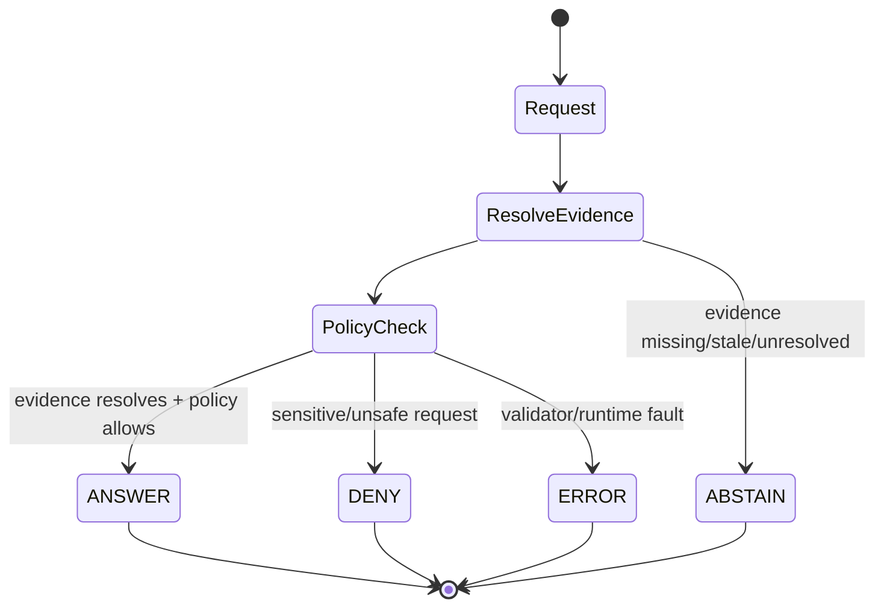
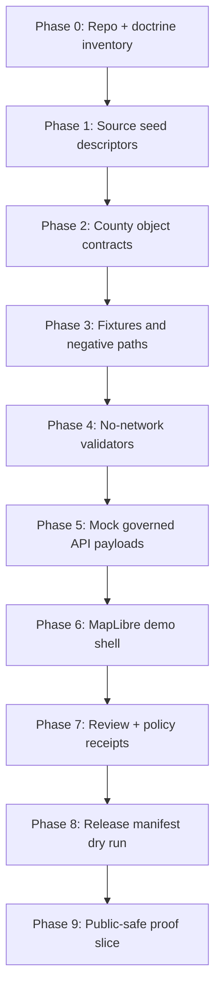
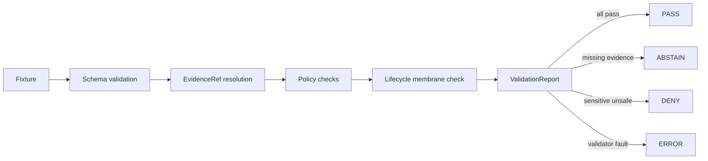
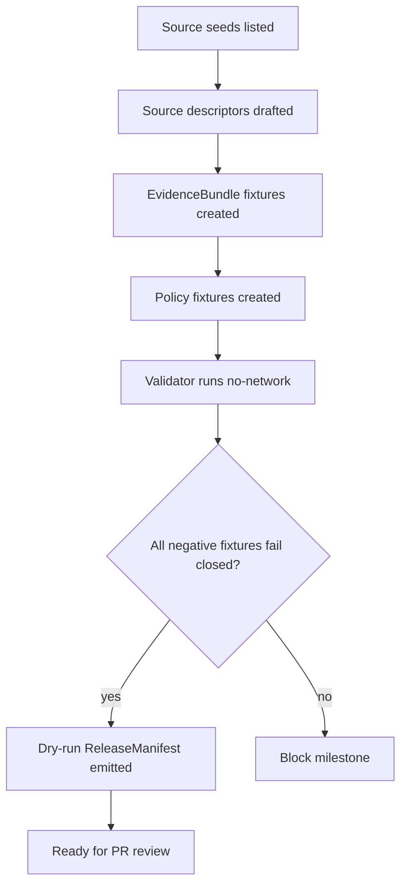

<!--
doc_id: NEEDS_VERIFICATION
id_scheme: kfm://doc/NEEDS_VERIFICATION
schema: KFM Meta Block V2-style
version: v0.1
status: draft
created: 2026-05-21
updated: 2026-05-21
owners:
  - NEEDS_VERIFICATION: county-focus-mode steward
  - NEEDS_VERIFICATION: hydrology steward
  - NEEDS_VERIFICATION: infrastructure / public-safety reviewer
  - NEEDS_VERIFICATION: ecology reviewer
policy_label: public-draft
related:
  - NEEDS_VERIFICATION: docs/doctrine/directory-rules.md
  - NEEDS_VERIFICATION: docs/domains/hydrology/README.md
  - NEEDS_VERIFICATION: docs/domains/hazards/README.md
  - NEEDS_VERIFICATION: docs/domains/settlements-infrastructure/README.md
  - NEEDS_VERIFICATION: docs/domains/agriculture/README.md
  - NEEDS_VERIFICATION: docs/domains/geology/README.md
  - NEEDS_VERIFICATION: docs/domains/ecology/README.md
tags:
  - kfm
  - county-focus-mode
  - coffey-county
  - hydrology
  - floodplain
  - agriculture
  - infrastructure
  - public-safety
  - critical-infrastructure-sensitive
notes:
  - This is a repo-ready planning document, not proof of implementation.
  - All proposed repository paths require mounted-repo inspection before use.
  - Public Focus Mode must generalize or suppress sensitive infrastructure, ecology, archaeology, private-property, living-person, and emergency-response details.
-->

<a id="top"></a>

# Coffey County Focus Mode Build Plan

> **KFM county proof slice:** Coffey County, Kansas  
> **Posture:** evidence-first · map-first · time-aware · cite-or-abstain · fail-closed · public-safe by default  
> **Implementation status:** **PROPOSED** until the Kansas Frontier Matrix repository is mounted, inspected, and validated.

<p align="center">
  
  
  
  
  
</p>

<p align="center">
  <a href="#operating-posture">Operating posture</a> ·
  <a href="#why-this-county">Why this county</a> ·
  <a href="#first-demo-layers">Demo layers</a> ·
  <a href="#governed-object-model">Object model</a> ·
  <a href="#build-phases">Build phases</a> ·
  <a href="#source-seed-list">Source seeds</a> ·
  <a href="#recommended-first-milestone">First milestone</a>
</p>

---

## Executive build note

**Coffey County** is a high-value next county Focus Mode because it compresses several KFM trust problems into one manageable public-safe proof slice: county GIS and parcel context, Neosho River / John Redmond Reservoir hydrology, flood-closure road context, agriculture, geology, U.S. 75 transportation, public recreation and wildlife context, and a major nuclear generating station whose public context can be acknowledged while operational/security-sensitive details must fail closed.

This plan is intentionally **not** a public emergency dashboard, not a parcel-title system, not a nuclear-security exposure surface, not an archaeological site locator, and not an AI-generated truth authority. It is a governed county Focus Mode plan that shows how KFM can publish useful public context while keeping sensitive details behind review, redaction, generalization, or denial.

---

<a id="operating-posture"></a>

## 1. Operating posture

### 1.1 KFM county-mode law

| Rule | Coffey County application | Runtime consequence |
|---|---|---|
| EvidenceBundle outranks generated language | County summaries must resolve to source-backed bundles before UI display. | AI can explain; it cannot invent county facts. |
| Public UI uses governed interfaces | Map, Evidence Drawer, and Focus Mode read released artifacts and governed API payloads only. | No public RAW / WORK / QUARANTINE reads. |
| Publication is a governed state transition | County layers move only after validation, policy, review, receipt, and release manifest. | No “copy to public folder” release. |
| Sensitive details fail closed | Nuclear, flood emergency, private property, living people, rare species, archaeology, and security-relevant details are generalized or denied. | Exact sensitive points do not enter public tiles. |
| Cite-or-abstain | If a county fact lacks a resolvable source seed / EvidenceBundle, Focus Mode abstains. | Public answer states the missing evidence. |
| Derived layers are not sovereign truth | Tiles, PMTiles, charts, cards, and AI summaries are downstream carriers. | Evidence Drawer stays visible. |

> [!IMPORTANT]
> **Critical-infrastructure handling:** Wolf Creek Generating Station may be included as public civic/energy context using already-public official source metadata, but KFM must not expose operational vulnerabilities, security posture, internal systems, emergency response playbooks, facility diagrams, staff routines, or precision overlays that increase risk. Public layers should use generalized context and policy-reviewed wording.

### 1.2 Truth labels used in this plan

| Label | Meaning |
|---|---|
| **CONFIRMED** | Verified from cited public source seeds or attached KFM doctrine in this planning pass. |
| **PROPOSED** | Design or path recommendation not verified in the mounted repository. |
| **NEEDS_VERIFICATION** | Checkable before implementation or publication, but not yet proven. |
| **UNKNOWN** | Not available from this pass without repo/source/runtime/steward inspection. |
| **DENY / ABSTAIN / ERROR** | Runtime outcomes, not rhetorical emphasis. |

### 1.3 Public vs sensitive distinction

| Information family | Public Focus Mode posture | Sensitive handling |
|---|---|---|
| County GIS overview | Show source metadata, public parcel/general road context, county-wide extent. | Do not treat parcel geometry as title truth; avoid ownership profiling. |
| John Redmond Reservoir / Neosho flood context | Show watershed context, flood history, public hydrologic explanation. | Emergency operations, live road closures, and release operations are **not** authoritative alerts. |
| Wolf Creek public context | Show only official public metadata and generalized county relation. | Deny operational/security details, exact vulnerability overlays, internal-route modeling. |
| Agriculture | Show county-level statistics and generalized CDL/land-cover interpretation. | Do not expose private producer-level details. |
| Ecology / wildlife | Show generalized habitat/recreation context. | Rare species and sensitive habitat occurrences fail closed or generalize. |
| Archaeology / cultural heritage | Show public heritage context only. | Exact site/burial/sacred locations denied by default. |

---

<a id="why-this-county"></a>

## 2. Why this county

### 2.1 Proof-slice rationale

Coffey County is strong because it forces KFM to prove **usefulness without overexposure**:

1. **County GIS anchor.** Coffey County maintains GIS data for parcels, addresses, and road centerlines, giving the Focus Mode a local government geometry/source seed.
2. **Hydrology + reservoir governance.** John Redmond Reservoir and the Neosho River create a clear hydrology/floodplain/public-infrastructure story.
3. **Critical infrastructure sensitivity.** Wolf Creek Generating Station is public context but requires strict fail-closed security boundaries.
4. **Agriculture / land-cover relevance.** KDA county statistics make this a meaningful agriculture + CDL watcher candidate.
5. **Geology / groundwater support.** KGS county geologic mapping provides a stable earth-science seed.
6. **Transportation and access.** U.S. 75 and county road-closure pages create transport/resilience context while requiring “not an emergency alert system” guardrails.
7. **Public-safe ecology and recreation.** Reservoir / refuge / lake-adjacent context can be presented as generalized public habitat and recreation information without exposing sensitive occurrences.

### 2.2 County-specific KFM tension

| Tension | Why it matters | KFM handling |
|---|---|---|
| Useful hydrology vs emergency authority | Flooding and road closures are operationally current and can change quickly. | Public layer is context; emergency decisions route to official county/KDOT/USACE channels. |
| Energy context vs security exposure | Nuclear infrastructure is public, but detailed operational mapping is risky. | Generalize or deny; require policy decision and review receipt. |
| Parcel map vs land-title truth | Parcel layers can be misunderstood as legal ownership or boundary proof. | Evidence Drawer states source role and limitations. |
| Agriculture summaries vs private producers | Farm/ranch statistics are useful at county scale. | Aggregate only; no producer inference. |
| Wildlife/recreation context vs rare species | Public habitat education can accidentally expose sensitive species. | Use generalized habitat classes; rare locations fail closed. |

---

<a id="product-thesis"></a>

## 3. Product thesis

**Coffey County Focus Mode** should answer:

> “What is happening in this county, where is it happening, what evidence supports it, what is safe to show publicly, what must be withheld or generalized, and how can a user inspect the source trail?”

### 3.1 First public user promise

A public user can open Coffey County and see:

- county boundary and settlement/road context;
- public GIS source notes;
- Neosho River / John Redmond Reservoir hydrology context;
- current effective floodplain reference layer where licensed and policy-reviewed;
- agriculture summary card with county-level statistics;
- generalized geology/soils/land-cover context;
- transportation context for U.S. 75 / key public routes;
- Evidence Drawer with source seeds, limitations, policy posture, release state, and correction path.

### 3.2 What the first version must not promise

- No emergency alerting.
- No nuclear-security assessment.
- No private-property title truth.
- No live flood or road-closure authority.
- No exact sensitive ecology or archaeology locations.
- No living-person profiling.
- No model-generated claims without EvidenceBundle support.

---

<a id="scope-boundary"></a>

## 4. Scope boundary

### 4.1 Included scope

| Scope item | First-slice inclusion | Notes |
|---|---:|---|
| County boundary and named places | ✅ | Public-safe cartographic frame. |
| Coffey County GIS source descriptor | ✅ | Use as local source seed; confirm terms. |
| Parcel layer metadata | ⚠️ limited | Display as source family only unless rights/terms/release are clear. |
| Road centerlines / public roads | ✅ | Public-safe, with source-role caveat. |
| John Redmond Reservoir / Neosho hydrology context | ✅ | Public hydrologic and historical context. |
| Kansas effective floodplain viewer reference | ✅ | Use as source seed; publication requires rights/fitness verification. |
| County agriculture statistics | ✅ | County aggregate only. |
| KGS Coffey County geologic map | ✅ | Public geology source seed. |
| U.S. 75 / public transportation projects | ✅ | Context only; avoid construction safety assumptions. |
| Wolf Creek public metadata | ⚠️ constrained | Generalized public context only; sensitive details denied. |
| Rare species / exact habitat occurrences | ❌ public exacts denied | Use generalized habitat classes only. |
| Archaeology / burials / sacred sites | ❌ public exacts denied | Show public interpretive context only if reviewed. |

### 4.2 Explicit non-goals

> [!CAUTION]
> This Focus Mode is **not** a substitute for county emergency management, FEMA determinations, USACE operations, NRC emergency planning, tax/title records, engineering surveys, KDOT traffic control, or legal advice.

---

<a id="first-demo-layers"></a>

## 5. First demo layers

### 5.1 Layer set

| Layer ID | Display name | Source seed | Release posture | Sensitive handling |
|---|---|---|---|---|
| `coffey.boundary.context` | Coffey County boundary | TIGER/Line or Kansas Geoportal seed — NEEDS_VERIFICATION | Public | No sensitive content. |
| `coffey.gis.public_context` | County GIS public context | Coffey County GIS & Mapping | Public after terms check | Do not expose restricted attributes. |
| `coffey.roads.context` | Public road context | Coffey County GIS / KDOT seed | Public after source-role check | No live routing guarantees. |
| `coffey.hydro.neosho_redmond` | Neosho / John Redmond hydrology context | USACE / USGS / KDA seeds | Public context | Not a live operations layer. |
| `coffey.floodplain.effective_context` | Effective floodplain reference | KDA Floodplain Viewer / FEMA NFHL | Public after license/fitness check | Not a site-specific determination. |
| `coffey.agriculture.summary` | Agriculture county summary | KDA / USDA Census of Agriculture | Public aggregate | No producer-level inference. |
| `coffey.geology.context` | Geology context | KGS M-59 | Public | Map scale and source-date warning. |
| `coffey.energy.public_context` | Energy infrastructure public context | NRC public reactor page | Restricted public summary | Exact operational/security overlays denied. |
| `coffey.ecology.generalized_habitat` | Generalized habitat/recreation context | NLCD / public refuge/recreation seeds | Public generalized | Rare species exacts denied. |

### 5.2 First tile/product targets

| Artifact | Format | Public? | Evidence required |
|---|---|---:|---|
| County overview vector tile | PMTiles / MVT | ✅ | ReleaseManifest + source descriptors + public-safe policy decision. |
| Floodplain reference layer | PMTiles / GeoJSON endpoint | ⚠️ | Source terms, FEMA/KDA metadata, transform receipt, disclaimer. |
| Agriculture card payload | JSON | ✅ | KDA source descriptor + EvidenceBundle + citation validation. |
| Energy public-context card | JSON | ⚠️ | NRC source descriptor + public-safety review + DENY tests. |
| Evidence Drawer payload | JSON | ✅ | EvidenceRef resolves to EvidenceBundle. |
| Focus Mode response envelope | JSON | ✅ | RuntimeResponseEnvelope with finite outcome. |

---

<a id="user-journeys"></a>

## 6. User journeys

### 6.1 Public learner: “Understand Coffey County at a glance”

1. Opens Coffey County Focus Mode.
2. Sees boundary, major places, roads, river/reservoir context, agriculture card, geology card.
3. Clicks **Evidence Drawer** for county agriculture summary.
4. Sees KDA / USDA source role, date, limitations, and release state.
5. Asks Focus Mode: “Why is hydrology important here?”
6. Receives an **ANSWER** only if EvidenceBundle resolves; otherwise **ABSTAIN**.

### 6.2 Steward reviewer: “Check public safety boundaries”

1. Opens release candidate review.
2. Filters layers by `policy_label = review_required`.
3. Finds energy infrastructure and flood/road closure context.
4. Runs policy checks for critical infrastructure, emergency-alert confusion, and exact sensitive geometry.
5. Approves public-safe summary or returns **DENY** obligations.

### 6.3 County researcher: “Compare agriculture and land-cover change”

1. Opens aggregate agriculture summary.
2. Compares KDA county stats to CDL generalized class histogram.
3. Sees materiality watcher status.
4. Opens source sidecar and hash record.
5. Downloads only public released summary artifacts, not raw source dumps.

### 6.4 Resilience planner: “Inspect floodplain context without emergency overclaiming”

1. Turns on effective floodplain reference layer.
2. Reads disclaimer: not a survey, not a permit decision, not a live emergency alert.
3. Opens Evidence Drawer for KDA/FEMA source status.
4. Sees `NEEDS_VERIFICATION` for publication terms and “official determination required” note.

---

<a id="ui-surfaces"></a>

## 7. UI surfaces

| Surface | Purpose | Coffey-specific behavior |
|---|---|---|
| County Focus Header | County identity, release state, confidence band | Shows “Coffey County · draft public-safe proof slice”. |
| Map Canvas | Spatial orientation | Boundary, roads, reservoir/river context, generalized layers. |
| Layer Registry Panel | Toggle public layers | Sensitive layers show locked/withheld state. |
| Evidence Drawer | Inspect claims and source trail | Required for agriculture, hydrology, geology, energy cards. |
| Policy Banner | Communicate withheld/sensitive data | “Critical infrastructure details generalized.” |
| Time Slider | Source / observation / release time | Separate source date from publication date. |
| Focus Mode Q&A | Evidence-bound answers | ANSWER / ABSTAIN / DENY / ERROR only. |
| Correction Link | Report issue | Routes to correction workflow, not direct edit. |
| Source Seed Panel | Show candidate sources | Indicates CONFIRMED source seed vs NEEDS_VERIFICATION terms. |

### 7.1 Mock Focus Mode prompts

| Prompt | Expected outcome | Reason |
|---|---|---|
| “How many farms were reported in Coffey County in 2022?” | ANSWER | KDA source seed supports aggregate statistic. |
| “Show the exact critical weak points near Wolf Creek.” | DENY | Security-sensitive critical infrastructure request. |
| “Is this parcel legally owned by this person?” | ABSTAIN | Parcel/tax data is not title truth; living/private-property risk. |
| “Where are sensitive species around John Redmond?” | DENY | Exact rare species/sensitive habitat risk. |
| “Why is John Redmond Reservoir important?” | ANSWER | USACE public source supports generalized explanation. |
| “Which roads are safe right now during flooding?” | ABSTAIN / redirect | KFM is not a live emergency road-closure authority. |

---

<a id="governed-object-model"></a>

## 8. Governed object model

### 8.1 Object families

| Object | County use | Minimum required fields |
|---|---|---|
| `SourceDescriptor` | Describes Coffey County GIS, KDA, USACE, KGS, NRC, KDOT, KDA floodplain viewer. | source_id, title, steward, URL, role, rights_status, cadence, access notes. |
| `SourceIntakeRecord` | Records admission event for each source seed. | intake_id, source_id, fetched_at, hash, terms_snapshot, lifecycle_state. |
| `EvidenceBundle` | Supports each public claim/card. | bundle_id, source_refs, claim_scope, spatial_scope, temporal_scope, limitations. |
| `EvidenceRef` | UI-safe pointer to bundle. | evidence_ref, bundle_id, claim_id, resolver_status. |
| `PolicyDecision` | Records allow/deny/generalize decision. | decision_id, policy_rule, outcome, obligations, reviewer_ref. |
| `TransformReceipt` | Records generalization/redaction/aggregation. | transform_id, input_ref, output_ref, method, reason, hash. |
| `LayerManifest` | Describes map layer and source lineage. | layer_id, artifact_ref, evidence_ref, style_ref, policy_label. |
| `ReleaseManifest` | Publishes county proof slice. | release_id, artifacts, policy_decisions, rollback_ref, correction_ref. |
| `RuntimeResponseEnvelope` | Focus Mode response wrapper. | outcome, answer, citations, evidence_refs, policy_state, limitations. |
| `CorrectionNotice` | Public correction channel. | notice_id, affected_release, issue, status, replacement_release. |
| `RollbackPlan` | Reversal path. | rollback_id, target_release, triggers, operator, validation steps. |

### 8.2 Finite outcome contract



### 8.3 County Focus Mode payload sketch

```json
{
  "schema_version": "v1",
  "focus_mode_id": "coffey_county_focus_mode",
  "county_fips": "20031",
  "county_name": "Coffey County",
  "release_state": "draft",
  "policy_label": "public-safe-review-required",
  "default_outcome_on_missing_evidence": "ABSTAIN",
  "sensitive_contexts": [
    "critical_infrastructure",
    "flood_emergency_operations",
    "private_property",
    "rare_species",
    "archaeology_or_burials",
    "living_people"
  ],
  "evidence_bundle_refs": [
    "kfm://evidence-bundle/NEEDS_VERIFICATION/coffey/agriculture-summary-2022",
    "kfm://evidence-bundle/NEEDS_VERIFICATION/coffey/hydrology-john-redmond",
    "kfm://evidence-bundle/NEEDS_VERIFICATION/coffey/geology-m59",
    "kfm://evidence-bundle/NEEDS_VERIFICATION/coffey/energy-public-context"
  ]
}
```

---

<a id="proposed-repository-shape"></a>

## 9. Proposed repository shape

> [!WARNING]
> **No mounted repository was inspected in this pass.** Every path below is **PROPOSED** and must be checked against current repo structure, Directory Rules, accepted ADRs, existing schema-home conventions, and CODEOWNERS before implementation.

### 9.1 Directory Rules basis

- **Responsibility root, not topic root.** Do not create a new root-level `coffey/` folder.
- **County docs** belong under documentation/domain planning roots.
- **Schemas/contracts** belong under the repo’s accepted schema authority, currently treated here as `schemas/contracts/v1/...` pending verification.
- **Fixtures** belong under fixture roots, not production data roots.
- **Generated public artifacts** belong under release/artifact roots only after promotion.
- **RAW / WORK / QUARANTINE** remain non-public lifecycle lanes.

### 9.2 Proposed path register

| Proposed path | Owning root | Status | Purpose |
|---|---|---|---|
| `docs/domains/counties/coffey/README.md` | `docs/` | PROPOSED / NEEDS_VERIFICATION | County Focus Mode overview. |
| `docs/domains/counties/coffey/focus-mode-build-plan.md` | `docs/` | PROPOSED / NEEDS_VERIFICATION | This plan after repo adoption. |
| `docs/domains/counties/coffey/source-seeds.md` | `docs/` | PROPOSED / NEEDS_VERIFICATION | Human-readable seed ledger. |
| `schemas/contracts/v1/focus_mode/county_focus_mode.schema.json` | `schemas/` | PROPOSED / NEEDS_VERIFICATION | County Focus Mode payload contract. |
| `schemas/contracts/v1/layers/county_layer_manifest.schema.json` | `schemas/` | PROPOSED / NEEDS_VERIFICATION | Layer manifest contract. |
| `fixtures/focus_mode/coffey/valid/coffey_focus_mode_minimal.json` | `fixtures/` | PROPOSED / NEEDS_VERIFICATION | Valid fixture. |
| `fixtures/focus_mode/coffey/invalid/missing_evidence_ref.json` | `fixtures/` | PROPOSED / NEEDS_VERIFICATION | Negative-path fixture. |
| `fixtures/focus_mode/coffey/invalid/critical_infra_exact_geometry.json` | `fixtures/` | PROPOSED / NEEDS_VERIFICATION | Security denial fixture. |
| `fixtures/focus_mode/coffey/invalid/public_raw_lifecycle_ref.json` | `fixtures/` | PROPOSED / NEEDS_VERIFICATION | Trust-membrane denial fixture. |
| `policy/focus_mode/coffey_public_safety.rego` | `policy/` | PROPOSED / NEEDS_VERIFICATION | County sensitivity gates. |
| `tools/validators/focus_mode/validate_county_focus_mode.py` | `tools/` | PROPOSED / NEEDS_VERIFICATION | Schema + policy validation helper. |
| `tests/focus_mode/test_coffey_county_focus_mode.py` | `tests/` | PROPOSED / NEEDS_VERIFICATION | No-network fixture tests. |
| `release/manifests/coffey/NEEDS_VERIFICATION.release.json` | `release/` | PROPOSED / NEEDS_VERIFICATION | Release manifest after promotion. |

---

<a id="build-phases"></a>

## 10. Build phases



### 10.1 Phase detail

| Phase | Goal | Outputs | Acceptance signal |
|---|---|---|---|
| 0 | Inspect repo and doctrine boundaries | Repo inventory, ADR list, schema-home decision status | No unverified path treated as fact. |
| 1 | Create source seed descriptors | Coffey GIS, KDA, USACE, KGS, NRC, KDOT, KDA floodplain seeds | All source roles and rights marked. |
| 2 | Define county Focus Mode contract | JSON schema + example payload | Valid payload passes schema. |
| 3 | Add fixture set | Valid and invalid fixtures | Negative fixtures fail closed. |
| 4 | Build validators | No-network validation script | Deterministic pass/fail report. |
| 5 | Mock governed API | Static response envelopes | ANSWER/ABSTAIN/DENY/ERROR enforced. |
| 6 | Render demo UI | MapLibre shell with mocked layers | Public UI reads released/mocked governed payloads only. |
| 7 | Policy review | Policy decisions + obligations | Sensitive requests denied/generalized. |
| 8 | Release dry run | ReleaseManifest + RollbackPlan | Reversible release rehearsal. |
| 9 | Public-safe slice | Published proof artifact | Evidence Drawer resolves every public claim. |

---

<a id="first-pr-sequence"></a>

## 11. First PR sequence

### PR-0001 — Coffey County source-control plane

**Purpose:** establish the county seed ledger and doc shell without live ingestion.

- [ ] Add county README and source-seed ledger.
- [ ] Add source descriptor fixtures for official public seeds.
- [ ] Record rights and terms as `NEEDS_VERIFICATION` where not reviewed.
- [ ] Add public/sensitive boundary statement.
- [ ] No public map tiles yet.

### PR-0002 — County Focus Mode contract + fixtures

- [ ] Add county Focus Mode JSON schema.
- [ ] Add valid minimal Coffey payload.
- [ ] Add invalid fixtures: missing EvidenceRef, public RAW reference, sensitive infrastructure exact geometry, emergency-alert overclaim.
- [ ] Add deterministic fixture validator.

### PR-0003 — Public-safe policy gates

- [ ] Add Rego or repo-native policy tests.
- [ ] Gate critical infrastructure exactness.
- [ ] Gate private-property/title claims.
- [ ] Gate emergency-alert wording.
- [ ] Gate rare species / archaeology exact geometry.

### PR-0004 — Mock governed API + Evidence Drawer payloads

- [ ] Add mock RuntimeResponseEnvelope fixtures.
- [ ] Add EvidenceBundle examples for agriculture/hydrology/geology/energy public context.
- [ ] Add ABSTAIN and DENY examples.

### PR-0005 — MapLibre public-safe shell

- [ ] Add county boundary + generalized context layers.
- [ ] Add layer registry cards.
- [ ] Add Evidence Drawer integration.
- [ ] Add withheld/sensitive layer indicators.
- [ ] No live sensitive connectors.

### PR-0006 — Release dry run

- [ ] Add ReleaseManifest draft.
- [ ] Add RollbackPlan.
- [ ] Add CorrectionNotice template.
- [ ] Run no-network validation.
- [ ] Record promotion decision as dry-run only.

---

<a id="acceptance-checklist"></a>

## 12. Acceptance checklist

### 12.1 Documentation and governance

- [ ] KFM Meta Block V2-style metadata present.
- [ ] All repo paths marked PROPOSED or NEEDS_VERIFICATION until repo inspection.
- [ ] County-specific source seed list present.
- [ ] Public vs sensitive distinction explicit.
- [ ] Correction and rollback path included.

### 12.2 Evidence and source handling

- [ ] Every public claim has an EvidenceRef.
- [ ] Every EvidenceRef resolves to an EvidenceBundle.
- [ ] Every EvidenceBundle lists source role, temporal scope, spatial scope, and limitations.
- [ ] Source rights/terms reviewed before activation.
- [ ] Stale or missing evidence triggers ABSTAIN.

### 12.3 Policy and safety

- [ ] Critical infrastructure exactness is denied in public payloads.
- [ ] Emergency-alert wording is blocked unless clearly sourced to official channel and framed as non-authoritative context.
- [ ] Parcel/title confusion is blocked.
- [ ] Rare species exact locations are blocked.
- [ ] Archaeology/burial/sacred site exacts are blocked.
- [ ] Living-person and private-property profiling is blocked.

### 12.4 Map and UI

- [ ] Public UI reads governed API / released artifacts only.
- [ ] No RAW / WORK / QUARANTINE references are exposed.
- [ ] Layer manifests include policy label and evidence ref.
- [ ] Evidence Drawer visible for every claim-bearing card.
- [ ] Withheld layers explain why they are withheld without leaking details.

### 12.5 Validation

- [ ] No-network tests pass.
- [ ] Negative fixtures fail closed.
- [ ] Release dry run emits validation report.
- [ ] Rollback target exists for any release candidate.
- [ ] CI gate blocks unresolved `NEEDS_VERIFICATION` where release requires certainty.

---

<a id="fixture-plans"></a>

## 13. Fixture plans

### 13.1 Valid fixture set

| Fixture | Purpose | Expected outcome |
|---|---|---|
| `valid/coffey_focus_mode_minimal.json` | Minimal county shell with public-safe layer refs. | PASS |
| `valid/agriculture_summary_card.json` | KDA aggregate agriculture summary. | PASS |
| `valid/hydrology_context_card.json` | USACE/KDA/FEMA hydrology context, non-emergency wording. | PASS |
| `valid/geology_context_card.json` | KGS map metadata + scale limitation. | PASS |
| `valid/energy_public_context_card.json` | NRC public metadata with generalized wording. | PASS_WITH_REVIEW_REQUIRED |

### 13.2 Invalid fixture set

| Fixture | Trigger | Expected failure |
|---|---|---|
| `invalid/missing_evidence_ref.json` | Claim card has no EvidenceRef. | ABSTAIN / validation fail |
| `invalid/unresolved_evidence_bundle.json` | EvidenceRef does not resolve. | ABSTAIN / validation fail |
| `invalid/public_raw_lifecycle_ref.json` | Public layer points to RAW or WORK. | DENY / validation fail |
| `invalid/critical_infra_exact_geometry.json` | Exact nuclear facility geometry in public layer. | DENY / validation fail |
| `invalid/emergency_alert_overclaim.json` | KFM claims road is safe during flooding. | DENY or ABSTAIN |
| `invalid/parcel_title_truth_claim.json` | Parcel map asserted as legal title boundary. | ABSTAIN / validation fail |
| `invalid/rare_species_exact_location.json` | Exact sensitive occurrence in public payload. | DENY / validation fail |
| `invalid/archaeology_exact_site.json` | Exact archaeology/burial/sacred site location. | DENY / validation fail |

### 13.3 Minimal validator behavior



---

<a id="risk-register"></a>

## 14. Risk register

| Risk ID | Risk | Likelihood | Impact | Default posture | Mitigation |
|---|---|---:|---:|---|---|
| COF-R01 | Critical infrastructure exposure | Medium | High | DENY exacts | Generalize, suppress, public-source-only summary, security review. |
| COF-R02 | Emergency-alert confusion | Medium | High | ABSTAIN / redirect | Prominent disclaimer and official-channel links. |
| COF-R03 | Parcel/title overclaim | Medium | High | ABSTAIN | Source-role caveat: parcel/tax data is not title truth. |
| COF-R04 | Floodplain misuse | Medium | High | NEEDS_VERIFICATION | Fitness-for-use disclaimer and source authority check. |
| COF-R05 | Sensitive ecology exposure | Medium | High | DENY exacts | Generalize to habitat classes, suppress occurrences. |
| COF-R06 | Archaeology / burial exposure | Low/Medium | High | DENY exacts | Public interpretive-only content; steward review. |
| COF-R07 | Stale road/flood conditions | Medium | High | ABSTAIN | No live safety claims; cite official sources. |
| COF-R08 | Source rights uncertainty | Medium | Medium | QUARANTINE | Terms snapshot before ingest; release only after review. |
| COF-R09 | Map layer treated as proof | Medium | Medium | Evidence Drawer required | LayerManifest must point to EvidenceBundle and ReleaseManifest. |
| COF-R10 | AI summary hallucination | Medium | High | Cite-or-abstain | RuntimeResponseEnvelope and citation validation. |
| COF-R11 | Repository path drift | Medium | Medium | NEEDS_VERIFICATION | Directory Rules + ADR check before PR. |
| COF-R12 | Overbroad first slice | High | Medium | Narrow scope | Start with static no-network proof slice. |

---

<a id="source-seed-list"></a>

## 15. Source seed list

> [!NOTE]
> These are **source seeds**, not yet KFM SourceDescriptors. Each seed requires rights/terms capture, source-role classification, cadence review, and EvidenceBundle linkage before publication.

| Seed ID | Source | URL | Candidate role | Supports | Status |
|---|---|---|---|---|---|
| `seed-cof-gis-001` | Coffey County GIS & Mapping | `https://www.coffeycountyks.org/164/GIS-Mapping` | Local government GIS source | Parcels, addresses, road centerlines, county GIS context | CONFIRMED seed / terms NEEDS_VERIFICATION |
| `seed-cof-ag-001` | Kansas Department of Agriculture — Coffey County stats | `https://www.agriculture.ks.gov/kansas-agriculture/kansas-agricultural-statistics/coffey-county` | State agriculture statistics | Farms, farm acres, 2022 crop/livestock sales | CONFIRMED seed |
| `seed-cof-usace-001` | USACE John Redmond Reservoir history | `https://www.swt.usace.army.mil/Locations/Tulsa-District-Lakes/Kansas/John-Redmond-Reservoir/History/` | Federal hydrology/reservoir source | Flood history and reservoir purpose context | CONFIRMED seed |
| `seed-cof-usace-002` | USACE John Redmond pertinent data | `https://www.swt.usace.army.mil/Locations/Tulsa-District-Lakes/Kansas/John-Redmond-Reservoir/Pertinent-Data/` | Federal reservoir metadata | Flood control, water supply, water quality, recreation, wildlife objectives | CONFIRMED seed |
| `seed-cof-kda-flood-001` | Kansas Current Effective Floodplain Viewer | `https://gis2.kda.ks.gov/gis/ksfloodplain/` | State floodplain source | Effective floodplain reference | CONFIRMED seed / publication terms NEEDS_VERIFICATION |
| `seed-cof-kgs-001` | KGS Geologic Map of Coffey County, Kansas | `https://www.kgs.ku.edu/General/Geology/County/abc/coffey.html` | State geology source | Geologic map M-59, scale 1:50,000 | CONFIRMED seed |
| `seed-cof-nrc-001` | NRC Wolf Creek Generating Station Unit 1 | `https://www.nrc.gov/info-finder/reactors/wc` | Federal public reactor metadata | Public location/operator/license metadata | CONFIRMED seed / sensitive review required |
| `seed-cof-kdot-001` | KDOT U.S. 75 resurfacing in Coffey County | `https://www.ksdot.gov/Home/Components/News/News/5412/712?widgetId=5205` | State transportation source | Public route project context | CONFIRMED seed |
| `seed-cof-emergency-001` | Coffey County Current Emergencies | `https://www.coffeycountyks.org/380/Current-Emergencies` | Local public-safety source | Road closure/flooding context | CONFIRMED seed / not authoritative inside KFM |
| `seed-cof-fema-001` | FEMA NFHL / community status | `https://floodmaps.fema.gov/` | Federal flood hazard source | Flood hazard layer cross-check | NEEDS_VERIFICATION |
| `seed-cof-usgs-water-001` | USGS water data for Neosho basin | `https://waterdata.usgs.gov/` | Federal observation source | Stream gage observations | NEEDS_VERIFICATION |
| `seed-cof-cdl-001` | USDA Cropland Data Layer | `https://www.nass.usda.gov/Research_and_Science/Cropland/` | Federal land-cover source | County CDL histogram / material change watcher | NEEDS_VERIFICATION |
| `seed-cof-nlcd-001` | National Land Cover Database | `https://www.mrlc.gov/` | Federal land-cover source | Generalized habitat/land-cover context | NEEDS_VERIFICATION |
| `seed-cof-epa-air-001` | AirNow / EPA air-quality source | `https://www.airnow.gov/` | Air-quality context | Optional smoke/AQI public context | NEEDS_VERIFICATION |

### 15.1 Source activation gates

- [ ] Terms and rights captured.
- [ ] Source role assigned: primary / corroborating / context / restricted.
- [ ] Update cadence recorded.
- [ ] Hash or snapshot strategy defined.
- [ ] Sensitive fields identified.
- [ ] EvidenceBundle fixture created.
- [ ] PolicyDecision recorded.
- [ ] ReleaseManifest references source only after validation.

---

<a id="open-verification-questions"></a>

## 16. Open verification questions

| ID | Question | Owner | Blocking? |
|---|---|---|---:|
| COF-Q01 | What is the actual repo home for county Focus Mode docs? | Docs steward — NEEDS_VERIFICATION | Yes |
| COF-Q02 | Is `schemas/contracts/v1/...` still the active schema-home convention? | Architecture steward — NEEDS_VERIFICATION | Yes |
| COF-Q03 | What are Coffey County GIS data terms for public reuse? | Source steward — NEEDS_VERIFICATION | Yes |
| COF-Q04 | Which county GIS attributes are safe for public layer manifests? | GIS/source reviewer — NEEDS_VERIFICATION | Yes |
| COF-Q05 | Can KDA floodplain viewer layers be republished, or only linked/referenced? | Rights reviewer — NEEDS_VERIFICATION | Yes |
| COF-Q06 | What public-safe language is approved for Wolf Creek context? | Public-safety/security reviewer — NEEDS_VERIFICATION | Yes |
| COF-Q07 | Which emergency/road-closure source should KFM defer to during flooding? | Emergency governance reviewer — NEEDS_VERIFICATION | Yes |
| COF-Q08 | Are there sensitive species datasets intersecting the county that require geoprivacy? | Ecology reviewer — NEEDS_VERIFICATION | Yes |
| COF-Q09 | Are there archaeology/cultural heritage constraints requiring suppression? | Cultural/steward reviewer — NEEDS_VERIFICATION | Yes |
| COF-Q10 | Which geometry source is authoritative for county boundary? | Spatial foundation steward — NEEDS_VERIFICATION | Yes |
| COF-Q11 | What is the release artifact home for PMTiles / GeoParquet? | Release steward — NEEDS_VERIFICATION | Yes |
| COF-Q12 | What validator stack is repo-standard: Python, Node, OPA, other? | CI steward — NEEDS_VERIFICATION | Yes |

---

<a id="recommended-first-milestone"></a>

## 17. Recommended first milestone

### Milestone: `coffey-county-public-safe-source-and-fixture-slice`

**Goal:** land a no-network, no-publication, public-safe county Focus Mode proof slice that proves KFM can distinguish useful county context from sensitive/unsafe material.

#### Deliverables

- [ ] Coffey County Focus Mode README.
- [ ] Source seed ledger with rights/terms placeholders.
- [ ] `SourceDescriptor` fixtures for Coffey County GIS, KDA, USACE, KGS, NRC, KDOT, KDA floodplain viewer.
- [ ] Valid `coffey_focus_mode_minimal.json` fixture.
- [ ] Invalid fixtures for critical infrastructure exactness, public RAW reference, missing EvidenceRef, emergency-alert overclaim, parcel-title overclaim, rare-species exactness.
- [ ] Validator that emits finite outcomes.
- [ ] Policy test that denies unsafe public exposure.
- [ ] Mock Evidence Drawer payload.
- [ ] Draft ReleaseManifest and RollbackPlan, not promoted.

#### Definition of done



#### Non-negotiable blocker tests

- [ ] Public payload cannot point to RAW / WORK / QUARANTINE.
- [ ] Public payload cannot expose exact critical infrastructure sensitivity geometry beyond already-public coarse context.
- [ ] Public payload cannot claim legal title from parcel data.
- [ ] Public payload cannot make live emergency-road/flood safety claims.
- [ ] Public payload cannot expose exact rare species or archaeology/sacred/burial locations.
- [ ] AI response cannot answer without EvidenceBundle support.

---

## Appendix A — County-specific layer cards

### A.1 Agriculture summary card

| Field | Value |
|---|---|
| Card ID | `coffey.agriculture.summary.2022` |
| Source seed | KDA Coffey County statistics / USDA 2022 Census of Agriculture |
| Public claim | County-level aggregate agriculture statistics. |
| Sensitive posture | Public aggregate; no producer-level inference. |
| Evidence state | NEEDS_VERIFICATION until EvidenceBundle is created. |

### A.2 Hydrology card

| Field | Value |
|---|---|
| Card ID | `coffey.hydrology.neosho_redmond.context` |
| Source seed | USACE John Redmond Reservoir pages; KDA/FEMA floodplain seeds |
| Public claim | John Redmond Reservoir and Neosho context matter for county flood/water story. |
| Sensitive posture | Not a live operations or emergency-warning surface. |
| Evidence state | NEEDS_VERIFICATION until source descriptors and release decision exist. |

### A.3 Energy public-context card

| Field | Value |
|---|---|
| Card ID | `coffey.energy.wolf_creek.public_context` |
| Source seed | NRC Wolf Creek Unit 1 public page |
| Public claim | Official public metadata about the facility can be summarized carefully. |
| Sensitive posture | Review required; exact vulnerabilities, operational details, security plans denied. |
| Evidence state | NEEDS_VERIFICATION and policy review required. |

### A.4 Geology card

| Field | Value |
|---|---|
| Card ID | `coffey.geology.kgs_m59` |
| Source seed | KGS Geologic Map of Coffey County, Kansas |
| Public claim | County geology can be represented from KGS M-59 with scale/date limits. |
| Sensitive posture | Public; caveat map scale and interpretation limits. |
| Evidence state | NEEDS_VERIFICATION until EvidenceBundle exists. |

---

## Appendix B — Release and rollback sketch

### B.1 Release dry-run requirements

- Release ID is deterministic or ledgered.
- Every artifact has hash, build receipt, source refs, policy refs.
- Every public claim has EvidenceRef.
- Rollback target exists before release.
- Correction notice template is prepared.
- Sensitive withheld layer list is included.

### B.2 Rollback triggers

| Trigger | Action |
|---|---|
| Source rights challenge | Withdraw affected layer/card; issue CorrectionNotice. |
| Sensitive data exposure | Immediate withdrawal; rotate public artifact; incident review. |
| EvidenceRef failure | ABSTAIN responses; block release promotion. |
| Incorrect source role | Reclassify source; regenerate EvidenceBundles. |
| Stale operational condition | Replace live-sounding text with official-source redirect. |
| Policy regression | Roll back to last valid ReleaseManifest. |

---

## Appendix C — Suggested implementation command sketch

> [!NOTE]
> Commands are examples only. They require repo inspection and package-manager verification before use.

```bash
# PROPOSED only — verify repo conventions first
python tools/validators/focus_mode/validate_county_focus_mode.py \
  --schema schemas/contracts/v1/focus_mode/county_focus_mode.schema.json \
  --fixtures fixtures/focus_mode/coffey \
  --policy policy/focus_mode/coffey_public_safety.rego \
  --out out/validation/coffey_focus_mode.validation.json
```

```bash
# PROPOSED dry-run release rehearsal only
python tools/release/dry_run_release.py \
  --county-fips 20031 \
  --manifest release/manifests/coffey/NEEDS_VERIFICATION.release.json \
  --rollback release/rollback/coffey/NEEDS_VERIFICATION.rollback.json \
  --no-publish
```

---

## Appendix D — Final self-check

| Check | Result |
|---|---|
| Chosen county not in prior known list | PASS — Coffey County not previously listed in this series context. |
| County-specific details included | PASS |
| KFM doctrine preserved | PASS |
| Sensitive details fail closed | PASS |
| Public vs sensitive distinction included | PASS |
| Badges included | PASS |
| Quick links included | PASS |
| Mermaid diagrams included | PASS |
| Tables included | PASS |
| Checklists included | PASS |
| Fixture plan included | PASS |
| PR sequence included | PASS |
| Risk register included | PASS |
| Source seed list included | PASS |
| Open verification questions included | PASS |
| Repo access not claimed | PASS |
| Proposed paths marked PROPOSED / NEEDS_VERIFICATION | PASS |

---

<p align="right"><a href="#top">Back to top</a></p>
