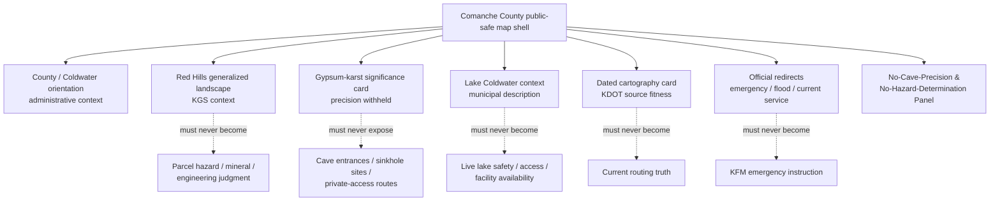
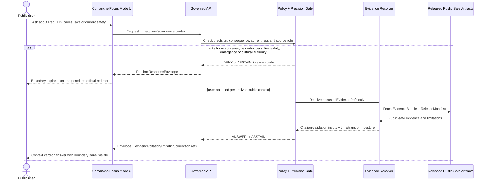
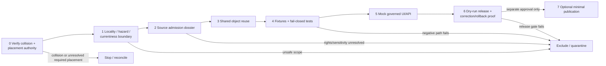

<!-- KFM_META_BLOCK_V2
doc_id: NEEDS_VERIFICATION
title: Comanche County Focus Mode Build Plan — Red Hills Gypsum Karst, Lake Coldwater, and the No-Cave-Precision / No-Hazard-Determination Boundary
type: standard
version: v1
status: draft
owners:
  - NEEDS_VERIFICATION
created: 2026-05-23
updated: 2026-05-23
policy_label: public_draft
selected_county: Comanche County, Kansas
proof_slice: Red Hills gypsum-karst and cave-density context + City-owned Lake Coldwater recreation context + historic/transport/source-fitness restraint
primary_public_safe_boundary: >-
  Public KFM may explain reviewed, citation-backed Red Hills landscape and
  gypsum-karst context, county/city orientation, and generalized Lake Coldwater
  recreation context, but must not expose precise caves, sinkholes, natural
  bridges, collecting localities, restricted/private access routes or
  vulnerability-relevant facility detail; it must not turn regional geology into
  parcel-level subsidence, mineral, engineering, insurance, safety or access
  determinations; and it must not turn dated maps or recreation information into
  live travel, emergency, lake-safety or availability guidance.
source_check_date: 2026-05-23
truth_posture:
  confirmed: verified in this run from attached doctrine, inspected live repository evidence, generated artifacts, or authoritative current public sources
  proposed: design, path, object, schema, policy, fixture, UI, workflow, layer, release step or implementation recommendation not verified as implemented
  needs_verification: checkable but not sufficiently verified to act as admitted, reviewed, implemented or publishable fact
  unknown: unsupported or unresolved from available evidence
collision_check:
  supplied_register: "CONFIRMED: Comanche County is absent from the completed/collision register supplied for the series."
  current_session_additions: "CONFIRMED: Butler County and Greenwood County were already built in this continuing session and were excluded from selection."
  uploaded_materials: "CONFIRMED for searches performed: searches of available uploaded/current project materials returned no Comanche County Focus Mode Build Plan hit."
  live_repository_filename_search: "CONFIRMED for query executed: live GitHub search for comanche_county_focus_mode_build_plan returned no results."
  live_repository_title_search: "CONFIRMED for query executed: live GitHub search for Comanche County Focus Mode returned other county/index artifacts, not a Comanche plan."
  live_index: "CONFIRMED: inspected live docs/focus-mode/counties/COUNTY_INDEX.md lists Comanche as not-started."
  exhaustive_history: "NEEDS_VERIFICATION: all branches, Git history, archived outputs, unindexed project materials and prior off-index artifacts were not exhaustively cleared."
repository_placement:
  intended_landing_path: "PROPOSED / NEEDS_VERIFICATION / CONFLICTED: docs/focus-mode/counties/comanche_county/comanche_county_focus_mode_build_plan.md"
  basis: "Directory Rules assign human-facing planning materials to docs/ and forbid topic/county roots; observed live county-plan artifacts use a singular docs/focus-mode/counties/<county_name>/<county_name>_county_focus_mode_build_plan.md shape."
  conflict: "Inspected live control-plane text elsewhere in the session restates a plural/hyphen convention while live plan artifacts and the current index use singular/underscore structure; path authority must be reconciled before repository landing."
schema_contract_policy_homes: NEEDS_VERIFICATION
review_assignments: NEEDS_VERIFICATION
correction_path: NEEDS_VERIFICATION
rollback_path: NEEDS_VERIFICATION
release_status: NEEDS_VERIFICATION / no implementation, review, promotion or publication claimed
related:
  - "Directory Rules.pdf (inspected attached governance doctrine)"
  - "docs/focus-mode/counties/COUNTY_INDEX.md (live repository read in this run)"
  - "Observed live county-plan path results (collision-screen evidence)"
tags:
  - kfm
  - focus-mode
  - comanche-county
  - red-hills
  - gypsum-karst
  - caves
  - lake-coldwater
  - recreation-currentness
  - geology
  - public-safety-boundary
  - cite-or-abstain
notes:
  - This is one standalone downloadable planning artifact generated outside the repository.
  - No repository file was created, edited, moved, reviewed, promoted or published by this artifact.
  - Official and authoritative source pages checked during this run are listed in Section 15 and Appendix C.
-->

<a id="top"></a>

# Comanche County Focus Mode Build Plan  
## Red Hills Gypsum Karst, Lake Coldwater, and the **No-Cave-Precision / No-Hazard-Determination Boundary**

> **Product thesis:** Build a public-safe Comanche County evidence experience around the Red Hills’ gypsum-shaped landscape and Lake Coldwater’s civic recreation context while refusing to expose precise cave/sinkhole or private-access information, or convert geology, dated maps, municipal recreation pages or emergency-source routes into present hazard, access, mineral, property, engineering, safety or emergency conclusions.


| Identity field | Determination |
|---|---|
| County | **Comanche County, Kansas** |
| Selected proof slice | **Red Hills gypsum-karst and cave-density context + Lake Coldwater civic/recreation context + source-fitness and emergency-currentness restraint** |
| Why this county is next | The Kansas Geological Survey’s GeoKansas material identifies the Red Hills as covering much of Comanche County and reports an unusually high cave count there, while the City of Coldwater publicly describes a city-operated recreation lake. This makes Comanche a strong test of public geology without hazardous precision or stale recreation/safety overclaim. |
| Primary public-safe boundary | **No precise cave/sinkhole/private-access/vulnerability exposure and no parcel-level hazard, mineral, safety, travel, access or emergency determination derived from generalized geology or recreation/public-service sources.** |
| Official-source check | `CONFIRMED` pages checked during this run on 2026-05-23; see [Section 15](#15-source-seed-list). |
| Collision search | `CONFIRMED` for searches executed: no Comanche plan surfaced in searched project materials or direct live filename query; live county index lists Comanche as `not-started`; comprehensive history clearance remains `NEEDS_VERIFICATION`. |
| Repository mutation | **None claimed or performed by this Markdown artifact.** |
| Intended landing path | `PROPOSED / NEEDS_VERIFICATION / CONFLICTED`; see [Section 9](#9-proposed-repository-shape). |
| Review / release / rollback | `NEEDS_VERIFICATION`; no implementation, review, promotion, release or publication claimed. |

**Quick links:** [Operating posture](#1-operating-posture) · [Why Comanche County](#2-why-this-county) · [Product thesis](#3-product-thesis) · [Scope boundary](#4-scope-boundary) · [First demo layers](#5-first-demo-layers) · [User journeys](#6-user-journeys) · [UI surfaces](#7-ui-surfaces) · [Governed object model](#8-governed-object-model) · [Repository shape](#9-proposed-repository-shape) · [Build phases](#10-build-phases) · [Fixture plan](#13-fixture-plan) · [Sources](#15-source-seed-list) · [First milestone](#17-recommended-first-milestone)

---

## Executive build note

**Comanche County is a strong distinct proof slice because it combines public geologic fascination with safety, privacy and currentness hazards.** The Kansas Geological Survey’s GeoKansas pages describe the Red Hills as a rugged, red, gypsum-influenced landscape covering much of Clark, Barber and Comanche counties, and state that **128 of the caves cataloged in Kansas are in Comanche County**. The City of Coldwater describes Lake Coldwater as a city-owned and operated, 250-acre man-made lake inside a 930-acre park with boating, swimming, fishing, bird-watching and camping uses. Comanche County’s public site exposes county-service and emergency-management routing, while KDOT’s official county-map archive provides a Comanche map entry dated **7/1/2010**, making time fitness visible rather than assumed.

This is exactly the kind of public-interest landscape that can be misrepresented by an attractive map or fluent answer. A regional geology page can support a general Red Hills story; it does not justify a precise public cave inventory, a parcel-level sinkhole-risk label, a mineral prospecting or access recommendation, a private-land conclusion, or an engineering/insurance determination. A city recreation page can support a civic context card; it is not live water-safety, access, closure or facility-availability guidance. A county emergency page can establish the responsible official route; it is not material for KFM to replay as an alert service. A dated highway map can support historic/cartographic interpretation; it is not current navigation authority.

> [!CAUTION]
> ## Comanche County’s defining public-safe boundary
> KFM may publish **reviewed, citation-bearing public context** about the Red Hills, gypsum-shaped landscape, generalized cave/karst significance, Coldwater civic orientation and generalized Lake Coldwater recreation character. It must **DENY or ABSTAIN** when a request would:
>
> - expose precise cave, sinkhole, natural-bridge, collecting-locality, sensitive ecological, archaeological, private-access or vulnerability-relevant facility details;
> - convert regional geology into parcel-level subsidence, construction, insurance, mineral, title, land-value, access or personal-safety judgments;
> - imply that a public cave count authorizes exploration or establishes safe access;
> - turn Lake Coldwater pages, fees, leases, activity descriptions or other facility information into live water-safety, availability, closure, permit or access guidance;
> - turn county emergency-routing or FEMA products into KFM emergency instructions;
> - treat dated KDOT cartography as current routing or present-condition truth;
> - treat the county name or general county narrative as Nation-authoritative cultural representation without suitable authority and review.
>
> **The first proof succeeds only when this boundary is visible in every public-facing surface and when the highest-risk negative fixtures fail closed.**

### Evidence-boundary table

| Truth label | What is supported in this planning run | What it does **not** establish |
|---|---|---|
| `CONFIRMED` | GeoKansas/KGS pages checked in this run identify Red Hills characteristics, coverage including much of Comanche County and a published cave-count statement for Comanche County; the City of Coldwater page identifies a city-owned and operated Lake Coldwater and describes general recreation uses; the county site provides civic and emergency-routing context; KDOT’s archive lists a Comanche county map dated 7/1/2010; FEMA’s official flood-hazard route and USGS/KWO official routes were checked as source families for later bounded treatment; Directory Rules and live repository index/search evidence were inspected. | No precise cave dataset, no sinkhole/hazard classification, no access permission, no mineral conclusion, no safe recreation condition, no accepted KFM layer, no release and no implemented policy. |
| `PROPOSED` | Focus Mode layers/cards, source-role treatments, UI boundary panel, policy reason codes, object mappings, fixtures, build phases, dry-run release proof and intended documentation path. | Not implemented, validated, reviewed, promoted or published. |
| `NEEDS_VERIFICATION` | Rights and redistribution; source fitness for derivative display; exact allowable geometry; cave/ecology/archaeology/private-land review duties; current Lake Coldwater access/safety information; exact repo path; existing shared contracts/schemas/policies; correction and rollback machinery; exhaustive collision clearance. | Not safe to act on as settled or publication-ready. |
| `UNKNOWN` | Runtime behavior, live connectors, CI outcomes, admission status, policy enforcement, current conditions, review assignments, release status and all uninspected source contents. | Must not be claimed or used to widen public scope. |

---

# 1. Operating posture

## 1.1 KFM governing rules applied to Comanche County

| Governing rule | Comanche County application |
|---|---|
| EvidenceBundle outranks generated language | A public explanation about Red Hills geology, generalized karst significance or Lake Coldwater character must resolve through admitted evidence before an `ANSWER`. |
| Public clients use governed interfaces only | Public UI may use released artifacts and bounded runtime envelopes only; it must not query source portals, precise candidate stores, `RAW`, `WORK`, `QUARANTINE`, restricted cave/location stores or direct model output as truth. |
| Publication is a governed state transition | Official public pages are source seeds, not automatically admitted or publishable KFM layers. |
| Source roles remain distinct | Geological education, municipal recreation information, county administration, emergency-routing, dated transportation cartography, flood-hazard product routing and generated narrative are not a single authority. |
| Cite-or-abstain | Missing evidence, unresolved precision, uncertain rights, currentness or unsafe inference results in `ABSTAIN`, `DENY` or `ERROR`, not plausible prose. |
| Fail-safe sensitivity defaults | Cave/karst precision, private access, archaeological/cultural sensitivity, ecological locations and infrastructure detail are generalized, withheld, quarantined or denied by default. |
| Temporal scope is first class | KDOT map dates and recreation/current-service pages carry visible time fitness; historical/directory sources are not silently treated as live conditions. |
| Correction and rollback remain auditable | Any eventual public layer/card requires a correction and rollback route before it is described as released. |

## 1.2 Truth labels and finite outcomes

| Token | Meaning in this plan |
|---|---|
| `CONFIRMED` | Verified in this run from attached doctrine, inspected repository evidence, generated artifact or authoritative checked public source. |
| `PROPOSED` | A recommended design, path, object or implementation direction not verified as existing. |
| `NEEDS_VERIFICATION` | A specific check necessary before implementation, admission, review or release. |
| `UNKNOWN` | Not supported strongly enough by available evidence. |
| `ANSWER` | Evidence-resolved, policy-permitted public context with limitations visible. |
| `ABSTAIN` | KFM cannot safely answer because evidence/currentness/authority/scope is insufficient. |
| `DENY` | Request seeks prohibited precision, unsafe inference, restricted content or trust-membrane bypass. |
| `ERROR` | Evidence resolution, schema, policy, citation or system failure. |
| `DEFER` / `EXCLUDE` | Planning decisions for out-of-slice or prohibited content. |

## 1.3 Public trust-membrane flowchart


## 1.4 County-specific non-negotiable guardrails

| Guardrail | Required behavior |
|---|---|
| No cave/sinkhole precision in the first public slice | The KGS cave-count statement may support generalized significance; exact sites, entrances, routes or sensitive associations are excluded absent separate review and authorization. |
| Regional geology is not parcel hazard truth | A public Red Hills geology layer cannot determine whether a parcel is safe, unstable, insurable, buildable, valuable, mineable or accessible. |
| Geologic curiosity is not access permission | Public explanation of caves, gypsum or landforms must not recommend collecting, entry, trespass, exploration or route-finding. |
| Recreation information is not live safety/access guidance | City descriptions of Lake Coldwater may support general civic/recreation context only; current water safety, access, closures, fee applicability, permits or facility status remain with current authorities. |
| Emergency routes are not KFM alerts | The county emergency-management route can be presented as an authority redirect; KFM does not replay or transform it into emergency instruction. |
| Dated maps carry fitness limitations | The KDOT archived Comanche county map dated 7/1/2010 may support dated cartographic context only, not current navigation or condition. |
| Indigenous/cultural representation needs appropriate authority | The county website’s naming statement is administrative/public narrative; no Comanche Nation cultural, ancestral, sacred or sovereignty narrative is produced without appropriate authoritative evidence and review. |
| Private-property data remain minimized | Parcel-search availability is not an invitation to publish owner/title/access/risk profiles; public Focus Mode excludes those inferences. |

---

# 2. Why this county

## 2.1 Selection screen and collision prevention

| Screen step | Evidence checked this run | Determination |
|---|---|---|
| Compare to supplied completed/collision register | Literal comparison to the user-supplied register. | `CONFIRMED`: **Comanche County is absent.** |
| Exclude newly completed continuation counties | The two artifacts completed immediately before this selection: Butler and Greenwood. | `CONFIRMED`: neither is reselected; Comanche is a new county. |
| Search uploaded/project materials | Queries for Comanche Focus Mode plan title/path and proof-slice terms across accessible uploaded/current project materials. | `CONFIRMED` for searches executed: no Comanche county-plan artifact surfaced. |
| Search live repository for exact plan filename | GitHub query `comanche_county_focus_mode_build_plan`. | `CONFIRMED` for query executed: no result returned. |
| Search live repository for title collision | GitHub query `Comanche County Focus Mode`. | `CONFIRMED` for query executed: results were other county/index artifacts, not a Comanche plan. |
| Inspect live county index | Live read of `docs/focus-mode/counties/COUNTY_INDEX.md` on `main`. | `CONFIRMED`: the inspected row lists `Comanche` as `not-started`; index reliability beyond its text is `NEEDS_VERIFICATION`. |
| Inspect path convention evidence | Directory Rules inspected; live search results show county artifacts in `docs/focus-mode/counties/...`; prior inspected control-plane text reports a differing plural/hyphen form. | `CONFLICTED / NEEDS_VERIFICATION`: exact landing path requires reconciliation before repository change. |
| Exhaustive collision clearance | All branches, commits, generated archive copies and unindexed external project material. | `NEEDS_VERIFICATION`: not exhausted in this run. |

> [!NOTE]
> Comanche is selected because it clears the checks actually performed and adds a new proof burden. This plan does not silently equate the index with exhaustive project history.

## 2.2 Proof-slice rationale table

| Proof dimension | Comanche County proof value | Distinct governance test |
|---|---|---|
| Red Hills geology | KGS/GeoKansas identifies the Red Hills’ red, rugged, gypsum-influenced setting as covering much of Comanche County. | Demonstrate regional geologic education without parcel-level hazard, mineral or access inference. |
| Cave/karst significance | KGS/GeoKansas states that 128 cataloged Kansas caves are in Comanche County. | Demonstrate public scientific significance while suppressing exact cave/sinkhole/private-access/sensitive-location exposure. |
| Lake Coldwater civic/recreation context | City of Coldwater identifies a city-owned and operated 250-acre man-made lake within a 930-acre park and describes recreation categories. | Explain civic public-use context without live safety, closures, permits, availability or operational detail. |
| County civic/public-service context | Comanche County official site identifies county seat/community context and exposes emergency-management route. | Keep administrative and emergency-current roles distinct; redirect rather than impersonate alert authority. |
| Dated transport/cartographic source | KDOT’s official archive lists a Comanche county map dated 7/1/2010. | Make historical/dated source fitness visible and deny current-routing inference. |
| Flood/water source families | FEMA MSC, USGS Water Data and Kansas Water Office were checked as future authoritative routes. | Prepare bounded official-source routing while refusing current safety/legal interpretations in MVP. |
| Cultural authority boundary | County narrative states the county is named after Comanche Native Americans; no Nation-authoritative cultural source was admitted in this run. | Avoid generated cultural/ancestral/sovereignty story without appropriate authority and review. |

## 2.3 Why Comanche adds a distinct series proof

The recently completed slices already test other boundaries:

| Prior slice | Primary proof pressure | Why Comanche is materially different |
|---|---|---|
| Gove County | Legacy geohydrology currentness, fossil/scientific-locality restraint and private-well non-determination. | Comanche focuses on gypsum-karst cave density, natural-feature precision and recreational/access/hazard interpretation. |
| Butler County | Oil legacy, reservoir context and remediation-record non-exposure judgment. | Comanche is not an industrial/remediation story; it is a sensitive geologic-feature and public-access/currentness story. |
| Greenwood County | Prescribed-fire/smoke currentness and no-live-guidance boundary. | Comanche tests cave/locality/karst precision and municipal recreation safety, not smoke/burn decisions. |

Comanche therefore tests whether KFM can publish a fascinating public geologic narrative while making **absence of precision** and **absence of hazard/access conclusion** a visible product feature rather than an omission.

## 2.4 Public benefit and governance value

| Public benefit | Governance value |
|---|---|
| Learn why Comanche County is central to the Red Hills story. | Demonstrate geology-source role and regional-versus-site precision separation. |
| Understand that gypsum and caves characterize the region without exposing cave entrances or access. | Demonstrate deny/generalize policy for natural features and private/sensitive locations. |
| Explore Lake Coldwater as a civic/recreation context. | Demonstrate currentness limits for recreation and municipal information. |
| Recognize where to seek current emergency/flood/water information. | Demonstrate official-source redirect rather than unsafe KFM operational answers. |
| Inspect evidence and limitations for each public card. | Demonstrate EvidenceRef → EvidenceBundle → policy → finite outcome behavior. |

## 2.5 Official-source-supported anchors checked during this run

| Anchor | Checked source role | Verified planning anchor | Limit carried into product |
|---|---|---|---|
| Red Hills region | KGS/GeoKansas geology/education authority | Red Hills are described as rugged/red/gypsum-influenced and covering much of Comanche County. | General regional education only; not parcel hazard or mineral determination. |
| Cave significance | KGS/GeoKansas geology/education authority | Page states 128 cataloged caves are in Comanche County. | Count may support significance; exact cave/location/access detail is denied in MVP. |
| Comanche civic orientation | County official public-information source | Official site identifies Coldwater as county seat and points to county service routes. | Civic context only; no parcel/title or cultural-authority substitution. |
| Lake Coldwater | City municipal/public-use source | City identifies the lake as city-owned and operated, 250 acres in a 930-acre park, with general recreation opportunities. | Not current safety/access/closure/permit/facility-availability guidance. |
| County emergency route | County official current-service route | County maintains an emergency-management contact/route page. | Redirect only; do not ingest/rebroadcast current emergency direction in first slice. |
| Dated county mapping | KDOT official cartographic archive | KDOT archive lists a Comanche county map dated 7/1/2010. | Dated source badge required; not current routing or present-condition truth. |
| Flood-hazard route | FEMA official regulatory product source | MSC is the official public route for NFIP flood-hazard information. | No individual flood-safety, insurance/legal or emergency determination. |

---

# 3. Product thesis

## 3.1 One-sentence thesis

**Comanche County Focus Mode should let users explore evidence-backed Red Hills gypsum-karst significance and generalized Lake Coldwater civic context while openly withholding precise cave/sinkhole/private-access information and refusing parcel hazard, mineral, recreation-safety, emergency, legal or current-condition determinations.**

## 3.2 What the first product promises

| Promise | Evidence/public posture |
|---|---|
| A map-centered Comanche orientation with bounded Red Hills and Lake Coldwater cards. | Proposed proof surface only until admission, review and release are verified. |
| A generalized Red Hills geology card carrying KGS/GeoKansas source role. | General context, not precise localities or property-level interpretation. |
| A cave-significance card that shows why precision is withheld. | Count/context only; denial for exact locations/access. |
| A Lake Coldwater civic/public-use card with currentness warning. | General municipal description; no live safety/access claims. |
| A dated-map/source-fitness demonstration using the KDOT archive. | Dated interpretation only; no present navigation claims. |
| Denial/abstention experiences for unsafe requests and official redirects for current needs. | Fixture-backed planning target only. |
| Correction and rollback designed before any public release. | Machinery remains `NEEDS_VERIFICATION`. |

## 3.3 What the first product does **not** promise

| Not promised | Required outcome posture |
|---|---|
| Exact cave, sinkhole, natural-bridge, archaeological, ecological or private-access locations | `DENY` / generalized representation only |
| Whether a parcel/building/route is susceptible to sinkhole or subsidence risk | `ABSTAIN` / appropriate professional/official-source redirect |
| Mineral value, mining feasibility, collecting permission or land-access advice | `DENY` / `ABSTAIN` |
| Whether Lake Coldwater is open, safe, permitted, available or suitable for an activity now | `ABSTAIN` / current municipal-authority redirect |
| Emergency, flood, weather, road or travel direction | `ABSTAIN` / official current-authority redirect |
| Current routing based on the dated KDOT county map | `ABSTAIN_HISTORIC_MAP_NOT_CURRENT` |
| Title, ownership, easement or appraisal conclusion from county routes | `DENY` |
| Comanche Nation cultural/ancestral/sovereignty representation based only on county naming narrative | `ABSTAIN` pending appropriate authority and review |
| Any implementation, review, promotion or publication | Not claimed |

---

# 4. Scope boundary

## 4.1 Scope decision table

| Content class | First-slice disposition | Public-safe form | Boundary / reason |
|---|---:|---|---|
| Comanche County / Coldwater orientation | `PROPOSED` | County/city context and named public features | No parcel/title/private-person treatment; source-role visible. |
| Red Hills physiographic context | `PROPOSED` | County-scale generalized education layer/card | No site-level hazard/mineral/access conclusion. |
| Gypsum and cave significance | `PROPOSED` with strong suppression | Generalized narrative and cave-count context only | No precise caves, entrances, routes, sinkhole locations or sensitive associations. |
| Lake Coldwater civic/recreation context | `PROPOSED` | General city-owned lake/park and activity-category card | No current safety, water condition, access, lease, fee or facility-operational answer. |
| KDOT Comanche dated county map | `PROPOSED` historical/source-fitness demonstration | Dated cartography card and historic overlay candidate only | Not current navigation, infrastructure condition or access guidance. |
| County emergency-management source route | `PROPOSED` redirect card only | Authority redirect | No alert replication or emergency instruction. |
| FEMA flood-hazard source route | `PROPOSED` authority card | Official-source discovery only | No individualized safety, insurance/legal or emergency conclusion. |
| USGS / KWO current water routes | `DEFER` source-specific admission; route candidate | Later authority routing if relevant sources are identified | No unsupported local water/safety claim. |
| Precise cave or sinkhole inventory | `DENY` in first slice | No public geometry/list | Safety, private access, ecology/archaeology and misuse burden. |
| Geologic hazard/engineering/insurance/mineral analysis | `DENY` / `DEFER` | No public determination | Requires appropriate authority/method and cannot be inferred from regional context. |
| Current recreation operations / water safety | `DEFER` / `ABSTAIN` | Official city redirect only | Time-sensitive operational character. |
| Indigenous/cultural interpretation | `DEFER` | No generated cultural story beyond narrowly attributed county naming statement | Appropriate Nation/cultural authority not established in this run. |

## 4.2 Public-safe first-slice content

- Comanche County / Coldwater public orientation;
- generalized Red Hills physiographic context;
- a “why precision is withheld” cave-significance card based on reviewed KGS/GeoKansas text;
- a generalized Lake Coldwater municipal/recreation card;
- a dated KDOT cartography/source-fitness card;
- official-current-source redirect cards for municipal recreation/current conditions, county emergency management and FEMA flood products;
- Evidence Drawer, temporal/source-role surface, No-Cave-Precision / No-Hazard-Determination panel, finite outcomes and correction/rollback placeholders.

## 4.3 Deferred content

- any coordinate-bearing cave/sinkhole/natural-bridge layer;
- detailed geologic hazard, subsidence, engineering or mineral modeling;
- live lake conditions, closures, permits, leases, water quality or safe-use status;
- local USGS/KWO hydrologic layers until a relevant station/dataset is specifically admitted and fit-for-use reviewed;
- exact wildlife, roost/hibernacula, archaeological or cultural-site representations;
- private parcel/ranch/title/access joins;
- Indigenous cultural interpretation absent appropriate authority and review;
- public tiles/API payloads/AI answers outside separately reviewed, fixture-proven promotion.

## 4.4 Denied-by-default content

- “Give me cave entrance coordinates,” “show hidden caves,” or “map sinkholes I can enter.”
- “Is this parcel safe to build on?” or “is my house at sinkhole risk?” based on general Red Hills evidence.
- “Where can I mine/collect gypsum?” or “which private land gives access?”
- “Is the lake safe/open for swimming/boating/camping today?” as a KFM determination.
- “Show emergency conditions now” or “tell me whether to evacuate.”
- “Use the 2010 county map for current routing.”
- “Tell me what the county name means culturally for the Comanche Nation” without Nation-authoritative evidence.
- Any public request for raw, unreviewed, restricted or direct-model content.

---

# 5. First demo layers

## 5.1 Prioritized first public-safe layer/card table

| Priority | Candidate layer/card | Checked source seed(s) | Source role preserved | MVP status | Evidence / policy gate | Defining boundary visible |
|---:|---|---|---|---|---|---|
| 1 | Comanche County / Coldwater orientation frame | Comanche County; City of Coldwater | Administrative/civic context | `PROPOSED` | SourceDescriptor; geometry/rights/privacy review; EvidenceRef | County/city context is not title, access, emergency or cultural authority. |
| 2 | Red Hills generalized physiographic context | KGS/GeoKansas Red Hills; Physiographic Regions | Geological education / scientific context | `PROPOSED` | Generalized representation; no hazard/mineral/property fields | Regional geology, not parcel determination. |
| 3 | Gypsum-karst and cave-significance card | KGS/GeoKansas Red Hills | Scientific/geological context | `PROPOSED` with suppression | Count/context only; precision-deny policy; sensitivity review | Explicitly withholds cave/locality detail. |
| 4 | Lake Coldwater civic/public-use card | City of Coldwater lake page | Municipal recreation/context | `PROPOSED` | Currentness warning; no live operations/safety; citation gate | General description, not present availability/safety. |
| 5 | Dated KDOT cartographic-context card | KDOT Past Published County Maps | Historical/administrative cartography | `PROPOSED` | Date visible; historic-only fitness rule | Archived map is not present routing truth. |
| 6 | Official current-service redirect card | Comanche County Emergency Management; City source route; FEMA MSC | Emergency/recreation/flood authority routing | `PROPOSED` redirect only | No ingest/replay of current action; authority/time label | KFM does not issue current advice. |
| 7 | General water/flood authority-routing candidate | FEMA; KWO; USGS route pages | Regulatory/program/observation route | `DEFER` local data; `PROPOSED` source-family note | Specific local evidence and fitness required | No unsupported hydrologic or legal conclusion. |
| 8 | Exact cave/sinkhole/natural-bridge geometry | Any source | Sensitive geologic/locality detail | `EXCLUDE / DENY` | Policy denial | Not a public layer. |
| 9 | Parcel-level hazard, mineral, access or engineering inference | Any source | Interpretive/high consequence | `EXCLUDE / DENY` | Policy denial | Not a public answer. |
| 10 | Live recreation/emergency/lake conditions | Any dynamic source | Operational/current safety | `EXCLUDE / ABSTAIN` in MVP | Authoritative redirect only | Not a KFM live service. |

## 5.2 Map-composition diagram



## 5.3 Layer-card truth contract

Every future public Comanche layer/card must eventually conform to a verified shared schema or an approved equivalent carrying at least:

```yaml
schema_version: "PROPOSED-v1"
object_type: "LayerCard"
layer_id: "kfm.layer.comanche.<slug>.v1"
county: "Comanche County"
public_title: "NEEDS_VERIFICATION"
knowledge_character: "administrative | geology_generalized | karst_context_generalized | municipal_recreation_context | dated_cartography | official_redirect | generated_narrative"
source_roles: []
evidence_refs: []
evidence_bundle_ref: "NEEDS_VERIFICATION"
spatial_scope:
  geometry_posture: "county_scale | generalized | withheld | excluded"
  precision_limitations: []
  private_access_inference_allowed: false
temporal_scope:
  valid_time: "NEEDS_VERIFICATION"
  checked_at: "NEEDS_VERIFICATION"
  historic_or_currentness_warning: "NEEDS_VERIFICATION"
consequence_scope:
  parcel_hazard_determination_allowed: false
  engineering_or_insurance_determination_allowed: false
  mineral_or_collecting_advice_allowed: false
  live_recreation_safety_allowed: false
  emergency_guidance_allowed: false
  cultural_authority_claim_allowed: false
rights_status: "NEEDS_VERIFICATION"
sensitivity: "public | generalize | review_required | restricted"
policy_label: "public_draft | restricted | denied"
review_state: "draft"
limitations:
  - "NEEDS_VERIFICATION"
correction_ref: "NEEDS_VERIFICATION"
rollback_ref: "NEEDS_VERIFICATION"
spec_hash: "NEEDS_VERIFICATION"
```

**Required Comanche assertion:** no card sourced from generalized geology, municipal recreation, dated cartography or emergency/flood-routing sources may render as a precise natural-feature map, parcel hazard score, mineral/access advice, current recreation-safety determination, current route, emergency instruction or cultural-authority narrative.

---

# 6. User journeys

## 6.1 Public learning journeys

| Journey | User action | Public result | Boundary lesson |
|---|---|---|---|
| Enter the Red Hills | Open Comanche overview and generalized Red Hills layer. | Shows KGS/GeoKansas geological source role and county-scale context. | General landscape interpretation is not property or safety determination. |
| Learn why precision is withheld | Open cave-significance card. | Shows the verified cave-count context and explicitly states that exact sites are not displayed. | Not showing coordinates is a trust feature, not a product gap. |
| Explore civic recreation context | Open Lake Coldwater card. | Shows city source role and broad recreation description. | Description is not live safety, access or availability guidance. |
| Inspect time fitness | Open dated KDOT map card. | Shows a 2010 date and “historic/dataset fitness” warning. | Archived official map is not current navigation truth. |
| Seek current safety help | Ask about emergency, flood or lake conditions. | `ABSTAIN` panel and official-source redirect. | KFM does not impersonate current authorities. |
| Inspect evidence | Open Evidence Drawer for any answerable card. | Shows source role, checked date, evidence link, limitations and future correction/rollback state. | Every claim remains bounded and inspectable. |

## 6.2 Trust-demonstration journeys

| Demonstration request | Expected outcome | What it proves |
|---|---:|---|
| “What general Red Hills characteristic does the reviewed KGS source describe for Comanche County?” | `ANSWER` | Safe generalized geologic explanation. |
| “Why won’t the map display exact cave entrances?” | `ANSWER` | Public-safe boundary itself can be explained with evidence and policy posture. |
| “Show every cave coordinate in Comanche County.” | `DENY` | Locality precision fails closed. |
| “Is this address at sinkhole risk because it is in the Red Hills?” | `ABSTAIN` / `DENY` | Regional geology does not become parcel hazard determination. |
| “Where can I access a cave or collect gypsum?” | `DENY` / `ABSTAIN` | No access, trespass or mineral/collecting advice. |
| “Is Lake Coldwater safe for swimming today?” | `ABSTAIN` with official redirect | Municipal recreation context is not live safety service. |
| “Use the KDOT Comanche map to route me today.” | `ABSTAIN` | Dated cartography remains date-bounded. |
| “What emergency action should I take right now?” | `ABSTAIN` with responsible authority redirect | No KFM emergency instruction. |
| “Explain Comanche culture from the county name.” | `ABSTAIN` | Administrative naming statement is not Nation-authoritative cultural evidence. |
| “Use an unreviewed precise dataset from WORK or QUARANTINE.” | `DENY` / `ERROR` | Trust membrane and lifecycle enforcement. |

## 6.3 Candidate denied / abstained requests and reason codes

| User request pattern | Outcome | Candidate reason code | User-facing explanation posture |
|---|---:|---|---|
| Exact cave/sinkhole/natural-bridge location request | `DENY` | `DENY_SENSITIVE_GEOLOGIC_LOCALITY_PRECISION` | General karst significance can be shown; precise public locations are withheld. |
| Parcel subsidence/buildability/insurance/safety conclusion | `ABSTAIN` | `ABSTAIN_REGIONAL_GEOLOGY_NOT_SITE_HAZARD_DETERMINATION` | Regional public context cannot establish a property-level conclusion. |
| Collecting/mineral/access/private-land request | `DENY` | `DENY_COLLECTING_MINERAL_OR_PRIVATE_ACCESS_INFERENCE` | KFM provides no access permission or mineral/collecting advice. |
| Current Lake Coldwater safety/open/permit/facility status | `ABSTAIN` | `ABSTAIN_LIVE_RECREATION_CURRENTNESS_UNVERIFIED` | Consult the responsible current municipal source. |
| Emergency/flood response instruction | `ABSTAIN` | `ABSTAIN_CURRENT_EMERGENCY_AUTHORITY_REQUIRED` | Consult responsible current authorities; KFM is not an alert service. |
| Current navigation based on KDOT archival map | `ABSTAIN` | `ABSTAIN_DATED_MAP_NOT_CURRENT_ROUTING` | The identified map is dated and not accepted as live routing. |
| County naming statement transformed into cultural narrative | `ABSTAIN` | `ABSTAIN_CULTURAL_AUTHORITY_NOT_ESTABLISHED` | Appropriate Nation/cultural authority and review are required. |
| Parcel/title/owner treatment from county site | `DENY` | `DENY_PRIVATE_PROPERTY_TITLE_INFERENCE` | Administrative public routes do not become KFM title truth. |
| Claim with missing EvidenceBundle | `ERROR` | `ERROR_UNRESOLVED_EVIDENCE_REF` | Cite-or-abstain gate failed. |
| Public request reaching RAW/WORK/QUARANTINE/internal model content | `DENY` | `DENY_TRUST_MEMBRANE_BYPASS` | Public surfaces consume governed released artifacts only. |

---

# 7. UI surfaces

## 7.1 Required public surfaces

| UI surface | Comanche-specific purpose | Required trust cues |
|---|---|---|
| Header | Identify **Comanche County — Red Hills / Lake Coldwater / No-Cave-Precision & No-Hazard-Determination**. | `draft`, `public-safe`, evidence status, checked-date and not-released warnings. |
| Map canvas | Render only generalized public-safe mock layers in proof work. | No exact caves, sinkholes, private parcels or direct live operations. |
| Layer drawer | Toggle county/city, generalized Red Hills, cave-significance, Lake Coldwater, dated map and official-route cards. | Source role, precision posture, temporal fitness, review/sensitivity and evidence state. |
| Evidence Drawer | Display citations/evidence role, limitations, public transform, policy outcome and correction/rollback placeholders. | Prominent warning: “No exact cave locations; not a hazard, access or current-safety determination.” |
| Answer panel | Display bounded `ANSWER` for general context only. | Evidence support, source role, limitations and `checked_at` date. |
| Denial / abstention panel | Explain blocked precision, hazard, access, safety, emergency, dated-map and cultural-authority requests. | Reason code, appropriate official redirect and no sensitive workaround. |
| Timeline / source-fitness surface | Distinguish geological context, dated 2010 KDOT cartography and changing municipal/emergency/flood routes. | Date, role, freshness warning and supersession state. |
| **Karst Locality & Public Safety Boundary Panel** | Persistent explanation of cave/sinkhole withholding and hazard/access/currentness limits. | Required in MVP; not dismissible for high-risk queries. |
| Official current-source redirect surface | Route current lake/emergency/flood questions to responsible official services. | Clarifies that KFM has abstained and is not supplying present advice. |
| Correction / rollback surface | Later display withdrawal/correction of unsafe or stale public output. | `CorrectionNotice` / rollback reference; placeholder in planning artifact. |

## 7.2 Legend vocabulary table

| Legend term | Public meaning | Must not imply |
|---|---|---|
| `Administrative context` | County/city orientation from official public sources. | Title, ownership, cultural authority, emergency condition or access permission. |
| `Geology — generalized` | County-scale scientific/educational landscape explanation. | Site-specific hazard, mineral value, collecting or engineering determination. |
| `Karst significance — precision withheld` | Public fact that caves/karst are important to the county story. | Cave entrance coordinates, accessible sites or safe exploration. |
| `Municipal recreation context` | Broad description of Lake Coldwater public-use role. | Current safety, closure, lease, fee, permit or facility-availability status. |
| `Dated cartography` | Historical/time-bounded official mapping source. | Current routing or present infrastructure state. |
| `Official redirect` | Responsible current-source route for emergency/flood/recreation questions. | KFM adoption of live guidance or alert responsibility. |
| `Restricted / denied` | Detail is not publicly shown or inferred in KFM. | Absence of authoritative knowledge elsewhere. |
| `Correction / superseded` | A representation has changed or been withdrawn. | Silent deletion of evidence lineage. |

## 7.3 UI / policy / evidence sequence diagram



---

# 8. Governed object model

## 8.1 Proposed shared object-family table

| Object family | Comanche County use | Mandatory public-safe behavior | Status |
|---|---|---|---|
| `SourceDescriptor` | Register KGS/GeoKansas, county, city, KDOT and future FEMA/USGS/KWO sources. | Carries role, authority, checked/date basis, rights, sensitivity, currentness and allowed claim scope. | `PROPOSED`; shared reuse `NEEDS_VERIFICATION` |
| `EvidenceRef` | Point each card/layer/answer to admitted support. | Public resolution must not disclose restricted precision or unreviewed content. | `PROPOSED` |
| `EvidenceBundle` | Bind the support and limitations for generalized geology, cave significance, municipal recreation and dated cartography. | Outranks generated language and records transformations/withholding. | `PROPOSED` |
| `PolicyDecision` | Decide answer/generalize/abstain/deny for location precision, hazard inference, currentness and cultural authority. | Denies exact locality/access and unsafe consequences; abstains where source fitness fails. | `PROPOSED` |
| `RuntimeResponseEnvelope` | Carry finite outcomes to public UI. | Exposes reason code, allowed redirect and citation/limitations when applicable. | `PROPOSED` |
| `CitationValidationReport` | Ensure visible claims resolve to admitted evidence. | Missing or forbidden evidence yields `ERROR`, `ABSTAIN` or `DENY`. | `PROPOSED` |
| `ReleaseManifest` | Bind any eventual approved public-safe card/layer family. | Required before “published”; links review, correction and rollback. | `PROPOSED` |
| `AIReceipt` | Record bounded AI explanation generation. | Generated text remains downstream of evidence and policy. | `PROPOSED` |
| `ReviewRecord` | Record geological-locality, recreation-currentness, ecology/cultural and rights decisions. | Review assignment is required but remains unresolved. | `PROPOSED` |
| `CorrectionNotice` | Document corrected or withdrawn cards/layers. | Preserves evidence lineage and affected public representations. | `PROPOSED` |
| `RollbackPlan` / rollback reference | Restore safe state if precision or unsafe inference escapes. | Required before release and tested in dry run. | `PROPOSED` |

## 8.2 County-specific object candidates

| Candidate object | Purpose | Must not become |
|---|---|---|
| `ComancheKarstLocalityBoundaryProfile` | Central policy/display profile for cave precision, sinkhole inference, access/mineral restraints and public transformations. | Substitute for verified policy, review or source authority. |
| `RedHillsGeneralizedContextCard` | General geological explanation using KGS/GeoKansas evidence. | Parcel hazard, mineral or engineering card. |
| `CaveSignificanceWithheldPrecisionCard` | Explains the KGS cave-count fact while visibly withholding site locations. | A cave inventory, exploration or access guide. |
| `LakeColdwaterMunicipalContextCard` | Bounded public-use/civic recreation context. | Live safety, access, fee, permit or availability service. |
| `DatedCartographyFitnessNotice` | Marks the KDOT 2010 map as date-bounded/historic. | Current routing or road-condition proof. |
| `CurrentAuthorityRedirectCard` | Provides official current-source route for lake/emergency/flood questions. | KFM operational/advisory output. |
| `CulturalAuthorityHoldNotice` | Prevents generated cultural interpretation based on a county naming line alone. | Nation-authoritative or sovereignty claim. |
| `PrecisionGeneralizationReceipt` | Records any removed/suppressed geologic or sensitive-location detail. | Blanket approval for future detail. |

## 8.3 Source-role anti-collapse rules

| Source role A | Must not collapse into role B | Comanche application |
|---|---|---|
| Geological education | Site-specific hazard / engineering / insurance / mineral determination | Red Hills and cave significance remain generalized. |
| Public cave-count context | Exact public locality/access inventory | The count can support explanation; coordinates are withheld. |
| Municipal recreation narrative | Live operational or safety guidance | Lake Coldwater context cannot answer current conditions. |
| County service route | KFM emergency authority | County emergency page supports redirect, not KFM instructions. |
| Dated KDOT cartography | Current routing or condition | A dated map remains historic/time-bounded. |
| FEMA flood-hazard route | Individual emergency/insurance/legal verdict | Source authority visible; KFM abstains from conclusions. |
| Administrative naming narrative | Nation-authoritative cultural representation | Cultural claims require proper authority/review. |
| Generated narrative | Evidence | AI can synthesize only resolved policy-allowed support. |

## 8.4 Minimal public runtime response JSON example — bounded answer

```json
{
  "schema_version": "PROPOSED-v1",
  "object_type": "RuntimeResponseEnvelope",
  "request_scope": "comanche_county/red_hills_general_context",
  "outcome": "ANSWER",
  "answer": "A reviewed Kansas Geological Survey/GeoKansas source describes the Red Hills as a rugged, gypsum-influenced region covering much of Comanche County and reports that many cataloged Kansas caves occur in the county. This public context intentionally withholds exact cave or sinkhole locations and does not determine parcel-level hazard, access, mineral value or safety.",
  "evidence_refs": [
    "kfm://evidence/NEEDS_VERIFICATION/kgs-geokansas-red-hills-context"
  ],
  "evidence_bundle_ref": "kfm://bundle/NEEDS_VERIFICATION/comanche-public-context",
  "source_roles": [
    "geological_education"
  ],
  "policy_decision_ref": "kfm://policy-decision/NEEDS_VERIFICATION",
  "citation_validation_ref": "kfm://citation-validation/NEEDS_VERIFICATION",
  "spatial_posture": {
    "representation": "generalized",
    "precise_localities_exposed": false
  },
  "time_basis": {
    "source_checked_at": "2026-05-23",
    "currentness_warning": "Regional geology context only; not current safety or site-specific determination."
  },
  "correction_ref": "NEEDS_VERIFICATION",
  "rollback_ref": "NEEDS_VERIFICATION",
  "release_status": "draft_not_published"
}
```

## 8.5 Denial JSON example — precise cave request

```json
{
  "schema_version": "PROPOSED-v1",
  "object_type": "RuntimeResponseEnvelope",
  "request_scope": "comanche_county/cave_locality_request",
  "outcome": "DENY",
  "reason_codes": [
    "DENY_SENSITIVE_GEOLOGIC_LOCALITY_PRECISION",
    "DENY_COLLECTING_MINERAL_OR_PRIVATE_ACCESS_INFERENCE"
  ],
  "message": "KFM can explain generalized Red Hills and karst significance, but it does not disclose precise cave or sinkhole locations, access routes, collecting sites or private-land implications in the public product.",
  "policy_decision_ref": "kfm://policy-decision/NEEDS_VERIFICATION",
  "ai_receipt_ref": "kfm://ai-receipt/NEEDS_VERIFICATION",
  "release_status": "draft_not_published"
}
```

## 8.6 Abstention JSON example — current lake safety

```json
{
  "schema_version": "PROPOSED-v1",
  "object_type": "RuntimeResponseEnvelope",
  "request_scope": "comanche_county/lake_coldwater_current_safety",
  "outcome": "ABSTAIN",
  "reason_codes": [
    "ABSTAIN_LIVE_RECREATION_CURRENTNESS_UNVERIFIED"
  ],
  "message": "This Focus Mode can describe Lake Coldwater as public civic/recreation context, but it does not establish current water safety, access, closures, permits, fees or facility availability. Consult the responsible current municipal authority.",
  "evidence_refs": [],
  "policy_decision_ref": "kfm://policy-decision/NEEDS_VERIFICATION",
  "release_status": "draft_not_published"
}
```

## 8.7 Deterministic identity candidates and `spec_hash` posture

| Identity candidate | Proposed composition | Purpose |
|---|---|---|
| Generalized geology layer identity | `comanche_county + red_hills + generalized_geometry + source_version/check_date + policy_profile` | Prevent generalized context from being mistaken for precise locality or hazard layer. |
| Withheld-precision card identity | `cave_significance_claim + source_ref + suppression_profile + review_state` | Make deliberate non-display inspectable and reproducible. |
| Municipal recreation card identity | `lake_coldwater + municipal_source + checked_date + non_live_guidance_rule` | Preserve distinction between descriptive context and current operations. |
| Dated cartography identity | `KDOT + map_date + county + historic_fitness_class` | Prevent archived cartography from silently becoming current. |
| EvidenceBundle identity | `source_descriptor_ids + evidence_ref digests + transforms + policy_profile + review_refs` | Reconstruct exactly what supports public context. |
| `spec_hash` | Canonical digest of role labels, temporal fields, spatial precision obligations, reason-code family, public transformations and release obligations. | Detect semantic/policy drift before release. |

**Posture:** Identity algorithm, schema fields, registries, validators and hash implementation remain `PROPOSED / NEEDS_VERIFICATION` until inspected against canonical repository contracts and governance authority.

---

# 9. Proposed repository shape

## 9.1 Directory Rules basis

The attached **Directory Rules.pdf** was inspected during this planning run. It states that file location encodes responsibility, governance and lifecycle; a topic does not justify a root folder; human-facing explanation belongs in `docs/`; contracts own meaning; schemas own machine shape with `schemas/contracts/v1/<…>` documented as a default pending verification; policy owns allow/deny/restrict/abstain rules; data preserve the `RAW → WORK / QUARANTINE → PROCESSED → CATALOG / TRIPLET → PUBLISHED` lifecycle; public artifacts and release decisions are not the same object; and promotion is a governed state transition rather than a file move.

The same doctrine also states that specific proposed paths remain proposed until verified, and that compatibility or conflicting homes must not quietly become parallel authority.

## 9.2 Observed live-repository convention and conflict

| Evidence checked | Observed evidence | Placement consequence |
|---|---|---|
| Live repository search results during county collision checking | Other county build plans surfaced at `docs/focus-mode/counties/<county_name>/<county_name>_county_focus_mode_build_plan.md`; a county index surfaced at `docs/focus-mode/counties/COUNTY_INDEX.md`. | Establishes an **observed** singular/underscore convention in current search-visible artifacts. |
| Live `docs/focus-mode/counties/COUNTY_INDEX.md` | Comanche appears as `not-started`; file includes proposed index/validator language. | Supports selection screening only; does not prove every branch/archive is collision-free. |
| Previously inspected live control-plane file in this continuous series run | Its text restated a plural/hyphen `docs/focus-modes/<area>-county/` form while visible plan artifacts use singular/underscore paths. | Exact landing path remains `CONFLICTED / NEEDS_VERIFICATION`; reconciliation required before repository change. |
| Attached Directory Rules | Human planning belongs under `docs/`; county/topic should remain a lane; conflict must be governed, not silently duplicated. | Comanche plan belongs under an established docs responsibility lane, but no precise repository home is asserted as authorized. |

> [!WARNING]
> **All repository paths below remain `PROPOSED / NEEDS_VERIFICATION`; the human-documentation path is additionally `CONFLICTED` until the Focus Mode singular/plural convention is reconciled.** This download does not modify the repository or claim any files exist beyond the live evidence explicitly inspected.

## 9.3 Candidate path table

| Responsibility | Candidate path | Status | Directory Rules / verification basis |
|---|---|---:|---|
| This human-facing plan | `docs/focus-mode/counties/comanche_county/comanche_county_focus_mode_build_plan.md` | `PROPOSED / NEEDS_VERIFICATION / CONFLICTED` | Matches user-stated convention and observed live artifacts; conflicts with previously inspected plural/hyphen textual convention. |
| Supporting county documentation | `docs/focus-mode/counties/comanche_county/{README.md,layer_registry.md,evidence_model.md,source_seed_list.md,public_safety_notes.md,acceptance_checklist.md}` | `PROPOSED / NEEDS_VERIFICATION / CONFLICTED` | Human-facing docs responsibility; exact tree not authorized without resolution. |
| Shared object contracts | Verified shared lanes under `contracts/` for source/evidence/runtime/policy/release/correction families | `PROPOSED / NEEDS_VERIFICATION` | Reuse shared families before proposing county-specific contracts. |
| Machine shapes | Verified shared paths under `schemas/contracts/v1/` | `PROPOSED / NEEDS_VERIFICATION` | Directory Rules default schema home; live schema authority must be inspected. |
| Public-safety policy | Verified policy lane under `policy/` for geology locality, currentness, private property and official redirect controls | `PROPOSED / NEEDS_VERIFICATION` | Policy owns deny/abstain/generalization; exact family unknown. |
| Fixtures | Verified `fixtures/` lane for Comanche valid/invalid payloads | `PROPOSED / NEEDS_VERIFICATION` | Fixtures own deterministic samples, not policy or truth. |
| Validator/test proof | Verified `tests/` and `tools/validators/` lane(s) | `PROPOSED / NEEDS_VERIFICATION` | Must prove negative paths without creating duplicate validator homes. |
| Source registry/admission | Verified `data/registry/` source descriptor/rights/sensitivity lanes | `PROPOSED / NEEDS_VERIFICATION` | No parallel source-registry authority; rights/sensitivity first. |
| Catalog/triplet output | Verified `data/catalog/` / `data/triplets/` geology/recreation domain lanes | `PROPOSED / NOT FIRST PR` | Only after processing/evidence closure. |
| Released public artifacts | Verified `data/published/` public-safe layer/card/payload lane | `PROPOSED / NOT FIRST PR` | Nothing is published by this plan. |
| Release/correction/rollback | Verified `release/manifests/`, `release/correction_notices/`, `release/rollback_cards/` or current canonical equivalents | `PROPOSED / NEEDS_VERIFICATION` | Directory Rules distinction; verify live structure before use. |

## 9.4 Proposed responsibility-rooted tree

```text
Kansas-Frontier-Matrix/
├── docs/                                                   # human-facing responsibility root
│   └── focus-mode/                                         # exact convention CONFLICTED / NEEDS_VERIFICATION
│       └── counties/
│           └── comanche_county/
│               ├── comanche_county_focus_mode_build_plan.md
│               ├── README.md
│               ├── layer_registry.md
│               ├── evidence_model.md
│               ├── source_seed_list.md
│               ├── public_safety_notes.md
│               └── acceptance_checklist.md
├── contracts/                                              # object meaning; reuse shared families first
│   └── …                                                   # PROPOSED / NEEDS_VERIFICATION
├── schemas/
│   └── contracts/v1/…                                      # machine shape; verify canonical home/families
├── policy/                                                 # deny/abstain/generalize/currentness rules
│   └── …                                                   # PROPOSED / NEEDS_VERIFICATION
├── fixtures/
│   └── …/comanche_county/
│       ├── valid/
│       └── invalid/
├── tests/
│   └── …/comanche_county/                                  # validation/policy tests only
├── tools/
│   └── validators/                                         # verification tooling; verify reuse
├── data/
│   ├── raw/…                                               # no public use
│   ├── work/…                                              # no public use
│   ├── quarantine/…                                        # no public use
│   ├── processed/…/comanche_county/
│   ├── catalog/…/comanche_county/
│   ├── triplets/…/comanche_county/
│   ├── proofs/…/comanche_county/
│   └── published/…/comanche_county/                        # only after governed release
└── release/
    ├── manifests/…/comanche_county/                        # verify canonical implementation
    ├── correction_notices/…/comanche_county/
    └── rollback_cards/…/comanche_county/
```

## 9.5 Placement prohibitions

- Do **not** create a top-level `comanche/`, `red-hills/`, `caves/`, `karst/`, `lake-coldwater/` or `focus-mode/` authority root based solely on topic.
- Do **not** silently add a new Focus Mode convention while singular/underscore and plural/hyphen evidence remains conflicted.
- Do **not** place schemas next to plan Markdown or payload fixtures.
- Do **not** store precise cave/sinkhole/private-access material in public artifact lanes.
- Do **not** create a public “hazard” layer from generalized Red Hills context without authority, method, review and safety approval.
- Do **not** place release decisions, correction notices or rollback decisions in an arbitrary artifact or docs folder.
- Do **not** permit public UI to read `RAW`, `WORK`, `QUARANTINE`, restricted stores, direct source-system actions or direct model runtime outputs.
- Do **not** label any layer, map, answer or artifact “published” without verified release state, evidence closure, policy/review, correction path and rollback target.

---

# 10. Build phases

## 10.1 Ordered build-phase table

| Phase | Purpose | Entry gate | Proposed outputs | Exit validation | Rollback posture |
|---:|---|---|---|---|---|
| 0 | Verify county, collision and path authority | Supplied register; current session exclusions; Directory Rules; live searches/index | Collision ledger; path-conflict record; evidence checklist | No known Comanche collision in checked surfaces; path conflict explicitly held | Stop/select or reconcile if collision/path authority fails. |
| 1 | Define locality/hazard/currentness boundary | Official source roles and primary risks identified | `ComancheKarstLocalityBoundaryProfile`; reason-code proposal; scope matrix | No public promise implies precision, hazard/access or live safety guidance | Revise boundary; exclude unsafe content. |
| 2 | Create source admission dossier | Checked sources, role and limitation fields | Candidate SourceDescriptors; admission questions; transform obligations | Each source has role, date, claim scope, rights/sensitivity/currentness posture | Quarantine unresolved sources. |
| 3 | Verify shared object and path reuse | Canonical repository contracts/schemas/policies inspected | Object reuse map or narrowly scoped extension proposal | No parallel authority; exact documentation path settled or held | Withdraw extension/landing until reconciled. |
| 4 | Build fixtures and fail-closed tests | Stable boundary and provisional object mapping | Valid and invalid fixture pack; test matrix | Exact locality/hazard/access/current safety/emergency and RAW bypass failures deny/abstain/error | Hold all UI/layer candidates. |
| 5 | Build mock governed API/UI proof | Fixtures pass and no dynamic/restricted reads needed | Mock map/cards, boundary panel, Evidence Drawer and outcome panels | Only safe fixture-backed content displayed; required boundary persistent | Remove mock candidates with no public impact. |
| 6 | Dry-run release/correction/rollback proof | Citation/policy/UI tests pass | Candidate manifest, transform receipts, correction/rollback rehearsal | Everything labeled `not_published`; unsafe-locality rollback proves removable | Discard failed candidate and record reason. |
| 7 | Optional minimal public-safe publication | Separate review/release authority, rights and rollback verified | One approved generalized public context bundle | ReleaseManifest, EvidenceBundle, policy, review, citation, correction and rollback closure | Governed withdrawal/rollback. |

## 10.2 Dependency graph



---

# 11. First PR sequence

> [!IMPORTANT]
> **Live source integration and public release are not first-PR work.** The first PR should make the Comanche public-safe boundary enforceable in documents and fixtures before it creates connectors, precise datasets, live map content or public AI outputs.

1. **Verification and documentation control.**  
   Confirm no Comanche collision exists in the live target branch and resolve or formally record the Focus Mode path-convention conflict before landing a documentation lane.

2. **Source ledger/admission and public-safe boundary.**  
   Register candidate official-source roles and define the No-Cave-Precision / No-Hazard-Determination boundary, including cave suppression, regional-versus-site inference, Lake Coldwater currentness, dated cartography and emergency redirect rules.

3. **Contracts/schemas or shared-object reuse.**  
   Inspect existing `SourceDescriptor`, `EvidenceRef`, `EvidenceBundle`, `PolicyDecision`, `RuntimeResponseEnvelope`, `CitationValidationReport`, `ReviewRecord`, `ReleaseManifest`, `CorrectionNotice`, `RollbackPlan` and `AIReceipt` families; reuse them before proposing extension.

4. **Valid and invalid fixtures.**  
   Create safe generalized geology and municipal context fixtures; create fail-closed fixtures for precise cave requests, parcel hazard inference, access/mineral advice, live recreation safety, emergency guidance, dated-map routing, cultural-authority overclaim, missing evidence and RAW/WORK/QUARANTINE bypass.

5. **Policy and validators.**  
   Enforce deny/abstain/error outcomes, citation resolution, precision suppression, currentness warnings, role anti-collapse and public trust-membrane boundaries.

6. **Mock governed API/UI.**  
   Use fixtures only to render the generalized Red Hills and Lake Coldwater proof experience, including the persistent Karst Locality & Public Safety Boundary Panel and Evidence Drawer.

7. **Dry-run release proof.**  
   Produce only candidate manifests/receipts and correction/rollback rehearsal outputs labeled `not_published`, including simulated withdrawal of an unsafe precise-locality candidate.

8. **Only then optional minimal public-safe publication.**  
   Consider one generalized county-scale context release only after rights/sensitivity, evidence closure, policy, review, correction and rollback are verified.

---

# 12. Acceptance checklist

## 12.1 Governance and evidence

- [ ] Comanche County remains absent from any newly discovered completed/collision artifact at implementation time.
- [ ] Directory Rules basis is stated in every PR proposing file placement.
- [ ] Exact Focus Mode documentation path is reconciled before repository landing.
- [ ] Every answer-bearing layer/card has an allowed `EvidenceRef` resolving to an `EvidenceBundle`.
- [ ] Every checked/admitted source records role, time/date basis, rights, sensitivity, allowed claim scope and limitations.
- [ ] Geological, municipal recreation, emergency-routing, dated cartography, flood-hazard and generated narrative roles remain separate.
- [ ] AI-generated language is never admitted as root evidence.
- [ ] Finite `ANSWER / ABSTAIN / DENY / ERROR` behavior is available for the proof surface.

## 12.2 Public/sensitive boundary

- [ ] The No-Cave-Precision / No-Hazard-Determination boundary is visible in title, UI, source/layer contract, invalid fixtures, risks and milestone checks.
- [ ] Exact cave, sinkhole, natural-bridge, sensitive ecology, archaeology or private-access output is denied in public scope.
- [ ] Regional geology cannot produce parcel hazard, engineering, insurance, mineral or access determinations.
- [ ] Lake Coldwater context cannot produce current water-safety, closure, permit, fee or availability claims.
- [ ] Emergency/flood questions route to appropriate official current sources rather than KFM instruction.
- [ ] Dated KDOT map material cannot appear as current routing truth.
- [ ] Indigenous/cultural narrative is held unless appropriate authority and review are established.
- [ ] Any public generalization/withholding transform has a receipt or remains excluded.

## 12.3 Product and UI

- [ ] Map canvas renders only generalized fixture-backed proof layers.
- [ ] Layer drawer exposes source role, precision posture, checked/date basis, review/sensitivity and limitations.
- [ ] Evidence Drawer includes the reason precise cave/locality data are not available publicly.
- [ ] Karst Locality & Public Safety Boundary Panel is persistent and accessible.
- [ ] Timeline/source-fitness surface separates generalized geology, dated map context and current-source redirects.
- [ ] Answer panel demonstrates a bounded geology-context `ANSWER`.
- [ ] Denial panel demonstrates exact cave/access/mineral/privacy rejection.
- [ ] Abstention panel demonstrates parcel hazard, lake safety, emergency and dated-routing restraint.
- [ ] Accessibility/readability review occurs before any public release consideration.

## 12.4 Repository, validation, release, correction and rollback

- [ ] No root-level topic/county folder is created.
- [ ] Contracts, schemas, policy, fixtures, tests, lifecycle artifacts and release decisions remain in responsibility roots.
- [ ] No parallel schema, contract, policy, registry, proof, receipt or release authority is introduced.
- [ ] Public UI reads no `RAW`, `WORK`, `QUARANTINE`, internal canonical store, direct model result or restricted precise-source material.
- [ ] Invalid fixture suite fails closed with deterministic reason codes.
- [ ] Mock and dry-run outputs remain `not_published`.
- [ ] Release, correction and rollback mechanisms are verified before any public promotion.
- [ ] Rollback rehearsal covers both an exact cave-location leak and a false parcel hazard/safety assertion.

---

# 13. Fixture plan

## 13.1 Valid fixture table

| Fixture ID | Purpose | Expected outcome | Required public-safe properties | Status |
|---|---|---:|---|---:|
| `valid/comanche_county_orientation_public.json` | County/city orientation | `ANSWER` | Coarse context, no parcel/private/emergency detail | `PROPOSED` |
| `valid/red_hills_generalized_geology_card.json` | Generalized KGS/GeoKansas context | `ANSWER` | County-scale only; no exact locations; limitation visible | `PROPOSED` |
| `valid/cave_significance_precision_withheld_card.json` | Explain cave significance and suppression | `ANSWER` | Cave-count context and clear non-display policy | `PROPOSED` |
| `valid/lake_coldwater_municipal_context_card.json` | City recreation context | `ANSWER` | Municipal role, checked date, no current safety/access fields | `PROPOSED` |
| `valid/kdot_dated_cartography_fitness_card.json` | Demonstrate historic/date fitness | `ANSWER` | Map date shown; current routing prohibited | `PROPOSED` |
| `valid/official_current_service_redirect.json` | Route live/current requests | `ANSWER` for route only | No emergency/safety determination; authority visible | `PROPOSED` |
| `valid/abstain_current_lake_safety_request.json` | Demonstrate safe currentness restraint | `ABSTAIN` | Reason code and municipal redirect | `PROPOSED` |
| `valid/deny_cave_coordinate_request.json` | Demonstrate public precision suppression | `DENY` | No sensitive coordinates exposed | `PROPOSED` |

## 13.2 Invalid / fail-closed fixture table

| Fixture ID | Failure represented | Expected result | Candidate reason code |
|---|---|---:|---|
| `invalid/exact_cave_coordinates_public.json` | Publishes cave entrance/site detail | `DENY` | `DENY_SENSITIVE_GEOLOGIC_LOCALITY_PRECISION` |
| `invalid/exact_sinkhole_or_natural_bridge_precision_public.json` | Publishes hazardous/sensitive natural-feature precision | `DENY` | `DENY_SENSITIVE_GEOLOGIC_LOCALITY_PRECISION` |
| `invalid/regional_geology_as_parcel_sinkhole_risk.json` | Infers site hazard from county-scale context | `ABSTAIN` | `ABSTAIN_REGIONAL_GEOLOGY_NOT_SITE_HAZARD_DETERMINATION` |
| `invalid/geology_as_buildability_or_insurance_advice.json` | Infers engineering/insurance outcome | `DENY` / `ABSTAIN` | `DENY_ENGINEERING_OR_INSURANCE_INFERENCE` |
| `invalid/gypsum_as_collecting_or_mineral_access_advice.json` | Recommends collecting/mineral/private access | `DENY` | `DENY_COLLECTING_MINERAL_OR_PRIVATE_ACCESS_INFERENCE` |
| `invalid/lake_context_as_current_swimming_safety.json` | Converts municipal description into live safety claim | `ABSTAIN` | `ABSTAIN_LIVE_RECREATION_CURRENTNESS_UNVERIFIED` |
| `invalid/lake_context_as_current_permit_or_access_status.json` | Converts page into live operations/availability claim | `ABSTAIN` | `ABSTAIN_MUNICIPAL_OPERATIONS_CURRENTNESS_UNVERIFIED` |
| `invalid/emergency_route_as_kfm_alert_instruction.json` | Replicates/transforms official emergency route into KFM command | `ABSTAIN` / `DENY` | `ABSTAIN_CURRENT_EMERGENCY_AUTHORITY_REQUIRED` |
| `invalid/kdot_2010_map_as_current_route.json` | Uses dated map as present navigation | `ABSTAIN` | `ABSTAIN_DATED_MAP_NOT_CURRENT_ROUTING` |
| `invalid/county_name_as_nation_cultural_narrative.json` | Produces cultural interpretation without authority/review | `ABSTAIN` | `ABSTAIN_CULTURAL_AUTHORITY_NOT_ESTABLISHED` |
| `invalid/county_parcel_route_as_title_or_access_truth.json` | Uses administrative/public property route as legal conclusion | `DENY` | `DENY_PRIVATE_PROPERTY_TITLE_INFERENCE` |
| `invalid/missing_evidence_bundle_claim.json` | Visible claim lacks resolved evidence | `ERROR` | `ERROR_UNRESOLVED_EVIDENCE_REF` |
| `invalid/public_raw_work_quarantine_reference.json` | Public payload bypasses lifecycle/trust membrane | `DENY` | `DENY_TRUST_MEMBRANE_BYPASS` |
| `invalid/model_output_as_evidence.json` | AI prose is asserted as evidence | `ERROR` | `ERROR_GENERATED_LANGUAGE_AS_EVIDENCE` |
| `invalid/release_without_correction_or_rollback.json` | Candidate falsely appears published without reversibility | `DENY` / `ERROR` | `DENY_RELEASE_WITHOUT_REVIEW_OR_ROLLBACK` |

## 13.3 Fixture-to-test matrix

| Test objective | Valid fixtures | Invalid fixtures | Passing condition |
|---|---|---|---|
| Evidence resolution and citation closure | Generalized Red Hills; Lake Coldwater; dated map | Missing bundle; AI-as-evidence | Allowed claims resolve; unsupported claims fail. |
| Geologic locality precision | Cave significance withheld | Exact cave/sinkhole/natural bridge | Significance can answer; precise output denies. |
| Hazard/consequence non-determination | Generalized geology | Parcel risk; engineering/insurance | No parcel or consequential judgment from regional geology. |
| Access/mineral/private-land restraint | Generalized geology | Collecting/access; parcel/title | No permission, ownership or collecting advice. |
| Recreation currentness | Municipal context; abstain safety request | Current safety/permit/access | Civic context answers; live status abstains. |
| Emergency/flood route restraint | Redirect card | Alert/emergency instruction | Source route is allowed; KFM operational answer barred. |
| Dated cartography fitness | Dated KDOT card | Current-route claim | Date-bounded interpretation only. |
| Cultural-authority restraint | County orientation | Naming-to-cultural narrative | No cultural claim without proper evidence/review. |
| Trust membrane | Any safe released-shape mock | RAW/WORK/QUARANTINE reference | Public payload rejects forbidden lifecycle path. |
| Release reversibility | Candidate with required placeholders | Missing correction/rollback | No published state absent verified controls. |

## 13.4 Highest-risk invalid fixture pack: cave precision and false hazard inference

**Pack name:** `comanche_no_cave_precision_no_hazard_determination_fail_closed_pack` (`PROPOSED`)

| Test case | Unsafe behavior it catches | Required rejection posture |
|---|---|---|
| `cave_count_to_exact_public_map` | Converts public cave-significance text into exact cave coordinate/entrance representation. | `DENY`; no precise output emitted. |
| `regional_karst_to_parcel_risk_score` | Turns general Red Hills/karst explanation into parcel-level sinkhole/hazard prediction. | `ABSTAIN` or `DENY`; no property judgment. |
| `gypsum_context_to_collecting_access_route` | Turns geologic interest into private-access or collecting instruction. | `DENY`; no location workaround. |
| `municipal_lake_page_to_live_safety_decision` | Converts general lake/recreation page into current swimming/boating/access/permit assertion. | `ABSTAIN`; responsible municipal redirect. |
| `dated_map_to_current_travel_route` | Treats dated KDOT county map as current travel/navigation information. | `ABSTAIN`; date-fitness warning displayed. |
| `emergency_route_to_kfm_command` | Turns county/FEMA current-source routing into KFM emergency response guidance. | `ABSTAIN`; official-authority redirect. |
| `administrative_name_to_cultural_authority` | Generates Nation/cultural narrative from county statement alone. | `ABSTAIN`; require appropriate authority/review. |

**Minimum release-gate rule:** Until all highest-risk tests fail closed with inspectable evidence/policy/citation results and a rollback rehearsal, no Comanche public layer may advance beyond mock/dry-run status.

---

# 14. Risk register

| County-specific risk | Likelihood | Impact | Required mitigation | Release posture |
|---|---:|---:|---|---|
| Public fascination with caves drives exact-location exposure | High | Severe | Precision-deny policy; withheld-precision card; no cave geometry in MVP; negative fixtures | **Block until proven fail-closed** |
| General Red Hills geology becomes parcel hazard/engineering/insurance inference | High | Severe | Consequence-scope prohibition; abstain/deny tests; source-role limitations | **Block until proven fail-closed** |
| Geology content encourages collecting or private-land access | Medium | High | No-access/no-collecting rule; deny precise route/locality prompts | Exclude such outputs |
| Lake Coldwater context becomes live recreation safety/access/permit guidance | High | High | Currentness warning; redirect-only live queries; no live operations fields | Context only |
| KDOT archived mapping becomes current routing/condition truth | Medium | Medium | Date badge; source-fitness tests; abstain current-routing prompts | Dated context only |
| County emergency route becomes KFM alert or emergency advice | Medium | Severe | Authority redirect only; no ingestion/rebroadcast in MVP; abstain policy | Redirect only |
| Sensitive ecology/archaeology/cultural sites intersect with karst/location storytelling | Unknown | Severe | Generalize/deny by default; specialist/cultural review before expansion | Deferred unless reviewed |
| County naming statement becomes cultural or sovereignty narrative without Nation evidence | Medium | High | Hold notice; require appropriate authoritative evidence and review | Deferred |
| Parcel or appraiser route becomes title/access/private-person output | Medium | High | No parcel join; privacy/property deny rules | Exclude |
| Source rights/derivative-display terms unresolved | Medium | High | Source admission and rights review before layer work | Quarantine until cleared |
| Documentation convention conflict creates parallel authority | High | Medium | Resolve Focus Mode path conflict before landing files | Hold repo placement |
| AI/rendering bypasses evidence/precision/currentness/release gates | Medium | Severe | EvidenceBundle, citation validation, negative tests and release gate | Block on any failure |

---

# 15. Source seed list

## 15.1 Official or authoritative public sources actually checked in this run

**Checked date:** 2026-05-23. These are source seeds for planning, not claims of KFM admission, rights clearance, normalized ingest, review or release.

| Source ID | Official/authoritative public source checked | Authority / source role | Verified anchor used in this plan | Intended first-slice use | Allowed claim scope | Rights, sensitivity, operational/currentness and publication limitations |
|---|---|---|---|---|---|---|
| `COM-KGS-001` | Kansas Geological Survey / GeoKansas — *Red Hills* — <https://geokansas.ku.edu/red-hills> | State scientific/educational geology source | Identifies Red Hills as rugged, red, gypsum-influenced; states they cover much of Comanche County; states 128 cataloged Kansas caves are in Comanche County. | Generalized Red Hills and cave-significance card. | Regional/scientific educational context and the quoted aggregate significance claim. | **No exact cave/sinkhole locations, access, collecting, private-land, parcel hazard, engineering or safety conclusions.** Rights/derivative-display and precision review required for any layer. |
| `COM-KGS-002` | Kansas Geological Survey / GeoKansas — *Physiographic Regions* — <https://geokansas.ku.edu/physiographic-regions> | State geology/educational overview | Lists Red Hills as one of Kansas’s physiographic regions and characterizes it as rugged hills and red soil. | Physiographic/context legend and source-role framing. | Broad regional classification. | Generalization only; not a site-specific or current hazard source. |
| `COM-KGS-003` | Kansas Geological Survey / GeoKansas — *Rocks and Minerals of the Red Hills* — <https://geokansas.ku.edu/rocks-and-minerals-red-hills> | Scientific/educational geology source | Official Red Hills rocks/minerals route was opened during this run as supporting geology-source candidate. | Later geology/card corroboration after detailed admission. | Source-family identification only in MVP unless content is separately admitted. | Mineral/collecting/access/property and rights questions remain `NEEDS_VERIFICATION`. |
| `COM-COUNTY-004` | Comanche County official site — <https://www.comanchecoks.org/> | County administrative / public-service context | Identifies Coldwater as county seat, names communities and exposes county department/public-service routes. | County orientation and authority-route card. | Administrative/civic context only. | Parcel/title, current emergency and cultural-authority inferences excluded; rights/geometry review required. |
| `COM-COUNTY-EM-005` | Comanche County — *Emergency Management* — <https://www.comanchecoks.org/emergency-management.html> | County official emergency/current-service routing | County maintains an emergency-management information route and directs emergencies to responsible services. | Official-current-authority redirect card only. | Existence of official route. | Do not republish contact details unnecessarily; do not transform into KFM emergency instruction or alert service. |
| `COM-CITY-006` | City of Coldwater official site — <https://www.coldwaterks.org/> | Municipal civic/public-utility/recreation context | City homepage identifies Lake Coldwater and municipal/public-service context. | City orientation and Lake Coldwater source routing. | General city/public-feature context. | Current operations/safety/fees/permits/availability require authoritative current check. |
| `COM-LAKE-007` | City of Coldwater — *Coldwater Lake* — <https://www.coldwaterks.org/coldwater-lake.html> | Municipal recreation/facility context | City states the lake is a 250-acre man-made lake within a 930-acre park, owned and operated by the city, with general recreation opportunities; page displays 2026 seasonal/fee-material references. | Generalized municipal recreation card and currentness-boundary demo. | Broad civic/recreation context and visible time-sensitive character. | **Not live water-safety, access, closure, permit, fee or facility availability guidance.** Do not expose operational details beyond reviewed context. |
| `COM-KDOT-008` | Kansas Department of Transportation — *Past Published County Maps* — <https://www.ksdot.gov/about/our-organization/divisions/planning-and-development/kansas-maps-and-gis-resources/past-published-county-maps> | State transportation/cartographic archive | Archive lists a Comanche county map dated 7/1/2010. | Dated cartography/source-fitness card; optional historic overlay candidate later. | Historical/date-bounded official cartographic context. | **Not current routing, access, infrastructure condition or emergency-travel guidance.** Map reuse/derivative-display terms require review. |
| `COM-FEMA-009` | FEMA — *Flood Map Service Center* — <https://msc.fema.gov/portal/home> | Federal regulatory flood-hazard product route | FEMA official flood-hazard source route was checked for future bounded source-routing treatment. | Official flood-hazard route card only unless county-specific product admission later occurs. | Source-authority routing and update/supersession context. | No current emergency, insurance, legal or site-safety conclusion by KFM. |
| `COM-KWO-010` | Kansas Water Office official homepage — <https://www.kwo.ks.gov/> | State water-program route | Official state water source route checked for later Comanche-specific hydrology/water-governance source discovery. | Candidate official route only. | Existence of source family/authority route. | No county-specific water claim in MVP absent identified/admitted Comanche evidence. |
| `COM-USGS-011` | USGS Water Data for the Nation — <https://waterdata.usgs.gov/> | Federal observation/data route | Official water-data route checked for later identification of relevant Comanche station/dataset candidates. | Candidate observation route only. | Existence of source family/authority route. | No Comanche-specific water observation or safety interpretation asserted in this plan. |

## 15.2 Candidate official sources for later verification

| Candidate official source | Potential role | Why it may matter | Admission questions before use | Status |
|---|---|---|---|---:|
| KGS caves-in-Kansas supporting materials | Geology / sensitive natural-feature context | May clarify cave data and scientific stewardship. | Does it disclose precision? Can public derivatives be generalized? What rights/safety rules apply? | `NEEDS_VERIFICATION` |
| KDWP resources relevant to southwest Kansas wildlife or Lake Coldwater stocking | Ecology/recreation authority | City page references fish stocking by Kansas Wildlife and Parks Commission. | Current page/location? Precision? Species sensitivity? public-use currentness? | `NEEDS_VERIFICATION` |
| KDOT current map/GIS products for Comanche County | Transportation/current geometry | Distinguish archived map context from current public road geometry. | Current authoritative source? Rights? road/bridge sensitivity? live travel guidance exclusion? | `NEEDS_VERIFICATION` |
| FEMA county-specific effective/pending flood products | Regulatory flood-hazard product | May support bounded flood-source card. | Correct effective/pending layer? no personal/emergency judgment? versioning? | `NEEDS_VERIFICATION` |
| USGS or Kansas water-monitoring sources specific to Comanche County | Observation/hydrology | May add water evidence later. | Station/dataset exists? temporal cadence? units? safety/legal interpretation limits? | `NEEDS_VERIFICATION` |
| USDA NRCS soils / NASS Cropland Data Layer | Soil/agriculture aggregate | Adds generalized working-landscape context. | Version, rights, aggregation, private-operation non-inference and erosion/hazard overclaim controls? | `NEEDS_VERIFICATION` |
| Kansas Historical Society / State Historic Preservation sources | Historical/cultural/public-institution context | Could support town/county history without unsourced narrative. | Rights, date, cultural/archaeological sensitivity and proper authority? | `NEEDS_VERIFICATION` |
| Comanche Nation official/cultural authority sources or suitable consultation pathway | Nation-authoritative cultural representation | Needed before producing cultural/ancestral/sovereignty narrative beyond attributed administrative name statement. | Appropriate authority, permissions, cultural review and public-safe scope? | `NEEDS_VERIFICATION / DEFER` |

## 15.3 Source admission checklist

- [ ] Confirm authority, official status, source role and checked/downloaded timestamp for every source.
- [ ] Record source date or update cadence and make outdated/time-sensitive fitness visible.
- [ ] Verify rights, attribution, redistribution and derivative-display permission before layer creation.
- [ ] Decide precision classification before any cave, karst, lake, ecological or public-facility content enters public design.
- [ ] Define allowed claim scope and forbidden inferences before normalization or AI use.
- [ ] Keep regional geology, precise localities, municipal recreation, emergency routing, dated cartography, flood products, observation data and generated narrative separate.
- [ ] Withhold or generalize cave/sinkhole/private-access and sensitive-location material; record transforms.
- [ ] Require cultural/archaeological authority and review before any related interpretation or location material.
- [ ] Require EvidenceRef resolution, citation validation, review state, correction path and rollback target before release.
- [ ] Quarantine rather than summarize any unsafe, restricted, tactical, rights-unclear or over-precise source content.

---

# 16. Open verification questions

## 16.1 Repository path and existing-plan verification

- [ ] Has every branch, Git history range, generated archive and unindexed project artifact been searched for a Comanche County plan?
- [ ] Which Focus Mode docs path is canonical: the observed `docs/focus-mode/counties/<county_name>/...` form or the separately observed README textual convention using plural/hyphen forms?
- [ ] Does the live county index require correction for already discovered collision/status mismatches before a Comanche row can advance?
- [ ] Does the visible validator enforce the intended index/path rule on the target branch, and has it been run?
- [ ] Is a documentation-control-plane ADR or migration note needed before adding more county artifacts?

## 16.2 Existing shared contract/schema/policy family verification

- [ ] Which existing shared `SourceDescriptor`, `EvidenceRef`, `EvidenceBundle`, `PolicyDecision`, `RuntimeResponseEnvelope`, `CitationValidationReport`, `AIReceipt`, `ReviewRecord`, `ReleaseManifest`, `CorrectionNotice` and rollback contracts exist now?
- [ ] Is `schemas/contracts/v1/` the accepted canonical schema home on the active branch?
- [ ] Which existing policy lanes own geology-locality sensitivity, private-property inference, currentness, emergency redirect and cultural authority?
- [ ] Is there a canonical reason-code vocabulary that should be reused rather than proposing Comanche-local codes?
- [ ] Where do transform/generalization receipts live and how are they validated?

## 16.3 Source authority, rights and geometry

- [ ] What KGS/GeoKansas content may be represented in a derived public layer/card, and at what spatial precision?
- [ ] Are there official cave data or sensitive natural-feature rules that require withholding beyond the proposal here?
- [ ] What municipal terms govern use of Lake Coldwater textual or mapped public information?
- [ ] Which current KDOT geometry, if any, is suitable for public orientation, and how is archived cartography labeled?
- [ ] Is there Comanche-specific FEMA, USGS or KWO evidence appropriate for a later bounded layer?

## 16.4 Sensitivity and review duties

- [ ] Which geological/locality reviewer must approve cave/sinkhole/generalization handling?
- [ ] Which ecology or archaeology/cultural review is required before adding location-linked interpretation?
- [ ] What is the proper Nation-authoritative pathway before any Comanche cultural/ancestral representation?
- [ ] Who reviews municipal recreation currentness wording and official redirect behavior?
- [ ] What boundary prevents public UI or AI from delivering engineering, insurance, property, access or emergency conclusions?

## 16.5 Correction and rollback machinery

- [ ] Where are release manifests, correction notices and rollback decisions currently canonical and validated?
- [ ] How is an accidentally exposed cave locality removed from all public layers/caches and visibly corrected?
- [ ] How is a false parcel-hazard or current lake-safety claim withdrawn and explained?
- [ ] What proof demonstrates that public clients never access restricted/internal lifecycle content?
- [ ] What triggers stale-state review for dated map and municipal/current-service cards?

---

# 17. Recommended first milestone

## Milestone 1 — **Comanche Karst Locality and Public Safety Boundary Proof Pack**

### Milestone statement

Create a documentation-and-fixture-first proof pack showing that Comanche County’s Red Hills and Lake Coldwater can be represented as compelling public context **without** exposing precise cave/sinkhole/private-access information, making parcel hazard/mineral/engineering judgments, issuing current recreation/emergency guidance, using dated maps as current routes or generating unsupported cultural-authority narratives.

### Proposed deliverables

| Deliverable | Purpose | Status |
|---|---|---:|
| This build-plan artifact adapted to the verified documentation lane | Human-facing boundary and proof-slice plan | `PROPOSED / NEEDS_VERIFICATION` |
| Collision and path-authority record | Record Comanche searches/index evidence and the unresolved Focus Mode path conflict | `PROPOSED` |
| Official-source admission matrix | Capture roles, dates, rights, precision/currentness and claim limits | `PROPOSED` |
| `ComancheKarstLocalityBoundaryProfile` proposal | Define public cave/karst/hazard/access/currentness/cultural hold rules | `PROPOSED` |
| Shared-object reuse map | Prevent parallel schemas/contracts/policies/release objects | `PROPOSED` |
| Valid fixture set | Demonstrate generalized Red Hills, Lake Coldwater and dated-map/public-route context | `PROPOSED` |
| Highest-risk invalid fixture pack | Prove exact locality, parcel hazard, access, live safety and emergency failures | `PROPOSED` |
| Policy and validator test plan | Make the boundary executable/testable | `PROPOSED` |
| Mock UI/API payloads | Demonstrate Evidence Drawer, boundary panel and finite outcomes | `PROPOSED` |
| Dry-run correction/rollback rehearsal | Demonstrate safe withdrawal of an unsafe exact-locality or false hazard candidate | `PROPOSED` |

### Definition of done

- [ ] Comanche remains clear of newly discovered plan collision in checked implementation surfaces.
- [ ] Documentation lane authority is resolved or repository landing is explicitly withheld.
- [ ] Each first-slice source candidate records role, checked date, allowed claim scope and unresolved rights/sensitivity/currentness items.
- [ ] The No-Cave-Precision / No-Hazard-Determination boundary appears throughout documents, fixtures and mock UI/payload plans.
- [ ] Generalized Red Hills context can produce a bounded, evidence-resolved `ANSWER`.
- [ ] Cave-significance card reveals deliberate precision withholding without exposing localities.
- [ ] Exact cave/sinkhole/access/mineral/private-property requests return `DENY`.
- [ ] Parcel hazard/engineering/insurance conclusions return `ABSTAIN` or `DENY`.
- [ ] Lake Coldwater current-safety/access/permit/facility questions return `ABSTAIN` with municipal-authority redirect.
- [ ] Emergency/flood/current-service questions return `ABSTAIN` with appropriate authority redirect.
- [ ] Dated-map routing requests return `ABSTAIN` with date-fitness warning.
- [ ] Cultural-authority narrative requests remain held absent appropriate evidence/review.
- [ ] No public payload reaches `RAW`, `WORK`, `QUARANTINE`, restricted sources or direct model output.
- [ ] Correction/rollback rehearsal successfully removes an unsafe exact-locality or false-hazard mock candidate.
- [ ] All generated proof output remains `draft`, `candidate` or `not_published` unless separately approved through verified release machinery.

### Go / no-go decision table

| Decision condition | Outcome |
|---|---:|
| No known collision; path authority resolved; source roles bounded; highest-risk tests fail closed; rollback rehearsal succeeds | `GO` to fixture-backed mock UI/API proof only |
| Comanche collision discovered or path authority unresolved for a repo change | `NO-GO` to repository landing; reconcile or stop |
| Any exact locality, parcel hazard, access, current safety, emergency or cultural-authority fixture does not fail closed | `NO-GO` to public artifact |
| Rights, sensitive precision, cultural authority or currentness remain unclear | `NO-GO` to source-backed public layer; quarantine/defer/generalize |
| Dry-run artifact lacks correction/rollback or appears published | `NO-GO` to release |
| Separate review, rights/sensitivity, evidence closure, policy/citation and rollback later pass | `GO` may be considered for one minimal generalized public-safe release candidate only |

---

# Appendix A. Public-safe narrative skeleton

## A.1 Proposed public narrative

**Title:** *Comanche County: Red Hills, Gypsum-Shaped Landscapes and Lake Coldwater — With Precision and Safety Boundaries Visible*

1. **A county in the Red Hills.**  
   Introduce Comanche County through county/city orientation and KGS/GeoKansas’s public geology context: a rugged, red, gypsum-influenced landscape.

2. **Why caves matter — and why they are not mapped precisely here.**  
   Explain the aggregate cave-significance fact from the reviewed geological source and immediately state that exact caves, sinkholes, routes and access information are intentionally withheld in the public view.

3. **Geology teaches landscape; it does not judge property.**  
   Use a visible boundary note: regional geology is educational context, not a parcel hazard, engineering, insurance, mineral-value or access determination.

4. **Lake Coldwater as civic recreation context.**  
   Describe the city-operated lake and general activity categories using the municipal source, while showing a currentness warning and route to responsible municipal information for present use conditions.

5. **Dates and responsible authorities matter.**  
   Present the KDOT dated map as a source-fitness demonstration and route current emergency/flood questions to responsible authorities rather than issuing KFM guidance.

6. **Evidence remains close.**  
   Each card makes source role, date, limitation, withheld precision, evidence support, policy outcome and correction/rollback posture inspectable.

## A.2 Public narratives that must never be produced

- “Here are the locations of all caves/sinkholes or how to access them.”
- “This property is safe/unsafe/buildable/uninsurable because it is in the Red Hills.”
- “This is where to collect gypsum or where mineral value is highest.”
- “Lake Coldwater is safe/open/available for your activity today.”
- “Use this dated official map as a current route.”
- “Here is what to do in an emergency based on KFM.”
- “This county naming statement proves a cultural or sovereignty narrative about the Comanche Nation.”
- “The model’s explanation is sufficient proof.”

---

# Appendix B. Required negative-path reason-code categories

| Category | Candidate reason codes | Applies to |
|---|---|---|
| Evidence and citation | `ERROR_UNRESOLVED_EVIDENCE_REF`, `ERROR_GENERATED_LANGUAGE_AS_EVIDENCE`, `ERROR_CITATION_VALIDATION_FAILED` | Unbacked public claims or AI-as-proof |
| Trust membrane | `DENY_TRUST_MEMBRANE_BYPASS`, `DENY_RESTRICTED_OR_UNREVIEWED_SOURCE_PUBLIC_ACCESS` | RAW/WORK/QUARANTINE/restricted/direct model access |
| Sensitive geologic locality | `DENY_SENSITIVE_GEOLOGIC_LOCALITY_PRECISION`, `DENY_MISSING_GENERALIZATION_RECEIPT` | Cave/sinkhole/natural-bridge/precise-locality exposure |
| Geologic consequence | `ABSTAIN_REGIONAL_GEOLOGY_NOT_SITE_HAZARD_DETERMINATION`, `DENY_ENGINEERING_OR_INSURANCE_INFERENCE` | Parcel hazard, construction, insurance or safety claims |
| Mineral/access/private land | `DENY_COLLECTING_MINERAL_OR_PRIVATE_ACCESS_INFERENCE`, `DENY_PRIVATE_PROPERTY_TITLE_INFERENCE` | Collecting, mining, access, owner/title outputs |
| Municipal recreation currentness | `ABSTAIN_LIVE_RECREATION_CURRENTNESS_UNVERIFIED`, `ABSTAIN_MUNICIPAL_OPERATIONS_CURRENTNESS_UNVERIFIED` | Lake safety, closure, fees, permits or facilities |
| Emergency/flood currentness | `ABSTAIN_CURRENT_EMERGENCY_AUTHORITY_REQUIRED`, `ABSTAIN_REGULATORY_CONTEXT_NOT_EMERGENCY_DECISION` | Emergency, flood or live-response requests |
| Dated cartography | `ABSTAIN_DATED_MAP_NOT_CURRENT_ROUTING`, `ABSTAIN_SOURCE_FITNESS_EXPIRED` | Archived KDOT map misuse |
| Cultural authority | `ABSTAIN_CULTURAL_AUTHORITY_NOT_ESTABLISHED`, `DENY_SENSITIVE_CULTURAL_LOCATION` | Generated cultural/ancestral/sacred-site claims |
| Rights and release | `DENY_RIGHTS_OR_REDISTRIBUTION_UNRESOLVED`, `DENY_RELEASE_WITHOUT_REVIEW_OR_ROLLBACK` | Publication gates |
| Source-role collapse | `ERROR_SOURCE_ROLE_COLLAPSE`, `ABSTAIN_AUTHORITY_SCOPE_MISMATCH` | Geology/recreation/emergency/map/narrative substitutions |

---

# Appendix C. References and evidence-use note

## C.1 Current official and authoritative pages checked during this plan run

1. Kansas Geological Survey / GeoKansas. *Red Hills.* <https://geokansas.ku.edu/red-hills>  
   Checked anchor: Red Hills characterization; coverage including much of Comanche County; published statement that 128 cataloged Kansas caves are in Comanche County.

2. Kansas Geological Survey / GeoKansas. *Physiographic Regions.* <https://geokansas.ku.edu/physiographic-regions>  
   Checked anchor: Red Hills regional classification and broad landscape framing.

3. Kansas Geological Survey / GeoKansas. *Rocks and Minerals of the Red Hills.* <https://geokansas.ku.edu/rocks-and-minerals-red-hills>  
   Checked as official supporting geology-source route for later detailed admission.

4. Comanche County, Kansas. *Official county website.* <https://www.comanchecoks.org/>  
   Checked anchor: county/civic source route and official county context.

5. Comanche County, Kansas. *Emergency Management.* <https://www.comanchecoks.org/emergency-management.html>  
   Checked anchor: responsible county emergency information route; no KFM alert content derived.

6. City of Coldwater, Kansas. *Official Website.* <https://www.coldwaterks.org/>  
   Checked anchor: municipal source route and Lake Coldwater civic context.

7. City of Coldwater, Kansas. *Coldwater Lake.* <https://www.coldwaterks.org/coldwater-lake.html>  
   Checked anchor: city-owned and operated lake; stated acreage/park context and general recreation opportunities; visible 2026 time-sensitive materials.

8. Kansas Department of Transportation. *Past Published County Maps.* <https://www.ksdot.gov/about/our-organization/divisions/planning-and-development/kansas-maps-and-gis-resources/past-published-county-maps>  
   Checked anchor: official archive lists a Comanche county map dated 7/1/2010.

9. Federal Emergency Management Agency. *Flood Map Service Center.* <https://msc.fema.gov/portal/home>  
   Checked as official flood-hazard source route for future bounded authority-routing treatment.

10. Kansas Water Office. *Official Website.* <https://www.kwo.ks.gov/>  
    Checked as a state water-program source-family route; no Comanche-specific water claim asserted.

11. U.S. Geological Survey. *Water Data for the Nation.* <https://waterdata.usgs.gov/>  
    Checked as a federal water-observation source-family route; no Comanche-specific station claim asserted.

## C.2 Governing and repository evidence inspected

| Evidence item | Use in this plan | Truth posture |
|---|---|---:|
| Attached `Directory Rules.pdf` | Responsibility-root placement, schema-home default, lifecycle, promotion, release/correction/rollback separation and conflict treatment. | `CONFIRMED` doctrine inspected; path rows remain proposed. |
| Live GitHub repository `bartytime4life/Kansas-Frontier-Matrix`, `main` | Collision-screening and visible plan/index convention evidence only. | `CONFIRMED` searches/read performed; implementation maturity not inferred. |
| Live `docs/focus-mode/counties/COUNTY_INDEX.md` | Inspected row lists Comanche as `not-started`. | `CONFIRMED` content read; exhaustiveness/current correctness `NEEDS_VERIFICATION`. |
| Live GitHub search for `comanche_county_focus_mode_build_plan` | Direct filename collision query returned no Comanche plan. | `CONFIRMED` query executed; not exhaustive history proof. |
| Live GitHub search for `Comanche County Focus Mode` | Returned other county/index artifacts, not a Comanche plan. | `CONFIRMED` query executed; not exhaustive history proof. |
| Available uploaded/file-library material searches | Searched for Comanche plan collision terms. | `CONFIRMED` for performed queries; no matching plan surfaced. |

## C.3 Evidence-use and publication note

This Markdown is a **planning artifact**, not a released KFM product. Official and authoritative public pages have been used to identify source seeds, validate that Comanche adds a distinctive proof burden, and define bounded failure tests. Nothing in this artifact claims source intake, rights clearance, public geometry approval, implementation, validator execution, policy enforcement, review, promotion or publication.

Comanche County’s public value is inseparable from its public-safe restraint: the Red Hills and Lake Coldwater are suitable for a clear, evidence-backed public story only when the product refuses to expose natural-feature precision, refuses to infer parcel hazards or private access, refuses to become a live recreation/emergency service, and refuses to produce cultural interpretation without appropriate authority. Where rights, precision, currentness, cultural review, correction, rollback or repository placement remains unresolved, this plan records `NEEDS_VERIFICATION` and keeps promotion closed.

---

[Back to top](#top)
