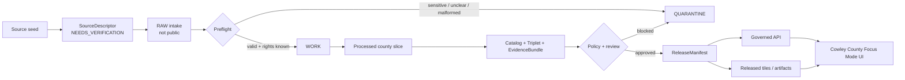
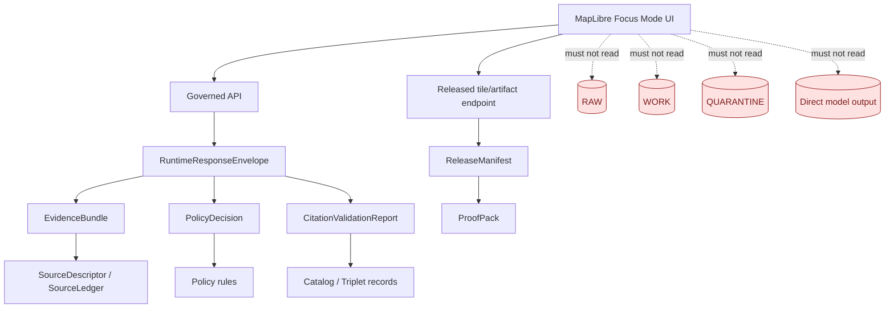
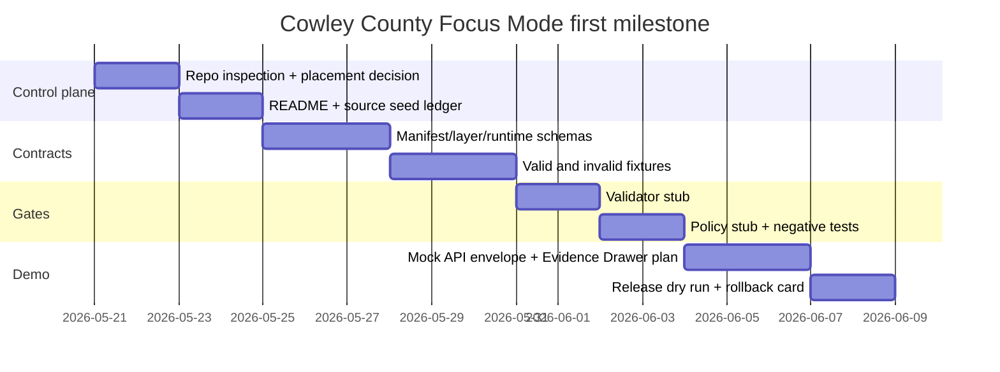

<!--
doc_id: NEEDS_VERIFICATION
title: Cowley County Focus Mode Build Plan
type: standard
version: v0.1
status: draft
owners:
  - NEEDS_VERIFICATION
created: 2026-05-21
updated: 2026-05-21
policy_label: public-planning
related:
  - docs/doctrine/directory-rules.md # NEEDS_VERIFICATION
  - docs/domains/hydrology/README.md # NEEDS_VERIFICATION
  - docs/domains/settlements-infrastructure/README.md # NEEDS_VERIFICATION
  - docs/domains/agriculture/README.md # NEEDS_VERIFICATION
  - docs/domains/geology-natural-resources/README.md # NEEDS_VERIFICATION
  - docs/domains/hazards/README.md # NEEDS_VERIFICATION
tags:
  - kfm
  - focus-mode
  - county
  - cowley-county
  - kansas
notes:
  - Draft county Focus Mode plan. Repository paths are PROPOSED until verified against a mounted KFM checkout.
  - Public context is separated from sensitive, private, operational, archaeological, and infrastructure-risk detail.
-->

<a id="top"></a>

# Cowley County Focus Mode Build Plan

> **Kansas Frontier Matrix county proof slice:** a governed, evidence-first, map-first, time-aware Focus Mode for Cowley County, Kansas.


**Quick links:** [Operating posture](#operating-posture) · [Why this county](#why-this-county) · [First demo layers](#first-demo-layers) · [User journeys](#user-journeys) · [Object model](#governed-object-model) · [Repository shape](#proposed-repository-shape) · [PR sequence](#first-pr-sequence) · [Source seeds](#source-seed-list) · [Milestone](#recommended-first-milestone)

---

## Operating posture

Cowley County Focus Mode must behave as a **trust-visible public surface**, not as a shortcut into raw data, internal records, or model output.

> [!IMPORTANT]
> **EvidenceBundle outranks generated language.** Every public claim that appears in the Focus Mode drawer must be traceable to source descriptors, EvidenceRefs, EvidenceBundles, release manifests, and policy decisions. If support is missing, the runtime outcome is `ABSTAIN`, `DENY`, or `ERROR`, not a fluent guess.

### KFM invariants preserved

| Invariant | Cowley County Focus Mode rule |
|---|---|
| Lifecycle | `RAW -> WORK / QUARANTINE -> PROCESSED -> CATALOG / TRIPLET -> PUBLISHED` |
| Public access | Public UI consumes governed API payloads, released PMTiles/COGs/GeoParquet, catalog/triplet records, and policy-safe runtime envelopes only. |
| No direct internal reads | Public UI must not read RAW, WORK, QUARANTINE, unpublished candidates, canonical/internal stores, or direct model output. |
| Publication | Publication is a governed state transition with review, receipts, release manifests, correction path, and rollback target. |
| AI role | AI may summarize, compare, and explain released evidence. It is never the root truth source. |
| Sensitive data | Archaeology, burial/sacred sites, rare species, living-person data, private-property detail, exact infrastructure vulnerabilities, and emergency operational details fail closed or are generalized. |
| Source roles | Official, regulatory, observational, model, interpretive, historical, and derived layers are not interchangeable. |



---

## Why this county

**County selected:** **Cowley County, Kansas**.

Cowley County is a strong next KFM proof slice because it compresses many KFM governance challenges into a manageable county boundary:

1. **Hydrology and floodplain complexity:** Arkansas River, Walnut River, Grouse Creek, Timber Creek, and related floodplain updates make the county a strong water/hazard demo.
2. **Dual-city settlement pattern:** Winfield and Arkansas City create a useful public UI test for city/county layers, parcel context, public services, roads, and historic settlement narratives.
3. **Agriculture at meaningful scale:** KDA reports 879 farms, 519,270 farm acres, and $116 million in 2022 crop/livestock sales, making agriculture and land-cover layers worth testing.
4. **Geology and groundwater relevance:** KGS has a Cowley County geology and groundwater report describing its Central Lowland physiographic context and drainage into the Arkansas River system.
5. **Transportation proof value:** U.S. 77, U.S. 160, BNSF crossings, Strother Field context, and KDOT construction references create a roads/rail/infrastructure slice that requires public-safe handling.
6. **Cultural-history sensitivity:** Cowley County history includes Osage land context and late-1860s/1870 settlement history. That supports a public historical layer while requiring strict suppression of sensitive archaeology, burial, sacred-site, tribal, and private-property details.

> [!WARNING]
> This plan is **not** a public release. It is a build plan for a county Focus Mode proof slice. Current source rights, authoritative status, data currency, and KFM repository placement remain **NEEDS_VERIFICATION** until validated.

---

## Product thesis

Cowley County Focus Mode should answer:

> **“What can a public user safely understand about Cowley County’s water, land, agriculture, roads, towns, geology, hazards, and history — with every claim tied to released evidence and every sensitive detail governed before display?”**

### Public product promise

The first public demo should let a user:

- open Cowley County as a bounded Focus Mode;
- toggle public-safe layers for water, floodplain context, transportation, settlements, agriculture, geology, and public history;
- click a map feature and see an Evidence Drawer;
- compare “current effective” versus “draft / in-development” floodplain context without collapsing their authority;
- understand that parcels, floodplains, roads, and historic overlays are **not legal advice**, **not emergency alerts**, **not title evidence**, and **not archaeological disclosure**;
- export a small proof pack for the visible county demo state.

### Non-goals

| Non-goal | Reason |
|---|---|
| Real-time emergency warning system | KFM hazards are context and evidence surfaces, not official emergency alerts. |
| Parcel/title authority | Parcel maps are reference layers, not title truth. |
| Archaeological site disclosure | Exact sensitive locations are denied or generalized. |
| Living-person profiling | Public Focus Mode cannot expose personal, private, health, DNA, or living-person assertions. |
| Infrastructure vulnerability map | Public UI must avoid operationally useful vulnerability disclosure. |
| AI-generated truth | AI answers are interpretive and must cite released evidence or abstain. |

---

## Scope boundary

### Included in first Cowley County proof slice

| Lane | Included public-safe scope | First artifact type |
|---|---|---|
| Spatial foundation | County boundary, municipal context, generalized basemap anchors | Released vector tile / GeoJSON fixture |
| Hydrology | Arkansas River, Walnut River, Grouse Creek, Timber Creek, general drainage context | Public-safe hydrology layer |
| Hazards | Effective floodplain viewer link, draft flood risk review distinction, general floodplain status | Policy-gated hazard context |
| Agriculture | County-level 2022 agriculture summary, broad CDL class rollups, farm economy context | County fact card + generalized land-cover tile |
| Geology / groundwater | KGS county geology/groundwater source seed and generalized physiographic context | Evidence-backed geology card |
| Roads / rail | U.S. 77 / U.S. 160 public project context, rail crossings only as already-public context | Public road context layer |
| Settlements | Winfield, Arkansas City, Burden, Udall, Dexter, Atlanta, Cambridge, Grenola, public civic context | Settlement nodes |
| Cultural history | Public, generalized county history and settlement context | Historical story node |
| UI | MapLibre county Focus Mode shell, Evidence Drawer, layer registry, policy badges | Mock governed API payload |
| Governance | Source descriptors, fixtures, validator stubs, policy stubs, release manifest draft | PR-ready control plane |

### Excluded or restricted by default

| Category | Default posture |
|---|---|
| Archaeological, burial, sacred, or culturally sensitive locations | `DENY` exact location; allow only public-safe generalized narratives after review |
| Rare species / sensitive ecology | `DENY` exact points; generalize to coarse grid or county-level context |
| Parcel owner/person-level detail | `DENY` in public demo unless source terms, public need, and policy allow; prefer parcel geometry as contextual only |
| Critical infrastructure vulnerabilities | Generalize or suppress |
| Emergency operational details | Link to official emergency sources only; no KFM-generated alerting |
| Draft floodplain data | Label clearly as draft/best-available status; do not present as final regulatory truth |
| AI summaries without EvidenceBundle | `ABSTAIN` |

---

## First demo layers

> [!NOTE]
> Layer names below are **PROPOSED**, not repo-confirmed. They should be adapted after a mounted repository inspection and Directory Rules review.

| Layer ID | Display name | Source seed | Public-safe display | Policy notes |
|---|---|---|---|---|
| `cowley_boundary_public_v0` | Cowley County boundary | Kansas/US Census boundary source NEEDS_VERIFICATION | County outline | Avoid implying legal survey precision. |
| `cowley_settlements_public_v0` | Cities and towns | County/city public sources; GNIS/Census NEEDS_VERIFICATION | Named points and municipal extents | No private addresses. |
| `cowley_hydrology_public_v0` | Arkansas + Walnut River context | KGS + USGS/NHD seed NEEDS_VERIFICATION | Generalized stream lines | Avoid live flood forecasts. |
| `cowley_floodplain_effective_public_v0` | Effective floodplain context | Kansas Floodplain Viewer / FEMA MSC | General floodplain polygons | Must show regulatory source/date and disclaimer. |
| `cowley_flood_risk_review_draft_v0` | Draft flood risk review | KDA Cowley FRR draft data | Separate draft overlay | Must not collapse draft data with effective FIRM. |
| `cowley_agriculture_summary_v0` | Agriculture profile | KDA 2022 Cowley stats | County fact card + broad classes | County-level only in first release. |
| `cowley_cdl_rollup_public_v0` | Cropland / land-cover rollup | USDA CDL seed NEEDS_VERIFICATION | Aggregated class bands | Use material-change watcher and sidecar hash. |
| `cowley_geology_context_v0` | Geology + groundwater context | KGS Cowley report | Generalized geology card | No well-owner or vulnerable-well exposure. |
| `cowley_transport_public_v0` | U.S. 77 / U.S. 160 context | KDOT public project pages | Highway project line/context | Suppress operational work-zone vulnerabilities. |
| `cowley_history_public_v0` | Public history story layer | County history page + museum/public sources | Story nodes | Osage and settlement context needs review language. |
| `cowley_evidence_drawer_fixture_v0` | Evidence Drawer demo | Synthetic fixture + source seeds | Click-to-evidence panel | No public release until validated. |

---

## User journeys

### Journey 1 — Public resident: “What does this floodplain layer mean?”

1. User opens Cowley County Focus Mode.
2. User toggles **Floodplain Context**.
3. UI shows separate badges for `effective`, `draft`, and `source status`.
4. User clicks a generalized floodplain feature near Arkansas City or Winfield.
5. Evidence Drawer shows source descriptor, map-status date, whether the layer is effective/draft/contextual, limitations, “not a legal determination” notice, and link to the official source.

**Required runtime outcome:** `ANSWER` only if EvidenceBundle resolves and policy allows public display. Otherwise `ABSTAIN`.

### Journey 2 — County planner / steward: “Which source changed?”

1. Steward opens internal review mode.
2. CDL or floodplain watcher emits a proposed work record.
3. Steward reviews source hash, ETag/Last-Modified, geometry-diff summary, and policy flags.
4. No public layer changes until validation and promotion complete.

**Required runtime outcome:** `ANSWER` for review console only; public UI remains on released manifest.

### Journey 3 — Historical context user: “Why is this place historically important?”

1. User opens **Public History** layer.
2. User sees high-level Cowley County settlement context and public museum/source links.
3. Any Osage, archaeology, burial, sacred-site, or culturally sensitive geography is generalized or withheld.
4. AI may summarize public history only from released evidence.

**Required runtime outcome:** `DENY` for exact sensitive locations; `ANSWER` only for public-safe story nodes.

### Journey 4 — Agriculture user: “What dominates the county landscape?”

1. User toggles **Agriculture + Land Cover**.
2. UI shows county-level 2022 agriculture facts and broad land-cover categories.
3. Field-level inference, owner identity, and private operation details remain out of scope.

**Required runtime outcome:** `ANSWER` from county-level source bundle; `ABSTAIN` for field-specific claims not released.

---

## UI surfaces

### Required Focus Mode panels

| UI surface | Purpose | Cowley-specific behavior |
|---|---|---|
| County header card | Orient user | “Cowley County, Kansas” + public-safe summary |
| Layer stack | Toggle map layers | Floodplain, rivers, settlements, agriculture, roads, geology, history |
| Evidence Drawer | Claim traceability | Feature click resolves `EvidenceRef -> EvidenceBundle` |
| Policy badge rail | Show governance state | `public`, `draft`, `restricted`, `generalized`, `NEEDS_VERIFICATION` |
| Timeline strip | Time-aware source handling | Effective vs draft floodplain dates, 2022 agriculture year, source update date |
| Compare mode | Avoid source-role collapse | Effective floodplain vs draft FRR overlay; CDL year vs previous year |
| Story node tray | Public narrative | County history, water corridors, agriculture, roads, geology |
| Export proof pack button | Inspectable demo | Emits public-safe manifest, source list, layer state, and limitations |
| AI answer panel | Evidence-bound Q&A | Only answers with released EvidenceBundle and finite runtime outcome |

### UI trust membrane



---

## Governed object model

### Minimum object families

| Object family | Cowley County use | First fixture |
|---|---|---|
| `CountyFocusModeManifest` | Declares Cowley County slice, layer IDs, source refs, policy posture | `cowley_focus_mode_manifest.valid.json` |
| `SourceDescriptor` | One per source seed | Cowley GIS, KDA ag, KGS report, KDA floodplain, KDOT project |
| `EvidenceRef` | Lightweight pointer in UI/API payloads | One per layer and one per story node |
| `EvidenceBundle` | Resolved evidence, source roles, limitations, citations | One bundle per demo layer |
| `LayerManifest` | Public-safe layer metadata | Floodplain, hydrology, agriculture, roads |
| `PolicyDecision` | Allow/deny/generalize obligations | Sensitive history and draft floodplain cases |
| `RuntimeResponseEnvelope` | `ANSWER / ABSTAIN / DENY / ERROR` for Focus Mode answers | Valid and invalid answer fixtures |
| `CitationValidationReport` | Verifies citations resolve to allowed source seeds | Positive and missing-citation fixtures |
| `RunReceipt` | Records processing run | Static fixture for no-network build |
| `PromotionDecision` | Records promotion from processed to published | `approved`, `blocked`, and `rollback` fixtures |
| `ReleaseManifest` | Declares released public artifacts | Demo-only public manifest |
| `RollbackPlan` | Reversal target if artifact is withdrawn | Demo rollback card |
| `CorrectionNotice` | Public correction path | Placeholder fixture |
| `RedactionReceipt` | Records generalization/suppression transforms | Sensitive history / infrastructure case |
| `PMTilesAttestation` | Integrity sidecar for released tiles | Optional first milestone artifact |

### Runtime outcomes

| Outcome | Cowley County example |
|---|---|
| `ANSWER` | “KDA reports 879 farms and 519,270 farm acres in Cowley County in 2022.” |
| `ABSTAIN` | “I cannot verify this parcel-specific floodplain claim from a released EvidenceBundle.” |
| `DENY` | “Exact archaeological or sacred-site locations are not available in public Focus Mode.” |
| `ERROR` | “EvidenceBundle resolution failed; no public answer emitted.” |

---

## Proposed repository shape

> [!CAUTION]
> Paths are **PROPOSED**. Directory Rules say placement follows responsibility root, lifecycle, and governance posture, not topic convenience. Verify against the mounted repository, accepted ADRs, and current root conventions before creating or moving files.

### Responsibility-root basis

| Proposed path | Responsibility root | Why it belongs there |
|---|---|---|
| `docs/focus-modes/counties/cowley-county/README.md` | `docs/` | Human-readable county Focus Mode documentation. |
| `schemas/contracts/v1/focus_mode/county_focus_mode_manifest.schema.json` | `schemas/` | Machine contract/schema home per Directory Rules default; NEEDS_VERIFICATION. |
| `fixtures/focus_mode/cowley_county/valid/` | `fixtures/` | No-network test fixtures tied to schemas and validators. |
| `fixtures/focus_mode/cowley_county/invalid/` | `fixtures/` | Negative-path fixtures. |
| `policy/focus_mode/cowley_county.rego` | `policy/` | Policy rules and public-safe obligations. |
| `tools/validators/focus_mode/validate_cowley_focus_mode.py` | `tools/` | Validator helper, not truth or policy authority. |
| `data/catalog/stac/cowley_county/` | `data/catalog/` | Catalog records for released/derived artifacts only, not raw data. |
| `release/cowley_county_focus_mode/` | `release/` | Release manifests, proof packs, rollback cards; only after promotion. |
| `apps/web/src/focus-modes/cowley/` | `apps/web/` | UI component surface after API contract is validated. |
| `apps/governed_api/.../cowley...` | `apps/governed_api/` | Governed API DTO/route implementation; exact path NEEDS_VERIFICATION. |

### Proposed tree

```text
docs/
  focus-modes/
    counties/
      cowley-county/
        README.md
        source-seeds.md
        public-safety-notes.md
        acceptance-checklist.md

schemas/
  contracts/
    v1/
      focus_mode/
        county_focus_mode_manifest.schema.json
        county_focus_mode_layer.schema.json
        county_focus_mode_story_node.schema.json
        county_focus_mode_runtime_envelope.schema.json

fixtures/
  focus_mode/
    cowley_county/
      valid/
        cowley_focus_mode_manifest.valid.json
        cowley_hydrology_layer.valid.json
        cowley_floodplain_effective_layer.valid.json
        cowley_floodplain_draft_layer.valid.json
        cowley_agriculture_summary.valid.json
        cowley_history_story_node.valid.json
      invalid/
        exact_archaeology_location.public.invalid.json
        draft_floodplain_without_status.invalid.json
        parcel_owner_public.invalid.json
        evidence_ref_unresolved.invalid.json
        ai_answer_without_citation.invalid.json
        infrastructure_vulnerability_public.invalid.json

policy/
  focus_mode/
    cowley_county.rego

tools/
  validators/
    focus_mode/
      validate_county_focus_mode.py

data/
  catalog/
    stac/
      cowley_county/
        README.md
        cowley_focus_mode_collection.proposed.json

release/
  cowley_county_focus_mode/
    release_manifest.proposed.json
    proof_pack.proposed.json
    rollback_plan.proposed.md
```

---

## Build phases

### Phase 0 — Evidence and repo inspection

| Step | Output | Status |
|---|---|---|
| Mount or inspect actual repo | Repo evidence report | NEEDS_VERIFICATION |
| Confirm accepted Directory Rules and ADRs | Placement decision log | NEEDS_VERIFICATION |
| Inventory existing Focus Mode patterns | Reuse/adapt plan | NEEDS_VERIFICATION |
| Verify source URLs, terms, and update dates | Source seed ledger | NEEDS_VERIFICATION |
| Define public/sensitive boundary | Cowley policy profile | PROPOSED |

### Phase 1 — Schema and fixture-first slice

| Step | Output |
|---|---|
| Add `CountyFocusModeManifest` schema | JSON Schema |
| Add layer/story/runtime envelope schemas | JSON Schema |
| Add valid Cowley fixtures | No-network fixtures |
| Add invalid Cowley fixtures | Negative-path fixtures |
| Add validator command | Fails closed |

### Phase 2 — Source descriptors and EvidenceBundles

| Step | Output |
|---|---|
| Create Cowley source descriptors | `SourceDescriptor` fixtures |
| Create layer EvidenceBundles | Resolved bundles |
| Create CitationValidationReport fixtures | Positive/negative reports |
| Mark draft/effective floodplain distinction | Policy obligations |

### Phase 3 — Public-safe layer manifests

| Step | Output |
|---|---|
| Hydrology context layer | Public-safe vector fixture |
| Floodplain effective layer | Source-status layer manifest |
| Draft FRR layer | Draft-only layer manifest |
| Agriculture summary | County fact card |
| Roads context | KDOT project context |
| Public history story node | Generalized narrative |

### Phase 4 — Governed API and UI stub

| Step | Output |
|---|---|
| Mock governed API route | RuntimeResponseEnvelope fixtures |
| MapLibre layer registry entry | Public-safe layer metadata |
| Evidence Drawer | Click-to-evidence demo |
| AI answer stub | Cite-or-abstain behavior |
| Export proof pack | Demo proof manifest |

### Phase 5 — Promotion rehearsal

| Step | Output |
|---|---|
| Run validators | Validation receipt |
| Run policy tests | Policy decision report |
| Create release manifest | Proposed release object |
| Create rollback plan | Reversible withdrawal plan |
| Create correction notice placeholder | Public correction path |

---

## First PR sequence

| PR | Title | Contents | Exit criteria |
|---|---|---|---|
| PR-001 | Cowley Focus Mode documentation control plane | `docs/focus-modes/counties/cowley-county/README.md`, source seeds, safety notes | No claims of implementation; all unknowns labeled. |
| PR-002 | Cowley Focus Mode schemas and fixtures | Manifest/layer/story/runtime schemas; valid + invalid fixtures | Schema validation passes; invalid fixtures fail. |
| PR-003 | Cowley source descriptors and EvidenceBundles | SourceDescriptor fixtures; EvidenceBundle fixtures; CitationValidationReport | Every public claim resolves or abstains. |
| PR-004 | Cowley policy profile | Rego/stub rules for floodplain status, sensitive history, parcels, infrastructure | Negative-path policy tests pass. |
| PR-005 | Cowley public-safe layer manifests | Hydrology, floodplain, agriculture, geology, roads, history layers | No RAW/WORK/QUARANTINE dependency. |
| PR-006 | Cowley governed API mock + UI shell | Mock envelope endpoint, MapLibre layer registry, Evidence Drawer | UI only consumes governed payloads. |
| PR-007 | Cowley release dry run | ReleaseManifest, ProofPack, RollbackPlan, CorrectionNotice | Release can be withdrawn and recompiled. |

---

## Acceptance checklist

### Governance gates

- [ ] Repository placement verified against Directory Rules and accepted ADRs.
- [ ] No public UI reads from RAW, WORK, QUARANTINE, unpublished candidates, canonical/internal stores, or direct model output.
- [ ] Every public layer has a `LayerManifest`.
- [ ] Every public claim has an `EvidenceRef`.
- [ ] Every `EvidenceRef` resolves to an `EvidenceBundle`.
- [ ] Every `EvidenceBundle` records source role, rights status, limitations, and review state.
- [ ] Draft floodplain data is visually and semantically distinct from effective floodplain data.
- [ ] Agriculture facts cite year, source, and county-level scope.
- [ ] Parcel data is contextual only and not title truth.
- [ ] Exact sensitive archaeology, burial, sacred-site, rare species, and critical infrastructure vulnerability details are denied or generalized.
- [ ] AI answers emit finite runtime outcomes.
- [ ] Missing citation produces `ABSTAIN`.
- [ ] Policy denial produces `DENY`.
- [ ] Evidence resolution failure produces `ERROR`.
- [ ] Release manifest has rollback target.
- [ ] Correction notice path exists.

### UI acceptance

- [ ] County header states this is a governed Focus Mode.
- [ ] Layer list includes source-status badges.
- [ ] Evidence Drawer is available for every clickable public feature.
- [ ] Timeline strip shows source year/date where available.
- [ ] Compare mode does not collapse effective and draft source authority.
- [ ] Export proof pack includes source list, layer state, limitations, and release manifest ref.
- [ ] Public-safe disclaimers are visible without hiding useful context.
- [ ] Keyboard and screen-reader basics are tested.
- [ ] Mobile viewport does not hide policy badges or evidence links.

### Data/validation acceptance

- [ ] Valid fixtures pass.
- [ ] Invalid fixtures fail for the intended reason.
- [ ] No live network calls in fixture tests.
- [ ] Source terms and rights remain explicit.
- [ ] spec_hash/canonical hash behavior is deterministic.
- [ ] PMTiles/COG sidecar pattern is defined before any artifact promotion.
- [ ] Logs/receipts do not include secrets or restricted detail.

---

## Fixture plans

### Valid fixtures

| Fixture | Purpose |
|---|---|
| `cowley_focus_mode_manifest.valid.json` | Minimal valid county Focus Mode manifest. |
| `cowley_hydrology_layer.valid.json` | Public-safe river/drainage context. |
| `cowley_floodplain_effective_layer.valid.json` | Effective floodplain layer with source status and limitations. |
| `cowley_floodplain_draft_layer.valid.json` | Draft FRR layer with explicit draft status. |
| `cowley_agriculture_summary.valid.json` | County-level agriculture facts. |
| `cowley_geology_context.valid.json` | KGS geology/groundwater context card. |
| `cowley_transport_context.valid.json` | KDOT U.S. 77 / U.S. 160 public project context. |
| `cowley_history_story_node.valid.json` | Public-safe story node with sensitive-location suppression. |
| `cowley_runtime_answer.valid.json` | `ANSWER` with EvidenceBundle and citations. |
| `cowley_release_manifest.valid.json` | Demo release manifest with rollback target. |

### Invalid fixtures

| Fixture | Expected failure |
|---|---|
| `exact_archaeology_location.public.invalid.json` | Public exact sensitive location denied. |
| `draft_floodplain_without_status.invalid.json` | Draft layer lacks explicit draft status. |
| `parcel_owner_public.invalid.json` | Person/property owner detail exposed in public layer. |
| `evidence_ref_unresolved.invalid.json` | EvidenceRef does not resolve. |
| `ai_answer_without_citation.invalid.json` | AI answer lacks citations. |
| `hydrology_live_alert_claim.invalid.json` | KFM layer claims emergency alert authority. |
| `infrastructure_vulnerability_public.invalid.json` | Operational vulnerability detail exposed. |
| `release_without_rollback.invalid.json` | Release lacks rollback target. |
| `layer_without_policy_decision.invalid.json` | Public layer missing PolicyDecision. |
| `source_role_collapsed.invalid.json` | Draft/model/official status collapsed into one authority. |

---

## Risk register

| Risk | Severity | Cowley-specific trigger | Mitigation |
|---|---:|---|---|
| Effective vs draft floodplain collapse | High | KDA draft FRR data displayed like final FEMA/Kansas effective floodplain | Separate layer IDs, badges, policy obligations, and EvidenceBundles. |
| Parcel/title overclaim | High | Parcel data interpreted as ownership/title truth | Strong disclaimer; parcel layer excluded from first public release unless policy approves. |
| Sensitive cultural/archaeological exposure | Critical | Exact site, burial, sacred, or tribal-sensitive location appears | `DENY` exact public location; generalized story nodes only. |
| Infrastructure vulnerability exposure | High | Bridges, utilities, flood-control, or rail details exposed operationally | Public context only; vulnerability details restricted. |
| Emergency alert confusion | High | Flood/hazard layer treated as real-time warning | Prominent “not an emergency alert” language; link to official sources. |
| Source rights uncertainty | High | GIS/floodplain/transport data terms unclear | Quarantine until source terms are recorded. |
| Agriculture privacy | Medium | Field-level inference implies private operation detail | County-level aggregation; no owner/operator exposure. |
| Outdated source dates | Medium | Old floodplain/agriculture/geology data shown without date | Date badges; stale-state checks. |
| AI hallucination | High | AI summarizes history/hazards without source bundle | Runtime cite-or-abstain; no direct model endpoint. |
| Repository path drift | Medium | County files placed as root-level topic folder | Directory Rules review; docs/fixtures/schemas/policy responsibility roots. |
| Map precision overtrust | Medium | Generalized layer visually appears survey-grade | Scale/precision disclaimers and metadata. |
| Cross-lane source-role collapse | High | KGS geology, KDA floodplain, KDOT roads, and county GIS treated as same authority | Source role taxonomy and evidence drawer display. |

---

## Source seed list

> [!IMPORTANT]
> Source seeds are **starting points**, not admitted evidence. Each needs a `SourceDescriptor`, rights review, source role assignment, update cadence, and policy profile before use.

| Seed ID | Source | Why it matters | Proposed source role | Status |
|---|---|---|---|---|
| `SRC-COWLEY-GIS` | Cowley County GIS Services — https://www.cowleycountyks.gov/374/GIS-Services | County mapping and property information support | local government GIS / contextual | NEEDS_VERIFICATION |
| `SRC-COWLEY-MAP-DISCLAIMER` | Cowley County Internet Mapping disclaimer — https://www.cowleycountyks.gov/144/Find | States mapping is not a legal document and is subject to revision | local government limitation statement | NEEDS_VERIFICATION |
| `SRC-KDA-COWLEY-AG` | KDA Cowley County agriculture profile — https://www.agriculture.ks.gov/kansas-agriculture/kansas-agricultural-statistics/cowley-county | 2022 county agriculture summary | official state agriculture summary | NEEDS_VERIFICATION |
| `SRC-KGS-COWLEY-GEOG` | KGS Cowley County geography — https://www.kgs.ku.edu/General/Geology/Cowley/03_geog.html | Arkansas and Walnut River geography | scientific/geologic reference | NEEDS_VERIFICATION |
| `SRC-KGS-COWLEY-GW` | KGS geology and groundwater resources report — https://www.kgs.ku.edu/General/Geology/Cowley/index.html | Geology, groundwater, physiography | scientific/geologic reference | NEEDS_VERIFICATION |
| `SRC-KDA-COWLEY-FRR` | KDA Cowley County Flood Risk Review draft data — https://gis2.kda.ks.gov/gis/cowley/ | Draft floodplain data status | draft regulatory/hazard mapping | NEEDS_VERIFICATION |
| `SRC-KDA-WALNUT-WATERSHED` | KDA Walnut Custom Watershed mapping update — https://www.agriculture.ks.gov/divisions-programs/division-of-water-resources/water-structures/floodplain-management/mapping/walnut-custom-watershed | Floodplain mapping project history | regulatory mapping project context | NEEDS_VERIFICATION |
| `SRC-KS-FLOODPLAIN-VIEWER` | Kansas Floodplain Viewer — https://gis2.kda.ks.gov/gis/ksfloodplain/ | Current effective floodplain viewer | official public viewer | NEEDS_VERIFICATION |
| `SRC-ARKCITY-FLOODPLAIN` | Arkansas City floodplain information — https://www.arkcity.org/neighborhood-services/page/floodplain-information | Local floodplain interpretation context | municipal public information | NEEDS_VERIFICATION |
| `SRC-KDOT-US77-COWLEY` | KDOT U.S. 77 pavement replacement in Cowley County — https://www.ksdot.gov/projects/south-central-kansas-projects/u-s-77-pavement-replacement-in-cowley-county | Roads/bridge/rail-crossing public project context | official transportation project | NEEDS_VERIFICATION |
| `SRC-KDOT-US160-WINFIELD` | KDOT U.S. 160 bridge reconstruction news release — https://www.ksdot.gov/Home/Components/News/News/5969/391?widgetId=3517 | Winfield transportation context | official transportation project | NEEDS_VERIFICATION |
| `SRC-WINFIELD-GIS` | Winfield Mapping & GIS — https://www.winfieldks.org/departments/mis_gis/mapping___gis/index.php | City GIS and infrastructure layer context | municipal GIS | NEEDS_VERIFICATION |
| `SRC-COWLEY-HISTORY` | Cowley County history page — https://www.cowleycountyks.gov/281/History-of-Cowley-County | Public historical context and naming/settlement summary | local public history | NEEDS_VERIFICATION |
| `SRC-TRAVELKS-MUSEUM` | Cowley County Historical Society Museum listing — https://www.travelks.com/listing/cowley-county-historical-society-museum/2588/ | Public museum seed for story node | public cultural reference | NEEDS_VERIFICATION |
| `SRC-USDA-CDL` | USDA Cropland Data Layer | Land-cover/agriculture layer | federal land-cover product | NEEDS_VERIFICATION |
| `SRC-USGS-NHD` | USGS National Hydrography Dataset | Hydrology geometry | federal hydrography product | NEEDS_VERIFICATION |
| `SRC-US-CENSUS-TIGER` | Census TIGER/Line boundary/place data | County and settlement boundary context | federal boundary data | NEEDS_VERIFICATION |
| `SRC-FEMA-MSC` | FEMA Map Service Center | Flood insurance/rate map authority | federal regulatory reference | NEEDS_VERIFICATION |

---

## Open verification questions

1. What is the current accepted schema home in the live KFM repository: `schemas/contracts/v1/...`, `contracts/...`, `jsonschema/...`, or another ADR-approved layout?
2. Does a county Focus Mode convention already exist in the repo?
3. What is the current governed API route pattern for Focus Mode payloads?
4. What MapLibre layer registry shape is currently accepted?
5. Are source descriptors already standardized for county/city GIS sources?
6. What are Cowley County GIS terms of use and redistribution limits?
7. Can Cowley County mapping services be used as public source seeds, or only linked as external references?
8. What is the official current status of Cowley County draft FRR floodplain data, and when will it supersede or interact with effective maps?
9. Which floodplain source is authoritative for a given public claim: Kansas Floodplain Viewer, FEMA MSC, KDA FRR, local city page, or county map?
10. How should KFM label local floodplain guidance versus regulatory floodplain determinations?
11. What public level of road/bridge project detail is safe for KDOT U.S. 77 / U.S. 160 layers?
12. Should rail context be included in first release or deferred due to infrastructure sensitivity?
13. What cultural review language is required for Osage land/settlement context?
14. Are any Cowley County rare-species or sensitive-habitat layers in scope, and what geoprivacy level applies?
15. What county-level agriculture facts are stable and source-current enough for a first release?
16. What precision/scale disclaimers should display on geology and groundwater context?
17. Should parcel boundary context be excluded from public release entirely in the first milestone?
18. What proof-pack format is current in the repo?
19. What CI validators already exist and should be extended instead of creating new ones?
20. What rollback/correction convention is accepted for county Focus Mode releases?

---

## Recommended first milestone

### Milestone: **Cowley County Focus Mode — No-Network Governance Slice**

**Goal:** Prove a Cowley County Focus Mode can render a public-safe, evidence-backed county view without live source fetches, sensitive disclosure, or direct internal-store access.

**Milestone deliverables:**

- Cowley County Focus Mode README.
- Source seed ledger with source roles and `NEEDS_VERIFICATION` labels.
- `CountyFocusModeManifest` schema.
- Valid fixtures for hydrology, effective floodplain, draft floodplain, agriculture, geology, roads, and public history.
- Invalid fixtures for sensitive location, unresolved evidence, missing citation, draft-status collapse, parcel-owner exposure, and release-without-rollback.
- Policy stub enforcing public-safe obligations.
- Validator stub with clear error codes.
- Mock governed API response envelope.
- MapLibre UI fixture plan.
- Release dry-run manifest and rollback card.

**Definition of done:**

- [ ] All files live under responsibility roots after Directory Rules review.
- [ ] No root-level county topic folder is introduced.
- [ ] No live external source is fetched during tests.
- [ ] Valid fixtures pass.
- [ ] Invalid fixtures fail closed.
- [ ] Public UI payload uses only governed API / released artifact shapes.
- [ ] Every visible claim resolves to an EvidenceBundle or abstains.
- [ ] Sensitive details are denied or generalized.
- [ ] Release can be rolled back.



---

## Final build stance

Cowley County is valuable because it forces KFM to handle a real mixed county: river/floodplain governance, agriculture, roads/rail, twin city centers, public history, geology, and sensitive location boundaries. The county is specific enough to feel real and broad enough to exercise KFM’s trust membrane.

The first successful release is not a flashy map. It is a county Focus Mode where every public map layer, story node, and AI answer can prove: **what source supports it, what role that source plays, what is withheld, what was reviewed, what was released, and how to roll it back.**

[Back to top](#top)
