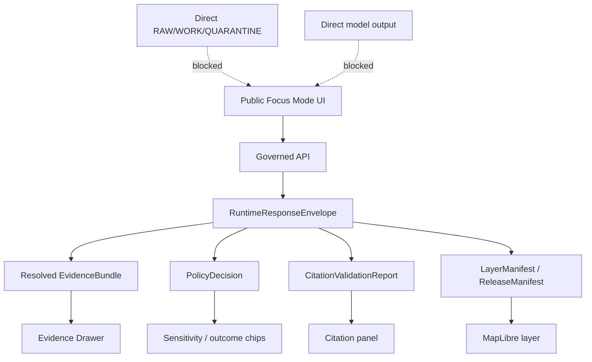
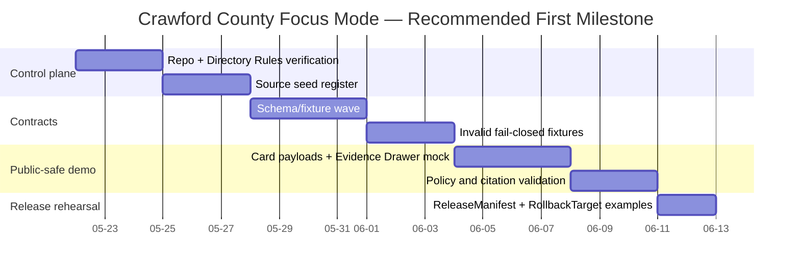

<!--
kfm_meta:
  doc_id: "NEEDS_VERIFICATION"
  title: "Crawford County Focus Mode Build Plan"
  type: "standard"
  version: "v0.1"
  status: "draft"
  owners:
    - "NEEDS_VERIFICATION"
  created: "2026-05-21"
  updated: "2026-05-21"
  policy_label: "public-draft; NEEDS_VERIFICATION"
  related:
    - "NEEDS_VERIFICATION: docs/doctrine/directory-rules.md"
    - "NEEDS_VERIFICATION: docs/doctrine/truth-posture.md"
    - "NEEDS_VERIFICATION: docs/doctrine/trust-membrane.md"
    - "NEEDS_VERIFICATION: docs/focus_modes/counties/"
  tags:
    - "kfm"
    - "focus-mode"
    - "county"
    - "crawford-county"
    - "southeast-kansas"
    - "coal-field"
    - "floodplain"
    - "agriculture"
    - "public-safe"
  notes:
    - "No mounted repository was inspected for this plan."
    - "All repository paths are PROPOSED unless later confirmed from a mounted checkout."
    - "Source seeds are not accepted evidence until SourceDescriptor, rights review, EvidenceBundle resolution, policy checks, validation receipts, and release review exist."
-->

<a id="top"></a>

# Crawford County Focus Mode Build Plan

**County:** Crawford County, Kansas  
**Focus Mode type:** County proof-slice plan  
**Status:** `DRAFT` · `PROPOSED` · `NEEDS_VERIFICATION`  
**Generated:** 2026-05-21  
**Repo access mode:** `NO_MOUNTED_REPO_EVIDENCE`  
**Publication posture:** Public-safe planning document only; not a release, not a data publication, not a claim of implementation.

[](#operating-posture)
[](#operating-posture)
[](#lifecycle-diagram)
[](#proposed-repository-shape)
[](#sensitive-detail-boundary)
[](#why-this-county)

**Quick links:**  
[Operating posture](#operating-posture) ·
[Why this county](#why-this-county) ·
[Product thesis](#product-thesis) ·
[Scope boundary](#scope-boundary) ·
[First demo layers](#first-demo-layers) ·
[User journeys](#user-journeys) ·
[UI surfaces](#ui-surfaces) ·
[Governed object model](#governed-object-model) ·
[Repository shape](#proposed-repository-shape) ·
[Build phases](#build-phases) ·
[First PR sequence](#first-pr-sequence) ·
[Fixtures](#fixture-plan) ·
[Risks](#risk-register) ·
[Sources](#source-seed-list) ·
[Open questions](#open-verification-questions) ·
[First milestone](#recommended-first-milestone)

> [!IMPORTANT]
> This plan chooses **Crawford County** as the next KFM county Focus Mode proof slice because it compresses multiple KFM trust problems into one county: public county GIS, Pittsburg/Girard/Frontenac settlement structure, southeast Kansas coal-field history, mined-land ecological recovery, floodplain update posture, agriculture, transportation, historic-resource context, and public-safety-sensitive land conditions.

> [!CAUTION]
> This document does **not** authorize publishing parcel-owner details, exact sensitive archaeology, exact abandoned-mine hazards, private-property interpretations, living-person details, exact infrastructure vulnerabilities, or direct model outputs. Public Focus Mode output must pass through governed APIs, EvidenceBundle resolution, policy decisions, release manifests, and public-safe transforms.

---

## Operating posture

**Goal:** Build a county-specific Focus Mode plan that can become a governed KFM proof slice without weakening KFM’s truth membrane.

| Rule | Crawford County application |
|---|---|
| EvidenceBundle outranks generated language | Narrative cards about coal mining, agriculture, floodplain status, and historic communities must point to EvidenceRefs that resolve to EvidenceBundles before release. |
| Public UI uses governed surfaces only | Public Focus Mode must read released layer manifests, released artifacts, catalog/triplet/graph records, tile services, and governed API envelopes. |
| No public RAW / WORK / QUARANTINE | County source downloads, draft floodplain materials, parcel extracts, and source-side CSV/PDF/PBF/GIS packages stay outside public UI until processed and released. |
| Promotion is a governed state transition | A Markdown plan, tile, PMTiles archive, map style, or AI summary is not “published” until a PromotionDecision and ReleaseManifest say so. |
| AI is interpretive, not authoritative | AI may summarize the released county Focus Mode bundle, but cannot create new facts about mine hazards, property, history, ecology, or flood risk. |
| Cite-or-abstain | Missing citation, unresolved EvidenceRef, stale source, unknown rights, or unknown sensitivity produces `ABSTAIN`, `DENY`, or `ERROR`, not a confident answer. |
| Sensitive detail fails closed | Exact archaeological locations, burial/sacred sites, rare species, mine-hazard points, living people, and critical infrastructure details are suppressed, generalized, or denied. |

### Truth labels used in this plan

| Label | Meaning |
|---|---|
| `CONFIRMED` | Verified from browsed public source pages during this planning run, or directly stated as a KFM doctrine requirement in the user prompt. |
| `PROPOSED` | Recommended county plan, object, layer, file, fixture, PR, or workflow not verified as present in a mounted repository. |
| `NEEDS_VERIFICATION` | Checkable before implementation or publication, but not verified strongly enough here. |
| `UNKNOWN` | Not verifiable in this run. |
| `DENY / ABSTAIN / ERROR` | Finite runtime or policy outcomes. |

### Repo evidence boundary

- `CONFIRMED`: No mounted KFM repository was inspected in this run.
- `PROPOSED`: All file paths below are target-placement proposals, not claims that files exist.
- `NEEDS_VERIFICATION`: Directory Rules, current repository shape, schema home, policy home, app paths, validators, CI, package manager, and existing county-plan conventions must be inspected before PR work.

```mermaid
flowchart LR
  A[RAW source seed\ncounty GIS, KDA, KGS, Census, KDWP, KDOT] --> B{Admission gate}
  B -->|rights/sensitivity/source role ok| C[WORK normalization]
  B -->|unclear rights/sensitive/conflicted| Q[QUARANTINE]
  C --> D[PROCESSED public-safe derivatives]
  D --> E[CATALOG / TRIPLET / GRAPH records]
  E --> F[EvidenceBundle resolution]
  F --> G[PolicyDecision + CitationValidationReport]
  G --> H[PromotionDecision]
  H --> I[PUBLISHED release manifest + PMTiles/GeoJSON/API payload]
  I --> J[Governed API]
  J --> K[Public Focus Mode UI]
  K --> L[Corrections / rollback target]
```

<a id="lifecycle-diagram"></a>



---

## Why this county

**County selected:** **Crawford County, Kansas**

Crawford County is a strong next proof slice because it is **not just another county boundary + demographic card**. It forces KFM to handle overlapping public information, historic industrial extraction, ecological recovery, floodplain updates, agricultural production, transportation access, and sensitive site governance in one county-scale Focus Mode.

### County-specific proof value

| Proof pressure | Why Crawford County is useful |
|---|---|
| Public GIS + parcel caution | Crawford County has a county GIS office that maintains the tax parcel map and supports GIS services and 911 addressing. This is useful for map context, but parcel/valuation records must not be treated as title truth or exposed as private-person dossiers. |
| Coal-field history + mine-safety sensitivity | KGS identifies the eastern third of Crawford County as extensively mined for coal in the late 19th and 20th centuries. This creates a high-value, high-risk public-history layer where exact abandoned mine hazards and subsidence implications must be governed. |
| Mined-land ecology | KDWP’s Mined Land Wildlife Area spans a reclaimed landscape with strip-mine lakes, wildlife, and habitat management. It is excellent for public education, but exact facility/hazard detail should be handled with source-role and sensitivity review. |
| Floodplain update posture | KDA’s Crawford County floodplain map page states that draft floodplain mapping was updated on 2024-11-05. The Focus Mode can demonstrate draft-vs-effective map labeling and avoid treating draft floodplain status as final regulatory truth. |
| Agriculture + land cover | Kansas Department of Agriculture reports 763 farms, 352,793 acres in farms, and $93 million in 2022 crop/livestock sales. Crawford can prove agriculture cards, CDL/land-cover watch patterns, and source cadence handling. |
| Settlement pattern | Pittsburg, Girard, Frontenac, Arma, McCune, Mulberry, and Cherokee create a dense southeast Kansas settlement graph for historical and modern comparison. |
| Historic resources | KHRI / SHPO inventory access supports public historic-resource education while keeping archaeology, sacred/burial, and sensitive preservation data behind review. |
| Transportation context | KDOT’s KanPlan county/city map products seed public roads, rail, city maps, and transportation context without turning Focus Mode into an emergency-routing tool. |

### One-sentence build thesis

> **Crawford County Focus Mode should become KFM’s public-safe southeast Kansas coal-field, mined-land ecology, floodplain, agriculture, and settlement proof slice, with strong evidence resolution and explicit suppression of sensitive exact locations.**

---

## Product thesis

**Crawford County Focus Mode** is a public-facing county lens that lets a user ask:

- *What is the public evidence-backed story of Crawford County’s land, settlements, mining legacy, agriculture, water risk, and ecological recovery?*
- *Which layers are authoritative, which are contextual, which are draft, which are derived, and which are suppressed?*
- *What can KFM safely show on the public map, and what must be generalized, denied, or routed to steward review?*

The product should not be a generic “county dashboard.” It should be a **trust-visible map mode** where the county’s public story is assembled from released, cited, policy-checked objects.

### Product non-negotiables

| Non-negotiable | Enforcement |
|---|---|
| Every visible claim has an EvidenceRef or explicitly abstains | Evidence Drawer blocks uncited claims. |
| Draft floodplain data is labeled draft | Policy gate rejects final/regulatory phrasing if source status is draft. |
| Parcel/valuation information is not title truth | Land/parcel cards must include source-role warnings and no owner dossier behavior. |
| Coal/mine layers are public-safe | Exact abandoned mine shafts, unstable slopes, access hazards, or sensitive industrial details are generalized or denied. |
| Mined-land recreation is not a safety guide | Public UI may show official public recreation context but does not provide operational safety instructions or unauthorized access guidance. |
| Historic resources are not archaeology disclosure | Historic buildings/districts may be public; archaeology/burial/sacred/culturally sensitive points fail closed. |

---

## Scope boundary

### Included in first Crawford County Focus Mode

| Included | Public-safe boundary |
|---|---|
| County overview | Boundary, municipal context, basic demographic and area cards from public sources. |
| Settlement graph | Pittsburg, Girard, Frontenac, Arma, McCune, Mulberry, Cherokee, and smaller communities where source-supported. |
| Transportation context | General highway, county map, city map, and rail/corridor context from KDOT/KanPlan and county maps. |
| Floodplain context | Effective/draft status, official-source links, public-safe floodplain awareness, no individualized property determination. |
| Coal/mined-land history | Generalized coal-field and mined-land history with KGS/KDWP evidence; exact hazard features denied unless source-public and policy-approved. |
| Agriculture profile | County agriculture statistics and optional CDL/land-cover derived summaries after source descriptors and material-change rules. |
| Mined Land Wildlife Area context | Generalized public recreation/ecology card; avoid republishing exact facility coordinates or hazard-prone features unless reviewed. |
| Historic-resource overview | KHRI/National Register/SHPO source-route cards; no sensitive archaeology or burial locations. |
| Evidence Drawer | Source role, citation, policy decision, freshness, limitations, and rollback target for every layer/card. |

### Explicitly excluded from first public release

| Excluded | Reason |
|---|---|
| Parcel-owner lookup and private-person dossiers | Living-person/private-property sensitivity; assessor/tax data is not title truth. |
| Exact archaeological, burial, sacred, or culturally sensitive site locations | Deny-by-default public exposure. |
| Exact abandoned mine shafts, unstable areas, or mine-safety vulnerabilities | Public safety and liability risk; use generalized context only. |
| Emergency routing, evacuation instruction, or live hazard alerting | KFM Focus Mode is not an emergency alert system. |
| Unreviewed AI summaries | AI output is interpretive; must cite released EvidenceBundles. |
| Raw source downloads surfaced in public UI | Public UI uses governed release artifacts only. |

<a id="sensitive-detail-boundary"></a>

### Public context vs sensitive details

| Topic | Public context allowed | Sensitive detail posture |
|---|---|---|
| Coal mining history | County-scale history, generalized mined areas, interpretive cards, source citations. | Exact abandoned mine entries, subsidence-risk points, unsafe access routes, or unreviewed hazard claims are `DENY` or generalized. |
| Mined Land Wildlife Area | Official public overview, acreage, habitat types, generalized recreational context. | Exact facility coordinates copied into KFM derivatives require rights/safety review; hazard-prone terrain details are generalized. |
| Floodplain | Official map status, source links, draft/effective labels, county-scale explanation. | Parcel-specific determinations and property advice are `ABSTAIN`; direct users to official floodplain administrator/FEMA/KDA source. |
| Parcels | Public assessor/tax-map context as source route, not title truth. | Owner names, living-person inference, property value targeting, and title conclusions are denied in public Focus Mode. |
| Historic resources | Public historic buildings/districts and SHPO/KHRI education links. | Archaeological, burial, sacred, or sensitive preservation data fail closed. |
| Wildlife / rare species | Habitat classes and generalized public conservation context. | Exact rare-species observations and sensitive ecology points are generalized or denied. |

---

## First demo layers

These are **PROPOSED** layers for a first public-safe demo. Each requires SourceDescriptor, source-role assignment, rights review, EvidenceBundle resolution, policy decision, fixtures, validation receipts, and release manifest before publication.

| Layer ID | Layer name | Source seed family | Geometry posture | Public UI behavior | Acceptance gate |
|---|---|---|---|---|---|
| `crawford.boundary.context.v1` | County boundary and neighboring context | TIGER/Line or Kansas GIS boundary source | Public polygon | Simple county frame with evidence drawer | Boundary source authority verified |
| `crawford.municipal.context.v1` | Municipal settlement points/polygons | Census/KDOT/county maps | Public generalized | Pittsburg/Girard/Frontenac/Arma/etc. cards | Place source crosswalk checked |
| `crawford.transport.context.v1` | Highway / road / rail context | KDOT KanPlan + county highway map | Public generalized | Transportation context, not live routing | No emergency routing language |
| `crawford.floodplain.status.v1` | Floodplain status context | KDA/FEMA/county floodplain pages | Public, status-labeled | Draft/effective chip + official source route | Draft status not promoted as final |
| `crawford.coalfield.context.v1` | Coal-field and mined-land context | KGS geologic map / coal publications | Generalized | History + geology card | No exact hazard points |
| `crawford.mined_land_ecology.v1` | Mined Land Wildlife Area public context | KDWP official page | Generalized/public boundary only | Ecology/recreation card with limitations | Exact facilities reviewed or omitted |
| `crawford.agriculture.profile.v1` | Agriculture profile | KDA + USDA NASS Census of Agriculture | Table/card, county aggregate | Farm count, acres, sales, crop/livestock profile | County aggregate only |
| `crawford.landcover.summary.v1` | Land-cover/CDL summary | USDA CDL / NLCD | County aggregate / generalized raster derivative | Chart + map tint, not parcel claims | Source year + classmap verified |
| `crawford.historic_resources.public.v1` | Historic-resource overview | KHRI / SHPO / NPS NRHP | Public sites only; sensitive suppressed | Historic card + source route | Archaeology/sacred/burial filter active |
| `crawford.evidence_health.v1` | Evidence and policy overlay | KFM internal release objects | Public metadata only | Chips for citation, freshness, policy outcome | All visible layers pass validation |

### Layer interaction rules

- **Coal/mined-land + floodplain overlap:** UI may show generalized intersection for planning education, but not property-specific hazard advice.
- **Parcel + floodplain overlap:** Public UI must route to official source; KFM abstains from parcel-specific determinations.
- **Historic resources + redevelopment:** Public UI may show historic-source context, but does not issue legal compliance determinations.
- **Agriculture + private property:** County aggregate statistics are allowed; farm/operator-level claims are denied unless explicitly public, reviewed, and non-sensitive.

---

## User journeys

### 1. Public resident: “What should I know about Crawford County?”

**Path:** Open county Focus Mode → read county snapshot → toggle public layers → open Evidence Drawer.

**Expected answer style:**  
“Crawford County’s public Focus Mode currently supports a county overview, major communities, agriculture profile, generalized floodplain status, and coal/mined-land context. It does not provide parcel-specific legal, flood, title, or safety determinations.”

**Policy checks:** no owner names, no property-specific advice, no exact mine hazards.

### 2. Planner / steward: “Which evidence supports a floodplain card?”

**Path:** Open floodplain layer → Evidence Drawer → source role → draft/effective status → policy decision → limitations.

**Expected answer style:**  
“This layer is based on a browsed source seed that states draft Crawford County floodplain mapping was updated 2024-11-05. Before release, KFM must verify whether the applicable user-facing map is draft or effective and label it accordingly.”

**Policy checks:** draft status cannot be rendered as final regulatory truth.

### 3. Historian / educator: “How does coal mining shape the county story?”

**Path:** Toggle coal-field context → view timeline → open KGS citation → compare with Mined Land Wildlife Area context.

**Expected answer style:**  
“The public story can explain that the eastern third of Crawford County was extensively mined for coal and that mined-land landscapes later became ecological and recreational spaces. Exact hazard features remain suppressed.”

**Policy checks:** no exact abandoned mine hazards; source-role distinction between geology, history, recreation, and safety.

### 4. Ecologist / outdoor visitor: “What is the mined-land habitat context?”

**Path:** Toggle mined-land ecology → public generalized area → habitat card → source limitations.

**Expected answer style:**  
“KDWP describes the Mined Land Wildlife Area as a 14,500-acre property with substantial water and land acreage, much of it surface-mined in the 1920s–1974 period. KFM presents this as official public context, not a field-safety guide.”

**Policy checks:** exact facility coordinates omitted or only linked back to official source; no unauthorized access guidance.

### 5. KFM reviewer: “Can this county be released?”

**Path:** Review console → validation report → invalid fixture coverage → release manifest draft → rollback card.

**Expected answer style:**  
“Release is blocked until all visible claims resolve to EvidenceBundles, policy decisions are finite, source rights are verified, draft floodplain status is labeled, sensitive geometry transforms have receipts, and rollback/correction targets are present.”

---

## UI surfaces

| Surface | Purpose | Crawford-specific behavior |
|---|---|---|
| County Focus Header | One-line county identity, status chips, release state | `Crawford County · Southeast Kansas · public-safe proof slice · DRAFT` |
| Layer Tray | Toggle public-safe layers | Boundary, municipalities, transport, floodplain status, coal-field context, agriculture, mined-land ecology, historic resources, evidence health |
| Evidence Drawer | Explain visible claims | Shows EvidenceRef, EvidenceBundle, source role, citation, freshness, limitations, policy outcome |
| Sensitivity Ribbon | Make suppressed content visible as a governance fact | “Some mine-hazard, archaeological, parcel-owner, and rare-species details are not shown publicly.” |
| Timeline Scrubber | Separate historical periods and source dates | Coal mining period context, 2022 Ag Census, floodplain map status date, current Census estimates |
| Compare Panel | Compare source roles, not truth collapse | KDA floodplain vs FEMA map vs county page; KDA agriculture vs NASS profile |
| Correction Drawer | Let users flag stale or wrong information | Records correction notice candidate, not direct public mutation |
| Steward Review Queue | Non-public review of blocked details | Exact sensitive detail requires role-based access and audit trail |
| AI Summary Box | Evidence-bounded narrative | Only summarizes released EvidenceBundles; returns `ABSTAIN` on missing evidence |



---

## Governed object model

### Object families

| Object | Status | Crawford role |
|---|---|---|
| `CountyFocusModeManifest` | `PROPOSED` | Declares county identity, release status, layer list, UI surfaces, and public-safe policy profile. |
| `SourceDescriptor` | `PROPOSED` | Captures each public source seed, source role, rights posture, cadence, access method, and limitations. |
| `SourceIntakeRecord` | `PROPOSED` | Records when a source was checked, fetched, hashed, or rejected. |
| `EvidenceRef` | `PROPOSED` | Stable reference from UI claim/layer/card to evidence. |
| `EvidenceBundle` | `PROPOSED` | Resolved evidence package backing each claim. |
| `PolicyDecision` | `PROPOSED` | Finite allow/deny/abstain/error decision with obligations. |
| `PublicSafeGeometryTransformReceipt` | `PROPOSED` | Records generalization/suppression of sensitive mine, ecology, archaeology, or infrastructure detail. |
| `LayerManifest` | `PROPOSED` | Describes public map layer source, styling, sensitivity, tile URL, version, and evidence refs. |
| `CitationValidationReport` | `PROPOSED` | Proves every visible claim has an allowable citation. |
| `CountyNarrativeCard` | `PROPOSED` | Bounded prose card for county identity, coal history, agriculture, floodplain, ecology, and settlements. |
| `RunReceipt` | `PROPOSED` | Records build/validation command, input hashes, output hashes, and tool versions. |
| `PromotionDecision` | `PROPOSED` | Decides whether a candidate release can move to published state. |
| `ReleaseManifest` | `PROPOSED` | Names all released artifacts and rollback targets. |
| `CorrectionNotice` | `PROPOSED` | Records post-release correction request or confirmed correction. |
| `RollbackTarget` | `PROPOSED` | Points to prior known-good county release. |

### Minimal public runtime envelope

```json
{
  "schema_version": "v1",
  "object_type": "RuntimeResponseEnvelope",
  "county": "Crawford County, Kansas",
  "mode": "county_focus",
  "outcome": "ANSWER",
  "release_state": "draft_or_published_NEEDS_VERIFICATION",
  "evidence_bundle_resolved": true,
  "policy_decision_ref": "kfm://policy-decision/NEEDS_VERIFICATION",
  "citation_validation_ref": "kfm://citation-validation/NEEDS_VERIFICATION",
  "layer_manifest_refs": [
    "kfm://layer/crawford.boundary.context.v1",
    "kfm://layer/crawford.coalfield.context.v1"
  ],
  "limitations": [
    "Public-safe context only.",
    "No parcel-specific flood, title, safety, archaeology, or private-person claims."
  ]
}
```

### Public outcome rules

| Condition | Runtime outcome |
|---|---|
| EvidenceBundle resolved, policy allows, citation valid | `ANSWER` |
| Evidence missing or stale but not unsafe | `ABSTAIN` |
| Sensitive exact location, private-person detail, forbidden property inference, exact mine hazard | `DENY` |
| Internal service error, schema mismatch, unresolved release manifest | `ERROR` |

---

## Proposed repository shape

> [!WARNING]
> The paths below are **PROPOSED**. They are based on KFM responsibility-root doctrine and the user’s county-plan series pattern, but no mounted repository was inspected in this run. Before implementation, verify Directory Rules, accepted ADRs, existing county-plan locations, schema home, policy home, package manager, app tree, and CI conventions.

### Directory Rules basis

- Responsibility root controls placement; topic names do not justify new root folders.
- Lifecycle boundaries remain separate: raw intake, processed artifacts, catalog/triplet records, release artifacts, docs, schemas/contracts, policy, tests, and tools have different authority.
- Public clients use governed APIs and released artifacts, not canonical/internal stores.
- Schema home, policy home, and compatibility roots are `NEEDS_VERIFICATION` against the real repo.

### Proposed file/folder layout

```text
# PROPOSED — verify against mounted repo before creating
docs/
  focus_modes/
    counties/
      crawford_county/
        README.md
        crawford_county_focus_mode_build_plan.md
        source_seed_register.md
        public_safe_layer_plan.md
        release_checklist.md

schemas/
  contracts/
    v1/
      focus_mode/
        county_focus_mode_manifest.schema.json
        county_layer_manifest.schema.json
        county_narrative_card.schema.json
        public_safe_geometry_transform_receipt.schema.json

fixtures/
  focus_mode/
    crawford_county/
      valid/
        crawford_county_focus_manifest.public.valid.json
        crawford_agriculture_card.public.valid.json
        crawford_floodplain_status.public.valid.json
      invalid/
        exact_mine_hazard_public.invalid.json
        parcel_owner_public.invalid.json
        draft_floodplain_as_final.invalid.json
        unresolved_evidence_ref.invalid.json
        ai_summary_without_evidence.invalid.json

policy/
  focus_mode/
    crawford_county_publication.rego

tools/
  validators/
    focus_mode/
      validate_county_focus_manifest.py
      validate_public_safe_geometry.py
      validate_county_focus_citations.py

tests/
  focus_mode/
    crawford_county/
      test_crawford_public_safe_focus_mode.py
      test_crawford_invalid_fixtures_fail_closed.py

release/
  focus_mode/
    crawford_county/
      RELEASE_MANIFEST.example.json
      ROLLBACK_TARGET.example.json
      CORRECTION_NOTICE.example.json
```

### Placement risks

| Proposed area | Risk | Mitigation |
|---|---|---|
| `docs/focus_modes/counties/` | Existing repo may use a different docs lane | Inspect current repo and align; do not create parallel county-plan home. |
| `schemas/contracts/v1/` | Schema-home convention may already be decided by ADR | Verify ADR and schema registry before adding files. |
| `policy/` | Repo may use `policy/` or `policies/` compatibility roots | Follow accepted Directory Rules/ADRs; do not duplicate policy authority. |
| `release/` | Release object home may be compatibility-protected | Verify release manifest conventions before landing examples. |
| `tools/validators/` | Existing validator language may differ | Use repo-native validator stack or add adapter with ADR. |

---

## Build phases

### Phase 0 — Evidence and repo inventory

**Goal:** Prevent overclaiming and drift before any implementation.

- [ ] Mount or clone target repo.
- [ ] Record branch, commit, dirty state, package manager, test runner, existing Focus Mode paths.
- [ ] Read Directory Rules and accepted ADRs.
- [ ] Find existing county Focus Mode plans and reuse structure.
- [ ] Identify schema, policy, fixture, release, and validator homes.
- [ ] Produce a `CONFIRMED / PROPOSED / UNKNOWN / NEEDS_VERIFICATION` inventory.

**Exit gate:** no proposed path remains unreviewed against repo evidence.

### Phase 1 — Source seed registry

**Goal:** Turn browsed sources into governed source candidates.

- [ ] Create SourceDescriptor candidates for county GIS, county maps, floodplain, KDA agriculture, USDA NASS, Census, KGS, KDWP, KDOT, KHRI.
- [ ] Record source roles: primary, corroborating, context, restricted.
- [ ] Record rights/terms, access method, update cadence, known limitations.
- [ ] Mark draft floodplain source status explicitly.
- [ ] Mark parcel/valuation data as not title truth.

**Exit gate:** every seed has source role, rights status, freshness, and public-use posture.

### Phase 2 — Contracts, fixtures, and policy stubs

**Goal:** Make the county Focus Mode testable before map polish.

- [ ] Add CountyFocusModeManifest schema.
- [ ] Add CountyLayerManifest schema.
- [ ] Add CountyNarrativeCard schema.
- [ ] Add PublicSafeGeometryTransformReceipt schema.
- [ ] Add valid public fixtures.
- [ ] Add invalid fail-closed fixtures.
- [ ] Add policy stub for sensitive detail rules.

**Exit gate:** invalid fixtures fail for the right reason.

### Phase 3 — Public-safe data preparation

**Goal:** Produce small no-network candidate derivatives.

- [ ] County boundary.
- [ ] Municipal context.
- [ ] Transportation context.
- [ ] Agriculture aggregate card.
- [ ] Floodplain status card.
- [ ] Generalized coal/mined-land context.
- [ ] Generalized historic-resource context.
- [ ] Evidence health metadata.

**Exit gate:** no public artifact contains forbidden exact details or unresolved evidence.

### Phase 4 — Map and UI thin slice

**Goal:** Render the Focus Mode with no direct source/canonical reads.

- [ ] Add MapLibre layer manifest candidates.
- [ ] Add public-safe mock governed API response.
- [ ] Wire county Focus Header, Layer Tray, Evidence Drawer, and Sensitivity Ribbon.
- [ ] Confirm UI cannot fetch RAW/WORK/QUARANTINE or direct model output.
- [ ] Add accessibility smoke checks.

**Exit gate:** UI uses only governed mock/released payloads.

### Phase 5 — Review, promotion, and release rehearsal

**Goal:** Prove publication is a state transition.

- [ ] Run validators.
- [ ] Generate RunReceipt.
- [ ] Generate CitationValidationReport.
- [ ] Generate PolicyDecision.
- [ ] Draft ReleaseManifest.
- [ ] Draft RollbackTarget.
- [ ] Rehearse CorrectionNotice.

**Exit gate:** release can be approved, denied, or rolled back without ambiguous state.

### Phase 6 — County story hardening

**Goal:** Add richer narrative only after trust spine is stable.

- [ ] Mining legacy timeline with KGS evidence.
- [ ] Agriculture trend card with NASS/KDA evidence.
- [ ] Floodplain explainer with draft/effective status.
- [ ] Mined-land ecology card with KDWP evidence.
- [ ] Settlement/history cards with KHRI/SHPO/NPS evidence.
- [ ] County education/story node pack.

**Exit gate:** all narrative cards cite EvidenceBundles and policy outcomes.

---

## First PR sequence

| PR | Name | Contents | Required checks | Rollback |
|---|---|---|---|---|
| PR-0001 | Crawford Focus Mode docs + source seed register | Build plan, README, source seed register, public-safe boundary note | Markdown lint, no fake repo claims, source seed review | Remove docs only |
| PR-0002 | County Focus Mode contracts + fixtures | Schemas and valid/invalid fixtures | Schema validation, negative fixtures fail | Revert schema/fixture files |
| PR-0003 | Crawford publication policy + validators | Policy stub and validator scripts | Policy tests, citation checks, sensitivity checks | Revert policy/validator files |
| PR-0004 | Public-safe layer manifests | Boundary, municipalities, transport, floodplain status, coal context, ag card, mined-land ecology manifests | Manifest validation, EvidenceRef resolution, no raw reads | Remove layer manifests |
| PR-0005 | Mock governed API + UI shell | Mock CountyFocusModeManifest response, Evidence Drawer payload, UI route/card | UI tests, no direct model endpoint, no RAW/WORK fetches | Disable route / remove mock |
| PR-0006 | Release rehearsal pack | RunReceipt, CitationValidationReport, PolicyDecision, ReleaseManifest, RollbackTarget examples | Release dry run, rollback dry run | Revert release examples |

---

## Acceptance checklist

### Evidence and source controls

- [ ] Every visible county claim resolves to an EvidenceBundle.
- [ ] Every EvidenceRef has deterministic identity or documented exception.
- [ ] Every source seed has a SourceDescriptor.
- [ ] Source roles distinguish primary, corroborating, contextual, restricted.
- [ ] Rights/terms are recorded and reviewed.
- [ ] Draft floodplain status is visibly labeled.
- [ ] Parcel/valuation data is labeled as not title truth.

### Public-safe map controls

- [ ] No public layer reads RAW, WORK, QUARANTINE, or unpublished candidates.
- [ ] No exact sensitive archaeology, burial/sacred, rare-species, or mine-hazard location is exposed.
- [ ] Public mine/coal context is generalized and evidence-backed.
- [ ] Mined-land recreation card is not a field-safety or unauthorized-access guide.
- [ ] Floodplain UI avoids parcel-specific determinations.
- [ ] Historic-resource layer suppresses sensitive site categories.
- [ ] Private-person and parcel-owner details are denied in public payloads.

### UI / runtime controls

- [ ] Governed API returns finite outcomes: `ANSWER`, `ABSTAIN`, `DENY`, `ERROR`.
- [ ] AI summary box abstains when evidence is missing.
- [ ] Evidence Drawer shows source role, citation, policy decision, limitations, and freshness.
- [ ] Sensitivity Ribbon explains withheld categories without exposing them.
- [ ] Correction Drawer creates candidate notices, not direct edits.
- [ ] Release state is visible.

### Release and rollback controls

- [ ] RunReceipt produced.
- [ ] CitationValidationReport produced.
- [ ] PolicyDecision produced.
- [ ] PublicSafeGeometryTransformReceipt produced for generalized sensitive layers.
- [ ] PromotionDecision produced.
- [ ] ReleaseManifest produced.
- [ ] RollbackTarget produced.
- [ ] CorrectionNotice rehearsal completed.

---

## Fixture plan

### Valid fixtures

| Fixture | Purpose | Must include |
|---|---|---|
| `crawford_county_focus_manifest.public.valid.json` | Minimal public county manifest | County ID, release state, layer refs, evidence refs, policy profile |
| `crawford_agriculture_card.public.valid.json` | Agriculture profile card | KDA/NASS source refs, 2022 stats, limitation notes |
| `crawford_floodplain_status.public.valid.json` | Floodplain status card | Draft/effective status, official source route, no parcel claim |
| `crawford_coalfield_context.public.valid.json` | Coal/mined-land context | Generalized KGS/KDWP-backed narrative, no exact hazard point |
| `crawford_historic_resource_overview.public.valid.json` | Historic public overview | KHRI/SHPO route, sensitive filter active |
| `crawford_evidence_drawer_payload.public.valid.json` | Trust-visible UI payload | EvidenceBundle, PolicyDecision, CitationValidationReport refs |

### Invalid fixtures

| Fixture | Expected failure |
|---|---|
| `exact_mine_hazard_public.invalid.json` | Public payload contains exact abandoned mine or subsidence-sensitive point. |
| `parcel_owner_public.invalid.json` | Public payload exposes owner/living-person property details. |
| `draft_floodplain_as_final.invalid.json` | Draft floodplain source is labeled as final/effective/regulatory without evidence. |
| `unresolved_evidence_ref.invalid.json` | Layer/card references EvidenceRef that does not resolve. |
| `ai_summary_without_evidence.invalid.json` | AI narrative lacks EvidenceBundle citation. |
| `historic_archaeology_exact_public.invalid.json` | Exact archaeology/burial/sacred site exposed publicly. |
| `kdwp_facility_coords_unreviewed.invalid.json` | Exact recreation facility coordinates copied into KFM derivative without rights/sensitivity review. |
| `source_rights_unknown_promoted.invalid.json` | Unknown-rights source promoted to public artifact. |
| `raw_source_url_in_public_payload.invalid.json` | Public UI payload points directly to RAW/WORK source file instead of released artifact/governed API. |

---

## Risk register

| Risk ID | Risk | County-specific trigger | Severity | Default response | Owner |
|---|---|---|---|---|---|
| `CRAW-RISK-001` | Exact mine-hazard exposure | KGS/mining source or derived layer includes precise abandoned mine/subsidence location | High | Generalize, suppress, require steward review | `NEEDS_VERIFICATION` |
| `CRAW-RISK-002` | Draft floodplain misrepresented | KDA draft map treated as effective FEMA/regulatory map | High | Label status; require official-source verification | `NEEDS_VERIFICATION` |
| `CRAW-RISK-003` | Parcel/title collapse | Assessor/tax parcel map interpreted as ownership/title proof | High | Add warning; deny title claims | `NEEDS_VERIFICATION` |
| `CRAW-RISK-004` | Private-person exposure | Parcel owners or living-person details appear in public card | High | Deny; remove from public payload | `NEEDS_VERIFICATION` |
| `CRAW-RISK-005` | Sensitive archaeology disclosure | Historic-resource source includes archaeology/burial/sacred site data | High | Fail closed; generalized or steward-only | `NEEDS_VERIFICATION` |
| `CRAW-RISK-006` | Mined-land recreation hazard | UI implies safe access or gives field-safety directions | Medium/High | Link official source; no operational guidance | `NEEDS_VERIFICATION` |
| `CRAW-RISK-007` | Source-rights ambiguity | County GIS, KHRI, KDWP, KDOT, or KGS terms unclear for derivative publication | High | Quarantine until SourceDescriptor rights review | `NEEDS_VERIFICATION` |
| `CRAW-RISK-008` | Historic narrative overclaim | AI summarizes mining/settlement history beyond evidence | Medium | Evidence-bounded cards; cite-or-abstain | `NEEDS_VERIFICATION` |
| `CRAW-RISK-009` | Agriculture privacy | Farm/operator-level info inferred from public aggregates | Medium | Use county aggregates only | `NEEDS_VERIFICATION` |
| `CRAW-RISK-010` | Transportation misuse | Focus Mode becomes routing/emergency tool | Medium | Context only; no live routing or incident claims | `NEEDS_VERIFICATION` |
| `CRAW-RISK-011` | Stale source | Census/KDA/KDOT/KGS/KDWP pages change after seed | Medium | Freshness checks and source receipts | `NEEDS_VERIFICATION` |
| `CRAW-RISK-012` | Repository drift | Proposed files land in wrong authority root | Medium | Directory Rules review and ADR before merge | `NEEDS_VERIFICATION` |

---

## Source seed list

> [!NOTE]
> These are **source seeds**, not adopted evidence. Each seed needs a SourceDescriptor, rights/terms review, source-role assignment, freshness policy, EvidenceBundle mapping, and policy gate before use in public Focus Mode.

| Seed ID | Source | What it supports | Proposed source role | Public/sensitivity note | URL |
|---|---|---|---|---|---|
| `SRC-CRAW-001` | Crawford County GIS / 911 Addressing | County GIS office function, tax parcel map maintenance, 911 addressing role | Primary for local GIS office context | Parcel data is not title truth; owner/private-person exposure denied | https://www.crawfordcountykansas.org/gis--911-addressing.html |
| `SRC-CRAW-002` | Crawford County Maps | County map website, highway map, district/precinct/school/taxing unit map routes | Primary/context for local map availability | Use source route; do not scrape sensitive/private layers blindly | https://www.crawfordcountykansas.org/maps.html |
| `SRC-CRAW-003` | Crawford County Floodplain page | County floodplain public information and FEMA map route | Primary/context for county floodplain communication | Do not issue parcel-specific flood determinations | https://www.crawfordcountykansas.org/floodplain.html |
| `SRC-CRAW-004` | KDA Crawford County Floodplain Mapping | Draft floodplain mapping status and BFE portal route | Primary for draft map status | Must label draft/effective status; do not promote draft as final | https://gis2.kda.ks.gov/gis/crawford/ |
| `SRC-CRAW-005` | Kansas Department of Agriculture Crawford County profile | 2022 farms, acres, crop/livestock sales, agriculture sectors | Primary for ag summary | County aggregate; no farm/operator inference | https://www.agriculture.ks.gov/kansas-agriculture/kansas-agricultural-statistics/crawford-county |
| `SRC-CRAW-006` | USDA NASS 2022 Census of Agriculture county profile | Farm count, land in farms, market value, expenses, net cash income | Primary/corroborating for agriculture | County aggregate only | https://www.nass.usda.gov/Publications/AgCensus/2022/Online_Resources/County_Profiles/Kansas/cp20037.pdf |
| `SRC-CRAW-007` | U.S. Census Bureau QuickFacts | Current population estimates and demographic/geography fields | Primary for demographic seed | Use aggregate only; avoid living-person inference | https://www.census.gov/quickfacts/fact/table/crawfordcountykansas/PST045224 |
| `SRC-CRAW-008` | KGS Crawford County geologic map news | Coal mining/geology context; eastern third extensively mined; subsidence context | Primary for geology/mining context | Exact mine/subsidence hazard details require public-safe transform | https://www.kgs.ku.edu/General/News/2008/crawford.html |
| `SRC-CRAW-009` | KGS coal publications index | Southeastern Kansas coal field publications including Crawford/Cherokee/Labette | Context/corroborating | Historical/geologic context, not live safety determination | https://www.kgs.ku.edu/Magellan/Coal/index.html |
| `SRC-CRAW-010` | KDWP Mined Land Wildlife Area | Official public description of mined-land property, habitat, recreation, management | Primary/context for public ecology/recreation | Exact facility coordinates and access details need review before derivative display | https://www.ksoutdoors.gov/about-kdwp/where-we-work/wildlife-areas/mined-land-wildlife-area |
| `SRC-CRAW-011` | KDOT Kansas Maps and GIS Resources | KanPlan county/city map products, transportation GIS source route | Primary/context for transportation layer sources | Context only; no emergency routing | https://www.ksdot.gov/about/our-organization/divisions/planning-and-development/kansas-maps-and-gis-resources |
| `SRC-CRAW-012` | Kansas Historic Resources Inventory / SHPO | Historic-resource inventory source route and survey context | Primary/context for historic built resources | Archaeology/burial/sacred/sensitive categories fail closed | https://khri.kansasgis.org/ |
| `SRC-CRAW-013` | Crawford County Cities page | Pittsburg, Girard, Frontenac, Arma, McCune, Mulberry, Cherokee public municipal context | Context for settlement graph | Verify with Census/GNIS before final release | https://www.crawfordcountykansas.org/cities.html |

### Source-role anti-collapse notes

- KGS geology/coal sources are not KDWP recreation sources.
- KDWP recreation/ecology sources are not mine-safety determinations.
- KDA floodplain draft mapping is not automatically final FEMA regulatory truth.
- County parcel/tax maps are not title records.
- Census aggregate demographics are not living-person data.
- KHRI historic survey data is not blanket permission to expose sensitive archaeology.

---

## Open verification questions

### Repository and doctrine

- [ ] What is the current accepted schema home in the mounted repo?
- [ ] Does the repo already have county Focus Mode plan paths?
- [ ] Does the repo use `policy/`, `policies/`, or another policy compatibility root?
- [ ] What validator language and test runner are already used?
- [ ] Are previous county plans stored as flat files or per-county folders?
- [ ] Is there a county Focus Mode manifest schema already?
- [ ] What is the accepted release manifest home?
- [ ] What CODEOWNERS apply to docs, schemas, policy, fixtures, tools, tests, apps, and release?

### Source authority and rights

- [ ] What are the terms of use for Crawford County GIS public map and parcel data?
- [ ] What are the derivative-publication rights for KansasGIS/ORKA data?
- [ ] What is the authoritative floodplain source of record for Crawford County at release time?
- [ ] Is KDA’s draft floodplain map still draft, adopted, superseded, or archived?
- [ ] Which KGS coal/geology datasets can be redistributed, tiled, or summarized?
- [ ] What KDWP Mined Land Wildlife Area geometry/detail can be republished?
- [ ] Which KHRI categories are public-safe and which require suppression?
- [ ] Which KDOT/KanPlan products are suitable for derivative layer use?

### County-specific sensitivity

- [ ] Which mine-related features must be generalized even if visible in public source maps?
- [ ] What minimum generalization should be used for abandoned mine/subsidence context?
- [ ] Are any rare species, cave/karst, archaeology, cemetery, burial, or sacred-site records in candidate layers?
- [ ] Do any historic-resource layers reveal private residences or vulnerable sites?
- [ ] Which parcel attributes must be stripped before public payload creation?

### Product and UI

- [ ] Which county-source cards should ship in first public demo?
- [ ] Should Focus Mode include a “draft map” badge style shared across counties?
- [ ] What mobile layout is required for the Evidence Drawer?
- [ ] What exact finite outcomes must the governed API return?
- [ ] Which correction workflow accepts public feedback without letting the public mutate records?

---

## Recommended first milestone

### Milestone: `M1 — Crawford County public-safe source-to-card proof`

**Target:** A no-network, fixture-backed public-safe Focus Mode card stack for Crawford County containing:

1. County identity card.
2. Agriculture profile card.
3. Floodplain status card.
4. Coal/mined-land context card.
5. Settlement context card.
6. Evidence Drawer payload for each card.
7. Sensitivity Ribbon explaining withheld categories.
8. Invalid fixtures proving the county plan fails closed.

**Do not start with:** live scraping, parcel browsing, direct map source embedding, AI chat UI, broad PMTiles production, or public deployment.

**Definition of done:**

- [ ] Source seed register exists and is reviewed.
- [ ] Minimal schemas exist or are mapped to existing schemas.
- [ ] Valid and invalid fixtures pass/fail as expected.
- [ ] Every card has EvidenceRef placeholders or resolved bundles.
- [ ] Public-sensitive details are absent.
- [ ] Policy decisions are finite.
- [ ] A release rehearsal creates a ReleaseManifest and RollbackTarget example.
- [ ] The public UI mock cannot access RAW/WORK/QUARANTINE or direct model outputs.



---

## Appendix A — County-specific layer backlog

| Backlog item | Priority | Notes |
|---|---:|---|
| Public-safe coal-field explainer | P0 | Use KGS evidence; suppress exact hazards. |
| Draft-vs-effective floodplain badge | P0 | Reusable across counties. |
| Agriculture profile card | P0 | KDA/NASS county aggregate. |
| Settlement graph | P1 | Pittsburg/Girard/Frontenac/Arma/McCune/Mulberry/Cherokee with source crosswalk. |
| Mined Land Wildlife Area story card | P1 | Generalized KDWP context; no operational safety guide. |
| Historic-resource route card | P1 | KHRI/SHPO source route; sensitive filter. |
| Land-cover/CDL watch sidecar | P2 | Use county aggregate histograms and material-change thresholds. |
| Coal/mining timeline | P2 | Needs careful source citation and no hazard overclaim. |
| Road/rail/trade context | P2 | KDOT/KanPlan source descriptors. |
| Correction workflow | P2 | Public feedback creates candidate notice only. |

## Appendix B — Prompt for a future implementation agent

```text
Implement the Crawford County Focus Mode proof slice without claiming unverified repo facts.
First inspect Directory Rules, accepted ADRs, current repo tree, existing county Focus Mode
conventions, schema home, policy home, fixtures, validators, tests, release artifacts, and UI/API
paths. Preserve KFM doctrine: EvidenceBundle outranks generated language; public UI reads
governed APIs and released artifacts only; RAW/WORK/QUARANTINE are never public; publication
is a governed state transition; cite-or-abstain; sensitive details fail closed. Then land the
smallest reversible PR: source seed register, minimal schemas or mapped schema references,
valid/invalid fixtures, fail-closed policy checks, and mock public-safe Focus Mode payloads.
```

## Appendix C — Final self-check

- [x] Picked a county not already used in the provided series list.
- [x] Made the plan county-specific to Crawford County.
- [x] Preserved KFM doctrine and public-safe boundaries.
- [x] Included KFM Meta Block V2-style placeholder metadata.
- [x] Included badges, quick links, callouts, Mermaid diagrams, tables, checklists, fixture plans, PR sequence, risk register, source seed list, open verification questions, and recommended milestone.
- [x] Avoided claiming mounted repo access.
- [x] Marked repo paths as `PROPOSED` and unknowns as `NEEDS_VERIFICATION`.
- [x] Distinguished public context from sensitive details.

[Back to top](#top)
