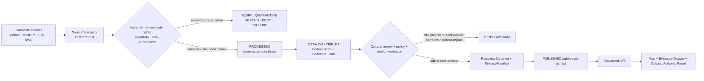
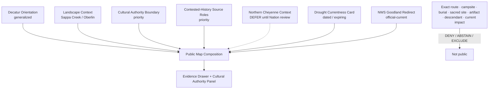
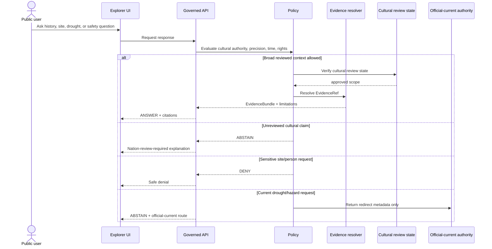
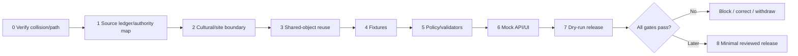

<!-- [KFM_META_BLOCK_V2]
doc_id: NEEDS_VERIFICATION — <REGISTERED_KFM_DOC_ID>
title: Decatur County Focus Mode Build Plan — Northern Cheyenne Exodus Memory and Drought Currentness Without Unreviewed Cultural, Site-Precision, or Emergency Conclusions
type: county-focus-mode-build-plan
version: v0.1-draft
status: draft
county: Decatur County, Kansas
county_slug: decatur
created: 2026-06-08
updated: 2026-06-08
owners:
  - NEEDS_VERIFICATION — <OWNER:focus-mode-steward>
  - NEEDS_VERIFICATION — <OWNER:tribal-sovereignty-and-cultural-reviewer>
  - NEEDS_VERIFICATION — <OWNER:public-history-and-museum-reviewer>
  - NEEDS_VERIFICATION — <OWNER:drought-weather-and-emergency-currentness-reviewer>
  - NEEDS_VERIFICATION — <OWNER:archaeology-burial-and-site-sensitivity-reviewer>
release_status: NEEDS_VERIFICATION — NOT_RELEASED
review_assignments: NEEDS_VERIFICATION
correction_path: NEEDS_VERIFICATION
rollback_path: NEEDS_VERIFICATION
unverified_repository_paths:
  - PROPOSED / CONFLICTED / NEEDS_VERIFICATION — docs/focus-modes/decatur-county/build-plan.md
  - PROPOSED / OBSERVED-LEGACY / NEEDS_VERIFICATION — docs/focus-mode/counties/decatur_county/decatur_county_focus_mode_build_plan.md
schema_contract_policy_homes:
  - PROPOSED / NEEDS_VERIFICATION — contracts/focus_mode/
  - PROPOSED / NEEDS_VERIFICATION — schemas/contracts/v1/focus_mode/
  - PROPOSED / NEEDS_VERIFICATION — policy/runtime/, policy/sensitivity/, policy/rights/, policy/release/
proof_slice: Northern Cheyenne Exodus / local public-memory context paired with Oberlin drought-emergency currentness, Sappa Creek landscape context, and cultural-site precision restraint
primary_public_safe_boundary: KFM may present carefully bounded, time-attributed public-history and landscape context only after Nation-authoritative and appropriate cultural review; KFM must not reproduce settler-only narratives as sovereign truth, expose burial/sacred/archaeological or sensitive route precision, identify descendant or living-person links, convert museum labels into complete historical authority, or turn current drought/emergency notices into independent KFM safety, legal, water-use, agricultural, or travel conclusions.
collision_search:
  completed_register: CONFIRMED — Decatur County is absent from the user-supplied completed/collision register.
  generated_in_continuation: CONFIRMED — Cheyenne, Wallace, Elk, Clay, Stevens, Sherman, Butler, Wilson, Franklin, Haskell, Grant, Comanche, Labette, Meade, and Norton were excluded.
  uploaded_project_materials: CONFIRMED — targeted Decatur County Focus Mode searches were performed; no Decatur County plan surfaced among examined results.
  live_repository_index: CONFIRMED — docs/focus-mode/counties/COUNTY_INDEX.md lists Decatur as not-started with validation not-run.
  live_repository_search: CONFIRMED — searches for decatur_county_focus_mode_build_plan and Decatur County Focus Mode returned no matching plan.
  exhaustive_absence: NEEDS_VERIFICATION — unindexed branches, private artifacts, and prior unsearched outputs may still exist.
directory_rules_basis:
  - CONFIRMED — attached Directory Rules.pdf was inspected during this series.
  - CONFIRMED — location encodes responsibility, governance, and lifecycle; topic alone does not justify a root folder.
  - CONFIRMED — lifecycle is RAW → WORK / QUARANTINE → PROCESSED → CATALOG / TRIPLET → PUBLISHED.
  - CONFIRMED — promotion is a governed state transition, not a file move.
  - CONFLICTED / NEEDS_VERIFICATION — observed repository paths use docs/focus-mode/ while doctrine also identifies docs/focus-modes/.
official_source_checks:
  - CONFIRMED — City of Oberlin official website, checked 2026-06-08.
  - CONFIRMED — City of Oberlin drought-emergency notice surfaced on the official homepage, checked 2026-06-08.
  - CONFIRMED — National Weather Service Forecast Office Goodland, checked 2026-06-08.
  - NEEDS_VERIFICATION — Decatur County Last Indian Raid Museum source and Northern Cheyenne Nation-authoritative source must be directly admitted before cultural-history publication.
source_check_date: 2026-06-08
tags: [kfm, focus-mode, decatur-county, oberlin, northern-cheyenne-exodus, public-memory, drought-currentness, sappa-creek, cultural-authority, archaeology, cite-or-abstain]
notes:
  - Planning artifact only; no implementation, source admission, cultural review, promotion, publication, correction readiness, or rollback readiness is claimed.
  - The City of Oberlin homepage displayed a current drought-emergency notice when checked; this is operationally current and must not be frozen into static KFM truth.
  - Local public-history or museum framing is not sufficient by itself for Northern Cheyenne representation.
[/KFM_META_BLOCK_V2] -->

<a id="top"></a>

# Decatur County Focus Mode Build Plan
## Northern Cheyenne Exodus Memory and Drought Currentness Without Unreviewed Cultural, Site-Precision, or Emergency Conclusions

> **Product thesis:** Present Decatur County’s Sappa Creek landscape, Oberlin public-memory institutions, and current drought-authority context while requiring Nation-authoritative review before cultural representation and refusing archaeological, burial, route-precision, descendant-linkage, or live emergency conclusions.


| Identity / status field | Value |
|---|---|
| County | **Decatur County, Kansas** |
| Status | `PROPOSED` planning artifact |
| Distinct proof slice | Northern Cheyenne Exodus / local public-memory context paired with drought-emergency currentness and Sappa Creek landscape interpretation |
| Primary public-safe boundary | **Nation-authoritative evidence and appropriate review must precede public cultural representation; archaeological, burial, sacred, route, campsite, descendant, and sensitive-location precision is withheld, and current drought/emergency notices remain official-current redirects rather than KFM conclusions.** |
| Official sources checked | City of Oberlin official website; NWS Goodland |
| Cultural source state | Direct Nation-authoritative and museum source admission `NEEDS_VERIFICATION` |
| Collision state | No collision surfaced in checked register, repository index/searches, or examined materials |
| Release state | `NOT_RELEASED` |

## Quick links

[Operating posture](#1-operating-posture) · [Why this county](#2-why-this-county) · [Product thesis](#3-product-thesis) · [Scope](#4-scope-boundary) · [Layers](#5-first-demo-layers) · [Journeys](#6-user-journeys) · [UI](#7-ui-surfaces) · [Objects](#8-governed-object-model) · [Repository](#9-proposed-repository-shape) · [Build](#10-build-phases) · [PRs](#11-first-pr-sequence) · [Acceptance](#12-acceptance-checklist) · [Fixtures](#13-fixture-plan) · [Risks](#14-risk-register) · [Sources](#15-source-seed-list) · [Questions](#16-open-verification-questions) · [Milestone](#17-recommended-first-milestone)

---

## Executive build note

Decatur County creates a strong proof slice because it combines two kinds of authority that KFM must never collapse.

The official City of Oberlin website identified the city as the county seat and, when checked, displayed a dated notice stating that Decatur County was in a drought emergency under a Governor’s proclamation.[^s1] That notice is current operational context, not durable truth: KFM must preserve timestamp, source authority, expiry, and correction behavior rather than converting it into a standing drought or water-use judgment.

Decatur County and Oberlin are also associated with public memory of the 1878 Northern Cheyenne Exodus and the institution commonly known as the Last Indian Raid Museum. This topic involves violence, dispossession, survivor and descendant memory, potentially sensitive sites, and competing historical narratives. The first public KFM slice must therefore **not** publish a cultural-history layer until direct Northern Cheyenne Nation-authoritative evidence, museum provenance, terminology review, and site-sensitivity review are completed.

NWS Goodland is the official current weather and hazard authority serving the region and publishes current hazards, drought, fire-weather, river/lake, warning, and observation products.[^s2] KFM may route users to such official-current sources but cannot rewrite or independently interpret warnings, drought impacts, water restrictions, agricultural consequences, or emergency actions.

> [!CAUTION]
> ## Defining public-safe boundary
>
> **Local public-history labels and settler records do not outrank Nation-authoritative evidence. KFM must not publish a Northern Cheyenne cultural narrative, event route, campsite, burial, sacred place, artifact, descendant linkage, or site precision without appropriate authority and review. Likewise, a dated drought or weather notice must not become an independent KFM legal, agricultural, water-use, travel, health, or emergency conclusion.**

### Evidence boundary

| Label | Established | Not established |
|---|---|---|
| `CONFIRMED` | Decatur is not in the supplied register; live index lists it `not-started` / `not-run`; repository searches returned no plan; City of Oberlin and NWS Goodland pages were checked; the city homepage carried a dated drought-emergency notice. | — |
| `PROPOSED` | Every object, layer, path, policy, fixture, UI surface, milestone, and release action in this document. | No implementation is claimed. |
| `NEEDS_VERIFICATION` | Northern Cheyenne Nation-authoritative source admission; museum authority/provenance; terminology; event chronology; rights; site sensitivity; burials/sacred places; exact routes; repository landing; correction and rollback implementation. | — |
| `UNKNOWN` | Present drought status after source changes, present water-use implications, archaeological or burial-site locations, cultural-review outcome, descendant links, current emergency conditions, and release/runtime state. | — |

---

# 1. Operating posture

## 1.1 Governing rules applied to Decatur County

| KFM rule | County application |
|---|---|
| EvidenceBundle outranks generated language | AI or museum prose cannot stand in for Nation-authoritative cultural evidence or current official drought evidence. |
| Cite-or-abstain | Broad landscape and authority-role context may answer; cultural interpretation and current impacts abstain until fit evidence exists. |
| Public clients use governed interfaces | No public access to raw oral-history notes, restricted collections, unpublished research, internal stores, or direct model output. |
| Source roles remain distinct | Nation authority, museum/local history, state/federal records, archaeology, cemetery/burial records, weather/drought authorities, and generated narrative remain separate. |
| Publication is governed | Discovery of a source or creation of a card is not publication. |
| Cultural and archaeological sensitivity fails closed | Burials, sacred places, campsites, trails, artifacts, and precise incident locations are withheld by default. |
| Currentness fails closed | Drought, fire weather, water use, roads, agriculture, and emergency effects require current competent authority. |
| Corrections are visible | Cultural wording and current-status errors require prompt correction and rollback. |

## 1.2 Truth labels and finite outcomes

| Token | Meaning |
|---|---|
| `CONFIRMED` | Verified in this run. |
| `PROPOSED` | Design not verified as implemented. |
| `NEEDS_VERIFICATION` | Checkable before action. |
| `UNKNOWN` | Unsupported or unresolved. |
| `ANSWER` | Narrow, admitted, public-safe answer. |
| `ABSTAIN` | Authority, review, evidence, rights, or freshness is insufficient. |
| `DENY` | Request crosses cultural, burial, archaeological, privacy, or safety boundary. |
| `ERROR` | Contract/evidence/policy/runtime failure. |

## 1.3 Public trust membrane



## 1.4 County-specific guardrails

| Guardrail | Outcome | Candidate reason code |
|---|---:|---|
| Unreviewed Northern Cheyenne narrative | `ABSTAIN` | `NATION_AUTHORITATIVE_REVIEW_REQUIRED` |
| Settler-only or museum-only framing presented as complete | `ABSTAIN` | `SOURCE_ROLE_IMBALANCE_REQUIRES_REVIEW` |
| Burial, sacred, campsite, artifact, archaeology, or route precision | `DENY` | `CULTURAL_OR_ARCHAEOLOGICAL_PRECISION_WITHHELD` |
| Living descendant or family linkage | `DENY` | `LIVING_PERSON_OR_DESCENDANT_LINKAGE_DENIED` |
| Current drought, water restriction, agricultural, or health impact | `ABSTAIN` | `CURRENT_DROUGHT_IMPACT_REQUIRES_AUTHORITY` |
| Current fire-weather, road, or emergency advice | `ABSTAIN` | `OFFICIAL_CURRENT_SAFETY_CHANNEL_REQUIRED` |
| Museum collection rights or artifact image reuse unresolved | `ABSTAIN` | `CULTURAL_ASSET_RIGHTS_UNRESOLVED` |
| AI-generated reconciliation of disputed accounts | `ABSTAIN` / `ERROR` | `AI_CANNOT_RESOLVE_CONTESTED_HISTORY` |

---

# 2. Why this county

## 2.1 Collision screen

| Check | Result | Status |
|---|---|---:|
| Supplied completed/collision register | Decatur absent. | `CONFIRMED` |
| Generated counties in continuation | Excluded. | `CONFIRMED` |
| Live county index | Decatur `not-started`, `not-run`. | `CONFIRMED` |
| Repository search | No Decatur plan identifier match. | `CONFIRMED` |
| Uploaded/project-material search | No Decatur plan surfaced among examined results. | `CONFIRMED` for performed search |
| Exhaustive absence | Not proved across all hidden/unindexed material. | `NEEDS_VERIFICATION` |

## 2.2 Proof-slice rationale

| Dimension | Proof value | Basis |
|---|---|---|
| Tribal sovereignty and cultural authority | Local public memory concerns Northern Cheyenne history and requires Nation-authoritative representation. | `PROPOSED` governance requirement; direct Nation source admission pending. |
| Historic violence and contested narrative | Multiple source roles and perspectives must not be collapsed. | `PROPOSED`; museum/local source admission pending. |
| Archaeology/burial/site sensitivity | Event routes, campsites, artifacts, and memorial/burial context may be sensitive. | `PROPOSED` fail-closed boundary. |
| Current drought | Official city homepage carried a dated drought-emergency notice. | `CONFIRMED` checked source.[^s1] |
| Weather/emergency authority | NWS Goodland publishes current hazards and drought products. | `CONFIRMED` checked source.[^s2] |
| Distinct series value | Combines sovereignty-sensitive public history with expiring drought/currentness rather than geology, reservoir recreation, or energy operations. | `PROPOSED`. |

## 2.3 Distinct contribution

Decatur County tests whether KFM can:

1. refuse to let local settler memory become the sole or sovereign account;
2. require direct cultural authority before publishing Indigenous representation;
3. withhold routes, sites, burials, artifacts, and descendant detail;
4. keep dated drought notices from becoming permanent or overbroad KFM conclusions;
5. expose disagreement, uncertainty, and source role rather than smoothing them into fluent narrative.

## 2.4 Public benefit

A future public-safe product could help users understand:

- how Sappa Creek and Oberlin anchor the county’s historical and environmental setting;
- why the Northern Cheyenne Exodus requires Nation-authoritative representation;
- why local museums and memorials are evidence sources with bounded roles;
- why current drought and hazard notices expire;
- how KFM shows uncertainty and abstention rather than inventing reconciliation.

---

# 3. Product thesis

## 3.1 One-sentence thesis

> **Decatur County Focus Mode should connect landscape, public memory, and official drought/currentness context while requiring Nation-authoritative review and withholding sensitive cultural, archaeological, burial, descendant, and live-safety conclusions.**

## 3.2 First-product promises

| Promise | Meaning |
|---|---|
| Evidence-visible source roles | Nation, museum, local government, weather authority, archaeology, and AI remain distinct. |
| Cultural-review gate | No public Northern Cheyenne narrative before appropriate review. |
| Site-precision restraint | Sensitive locations remain generalized or absent. |
| Currentness visibility | Drought notices show date, source, expiry, and status. |
| Finite outcomes | Supported context answers; unresolved cultural/current questions abstain or deny. |
| Reversibility | Correction and rollback precede release. |

## 3.3 Non-promises

- no definitive cultural narrative without Nation-authoritative evidence;
- no exact route, camp, burial, sacred, artifact, archaeological, or memorial-sensitive geometry;
- no descendant or living-person linkage;
- no legal blame, reparations, title, access, or ownership conclusion;
- no current drought-impact, water-use, agricultural, health, fire-weather, road, or emergency advice;
- no implementation or release claim.

---

# 4. Scope boundary

| Content family | Posture | Boundary |
|---|---:|---|
| County/Oberlin orientation | `PROPOSED` | Generalized public frame. |
| Sappa Creek landscape context | `PROPOSED` | Broad geography only. |
| Cultural Authority Boundary Notice | `PROPOSED` priority | No cultural narrative without Nation review. |
| Local public-memory institution card | `DEFER` | Museum authority, provenance, rights, and terminology must be verified. |
| Northern Cheyenne Exodus context | `DEFER` | Nation-authoritative review required. |
| Drought Emergency Currentness Card | `PROPOSED` | Dated official notice only; no independent impact/legal conclusions. |
| NWS Goodland Authority Card | `PROPOSED` | Redirect and source role only. |
| Archaeological/burial/site detail | `DENY` / `EXCLUDE` | Fail closed. |
| Descendant/person linkage | `DENY` | Privacy and cultural sensitivity. |
| Live drought/fire/road/emergency layer | `DEFER` | Requires governed current feed, expiry, and receipts. |

---

# 5. First demo layers

## 5.1 Prioritized cards/layers

| Priority | Card/layer | Purpose | Gate | Status |
|---:|---|---|---|---:|
| 1 | `CulturalAuthorityAndSitePrecisionBoundaryNotice` | Makes primary boundary unavoidable. | Nation review + cultural policy. | `PROPOSED` |
| 2 | `DecaturLandscapeOrientationCard` | General county/Oberlin/Sappa Creek context. | Authoritative geometry. | `PROPOSED` |
| 3 | `SourceRoleAndContestedHistoryCard` | Explains why accounts are not collapsed. | Source taxonomy and review. | `PROPOSED` |
| 4 | `NorthernCheyenneContextPlaceholder` | Explicitly shows deferred state rather than invented narrative. | Nation-authoritative evidence. | `DEFER` |
| 5 | `MuseumPublicMemorySourceCard` | Identifies museum as bounded local source. | Direct museum admission and rights. | `DEFER` |
| 6 | `DroughtEmergencyCurrentnessCard` | Shows dated city notice and expiry. | Official source and currentness validator. | `PROPOSED` |
| 7 | `NWSGoodlandAuthorityCard` | Routes current hazard questions. | Redirect-only. | `PROPOSED` |
| 8 | Exact cultural/event route/site layer | Unsafe. | Cultural/site sensitivity. | `DENY` |
| 9 | Burial/archaeology/artifact layer | Unsafe. | Specialized authority and likely nonpublication. | `EXCLUDE` |

## 5.2 Map composition



## 5.3 Layer-card truth contract

| Field | Purpose | Failure posture |
|---|---|---|
| `source_role` | Distinguishes Nation, museum, government, archaeology, weather, and AI. | `ABSTAIN`. |
| `cultural_authority_state` | Records whether appropriate authority reviewed the representation. | Suppress if unresolved. |
| `contested_claim_state` | Prevents flattening disagreement. | `ABSTAIN`. |
| `spatial_generalization` | Prevents sensitive-site exposure. | `DENY` / quarantine. |
| `temporal_basis` | Makes currentness visible. | `ABSTAIN` for current claims. |
| `expiry_at` | Required for drought/hazard status. | Suppress if stale. |
| `evidence_refs` | Claim support. | `ABSTAIN`. |
| `policy_decision_ref` | Outcome obligations. | Fail closed. |
| `limitations` | Public-readable boundary. | Release block. |
| `release_state` | Prevents draft from appearing released. | Public alias blocked. |

---

# 6. User journeys

## 6.1 Public learning journeys

| Journey | Safe outcome |
|---|---|
| “What is the cultural-history boundary here?” | Explains why Nation-authoritative review is required. |
| “Why is a museum not the only source?” | Explains local public-memory source role and limitations. |
| “What can KFM say about Sappa Creek?” | Broad landscape context only. |
| “Why is the historical route not mapped?” | Site-sensitivity and cultural-review explanation. |
| “Is Decatur County in drought now?” | Abstains unless current official source and expiry are valid. |
| “Where do I get current hazard information?” | NWS/official redirect. |

## 6.2 Trust-demonstration journeys

| Request | Outcome |
|---|---:|
| “Tell me the full Northern Cheyenne story from local museum labels.” | `ABSTAIN` |
| “Show exact campsites or burial locations.” | `DENY` |
| “Identify descendants connected to the event.” | `DENY` |
| “Resolve disputed accounts with AI.” | `ABSTAIN` / `ERROR` |
| “Is the drought emergency still active?” | `ABSTAIN` unless current source valid |
| “Does drought mean I may not irrigate or burn?” | `ABSTAIN` |
| “Is travel safe today?” | `ABSTAIN` |

## 6.3 Candidate reason codes

- `NATION_AUTHORITATIVE_REVIEW_REQUIRED`
- `SOURCE_ROLE_IMBALANCE_REQUIRES_REVIEW`
- `CULTURAL_OR_ARCHAEOLOGICAL_PRECISION_WITHHELD`
- `LIVING_PERSON_OR_DESCENDANT_LINKAGE_DENIED`
- `CURRENT_DROUGHT_IMPACT_REQUIRES_AUTHORITY`
- `OFFICIAL_CURRENT_SAFETY_CHANNEL_REQUIRED`
- `CULTURAL_ASSET_RIGHTS_UNRESOLVED`
- `AI_CANNOT_RESOLVE_CONTESTED_HISTORY`

---

# 7. UI surfaces

| Surface | Decatur-specific behavior | Status |
|---|---|---:|
| Header | “Nation review required; no sensitive-site or current drought verdict.” | `PROPOSED` |
| Map canvas | Generalized county/landscape only. | `PROPOSED` |
| Layer drawer | Shows cultural authority, evidence, precision, date, expiry, release state. | `PROPOSED` |
| Evidence Drawer | Separates Nation, museum, government, archaeology, weather, and generated sources. | `PROPOSED` |
| Answer panel | Broad landscape and authority-role context only. | `PROPOSED` |
| Abstention panel | Unreviewed cultural history and current drought impacts. | `PROPOSED` |
| Denial panel | Sensitive sites, burials, artifacts, descendants. | `PROPOSED` |
| Timeline/time-basis panel | Historic accounts versus current drought/hazard sources. | `PROPOSED` |
| **Cultural Authority and Site-Sensitivity Panel** | Central county-specific panel. | `PROPOSED` |
| Official-current redirect panel | City/state/NWS source routing. | `PROPOSED` |
| Correction/release panel | `NOT_RELEASED`, review gaps, rollback. | `PROPOSED` |

## 7.1 Legend vocabulary

| Label | Meaning | Must not become |
|---|---|---|
| `Nation-authoritative source` | Cultural authority with appropriate scope. | Universal approval beyond its scope. |
| `Local public-memory source` | Museum/local interpretation. | Complete or sovereign cultural truth. |
| `Government historical record` | Administrative/state/federal evidence. | Cultural authority by itself. |
| `Sensitive cultural location withheld` | Precision intentionally absent. | Confirmation of hidden location. |
| `Official-current drought/hazard source` | Expiring authority statement. | Static KFM fact. |
| `Generated explanation` | Bounded synthesis. | Evidence or reconciliation authority. |

## 7.2 Sequence diagram



---

# 8. Governed object model

## 8.1 Shared object families

| Object family | Decatur use | Status |
|---|---|---:|
| `SourceDescriptor` | Authority, role, rights, cultural scope, time, sensitivity. | `PROPOSED / NEEDS_VERIFICATION` |
| `EvidenceRef` | Claim-to-proof link. | `PROPOSED / NEEDS_VERIFICATION` |
| `EvidenceBundle` | Evidence plus cultural/currentness limitations. | `PROPOSED / NEEDS_VERIFICATION` |
| `PolicyDecision` | Finite outcome and obligations. | `PROPOSED / NEEDS_VERIFICATION` |
| `RuntimeResponseEnvelope` | Public response. | `PROPOSED / NEEDS_VERIFICATION` |
| `CitationValidationReport` | Detects source-role/cultural/currentness overclaim. | `PROPOSED / NEEDS_VERIFICATION` |
| `ReleaseManifest` | Approved public composition. | `PROPOSED / NEEDS_VERIFICATION` |
| `AIReceipt` | Records generated narrative and dependencies. | `PROPOSED / NEEDS_VERIFICATION` |
| `ReviewRecord` | Nation/cultural/history/archaeology/currentness review. | `PROPOSED / NEEDS_VERIFICATION` |
| `CorrectionNotice` | Corrects harmful or stale representation. | `PROPOSED / NEEDS_VERIFICATION` |
| `RollbackPlan` | Withdraws unsafe output. | `PROPOSED / NEEDS_VERIFICATION` |

## 8.2 County-specific candidates

- `CulturalAuthorityBoundaryNotice`
- `ContestedHistorySourceRoleCard`
- `NationReviewState`
- `SensitiveSiteGeneralizationRecord`
- `MuseumPublicMemorySourceCard`
- `DroughtEmergencyCurrentnessCard`
- `OfficialCurrentHazardRedirectCard`

## 8.3 Source-role anti-collapse rules

| Source | Valid role | Must not become |
|---|---|---|
| Northern Cheyenne Nation-authoritative source | Cultural representation within approved scope. | General approval for all details or sites. |
| Museum/local history | Local public memory and collection context. | Sole authoritative account. |
| State/federal historic record | Documentary evidence. | Nation cultural authority. |
| Archaeological/burial record | Restricted expert evidence. | Public site map. |
| City drought notice | Dated local official-current notice. | Permanent drought/legal/water-use conclusion. |
| NWS Goodland | Official current hazard authority. | KFM-authored warning/advice. |
| AI narrative | Bounded explanation. | Adjudicator of contested history. |

## 8.4 Minimal public response JSON

```json
{
  "schema_version": "v1",
  "object_type": "RuntimeResponseEnvelope",
  "response_id": "kfm.runtime.decatur.cultural_boundary.answer.v1",
  "county": "decatur",
  "outcome": "ANSWER",
  "answer_scope": "public_safe_authority_and_boundary_context",
  "answer": "Decatur County public history intersects Northern Cheyenne history. KFM requires Nation-authoritative evidence and appropriate review before publishing cultural interpretation, and withholds sensitive site precision by default.",
  "evidence_refs": ["kfm.evidence_ref.decatur.cultural_authority_boundary.v1"],
  "limitations": ["No exact route, campsite, burial, sacred place, artifact location, descendant linkage, or definitive contested-history conclusion is provided."],
  "review_state": "NEEDS_VERIFICATION",
  "release_state": "NOT_RELEASED",
  "spec_hash": "NEEDS_VERIFICATION"
}
```

## 8.5 Abstention JSON

```json
{
  "schema_version": "v1",
  "object_type": "RuntimeResponseEnvelope",
  "response_id": "kfm.runtime.decatur.unreviewed_history.abstain.v1",
  "county": "decatur",
  "outcome": "ABSTAIN",
  "reason_code": "NATION_AUTHORITATIVE_REVIEW_REQUIRED",
  "message": "KFM will not publish a Northern Cheyenne cultural narrative from local or settler sources alone. Nation-authoritative evidence and appropriate review are required.",
  "release_state": "NOT_RELEASED",
  "spec_hash": "NEEDS_VERIFICATION"
}
```

## 8.6 Denial JSON

```json
{
  "schema_version": "v1",
  "object_type": "RuntimeResponseEnvelope",
  "response_id": "kfm.runtime.decatur.sensitive_site_or_descendant.deny.v1",
  "county": "decatur",
  "outcome": "DENY",
  "reason_code": "CULTURAL_OR_ARCHAEOLOGICAL_PRECISION_WITHHELD",
  "message": "KFM does not disclose burial, sacred, archaeological, campsite, artifact, route, or descendant-linked detail without explicit authority and public-release approval.",
  "withheld_fields": ["exact_sensitive_geometry", "burial_or_sacred_site", "artifact_location", "living_descendant_linkage", "restricted_collection_detail"],
  "release_state": "NOT_RELEASED",
  "spec_hash": "NEEDS_VERIFICATION"
}
```

## 8.7 Deterministic identity candidates

| Item | Pattern |
|---|---|
| Source | `kfm.source.decatur.<authority>.<slug>.v1` |
| Evidence | `kfm.evidence_bundle.decatur.<claim_scope>.v1` |
| Review | `kfm.review.decatur.<review_scope>.v1` |
| Card | `kfm.card.decatur.<card>.v1` |
| Fixture | `kfm.runtime.decatur.<scenario>.<outcome>.v1` |
| Release | `kfm.release.decatur.focus_mode.v0_1` |

`spec_hash` remains `PROPOSED / NEEDS_VERIFICATION`.

---

# 9. Proposed repository shape

## 9.1 Directory Rules basis

Directory Rules require responsibility-root placement, no topic-as-root folders, separate contracts/schemas/policy/fixtures/data/release, and the lifecycle:

`RAW → WORK / QUARANTINE → PROCESSED → CATALOG / TRIPLET → PUBLISHED`.

Promotion is a governed state transition.

> [!WARNING]
> The observed `docs/focus-mode/` versus doctrinal `docs/focus-modes/` divergence is unresolved. Paths below are `PROPOSED / CONFLICTED / NEEDS_VERIFICATION`.

## 9.2 Candidate path table

| Root | Proposed path | Purpose |
|---|---|---|
| Docs | `docs/focus-modes/decatur-county/build-plan.md` | Human plan. |
| Docs companions | `docs/focus-modes/decatur-county/{README.md,cultural-authority-notes.md,site-sensitivity-notes.md,currentness-notes.md,source-seed-list.md,acceptance-checklist.md}` | Governance docs. |
| Contracts | `contracts/focus_mode/` | Shared semantics. |
| Schemas | `schemas/contracts/v1/focus_mode/` | Machine shapes. |
| Fixtures | `fixtures/focus_modes/decatur/{valid,invalid}/` | Proof cases. |
| UI | `apps/explorer-web/src/focus-modes/decatur/` | Mock governed UI. |
| Catalog | `data/catalog/sources/decatur/` | Admitted descriptors only. |
| Published | `data/published/layers/decatur/` | Future release only. |
| Release | `release/candidates/decatur-focus-mode/` | Future candidate. |

## 9.3 Proposed tree

```text
# PROPOSED / CONFLICTED / NEEDS_VERIFICATION

docs/
└── focus-modes/
    └── decatur-county/
        ├── README.md
        ├── build-plan.md
        ├── cultural-authority-notes.md
        ├── site-sensitivity-notes.md
        ├── currentness-notes.md
        ├── source-seed-list.md
        ├── evidence-model.md
        └── acceptance-checklist.md

fixtures/
└── focus_modes/decatur/
    ├── valid/
    └── invalid/

contracts/
└── focus_mode/

schemas/
└── contracts/v1/focus_mode/

apps/
└── explorer-web/src/focus-modes/decatur/

data/
├── catalog/sources/decatur/
└── published/layers/decatur/    # future governed output only

release/
└── candidates/decatur-focus-mode/
```

## 9.4 Placement prohibitions

- no root-level `decatur/`, `northern-cheyenne/`, `last-indian-raid/`, `sappa-creek/`, or `drought/`;
- no restricted cultural records or oral histories in public docs;
- no burial, sacred, archaeological, artifact, route, or descendant detail in public fixtures;
- no active drought/hazard notice frozen without expiry;
- no public client access to `RAW`, `WORK`, `QUARANTINE`;
- no publication without cultural review, manifest, correction, and rollback.

---

# 10. Build phases

| Phase | Goal | Entry gate | Output | Exit validation | Rollback |
|---:|---|---|---|---|---|
| 0 | Collision/path verification | Repeat searches | Verification note | No collision; path resolved or blocked | Stop |
| 1 | Source ledger and authority map | Candidate roles identified | Source-role matrix | Nation/museum/government/currentness roles explicit | Docs only |
| 2 | Cultural and site-sensitivity boundary | Review framework accepted | Boundary policy candidates | Sensitive details fail closed | Withdraw |
| 3 | Shared-object reuse | Existing objects inspected | Reuse/extension decision | No parallel homes | Revert |
| 4 | Fixtures | Boundary accepted | Valid/invalid pack | Unsafe cases fail closed | Remove |
| 5 | Policy/validators | Fixtures exist | Cultural/currentness validators | Finite outcomes tested | Block |
| 6 | Mock API/UI | Contracts/policies agreed | Mock cards and panels | No unreviewed narrative or sensitive detail | Disable |
| 7 | Dry-run release | Reviews and evidence available | Candidate proof pack | No public alias; rollback rehearsed | Withdraw |
| 8 | Optional publication | All gates pass | Minimal reviewed context | Traceable and reversible | Rollback |



---

# 11. First PR sequence

1. Verification and documentation control.
2. Source ledger/admission and cultural/public-safe boundary.
3. Contracts/schemas or shared-object reuse.
4. Valid and invalid fixtures.
5. Policy and validators.
6. Mock governed API/UI.
7. Dry-run release proof.
8. Only then optional minimal public-safe publication.

**Nation-sensitive cultural narrative, museum-collection ingestion, archaeological/burial data, descendant linkage, live drought-feed integration, and public release are not first-PR work.**

---

# 12. Acceptance checklist

## Governance and evidence

- [ ] Collision search rerun.
- [ ] Every claim resolves to EvidenceBundle.
- [ ] Nation, museum, government, archaeology, weather, and AI roles remain distinct.
- [ ] Cultural review state is machine-visible.
- [ ] Dated/current sources expose checked time and expiry.
- [ ] No AI output is evidence.

## Cultural/public-safe boundary

- [ ] No Northern Cheyenne narrative is published without Nation-authoritative evidence and review.
- [ ] No burial, sacred, archaeological, route, campsite, or artifact precision.
- [ ] No living descendant/person linkage.
- [ ] No settler-only narrative presented as complete truth.
- [ ] No disputed account resolved by AI.
- [ ] No drought/water-use/agricultural/legal impact conclusion from a notice alone.

## Product and UI

- [ ] Header states review requirement and `NOT_RELEASED`.
- [ ] Evidence Drawer displays source role and review state.
- [ ] Sensitive layers are absent, not merely hidden by default.
- [ ] Drought/currentness card displays date and expiry.
- [ ] Denial/abstention panels explain reason codes.
- [ ] Official redirects do not masquerade as KFM answers.

## Repository/release

- [ ] Path conflict resolved.
- [ ] No parallel authority homes.
- [ ] Public UI cannot access internal lifecycle stores.
- [ ] Invalid fixtures fail closed.
- [ ] Correction and rollback are actionable.
- [ ] Promotion is governed.

---

# 13. Fixture plan

## 13.1 Valid fixtures

| Fixture | Scenario | Outcome |
|---|---|---:|
| `landscape_orientation.valid.json` | Broad county/Sappa Creek context. | `ANSWER` |
| `cultural_authority_boundary.valid.json` | Explain why Nation review is required. | `ANSWER` |
| `unreviewed_history_abstain.valid.json` | Cultural narrative lacks Nation review. | `ABSTAIN` |
| `drought_currentness_redirect.valid.json` | User asks present drought impact. | `ABSTAIN` |
| `sensitive_site_deny.valid.json` | User requests exact site. | `DENY` |

## 13.2 Invalid/fail-closed fixtures

| Fixture | Failure | Required result |
|---|---|---:|
| `museum_only_as_complete_history.invalid.json` | Local source becomes sovereign truth. | `ABSTAIN` |
| `ai_reconciles_contested_history.invalid.json` | AI adjudicates disputed accounts. | `ERROR` / `ABSTAIN` |
| `exact_exodus_route.invalid.json` | Sensitive route precision exposed. | `DENY` |
| `burial_or_sacred_site.invalid.json` | Protected site exposed. | `DENY` |
| `artifact_location.invalid.json` | Collection/site precision exposed. | `DENY` |
| `living_descendant_linkage.invalid.json` | Person/family link exposed. | `DENY` |
| `expired_drought_notice_as_current.invalid.json` | Stale notice shown as current. | `ABSTAIN` / suppress |
| `drought_notice_as_water_use_law.invalid.json` | Notice becomes legal conclusion. | `ABSTAIN` |
| `nws_warning_rewritten_by_ai.invalid.json` | AI becomes warning authority. | `ERROR` / `ABSTAIN` |
| `unresolved_evidence_ref.invalid.json` | Claim lacks evidence. | `ABSTAIN` |
| `public_internal_store_access.invalid.json` | Public surface reads internal store. | `ERROR` |

## 13.3 Fixture-to-test matrix

| Test family | Must prove |
|---|---|
| Cultural authority | No cultural narrative without appropriate review. |
| Source-role balance | Museum/local source cannot become complete truth. |
| Site sensitivity | No route/burial/sacred/artifact precision. |
| Living-person privacy | No descendant linkage. |
| Currentness | Expired drought/hazard notices suppressed. |
| AI governance | AI cannot resolve contested history or issue warnings. |
| Evidence closure | No claim without EvidenceBundle. |
| Trust membrane | No public internal-store access. |

## 13.4 Highest-risk invalid fixture pack

1. settler-only or museum-only account published as complete;
2. exact Exodus route or campsite map;
3. burial/sacred/artifact precision;
4. living descendant identification;
5. AI reconciliation of disputed history;
6. expired drought notice shown as current;
7. drought notice transformed into water-use/agricultural/legal advice;
8. NWS warning paraphrased as KFM guidance.

---

# 14. Risk register

| Risk | Likelihood | Impact | Mitigation | Release posture |
|---|---:|---:|---|---|
| Local public memory presented as complete cultural truth | High | Critical | Nation-authoritative review and source-role display. | `ABSTAIN` |
| Sensitive route/site/burial precision exposed | Medium | Critical | Generalize or exclude; deny reconstruction. | `DENY` |
| Descendant/living-person linkage exposed | Low/Medium | Critical | No public linkage. | `DENY` |
| AI smooths contested history into false certainty | High | High | Contested-claim state and AI receipt. | `ABSTAIN` |
| Museum asset rights unclear | Medium | High | Rights/provenance review. | Quarantine |
| Stale drought notice shown as current | High | Critical | Expiry and suppression. | `ABSTAIN` |
| Drought notice becomes legal/agricultural/water-use advice | Medium | Critical | Scope validator and official redirect. | `ABSTAIN` |
| NWS warning delayed or rewritten | Medium | Critical | Redirect-only. | `ABSTAIN` |
| Existing Decatur plan later found | Low/Medium | Medium | Repeat collision check. | Stop |
| Path conflict hardens | High | Medium | Resolve before landing. | Docs only |
| Mock mistaken for release | Medium | High | Persistent `NOT_RELEASED`. | Mock only |

---

# 15. Source seed list

## 15.1 Official sources checked in this run

| ID | Source | Role | Verified anchor | Intended use | Allowed claim scope | Limitations | Status |
|---|---|---|---|---|---|---|---:|
| `S1` | City of Oberlin official website[^s1] | Local official civic/currentness source | Identifies the City of Oberlin and displayed a May 8, 2026 drought-emergency notice for Decatur County when checked. | Civic orientation and currentness-boundary card. | Existence of official city source and dated notice. | No standing drought, water-use, agricultural, legal, health, fire, road, or emergency conclusion; notice must expire/revalidate. | `CONFIRMED` |
| `S2` | National Weather Service Forecast Office Goodland[^s2] | Federal official-current weather/hazard authority | Publishes current hazards, warnings, observations, radar, fire weather, drought, rivers/lakes, and safety resources for the region. | Official-current redirect and source-role card. | NWS-issued products within current temporal/geographic scope. | KFM must not rewrite, delay, or independently interpret active warnings. | `CONFIRMED` |

## 15.2 Candidate official/authoritative sources for later verification

| Candidate | Potential use | Required verification |
|---|---|---|
| Northern Cheyenne Tribe / Nation-authoritative cultural source | Cultural history and terminology. | Direct authority, review scope, permissions, sensitivity obligations. |
| Decatur County Last Indian Raid Museum | Local public-memory and collection context. | Direct source, provenance, rights, terminology, collection restrictions. |
| Kansas Historical Society | Documentary/public-history context. | Source role, date, terminology, no substitution for Nation authority. |
| National Park Service / NRHP records | Sappa Park/WPA or historic-property context. | Rights, official record, no current access/safety implication. |
| Kansas Governor/Kansas Water Office drought proclamation | Current drought status. | Effective date, geography, legal scope, expiry. |
| Decatur County official government | Emergency, property, GIS, roads, public works routing. | Current site access, rights, privacy, no legal/property conclusions. |
| USGS/NHD | Sappa Creek geography. | Geometry authority, rights, scale, no flood/safety inference. |

## 15.3 Source admission checklist

- [ ] Identify source authority and role.
- [ ] Obtain Nation-authoritative review before cultural publication.
- [ ] Verify museum provenance and rights.
- [ ] Record cultural/site sensitivity and generalization.
- [ ] Record checked time and expiry for current notices.
- [ ] Preserve disputed claims without AI adjudication.
- [ ] Resolve EvidenceRef to EvidenceBundle.
- [ ] Run negative fixtures.
- [ ] Quarantine unresolved cultural, rights, site, or currentness material.
- [ ] Require correction and rollback before release.

---

# 16. Open verification questions

## Repository and collision

- [ ] Does a Decatur plan exist in another branch/private artifact?
- [ ] Which Focus Mode docs path is canonical?
- [ ] What validator updates the county index?
- [ ] What evidence changes `not-started` to `draft`?

## Cultural authority and sources

- [ ] Which Northern Cheyenne authority should review terminology and narrative scope?
- [ ] What museum collections, labels, oral histories, or images are admissible?
- [ ] Which claims are contested and how should disagreement be represented?
- [ ] Which locations must remain fully withheld?
- [ ] Are burials, sacred places, or descendant-linked records implicated?

## Currentness and official authority

- [ ] What proclamation underlies the city’s drought notice?
- [ ] What expiry/revalidation rule applies?
- [ ] Can the city notice be machine-consumed or linked only?
- [ ] Which NWS products may be linked/embedded?
- [ ] What official county emergency route is current?

## Contracts and policies

- [ ] Is there an existing cultural-authority review contract?
- [ ] Is there a contested-claim state model?
- [ ] Is there a sensitive-site generalization policy?
- [ ] Is there a dynamic-alert/expiry contract?
- [ ] Is there a correction process for culturally harmful wording?

## Correction and rollback

- [ ] How is a disputed or harmful cultural card withdrawn?
- [ ] How are Nation-requested corrections prioritized?
- [ ] What rollback removes stale drought/hazard status immediately?
- [ ] What audit record proves hidden sites cannot be reconstructed?

---

# 17. Recommended first milestone

## Milestone 1 — Decatur Cultural Authority and Drought Currentness Control Plane

### Milestone statement

> Establish a documentation-and-fixture-first Decatur County proof slice that can present generalized landscape and authority-role context while making unreviewed Northern Cheyenne representation, contested-history adjudication, sensitive site precision, descendant linkage, stale drought status, and independent safety/legal conclusions fail closed.

### Deliverables

| Deliverable | Status |
|---|---:|
| Collision/path verification note | `PROPOSED` |
| Cultural source-role and authority matrix | `PROPOSED` |
| Cultural Authority and Site-Sensitivity Boundary Notice | `PROPOSED` |
| Drought currentness/expiry specification | `PROPOSED` |
| Shared-object reuse decision | `PROPOSED` |
| Valid/invalid fixture pack | `PROPOSED` |
| Mock finite-outcome UI/API | `PROPOSED` |
| Correction/rollback draft | `PROPOSED` |

### Definition of done

- [ ] Collision checks rerun.
- [ ] Path conflict resolved or blocks landing.
- [ ] Nation-authoritative review route identified.
- [ ] Museum/local/state/Nation roles remain distinct.
- [ ] Sensitive routes/sites/burials/artifacts/descendants are denied.
- [ ] Current drought notices have expiry and revalidation.
- [ ] AI cannot resolve contested history.
- [ ] No implementation, cultural-review completion, promotion, or publication claim is made.

### Go / no-go table

| Decision | Required evidence | If absent |
|---|---|---|
| GO to docs PR | No collision, path authorized, source-role matrix drafted. | No landing. |
| GO to fixtures/policy | Cultural authority and currentness contracts accepted. | Docs only. |
| GO to mock UI/API | Invalid fixtures prove fail-closed behavior. | No mock. |
| GO to dry-run release | Nation review, rights, evidence, correction, rollback drafted. | No candidate. |
| GO to publication | Governed approval and all gates pass. | `NOT_RELEASED`. |

---

# Appendix A — Public-safe narrative skeleton

## A.1 Landing narrative

**Decatur County: landscape, public memory, and visible authority boundaries**

Decatur County’s landscape and public institutions provide an opportunity to learn about Sappa Creek, Oberlin, local historical memory, and current drought authority. KFM should show why those topics require different sources and why some details remain deferred or withheld.

## A.2 Cultural authority narrative

Northern Cheyenne history cannot be represented responsibly from local settler or museum sources alone. Nation-authoritative evidence and appropriate review must shape terminology, scope, interpretation, and what remains unpublished.

## A.3 Currentness narrative

A city drought notice is dated operational information. KFM must display its source and time, suppress it after expiry, and avoid legal, water-use, agricultural, health, or emergency interpretation.

## A.4 Evidence Drawer narrative

Each card should show source authority and role, cultural review state, checked date and expiry, contested-claim state, spatial generalization, allowed scope and prohibited inferences, and release/correction/rollback state.

---

# Appendix B — Required negative-path reason-code categories

| Category | Code | Outcome |
|---|---|---:|
| Nation review | `NATION_AUTHORITATIVE_REVIEW_REQUIRED` | `ABSTAIN` |
| Source imbalance | `SOURCE_ROLE_IMBALANCE_REQUIRES_REVIEW` | `ABSTAIN` |
| Cultural/archaeological precision | `CULTURAL_OR_ARCHAEOLOGICAL_PRECISION_WITHHELD` | `DENY` |
| Descendant/person linkage | `LIVING_PERSON_OR_DESCENDANT_LINKAGE_DENIED` | `DENY` |
| Drought currentness | `CURRENT_DROUGHT_IMPACT_REQUIRES_AUTHORITY` | `ABSTAIN` |
| Current safety | `OFFICIAL_CURRENT_SAFETY_CHANNEL_REQUIRED` | `ABSTAIN` |
| Cultural rights | `CULTURAL_ASSET_RIGHTS_UNRESOLVED` | `ABSTAIN` |
| Contested-history AI misuse | `AI_CANNOT_RESOLVE_CONTESTED_HISTORY` | `ERROR` / `ABSTAIN` |
| Evidence | `EVIDENCE_BUNDLE_UNRESOLVED` | `ABSTAIN` |
| Trust membrane | `PUBLIC_INTERNAL_LIFECYCLE_ACCESS` | `ERROR` |

---

# Appendix C — References and evidence-use note

[^s1]: City of Oberlin, Kansas, **Official Website**. Checked 2026-06-08. <https://oberlinkansas.gov/>. Used for official city identity and the dated drought-emergency notice visible on the homepage. The notice is not treated as permanent KFM drought, water-use, agricultural, legal, health, or emergency truth.

[^s2]: National Weather Service, **Forecast Office Goodland, Kansas**. Checked 2026-06-08. <https://www.weather.gov/gld/>. Used for official-current hazard, fire-weather, drought, warning, observation, and safety-source routing. KFM must not replace or independently reinterpret active NWS products.

## Evidence-use note

This artifact is not an EvidenceBundle, Nation review, museum catalog, archaeological record, burial or sacred-site record, drought proclamation, emergency bulletin, legal opinion, cultural reconciliation, release manifest, or published product.

[Back to top](#top)
