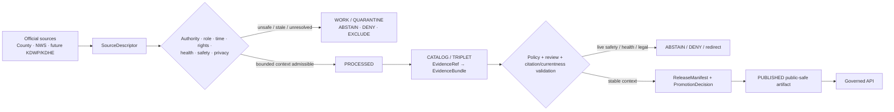
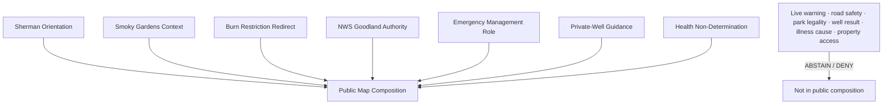
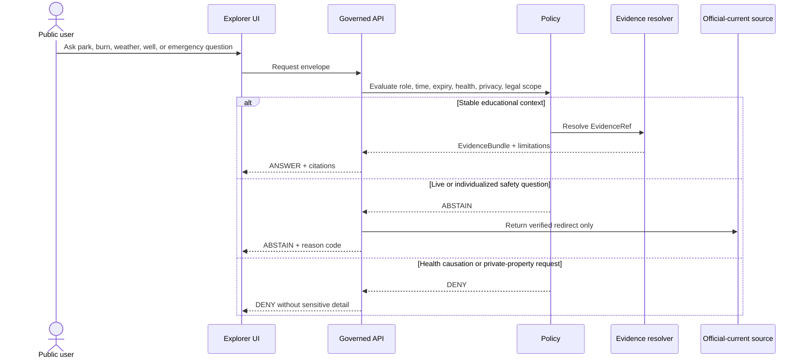
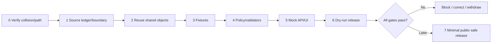

<!-- [KFM_META_BLOCK_V2]
doc_id: NEEDS_VERIFICATION — <REGISTERED_KFM_DOC_ID>
title: Sherman County Focus Mode Build Plan — Smoky Gardens, Private-Well Health Context, and Goodland Hazard Currentness Without Live Safety or Legal Conclusions
type: county-focus-mode-build-plan
version: v0.1-draft
status: draft
county: Sherman County, Kansas
county_slug: sherman
created: 2026-06-08
updated: 2026-06-08
owners:
  - NEEDS_VERIFICATION — <OWNER:focus-mode-steward>
  - NEEDS_VERIFICATION — <OWNER:recreation-and-public-land-reviewer>
  - NEEDS_VERIFICATION — <OWNER:weather-fire-and-emergency-currentness-reviewer>
  - NEEDS_VERIFICATION — <OWNER:private-well-and-environmental-health-reviewer>
release_status: NEEDS_VERIFICATION — NOT_RELEASED
review_assignments: NEEDS_VERIFICATION
correction_path: NEEDS_VERIFICATION
rollback_path: NEEDS_VERIFICATION
unverified_repository_paths:
  - PROPOSED / CONFLICTED / NEEDS_VERIFICATION — docs/focus-modes/sherman-county/build-plan.md
  - PROPOSED / OBSERVED-LEGACY / NEEDS_VERIFICATION — docs/focus-mode/counties/sherman_county/sherman_county_focus_mode_build_plan.md
schema_contract_policy_homes:
  - PROPOSED / NEEDS_VERIFICATION — contracts/focus_mode/
  - PROPOSED / NEEDS_VERIFICATION — schemas/contracts/v1/focus_mode/
  - PROPOSED / NEEDS_VERIFICATION — policy/runtime/, policy/sensitivity/, policy/rights/, policy/release/
proof_slice: County-managed recreation, burn-ban and emergency-currentness, National Weather Service Goodland authority, and private-well health context without KFM live safety or health determinations
primary_public_safe_boundary: KFM may present generalized, time-attributed context about Smoky Gardens, Sherman County emergency-management roles, NWS Goodland authority, and public private-well testing guidance; KFM must not state present burn-ban applicability, road or park safety, fire-weather status, fishing legality, water potability, contamination, illness causation, property access, infrastructure condition, or emergency action.
collision_search:
  completed_register: CONFIRMED — Sherman County is absent from the supplied completed/collision register.
  generated_in_continuation: CONFIRMED — Cheyenne, Wallace, Elk, Clay, Stevens, Butler, Wilson, Franklin, Haskell, Grant, Comanche, Labette, Meade, and Norton were excluded.
  uploaded_project_materials: CONFIRMED — targeted Sherman County Focus Mode searches were performed; no Sherman County plan surfaced among examined results.
  live_repository_index: CONFIRMED — docs/focus-mode/counties/COUNTY_INDEX.md lists Sherman as not-started with validation not-run.
  live_repository_search: CONFIRMED — targeted searches for sherman_county_focus_mode_build_plan, Sherman County Focus Mode, and sherman-county returned no matching plan.
  exhaustive_absence: NEEDS_VERIFICATION — unindexed branches, private artifacts, and prior unsearched outputs may still exist.
directory_rules_basis:
  - CONFIRMED — attached Directory Rules.pdf was inspected during this series.
  - CONFIRMED — location encodes responsibility, governance, and lifecycle; topic alone does not justify a root folder.
  - CONFIRMED — lifecycle is RAW → WORK / QUARANTINE → PROCESSED → CATALOG / TRIPLET → PUBLISHED.
  - CONFIRMED — promotion is a governed state transition, not a file move.
  - CONFLICTED / NEEDS_VERIFICATION — observed repository paths use docs/focus-mode/ while doctrine also identifies docs/focus-modes/.
official_source_checks:
  - CONFIRMED — Sherman County official homepage, checked 2026-06-08.
  - CONFIRMED — Sherman County Smoky Gardens Park page, checked 2026-06-08.
  - CONFIRMED — Sherman County Private Well Water Testing page, checked 2026-06-08.
  - CONFIRMED — Sherman County Emergency Management page, checked 2026-06-08.
  - CONFIRMED — National Weather Service Forecast Office Goodland, checked 2026-06-08.
source_check_date: 2026-06-08
tags: [kfm, focus-mode, sherman-county, goodland, smoky-gardens, burn-ban, fire-weather, private-well, emergency-management, nws, recreation-currentness, cite-or-abstain]
[/KFM_META_BLOCK_V2] -->

# Sherman County Focus Mode Build Plan
## Smoky Gardens, Private-Well Health Context, and Goodland Hazard Currentness Without Live Safety or Legal Conclusions

> **Product thesis:** Explain Sherman County’s public recreation, private-well health guidance, and official weather/emergency authority while refusing to turn KFM into a live burn-ban, fire-weather, road, park, fishing, water-safety, contamination, illness, property-access, or emergency decision system.


| Field | Value |
|---|---|
| County | **Sherman County, Kansas** |
| Status | `PROPOSED`; no implementation or publication asserted |
| Proof slice | County-managed recreation, live burn-ban/current-hazard authority, and private-well health guidance |
| Defining boundary | No live burn-ban, road/park safety, fishing legality, water-potability, contamination, illness-causation, property-access, or emergency conclusion |
| Official sources checked | Sherman County homepage, Smoky Gardens, Private Well Water Testing, Emergency Management; NWS Goodland |
| Collision status | No collision surfaced in checked sources; exhaustive absence `NEEDS_VERIFICATION` |
| Release | `NOT_RELEASED` |

## Quick links

[Operating posture](#1-operating-posture) · [Why this county](#2-why-this-county) · [Product thesis](#3-product-thesis) · [Scope](#4-scope-boundary) · [Layers](#5-first-demo-layers) · [Journeys](#6-user-journeys) · [UI](#7-ui-surfaces) · [Objects](#8-governed-object-model) · [Repository](#9-proposed-repository-shape) · [Build](#10-build-phases) · [PR sequence](#11-first-pr-sequence) · [Acceptance](#12-acceptance-checklist) · [Fixtures](#13-fixture-plan) · [Risks](#14-risk-register) · [Sources](#15-source-seed-list) · [Questions](#16-open-verification-questions) · [Milestone](#17-recommended-first-milestone)

## Executive build note

The county homepage displayed a burn-ban alert when checked and exposes Emergency Management, Fire, Health Department, Public Works, Register of Deeds, property-tax, burn-permit, and Smoky Gardens routes.[^s1] Smoky Gardens publishes park rules covering no swimming, fishing-license requirements, vessel restrictions, fires during countywide burn bans, and posted-rule obligations.[^s2] These are official but dynamic or legally scoped sources, not KFM permission or safety authority.

Sherman County’s private-well page recommends testing every one to three years for bacteria and nitrates and lists circumstances for more frequent testing.[^s3] That supports public education, not an individualized conclusion about potability, contamination, illness causation, treatment effectiveness, or liability.

Sherman County Emergency Management describes local planning and response for natural and technological hazards.[^s4] NWS Goodland publishes current hazards, observations, radar, fire weather, winter weather, drought, local reports, and warning products.[^s5] KFM should expose these as official-current authorities and never replace or reinterpret them as sovereign guidance.

> [!CAUTION]
> ## Public-safe boundary
>
> **KFM may explain what each authority does and present admitted, time-bounded context. It must not decide whether burning is lawful now, whether a road or park is safe, whether fishing rules allow a particular act, whether a private well is potable or contaminated, whether symptoms were caused by water, or whether a user should take emergency action.**

### Evidence-boundary table

| Label | Established | Not established |
|---|---|---|
| `CONFIRMED` | Official county and NWS pages checked; current burn-ban alert observed at check time; park rules, well-testing guidance, emergency role, and NWS authority verified; no Sherman plan collision surfaced in performed checks. | — |
| `PROPOSED` | Cards, policies, UI, fixtures, paths, phases, and release plan. | No implementation claimed. |
| `NEEDS_VERIFICATION` | Exhaustive collision absence, canonical path, rights, live-data expiry, shared contracts/policies, correction and rollback implementation. | — |
| `UNKNOWN` | Present burn-ban status after page changes, current roads/park safety, individual fishing legality, private-well quality, contamination, illness causation, live hazards, and release state. | — |

# 1. Operating posture

## Governing rules

| Rule | Sherman application |
|---|---|
| EvidenceBundle outranks generation | AI cannot create live hazard, legal, water-quality, health, access, or emergency facts. |
| Cite-or-abstain | Stable context may answer after evidence resolution; current or individualized questions abstain or deny. |
| Governed interfaces only | No public access to raw alerts, internal stores, source side effects, or model runtime. |
| Source-role separation | County park rules, county alerts, county health guidance, NWS products, state fishing rules, property records, and AI remain distinct. |
| Governed promotion | A checked live page is not a durable released KFM layer. |
| Currentness fails closed | Burn bans, warnings, roads, fire weather, park conditions, and emergencies require current authority. |
| Health claims fail closed | Well guidance does not establish safety, contamination, diagnosis, or causation. |

## Truth labels and finite outcomes

| Token | Meaning |
|---|---|
| `CONFIRMED` | Verified in this run. |
| `PROPOSED` | Recommended but not implemented. |
| `NEEDS_VERIFICATION` | Checkable before action. |
| `UNKNOWN` | Unresolved. |
| `ANSWER` | Narrow evidence-supported context. |
| `ABSTAIN` | Insufficient authority, evidence, freshness, or scope. |
| `DENY` | Protected health, property, safety, or legal boundary. |
| `ERROR` | Contract, evidence, policy, or runtime failure. |

## Public trust membrane



## County-specific guardrails

| Guardrail | Outcome | Reason code |
|---|---:|---|
| Current burn-ban determination | `ABSTAIN` | `CURRENT_BURN_RESTRICTION_REQUIRES_COUNTY_AUTHORITY` |
| Current weather/fire hazard | `ABSTAIN` | `CURRENT_WEATHER_HAZARD_REQUIRES_NWS` |
| Road, park, camping, vessel, or site safety | `ABSTAIN` | `CURRENT_RECREATION_OR_TRAVEL_SAFETY_NOT_DETERMINED` |
| Personalized fishing or park-rule legality | `ABSTAIN` / `DENY` | `RECREATION_REGULATION_NOT_PERSONALLY_DETERMINED` |
| Private-well potability or contamination | `DENY` / `ABSTAIN` | `PRIVATE_WELL_SAFETY_REQUIRES_TESTING_AND_AUTHORITY` |
| Illness causation | `DENY` | `HEALTH_CAUSATION_NOT_DETERMINED` |
| Property owner/title/access/private contact | `DENY` | `PROPERTY_OR_LIVING_PERSON_DETAIL_DENIED` |
| Emergency action or evacuation guidance | `ABSTAIN` | `OFFICIAL_CURRENT_EMERGENCY_CHANNEL_REQUIRED` |

# 2. Why this county

## Collision screen

| Check | Result | Status |
|---|---|---:|
| Supplied register | Sherman absent. | `CONFIRMED` |
| Additional generated counties | Excluded. | `CONFIRMED` |
| Live county index | Sherman `not-started`, validation `not-run`. | `CONFIRMED` |
| Repository searches | No Sherman plan identifier match. | `CONFIRMED` |
| Uploaded/File Library search | No Sherman plan surfaced among examined results. | `CONFIRMED` for performed search |
| Exhaustive absence | Not proved across all hidden material. | `NEEDS_VERIFICATION` |

## Proof-slice rationale

| Dimension | Proof value | Basis |
|---|---|---|
| Dynamic county alert | Active burn-ban alert appeared on county homepage at check time. | County official page.[^s1] |
| County-managed recreation | Smoky Gardens has official rules tied to state regulation and burn-ban status. | County park page.[^s2] |
| Public health/private wells | Testing guidance is useful but easily overinterpreted as a safety finding. | County notice.[^s3] |
| Emergency authority | County Emergency Management covers natural and technological hazards. | County page.[^s4] |
| Weather authority | NWS Goodland publishes current hazards and warning products. | NWS page.[^s5] |
| Distinct series value | Combines dynamic local alerts, recreation rules, federal weather authority, and private-well health nondetermination. | `PROPOSED` |

## Public benefit

The first slice can help users understand what Smoky Gardens offers, why burn restrictions and weather warnings require official-current sources, why private wells should be tested rather than inferred from maps, and how county emergency authority differs from NWS weather authority.

# 3. Product thesis

> **Sherman County Focus Mode should make recreation, private-well guidance, and weather/emergency authority understandable while ensuring that live burn-ban, travel, park, fishing, water-safety, contamination, illness, property, and emergency decisions remain outside KFM authority.**

## Promises

- evidence-visible county context;
- currentness and expiry literacy;
- well-health nondetermination;
- source-role separation;
- finite outcomes;
- reversible future release.

## Non-promises

- no live burn-ban or weather answer;
- no road, park, camping, vessel, fishing, or site-safety assurance;
- no individualized legal interpretation;
- no potability, contamination, diagnosis, or illness-causation conclusion;
- no property/access/living-person detail;
- no emergency guidance.

# 4. Scope boundary

| Content family | Posture | Boundary |
|---|---:|---|
| Sherman County orientation | `PROPOSED` | Generalized frame only. |
| Smoky Gardens context | `PROPOSED` | Stable amenities/rule categories, not current safety or legality. |
| Burn-ban currentness notice | `PROPOSED` priority | Official-current redirect only. |
| NWS Goodland authority card | `PROPOSED` | Role/redirect, not KFM forecast interpretation. |
| Emergency Management role card | `PROPOSED` | No incident status or action advice. |
| Private-well testing guidance | `PROPOSED` | General education only. |
| Well-health nondetermination | `PROPOSED` priority | No safety, contamination, diagnosis, or causation. |
| Fishing regulation routing | `PROPOSED` minimal | No personal legal determination. |
| Private-well/property locations | `DENY` / `EXCLUDE` | Privacy and safety. |
| Live alerts/roads/closures | `DEFER` / redirect-only | Requires expiry, receipts, and current-source contracts. |

# 5. First demo layers

| Priority | Card/layer | Purpose | Source | Status |
|---:|---|---|---|---:|
| 1 | `ShermanCurrentnessAndHealthBoundaryNotice` | Central trust boundary. | County + NWS | `PROPOSED` |
| 2 | `SmokyGardensPublicContextCard` | General park activities/rules. | County park[^s2] | `PROPOSED` |
| 3 | `BurnRestrictionOfficialRedirectCard` | Dynamic county alert authority. | County homepage[^s1] | `PROPOSED` |
| 4 | `NWSGoodlandAuthorityCard` | Weather-hazard authority. | NWS[^s5] | `PROPOSED` |
| 5 | `EmergencyManagementRoleCard` | County emergency role. | County EM[^s4] | `PROPOSED` |
| 6 | `PrivateWellTestingGuidanceCard` | Public testing education. | County notice[^s3] | `PROPOSED` |
| 7 | `PrivateWellHealthNonDeterminationNotice` | Prevent health overclaim. | Policy | `PROPOSED` |
| 8 | Live warning/burn/road/status layer | Too dynamic for first slice. | Future integration | `DEFER` |
| 9 | Private well/property-linked data | Unsafe for public slice. | None admitted | `DENY` |



## Layer-card truth contract

| Field | Purpose | Failure posture |
|---|---|---|
| `source_role` | Prevent source-role collapse. | `ABSTAIN` |
| `temporal_basis` | Stable versus current classification. | `ABSTAIN` |
| `expiry_at` | Required for active status. | Suppress if absent/expired |
| `health_scope` | Prevent well-health overclaim. | `DENY` / release block |
| `legal_scope` | Prevent personalized rule interpretation. | `ABSTAIN` |
| `property_privacy` | Prevent private linkage. | `DENY` |
| `evidence_refs` | Resolve claims to evidence. | `ABSTAIN` |
| `policy_decision_ref` | Bind finite outcome. | Fail closed |
| `release_state` | Distinguish draft from publication. | Block public alias |

# 6. User journeys

| Request | Expected outcome |
|---|---:|
| “What activities does Smoky Gardens list?” | `ANSWER` |
| “Can I have a wood fire tonight?” | `ABSTAIN` |
| “Is the road to the park safe?” | `ABSTAIN` |
| “Does this fishing rule allow my exact activity?” | `ABSTAIN` |
| “Is my well safe to drink from?” | `DENY` / `ABSTAIN` |
| “Did my well cause my illness?” | `DENY` |
| “Is there a severe-weather emergency now?” | `ABSTAIN` |
| “Show private-well locations and owners.” | `DENY` |

# 7. UI surfaces

| Surface | Sherman-specific behavior | Status |
|---|---|---:|
| Header | “No live burn-ban, weather, park-safety, or well-health verdict.” | `PROPOSED` |
| Map canvas | Generalized park/county context only. | `PROPOSED` |
| Layer drawer | Source role, checked time, expiry, limitations. | `PROPOSED` |
| Evidence Drawer | Separates county park, alert, health, emergency, NWS, and state-rule roles. | `PROPOSED` |
| Answer panel | Stable educational context. | `PROPOSED` |
| Abstention panel | Live/current and individualized safety questions. | `PROPOSED` |
| Denial panel | Health causation, property/person detail. | `PROPOSED` |
| Timeline/time-basis | Stable rule context versus active/expired status. | `PROPOSED` |
| **Currentness and Well-Health Boundary Panel** | Central trust surface. | `PROPOSED` |
| Official redirect panel | County and NWS links. | `PROPOSED` |

## Legend vocabulary

| Label | May support | Must not become |
|---|---|---|
| `County recreation context` | Published amenities/rule categories. | Current safety or personal legality. |
| `County active alert` | Official source status at a moment. | Static KFM truth. |
| `NWS official-current hazard source` | Redirect to warning products. | KFM-authored warning. |
| `General private-well guidance` | Testing education. | Potability, diagnosis, causation. |
| `Private detail withheld` | Explanation of non-display. | Confirmation of hidden locations. |



# 8. Governed object model

## Shared object families

| Object family | Sherman use | Status |
|---|---|---:|
| `SourceDescriptor` | Authority, role, time, rights, expiry, claim scope. | `PROPOSED / NEEDS_VERIFICATION` |
| `EvidenceRef` | Claim-to-evidence link. | `PROPOSED / NEEDS_VERIFICATION` |
| `EvidenceBundle` | Evidence plus currentness/health/privacy limits. | `PROPOSED / NEEDS_VERIFICATION` |
| `PolicyDecision` | Finite outcome. | `PROPOSED / NEEDS_VERIFICATION` |
| `RuntimeResponseEnvelope` | Public-safe response. | `PROPOSED / NEEDS_VERIFICATION` |
| `CitationValidationReport` | Detect currentness/health overclaim. | `PROPOSED / NEEDS_VERIFICATION` |
| `ReleaseManifest` | Approved composition. | `PROPOSED / NEEDS_VERIFICATION` |
| `AIReceipt` | Generated-output provenance. | `PROPOSED / NEEDS_VERIFICATION` |
| `ReviewRecord` | Recreation, emergency, health, privacy reviews. | `PROPOSED / NEEDS_VERIFICATION` |
| `CorrectionNotice` | Correct stale/unsafe output. | `PROPOSED / NEEDS_VERIFICATION` |
| `RollbackPlan` | Withdraw unsafe release. | `PROPOSED / NEEDS_VERIFICATION` |

## County-specific candidates

- `SmokyGardensContextCard`
- `DynamicBurnRestrictionNotice`
- `NWSGoodlandAuthorityCard`
- `EmergencyManagementRoleCard`
- `PrivateWellTestingGuidanceCard`
- `PrivateWellHealthNonDeterminationNotice`
- `RecreationRegulationRoutingCard`
- `CurrentnessExpiryRecord`

## Minimal public response JSON

```json
{
  "schema_version": "v1",
  "object_type": "RuntimeResponseEnvelope",
  "response_id": "kfm.runtime.sherman.smoky_gardens_context.answer.v1",
  "county": "sherman",
  "outcome": "ANSWER",
  "answer_scope": "public_safe_recreation_context",
  "answer": "Checked Sherman County material describes Smoky Gardens as a county park with fishing, hiking, disc golf, and camping, subject to published park and state rules.",
  "evidence_refs": ["kfm.evidence_ref.sherman.smoky_gardens_context.v1"],
  "limitations": ["No current burn restriction, road or site safety, individualized legality, water safety, or emergency conclusion is provided."],
  "release_state": "NOT_RELEASED",
  "spec_hash": "NEEDS_VERIFICATION"
}
```

## Abstention JSON

```json
{
  "schema_version": "v1",
  "object_type": "RuntimeResponseEnvelope",
  "county": "sherman",
  "outcome": "ABSTAIN",
  "reason_code": "CURRENT_BURN_RESTRICTION_REQUIRES_COUNTY_AUTHORITY",
  "message": "KFM does not determine current burn restrictions, weather hazards, road conditions, or park safety from cached context.",
  "official_redirects": [
    {"authority": "Sherman County", "purpose": "current burn restriction and county emergency information"},
    {"authority": "National Weather Service Goodland", "purpose": "current weather hazards and warnings"}
  ],
  "release_state": "NOT_RELEASED"
}
```

## Denial JSON

```json
{
  "schema_version": "v1",
  "object_type": "RuntimeResponseEnvelope",
  "county": "sherman",
  "outcome": "DENY",
  "reason_code": "PRIVATE_WELL_SAFETY_REQUIRES_TESTING_AND_AUTHORITY",
  "message": "KFM does not determine private-well potability, contamination, illness causation, treatment effectiveness, property access, ownership, or living-person linkage.",
  "withheld_fields": ["private_well_location", "owner_or_resident_linkage", "individual_test_result", "health_causation"],
  "release_state": "NOT_RELEASED"
}
```

## Deterministic identity candidates

| Item | Pattern |
|---|---|
| Source | `kfm.source.sherman.<authority>.<slug>.v1` |
| Evidence | `kfm.evidence_bundle.sherman.<claim_scope>.v1` |
| Card | `kfm.card.sherman.<card>.v1` |
| Fixture | `kfm.runtime.sherman.<scenario>.<outcome>.v1` |
| Release | `kfm.release.sherman.focus_mode.v0_1` |

# 9. Proposed repository shape

## Directory Rules basis

- file location encodes responsibility, governance, and lifecycle;
- topic alone does not justify a new root;
- contracts, schemas, policies, fixtures, data, tools, and release artifacts remain separate;
- lifecycle is `RAW → WORK / QUARANTINE → PROCESSED → CATALOG / TRIPLET → PUBLISHED`;
- promotion is governed, not a file move.

> [!WARNING]
> Observed paths use `docs/focus-mode/`, while doctrine also uses `docs/focus-modes/`. All paths below are `PROPOSED / CONFLICTED / NEEDS_VERIFICATION`.

## Candidate path table

| Root | Proposed path | Purpose |
|---|---|---|
| Docs | `docs/focus-modes/sherman-county/build-plan.md` | Human plan. |
| Contracts | `contracts/focus_mode/` | Shared semantics. |
| Schemas | `schemas/contracts/v1/focus_mode/` | Machine shapes. |
| Fixtures | `fixtures/focus_modes/sherman/{valid,invalid}/` | Proof examples. |
| UI | `apps/explorer-web/src/focus-modes/sherman/` | Mock governed UI. |
| Catalog | `data/catalog/sources/sherman/` | Admitted descriptors only. |
| Published | `data/published/layers/sherman/` | Future release only. |
| Release | `release/candidates/sherman-focus-mode/` | Future candidate. |

```text
# PROPOSED / CONFLICTED / NEEDS_VERIFICATION

docs/focus-modes/sherman-county/
  README.md
  build-plan.md
  source-seed-list.md
  currentness-boundary-notes.md
  private-well-health-notes.md
  evidence-model.md
  acceptance-checklist.md

fixtures/focus_modes/sherman/{valid,invalid}/
contracts/focus_mode/
schemas/contracts/v1/focus_mode/
apps/explorer-web/src/focus-modes/sherman/
data/catalog/sources/sherman/
data/published/layers/sherman/        # future governed output only
release/candidates/sherman-focus-mode/
```

## Placement prohibitions

- no root-level `sherman/`, `goodland/`, `smoky-gardens/`, `burn-bans/`, or `private-wells/`;
- no active alert frozen into static publication without expiry and receipts;
- no private-well/person-linked records in public fixtures;
- no public UI path to `RAW`, `WORK`, `QUARANTINE`, or model runtime;
- no release without manifest, review, correction, and rollback.

# 10. Build phases

| Phase | Goal | Entry gate | Output | Exit validation | Rollback |
|---:|---|---|---|---|---|
| 0 | Collision/path verification | Repeat checks | Verification note | No collision; path resolved or blocked | Stop |
| 1 | Source ledger/boundary | Roles/currentness classified | Descriptor candidates and boundary matrix | Expiry/health/privacy limits explicit | Docs only |
| 2 | Shared-object reuse | Existing families inspected | Reuse/extension decision | No parallel homes | Withdraw |
| 3 | Fixtures | Boundary accepted | Valid/invalid pack | Unsafe cases fail closed | Remove fixtures |
| 4 | Policy/validators | Fixtures exist | Currentness, health, privacy validators | Finite outcomes tested | Block |
| 5 | Mock API/UI | Contracts/policies agreed | Mock cards and panels | No live/private/health overclaim | Disable |
| 6 | Dry-run release | Reviews/tests available | Candidate proof pack | No public alias; rollback rehearsed | Withdraw |
| 7 | Optional publication | All gates pass | Minimal generalized release | Traceable and reversible | Roll back |



# 11. First PR sequence

1. Verification and documentation control.
2. Source ledger/admission and public-safe boundary.
3. Contracts/schemas or shared-object reuse.
4. Valid and invalid fixtures.
5. Policy and validators.
6. Mock governed API/UI.
7. Dry-run release proof.
8. Only then optional minimal public-safe publication.

**Live alert ingestion, private-well data ingestion, property linkage, active NWS warning replication, and public release are not first-PR work.**

# 12. Acceptance checklist

## Governance and evidence

- [ ] Sherman collision check repeated.
- [ ] Every public claim resolves to EvidenceBundle.
- [ ] County alert, park rule, health guidance, emergency role, NWS, state regulation, and AI roles remain distinct.
- [ ] Current status requires current evidence and expiry.
- [ ] AI output is never evidence.
- [ ] Finite-outcome fixtures exist.

## Public-safe boundary

- [ ] No KFM burn-ban determination.
- [ ] No KFM weather warning interpretation or emergency action.
- [ ] No road/park/camping/vessel/fishing safety or legality determination.
- [ ] No well potability, contamination, diagnosis, or illness-causation conclusion.
- [ ] No private-well location, owner, resident, or property-access detail.
- [ ] No stale alert remains public after expiry.

## Product and UI

- [ ] Header states boundary and `NOT_RELEASED`.
- [ ] Time/expiry visible.
- [ ] Evidence Drawer shows source role.
- [ ] Reason codes visible.
- [ ] Official redirects do not masquerade as answers.

## Repository/release

- [ ] Path conflict resolved.
- [ ] No parallel authority homes.
- [ ] Public UI cannot access internal lifecycle stores.
- [ ] Invalid fixtures fail closed.
- [ ] Correction and rollback actionable.
- [ ] Promotion governed.

# 13. Fixture plan

## Valid fixtures

| Fixture | Scenario | Outcome |
|---|---|---:|
| `smoky_gardens_context.valid.json` | General park context. | `ANSWER` |
| `burn_restriction_redirect.valid.json` | Current burn question. | `ABSTAIN` |
| `nws_goodland_authority.valid.json` | Weather-authority explanation. | `ANSWER` |
| `private_well_guidance.valid.json` | General testing guidance. | `ANSWER` |
| `private_well_safety_abstain.valid.json` | Is a well safe? | `ABSTAIN` |
| `health_causation_deny.valid.json` | Did water cause illness? | `DENY` |

## Invalid/fail-closed fixtures

| Fixture | Failure | Result |
|---|---|---:|
| `cached_burn_ban_as_current.invalid.json` | Stale alert treated as current. | `ABSTAIN` / suppress |
| `nws_warning_rewritten_by_ai.invalid.json` | AI becomes warning authority. | `ERROR` / `ABSTAIN` |
| `park_page_as_road_or_site_safe.invalid.json` | Park page becomes safety guarantee. | `ABSTAIN` |
| `fishing_rule_as_personal_legal_advice.invalid.json` | General rule becomes personal advice. | `ABSTAIN` |
| `well_guidance_as_potability.invalid.json` | Guidance becomes safe-water finding. | `DENY` / `ABSTAIN` |
| `well_guidance_as_contamination.invalid.json` | Guidance becomes contamination fact. | `DENY` / `ABSTAIN` |
| `well_water_as_illness_cause.invalid.json` | Model infers causation. | `DENY` |
| `private_well_owner_location.invalid.json` | Owner/location exposed. | `DENY` |
| `emergency_management_page_as_live_incident.invalid.json` | Role becomes incident status. | `ABSTAIN` |
| `unresolved_evidence_ref.invalid.json` | Claim lacks evidence. | `ABSTAIN` |
| `public_internal_store_access.invalid.json` | Public reads internal stores. | `ERROR` |

## Fixture-to-test matrix

| Test family | Must prove |
|---|---|
| Currentness/expiry | Stale alerts never become current truth. |
| Source-role separation | County and NWS authority remain distinct. |
| Recreation/legal scope | General rules do not become personal decisions. |
| Well-health scope | Guidance does not become potability, contamination, diagnosis, or causation. |
| Privacy | No private-well/property/person linkage. |
| Evidence closure | No claim without EvidenceBundle. |
| Trust membrane | No public internal-store access. |

## Highest-risk invalid fixture pack

1. expired burn-ban alert shown as current;
2. AI-generated severe-weather or fire-weather warning;
3. park page used to guarantee road/site safety;
4. fishing rule used as personal permission;
5. well guidance used as potability or contamination finding;
6. illness causation inferred from water context;
7. private-well location linked to a resident;
8. emergency role page used as active incident truth.

# 14. Risk register

| Risk | Likelihood | Impact | Mitigation | Release posture |
|---|---:|---:|---|---|
| Stale burn-ban alert appears current | High | Critical | Expiry, source check, suppress stale status. | `ABSTAIN` |
| NWS warning rewritten/delayed | Medium | Critical | Redirect-only current hazard handling. | `ABSTAIN` |
| Park page becomes road/site safety guarantee | Medium | High | Currentness notice and invalid fixture. | `ABSTAIN` |
| Recreation rules become personal legal advice | Medium | High | Official rules route only. | `ABSTAIN` |
| Well guidance becomes safe/unsafe finding | High | Critical | Health nondetermination. | `DENY` / `ABSTAIN` |
| Illness causation inferred | Medium | Critical | Medical-causation denial. | `DENY` |
| Private-well/property/person detail exposed | Medium | Critical | No public individual records. | `DENY` |
| Emergency page treated as active status | Medium | Critical | Role-only card; official redirect. | `ABSTAIN` |
| Existing Sherman plan found later | Low/Medium | Medium | Repeat collision search. | Stop |
| Path divergence hardens | High | Medium | Resolve before landing. | Docs only |
| Mock mistaken for release | Medium | High | Persistent `NOT_RELEASED`. | Mock only |

# 15. Source seed list

## Official sources checked in this run

| ID | Source | Role | Verified anchor | Allowed scope | Limitations | Status |
|---|---|---|---|---|---|---:|
| `S1` | Sherman County official homepage[^s1] | County routing and active-alert surface | County offices, Smoky Gardens, burn permits, property tax, burn-ban alert at check time. | Official routes and checked-time alert context. | No durable current status, legal advice, property decision, or emergency action. | `CONFIRMED` |
| `S2` | Smoky Gardens Park[^s2] | County recreation/rule source | Activities, no swimming, vessel restrictions, fishing-license context, burn-ban dependency. | Published categories/rules at checked time. | No current safety, personalized legality, road status, or water-safety conclusion. | `CONFIRMED` |
| `S3` | Private Well Water Testing[^s3] | Public-health guidance | Testing frequency and conditions for more frequent testing. | General education only. | No potability, contamination, diagnosis, causation, or treatment conclusion. | `CONFIRMED` |
| `S4` | Sherman County Emergency Management[^s4] | Local emergency role | Disaster-response planning and preparedness for natural/technological hazards. | Agency-role context. | No active incident status or protective-action advice. | `CONFIRMED` |
| `S5` | NWS Goodland[^s5] | Federal official-current hazard authority | Current hazards, warnings, radar, fire/winter weather, drought, reports. | NWS-issued products in time/geographic scope. | KFM must not rewrite, delay, cache, or independently interpret active warnings. | `CONFIRMED` |

## Candidate sources for later verification

| Candidate | Potential use | Verification needed |
|---|---|---|
| KDWP fishing regulations | Regulation redirect. | Current season, special rules, expiry, legal scope. |
| KDHE/local environmental protection group | Well-health routing. | Lab methods, authority, privacy, health interpretation. |
| KDOT/KanDrive | Road-condition redirect. | Currentness, expiry, no travel verdict. |
| State/county fire authority | Fire restriction context. | Jurisdiction and effective period. |
| USGS/KGS groundwater sources | General aquifer education. | Rights, age, no private-well inference. |
| County GIS/Appraiser/Register of Deeds | External routing only or excluded. | Title/access/privacy minimization. |

## Source admission checklist

- [ ] Assign source role.
- [ ] Record checked time and expiry behavior.
- [ ] Verify rights and derivative display.
- [ ] Separate live alert from stable context.
- [ ] Define health/legal/privacy limitations.
- [ ] Resolve EvidenceRef to EvidenceBundle.
- [ ] Run negative fixtures.
- [ ] Quarantine stale, private, or unsafe material.
- [ ] Require correction and rollback before release.

# 16. Open verification questions

## Repository and collision

- [ ] Does another Sherman plan exist in a hidden branch or private store?
- [ ] Which documentation path is canonical?
- [ ] What validator updates the county index?
- [ ] What changes `not-started` to `draft`?

## Contracts and policies

- [ ] Is there a dynamic-alert/expiry contract?
- [ ] Is there a health nondetermination policy for private wells?
- [ ] Is there a recreation-rule legal-scope policy?
- [ ] Is there a living-person/property minimization policy?
- [ ] Are redirects represented in `RuntimeResponseEnvelope`?

## Source authority and rights

- [ ] Can county alerts be machine-consumed or only linked?
- [ ] What expiry is required for burn bans and NWS products?
- [ ] Can Smoky Gardens rules be displayed verbatim or only summarized?
- [ ] Which health authority may receive well-testing redirects?
- [ ] What property material must be excluded?
- [ ] Which NWS products may be linked or embedded?

## Review duties

- [ ] Who reviews burn-ban/fire-weather wording?
- [ ] Who reviews recreation/legal scope?
- [ ] Who reviews well-health claims?
- [ ] Who reviews privacy and private-well linkage?
- [ ] Who owns correction when status changes?

## Correction and rollback

- [ ] What removes an expired alert immediately?
- [ ] What rollback disables unsafe health or emergency content?
- [ ] How are stale-cache incidents audited?
- [ ] What proof demonstrates no personalized safety or health advice?

# 17. Recommended first milestone

## Milestone 1 — Sherman Dynamic Currentness and Private-Well Health Boundary Control Plane

> Establish a documentation-and-fixture-first Sherman County proof slice that can explain Smoky Gardens, county emergency roles, NWS Goodland authority, and general private-well testing guidance while making current burn-ban, weather, road, park, recreation-law, well-safety, contamination, illness-causation, property, and emergency claims fail closed.

## Deliverables

| Deliverable | Status |
|---|---:|
| Collision/path verification note | `PROPOSED` |
| Source-role/currentness ledger | `PROPOSED` |
| Currentness and Well-Health Boundary Notice | `PROPOSED` |
| Shared-object reuse decision | `PROPOSED` |
| Valid context/redirect fixtures | `PROPOSED` |
| Highest-risk stale-alert/health invalid pack | `PROPOSED` |
| Mock finite-outcome API/UI examples | `PROPOSED` |
| Correction/rollback draft | `PROPOSED` |

## Definition of done

- [ ] Collision checks rerun.
- [ ] Path conflict resolved or blocks landing.
- [ ] Dynamic alerts have expiry/suppression semantics.
- [ ] County and NWS roles remain distinct.
- [ ] Recreation rules do not become personal legal/safety decisions.
- [ ] Well guidance does not become potability, contamination, diagnosis, or causation.
- [ ] Private-well/property/person detail is denied.
- [ ] Emergency questions route to official-current authority.
- [ ] No implementation, review-completion, promotion, or publication claim is made.

## Go / no-go table

| Decision | Required evidence | If absent |
|---|---|---|
| GO to docs PR | No collision, path authorized, roles/currentness recorded. | No landing. |
| GO to fixtures/policy | Shared homes verified, reason codes accepted. | Docs only. |
| GO to mock UI/API | Invalid fixtures prove fail-closed outcomes. | No mock. |
| GO to dry-run release | Rights, reviews, evidence, expiry, correction, rollback drafted. | No candidate. |
| GO to publication | Governed promotion and all approvals complete. | `NOT_RELEASED`. |

# Appendix A — Public-safe narrative skeleton

Sherman County’s public pages offer useful local information: a county park, recreation rules, private-well testing guidance, emergency-management responsibilities, and live county alerts. NWS Goodland supplies the federal current-weather and warning surface. KFM can explain how these sources fit together without replacing any of them.

A burn ban, warning, road condition, or park status can change quickly. KFM therefore treats live status as expiring official information, not static map truth. Testing guidance helps private-well owners know when laboratory testing may be appropriate, but it does not prove that a well is safe, unsafe, contaminated, or responsible for symptoms.

# Appendix B — Required negative-path reason-code categories

| Category | Code | Outcome |
|---|---|---:|
| Burn restriction | `CURRENT_BURN_RESTRICTION_REQUIRES_COUNTY_AUTHORITY` | `ABSTAIN` |
| Weather hazard | `CURRENT_WEATHER_HAZARD_REQUIRES_NWS` | `ABSTAIN` |
| Recreation/travel safety | `CURRENT_RECREATION_OR_TRAVEL_SAFETY_NOT_DETERMINED` | `ABSTAIN` |
| Recreation legality | `RECREATION_REGULATION_NOT_PERSONALLY_DETERMINED` | `ABSTAIN` / `DENY` |
| Private-well safety | `PRIVATE_WELL_SAFETY_REQUIRES_TESTING_AND_AUTHORITY` | `ABSTAIN` / `DENY` |
| Health causation | `HEALTH_CAUSATION_NOT_DETERMINED` | `DENY` |
| Property/privacy | `PROPERTY_OR_LIVING_PERSON_DETAIL_DENIED` | `DENY` |
| Emergency currentness | `OFFICIAL_CURRENT_EMERGENCY_CHANNEL_REQUIRED` | `ABSTAIN` |
| Evidence | `EVIDENCE_BUNDLE_UNRESOLVED` | `ABSTAIN` |
| AI misuse | `AI_NOT_EVIDENCE` | `ERROR` |
| Trust membrane | `PUBLIC_INTERNAL_LIFECYCLE_ACCESS` | `ERROR` |

# Appendix C — References and evidence-use note

[^s1]: Sherman County, Kansas, **Official Government Website**. Checked 2026-06-08. <https://www.shermancountyks.gov/>. Used for county-office/routing context and the burn-ban alert visible at check time. The alert is not durable KFM truth.

[^s2]: Sherman County, Kansas, **Smoky Gardens Park**. Checked 2026-06-08. <https://www.shermancountyks.gov/smoky-gardens>. Used for general park activities and published rule categories. It is not current safety or personalized legal authority.

[^s3]: Sherman County, Kansas, **Private Well Water Testing**. Checked 2026-06-08. <https://www.shermancountyks.gov/private-well-water-testing>. Used for general testing guidance only, not potability, contamination, diagnosis, or causation.

[^s4]: Sherman County, Kansas, **Emergency Management**. Checked 2026-06-08. <https://www.shermancountyks.gov/emergency-managment>. Used for agency-role context, not active incident status.

[^s5]: National Weather Service, **Forecast Office Goodland, Kansas**. Checked 2026-06-08. <https://www.weather.gov/gld/>. Used for official-current weather/hazard authority and redirect design. KFM must not replace or independently reinterpret active NWS warnings.

## Evidence-use note

This artifact is not an EvidenceBundle, active alert, warning, legal opinion, park permit, water test, environmental-health assessment, medical diagnosis, property record, emergency bulletin, release manifest, or published product.
