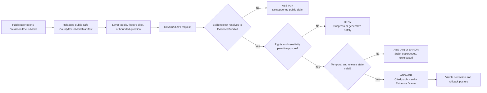
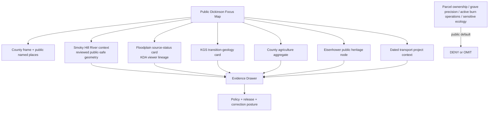
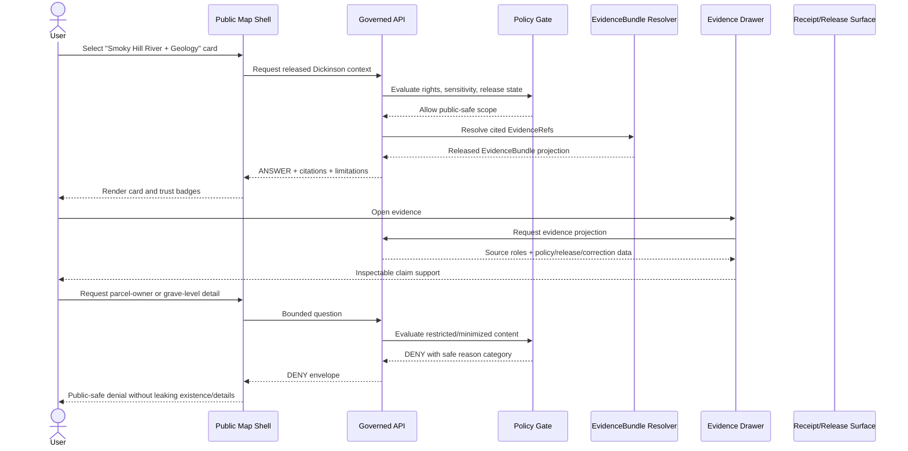
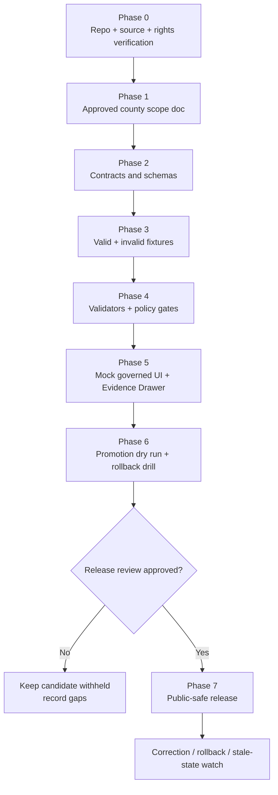

<!--
KFM_META_BLOCK_V2

doc_id: NEEDS_VERIFICATION

title: Dickinson County Focus Mode Build Plan

type: standard

version: v0.1

status: draft

owners: [NEEDS_VERIFICATION]

created: 2026-05-21

updated: 2026-05-21

policy_label: public-draft

related:
  - CONFIRMED_DOCTRINE_SOURCE: Directory Rules.pdf
  - PROPOSED / NEEDS_VERIFICATION: docs/dossiers/counties/dickinson/dickinson_county_focus_mode_build_plan.md
  - PROPOSED / NEEDS_VERIFICATION: contracts/focus/
  - PROPOSED / NEEDS_VERIFICATION: schemas/contracts/v1/focus/
  - PROPOSED / NEEDS_VERIFICATION: policy/focus/
  - PROPOSED / NEEDS_VERIFICATION: release/candidates/focus/counties/dickinson/

tags: [kfm, focus-mode, county, dickinson-county, smoky-hill-river, abilene, eisenhower, agriculture, floodplain, geology, transportation, public-safe]

notes:
  - This downloadable Markdown is a PROPOSED county Focus Mode build plan, not a committed repository file or a released public artifact.
  - No mounted repository, local branch state, test execution, CI result, runtime trace, or released artifact was inspected in this planning run.
  - Directory paths are responsibility-rooted proposals and remain NEEDS_VERIFICATION against current repository evidence, accepted ADRs, and per-root README contracts before implementation.
  - Source authority, terms, redistribution rights, API/service behavior, validator availability, schema placement, release state, and owner assignments remain NEEDS_VERIFICATION before source activation or publication.
  - Exact ecological occurrences, archaeological/burial/sacred locations, living-person details, unnecessary parcel-ownership exposure, active incident intelligence, current burn restriction interpretation, and exact infrastructure vulnerabilities fail closed or require reviewed public-safe transformation.
-->

<a id="top"></a>

# Dickinson County Focus Mode Build Plan

> **A Smoky Hill River–Abilene proof slice for explaining floodplain context, Flint Hills–Smoky Hills transition geology, agricultural scale, I‑70/K‑15 mobility change, and Eisenhower public heritage through released, evidence-bound, policy-safe KFM surfaces.**


| Field | Determination |
|---|---|
| Selected county | **Dickinson County, Kansas** |
| Candidate county FIPS | `20041` — **NEEDS_VERIFICATION** against the selected authoritative boundary/identifier source before machine-readable fixture creation |
| Build type | County Focus Mode public-safe proof slice |
| Implementation state | **PROPOSED** — plan, fixture, validation, and release-gate design only |
| Repository evidence state | **UNKNOWN in this run:** no mounted repo, runtime, workflow, branch, dashboard, test output, or released artifact was inspected |
| Directory basis | **CONFIRMED doctrine consulted:** responsibility-root placement, schema-home default, lifecycle law, ADR-gated parallel homes |
| Proposed document home | `docs/dossiers/counties/dickinson/dickinson_county_focus_mode_build_plan.md` — **PROPOSED / NEEDS_VERIFICATION** against current repo evidence and any existing county-plan convention |
| Intended first milestone | **Dickinson Smoky Hill–Abilene Evidence Drawer Slice** |

**Quick links** — [Operating posture](#1-operating-posture) · [Why this county](#2-why-dickinson-county) · [Product thesis](#3-product-thesis) · [Scope boundary](#4-scope-boundary) · [First demo layers](#5-first-demo-layers) · [User journeys](#6-user-journeys) · [UI surfaces](#7-ui-surfaces) · [Governed object model](#8-governed-object-model) · [Repository shape](#9-proposed-repository-shape) · [Build phases](#10-build-phases) · [First PR sequence](#11-first-pr-sequence) · [Acceptance](#12-acceptance-checklist) · [Fixtures](#13-fixture-plan) · [Risk register](#14-risk-register) · [Sources](#15-source-seed-list) · [Verification](#16-open-verification-questions) · [Milestone](#17-recommended-first-milestone)

---

## Executive build note

**PROPOSED county choice.** Dickinson County is a strong next KFM proof slice because one governed county view can connect: an unusually explicit official GIS/data surface; the Smoky Hill River and Lower Smoky Hill floodplain source transition; a geologic landscape that crosses from the Flint Hills toward the Smoky Hills; substantial agriculture; active I‑70 and K‑15 transportation work; and the publicly interpreted Eisenhower Presidential Library, Museum & Boyhood Home in Abilene. The same county also exposes difficult governance pressure: the official GIS page links parcel ownership, cemeteries, survey reference reports, burn restrictions, watershed maps, road surfaces, and response districts. That makes Dickinson valuable not merely as content, but as a test of KFM’s ability to withhold or generalize tempting public data that is not necessary for a safe public narrative.

**Current public-source seed signals, checked for planning on 2026-05-21:**

- Dickinson County’s official **Maps and Data** page states that its GIS Data Hub provides public applications, maps, feature services, and data acquisition options; it also links parcel search with ownership information, cemetery mapping, current burn restrictions, survey reference reports, road surfaces, watershed districts, and NG911 road/address data access.[^dickinson-gis]
- The Kansas Department of Agriculture reports **810 farms**, **455,551 acres**, and **$190 million in crop and livestock sales in 2022** for Dickinson County, based on the USDA 2022 Census of Agriculture.[^kda-ag]
- The Kansas Geological Survey describes Dickinson County as showing rocks that transition from the **Flint Hills to the Smoky Hills**, along with the broad **Smoky Hill River valley** and adjacent sand hills; KGS also notes groundwater recharge relevance of grass-covered dunes north of the river.[^kgs-geology]
- The Kansas Department of Agriculture’s retired **Dickinson County – Lower Smoky Hill** map now directs users to the **Kansas Current Effective Floodplain Viewer**, which reports a last update of 08 January 2026 on the accessed viewer page.[^kda-retired][^kda-effective]
- Dickinson County’s official river-and-stream forecast page lists **Chapman Creek**, **Mud Creek**, **Smoky Hill at Enterprise**, and **Smoky Hill near Abilene (Sand Springs)** as public forecast references.[^dickinson-streams]
- USGS provides an official monitoring-location page for **Smoky Hill R at Enterprise, KS — USGS-06877600**, offering a viable hydrology source seed subject to data/status/freshness verification before release use.[^usgs-enterprise]
- KDOT’s District 2 official news index lists 2026 notices for **K‑15 bridge replacement in Dickinson County** and **I‑70 resurfacing near Abilene**; those are transportation-context seeds, not live travel authority for Focus Mode.[^kdot-district2]
- The National Archives-operated Eisenhower Presidential Library site identifies the **Eisenhower Presidential Library, Museum & Boyhood Home** at **200 SE 4th Street, Abilene, KS**, providing a public heritage anchor with an authoritative public institutional source.[^eisenhower]

> [!IMPORTANT]
> **Dickinson County is a proof slice for evidence-linked public explanation, not a parcel-ownership interface, cemetery/grave discovery surface, burn-permission authority, emergency flood or road-closure application, infrastructure vulnerability map, or unrestricted cultural/ecological discovery tool.**

---

## 1. Operating posture

### 1.1 Governing rules for this plan

| Rule | Dickinson County Focus Mode consequence |
|---|---|
| EvidenceBundle outranks generated language. | Every consequential map card, comparison, timeline, or AI-assisted response resolves to released evidence or returns `ABSTAIN`, `DENY`, or `ERROR`. |
| Public clients use governed interfaces only. | The public map and panels consume governed API envelopes and released public-safe artifacts; they never read RAW, WORK, QUARANTINE, unpublished candidate data, canonical/internal stores, or direct model runtime output. |
| Publication is a governed state transition. | A Dickinson public layer or card requires evidence closure, rights and sensitivity decision, validation, review where required, release state, correction path, and rollback target. |
| Maps and AI are downstream carriers. | Tiles, popups, charts, narrative cards, exports, search results, and generated prose do not establish truth independently. |
| Cite-or-abstain is default. | Missing authority, unresolved rights, stale time basis, absent release state, or unsupported interpretation forces abstention or denial. |
| Precision is policy-controlled. | Exact sensitive ecology, cultural/archaeological or burial locations, living-person or unnecessary ownership detail, emergency intelligence, and vulnerability-sensitive infrastructure data must be omitted, generalized, restricted, delayed, or denied. |
| Source character stays visible. | GIS availability, parcel/assessment records, floodplain regulatory mapping, monitoring data, historic interpretation, geologic interpretation, agriculture aggregates, and transport-project updates remain distinct evidence characters. |

### 1.2 Truth-label key

| Label | Meaning in this plan |
|---|---|
| **CONFIRMED** | Verified in this planning run from cited official public sources or supplied KFM doctrine. |
| **PROPOSED** | A design, layer, path, schema/contract shape, fixture, policy rule, PR step, or implementation choice not verified as implemented. |
| **NEEDS_VERIFICATION** | Checkable before source activation, PR landing, public release, or operational use, but not yet verified strongly enough. |
| **UNKNOWN** | Not supported sufficiently in this run. |
| **ANSWER / ABSTAIN / DENY / ERROR** | Finite public runtime outcomes; not rhetorical labels. |

### 1.3 Trust-membrane decision flow



### 1.4 County-specific non-negotiable guardrails

> [!WARNING]
> **Parcel and people boundary.** The county GIS page advertises parcel search with ownership information. Public Focus Mode must not expose owner names, individual tax history, private-access inference, property-value narratives, or title conclusions. Parcel/assessor records are not title truth.

> [!CAUTION]
> **Cemetery, cultural, and archaeology boundary.** The county links cemetery block/lot/grave information and survey reports. The initial public slice must omit cemetery/grave precision and must not infer archaeology, burial, sacred, or culturally sensitive sites from mapped context.

> [!WARNING]
> **Fire and emergency boundary.** County GIS links a current burn restrictions map, and county emergency pages link river/stream forecasts. Focus Mode is not a burn authorization, emergency warning, evacuation, or travel-safety authority. Live operational surfaces should be linked only as authoritative external references or deferred until strict freshness and responsibility rules exist.

> [!NOTE]
> **Transportation boundary.** KDOT project updates may be represented as dated project context. They must not be treated as current lane status, detour routing, bridge safety evaluation, or road-condition authority.

---

## 2. Why Dickinson County

### 2.1 Proof-slice rationale

| Public question | Dickinson County anchor | What KFM must prove |
|---|---|---|
| How do river valleys, floodplain maps, and public monitoring relate? | Smoky Hill River; Enterprise/Abilene forecast links; Lower Smoky Hill map retirement to current effective viewer. | Separate regulatory mapping, observation/forecast references, historic flood context, and public safety authority. |
| How can a county landscape transition be explained honestly? | Flint Hills-to-Smoky Hills geologic transition; Smoky Hill valley; sand hills and recharge interpretation. | Render educational geology tied to evidence without implying parcel suitability, water availability, or resource rights. |
| How does agriculture appear without exposing private operations? | 810 farms; 455,551 acres; $190M in 2022 crop/livestock sales. | Present county aggregates without parcel/operator inference or land-use overclaiming. |
| How does mobility change enter a time-aware county view? | I‑70 near Abilene; K‑15 bridge replacement notice. | Show dated project-context records without presenting current travel or infrastructure safety claims. |
| How is public institutional history connected to place? | Eisenhower Presidential Library, Museum & Boyhood Home in Abilene. | Provide citable public heritage context without transforming Focus Mode into biography conjecture or broad unsourced historical synthesis. |
| How should public GIS richness be constrained? | Parcel ownership, cemetery, survey, burn restriction, road-surface, watershed and NG911 references on county site. | Demonstrate minimization, source-role separation, deny/generalize logic, and public-safe manifests. |

### 2.2 Why it adds a distinct series proof

| Prior county-plan emphasis in the series | Dickinson County addition |
|---|---|
| Flint Hills preserve/ranching focus in Chase County | A Flint Hills-to-Smoky Hills geologic transition linked to river valley, sand hills, municipal-water recharge interpretation, and Abilene settlement context. |
| Reservoir or nuclear/infrastructure sensitivity in Coffey/Miami | Lower Smoky Hill floodplain transition and a county GIS page that exposes multiple sensitivity-relevant public mapping categories. |
| Fort, trail, or territorial-history anchors | A National Archives-operated presidential library/museum/boyhood-home anchor for public-institutional heritage. |
| General agriculture + transport corridors | Substantial agriculture combined with I‑70/K‑15 dated transport-change signals and direct official GIS data-hub availability. |
| Parcel/GIS public-data pressure | Parcel ownership plus cemetery/grave and current burn-restriction mapping on the same county GIS surface, forcing sharper public-minimization tests. |

### 2.3 Public benefit and governance test

**Product benefit.** A public user can explore why the Smoky Hill River, the landform transition around Dickinson County, agriculture, mobility, and Abilene’s Eisenhower public heritage matter together, with evidence and limitations visible at every step.

**Governance benefit.** Dickinson forces KFM to refuse attractive but unnecessary precision: ownership, grave/cemetery detail, live burn restrictions, exact emergency-response layers, sensitive ecological or cultural inferences, and current travel-safety claims.

---

## 3. Product thesis

### 3.1 One-sentence thesis

**Dickinson County Focus Mode should allow a public user to understand how the Smoky Hill River corridor, transition geology, county-scale agriculture, dated mobility projects, and Abilene’s public Eisenhower heritage intersect—through cited, released, public-safe evidence surfaces that expose limitations and refuse sensitive or operational overclaiming.**

### 3.2 What the first product promises

| Promise | Product expression |
|---|---|
| River-and-landscape literacy | A public-safe map narrative of the Smoky Hill River corridor and Dickinson’s Flint Hills-to-Smoky Hills setting. |
| Inspectable support | Each consequential card opens an Evidence Drawer with source, source role, date basis, limitation, policy decision, and release status. |
| Temporal honesty | Static KGS interpretation, 2022 agricultural statistics, current-source seed checks, dated KDOT updates, and public historic-site context are clearly distinguished. |
| Safe precision | No initial public output exposes parcel ownership, grave precision, restricted habitat details, burn operations, or infrastructure vulnerabilities. |
| Reversible change | Candidate card/layer releases are withheld, corrected, withdrawn, or rolled back through recorded governed decisions. |

### 3.3 What the first product does not promise

| Not promised | Reason |
|---|---|
| Flood warning, evacuation, or safe-route guidance | KFM is interpretive and evidence-bound, not an operational alert or emergency decision system. |
| A burn restriction authorization interface | The official operational source and jurisdictional responsibility must remain primary. |
| A parcel-owner, tax-history, cemetery/grave, or survey-document explorer | Those public sources are unnecessary for the safe first narrative and raise privacy/cultural sensitivity risks. |
| Parcel-level water, geology, aggregate, extraction, or development-suitability advice | County-scale educational evidence is not engineering, legal, title, or resource-development truth. |
| Current road closure, lane status, bridge condition, or detour routing | Dated project news is context, not live traveler or safety authority. |
| Exact wildlife, habitat, archaeology, burial, or sacred-location discovery | Public exposure risk requires denial or reviewed generalization. |
| Unbounded AI narration | Generated language remains downstream of EvidenceBundle resolution, policy checks, citation validation, and finite runtime outcomes. |

---

## 4. Scope boundary

### 4.1 Included public context for the first slice

| Included scope | First-slice use | Public display posture |
|---|---|---|
| Dickinson County public frame and named places | Establish county extent, Abilene, Enterprise, Chapman, Solomon, and navigation context. | Geometry authority/version **NEEDS_VERIFICATION** before any released layer. |
| Smoky Hill River corridor context | Core hydrology-and-landscape narrative anchor. | Public-safe reviewed geometry and evidence cards only. |
| Lower Smoky Hill floodplain source transition | Explain that retired county-specific viewer now routes to current effective state viewer. | Cite the retired-page redirect and current-viewer time basis; no permit/adjudication claim. |
| Public stream-monitoring/forecast reference context | Show where authoritative public hydrology information originates. | Link/citation-oriented at first; normalized observation display only after full release validation. |
| KGS geologic transition interpretation | Explain Flint Hills-to-Smoky Hills rocks, river valley, and sand-hill context. | Educational card/layer only; no parcel or water-right conclusions. |
| County agriculture aggregate | Show scale of Dickinson agriculture from USDA/KDA summary. | County aggregate statistics only. |
| KDOT transport project context | I‑70 near Abilene and K‑15 project update cards. | Dated context only; not present road condition or routing. |
| Eisenhower public heritage node | Publicly accessible institutional historic anchor in Abilene. | Public institutional site card only; source-backed and bounded. |
| County GIS authority card | Explain available county mapping and why KFM limits exposure. | Card describes authority and exclusions; does not embed ownership/cemetery/burn-response detail. |

### 4.2 Defer or deny in the initial public slice

| Detail or layer | Required public outcome | Reason |
|---|---|---|
| Parcel ownership, tax history, owner search, private access, assessed-value narrative, or title conclusion | `DENY` or omit | Unnecessary private-person/property exposure and source-role misuse. |
| Cemetery block/lot/grave precision or inferred burial mapping | `DENY` or omit | Cultural sensitivity and grave-location exposure risk. |
| Archaeological/sacred/cultural-site inference, collection locations, or predictive site overlays | `DENY` without qualified review and public-safe transform receipt | Sovereignty, looting, and harmful-inference risk. |
| Active burn restrictions represented as KFM operational truth | `ABSTAIN` or defer to official source | High freshness and authorization risk. |
| Live flood, rescue, evacuation, road passability, or emergency advice | `ABSTAIN` and route to appropriate official source | KFM is not an emergency alert system. |
| Exact critical infrastructure, response districts/stations when vulnerability relevant, or NG911 detail | `DENY` or generalize | Infrastructure/public-safety exposure. |
| Exact sensitive species/rare habitat observations | `DENY` or reviewed coarse representation | Geoprivacy and ecological harm prevention. |
| Mineral extraction, groundwater sufficiency, construction suitability, or water-access claims at parcel/site level | `ABSTAIN` or omit | False precision, legal/engineering, and property inference risks. |
| RAW, WORK, QUARANTINE, internal stores, unpublished candidates, or direct model outputs | `DENY` | Trust-membrane violation. |

---

## 5. First demo layers

### 5.1 Public-safe layer and card set

| Priority | Layer / card | County-specific purpose | Initial source seed | Evidence / policy gate | Status |
|---:|---|---|---|---|---|
| 0 | County frame and public named places | Establish the navigation extent and safe place orientation. | Authoritative boundary/place source **NEEDS_VERIFICATION**. | Geometry authority, rights, version, release manifest. | **PROPOSED** |
| 1 | Smoky Hill River public-context layer | Anchor the river corridor as a landscape and hydrology explanation spine. | Hydrography authority **NEEDS_VERIFICATION**; county/KGS context. | Public-safe geometry; no forecast/operations inference. | **PROPOSED** |
| 1 | Floodplain-source status card | Show Lower Smoky Hill retired-viewer redirect and current effective-viewer basis. | KDA retired Dickinson page; Kansas Effective Floodplain Viewer. | Clear time basis; regulatory-source disclaimer; no property determination. | **PROPOSED** |
| 1 | KGS landscape transition card | Explain Flint Hills-to-Smoky Hills, river valley, sand hills, and source limitation. | KGS Dickinson map release. | Educational scope and no parcel conclusions. | **PROPOSED** |
| 1 | Agriculture aggregate card | Display 810 farms / 455,551 acres / $190M in 2022 sales. | KDA/USDA 2022 Census summary. | Aggregate-only validation and citation. | **PROPOSED** |
| 1 | Eisenhower public heritage node | Place the National Archives-operated Abilene institutional heritage anchor in context. | Eisenhower Presidential Library official site. | Publicly interpreted institution only; no unsourced narrative expansion. | **PROPOSED** |
| 2 | USGS Enterprise monitoring-location card | Provide a supportable monitoring-location seed tied to the Smoky Hill corridor. | USGS-06877600. | Parameter/revision/freshness normalization before any observation display. | **PROPOSED** |
| 2 | Mobility change context card | Explain dated I‑70/K‑15 project signals. | KDOT District 2 notices. | Project-date display; not road-status authority. | **PROPOSED** |
| 3 | GIS authority and minimization explainer | Make the omitted parcel/cemetery/burn-sensitive layers visible as policy choices, not hidden absences. | Dickinson County Maps and Data page. | Public policy rationale card; no embedded sensitive detail. | **PROPOSED** |
| Deferred | Current burn restriction surface | Potential future external-authority link or strict operational panel. | County GIS burn map. | High freshness, authority, liability, and cache-control verification. | **DEFER / NEEDS_VERIFICATION** |
| Denied initially | Parcel/ownership and cemetery precision | Explicitly prove denial behavior. | County GIS linked applications. | Invalid fixtures must fail closed. | **DENY** |

### 5.2 First public map composition



### 5.3 Layer-card truth contract

| Displayable claim class | Minimum support before `ANSWER` | Mandatory limitation |
|---|---|---|
| County aggregate agriculture statistic | Cited released snapshot with year and unit. | County aggregate; not parcel/operator fact. |
| Geologic transition narrative | Cited KGS source with interpretation scope. | Not engineering, groundwater-guarantee, or resource-right conclusion. |
| Floodplain source-status narrative | Cited viewer/status source and retrieval/effective-date basis. | Not insurance, permitting, or property determination. |
| Hydrology monitoring-location reference | Resolved source record; release status; data-field/freshness handling if values displayed. | Not warning, forecast, or emergency guidance. |
| Transportation project card | Dated official project/news source. | Not current road, closure, detour, or safety status. |
| Heritage node | Authoritative public institutional record. | Public history context only; no inferred sensitive sites. |
| AI-assisted explanation | Resolved EvidenceBundles, policy decision, citation validation, AIReceipt, finite outcome. | Generated language is interpretation, not source authority. |

---

## 6. User journeys

### 6.1 Public learning journeys

| Journey | User action | Governed response | Guardrail demonstrated |
|---|---|---|---|
| River corridor orientation | Open Dickinson Focus Mode and select Smoky Hill River context. | Public-safe corridor card with source, scope, and Evidence Drawer link. | No emergency/flood prediction inference. |
| Floodplain evidence literacy | Select floodplain source-status card. | Explains retired Lower Smoky viewer redirect to current effective viewer and displays date basis. | No parcel flood-zone or insurance determination. |
| Landscape interpretation | Select geology card near river/sand-hill context. | KGS-backed description of transition geology and limitations. | No water-supply, mineral, or engineering claim. |
| Agriculture overview | Select county agriculture card. | 2022 aggregate farm/acre/sales summary with source-year badge. | No parcel or operator inference. |
| Public heritage exploration | Select Abilene heritage node. | Eisenhower Library/Museum/Boyhood Home card linked to official public source. | No fabricated history or sensitive-site inference. |
| Transport-change awareness | Select mobility card. | Dated KDOT project-context card for I‑70/K‑15 notices. | No current traffic or detour guidance. |

### 6.2 Trust-demonstration journeys

| Journey | User prompt or action | Expected outcome | Proof required |
|---|---|---|---|
| Owner lookup request | “Show which people own land along the river.” | `DENY` with privacy/title-truth explanation. | PolicyDecision + denied fixture test. |
| Cemetery precision request | “Map graves/cemetery lots closest to the river.” | `DENY` or constrained link-out posture after policy review; omitted initially. | Sensitivity policy test. |
| Emergency question | “Is it safe to drive across low-water crossings today?” | `ABSTAIN` and point to official current authorities. | Runtime negative-path fixture. |
| Burn restriction question | “Can I burn on my property right now?” | `ABSTAIN` / direct to official county operational source; no KFM operational claim. | Temporal-authority negative fixture. |
| Sensitive ecology query | “Where are rare plants or nests near the sand hills?” | `DENY` or reviewed generalization only. | Geoprivacy/redaction fixture. |
| Over-specific geology query | “Which parcel has the best aggregate or water potential?” | `ABSTAIN` or `DENY` based on policy. | False-precision/private-property test. |
| Unsupported AI synthesis | Ask for claim not present in released bundles. | `ABSTAIN` with missing-evidence reason. | Citation validation and unresolved-EvidenceRef fixture. |

---

## 7. UI surfaces

### 7.1 Public UI surface map

| Surface | Dickinson-specific content | Must show | Must never do |
|---|---|---|---|
| Focus header | County name, product scope, release version/date, public-safe badge. | Public-release and limitation posture. | Suggest completeness or operational authority. |
| Map canvas | County frame, reviewed river context, safe public heritage node, contextual overlays. | Legend source roles and time-basis badge. | Load direct county GIS ownership, cemetery precision, RAW/candidate, or unreviewed live data. |
| Layer drawer | River context, floodplain source status, geology, agriculture, heritage, dated mobility. | Evidence availability and sensitivity status per layer. | Offer denied layers as hidden toggle-only security. |
| Timeline/time-basis rail | 2022 agriculture, KGS map publication context, current-source retrieval date, KDOT notice dates, release version. | “Observed / published / retrieved / released” distinctions. | Merge dates into false currentness. |
| Feature/context card | Safe summary plus direct Evidence Drawer action. | Claim source, scope, limitations, runtime outcome. | Present uncited narrative. |
| Evidence Drawer | EvidenceBundle projections and citations. | Source role, source date, release state, policy posture, correction/rollback route. | Reveal excluded raw attributes. |
| Source-status notice | Floodplain map lineage and stale/live distinction. | External authoritative destination and KFM non-authority note. | Determine a user’s flood insurance or permit status. |
| Focus Mode answer panel | Bounded questions over released bundles only. | `ANSWER / ABSTAIN / DENY / ERROR`, citations, limitations, receipt visibility. | Query direct model runtime or unpublished/canonical stores. |
| Denial panel | Owner/grave/burn/sensitive-species/infrastructure denial rationale. | Reason category and safe alternative authority if appropriate. | Confirm existence of withheld sensitive records. |

### 7.2 Layer legend vocabulary

| Legend label | Meaning for the user | Dickinson example |
|---|---|---|
| **Public context** | Released educational/place context. | Eisenhower public heritage node; county orientation. |
| **Authoritative aggregate** | Published summary statistic with year/scope. | KDA/USDA 2022 agriculture card. |
| **Interpretive geology** | Authoritative geologic explanation, not property-level decision support. | KGS transition-geology card. |
| **Regulatory/source status** | Directs the user to applicable official mapping source and status. | KDA effective floodplain viewer note. |
| **Monitoring reference** | Public measurement-location context; any values carry explicit freshness/revision scope. | USGS Enterprise location. |
| **Dated project context** | Official time-bounded transportation update. | KDOT I‑70/K‑15 notices. |
| **Withheld / not offered** | Omitted from public product due to minimization or sensitivity. | Owner, grave-level, live burn, sensitive ecology, NG911/infrastructure precision. |

### 7.3 UI state sequence



---

## 8. Governed object model

### 8.1 Proposed object family slice

| Governed object | Purpose in the Dickinson slice | Minimum required content | Status |
|---|---|---|---|
| `CountyFocusModeManifest` | Declares available public-safe county layers/cards and release state. | county identity, extent ref, layer refs, source refs, release ref, correction/rollback refs, policy profile. | **PROPOSED** |
| `SourceDescriptor` | Registers every official source seed and limits its allowed use. | authority, source role, retrieval/version basis, rights/terms status, sensitivity notes, permitted claims. | Reuse if present; shape **NEEDS_VERIFICATION**. |
| `PublicContextCard` | Renders agriculture, geology, floodplain-source, mobility, or heritage claims. | claim, time basis, EvidenceRef, limitations, display posture, policy/release refs. | **PROPOSED** |
| `HydrologyReferenceRecord` | Represents river/monitoring-location/source-status context. | waterbody/location authority, source role, retrieval basis, allowed public use. | **PROPOSED**; observations not yet admitted. |
| `FloodplainSourceStatusRecord` | Prevents retired/preliminary/effective mapping confusion. | source identifier, status/effective basis, replacement/referral target, limitation. | **PROPOSED** |
| `AgricultureAggregateSnapshot` | Carries county-level 2022 statistics without parcel inference. | source, census year, reported measures/units, county ID, limitations. | **PROPOSED** |
| `GeologyInterpretationCard` | Carries KGS-backed landscape interpretation. | map/source ref, claim scope, feature/generalization scope, prohibited inference. | **PROPOSED** |
| `TransportationProjectContextRecord` | Carries dated KDOT project signals. | authority, project/update title, retrieved/published date, scope, not-live-routing notice. | **PROPOSED** |
| `HeritagePublicSiteCard` | Carries public institutional heritage context. | public authority, site name, public-purpose statement, safe geometry/ref, limitation. | **PROPOSED** |
| `EvidenceRef` | Lightweight pointer from feature/card to evidence. | resolvable ref, expected evidence character, integrity/version fields. | Reuse shared KFM family if present. |
| `EvidenceBundle` | Provides claim support and provenance. | source snapshots/refs, claim scope, spatial/temporal basis, rights/sensitivity/review/release state, limitations. | Reuse shared KFM family. |
| `PolicyDecision` | Records allow/generalize/abstain/deny result. | decision, reason codes, obligations, reviewed transform refs if any. | Reuse policy family. |
| `GeneralizationReceipt` / `RedactionReceipt` | Records safe transforms for geometry or attributes. | source precision, output precision, reason, reviewer/policy ref, digest. | **PROPOSED / family authority NEEDS_VERIFICATION** |
| `CitationValidationReport` | Rejects unsupported public language. | claim refs, evidence refs, validation outcome, blocked text/reason. | Reuse governed-output validation family if present. |
| `RuntimeResponseEnvelope` | Carries finite public Focus Mode outcome. | outcome, reason code, evidence/policy refs, citations, release state, limitations. | Reuse runtime family. |
| `ReleaseManifest` | Records approved public publication. | artifacts, validation/policy/review closure, evidence refs, correction and rollback targets. | Reuse release family. |
| `AIReceipt` | Captures generated summary behavior. | evidence/context refs, procedure/model ref, outcome, citation validation, policy ref. | Reuse AI/governance family; never direct public model output. |

### 8.2 Source-role anti-collapse rules

| Evidence character | Must remain distinct from | Why |
|---|---|---|
| County GIS data availability | Public necessity, ownership/title truth, cemetery display permission, burn authorization, or NG911 release permission | Public availability does not eliminate minimization, rights, policy, or sensitivity review. |
| KDA effective floodplain viewer status | Property flood-zone adjudication, insurance advice, permit decision, or emergency warning | A viewer/source reference is not a KFM legal or safety determination. |
| USGS monitoring-location information | Forecast, emergency alert, or flood-safety advice | Measurement and monitoring context are not warnings or instructions. |
| KGS geology interpretation | Parcel-level groundwater, aggregate, extraction, engineering, or ownership claim | County-scale educational geology cannot carry site-specific legal/technical conclusions. |
| Agriculture aggregate snapshot | Farm operator, parcel land use, farm value, or living-person record | Aggregate reporting must not be reversed into private inferences. |
| KDOT project/news update | Live traffic, road passability, bridge condition, or routing guidance | Project context and traveler-operation authority are distinct. |
| Eisenhower public institutional record | Broad biography, unverified historical interpretation, or sensitive location inference | Public site authority supports bounded public claims only. |
| Generated narrative | Evidence, policy, review, release, or correction record | AI language is downstream interpretation only. |

### 8.3 Minimal public response envelope

```json
{
  "schema_version": "v1",
  "object_type": "RuntimeResponseEnvelope",
  "scope": {
    "county": "Dickinson County, Kansas",
    "theme": "smoky_hill_landscape_public_context"
  },
  "outcome": "ANSWER",
  "claims": [
    {
      "claim_id": "dickinson-claim-kgs-transition-geology-v1",
      "evidence_bundle_ref": "NEEDS_VERIFICATION",
      "citations": ["SEED-003-KGS-DICKINSON"],
      "limitations": [
        "Educational county-level interpretation only.",
        "Not a parcel groundwater, mineral, construction, or title determination."
      ]
    }
  ],
  "policy_decision_ref": "NEEDS_VERIFICATION",
  "release_manifest_ref": "NEEDS_VERIFICATION",
  "correction_ref": null,
  "rollback_ref": "NEEDS_VERIFICATION"
}
```

### 8.4 Deterministic identity candidates

| Candidate object | Proposed stable key basis | Verification requirement |
|---|---|---|
| Dickinson county manifest | authoritative county ID/FIPS + product semantic version + release digest | Confirm boundary/identifier authority and implemented hash convention. |
| Source descriptor | authority + canonical source/service identifier + retrieval/version basis | Confirm source-registry vocabulary and rights fields. |
| KDA agriculture snapshot | county ID + census year + reported measure/unit digest | Confirm normalization and citation schema. |
| KGS interpretation card | KGS map/publication identifier + semantic card version + evidence digest | Confirm map identifier and allowed redistribution/display scope. |
| Floodplain source-status card | KDA service identity + effective/retrieval status date + transition digest | Confirm effective-state and archival treatment. |
| KDOT transport card | authority + notice/project identifier + publication/retrieval date | Confirm stale-state and update treatment. |
| Heritage site card | NARA/Eisenhower site authority ID + public card semantic version | Confirm geometry/licensing/representation scope. |
| Evidence bundle | declared claims + admitted source snapshots + policy/release context digest | Confirm existing EvidenceBundle and `spec_hash` convention. |

---

## 9. Proposed repository shape

### 9.1 Directory Rules basis

**CONFIRMED doctrine basis.** Directory Rules states that file location encodes ownership, governance, and lifecycle; topic alone does not justify a root; the schema-home default is `schemas/contracts/v1/<…>`; RAW → WORK / QUARANTINE → PROCESSED → CATALOG / TRIPLET → PUBLISHED remains the lifecycle invariant; and parallel schema, contract, policy, source, registry, release, proof, or receipt homes require governance resolution.

> [!IMPORTANT]
> The tree below is **PROPOSED / NEEDS_VERIFICATION**. It is a responsibility-rooted placement plan, not a claim that these files currently exist, have been implemented, or match the live repository. A current repository inspection, accepted ADR review, and relevant per-root README review must precede placement.

### 9.2 Candidate path table

| Responsibility | Proposed path candidate | Why it belongs there | Status / verification gate |
|---|---|---|---|
| Human-readable county build plan | `docs/dossiers/counties/dickinson/dickinson_county_focus_mode_build_plan.md` | Planning dossier explaining product boundary, evidence, and implementation sequence. | **PROPOSED**; verify established county-plan home and avoid parallel docs convention. |
| County dossier orientation | `docs/dossiers/counties/dickinson/README.md` | Lineage, status, release/correction pointers, and scope boundary. | **PROPOSED**; create only if parent convention is accepted. |
| Focus Mode semantic contract | `contracts/focus/county_focus_mode_manifest.md` | Defines meaning, obligations, and finite public outcomes. | **PROPOSED / NEEDS_VERIFICATION** against existing contracts. |
| Machine-readable shape | `schemas/contracts/v1/focus/county_focus_mode_manifest.schema.json` | Default schema responsibility root under Directory Rules. | **PROPOSED**; extend rather than duplicate existing schema family. |
| Card shapes | `schemas/contracts/v1/focus/public_context_card.schema.json` | Validates bounded public cards. | **PROPOSED**. |
| Valid fixtures | `fixtures/focus/counties/dickinson/valid/` | Offline deterministic public-safe examples. | **PROPOSED**; fixture convention NEEDS_VERIFICATION. |
| Invalid fixtures | `fixtures/focus/counties/dickinson/invalid/` | Proves privacy, sensitivity, stale-source, and trust-membrane denials. | **PROPOSED**. |
| Validation tooling | `tools/validators/focus/` | Tooling validates objects and closure without owning policy or truth. | **PROPOSED**; reuse existing validators if present. |
| Policy rules | `policy/focus/` | Owns allow/generalize/abstain/deny decisions. | **PROPOSED**; policy root/spelling and lane convention NEEDS_VERIFICATION. |
| Tests | `tests/focus/counties/dickinson/` | Exercises schemas, policies, negative fixtures, release and runtime outcomes. | **PROPOSED**. |
| Candidate release record | `release/candidates/focus/counties/dickinson/` | Holds promotion decision material, not public data. | **PROPOSED**; release convention NEEDS_VERIFICATION. |
| Published artifact output | `data/published/focus/counties/dickinson/` | Holds only promoted public-safe outputs. | **PROPOSED**; no candidates or raw extracts. |
| Receipts/proofs/catalog | Existing responsibility-rooted receipt/proof/catalog lanes with Dickinson identifiers | Keeps proof, receipt, catalog, publication, and rollback objects separate. | **PROPOSED**; do not create parallel homes. |

### 9.3 Candidate tree, not repository fact

```text
# PROPOSED / NEEDS_VERIFICATION — responsibility-rooted planning tree only

docs/
  dossiers/
    counties/
      dickinson/
        README.md
        dickinson_county_focus_mode_build_plan.md

contracts/
  focus/
    county_focus_mode_manifest.md
    public_context_card.md

schemas/
  contracts/
    v1/
      focus/
        county_focus_mode_manifest.schema.json
        public_context_card.schema.json
        floodplain_source_status_record.schema.json
        transportation_project_context_record.schema.json
        heritage_public_site_card.schema.json

fixtures/
  focus/
    counties/
      dickinson/
        sources/
        valid/
        invalid/

policy/
  focus/
    public_county_focus.rego
    dickinson_public_safety.rego

tools/
  validators/
    focus/
      validate_county_focus_mode_manifest.py
      validate_public_context_card.py
      validate_evidence_closure.py

tests/
  focus/
    counties/
      dickinson/
        test_manifest_contract.py
        test_public_safe_policy.py
        test_negative_fixtures.py
        test_release_gate.py
        test_runtime_outcomes.py

release/
  candidates/
    focus/
      counties/
        dickinson/

# public artifacts only after governed promotion
data/
  published/
    focus/
      counties/
        dickinson/
```

### 9.4 Placement prohibitions

| Prohibited shortcut | Why it is rejected |
|---|---|
| Creating root `dickinson/`, `counties/`, `smoky_hill/`, or `focus_mode/` folders solely by topic | Domain/topic is not a responsibility root. |
| Authoring schemas beside downloaded/source data or within dossier folders | Meaning, machine shape, lifecycle data, and documentation must remain separately governed. |
| Treating a generated plan as a released public product | Documentation is not publication evidence. |
| Storing release decisions in `data/published/` or public artifacts in `release/` | Release state and published artifact custody are distinct. |
| Putting ownership, grave-level, NG911, or current burn-operation exports into a public demo fixture | Violates minimization and/or sensitivity posture. |
| Serving candidate, RAW, WORK, QUARANTINE, canonical/internal, or model-output data directly to MapLibre/Focus Mode | Bypasses the trust membrane. |

---

## 10. Build phases

| Phase | Goal | Proposed deliverables | Entry gate | Exit validation | Rollback posture |
|---:|---|---|---|---|---|
| 0 | Verify placement and evidence boundary | Current repo inventory, ADR/per-root README check, source-rights/status register, county-plan home decision. | None beyond read-only access. | Paths classified; conflicts marked; no implementation overclaim. | No mutation. |
| 1 | Establish documented county scope | This plan adapted into approved docs location; source seed ledger; public/sensitive scope matrix. | Phase 0 directory decision. | Human review of truth labels, exclusions, citations. | Revert docs PR; retain source log. |
| 2 | Define contract/schema minimum | Manifest/card/status/project/site schemas and semantic contract notes. | Existing object-family inventory. | Schema validation; no duplicate canonical family; ADR if needed. | Revert schema wave; preserve ADR record. |
| 3 | Prove fail-closed fixtures | Valid and invalid fixtures for owner/grave/burn/flood/emergency/ecology/release bypass cases. | Phase 2 schema shapes. | All invalid fixtures yield expected deny/abstain/error outcomes. | Remove fixture integration; retain denial rationale. |
| 4 | Add validators and policy gates | Evidence closure, citation, source role, sensitivity, time-basis, release and runtime-envelope checks. | Fixtures agreed. | Negative-path suite passes; policy owns exposure decisions. | Disable invocation or revert validator/policy PR. |
| 5 | Create mock governed UI payload | Released-fixture-only manifest, card payloads, Evidence Drawer payload, denial UI states. | Validation gates pass. | No public RAW/candidate/model read path; accessibility review. | Disable county route/layer registration. |
| 6 | Promotion dry run | Candidate ReleaseManifest, PromotionDecision, receipts/proofs, correction and rollback targets. | All tests pass; source authority reviewed. | Dry-run release closure and rollback rehearsal. | Discard candidate; retain audit trail. |
| 7 | Optional public release | Public-safe county slice through governed interfaces only. | Explicit release approval and all obligations met. | Monitoring, correction, cache invalidation, rollback readiness. | Withdraw/rollback to prior manifest and record reason. |

### 10.1 Build dependency graph



---

## 11. First PR sequence

| PR | Purpose | Proposed contents | Must not include | Acceptance focus | Rollback |
|---:|---|---|---|---|---|
| PR-00 | Evidence and placement verification | Repo inventory notes; Directory Rules crosswalk; county-plan home decision; source seed/rights verification backlog. | Live source ingestion or public UI release. | Every path classified; unknowns exposed. | Revert docs only. |
| PR-01 | Dickinson documentation control slice | Approved build plan; county README if convention accepted; source seed ledger; sensitivity/exclusion matrix. | Machine contracts or live layer loads. | Reviewable truth/scope boundary. | Revert docs; retain reviewed citations if policy permits. |
| PR-02 | Contract/schema minimum | `CountyFocusModeManifest`, `PublicContextCard`, floodplain status, transport context, heritage card semantics and shapes. | Alternate schema homes or duplicated shared objects. | Shape validity and object-family reconciliation. | Revert schema additions. |
| PR-03 | Fail-closed fixture suite | Valid public-safe cards and invalid ownership, grave, live burn, emergency, exact ecology, stale project, missing EvidenceBundle, unreleased artifact fixtures. | Actual private/sensitive data. | Negative fixtures fail closed deterministically. | Revert fixtures/tests. |
| PR-04 | Policy + validator gate | Rights/sensitivity/minimization, evidence/citation closure, temporal-source, release-state, no-direct-model/RAW access checks. | Policy decisions hidden in UI code. | `ANSWER/ABSTAIN/DENY/ERROR` tests and reason codes. | Disable/revert gates; no release allowed without them. |
| PR-05 | Mock public UI slice | Released-fixture-only map/card configuration, Evidence Drawer, denial states, trust badges, keyboard/accessibility checks. | Live sources, parcel/grave/burn layers, direct AI/browser calls. | Trust-visible UI with no bypass. | Remove manifest/route registration. |
| PR-06 | Dry-run release closure | Candidate release manifest, receipts, proof pack, correction notice template, rollback card, cache-invalidating rehearsal. | Public publication. | Promotion dry run and rollback successful. | Discard candidate, preserve receipts. |
| PR-07 | Reviewed public-safe publish | Explicitly approved public cards/layers through governed API and released artifacts only. | Unresolved sensitive, rights, or stale-status content. | Monitoring and correction readiness. | Roll back published manifest. |

> [!IMPORTANT]
> A live source connector, public tile archive, or generated narrative surface is **not** the first PR. Dickinson begins with documented scope, contract reconciliation, fixtures, validation, and fail-closed proof.

---

## 12. Acceptance checklist

### 12.1 Governance and evidence

- [ ] The county choice is recorded as a public-safe proof slice, not as evidence that implementation exists.
- [ ] Every public claim resolves through an approved `EvidenceRef` → `EvidenceBundle` path or returns `ABSTAIN` / `DENY` / `ERROR`.
- [ ] Every source has an identified role, time basis, rights/terms posture, limitations, and allowed public use.
- [ ] Agriculture, geology, floodplain status, monitoring references, transport projects, public heritage, GIS availability, and generated summaries remain source-role-distinct.
- [ ] Publication requires validation, policy, evidence closure, review state where required, release decision, correction path, and rollback target.
- [ ] AI output is receipt-bearing, citation-validated, evidence-subordinate, and not used as root truth.

### 12.2 Public/sensitive boundary

- [ ] No public layer or fixture exposes parcel owner names, tax history, living-person details, or title conclusions.
- [ ] No initial public layer exposes cemetery grave precision or inferred burial/cultural/archaeological sites.
- [ ] No output provides burn permission, active emergency instruction, flood-safety advice, or current route/closure guidance.
- [ ] No output exposes NG911 details, sensitive response/infrastructure geometry, or vulnerability analysis.
- [ ] Exact sensitive ecology is denied or represented only through reviewed coarse public-safe transforms with receipts.
- [ ] A denial does not reveal whether a withheld sensitive record exists.

### 12.3 Product and UI

- [ ] Public UI reads only governed API outputs and released public-safe artifacts.
- [ ] Every visible consequential card exposes an Evidence Drawer action.
- [ ] Time-basis badges distinguish published statistic, authoritative interpretation, dated project update, monitoring reference, retrieval check, and released product version.
- [ ] Layer legend communicates source character and withheld-detail posture.
- [ ] `ANSWER`, `ABSTAIN`, `DENY`, and `ERROR` render visibly and accessibly.
- [ ] Keyboard navigation, screen-reader labels, focus states, and non-color trust cues are tested.

### 12.4 Repository and validation

- [ ] Proposed paths have been reconciled against current repository evidence, Directory Rules, ADRs, and root README contracts.
- [ ] No parallel schema, contract, policy, receipt, proof, release, or county-doc authority home is introduced without a documented decision.
- [ ] All fixtures are synthetic or public-safe snapshots approved for test usage.
- [ ] Invalid fixtures deterministically fail with expected reason codes.
- [ ] Release dry run and rollback drill pass before any publication consideration.
- [ ] Documentation is updated when behavior, policy, public scope, or placement changes.

---

## 13. Fixture plan

### 13.1 Valid fixtures

| Fixture ID | Scenario | Input posture | Expected outcome | Main proof |
|---|---|---|---|---|
| `valid_dickinson_manifest_public_safe_v1` | County manifest lists only safe cards/layers. | Released fixture refs only. | `ANSWER` eligible. | No denied layer exposure; release/evidence refs resolve. |
| `valid_kda_agriculture_2022_aggregate_v1` | 810 farms / 455,551 acres / $190M aggregate card. | Official aggregate source snapshot. | `ANSWER`. | Unit/year/source displayed; no parcel/operator fields. |
| `valid_kgs_transition_geology_context_v1` | Flint Hills-to-Smoky Hills educational card. | KGS source evidence and limitation fields. | `ANSWER`. | No parcel groundwater/resource inference. |
| `valid_floodplain_source_transition_v1` | Retired Lower Smoky viewer points to current effective viewer. | Source-status record with retrieval/effective basis. | `ANSWER`. | Not a parcel or insurance determination. |
| `valid_eisenhower_public_site_card_v1` | Public institutional heritage node. | NARA/Eisenhower public source. | `ANSWER`. | Public site context only. |
| `valid_kdot_dated_project_context_v1` | Dated I‑70/K‑15 context card. | KDOT source with date badge and limitation. | `ANSWER`. | No live travel claim. |

### 13.2 Invalid and fail-closed fixtures

| Fixture ID | Invalid condition | Expected outcome | Expected reason code family |
|---|---|---|---|
| `invalid_owner_names_in_public_card_v1` | Card includes parcel owner names/tax-history link payload. | `DENY`. | `privacy.owner_detail_not_needed` / `land.title_truth_unresolved` |
| `invalid_grave_precision_layer_v1` | Public layer includes cemetery lot/grave coordinates or identifiers. | `DENY`. | `cultural.burial_location_sensitive` |
| `invalid_burn_permission_answer_v1` | AI card answers whether a user may burn today based on cached source. | `ABSTAIN` or `DENY`. | `hazard.operational_authority_required` / `temporal.freshness_unverified` |
| `invalid_current_road_safe_route_claim_v1` | Project/update record presented as safe route or open-road instruction. | `DENY`. | `transport.operational_status_misused` |
| `invalid_emergency_flood_advice_v1` | Hydrology context presented as evacuation or safety guidance. | `ABSTAIN` or `DENY`. | `hazards.not_alert_authority` |
| `invalid_sensitive_species_exact_location_v1` | Exact sensitive occurrence included in public map payload. | `DENY`. | `ecology.exact_sensitive_geometry` |
| `invalid_geology_parcel_water_guarantee_v1` | KGS context converted into parcel groundwater sufficiency claim. | `ABSTAIN`. | `geology.unsupported_site_inference` |
| `invalid_unresolved_evidence_ref_v1` | Visible claim references missing/unresolved bundle. | `ABSTAIN` or `ERROR`. | `evidence.unresolved_ref` |
| `invalid_unreleased_candidate_layer_v1` | UI attempts to load WORK/QUARANTINE/candidate artifact. | `DENY`. | `release.not_published` / `trust_membrane.bypass` |
| `invalid_ai_uncited_summary_v1` | Generated summary has no claim-linked citations. | `ABSTAIN`. | `citation.missing_support` |
| `invalid_source_rights_unknown_v1` | Downloadable county GIS export included without rights/terms decision. | `DENY` or quarantine. | `rights.unknown_for_redistribution` |
| `invalid_denial_leaks_sensitive_presence_v1` | Denial message confirms specific hidden feature exists. | `DENY` / response rewrite. | `sensitivity.existence_leak` |

### 13.3 Fixture-to-test matrix

| Test family | Required fixture coverage | Pass condition |
|---|---|---|
| Manifest schema tests | Valid manifest; unreleased layer manifest; missing evidence refs. | Valid passes; invalid fails deterministically. |
| Rights/minimization tests | GIS export/owner/cemetery/right-unknown fixtures. | No outward exposure without approved posture. |
| Public-safety tests | Burn/flood/road operational requests. | No KFM operational instruction generated. |
| Sensitivity tests | Grave, archaeology, ecology, infrastructure precision. | Deny/generalize behavior is explicit and non-leaking. |
| Citation/evidence tests | Valid cards; unresolved EvidenceRef; uncited AI. | `ANSWER` only when support resolves. |
| Time/status tests | KDOT dated context; floodplain transition; stale cached status. | Time basis visible; stale/unsupported claims abstain. |
| UI trust tests | All finite outcomes and drawer states. | Accessible visible outcomes; no bypass or hidden leak. |
| Release/rollback tests | Candidate manifest, published mock, correction/rollback mock. | Candidate cannot appear publicly; rollback returns prior safe manifest. |

---

## 14. Risk register

| Risk ID | County-specific risk | Likelihood | Impact | Required mitigation | Release posture |
|---|---|---:|---:|---|---|
| `DCK-R001` | Parcel ownership or tax-history data is exposed because the official GIS makes it easy to access. | Medium | High | Minimize public schema; deny owner fields; negative fixtures; review source terms. | Block release until closed. |
| `DCK-R002` | Cemetery/grave mapping or inferred burial locations are surfaced publicly. | Medium | High | Omit initial layer; cultural-sensitivity denial tests; reviewed transform only if later justified. | Deny by default. |
| `DCK-R003` | Burn restriction context is cached or misrepresented as authorization. | Medium | High | Exclude initial operational layer; route users to official authority; freshness/authority policy if revisited. | Defer. |
| `DCK-R004` | Floodplain viewer/source-status card is mistaken for insurance, permit, or property determination. | Medium | High | Prominent limitation; link authoritative viewer; prohibit parcel adjudication. | Context only. |
| `DCK-R005` | Monitoring/forecast reference is presented as emergency safety advice. | Medium | High | Source-role separation; no warning/route claims; `ABSTAIN` fixtures. | Context only. |
| `DCK-R006` | KGS geology narrative becomes parcel groundwater, resource, or engineering advice. | Medium | High | Card limitation; deny site-specific inference; evidence-character validation. | Education only. |
| `DCK-R007` | Agriculture aggregate is reversed into farm/parcel/operator inference. | Low-Medium | High | Aggregate-only public shape; omit parcel joins; test no cross-lane inference. | Aggregate only. |
| `DCK-R008` | Dated KDOT project notice is mistaken for current road status or detour guidance. | Medium | High | Dated badge; traveller-authority link; prohibit operational outputs. | Context only. |
| `DCK-R009` | Public heritage narrative expands beyond NARA-backed institutional context or generates sensitive location inference. | Low-Medium | Medium-High | Source-bounded card; citation validator; deny non-public cultural-location questions. | Public site only. |
| `DCK-R010` | Map/UI loads candidate, raw, internal, or direct source-service content outside governed release. | Medium | Critical | Manifest gating; network/contract tests; no-direct-store/no-direct-model checks. | Block release. |
| `DCK-R011` | Rights or redistribution conditions for GIS/source extracts are not resolved. | Medium | High | Metadata-first intake; source descriptor; terms review before artifact generation. | Quarantine until verified. |
| `DCK-R012` | AI answer is fluent but unsupported or leaks withheld-content existence. | Medium | High | EvidenceBundle resolution, citation validation, policy pre/post checks, AIReceipt, denial-message tests. | Block release on failure. |
| `DCK-R013` | Proposed file paths create a parallel documentation/schema/policy authority. | Medium | High | Current repo inspection; Directory Rules review; ADR/migration note where needed. | Do not land unresolved paths. |
| `DCK-R014` | Published artifact lacks correction and rollback target. | Low-Medium | Critical | ReleaseManifest validation; rollback drill before publish. | Deny publication. |

---

## 15. Source seed list

### 15.1 Current official public sources checked for county selection and planning

| Seed ID | Authority / source | Source character | Dickinson use in first slice | Status and permitted claim scope | Public-safety / rights note |
|---|---|---|---|---|---|
| `SEED-001-DKC-GIS` | Dickinson County, **Maps and Data**[^dickinson-gis] | Official county GIS/data-access page | GIS authority/minimization explainer; candidate public mapping inventory. | **CONFIRMED source seed**; supports that listed maps/apps/data access exist on the page as accessed. | Page links ownership, cemetery, burn, survey, road and NG911-relevant content; initial KFM slice omits sensitive/high-risk detail. Terms/redistribution **NEEDS_VERIFICATION**. |
| `SEED-002-KDA-AG` | Kansas Department of Agriculture, **Dickinson County**[^kda-ag] | Official public aggregate/statistical summary | Agriculture aggregate card. | **CONFIRMED** 2022 totals: 810 farms, 455,551 acres, $190M crop/livestock sales. | Aggregate only; do not join to owner/parcel display. |
| `SEED-003-KGS-DICKINSON` | Kansas Geological Survey, **Geologic Map for Dickinson County Now Available**[^kgs-geology] | Official geology interpretation/publication notice | Transition-geology/landscape card. | **CONFIRMED source seed**; supports Flint Hills–Smoky Hills transition, river valley/sand hills and described context. | Educational only; no site suitability, water-right, resource-right, or extraction claim. |
| `SEED-004-KDA-LOWER-SMOKY` | KDA, **Dickinson County – Lower Smoky Hill** retired map page[^kda-retired] | Official source-status/lineage notice | Floodplain source-transition card. | **CONFIRMED** that page routes users to current effective viewer as accessed. | Not property, insurance, permit, or hazard determination. |
| `SEED-005-KDA-EFFECTIVE-FLOOD` | KDA, **Kansas Current Effective Floodplain Viewer**[^kda-effective] | Official public effective-floodplain viewer surface | External authority reference/status context. | **CONFIRMED source seed**; viewer page reported last updated 08 January 2026 when accessed. | Use as authority link/reference; specific data-layer terms and release use **NEEDS_VERIFICATION**. |
| `SEED-006-DKC-STREAMS` | Dickinson County, **River and Stream Forecasts**[^dickinson-streams] | County emergency/reference link page | Hydrology reference inventory. | **CONFIRMED** it lists Chapman Creek, Mud Creek, Smoky Hill at Enterprise and Smoky Hill near Abilene references. | Do not convert to KFM warning/advice authority. |
| `SEED-007-USGS-ENTERPRISE` | USGS Water Data, **Smoky Hill R at Enterprise, KS — USGS-06877600**[^usgs-enterprise] | Official monitoring-location source | Future released monitoring-location card; evidence seed. | **CONFIRMED source seed**; exact usable parameters/status/freshness **NEEDS_VERIFICATION** before public observation display. | Measurement context only; no warning or operational claim. |
| `SEED-008-KDOT-D2` | Kansas Department of Transportation, **District 2 North Central Kansas News Releases**[^kdot-district2] | Official dated project/news index | Dated mobility-change card. | **CONFIRMED source seed**; page lists 2026 Dickinson K‑15 bridge and I‑70 near-Abilene notices. | Not live road condition, bridge safety, detour, or routing authority. |
| `SEED-009-NARA-EISENHOWER` | Eisenhower Presidential Library, Museum & Boyhood Home / NARA[^eisenhower] | Official public heritage institution page | Abilene public heritage card. | **CONFIRMED source seed**; supports institutional name/location and public-site status. | Keep narrative bounded to official public institution evidence. |
| `SEED-010-USDA-NASS-PROFILE` | USDA NASS, **Dickinson County, Kansas — 2022 Census of Agriculture County Profile**[^usda-profile] | Federal statistical profile | Agriculture corroboration and potential detail validation. | **CONFIRMED source seed**; use to corroborate KDA-derived totals after intake. | Aggregate/statistical use only. |

### 15.2 Source admission checklist

| Admission question | Required action before use in released output |
|---|---|
| Is the source authoritative for the asserted claim type? | Record source role in `SourceDescriptor`; prohibit role expansion without review. |
| Are redistribution/display terms known for data or extracts? | Mark `NEEDS_VERIFICATION`; no packaged artifact/public tile until resolved. |
| Does the source include personal, ownership, grave, operational, or sensitive location content? | Minimize, deny, generalize, or quarantine before any public payload. |
| Is the source time-sensitive or operational? | Carry retrieval/effective/published time, freshness rule, stale state, and external-authority limitation. |
| Can the claim be reproduced from a stable snapshot or citation? | Require EvidenceBundle support, integrity reference, and release decision. |
| Does the source imply public access to exact geometry? | Do not assume that access equals safe republication; require policy/sensitivity assessment. |

---

## 16. Open verification questions

| ID | Verification question | Why it matters | Evidence/action needed | Status |
|---|---|---|---|---|
| `DCK-V001` | Where do prior county Focus Mode build-plan Markdown files canonically belong in the current repo? | Avoid parallel docs homes. | Mount/inspect repo, root READMEs, docs convention, ADRs, prior county plan placement. | **NEEDS_VERIFICATION** |
| `DCK-V002` | Do shared Focus Mode, EvidenceBundle, runtime envelope, policy, receipt, and release contracts already exist? | Reuse rather than duplicate authoritative objects. | Inspect schemas/contracts/tests/current docs and reconcile names. | **NEEDS_VERIFICATION** |
| `DCK-V003` | Is `schemas/contracts/v1/focus/` an approved current schema home? | Directory Rules provides a default, but implementation still must be verified. | Review ADR-0001 and current tree. | **NEEDS_VERIFICATION** |
| `DCK-V004` | What source terms govern republishing or transforming Dickinson County GIS/ArcGIS Hub content? | Prevent rights and privacy mistakes. | Review terms, service metadata, redistribution allowances, and attribute minimization. | **NEEDS_VERIFICATION** |
| `DCK-V005` | Which public county boundary and named-place source should anchor manifest identity/geometry? | Deterministic identity and map correctness. | Select authoritative versioned boundary source and record digest/CRS. | **NEEDS_VERIFICATION** |
| `DCK-V006` | What exact KDA/FEMA effective floodplain layer status and use terms apply to Dickinson on release date? | Avoid stale/regulatory overclaiming. | Record official effective status, retrieval date, allowed public display and limitation. | **NEEDS_VERIFICATION** |
| `DCK-V007` | What USGS-06877600 variables, periods, revisions, and current availability may be publicly displayed? | Prevent incorrect live/temporal claims. | Resolve endpoint/data dictionary/status and define snapshot/freshness rules. | **NEEDS_VERIFICATION** |
| `DCK-V008` | What KGS map licensing/display constraints apply to derived card/layer use? | Prevent redistribution and derivative-use overreach. | Review KGS publication metadata/terms and choose card vs geometry posture. | **NEEDS_VERIFICATION** |
| `DCK-V009` | Should KDOT project context be admitted only as static cards, or is a validated project registry already available? | Avoid live-operation confusion and duplicate systems. | Inspect repository registry and KDOT data/API terms. | **NEEDS_VERIFICATION** |
| `DCK-V010` | Which NARA/Eisenhower content or geometry may be represented and cited in a public layer/card? | Keep public heritage source-bounded and compliant. | Confirm terms and permitted link/metadata representation. | **NEEDS_VERIFICATION** |
| `DCK-V011` | What policy rule formally prohibits owner/grave/burn/NG911 detail in public Focus Mode? | Required for deterministic denial rather than informal omission. | Reconcile current policy home/enum/reason codes; add reviewed rule if absent. | **NEEDS_VERIFICATION** |
| `DCK-V012` | What correction, stale-state propagation, cache invalidation, and rollback mechanisms exist? | Public artifacts must be reversible. | Inspect release/correction/rollback runtime and tests. | **NEEDS_VERIFICATION** |
| `DCK-V013` | Does any existing county plan already reserve Dickinson County? | Avoid duplicate series artifact. | Review project county-plan index or repository inventory if present. | **NEEDS_VERIFICATION**; no Dickinson artifact found in this planning workspace. |
| `DCK-V014` | Who owns review duties for source, policy, cultural/ecological sensitivity, UI, and release? | Separation of duty and accountability. | Identify maintainers/CODEOWNERS/review workflow in current repo. | **NEEDS_VERIFICATION** |

---

## 17. Recommended first milestone

### 17.1 Milestone: Dickinson Smoky Hill–Abilene Evidence Drawer Slice

**PROPOSED milestone statement.** Build a fixture-first, no-live-publication proof slice in which a public user opens Dickinson County, sees a released-fixture map frame with safe contextual cards for the Smoky Hill River/floodplain source status, KGS landscape-transition geology, 2022 agriculture aggregates, and the Eisenhower public heritage node, then opens the Evidence Drawer to inspect sources, limitations, policy/release posture, and correction/rollback placeholders. The milestone must visibly deny ownership, grave-level, live burn-authority, operational road/flood, exact sensitive ecology, and unsupported parcel-level geology requests.

### 17.2 Milestone deliverables

| Deliverable | Purpose | Minimum acceptance |
|---|---|---|
| Approved county plan/documentation record | Establish public/sensitive boundary and source ledger. | Reviewed status labels, source citations, placement decision. |
| `CountyFocusModeManifest` fixture | Declare safe public layers/cards only. | Resolves every public card to evidence/release mock; excludes denied categories. |
| Four required public context cards | Floodplain source status, KGS transition geology, KDA agriculture, Eisenhower public heritage. | Citations, limitations, time-basis labels, Evidence Drawer access. |
| Optional fifth dated context card | KDOT transport project context. | No live-road claims; visibly dated. |
| Evidence Drawer payload fixtures | Make support and limitation inspectable. | EvidenceRefs resolve; policy/release/correction/rollback posture visible. |
| Invalid fixture suite | Prove fail-closed public behavior. | Owner/grave/burn/flood/road/ecology/geology/release bypass cases denied or abstained correctly. |
| Validator and policy test harness | Make trust behavior executable. | Expected reason codes and finite outcomes pass. |
| Promotion dry-run record | Demonstrate publication remains governed. | Candidate never appears as public without promotion; rollback mock succeeds. |

### 17.3 Milestone definition of done

- [ ] Repository placement has been verified or explicitly governed before files are landed.
- [ ] No public payload includes parcel-owner, grave-level, operational burn, sensitive ecological, NG911, or infrastructure-vulnerability detail.
- [ ] Four required cards display source role, temporal basis, limitations, and Evidence Drawer links.
- [ ] All public outputs read released fixtures through governed API/envelope behavior only.
- [ ] All invalid fixtures yield deterministic `ABSTAIN`, `DENY`, or `ERROR` outcomes with non-leaking reason categories.
- [ ] AI-assisted answer testing proves cite-or-abstain and creates an `AIReceipt` or equivalent shared object if AI is included at all.
- [ ] A candidate release closes evidence, policy, validation, correction, and rollback requirements in dry run.
- [ ] Any failure can disable the county slice without damaging canonical evidence or hiding audit records.

### 17.4 Go / no-go decision

| Condition | Decision |
|---|---|
| All evidence, sensitivity, time-basis, runtime, and rollback tests pass; release review explicitly approves limited public scope. | **GO** for reviewed public-safe milestone release. |
| Rights, source authority, policy home, schema home, sensitive geometry, temporal handling, or rollback remains unresolved. | **NO-GO**; retain plan/fixtures as candidate work only. |
| Any demand arises to expose owner/grave/live burn/emergency/critical-infrastructure/exact sensitive ecology content as part of the first milestone. | **DENY scope expansion**; require separate policy-reviewed proposal. |

---

## Appendix A — Dickinson public-safe narrative skeleton

| Story beat | Safe public question | Required support | Refusal boundary |
|---|---|---|---|
| Where are we? | “What makes Dickinson County distinct in this slice?” | County frame + released source-backed card set. | No completeness claim. |
| River and floodplain source status | “How is the Smoky Hill corridor represented?” | Reviewed river context and KDA source-status evidence. | No flood safety/property outcome. |
| Landscape transition | “Why do the valley and nearby hills matter geologically?” | KGS interpretation evidence. | No site suitability or resource claim. |
| Working landscape | “What does agriculture look like at county scale?” | KDA/USDA aggregate snapshot. | No owner/farm/parcel inference. |
| Public memory | “Why does Abilene matter in the public-history layer?” | NARA/Eisenhower official source. | No unsourced history or sensitive-location inference. |
| Mobility and change | “What dated transportation work is in view?” | KDOT dated record. | No current route/condition advice. |
| Trust membrane | “Why are some layers missing?” | Policy/minimization explanation card. | Do not reveal protected record existence. |

---

## Appendix B — Required negative-path reason categories

| Reason category | Public wording posture | Trigger example |
|---|---|---|
| `privacy.owner_detail_not_needed` | “This public view does not provide individual ownership details.” | Parcel owner request. |
| `cultural.burial_location_sensitive` | “Precise burial or culturally sensitive location detail is not provided in this public view.” | Grave-level request. |
| `hazard.operational_authority_required` | “Use the responsible official authority for current operational decisions.” | Burn permission/flood safety request. |
| `transport.operational_status_misused` | “This card provides dated project context, not current travel conditions.” | Route/open-road request. |
| `ecology.exact_sensitive_geometry` | “Sensitive location detail is withheld or generalized.” | Rare species coordinate request. |
| `geology.unsupported_site_inference` | “County-scale geology cannot support that site-specific conclusion here.” | Parcel water/mineral claim. |
| `evidence.unresolved_ref` | “This claim cannot be supported from released evidence.” | Missing bundle. |
| `rights.unknown_for_redistribution` | “The requested representation is not approved for public redistribution.” | Unreviewed GIS export. |
| `release.not_published` | “Candidate or internal material is not available on the public surface.” | Candidate layer access. |
| `citation.missing_support` | “A supported answer cannot be produced from released cited evidence.” | Uncited AI response. |

---

## Appendix C — References

[^dickinson-gis]: Dickinson County, Kansas, **Maps and Data**, official county site, accessed 2026-05-21. [Source page](https://www.dkcoks.gov/Maps-and-Data).
[^kda-ag]: Kansas Department of Agriculture, **Dickinson County**, data according to the USDA 2022 Census of Agriculture, accessed 2026-05-21. [Source page](https://www.agriculture.ks.gov/kansas-agriculture/kansas-agricultural-statistics/dickinson-county).
[^kgs-geology]: Kansas Geological Survey, **Geologic Map for Dickinson County Now Available**, January 14, 2015, accessed 2026-05-21. [Source page](https://www.kgs.ku.edu/General/News/2015/dickinson.html).
[^kda-retired]: Kansas Department of Agriculture, **Dickinson County – Lower Smoky Hill** retired mapping page, accessed 2026-05-21. [Source page](https://gis2.kda.ks.gov/gis/lower_smoky/).
[^kda-effective]: Kansas Department of Agriculture, **Kansas Current Effective Floodplain Viewer**, accessed 2026-05-21. [Source page](https://gis2.kda.ks.gov/gis/ksfloodplain/).
[^dickinson-streams]: Dickinson County, Kansas, **River and Stream Forecasts**, official county site, accessed 2026-05-21. [Source page](https://www.dkcoks.gov/River-and-Stream-Forecasts).
[^usgs-enterprise]: U.S. Geological Survey, **Smoky Hill R at Enterprise, KS — USGS-06877600**, Water Data for the Nation, accessed 2026-05-21. [Source page](https://waterdata.usgs.gov/monitoring-location/06877600/).
[^kdot-district2]: Kansas Department of Transportation, **District 2 North Central Kansas News Releases**, accessed 2026-05-21. [Source page](https://www.ksdot.gov/about/our-organization/districts/district-2-north-central-kansas/district-2-north-central-kansas-news-releases).
[^eisenhower]: Eisenhower Presidential Library, Museum & Boyhood Home / National Archives and Records Administration, official site, accessed 2026-05-21. [Source page](https://www.eisenhowerlibrary.gov/).
[^usda-profile]: USDA National Agricultural Statistics Service, **Dickinson County, Kansas — 2022 Census of Agriculture County Profile**, accessed 2026-05-21. [County profile PDF](https://www.nass.usda.gov/Publications/AgCensus/2022/Online_Resources/County_Profiles/Kansas/cp20041.pdf).

---

> **Status at handoff:** **PROPOSED** public-safe Dickinson County Focus Mode Build Plan. County-specific source seeds have been identified from current official public pages for planning. Repository implementation, path placement, schemas, validators, policies, release machinery, source terms, and public publication remain **NEEDS_VERIFICATION** or **UNKNOWN** until validated through governed project work.
