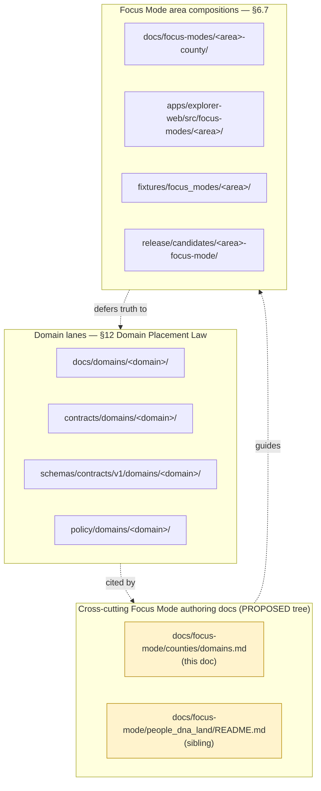
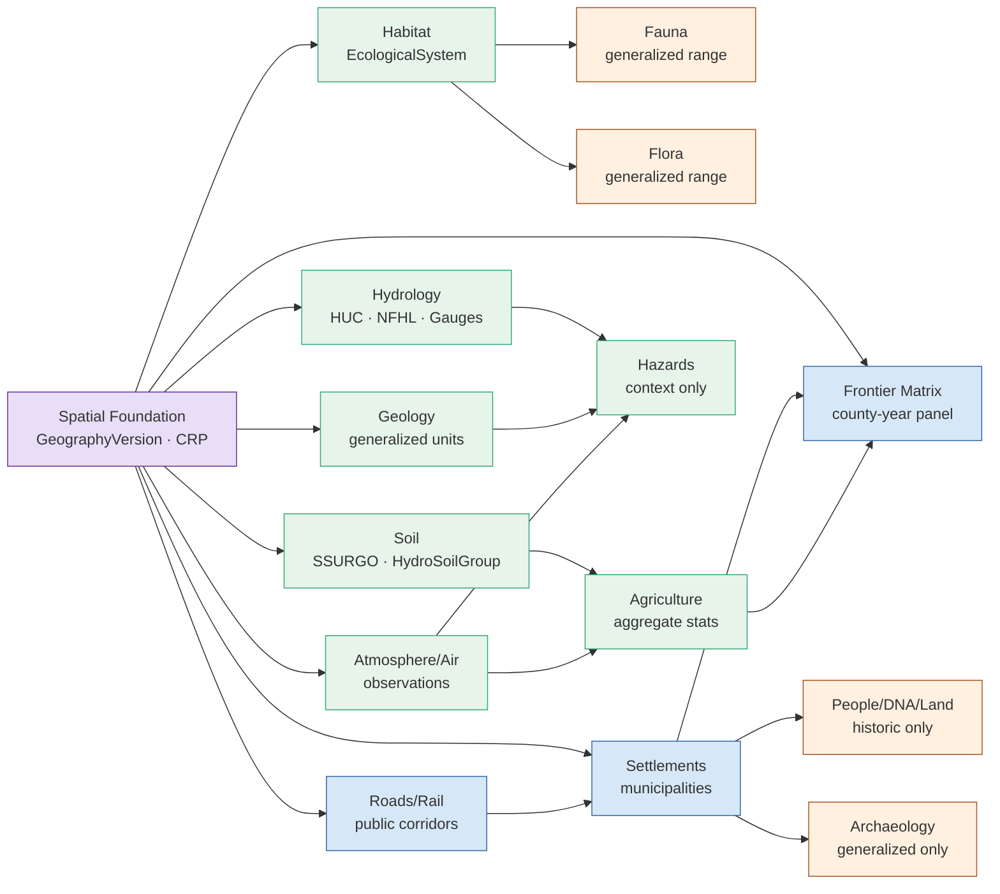

<!-- [KFM_META_BLOCK_V2]
doc_id: kfm://doc/focus-mode-counties-domains
title: County Focus Mode — Domain Composition Reference
type: standard
version: v0.1
status: draft
owners: [NEEDS VERIFICATION — docs steward, Focus Mode AI surface steward, domain stewards (per-domain)]
created: 2026-05-22
updated: 2026-05-22
policy_label: public_draft
related:
  - docs/focus-mode/people_dna_land/README.md                # PROPOSED sibling — People/DNA/Land authoring guidance
  - docs/focus-modes/README.md                      # PROPOSED — canonical Focus Mode pattern overview per Directory Rules §6.7
  - docs/focus-modes/ellsworth-county/README.md     # PROPOSED — county exemplar
  - docs/domains/                                   # PROPOSED — canonical domain lane roots per Directory Rules §12
  - directory-rules.md                              # §6.7 Focus Mode placement, §12 Domain Placement Law, §13.5 anti-patterns
tags: [kfm, focus-mode, counties, domains, doctrine, cross-cutting, authoring-reference, cite-or-abstain]
notes:
  - PROPOSED path: requested as docs/focus-mode/counties/domains.md (singular "focus-mode").
  - Directory Rules §6.7.2 canonical Focus Mode root in docs/ is the plural docs/focus-modes/<area>-<scope>/.
  - This doc is cross-cutting authoring REFERENCE, not a Focus Mode composition; it explains how the 15
    KFM domains compose into a county Focus Mode without itself being one.
  - All implementation, schema, validator, route, and CI claims are PROPOSED / NEEDS VERIFICATION
    pending mounted-repo inspection.
[/KFM_META_BLOCK_V2] -->

<a id="top"></a>

# County Focus Mode — Domain Composition Reference

> Cross-cutting reference for how the **15 KFM domains** compose into a Kansas-county Focus Mode — what each domain contributes, what its sensitivity posture is, what may appear in a public county slice, and what must be denied or generalized.


**Status:** draft &nbsp;·&nbsp; **Owners:** _NEEDS VERIFICATION_ &nbsp;·&nbsp; **Updated:** 2026-05-22 &nbsp;·&nbsp; **Applies to:** every Kansas-county Focus Mode build plan under `docs/focus-modes/<area>-county/`.

---

## Quick links

- [1. Purpose](#1-purpose)
- [2. Repo fit](#2-repo-fit)
- [3. How to read this reference](#3-how-to-read-this-reference)
- [4. The 15-domain inventory](#4-the-15-domain-inventory)
- [5. Cross-domain composition in a county slice](#5-cross-domain-composition-in-a-county-slice)
- [6. Sensitivity-tier matrix across domains](#6-sensitivity-tier-matrix-across-domains)
- [7. Per-domain composition cards](#7-per-domain-composition-cards)
- [8. Demo-layer pattern for a first county slice](#8-demo-layer-pattern-for-a-first-county-slice)
- [9. Governed AI behavior across domains](#9-governed-ai-behavior-across-domains)
- [10. Validators and negative fixtures by domain](#10-validators-and-negative-fixtures-by-domain)
- [11. Placement contract — domain vs Focus Mode](#11-placement-contract--domain-vs-focus-mode)
- [12. Authoring checklist for a county Focus Mode](#12-authoring-checklist-for-a-county-focus-mode)
- [13. Path placement and open verification](#13-path-placement-and-open-verification)
- [14. Related docs](#14-related-docs)

---

## 1. Purpose

CONFIRMED doctrine: a **Focus Mode** is a governed, evidence-bounded, county- or region-scale **proof slice** that composes multiple KFM domains over a bounded spatial frame and demonstrates the full trust path:

> `SourceDescriptor → SourceIntakeRecord → EvidenceRef → EvidenceBundle → Claim/AtlasCard → DecisionEnvelope → ReleaseManifest → Public UI`

A Focus Mode does **not** own domain truth. Domains own their objects, ubiquitous language, lifecycles, and release rules; a Focus Mode **cites** them into a county-scale view. [DIRRULES §6.7; ENCY]

PROPOSED purpose of this doc: provide one place where every county Focus Mode build plan (Ellsworth, Riley, Shawnee, Ford, Wyandotte, Sedgwick, Douglas, Leavenworth, Reno, Johnson, Barton, Cowley, Lyon, Rice, Atchison, Osage, Jackson, Stafford, Dickinson, Miami, Chase, Pottawatomie, Coffey, Linn, McPherson, Morris, Cloud, Crawford, Geary, Finney, Saline, Cherokee, and successors) can consult to:

- decide **which domains** to include in its first slice;
- understand each domain's **public-safe posture** at county scale;
- size **layer registry entries**, **evidence model**, and **validators** consistently across counties;
- avoid silently inventing per-county versions of cross-domain rules.

> [!IMPORTANT]
> This document is **authoring reference**. It does not redefine domain ownership, override Atlas v1.0 chapters 3–18, or constitute a Focus Mode composition. When this doc and a domain dossier disagree, the **domain dossier wins** per `<source_hierarchy>`.

[Back to top ↑](#top)

---

## 2. Repo fit

PROPOSED placement diagram. This file sits between the **domain lanes** (Directory Rules §12) and the **Focus Mode area compositions** (§6.7), serving as a county-author's bridge between them.



NEEDS VERIFICATION: every path above. None has been confirmed against a mounted repository in this session.

[Back to top ↑](#top)

---

## 3. How to read this reference

| You are… | Use this doc to… | Then defer to… |
|---|---|---|
| Authoring a new county Focus Mode build plan | Decide the included-domain list; size the layer registry; copy the sensitivity defaults | The relevant `docs/domains/<domain>/` for canonical truth |
| Reviewing a county Focus Mode PR | Check that no public layer crosses a deny-default tier | The Atlas Pass 23+32 Supplement §24.5 (Master Sensitivity Tier Atlas) |
| Drafting a county Focus Mode AI prompt | See per-domain `ANSWER / ABSTAIN / DENY` patterns | The Governed AI dossier [GAI] and §10 here |
| Adding a new domain to the system | Read §11 placement contract; do NOT mirror this doc per domain | Directory Rules §12 |

[Back to top ↑](#top)

---

## 4. The 15-domain inventory

CONFIRMED: the Atlas v1.0 domain inventory and citation short-names. [ENCY §2.1]

| # | Domain | Short-name | Owns (representative objects) | Sensitivity default | County-Focus-Mode posture |
|---|---|---|---|---|---|
| 1 | Spatial Foundation | (spine: ENCY + MAP-MASTER) | `CoordinateReferenceProfile`, `GeographyVersion`, `ProjectionTransformReceipt`, `BaseLayerDescriptor`, `MapStyleRule` | T0 | Required as substrate in every county slice. |
| 2 | Hydrology | [DOM-HYD] | `Watershed`, `HUCUnit`, `HydroFeature`, `ReachIdentity`, `GaugeSite`, `FlowObservation`, `NFHLZone` | T0; T0 (regulatory) for NFHL | Core for nearly every county; rivers + drainage context. |
| 3 | Soil | [DOM-SOIL] | `SoilMapUnit`, `SoilComponent`, `Horizon`, `SoilProperty`, `HydrologicSoilGroup`, `ErosionRisk`, `SuitabilityRating` | T0 | Aggregate or generalized layer; rarely a first-slice headliner. |
| 4 | Habitat | [DOM-HAB] [DOM-HF] | `HabitatPatch`, `LandCoverObservation`, `EcologicalSystem`, `StewardshipZone`, `ConnectivityEdge` | T0 (mostly); T1 stewardship zones | Public-safe ecology context. |
| 5 | Fauna | [DOM-FAUNA] [DOM-HF] | `Taxon`, `OccurrenceEvidence`, `RangePolygon`, `SensitiveSite`, `MigrationRoute` | **T4 default** for sensitive occurrence; T1 generalized | Public surface only via geoprivacy generalization. |
| 6 | Flora | [DOM-FLORA] | `PlantTaxon`, `FloraOccurrence`, `RarePlantRecord`, `VegetationCommunity`, `InvasivePlantRecord` | **T4 default** for rare-plant locations; T1 generalized | Same as Fauna; sensitive-plant locations generalized. |
| 7 | Agriculture | [DOM-AG] | `CropObservation`, `YieldObservation`, `IrrigationLink`, `ConservationPractice`, `AggregationReceipt` | T0 aggregate; T1 field candidate | Aggregate stats are first-slice safe; per-field detail is reviewed. |
| 8 | Geology / Natural Resources | [DOM-GEOL] | `GeologicUnit`, `Lithology`, `StratigraphicInterval`, `MineralOccurrence`, `ResourceEstimate` | T0 aggregate; T2 sensitive detail | Generalized geology is first-slice safe. |
| 9 | Atmosphere / Air | [DOM-AIR] | `AirStation`, `AirObservation`, `WeatherObservation`, `ClimateNormal`, `WindField` | T0 | Observations only — KFM is **never** an alert authority. |
| 10 | Hazards | [DOM-HAZ] | `HazardEvent`, `HazardObservation`, `WarningContext`, `DisasterDeclaration`, `FloodContext` | T0 | Contextual only. KFM never issues alerts or life-safety instructions. |
| 11 | Roads / Rail / Trade | [DOM-ROADS] | `RoadSegment`, `RailSegment`, `CorridorRoute`, `TransportFacility`, `RestrictionEvent` | T0 (mostly); T2/T4 sensitive condition detail | Public corridors first-slice; vulnerability detail denied. |
| 12 | Settlements / Infrastructure | [DOM-SETTLE] | `Settlement`, `Municipality`, `GhostTown`, `InfrastructureAsset`, `Fort`, `Mission` | T0 settlement; **T4 default** for critical-asset detail | Settlements safe; critical-asset condition denied or generalized. |
| 13 | Archaeology / Cultural Heritage | [DOM-ARCH] | `ArchaeologicalSite`, `SiteComponent`, `CulturalTemporalPeriod`, `SurveyProject`, `ArtifactRecord` | **T4 default**; T1 generalized only after steward review | Exact coordinates **never** public; only generalized after sovereignty review. |
| 14 | People / Genealogy / DNA / Land | [DOM-PEOPLE] | `PersonAssertion`, `LifeEvent`, `LandOwnershipAssertion`, `DNAMatchEvidence`, `LandParcel` | **T4 default** for living-person/DNA/private parcel join | See `docs/focus-mode/people_dna_land/README.md`. |
| 15 | Frontier Matrix | [ENCY] [UNIFIED] | `FrontierDefinition`, `GeographyVersion`, `County-YearPanel`, `PopulationObservation`, `LandOfficeRecord`, `AdminBoundaryChange` | T0 | County-year panels are central to county slices. |

PROPOSED 16th lane — **Planetary / 3D / Digital Twin / Synthetic** [MAP-MASTER] [UIAI] — is admission-gated for county slices: scenes require a `RealityBoundaryNote`, `RepresentationReceipt`, and 3D admission closure. Most first-county slices defer 3D entirely.

[Back to top ↑](#top)

---

## 5. Cross-domain composition in a county slice

PROPOSED canonical composition graph for a first-slice county Focus Mode. Edges are citations; ownership stays in the source domain. [ENCY §24.4; DOM-* cross-lane relations]



| Composition rule | What it means in practice |
|---|---|
| Spatial Foundation is always the substrate | Every county slice cites a `GeographyVersion` and a `CoordinateReferenceProfile`. |
| Hydrology feeds Hazards | Floodplain status comes from Hydrology's regulatory channel; Hazards adds event context. NFHL is regulatory, not observed. |
| Settlements compose with People, Archaeology, Frontier Matrix | A municipality may carry historic-person, generalized-archaeology, and matrix-cell citations — never living-person or exact-site detail. |
| Aggregates do not become per-place observations | An aggregate yield cell does not justify a per-field claim. [§24.9.2 Aggregate-cited-as-per-place anti-pattern] |
| Sensitive domains compose via generalization | Fauna, Flora, Archaeology, and People sensitive content surfaces only via `RedactionReceipt` or `AggregationReceipt`. |

[Back to top ↑](#top)

---

## 6. Sensitivity-tier matrix across domains

PROPOSED restatement of the Atlas Pass 23+32 Supplement §24.5 tiers for the subset of objects that **may surface in a county Focus Mode**. Tier definitions: T0 public default, T1 public-safe with limitations, T2 staged/named-party access, T3 restricted research access, T4 deny-default.

| Domain | Object class | Default tier | Allowed public transform | Required gate |
|---|---|---|---|---|
| Fauna | Sensitive occurrence | T4 | Geoprivacy generalization + `RedactionReceipt` → T1 | `RedactionReceipt` + `ReviewRecord` + `PolicyDecision` |
| Fauna | Range polygon | T1 | Aggregate / generalized public-safe | `AggregationReceipt` or `RedactionReceipt` |
| Flora | Rare or culturally sensitive plant location | T4 | Generalized geometry + steward review → T2 or T1 | `RedactionReceipt` + `ReviewRecord` |
| Archaeology | Site coordinates | T4 | Generalized geometry + sovereignty review → T1 | `RedactionReceipt` + sovereignty `ReviewRecord` + `PolicyDecision` |
| Archaeology | Human remains / sacred sites | T4 | **No transform** releases this to T0; T3 only with named authorization | Sovereignty review + `PolicyDecision` |
| People/DNA | Living-person fields | T4 | Aggregation by tract or county + `AggregationReceipt` → T1 | Consent or aggregation gate + `ReviewRecord` |
| People/DNA | Raw DNA segment data | T4 | **No transform** releases this to a public tier | Named consent + `ReviewRecord` + `PolicyDecision` |
| People/Land | Private person–parcel join | T4 | Generalized parcel + de-identified person → T2 only | `RedactionReceipt` + `ReviewRecord` |
| Settlements | Critical-asset detail | T4 | Generalized facility footprint + suppressed dependency → T1 | Steward review + `RedactionReceipt` |
| Settlements | Infrastructure condition / vulnerability | T4 | T3 to named authorities only; **never T0 / T1** | Steward review + named-party agreement |
| Hazards | KFM as alert authority | T4 forever | **No transform** permits KFM to act as an emergency-alert authority | Policy boundary; deny at runtime |
| Planetary/3D | Sensitive 3D scene content | T4 | Generalization / clipping / withholding + `RealityBoundaryNote` + `RepresentationReceipt` → T1 or T2 | Steward review + `RedactionReceipt` + `RepresentationReceipt` |
| Governed AI | RAW / WORK access via AI surface | T4 | AI **never** reads RAW or WORK content; only released `EvidenceBundle` | `PolicyDecision` + `AIReceipt` |

> [!CAUTION]
> **Default-deny applies before publication.** Any first-county-slice layer whose contents fall into T4 above must either be excluded from the public layer registry or surfaced only through the allowed transform with the named gate artifacts. A toggle that hides a T4 layer is not a defense; the bytes must not be in the released artifact.

[Back to top ↑](#top)

---

## 7. Per-domain composition cards

Each card below summarizes what a county Focus Mode author needs to know. The card is a **reference summary**, not the canonical source — defer to the cited dossier.

<details>
<summary><strong>Spatial Foundation</strong> — base layers, projection, geography version</summary>

| Aspect | County Focus Mode treatment |
|---|---|
| What may appear | County boundary; `GeographyVersion` badge; reviewed basemap layer; CRP citation |
| What must not appear | Custom basemaps without a `BaseLayerDescriptor`; styles outside an approved `StyleManifest` |
| Required objects | `CoordinateReferenceProfile`, `GeographyVersion`, `ProjectionTransformReceipt`, `MapStyleRule` |
| Cross-lane consumers | All other domains |
| Citation | [ENCY] [MAP-MASTER] |

</details>

<details>
<summary><strong>Hydrology</strong> — rivers, watersheds, gauges, floodplain</summary>

| Aspect | County Focus Mode treatment |
|---|---|
| What may appear | Major rivers and tributaries (NHDPlus-derived public-safe), HUC context, named reaches, public gauge identity, effective floodplain status card with source disclaimer |
| What must not appear | Floodplain treated as parcel determination; draft floodplain presented as effective; gauge readings cited as real-time alerts |
| Source-role anti-collapse | `regulatory` (NFHL) ≠ `observed` (gauges) ≠ `modeled` (forecast) ≠ `aggregate` (HUC averages). Each is a distinct surface. |
| Required gates | `EvidenceBundle`; freshness; `PolicyDecision` for floodplain context |
| Citation | [DOM-HYD] |

</details>

<details>
<summary><strong>Soil</strong> — SSURGO, hydrologic groups, suitability</summary>

| Aspect | County Focus Mode treatment |
|---|---|
| What may appear | SSURGO-derived public-safe summaries; hydrologic soil group context |
| What must not appear | Farm-specific advice; soil suitability cited as engineering certification |
| Required gates | Support-type separation (pedon ≠ map unit ≠ gridded derivative) |
| Citation | [DOM-SOIL] |

</details>

<details>
<summary><strong>Habitat</strong> — ecological systems, stewardship zones</summary>

| Aspect | County Focus Mode treatment |
|---|---|
| What may appear | Public-safe ecological system polygons; land-cover observation cards |
| What must not appear | Stewardship-zone boundaries that reveal sensitive occurrence locations |
| Citation | [DOM-HAB] [DOM-HF] |

</details>

<details>
<summary><strong>Fauna</strong> — taxa, occurrences, range polygons</summary>

| Aspect | County Focus Mode treatment |
|---|---|
| What may appear | Aggregate / generalized range polygons; public taxa lists |
| What must not appear | Exact sensitive occurrence points; nest locations; sensitive-species point dots |
| Required transform | Geoprivacy generalization + `RedactionReceipt` |
| Citation | [DOM-FAUNA] [DOM-HF] |

</details>

<details>
<summary><strong>Flora</strong> — plant taxa, rare plant records</summary>

| Aspect | County Focus Mode treatment |
|---|---|
| What may appear | Public taxa lists; generalized vegetation communities |
| What must not appear | Rare or culturally sensitive plant locations at native precision |
| Required transform | Generalized geometry + steward review |
| Citation | [DOM-FLORA] |

</details>

<details>
<summary><strong>Agriculture</strong> — crop/yield observations, aggregation</summary>

| Aspect | County Focus Mode treatment |
|---|---|
| What may appear | County-level USDA NASS aggregates; CDL-derived class histograms; rollups by year |
| What must not appear | Private farm operator names; aggregate cells cited as per-field truth |
| Required receipt | `AggregationReceipt` for every aggregate card; geometry-scope guard at runtime |
| Citation | [DOM-AG] |

</details>

<details>
<summary><strong>Geology / Natural Resources</strong> — units, lithology, resources</summary>

| Aspect | County Focus Mode treatment |
|---|---|
| What may appear | KGS county geology context; generalized lithology; public groundwater region summary |
| What must not appear | Resource estimates as investment authority; mineral occurrences at parcel precision in sensitive contexts |
| Citation | [DOM-GEOL] |

</details>

<details>
<summary><strong>Atmosphere / Air</strong> — weather, air quality, climate normals</summary>

| Aspect | County Focus Mode treatment |
|---|---|
| What may appear | Observation cards with timestamp + station identity; climate-normal context |
| What must not appear | Observations cited as life-safety advice; expired operational warnings shown as current |
| Source-role anti-collapse | observed / regulatory / modeled / aggregate roles remain distinct |
| Citation | [DOM-AIR] |

</details>

<details>
<summary><strong>Hazards</strong> — hazard events, declarations, advisories</summary>

| Aspect | County Focus Mode treatment |
|---|---|
| What may appear | Historic disaster declarations; published hazard event context; advisory context with operational-expiry indicator |
| What must not appear | KFM acting as an alert authority; KFM issuing life-safety instructions |
| Hard boundary | **T4 forever** for "KFM as alert authority." No transform permits this. |
| Citation | [DOM-HAZ] |

</details>

<details>
<summary><strong>Roads / Rail / Trade</strong> — segments, corridors, facilities</summary>

| Aspect | County Focus Mode treatment |
|---|---|
| What may appear | Public road/rail corridors; historic trail context; published project corridors |
| What must not appear | Bridge condition vulnerabilities; sensitive facility operational detail |
| Citation | [DOM-ROADS] |

</details>

<details>
<summary><strong>Settlements / Infrastructure</strong> — municipalities, infrastructure assets</summary>

| Aspect | County Focus Mode treatment |
|---|---|
| What may appear | Municipalities, census places, townsites, ghost towns, historic forts/missions, generalized facility footprints |
| What must not appear | Critical-asset condition or vulnerability detail; suppressed-dependency graphs |
| Citation | [DOM-SETTLE] |

</details>

<details>
<summary><strong>Archaeology / Cultural Heritage</strong> — sites, periods, surveys</summary>

| Aspect | County Focus Mode treatment |
|---|---|
| What may appear | Generalized public-interpretive heritage cards; published cultural-temporal periods |
| What must not appear | Exact site coordinates; human-remains locations; sacred-site coordinates |
| Required gate | Sovereignty review + `PolicyDecision` + `RedactionReceipt` before any geographic surface |
| Citation | [DOM-ARCH] |

</details>

<details>
<summary><strong>People / Genealogy / DNA / Land</strong> — historic persons, instruments, parcels</summary>

| Aspect | County Focus Mode treatment |
|---|---|
| What may appear | Historic (non-living) person cards with `EvidenceBundle`; historic land instruments; generalized parcel envelopes |
| What must not appear | Living-person identification or location; raw DNA segments; private person ↔ parcel joins; assessor cited as title |
| Detailed authoring guide | See [`../people/README.md`](../people/README.md) |
| Citation | [DOM-PEOPLE] |

</details>

<details>
<summary><strong>Frontier Matrix</strong> — county-year panels, geography versions, land-office records</summary>

| Aspect | County Focus Mode treatment |
|---|---|
| What may appear | County-year panel; admin boundary change history; settlement-status observations; public-land/land-office records |
| What must not appear | Matrix cells cited as spreadsheet truth; frontier-threshold model output cited as observation |
| Required objects | `FrontierDefinition`, `GeographyVersion`, `County-YearPanel`, `MatrixRelease` |
| Citation | [ENCY] [UNIFIED] |

</details>

<details>
<summary><strong>Planetary / 3D / Digital Twin / Synthetic</strong> — admission-gated</summary>

| Aspect | County Focus Mode treatment |
|---|---|
| What may appear | Only after 3D admission closure: scene with `RealityBoundaryNote` + `RepresentationReceipt`; clipped/generalized terrain |
| What must not appear | Synthetic surface as observation; sensitive 3D content without steward review |
| Default posture for first county slices | **Defer entirely** unless the build plan specifies admission |
| Citation | [MAP-MASTER] [UIAI] |

</details>

[Back to top ↑](#top)

---

## 8. Demo-layer pattern for a first county slice

PROPOSED canonical first-slice pattern, distilled from the eleven-plus county build plans in project knowledge. Treat as a starting template; each county build plan tailors it to local sources.

| Slot | Domain | First-slice candidate | Default policy posture |
|---|---|---|---|
| `boundary` | Spatial Foundation | County boundary polygon (Census/TIGER or Kansas Geoportal) | Public after source-rights check |
| `settlements` | Settlements | Cities, towns, ghost-town nodes (Census places + local source) | Public |
| `transport.major` | Roads/Rail | U.S. / state highway corridors + rail lines (KDOT / TIGER) | Public; no vulnerability overlays |
| `hydrology.public_context` | Hydrology | Major rivers + named tributaries (NHDPlus) | Public context only |
| `floodplain.effective_context` | Hydrology (regulatory) | KDA / FEMA effective floodplain context | Public with source disclaimer; **draft vs effective** clearly labeled |
| `agriculture.county_stats` | Agriculture | USDA NASS 2022 county summary; CDL class histogram | Public aggregate with `AggregationReceipt` |
| `geology.generalized` | Geology | KGS county geology + groundwater region summary | Public context |
| `habitat.regions` | Habitat | Generalized ecological systems | Public context |
| `cultural.public_context` | Archaeology | Generalized public-interpretive heritage cards | Generalized only; exact site coords denied |
| `history.timeline` | Frontier Matrix + People (historic) | County-year panel + historic settlement events | Public; living-person fields excluded |

> [!NOTE]
> The exact layer IDs vary by county build plan. The **slots** are stable across counties; the **sources** and policy decisions are not.

[Back to top ↑](#top)

---

## 9. Governed AI behavior across domains

CONFIRMED doctrine: every Focus Mode answer is a finite outcome — `ANSWER`, `ABSTAIN`, `DENY`, or `ERROR`. AI **never** reads RAW/WORK/QUARANTINE; only released `EvidenceBundle`. AI **never** substitutes generated language for evidence. [GAI] [DIRRULES §6.7.1]

PROPOSED outcome patterns by question shape and touching domain. This is the cross-county default — county build plans may narrow further, never widen.

| Question shape | Touching domain(s) | Expected outcome | Why |
|---|---|---|---|
| "What rivers flow through this county?" | Hydrology + Spatial Foundation | `ANSWER` with citations | Released hydrology `EvidenceBundle` resolves. |
| "What's the current river stage at gauge X?" | Hydrology + Atmosphere | `ABSTAIN` + link to official source | KFM is not a real-time gauge service. |
| "Is my parcel in the floodplain?" | Hydrology (regulatory) + People/Land | `ABSTAIN` + link to FEMA MSC / KDA | KFM is not a flood-determination authority. |
| "What crops are grown here?" | Agriculture | `ANSWER` aggregate with `AggregationReceipt` | Released county aggregate. |
| "Who farms parcel X?" | Agriculture + People/Land | `DENY` | Private operator information. |
| "Where are the archaeological sites?" | Archaeology | `DENY` exact; `ANSWER` generalized only after sovereignty review | Exact coordinates are T4. |
| "Tell me about \[historic person\] who lived here" | People/DNA/Land + Settlements | `ANSWER` (historic only) with citations | Released historic `EvidenceBundle`. |
| "Map the cemeteries" | People/Land + Settlements | `ABSTAIN` / generalized link-out | Cemetery precision is sensitivity-significant. |
| "Where are the rare plants?" | Flora | `DENY` exact; `ANSWER` generalized only | Geoprivacy generalization required. |
| "What's the bridge condition on Route X?" | Settlements/Infrastructure + Roads | `DENY` | Critical-asset condition is T4. |
| "Will it flood tomorrow?" | Hazards + Hydrology + Atmosphere | `ABSTAIN` + link to NWS / county EM | KFM is **never** an alert authority. |
| "What's the geology of section 12?" | Geology | `ANSWER` generalized with citations | Public KGS context. |
| "Compare this county's 1880 and 1900 populations" | Frontier Matrix + People | `ANSWER` matrix-cell with `EvidenceBundle` | County-year panel resolves. |
| Any question requesting model output as fact | Any | `DENY` or `ABSTAIN` with explanation | Model output is not evidence. |

[Back to top ↑](#top)

---

## 10. Validators and negative fixtures by domain

PROPOSED minimum coverage for any county Focus Mode that includes the named domain. Each county's `fixtures/focus_modes/<area>/invalid/` directory should contain at least one fixture per row that applies to its layer registry.

| Domain | Required negative fixture | Expected outcome |
|---|---|---|
| Spatial Foundation | Map style outside `StyleManifest` | `DENY` / `ERROR` |
| Hydrology | NFHL cited as observed event | `DENY` (source-role anti-collapse) |
| Hydrology | Draft floodplain published without status label | `DENY` |
| Soil | Pedon cited as map-unit truth | `DENY` (support-type separation) |
| Habitat | Stewardship zone exposing sensitive occurrence | `DENY` |
| Fauna | Exact sensitive occurrence in public payload | `DENY` |
| Flora | Rare-plant exact location in public payload | `DENY` |
| Agriculture | Aggregate cell cited as per-field observation | `DENY` |
| Geology | Resource estimate cited as investment authority | `DENY` |
| Atmosphere | Expired warning shown as current | `DENY` |
| Hazards | KFM-issued life-safety instruction | `DENY` |
| Roads/Rail | Bridge vulnerability detail in public payload | `DENY` |
| Settlements | Critical-asset condition detail in public payload | `DENY` |
| Archaeology | Exact site coordinates in public payload | `DENY` |
| People/DNA/Land | Living-person identification | `DENY` |
| People/DNA/Land | Raw DNA segment in payload or logs | `DENY` |
| People/DNA/Land | Assessor cited as title | `DENY` |
| Frontier Matrix | Matrix cell cited as spreadsheet truth | `ABSTAIN` |
| Planetary/3D | Synthetic surface without `RealityBoundaryNote` | `DENY` |
| All | Public route reads `data/raw/`, `data/work/`, or `data/quarantine/` | `DENY` / `ERROR` |
| All | Focus Mode answer without `AIReceipt` | `FAIL` |
| All | Layer published without `ReleaseManifest` | `DENY` |
| All | Release without `RollbackCard` target | `DENY` |

[Back to top ↑](#top)

---

## 11. Placement contract — domain vs Focus Mode

CONFIRMED doctrine: a Focus Mode is **cross-cutting and geographic**, not topical. It composes domains; it does not replace them. [DIRRULES §6.7.5, §12]

| Concern | Lives where (domain) | Lives where (Focus Mode) |
|---|---|---|
| Object semantics, ubiquitous language | `docs/domains/<domain>/` | — (a Focus Mode cites) |
| Schemas | `schemas/contracts/v1/domains/<domain>/` | `schemas/contracts/v1/focus_mode/` (Focus-Mode-specific only) |
| Contracts (semantic Markdown) | `contracts/domains/<domain>/` | `contracts/focus_mode/` |
| Policies | `policy/domains/<domain>/`, `policy/sensitivity/<domain>/` | `policy/focus_mode/` (cross-cutting Focus Mode rules only) |
| Source registry | `data/registry/sources/<domain>/` | `data/registry/sources/<area>/` (optional area slice) |
| Lifecycle data | `data/{raw,work,quarantine,processed,catalog}/<domain>/` | — (Focus Mode reads released only) |
| Released layers | `data/published/layers/<domain>/` | `data/published/layers/<area>/` |
| Release candidates / manifests | `release/candidates/<domain>/` | `release/candidates/<area>-focus-mode/`, `release/manifests/<area>-focus-mode-v<n>.json` |
| Fixtures | `fixtures/domains/<domain>/{valid,invalid}/` | `fixtures/focus_modes/<area>/{valid,invalid}/` |
| Validators | `tools/validators/<topic>/...` (flat, not nested per domain) | `tools/validators/validate_focus_mode_payload.py` |
| UI | (no domain-owned UI) | `apps/explorer-web/src/focus-modes/<area>/` |
| Cross-cutting authoring guidance (this doc and siblings) | — | `docs/focus-mode/...` (PROPOSED tree — see §13) |

> [!IMPORTANT]
> A Focus Mode MUST NOT carry a domain into a root folder. "`docs/focus-modes/people/`" or "`focus_modes/` at repo root" would be §6.7.5 violations. The reverse is also true: a domain MUST NOT carry a Focus Mode area into its lane. `docs/domains/hydrology/ellsworth-county/` would be a §12 violation.

[Back to top ↑](#top)

---

## 12. Authoring checklist for a county Focus Mode

Use when planning or reviewing any county Focus Mode build plan. Items map back to §§4–10 above.

```text
[ ] Included-domain list set, with explicit "deferred" entries for sensitive domains.
[ ] Spatial Foundation: GeographyVersion + CoordinateReferenceProfile cited.
[ ] Hydrology: NFHL labeled regulatory, gauges labeled observed, no role collapse.
[ ] Soil: support-type separation respected.
[ ] Habitat: stewardship zones do not leak sensitive locations.
[ ] Fauna: all occurrence layers use generalization + RedactionReceipt.
[ ] Flora: rare-plant layers use generalization + RedactionReceipt.
[ ] Agriculture: every aggregate card carries an AggregationReceipt; no per-field claims.
[ ] Geology: no parcel-precision sensitive detail; resource estimates not cited as authority.
[ ] Atmosphere: timestamped observations only; no life-safety advice.
[ ] Hazards: no KFM-issued alerts or instructions; T4-forever boundary preserved.
[ ] Roads/Rail: public corridors only; no vulnerability detail.
[ ] Settlements: settlements + ghost towns + historic forts/missions allowed; critical-asset detail denied.
[ ] Archaeology: exact coordinates denied; sovereignty review for any geographic surface.
[ ] People/DNA/Land: historic only; living-person and DNA fields denied; see people/README.md.
[ ] Frontier Matrix: county-year panel cited; matrix cells not treated as truth.
[ ] Planetary/3D: deferred or admission-gated.
[ ] Negative fixtures cover every applicable §10 row.
[ ] Layer registry uses §8 slot pattern, adapted to local sources.
[ ] Every layer carries: source role, EvidenceBundle, PolicyDecision, ReleaseManifest, RollbackCard target.
[ ] AI surface returns finite outcomes only; AIReceipt on every answer.
[ ] Public UI does not read RAW/WORK/QUARANTINE.
[ ] Build plan placed under docs/focus-modes/<area>-county/ (plural; canonical per §6.7.2).
```

[Back to top ↑](#top)

---

## 13. Path placement and open verification

> [!NOTE]
> Per the rules under which this doc is authored, path drift is surfaced, not smoothed. The same drift applies to this file as to its sibling `docs/focus-mode/people_dna_land/README.md`.

### 13.1 Path discrepancies (PROPOSED, NEEDS VERIFICATION)

| Aspect | Requested form | Canonical form per Directory Rules | Status |
|---|---|---|---|
| Folder pluralization | `docs/focus-mode/` (singular) | `docs/focus-modes/` (plural) per §6.7.2 | DRIFT — flagged for ADR or routine PR rename |
| Sub-segment | `counties/` (a scope class, not an area) | `<area>-<scope>/` (a single area name with scope suffix) per §6.7.2, §6.7.4 | DRIFT in form — `counties/` is not a single Focus Mode area |
| Most defensible reading | Cross-cutting **authoring reference** for any county Focus Mode | Not a Focus Mode composition | PROPOSED |
| Alternative canonical homes | n/a | `docs/focus-modes/README.md` (a section inside the pattern overview) **or** `docs/focus-modes/_reference/counties-domains.md` | PROPOSED for ADR |
| Sibling pattern | `docs/focus-mode/people_dna_land/README.md`, `docs/focus-mode/counties/domains.md`, … | PROPOSED authoring-reference tree distinct from `docs/focus-modes/<area>-county/` composition tree | PROPOSED — would benefit from an ADR formalizing the distinction |

### 13.2 Open verification items

| Item | Evidence that would settle it | Status |
|---|---|---|
| ADR resolving `docs/focus-mode/` vs `docs/focus-modes/` | Accepted ADR in repo | NEEDS VERIFICATION |
| Presence of `docs/focus-modes/README.md` | Mounted-repo listing | UNKNOWN |
| Presence of `docs/domains/<domain>/` lanes for the 15 domains | Mounted-repo listing | UNKNOWN |
| Whether this reference doc is duplicated by other Focus Mode authoring material | Project knowledge + mounted-repo | NEEDS VERIFICATION |
| Owner assignments for cross-cutting Focus Mode authoring docs | Steward registry | NEEDS VERIFICATION |
| Schema home for `focus_mode_payload.schema.json` | ADR-0001 + live tree | NEEDS VERIFICATION (CONFIRMED canonical per §6.7.2: `schemas/contracts/v1/focus_mode/`; live presence not verified) |
| Per-domain sensitivity policy implementation | Mounted policy files, schemas, tests, CI workflows | NEEDS VERIFICATION (per Atlas §16-N for People; analogous for all sensitive domains) |
| Validator orchestrator location (relates to OPEN-DR-07) | ADR resolution | NEEDS VERIFICATION |

[Back to top ↑](#top)

---

## 14. Related docs

> _Links are PROPOSED. Targets have not been verified against a mounted repository._

- [`../people/README.md`](../people/README.md) — sibling: People/DNA/Land authoring guidance for Focus Mode authors.
- [`../../focus-modes/README.md`](../../focus-modes/README.md) — PROPOSED canonical Focus Mode pattern overview per Directory Rules §6.7.
- [`../../focus-modes/ellsworth-county/README.md`](../../focus-modes/ellsworth-county/README.md) — PROPOSED first county exemplar.
- [`../../domains/`](../../domains/) — PROPOSED canonical domain lane roots per Directory Rules §12. Per-domain READMEs should exist as `docs/domains/<domain>/README.md` for each of the 15 domains listed in §4.
- [`../../../directory-rules.md`](../../../directory-rules.md) — §6.7 Focus Mode placement contract; §12 Domain Placement Law; §13.5 anti-patterns; §18.d OPEN-DR-06/-07/-08/-09.
- [`../../adr/`](../../adr/) — relevant accepted ADRs (path / placement / schema home), pending verification.
- _Atlas v1.0 chapters 3–18_ — per-domain canonical chapters.
- _Atlas Pass 23+32 Supplement §24.5_ — Master Sensitivity Tier Atlas.
- _Atlas Pass 23+32 Supplement §24.13_ — Atlas Section ↔ Dossier ↔ Responsibility Root Crosswalk.
- _County Focus Mode Build Plans_ — Ellsworth, Riley, Shawnee, Ford, Wyandotte, Sedgwick, Douglas, Leavenworth, Reno, Johnson, Barton, Cowley, Lyon, Rice, Atchison, Osage, Jackson, Stafford, Dickinson, Miami, Chase, Pottawatomie, Coffey, Linn, McPherson, Morris, Cloud, Crawford, Geary, Finney, Saline, Cherokee.

---

<sub>**Last updated:** 2026-05-22 &nbsp;·&nbsp; **Doc status:** draft &nbsp;·&nbsp; **Truth posture:** cite-or-abstain &nbsp;·&nbsp; **Path:** PROPOSED / NEEDS VERIFICATION &nbsp;·&nbsp; **Scope:** Kansas-county Focus Modes</sub>

[Back to top ↑](#top)
