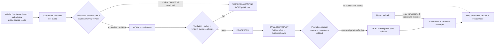
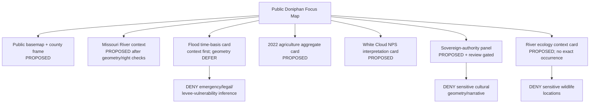
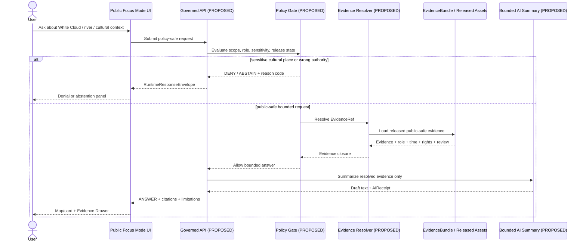
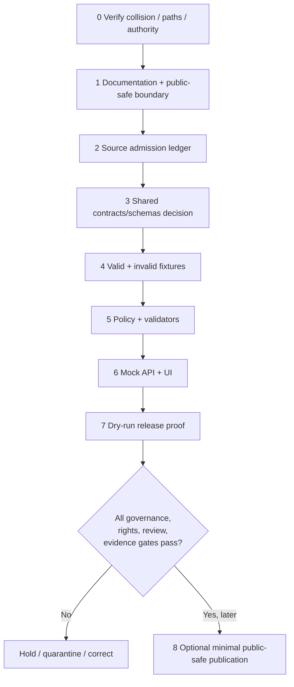

<!-- KFM_META_BLOCK_V2
doc_id: NEEDS_VERIFICATION
title: Doniphan County Focus Mode Build Plan
type: standard
version: v1
status: draft
owners: [NEEDS_VERIFICATION]
created: 2026-05-22
updated: 2026-05-22
policy_label: public_draft
repository_path: NEEDS_VERIFICATION — candidate only: docs/focus-modes/doniphan-county/doniphan_county_focus_mode_build_plan.md
schema_contract_policy_homes: NEEDS_VERIFICATION — do not create county-specific parallel authority homes without repository inspection and ADR/migration review
review_assignments: NEEDS_VERIFICATION — requires cultural/Tribal, hydrology/floodplain, ecology/sensitivity, documentation, and release review assignment before implementation or publication
correction_path: NEEDS_VERIFICATION
rollback_path: NEEDS_VERIFICATION
release_status: NEEDS_VERIFICATION — no implementation or publication claimed; this artifact is a planning draft
related:
  - Directory Rules.pdf (consulted in this run; authoritative placement doctrine within supplied materials)
  - KFM county Focus Mode series completed-county register supplied in current request
tags: [kfm, focus-mode, doniphan-county, missouri-river, white-cloud, tribal-sovereignty, floodplain, agriculture, public-safe-boundary]
notes:
  - CONFIRMED: Doniphan County is not present in the user-supplied completed-county register.
  - CONFIRMED: Available uploaded/File Library materials were searched in this run and no Doniphan County Focus Mode build-plan artifact was returned.
  - NEEDS_VERIFICATION: A live repository collision search and final file placement check have not been performed in this run.
  - PROPOSED: This plan is the next county proof-slice implementation artifact.
-->

<a id="top"></a>

# Doniphan County Focus Mode Build Plan

> **Product thesis:** Build a public-safe Missouri River borderlands Focus Mode for Doniphan County that lets users learn from evidence about river geography, floodplain context, working landscapes, White Cloud public history, and sovereign Nation-authored context—without exposing culturally sensitive knowledge, turning public records into land/legal conclusions, or presenting flood information as live safety guidance.


| Identity / status field | Determination |
|---|---|
| Selected county | **Doniphan County, Kansas** |
| Series-collision status | **CONFIRMED** against the supplied completed-county register: Doniphan County is not listed. **CONFIRMED** available project-file search returned no Doniphan county plan. **NEEDS_VERIFICATION** against a live repository tree. |
| Proof-slice character | Missouri River / Nímaha–Nyisoji confluence context; White Cloud; floodplain-management context; working-landscape aggregates; public history; sovereign Nation-authored representation boundary |
| Most consequential public-safe boundary | **Tribal sovereignty and culturally sensitive representation:** substantive cultural claims, Nation-associated land interpretations, precise sacred/burial/archaeological locations, or sensitive community information must not be inferred, mapped, or narrated from non-Nation sources without appropriate Nation-authoritative evidence and review. |
| Secondary safety boundary | Flood-risk, levee, wildlife and river-condition sources must not become live emergency guidance, operational infrastructure disclosure, exact sensitive-species location output, or individual property/legal conclusions. |
| Document posture | **PROPOSED** build plan; official source seeds were checked in this run; no implementation, release or repository modification claimed. |
| Directory placement posture | **PROPOSED / NEEDS_VERIFICATION** candidate under the established human-documentation responsibility root: `docs/focus-modes/doniphan-county/`. |
| First milestone | **Doniphan Sovereign-River Evidence Boundary Control Plane** |

## Quick links

[Operating posture](#1-operating-posture) · [Why Doniphan County](#2-why-this-county) · [Product thesis](#3-product-thesis) · [Scope boundary](#4-scope-boundary) · [First demo layers](#5-first-demo-layers) · [User journeys](#6-user-journeys) · [UI surfaces](#7-ui-surfaces) · [Governed object model](#8-governed-object-model) · [Repository shape](#9-proposed-repository-shape) · [Build phases](#10-build-phases) · [PR sequence](#11-first-pr-sequence) · [Acceptance](#12-acceptance-checklist) · [Fixtures](#13-fixture-plan) · [Risks](#14-risk-register) · [Sources](#15-source-seed-list) · [Verification](#16-open-verification-questions) · [Milestone](#17-recommended-first-milestone) · [Appendices](#appendix-a--public-safe-narrative-skeleton)

## Executive build note

**PROPOSED.** Doniphan County is an unusually strong next KFM proof slice because a public product must connect a major river-border landscape, flood-risk and agriculture context, public-history places such as White Cloud, and the presence and voices of sovereign Nations without flattening them into a single county story. The first build should therefore prove a **trust-visible cultural-authority gate** alongside river/floodplain evidence handling, not merely render attractive layers.

> [!CAUTION]
> ## Defining public-safe boundary — sovereign cultural authority comes first
> The public product may show a county outline, generalized river/floodplain context, aggregate agriculture, and public place context supported by admitted sources. It must **DENY or ABSTAIN** from generating substantive Ioway/Báxoje, Sac and Fox, sacred-place, burial, archaeological, allotment/land-right, ceremony, community-health, or culturally sensitive narrative/geometry unless the claim is supported by appropriate Nation-authoritative evidence and the required review posture has been satisfied. A federal, state, county, museum, trail, or tourism page is **not** a substitute for sovereign cultural authority.

### Evidence-boundary table

| Status | What this document can say now | What it cannot imply |
|---|---|---|
| `CONFIRMED` | Doniphan County was not in the supplied completed-county register; available materials search did not return a Doniphan county plan; Directory Rules were consulted; current official/public pages checked in this run include county, Kansas, Tribal/Nation, NPS, USACE, KDOT and USFWS sources listed in §15. | No live-repository implementation, file existence, release, rights approval, review assignment or published layer can be claimed. |
| `PROPOSED` | Doniphan is selected as the next proof slice; layer set, UI, objects, paths, fixtures, validators, review gates, first milestone and PR sequence. | A proposed layer or source seed is not admitted evidence or a public product. |
| `NEEDS_VERIFICATION` | Live repo collision check; exact repository placement; schema/contract/policy homes; rights and derivative-display permissions; public-safe geometry and cultural-review procedure; flood-map effective status; release/correction/rollback machinery. | Checkable items may not be treated as passed gates. |
| `UNKNOWN` | Existing KFM implementation maturity, existing shared object shapes and route behavior, whether any Doniphan plan exists outside searched materials, or whether a release has ever been assembled. | Absence of evidence is not evidence of absence. |

---

## 1. Operating posture

### Governing rules applied to Doniphan County

| Rule | County implementation consequence |
|---|---|
| EvidenceBundle outranks generated language. | No river, cultural, historic, ecological, agricultural or floodplain claim becomes a public answer unless its `EvidenceRef` resolves to an admissible `EvidenceBundle`. |
| Public surfaces use governed interfaces only. | MapLibre/UI and Focus Mode consume proposed governed API/runtime envelopes and released public-safe assets only; never `RAW`, `WORK`, `QUARANTINE`, restricted records, candidate extracts or model output directly. |
| Cite-or-abstain. | Missing cultural authority, rights, freshness, review or source-role evidence results in `ABSTAIN` or `DENY`, not a polished narrative. |
| Promotion is governed state transition. | A tile, card, layer or story is not public because it was produced; it needs validation, policy decision, review, manifest, correction and rollback support. |
| Source roles do not collapse. | Nation-authored cultural authority, county administrative record, federal flood study, historic interpretation, agricultural aggregate and ecological science remain distinguishable. |
| Fail closed for sensitivity and exposure. | Exact sensitive cultural/archaeological/wildlife locations, private-property implications, operational flood-risk infrastructure detail and live safety inference are withheld unless specifically cleared for public use. |
| AI is interpretive only. | AI may summarize already admissible public evidence; it cannot decide sovereignty, cultural appropriateness, flood safety, title, land rights, species exposure or emergency action. |

### Truth-label and finite-outcome key

| Label / outcome | Meaning in this plan |
|---|---|
| `CONFIRMED` | Verified in this run from supplied materials, searched project files, generated artifact, or opened authoritative public source. |
| `PROPOSED` | Design, implementation, path, workflow, UI, source admission, schema/policy/fixture or release recommendation. |
| `NEEDS_VERIFICATION` | A checkable condition not yet sufficiently verified to support action or publication. |
| `UNKNOWN` | Not supported by inspected evidence. |
| `ANSWER` | Public-safe answer supported by admissible released evidence and citation validation. |
| `ABSTAIN` | The system cannot support the requested claim with admissible evidence, authority or currentness. |
| `DENY` | The request would reveal or infer restricted/sensitive content, bypass governance, or exceed product scope. |
| `ERROR` | A validation/resolution/system failure prevents safe response. |

### Public trust membrane



### County-specific non-negotiable guardrails

1. **Sovereign authority guardrail.** The Iowa Tribe of Kansas and Nebraska and the Sac and Fox Nation of Missouri in Kansas and Nebraska must be treated as sovereign authorities for their own identities, histories, cultural significance and review needs; county or third-party sources cannot replace that authority.
2. **Sensitive-place guardrail.** Exact sacred, burial, archaeological, culturally restricted, collection-sensitive or culturally significant locations are `DENY` by default; public representations require authorized/publicly suitable framing and safe geometry.
3. **River/flood guardrail.** FEMA/Kansas/USACE/USGS flood and river material may support clearly time-stamped public context; it must not be rewritten as present emergency instruction, levee vulnerability mapping, flood-proof guarantee or property-specific risk/legal advice.
4. **Land/property guardrail.** Appraiser/GIS information and historic land narratives do not establish ownership, title, access rights, Tribal rights or individual legal conclusions.
5. **Ecology guardrail.** Missouri River native-fish and habitat context may be described at appropriate public scale; sensitive occurrence, spawning or management-operational details fail closed.
6. **Source-role guardrail.** Lewis and Clark public interpretation, Nation-authored history, county records, federal program pages and historic-register records stay visibly distinct.

---

## 2. Why this county

### Selection screen against the completed-county register

| Screening item | Result | Status |
|---|---|---|
| County selected | Doniphan County | `PROPOSED` |
| Present in user-supplied completed register? | No match found among 42 listed completed counties. | `CONFIRMED` from current request |
| Existing Doniphan plan in available uploaded/File Library materials? | Searches for `Doniphan County Focus Mode Build Plan`, `doniphan_county_focus_mode_build_plan.md`, and Doniphan + Focus Mode returned no matching Doniphan plan; results surfaced other completed county plans and KFM doctrine instead. | `CONFIRMED` for searched material set |
| Existing plan in live repository or external project store? | Not inspected in this run. | `NEEDS_VERIFICATION` |
| County excluded because proof repeats prior work? | No. It uniquely foregrounds sovereign cultural-authority review in a Missouri River / borderland / floodplain / White Cloud / agricultural setting. | `PROPOSED` selection rationale |

<details>
<summary>Completed register checked in this run</summary>

Ellsworth, Riley, Shawnee, Ford, Wyandotte, Sedgwick, Douglas, Leavenworth, Reno, Johnson, Barton, Geary, Finney, Cherokee, Saline, Crawford, Lyon, Cowley, Rice, Atchison, Bourbon, Osage, Coffey, Pottawatomie, Chase, Miami, Dickinson, Stafford, Jackson, Linn, McPherson, Morris, Brown, Cloud, Republic, Morton, Phillips, Barber, Trego, Montgomery, Scott and Kiowa Counties.

</details>

### Proof-slice rationale

| Dimension | Official-source anchor checked in this run | Proof value | Boundary |
|---|---|---|---|
| Sovereign Nation context | Iowa Tribe of Kansas and Nebraska official site identifies itself as the Ioway/Báxoje, a sovereign federally recognized Tribe, and places its reservation along the Nímaha and Nyisoji confluence; Kansas Native American Affairs lists the Iowa Tribe and Sac and Fox Nation among federally recognized Tribes in Kansas. | Tests Nation-authoritative evidence and review in a public county surface. | County narrative must not speak for Nations or expose culturally sensitive places. |
| Intersecting cultural/public-history context | Sac and Fox Nation official history discusses the Great Nemaha reservation in Doniphan and Brown counties; NPS page for White Cloud describes public interpretation tied to Lewis and Clark, Iowa/Ioway land history and the Missouri River town. | Tests public history without collapsing federal interpretation and Nation authority. | `ABSTAIN` on contested or culturally substantive representation until correct authority/review is secured. |
| Missouri River / floodplain | Kansas Department of Agriculture floodplain page records Doniphan mapping update work; USACE public notice identifies a Holt/Doniphan flood risk management study area along roughly 50 Missouri River miles; Kansas Floodplain Viewer identifies itself as current effective viewer and reports an update date. | Tests time-basis, regulatory/administrative source role and hazard non-overclaim. | No live emergency guidance, protection assurance or operational vulnerability display. |
| Working landscape | Kansas Department of Agriculture county statistics page reports USDA 2022 Census of Agriculture-derived totals of 337 farms, 154,259 acres and $132 million in crop and livestock sales. | Supports public aggregate agriculture card with explicit time/source basis. | No individual producer inference or private parcel profiling. |
| Transportation / settlement | County official site lists cities and GIS mapping; KDOT maintains KanPlan county/city map resources and historic/functional-class map resources. | Tests administrative geography and public transportation context. | Do not expose sensitive infrastructure detail or imply current operational status from historic maps. |
| River ecology | USFWS Missouri River Fish and Wildlife Conservation Office states its work includes native fish restoration and significant pallid sturgeon work in the Missouri River system. | Tests ecology-context card connected to river story. | Do not expose sensitive occurrence or habitat-management detail. |

### Why Doniphan adds a distinct series proof

The series already includes river, wetland, military, urban, mining, groundwater and historic-road proof slices. **Doniphan adds a different governing center:** a public interface must treat a county simultaneously as a Missouri River landscape and as a place in which sovereign Nations are not merely historical subject matter. This makes the county a strong proof for KFM's ability to render public-safe context while visibly refusing to collapse county, state, federal, trail-tourism and Nation-authored evidence into one narrative.

### Public benefit and governance value

| Public benefit | Governance value |
|---|---|
| Explore how the Missouri River, White Cloud, agricultural landscape and public historic places relate spatially and over time. | Demonstrates cultural-authority routing, abstention, public-safe narrative bounds and evidence-drawer transparency. |
| Understand that floodplain maps, studies and historical events have explicit time and authority roles. | Demonstrates hazard currentness labels and denial of emergency/legal overclaim. |
| Learn from aggregate agricultural statistics without targeting farms or persons. | Demonstrates aggregate-versus-individual anti-collapse. |
| View public road/city/context layers with source provenance. | Demonstrates source-role separation and released-layer discipline. |

---

## 3. Product thesis

### One-sentence thesis

**Doniphan County Focus Mode should let a public user explore an evidence-backed Missouri River borderlands landscape—river and floodplain context, aggregate agriculture, White Cloud and public places, and appropriately authorized cultural context—while making Tribal sovereignty, sensitive places, hazard currentness and rights limits impossible to overlook.**

### What the first product promises

| Promise | Product behavior |
|---|---|
| Trust-visible map exploration | Every meaningful card/layer exposes evidence, source role, time basis, limitations and public-safe boundary. |
| Public-safe authority distinction | Nation-authored content, NPS interpretation, county GIS, flood-management sources, agricultural aggregates and ecological sources are visibly labeled and never blended silently. |
| Bounded questions | Focus Mode answers only from released/admissible evidence and can `ABSTAIN` or `DENY`. |
| Reversibility | Any future release requires correction and rollback references and a release manifest. |

### What the first product does not promise

- It is **not** a cultural authority for either sovereign Nation.
- It is **not** a map of sacred, burial, archaeological or culturally sensitive places.
- It is **not** flood emergency guidance, a flood insurance determination, a levee-safety assessment or a river-conditions alert.
- It is **not** a land-title, Tribal land-rights, access, appraisal, zoning or ownership service.
- It is **not** a sensitive-species occurrence viewer.
- It is **not** proof that any proposed repository file, API, policy, validator, release or UI already exists.

---

## 4. Scope boundary

### Public-safe first-slice content

| Included content | Minimum safe framing | Status |
|---|---|---|
| Doniphan County outline and listed municipalities/place context | Administrative context only; source and geometry authority required before release. | `PROPOSED` |
| Missouri River and tributary/watershed context | Generalized hydrographic/context layer; time/source labels; not live warning. | `PROPOSED` |
| Floodplain mapping availability and study/time-basis card | Link and describe official source character; no property-specific outcome or safety advice. | `PROPOSED` |
| White Cloud public-history place card | Use checked public NPS interpretation as a source role; do not elevate it above Nation authority. | `PROPOSED` |
| Sovereign Nations authority notice/panel | Point users to Nation-authored official sources and explain representation gate; only approved public-facing statements. | `PROPOSED` |
| Agriculture aggregate card | Use published aggregate totals with source year and statistical role. | `PROPOSED` |
| KDOT/county public map routing card | Identify source resources and time/status limits; do not publish operationally sensitive derivative detail. | `PROPOSED` |
| Missouri River native-fish/ecology context card | Agency-program context only unless a reviewed public-safe evidence layer is later admitted. | `PROPOSED` |

### Deferred content

| Deferred topic | Why deferred | Unlock requirement |
|---|---|---|
| Nation-specific cultural narratives, names, stories, land-history interpretation beyond directly approved public material | Requires Nation-authoritative source routing and review procedure. | Documented authority/review gate and admitted EvidenceBundle. |
| Detailed historic-map overlays, landing sites, trail routes and archaeological associations | Could expose sensitive places or overstate historical precision. | Rights review, cultural/archaeological policy, public geometry transform. |
| Public floodplain geometry overlays beyond a safe official-link/context card | Effective-status, display rights and interpretation burdens need validation. | Verified source/version/rights; policy-safe presentation; hazard disclaimer. |
| Detailed habitat/species representations | Sensitive location and conservation-use risk. | Sensitivity profile, reviewed generalization and public-safe release. |
| Local parcel, cemetery, ghost-town or historic-record detail | Property/privacy/cultural/burial and rights risk. | Separate scoped review; likely generalization or denial. |

### Denied-by-default content

| Request/content class | Outcome | Reason |
|---|---|---|
| Exact sacred, burial, archaeological, artifact, ceremony or culturally restricted locations | `DENY` | Cultural safety and sovereignty; potential harm and exposure. |
| Unreviewed claim about what an Indigenous Nation believes, owns, ceded, permits or regards as sacred | `ABSTAIN` / `DENY` | Wrong authority or sensitive interpretation. |
| Tribal-member, living-person, community-health or household-level information | `DENY` | Privacy and inappropriate exposure. |
| Parcel-level ownership/title/access/legal-right conclusions | `DENY` | County GIS explicitly does not substitute for title/survey/zoning verification; KFM is not legal adjudication. |
| Live flood safety direction, evacuation advice, levee vulnerability or property-protection assurance | `DENY` | Not an emergency or engineering authority. |
| Exact sensitive fish/wildlife occurrence, spawning or habitat-management locations | `DENY` | Ecological sensitivity. |
| Restricted/non-public/official-use-only records or tactical infrastructure content | `EXCLUDE` / `QUARANTINE` | Not suitable for public product. |

---

## 5. First demo layers

### Prioritized public-safe layer/card register

| Priority | Proposed layer / card | Source seed actually checked | Source role | Evidence and policy gate | Public status |
|---:|---|---|---|---|---|
| 1 | County frame and municipality index | Doniphan County official home page; KDOT GIS resources | Administrative / public-use context | Geometry authority, rights and release state verified; no parcel/person output | `PROPOSED` |
| 2 | Sovereign-authority notice and source-routing panel | Iowa Tribe official site; Sac and Fox Nation official site; Kansas Native American Affairs | Cultural authority / state liaison listing | Nation-authoritative wording and review posture established; no sensitive geometry | `PROPOSED` with `DENY` boundary |
| 3 | Missouri River / named-confluence landscape context | Iowa Tribe official page; USACE study notice; general public hydrography candidate | Nation-authored context + federal flood-risk study context | Role separation; public hydro geometry verification; no flood safety inference | `PROPOSED` |
| 4 | Floodplain and flood-study time-basis card | Kansas Department of Agriculture floodplain mapping page; Kansas Floodplain Viewer; USACE public study notice | Administrative/regulatory-context + planning study | Effective/current-status verification, disclosure limits and no emergency output | `PROPOSED` / `DEFER` map geometry |
| 5 | White Cloud public-history interpretation card | NPS Lewis and Clark Interpretive Pavilion at White Cloud | Federal public interpretation | Explicit source-role label; Nation-authored evidence controls substantive Nation representation | `PROPOSED` |
| 6 | Agriculture aggregate snapshot card | Kansas Department of Agriculture page citing USDA 2022 Census of Agriculture | Statistical aggregate | Preserve year, metric and aggregate role; no producer/parcel inference | `PROPOSED` |
| 7 | Roads and public map resources card | KDOT KanPlan/GIS page; county GIS routing page | Administrative / transportation-context | Version/date and rights review; no operational vulnerability content | `PROPOSED` |
| 8 | Missouri River fish/ecology context card | USFWS Missouri River Fish and Wildlife Conservation Office | Scientific/conservation program context | General context only; exact habitat/occurrence denied unless cleared | `PROPOSED` / detailed layer `DEFER` |
| — | Parcel/title or cemetery/sensitive-place map | County GIS records or other records | Sensitive / rights-unclear | Cannot meet public boundary as first slice | `DENY` / `EXCLUDE` |
| — | Live levee/flood-response operational overlay | Any operational/tactical material | Operationally sensitive/current | Out of public first slice | `DENY` / `EXCLUDE` |

### Map-composition proposal



### Layer-card truth contract

Every public-visible layer/card is `PROPOSED` to require:

| Required field | Rule |
|---|---|
| `layer_id` / `card_id` | Stable deterministic identifier candidate; no implied implementation. |
| `claim_scope` | States exactly what is supported and what is not. |
| `source_roles[]` | Preserves Nation authority, administrative, statistical, scientific, interpretive and operational roles distinctly. |
| `evidence_ref` | Must resolve to an admissible public-safe `EvidenceBundle` before `ANSWER` or display as claim-bearing card. |
| `time_basis` | Publication/date/effective/reference period visibly stated where relevant. |
| `rights_status` | Must be known or publication fails closed. |
| `sensitivity_posture` | Cultural/ecological/property/operational boundary and any public transform recorded. |
| `policy_decision_ref` | Required for public output. |
| `review_record_refs[]` | Required where cultural or other high-significance review applies. |
| `release_manifest_ref` | Required before treating an artifact as public. |
| `correction_ref` / `rollback_ref` | Required for reversible public release. |

---

## 6. User journeys

### Public learning journeys

| Journey | User sees | Required evidence behavior |
|---|---|---|
| “Why is the Missouri River central to this county view?” | Generalized river context, study/time basis and source badges. | Answer only from admitted public sources; show limitations and non-emergency banner. |
| “What public-history context is available for White Cloud?” | NPS-sourced public interpretation card and Evidence Drawer. | Distinguish federal public interpretation from Nation-authored authority. |
| “How does agriculture appear in the county snapshot?” | 2022 aggregate farm/acres/sales card. | State statistic date/source; no farm/household inference. |
| “Whose authority applies to Indigenous cultural context?” | Cultural-authority panel routing to official Nation sources. | Explain that KFM will not speak for Nations or expose sensitive knowledge. |
| “What can I learn about flood-risk mapping here?” | Official-source time-basis card with verified/unverified status. | Avoid property determination or live safety guidance. |

### Trust-demonstration journeys

| Trigger | Expected UI response | Outcome |
|---|---|---|
| Evidence Drawer opened on White Cloud card | Shows NPS as federal public interpretation source; shows cultural-authority limitation and Nation-source review gate. | `ANSWER` for bounded NPS-supported statement; `ABSTAIN` beyond scope. |
| User toggles flood context | Shows source date/effective-status verification field and “not emergency guidance” notice. | `ANSWER` only for source availability/context. |
| User asks for exact culturally sensitive location | Denial panel explains protected category without surfacing the location. | `DENY` |
| User asks about land title from county mapping | Denial/limitation panel cites property-information limitation. | `DENY` or bounded `ANSWER` about source limitation. |
| Evidence is missing or rights unclear | Map/card does not silently display as authoritative; evidence pending/withheld label shown. | `ABSTAIN` |

### County-specific denied or abstained requests

| Example request | Outcome | Reason code candidate |
|---|---|---|
| “Map the precise location of sacred or burial places associated with the Ioway or Sac and Fox in Doniphan County.” | `DENY` | `SENSITIVE_CULTURAL_LOCATION_EXACT_GEOMETRY` |
| “Tell me what the Iowa Tribe believes about this place using county or NPS text only.” | `ABSTAIN` | `CULTURAL_AUTHORITY_UNRESOLVED` |
| “Which parcel proves ownership of a disputed land claim?” | `DENY` | `TITLE_OR_LAND_RIGHT_CONCLUSION_OUT_OF_SCOPE` |
| “Will this house be safe from the next Missouri River flood?” | `DENY` | `EMERGENCY_OR_PROPERTY_RISK_ADVICE_OUT_OF_SCOPE` |
| “Show current weak points in flood-protection infrastructure.” | `DENY` | `OPERATIONAL_INFRASTRUCTURE_SENSITIVITY` |
| “Show locations where protected river fish occur or spawn.” | `DENY` | `SENSITIVE_ECOLOGY_LOCATION` |
| “Write a seamless history blending Nation, NPS and county accounts without identifying which is which.” | `ABSTAIN` | `SOURCE_ROLE_COLLAPSE_REQUESTED` |

---

## 7. UI surfaces

### Surface register

| UI surface | County-specific role | Trust-visible behavior | Status |
|---|---|---|---|
| Header | “Doniphan County — Missouri River Borderlands” with draft/release and public-safe boundary badge | Always shows `public_draft` / release status and cultural-authority warning. | `PROPOSED` |
| Map canvas | County frame plus approved public-safe layers | No claim-bearing unreviewed overlays; generalized/suppressed sensitive layers only. | `PROPOSED` |
| Layer drawer | Organizes administrative, river, flood-time-basis, agriculture, public history, authority notice and ecology-context layers | Displays source role, time basis, release/policy status and restrictions. | `PROPOSED` |
| Evidence Drawer | Opens evidence closure for cards/layers | Presents `EvidenceBundle`, cited source roles, rights/sensitivity, review, limits, correction and rollback refs. | `PROPOSED` |
| Answer panel | Bounded Focus Mode responses | Shows finite outcome, citations/evidence references, limitations and source-role badges. | `PROPOSED` |
| Denial panel | Refuses unsafe requests | Shows reason-code category and safe alternative level of detail; never leaks denied value. | `PROPOSED` |
| Timeline/time-basis surface | Makes source dates and historic/current distinctions visible | Separates 1804/1806 public-history interpretation, 2022 agriculture aggregate and flood-study/viewer dates; no time collapse. | `PROPOSED` |
| **Sovereign Authority & Sensitive Places panel** | Central county-specific boundary surface | Explains Nation-authority rule, source-routing status and why exact cultural locations or unreviewed interpretation are withheld. | `PROPOSED` — required first slice |
| River/Flood Safety Limits panel | Hazard non-overclaim | States flood layers are context only and directs users to official current emergency/flood services outside KFM. | `PROPOSED` |
| Correction / withdrawal notice surface | Public trust repair | Displays correction or withdrawal when a released artifact is superseded/withdrawn. | `PROPOSED` |

### Legend vocabulary

| Legend label | Meaning shown to user | May display geometry? |
|---|---|---|
| `Public administrative context` | Officially sourced boundary/place reference suitable for public display after admission. | Yes, after verification/release. |
| `Nation-authoritative context` | Public content supported by official Nation source and review posture appropriate to claim. | Only where explicitly public-safe. |
| `Federal public interpretation` | NPS or other public-history interpretation; does not replace Nation authority. | Public place geometry only after review. |
| `Statistical aggregate — reference period shown` | County-level aggregate, not person/parcel/farm statement. | County-scale summary only. |
| `Floodplain / study context — not alert guidance` | Time-bounded official context; not present safety advice. | Only approved public context layer. |
| `Scientific/ecology context — generalized` | Program or habitat context; exact sensitive species data withheld. | Generalized only. |
| `Withheld / restricted` | Not suitable for public display. | No. |
| `Evidence pending` | Candidate lacks sufficient closure for public assertion. | No claim-bearing display. |

### UI / API / policy / evidence sequence



---

## 8. Governed object model

### Shared KFM object family proposal

| Object family | County use | Required public-safe control | Status |
|---|---|---|---|
| `SourceDescriptor` | Classify county, Nation, Kansas, NPS, USACE, KDOT, USFWS and statistical sources. | Role, authority scope, rights, currentness and sensitivity fields. | `PROPOSED`; shared-home reuse `NEEDS_VERIFICATION` |
| `EvidenceRef` | Stable reference from a layer/card/answer to support. | Cannot produce consequential public claim unless resolvable. | `PROPOSED` |
| `EvidenceBundle` | Packages admissible source evidence and limitations for a displayed claim. | Must preserve cultural-authority role and public transform/review state. | `PROPOSED` |
| `PolicyDecision` | Encodes allow/deny/abstain/review obligations. | Cultural, ecology, flood-safety, title/property and operational rules. | `PROPOSED` |
| `RuntimeResponseEnvelope` | Finite UI/AI answer carrier. | `ANSWER`, `ABSTAIN`, `DENY`, `ERROR` only. | `PROPOSED` |
| `CitationValidationReport` | Demonstrates displayed answer has sufficient cited evidence. | Must fail if source roles are collapsed or EvidenceRef unresolved. | `PROPOSED` |
| `ReleaseManifest` | Declares a future released public-safe slice. | Includes public artifacts, policy/review/evidence/digests and correction/rollback. | `PROPOSED` |
| `AIReceipt` | Records bounded summary generation from public evidence. | No direct AI truth or culturally sensitive generation. | `PROPOSED` |
| `CorrectionNotice` | Public correction/withdrawal record. | Required if claim/layer is superseded, corrected or withdrawn. | `PROPOSED` |
| `RollbackPlan` / rollback reference | Restores prior safe state or disables release. | Must exist before public release. | `PROPOSED` |
| `ReviewRecord` | Records appropriate review for higher-risk releases. | Required for Nation/cultural, sensitivity, flood/operational and rights gates when applicable. | `PROPOSED` |

### County-specific object candidates

| Candidate object | Purpose | High-risk field or rule |
|---|---|---|
| `SovereignAuthorityBoundaryCard` | Explains authority routing for cultural representation. | Must not imply review or Nation approval unless recorded. |
| `CulturalRepresentationDecision` | Records `ALLOW_PUBLIC_CONTEXT`, `ABSTAIN`, or `DENY` for a specific cultural claim. | Requires authority basis and review record before public allow. |
| `SensitivePlaceSuppressionReceipt` | Records withheld/generalized cultural or ecological geometry. | Public output must not carry reversible exact coordinates. |
| `RiverContextCard` | Bounded geographic/hydrologic explanation. | Time/source role; not flood alert. |
| `FloodStudyTimeBasisCard` | Explains mapping/study reference date and source scope. | Must not become property or live emergency judgment. |
| `AgricultureAggregateSnapshot` | Holds county-level statistic and reference period. | Must prohibit farm/person inference. |
| `WhiteCloudPublicInterpretationCard` | Provides public history from NPS-type sources. | Explicitly marked interpretive and subordinate to Nation-authority rule for cultural claims. |
| `EcologyGeneralizationDecision` | Controls Missouri River species/habitat display. | No exact sensitive occurrence output. |

### Source-role anti-collapse rules

| Never collapse | Why | Required UI/validation behavior |
|---|---|---|
| Nation-authored cultural authority ↔ NPS/public-history interpretation | Public interpretation cannot speak for sovereign Nations. | Separate badges and EvidenceBundle source-role fields; fail validation if merged. |
| County GIS/appraiser ↔ title/ownership/legal rights | County GIS page itself limits substitution for title, appraisal, survey or zoning verification. | Deny title/legal inference. |
| Flood study/map ↔ live alert/property safety/legal determination | Mapping and planning context is not real-time safety or legal advice. | Display time basis and warning; deny overclaim. |
| Agriculture aggregate ↔ individual farm/person/parcel | Statistics protect against individual inference. | County-scale only; deny drill-down. |
| Ecological program context ↔ occurrence/sensitive habitat | Conservation program description is not public occurrence authority. | Generalize or defer; deny exact location. |
| Historic route/place ↔ precise archaeological or cultural site | Public history can inadvertently expose sensitive places. | Review and safe geometry transform required. |

### Minimal public runtime response JSON example

```json
{
  "schema_version": "v1",
  "object_type": "RuntimeResponseEnvelope",
  "response_id": "kfm.response.doniphan.white_cloud_public_context.v1",
  "county_id": "ks-doniphan",
  "outcome": "ANSWER",
  "question_scope": "Public NPS-interpreted context for White Cloud and the Missouri River landscape.",
  "answer": "White Cloud is represented here only through admitted public-history context and river-landscape evidence. Cultural representation associated with sovereign Nations is separately authority-gated and may be withheld or require Nation-authoritative review.",
  "evidence_refs": [
    "kfm.evidence_ref.doniphan.nps.white_cloud_public_context.v1"
  ],
  "policy": {
    "decision": "allow_bounded_public_context",
    "boundary_notice": "CULTURAL_AUTHORITY_REQUIRED_FOR_SUBSTANTIVE_NATION_REPRESENTATION"
  },
  "citations_validated": true,
  "limitations": [
    "Not a statement of Nation-authored cultural meaning.",
    "No sensitive cultural location is exposed.",
    "No land-right, title, flood-safety or emergency conclusion is made."
  ],
  "release_manifest_ref": "NEEDS_VERIFICATION",
  "correction_ref": "NEEDS_VERIFICATION",
  "rollback_ref": "NEEDS_VERIFICATION",
  "spec_hash": "NEEDS_VERIFICATION"
}
```

### Deterministic identity and `spec_hash` posture

| Candidate identity | Canonical input intent | Status |
|---|---|---|
| `kfm.source.doniphan.<authority>.<resource>.v1` | Source authority + resource + version/admission record. | `PROPOSED` |
| `kfm.card.doniphan.<scope>.v1` | County + bounded claim scope + card schema version. | `PROPOSED` |
| `kfm.evidence_ref.doniphan.<scope>.v1` | Claim scope + evidence-resolution target. | `PROPOSED` |
| `spec_hash` | Canonicalized meaning-bearing payload, excluding volatile UI/render/runtime values; algorithm and canonicalization must be verified in shared KFM standard. | `PROPOSED / NEEDS_VERIFICATION` |

---

## 9. Proposed repository shape

### Directory Rules basis

**CONFIRMED doctrine inspected in this run.** `Directory Rules.pdf` states that file location encodes responsibility, governance and lifecycle; topic does not justify a root folder; files explaining something to humans belong under `docs/`; object meaning, machine shape, policy, fixtures, tools, lifecycle data and release decisions belong in their respective responsibility roots; and a domain appears as a segment inside a responsibility root rather than as a top-level root. The same document identifies `schemas/contracts/v1/<…>` as its default schema-home convention while marking specific path presence as proposed until verified against repository evidence.

> [!WARNING]
> All paths below are **`PROPOSED / NEEDS_VERIFICATION`**. This run inspected attached doctrine and available prior plan artifacts, but it did **not** inspect a live repository tree, ADR set, current branch, schema homes, validators, policies, fixtures, applications, release records or CI. No file below is claimed to exist.

### Candidate path table

| Artifact / responsibility | Candidate path | Directory Rules basis | Status |
|---|---|---|---|
| This human-readable plan | `docs/focus-modes/doniphan-county/doniphan_county_focus_mode_build_plan.md` | Human-facing document under `docs/`; series artifacts found in available materials use `docs/focus-modes/<county>/...`. | `PROPOSED / NEEDS_VERIFICATION` |
| County landing and safety note | `docs/focus-modes/doniphan-county/README.md`, `public-safe-boundary.md` | Human explanation and review guidance under `docs/`. | `PROPOSED` |
| Source ledger prose | `docs/focus-modes/doniphan-county/source-seed-list.md` | Human-facing source admission guidance. | `PROPOSED` |
| Meaning/semantic contract extension | `contracts/domains/focus_mode/doniphan/README.md` or shared focus-mode extension home | `contracts/` owns meaning; exact existing convention unverified. | `NEEDS_VERIFICATION` |
| Machine-checkable shape extension | `schemas/contracts/v1/domains/focus_mode/doniphan/` or shared schema reuse only | `schemas/` owns shape; default `schemas/contracts/v1/...`; avoid county fork unless required. | `NEEDS_VERIFICATION` |
| Policy rule/county profile | `policy/domains/focus_mode/doniphan/` or shared cultural-sensitivity profile reference | `policy/` owns allow/deny/restrict/abstain; avoid parallel policy home. | `NEEDS_VERIFICATION` |
| Valid/invalid examples | `fixtures/domains/focus_mode/doniphan/{valid,invalid}/` | `fixtures/` owns test examples. | `NEEDS_VERIFICATION` |
| Validation tests | `tests/domains/focus_mode/doniphan/` | `tests/` proves enforceability. | `NEEDS_VERIFICATION` |
| Validator configuration/helper | `tools/validators/focus_mode/` reused where possible | `tools/` owns repo-wide validators; do not fork per county without need. | `NEEDS_VERIFICATION` |
| Source registry instances | `data/registry/sources/focus_mode/doniphan/` or verified existing registry home | `data/registry/` is lifecycle-adjacent source instance home under Directory Rules. | `NEEDS_VERIFICATION` |
| Released public-safe assets | `data/published/layers/focus_mode/doniphan/` | Published artifacts only after governed promotion. | `PROPOSED`; not created |
| Release/correction/rollback decisions | `release/candidates/focus_mode/doniphan/` then verified release path | `release/` owns decisions/manifests/rollback/correction. | `NEEDS_VERIFICATION` |

### Proposed responsibility-rooted tree

```text
# Candidate only — not an observed repository tree.
docs/
  focus-modes/
    doniphan-county/
      README.md
      doniphan_county_focus_mode_build_plan.md
      public-safe-boundary.md
      source-seed-list.md
      layer-registry.md
      acceptance-checklist.md

contracts/
  domains/
    focus_mode/
      doniphan/                       # only if shared contract reuse is insufficient

schemas/
  contracts/
    v1/
      domains/
        focus_mode/
          doniphan/                   # only if required; schema-home verification first

policy/
  domains/
    focus_mode/
      doniphan/                       # may instead reference shared sovereignty/sensitivity policy

fixtures/
  domains/
    focus_mode/
      doniphan/
        valid/
        invalid/

tests/
  domains/
    focus_mode/
      doniphan/

data/
  registry/
    sources/
      focus_mode/
        doniphan/
  published/
    layers/
      focus_mode/
        doniphan/                     # only after approved promotion

release/
  candidates/
    focus_mode/
      doniphan/                       # release/correction/rollback decisions, never raw data
```

### Placement prohibitions

- Do **not** create `doniphan/`, `tribal/`, `missouri-river/` or `focus_mode/` as new repository root folders merely because this slice is important.
- Do **not** author schemas under both `contracts/` and `schemas/`; semantic meaning and machine shape must remain separate.
- Do **not** store `ReleaseManifest`, correction or rollback decisions among published data assets.
- Do **not** place raw/candidate/culturally sensitive/flood-operational source material in public assets or UI bundles.
- Do **not** invent a county-specific policy/schema family if a verified shared KFM family can be extended safely.

---

## 10. Build phases

| Phase | Purpose | Entry gate | Outputs | Exit validation | Rollback posture |
|---:|---|---|---|---|---|
| 0 | Collision, placement and authority verification | This draft exists only as artifact. | Search live repo; inspect ADRs/root READMEs; locate existing shared objects and prior county docs. | Confirm no duplicate Doniphan plan; decide final documentation home. | Discard/rename draft before landing if collision found. |
| 1 | Documentation control and public-safe boundary | Phase 0 placement conclusion. | Build plan, boundary note, source seed ledger, review-duty register. | Cultural-authority and flood/rights boundaries are explicit; paths truth-labeled. | Revert doc-only change. |
| 2 | Source admission plan | Official source seeds and role definitions. | Candidate `SourceDescriptor` records; rights/currentness/sensitivity checklist; quarantine rules. | Each source has allowed claim scope and no role collapse. | Disable candidate source records; retain decision history. |
| 3 | Shared object/schema decision | Verify existing KFM contract/schema homes. | Reuse or minimally extend objects; ADR/migration note if required. | Schema/contract/policy authority is singular; negative cases modeled. | Supersede extension or withdraw proposal. |
| 4 | Valid/invalid fixture wave | Object/profile shape chosen. | Public-safe valid fixtures and high-risk invalid fixtures. | Invalid cultural/flood/title/ecology cases fail closed. | Revert fixtures; no public effect. |
| 5 | Policy and validators | Fixtures available. | Cultural-authority, sensitive-place, hazard-overclaim, property/title and ecology denial checks. | Test matrix passes in verified repo environment. | Remove/disable candidate rule change; preserve receipts. |
| 6 | Mock governed API/UI | Policy/object fixtures stable. | Mock runtime envelopes, layer cards, Evidence Drawer, denial panel, timeline and authority panel. | No UI path accesses internal/raw/candidate/restricted content. | Remove mock route/layer registration. |
| 7 | Dry-run release proof | Mock public-safe slice validated. | Candidate `ReleaseManifest`, review record, citation report, correction and rollback references. | Closure proof passes; no live source or publication action. | Invalidate dry-run manifest. |
| 8 | Optional minimal public-safe publication | Only after all release gates and review assignments pass. | Narrow public-safe layer/card bundle. | Published artifacts are cited, reviewed, correctable, rollback-ready. | Withdraw/repoint public artifacts using approved rollback. |



---

## 11. First PR sequence

> [!IMPORTANT]
> **Live source integration and public release are not first-PR work.** The initial changes should establish truth posture, placement, source-role and denial behavior before any public delivery or automated acquisition.

| PR | Title | Main contents | Acceptance signal |
|---:|---|---|---|
| 1 | Verification and Documentation Control | Confirm placement, inspect existing plans/contracts/policies/ADRs; land the plan and public-safe boundary note only after collision resolution. | Correct root/home established; no duplicate plan; boundary prominent. |
| 2 | Source Ledger and Admission Boundary | Candidate descriptors for checked sources; allowed claim scope, role, rights/currentness/sensitivity checklist and quarantine obligations. | Nation authority, flood context, statistics and public interpretation cannot collapse. |
| 3 | Shared Object Reuse or Minimal Extensions | Reuse existing object families where verified; add only necessary county-specific semantic extension; ADR/migration note if authority unclear. | No parallel schema/contract/policy home. |
| 4 | Valid and Invalid Fixtures | Add public-safe positive cases and denial/abstention cases for cultural authority, flood advice, title/legal inference, ecology and RAW access. | Fail-closed examples are executable in verified test framework. |
| 5 | Policy and Validators | Implement or extend rules/validators for source roles, evidence closure, sensitive places, currentness and finite outcomes. | Negative fixtures reliably reject unsafe publication. |
| 6 | Mock Governed API / UI | Render mock public-safe layers/cards, Evidence Drawer, Sovereign Authority panel and denial behavior from fixtures only. | No public UI bypass; no live fetch or release claim. |
| 7 | Dry-Run Release Proof | Emit candidate release/citation/review/correction/rollback shapes for no-network fixture slice. | Closure and rollback rehearsal succeeds. |
| 8 | Optional Minimal Public-Safe Publication | Only after explicit review and release decision. | Public product is narrow, reversible and trust-visible. |

---

## 12. Acceptance checklist

### Governance and evidence

- [ ] `EvidenceRef` resolves to an admissible `EvidenceBundle` for each consequential displayed claim.
- [ ] Every source has an explicit role, authority scope, time basis, rights/sensitivity posture and allowed claim scope.
- [ ] Nation-authored sources are kept distinct from federal, state, county and interpretive sources.
- [ ] Public answers use only finite outcomes: `ANSWER`, `ABSTAIN`, `DENY`, `ERROR`.
- [ ] AI summaries cannot enter public output without resolved evidence, policy checks and `AIReceipt`.
- [ ] Citation validation fails for unresolved evidence or source-role collapse.

### Public/sensitive boundary

- [ ] Sovereign cultural authority is visibly stated as the defining county boundary.
- [ ] Exact sacred/burial/archaeological/culturally sensitive locations fail closed.
- [ ] Cultural claims beyond approved public context abstain or deny when authority/review is missing.
- [ ] Parcel/appraiser data are not turned into title, ownership, access or land-right conclusions.
- [ ] Floodplain/study content is not represented as emergency guidance, infrastructure safety or property assurance.
- [ ] Sensitive fish/wildlife occurrence and habitat-management detail is withheld or appropriately generalized.
- [ ] Any restricted/non-public/official-use-only or tactical source is excluded/quarantined.

### Product and UI

- [ ] Header displays draft/release state and boundary warning.
- [ ] Layer drawer exposes source role, date/time basis, sensitivity and limitations.
- [ ] Evidence Drawer shows evidence, policy/review, corrections and rollback references.
- [ ] Sovereign Authority & Sensitive Places panel is present in the first mock/public-safe product.
- [ ] River/Flood Safety Limits panel is present.
- [ ] Denial and abstention panels explain safe reason categories without leaking protected information.
- [ ] Timeline visibly separates historic interpretation, dated statistics and flood-study/viewer currentness.

### Repository, validation, release, correction and rollback

- [ ] Live repository is inspected before landing paths; Doniphan collision check is rerun.
- [ ] Directory Rules and applicable ADRs/root READMEs justify every path.
- [ ] Shared contract/schema/policy families are reused or a justified ADR/migration decision exists.
- [ ] Valid and invalid fixtures cover the highest-risk boundary.
- [ ] No-network dry run emits evidence, policy, citation, review, correction and rollback references.
- [ ] Release cannot proceed without a `ReleaseManifest` and rollback target.
- [ ] No implementation, CI, runtime or publication claim is made without evidence.

---

## 13. Fixture plan

### Valid fixture candidates

| Fixture | What it proves | Minimum fields/gates | Status |
|---|---|---|---|
| `doniphan_county_frame.public_safe.valid.json` | Basic public administrative frame is bounded. | geometry source, rights state, public-safe role, evidence ref, no parcel detail. | `PROPOSED` |
| `doniphan_sovereign_authority_notice.valid.json` | UI can present authority-routing notice without making cultural claims. | Nation official source refs, no sensitive geometry, limitation notice, review posture. | `PROPOSED` |
| `doniphan_white_cloud_nps_context.valid.json` | Bounded NPS public-history card may be displayed with source-role limitation. | federal-interpretation role, evidence ref, cultural-authority warning. | `PROPOSED` |
| `doniphan_agriculture_2022_aggregate.valid.json` | Aggregate statistic can be shown safely. | year, aggregate role, metrics, citation/evidence, no producer ID. | `PROPOSED` |
| `doniphan_flood_source_availability_context.valid.json` | Time-basis card can reference official mapping/study availability. | source date/status, not-alert warning, no property verdict. | `PROPOSED` |
| `doniphan_river_ecology_program_context.valid.json` | General agency-program description is safe. | scientific-program role, generalized geography, no occurrence fields. | `PROPOSED` |

### Invalid / fail-closed fixture candidates

| Fixture | Unsafe condition | Expected outcome | Highest-risk boundary tested |
|---|---|---|---|
| `exact_cultural_site_geometry.invalid.json` | Contains precise sacred/burial/cultural/archaeological coordinates for public output. | `DENY` | Sovereignty / sensitive place |
| `third_party_nation_voice_substitution.invalid.json` | NPS/county/federal text is represented as Nation-authored cultural authority. | `ABSTAIN` / validation failure | Sovereignty / source role |
| `missing_cultural_review_for_substantive_claim.invalid.json` | Substantive cultural narrative lacks required authority/review record. | `DENY` or `ABSTAIN` | Sovereignty |
| `county_gis_as_title_truth.invalid.json` | Converts informational GIS/appraiser data into title/land-right conclusion. | `DENY` | Property/legal |
| `flood_map_as_live_emergency_advice.invalid.json` | Tells user present safety/action from mapping/study context. | `DENY` | Public safety |
| `levee_vulnerability_or_operational_detail.invalid.json` | Exposes vulnerability/operational flood-protection detail. | `DENY` | Infrastructure/security |
| `sensitive_river_species_occurrence.invalid.json` | Includes exact protected fish/wildlife location in public response. | `DENY` | Ecology sensitivity |
| `ag_aggregate_as_individual_farm.invalid.json` | Infers individual farm production from aggregate. | `DENY` | Privacy/statistics |
| `unresolved_evidence_ref.invalid.json` | Displayed claim lacks evidence closure. | `ABSTAIN` / validation failure | Evidence |
| `public_raw_or_quarantine_access.invalid.json` | UI payload references internal lifecycle content. | `DENY` / validation failure | Trust membrane |
| `missing_release_rollback.invalid.json` | Candidate public artifact lacks correction/rollback reference. | validation failure | Reversibility |

### Fixture-to-test matrix

| Test purpose | Valid fixture(s) | Invalid fixture(s) | Expected assertion |
|---|---|---|---|
| Cultural-authority enforcement | `sovereign_authority_notice.valid` | `third_party_nation_voice_substitution`, `missing_cultural_review...` | Nation source role/review required for substantive claims. |
| Sensitive geometry suppression | none required beyond notice | `exact_cultural_site_geometry`, `sensitive_river_species_occurrence` | Public geometry fails closed. |
| Flood non-overclaim | `flood_source_availability_context.valid` | `flood_map_as_live_emergency_advice`, `levee_vulnerability...` | Context allowed; operational/safety inference denied. |
| Property/title bounds | `county_frame.public_safe.valid` | `county_gis_as_title_truth` | Administrative frame allowed; title/legal conclusion denied. |
| Aggregate statistics | `agriculture_2022_aggregate.valid` | `ag_aggregate_as_individual_farm` | Aggregate display permitted; individual inference denied. |
| Evidence closure | all valid cards | `unresolved_evidence_ref` | `ANSWER` requires resolved evidence. |
| Trust-membrane protection | all valid public envelopes | `public_raw_or_quarantine_access` | Public payload never references internal lifecycle content. |
| Release reversibility | future valid dry-run release fixture | `missing_release_rollback` | No publication without correction/rollback target. |

---

## 14. Risk register

| Risk | Likelihood | Impact | Required mitigation | Release posture |
|---|---:|---:|---|---|
| County product speaks for sovereign Nations or merges Nation and third-party narratives | Medium | Severe | Nation-authoritative evidence routing; cultural review; separate source-role badges; deny/abstain tests. | Block release unless satisfied. |
| Sensitive cultural, burial or archaeological location exposure | Medium | Severe | Deny exact location; suppression/transform receipt; negative fixtures; reviewer gate. | `DENY` public exposure. |
| Flood/map content becomes emergency, insurance or property-safety advice | Medium | High | Time-basis labels, explicit non-alert notice, denial policy and source-role distinction. | Context only; block overclaim. |
| Operational flood-protection/infrastructure vulnerability detail exposed | Low/Medium | High | Exclude operational/tactical sources; generalize public context; review content. | `EXCLUDE` or `DENY`. |
| County GIS used for title/ownership/land-right claim | Medium | High | Preserve county disclaimer and legal-boundary rule; deny inference. | Block such claims. |
| Ecology layer reveals sensitive Missouri River species locations | Medium | High | Generalize, suppress or defer; sensitivity review. | Detail deferred/denied. |
| Agricultural aggregate re-identification or farm profiling | Low/Medium | Medium | County aggregate only; prevent parcel joins; audit queries. | Allow only aggregate. |
| Flood-source status or effective-map date becomes stale | Medium | Medium/High | Record checked-at date; currentness validation before release and periodically after. | Abstain when stale. |
| Copyright/redistribution/right-to-render unclear for source assets | Medium | High | Source admission rights review; do not copy/render uncertain assets. | Quarantine until resolved. |
| Duplicate county plan or wrong repository home | Medium until repo check | Medium | Live collision scan; Directory Rules and ADR check; migration note. | Do not land until verified. |
| AI produces smooth cultural or hazard overclaim | Medium | Severe | Evidence-first prompts, policy pre/post-check, citation validator, denial fixtures, AIReceipt. | No direct public model path. |

---

## 15. Source seed list

### Current official public sources actually checked during this run

Checked-at date for this plan: **2026-05-22**. “Checked” means the public page was opened/reviewed for an anchor usable in planning; it does **not** mean source admission, rights clearance, geometry approval, publication permission or review completion.

| Source / authority | Source character | Verified source anchor checked in this run | Intended first-slice use | Allowed claim scope now | Limitations / gates |
|---|---|---|---|---|---|
| [Doniphan County official website](https://dpcountyks.com/) | County government / administrative public context | The site identifies Doniphan County as Kansas's northeastern border and exposes GIS Mapping; its residents menu lists Bendena, Denton, Elwood, Highland, Leona, Severance, Troy, Wathena and White Cloud. | County identity/place-routing card. | County site provides public administrative context and source routing. | Geometry authority, derivative display and repository admission `NEEDS_VERIFICATION`; no legal/property conclusions. |
| [Doniphan County GIS-Mapping page](https://dpcountyks.com/dept/county-appraiser/gis-mapping/) | County appraiser/GIS informational source | Page states data are prepared for inventory of real property and compiled from recorded plats, deeds and other public records, and are informational only—not a substitute for title search, appraisal, survey or zoning verification; it links to USDA-NRCS Web Soil Survey and KDOT maps. | Source-limitation card; routing only in first slice. | Supports the boundary that GIS information is not title/legal truth. | Parcel/personal/ownership output is not first-slice public content; rights and bulk use `NEEDS_VERIFICATION`. |
| [Kansas Department of Agriculture — Doniphan floodplain mapping](https://www.agriculture.ks.gov/divisions-programs/division-of-water-resources/water-structures/floodplain-management/mapping/doniphan-county) | State floodplain administration / mapping project information | Page states FEMA had an update project for Doniphan, with preliminary FIS/FIRM made available 2021-04-02 and an anticipated effective date in September 2024. | Flood study/mapping time-basis card. | Supports existence and stated timing of mapping-update context. | Anticipated date is not treated as confirmed current effective status; recheck FEMA/current viewer before release. Not emergency guidance. |
| [Kansas Current Effective Floodplain Viewer](https://gis2.kda.ks.gov/gis/ksfloodplain/) | State current-effective floodplain viewer entry point | Viewer labels itself “Kansas Current Effective Floodplain Viewer” and shows last updated 08 January 2026, directing users to mapping projects/FEMA MSC for recent LOMRs. | Official-source routing and currentness-check requirement. | Supports a source-routing/time-basis notice. | Specific Doniphan geometry/effective layer extraction and display rights `NEEDS_VERIFICATION`; no property advice. |
| [Kansas Department of Agriculture — Doniphan agricultural statistics](https://www.agriculture.ks.gov/kansas-agriculture/kansas-agricultural-statistics/doniphan-county) | State page presenting USDA Census of Agriculture aggregates | Page states 337 farms, 154,259 acres and $132 million in crop and livestock sales in 2022, with data according to the USDA 2022 Census of Agriculture. | County agriculture aggregate snapshot. | County-level aggregate with explicit 2022 time basis. | No farm/person/parcel inference; redistribution/export conditions and source record capture `NEEDS_VERIFICATION`. |
| [Iowa Tribe of Kansas and Nebraska official site](https://iowatribeofkansasandnebraska.com/) | Sovereign Nation official public source | The Tribe states it is the Ioway/Báxoje, a sovereign nation and federally recognized Tribe; its reservation lies along the confluence of the Nímaha (Big Nemaha River) and Nyisoji (Missouri River). | Sovereign-authority panel and source routing. | Only bounded statements directly presented as official public source content, subject to review posture. | KFM may not infer or expand cultural meaning; cultural representation/public reproduction and review requirements `NEEDS_VERIFICATION`. |
| [Sac and Fox Nation of Missouri in Kansas and Nebraska official site](https://sacandfoxks.com/) | Sovereign Nation official public source | Official history page states the Treaty of 1837 removed the Sac and Fox Nation of Missouri into Kansas across the Missouri River to the Great Nemaha reservation in Doniphan and Brown counties. | Sovereign-authority and historic-source routing. | Bounded identification of the official page's public statement. | Do not generalize beyond official content; review/rights/cultural appropriateness `NEEDS_VERIFICATION`. |
| [Kansas Native American Affairs — Federally recognized Tribes in Kansas](https://www.knaa.ks.gov/tribes-in-ks) | State liaison/public listing | Page lists both the Sac and Fox Nation of Missouri in Kansas and Nebraska and the Iowa Tribe of Kansas and Nebraska with official site links/contact information. | Authority routing confirmation; not cultural interpretation. | Confirms state listing and links to official Nations. | State liaison page does not replace Nation authority. |
| [National Park Service — Lewis and Clark Interpretive Pavilion at White Cloud](https://home.nps.gov/places/lewis-and-clark-interpretive-pavilion-at-white-cloud.htm) | Federal public-history/interpretive source | Page locates the pavilion in White Cloud and describes Lewis and Clark passage, Iowa/Ioway reservation context and the historic Missouri River town. | White Cloud public-history card with role label. | NPS public interpretation only. | Must remain separate from Nation-authored cultural authority; historic assertions may require corroboration/review before broad narrative. |
| [USACE Kansas City District — Holt/Doniphan County Flood Risk Management Study public notice](https://www.nwk.usace.army.mil/Media/News-Releases/Article/3847314/usace-and-mdnr-to-meet-with-public-to-provide-update-on-holtdoniphan-county-flo/) | Federal public study/public meeting notice | July 23, 2024 notice states the study area includes the floodplain along roughly 50 Missouri River miles from Nishnabotna to St. Joseph and aims to manage recurring flood risk and resilience. | Flood-study context card and time-basis label. | Supports public statement that such a study/public process existed and its stated scope/purpose. | Do not expose operational details or make current safety/engineering conclusions; study status/final products `NEEDS_VERIFICATION`. |
| [Kansas Department of Transportation — Maps and GIS Resources](https://www.ksdot.gov/about/our-organization/divisions/planning-and-development/kansas-maps-and-gis-resources) | State transportation map/GIS source routing | KDOT states it maintains GIS maps through KanPlan and provides county/city map downloads plus historic and functional-class resources. | Transportation source routing; candidate public-road context. | Supports availability of official KDOT map resources. | Actual Doniphan layer selection, versions, rights and operational-sensitivity review `NEEDS_VERIFICATION`. |
| [U.S. Fish and Wildlife Service — Missouri River Fish and Wildlife Conservation Office](https://www.fws.gov/office/missouri-river-fish-and-wildlife-conservation) | Federal scientific/conservation program context | Office says it works to restore declining native fish populations in the Missouri River and tributaries and that significant work involves endangered pallid sturgeon/native fish in the Missouri River system. | General river-ecology context card only. | Supports agency-program and broad Missouri River ecology context. | No exact occurrence/habitat disclosure or Doniphan-specific species claim without additional admitted evidence and sensitivity review. |

### Candidate official sources for later verification

| Candidate source | Potential use | Why not yet admitted |
|---|---|---|
| FEMA Flood Map Service Center / NFHL data for Doniphan County | Official flood-map status/geometry and map product version. | County-specific map/effective status, rights and safe display need targeted verification. |
| USGS National Water Dashboard / Missouri River or tributary gage pages | Time-stamped observation context. | Site/gage selection, latency and “not alert guidance” handling not yet designed. |
| USDA NRCS Web Soil Survey / SSURGO for Doniphan County | Soils and agricultural-landscape context. | Dataset extraction, rights, scale and public map admission not verified. |
| USDA NASS source record underlying KDA page | Statistic provenance and reproducible evidence bundle. | Underlying asset/API retrieval and citation packaging not checked. |
| NPS National Register records for White Cloud / Doniphan historic properties | Public built-history card candidates. | Rights, place precision and cultural/archaeological review not yet checked. |
| Kansas Historical Society / Kansas Memory materials for Doniphan and White Cloud | Historic-map/document context. | Source selection, rights and representation review not checked. |
| USFWS species-profile or habitat sources | Public-safe ecology summary. | Sensitive species/geometry controls must be defined before use. |
| Tribal/Nation-designated public cultural resources, if offered for this use | Nation-authoritative cultural context. | Requires appropriate engagement/review and does not presume public reuse permission. |

### Source admission checklist

- [ ] Confirm official publisher, stable identifier/URL and retrieved/check date.
- [ ] Record source role: cultural authority, administrative, regulatory/mapping, scientific, statistical aggregate, historic interpretation, operational notice or public-use context.
- [ ] Define exact allowed claim scope and prohibited inference.
- [ ] Verify rights, terms, attribution and derivative-display permission for any copied, transformed or rendered content.
- [ ] Confirm time basis/currentness and staleness rule.
- [ ] Assign cultural/sensitivity/privacy/property/operational/ecology risk label.
- [ ] Establish public-safe geometry/transformation obligation where spatial display is contemplated.
- [ ] Resolve `EvidenceRef` to `EvidenceBundle`.
- [ ] Complete policy and review records appropriate to significance.
- [ ] Require release, correction and rollback references before publication.

---

## 16. Open verification questions

### Repository path and existing-plan verification

- [ ] Inspect the live KFM repository tree and search for any Doniphan county Focus Mode artifact or competing candidate plan.
- [ ] Confirm whether `docs/focus-modes/<county>/` is an established, approved lane or whether the repository uses another `docs/` substructure.
- [ ] Confirm whether a per-root README or ADR alters Directory Rules placement for Focus Mode documents.
- [ ] Determine whether earlier county artifacts must be linked from this plan, indexed elsewhere or migrated.

### Shared contract/schema/policy family verification

- [ ] Does the repository already define `SourceDescriptor`, `EvidenceRef`, `EvidenceBundle`, `PolicyDecision`, `RuntimeResponseEnvelope`, `CitationValidationReport`, `ReviewRecord`, `ReleaseManifest`, `AIReceipt`, `CorrectionNotice` and `RollbackPlan`?
- [ ] Is `schemas/contracts/v1/...` the actual canonical schema home in the live repository, consistent with supplied Directory Rules, or has an accepted ADR amended it?
- [ ] Is there an existing cultural-sovereignty/sensitive-place policy profile that should be reused rather than duplicated?
- [ ] Is there an existing Focus Mode shared layer-card schema and finite-outcome API contract?

### Source authority, rights and geometry

- [ ] Which Nation-authored public sources may be represented in a KFM public product and under what attribution/review expectations?
- [ ] What review pathway is appropriate before substantive Nation-associated cultural representation?
- [ ] Which official geometry is admissible for county outline, river context and any future flood layer?
- [ ] Are public reproduction/derivative-display permissions established for GIS, flood, historical, transportation, statistical and ecological sources?
- [ ] What is Doniphan County's current effective flood-map status at release time?
- [ ] Which hazard/ecology sources are informational only, and which may support released public-safe generalized geometry?

### Sensitivity and review duties

- [ ] Who performs cultural/Tribal sovereignty review, and what constitutes sufficient evidence of approval or allowed public scope?
- [ ] Which categories require automatic `DENY` rather than case-by-case review?
- [ ] What public-safe transformations apply to cultural, archaeological, cemetery, wildlife or operational flood/infrastructure geometry?
- [ ] What land/property and living-person exclusion policy is required for county GIS-linked content?

### Correction and rollback machinery

- [ ] What are the canonical release, correction, rollback and withdrawal object shapes and homes?
- [ ] What triggers correction for a changed source page, changed flood-map status, Nation-requested correction or withdrawn interpretation?
- [ ] How are public aliases/layers disabled or repointed without deleting evidence history?

### Final collision confirmation

- [ ] Re-run search against live repository and authoritative project documentation immediately before merge to confirm Doniphan County has not already been built elsewhere.

---

## 17. Recommended first milestone

## Milestone 1 — Doniphan Sovereign-River Evidence Boundary Control Plane

### Milestone statement

Create a **documentation-, source-ledger- and fixture-first** Doniphan County control plane proving that KFM can frame public Missouri River, White Cloud, agricultural and flood-study context while making sovereign cultural authority and sensitive-place denial unavoidable in every later implementation decision.

### Deliverables

| Deliverable | Purpose | Status |
|---|---|---|
| Finalized location for this build plan after live repo/ADR check | Avoid duplicate or wrong-home landing. | `NEEDS_VERIFICATION` |
| `public-safe-boundary.md` companion candidate | Single visible cultural-authority/flood/ecology/property boundary contract for maintainers and UI. | `PROPOSED` |
| Source admission ledger for sources checked in §15 | Preserve roles, allowed claims, rights/currentness and review duties. | `PROPOSED` |
| First layer/card registry draft | Define scope and policy status before maps. | `PROPOSED` |
| Valid/invalid fixture package | Make highest-risk denial and abstention behavior testable. | `PROPOSED` |
| Shared-object/path verification memo | Prevent parallel schema/policy/contract authority. | `PROPOSED` |
| No-network mocked Evidence Drawer / denial-envelope example | Demonstrate public trust behavior without live data or publication. | `PROPOSED` |

### Definition of done

- [ ] Live repository collision and path checks completed or explicitly block landing.
- [ ] Directory Rules/ADR basis recorded for every proposed path.
- [ ] Sovereign cultural authority boundary is prominent in plan, source ledger, layer registry and fixtures.
- [ ] Source roles are separate and have explicit allowed/prohibited claim scopes.
- [ ] Sensitive cultural location, title/legal inference, flood-emergency overclaim and sensitive ecology requests fail closed in fixtures.
- [ ] Mock `ANSWER`, `ABSTAIN` and `DENY` envelopes resolve to intended evidence/policy behavior.
- [ ] No live source connector, public layer publication or AI-to-public bypass is included in the milestone.
- [ ] Correction and rollback placeholders remain visible for all future release-bearing work.

### Go / no-go decision table

| Decision point | `GO` only when | `NO-GO` condition |
|---|---|---|
| Land documentation artifact | Live collision check and approved `docs/` path verified. | Existing Doniphan plan or unresolved placement conflict. |
| Admit source candidate | Role, allowed scope, rights/currentness/sensitivity and authority burden recorded. | Rights, authority or sensitivity unclear. |
| Build mock public UI | Fixtures, policy expectations and evidence-envelope shapes are defined. | UI would depend on raw/live/restricted/candidate source output. |
| Create future public-safe release candidate | Review, policy, evidence closure, citation validation, correction and rollback paths exist. | Any missing gate or culturally sensitive uncertainty. |
| Publish any Doniphan slice | Narrow approved public scope and release decision are demonstrated. | Any implication of Nation approval, live safety, title/legal truth or sensitive-location exposure without support. |

---

## Appendix A — Public-safe narrative skeleton

> **Public-safe introductory narrative template — not published content**
>
> Doniphan County lies at Kansas's northeastern edge and can be explored through public-safe evidence about its Missouri River landscape, communities, public historic places and county-level working-landscape statistics. This Focus Mode distinguishes sources carefully: county and state materials provide administrative or statistical context; federal pages may provide public interpretation or study context; and sovereign Nations remain the appropriate authorities for their own identities, histories and culturally significant representation. Sensitive cultural locations, individual property/legal conclusions, live flood-safety advice and sensitive wildlife locations are not public outputs of this experience.
>
> **Citation requirement before any release:** replace every general statement with a resolved `EvidenceBundle` and bounded citations; delete or abstain from any statement outside admitted evidence scope.

### Candidate card sequence

1. Where Doniphan County is — public administrative frame.
2. Missouri River landscape — time-bounded geographic context.
3. Sovereign authority notice — why some cultural questions require another authority or are withheld.
4. White Cloud public-history context — clearly labeled federal interpretation.
5. Floodplain mapping/study context — clearly labeled not emergency guidance.
6. Agriculture snapshot — clearly labeled 2022 county-level aggregate.
7. River ecology context — generalized agency-program level only.
8. Evidence Drawer and correction/rollback explanation.

---

## Appendix B — Required negative-path reason-code categories

| Reason-code category | Example code | Required public behavior |
|---|---|---|
| Cultural authority unresolved | `CULTURAL_AUTHORITY_UNRESOLVED` | `ABSTAIN`; route to appropriate official Nation source/review posture where safe. |
| Sensitive cultural place | `SENSITIVE_CULTURAL_LOCATION_EXACT_GEOMETRY` | `DENY`; do not disclose location or reversible hints. |
| Burial/archaeology exposure | `BURIAL_OR_ARCHAEOLOGY_PUBLIC_EXPOSURE` | `DENY`; require steward/cultural review and safe transform. |
| Source-role collapse | `SOURCE_ROLE_COLLAPSE_REQUESTED` | `ABSTAIN` / validation fail. |
| Rights or reuse unclear | `SOURCE_RIGHTS_UNVERIFIED` | `ABSTAIN` / quarantine candidate. |
| Evidence unresolved | `EVIDENCE_REF_UNRESOLVED` | `ABSTAIN` / validation fail. |
| Flood/emergency overclaim | `EMERGENCY_OR_PROPERTY_RISK_ADVICE_OUT_OF_SCOPE` | `DENY`; direct user to official emergency channels without claiming current conditions. |
| Operational infrastructure sensitivity | `OPERATIONAL_INFRASTRUCTURE_SENSITIVITY` | `DENY` / exclude. |
| Title/legal/land-right conclusion | `TITLE_OR_LAND_RIGHT_CONCLUSION_OUT_OF_SCOPE` | `DENY`. |
| Aggregate-to-individual inference | `AGGREGATE_TO_INDIVIDUAL_INFERENCE` | `DENY`. |
| Sensitive ecology location | `SENSITIVE_ECOLOGY_LOCATION` | `DENY` or generalized public representation only. |
| Stale/currentness uncertainty | `SOURCE_CURRENTNESS_UNVERIFIED` | `ABSTAIN` until refreshed. |
| Internal lifecycle bypass | `PUBLIC_INTERNAL_LIFECYCLE_ACCESS` | `DENY` / validation fail. |
| Missing review/release/rollback | `PUBLICATION_GATE_INCOMPLETE` | Block promotion/publication. |
| AI as unsupported authority | `MODEL_OUTPUT_NOT_EVIDENCE` | `ABSTAIN` / validation fail. |

---

## Appendix C — References and evidence-use note

### Evidence-use note

This plan uses two evidence classes:

1. **KFM governing/doctrinal evidence checked in supplied materials.** `Directory Rules.pdf` was consulted for the responsibility-root, lifecycle and schema-home placement posture. The current request supplies the completed-county register and required product/governance contract.
2. **Current official/public-source seeds opened during this run.** These pages support only the narrow anchors stated in §15. They are **not yet admitted datasets**, do not establish public-display rights, do not certify review, and do not prove implementation or release.

### Checked public-source references

- Doniphan County, Kansas. *Home* and *GIS-Mapping* pages. Checked 2026-05-22.
- Kansas Department of Agriculture. *Doniphan County* floodplain mapping page; *Kansas Current Effective Floodplain Viewer*; and *Doniphan County* agricultural-statistics page. Checked 2026-05-22.
- Iowa Tribe of Kansas and Nebraska. Official public site home page. Checked 2026-05-22.
- Sac and Fox Nation of Missouri in Kansas and Nebraska. Official public history page. Checked 2026-05-22.
- Kansas Native American Affairs. *Federally recognized Tribes in Kansas*. Checked 2026-05-22.
- National Park Service. *Lewis and Clark Interpretive Pavilion at White Cloud*. Checked 2026-05-22.
- U.S. Army Corps of Engineers, Kansas City District. *Holt/Doniphan County Flood Risk Management Study* public notice, published 2024-07-23. Checked 2026-05-22.
- Kansas Department of Transportation. *Kansas Maps and GIS Resources*. Checked 2026-05-22.
- U.S. Fish and Wildlife Service. *Missouri River Fish and Wildlife Conservation Office*. Checked 2026-05-22.

### Artifact status statement

**PROPOSED planning artifact only.** This file records an evidence-first design for a future Doniphan County Focus Mode slice. It does not assert that repository paths exist, that contracts or policies are implemented, that official sources have been admitted for publication, that any cultural review has occurred, or that any public release has been made.

[Back to top](#top)
