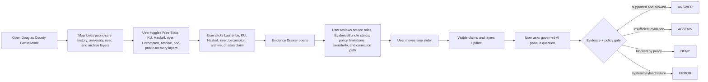
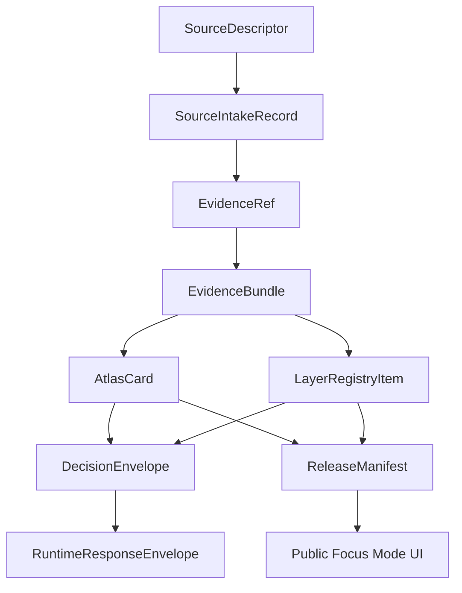

<!--
doc_id: NEEDS_VERIFICATION
title: Douglas County Focus Mode Build Plan
type: standard
version: v1
status: draft
owners: [NEEDS_VERIFICATION]
created: 2026-05-21
updated: 2026-05-21
policy_label: public_draft
related:
  - docs/focus-modes/ellsworth-county/build-plan.md
  - docs/focus-modes/riley-county/build-plan.md
  - docs/focus-modes/shawnee-county/build-plan.md
  - docs/focus-modes/ford-county/build-plan.md
  - docs/focus-modes/wyandotte-county/build-plan.md
  - docs/focus-modes/sedgwick-county/build-plan.md
  - docs/focus-modes/douglas-county/README.md
  - docs/focus-modes/douglas-county/layer-registry.md
  - docs/focus-modes/douglas-county/acceptance-checklist.md
tags: [kfm, focus-mode, douglas-county, lawrence, university-of-kansas, haskell, bleeding-kansas, kansas-river, wakarusa]
notes:
  - Draft plan prepared without mounted repository inspection.
  - Paths, owners, doc IDs, schema homes, and validator names require repository verification before merge.
  - Free-state, Bleeding Kansas, Indigenous/Haskell, university, river, public-history, urban, and archive claims require source intake and evidence review before publication.
-->

<a id="top"></a>

# Douglas County Focus Mode Build Plan

> **Purpose:** establish a seventh Kansas Frontier Matrix county proof slice after Ellsworth, Riley, Shawnee, Ford, Wyandotte, and Sedgwick counties, with a distinct northeast Kansas profile: **Lawrence, Free-State / Bleeding Kansas history, the Kansas and Wakarusa rivers, the University of Kansas, Haskell Indian Nations University, Lecompton territorial politics, archives, public memory, student-town urban growth, and culturally sensitive Indigenous education/history.**


---

## Quick links

- [1. Why Douglas County](#1-why-douglas-county)
- [2. Product thesis](#2-product-thesis)
- [3. Scope boundary](#3-scope-boundary)
- [4. First demo layers](#4-first-demo-layers)
- [5. User journeys](#5-user-journeys)
- [6. UI surfaces](#6-ui-surfaces)
- [7. Governed object model](#7-governed-object-model)
- [8. Proposed repository shape](#8-proposed-repository-shape)
- [9. Build phases](#9-build-phases)
- [10. First PR sequence](#10-first-pr-sequence)
- [11. Acceptance checklist](#11-acceptance-checklist)
- [12. Risk register](#12-risk-register)
- [13. Source seed list](#13-source-seed-list)
- [14. Open verification questions](#14-open-verification-questions)
- [15. Recommended first milestone](#15-recommended-first-milestone)

---

## Operating posture

> [!IMPORTANT]
> Douglas County Focus Mode is a **governed free-state / university / river / Indigenous-education proof slice**, not a loose Lawrence history map. It must preserve KFM’s core invariants:
>
> - EvidenceBundle outranks generated language.
> - Public clients use governed APIs, released artifacts, catalog records, tile services, and policy-safe runtime envelopes.
> - Public UI must not read directly from `RAW`, `WORK`, `QUARANTINE`, unpublished candidate data, canonical/internal stores, or direct model runtime outputs.
> - Publication is a governed state transition, not a file move.
> - AI outputs are downstream carriers, not sovereign truth.
> - Bleeding Kansas, Quantrill/Lawrence massacre, Haskell, Indigenous education, student/university records, immigration/labor, cemetery/burial, public-memory, and private-address claims must remain source-bound, culturally cautious, privacy-aware, and correction-friendly.

---

# 1. Why Douglas County

Douglas County is the right seventh Focus Mode because it gives KFM a **nationally important free-state, university, Indigenous education, archival, and river-corridor proof slice**.

Ellsworth County tests frontier county history, Fort Harker / Kanopolis, settlement, and environmental baseline.

Riley County tests Flint Hills ecology, Fort Riley, Konza Prairie, research-site sensitivity, and river landscapes.

Shawnee County tests state government, civil-rights history, Topeka urban geography, public institutions, and archive-heavy civic memory.

Ford County tests Dodge City, Santa Fe Trail, Fort Dodge, cattle-town public history, Arkansas River water, and High Plains agriculture.

Wyandotte County tests dense urban governance, river confluence, tribal/burial sensitivity, environmental justice, rail/industry, and immigration/labor history.

Sedgwick County tests Wichita metro, aviation, Chisholm Trail, severe weather, public health, and infrastructure sensitivity.

Douglas County adds:

| KFM capability | Douglas County proof value |
|---|---|
| Free-State / Bleeding Kansas history | Lawrence, Wakarusa War, Sacking of Lawrence, Lawrence massacre, territorial politics |
| University and archives | University of Kansas, Spencer Research Library, county records, Watkins Museum, Lawrence Public Library |
| Indigenous education and sensitivity | Haskell Indian Nations University and boarding-school history requiring careful framing |
| River geography | Kansas River, Wakarusa River, Clinton Lake, floodplain, settlement and urban relationship |
| Territorial government conflict | Lecompton, Lawrence, county-seat and territorial-capital context |
| Public memory and trauma | massacre, violence, memorialization, multiple perspectives, correction-friendly public history |
| Student-town urban planning | Lawrence growth, KU campus, transit, neighborhoods, housing, public-service layers |
| Immigration/labor public history | La Yarda and railroad worker housing context |
| Sensitive records handling | student records, Indigenous education records, living people, cemeteries, burial sites, private addresses |

> [!NOTE]
> Douglas County should prove KFM can handle famous, emotionally charged history without flattening it into a single narrative or exposing sensitive student, Indigenous, family, or private-location data.

---

# 2. Product thesis

## User-facing thesis

> **Douglas County Focus Mode lets a user explore how Lawrence, Free-State politics, Bleeding Kansas violence, the Kansas and Wakarusa rivers, KU, Haskell, Lecompton, archives, and public memory shaped northeast Kansas — with every claim tied to evidence and every sensitive student, Indigenous, burial, and private-location layer filtered through public-safe policy.**

## Internal KFM thesis

Douglas County should prove that Focus Mode can handle:

```text
free-state history + traumatic public memory + university/archives + Indigenous education + river corridors + student-town urban growth + privacy-sensitive records
```

without turning public-history interpretation or traumatic memory into unreviewed claims.

The system must preserve distinctions between:

- primary archive vs. later public-history interpretation
- Free-State narrative vs. multi-perspective territorial history
- massacre/violence event claim vs. memorial/public-memory object
- Haskell public history vs. private student records
- Indigenous education context vs. living community/cultural authority
- university campus context vs. student/private data
- river observation vs. floodplain/regulatory layer vs. hydrologic interpretation
- county records vs. generated summary
- property/tax record vs. title truth

---

# 3. Scope boundary

## 3.1 Geography

Initial scope:

```text
Douglas County, Kansas
```

Priority spatial anchors:

- Douglas County boundary
- Lawrence
- Kansas River corridor
- Wakarusa River corridor
- Clinton Lake / Wakarusa watershed context
- University of Kansas public campus context
- Haskell Indian Nations University public campus/history context, sensitivity-reviewed
- Lecompton / territorial politics context
- Baldwin City / Baker University context where source-supported
- Eudora context where source-supported
- Watkins Museum / downtown Lawrence public-history context
- La Yarda / railroad-worker housing public-history context where source-supported
- Wakarusa War / Sacking of Lawrence / Lawrence massacre public-history context, generalized and source-reviewed
- cemetery, burial, and memorial contexts, public-safe only

## 3.2 Time range

Initial buckets:

| Bucket | Role in demo |
|---|---|
| Before 1800 | Indigenous, river, prairie, and pre-territorial context; public-safe and culturally cautious |
| 1800–1854 | river movement, trails, treaty/removal context, territorial lead-up |
| 1854–1861 | Kansas-Nebraska Act aftermath, Lawrence founding, Free-State conflict, Wakarusa War, Sacking of Lawrence, county seat context |
| 1861–1865 | Civil War, Lawrence massacre, wartime public-memory context |
| 1866–1884 | university growth, settlement, rail/river/civic development, Haskell predecessor context |
| 1884–1945 | Haskell history, KU growth, railroad/labor neighborhoods, urban institutions |
| 1946–1990 | Clinton Lake / Wakarusa impacts, suburban/student-town growth, preservation/public memory |
| 1991–present | modern Lawrence, university/county services, riverfront, housing, public-history interpretation, resilience |

> [!CAUTION]
> Time buckets are planning scaffolds. They are not publication claims until evidence-reviewed.

## 3.3 Not in MVP

Do **not** include in the first Douglas County MVP:

- private student records
- living-person university, family, or household data
- exact locations of sensitive burial, sacred, or archaeological sites beyond already-public, sensitivity-reviewed civic context
- Indigenous/Haskell claims without culturally cautious source framing
- private addresses or household-level demographic profiling
- school/university security details
- active law-enforcement case layers
- property/title conclusions from assessor records
- unsupported atrocity claims or one-sided traumatic-history summaries
- public direct model endpoint

---

# 4. First demo layers

## 4.1 MVP layer registry

| Layer ID | Layer | Domain | Purpose | Initial posture |
|---|---|---:|---|---|
| `kfm.layer.douglas.county_boundary.v1` | Douglas County boundary | civic | establish spatial frame | public draft |
| `kfm.layer.douglas.lawrence_context.v1` | Lawrence civic / free-state context | civic/history | county seat and Free-State anchor | public draft, evidence-required |
| `kfm.layer.douglas.bleeding_kansas_context.v1` | Bleeding Kansas / Free-State public-history context | history/public memory | territorial violence and political conflict | public draft, source-framed |
| `kfm.layer.douglas.lawrence_massacre_context.v1` | Lawrence massacre public-memory context | traumatic history/public memory | Civil War violence and memorialization | public draft, careful framing |
| `kfm.layer.douglas.ku_context.v1` | University of Kansas public context | education/civic | campus, archives, university-town geography | public draft, privacy-reviewed |
| `kfm.layer.douglas.haskell_context.v1` | Haskell Indian Nations University context | Indigenous education/public history | public-safe institutional and cultural context | review-required |
| `kfm.layer.douglas.kansas_river_corridor.v1` | Kansas River corridor | hydrology/urban | river, settlement, floodplain, bridges | public draft |
| `kfm.layer.douglas.wakarusa_clinton_context.v1` | Wakarusa River / Clinton Lake context | hydrology/environment | watershed, lake, land-use impacts | public draft |
| `kfm.layer.douglas.lecompton_context.v1` | Lecompton territorial politics context | territorial history | governance conflict and territorial capital context | public draft, evidence-required |
| `kfm.layer.douglas.archives_public_history.v1` | Archives and public-history sites | archives/public history | source-routing and evidence discovery | public draft |
| `kfm.layer.douglas.timeline_events.v1` | Timeline events | cross-domain | temporal navigation | public draft |
| `kfm.layer.douglas.atlas_claims.v1` | Atlas claim points / corridors | cross-domain | clickable evidence-backed claims | requires EvidenceRef |

## 4.2 Layer contract

Each layer must have:

```yaml
layer_id: kfm.layer.douglas.<name>.v1
title: NEEDS_VERIFICATION
domain: NEEDS_VERIFICATION
layer_type: observed | derived | interpreted | modeled | administrative
geometry_type: point | line | polygon | raster | tile | mixed
source_refs: []
evidence_refs: []
policy_label: public_draft | restricted | internal | public
review_state: draft | review | published | deprecated
rights_status: unknown | public | open | controlled | restricted
sensitivity: public | generalized | restricted | review_required
temporal_scope:
  start: NEEDS_VERIFICATION
  end: NEEDS_VERIFICATION
limitations: []
correction_path: NEEDS_VERIFICATION
```

---

# 5. User journeys

## 5.1 Primary public journey



## 5.2 Example public questions

Supported after evidence review:

- “Why is Lawrence important to Free-State history?”
- “What public-safe context can KFM show for Haskell?”
- “How did the Kansas and Wakarusa rivers shape Douglas County?”
- “What evidence supports this Bleeding Kansas claim?”
- “How are Lawrence massacre claims separated from public-memory interpretation?”
- “What archives support this atlas card?”
- “Which layers are generalized and why?”

Should abstain or deny unless governed release permits them:

- “Show private student records.”
- “Show exact sensitive burial or sacred-site details.”
- “Summarize Indigenous education history without source/review posture.”
- “Show private household-level student or housing data.”
- “Treat generated text as evidence.”
- “Present one public-memory narrative as total historical truth.”
- “Publish a claim with no EvidenceBundle.”

---

# 6. UI surfaces

## 6.1 Map canvas

Required:

- MapLibre GL JS map
- placeholder basemap
- Douglas County boundary
- Lawrence / KU / Haskell / Kansas River anchors
- clickable mock features
- selected feature highlight
- layer toggles
- scale bar
- attribution
- zoom controls
- compass / orientation affordance
- public-safe layer legend

## 6.2 Layer registry panel

Show for every layer:

| Field | Meaning |
|---|---|
| Layer name | human-readable layer title |
| Domain | Free-State history, Indigenous education, university, hydrology, archives, public memory |
| Layer type | observed, derived, interpreted, modeled, administrative |
| Evidence state | resolved, unresolved, not required, pending |
| Policy label | public, public_draft, restricted, internal |
| Review state | draft, review, published, deprecated |
| Sensitivity | public, generalized, restricted, review_required |
| Time coverage | start/end or bucketed range |
| Limitations | short public-facing warning |
| Source-role warning | primary archive, official record, public-history interpretation, trauma-memory context, derived layer |

## 6.3 Timeline panel

Initial buckets:

```text
Before 1800
1800–1854
1854–1861
1861–1865
1866–1884
1884–1945
1946–1990
1991–present
```

Timeline should control:

- visible atlas claims
- Free-State and territorial politics cards
- traumatic-history and public-memory cards
- university and Haskell context cards
- Kansas/Wakarusa hydrology layers
- archive/source-routing layers
- feature styling by temporal relevance

## 6.4 Evidence Drawer

When a user clicks a layer feature or atlas claim, show:

```yaml
title: NEEDS_VERIFICATION
claim_text: NEEDS_VERIFICATION
object_type: AtlasCard | LayerFeature | TimelineEvent | EvidenceBundle
spatial_scope: NEEDS_VERIFICATION
temporal_scope: NEEDS_VERIFICATION
evidence_refs: []
evidence_bundle_status: unresolved | resolved | restricted | missing
source_roles: []
interpretation_status: fact_claim | interpretation | public_history | traumatic_memory | indigenous_education_context | archive_pointer | derived_indicator
policy_label: public_draft
rights_status: unknown
sensitivity: review_required
review_state: draft
limitations: []
correction_path: NEEDS_VERIFICATION
```

## 6.5 Atlas Card panel

Minimum atlas card types:

| Card type | Example |
|---|---|
| `free_state_place_context` | Lawrence |
| `territorial_conflict_context` | Bleeding Kansas / Wakarusa War |
| `traumatic_public_memory_context` | Lawrence massacre |
| `university_public_context` | University of Kansas |
| `indigenous_education_context` | Haskell Indian Nations University |
| `territorial_governance_context` | Lecompton |
| `river_urban_context` | Kansas River / Wakarusa River |
| `archive_source_context` | Spencer Research Library / Watkins / Digital Douglas County |
| `derived_layer_context` | floodplain, land cover, or urban-growth baseline |

## 6.6 Governed AI panel

The AI panel must only emit finite runtime outcomes:

```text
ANSWER
ABSTAIN
DENY
ERROR
```

Example response envelope:

```json
{
  "object_type": "RuntimeResponseEnvelope",
  "schema_version": "v1",
  "question": "Why is Lawrence important to Free-State history?",
  "outcome": "ABSTAIN",
  "answer": null,
  "reason": "Evidence bundle is not yet resolved for publication-grade response.",
  "evidence_refs": [
    "kfm://evidence-ref/douglas/lawrence-free-state-context/v1"
  ],
  "policy_label": "public_draft",
  "limitations": [
    "This draft object requires source intake, rights review, and source-specific public-history framing before publication."
  ]
}
```

---

# 7. Governed object model

## 7.1 Object flow



## 7.2 SourceDescriptor draft

```yaml
id: kfm.source.douglas.lawrence_free_state.placeholder
title: Lawrence Free-State / Bleeding Kansas source placeholder
domain: territorial_history
source_type: archive_or_public_history_reference
role: context_NEEDS_VERIFICATION
rights_status: unknown
spatial_coverage: Lawrence, Douglas County, Kansas
temporal_coverage: NEEDS_VERIFICATION
status: proposed
limitations:
  - Requires source intake and review before claims are published.
  - Must separate primary archive, public-history interpretation, traumatic memory, and generated explanation.
```

## 7.3 EvidenceRef draft

```yaml
id: kfm.evidence_ref.douglas.lawrence_free_state_context.v1
bundle_id: kfm.evidence_bundle.douglas.lawrence_free_state_context.v1
claim_scope: Public-safe Lawrence Free-State and Bleeding Kansas context within Douglas County Focus Mode
resolution_required: true
```

## 7.4 EvidenceBundle draft

```yaml
id: kfm.evidence_bundle.douglas.lawrence_free_state_context.v1
resolved: false
source_refs:
  - kfm.source.douglas.lawrence_free_state.placeholder
policy_label: public_draft
rights_status: unknown
sensitivity: review_required
review_state: draft
limitations:
  - Draft bundle. Do not publish final territorial-history or traumatic-history claims until source-reviewed.
  - Do not treat generated summary as evidence.
  - Preserve multiple perspectives and correction path for public-history claims.
```

## 7.5 AtlasCard draft

```yaml
id: kfm.atlas_card.douglas.lawrence_free_state.v1
title: Lawrence Free-State / Bleeding Kansas Context
card_type: free_state_place_context
spatial_scope: Lawrence, Douglas County, Kansas NEEDS_VERIFICATION
temporal_scope: NEEDS_VERIFICATION
evidence_refs:
  - kfm.evidence_ref.douglas.lawrence_free_state_context.v1
policy_label: public_draft
review_state: draft
limitations:
  - Draft card. Not a final historical, legal, cultural, or educational authority statement.
```

## 7.6 DecisionEnvelope draft

```yaml
id: kfm.decision.douglas.question.lawrence_free_state_context.v1
question: Why is Lawrence important to Free-State history?
outcome: ABSTAIN
reason: Evidence bundle unresolved.
evidence_refs:
  - kfm.evidence_ref.douglas.lawrence_free_state_context.v1
policy_label: public_draft
```

## 7.7 ReleaseManifest draft

```yaml
id: kfm.release.douglas.focus_mode.v0_1
release_state: draft
included_layers:
  - kfm.layer.douglas.county_boundary.v1
  - kfm.layer.douglas.lawrence_context.v1
  - kfm.layer.douglas.bleeding_kansas_context.v1
  - kfm.layer.douglas.ku_context.v1
  - kfm.layer.douglas.haskell_context.v1
  - kfm.layer.douglas.kansas_river_corridor.v1
validation_state: pending
rollback_plan: required_before_publication
correction_path: required_before_publication
```

---

# 8. Proposed repository shape

> [!WARNING]
> Repository access is **not confirmed** in this planning session. Treat all paths as proposed until checked against the live branch and KFM Directory Rules.

```text
docs/
  focus-modes/
    douglas-county/
      README.md
      build-plan.md
      layer-registry.md
      evidence-model.md
      acceptance-checklist.md
      source-seed-list.md
      public-safety-notes.md
      free-state-and-traumatic-history-notes.md
      haskell-and-indigenous-education-notes.md
      university-and-student-privacy-notes.md
      water-and-river-notes.md

data/
  catalog/
    sources/
      douglas/
        source_descriptors.yaml
    stac/
      douglas/
        README.md

contracts/
  focus_mode/
    focus_mode_payload.schema.json
  atlas/
    atlas_card.schema.json
  evidence/
    evidence_ref.schema.json
    evidence_bundle.schema.json
  release/
    release_manifest.schema.json

fixtures/
  focus_modes/
    douglas/
      valid/
        focus_mode_payload.valid.json
        layer_registry.valid.json
        atlas_card.lawrence.valid.json
        atlas_card.haskell.valid.json
        atlas_card.kansas_river.valid.json
        evidence_bundle.lawrence.valid.json
        evidence_bundle.haskell.valid.json
      invalid/
        unresolved_evidence_ref.invalid.json
        private_student_record.invalid.json
        exact_sensitive_burial_site.invalid.json
        indigenous_claim_without_review.invalid.json
        traumatic_history_without_source_role.invalid.json
        one_sided_public_memory_as_truth.invalid.json
        parcel_as_title_truth.invalid.json
        missing_policy_label.invalid.json
        model_output_as_evidence.invalid.json
        public_raw_access.invalid.json

apps/
  web/
    src/
      focus-modes/
        douglas/
          index.js
          layers.js
          mock-api.js
          mock-data.js
          evidence-drawer.js
          timeline.js
          ai-panel.js
          styles.css

tools/
  validators/
    validate_focus_mode_payload.py
    validate_atlas_card.py
    validate_evidence_bundle.py
    validate_layer_registry.py
```

---

# 9. Build phases

## Phase 1 — Control plane

Goal: establish Douglas County Focus Mode as a governed free-state/history/university/Indigenous-education/river template.

Deliverables:

- `docs/focus-modes/douglas-county/README.md`
- `build-plan.md`
- `layer-registry.md`
- `source-seed-list.md`
- `public-safety-notes.md`
- `free-state-and-traumatic-history-notes.md`
- `haskell-and-indigenous-education-notes.md`
- `university-and-student-privacy-notes.md`
- `water-and-river-notes.md`
- first schema references
- valid and invalid fixture plan

Definition of done:

```text
[ ] scope is explicit
[ ] Free-State/Bleeding Kansas/traumatic-history claims require source-role framing
[ ] Haskell and Indigenous education layers require review posture
[ ] university/student layers are privacy-preserving
[ ] river/floodplain layers distinguish observed/model/regulatory/derived roles
[ ] all layers have policy labels
[ ] all claim-bearing objects require EvidenceRef
[ ] placeholders are clearly marked
```

## Phase 2 — Mock governed API

Goal: make Douglas Focus Mode run without live pipelines.

Mock endpoints:

```text
GET /api/focus-modes/douglas
GET /api/layers/douglas
GET /api/evidence/{bundle_id}
GET /api/atlas-cards/{card_id}
POST /api/ai/answer
GET /api/releases/douglas-focus-mode
```

Definition of done:

```text
[ ] mock payloads validate
[ ] unresolved evidence produces ABSTAIN
[ ] private student record requests produce DENY
[ ] exact sensitive burial/sacred-site requests produce DENY
[ ] one-sided public-memory-as-truth payloads fail validation
[ ] invalid payloads fail closed
[ ] public layer payloads do not reference RAW / WORK / QUARANTINE
```

## Phase 3 — UI prototype

Goal: show the full Douglas Focus Mode surface in a browser.

Deliverables:

- MapLibre map
- layer registry
- clickable mock Lawrence, KU, Haskell, Kansas River, Wakarusa, Lecompton, and public-history/archive features
- evidence drawer
- timeline
- atlas card panel
- governed AI answer panel

Definition of done:

```text
[ ] user can click Lawrence context and see evidence/source-role status
[ ] user can click Haskell context and see sensitivity/review posture
[ ] user can click KU context and see student privacy limitations
[ ] user can click traumatic-history context and see source/public-memory framing
[ ] user can toggle free-state / university / Haskell / river / archive layers
[ ] timeline changes visible claim set
[ ] AI panel returns all four finite outcomes through examples
```

## Phase 4 — Validators and negative fixtures

Goal: prove failure modes before publication.

Required invalid fixtures:

| Fixture | Expected failure |
|---|---|
| `unresolved_evidence_ref.invalid.json` | publication attempted with unresolved evidence |
| `private_student_record.invalid.json` | private student data exposed |
| `exact_sensitive_burial_site.invalid.json` | exact sensitive burial/sacred-site detail in public payload |
| `indigenous_claim_without_review.invalid.json` | Indigenous/Haskell claim lacks source/review posture |
| `traumatic_history_without_source_role.invalid.json` | traumatic-history claim lacks source-role framing |
| `one_sided_public_memory_as_truth.invalid.json` | public-memory interpretation treated as total truth |
| `parcel_as_title_truth.invalid.json` | property/assessor record treated as title truth |
| `missing_policy_label.invalid.json` | public object lacks policy posture |
| `model_output_as_evidence.invalid.json` | AI output treated as proof |
| `public_raw_access.invalid.json` | public client references RAW/WORK/QUARANTINE |

## Phase 5 — Source intake upgrade

Goal: replace placeholders with inspected sources.

Deliverables:

- source descriptors
- intake records
- rights review notes
- sensitivity review notes
- evidence bundle drafts
- reviewed atlas cards
- limitations notes

Minimum real-evidence targets:

```text
[ ] one Lawrence / Free-State public-history claim
[ ] one Bleeding Kansas or Wakarusa War source-framed claim
[ ] one Lawrence massacre traumatic-history/public-memory claim
[ ] one University of Kansas public-history/campus-context claim
[ ] one Haskell Indian Nations University public-safe context claim
[ ] one Kansas River or Wakarusa River hydrology-context claim
[ ] one archive/source-routing claim
```

## Phase 6 — Release candidate

Goal: prepare `v0.1` public-safe release.

Deliverables:

- `ReleaseManifest`
- validation report
- correction path
- rollback plan
- public-safe layer manifest
- known limitations
- release notes

Definition of done:

```text
[ ] public layers have policy labels and review states
[ ] rights status is resolved or blocked
[ ] private student/household details are excluded
[ ] exact sensitive burial/sacred-site details are excluded or generalized
[ ] Indigenous/Haskell claims preserve source and review posture
[ ] traumatic-history claims preserve source-role, public-memory framing, and correction path
[ ] river/floodplain claims preserve source role and uncertainty
[ ] release can be rolled back
[ ] public UI only consumes governed surfaces
```

---

# 10. First PR sequence

## PR-0001 — Douglas County Focus Mode Control Plane

Files:

```text
docs/focus-modes/douglas-county/README.md
docs/focus-modes/douglas-county/build-plan.md
docs/focus-modes/douglas-county/layer-registry.md
docs/focus-modes/douglas-county/source-seed-list.md
docs/focus-modes/douglas-county/public-safety-notes.md
docs/focus-modes/douglas-county/free-state-and-traumatic-history-notes.md
docs/focus-modes/douglas-county/haskell-and-indigenous-education-notes.md
docs/focus-modes/douglas-county/university-and-student-privacy-notes.md
docs/focus-modes/douglas-county/water-and-river-notes.md
docs/focus-modes/douglas-county/acceptance-checklist.md
```

Acceptance:

```text
[ ] Focus Mode scope is clear.
[ ] Douglas County is justified as a complementary proof slice.
[ ] Every planned layer has a policy posture.
[ ] Free-State and traumatic-history framing rules are explicit.
[ ] Haskell/Indigenous education sensitivity rules are explicit.
[ ] University/student privacy boundaries are explicit.
[ ] River/floodplain source-role boundaries are explicit.
[ ] No publication claims are made from placeholders.
```

## PR-0002 — Douglas Contracts and Fixtures

Files:

```text
fixtures/focus_modes/douglas/valid/focus_mode_payload.valid.json
fixtures/focus_modes/douglas/valid/layer_registry.valid.json
fixtures/focus_modes/douglas/valid/atlas_card.lawrence.valid.json
fixtures/focus_modes/douglas/valid/atlas_card.haskell.valid.json
fixtures/focus_modes/douglas/invalid/private_student_record.invalid.json
fixtures/focus_modes/douglas/invalid/indigenous_claim_without_review.invalid.json
fixtures/focus_modes/douglas/invalid/traumatic_history_without_source_role.invalid.json
fixtures/focus_modes/douglas/invalid/missing_policy_label.invalid.json
```

Acceptance:

```text
[ ] Valid fixtures include required governed fields.
[ ] Invalid fixtures represent real failure modes.
[ ] EvidenceRef / EvidenceBundle relationship is explicit.
[ ] Mock cards remain draft until evidence intake.
```

## PR-0003 — Douglas Mock API

Files:

```text
apps/web/src/focus-modes/douglas/mock-api.js
apps/web/src/focus-modes/douglas/layers.js
apps/web/src/focus-modes/douglas/mock-data.js
```

Acceptance:

```text
[ ] Mock API returns finite runtime outcomes.
[ ] Layer registry is API-shaped, not UI-only.
[ ] Public-safe data is separated from restricted mock examples.
[ ] Sensitivity/source-role status is included for traumatic history, Haskell, student privacy, and river objects.
```

## PR-0004 — Douglas UI Shell

Files:

```text
apps/web/src/focus-modes/douglas/index.js
apps/web/src/focus-modes/douglas/evidence-drawer.js
apps/web/src/focus-modes/douglas/timeline.js
apps/web/src/focus-modes/douglas/ai-panel.js
apps/web/src/focus-modes/douglas/styles.css
```

Acceptance:

```text
[ ] Map renders.
[ ] Layer panel renders.
[ ] Evidence Drawer renders.
[ ] Atlas Card panel renders.
[ ] Timeline filters mock claims.
[ ] AI panel demonstrates ANSWER / ABSTAIN / DENY / ERROR.
```

## PR-0005 — Validator Hardening

Files:

```text
tools/validators/validate_focus_mode_payload.py
tools/validators/validate_atlas_card.py
tools/validators/validate_evidence_bundle.py
tools/validators/validate_layer_registry.py
```

Acceptance:

```text
[ ] Public RAW / WORK / QUARANTINE references fail.
[ ] Missing EvidenceRef fails for claim-bearing objects.
[ ] Missing policy label fails.
[ ] Private student details fail public release.
[ ] Indigenous/Haskell claims without review posture fail.
[ ] Traumatic history without source-role framing fails.
[ ] Model output as proof fails.
```

---

# 11. Acceptance checklist

```text
[ ] Douglas County map loads.
[ ] User can toggle at least 5 public-safe layers.
[ ] User can click Lawrence context and open Evidence Drawer.
[ ] User can click KU context and open Evidence Drawer.
[ ] User can click Haskell context and open Evidence Drawer.
[ ] User can click Kansas River context and open Evidence Drawer.
[ ] User can inspect at least 3 Atlas Cards.
[ ] Timeline control changes visible claims/layers.
[ ] Governed AI panel returns ANSWER for supported claims.
[ ] Governed AI panel returns ABSTAIN for unresolved evidence.
[ ] Governed AI panel returns DENY for restricted/sensitive requests.
[ ] Governed AI panel returns ERROR for invalid payload/system failure.
[ ] Every visible claim has EvidenceRef.
[ ] Every EvidenceRef points to an EvidenceBundle.
[ ] Every layer has policy_label.
[ ] Every layer has review_state.
[ ] Every public object has correction path.
[ ] No public UI path reads RAW, WORK, or QUARANTINE.
[ ] Private student details are excluded.
[ ] Exact sensitive burial/sacred-site details are excluded or generalized.
[ ] Traumatic-history claims show source-role and limitations.
[ ] ReleaseManifest exists before anything is called published.
```

---

# 12. Risk register

| Risk | Why it matters | Control |
|---|---|---|
| Bleeding Kansas story becomes one-sided narrative | historical trust failure | source-role framing and multiple-perspective notes |
| Lawrence massacre context becomes sensationalized | traumatic-history harm | public-memory framing, limitations, correction path |
| Haskell history is flattened or mishandled | Indigenous education/cultural harm | source/review posture and sensitivity notes |
| Private student records leak | privacy and legal risk | deny by default; no individual student data |
| Exact sensitive burial/sacred-site details leak | cultural and safety risk | deny/generalize by default |
| Archive citation is replaced by generated summary | evidence failure | EvidenceBundle required |
| River/floodplain layer treated as legal advice | regulatory misuse risk | distinguish observed/model/regulatory/derived |
| Parcel or assessor data treated as title truth | legal/title error risk | explicit assessor/tax ≠ title truth rule |
| Mock placeholders become doctrine | demo pollution | all placeholders marked draft/unresolved |
| Lawrence dominates county view | county-scale imbalance | include Lecompton, Eudora, Baldwin City, river, rural matrix where evidence-supported |

---

# 13. Source seed list

> [!NOTE]
> These are **candidate source seeds**, not yet KFM-ingested sources. Each requires `SourceDescriptor`, rights review, sensitivity review, checksum/citation handling, and EvidenceBundle resolution before publication-grade use.

| Seed | Use | Starting URL |
|---|---|---|
| Douglas County official site | current county civic context | https://www.dgcoks.gov/ |
| Douglas County Courthouse History | county organization and courthouse context | https://www.dgcoks.gov/administration/county-courthouse-history |
| City of Lawrence official site | city civic, planning, public records source routing | https://lawrenceks.gov/ |
| Freedom's Frontier National Heritage Area | Bleeding Kansas / freedom struggle public-history framework | https://freedomsfrontier.org/about-us/ |
| National Park Service — Freedom's Frontier NHA | federal heritage-area context | https://www.nps.gov/places/freedom-s-frontier-national-heritage-area.htm |
| Haskell Indian Nations University history | Haskell public institutional history | https://haskell.edu/about/history/ |
| University of Kansas official site | university public context and source routing | https://www.ku.edu/ |
| KU Kenneth Spencer Research Library — Douglas County records | nineteenth and early twentieth century county records | https://spencer.lib.ku.edu/collections/kansas-collection/douglas-county-records |
| Digital Douglas County History | Watkins Museum / Lawrence Public Library local-history portal | https://lplks.omeka.net/ |
| Watkins Museum of History | Douglas County public-history source routing | https://www.watkinsmuseum.org/ |
| Kansas Historical Society markers | public marker source routing | https://www.kansashistory.gov/p/kansas-historical-markers/14999 |
| Kansas Geological Survey county geology index | geology/hydrology source routing | https://www.kgs.ku.edu/General/Geology/County/ |
| USGS National Hydrography | river and stream source routing | https://www.usgs.gov/national-hydrography |
| FEMA Flood Map Service Center | regulatory floodplain source routing | https://msc.fema.gov/portal/home |
| Library of Congress maps | historic city, river, and county map source routing | https://www.loc.gov/maps/ |

---

# 14. Open verification questions

```text
[ ] What is the canonical repo path for Focus Mode documents?
[ ] Does KFM already have a focus_mode_payload schema?
[ ] Does KFM already define AtlasCard fields differently?
[ ] Does KFM already define traumatic-history/public-memory fields?
[ ] Does KFM already define Indigenous education sensitivity fields?
[ ] Does KFM already define university/student privacy fields?
[ ] Which validators already exist?
[ ] Should Douglas County share contracts with other Focus Modes or define county-specific extensions?
[ ] What public-safe geometry source should be used for county boundary?
[ ] What source authority should define Lawrence / Free-State claims?
[ ] What source authority should define Lawrence massacre claims?
[ ] What source authority should define Haskell claims?
[ ] What source authority should define University of Kansas public campus/context claims?
[ ] What source authority should define Kansas River / Wakarusa claims?
[ ] What exact policy rule controls private student records?
[ ] What exact policy rule controls traumatic-history framing?
[ ] What exact policy rule controls Indigenous/Haskell sensitivity review?
[ ] What release manifest naming convention should be used?
[ ] What rollback/correction path should a county Focus Mode use?
```

---

# 15. Recommended first milestone

## Milestone 1: Douglas County Focus Mode Control Plane

Build the documentation, layer registry, source seed list, public-safety notes, free-state/traumatic-history notes, Haskell/Indigenous education notes, university/student privacy notes, river notes, and fixtures before the UI.

This keeps the Douglas proof slice from becoming a flashy Lawrence history map with weak evidence boundaries.

The first concrete deliverable should be:

```text
docs/focus-modes/douglas-county/build-plan.md
```

Once this is stable, use it to generate the mock API and single-file UI prototype.

---

[Back to top](#top)
