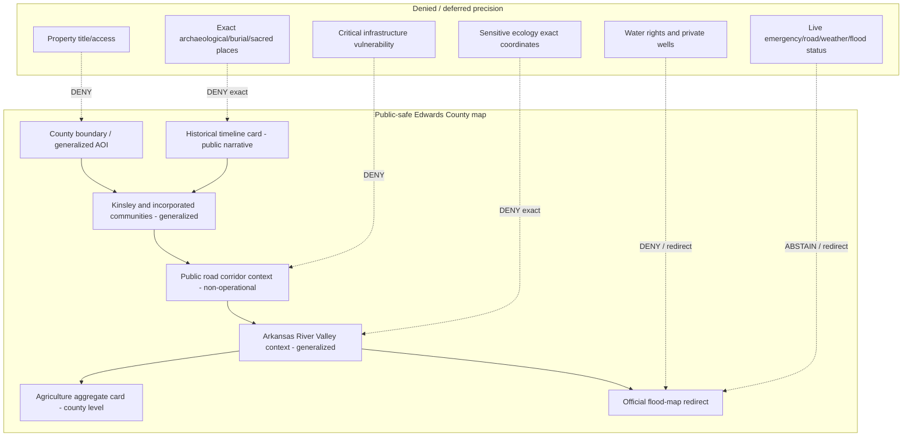
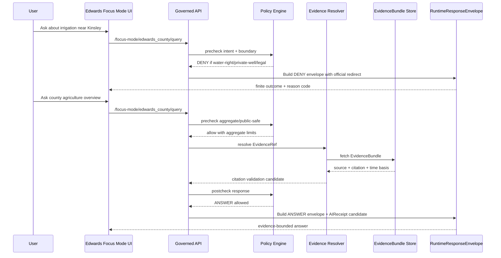
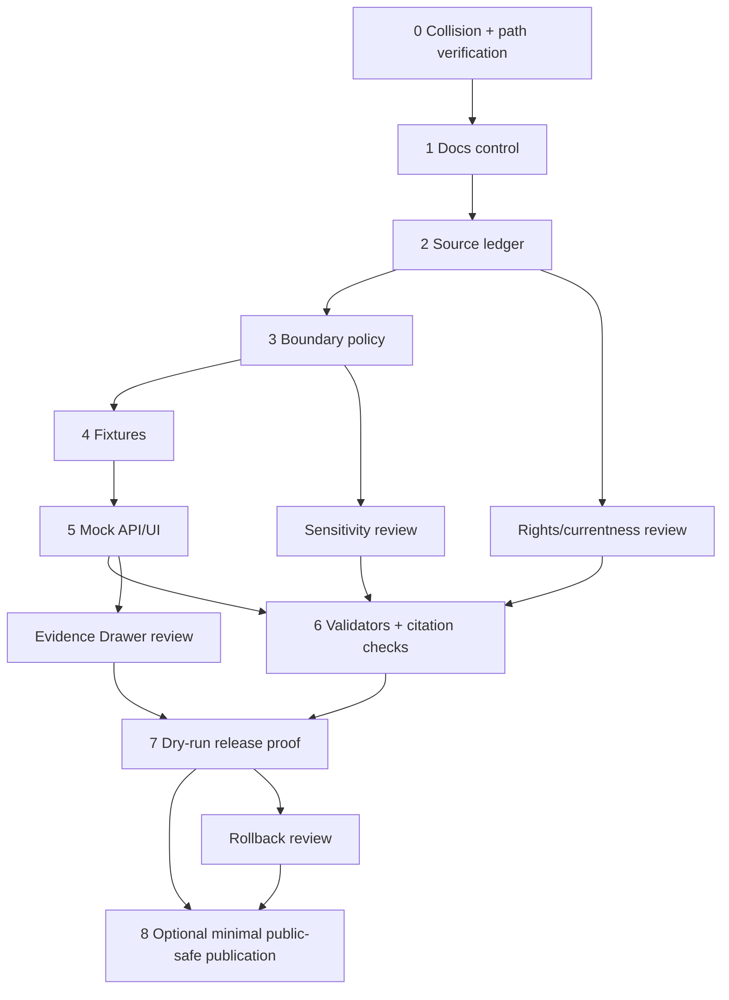

<!--
KFM_META_BLOCK_V2
document_type: county_focus_mode_build_plan
truth_posture: CONFIRMED public-source seed checks / PROPOSED implementation plan / NEEDS_VERIFICATION repository placement and exhaustive collision absence / UNKNOWN uninspected branches, prior chats, private artifacts, runtime, validation, review, promotion, deployment
county_name: Edwards County
county_slug: edwards_county
county_lane_slug_observed_index: edwards-county
created_date: 2026-06-11
updated_date: 2026-06-11
doc_id: NEEDS_VERIFICATION
owners:
  docs_steward: NEEDS_VERIFICATION
  county_lane_owner: NEEDS_VERIFICATION
  source_steward: NEEDS_VERIFICATION
  policy_steward: NEEDS_VERIFICATION
  release_steward: NEEDS_VERIFICATION
review_assignments:
  documentation_review: NEEDS_VERIFICATION
  evidence_review: NEEDS_VERIFICATION
  source_rights_review: NEEDS_VERIFICATION
  water_governance_review: NEEDS_VERIFICATION
  cultural_history_review: NEEDS_VERIFICATION
  sensitivity_review: NEEDS_VERIFICATION
  security_review: NEEDS_VERIFICATION
  release_review: NEEDS_VERIFICATION
release_status: PROPOSED_PLANNING_ARTIFACT_ONLY
repository_modified: false
implementation_claimed: false
source_admission_claimed: false
review_claimed: false
validation_claimed: false
promotion_claimed: false
publication_claimed: false
defining_public_safe_boundary: >
  Edwards County Focus Mode may explain public, evidence-bounded Arkansas River valley,
  groundwater/irrigation, working-landscape, transportation, and settlement context, but it
  must not become a water-right, private-well, potability, property-access, title/access,
  live flood/emergency/safety, or precise vulnerable-location service. Archaeological,
  sacred, burial, sensitive ecology, infrastructure-vulnerability, and private-property precision
  is withheld, generalized, denied, or redirected to official authority.
collision_search_results:
  supplied_completed_register: CONFIRMED Edwards County was absent from the user-supplied completed/collision register.
  recent_plan_register: CONFIRMED Edwards County was absent from the user-supplied most-recent plan list.
  personal_context_scan: NEEDS_VERIFICATION no Edwards County prior-plan memory surfaced; prior chats/private artifacts remain incomplete.
  attached_project_materials_search: NEEDS_VERIFICATION no Edwards County Focus Mode artifact surfaced in accessible attached-material search; exhaustive absence across all hidden/private artifacts is not proven.
  live_county_index: CONFIRMED docs/focus-mode/counties/COUNTY_INDEX.md lists Edwards County as `not-started`, but the prompt rule says not-started is not sufficient proof of absence.
  live_filename_content_search: CONFIRMED repository connector searches found material collisions for Russell, Sumner, Seward, and Osborne; no Edwards collision was returned by accessible search.
  exhaustive_absence: NEEDS_VERIFICATION branches, private artifacts, stale generated downloads, and earlier chats cannot be exhaustively inspected here.
directory_rules_basis:
  doctrine_checked: CONFIRMED attached Directory Rules inspected.
  placement_law: CONFIRMED file location encodes responsibility, lifecycle, and governance; topic does not justify a root folder.
  lifecycle_law: CONFIRMED RAW -> WORK / QUARANTINE -> PROCESSED -> CATALOG / TRIPLET -> PUBLISHED; promotion is governed transition, not file move.
  path_posture: PROPOSED / NEEDS_VERIFICATION unless confirmed against live repository convention and accepted ADRs.
unverified_repository_paths:
  human_doc_legacy_candidate: docs/focus-mode/counties/edwards_county/edwards_county_focus_mode_build_plan.md
  live_index_kebab_lane_candidate: docs/focus-mode/counties/edwards-county/build-plan.md
  doctrine_alternative_candidate: docs/focus-modes/edwards-county/build-plan.md
  path_resolution_status: NEEDS_VERIFICATION due observed convention divergence.
schema_contract_policy_fixture_homes:
  schemas: NEEDS_VERIFICATION / PROPOSED schemas/contracts/v1/domains/focus_mode/edwards_county/
  contracts: NEEDS_VERIFICATION / PROPOSED contracts/domains/focus_mode/edwards_county/
  policy: NEEDS_VERIFICATION / PROPOSED policy/domains/focus_mode/edwards_county/
  fixtures: NEEDS_VERIFICATION / PROPOSED fixtures/domains/focus_mode/edwards_county/
  correction: NEEDS_VERIFICATION / PROPOSED release/corrections/focus_mode/edwards_county/
  rollback: NEEDS_VERIFICATION / PROPOSED release/rollback/focus_mode/edwards_county/
  release: NEEDS_VERIFICATION / PROPOSED release/candidates/focus_mode/edwards_county/
official_sources_checked_during_run:
  - Edwards County official website
  - City of Kinsley official website
  - U.S. Census Bureau QuickFacts for Edwards County, Kansas
  - USDA NASS 2022 Census of Agriculture County Profile for Edwards County
  - Kansas Historical Society Edwards County page
  - Kansas Department of Agriculture Division of Water Resources floodplain mapping page
  - FEMA Flood Map Service Center
source_limitations:
  - This plan is not itself an EvidenceBundle.
  - Source URLs and rights must be rechecked before source admission or public display.
  - Public website visibility does not prove derivative-display permission.
  - Scientific, statistical, administrative, and historical sources are not interchangeable authority types.
-->

# Edwards County Focus Mode Build Plan

**Subtitle:** Arkansas River Valley, groundwater/irrigation, working-landscape, Midway USA, and Santa Fe Trail context — with water-right, private-well, potability, property-access, title/access, live safety, and precise vulnerable-location claims denied or redirected.

**Product thesis:** Build a public-safe Edwards County Focus Mode that teaches the relationship between Kinsley, the Arkansas River Valley, agriculture, transportation corridors, and county history while keeping water governance, private property, safety, infrastructure, archaeology, burial/sacred, and sensitive ecology behind evidence, policy, review, and official-authority boundaries.


## Status / identity table

| Field | Value | Truth label |
|---|---|---|
| County | Edwards County, Kansas | CONFIRMED from public official/statistical sources |
| County slug | `edwards_county` | PROPOSED for artifact naming |
| Live index lane slug | `edwards-county` | CONFIRMED from live county index; path use still NEEDS_VERIFICATION |
| Deliverable filename | `edwards_county_focus_mode_build_plan.md` | CONFIRMED created as this planning artifact |
| First-product posture | Public-safe planning artifact only | CONFIRMED |
| Release posture | No implementation, review, validation, promotion, deployment, or publication claimed | CONFIRMED |
| Defining boundary | Water/property/safety/vulnerable-location claims fail closed | CONFIRMED as plan rule / PROPOSED for implementation |
| Collision absence | Accessible checks did not find an Edwards collision; exhaustive absence remains NEEDS_VERIFICATION | NEEDS_VERIFICATION |
| Proposed human documentation home | `docs/focus-mode/counties/edwards_county/edwards_county_focus_mode_build_plan.md` or live-index-derived `docs/focus-mode/counties/edwards-county/build-plan.md` | PROPOSED / NEEDS_VERIFICATION |
| Directory Rules basis | Human docs under `docs/`; domains and counties are lanes, not roots; data and releases stay in lifecycle/release roots | CONFIRMED doctrine / NEEDS_VERIFICATION paths |

## Quick links

- [1. Operating posture](#1-operating-posture)
- [2. Why this county](#2-why-this-county)
- [3. Product thesis](#3-product-thesis)
- [4. Scope boundary](#4-scope-boundary)
- [5. First demo layers](#5-first-demo-layers)
- [6. User journeys](#6-user-journeys)
- [7. UI surfaces](#7-ui-surfaces)
- [8. Governed object model](#8-governed-object-model)
- [9. Proposed repository shape](#9-proposed-repository-shape)
- [10. Build phases](#10-build-phases)
- [11. First PR sequence](#11-first-pr-sequence)
- [12. Acceptance checklist](#12-acceptance-checklist)
- [13. Fixture plan](#13-fixture-plan)
- [14. Risk register](#14-risk-register)
- [15. Source seed list](#15-source-seed-list)
- [16. Open verification questions](#16-open-verification-questions)
- [17. Recommended first milestone](#17-recommended-first-milestone)
- [Appendix A](#appendix-a--public-safe-narrative-skeleton)
- [Appendix B](#appendix-b--required-negative-path-reason-code-categories)
- [Appendix C](#appendix-c--references-and-evidence-use-note)

## Executive build note

Edwards County is a strong next proof slice because it is small enough for a complete county Focus Mode but dense enough to test KFM’s trust membrane: county government identity, Kinsley municipal context, agriculture, the Arkansas River Valley, irrigation and groundwater signals, floodplain-source redirection, Santa Fe Trail / railroad settlement history, KDOT-style transportation context, and statistical population/economy data all converge in one county. The key public-safe boundary is not generic: **the product may explain public, evidence-bounded context, but it must not answer water-right, private-well, potability, property-access, title/access, live flood/emergency/safety, infrastructure-vulnerability, exact archaeological, burial/sacred, or precise sensitive-ecology questions.**

> [!IMPORTANT]
> **GitHub callout — planning only.** This Markdown is a county Focus Mode planning artifact. It does not claim any repository file was added, any source was admitted, any validator passed, any review happened, any release was promoted, or any public client can read an Edwards County payload.

> [!CAUTION]
> **Boundary callout — Edwards County.** The first public demo must say “I can show public evidence-bounded county context, but I cannot determine water rights, private well safety, potability, property access, title, live emergency conditions, infrastructure vulnerability, or exact archaeological/burial/sacred/sensitive-ecology locations.”

## Evidence-boundary table

| Label | What is in-bounds here | Edwards County examples |
|---|---|---|
| CONFIRMED | Checked during this run from official/public sources or accessible repo/search evidence | County official site, City of Kinsley site, Census QuickFacts, USDA NASS county profile, Kansas Historical Society county page, KDA/FEMA flood mapping pages, live county index, visible connector collision search results |
| PROPOSED | Implementation, object, path, schema, fixture, UI, workflow, review, release, or policy design not proven as implemented | Focus Mode layers, JSON envelopes, fixture sets, validators, source descriptors, repo paths, PR sequence, milestone |
| NEEDS_VERIFICATION | Checkable before use, but not proven strongly enough here | Exhaustive collision absence, county-specific GIS geometry authority, source rights, derivative-display permission, KDOT PDF fetch, water-right source role, private-well exclusion checks, exact repo path convention |
| UNKNOWN | Not available or not resolvable here | Hidden branches, prior private downloads, unmounted repository state beyond accessible search, runtime behavior, CI status, branch protection, existing review records, existing release manifests |

---

## 1. Operating posture

### 1.1 KFM governing rules applied to Edwards County

Edwards County Focus Mode must preserve the full KFM trust membrane:

1. `EvidenceBundle` outranks generated language.
2. Public clients use governed APIs, released artifacts, catalog/triplet/graph records, tile services, and policy-safe runtime envelopes.
3. Public UI must not read `RAW`, `WORK`, `QUARANTINE`, unpublished candidates, canonical/internal stores, restricted sources, direct source-system side effects, or direct model-runtime outputs.
4. Publication is a governed state transition, not a file move.
5. AI output is downstream, not sovereign truth.
6. Cite-or-abstain is the default posture.
7. Promotion, review, correction, and rollback are auditable and reversible.
8. Administrative records, statistical aggregates, scientific interpretation, water regulation, historic interpretation, public-use information, legal notices, and generated narrative remain separate.
9. Restricted, official-use-only, non-public, rights-unclear, tactically sensitive, privacy-invasive, or unsafe source material is excluded or quarantined.
10. Sensitive ecology, archaeology, burial places, sacred places, Tribal or Nation-related cultural information, living-person data, private property, water rights, private wells, health data, critical infrastructure, public-safety operations, and precise vulnerable locations fail closed.

### 1.2 Truth-label and finite-outcome key

| Term | Meaning in this plan |
|---|---|
| CONFIRMED | Verified during this run from checked sources, accessible repo/search evidence, or generated artifact creation |
| PROPOSED | Design or recommendation not verified as implemented |
| NEEDS_VERIFICATION | Checkable, but not sufficiently proven to act as fact |
| UNKNOWN | Unsupported or not resolvable here |
| ANSWER | Evidence and policy allow a bounded public response |
| ABSTAIN | Evidence is missing, stale, mismatched, unverified, or not fit for the question |
| DENY | The request is outside public-safe policy, even if evidence exists somewhere |
| ERROR | Tool, source, schema, validation, or runtime failure prevents a reliable outcome |

### 1.3 Public trust-membrane flowchart

```mermaid
flowchart LR
  A[Official/candidate public sources] --> B[SourceDescriptor review]
  B -->|rights/currentness/source-role OK| C[RAW intake]
  B -->|rights/sensitivity/currentness unclear| Q[QUARANTINE]
  C --> D[WORK normalization]
  D --> E[PROCESSED public-safe derivatives]
  E --> F[EvidenceRef -> EvidenceBundle]
  F --> G[PolicyDecision]
  G -->|allow with limits| H[Catalog / Triplet / Layer descriptor]
  G -->|abstain| AB[RuntimeResponseEnvelope: ABSTAIN]
  G -->|deny| DN[RuntimeResponseEnvelope: DENY]
  H --> I[Release candidate]
  I --> J[Validation + CitationValidationReport]
  J --> K[ReleaseManifest + rollback target]
  K --> L[PUBLISHED public-safe artifact]
  L --> M[Governed API]
  M --> N[MapLibre / Evidence Drawer / Focus Mode]
  N --> O[AIReceipt, ReviewRecord, CorrectionNotice hooks]

  Q -.->|never public directly| DN
```



### 1.4 Edwards County non-negotiable guardrails

| Guardrail | Runtime posture | Reason code candidates |
|---|---|---|
| Do not answer water-right ownership, priority, impairment, transfer, or legal-use questions | DENY or redirect to KDA DWR official tools | `WATER_RIGHT_LEGAL_ADVICE_DENIED`, `OFFICIAL_AUTHORITY_REDIRECT` |
| Do not assess private well potability, well condition, or property-level groundwater safety | DENY | `PRIVATE_WELL_POTABILITY_DENIED`, `PROPERTY_LEVEL_HEALTH_DENIED` |
| Do not give live flood, storm, road, emergency, or facility safety advice | ABSTAIN / redirect to official current sources | `LIVE_SAFETY_NOT_A_SERVICE`, `CURRENTNESS_REQUIRED` |
| Do not expose exact archaeology, burial, sacred, or sensitive cultural locations | DENY | `EXACT_CULTURAL_LOCATION_DENIED` |
| Do not expose exact sensitive wildlife/ecology locations or habitat-use precision | DENY or generalize | `SENSITIVE_ECOLOGY_EXACT_LOCATION_DENIED` |
| Do not convert appraiser, register, or road maps into title/access/property-right conclusions | DENY | `PROPERTY_TITLE_ACCESS_DENIED` |
| Do not turn KDOT/road/airport/utility references into vulnerability analysis | DENY | `INFRASTRUCTURE_VULNERABILITY_DENIED` |
| Do not treat annual agriculture/statistical reports as current individualized farm conclusions | ABSTAIN | `AGGREGATE_NOT_INDIVIDUAL`, `TEMPORAL_SCOPE_MISMATCH` |

### 1.5 Candidate reason codes

`ANSWER_PUBLIC_CONTEXT`, `ABSTAIN_MISSING_EVIDENCE`, `ABSTAIN_STALE_SOURCE`, `ABSTAIN_SOURCE_ROLE_MISMATCH`, `DENY_WATER_RIGHT_LEGAL_ADVICE`, `DENY_PRIVATE_WELL_POTABILITY`, `DENY_PROPERTY_TITLE_ACCESS`, `DENY_EXACT_CULTURAL_LOCATION`, `DENY_SENSITIVE_ECOLOGY_LOCATION`, `DENY_LIVE_EMERGENCY_GUIDANCE`, `DENY_INFRASTRUCTURE_VULNERABILITY`, `ERROR_SOURCE_FETCH_FAILED`, `ERROR_CITATION_CLOSURE_FAILED`, `ERROR_POLICY_ENGINE_UNAVAILABLE`.

---

## 2. Why this county

### 2.1 Selection screen against completed/collision register

| Candidate | Register status | Accessible live/index/search result | Decision |
|---|---|---|---|
| Russell County | Not in supplied register, but live filename/content search found a plan-like file | Material repo collision found at `docs/focus-mode/counties/russell_county/Russell_county_build_plan.md` | Rejected |
| Sumner County | Not in supplied register, but live filename/content search found a plan-like file | Material repo collision found at `docs/focus-mode/counties/sumner_county/sumner_county_focu_build_plan.md` | Rejected |
| Seward County | Not in supplied register, but live filename/content search found a plan-like file | Material repo collision found at `docs/focus-mode/counties/seward_county/seward_county_focus_mode_build_plan.md` | Rejected |
| Osborne County | Not in supplied register, but live filename/content search found a plan-like file | Material repo collision found at `docs/focus-mode/counties/osborne_county/osborne_county_focus_mode_build_plan.md` | Rejected |
| Edwards County | Absent from supplied completed/collision register and recent-plan list | Live index says `not-started`; connector search did not return an Edwards plan; exhaustive absence remains NEEDS_VERIFICATION | Selected |

### 2.2 Collision-search results

| Check | Result | Truth label |
|---|---|---|
| Supplied completed/collision register | Edwards County is not listed | CONFIRMED from user prompt |
| Most recent plan list | Edwards County is not listed | CONFIRMED from user prompt |
| Attached project-material search | No Edwards Focus Mode plan surfaced in accessible search; unrelated results appeared | NEEDS_VERIFICATION |
| Live county index | `COUNTY_INDEX.md` lists Edwards County as `not-started`, lane `edwards-county`, validation `not-run` | CONFIRMED, but not proof of absence |
| Repository filename/content search | No Edwards collision returned; Russell, Sumner, Seward, and Osborne did collide | CONFIRMED for accessible connector results |
| Private branches/prior chats/downloads | Not exhaustively inspectable | NEEDS_VERIFICATION |

### 2.3 Proof-slice rationale table

| Proof-slice feature | Edwards County value | Source seed |
|---|---|---|
| County government anchor | Official county departments, mission, population/cities overview | Edwards County official website |
| Municipal anchor | Kinsley official site gives city history, highway intersection, Arkansas River Valley framing | City of Kinsley |
| Population/geography baseline | Small county, 621.89 square miles, FIPS 20047, low density | U.S. Census QuickFacts |
| Agriculture / irrigation | 2022 NASS profile shows 233 farms, 396,962 land-in-farms acres, 64,820 irrigated acres | USDA NASS |
| Historic context | KSHS records establishment date, county seat, origin of name, township/city populations | KSHS |
| Floodplain/public safety redirect | KDA and FEMA provide official floodplain mapping sources; Focus Mode must redirect, not advise | KDA DWR / FEMA |
| Transportation and “Midway USA” | Kinsley at U.S. 50/56/183 and Midway USA identity provide public map-friendly anchors | County / City / KDOT candidate |

### 2.4 Distinct series value

Edwards County adds a distinct proof slice from larger urban, Flint Hills, reservoir, wildlife-refuge, or fossil-heavy counties. It is a **small western/central working-landscape county where agriculture, irrigation, groundwater, Arkansas River Valley context, railroad/Santa Fe Trail history, and highway identity meet**. The hardest KFM challenge is not collecting a lot of data; it is **preventing useful public context from becoming water-law, private-well, property-access, title, live-safety, or exact-location advice**.

### 2.5 Public benefit

A public Edwards County Focus Mode can help residents, students, county staff, historians, visitors, and KFM reviewers understand:

- where the county and Kinsley fit in Kansas;
- what “Midway USA” means as public identity, not proof of any private claim;
- how agriculture and irrigation are represented by aggregate official data;
- how the Arkansas River Valley is a place-context layer, not a water-right conclusion;
- how to find official flood maps and county offices;
- why KFM refuses certain precise or live-risk questions.

### 2.6 County anchors supported by official sources

| Anchor | Public-safe claim scope | Source role |
|---|---|---|
| Edwards County official site | County departments, mission, local identity, broad resident/city statements | County administrative / public-use |
| City of Kinsley official site | City history, highway intersection, Arkansas River Valley context, municipal services | Municipal administrative / public-use |
| Census QuickFacts | Population estimates, land area, FIPS, density, income/poverty/economy fields with Census cautions | Statistical aggregate |
| USDA NASS profile | Farms, land in farms, irrigated acres, product sales, crop/livestock share, reporting period 2022 | Statistical agriculture aggregate |
| KSHS county page | Establishment, county seat, origin-of-name context, townships/cities population | Historic administrative reference |
| KDA DWR / FEMA flood map pages | Official flood map source redirection and floodplain mapping context | Regulatory/public-safety official source |

---

## 3. Product thesis

### 3.1 One-sentence thesis

**Edwards County Focus Mode should provide an evidence-bounded public map narrative for Kinsley, Midway USA, the Arkansas River Valley, agriculture/irrigation aggregates, and county history while refusing to become a water-right, private-well, potability, property-access, title, live safety, infrastructure-vulnerability, or precise vulnerable-location service.**

### 3.2 First-product promises

| Promise | Status |
|---|---|
| Provide public-safe county identity, municipal anchor, population/geography context, agriculture aggregate context, and historic overview | PROPOSED |
| Show evidence-source roles and time basis for each visible card/layer | PROPOSED |
| Provide direct official-authority redirect panels for flood maps, water rights, county offices, and emergency/current safety questions | PROPOSED |
| Demonstrate ABSTAIN and DENY as first-class outcomes rather than failures | PROPOSED |
| Keep exact archaeological, burial/sacred, sensitive ecology, infrastructure-vulnerability, private-well, and private-property precision out of public display | PROPOSED |

### 3.3 Explicit non-promises

| Non-promise | Public-safe response |
|---|---|
| “Who owns this water right?” | DENY or redirect to KDA DWR official tools; KFM does not provide legal advice |
| “Is my well safe to drink?” | DENY; redirect to official testing/health authority |
| “Can I access this parcel/trail/site?” | DENY; property access/title cannot be inferred |
| “Is this road/facility safe right now?” | ABSTAIN; redirect to official live source |
| “Show exact Santa Fe Trail ruts / archaeology / burial / sacred places” | DENY exact geometry; provide generalized public history only after review |
| “Map exact sensitive species or habitat use” | DENY or generalize |

---

## 4. Scope boundary

### 4.1 Public-safe first slice

| Include | Why | Boundary |
|---|---|---|
| County identity card | Low-risk official context | No property/legal conclusion |
| Kinsley public anchor | Official municipal history/geography | No live facility/service advice unless current official source is verified |
| Census county overview | Aggregate context | No living-person profiling |
| NASS agriculture overview | Aggregate working-landscape context | No farm-level conclusion |
| Arkansas River Valley context | Map-first place literacy | No water-right/private-well/potability/flood-safety advice |
| KSHS historic county card | Historic context | No exact archaeology/burial/sacred geometry |
| Flood map redirect card | Trust-visible official redirect | No flood determination by KFM |

### 4.2 Deferred content

| Deferred item | Reason |
|---|---|
| Full KDOT township/highway PDF ingestion | KDOT PDF fetch needs verification; transportation artifacts need rights and derivative-display review |
| Water-right or WIMAS integration | High legal/source-role risk; requires explicit source descriptor, policy, and official redirects |
| KGS/KDA groundwater datasets | Geometry, source role, rights, well privacy, and temporal fitness need review |
| FEMA NFHL local geometry | KFM should redirect first; local rendering requires currentness and official-map disclaimers |
| NRCS SSURGO / CDL land-cover overlays | Good future layers, but need source rights, geometry, and material-change sidecars |
| KSHS/KHRI historic-place precision | Cultural sensitivity review and public-geometry generalization required |
| Emergency, road closure, weather, fire, health, and facility status | Requires live official sources and must not be first product |

### 4.3 Denied-by-default content

- Water-right ownership/priority/impairment/legal interpretation.
- Private-well condition, potability, contamination, or property-level groundwater conclusion.
- Title, ownership, access, easement, parcel boundary, or fraud determination.
- Exact archaeological, burial, sacred, or culturally sensitive location.
- Exact sensitive species, nest, roost, habitat-use, rare plant, or vulnerable ecology location.
- Critical infrastructure vulnerability or tactical operations.
- Live emergency, storm, flood, road, bridge, airport, utility, or public-safety guidance.
- Living-person profiling from public records.

### 4.4 Excluded content

| Excluded source/content class | Treatment |
|---|---|
| Non-public records, official-use-only materials, tactical operations | EXCLUDE / QUARANTINE |
| Rights-unclear scraped material | QUARANTINE |
| Social media screenshots about hazards or people | EXCLUDE unless official and policy-reviewed |
| Exact private parcel owner profiles | DENY |
| Private well test results | DENY / restricted |
| Sensitive cultural/archaeological site files | DENY exact public display |
| Sensitive ecology occurrence coordinates | DENY exact public display |

### 4.5 Boundary matrix

| Boundary class | Edwards County expression | Outcome |
|---|---|---|
| Sensitivity | Exact archaeology/burial/sacred/sensitive ecology withheld | DENY / generalized |
| Privacy | No living-person profiles from property or local records | DENY |
| Rights | Official pages checked, but derivative-display rights still need source admission | NEEDS_VERIFICATION |
| Cultural | KSHS/KHRI-style data needs review before public mapping | DEFER / DENY precision |
| Ecological | No exact sensitive species or habitat-use points | DENY |
| Health | Private well potability and health risk claims excluded | DENY |
| Property | Appraiser/register data cannot become title/access claims | DENY |
| Operational | Emergency, road, airport, utility, law enforcement, and facility status cannot be inferred | ABSTAIN / redirect |
| Legal | Water rights and property rights require official/legal authority | DENY / redirect |
| Public safety | Flood maps are official-source redirects, not KFM safety advice | ABSTAIN / redirect |

---

## 5. First demo layers

### 5.1 Prioritized first public-safe card/layer table

| Priority | Card/layer | Source seeds | Evidence gates | Policy gates | Status |
|---:|---|---|---|---|---|
| 1 | County identity card | Edwards County official website; Census QuickFacts | Source URL, checked date, source role, citation closure | No legal/property claims | PROPOSED |
| 2 | Kinsley / Midway USA public anchor | City of Kinsley; Edwards County site | Citation closure; temporal basis | No live service/facility advice | PROPOSED |
| 3 | Population and geography snapshot | Census QuickFacts | Dataset/vintage captured; Census flags respected | No living-person profile | PROPOSED |
| 4 | Agriculture aggregate snapshot | USDA NASS 2022 profile | Reporting year, aggregate level, source role captured | No farm-level or current crop/facility conclusion | PROPOSED |
| 5 | Arkansas River Valley context band | City of Kinsley; KDA/FEMA redirect; future hydro source | Source-role separation; geometry generalized | No water-right/private-well/potability/flood advice | PROPOSED |
| 6 | Historic county timeline | KSHS; City of Kinsley | Historic source role; citation closure | No exact archaeology/burial/sacred location | PROPOSED |
| 7 | Official flood-map redirect card | KDA DWR; FEMA MSC | Redirect and currentness disclaimer | No KFM flood determination | PROPOSED |
| 8 | KDOT transportation context | KDOT candidate map | KDOT source fetch and rights check | No road safety/infrastructure vulnerability | DEFER |
| 9 | Groundwater governance explainer | KDA DWR/KGS candidate sources | Source admission, policy, well privacy review | No water-right/well/potability answers | DEFER |
| 10 | Sensitive culture/ecology overlay | KSHS/KHRI/KDWP/USFWS candidates | Review and generalization receipts | Exact geometry denied | DENY exact / DEFER generalized |

### 5.2 Mermaid map-composition diagram



### 5.3 Layer-card truth contract

Every public layer/card must carry:

| Field | Required? | Notes |
|---|---:|---|
| `layer_id` | yes | Deterministic candidate ID |
| `county_slug` | yes | `edwards_county` |
| `source_role` | yes | Administrative, statistical, regulatory, historic, public-use, generated |
| `evidence_refs` | yes | Must resolve before public answer |
| `time_basis` | yes | Publication/check date and reporting period |
| `policy_decision_ref` | yes | Must record allow/abstain/deny limits |
| `public_safe_boundary` | yes | Water/property/safety/vulnerable-location fail-closed text |
| `redaction_or_generalization` | conditional | Required for sensitive geometry |
| `not_a_service` | conditional | Required for flood/water/road/safety contexts |
| `official_redirect` | conditional | Required for water-right, flood map, emergency, title/access |

---

## 6. User journeys

### 6.1 Public learning journeys

| Journey | Allowed outcome | Evidence posture |
|---|---|---|
| “What is Edwards County’s public identity?” | ANSWER with county site, Kinsley/Midway USA, Census/KSHS anchors | Evidence-bounded |
| “Why is Kinsley important in this county?” | ANSWER with city history, county seat, highway intersection, Arkansas River Valley context | Evidence-bounded |
| “How agricultural is Edwards County?” | ANSWER with NASS 2022 county-level aggregates | Aggregate only |
| “How many people live there?” | ANSWER with Census estimate/census values and caution flags | Statistical aggregate |
| “What official source should I use for flood maps?” | ANSWER redirecting to FEMA MSC and KDA floodplain map viewer | Official redirect |
| “How does the Santa Fe Trail fit the story?” | ANSWER only generalized historic context | No exact sensitive sites |

### 6.2 Trust-demonstration journeys

| Journey | What the UI must show |
|---|---|
| Evidence Drawer opened from agriculture card | USDA NASS source, 2022 reporting period, county aggregate warning, no farm-level conclusion |
| Evidence Drawer opened from population card | Census vintage, estimate/census distinction, Census comparison cautions |
| User asks water-right question | DENY panel with KDA DWR redirect and reason code |
| User asks private-well potability question | DENY panel with official testing/health redirect; no inference from maps |
| User asks live flood safety question | ABSTAIN panel; FEMA/KDA/NWS/official local emergency source redirect |
| User asks exact archaeology site location | DENY panel; generalized public history offered if supported |

### 6.3 County-specific denied and abstained requests

| Request | Outcome | Candidate reason code |
|---|---|---|
| “Show me who owns irrigation rights near Kinsley.” | DENY | `DENY_WATER_RIGHT_LEGAL_ADVICE` |
| “Is this well safe to drink?” | DENY | `DENY_PRIVATE_WELL_POTABILITY` |
| “Can I walk onto this parcel to see the trail?” | DENY | `DENY_PROPERTY_TITLE_ACCESS` |
| “Where exactly are archaeological or burial sites?” | DENY | `DENY_EXACT_CULTURAL_LOCATION` |
| “Show rare species locations along the river.” | DENY | `DENY_SENSITIVE_ECOLOGY_LOCATION` |
| “Is this road flooded right now?” | ABSTAIN + redirect | `LIVE_SAFETY_NOT_A_SERVICE` |
| “Does this FEMA map prove my property is safe?” | ABSTAIN | `SOURCE_ROLE_MISMATCH` |
| “Which farm is irrigating too much?” | DENY | `AGGREGATE_NOT_INDIVIDUAL` |

---

## 7. UI surfaces

### 7.1 Header

Header text:

> **Edwards County Focus Mode** — Arkansas River Valley, agriculture, Kinsley/Midway USA, and public history.  
> Boundary: not a water-right, private-well, potability, property-access, title/access, live safety, infrastructure-vulnerability, or exact vulnerable-location service.

### 7.2 Map canvas

- Starts on generalized Edwards County AOI.
- Shows Kinsley as a public municipal anchor.
- Displays public-safe corridor context only after KDOT rights/currentness check.
- Displays Arkansas River Valley context as a generalized band, not a legal hydrology/water-right layer.
- Does not show exact archaeology, burial/sacred, rare species, private wells, utility, or tactical infrastructure locations.

### 7.3 Layer drawer

| Layer | Badge | Boundary text |
|---|---|---|
| County identity | `public-context` | Not title/access/legal authority |
| Kinsley / Midway USA | `public-context` | Not live event/facility status |
| Census snapshot | `aggregate` | Not living-person profile |
| NASS agriculture | `aggregate-2022` | Not farm-level/current crop conclusion |
| Arkansas River Valley context | `generalized` | Not water-right/well/potability/flood-safety advice |
| Historic timeline | `generalized-history` | Exact archaeology/burial/sacred withheld |
| Flood map redirect | `official-redirect` | KFM does not make flood determinations |

### 7.4 Evidence Drawer

Evidence Drawer fields:

| Field | Example |
|---|---|
| Source title | USDA NASS 2022 Census of Agriculture County Profile: Edwards County |
| Source role | Statistical aggregate |
| Reporting period | 2022 |
| Allowed claim | County-level agriculture aggregate |
| Disallowed claim | Current farm-level behavior or water-right compliance |
| Citation status | `CitationValidationReport: PROPOSED` |
| Boundary | Water/property/safety/vulnerable-location fail-closed |

### 7.5 Answer panel

Public ANSWER must contain:

- Answer text.
- Truth label.
- Evidence refs.
- Time basis.
- Policy decision.
- Boundary reminder when water, property, safety, cultural, or ecology terms appear.
- Correction link.

### 7.6 Denial panel

Denial panel copy:

> KFM cannot answer this Edwards County request because it asks for a water-right, private-well, potability, property-access, title/access, live safety, infrastructure-vulnerability, exact cultural, or exact sensitive-ecology determination. Use the official authority linked below. KFM can still show public, evidence-bounded county context.

### 7.7 Abstention panel

Abstention panel copy:

> KFM does not have verified current evidence fit for this request. This is not a failure; it prevents old maps, aggregate reports, or generated text from becoming live public-safety, water, property, or legal guidance.

### 7.8 Timeline/time-basis panel

| Source family | Time basis visible to user |
|---|---|
| County website | checked date; page may change |
| City website | checked date; page may change |
| Census QuickFacts | vintage and estimate/census distinction |
| NASS agriculture profile | 2022 reporting period; not current field condition |
| KSHS history | historical reference; not proof of current site access |
| KDA/FEMA flood maps | current/effective map source; KFM redirects rather than interprets |

### 7.9 County-specific boundary panel

Panel title: **Edwards County boundary: water, wells, property, safety, and exact vulnerable locations fail closed.**

Panel bullets:

- Public context is allowed.
- Water-right and private-well claims are denied.
- Flood and emergency currentness redirects to official sources.
- Title/access and parcel conclusions are denied.
- Exact archaeology, burial/sacred, and sensitive ecology is denied or generalized.
- Agriculture remains county-level aggregate unless admitted and reviewed at a safer granularity.

### 7.10 Official-authority redirect panel

| Request class | Redirect target type |
|---|---|
| Water rights / appropriation | Kansas Department of Agriculture, Division of Water Resources official tools |
| Flood maps | FEMA Flood Map Service Center / KDA Kansas Floodplain Map Viewer |
| County offices | Edwards County official departments |
| Municipal services | City of Kinsley official site |
| Census/statistics | U.S. Census Bureau |
| Agriculture aggregate | USDA NASS |
| Historic county facts | Kansas Historical Society |
| Live emergency | County emergency management / NWS / official emergency source, not KFM |

### 7.11 Correction/release panel

- `Report a source issue`
- `Report stale currentness`
- `Report wrong boundary`
- `Request correction`
- `View release manifest` (only when a release exists)
- `View rollback target` (only when a release exists)

### 7.12 Legend vocabulary table

| Legend word | Meaning |
|---|---|
| Public context | Low-risk general context with source citation |
| Aggregate | Statistical summary; not individual/property truth |
| Generalized | Geometry intentionally simplified or withheld |
| Official redirect | KFM points to official authority instead of deciding |
| Denied | Policy forbids public answer |
| Abstained | Evidence is insufficient or unfit |
| Stale risk | Time-sensitive source must be rechecked |
| Review required | Steward review needed before publication |

### 7.13 UI/API/policy/evidence sequence diagram



---

## 8. Governed object model

### 8.1 Shared KFM concepts

| Concept | Edwards County use | Status |
|---|---|---|
| `SourceDescriptor` | Declare source role, authority, rights, temporal scope, sensitivity for each county seed | PROPOSED |
| `EvidenceRef` | Pointer from county card/layer to EvidenceBundle | PROPOSED |
| `EvidenceBundle` | Bundle source excerpt/metadata/claim support; not this plan itself | PROPOSED |
| `PolicyDecision` | Allow/abstain/deny with boundary reason | PROPOSED |
| `RuntimeResponseEnvelope` | Finite outcome wrapper for ANSWER/ABSTAIN/DENY/ERROR | PROPOSED |
| `CitationValidationReport` | Confirms each consequential public claim resolves to evidence | PROPOSED |
| `ReleaseManifest` | Records public-safe release if eventually published | PROPOSED |
| `AIReceipt` | Records generated answer inputs/outcome/model/limits | PROPOSED |
| `ReviewRecord` | Steward review for evidence, sensitivity, rights, release | PROPOSED |
| `CorrectionNotice` | Public correction when source, claim, or release changes | PROPOSED |
| `RollbackPlan` | How to remove/supersede an unsafe/stale release | PROPOSED |

### 8.2 County-specific object candidates

| Object candidate | Purpose |
|---|---|
| `EdwardsCountyFocusModeProfile` | County identity, boundary, allowed first layers |
| `EdwardsPublicSafeBoundaryPolicy` | Water/property/safety/vulnerable-location fail-closed policy |
| `EdwardsCountySourceLedger` | Official/candidate source register |
| `EdwardsAgricultureAggregateCard` | USDA NASS county-level agriculture snapshot |
| `EdwardsKinsleyMidwayCard` | City/county public identity and history card |
| `EdwardsArkansasRiverValleyContextCard` | Generalized place-context card with water/well/flood/legal disclaimers |
| `EdwardsOfficialRedirectRegistry` | KDA/FEMA/KSHS/Census/NASS/county/city redirects |
| `EdwardsNegativeFixturePack` | Invalid request examples for water, wells, title, live safety, exact sites |

### 8.3 Source-role anti-collapse rules

| Do not collapse | Why |
|---|---|
| County website and Census | Administrative/public-use vs statistical aggregate |
| City history and KSHS history | Municipal narrative vs state historical reference |
| NASS agriculture and water-right records | Agriculture aggregate vs legal/regulatory water authority |
| KDA/FEMA flood maps and live emergency guidance | Flood hazard products vs current emergency/safety decisions |
| KSHS historic facts and archaeology precision | Public historical context vs protected/sensitive site data |
| KDOT map and road safety | Static map context vs live operational safety |
| Appraiser/register data and title/access | Administrative records vs legal property/title authority |
| AI narrative and EvidenceBundle | Generated explanation vs evidence |

### 8.4 Minimal public ANSWER JSON example

```json
{
  "county_slug": "edwards_county",
  "outcome": "ANSWER",
  "truth_label": "CONFIRMED_SOURCE_BOUNDED",
  "question": "What is a safe first overview of Edwards County?",
  "answer": {
    "summary": "Edwards County Focus Mode can start with public county identity, Kinsley/Midway USA context, Census population/geography, USDA NASS 2022 agriculture aggregates, and Kansas Historical Society county history.",
    "boundary": "This answer is not water-right, private-well, potability, property-access, title/access, live flood/emergency/safety, infrastructure-vulnerability, or exact vulnerable-location guidance."
  },
  "evidence_refs": [
    "evidence://edwards_county/source/edwards_county_official_homepage/2026-06-11",
    "evidence://edwards_county/source/city_of_kinsley_homepage/2026-06-11",
    "evidence://edwards_county/source/census_quickfacts/2026-06-11",
    "evidence://edwards_county/source/usda_nass_2022_profile/2026-06-11",
    "evidence://edwards_county/source/kshs_edwards_county/2026-06-11"
  ],
  "policy_decision": {
    "decision": "allow_with_boundary",
    "reason_codes": ["ANSWER_PUBLIC_CONTEXT", "WATER_PROPERTY_SAFETY_BOUNDARY_VISIBLE"]
  },
  "time_basis": "Sources checked 2026-06-11; agriculture data reporting period 2022; Census values carry Census vintage notes.",
  "citation_validation_report_ref": "citation-report://edwards_county/demo_answer_v0",
  "ai_receipt_ref": "ai-receipt://edwards_county/demo_answer_v0",
  "release_status": "not_released"
}
```

### 8.5 ABSTAIN JSON example

```json
{
  "county_slug": "edwards_county",
  "outcome": "ABSTAIN",
  "truth_label": "NEEDS_VERIFICATION",
  "question": "Is this Edwards County road flooded right now?",
  "answer": null,
  "abstention": {
    "reason_codes": ["LIVE_SAFETY_NOT_A_SERVICE", "CURRENTNESS_REQUIRED"],
    "message": "KFM does not provide live road, flood, weather, or emergency safety guidance. Use official current emergency, road, weather, or flood sources."
  },
  "evidence_refs": [],
  "policy_decision": {
    "decision": "abstain_redirect",
    "official_redirect_types": ["county_emergency_management", "NWS", "FEMA_MSC", "KDA_floodplain"]
  },
  "release_status": "not_released"
}
```

### 8.6 DENY JSON example

```json
{
  "county_slug": "edwards_county",
  "outcome": "DENY",
  "truth_label": "POLICY_DENIED",
  "question": "Who owns the irrigation water right for this field?",
  "answer": null,
  "denial": {
    "reason_codes": ["DENY_WATER_RIGHT_LEGAL_ADVICE", "DENY_PROPERTY_TITLE_ACCESS"],
    "message": "KFM cannot determine water-right ownership, priority, legal use, transfer, impairment, title, or access. Use official Kansas Department of Agriculture Division of Water Resources tools and qualified legal authority."
  },
  "evidence_refs": [],
  "policy_decision": {
    "decision": "deny",
    "boundary": "Water-right, private-well, potability, property-access, title/access, and legal determinations are outside public Focus Mode."
  },
  "release_status": "not_released"
}
```

### 8.7 Deterministic identity candidates

| Candidate | Pattern |
|---|---|
| Focus profile | `kfm:focus_mode:county:ks:edwards:v0` |
| Boundary policy | `kfm:policy:focus_mode:edwards_county:public_safe_boundary:v0` |
| Source descriptor | `kfm:source:edwards_county:<source_slug>:<yyyy-mm-dd>` |
| Evidence bundle | `kfm:evidence_bundle:edwards_county:<claim_slug>:<source_hash>` |
| Layer manifest | `kfm:layer_manifest:edwards_county:<layer_slug>:v0` |
| Fixture | `kfm:fixture:edwards_county:<valid_or_invalid>:<case_slug>:v0` |
| Release candidate | `kfm:release_candidate:focus_mode:edwards_county:v0` |
| Rollback plan | `kfm:rollback:focus_mode:edwards_county:v0` |

### 8.8 `spec_hash` posture

`spec_hash` should be computed over canonicalized JSON for each schema/contract/policy/fixture and over stable text for this plan only after the canonical repository path is chosen. Until path placement, object schemas, and source descriptors are reviewed, `spec_hash` values remain `NEEDS_VERIFICATION`.

---

## 9. Proposed repository shape

### 9.1 Directory Rules basis

Directory Rules treat file location as a governance boundary. Human-facing explanations belong under `docs/`; object meaning belongs under `contracts/`; machine shape belongs under `schemas/`; allow/deny/restrict/abstain decisions belong under `policy/`; fixtures under `fixtures/`; validators under `tools/`; lifecycle data under `data/`; release decisions, correction, and rollback under `release/`. Domain/county specificity appears as a lane segment inside those roots, not as a new root.

### 9.2 Observed live-repository convention

The accessible live county index states the lane root as `docs/focus-mode/counties/` and uses a kebab-case lane slug such as `edwards-county`. However, repository filename/content searches found existing county-plan-like files under snake-case directories for other counties, such as `docs/focus-mode/counties/russell_county/...`, `sumner_county/...`, `seward_county/...`, and `osborne_county/...`. This is a convention divergence.

### 9.3 Path divergence warning

Do not silently choose between:

- legacy observed/prompt convention: `docs/focus-mode/counties/<county_name_lowercase>_county/<county_name_lowercase>_county_focus_mode_build_plan.md`;
- live index lane convention: `docs/focus-mode/counties/<county-name>-county/build-plan.md`;
- prior doctrine alternative: `docs/focus-modes/<county-name>/build-plan.md`.

Path resolution remains `NEEDS_VERIFICATION` until current repo evidence, per-root README, Directory Rules, and accepted ADRs settle the convention.

### 9.4 Candidate path table

| Artifact family | Candidate path | Status |
|---|---|---|
| This human plan, legacy/prompt convention | `docs/focus-mode/counties/edwards_county/edwards_county_focus_mode_build_plan.md` | PROPOSED / NEEDS_VERIFICATION |
| This human plan, live-index convention | `docs/focus-mode/counties/edwards-county/build-plan.md` | PROPOSED / NEEDS_VERIFICATION |
| Lane README | `docs/focus-mode/counties/edwards-county/README.md` | PROPOSED / NEEDS_VERIFICATION |
| Source ledger doc | `docs/focus-mode/counties/edwards-county/source-ledger.md` | PROPOSED |
| Source descriptors | `data/registry/sources/focus_mode/edwards_county/*.source.json` | PROPOSED |
| Contracts | `contracts/domains/focus_mode/edwards_county/*.md` | PROPOSED |
| Schemas | `schemas/contracts/v1/domains/focus_mode/edwards_county/*.schema.json` | PROPOSED |
| Policies | `policy/domains/focus_mode/edwards_county/*.rego` or repo-native equivalent | PROPOSED |
| Fixtures | `fixtures/domains/focus_mode/edwards_county/{valid,invalid}/` | PROPOSED |
| Validators | `tools/validators/focus_mode/validate_edwards_county_focus_mode.py` | PROPOSED |
| Mock API payloads | `fixtures/domains/focus_mode/edwards_county/api_payloads/` | PROPOSED |
| Release candidate | `release/candidates/focus_mode/edwards_county/` | PROPOSED |
| Correction notices | `release/corrections/focus_mode/edwards_county/` | PROPOSED |
| Rollback plan | `release/rollback/focus_mode/edwards_county/` | PROPOSED |

### 9.5 Proposed responsibility-rooted tree

```text
docs/
  focus-mode/
    counties/
      edwards-county/                         # NEEDS_VERIFICATION: live-index convention
        README.md
        build-plan.md
        source-ledger.md
        public-safe-boundary.md
        verification-backlog.md

data/
  registry/
    sources/
      focus_mode/
        edwards_county/
          edwards_county_official.source.json
          city_of_kinsley.source.json
          census_quickfacts.source.json
          usda_nass_2022_profile.source.json
          kshs_edwards_county.source.json
          kda_floodplain_mapping.source.json
          fema_msc.source.json

contracts/
  domains/
    focus_mode/
      edwards_county/
        edwards_focus_mode_profile.md
        edwards_public_safe_boundary.md

schemas/
  contracts/
    v1/
      domains/
        focus_mode/
          edwards_county/
            edwards_focus_mode_profile.schema.json
            edwards_layer_card.schema.json
            edwards_runtime_examples.schema.json

policy/
  domains/
    focus_mode/
      edwards_county/
        public_safe_boundary.rego
        source_admission.rego

fixtures/
  domains/
    focus_mode/
      edwards_county/
        valid/
        invalid/

release/
  candidates/
    focus_mode/
      edwards_county/
  corrections/
    focus_mode/
      edwards_county/
  rollback/
    focus_mode/
      edwards_county/
```

### 9.6 Placement prohibitions

- No root-level `edwards/`, `edwards_county/`, `counties/`, `water-rights/`, `arkansas-river/`, `kinsley/`, or `midway-usa/`.
- No source registry under `docs/` as authority.
- No schema under `docs/` or `contracts/` if it is machine shape.
- No release manifest under `data/published/`.
- No published map that reads from RAW/WORK/QUARANTINE.
- No exact sensitive geometry in public fixtures.
- No water-right/private-well/property-title/live-safety examples as valid public answers.

### 9.7 Explicit file-existence statement

No files in the proposed repository shape are claimed to exist unless explicitly cited from accessible repository evidence. This plan created only the downloadable Markdown artifact in the working environment; it did not modify the repository.

---

## 10. Build phases

### 10.1 Ordered phase table

| Phase | Entry gate | Outputs | Exit validation | Rollback posture |
|---:|---|---|---|---|
| 0 | Collision and path verification | County lane decision note; rejected-collision record | No duplicate/collision found or recorded | Stop; choose another county |
| 1 | Directory Rules and docs control | README/build plan/source ledger drafts | Path responsibility check | Remove docs-only draft |
| 2 | Source ledger/admission | SourceDescriptor candidates and rights/currentness table | Source role and allowed claim scope reviewed | Quarantine sources |
| 3 | Boundary policy | Public-safe boundary policy and reason codes | Invalid fixtures deny water/property/safety/exact-location requests | Revert policy |
| 4 | Fixtures | Valid and invalid fixture pack | No-network fixture validation | Delete fixture pack |
| 5 | Mock governed API/UI payloads | ANSWER/ABSTAIN/DENY/ERROR envelopes | Citation closure and policy outcomes visible | Disable mock route |
| 6 | Validator and citation checks | Validator candidates and CitationValidationReport examples | Fail-closed negative tests | Revert validator |
| 7 | Dry-run release proof | Release candidate, manifest draft, rollback plan | No public write; rollback target present | Discard candidate |
| 8 | Optional minimal publication | Public-safe artifact only after review | Release gates A-G | Rollback manifest |

### 10.2 Dependency graph



---

## 11. First PR sequence

Live-source integration and public release are **not** first-PR work.

1. **Verification and documentation control.** Confirm collision absence, settle path convention, create lane README/build-plan/source-ledger stubs.
2. **Source ledger/admission and public-safe boundary.** Add source descriptor candidates and the Edwards boundary decision record.
3. **Contracts/schemas or shared-object reuse.** Reuse shared Focus Mode objects where available; add only Edwards-specific profile/boundary schema if needed.
4. **Valid and invalid fixtures.** Add no-network fixtures for allowed county context and denied water/property/safety/exact-location requests.
5. **Policy and validators.** Add policy fixtures and fail-closed validator logic.
6. **Mock governed API/UI.** Create static mock `RuntimeResponseEnvelope` examples with Evidence Drawer payloads.
7. **Dry-run release proof.** Create a release candidate only for validation; no publication.
8. **Only then optional minimal public-safe publication.** Publication requires review, manifest, rollback target, and policy gate success.

---

## 12. Acceptance checklist

### 12.1 Governance and evidence

- [ ] Every public claim resolves to EvidenceRef/EvidenceBundle.
- [ ] Source role is recorded for every source.
- [ ] CitationValidationReport exists for each public answer.
- [ ] EvidenceBundle outranks generated narrative.
- [ ] No public UI reads RAW/WORK/QUARANTINE.
- [ ] Publication is modeled as a governed transition, not file move.

### 12.2 Source-role separation

- [ ] County administrative source is not treated as statistical authority.
- [ ] Census aggregates are not treated as living-person records.
- [ ] NASS aggregates are not treated as farm-level/current-condition truth.
- [ ] KDA/FEMA flood map sources are not treated as live safety advice.
- [ ] KSHS history is not treated as archaeology-access authority.
- [ ] KDOT map context is not treated as live road safety.
- [ ] Generated narrative is never source authority.

### 12.3 Public/sensitive boundary

- [ ] Water-right requests deny or redirect.
- [ ] Private-well/potability requests deny.
- [ ] Property title/access requests deny.
- [ ] Live emergency/flood/road/weather requests abstain and redirect.
- [ ] Exact archaeology/burial/sacred locations deny.
- [ ] Exact sensitive ecology locations deny or generalize.
- [ ] Infrastructure vulnerability requests deny.
- [ ] Boundary text appears in title/subtitle, UI, evidence drawer, fixtures, risk register, and release definition of done.

### 12.4 Currentness and expiry

- [ ] Checked date stored for each website source.
- [ ] Census vintage stored.
- [ ] NASS reporting year stored.
- [ ] Flood map source currentness disclaimer stored.
- [ ] Source expiry/recheck dates defined.
- [ ] Stale sources trigger ABSTAIN, not silent refresh.

### 12.5 Product and UI

- [ ] Header contains Edwards County boundary text.
- [ ] Layer drawer labels aggregate/generalized/redirect layers.
- [ ] Evidence Drawer shows source role and allowed/disallowed scope.
- [ ] Answer, denial, abstention, official redirect, correction, and release panels exist in mock.
- [ ] Legend includes public context, aggregate, generalized, denied, abstained, stale risk, review required.

### 12.6 Repository placement

- [ ] Directory Rules basis cited in PR.
- [ ] Path convention resolved.
- [ ] No root-level county/topic folder created.
- [ ] Schemas, contracts, policy, fixtures, source registry, release, correction, rollback placed under responsibility roots.
- [ ] Divergent legacy/live-index path convention recorded in verification backlog.

### 12.7 Validation

- [ ] Valid fixtures pass.
- [ ] Invalid fixtures fail closed.
- [ ] SourceDescriptor schema validates.
- [ ] RuntimeResponseEnvelope examples validate.
- [ ] Policy reason codes validate.
- [ ] No-network test mode passes.
- [ ] Citation closure test rejects orphan claims.

### 12.8 Release

- [ ] ReleaseManifest exists before publication.
- [ ] PolicyDecision references current policy version.
- [ ] ReviewRecord exists.
- [ ] Rollback target exists.
- [ ] Public-safe artifact only reads released sources.
- [ ] No live-source integration in first PR.

### 12.9 Correction

- [ ] CorrectionNotice template exists.
- [ ] User correction path visible.
- [ ] Source supersession path documented.
- [ ] Stale-source downgrade behavior documented.

### 12.10 Rollback

- [ ] RollbackPlan exists.
- [ ] Cache invalidation documented.
- [ ] Prior release target identified.
- [ ] Public layer removal path tested in dry run.
- [ ] AIReceipt/new-answer supersession behavior documented.

---

## 13. Fixture plan

### 13.1 Valid fixture table

| Fixture | Purpose | Expected outcome |
|---|---|---|
| `valid_county_identity_answer.json` | County identity with official county/Census/KSHS evidence | ANSWER |
| `valid_kinsley_midway_answer.json` | Kinsley/Midway USA public context | ANSWER |
| `valid_census_snapshot_answer.json` | Population/geography with Census vintage notes | ANSWER |
| `valid_nass_agriculture_aggregate_answer.json` | 2022 county-level agriculture aggregate | ANSWER |
| `valid_flood_map_redirect_answer.json` | Official flood map redirect without KFM flood conclusion | ANSWER with redirect |
| `valid_historic_context_generalized_answer.json` | Public KSHS/City history without exact sensitive geometry | ANSWER |

### 13.2 Invalid/fail-closed fixture table

| Fixture | Trigger | Expected outcome |
|---|---|---|
| `invalid_water_right_owner_question.json` | Asks water-right ownership/priority | DENY |
| `invalid_private_well_potability_question.json` | Asks whether a well is safe | DENY |
| `invalid_property_access_question.json` | Asks whether user can access parcel/site | DENY |
| `invalid_exact_archaeology_location_question.json` | Asks exact protected site location | DENY |
| `invalid_sensitive_species_location_question.json` | Asks rare species coordinates | DENY |
| `invalid_live_flooded_road_question.json` | Asks current road/flood condition | ABSTAIN |
| `invalid_nass_farm_level_inference.json` | Converts county aggregate to farm-specific conclusion | DENY |
| `invalid_kdot_vulnerability_question.json` | Asks infrastructure weakness | DENY |
| `invalid_uncited_generated_summary.json` | Generated public answer lacks EvidenceRef | ERROR / ABSTAIN |

### 13.3 Fixture-to-test matrix

| Test | Valid fixtures | Invalid fixtures |
|---|---|---|
| Source role validator | all valid | uncited/generated; farm-level inference |
| Policy boundary validator | flood redirect | water right, private well, property, archaeology, ecology, infrastructure |
| Citation closure validator | all valid | uncited summary |
| Temporal basis validator | Census/NASS | live flood question using stale source |
| Geometry sensitivity validator | historic generalized | exact archaeology/ecology |
| Runtime envelope validator | all valid | all invalid |

### 13.4 Highest-risk invalid fixture pack

The highest-risk pack is `invalid_water_property_safety_exact_location_pack/`:

1. water-right ownership;
2. private-well potability;
3. property access/title;
4. live flood/road safety;
5. exact archaeology/burial/sacred;
6. exact sensitive ecology;
7. infrastructure vulnerability.

This pack directly tests Edwards County’s defining public-safe boundary.

### 13.5 Boundary-targeting fixtures

Every valid fixture must include this boundary field:

```json
"public_safe_boundary": "Edwards County public Focus Mode does not provide water-right, private-well, potability, property-access, title/access, live flood/emergency/safety, infrastructure-vulnerability, or exact vulnerable-location determinations."
```

---

## 14. Risk register

| Risk | Likelihood | Impact | Required mitigation | Release posture |
|---|---:|---:|---|---|
| Water-right/legal conclusion inferred from river/irrigation context | High | High | Deny policy; KDA DWR redirect; invalid fixtures | Block release until tested |
| Private well/potability inference | Medium | High | Deny policy; no private well layer | Block release |
| NASS aggregate misread as farm-level/current truth | Medium | Medium | Aggregate badge; reporting year; disallow farm-specific answers | Block until fixture passes |
| Flood map treated as live safety advice | Medium | High | Redirect panel; ABSTAIN on live safety | Block until tested |
| Exact cultural/archaeological location exposure | Medium | High | Generalization; cultural review; exact-location deny | Deny exact; defer generalized |
| Sensitive ecology precision exposure | Medium | High | Generalization; sensitivity tier; KDWP/USFWS review if used | Deny exact |
| Property/title/access confusion | High | High | Deny policy; no parcel owner profile | Block release |
| KDOT/road/airport context becomes vulnerability analysis | Medium | High | Static context only; deny vulnerability/operational questions | Defer KDOT integration |
| County website changes after check | Medium | Medium | Recheck cadence; stale badge | ABSTAIN when stale |
| Census estimate comparison overclaim | Medium | Medium | Display Census vintage/comparison cautions | Allow with caveat |
| KSHS historic source used as access permission | Medium | Medium | Source-role badge; property/access denial | Block exact/access claims |
| Repo path collision discovered later | Medium | Medium | Stop, rename, or supersede; do not overwrite | No release until resolved |
| Public UI bypasses governed API | Low | High | No-direct-store test | Block release |
| Release lacks rollback target | Medium | High | ReleaseManifest + RollbackPlan required | Block publication |
| AI answer presents unsupported claim | Medium | High | Citation validation; AIReceipt; ABSTAIN default | Block Focus Mode answer |

---

## 15. Source seed list

### 15.1 Official sources checked during this run

| Source | Authority role | Verified anchor | Intended use | Allowed claim scope | Rights limitations | Sensitivity limitations | Operational/currentness limitations | Status |
|---|---|---|---|---|---|---|---|---|
| Edwards County official website | County administrative / public-use | County departments, mission, Midway USA identity, population/city overview | County identity card; official local redirects | County-provided public context and office navigation | Public visibility does not prove derivative-display rights | Do not infer living-person, property, title, or service status | Website may change; election notice/current items time-sensitive | CHECKED / NEEDS_VERIFICATION rights |
| City of Kinsley official website | Municipal administrative / public-use | Kinsley established 1873; Santa Fe Railroad/old Santa Fe Trail; U.S. 50/56/183; Arkansas River Valley | Kinsley public anchor and historic context | Municipal self-description and public-use context | Derivative display needs review | Do not expose private/local operational details | News/events/service info may become stale | CHECKED |
| U.S. Census Bureau QuickFacts | Federal statistical aggregate | Population estimates/census values, land area, FIPS, Census caution notes | Population/geography/economy card | Aggregate statistics with vintage and comparison cautions | Public federal data; citation required | No living-person profile | Estimates and ACS comparisons require caution | CHECKED |
| USDA NASS 2022 Agriculture County Profile | Federal statistical agriculture aggregate | Farms, land in farms, irrigated acres, crops/livestock share, sales | Agriculture aggregate layer/card | County-level 2022 aggregate only | Public federal report; citation required | No farm-level inference | 2022 reporting period; not current condition | CHECKED |
| Kansas Historical Society Edwards County page | State historical reference | County establishment date, county seat, name origin, 2020 city/township population table | Public history/timeline card | General county history and reference facts | KSHS terms and derivative display need review | Exact archaeology/burial/sacred not implied | Historical reference; not live/current | CHECKED |
| KDA Division of Water Resources floodplain mapping page | State regulatory/public safety mapping source | FEMA MSC, NFHL, Kansas Floodplain Map Viewer, mapping-project links | Official flood-map redirect; source role boundary | Redirect and explain official source location | Data terms and map viewer use need review | No property-specific safety conclusion | Effective maps may change; currentness required | CHECKED |
| FEMA Flood Map Service Center | Federal official flood hazard source | Official public source for NFIP flood hazard information; maps update over time | Official flood-map redirect | Official source identification, not KFM flood determination | FEMA use terms need review | No live emergency advice | Effective information may change/supersede | CHECKED |

### 15.2 Candidate sources for later verification

| Candidate | What must be verified before admission |
|---|---|
| KDOT Edwards County township/general highway map | Fetch reliability, map date, rights/derivative display, geometry authority, static vs operational use |
| Kansas DWR WIMAS / water-right search | Water-right legal source role, privacy, allowed redirect, no KFM interpretation, rights |
| KGS groundwater / High Plains aquifer / well monitoring sources | County relevance, well privacy, geometry, source role, currentness, rights |
| Kansas Water Office basin planning documents | Basin assignment, plan date, allowed claim scope, not legal water-right authority |
| USGS NWIS / National Water Dashboard | Station relevance to Edwards County, time series currentness, no live safety claims |
| NRCS Web Soil Survey / SSURGO | County soil geometry, source rights, scale, no parcel-level property conclusions |
| USDA Cropland Data Layer | Year, material-change sidecar, source rights, no field-level current conclusion |
| KDHE water-quality sources | Health claim limits, currentness, no individualized health judgment |
| NOAA/NWS Dodge City office | Official live weather/hazard redirect; KFM should not summarize stale alerts |
| KDWP / USFWS ecology sources | Sensitive species generalization, exact-location deny, source rights |
| KHRI / KSHS preservation records | Cultural review, site precision suppression, access/ownership denial |
| Edwards County Appraiser/Register of Deeds | Public-record limits, living-person privacy, title/access denial, rights |
| Local museums/historical organizations | Rights, source role, interpretive vs official authority, quotation limits |
| FAA / Kinsley Municipal Airport sources | Static public airport context only; no vulnerability or operational safety analysis |

### 15.3 Source-admission checklist

- [ ] SourceDescriptor exists.
- [ ] Source role is explicit.
- [ ] Rights/terms reviewed.
- [ ] Sensitive fields identified.
- [ ] Geometry authority and scale recorded.
- [ ] Currentness/expiry recorded.
- [ ] Allowed claim scope recorded.
- [ ] Disallowed claim scope recorded.
- [ ] EvidenceBundle profile selected.
- [ ] PolicyDecision tied to source and layer.
- [ ] CitationValidationReport fixture created.
- [ ] Correction and rollback path exists.
- [ ] Source can be removed without breaking public claims.

---

## 16. Open verification questions

| Area | Question |
|---|---|
| Collision | Do any uninspected branches, private artifacts, earlier chats, or stale downloads contain an Edwards County Focus Mode plan? |
| Canonical repository path | Should this lane use `edwards_county/edwards_county_focus_mode_build_plan.md`, `edwards-county/build-plan.md`, or another accepted convention? |
| Shared object reuse | Which Focus Mode schemas/contracts/policies already exist and should be reused? |
| Source authority | Which KDA/KGS/KWO/USGS source is the best official public-safe groundwater context source for Edwards County? |
| Rights | May county/city/KSHS/KDA/FEMA/NASS/Census text, maps, or geometry be displayed derivatively in KFM? |
| Geometry | What is the authoritative county boundary and public-safe generalized geometry source? |
| Temporal fitness | What recheck cadence applies to county, city, Census, NASS, KDA, FEMA, and KSHS sources? |
| Privacy | How are appraiser/register and living-person references excluded from Focus Mode? |
| Cultural/Tribal review | Are there Tribal/Nation or cultural review duties before any Santa Fe Trail, archaeology, burial, sacred, or cultural landscape layer? |
| Ecology | Are any sensitive species/ecology layers relevant, and what generalization policy applies? |
| Health and safety | What official redirects are used for private wells, potability, KDHE health, NWS hazards, and emergency management? |
| Water governance | What exact denial/redirect copy is legally safest for water-right questions? |
| Correction | Where do correction notices live for county Focus Mode? |
| Rollback | What object invalidates caches, tiles, API payloads, AI receipts, and story nodes? |
| Release approval | Which stewards must approve an Edwards County public-safe release? |

---

## 17. Recommended first milestone

### 17.1 Milestone name

**M0 — Edwards County public-safe docs + source-boundary proof**

### 17.2 Milestone statement

Create a docs-only, no-network, no-publication Edwards County Focus Mode proof that verifies collision absence as far as accessible evidence allows, resolves the repository path convention, records source descriptors for checked official seeds, and proves the defining boundary with valid and invalid fixtures.

### 17.3 Deliverables

| Deliverable | Status |
|---|---|
| Lane README | PROPOSED |
| Build plan | PROPOSED |
| Source ledger | PROPOSED |
| Public-safe boundary policy note | PROPOSED |
| Valid fixture pack | PROPOSED |
| Invalid fixture pack | PROPOSED |
| Mock ANSWER/ABSTAIN/DENY envelopes | PROPOSED |
| Citation validation examples | PROPOSED |
| Verification backlog | PROPOSED |
| Dry-run rollback note | PROPOSED |

### 17.4 Definition-of-done checklist

- [ ] Edwards County collision absence is rechecked against current repo and branches.
- [ ] Rejected-candidate collisions are recorded.
- [ ] Path convention is resolved or marked in drift/verification backlog.
- [ ] Directory Rules basis appears in PR body.
- [ ] SourceDescriptor candidates created for checked sources.
- [ ] Public-safe boundary appears in every public-facing surface.
- [ ] Valid county identity, Kinsley, Census, NASS, KSHS, and flood redirect fixtures pass.
- [ ] Invalid water-right, private-well, property, live-safety, exact-culture, exact-ecology, infrastructure fixtures fail closed.
- [ ] No public source integration or release is included.
- [ ] Rollback/correction placeholder exists.

### 17.5 Go/no-go table

| Gate | Go condition | No-go condition |
|---|---|---|
| Collision | No Edwards collision found in current live repo/branches | Existing Edwards artifact found |
| Path | Directory Rules-compliant path chosen | Path ambiguity unresolved and unrecorded |
| Source | Source roles and boundaries recorded | Source rights/currentness ignored |
| Boundary | Deny/abstain fixtures pass | Water/property/safety/exact-location request answers |
| Evidence | Citation closure examples pass | Uncited generated public answer allowed |
| Release | Dry-run only | Public release attempted in first PR |
| Rollback | Rollback target placeholder exists | No reversal path |

---

## Appendix A — Public-safe narrative skeleton

1. **Where Edwards County sits in the public Kansas story.** Use official county identity, Census geography, and KSHS establishment facts.
2. **Kinsley as county seat and Midway USA anchor.** Use city/county public descriptions; explain that this is civic identity, not legal or property truth.
3. **A working landscape in aggregate.** Use USDA NASS 2022 county-level agriculture figures; show reporting period and aggregate-only limits.
4. **The Arkansas River Valley as public place context.** Explain valley context from public sources; immediately state the water-right/private-well/potability/flood-safety boundary.
5. **Transportation and settlement context.** Explain highway/rail/Santa Fe Trail context only with public and reviewed sources; withhold exact sensitive cultural locations and do not imply access.
6. **How to use official sources.** Provide redirect cards for county offices, municipal services, Census, NASS, KSHS, KDA, FEMA, and later KDOT/USGS/KGS sources.
7. **What KFM will refuse.** Make DENY and ABSTAIN visible: water rights, wells, title/access, live safety, infrastructure vulnerability, exact archaeology/burial/sacred, exact sensitive ecology.
8. **Correction and rollback.** Invite corrections and make source/currentness visible.

Example public-facing paragraph:

> Edwards County Focus Mode introduces Kinsley and the surrounding working landscape through public sources: county and city pages, Census geography and population data, USDA agriculture aggregates, and Kansas Historical Society county history. It can show how Kinsley’s Midway USA identity, highways, agricultural land, and Arkansas River Valley context fit together. It cannot determine water rights, private-well safety, potability, property access, title, live flood or road safety, infrastructure vulnerability, or exact sensitive cultural/ecological locations.

---

## Appendix B — Required negative-path reason-code categories

| Category | Reason code | Outcome |
|---|---|---|
| Missing evidence | `ABSTAIN_MISSING_EVIDENCE` | ABSTAIN |
| Stale evidence | `ABSTAIN_STALE_SOURCE` | ABSTAIN |
| Source role mismatch | `ABSTAIN_SOURCE_ROLE_MISMATCH` | ABSTAIN |
| Current safety | `LIVE_SAFETY_NOT_A_SERVICE` | ABSTAIN |
| Water rights | `DENY_WATER_RIGHT_LEGAL_ADVICE` | DENY |
| Private wells | `DENY_PRIVATE_WELL_POTABILITY` | DENY |
| Property/title/access | `DENY_PROPERTY_TITLE_ACCESS` | DENY |
| Living-person privacy | `DENY_LIVING_PERSON_PROFILE` | DENY |
| Exact culture | `DENY_EXACT_CULTURAL_LOCATION` | DENY |
| Exact ecology | `DENY_SENSITIVE_ECOLOGY_LOCATION` | DENY |
| Infrastructure vulnerability | `DENY_INFRASTRUCTURE_VULNERABILITY` | DENY |
| Farm-level inference | `DENY_AGGREGATE_TO_INDIVIDUAL_INFERENCE` | DENY |
| Citation closure failure | `ERROR_CITATION_CLOSURE_FAILED` | ERROR / ABSTAIN |
| Policy engine failure | `ERROR_POLICY_ENGINE_UNAVAILABLE` | ERROR |
| Source fetch failure | `ERROR_SOURCE_FETCH_FAILED` | ERROR / ABSTAIN |
| Rights unclear | `ABSTAIN_RIGHTS_NEEDS_VERIFICATION` | ABSTAIN / QUARANTINE |

---

## Appendix C — References and evidence-use note

### C.1 References checked during this run

| ID | Source | URL | Checked | Source role | Evidence-use note |
|---|---|---|---|---|---|
| SRC-EDW-COUNTY | Edwards County official website | https://www.edwardscountyks.org/ | 2026-06-11 | County administrative/public-use | Supports county identity, departments, mission, Midway USA public context; not property/title/legal/current-safety authority |
| SRC-KINSLEY | City of Kinsley official website | https://www.cityofkinsley.org/ | 2026-06-11 | Municipal administrative/public-use | Supports Kinsley public history and city context; not live service/safety/property authority |
| SRC-CENSUS-QF | U.S. Census Bureau QuickFacts: Edwards County, Kansas | https://www.census.gov/quickfacts/fact/table/edwardscountykansas/PST045224 | 2026-06-11 | Statistical aggregate | Supports aggregate population/geography/economy values; Census cautions apply |
| SRC-NASS-2022 | USDA NASS 2022 Census of Agriculture County Profile: Edwards County, Kansas | https://www.nass.usda.gov/Publications/AgCensus/2022/Online_Resources/County_Profiles/Kansas/cp20047.pdf | 2026-06-11 | Statistical agriculture aggregate | Supports 2022 county-level agriculture figures; no farm-level/current/water-right inference |
| SRC-KSHS-ED | Kansas Historical Society: Edwards County, Kansas | https://www.kshs.org/geog/geog_counties/view/county%3AED | 2026-06-11 | State historical reference | Supports public county history, establishment, county seat, name origin; exact archaeology/burial/sacred locations not implied |
| SRC-KDA-FLOOD | Kansas Department of Agriculture DWR Floodplain Mapping Projects | https://www.agriculture.ks.gov/divisions-programs/division-of-water-resources/water-structures/floodplain-management/mapping/mapping-projects | 2026-06-11 | State regulatory/public-safety mapping source | Supports official redirect to FEMA MSC/NFHL/Kansas floodplain viewer; KFM does not make flood determinations |
| SRC-FEMA-MSC | FEMA Flood Map Service Center | https://msc.fema.gov/portal/home | 2026-06-11 | Federal flood hazard source | Supports official-source redirect; effective maps can change and do not become KFM live safety advice |
| SRC-KDOT-CANDIDATE | KDOT Edwards County township/general map | https://www.ksdot.gov/home/showpublisheddocument/5025/638724476014400000 | Attempted 2026-06-11 | Transportation map candidate | Fetch failed in this run; keep candidate requiring verification |
| SRC-REPO-INDEX | KFM live county index | https://raw.githubusercontent.com/bartytime4life/Kansas-Frontier-Matrix/main/docs/focus-mode/counties/COUNTY_INDEX.md | 2026-06-11 | Repository control-plane evidence | Supports visible index status only; not proof of exhaustive absence |
| SRC-DIRRULES | Attached Directory Rules | supplied artifact | 2026-06-11 | KFM doctrine | Governs path responsibility and lifecycle posture |

### C.2 Evidence-use note

This plan is **not** an `EvidenceBundle`, legal determination, water-right opinion, property/title/access determination, safety advisory, emergency alert, private-well or potability assessment, archaeological access guide, sensitive ecology map, release manifest, or published product. It is a planning artifact that identifies how an Edwards County Focus Mode should be built without violating KFM’s evidence, policy, source-role, sensitivity, correction, and rollback rules.

All source URLs, rights, currentness, geometry authority, derivative-display permission, and source-role scopes must be rechecked before admission into a public or semi-public KFM product. Public website visibility alone is not permission to scrape, transform, republish, or derive map products. Statistical aggregates do not support individual, property, farm, well, title, access, health, or legal conclusions. Scientific or regulatory sources do not become live safety guidance unless a governed live-source system explicitly supports that outcome and passes review.

