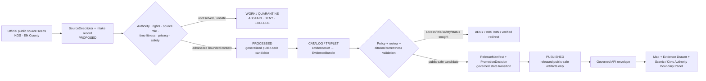
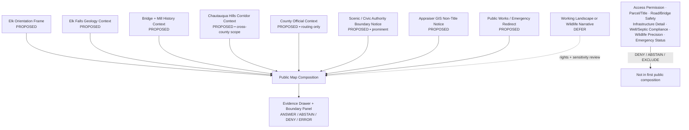
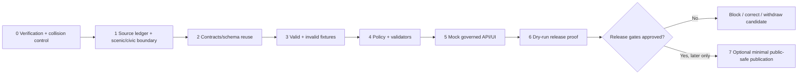

<!-- [KFM_META_BLOCK_V2]
doc_id: NEEDS_VERIFICATION — <REGISTERED_KFM_DOC_ID>
title: Elk County Focus Mode Build Plan — Elk Falls and Rural Civic GIS Context Without Access, Title, Infrastructure, or Emergency Conclusions
type: county-focus-mode-build-plan
version: v0.1-draft
status: draft
owners:
  - NEEDS_VERIFICATION — <OWNER:focus-mode-steward>
  - NEEDS_VERIFICATION — <OWNER:geology-and-scenic-context-reviewer>
  - NEEDS_VERIFICATION — <OWNER:property-privacy-and-civic-gis-reviewer>
  - NEEDS_VERIFICATION — <OWNER:transportation-and-emergency-currentness-reviewer>
created: 2026-05-24
updated: 2026-05-24
policy_label: public_draft
county: Elk County, Kansas
county_slug: elk
proof_slice: Elk Falls Pennsylvanian sandstone waterfall and historic bridge interpretation paired with county GIS, property-tax, roads/bridges, sanitary-water-resource, and emergency-routing boundaries
primary_public_safe_boundary: Official scenic-geology and rural civic-service sources may support generalized, time-attributed public context; KFM must not turn scenic or county GIS/service pages into present access permission, route or bridge safety, parcel ownership/title, property value, well/septic/environmental compliance, infrastructure vulnerability, sensitive wildlife, or emergency-condition conclusions.
release_status: NEEDS_VERIFICATION — NOT_RELEASED planning artifact; no release record created or inspected
review_assignments:
  - NEEDS_VERIFICATION — source admission and rights reviewer
  - NEEDS_VERIFICATION — scenic-site access and scientific-context reviewer
  - NEEDS_VERIFICATION — parcel/title/privacy and appraiser-source reviewer
  - NEEDS_VERIFICATION — public-works/infrastructure and environmental-health reviewer
  - NEEDS_VERIFICATION — emergency/currentness reviewer
  - NEEDS_VERIFICATION — public-safe release reviewer
correction_path: NEEDS_VERIFICATION — no implemented correction path asserted
rollback_path: NEEDS_VERIFICATION — no implemented rollback path asserted
unverified_repository_paths:
  - PROPOSED / CONFLICTED / NEEDS_VERIFICATION — docs/focus-modes/elk-county/build-plan.md
  - PROPOSED / CONFLICTED / NEEDS_VERIFICATION — docs/focus-modes/elk-county/
  - PROPOSED / NEEDS_VERIFICATION — fixtures/focus_modes/elk/
schema_contract_policy_homes:
  - PROPOSED / NEEDS_VERIFICATION — contracts/focus_mode/
  - PROPOSED / NEEDS_VERIFICATION — schemas/contracts/v1/focus_mode/
  - PROPOSED / NEEDS_VERIFICATION — policy/runtime/, policy/sensitivity/, policy/rights/, policy/release/
collision_search:
  completed_register: CONFIRMED — Elk County is absent from the user-supplied completed/collision register; Butler, Wilson, Franklin, Haskell, Grant, Comanche, Labette, Meade, Norton, Cheyenne, and Wallace were additionally excluded because artifacts were generated earlier in this continuing series.
  available_project_materials: CONFIRMED — Elk-targeted searches across accessible uploaded/project materials and File Library were performed on 2026-05-24; returned county-plan artifacts belonged to other counties and did not surface an Elk County Focus Mode Build Plan.
  live_repository_index: CONFIRMED — docs/focus-mode/counties/COUNTY_INDEX.md on main was inspected and lists Elk as not-started with validation not-run.
  live_repository_control_plane: CONFIRMED — docs/doctrine/directory-rules.md and docs/focus-mode/README.md were inspected during this continuing session; doctrine names docs/focus-modes/<area>/ while observed control-plane files are located beneath docs/focus-mode/, requiring reconciliation before repository landing.
  live_repository_target_search: CONFIRMED — targeted searches for elk_county_focus_mode_build_plan, Elk County Focus Mode, elk-county, and Elk Falls Elk City Chautauqua Hills Elk County returned no matching live-repository result.
  exhaustive_absence: NEEDS_VERIFICATION — unindexed branches, private artifacts, and unsearched prior outputs may still exist.
directory_rules_basis:
  - CONFIRMED — attached Directory Rules.pdf was inspected in this run; it places human explanation under docs/, meanings under contracts/, machine shapes under schemas/, decisions under policy/, fixtures under fixtures/, and release/correction/rollback under release/.
  - CONFIRMED — attached Directory Rules.pdf states that data paths identify lifecycle phases and that domain material belongs as a segment within responsibility roots rather than as a new root folder.
  - CONFIRMED — live docs/doctrine/directory-rules.md states that file location encodes responsibility/lifecycle, topic does not justify a root folder, and the lifecycle is RAW → WORK / QUARANTINE → PROCESSED → CATALOG / TRIPLET → PUBLISHED with promotion as a governed state transition.
  - CONFIRMED — live docs/doctrine/directory-rules.md identifies Focus Modes as multi-root compositional proof slices using docs/focus-modes/<area>/ and related responsibility-root lanes, not new root folders.
  - NEEDS_VERIFICATION / CONFLICTED — observed live county index and README are under docs/focus-mode/ while doctrine and README content refer to docs/focus-modes/; landing requires reconciliation before repository work.
official_source_checks:
  - CONFIRMED — Kansas Geological Survey / GeoKansas, Elk Falls page, checked 2026-05-24.
  - CONFIRMED — Kansas Geological Survey / GeoKansas, U.S. Highway 160 from Longton to Elk City page, checked 2026-05-24.
  - CONFIRMED — Elk County official government homepage, checked 2026-05-24.
  - CONFIRMED — Elk County Appraiser page, checked 2026-05-24.
  - CONFIRMED — Elk County Public Works page, checked 2026-05-24.
  - CONFIRMED — Elk County Emergency Management page, checked 2026-05-24.
source_check_date: 2026-05-24
tags: [kfm, focus-mode, elk-county, elk-falls, chautauqua-hills, sandstone, elk-river, bridge, rural-gis, parcels, public-works, emergency-currentness, cite-or-abstain, public-safe]
notes:
  - This document is a planning artifact and does not claim implementation, source admission, rights clearance, policy approval, review completion, promotion, publication, correction readiness, or rollback readiness.
  - KGS supports generalized scenic and geological interpretation; county official surfaces establish civic routing and role context only.
  - EvidenceBundle outranks generated language; appraiser GIS is not title or permission truth, public-works material is not live road/infrastructure or compliance truth, and emergency management remains the official current-safety authority.
[/KFM_META_BLOCK_V2] -->

<a id="top"></a>

# Elk County Focus Mode Build Plan
## Elk Falls and Rural Civic GIS Context Without Access, Title, Infrastructure, or Emergency Conclusions

> **Product thesis:** Present Elk County’s waterfall, sandstone-hill, historic-bridge, and rural civic-map context through official, evidence-visible interpretation while refusing to turn scenic or county service surfaces into present access, parcel/title, property-value, infrastructure, environmental-compliance, wildlife, or emergency verdicts.


| Identity / status field | Value |
|---|---|
| County selected | **Elk County, Kansas** |
| Draft status | `PROPOSED` planning artifact; no implementation, review, promotion, or publication asserted |
| Distinct proof slice | KGS-supported Elk Falls / Chautauqua Hills geological interpretation paired with an official rural county’s appraiser GIS, public works, property, and emergency-routing surfaces |
| Most consequential public-safe boundary | **Generalized scenic and county-service context may be shown; KFM must not assert present site access, route/bridge safety, parcel ownership/title, tax or market-value determination, individual well/septic/environmental compliance, critical-infrastructure condition or vulnerability, precise wildlife occurrence, or emergency status.** |
| Official seeds checked in this run | KGS / GeoKansas Elk Falls; KGS / GeoKansas U.S. Highway 160 from Longton to Elk City; Elk County official homepage; Appraiser; Public Works; Emergency Management |
| Live index collision check | `CONFIRMED` inspected: Elk row presently says `not-started` / `not-run` |
| Targeted repository search | `CONFIRMED` performed; no Elk plan collision surfaced |
| Accessible project-material search | `CONFIRMED` performed; no Elk plan surfaced among examined results |
| Exhaustive collision absence | `NEEDS_VERIFICATION` |
| Intended landing location | `PROPOSED / CONFLICTED / NEEDS_VERIFICATION` — `docs/focus-modes/elk-county/build-plan.md` |
| Release / review / rollback | `NOT_RELEASED`; review, correction, and rollback mechanisms `NEEDS_VERIFICATION` |

## Quick links

[Operating posture](#1-operating-posture) · [Why this county](#2-why-this-county) · [Product thesis](#3-product-thesis) · [Scope boundary](#4-scope-boundary) · [First demo layers](#5-first-demo-layers) · [User journeys](#6-user-journeys) · [UI surfaces](#7-ui-surfaces) · [Governed object model](#8-governed-object-model) · [Repository shape](#9-proposed-repository-shape) · [Build phases](#10-build-phases) · [First PR sequence](#11-first-pr-sequence) · [Acceptance checklist](#12-acceptance-checklist) · [Fixture plan](#13-fixture-plan) · [Risk register](#14-risk-register) · [Sources](#15-source-seed-list) · [Verification](#16-open-verification-questions) · [First milestone](#17-recommended-first-milestone) · [Appendices](#appendix-a--public-safe-narrative-skeleton)

---

## Executive build note

**Elk County is selected as a rural scenic-geology and civic-GIS trust proof slice.** The checked Kansas Geological Survey / GeoKansas Elk Falls page identifies a four-to-six-foot waterfall over a sandstone ledge at the east edge of the town of Elk Falls, explains the Pennsylvanian-age depositional origin of the sandstone, and identifies the nearby historic truss bridge and mill remnant context.[^s1] A second checked KGS page describes sandstone-capped Chautauqua Hills visible along U.S. Highway 160 between Longton in Elk County and Elk City in Montgomery County, linking scenic travel interpretation to geological evidence while also making route-scope precision important.[^s2]

The checked Elk County official homepage identifies Elk County as a southeast Kansas county with natural scenery, wildlife, attractions, farming and ranching, and a wind-energy project; the same official site exposes appraiser, public works, emergency management, rural fire, health and register-of-deeds departments.[^s3] The checked Appraiser page states that the appraiser values property for ad valorem tax purposes and uses GIS for parcel, soil and agricultural-use information.[^s4] The checked Public Works page identifies county responsibility for roads, bridges, culverts, sanitary code administration, environmental-health complaints, septic systems, lagoons and water-well construction routing.[^s5] The checked Emergency Management page identifies official local emergency notification, National Weather Service and Kansas road-condition links, and describes the county office’s emergency planning role.[^s6]

This creates a valuable KFM test that differs from a purely scenic or ecological map: a user can learn **what Elk Falls is and why the local landscape looks the way it does**, while the system makes visible why county GIS, road, property, environmental-health and emergency service surfaces **do not become KFM authority for title, permission, route safety, infrastructure status, compliance, wildlife precision, or live emergency guidance**.

> [!CAUTION]
> ## Public-safe boundary — an official scenic or civic GIS surface is not permission, title, infrastructure condition, or emergency truth
>
> **KFM may eventually show admitted, generalized Elk Falls and Chautauqua Hills context and a minimal county-official routing layer. KFM must not tell a user they may access a site or cross property, state that a road or bridge is safe/open/passable, expose exact sensitive wildlife or operational infrastructure detail, convert appraiser GIS or tax valuation into ownership/title/access truth, evaluate a well/septic/environmental-health situation, or issue emergency or hazard guidance.**
>
> Requests of that kind resolve to `ABSTAIN`, `DENY`, or a verified official-current redirect.

### Evidence-boundary table at authoring time

| Label | What is established for this plan | What is not established |
|---|---|---|
| `CONFIRMED` | KGS checked pages support generalized Elk Falls sandstone/waterfall/mill/bridge context and a Chautauqua Hills scenic-geology corridor beginning at Longton in Elk County; checked county pages establish local official civic-service, appraiser GIS/tax-purpose, public-works/roads/bridges/sanitary-code, and emergency-notification roles; Directory Rules evidence and live Focus Mode control-plane/index evidence were inspected; targeted collision searches were performed. | — |
| `PROPOSED` | Focus Mode scope, public-safe card/layer design, boundary panel, governed object candidates, fixtures, policy reason codes, phases, first milestone, and intended responsibility-rooted repository paths. | No proposed component is represented as implemented. |
| `NEEDS_VERIFICATION` | Comprehensive collision absence; repository landing after singular/plural path conflict; authoritative county/map geometry; derivative-display rights; safe spatial precision for scenic features; county-service data admission; any present access/road/bridge/emergency authority integration; shared contracts/schemas/policies; review assignments; correction and rollback machinery. | — |
| `UNKNOWN` | Present site access permission, road/bridge/site safety, parcel ownership/title, property value for any user, well/septic/environmental-compliance state, infrastructure operations or vulnerabilities, wildlife locations, emergency conditions, unindexed Elk plan artifacts, eventual release state, and runtime behavior. | — |

---

# 1. Operating posture

## 1.1 KFM governing rules applied to Elk County

| KFM rule | Elk County application |
|---|---|
| EvidenceBundle outranks generated language | No waterfall, road, parcel, property, infrastructure, environmental-health, or emergency statement may outrun admitted evidence and policy. |
| Cite-or-abstain | Bounded scenic-geology and agency-role context may be answered after evidence closure; access, title, current safety, compliance, wildlife precision, and emergency questions deny or abstain by default. |
| Public clients consume governed surfaces only | Any future public UI consumes released public-safe artifacts and policy-safe envelopes only; it never reads `RAW`, `WORK`, `QUARANTINE`, unpublished candidates, restricted county material, or direct model output. |
| Source roles remain distinct | KGS scientific interpretation, county promotional context, appraiser/tax-purpose GIS, public works, emergency management, later official-current road/weather sources, and generated narrative may not collapse into one truth surface. |
| Promotion is a governed state transition | A discovered official page, visible map, captured image or generated card is not a released layer absent evidence, policy, review, manifest, correction and rollback closure. |
| Rights, privacy, operational and safety ambiguity fail closed | Parcel detail, individual property implications, road/bridge conditions, infrastructure details, water/septic compliance, emergency status and sensitive wildlife are excluded or redirected until fit governance exists. |
| AI is interpretive only | AI may explain public-safe geology and why a civic-data request is bounded; it cannot authorize access, determine title, advise on property/environmental compliance, or act as an emergency system. |

## 1.2 Truth-label and finite-outcome key

| Token | Meaning in this plan |
|---|---|
| `CONFIRMED` | Verified in this run from checked official public sources, inspected live repository/control-plane evidence, inspected attached governing material, or generated artifact evidence. |
| `PROPOSED` | Design recommendation or planned artifact not verified as implemented. |
| `NEEDS_VERIFICATION` | Checkable before action but not sufficiently established now. |
| `UNKNOWN` | Not resolved from available admissible evidence in this run. |
| `ANSWER` | Bounded public-safe context supported by resolved admitted evidence and allowed policy. |
| `ABSTAIN` | Authority, evidence, rights, freshness, privacy, sensitivity or admissibility is not sufficient for the requested claim. |
| `DENY` | Request crosses an access, parcel/title, privacy, infrastructure, wildlife, compliance, or life-safety boundary. |
| `ERROR` | Contract, evidence-resolution, validation or governed-runtime failure prevents trusted output. |

## 1.3 Public trust-membrane flowchart



## 1.4 County-specific non-negotiable guardrails

| Guardrail | Required posture | Default outcome when violated |
|---|---|---|
| Scenic site access | A scenic feature page does not establish current permission, parking, entry, crossing, collection, or route fitness. | `DENY` / `ABSTAIN` — `SCENIC_CONTEXT_NOT_ACCESS_PERMISSION` |
| Road and bridge condition | Geological road-corridor interpretation and public-works responsibility do not prove a road or bridge is open, safe, passable or structurally sound now. | `ABSTAIN` — `CURRENT_ROAD_OR_BRIDGE_STATUS_REQUIRES_AUTHORITY` |
| Appraiser GIS and tax valuation | County appraiser data may be tax-purpose administrative context only; it is not title, ownership, access, legal boundary or individualized market-advice truth. | `DENY` — `APPRAISAL_GIS_NOT_TITLE_OR_ACCESS_TRUTH` |
| Property and living-person privacy | Do not surface household, contact, personally linked property, 911 address, or individual tax/valuation detail. | `DENY` — `PRIVATE_PROPERTY_OR_PERSON_DETAIL_DENIED` |
| Infrastructure operations and vulnerability | Roads, culverts, bridges, utilities, wind-energy facilities and sanitary infrastructure receive public-context-only treatment. | `DENY` — `OPERATIONAL_INFRASTRUCTURE_DETAIL_WITHHELD` |
| Septic, lagoon, well and environmental health | Public Works routing does not become KFM permitting, compliance, health, contamination or water-safety judgment. | `DENY` / `ABSTAIN` — `ENVIRONMENTAL_COMPLIANCE_OR_WATER_SAFETY_NOT_DETERMINED` |
| Sensitive wildlife | Official broad wildlife context does not authorize occurrence, nesting, hunting-pressure or stewardship-sensitive precision. | `DENY` — `SENSITIVE_WILDLIFE_DETAIL_NOT_ADMITTED` |
| Emergency and weather currentness | County Emergency Management, NWS and Kansas road resources remain official-current channels; KFM does not issue active guidance. | `ABSTAIN` — `OFFICIAL_CURRENT_SAFETY_CHANNEL_REQUIRED` |

---

# 2. Why this county

## 2.1 Selection and collision screen

| Screen | Result | Status | Effect on selection |
|---|---|---:|---|
| User-supplied completed/collision register | Elk County is not listed. | `CONFIRMED` | Eligible to evaluate. |
| Plans generated earlier in this continuing series | Butler, Wilson, Franklin, Haskell, Grant, Comanche, Labette, Meade, Norton, Cheyenne and Wallace were excluded from reselection. | `CONFIRMED` | Avoids known generated duplicates. |
| Accessible uploaded/project-material and File Library search | Elk-targeted searches were performed; returned county-plan artifacts belonged to other counties and no Elk County plan surfaced among examined results. | `CONFIRMED` for performed search; `NEEDS_VERIFICATION` exhaustively | Candidate not rejected. |
| Live repository master county index | Inspected `docs/focus-mode/counties/COUNTY_INDEX.md`; Elk is listed `not-started` with validation `not-run`. | `CONFIRMED` observation only | Candidate not rejected; index status is not release or absolute-absence proof. |
| Live repository control-plane evidence | Doctrine and README/control-plane evidence were inspected; singular/plural path conflict remains. | `CONFIRMED` | Landing must remain conditional. |
| Live repository targeted string search | Searches for `elk_county_focus_mode_build_plan`, `Elk County Focus Mode`, `elk-county`, and significant proof-slice terms returned no result. | `CONFIRMED` for performed searches | No repository collision discovered. |
| Exhaustive project-wide uniqueness | All branches, private artifacts, and unsearched prior outputs were not proven absent. | `NEEDS_VERIFICATION` | Repeat before any repository landing. |

> [!NOTE]
> Elk County was selected only after collision screening against the supplied register, known outputs generated in this continuation, accessible project materials/File Library, and inspected live repository evidence. No Elk collision surfaced in the performed checks; exhaustive absence remains a future gate.

## 2.2 Proof-slice rationale table

| Selection dimension | Elk County proof value | Evidence basis / status |
|---|---|---|
| Scenic geology and watercourse | KGS identifies Elk Falls as a sandstone-ledged waterfall on the Elk River and explains the approximately 300-million-year-old Pennsylvanian sandstone origin. | `CONFIRMED` official source checked.[^s1] |
| Historic transportation and built context | KGS identifies the nearby truss bridge’s historical transport use and later foot-traffic context and records a mill remnant below the falls. | `CONFIRMED` public-history/scientific context.[^s1] |
| Scenic corridor / cross-county scope discipline | KGS identifies Chautauqua Hills sandstone-capped hills along a route beginning at Longton in Elk County and continuing to Elk City in Montgomery County. | `CONFIRMED`; cross-county scope must remain visible.[^s2] |
| Rural public context | County homepage identifies natural scenery, wildlife, farming/ranching, local attractions and a wind energy project as local context. | `CONFIRMED` official county narrative; not operational or ecological evidence.[^s3] |
| Appraiser-GIS boundary | County Appraiser identifies tax-purpose valuation and GIS access to parcels, soils and agricultural use. | `CONFIRMED` administrative role; title/access/private-detail inference denied.[^s4] |
| Roads/water-resource boundary | Public Works identifies county roads/bridges/culverts and sanitary-code/well/septic routing responsibilities. | `CONFIRMED` administrative role; not current condition or compliance truth.[^s5] |
| Emergency-currentness boundary | Emergency Management identifies notification, NWS and Kansas road-condition routing and emergency planning role. | `CONFIRMED` official-current routing context.[^s6] |
| Series distinctness | Tests whether a map can join scenic geology and locally available rural GIS/service context without leaking legal/property/operational/safety meaning. | `PROPOSED` proof rationale. |

## 2.3 Why Elk adds a distinct series proof

| Existing or generated proof slice | Boundary already tested | What Elk adds without duplicating it |
|---|---|---|
| Wallace County | Private-land attraction and sinkhole geohazard nondetermination. | County-operated GIS, tax-purpose parcels, road/bridge/public-works and emergency routing joined to a scenic waterfall/bridge narrative. |
| Cheyenne County | Scenic landform travel-currentness and interstate-water legal scope. | Rural civic information authority boundaries: appraisal ≠ title, public works ≠ live condition/compliance, emergency routes ≠ KFM alerts. |
| Johnson County | High-density suburban property/privacy and public-service context. | Sparse rural county GIS/service authority with scenic geology and infrastructure/road/well boundaries. |
| Sedgwick / Kiowa / hazards lanes | Severe-weather or disaster-memory context. | Official emergency routing is used strictly to refuse live safety answers in a scenic/civic exploration experience. |
| Gove / Comanche | Sensitive fossil or cave/locality restraint. | Public-access/title/infrastructure and administrative-data non-determination, rather than collection or cultural-resource precision as primary proof. |

## 2.4 Public benefit and governance value

A first Elk public-safe product could help a user understand:

- how Elk Falls relates to Pennsylvanian sandstone and the Elk River;
- why bridge and mill context may be shown as evidence-supported public history;
- how the Chautauqua Hills scenic corridor is geographically scoped and should not be flattened into a single county claim;
- that rural county GIS, parcel, soils and agricultural-use information can be useful context without becoming title, access or household truth;
- that county public works and emergency management sources carry operational/currentness limits that KFM must respect.

## 2.5 Specific county anchors supported by checked official sources

| Anchor | Supported statement for this plan | Source role | Status |
|---|---|---|---:|
| Elk Falls | KGS identifies a four-to-six-foot fall over a sandstone ledge on the east edge of Elk Falls. | Scientific/scenic context | `CONFIRMED` |
| Sandstone origin | KGS attributes sandstone at the falls to Pennsylvanian deposits approximately 300 million years ago. | Scientific interpretation | `CONFIRMED` |
| Bridge and mill context | KGS identifies a remnant mill wall and a historic truss bridge downstream from the falls. | Public-history/scenic context | `CONFIRMED` |
| Longton–Elk City scenic geology | KGS identifies sandstone-capped Chautauqua Hills along a 14-mile segment whose endpoint scope spans Elk and Montgomery counties. | Scientific/corridor context | `CONFIRMED` |
| County natural and working-landscape narrative | Official county homepage names scenery, wildlife, farming/ranching, attractions and wind energy as local context. | Local public-context source | `CONFIRMED`; not operational evidence |
| Appraiser GIS | Official appraiser page describes tax-purpose valuation and GIS for parcels, soils and agricultural use. | Administrative/tax-purpose GIS | `CONFIRMED`; title/access denied |
| Public Works | Official page identifies road, bridge, culvert, sanitary-code, septic, lagoon and water-well routing responsibilities. | Administrative/operational routing | `CONFIRMED`; no condition/compliance claim |
| Emergency Management | Official page identifies emergency notification and links to current weather/road/emergency authorities. | Official-current routing | `CONFIRMED` |

---

# 3. Product thesis

## 3.1 One-sentence thesis

> **Elk County Focus Mode should let the public explore admitted Elk Falls, Chautauqua Hills, bridge and rural county-service context while making it impossible to mistake KFM for access authority, title registry, current road/bridge inspector, environmental-permitting office, infrastructure status system, wildlife-location service or emergency channel.**

## 3.2 What the first product promises

| Promise | Implementation meaning |
|---|---|
| A bounded Elk county frame | Public-safe orientation extent after authoritative geometry and rights admission. |
| Evidence-visible scenic geology | Elk Falls and sandstone-hills explanations resolve to admitted KGS evidence with source-role limitations. |
| Public-history framing | Bridge/mill context can be shown only as time-attributed, source-cited interpretation. |
| Civic-authority boundary | County service cards explain appraiser, public works and emergency roles without exposing inappropriate detail or making prohibited conclusions. |
| Finite outcomes | Supported broad context may produce `ANSWER`; access/title/condition/compliance/status requests produce `ABSTAIN` or `DENY`. |
| Reversibility | Any future release requires correction and rollback closure; none are claimed now. |

## 3.3 What the first product does not promise

| Non-promise | Required user-facing posture |
|---|---|
| Permission to enter, cross, park, fish, collect, or use a scenic location | Deny or abstain; a scenic card is not permission. |
| Current road, bridge, water, trail or site safety | Abstain and redirect only to verified current authority when admissible. |
| Parcel ownership, title, boundary adjudication, access right or individualized property value | Deny; appraiser GIS is tax-purpose administrative context. |
| Septic, lagoon, well, sanitary-code or environmental-health compliance | Deny or redirect; county role descriptions are not KFM decisions. |
| Infrastructure operations, vulnerabilities, or critical-facility details | Exclude or deny by default. |
| Wildlife occurrence, nesting/denning, hunting-pressure or sensitive habitat precision | Deny or defer pending policy and source admission. |
| Live emergency, weather, fire or road-condition guidance | Abstain and route to official-current authority; KFM is not an alert system. |
| Released product or implemented route | This is a planning artifact only. |

---

# 4. Scope boundary

## 4.1 First-slice classification

| Content family | First-slice posture | Why | Governing boundary |
|---|---:|---|---|
| Elk county orientation extent | `PROPOSED` public-safe | Provides bounded map frame; geometry authority remains to admit. | No property, access or operational inference. |
| `ElkFallsGeologyContextCard` | `PROPOSED` public-safe after admission | KGS provides official scientific/scenic explanation. | No site-safety, access or collecting permission. |
| `BridgeAndMillPublicHistoryCard` | `PROPOSED` public-safe after admission | KGS provides public-history context. | No bridge condition, legal access or structural-safety assertion. |
| `ChautauquaHillsCorridorContextCard` | `PROPOSED` public-safe after admission | KGS supports scenic geology beginning in Elk County and continuing cross-county. | Scope labels required; no route safety. |
| `ScenicAndCivicAuthorityBoundaryNotice` | `PROPOSED` **priority public-safe card** | Makes primary trust limit unavoidable. | Access/title/safety/compliance/emergency denied or abstained. |
| `CountyServiceRoleCard` | `PROPOSED` minimal | Official county site provides routing and role context. | No operational, personal or sensitive detail. |
| `AppraiserGISNonTitleNotice` | `PROPOSED` **priority public-safe card** | County GIS/parcel information creates strong title/privacy overclaim risk. | No ownership/title/access/value claim. |
| `PublicWorksCurrentnessNotice` | `PROPOSED` public-safe notice | Roads, bridges and sanitary-code functions require current official handling. | No status, inspection or compliance answer. |
| `EmergencyOfficialRedirectCard` | `PROPOSED` minimal redirect | County page establishes the current-safety authority path. | No active alerts reproduced or interpreted. |
| Broad working landscape narrative | `DEFER` | Official context suggests agriculture/ranching/wind-energy themes; evidence scope and rights need more work. | No farm/private/operator/infrastructure exposure. |
| General wildlife context | `DEFER` | County public narrative exists, but public ecology requires geoprivacy review. | No exact sensitive geometry. |
| Parcel/GIS detail or property-linked outputs | `DENY` / `EXCLUDE` | Privacy/legal/title risk. | Not a first-slice public product. |
| Live road/bridge/status/emergency data | `DEFER` / `EXCLUDE` | Requires fit current sources and strict expiry/redirect behavior. | No KFM active guidance. |

## 4.2 Public-safe content requirements

Every first-slice public object must expose, where applicable:

- official source identity and declared source role;
- checked date, event/time basis and currentness fitness;
- evidence resolution state;
- rights and derivative-display posture;
- spatial generalization and cross-county scope;
- access/non-permission limitation;
- appraiser-GIS non-title limitation;
- public-works non-condition/non-compliance limitation;
- emergency-current redirect limitation;
- review, release, correction and rollback state before any publication.

## 4.3 County-specific denied and abstained content

| Public request example | Outcome | Candidate reason code |
|---|---:|---|
| “Does the waterfall card mean I can access this exact location today?” | `DENY` / `ABSTAIN` | `SCENIC_CONTEXT_NOT_ACCESS_PERMISSION` |
| “Is the historic bridge safe or open to cross right now?” | `ABSTAIN` | `CURRENT_ROAD_OR_BRIDGE_STATUS_REQUIRES_AUTHORITY` |
| “Use the appraiser GIS to tell me who owns this site or whether I have access.” | `DENY` | `APPRAISAL_GIS_NOT_TITLE_OR_ACCESS_TRUTH` |
| “Show the value, 911 address, or private parcel details for a named person.” | `DENY` | `PRIVATE_PROPERTY_OR_PERSON_DETAIL_DENIED` |
| “Map vulnerable bridge, culvert, utility or wind-energy infrastructure.” | `DENY` | `OPERATIONAL_INFRASTRUCTURE_DETAIL_WITHHELD` |
| “Does a property comply with septic/well rules or have safe water?” | `DENY` / `ABSTAIN` | `ENVIRONMENTAL_COMPLIANCE_OR_WATER_SAFETY_NOT_DETERMINED` |
| “Where are sensitive animals or good hunting targets?” | `DENY` | `SENSITIVE_WILDLIFE_DETAIL_NOT_ADMITTED` |
| “Are roads safe or is there a current emergency right now?” | `ABSTAIN` | `OFFICIAL_CURRENT_SAFETY_CHANNEL_REQUIRED` |

---

# 5. First demo layers

## 5.1 Prioritized first public-safe layer/card set

| Priority | Layer or card | Public purpose | Checked official seed | Evidence / policy gate | Status |
|---:|---|---|---|---|---:|
| 1 | `ScenicAndCivicAuthorityBoundaryNotice` | Makes access, title, infrastructure and emergency limits visible first. | KGS + county Appraiser/Public Works/Emergency Management[^s1][^s4][^s5][^s6] | Boundary policy; reason-code fixtures; no sensitive detail. | `PROPOSED` |
| 2 | `ElkFallsGeologyContextCard` | Presents waterfall and sandstone origin at public-safe scale. | KGS / GeoKansas Elk Falls[^s1] | Source admission; EvidenceBundle; generalized feature context. | `PROPOSED` |
| 3 | `BridgeAndMillPublicHistoryCard` | Connects geology/watercourse to historic built context. | KGS / GeoKansas Elk Falls[^s1] | Historic role; no access or structural-condition inference. | `PROPOSED` |
| 4 | `ChautauquaHillsScenicGeologyCard` | Presents sandstone-capped hills along the cross-county route context. | KGS / GeoKansas U.S. Highway 160[^s2] | Cross-county scope label; no current travel judgment. | `PROPOSED` |
| 5 | `CountyOfficialContextCard` | Shows minimal local administrative/public context. | Elk County homepage[^s3] | Routing/context only; no private/operational claims. | `PROPOSED` |
| 6 | `AppraiserGISNonTitleNotice` | Demonstrates why parcel/soil/ag-use GIS cannot become title/access/private truth. | Elk County Appraiser[^s4] | Tax-purpose role; privacy/title gate. | `PROPOSED` |
| 7 | `PublicWorksCurrentnessAndComplianceNotice` | Makes road/bridge/well/septic boundaries explicit. | Elk County Public Works[^s5] | Currentness/compliance denial rules. | `PROPOSED` |
| 8 | `EmergencyOfficialRedirectCard` | Directs active safety needs to official-current resources. | Elk County Emergency Management[^s6] | Redirect-only; no alert status replication. | `PROPOSED` |
| 9 | Generalized working landscape / wind-energy narrative | Future context only if rights, infrastructure and source roles resolve. | County homepage[^s3] | No operator/facility/vulnerability precision. | `DEFER` |
| 10 | Wildlife/hunting context layer | Potential generalized narrative only after ecology review. | County homepage[^s3] | Rare/sensitive occurrence geoprivacy. | `DEFER` |
| 11 | Parcel/title/access, infrastructure condition, environmental compliance or live safety layers | Unsafe for first public proof slice. | Boundary policy. | Prohibited first slice. | `DENY` / `EXCLUDE` |

## 5.2 Map-composition diagram



## 5.3 Layer-card truth contract

| Required field | Purpose | Failure posture |
|---|---|---|
| `layer_id` / `card_id` | Deterministic public-object reference candidate. | `ERROR` in fixture/runtime when absent. |
| `county_scope: elk` | Prevent scope drift; allow explicit cross-county corridor scope only when labelled. | `ABSTAIN` if mismatched or unlabeled. |
| `source_role` | Distinguish KGS interpretation, county public context, tax-purpose GIS, public works and emergency routing. | `ABSTAIN`; no release if absent. |
| `temporal_basis` | Captures source checked date and whether claim is stable interpretation, historic context or current-source dependent. | `ABSTAIN` for present condition questions. |
| `spatial_generalization` | Ensures scenic, wildlife and infrastructure representation is safe. | `DENY` / quarantine if unsafe or absent where required. |
| `access_limitation` | Preserves no-permission/no-site-safety promise. | Fail public validation if omitted from scenic objects. |
| `property_title_limitation` | Preserves appraiser-GIS ≠ ownership/title/access/value conclusion. | Fail public validation if omitted from civic GIS objects. |
| `operational_currentness_limitation` | Preserves public works/emergency non-status posture. | Fail public validation if omitted where services are shown. |
| `evidence_refs` | Requires claim support. | `ABSTAIN`; candidate release fails if unresolved. |
| `rights_status` / `sensitivity` | Controls derivative representation and detail exposure. | Quarantine/deny when unresolved or restricted. |
| `policy_decision_ref` | Binds representation to evaluated policy. | Fail closed if missing. |
| `limitations` | Makes county-specific nondeterminations readable in UI and API. | Fail public validation if missing. |
| `correction_ref` / `rollback_ref` | Enables reversal after any future release. | No publication without closure. |

---

# 6. User journeys

## 6.1 Public learning journeys

| Journey | User action | Public-safe response | Trust affordance |
|---|---|---|---|
| Waterfall and geology orientation | Opens Elk and selects Elk Falls. | Shows KGS-backed waterfall and sandstone explanation. | Evidence Drawer states scientific scope and no-access/no-safety promise. |
| Historic feature interpretation | Selects bridge/mill context. | Shows source-bounded public-history explanation. | Bridge-condition and access limitations remain visible. |
| Scenic corridor interpretation | Selects Chautauqua Hills route context. | Shows the KGS-described geological corridor with cross-county scope. | Scope badge prevents Elk-only overclaim and current-route inference. |
| Civic data literacy | Opens Appraiser or Public Works notice. | Explains available official roles and why KFM will not issue title, valuation, condition or compliance answers. | Boundary panel and reason codes visible. |
| Current safety need | Asks about roads, weather or emergency. | Returns abstention and official-current redirect posture. | KFM refuses to act as operational authority. |

## 6.2 Trust-demonstration journeys

| Query or interaction | Expected outcome | Demonstrated KFM property |
|---|---:|---|
| “What official source explains Elk Falls geology?” | `ANSWER` after evidence resolution | Scientific interpretation with citation. |
| “What is the source-supported bridge context?” | `ANSWER` within public-history scope | Historic context is not structural condition. |
| “Why does KFM refuse to show owner or access from county GIS?” | `ANSWER` about limitation / `DENY` for detail | Administrative GIS role remains bounded. |
| “Is the bridge safe and are county roads open today?” | `ABSTAIN` | Current official authority required. |
| User opens a context card with unresolved evidence | `ABSTAIN` | Evidence/policy closure required. |

## 6.3 Denied or abstained requests with candidate reason codes

| Request | Runtime result | Public explanation seed | Candidate reason code |
|---|---:|---|---|
| “Can I enter the falls property or collect rock specimens there?” | `DENY` / `ABSTAIN` | Scenic context is not access or collecting permission. | `SCENIC_CONTEXT_NOT_ACCESS_PERMISSION` |
| “Is the bridge safe and open right now?” | `ABSTAIN` | Historic/context sources are not live inspection authority. | `CURRENT_ROAD_OR_BRIDGE_STATUS_REQUIRES_AUTHORITY` |
| “Identify the owner of this scenic parcel and whether I can cross it.” | `DENY` | Tax-purpose GIS is not title/access truth and private detail is minimized. | `APPRAISAL_GIS_NOT_TITLE_OR_ACCESS_TRUTH` |
| “Show a person’s property value or 911 address.” | `DENY` | KFM does not expose personally linked property detail. | `PRIVATE_PROPERTY_OR_PERSON_DETAIL_DENIED` |
| “Map vulnerable culverts, bridges, utilities or wind facilities.” | `DENY` | Operational vulnerability detail is not public product content. | `OPERATIONAL_INFRASTRUCTURE_DETAIL_WITHHELD` |
| “Does this well or septic system comply, or is its water safe?” | `DENY` / `ABSTAIN` | Public works routing does not constitute KFM compliance or safety judgment. | `ENVIRONMENTAL_COMPLIANCE_OR_WATER_SAFETY_NOT_DETERMINED` |
| “Map good locations for sensitive wildlife or hunting targets.” | `DENY` | Public ecology precision is not admitted. | `SENSITIVE_WILDLIFE_DETAIL_NOT_ADMITTED` |
| “Is an emergency occurring now or are roads safe to travel?” | `ABSTAIN` | Use fit official-current channels. | `OFFICIAL_CURRENT_SAFETY_CHANNEL_REQUIRED` |

---

# 7. UI surfaces

## 7.1 Required surfaces

| Surface | Public function | Elk-specific trust behavior | Status |
|---|---|---|---:|
| Header | Identifies county, evidence/release state and primary boundary. | Persistent badge: “No access, title, infrastructure-condition or emergency verdict.” | `PROPOSED` |
| Map canvas | Displays released public-safe contextual composition. | Generalized scenic/geology features only; no parcel, infrastructure-sensitive or current-status geometry. | `PROPOSED` |
| Layer drawer | Toggles public-safe cards/layers. | Each card displays role, date, generalization and access/title/currentness badges. | `PROPOSED` |
| Evidence Drawer | Resolves visible claims to sources and limitations. | Clearly separates KGS, county context, appraiser, public works and emergency roles. | `PROPOSED` |
| Answer panel | Answers bounded context questions. | Explains geology/public-history and role boundaries; refuses property/operational/status inference. | `PROPOSED` |
| Denial panel | Explains refusal without exposing unsafe detail. | Denies access, title/private, infrastructure, compliance and sensitive-wildlife requests. | `PROPOSED` |
| Timeline/time-basis surface | Communicates interpretation versus current-source dependency. | Labels scenic geology as source-bounded context; road/emergency/status as current-authority required. | `PROPOSED` |
| **Scenic / Civic Authority Boundary Panel** | Makes primary public-safe boundary visible. | Displays no-access, appraiser-GIS non-title, public-works non-status and emergency redirect rules. | `PROPOSED` |
| Source-role legend | Prevents role collapse. | Differentiates scientific, public-history, administrative/tax, operational-routing and emergency-routing roles. | `PROPOSED` |
| Release/correction panel | Exposes future release and reversal status. | States `NOT_RELEASED` in draft/mock experience. | `PROPOSED` |

## 7.2 Legend vocabulary table

| UI label | Meaning | May support | Must not be used as |
|---|---|---|---|
| `Scientific scenic context` | KGS-backed interpretation of waterfall and sandstone hills. | Generalized geology explanation. | Access, route safety, property, or emergency answer. |
| `Historic built context` | KGS-described bridge/mill relation. | Time-attributed public-history interpretation. | Bridge condition, liability, access or structural assessment. |
| `Administrative GIS / tax purpose` | County appraiser surface describes GIS and ad valorem valuation role. | Explaining source role and limits. | Ownership, title, access, personal profile or individual appraisal advice. |
| `Public works routing` | County service role for roads, bridges and sanitation/well/septic process. | Official-routing context. | Live infrastructure status or compliance finding. |
| `Official-current safety route` | County emergency-management channel and linked current resources. | Redirecting current safety questions. | KFM-issued emergency or road-status claim. |
| `Sensitive detail withheld` | Private, operational or ecological precision is not public-safe. | Explanation of absence. | Confirmation or reconstruction clue. |
| `Draft / mock` | Planning/testing state. | UI/policy proof. | Published truth. |

## 7.3 UI / API / policy / evidence sequence diagram

```mermaid
sequenceDiagram
    actor U as Public user
    participant UI as Explorer UI
    participant API as Governed API
    participant P as Policy gate
    participant E as Evidence resolver
    participant R as Released artifacts
    participant O as Verified official-current redirect
    U->>UI: Open Elk / ask scenic or civic-data question
    UI->>API: Request public context envelope
    API->>P: Evaluate source role, scope, time, rights, privacy, operations and safety
    alt Generalized geology/history context allowed
        P->>E: Resolve EvidenceRef
        E->>R: Read released public-safe EvidenceBundle
        R-->>E: EvidenceBundle + limitations
        E-->>API: Resolved evidence
        API-->>UI: ANSWER + citations + boundary notice
        UI-->>U: Context card + Evidence Drawer
    else Current road/bridge/emergency question
        P-->>API: ABSTAIN + official-current obligation
        API->>O: Optional verified official route only
        API-->>UI: ABSTAIN envelope; no KFM verdict
        UI-->>U: Boundary panel + official route
    else Access/title/private/compliance/infrastructure/wildlife request
        P-->>API: DENY + reason code
        API-->>UI: DENY envelope; no restricted detail
        UI-->>U: Safe explanation only
    end
```

---

# 8. Governed object model

## 8.1 Shared KFM object families to reuse or verify

| Object family | Role in the Elk proof slice | County-specific requirement | Implementation status |
|---|---|---|---:|
| `SourceDescriptor` | Declares authority, source role, checked date, rights, sensitivity and intended use. | Separate KGS scenic science, county public context, appraiser/tax GIS, public works and emergency routing. | `PROPOSED / NEEDS_VERIFICATION` |
| `EvidenceRef` | Stable link from visible claim/card to proof. | Required for all claim-bearing scenic, historic and civic-authority cards. | `PROPOSED / NEEDS_VERIFICATION` |
| `EvidenceBundle` | Resolved evidence package outranking generated language. | Must retain access, title/privacy, operational/currentness, compliance and wildlife limitations. | `PROPOSED / NEEDS_VERIFICATION` |
| `PolicyDecision` | Enforces allow/abstain/deny obligations. | Must deny access/title/private/infrastructure/compliance/wildlife and abstain on live safety/status without fit evidence. | `PROPOSED / NEEDS_VERIFICATION` |
| `RuntimeResponseEnvelope` | Carries finite outcome: `ANSWER`, `ABSTAIN`, `DENY`, `ERROR`. | Must not leak parcel, private, sensitive ecology, or operational detail. | `PROPOSED / NEEDS_VERIFICATION` |
| `CitationValidationReport` | Confirms visible claims remain within admitted evidence scope. | Must fail if KGS context becomes permission/safety, or county GIS/services become title/status/compliance truth. | `PROPOSED / NEEDS_VERIFICATION` |
| `ReleaseManifest` | Records any future public-safe composition. | Cannot include title/private/current-safety/compliance/operational/sensitive-ecology output without approved scope. | `PROPOSED / NEEDS_VERIFICATION` |
| `AIReceipt` | Records generated-output dependencies and outcome. | Generated text cannot create access, title, infrastructure, compliance or emergency truth. | `PROPOSED / NEEDS_VERIFICATION` |
| `ReviewRecord` | Records required review findings. | Scenic/access, property/privacy, infrastructure/public-works, currentness/emergency and public-release reviews required. | `PROPOSED / NEEDS_VERIFICATION` |
| `CorrectionNotice` | Corrects released output after source or interpretation change. | Needed if context later implies access, title, status or safety incorrectly. | `PROPOSED / NEEDS_VERIFICATION` |
| `RollbackPlan` / rollback reference | Enables reversible withdrawal. | Required before any output is called published. | `PROPOSED / NEEDS_VERIFICATION` |

## 8.2 County-specific object candidates

| Candidate object | Purpose | Public-safe fields | Excluded meaning |
|---|---|---|---|
| `ElkFallsGeologyContextCard` | Presents generalized KGS-supported waterfall/sandstone explanation. | county, scientific role, checked date, generalization, evidence, limitations. | No access, collecting, route or safety promise. |
| `BridgeAndMillPublicHistoryCard` | Presents bounded built/waterpower context. | historic-source role, temporal statement, evidence, limitations. | No structural condition or legal access. |
| `ChautauquaHillsCorridorContextCard` | Shows route-bounded geology with proper cross-county scope. | route scope, counties, scientific role, checked date, evidence. | No current road or travel guidance. |
| `AppraiserGISNonTitleNotice` | Encodes tax-purpose and privacy constraints. | administrative role, prohibited inferences, reason codes. | No title, ownership, access, value or personal detail. |
| `PublicWorksRoleAndCurrentnessNotice` | Explains service role without status/compliance inference. | service categories, official-current requirement, limitations. | No bridge/road status, permits, well/septic decision. |
| `EmergencyOfficialRedirectCard` | Encodes redirect-only current-safety path. | official routing category, currentness obligation, no-alert disclaimer. | No incident/advice/status content. |
| `ScenicAndCivicAuthorityBoundaryNotice` | Central machine-readable public-safety boundary. | prohibited claim families, policy refs, obligations, reason codes. | No restricted/private/current detail. |

## 8.3 Source-role anti-collapse rules

| Source family | Valid role in Elk Focus Mode | Must not collapse into |
|---|---|---|
| KGS / GeoKansas Elk Falls page | Scientific/scenic and bounded public-history interpretation. | Site access, collecting permission, bridge safety, title, wildlife or emergency truth. |
| KGS / GeoKansas U.S. Highway 160 page | Scientific scenic-corridor geology with cross-county scope. | Current route status, road safety or Elk-only geographic claim. |
| Elk County homepage | County public context and minimal service-routing orientation. | Operational infrastructure, wildlife occurrence, property/title or safety authority. |
| Elk County Appraiser page | Tax-purpose valuation and administrative GIS role context. | Ownership, legal title, access, individual market advice or personal profiling. |
| Elk County Public Works page | Departmental/service-routing context for roads, bridges, sanitation, wells and environmental complaints. | Condition assessment, infrastructure vulnerability, permit/compliance or water-safety determination. |
| Elk County Emergency Management page | Official-current routing and emergency authority context. | Cached alerts, KFM incident status or protective-action advice. |
| Generated AI narrative | Downstream evidence/policy-bounded explanation. | Evidence, permission, title, agency decision, review approval or release state. |

## 8.4 Minimal public runtime response JSON example — allowed scenic geology context

```json
{
  "schema_version": "v1",
  "object_type": "RuntimeResponseEnvelope",
  "response_id": "kfm.runtime.elk.elk_falls_geology.answer.v1",
  "county": "elk",
  "outcome": "ANSWER",
  "answer_scope": "public_safe_generalized_scenic_geology_context",
  "answer": "Checked Kansas Geological Survey material identifies Elk Falls as a four-to-six-foot waterfall over a sandstone ledge and explains that the sandstone formed from Pennsylvanian-age sand deposits approximately 300 million years ago.",
  "evidence_refs": [
    "kfm.evidence_ref.elk.kgs_elk_falls_context.v1"
  ],
  "source_roles": [
    "scientific_scenic_context"
  ],
  "spatial_generalization": "official_public_feature_context_only",
  "temporal_basis": {
    "source_checked_on": "2026-05-24",
    "claim_currentness": "stable_scientific_interpretation_only"
  },
  "limitations": [
    "This response does not provide present access permission, collecting authorization, route or bridge safety, wildlife locations, or emergency guidance.",
    "County administrative GIS or service surfaces are not title, property-value, infrastructure-condition, compliance, or safety determinations."
  ],
  "policy_label": "public_safe_candidate",
  "review_state": "NEEDS_VERIFICATION",
  "release_state": "NOT_RELEASED",
  "citation_validation": "NEEDS_VERIFICATION",
  "spec_hash": "NEEDS_VERIFICATION"
}
```

## 8.5 Minimal public runtime response JSON example — bounded administrative-role answer

```json
{
  "schema_version": "v1",
  "object_type": "RuntimeResponseEnvelope",
  "response_id": "kfm.runtime.elk.appraiser_public_works_roles.answer.v1",
  "county": "elk",
  "outcome": "ANSWER",
  "answer_scope": "public_safe_agency_role_context",
  "answer": "Checked Elk County pages describe the Appraiser's tax-purpose valuation and GIS role and Public Works responsibility for roads, bridges and sanitary-code routing.",
  "evidence_refs": [
    "kfm.evidence_ref.elk.appraiser_role_context.v1",
    "kfm.evidence_ref.elk.public_works_role_context.v1"
  ],
  "source_roles": [
    "administrative_tax_purpose_gis",
    "administrative_public_works_routing"
  ],
  "limitations": [
    "This response does not determine title, ownership, access, an individual's property value, infrastructure condition, permit or sanitary-code compliance, well safety, or environmental-health status.",
    "For current hazards, road conditions or emergencies, use verified official-current channels."
  ],
  "policy_label": "public_safe_candidate",
  "review_state": "NEEDS_VERIFICATION",
  "release_state": "NOT_RELEASED",
  "citation_validation": "NEEDS_VERIFICATION",
  "spec_hash": "NEEDS_VERIFICATION"
}
```

## 8.6 Abstention JSON example — present road/bridge/emergency status

```json
{
  "schema_version": "v1",
  "object_type": "RuntimeResponseEnvelope",
  "response_id": "kfm.runtime.elk.current_safety_status.abstain.v1",
  "county": "elk",
  "outcome": "ABSTAIN",
  "reason_code": "OFFICIAL_CURRENT_SAFETY_CHANNEL_REQUIRED",
  "message": "KFM can present released contextual material, but it does not determine current road, bridge, weather, fire, emergency, or visitor-safety conditions from scenic or administrative context pages.",
  "evidence_refs": [
    "kfm.evidence_ref.elk.emergency_official_redirect.v1"
  ],
  "official_redirects": [
    {
      "authority": "Elk County Emergency Management",
      "purpose": "local emergency notification and official safety routing"
    },
    {
      "authority": "Verified official road or weather channel",
      "purpose": "current road/weather conditions",
      "status": "NEEDS_VERIFICATION before product integration"
    }
  ],
  "policy_label": "public_abstain",
  "review_state": "NEEDS_VERIFICATION",
  "release_state": "NOT_RELEASED",
  "spec_hash": "NEEDS_VERIFICATION"
}
```

## 8.7 Denial JSON example — title/access or environmental-compliance request

```json
{
  "schema_version": "v1",
  "object_type": "RuntimeResponseEnvelope",
  "response_id": "kfm.runtime.elk.title_access_or_compliance.deny.v1",
  "county": "elk",
  "outcome": "DENY",
  "reason_code": "APPRAISAL_GIS_NOT_TITLE_OR_ACCESS_TRUTH",
  "message": "KFM does not use tax-purpose administrative GIS or county service pages to determine ownership, title, access, personally linked property details, infrastructure condition, sanitary-code compliance, or individual water or environmental-health safety.",
  "evidence_refs": [
    "kfm.evidence_ref.elk.scenic_civic_authority_boundary.v1"
  ],
  "withheld_fields": [
    "owner_or_living_person_linkage",
    "parcel_title_or_access_determination",
    "individual_property_value",
    "operational_infrastructure_detail",
    "permit_compliance_or_water_safety_judgment",
    "sensitive_wildlife_geometry"
  ],
  "policy_label": "public_deny",
  "review_state": "NEEDS_VERIFICATION",
  "release_state": "NOT_RELEASED",
  "spec_hash": "NEEDS_VERIFICATION"
}
```

## 8.8 Deterministic identity candidates and `spec_hash` posture

| Item | Candidate identity pattern | Hash posture |
|---|---|---|
| Source descriptor | `kfm.source.elk.<authority>.<source_slug>.v1` | Hash normalized identity, role, checked date, rights, sensitivity and limitations. |
| Evidence bundle | `kfm.evidence_bundle.elk.<claim_scope>.v1` | Hash admitted evidence, spatial/time scope, policy limitations and review links. |
| Card/layer | `kfm.card.elk.<public_safe_card>.v1` / `kfm.layer.elk.<layer>.v1` | Hash display specification plus evidence/policy/currentness/sensitivity constraints. |
| Runtime fixture | `kfm.runtime.elk.<scenario>.<outcome>.v1` | Hash fixture per verified canonical utility. |
| Release candidate | `kfm.release.elk.focus_mode.v0_1` | Hash manifest and proof/review/correction/rollback closure. |

> [!IMPORTANT]
> These identity patterns and `spec_hash` behaviors are `PROPOSED`. Existing identifier grammar, hashing utilities and shared object contracts must be inspected before implementation.

---

# 9. Proposed repository shape

## 9.1 Directory Rules basis and observed divergence

| Finding | Label | Consequence for this plan |
|---|---:|---|
| Attached `Directory Rules.pdf` places human explanation under `docs/`, meaning under `contracts/`, machine shape under `schemas/`, policy decisions under `policy/`, test samples under `fixtures/`, tools under `tools/`, lifecycle data under `data/`, and release/correction/rollback under `release/`. | `CONFIRMED` inspected in this run | Elk planning belongs in the documentation lane; other proposed objects remain in their responsibility roots. |
| Attached `Directory Rules.pdf` states domain-specific material appears as a segment under a responsibility root and not as a new root folder. | `CONFIRMED` | Do not create root-level `elk/`, `elk-falls/`, `rural-gis/`, or similar roots. |
| Live `docs/doctrine/directory-rules.md` states file location encodes ownership/governance/lifecycle; topic does not justify a root folder; lifecycle is `RAW → WORK / QUARANTINE → PROCESSED → CATALOG / TRIPLET → PUBLISHED`; promotion is a governed state transition, not a file move. | `CONFIRMED` repository doctrine | A checked official page or generated plan is never a published layer by itself. |
| Live doctrine identifies a Focus Mode as a multi-root proof slice including `docs/focus-modes/<area>/`, `contracts/focus_mode/`, `schemas/contracts/v1/focus_mode/`, `fixtures/focus_modes/<area>/`, `apps/explorer-web/src/focus-modes/<area>/`, tools, data and release lanes. | `CONFIRMED` repository doctrine | Candidate documentation path follows plural form only provisionally. |
| Observed live index is at `docs/focus-mode/counties/COUNTY_INDEX.md`, and observed README is at `docs/focus-mode/README.md` although its content names `docs/focus-modes/`. | `CONFIRMED` observed divergence | Landing path is `PROPOSED / CONFLICTED / NEEDS_VERIFICATION`; reconcile before any repository change. |

> [!WARNING]
> **All new repository paths below remain `PROPOSED / CONFLICTED / NEEDS_VERIFICATION` unless explicitly identified as inspected live evidence.** This artifact neither modifies the repository nor authorizes a path decision. Resolve the singular/plural Focus Mode control-plane conflict and verify actual contract, schema, policy, source, fixture, application, release, correction and rollback homes before implementation.

## 9.2 Candidate path table

| Responsibility root | Proposed path | Purpose | Verification gate |
|---|---|---|---|
| Human documentation | `docs/focus-modes/elk-county/build-plan.md` | This plan as a county proof-slice document. | Reconcile singular/plural path conflict and any applicable ADR/control-plane decision. |
| Human documentation companions | `docs/focus-modes/elk-county/{README.md,layer-registry.md,evidence-model.md,acceptance-checklist.md,source-seed-list.md,public-safety-notes.md,scenic-geology-and-access-notes.md,civic-gis-property-and-currentness-notes.md}` | Boundary and control-plane documentation. | Confirm lane packet convention and index update procedure. |
| Semantic contracts | `contracts/focus_mode/` | Reuse or extend shared object meaning. | Inspect existing contracts; avoid parallel family. |
| Machine schemas | `schemas/contracts/v1/focus_mode/` | Shared machine-checkable payload shapes. | Verify schema authority and existing definitions. |
| Fixtures | `fixtures/focus_modes/elk/{valid,invalid}/` | Finite-outcome and fail-closed proof inputs. | Verify fixture-home convention. |
| UI shell | `apps/explorer-web/src/focus-modes/elk/` | Mock/public UI behind governed API. | Verify live app conventions and no bypass. |
| Validators | `tools/validators/` | Shared evidence/currentness/privacy/sensitivity/release checks. | Inspect validator registry and avoid duplicates. |
| Source catalog | `data/catalog/sources/elk/source_descriptors.yaml` | Admitted source descriptor records. | Verify source-registry/catalog convention, rights and sensitivity review. |
| Published artifacts | `data/published/layers/elk/`, `data/published/api_payloads/focus-modes/elk.json` | Future released public-safe artifacts only. | Not first-PR; governed promotion required. |
| Release decisions | `release/candidates/elk-focus-mode/`, `release/manifests/elk-focus-mode-v<n>.json` | Future candidate/manifest records. | Review, correction and rollback verified. |
| Optional pipeline composition | `pipeline_specs/focus_modes/elk/` | Only if distinct source composition is justified. | Avoid when shared composition suffices. |

## 9.3 Proposed responsibility-rooted tree

```text
# PROPOSED / CONFLICTED / NEEDS_VERIFICATION — no repository changes asserted

docs/
└── focus-modes/
    └── elk-county/
        ├── README.md
        ├── build-plan.md
        ├── layer-registry.md
        ├── evidence-model.md
        ├── acceptance-checklist.md
        ├── source-seed-list.md
        ├── public-safety-notes.md
        ├── scenic-geology-and-access-notes.md
        └── civic-gis-property-and-currentness-notes.md

contracts/
└── focus_mode/                         # shared semantic family; verify/reuse

schemas/
└── contracts/v1/focus_mode/            # shared machine shape; verify/reuse

fixtures/
└── focus_modes/elk/
    ├── valid/
    │   ├── focus_mode_payload.public_safe_context.valid.json
    │   ├── evidence_bundle.elk_falls_geology.valid.json
    │   ├── evidence_bundle.civic_role_boundary.valid.json
    │   ├── runtime_response.scenic_context.valid.json
    │   └── runtime_response.official_current_redirect.valid.json
    └── invalid/
        ├── scenic_feature_as_access_permission.invalid.json
        ├── historic_bridge_as_current_safe_crossing.invalid.json
        ├── appraiser_gis_as_title_or_access.invalid.json
        ├── private_property_or_911_detail.invalid.json
        ├── infrastructure_vulnerability_detail.invalid.json
        ├── public_works_as_well_septic_compliance.invalid.json
        ├── exact_sensitive_wildlife_location.invalid.json
        ├── emergency_source_as_kfm_live_alert.invalid.json
        ├── unresolved_evidence_ref.invalid.json
        ├── model_output_as_evidence.invalid.json
        └── public_raw_work_quarantine_access.invalid.json

apps/
└── explorer-web/src/focus-modes/elk/         # mock/UI only after contract verification

data/
├── catalog/sources/elk/                      # admitted descriptors only
└── published/                                # prohibited until governed promotion

release/
├── candidates/elk-focus-mode/                # later candidate only
└── manifests/                                # later governed release only
```

## 9.4 Placement prohibitions

- Do **not** create root-level `elk/`, `elk-falls/`, `chautauqua-hills/`, `rural-gis/`, `county-services/` or `focus_modes/` authority folders.
- Do **not** place machine schemas inside `contracts/focus_mode/`, beside source instance data or under competing schema roots.
- Do **not** treat county appraiser GIS or maps as title, ownership, access, market-value or personally linked truth.
- Do **not** transform public-works pages into current road/bridge/infrastructure, well/septic, sanitary-code or environmental-health decisions.
- Do **not** expose exact sensitive wildlife, critical infrastructure, personally linked property or active emergency detail.
- Do **not** let UI, tiles, narrative cards or AI outputs read `RAW`, `WORK` or `QUARANTINE`.
- Do **not** populate `data/published/` or `release/manifests/` because this plan or a source page exists.

---

# 10. Build phases

| Phase | Goal | Entry gates | Planned outputs | Exit validation | Rollback posture |
|---:|---|---|---|---|---|
| 0 | Verify collision and control-plane placement | Register checked; live index/README/rules inspected; targeted searches repeated near PR time | Verification note; reconciled landing decision; collision receipt candidate | No surfaced Elk collision; path conflict resolved or blocked | Stop without repository addition if unresolved |
| 1 | Admit source ledger and primary boundary | KGS/county sources inventoried; access/title/currentness/privacy questions explicit | Descriptor candidates; Scenic/Civic Authority Boundary Notice; role/scope matrix | Each source has role, time basis, rights/sensitivity and allowed scope; unsafe detail excluded | Preserve notes only; do not promote |
| 2 | Confirm/reuse shared contracts and schemas | Existing object-family inventory performed | Reuse decision or governed extension proposal | No parallel authority homes | Revert proposal; retain documentation |
| 3 | Build valid and invalid fixtures | Contracts and boundary sufficiently specified | Scenic/civic fixtures; high-risk title/access/operational/currentness pack | Unsafe cases fail closed; no pass claim without execution evidence | Delete unaccepted fixtures |
| 4 | Policy and validator proof | Fixture family exists | Policy candidates and evidence/access/title/privacy/currentness validators | All finite outcomes covered; unsafe cases block | Revert candidate; block release |
| 5 | Mock governed API and UI | Contracts, fixtures and policy posture agreed | Mock envelopes; Evidence Drawer; Scenic/Civic Authority Boundary Panel | No internal stores or unsafe private/operational/current claims; `NOT_RELEASED` visible | Disable mock route/component |
| 6 | Dry-run release proof | Sources admitted; reviews/tests available | Candidate dossier, proof report, correction/rollback drafts | No public alias; closure tested only | Withdraw candidate |
| 7 | Optional minimal public-safe publication | Explicit evidence, policy, rights, review and release approvals | Narrow released context via governed interfaces only | Limitations/currentness visible; rollback actionable | Activate recorded correction/rollback |



---

# 11. First PR sequence

> [!IMPORTANT]
> **Live source integration and public release are not first-PR work.** The first work must resolve placement/collision verification and encode the scenic/civic authority boundary before any current-condition, private-detail, operational or public-release behavior is attempted.

| Order | Proposed PR objective | Principal content | Acceptance emphasis |
|---:|---|---|---|
| 1 | Verification and documentation control | Repeat collision search; reconcile or block Focus Mode path conflict; authorized control-plane docs only. | No duplicate plan; no guessed canonical path. |
| 2 | Source ledger/admission and public-safe boundary | KGS/county source candidates; role/time/rights/sensitivity matrix; boundary notice. | Scenic interpretation and civic routing do not become access/title/status/compliance truth. |
| 3 | Contracts/schemas or shared-object reuse | Inspect existing shared object families; reuse or govern extension. | No parallel homes; contract/schema/policy separation. |
| 4 | Valid and invalid fixtures | Safe scenic/civic examples plus access/title/private/infrastructure/compliance/currentness failures. | Fail-closed proof before live features. |
| 5 | Policy and validators | Evidence, source role, privacy, sensitivity, currentness, infrastructure and public-release checks. | All finite outcomes represented; unsafe cases block. |
| 6 | Mock governed API/UI | Mock envelopes; Evidence Drawer; Scenic/Civic Authority Boundary Panel. | Trust demonstration, not live product. |
| 7 | Dry-run release proof | Candidate manifest; validation/review/correction/rollback references. | Rehearsal only; no publication. |
| 8 | Only then optional minimal public-safe publication | Narrow stable context after completed gates. | Public output remains traceable, scoped and reversible. |

---

# 12. Acceptance checklist

## 12.1 Governance and evidence

- [ ] Collision check is repeated immediately before any repository landing.
- [ ] Elk remains absent from newly discovered county-plan artifacts and indexes.
- [ ] Every public claim-bearing layer/card/answer resolves `EvidenceRef` to `EvidenceBundle`.
- [ ] Every source declares authority role, checked date/currentness, intended use, rights and sensitivity posture.
- [ ] KGS scientific, county public-context, appraiser-GIS/tax, public-works, emergency-current and generated-narrative roles remain distinct.
- [ ] Generated language is never treated as proof, permission, title, operational fact, compliance finding or official safety guidance.
- [ ] `ANSWER`, `ABSTAIN`, `DENY` and `ERROR` fixture paths exist.
- [ ] No validation/pass/release claim is made without execution evidence and governance closure.

## 12.2 Public/sensitive boundary

- [ ] Scenic / Civic Authority Boundary Panel is prominent.
- [ ] No public scenic feature confers access, parking, crossing, collecting, fishing or use permission.
- [ ] Bridge/mill/history content is not represented as current structural or route-safety information.
- [ ] Appraiser GIS/tax-purpose context cannot become title, ownership, access, personal-property or individualized-value output.
- [ ] No personally linked parcel, contact, household, valuation or 911-address detail is surfaced.
- [ ] Public Works context cannot become road/bridge status, infrastructure vulnerability, septic/well permit, compliance or water-safety output.
- [ ] Sensitive wildlife or hunting-location precision is absent or denied.
- [ ] Emergency or road/weather status questions abstain or route to verified official-current sources.
- [ ] Rights/derivative display are resolved or the asset remains excluded/quarantined.

## 12.3 Product and UI

- [ ] Header states county, draft/release state and “No access, title, infrastructure-condition or emergency verdict.”
- [ ] Map renders only admitted/released public-safe static context in any eventual public mode.
- [ ] Layer drawer exposes source role, evidence state, checked date, generalization and boundary badges.
- [ ] Evidence Drawer clearly separates scientific, public-history, administrative, operational-routing and official-current roles.
- [ ] Answer panel supports bounded scenic/geology and authority-role questions only.
- [ ] Denial panel handles access, title, privacy, infrastructure, compliance and wildlife requests without leakage.
- [ ] Timeline/time-basis panel distinguishes contextual interpretation from current-source-dependent claims.
- [ ] Mock/demo state remains visibly `NOT_RELEASED`.

## 12.4 Repository, validation, release, correction and rollback

- [ ] Directory Rules basis is cited in any future path-bearing PR.
- [ ] `docs/focus-mode/` versus `docs/focus-modes/` conflict is reconciled or blocks landing.
- [ ] Existing contracts, schemas, policies, fixtures and validator families are inspected before extension.
- [ ] No parallel schema, contract, policy, source-registry, proof, receipt, release or publication authority home is created.
- [ ] Public UI has no route or payload path to `RAW`, `WORK` or `QUARANTINE`.
- [ ] Candidate release proves no access/title/private/operational/compliance/sensitive-wildlife/current-safety output.
- [ ] Correction and rollback references exist before publication.
- [ ] Promotion, if ever approved, is a governed state transition rather than a file move.

---

# 13. Fixture plan

## 13.1 Valid fixture candidates

| Fixture candidate | Scenario | Evidence requirement | Expected outcome | Status |
|---|---|---|---:|---:|
| `focus_mode_payload.public_safe_context.valid.json` | Initial Elk payload contains generalized scenic-geology, public-history and authority-boundary cards only. | Resolved public-safe evidence refs or explicit mock state. | Future schema/policy pass. | `PROPOSED` |
| `evidence_bundle.elk_falls_geology.valid.json` | KGS-backed generalized waterfall/sandstone context. | Checked descriptor, evidence closure and generalization. | `ANSWER` eligible after release. | `PROPOSED` |
| `evidence_bundle.chautauqua_hills_corridor.valid.json` | KGS-backed corridor context with explicit cross-county scope. | Evidence and scope limitation. | `ANSWER` eligible after release. | `PROPOSED` |
| `evidence_bundle.civic_role_boundary.valid.json` | County role context for appraiser/public works/emergency management. | Role separation and limitations. | `ANSWER` about roles after release. | `PROPOSED` |
| `runtime_response.scenic_context.valid.json` | User asks supported geological question. | KGS EvidenceBundle and allowed policy. | `ANSWER`. | `PROPOSED` |
| `runtime_response.official_current_redirect.valid.json` | User asks current road/emergency question. | Verified redirect policy once established. | `ABSTAIN` with redirect. | `PROPOSED` |
| `runtime_response.appraiser_non_title.valid.json` | User asks why parcel title is withheld. | Boundary evidence and policy. | `ANSWER` about limitation / `DENY` detail. | `PROPOSED` |

## 13.2 Invalid / fail-closed fixture candidates

| Invalid fixture | Failure exercised | Expected outcome / failed rule | Primary boundary relevance |
|---|---|---|---|
| `scenic_feature_as_access_permission.invalid.json` | KGS scenic card becomes present access/collection permission. | `DENY` / `ABSTAIN`; `SCENIC_CONTEXT_NOT_ACCESS_PERMISSION`. | Highest |
| `historic_bridge_as_current_safe_crossing.invalid.json` | Public-history bridge context becomes current safety/open status. | `ABSTAIN`; `CURRENT_ROAD_OR_BRIDGE_STATUS_REQUIRES_AUTHORITY`. | Highest |
| `appraiser_gis_as_title_or_access.invalid.json` | Administrative GIS is used to assert title/ownership/access. | `DENY`; `APPRAISAL_GIS_NOT_TITLE_OR_ACCESS_TRUTH`. | Highest |
| `private_property_or_911_detail.invalid.json` | Public output contains person-linked parcel/value/address information. | `DENY`; `PRIVATE_PROPERTY_OR_PERSON_DETAIL_DENIED`. | Highest |
| `infrastructure_vulnerability_detail.invalid.json` | Public output discloses road/bridge/utility/wind operational weakness. | `DENY`; `OPERATIONAL_INFRASTRUCTURE_DETAIL_WITHHELD`. | High |
| `public_works_as_well_septic_compliance.invalid.json` | Role page becomes well/septic/compliance/water-safety verdict. | `DENY` / `ABSTAIN`; `ENVIRONMENTAL_COMPLIANCE_OR_WATER_SAFETY_NOT_DETERMINED`. | High |
| `exact_sensitive_wildlife_location.invalid.json` | County wildlife narrative becomes exact public occurrence/hunting target. | `DENY`; `SENSITIVE_WILDLIFE_DETAIL_NOT_ADMITTED`. | High |
| `emergency_source_as_kfm_live_alert.invalid.json` | Emergency-routing page becomes active KFM safety status. | `ABSTAIN`; `OFFICIAL_CURRENT_SAFETY_CHANNEL_REQUIRED`. | Highest |
| `missing_boundary_limitation.invalid.json` | Public card omits required access/title/currentness limitations. | Validation failure; release block. | High |
| `unresolved_evidence_ref.invalid.json` | Visible claim lacks resolved EvidenceBundle. | `ABSTAIN`; release block. | Core invariant |
| `model_output_as_evidence.invalid.json` | AI narrative is cited as proof or agency decision. | `ERROR` / release block; `AI_NOT_EVIDENCE`. | Core invariant |
| `public_raw_work_quarantine_access.invalid.json` | Public payload references internal lifecycle stores. | `ERROR` / release block; `PUBLIC_INTERNAL_LIFECYCLE_ACCESS`. | Core invariant |

## 13.3 Fixture-to-test matrix

| Test family | Valid fixtures | Invalid fixtures | Required result |
|---|---|---|---|
| Evidence closure | Elk Falls/corridor/civic EvidenceBundles | unresolved evidence; AI-as-evidence | No public claim without resolved evidence. |
| Scenic access boundary | Scenic response | scenic-as-permission invalid | No access/collecting permission inference. |
| Bridge/road currentness | Public-history card | bridge-safe-crossing invalid | No present condition answer from context. |
| Appraiser/property privacy | Appraiser non-title response | title/access; private detail invalids | No title/access/person-linked output. |
| Infrastructure/public works | Role-only context | vulnerability; compliance/well invalids | No operational/compliance/safety claim. |
| Ecology sensitivity | No public precision in valid payload | exact wildlife invalid | No sensitive occurrence or hunting-target output. |
| Emergency currentness | Official redirect response | KFM-live-alert invalid | No active safety judgment. |
| Lifecycle membrane | Public-safe payload | RAW/WORK/QUARANTINE access | Public surface cannot cross trust membrane. |
| Release closure | Candidate-only output | missing limitation/review/correction/rollback | No published state without closure. |

## 13.4 Highest-risk invalid fixture pack — rural civic GIS overclaim

| Pack element | Trigger | Required detection | Expected public behavior |
|---|---|---|---|
| Scenic access inflation | Waterfall/bridge context becomes entry, parking, collecting or crossing permission. | Access-policy/currentness gate fails. | `DENY` / `ABSTAIN`; no permission or directions. |
| Administrative-title inflation | Appraiser GIS/parcel layer becomes ownership, title, access or person-linked value truth. | Privacy/title gate fails. | `DENY`; no data leakage. |
| Operational-infrastructure inflation | Public works context becomes bridge/road/utility/wind-facility condition or vulnerability. | Infrastructure-sensitivity gate fails. | `DENY`; routing only. |
| Environmental-compliance inflation | Sanitary/well/septic role becomes permit, contamination, health or water-safety judgment. | Source-role and high-stakes gate fails. | `DENY` / `ABSTAIN`; appropriate authority only. |
| Current-safety inflation | Emergency/current-road routing becomes KFM warning, closure or travel decision. | Operational-currentness gate fails. | `ABSTAIN`; official channel only. |
| Sensitive ecology inflation | General wildlife context becomes occurrence or hunting-target map. | Ecology/geoprivacy gate fails. | `DENY`; generalized or withheld. |

---

# 14. Risk register

| Risk | Likelihood | Impact | Required mitigation | Release posture |
|---|---:|---:|---|---|
| Scenic card is interpreted as permission to enter, collect or cross | High | High | Prominent no-access/no-permission notice; no directions; refusal fixtures. | `DENY` / `ABSTAIN`. |
| Bridge/history context becomes current structural or route-safety advice | Medium/High | High/Critical | Time-basis label; official-current redirect only; invalid fixture. | `ABSTAIN`. |
| Appraiser GIS becomes title/access/property-profile truth | High | Critical | Tax-purpose role; minimize parcel/person detail; deny title/access. | `DENY`. |
| Publicly visible rural context enables living-person/property exposure | Medium | High | Aggregate/generalize; no named-person/property records in MVP. | `DENY`. |
| Public Works becomes infrastructure status or vulnerability feed | Medium | Critical | Role/routing only; exclude operational detail. | `DENY`. |
| Septic/well/environmental-health context becomes compliance or safety judgment | Medium | Critical | High-stakes limitations; official routing only. | `DENY` / `ABSTAIN`. |
| Wildlife/hunting narrative exposes sensitive locations | Medium | High | Defer ecology layer; geoprivacy review; no exact points. | `DEFER` / `DENY`. |
| Emergency page is reproduced as stale status or advice | Medium | Critical | Redirect-only posture; no active alert replication. | `ABSTAIN`. |
| Cross-county scenic corridor misrepresented as wholly inside Elk | Medium | Medium | Explicit scope and source label; geometry verification. | Block unsupported geometry. |
| Rights/derivative display unclear for images or county assets | Medium | High | Source-descriptor rights review before copying/display. | Quarantine until resolved. |
| Source-role collapse in generated narrative | High | High | Evidence/policy-scoped responses, citation validation and AI receipts. | Block answer/release. |
| Singular/plural Focus Mode path conflict hardens | High | Medium | Reconcile before repository landing. | Planning artifact only. |
| Existing Elk plan discovered late | Low/Medium | Medium | Repeat collision search before PR; never overwrite. | Stop and reconcile. |
| Mock content mistaken as released truth | Medium | High | Persistent draft labels and no public alias. | Mock only until gates pass. |

---

# 15. Source seed list

## 15.1 Current official public sources actually checked in this run

| ID | Checked source | Authority / source role | Verified source anchor | Intended public-safe use | Allowed claim scope | Rights, sensitivity, operational/currentness and publication limitations | Status |
|---|---|---|---|---|---|---|---:|
| `S1` | Kansas Geological Survey / GeoKansas, **Elk Falls**[^s1] | Official scientific/scenic and bounded public-history interpretation source | Identifies four-to-six-foot sandstone-ledged falls on Elk River; describes Pennsylvanian-age sandstone formation; notes mill remnant and historic bridge context. | Generalized geology and public-history cards. | Generalized scientific/public-history context only. | No present access, collection, route/bridge safety, wildlife precision, property or emergency conclusion; image/text derivative-display rights require admission review. | `CONFIRMED` checked |
| `S2` | Kansas Geological Survey / GeoKansas, **U.S. Highway 160 from Longton to Elk City**[^s2] | Official scientific/scenic corridor interpretation source | Identifies sandstone-capped Chautauqua Hills along a 14-mile route between Longton in Elk County and Elk City in Montgomery County; explains Pennsylvanian sandstone members and erosional shaping. | Cross-county scenic geology context card. | Broad corridor geology with explicit two-county scope only. | No live road/passability or safety conclusion; geometry and derivative-display rights require admission review. | `CONFIRMED` checked |
| `S3` | Elk County, Kansas, **Official Government Homepage**[^s3] | Local administrative/public-context source | Identifies official county site and public narrative of natural scenery, wildlife, attractions, farming/ranching and wind-energy context; exposes official department categories. | County official context and source-routing card. | Existence of official public context and service categories only. | Promotional narrative does not prove ecology, infrastructure operations, title, access, safety or current conditions; external linked resources require separate admission. | `CONFIRMED` checked |
| `S4` | Elk County, Kansas, **Appraiser**[^s4] | Local administrative/tax-purpose GIS source | States appraiser values property for ad valorem purposes and uses GIS for parcels, soils and agricultural use. | Appraiser GIS Non-Title Notice; administrative-role evidence. | Agency role and tax-purpose/data-category context only. | No ownership/title/access, personally linked parcel output, individualized market advice, or 911-address publication; rights/privacy review required. | `CONFIRMED` checked |
| `S5` | Elk County, Kansas, **Public Works**[^s5] | Local administrative/public-works and environmental-routing source | Identifies roads, bridges, culverts, sanitary code, environmental-health complaint routing and septic/lagoon/water-well construction contact context. | Public Works Currentness and Compliance Notice. | Department role and routing context only. | No current condition, vulnerability, permit decision, compliance, contamination, water-safety or personal-property claim. | `CONFIRMED` checked |
| `S6` | Elk County, Kansas, **Emergency Management**[^s6] | Official-current emergency-routing authority | Identifies local emergency notification setup, NWS and Kansas current-road links, emergency management role and notification-system purpose. | Official Emergency Redirect Card. | Official routing/authority context only. | KFM must not reproduce active alerts, emergency status or protective guidance; any integration needs freshness/expiry and redirect-only policy. | `CONFIRMED` checked |

## 15.2 Candidate official sources for later verification

| Candidate official source family | Candidate use | Why later, not now | Required pre-admission verification |
|---|---|---|---|
| KDOT official county/city and road information | County orientation geometry or current-road redirect. | Current conditions and geometric use not admitted in this run. | Authority, vintage, CRS, rights, status freshness and allowed display fields. |
| KansasGIS official property ownership map surfaced by county Appraiser | Potential administrative map-routing context only. | Title/privacy/access and licensing risks are high. | Data authority, purpose, rights, person/parcel minimization and strict non-title policy. |
| Kansas Historical Society / National Register official bridge records | Enriched bridge history. | KGS supplies sufficient first-slice context; additional public-history source awaits admission. | Rights, temporal scope, geometry and no structural-condition inference. |
| Official Elk County Emergency Management notification system and Kansas 511/NWS sources | Redirect-only current safety handling. | Live status is high stakes and expires rapidly. | Currentness, expiry, audit receipts, no KFM alerting or travel-verdict behavior. |
| KDA/NRCS official agriculture/noxious-weed or soil resources | Generalized working-landscape context. | County page alone is not enough for mapped environmental/agricultural claims. | Rights, units, time basis, landowner/privacy limits and non-compliance policy. |
| KDWP/FWS or other official ecology sources | Public-safe generalized wildlife/habitat context. | Exact locations and hunting implications need sensitivity review. | Geoprivacy, species sensitivity, seasonal limits, rights and public-safe transformation. |
| Official energy/public-utility sources concerning wind-energy context | Generalized energy-history or land-use narrative. | County homepage reference does not support operational or ownership claims. | Authority, rights, critical-infrastructure sensitivity, no vulnerability exposure. |

## 15.3 Source admission checklist

- [ ] Create or reuse a verified `SourceDescriptor` contract and canonical source-registry/catalog home.
- [ ] Record publisher, source identity, checked date, stable locator and source-role classification.
- [ ] Declare roles: `scientific_scenic_context`, `historic_feature_context`, `county_public_context`, `administrative_tax_purpose_gis`, `administrative_public_works_routing` and `official_emergency_redirect`.
- [ ] Record rights/terms and derivative-display permission before copying images, maps, detailed coordinates, parcel material or extensive text.
- [ ] Record sensitivity/generalization posture before representing scenic-site access, infrastructure, wildlife or property-adjacent detail.
- [ ] Record freshness/expiry obligations before using road, bridge, weather, fire, emergency or operational information.
- [ ] Preserve non-determination: appraiser GIS never becomes title/access/private truth; public works never becomes compliance/safety/status truth; emergency routing never becomes KFM alert truth.
- [ ] Resolve `EvidenceRef` to `EvidenceBundle` before claim promotion.
- [ ] Run highest-risk negative fixtures before any release candidate.
- [ ] Keep unresolved, unsafe, restricted or rights-unclear material in `WORK` or `QUARANTINE`; never summarize it into public truth.

---

# 16. Open verification questions

## 16.1 Repository-path and existing-plan verification

- [ ] Has any Elk County Focus Mode Build Plan been created in an unindexed branch, private artifact store or prior output not returned by accessible searches?
- [ ] How should live singular `docs/focus-mode/` index/README paths be reconciled with doctrine and README content referring to plural `docs/focus-modes/`?
- [ ] When should a drafted plan affect the county index: artifact creation, complete lane creation or validated lane?
- [ ] Has any existing validator been executed against the live index, and what evidence is authorized to update status?
- [ ] Is an ADR or migration note already available for the observed path conflict?

## 16.2 Existing shared contract/schema/policy family verification

- [ ] Which shared `SourceDescriptor`, `EvidenceRef`, `EvidenceBundle`, `PolicyDecision`, `RuntimeResponseEnvelope`, `CitationValidationReport`, `ReviewRecord`, `ReleaseManifest`, `CorrectionNotice` and `RollbackPlan` definitions exist?
- [ ] Are `contracts/focus_mode/`, `schemas/contracts/v1/focus_mode/`, `fixtures/focus_modes/<area>/` and `apps/explorer-web/src/focus-modes/<area>/` implemented consistently?
- [ ] Does an existing reason-code vocabulary cover scenic access, tax-purpose GIS/title, infrastructure operations, environmental compliance, wildlife sensitivity and emergency currentness?
- [ ] What validator/policy machinery enforces no public `RAW`/`WORK`/`QUARANTINE` access and no AI-as-evidence behavior?

## 16.3 Source authority, rights, geometry, privacy and currentness

- [ ] What authoritative public county-boundary and scenic-feature geometry may be admitted, at what precision and with what rights?
- [ ] What KGS images/maps may be displayed or transformed in a public product under what terms and attribution?
- [ ] What official source, if any, can responsibly support present access/permission or site-use information without exposing private land or creating liability?
- [ ] May appraiser GIS be linked as an external official surface without ingestion, and what privacy/title/access limits must apply?
- [ ] What public-works information may be displayed without exposing operational infrastructure or turning service routing into condition/compliance truth?
- [ ] What official-current road/weather/emergency surfaces may be presented only as redirects, with expiry and auditability?
- [ ] What source and generalization rule would be necessary before any wildlife or working-landscape layer is allowed?

## 16.4 Sensitivity and review duties

- [ ] Which reviewer approves scenic-site access and bridge/current-safety limitations?
- [ ] Which reviewer approves appraiser GIS use and property/living-person minimization?
- [ ] Which reviewer owns roads/bridges/infrastructure and well/septic/environmental-health boundary wording?
- [ ] Which ecology reviewer approves any generalized wildlife narrative?
- [ ] Should all emergency and road-condition questions abstain, or may verified official-current redirects be surfaced without status reproduction?

## 16.5 Correction, rollback and release machinery

- [ ] What release-object and manifest naming convention is canonical?
- [ ] What correction process applies if a card later appears to grant access, determine title, imply infrastructure status, or supply safety advice?
- [ ] What rollback target immediately disables an unsafe output while preserving audit history?
- [ ] What proof pack demonstrates no private, operational, wildlife-sensitive, compliance or active-emergency output before publication?

---

# 17. Recommended first milestone

## Milestone 1 — Elk Scenic and Rural Civic Authority Boundary Control Plane

### Milestone statement

> Establish a documentation-and-fixture-first Elk County proof slice in which admitted generalized Elk Falls, sandstone-hill and public-history context may be explained, while present access, parcel/title/private detail, current road/bridge condition, infrastructure vulnerability, well/septic/environmental compliance, wildlife precision and emergency-status claims are machine-testable fail-closed outcomes.

### Planned milestone deliverables

| Deliverable | Purpose | Status |
|---|---|---:|
| Placement and collision verification note | Confirms Elk remains unused and resolves/records path conflict before any landing. | `PROPOSED` |
| Elk build plan and companion boundary notes | Establishes public-safe scope and scenic/civic authority rule. | `PROPOSED` |
| Checked-source seed ledger | Records KGS/county roles, currentness, rights and admission questions. | `PROPOSED` |
| Shared-object reuse decision | Prevents parallel contract/schema/policy/source/release homes. | `PROPOSED` |
| Valid public-safe context fixture set | Demonstrates bounded scenic-geology and civic-role answers. | `PROPOSED` |
| Highest-risk invalid rural-civic-GIS pack | Demonstrates access/title/private/operational/compliance/wildlife/currentness failures. | `PROPOSED` |
| Mock finite-outcome examples | Demonstrates `ANSWER`, `ABSTAIN`, `DENY` and `ERROR` without release. | `PROPOSED` |

### Definition-of-done checklist

- [ ] Collision checks are rerun and recorded; no Elk collision is surfaced.
- [ ] Intended documentation lane is reconciled with Directory Rules and observed live control-plane/index convention.
- [ ] KGS descriptor candidates retain scientific/public-history roles, cross-county scope and no-access/no-route-safety limitations.
- [ ] County homepage descriptor candidate is limited to public-context and routing categories.
- [ ] Appraiser descriptor candidate retains tax-purpose role and no-title/no-access/no-private-detail limitations.
- [ ] Public Works descriptor candidate retains service-routing role and no-condition/no-compliance/no-water-safety limitations.
- [ ] Emergency Management descriptor candidate is redirect-only and not represented as KFM alert/status content.
- [ ] `ScenicAndCivicAuthorityBoundaryNotice` is specified and visible in mock/public design.
- [ ] `DENY` fixtures cover access/title/private detail/infrastructure/compliance/wildlife violations.
- [ ] `ABSTAIN` fixtures cover road/bridge/emergency currentness questions.
- [ ] No live integration, validation-pass, review-completion, promotion or publication claim is made.
- [ ] Correction and rollback obligations are documented for any future release.

### Go / no-go decision table

| Decision | Required evidence | Result if absent |
|---|---|---|
| **GO** to documentation/control-plane PR | Resolved landing path, repeated no-collision check, source-role ledger and review path. | No repository landing. |
| **GO** to fixtures/policy PR | Verified shared-object homes and agreed boundary/reason-code contract. | Planning docs only. |
| **GO** to mock UI/API | Fixtures and policy tests demonstrate fail-closed finite outcomes. | No data-bearing mock surface. |
| **GO** to dry-run release proof | Admitted sources, rights/sensitivity/currentness/privacy review, evidence closure, citation validation and correction/rollback drafts. | No release candidate. |
| **GO** to public publication | Governed promotion decision and completed public-safe gates. | `NOT_RELEASED`; abstain from publication claims. |

---

# Appendix A — Public-safe narrative skeleton

## A.1 Landing narrative

**Elk County: waterfall geology and rural public-information boundaries**

A checked Kansas Geological Survey page explains Elk Falls as a sandstone-ledged waterfall on the Elk River and identifies nearby bridge and mill history. Another KGS page describes sandstone-capped Chautauqua Hills along the Longton-to-Elk City corridor. These official interpretations support a compelling educational map story, provided the story remains evidence-visible and bounded.

## A.2 Civic authority narrative

Elk County’s official pages expose public-service roles that matter to a map user: appraiser GIS, public works and emergency management. These surfaces are valuable because they teach users what an official agency does. They are also where a governed map must demonstrate restraint: parcel GIS is not title or access truth; roads and bridges are not live-condition truth; well/septic and environmental-health routing is not compliance or water-safety truth; emergency management remains the current-safety authority.

## A.3 Boundary narrative

KFM may explain what an official source says about landscape and agency role. It does not give permission to enter a site, determine who owns land, advise on a property, disclose vulnerable infrastructure or sensitive wildlife, determine environmental compliance, or issue an emergency or travel-safety judgment.

## A.4 Map narrative

A public-safe map may eventually include:

1. a verified Elk County orientation frame;
2. a KGS-attributed generalized Elk Falls geology card;
3. a bounded bridge/mill public-history card;
4. a cross-county-labelled Chautauqua Hills scenic geology card;
5. a minimal official county-context card;
6. a prominent Appraiser GIS Non-Title notice;
7. a Public Works Currentness/Compliance notice;
8. an Emergency Official Redirect card;
9. the central Scenic / Civic Authority Boundary Panel.

It does not include access directions or permission, person-linked parcels or values, current road/bridge status, infrastructure vulnerability detail, well/septic or water-safety findings, exact sensitive wildlife, or live emergency guidance.

## A.5 Evidence Drawer narrative

For each visible card, the Evidence Drawer should show:

- **Source role:** scientific scenic interpretation, public history, local administrative context, tax-purpose GIS, public-works routing or official-current emergency routing;
- **Time basis:** checked date and whether the question is stable context or current-source dependent;
- **Allowed claim scope:** generalized public interpretation and agency-role explanation only;
- **Forbidden inference:** access, title, private detail, operational status, compliance, sensitive wildlife or emergency guidance;
- **Review/release state:** draft until gates pass;
- **Correction/rollback:** required before any future release.

---

# Appendix B — Required negative-path reason-code categories

| Reason-code category | Candidate code | Trigger | Expected outcome |
|---|---|---|---:|
| Scenic access / collection | `SCENIC_CONTEXT_NOT_ACCESS_PERMISSION` | User seeks entry, crossing, parking, fishing or collecting permission from scenic context. | `DENY` / `ABSTAIN` |
| Current road/bridge safety | `CURRENT_ROAD_OR_BRIDGE_STATUS_REQUIRES_AUTHORITY` | Historic/scientific/public-works context used for present condition. | `ABSTAIN` |
| Appraiser GIS / title | `APPRAISAL_GIS_NOT_TITLE_OR_ACCESS_TRUTH` | Administrative GIS or tax valuation used to assert ownership, title or access. | `DENY` |
| Private property / person detail | `PRIVATE_PROPERTY_OR_PERSON_DETAIL_DENIED` | Personally linked parcels, valuation, address or contact detail requested. | `DENY` |
| Infrastructure sensitivity | `OPERATIONAL_INFRASTRUCTURE_DETAIL_WITHHELD` | Vulnerability, condition or operational detail requested. | `DENY` |
| Environmental compliance / water safety | `ENVIRONMENTAL_COMPLIANCE_OR_WATER_SAFETY_NOT_DETERMINED` | Well, septic, lagoon, sanitation, pollution or water-safety conclusion requested. | `DENY` / `ABSTAIN` |
| Sensitive wildlife | `SENSITIVE_WILDLIFE_DETAIL_NOT_ADMITTED` | Exact occurrence, nesting, denning or hunting-target detail requested. | `DENY` |
| Current safety/emergency | `OFFICIAL_CURRENT_SAFETY_CHANNEL_REQUIRED` | Active emergency, road/weather or public-safety verdict requested. | `ABSTAIN` |
| Rights clearance | `DERIVATIVE_DISPLAY_RIGHTS_UNRESOLVED` | Asset or transformed map publication lacks rights posture. | `ABSTAIN` / quarantine |
| Source admission unresolved | `SOURCE_ADMISSION_UNRESOLVED` | Source material invoked before rights/sensitivity/currentness admission. | `ABSTAIN` / quarantine |
| Evidence unresolved | `EVIDENCE_BUNDLE_UNRESOLVED` | Claim lacks resolved evidence. | `ABSTAIN` |
| Generated output misuse | `AI_NOT_EVIDENCE` | Generated language presented as proof or agency determination. | `ERROR` / release block |
| Trust-membrane violation | `PUBLIC_INTERNAL_LIFECYCLE_ACCESS` | Public surface reads `RAW`, `WORK` or `QUARANTINE`. | `ERROR` / release block |

---

# Appendix C — References and evidence-use note

## C.1 Official public sources checked on 2026-05-24

[^s1]: Kansas Geological Survey / GeoKansas, **Elk Falls**. Checked 2026-05-24. [Official source page](https://geokansas.ku.edu/elk-falls). Used for generalized official scientific/scenic context: the waterfall’s sandstone ledge, approximate four-to-six-foot drop, Pennsylvanian sandstone explanation, mill remnant and bridge public-history context. It is not used to claim present access, collection permission, bridge safety, road conditions, property rights, wildlife locations or emergency conditions.

[^s2]: Kansas Geological Survey / GeoKansas, **U.S. Highway 160 from Longton to Elk City**. Checked 2026-05-24. [Official source page](https://geokansas.ku.edu/us-highway-160-longton-elk-city). Used for generalized Chautauqua Hills sandstone-capped landscape context along a route that begins at Longton in Elk County and continues to Elk City in Montgomery County. It is not used as present route-safety, road-condition or access authority.

[^s3]: Elk County, Kansas, **Official Government Homepage**. Checked 2026-05-24. [Official source page](https://www.elkcountyks.org/). Used only for local official public-context and service-routing evidence, including broad statements about scenery, wildlife, agriculture/ranching, attractions and wind-energy context, and the availability of county service departments. It is not treated as operational-infrastructure, ecological-occurrence, access, title, safety or emergency evidence.

[^s4]: Elk County, Kansas, **Appraiser**. Checked 2026-05-24. [Official source page](https://elkcountyks.org/index.php/county-departments/elk-county-appraiser). Used only for the official administrative statement that the appraiser values property for ad valorem tax purposes and uses GIS for parcels, soils and agricultural use. It is not used to determine title, ownership, access, person-linked property detail, individual valuation advice or 911-address release.

[^s5]: Elk County, Kansas, **Public Works**. Checked 2026-05-24. [Official source page](https://elkcountyks.org/index.php/county-departments/elk-county_public-works). Used only for official department-role context regarding roads, bridges, culverts, sanitary code, environmental-health complaints and septic/lagoon/water-well routing. It is not used to determine current condition, vulnerability, compliance, contamination, water safety or personal liability.

[^s6]: Elk County, Kansas, **Emergency Management**. Checked 2026-05-24. [Official source page](https://elkcountyks.org/index.php/county-departments/elk-county_emergency-management). Used only to establish official emergency/current-safety routing, including the county notification-system role and linked current-source categories. It is not used to reproduce active alerts or issue KFM emergency or road-safety guidance.

## C.2 Repository and project-material evidence checked

| Evidence inspected | Use in this plan | Status |
|---|---|---:|
| Uploaded `Directory Rules.pdf` | Responsibility-root doctrine, lifecycle placement and no-parallel-authority basis. | `CONFIRMED` inspected in this run |
| Live repository `docs/doctrine/directory-rules.md` on `main` | Current placement doctrine, lifecycle invariant and Focus Mode multi-root pattern. | `CONFIRMED` inspected in continuing session |
| Live repository `docs/focus-mode/counties/COUNTY_INDEX.md` on `main` | Collision/index check; Elk observed `not-started` / `not-run`; singular path observed. | `CONFIRMED` inspected |
| Live repository `docs/focus-mode/README.md` on `main` | Control-plane evidence and singular/plural path conflict. | `CONFIRMED` inspected in continuing session |
| Targeted live-repository searches for Elk plan/county/proof terms | Collision prevention. | `CONFIRMED` performed; no match surfaced |
| Targeted searches across accessible uploaded/project materials and File Library for Elk plan terms | Collision prevention against visible corpus. | `CONFIRMED` performed; returned plan artifacts belonged to other counties; no Elk plan surfaced among examined results; exhaustive absence `NEEDS_VERIFICATION` |

## C.3 Evidence-use note

This build plan is **not** an `EvidenceBundle`, source-admission record, `PolicyDecision`, `ReviewRecord`, `ReleaseManifest`, property/title determination, public-works decision, safety advisory, emergency bulletin or published product. Official source checking in this run supports selection of Elk County and design of a conservative public-safe boundary. Any future implementation must separately admit source material, verify rights, freshness, privacy and sensitivity, resolve EvidenceRefs, validate contracts and fixtures, pass policy/review/release gates and preserve correction and rollback before public publication.

---

[Back to top](#top)
