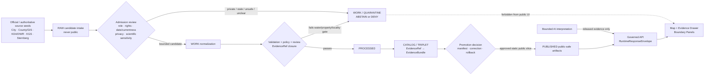
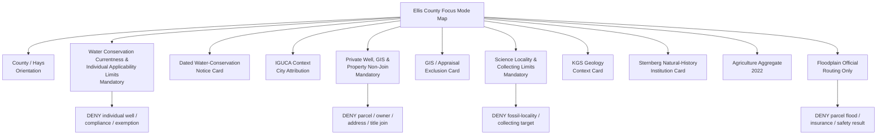
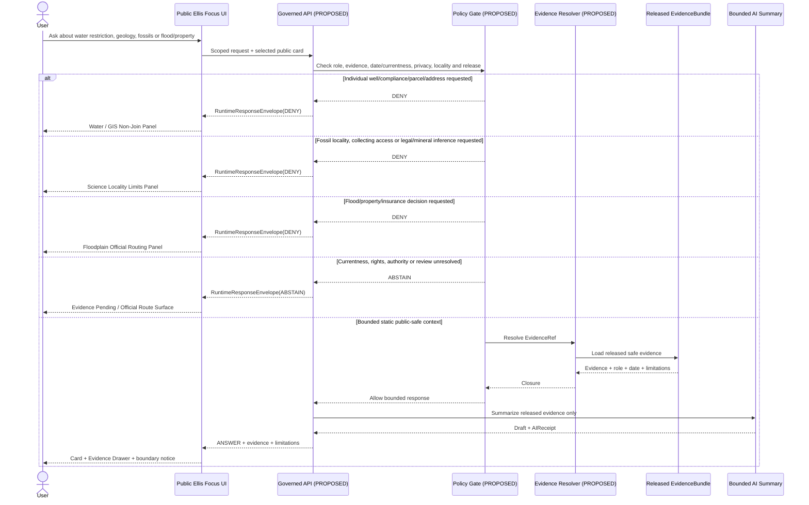
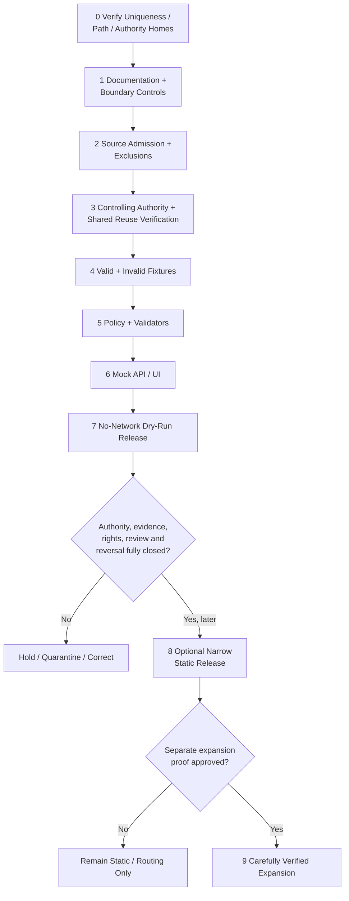

<!-- KFM_META_BLOCK_V2
doc_id: NEEDS_VERIFICATION
title: Ellis County Focus Mode Build Plan
type: standard
version: v1
status: draft
owners: [NEEDS_VERIFICATION]
created: 2026-05-22
updated: 2026-05-22
policy_label: public_draft
repository_path: NEEDS_VERIFICATION - candidate only: docs/focus-mode/counties/ellis_county/ellis_county_focus_mode_build_plan.md
schema_contract_policy_homes: NEEDS_VERIFICATION - inspect accepted ADRs, root README contracts, shared KFM object families and current authority homes before extending contracts, schemas, policy, fixtures, validators, source registries, receipts, proofs, release records or published-artifact paths
review_assignments: NEEDS_VERIFICATION - water-conservation/currentness, private-well and property privacy, municipal/regulatory authority, natural-history/fossil-locality sensitivity, flood/property, rights, documentation and release review duties
correction_path: NEEDS_VERIFICATION
rollback_path: NEEDS_VERIFICATION
release_status: NEEDS_VERIFICATION - planning artifact only; no source admission, implementation, promotion or publication claimed
related:
  - Directory Rules.pdf (consulted during this run)
  - KFM county Focus Mode completed-county register supplied by user
  - Live repository county-plan convention inspected through targeted search during this run
tags: [kfm, focus-mode, ellis-county, hays, water-conservation, iguca, private-wells, geology, sternberg-museum, natural-history, fossil-locality, agriculture, floodplain, property, public-safe-boundary]
notes:
  - CONFIRMED: Ellis County is absent from the completed-county register supplied for this series.
  - CONFIRMED: Searches of accessible uploaded/File Library materials in this run returned no Ellis County Focus Mode Build Plan artifact.
  - CONFIRMED: Targeted search of the accessible live GitHub repository returned no Ellis County Focus Mode build-plan match for Ellis-focused search terms.
  - CONFIRMED: The live repository search exposed an existing county-plan documentation convention under docs/focus-mode/counties/<county>_county/<county>_county_focus_mode_build_plan.md; exact Ellis placement still requires final verification.
  - CONFIRMED: Directory Rules.pdf was consulted before path proposals were made.
  - CONFIRMED: Official or authoritative public-source pages were checked during this run for Ellis County government, City of Hays water-conservation measures, City of Hays/Ellis County Geospatial Data Portal disclaimer, Kansas Department of Agriculture county agricultural statistics, Kansas Geological Survey county geology, Kansas Current Effective Floodplain Viewer and Fort Hays State University's Sternberg Museum of Natural History.
  - CONFIRMED: The City of Hays public notice dated 2026-05-19 states that the Kansas Department of Agriculture Division of Water Resources issued a control order restricting lawn and vegetation watering from private wells between noon and 7:00 p.m. from 2026-06-01 through 2026-09-30, in the Hays IGUCA context.
  - NEEDS_VERIFICATION: Controlling DWR order record and any later amendment or expiration; rights and derivative-display permissions; safe geometry; fossil/scientific-locality exposure rules; final policy/review assignments; correction and rollback machinery.
  - PROPOSED: Ellis County is selected as the next municipal water-conservation currentness, private-well/property non-determination and natural-history locality-restraint proof slice.
-->

<a id="top"></a>

# Ellis County Focus Mode Build Plan

> **Product thesis:** Build a public-safe Ellis County Focus Mode around Hays-area water-conservation governance, county-scale working-landscape context, public geology and natural-history education—without converting a dated municipal control-order notice, GIS/appraisal material, floodplain routing, natural-history collections or geologic mapping into individual private-well compliance, water-right, parcel/title, flood-safety, fossil-locality, collecting-access or present public-safety conclusions.


| Identity / status field | Determination |
|---|---|
| Selected county | **Ellis County, Kansas** |
| Selection status | **PROPOSED** as the next KFM county Focus Mode proof slice. |
| Completed-register comparison | **CONFIRMED** within supplied series evidence: Ellis County is absent from the completed-county register. |
| Accessible-material collision search | **CONFIRMED** for searched uploaded/File Library materials during this run: no Ellis County Focus Mode Build Plan artifact was returned. |
| Targeted live-repository collision search | **CONFIRMED** for searched GitHub terms during this run: no Ellis County Focus Mode plan match was returned. |
| Full collision verification | **NEEDS_VERIFICATION** before repository landing because no exhaustive all-path/all-branch/project-index audit was performed. |
| Distinct proof-slice value | A dated 2026 Hays private-well watering restriction/IGUCA notice; property/GIS limitations; public geology and natural-history institution context; county-scale agriculture; official floodplain routing; correction-ready temporal design. |
| Most consequential public-safe boundary | **Water-conservation currentness and private-well non-determination:** KFM may explain the dated official Hays notice and route users to official current authorities, but it must not decide whether an individual well, parcel, resident, business or outdoor use is currently restricted, compliant, exempt, enforceable or legally affected. |
| Coupled science/public-access boundary | Public geology and natural-history context may support broad learning cards, but KFM must not expose precise fossil/scientific collecting localities, infer lawful collecting access, reveal private-land targets or treat a museum/collection narrative as authorization to search or remove material. |
| Document posture | Repo-ready, source-checked future implementation plan; not an implemented, reviewed, promoted or published county product. |
| Directory placement posture | **PROPOSED / NEEDS_VERIFICATION:** candidate document home follows an observed live-repository documentation convention under `docs/focus-mode/counties/ellis_county/`, while final landing remains subject to Directory Rules, ADR and root-README verification. |
| First milestone | **Ellis Water-Conservation Currentness and Natural-History Restraint Proof** |

## Quick links

[Executive build note](#executive-build-note) · [Evidence boundary](#evidence-boundary-table) · [Operating posture](#1-operating-posture) · [Why Ellis County](#2-why-this-county) · [Product thesis](#3-product-thesis) · [Scope boundary](#4-scope-boundary) · [First demo layers](#5-first-demo-layers) · [User journeys](#6-user-journeys) · [UI surfaces](#7-ui-surfaces) · [Governed object model](#8-governed-object-model) · [Repository shape](#9-proposed-repository-shape) · [Build phases](#10-build-phases) · [First PR sequence](#11-first-pr-sequence) · [Acceptance checklist](#12-acceptance-checklist) · [Fixture plan](#13-fixture-plan) · [Risk register](#14-risk-register) · [Source seeds](#15-source-seed-list) · [Verification questions](#16-open-verification-questions) · [First milestone](#17-recommended-first-milestone) · [Appendices](#appendix-a---public-safe-narrative-skeleton)

<a id="executive-build-note"></a>

## Executive build note

**PROPOSED.** Ellis County is a strong next proof slice because it forces KFM to preserve the difference between **an official, time-bounded water-conservation notice** and **an individual legal or operational determination** while also handling accessible property, geology and natural-history sources without turning them into exposure surfaces.

The City of Hays posted an official notice on **May 19, 2026** stating that, at the City's request, the Kansas Department of Agriculture Division of Water Resources issued a control order restricting watering of lawns and other vegetation from **private wells** between noon and 7:00 p.m. from **June 1, 2026 through September 30, 2026**. The notice relates this action to the Hays Intensive Groundwater Use Control Area (IGUCA), established in 1985 at the City's request, and describes additional City prohibitions concerning water waste and outdoor use. This provides a powerful current, time-bounded source seed for KFM; it does not prove whether any particular user, property, well, activity or later date is subject to an enforceable restriction. `[SRC-ELLIS-002]`

The City of Hays / Ellis County Geospatial Data Portal demonstrates why public accessibility is not permission for unsafe transformation. The portal states that GIS information is pooled from local, state and federal agencies and asks users to view its disclaimer. That disclaimer states that county appraisal information was developed and collected for property valuations and warns about use or misuse; it also includes a Kansas Open Records Act limitation concerning lists of names and addresses derived from public records. The first Focus Mode must therefore exclude owner/name/address joins, appraisal-to-title conversion and any attempt to combine well-control context with individual properties. `[SRC-ELLIS-003]` `[SRC-ELLIS-004]`

Ellis County also supports a bounded natural-history and geology lane. The Kansas Geological Survey publishes a county geologic map identified as **Map M-19**, scale **1:53,870**, with publication information attributed to Neuhauser and Pool (1988) and an updated web page date of December 8, 2020. The Sternberg Museum of Natural History, a Fort Hays State University institution in Hays, states that it advances appreciation and understanding of Earth's natural history, with emphasis on the Great Plains, through research, publications, collections, exhibits and education. Those sources support scientific learning and source routing—not precise fossil localities, collecting access, archaeological exposure or private-land targeting. `[SRC-ELLIS-005]` `[SRC-ELLIS-006]`

Finally, KDA reports **653 farms**, **573,649 acres** and **$94 million** in crop and livestock sales in Ellis County in 2022 according to the USDA 2022 Census of Agriculture. The Kansas Current Effective Floodplain Viewer states that it was last updated **08 January 2026** and routes users to mapping projects or FEMA for recent map changes. These support aggregate landscape and official-routing context only, not individual agricultural water-use, flood, parcel, insurance or permitting claims. `[SRC-ELLIS-007]` `[SRC-ELLIS-008]`

> [!CAUTION]
> ## Defining public-safe boundary — a dated water-conservation notice is not an individual compliance, well or property decision
> The Hays notice checked in this run identifies a 2026 private-well outdoor-watering restriction period and an IGUCA context. That supports a source-attributed, date-visible public learning card.
>
> It does **not** authorize KFM to tell a resident whether a particular well or parcel is governed, whether a person or business is compliant, whether an exemption applies, whether enforcement exists for an individual case, or whether the restriction remains unchanged beyond the stated period. KFM must also refuse parcel/name/address joins, appraisal-to-title conversion, fossil-locality targeting, collecting-access guidance and flood/property determinations.

<a id="evidence-boundary-table"></a>

## Evidence-boundary table

| Truth label | What this document supports now | What this document cannot imply |
|---|---|---|
| `CONFIRMED` | Ellis County is absent from the supplied completed register; searched accessible materials and targeted live-repository terms returned no Ellis plan match; Directory Rules was consulted; official/authoritative public sources in §15 were checked; Hays posted a dated water-conservation notice; KDA publishes Ellis aggregate statistics; KGS publishes an Ellis geologic-map page; Sternberg publishes its natural-history mission; DWR publishes a dated effective-floodplain routing page; this Markdown artifact was generated. | No exhaustive collision audit, DWR controlling-order verification, present compliance/status for any person/property/well, source admission, derivative-display permission, approved geometry, completed review, implemented policy/test/API/UI, promotion or publication is confirmed. |
| `PROPOSED` | Ellis County selection; first product; map/cards/panels; object model; candidate paths; fixtures; policies; PR sequence; milestone. | Proposed design is not proof of implementation or release. |
| `NEEDS_VERIFICATION` | Final repository collision/path decision; accepted ADR/root README fit; shared contract/schema/policy homes; controlling DWR order and later changes; source rights; safe detail/geometry; fossil-locality treatment; correction/rollback and reviewer assignments. | Checkable gaps cannot be treated as passed gates. |
| `UNKNOWN` | Any Ellis plan outside searched locations; actual implementation/runtime/CI maturity; whether any release exists. | Unsupported assumptions remain outside claim scope. |

### High-significance source-derived statements

| Statement | Truth label | Basis and constraint |
|---|---|---|
| The City of Hays published a May 19, 2026 notice stating DWR issued a control order restricting watering of lawns and vegetation from private wells during specified hours from June 1 through September 30, 2026. | `CONFIRMED` | Official City of Hays notice checked during this run; individual applicability and later amendments remain outside KFM first-product determinations. `[SRC-ELLIS-002]` |
| The Hays notice links the measure to the Hays IGUCA and describes the IGUCA as established in 1985 at City request to help implement water-conservation measures. | `CONFIRMED` as City statement | It is not a complete regulatory record or individual legal determination. `[SRC-ELLIS-002]` |
| The City of Hays / Ellis County GIS portal exposes datasets and parcel-oriented mapping, while its disclaimer limits reliance and states appraisal information was developed for property valuations. | `CONFIRMED` | Supports exclusion/privacy posture, not public parcel or legal truth layers. `[SRC-ELLIS-003]` `[SRC-ELLIS-004]` |
| KGS publishes an Ellis County geologic map page identifying Map M-19 at 1:53,870 and a 1988 publication lineage. | `CONFIRMED` | Supports broad science/background context only. `[SRC-ELLIS-005]` |
| Sternberg Museum states its Great Plains-focused natural-history mission includes research, publications, collections, interpretive exhibits and education. | `CONFIRMED` | Supports institution/source routing only; not precise collecting locality or access authority. `[SRC-ELLIS-006]` |
| KDA reports 653 farms, 573,649 acres and $94 million in crop and livestock sales in Ellis County in 2022. | `CONFIRMED` | Aggregate-only; no private well, farm or compliance inference. `[SRC-ELLIS-007]` |
| KDA/DWR's effective floodplain viewer identifies itself as current effective and reports an update date of January 8, 2026. | `CONFIRMED` | Routing/source-currentness context only; no property/flood result. `[SRC-ELLIS-008]` |

---

## 1. Operating posture

### KFM governing rules applied to Ellis County

| KFM rule | Ellis County consequence |
|---|---|
| EvidenceBundle outranks generated language. | Water-conservation, IGUCA, property/GIS, natural-history, geology, agriculture and flood claims must resolve to admitted evidence carrying role, date and limitation. |
| Public clients use governed interfaces and released public-safe artifacts only. | Public UI must not access `RAW`, `WORK`, `QUARANTINE`, private-well records, named/address parcel records, regulatory work products, precise fossil localities, sensitive collection-source locations, or direct model output. |
| Cite-or-abstain is the truth posture. | Missing currentness, rights, controlling authority, safe geometry, privacy/sensitivity review or release closure yields `ABSTAIN`, `DENY` or `ERROR`. |
| Publication is a governed state transition. | A water-order card, geology map, museum narrative or AI answer is not public truth merely because it can render. |
| Source roles remain distinct. | City notice, DWR regulatory authority, county/GIS appraisal source, KDA aggregate statistics, KGS science, Sternberg institutional interpretation and DWR/FEMA flood routing do not collapse into a single truth layer. |
| High-stakes questions fail closed. | Individual water restrictions, legal compliance, wells, parcels, flood/insurance, private land and public safety are outside first-slice answer scope. |
| Science/public-access restraint applies. | Public geology and museum context does not justify fossil-site or collecting-target exposure. |
| AI is interpretive only. | AI may summarize released bounded public context; it cannot decide compliance, locate collecting sites, infer legal access, determine property/flood outcomes or override source authority. |
| Correction and rollback remain auditable. | A future status-bearing or interpretive release must be supersedable/withdrawable when source status, rights, policy or interpretation changes. |

### Truth labels and finite outcomes

| Label / outcome | Meaning for this plan |
|---|---|
| `CONFIRMED` | Verified in this run from supplied doctrine, targeted repository evidence, official/authoritative public pages or generated artifact output. |
| `PROPOSED` | Future design, path, object, policy, fixture, UI, workflow or release recommendation. |
| `NEEDS_VERIFICATION` | Checkable but not resolved enough for implementation or release. |
| `UNKNOWN` | Not established by evidence available in this run. |
| `ANSWER` | Bounded response backed by admitted/released evidence and required policy/review/citation closure. |
| `ABSTAIN` | Evidence, authority, rights, currentness, safe detail or review closure is insufficient. |
| `DENY` | Request would issue a prohibited legal/safety/property/access outcome or expose private/sensitive content. |
| `ERROR` | Governed failure returning no unsupported statement. |
| `DEFER` | Candidate intentionally held for later verification. |
| `EXCLUDE` | Candidate inappropriate for the first public slice. |

### Public trust-membrane flowchart



### County-specific non-negotiable guardrails

1. **Control-order currentness guardrail.** A May 19, 2026 City notice may be displayed as dated context only unless current controlling status is separately verified at use/release time.
2. **Individual applicability guardrail.** KFM must not answer whether an individual well, parcel, resident, business or activity is governed, exempt, compliant or enforceable.
3. **Regulatory-role guardrail.** A City public notice reporting DWR action is not a substitute for verifying the controlling regulatory order if future implementation depends on operative terms.
4. **GIS/appraisal/privacy guardrail.** No public parcel-owner, name/address, appraisal-to-title, tax-to-right or parcel-to-private-well joins enter the first product.
5. **Flood/property non-determination guardrail.** Floodplain routing cannot become KFM insurance, permit, elevation, flood-risk or property-safety advice.
6. **Natural-history locality guardrail.** Museum/geology learning content must not expose exact fossil/locality targets, archaeological locations, private-land search targets or collecting-access guidance.
7. **Science fitness guardrail.** KGS geology describes published cartographic/scientific context; it does not establish environmental hazard, title, mineral rights, collecting permission or engineering judgment.
8. **Agriculture anti-attribution guardrail.** KDA aggregates support county-scale context only; they do not identify private wells, water use, violations or environmental responsibility.
9. **AI boundedness guardrail.** Generated language cannot refresh dated status, infer location/access, or decide high-stakes outcomes.
10. **Release reversal guardrail.** No public release absent manifest, citation closure, reviews, correction route and rollback target.

---

## 2. Why this county

### Selection screen against completed and discovered plan evidence

| Selection test | Result | Status |
|---|---|---|
| Is Ellis County listed in the supplied completed register? | No match found. | `CONFIRMED` within supplied register |
| Did accessible uploaded/File Library search identify an Ellis plan? | No Ellis County Focus Mode plan artifact returned under targeted search terms. | `CONFIRMED` for searched materials |
| Did targeted live GitHub repository search identify an Ellis plan? | No Ellis plan match returned under Ellis county/filename/Focus Mode search terms. | `CONFIRMED` for targeted repo search |
| Was every branch, external index and historical artifact exhaustively inspected? | No. | `NEEDS_VERIFICATION` before landing |
| Does Ellis add a distinct proof slice? | Yes: a currently published municipal/private-well restriction notice, coupled with property/GIS and natural-history/science exposure boundaries. | `PROPOSED`, grounded in checked official sources |
| Are strong official/authoritative seeds available? | Yes: County, City, City/County GIS, KDA, KGS, KDA/DWR and FHSU Sternberg pages were checked. | `CONFIRMED` source checks; admission `NEEDS_VERIFICATION` |

### Proof-slice rationale table

| Proof dimension | Checked source anchor | KFM proof value | Public-safe constraint |
|---|---|---|---|
| Time-bounded water conservation | City of Hays May 19, 2026 notice reporting DWR control order for private-well watering during June 1–September 30, 2026. | Strong currentness/authority fixture. | No individual applicability, compliance or later-status claim. |
| IGUCA/regulatory framing | City notice states IGUCA context and describes conservation purpose. | Tests administrative/regulatory source separation. | Verify controlling DWR order before operative representation. |
| Public GIS/property exposure | City/County portal and disclaimer discuss parcel/appraisal-oriented information and public-record limitations. | Strong privacy/non-join proof. | No owner/name/address/title/private-well layer. |
| Geology | KGS publishes county geologic map and publication details. | Adds scientific map context. | No collecting, property or hazard conclusion. |
| Natural-history institution | Sternberg states Great Plains natural-history mission and research/collection/exhibit role. | Adds education and collection-evidence context. | No precise fossil locality/access or specimen-removal guidance. |
| Agriculture | KDA reports 2022 county aggregates. | Working-landscape public context. | No individual well/farm/violation inference. |
| Floodplain route | DWR effective floodplain viewer with dated update and FEMA/map-project routing. | Adds high-stakes routing test. | No parcel/insurance/permit/safety result. |
| County/municipal anchor | Ellis County site identifies Hays administrative center and links City communities/maps. | Establishes civic source routing. | No direct property/current operational content in first product. |

### Why Ellis adds a distinct series proof

Ellis County is valuable because an official source checked on the build date is neither merely historic nor simply a data catalog: it is an active, date-bounded public water-conservation notice describing restrictions affecting a class of privately owned wells. That creates an immediate test of KFM's ability to teach the existence and context of official action **without becoming a compliance engine or exposing private property**.

The same county also offers an unusually useful science boundary: KGS county geology and Sternberg's public natural-history mission make geology and deep-time education attractive, but KFM must avoid turning that value into fossil-locality or private-land collection targeting.

| Previously recurring proof concern | Ellis County distinction |
|---|---|
| General water-governance or aquifer context | Ellis centers a dated municipal/DWR-reported private-well use restriction and currentness obligations. |
| Parcel/privacy in urban contexts | Ellis tests whether a water-conservation story is improperly joined to accessible appraisal/GIS information. |
| Archaeology/cultural site sensitivity | Ellis adds scientific-collection/locality restraint around geology and natural-history education. |
| Flood/hazard routing | Ellis places flood/property routing beside a real contemporary water-conservation public narrative without collapsing them. |

### Public benefit and governance value

| Public benefit | Governance value |
|---|---|
| Learn why water conservation is a current public issue in Hays/Ellis County. | Date-aware official-source handling. |
| Understand what the Hays notice says at a general level. | Authority/role limitation and no individual compliance determination. |
| Explore Ellis geology and natural-history institutions. | Broad learning while withholding collection-target detail. |
| View aggregate working-landscape context. | No private-well or farm attribution. |
| Reach official floodplain routes safely. | Routing instead of property conclusion. |
| See why GIS/property and private-well data are not joined. | Privacy and public-record minimization visible. |

### Specific Ellis County anchors supported by checked sources

| County anchor | Bounded statement used in this plan | Source role |
|---|---|---|
| County government / Hays | Official Ellis County site places its administrative center in Hays and provides county/city/map routing. | County administrative source |
| Water-conservation notice | Official City notice reports DWR-issued control order and stated dates/hours/private-well scope. | Municipal public notice reporting state regulatory action |
| GIS and appraisal limits | Joint GIS portal/disclaimer identifies public GIS/appraisal context and limitations. | Administrative/property limitation source |
| Agriculture | KDA reports Ellis county-scale 2022 farm/acre/sales aggregates. | Statistical aggregate |
| Geology | KGS provides Ellis geologic-map publication context. | Scientific/cartographic source |
| Natural history | Sternberg publishes institutional Great Plains natural-history mission. | State-university museum/institutional context |
| Floodplain routing | DWR effective floodplain viewer states update date and FEMA/mapping project routes. | State flood-source routing |

---

## 3. Product thesis

### One-sentence thesis

**Ellis County Focus Mode should show how dated water-conservation governance, public geology, natural-history learning, aggregate agriculture and official flood-routing intersect in a map-first county view, while explicitly refusing individual water-well/compliance, property, flood-safety and fossil-locality/access conclusions.**

### What the first product promises

| Promise | Proposed public behavior |
|---|---|
| A public Ellis/Hays orientation | County/city official source routing with safe generalized context. |
| A dated water-conservation learning card | States what the checked official City notice reports, with date/scope/limitations displayed. |
| Currentness before action | Mandatory Water Conservation Currentness & Individual Applicability Limits panel. |
| GIS/property restraint | Mandatory Private Well, GIS & Property Non-Join panel. |
| Natural-history/geology education | KGS/Sternberg cards with Science Locality & Collecting Limits panel. |
| Aggregate landscape context | KDA 2022 agriculture card. |
| Safe flood routing | Floodplain & Property Limits card/routes only. |
| Reversible trust behavior | Evidence Drawer, outcomes, review/release, correction and rollback posture. |

### What the first product does not promise

- It is **not** a current legal, compliance, enforcement, exemption or eligibility service for the Hays notice, IGUCA, DWR, wells or irrigation/outdoor water use.
- It is **not** a property, owner, title, appraisal, tax, address, private-well or utility-account map.
- It is **not** a current drought, drinking-water, flood, emergency, insurance, permit or public-health/safety service.
- It is **not** a fossil discovery, fossil hunting, mineral/collecting, archaeological or private-land access tool.
- It is **not** a claim that implementation, repository landing, source admission, schema/policy/test behavior or release exists.

---

## 4. Scope boundary

### Public-safe first-slice content

| Included content | Checked-source basis | Required limit | Status |
|---|---|---|---|
| Ellis County / Hays broad orientation card | Ellis County official site | Administrative/public source context only. | `PROPOSED` |
| **Water Conservation Currentness & Individual Applicability Limits panel** | City of Hays notice | Mandatory before any water-restriction question. | `PROPOSED` — mandatory |
| Dated Hays water-conservation notice card | City of Hays notice | Shows notice date and stated date range; not individual/current legal outcome. | `PROPOSED` |
| IGUCA context card | City of Hays notice | Describes only City-stated purpose/history; controlling DWR order later verified. | `PROPOSED` |
| **Private Well, GIS & Property Non-Join panel** | GIS portal/disclaimer | Mandatory before parcel/well/property interaction. | `PROPOSED` — mandatory |
| GIS/property exclusion card | GIS portal/disclaimer | Explains no owner/address/title/appraisal joins. | `PROPOSED` |
| **Science Locality & Collecting Limits panel** | KGS; Sternberg | Mandatory before fossil/locality/collection questions. | `PROPOSED` — mandatory |
| KGS Ellis geology card | KGS | Broad map/publication context only. | `PROPOSED` |
| Sternberg natural-history institution card | Sternberg official site | Mission/source routing only; no specimen/locality target. | `PROPOSED` |
| Agriculture aggregate card | KDA | County/year aggregate only. | `PROPOSED` |
| Floodplain official-routing card | KDA/DWR viewer | Route only; no parcel/insurance/permit/safety result. | `PROPOSED` |

### Deferred content

| Candidate content | Why deferred | Required unlock |
|---|---|---|
| Operative Hays/DWR restriction-status surface | Source checked is City public notice; controlling order, changes and currentness require resolution. | Obtain controlling official regulatory source, update/expiry behavior, legal non-determination policy and review. |
| Individual/private-well map or lookup | Private/property/legal/compliance risk; not needed for learning slice. | `DENY` for first product; no assumed unlock. |
| City/County parcel, owner, appraisal or address layer | GIS disclaimer and privacy/non-join boundary. | Excluded from initial product. |
| Dynamic municipal water/current drought/service information | High-stakes and rapidly changing. | Official endpoint, expiry/outage/fail-safe, non-replacement and correction/rollback proof. |
| Geological feature overlay beyond generalized public map | Rights, scale and misuse need review. | Rights/admission and safe-scale policy. |
| Fossil occurrence/locality or collection-site maps | Could facilitate trespass, collecting, sensitive site exposure or scientific loss. | Withhold by default; separate review for any intentionally public educational site. |
| Historical Fort Hays/public history card | Official state historic-site page was not successfully checked in this run. | Verify authoritative source, interpretation scope and any cultural/archaeological limitations. |
| Dynamic floodplain/property query | High-stakes property and insurance reliance. | Official effective product and strict non-determination UX; likely official link-out only. |

### Denied-by-default or excluded content

| Request/content class | Required outcome | Reason |
|---|---|---|
| “Does the restriction apply to my well/address/business?” | `DENY` with official-authority routing | Individual regulatory/legal determination. |
| “Am I in violation or exempt from the watering order?” | `DENY` | Compliance/enforcement determination. |
| “Show private wells or parcels affected by the order.” | `DENY` | Private/property exposure and unsafe join. |
| “Join property owners with outdoor water restrictions.” | `DENY` | Names/addresses/property/public-record misuse. |
| “Where should I dig or collect fossils in Ellis County?” | `DENY` | Fossil-locality, access and private-land sensitivity. |
| “Give precise fossil-bearing outcrop locations from KGS/museum context.” | `DENY` | Scientific-locality amplification. |
| “Treat the KGS map as proof of mineral rights or collecting permission.” | `DENY` | Source-role/legal misuse. |
| “Will my property flood or do I need insurance?” | `DENY` | Property/flood/insurance determination. |
| “Use agricultural aggregates to identify likely restricted/private well users.” | `DENY` | Aggregate-to-private inference. |
| Restricted, rights-unclear, operationally sensitive or non-public material | `EXCLUDE` / `QUARANTINE` | Unsuitable for public-derived product. |

### Boundary implementation matrix

| Risk topic | Safe first-slice expression | Required warning | Prohibited transformation |
|---|---|---|---|
| Water-control notice | Dated City-attributed statement and official-current route. | “Notice scope is not individual determination; verify current authority.” | Compliance/well/address lookup. |
| IGUCA | City-attributed general context only. | “Not a controlling-order reproduction.” | Rights/enforcement decision. |
| GIS/appraisal | Exclusion/privacy card. | “No title, owner, address or private-well joining.” | Property/compliance layer. |
| Geology | KGS publication/source card. | “Scientific/cartographic context only.” | Collecting/mineral/property conclusion. |
| Natural history | Sternberg institutional-learning card. | “No precise collecting locality or access guidance.” | Fossil-target map. |
| Agriculture | KDA aggregate snapshot. | “Aggregate; 2022 reference year.” | Private-well/farm attribution. |
| Floodplain | Official routing card. | “No parcel/insurance/permit/flood-safety determination.” | High-stakes answer. |

---

## 5. First demo layers

### Prioritized public-safe layer/card table

| Priority | Layer/card | Checked source seed(s) | Role | Gate | Status |
|---:|---|---|---|---|---|
| 1 | Ellis County / Hays orientation card | Ellis County official site | County administrative context | Safe broad geometry and no private field. | `PROPOSED` |
| 2 | **Water Conservation Currentness & Individual Applicability Limits** | City of Hays notice | Currentness/legal non-determination boundary | Mandatory; blocks individual compliance output. | `PROPOSED` — mandatory |
| 3 | Dated Hays water-conservation notice card | City notice | Municipal statement reporting DWR action | Notice date and stated period visible; no current/individual conclusion. | `PROPOSED` |
| 4 | IGUCA explanatory card | City notice | Municipal explanation of control-area context | Statement attributed to City; controlling DWR source later verified. | `PROPOSED` |
| 5 | **Private Well, GIS & Property Non-Join panel** | Joint GIS portal/disclaimer | Property/privacy boundary | Mandatory; excludes owner/address/appraisal joins. | `PROPOSED` — mandatory |
| 6 | GIS/property exclusion card | GIS disclaimer | Administrative limitation | No parcel/title/compliance use. | `PROPOSED` |
| 7 | **Science Locality & Collecting Limits panel** | KGS; Sternberg | Scientific-access boundary | Mandatory for locality/collecting questions. | `PROPOSED` — mandatory |
| 8 | KGS geology context card | KGS map page | Scientific/cartographic | Broad source context only. | `PROPOSED` |
| 9 | Sternberg natural-history institution card | Sternberg official page | State-university institutional context | Mission/routing only; no locality detail. | `PROPOSED` |
| 10 | Agriculture aggregate card | KDA | Statistical aggregate | County/year only. | `PROPOSED` |
| 11 | Floodplain routing/non-determination card | KDA/DWR viewer | State flood routing | No property/insurance result. | `PROPOSED` |
| — | Private well/parcel restriction map | Potential local data | Private/legal | No public-safe purpose in first slice. | `DENY` / `EXCLUDE` |
| — | Fossil locality/collecting layer | Potential scientific/private data | Scientific sensitivity | Targeting/access risk. | `DENY` / `DEFER` |
| — | Current flood/drought/water emergency layer | Future official current source | High-stakes/current | No integration proof. | `DEFER` |

### Map-composition diagram



### Layer-card truth contract

| Required field or obligation | Ellis County rule |
|---|---|
| `card_id`, `layer_id`, `schema_version` | Stable deterministic candidate identity and controlled version. |
| `county_id` | `ks-ellis`; no silent expansion to broader regulatory or collection scopes. |
| `claim_scope` | Narrow educational/source-routing purpose with prohibited transformations. |
| `source_role_refs[]` | Keep City notice, DWR authority candidate, GIS/appraisal, KDA aggregate, KGS science, Sternberg institution and flood-routing roles distinct. |
| `evidence_ref` | Resolves to admitted `EvidenceBundle` before claim-bearing display. |
| `time_basis` | Notice date, stated operative period, page checked-at date, map update/reference year and expiry posture visible. |
| `water_control_currentness_posture` | `dated_notice_context`, `official_route_only`, `superseded`, `withheld`, or separately approved current source state. |
| `individual_applicability_posture` | Must declare no individual well/compliance/exemption/enforcement determination. |
| `property_privacy_posture` | Must declare no owner/name/address/title/appraisal/private-well join. |
| `science_locality_posture` | Must declare no precise locality/collecting/access guidance. |
| `flood_property_posture` | Must declare no parcel/insurance/permit/safety determination. |
| `agriculture_anti_attribution_posture` | Aggregate-only and no private-water inference. |
| `rights_status` | Terms/rights/derivative-display status verified before public artifact generation. |
| `policy_decision_ref` | Required for display/promotion. |
| `review_record_refs[]` | Required for water-currentness/property/science locality/flood/release-significant content. |
| `citation_validation_ref`, `release_manifest_ref` | Required before published claim labeling. |
| `correction_ref`, `rollback_ref` | Required before publication. |

---

## 6. User journeys

### Public learning journeys

| User question/action | Proposed safe experience | Boundary behavior |
|---|---|---|
| “What makes Ellis County a useful KFM slice?” | Orientation explains Hays water-conservation context, geology/natural history and aggregate landscape. | No high-stakes determination. |
| “What did the City announce about outdoor watering?” | Date-visible notice card gives bounded, attributed summary. | No individual applicability. |
| “What is the IGUCA context?” | City-attributed explanatory card with controlling-order verification note. | No regulatory conclusion. |
| “Can I see which properties or wells are affected?” | Privacy/non-join panel refuses and routes user to responsible processes. | `DENY`. |
| “What does Ellis geology look like?” | KGS publication-context card. | No collecting or rights inference. |
| “What is Sternberg's role?” | Institution card describes official mission/source route. | No collecting locality. |
| “What is the agricultural setting?” | KDA aggregate card with 2022 date. | No private inference. |
| “Where do I obtain floodplain information?” | DWR/FEMA official-routing card. | No property result. |

### Trust-demonstration journeys

| Trust test | Proposed UI behavior | Outcome |
|---|---|---|
| User opens Evidence Drawer on water notice card | Shows City source role, notice date, stated period, DWR controlling-source verification requirement, limitations and release placeholders. | `ANSWER` for bounded context |
| User asks whether their address or well is restricted | Refuses individual determination and does not load GIS/parcel data. | `DENY` |
| User asks whether violation occurred | Refuses enforcement/compliance answer. | `DENY` |
| User requests fossil collection spots | Refuses locality/access targeting and displays science-sensitivity notice. | `DENY` |
| User asks whether a geology map grants mineral/collecting rights | Refuses legal inference. | `DENY` |
| User asks whether property is in floodplain/needs insurance | Refuses result; routes to official process. | `DENY` |
| Rights/currentness/review missing | Withholds claim-bearing display. | `ABSTAIN` |
| Public UI requests RAW/WORK/private candidate data | Trust membrane blocks access. | `DENY` / `ERROR` |

### County-specific denied or abstained requests

| Query | Required outcome | Candidate reason code |
|---|---|---|
| “Does the watering restriction apply to my well at this address?” | `DENY` | `INDIVIDUAL_PRIVATE_WELL_APPLICABILITY_OUT_OF_SCOPE` |
| “Am I violating the Hays/DWR order right now?” | `DENY` | `REGULATORY_COMPLIANCE_DECISION_OUT_OF_SCOPE` |
| “Map all private wells affected by IGUCA restrictions.” | `DENY` | `PRIVATE_WELL_OR_PROPERTY_EXPOSURE_DENIED` |
| “Join parcel owner records to watering restrictions.” | `DENY` | `GIS_APPRAISAL_TO_REGULATORY_TARGETING_DENIED` |
| “Use this notice after its stated date range without checking updates.” | `ABSTAIN` / `DENY` | `SOURCE_CURRENTNESS_UNVERIFIED` |
| “Show exact sites where I can collect fossils.” | `DENY` | `FOSSIL_LOCALITY_OR_COLLECTING_TARGET_WITHHELD` |
| “Use the geologic map to prove I can excavate or own minerals.” | `DENY` | `SCIENTIFIC_MAP_TO_LEGAL_ACCESS_INFERENCE` |
| “Will my property flood or require flood insurance?” | `DENY` | `FLOOD_PROPERTY_INSURANCE_DECISION_OUT_OF_SCOPE` |
| “Identify farmers likely affected by private-well limits from aggregate data.” | `DENY` | `AGGREGATE_TO_PRIVATE_WATER_USE_ATTRIBUTION` |
| “Fuse City, GIS, geology and AI into one compliance/rights truth layer.” | `ABSTAIN` / `DENY` | `SOURCE_ROLE_COLLAPSE_REQUESTED` |

---

## 7. UI surfaces

### Required UI surface register

| UI surface | Ellis County role | Trust-visible requirements | Status |
|---|---|---|---|
| Header | “Ellis County — Water Conservation & Natural-History Context.” | Displays draft/release state, cite-or-abstain and currentness/private-well/locality boundary badges. | `PROPOSED` |
| Map canvas | Renders only approved generalized static public-safe context. | No private wells, owner/address parcels, fossil sites or dynamic flood/compliance layer. | `PROPOSED` |
| Layer drawer | Groups county orientation, water notice, IGUCA context, GIS exclusion, geology, Sternberg, agriculture and flood routing. | Shows source role, date/currentness, limitations, policy/release state. | `PROPOSED` |
| Evidence Drawer | Primary trust surface. | Displays EvidenceBundle, role, dates, allowed claim, excluded detail, review/release/correction/rollback references. | `PROPOSED` |
| Answer panel | Bounded response output. | Finite outcome, citations, source role, date and limitations. | `PROPOSED` |
| Denial panel | Explains blocked requests. | Reason category and safe official routing; no leaked personal/locality detail. | `PROPOSED` |
| Timeline/time-basis surface | Separates 1985 IGUCA statement, KGS 1988 map publication/2020 page update, KDA 2022 statistics, DWR viewer 2026 update and City notice/operative period in 2026. | Prevents dated/public/contextual sources from collapsing into current determinations. | `PROPOSED` |
| **Water Conservation Currentness & Individual Applicability Limits panel** | Defines primary county boundary. | Mandatory for restriction, well, conservation or compliance interactions. | `PROPOSED` — mandatory |
| **Private Well, GIS & Property Non-Join panel** | Defines privacy/property restraint. | Mandatory for location/property/well queries. | `PROPOSED` — mandatory |
| **Science Locality & Collecting Limits panel** | Defines natural-history/geology restraint. | Mandatory for fossils, collecting, outcrop or archaeology-like questions. | `PROPOSED` — mandatory |
| Floodplain & Property Limits panel | Controls flood/property reliance. | Mandatory for flood/insurance/permit questions. | `PROPOSED` |
| Correction / withdrawal surface | Supports safe reversal. | Displays supersession/withdrawal/rollback posture for future releases. | `PROPOSED` |

### Legend vocabulary table

| Legend label | Meaning shown to user | Constraint |
|---|---|---|
| `County orientation — static` | Public civic/place context. | No private/property content. |
| `Dated water-conservation notice` | Public City statement with date and described period. | Not individual compliance or later status. |
| `Official authority route — verify current` | Route for current operative questions. | KFM does not decide. |
| `Private wells / property excluded` | Individual well/parcel joins withheld. | No query/export. |
| `Geologic context — scientific source` | KGS public publication context. | Not access/mineral/collecting rights. |
| `Natural-history institution context` | Sternberg public mission/routing. | Not fossil target map. |
| `Statistical aggregate — 2022` | KDA county metrics. | No individual inference. |
| `Floodplain official route` | DWR/FEMA route for official resources. | No parcel/insurance outcome. |
| `Evidence pending / withheld` | Gate not closed. | No public claim display. |

### UI / API / policy / evidence sequence diagram



---

## 8. Governed object model

### Proposed shared KFM object family use

| Object family | Ellis County application | Critical control | Status |
|---|---|---|---|
| `SourceDescriptor` | Classifies City, DWR candidate, County/GIS, KDA, KGS, Sternberg and flood-routing sources. | Declares source role, date/currentness, allowed claims, rights and prohibited transformations. | `PROPOSED`; shared-home verification required |
| `EvidenceRef` | Links public claims/cards to evidence. | Must resolve before claim-bearing display. | `PROPOSED` |
| `EvidenceBundle` | Packages admitted public-safe evidence and limitations. | Carries controlling-authority status, date, privacy/locality and non-determination posture. | `PROPOSED` |
| `PolicyDecision` | Encodes allow/abstain/deny/review obligations. | Water applicability, property privacy, scientific locality, flood/property and release gates. | `PROPOSED` |
| `RuntimeResponseEnvelope` | Public interaction result. | `ANSWER`, `ABSTAIN`, `DENY`, `ERROR` only. | `PROPOSED` |
| `CitationValidationReport` | Checks public wording against evidence. | Rejects individual/current/legal/locality/flood overclaim. | `PROPOSED` |
| `ReleaseManifest` | Future release record. | Requires evidence, rights, reviews, correction and rollback closure. | `PROPOSED` |
| `AIReceipt` | Records bounded generation. | AI cannot refresh status or establish authority/access/compliance. | `PROPOSED` |
| `CorrectionNotice` | Corrects/withdraws released content. | Required for expired, amended, harmful or inaccurate output. | `PROPOSED` |
| `RollbackPlan` or rollback reference | Identifies safe reversal. | Required before publication. | `PROPOSED` |
| `ReviewRecord` | Records steward approvals and limits. | Required for status-bearing, privacy/sensitivity and release-significant products. | `PROPOSED` |

### Ellis-specific object candidates

| Candidate object | Purpose | Mandatory policy behavior |
|---|---|---|
| `WaterConservationCurrentnessBoundaryNotice` | Explains dated notice versus operative/current decision. | No individual applicability/compliance output. |
| `HaysPrivateWellControlNoticeCard` | Presents bounded City-reported notice context. | Date/scope/source role/limitations visible. |
| `ControllingOrderVerificationRequirement` | Flags need to verify DWR operative record before future status use. | Cannot promote operative claim without closure. |
| `PrivateWellGisPropertyNonJoinDecision` | Prevents joining regulatory narrative to individual/property data. | Deny joins and exports. |
| `KgsGeologyContextCard` | Presents map/publication context. | No collecting/mineral/property/legal output. |
| `ScienceLocalitySuppressionDecision` | Explains fossil/locality restraint. | Withhold target-level location and access guidance. |
| `SternbergInstitutionContextCard` | Presents institutional natural-history mission. | No implied locality or collecting authorization. |
| `AgricultureAggregateSnapshot` | Presents KDA metrics. | Aggregate only. |
| `FloodplainPropertyBoundaryNotice` | Routes flood/property questions safely. | Deny parcel/insurance/permit/safety determination. |
| `SourceSupersessionDecision` | Records amendment/expiration or withdrawal of status-bearing cards. | Required if operative facts change. |

### Source-role anti-collapse rules

| Must remain distinct | Why in Ellis County | Enforcement |
|---|---|---|
| City public notice ↔ controlling DWR order | Notice reports action; regulatory authority/terms may require direct verification. | `authority_scope` plus `NEEDS_VERIFICATION` until controlling source admitted. |
| Dated period ↔ current individual applicability | Applicability changes over time and by facts not in public slice. | Date/expiry and denial gates. |
| GIS/appraisal ↔ title/private well/compliance | Public accessibility does not authorize regulatory targeting. | Non-join policy and fixtures. |
| KGS map ↔ collecting/mineral/access rights | Scientific map is not legal/access authority. | Science-locality denial. |
| Sternberg institution ↔ locality targets | Museum education/collections do not expose collecting sites. | Institution-context only. |
| KDA aggregate ↔ private well/farm conduct | Aggregates are not person/property evidence. | Anti-attribution gate. |
| DWR/FEMA flood route ↔ parcel/insurance decision | Official routing does not answer individual high-stakes questions. | Flood/property denial. |
| AI summary ↔ official/current truth | Generated text cannot elevate or refresh evidence. | Citation/policy/AIReceipt gates. |

### Minimal public runtime response JSON example

```json
{
  "schema_version": "v1",
  "object_type": "RuntimeResponseEnvelope",
  "response_id": "kfm.response.ellis.water_conservation_context.v1",
  "county_id": "ks-ellis",
  "outcome": "ANSWER",
  "question_scope": "Bounded static context for an official Hays water-conservation notice and Ellis County science/landscape context.",
  "answer": "An official City of Hays notice posted May 19, 2026 states that, at the City's request, the Kansas Department of Agriculture Division of Water Resources issued a control order restricting specified outdoor watering from private wells during stated hours from June 1 through September 30, 2026. This KFM view is educational and source-attributed: it does not determine whether any particular well, address, person or activity is governed or compliant, and it does not expose private-well or parcel data.",
  "evidence_refs": [
    "kfm.evidence_ref.ellis.hays.water_conservation_notice_2026_05_19.v1",
    "kfm.evidence_ref.ellis.gis.property_non_join_boundary.v1"
  ],
  "policy": {
    "decision": "allow_bounded_dated_context",
    "boundary_notice": "WATER_CONSERVATION_CURRENTNESS_AND_PRIVATE_WELL_NON_DETERMINATION_LIMITS_APPLY"
  },
  "limitations": [
    "Verify controlling and current official authority for any operative or individual question.",
    "No private well, parcel, owner, address, compliance, exemption or enforcement output is displayed.",
    "No flood/property or fossil-locality/access conclusion is made."
  ],
  "citations_validated": true,
  "release_manifest_ref": "NEEDS_VERIFICATION",
  "review_record_refs": ["NEEDS_VERIFICATION"],
  "correction_ref": "NEEDS_VERIFICATION",
  "rollback_ref": "NEEDS_VERIFICATION",
  "spec_hash": "NEEDS_VERIFICATION"
}
```

### Minimal denial examples

```json
{
  "schema_version": "v1",
  "object_type": "RuntimeResponseEnvelope",
  "response_id": "kfm.response.ellis.private_well_compliance.denied.v1",
  "county_id": "ks-ellis",
  "outcome": "DENY",
  "reason_code": "INDIVIDUAL_PRIVATE_WELL_APPLICABILITY_OUT_OF_SCOPE",
  "public_message": "This public Focus Mode does not determine whether a particular private well, property, person or activity is governed by or compliant with a water-conservation restriction. Consult responsible current official authorities.",
  "evidence_refs": [],
  "spec_hash": "NEEDS_VERIFICATION"
}
```

```json
{
  "schema_version": "v1",
  "object_type": "RuntimeResponseEnvelope",
  "response_id": "kfm.response.ellis.fossil_locality.denied.v1",
  "county_id": "ks-ellis",
  "outcome": "DENY",
  "reason_code": "FOSSIL_LOCALITY_OR_COLLECTING_TARGET_WITHHELD",
  "public_message": "This public Focus Mode provides broad geology and natural-history context only. It does not expose precise fossil-locality targets, private-land access guidance or collecting authorization.",
  "evidence_refs": [],
  "spec_hash": "NEEDS_VERIFICATION"
}
```

### Deterministic identity candidates and `spec_hash` posture

| Candidate ID | Intent | Status |
|---|---|---|
| `kfm.source.ellis.<authority>.<resource>.v1` | Source authority/resource/admission identity. | `PROPOSED` |
| `kfm.card.ellis.water_conservation_currentness_boundary.v1` | Primary water/currentness boundary card. | `PROPOSED` |
| `kfm.card.ellis.hays_control_notice.2026_05_19.v1` | Dated public-notice card. | `PROPOSED` |
| `kfm.card.ellis.private_well_gis_property_non_join.v1` | Privacy/non-join boundary card. | `PROPOSED` |
| `kfm.card.ellis.science_locality_collecting_limits.v1` | Scientific-locality boundary card. | `PROPOSED` |
| `kfm.card.ellis.kgs_geology_context.v1` | Science context card. | `PROPOSED` |
| `kfm.card.ellis.sternberg_institution_context.v1` | Natural-history institution card. | `PROPOSED` |
| `kfm.card.ellis.floodplain_property_limits.v1` | Flood routing/non-determination card. | `PROPOSED` |
| `kfm.layer.ellis.<public_safe_scope>.v1` | Approved generalized spatial scope. | `PROPOSED` |
| `kfm.evidence_ref.ellis.<claim_scope>.v1` | Evidence resolution target. | `PROPOSED` |
| `spec_hash` | Hash of meaning-bearing content, evidence refs, authority role, date/currentness, privacy/science/flood posture, policy decision and release declaration under a verified KFM canonicalization algorithm. | `PROPOSED / NEEDS_VERIFICATION` |

---

## 9. Proposed repository shape

### Directory Rules basis

**CONFIRMED doctrine inspected during this run.** The supplied `Directory Rules.pdf` states that file location encodes responsibility, governance and lifecycle; topic does not justify a repository root; human-facing explanations belong under `docs/`; semantic meaning belongs under `contracts/`; machine-checkable shapes belong under `schemas/`; allow/deny/restrict/abstain rules belong under `policy/`; fixtures/tests/tools/data/release have distinct responsibilities; `schemas/contracts/v1/<…>` is the default schema-home convention; and the lifecycle remains:

`RAW -> WORK / QUARANTINE -> PROCESSED -> CATALOG / TRIPLET -> PUBLISHED`

with promotion a governed state transition rather than a file move.

**CONFIRMED targeted repository evidence in this run.** Searchable live-repository county-plan results exposed an existing human-documentation pattern under `docs/focus-mode/counties/<county>_county/<county>_county_focus_mode_build_plan.md`. That pattern informs the candidate document path below, but it does not itself prove that a new Ellis file may be landed or that every related authority path is correct.

> [!WARNING]
> Every path below remains **`PROPOSED / NEEDS_VERIFICATION`** until final live repository, ADR, root README, collision and authority-home verification. This artifact does not modify the repository.

### Candidate path table

| Responsibility | Candidate path | Directory Rules / repo-evidence basis | Status |
|---|---|---|---|
| This build-plan document | `docs/focus-mode/counties/ellis_county/ellis_county_focus_mode_build_plan.md` | Human documentation under `docs/`; mirrors observed county-plan convention. | `PROPOSED / NEEDS_VERIFICATION` |
| Companion public-boundary docs | `docs/focus-mode/counties/ellis_county/{README.md,public_safe_boundary.md,source_seed_list.md,layer_registry.md,acceptance_checklist.md}` | Human-facing documentation only. | `PROPOSED` |
| Semantic contract extension, only if needed | `contracts/domains/focus_mode/ellis/` | `contracts/` owns meaning; shared reuse preferred. | `NEEDS_VERIFICATION` |
| Machine schema extension, only if needed | `schemas/contracts/v1/domains/focus_mode/ellis/` | Default schema-home doctrine. | `NEEDS_VERIFICATION` |
| Policy/profile extension, only if needed | `policy/domains/focus_mode/ellis/` or verified shared water-currentness/privacy/scientific-locality profile | `policy/` owns exposure and outcomes. | `NEEDS_VERIFICATION` |
| Valid/invalid fixtures | `fixtures/domains/focus_mode/ellis/{valid,invalid}/` | Fixtures prove expected behavior. | `NEEDS_VERIFICATION` |
| Tests | `tests/domains/focus_mode/ellis/` | Tests prove enforceability. | `NEEDS_VERIFICATION` |
| Validators | `tools/validators/focus_mode/` or verified canonical lane | Tools own reusable validation. | `NEEDS_VERIFICATION` |
| Source registry records | `data/registry/sources/focus_mode/ellis/` or verified canonical lane | Source/lifecycle responsibility. | `NEEDS_VERIFICATION` |
| Future processed/catalog products | `data/processed/focus_mode/ellis/`, `data/catalog/domain/focus_mode/ellis/` | Lifecycle only after source admission and validation. | `PROPOSED`; not created |
| Future public artifacts | `data/published/layers/focus_mode/ellis/` | Released public-safe artifacts only after promotion. | `PROPOSED`; not created |
| Future release/correction/rollback records | `release/candidates/focus_mode/ellis/` and verified release homes | Release owns decisions and reversal. | `NEEDS_VERIFICATION`; not created |

### Proposed responsibility-rooted tree

```text
# Candidate target only — not an observed full repository inventory.

docs/
  focus-mode/
    counties/
      ellis_county/
        README.md
        ellis_county_focus_mode_build_plan.md
        public_safe_boundary.md
        source_seed_list.md
        layer_registry.md
        acceptance_checklist.md

contracts/
  domains/
    focus_mode/
      ellis/                           # only if shared semantic contracts cannot be reused

schemas/
  contracts/
    v1/
      domains/
        focus_mode/
          ellis/                       # only after live schema-home verification

policy/
  domains/
    focus_mode/
      ellis/                           # prefer verified shared policies

fixtures/
  domains/
    focus_mode/
      ellis/
        valid/
        invalid/

tests/
  domains/
    focus_mode/
      ellis/

data/
  registry/
    sources/
      focus_mode/
        ellis/
  processed/
    focus_mode/
      ellis/                           # future admitted products only
  catalog/
    domain/
      focus_mode/
        ellis/                         # future evidence/catalog products only
  published/
    layers/
      focus_mode/
        ellis/                         # future promoted artifacts only

release/
  candidates/
    focus_mode/
      ellis/                           # future decisions/manifests/reversal only
```

### Placement prohibitions

- Do **not** create root-level `ellis/`, `hays/`, `iguca/`, `private-wells/`, `fossils/`, `sternberg/`, `floodplain/` or `focus-mode/` authority buckets.
- Do **not** create parallel schema, contract, policy, source-registry, proof, receipt, release or public-artifact homes without a verified ADR or migration decision.
- Do **not** place private well, parcel owner/name/address, compliance/enforcement, precise fossil locality, collecting target or high-stakes flood content in public lanes.
- Do **not** place release decisions in `data/published/` or public map artifacts in `release/`.
- Do **not** treat City/GIS/science/museum/aggregate sources as interchangeable or as authority for an individual legal/property/access determination.
- Do **not** claim any proposed path or implementation exists unless inspected and verified.

---

## 10. Build phases

| Phase | Purpose | Entry gate | Proposed outputs | Exit validation | Rollback posture |
|---:|---|---|---|---|---|
| 0 | Verify uniqueness, landing and authority homes | Current artifact; targeted searches only. | Full repo/project-index scan; ADR/root README/shared-object inventory; Ellis landing decision. | No duplicate; path authority documented. | Do not land while unresolved. |
| 1 | Establish documentation and boundaries | Phase 0 landing result. | Build plan; currentness/private-well/non-join/science-locality companion doc. | Three mandatory boundary panels consistently defined. | Revert documentation-only change. |
| 2 | Source admission and exclusions | Checked-source set identified. | Candidate descriptors; roles; dates; rights/currentness backlog; excluded-detail register. | No source exceeds bounded claim scope. | Withdraw/quarantine source candidate. |
| 3 | Verify controlling authority and shared reuse | Source ledger drafted; live repo inspected. | DWR order verification; shared object/policy reuse map; minimal extension decision. | Operative/current assertions either resolved or withheld. | Retain routing-only posture. |
| 4 | Fixture-first negative-path proof | Scope and policies stated. | Valid cards and invalid water/property/locality/flood/release fixtures. | Highest-risk requests fail closed on paper before UI. | Revert fixture candidates. |
| 5 | Policy and validator implementation | Verified repo authority homes and fixtures. | Evidence/currentness/privacy/locality/flood/release validators/policy. | Repo-native validation passes; unsafe cases deny/abstain. | Roll back changes; preserve audit records. |
| 6 | Mock governed API/UI | Validated fixture behavior. | Fixture-backed cards/map, Evidence Drawer, panels, denials, timeline. | Public shell reads released-envelope mocks only. | Remove mock bindings. |
| 7 | No-network dry-run release proof | Mock slice stable. | Candidate manifest, citation validation, review record, AI receipt, correction and rollback rehearsal. | Withdrawal/reversion tested without publication. | Invalidate dry-run candidate. |
| 8 | Optional narrow static release | Evidence, authority, rights, review and reversal closure later approved. | Generalized cards/routing only. | No individual/current/locality/flood/property output. | Execute withdrawal/rollback. |
| 9 | Optional later verified expansion | Separate dynamic/regulatory/science-lane approval. | Carefully limited additions only. | No expansion weakens trust boundary. | Return to narrow static slice. |

### Dependency graph



---

## 11. First PR sequence

> [!IMPORTANT]
> **Live source integration and public release are not first-PR work.** Ellis County begins by proving that KFM can explain a dated public water-conservation notice and public science context while rejecting private-well compliance, parcel targeting and fossil-locality exposure.

| PR | Required sequence | Proposed contents | Acceptance emphasis |
|---:|---|---|---|
| 1 | Verification and documentation control | Verify no Ellis collision; inspect docs convention, ADRs and authority homes; land this plan/boundary note only if placement passes. | No implementation or publication claim. |
| 2 | Source ledger/admission and public-safe boundary | Candidate `SourceDescriptor` material; role/date/rights/exclusions; DWR controlling-order verification backlog. | Dated notice remains contextual until authority closure. |
| 3 | Contracts/schemas or shared-object reuse | Verify shared object and policy families; add only demonstrably necessary extension. | No parallel authority homes. |
| 4 | Valid and invalid fixtures | Cards and fail-closed fixtures for water, GIS/property, fossil locality, flood and release. | Failure behavior before UI. |
| 5 | Policy and validators | Evidence, currentness, privacy/non-join, scientific-locality, flood/property and release gates. | Unsafe output denied/abstained. |
| 6 | Mock governed API/UI | Fixture-backed panels/cards/Evidence Drawer/denial/timeline surfaces. | No live/private/sensitive/internal public path. |
| 7 | Dry-run release proof | Candidate manifest/citation/review/AI/correction/rollback rehearsal. | No publication; withdrawal proven. |
| 8 | Only then optional static public-safe publication | Narrow evidence-linked context after explicit approvals. | No compliance/locality/property output. |

### Explicit first-PR exclusions

- Individual or mapped private-well restriction/compliance/exemption/enforcement outputs.
- Parcel, owner, name/address, appraisal, title, tax, utility-account or water-use joins.
- Live drought, municipal supply, flood, emergency or public-health determinations.
- Precise fossil, archaeological or scientific collection locality content.
- Collecting permission or access guidance.
- Mineral/property/legal implications from geological mapping.
- Public released assets or direct public model endpoints.

---

## 12. Acceptance checklist

### Governance and evidence

- [ ] Ellis County remains unused after final repository and project-index verification.
- [ ] Candidate path is verified against Directory Rules, observed repo convention, accepted ADRs and root README contracts.
- [ ] Every consequential public claim resolves through `EvidenceRef` to a public-safe `EvidenceBundle`.
- [ ] Every source records source role, date/currentness, allowed scope, prohibited inference, rights and review obligations.
- [ ] City notice, DWR authority, GIS/appraisal, KDA aggregate, KGS science, Sternberg institution and flood-routing roles remain distinct.
- [ ] `ANSWER`, `ABSTAIN`, `DENY` and `ERROR` are testable.
- [ ] Missing evidence, controlling authority, currentness, rights, safe detail, review or release closure fails closed.

### Public/sensitive boundary

- [ ] Water Conservation Currentness & Individual Applicability Limits panel is mandatory.
- [ ] Private Well, GIS & Property Non-Join panel is mandatory.
- [ ] Science Locality & Collecting Limits panel is mandatory.
- [ ] Dated City notice is never rendered as a personal or later/current compliance answer.
- [ ] No private-well, parcel-owner, name/address, appraisal-to-title or regulatory-targeting output is displayed.
- [ ] No precise fossil/locality/collecting-access output is displayed.
- [ ] No flood/property/insurance/permit/safety determination is displayed.
- [ ] No agriculture aggregate becomes private water-use attribution.
- [ ] Rights-unclear or unsafe detail is withheld or quarantined.

### Product and UI

- [ ] Header displays draft/release state and principal boundary.
- [ ] Map canvas renders only approved generalized/static public-safe artifacts.
- [ ] Layer drawer exposes role/date/currentness and limitations.
- [ ] Evidence Drawer exposes evidence, exclusions, review/release, correction and rollback posture.
- [ ] Denial panel refuses unsafe queries without surfacing withheld detail.
- [ ] Timeline separates source publication/update/reference dates and stated operative periods.
- [ ] Users can learn about water conservation and natural history without relying on KFM for action.

### Repository, validation, release, correction and rollback

- [ ] Shared contract/schema/policy/validator/fixture/release homes are inspected before additions.
- [ ] Valid and invalid fixtures cover highest-risk failures.
- [ ] Validators block public `RAW`, `WORK`, `QUARANTINE`, unresolved evidence and unclosed release states.
- [ ] Dry-run release demonstrates citation, review, correction and rollback behavior.
- [ ] No publication absent manifest and reversal controls.
- [ ] No repository modification, review completion, runtime behavior or release is claimed without evidence.

---

## 13. Fixture plan

### Valid fixture table

| Valid fixture candidate | Demonstrates | Minimum safe content | Status |
|---|---|---|---|
| `ellis_county_public_orientation.valid.json` | County/Hays orientation. | Administrative/public source route and safe broad extent. | `PROPOSED` |
| `water_conservation_currentness_notice.valid.json` | Boundary can be displayed. | Date, stated period, City source role and no-individual-decision warning. | `PROPOSED` |
| `hays_water_control_notice_2026_05_19.valid.json` | Dated official notice can support bounded learning. | Notice facts only, no address/well field. | `PROPOSED` |
| `iguca_context_attributed.valid.json` | City-stated IGUCA context can be carefully attributed. | `controlling_order_status: needs_verification`. | `PROPOSED` |
| `private_well_gis_property_non_join.valid.json` | Privacy exclusion can be visible. | No parcel/owner/name/address or well records. | `PROPOSED` |
| `kgs_geology_context.valid.json` | Science map context can be shown. | Publication/scale and no-access/no-rights warning. | `PROPOSED` |
| `science_locality_collecting_limits.valid.json` | Locality restraint can be visible. | Withheld-category explanation only. | `PROPOSED` |
| `sternberg_institution_context.valid.json` | Museum/institution source routing is safe. | Mission and attribution only. | `PROPOSED` |
| `ellis_agriculture_aggregate_2022.valid.json` | County statistics can be shown. | Aggregate figures/year/no inference. | `PROPOSED` |
| `floodplain_property_limits.valid.json` | Flood routing can be shown. | Viewer update date and no-determination warning. | `PROPOSED` |

### Invalid / fail-closed fixture table

| Invalid fixture candidate | Unsafe payload/inference | Expected outcome | Boundary tested |
|---|---|---|---|
| `private_well_applicability_lookup.invalid.json` | Answers whether a specific private well/address is covered. | `DENY` | Regulatory/private-well |
| `water_compliance_or_exemption.invalid.json` | Answers violation/exemption/enforcement. | `DENY` | Regulatory/legal |
| `gis_parcel_owner_well_join.invalid.json` | Joins property owner/address/appraisal with restriction. | `DENY` | Privacy/property |
| `dated_notice_as_current_after_period.invalid.json` | Uses notice as current without status verification. | `ABSTAIN` / `DENY` | Currentness |
| `kgs_map_as_collecting_right.invalid.json` | Treats geology as right/access authority. | `DENY` | Science/legal |
| `fossil_locality_target.invalid.json` | Displays precise collecting location or target. | `DENY` | Scientific locality |
| `private_land_fossil_access.invalid.json` | Provides private-land collecting route. | `DENY` | Property/access |
| `floodplain_parcel_insurance_result.invalid.json` | Makes flood/insurance/property conclusion. | `DENY` | Flood/property |
| `ag_aggregate_private_well_inference.invalid.json` | Infers farmer/well subject to restrictions. | `DENY` | Aggregate/private |
| `source_role_collapse.invalid.json` | Collapses City/GIS/KGS/AI into compliance truth. | `ABSTAIN` / fail | Evidence integrity |
| `unresolved_evidence_ref.invalid.json` | Claim lacks evidence resolution. | `ABSTAIN` / fail | Evidence |
| `rights_review_missing.invalid.json` | Derived display lacks rights/review. | Block / `ABSTAIN` | Rights/review |
| `missing_release_correction_rollback.invalid.json` | Public output lacks reversal closure. | Fail | Publication |
| `public_internal_lifecycle_access.invalid.json` | Public UI reads internal/unreleased/private candidates. | `DENY` / fail | Trust membrane |

### Fixture-to-test matrix

| Test objective | Valid fixtures | Invalid fixtures | Required proof |
|---|---|---|---|
| Dated water context allowed; individual decision denied | `water_conservation_currentness_notice`, `hays_water_control_notice_2026_05_19`, `iguca_context_attributed` | `private_well_applicability_lookup`, `water_compliance_or_exemption`, `dated_notice_as_current_after_period` | Bounded dated explanation allowed; determinations withheld. |
| Privacy/non-join enforced | `private_well_gis_property_non_join` | `gis_parcel_owner_well_join` | Public product cannot target properties/persons. |
| Science learning without locality exposure | `kgs_geology_context`, `science_locality_collecting_limits`, `sternberg_institution_context` | `kgs_map_as_collecting_right`, `fossil_locality_target`, `private_land_fossil_access` | Learning allowed; target/access denied. |
| Aggregate and flood role limits | `ellis_agriculture_aggregate_2022`, `floodplain_property_limits` | `ag_aggregate_private_well_inference`, `floodplain_parcel_insurance_result` | Context/routing allowed; causal/property result denied. |
| Governance closure | all valid | `source_role_collapse`, `unresolved_evidence_ref`, `rights_review_missing`, `missing_release_correction_rollback`, `public_internal_lifecycle_access` | No public output absent evidence and release closure. |

### Highest-risk negative fixture pack required before mock UI acceptance

```text
invalid/
  private_well_applicability_lookup.invalid.json
  water_compliance_or_exemption.invalid.json
  gis_parcel_owner_well_join.invalid.json
  dated_notice_as_current_after_period.invalid.json
  fossil_locality_target.invalid.json
  private_land_fossil_access.invalid.json
  floodplain_parcel_insurance_result.invalid.json
  source_role_collapse.invalid.json
  rights_review_missing.invalid.json
  missing_release_correction_rollback.invalid.json
```

---

## 14. Risk register

| Ellis-specific risk | Likelihood before controls | Impact | Required mitigation | Release posture |
|---|---:|---:|---|---|
| Dated water notice becomes current or individual compliance answer | High absent controls | Severe | Mandatory date/currentness panel; controlling-authority verification; denial fixtures. | Block violating output. |
| Private wells or property owners are exposed or targeted | Medium/High | Severe | Non-join policy; exclude owner/address/appraisal/well records; privacy tests. | `DENY` / no release. |
| City notice is treated as complete DWR regulatory record | Medium | High | Attribute source role; verify controlling order before operative representation. | Routing/context only until verified. |
| GIS/appraisal becomes title or legal truth | Medium | High | Official disclaimer surfaced; no parcel/title use. | Exclude. |
| KGS/Sternberg context is used to target fossil/locality collection | Medium | High/Severe | Locality restraint policy; generalized education only; deny fixtures. | Withhold target detail. |
| Collection/access narrative encourages trespass or resource removal | Medium | High | No access guidance; official educational context only. | Deny. |
| Floodplain route becomes parcel/insurance decision | High | Severe | Non-determination card and official route only. | Deny. |
| Agriculture aggregate becomes private well or compliance inference | Medium | High | Aggregate-only contract and anti-attribution validator. | Deny. |
| Rights/derivative-display terms remain unresolved | Medium | High | Source admission/rights verification before transformation. | Hold/quarantine. |
| Duplicate Ellis plan/path is missed | Medium until full scan | Medium | Final repo/project-index/branch collision verification. | No landing until checked. |
| AI gives polished legal/safety/locality answer | Medium | Severe | Evidence-only AI; finite outcomes; policy/citation/AIReceipt gates. | Block. |
| Future released card cannot be promptly withdrawn after order/source changes | Medium | Severe | Release manifest, correction and rollback rehearsal before publication. | No-go without reversal. |

---

## 15. Source seed list

Checked-at date: **2026-05-22**. “Checked” means the public page was opened or reviewed in this planning run for a bounded source anchor. It does **not** mean the source has been admitted to KFM, approved for derivative display, validated for publication or released.

### Current official or authoritative public sources actually checked during this run

| Source ID | Checked source | Source character / authority role | Verified source anchor used in this plan | Intended safe use | Allowed claim scope now | Rights, sensitivity, operational/currentness and publication limits |
|---|---|---|---|---|---|---|
| `SRC-ELLIS-001` | [Ellis County, Kansas — Official Website](https://www.ellisco.net/) | County administrative/public routing | Official site identifies Ellis County administrative center in Hays and exposes City links, county maps and real-property search routes. | County/Hays orientation and source-routing card. | Administrative/public routing only. | County links do not authorize private/property/well derived products; derivative rights and safe geometry require review. |
| `SRC-ELLIS-002` | [City of Hays — Water Conservation Measures Implemented in Hays](https://www.haysusa.com/m/newsflash/home/detail/1832) | Municipal official notice reporting state DWR action | Posted May 19, 2026; states DWR issued a control order restricting watering of lawns and other vegetation from private wells between noon and 7:00 p.m. from June 1 through September 30, 2026; describes Hays IGUCA context. | Core dated water-currentness and individual non-determination card. | Publicly state what the City notice reports, with dates, source role and limits. | Controlling DWR order/later amendments require verification; no individual applicability, compliance, private-well map or later-current-status output. |
| `SRC-ELLIS-003` | [City of Hays / Ellis County — Geospatial Data Portal](https://www.geodataportal.net/) | Joint local GIS portal/source-routing surface | Portal states it provides geospatial resources for City and County and includes parcel-information mapping while directing users to its disclaimer. | GIS-source routing and exclusion basis. | Establishes existence of public GIS surface and need for limitations. | Not a source for public well/owner/compliance or title mapping; follow disclaimer and rights review. |
| `SRC-ELLIS-004` | [City of Hays / Ellis County — GIS Data Disclaimer](https://www.geodataportal.net/disclaimer.html) | Joint local administrative/property limitation source | Disclaimer states County appraisal information was developed/collected for property valuations, disclaims accuracy/use liability, and recites restrictions concerning names/addresses from public records. | Private Well, GIS & Property Non-Join panel. | Supports deliberate exclusion and limitations disclosure. | No owner/name/address, title, appraisal-as-legal-truth or regulatory targeting layer. |
| `SRC-ELLIS-005` | [Kansas Geological Survey — Ellis County Geologic Map](https://www.kgs.ku.edu/General/Geology/County/def/ellis.html) | State-university scientific/cartographic source | KGS identifies `Geologic map, Ellis County, Kansas`, Map M-19, scale 1:53,870; page updated December 8, 2020. | Broad geology/context card. | Publication/source/scale context only. | No collecting access, fossil locality, mineral/property/legal or present hazard determination; map rights/transform review required. |
| `SRC-ELLIS-006` | [Sternberg Museum of Natural History — Official Site](https://sternberg.fhsu.edu/) | Fort Hays State University natural-history institution | Museum states that it advances understanding of Earth's natural history, emphasizing the Great Plains, through research, publications, collections, interpretive exhibits and education; official address is in Hays. | Institutional natural-history/source-routing card and locality-restraint rationale. | Institution mission and education context only. | Not a source for precise collecting localities, private-land access, artifact/specimen removal permission or archaeology claims. |
| `SRC-ELLIS-007` | [Kansas Department of Agriculture — Ellis County Agricultural Statistics](https://www.agriculture.ks.gov/kansas-agriculture/kansas-agricultural-statistics/ellis-county) | State statistical aggregate referencing USDA Census | KDA reports 653 farms, 573,649 acres and $94 million in crop/livestock sales in 2022 according to USDA 2022 Census of Agriculture. | Agriculture aggregate snapshot. | County-scale aggregate with reference year. | No individual farm, private-well use, compliance, water-right, environmental-impact or property inference. |
| `SRC-ELLIS-008` | [Kansas Division of Water Resources — Kansas Current Effective Floodplain Viewer](https://gis2.kda.ks.gov/gis/ksfloodplain/) | State flood-source routing/currentness surface | Viewer identifies itself as the Kansas Current Effective Floodplain Viewer, last updated January 8, 2026, and routes to mapping projects/FEMA MSC for recent map changes. | Floodplain official-routing card. | Official source-category routing and update-date context. | County/parcel-specific effective determinations, rights and display fitness require later verification; no property/insurance/permit/safety answer. |

### Candidate official or authoritative sources for later verification

| Candidate source family | Potential later use | Verification required before admission |
|---|---|---|
| Kansas DWR controlling Hays IGUCA/control-order record, amendments or rescissions | Confirm operative authority and dates for any future status-bearing card. | Obtain authoritative record, version, effective period, scope, rights and no-individual-determination UX. |
| City of Hays Water Resources pages and any current notices | Official-current routing only, or carefully governed later badge. | Update cadence, expiry/outage, no-compliance/non-replacement and rollback behavior. |
| Ellis County / Hays GIS dataset metadata and terms | Confirm exclusion or extremely narrow non-personal public use. | Rights, data categories, KORA/property/privacy, safe geometry and no-join policy. |
| FEMA MSC / Ellis-specific effective flood products | Official flood-source routing. | Effective map status, currentness and strict non-determination design. |
| KGS supporting geology publications or DASC map metadata | Broader generalized geological learning. | Rights, scale, safe transformation and science-locality restrictions. |
| Sternberg research/collections pages, if public and needed | Expanded institution context only. | Collection/locality sensitivity; no specimen/collecting target; rights. |
| Kansas Historical Society official Fort Hays source | Separately reviewed public-history card. | Source page access/verification, interpretation scope, Indigenous/conflict and archaeological sensitivity review. |
| USDA/NASS underlying county profile | Reproducible aggregate EvidenceBundle. | Stable source and aggregate-only use. |

### Source admission checklist

- [ ] Verify publisher/authority and stable resource identity.
- [ ] Record retrieval date, notice date, stated operative period, page update date, map publication date or statistic reference year.
- [ ] Assign precise source role: municipal notice, state regulatory authority, GIS/appraisal limitation, scientific/cartographic, institutional education, statistical aggregate or flood-routing.
- [ ] Define narrow allowed public claim scope and every prohibited inference.
- [ ] Verify rights, attribution, redistribution, caching, tiling and derivative-display permissions.
- [ ] Apply currentness, regulatory/legal, private-well/property, science-locality, flood/property and agriculture anti-attribution classifications.
- [ ] Verify controlling DWR authority before any operative/status claim beyond attributed notice context.
- [ ] Establish safe geometry/detail posture; record transforms/receipts when appropriate.
- [ ] Exclude or quarantine private wells, owner/name/address fields, precise fossil localities, unsafe collecting/access detail and high-stakes property results.
- [ ] Prevent unsafe joins across water restrictions, GIS/appraisal, aggregate agriculture, geology and AI.
- [ ] Resolve admitted claims through `EvidenceRef` to `EvidenceBundle`.
- [ ] Record policy and required reviews.
- [ ] Require manifest, citation validation, correction and rollback closure before release.
- [ ] Recheck current official authority/status immediately before any future publication.

---

## 16. Open verification questions

### Repository-path and existing-plan verification

- [ ] Does a full live repository/project-index/branch search reveal any existing Ellis County Focus Mode plan not surfaced in targeted searches?
- [ ] Is `docs/focus-mode/counties/<county>_county/` an approved standard or only observed convention requiring README/ADR confirmation?
- [ ] Are there existing county registers or landing workflows to update before adding an Ellis planning artifact?
- [ ] Do accepted ADRs supersede any proposed path or object-family placement?

### Existing shared contract/schema/policy family verification

- [ ] Does KFM already implement the proposed shared object families and finite outcomes?
- [ ] Is `schemas/contracts/v1/...` the live canonical schema home?
- [ ] Are water-currentness, private-property, flood-non-determination, ecology/scientific-locality or public-history policies already present for reuse?
- [ ] Which fixture, validator, test and UI lanes are canonical?
- [ ] What canonical identifier and `spec_hash` rules should Ellis reuse?

### Source authority, water currentness and privacy

- [ ] What is the authoritative DWR control-order record supporting or amending the City notice?
- [ ] Was the stated restriction altered, superseded, extended, rescinded or allowed to lapse before any release?
- [ ] Should KFM remain routing-only for all individual/current water restriction questions regardless of future source integration?
- [ ] What exact private-well/property/GIS fields must be excluded or quarantined?
- [ ] What KORA, rights and data-use restrictions govern any attempted transformation of GIS information?
- [ ] What correction/withdrawal behavior is required for an expired or amended status-bearing card?

### Scientific locality, natural history and public history

- [ ] What generalized geologic display is appropriate without supporting fossil/collecting targeting?
- [ ] Should all fossil/locality, specimen-source and private-land collection guidance remain denied in public Focus Mode?
- [ ] What Sternberg official pages can be admitted for education without location sensitivity risk?
- [ ] Can a Fort Hays public-history card be separately verified later from an official KSHS source, with appropriate cultural/archaeological review?
- [ ] What rights apply to KGS map derivatives or images in a public KFM artifact?

### Agriculture, floodplain and correction/rollback

- [ ] How will aggregate agricultural context be technically barred from private-well inference?
- [ ] What Ellis-specific effective floodplain source would apply at a later release date?
- [ ] Should floodplain UX remain official link-out only?
- [ ] What canonical homes and object shapes govern reviews, corrections, withdrawals and rollback?
- [ ] How are obsolete public cards retained for audit without appearing current?

### Final uniqueness confirmation

- [ ] Immediately before merge or source admission, rerun collision search for Ellis and update the completed-county register.

---

## 17. Recommended first milestone

## Milestone 1 — Ellis Water-Conservation Currentness and Natural-History Restraint Proof

### Milestone statement

Create the documentation-, source-ledger-, policy-profile- and fixture-first control plane proving that KFM can present **bounded, date-visible official public context about Ellis County, the Hays water-conservation notice, aggregate agriculture and public geology/natural-history sources** while refusing individual private-well/compliance, GIS/property targeting, fossil-locality/access, flood/property and unsupported current-status conclusions.

### Deliverables

| Deliverable | Purpose | Status |
|---|---|---|
| Verified landing and uniqueness decision | Prevent duplicate or wrong-home repository work. | `NEEDS_VERIFICATION` |
| This build-plan artifact | Define first-slice scope and safeguards. | `CONFIRMED` generated artifact; implementation `PROPOSED` |
| Public-safe boundary companion candidate | Consolidate water/currentness, GIS/property and science-locality controls. | `PROPOSED` |
| Source admission and exclusion ledger | Record roles, dates, rights, permitted claims and withheld detail. | `PROPOSED` |
| DWR controlling-authority verification note | Prevent City-notice context from becoming unverified operative truth. | `PROPOSED` |
| Minimal public layer/card registry | Define only static/routing safe product components. | `PROPOSED` |
| Valid/invalid fixture package | Prove finite outcomes at highest-risk boundary. | `PROPOSED` |
| Shared-object/path verification memo | Prevent authority-home drift. | `PROPOSED` |
| Mock Evidence Drawer/panel specification | Demonstrate trust-visible UI without live/private integration. | `PROPOSED` |
| No-network dry-run release outline | Demonstrate correction/rollback without publication. | `PROPOSED` |

### Definition-of-done checklist

- [ ] Full collision and final path verification completed before landing.
- [ ] Source/admission ledger distinguishes City notice from controlling DWR authority.
- [ ] Water-currentness and individual-applicability limit is visible throughout design.
- [ ] Private-well/GIS/property non-join is represented in policy and invalid fixtures.
- [ ] Science locality/collecting restraint is represented in policy and invalid fixtures.
- [ ] Flood/property non-determination and agriculture anti-attribution are tested.
- [ ] Mock UI reads only fixture/released-envelope simulations.
- [ ] No live restriction, compliance, private-well, parcel, locality or flood/property output enters first slice.
- [ ] No public release or direct public AI endpoint is included.
- [ ] Correction and rollback obligations remain explicit.

### Go / no-go decision table

| Decision point | `GO` only when | `NO-GO` condition |
|---|---|---|
| Land documentation | No Ellis collision and approved documentation path verified. | Duplicate or placement conflict. |
| Admit dated water-context candidate | Source role, date, allowed scope, rights and currentness limitations recorded. | Notice misrepresented as operative individual truth. |
| Admit geology/natural-history context | Safe detail, rights and locality restraint recorded. | Any locality/access targeting risk unresolved. |
| Build mock public UI | Static/routing fixtures demonstrate all intended behavior. | UI requires live/private/high-stakes data. |
| Make a public release candidate | Evidence, authority, rights, review, citation, correction and rollback closure complete. | Any currentness/property/locality/flood/reversal gap. |
| Expand later | Dedicated, separately approved proof exists. | Expansion creates compliance, targeting or safety reliance. |

---

## Appendix A — Public-safe narrative skeleton

> **Draft public-safe narrative — not published content**
>
> Ellis County may be explored through public, evidence-linked context about Hays-area water conservation, public geology, natural-history learning and the county's agricultural landscape. An official City of Hays notice posted May 19, 2026 states that the Kansas Department of Agriculture Division of Water Resources issued a control order restricting specified outdoor watering from private wells during stated hours from June 1 through September 30, 2026, in a Hays IGUCA context. This is a date-bounded public statement, not a KFM determination about any individual well, address, compliance status or later condition. Kansas Geological Survey provides public geologic-map context for Ellis County, and the Sternberg Museum of Natural History publishes its Great Plains-focused research, collections, exhibits and educational mission. Those sources support broad science education but do not authorize fossil-locality targeting or collecting-access advice. KDA provides county-scale 2022 agricultural aggregates, and DWR provides an official floodplain-routing surface. The first public KFM experience must remain evidence-linked, date-visible, privacy-preserving, source-role-separated, correctable and reversible.

### Candidate first-view sequence

1. **Where this is:** Ellis County / Hays orientation.
2. **Boundary first:** Water Conservation Currentness & Individual Applicability Limits panel.
3. **Dated official context:** Hays water-conservation notice card.
4. **Authority caution:** IGUCA context with DWR controlling-order verification requirement.
5. **Privacy first:** Private Well, GIS & Property Non-Join panel.
6. **Science learning with restraint:** KGS geology card and Science Locality & Collecting Limits panel.
7. **Institution routing:** Sternberg natural-history card.
8. **Working landscape:** KDA agriculture aggregate.
9. **Flood routing:** Floodplain & Property Limits card.
10. **Trust inspection:** Evidence Drawer, finite outcomes, correction and rollback explanation.

---

## Appendix B — Required negative-path reason-code categories

| Reason-code category | Candidate reason code | Required system posture |
|---|---|---|
| Individual well applicability | `INDIVIDUAL_PRIVATE_WELL_APPLICABILITY_OUT_OF_SCOPE` | `DENY`; official process routing only. |
| Regulatory compliance or exemption | `REGULATORY_COMPLIANCE_DECISION_OUT_OF_SCOPE` | `DENY`. |
| Private well/property exposure | `PRIVATE_WELL_OR_PROPERTY_EXPOSURE_DENIED` | `DENY` / `EXCLUDE`. |
| GIS/appraisal regulatory targeting | `GIS_APPRAISAL_TO_REGULATORY_TARGETING_DENIED` | `DENY`. |
| Dated/current authority unresolved | `SOURCE_CURRENTNESS_UNVERIFIED` | `ABSTAIN`; no operative/current claim. |
| Controlling order not verified | `CONTROLLING_REGULATORY_SOURCE_NOT_VERIFIED` | `ABSTAIN` for operative representation. |
| Fossil/scientific locality | `FOSSIL_LOCALITY_OR_COLLECTING_TARGET_WITHHELD` | `DENY`. |
| Science map to legal access | `SCIENTIFIC_MAP_TO_LEGAL_ACCESS_INFERENCE` | `DENY`. |
| Private-land access guidance | `PRIVATE_LAND_ACCESS_GUIDANCE_DENIED` | `DENY`. |
| Flood/property/insurance determination | `FLOOD_PROPERTY_INSURANCE_DECISION_OUT_OF_SCOPE` | `DENY`. |
| Aggregate-to-private water inference | `AGGREGATE_TO_PRIVATE_WATER_USE_ATTRIBUTION` | `DENY`. |
| Minimum necessary not established | `MINIMUM_NECESSARY_DISPLAY_NOT_ESTABLISHED` | `ABSTAIN`; withhold. |
| Rights unverified | `SOURCE_RIGHTS_UNVERIFIED` | `ABSTAIN` / quarantine. |
| Source-role collapse | `SOURCE_ROLE_COLLAPSE_REQUESTED` | `ABSTAIN` / validation failure. |
| Evidence unresolved | `EVIDENCE_REF_UNRESOLVED` | `ABSTAIN` / validation failure. |
| Required review missing | `REQUIRED_REVIEW_NOT_RECORDED` | Block display/promotion. |
| Publication closure incomplete | `PUBLICATION_GATE_INCOMPLETE` | Block publication. |
| Public internal lifecycle access | `PUBLIC_INTERNAL_LIFECYCLE_ACCESS` | `DENY` / validation failure. |
| AI treated as authority | `MODEL_OUTPUT_NOT_EVIDENCE_OR_AUTHORITY` | `ABSTAIN` / validation failure. |

---

## Appendix C — References and evidence-use note

### Evidence-use note

This document is a **future implementation planning artifact**, not a released Ellis County Focus Mode product.

1. `Directory Rules.pdf` was consulted in this run and supports the responsibility-root, schema-home and lifecycle placement posture in §9. It does not prove any proposed path exists or is ready for use.
2. Ellis County was compared against the completed-county register and searched in accessible materials and targeted live-repository terms. Final exhaustive collision and landing verification remain required.
3. The official/authoritative public pages below were checked for bounded planning anchors only; they are not admitted KFM data or released public artifacts.
4. The City notice is treated as a dated municipal source reporting DWR action. Future operative/current representation requires verifying controlling authority and any amendments or expiration.
5. Public GIS/appraisal availability does not authorize private-well/property joining or regulatory targeting.
6. Public geology and natural-history sources support broad education, not fossil-locality, access or collecting authorization.
7. Public page availability is not itself proof of rights to cache, transform, tile, redistribute or publish source content in KFM.

### Official or authoritative public references checked during this run

- `SRC-ELLIS-001` — Ellis County, Kansas. **Official Website.** Checked 2026-05-22.  
  <https://www.ellisco.net/>
- `SRC-ELLIS-002` — City of Hays. **Water Conservation Measures Implemented in Hays.** Posted 2026-05-19; checked 2026-05-22.  
  <https://www.haysusa.com/m/newsflash/home/detail/1832>
- `SRC-ELLIS-003` — City of Hays / Ellis County GIS Division. **Geospatial Data Portal.** Checked 2026-05-22.  
  <https://www.geodataportal.net/>
- `SRC-ELLIS-004` — City of Hays / Ellis County GIS Division. **GIS Data Disclaimer.** Checked 2026-05-22.  
  <https://www.geodataportal.net/disclaimer.html>
- `SRC-ELLIS-005` — Kansas Geological Survey. **Ellis County Geologic Map.** Checked 2026-05-22.  
  <https://www.kgs.ku.edu/General/Geology/County/def/ellis.html>
- `SRC-ELLIS-006` — Sternberg Museum of Natural History, Fort Hays State University. **Official Website / About Sternberg.** Checked 2026-05-22.  
  <https://sternberg.fhsu.edu/>
- `SRC-ELLIS-007` — Kansas Department of Agriculture. **Ellis County Agricultural Statistics.** Checked 2026-05-22.  
  <https://www.agriculture.ks.gov/kansas-agriculture/kansas-agricultural-statistics/ellis-county>
- `SRC-ELLIS-008` — Kansas Department of Agriculture / Division of Water Resources. **Kansas Current Effective Floodplain Viewer.** Checked 2026-05-22.  
  <https://gis2.kda.ks.gov/gis/ksfloodplain/>

### Artifact status statement

**PROPOSED planning artifact only.** This document selects and designs a possible Ellis County Focus Mode proof slice. It does not claim repository modification, source admission, controlling-order confirmation, rights clearance, approved public geometry, completed currentness/privacy/scientific-locality/flood review, implemented schemas/policies/tests/runtime, promotion, release or publication.

[Back to top](#top)
