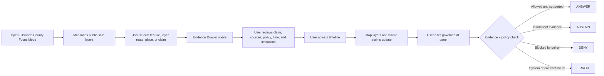

<!--
doc_id: NEEDS_VERIFICATION
 title: Ellsworth County Focus Mode Build Plan
 type: plan
 version: v0.1-draft
 status: draft
 owners: [NEEDS_VERIFICATION]
 created: 2026-05-21
 updated: 2026-05-21
 policy_label: NEEDS_VERIFICATION
 related:
   - docs/focus-modes/ellsworth-county/README.md
   - docs/focus-modes/ellsworth-county/layer-registry.md
   - docs/focus-modes/ellsworth-county/evidence-model.md
   - docs/focus-modes/ellsworth-county/acceptance-checklist.md
 tags: [kfm, focus-mode, ellsworth-county, proof-slice, evidence-first, map-first]
 notes:
   - Draft planning artifact for the Ellsworth County Focus Mode proof slice.
   - Repository paths, owners, schema homes, and implementation status require verification against the live repository.
-->

<a id="top"></a>

# Ellsworth County Focus Mode Build Plan

> A governed, evidence-backed, map-first proof slice for exploring how **Ellsworth County, Kansas** changed across history, environment, infrastructure, settlement, and public-safe knowledge layers.


## Quick Links

- [1. Mission](#1-mission)
- [2. Scope Boundary](#2-scope-boundary)
- [3. First Demo Layers](#3-first-demo-layers)
- [4. User Journey](#4-user-journey)
- [5. Required UI Surfaces](#5-required-ui-surfaces)
- [6. Governed Object Model](#6-governed-object-model)
- [7. Proposed Repository Shape](#7-proposed-repository-shape)
- [8. Build Phases](#8-build-phases)
- [9. First PR Sequence](#9-first-pr-sequence)
- [10. Acceptance Checklist](#10-acceptance-checklist)
- [11. Risk Register](#11-risk-register)
- [12. Next Concrete Milestone](#12-next-concrete-milestone)

---

## Impact Summary

**Ellsworth County Focus Mode** should become the first flagship KFM proof slice. It is small enough to build, rich enough to demonstrate the full system, and structured enough to become the reusable template for all Kansas counties.

The proof slice should demonstrate:

- governed public map viewing;
- evidence-backed atlas cards;
- time-aware historical and environmental context;
- public-safe layer controls;
- an evidence drawer for every meaningful visible claim;
- finite AI answer outcomes: `ANSWER`, `ABSTAIN`, `DENY`, `ERROR`;
- release, correction, rollback, and validation posture;
- strict separation between public UI and internal/raw data states.

> [!IMPORTANT]
> This plan does **not** claim that the listed paths, schemas, files, or implementation components already exist in the repository. Treat this as a proposed build plan until verified against the live repo.

---

## 1. Mission

Build **Ellsworth County Focus Mode** as the first county-scale KFM experience.

The user-facing question is:

> **What changed here, when, where, and what evidence supports it?**

The system-facing contract is:

```text
SourceDescriptor
→ SourceIntakeRecord
→ EvidenceRef
→ EvidenceBundle
→ Claim / AtlasCard
→ DecisionEnvelope
→ ReleaseManifest
→ Public UI
```

Public surfaces should consume governed objects and released/public-safe artifacts only. They should not read directly from `RAW`, `WORK`, `QUARANTINE`, unpublished candidate data, canonical/internal stores, direct model runtime outputs, or source-system side effects.

---

## 2. Scope Boundary

### 2.1 Geographic Scope

Initial scope:

- Ellsworth County, Kansas;
- Kanopolis / Fort Harker area;
- Smoky Hill River corridor;
- major towns and settlements;
- selected historic movement corridors;
- public-safe environmental baseline layers.

### 2.2 Temporal Scope

The system should support broad historical time, but the first release does not need complete coverage.

Initial timeline buckets:

```text
Before 1800
1800–1854
1854–1861
1861–1865
1866–1875
1876–1900
1901–1950
1951–2000
2001–present
```

### 2.3 MVP Inclusions

The first version should include:

- county boundary;
- towns / settlements;
- Fort Harker / Kanopolis historical context;
- Smoky Hill River;
- watershed or drainage context;
- historic routes and/or railroad context;
- soils or land-cover baseline;
- evidence drawer;
- timeline control;
- atlas card panel;
- governed AI answer panel.

### 2.4 Explicit MVP Exclusions

The first version should **not** include:

- living-person genealogy;
- DNA overlays;
- missing persons or unsolved crime workflows;
- exact sensitive ecology locations;
- sacred, burial, or archaeological exact locations;
- real-time emergency alerts;
- direct public model endpoint;
- broad statewide automation;
- direct public access to `RAW`, `WORK`, or `QUARANTINE` data.

> [!CAUTION]
> If sensitive or protected locations appear in candidate source material, public rendering must default to deny, generalize, or require steward review.

---

## 3. First Demo Layers

| Layer | Purpose | Initial posture | Evidence posture |
|---|---|---:|---:|
| County Boundary | Establish spatial frame | Public draft | Source required |
| Towns / Settlements | Show place structure | Public draft | Source required |
| Fort Harker / Kanopolis Context | Historical anchor | Public draft | Evidence required |
| Smoky Hill River | Hydrology anchor | Public draft | Source required |
| Watershed / Drainage Context | Environmental context | Public-safe draft | Source required |
| Historic Routes / Railroad | Movement and settlement context | Public draft | Evidence required |
| Soils or Land Cover | Science baseline | Public-safe derived | Source + derivation note required |
| Atlas Claims | Clickable evidence-backed facts | Draft until reviewed | EvidenceRef required |
| Timeline Events | Time-aware change | Draft until reviewed | EvidenceRef required |
| Evidence Drawer | Trust surface | Required | EvidenceBundle required |
| AI Answer Panel | Governed response surface | Restricted to resolved evidence | DecisionEnvelope required |

### 3.1 Layer Metadata Minimum

Every layer should declare at least:

```yaml
layer_id: kfm.layer.ellsworth.example.v1
title: Example Layer
domain: NEEDS_VERIFICATION
layer_type: observed | derived | interpreted | modeled | administrative
policy_label: NEEDS_VERIFICATION
review_state: draft | review | published
evidence_required: true
source_refs: []
evidence_refs: []
time_coverage: NEEDS_VERIFICATION
rights_status: unknown | public | open | controlled | restricted
sensitivity: public | generalize | restricted | review_required
limitations: []
```

---

## 4. User Journey



### 4.1 Example Public Questions

The interface should support questions such as:

- What was Fort Harker's role in this area?
- How did Kanopolis relate to Fort Harker?
- What changed along the Smoky Hill River?
- Which settlements existed here during this period?
- What evidence supports this route alignment?
- Why is this layer generalized?
- What sources were used for this atlas card?

---

## 5. Required UI Surfaces

### 5.1 Map Canvas

The map should provide:

- MapLibre-based map canvas;
- placeholder or public basemap;
- county boundary;
- initial public-safe layers;
- feature click handling;
- selected-feature highlighting;
- zoom controls;
- scale bar;
- compass/navigation control;
- attribution;
- layer-state synchronization with the timeline and evidence drawer.

### 5.2 Layer Registry Panel

Each layer row should show:

- layer title;
- domain;
- layer type;
- policy label;
- review state;
- time coverage;
- rights status;
- sensitivity posture;
- observed / derived / interpreted / modeled status;
- evidence requirement status.

### 5.3 Timeline Panel

The timeline should control:

- visible events;
- visible claims;
- time-filtered layers;
- selected feature state;
- uncertainty display, when available.

### 5.4 Evidence Drawer

When a user clicks anything meaningful, the evidence drawer should show:

- title;
- claim text;
- spatial scope;
- temporal scope;
- source list;
- EvidenceRef;
- EvidenceBundle resolution status;
- source roles;
- policy label;
- rights status;
- review state;
- limitations;
- correction path.

> [!IMPORTANT]
> A visible factual claim without an EvidenceRef should be treated as a validation failure for publication.

### 5.5 Atlas Card Panel

Atlas cards should be reusable, exportable knowledge objects for:

- places;
- events;
- routes;
- layers;
- historical claims;
- environmental features;
- people, later and only when policy allows.

### 5.6 Governed AI Answer Panel

The AI panel should produce only finite governed outcomes:

```text
ANSWER
ABSTAIN
DENY
ERROR
```

Example response envelope:

```json
{
  "outcome": "ANSWER",
  "question": "What was Fort Harker's role near Kanopolis?",
  "answer": "Fort Harker is represented as a frontier-era military and logistical anchor in the Ellsworth County proof slice.",
  "evidence_refs": [
    "kfm://evidence-ref/fort-harker-context-v1"
  ],
  "limitations": [
    "Precise wording and date claims require source verification before publication."
  ],
  "policy_label": "public_draft"
}
```

---

## 6. Governed Object Model

### 6.1 Minimum Object Families

The proof slice should exercise these object families:

| Object | Role |
|---|---|
| `SourceDescriptor` | Describes an external source before use |
| `SourceIntakeRecord` | Records how source material entered KFM |
| `EvidenceRef` | Lightweight pointer used by claims and UI |
| `EvidenceBundle` | Resolved evidence package |
| `AtlasCard` | User-facing reusable knowledge card |
| `DecisionEnvelope` | Governed AI/API response object |
| `LayerRegistryEntry` | Governed layer declaration |
| `ReleaseManifest` | Public-safe release package declaration |
| `CorrectionNotice` | Public correction lineage object |
| `RollbackPlan` | Release reversal/recovery path |

### 6.2 Example `SourceDescriptor`

```yaml
id: kfm.source.ellsworth.fort_harker.placeholder
title: Fort Harker source placeholder
domain: history
source_type: archive_or_reference
role: primary_or_context_NEEDS_VERIFICATION
rights_status: unknown
spatial_coverage: Ellsworth County, Kansas
temporal_coverage: NEEDS_VERIFICATION
status: proposed
```

### 6.3 Example `SourceIntakeRecord`

```yaml
id: kfm.intake.ellsworth.fort_harker.placeholder
source_id: kfm.source.ellsworth.fort_harker.placeholder
intake_state: WORK
checksum: NEEDS_VERIFICATION
received_at: NEEDS_VERIFICATION
rights_review: pending
sensitivity_review: pending
```

### 6.4 Example `EvidenceRef`

```yaml
id: kfm.evidence_ref.ellsworth.fort_harker.role.v1
bundle_id: kfm.evidence_bundle.ellsworth.fort_harker.role.v1
claim_scope: Fort Harker role in Ellsworth County context
resolution_required: true
```

### 6.5 Example `EvidenceBundle`

```yaml
id: kfm.evidence_bundle.ellsworth.fort_harker.role.v1
resolved: false
source_refs:
  - kfm.source.ellsworth.fort_harker.placeholder
limitations:
  - Source verification required before public factual publication.
policy_label: public_draft
review_state: draft
```

### 6.6 Example `AtlasCard`

```yaml
id: kfm.atlas_card.ellsworth.fort_harker.v1
title: Fort Harker / Kanopolis Context
card_type: historical_place_context
spatial_scope: Ellsworth County, Kansas
temporal_scope: 1860s-1870s_NEEDS_VERIFICATION
evidence_refs:
  - kfm.evidence_ref.ellsworth.fort_harker.role.v1
policy_label: public_draft
review_state: draft
```

### 6.7 Example `DecisionEnvelope`

```yaml
id: kfm.decision.ellsworth.question.fort_harker_role.v1
outcome: ABSTAIN
reason: Evidence bundle unresolved.
evidence_refs:
  - kfm.evidence_ref.ellsworth.fort_harker.role.v1
policy_label: public_draft
```

### 6.8 Example `ReleaseManifest`

```yaml
id: kfm.release.ellsworth.focus_mode.v0_1
release_state: draft
included_layers:
  - kfm.layer.ellsworth.county_boundary.v1
  - kfm.layer.ellsworth.smoky_hill_river.v1
  - kfm.layer.ellsworth.fort_harker_context.v1
validation_state: pending
rollback_plan: required_before_publication
```

---

## 7. Proposed Repository Shape

> [!NOTE]
> This is a proposed structure. It must be reconciled with the live repository tree, existing directory rules, ADRs, schemas, and app layout before implementation.

```text
docs/
  focus-modes/
    ellsworth-county/
      README.md
      build-plan.md
      layer-registry.md
      evidence-model.md
      acceptance-checklist.md

data/
  catalog/
    sources/
      ellsworth/
        source_descriptors.yaml
    stac/
      ellsworth/
        README.md

contracts/
  focus_mode/
    focus_mode_payload.schema.json
  atlas/
    atlas_card.schema.json
  evidence/
    evidence_ref.schema.json
    evidence_bundle.schema.json
  release/
    release_manifest.schema.json

fixtures/
  focus_modes/
    ellsworth/
      valid/
        focus_mode_payload.valid.json
        atlas_card.fort_harker.valid.json
      invalid/
        unresolved_evidence_ref.invalid.json
        exact_sensitive_location.invalid.json
        missing_policy_label.invalid.json

apps/
  web/
    src/
      focus-modes/
        ellsworth/
          index.js
          layers.js
          mock-api.js
          evidence-drawer.js
          timeline.js
          ai-panel.js

tools/
  validators/
    validate_focus_mode_payload.py
    validate_atlas_card.py
    validate_evidence_bundle.py
```

---

## 8. Build Phases

### Phase 1 — Planning and Contracts

**Goal:** define the proof slice before building UI.

Deliverables:

- `docs/focus-modes/ellsworth-county/README.md`;
- `build-plan.md`;
- layer registry draft;
- object model draft;
- acceptance checklist;
- initial JSON Schema files;
- valid and invalid fixtures.

Definition of done:

- [ ] Ellsworth proof slice has a stated scope.
- [ ] Every layer has an owner/status placeholder.
- [ ] Every claim requires an EvidenceRef.
- [ ] Every public object has `policy_label` and `review_state`.
- [ ] Negative fixtures exist.

### Phase 2 — Mock API and Data Fixtures

**Goal:** make the demo work without live data pipelines.

Deliverables:

- mock governed API responses;
- fixture payloads;
- layer registry JSON;
- atlas card JSON;
- evidence bundle JSON;
- AI response envelope examples.

Mock endpoints:

```text
GET  /api/focus-modes/ellsworth
GET  /api/layers/ellsworth
GET  /api/evidence/{bundle_id}
GET  /api/atlas-cards/{card_id}
POST /api/ai/answer
GET  /api/releases/ellsworth-focus-mode
```

Definition of done:

- [ ] UI can load from mocked JSON.
- [ ] Unresolved evidence produces `ABSTAIN`.
- [ ] Restricted/sensitive request produces `DENY`.
- [ ] Missing payload fields fail validation.

### Phase 3 — Single-File UI Prototype

**Goal:** create a browser-renderable proof of the full interface.

Deliverables:

- self-contained HTML prototype;
- MapLibre basemap;
- mock layers;
- clickable features;
- evidence drawer;
- layer panel;
- timeline panel;
- atlas card panel;
- governed AI answer panel.

Definition of done:

- [ ] User can click Fort Harker / Kanopolis context.
- [ ] User can inspect evidence.
- [ ] User can move timeline.
- [ ] User can toggle layers.
- [ ] AI panel returns `ANSWER`, `ABSTAIN`, `DENY`, and `ERROR` examples.
- [ ] No public UI touches `RAW`, `WORK`, or `QUARANTINE`.

### Phase 4 — Repo Integration

**Goal:** split the prototype into maintainable app structure.

Deliverables:

- `apps/web/src/focus-modes/ellsworth/`;
- reusable `EvidenceDrawer`;
- reusable `LayerRegistry`;
- reusable `Timeline`;
- reusable `GovernedAnswerPanel`;
- mock API module;
- fixtures imported from repo paths.

Definition of done:

- [ ] App builds locally.
- [ ] Fixtures validate.
- [ ] UI consumes governed mock contracts.
- [ ] No hardcoded claims without EvidenceRefs.

### Phase 5 — Source Intake and Evidence Upgrade

**Goal:** replace placeholders with real source records.

Deliverables:

- source ledger entries;
- source descriptors;
- intake receipts;
- evidence bundle drafts;
- reviewed claim cards;
- limitations notes.

Definition of done:

- [ ] At least one Fort Harker claim has real evidence.
- [ ] At least one Smoky Hill River claim has real evidence.
- [ ] At least one settlement/town claim has real evidence.
- [ ] Unresolved claims remain draft or return `ABSTAIN`.

> [!WARNING]
> Do not upgrade a claim from draft to reviewed/public until evidence is actually inspected, cited, and policy-cleared.

### Phase 6 — Release Manifest and Public-Safe Review

**Goal:** prepare the first publishable package.

Deliverables:

- release manifest;
- validation report;
- correction path;
- rollback plan;
- public-safe layer manifest;
- known limitations.

Definition of done:

- [ ] All public layers have policy labels.
- [ ] Rights status is known or explicitly restricted.
- [ ] Sensitive layers are generalized, denied, or excluded.
- [ ] Release can be rolled back.
- [ ] Correction lineage is documented.

---

## 9. First PR Sequence

### PR-0001 — Ellsworth Focus Mode Control Plane

**Purpose:** establish docs, contracts, fixtures, and governance boundaries.

Candidate files:

```text
docs/focus-modes/ellsworth-county/README.md
docs/focus-modes/ellsworth-county/build-plan.md
docs/focus-modes/ellsworth-county/layer-registry.md
docs/focus-modes/ellsworth-county/acceptance-checklist.md
contracts/focus_mode/focus_mode_payload.schema.json
fixtures/focus_modes/ellsworth/valid/focus_mode_payload.valid.json
fixtures/focus_modes/ellsworth/invalid/unresolved_evidence_ref.invalid.json
fixtures/focus_modes/ellsworth/invalid/missing_policy_label.invalid.json
```

Acceptance:

- [ ] Docs explain what this is and is not.
- [ ] Schemas define minimum governed payload.
- [ ] Valid fixture passes.
- [ ] Invalid fixtures fail.
- [ ] Public/client boundary is explicit.

### PR-0002 — Ellsworth Mock API and Layer Registry

**Purpose:** create the mocked governed data surface.

Candidate files:

```text
apps/web/src/focus-modes/ellsworth/mock-api.js
apps/web/src/focus-modes/ellsworth/layers.js
fixtures/focus_modes/ellsworth/valid/layer_registry.valid.json
fixtures/focus_modes/ellsworth/valid/atlas_card.fort_harker.valid.json
fixtures/focus_modes/ellsworth/valid/evidence_bundle.fort_harker.valid.json
```

Acceptance:

- [ ] Mocked API returns governed objects.
- [ ] Each layer has policy/review/evidence metadata.
- [ ] Evidence bundle can be resolved by ID.

### PR-0003 — Ellsworth UI Prototype

**Purpose:** render the first working Focus Mode shell.

Candidate files:

```text
apps/web/src/focus-modes/ellsworth/index.js
apps/web/src/focus-modes/ellsworth/evidence-drawer.js
apps/web/src/focus-modes/ellsworth/timeline.js
apps/web/src/focus-modes/ellsworth/ai-panel.js
apps/web/src/focus-modes/ellsworth/styles.css
```

Acceptance:

- [ ] Map renders.
- [ ] Mock layers render.
- [ ] Clicks open evidence drawer.
- [ ] Timeline filters visible claims.
- [ ] AI panel shows finite governed outcomes.

### PR-0004 — Validators and Negative Fixtures

**Purpose:** make failure modes explicit and testable.

Candidate files:

```text
tools/validators/validate_focus_mode_payload.py
tools/validators/validate_atlas_card.py
tools/validators/validate_evidence_bundle.py
fixtures/focus_modes/ellsworth/invalid/public_raw_access.invalid.json
fixtures/focus_modes/ellsworth/invalid/model_output_as_evidence.invalid.json
fixtures/focus_modes/ellsworth/invalid/exact_sensitive_geometry.invalid.json
```

Acceptance:

- [ ] Unresolved evidence fails when publication is attempted.
- [ ] Public `RAW` / `WORK` / `QUARANTINE` access fails.
- [ ] Missing policy label fails.
- [ ] Model output treated as proof fails.
- [ ] Exact sensitive geometry fails.

---

## 10. Acceptance Checklist

The first demo is successful when:

```text
[ ] Ellsworth County map loads.
[ ] User can toggle at least 5 public-safe layers.
[ ] User can click a historical feature and open Evidence Drawer.
[ ] User can inspect an Atlas Card.
[ ] User can move a timeline control.
[ ] Governed AI panel returns ANSWER for supported claims.
[ ] Governed AI panel returns ABSTAIN for unresolved evidence.
[ ] Governed AI panel returns DENY for restricted/sensitive requests.
[ ] Every visible claim has EvidenceRef.
[ ] Every EvidenceRef points to an EvidenceBundle.
[ ] Every layer has policy_label.
[ ] Every layer has review_state.
[ ] Every public object has a correction path.
[ ] No public UI path reads RAW, WORK, or QUARANTINE.
[ ] ReleaseManifest exists before anything is called published.
```

---

## 11. Risk Register

| Risk | Why it matters | Control |
|---|---|---|
| Pretty UI outruns evidence | KFM loses trust posture | Require EvidenceRef for claims |
| Mock data becomes treated as truth | Demo pollution | Mark all placeholders clearly |
| Sensitive locations leak | Public-safety failure | Deny/generalize by default |
| AI answers unsupported claims | Hallucination risk | Finite outcomes only |
| Layer registry becomes informal | Governance drift | Schema + validator |
| Publication treated like a file move | Violates KFM doctrine | ReleaseManifest required |
| Historical uncertainty hidden | Misleading users | Show confidence and limitations |
| Source rights unclear | Reuse risk | Require rights_status |
| County demo becomes one-off | Scaling failure | Design as county template |
| Direct model endpoint leaks into public UI | Governance/security failure | Governed backend envelope only |

---

## 12. Next Concrete Milestone

The best next milestone is:

> **Milestone 1: Ellsworth County Focus Mode Control Plane**

This milestone should create the planning docs, schemas, layer registry, fixture structure, and negative-path expectations before the UI expands.

### Suggested first working file

```text
docs/focus-modes/ellsworth-county/build-plan.md
```

### Suggested first task list

- [ ] Verify repository directory rules and existing focus-mode/doc conventions.
- [ ] Confirm schema home for focus-mode payloads.
- [ ] Create `docs/focus-modes/ellsworth-county/`.
- [ ] Add this build plan as `build-plan.md`.
- [ ] Add `layer-registry.md` with MVP layer table.
- [ ] Add `acceptance-checklist.md`.
- [ ] Add minimum valid fixture for an Ellsworth focus-mode payload.
- [ ] Add at least two invalid fixtures: unresolved evidence and missing policy label.
- [ ] Add validator stub or wire into existing validator pattern.

---

## Final Build Principle

The Ellsworth proof slice should not merely be a map demo. It should be the first visible proof that KFM can connect:

```text
place + time + evidence + policy + public-safe interface + correction path
```

That combination is the product.

[Back to top](#top)
