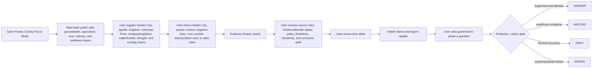
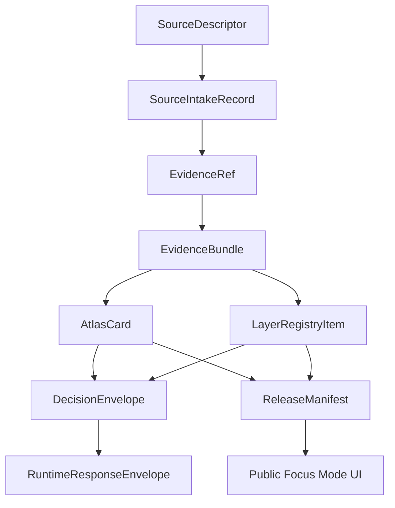

<!--
doc_id: NEEDS_VERIFICATION
title: Finney County Focus Mode Build Plan
type: standard
version: v1
status: draft
owners: [NEEDS_VERIFICATION]
created: 2026-05-21
updated: 2026-05-21
policy_label: public_draft
related:
  - docs/focus-modes/ellsworth-county/build-plan.md
  - docs/focus-modes/riley-county/build-plan.md
  - docs/focus-modes/shawnee-county/build-plan.md
  - docs/focus-modes/ford-county/build-plan.md
  - docs/focus-modes/wyandotte-county/build-plan.md
  - docs/focus-modes/sedgwick-county/build-plan.md
  - docs/focus-modes/douglas-county/build-plan.md
  - docs/focus-modes/leavenworth-county/build-plan.md
  - docs/focus-modes/reno-county/build-plan.md
  - docs/focus-modes/johnson-county/build-plan.md
  - docs/focus-modes/barton-county/build-plan.md
  - docs/focus-modes/geary-county/build-plan.md
  - docs/focus-modes/finney-county/README.md
  - docs/focus-modes/finney-county/layer-registry.md
  - docs/focus-modes/finney-county/acceptance-checklist.md
tags: [kfm, focus-mode, finney-county, garden-city, ogallala-aquifer, high-plains-aquifer, arkansas-river, irrigation, meatpacking, immigration]
notes:
  - Draft plan prepared without mounted repository inspection.
  - Paths, owners, doc IDs, schema homes, and validator names require repository verification before merge.
  - Water, irrigation, agriculture, meatpacking, immigration/labor, public health, groundwater, Arkansas River, dunes/ecology, infrastructure, and private household claims require source intake and evidence review before publication.
-->

<a id="top"></a>

# Finney County Focus Mode Build Plan

> **Purpose:** establish a thirteenth Kansas Frontier Matrix county proof slice after Ellsworth, Riley, Shawnee, Ford, Wyandotte, Sedgwick, Douglas, Leavenworth, Reno, Johnson, Barton, and Geary counties, with a distinct southwest Kansas profile: **Garden City, High Plains / Ogallala Aquifer dependence, Arkansas River lowlands, irrigation agriculture, meatpacking, immigration and labor, cattle/feedlot economy, sandsage and prairie ecology, drought resilience, groundwater governance, and household/privacy-safe public health context.**


---

## Quick links

- [1. Why Finney County](#1-why-finney-county)
- [2. Product thesis](#2-product-thesis)
- [3. Scope boundary](#3-scope-boundary)
- [4. First demo layers](#4-first-demo-layers)
- [5. User journeys](#5-user-journeys)
- [6. UI surfaces](#6-ui-surfaces)
- [7. Governed object model](#7-governed-object-model)
- [8. Proposed repository shape](#8-proposed-repository-shape)
- [9. Build phases](#9-build-phases)
- [10. First PR sequence](#10-first-pr-sequence)
- [11. Acceptance checklist](#11-acceptance-checklist)
- [12. Risk register](#12-risk-register)
- [13. Source seed list](#13-source-seed-list)
- [14. Open verification questions](#14-open-verification-questions)
- [15. Recommended first milestone](#15-recommended-first-milestone)

---

## Operating posture

> [!IMPORTANT]
> Finney County Focus Mode is a **governed groundwater / irrigation / labor / immigration / agriculture proof slice**, not a loose Garden City or meatpacking story map. It must preserve KFM’s core invariants:
>
> - EvidenceBundle outranks generated language.
> - Public clients use governed APIs, released artifacts, catalog records, tile services, and policy-safe runtime envelopes.
> - Public UI must not read directly from `RAW`, `WORK`, `QUARANTINE`, unpublished candidate data, canonical/internal stores, or direct model runtime outputs.
> - Publication is a governed state transition, not a file move.
> - AI outputs are downstream carriers, not sovereign truth.
> - Immigration, labor, public health, household, water-use, private wells, meatpacking, farm/ranch, infrastructure, and environmental-stress claims must remain source-bound, aggregated where needed, privacy-aware, and correction-friendly.

---

# 1. Why Finney County

Finney County is the right thirteenth Focus Mode because it gives KFM a **southwest Kansas water, irrigation, meatpacking, immigration, and High Plains resilience proof slice**.

Earlier county plans cover frontier forts, river confluences, major cities, suburban growth, wetlands, military installations, salt mining, and state government. Finney County adds:

| KFM capability | Finney County proof value |
|---|---|
| High Plains / Ogallala Aquifer governance | groundwater dependence, water-level change, irrigation, long-term sustainability |
| Garden City as regional hub | county seat, agricultural services, meatpacking, immigration/labor, civic growth |
| Arkansas River lowlands | river corridor, dryland/water-history tension, floodplain and irrigation context |
| Meatpacking and labor geography | industry restructuring, immigrant/refugee labor, demographic change, privacy/public-health sensitivity |
| Crop and livestock economy | irrigated agriculture, feedlots, dairy/cattle context, commodity geography |
| Water rights and irrigation caution | source-role discipline: observation vs. legal right vs. policy posture |
| Drought and resilience | climate, groundwater depletion, soil, crop stress, remote sensing, uncertainty |
| Multilingual / multicultural public context | Garden City community change without profiling living people |
| Southwest Kansas county template | useful pattern for Haskell, Kearny, Gray, Scott, Grant, Stevens, Seward, and Hamilton counties |

> [!NOTE]
> Finney County should prove KFM can connect water scarcity, agriculture, labor, immigration, and public health without exposing private household, worker, farm, well, or business-sensitive details.

---

# 2. Product thesis

## User-facing thesis

> **Finney County Focus Mode lets a user explore how Garden City, the High Plains / Ogallala Aquifer, the Arkansas River, irrigation agriculture, meatpacking, immigration, cattle/feedlot systems, sandsage ecology, and drought resilience shaped southwest Kansas — while keeping private households, workers, wells, farms, businesses, and public-health details public-safe and evidence-backed.**

## Internal KFM thesis

Finney County should prove that Focus Mode can handle:

```text
groundwater depletion + irrigation agriculture + meatpacking/labor + immigration + Arkansas River dryland context + public-health privacy + regional resilience
```

without treating model outputs as truth, water datasets as legal conclusions, or demographic/labor layers as household/person-level profiles.

The system must preserve distinctions between:

- groundwater observation vs. modeled trend vs. policy interpretation
- water-use report vs. water-rights legal conclusion
- public industry location context vs. facility/security/labor vulnerability
- demographic aggregate vs. living-person/household profile
- public health aggregate vs. individual or household health claim
- crop/land-cover derived layer vs. ground truth
- immigration/labor history vs. profiling current people
- Arkansas River observation vs. floodplain/regulatory layer vs. hydrologic interpretation
- source-backed claim vs. generated explanation

---

# 3. Scope boundary

## 3.1 Geography

Initial scope:

```text
Finney County, Kansas
```

Priority spatial anchors:

- Finney County boundary
- Garden City
- Arkansas River corridor / Arkansas River Lowlands context
- High Plains / Ogallala Aquifer public context
- irrigation and crop/land-cover context, generalized
- meatpacking / food-processing public economic context, generalized
- feedlot / cattle / livestock public economic context, generalized
- Garden City Regional Airport / transportation context, public-safe
- US-50 / US-83 / rail corridor context
- sandsage prairie / dunes / dryland ecology context, public-safe
- Holcomb, Pierceville, Kalvesta, Friend, Plymell, and other communities where source-supported
- public services, health, schools, and community context, aggregated only
- drought, wind, dust, and heat-risk context, not official alerting

## 3.2 Time range

Initial buckets:

| Bucket | Role in demo |
|---|---|
| Before 1800 | Indigenous, prairie/dune, Arkansas River, bison, and pre-territorial context; public-safe and culturally cautious |
| 1800–1878 | Santa Fe Trail / Arkansas River movement, military/route context, settlement lead-up |
| 1878–1883 | Garden City founding period and county organization lead-up |
| 1883–1900 | Finney County organization, rail/settlement, early irrigation and town-building |
| 1901–1945 | dryland farming, irrigation experiments, Dust Bowl / New Deal / soil-water context |
| 1946–1979 | center-pivot irrigation, groundwater expansion, crop/livestock intensification |
| 1980–2000 | meatpacking expansion, immigration/labor change, demographic and civic adaptation |
| 2001–present | aquifer decline, drought resilience, water policy, public health, modern agriculture, community change |

> [!CAUTION]
> Time buckets are planning scaffolds. They are not publication claims until evidence-reviewed.

## 3.3 Not in MVP

Do **not** include in the first Finney County MVP:

- private immigration status or citizenship claims
- worker, student, household, or family-level records
- private health or public-health case data
- private farm/ranch/well details where restricted or sensitive
- facility security, operational, or supply-chain vulnerabilities
- water-rights legal conclusions from map layers
- exact private parcel ownership treated as title truth
- exact sensitive habitat, rare species, burial, sacred, or archaeological locations
- live weather/drought/emergency alerts
- public direct model endpoint

---

# 4. First demo layers

## 4.1 MVP layer registry

| Layer ID | Layer | Domain | Purpose | Initial posture |
|---|---|---:|---|---|
| `kfm.layer.finney.county_boundary.v1` | Finney County boundary | civic | establish spatial frame | public draft |
| `kfm.layer.finney.garden_city_context.v1` | Garden City civic / regional-hub context | civic/history | county seat and regional service anchor | public draft, evidence-required |
| `kfm.layer.finney.high_plains_aquifer_context.v1` | High Plains / Ogallala Aquifer context | groundwater/hydrology | groundwater and irrigation anchor | public draft, source-role explicit |
| `kfm.layer.finney.irrigated_agriculture_context.v1` | Irrigated agriculture / crop baseline | agriculture/remote sensing | crop and water-use landscape | derived, public-safe |
| `kfm.layer.finney.arkansas_river_corridor.v1` | Arkansas River corridor | hydrology/history | river lowlands, settlement, dryland contrast | public draft |
| `kfm.layer.finney.meatpacking_labor_context.v1` | Meatpacking / labor / immigration context | economic/social history | industry and community change | aggregated, privacy-reviewed |
| `kfm.layer.finney.cattle_feedlot_context.v1` | Cattle / feedlot public economic context | agriculture/economy | livestock economy and land-use context | generalized |
| `kfm.layer.finney.drought_resilience_context.v1` | Drought / heat / dust / resilience context | climate/resilience | historical and modeled stress indicators | public-safe, not alerting |
| `kfm.layer.finney.sandsage_ecology_context.v1` | Sandsage / dryland ecology context | ecology/environment | public-safe habitat context | generalized |
| `kfm.layer.finney.timeline_events.v1` | Timeline events | cross-domain | temporal navigation | public draft |
| `kfm.layer.finney.atlas_claims.v1` | Atlas claim points / corridors | cross-domain | clickable evidence-backed claims | requires EvidenceRef |

## 4.2 Layer contract

Each layer must have:

```yaml
layer_id: kfm.layer.finney.<name>.v1
title: NEEDS_VERIFICATION
domain: NEEDS_VERIFICATION
layer_type: observed | derived | interpreted | modeled | administrative
geometry_type: point | line | polygon | raster | tile | mixed
source_refs: []
evidence_refs: []
policy_label: public_draft | restricted | internal | public
review_state: draft | review | published | deprecated
rights_status: unknown | public | open | controlled | restricted
sensitivity: public | generalized | restricted | review_required
temporal_scope:
  start: NEEDS_VERIFICATION
  end: NEEDS_VERIFICATION
limitations: []
correction_path: NEEDS_VERIFICATION
```

---

# 5. User journeys

## 5.1 Primary public journey



## 5.2 Example public questions

Supported after evidence review:

- “Why is Garden City important to southwest Kansas?”
- “How does the High Plains / Ogallala Aquifer shape Finney County?”
- “Which irrigation layers are observed, modeled, or derived?”
- “How did meatpacking change Garden City?”
- “How does the Arkansas River relate to Finney County agriculture?”
- “Which drought or groundwater layers are not legal or emergency guidance?”
- “Why are labor, immigration, farm, and public-health layers aggregated?”

Should abstain or deny unless governed release permits them:

- “Show private immigration status.”
- “Show household-level worker or health data.”
- “Show private well details.”
- “Show facility security or supply-chain vulnerabilities.”
- “Turn aquifer data into a water-rights legal conclusion.”
- “Treat a crop model as ground truth.”
- “Treat generated text as evidence.”
- “Publish a claim with no EvidenceBundle.”

---

# 6. UI surfaces

## 6.1 Map canvas

Required:

- MapLibre GL JS map
- placeholder basemap
- Finney County boundary
- Garden City / Arkansas River / aquifer / agriculture anchors
- clickable mock features
- selected feature highlight
- layer toggles
- scale bar
- attribution
- zoom controls
- compass / orientation affordance
- public-safe layer legend

## 6.2 Layer registry panel

Show for every layer:

| Field | Meaning |
|---|---|
| Layer name | human-readable layer title |
| Domain | groundwater, agriculture, labor, immigration, economy, hydrology, ecology, resilience |
| Layer type | observed, derived, interpreted, modeled, administrative |
| Evidence state | resolved, unresolved, not required, pending |
| Policy label | public, public_draft, restricted, internal |
| Review state | draft, review, published, deprecated |
| Sensitivity | public, generalized, restricted, review_required |
| Time coverage | start/end or bucketed range |
| Limitations | short public-facing warning |
| Source-role warning | observation, model, regulatory, aggregate context, public-history interpretation, derived indicator |

## 6.3 Timeline panel

Initial buckets:

```text
Before 1800
1800–1878
1878–1883
1883–1900
1901–1945
1946–1979
1980–2000
2001–present
```

Timeline should control:

- visible atlas claims
- Garden City / county history cards
- aquifer and irrigation context cards
- meatpacking/labor/immigration aggregate cards
- Arkansas River and drought/resilience layers
- sandsage ecology layers
- feature styling by temporal relevance

## 6.4 Evidence Drawer

When a user clicks a layer feature or atlas claim, show:

```yaml
title: NEEDS_VERIFICATION
claim_text: NEEDS_VERIFICATION
object_type: AtlasCard | LayerFeature | TimelineEvent | EvidenceBundle
spatial_scope: NEEDS_VERIFICATION
temporal_scope: NEEDS_VERIFICATION
evidence_refs: []
evidence_bundle_status: unresolved | resolved | restricted | missing
source_roles: []
interpretation_status: fact_claim | interpretation | public_history | aggregate_context | groundwater_observation | regulatory_context | derived_indicator | model_context
policy_label: public_draft
rights_status: unknown
sensitivity: review_required
review_state: draft
limitations: []
correction_path: NEEDS_VERIFICATION
```

## 6.5 Atlas Card panel

Minimum atlas card types:

| Card type | Example |
|---|---|
| `regional_hub_context` | Garden City |
| `groundwater_context` | High Plains / Ogallala Aquifer |
| `irrigated_agriculture_context` | crop / irrigation / water-use landscape |
| `river_lowlands_context` | Arkansas River corridor |
| `meatpacking_labor_context` | industry, immigration, and community change |
| `cattle_feedlot_context` | livestock economy public context |
| `drought_resilience_context` | drought, heat, dust, and groundwater stress |
| `dryland_ecology_context` | sandsage / prairie ecology generalized layer |
| `public_health_aggregate_context` | community services, aggregate only |
| `derived_layer_context` | crop, water-level, drought, land-cover, or resilience baseline |

## 6.6 Governed AI panel

The AI panel must only emit finite runtime outcomes:

```text
ANSWER
ABSTAIN
DENY
ERROR
```

Example response envelope:

```json
{
  "object_type": "RuntimeResponseEnvelope",
  "schema_version": "v1",
  "question": "How does the High Plains Aquifer shape Finney County?",
  "outcome": "ABSTAIN",
  "answer": null,
  "reason": "Evidence bundle is not yet resolved for publication-grade response.",
  "evidence_refs": [
    "kfm://evidence-ref/finney/high-plains-aquifer-context/v1"
  ],
  "policy_label": "public_draft",
  "limitations": [
    "This draft object requires source intake, rights review, and hydrology/water-policy source-role review before publication."
  ]
}
```

---

# 7. Governed object model

## 7.1 Object flow



## 7.2 SourceDescriptor draft

```yaml
id: kfm.source.finney.high_plains_aquifer.placeholder
title: High Plains / Ogallala Aquifer source placeholder
domain: groundwater_hydrology
source_type: geoscience_or_water_resource_reference
role: context_NEEDS_VERIFICATION
rights_status: unknown
spatial_coverage: Finney County, southwest Kansas
temporal_coverage: NEEDS_VERIFICATION
status: proposed
limitations:
  - Requires source intake and review before claims are published.
  - Must separate groundwater observations, modeled trends, policy interpretation, and legal water-rights claims.
```

## 7.3 EvidenceRef draft

```yaml
id: kfm.evidence_ref.finney.high_plains_aquifer_context.v1
bundle_id: kfm.evidence_bundle.finney.high_plains_aquifer_context.v1
claim_scope: Public-safe High Plains / Ogallala Aquifer and irrigation context within Finney County Focus Mode
resolution_required: true
```

## 7.4 EvidenceBundle draft

```yaml
id: kfm.evidence_bundle.finney.high_plains_aquifer_context.v1
resolved: false
source_refs:
  - kfm.source.finney.high_plains_aquifer.placeholder
policy_label: public_draft
rights_status: unknown
sensitivity: review_required
review_state: draft
limitations:
  - Draft bundle. Do not publish final groundwater, irrigation, or water-policy claims until source-reviewed.
  - Do not treat water datasets as legal water-rights determinations.
  - Do not expose private well, farm, or household-level data.
```

## 7.5 AtlasCard draft

```yaml
id: kfm.atlas_card.finney.high_plains_aquifer.v1
title: High Plains / Ogallala Aquifer Context
card_type: groundwater_context
spatial_scope: Finney County, Kansas NEEDS_VERIFICATION
temporal_scope: NEEDS_VERIFICATION
evidence_refs:
  - kfm.evidence_ref.finney.high_plains_aquifer_context.v1
policy_label: public_draft
review_state: draft
limitations:
  - Draft card. Not a final hydrology, legal, irrigation, water-rights, public-health, or land-management authority statement.
```

## 7.6 DecisionEnvelope draft

```yaml
id: kfm.decision.finney.question.high_plains_aquifer_context.v1
question: How does the High Plains Aquifer shape Finney County?
outcome: ABSTAIN
reason: Evidence bundle unresolved.
evidence_refs:
  - kfm.evidence_ref.finney.high_plains_aquifer_context.v1
policy_label: public_draft
```

## 7.7 ReleaseManifest draft

```yaml
id: kfm.release.finney.focus_mode.v0_1
release_state: draft
included_layers:
  - kfm.layer.finney.county_boundary.v1
  - kfm.layer.finney.garden_city_context.v1
  - kfm.layer.finney.high_plains_aquifer_context.v1
  - kfm.layer.finney.irrigated_agriculture_context.v1
  - kfm.layer.finney.arkansas_river_corridor.v1
validation_state: pending
rollback_plan: required_before_publication
correction_path: required_before_publication
```

---

# 8. Proposed repository shape

> [!WARNING]
> Repository access is **not confirmed** in this planning session. Treat all paths as proposed until checked against the live branch and KFM Directory Rules.

```text
docs/
  focus-modes/
    finney-county/
      README.md
      build-plan.md
      layer-registry.md
      evidence-model.md
      acceptance-checklist.md
      source-seed-list.md
      public-safety-notes.md
      groundwater-and-ogallala-notes.md
      irrigation-agriculture-and-water-rights-notes.md
      meatpacking-labor-and-immigration-notes.md
      public-health-and-household-privacy-notes.md
      arkansas-river-and-drought-resilience-notes.md
      sandsage-ecology-and-sensitive-habitat-notes.md

data/
  catalog/
    sources/
      finney/
        source_descriptors.yaml
    stac/
      finney/
        README.md

contracts/
  focus_mode/
    focus_mode_payload.schema.json
  atlas/
    atlas_card.schema.json
  evidence/
    evidence_ref.schema.json
    evidence_bundle.schema.json
  release/
    release_manifest.schema.json

fixtures/
  focus_modes/
    finney/
      valid/
        focus_mode_payload.valid.json
        layer_registry.valid.json
        atlas_card.garden_city.valid.json
        atlas_card.high_plains_aquifer.valid.json
        atlas_card.meatpacking_labor.valid.json
        evidence_bundle.high_plains_aquifer.valid.json
        evidence_bundle.garden_city.valid.json
      invalid/
        unresolved_evidence_ref.invalid.json
        private_immigration_status.invalid.json
        household_level_labor_or_health_profile.invalid.json
        private_well_or_farm_detail.invalid.json
        facility_security_or_supply_chain_vulnerability.invalid.json
        water_dataset_as_legal_right.invalid.json
        crop_model_as_ground_truth.invalid.json
        exact_sensitive_species_location.invalid.json
        parcel_as_title_truth.invalid.json
        missing_policy_label.invalid.json
        model_output_as_evidence.invalid.json
        public_raw_access.invalid.json

apps/
  web/
    src/
      focus-modes/
        finney/
          index.js
          layers.js
          mock-api.js
          mock-data.js
          evidence-drawer.js
          timeline.js
          ai-panel.js
          styles.css

tools/
  validators/
    validate_focus_mode_payload.py
    validate_atlas_card.py
    validate_evidence_bundle.py
    validate_layer_registry.py
```

---

# 9. Build phases

## Phase 1 — Control plane

Goal: establish Finney County Focus Mode as a governed groundwater/irrigation/labor/immigration/agriculture/resilience template.

Deliverables:

- `docs/focus-modes/finney-county/README.md`
- `build-plan.md`
- `layer-registry.md`
- `source-seed-list.md`
- `public-safety-notes.md`
- `groundwater-and-ogallala-notes.md`
- `irrigation-agriculture-and-water-rights-notes.md`
- `meatpacking-labor-and-immigration-notes.md`
- `public-health-and-household-privacy-notes.md`
- `arkansas-river-and-drought-resilience-notes.md`
- `sandsage-ecology-and-sensitive-habitat-notes.md`
- first schema references
- valid and invalid fixture plan

Definition of done:

```text
[ ] scope is explicit
[ ] aquifer/groundwater layers distinguish observation/model/policy/legal roles
[ ] irrigation/agriculture layers do not expose private wells/farms
[ ] meatpacking/labor/immigration layers are aggregate and privacy-preserving
[ ] public-health layers are aggregate only
[ ] water datasets cannot be treated as legal rights determinations
[ ] crop/remote-sensing layers are derived indicators, not ground truth
[ ] ecology layers generalize sensitive species/habitat where needed
[ ] all layers have policy labels
[ ] all claim-bearing objects require EvidenceRef
[ ] placeholders are clearly marked
```

## Phase 2 — Mock governed API

Goal: make Finney Focus Mode run without live pipelines.

Mock endpoints:

```text
GET /api/focus-modes/finney
GET /api/layers/finney
GET /api/evidence/{bundle_id}
GET /api/atlas-cards/{card_id}
POST /api/ai/answer
GET /api/releases/finney-focus-mode
```

Definition of done:

```text
[ ] mock payloads validate
[ ] unresolved evidence produces ABSTAIN
[ ] private immigration/worker/household requests produce DENY
[ ] private well/farm detail requests produce DENY
[ ] water-dataset-as-legal-right payloads fail validation
[ ] crop-model-as-ground-truth payloads fail validation
[ ] invalid payloads fail closed
[ ] public layer payloads do not reference RAW / WORK / QUARANTINE
```

## Phase 3 — UI prototype

Goal: show the full Finney Focus Mode surface in a browser.

Deliverables:

- MapLibre map
- layer registry
- clickable mock Garden City, High Plains Aquifer, irrigation agriculture, Arkansas River, meatpacking/labor, cattle/feedlot, drought, and sandsage ecology features
- evidence drawer
- timeline
- atlas card panel
- governed AI answer panel

Definition of done:

```text
[ ] user can click aquifer context and see source-role limitations
[ ] user can click irrigation context and see privacy/water-rights limitations
[ ] user can click meatpacking/labor context and see aggregate/privacy limitations
[ ] user can click drought/resilience context and see not-an-alert limitations
[ ] user can click ecology context and see sensitive-location limitations
[ ] user can toggle Garden City / aquifer / irrigation / river / labor / cattle / drought / ecology layers
[ ] timeline changes visible claim set
[ ] AI panel returns all four finite outcomes through examples
```

## Phase 4 — Validators and negative fixtures

Goal: prove failure modes before publication.

Required invalid fixtures:

| Fixture | Expected failure |
|---|---|
| `unresolved_evidence_ref.invalid.json` | publication attempted with unresolved evidence |
| `private_immigration_status.invalid.json` | private immigration/citizenship data exposed |
| `household_level_labor_or_health_profile.invalid.json` | household-level worker/health/demographic profile exposed |
| `private_well_or_farm_detail.invalid.json` | private well/farm detail exposed |
| `facility_security_or_supply_chain_vulnerability.invalid.json` | meatpacking/feedlot/facility vulnerability exposed |
| `water_dataset_as_legal_right.invalid.json` | water dataset treated as legal water-right determination |
| `crop_model_as_ground_truth.invalid.json` | remote-sensing/crop model treated as ground truth |
| `exact_sensitive_species_location.invalid.json` | exact sensitive ecology occurrence exposed |
| `parcel_as_title_truth.invalid.json` | property/assessor record treated as title truth |
| `missing_policy_label.invalid.json` | public object lacks policy posture |
| `model_output_as_evidence.invalid.json` | AI output treated as proof |
| `public_raw_access.invalid.json` | public client references RAW/WORK/QUARANTINE |

## Phase 5 — Source intake upgrade

Goal: replace placeholders with inspected sources.

Deliverables:

- source descriptors
- intake records
- rights review notes
- sensitivity review notes
- evidence bundle drafts
- reviewed atlas cards
- limitations notes

Minimum real-evidence targets:

```text
[ ] one Finney County official-history / formation / Garden City claim
[ ] one High Plains / Ogallala Aquifer groundwater claim
[ ] one irrigation agriculture / land-cover claim
[ ] one Arkansas River lowlands / hydrology claim
[ ] one meatpacking / immigration / labor aggregate-context claim
[ ] one cattle/feedlot public economic context claim
[ ] one drought/resilience source-role claim
[ ] one sandsage ecology public-safe claim
```

## Phase 6 — Release candidate

Goal: prepare `v0.1` public-safe release.

Deliverables:

- `ReleaseManifest`
- validation report
- correction path
- rollback plan
- public-safe layer manifest
- known limitations
- release notes

Definition of done:

```text
[ ] public layers have policy labels and review states
[ ] rights status is resolved or blocked
[ ] private immigration, worker, household, and public-health details are excluded
[ ] private wells/farms/facility vulnerabilities are excluded
[ ] water-rights legal conclusions are excluded
[ ] crop/remote-sensing layers preserve derived/model status
[ ] exact sensitive ecology locations are excluded or generalized
[ ] aquifer/agriculture/drought claims preserve source role and uncertainty
[ ] release can be rolled back
[ ] public UI only consumes governed surfaces
```

---

# 10. First PR sequence

## PR-0001 — Finney County Focus Mode Control Plane

Files:

```text
docs/focus-modes/finney-county/README.md
docs/focus-modes/finney-county/build-plan.md
docs/focus-modes/finney-county/layer-registry.md
docs/focus-modes/finney-county/source-seed-list.md
docs/focus-modes/finney-county/public-safety-notes.md
docs/focus-modes/finney-county/groundwater-and-ogallala-notes.md
docs/focus-modes/finney-county/irrigation-agriculture-and-water-rights-notes.md
docs/focus-modes/finney-county/meatpacking-labor-and-immigration-notes.md
docs/focus-modes/finney-county/public-health-and-household-privacy-notes.md
docs/focus-modes/finney-county/arkansas-river-and-drought-resilience-notes.md
docs/focus-modes/finney-county/sandsage-ecology-and-sensitive-habitat-notes.md
docs/focus-modes/finney-county/acceptance-checklist.md
```

Acceptance:

```text
[ ] Focus Mode scope is clear.
[ ] Finney County is justified as a complementary proof slice.
[ ] Every planned layer has a policy posture.
[ ] Aquifer/groundwater source-role boundaries are explicit.
[ ] Water-rights legal conclusion boundaries are explicit.
[ ] Labor/immigration/household/public-health privacy boundaries are explicit.
[ ] Farm/well/facility security boundaries are explicit.
[ ] Drought/resilience not-an-alert boundaries are explicit.
[ ] No publication claims are made from placeholders.
```

## PR-0002 — Finney Contracts and Fixtures

Files:

```text
fixtures/focus_modes/finney/valid/focus_mode_payload.valid.json
fixtures/focus_modes/finney/valid/layer_registry.valid.json
fixtures/focus_modes/finney/valid/atlas_card.garden_city.valid.json
fixtures/focus_modes/finney/valid/atlas_card.high_plains_aquifer.valid.json
fixtures/focus_modes/finney/invalid/private_immigration_status.invalid.json
fixtures/focus_modes/finney/invalid/water_dataset_as_legal_right.invalid.json
fixtures/focus_modes/finney/invalid/private_well_or_farm_detail.invalid.json
fixtures/focus_modes/finney/invalid/missing_policy_label.invalid.json
```

Acceptance:

```text
[ ] Valid fixtures include required governed fields.
[ ] Invalid fixtures represent real failure modes.
[ ] EvidenceRef / EvidenceBundle relationship is explicit.
[ ] Mock cards remain draft until evidence intake.
```

## PR-0003 — Finney Mock API

Files:

```text
apps/web/src/focus-modes/finney/mock-api.js
apps/web/src/focus-modes/finney/layers.js
apps/web/src/focus-modes/finney/mock-data.js
```

Acceptance:

```text
[ ] Mock API returns finite runtime outcomes.
[ ] Layer registry is API-shaped, not UI-only.
[ ] Public-safe data is separated from restricted mock examples.
[ ] Sensitivity/source-role status is included for aquifer, irrigation, labor, immigration, agriculture, public health, and drought objects.
```

## PR-0004 — Finney UI Shell

Files:

```text
apps/web/src/focus-modes/finney/index.js
apps/web/src/focus-modes/finney/evidence-drawer.js
apps/web/src/focus-modes/finney/timeline.js
apps/web/src/focus-modes/finney/ai-panel.js
apps/web/src/focus-modes/finney/styles.css
```

Acceptance:

```text
[ ] Map renders.
[ ] Layer panel renders.
[ ] Evidence Drawer renders.
[ ] Atlas Card panel renders.
[ ] Timeline filters mock claims.
[ ] AI panel demonstrates ANSWER / ABSTAIN / DENY / ERROR.
```

## PR-0005 — Validator Hardening

Files:

```text
tools/validators/validate_focus_mode_payload.py
tools/validators/validate_atlas_card.py
tools/validators/validate_evidence_bundle.py
tools/validators/validate_layer_registry.py
```

Acceptance:

```text
[ ] Public RAW / WORK / QUARANTINE references fail.
[ ] Missing EvidenceRef fails for claim-bearing objects.
[ ] Missing policy label fails.
[ ] Private immigration/worker/household/public-health detail fails public release.
[ ] Private well/farm detail fails public release.
[ ] Water dataset as legal right fails.
[ ] Crop model as ground truth fails.
[ ] Facility vulnerability exposure fails.
[ ] Model output as proof fails.
```

---

# 11. Acceptance checklist

```text
[ ] Finney County map loads.
[ ] User can toggle at least 5 public-safe layers.
[ ] User can click Garden City context and open Evidence Drawer.
[ ] User can click High Plains / Ogallala Aquifer context and open Evidence Drawer.
[ ] User can click irrigation/agriculture context and open Evidence Drawer.
[ ] User can click Arkansas River context and open Evidence Drawer.
[ ] User can click meatpacking/labor context and see aggregate/privacy limitations.
[ ] User can click drought/resilience context and see not-an-alert limitations.
[ ] User can inspect at least 3 Atlas Cards.
[ ] Timeline control changes visible claims/layers.
[ ] Governed AI panel returns ANSWER for supported claims.
[ ] Governed AI panel returns ABSTAIN for unresolved evidence.
[ ] Governed AI panel returns DENY for restricted/sensitive requests.
[ ] Governed AI panel returns ERROR for invalid payload/system failure.
[ ] Every visible claim has EvidenceRef.
[ ] Every EvidenceRef points to an EvidenceBundle.
[ ] Every layer has policy_label.
[ ] Every layer has review_state.
[ ] Every public object has correction path.
[ ] No public UI path reads RAW, WORK, or QUARANTINE.
[ ] Private immigration/worker/household/public-health details are excluded.
[ ] Private well/farm/facility vulnerabilities are excluded.
[ ] Water datasets are not represented as legal water-right determinations.
[ ] Crop/remote-sensing models are not represented as ground truth.
[ ] ReleaseManifest exists before anything is called published.
```

---

# 12. Risk register

| Risk | Why it matters | Control |
|---|---|---|
| Aquifer data becomes legal water-right conclusion | legal/regulatory misuse risk | source-role labels and water-rights-deny rule |
| Private immigration or worker information leaks | privacy and harm risk | aggregate-only labor/immigration layers |
| Public-health layer exposes household data | privacy and safety risk | aggregate public-health context only |
| Private well/farm details leak | property/privacy risk | generalized irrigation/agriculture layer |
| Facility/supply-chain vulnerabilities exposed | security risk | public economic context only |
| Crop model treated as ground truth | scientific uncertainty risk | derived/model labeling |
| Drought layer treated as official alert | public-safety risk | not-an-alert limitations |
| Generated narrative treated as source | evidence failure | model output cannot be proof |
| Mock placeholders become doctrine | demo pollution | all placeholders marked draft/unresolved |
| Garden City dominates county view | county-scale imbalance | include Arkansas River, agriculture, Holcomb, rural matrix, and ecological context where evidence-supported |

---

# 13. Source seed list

> [!NOTE]
> These are **candidate source seeds**, not yet KFM-ingested sources. Each requires `SourceDescriptor`, rights review, sensitivity review, checksum/citation handling, and EvidenceBundle resolution before publication-grade use.

| Seed | Use | Starting URL |
|---|---|---|
| Finney County official history | county history, Garden City founding context | https://www.finneycounty.org/173/The-History-of-Finney-County |
| Finney County official site | current county civic source routing | https://www.finneycounty.org/ |
| Garden City official site | city civic / public services / planning source routing | https://www.garden-city.org/ |
| Kansas Geological Survey — High Plains Aquifer | Ogallala / High Plains aquifer source routing | https://kgs.ku.edu/high-plains-aquifer |
| Kansas Geological Survey water resources | water-level and geoscience source routing | https://www.kgs.ku.edu/Hydro/hydroIndex.html |
| USGS water data / National Water Dashboard | stream, gage, groundwater observation source routing | https://dashboard.waterdata.usgs.gov/ |
| Kansas Department of Agriculture — Division of Water Resources | water rights / water use source routing; legal caution required | https://agriculture.ks.gov/divisions-programs/dwr |
| Garden City: Meatpacking and Immigration to the High Plains | academic source routing for labor/immigration context | https://migration.ucdavis.edu/cf/more.php?id=157 |
| Harvest of Change: Meatpacking, Immigration, and Garden City, Kansas | academic paper/source routing | https://ipsr.unit2.ku.edu/conferen/kepc11/HarvestofChange.pdf |
| Kansas Historical Society markers | public-history marker source routing | https://www.kansashistory.gov/p/kansas-historical-markers/14999 |
| Kansas Geological Survey county geology index | geology/hydrology source routing | https://www.kgs.ku.edu/General/Geology/County/ |
| USGS National Hydrography | river and stream source routing | https://www.usgs.gov/national-hydrography |
| FEMA Flood Map Service Center | regulatory floodplain source routing | https://msc.fema.gov/portal/home |
| USDA Cropland Data Layer | agriculture / crop / land-cover source routing | https://www.nass.usda.gov/Research_and_Science/Cropland/SARS1a.php |
| NOAA Climate Data Online / drought context | climate and drought source routing | https://www.ncei.noaa.gov/cdo-web/ |

---

# 14. Open verification questions

```text
[ ] What is the canonical repo path for Focus Mode documents?
[ ] Does KFM already have a focus_mode_payload schema?
[ ] Does KFM already define AtlasCard fields differently?
[ ] Does KFM already define groundwater/irrigation source-role fields?
[ ] Does KFM already define water-rights legal-conclusion guards?
[ ] Does KFM already define labor/immigration privacy fields?
[ ] Does KFM already define public-health aggregate/privacy fields?
[ ] Does KFM already define farm/well/facility sensitivity fields?
[ ] Which validators already exist?
[ ] Should Finney County share contracts with Ford County and other Arkansas River / High Plains counties?
[ ] What public-safe geometry source should be used for county boundary?
[ ] What source authority should define Garden City / Finney County formation claims?
[ ] What source authority should define High Plains / Ogallala Aquifer claims?
[ ] What source authority should define irrigation agriculture claims?
[ ] What source authority should define meatpacking/labor/immigration claims?
[ ] What source authority should define Arkansas River / drought/resilience claims?
[ ] What exact policy rule controls private immigration and worker detail?
[ ] What exact policy rule controls private well/farm data?
[ ] What exact policy rule controls water-rights legal conclusions?
[ ] What release manifest naming convention should be used?
[ ] What rollback/correction path should a county Focus Mode use?
```

---

# 15. Recommended first milestone

## Milestone 1: Finney County Focus Mode Control Plane

Build the documentation, layer registry, source seed list, public-safety notes, groundwater/Ogallala notes, irrigation/water-rights notes, meatpacking/labor/immigration notes, public-health/privacy notes, Arkansas River/drought-resilience notes, sandsage ecology notes, and fixtures before the UI.

This keeps the Finney proof slice from becoming a high-risk water/labor/agriculture dashboard with weak privacy, legal, and source-role boundaries.

The first concrete deliverable should be:

```text
docs/focus-modes/finney-county/build-plan.md
```

Once this is stable, use it to generate the mock API and single-file UI prototype.

---

[Back to top](#top)
