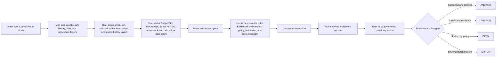
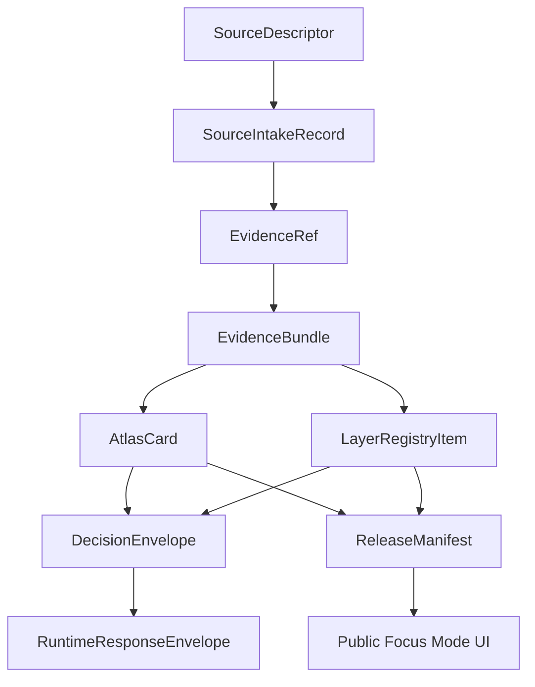

<!--
doc_id: NEEDS_VERIFICATION
title: Ford County Focus Mode Build Plan
type: standard
version: v1
status: draft
owners: [NEEDS_VERIFICATION]
created: 2026-05-21
updated: 2026-05-21
policy_label: public_draft
related:
  - docs/focus-modes/ellsworth-county/build-plan.md
  - docs/focus-modes/riley-county/build-plan.md
  - docs/focus-modes/shawnee-county/build-plan.md
  - docs/focus-modes/ford-county/README.md
  - docs/focus-modes/ford-county/layer-registry.md
  - docs/focus-modes/ford-county/acceptance-checklist.md
tags: [kfm, focus-mode, ford-county, dodge-city, arkansas-river, santa-fe-trail, cattle-trails, fort-dodge]
notes:
  - Draft plan prepared without mounted repository inspection.
  - Paths, owners, doc IDs, schema homes, and validator names require repository verification before merge.
  - Historical, hydrological, agricultural, tourism, transportation, and public-history claims require source intake and evidence review before publication.
-->

<a id="top"></a>

# Ford County Focus Mode Build Plan

> **Purpose:** establish a fourth Kansas Frontier Matrix county proof slice after Ellsworth, Riley, and Shawnee counties, with a distinct western Kansas profile: **Dodge City, Fort Dodge, Santa Fe Trail movement, railroad arrival, cattle-shipping frontier mythology, Arkansas River water context, High Plains agriculture, irrigation pressure, public-history tourism, and correction-friendly interpretation.**


---

## Quick links

- [1. Why Ford County](#1-why-ford-county)
- [2. Product thesis](#2-product-thesis)
- [3. Scope boundary](#3-scope-boundary)
- [4. First demo layers](#4-first-demo-layers)
- [5. User journeys](#5-user-journeys)
- [6. UI surfaces](#6-ui-surfaces)
- [7. Governed object model](#7-governed-object-model)
- [8. Proposed repository shape](#8-proposed-repository-shape)
- [9. Build phases](#9-build-phases)
- [10. First PR sequence](#10-first-pr-sequence)
- [11. Acceptance checklist](#11-acceptance-checklist)
- [12. Risk register](#12-risk-register)
- [13. Source seed list](#13-source-seed-list)
- [14. Open verification questions](#14-open-verification-questions)
- [15. Recommended first milestone](#15-recommended-first-milestone)

---

## Operating posture

> [!IMPORTANT]
> Ford County Focus Mode is a **governed proof slice**, not a romanticized Old West map. It must preserve KFM’s core invariants:
>
> - EvidenceBundle outranks generated language.
> - Public clients use governed APIs, released artifacts, catalog records, tile services, and policy-safe runtime envelopes.
> - Public UI must not read directly from `RAW`, `WORK`, `QUARANTINE`, unpublished candidate data, canonical/internal stores, or direct model runtime outputs.
> - Publication is a governed state transition, not a file move.
> - AI outputs are downstream carriers, not sovereign truth.
> - Frontier history, Indigenous history, military history, cattle-town tourism, water quality, irrigation, and land-use claims must remain source-bound, temporally scoped, and correction-friendly.

---

# 1. Why Ford County

Ford County is the right fourth Focus Mode because it gives KFM a **western Kansas frontier-and-water proof slice**.

Ellsworth County tests frontier-era county history, Fort Harker / Kanopolis, settlement, and environmental baseline.

Riley County tests Flint Hills ecology, Fort Riley, Konza Prairie, research-site sensitivity, and river landscapes.

Shawnee County tests state government, civil-rights history, Topeka urban geography, public institutions, and archive-heavy civic memory.

Ford County adds:

| KFM capability | Ford County proof value |
|---|---|
| Iconic western Kansas public history | Dodge City, Boot Hill, cattle-town mythology, tourism interpretation |
| Military / trail geography | Fort Dodge, Santa Fe Trail, wagon traffic, protection and supply routes |
| Railroad and cattle-shipping history | AT&SF arrival, cattle-shipping center, town growth |
| Arkansas River corridor | dryland / river / water-quality / groundwater relationship |
| High Plains agriculture | irrigation, livestock, crop systems, water-use pressure |
| Interpretation correction | separates fact, folklore, tourism narrative, reenactment, and source-backed claim |
| Multi-source evidence discipline | official county history, local historical society, K-State extension, KGS/KDHE water sources |
| Sensitive cultural history | Indigenous history, military conflict, cemetery/burial contexts, exact site caution |

> [!NOTE]
> Ford County is ideal for proving that KFM can make famous history useful without turning public myth into unverified truth.

---

# 2. Product thesis

## User-facing thesis

> **Ford County Focus Mode lets a user explore how the Arkansas River, Santa Fe Trail movement, Fort Dodge, railroad arrival, cattle shipping, Dodge City public history, and High Plains agriculture shaped southwestern Kansas — while separating evidence-backed claims from folklore, tourism narrative, and derived environmental interpretation.**

## Internal KFM thesis

Ford County should prove that Focus Mode can handle:

```text
frontier history + public mythology + military trail geography + railroad/cattle economy + river hydrology + agricultural water pressure + public-safe interpretation
```

without collapsing public-history interpretation into factual authority.

The system must preserve distinctions between:

- official source vs. local history vs. tourism narrative
- historical claim vs. folklore / legend / reenactment
- fort/military context vs. restricted or sensitive site detail
- river observation vs. water-quality impairment vs. groundwater interpretation
- agriculture observation vs. model vs. derived remote-sensing indicator
- county boundary vs. city boundary vs. historical route corridor
- claim vs. atlas card vs. generated explanation
- public historic site vs. cemetery/burial/sensitive cultural site

---

# 3. Scope boundary

## 3.1 Geography

Initial scope:

```text
Ford County, Kansas
```

Priority spatial anchors:

- Ford County boundary
- Dodge City
- Fort Dodge public-history context
- Arkansas River corridor
- Santa Fe Trail / wagon traffic context
- Atchison, Topeka and Santa Fe railroad context
- cattle-shipping / stockyard public-history context
- Boot Hill / downtown Dodge City public-history area
- smaller communities where source-supported, such as Spearville, Ford, Bucklin, and Wright
- public-safe agricultural / land-cover / irrigation context
- public-safe water-quality and groundwater context

## 3.2 Time range

Initial buckets:

| Bucket | Role in demo |
|---|---|
| Before 1800 | Indigenous, ecological, river-corridor, and pre-territorial context; public-safe and carefully scoped |
| 1800–1854 | exploration and route context; Arkansas River corridor as travel geography |
| 1854–1865 | territorial Kansas, Santa Fe Trail movement, pre-Fort Dodge context |
| 1865–1872 | Fort Dodge, wagon protection, military and trail geography |
| 1872–1885 | railroad arrival, Dodge City emergence, cattle-shipping boom, public-history core |
| 1886–1920 | county settlement, agriculture, community institutions, post-cattle-town transformation |
| 1921–1970 | road/highway era, irrigation expansion, agricultural modernization, public-history formation |
| 1971–present | modern Dodge City, tourism, agriculture, water-quality and water-use context |

> [!CAUTION]
> Time buckets are planning scaffolds. They are not publication claims until evidence-reviewed.

## 3.3 Not in MVP

Do **not** include in the first Ford County MVP:

- exact locations of sensitive archaeological, burial, or sacred sites
- living-person genealogy
- private ranch/farm household-level data
- exact private well details where restricted or sensitive
- parcel ownership treated as title truth
- active law-enforcement case layers
- operational infrastructure vulnerabilities
- unsupported gunfight/outlaw folklore as factual claims
- Indigenous history without source/cultural-review caution
- public direct model endpoint

---

# 4. First demo layers

## 4.1 MVP layer registry

| Layer ID | Layer | Domain | Purpose | Initial posture |
|---|---|---:|---|---|
| `kfm.layer.ford.county_boundary.v1` | Ford County boundary | civic | establish spatial frame | public draft |
| `kfm.layer.ford.dodge_city_context.v1` | Dodge City public-history context | civic/history | county seat, cattle town, tourism anchor | public draft |
| `kfm.layer.ford.fort_dodge_context.v1` | Fort Dodge context | military/history | military and Santa Fe Trail anchor | public draft, evidence-required |
| `kfm.layer.ford.santa_fe_trail_context.v1` | Santa Fe Trail / wagon traffic context | history/transportation | route movement and corridor context | public draft, uncertainty shown |
| `kfm.layer.ford.railroad_cattle_shipping.v1` | Railroad and cattle-shipping context | transportation/economic history | AT&SF and cattle economy | public draft, evidence-required |
| `kfm.layer.ford.arkansas_river_corridor.v1` | Arkansas River corridor | hydrology | river, groundwater, dryland context | public draft |
| `kfm.layer.ford.water_quality_context.v1` | Water-quality / TMDL context | hydrology/regulatory | KDHE/KGS/USGS-derived water context | public-safe, source-role explicit |
| `kfm.layer.ford.agriculture_land_cover.v1` | Agriculture / land-cover baseline | agriculture/environment | crop, range, irrigation, land-use context | derived, public-safe |
| `kfm.layer.ford.public_history_sites.v1` | Public-history and tourism sites | public history | Boot Hill, museums, markers, downtown context | public draft, interpretation-labeled |
| `kfm.layer.ford.timeline_events.v1` | Timeline events | cross-domain | temporal navigation | public draft |
| `kfm.layer.ford.atlas_claims.v1` | Atlas claim points / corridors | cross-domain | clickable evidence-backed claims | requires EvidenceRef |

## 4.2 Layer contract

Each layer must have:

```yaml
layer_id: kfm.layer.ford.<name>.v1
title: NEEDS_VERIFICATION
domain: NEEDS_VERIFICATION
layer_type: observed | derived | interpreted | modeled | administrative
geometry_type: point | line | polygon | raster | tile | mixed
source_refs: []
evidence_refs: []
policy_label: public_draft | restricted | internal | public
review_state: draft | review | published | deprecated
rights_status: unknown | public | open | controlled | restricted
sensitivity: public | generalized | restricted | review_required
temporal_scope:
  start: NEEDS_VERIFICATION
  end: NEEDS_VERIFICATION
limitations: []
correction_path: NEEDS_VERIFICATION
```

---

# 5. User journeys

## 5.1 Primary public journey



## 5.2 Example public questions

Supported after evidence review:

- “Why did Dodge City become important in Ford County?”
- “How did the Santa Fe Trail and Fort Dodge relate to the Arkansas River corridor?”
- “What evidence supports this railroad/cattle-shipping claim?”
- “Which Dodge City stories are source-backed, and which are public-history interpretation?”
- “How does the Arkansas River shape Ford County’s water context?”
- “What source roles support this water-quality layer?”
- “Which layers are generalized and why?”

Should abstain or deny unless governed release permits them:

- “Show exact sensitive archaeological or burial sites.”
- “Show private ranch/farm household details.”
- “Show restricted well or infrastructure details.”
- “Present this tourism story as verified fact.”
- “Treat generated text as evidence.”
- “Make a water-rights or title conclusion from a map layer.”
- “Publish a claim with no EvidenceBundle.”

---

# 6. UI surfaces

## 6.1 Map canvas

Required:

- MapLibre GL JS map
- placeholder basemap
- Ford County boundary
- Dodge City / Fort Dodge / Arkansas River anchors
- clickable mock features
- selected feature highlight
- layer toggles
- scale bar
- attribution
- zoom controls
- compass / orientation affordance
- public-safe layer legend

## 6.2 Layer registry panel

Show for every layer:

| Field | Meaning |
|---|---|
| Layer name | human-readable layer title |
| Domain | history, military, transportation, hydrology, agriculture, public history |
| Layer type | observed, derived, interpreted, modeled, administrative |
| Evidence state | resolved, unresolved, not required, pending |
| Policy label | public, public_draft, restricted, internal |
| Review state | draft, review, published, deprecated |
| Sensitivity | public, generalized, restricted, review_required |
| Time coverage | start/end or bucketed range |
| Limitations | short public-facing warning |
| Interpretation warning | fact, folklore, tourism narrative, or derived indicator |

## 6.3 Timeline panel

Initial buckets:

```text
Before 1800
1800–1854
1854–1865
1865–1872
1872–1885
1886–1920
1921–1970
1971–present
```

Timeline should control:

- visible atlas claims
- fort / trail / railroad / cattle layers
- public-history interpretation cards
- river / water / agriculture context layers
- feature styling by temporal relevance

## 6.4 Evidence Drawer

When a user clicks a layer feature or atlas claim, show:

```yaml
title: NEEDS_VERIFICATION
claim_text: NEEDS_VERIFICATION
object_type: AtlasCard | LayerFeature | TimelineEvent | EvidenceBundle
spatial_scope: NEEDS_VERIFICATION
temporal_scope: NEEDS_VERIFICATION
evidence_refs: []
evidence_bundle_status: unresolved | resolved | restricted | missing
source_roles: []
interpretation_status: fact_claim | interpretation | folklore | tourism_narrative | derived_indicator
policy_label: public_draft
rights_status: unknown
sensitivity: review_required
review_state: draft
limitations: []
correction_path: NEEDS_VERIFICATION
```

## 6.5 Atlas Card panel

Minimum atlas card types:

| Card type | Example |
|---|---|
| `western_frontier_place_context` | Dodge City |
| `military_fort_context` | Fort Dodge |
| `trail_corridor_context` | Santa Fe Trail / wagon traffic |
| `railroad_cattle_economy_context` | AT&SF arrival and cattle shipping |
| `hydrology_context` | Arkansas River corridor |
| `regulatory_water_context` | water-quality/TMDL layer |
| `agriculture_land_cover_context` | irrigation / crop / range baseline |
| `public_history_interpretation_context` | Boot Hill / tourism narrative |
| `derived_layer_context` | land-cover or remote-sensing baseline |

## 6.6 Governed AI panel

The AI panel must only emit finite runtime outcomes:

```text
ANSWER
ABSTAIN
DENY
ERROR
```

Example response envelope:

```json
{
  "object_type": "RuntimeResponseEnvelope",
  "schema_version": "v1",
  "question": "Why did Dodge City become important in Ford County?",
  "outcome": "ABSTAIN",
  "answer": null,
  "reason": "Evidence bundle is not yet resolved for publication-grade response.",
  "evidence_refs": [
    "kfm://evidence-ref/ford/dodge-city-context/v1"
  ],
  "policy_label": "public_draft",
  "limitations": [
    "This draft object requires source intake, rights review, and source-specific historical framing before publication."
  ]
}
```

---

# 7. Governed object model

## 7.1 Object flow



## 7.2 SourceDescriptor draft

```yaml
id: kfm.source.ford.dodge_city_history.placeholder
title: Dodge City / Ford County public-history source placeholder
domain: western_kansas_history
source_type: local_history_or_public_history_reference
role: context_NEEDS_VERIFICATION
rights_status: unknown
spatial_coverage: Dodge City, Ford County, Kansas
temporal_coverage: NEEDS_VERIFICATION
status: proposed
limitations:
  - Requires source intake and review before claims are published.
  - Must separate source-backed history from tourism narrative and folklore.
```

## 7.3 EvidenceRef draft

```yaml
id: kfm.evidence_ref.ford.dodge_city_context.v1
bundle_id: kfm.evidence_bundle.ford.dodge_city_context.v1
claim_scope: Public-safe Dodge City historical context within Ford County Focus Mode
resolution_required: true
```

## 7.4 EvidenceBundle draft

```yaml
id: kfm.evidence_bundle.ford.dodge_city_context.v1
resolved: false
source_refs:
  - kfm.source.ford.dodge_city_history.placeholder
policy_label: public_draft
rights_status: unknown
sensitivity: review_required
review_state: draft
limitations:
  - Draft bundle. Do not publish final historical claims until source-reviewed.
  - Do not treat tourism narrative, reenactment, or folklore as evidence without source classification.
```

## 7.5 AtlasCard draft

```yaml
id: kfm.atlas_card.ford.dodge_city.v1
title: Dodge City Public-History Context
card_type: western_frontier_place_context
spatial_scope: Dodge City, Ford County, Kansas NEEDS_VERIFICATION
temporal_scope: NEEDS_VERIFICATION
evidence_refs:
  - kfm.evidence_ref.ford.dodge_city_context.v1
policy_label: public_draft
review_state: draft
limitations:
  - Draft card. Not a final historical, legal, tourism, or land-use authority statement.
```

## 7.6 DecisionEnvelope draft

```yaml
id: kfm.decision.ford.question.dodge_city_context.v1
question: Why did Dodge City become important in Ford County?
outcome: ABSTAIN
reason: Evidence bundle unresolved.
evidence_refs:
  - kfm.evidence_ref.ford.dodge_city_context.v1
policy_label: public_draft
```

## 7.7 ReleaseManifest draft

```yaml
id: kfm.release.ford.focus_mode.v0_1
release_state: draft
included_layers:
  - kfm.layer.ford.county_boundary.v1
  - kfm.layer.ford.dodge_city_context.v1
  - kfm.layer.ford.fort_dodge_context.v1
  - kfm.layer.ford.santa_fe_trail_context.v1
  - kfm.layer.ford.arkansas_river_corridor.v1
validation_state: pending
rollback_plan: required_before_publication
correction_path: required_before_publication
```

---

# 8. Proposed repository shape

> [!WARNING]
> Repository access is **not confirmed** in this planning session. Treat all paths as proposed until checked against the live branch and KFM Directory Rules.

```text
docs/
  focus-modes/
    ford-county/
      README.md
      build-plan.md
      layer-registry.md
      evidence-model.md
      acceptance-checklist.md
      source-seed-list.md
      public-safety-notes.md
      public-history-interpretation-notes.md
      water-and-agriculture-notes.md

data/
  catalog/
    sources/
      ford/
        source_descriptors.yaml
    stac/
      ford/
        README.md

contracts/
  focus_mode/
    focus_mode_payload.schema.json
  atlas/
    atlas_card.schema.json
  evidence/
    evidence_ref.schema.json
    evidence_bundle.schema.json
  release/
    release_manifest.schema.json

fixtures/
  focus_modes/
    ford/
      valid/
        focus_mode_payload.valid.json
        layer_registry.valid.json
        atlas_card.dodge_city.valid.json
        atlas_card.fort_dodge.valid.json
        atlas_card.arkansas_river.valid.json
        evidence_bundle.dodge_city.valid.json
        evidence_bundle.arkansas_river.valid.json
      invalid/
        unresolved_evidence_ref.invalid.json
        folklore_as_fact.invalid.json
        exact_sensitive_cultural_site.invalid.json
        private_farm_household_detail.invalid.json
        restricted_well_or_infrastructure_detail.invalid.json
        missing_policy_label.invalid.json
        model_output_as_evidence.invalid.json
        public_raw_access.invalid.json

apps/
  web/
    src/
      focus-modes/
        ford/
          index.js
          layers.js
          mock-api.js
          mock-data.js
          evidence-drawer.js
          timeline.js
          ai-panel.js
          styles.css

tools/
  validators/
    validate_focus_mode_payload.py
    validate_atlas_card.py
    validate_evidence_bundle.py
    validate_layer_registry.py
```

---

# 9. Build phases

## Phase 1 — Control plane

Goal: establish Ford County Focus Mode as a governed western Kansas frontier/water/agriculture template.

Deliverables:

- `docs/focus-modes/ford-county/README.md`
- `build-plan.md`
- `layer-registry.md`
- `source-seed-list.md`
- `public-safety-notes.md`
- `public-history-interpretation-notes.md`
- `water-and-agriculture-notes.md`
- first schema references
- valid and invalid fixture plan

Definition of done:

```text
[ ] scope is explicit
[ ] folklore/tourism/public-history interpretation is separated from source-backed fact
[ ] sensitive cultural, burial, archaeological, and private land details are denied/generalized by default
[ ] water-quality and agriculture layers distinguish observation/model/regulatory/derived roles
[ ] all layers have policy labels
[ ] all claim-bearing objects require EvidenceRef
[ ] placeholders are clearly marked
```

## Phase 2 — Mock governed API

Goal: make Ford Focus Mode run without live pipelines.

Mock endpoints:

```text
GET /api/focus-modes/ford
GET /api/layers/ford
GET /api/evidence/{bundle_id}
GET /api/atlas-cards/{card_id}
POST /api/ai/answer
GET /api/releases/ford-focus-mode
```

Definition of done:

```text
[ ] mock payloads validate
[ ] unresolved evidence produces ABSTAIN
[ ] exact sensitive cultural-site requests produce DENY
[ ] folklore-as-fact payloads fail validation
[ ] invalid payloads fail closed
[ ] public layer payloads do not reference RAW / WORK / QUARANTINE
```

## Phase 3 — UI prototype

Goal: show the full Ford Focus Mode surface in a browser.

Deliverables:

- MapLibre map
- layer registry
- clickable mock Dodge City, Fort Dodge, Santa Fe Trail, railroad/cattle, Arkansas River, water-quality, and agriculture features
- evidence drawer
- timeline
- atlas card panel
- governed AI answer panel

Definition of done:

```text
[ ] user can click Dodge City context and see evidence/interpretation status
[ ] user can click Fort Dodge context and see military/trail limitations
[ ] user can click Arkansas River context and see hydrology/water limitations
[ ] user can toggle history / trail / railroad / river / agriculture / public-history layers
[ ] timeline changes visible claim set
[ ] AI panel returns all four finite outcomes through examples
```

## Phase 4 — Validators and negative fixtures

Goal: prove failure modes before publication.

Required invalid fixtures:

| Fixture | Expected failure |
|---|---|
| `unresolved_evidence_ref.invalid.json` | publication attempted with unresolved evidence |
| `folklore_as_fact.invalid.json` | tourism/legend material treated as verified historical fact |
| `exact_sensitive_cultural_site.invalid.json` | exact sensitive cultural/burial/archaeological location in public payload |
| `private_farm_household_detail.invalid.json` | private household/farm data exposed |
| `restricted_well_or_infrastructure_detail.invalid.json` | restricted water/infrastructure detail exposed |
| `missing_policy_label.invalid.json` | public object lacks policy posture |
| `model_output_as_evidence.invalid.json` | AI output treated as proof |
| `public_raw_access.invalid.json` | public client references RAW/WORK/QUARANTINE |

## Phase 5 — Source intake upgrade

Goal: replace placeholders with inspected sources.

Deliverables:

- source descriptors
- intake records
- rights review notes
- sensitivity review notes
- evidence bundle drafts
- reviewed atlas cards
- limitations notes

Minimum real-evidence targets:

```text
[ ] one Ford County creation / naming / county boundary context claim
[ ] one Fort Dodge / Santa Fe Trail public historical-context claim
[ ] one Dodge City / railroad / cattle-shipping claim
[ ] one Arkansas River / Ford County hydrology-context claim
[ ] one water-quality or groundwater-context claim
[ ] one agriculture / land-cover / irrigation-context claim
```

## Phase 6 — Release candidate

Goal: prepare `v0.1` public-safe release.

Deliverables:

- `ReleaseManifest`
- validation report
- correction path
- rollback plan
- public-safe layer manifest
- known limitations
- release notes

Definition of done:

```text
[ ] public layers have policy labels and review states
[ ] rights status is resolved or blocked
[ ] exact sensitive cultural/burial/archaeological sites are excluded or generalized
[ ] private farm/household and restricted well/infrastructure details are excluded
[ ] public-history interpretation is source-cited and correction-friendly
[ ] water/agriculture claims preserve source role and uncertainty
[ ] release can be rolled back
[ ] public UI only consumes governed surfaces
```

---

# 10. First PR sequence

## PR-0001 — Ford County Focus Mode Control Plane

Files:

```text
docs/focus-modes/ford-county/README.md
docs/focus-modes/ford-county/build-plan.md
docs/focus-modes/ford-county/layer-registry.md
docs/focus-modes/ford-county/source-seed-list.md
docs/focus-modes/ford-county/public-safety-notes.md
docs/focus-modes/ford-county/public-history-interpretation-notes.md
docs/focus-modes/ford-county/water-and-agriculture-notes.md
docs/focus-modes/ford-county/acceptance-checklist.md
```

Acceptance:

```text
[ ] Focus Mode scope is clear.
[ ] Ford County is justified as a complementary proof slice.
[ ] Every planned layer has a policy posture.
[ ] Folklore/public-history interpretation rules are explicit.
[ ] Water/agriculture source-role boundaries are explicit.
[ ] No publication claims are made from placeholders.
```

## PR-0002 — Ford Contracts and Fixtures

Files:

```text
fixtures/focus_modes/ford/valid/focus_mode_payload.valid.json
fixtures/focus_modes/ford/valid/layer_registry.valid.json
fixtures/focus_modes/ford/valid/atlas_card.dodge_city.valid.json
fixtures/focus_modes/ford/valid/atlas_card.fort_dodge.valid.json
fixtures/focus_modes/ford/valid/atlas_card.arkansas_river.valid.json
fixtures/focus_modes/ford/invalid/folklore_as_fact.invalid.json
fixtures/focus_modes/ford/invalid/exact_sensitive_cultural_site.invalid.json
fixtures/focus_modes/ford/invalid/missing_policy_label.invalid.json
```

Acceptance:

```text
[ ] Valid fixtures include required governed fields.
[ ] Invalid fixtures represent real failure modes.
[ ] EvidenceRef / EvidenceBundle relationship is explicit.
[ ] Mock cards remain draft until evidence intake.
```

## PR-0003 — Ford Mock API

Files:

```text
apps/web/src/focus-modes/ford/mock-api.js
apps/web/src/focus-modes/ford/layers.js
apps/web/src/focus-modes/ford/mock-data.js
```

Acceptance:

```text
[ ] Mock API returns finite runtime outcomes.
[ ] Layer registry is API-shaped, not UI-only.
[ ] Public-safe data is separated from restricted mock examples.
[ ] Interpretation status is included for tourism/folklore/public-history objects.
```

## PR-0004 — Ford UI Shell

Files:

```text
apps/web/src/focus-modes/ford/index.js
apps/web/src/focus-modes/ford/evidence-drawer.js
apps/web/src/focus-modes/ford/timeline.js
apps/web/src/focus-modes/ford/ai-panel.js
apps/web/src/focus-modes/ford/styles.css
```

Acceptance:

```text
[ ] Map renders.
[ ] Layer panel renders.
[ ] Evidence Drawer renders.
[ ] Atlas Card panel renders.
[ ] Timeline filters mock claims.
[ ] AI panel demonstrates ANSWER / ABSTAIN / DENY / ERROR.
```

## PR-0005 — Validator Hardening

Files:

```text
tools/validators/validate_focus_mode_payload.py
tools/validators/validate_atlas_card.py
tools/validators/validate_evidence_bundle.py
tools/validators/validate_layer_registry.py
```

Acceptance:

```text
[ ] Public RAW / WORK / QUARANTINE references fail.
[ ] Missing EvidenceRef fails for claim-bearing objects.
[ ] Missing policy label fails.
[ ] Folklore as fact fails.
[ ] Exact sensitive cultural/burial/archaeological site fails public release.
[ ] Private farm/household detail fails public release.
[ ] Model output as proof fails.
```

---

# 11. Acceptance checklist

```text
[ ] Ford County map loads.
[ ] User can toggle at least 5 public-safe layers.
[ ] User can click Dodge City context and open Evidence Drawer.
[ ] User can click Fort Dodge context and open Evidence Drawer.
[ ] User can click Arkansas River context and open Evidence Drawer.
[ ] User can inspect at least 3 Atlas Cards.
[ ] Timeline control changes visible claims/layers.
[ ] Governed AI panel returns ANSWER for supported claims.
[ ] Governed AI panel returns ABSTAIN for unresolved evidence.
[ ] Governed AI panel returns DENY for restricted/sensitive requests.
[ ] Governed AI panel returns ERROR for invalid payload/system failure.
[ ] Every visible claim has EvidenceRef.
[ ] Every EvidenceRef points to an EvidenceBundle.
[ ] Every layer has policy_label.
[ ] Every layer has review_state.
[ ] Every public object has correction path.
[ ] No public UI path reads RAW, WORK, or QUARANTINE.
[ ] Folklore/tourism narrative is not treated as fact.
[ ] Exact sensitive cultural/burial/archaeological locations are excluded or generalized.
[ ] Private farm/household data is excluded.
[ ] ReleaseManifest exists before anything is called published.
```

---

# 12. Risk register

| Risk | Why it matters | Control |
|---|---|---|
| Dodge City myth becomes unverified truth | public-history trust failure | interpretation_status required |
| Tourism narrative outranks source evidence | evidence discipline failure | EvidenceBundle required for factual claims |
| Indigenous or military-conflict history is oversimplified | cultural and historical harm risk | source/cultural-review caution; limitations display |
| Exact sensitive cultural or burial sites leak | safety and cultural sensitivity risk | deny/generalize by default |
| Water-quality layer implies legal or health advice | public misuse risk | source-role labels and limitations |
| Groundwater or irrigation layer exposes restricted/private detail | privacy/infrastructure risk | aggregate/generalize; deny restricted details |
| Agriculture layer treats remote sensing as ground truth | scientific uncertainty risk | derived/model labels and confidence notes |
| Generated narrative treated as source | evidence failure | model output cannot be proof |
| Mock placeholders become doctrine | demo pollution | all placeholders marked draft/unresolved |
| County demo becomes only “Old West” | domain imbalance | include water, agriculture, communities, and modern context |

---

# 13. Source seed list

> [!NOTE]
> These are **candidate source seeds**, not yet KFM-ingested sources. Each requires `SourceDescriptor`, rights review, sensitivity review, checksum/citation handling, and EvidenceBundle resolution before publication-grade use.

| Seed | Use | Starting URL |
|---|---|---|
| Ford County official “About Ford County” | county creation, Arkansas River, western geography context | https://fordcounty.net/378/About-Ford-County |
| Ford County official site | current county civic context | https://fordcounty.net/ |
| Ford County Historical Society | local history source routing and archives | https://fordcountyhistory.org/ |
| Dodge City official history page | Fort Dodge, public-history and tourism context | https://www.visitdodgecity.org/106/More-Dodge-City-History |
| K-State Research and Extension — Ford County | agriculture, county context, Arkansas River / Santa Fe Trail summary | https://www.ford.k-state.edu/about/ford-county.html |
| Fort Hays State University Kansas Heritage — Ford County | county history source routing | https://fhsuguides.fhsu.edu/kansasheritage/fordcounty |
| FamilySearch digitized Ford County history volume | local history/genealogy/history source routing; restrictions needed for living-person data | https://www.familysearch.org/library/books/records/item/253431-dodge-city-and-ford-county-kansas-1870-1920-pioneer-histories-and-stories |
| Kansas Geological Survey — Upper Arkansas River Corridor groundwater quality | groundwater / salinity / hydrology context | https://www.kgs.ku.edu/Hydro/UARC/GWQualrep.htm |
| KDHE Arkansas River TMDL, Ford to Kinsley | regulatory water-quality context | https://www.kdhe.ks.gov/DocumentCenter/View/14885/Arkansas-River-Ford-to-Kinsley-PDF |
| KDHE Arkansas River TMDL, Garden City to Ford | regulatory water-quality context | https://www.kdhe.ks.gov/DocumentCenter/View/14887/Arkansas-River-Garden-City-to-Ford-PDF |
| Kansas Historical Society markers | public marker/source routing | https://www.kansashistory.gov/p/kansas-historical-markers/14999 |
| Library of Congress maps | historic maps / Sanborn / route context | https://www.loc.gov/maps/ |
| USGS National Hydrography | river and stream source routing | https://www.usgs.gov/national-hydrography |
| USDA Cropland Data Layer | agriculture / crop / land-cover source routing | https://www.nass.usda.gov/Research_and_Science/Cropland/SARS1a.php |

---

# 14. Open verification questions

```text
[ ] What is the canonical repo path for Focus Mode documents?
[ ] Does KFM already have a focus_mode_payload schema?
[ ] Does KFM already define AtlasCard fields differently?
[ ] Does KFM already define public-history interpretation_status?
[ ] Does KFM already define water-quality/regulatory source-role fields?
[ ] Which validators already exist?
[ ] Should Ford County share contracts with Ellsworth, Riley, and Shawnee or define county-specific extensions?
[ ] What public-safe geometry source should be used for county boundary?
[ ] What source authority should define Ford County creation/name claims?
[ ] What source authority should define Fort Dodge claims?
[ ] What source authority should define Dodge City railroad/cattle claims?
[ ] What source authority should define Santa Fe Trail alignment claims?
[ ] What source authority should define Arkansas River and water-quality claims?
[ ] What exact policy rule controls sensitive cultural/burial/archaeological sites?
[ ] What exact policy rule controls private well/farm/household data?
[ ] What release manifest naming convention should be used?
[ ] What rollback/correction path should a county Focus Mode use?
```

---

# 15. Recommended first milestone

## Milestone 1: Ford County Focus Mode Control Plane

Build the documentation, layer registry, source seed list, public-safety notes, public-history interpretation notes, water/agriculture notes, and fixtures before the UI.

This keeps the Ford proof slice from becoming a flashy Old West map with weak evidence boundaries.

The first concrete deliverable should be:

```text
docs/focus-modes/ford-county/build-plan.md
```

Once this is stable, use it to generate the mock API and single-file UI prototype.

---

[Back to top](#top)
