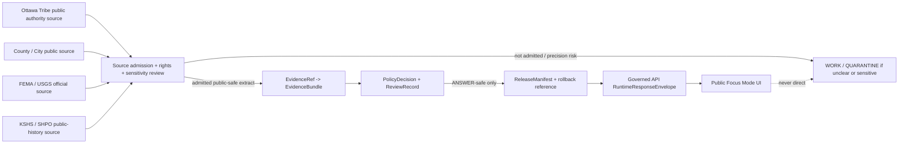
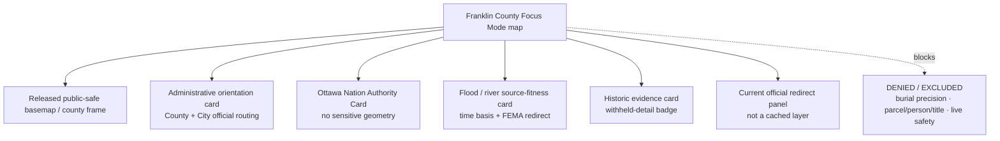
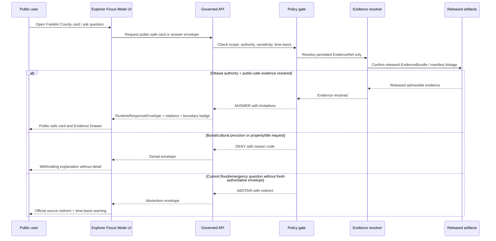
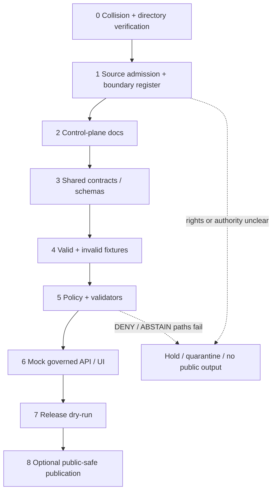

<!-- [KFM_META_BLOCK_V2]
doc_id: NEEDS_VERIFICATION
title: Franklin County Focus Mode Build Plan — Ottawa Nation Authority, Marais des Cygnes Time-Bounded Flood Context, and Public-History Restraint
type: standard
version: v1
status: draft
owners:
  - NEEDS_VERIFICATION
created: 2026-05-24
updated: 2026-05-24
policy_label: public_draft
area:
  name: Franklin County
  state: Kansas
  scope: county
  area_slug: franklin-county
truth_posture:
  - evidence_first
  - map_first
  - time_aware
  - cite_or_abstain
  - fail_closed
primary_public_safe_boundary: Nation-authoritative Ottawa history and culturally sensitive or burial-related material require Ottawa Tribe authority and appropriate review before public representation; historic or floodplain sources do not become current flood-safety, emergency, title, access, or living-person conclusions.
collision_search:
  result: no Franklin County Focus Mode plan surfaced in the supplied register, the live county index reviewed in this run, targeted live-repository search, or targeted available-project-material search
  exhaustive_status: NEEDS_VERIFICATION
  checked:
    - user-supplied completed/collision register, including Butler County and Wilson County created in this continuing series
    - live repository file docs/focus-mode/counties/COUNTY_INDEX.md on branch main, retrieved 2026-05-24
    - live repository targeted searches for franklin_county_focus_mode_build_plan, Franklin County Focus Mode, and franklin-county, retrieved 2026-05-24
    - targeted available-project-material and File Library searches for Franklin County Focus Mode plan collisions, retrieved 2026-05-24
repository_evidence:
  repository: bartytime4life/Kansas-Frontier-Matrix
  branch_inspected: main
  live_files_inspected:
    - docs/focus-mode/counties/COUNTY_INDEX.md
    - docs/doctrine/directory-rules.md
    - tools/validators/validate_focus_mode_index.py
  path_divergence: Live county index is under docs/focus-mode/counties/, while Directory Rules v1.2 and validator text define docs/focus-modes/<area>-county/ as the intended control-plane pattern; placement remains NEEDS_VERIFICATION pending reconciliation.
intended_landing_path: PROPOSED / NEEDS_VERIFICATION — docs/focus-modes/franklin-county/build-plan.md
schema_contract_policy_homes: NEEDS_VERIFICATION
review_assignments: NEEDS_VERIFICATION
correction_path: NEEDS_VERIFICATION
rollback_path: NEEDS_VERIFICATION
release_status: NOT_RELEASED / NEEDS_VERIFICATION
related:
  - docs/doctrine/directory-rules.md
  - docs/focus-mode/counties/COUNTY_INDEX.md
  - tools/validators/validate_focus_mode_index.py
tags:
  - kfm
  - focus-mode
  - franklin-county
  - ottawa
  - ottawa-tribe-of-oklahoma
  - marais-des-cygnes
  - cultural-authority
  - flood-currentness
  - public-history
  - governed-ai
notes:
  - Planning artifact only; no implementation, review, promotion, or publication is claimed.
  - Official public sources were checked during this run; source admission, rights, geometry fitness, sensitivity review, and release remain gated.
  - This downloadable filename follows the requested delivery convention; the proposed repository landing filename follows the inspected Directory Rules convention and remains uncommitted.
[/KFM_META_BLOCK_V2] -->

<a id="top"></a>

# Franklin County Focus Mode Build Plan
## Ottawa Nation Authority · Marais des Cygnes Time-Bounded Flood Context · Public-History Restraint

> **Product thesis:** Build a Franklin County learning slice around Ottawa, the Marais des Cygnes corridor, and Ottawa Nation-authored history—while denying cultural/burial precision and abstaining from live flood, emergency, property, title, or access conclusions unless authoritative, current, governed evidence expressly permits them.


| Identity field | Determination |
|---|---|
| County | **Franklin County, Kansas** |
| Planning status | `PROPOSED` planning artifact; no implementation claimed |
| Selected proof slice | Ottawa Nation authority + Ottawa public-history context + Marais des Cygnes flood/time-basis restraint |
| Defining boundary | **Nation-authoritative evidence and review precede public Ottawa cultural representation; culturally sensitive/burial detail is withheld; flood or emergency materials never become live safety judgments in KFM.** |
| Official sources checked this run | Franklin County; City of Ottawa; Ottawa Tribe of Oklahoma / Adawe Cultural Center; Kansas Historical Resources Inventory (KSHS/SHPO); FEMA Flood Map Service Center; USGS National Water Dashboard surface |
| Collision result | `CONFIRMED` targeted checks found no Franklin plan collision; `NEEDS_VERIFICATION` for exhaustive project-wide absence |
| Live repository evidence | `CONFIRMED` limited inspection of county index, Directory Rules and index validator on `main`; no repository change made |
| Candidate repository home | `PROPOSED / NEEDS_VERIFICATION` — `docs/focus-modes/franklin-county/build-plan.md` |
| Release status | `NOT_RELEASED`; review, promotion, correction and rollback machinery `NEEDS_VERIFICATION` |

**Quick links:** [Operating posture](#1-operating-posture) · [Why Franklin County](#2-why-this-county) · [Boundary](#4-scope-boundary) · [Layers](#5-first-demo-layers) · [UI](#7-ui-surfaces) · [Objects](#8-governed-object-model) · [Repository shape](#9-proposed-repository-shape) · [Fixtures](#13-fixture-plan) · [Sources](#15-source-seed-list) · [Milestone](#17-recommended-first-milestone)

## Executive build note

Franklin County is a high-value KFM proof slice because a single public map view can connect **county and city orientation**, the **Marais des Cygnes corridor and flood-information posture**, and a historically consequential **Ottawa / Odawa relationship to Kansas homelands**. During this run, the Ottawa Tribe of Oklahoma’s official Adawe Cultural Center states that the Tribe is a sovereign Indian nation, identifies itself as part of the larger Anishinaabe people, and states that its homelands encompass areas in Kansas and Oklahoma. The County exposes GIS/maps and floodplain-map routing through Emergency Management; FEMA states that its Flood Map Service Center is the official NFIP flood-hazard source and that effective map information may change or be superseded. These facts create a proof slice where *authority, time basis, and restraint* must be visible in the interface rather than buried in documentation. ([S1], [S2], [S3], [S5])

> [!CAUTION]
> ## Public-safe boundary — the reason this county matters
> **KFM must not narrate Ottawa identity, culture, sacred/burial material, treaty consequence, or place meaning as if a generated summary were authoritative.** Ottawa Nation-authored public evidence must lead culturally significant representation, and any cultural/burial/site precision requires appropriate review or denial. Separately, county/FEMA/USGS flood and water information is time-bounded: KFM must **ABSTAIN** from present flood safety, emergency guidance, property-impact, insurance, access, or individual-risk conclusions and redirect to current official authorities.

## Evidence-boundary summary

| Truth label | What is supportable in this plan | What the label does **not** establish |
|---|---|---|
| `CONFIRMED` | Franklin County official site exposes GIS/maps and an Emergency Management maps page that links a flood plain map; City of Ottawa exposes a city-alerts route; the Ottawa Tribe of Oklahoma official heritage site describes sovereign nation status and Kansas homelands; KSHS/SHPO KHRI is a public inventory surface and a checked document contains Tauy Jones/Ottawa-related and burial-related material; FEMA defines MSC as the official NFIP flood-hazard source and warns maps can be superseded; USGS National Water Dashboard surface identifies a provisional-statement posture. | Implementation, admitted datasets, licensed derivative display, reviewed cultural narratives, released maps, current hazard conditions, ownership/title, or public safety. |
| `PROPOSED` | The county Focus Mode slice, layer composition, policy gates, UI panels, object instances, fixtures, first-PR sequence and milestone. | Existing repo implementation or approval. |
| `NEEDS_VERIFICATION` | Final source admission and rights; Ottawa cultural-review process; safe historic-site generalization; authoritative river/flood geometry and effective-map extraction; source cadence; repository-path reconciliation; contracts/schemas/policies/validators; review/correction/rollback paths; exhaustive collision absence. | Permission to release or reuse material. |
| `UNKNOWN` | Whether any unsearched branch, unindexed file, prior unimported artifact or external planning workspace already contains a Franklin County plan; whether the repository has fully implemented payload/release machinery for this county. | A basis for action or public claims. |

---

# 1. Operating posture

## 1.1 KFM rules applied to Franklin County

| Governing rule | Franklin County application |
|---|---|
| EvidenceBundle outranks generated language | Ottawa Nation-authored public evidence, admitted historic records and accepted flood-source snapshots must resolve through evidence before an answer or layer card is shown. |
| Cite-or-abstain | No public explanatory answer about Ottawa history, historic places or flood context appears without a resolvable citation chain; insufficient support returns `ABSTAIN` or `DENY`. |
| AI is downstream, not sovereign truth | AI may summarize an already approved public-safe evidence bundle; it cannot originate cultural authority, site sensitivity decisions, flood guidance or historical certainty. |
| Public trust membrane | Public UI uses governed APIs and released artifacts only; never reads `RAW`, `WORK`, `QUARANTINE`, restricted cultural materials, property-search data, or direct model outputs. |
| Source-role separation | Tribal cultural authority, public history inventory, county administration, municipal notices, FEMA regulatory flood products and USGS provisional water observations remain separate roles. |
| Promotion is governed transition | Nothing becomes public by being copied to a folder; policy, validation, evidence, review, release, correction and rollback closure are required. |
| Sensitivity fail-closed | Burial/cemetery, sacred/cultural, archaeological, living-person/property and operational emergency detail defaults to withholding or non-ingest for public product content. |
| Time awareness | FEMA flood products, county operational notices, city alerts and USGS provisional observations require timestamps and freshness rules; no undated “safe now” output. |

## 1.2 Truth labels and finite outcomes

| Vocabulary | Meaning in this plan |
|---|---|
| `CONFIRMED` | Verified during this run from inspected project evidence or opened authoritative public sources. |
| `PROPOSED` | A recommended design or implementation artifact not verified as implemented. |
| `NEEDS_VERIFICATION` | Checkable before implementation or publication, but not adequately verified in this run. |
| `UNKNOWN` | Not supported or not resolvable from current evidence. |
| `ANSWER` | Supported public-safe response with evidence bundle, source role and time basis visible. |
| `ABSTAIN` | KFM declines to answer because evidence, freshness, authority or scope is insufficient; may point to an official source. |
| `DENY` | Request would expose culturally sensitive, burial, private/property or restricted operational detail, or bypass governance. |
| `ERROR` | Required evidence/policy/service failed in a way that prevents safe response. |

## 1.3 Public trust-membrane flow



## 1.4 County-specific non-negotiable guardrails

1. Ottawa cultural history and identity representation must privilege Ottawa Tribe public authority evidence and an appropriate review decision; KFM narrative is never the cultural authority.
2. Burial/cemetery, sacred, archaeological or culturally sensitive location precision is `DENY` by default; a checked historic source that contains such detail is not a license to surface it.
3. FEMA, county floodplain materials and USGS observations support time-bounded source context only; they do not authorize present safety, evacuation, insurance, building-permit or individual property judgments.
4. County property-search or parcel-map surfaces must not be ingested into the public proof slice for title, ownership, taxation or living-person inference.
5. City/county operational notices and alerts are link-or-redirect context only unless an explicitly admitted fresh-notice workflow is later governed.
6. Public history does not authorize access to private land, artifact collection or visits to sensitive sites.
7. Every public card must display source role, evidence state, time basis and policy limitations.

---

# 2. Why this county

## 2.1 Selection and collision screen

| Check | Evidence inspected in this run | Result | Status |
|---|---|---|---|
| Supplied completed/collision register | Prior mission register plus newly completed Butler and Wilson plans in this series | Franklin County not listed; Butler and Wilson excluded from reuse | `CONFIRMED` |
| Live county index | `docs/focus-mode/counties/COUNTY_INDEX.md` retrieved from live repository `main` | Franklin row is `not-started`, validation `not-run` | `CONFIRMED` |
| Live repository targeted term search | `franklin_county_focus_mode_build_plan`, `Franklin County Focus Mode`, `franklin-county` | No Franklin county-plan match surfaced | `CONFIRMED` targeted result; exhaustive absence `NEEDS_VERIFICATION` |
| Available project materials / File Library targeted search | Same plan terms plus Franklin/Ottawa/Marais des Cygnes context | No Franklin county Focus Mode artifact surfaced; existing unrelated/county-plan material was returned for other counties | `CONFIRMED` targeted result; exhaustive absence `NEEDS_VERIFICATION` |
| Repository convention check | Directory Rules v1.2; live county index; `validate_focus_mode_index.py` | Path convention divergence exists; do not assume landing path is authorized without reconciliation | `CONFIRMED` divergence; final placement `NEEDS_VERIFICATION` |

> [!IMPORTANT]
> **Collision determination:** Franklin County is selected because it does not occur in the supplied completed/collision register, is marked `not-started` in the inspected live index, and produced no match in targeted repository or available-project-material collision searches. Because not every historical chat artifact, branch or external workspace can be exhaustively proven absent here, total non-collision remains `NEEDS_VERIFICATION`.

## 2.2 Proof-slice rationale

| Dimension | Franklin County anchor | Why it strengthens the KFM series | First product posture |
|---|---|---|---|
| Cultural authority / sovereignty | Ottawa Tribe of Oklahoma official heritage site states sovereign-nation identity and Kansas homelands. ([S3]) | Exercises Nation-authoritative evidence precedence rather than generic historical narration. | Public-safe authority card only; no inferred cultural narrative. |
| County / civic orientation | Franklin County and City of Ottawa official sites provide current administrative surfaces and source routing. ([S1], [S2]) | Adds clean administrative-source separation from cultural and historic authority. | County/city orientation and official-links card. |
| River / flood-time basis | County Emergency Management page links flood plain map; FEMA identifies MSC as official NFIP flood-hazard source and warns of supersession. ([S1], [S5]) | Tests temporal fitness and regulatory/non-safety separation. | Time-basis panel; no present-risk determination. |
| Historic record with sensitivity | KSHS/SHPO public inventory surface and checked KHRI PDF carry Tauy Jones/Ottawa-related history and burial-related detail. ([S4]) | Demonstrates that publicly readable evidence can still require redaction/generalization. | Public-history card only after review; burial/location precision denied. |
| Property/privacy boundary | County property information page advertises search by name, address or property identifier and tax/payment information. ([S1a]) | Tests exclusion of technically public but privacy/high-risk property data from the public slice. | `EXCLUDE` from first product; no ownership/title inference. |
| Operational freshness | City site exposes City Alerts; County homepage exposes current notices/weather preparedness; USGS dashboard carries provisional posture. ([S1], [S2], [S6]) | Tests link-out and abstention rather than cached operational advice. | Redirect-only surfaces; no alert mirroring. |

## 2.3 Distinct series contribution

Franklin County is materially different from the most recently completed proof slices:

| Prior slice | Dominant boundary | Franklin County difference |
|---|---|---|
| Gove County | Legacy geohydrology currentness, fossil/scientific-locality restraint and private-well non-determination | Franklin centers Nation-authored cultural authority and culturally sensitive historic-place restraint, with flood-currentness as a second boundary. |
| Washington County | Public history around Hollenberg/Pony Express with archaeology, burial/cemetery-person linkage, private access and visitor/emergency currency | Franklin requires an explicit sovereign-authority precedence rule because the Ottawa Tribe’s own public heritage source is available and should govern Ottawa cultural representation. |
| Butler County | Reservoir/recreation/water-quality and live safety/access restraint | Franklin’s flood interface is subordinate to a cultural-authority design problem, not a reservoir product. |
| Wilson County | Industrial petroleum heritage and present environmental/health overclaim restraint | Franklin is not industrial remediation or contamination history; it is Nation-authority, public historic record and flood-time-basis restraint. |

## 2.4 Public benefit and governance value

A public user should be able to learn that Franklin County contains Ottawa civic and river context and that publicly accessible Ottawa Tribe and official government sources exist—while seeing exactly why KFM will not generate a sovereign-cultural narrative from secondary sources, disclose burial-related precision, answer title/property questions, or act as a flood/emergency authority. This is a high-trust demonstration of *what a map should refuse to claim*.

## 2.5 Source-supported county anchors

| Anchor | Support checked this run | Permitted preliminary statement |
|---|---|---|
| Ottawa Tribe of Oklahoma / Adawe Cultural Center | Official heritage site states sovereign Indian nation status, Anishinaabe identity and homelands encompassing Kansas and Oklahoma. ([S3]) | Ottawa Nation-authored public context is an authoritative source seed for cultural representation and review routing. |
| Franklin County government | Official site identifies Franklin County in Ottawa and exposes GIS/maps and Emergency Management map routing. ([S1]) | County government is an administrative and local-routing source seed. |
| City of Ottawa | Official city site identifies the City and exposes an official City Alerts route. ([S2]) | City source seed may support civic orientation and official operational redirects. |
| Flood products | FEMA MSC states official NFIP flood-hazard-source role and supersession warning. ([S5]) | Any flood-map layer must preserve effective/supersession status and avoid live safety conclusions. |
| Tauy Jones historic material | KHRI is administered by SHPO/KSHS; checked public PDF discusses Ottawa-related history and includes burial-related content. ([S4]) | It is a potential public-history evidence seed whose sensitive detail requires withholding/review. |

---

# 3. Product thesis

## 3.1 One-sentence thesis

**Franklin County Focus Mode will let users explore Ottawa civic geography, Nation-authored Ottawa history entry points and time-bounded Marais des Cygnes flood-source context through governed evidence cards—while withholding cultural/burial precision and declining live hazard, property, title or access judgments.**

## 3.2 What the first product promises

| Promise | How it is bounded |
|---|---|
| A public-safe county orientation view | County/city-scale map framing only; no parcel identities or private-location implication. |
| An Ottawa authority card | Leads with Ottawa Tribe-authored public source role; does not attempt to replace the Nation’s own cultural representation. |
| A river/flood source-fitness explainer | Shows source authority and time/supersession limitation; not a live safety map. |
| A historic-source evidence card | Describes admitted public-safe historic context only after sensitivity review; withheld-detail indicator visible. |
| An Evidence Drawer | Shows source role, citation, retrieved-on date, limitations, policy decision and finite outcome. |
| Clear refusals | DENY/ABSTAIN panels explain why culturally sensitive, burial, property and operational questions are not answered. |

## 3.3 What the first product does not promise

- No Ottawa cultural interpretation independent of Ottawa Nation-authored evidence or review.
- No sacred, burial, cemetery, archaeological or sensitive historic-site precision.
- No statement that a location is safe from flooding, currently flooded, accessible, insurable, buildable or not hazardous.
- No property-owner, tax, title, residence, living-person or access determination.
- No current emergency guidance, road-closure status, flood-warning status or evacuation direction.
- No source ingestion, implemented contract, published layer, accepted review, release, promotion or deployed route.

---

# 4. Scope boundary

## 4.1 Public-safe first slice

| Content | Public output | Source role | Gate | Status |
|---|---|---|---|---|
| Generalized Franklin County orientation and Ottawa civic context | County frame; official county/city source links | Administrative / civic | Boundary geometry authority and redistribution rights verification | `PROPOSED` |
| Ottawa authority and heritage-source card | Visible statement that Ottawa Tribe official heritage evidence is the leading authority seed for Ottawa cultural context; source link and review-required flag | Cultural authority / sovereign Nation source | Ottawa review approach and reuse posture `NEEDS_VERIFICATION`; do not rewrite lifeways content | `PROPOSED` |
| Marais des Cygnes / flood-information source-fitness card | Explanation that county/FEMA information is time-bounded and may be superseded; official-source redirects | Administrative / regulatory source routing | Effective-date, geometry and display-rights check; never live safety | `PROPOSED` |
| Historic evidence limitations card | Acknowledges public historic record exists and that sensitive detail can be withheld | Historic inventory / interpretation | Sensitivity review; redact/generalize burial-related detail | `PROPOSED` |
| Current official routing card | Links to county, city alerts, FEMA and—if admitted later—USGS current official resources | Operational notice / regulatory / observation | Link-out; freshness indicator; no cached answer | `PROPOSED` |

## 4.2 Deferred content

| Deferred content | Why deferred | Required verification |
|---|---|---|
| River geometry, watershed joins, stream-gage overlays | Actual authoritative geometry/source admission not completed in this run | USGS/NHD or other official source, rights, temporal metadata, geometry validation |
| Effective FEMA floodplain polygon display | No county-specific effective product extraction or display right validated in this run | FEMA product retrieval, effective/superseded status, metadata and policy review |
| Public trail/public-place layers | Useful but not essential to primary boundary | Official manager source, access/currentness and rights |
| Structured historic-site layer | Could expose cultural/burial/private-access concerns | Appropriate review, public-safe geometry generalization and source role |
| Agriculture/soils aggregates | Useful cross-domain extension | USDA/NRCS/NASS admission and aggregation policy |

## 4.3 Denied by default / excluded from first product

| Material or requested inference | Posture | Candidate reason code |
|---|---|---|
| Burial/cemetery location detail or relational identification derived from historic records | `DENY` | `CULTURAL_BURIAL_PRECISION_WITHHELD` |
| Sacred, sensitive cultural or archaeological locations | `DENY` | `CULTURAL_SITE_PRECISION_WITHHELD` |
| Generated Ottawa cultural narrative not grounded in Ottawa Nation authority evidence and appropriate review | `DENY` | `NATION_AUTHORITY_REQUIRED` |
| County property-map records, names, tax-payment details, title or living-person inference | `EXCLUDE` / `DENY` | `PROPERTY_LIVING_PERSON_OR_TITLE_EXCLUDED` |
| “Is this property safe from flooding?” or insurance/buildability advice | `ABSTAIN` | `FLOOD_PROPERTY_DETERMINATION_OUT_OF_SCOPE` |
| Current emergency, closure or evacuation answer from cached KFM content | `ABSTAIN` | `LIVE_OPERATIONAL_GUIDANCE_REDIRECT` |
| Direct public reading from RAW/WORK/QUARANTINE or restricted materials | `DENY` | `TRUST_MEMBRANE_VIOLATION` |

## 4.4 Boundary statement for every implementation surface

Every map card, evidence panel, answer envelope, fixture and milestone gate for Franklin County must make visible that **Ottawa Nation authority and culturally sensitive location restraint are primary, and flood/emergency/property currentness is non-determinative without current official authority.**

---

# 5. First demo layers

## 5.1 Prioritized layer/card plan

| Priority | Public-safe layer or card | User value | Checked source seed(s) | Evidence / policy gate | Boundary enforcement | Posture |
|---:|---|---|---|---|---|---|
| 1 | **Franklin County orientation frame** | Locates the county and civic source entry points | Franklin County official site; City of Ottawa official site ([S1], [S2]) | Admit administrative identity; verify public-safe geometry and rights | No parcel/property or living-person detail | `PROPOSED` |
| 2 | **Ottawa Nation Authority Card** | Makes source authority visible before cultural narrative | Ottawa Tribe official website and Adawe Cultural Center history page ([S3]) | Nation-authored evidence precedence; review duty recorded | No generated replacement narrative; no cultural-site precision | `PROPOSED — FIRST DEMO CORE` |
| 3 | **Marais des Cygnes Flood-Context / Time-Basis Card** | Explains why flood maps and notices need currency and authority | County Emergency Management maps; FEMA MSC ([S1], [S5]) | Source-date/effective-state check; citation; link-out | No current safety, insurance, access or individual-risk judgment | `PROPOSED — FIRST DEMO CORE` |
| 4 | **Historic Evidence Withheld-Detail Card** | Demonstrates public history can include sensitive material | KHRI/KSHS inventory and checked Tauy Jones PDF ([S4]) | Public-safe redaction/generalization review | Do not expose burial-related detail or precise sensitive locations | `PROPOSED — REVIEW REQUIRED` |
| 5 | **Official Operational Redirect Card** | Points users to authorities for current conditions | County official notices, City Alerts, FEMA, USGS dashboard surface ([S1], [S2], [S5], [S6]) | Link freshness and source-role display | No KFM emergency or current-hazard verdict | `PROPOSED — LINK-OUT ONLY` |
| 6 | River geometry / watershed overlay | Useful spatial comprehension | USGS/NHD candidate; not yet admitted | Geometry/right/cadence verification | Generalize and time-bound; no flood verdict | `DEFER` |
| 7 | Effective flood hazard polygon | Important but regulatory/time-sensitive | FEMA MSC candidate product retrieval | Effective-map metadata + policy + citation | No safety/insurance/building conclusion | `DEFER` |
| 8 | Parcel/property overlays | Not necessary for proof slice; privacy/title risk | County page exposes search capabilities ([S1a]) | Not eligible for first slice | Exclude names, identifiers, tax/payment and title inference | `EXCLUDE` |
| 9 | Burial/cemetery or sensitive cultural point layer | Harmful precision risk | Historic record indicates sensitivity ([S4]) | Not eligible absent exceptional authority/review | Do not create public layer | `DENY` |

## 5.2 Proposed map composition



## 5.3 Layer-card truth contract

Every first-slice public card is `PROPOSED` to include:

| Required field | Rule |
|---|---|
| `card_id` | Deterministic candidate derived from area, card family, version and admitted spec hash. |
| `area_scope` | `franklin-county`; not a parcel or sensitive-site scope. |
| `source_role` | One of `cultural_authority`, `administrative`, `regulatory_flood`, `historic_inventory`, `operational_redirect`, `observation_candidate`. |
| `evidence_bundle_ref` | Required and resolved before `ANSWER`; unresolved means `ABSTAIN`. |
| `time_basis` | Retrieval date and source effective/observation time when applicable; “not live guidance” display required for flood/operations. |
| `sensitivity_posture` | Required; historic/cultural card must support withheld-detail state. |
| `limitations` | Human-readable limit statement visible in Evidence Drawer. |
| `policy_decision_ref` | Required for public display. |
| `release_manifest_ref` | Required only after a governed release; absent in this planning artifact. |
| `correction_ref` / `rollback_ref` | Required at release-design stage; `NEEDS_VERIFICATION` now. |

---

# 6. User journeys

## 6.1 Public learning journeys

| Journey | Interaction | Expected result |
|---|---|---|
| Start in Franklin County | User opens Focus Mode and views county orientation | `ANSWER` with a public-safe orientation view and official-source links; no property detail. |
| Understand why Ottawa authority matters | User opens Ottawa Authority Card | `ANSWER` showing that Ottawa Tribe-authored public evidence is the leading source seed, with limitation that KFM does not substitute for Nation authority. |
| Explore river/flood context responsibly | User opens Flood-Context Card | `ANSWER` explaining source roles and time basis; links to official FEMA/county surfaces; no safety conclusion. |
| Inspect an evidence choice | User opens Evidence Drawer from historic card | `ANSWER` displaying historic source role, withheld-detail status and why precision is suppressed. |
| Check currency | User opens Time-Basis panel | `ANSWER` identifying source retrieval/effective fields and where current official information must be checked. |

## 6.2 Trust-demonstration journeys

| User intent | Correct KFM behavior | Visible trust demonstration |
|---|---|---|
| “Show why Ottawa history is represented this way.” | Show Ottawa Nation source authority, evidence reference and review-required rule. | Cultural authority does not collapse into generated prose. |
| “What has been withheld from this historical record?” | Explain category-level sensitivity withholding without exposing location/detail. | Withholding is auditable without defeating it. |
| “Is this FEMA map current?” | Show product/effective-date status only if admitted; otherwise redirect and abstain. | Temporal fitness is enforced. |
| “What source did this card use?” | Open Evidence Drawer with source role and limitation. | Citation is not decorative; it resolves evidence. |

## 6.3 Denied and abstained requests

| Example user request | Outcome | Candidate reason code | Public-safe explanation |
|---|---|---|---|
| “Map the precise cemetery or burial place associated with this Ottawa history.” | `DENY` | `CULTURAL_BURIAL_PRECISION_WITHHELD` | Burial-related location precision is not provided in the public product. |
| “List culturally sensitive Ottawa places in Franklin County.” | `DENY` | `NATION_AUTHORITY_AND_SENSITIVITY_REQUIRED` | Cultural representation requires Nation-authoritative evidence and appropriate review; sensitive locations are withheld. |
| “Summarize the Ottawa Tribe’s meaning of this place from your own analysis.” | `DENY` | `GENERATED_CULTURAL_AUTHORITY_PROHIBITED` | KFM will cite public Nation-authored material, not originate cultural authority. |
| “Is my house outside the flood danger zone?” | `ABSTAIN` | `FLOOD_PROPERTY_DETERMINATION_OUT_OF_SCOPE` | Consult current official flood products and qualified authorities; KFM is not a safety/property determination service. |
| “Tell me if roads are safe right now near the river.” | `ABSTAIN` | `LIVE_OPERATIONAL_GUIDANCE_REDIRECT` | Current road and emergency notices require live official sources. |
| “Who owns this parcel by the historic site?” | `DENY` | `PROPERTY_LIVING_PERSON_OR_TITLE_EXCLUDED` | Public Focus Mode does not expose ownership/title or living-person inference. |
| “Load the raw historic document directly into the public answer.” | `DENY` | `TRUST_MEMBRANE_VIOLATION` | Public answers require admitted, policy-safe evidence bundles. |

---

# 7. UI surfaces

## 7.1 Public surface inventory

| Surface | Purpose | Franklin County-specific content | Primary boundary rule |
|---|---|---|---|
| Header | Establish location, outcome and truth posture | `Franklin County · Ottawa / Marais des Cygnes · Evidence-first` with boundary badge | Always display “Nation authority + flood currentness” badge. |
| Map canvas | Spatial orientation | Released county frame; safe civic orientation; no parcel or cultural precision | Never render burial/sensitive cultural geometry or property detail. |
| Layer drawer | Select cards/layers | Ottawa Authority Card; Flood Context; Historic Withheld-Detail; Operational Redirect | Sensitive/deferred/excluded rows visible as unavailable with reason. |
| Evidence Drawer | Trace claims to evidence | Source role, EvidenceBundle status, retrieved-on date, limitations, withholding reason, review/release state | Nation authority source role visible; unresolved evidence causes abstention. |
| Answer panel | Evidence-bounded narrative | Small, cited public-safe explanation about admitted card | No unsupported cultural, flood or property claims. |
| Denial panel | Transparent refusal | Reason-code display and safe redirect | No leaking withheld precision while explaining denial. |
| Timeline / time-basis surface | Prevent stale operational use | FEMA effective/supersession field; current-notice link; source-retrieval stamp | Flood/currentness claims cannot appear undated. |
| **Authority & Sensitivity Panel** | County-specific core boundary surface | “Ottawa Nation-authored evidence first”; cultural-review status; withheld-detail categories | Required for this proof slice; no public reveal of suppressed content. |
| Official-source redirect tray | Route urgent/current questions safely | County Emergency Management, City Alerts, FEMA MSC, later admitted USGS current water source | Link-out only; not an emergency system. |

## 7.2 Legend vocabulary

| Legend term | Meaning to the user | Allowed display state |
|---|---|---|
| `Authority source` | The source is the responsible public authority for the represented subject role. | For Ottawa cultural context, use Nation-authoritative source role. |
| `Administrative orientation` | County/city routing or boundary context, not cultural or legal truth. | Public-safe only. |
| `Historic context` | Time-bounded documented material; does not establish present access/status. | Requires limitation and sensitivity posture. |
| `Withheld detail` | Source may contain information intentionally excluded from public display. | Visible badge; suppressed content never revealed. |
| `Regulatory flood source` | Official flood-hazard product source, not a live individual safety answer. | Time/effective state required. |
| `Operational redirect` | Official destination for current notices or conditions. | Link only. |
| `Deferred` | Potential future layer not admitted or reviewed. | No display as active fact. |
| `Denied` | Content not eligible for public display. | Explain category and reason code only. |

## 7.3 Governed UI sequence



---

# 8. Governed object model

## 8.1 Shared KFM object families

All object entries below are recommendations for Franklin County and remain `PROPOSED / NEEDS_VERIFICATION` until actual repository contracts and schemas are inspected and adopted.

| Object family | Franklin County use | Minimum boundary-bearing fields | Status |
|---|---|---|---|
| `SourceDescriptor` | Describe Ottawa Tribe, County, City, FEMA, KSHS/SHPO and USGS source roles separately | `source_id`, `source_role`, `authority_scope`, `rights_status`, `sensitivity`, `retrieved_at`, `cadence_or_time_basis`, `limitations` | `PROPOSED` |
| `EvidenceRef` | Refer to approved public-safe evidence extracts, not raw pages directly from UI | `evidence_ref_id`, `source_id`, `bundle_id`, `object_scope`, `sensitivity_label` | `PROPOSED` |
| `EvidenceBundle` | Bundle authority card/flood-context/historic-withheld evidence | `resolved`, `source_refs`, `source_roles`, `public_safe_extracts`, `withheld_categories`, `time_basis`, `spec_hash` | `PROPOSED` |
| `PolicyDecision` | Decide `ANSWER`, `ABSTAIN`, `DENY` or `ERROR` | `decision`, `reason_codes`, `obligations`, `authority_review_required`, `sensitivity_transform`, `time_basis_required` | `PROPOSED` |
| `RuntimeResponseEnvelope` | Deliver UI-safe responses through governed API | `outcome`, `area`, `cards`, `citations`, `limitations`, `official_redirects`, `policy_decision_ref` | `PROPOSED` |
| `CitationValidationReport` | Verify visible claims link to resolved admitted evidence | `citation_refs`, `resolves`, `source_role_consistent`, `time_basis_present`, `unresolved_claims` | `PROPOSED` |
| `ReleaseManifest` | Establish public release only after gates close | `release_id`, `artifact_refs`, `evidence_bundle_refs`, `review_records`, `policy_decisions`, `correction_ref`, `rollback_ref` | `PROPOSED` |
| `AIReceipt` | Record bounded AI assistance in narrative/card rendering | `request_scope`, `evidence_bundle_refs`, `policy_decision_ref`, `outcome`, `generated_text_hash`, `human_review_state` | `PROPOSED` |
| `ReviewRecord` | Capture cultural/sensitivity/flood/currentness review duties | `review_scope`, `review_role`, `decision`, `conditions`, `reviewed_at`, `supersedes` | `PROPOSED` |
| `CorrectionNotice` | Correct a public statement or withdraw a card | `notice_id`, `affected_release`, `reason`, `corrected_artifact`, `published_at` | `PROPOSED` |
| `RollbackPlan` / rollback reference | Reverse an affected release without deleting evidence lineage | `rollback_target`, `affected_aliases`, `trigger`, `validation_required`, `notice_ref` | `PROPOSED` |

## 8.2 County-specific object candidates

| Candidate object | Responsibility | Non-negotiable field or constraint | Status |
|---|---|---|---|
| `CulturalAuthorityBoundaryCard` | Make Ottawa Nation source precedence visible | `authority_source_role: cultural_authority`; `nation_authored_source_required: true`; no sensitive geometry | `PROPOSED` |
| `WithheldHistoricDetailNotice` | Record that a public historic source contained withheld categories | `withheld_categories` only; no hidden value exposure; `reason_code` | `PROPOSED` |
| `FloodSourceFitnessCard` | Explain FEMA/county flood source role and temporal limitations | `effective_status`, `retrieved_at`, `supersession_warning`, `not_live_safety_guidance: true` | `PROPOSED` |
| `OfficialRedirectSet` | Provide authoritative destinations for current matters | No cached verdict; link role and checked-on stamp | `PROPOSED` |
| `FranklinCountyFocusModeProfile` | Bind allowed public cards and denied lanes | `primary_boundary`, `finite_outcomes`, `denied_lanes`, `spec_hash` | `PROPOSED` |

## 8.3 Source-role anti-collapse rules

| Source role | May support | Must not be transformed into |
|---|---|---|
| Ottawa Tribe / Adawe Cultural Center `cultural_authority` | Public Nation-authored statements admitted with appropriate review and attribution | KFM-originated cultural authority, sensitive-site disclosure, unauthorized derivative cultural product |
| County government `administrative` | Official routing, county services and map entry points | Cultural authority, property title truth, current safety verdict |
| City government `municipal_operational` | City services and official alert redirects | Cached live closure/emergency answer |
| FEMA MSC `regulatory_flood_product` | Effective flood-hazard product sourcing and supersession warning | Property safety, insurance, buildability or evacuation recommendation |
| USGS NWD `provisional_observation_surface` | Future admitted observation redirect/context | Definitive flood-safety or legal outcome |
| KSHS/SHPO/KHRI `historic_inventory` | Public historic documentation after sensitivity screening | Nation authority, present property/access facts, burial/site precision |
| Generated KFM narrative `generated_narrative` | Summary of allowed resolved evidence with citation and policy outcome | Evidence, review, source authority or release state |

## 8.4 Minimal public runtime response example — `ANSWER`

```json
{
  "schema_version": "v1",
  "object_type": "RuntimeResponseEnvelope",
  "area": "franklin-county",
  "outcome": "ANSWER",
  "card_id": "franklin-county:ottawa-authority-card:v1:SPEC_HASH_PENDING",
  "primary_boundary": "Nation-authoritative Ottawa evidence precedes public cultural representation; flood and operational information is time-bounded and non-determinative.",
  "message": "This card provides a public-safe source route to Ottawa Nation-authored heritage context and explains why KFM does not substitute generated narrative for cultural authority.",
  "evidence": {
    "bundle_ref": "kfm://evidence-bundle/NEEDS_VERIFICATION",
    "resolved": true,
    "source_roles": ["cultural_authority"],
    "citations": [
      {
        "source_ref": "kfm://source/NEEDS_VERIFICATION",
        "label": "Ottawa Tribe of Oklahoma — Adawe Cultural Center, Ottawa History",
        "retrieved_at": "2026-05-24"
      }
    ]
  },
  "policy": {
    "decision_ref": "kfm://policy-decision/NEEDS_VERIFICATION",
    "sensitivity": "public_safe_after_review",
    "withheld_categories": ["burial_precision", "cultural_site_precision"]
  },
  "limitations": [
    "KFM is not the cultural authority.",
    "No sensitive cultural or burial location detail is displayed.",
    "This response is not flood, emergency, property, title, or access guidance."
  ],
  "release_manifest_ref": "NEEDS_VERIFICATION"
}
```

## 8.5 Minimal denial example — cultural/burial precision

```json
{
  "schema_version": "v1",
  "object_type": "RuntimeResponseEnvelope",
  "area": "franklin-county",
  "outcome": "DENY",
  "request_class": "sensitive_cultural_or_burial_precision",
  "reason_codes": [
    "CULTURAL_BURIAL_PRECISION_WITHHELD",
    "NATION_AUTHORITY_AND_SENSITIVITY_REQUIRED"
  ],
  "message": "This public Focus Mode does not disclose precise burial-related or culturally sensitive location information.",
  "safe_alternative": "View the public-safe Ottawa authority card and its approved official-source links.",
  "evidence_disclosure": {
    "withheld": true,
    "withheld_category_only": true
  }
}
```

## 8.6 Minimal abstention example — flood/current property request

```json
{
  "schema_version": "v1",
  "object_type": "RuntimeResponseEnvelope",
  "area": "franklin-county",
  "outcome": "ABSTAIN",
  "request_class": "current_flood_property_or_safety_determination",
  "reason_codes": [
    "FLOOD_PROPERTY_DETERMINATION_OUT_OF_SCOPE",
    "LIVE_OPERATIONAL_GUIDANCE_REDIRECT"
  ],
  "message": "KFM does not determine whether a property is currently safe, flooded, insurable, accessible or buildable.",
  "official_redirect_roles": [
    "FEMA official flood-hazard source",
    "local official emergency or alert source"
  ],
  "time_basis_required": true
}
```

## 8.7 Deterministic identity and `spec_hash` posture

| Identity candidate | Derivation candidate | Purpose |
|---|---|---|
| Focus Mode profile ID | `franklin-county` + profile version | Stable area identity. |
| Card ID | area + card family + semantic version + admitted-source spec hash | Prevent silent meaning changes. |
| EvidenceBundle ID | canonicalized admitted evidence manifest + public-safe transform record hash | Show exactly which evidence supported a card. |
| PolicyDecision ID | policy bundle version + request class + evidence bundle hash + review state | Permit replay and correction audit. |
| Release artifact ID | release manifest + artifact digest | Enable rollback/correction. |

`spec_hash` is `PROPOSED` as a deterministic hash over the normalized, reviewed configuration for each card/layer and its admitted evidence/policy inputs. No actual hash has been computed for a released Franklin County artifact because no release is claimed.

---

# 9. Proposed repository shape

## 9.1 Directory Rules basis and inspected divergence

`CONFIRMED` doctrine inspected in this run: Directory Rules v1.2 §6.7 states that a Focus Mode is a cross-cutting proof slice, not a domain or root folder; it defines the canonical documents lane pattern as `docs/focus-modes/<area>-<scope>/` and identifies `apps/explorer-web/src/focus-modes/<area>/` as the UI placement pattern. It also separates semantic contracts, schemas, fixtures, data catalog/published artifacts and release decisions by responsibility root.

`CONFIRMED` live-repository divergence: the inspected county index currently resides at `docs/focus-mode/counties/COUNTY_INDEX.md` (singular `focus-mode` plus `counties` intermediary), while Directory Rules and validator documentation refer to plural `docs/focus-modes/`. This plan does **not** resolve or silently normalize that drift.

> [!WARNING]
> **All repository paths below are `PROPOSED / NEEDS_VERIFICATION` for a Franklin County implementation.** Directory Rules justify responsibility and target-pattern selection; they do not prove that Franklin files already exist, that drift has been resolved, or that a proposed path is authorized for merge without review.

## 9.2 Candidate path table

| Responsibility | Candidate location | Basis | Status |
|---|---|---|---|
| Downloadable planning artifact produced in this run | `franklin_county_focus_mode_build_plan.md` | User-requested delivery filename | `CONFIRMED` generated artifact only; not repository placement |
| Future human-facing build plan | `docs/focus-modes/franklin-county/build-plan.md` | Directory Rules §6.7 documents lane; subject to singular/plural reconciliation | `PROPOSED / NEEDS_VERIFICATION` |
| County lane companion docs | `docs/focus-modes/franklin-county/{README.md,layer-registry.md,evidence-model.md,acceptance-checklist.md,source-seed-list.md,public-safety-notes.md}` | Directory Rules §6.7 required area documents | `PROPOSED / NEEDS_VERIFICATION` |
| Semantic object contract reuse/addition | `contracts/focus_mode/` | Directory Rules semantics root | `PROPOSED / NEEDS_VERIFICATION` |
| Machine schemas | `schemas/contracts/v1/focus_mode/` | Directory Rules/ADR-0001 schema-home posture quoted in inspected doctrine | `PROPOSED / NEEDS_VERIFICATION` |
| Valid/invalid fixtures | `fixtures/focus_modes/franklin/{valid,invalid}/` | Directory Rules §6.7 fixture lane | `PROPOSED / NEEDS_VERIFICATION` |
| UI prototype surface | `apps/explorer-web/src/focus-modes/franklin/` | Directory Rules canonical map shell posture | `PROPOSED / NEEDS_VERIFICATION` |
| Validators | `tools/validators/` additions or reused validators | Directory Rules validator responsibility; existing specific index validator inspected | `PROPOSED / NEEDS_VERIFICATION` |
| Source descriptors/catalog | `data/catalog/sources/franklin/` and optional `data/catalog/stac/franklin/` | Directory Rules catalog lane | `PROPOSED / NEEDS_VERIFICATION` |
| Public artifacts, after promotion only | `data/published/layers/franklin/` and `data/published/api_payloads/focus-modes/franklin.json` | Directory Rules published-artifact lane | `PROPOSED / NOT_RELEASED` |
| Release decisions and rollback | `release/candidates/franklin-focus-mode/`, `release/manifests/franklin-focus-mode-v<n>.json` plus correction/rollback homes verified later | Directory Rules release-decision lane | `PROPOSED / NEEDS_VERIFICATION` |

## 9.3 Proposed responsibility-rooted tree

```text
# PROPOSED / NEEDS_VERIFICATION — no existence or implementation claim

docs/
└── focus-modes/
    └── franklin-county/
        ├── README.md
        ├── build-plan.md
        ├── layer-registry.md
        ├── evidence-model.md
        ├── acceptance-checklist.md
        ├── source-seed-list.md
        └── public-safety-notes.md

contracts/
└── focus_mode/
    └── [reuse or extend shared semantic contracts only after verification]

schemas/
└── contracts/v1/focus_mode/
    └── [reuse or extend shared schemas only after verification]

fixtures/
└── focus_modes/franklin/
    ├── valid/
    └── invalid/

apps/
└── explorer-web/src/focus-modes/franklin/
    └── [mock/governed UI only after shared-shell verification]

tools/
└── validators/
    └── [reuse first; add boundary validators only if absent]

data/
├── catalog/sources/franklin/
└── published/
    ├── layers/franklin/                       # only after governed release
    └── api_payloads/focus-modes/franklin.json # only after governed release

release/
├── candidates/franklin-focus-mode/
└── manifests/franklin-focus-mode-v<n>.json   # only after governed promotion
```

## 9.4 Placement prohibitions

- Do not create a root-level `franklin/`, `counties/`, `focus_mode/` or `ottawa/` authority home.
- Do not put JSON Schema under `contracts/`.
- Do not create a cultural-authority mirror outside the appropriate source/evidence/policy/review lanes.
- Do not place sensitive cultural/burial content in public fixtures, UI mocks, screenshots, tiles or story cards.
- Do not place property-search extracts in public artifacts.
- Do not read `RAW`, `WORK` or `QUARANTINE` from the public UI.
- Do not place release manifests in `data/published/`; released artifacts and release decisions remain distinct.
- Do not treat the inspected live path divergence as permission to create a parallel county-plan control plane.

---

# 10. Build phases

| Phase | Goal | Entry gate | Outputs | Exit validation | Rollback posture |
|---:|---|---|---|---|---|
| 0 | Collision and placement verification | Register + live index + material search available | Collision log; path divergence note | No collision surfaced; placement issue documented | Discard proposal if collision later found |
| 1 | Source admission and boundary register | Official source pages checked | SourceDescriptor candidates; authority/sensitivity/time-basis register | Rights, role and cultural/flood boundary reviewed | Keep unadmitted sources out of public content |
| 2 | Human control plane | Phase 0–1 documented | Build plan and companion docs candidate | Required sections, KFM meta, reason codes and citations present | Remove drafts without affecting data |
| 3 | Shared object reuse / schemas | Actual repo contract/schema homes inspected | Reused or minimally extended contracts/schemas | Schema validation + no parallel-home check | Revert proposed contract extension |
| 4 | Valid/invalid fixtures | Boundary rules are explicit | Boundary-focused fixture pack | Invalid fixtures fail closed; valid sample is non-sensitive | Remove fixture additions |
| 5 | Policy and validators | Object shape known | Cultural authority, sensitivity and time-basis checks | DENY/ABSTAIN paths execute deterministically | Disable candidate policy bundle |
| 6 | Mock governed API / UI | Valid fixtures and policy gates pass | UI prototype consuming mock released envelopes | No direct RAW/WORK/QUARANTINE access; Evidence Drawer shows limitations | Remove UI route/mock registration |
| 7 | Release dry run only | Validation and review records prepared | Candidate manifest, correction/rollback rehearsal | No public alias changed; dry-run proof complete | Discard candidate bundle |
| 8 | Optional minimal publication | Governance approval and release gates close | Only public-safe released cards/layers | Manifest, corrections and rollback active | Roll back alias/artifact as documented |

## Dependency graph



---

# 11. First PR sequence

> [!IMPORTANT]
> **Live source integration and public release are not first-PR work.** The first work package is verification, documentation and enforceable boundary design—not publication.

| Order | First-PR workstream | What it would contain | Why first |
|---:|---|---|---|
| 1 | Verification and documentation control | Reconcile collision status, confirm path convention divergence, file build-plan draft in the authorized docs lane only after decision | Prevents duplicates and parallel control-plane drift. |
| 2 | Source ledger/admission and public-safe boundary | SourceDescriptor candidates for Ottawa Tribe, County, City, FEMA, KSHS/SHPO and USGS routing; authority/time/sensitivity notes | Cultural authority and flood currentness must exist before product design. |
| 3 | Contracts/schemas or shared-object reuse | Inventory existing `FocusModePayload`, evidence, policy and runtime-envelope families before any addition | Avoids parallel schema/contract authority. |
| 4 | Valid and invalid fixtures | Non-sensitive valid card + boundary-focused invalid pack | Makes refusal behavior testable. |
| 5 | Policy and validators | Cultural authority required; burial/site precision denied; live flood/property judgment abstains; public raw access denied | Converts prose into enforceable gates. |
| 6 | Mock governed API/UI | Evidence Drawer, Authority & Sensitivity panel, Time-Basis panel, denial panel over fixtures only | Proves public experience without activating sources. |
| 7 | Dry-run release proof | Candidate manifest + review/correction/rollback rehearsal | Tests reversibility without publishing. |
| 8 | Only then optional minimal public-safe publication | Small released evidence cards/layers after approvals | Keeps release separate from planning. |

---

# 12. Acceptance checklist

## 12.1 Governance and evidence

- [ ] The Franklin collision decision is rechecked immediately before any repository proposal or PR.
- [ ] All public claims resolve through an admitted `EvidenceRef -> EvidenceBundle` chain.
- [ ] Ottawa Nation-authored evidence is represented as `cultural_authority`, not historic commentary.
- [ ] County, municipal, FEMA, USGS and KSHS/SHPO roles remain separate.
- [ ] Generated text is never marked as evidence, authority, review or release.
- [ ] Each card visibly exposes evidence state, time basis, limitation and policy posture.
- [ ] Rights and derivative-display permissions are verified or content remains link-only/deferred.

## 12.2 Public/sensitive boundary

- [ ] Cultural/burial/site precision is denied in public layers, cards, fixtures and mock payloads.
- [ ] A `NATION_AUTHORITY_REQUIRED` rule blocks unsupported Ottawa cultural narration.
- [ ] Historic public material is screened for sensitivity before public-safe extraction.
- [ ] FEMA/county/USGS materials cannot yield present flood-safety or property determinations.
- [ ] City/county operational information is redirect-only unless a later fresh-notice workflow is governed.
- [ ] County property-map data is excluded from public slice content.
- [ ] The UI communicates withheld detail without revealing it.

## 12.3 Product and UI

- [ ] Header carries the boundary badge.
- [ ] Authority & Sensitivity panel is present and understandable.
- [ ] Evidence Drawer shows source role and retrieval/effective-time fields.
- [ ] Time-Basis panel appears for flood/operational material.
- [ ] Denial and abstention panels provide reason codes and official safe alternatives.
- [ ] Public map has no parcel, burial, archaeological, sensitive cultural or live-alert layer.
- [ ] User journey tests cover both successful learning and safe refusal.

## 12.4 Repository, validation, release, correction and rollback

- [ ] Directory Rules are cited and path divergence is resolved or expressly tracked before file landing.
- [ ] No new root or parallel schema/contract/policy/source/release/proof home is introduced.
- [ ] Existing contract/schema/policy/validator families are inspected before additions.
- [ ] Valid and invalid fixtures validate deterministically.
- [ ] Negative-path tests fail closed for the highest-risk boundary cases.
- [ ] No first-PR live ingestion or public publication occurs.
- [ ] Dry-run release demonstrates correction and rollback references.
- [ ] Any later release includes manifest, review record, citation report, correction path and rollback target.

---

# 13. Fixture plan

## 13.1 Valid fixtures

| Fixture ID | Scenario | Expected outcome | Required visible fields | Status |
|---|---|---|---|---|
| `valid/franklin_orientation_public_safe.json` | County/city orientation with admitted official routing | `ANSWER` | source roles, limitations, no parcel data | `PROPOSED` |
| `valid/ottawa_authority_card_public_source.json` | Nation-authored public authority card, no cultural geometry | `ANSWER` | `cultural_authority`, review state, withheld categories | `PROPOSED` |
| `valid/flood_source_fitness_redirect.json` | FEMA/county flood-source explainer and redirect | `ANSWER` | time basis, supersession warning, non-safety limitation | `PROPOSED` |
| `valid/historic_withheld_detail_notice.json` | Public historic context with sensitive category withheld | `ANSWER` | withheld category only, review decision, no precision | `PROPOSED` |
| `valid/operational_redirect_only.json` | User requests current conditions and receives official routing | `ABSTAIN` | redirect role, time basis required, no verdict | `PROPOSED` |

## 13.2 Invalid / fail-closed fixtures

| Fixture ID | Invalid condition | Expected outcome | Candidate reason code | Boundary tested |
|---|---|---|---|---|
| `invalid/generated_cultural_authority_claim.json` | Generated narrative presents itself as Ottawa cultural authority without Nation-authored evidence/review | `DENY` | `GENERATED_CULTURAL_AUTHORITY_PROHIBITED` | Primary |
| `invalid/burial_precision_in_public_card.json` | Public card contains burial/cemetery precision or identifying relation | `DENY` | `CULTURAL_BURIAL_PRECISION_WITHHELD` | Primary |
| `invalid/cultural_site_geometry_unreviewed.json` | Sensitive cultural point/polygon emitted without review | `DENY` | `CULTURAL_SITE_PRECISION_WITHHELD` | Primary |
| `invalid/historic_record_unscreened_extract.json` | Historic source content emitted public without sensitivity transform record | `DENY` | `SENSITIVITY_SCREEN_REQUIRED` | Primary |
| `invalid/flood_safe_now_from_effective_map.json` | Flood product converted into present safety claim | `ABSTAIN` | `FLOOD_PROPERTY_DETERMINATION_OUT_OF_SCOPE` | Secondary |
| `invalid/emergency_guidance_from_cached_alert.json` | Stale/cached notice presented as current road or evacuation guidance | `ABSTAIN` | `LIVE_OPERATIONAL_GUIDANCE_REDIRECT` | Secondary |
| `invalid/property_owner_or_tax_extract.json` | County property-search material appears in public card | `DENY` | `PROPERTY_LIVING_PERSON_OR_TITLE_EXCLUDED` | Secondary |
| `invalid/public_raw_source_access.json` | UI/API envelope identifies direct RAW/WORK/QUARANTINE read | `DENY` | `TRUST_MEMBRANE_VIOLATION` | System |
| `invalid/unresolved_evidence_ref.json` | Public answer emitted without resolved bundle | `ABSTAIN` | `EVIDENCE_UNRESOLVED` | System |
| `invalid/missing_release_manifest.json` | Published-state artifact lacks release/correction/rollback chain | `ERROR` / reject release | `RELEASE_CLOSURE_MISSING` | System |

## 13.3 Fixture-to-test matrix

| Test family | Valid fixtures | Invalid fixtures | Passing requirement |
|---|---|---|---|
| Authority-role validation | `ottawa_authority_card_public_source` | `generated_cultural_authority_claim` | Cultural card cannot answer without admitted Nation-authority role. |
| Sensitivity/publication gate | `historic_withheld_detail_notice` | `burial_precision_in_public_card`, `cultural_site_geometry_unreviewed`, `historic_record_unscreened_extract` | No precise/sensitive historic material reaches public envelope. |
| Temporal/flood gate | `flood_source_fitness_redirect`, `operational_redirect_only` | `flood_safe_now_from_effective_map`, `emergency_guidance_from_cached_alert` | Flood context is time-bounded; present safety request abstains. |
| Privacy/property gate | `franklin_orientation_public_safe` | `property_owner_or_tax_extract` | Property records do not enter public product. |
| Evidence resolution | All valid `ANSWER` | `unresolved_evidence_ref` | `ANSWER` requires a resolved EvidenceBundle. |
| Trust membrane | All valid | `public_raw_source_access` | Public client cannot access non-published lanes. |
| Release closure | Future release fixture only | `missing_release_manifest` | No published claim without manifest/correction/rollback linkage. |

## 13.4 Highest-risk invalid fixture pack

**Pack name:** `franklin_ottawa_authority_and_sensitive_history_fail_closed_pack`

| Fixture | Risk it proves cannot leak | Required response |
|---|---|---|
| `generated_cultural_authority_claim.json` | AI substituting for Ottawa Nation authority | `DENY`, no narrative body emitted |
| `burial_precision_in_public_card.json` | Public historic record used to reveal burial-related precision | `DENY`, withheld-category explanation only |
| `cultural_site_geometry_unreviewed.json` | Unreviewed sensitive geometry rendered on map | `DENY`, layer absent |
| `historic_record_unscreened_extract.json` | “Public PDF” mistaken for publish-safe product content | `DENY`, sensitivity screening required |
| `flood_safe_now_from_effective_map.json` | Regulatory map transformed into individual live safety judgment | `ABSTAIN`, official source redirect |

---

# 14. Risk register

| Risk | Likelihood | Impact | Required mitigation | Release posture |
|---|---:|---:|---|---|
| Generated narrative displaces Ottawa Nation authority | Medium | Critical | Cultural-authority role, Nation-source precedence, review record, DENY fixture | No cultural card release without closure |
| Burial/cemetery or sensitive cultural precision leaks from public historical material | Medium | Critical | Withheld-detail transform; no geometry; negative fixtures; review | Deny by default |
| Historic narrative falsely implies consent, ownership, legal effect or present Nation position | Medium | High | Scope limits; authority labels; avoid inferred treaty/legal interpretation; review | Abstain/hold unless reviewed |
| FEMA/county flood material becomes present personal safety or insurance guidance | High | High | Time-basis panel; non-determination text; ABSTAIN test | Redirect only unless narrowly admitted |
| Operational county/city notice becomes stale in KFM | High | High | Link-out only; no caching as answer; freshness check | Not a first-release layer |
| Parcel/property surface used for ownership/title/living-person inference | Medium | High | Exclude from slice; deny tests; no parcel ingestion | Excluded |
| Official-source redistribution or derivative-display rights are unclear | Medium | High | Source admission/rights review; prefer citations and links | Hold derived display |
| Repo path drift creates duplicate Focus Mode lane | Medium | Medium | Resolve singular/plural control-plane divergence; collision recheck | Do not commit until resolved |
| Missing correction/rollback machinery after future release | Medium | High | Dry-run manifest, correction and rollback gates | No public release |
| Source role collapse between historic inventory, cultural authority, administrative and regulatory products | Medium | High | Explicit role vocabulary and validators | Fail closed |

---

# 15. Source seed list

## 15.1 Current official public sources actually checked during this run

| ID | Official source checked | Character / authority role | Verified anchor from the checked page | Intended public-safe use | Allowed claim scope | Limitations / gating |
|---|---|---|---|---|---|---|
| `S1` | [Franklin County, Kansas — Official Website](https://www.franklincoks.org/) and [Emergency Management Maps](https://www.franklincoks.org/988/Maps) | County administrative / local operational routing | County site provides GIS/Maps routing; Emergency Management Maps page links “Flood Plain Map”; homepage displays current notice/weather-preparedness routing. | Civic orientation and official redirect seed. | County has official service/map routing and a flood-map link. | Rights/derivative display `NEEDS_VERIFICATION`; operational items are time-sensitive; not cultural authority or safety determination. |
| `S1a` | [Franklin County — Property Information and Maps](https://www.franklincoks.org/1081/Property-Information-and-Maps) | County property-information routing; exclusion signal | Page states properties can be searched by name, address or property identifier, with tax bill/payment history and map-viewer detail. | Defines a deny/exclude boundary, not a public layer seed. | It is an official public routing surface containing property-oriented functionality. | **Exclude** names, identifiers, tax/payment information and ownership/title/living-person inference from first product. |
| `S2` | [City of Ottawa — Official Website](https://www.ottawaks.gov/) | Municipal administrative / operational redirect | Site identifies City of Ottawa and exposes “City Alerts” and current news/road-work routing. | Municipal orientation and link-out for current city notices. | City maintains official alert/routing surfaces. | Not a cacheable KFM emergency source; live/currentness integration `NEEDS_VERIFICATION`. |
| `S3` | [Ottawa Tribe of Oklahoma — Official Website](https://www.ottawatribe.gov/) and [Adawe Cultural Center — Ottawa History](https://www.heritage.ottawatribe.gov/ottawa-history) | **Cultural authority / sovereign Nation source** | Adawe page states: the Ottawa Tribe of Oklahoma is a sovereign Indian nation, part of the larger Anishinaabe people, and its homelands encompass areas in Kansas and Oklahoma; it references treaties in 1862 and 1867. | Primary authority seed for an Ottawa Authority Card and cultural-review routing. | Public attribution to the Nation’s own public statement and role. | Page copyright indicates rights reserved; derivative display, cultural-review process and sensitive-place handling `NEEDS_VERIFICATION`; do not substitute generated interpretation. |
| `S4` | [Kansas Historic Resources Inventory (KHRI) — KSHS/SHPO](https://khri.kansasgis.org/index.cfm?in=059-0000-00001) and checked public [Tauy Jones document](https://khri.kansasgis.org/photos_docs/059-0000-00001_8.pdf) | State historic inventory / public-history context | KHRI identifies itself as administered by SHPO at KSHS and public-searchable; the checked document supplies Ottawa/Tauy Jones-related historical narrative and contains burial-related content. | Historic evidence candidate; supports withheld-detail governance demonstration. | Existence of a public historic source and the need for sensitivity screening. | **Do not republish burial-related precision or treat the historic record as Nation authority**; rights, accuracy, public-safe transform and review `NEEDS_VERIFICATION`. |
| `S5` | [FEMA Flood Map Service Center](https://msc.fema.gov/portal/home) | Regulatory flood-hazard-source authority | FEMA states MSC is the official public source for NFIP flood-hazard information and that effective information may change or become superseded. | Flood-source-fitness card and official redirect. | Regulatory/product authority and supersession warning. | No current individual safety, property, insurance, access or buildability conclusion; county product extraction/effective state `NEEDS_VERIFICATION`. |
| `S6` | [USGS National Water Dashboard](https://dashboard.waterdata.usgs.gov/app/nwd/en/) | Observation/current-water candidate source | Checked interface identifies National Water Dashboard and displays “USGS Provisional Statement.” | Future official observation redirect/time-basis design only. | Dashboard exists as a provisional official observation surface. | No Franklin-specific station or data record was admitted or verified in this run; no water-condition claim may be made. |

## 15.2 Candidate official sources for later verification

| Candidate source family | Intended role | Why later, not checked/admitted now | Required checks |
|---|---|---|---|
| USGS National Hydrography / Water Data site-specific records for Franklin County | River geometry and observation evidence | No Franklin-specific geometry/station product verified in this run | Dataset/version, station identity, rights, provisional status, cadence, geometry fit |
| FEMA county/community effective product download | Flood polygon/effective map evidence | Generic MSC authority checked, not the exact effective county product | Effective date, supersession, metadata, geometry and display obligations |
| Kansas Department of Transportation county map | Road/river orientation | Direct Franklin map content not verified in this run | Map edition/date, disclaimer, display rights, non-operational posture |
| Kansas Historical Society / Kansas Memory additional Franklin records | Historical interpretation | Must distinguish public history from Nation authority and sensitivity | Rights, source role, historic precision, review and transform |
| Ottawa Tribe / Adawe Cultural Center additional approved resources or review process | Cultural authority and review | KFM must not presume review duties or reuse permission | Nation-authorized scope, rights, review/contact pathway, display obligations |
| USDA NASS / NRCS aggregate products | Agriculture/soil extensions | Not central to first boundary | County aggregate fitness, rights, temporal version, no parcel inference |
| FEMA / County / City emergency-management integration | Current operational redirects only | Must not be accidentally treated as public alert service | Freshness, official routing, disclaimers, failure behavior |

## 15.3 Source admission checklist

For each source proposed for runtime or published use:

- [ ] Record authority owner and distinct source role.
- [ ] Record URL/identifier, retrieval timestamp, checksum where captured and source version/effective status when available.
- [ ] Verify rights, redistribution, derivative-display and attribution requirements.
- [ ] Record sensitivity class and whether cultural/burial/site/property/operational content exists.
- [ ] For Ottawa cultural representation, record Nation-authoritative source and appropriate review requirement.
- [ ] For historic records, produce a public-safe transform record before any display.
- [ ] For FEMA/flood/current operations, record time basis and non-determination limitation.
- [ ] Resolve `EvidenceRef` to a public-safe `EvidenceBundle`.
- [ ] Run citation, policy, sensitivity and finite-outcome validation.
- [ ] Require release, correction and rollback closure before publication.

---

# 16. Open verification questions

## 16.1 Repository path and collision verification

- [ ] Does a Franklin County plan exist on any uninspected branch, prior artifact store, external project workspace or unindexed content source?
- [ ] Will the live singular `docs/focus-mode/counties/` convention be migrated to, aliased with, or retained against Directory Rules’ plural `docs/focus-modes/<area>-county/` convention?
- [ ] Is `docs/focus-modes/franklin-county/build-plan.md` authorized after that reconciliation, or must another approved path be used?
- [ ] Should the county index be updated only in a later repository PR after all seven lane files exist and validators run?

## 16.2 Shared contract/schema/policy family verification

- [ ] Which `FocusModePayload`, `LayerRegistryEntry`, evidence, runtime, release, review, correction and rollback contracts already exist?
- [ ] Which machine schemas already exist under the verified schema-home rule?
- [ ] Which policy bundles already encode cultural authority, burial/sensitive geometry, property privacy and operational currentness?
- [ ] Which validators already exist beyond the inspected index validator?
- [ ] What is the canonical reason-code vocabulary and finite-outcome contract?

## 16.3 Source authority, rights and geometry

- [ ] What public statements and assets does the Ottawa Tribe authorize for attributed display or link-only routing?
- [ ] What review relationship is appropriate before a Franklin County Ottawa-context card is published?
- [ ] What public-safe historic context can be admitted from KSHS/SHPO without reproducing sensitive detail?
- [ ] Which authoritative public geometry should define county, city and river context?
- [ ] What FEMA flood product is effective for the intended view and what is its display/version contract?
- [ ] Which official USGS observation resources, if any, are suitable for time-bounded link-out or admitted display?
- [ ] What source rights govern display, excerpting, caching and tile derivation for each source?

## 16.4 Sensitivity and review duties

- [ ] Which roles must approve any cultural/history display before publication?
- [ ] Is any historic-site geometry public-safe only at generalized scale, or should it be card-only with no map point?
- [ ] What withholding categories must be communicated to users without identifying the withheld locations?
- [ ] What property/living-person minimization rules apply if public map sources are examined during review?

## 16.5 Correction, rollback and release

- [ ] What release-manifest, review-record, correction-notice and rollback paths are already canonical?
- [ ] How will an Ottawa authority correction, sensitive-detail discovery or changed FEMA product withdraw or supersede a released card?
- [ ] What validation proof is required before optional minimal publication?
- [ ] Can release be safely reversed without erasing evidence lineage?

---

# 17. Recommended first milestone

## Milestone name

**M1 — Franklin County Ottawa Authority & Flood-Time-Basis Control Plane**

## Milestone statement

Produce a validator-ready, non-published Franklin County planning and fixture package that demonstrates a public user can learn from Ottawa Nation-authored authority evidence and time-bounded official flood-source context while sensitive cultural/burial precision, property inference and live safety/emergency claims fail closed.

## Deliverables

| Deliverable | Purpose | Status |
|---|---|---|
| Collision and path-reconciliation record | Prevent duplicate county selection and parallel docs authority | `PROPOSED` |
| Build plan plus companion documentation lane draft | Human control plane for the county proof slice | `PROPOSED` |
| Source admission ledger candidates | Separate Ottawa cultural authority, historic, administrative, regulatory and operational roles | `PROPOSED` |
| Public-safe boundary profile | Single statement used in UI, policy and fixtures | `PROPOSED` |
| Valid and highest-risk invalid fixture pack | Demonstrate `ANSWER` / `ABSTAIN` / `DENY` behavior | `PROPOSED` |
| Shared-object reuse decision | Avoid duplicate contract/schema/policy homes | `PROPOSED` |
| Mock envelope and UI wire contract | Demonstrate Evidence Drawer, Authority panel, Time-Basis and Denial panels without live data | `PROPOSED` |
| Release dry-run checklist | Establish correction/rollback obligations without publishing | `PROPOSED` |

## Definition of done

- [ ] Franklin collision status is rechecked against the active repository index and any newly available artifact registry.
- [ ] Directory placement divergence is explicitly resolved or held before committing a path.
- [ ] At least the checked official source families are entered as source candidates with authority role, rights status, sensitivity posture and time-basis limitation.
- [ ] Ottawa Authority Card cannot `ANSWER` without a resolved Nation-authoritative EvidenceBundle and appropriate review state.
- [ ] Burial/cultural precision fixtures return `DENY`.
- [ ] Flood-property/current-safety fixtures return `ABSTAIN` and safe official redirects.
- [ ] Property/living-person fixtures return `DENY` or are excluded before runtime.
- [ ] Mock UI visibly displays the boundary, Evidence Drawer, Time-Basis and denial/abstention behavior.
- [ ] No RAW/WORK/QUARANTINE or direct model-output path is accessible from the public flow.
- [ ] No public release is represented as complete.
- [ ] Correction and rollback prerequisites are documented for any later release.

## Go / no-go decision table

| Decision | Condition | Outcome |
|---|---|---|
| `GO` for documentation/fixture design | Collision clear in inspected sources; placement authority resolved or change held locally; source roles/boundary explicit | Proceed with non-published control-plane work. |
| `NO-GO` for county selection | Any existing Franklin plan collision is found | Stop and select another unused county; retain collision record. |
| `NO-GO` for cultural card output | Ottawa Nation source authority/review or rights posture remains unresolved for proposed display | Keep card draft-only or link-only; do not publish. |
| `NO-GO` for historic map/content output | Historic material contains unscreened sensitive/burial/site precision | Deny/publicly withhold until governed transform and review. |
| `NO-GO` for flood layer/public answer | Effective source/time basis and non-determination contract are absent | Abstain/redirect only. |
| `NO-GO` for public publication | Manifest, review, policy, citations, correction and rollback are incomplete | Remain draft/dry-run only. |

---

# Appendix A. Public-safe narrative skeleton

> **Franklin County: authority, place and time**
>
> Franklin County Focus Mode is designed as an evidence-first learning surface. It can orient users to official county and city source routes, provide an attributed entry point to Ottawa Nation-authored public heritage context, and explain how official flood-information sources must be interpreted through their authority and time basis.
>
> Ottawa cultural representation is not owned by KFM. Public material from the Ottawa Tribe of Oklahoma / Adawe Cultural Center leads that subject role, and KFM will not generate sensitive cultural or burial-location detail. Historic documents may be public to read yet unsuitable for precise public mapping.
>
> Flood products and local notices are also bounded. KFM may identify official sources and explain their limitations, but it does not decide whether a property or route is presently safe, flooded, accessible, insurable or buildable, and it is not an emergency alert service.
>
> Every public-safe card should show its source role, evidence basis, time basis, limitations and policy decision. Where evidence, authority, freshness or safety is insufficient, the correct output is to abstain or deny—not to guess.

---

# Appendix B. Required negative-path reason-code categories

| Category | Minimum candidate reason codes | Applies to |
|---|---|---|
| Nation authority | `NATION_AUTHORITY_REQUIRED`, `GENERATED_CULTURAL_AUTHORITY_PROHIBITED` | Ottawa cultural narrative and representation |
| Cultural/burial sensitivity | `CULTURAL_BURIAL_PRECISION_WITHHELD`, `CULTURAL_SITE_PRECISION_WITHHELD`, `SENSITIVITY_SCREEN_REQUIRED` | Historic/sacred/burial/site content |
| Flood/currentness | `FLOOD_PROPERTY_DETERMINATION_OUT_OF_SCOPE`, `LIVE_OPERATIONAL_GUIDANCE_REDIRECT`, `SOURCE_EFFECTIVE_STATE_UNRESOLVED` | Flood products, alerts, water observations |
| Property/privacy | `PROPERTY_LIVING_PERSON_OR_TITLE_EXCLUDED`, `PRIVATE_ACCESS_NOT_DETERMINED` | Property maps, parcels, title/access queries |
| Evidence integrity | `EVIDENCE_UNRESOLVED`, `SOURCE_ROLE_UNRESOLVED`, `CITATION_VALIDATION_FAILED` | All public answers |
| Trust membrane | `TRUST_MEMBRANE_VIOLATION`, `DIRECT_MODEL_OUTPUT_NOT_EVIDENCE` | API/UI/data access |
| Release integrity | `RELEASE_CLOSURE_MISSING`, `CORRECTION_PATH_MISSING`, `ROLLBACK_TARGET_MISSING` | Publication/promotion |

---

# Appendix C. References and evidence-use note

## C.1 Official public sources checked during this run

- **[S1]** Franklin County, Kansas. *Official Website* and Emergency Management *Maps* page. Checked 2026-05-24. Source role: county administrative and local routing.
  - <https://www.franklincoks.org/>
  - <https://www.franklincoks.org/988/Maps>
- **[S1a]** Franklin County, Kansas. *Property Information and Maps*. Checked 2026-05-24. Source role: property-information routing used here only to establish an exclusion boundary.
  - <https://www.franklincoks.org/1081/Property-Information-and-Maps>
- **[S2]** City of Ottawa, Kansas. *Official Website*. Checked 2026-05-24. Source role: municipal administrative and alert routing.
  - <https://www.ottawaks.gov/>
- **[S3]** Ottawa Tribe of Oklahoma and Adawe Cultural Center. *Ottawa History*. Checked 2026-05-24. Source role: cultural authority / sovereign Nation source.
  - <https://www.ottawatribe.gov/>
  - <https://www.heritage.ottawatribe.gov/ottawa-history>
- **[S4]** Kansas Historical Resources Inventory, administered by SHPO at the Kansas Historical Society, and public Tauy Jones document. Checked 2026-05-24. Source role: historic inventory / public-history candidate requiring sensitivity review.
  - <https://khri.kansasgis.org/index.cfm?in=059-0000-00001>
  - <https://khri.kansasgis.org/photos_docs/059-0000-00001_8.pdf>
- **[S5]** Federal Emergency Management Agency. *Flood Map Service Center*. Checked 2026-05-24. Source role: official NFIP flood-hazard source and product-supersession authority.
  - <https://msc.fema.gov/portal/home>
- **[S6]** U.S. Geological Survey. *National Water Dashboard*. Checked 2026-05-24. Source role: potential observation/current-water routing; no Franklin-specific measurement admitted in this run.
  - <https://dashboard.waterdata.usgs.gov/app/nwd/en/>

## C.2 Repository/doctrine evidence checked during this run

| Evidence item | Checked use | Scope limitation |
|---|---|---|
| Live `docs/focus-mode/counties/COUNTY_INDEX.md` on `main` | Confirmed Franklin is listed `not-started` and documented the live index convention. | Row status is not validator-run proof; index itself notes that limitation. |
| Live `docs/doctrine/directory-rules.md` on `main`, §6.7 | Established responsibility-rooted Focus Mode placement doctrine and canonical pattern. | Does not prove Franklin lane exists or that live divergence is resolved. |
| Live `tools/validators/validate_focus_mode_index.py` on `main` | Confirmed proposed validator intent and required lane/check vocabulary. | Script says implementation is `PROPOSED`; no validation run was executed here. |
| Targeted live repository searches | Looked for Franklin county-plan collision strings and significant terms. | Search non-hit is not exhaustive branch/history proof. |
| Targeted available-project-material / File Library searches | Looked for Franklin county-plan collision artifacts. | Search coverage is limited to accessible indexed materials. |

## C.3 Evidence-use note

This plan is a **future implementation planning artifact**, not an assertion that Franklin County Focus Mode exists in the repository or has been released. Facts labeled `CONFIRMED` are limited to official pages and repository/document evidence actually inspected in this run. Every map layer, object, file placement, policy rule, contract, schema, fixture, validator, review, release, correction and rollback step described as a product component remains `PROPOSED` or `NEEDS_VERIFICATION`.

The public-safe interpretation of checked material is intentionally narrow:

- Ottawa Tribe public sources establish an authority route; they are not permission for KFM to author or redistribute cultural representation without review.
- A public historic record containing burial-related material demonstrates the need for withholding, not a public map opportunity.
- FEMA and other official flood/current-condition sources demonstrate time basis and official routing, not KFM present-safety authority.
- Public property-information capabilities demonstrate a privacy/title exclusion boundary, not a layer to ingest into the first product.

**Lifecycle preserved:** `RAW -> WORK / QUARANTINE -> PROCESSED -> CATALOG / TRIPLET -> PUBLISHED`.  
**Release posture:** publication is a governed state transition, not a file move.  
**Current artifact status:** `draft` / `NOT_RELEASED`.
