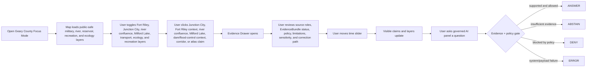
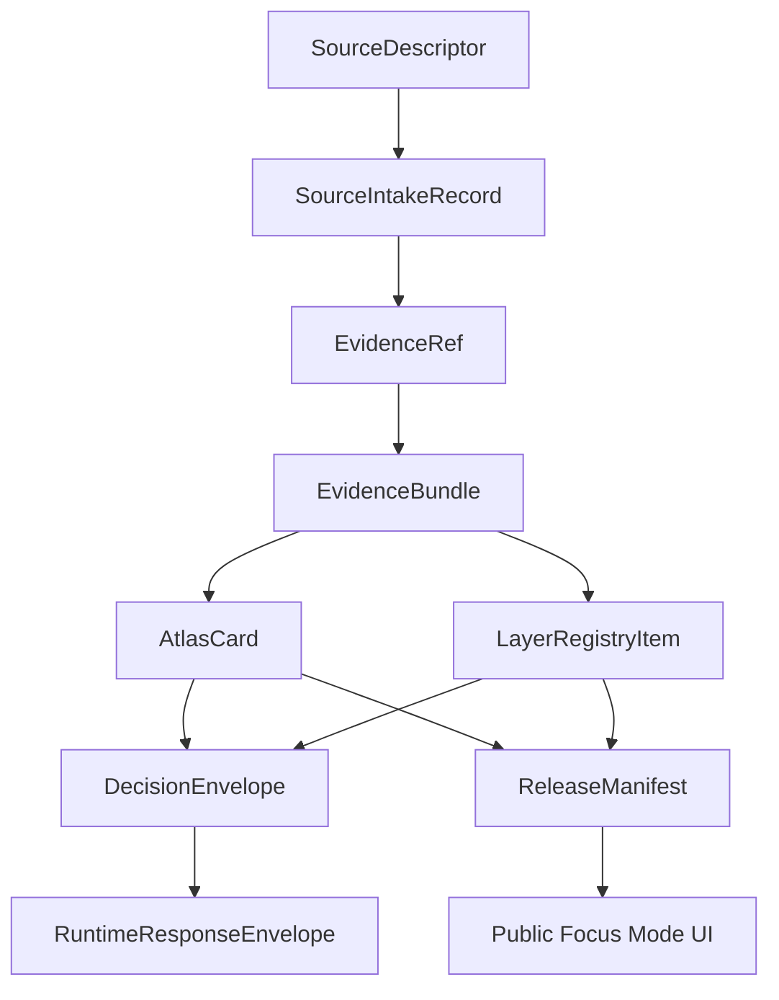

<!--
doc_id: NEEDS_VERIFICATION
title: Geary County Focus Mode Build Plan
type: standard
version: v1
status: draft
owners: [NEEDS_VERIFICATION]
created: 2026-05-21
updated: 2026-05-21
policy_label: public_draft
related:
  - docs/focus-modes/riley-county/build-plan.md
  - docs/focus-modes/geary-county/README.md
  - docs/focus-modes/geary-county/layer-registry.md
  - docs/focus-modes/geary-county/acceptance-checklist.md
tags: [kfm, focus-mode, geary-county, junction-city, fort-riley, milford-lake, kansas-river, smoky-hill-river, republican-river]
notes:
  - Draft plan prepared without mounted repository inspection.
  - Paths, owners, doc IDs, schema homes, and validator names require repository verification before merge.
  - Military, reservoir, river, floodplain, recreation, infrastructure, ecology, Indigenous history, settlement, transportation, and public-safety claims require source intake and evidence review before publication.
-->

<a id="top"></a>

# Geary County Focus Mode Build Plan

> **Purpose:** establish a Kansas Frontier Matrix county proof slice with a distinct central/north-central Kansas profile: **Junction City, Fort Riley’s community-facing geography, Milford Lake, Republican River, Smoky Hill River, Kansas River formation, military roads, rail corridors, reservoir/flood-control governance, Flint Hills edge ecology, public recreation, and military-installation public-safety filtering.**


---

## Quick links

- [1. Why Geary County](#1-why-geary-county)
- [2. Product thesis](#2-product-thesis)
- [3. Scope boundary](#3-scope-boundary)
- [4. First demo layers](#4-first-demo-layers)
- [5. User journeys](#5-user-journeys)
- [6. UI surfaces](#6-ui-surfaces)
- [7. Governed object model](#7-governed-object-model)
- [8. Proposed repository shape](#8-proposed-repository-shape)
- [9. Build phases](#9-build-phases)
- [10. First PR sequence](#10-first-pr-sequence)
- [11. Acceptance checklist](#11-acceptance-checklist)
- [12. Risk register](#12-risk-register)
- [13. Source seed list](#13-source-seed-list)
- [14. Open verification questions](#14-open-verification-questions)
- [15. Recommended first milestone](#15-recommended-first-milestone)

---

## Operating posture

> [!IMPORTANT]
> Geary County Focus Mode is a **governed military-community / river-confluence / reservoir / recreation proof slice**, not a loose Junction City or Fort Riley tourism map. It must preserve KFM’s core invariants:
>
> - EvidenceBundle outranks generated language.
> - Public clients use governed APIs, released artifacts, catalog records, tile services, and policy-safe runtime envelopes.
> - Public UI must not read directly from `RAW`, `WORK`, `QUARANTINE`, unpublished candidate data, canonical/internal stores, or direct model runtime outputs.
> - Publication is a governed state transition, not a file move.
> - AI outputs are downstream carriers, not sovereign truth.
> - Military installation, reservoir operations, dam/flood-control infrastructure, recreation safety, rare species, Indigenous history, cemetery/burial, private-property, and emergency-management claims must remain source-bound, generalized where needed, and correction-friendly.

---

# 1. Why Geary County

Geary County gives KFM a **paired military-water-community proof slice** that complements Riley County.

Riley County covers Fort Riley from the **Manhattan / Konza / Flint Hills research** side. Geary County covers Fort Riley from the **Junction City / river confluence / reservoir / military-community** side.

| KFM capability | Geary County proof value |
|---|---|
| Military-community geography | Junction City and Fort Riley relationship, public-facing military context, veteran/community services |
| River confluence model | Republican River + Smoky Hill River forming the Kansas River near Junction City context |
| Reservoir/flood-control governance | Milford Lake, dam, recreation, water supply, flood-control source roles |
| Public recreation safety | boating, camping, fishing, hunting, trails, parks; not an emergency alert system |
| Fort Riley paired-county context | complementary to Riley County Focus Mode without duplicating or overexposing installation detail |
| Transportation and movement | rail, roads, military roads, river valleys, settlement corridors |
| Flint Hills / tallgrass edge | prairie, riparian corridors, lake ecology, public-safe habitat layers |
| Military/public-infrastructure sensitivity | installation boundaries, dam infrastructure, emergency operations, utility details require filtering |
| County identity and settlement | Junction City, Grandview Plaza, Milford, rural communities, county-seat context |
| Correction-friendly hydrology | distinguish river observation, reservoir operations, floodplain regulation, hydrologic model, and public recreation interpretation |

> [!NOTE]
> Geary County should prove KFM can show the relationship between military geography, river systems, reservoirs, settlement, and public recreation without exposing operational military, dam, emergency, or infrastructure details.

---

# 2. Product thesis

## User-facing thesis

> **Geary County Focus Mode lets a user explore how Junction City, Fort Riley, the Republican and Smoky Hill river confluence, the Kansas River, Milford Lake, transportation corridors, Flint Hills edge ecology, and public recreation shaped central Kansas — while keeping military, dam, reservoir, emergency, infrastructure, and sensitive ecology details public-safe and evidence-backed.**

## Internal KFM thesis

Geary County should prove that Focus Mode can handle:

```text
military-community geography + river confluence + reservoir/flood-control infrastructure + public recreation + transportation corridors + Flint Hills/riparian ecology
```

without turning public context into operational exposure or treating reservoir/hazard layers as live safety guidance.

The system must preserve distinctions between:

- public Fort Riley history vs. operational installation detail
- community/military relationship vs. individual personnel or veteran records
- river observation vs. reservoir operation vs. regulatory floodplain vs. hydrologic model
- public recreation layer vs. live safety alert
- dam/reservoir public context vs. infrastructure vulnerability
- public habitat context vs. exact sensitive species occurrence
- official record vs. public-history interpretation
- source-backed claim vs. generated explanation

---

# 3. Scope boundary

## 3.1 Geography

Initial scope:

```text
Geary County, Kansas
```

Priority spatial anchors:

- Geary County boundary
- Junction City
- Fort Riley public context, paired with Riley County Focus Mode
- Grandview Plaza
- Milford
- Milford Lake
- Milford Dam public-safe context
- Republican River corridor
- Smoky Hill River corridor
- Kansas River formation / confluence context
- Kansas River corridor downstream edge context
- US-77 / I-70 / rail corridors
- public recreation sites around Milford Lake, generalized where needed
- Flint Hills / riparian / lake ecology context
- smaller communities, townships, and historical places where source-supported
- cemetery, burial, and memorial contexts, public-safe only

## 3.2 Time range

| Bucket | Role in demo |
|---|---|
| Before 1800 | Indigenous, river, prairie, riparian, and pre-territorial context; public-safe and culturally cautious |
| 1800–1853 | river corridors, military-road lead-up, migration and route context |
| 1853–1861 | Fort Riley establishment context, territorial settlement, Junction City formation lead-up |
| 1861–1900 | Civil War/frontier aftermath, rail/road growth, Junction City and county institutional development |
| 1901–1945 | military-community growth, agriculture, roads, early flood-control discussion |
| 1946–1968 | postwar military expansion, reservoir planning/construction context, public works |
| 1968–2000 | Milford Lake operation, recreation, flood-control, suburban/military-community change |
| 2001–present | modern Fort Riley community, lake recreation, resilience, floodplain, ecology, public services |

> [!CAUTION]
> Time buckets are planning scaffolds. They are not publication claims until evidence-reviewed.

## 3.3 Not in MVP

Do **not** include in the first Geary County MVP:

- restricted Fort Riley operational, security, training, personnel, deployment, or infrastructure details
- private military personnel, veteran, family, or household records
- dam, utility, or water-system vulnerabilities
- active reservoir operations beyond already-public official summaries
- real-time boating/weather/flood/emergency alerts
- exact rare species, nest, or sensitive habitat locations
- exact sensitive cemetery, burial, sacred, or archaeological locations
- private-property or parcel ownership treated as title truth
- public direct model endpoint

---

# 4. First demo layers

## 4.1 MVP layer registry

| Layer ID | Layer | Domain | Purpose | Initial posture |
|---|---|---:|---|---|
| `kfm.layer.geary.county_boundary.v1` | Geary County boundary | civic | establish spatial frame | public draft |
| `kfm.layer.geary.junction_city_context.v1` | Junction City civic / military-community context | civic/history | county seat and community anchor | public draft, evidence-required |
| `kfm.layer.geary.fort_riley_public_context.v1` | Fort Riley public context | military/history | paired-county public military context | public-safe generalized |
| `kfm.layer.geary.river_confluence_context.v1` | Republican + Smoky Hill / Kansas River formation context | hydrology/history | river-confluence anchor | public draft, evidence-required |
| `kfm.layer.geary.milford_lake_context.v1` | Milford Lake public context | hydrology/recreation | reservoir, recreation, flood-control public context | public draft |
| `kfm.layer.geary.dam_flood_control_context.v1` | Dam / flood-control source-role context | infrastructure/hydrology | public-safe reservoir infrastructure distinction | generalized, not operational |
| `kfm.layer.geary.transportation_corridors.v1` | Rail / I-70 / US-77 / military road context | transportation/history | movement and settlement corridors | public draft |
| `kfm.layer.geary.flint_hills_riparian_ecology.v1` | Flint Hills / riparian / lake ecology context | ecology/environment | public-safe habitat and landscape context | public-safe generalized |
| `kfm.layer.geary.recreation_public_safety.v1` | Public recreation / safety posture context | recreation/public safety | parks, lake access, public-safe recreation framing | public draft, not alerting |
| `kfm.layer.geary.timeline_events.v1` | Timeline events | cross-domain | temporal navigation | public draft |
| `kfm.layer.geary.atlas_claims.v1` | Atlas claim points / corridors | cross-domain | clickable evidence-backed claims | requires EvidenceRef |

## 4.2 Layer contract

Each layer must have:

```yaml
layer_id: kfm.layer.geary.<name>.v1
title: NEEDS_VERIFICATION
domain: NEEDS_VERIFICATION
layer_type: observed | derived | interpreted | modeled | administrative
geometry_type: point | line | polygon | raster | tile | mixed
source_refs: []
evidence_refs: []
policy_label: public_draft | restricted | internal | public
review_state: draft | review | published | deprecated
rights_status: unknown | public | open | controlled | restricted
sensitivity: public | generalized | restricted | review_required
temporal_scope:
  start: NEEDS_VERIFICATION
  end: NEEDS_VERIFICATION
limitations: []
correction_path: NEEDS_VERIFICATION
```

---

# 5. User journeys

## 5.1 Primary public journey



## 5.2 Example public questions

Supported after evidence review:

- “How does Geary County connect to Fort Riley?”
- “Where do the Republican and Smoky Hill rivers form the Kansas River?”
- “How did Milford Lake change Geary County?”
- “Which reservoir layers are public context, and which details are withheld?”
- “How did I-70, US-77, rail, and military roads shape Junction City?”
- “Which recreation layers are not emergency alerts?”
- “How does Geary County complement Riley County Focus Mode?”

Should abstain or deny unless governed release permits them:

- “Show restricted Fort Riley training or infrastructure details.”
- “Show dam vulnerabilities or emergency-operation details.”
- “Show private military personnel or veteran records.”
- “Show exact rare species locations.”
- “Treat a flood model as a live warning.”
- “Treat generated text as evidence.”
- “Publish a claim with no EvidenceBundle.”

---

# 6. UI surfaces

## 6.1 Map canvas

Required:

- MapLibre GL JS map
- placeholder basemap
- Geary County boundary
- Junction City / Fort Riley / Milford Lake / river confluence anchors
- clickable mock features
- selected feature highlight
- layer toggles
- scale bar
- attribution
- zoom controls
- compass / orientation affordance
- public-safe layer legend

## 6.2 Layer registry panel

Show for every layer:

| Field | Meaning |
|---|---|
| Layer name | human-readable layer title |
| Domain | military, hydrology, infrastructure, recreation, ecology, transportation, civic |
| Layer type | observed, derived, interpreted, modeled, administrative |
| Evidence state | resolved, unresolved, not required, pending |
| Policy label | public, public_draft, restricted, internal |
| Review state | draft, review, published, deprecated |
| Sensitivity | public, generalized, restricted, review_required |
| Time coverage | start/end or bucketed range |
| Limitations | short public-facing warning |
| Source-role warning | official record, public-history interpretation, operationally restricted, regulatory, recreation context, derived indicator |

## 6.3 Timeline panel

Initial buckets:

```text
Before 1800
1800–1853
1853–1861
1861–1900
1901–1945
1946–1968
1968–2000
2001–present
```

## 6.4 Evidence Drawer

When a user clicks a layer feature or atlas claim, show:

```yaml
title: NEEDS_VERIFICATION
claim_text: NEEDS_VERIFICATION
object_type: AtlasCard | LayerFeature | TimelineEvent | EvidenceBundle
spatial_scope: NEEDS_VERIFICATION
temporal_scope: NEEDS_VERIFICATION
evidence_refs: []
evidence_bundle_status: unresolved | resolved | restricted | missing
source_roles: []
interpretation_status: fact_claim | interpretation | public_history | military_public_context | reservoir_public_context | regulatory_context | recreation_context | derived_indicator
policy_label: public_draft
rights_status: unknown
sensitivity: review_required
review_state: draft
limitations: []
correction_path: NEEDS_VERIFICATION
```

## 6.5 Atlas Card panel

Minimum atlas card types:

| Card type | Example |
|---|---|
| `military_community_context` | Junction City / Fort Riley relationship |
| `military_public_context` | Fort Riley public context |
| `river_confluence_context` | Republican + Smoky Hill / Kansas River formation |
| `reservoir_public_context` | Milford Lake |
| `dam_flood_control_context` | public-safe Milford Dam / flood-control source-role card |
| `transportation_corridor_context` | I-70 / US-77 / rail / military roads |
| `recreation_public_safety_context` | lake recreation and not-an-alert warning |
| `ecology_landscape_context` | Flint Hills / riparian / lake habitat generalized |
| `paired_county_context` | Geary + Riley Fort Riley relationship |
| `derived_layer_context` | floodplain, land cover, recreation buffer, or habitat-suitability baseline |

## 6.6 Governed AI panel

The AI panel must only emit finite runtime outcomes:

```text
ANSWER
ABSTAIN
DENY
ERROR
```

Example response envelope:

```json
{
  "object_type": "RuntimeResponseEnvelope",
  "schema_version": "v1",
  "question": "How does Geary County connect to Fort Riley?",
  "outcome": "ABSTAIN",
  "answer": null,
  "reason": "Evidence bundle is not yet resolved for publication-grade response.",
  "evidence_refs": [
    "kfm://evidence-ref/geary/fort-riley-public-context/v1"
  ],
  "policy_label": "public_draft",
  "limitations": [
    "This draft object requires source intake, rights review, and military public-safety framing before publication."
  ]
}
```

---

# 7. Governed object model

## 7.1 Object flow



## 7.2 SourceDescriptor draft

```yaml
id: kfm.source.geary.fort_riley_junction_city.placeholder
title: Fort Riley / Junction City public context source placeholder
domain: military_community_history
source_type: official_military_or_local_history_reference
role: context_NEEDS_VERIFICATION
rights_status: unknown
spatial_coverage: Geary County, Junction City, Fort Riley, Kansas
temporal_coverage: NEEDS_VERIFICATION
status: proposed
limitations:
  - Requires source intake and review before claims are published.
  - Must separate public military/community history from restricted operational, personnel, installation-security, and infrastructure detail.
```

## 7.3 EvidenceRef draft

```yaml
id: kfm.evidence_ref.geary.fort_riley_public_context.v1
bundle_id: kfm.evidence_bundle.geary.fort_riley_public_context.v1
claim_scope: Public-safe Fort Riley and Junction City military-community context within Geary County Focus Mode
resolution_required: true
```

## 7.4 EvidenceBundle draft

```yaml
id: kfm.evidence_bundle.geary.fort_riley_public_context.v1
resolved: false
source_refs:
  - kfm.source.geary.fort_riley_junction_city.placeholder
policy_label: public_draft
rights_status: unknown
sensitivity: review_required
review_state: draft
limitations:
  - Draft bundle. Do not publish final military-community claims until source-reviewed.
  - Do not include restricted operational, personnel, installation-security, emergency, or infrastructure detail.
```

## 7.5 AtlasCard draft

```yaml
id: kfm.atlas_card.geary.fort_riley_junction_city.v1
title: Fort Riley / Junction City Public Context
card_type: military_community_context
spatial_scope: Geary County, Junction City, Fort Riley, Kansas NEEDS_VERIFICATION
temporal_scope: NEEDS_VERIFICATION
evidence_refs:
  - kfm.evidence_ref.geary.fort_riley_public_context.v1
policy_label: public_draft
review_state: draft
limitations:
  - Draft card. Not a final military, security, emergency, legal, operational, or installation authority statement.
```

## 7.6 DecisionEnvelope draft

```yaml
id: kfm.decision.geary.question.fort_riley_context.v1
question: How does Geary County connect to Fort Riley?
outcome: ABSTAIN
reason: Evidence bundle unresolved.
evidence_refs:
  - kfm.evidence_ref.geary.fort_riley_public_context.v1
policy_label: public_draft
```

## 7.7 ReleaseManifest draft

```yaml
id: kfm.release.geary.focus_mode.v0_1
release_state: draft
included_layers:
  - kfm.layer.geary.county_boundary.v1
  - kfm.layer.geary.junction_city_context.v1
  - kfm.layer.geary.fort_riley_public_context.v1
  - kfm.layer.geary.river_confluence_context.v1
  - kfm.layer.geary.milford_lake_context.v1
validation_state: pending
rollback_plan: required_before_publication
correction_path: required_before_publication
```

---

# 8. Proposed repository shape

> [!WARNING]
> Repository access is **not confirmed** in this planning session. Treat all paths as proposed until checked against the live branch and KFM Directory Rules.

```text
docs/
  focus-modes/
    geary-county/
      README.md
      build-plan.md
      layer-registry.md
      evidence-model.md
      acceptance-checklist.md
      source-seed-list.md
      public-safety-notes.md
      fort-riley-and-military-community-notes.md
      rivers-confluence-and-floodplain-notes.md
      milford-lake-reservoir-and-dam-notes.md
      recreation-and-public-safety-notes.md
      ecology-and-sensitive-habitat-notes.md
      paired-county-riley-geary-notes.md

fixtures/
  focus_modes/
    geary/
      valid/
        focus_mode_payload.valid.json
        layer_registry.valid.json
        atlas_card.fort_riley_junction_city.valid.json
        atlas_card.river_confluence.valid.json
        atlas_card.milford_lake.valid.json
        evidence_bundle.fort_riley.valid.json
        evidence_bundle.river_confluence.valid.json
      invalid/
        unresolved_evidence_ref.invalid.json
        restricted_military_installation_detail.invalid.json
        private_military_personnel_record.invalid.json
        dam_or_reservoir_vulnerability.invalid.json
        reservoir_model_as_live_alert.invalid.json
        emergency_operation_detail.invalid.json
        exact_sensitive_species_location.invalid.json
        exact_sensitive_burial_site.invalid.json
        recreation_safety_as_official_alert.invalid.json
        parcel_as_title_truth.invalid.json
        missing_policy_label.invalid.json
        model_output_as_evidence.invalid.json
        public_raw_access.invalid.json

apps/
  web/
    src/
      focus-modes/
        geary/
          index.js
          layers.js
          mock-api.js
          mock-data.js
          evidence-drawer.js
          timeline.js
          ai-panel.js
          styles.css

tools/
  validators/
    validate_focus_mode_payload.py
    validate_atlas_card.py
    validate_evidence_bundle.py
    validate_layer_registry.py
```

---

# 9. Build phases

## Phase 1 — Control plane

Goal: establish Geary County Focus Mode as a governed military-community/river-confluence/reservoir/recreation template.

Deliverables:

- `docs/focus-modes/geary-county/README.md`
- `build-plan.md`
- `layer-registry.md`
- `source-seed-list.md`
- `public-safety-notes.md`
- `fort-riley-and-military-community-notes.md`
- `rivers-confluence-and-floodplain-notes.md`
- `milford-lake-reservoir-and-dam-notes.md`
- `recreation-and-public-safety-notes.md`
- `ecology-and-sensitive-habitat-notes.md`
- `paired-county-riley-geary-notes.md`
- first schema references
- valid and invalid fixture plan

Definition of done:

```text
[ ] scope is explicit
[ ] Fort Riley/military-community layers are public-safe and generalized
[ ] private military/personnel/veteran/family details are excluded
[ ] river/floodplain layers distinguish observed/model/regulatory/derived roles
[ ] reservoir/dam layers exclude vulnerabilities and live operations
[ ] recreation/public-safety layers are not represented as official alerts
[ ] ecology layers generalize sensitive species/habitat where needed
[ ] Geary/Riley paired-county boundary is explicit
[ ] all layers have policy labels
[ ] all claim-bearing objects require EvidenceRef
[ ] placeholders are clearly marked
```

## Phase 2 — Mock governed API

Mock endpoints:

```text
GET /api/focus-modes/geary
GET /api/layers/geary
GET /api/evidence/{bundle_id}
GET /api/atlas-cards/{card_id}
POST /api/ai/answer
GET /api/releases/geary-focus-mode
```

Definition of done:

```text
[ ] mock payloads validate
[ ] unresolved evidence produces ABSTAIN
[ ] restricted military detail requests produce DENY
[ ] dam/reservoir vulnerability requests produce DENY
[ ] emergency operation detail requests produce DENY
[ ] reservoir-model-as-live-alert payloads fail validation
[ ] recreation-safety-as-official-alert payloads fail validation
[ ] invalid payloads fail closed
[ ] public layer payloads do not reference RAW / WORK / QUARANTINE
```

## Phase 3 — UI prototype

Deliverables:

- MapLibre map
- layer registry
- clickable mock Junction City, Fort Riley public context, Republican/Smoky Hill/Kansas River confluence, Milford Lake, dam/flood-control, transportation, ecology, and recreation features
- evidence drawer
- timeline
- atlas card panel
- governed AI answer panel

Definition of done:

```text
[ ] user can click Fort Riley/Junction City context and see public-safety limitations
[ ] user can click river confluence context and see evidence/source-role status
[ ] user can click Milford Lake context and see reservoir/recreation limitations
[ ] user can click dam/flood-control context and see non-operational limitations
[ ] user can click recreation context and see not-an-alert warnings
[ ] user can toggle military / river / reservoir / transportation / ecology / recreation layers
[ ] timeline changes visible claim set
[ ] AI panel returns all four finite outcomes through examples
```

## Phase 4 — Validators and negative fixtures

Required invalid fixtures:

| Fixture | Expected failure |
|---|---|
| `unresolved_evidence_ref.invalid.json` | publication attempted with unresolved evidence |
| `restricted_military_installation_detail.invalid.json` | restricted Fort Riley operational/security detail exposed |
| `private_military_personnel_record.invalid.json` | private military/veteran/personnel/family record exposed |
| `dam_or_reservoir_vulnerability.invalid.json` | dam/reservoir infrastructure vulnerability exposed |
| `reservoir_model_as_live_alert.invalid.json` | model/forecast layer represented as live safety alert |
| `emergency_operation_detail.invalid.json` | active emergency operation exposed |
| `exact_sensitive_species_location.invalid.json` | exact sensitive ecology occurrence exposed |
| `exact_sensitive_burial_site.invalid.json` | exact sensitive burial/sacred/cemetery detail exposed |
| `recreation_safety_as_official_alert.invalid.json` | recreation context treated as official safety alert |
| `parcel_as_title_truth.invalid.json` | property/assessor record treated as title truth |
| `missing_policy_label.invalid.json` | public object lacks policy posture |
| `model_output_as_evidence.invalid.json` | AI output treated as proof |
| `public_raw_access.invalid.json` | public client references RAW/WORK/QUARANTINE |

## Phase 5 — Source intake upgrade

Minimum real-evidence targets:

```text
[ ] one Geary County formation/name/official-history claim
[ ] one Junction City public-history/military-community claim
[ ] one Fort Riley public context claim with restricted details excluded
[ ] one Republican + Smoky Hill / Kansas River formation claim
[ ] one Milford Lake / reservoir public-context claim
[ ] one dam/flood-control source-role claim
[ ] one transportation / I-70 / rail / military-road claim
[ ] one Flint Hills/riparian/lake ecology public-safe claim
```

## Phase 6 — Release candidate

Definition of done:

```text
[ ] public layers have policy labels and review states
[ ] rights status is resolved or blocked
[ ] restricted military/personnel/infrastructure details are excluded or generalized
[ ] dam/reservoir vulnerability and live-operation details are excluded
[ ] public recreation layers are not represented as official alerts
[ ] exact sensitive ecology/burial/sacred locations are excluded or generalized
[ ] river/reservoir/floodplain claims preserve source role and uncertainty
[ ] Geary/Riley paired-county relationship is documented
[ ] release can be rolled back
[ ] public UI only consumes governed surfaces
```

---

# 10. First PR sequence

## PR-0001 — Geary County Focus Mode Control Plane

Files:

```text
docs/focus-modes/geary-county/README.md
docs/focus-modes/geary-county/build-plan.md
docs/focus-modes/geary-county/layer-registry.md
docs/focus-modes/geary-county/source-seed-list.md
docs/focus-modes/geary-county/public-safety-notes.md
docs/focus-modes/geary-county/fort-riley-and-military-community-notes.md
docs/focus-modes/geary-county/rivers-confluence-and-floodplain-notes.md
docs/focus-modes/geary-county/milford-lake-reservoir-and-dam-notes.md
docs/focus-modes/geary-county/recreation-and-public-safety-notes.md
docs/focus-modes/geary-county/ecology-and-sensitive-habitat-notes.md
docs/focus-modes/geary-county/paired-county-riley-geary-notes.md
docs/focus-modes/geary-county/acceptance-checklist.md
```

Acceptance:

```text
[ ] Focus Mode scope is clear.
[ ] Geary County is justified as a complementary proof slice.
[ ] Every planned layer has a policy posture.
[ ] Fort Riley/military-community sensitivity rules are explicit.
[ ] River/reservoir/floodplain source-role boundaries are explicit.
[ ] Dam/reservoir infrastructure boundaries are explicit.
[ ] Recreation/not-an-alert boundaries are explicit.
[ ] Geary/Riley paired-county relationship is explicit.
[ ] No publication claims are made from placeholders.
```

## PR-0002 — Geary Contracts and Fixtures

Files:

```text
fixtures/focus_modes/geary/valid/focus_mode_payload.valid.json
fixtures/focus_modes/geary/valid/layer_registry.valid.json
fixtures/focus_modes/geary/valid/atlas_card.fort_riley_junction_city.valid.json
fixtures/focus_modes/geary/valid/atlas_card.river_confluence.valid.json
fixtures/focus_modes/geary/valid/atlas_card.milford_lake.valid.json
fixtures/focus_modes/geary/invalid/restricted_military_installation_detail.invalid.json
fixtures/focus_modes/geary/invalid/dam_or_reservoir_vulnerability.invalid.json
fixtures/focus_modes/geary/invalid/recreation_safety_as_official_alert.invalid.json
fixtures/focus_modes/geary/invalid/missing_policy_label.invalid.json
```

## PR-0003 — Geary Mock API

Files:

```text
apps/web/src/focus-modes/geary/mock-api.js
apps/web/src/focus-modes/geary/layers.js
apps/web/src/focus-modes/geary/mock-data.js
```

## PR-0004 — Geary UI Shell

Files:

```text
apps/web/src/focus-modes/geary/index.js
apps/web/src/focus-modes/geary/evidence-drawer.js
apps/web/src/focus-modes/geary/timeline.js
apps/web/src/focus-modes/geary/ai-panel.js
apps/web/src/focus-modes/geary/styles.css
```

## PR-0005 — Validator Hardening

Files:

```text
tools/validators/validate_focus_mode_payload.py
tools/validators/validate_atlas_card.py
tools/validators/validate_evidence_bundle.py
tools/validators/validate_layer_registry.py
```

Acceptance:

```text
[ ] Public RAW / WORK / QUARANTINE references fail.
[ ] Missing EvidenceRef fails for claim-bearing objects.
[ ] Missing policy label fails.
[ ] Restricted Fort Riley operational/security detail fails public release.
[ ] Dam/reservoir vulnerability exposure fails.
[ ] Recreation context as official alert fails.
[ ] Private military/personnel detail fails.
[ ] Model output as proof fails.
```

---

# 11. Acceptance checklist

```text
[ ] Geary County map loads.
[ ] User can toggle at least 5 public-safe layers.
[ ] User can click Junction City context and open Evidence Drawer.
[ ] User can click Fort Riley public context and open Evidence Drawer.
[ ] User can click Republican / Smoky Hill / Kansas River confluence context and open Evidence Drawer.
[ ] User can click Milford Lake context and open Evidence Drawer.
[ ] User can click dam/flood-control context and see public-safe limitations.
[ ] User can click recreation context and see not-an-alert limitations.
[ ] User can inspect at least 3 Atlas Cards.
[ ] Timeline control changes visible claims/layers.
[ ] Governed AI panel returns ANSWER for supported claims.
[ ] Governed AI panel returns ABSTAIN for unresolved evidence.
[ ] Governed AI panel returns DENY for restricted/sensitive requests.
[ ] Governed AI panel returns ERROR for invalid payload/system failure.
[ ] Every visible claim has EvidenceRef.
[ ] Every EvidenceRef points to an EvidenceBundle.
[ ] Every layer has policy_label.
[ ] Every layer has review_state.
[ ] Every public object has correction path.
[ ] No public UI path reads RAW, WORK, or QUARANTINE.
[ ] Restricted military/personnel/infrastructure details are excluded or generalized.
[ ] Dam/reservoir vulnerability and emergency-operation details are excluded.
[ ] Recreation/hazard context is not represented as official alert.
[ ] Geary/Riley paired-county relation is documented.
[ ] ReleaseManifest exists before anything is called published.
```

---

# 12. Risk register

| Risk | Why it matters | Control |
|---|---|---|
| Fort Riley layer exposes operational detail | public safety and military-security risk | public-history/generalized layer only; deny operational requests |
| Junction City military-community layer exposes private personnel/family data | privacy and harm risk | aggregate/public context only |
| Dam/reservoir layer exposes vulnerabilities | infrastructure safety risk | public context only; deny vulnerabilities and operations |
| Reservoir/flood layer is mistaken for live warning | life-safety risk | not-an-alert warnings; source-role labels |
| Recreation layer becomes safety advice | public misuse risk | official-source links and limitations; not an emergency system |
| River confluence claim becomes geographically imprecise | trust and map accuracy risk | EvidenceBundle + geometry/source validation |
| Sensitive ecology locations leak | species/habitat risk | generalized ecology layer |
| Generated narrative treated as source | evidence failure | model output cannot be proof |
| Mock placeholders become doctrine | demo pollution | all placeholders marked draft/unresolved |
| Geary duplicates Riley instead of complementing it | product/design drift | paired-county notes and clear scope boundary |

---

# 13. Source seed list

> [!NOTE]
> These are **candidate source seeds**, not yet KFM-ingested sources. Each requires `SourceDescriptor`, rights review, sensitivity review, checksum/citation handling, and EvidenceBundle resolution before publication-grade use.

| Seed | Use | Starting URL |
|---|---|---|
| Geary County official site | current county civic source routing | https://www.gearycounty.org/ |
| Geary County Historical Society | local history / Junction City / county source routing | https://gearyhistory.org/ |
| City of Junction City official site | current city civic source routing | https://www.junctioncity-ks.gov/ |
| Fort Riley official site | public military installation context | https://home.army.mil/riley/ |
| U.S. Army Corps of Engineers — Milford Lake | reservoir, dam, recreation, flood-control public source routing | https://www.nwk.usace.army.mil/Locations/District-Lakes/Milford-Lake/ |
| Kansas Department of Wildlife and Parks — Milford Wildlife Area | public recreation/ecology source routing | https://ksoutdoors.com/KDWP-Info/Locations/Wildlife-Areas/Northeast/Milford |
| Kansas Historical Society markers | public-history marker source routing | https://www.kansashistory.gov/p/kansas-historical-markers/14999 |
| Kansas Historical Society — Kansas Memory | historic maps, photos, documents source routing | https://www.kansasmemory.org/ |
| Kansas Geological Survey county geology index | geology/hydrology source routing | https://www.kgs.ku.edu/General/Geology/County/ |
| USGS National Hydrography | river and stream source routing | https://www.usgs.gov/national-hydrography |
| USGS National Water Dashboard | gage/water observation source routing | https://dashboard.waterdata.usgs.gov/ |
| FEMA Flood Map Service Center | regulatory floodplain source routing | https://msc.fema.gov/portal/home |
| Library of Congress maps | historic county, road, military, and river maps | https://www.loc.gov/maps/ |
| USDA Cropland Data Layer | agriculture / land-cover source routing | https://www.nass.usda.gov/Research_and_Science/Cropland/SARS1a.php |

---

# 14. Open verification questions

```text
[ ] What is the canonical repo path for Focus Mode documents?
[ ] Does KFM already have a focus_mode_payload schema?
[ ] Does KFM already define AtlasCard fields differently?
[ ] Does KFM already define military-installation sensitivity fields?
[ ] Does KFM already define dam/reservoir/flood-control sensitivity fields?
[ ] Does KFM already define recreation/not-an-alert fields?
[ ] Does KFM already define paired-county Focus Mode references?
[ ] Which validators already exist?
[ ] Should Geary County share contracts with Riley County or define paired-county extensions?
[ ] What public-safe geometry source should be used for county boundary?
[ ] What source authority should define Junction City claims?
[ ] What source authority should define Fort Riley public-context claims?
[ ] What source authority should define Republican + Smoky Hill / Kansas River formation claims?
[ ] What source authority should define Milford Lake / dam / flood-control claims?
[ ] What source authority should define recreation/ecology claims?
[ ] What exact policy rule controls Fort Riley operational detail?
[ ] What exact policy rule controls dam/reservoir vulnerability exposure?
[ ] What exact policy rule controls recreation context vs. official safety alert?
[ ] What release manifest naming convention should be used?
[ ] What rollback/correction path should a county Focus Mode use?
```

---

# 15. Recommended first milestone

## Milestone 1: Geary County Focus Mode Control Plane

Build the documentation, layer registry, source seed list, public-safety notes, Fort Riley/military-community notes, river-confluence/floodplain notes, Milford Lake/reservoir/dam notes, recreation notes, ecology notes, paired-county Riley/Geary notes, and fixtures before the UI.

This keeps the Geary proof slice from becoming a public Fort Riley or reservoir map with weak military, dam, emergency, and recreation-safety boundaries.

The first concrete deliverable should be:

```text
docs/focus-modes/geary-county/build-plan.md
```

Once this is stable, use it to generate the mock API and single-file UI prototype.

---

[Back to top](#top)
