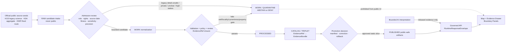
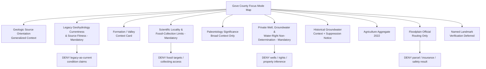
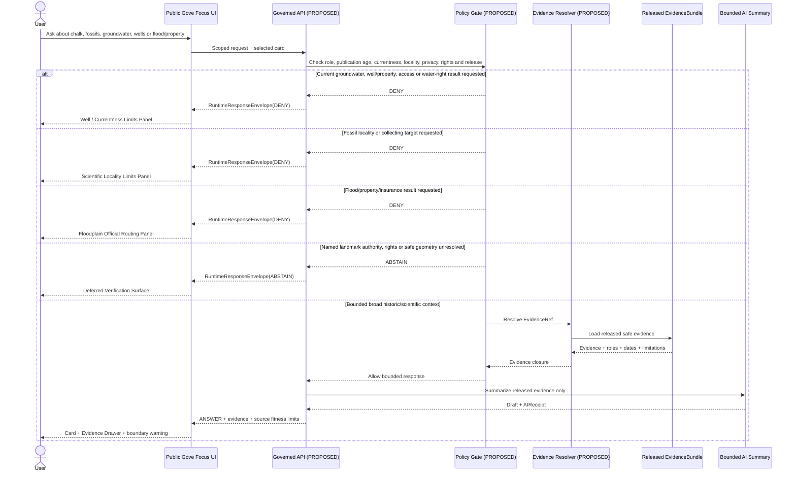
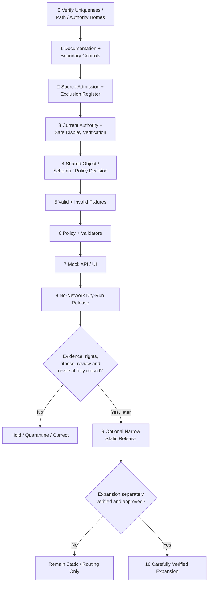

<!-- KFM_META_BLOCK_V2
doc_id: NEEDS_VERIFICATION
title: Gove County Focus Mode Build Plan
type: standard
version: v1
status: draft
owners: [NEEDS_VERIFICATION]
created: 2026-05-22
updated: 2026-05-22
policy_label: public_draft
repository_path: NEEDS_VERIFICATION - candidate only: docs/focus-mode/counties/gove_county/gove_county_focus_mode_build_plan.md
schema_contract_policy_homes: NEEDS_VERIFICATION - inspect accepted ADRs, root README contracts, shared KFM object families and current authority homes before extending contracts, schemas, policy, fixtures, validators, source registries, receipts, proofs, release records or published-artifact paths
review_assignments: NEEDS_VERIFICATION - legacy-source fitness/currentness, groundwater and water-governance, private-well/location privacy, scientific-locality/fossil sensitivity, flood/property, rights, documentation and release review duties
correction_path: NEEDS_VERIFICATION
rollback_path: NEEDS_VERIFICATION
release_status: NEEDS_VERIFICATION - planning artifact only; no source admission, implementation, promotion or publication claimed
related:
  - Directory Rules.pdf (consulted during this run)
  - KFM county Focus Mode completed-county register supplied by user
  - Live repository county-plan convention inspected through targeted GitHub search during this run
tags: [kfm, focus-mode, gove-county, geology, groundwater, niobrara-chalk, smoky-hill-chalk, ogallala, smoky-hill-river, fossil-sensitivity, private-wells, agriculture, floodplain, legacy-source-currentness, public-safe-boundary]
notes:
  - CONFIRMED: Gove County is absent from the completed-county register supplied for this series and from the additional live-repository county plans surfaced in the targeted convention search during this run.
  - CONFIRMED: Searches of accessible uploaded/File Library project materials in this run returned no Gove County Focus Mode Build Plan artifact.
  - CONFIRMED: Targeted search of the accessible live GitHub repository returned no Gove County Focus Mode build-plan match for Gove-focused search terms.
  - CONFIRMED: Live GitHub repository search exposed an existing county-plan documentation convention at docs/focus-mode/counties/<county>_county/<county>_county_focus_mode_build_plan.md; exact Gove placement still requires final verification.
  - CONFIRMED: Directory Rules.pdf was consulted before repository-path proposals were made.
  - CONFIRMED: Official or authoritative public-source pages were checked during this run for Kansas Geological Survey Gove county mapping and its web edition of the 1960 Geology and Ground-water Resources of Gove County bulletin, Kansas Department of Agriculture county agricultural statistics and the Kansas Current Effective Floodplain Viewer.
  - CONFIRMED: KGS explicitly states that its 1960 Gove bulletin web edition is, in general, the original text as published and that the information has not been updated.
  - CONFIRMED: The KGS bulletin describes Niobrara Chalk/Smoky Hill Chalk outcrops in southern Gove County, notes abundant vertebrate and invertebrate fossils in the Smoky Hill Chalk, describes Ogallala/alluvial groundwater context, and contains well-record sections; these facts make source fitness, locality restraint and well/privacy minimization central.
  - NEEDS_VERIFICATION: Any publicly displayable named natural-landmark card, controlling current groundwater/water-right authority, rights and derivative-display permissions, safe geometry, scientific-locality review, current flood status, final policy/review assignments, correction and rollback machinery.
  - PROPOSED: Gove County is selected as the next legacy geohydrology-currentness, fossil/scientific-locality restraint and private-well non-determination proof slice.
-->

<a id="top"></a>

# Gove County Focus Mode Build Plan

> **Product thesis:** Build a public-safe Gove County Focus Mode around Niobrara and Smoky Hill Chalk landscapes, Ogallala and valley-groundwater history, Smoky Hill River context and working-landscape aggregates—without converting an openly available but explicitly unupdated 1960 geohydrology report, well-record material, fossil-rich formation context or floodplain routing into present groundwater, individual-well, water-right, collecting-locality, access, property or public-safety conclusions.


| Identity / status field | Determination |
|---|---|
| Selected county | **Gove County, Kansas** |
| Selection status | **PROPOSED** as the next KFM county Focus Mode proof slice. |
| Completed-register comparison | **CONFIRMED** within supplied series evidence: Gove County is absent from the user-supplied completed register. |
| Accessible-material collision search | **CONFIRMED** for searched uploaded/File Library materials during this run: no Gove County Focus Mode Build Plan artifact was returned. |
| Targeted live-repository collision search | **CONFIRMED** for searched GitHub terms during this run: no Gove County Focus Mode plan match was returned. |
| Additional repository collision screen | **CONFIRMED** within the live repository convention-search results: plans were surfaced for additional counties including Clark, Logan, Marshall, Hamilton, Jewell, Neosho and Mitchell; no Gove plan was returned in the search results reviewed. |
| Full collision verification | **NEEDS_VERIFICATION** before repository landing because no exhaustive all-path/all-branch/project-index audit was performed. |
| Distinct proof-slice value | KGS exposes a scientifically rich but explicitly unupdated 1960 geohydrology publication containing formation, aquifer and well-record material; Gove therefore tests legacy-source fitness, private-well minimization, fossil-locality restraint, agriculture-context separation and flood/property non-determination. |
| Most consequential public-safe boundary | **Public legacy-source availability is not permission for present-condition, private-well or fossil-targeting output:** KFM may explain broad, attributed geologic and historical groundwater context, but it must not publish well-level or locality-level targets, state current groundwater conditions, infer water rights or access, guide collecting, or determine flood/property safety. |
| Document posture | Repo-ready, source-checked future implementation plan; not an implemented, reviewed, promoted or published county product. |
| Directory placement posture | **PROPOSED / NEEDS_VERIFICATION:** candidate document home follows the observed live-repository county-document convention under `docs/focus-mode/counties/gove_county/`, while final landing remains subject to Directory Rules, ADR and root-README verification. |
| First milestone | **Gove Legacy Geohydrology and Scientific-Locality Trust Boundary Proof** |

## Quick links

[Executive build note](#executive-build-note) · [Evidence boundary](#evidence-boundary-table) · [Operating posture](#1-operating-posture) · [Why Gove County](#2-why-this-county) · [Product thesis](#3-product-thesis) · [Scope boundary](#4-scope-boundary) · [First demo layers](#5-first-demo-layers) · [User journeys](#6-user-journeys) · [UI surfaces](#7-ui-surfaces) · [Governed object model](#8-governed-object-model) · [Repository shape](#9-proposed-repository-shape) · [Build phases](#10-build-phases) · [First PR sequence](#11-first-pr-sequence) · [Acceptance checklist](#12-acceptance-checklist) · [Fixture plan](#13-fixture-plan) · [Risk register](#14-risk-register) · [Source seeds](#15-source-seed-list) · [Verification questions](#16-open-verification-questions) · [First milestone](#17-recommended-first-milestone) · [Appendices](#appendix-a---public-safe-narrative-skeleton)

<a id="executive-build-note"></a>

## Executive build note

**PROPOSED.** Gove County is a high-value next proof slice because the most compelling official source is simultaneously useful and dangerous if handled without temporal and sensitivity controls. The Kansas Geological Survey (KGS) provides a county geologic-map page and an online edition of **Geology and Ground-water Resources of Gove County, Kansas**, originally published as Bulletin 145 in 1960. KGS explicitly warns on the bulletin landing page that the web edition is, in general, the original text as published and that **the information has not been updated**. `[SRC-GOV-001]` `[SRC-GOV-002]`

The KGS report supplies robust public scientific context: it describes Cretaceous through Recent sedimentary rocks in Gove County; identifies Fort Hays Chalk and Smoky Hill Chalk of the Niobrara Chalk in county outcrops; describes Ogallala and alluvial groundwater context; and states that alluvium fills inner valleys of the Smoky Hill River, Hackberry Creek and Big Creek. Its formations chapter states that the Smoky Hill Chalk member crops out in much of southern and east-central Gove County along the Smoky Hill River, Hackberry Creek and tributaries and is notable for abundant vertebrate and invertebrate fossils, including mosasaurs, plesiosaurs and fish. `[SRC-GOV-002]` `[SRC-GOV-003]` `[SRC-GOV-004]`

That scientific richness is precisely the governance challenge. The KGS bulletin also includes records of wells and test holes and contains historical groundwater-yield and storage estimates. The first public KFM product must not convert an explicitly unupdated 1960 scientific source into a current groundwater map, an individual well- or landowner-oriented product, a water-right claim, a drinking-water or irrigation decision, a fossil-collecting guide or a precise locality exposure surface. The safe use is broad, dated, attributed context plus clearly visible suppression and official-current-source routing obligations.

KDA adds a bounded agricultural context source: its official Gove County page reports **383 farms accounting for 658,365 acres** and **$334 million in crop and livestock sales in 2022**, according to the USDA 2022 Census of Agriculture. The Kansas Current Effective Floodplain Viewer states that it was last updated **08 January 2026** and routes users to mapping projects or the FEMA Map Service Center for recently issued map revisions. These official sources support statistical context and safe official routing—not private farm/well inferences, parcel-level flood determinations, insurance advice or legal land-use outcomes. `[SRC-GOV-005]` `[SRC-GOV-006]`

A National Park Service National Natural Landmarks endpoint for a potential Gove natural-landmark source route was opened during this run, but the rendered page did not expose sufficient landmark-specific record content to admit a named landmark card as verified evidence. Named landmark presentation is therefore **`DEFER / NEEDS_VERIFICATION`** rather than asserted in the first slice. `[SRC-GOV-007]`

> [!CAUTION]
> ## Defining public-safe boundary — an open 1960 well-and-geology source is not current groundwater truth or a fossil-target map
> KGS makes a powerful Gove County scientific source publicly readable, but it also states that the report is essentially the original 1960 publication and has not been updated. Public accessibility is not the same as current fitness, safe display precision, access permission or release approval.
>
> KFM may explain broad formation, river-valley and historical groundwater context with visible dates and source roles. It must **DENY or ABSTAIN** from using the report to show or infer present well conditions, private well targets, landowner links, water rights, water-quality suitability for a user, irrigation availability, exact fossil-bearing collection targets, collecting access, mineral/property rights, or parcel-level flood and safety conclusions.

<a id="evidence-boundary-table"></a>

## Evidence-boundary table

| Truth label | What this document supports now | What this document cannot imply |
|---|---|---|
| `CONFIRMED` | Gove County is absent from the supplied completed register; searches of accessible project materials and targeted live-repository terms returned no Gove Focus Mode plan match; Directory Rules was consulted; live repository search exposed the county-plan docs convention; official KGS, KDA and DWR public sources listed in §15 were checked; KGS states its 1960 Gove bulletin has not been updated; this Markdown artifact was generated. | No exhaustive repository collision audit, current aquifer/well/water-right finding, source admission, derivative-display rights, approved public geometry, named landmark verification, completed sensitivity review, implemented schema/policy/test/API/UI, promotion or publication is confirmed. |
| `PROPOSED` | Gove selection; first product; map/cards/panels; object model; candidate paths; fixtures; policy plan; PR sequence and milestone. | Proposed design is not proof of implementation, safety approval or release. |
| `NEEDS_VERIFICATION` | Final repository uniqueness/landing; accepted ADR/root README fit; shared object homes; source rights and reuse terms; current authoritative groundwater/water-right routes; scientific-locality/fossil policy; safe geometry; landmark card eligibility; reviewers; correction/rollback paths. | Checkable gaps cannot be treated as passed public-release gates. |
| `UNKNOWN` | Any Gove plan outside searched locations; actual KFM runtime/CI/release maturity; whether a public product has been implemented elsewhere; any current location-specific groundwater or collecting condition. | Unsupported assumptions remain outside claim scope. |

### High-significance source-derived statements

| Statement | Truth label | Basis and constraint |
|---|---|---|
| KGS provides a Gove County map page and states that no detailed digital mapping has been done for the county; the displayed map is extracted from the state geologic map. | `CONFIRMED` | KGS county geologic-map page checked in this run. Supports source-fitness disclosure, not detailed mapping authority. `[SRC-GOV-001]` |
| KGS hosts an online edition of its 1960 Gove County geology and groundwater bulletin and explicitly states the information has not been updated. | `CONFIRMED` | KGS bulletin landing page checked in this run. Supports legacy/currentness warning. `[SRC-GOV-002]` |
| KGS describes Niobrara Chalk, Smoky Hill Chalk, Ogallala Formation and alluvial groundwater settings in Gove County, including Smoky Hill River, Hackberry Creek and Big Creek valley context. | `CONFIRMED` as legacy scientific content | Broad educational use only; not current hydrology/well truth. `[SRC-GOV-002]` `[SRC-GOV-003]` |
| KGS states that the Smoky Hill Chalk member is famous for abundant vertebrate and invertebrate fossils, including mosasaurs, plesiosaurs and fish. | `CONFIRMED` as legacy scientific content | Supports fossil/locality sensitivity boundary; does not authorize collecting or precise locality exposure. `[SRC-GOV-004]` |
| KGS bulletin contains well-record content and historical groundwater estimates. | `CONFIRMED` | Source is public and historic; first-slice public product excludes well-level exposure and current-use inference. `[SRC-GOV-002]` `[SRC-GOV-004]` |
| KDA reports 383 farms, 658,365 acres and $334 million in crop and livestock sales in Gove County in 2022. | `CONFIRMED` | Aggregate-only; no private well, water-right or environmental responsibility inference. `[SRC-GOV-005]` |
| Kansas DWR's effective floodplain viewer states it was last updated January 8, 2026 and routes users to mapping projects or FEMA MSC for recently issued LOMRs. | `CONFIRMED` | Official routing/currentness context only; no parcel/flood/insurance result. `[SRC-GOV-006]` |
| Named Gove natural-landmark content is sufficiently verified for first-slice display. | `NEEDS_VERIFICATION` | An NPS route was opened, but sufficient Gove-specific record content was not exposed in this run. `[SRC-GOV-007]` |

---

## 1. Operating posture

### KFM governing rules applied to Gove County

| KFM rule | Gove County consequence |
|---|---|
| EvidenceBundle outranks generated language. | Every public geology, groundwater, fossil, agriculture or flood statement requires admitted evidence with source role, date/currentness and limitations. |
| Public clients use governed interfaces and released public-safe artifacts only. | Public UI must not read `RAW`, `WORK`, `QUARANTINE`, unreviewed legacy well records, exact locality candidates, private property, current operational water data or direct model output. |
| Cite-or-abstain is the default truth posture. | Missing rights, currentness, source fitness, safe precision, review or release closure produces `ABSTAIN`, `DENY` or `ERROR`. |
| Publication is a governed state transition. | An old map scan, report table, derived tile or AI narrative does not become public truth merely because it can be displayed. |
| Source roles remain distinct. | KGS legacy scientific publication, KDA aggregate statistics and DWR flood-routing/currentness do not collapse into a current water, property or access layer. |
| Sensitive and high-stakes display fails closed. | Well-level content, fossil/locality target content, property/flood determinations and water-right interpretations are denied or withheld. |
| AI is interpretive only. | AI may explain released broad context; it cannot update a 1960 source, identify private targets, determine rights or recommend collection/access decisions. |
| Correction and rollback remain auditable. | If later released context becomes unsafe, superseded or misread as current, correction and withdrawal must be possible. |

### Truth-label and finite-outcome key

| Label / outcome | Meaning for this plan |
|---|---|
| `CONFIRMED` | Verified in this run from supplied doctrine, targeted repository evidence, checked official/authoritative public sources or generated artifact output. |
| `PROPOSED` | A future design, path, object, schema, policy, fixture, UI or release recommendation not verified as implemented. |
| `NEEDS_VERIFICATION` | Checkable but unresolved for implementation or publication. |
| `UNKNOWN` | Not established from available evidence. |
| `ANSWER` | Bounded response supported by released public-safe evidence and required gates. |
| `ABSTAIN` | Authority, source fitness, rights, currentness, safe precision or review is insufficient. |
| `DENY` | Request would expose sensitive/private material or generate prohibited rights, safety, access or property determinations. |
| `ERROR` | Governed failure with no unsupported statement returned. |
| `DEFER` | Candidate held for later verification. |
| `EXCLUDE` | Candidate not suitable for first public product. |

### Public trust-membrane flowchart



### County-specific non-negotiable guardrails

1. **Legacy-currentness guardrail.** The KGS bulletin is explicitly unupdated legacy science; no present aquifer, well, water quality or irrigation conclusion may be generated from it.
2. **Well-record minimization guardrail.** Public availability of well/test-hole material does not establish a public need to reproduce precise locations or create a targeting layer.
3. **Fossil-locality restraint guardrail.** Broad scientific discussion of fossil-rich chalk may be shown; precise localities, specimen-source coordinates, collection targets or access routes are withheld by default.
4. **Collecting/property-right restraint.** Geological or landmark context cannot be transformed into permission to enter land, dig, collect, remove specimens or claim mineral/property rights.
5. **Source-role guardrail.** KGS legacy science, current regulatory authority, KDA aggregates, DWR flood sources and any future public-landmark authority remain separate.
6. **Flood/property non-determination guardrail.** Flood-routing pages cannot become parcel, insurance, permit, evacuation or property-safety answers.
7. **Agriculture anti-attribution guardrail.** County aggregate agricultural statistics cannot identify irrigators, wells, groundwater impacts, violations or landowners.
8. **Named landmark admission guardrail.** A named public landmark layer cannot be asserted until an appropriate authoritative public source, rights posture, access limitations and sensitivity policy are verified.
9. **AI boundedness guardrail.** Generated prose does not refresh legacy data, resolve rights or justify disclosure.
10. **Release reversal guardrail.** No public label or release without citation validation, review records, correction route and rollback target.

---

## 2. Why this county

### Selection screen against completed and discovered county-plan evidence

| Selection test | Result | Status |
|---|---|---|
| Is Gove County listed in the supplied completed register? | No match found. | `CONFIRMED` within supplied register |
| Did accessible uploaded/File Library search identify a Gove plan? | No Gove County Focus Mode plan artifact returned under targeted search terms. | `CONFIRMED` for searched materials |
| Did targeted live GitHub repository search identify a Gove plan? | No Gove plan match returned under Gove county/filename/Focus Mode search terms. | `CONFIRMED` for targeted repo search |
| Did the repository contain additional plans beyond the original register? | Yes; targeted convention search returned additional county plan paths, including Clark, Logan, Marshall, Hamilton, Jewell, Neosho and Mitchell. | `CONFIRMED` for returned results |
| Was every branch, external index and historical artifact exhaustively inspected? | No. | `NEEDS_VERIFICATION` before landing |
| Does Gove add a distinct proof slice? | Yes: an explicitly unupdated official scientific publication includes well and fossil-rich formation context, testing KFM's source-fitness and disclosure restraint. | `PROPOSED`, grounded in checked sources |
| Are strong authoritative source seeds available? | Yes: multiple KGS official pages, KDA statistics and DWR flood-routing pages were opened and checked. | `CONFIRMED` source checks; admission `NEEDS_VERIFICATION` |

### Proof-slice rationale table

| Proof dimension | Checked authoritative anchor | KFM proof value | Public-safe restriction |
|---|---|---|---|
| Legacy scientific source fitness | KGS bulletin landing page says its 1960 content has not been updated. | Makes staleness/currentness an explicit UI and policy requirement. | No present water or condition claims. |
| Geology / landscape | KGS describes Fort Hays Chalk, Smoky Hill Chalk, Ogallala Formation and Smoky Hill River valley alluvium. | Strong map-first science-learning slice. | Broad/generalized context only. |
| Paleontological sensitivity | KGS states Smoky Hill Chalk contains abundant vertebrate and invertebrate fossils. | Tests locality protection and collection-target denial. | No precise localities or access guidance. |
| Groundwater / wells | KGS describes groundwater sources and well/test-hole records. | Tests scientific-source versus individual/private/water-governance boundaries. | No well-level public layer or current inference. |
| Agriculture | KDA reports 383 farms, 658,365 acres and $334 million in 2022 sales. | Safe county-scale working-landscape context. | No private groundwater/farm responsibility inference. |
| Floodplain / property | DWR effective viewer has a stated update date and official FEMA/map-project routing. | Tests routing-only high-stakes design. | No parcel/insurance/safety answer. |
| Named natural landmark expansion | NPS endpoint was opened but did not yield sufficient landmark-specific content. | Demonstrates abstain rather than fill gaps from plausible knowledge. | Defer until authoritative source can be verified. |

### Why Gove adds a distinct series proof

Gove County is a powerful KFM slice because **the public evidence itself contains the risk**. A legacy KGS publication can offer exceptional scientific learning value while simultaneously inviting four unsafe transformations:

1. an old groundwater report becoming current aquifer or well truth;
2. well-record content becoming a public targeting/private-location layer;
3. fossil-bearing formation context becoming a collecting or private-land access guide; and
4. geologic/flood/agricultural context becoming property, water-right or environmental-responsibility claims.

That is materially different from a pure modern-status, recreation or cultural-authority slice: Gove tests whether KFM can make *source fitness* and *minimum necessary display* part of the product itself.

### Public benefit and governance value

| Public benefit | Governance value |
|---|---|
| Explore why Gove's rock and valley context is scientifically meaningful. | Evidence-linked geologic learning with source dates exposed. |
| Learn what KGS historically documented about groundwater settings. | Visible legacy/source-fitness controls. |
| Understand why fossil-rich context is displayed without target localities. | Scientific-resource sensitivity made legible. |
| View county agricultural context at aggregate scale. | Anti-attribution enforcement. |
| Reach official floodplain resources safely. | High-stakes routing rather than determination. |
| See why landmark content may be deferred despite public familiarity. | Cite-or-abstain made observable. |

### Specific Gove County anchors supported by checked official sources

| County anchor | Bounded statement used in this plan | Source role |
|---|---|---|
| Gove county geologic map | KGS states its county map is extracted from the state geologic map because no detailed digital mapping has been done for this county. | Scientific/cartographic source fitness |
| KGS legacy bulletin | KGS hosts the 1960 bulletin and explicitly says it has not been updated. | Legacy scientific publication |
| Niobrara / Smoky Hill Chalk | KGS describes outcrops and fossil abundance in the Smoky Hill Chalk member. | Legacy scientific interpretation |
| Ogallala / valley groundwater context | KGS describes historical aquifer and alluvial contexts. | Legacy hydrogeologic interpretation |
| Well records | KGS report navigation and text identify well/test-hole records. | Legacy detailed-source sensitivity |
| Agriculture | KDA reports county aggregate figures for 2022. | Statistical aggregate |
| Floodplain route | DWR viewer states a 2026 update date and routes to FEMA/map projects. | State official source-routing |

---

## 3. Product thesis

### One-sentence thesis

**Gove County Focus Mode should turn official legacy geology and hydrogeology into broad, source-dated public learning context while making it impossible for users or generated summaries to mistake public well records, fossil-rich formations, old groundwater estimates, agricultural aggregates or floodplain routes for current, private, collectible, legal or safety truth.**

### What the first product promises

| Promise | Proposed public behavior |
|---|---|
| Broad Gove orientation | General county science/landscape orientation from approved public-safe evidence. |
| Legacy-source literacy | A visible panel explaining the 1960 KGS source is unupdated and limited. |
| Broad geology learning | Generalized formation and river-valley context from KGS. |
| Fossil sensitivity honesty | Broad paleontological significance explained while target-level information is withheld. |
| Well/privacy restraint | No precise well-record layer; public sees why. |
| Working-landscape context | KDA aggregate statistics with year and anti-attribution limit. |
| Floodplain routing | Official-source route with no property determination. |
| Governed interaction | Evidence Drawer, finite outcomes and correction/rollback posture. |

### What the first product does not promise

- It is **not** a current groundwater-level, aquifer-status, water-quality, well-yield or irrigation-suitability product.
- It is **not** a public well-location, landowner, parcel, water-right or regulatory-compliance interface.
- It is **not** a fossil-finding, fossil-collecting, specimen-removal, private-land-access or mineral-right guidance tool.
- It is **not** a parcel-specific flood, insurance, permit, title or safety determination.
- It is **not** a verified named-landmark interpretation or access card until an appropriate official source is admitted.
- It is **not** evidence that KFM implementation, review, release or publication exists.

---

## 4. Scope boundary

### Public-safe first-slice content

| Included first-slice content | Checked-source basis | Required presentation limit | Status |
|---|---|---|---|
| Gove County geologic-source orientation | KGS county map page | General source-fitness and county context only. | `PROPOSED` |
| **Legacy Geohydrology Currentness & Source Fitness panel** | KGS bulletin landing page | Mandatory; states report is legacy/unupdated. | `PROPOSED` — mandatory |
| KGS geologic-framework card | KGS geology chapter | Broad formations/river-valley context only. | `PROPOSED` |
| **Scientific Locality & Fossil-Collection Limits panel** | KGS formations chapter | Mandatory before fossil/locality/collecting questions. | `PROPOSED` — mandatory |
| Smoky Hill Chalk paleontology context card | KGS formations chapter | Broad fossil significance only; no target geometry. | `PROPOSED` |
| **Private Well, Groundwater & Water-Right Non-Determination panel** | KGS bulletin/well-record source | Mandatory before groundwater/well questions. | `PROPOSED` — mandatory |
| Historical groundwater-setting card | KGS bulletin | Dated/historical scientific context only. | `PROPOSED` |
| Well-record suppression notice | KGS well-record presence | Explains why detailed source material is not public-layered. | `PROPOSED` |
| Agriculture aggregate card | KDA | County/year aggregate only. | `PROPOSED` |
| Floodplain & Property Limits card | KDA/DWR viewer | Routing only; no parcel or safety output. | `PROPOSED` |
| Named natural-landmark verification placeholder | NPS route attempted | Explicitly deferred pending verified official record and safe-display review. | `DEFER` |

### Deferred content

| Candidate | Why deferred | Required unlock |
|---|---|---|
| Named geologic-natural-landmark card or layer | Official landmark record content not sufficiently verified in this run; access/ownership/sensitivity may matter. | Appropriate authoritative source, rights, ownership/access limitations, safe geometry and review. |
| High-detail geologic outcrop layer | May enable fossil targeting or private access misuse. | Minimum-necessary and science-sensitivity approval. |
| KGS well-record map or point display | Legacy/public record detail may expose targetable locations and invite present-condition misuse. | Withhold by default; separate public-interest justification and policy review required. |
| Current groundwater/aquifer status card | Legacy bulletin is unsuitable for current status. | Current authoritative source, time/status/expiry and non-determination policy. |
| Water-right or irrigation-use interpretation | Legal/regulatory and private-impact risks. | Separate authority/policy scope; not first slice. |
| Dynamic floodplain/property query | High-stakes property reliance. | Official effective source, strict UX and likely link-out only. |
| Precise fossil/specimen/locality card | Scientific-resource/access risk. | Deny by default; only intentional public educational site after review. |
| Detailed private land access or trail guidance | Rights/property uncertainty. | Not first-product purpose. |

### Denied-by-default or excluded content

| Request/content class | Required outcome | Reason |
|---|---|---|
| “Use the KGS report to tell me current groundwater levels or well yield.” | `DENY` | Explicitly unupdated legacy source and high-stakes inference. |
| “Map all well-record coordinates from the KGS report.” | `DENY` | Location exposure and present-use misuse. |
| “Does this property have usable groundwater or irrigation rights?” | `DENY` | Property/water-right/legal inference. |
| “Where exactly should I hunt for fossils?” | `DENY` | Scientific-locality and collecting-target exposure. |
| “Does this map prove I can enter land or collect specimens?” | `DENY` | Access/property/collecting authorization outside source role. |
| “Identify farms likely using Ogallala or valley groundwater.” | `DENY` | Aggregate-to-private water-use attribution. |
| “Tell me whether a parcel floods or needs insurance.” | `DENY` | Flood/property/insurance determination. |
| “Publish a named landmark layer from unverified landmark evidence.” | `ABSTAIN` | Authority, rights and safe-display closure absent. |
| Rights-unclear, restricted, sensitive or unsafe detail | `EXCLUDE` / `QUARANTINE` | Not suitable for public-derived product. |

### Boundary implementation matrix

| Risk topic | Safe first-slice expression | Visible warning | Prohibited transformation |
|---|---|---|---|
| 1960 KGS report | Dated legacy-source card and broad summary. | “Information has not been updated.” | Current groundwater or regulatory outcome. |
| Chalk/geology | Generalized educational card. | “Scientific context, not access/collection authority.” | Outcrop target layer. |
| Fossil content | Broad paleontology significance. | “Precise locality and collecting detail withheld.” | Fossil hunting/collection targeting. |
| Wells/groundwater | Historical source-fitness and suppression notice. | “No well-level or present-condition use.” | Well point map or property inference. |
| Agriculture | 2022 aggregate card. | “Aggregate only; no water-user inference.” | Named/operator responsibility. |
| Floodplain | Official routing card. | “No parcel/insurance/permit/safety determination.” | Property answer. |
| Named landmark | Deferred-verification card. | “Authoritative admission pending.” | Unverified public claim/layer. |

---

## 5. First demo layers

### Prioritized public-safe layer/card table

| Priority | Layer/card | Checked source seed(s) | Source role | Evidence/policy gate | Status |
|---:|---|---|---|---|---|
| 1 | Gove geologic-source orientation card | KGS map page | Scientific/cartographic source fitness | Generalized/public-safe only; no claimed detailed map. | `PROPOSED` |
| 2 | **Legacy Geohydrology Currentness & Source Fitness panel** | KGS bulletin landing page | Legacy scientific/currentness boundary | Mandatory; blocks legacy-as-current output. | `PROPOSED` — mandatory |
| 3 | KGS geologic-framework card | KGS geology chapter | Legacy scientific interpretation | Broad formation/valley context only. | `PROPOSED` |
| 4 | **Scientific Locality & Fossil-Collection Limits panel** | KGS formations chapter | Scientific-resource sensitivity | Mandatory; blocks locality/collecting/access output. | `PROPOSED` — mandatory |
| 5 | Smoky Hill Chalk paleontology context card | KGS formations chapter | Legacy paleontological context | General significance only; no exact locations. | `PROPOSED` |
| 6 | **Private Well, Groundwater & Water-Right Non-Determination panel** | KGS bulletin and well-record sections | Water/privacy/legal boundary | Mandatory; blocks wells/current state/rights inference. | `PROPOSED` — mandatory |
| 7 | Historical groundwater-setting card | KGS bulletin | Legacy hydrogeology | Date/source limitation visible. | `PROPOSED` |
| 8 | Well-record suppression notice | KGS report structure | Minimum-necessary/privacy control | Explains withheld detail without displaying it. | `PROPOSED` |
| 9 | Agriculture aggregate card | KDA Gove stats | Statistical aggregate | 2022 scope; no water-user/private inference. | `PROPOSED` |
| 10 | Floodplain official-routing card | KDA/DWR effective viewer | State flood routing/currentness | No parcel/insurance/safety outcome. | `PROPOSED` |
| — | Named natural-landmark layer | NPS candidate route | Natural-landmark candidate | Sufficient official record not verified. | `DEFER` |
| — | Current groundwater/well map | Future current sources | Dynamic/high-stakes | No source/policy proof. | `DENY` / `DEFER` |
| — | Fossil-locality or collection map | Any candidate | Sensitive scientific/access | Not public-safe first purpose. | `DENY` / `EXCLUDE` |

### Map-composition diagram



### Layer-card truth contract

| Required field or obligation | Gove County rule |
|---|---|
| `card_id`, `layer_id`, `schema_version` | Stable deterministic candidate identity and controlled version. |
| `county_id` | `ks-gove`; no silent expansion into regional aquifer/legal claims. |
| `claim_scope` | Narrow educational/source-routing purpose and forbidden transformations. |
| `source_role_refs[]` | Separates KGS legacy science, KDA aggregate, DWR flood-routing and future current/landmark authority. |
| `evidence_ref` | Resolves to admitted `EvidenceBundle` before claim-bearing display. |
| `publication_time_basis` | Shows original publication date, web placement/update date and checked-at date. |
| `source_fitness_posture` | `legacy_context_only`, `official_route_only`, `withheld`, `superseded`, or separately approved current state. |
| `legacy_non_current_notice` | Mandatory for KGS bulletin-based cards. |
| `scientific_locality_posture` | Declares generalized/withheld/denied/review-required target-level detail. |
| `well_location_privacy_posture` | Prohibits well-level display and private/property inference in first slice. |
| `water_right_non_determination_posture` | Declares no entitlement, compliance or present availability outcome. |
| `flood_property_posture` | Declares no parcel, insurance, permit or safety result. |
| `agriculture_anti_attribution_posture` | Declares aggregate-only use. |
| `named_landmark_verification_state` | Prevents display absent admitted authority/rights/safe-scale evidence. |
| `rights_status` | Terms, attribution and derivative-display permissions verified before release. |
| `policy_decision_ref`, `review_record_refs[]` | Required before display/promotion. |
| `citation_validation_ref`, `release_manifest_ref` | Required before released claim labeling. |
| `correction_ref`, `rollback_ref` | Required before publication. |

---

## 6. User journeys

### Public learning journeys

| User question/action | Proposed safe experience | Boundary behavior |
|---|---|---|
| “What does official geology say about Gove County?” | KGS source-fitness and broad formation-context cards. | Dates and legacy limits visible. |
| “Why is the chalk scientifically interesting?” | Broad Smoky Hill Chalk paleontology context card. | No exact target/locality display. |
| “What did the old report say about groundwater settings?” | Dated historical groundwater context card. | Explicitly not current. |
| “Why are wells not shown?” | Well-record suppression notice explains minimum necessary display. | No points/coordinates/property join. |
| “What is the farming context?” | KDA aggregate card. | No private or groundwater inference. |
| “Where can I find official floodplain information?” | DWR/FEMA routing card. | No parcel/flood answer. |
| “Can I see landmark interpretation?” | Deferred-verification card explains evidence gap. | `ABSTAIN` until admitted authority. |
| “How do I inspect trust?” | Evidence Drawer displays source role, age, limits, withheld detail and reversal posture. | Cite-or-abstain visible. |

### Trust-demonstration journeys

| Trust test | Proposed UI behavior | Outcome |
|---|---|---|
| User opens KGS card | Drawer shows 1960 origin and explicit not-updated statement. | `ANSWER` for historic context |
| User asks present groundwater status from KGS report | Refusal with current-authority verification requirement. | `DENY` |
| User asks for report well map | Suppression notice and no coordinate release. | `DENY` |
| User asks for fossil hunting spots | Scientific-locality panel refuses target-level content. | `DENY` |
| User asks whether access or collection is allowed | Refusal; no property/access authority in admitted evidence. | `DENY` / `ABSTAIN` |
| User asks for county aggregate agriculture | KDA card returns dated statistics. | `ANSWER` |
| User asks whether a parcel floods | Flood/property panel routes to official process. | `DENY` |
| Rights, safe geometry or landmark authority unresolved | Candidate remains hidden/deferred. | `ABSTAIN` |
| Public UI requests internal candidate records | Trust membrane blocks access. | `DENY` / `ERROR` |

### County-specific denied or abstained requests

| Query | Required outcome | Candidate reason code |
|---|---|---|
| “Use the 1960 KGS report to tell me today's groundwater conditions.” | `DENY` | `LEGACY_HYDROGEOLOGY_AS_CURRENT_CONDITION` |
| “Map every well and test hole from the public KGS material.” | `DENY` | `WELL_LOCATION_MINIMUM_NECESSARY_NOT_MET` |
| “Does this property have a usable well or irrigation right?” | `DENY` | `WATER_RIGHT_OR_PROPERTY_GROUNDWATER_DECISION_OUT_OF_SCOPE` |
| “Give me coordinates for fossil-bearing collecting spots.” | `DENY` | `FOSSIL_LOCALITY_OR_COLLECTING_TARGET_WITHHELD` |
| “Does the geologic map mean I can enter or collect on the land?” | `DENY` | `SCIENTIFIC_MAP_TO_ACCESS_RIGHT_INFERENCE` |
| “Identify farms likely using groundwater from KDA totals.” | `DENY` | `AGGREGATE_TO_PRIVATE_WATER_USE_ATTRIBUTION` |
| “Tell me if my parcel is in a flood-risk area or needs insurance.” | `DENY` | `FLOOD_PROPERTY_INSURANCE_DECISION_OUT_OF_SCOPE` |
| “Publish a named landmark card without verified official evidence.” | `ABSTAIN` | `NAMED_LANDMARK_AUTHORITY_UNVERIFIED` |
| “Blend old KGS data, current flood routing and AI into current water truth.” | `ABSTAIN` / `DENY` | `SOURCE_ROLE_COLLAPSE_REQUESTED` |

---

## 7. UI surfaces

### Required UI surface register

| UI surface | Gove County role | Trust-visible requirements | Status |
|---|---|---|---|
| Header | “Gove County — Chalk Landscapes & Legacy Geohydrology Context.” | Draft/release state; legacy/currentness and scientific-locality badges. | `PROPOSED` |
| Map canvas | Displays only approved generalized static public-safe artifacts. | No well points, fossil targets, private properties, current aquifer or parcel flood results. | `PROPOSED` |
| Layer drawer | Organizes geology, paleontology context, historical groundwater, agriculture, flood routing and deferred landmark verification. | Source role, dates, fitness, withheld status and release state visible. | `PROPOSED` |
| Evidence Drawer | Primary trust inspection surface. | EvidenceBundle, publication age, not-updated statement, limitations, policy/reviews, correction/rollback refs. | `PROPOSED` |
| Answer panel | Bounded response output. | Finite outcome, citations, role/date and limitations. | `PROPOSED` |
| Denial panel | Explains unsafe/refused request. | Reason category and official-routing or withheld-detail explanation without exposing targets. | `PROPOSED` |
| Timeline/time-basis surface | Separates 1960 KGS publication, 2008 web placement, 2020 KGS map page update, 2022 agriculture, 2026 flood-viewer update and any future current sources. | Prevents historic/scientific/contextual/current collapse. | `PROPOSED` |
| **Legacy Geohydrology Currentness & Source Fitness panel** | Primary source-fitness boundary. | Mandatory for geology/groundwater/report-derived questions. | `PROPOSED` — mandatory |
| **Scientific Locality & Fossil-Collection Limits panel** | Scientific-resource/access boundary. | Mandatory for fossil/locality/collection questions. | `PROPOSED` — mandatory |
| **Private Well, Groundwater & Water-Right Non-Determination panel** | Well/property/legal boundary. | Mandatory for groundwater/well/irrigation questions. | `PROPOSED` — mandatory |
| Floodplain & Property Limits panel | High-stakes flood/property restraint. | Mandatory for parcel/flood/insurance questions. | `PROPOSED` |
| Evidence Pending / Deferred Landmark panel | Makes abstention visible. | States authoritative landmark source/display gates are unresolved. | `PROPOSED` |
| Correction / withdrawal surface | Supports safe reversal. | Displays correction, supersession, withdrawal and rollback state for future releases. | `PROPOSED` |

### Legend vocabulary table

| Legend label | User-facing meaning | Constraint |
|---|---|---|
| `Legacy scientific context — 1960` | KGS historic publication context. | Not present condition. |
| `Source fitness warning` | Official source is informative but limited/outdated. | No current/high-stakes use. |
| `Geologic formation context — generalized` | Broad scientific explanation. | No target/locality access. |
| `Fossil locality detail withheld` | Precision hidden for sensitivity/access reasons. | No export/query of target detail. |
| `Well-level detail excluded` | Public product intentionally omits well records. | No coordinate/property join. |
| `Official current-source verification required` | A current authority would be needed for operative questions. | KFM does not guess. |
| `Statistical aggregate — 2022` | KDA county-scale statistics. | No private inference. |
| `Floodplain route — no determination` | Official flood-source routing. | No parcel/insurance outcome. |
| `Named landmark pending verification` | Candidate not admitted as verified display. | No asserted layer. |
| `Evidence pending / withheld` | Gate not closed. | No public claim display. |

### UI / API / policy / evidence sequence diagram



---

## 8. Governed object model

### Proposed shared KFM object-family use

| Object family | Gove County application | Critical control | Status |
|---|---|---|---|
| `SourceDescriptor` | Classifies KGS legacy science, KDA aggregate, DWR flood-routing and later source candidates. | Source role, original/update date, fitness, rights, allowed use and forbidden inferences. | `PROPOSED`; shared-home verification required |
| `EvidenceRef` | Links public claims/cards to admitted evidence. | Must resolve before claim display. | `PROPOSED` |
| `EvidenceBundle` | Packages admitted public-safe evidence and limitations. | Carries source age, no-current-use, withheld locality/well detail and role boundaries. | `PROPOSED` |
| `PolicyDecision` | Encodes allow/abstain/deny/review requirements. | Legacy currentness, well privacy, locality, water-right, flood/property and release gates. | `PROPOSED` |
| `RuntimeResponseEnvelope` | Public output carrier. | Only `ANSWER`, `ABSTAIN`, `DENY`, `ERROR`. | `PROPOSED` |
| `CitationValidationReport` | Validates bounded narrative. | Rejects legacy-as-current, target-locality and private/legal inference. | `PROPOSED` |
| `ReleaseManifest` | Future release record. | Requires evidence, rights, reviews, correction and rollback closure. | `PROPOSED` |
| `AIReceipt` | Records bounded generation. | AI cannot become a current source or disclosure authority. | `PROPOSED` |
| `CorrectionNotice` | Future correction/withdrawal object. | Required for source supersession or harmful display. | `PROPOSED` |
| `RollbackPlan` or rollback reference | Safe reversal target. | Required before publication. | `PROPOSED` |
| `ReviewRecord` | Records steward review. | Required for well/locality/currentness/property/release-significant content. | `PROPOSED` |

### Gove-specific object candidates

| Candidate object | Purpose | Mandatory policy behavior |
|---|---|---|
| `LegacySourceFitnessNotice` | Exposes that the KGS bulletin is historical/unupdated. | Forbids current-condition inference. |
| `GoveGeologicFrameworkCard` | Broad formation and river-valley context. | Generalized display only. |
| `SmokyHillChalkPaleontologyContextCard` | Broad fossil significance. | No target-level geometry or access. |
| `ScientificLocalitySuppressionDecision` | Records why precise fossil/locality content is withheld. | Deny coordinate/collection requests. |
| `HistoricalGroundwaterContextCard` | Broad legacy hydrogeology summary. | Date and no-present-condition warning required. |
| `WellRecordMinimumNecessaryDecision` | Records suppression of well-level legacy detail. | No well points or property joins. |
| `WaterRightNonDeterminationNotice` | Controls legal/individual groundwater requests. | Deny rights/availability/compliance conclusions. |
| `AgricultureAggregateSnapshot` | Presents KDA 2022 metrics. | Aggregate only. |
| `FloodplainPropertyBoundaryNotice` | Routes high-stakes flood/property requests. | No parcel/insurance outcome. |
| `NamedLandmarkDeferredVerificationCard` | Publicly communicates why a tempting feature is not yet claimed. | Withhold until authority, rights and safe-display gates pass. |
| `SourceSupersessionDecision` | Records later authoritative/current source additions. | Cannot silently overwrite historic-source meaning. |

### Source-role anti-collapse rules

| Roles that must remain distinct | Why in Gove County | Required enforcement |
|---|---|---|
| KGS 1960 science ↔ current groundwater authority | KGS explicitly states the report is not updated. | Fitness fields, warning UI and negative fixtures. |
| KGS well records ↔ public well/property map | Detail is not required for broad learning and may be misused. | Minimum-necessary suppression. |
| Geology/paleontology ↔ collecting/access authority | Scientific occurrence is not permission or target invitation. | Locality/access deny policy. |
| KGS map ↔ detailed public geometry | KGS says county map is state-map-derived because no detailed digital mapping has been done. | Map-fitness label. |
| KDA aggregate ↔ private groundwater impact | Totals do not identify wells or responsibility. | Anti-attribution gate. |
| DWR flood route ↔ parcel/insurance/safety | Official source route is not an individual decision. | Flood/property denial. |
| Named-landmark familiarity ↔ admitted evidence | Plausible or popularly known content is not verified KFM evidence. | Deferred-verification state. |
| AI narrative ↔ evidence/currentness/authority | Fluency cannot update or legalize source use. | Evidence/policy/receipt gate. |

### Minimal public runtime response JSON example

```json
{
  "schema_version": "v1",
  "object_type": "RuntimeResponseEnvelope",
  "response_id": "kfm.response.gove.legacy_geology_context.v1",
  "county_id": "ks-gove",
  "outcome": "ANSWER",
  "question_scope": "Bounded historical scientific context for Gove County geology and groundwater settings.",
  "answer": "The Kansas Geological Survey hosts a web edition of its 1960 report on Gove County geology and groundwater resources and states that the information has not been updated. The report describes Niobrara and Smoky Hill Chalk, Ogallala deposits and alluvial groundwater settings associated with major valleys, and identifies the fossil-rich character of the Smoky Hill Chalk. This public view is historical and educational only: it does not state present groundwater conditions, display well locations, guide fossil collecting, determine access or water rights, or provide parcel-level flood or safety results.",
  "evidence_refs": [
    "kfm.evidence_ref.gove.kgs.legacy_report_source_fitness.v1",
    "kfm.evidence_ref.gove.kgs.smoky_hill_chalk_general_context.v1"
  ],
  "policy": {
    "decision": "allow_bounded_legacy_scientific_context",
    "boundary_notice": "LEGACY_SOURCE_CURRENTNESS_WELL_AND_LOCALITY_LIMITS_APPLY"
  },
  "limitations": [
    "KGS identifies the source as original 1960 content that has not been updated.",
    "No present groundwater, well-level, water-right, collection-access, fossil-target or flood/property conclusion is displayed."
  ],
  "citations_validated": true,
  "release_manifest_ref": "NEEDS_VERIFICATION",
  "review_record_refs": ["NEEDS_VERIFICATION"],
  "correction_ref": "NEEDS_VERIFICATION",
  "rollback_ref": "NEEDS_VERIFICATION",
  "spec_hash": "NEEDS_VERIFICATION"
}
```

### Minimal denial examples

```json
{
  "schema_version": "v1",
  "object_type": "RuntimeResponseEnvelope",
  "response_id": "kfm.response.gove.current_groundwater_from_legacy.denied.v1",
  "county_id": "ks-gove",
  "outcome": "DENY",
  "reason_code": "LEGACY_HYDROGEOLOGY_AS_CURRENT_CONDITION",
  "public_message": "This public Focus Mode does not use an explicitly unupdated historic report to determine current groundwater, well, irrigation or property conditions. Consult responsible current official authorities for operative questions.",
  "evidence_refs": [],
  "spec_hash": "NEEDS_VERIFICATION"
}
```

```json
{
  "schema_version": "v1",
  "object_type": "RuntimeResponseEnvelope",
  "response_id": "kfm.response.gove.fossil_collecting_target.denied.v1",
  "county_id": "ks-gove",
  "outcome": "DENY",
  "reason_code": "FOSSIL_LOCALITY_OR_COLLECTING_TARGET_WITHHELD",
  "public_message": "This public Focus Mode provides broad geology and paleontology context only. It does not expose precise fossil localities, specimen-source targets, private-land access information or collecting permission.",
  "evidence_refs": [],
  "spec_hash": "NEEDS_VERIFICATION"
}
```

### Deterministic identity candidates and `spec_hash` posture

| Candidate ID | Purpose | Status |
|---|---|---|
| `kfm.source.gove.<authority>.<resource>.v1` | Source authority/resource/admission identity. | `PROPOSED` |
| `kfm.card.gove.legacy_source_fitness.v1` | Primary legacy/currentness warning. | `PROPOSED` |
| `kfm.card.gove.geologic_framework.v1` | Broad science context card. | `PROPOSED` |
| `kfm.card.gove.smoky_hill_chalk_paleontology_context.v1` | Broad fossil significance card. | `PROPOSED` |
| `kfm.card.gove.scientific_locality_limits.v1` | Target/collection suppression notice. | `PROPOSED` |
| `kfm.card.gove.groundwater_well_rights_limits.v1` | Groundwater/well/legal boundary card. | `PROPOSED` |
| `kfm.card.gove.floodplain_property_limits.v1` | Flood routing/non-determination card. | `PROPOSED` |
| `kfm.card.gove.named_landmark_verification_deferred.v1` | Evidence-gap disclosure. | `PROPOSED` |
| `kfm.layer.gove.<public_safe_scope>.v1` | Approved generalized spatial scope. | `PROPOSED` |
| `kfm.evidence_ref.gove.<claim_scope>.v1` | Evidence-resolution target. | `PROPOSED` |
| `spec_hash` | Hash of meaning-bearing content, evidence refs, source-role/date/fitness state, geometry/sensitivity/well/flood posture, policy decision and release declaration under verified KFM canonicalization. | `PROPOSED / NEEDS_VERIFICATION` |

---

## 9. Proposed repository shape

### Directory Rules basis

**CONFIRMED doctrine inspected during this run.** `Directory Rules.pdf` states that file location encodes responsibility, governance and lifecycle; the root should remain stable and responsibility-bearing; topics/domains belong as segments inside responsibility roots; documents that explain something to humans belong under `docs/`; contracts define meaning, schemas define machine shape, policy decides allow/deny/restrict/abstain, fixtures/tests prove behavior, lifecycle state belongs in `data/`, and release decisions/correction/rollback belong in `release/`. It identifies `schemas/contracts/v1/<…>` as the default schema-home convention and preserves:

`RAW -> WORK / QUARANTINE -> PROCESSED -> CATALOG / TRIPLET -> PUBLISHED`

with promotion a governed state transition rather than a file move. fileciteturn9file0L1-L35 fileciteturn9file1L1-L39 fileciteturn9file2L1-L34

**CONFIRMED targeted live-repository evidence in this run.** A GitHub search for county plan filenames returned existing documentation paths under `docs/focus-mode/counties/<county>_county/<county>_county_focus_mode_build_plan.md`, including Linn, Rice, Lyon, Chase, Clark, Logan, Allen, Osage, Pawnee, Marshall, Hamilton, Miami, Jackson, Jewell, Dickinson, Crawford, Scott, Neosho and Mitchell examples. That supports the proposed human-document path convention while not authorizing implementation or confirming the Gove path exists. fileciteturn11file0L1-L3 fileciteturn11file14L1-L3 fileciteturn11file19L1-L3

> [!WARNING]
> Every path below remains **`PROPOSED / NEEDS_VERIFICATION`** until a final live repository, ADR, root README, collision and authority-home verification is performed. This artifact does not modify the repository.

### Candidate path table

| Responsibility | Candidate path | Directory Rules / repo-evidence basis | Status |
|---|---|---|---|
| This build-plan document | `docs/focus-mode/counties/gove_county/gove_county_focus_mode_build_plan.md` | Human documentation under `docs/`; follows observed county-plan convention. | `PROPOSED / NEEDS_VERIFICATION` |
| Companion human-facing docs | `docs/focus-mode/counties/gove_county/{README.md,public_safe_boundary.md,source_seed_list.md,layer_registry.md,acceptance_checklist.md}` | Documentation only; no machine authority. | `PROPOSED` |
| Semantic contract extension only if required | `contracts/domains/focus_mode/gove/` | Contracts own meaning; shared reuse preferred. | `NEEDS_VERIFICATION` |
| Machine schema extension only if required | `schemas/contracts/v1/domains/focus_mode/gove/` | Default schema-home doctrine. | `NEEDS_VERIFICATION` |
| Policy extension only if required | `policy/domains/focus_mode/gove/` or verified shared legacy-currentness/scientific-locality/well-privacy profile | Policy owns exposure/outcome decisions. | `NEEDS_VERIFICATION` |
| Valid/invalid fixtures | `fixtures/domains/focus_mode/gove/{valid,invalid}/` | Fixtures prove behavior. | `NEEDS_VERIFICATION` |
| Tests | `tests/domains/focus_mode/gove/` | Tests prove enforceability. | `NEEDS_VERIFICATION` |
| Validators | `tools/validators/focus_mode/` or verified canonical lane | Reusable validator responsibility. | `NEEDS_VERIFICATION` |
| Source registry records | `data/registry/sources/focus_mode/gove/` or verified canonical source lane | Source/lifecycle identity responsibility. | `NEEDS_VERIFICATION` |
| Future processed/catalog products | `data/processed/focus_mode/gove/`, `data/catalog/domain/focus_mode/gove/` | Lifecycle only after admission/validation. | `PROPOSED`; not created |
| Future public artifacts | `data/published/layers/focus_mode/gove/` | Released public-safe artifacts only after promotion. | `PROPOSED`; not created |
| Future release/correction/rollback records | `release/candidates/focus_mode/gove/` and verified release homes | Release owns decisions and reversal. | `NEEDS_VERIFICATION`; not created |

### Proposed responsibility-rooted tree

```text
# Candidate target only — not an observed complete repository tree.

docs/
  focus-mode/
    counties/
      gove_county/
        README.md
        gove_county_focus_mode_build_plan.md
        public_safe_boundary.md
        source_seed_list.md
        layer_registry.md
        acceptance_checklist.md

contracts/
  domains/
    focus_mode/
      gove/                            # only if shared semantic contracts cannot be reused

schemas/
  contracts/
    v1/
      domains/
        focus_mode/
          gove/                        # only after live schema-home verification

policy/
  domains/
    focus_mode/
      gove/                            # prefer verified shared policies

fixtures/
  domains/
    focus_mode/
      gove/
        valid/
        invalid/

tests/
  domains/
    focus_mode/
      gove/

data/
  registry/
    sources/
      focus_mode/
        gove/
  processed/
    focus_mode/
      gove/                            # future admitted products only
  catalog/
    domain/
      focus_mode/
        gove/                          # future evidence/catalog products only
  published/
    layers/
      focus_mode/
        gove/                          # future promoted artifacts only

release/
  candidates/
    focus_mode/
      gove/                            # future decisions/manifests/reversal only
```

### Placement prohibitions

- Do **not** create root-level `gove/`, `chalk/`, `fossils/`, `groundwater/`, `well-records/`, `monument-rocks/`, `floodplain/` or `focus-mode/` authority buckets.
- Do **not** create parallel schema, contract, policy, source-registry, proof, receipt, release or public-artifact homes without a verified ADR or migration decision.
- Do **not** place raw/legacy well locations, specimen localities, private property, collecting targets or high-stakes groundwater/flood in public lanes.
- Do **not** place release decisions in `data/published/` or public rendered assets in `release/`.
- Do **not** treat a historic KGS publication, a map-derived layer or an AI summary as present regulatory/current groundwater authority.
- Do **not** claim any proposed path or implementation exists unless directly inspected.

---

## 10. Build phases

| Phase | Purpose | Entry gate | Proposed outputs | Exit validation | Rollback posture |
|---:|---|---|---|---|---|
| 0 | Verify uniqueness, landing and authority homes | Current artifact; targeted checks complete. | Full repo/project-index scan; ADR/root README/shared-object inventory; Gove landing decision. | No duplicate; path authority documented. | Do not land while unresolved. |
| 1 | Establish boundary documentation | Phase 0 placement result. | Plan; legacy-currentness, well/locality and flood/property boundary companion docs. | Mandatory boundaries consistently represented. | Revert docs-only change. |
| 2 | Source admission and exclusions | Checked-source set identified. | Candidate `SourceDescriptor` entries; role/date/rights/fitness/exclusion register. | KGS legacy source cannot exceed broad context scope. | Withdraw/quarantine candidate. |
| 3 | Resolve current authority and safe display | Ledger drafted; source duties known. | Current groundwater/regulatory authority backlog; locality and named-landmark review; safe-scale decision. | Unresolved dynamic/sensitive outputs remain withheld. | Preserve static-only posture. |
| 4 | Shared object/schema/policy decision | Authority homes verified. | Reuse map; minimal extensions only if required. | No parallel authority home. | Supersede unnecessary extension. |
| 5 | Fixture-first negative-path proof | Boundary/object scope agreed. | Valid public-context fixtures and invalid well/locality/currentness/property/release fixtures. | Highest-risk failures defined before UI. | Revert fixtures. |
| 6 | Policy and validators | Fixtures in verified repo environment. | Evidence, legacy/currentness, well suppression, scientific-locality, flood/property and release gates. | Unsafe cases deny/abstain in tests. | Roll back code; retain audit. |
| 7 | Mock governed API/UI | Fixture/policy behavior stable. | Fixture-backed cards/map, Evidence Drawer, mandatory panels and denials. | Mock released envelopes only; no source mirroring. | Remove mock bindings. |
| 8 | No-network dry-run release proof | Mock slice validates. | Candidate manifest, citations, reviews, AI receipt, correction and rollback rehearsal. | Withdrawal proof passes without publication. | Invalidate candidate manifest. |
| 9 | Optional narrow static release | Explicit evidence/rights/review/reversal closure. | Broad dated/generalized context and routing only. | No well/locality/current/property output. | Execute withdrawal/rollback. |
| 10 | Optional separately approved expansion | New proof and source admission completed. | Potential named landmark/current-source additions only if safe. | Expansion does not weaken core boundary. | Return to static slice. |

### Dependency graph



---

## 11. First PR sequence

> [!IMPORTANT]
> **Live/current groundwater integration, well-level display, fossil/locality mapping and public release are not first-PR work.** Gove County begins by proving that KFM can expose the value and the limits of a public legacy scientific source without turning it into targetable or current truth.

| PR | Required sequence | Proposed contents | Acceptance emphasis |
|---:|---|---|---|
| 1 | Verification and documentation control | Verify no Gove collision; inspect path/ADRs/root READMEs/shared authority homes; land this plan/boundary note only if approved. | No implementation or publication claim. |
| 2 | Source ledger/admission and public-safe boundary | Candidate source descriptors; KGS legacy fitness; rights/date/scope/exclusion register; named-landmark verification backlog. | No legacy-as-current or target-level use. |
| 3 | Contracts/schemas or shared-object reuse | Verify shared families; add only necessary extension. | No parallel homes. |
| 4 | Valid and invalid fixtures | Broad science cards plus legacy/currentness, well, locality, flood/property and release failure fixtures. | Failure behavior specified first. |
| 5 | Policy and validators | Evidence, fitness/currentness, locality, well/privacy, property/flood and release checks. | Unsafe outputs fail closed. |
| 6 | Mock governed API/UI | Fixture-backed map/cards/Evidence Drawer/panels/denials/timeline. | No raw/live/sensitive/private source path. |
| 7 | Dry-run release proof | Candidate manifest/citation/review/AI/correction/rollback rehearsal. | No publication. |
| 8 | Only then optional minimal static publication | Narrow dated/generalized source context after approvals. | No present conditions or sensitive targets. |

### Explicit first-PR exclusions

- Current groundwater level, well yield, water-quality suitability, irrigation availability or water-right outputs.
- Well location points, test-hole coordinates, private property or landowner joins.
- Precise fossil localities, collecting/access routes or specimen-removal guidance.
- Named natural-landmark layer absent verified official source admission, rights and safe-display review.
- Dynamic flood/property or insurance determinations.
- Public released assets or direct public AI/model endpoint.

---

## 12. Acceptance checklist

### Governance and evidence

- [ ] Gove County remains unused after final repository and project-index verification.
- [ ] Candidate path is verified against Directory Rules, observed repo convention, accepted ADRs and root README contracts.
- [ ] Every consequential public claim resolves through `EvidenceRef` to a public-safe `EvidenceBundle`.
- [ ] Every source records role, original/update/check dates, fitness, allowed scope, prohibited inference, rights and review obligations.
- [ ] KGS legacy science, KDA aggregate, DWR flood routing and any future current/landmark authority remain distinct.
- [ ] `ANSWER`, `ABSTAIN`, `DENY` and `ERROR` behavior is modeled and testable.
- [ ] Missing evidence, source fitness, rights, currentness, safe detail, policy, review or release closure fails closed.

### Public/sensitive boundary

- [ ] Legacy Geohydrology Currentness & Source Fitness panel is mandatory.
- [ ] Scientific Locality & Fossil-Collection Limits panel is mandatory.
- [ ] Private Well, Groundwater & Water-Right Non-Determination panel is mandatory.
- [ ] KGS “information has not been updated” disclosure remains visible on derived legacy-source cards.
- [ ] No well point/test-hole/landowner/property display enters the first product.
- [ ] No precise fossil/locality/collecting/access output enters the first product.
- [ ] No current groundwater, water-right, irrigation or water-quality conclusion enters the first product.
- [ ] No flood/parcel/insurance/permit/safety conclusion enters the first product.
- [ ] No agriculture aggregate becomes private water-use attribution.
- [ ] Named landmark content remains deferred unless authority, rights and safe-display review pass.

### Product and UI

- [ ] Header exposes draft/release state and the legacy-source/locality boundary.
- [ ] Map renders only generalized static approved artifacts.
- [ ] Layer drawer and Evidence Drawer expose role, age/fitness, limitations, withheld detail, reviews and release posture.
- [ ] Denial panel safely handles current/well/locality/property queries.
- [ ] Timeline separates original publication, web update, statistics year, flood-viewer update and later current sources.
- [ ] Users can learn about Gove geology without relying on KFM for action, access or condition claims.

### Repository, validation, release, correction and rollback

- [ ] Shared contract/schema/policy/validator/fixture/release homes are inspected before additions.
- [ ] Valid and invalid fixtures cover highest risks.
- [ ] Validators block public `RAW`, `WORK`, `QUARANTINE`, unresolved evidence and unclosed release state.
- [ ] Dry-run release demonstrates citation, correction and rollback behavior.
- [ ] No publication absent manifest and reversal controls.
- [ ] No repository modification, review completion, runtime behavior or release is claimed without evidence.

---

## 13. Fixture plan

### Valid fixture table

| Valid fixture candidate | Demonstrates | Minimum safe content | Status |
|---|---|---|---|
| `gove_geologic_source_orientation.valid.json` | County science context. | KGS map-fitness statement and generalized scope. | `PROPOSED` |
| `legacy_geohydrology_source_fitness.valid.json` | Public source age/fitness warning. | 1960 origin, not-updated disclosure and no-current-use rule. | `PROPOSED` |
| `gove_geologic_framework_generalized.valid.json` | Broad formations/valley context. | No target geometry. | `PROPOSED` |
| `scientific_locality_fossil_limits.valid.json` | Locality/collecting restraint. | Withheld-category explanation only. | `PROPOSED` |
| `smoky_hill_chalk_paleontology_context.valid.json` | Broad fossil significance. | General taxa/context and no target fields. | `PROPOSED` |
| `private_well_groundwater_rights_limits.valid.json` | Well/water-right boundary. | No point/location/property/current field. | `PROPOSED` |
| `historical_groundwater_context.valid.json` | Historic source can support learning. | Legacy limitation and date visible. | `PROPOSED` |
| `well_record_suppression_notice.valid.json` | Public transparency about omission. | Suppression reason only. | `PROPOSED` |
| `gove_agriculture_aggregate_2022.valid.json` | KDA aggregate safe use. | County metrics/year/no inference. | `PROPOSED` |
| `floodplain_property_limits.valid.json` | Flood routing can be safely displayed. | DWR viewer date/routing/no-determination. | `PROPOSED` |
| `named_landmark_deferred_verification.valid.json` | Evidence gap can be honest. | Candidate status and withheld output. | `PROPOSED` |

### Invalid / fail-closed fixture table

| Invalid fixture candidate | Unsafe payload or inference | Expected outcome | Boundary tested |
|---|---|---|---|
| `legacy_report_as_current_groundwater.invalid.json` | Uses 1960 report to assert present groundwater status. | `DENY` | Legacy/currentness |
| `public_well_point_layer.invalid.json` | Displays well/test-hole coordinates from report. | `DENY` | Well/privacy |
| `well_to_property_or_landowner_join.invalid.json` | Joins well material to private property. | `DENY` | Privacy/property |
| `water_right_or_irrigation_availability.invalid.json` | Uses science to decide legal/use entitlement. | `DENY` | Water governance |
| `water_quality_for_household_or_stock.invalid.json` | Gives present suitability judgment. | `DENY` | Health/use/currentness |
| `fossil_locality_target_layer.invalid.json` | Displays exact collecting targets. | `DENY` | Scientific locality |
| `geologic_map_as_collecting_permission.invalid.json` | Infers access/collection rights. | `DENY` | Property/access |
| `named_landmark_unverified_release.invalid.json` | Publishes unverified landmark claim/layer. | `ABSTAIN` / fail | Evidence/rights |
| `floodplain_to_parcel_insurance.invalid.json` | Makes property/flood/insurance decision. | `DENY` | Flood/property |
| `ag_aggregate_to_groundwater_user.invalid.json` | Identifies farms/irrigators from aggregate context. | `DENY` | Attribution/privacy |
| `source_role_collapse.invalid.json` | Blends legacy science/flood/AI into current truth. | `ABSTAIN` / fail | Evidence integrity |
| `unresolved_evidence_ref.invalid.json` | Claim lacks EvidenceBundle closure. | `ABSTAIN` / fail | Evidence |
| `rights_or_review_missing.invalid.json` | Derived public display lacks closure. | Block / `ABSTAIN` | Rights/review |
| `missing_release_correction_rollback.invalid.json` | Publishes without reversal path. | Fail | Publication |
| `public_internal_lifecycle_access.invalid.json` | Public UI reads internal/unreleased candidates. | `DENY` / fail | Trust membrane |

### Fixture-to-test matrix

| Test objective | Valid fixtures | Invalid fixtures | Required proof |
|---|---|---|---|
| Legacy science context allowed; current condition denied | `legacy_geohydrology_source_fitness`, `historical_groundwater_context` | `legacy_report_as_current_groundwater`, `water_quality_for_household_or_stock` | Dated context allowed; present-use claims denied. |
| Well/private-property minimization | `private_well_groundwater_rights_limits`, `well_record_suppression_notice` | `public_well_point_layer`, `well_to_property_or_landowner_join`, `water_right_or_irrigation_availability` | No targetable/private/legal well output. |
| Geology/paleontology learning without locality exposure | `gove_geologic_framework_generalized`, `scientific_locality_fossil_limits`, `smoky_hill_chalk_paleontology_context` | `fossil_locality_target_layer`, `geologic_map_as_collecting_permission` | Scientific learning allowed; target/access denied. |
| Landmark abstention | `named_landmark_deferred_verification` | `named_landmark_unverified_release` | Unverified feature does not publish. |
| Aggregate/flood role limits | `gove_agriculture_aggregate_2022`, `floodplain_property_limits` | `ag_aggregate_to_groundwater_user`, `floodplain_to_parcel_insurance` | Context/routing allowed; inference denied. |
| Governance closure | all valid | `source_role_collapse`, `unresolved_evidence_ref`, `rights_or_review_missing`, `missing_release_correction_rollback`, `public_internal_lifecycle_access` | No public output absent closure. |

### Highest-risk negative fixture pack required before mock UI acceptance

```text
invalid/
  legacy_report_as_current_groundwater.invalid.json
  public_well_point_layer.invalid.json
  well_to_property_or_landowner_join.invalid.json
  water_right_or_irrigation_availability.invalid.json
  fossil_locality_target_layer.invalid.json
  geologic_map_as_collecting_permission.invalid.json
  named_landmark_unverified_release.invalid.json
  floodplain_to_parcel_insurance.invalid.json
  source_role_collapse.invalid.json
  rights_or_review_missing.invalid.json
  missing_release_correction_rollback.invalid.json
```

---

## 14. Risk register

| Gove-specific risk | Likelihood before controls | Impact | Required mitigation | Release posture |
|---|---:|---:|---|---|
| Explicitly unupdated KGS source is represented as current groundwater truth | High absent controls | Severe | Mandatory source-fitness panel, time fields and denial fixtures. | Block violating output. |
| Public well/test-hole detail becomes a targeting or property layer | Medium/High | Severe | Minimum-necessary suppression and no join policy. | `DENY` / no release. |
| Fossil-rich geology becomes a collecting/locality guide | High if detailed maps are exposed | High/Severe | Generalized context only; locality suppression; access-right denial. | Withhold target detail. |
| Scientific map becomes access, mineral-right or property authority | Medium | High | Source-role limitation and denial tests. | Deny. |
| Historical groundwater estimate becomes irrigation/water-right guidance | Medium/High | Severe | Current-authority routing and no-entitlement policy. | Deny. |
| Agriculture aggregate becomes private groundwater-use inference | Medium | High | Aggregate-only contract and anti-attribution validator. | Deny. |
| Flood viewer becomes parcel/insurance decision | High | Severe | Non-determination card and routing only. | Deny. |
| Named landmark content is asserted without adequate official evidence/rights | Medium | High | Deferred-verification card; require authority and safe-display review. | Hold. |
| Rights/derivative display terms remain unresolved | Medium | High | Admission checklist and no release without closure. | Quarantine. |
| Duplicate Gove plan/path is missed | Medium until exhaustive scan | Medium | Final repository/project-index/branch verification. | No landing until checked. |
| AI supplies confident current/locality/legal answer | Medium | Severe | Evidence-only AI; policy/citation/AIReceipt gating. | Block. |
| Future release lacks rapid correction/withdrawal path | Medium | Severe | Manifest/correction/rollback rehearsal before publication. | No-go. |

---

## 15. Source seed list

Checked-at date: **2026-05-22**. “Checked” means the public page was opened and reviewed in this planning run for bounded source anchors. It does **not** mean KFM has admitted, transformed, rights-cleared, reviewed or released the source.

### Official or authoritative public sources actually checked during this run

| Source ID | Checked source | Source character / authority role | Verified anchor used in this plan | Intended safe use | Allowed claim scope now | Rights, sensitivity, currentness and publication limits |
|---|---|---|---|---|---|---|
| `SRC-GOV-001` | [Kansas Geological Survey — Gove County Geologic Map](https://www.kgs.ku.edu/General/Geology/County/ghj/gove.html) | State-university scientific/cartographic source-fitness page | KGS states no detailed digital mapping has been done for Gove County and its displayed map is extracted from the state geologic map; page identifies Bulletin 145 publication source and was updated December 8, 2020. | Geologic-source orientation and map-fitness disclosure. | State-map-derived broad context only. | No detailed public geometry claim, collecting/access/property decision or derivative map release without verification. |
| `SRC-GOV-002` | [KGS — Geology and Ground-water Resources of Gove County, Kansas, Bulletin 145 landing page](https://www.kgs.ku.edu/General/Geology/Gove/index.html) | Legacy official scientific publication landing page | KGS identifies Hodson and Wahl as authors, publication as 1960 Bulletin 145, states the web content is generally the original text and that the information has not been updated; page describes county geology/groundwater and identifies well/test-hole data in the report. | Legacy Source Fitness and Historical Groundwater Context cards. | Broad attributed historical science and explicit fitness warning. | No current groundwater/well/water-quality/irrigation result; no well-level public release; rights/display review required. |
| `SRC-GOV-003` | [KGS Bulletin 145 — Geology chapter](https://www.kgs.ku.edu/General/Geology/Gove/04_rock.html) | Legacy scientific interpretation | KGS describes sedimentary units, Niobrara Chalk, Ogallala Formation and alluvial groundwater context associated with Smoky Hill River, Hackberry Creek and Big Creek valleys. | Broad formation and valley-context card. | Generalized educational context only. | Legacy/source-date visible; no current condition, private target, engineering or access conclusion. |
| `SRC-GOV-004` | [KGS Bulletin 145 — Geologic Formations in Relation to Ground Water](https://www.kgs.ku.edu/General/Geology/Gove/06_form.html) | Legacy scientific/paleontological and aquifer-context source | KGS states Smoky Hill Chalk crops out in southern/east-central Gove County along major valley systems and is famous for abundant vertebrate and invertebrate fossils; page discusses Ogallala and other water-bearing formations. | Paleontology-significance and source-fitness cards; scientific-locality boundary. | Broad fossil/geologic significance and historic source role only. | No exact target/locality, collecting, access, well/property or current water claim. |
| `SRC-GOV-005` | [Kansas Department of Agriculture — Gove County Agricultural Statistics](https://www.agriculture.ks.gov/kansas-agriculture/kansas-agricultural-statistics/gove-county) | State statistical aggregate referencing USDA Census | KDA reports 383 farms accounting for 658,365 acres and $334 million in crop and livestock sales in 2022, according to USDA 2022 Census of Agriculture. | Agriculture Aggregate Snapshot. | County aggregate with reference year. | No individual farm, well, irrigation, groundwater-impact, compliance or property inference. |
| `SRC-GOV-006` | [Kansas Department of Agriculture / Division of Water Resources — Kansas Current Effective Floodplain Viewer](https://gis2.kda.ks.gov/gis/ksfloodplain/) | State official flood-routing/currentness source | Viewer identifies itself as the Kansas Current Effective Floodplain Viewer, states last update of January 8, 2026, and routes users to mapping projects or FEMA MSC for recent map changes. | Floodplain Official Routing and Non-Determination card. | Official source category/date/routing context. | No Gove parcel, insurance, permit, flood-safety or legal result without separate official process. |
| `SRC-GOV-007` | [National Park Service — National Natural Landmarks site route opened during run](https://www.nps.gov/subjects/nnlandmarks/site.htm?Site=MORO-KS) | Federal candidate natural-landmark authority route | NPS page route opened, but accessible rendered content in this run did not expose sufficient Gove-specific landmark record details for a verified product card. | Evidence-gap/deferred-verification record only. | State only that verification was insufficient in this run. | Do not assert named feature, access, ownership, geometry or derivative display based on insufficient retrieval. |

### Candidate official sources for later verification

| Candidate official source family | Potential later use | Required verification before admission |
|---|---|---|
| NPS or other controlling official National Natural Landmark record exposing Gove-specific record content | Potential named geological-landmark card. | Feature identity, county fit, ownership/access, rights, safe precision, fossil sensitivity and release review. |
| Current KGS groundwater/aquifer tools or Kansas water-authority data applicable to Gove | Current-source routing or later time-series context. | Currentness/revisions, well/privacy minimization, authority role, no water-right or household-suitability result. |
| Kansas DWR water-right/regulatory sources | Only official process routing for individual/operative questions. | Regulatory authority, legal scope and deny-by-default individual interpretation. |
| FEMA MSC / Gove effective flood products | Later official flood route. | Current effective status, no parcel/insurance/safety output and rights. |
| KDOT official county map | County transportation/orientation context. | Source verification, display rights and no access/private-property inference. |
| Gove County official government pages, if operationally available and verified | County civic routing and any public notice routes. | Authority, currentness, rights and privacy limitations. |
| USDA/NASS underlying county census record | Reproducible aggregate EvidenceBundle. | Stable source identity and aggregate-only posture. |

### Source admission checklist

- [ ] Verify publisher/authority, stable resource identity and authoritative source role.
- [ ] Record original publication date, web placement/update date, checked-at date and any operative/effective/currentness date.
- [ ] Capture KGS's explicit “information has not been updated” fitness constraint in all dependent EvidenceBundles and public cards.
- [ ] Define narrow allowed claim scope and every prohibited transformation.
- [ ] Verify rights, attribution, redistribution, caching, tiling and derivative-display permissions.
- [ ] Apply legacy-currentness, well/privacy, groundwater/water-right, scientific-locality/fossil, access/property, flood/property and agriculture anti-attribution classifications.
- [ ] Establish geometry/detail posture: generalized, withheld, deferred or approved; record transform receipts when applicable.
- [ ] Exclude or quarantine well-level detail, precise fossil/locality targets, private property joins and unsafe high-stakes interpretations.
- [ ] Prevent joins that turn broad science or aggregates into current, private, legal or safety conclusions.
- [ ] Resolve every public claim through `EvidenceRef` to `EvidenceBundle`.
- [ ] Record policy decisions and review assignments.
- [ ] Require release manifest, citation validation, correction and rollback closure before publication.
- [ ] Recheck all time-sensitive official sources immediately before any future release.

---

## 16. Open verification questions

### Repository-path and existing-plan verification

- [ ] Does a complete live repository/project-index/branch search reveal an existing Gove County Focus Mode artifact not surfaced by targeted searches?
- [ ] Is `docs/focus-mode/counties/<county>_county/` formally approved by repository README/ADR, or only a current observed convention?
- [ ] Is there a canonical completed-county or collision register that must be updated before landing?
- [ ] Do accepted ADRs or active migrations alter any proposed docs/schema/policy/data/release path?

### Existing shared contract/schema/policy family verification

- [ ] Does KFM already implement `SourceDescriptor`, `EvidenceRef`, `EvidenceBundle`, `PolicyDecision`, `RuntimeResponseEnvelope`, `CitationValidationReport`, `ReviewRecord`, `ReleaseManifest`, `AIReceipt`, `CorrectionNotice` and `RollbackPlan`?
- [ ] Is `schemas/contracts/v1/...` still the live canonical schema home?
- [ ] Are legacy-source/currentness, well/privacy, fossil/scientific-locality, flood-property or aggregate anti-attribution policy families already available for reuse?
- [ ] Which fixture, validator, test and UI lanes are canonical?
- [ ] What canonical identifier and `spec_hash` algorithm must a Gove implementation use?

### Source authority, rights and geometry

- [ ] What rights govern display, transformation or tiling of KGS map/report content?
- [ ] Is the KGS map suitable only for a citation card, or may an approved generalized derived geometry be displayed?
- [ ] Which currently authoritative sources govern groundwater conditions, well information or water rights for Gove?
- [ ] Should all well-level output remain withheld even where public records exist?
- [ ] What precise classes of fossil/scientific locality must be denied, generalized or steward-only?
- [ ] What authoritative source can verify any named natural-landmark card and its public-safe access/ownership/detail posture?

### Currentness, water governance, property and public safety

- [ ] What current source, if any, could support a safe non-legal groundwater trend card?
- [ ] What wording is required to ensure historic KGS findings are never interpreted as present water availability or quality?
- [ ] How will KFM prevent agriculture or well information from being joined into private groundwater-use attribution?
- [ ] What Gove-specific effective flood product applies at a future release date?
- [ ] Should floodplain interaction remain official link-out only?
- [ ] What correction/withdrawal rule applies when a later current source supersedes a historic educational card?

### Scientific locality, landmark and correction/rollback

- [ ] May broad fossil-significance text be shown without any mapped localities beyond county/generalized context?
- [ ] Does any public educational landmark source carry private-land, access, collecting or preservation restrictions that must be shown?
- [ ] What review authority is appropriate for fossil/locality disclosure minimization?
- [ ] What canonical homes and object shapes govern release, correction, withdrawal and rollback?
- [ ] How will withdrawn or superseded cards remain auditable without appearing current?

### Final uniqueness confirmation

- [ ] Immediately before merge or repository landing, rerun all available searches for Gove and update the completed-county register.

---

## 17. Recommended first milestone

## Milestone 1 — Gove Legacy Geohydrology and Scientific-Locality Trust Boundary Proof

### Milestone statement

Create the documentation-, source-ledger-, policy-profile- and fixture-first control plane proving that KFM can present **bounded, source-dated public context about Gove County geology, fossil-rich chalk, historical groundwater settings, aggregate agriculture and official flood-routing** while refusing to convert public legacy data into current groundwater, well-location, water-right, fossil-targeting, collection-access, private-property or flood/insurance outcomes.

### Deliverables

| Deliverable | Purpose | Status |
|---|---|---|
| Verified landing and uniqueness decision | Prevent duplicate or wrong-home repository work. | `NEEDS_VERIFICATION` |
| This build-plan artifact | Define first-slice scope, evidence and safeguards. | `CONFIRMED` generated artifact; implementation `PROPOSED` |
| Public-safe boundary companion candidate | Consolidate legacy-currentness, well/privacy, scientific-locality and flood/property controls. | `PROPOSED` |
| Source admission and exclusion ledger | Record roles, dates, rights, permitted claims and withheld detail. | `PROPOSED` |
| KGS legacy-source fitness record | Ensure “information has not been updated” persists through downstream products. | `PROPOSED` |
| Named-landmark verification backlog record | Prevent plausible but unverified attraction/layer publication. | `PROPOSED` |
| Minimal public layer/card registry | Define only static/generalized/routing-safe components. | `PROPOSED` |
| Valid/invalid fixture package | Prove finite outcomes at highest-risk boundaries. | `PROPOSED` |
| Shared-object/path verification memo | Prevent authority-home drift. | `PROPOSED` |
| Mock Evidence Drawer/panel specification | Demonstrate trust-visible UI without sensitive/dynamic integration. | `PROPOSED` |
| No-network dry-run release outline | Demonstrate correction/rollback without publication. | `PROPOSED` |

### Definition-of-done checklist

- [ ] Full collision and final path verification completed before landing.
- [ ] KGS legacy-source fitness constraint appears in source ledger, public card contract, UI and negative fixtures.
- [ ] Scientific locality/fossil-collection restraint appears in policy and fixtures.
- [ ] Well/groundwater/water-right non-determination appears in policy and fixtures.
- [ ] Flood/property non-determination and agriculture anti-attribution are represented and testable.
- [ ] Named landmark content remains deferred absent adequate official evidence and safe-display closure.
- [ ] Mock UI reads only fixture/released-envelope simulations.
- [ ] No current groundwater, well-point, fossil-target, private-property or flood-result output enters first slice.
- [ ] No public release or direct public AI endpoint is included.
- [ ] Correction and rollback obligations remain explicit.

### Go / no-go decision table

| Decision point | `GO` only when | `NO-GO` condition |
|---|---|---|
| Land documentation | No Gove collision and approved documentation path verified. | Duplicate or placement conflict. |
| Admit KGS legacy-context candidate | Source role, dates, explicit fitness limitation, rights and safe-detail posture recorded. | Legacy material could be misread as current or targetable. |
| Admit broad paleontology context | Locality/collecting restraint and safe geometry are approved. | Any location/access/collection risk unresolved. |
| Build mock public UI | Static/generalized/routing fixtures demonstrate intended behavior. | UI requires well-level, targetable or dynamic high-stakes data. |
| Make public release candidate | Evidence, rights, review, citation, correction and rollback closure complete. | Any fitness, sensitivity, privacy, property or reversal gap. |
| Expand later | Dedicated new-source and safety proof approved. | Expansion weakens non-determination or locality restraint. |

---

## Appendix A — Public-safe narrative skeleton

> **Draft public-safe narrative — not published content**
>
> Gove County may be explored through broad, evidence-linked scientific context about chalk landscapes, river valleys, groundwater history and the county's working landscape. The Kansas Geological Survey hosts an online edition of its 1960 report *Geology and Ground-water Resources of Gove County, Kansas* and explicitly states that the information has not been updated. The report describes Niobrara and Smoky Hill Chalk formations, Ogallala deposits, alluvial groundwater settings associated with major valley systems and the fossil-rich character of the Smoky Hill Chalk. These are valuable historic scientific facts; they are not present groundwater, well, water-right, property or collecting-access determinations. Kansas Department of Agriculture provides 2022 county aggregate agricultural statistics, while Kansas Division of Water Resources supplies an official current-effective floodplain routing surface. A first KFM experience may show this broad, dated context with visible limitations, while withholding well-level and fossil-locality detail, abstaining on unverified named-landmark display, and refusing flood/property, water-right or access decisions. Every future released claim must remain evidence-linked, source-role-visible, time-aware, public-safe, correctable and reversible.

### Candidate first-view sequence

1. **Where this is:** Gove County geologic-source orientation.
2. **Fitness before meaning:** Legacy Geohydrology Currentness & Source Fitness panel.
3. **Broad scientific context:** formation and valley-context card.
4. **Sensitivity before detail:** Scientific Locality & Fossil-Collection Limits panel.
5. **Paleontology learning:** broad Smoky Hill Chalk context card.
6. **Privacy and rights:** Private Well, Groundwater & Water-Right Non-Determination panel.
7. **Transparency about withholding:** well-record suppression notice.
8. **Working landscape:** KDA agriculture aggregate.
9. **High-stakes routing:** floodplain/property limits card.
10. **Honest abstention:** named landmark verification deferred.
11. **Trust inspection:** Evidence Drawer, finite outcomes, correction and rollback explanation.

---

## Appendix B — Required negative-path reason-code categories

| Reason-code category | Candidate reason code | Required system posture |
|---|---|---|
| Legacy science used as current condition | `LEGACY_HYDROGEOLOGY_AS_CURRENT_CONDITION` | `DENY` / validation failure. |
| Well-location exposure | `WELL_LOCATION_MINIMUM_NECESSARY_NOT_MET` | `DENY`; suppress detail. |
| Well/property/private join | `WELL_TO_PROPERTY_OR_LANDOWNER_JOIN_DENIED` | `DENY`. |
| Water-right/irrigation conclusion | `WATER_RIGHT_OR_PROPERTY_GROUNDWATER_DECISION_OUT_OF_SCOPE` | `DENY`. |
| Current suitability or quality advice | `CURRENT_WATER_SUITABILITY_DECISION_OUT_OF_SCOPE` | `DENY`. |
| Fossil/scientific locality exposure | `FOSSIL_LOCALITY_OR_COLLECTING_TARGET_WITHHELD` | `DENY`. |
| Scientific map to access right | `SCIENTIFIC_MAP_TO_ACCESS_RIGHT_INFERENCE` | `DENY`. |
| Named landmark authority unverified | `NAMED_LANDMARK_AUTHORITY_UNVERIFIED` | `ABSTAIN` / `DEFER`. |
| Flood/property/insurance determination | `FLOOD_PROPERTY_INSURANCE_DECISION_OUT_OF_SCOPE` | `DENY`. |
| Aggregate-to-private groundwater inference | `AGGREGATE_TO_PRIVATE_WATER_USE_ATTRIBUTION` | `DENY`. |
| Minimum necessary not established | `MINIMUM_NECESSARY_DISPLAY_NOT_ESTABLISHED` | `ABSTAIN`; withhold. |
| Rights unverified | `SOURCE_RIGHTS_UNVERIFIED` | `ABSTAIN` / quarantine. |
| Currentness unverified | `SOURCE_CURRENTNESS_UNVERIFIED` | `ABSTAIN`; no current claim. |
| Source-role collapse | `SOURCE_ROLE_COLLAPSE_REQUESTED` | `ABSTAIN` / validation failure. |
| Evidence unresolved | `EVIDENCE_REF_UNRESOLVED` | `ABSTAIN` / validation failure. |
| Required review missing | `REQUIRED_REVIEW_NOT_RECORDED` | Block display/promotion. |
| Publication closure incomplete | `PUBLICATION_GATE_INCOMPLETE` | Block publication. |
| Public internal lifecycle access | `PUBLIC_INTERNAL_LIFECYCLE_ACCESS` | `DENY` / validation failure. |
| AI treated as source authority | `MODEL_OUTPUT_NOT_EVIDENCE_OR_AUTHORITY` | `ABSTAIN` / validation failure. |

---

## Appendix C — References and evidence-use note

### Evidence-use note

This document is a **future implementation planning artifact**, not a released Gove County Focus Mode product.

1. `Directory Rules.pdf` was consulted in this run and supports the responsibility-root, schema-home and lifecycle placement posture in §9. It does not prove any proposed path exists or is ready for use.
2. Gove County was compared against the supplied completed-county register and searched in accessible project materials and targeted live-repository terms. A repository convention search also surfaced additional already-existing county-plan paths; Gove was not among the matches reviewed. Final exhaustive collision and landing verification remain required.
3. Official/authoritative pages below were checked for bounded planning anchors only; they are not admitted KFM data or released public artifacts.
4. The KGS report is treated according to KGS's own disclosed limitation: the online report is essentially its original 1960 content and has not been updated.
5. Public well records, geologic maps and fossil-bearing formation descriptions do not authorize target-level release, private/property joins, collecting access or present groundwater conclusions.
6. Public page availability is not proof of rights to cache, transform, tile, redistribute or publish source content in KFM.
7. An NPS National Natural Landmarks route was checked but did not yield sufficiently specific accessible content for a verified named-landmark card in this run; KFM abstains rather than filling the gap.

### Official or authoritative public references checked during this run

- `SRC-GOV-001` — Kansas Geological Survey. **Gove County Geologic Map.** Checked 2026-05-22.  
  <https://www.kgs.ku.edu/General/Geology/County/ghj/gove.html>
- `SRC-GOV-002` — Kansas Geological Survey. **Geology and Ground-water Resources of Gove County, Kansas — Bulletin 145 landing page.** Original publication 1960; checked 2026-05-22.  
  <https://www.kgs.ku.edu/General/Geology/Gove/index.html>
- `SRC-GOV-003` — Kansas Geological Survey. **Bulletin 145 — Geology chapter.** Checked 2026-05-22.  
  <https://www.kgs.ku.edu/General/Geology/Gove/04_rock.html>
- `SRC-GOV-004` — Kansas Geological Survey. **Bulletin 145 — Geologic Formations in Relation to Ground Water.** Checked 2026-05-22.  
  <https://www.kgs.ku.edu/General/Geology/Gove/06_form.html>
- `SRC-GOV-005` — Kansas Department of Agriculture. **Gove County Agricultural Statistics.** Checked 2026-05-22.  
  <https://www.agriculture.ks.gov/kansas-agriculture/kansas-agricultural-statistics/gove-county>
- `SRC-GOV-006` — Kansas Department of Agriculture / Division of Water Resources. **Kansas Current Effective Floodplain Viewer.** Checked 2026-05-22.  
  <https://gis2.kda.ks.gov/gis/ksfloodplain/>
- `SRC-GOV-007` — National Park Service. **National Natural Landmarks site route opened for later verification; sufficient Gove-specific rendered record content was not retrieved.** Checked 2026-05-22.  
  <https://www.nps.gov/subjects/nnlandmarks/site.htm?Site=MORO-KS>

### Artifact status statement

**PROPOSED planning artifact only.** This document selects and designs a possible Gove County Focus Mode proof slice. It does not claim repository modification, source admission, current groundwater authority, rights clearance, approved public geometry, verified named-landmark product content, completed scientific-locality/privacy/flood review, implemented schemas/policies/tests/runtime, promotion, release or publication.

[Back to top](#top)
