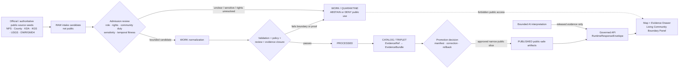
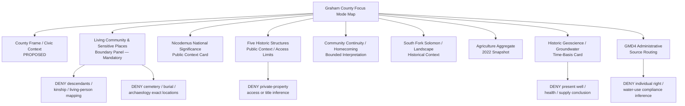
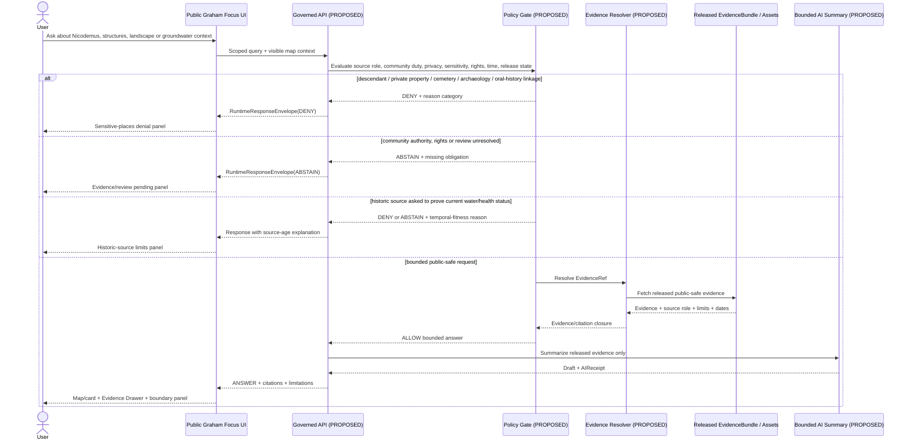
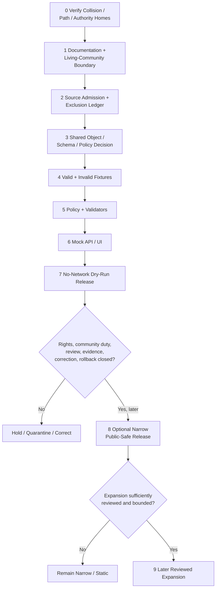

<!-- KFM_META_BLOCK_V2
doc_id: NEEDS_VERIFICATION
title: Graham County Focus Mode Build Plan
type: standard
version: v1
status: draft
owners: [NEEDS_VERIFICATION]
created: 2026-05-22
updated: 2026-05-22
policy_label: public_draft
repository_path: NEEDS_VERIFICATION — candidate only: docs/focus-modes/graham-county/graham_county_focus_mode_build_plan.md
schema_contract_policy_homes: NEEDS_VERIFICATION — reuse verified shared KFM authority homes; do not create county-specific parallel schema, contract, policy, source-registry, receipt, proof or release homes without repository inspection and any required ADR/migration decision
review_assignments: NEEDS_VERIFICATION — descendant-community/public-history, cultural-landscape, cemetery/archaeology, private-property/living-person, hydrology/groundwater, rights, documentation and release review duties must be established before implementation or publication
correction_path: NEEDS_VERIFICATION
rollback_path: NEEDS_VERIFICATION
release_status: NEEDS_VERIFICATION — planning artifact only; no implementation, source admission, promotion or publication claimed
related:
  - Directory Rules.pdf (consulted in this run; supplied placement doctrine)
  - KFM county Focus Mode completed-county register supplied in the series prompt
  - Doniphan County, Jefferson County and Hamilton County immediately preceding generated series artifacts
tags: [kfm, focus-mode, graham-county, nicodemus, reconstruction, living-community, descendant-community, cultural-landscape, solomon-river, high-plains, groundwater, agriculture, public-safe-boundary]
notes:
  - CONFIRMED: Graham County is not included in the completed-county register available in this series context and is distinct from the immediately preceding Doniphan, Jefferson and Hamilton artifacts.
  - CONFIRMED: Accessible uploaded/File Library project materials were searched in this run; no Graham County Focus Mode Build Plan artifact was returned.
  - CONFIRMED: Current official/authoritative public-source pages were checked in this run for Nicodemus, Graham County administration, agriculture, groundwater-management and geoscience context.
  - NEEDS_VERIFICATION: A live KFM repository, branch, accepted ADR set, implementation tree, review process and all project stores were not inspected for final collision or landing verification.
  - PROPOSED: Graham County is selected as the next living-community, cultural-landscape and descendant-authority proof slice.
-->

<a id="top"></a>

# Graham County Focus Mode Build Plan

> **Product thesis:** Build a public-safe Graham County Focus Mode centered on Nicodemus as a living Black community and nationally significant Reconstruction-era cultural landscape, joined carefully to South Fork Solomon River, High Plains/groundwater and agricultural context—without treating public interpretation as complete community voice, exposing descendant-linked property, burial or archaeological detail, or turning historic geoscience into present water-supply or health conclusions.


| Identity / status field | Determination |
|---|---|
| Selected county | **Graham County, Kansas** |
| Selection status | **PROPOSED** as the next KFM county Focus Mode proof slice. |
| Completed-register comparison | **CONFIRMED** within available series evidence: Graham County is absent from the supplied completed register and is not one of the newly generated Doniphan, Jefferson or Hamilton plans. |
| Available-material collision search | **CONFIRMED** for the accessible project corpus searched this run: searches for `Graham County Focus Mode Build Plan`, `graham_county_focus_mode_build_plan.md`, Graham/Nicodemus/Focus Mode terms returned other county plans and KFM doctrine, not a Graham County plan. |
| Full collision verification | **NEEDS_VERIFICATION** because the live repository and every external project index were not inspected in this run. |
| Distinct proof-slice value | Nicodemus National Historic Site and its living descendant community; five NPS-recognized structures and public cultural-landscape interpretation; Solomon River/agricultural setting; Northwest Kansas groundwater-management context; historical geology/groundwater evidence with explicit staleness limits. |
| Most consequential public-safe boundary | **Living descendant-community and place-linked sensitive evidence:** KFM may convey admitted, bounded public interpretation about Nicodemus, but it must not replace descendant/community voice; expose or infer living-person/kinship, private-property, cemetery/burial, homestead or archaeological-site detail; or map sensitive cultural-landscape features beyond an approved public purpose and review state. |
| Secondary public-safe boundary | Historical geologic/groundwater reports and groundwater-management materials must not be presented as present water-supply, well-quality, legal water-right, health or private-operation conclusions. |
| Document posture | Repo-ready planning document informed by official public-source checks; it is not proof of implementation, review, release or publication. |
| Directory placement posture | **PROPOSED / NEEDS_VERIFICATION:** candidate human-documentation home under `docs/focus-modes/graham-county/`, justified by supplied Directory Rules but not confirmed in the live repository. |
| First milestone | **Graham Nicodemus Living-Community Trust Boundary Proof** |

## Quick links

[Executive build note](#executive-build-note) · [Evidence boundary](#evidence-boundary-table) · [Operating posture](#1-operating-posture) · [Why Graham County](#2-why-this-county) · [Product thesis](#3-product-thesis) · [Scope boundary](#4-scope-boundary) · [First demo layers](#5-first-demo-layers) · [User journeys](#6-user-journeys) · [UI surfaces](#7-ui-surfaces) · [Governed object model](#8-governed-object-model) · [Repository shape](#9-proposed-repository-shape) · [Build phases](#10-build-phases) · [First PR sequence](#11-first-pr-sequence) · [Acceptance checklist](#12-acceptance-checklist) · [Fixture plan](#13-fixture-plan) · [Risk register](#14-risk-register) · [Source seeds](#15-source-seed-list) · [Verification questions](#16-open-verification-questions) · [First milestone](#17-recommended-first-milestone) · [Appendices](#appendix-a--public-safe-narrative-skeleton)

<a id="executive-build-note"></a>

## Executive build note

**PROPOSED.** Graham County is an especially valuable next KFM proof slice because its defining anchor is neither merely an attraction nor only an historic layer: **Nicodemus remains a living community whose descendant families and community traditions are central to the site's continuing meaning.** Official National Park Service materials connect Nicodemus to Reconstruction-era Black settlement, homesteading, agriculture, the Solomon River setting, five historic structures, living descendants and oral histories. The same materials also surface cemeteries, archaeology and private-property limits. A credible KFM product must therefore prove that a map-first system can support learning about a nationally significant cultural landscape while withholding the kinds of spatial and personal inference that would make the product extractive or unsafe.

> [!CAUTION]
> ## Defining public-safe boundary — Nicodemus is a living community, not an extractable story layer
> The first Graham County Focus Mode may present **bounded, source-labeled public context** about Nicodemus National Historic Site, the five NPS-recognized historic structures, general community history, public visitor context, Graham County administration, agricultural aggregates and safe regional landscape context. It must **DENY or ABSTAIN** from claims or displays that identify living descendants, infer kinship or land ownership, expose precise cemetery/burial or archaeological locations, map descendant-linked farmstead remains, republish oral-history content beyond permitted public use, convert NPS interpretation into complete community authority, or turn historic groundwater/geology evidence into current health, well-supply or property judgments. Community/descendant review duties remain **NEEDS_VERIFICATION** before any expanded cultural-landscape product.

<a id="evidence-boundary-table"></a>

## Evidence-boundary table

| Truth label | What this document supports now | What this document cannot imply |
|---|---|---|
| `CONFIRMED` | Graham County is not in the completed-county register available to this run; the available project-file collision search did not return a Graham county plan; `Directory Rules.pdf` was consulted; NPS, Graham County, KDA, KGS, USGS and KDA/DWR public pages identified in §15 were opened/checked; the downloadable Markdown artifact was generated in this run. | No live-repository file existence, implementation, source admission, rights clearance, community review, approved spatial display, contract/schema/policy existence, release, correction/rollback mechanism or public publication is confirmed. |
| `PROPOSED` | Graham County selection; product thesis; public-safe boundary; layers/cards; UI; governed objects; paths; fixtures; policies; PR order; milestone and possible future release design. | A proposed design is not proof that KFM has implemented or approved it. |
| `NEEDS_VERIFICATION` | Live repo collision and placement; existing shared object/policy homes; public-use rights for copied/transformed source content; descendant-community review obligations; cemetery/archaeological/generalized geometry posture; live/current water or flood source status; release/correction/rollback machinery. | Checkable gaps are not passed gates and cannot support publication. |
| `UNKNOWN` | Whether any Graham work exists outside searched sources; actual repository maturity; route/DTO/schema/test/CI behavior; review assignments; active release state. | No unsupported implementation or authority claim may be inferred. |

---

## 1. Operating posture

### KFM governing rules applied to Graham County

| Governing rule | Graham County consequence |
|---|---|
| EvidenceBundle outranks generated language. | A public narrative about Nicodemus, agricultural setting, Solomon River, groundwater or public places must be traceable to admitted evidence with source role and limitation; fluent prose is never authority. |
| Public clients use governed interfaces and released public-safe artifacts only. | Map/UI/Focus Mode must never read `RAW`, `WORK`, `QUARANTINE`, unpublished source candidates, private/community-sensitive material, direct source-system side effects, or direct model output. |
| Cite-or-abstain is the default truth posture. | Missing community authority, rights, sensitivity review, temporal fitness or evidence closure leads to `ABSTAIN` or `DENY`. |
| Publication is a governed state transition. | A historic-place layer, time slider, image, oral-history excerpt, cemetery marker or AI story is not public merely because it can be rendered. |
| Source roles remain distinct. | NPS statutory/interpretive authority, resident/descendant-community authority, county administrative context, KDA statistical aggregates, GMD4/DWR administrative water context, KGS/USGS scientific historical sources and generated narrative cannot collapse. |
| Risk-sensitive defaults fail closed. | Living-person/descendant/kinship/private-property inference, cemetery/burial or archaeological detail, rights-unclear images/oral histories and current water-supply/health/legal conclusions are withheld unless explicitly authorized and reviewed. |
| AI is interpretive, not sovereign. | AI may summarize approved public evidence only; it cannot speak for the Nicodemus community, infer lineages, decide access, publish sensitive places or update source authority. |
| Correction and rollback remain visible. | A future released card or map must be withdrawable/correctable if a community concern, rights issue, interpretation correction or source-currentness problem arises. |

### Truth labels and finite outcomes

| Label / outcome | Meaning for this plan |
|---|---|
| `CONFIRMED` | Verified during this run from supplied documents, accessible file search, current official public pages or generated artifact output. |
| `PROPOSED` | Design, path, object, schema/policy/fixture, workflow, UI, review step or implementation recommendation. |
| `NEEDS_VERIFICATION` | Checkable obligation or fact not yet sufficiently verified to act as passed. |
| `UNKNOWN` | Not resolved from current evidence. |
| `ANSWER` | Bounded public-safe response supported by admitted/released evidence and policy/review gates. |
| `ABSTAIN` | Evidence, authority, rights, review or temporal scope is insufficient. |
| `DENY` | The request would expose protected/sensitive content, infer private/community-linked information, or bypass KFM trust controls. |
| `ERROR` | The governed system fails safely and returns no claim. |
| `DEFER` | Candidate content reserved for a later reviewed slice. |
| `EXCLUDE` | Content not suitable for public product intake/display in this slice. |

### Public trust-membrane flowchart



### County-specific non-negotiable guardrails

1. **Living-community authority guardrail.** Official NPS interpretation can support bounded public historical context, but it is not a substitute for the voice, interests or review needs of Nicodemus residents and descendants when representation extends into community meaning, living traditions, oral histories, genealogy, family-linked places or landscape identity.
2. **Cemetery/burial/archaeology guardrail.** NPS pages may publicly name cemeteries or archaeology resources; KFM must not turn such public availability into precise map exposure, route optimization, artifact location, descendant-linked spatial inference or public extraction of sensitive remains.
3. **Private-property guardrail.** NPS public interpretation states that some buildings in the site are private property, and the enabling law includes owner-consent protections for acquisition. KFM must not imply access, ownership, title, stewardship permission or public-entry rights from a map.
4. **Oral-history/living-person guardrail.** Public oral history and descendant narratives require rights, context and reuse review; the first slice must not profile, identify or link living people or families.
5. **Cultural-landscape non-collapse guardrail.** Place, landscape, community, family, business, education, religion and self-government themes may be represented only with evidence and a clear interpretation status; map graphics do not certify complete historical meaning.
6. **Groundwater/hydrology staleness guardrail.** The checked KGS Graham report was originally published in 1955 and explicitly states its information has not been updated; the USGS water-table map is a 1981 publication describing 1979/1980-era data. They may support historic/scientific context only—not current water supply, health, well-quality or irrigation conclusions.
7. **Groundwater-management/legal guardrail.** KDA states GMD No. 4 includes Graham County and provides administrative water-use context; KFM may not infer individual water rights, pumping status, management obligations or farm viability.
8. **Agricultural privacy guardrail.** KDA/USDA aggregate statistics can support a county-scale card; no farm, parcel, family or descendant-linked agricultural inference is permitted.
9. **Operational/public-safety guardrail.** Public access/road/weather/current-condition statements remain official-source functions; KFM is not a live road, weather, site-access, fire or flood safety system.

---

## 2. Why this county

### Selection screen against the completed-county register

| Selection test | Result | Status |
|---|---|---|
| Is Graham County in the user-supplied completed register? | No match found. | `CONFIRMED` in this run's available register |
| Is Graham County one of the subsequently generated Doniphan, Jefferson or Hamilton slices? | No. | `CONFIRMED` |
| Did accessible project-file searches identify a Graham County plan? | No Graham county Focus Mode build-plan artifact returned; results surfaced other completed county plans and KFM doctrine. | `CONFIRMED` within searched accessible materials |
| Was a live repository or every external project location searched? | No. | `NEEDS_VERIFICATION` |
| Does Graham repeat a prior proof slice? | No. It shifts the trust boundary to a living Black descendant community and nationally significant cultural landscape, joined to sensitive place/property/oral-history concerns. | `PROPOSED`, grounded in checked official NPS sources |
| Is official-source availability strong? | Yes. Checked sources include current NPS pages, federal enabling legislation, Graham County official site, KDA agricultural statistics, KDA/DWR GMD4, KGS and USGS historical geoscience/hydrology. | `CONFIRMED` source checks; admission remains `NEEDS_VERIFICATION` |

### Proof-slice rationale

| Proof dimension | Current official/public anchor checked in this run | KFM proof value | Public-safe constraint |
|---|---|---|---|
| Living Black community and Reconstruction-era significance | NPS enabling-legislation page reproduces congressional findings that Nicodemus is the only remaining western town established by African Americans during Reconstruction and “continues to be a valuable African-American community.” | Tests public-history representation where the subject remains a living community, not only an historic object. | NPS interpretation does not erase resident/descendant authority; no extraction of private/living/community-sensitive information. |
| Descendant continuity and storytelling | NPS `Stories` page, updated May 11, 2026, says Nicodemus has stories told by settlers and their descendants who kept the town alive and links to community interviews, oral histories and archaeology. | Tests consent/rights/context review for narrative and multimedia content. | Do not ingest/repackage oral histories, personal stories or archaeology into public product absent rights/review/admission. |
| Public cultural landscape and historic structures | NPS cultural-landscape article identifies five community-symbolic structures and explains public interpretation; enabling law describes the five structures within the National Historic Landmark area. | Tests historic-place cards and cultural-landscape UI. | Do not turn landmark/public context into permission, ownership, full community meaning or unrestricted spatial detail. |
| Private property, cemeteries and archaeology | NPS public pages state some site buildings are private property; NPS visitor material names cemeteries; NPS stories page links to archaeology. | Tests denial behavior for private access, burial and archaeological detail. | Exact/sensitive or family-linked spatial display is denied/deferred despite public-source discoverability. |
| Solomon River / agricultural landscape context | NPS cultural-landscape article relates the Solomon River setting to agriculture; KGS identifies South Fork Solomon River as the principal stream in Graham County. | Tests linking public history and environmental landscape without overclaim. | General setting only; no claim that river/land determines all community history or current conditions. |
| County-level agriculture | KDA reports 347 farms, 400,161 acres and $55 million in crop and livestock sales in 2022 based on USDA 2022 Census of Agriculture. | Supports public aggregate working-landscape card. | County aggregate only; no farm/family/property inference. |
| Groundwater-management context | KDA/DWR states Northwest Kansas GMD No. 4 includes Graham County and reports district-scale water-use/groundwater-management summary values. | Tests administrative water context separate from household/farm/community story. | No individual water-right, well, compliance or farm outcome inference. |
| Historical geoscience and water context | KGS Graham report explicitly says its 1955 information is not updated; it describes South Fork Solomon drainage, Ogallala/terrace water-bearing formations and scientific observations. USGS 1981 publication provides a Graham water-table map from March 1979 context. | Excellent test for time-aware evidence and stale/historic-source handling. | Display as historic/scientific evidence only; no present water safety or availability output. |
| County administrative anchor | Graham County official site exposes public county officials/maps/navigation and county news. | Supports county identity and civic-source routing. | Administrative source does not replace Nicodemus community/NPS authority or verify derived maps. |

### Why Graham County adds a distinct series proof

Graham County adds a proof challenge that differs from previously completed river, wetland, reservoir, infrastructure, urban, water-law and Tribal-sovereignty slices:

- **A living descendant community is also the central public-history subject.**
- **National significance is embedded in local place, landscape, memory and community continuity.**
- **Official public sources themselves reveal that cemeteries, archaeology, private property, oral histories and community-linked places exist—information that needs tighter, not looser, public-product handling.**
- **The natural-resource layers are useful but temporally constrained:** the South Fork Solomon and groundwater context can enrich interpretation, yet the readily checked KGS/USGS sources are explicitly historical and unsuitable for present-condition claims.
- **Agriculture matters both historically and currently**, but aggregate statistics must not be joined to descendant or property inference.

A successful Graham slice would prove that KFM can be richly educational without treating a living cultural landscape as a dataset to exhaust.

### Public benefit and governance value

| Public benefit | Governance value |
|---|---|
| Learn why Nicodemus matters nationally and spatially within Graham County. | Tests respectful representation of a living community through bounded official public evidence. |
| View approved public historic structures and general landscape context. | Tests cultural-landscape layers that preserve private-property and sensitive-place restrictions. |
| Understand that oral history, cemeteries and archaeology need special handling. | Makes denial, abstention and review behavior visible rather than hidden. |
| Explore Solomon River and agricultural context with explicit time/source limits. | Tests integration of historic/cultural and environmental evidence without false causal certainty. |
| See historical groundwater/geology evidence clearly marked as historical. | Tests temporal humility and stale-source controls. |
| Inspect evidence and limitation panels for every claim. | Demonstrates EvidenceBundle-first UI, correction and rollback posture. |

---

## 3. Product thesis

### One-sentence thesis

**Graham County Focus Mode should present Nicodemus as an evidence-backed, living Reconstruction-era Black community and cultural landscape within a Solomon River, High Plains and agricultural setting—while ensuring that public interpretation never becomes descendant profiling, private-property access inference, cemetery/archaeological exposure, or current groundwater/health judgment.**

### What the first product promises

| Promise | Proposed public behavior |
|---|---|
| A respectful Nicodemus-centered first view | Public historical context uses bounded NPS evidence with community-continuity warning and source-role labels. |
| Trust-visible cultural landscape mapping | Approved public-facing structures/place context may be represented only with limitations, geometry/review status and Evidence Drawer access. |
| Boundary-first UX | A Living Community & Sensitive Places panel is visible from the first interaction. |
| Environmental context with time honesty | Solomon River/agriculture/geoscience cards identify source character and explicitly label historical sources as historical. |
| Safe questions and refusal | User receives bounded answers or a clear `ABSTAIN`/`DENY` for private, sensitive, unsupported or overbroad requests. |
| Reversible future publication | Any public release needs review, correction and rollback records. |

### What the first product does not promise

- It is **not** the complete voice or authority of Nicodemus residents or descendant communities.
- It is **not** a genealogy, kinship, family-land or living-person mapping application.
- It is **not** a private-property access, ownership, cemetery routing or archaeological location service.
- It is **not** a public reproduction repository for oral histories, community interviews, images or archival material absent rights/admission review.
- It is **not** a current groundwater, water quality, well viability, flood safety or health-risk system.
- It is **not** proof that repository paths, contracts, schemas, policy, validators, releases or public UI already exist.

---

## 4. Scope boundary

### Public-safe first-slice content

| Included content | Source basis checked during this run | Required framing | Status |
|---|---|---|---|
| Graham County civic/context orientation | Graham County official website | County/source-routing context only; verify geometry and rights before map publication. | `PROPOSED` |
| Nicodemus National Historic Site introduction card | NPS home, cultural-landscape article and enabling legislation | Bounded federal public interpretation; living-community limitation visible. | `PROPOSED` |
| Five historic structures public-context card | NPS cultural-landscape article and legislation | Public/NPS-recognized structure context only; no implied access/ownership/community-complete meaning. | `PROPOSED` |
| Living community and descendant-continuity notice | NPS cultural-landscape and Stories pages | Explain why oral histories, descendants, family-linked places and sensitive sites require heightened review. | `PROPOSED` — mandatory |
| Public visitor/cemetery sensitivity notice | NPS places-to-go page; NPS public interpretation | Explain that known public visitor information does not justify KFM sensitive geometry extraction. | `PROPOSED`; cemetery layer `DENY/DEFER` |
| South Fork Solomon / landscape context card | KGS historical geography; NPS cultural-landscape narrative | General public historical/environmental setting; date/source-limit visible. | `PROPOSED` |
| Agricultural aggregate snapshot | KDA Graham statistics page | 2022 county aggregate only; no family/farm/property connection. | `PROPOSED` |
| Historic geoscience and groundwater source-status card | KGS 1955/2009-hosted report; USGS 1981 publication | Teach source age and historic evidence use; not current condition. | `PROPOSED` |
| GMD4 groundwater-management source-routing card | KDA/DWR GMD4 page | Administrative district context only; no individual water-right or well inference. | `PROPOSED` |

### Deferred content

| Deferred candidate | Reason for deferral | Unlock requirement |
|---|---|---|
| Oral histories, interviews, stories or multimedia replay in KFM | Rights, context, descendant/community representation and living-person concerns. | Source-specific rights, review, minimization, attribution and community-appropriate release decision. |
| Detailed Nicodemus cultural-landscape mapping | Land/kinship/private-property/archaeology sensitivity; map may imply authority beyond public purpose. | Public-safe geometry definition; community/appropriate reviewer posture; transform record. |
| Cemetery points/routes or burial narratives | Sensitive and potentially exploitative spatial disclosure; public NPS mention is not KFM publication justification. | Strong necessity finding and approved generalized/limited representation; likely no exact public geometry. |
| Archaeology/farmstead/dugout/remains layers | Sensitive family- and community-linked heritage and physical security concerns. | Explicit public suitability and review; otherwise deny. |
| Historic property/landownership overlays | Private property and descendant/kinship inference risk. | Separate privacy/property/cultural review and minimized public design. |
| Current groundwater, wells, water quality or water-use maps | Checked environmental sources are historic or district-level and may invite health/legal/private conclusions. | Current official source, rights, temporal fitness, public-health/legal boundary and policy review. |
| Current floodplain or weather/access condition panels | Public safety/currentness outside first slice. | Official-currentness design and not-alert policy. |
| Antelope Lake/public ecology or sensitive species layers | Source routing exists from county page but detailed source/currentness/sensitivity not checked. | Official stable source check, sensitivity and rights review. |

### Denied-by-default or excluded content

| Request/content class | Required outcome | Reason |
|---|---|---|
| “Map where present-day descendants live or which properties are connected to which families.” | `DENY` | Living-person, kinship and private-property exposure. |
| “Show exact graves, burials or cemetery routes for people associated with Nicodemus families.” | `DENY` | Burial sensitivity and descendant/community respect. |
| “Show archaeological remains, dugouts or artifacts associated with specific settlers.” | `DENY` | Sensitive cultural/archaeological and family-linked location exposure. |
| “Tell the definitive community story from NPS pages without identifying the federal interpretation source.” | `ABSTAIN` | Source-role collapse and community-authority overclaim. |
| “Are historic buildings open for access because they appear on the map?” | `DENY` / bounded official-source routing | Private-property/access inference. |
| “Use oral histories to identify family relationships or land holdings.” | `DENY` | Living-person/kinship/property and rights concerns. |
| “Does this historic groundwater report prove my well or drinking water is safe today?” | `DENY` | Stale scientific source transformed into current health/supply conclusion. |
| “Which farm or landowner is using or depleting groundwater?” | `DENY` | Private-operation/water-right inference. |
| Raw restricted/internal/unadmitted materials | `EXCLUDE` / `QUARANTINE` | Not public product content. |

### Boundary implementation matrix

| Risk-bearing topic | Public-safe output in first slice | Visible warning | Withheld/deferred transformation |
|---|---|---|---|
| Nicodemus public history | Bounded NPS-supported overview and structures card. | “Federal public interpretation; living-community review may be required for expanded representation.” | Full community narrative or unreviewed generated story. |
| Descendant/community continuity | Boundary panel describing why care is required. | “No descendant, family or kinship mapping.” | Identity, family/place connections, oral-history reuse. |
| Private historic buildings | Public context only where supported by NPS. | “Map does not grant access or establish ownership.” | Access, title or property inference. |
| Cemeteries/archaeology | Sensitivity notice only initially. | “Exact sensitive heritage locations withheld.” | Location/routing/feature layers. |
| Solomon River/agriculture | General landscape and aggregate card. | “Context/aggregate only.” | Individual farm/property or causal story. |
| Groundwater/geology | Historic-source/context card with publication date. | “Historical science, not present condition or health finding.” | Modern well/water/health judgment. |
| GMD4 | Administrative source-routing card. | “District context is not individual right or compliance status.” | Individual water use/right inference. |

---

## 5. First demo layers

### Prioritized first public-safe layer/card table

| Priority | Proposed public-safe layer or card | Source seeds checked in this run | Source role | Evidence/policy gate | Status |
|---:|---|---|---|---|---|
| 1 | County frame and civic-source routing | Graham County official website | Administrative / public-use context | Geometry authority, rights and release validation; no property attributes. | `PROPOSED` |
| 2 | **Living Community & Sensitive Places boundary panel** | NPS cultural-landscape article; NPS Stories page; NPS legislation; NPS visitor pages | Federal interpretation + representation-boundary source | Mandatory before Nicodemus layers; no descendant/private/burial/archaeological output. | `PROPOSED` — mandatory |
| 3 | Nicodemus national-significance public context card | NPS enabling legislation; NPS public article | Federal statutory/public interpretation | Preserve source role; bounded claims only; no complete community-voice claim. | `PROPOSED` |
| 4 | Five historic structures card | NPS legislation and cultural-landscape article | Federal historic-site interpretation | Public feature context with private/access warnings and evidence drawer. | `PROPOSED` |
| 5 | Community continuity / Homecoming context card | NPS public article and Stories page | Federal public interpretation referring to descendant continuity | Minimal public description only; expanded community narrative/reuse requires review. | `PROPOSED` |
| 6 | Sensitive heritage withholding card | NPS places-to-go; Stories/archaeology link | Sensitivity/visitor-context evidence | Explains why cemetery/archaeology exact layers are withheld. | `PROPOSED`; exact geometry `DENY` |
| 7 | South Fork Solomon / agricultural landscape context | KGS Graham geography/report; NPS cultural-landscape article | Historical scientific + interpretive context | State source age/role; no causal or current water claim. | `PROPOSED` |
| 8 | 2022 agriculture aggregate snapshot | KDA Graham agricultural statistics | Statistical aggregate | Evidence/reference-year and no-private-link rules. | `PROPOSED` |
| 9 | Historic groundwater/geoscience time-basis card | KGS 1955 hosted report; USGS 1981 water-table map | Historical scientific evidence | Clearly historical; no current safety/well/water-quality use. | `PROPOSED` |
| 10 | Northwest Kansas GMD4 source-routing card | KDA/DWR GMD4 | Administrative groundwater-management context | District-level only; no individual right/use/compliance inference. | `PROPOSED` |
| — | Oral history/multimedia/person story player | NPS pages | Potential personal/community narrative | Rights and review not established for derived product. | `DEFER` |
| — | Cemetery, burial, archaeology, dugout or family-farmstead layer | Publicly discoverable NPS material | Sensitive/community-linked | Not needed for public educational proof; fails boundary. | `DENY` / `EXCLUDE` |
| — | Current water/well/flood/health layer | Future official source candidates | Operational/current/health | No current safe source design yet. | `DEFER` |

### Map-composition diagram



### Layer-card truth contract

Every public-visible claim-bearing layer/card is `PROPOSED` to require:

| Required field or obligation | Graham County rule |
|---|---|
| `card_id` / `layer_id` / `schema_version` | Stable deterministic identity candidate and known object version. |
| `county_id` | `ks-graham`; geographic scope cannot silently drift. |
| `claim_scope` | Narrow statement of public purpose and forbidden interpretation. |
| `source_role_refs[]` | Keep NPS statutory/public interpretation, community/descendant authority, county administrative, statistical, administrative-water and historical-scientific roles distinct. |
| `evidence_ref` | Must resolve to admitted `EvidenceBundle`; unresolved claim cannot be displayed as authoritative. |
| `community_representation_posture` | Declares whether content is only federal/public interpretation, community-reviewed, deferred or denied. |
| `living_person_property_posture` | Records no living-person/kinship/private-property mapping or exposure. |
| `burial_archaeology_posture` | Exact sensitive places withheld by default and transform/review required if any future representation is allowed. |
| `time_basis` | NPS page update/legislation date, statistic reference year, source-publication age or district-context date visible. |
| `rights_status` | Text/image/oral-history/map/derivative rights known before public asset generation. |
| `sensitivity_posture` | Community, private property, burial, archaeology, water/currentness and ecology limits visible. |
| `policy_decision_ref` | Required for display/answer. |
| `review_record_refs[]` | Required for expanded cultural landscape, sensitive geometry or living-community implications. |
| `citation_validation_ref` | Required for answer-bearing text. |
| `release_manifest_ref` | Required before public release state. |
| `correction_ref` / `rollback_ref` | Required before publication. |

---

## 6. User journeys

### Public learning journeys

| User question or action | Proposed safe experience | Boundaries shown |
|---|---|---|
| “Why is Nicodemus important?” | NPS-supported national-significance card and Evidence Drawer. | Federal public interpretation identified; living-community boundary panel visible. |
| “What historic buildings can I learn about?” | Five-structure public-context card with source and access/property limitations. | Map does not grant access or establish ownership. |
| “Is Nicodemus only a historic site?” | Bounded answer explains NPS describes Nicodemus as a living community and highlights descendant continuity. | No identification/profiling of current residents or descendants. |
| “Why are cemeteries or archaeology not shown?” | Sensitivity/withholding card explains public-source discoverability is not automatic KFM publication authority. | Exact sensitive heritage geography denied. |
| “How does the Solomon River relate to the county landscape?” | Historical/environmental context card linking KGS and carefully scoped NPS public interpretation. | Historical context, not deterministic community or current hydrology conclusion. |
| “What does the county agriculture snapshot show?” | KDA/USDA-referenced aggregate card. | No individual farm/family/property inference. |
| “What groundwater evidence is available?” | Historic geoscience card distinguishes KGS 1955 and USGS 1981 materials from present conditions. | No modern well, health, water-supply or legal judgment. |
| “What official local-government material is available?” | County-source routing and public contact/map links. | County administration not substituted for community authority. |

### Trust-demonstration journeys

| Trust test | Proposed UI behavior | Finite outcome |
|---|---|---|
| User opens Nicodemus Evidence Drawer | Shows NPS statutory/public-interpretation role, date, limits, review status and community-representation posture. | `ANSWER` for bounded context |
| User requests mapping of living descendants or their family properties | Denial panel returns reason category without surfacing personal data. | `DENY` |
| User requests graves, cemeteries, archaeology or dugout locations | Denial panel explains sensitive heritage-location boundary. | `DENY` |
| User assumes mapped building is open/publicly accessible | Response points to bounded official visitor/source information and refuses map-derived access inference. | `DENY` or narrowly bounded `ANSWER` |
| User asks current well safety from historic KGS/USGS source | Time-basis panel exposes source age and rejects current conclusion. | `DENY` / `ABSTAIN` |
| User asks for a source-backed agriculture aggregate | Displays reference period and no-individual warning. | `ANSWER` |
| Rights or appropriate review is unresolved for an oral-history/archival source | Card remains absent/withheld; no AI summary. | `ABSTAIN` |
| Public UI tries to fetch unadmitted/sensitive/raw source payload | Trust membrane blocks access. | `DENY` / `ERROR` |

### County-specific denied or abstained requests

| Example request | Required outcome | Candidate reason code |
|---|---|---|
| “Map where living descendants of Nicodemus settlers live today.” | `DENY` | `LIVING_DESCENDANT_LOCATION_OR_IDENTITY_EXPOSURE` |
| “Show which present parcels belong to which Nicodemus families.” | `DENY` | `KINSHIP_OR_PRIVATE_PROPERTY_INFERENCE` |
| “Give me exact graves, cemetery routes or burial locations connected with named families.” | `DENY` | `BURIAL_OR_CEMETERY_SENSITIVE_LOCATION` |
| “Map the exact archaeological dugouts or artifact remains mentioned in public material.” | `DENY` | `ARCHAEOLOGICAL_SITE_EXACT_GEOMETRY` |
| “Write Nicodemus's complete community story using NPS text as if it were the community's own statement.” | `ABSTAIN` | `COMMUNITY_AUTHORITY_NOT_ESTABLISHED` |
| “Extract oral histories and connect each speaker to family/property locations.” | `DENY` | `ORAL_HISTORY_LIVING_PERSON_LINKAGE` |
| “Because this NPS map shows buildings, can I enter or access each one?” | `DENY` | `PRIVATE_PROPERTY_OR_ACCESS_INFERENCE` |
| “Use the 1955 KGS report to tell me my current well is safe.” | `DENY` | `HISTORIC_SCIENCE_AS_CURRENT_HEALTH_OR_SUPPLY_CLAIM` |
| “Use GMD4 information to identify a farm's right, pumping status or compliance.” | `DENY` | `INDIVIDUAL_WATER_RIGHT_OR_OPERATION_INFERENCE` |
| “Blend NPS, county, KGS and aggregate statistics into a single definitive community narrative without source labels.” | `ABSTAIN` | `SOURCE_ROLE_COLLAPSE_REQUESTED` |

---

## 7. UI surfaces

### Required UI surface register

| UI surface | Graham County purpose | Trust-visible requirements | Status |
|---|---|---|---|
| Header | “Graham County — Nicodemus Living Cultural Landscape & Solomon Valley Context.” | Draft/release state, evidence posture and prominent living-community/sensitive-places badge. | `PROPOSED` |
| Map canvas | Displays only approved public-safe generalized/map-visible artifacts. | No descendant/private/burial/archaeology/raw/unreleased layers. | `PROPOSED` |
| Layer drawer | Groups county context, Nicodemus public interpretation, historic structures, community-continuity notice, Solomon/agriculture context, historic geoscience and GMD4 routing. | Source role, time basis, sensitivity, review, evidence and release status visible per item. | `PROPOSED` |
| Evidence Drawer | Inspects any claim-bearing card or map feature. | EvidenceBundle, source role, time basis, rights, representation posture, sensitivity, limitations, review, correction and rollback. | `PROPOSED` |
| Answer panel | Presents bounded Focus Mode responses. | Finite outcome; citations; role badges; limitation; no invented community voice. | `PROPOSED` |
| Denial panel | Explains withheld requests. | Reason-category, ethical/governance basis and safe public alternative; no denied data. | `PROPOSED` |
| Timeline/time-basis surface | Separates Reconstruction-era settlement/history, federal recognition/legislation, current NPS pages, 2022 agriculture and historic KGS/USGS environmental material. | Prevents temporal collapse. | `PROPOSED` |
| **Living Community & Sensitive Places panel** | Defines Graham's primary public-safe boundary. | Always visible for Nicodemus interaction; explains descendant authority, private property, cemeteries, archaeology and oral-history constraints. | `PROPOSED` — mandatory |
| Interpretation/authority panel | Distinguishes NPS, community/descendant authority and generated summary. | Federal public interpretation never mislabeled as complete community authority. | `PROPOSED` |
| Historic-source age panel | Shows why KGS/USGS groundwater material is contextual/historic. | Source date and “not present water-health/supply advice” warning. | `PROPOSED` |
| Correction/withdrawal surface | Supports future representation repair. | Public correction, withdrawal and rollback lineage visible. | `PROPOSED` |

### Legend vocabulary table

| Legend label | Plain meaning | Public display rule |
|---|---|---|
| `Federal public interpretation` | NPS-supported public history/context. | May answer narrowly with limitations; not complete community voice. |
| `Living-community review required` | A claim may affect resident/descendant representation. | Withhold expanded content until review posture is established. |
| `Public historic structure context` | Approved general reference to NPS-recognized structures. | No access/ownership inference; exact/private features limited. |
| `Sensitive heritage withheld` | Cemetery, burial, archaeology, family-linked or restricted detail not shown. | No exact public geometry. |
| `Administrative context` | County/government source routing. | Does not replace cultural/community authority. |
| `Statistical aggregate — year shown` | County-level agricultural summary. | No individual/property/family inference. |
| `Historical scientific context` | Older KGS/USGS evidence useful for context. | Not present condition, safety or health determination. |
| `Administrative groundwater context` | GMD/DWR district-scale information. | No individual right/use/compliance inference. |
| `Evidence pending / restricted` | Required admission/review/policy/release gate not complete. | No claim-bearing display. |
| `Denied: personal, private, sensitive or unsupported` | Request exceeds public-safe scope. | No protected information returned. |

### UI / API / policy / evidence sequence diagram



---

## 8. Governed object model

### Shared KFM object-family proposal

| Object family | Graham County application | Critical trust control | Status |
|---|---|---|---|
| `SourceDescriptor` | Classifies NPS, community-review candidate, county, KDA, GMD/DWR, KGS and USGS sources. | Role, public-use scope, rights, temporal fitness and sensitivity must be explicit. | `PROPOSED`; shared-home verification required |
| `EvidenceRef` | Links layer/card/answer to support. | No consequential public claim without resolution. | `PROPOSED` |
| `EvidenceBundle` | Packages admitted evidence and limits for public output. | Keeps NPS interpretation, community-review posture, private/sensitive restriction and historical-source age visible. | `PROPOSED` |
| `PolicyDecision` | Encodes allow/abstain/deny/review obligations. | Covers living people, descendants, property, burial/archaeology, oral history, historical-science/current claims and release. | `PROPOSED` |
| `RuntimeResponseEnvelope` | Public answer carrier. | `ANSWER`, `ABSTAIN`, `DENY`, `ERROR` only. | `PROPOSED` |
| `CitationValidationReport` | Validates displayed claims. | Fails when source roles collapse, evidence is unresolved or old evidence is written as current fact. | `PROPOSED` |
| `ReleaseManifest` | Future release record. | Requires public-safe artifacts, evidence/policy/review, correction and rollback. | `PROPOSED` |
| `AIReceipt` | Records bounded summary generation. | Cannot certify community authority or produce sensitive/personal inference. | `PROPOSED` |
| `CorrectionNotice` | Provides correction/withdrawal state. | Especially necessary for representation concerns or source/rights changes. | `PROPOSED` |
| `RollbackPlan` / rollback reference | Defines safe removal/reversion. | Required prior to public release. | `PROPOSED` |
| `ReviewRecord` | Records human/steward review. | Mandatory for expanded living-community/cultural-landscape/sensitive-place use as determined by policy. | `PROPOSED` |

### Graham-specific object candidates

| Candidate object | Purpose | Mandatory boundary |
|---|---|---|
| `LivingCommunityRepresentationNotice` | Explains Nicodemus representation constraints in the UI. | Cannot claim community approval absent recorded review. |
| `CommunityAuthorityDecision` | Records whether a cultural-landscape/narrative item is public-context only, review-required, withheld or denied. | Must be resolved before expanded public representation. |
| `SensitiveHeritageSuppressionReceipt` | Documents withholding/generalization of cemetery/archaeology/family-linked geometry. | Public payload cannot carry reversible exact coordinates. |
| `NicodemusNationalSignificanceCard` | Bounded NPS/statutory public context. | NPS/federal source role visible; not full community voice. |
| `HistoricStructuresPublicContextCard` | Bounded card for NPS-designated historic structures. | No access/title/private-property inference. |
| `CommunityContinuityContextCard` | Describes descendant continuity only at a safe public level. | No names/addresses/kinship maps; review duty explicit. |
| `SolomonLandscapeContextCard` | Relates river/agriculture at public educational scale. | No deterministic or current hydrologic conclusion. |
| `AgricultureAggregateSnapshot` | Holds KDA/USDA county-level statistic. | No farm/descendant/property connection. |
| `HistoricHydrogeologyTimeBasisCard` | Explains older KGS/USGS source age and use. | Prohibits current health/water/well inference. |
| `GroundwaterAdministrationSourceRoutingCard` | Shows GMD4 source category. | District context only; no individual-right outcome. |

### Source-role anti-collapse rules

| Must remain distinct | Why it matters | Required enforcement |
|---|---|---|
| NPS statutory/public interpretation ↔ resident/descendant-community authority | The site is a living community, not only a federal interpretive object. | UI badge, policy decision and review obligation; abstain on unreviewed expanded representation. |
| Public history ↔ living-person/kinship/property data | History can become privacy harm when connected to current families or land. | No identity/family/property joins; deny fixtures. |
| Public visitor references ↔ cemetery/archaeology public geometry | Discoverable information may still be unsuitable for KFM spatial amplification. | Withhold exact geography by default; suppression receipt. |
| Historic structures ↔ property/access entitlement | NPS materials note private-property context. | No access/title inference; official routing only. |
| KGS/USGS historic science ↔ current water-health/well supply | Checked materials are explicitly dated/historical. | Historical time label; deny present conclusions. |
| GMD/DWR administration ↔ individual water right/use/compliance | Administrative context is not individual legal outcome. | Deny individual inference. |
| KDA statistical aggregate ↔ individual farm/family/descendant | Statistics do not identify present individuals or heritage relationships. | Aggregate-only public card; deny linking. |
| Generated narrative ↔ evidence/community voice | AI cannot authoritatively fill representation gaps. | Evidence closure, policy pre/postcheck and AIReceipt. |

### Minimal public runtime response JSON example

```json
{
  "schema_version": "v1",
  "object_type": "RuntimeResponseEnvelope",
  "response_id": "kfm.response.graham.nicodemus_public_context.v1",
  "county_id": "ks-graham",
  "outcome": "ANSWER",
  "question_scope": "Bounded federal public-history context for Nicodemus National Historic Site in Graham County.",
  "answer": "Nicodemus is represented here through admitted National Park Service public context as a nationally significant Reconstruction-era Black community and historic site in Graham County. This Focus Mode treats Nicodemus as a living community and does not expose descendants, family-linked property, cemetery or archaeological locations, oral-history linkages, or private access information.",
  "evidence_refs": [
    "kfm.evidence_ref.graham.nps.nicodemus_public_context.v1",
    "kfm.evidence_ref.graham.nps.enabling_legislation.v1"
  ],
  "policy": {
    "decision": "allow_bounded_federal_public_context",
    "boundary_notice": "LIVING_COMMUNITY_AND_SENSITIVE_PLACES_REVIEW_REQUIRED"
  },
  "citations_validated": true,
  "limitations": [
    "Federal public interpretation is not complete community authority.",
    "No living-person, descendant, kinship or private-property conclusion is made.",
    "No cemetery, burial or archaeological geometry is displayed."
  ],
  "release_manifest_ref": "NEEDS_VERIFICATION",
  "review_record_refs": ["NEEDS_VERIFICATION"],
  "correction_ref": "NEEDS_VERIFICATION",
  "rollback_ref": "NEEDS_VERIFICATION",
  "spec_hash": "NEEDS_VERIFICATION"
}
```

### Minimal denial envelope example

```json
{
  "schema_version": "v1",
  "object_type": "RuntimeResponseEnvelope",
  "response_id": "kfm.response.graham.descendant_property_mapping.denied.v1",
  "county_id": "ks-graham",
  "outcome": "DENY",
  "reason_code": "KINSHIP_OR_PRIVATE_PROPERTY_INFERENCE",
  "answer": null,
  "public_message": "This public Focus Mode does not map living descendants, family-linked property, graves, burials or archaeological remains. Public learning about Nicodemus is provided only at an approved, evidence-linked and respectful level of detail.",
  "safe_redirect_category": "OFFICIAL_PUBLIC_VISITOR_OR_INTERPRETIVE_SOURCE",
  "evidence_refs": [],
  "spec_hash": "NEEDS_VERIFICATION"
}
```

### Deterministic identity candidates and `spec_hash` posture

| Identity candidate | Canonical identity intent | Status |
|---|---|---|
| `kfm.source.graham.<authority>.<resource>.v1` | Authority + bounded public resource + admission version/role. | `PROPOSED` |
| `kfm.card.graham.living_community_boundary.v1` | County + public-safe representation rule + version. | `PROPOSED` |
| `kfm.card.graham.nicodemus_public_context.v1` | County + bounded NPS/public claim scope + version. | `PROPOSED` |
| `kfm.card.graham.historic_hydrogeology_time_basis.v1` | County + historic-science context + version. | `PROPOSED` |
| `kfm.layer.graham.<public_safe_scope>.v1` | County + allowed map scope + transform/version. | `PROPOSED` |
| `kfm.evidence_ref.graham.<claim_scope>.v1` | County claim scope + evidence-resolution target. | `PROPOSED` |
| `spec_hash` | Canonical hash of meaning-bearing payload, evidence refs, representation/sensitivity posture and public transform metadata; algorithm/canonicalization must reuse verified KFM standard. | `PROPOSED / NEEDS_VERIFICATION` |

---

## 9. Proposed repository shape

### Directory Rules basis

**CONFIRMED doctrine inspected during this run.** The supplied `Directory Rules.pdf` states that a file's location encodes responsibility, governance and lifecycle; topic does not justify a new root folder; human-facing explanations belong under `docs/`; semantic meaning belongs under `contracts/`; machine-checkable shape belongs under `schemas/`; allow/deny/restrict/abstain behavior belongs under `policy/`; examples and tests belong under `fixtures/` and `tests/`; lifecycle data belongs under `data/`; and release decisions, corrections and rollback belong under `release/`. It also states the default schema-home convention is `schemas/contracts/v1/<…>` and preserves this lifecycle:

`RAW -> WORK / QUARANTINE -> PROCESSED -> CATALOG / TRIPLET -> PUBLISHED`

> [!WARNING]
> Every path below is **`PROPOSED / NEEDS_VERIFICATION`** until checked against a live KFM repository, accepted ADRs, per-root README contracts and existing authority homes. This artifact does not modify a repository and does not claim these paths exist.

### Candidate path table

| Responsibility | Candidate path | Directory Rules basis | Status |
|---|---|---|---|
| This build-plan document | `docs/focus-modes/graham-county/graham_county_focus_mode_build_plan.md` | Human planning artifact under `docs/`; series lane must be confirmed in repo. | `PROPOSED / NEEDS_VERIFICATION` |
| County overview / boundary notes | `docs/focus-modes/graham-county/README.md`, `public-safe-boundary.md` | Human documentation/control-plane explanation. | `PROPOSED` |
| Source seed/admission narrative | `docs/focus-modes/graham-county/source-seed-list.md` | Human-facing source routing; not a source registry replacement. | `PROPOSED` |
| Layer/card registry narrative | `docs/focus-modes/graham-county/layer-registry.md` | Human product planning index. | `PROPOSED` |
| Community representation/review notes | `docs/focus-modes/graham-county/living-community-review-notes.md` | Human governance explanation pending confirmed process. | `PROPOSED` |
| Semantic contract extension, only if necessary | `contracts/domains/focus_mode/graham/` | `contracts/` owns meaning; reuse verified shared objects first. | `NEEDS_VERIFICATION` |
| Machine-schema extension, only if necessary | `schemas/contracts/v1/domains/focus_mode/graham/` | `schemas/` owns shape; default schema-home rule per supplied doctrine. | `NEEDS_VERIFICATION` |
| Policy/profile extension, only if necessary | `policy/domains/focus_mode/graham/` or verified shared cultural/community/sensitivity policy | `policy/` owns allow/deny/abstain/restrict behavior. | `NEEDS_VERIFICATION` |
| Fixtures | `fixtures/domains/focus_mode/graham/{valid,invalid}/` | `fixtures/` owns test inputs/examples. | `NEEDS_VERIFICATION` |
| Tests | `tests/domains/focus_mode/graham/` | `tests/` proves enforceability. | `NEEDS_VERIFICATION` |
| Validator reuse/extension | `tools/validators/focus_mode/` or verified canonical validator lane | `tools/` owns repo-wide validators; avoid county forks absent need. | `NEEDS_VERIFICATION` |
| Source registry records | `data/registry/sources/focus_mode/graham/` or verified registry lane | Source instances under data registry responsibility root. | `NEEDS_VERIFICATION` |
| Future processed/catalog products | `data/processed/focus_mode/graham/`, `data/catalog/domain/focus_mode/graham/` | Lifecycle outputs only after admission/validation. | `PROPOSED`; not created |
| Future published safe artifacts | `data/published/layers/focus_mode/graham/` | Public artifacts only after promotion. | `PROPOSED`; not created |
| Future release/correction/rollback decisions | `release/candidates/focus_mode/graham/` and verified canonical decision homes | `release/` owns decisions/reversal, not published content. | `NEEDS_VERIFICATION`; not created |

### Proposed responsibility-rooted tree

```text
# Candidate target only — not an observed repository inventory.

docs/
  focus-modes/
    graham-county/
      README.md
      graham_county_focus_mode_build_plan.md
      public-safe-boundary.md
      source-seed-list.md
      layer-registry.md
      living-community-review-notes.md
      acceptance-checklist.md

contracts/
  domains/
    focus_mode/
      graham/                         # only if shared semantic contracts cannot be reused

schemas/
  contracts/
    v1/
      domains/
        focus_mode/
          graham/                     # only after live schema-home verification

policy/
  domains/
    focus_mode/
      graham/                         # prefer shared community/sensitive-place policies

fixtures/
  domains/
    focus_mode/
      graham/
        valid/
        invalid/

tests/
  domains/
    focus_mode/
      graham/

data/
  registry/
    sources/
      focus_mode/
        graham/
  processed/
    focus_mode/
      graham/                         # future admitted products only
  catalog/
    domain/
      focus_mode/
        graham/                       # future evidence/catalog products only
  published/
    layers/
      focus_mode/
        graham/                       # future promoted public-safe artifacts only

release/
  candidates/
    focus_mode/
      graham/                         # future decisions/manifests/correction/rollback only
```

### Placement prohibitions

- Do **not** create root-level `graham/`, `nicodemus/`, `black-history/`, `cultural-landscape/`, `descendants/` or `focus-mode/` authority buckets.
- Do **not** create a parallel object, policy, source-registry, receipt, proof, release or published-artifact authority home without a verified ADR/migration decision.
- Do **not** place oral-history extracts, living-person/kinship details, private-property attributes, cemetery/burial/archaeological geometry or unreviewed cultural-landscape candidates in public data/artifact/UI homes.
- Do **not** treat public NPS interpretive text or maps as a grant of derivative-display rights for all material or as complete community authority.
- Do **not** place current-condition claims derived from historic KGS/USGS evidence in published or UI surfaces.
- Do **not** place machine schemas next to prose merely for convenience.
- Do **not** assert any path currently exists until repository evidence is inspected.

---

## 10. Build phases

| Phase | Purpose | Entry gate | Proposed outputs | Exit validation | Rollback posture |
|---:|---|---|---|---|---|
| 0 | Verify collision, path and authority homes | Current artifact and file-search evidence only. | Live repo/county-index search; ADR/root README/schema/policy/release inventory; path decision. | No duplicate Graham plan and documented home basis. | Do not land/rename artifact if conflict exists. |
| 1 | Documentation and public-safe boundary | Phase 0 path result. | Plan; public-safe boundary note; source-role and community-review-duty notes. | Living-community, private property, cemetery/archaeology and old-source/currentness boundaries are explicit. | Revert doc-only change. |
| 2 | Source admission and exclusion ledger | Checked public sources identified. | Candidate source descriptors; rights/currentness/sensitivity/review fields; exclusion list. | Each source has narrow allowed scope and prohibited use. | Withdraw candidate admission; keep reasoning record. |
| 3 | Shared object/schema/policy decision | Existing homes verified. | Reuse map; minimal extension only if proven needed; ADR/migration note where required. | Single authority per object/rule family; no drift. | Supersede unnecessary extension. |
| 4 | Fixture-first proof | Object/profile scope settled. | Valid public-context fixtures and high-risk invalid/deny/abstain fixtures. | Private/descendant/burial/archaeology/source-age failures are enforceable. | Revert fixtures with no public impact. |
| 5 | Policy and validators | Fixtures exist in verified repo environment. | Evidence closure, source-role, community authority, privacy/property, sensitive-location, temporal-fitness and release validators/policies. | Repo-native tests pass; unsafe paths fail closed. | Roll back candidate rule change and preserve decision lineage. |
| 6 | Mock governed API/UI | Fixture/policy behavior stable. | Static mock map/cards; Evidence Drawer; Living Community panel; Denial panel; time/source-age UI. | UI uses mock released-envelope shapes only; no sensitive/live/raw content. | Remove mock registration. |
| 7 | No-network dry-run release proof | Mock slice validates. | Candidate `ReleaseManifest`, `CitationValidationReport`, `ReviewRecord`, `AIReceipt`, correction/rollback refs. | Closure and withdrawal rehearsal succeeds; no public publication. | Invalidate dry-run manifest. |
| 8 | Optional minimal static public-safe publication | Explicit evidence, rights, policy, review and release approval. | Narrow public cards/layers only. | Public output citeable, constrained, reviewable, correctable and reversible. | Withdraw/repoint assets and issue correction. |
| 9 | Optional later community/hydrology expansion | Additional appropriate review and temporal/current-source proof. | Carefully scoped expansions only. | New sensitive/currentness gates pass. | Disable added features; revert to approved static slice. |



---

## 11. First PR sequence

> [!IMPORTANT]
> **Live source integration and public release are not first-PR work.** Graham County must establish representation, privacy, sensitive-place and source-age controls before maps or generated stories are treated as product.

| PR | Required ordering | Proposed contents | Acceptance emphasis |
|---:|---|---|---|
| 1 | Verification and documentation control | Live collision/path/ADR/shared-home check; land this plan and boundary note only after verification. | No implementation or release claim; representation boundary is prominent. |
| 2 | Source ledger/admission and public-safe boundary | Candidate source descriptors, allowed/prohibited uses, rights/review/currentness/sensitivity backlog, excluded-detail registry. | NPS/public/community/historic-science roles cannot collapse. |
| 3 | Contracts/schemas or shared-object reuse | Verify shared object families; minimally extend only if a real gap exists. | No parallel homes or invented implementation facts. |
| 4 | Valid and invalid fixtures | Public-safe Nicodemus/context/statistic/time-basis examples plus descendant/private/cemetery/archaeology/old-science denial cases. | Test denial behavior before rendering. |
| 5 | Policy and validators | Evidence/role/community/privacy/sensitivity/temporal-fitness/release checks. | Fail closed on highest-risk paths. |
| 6 | Mock governed API/UI | Fixture-backed map/cards, Evidence Drawer, Living Community panel, Denial panel and timeline/source-age UI. | No raw or sensitive content and no unreviewed generated community story. |
| 7 | Dry-run release proof | Candidate release/citation/review/AI/correction/rollback closure from fixtures only. | Demonstrates auditability/reversibility without release. |
| 8 | Only then optional minimal public-safe publication | Narrow NPS-bounded static slice after review/rights/release decision. | Community and sensitive-place boundaries remain visible. |
| 9 | Later reviewed expansion | Additional oral-history, landscape, water or public-history material only after appropriate gates. | Expansion remains reversible and source-role preserving. |

### Explicit first-PR exclusions

The first PR and recommended first milestone must **not** include:

- ingestion or republication of oral-history recordings/transcripts/images;
- living descendant names, contact, family/kinship or property-link mapping;
- cemetery/burial or archaeological point/layer publication;
- private-property access or ownership representations;
- raw historic-map digitization or historic-place geometry publication without rights/review;
- current groundwater/well/water-quality maps or AI conclusions;
- public release artifacts or published map layers;
- direct public AI/model endpoints.

---

## 12. Acceptance checklist

### Governance and evidence

- [ ] Graham County remains unused after final live repository/project-index verification.
- [ ] Final landing path is supported by Directory Rules and verified ADR/root README evidence.
- [ ] Every consequential public claim resolves through `EvidenceRef` to an admissible `EvidenceBundle`.
- [ ] Each source has declared authority/role, allowed scope, prohibited inference, rights posture, time basis/currentness and sensitivity/review needs.
- [ ] NPS interpretation, community/descendant review authority, county administration, KDA statistics, GMD/DWR administration and KGS/USGS historical science stay distinct.
- [ ] Any AI output is traceable through policy/citation checks and `AIReceipt`.
- [ ] Finite outcomes `ANSWER`, `ABSTAIN`, `DENY`, `ERROR` are explicit and tested.
- [ ] Missing rights, review, evidence, temporal fitness or release closure fails closed.

### Public/sensitive boundary

- [ ] Living Community & Sensitive Places panel is mandatory for the initial product.
- [ ] No living descendant, family, kinship, oral-history-person or present property inference is exposed.
- [ ] No precise cemetery/burial/archaeological/family-farmstead sensitive location is published.
- [ ] Public NPS interpretation is not labeled as complete community voice or community approval.
- [ ] Private-property/access limitations are visible wherever historic structures are referenced.
- [ ] Historical KGS/USGS environmental evidence is visibly dated and cannot support current water/health/well claims.
- [ ] GMD/DWR context cannot support individual water-use/right/compliance inference.
- [ ] KDA agricultural statistics remain county aggregates only.
- [ ] Rights-unclear/restricted/unsafe material is quarantined or excluded.

### Product and UI

- [ ] Header displays draft/release posture and the defining boundary.
- [ ] Layer drawer includes source role, date/time basis, evidence, rights/sensitivity and release state.
- [ ] Evidence Drawer exposes interpretation status, limitations, review and correction/rollback references.
- [ ] Denial panel explains safe reason categories without disclosing protected detail.
- [ ] Timeline visibly separates Reconstruction/settlement history, federal recognition/interpretation, current NPS pages, 2022 statistics and historical geoscience/water evidence.
- [ ] Map contains only approved/released public-safe artifacts and generalized geometries.
- [ ] User can learn why Nicodemus matters without being prompted toward private or sensitive detail.

### Repository, validation, release, correction and rollback

- [ ] Live repo and existing county-plan index are inspected before landing.
- [ ] Shared schema, contract, policy, validator, fixture and release authority homes are verified before additions.
- [ ] Valid/invalid fixtures cover community representation, living people, private property, cemetery/archaeology, temporal fitness and release closure.
- [ ] Validators reject public internal-lifecycle access and unreviewed sensitive content.
- [ ] No-network dry run proves a bounded public response envelope and correction/rollback posture.
- [ ] A release manifest, correction route and rollback target exist before public labeling.
- [ ] No implementation, review completion, runtime behavior or publication is claimed without evidence.

---

## 13. Fixture plan

### Valid fixture table

| Valid fixture candidate | What it demonstrates | Minimum safe fields/content | Status |
|---|---|---|---|
| `graham_county_public_orientation.valid.json` | Public county orientation is possible. | Administrative source role, no private/parcel details, evidence ref. | `PROPOSED` |
| `living_community_boundary_notice.valid.json` | UI can visibly explain community/sensitive-place boundary. | NPS source refs, review-needed field, deny classes, no identities/geometry. | `PROPOSED` |
| `nicodemus_nps_public_context.valid.json` | Bounded federal public-history card may be shown. | Federal interpretation role, statutory/public support, limitations. | `PROPOSED` |
| `nicodemus_five_structures_context.valid.json` | Public structures context can be rendered safely. | No ownership/access implication, source role, sensitivity note. | `PROPOSED` |
| `community_continuity_notice_only.valid.json` | Public product can acknowledge continuity without naming/profiling people. | No living-person fields; no kinship links; review posture. | `PROPOSED` |
| `south_fork_solomon_landscape_context.valid.json` | General environmental/historic setting may be shown. | Historical-science role, date, no present hydrology conclusion. | `PROPOSED` |
| `graham_agriculture_aggregate_2022.valid.json` | County aggregate is safe. | year, metrics, aggregate role, no person/property linkage. | `PROPOSED` |
| `historic_groundwater_source_age.valid.json` | UI can show historic scientific evidence safely. | publication years, historic-use flag, current-conclusion prohibition. | `PROPOSED` |
| `gmd4_source_routing_context.valid.json` | Administrative groundwater context can be routed safely. | district-level only, no individual water records. | `PROPOSED` |

### Invalid / fail-closed fixture table

| Invalid fixture candidate | Unsafe payload or inference | Expected outcome | Boundary tested |
|---|---|---|---|
| `living_descendant_location.invalid.json` | Maps/identifies where present descendants live. | `DENY` | Living-person/community |
| `family_property_kinship_link.invalid.json` | Links present property to named families/kinship. | `DENY` | Property/privacy/community |
| `cemetery_burial_route_exact.invalid.json` | Publishes exact graves/burial routes/location. | `DENY` | Burial sensitivity |
| `archaeological_dugout_artifact_geometry.invalid.json` | Maps remains/artifact/archaeology at exact location. | `DENY` | Archaeological sensitivity |
| `oral_history_to_person_property_graph.invalid.json` | Connects oral histories to living people or present property. | `DENY` | Rights/living persons |
| `nps_as_complete_community_voice.invalid.json` | Treats federal interpretation as complete community authority. | `ABSTAIN` / validation fail | Representation authority |
| `historic_building_as_public_access.invalid.json` | Implies user may access private property from map. | `DENY` | Private access |
| `historic_kgs_as_current_well_safety.invalid.json` | Converts dated geoscience to present well/health claim. | `DENY` | Temporal fitness/health |
| `gmd4_as_individual_water_status.invalid.json` | Infers an individual's water right/use/compliance. | `DENY` | Legal/private water |
| `aggregate_agriculture_to_family_farm.invalid.json` | Connects county aggregate to a family/farm/parcel. | `DENY` | Privacy/statistical |
| `source_role_collapse.invalid.json` | Blends NPS/community/KGS/KDA/DWR as unqualified truth. | `ABSTAIN` / validation fail | Provenance |
| `unresolved_evidence_ref.invalid.json` | Claim-bearing public response lacks EvidenceBundle closure. | `ABSTAIN` / validation fail | Evidence |
| `rights_or_review_missing.invalid.json` | Content needing review/rights is displayed as public. | Block / `ABSTAIN` | Rights/review |
| `missing_release_correction_rollback.invalid.json` | Artifact labeled public without reversal mechanism. | Validation fail | Publication |
| `public_raw_work_quarantine_access.invalid.json` | Public envelope reads internal/unadmitted source content. | `DENY` / validation fail | Trust membrane |

### Fixture-to-test matrix

| Test objective | Valid fixtures | Invalid fixtures | Required proof |
|---|---|---|---|
| Living-community representation | `living_community_boundary_notice`, `nicodemus_nps_public_context`, `community_continuity_notice_only` | `living_descendant_location`, `nps_as_complete_community_voice` | Bounded public interpretation allowed; living identity/authority overreach denied/abstained. |
| Private property and sensitive heritage | `nicodemus_five_structures_context` | `family_property_kinship_link`, `cemetery_burial_route_exact`, `archaeological_dugout_artifact_geometry`, `historic_building_as_public_access` | Public context allowed; unsafe spatial/private inference denied. |
| Oral-history rights and linkage | none beyond boundary notice in first slice | `oral_history_to_person_property_graph`, `rights_or_review_missing` | Oral-history/person-linked derived outputs blocked. |
| Time-aware environmental evidence | `south_fork_solomon_landscape_context`, `historic_groundwater_source_age` | `historic_kgs_as_current_well_safety` | Historic scientific context allowed; current-health/supply claim denied. |
| Administrative/statistical anti-collapse | `gmd4_source_routing_context`, `graham_agriculture_aggregate_2022` | `gmd4_as_individual_water_status`, `aggregate_agriculture_to_family_farm` | District/aggregate context allowed; individual inference denied. |
| Evidence and source-role closure | all valid fixtures | `source_role_collapse`, `unresolved_evidence_ref` | `ANSWER` requires role fidelity and evidence closure. |
| Release/trust-membrane enforcement | future valid dry-run release fixture | `missing_release_correction_rollback`, `public_raw_work_quarantine_access` | No public state absent lifecycle/release closure. |

### Highest-risk fixture pack required before mock UI acceptance

```text
invalid/
  living_descendant_location.invalid.json
  family_property_kinship_link.invalid.json
  cemetery_burial_route_exact.invalid.json
  archaeological_dugout_artifact_geometry.invalid.json
  oral_history_to_person_property_graph.invalid.json
  nps_as_complete_community_voice.invalid.json
  historic_kgs_as_current_well_safety.invalid.json
  rights_or_review_missing.invalid.json
  missing_release_correction_rollback.invalid.json
```

---

## 14. Risk register

| County-specific risk | Likelihood before controls | Impact | Required mitigation | Release posture |
|---|---:|---:|---|---|
| Public product presents NPS/generated interpretation as the complete voice of a living Nicodemus community | Medium/High | Severe | Mandatory community-boundary panel; source-role display; review obligation for expanded representation; abstain tests. | Block release if unbounded. |
| Living descendant identity, family relationship or present location is inferred/exposed | Medium | Severe | No person/kinship data model in public slice; deny tests; rights/review gate. | `DENY`. |
| Private property/access or land-connection inference is created from public site mapping | Medium | High | Public-context-only structure card; property/access warning; no parcel joins. | `DENY` such output. |
| Cemetery/burial/archaeological location is amplified through map interaction | Medium | Severe | Exact sensitive heritage withheld; no point/route layer; suppression receipt and policy. | `DENY` / `EXCLUDE`. |
| Public oral-history material is repackaged without proper rights/context/community review | Medium | High/Severe | Defer oral-history/multimedia use; source-specific rights/review; minimal first slice. | `DEFER`. |
| Generated narrative romanticizes, simplifies or distorts Reconstruction/community history | Medium | High | Evidence closure; interpretation badge; correction pathway; community-review question visible. | Bounded static context only. |
| Historical KGS/USGS environmental evidence is read as present water/well/health truth | High absent warnings | High | Historical-source age panel; deny present conclusions; do not offer live environmental layer. | Context only. |
| GMD4 or county aggregates are connected to individuals, families or land holdings | Medium | High | District/aggregate-only objects; query restrictions; deny fixtures. | Allow only aggregate/context. |
| Rights for source images/maps/transcripts or derivative display are unclear | Medium | High | Rights admission checklist; quarantine until verified. | No release when unclear. |
| Existing Graham artifact or incompatible path is missed | Medium until repo inspection | Medium | Live collision scan and ADR/path verification. | Do not merge until verified. |
| AI creates confident but unsupported descendant, cultural, private or water claim | Medium | Severe | No public direct model path; evidence-only output; policy pre/post checks; AIReceipt; negative tests. | Block release if unmitigated. |

---

## 15. Source seed list

### Current official / authoritative public sources actually checked during this run

Checked-at date: **2026-05-22**. “Checked” means the public page was opened/reviewed during planning for a bounded source anchor. It does **not** mean the material has been admitted to KFM, that derivative public-display rights are resolved, that community review has occurred, or that any layer/card may be published.

| Checked source | Source character / authority role | Verified anchor used in this plan | Intended first-slice use | Allowed claim scope now | Rights, sensitivity, currentness and publication limits |
|---|---|---|---|---|---|
| [Graham County official website](https://www.grahamcountyks.com/) | County government / administrative source routing | Official site displays Graham County navigation including county officials, minutes, maps and a public link to Antelope Lake, and displays current county notices. | County administrative/source-routing card only. | Supports that an official public county website and public map/source routing surface exists. | Does not establish derivative map rights, accurate geometry, community authority or property/public-access conclusions. |
| [NPS — Nicodemus National Historic Site](https://www.nps.gov/nico/index.htm) | Federal park/public interpretation source | NPS public site identifies Nicodemus National Historic Site and provides visitor/contact/oral-history/navigation surfaces. | Official historic-site source routing and bounded context. | Federal public-site identity and available public interpretation surfaces. | Public page does not grant blanket reuse or replace community review; rights/representation `NEEDS_VERIFICATION`. |
| [NPS — Nicodemus National Historic Site cultural-landscape article](https://www.nps.gov/articles/nicodemus_nhs_landscape_equality.htm) | Federal public cultural-landscape interpretation | Page says Nicodemus symbolizes strength/determination/endurance of African Americans who settled there; states groups settled beginning in 1877; relates Solomon River/agricultural setting; describes descendant-led continuity/Homecoming and five structures. | Nicodemus public-context, community-continuity and five-structures cards. | Bounded, attributed NPS interpretation only. | Must not be treated as complete community voice; image/map reuse, descendant-linked detail and expanded narrative review `NEEDS_VERIFICATION`. |
| [NPS — Public Law 104-333 / enabling legislation](https://www.nps.gov/nico/learn/management/enabling-legislation.htm) | Federal statutory authority for historic site | Page reproduces congressional findings that Nicodemus is the only remaining western town established by African Americans during Reconstruction and continues to be a valuable African-American community; describes five structures and approximately 161.35-acre National Historic Landmark setting; includes owner-consent language for acquisition. | National-significance, statutory-status and private-property limitation card. | Supports the statutory/public context and need for property restraint. | Statutory boundary/public inspection does not automatically justify KFM detailed public geometry or access/ownership inference. |
| [NPS — Stories, Nicodemus NHS](https://www.nps.gov/nico/learn/historyculture/stories.htm) | Federal public narrative/source-routing page; descendant/community-sensitive relevance | Updated May 11, 2026; page states Nicodemus has stories told by settlers and descendants who kept the town alive and links to community interviews, oral histories and archaeology. | Evidence for Living Community & Sensitive Places boundary and review duties. | Supports the need for cautious treatment and public source-routing. | Do not ingest/repackage interviews, oral histories, persons or archaeology in first slice without rights/review. |
| [NPS — Places to Go, Nicodemus NHS](https://www.nps.gov/nico/planyourvisit/places-to-go.htm?fullweb=1) | Federal visitor/public-place context with sensitive-location implications | Page publicly identifies cemetery visitor context and warns that country dirt roads to cemetery access may be hazardous depending on vehicle/weather. | Sensitivity and not-a-safety-service boundary evidence. | Supports that public visitor information exists and safety/currentness belongs to official source. | The first KFM product intentionally does not reproduce exact cemetery location/routing or provide road safety advice. |
| [NPS — Nicodemus public heritage/travel article](https://www.nps.gov/articles/nicodemus.htm) | Federal public-history/visitor interpretation | Page states Nicodemus remains a living town; some descendants live in the town/surrounding area; descendant families deserve credit for keeping the community alive; it also states some buildings are private property. | Strong boundary anchor for descendant/private-property/non-extractive UX. | Supports only bounded NPS-attributed public interpretation and property-access warning. | Page is older (last updated 2017); do not extract living-person data or imply present access/state absent current verification. |
| [Kansas Department of Agriculture — Graham County statistics](https://www.agriculture.ks.gov/kansas-agriculture/kansas-agricultural-statistics/graham-county) | State statistical aggregate page referencing USDA Census | Page reports 347 farms, 400,161 acres and $55 million in crop and livestock sales in 2022, stating data according to the USDA 2022 Census of Agriculture. | Agriculture aggregate snapshot. | County-level aggregate with explicit 2022 reference year. | No individual farm/family/property inference; underlying record packaging and display terms `NEEDS_VERIFICATION`. |
| [KDA/DWR — Northwest Kansas GMD No. 4](https://www.agriculture.ks.gov/divisions-programs/division-of-water-resources/managing-kansas-water-resources/groundwater-management-districts/g-m-d-no-4) | State administrative groundwater-management context | Page states GMD4 includes Graham County among counties/partial counties and supplies district-wide summary values/resources including water-level and use materials. | Administrative groundwater source-routing/context card. | Supports district-inclusion and public district-level resource availability. | District statistics do not establish Graham-specific/current/individual rights, well or water-use outcomes; public-detail policy required. |
| [KGS — Geology and Ground-Water Resources of Graham County, Kansas](https://www.kgs.ku.edu/General/Geology/Graham/index.html) | Scientific historic reference | KGS states the report was originally published in 1955 and information has not been updated; abstract describes South Fork Solomon drainage, Ogallala/terrace formations, wells and groundwater/geology observations. | Historic geoscience/time-basis and Solomon landscape card. | Historical scientific context with prominent source-age limitation. | Not present water-supply, water-quality, well, health, engineering or legal evidence; derivative map/admission rights `NEEDS_VERIFICATION`. |
| [USGS — Map of water table in Graham County, northwestern Kansas, March 1979](https://pubs.usgs.gov/publication/ofr81333) | Federal historical scientific publication | USGS records Open-File Report 81-333, published 1981, describing water-table information for Graham County from the 1979/1980 period and identifying South Fork Solomon River and shallow unconsolidated aquifers. | Historical-water-evidence card and temporal-humility example. | Historical source identity and bounded historical context. | Cannot support present well/supply/health/currentness decisions; figure/display use and derivative handling `NEEDS_VERIFICATION`. |

### Candidate official sources for later verification

| Candidate source family | Potential later use | Required verification before admission |
|---|---|---|
| Nicodemus Cultural Landscape Report / approved NPS planning documents | Deeper cultural-landscape context and possible generalized historic mapping. | Rights, source scope, sensitive archaeology/private/property/descendant detail and appropriate community/reviewer posture. |
| Nicodemus Historical Society or other community-authoritative public materials, where appropriate and available for such use | Community-led framing or review-routing. | Authority, consent, reuse, appropriate public scope and no assumption of permission. |
| NPS public alerts/conditions pages | Official visitor-currentness link-out only. | Avoid KFM operational advice; establish refresh/withdrawal behavior. |
| KDOT or county public map products | County/road/public-place context. | Geometry authority, terms/rights, operational/security and private-property limitations. |
| KDA/FEMA/Kansas floodplain sources for Graham | Flood-context/source-routing card. | Current effective source state, rights, zoom/export and non-property/non-alert interaction policy. |
| Current USGS water monitoring sources for South Fork Solomon area, if available | Future time-stamped observation routing. | Station relevance, freshness/revision/outage and not-alert/not-health policy. |
| Updated KGS/USGS water/geology sources | Modern scientific context. | Fitness for use, public display rights and no individual current-condition overclaim. |
| USDA/NASS underlying Graham County record | Reproducible agriculture evidence bundle. | Stable citation/retrieval and public-display terms. |
| KDWP/official public-land/ecology sources linked from county site | Generalized public nature/recreation context. | Current source, rights, ecological sensitivity and public-safety controls. |

### Source admission checklist

- [ ] Verify publisher/authority, stable source identifier and checked/retrieved date.
- [ ] Assign source role without conflating statutory/public interpretation, community authority, administration, statistics or historic science.
- [ ] Define the exact permitted public claim scope and prohibited inferences.
- [ ] Confirm rights, attribution, redistribution and derivative-display permission for text, maps, images, oral histories, audio/video and geometry.
- [ ] Determine whether a claim implicates resident/descendant/community review before publication.
- [ ] Deny or generalize cemetery/burial/archaeological/private-property/family-linked spatial detail unless explicitly approved for public use.
- [ ] Record temporal fitness: 1955 KGS and 1981 USGS materials are historical, not present-condition sources.
- [ ] Prevent GMD/DWR or aggregate data from supporting individual legal/private conclusions.
- [ ] Resolve each claim through `EvidenceRef` to `EvidenceBundle`.
- [ ] Complete policy, review, citation validation, release, correction and rollback closure before public output.
- [ ] Recheck all current pages and any living-community/rights/sensitivity concerns immediately before release.

---

## 16. Open verification questions

### Repository-path and existing-plan verification

- [ ] Does the live KFM repository contain an existing Graham County or Nicodemus Focus Mode artifact not surfaced in accessible file search?
- [ ] Is `docs/focus-modes/<county>/` a verified current human-documentation lane?
- [ ] Do accepted ADRs or per-root README contracts amend placement for county Focus Mode plans?
- [ ] Is there a canonical county-plan index or lineage register requiring update?

### Existing contract/schema/policy family verification

- [ ] Does the repository already define `SourceDescriptor`, `EvidenceRef`, `EvidenceBundle`, `PolicyDecision`, `RuntimeResponseEnvelope`, `CitationValidationReport`, `ReviewRecord`, `ReleaseManifest`, `AIReceipt`, `CorrectionNotice` and `RollbackPlan`?
- [ ] Is `schemas/contracts/v1/...` the current schema home, consistent with supplied Directory Rules, or has an accepted ADR amended it?
- [ ] Is there an existing policy profile for living-person/community representation, heritage/sensitive-place suppression, private-property/access, cultural archaeology or old-source/currentness?
- [ ] Does Focus Mode already define layer/card/evidence-drawer fields for interpretation status, representation review and geometry suppression?
- [ ] Which tests/fixture/validator conventions exist and must be reused?

### Authority, rights and public geometry

- [ ] What review/consultation pathway is appropriate before any Nicodemus living-community/descendant-sensitive representation beyond bounded NPS public context?
- [ ] Which NPS structures/place geometries are suitable and necessary for a minimal public map, and at what scale?
- [ ] Are there any public KFM uses of oral histories, photographs, sound, maps or archival material that are both rights-cleared and appropriate?
- [ ] What exact location treatment is appropriate for cemeteries and archaeology: full denial, generalized notice, or another approved posture?
- [ ] How should private-property/access information be surfaced without encouraging entry or ownership inference?
- [ ] Which current/future environmental or hydrologic sources can safely supplement explicitly historical KGS/USGS context?

### Sensitivity and review duties

- [ ] Who reviews living-community and descendant-sensitive representations?
- [ ] What conditions trigger automatic denial rather than review for cemetery, burial, archaeology or family-linked places?
- [ ] What privacy rule prevents joining historic/descendant context with present property or administrative records?
- [ ] What transform receipt is required for any generalized sensitive heritage representation?
- [ ] What official currentness/revision obligations apply to later visitor, ecology or water-condition content?
- [ ] What correction/withdrawal procedure is appropriate if community concern is raised after release?

### Correction and rollback machinery

- [ ] What are the canonical homes and shapes for release manifests, review records, correction notices, withdrawal notices and rollback plans?
- [ ] How does KFM withdraw a map/card/story promptly if it proves harmful, overbroad, rights-infringing or historically inaccurate?
- [ ] How are source pages/version changes, rights changes, community-review changes and temporal-fitness changes reflected in released artifacts?
- [ ] How are rendered layers disabled while preserving evidence and correction lineage?

### Final uniqueness confirmation

- [ ] Re-run live repository and project-index search immediately before merge to confirm Graham County has not already been built elsewhere.

---

## 17. Recommended first milestone

## Milestone 1 — Graham Nicodemus Living-Community Trust Boundary Proof

### Milestone statement

Create the documentation-, source-ledger-, policy-profile- and fixture-first control plane proving that KFM can introduce Graham County through **bounded, respectful public context about Nicodemus and its surrounding landscape** while refusing to extract or infer living-descendant identity, family-linked property, burial/archaeological geography, oral-history linkages or current groundwater/health judgments.

### Deliverables

| Deliverable | Purpose | Status |
|---|---|---|
| Verified landing decision for this plan | Prevent duplicate or wrong-home repository work. | `NEEDS_VERIFICATION` |
| `public-safe-boundary.md` companion candidate | Make the living-community/sensitive-place boundary a maintainable artifact. | `PROPOSED` |
| Living-community representation review-duty note | Record what must be verified before expanded representation. | `PROPOSED` |
| Source admission and exclusion ledger | Preserve roles, rights, time basis, allowed scope and withheld categories. | `PROPOSED` |
| Initial layer/card registry | Specify only minimal public-safe cards before any rendering. | `PROPOSED` |
| Valid/invalid fixture package | Make descendant/property/burial/archaeology/current-water denial behavior testable. | `PROPOSED` |
| Shared-object/path verification memo | Avoid authority-home drift. | `PROPOSED` |
| Mock response envelope and Evidence Drawer package | Demonstrate trust-visible product behavior without live content or release. | `PROPOSED` |
| No-network dry-run release outline | Define closure, correction and rollback without publishing. | `PROPOSED` |

### Definition-of-done checklist

- [ ] Live repository collision and placement check completed before landing.
- [ ] Directory Rules and any applicable ADR/root README evidence recorded.
- [ ] Living-community/sensitive-place boundary is dominant in metadata, executive note, UI, source ledger, fixtures, policies and risk register.
- [ ] NPS interpretation and any future community-review authority are visibly distinct.
- [ ] No oral-history/descendant/private-property/cemetery/archaeology content enters the first product as public data.
- [ ] KGS/USGS materials are labeled historical and cannot answer current condition/health/well questions.
- [ ] GMD4 and agricultural statistics remain district/aggregate context only.
- [ ] Highest-risk invalid fixtures are specified and ready for repo-native validation.
- [ ] Mock UI is fixture-backed and consumes no raw/sensitive/live/unreleased source.
- [ ] No public release or live connector is included.
- [ ] Correction and rollback obligations remain explicit.

### Go / no-go decision table

| Decision point | `GO` only when | `NO-GO` condition |
|---|---|---|
| Land documentation | Live repo confirms no collision and correct docs home. | Duplicate Graham/Nicodemus plan or path conflict. |
| Admit a source candidate | Role, public scope, rights, date/currentness, sensitivity and review duty are recorded. | Rights, representation or sensitive-place question unresolved. |
| Mock Nicodemus public UI | Only bounded fixtures and denial behavior are required. | UI needs oral-history, personal, private-property or sensitive geometry. |
| Make static release candidate | Evidence/policy/rights/review/citation/correction/rollback closure complete. | Any community, sensitive-place, property or temporal-fitness gap. |
| Expand cultural landscape later | Appropriate representation review, rights and safe geometry controls proven. | Expanded map/story could be extractive, identifying or irreversible. |

---

## Appendix A — Public-safe narrative skeleton

> **Draft public-safe narrative skeleton — not published content**
>
> Graham County may be introduced through public, evidence-linked context about Nicodemus National Historic Site, a nationally significant Reconstruction-era Black community in Kansas that remains a living community today. A first Focus Mode may identify bounded public NPS interpretation of historic structures and broader county setting, connect that context cautiously to the South Fork Solomon landscape and county-scale agricultural statistics, and explain the age and limits of available historic groundwater/geology materials. This experience must not identify descendants or family-linked property, publish sensitive burial or archaeological locations, reuse oral histories without proper review, infer access to private places, or convert historical science into present water or health conclusions. Every released claim must carry visible evidence, limitations, review posture, correction path and rollback target.

### Candidate first-view sequence

1. **County orientation:** Graham County and civic-source routing.
2. **Boundary before story:** Living Community & Sensitive Places panel shown on entry.
3. **National significance:** bounded NPS/statutory Nicodemus public-context card.
4. **Public structures:** five-historic-structures card with access/property limits.
5. **Community continuity:** carefully framed notice about living-community/descendant continuity, without personal detail.
6. **Withholding explained:** no cemetery/archaeology/person-linked geography.
7. **Landscape connection:** South Fork Solomon / agriculture context.
8. **Current vs historic:** KGS/USGS source-age card and no-current-water warning.
9. **Administrative groundwater routing:** GMD4 context only.
10. **Trust tools:** Evidence Drawer, denial panel, correction and rollback explanation.

---

## Appendix B — Required negative-path reason-code categories

| Reason-code category | Candidate reason code | Required product posture |
|---|---|---|
| Living descendant identification/location | `LIVING_DESCENDANT_LOCATION_OR_IDENTITY_EXPOSURE` | `DENY`; do not expose or infer. |
| Kinship/private-property linkage | `KINSHIP_OR_PRIVATE_PROPERTY_INFERENCE` | `DENY`. |
| Cemetery/burial sensitive location | `BURIAL_OR_CEMETERY_SENSITIVE_LOCATION` | `DENY`; no route or exact geometry. |
| Archaeological sensitive geometry | `ARCHAEOLOGICAL_SITE_EXACT_GEOMETRY` | `DENY`. |
| Oral-history living-person linkage/reuse | `ORAL_HISTORY_LIVING_PERSON_LINKAGE` | `DENY` or `ABSTAIN` pending rights/review. |
| Community authority unresolved | `COMMUNITY_AUTHORITY_NOT_ESTABLISHED` | `ABSTAIN` on expanded or unreviewed representation. |
| Private property/access inference | `PRIVATE_PROPERTY_OR_ACCESS_INFERENCE` | `DENY` or bounded official-source routing. |
| Historical source misused as current fact | `HISTORIC_SCIENCE_AS_CURRENT_HEALTH_OR_SUPPLY_CLAIM` | `DENY` / `ABSTAIN`. |
| Individual water/right/use inference | `INDIVIDUAL_WATER_RIGHT_OR_OPERATION_INFERENCE` | `DENY`. |
| Aggregate-to-family/farm inference | `AGGREGATE_TO_INDIVIDUAL_INFERENCE` | `DENY`. |
| Rights unknown | `SOURCE_RIGHTS_UNVERIFIED` | `ABSTAIN` / quarantine. |
| Temporal fitness/currentness unknown | `SOURCE_CURRENTNESS_OR_TEMPORAL_FITNESS_UNVERIFIED` | `ABSTAIN`. |
| Source-role collapse | `SOURCE_ROLE_COLLAPSE_REQUESTED` | `ABSTAIN` / validation fail. |
| Evidence unresolved | `EVIDENCE_REF_UNRESOLVED` | `ABSTAIN` / validation fail. |
| Required review missing | `REQUIRED_REVIEW_NOT_RECORDED` | Block display/promotion. |
| Publication closure incomplete | `PUBLICATION_GATE_INCOMPLETE` | Block promotion/publication. |
| Public internal lifecycle access | `PUBLIC_INTERNAL_LIFECYCLE_ACCESS` | `DENY` / validation fail. |
| Model output not evidence | `MODEL_OUTPUT_NOT_EVIDENCE` | `ABSTAIN` / validation fail. |

---

## Appendix C — References and evidence-use note

### Evidence-use note

This document is a **future implementation planning artifact**, not a released Graham County Focus Mode product.

1. **KFM doctrine used:** `Directory Rules.pdf` was consulted during this run and supports the responsibility-root, schema-home and lifecycle placement posture in §9. It does not establish the presence of any proposed path in a live repository.
2. **Series-collision control:** Graham County was compared against the completed-county register available in this series context, including the newly generated Doniphan, Jefferson and Hamilton plans. Accessible project materials were searched and did not surface a Graham plan. A final live-repository collision check remains required.
3. **Official-source checks:** pages below were opened/reviewed for bounded planning anchors. They are candidate source seeds, not automatically admitted/public assets.
4. **Representation boundary:** Nicodemus public interpretation must remain respectful of a living community; a federal public page does not authorize KFM to create detailed descendant, private-property, oral-history or sensitive-site representations.
5. **Temporal-science boundary:** the checked Graham geoscience/water materials are historical sources. Their value is precisely that KFM can show their date and limitation rather than treating them as current water or health truth.
6. **Rights/display boundary:** public availability of a page, image, map, interview, visitor location or historical record does not alone prove derivative-display, redistribution, or publication permission for a KFM product.

### Official or authoritative public-source references checked this run

- Graham County, Kansas. **Official Website.** Checked 2026-05-22.  
  <https://www.grahamcountyks.com/>
- National Park Service. **Nicodemus National Historic Site.** Checked 2026-05-22.  
  <https://www.nps.gov/nico/index.htm>
- National Park Service. **Nicodemus National Historic Site — Cultural Landscape / Landscape Equality article.** Checked 2026-05-22.  
  <https://www.nps.gov/articles/nicodemus_nhs_landscape_equality.htm>
- National Park Service. **Enabling Legislation — Public Law 104-333, Nicodemus National Historic Site.** Checked 2026-05-22.  
  <https://www.nps.gov/nico/learn/management/enabling-legislation.htm>
- National Park Service. **Stories — Nicodemus National Historic Site.** Checked 2026-05-22.  
  <https://www.nps.gov/nico/learn/historyculture/stories.htm>
- National Park Service. **Places to Go — Nicodemus National Historic Site.** Checked 2026-05-22.  
  <https://www.nps.gov/nico/planyourvisit/places-to-go.htm?fullweb=1>
- National Park Service. **Kansas: Nicodemus National Historic Site.** Checked 2026-05-22.  
  <https://www.nps.gov/articles/nicodemus.htm>
- Kansas Department of Agriculture. **Graham County Agricultural Statistics.** Checked 2026-05-22.  
  <https://www.agriculture.ks.gov/kansas-agriculture/kansas-agricultural-statistics/graham-county>
- Kansas Department of Agriculture / Division of Water Resources. **Northwest Kansas G.M.D. No. 4.** Checked 2026-05-22.  
  <https://www.agriculture.ks.gov/divisions-programs/division-of-water-resources/managing-kansas-water-resources/groundwater-management-districts/g-m-d-no-4>
- Kansas Geological Survey. **Geology and Ground-Water Resources of Graham County, Kansas.** Checked 2026-05-22.  
  <https://www.kgs.ku.edu/General/Geology/Graham/index.html>
- U.S. Geological Survey. **Map of water table in Graham County, northwestern Kansas, March 1979.** Checked 2026-05-22.  
  <https://pubs.usgs.gov/publication/ofr81333>

### Artifact status statement

**PROPOSED planning artifact only.** This document selects and designs a possible Graham County Focus Mode slice. It does not claim repository modification, existing implementation, source admission, descendant/community approval, rights clearance, approved sensitive geometry, review completion, promotion, release or publication.

[Back to top](#top)
