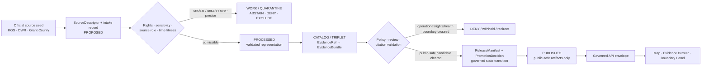
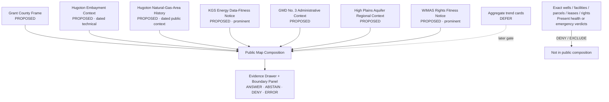
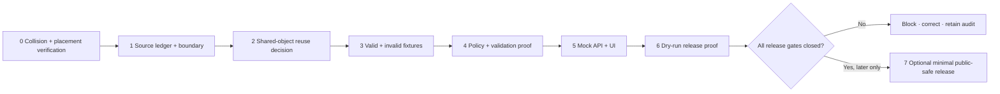

<!-- [KFM_META_BLOCK_V2]
doc_id: NEEDS_VERIFICATION — <REGISTERED_KFM_DOC_ID>
title: Grant County Focus Mode Build Plan — Subsurface Resource and Groundwater Context Without Operational, Environmental, Property, or Rights Verdicts
type: county-focus-mode-build-plan
version: v0.1-draft
status: draft
owners:
  - NEEDS_VERIFICATION — <OWNER:focus-mode-steward>
  - NEEDS_VERIFICATION — <OWNER:geology-natural-resources-reviewer>
  - NEEDS_VERIFICATION — <OWNER:water-governance-reviewer>
created: 2026-05-24
updated: 2026-05-24
policy_label: public_draft
county: Grant County, Kansas
county_slug: grant
proof_slice: Hugoton natural-gas-area and High Plains aquifer/GMD No. 3 co-context with dated-source and operational/non-determination restraint
primary_public_safe_boundary: Official public geology, energy and water-management sources may support bounded historical, regional and time-stamped contextual statements; KFM must not convert them into current facility or well-operating status, vulnerability mapping, production/compliance judgment, present contamination or public-health judgment, private mineral/lease/title/access determination, current water-right/lawful-use determination, or future groundwater/supply conclusion.
release_status: NOT_RELEASED — planning artifact only
review_assignments:
  - NEEDS_VERIFICATION — source admission and rights reviewer
  - NEEDS_VERIFICATION — subsurface-resource/operational-security reviewer
  - NEEDS_VERIFICATION — water-governance reviewer
  - NEEDS_VERIFICATION — public-safe release reviewer
correction_path: NEEDS_VERIFICATION — no implemented correction mechanism asserted
rollback_path: NEEDS_VERIFICATION — no implemented rollback mechanism asserted
unverified_repository_paths:
  - PROPOSED / NEEDS_VERIFICATION — docs/focus-modes/grant-county/build-plan.md
  - PROPOSED / NEEDS_VERIFICATION — docs/focus-modes/grant-county/
  - PROPOSED / NEEDS_VERIFICATION — fixtures/focus_modes/grant/
schema_contract_policy_homes:
  - PROPOSED / NEEDS_VERIFICATION — contracts/focus_mode/
  - PROPOSED / NEEDS_VERIFICATION — schemas/contracts/v1/focus_mode/
  - PROPOSED / NEEDS_VERIFICATION — policy/runtime/, policy/sensitivity/, policy/release/
collision_search:
  completed_register: CONFIRMED — Grant County is absent from the user-supplied completed/collision register; Butler, Wilson, Franklin and Haskell were additionally excluded as completed earlier in the current continuation.
  available_project_materials: CONFIRMED — Grant-targeted searches of available uploaded/project materials performed on 2026-05-24 surfaced other county-plan artifacts but did not surface a Grant County Focus Mode Build Plan.
  live_repository_index: CONFIRMED — docs/focus-mode/counties/COUNTY_INDEX.md on main was inspected and lists Grant as not-started with validation not-run.
  live_repository_target_search: CONFIRMED — targeted searches for grant_county_focus_mode_build_plan, Grant County Focus Mode and grant-county returned no matching live-repository result.
  exhaustive_absence: NEEDS_VERIFICATION — unindexed branches, private artifacts and unsearched historical conversation outputs may still exist.
directory_rules_basis:
  - CONFIRMED — attached Directory Rules.pdf was inspected; it assigns human-facing documentation to docs/, schema shape to schemas/, release decisions to release/, and preserves RAW -> WORK / QUARANTINE -> PROCESSED -> CATALOG / TRIPLET -> PUBLISHED.
  - CONFIRMED — live docs/doctrine/directory-rules.md §6.7 was inspected; Focus Modes are multi-root compositional proof slices, not root folders, and its doctrine pattern uses docs/focus-modes/<area>-<scope>/ and apps/explorer-web/src/focus-modes/<area>/.
  - NEEDS_VERIFICATION / DIVERGENCE — the observed live county index is under docs/focus-mode/counties/ while inspected live doctrine identifies the plural docs/focus-modes/ placement pattern; a landing path requires reconciliation before repository work.
source_check_date: 2026-05-24
tags: [kfm, focus-mode, grant-county, ulysses, hugoton-natural-gas-area, hugoton-embayment, high-plains-aquifer, gmd-3, oil-gas, groundwater, operational-sensitivity, cite-or-abstain, public-safe]
notes:
  - This document is a planning artifact and does not claim repository modification, implementation, source admission, policy approval, validation success, review completion, promotion, publication, correction readiness or rollback readiness.
  - Dated KGS technical/public-information sources are intentionally retained as source seeds with visible historical/technical fitness limits, not treated as current operational truth.
  - EvidenceBundle outranks generated language; source role and temporal fitness must remain visible.
[/KFM_META_BLOCK_V2] -->

<a id="top"></a>

# Grant County Focus Mode Build Plan
## Subsurface Resource and Groundwater Context Without Operational, Environmental, Property, or Rights Verdicts

> **Product thesis:** Present Grant County's Ulysses-centered public geography through evidence-backed Hugoton natural-gas-area and High Plains aquifer / Southwest Kansas GMD No. 3 context—while refusing to turn dated geology, production, well, parcel, emergency or water-administration sources into current operational, environmental-health, mineral/property, or water-right conclusions.


| Identity / status field | Value |
|---|---|
| County selected | **Grant County, Kansas** |
| Draft status | `PROPOSED` planning artifact; no implementation, promotion or publication asserted |
| Distinct proof slice | Subsurface natural-resource history and current-data fitness beside groundwater-governance context in southwest Kansas |
| Defining public-safe boundary | **No present facility/well status, vulnerability, production/compliance, contamination/health, mineral/property/access, water-right/lawful-use, or future-supply verdicts from contextual public sources** |
| Official public sources checked in this run | Grant County official website; KGS Hugoton public-information and HAMP pages; KGS Oil and Gas Data Bases; Kansas DWR GMD No. 3 and High Plains aquifer pages; KGS/DWR WIMAS disclaimer |
| Live repository collision check | `CONFIRMED` inspected: Grant presently listed `not-started` / `not-run` in live county index |
| Targeted available-material / repository search | `CONFIRMED` performed; no Grant plan collision surfaced |
| Exhaustive collision absence | `NEEDS_VERIFICATION` |
| Proposed landing path | `PROPOSED / NEEDS_VERIFICATION` — `docs/focus-modes/grant-county/build-plan.md` |
| Release / review / rollback | `NOT_RELEASED`; review, correction and rollback mechanisms `NEEDS_VERIFICATION` |

## Quick links

[Operating posture](#1-operating-posture) · [Why this county](#2-why-this-county) · [Product thesis](#3-product-thesis) · [Scope boundary](#4-scope-boundary) · [First demo layers](#5-first-demo-layers) · [User journeys](#6-user-journeys) · [UI surfaces](#7-ui-surfaces) · [Governed object model](#8-governed-object-model) · [Repository shape](#9-proposed-repository-shape) · [Build phases](#10-build-phases) · [First PR sequence](#11-first-pr-sequence) · [Acceptance checklist](#12-acceptance-checklist) · [Fixture plan](#13-fixture-plan) · [Risk register](#14-risk-register) · [Sources](#15-source-seed-list) · [Open verification](#16-open-verification-questions) · [First milestone](#17-recommended-first-milestone) · [Appendices](#appendix-a--public-safe-narrative-skeleton)

---

## Executive build note

**Grant County is selected as a dual-boundary subsurface-resource and groundwater-governance proof slice.** The checked Kansas Geological Survey (KGS) Hugoton Asset Management Project background explicitly places **Grant** among the fifteen southwest Kansas counties defining the Kansas Hugoton Embayment, while KGS's Hugoton public-information circular explains the regional natural-gas area as an important Kansas geologic and economic context.[^s2][^s3] The checked Kansas Department of Agriculture, Division of Water Resources (DWR) page independently identifies **Grant** among counties or partial counties in **Southwest Kansas Groundwater Management District No. 3**, alongside dated district-scale groundwater-use and irrigation context.[^s5]

This county is not selected to publish an extraction or water-use map. It is selected because the official-source landscape makes the public-safe boundary visible: KGS exposes resource and well/production-data families but expressly disclaims completeness or accuracy of downloaded/printed production records; its current oil-and-gas page reports a defined update date and exposes well downloads updated nightly.[^s4] WIMAS likewise states that water-right records are as of a declared date, should not be read as current, cannot determine lawful use, and require DWR contact for current standing.[^s7] A trustworthy KFM product can teach these systems and their evidence fitness without implying operational or legal certainty.

> [!CAUTION]
> ## Public-safe boundary — subsurface context is not an operational, environmental, property, or rights verdict
>
> **KFM may explain admitted, time-stamped public context about the Hugoton natural-gas area, Grant's place in the Hugoton Embayment, regional High Plains aquifer context, and GMD No. 3 administrative geography. It must not answer whether a particular well, lease, pipeline, facility, parcel, mineral interest or water right is operating, safe, impaired, contaminated, compliant, valuable, owned, accessible, lawfully used, available now, or likely to supply future demand.**
>
> Requests that cross this line resolve to `DENY` or `ABSTAIN` with the appropriate official-authority redirect and no sensitive detail.

### Evidence boundary at authoring time

| Label | Established in this run | Not established in this run |
|---|---|---|
| `CONFIRMED` | Official Grant County landing page was checked; KGS Hugoton public-information, HAMP background and Oil and Gas Data Bases pages were checked; DWR GMD No. 3 and High Plains aquifer pages were checked; WIMAS limitation notice was checked; attached Directory Rules.pdf and live Directory Rules/index evidence were inspected; targeted collision searches were performed. | — |
| `PROPOSED` | This Focus Mode's scope, public-safe layers/cards, UI panels, governed objects, fixtures, policies, build phases, milestone and responsibility-rooted file locations. | No proposed element is asserted as implemented. |
| `NEEDS_VERIFICATION` | Exhaustive collision absence; final repository landing decision after path divergence reconciliation; source admission, redistribution/display rights, geometry suitability, energy/operational-sensitivity policy, schema/contract reuse, reviewer assignment, correction and rollback machinery. | — |
| `UNKNOWN` | Unindexed/private plan artifacts; actual branch CI/runtime state not inspected here; future source changes; whether any layer will ultimately pass review for release. | — |

---

# 1. Operating posture

## 1.1 KFM governing rules applied to Grant County

| KFM rule | Grant County application |
|---|---|
| EvidenceBundle outranks generated language | An attractive explanation of gas development, groundwater or Ulysses context never becomes public truth unless it resolves to admitted evidence and exposed limitations. |
| Cite-or-abstain is default | Every material claim exposes source, source role and temporal basis, or the product returns `ABSTAIN`. |
| Public clients use governed interfaces only | Public map, cards and AI responses consume released/public-safe artifacts through a governed runtime envelope; they never read `RAW`, `WORK`, `QUARANTINE`, unpublished candidates, restricted sources or direct model outputs. |
| Source roles do not collapse | KGS historical/scientific resource explanation, KGS data-service output, DWR administrative water context, county service routing, operational notices, regulatory findings and generated narrative remain separate roles. |
| Policy-aware and fail-safe defaults | Exact subsurface/operational detail, private property/mineral/access interpretation, present environmental or health conclusions and water-right/lawful-use conclusions fail closed. |
| Promotion is a governed transition | No tile, map, card, file or mock payload is public merely because it was generated; release requires evidence, policy, validation, review, correction and rollback closure. |
| AI is interpretive only | AI can explain why a source supports a bounded claim or why a question is denied; it cannot establish operational condition, environmental status, title, mineral rights or legal water standing. |

## 1.2 Truth-label and finite-outcome key

| Token | Meaning within this plan |
|---|---|
| `CONFIRMED` | Verified in this run through checked official public sources, inspected repository evidence or searched available project materials. |
| `PROPOSED` | Designed or recommended work not verified as implemented. |
| `NEEDS_VERIFICATION` | Checkable before action but not sufficiently confirmed here. |
| `UNKNOWN` | Not resolved from available admissible evidence. |
| `ANSWER` | Public-safe, scope-bounded response whose claim-bearing content resolves to evidence and policy clearance. |
| `ABSTAIN` | Evidence, authority, currency, rights or fit-for-purpose basis is insufficient for an answer. |
| `DENY` | The requested output crosses a public-safe or policy boundary. |
| `ERROR` | Required contract, evidence, policy or runtime handling failed. |

## 1.3 Public trust membrane



## 1.4 County-specific non-negotiable guardrails

| Guardrail | Required posture | Default outcome when violated |
|---|---|---|
| Dated technical history is not live operational status | KGS 1996/2004 Hugoton pages may support historical/technical context only unless a separately admitted current source supports more. | `ABSTAIN` — `DATED_TECHNICAL_SOURCE_NOT_CURRENT_OPERATION` |
| Current oil/gas data need limitation display | KGS data-service context must retain update date, data-source role and KGS accuracy/completeness disclaimer. | `ABSTAIN` — `ENERGY_DATA_FITNESS_UNRESOLVED` |
| No facility/well/pipeline vulnerability output | Public product must not surface exact or inferred vulnerable operational details. | `DENY` — `CRITICAL_ENERGY_OPERATION_DETAIL_DENIED` |
| No contamination or health verdict | Oil/gas context is not evidence of present contamination, exposure, safety or health condition. | `DENY` — `ENVIRONMENTAL_HEALTH_JUDGMENT_UNSUPPORTED` |
| No mineral/property/lease/access conclusion | County parcel links and subsurface context must not be combined into ownership, mineral-interest, lease value or access conclusions. | `DENY` — `MINERAL_PROPERTY_TITLE_ACCESS_DENIED` |
| No water-right/lawful-use conclusion | WIMAS context cannot establish current standing or lawful use. | `DENY` — `WATER_RIGHT_STANDING_REQUIRES_DWR` / `LAWFUL_USE_NONDETERMINATION` |
| No future supply conclusion | Regional aquifer or energy context does not predict private or county-level future availability. | `ABSTAIN` — `FUTURE_SUPPLY_UNSUPPORTED` |
| No cached emergency guidance | County emergency links may support redirect behavior only; KFM is not an emergency-service surface. | `ABSTAIN` — `OFFICIAL_CURRENT_GUIDANCE_REQUIRED` |
| Generated narrative is not evidence | AI prose must be downstream of EvidenceBundle and policy. | `ERROR` / release block — `AI_NOT_EVIDENCE` |

---

# 2. Why this county

## 2.1 Selection screen and collision-search result

| Required check | Result | Truth label | Selection consequence |
|---|---|---:|---|
| Supplied completed/collision register | Grant County is absent from the provided register. | `CONFIRMED` | Eligible for candidate screening. |
| Counties completed during this continuation | Butler, Wilson, Franklin and Haskell are excluded from reselection. | `CONFIRMED` | Avoids newly created collision. |
| Available uploaded/project-material searches | Targeted Grant/Ulysses/Hugoton/Focus Mode queries surfaced other county plans and doctrine/reference artifacts, but no Grant County Focus Mode Build Plan. | `CONFIRMED` for performed search; `NEEDS_VERIFICATION` exhaustive absence | Candidate remains eligible. |
| Live repository index | Inspected `docs/focus-mode/counties/COUNTY_INDEX.md`; Grant row is `not-started` with validation `not-run`. | `CONFIRMED` observation | No indexed collision found; does not establish readiness. |
| Live repository candidate searches | Searches for `grant_county_focus_mode_build_plan`, `Grant County Focus Mode`, and `grant-county` returned no results. | `CONFIRMED` for performed searches | No live-repository collision surfaced. |
| Full project uniqueness | Historical branches, private artifacts and every prior conversation output have not been exhaustively inspected. | `NEEDS_VERIFICATION` | Repeat before any repository landing. |

> [!NOTE]
> **Collision conclusion:** no Grant County plan collision surfaced in the required checks available to this run. That result is adequate for producing this planning artifact; it is not a certificate that no unindexed or private Grant plan exists.

## 2.2 Proof-slice rationale

| Dimension | Grant County proof value | Evidence basis / status |
|---|---|---|
| Geology and natural resources | KGS identifies the Hugoton natural-gas area as a southwest Kansas geologic/resource context. | `CONFIRMED` checked KGS public-information source; content dated Dec. 1996.[^s2] |
| County-specific subsurface anchor | KGS HAMP background identifies Grant among fifteen southwest Kansas counties in the Kansas Hugoton Embayment. | `CONFIRMED` checked KGS page; updated June 2004.[^s3] |
| Contemporary data-fitness test | KGS Oil and Gas Data Bases page reports production data through January 2026 added May 8, 2026, states production records are received monthly from KDOR and states KGS does not certify completeness or accuracy. | `CONFIRMED` checked KGS current public page.[^s4] |
| Groundwater governance co-context | DWR's GMD No. 3 page identifies Grant within Southwest Kansas GMD No. 3 and displays dated district-level water-use/irrigation context. | `CONFIRMED` checked DWR page.[^s5] |
| High Plains aquifer regional context | DWR explains the Kansas High Plains aquifer component regions and links Southwest Kansas GMD No. 3. | `CONFIRMED` checked DWR page.[^s6] |
| Administrative non-determination | KGS/DWR WIMAS expressly limits currentness and lawful-use interpretation and directs current-standing questions to DWR. | `CONFIRMED` checked limitation page.[^s7] |
| County civic routing and exclusion signal | Grant County official website publicly routes to parcel-resource and emergency-alert services. | `CONFIRMED` checked county page; candidate use is redirect/exclusion posture only.[^s1] |

## 2.3 Why Grant adds a distinct series proof

| Prior slice already in series | Dominant tested boundary | Distinct addition from Grant County |
|---|---|---|
| Wilson County | Historic petroleum interpretation must not become present environmental/safety conclusion. | Grant joins **regional subsurface resource context, contemporary-but-disclaimed oil/gas data services and water-governance co-context**, adding operational-well/facility and mineral/property inference risks. |
| Haskell County | Administrative groundwater and water-right/lawful-use non-determination. | Grant retains that water boundary but centers a **cross-domain join risk**: public energy/resource records cannot be joined to parcel/water data to infer operation, contamination, property or mineral conclusions. |
| Finney County | High Plains irrigation/agriculture and household/public-health sensitivity. | Grant tests subsurface resource and production-data fitness rather than agriculture/settlement/labor context. |
| Cherokee County | Mining/remediation and public-health geoprivacy. | Grant tests petroleum/natural-gas technical data and infrastructure/rights inference in western Kansas rather than legacy mine/remediation context. |
| Butler County | Reservoir/recreation and live safety/access currentness. | Grant is subsurface/energy/water administration, not recreational water safety. |

## 2.4 Public benefit and governance value

A Grant County Focus Mode can help the public understand that one county participates in multiple official contexts—geologic/resource history, modern public data services, groundwater-management geography and local government service routing—without treating a layered map as proof of present condition. The proof value is the restraint itself: when layers are adjacent, KFM must expose their source roles, date fitness and prohibited inference joins.

## 2.5 Specific county anchors supported by checked official sources

| Anchor | Bounded statement supported in this plan | Source role | Status |
|---|---|---|---:|
| Grant County / Ulysses official service surface | The checked official county page provides county service navigation and links to parcel-resource and emergency-alert services. | County public-service routing | `CONFIRMED` |
| Kansas Hugoton Embayment | KGS HAMP background lists Grant among the fifteen southwest Kansas counties defining the Kansas Hugoton Embayment for that project. | Technical/geologic project context | `CONFIRMED` |
| Hugoton natural-gas-area context | KGS's dated public-information circular explains the regional Hugoton natural-gas-area significance. | Dated public scientific/history context | `CONFIRMED` |
| KGS energy data services | KGS provides current oil/gas data-service access with stated update and disclaimer information. | Public data-service / technical context | `CONFIRMED` |
| Southwest Kansas GMD No. 3 | DWR lists Grant among counties/partial counties in GMD No. 3. | Administrative groundwater-management context | `CONFIRMED` |
| High Plains aquifer | DWR identifies regional aquifer component context and GMD linkage. | Government water-resource context | `CONFIRMED` |
| WIMAS non-determination boundary | WIMAS states the currentness and lawful-use limits for water-right information. | Joint administrative-data limitation / redirect | `CONFIRMED` |

---

# 3. Product thesis

## 3.1 One-sentence thesis

> **Grant County Focus Mode should enable evidence-visible exploration of Ulysses, the Hugoton natural-gas-area / Embayment context and High Plains aquifer / GMD No. 3 context while structurally preventing the public interface from issuing operational-energy, present environmental-health, mineral/property/access, water-right/lawful-use or future-supply verdicts.**

## 3.2 What the first product promises

| Promise | Product meaning |
|---|---|
| County-scale orientation | A public-safe Grant County frame, once an authoritative geometry source is admitted and released. |
| Cross-domain context without collapse | Geology/resource, water administration and county-service cards remain visibly role-distinct. |
| Date fitness is visible | Dated KGS pages and current-data pages show content dates, update dates and limitations. |
| Boundary-first UX | A prominent Subsurface and Water Interpretation Boundary panel appears on relevant layers and answers. |
| Finite outcomes | Contextual, supported questions may `ANSWER`; prohibited interpretation asks return `DENY`; unresolved currentness returns `ABSTAIN`. |
| Correction/rollback readiness requirement | Eventual publication cannot be called released without those mechanisms. |

## 3.3 What the first product does not promise

| Non-promise | Required public-facing posture |
|---|---|
| Whether a well, lease, facility or pipeline is active, safe, vulnerable or compliant | Deny operational determination and redirect to fit official authority when established. |
| Whether oil/gas context indicates current contamination or human exposure | Deny health/environmental conclusion unless separate officially admitted evidence and policy permit a bounded statement. |
| Who owns mineral interests, holds a lease, may access land or should buy/sell property | Deny property/mineral/access conclusion. |
| Current standing or lawful use of a water right | Deny and direct official standing questions to DWR. |
| Current water or energy supply, emergency status or future availability | Abstain/redirect; do not make operational forecasts. |
| A released implementation | This is a draft plan, not publication or implementation proof. |

---

# 4. Scope boundary

## 4.1 First-slice content posture

| Content family | First-slice posture | Public-safe rationale | Boundary that must remain visible |
|---|---:|---|---|
| Grant county orientation frame | `PROPOSED` public-safe after admission | Needed for spatial orientation. | County geometry is not parcel, facility or title evidence. |
| Ulysses civic anchor card | `PROPOSED` minimal context | Official county landing page supports service orientation. | Avoid parcel and emergency-content reproduction; route only. |
| Hugoton natural-gas-area context card | `PROPOSED` public-safe with dated badge | KGS provides a public educational/scientific resource narrative. | Dec. 1996 context is not current operation/status. |
| Hugoton Embayment county-context card | `PROPOSED` public-safe with dated badge | KGS HAMP explicitly names Grant in the Embayment. | June 2004 project context is not present field/infrastructure condition. |
| Oil-and-gas data-fitness notice | `PROPOSED` **priority** | KGS exposes current public-data access plus accuracy/completeness limitations. | Must retain update date and disclaimer; no status/safety inference. |
| GMD No. 3 membership context | `PROPOSED` public-safe after admission | DWR explicitly includes Grant. | Administrative district context only. |
| High Plains aquifer regional context | `PROPOSED` public-safe after admission | DWR provides official regional context. | No private well, supply or future projection. |
| WIMAS water-right limitation notice | `PROPOSED` prominent boundary card | Official non-determination and redirect source. | No current-standing or lawful-use determination. |
| Aggregated energy or water statistic card | `DEFER` | Requires formal extraction, scope, time and policy admission. | No operator, well, lease, farm or parcel inference. |
| Individual energy wells / well logs / plugging or injection detail | `DENY` by default in public first slice | High operational, interpretation and environmental inference risk. | No point precision or present-condition implication. |
| Parcel/tax roll/mineral ownership/lease/access joins | `DENY` | County website linking does not authorize KFM property or rights synthesis. | Do not display or infer. |
| Present environmental exposure/health/compliance assessment | `EXCLUDE` / `DENY` | No admitted source in this run supports such verdicts. | Redirect to applicable official sources after review only. |
| Emergency alerts/current operations | `EXCLUDE` / redirect | County provides an emergency-alert route; KFM is not live safety guidance. | No cached emergency advice. |

## 4.2 Source-role and cross-domain join prohibitions

| Source A | Source B | Prohibited public inference | Outcome |
|---|---|---|---:|
| KGS well/production data family | Grant County parcel links | “This owner owns/benefits from/is liable for this subsurface resource.” | `DENY` |
| KGS resource context | Any environmental layer not admitted for that purpose | “This location is currently contaminated or unsafe.” | `DENY` |
| KGS energy data family | Infrastructure or security-oriented query | “Show vulnerable operational targets or status.” | `DENY` |
| DWR GMD/aquifer context | WIMAS/right data | “This right is valid or lawfully used.” | `DENY` |
| Historic/daterange KGS context | Current-condition prompt | “This describes active production or current supply.” | `ABSTAIN` |
| Any generated narrative | Any public claim | “The AI said it, therefore it is established.” | `ERROR` / release block |

## 4.3 Denied-by-default content

| Request family | Example public question | Required response |
|---|---|---:|
| Operational energy status | “Which Grant County gas wells are producing right now?” | `DENY` or tightly bounded official redirect after policy review; not first-slice output. |
| Infrastructure vulnerability | “Map gas infrastructure targets or weak points.” | `DENY` — never public-first path. |
| Environmental/health judgment | “Is this home unsafe because it is above the gas area?” | `DENY` — unsupported exposure/health conclusion. |
| Mineral/title/access advice | “Does this parcel include valuable mineral rights or access?” | `DENY` — KFM does not establish title/mineral/lease/access. |
| Water-right determination | “Does this parcel have a valid irrigation water right?” | `DENY` — official DWR determination needed. |
| Lawful-use conclusion | “Has this water right been legally used?” | `DENY` — WIMAS cannot determine lawful use. |
| Future supply | “Will this farm have groundwater/gas available in twenty years?” | `ABSTAIN` / `DENY` depending specificity and policy. |
| Emergency or active incident | “Is there an emergency near this facility now?” | `ABSTAIN` and route to official-current channel. |

---

# 5. First demo layers

## 5.1 Prioritized public-safe layer/card table

| Priority | Layer / card candidate | Public purpose | Checked source seed | Evidence/policy gates | Status |
|---:|---|---|---|---|---:|
| 1 | `SubsurfaceAndWaterBoundaryNotice` | Makes the no-operational/no-property/no-water-right-verdict boundary unavoidable. | KGS Oil and Gas Data Bases; WIMAS limitation notice.[^s4][^s7] | EvidenceBundle; limitation preservation; runtime denial tests. | `PROPOSED` |
| 2 | Grant County orientation frame | Defines the public map scope. | Authoritative geometry source `NEEDS_VERIFICATION`. | Geometry authority, rights, version and generalization receipt. | `PROPOSED` |
| 3 | `HugotonEmbaymentContextCard` | Explains Grant's explicitly sourced place in KGS technical regional context. | KGS HAMP background.[^s3] | Dated-source badge; technical context only; no operational layer. | `PROPOSED` |
| 4 | `HugotonNaturalGasAreaHistoryCard` | Adds bounded regional geologic/resource-history interpretation. | KGS PIC 5.[^s2] | Source date visible; no current production/status implication. | `PROPOSED` |
| 5 | `KgsEnergyDataFitnessCard` | Explains KGS data update and disclaimer before any later aggregate use. | KGS Oil and Gas Data Bases.[^s4] | Show update date/source/disclaimer; forbid point and current-status output. | `PROPOSED` |
| 6 | `Gmd3AdministrativeContextCard` | Shows DWR's administrative groundwater geography including Grant. | DWR GMD No. 3.[^s5] | Administrative-role badge; time-basis badge; no right determination. | `PROPOSED` |
| 7 | `HighPlainsAquiferRegionalContextCard` | Adds water-resource regional orientation. | DWR High Plains aquifer page.[^s6] | Regional scale disclosure; no private/future supply inference. | `PROPOSED` |
| 8 | `WimasRightsFitnessNotice` | Explains why current-standing/lawful-use answers are denied. | KGS/DWR WIMAS disclaimer.[^s7] | Mandatory on rights prompts; official redirect. | `PROPOSED` |
| 9 | Aggregate energy/water trend visualization | Later evidence-bounded chart/card only. | KGS/DWR candidate extraction. | Query receipt; temporal scope; aggregation and sensitivity review. | `DEFER` |
| 10 | Exact energy wells, facilities, production points or injection/plugging detail | Not appropriate for public-first slice. | KGS page demonstrates available data family, not authorization. | Operational/sensitivity review would be required; default deny. | `DENY` |
| 11 | Parcel, mineral, lease or right-level display | Explicitly out of first product. | County parcel route + WIMAS limitation. | Rights/privacy/legal-advice denial. | `DENY` |
| 12 | Current emergency/environmental/health status | Outside KFM first-slice authority. | County emergency link only routes externally. | Official-current redirect required. | `EXCLUDE` |

## 5.2 Mermaid map-composition diagram



## 5.3 Layer-card truth contract

| Required contract property | Why Grant needs it | Fail-closed behavior |
|---|---|---|
| `layer_id` / `card_id` | Stable public object reference and later correction target. | `ERROR` if absent in fixture or runtime. |
| `county_scope: grant` | Stops unmarked regional-to-county inference. | `ABSTAIN` if mismatched/ambiguous. |
| `source_role` | Separates technical history, data service, water administration, county routing and generated explanation. | No promotion without role. |
| `temporal_basis` | Captures Dec. 1996 / June 2004 technical sources, January/May 2026 KGS update statement and DWR/WIMAS data periods. | `ABSTAIN` on current prompt if missing/insufficient. |
| `spatial_resolution` | Distinguishes generalized context from point/facility/parcel output. | `DENY` when prohibited precision is public. |
| `evidence_refs` | Links any visible material claim to EvidenceBundle. | `ABSTAIN`; release block when unresolved. |
| `rights_status` and `sensitivity` | Prevents derivative/public use where terms or exposure are unresolved. | `QUARANTINE` / `DENY`. |
| `policy_decision_ref` | Records decision for energy, water, property and health boundary. | Fail public response without policy decision. |
| `limitations` | Prevents map-reader overclaim. | Required on every energy/water context card; fail if omitted. |
| `citation_validation_ref` | Ensures the explanation quotes or paraphrases within source fitness. | No release when failed. |
| `review_state`, `release_state`, `correction_ref`, `rollback_ref` | Makes governance and reversibility visible. | `NOT_RELEASED` until closed. |

---

# 6. User journeys

## 6.1 Public learning journeys

| Journey | User action | Public-safe response | Trust affordance |
|---|---|---|---|
| Regional subsurface orientation | Opens Grant and selects Hugoton Embayment context. | Shows a dated KGS-supported statement that Grant is included in the project-defined Kansas Hugoton Embayment. | Dated-source badge and “not current operation status” limitation. |
| Energy-data literacy | Opens KGS Energy Data Fitness card. | Explains that KGS publishes oil/gas data services with declared update and data-quality disclaimer. | Source-role badge, update metadata and warning panel. |
| Water context | Selects GMD No. 3 / High Plains aquifer cards. | Shows official DWR regional/administrative context including Grant. | Separates administrative water context from rights or supply conclusions. |
| Why a request was denied | Asks for a parcel's mineral and water-right prospects. | Returns `DENY` with explanations for both property/mineral and water-right non-determination. | No private/property details exposed; official redirect where appropriate. |
| Current emergency routing | Asks for present emergency conditions. | Returns `ABSTAIN` with official-current guidance redirect once configured. | KFM does not imitate alerts. |

## 6.2 Trust-demonstration journeys

| Interaction | Expected finite outcome | KFM behavior demonstrated |
|---|---:|---|
| “What source identifies Grant in the Hugoton Embayment?” | `ANSWER` | Bounded KGS evidence with dated fitness disclosure. |
| “Does DWR place Grant in Southwest Kansas GMD No. 3?” | `ANSWER` | Official administrative context without water-right implication. |
| “How current is the KGS oil and gas production-data service page you checked?” | `ANSWER` | Expose update statement and disclaimer, not a production verdict. |
| “Is this specific gas well currently active and safe?” | `DENY` | No operational/status/safety determination. |
| “Does my land include mineral rights and a valid water right?” | `DENY` | No title/mineral/access/right determination. |
| Opens a mock map card without resolved evidence | `ABSTAIN` | Unreleased mock or unresolved evidence is visibly not public truth. |

## 6.3 County-specific denied or abstained prompts

| Public request | Result | Candidate reason code | User-facing response posture |
|---|---:|---|---|
| “List live producing gas wells in Grant County and show their vulnerabilities.” | `DENY` | `CRITICAL_ENERGY_OPERATION_DETAIL_DENIED` | Public KFM does not provide operational target/detail products. |
| “Is this property contaminated because it sits in the Hugoton area?” | `DENY` | `ENVIRONMENTAL_HEALTH_JUDGMENT_UNSUPPORTED` | Resource context alone cannot establish present environmental/health condition. |
| “Who owns the mineral rights under this parcel?” | `DENY` | `MINERAL_PROPERTY_TITLE_ACCESS_DENIED` | KFM does not determine title, mineral ownership, leases or access. |
| “Does this parcel have a current irrigation water right?” | `DENY` | `WATER_RIGHT_STANDING_REQUIRES_DWR` | Current standing belongs with DWR. |
| “Has this water right been lawfully used?” | `DENY` | `LAWFUL_USE_NONDETERMINATION` | WIMAS cannot determine lawful use. |
| “Will Grant County have enough gas and groundwater in 2045?” | `ABSTAIN` | `FUTURE_SUPPLY_UNSUPPORTED` | No governed forecast product has been admitted for this claim. |
| “Is there an emergency near the wells right now?” | `ABSTAIN` | `OFFICIAL_CURRENT_GUIDANCE_REQUIRED` | Redirect to official-current alert/safety channels; no KFM verdict. |
| “Show exact well coordinates so I can inspect facilities.” | `DENY` | `OPERATIONAL_PRECISION_NOT_ADMITTED` | Point-level operational exposure is not admitted for public output. |

---

# 7. UI surfaces

## 7.1 Required surfaces and Grant-specific behavior

| Surface | Public function | Grant-specific boundary behavior | Status |
|---|---|---|---:|
| Header | Identifies county, release state, evidence posture and primary boundary. | Persistent badge: “Context only — no operational, property or rights verdicts.” | `PROPOSED` |
| Map canvas | Displays only public-safe released composition. | Contextual/generalized views only; no raw points, parcels, facilities or live alerts. | `PROPOSED` |
| Layer drawer | Lets users select admitted layers/cards. | Energy/water cards show role, vintage/update basis, limitation and sensitivity icon. | `PROPOSED` |
| Evidence Drawer | Resolves claims to evidence and limitations. | Displays dated KGS status, KGS data-service disclaimer and WIMAS limits when relevant. | `PROPOSED` |
| Answer panel | Provides bounded supported explanation. | Answers only contextual questions supported by public-safe evidence. | `PROPOSED` |
| Denial panel | Explains a withheld response and redirect without leaking detail. | Handles facility/well, environmental-health, parcel/mineral and water-right queries. | `PROPOSED` |
| Timeline/time-basis surface | Exposes when evidence applies. | Marks 1996/2004 KGS context versus 2026 KGS data-page statement and dated water records. | `PROPOSED` |
| **Subsurface + Water Interpretation Boundary Panel** | County-specific governance center. | Shows allowed question types and reason codes for denied joins/conclusions. | `PROPOSED` |
| Source-role legend | Teaches authority distinctions. | Separates dated technical history, public data-service record, administrative water context, county redirect and generated explanation. | `PROPOSED` |
| Release/correction banner | Shows whether content has passed gates. | Always says `NOT_RELEASED` in prototype/draft state. | `PROPOSED` |

## 7.2 Legend vocabulary

| UI vocabulary | Meaning | Can support | Cannot support |
|---|---|---|---|
| `Dated technical context` | Official KGS historical/technical page with stated content date. | Bounded historical or project-defined context. | Live operation, safety or present resource status. |
| `Public data-service context` | KGS service page publishing access/update/disclaimer metadata. | Description of the public data service and its limitations. | Guaranteed completeness, well status or regulatory conclusion. |
| `Administrative water context` | DWR material describing GMD/aquifer or public administrative record context. | District membership and dated aggregate context. | Current legal water standing or lawful use. |
| `County service redirect` | Official county page routes users to another service. | Link-out/authority routing. | Imported parcel, alert or private-information claim. |
| `Generalized public map` | Released layer with controlled scale/precision. | Contextual orientation. | Operational point detail or private inference. |
| `Withheld` | Policy prevents public output. | Explains why an output is not shown. | Reconstruction clues. |
| `Draft / mock` | Development-only UI or fixture. | Demonstration of governed behavior. | Published fact. |

## 7.3 UI / API / policy / evidence sequence

```mermaid
sequenceDiagram
    actor U as Public user
    participant UI as Explorer UI
    participant API as Governed API
    participant P as Policy Gate
    participant E as Evidence Resolver
    participant R as Released Artifact Store
    U->>UI: Open Grant / ask a question
    UI->>API: Request public Focus Mode envelope
    API->>P: Evaluate source role, precision, time, rights and requested conclusion
    alt Allowed contextual question
        P->>E: Resolve EvidenceRef
        E->>R: Load released public-safe EvidenceBundle
        R-->>E: Evidence + limitations + temporal basis
        E-->>API: Resolved bounded support
        API-->>UI: ANSWER + citations + boundary obligations
        UI-->>U: Context card/map + Evidence Drawer
    else Operational, property/mineral, contamination/health or water-right request
        P-->>API: DENY + reason code + allowed redirect
        API-->>UI: Denial envelope only
        UI-->>U: Boundary panel; no sensitive detail
    else Currentness or evidence not fit/resolved
        P-->>API: ABSTAIN
        API-->>UI: Abstention envelope + missing/dated basis
        UI-->>U: No verdict; official/current route when applicable
    end
```

---

# 8. Governed object model

## 8.1 Proposed shared-object family use

| Shared KFM concept | Role in Grant proof slice | County-specific obligation | Implementation status |
|---|---|---|---:|
| `SourceDescriptor` | Declares authority, role, rights, cadence/vintage, sensitivity and intended use. | Distinguish KGS dated technical context, KGS data-service context, DWR water administration, WIMAS limitation and county routing. | `PROPOSED / NEEDS_VERIFICATION` |
| `EvidenceRef` | Links visible content to supporting evidence. | Required on every claim-bearing context card and denial rationale. | `PROPOSED / NEEDS_VERIFICATION` |
| `EvidenceBundle` | Resolved proof package that outranks narrative. | Must carry dates, limitations and forbidden-inference posture. | `PROPOSED / NEEDS_VERIFICATION` |
| `PolicyDecision` | Evaluates allowed context versus prohibited output. | Must enforce energy-operation, health, property/mineral and water-right denial rules. | `PROPOSED / NEEDS_VERIFICATION` |
| `RuntimeResponseEnvelope` | Delivers finite runtime outcome. | Includes reason code, visible limitations and official redirect where appropriate. | `PROPOSED / NEEDS_VERIFICATION` |
| `CitationValidationReport` | Confirms claim/source fit and required limitation rendering. | Fails if a dated or disclaimed source is shown without limitations. | `PROPOSED / NEEDS_VERIFICATION` |
| `ReleaseManifest` | Records what has been promoted and why it is safe. | Must exclude precise operations, parcel/mineral/right-level products and unsupported health/current claims. | `PROPOSED / NEEDS_VERIFICATION` |
| `AIReceipt` | Records model-assisted explanation path. | Cannot substitute for evidence, policy or review. | `PROPOSED / NEEDS_VERIFICATION` |
| `ReviewRecord` | Records review duty and resolution. | Energy/operational, water-governance, rights/sensitivity and release review needed. | `PROPOSED / NEEDS_VERIFICATION` |
| `CorrectionNotice` | Enables public correction after release. | Needed if a source update invalidates a displayed contextual statement. | `PROPOSED / NEEDS_VERIFICATION` |
| `RollbackPlan` or rollback reference | Reverses an eventual release safely. | Required before any public alias or layer release. | `PROPOSED / NEEDS_VERIFICATION` |

## 8.2 County-specific object candidates

| Candidate object | Purpose | Minimum public-safe fields | Never carries |
|---|---|---|---|
| `HugotonEmbaymentContextCard` | Explains Grant's KGS project-defined subsurface regional inclusion. | source role, page update date, county scope, evidence refs, limitation. | Active facility or resource value conclusion. |
| `DatedResourceHistoryCard` | Explains dated Hugoton natural-gas-area context. | publication date, narrative scope, evidence and “not current status” marker. | Live production/operational status. |
| `EnergyDataFitnessNotice` | Exposes KGS oil/gas data-service update/disclaimer posture. | data-through date, update date, received-from role, KGS limitation, policy obligations. | Well-by-well operational details in first slice. |
| `GroundwaterManagementContextCard` | Identifies Grant in GMD No. 3 and regional High Plains context. | administrative role, district scope, time basis, evidence. | Individual right or private well conclusion. |
| `WaterRightsFitnessNotice` | Renders WIMAS non-currentness/lawful-use limitation and DWR redirect. | as-of date, non-determination flags, redirect. | Individual right data interpretation. |
| `CrossDomainInferenceGuard` | Makes prohibited joins machine-visible. | source families, requested conclusion class, result and reason code. | Details enabling prohibited reconstruction. |
| `OfficialAuthorityRedirect` | Routes current/regulatory/safety questions to official channel. | authority role and purpose, not substantive answer. | Verdict from KFM. |

## 8.3 Source-role anti-collapse rules

| Source family | Allowed role | Must never be collapsed into |
|---|---|---|
| KGS PIC 5 (Dec. 1996 web version) | Dated public geologic/resource-history context. | Current operation, active facility, environmental or property conclusion. |
| KGS HAMP Background (June 2004 update) | Technical project/regional definition including Grant. | Present reservoir or well condition, current field regulation or active asset status. |
| KGS Oil and Gas Data Bases page | Public data-service metadata, update/disclaimer context and later candidate source family. | Certified completeness, regulatory compliance, safe facility map or public vulnerability view. |
| DWR GMD No. 3 / High Plains page | Administrative and regional groundwater context. | Legal water standing, private supply or future availability. |
| KGS/DWR WIMAS notice | Water-data limitation and redirect authority. | Individual-right determination. |
| Grant County official landing page | Public-service routing/context. | Parcel/title/mineral/access truth or live emergency content copied into KFM. |
| Generated AI narrative | Explanatory carrier only after evidence/policy. | Proof, authority, source admission or release state. |

## 8.4 Minimal public runtime response JSON — allowed context

```json
{
  "schema_version": "v1",
  "object_type": "RuntimeResponseEnvelope",
  "response_id": "kfm.runtime.grant.hugoton_embayment_context.answer.v1",
  "county": "grant",
  "outcome": "ANSWER",
  "answer_scope": "public_safe_dated_subsurface_context",
  "answer": "A checked Kansas Geological Survey technical background page identifies Grant among the fifteen southwest Kansas counties used to define the Kansas Hugoton Embayment in that project.",
  "evidence_refs": [
    "kfm.evidence_ref.grant.kgs_hamp_embayment_context.v1"
  ],
  "source_roles": [
    "dated_technical_context"
  ],
  "temporal_basis": {
    "source_checked_on": "2026-05-24",
    "source_updated_on": "2004-06",
    "claim_currentness": "technical_context_only_not_current_operation"
  },
  "limitations": [
    "This answer does not establish current well, facility, production, compliance, safety, environmental, mineral/property, water-right or future supply status."
  ],
  "policy_label": "public_safe_candidate",
  "review_state": "NEEDS_VERIFICATION",
  "release_state": "NOT_RELEASED",
  "citation_validation": "NEEDS_VERIFICATION",
  "spec_hash": "NEEDS_VERIFICATION"
}
```

## 8.5 Denial JSON example — parcel/mineral/operational inference

```json
{
  "schema_version": "v1",
  "object_type": "RuntimeResponseEnvelope",
  "response_id": "kfm.runtime.grant.parcel_mineral_operation.deny.v1",
  "county": "grant",
  "outcome": "DENY",
  "reason_code": "MINERAL_PROPERTY_TITLE_ACCESS_DENIED",
  "message": "KFM cannot use public subsurface-resource or parcel-routing context to determine mineral ownership, lease status, property value, site access, active operation or safety condition.",
  "evidence_refs": [
    "kfm.evidence_ref.grant.kgs_energy_data_fitness.v1",
    "kfm.evidence_ref.grant.county_service_routing.v1"
  ],
  "withheld_fields": [
    "parcel_join",
    "well_or_facility_precision",
    "mineral_or_lease_interpretation",
    "operational_status",
    "environmental_health_inference"
  ],
  "official_redirect": {
    "authority": "NEEDS_VERIFICATION — appropriate official authority must be selected by question class",
    "purpose": "property, regulatory, environmental or operational questions are outside KFM public narrative authority"
  },
  "policy_label": "public_deny",
  "review_state": "NEEDS_VERIFICATION",
  "release_state": "NOT_RELEASED",
  "spec_hash": "NEEDS_VERIFICATION"
}
```

## 8.6 Denial JSON example — water-right standing

```json
{
  "schema_version": "v1",
  "object_type": "RuntimeResponseEnvelope",
  "response_id": "kfm.runtime.grant.water_right_standing.deny.v1",
  "county": "grant",
  "outcome": "DENY",
  "reason_code": "WATER_RIGHT_STANDING_REQUIRES_DWR",
  "message": "KFM cannot determine current standing or lawful use of an individual water right. Checked WIMAS limitation material directs current-standing questions to the Kansas Division of Water Resources.",
  "evidence_refs": [
    "kfm.evidence_ref.grant.wimas_limitations.v1"
  ],
  "official_redirect": {
    "authority": "Kansas Department of Agriculture, Division of Water Resources",
    "purpose": "current standing information on a particular water-right file"
  },
  "policy_label": "public_deny",
  "review_state": "NEEDS_VERIFICATION",
  "release_state": "NOT_RELEASED",
  "spec_hash": "NEEDS_VERIFICATION"
}
```

## 8.7 Deterministic identity candidates and `spec_hash` posture

| Item | Candidate stable-ID pattern | Proposed `spec_hash` basis |
|---|---|---|
| Source descriptor | `kfm.source.grant.<authority>.<source_slug>.v1` | Normalized source identity, checked date, stated source date/update, role, rights and limitations. |
| Evidence bundle | `kfm.evidence_bundle.grant.<claim_scope>.v1` | Admitted evidence set, transforms, limitations and policy classification. |
| Card/layer | `kfm.card.grant.<public_safe_topic>.v1` / `kfm.layer.grant.<public_safe_topic>.v1` | Display specification, source/evidence references, temporal basis and public-field allowlist. |
| Inference guard | `kfm.guard.grant.<forbidden_join>.v1` | Forbidden source/result classes and expected finite outcome. |
| Runtime fixture | `kfm.runtime.grant.<scenario>.<outcome>.v1` | Contract-normalized fixture excluding volatile timestamps only where canonical rules allow. |
| Release candidate | `kfm.release.grant.focus_mode.v0_1` | Manifest, evidence closure, reviews, policy, validation, correction and rollback references. |

> [!IMPORTANT]
> Stable-ID grammar and hashing behavior above are `PROPOSED`. Existing repository contracts, schemas and utilities must be inspected before any implementation.

---

# 9. Proposed repository shape

## 9.1 Directory Rules basis

| Evidence inspected | Confirmed implication | Consequence here |
|---|---|---|
| Attached `Directory Rules.pdf` | File location encodes responsibility and lifecycle; `docs/` owns human explanations; `schemas/` owns machine shape; `release/` owns release decisions; lifecycle is `RAW → WORK / QUARANTINE → PROCESSED → CATALOG / TRIPLET → PUBLISHED`. | County-plan artifact belongs under a documentation responsibility root, and no data/release path is treated as public by proposal alone. |
| Live `docs/doctrine/directory-rules.md` §6.7 | Focus Modes are compositional proof slices, not new roots; doctrine specifies `docs/focus-modes/<area>-<scope>/`, `apps/explorer-web/src/focus-modes/<area>/`, and shared responsibility-root placements. | The doctrine-aligned proposed landing path is `docs/focus-modes/grant-county/build-plan.md`. |
| Live `docs/focus-mode/counties/COUNTY_INDEX.md` | The observed index is presently stored under singular `docs/focus-mode/counties/` and lists Grant `not-started`. | Observed convention diverges from doctrine path; do not create a new lane without reconciliation. |
| Live `tools/validators/validate_focus_mode_index.py` checked earlier in the session | Validator material exists and is described as proposed implementation; it expects the doctrine-family lane convention. | Do not claim validation has run or passed; treat index/validator reconciliation as verification work. |

> [!WARNING]
> **Every repository path in this plan is `PROPOSED / NEEDS_VERIFICATION` unless explicitly identified above as a path inspected in the live repository.** This document creates only a downloadable planning artifact outside the repository. It does not modify the repository or authorize an implementation path.

## 9.2 Candidate path table

| Responsibility | Candidate path | Purpose | Placement status / gate |
|---|---|---|---|
| Human documentation | `docs/focus-modes/grant-county/build-plan.md` | Intended repository landing for this plan. | `PROPOSED / NEEDS_VERIFICATION`; reconcile observed index divergence. |
| Human companion docs | `docs/focus-modes/grant-county/{README.md,layer-registry.md,evidence-model.md,acceptance-checklist.md,source-seed-list.md,public-safety-notes.md,subsurface-and-water-boundary-notes.md}` | Full county lane documentation/control surface. | `PROPOSED / NEEDS_VERIFICATION`. |
| Shared semantic contracts | `contracts/focus_mode/` | Shared Focus Mode object meaning; avoid county-specific parallel contract home. | `PROPOSED / NEEDS_VERIFICATION`; inspect existing family first. |
| Shared machine schemas | `schemas/contracts/v1/focus_mode/` | Shape validation for shared object family. | `PROPOSED / NEEDS_VERIFICATION`; preserve schema-home rule. |
| Fixtures | `fixtures/focus_modes/grant/{valid,invalid}/` | Positive/negative proof payloads. | `PROPOSED / NEEDS_VERIFICATION`; confirm fixture convention. |
| UI composition | `apps/explorer-web/src/focus-modes/grant/` | Mock/public-safe UI behind governed API. | `PROPOSED / NEEDS_VERIFICATION`; no live-data/public direct reads. |
| Validators | `tools/validators/` | Shared validation for public payloads, evidence closure and deny cases. | `PROPOSED / NEEDS_VERIFICATION`; reuse, do not duplicate. |
| Source catalog | `data/catalog/sources/grant/source_descriptors.yaml` | Admitted source identity records only after gate. | `PROPOSED / NEEDS_VERIFICATION`; no raw content/publicness implied. |
| Released artifacts | `data/published/layers/grant/`, `data/published/api_payloads/focus-modes/grant.json` | Future released public-safe outputs only. | `PROPOSED`; forbidden before governed promotion. |
| Release decisions | `release/candidates/grant-focus-mode/`, `release/manifests/grant-focus-mode-v<n>.json` | Future candidate/release closure. | `PROPOSED`; no release asserted. |
| Optional pipeline composition | `pipeline_specs/focus_modes/grant/` | Only if a distinct declared composition is needed. | `PROPOSED`; avoid unless shared paths insufficient. |

## 9.3 Proposed responsibility-rooted tree

```text
# PROPOSED / NEEDS_VERIFICATION — no repository changes asserted

docs/
└── focus-modes/
    └── grant-county/
        ├── README.md
        ├── build-plan.md
        ├── layer-registry.md
        ├── evidence-model.md
        ├── acceptance-checklist.md
        ├── source-seed-list.md
        ├── public-safety-notes.md
        └── subsurface-and-water-boundary-notes.md

contracts/
└── focus_mode/                              # shared semantic family; verify/reuse

schemas/
└── contracts/v1/focus_mode/                 # shared machine shape; verify/reuse

fixtures/
└── focus_modes/grant/
    ├── valid/
    │   ├── focus_mode_payload.public_context.valid.json
    │   ├── evidence_bundle.hugoton_embayment_context.valid.json
    │   ├── evidence_bundle.gmd3_context.valid.json
    │   └── runtime_response.boundary_explanation.valid.json
    └── invalid/
        ├── active_energy_facility_status.invalid.json
        ├── operational_vulnerability_precision.invalid.json
        ├── contamination_health_from_resource_context.invalid.json
        ├── mineral_property_title_access_join.invalid.json
        ├── water_right_standing.invalid.json
        ├── lawful_use_from_wimas.invalid.json
        ├── dated_kgs_context_as_current.invalid.json
        ├── kgs_production_data_without_disclaimer.invalid.json
        ├── future_supply_as_fact.invalid.json
        ├── model_output_as_evidence.invalid.json
        └── public_raw_work_quarantine_access.invalid.json

apps/
└── explorer-web/src/focus-modes/grant/      # mock/UI only after contract verification

data/
├── catalog/sources/grant/                    # admitted descriptors only
└── published/                                # prohibited until governed promotion

release/
├── candidates/grant-focus-mode/              # later candidate only
└── manifests/                                # later governed release only
```

## 9.4 Placement prohibitions

- Do **not** create a root-level `grant/`, `hugoton/`, `energy/`, `groundwater/`, `counties/` or `focus_modes/` authority home.
- Do **not** place machine schemas within semantic `contracts/` or policy decisions within source/catalog files.
- Do **not** create parallel energy, water, rights, source-registry, receipt, proof or release homes without a verified migration decision or ADR where required.
- Do **not** target new UI work at `apps/web/` when inspected live doctrine identifies `apps/explorer-web/`.
- Do **not** publish KGS well/production exports, parcel-linked products, WIMAS right-level material or operational point precision through the first public slice.
- Do **not** store release decisions in `data/published/` or trust-bearing proof objects in a generic `artifacts/` path.
- Do **not** treat generated cards, map tiles, graphs, summaries or AI answers as evidence authority.

---

# 10. Build phases

| Phase | Goal | Entry gates | Planned outputs | Exit validation | Rollback posture |
|---:|---|---|---|---|---|
| 0 | Verify collision and placement control | Live index/rules and available-material searches refreshed | Verification note; path divergence decision or block | Grant remains unused; no divergent sibling created | Stop without repo change if collision/path conflict exists |
| 1 | Build source/admission and boundary ledger | Official seeds checked; source roles and prohibited conclusions enumerated | SourceDescriptor candidates; `SubsurfaceAndWaterBoundaryNotice`; source-role matrix | Each source has time, role, rights/sensitivity and allowed-use posture | Retain planning note; discard inadmissible candidate layers |
| 2 | Confirm/reuse object families | Shared contracts/schemas/policies inventoried | Reuse decision; additions only if approved | No parallel authority; boundary fields are representable | Do not implement county-specific competing objects |
| 3 | Implement fixture proof | Contracts sufficiently bounded | Valid context fixtures; high-risk invalid pack | Negative cases reliably deny/abstain; no private/operational leak | Remove fixtures/candidate; no public impact |
| 4 | Add policy/validation behaviors | Fixtures and reason codes accepted for test | Policy and validator candidates for evidence/time/precision/join rules | Four finite outcomes exercised; validation report recorded if actually run | Revert policy/validator candidate and block next step |
| 5 | Build mock governed API and UI | Fixture/policy posture approved | Mock envelopes, map cards, Evidence Drawer and Boundary Panel | UI clearly labels mock/release status and respects denial behavior | Disable mock route/components |
| 6 | Run dry-run release proof | Source admission, evidence closure and review duties specified | Candidate manifest/proof pack/correction/rollback drafts | No public alias; release gates demonstrably rehearsed | Withdraw candidate / retain audit record |
| 7 | Optional minimal public-safe release | All formal gates completed | Narrow admitted card/layer composition only | Evidence, limitation, correction and rollback visible | Execute documented rollback/correction route |



---

# 11. First PR sequence

> [!IMPORTANT]
> **Live source integration and public release are not first-PR work.** The first PR sequence begins with verification, documentation, source-role/boundary control and testable fail-closed behavior.

| Order | Proposed PR objective | Principal material | Required outcome before advancing |
|---:|---|---|---|
| 1 | Verification and documentation control | Repeat collision checks; resolve/block lane/index path divergence; add documentation only where authorized. | No duplicate Grant plan; placement basis recorded. |
| 2 | Source ledger/admission and public-safe boundary | KGS/DWR/county source descriptor candidates; permitted/denied use table; boundary panel language. | Dated/resource/data-service/water/county roles stay distinct. |
| 3 | Contracts/schemas or shared-object reuse | Inspect shared object families; reuse or govern necessary extensions. | No parallel schema/contract/policy home. |
| 4 | Valid and invalid fixtures | Context answers and highest-risk forbidden join/status verdict cases. | Operational, health, property/mineral and water-right attempts fail closed. |
| 5 | Policy and validators | Evidence closure, temporal fitness, precision, cross-domain-join and public-lifecycle checks. | `ANSWER`, `ABSTAIN`, `DENY`, `ERROR` proved in fixtures/tests. |
| 6 | Mock governed API/UI | Mock map/cards, Evidence Drawer, boundary and denial panels. | No direct lifecycle/raw reads; demo visibly unreleased. |
| 7 | Dry-run release proof | Candidate dossier, validation evidence, reviews, correction/rollback targets. | No public release; proof only. |
| 8 | Only then optional minimal public-safe publication | Limited admitted, released context cards/layers. | Formal promotion and reversible release complete. |

---

# 12. Acceptance checklist

## 12.1 Governance and evidence

- [ ] Collision searches are repeated before any repository landing or PR.
- [ ] No Grant plan collision, duplicate lane or conflicting claimed county identity remains unresolved.
- [ ] Every visible material claim resolves from `EvidenceRef` to `EvidenceBundle`.
- [ ] Every source has a recorded authority/role, temporal basis, intended use, rights posture and sensitivity posture.
- [ ] Dated KGS technical materials remain visibly dated and contextual.
- [ ] KGS current data-service limitation and update information remain visible when cited.
- [ ] DWR/GMD/WIMAS administrative context remains distinct from energy and property interpretations.
- [ ] AI language is never used as proof or publication approval.
- [ ] Finite outcomes `ANSWER`, `ABSTAIN`, `DENY`, `ERROR` are represented in planned fixtures.

## 12.2 Public/sensitive boundary

- [ ] Initial product states that it provides context only and no operational, environmental-health, property/mineral/access or rights verdicts.
- [ ] No public layer contains exact energy operational features, vulnerability-ready geometry or unreviewed point precision.
- [ ] No public response determines current oil/gas well/facility status, compliance or safety.
- [ ] No resource-context response asserts present contamination, exposure or public-health condition.
- [ ] No parcel link is joined into mineral ownership, lease, title, access or valuation conclusions.
- [ ] No WIMAS/DWR response determines current water-right standing or lawful use.
- [ ] No groundwater or energy context is presented as future supply certainty.
- [ ] No KFM component acts as emergency alert or current operational guidance surface.

## 12.3 Product and UI

- [ ] Header displays county, draft/release posture and defining boundary.
- [ ] Map canvas displays only released public-safe layers in any eventual public configuration.
- [ ] Layer drawer labels source role, temporal basis, public-safe status and limitations.
- [ ] Evidence Drawer displays evidence resolution and source fitness for each visible claim.
- [ ] Subsurface + Water Interpretation Boundary Panel is visible before sensitive question interaction.
- [ ] Answer panel supports bounded, cited historical/regional/administrative questions only.
- [ ] Denial panel gives clear reason code and safe official redirect without disclosing prohibited detail.
- [ ] Timeline surface distinguishes dated technical context from contemporary service metadata.
- [ ] Draft/mock payloads cannot be mistaken for released product content.

## 12.4 Repository, validation, release, correction and rollback

- [ ] Attached Directory Rules and live doctrine basis are cited in any path-bearing PR.
- [ ] `docs/focus-mode/` versus `docs/focus-modes/` divergence is reconciled or blocks landing.
- [ ] Contract, schema, policy, validator, fixture, release and published-artifact homes are verified before use.
- [ ] No parallel authority root or competing object-family home is created.
- [ ] Public interface has no access path to `RAW`, `WORK`, `QUARANTINE`, restricted sources or direct model runtime output.
- [ ] No validation-pass, review-complete, promotion or released-state statement is made without direct evidence.
- [ ] Any eventual candidate release contains citation validation, review records, correction path and rollback reference.
- [ ] Promotion is recorded as a governed transition, not inferred from file placement.

---

# 13. Fixture plan

## 13.1 Valid fixture candidates

| Fixture | Scenario | Evidence requirement | Expected outcome | Status |
|---|---|---|---:|---:|
| `focus_mode_payload.public_context.valid.json` | Grant initial payload includes only contextual cards and visible boundary. | Released evidence or clearly marked mock state; public-field allowlist. | Valid candidate/mocked display only. | `PROPOSED` |
| `evidence_bundle.hugoton_embayment_context.valid.json` | KGS HAMP establishes Grant in its technical region definition. | Dated KGS source descriptor and limitation. | `ANSWER`-eligible after release. | `PROPOSED` |
| `evidence_bundle.hugoton_history_context.valid.json` | KGS PIC explains dated natural-gas-area context. | Publication date and context-only policy. | `ANSWER`-eligible with dated badge. | `PROPOSED` |
| `evidence_bundle.energy_data_fitness.valid.json` | KGS data-service update/disclaimer explained. | Page capture/descriptor, update statement and limitation. | `ANSWER` about data fitness only. | `PROPOSED` |
| `evidence_bundle.gmd3_membership.valid.json` | DWR identifies Grant in GMD No. 3. | DWR source descriptor and administrative-role classification. | `ANSWER` about district context only. | `PROPOSED` |
| `runtime_response.water_right_redirect.deny.valid.json` | User asks current standing/lawful use. | WIMAS EvidenceRef and policy decision. | `DENY` with DWR redirect. | `PROPOSED` |
| `runtime_response.forbidden_join.deny.valid.json` | User asks to combine parcel/energy/water sources for property verdict. | Inference-guard policy. | `DENY`. | `PROPOSED` |

## 13.2 Invalid/fail-closed fixture table

| Invalid fixture | Failure exercised | Expected outcome / rule failure | Risk priority |
|---|---|---|---:|
| `active_energy_facility_status.invalid.json` | KFM asserts active/operating/safe status for a well/facility. | `DENY`; `ACTIVE_ENERGY_STATUS_UNSUPPORTED`. | Critical |
| `operational_vulnerability_precision.invalid.json` | Public payload exposes operationally useful precision or vulnerabilities. | `DENY`; `CRITICAL_ENERGY_OPERATION_DETAIL_DENIED`. | Critical |
| `contamination_health_from_resource_context.invalid.json` | Resource context used to claim present contamination/health risk. | `DENY`; `ENVIRONMENTAL_HEALTH_JUDGMENT_UNSUPPORTED`. | Critical |
| `mineral_property_title_access_join.invalid.json` | Energy/card linked to parcel/ownership/lease/access conclusion. | `DENY`; `MINERAL_PROPERTY_TITLE_ACCESS_DENIED`. | Critical |
| `water_right_standing.invalid.json` | WIMAS/DWR used to determine a right's current standing. | `DENY`; `WATER_RIGHT_STANDING_REQUIRES_DWR`. | Critical |
| `lawful_use_from_wimas.invalid.json` | KFM claims WIMAS proves lawful use. | `DENY`; `LAWFUL_USE_NONDETERMINATION`. | Critical |
| `dated_kgs_context_as_current.invalid.json` | 1996/2004 context card presented as current operations. | `ABSTAIN`; `DATED_TECHNICAL_SOURCE_NOT_CURRENT_OPERATION`. | High |
| `kgs_production_data_without_disclaimer.invalid.json` | KGS data card omits update and completeness/accuracy disclaimer. | Validation fail; `ENERGY_DATA_FITNESS_UNRESOLVED`. | High |
| `future_supply_as_fact.invalid.json` | Context treated as energy/groundwater availability forecast. | `ABSTAIN`; `FUTURE_SUPPLY_UNSUPPORTED`. | High |
| `county_emergency_link_as_kfm_alert.invalid.json` | County redirect copied into KFM as live safety status. | `ABSTAIN`; `OFFICIAL_CURRENT_GUIDANCE_REQUIRED`. | High |
| `unresolved_evidence_ref.invalid.json` | Visible claim lacks EvidenceBundle closure. | `ABSTAIN`; release block. | Core |
| `model_output_as_evidence.invalid.json` | AI narrative acts as evidence. | `ERROR`; `AI_NOT_EVIDENCE`; release block. | Core |
| `public_raw_work_quarantine_access.invalid.json` | Public payload reads internal lifecycle content. | `ERROR`; `PUBLIC_INTERNAL_LIFECYCLE_ACCESS`; release block. | Core |

## 13.3 Fixture-to-test matrix

| Test family | Valid fixture coverage | Invalid fixture coverage | Required proof behavior |
|---|---|---|---|
| Source-role separation | History, energy data-fitness, GMD context | Cross-role forbidden join | UI/API cannot present mixed sources as one authority. |
| Temporal fitness | Dated cards with visible basis | Dated context as current; missing KGS data disclaimer | Current questions abstain or deny without fit source. |
| Energy operational boundary | Context-only cards | Active status and vulnerability precision | No public operational output. |
| Environmental-health boundary | None asserted beyond limitation | Contamination/health verdict from resource context | Public denial; no unsupported risk statement. |
| Property/mineral/access boundary | County routing only | Parcel/energy join | No property, mineral, lease, access or value claim. |
| Water governance boundary | GMD membership + rights denial envelope | Current standing and lawful-use invalids | DWR redirect and no KFM determination. |
| Evidence closure | Resolved bundle candidates | Unresolved EvidenceRef; AI-as-evidence | Claims fail closed. |
| Lifecycle membrane | Public payload allowlist | RAW/WORK/QUARANTINE access | Public path blocked. |
| Release closure | Candidate release fixture later | Missing correction/rollback/review/policy fields | No promotion or publication claim. |

## 13.4 Highest-risk invalid fixture pack — cross-domain subsurface/rights inference

| Pack scenario | Triggering misuse | Required validator/policy finding | Public runtime behavior |
|---|---|---|---|
| Energy + parcel mineral claim | A public output links subsurface context/data to a parcel and asserts mineral ownership/value/access. | Forbidden join and title/mineral determination detected. | `DENY`; no joined attributes rendered. |
| Energy + environmental health claim | Resource or well-data context is used to label a site/home contaminated or unsafe. | Unsupported health/environmental status detected. | `DENY`; no exposure/health claim. |
| Energy operational precision | Exact public features are framed for active status or vulnerability analysis. | Operational/security precision violation. | `DENY` / candidate quarantined. |
| Dated context as present truth | KGS 1996/2004 context represented as current activity. | Temporal-fitness failure. | `ABSTAIN`; show date/limitation. |
| Water right from map context | DWR/WIMAS evidence used to assert legal/current/lawful right status. | Rights non-determination violation. | `DENY`; DWR redirect. |

---

# 14. Risk register

| County-specific risk | Likelihood | Impact | Required mitigation | Release posture |
|---|---:|---:|---|---|
| Dated Hugoton technical material interpreted as present operations | High | High | Prominent temporal-basis badges, limitation cards, abstention fixture. | Block current-status claims. |
| KGS data service treated as certified complete/accurate or regulatory determination | High | High | Preserve update/disclaimer language and source role; do not publish first-slice point detail. | Context only; no status verdict. |
| Operational precision exposes vulnerable energy infrastructure | Medium | Critical | Deny point/facility/vulnerability products; sensitivity review for any geometry. | Exclude from first public product. |
| Resource context becomes present contamination or health conclusion | Medium | Critical | Explicit denial reason, no unsupported environmental-health card, separate official source admission if ever needed. | `DENY` by default. |
| Parcel/resource joins imply mineral ownership, lease, title, value or access | High | Critical | No parcel layer in first slice; forbidden-join tests and denial panel. | `DENY`; no public join. |
| Water records interpreted as current standing or lawful use | High | Critical | Mandatory WIMAS limitation and DWR redirect; rights denial fixtures. | `DENY` by default. |
| Aquifer/resource context treated as future availability or investment advice | Medium | High | No forecasting layer; abstain/deny depending question specificity. | Exclude from first product. |
| County emergency link misread as KFM live alert | Medium | High | Redirect-only treatment; no caching as safety conclusion. | `ABSTAIN` and route externally. |
| Source rights/derivative display unclear for maps/downloads | Medium | High | Admission review and quarantine until permissions/use constraints established. | No public derivative output. |
| Repo path divergence creates parallel county lanes | High | Medium | Resolve singular/plural focus-mode path before repository landing. | Documentation artifact only until resolved. |
| Late discovery of an existing Grant plan | Low/Medium | Medium | Rerun collision searches before PR; halt rather than overwrite. | Block duplicate landing. |
| Mock payload mistaken for release | Medium | High | Persistent draft/not-released badges and no public alias. | Mock only. |

---

# 15. Source seed list

## 15.1 Official public sources actually checked during this run

| ID | Checked source | Authority / source role | Verified source anchor used here | Intended use in first slice | Allowed claim scope | Rights / sensitivity / operational / currentness limitation | Status |
|---|---|---|---|---|---|---|---:|
| `S1` | Grant County, Kansas official website — landing page[^s1] | County public-service routing surface | Page identifies county courthouse in Ulysses and provides parcel-resource and emergency-alert links. | Minimal civic/service-routing card; exclusion/redirect signal. | That the official county surface routes users to services. | Do not ingest parcel or alert content into first public product; no ownership/title/emergency verdict. | `CONFIRMED` checked |
| `S2` | Kansas Geological Survey, *Hugoton Natural Gas Area of Kansas*, PIC 5, Part 1[^s2] | Official public scientific/resource-history context | Page names the Hugoton natural-gas area and describes its statewide/regional significance; web version dated Dec. 1996. | Dated educational/geologic context card. | Historical/regional contextual explanation only. | Dated; not evidence of current operations, production, health, safety, ownership, rights or supply. | `CONFIRMED` checked |
| `S3` | Kansas Geological Survey, Hugoton Asset Management Project — Background[^s3] | Official technical/project context | Page identifies Grant among fifteen southwestern Kansas counties in the Kansas Hugoton Embayment; page updated June 2004. | County-specific Embayment context card. | Project-defined regional inclusion statement only. | Dated technical purpose; not current operations, regulation, well condition or public-safe point display authority. | `CONFIRMED` checked |
| `S4` | Kansas Geological Survey, Oil and Gas Data Bases[^s4] | Official public energy-data service context | Page reports production data through January 2026 added May 08, 2026; says records come monthly from KDOR and KGS does not certify completeness or accuracy; exposes nightly-updated download route. | High-priority Energy Data Fitness notice; possible later aggregate source family. | Data-service existence, stated update and stated limitation only in first slice. | Individual/precise/operational output, derivative rights and inference uses require policy review; no regulatory/safety verdict. | `CONFIRMED` checked |
| `S5` | Kansas Department of Agriculture, DWR — G.M.D. No. 3[^s5] | State administrative groundwater-management context | Page lists Grant among counties/partial counties in Southwest Kansas GMD No. 3; includes dated district-scale water/use metrics. | GMD administrative context card. | District membership and expressly scoped dated district context. | Not individual rights, private supply or current legal/lawful-use determination; map assets need admission. | `CONFIRMED` checked |
| `S6` | Kansas Department of Agriculture, DWR — Ogallala–High Plains Aquifer[^s6] | State government water-resource context | Page identifies Kansas High Plains aquifer component regions and Southwest Kansas GMD No. 3 among GMDs. | Regional aquifer context card. | Regional descriptive context only. | Not Grant/private-well condition or future supply prediction. | `CONFIRMED` checked |
| `S7` | KGS + KDA DWR, WIMAS Disclaimer Acceptance[^s7] | Joint administrative data-fitness and redirect source | Page states water-right data are as of 05/10/2026, should not be viewed as current, cannot determine lawful use and directs current standing requests to DWR. | Priority Water Rights Fitness notice and denial-policy evidence. | Limitation/currentness/redirect claim only unless later data separately admitted. | Any right-level output, downstream product or use constraints must be reviewed; no KFM standing/lawful-use verdict. | `CONFIRMED` checked |

## 15.2 Candidate official sources for later verification

| Candidate official source | Candidate use | Why deferred | Required admission checks |
|---|---|---|---|
| Kansas Corporation Commission Conservation Division official oil/gas materials | Regulatory-role redirect and, if justified, bounded regulatory context. | Not inspected in this run and regulatory meaning is high-burden. | Authority, currentness, public redistribution, operational-detail and compliance-claim rules. |
| Kansas Department of Health and Environment official environmental records, if pertinent | Separate environmental-regulatory context only when a verified topic exists. | No present environmental claim is part of first slice. | Incident/site authority, temporal scope, health-meaning limitations and precision policy. |
| Kansas DASC or other authoritative boundary source | Grant county public map frame. | Geometry authority not selected here. | Version, CRS, rights, simplification/generalization receipt. |
| KDOT official Grant County map | Transportation/orientation context. | Nonessential to MVP boundary. | Map date, derivative fitness and no operational-currentness overclaim. |
| USDA NASS / NRCS | Aggregated agricultural/soil context. | Would broaden scope beyond energy/water MVP. | Data vintage, suppression, rights, interpretation limits and no private-farm inference. |
| Current official alert/emergency surface | Redirect behavior only. | KFM must not become alerting product. | Freshness, link-only presentation and no cached safety guidance. |

## 15.3 Source admission checklist

- [ ] Record publisher, source identifier, checked date, visible content/update date and retrieval method.
- [ ] Classify source role precisely: `county_service_routing`, `dated_technical_context`, `energy_data_service_context`, `administrative_water_context`, `water_data_limitation`, or another reviewed enum.
- [ ] Document what each source supports and what it cannot prove.
- [ ] Record rights/terms and derivative-display permissions before copying maps, downloads, well records, figures or parcel-linked content.
- [ ] Apply operational/sensitivity review before any energy or subsurface geometry is made public.
- [ ] Preserve KGS data-quality limitations and WIMAS currentness/lawful-use limitations through transformation and UI rendering.
- [ ] Prohibit parcel/mineral/lease/access and environmental-health inference joins in policy and fixtures.
- [ ] Require EvidenceRef-to-EvidenceBundle resolution before visible claim promotion.
- [ ] Require citation validation, policy evaluation, review state, correction and rollback closure before any eventual release.
- [ ] Quarantine or exclude any source/product whose public-use safety, rights or temporal fitness remains unresolved.

---

# 16. Open verification questions

## 16.1 Repository path and existing-plan verification

- [ ] Does any unindexed branch, private file, prior chat artifact or non-indexed project material contain a Grant County plan not surfaced here?
- [ ] Should the live index under `docs/focus-mode/counties/` be migrated or reconciled to the doctrine-aligned `docs/focus-modes/` lane before Grant documentation is landed?
- [ ] What procedure changes a county row from `not-started` to `planned` or `draft`, and what validator-run evidence is required?
- [ ] Does an accepted ADR or newer live doctrine alter the observed Focus Mode placement contract?

## 16.2 Existing shared object, contract, schema and policy verification

- [ ] Which canonical shared definitions exist for `SourceDescriptor`, `EvidenceRef`, `EvidenceBundle`, `PolicyDecision`, `RuntimeResponseEnvelope`, `CitationValidationReport`, `ReviewRecord`, `ReleaseManifest`, `CorrectionNotice`, and `RollbackPlan`?
- [ ] Are the doctrine paths `contracts/focus_mode/`, `schemas/contracts/v1/focus_mode/`, `fixtures/focus_modes/` and `apps/explorer-web/src/focus-modes/` implemented, pending or contradicted by live structure?
- [ ] Does a source-role enum already distinguish historical/technical resource context from current data services and regulatory/operational evidence?
- [ ] Is there an established reason-code vocabulary for energy operational sensitivity, property/mineral inference, environmental-health denial and water-right non-determination?

## 16.3 Source authority, rights, geometry and currency

- [ ] Which official geometry is fit for a public Grant County orientation frame and what license/transform receipts are required?
- [ ] Are KGS well/production downloads admissible for any aggregate public output, and at what generalized scale, if any?
- [ ] What source is authoritative for present oil/gas regulatory status if a future redirect is added, and what claims remain prohibited even then?
- [ ] What source is authoritative for present environmental condition or health-related findings, and what public precision is permissible?
- [ ] What DWR/WIMAS content may be linked or summarized without enabling individual-right interpretation or violating stated use limitations?

## 16.4 Sensitivity and review duties

- [ ] What operational-security reviewer must approve any subsurface energy map representation?
- [ ] Are all well/facility/plugging/injection point displays excluded from public Grant Focus Mode, or may any generalized classes later be admitted?
- [ ] What controls prevent joining energy, parcel, water and environmental contexts into property-level inference?
- [ ] What threshold triggers separation of duties for release review given the energy/water boundary?

## 16.5 Correction and rollback machinery

- [ ] What named mechanism marks a displayed KGS/DWR source as superseded, stale or corrected after release?
- [ ] What rollback target removes a public layer/card while preserving its prior release and reason history?
- [ ] What release record proves a candidate did not include denied precision or prohibited joins?
- [ ] What downstream AI/search/cache/tiles invalidation duties follow a correction or rollback?

---

# 17. Recommended first milestone

## Milestone 1 — Grant Subsurface-and-Water Boundary Control Plane

### Milestone statement

> Establish a documentation-and-fixture-first Grant County proof slice in which official resource and water context can be explained with visible temporal fitness, while every attempted transition from context into operational-energy, environmental-health, mineral/property/access, water-right/lawful-use or future-supply judgment reliably fails closed.

### Planned deliverables

| Deliverable | Purpose | Status |
|---|---|---:|
| Collision and placement verification record | Confirm Grant is not duplicated and resolve/block path divergence. | `PROPOSED` |
| This build plan plus boundary companion | Define public-safe product and non-determination rules. | `PROPOSED` |
| Checked official-source seed ledger | Capture KGS, DWR, WIMAS and county source roles, dates and limitations. | `PROPOSED` |
| Shared-object reuse decision | Prevent duplicate schema/contract/policy authority. | `PROPOSED` |
| Cross-domain forbidden-inference reason-code table | Make energy + parcel/water/environment denial machine-testable. | `PROPOSED` |
| Valid/invalid fixture pack | Prove fail-closed behavior before any live connector or public map. | `PROPOSED` |
| Mock finite-outcome envelope examples | Demonstrate bounded answers and denials visibly. | `PROPOSED` |

### Definition of done

- [ ] Required collision checks are rerun and no Grant collision is surfaced.
- [ ] Proposed landing path is reconciled against attached Directory Rules, live doctrine and live index convention.
- [ ] Source ledger identifies date, role, limitation and allowed-claim scope for each checked official source.
- [ ] Dated KGS context cannot be rendered as current operations in fixture/policy design.
- [ ] KGS data-service context cannot be rendered without its visible limitation posture.
- [ ] Energy operational, environmental-health, mineral/property/access and water-right/lawful-use requests have explicit `DENY` fixtures.
- [ ] Future-supply and official-current emergency questions have explicit `ABSTAIN` or denial behavior.
- [ ] Public-layer candidates require evidence closure, policy state, source-role label and temporal basis.
- [ ] No live source integration, release, review-completion, validation-pass, correction-ready or rollback-ready claim is made.

### Go / no-go decision table

| Decision point | Required evidence | No-go behavior when absent |
|---|---|---|
| **GO** to documentation/control-plane PR | Repeated collision check; resolved/approved path basis; source/boundary ledger accepted for review. | Keep file as standalone draft only. |
| **GO** to contracts/fixtures/policy PR | Verified shared authority homes and accepted boundary/reason-code vocabulary. | No code/schema/policy emission. |
| **GO** to mock UI/API | Negative fixtures and policy behaviors demonstrate safe finite outcomes. | No user-facing mock feature. |
| **GO** to dry-run release candidate | Source admission, rights/sensitivity, evidence closure, validation/review/correction/rollback drafts. | No release dossier. |
| **GO** to public publication | Formal governed promotion decision with release manifest, correction and rollback closure. | Maintain `NOT_RELEASED`; no public claim. |

---

# Appendix A — Public-safe narrative skeleton

## A.1 Landing narrative

**Grant County: a county where subsurface-resource history and groundwater context meet—and where evidence boundaries must remain visible.**

A public-safe Grant County Focus Mode may eventually orient users to the county and Ulysses, show carefully admitted contextual cards concerning the KGS-defined Hugoton Embayment and Hugoton natural-gas-area narrative, and show DWR-supported groundwater-management context. Every card must disclose its source role and time basis, because dated technical material and public data-service records are not the same thing as current operational or legal truth.

## A.2 Boundary narrative

Grant County provides a powerful reason not to let map overlap become a conclusion. The presence of resource context, water-administration geography, public data-service interfaces and county service links does not establish that a facility is active or safe, a parcel contains a mineral interest, a site is contaminated, a person has a usable water right, or supply will exist in the future. KFM provides the contextual evidence and visibly declines the verdict.

## A.3 First public-safe map narrative

A first released product, if eventually approved, would contain only:

1. an admitted Grant County orientation extent;
2. a dated Hugoton Embayment context card;
3. a dated Hugoton natural-gas-area context card;
4. an Energy Data Fitness notice exposing KGS date/disclaimer limitations;
5. a GMD No. 3 / High Plains aquifer administrative-context card;
6. a WIMAS Rights Fitness notice and official DWR redirect behavior.

It would not contain precise energy operations, property/mineral joins, water-right determinations, private-well/farm interpretations, environmental-health judgments, or live emergency guidance.

## A.4 Evidence Drawer narrative

For each visible Grant water or subsurface-resource card, the Evidence Drawer should answer:

- **What source role is this?** Dated technical context, public data-service context, administrative water context, source limitation or county redirect.
- **What time does this statement describe?** Publication/update/as-of date and whether the question seeks current truth.
- **What does this evidence support?** A narrow contextual statement.
- **What does this evidence not support?** Operational, environmental-health, property/mineral/access, water-right/lawful-use or future-supply determination.
- **What happens when the user crosses the boundary?** A visible `DENY` or `ABSTAIN` response with permitted official routing.

---

# Appendix B — Required negative-path reason-code categories

| Reason-code category | Candidate reason code | Trigger | Expected outcome |
|---|---|---|---:|
| Dated technical source currentness | `DATED_TECHNICAL_SOURCE_NOT_CURRENT_OPERATION` | Old technical/history page invoked as present operational fact. | `ABSTAIN` |
| Energy data fitness | `ENERGY_DATA_FITNESS_UNRESOLVED` | KGS data-service output presented without update/disclaimer/time basis. | `ABSTAIN` / validation failure |
| Active operation status | `ACTIVE_ENERGY_STATUS_UNSUPPORTED` | KFM asked/asserts current producing/active/safe status. | `DENY` |
| Critical energy precision | `CRITICAL_ENERGY_OPERATION_DETAIL_DENIED` | Public point/detail/vulnerability-ready output requested. | `DENY` |
| Environmental/health status | `ENVIRONMENTAL_HEALTH_JUDGMENT_UNSUPPORTED` | Resource/well context turned into contamination/exposure/safety conclusion. | `DENY` |
| Mineral/property/access determination | `MINERAL_PROPERTY_TITLE_ACCESS_DENIED` | Parcel, lease, title, value, ownership or access conclusion requested. | `DENY` |
| Water-right standing | `WATER_RIGHT_STANDING_REQUIRES_DWR` | Individual right current standing requested. | `DENY` |
| Lawful-use non-determination | `LAWFUL_USE_NONDETERMINATION` | Administrative water record used to prove lawful use. | `DENY` |
| Future supply unsupported | `FUTURE_SUPPLY_UNSUPPORTED` | Energy/groundwater future certainty or investment advice requested. | `ABSTAIN` / `DENY` |
| Current emergency guidance | `OFFICIAL_CURRENT_GUIDANCE_REQUIRED` | Live emergency/incident/safety advice requested. | `ABSTAIN` |
| Source admission unresolved | `SOURCE_ADMISSION_UNRESOLVED` | Rights, precision or public-display basis unresolved. | `ABSTAIN` / quarantine |
| Evidence unresolved | `EVIDENCE_BUNDLE_UNRESOLVED` | Claim lacks required resolved evidence. | `ABSTAIN` / release block |
| Generated output misuse | `AI_NOT_EVIDENCE` | Model narrative used as proof or authority. | `ERROR` / release block |
| Trust membrane violation | `PUBLIC_INTERNAL_LIFECYCLE_ACCESS` | Public client tries to read RAW/WORK/QUARANTINE/restricted internal source. | `ERROR` / release block |

---

# Appendix C — References and evidence-use note

## C.1 Official public sources checked on 2026-05-24

[^s1]: Grant County, Kansas, **Official Website**. Checked 2026-05-24. <https://www.grantcoks.org/>. Used only for county public-service routing and as an exclusion/redirect signal for parcel/emergency surfaces; not used for property, title, mineral or current-emergency claims.

[^s2]: Kansas Geological Survey, Tim Carr and Robert S. Sawin, **Hugoton Natural Gas Area of Kansas**, Public Information Circular 5, Part 1, web version December 1996. Checked 2026-05-24. <https://www.kgs.ku.edu/Publications/pic5/pic5_1.html>. Used as dated regional scientific/resource-history context; not current operations evidence.

[^s3]: Kansas Geological Survey, **Hugoton Asset Management Project — Background and Outline of Technical Components**, updated June 2004. Checked 2026-05-24. <https://www.kgs.ku.edu/HAMP/background.html>. Used for the bounded technical-project anchor identifying Grant among fifteen southwest Kansas counties in the Kansas Hugoton Embayment; not current operational/regulatory truth.

[^s4]: Kansas Geological Survey, **Energy Resources — Oil and Gas Data Bases**. Checked 2026-05-24. <https://www.kgs.ku.edu/PRS/petroDB.html>. Used for the stated production-data update/date, source-receipt role and KGS completeness/accuracy limitation; any later data use requires separate admission and policy review.

[^s5]: Kansas Department of Agriculture, Division of Water Resources, **G.M.D. No. 3**. Checked 2026-05-24. <https://www.agriculture.ks.gov/divisions-programs/division-of-water-resources/managing-kansas-water-resources/groundwater-management-districts/g-m-d-no-3>. Used for the official anchor that Grant is included among counties/partial counties in Southwest Kansas GMD No. 3 and for explicitly dated district-context planning only.

[^s6]: Kansas Department of Agriculture, Division of Water Resources, **Ogallala–High Plains Aquifer**. Checked 2026-05-24. <https://www.agriculture.ks.gov/divisions-programs/division-of-water-resources/managing-kansas-water-resources/information-about-kansas-water-resources/ogallala-high-plains-aquifer>. Used only for regional High Plains aquifer and GMD context.

[^s7]: Kansas Geological Survey and Kansas Department of Agriculture, Division of Water Resources, **WIMAS Disclaimer Acceptance**. Checked 2026-05-24. <https://geohydro.kgs.ku.edu/geohydro/wimas/>. Used for water-right data as-of/currentness limitation, lawful-use non-determination and DWR current-standing redirect posture.

## C.2 Project and repository evidence inspected

| Evidence | Use in this build plan | Truth label |
|---|---|---:|
| Attached `Directory Rules.pdf` | Placement/lifecycle/schema/release responsibility basis. | `CONFIRMED` inspected |
| Live repository `docs/doctrine/directory-rules.md` §6.7 on `main` | Focus Mode proof-slice placement doctrine and UI target basis. | `CONFIRMED` inspected in this conversation |
| Live repository `docs/focus-mode/counties/COUNTY_INDEX.md` on `main` | Collision screen and observed singular-path convention; Grant listed `not-started` / `not-run`. | `CONFIRMED` inspected |
| Targeted live repository search: Grant build-plan/county terms | Collision prevention for candidate selection. | `CONFIRMED` performed; no match surfaced |
| Targeted available project-material search: Grant/Ulysses/Hugoton/Focus Mode terms | Collision prevention against accessible corpus. | `CONFIRMED` performed; no Grant plan surfaced; exhaustive absence `NEEDS_VERIFICATION` |

## C.3 Evidence-use note

This Markdown document is a **planning artifact**, not a `SourceDescriptor`, `EvidenceBundle`, `PolicyDecision`, `ReviewRecord`, `CitationValidationReport`, `ReleaseManifest`, `CorrectionNotice`, `RollbackPlan` or released map product. Source checks performed for this document establish the selection rationale and boundary design only. A future implementation must separately verify source admission, rights, sensitivity, operational-security posture, geometry, temporal fitness, contract/schema/policy reuse, validation, review, correction and rollback before any public publication.

---

[Back to top](#top)
