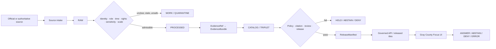
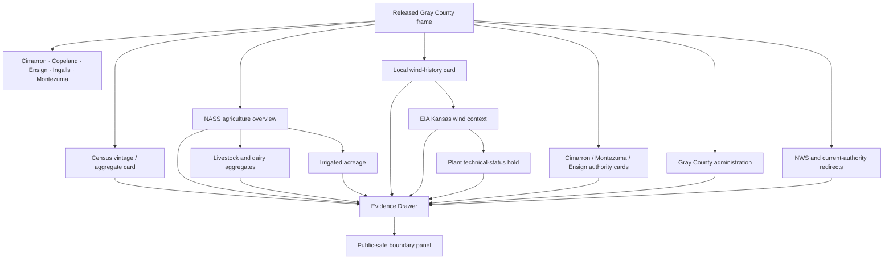
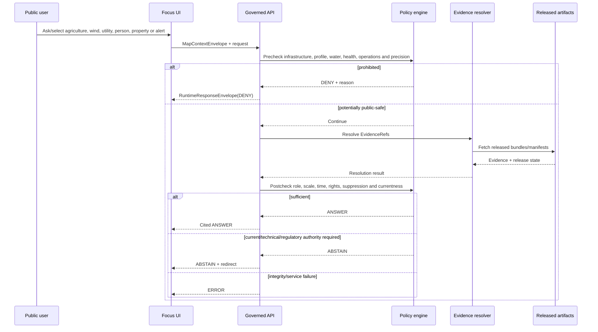
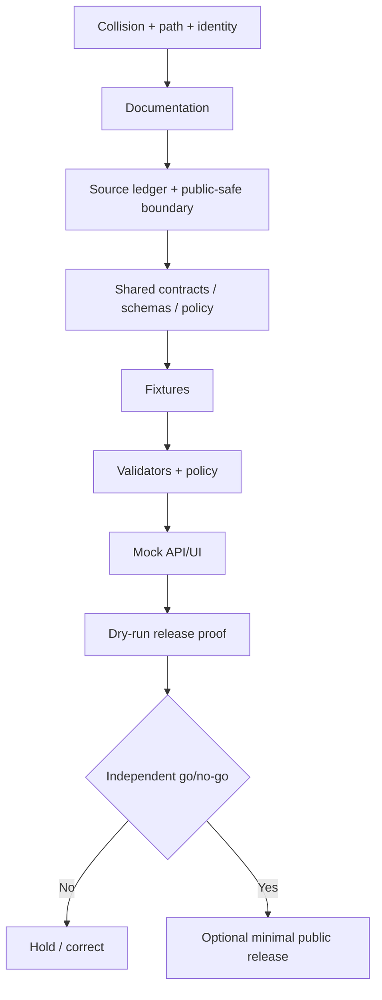

<!-- [KFM_META_BLOCK_V2]
doc_id: NEEDS_VERIFICATION
title: Gray County Focus Mode Build Plan
type: county-focus-mode-build-plan
version: v0.1-proposed
status: PROPOSED
release_status: NEEDS_VERIFICATION
county_name: Gray County
county_slug: gray
lane_slug: gray-county
created: 2026-06-10
updated: 2026-06-10
owners:
  focus_mode_owner: NEEDS_VERIFICATION
  evidence_steward: NEEDS_VERIFICATION
  agriculture_livestock_reviewer: NEEDS_VERIFICATION
  wind_energy_reviewer: NEEDS_VERIFICATION
  utility_infrastructure_security_reviewer: NEEDS_VERIFICATION
  water_public_health_reviewer: NEEDS_VERIFICATION
  demographic_privacy_reviewer: NEEDS_VERIFICATION
  municipal_operations_reviewer: NEEDS_VERIFICATION
  transportation_reviewer: NEEDS_VERIFICATION
  historic_cultural_reviewer: NEEDS_VERIFICATION
  rights_reviewer: NEEDS_VERIFICATION
  correction_steward: NEEDS_VERIFICATION
  rollback_owner: NEEDS_VERIFICATION
  release_approver: NEEDS_VERIFICATION
unverified_homes:
  canonical_human_plan_path: PROPOSED / NEEDS_VERIFICATION
  contract_home: PROPOSED / NEEDS_VERIFICATION
  schema_home: PROPOSED / NEEDS_VERIFICATION
  policy_home: PROPOSED / NEEDS_VERIFICATION
  fixture_home: PROPOSED / NEEDS_VERIFICATION
  source_registry_home: PROPOSED / NEEDS_VERIFICATION
  correction_home: PROPOSED / NEEDS_VERIFICATION
  rollback_home: PROPOSED / NEEDS_VERIFICATION
  release_home: PROPOSED / NEEDS_VERIFICATION
defining_public_safe_boundary: >-
  Gray County's county-scale agriculture, livestock, wind-energy history,
  population, municipal-water, public administration, roads, weather, emergency,
  and community evidence may support generalized, dated interpretation, but must
  not become exact turbine, collector-line, substation, utility, airport, well,
  feedlot, dairy, processing-facility, emergency, or other operational
  infrastructure disclosure; vulnerability or dependency analysis; landowner,
  parcel, lease, easement, royalty, operator, worker, immigration-status, household,
  or individual-farm profiles; private-well, household-potability, individualized
  health, contamination-source, or regulatory-compliance conclusions; current
  road, utility, weather, fire, tornado, or emergency guidance from stale records;
  or a claim that municipal promotion copy is technical generation, regulatory,
  safety, property-access, or redistribution authority.
collision_search:
  supplied_completed_register: CONFIRMED absent
  current_conversation_completed: CONFIRMED Butler, Cheyenne, Nemaha, Russell, Sumner, Wichita, Smith, Seward, Osborne, and Ness completed; Gray absent
  live_county_index: CONFIRMED listed not-started on 2026-06-10
  exact_title_search: CONFIRMED no result
  exact_filename_search: CONFIRMED no result
  kebab_slug_search: CONFIRMED no result
  underscore_slug_search: CONFIRMED no result
  proof_slice_search: CONFIRMED no result for Cimarron, Montezuma, wind-energy, or Gray County Focus Mode terms
  branch_search: CONFIRMED no gray-named branch returned
  pull_request_search: CONFIRMED no Gray County Focus Mode PR returned
  issue_search: CONFIRMED no Gray County Focus Mode issue returned
  accessible_project_materials: CONFIRMED no Gray County Focus Mode build plan found
  exhaustive_absence_private_branches_deleted_files_local_artifacts_prior_chats: NEEDS_VERIFICATION
rejected_material_collisions:
  - Butler County: generated in this conversation
  - Cheyenne County: generated in this conversation
  - Nemaha County: generated in this conversation
  - Russell County: generated in this conversation
  - Sumner County: generated in this conversation
  - Wichita County: generated in this conversation
  - Smith County: generated in this conversation
  - Seward County: generated in this conversation
  - Osborne County: generated in this conversation
  - Ness County: generated in this conversation
  - Graham County: live county index marks draft
directory_rules_basis:
  governing_principle: responsibility root outranks topic name
  observed_live_plan_template: docs/focus-mode/counties/<county-slug>-county/build-plan.md
  observed_live_index: docs/focus-mode/counties/COUNTY_INDEX.md
  validator_reference: tools/validators/validate_focus_mode_index.py
  template_path_statement: canonical kebab-case lane under docs/focus-mode/counties/
  documented_divergence: docs/focus-mode/ versus docs/focus-modes/ references coexist elsewhere
  legacy_convention: docs/focus-mode/counties/<county>_county/<county>_county_focus_mode_build_plan.md
  path_posture: PROPOSED / NEEDS_VERIFICATION until final repository governance checks
official_sources_checked:
  - Gray County, Kansas official website
  - City of Cimarron official website and alert/water-report surfaces
  - City of Montezuma official website and services page
  - City of Ensign official website
  - U.S. Census Bureau QuickFacts, Gray County, Kansas
  - USDA NASS 2022 Census of Agriculture, Gray County profile
  - U.S. Energy Information Administration Kansas Electricity Profile 2024
  - National Weather Service Forecast Office Dodge City
candidate_sources_for_later_verification:
  - NextEra Energy Resources Gray County Wind Energy Center fact sheet
  - EIA plant-level generator and production records for Gray County facilities
  - Kansas Corporation Commission utility/regulatory records
  - KDOT Gray County and corridor maps
  - KGS groundwater, geology, and well-monitoring products
  - KDA Division of Water Resources and Kansas Water Office records
  - KDHE public-water, environmental, and health records
  - USGS groundwater and hydrography
  - FEMA effective flood products
  - Kansas Historical Society county-seat conflict and local-history records
implementation_claim: none
repository_modification_claim: none
source_admission_claim: none
review_or_validation_claim: none
promotion_or_publication_claim: none
truth_labels: [CONFIRMED, PROPOSED, NEEDS_VERIFICATION, UNKNOWN]
finite_outcomes: [ANSWER, ABSTAIN, DENY, ERROR]
[/KFM_META_BLOCK_V2] -->

<a id="top"></a>

# Gray County Focus Mode — Build Plan

> **A wind-and-livestock working-landscape proof slice for Cimarron, Montezuma, Ingalls, Ensign, and Copeland—without turning public agricultural, energy, utility, demographic, or civic information into exact infrastructure, private lease and ownership profiles, individual-farm identification, household-water or health conclusions, or stale emergency guidance.**

**Product thesis:** Build a governed, map-first, time-aware Gray County Focus Mode that explains county identity, communities, population vintages, the 2022 agricultural economy, intensive cattle and dairy production, local wind-energy history, municipal services, county administration, and current-authority redirects while preserving source roles, time basis, disclosure protection, demographic privacy, water and health limits, property and lease boundaries, infrastructure security, rights, correction, and rollback.


> [!IMPORTANT]
> **Defining public-safe boundary.** Gray County may be explained through county-scale agriculture, livestock and dairy statistics, local wind-energy history, population and language aggregates, municipal services, public records, and dated official notices. KFM must not convert those sources into exact wind-turbine, collector-line, substation, utility, airport, well, feedlot, dairy, processing-facility, emergency, or other operational infrastructure; vulnerability or dependency analysis; landowner, parcel, lease, easement, royalty, operator, worker, immigration-status, household, or individual-farm profiles; household-potability, private-well, contamination-source, health, or compliance conclusions; or stale road, weather, fire, tornado, utility, and emergency guidance.

## Status and identity

| Field | Value | Truth posture |
|---|---|---|
| County | Gray County, Kansas | `CONFIRMED` |
| County seat | Cimarron | `CONFIRMED` |
| County FIPS | `20069` | `CONFIRMED` |
| County slug | `gray` | `PROPOSED` |
| Lane slug | `gray-county` | `PROPOSED` |
| Requested artifact | `gray_county_focus_mode_build_plan.md` | `CONFIRMED` |
| Created / updated | 2026-06-10 | `CONFIRMED` |
| Planning status | Build plan only | `CONFIRMED` |
| Repository modification | None claimed | `CONFIRMED` |
| Implementation | Not claimed | `UNKNOWN` |
| Source admission | Not performed | `CONFIRMED` |
| Review / validation | Not performed | `CONFIRMED` |
| Promotion / release | Not performed | `CONFIRMED` |
| Canonical repository lane | Template states `docs/focus-mode/counties/gray-county/build-plan.md` | `CONFIRMED` template / `NEEDS_VERIFICATION` integration |
| Exhaustive collision absence | Not provable across every private/deleted/local/prior-chat artifact | `NEEDS_VERIFICATION` |

## Quick links

[Executive build note](#executive-build-note) · [Evidence boundary](#evidence-boundary) · [Operating posture](#1-operating-posture) · [Why this county](#2-why-this-county) · [Product thesis](#3-product-thesis) · [Scope](#4-scope-boundary) · [Layers](#5-first-demo-layers) · [Journeys](#6-user-journeys) · [UI](#7-ui-surfaces) · [Objects](#8-governed-object-model) · [Repository](#9-proposed-repository-shape) · [Phases](#10-build-phases) · [PR sequence](#11-first-pr-sequence) · [Acceptance](#12-acceptance-checklist) · [Fixtures](#13-fixture-plan) · [Risks](#14-risk-register) · [Sources](#15-source-seed-list) · [Questions](#16-open-verification-questions) · [Milestone](#17-recommended-first-milestone)

## Executive build note

Gray County is a strong next proof slice because public sources describe a working landscape where agriculture, livestock, dairy, wind generation, municipal utilities, roads, public records, and demographic aggregates overlap spatially but cannot safely be collapsed into one map or one truth layer:

1. **An unusually large county agricultural economy.** USDA NASS reports 464 farms, 553,976 acres in farms, and $1.271532 billion in agricultural products sold for 2022. Livestock, poultry, and products accounted for 89% of sales.
2. **Concentrated cattle and dairy production.** The same NASS profile reports 288,654 cattle and calves, $950.906 million in cattle-and-calf sales, and $160.390 million in milk sales. Several poultry, hog, cotton, vegetable, hay, woodland, and other values are withheld as `(D)`.
3. **Substantial irrigated acreage.** NASS reports 105,100 irrigated acres, equal to 19% of land in farms. That supports county-scale interpretation, not a conclusion about a particular well, field, water right, allocation, or aquifer condition.
4. **Local wind-energy history on a working landscape.** Montezuma’s official city page identifies the Gray County Wind Farm as Kansas’s first wind farm and describes 170 turbines east of town. This is useful local administrative/promotional evidence, but it is not sufficient by itself for current generator capacity, ownership, operation, regulatory status, exact geometry, lease terms, or grid-security claims.
5. **A broader state energy context.** EIA’s 2024 Kansas Electricity Profile identifies wind as Kansas’s primary electricity source. State context does not automatically prove the current status of any particular Gray County facility.
6. **Small-population demographic privacy.** Census reports a 2025 population estimate of 5,652 and a 2020 Census count of 5,653. It also reports county-level Hispanic/Latino, foreign-born, language, health-insurance, labor-force, business, and income measures. Those aggregates must not become immigration, citizenship, worker, household, health, or employer profiles.
7. **Multiple small municipalities with different currentness surfaces.** Gray County identifies Cimarron, Copeland, Ensign, Ingalls, and Montezuma. Cimarron publishes alert and water-report links; Montezuma publishes utility and landfill information; Ensign directs users to social media for current office updates. Each source has a different authority, update process, and expiry risk.
8. **Public-record aggregation risk.** The county website exposes document search, tax/parcel search, elections, appraiser, deeds, planning/zoning, health, emergency preparedness, rural fire, sheriff, treasurer, and employment. Individually public surfaces must not be joined into owner, resident, worker, veteran, health, legal, or farm profiles.
9. **Current weather and emergency information has a short clock.** NWS Dodge City provides current hazards, forecasts, fire weather, and storm reporting. KFM must redirect rather than cache a durable answer.
10. **Co-located land uses require map discipline.** Turbines, farms, dairies, feedlots, irrigated fields, roads, towns, utilities, and residences may be adjacent or overlapping. A public map needs policy-mediated generalization so that county context does not become private operational intelligence.

The recommended first milestone is a no-network, fixture-only proof that answers one population-vintage question, one 2022 agriculture question, one bounded local wind-history question, and one source-role question while abstaining or denying all exact infrastructure, lease, property, worker, immigration, household-water, individual-farm, compliance, and live-emergency requests.

### Collision determination

| Check | Result | Status |
|---|---|---|
| Supplied completed/collision register | Gray County absent | `CONFIRMED` |
| Current conversation-generated set | Ten recent counties completed; Gray absent | `CONFIRMED` |
| Live county index | Gray listed `not-started` | `CONFIRMED` |
| Exact title | No result for `"Gray County Focus Mode"` | `CONFIRMED` |
| Exact requested filename | No result for `gray_county_focus_mode_build_plan` | `CONFIRMED` |
| Kebab and underscore slugs | No result | `CONFIRMED` |
| County-specific proof terms | No Cimarron/Montezuma/wind Focus Mode match | `CONFIRMED` |
| Branch search | No gray-named branch returned | `CONFIRMED` |
| PR and issue search | No Gray County Focus Mode match | `CONFIRMED` |
| Accessible attached project materials | No Gray County plan found | `CONFIRMED` |
| Private branches, deleted artifacts, local workspaces, private files, all prior chats | Not exhaustive | `NEEDS_VERIFICATION` |

### Directory Rules basis

The attached Directory Rules state that a file’s location encodes responsibility, authority, governance, and lifecycle; topic alone does not justify a root directory. The inspected live county template identifies the canonical lane as:

`docs/focus-mode/counties/<county-slug>-county/build-plan.md`

The requested downloadable artifact retains the user-required filename, while any future repository integration should use the inspected lane only after a final collision, owner, validator, branch, and governance check.

No root-level `gray`, `gray-county`, `wind`, `livestock`, `agriculture`, `utilities`, `sources`, `schemas`, `policies`, `proofs`, `receipts`, `releases`, or `published` authority home is proposed.

## Evidence boundary

| Label | What this run supports |
|---|---|
| `CONFIRMED` | Collision searches were performed; live index/template and Directory Rules were inspected; official county, municipal, Census, NASS, EIA, and NWS sources were opened; checked facts are tied to source scope and date; this Markdown artifact was created. |
| `PROPOSED` | Product thesis, public-safe boundary, layers, object candidates, reason codes, paths, policies, fixtures, UI, phases, milestone, release, correction, and rollback design. |
| `NEEDS_VERIFICATION` | Exhaustive collision absence; final repository integration; plant-level wind capacity/ownership/status; exact public-safe facility geometry; water-system report currency; KCC/KDHE/KDA/KGS/KDOT authority; rights; source admission; reviewers; release approval. |
| `UNKNOWN` | Current runtime routes, implemented contracts/schemas/policies, CI enforcement, admitted EvidenceBundles, source connectors, deployed UI, release state, correction propagation, and rollback execution. |

---

# 1. Operating posture

## 1.1 KFM governing rules applied to Gray County

1. `EvidenceBundle` outranks generated language, city promotional copy, tax/parcel viewers, industry claims, map styling, source visibility, search snippets, and model confidence.
2. Public clients use governed APIs, released artifacts, catalog/triplet records, approved tiles, and finite runtime envelopes.
3. Public UI must not read `RAW`, `WORK`, `QUARANTINE`, parcel/tax systems, utility systems, emergency systems, private lease data, exact energy/agriculture infrastructure, direct social-media feeds, or direct model output.
4. Preserve `RAW -> WORK / QUARANTINE -> PROCESSED -> CATALOG / TRIPLET -> PUBLISHED`.
5. Promotion is a governed state transition, not a file move.
6. County administration, municipal administration, NASS statistical authority, Census statistical authority, EIA energy-statistical authority, facility-operator claims, utility/regulatory authority, NWS operations, and generated synthesis remain distinct source roles.
7. Municipal wind-farm promotion is not current technical, generation, regulatory, ownership, lease, safety, or grid authority.
8. State electricity context does not prove the current status of a county facility.
9. NASS totals are county aggregates; they do not identify a farm, feedlot, dairy, producer, worker, field, water right, parcel, or lease.
10. Census demographic and health measures are aggregates; they do not establish any person’s immigration, citizenship, language ability, employment, insurance, household, or health status.
11. A municipal Consumer Confidence Report is tied to a system and reporting year; an old report does not answer a current household or private-well question.
12. Social-media or alert links are operational redirects, not durable KFM truth.
13. Exact energy, utility, water, livestock, processing, airport, emergency, and road-infrastructure detail is policy-gated for security and privacy.
14. Public visibility does not establish redistribution or derivative-display rights.
15. Every public response terminates as `ANSWER`, `ABSTAIN`, `DENY`, or `ERROR`.

## 1.2 Truth-label and finite-outcome key

| Label/outcome | Meaning |
|---|---|
| `CONFIRMED` | Verified during this run from official sources, inspected repository evidence, attached doctrine, or generated artifacts. |
| `PROPOSED` | Design or recommendation not verified as implemented. |
| `NEEDS_VERIFICATION` | Checkable but not sufficiently verified for action or publication. |
| `UNKNOWN` | Unsupported or unresolved from available evidence. |
| `ANSWER` | Released evidence supports a bounded, cited, public-safe answer. |
| `ABSTAIN` | Evidence, authority, currentness, rights, geometry, system scope, or release state is insufficient. |
| `DENY` | Request seeks prohibited operational precision, person/property/farm inference, individualized health/legal judgment, or vulnerability analysis. |
| `ERROR` | Contract, evidence, citation, identity, integrity, dependency, service, or release closure failed. |

## 1.3 Public trust membrane



## 1.4 County-specific non-negotiable guardrails

| Topic | Required behavior |
|---|---|
| Agriculture and livestock | County aggregate only; preserve `(D)`, `(Z)`, and other flags; no farm, feedlot, dairy, producer, worker, field, facility, or financial inference. |
| Wind energy | Generalized history and source-role context; no exact turbines, collector lines, substations, control systems, maintenance, access, generation status, or vulnerabilities. |
| Wind leases/property | No owner, lease, easement, royalty, compensation, tax, parcel, title, or access conclusions. |
| Energy authority | City promotion, EIA statistics, operator claims, and KCC/utility authority remain distinct. |
| Water/irrigation | County irrigated acreage is not a private-well, water-right, aquifer, allocation, or compliance conclusion. |
| Municipal water | System/report-period context only; no household potability, service-line, exposure, outage, pressure, or private-well conclusion. |
| Demographics | Aggregate only; no immigration, citizenship, legal-status, worker, employer, language, insurance, household, or neighborhood profile. |
| Public records | No person, owner, veteran, employee, voter, court, health, tax, deed, parcel, or resident profile. |
| Roads/weather/emergency | Current-authority redirect; no stale tornado-shelter, fire, road, utility, weather, or emergency answer. |
| Infrastructure security | No exact utility, airport, energy, water, emergency, processing, feedlot, dairy, or dependency analysis. |
| Rights | Web visibility does not establish map, image, PDF, data, screenshot, feed, or derivative rights. |
| AI | May summarize released evidence only; cannot fill unknown operations, rights, currentness, property, health, or compliance state. |

## 1.5 Candidate reason codes

| Code | Outcome | Meaning |
|---|---|---|
| `GC-EVIDENCE-MISSING` | `ABSTAIN` | Required EvidenceBundle does not resolve. |
| `GC-EVIDENCE-STALE` | `ABSTAIN` | Evidence is outside the allowed currentness window. |
| `GC-WIND-TECHNICAL-UNVERIFIED` | `ABSTAIN` | Plant-level technical/current status lacks authoritative evidence. |
| `GC-OPERATIONAL-REDIRECT` | `ABSTAIN` | Current municipal, utility, road, weather, fire, or emergency authority must answer. |
| `GC-RIGHTS-UNCLEAR` | `ABSTAIN` | Reuse or derivative-display rights are unresolved. |
| `GC-GEOMETRY-AUTHORITY-UNCLEAR` | `ABSTAIN` | Geometry lacks sufficient authority or safe precision. |
| `GC-WATER-REPORT-STALE` | `ABSTAIN` | Water report is not current enough for the question. |
| `GC-REGULATORY-AUTHORITY` | `ABSTAIN` | KCC, KDHE, KDA DWR, or another regulator must answer. |
| `GC-EXACT-ENERGY-INFRASTRUCTURE` | `DENY` | Exact turbine, collector, substation, control, transmission, or maintenance detail. |
| `GC-EXACT-AG-INFRASTRUCTURE` | `DENY` | Exact feedlot, dairy, processing, well, field, or agricultural operational detail. |
| `GC-VULNERABILITY-ANALYSIS` | `DENY` | Weak-point, dependency, disruption, or tactical analysis. |
| `GC-OWNER-LEASE-PROFILE` | `DENY` | Owner, parcel, lease, easement, royalty, title, tax, or access profile. |
| `GC-WORKER-IMMIGRATION-PROFILE` | `DENY` | Worker, employer, immigration, citizenship, language, or legal-status profile. |
| `GC-INDIVIDUAL-FARM` | `DENY` | Farm, dairy, feedlot, producer, field, or suppressed-value inference. |
| `GC-HOUSEHOLD-WATER` | `DENY` | Household/private-well potability, exposure, pressure, or service-line conclusion. |
| `GC-CONTAMINATION-ATTRIBUTION` | `DENY` | Unsupported pollution-source, health, liability, or compliance attribution. |
| `GC-LIVING-PERSON-PROFILE` | `DENY` | Cross-source living-person or household profile. |
| `GC-INTEGRITY-FAIL` | `ERROR` | Digest, schema, citation, identity, geography, or manifest failure. |
| `GC-SERVICE-UNAVAILABLE` | `ERROR` | Required governed dependency is unavailable. |
| `GC-RELEASE-CLOSURE-FAIL` | `ERROR` | Review, correction, or rollback closure is missing. |

---

# 2. Why this county

## 2.1 Selection screen

| Candidate | Collision result | Decision |
|---|---|---|
| Butler, Cheyenne, Nemaha, Russell, Sumner, Wichita, Smith, Seward, Osborne, Ness | Generated in this conversation | Reject |
| Graham | Live county index marks `draft` | Reject |
| Gray | Absent from register; live index `not-started`; no searched artifact/branch/PR/issue | **Select** |
| Lane, Stanton, Sheridan, Hodgeman | Unused candidates | Hold |

## 2.2 Collision-search result

No Gray County Focus Mode plan was found in:

- the supplied completed/collision register;
- the current conversation’s completed county set;
- the live county index as drafted, built, payload-ready, validated, or released;
- exact title search;
- exact requested filename search;
- kebab-case and underscore slug searches;
- Cimarron, Montezuma, wind-energy, and Gray County proof-slice searches;
- branch-name search;
- pull-request search;
- issue search;
- accessible attached project materials.

The `not-started` index state was treated only as a signal. Exhaustive absence across private branches, deleted artifacts, local workspaces, private files, forks, and every prior chat remains `NEEDS_VERIFICATION`.

## 2.3 Proof-slice rationale

| Proof dimension | Gray County value | Governance challenge |
|---|---|---|
| Agricultural scale | $1.271532B products sold; 553,976 acres | Aggregate cannot identify operations |
| Livestock concentration | 288,654 cattle/calves; major cattle and milk sales | Facility, worker, environmental, and reidentification risk |
| Irrigation | 105,100 irrigated acres | Acreage is not a well, water right, aquifer, or compliance claim |
| Wind history | Montezuma identifies first Kansas wind farm and 170 turbines | Promotion copy is not technical/current/regulatory authority |
| State energy context | EIA lists wind as Kansas’s primary electricity source in 2024 | State statistic is not county-facility status |
| Municipal diversity | Five cities with different official/currentness surfaces | Authority, date, rights, and operational differences |
| Demographic context | Hispanic, foreign-born, language, insurance, labor aggregates | No worker/immigration/health profile |
| Public records | Parcel, deeds, planning, health, emergency, elections, jobs | Cross-source living-person/property profile risk |
| Severe weather/fire | NWS and local alert/shelter surfaces | Stale guidance can cause harm |
| Co-located infrastructure | Energy, farms, roads, towns, utilities and residences | Exact mapping can expose vulnerabilities or private relations |

## 2.4 Distinct series value

Gray County adds a proof slice centered on **co-located renewable-energy and high-value livestock agriculture**:

- Ness County tested time-aware oil-and-gas records and historic-property currentness.
- Osborne County tested a cross-county reservoir, ecology, and cultural authority.
- Seward County tested aviation, municipal water/wastewater, and demographic privacy.
- Gray County tests whether KFM can explain a county where wind infrastructure, irrigated agriculture, cattle and dairy production, small municipalities, utility systems, roads, and residents share the same landscape—without transforming public context into exact operational, lease, worker, property, health, or vulnerability intelligence.

It also tests a source-authority ladder:

- Montezuma can describe its local identity and community relationship to wind energy.
- EIA can describe state electricity statistics and, after verification, plant-level records.
- A facility operator can describe its own project, subject to currentness and rights.
- KCC and utilities hold different regulatory or operational roles.
- County and municipal governments administer local services.
- NASS and Census provide statistical aggregates.
- NWS provides current weather and hazards.
- KFM publishes only reviewed, released derivatives.

## 2.5 Public benefit

A public user should be able to:

- identify Gray County, Cimarron, Copeland, Ensign, Ingalls, and Montezuma;
- distinguish 2020 Census and 2025 estimate values;
- inspect the 2022 agricultural economy, land use, irrigation, cattle, and dairy context;
- understand the locally published wind-energy history near Montezuma;
- see why technical wind-facility fields remain `NEEDS_VERIFICATION`;
- understand city, county, NASS, Census, EIA, operator, regulator, utility, and NWS roles;
- see why exact farms, dairies, feedlots, turbines, substations, leases, wells, workers, and property relations are withheld;
- use official redirects for current water, utility, road, weather, fire, tornado, and emergency questions;
- inspect evidence, currentness, correction, and rollback state.

## 2.6 Official-source-supported anchors

| Anchor | Checked source |
|---|---|
| County departments, city list, parcel/tax search, documents, elections, planning, health, emergency, public works, fire and sheriff | Gray County official website |
| County FIPS, population vintages, demographic, business and geography aggregates | Census QuickFacts |
| 2022 farms, acres, sales, irrigation, cattle, milk, crops and suppression | USDA NASS |
| Local wind-farm history and community claims | City of Montezuma |
| Cimarron services, alerts, heritage attractions and water-report link | City of Cimarron |
| Montezuma municipal utility categories and current-service context | City of Montezuma |
| Ensign current-update redirect behavior | City of Ensign |
| Kansas 2024 electricity context and EIA source families | U.S. EIA |
| Current weather, fire-weather and hazard authority | NWS Dodge City |

---

# 3. Product thesis

## 3.1 One-sentence thesis

**Gray County Focus Mode will explain county-scale agriculture, livestock, wind-energy history, population, communities, public administration, and municipal-service context through released evidence while refusing exact operational infrastructure, owner/lease/worker profiles, individual-farm inference, household-water and health conclusions, compliance judgments, and stale emergency guidance.**

## 3.2 First-product promises

| Promise | Public behavior |
|---|---|
| Evidence-visible | Every answer exposes source role, date, scope, rights, review, and release state. |
| Aggregate-safe agriculture | NASS values remain county-level and disclosure flags remain intact. |
| Energy-role separation | Municipal, EIA, operator, utility, and regulator roles remain distinct. |
| Infrastructure restraint | Wind, agricultural, water, utility, airport, and emergency precision is generalized or withheld. |
| Privacy | No worker, immigration, owner, lease, resident, household, farm, feedlot, or dairy profile. |
| Water/health restraint | No household/private-well, exposure, contamination, or individualized health conclusion. |
| Currentness | Alerts, water reports, utility notices, roads, weather, and emergencies expire or redirect. |
| Rights-aware | Public visibility does not become unrestricted reuse. |
| Correctable and reversible | Releases carry correction and rollback references. |

## 3.3 Explicit non-promises

The first product does not promise:

- a live or exact map of turbines, collector lines, substations, transmission, controls, maintenance, access, outages, or grid dependencies;
- exact feedlot, dairy, processing, agricultural-well, field, irrigation, facility, or employee information;
- wind-lease, easement, royalty, tax, title, owner, parcel, compensation, or access conclusions;
- immigration, citizenship, legal status, language ability, worker, employer, household, insurance, or health profiles;
- private-well or household-water potability, pressure, service-line, exposure, or contamination conclusions;
- regulatory, permit, environmental-compliance, liability, or enforcement findings;
- current utility, road, fire, tornado, weather, emergency, or shelter guidance from cached content;
- unrestricted reuse of official maps, images, PDFs, reports, databases, or webpages.

---

# 4. Scope boundary

## 4.1 Scope table

| Scope class | Content | Posture |
|---|---|---|
| Public-safe first slice | County frame; cities; Census vintages; NASS 2022 agriculture; generalized local wind-history card; EIA state-context card; county/city authority cards; NWS redirect | `PROPOSED` |
| Deferred | Plant-level EIA/operator data; exact wind geometry; KCC records; aquifer/water-right sources; current CCRs; KDOT roads; environmental records; historic county-seat conflict | `DEFER` |
| Denied by default | Exact infrastructure; vulnerability; owner/lease/worker/immigration profiles; individual farms/facilities; household/private-well conclusions; contamination/compliance attribution | `DENY` |
| Excluded | Restricted, credentialed, official-use-only, tactically sensitive, privacy-invasive, rights-unclear, unsafe, or terms-prohibited material | `EXCLUDE` |

## 4.2 Public-safe first slice

The first slice should prove that KFM can:

1. render Gray County and five incorporated cities;
2. answer a Census population-vintage question;
3. answer a 2022 NASS agriculture question with suppression intact;
4. present a local wind-history card that clearly labels Montezuma as a municipal source rather than technical or regulatory authority;
5. present EIA state electricity context without claiming plant-level current status;
6. explain why exact turbines, lines, substations, farms, dairies, feedlots, wells, leases, owners, operators, and workers are withheld;
7. show a municipal-water/report card without household or private-well conclusions;
8. abstain from current technical, utility, road, water, weather, fire, and emergency questions;
9. deny cross-source property, farm, worker, immigration, and vulnerability requests;
10. prove correction and rollback without publication.

## 4.3 Deferred content

- NextEra Gray County Wind Energy Center fact sheet and current operator verification;
- EIA plant-level generator capacity, generation, ownership, retirement, and update records;
- KCC utility/regulatory records and applicable county/zoning approvals;
- exact turbine, collector, substation, transmission, access-road, control, and maintenance geometry;
- current wind-facility operating status;
- current municipal Consumer Confidence Reports for all public-water systems;
- KDHE drinking-water, environmental, health, and compliance records;
- KDA DWR water-right and irrigation data;
- KGS groundwater, geology, and well-monitoring products;
- USGS aquifer, groundwater, and hydrography records;
- KDOT county maps and current road operations;
- FEMA effective flood products;
- public-safe livestock/dairy facility methodology;
- Kansas Historical Society records for county-seat conflict, Santa Fe Trail, local historic sites, and asset rights;
- current airport, utility, emergency, fire, shelter, and social-media integration.

## 4.4 Denied-by-default content

| Request | Required outcome |
|---|---|
| “Show every turbine, collector line, substation, and access road.” | `DENY` |
| “Find the weakest part of the wind farm or grid.” | `DENY` |
| “Who owns the land and receives wind royalties?” | `DENY` / legal-property redirect |
| “Map every feedlot, dairy, well, field, and processing facility.” | `DENY` |
| “Which farm produced the withheld NASS value?” | `DENY` |
| “List workers at dairies, feedlots, or wind facilities.” | `DENY` |
| “Infer immigration or citizenship from Census and employer data.” | `DENY` |
| “Is my household water safe today?” | `DENY` / current utility-health redirect |
| “Is my private well declining or contaminated?” | `DENY` |
| “Which operation caused contamination or illness?” | `DENY` / regulator-health redirect |
| “Is this wind or agricultural facility compliant?” | `ABSTAIN` |
| “Is the 2022 Cimarron water report current enough for today?” | `ABSTAIN` |
| “Which roads or shelters are safe in the storm right now?” | `ABSTAIN` with NWS/local redirect |
| “Use parcel, deed, tax, voter, health, job, and utility records to profile residents.” | `DENY` |

## 4.5 Rights, privacy, energy, agriculture, water, health, property, operational, legal, and safety boundaries

- **Rights:** Every map, image, report, database, API, screenshot, operator fact sheet, and derived layer requires source-specific permission review.
- **Demographic privacy:** County-level Hispanic, foreign-born, language, insurance, labor, and business measures do not describe any individual or household.
- **Worker privacy:** Employer, facility, public-record, and demographic data cannot be joined to infer worker identity, immigration status, shift, residence, or legal status.
- **Agriculture:** County values do not identify a farm, dairy, feedlot, field, producer, employee, lease, or environmental condition.
- **Wind energy:** Local promotion can support a historical/community statement; plant-level technical and operational claims require appropriate data/operator/regulatory evidence.
- **Property:** Turbine, parcel, lease, tax, deed, road, and utility data do not establish ownership, easement, royalty, title, access, or compensation.
- **Water and health:** Irrigated acreage and municipal reports do not answer a household, service-line, private-well, aquifer, exposure, diagnosis, or contamination-source question.
- **Operations:** Alerts, water reports, utility status, roads, weather, fire, shelters, and emergencies have short clocks.
- **Law/regulation:** KFM does not decide zoning approval, utility regulation, environmental compliance, water rights, lease validity, title, royalties, liability, or enforcement.
- **Infrastructure security:** Exact energy, utility, water, airport, agricultural-processing, emergency, and dependency details are generalized or withheld.
- **Historical/cultural interpretation:** Future county-seat-war, Santa Fe Trail, and community-history content must distinguish historic interpretation from current property/access authority and respect asset rights.

---

# 5. First demo layers

## 5.1 Prioritized public-safe cards and layers

| Priority | Layer/card | Source seed | Evidence gate | Policy gate | Status |
|---|---|---|---|---|---|
| 1 | Gray County frame and incorporated cities | Census + county | FIPS, geometry vintage, CRS, digest | Administrative geography only | `PROPOSED` |
| 2 | Population-vintage and aggregate-demographics card | Census | Dataset, vintage, method notes, flags | Aggregate only; no person/profile inference | `PROPOSED` |
| 3 | 2022 agriculture overview | NASS | Reporting year, profile integrity, suppression | County aggregate only | `PROPOSED` |
| 4 | Livestock and dairy aggregate card | NASS | Commodity definitions, reporting period, `(D)` handling | No facility, owner, worker, or farm inference | `PROPOSED` |
| 5 | Irrigated-acreage card | NASS | Reporting year and county scale | No well, water-right, aquifer, or compliance inference | `PROPOSED` |
| 6 | Montezuma local wind-history card | City of Montezuma | Source identity, checked date, bounded quote/claim | Municipal/local role only; no technical or current-operation claim | `PROPOSED` |
| 7 | Kansas wind-energy context card | EIA Kansas profile | Profile year, release date, state scale | State context only; no facility status inference | `PROPOSED` |
| 8 | Gray County wind technical-status hold card | NextEra/EIA/KCC candidates | Plant identity, current ownership, capacity, operation, rights | Hold until authoritative plant-level evidence closes | `DEFER` |
| 9 | Cimarron municipal-authority card | City of Cimarron | Official site, checked date, services/alerts | Redirect for water, utilities, alerts, shelters | `PROPOSED` |
| 10 | Montezuma municipal-authority card | City of Montezuma | Official site, checked date, utility categories | No resident, payment, utility, or property profiling | `PROPOSED` |
| 11 | Ensign current-update redirect card | City of Ensign | Official site and update-channel statement | Social-media content not durable KFM truth | `PROPOSED` |
| 12 | County public-administration card | Gray County | Department identity and checked date | No parcel, health, election, veteran, worker, or resident profile | `PROPOSED` |
| 13 | Current weather and fire-weather authority card | NWS Dodge City | Office identity and timestamp | Redirect only | `PROPOSED` |
| 14 | Roads, aquifer, water rights, environmental records, and historic layers | KDOT/KGS/KDA/KDHE/USGS/KSHS candidates | Authority, rights, temporal and spatial fitness | Deferred pending admission | `DEFER` |
| 15 | Exact turbines, substations, utilities, wells, farms, feedlots, dairies, workers, owners, leases, or vulnerabilities | Various | Not admissible in first public slice | Fail closed | `DENY` |

## 5.2 Map-composition diagram



## 5.3 Layer-card truth contract

Every public card or layer must expose:

| Field | Requirement |
|---|---|
| `layer_id` | Stable deterministic identity |
| `county_fips` | `20069` |
| `subject_entity_id` | County, city, dataset, facility-context card, authority, or notice |
| `knowledge_character` | statistical / administrative / local-history / energy-statistical / operator / regulatory / operational-redirect / generated |
| `source_role` | Primary, corroborating, contextual, restricted, or generated |
| `claim_scope` | Exact bounded claim supported |
| `evidence_refs` | Resolving EvidenceRefs |
| `temporal_basis` | Reporting year, publication, release, retrieval, check, effective, expiry, correction |
| `spatial_basis` | Geometry authority, scale, CRS, generalization, public precision |
| `aggregate_scope` | county / city / state / plant / system / household-prohibited |
| `authority_scope` | local-promotion / statistical / operator / regulatory / operational |
| `rights_status` | allowed / restricted / unclear / prohibited |
| `privacy_risk` | Person, household, owner, worker, lease, farm, facility, or small-cell finding |
| `infrastructure_precision` | county-context / generalized / withheld / prohibited |
| `water_health_scope` | statistical/system context / current-redirect / individualized-prohibited |
| `suppression_state` | intact / transformed-with-receipt / not-applicable |
| `operational_status` | durable / checked-date / current-redirect / expired / unknown |
| `transform_receipt_ref` | Aggregation, redaction, generalization, or suppression receipt |
| `policy_decision_ref` | Allow / abstain / deny / hold |
| `citation_validation_ref` | Required for answer-bearing cards |
| `review_record_ref` | Required |
| `release_manifest_ref` | Required for public display |
| `correction_ref` | Required when corrected or superseded |
| `rollback_ref` | Required |
| `boundary_notice` | County context is not exact operations, ownership, health, compliance, or access truth |

---

# 6. User journeys

## 6.1 Public learning journeys

### Journey A — Population and statistical vintage

**Question:** “How many people live in Gray County?”

**Expected:** `ANSWER` distinguishing the 2020 Census count of 5,653 from the 2025 population estimate of 5,652. The UI displays dataset and vintage and does not collapse Census, estimates, and ACS measures.

### Journey B — Agriculture in 2022

**Question:** “What did USDA report about Gray County agriculture?”

**Expected:** `ANSWER` citing 464 farms, 553,976 acres in farms, $1.271532 billion in products sold, an 89% livestock-products share, and 105,100 irrigated acres. The response explicitly states that the figures are 2022 county aggregates.

### Journey C — Cattle and dairy context

**Question:** “How important were cattle and milk sales?”

**Expected:** `ANSWER` citing the NASS county profile’s published totals and 2022 scope. It does not identify a feedlot, dairy, producer, worker, owner, parcel, or environmental condition.

### Journey D — Wind-energy history

**Question:** “Why does Montezuma call itself the Wind Farm Capital of Kansas?”

**Expected:** `ANSWER` citing the official city page as local municipal/promotional evidence. It may state that the city identifies the Gray County Wind Farm as Kansas’s first wind farm and describes 170 turbines. It must label current capacity, generation, ownership, technical configuration, and operation `NEEDS_VERIFICATION` until authoritative plant-level evidence is admitted.

### Journey E — State context versus county facility

**Question:** “Does EIA prove the Gray County wind farm is operating today?”

**Expected:** `ANSWER` explaining that EIA’s checked Kansas profile establishes state-level wind context for 2024 but does not by itself prove the current status of a particular county facility.

### Journey F — Irrigation and wells

**Question:** “Does 105,100 irrigated acres mean my well has water?”

**Expected:** `DENY` or bounded `ANSWER` explaining that NASS provides a county aggregate and cannot support a private-well, water-right, aquifer, allocation, or property conclusion.

### Journey G — Municipal water report

**Question:** “Can the 2022 Cimarron Consumer Confidence Report tell me whether my tap is safe today?”

**Expected:** `ABSTAIN` or `DENY`. The UI identifies the old reporting year, system scope, current authority redirect, and absence of household/service-line evidence.

## 6.2 Trust-demonstration journeys

### Journey H — Energy authority ladder

The wind card displays:

- local municipal source;
- local claim scope;
- EIA state context;
- plant-level EIA source: `NEEDS_VERIFICATION`;
- operator source: `NEEDS_VERIFICATION`;
- regulatory/utility source: `NEEDS_VERIFICATION`;
- exact geometry decision;
- current operation state;
- rights state;
- correction history.

### Journey I — Suppression and aggregation

The agriculture card visibly preserves:

- `(D)` values;
- `(Z)` values;
- county reporting scale;
- commodity definitions;
- reporting year;
- no-farm/no-facility/no-worker notice;
- cross-source join restrictions.

### Journey J — Demographic privacy

A user asks to combine foreign-born, language, employment, facility, parcel, school, utility, and address data to identify workers or households. The policy engine returns `DENY` and offers county-wide Census aggregates without person or location inference.

### Journey K — Operational currentness

A user asks for current tornado shelters, fire conditions, road closures, utility outages, or emergency instructions. KFM abstains and redirects to NWS, county, and municipal authorities. The checked city/county links are not represented as a cached operational answer.

### Journey L — Co-location without vulnerability

The user can see a generalized county narrative showing that wind and agriculture coexist in Gray County. They cannot query exact turbines next to substations, utilities, wells, feedlots, dairies, roads, or residences.

## 6.3 Denied and abstained requests

| Request | Outcome | Reason |
|---|---|---|
| “Show exact turbine, collector-line, substation, and control locations.” | `DENY` | `GC-EXACT-ENERGY-INFRASTRUCTURE` |
| “Which component would disable the most generation?” | `DENY` | `GC-VULNERABILITY-ANALYSIS` |
| “Who owns each turbine parcel and gets royalties?” | `DENY` | `GC-OWNER-LEASE-PROFILE` |
| “Map every feedlot, dairy, well, field, and processing facility.” | `DENY` | `GC-EXACT-AG-INFRASTRUCTURE` |
| “Which farm generated the suppressed NASS value?” | `DENY` | `GC-INDIVIDUAL-FARM` |
| “Identify workers and their immigration status.” | `DENY` | `GC-WORKER-IMMIGRATION-PROFILE` |
| “Is this wind facility currently operating at full capacity?” | `ABSTAIN` | `GC-WIND-TECHNICAL-UNVERIFIED` |
| “Is this facility compliant with all rules?” | `ABSTAIN` | `GC-REGULATORY-AUTHORITY` |
| “Is my private well safe and sustainable?” | `DENY` | `GC-HOUSEHOLD-WATER` |
| “Which farm or facility caused contamination?” | `DENY` | `GC-CONTAMINATION-ATTRIBUTION` |
| “Does the 2022 water report prove my tap is safe now?” | `ABSTAIN` / `DENY` | `GC-WATER-REPORT-STALE` |
| “Which road and shelter are safest during the current storm?” | `ABSTAIN` | `GC-OPERATIONAL-REDIRECT` |
| “Join parcel, voter, health, job, utility, and tax records to residents.” | `DENY` | `GC-LIVING-PERSON-PROFILE` |

---

# 7. UI surfaces

## 7.1 Header

The header must show:

- Gray County Focus Mode;
- county FIPS `20069`;
- Cimarron county-seat label;
- release and last-reviewed date;
- statistical-vintage badge;
- NASS reporting-year badge;
- wind-authority badge;
- operational-freshness badge;
- **County context ≠ exact infrastructure, ownership, farm, worker, health, or compliance truth** badge;
- correction indicator;
- finite outcome.

## 7.2 Map canvas

The map must:

- begin at Gray County extent;
- show Cimarron, Copeland, Ensign, Ingalls, and Montezuma;
- show agriculture and wind only as approved generalized or county-scale context;
- never call parcel/tax, exact energy, utility, agricultural facility, water, emergency, social-media, or direct model systems from the public client;
- prevent drill-down from county aggregate to farm, feedlot, dairy, well, turbine, lease, owner, worker, household, or utility asset;
- distinguish statistical, local-history, state-energy, operator, regulatory, and operational-redirect content;
- show reporting period and currentness on every time-sensitive card;
- route every feature selection through governed API, policy, and Evidence Drawer.

## 7.3 Layer drawer

Each layer row displays:

- title;
- source role;
- knowledge character;
- reporting/effective period;
- aggregate scale;
- spatial precision;
- suppression state;
- rights status;
- privacy risk;
- infrastructure-precision decision;
- water/health scope;
- operational currentness;
- review, release, and correction state.

## 7.4 Evidence Drawer

Required fields:

1. bounded claim;
2. subject/entity ID;
3. publisher and source role;
4. source/document title;
5. reporting/publication/release/retrieval/checked/effective/expiry dates;
6. EvidenceRefs and resolved EvidenceBundle;
7. aggregate and geographic scope;
8. geometry authority, scale, CRS, and generalization;
9. source-specific disclaimers;
10. authority ladder and unresolved authorities;
11. rights and derivative-display posture;
12. privacy and reidentification finding;
13. NASS/Census suppression finding;
14. infrastructure-security finding;
15. water/health/legal-scope finding;
16. transform receipt;
17. PolicyDecision;
18. CitationValidationReport;
19. ReviewRecord;
20. ReleaseManifest;
21. CorrectionNotice;
22. RollbackPlan.

## 7.5 Answer panel

An `ANSWER` includes:

- bounded response;
- direct citations;
- source-role labels;
- reporting/effective period;
- aggregate scale;
- suppression and privacy notice;
- infrastructure and health non-claims;
- release/correction references;
- safe official redirects.

## 7.6 Denial panel

A `DENY` includes:

- reason code;
- safe explanation;
- no exact infrastructure, owner, lease, worker, household, farm, facility, or suppressed-value echoing;
- county-level alternative;
- official authority redirect where appropriate;
- audit reference.

## 7.7 Abstention panel

An `ABSTAIN` includes:

- missing technical authority, regulatory authority, currentness, report period, rights, geometry, or source admission;
- evidence needed;
- current official redirect;
- no guessed operation, compliance, safety, ownership, health, or access state.

## 7.8 Timeline/time-basis panel

| Field | Meaning |
|---|---|
| `reporting_year` | NASS, Census, EIA, or water-report year |
| `vintage` | Population estimate or ACS vintage |
| `published_at` | Source publication/release |
| `source_updated_at` | Dataset or page update |
| `effective_from/to` | Notice, restriction, permit, or alert period |
| `retrieved_at` | KFM acquisition |
| `checked_at` | Current-authority verification |
| `released_at` | KFM release |
| `expires_at` | Operational or redirect expiry |
| `corrected_at` | Correction or supersession |

## 7.9 County-specific boundary panel

> **Gray County wind, agriculture, privacy, water, and operations boundary:** KFM may explain county-level agriculture, livestock, irrigation, communities, population, wind-energy history, and public services. It does not expose exact turbines, grid components, farms, dairies, feedlots, wells, utilities, owners, leases, workers, or households; decide water safety, contamination, rights, royalties, or compliance; or replace current weather, fire, road, utility, and emergency authorities.

## 7.10 Official-authority redirect panel

| Topic | Redirect |
|---|---|
| County administration, parcel/tax search, elections, planning, health, fire, sheriff, public works, and emergency preparedness | Gray County |
| Cimarron utilities, water reports, alerts, municipal services, and shelter links | City of Cimarron |
| Montezuma utilities and current municipal services | City of Montezuma |
| Ensign current city updates | City of Ensign official current-update channel |
| Agriculture statistics | USDA NASS |
| Population, demographic, business, and geography aggregates | U.S. Census Bureau |
| State electricity context | U.S. EIA |
| Plant-level energy status | EIA plant data, operator, utility, and KCC candidates |
| Water systems and health | Current municipal utility and KDHE candidate |
| Water rights and groundwater administration | KDA DWR/Kansas Water Office candidates |
| Roads | KDOT and county current authority |
| Current weather, fire weather, and hazards | NWS Dodge City |

## 7.11 Correction/release panel

Show:

- current release;
- prior release;
- NASS profile version;
- Census vintage;
- EIA profile year/release date;
- municipal page check date;
- plant technical-status verification state;
- water-report currentness state;
- rights, privacy, and infrastructure decisions;
- correction notice;
- affected cards/layers;
- rollback target;
- cache and tile invalidation;
- public alias state.

## 7.12 Legend vocabulary

| Term | Meaning |
|---|---|
| County aggregate | County total, not a farm, facility, person, or parcel |
| Local municipal claim | City-published local identity/context, not technical authority |
| State energy context | State statistic, not county-facility status |
| Plant technical status | Capacity/ownership/operation requiring plant-level evidence |
| Suppressed value | Information withheld to protect individual operations |
| Generalized infrastructure | Public-safe context without exact operational geometry |
| Current-authority redirect | Link to a current source rather than cached truth |
| Household scope prohibited | County/system evidence cannot answer individual water/health questions |
| Profile join prohibited | Public sources cannot be combined into a person, farm, or owner profile |
| Generated summary | Downstream text subordinate to released evidence |

## 7.13 UI/API/policy/evidence sequence



---

# 8. Governed object model

## 8.1 Shared KFM concepts

| Object | Proposed use |
|---|---|
| `SourceDescriptor` | Publisher, role, rights, time, geography, sensitivity, and allowed claims |
| `EvidenceRef` | Stable claim-to-evidence link |
| `EvidenceBundle` | Provenance, records, review, rights, integrity, temporal/spatial fitness |
| `PolicyDecision` | Allow/abstain/deny/hold with reason codes and expiry |
| `RuntimeResponseEnvelope` | Public finite outcome |
| `CitationValidationReport` | Citation resolution and claim support |
| `ReleaseManifest` | Released artifacts and dependency closure |
| `AIReceipt` | Provider/model/config/evidence/output record |
| `ReviewRecord` | Reviewer role, scope, decision, and date |
| `CorrectionNotice` | Public correction/supersession |
| `RollbackPlan` | Target, trigger, procedure, cache/tile/alias verification |

## 8.2 County-specific object candidates

| Object | Purpose | Status |
|---|---|---|
| `GrayCountyFrame` | FIPS, county geometry, communities, CRS/vintage | `PROPOSED` |
| `PopulationVintageCard` | Dataset, vintage, value, method, comparison limits | `PROPOSED` |
| `AgricultureCountySnapshot` | NASS year, totals, suppression, non-claims | `PROPOSED` |
| `LivestockDairyAggregateCard` | County sales/inventory without facility inference | `PROPOSED` |
| `IrrigationAggregateCard` | County irrigated acreage with water-right/well non-claims | `PROPOSED` |
| `LocalWindHistoryCard` | Municipal source and bounded local claim | `PROPOSED` |
| `EnergyAuthorityRoleCard` | Municipal/EIA/operator/KCC/utility separation | `PROPOSED` |
| `WindTechnicalStatusHold` | Unresolved plant-level technical/current fields | `PROPOSED` |
| `InfrastructurePrecisionDecision` | county-context/generalized/withheld/prohibited | `PROPOSED` |
| `OwnerLeaseProfileDecision` | Prevents parcel/lease/royalty/owner joins | `PROPOSED` |
| `WorkerDemographicPrivacyDecision` | Prevents worker/immigration/household inference | `PROPOSED` |
| `MunicipalWaterReportCard` | System/report-period context and current redirect | `PROPOSED` |
| `OperationalRedirectEnvelope` | Current authority, TTL, expiry, supersession | `PROPOSED` |
| `CountyBoundaryNotice` | Reusable Gray public-safe boundary | `PROPOSED` |

## 8.3 Source-role anti-collapse rules

1. Montezuma’s local wind-history statement is not current plant technical authority.
2. EIA’s Kansas profile is not proof of a particular facility’s current status.
3. An operator fact sheet is not regulatory, utility-dispatch, property, or public-safety authority.
4. KCC, utilities, counties, and cities have distinct regulatory, operational, zoning, and administrative roles.
5. NASS aggregates are not farms, feedlots, dairies, fields, workers, or facilities.
6. Irrigated acreage is not a well, water right, aquifer measurement, or compliance record.
7. Census aggregates are not immigration, citizenship, worker, household, insurance, or health records.
8. A municipal water report is not household, service-line, private-well, or current health truth.
9. Parcel, tax, deed, election, health, job, utility, and emergency surfaces do not combine into person or property profiles.
10. NWS operational products cannot be replaced by cached local or generated text.
11. Generated narrative cannot resolve missing plant status, ownership, rights, water, health, or compliance evidence.
12. Derived maps cannot restore withheld exact infrastructure or suppressed operations.

## 8.4 Minimal public `ANSWER` JSON

```json
{
  "schema_version": "1.0",
  "response_id": "kfm:runtime:gray-county:answer:sha256:EXAMPLE",
  "outcome": "ANSWER",
  "question": "What did USDA report about Gray County agriculture in 2022?",
  "answer": "USDA NASS reported 464 farms, 553,976 acres in farms, $1.271532 billion in agricultural products sold, an 89 percent livestock-products share of sales, and 105,100 irrigated acres. These are 2022 county aggregates and do not identify a farm, feedlot, dairy, producer, worker, field, well, parcel, or current condition.",
  "county": {
    "name": "Gray County",
    "state": "Kansas",
    "fips": "20069"
  },
  "knowledge_character": "statistical_aggregate",
  "evidence_refs": [
    "kfm:evidence-ref:nass:2022:gray-county-ks"
  ],
  "citation_validation_report_ref": "kfm:citation-report:sha256:EXAMPLE",
  "policy_decision": {
    "outcome": "ALLOW",
    "reason_codes": ["PUBLIC_AGGREGATE", "SUPPRESSION_PRESERVED", "NO_OPERATION_INFERENCE"]
  },
  "temporal_basis": {
    "reporting_year": 2022
  },
  "boundary_notice": "No farm, facility, worker, owner, well, or current-condition inference.",
  "release_manifest_ref": "NEEDS_VERIFICATION",
  "rollback_ref": "NEEDS_VERIFICATION"
}
```

## 8.5 `ABSTAIN` JSON

```json
{
  "schema_version": "1.0",
  "response_id": "kfm:runtime:gray-county:abstain:sha256:EXAMPLE",
  "outcome": "ABSTAIN",
  "question": "Is the Gray County wind facility currently operating at full capacity?",
  "answer": null,
  "reason_codes": [
    "GC-WIND-TECHNICAL-UNVERIFIED",
    "GC-EVIDENCE-MISSING"
  ],
  "explanation": "The admitted evidence supports local wind-energy history and state electricity context but does not establish current plant-level capacity, generation, ownership, dispatch, outage, or operational status.",
  "safe_alternative": "View the bounded local-history card and follow current operator, EIA plant-data, utility, or regulatory sources after verification."
}
```

## 8.6 `DENY` JSON

```json
{
  "schema_version": "1.0",
  "response_id": "kfm:runtime:gray-county:deny:sha256:EXAMPLE",
  "outcome": "DENY",
  "question": "Map each turbine, substation, feedlot, dairy, well, landowner, lease, worker, and weak point.",
  "answer": null,
  "reason_codes": [
    "GC-EXACT-ENERGY-INFRASTRUCTURE",
    "GC-EXACT-AG-INFRASTRUCTURE",
    "GC-OWNER-LEASE-PROFILE",
    "GC-WORKER-IMMIGRATION-PROFILE",
    "GC-VULNERABILITY-ANALYSIS"
  ],
  "explanation": "KFM does not expose exact operational infrastructure, create owner/lease/worker profiles, identify individual agricultural operations, or provide vulnerability analysis.",
  "safe_alternative": "View county-level agriculture statistics, generalized wind-history context, and public authority cards."
}
```

## 8.7 Deterministic identity candidates

| Object | Candidate identity input |
|---|---|
| County frame | FIPS + geometry vintage + CRS + digest |
| Population card | FIPS + dataset + variable + vintage |
| Agriculture snapshot | FIPS + census year + profile version |
| Livestock/dairy card | snapshot ID + commodity group + transform version |
| Irrigation card | snapshot ID + metric + policy version |
| Local wind-history card | municipal source ID + claim digest + checked date |
| EIA state-context card | state + profile year + release date + metric |
| Plant-status hold | facility candidate ID + unresolved-field set + policy version |
| Authority-role card | ordered source IDs + role vocabulary version |
| Privacy decision | request class + policy version + evidence digest |
| Operational redirect | authority + topic + checked date + TTL |
| Release manifest | sorted artifact/evidence/policy/review digests |

## 8.8 `spec_hash` posture

Candidate canonical inputs include:

- contract and schema versions;
- source IDs and source-role mapping;
- NASS/Census suppression and aggregation rules;
- plant/state/local energy scope vocabulary;
- facility technical-status requirements;
- infrastructure precision policy;
- owner/lease and worker/demographic privacy rules;
- water-health scope;
- operational TTL;
- layer composition;
- citation validation;
- UI behavior;
- correction and rollback dependencies.

Exact canonicalization remains `NEEDS_VERIFICATION`. JSON Canonicalization Scheme plus SHA-256 is a reasonable `PROPOSED` default if compatible with existing KFM tooling.

---

# 9. Proposed repository shape

## 9.1 Directory Rules basis

Directory Rules make placement a governance decision:

- human planning and control → `docs/`;
- semantic meaning → `contracts/`;
- machine shape → `schemas/`;
- policy/admissibility → `policy/`;
- examples and negative paths → `fixtures/`;
- validators/generators → `tools/`;
- deployable UI/API → `apps/`;
- source/lifecycle/published records → `data/`;
- release decisions, correction, and rollback → established release/correction responsibility roots.

Responsibility root outranks topic name. Wind, livestock, Gray County, and water are lanes inside those roots, not new roots.

## 9.2 Observed live convention and divergence

Inspected repository evidence:

- `docs/focus-mode/counties/COUNTY_INDEX.md`;
- `docs/focus-mode/counties/_template/county-build-plan.md`;
- template reference to `tools/validators/validate_focus_mode_index.py`;
- canonical template path `docs/focus-mode/counties/<county-slug>-county/build-plan.md`.

Other materials still reference `docs/focus-modes/`, and older generated artifacts used underscored county directories and verbose filenames. The live template calls the singular, kebab-case lane canonical. Final integration still requires current branch, owner, collision, ADR, and validator checks.

## 9.3 Candidate path table

| Responsibility | Candidate path | Status |
|---|---|---|
| Build plan | `docs/focus-mode/counties/gray-county/build-plan.md` | `PROPOSED / NEEDS_VERIFICATION` |
| Requested artifact | `gray_county_focus_mode_build_plan.md` | Deliverable only |
| Lane README | `docs/focus-mode/counties/gray-county/README.md` | `PROPOSED / NEEDS_VERIFICATION` |
| Layer registry | `docs/focus-mode/counties/gray-county/layer-registry.md` | `PROPOSED / NEEDS_VERIFICATION` |
| Evidence model | `docs/focus-mode/counties/gray-county/evidence-model.md` | `PROPOSED / NEEDS_VERIFICATION` |
| Acceptance checklist | `docs/focus-mode/counties/gray-county/acceptance-checklist.md` | `PROPOSED / NEEDS_VERIFICATION` |
| Source seed list | `docs/focus-mode/counties/gray-county/source-seed-list.md` | `PROPOSED / NEEDS_VERIFICATION` |
| Public safety notes | `docs/focus-mode/counties/gray-county/public-safety-notes.md` | `PROPOSED / NEEDS_VERIFICATION` |
| Semantic contract | `contracts/focus_mode/gray_county_focus_mode.md` | `PROPOSED / NEEDS_VERIFICATION` |
| Shared schema | `schemas/contracts/v1/focus_mode/focus_mode_payload.schema.json` | Reuse candidate |
| County extension | `schemas/contracts/v1/focus_mode/gray_county_extension.schema.json` | Only if shared schema is insufficient |
| Source descriptors | `data/catalog/sources/gray-county/source_descriptors.yaml` | `PROPOSED / NEEDS_VERIFICATION` |
| Fixtures | `fixtures/focus_modes/gray-county/{valid,invalid}/` | `PROPOSED / NEEDS_VERIFICATION` |
| Policy | `policy/focus_modes/gray-county/` | `PROPOSED / NEEDS_VERIFICATION` |
| UI | `apps/explorer-web/src/focus-modes/gray-county/` | `PROPOSED / NEEDS_VERIFICATION` |
| Mock API | `apps/governed-api/fixtures/focus-modes/gray-county/` | `PROPOSED / NEEDS_VERIFICATION` |
| Release candidate | `release/candidates/focus-modes/gray-county/` | `PROPOSED / NEEDS_VERIFICATION` |
| Published payload | `data/published/api_payloads/focus-modes/gray-county.json` | Later only |
| Correction / rollback | Existing responsibility roots; exact paths TBD | `PROPOSED / NEEDS_VERIFICATION` |

## 9.4 Proposed responsibility-rooted tree

```text
docs/
  focus-mode/
    counties/
      gray-county/
        README.md
        build-plan.md
        layer-registry.md
        evidence-model.md
        acceptance-checklist.md
        source-seed-list.md
        public-safety-notes.md

contracts/
  focus_mode/
    gray_county_focus_mode.md

schemas/
  contracts/
    v1/
      focus_mode/
        focus_mode_payload.schema.json
        gray_county_extension.schema.json  # only if justified

fixtures/
  focus_modes/
    gray-county/
      valid/
      invalid/

policy/
  focus_modes/
    gray-county/

apps/
  explorer-web/
    src/
      focus-modes/
        gray-county/
  governed-api/
    fixtures/
      focus-modes/
        gray-county/

data/
  catalog/
    sources/
      gray-county/
        source_descriptors.yaml
  published/
    api_payloads/
      focus-modes/
        gray-county.json  # later only

release/
  candidates/
    focus-modes/
      gray-county/
```

## 9.5 Placement prohibitions

Do not create:

- root-level `gray/`, `gray-county/`, `wind/`, `livestock/`, `agriculture/`, `dairies/`, `feedlots/`, `utilities/`, or `counties/`;
- parallel schema, contract, policy, source, rights, receipt, proof, correction, rollback, or release homes;
- copied parcel, tax, deed, voter, health, utility, worker, lease, operator, exact-energy, exact-agriculture, emergency, or social-media data in public UI code;
- direct source-system URLs as hidden authority substitutes;
- a published payload by moving a candidate file;
- a layer that silently joins exact energy, agriculture, water, road, utility, owner, worker, and household data.

## 9.6 Existence statement

No proposed Gray County file, schema, contract, policy, fixture, source descriptor, UI module, API fixture, release object, correction notice, or rollback object is claimed to exist unless directly inspected and identified as a shared repository surface.


---

# 10. Build phases

| Phase | Entry gate | Outputs | Exit validation | Rollback posture |
|---|---|---|---|---|
| 0. Collision, path, and identity verification | Current repository and county identity available | Collision memo, lane decision, FIPS/geometry memo | No collision; identity and path resolved | Stop without mutation |
| 1. Documentation control | Phase 0 clear | Seven county-lane documents and owner placeholders | Required sections and truth labels present | Revert docs PR |
| 2. Source ledger and boundary | Documents drafted | Candidate SourceDescriptors; role/rights/time/privacy/security matrix | No assumed admission | Remove candidates; retain audit memo |
| 3. Shared-object reuse | Shared contracts/schemas/policies inspected | Reuse map or narrow extension proposal | No duplicate authority | Revert extension |
| 4. Fixtures | Object shapes stable | Valid and invalid agriculture, wind, privacy, water, and operations fixtures | Schema and negative paths | Remove fixtures |
| 5. Policy and validators | Invalid pack exists | Suppression, source-role, infrastructure, privacy, water-health, and TTL rules | Highest-risk requests fail closed | Revert policy |
| 6. Mock governed API/UI | Policy tests pass | Static envelopes, map shell, Evidence Drawer, cards, timeline, and redirects | No direct source/nonreleased access | Disable feature |
| 7. Dry-run release proof | Mock flow passes | Candidate manifest, citations, reviews, correction, rollback | Closure without public alias | Delete candidate; retain audit |
| 8. Optional minimal public release | Independent approval | Static versioned public-safe payload | Gates A-G | Repoint prior release |



## 10.1 Phase details

### Phase 0 — Verify before naming authority

**Entry:** Live repository access, completed register, county index, template, and Directory Rules.

**Work:**

- rerun exact title, filename, slug, proof-term, branch, issue, and PR searches;
- inspect the county index immediately before merge;
- verify FIPS `20069`;
- choose the canonical county geometry source and vintage;
- verify that the requested artifact is not mistaken for the canonical in-repo filename;
- record unresolved private-branch and prior-chat absence as `NEEDS_VERIFICATION`.

**Exit:** A signed collision/path/identity memo. No repository mutation if a collision appears.

### Phase 1 — Establish human control documents

Create only the proposed human-documentation lane after path authority is confirmed. Fill owners, reviewers, dates, truth labels, source scope, sensitivity, correction, and rollback placeholders. Do not create a public payload or live connector.

### Phase 2 — Build the candidate source ledger

Record:

- source identity and canonical URL;
- publisher and authority role;
- reporting/effective period;
- allowed and prohibited claims;
- rights and derivative-display state;
- privacy, infrastructure, water, health, and operational sensitivity;
- checksum/acquisition receipt;
- currentness and supersession behavior.

All candidates enter `WORK` or `QUARANTINE`.

### Phase 3 — Reuse shared contracts

Inspect shared KFM concepts before proposing county-specific objects. Extend only where the shared system cannot express:

- local promotional claim versus plant technical status;
- state versus county versus facility scale;
- agricultural disclosure protection;
- infrastructure precision;
- worker/demographic privacy;
- municipal-water report currentness;
- operational redirect and expiry.

### Phase 4 — Fixture-first truth behavior

Create no-network valid and invalid fixtures before any runtime or UI work. Ensure every finite outcome has at least one county-specific fixture.

### Phase 5 — Policy and validation

Implement or propose validators for:

- county FIPS and geometry;
- NASS reporting year and suppression;
- Census vintage and flags;
- municipal/EIA/operator/KCC/utility source-role separation;
- exact infrastructure denial;
- owner/lease and worker/demographic privacy;
- household-water and contamination attribution;
- operational TTL and source redirect;
- citation, review, correction, and rollback closure.

### Phase 6 — Mock governed experience

The mock UI uses only released-style fixtures. It demonstrates:

- county frame and cities;
- Census card;
- NASS agriculture/livestock/irrigation cards;
- local wind-history card;
- EIA state-context card;
- plant technical-status hold;
- county/city authority cards;
- Evidence Drawer;
- boundary, denial, abstention, timeline, correction, and rollback surfaces.

### Phase 7 — Dry-run release proof

Build a release candidate without a public alias. Validate all dependencies, simulate a correction, and execute rollback to the prior fixture release.

### Phase 8 — Optional public-safe publication

Only after independent approval may a static, versioned, generalized payload be promoted. Live plant, utility, facility, parcel, worker, water, road, weather, or emergency integration remains separate future work.

---

# 11. First PR sequence

## PR 1 — Verification and documentation control

- repeat collision checks;
- confirm the canonical lane;
- create human documentation only;
- assign agriculture, wind, energy-regulatory, privacy, water/health, infrastructure-security, rights, correction, rollback, and release roles;
- record implementation state as `UNKNOWN`;
- record the defining boundary.

## PR 2 — Source ledger/admission and public-safe boundary

- create candidate SourceDescriptors;
- distinguish county, city, Census, NASS, EIA, operator, KCC/utility, KDHE/KDA, KDOT, and NWS roles;
- document allowed claims and non-claims;
- record rights, currentness, suppression, privacy, and infrastructure sensitivity;
- do not fetch live feeds into public runtime.

## PR 3 — Contracts/schemas or shared-object reuse

- inspect existing `FocusModePayload`, source, evidence, policy, time, rights, privacy, correction, and rollback objects;
- reuse before extending;
- propose narrow Gray County extension only if required;
- require an ADR for responsibility-root or shared-semantic changes.

## PR 4 — Valid and invalid fixtures

- no-network fixtures;
- all four finite outcomes;
- agriculture, wind authority, plant status, exact infrastructure, leases, workers, demographics, water, contamination, roads, weather, and emergency cases;
- highest-risk invalid pack.

## PR 5 — Policy and validators

- source-role anti-collapse;
- statistical-vintage and reporting-year checks;
- suppression preservation;
- infrastructure precision;
- owner/lease and worker/immigration privacy;
- water-health and contamination attribution;
- currentness/TTL;
- rights and release closure.

## PR 6 — Mock governed API/UI

- fixture-backed only;
- no direct source-system reads;
- map, cards, Evidence Drawer, timeline, boundary, authority redirect, correction, and rollback panels;
- accessible finite-outcome states.

## PR 7 — Dry-run release proof

- candidate ReleaseManifest;
- CitationValidationReport;
- PolicyDecisions;
- ReviewRecords;
- aggregation/generalization/redaction receipts;
- CorrectionNotice;
- RollbackPlan;
- no public alias.

## PR 8 — Optional minimal public-safe publication

Only after all gates pass:

- static, versioned county payload;
- county frame and generalized cities;
- 2022 agriculture cards;
- population-vintage card;
- bounded local wind-history and state-context cards;
- public authority redirects;
- tested rollback.

> [!CAUTION]
> Live plant-level energy, utility, parcel, lease, worker, agricultural-facility, private-well, water-right, environmental, road, weather, emergency, social-media, or direct-model integration and public release are not first-PR work.

---

# 12. Acceptance checklist

## Governance and evidence

- [ ] Every public claim resolves to an EvidenceBundle.
- [ ] Generated language remains downstream and cited.
- [ ] Source role, scale, reporting period, currentness, rights, privacy, security, review, and release state are visible.
- [ ] Promotion, correction, and rollback are auditable.
- [ ] Public UI cannot read nonreleased stores or source systems.
- [ ] Every answer has a finite outcome and audit reference.

## Source-role separation

- [ ] Gray County administrative claims remain county-scoped.
- [ ] Cimarron, Montezuma, and Ensign claims remain municipal-scoped.
- [ ] Montezuma wind promotion is not plant technical authority.
- [ ] EIA state context is not county-facility status.
- [ ] Operator claims are not KCC, utility, property, or safety authority.
- [ ] NASS and Census remain statistical sources.
- [ ] NWS remains current weather/hazard authority.
- [ ] Generated narrative does not upgrade source authority.

## Agriculture and suppression

- [ ] NASS profile is labeled 2022.
- [ ] 464 farms and 553,976 acres remain county aggregates.
- [ ] $1.271532 billion in sales remains reporting-period specific.
- [ ] 89% livestock-products share is not represented as a facility map.
- [ ] 105,100 irrigated acres is not represented as well or water-right truth.
- [ ] `(D)`, `(Z)`, and other disclosure flags remain intact.
- [ ] No farm, dairy, feedlot, producer, worker, field, lease, parcel, or financial inference.
- [ ] Cross-source reconstruction tests pass.

## Wind energy and infrastructure

- [ ] Local wind-history card identifies Montezuma as source.
- [ ] Municipal copy is visibly nontechnical and nonregulatory.
- [ ] EIA state profile year and release date are visible.
- [ ] Plant-level capacity, ownership, generation, and operation remain held until verified.
- [ ] No exact turbine, collector, substation, transmission, control, maintenance, access-road, or outage geometry.
- [ ] No vulnerability or dependency analysis.
- [ ] No property, lease, easement, royalty, tax, title, or compensation conclusion.
- [ ] Current operator and regulatory redirects are identified.

## Demographic and living-person privacy

- [ ] Census values retain vintage and methodology.
- [ ] Hispanic, foreign-born, language, insurance, labor, and business values remain aggregates.
- [ ] No immigration, citizenship, legal-status, worker, employer, household, school, or neighborhood inference.
- [ ] Parcel, utility, job, health, voter, election, and address joins are denied.
- [ ] Small-population and reidentification review is complete.
- [ ] Public records do not become living-person profiles.

## Water, health, and environment

- [ ] Every municipal water report shows reporting year.
- [ ] Old water reports cannot answer current questions.
- [ ] No household or private-well potability, exposure, service-line, pressure, or outage conclusion.
- [ ] No contamination-source, illness, liability, or compliance attribution.
- [ ] Irrigation data cannot answer aquifer or water-right questions.
- [ ] KDHE, KDA DWR, KGS, USGS, and utility roles remain distinct.
- [ ] Current authority redirects are visible.

## Operations and public safety

- [ ] Weather and fire-weather questions redirect to NWS.
- [ ] County and city alerts carry checked date and TTL.
- [ ] Tornado-shelter links are not cached as permanent current guidance.
- [ ] Road, utility, fire, emergency, landfill, and service information expires.
- [ ] Social-media update channels are not ingested as authoritative public truth without governance.
- [ ] Stale operational fixtures abstain or error safely.

## Rights

- [ ] Every website, image, PDF, map, database, report, fact sheet, and screenshot has a rights decision.
- [ ] Public visibility is not treated as permission.
- [ ] NextEra/operator material is not reproduced until rights are verified.
- [ ] City promotional text is paraphrased within allowed use and cited.
- [ ] EIA/Census/NASS citation guidance is followed.
- [ ] Derived layers have transform receipts.

## Product and UI

- [ ] Map starts at Gray County extent.
- [ ] Five cities are represented using verified geometry.
- [ ] County aggregates cannot drill into exact facilities or people.
- [ ] Local-history, state-context, operator, regulatory, and operational sources are visually distinct.
- [ ] Evidence Drawer resolves all answer claims.
- [ ] Four finite outcomes are distinct and accessible.
- [ ] Boundary notice appears in header, map, answer, denial, abstention, and evidence surfaces.
- [ ] Current-authority redirects work.
- [ ] Correction and release lineage are visible.

## Repository placement

- [ ] Directory Rules checked.
- [ ] Canonical kebab-case county lane confirmed.
- [ ] No root-level topic or county authority created.
- [ ] No parallel contract, schema, policy, source, proof, correction, rollback, or release home.
- [ ] Shared objects are reused where possible.
- [ ] Per-root README contracts are followed.
- [ ] Any structural divergence has ADR or drift record.
- [ ] Downloadable filename is not mistaken for canonical repository placement.

## Validation

- [ ] Schemas and reason codes validate.
- [ ] Citations resolve and support bounded claims.
- [ ] Digests match manifests.
- [ ] Census vintage tests pass.
- [ ] NASS reporting-year and suppression tests pass.
- [ ] Source-role tests pass.
- [ ] Exact energy and agricultural infrastructure fixtures deny.
- [ ] Owner/lease/worker/demographic fixtures deny.
- [ ] Water/health/contamination fixtures fail closed.
- [ ] Operational TTL tests pass.
- [ ] Rights-unclear assets abstain.
- [ ] Public client cannot access nonreleased/source-system data.

## Release, correction, and rollback

- [ ] ReleaseManifest is complete.
- [ ] CitationValidationReport passes.
- [ ] Required ReviewRecords are complete.
- [ ] Agriculture, energy, privacy, water/health, infrastructure, rights, and release reviews are complete.
- [ ] Correction propagation is tested across API, map, tiles, search, export, and AI retrieval.
- [ ] Rollback target, alias, and cache/tile invalidation are tested.
- [ ] No in-place overwrite occurs.
- [ ] Audit history is retained.
- [ ] No release occurs while a high-risk item is unresolved.

---

# 13. Fixture plan

## 13.1 Valid fixtures

| Fixture | Scenario | Expected |
|---|---|---|
| `valid-answer-county-frame.json` | County identity and five cities | `ANSWER` |
| `valid-answer-census-vintages.json` | 2020 Census and 2025 estimate | `ANSWER` |
| `valid-answer-nass-2022-overview.json` | Farms, acres, sales, livestock share | `ANSWER` |
| `valid-answer-livestock-dairy.json` | County cattle and milk context | `ANSWER` |
| `valid-answer-irrigated-acres.json` | County irrigation aggregate with non-claims | `ANSWER` |
| `valid-answer-local-wind-history.json` | Montezuma municipal claim with role label | `ANSWER` |
| `valid-answer-eia-state-context.json` | Kansas 2024 wind context | `ANSWER` |
| `valid-answer-authority-roles.json` | Municipal/EIA/operator/KCC/utility distinction | `ANSWER` |
| `valid-abstain-plant-status.json` | Current capacity/operation unresolved | `ABSTAIN` |
| `valid-abstain-water-report-currentness.json` | 2022 report used for today | `ABSTAIN` |
| `valid-abstain-facility-compliance.json` | Regulatory question | `ABSTAIN` |
| `valid-abstain-current-road-weather.json` | Live safety request | `ABSTAIN` |
| `valid-deny-exact-energy-map.json` | Turbines/lines/substations | `DENY` |
| `valid-deny-exact-ag-map.json` | Feedlots/dairies/wells/facilities | `DENY` |
| `valid-deny-owner-lease-profile.json` | Parcel/lease/royalty join | `DENY` |
| `valid-deny-worker-immigration-profile.json` | Worker/person inference | `DENY` |
| `valid-deny-household-water.json` | Household/private-well conclusion | `DENY` |
| `valid-error-integrity.json` | Digest/citation/manifest mismatch | `ERROR` |

## 13.2 Invalid/fail-closed fixtures

| Fixture | Defect | Required failure |
|---|---|---|
| `invalid-answer-no-evidence.json` | Missing EvidenceRef | Validation fail |
| `invalid-census-vintages-collapsed.json` | Estimate and Census treated as one current value | Fail |
| `invalid-nass-no-reporting-year.json` | 2022 scope absent | Fail |
| `invalid-suppressed-value-reconstructed.json` | `(D)` value inferred | `DENY` |
| `invalid-farm-from-cattle-total.json` | County inventory tied to operation | `DENY` |
| `invalid-feedlot-dairy-exact.json` | Exact operational facility layer | `DENY` |
| `invalid-irrigation-as-well-status.json` | County acres used for private well | `DENY` |
| `invalid-montezuma-as-technical-authority.json` | Municipal promotion treated as plant engineering source | Fail |
| `invalid-eia-state-as-plant-status.json` | State profile used for county facility | `ABSTAIN`/fail |
| `invalid-unverified-capacity-current.json` | Historical technical value shown current | `ABSTAIN` |
| `invalid-turbine-substation-map.json` | Exact energy infrastructure | `DENY` |
| `invalid-grid-vulnerability.json` | Weak-point/dependency analysis | `DENY` |
| `invalid-owner-royalty-map.json` | Landowner/lease/royalty profile | `DENY` |
| `invalid-worker-immigration-map.json` | Employer/demographic/person join | `DENY` |
| `invalid-household-water-safe.json` | Old report used for household conclusion | `DENY` |
| `invalid-private-well-aquifer.json` | Aggregate irrigation used for property well | `DENY` |
| `invalid-contamination-causation.json` | Facility blamed for illness or pollution | `DENY` |
| `invalid-stale-tornado-shelter.json` | Cached emergency guidance | `ABSTAIN`/`ERROR` |
| `invalid-social-media-as-canonical.json` | Social feed used without governance | Fail |
| `invalid-web-visibility-rights.json` | Visibility treated as license | `ABSTAIN` |
| `invalid-release-no-correction.json` | Missing correction | Gate fail |
| `invalid-release-no-rollback.json` | Missing rollback | Gate fail |
| `invalid-correction-overwrite.json` | Prior history erased | Fail |

## 13.3 Fixture-to-test matrix

| Test family | Valid fixtures | Invalid fixtures |
|---|---|---|
| Schema | All valid envelopes | Missing evidence/time/role/release fields |
| Evidence closure | Answer fixtures | Unresolved EvidenceRefs |
| Census time | Vintage-aware answer | Collapsed or mismatched vintage |
| NASS time/suppression | 2022 aggregate | Missing year or reconstructed `(D)` |
| Source roles | Municipal/EIA/operator/regulator card | Authority collapse |
| Infrastructure security | Generalized context | Exact turbine/ag facility/vulnerability |
| Property/privacy | Aggregate alternative | Owner/lease/worker/person joins |
| Water/health | System/report redirect | Household/private-well/causation |
| Operational currentness | Current redirects | Stale alert/shelter/road/weather |
| Rights | Reviewed source/transform | Visibility as permission |
| Release closure | Dry-run manifest | Missing correction/rollback |
| UI finite outcomes | All four | Ambiguous or missing outcome |

## 13.4 Highest-risk invalid fixture pack

Mandatory:

1. Montezuma promotional copy presented as current technical or regulatory plant authority;
2. EIA state wind statistic presented as proof of current Gray County facility operation;
3. exact turbine, collector-line, substation, control, or transmission map;
4. energy-grid weak-point or dependency analysis;
5. exact feedlot, dairy, agricultural well, field, or processing-facility map;
6. landowner, lease, easement, royalty, parcel, and tax join;
7. worker, employer, language, foreign-born, and address join used to infer immigration status;
8. NASS `(D)` value reconstructed or tied to a farm;
9. county irrigated acreage used to decide a private well or water right;
10. old municipal water report used to declare household safety;
11. facility data used to attribute contamination or illness;
12. stale tornado-shelter, road, fire, utility, or emergency answer;
13. social-media post treated as canonical without source admission and expiry;
14. release without correction and rollback.

No milestone passes unless every fixture fails closed without echoing exact coordinates, identities, leases, private records, sensitive infrastructure, suppressed values, or operational details.

---

# 14. Risk register

| Risk | Likelihood | Impact | Required mitigation | Release posture |
|---|---|---|---|---|
| Municipal wind claim treated as technical authority | High | High | Source-role label and technical-status hold | Block |
| EIA state context treated as facility status | Medium | High | Scale contract and negative fixture | Block |
| Historic/uncurrent wind specifications presented as current | High | High | Plant-level source verification and date | Hold |
| Exact turbines/collector/substations exposed | Medium | Critical | Generalize/withhold; security review | Block |
| Energy data enables vulnerability analysis | Medium | Critical | Query denial and join restrictions | Block |
| Owner/lease/royalty relationships exposed | High | High | Property/legal privacy policy | Block |
| NASS aggregates identify a farm/feedlot/dairy | Medium | High | Aggregate-only policy and join controls | Block |
| Suppressed values reconstructed | Medium | High | Cross-source disclosure validator | Block |
| 2022 agriculture shown as current | High | Medium | Reporting-year labels | Block |
| Irrigated acres become private-well/water-right conclusion | High | High | Scale and legal-scope boundary | Block |
| Demographic aggregates become worker/immigration profiles | High | Critical | Person-profile denial and privacy review | Block |
| Employer/facility/address joins expose households | Medium | Critical | Query restrictions and no direct joins | Block |
| Old water report becomes household advice | High | High | Currentness and system-scope rule | Block |
| Facility data becomes contamination/health attribution | Medium | High | Attribution denial and regulator redirect | Block |
| Social-media update becomes durable truth | High | High | Source-admission/TTL requirement | Block |
| Stale shelter, road, fire, weather, or utility guidance | High | Critical | NWS/local redirect and automatic expiry | Block |
| Public records create living-person profiles | High | High | Cross-source privacy controls | Block |
| Public webpage treated as reuse license | High | Medium | Asset-level rights review | Hold |
| Correction fails to update cards and maps | Medium | High | Dependency graph and correction tests | Block |
| Rollback is untested | Medium | High | Dry-run rollback | Block |
| Path divergence creates parallel control plane | Medium | Medium | Template/Directory Rules check and drift record | Block merge |
| AI fills missing operations, ownership, or health facts | High | High | Cite-or-abstain and structured hold states | Block |

## 14.1 Release posture summary

- **Block:** Any unresolved exact infrastructure, vulnerability, owner/lease, worker/person, household-water, contamination, suppression, currentness, or rollback defect.
- **Hold:** Rights-unclear assets and technically unverified plant claims.
- **Defer:** Plant-level, water-right, exact facility, environmental, historic, and live operational integrations.
- **Allow only after gates:** Static county frame, statistical aggregates, bounded municipal history, state energy context, authority redirects, evidence/correction/rollback surfaces.


---

# 15. Source seed list

## 15.1 Citation key

The source identifiers below are planning references only. They are not admitted `EvidenceRef` values and do not imply source admission, validation, review, promotion, or publication.

- `[SRC-GC-COUNTY]` — Gray County official website.
- `[SRC-GC-CIMARRON]` — City of Cimarron official website.
- `[SRC-GC-MONTEZUMA]` — City of Montezuma official website.
- `[SRC-GC-ENSIGN]` — City of Ensign official website.
- `[SRC-GC-CENSUS]` — U.S. Census Bureau QuickFacts.
- `[SRC-GC-NASS-2022]` — USDA NASS 2022 Census of Agriculture county profile.
- `[SRC-GC-EIA-2024]` — U.S. Energy Information Administration Kansas Electricity Profile 2024.
- `[SRC-GC-NWS]` — National Weather Service Forecast Office Dodge City.

## 15.2 Official sources checked during this run

### SRC-GC-COUNTY — Gray County official website

- **URL:** https://www.grayco.org/
- **Authority role:** County administrative authority and local public-information publisher.
- **Checked:** 2026-06-10.
- **Verified anchors:** County departments and offices; appraiser; attorney; clerk; district court; elections; emergency preparedness; health; planning and zoning; public works; register of deeds; rural fire; sheriff; treasurer; veterans memorial; city links; document search; tax and parcel search; public notices; and employment information.
- **Intended use:** County identity, public-administration card, current-authority redirects, public-record boundary fixtures, and currentness examples.
- **Allowed claim scope:** Existence and published public role of county offices, services, notices, and linked public resources at the checked time.
- **Rights limitations:** Website visibility does not establish permission to reproduce maps, parcel images, tax records, photographs, forms, documents, logos, or derivative layers.
- **Sensitivity limitations:** Parcel, tax, deed, voter, employment, health, emergency, veteran, staff, court, and living-person information requires privacy and operational review.
- **Operational/currentness limitations:** Officeholders, contacts, notices, meetings, elections, closures, alerts, services, and jobs change.
- **Status:** `CONFIRMED checked / NEEDS_VERIFICATION for source admission`.

### SRC-GC-CIMARRON — City of Cimarron official website

- **URL:** https://www.cimarronks.org/
- **Authority role:** Municipal administrative, utility, public-service, and local-history publisher.
- **Checked:** 2026-06-10.
- **Verified anchors:** City government; utilities and permits; municipal court; parks and recreation; city alerts; a tornado-shelter link; a Consumer Confidence Report link; Santa Fe Trail and Cimarron Crossing material; and Soule Canal material.
- **Intended use:** Municipal authority card, current-alert and water-report redirect, and future rights-reviewed local-history seed.
- **Allowed claim scope:** Published municipal service categories, checked public links, and bounded local-history statements.
- **Rights limitations:** Reports, maps, photographs, historical assets, logos, screenshots, forms, and linked third-party resources require separate review.
- **Sensitivity limitations:** Utility, alert, court, permit, shelter, resident, staff, and infrastructure information requires privacy and security review.
- **Operational/currentness limitations:** Alerts, shelter information, utility status, permits, report links, contacts, and service conditions change; a linked 2022 water report is not current household guidance.
- **Status:** `CONFIRMED checked / redirect-first candidate`.

### SRC-GC-MONTEZUMA — City of Montezuma official website

- **URL:** https://www.montezumaks.com/
- **Services URL:** https://www.montezumaks.com/services.html
- **Authority role:** Municipal administrative, service, and local promotional/history publisher.
- **Checked:** 2026-06-10.
- **Verified anchors:** The city identifies agriculture as a primary local industry; describes the Gray County Wind Farm as Kansas’s first wind farm and states that it has 170 turbines east of town; and publishes water, electric, trash, sewer, landfill, municipal, and public-service information.
- **Intended use:** Local wind-history card, municipal authority card, source-role separation proof, and current-service redirects.
- **Allowed claim scope:** What the city publishes as local identity, history, and municipal service context, with the municipal source role visible.
- **Rights limitations:** Photographs, maps, text, service forms, logos, linked resources, and derivative displays require source-specific review.
- **Sensitivity limitations:** Exact energy, utility, resident, payment, staff, property, service, and operational details require privacy and infrastructure review.
- **Operational/currentness limitations:** The checked city statement is not sufficient by itself to establish current plant capacity, ownership, generation, operation, regulatory status, leases, or grid condition.
- **Status:** `CONFIRMED checked / local-context candidate; technical status NEEDS_VERIFICATION`.

### SRC-GC-ENSIGN — City of Ensign official website

- **URL:** https://www.ensignks.com/
- **Authority role:** Municipal administrative and current-update redirect.
- **Checked:** 2026-06-10.
- **Verified anchors:** The city identifies its official web presence and directs users to its social-media page for current city updates and office closings.
- **Intended use:** Operational-currentness demonstration and safe redirect pattern.
- **Allowed claim scope:** Existence of the official city page and its stated current-update channel.
- **Rights limitations:** Social-media posts, images, comments, embeds, screenshots, and third-party content require separate terms and rights review.
- **Sensitivity limitations:** Names, comments, resident interactions, office operations, and incident-related content require privacy and operational review.
- **Operational/currentness limitations:** Social-media content is dynamic, can change or disappear, and must not become durable KFM truth without governed acquisition, verification, expiry, and correction.
- **Status:** `CONFIRMED checked / redirect-only candidate`.

### SRC-GC-CENSUS — U.S. Census Bureau QuickFacts

- **URL:** https://www.census.gov/quickfacts/fact/table/graycountykansas/PST045225
- **Authority role:** Federal statistical and geographic-identity authority.
- **Checked:** 2026-06-10.
- **Verified anchors:** 2025 population estimate 5,652; 2020 Census population 5,653; 868.87 square miles of land; FIPS `20069`; and mixed-vintage demographic, housing, health, labor, income, business, and geography measures, including Hispanic or Latino, foreign-born, language, and uninsured aggregates.
- **Intended use:** County identity, population-vintage card, demographic aggregate card, and privacy-boundary proof.
- **Allowed claim scope:** Published aggregate values for their stated vintages, definitions, methodologies, and disclosure flags.
- **Rights limitations:** Follow Census citation and data-use guidance.
- **Sensitivity limitations:** No person, household, immigration, citizenship, legal-status, worker, employer, language, insurance, health, school, or neighborhood inference; preserve all disclosure and availability flags.
- **Operational/currentness limitations:** Estimates, Census counts, ACS values, and business statistics have different periods and cannot be flattened into one current state.
- **Status:** `CONFIRMED checked / candidate for admission`.

### SRC-GC-NASS-2022 — USDA NASS 2022 Census of Agriculture county profile

- **URL:** https://www.nass.usda.gov/Publications/AgCensus/2022/Online_Resources/County_Profiles/Kansas/cp20069.pdf
- **Authority role:** Federal agricultural statistical authority.
- **Checked:** 2026-06-10.
- **Verified anchors:** 464 farms; 553,976 acres in farms; average farm size 1,194 acres; $1.271532 billion market value of products sold; 11% crop and 89% livestock-products sales; 105,100 irrigated acres; 288,654 cattle and calves; $950.906 million in cattle-and-calf sales; $160.390 million in milk sales; and multiple `(D)` or `(Z)` values.
- **Intended use:** Static 2022 agriculture, livestock, dairy, irrigation, and disclosure-protection cards.
- **Allowed claim scope:** Published county totals, shares, rankings, acreage, inventory, and unsuppressed sales values for the 2022 census cycle.
- **Rights limitations:** Attribution and applicable reuse terms must be captured before publication.
- **Sensitivity limitations:** No farm, feedlot, dairy, producer, worker, field, lease, parcel, well, processing facility, financial, or suppressed-value inference.
- **Operational/currentness limitations:** The profile is a 2022 county statistical product, not current operation, ownership, employment, water, market, or environmental status.
- **Status:** `CONFIRMED checked / candidate for admission`.

### SRC-GC-EIA-2024 — U.S. EIA Kansas Electricity Profile 2024

- **URL:** https://www.eia.gov/electricity/state/kansas/
- **Authority role:** Federal energy-statistical authority at state scale.
- **Checked:** 2026-06-10.
- **Verified anchors:** Kansas Electricity Profile 2024; release date November 10, 2025; wind identified as the state’s primary electricity source; statewide capacity, generation, emissions, and electricity statistics.
- **Intended use:** State-level energy context, source-scale demonstration, and future plant-data discovery.
- **Allowed claim scope:** Published Kansas statewide electricity statistics for the stated profile year and release.
- **Rights limitations:** Follow EIA attribution and data-use guidance; plant datasets, charts, screenshots, downloads, and derivatives require review.
- **Sensitivity limitations:** State context must not be used to infer exact county facilities, grid dependencies, outages, owners, leases, or vulnerabilities.
- **Operational/currentness limitations:** A 2024 state profile does not establish the current technical or operational status of the Gray County Wind Farm or any specific generator.
- **Status:** `CONFIRMED checked / state-context candidate`.

### SRC-GC-NWS — National Weather Service Forecast Office Dodge City

- **URL:** https://www.weather.gov/ddc/
- **Authority role:** Federal operational weather and hazard authority.
- **Checked:** 2026-06-10.
- **Verified anchors:** Current hazards, forecasts, observations, radar, fire-weather information, climate and past weather, and storm-reporting resources.
- **Intended use:** Current weather, severe-weather, and fire-weather redirect; later dated historical-weather evidence.
- **Allowed claim scope:** Redirect users to current official products; use archived material only after source admission and date validation.
- **Rights limitations:** Feed, API, map, screenshot, and derivative-use terms require verification.
- **Sensitivity limitations:** No special source sensitivity, but stale hazard information creates direct public-safety risk.
- **Operational/currentness limitations:** Forecasts, warnings, watches, fire-weather products, and observations expire rapidly and cannot be cached as durable county truth.
- **Status:** `CONFIRMED checked / redirect-only first slice`.

## 15.3 Candidate sources for later verification

| Candidate source | Intended role | Verification required before admission |
|---|---|---|
| NextEra Energy Resources Gray County Wind Energy Center fact sheet | Operator/project context | Canonical current document, facility identity, ownership, capacity, turbine count, operation date, current status, rights, nonregulatory scope |
| EIA plant-level generator and production datasets | Plant technical/statistical evidence | Facility IDs, reporting period, ownership/operator fields, generator status, currentness, public-safe precision, rights |
| Kansas Corporation Commission | Utility and regulatory authority | Applicable jurisdiction, orders, utility records, public-safe fields, currentness, rights |
| Southwest Power Pool or serving utility sources | Grid/operational context | Authority, public-safe fields, currentness, infrastructure-security limits |
| KDOT Gray County and corridor maps | Transportation | Current version, geometry authority, rights, no live-route inference |
| KGS groundwater, geology, and well-monitoring products | Scientific water/geology | Product version, scale, currentness, rights, private-well/property limits |
| Kansas Division of Water Resources | Water-right and administrative records | Authority, public fields, privacy, legal-scope limits, currentness |
| Kansas Water Office | Regional water planning | Plan/report period, authority, no individual-right inference |
| KDHE public-water and environmental records | Water/environment/health | System/report period, compliance scope, public fields, no household/causation inference |
| USGS groundwater and hydrography | Scientific observations | Applicable wells/stations, provisional flags, scale, time, rights |
| FEMA effective flood products | Flood context | Effective status, date, geometry, rights, no parcel/live-safety conclusion |
| Kansas Historical Society / Kansas Memory | County-seat conflict, Santa Fe Trail, local history | Authority, chronology, rights, cultural/privacy limits, current access |
| County and municipal GIS | Administrative geography | Terms, authoritative status, geometry, privacy, infrastructure security |
| Current public-water-system reports for all municipalities | Municipal water | Current report year, system boundary, rights, language access, no household conclusion |
| Official emergency and shelter sources | Public safety | Current authority, TTL, update process, accessibility, no durable caching |
| USDA/NRCS soils and conservation sources | Working-landscape context | Survey vintage, scale, interpretation limits, redistribution |
| Current livestock/environmental regulatory sources | Agriculture/environment | Authority, public-safe aggregate fields, no facility or compliance inference |

## 15.4 Source-admission checklist

For every candidate source:

- [ ] Publisher, canonical URL, and authority role are verified.
- [ ] Stable source and document IDs are assigned.
- [ ] Knowledge character and source role are recorded.
- [ ] Allowed claim scope and prohibited inferences are documented.
- [ ] County, city, state, plant, system, parcel, and household scales are distinguished.
- [ ] Reporting year, vintage, publication, release, update, retrieval, check, effective, expiry, and supersession dates are captured.
- [ ] Rights, attribution, redistribution, map, image, PDF, database, API, feed, screenshot, and derivative-display permissions are reviewed.
- [ ] Geometry authority, CRS, scale, vintage, public precision, and generalization are documented.
- [ ] Infrastructure-security review covers turbines, collector lines, substations, transmission, utilities, wells, dairies, feedlots, processing, airports, roads, and emergency systems.
- [ ] Privacy review covers owners, leases, easements, royalties, workers, employers, immigration, households, parcels, voters, health, jobs, and residents.
- [ ] Agriculture disclosure protection and cross-source reconstruction risks are reviewed.
- [ ] Water, private-well, household-health, aquifer, water-right, contamination, and compliance limitations are recorded.
- [ ] Source-specific disclaimers remain visible and machine-testable.
- [ ] Currentness and TTL are defined for operational sources.
- [ ] Checksum and acquisition receipt are recorded.
- [ ] Candidate enters `WORK` or `QUARANTINE`, not `PUBLISHED`.
- [ ] Validation and reviewer decision are recorded.
- [ ] Correction and supersession sources are identified.
- [ ] Every public transform has an aggregation, redaction, or generalization receipt.
- [ ] Release closure includes correction and rollback references.

---

# 16. Open verification questions

## 16.1 Collision, repository, and shared authority

1. Does a Gray County plan exist in a private branch, fork, deleted artifact, local workspace, private attachment, or prior chat?
2. Should Butler, Cheyenne, Nemaha, Russell, Sumner, Wichita, Smith, Seward, Osborne, Ness, and Gray be added to the live collision register before the next run?
3. Is `tools/validators/validate_focus_mode_index.py` currently enforced in CI?
4. Is the singular `docs/focus-mode/` lane fully reconciled with all plural or legacy references?
5. Which existing shared contracts, schemas, reason-code registries, rights objects, privacy decisions, operational envelopes, correction records, and rollback records should this slice reuse?
6. Can the shared `FocusModePayload` express source scale, local-promotion status, plant technical-status hold, suppression, infrastructure precision, worker privacy, water-health scope, and operational TTL?
7. Is a Gray County-specific schema extension necessary?
8. Which review duties must be independent from source preparation and transform generation?

## 16.2 County identity and geometry

9. Which authoritative county boundary and vintage should KFM use?
10. Which source establishes incorporated-city geometry and current municipal status for Cimarron, Copeland, Ensign, Ingalls, and Montezuma?
11. What CRS and generalization profile should public county and city layers use?
12. Which county or municipal GIS layers, if any, are authoritative rather than illustrative?
13. What rights and terms apply to county and municipal maps?
14. How should changes to municipal limits propagate to cards, tiles, search, and release manifests?

## 16.3 Wind facility identity, technical status, and authority

15. What is the canonical current facility name and plant ID for the Gray County Wind Farm or Wind Energy Center?
16. Which operator currently owns or operates the facility?
17. Is the municipal claim of 170 turbines still technically current, and what date does it describe?
18. What are the current installed capacity, generator count, turbine models, operating status, and reporting period?
19. Which EIA plant-level datasets contain the facility?
20. Which records are statistical, operator-provided, utility-operational, county-zoning, or KCC-regulatory?
21. What current source establishes commercial-operation, retirement, repowering, expansion, or ownership changes?
22. Which plant fields may be published only as generalized or county-scale context?
23. Should any turbine point geometry be public, even if already visible elsewhere?
24. Which collector-line, substation, control, maintenance, road, transmission, outage, and dependency fields must always be withheld?
25. What joins create a grid or facility-vulnerability risk?
26. Who approves energy-infrastructure generalization and release?
27. What rights apply to operator fact sheets, EIA plant data, photographs, maps, and derivative diagrams?

## 16.4 Wind leases, property, and living persons

28. Which lease, easement, parcel, owner, royalty, tax, zoning, and compensation records are legally public?
29. Even when public, which fields must KFM exclude to avoid owner or household profiling?
30. Can any lease or tax aggregate be released without identifying participants?
31. What title, easement, access, mineral, royalty, compensation, and legal-advice disclaimers are required?
32. How does KFM prevent turbine/facility geometry from being joined to parcel owners?
33. Which current property authority answers access questions?
34. What correction duties apply when ownership or lease status changes?

## 16.5 Agriculture, livestock, dairy, and disclosure protection

35. Which deeper NASS tables contain `(D)`, `(Z)`, or other protected values?
36. Which joins with parcel, facility, employer, water, energy, road, crop, or aerial data could reconstruct a farm, dairy, or feedlot?
37. What small-cell threshold applies to 464 farms and high-value livestock sales?
38. May county cattle, milk, crop, and irrigation summaries be mapped without facility inference?
39. Which agricultural-facility or environmental records must be excluded or generalized?
40. How should Census of Agriculture cycles be compared over time?
41. Which source is authoritative for current livestock or dairy operational status?
42. Who reviews agriculture disclosure and environmental-overclaim risk?

## 16.6 Demographics, workers, immigration, and households

43. Which Census variables and vintages are appropriate for public county context?
44. What joins could infer immigration, citizenship, legal status, language ability, employer, shift, household, or residence?
45. How should multilingual public access be provided without demographic targeting?
46. Which employment, business, school, utility, address, voter, health, and facility data must never be combined?
47. What reidentification threshold applies in small municipalities?
48. Who reviews worker, immigration, and household privacy?
49. How are corrections to Census or ACS values propagated?

## 16.7 Irrigation, groundwater, municipal water, and health

50. Which public-water systems serve the incorporated cities and rural areas?
51. Which Consumer Confidence Reports are current for each system?
52. What reporting period, system boundary, and language-access obligations apply?
53. What does the Cimarron 2022 report support, and what is too stale for a current question?
54. Which municipal-water fields are infrastructure-sensitive?
55. Which KGS, USGS, KDA DWR, Kansas Water Office, and KDHE sources are authoritative for county-scale groundwater and water administration?
56. How does KFM prevent 105,100 irrigated acres from becoming a private-well, aquifer-decline, water-right, allocation, or compliance conclusion?
57. Which private-well, meter, service-line, pressure, outage, household, or health records must be excluded?
58. Which authority handles current advisories and complaints?
59. Who reviews household-health and contamination language?

## 16.8 Roads, weather, fire, shelters, utilities, and emergency currentness

60. Which KDOT and county sources are authoritative for current roads and closures?
61. What TTL applies to road, fire, weather, tornado, shelter, utility, landfill, and emergency information?
62. Is the Cimarron tornado-shelter link current and complete?
63. Which official sources supersede a municipal website or social-media post?
64. May Ensign’s social-media channel be ingested at all, and under what source-admission, rights, privacy, and expiry controls?
65. How are conflicting NWS, county, city, fire, utility, and social-media notices resolved?
66. Who may trigger immediate withdrawal of a stale operational card?
67. How are accessibility, language, and offline-public-safety needs represented without making KFM the operational authority?

## 16.9 Historical and cultural context

68. Which KSHS or Kansas Memory records establish the Gray County county-seat conflict and local Santa Fe Trail narratives?
69. Which historical maps, photographs, documents, and markers may be reproduced or transformed?
70. Which historic sites are publicly accessible today?
71. How are nomination-era or tourism claims separated from current ownership and access?
72. Are there archaeological, burial, sacred, or Tribal/Nation-related locations requiring consultation, generalization, or denial?
73. Who reviews historic and cultural narratives before release?

## 16.10 Correction, rollback, and release

74. Which correction object and repository path are canonical?
75. Which rollback object and path are canonical?
76. How do corrections to NASS, Census, EIA, operator, utility, water, or municipal claims propagate through cards, API, tiles, search, exports, and AI retrieval?
77. How are aliases, caches, charts, and generated summaries invalidated?
78. What happens when a plant technical-status claim becomes stale or disputed?
79. What happens when a water report, shelter link, or emergency page expires?
80. Which review records are required before a release?
81. What gates A-G exist in current implementation?
82. What proof is required before the county index advances beyond `draft`?
83. Which unresolved conditions automatically force `ABSTAIN`, `DENY`, withdrawal, or rollback?

---

# 17. Recommended first milestone

## 17.1 Milestone name

**Gray County Wind–Agriculture Co-location, Disclosure, and Public-Safety Boundary Proof**

## 17.2 Milestone statement

Create a no-network, fixture-only demonstration that:

- renders Gray County and its five incorporated cities;
- answers one population-vintage question;
- answers one 2022 agriculture overview question;
- answers one livestock-and-dairy aggregate question;
- answers one irrigated-acreage question with private-well and water-right non-claims;
- answers one bounded local wind-history question while labeling Montezuma’s municipal source role;
- answers one EIA Kansas wind-context question without claiming current county-facility status;
- explains the municipal, EIA, operator, utility, KCC, NASS, Census, and NWS authority ladder;
- abstains from current plant capacity, generation, ownership, operation, compliance, water-report, road, weather, fire, shelter, utility, and emergency questions when current evidence is absent;
- denies exact energy and agricultural infrastructure, owner/lease/royalty, worker/immigration, living-person, individual-farm, household/private-well, contamination-attribution, and vulnerability requests;
- returns `ERROR` on evidence, citation, digest, schema, dependency, or release-integrity failure;
- proves correction and rollback closure;
- publishes nothing.

## 17.3 Deliverables

1. Collision, path, and county-identity memo.
2. Seven draft county-lane documents.
3. Candidate source ledger.
4. Source-scale and authority-role matrix.
5. Agriculture suppression and cross-source disclosure policy.
6. Local-wind-history versus plant-technical-status contract.
7. Energy infrastructure precision policy.
8. Owner/lease/royalty profile policy.
9. Worker, immigration, demographic, and household privacy policy.
10. Irrigation, groundwater, water-right, and municipal-water scope policy.
11. Operational redirect and TTL contract.
12. Shared-object reuse map.
13. Valid `ANSWER`, `ABSTAIN`, `DENY`, and `ERROR` fixtures.
14. Highest-risk invalid fixture pack.
15. CitationValidationReport and PolicyDecision fixtures.
16. Mock county map, agriculture cards, wind cards, Evidence Drawer, timeline, and boundary panel.
17. Official-authority redirect panel.
18. Dry-run ReleaseManifest.
19. CorrectionNotice.
20. RollbackPlan.
21. Validation report.

## 17.4 Definition of done

- [ ] Collision search is repeated immediately before merge.
- [ ] Canonical lane is confirmed or drift is recorded.
- [ ] County FIPS and public geometry are verified.
- [ ] No live connector and no source-admission claim exist.
- [ ] Census count and estimate remain distinct.
- [ ] NASS answer preserves 2022 scope, units, and suppression.
- [ ] Livestock, dairy, and irrigation remain county aggregates.
- [ ] No farm, feedlot, dairy, worker, field, facility, or well is inferred.
- [ ] Local wind-history card visibly identifies Montezuma as a municipal source.
- [ ] EIA state context is not represented as current plant status.
- [ ] Plant capacity, ownership, generation, operation, and technical fields remain held until verified.
- [ ] No exact turbine, collector, substation, transmission, utility, agricultural-facility, emergency, or dependency data enter public fixtures.
- [ ] Owner, lease, easement, royalty, worker, immigration, household, and living-person requests fail closed.
- [ ] Irrigation data cannot answer private-well, water-right, aquifer, or compliance questions.
- [ ] Old water reports cannot answer current household questions.
- [ ] Contamination and health causation requests fail closed.
- [ ] Road, weather, fire, shelter, utility, and emergency requests abstain and redirect when current authority is required.
- [ ] Rights-unclear assets remain absent.
- [ ] Integrity failures return `ERROR`.
- [ ] The defining public-safe boundary appears throughout the UI.
- [ ] Dry-run release includes correction and rollback closure.
- [ ] No public alias, route, tile, payload, deployment, promotion, or publication is created.

## 17.5 Go/no-go table

| Gate | Go condition | No-go condition |
|---|---|---|
| Collision | No authoritative plan collision | Existing plan found |
| Placement | One responsibility-rooted county lane | Parallel or legacy authority created |
| Identity | FIPS and county/city geometry verified | Identity or geography unresolved |
| Evidence | Every answer EvidenceRef resolves | Missing or unsupported claim |
| Statistics | Census/NASS periods and flags visible | Vintages collapsed or suppression lost |
| Wind source roles | Municipal, EIA, operator, utility, and KCC roles distinct | Promotion/state context treated as technical authority |
| Plant status | Current technical fields verified or held | Unverified capacity/operation published |
| Infrastructure | Generalized county context only | Exact assets or vulnerability exposed |
| Agriculture | County aggregates and disclosure controls pass | Farm/facility reconstructed |
| Privacy | Owner/lease/worker/person joins denied | Reidentification possible |
| Water/health | System/aggregate scope and redirects visible | Household/private-well/causation claim |
| Operations | TTL and official redirects work | Stale safety guidance displayed |
| Rights | Asset-level decisions recorded | Visibility treated as permission |
| UI | Four finite outcomes are distinct | Non-answer resembles an answer |
| Release | Correction and rollback complete | Missing closure |
| Publication | Independent approval and all gates pass | Any high-risk item unresolved |

---

# Appendix A — Public-safe narrative skeleton

## A.1 Working title

**Gray County: Wind, Cattle, Irrigation, Small Cities, and Why a Working-Landscape Map Must Stay Aggregate**

## A.2 Future public-facing narrative outline

### 1. Resolve the county

- Gray County, Kansas.
- Cimarron, Copeland, Ensign, Ingalls, and Montezuma.
- FIPS `20069`, county geometry, source vintage, and map scale.
- County seat and municipal status.

### 2. Population through time

- 2020 Census count.
- 2025 population estimate.
- Mixed-vintage Census and ACS context.
- No person, household, immigration, worker, language, insurance, or health inference.

### 3. Agriculture in 2022

- Farms and land in farms.
- Market value of products sold.
- Crop and livestock-products shares.
- Reporting-year and methodology.
- Suppression and no-operation inference.

### 4. Cattle and dairy production

- County cattle inventory.
- Cattle-and-calf sales.
- Milk sales.
- Why a county total cannot identify a feedlot, dairy, producer, worker, facility, or environmental condition.

### 5. Irrigation and water limits

- County irrigated acreage.
- Statistical scale and reporting period.
- Why acreage does not answer a private-well, aquifer, water-right, allocation, potability, or compliance question.

### 6. Wind-energy history near Montezuma

- Municipal local-history statement.
- Community identity and working-landscape context.
- Plant technical-status fields held until current authoritative evidence is admitted.
- No exact infrastructure, lease, owner, access, or vulnerability map.

### 7. State energy context

- EIA Kansas Electricity Profile.
- Wind’s statewide role in 2024.
- State statistics versus county facility status.

### 8. Who does what

- County and municipal administration.
- NASS and Census statistical roles.
- EIA statistical role.
- Operator and utility roles.
- KCC regulatory role.
- KDHE and KDA water/environment roles.
- NWS operational role.
- KFM as released-evidence presenter, not source authority.

### 9. Small cities and current services

- Cimarron’s utility, alert, water-report, and shelter surfaces.
- Montezuma’s municipal services.
- Ensign’s current-update redirect.
- Why current service and emergency information expires.

### 10. Privacy and property boundaries

- No owner, lease, easement, royalty, worker, employer, immigration, household, voter, tax, health, utility, or farm profile.
- Public availability does not remove aggregation and reidentification risk.

### 11. Inspect, correct, and roll back

- Evidence Drawer.
- Source role, reporting period, rights, privacy, policy, review, and release state.
- Correction and supersession history.
- Rollback target and public release lineage.

## A.3 Closing posture

Gray County Focus Mode is an evidence-bounded public explainer. It is not a wind-facility operations map, grid-security product, farm/feedlot/dairy locator, lease or royalty service, landowner or worker profiler, immigration-status system, private-well or household-water adviser, contamination investigator, regulatory-compliance authority, live weather/fire/road/emergency system, or published product until governed promotion is complete.

---

# Appendix B — Required negative-path reason-code categories

| Category | Reason codes | Finite outcome |
|---|---|---|
| Missing or stale evidence | `GC-EVIDENCE-MISSING`, `GC-EVIDENCE-STALE` | `ABSTAIN` |
| Wind technical status | `GC-WIND-TECHNICAL-UNVERIFIED` | `ABSTAIN` |
| Current operations | `GC-OPERATIONAL-REDIRECT` | `ABSTAIN` |
| Rights | `GC-RIGHTS-UNCLEAR` | `ABSTAIN` |
| Geometry | `GC-GEOMETRY-AUTHORITY-UNCLEAR` | `ABSTAIN` |
| Water-report currentness | `GC-WATER-REPORT-STALE` | `ABSTAIN` |
| Regulatory authority | `GC-REGULATORY-AUTHORITY` | `ABSTAIN` |
| Exact energy infrastructure | `GC-EXACT-ENERGY-INFRASTRUCTURE` | `DENY` |
| Exact agricultural infrastructure | `GC-EXACT-AG-INFRASTRUCTURE` | `DENY` |
| Vulnerability | `GC-VULNERABILITY-ANALYSIS` | `DENY` |
| Owner, lease, easement, royalty, parcel | `GC-OWNER-LEASE-PROFILE` | `DENY` |
| Worker and immigration profile | `GC-WORKER-IMMIGRATION-PROFILE` | `DENY` |
| Individual farm/facility | `GC-INDIVIDUAL-FARM` | `DENY` |
| Household/private water | `GC-HOUSEHOLD-WATER` | `DENY` |
| Contamination/health attribution | `GC-CONTAMINATION-ATTRIBUTION` | `DENY` |
| Living-person profile | `GC-LIVING-PERSON-PROFILE` | `DENY` |
| Integrity/dependency/release | `GC-INTEGRITY-FAIL`, `GC-SERVICE-UNAVAILABLE`, `GC-RELEASE-CLOSURE-FAIL` | `ERROR` |

## B.1 Required finite-outcome behavior

1. `ANSWER` requires evidence closure, citation support, policy allow, compatible scale and time, review state, release state, correction path, and rollback reference.
2. `ABSTAIN` identifies missing technical authority, regulatory authority, currentness, rights, geometry, reporting period, or admitted evidence and gives a safe official redirect.
3. `DENY` does not echo exact coordinates, owners, leases, workers, households, farms, facilities, suppressed values, or infrastructure.
4. `ERROR` never falls back to uncited generated language.
5. Every outcome emits an audit reference.
6. The UI must not render an abstention, denial, or error as a successful answer.
7. Generated narrative cannot replace missing operator, KCC, utility, KDHE, KDA, property, water, health, or emergency evidence.

---

# Appendix C — References and evidence-use note

## C.1 Official references checked

1. **Gray County, Kansas official website.** Checked 2026-06-10.  
   https://www.grayco.org/  
   Role: county administrative authority. Limitations: changing services and notices; public-record privacy; parcel/tax/title disclaimers; emergency and infrastructure currentness; rights review.

2. **City of Cimarron official website.** Checked 2026-06-10.  
   https://www.cimarronks.org/  
   Role: municipal administrative, utility, service, and local-history publisher. Limitations: changing alerts, shelter, utility, and water information; currentness; privacy; infrastructure; rights.

3. **City of Montezuma official website and services page.** Checked 2026-06-10.  
   https://www.montezumaks.com/  
   https://www.montezumaks.com/services.html  
   Role: municipal authority and local promotional/history publisher. Limitations: local claim scope; no current technical, regulatory, ownership, lease, or operational authority; rights and infrastructure review.

4. **City of Ensign official website.** Checked 2026-06-10.  
   https://www.ensignks.com/  
   Role: municipal authority and current-update redirect. Limitations: social-media volatility, privacy, rights, source-admission, and expiry.

5. **U.S. Census Bureau QuickFacts — Gray County, Kansas.** Checked 2026-06-10.  
   https://www.census.gov/quickfacts/fact/table/graycountykansas/PST045225  
   Role: federal statistical and geographic-identity authority. Limitations: mixed vintages, methodology, disclosure flags, and no person/household/profile inference.

6. **USDA NASS 2022 Census of Agriculture County Profile — Gray County, Kansas.** Checked 2026-06-10.  
   https://www.nass.usda.gov/Publications/AgCensus/2022/Online_Resources/County_Profiles/Kansas/cp20069.pdf  
   Role: federal agricultural statistical authority. Limitations: 2022 aggregate; disclosure protection; no farm/facility/person/property inference.

7. **U.S. Energy Information Administration — Kansas Electricity Profile 2024.** Checked 2026-06-10.  
   https://www.eia.gov/electricity/state/kansas/  
   Role: federal state-scale electricity statistical authority. Limitations: state context is not current Gray County plant status; plant data, geometry, ownership, and infrastructure require separate verification.

8. **National Weather Service Forecast Office Dodge City.** Checked 2026-06-10.  
   https://www.weather.gov/ddc/  
   Role: operational weather, fire-weather, and hazard authority. Limitations: rapidly expiring products and current-authority redirect requirements.

## C.2 Repository and doctrine evidence checked

- `docs/focus-mode/counties/COUNTY_INDEX.md`
- `docs/focus-mode/counties/_template/county-build-plan.md`
- template reference to `tools/validators/validate_focus_mode_index.py`
- attached `Directory Rules.pdf`
- attached repository-structure guiding document
- accessible KFM materials searched for Gray County, Cimarron, Montezuma, and wind-energy county-plan collisions
- repository file search, branch search, pull-request search, and issue search for Gray County collision terms

The live county template identifies the canonical build-plan lane as `docs/focus-mode/counties/<county-slug>-county/build-plan.md`. Directory Rules establish that placement encodes responsibility, authority, governance, and lifecycle; domain and county topics remain lanes inside established responsibility roots.

## C.3 Evidence-use note

This plan is not:

- an `EvidenceBundle`;
- a source-admission decision;
- a current or exact wind-facility, turbine, collector-line, substation, transmission, control, outage, maintenance, or grid-operation product;
- an energy or infrastructure-vulnerability analysis;
- a farm, feedlot, dairy, processing-facility, agricultural-well, field, producer, or worker locator;
- a landowner, parcel, lease, easement, royalty, title, tax, compensation, or access determination;
- an immigration, citizenship, legal-status, language, employer, worker, household, voter, health, or living-person profile;
- a private-well, aquifer, water-right, allocation, household-potability, exposure, contamination, illness, or medical determination;
- a zoning, utility, environmental, water, agricultural, or energy regulatory-compliance determination;
- a current road, utility, fire, tornado, shelter, weather, emergency, or public-safety service;
- a ReleaseManifest;
- a published product;
- proof that any proposed schema, contract, policy, fixture, validator, API, UI, source descriptor, correction, rollback, or release object exists.

It is a `PROPOSED` planning artifact grounded in repository evidence, KFM doctrine, and official sources checked on 2026-06-10. No repository modification, implementation, source admission, validation, review, promotion, deployment, or publication is claimed.

---

**End of Gray County Focus Mode Build Plan**

[Back to top](#top)
