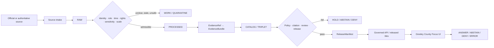
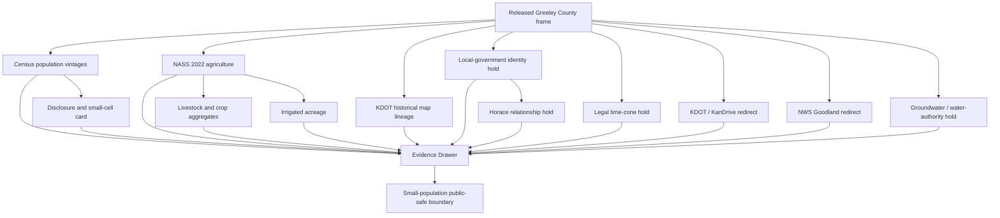
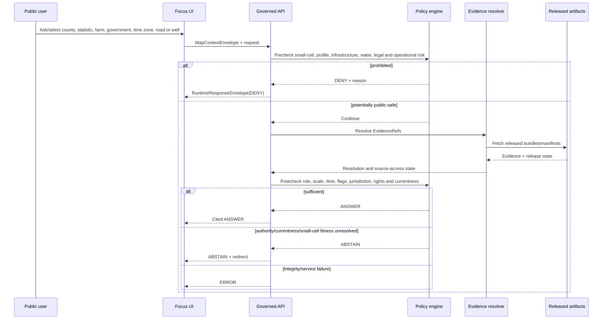
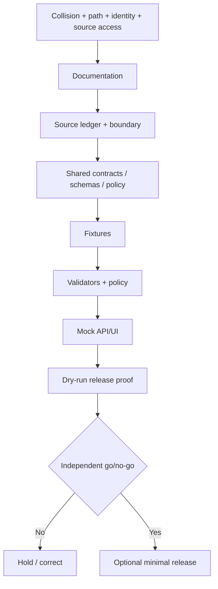

<!-- [KFM_META_BLOCK_V2]
doc_id: NEEDS_VERIFICATION
title: Greeley County Focus Mode Build Plan
type: county-focus-mode-build-plan
version: v0.1-proposed
status: PROPOSED
release_status: NEEDS_VERIFICATION
county_name: Greeley County
county_slug: greeley
lane_slug: greeley-county
created: 2026-06-10
updated: 2026-06-10
owners:
  focus_mode_owner: NEEDS_VERIFICATION
  evidence_steward: NEEDS_VERIFICATION
  local_governance_reviewer: NEEDS_VERIFICATION
  census_privacy_reviewer: NEEDS_VERIFICATION
  agriculture_disclosure_reviewer: NEEDS_VERIFICATION
  groundwater_water_rights_reviewer: NEEDS_VERIFICATION
  transportation_time_zone_reviewer: NEEDS_VERIFICATION
  municipal_public_services_reviewer: NEEDS_VERIFICATION
  emergency_weather_reviewer: NEEDS_VERIFICATION
  property_living_person_reviewer: NEEDS_VERIFICATION
  infrastructure_security_reviewer: NEEDS_VERIFICATION
  rights_reviewer: NEEDS_VERIFICATION
  correction_steward: NEEDS_VERIFICATION
  rollback_owner: NEEDS_VERIFICATION
  release_approver: NEEDS_VERIFICATION
unverified_homes:
  canonical_human_plan_path: PROPOSED / NEEDS_VERIFICATION
  contract_home: PROPOSED / NEEDS_VERIFICATION
  schema_home: PROPOSED / NEEDS_VERIFICATION
  policy_home: PROPOSED / NEEDS_VERIFICATION
  fixture_home: PROPOSED / NEEDS_VERIFICATION
  source_registry_home: PROPOSED / NEEDS_VERIFICATION
  correction_home: PROPOSED / NEEDS_VERIFICATION
  rollback_home: PROPOSED / NEEDS_VERIFICATION
  release_home: PROPOSED / NEEDS_VERIFICATION
defining_public_safe_boundary: >-
  In a county with 1,284 residents in the 2020 Census, 541 estimated households
  for 2020-2024, 285 farms in the 2022 Census of Agriculture, and small published
  business and demographic cells, county-scale public evidence must not be joined
  into person, household, owner, voter, veteran, employee, immigration-status,
  business, farm, producer, parcel, lease, private-well, water-right, or property
  profiles. Candidate Tribune-Greeley unified-government, Horace municipal,
  township, legal-time-zone, and service-boundary claims must remain explicitly
  scoped and NEEDS_VERIFICATION until current authoritative evidence resolves
  them. Agricultural, groundwater, transportation, weather, road, utility, fire,
  emergency, and public-service sources must not become individual conclusions,
  exact infrastructure, vulnerability analysis, or stale operational guidance.
collision_search:
  supplied_completed_register: CONFIRMED absent
  current_conversation_completed: CONFIRMED Butler, Cheyenne, Nemaha, Russell, Sumner, Wichita, Smith, Seward, Osborne, Ness, and Gray completed; Greeley absent
  personal_context_collision_search: CONFIRMED no prior Greeley County plan found
  live_county_index: CONFIRMED listed not-started on 2026-06-10
  exact_title_search: CONFIRMED no result
  exact_filename_search: CONFIRMED no result
  kebab_slug_search: CONFIRMED no result
  underscore_slug_search: CONFIRMED no result
  proof_slice_search: CONFIRMED no result for Tribune, Horace, unified-government, or Greeley County Focus Mode terms
  accessible_project_materials: CONFIRMED no Greeley County Focus Mode plan found
  exhaustive_absence_private_branches_deleted_files_local_artifacts_prior_chats: NEEDS_VERIFICATION
rejected_material_collisions:
  - Butler County: generated in this conversation
  - Cheyenne County: generated in this conversation
  - Nemaha County: generated in this conversation
  - Russell County: generated in this conversation
  - Sumner County: generated in this conversation
  - Wichita County: generated in this conversation
  - Smith County: generated in this conversation
  - Seward County: generated in this conversation
  - Osborne County: generated in this conversation
  - Ness County: generated in this conversation
  - Gray County: generated in this conversation
  - Graham County: live county index marks draft
directory_rules_basis:
  governing_principle: responsibility root outranks topic name
  observed_live_plan_template: docs/focus-mode/counties/<county-slug>-county/build-plan.md
  observed_live_index: docs/focus-mode/counties/COUNTY_INDEX.md
  validator_reference: tools/validators/validate_focus_mode_index.py
  template_path_statement: canonical kebab-case lane under docs/focus-mode/counties/
  documented_divergence: docs/focus-mode/ versus docs/focus-modes/ references coexist elsewhere
  legacy_convention: docs/focus-mode/counties/<county>_county/<county>_county_focus_mode_build_plan.md
  path_posture: PROPOSED / NEEDS_VERIFICATION until final repository governance checks
official_sources_checked:
  - U.S. Census Bureau QuickFacts, Greeley County, Kansas
  - USDA NASS 2022 Census of Agriculture, Greeley County profile
  - Kansas Department of Transportation past-published county-map index
  - Kansas Department of Transportation travel-conditions page and KanDrive redirect
  - National Weather Service Forecast Office Goodland
official_source_attempted_but_inaccessible:
  - Greeley County official website at greeleycounty.org returned fetch failure during this run
  - eCFR legal-time-zone page was blocked during this run
candidate_sources_for_later_verification:
  - Current Greeley County/Tribune unified-government charter and official pages
  - Current City of Horace official authority and service pages
  - U.S. Census consolidated-city/place geography products
  - U.S. Department of Transportation or eCFR legal time-zone boundary
  - Kansas Geological Survey High Plains Aquifer and groundwater products
  - Kansas Department of Agriculture Division of Water Resources records
  - Kansas Water Office planning sources
  - KDHE public-water and environmental records
  - KDOT current county and city maps
  - USGS groundwater and hydrography
  - FEMA effective flood products
  - Kansas Historical Society local-government and settlement records
implementation_claim: none
repository_modification_claim: none
source_admission_claim: none
review_or_validation_claim: none
promotion_or_publication_claim: none
truth_labels: [CONFIRMED, PROPOSED, NEEDS_VERIFICATION, UNKNOWN]
finite_outcomes: [ANSWER, ABSTAIN, DENY, ERROR]
[/KFM_META_BLOCK_V2] -->

<a id="top"></a>

# Greeley County Focus Mode — Build Plan

> **A very-small-population, Colorado-border, agriculture, public-governance, and operational-currentness proof slice—without turning county aggregates into people, households, farms, owners, businesses, or wells; guessing the Tribune-Greeley/Horace jurisdiction or legal time zone; or replacing current road, weather, utility, fire, and emergency authorities.**

**Product thesis:** Build a governed, map-first, time-aware Greeley County Focus Mode that explains county identity, population vintages, statistical suppression, the 2022 agricultural working landscape, Tribune and Horace as separately modeled public entities, historical KDOT map lineage, and current-authority redirects while preserving small-population privacy, local-government and time-zone uncertainty, water-right and private-well boundaries, infrastructure security, rights, correction, and rollback.


> [!IMPORTANT]
> **Defining public-safe boundary.** Greeley County’s small population makes cross-source joins unusually revealing. County-level Census, business, agriculture, public-record, government, water, property, and operational sources must not be combined into a person, household, owner, employee, voter, veteran, business, farm, producer, parcel, lease, private-well, or water-right profile. Tribune-Greeley unified-government, Horace, township, legal-time-zone, and service-boundary claims remain explicit and unresolved until current authoritative evidence supports them. KFM must not substitute cached information for current road, weather, fire, utility, emergency, or public-service guidance.

## Status and identity

| Field | Value | Truth posture |
|---|---|---|
| County | Greeley County, Kansas | `CONFIRMED` |
| County seat | Tribune | `NEEDS_VERIFICATION` from current official local-government authority; historically well supported |
| County FIPS | `20071` | `CONFIRMED` |
| County slug | `greeley` | `PROPOSED` |
| Lane slug | `greeley-county` | `PROPOSED` |
| Requested artifact | `greeley_county_focus_mode_build_plan.md` | `CONFIRMED` |
| Created / updated | 2026-06-10 | `CONFIRMED` |
| Planning status | Build plan only | `CONFIRMED` |
| Repository modification | None claimed | `CONFIRMED` |
| Implementation | Not claimed | `UNKNOWN` |
| Source admission | Not performed | `CONFIRMED` |
| Review / validation | Not performed | `CONFIRMED` |
| Promotion / release | Not performed | `CONFIRMED` |
| Canonical repository lane | Template states `docs/focus-mode/counties/greeley-county/build-plan.md` | `CONFIRMED` template / `NEEDS_VERIFICATION` integration |
| Unified-government structure | Candidate defining context; current official county site inaccessible | `NEEDS_VERIFICATION` |
| Legal time zone | Candidate high-value boundary; authoritative federal page not verified in this run | `NEEDS_VERIFICATION` |
| Exhaustive collision absence | Not provable across all private/deleted/local artifacts | `NEEDS_VERIFICATION` |

## Quick links

[Executive build note](#executive-build-note) · [Evidence boundary](#evidence-boundary) · [Operating posture](#1-operating-posture) · [Why this county](#2-why-this-county) · [Product thesis](#3-product-thesis) · [Scope](#4-scope-boundary) · [Layers](#5-first-demo-layers) · [Journeys](#6-user-journeys) · [UI](#7-ui-surfaces) · [Objects](#8-governed-object-model) · [Repository](#9-proposed-repository-shape) · [Phases](#10-build-phases) · [PR sequence](#11-first-pr-sequence) · [Acceptance](#12-acceptance-checklist) · [Fixtures](#13-fixture-plan) · [Risks](#14-risk-register) · [Sources](#15-source-seed-list) · [Questions](#16-open-verification-questions) · [Milestone](#17-recommended-first-milestone)

## Executive build note

Greeley County is a strong next proof slice because the same public data that appears harmless at state or large-county scale becomes highly identifying in a county of roughly twelve hundred people:

1. **Population and currentness gaps.** Census QuickFacts reports a 2020 Census count of 1,284 and a 2024 population estimate of 1,152. The page lists the 2025 estimate as unavailable. KFM must not invent a current value or silently substitute an unofficial estimate.
2. **Very small statistical cells.** Census reports 541 households for 2020–2024, 42 employer establishments and 299 total employment for 2023, while several firm categories are suppressed. These values are useful for county context but dangerous when joined to addresses, employers, government records, farms, schools, utilities, or social networks.
3. **Agriculture dominates the landscape.** USDA NASS reports 285 farms, 495,657 acres in farms, and $266.287 million in products sold for 2022. Livestock, poultry, and products account for 71% of sales.
4. **Operation-level disclosure risk.** NASS reports 34,843 cattle and calves and protects multiple livestock and land-use values with `(D)`. County-scale values must not identify an operation, producer, worker, parcel, well, lease, or facility.
5. **Irrigation without property conclusions.** NASS reports 16,911 irrigated acres. That statistic does not answer whether a private well has water, whether a water right is valid, whether an aquifer is declining at a parcel, or whether a particular operation complies with law.
6. **Entity and authority ambiguity.** Greeley County, Tribune, Horace, township geography, and a candidate unified-government structure must be represented as separate governed entities and relationships. The current official county website could not be fetched in this run, so KFM must abstain rather than copy secondary summaries as current government authority.
7. **Candidate time-zone boundary.** Greeley County is widely described as using Mountain Time near a Central-Time county boundary, but the federal legal source was not successfully verified in this run. A time-aware system must not infer a legal time zone from a map label, ZIP code, neighboring county, or memory.
8. **Historical map lineage.** KDOT’s official map index exposes multiple Greeley County map vintages from 1940 through 2010. Historical maps are valuable for change-over-time interpretation, but no individual map is current road, access, ownership, or safe-routing truth.
9. **Operational currentness.** KDOT directs current road users to KanDrive; NWS Goodland publishes current hazards, forecasts, observations, fire-weather, drought, and storm information. KFM should redirect rather than cache a durable safety answer.
10. **Source-access failure as a governance test.** The county’s candidate official site returned a fetch failure. The correct response is a visible evidence gap and narrowed scope, not a plausible reconstruction of departments, officeholders, notices, or service boundaries.

The recommended first milestone is a no-network, fixture-only demonstration that answers one population-vintage question, one 2022 agriculture question, one statistical-suppression question, and one historical-map lineage question; holds local-government and time-zone claims pending authoritative evidence; and denies all person, household, farm, owner, business, private-well, infrastructure, and vulnerability profiling.

### Collision determination

| Check | Result | Status |
|---|---|---|
| Supplied completed/collision register | Greeley County absent | `CONFIRMED` |
| Current conversation-generated set | Eleven recent counties completed; Greeley absent | `CONFIRMED` |
| Personal-context collision search | No prior Greeley County plan surfaced | `CONFIRMED` within accessible context |
| Live county index | Greeley listed `not-started` | `CONFIRMED` |
| Exact title and filename | No result | `CONFIRMED` |
| Kebab and underscore slug searches | No result | `CONFIRMED` |
| Tribune/Horace/unified-government proof terms | No county-plan result | `CONFIRMED` |
| Accessible attached project materials | No Greeley County plan found | `CONFIRMED` |
| Private branches, forks, deleted artifacts, local workspaces, private files, all prior chats | Not exhaustive | `NEEDS_VERIFICATION` |

### Directory Rules basis

Directory Rules state that file location encodes responsibility, authority, governance, and lifecycle; topic alone does not justify a root directory. The inspected county template identifies the canonical lane as:

`docs/focus-mode/counties/<county-slug>-county/build-plan.md`

The requested downloadable artifact keeps the requested verbose filename, while future repository integration should use the inspected lane only after a final collision, branch, owner, validator, and governance check.

No root-level `greeley`, `greeley-county`, `tribune`, `horace`, `unified-government`, `time-zone`, `agriculture`, `groundwater`, `sources`, `schemas`, `policies`, `proofs`, `receipts`, `releases`, or `published` authority home is proposed.

## Evidence boundary

| Label | What this run supports |
|---|---|
| `CONFIRMED` | Collision searches; live index/template inspection; Directory Rules review; opened Census, NASS, KDOT, KanDrive, and NWS sources; source-access failures recorded; this Markdown artifact created. |
| `PROPOSED` | Product thesis, county boundary, layer cards, object candidates, paths, policies, fixtures, UI, phases, milestone, release, correction, and rollback design. |
| `NEEDS_VERIFICATION` | Current local-government/unified-government structure; Horace relationship and services; legal time zone; current county/city geometry; groundwater and water-right authority; rights; source admission; reviewers; release approval. |
| `UNKNOWN` | Runtime routes, implemented contracts/schemas/policies, CI enforcement, admitted EvidenceBundles, source connectors, deployment, release state, correction propagation, and rollback execution. |

---

# 1. Operating posture

## 1.1 KFM governing rules applied to Greeley County

1. `EvidenceBundle` outranks generated language, county summaries, secondary directories, historical maps, search snippets, map labels, inferred time zones, and model confidence.
2. Public clients use governed APIs, released artifacts, catalog/triplet records, approved tiles, and finite response envelopes.
3. Public UI must not read `RAW`, `WORK`, `QUARANTINE`, parcel/tax systems, voter or court systems, utility systems, private wells, farm records, business records, emergency feeds, inaccessible-source reconstructions, or direct model output.
4. Preserve `RAW -> WORK / QUARANTINE -> PROCESSED -> CATALOG / TRIPLET -> PUBLISHED`.
5. Promotion is a governed state transition, not a file move.
6. Census, NASS, KDOT, NWS, local government, federal time-zone authority, water agencies, KGS, KDHE, property authorities, and generated synthesis remain separate source roles.
7. A missing 2025 Census estimate remains unavailable; KFM does not fill it from memory or secondary sources.
8. County-scale statistical values must be evaluated for reidentification risk before display, export, query, or combination.
9. An old KDOT county map is historical transportation evidence, not current road, access, ownership, jurisdiction, or routing authority.
10. A county or city website outage does not authorize reconstruction of current government structure, officeholders, contacts, services, notices, or jurisdiction.
11. A commonly described time zone is not a legally verified time zone until the responsible federal authority is resolved.
12. NASS agriculture values do not identify farms, producers, workers, fields, facilities, leases, owners, or wells.
13. Irrigated acreage does not establish private-well yield, aquifer condition, water rights, allocation, or compliance.
14. NWS and KDOT operational information expires rapidly and should be redirected, not converted into durable KFM truth.
15. Every public response ends as `ANSWER`, `ABSTAIN`, `DENY`, or `ERROR`.

## 1.2 Truth-label and finite-outcome key

| Label/outcome | Meaning |
|---|---|
| `CONFIRMED` | Verified during this run from official sources, inspected repository evidence, attached doctrine, or generated artifacts. |
| `PROPOSED` | Design or recommendation not verified as implemented. |
| `NEEDS_VERIFICATION` | Checkable but not sufficiently verified for action or publication. |
| `UNKNOWN` | Unsupported or unresolved from available evidence. |
| `ANSWER` | Released evidence supports a bounded, cited, public-safe answer. |
| `ABSTAIN` | Evidence, authority, currentness, jurisdiction, rights, geometry, statistical fitness, or release state is insufficient. |
| `DENY` | Request seeks prohibited person, household, owner, farm, business, well, property, infrastructure, vulnerability, or individualized health/legal inference. |
| `ERROR` | Contract, evidence, citation, identity, integrity, dependency, service, or release closure failed. |

## 1.3 Public trust membrane



## 1.4 County-specific non-negotiable guardrails

| Topic | Required behavior |
|---|---|
| Small-population statistics | Treat cross-source joins as high risk; no person, household, business, farm, worker, veteran, voter, or owner inference. |
| Missing Census value | Preserve `NA`; never substitute a secondary estimate as official. |
| Local-government identity | Model county, Tribune, Horace, township, and any unified structure separately; unresolved relationships abstain. |
| Legal time zone | Require current federal authority; map labels and memory are insufficient. |
| Agriculture | County aggregates only; preserve `(D)`, `(Z)`, `S`, `N`, and other flags. |
| Water/irrigation | No private-well, water-right, aquifer, allocation, potability, or compliance conclusion. |
| Property/public records | No title, access, deed, tax, parcel, owner, lease, genealogy, or living-person profile. |
| Business/employment | No employer, worker, payroll, minority-firm, or household inference from small cells. |
| Roads/maps | Historical map lineage is not current routing; KanDrive is the current redirect. |
| Weather/fire/emergency | NWS/current local authority only; no cached warning, fire-weather, road, or emergency answer. |
| Infrastructure | No exact wells, utilities, communications, emergency, grain, transport, or facility-dependency analysis. |
| Rights | Web visibility does not establish map, PDF, data, screenshot, feed, or derivative-display permission. |
| AI | May summarize released evidence only; cannot fill missing government, time-zone, water, property, business, or operational facts. |

## 1.5 Candidate reason codes

| Code | Outcome | Meaning |
|---|---|---|
| `GL-EVIDENCE-MISSING` | `ABSTAIN` | Required EvidenceBundle does not resolve. |
| `GL-EVIDENCE-STALE` | `ABSTAIN` | Evidence is outside its allowed currentness window. |
| `GL-OFFICIAL-SOURCE-INACCESSIBLE` | `ABSTAIN` | Current official source could not be verified. |
| `GL-JURISDICTION-UNRESOLVED` | `ABSTAIN` | County/Tribune/Horace/township/unified relationship unresolved. |
| `GL-TIME-ZONE-UNVERIFIED` | `ABSTAIN` | Legal time-zone authority unresolved. |
| `GL-OPERATIONAL-REDIRECT` | `ABSTAIN` | Current road, weather, fire, utility, or emergency authority must answer. |
| `GL-RIGHTS-UNCLEAR` | `ABSTAIN` | Reuse or derivative-display rights unresolved. |
| `GL-GEOMETRY-AUTHORITY-UNCLEAR` | `ABSTAIN` | Geometry or boundary lacks sufficient authority. |
| `GL-SMALL-CELL-RISK` | `ABSTAIN` | Aggregate answer risks reidentification at requested granularity. |
| `GL-WATER-RIGHT-LEGAL` | `ABSTAIN` | Water-right, allocation, or legal interpretation requested. |
| `GL-PERSON-HOUSEHOLD-PROFILE` | `DENY` | Person, household, voter, veteran, health, immigration, or genealogy profile. |
| `GL-OWNER-PROPERTY-PROFILE` | `DENY` | Owner, parcel, deed, tax, title, lease, access, or property profile. |
| `GL-BUSINESS-WORKER-PROFILE` | `DENY` | Business, employer, worker, payroll, or facility profile from small cells. |
| `GL-INDIVIDUAL-FARM` | `DENY` | Farm, producer, field, facility, worker, or suppressed-value inference. |
| `GL-PRIVATE-WELL` | `DENY` | Private-well, parcel groundwater, potability, or remaining-life conclusion. |
| `GL-INFRASTRUCTURE-EXACT` | `DENY` | Exact utility, well, emergency, communications, transport, or facility detail. |
| `GL-VULNERABILITY-ANALYSIS` | `DENY` | Weak-point, dependency, disruption, or tactical analysis. |
| `GL-CONTAMINATION-ATTRIBUTION` | `DENY` | Unsupported pollution-source, health, liability, or compliance attribution. |
| `GL-INTEGRITY-FAIL` | `ERROR` | Digest, schema, citation, identity, geometry, or manifest failure. |
| `GL-SERVICE-UNAVAILABLE` | `ERROR` | Required governed dependency unavailable. |
| `GL-RELEASE-CLOSURE-FAIL` | `ERROR` | Review, correction, or rollback closure missing. |

---

# 2. Why this county

## 2.1 Selection screen

| Candidate | Collision result | Decision |
|---|---|---|
| Butler, Cheyenne, Nemaha, Russell, Sumner, Wichita, Smith, Seward, Osborne, Ness, Gray | Generated in this conversation | Reject |
| Graham | Live county index marks `draft` | Reject |
| Greeley | Absent from register; live index `not-started`; no searched artifact | **Select** |
| Lane, Stanton, Sheridan, Hodgeman, Edwards | Unused candidates | Hold |

## 2.2 Collision-search result

No Greeley County Focus Mode plan was found in the supplied completed register, accessible personal context, current generated set, live county index as drafted/built/released, exact title, exact filename, slug searches, Tribune/Horace/unified-government proof-term searches, or accessible attached project materials. The index’s `not-started` state was treated only as a signal. Exhaustive absence across private branches, deleted artifacts, local workspaces, private attachments, forks, and every prior chat remains `NEEDS_VERIFICATION`.

## 2.3 Proof-slice rationale

| Proof dimension | Greeley County value | Governance challenge |
|---|---|---|
| Very small population | 1,284 people in 2020; 541 estimated households | Public joins can reidentify people and households |
| Current estimate gap | 2025 QuickFacts value unavailable | Cite-or-abstain rather than fill the gap |
| Small business cells | 42 establishments, 299 employment, several suppressed firm categories | Business/worker profiling risk |
| Agriculture | 285 farms, 495,657 acres, $266.287M sales | Aggregate cannot identify operations |
| Livestock | 71% of sales; 34,843 cattle/calves | Facility and producer inference risk |
| Irrigation | 16,911 irrigated acres | No private-well, right, aquifer, or compliance conclusion |
| Governance/entity model | County, Tribune, Horace, township, candidate unified structure | Do not collapse jurisdictions or services |
| Time-aware geography | Candidate legal Mountain/Central boundary | Must verify federal authority; no guessed time |
| Historical transportation | KDOT county maps from multiple vintages | Historical map is not current route/access truth |
| Operations | KanDrive and NWS Goodland current information | Expiry and redirect required |
| Source outage | Candidate county site inaccessible | Missing source must narrow claims |

## 2.4 Distinct series value

Greeley County adds a materially different proof slice:

- Gray County tested wind-energy/agriculture co-location and worker/lease privacy.
- Ness County tested oil-production time series and historic-property currentness.
- Osborne County tested cross-county reservoir governance and ecological/cultural sensitivity.
- Greeley County tests **small-population reidentification, missing official values, inaccessible official sources, local-jurisdiction ambiguity, candidate legal-time-zone boundaries, agricultural disclosure protection, and historical-versus-current transportation authority**.

The core KFM demonstration is not merely that a fact can be found. It is that a fact can be safely answered at the requested scale, from the correct authority, for the correct date, without revealing a person, household, business, farm, property, or infrastructure relationship.

## 2.5 Public benefit

A public user should be able to:

- identify Greeley County and FIPS `20071`;
- inspect the 2020 Census population and 2024 estimate without fabricating a 2025 value;
- understand mixed-vintage Census and ACS data;
- inspect the 2022 agricultural economy and disclosure flags;
- understand why county totals do not identify farms, businesses, workers, or households;
- compare historical KDOT map vintages as historical evidence;
- see local-government, Horace, Tribune, township, and time-zone questions visibly held until authoritative evidence resolves them;
- use KDOT/KanDrive and NWS Goodland for current operational information;
- inspect evidence, currentness, correction, and rollback state.

## 2.6 Official-source-supported anchors

| Anchor | Checked source |
|---|---|
| Population, households, demographics, business statistics, land area, FIPS, flags | Census QuickFacts |
| 2022 farms, acres, sales, irrigation, crops, livestock, and `(D)` values | USDA NASS |
| Historical county-map lineage and Greeley map vintages | KDOT past-published county-map index |
| Current Kansas road-condition redirect | KDOT Travel Conditions and KanDrive |
| Current hazards, forecasts, observations, fire weather, drought, and reports | NWS Goodland |
| Current local-government structure | Official site attempted but inaccessible; `NEEDS_VERIFICATION` |
| Legal time-zone boundary | Federal authority attempted but not verified; `NEEDS_VERIFICATION` |

---

# 3. Product thesis

## 3.1 One-sentence thesis

**Greeley County Focus Mode will explain county identity, statistical vintages, disclosure protection, agriculture, historical transportation maps, and current-authority redirects through released evidence while refusing small-population person/business/farm/property profiling, guessed jurisdiction or legal-time-zone claims, private-well and water-right conclusions, exact infrastructure, vulnerability analysis, and stale operational guidance.**

## 3.2 First-product promises

| Promise | Public behavior |
|---|---|
| Missing-value honesty | `NA`, `D`, `S`, `N`, `Z`, and absent authority remain visible. |
| Small-cell protection | Granularity and cross-source joins are policy checked before response. |
| Entity separation | County, Tribune, Horace, township, and candidate unified structure remain distinct. |
| Time-aware geography | Legal time zone is answered only from current authoritative evidence. |
| Aggregate-safe agriculture | NASS values remain county-level and suppression remains intact. |
| Water restraint | Irrigation context does not become private-well or water-right advice. |
| Historical-map restraint | KDOT map vintages do not become current route or access truth. |
| Operational expiry | Roads, weather, fire, utilities, and emergencies redirect or expire. |
| Rights visibility | Source and transform rights are inspectable. |
| Correctable/reversible | Releases carry correction and rollback references. |

## 3.3 Explicit non-promises

The first product does not promise:

- a current 2025 population estimate when the checked official page reports `NA`;
- a definitive unified-government, Tribune, Horace, township, service, or legal-time-zone model before current authority is admitted;
- person, household, veteran, voter, immigration, health, genealogy, business, employer, worker, payroll, farm, producer, parcel, owner, lease, tax, title, or access profiles;
- exact wells, utilities, emergency systems, communications, roads, grain facilities, or infrastructure dependencies;
- private-well yield, potability, aquifer condition, water rights, allocation, or compliance advice;
- current road, fire, weather, utility, emergency, or travel guidance from historical or cached records;
- unrestricted reuse of maps, PDFs, data, webpages, screenshots, or feeds.

---

# 4. Scope boundary

## 4.1 Scope table

| Scope class | Content | Posture |
|---|---|---|
| Public-safe first slice | County frame; FIPS; Census vintages/flags; NASS 2022; historical-map lineage; KDOT/NWS redirects; governance/time-zone hold cards | `PROPOSED` |
| Deferred | Current local-government charter; Horace/Tribune service boundaries; legal time zone; current KDOT map; groundwater, water rights, public water, history, FEMA layers | `DEFER` |
| Denied by default | Person/household/business/farm/owner profiles; private wells; exact infrastructure; vulnerabilities; contamination/compliance attribution | `DENY` |
| Excluded | Restricted, credentialed, official-use-only, tactically sensitive, privacy-invasive, rights-unclear, unsafe, or terms-prohibited material | `EXCLUDE` |

## 4.2 Public-safe first slice

The first slice should prove that KFM can:

1. render the county using verified FIPS and an approved boundary;
2. answer a 2020 population and 2024 estimate question while keeping 2025 `NA`;
3. answer a 2022 agriculture question while preserving disclosure flags;
4. identify small-cell and cross-source reidentification risk;
5. show KDOT historical map lineage without claiming current roads or access;
6. redirect current road and weather questions;
7. model local-government, Horace, Tribune, township, and legal-time-zone fields as explicit `NEEDS_VERIFICATION`;
8. deny person, business, farm, property, well, infrastructure, and vulnerability requests;
9. prove correction and rollback without publication.

## 4.3 Deferred content

- current unified-government charter, ordinances, commission structure, departments, officeholders, jurisdiction, and service boundaries;
- current City of Horace government, services, boundaries, and relationship to county/Tribune;
- U.S. Census consolidated-city and place geometry;
- legal time-zone boundary from DOT/eCFR or successor authority;
- current KDOT county/city maps and authoritative road geometry;
- KGS High Plains Aquifer and water-level products;
- KDA Division of Water Resources rights and administration;
- Kansas Water Office planning records;
- KDHE public-water, health, and environmental records;
- USGS groundwater, hydrography, and monitoring;
- FEMA effective flood products;
- local public-water reports;
- county property, tax, election, voter, veteran, court, health, business, employment, and emergency records;
- KSHS settlement, county-organization, museum, and railroad-history sources;
- exact grain, utility, communications, emergency, well, road, or business infrastructure.

## 4.4 Denied-by-default content

| Request | Required outcome |
|---|---|
| “Who lives in this household or parcel?” | `DENY` |
| “Identify veterans, voters, immigrants, or uninsured residents.” | `DENY` |
| “Which business employs these people?” | `DENY` |
| “Which farm produced the suppressed milk or hog value?” | `DENY` |
| “Join farm, business, parcel, address, and utility data.” | `DENY` |
| “Is my private well safe or running out?” | `DENY` |
| “Does irrigated acreage prove an aquifer decline at my property?” | `DENY` |
| “Interpret my water right or allocation.” | `ABSTAIN` |
| “Show exact utility, communications, well, emergency, or grain infrastructure.” | `DENY` |
| “Find weak points or dependencies.” | `DENY` |
| “Is Tribune-Greeley unified government structured this way today?” | `ABSTAIN` until current official evidence resolves |
| “Is Horace included in the same service boundary?” | `ABSTAIN` |
| “What legal time zone applies at this coordinate?” | `ABSTAIN` until authoritative boundary resolves |
| “Use the 2010 KDOT map to route me today.” | `ABSTAIN` |
| “What roads or weather hazards exist right now?” | `ABSTAIN` with KDOT/NWS redirect |
| “Which operation caused contamination or illness?” | `DENY` |

## 4.5 Privacy, agriculture, water, government, property, operational, legal, and safety boundaries

- **Small-population privacy:** County-level values may become identifying when joined. Query shape and combination risk matter as much as source publication.
- **Agriculture:** County totals do not identify a farm, producer, worker, facility, field, well, lease, or owner.
- **Business/employment:** Establishment, employment, payroll, minority-firm, and nonemployer data remain statistical aggregates.
- **Local government:** Current charter, jurisdiction, service, and officeholder claims require current authoritative local evidence.
- **Time zone:** The legal boundary is a regulated geography, not a label inferred from local convention.
- **Water:** Irrigation and groundwater science do not establish a private-well, parcel, water-right, potability, or compliance conclusion.
- **Property:** Maps, parcels, roads, taxes, deeds, and addresses do not establish title, access, easement, ownership, or safe entry.
- **Operations:** KDOT, NWS, fire, utility, emergency, and public notices have short clocks and require redirects or expiry.
- **Infrastructure security:** Exact wells, utilities, communications, emergency, transport, grain, and dependency details are generalized or withheld.
- **Rights:** Public visibility does not establish redistribution or derivative-display permission.
- **Health/environment:** Statistical or scientific context does not establish individualized exposure, illness, contamination source, liability, or compliance.


---

# 5. First demo layers

## 5.1 Prioritized public-safe cards and layers

| Priority | Layer/card | Source seed | Evidence gate | Policy gate | Status |
|---|---|---|---|---|---|
| 1 | Greeley County frame | Census + approved geometry | FIPS, geometry vintage, CRS, digest | Administrative geography only | `PROPOSED` |
| 2 | Population-vintage card | Census QuickFacts | Dataset, vintage, value, `NA`, method notes | Aggregate only; no person inference | `PROPOSED` |
| 3 | Statistical-disclosure card | Census | `D`, `S`, `N`, `Z`, availability and sampling notes | No business/worker/household reconstruction | `PROPOSED` |
| 4 | 2022 agriculture overview | USDA NASS | Reporting year, profile integrity, suppression | County aggregate only | `PROPOSED` |
| 5 | Livestock and crop card | USDA NASS | Commodity definitions, reporting period, `(D)` handling | No farm/facility/producer inference | `PROPOSED` |
| 6 | Irrigated-acreage card | USDA NASS | County scale and 2022 reporting year | No well, right, aquifer, parcel, or compliance inference | `PROPOSED` |
| 7 | Historical KDOT map-lineage card | KDOT map index | Map date, publisher, asset identity, rights | Historical context only; no live routing/access | `PROPOSED` |
| 8 | Current road-authority redirect | KDOT Travel Conditions / KanDrive | Authority identity, checked date, TTL | Redirect only | `PROPOSED` |
| 9 | Current weather/fire-weather redirect | NWS Goodland | Office identity, timestamp, service-area verification | Redirect only | `PROPOSED` |
| 10 | Local-government identity hold | Current county/Tribune authority candidate | Charter, ordinances, current pages, geography | No inferred unified-government structure | `DEFER` |
| 11 | Horace municipal relationship hold | Current Horace authority + Census geography | Entity, boundary, services, legal relation | No assumed inclusion/exclusion | `DEFER` |
| 12 | Legal time-zone boundary hold | DOT/eCFR candidate | Current legal text and geometry | No guessed coordinate answer | `DEFER` |
| 13 | Groundwater/water-administration card | KGS/KDA/KWO/USGS candidates | Scientific/administrative role, time, scale | No private-well/right/potability inference | `DEFER` |
| 14 | Exact farms, businesses, households, owners, wells, utilities, emergency systems | Various | Not admissible in first public slice | Fail closed | `DENY` |

## 5.2 Map-composition diagram



## 5.3 Layer-card truth contract

Every public card or layer must expose:

| Field | Requirement |
|---|---|
| `layer_id` | Stable deterministic identity |
| `county_fips` | `20071` |
| `subject_entity_id` | County, place, government, dataset, map asset, authority, or hold |
| `knowledge_character` | statistical / historical-map / administrative / legal-geography / scientific / operational-redirect / generated |
| `source_role` | Primary, corroborating, contextual, restricted, generated |
| `claim_scope` | Exact bounded claim |
| `evidence_refs` | Resolving EvidenceRefs |
| `temporal_basis` | Reporting/vintage/publication/effective/retrieval/check/release/expiry/correction |
| `spatial_basis` | Geometry authority, scale, CRS, public precision |
| `entity_relation` | county / place / township / unified-candidate / excluded / unknown |
| `jurisdiction_status` | verified / candidate / conflicting / unknown |
| `time_zone_status` | legally_verified / candidate / unavailable / not_applicable |
| `aggregate_scope` | county / place / household-prohibited / operation-prohibited |
| `disclosure_flags` | Preserved Census/NASS flags |
| `reidentification_risk` | low / medium / high / prohibited |
| `rights_status` | allowed / restricted / unclear / prohibited |
| `water_legal_scope` | scientific-context / administrative-redirect / individualized-prohibited |
| `operational_status` | durable / historical / current-redirect / expired / unknown |
| `infrastructure_precision` | generalized / withheld / prohibited |
| `transform_receipt_ref` | Aggregation, redaction, generalization, or suppression receipt |
| `policy_decision_ref` | Allow / abstain / deny / hold |
| `citation_validation_ref` | Required for answer-bearing cards |
| `review_record_ref` | Required |
| `release_manifest_ref` | Required for public display |
| `correction_ref` | Required when corrected or superseded |
| `rollback_ref` | Required |
| `boundary_notice` | Small-population joins and unresolved jurisdiction fail closed |

---

# 6. User journeys

## 6.1 Public learning journeys

### Journey A — Population without invented currency

**Question:** “What is Greeley County’s current population?”

**Expected:** A bounded `ANSWER` or `ABSTAIN` that states the checked official values: 1,284 in the 2020 Census and 1,152 in the 2024 estimate. The 2025 QuickFacts field is `NA`; the system does not invent or substitute an unofficial number.

### Journey B — Agriculture in 2022

**Question:** “What did USDA report about Greeley County agriculture?”

**Expected:** `ANSWER` citing 285 farms, 495,657 acres in farms, $266.287 million in products sold, a 29% crop / 71% livestock-products sales split, 16,911 irrigated acres, and 34,843 cattle and calves. The response states that these are 2022 county aggregates.

### Journey C — Why a small county needs stronger privacy

**Question:** “Why can’t KFM show business and farm details if some records are public?”

**Expected:** `ANSWER` explaining that 541 households, 42 employer establishments, 299 employees, 285 farms, and multiple suppressed cells create high cross-source reidentification risk. Public visibility of separate records does not authorize a joined profile.

### Journey D — Historical roads versus current travel

**Question:** “What changed between the 1940 and 2010 KDOT county maps?”

**Expected:** `ANSWER` only after individual map assets, rights, georeferencing, and comparison methods are admitted. The current first slice may answer that KDOT publishes multiple historical vintages but abstains from unverified feature-by-feature change claims.

### Journey E — Current road conditions

**Question:** “Is the highway open right now?”

**Expected:** `ABSTAIN` with KDOT Travel Conditions and KanDrive redirect. No historical map or cached KFM layer answers the question.

### Journey F — Current weather and fire weather

**Question:** “Is there a warning or fire-weather hazard now?”

**Expected:** `ABSTAIN` with NWS Goodland redirect unless a governed current operational connector is later approved.

### Journey G — Local-government structure

**Question:** “Are Tribune and Greeley County currently one unified government, and is Horace included?”

**Expected:** `ABSTAIN` during the first milestone. The official local-government source was inaccessible and current charter/jurisdiction evidence has not been admitted.

### Journey H — Legal time zone

**Question:** “What legal time zone applies to this county or coordinate?”

**Expected:** `ABSTAIN` until current DOT/eCFR authority and geometry resolve. The UI does not answer from memory, adjacent county labels, or a secondary map.

### Journey I — Irrigation and private wells

**Question:** “Do 16,911 irrigated acres mean my well is secure?”

**Expected:** `DENY` for the property-level inference, paired with a safe explanation that NASS reports a 2022 county aggregate and cannot establish a private well, aquifer condition, allocation, water right, or potability.

## 6.2 Trust-demonstration journeys

### Journey J — Small-cell query guard

The user successively narrows a county aggregate by:

- city;
- industry;
- ownership class;
- employee count;
- address;
- farm type;
- veteran status;
- language;
- household;
- parcel.

The policy engine detects cumulative reidentification risk and returns `ABSTAIN` or `DENY` before a profile can emerge.

### Journey K — Government identity resolution

The UI presents separate candidate objects for:

- Greeley County;
- Tribune;
- Horace;
- township geography;
- candidate unified government;
- county services;
- municipal services.

Unknown relationships are not hidden behind one “Greeley County government” label.

### Journey L — Source outage behavior

When the local-government source is unavailable:

1. the resolver records a fetch failure;
2. no secondary content is silently promoted;
3. current government and service claims become `ABSTAIN`;
4. durable Census/NASS/KDOT/NWS cards remain available within scope;
5. a verification task is emitted.

### Journey M — Map-time integrity

A historical map selection shows publisher, map date, scan/asset rights, georeferencing uncertainty, and “not current travel guidance.” A current-road button opens the KDOT redirect rather than reusing the old map.

## 6.3 Denied and abstained requests

| Request | Outcome | Reason |
|---|---|---|
| “Give me the official 2025 population.” | `ABSTAIN` | Checked official field is `NA` |
| “Who lives at this parcel?” | `DENY` | `GL-PERSON-HOUSEHOLD-PROFILE` |
| “List veterans or uninsured residents.” | `DENY` | `GL-PERSON-HOUSEHOLD-PROFILE` |
| “Which business employs these people?” | `DENY` | `GL-BUSINESS-WORKER-PROFILE` |
| “Which farm produced the withheld milk value?” | `DENY` | `GL-INDIVIDUAL-FARM` |
| “Reconstruct suppressed business or farm cells.” | `DENY` | Small-cell and disclosure protection |
| “Is my well safe or declining?” | `DENY` | `GL-PRIVATE-WELL` |
| “Interpret my water right.” | `ABSTAIN` | `GL-WATER-RIGHT-LEGAL` |
| “Show exact utility, well, emergency, or communications assets.” | `DENY` | `GL-INFRASTRUCTURE-EXACT` |
| “Find infrastructure weak points.” | `DENY` | `GL-VULNERABILITY-ANALYSIS` |
| “Is Tribune-Greeley unified today?” | `ABSTAIN` | `GL-OFFICIAL-SOURCE-INACCESSIBLE` |
| “Is Horace inside the same government?” | `ABSTAIN` | `GL-JURISDICTION-UNRESOLVED` |
| “What time zone applies at this point?” | `ABSTAIN` | `GL-TIME-ZONE-UNVERIFIED` |
| “Use the 2010 map for current routing.” | `ABSTAIN` | `GL-EVIDENCE-STALE` |
| “Is the road open or is there a warning?” | `ABSTAIN` | `GL-OPERATIONAL-REDIRECT` |
| “Which operation caused contamination?” | `DENY` | `GL-CONTAMINATION-ATTRIBUTION` |

---

# 7. UI surfaces

## 7.1 Header

The header must show:

- Greeley County Focus Mode;
- FIPS `20071`;
- release and last-reviewed date;
- population-vintage badge;
- small-cell-risk badge;
- local-government authority status;
- legal-time-zone verification status;
- operational-freshness badge;
- **Small-population joins fail closed** badge;
- correction indicator;
- finite outcome.

## 7.2 Map canvas

The map must:

- begin at the verified county extent;
- display only approved county/place geometry;
- separate county, Tribune, Horace, township, and candidate unified-government entities;
- show legal time-zone geometry only after authoritative admission;
- show agriculture only at approved county/generalized scale;
- prevent drill-down to household, business, farm, parcel, owner, well, or utility;
- distinguish historical maps from current transportation;
- never call parcel, tax, voter, health, business, utility, well, emergency, social-media, or direct model systems;
- route every feature through policy and Evidence Drawer;
- show current-road and current-weather redirects prominently.

## 7.3 Layer drawer

Each layer row displays:

- title;
- entity type;
- source role;
- knowledge character;
- reporting/vintage/effective period;
- geometry authority and scale;
- jurisdiction status;
- time-zone verification state;
- disclosure flags;
- reidentification risk;
- rights status;
- water/legal scope;
- operational currentness;
- review, release, and correction state.

## 7.4 Evidence Drawer

Required fields:

1. bounded claim;
2. subject/entity ID;
3. entity relationship;
4. publisher and source role;
5. source/document title;
6. reporting/vintage/publication/effective/retrieval/check dates;
7. EvidenceRefs and resolved EvidenceBundle;
8. `NA`, `D`, `S`, `N`, `Z`, sampling, and methodology notes;
9. geometry authority, CRS, scale, and generalization;
10. jurisdiction and legal-time-zone status;
11. rights and derivative-display posture;
12. small-cell and reidentification finding;
13. property, business, farm, water, health, and infrastructure non-claims;
14. transform receipt;
15. PolicyDecision;
16. CitationValidationReport;
17. ReviewRecord;
18. ReleaseManifest;
19. CorrectionNotice;
20. RollbackPlan;
21. source-access/fetch status.

## 7.5 Answer panel

An `ANSWER` includes bounded prose, citations, source roles, statistical vintage/reporting year, disclosure flags, scale, uncertainty, privacy non-claims, release/correction references, and a current-authority redirect where relevant.

## 7.6 Denial panel

A `DENY` includes reason code, safe explanation, no identity/coordinate/private-record echoing, a county-level alternative, official redirect where appropriate, and an audit reference.

## 7.7 Abstention panel

An `ABSTAIN` includes unresolved government, jurisdiction, time zone, currentness, rights, source access, geometry, small-cell fitness, or legal authority; identifies the evidence needed; offers a safe redirect; and does not guess.

## 7.8 Timeline/time-basis panel

| Field | Meaning |
|---|---|
| `census_date` | Decennial Census reference date |
| `estimate_vintage` | Population estimate vintage |
| `acs_period` | Multi-year ACS period |
| `agriculture_reporting_year` | Census of Agriculture year |
| `map_published_at` | KDOT map date/vintage |
| `effective_from/to` | Charter, ordinance, time-zone rule, notice, restriction |
| `retrieved_at` | KFM acquisition |
| `checked_at` | Current-source verification |
| `released_at` | KFM release |
| `expires_at` | Operational or redirect expiry |
| `corrected_at` | Correction or supersession |

## 7.9 County-specific boundary panel

> **Greeley County small-population, jurisdiction, water, and operations boundary:** KFM may explain county-level population vintages, statistical flags, agriculture, historical-map lineage, and official authority roles. It does not create person, household, business, farm, owner, parcel, lease, well, or property profiles; guess Tribune-Greeley/Horace jurisdiction or legal time zone; interpret water rights or private wells; expose exact infrastructure; or replace current road, weather, fire, utility, and emergency services.

## 7.10 Official-authority redirect panel

| Topic | Redirect |
|---|---|
| County/Tribune government and services | Current official local-government source after availability and identity verification |
| Horace government and services | Current official Horace authority after verification |
| Population, demographic, business, and geography aggregates | U.S. Census Bureau |
| Agriculture statistics | USDA NASS |
| Historical county maps | KDOT map archive |
| Current road conditions | KDOT Travel Conditions / KanDrive |
| Current weather, fire weather, drought, and hazards | NWS Goodland |
| Legal time zone | U.S. Department of Transportation / current eCFR authority |
| Groundwater science | KGS / USGS candidates |
| Water rights and administration | KDA Division of Water Resources / Kansas Water Office candidates |
| Public-water and environmental health | Current utility / KDHE candidates |
| Property, title, and access | Current legal/property authority; KFM does not determine |

## 7.11 Correction/release panel

Show:

- current release;
- prior release;
- Census vintage;
- NASS profile version;
- KDOT map asset/vintage;
- local-government source-access state;
- jurisdiction review state;
- legal-time-zone rule/version;
- rights and small-cell decisions;
- correction notice;
- affected cards/layers;
- rollback target;
- cache/tile/search invalidation;
- public alias state.

## 7.12 Legend vocabulary

| Term | Meaning |
|---|---|
| Official `NA` | Current official value not available; do not substitute |
| Small-cell risk | Aggregate may identify people or operations when narrowed or joined |
| Statistical aggregate | County summary, not a person, business, household, or farm |
| Jurisdiction hold | Government relationship not sufficiently verified |
| Legal-time-zone hold | Federal legal boundary not verified |
| Historical map | Dated transportation evidence, not current routing |
| Operational redirect | Link to current authority instead of cached truth |
| Generalized infrastructure | Public-safe context without exact assets |
| Suppressed value | Value withheld to protect confidentiality |
| Generated summary | Downstream prose subordinate to released evidence |

## 7.13 UI/API/policy/evidence sequence



---

# 8. Governed object model

## 8.1 Shared KFM concepts

| Object | Proposed use |
|---|---|
| `SourceDescriptor` | Publisher, role, rights, time, geography, sensitivity, and allowed claims |
| `EvidenceRef` | Stable claim-to-evidence link |
| `EvidenceBundle` | Provenance, records, review, rights, integrity, temporal/spatial fitness |
| `PolicyDecision` | Allow/abstain/deny/hold with reason codes and expiry |
| `RuntimeResponseEnvelope` | Public finite outcome |
| `CitationValidationReport` | Citation resolution and claim support |
| `ReleaseManifest` | Released artifacts and dependency closure |
| `AIReceipt` | Provider/model/config/evidence/output record |
| `ReviewRecord` | Reviewer role, scope, decision, and date |
| `CorrectionNotice` | Public correction/supersession |
| `RollbackPlan` | Target, trigger, procedure, cache/tile/search/alias verification |

## 8.2 County-specific object candidates

| Object | Purpose | Status |
|---|---|---|
| `GreeleyCountyFrame` | FIPS, geometry, CRS, vintage | `PROPOSED` |
| `PopulationVintageCard` | Census/estimate/ACS value, vintage, availability | `PROPOSED` |
| `DisclosureFlagSet` | Preserves Census/NASS confidentiality and availability flags | `PROPOSED` |
| `SmallCellRiskDecision` | Evaluates requested granularity and joins | `PROPOSED` |
| `AgricultureCountySnapshot` | NASS year, totals, suppression, non-claims | `PROPOSED` |
| `IrrigationAggregateCard` | County irrigated acres and prohibited inferences | `PROPOSED` |
| `LocalGovernmentEntity` | County, place, township, candidate unified entity | `PROPOSED` |
| `JurisdictionRelation` | Includes/excludes/serves/overlaps/unknown | `PROPOSED` |
| `OfficialSourceAccessRecord` | Fetch result, checked date, fallback prohibition | `PROPOSED` |
| `LegalTimeZoneBoundary` | Federal rule/version and geometry | `PROPOSED` |
| `HistoricalMapAsset` | Publisher, map date, rights, georeferencing, non-current notice | `PROPOSED` |
| `OperationalRedirectEnvelope` | Authority, topic, TTL, expiry, supersession | `PROPOSED` |
| `WaterScopeDecision` | Scientific/admin context versus private/legal inference | `PROPOSED` |
| `InfrastructurePrecisionDecision` | generalized/withheld/prohibited | `PROPOSED` |
| `CountyBoundaryNotice` | Reusable small-population boundary | `PROPOSED` |

## 8.3 Source-role anti-collapse rules

1. Census population estimates do not substitute for unavailable vintages.
2. Census business and demographic aggregates do not become people, households, workers, employers, or businesses.
3. NASS county statistics do not become farms, producers, facilities, fields, workers, or wells.
4. Irrigated acreage is not groundwater measurement, private-well status, water-right evidence, or compliance.
5. A secondary description of unified government is not current charter or jurisdiction authority.
6. County, Tribune, Horace, township, and unified candidates remain separate entities.
7. A map label is not federal legal-time-zone authority.
8. KDOT historical maps are not current route, access, closure, or ownership evidence.
9. NWS and KanDrive operational products are not replaceable by cached or generated text.
10. Source inaccessibility cannot be repaired by fluent reconstruction.
11. Generated language cannot combine separate roles into a stronger claim.
12. Derived layers cannot restore suppressed cells, identities, exact wells, or infrastructure.

## 8.4 Minimal public `ANSWER` JSON

```json
{
  "schema_version": "1.0",
  "response_id": "kfm:runtime:greeley-county:answer:sha256:EXAMPLE",
  "outcome": "ANSWER",
  "question": "What did USDA report about Greeley County agriculture in 2022?",
  "answer": "USDA NASS reported 285 farms, 495,657 acres in farms, $266.287 million in products sold, a 71 percent livestock-products share of sales, 16,911 irrigated acres, and 34,843 cattle and calves. These are 2022 county aggregates and do not identify a farm, producer, worker, facility, field, well, lease, parcel, or current condition.",
  "county": {
    "name": "Greeley County",
    "state": "Kansas",
    "fips": "20071"
  },
  "knowledge_character": "statistical_aggregate",
  "evidence_refs": [
    "kfm:evidence-ref:nass:2022:greeley-county-ks"
  ],
  "citation_validation_report_ref": "kfm:citation-report:sha256:EXAMPLE",
  "policy_decision": {
    "outcome": "ALLOW",
    "reason_codes": [
      "PUBLIC_AGGREGATE",
      "SUPPRESSION_PRESERVED",
      "SMALL_CELL_REVIEW_PASSED"
    ]
  },
  "temporal_basis": {
    "reporting_year": 2022
  },
  "boundary_notice": "No person, household, business, farm, well, owner, or property inference.",
  "release_manifest_ref": "NEEDS_VERIFICATION",
  "rollback_ref": "NEEDS_VERIFICATION"
}
```

## 8.5 `ABSTAIN` JSON

```json
{
  "schema_version": "1.0",
  "response_id": "kfm:runtime:greeley-county:abstain:sha256:EXAMPLE",
  "outcome": "ABSTAIN",
  "question": "Is Horace currently included in the Tribune-Greeley unified government, and which time zone applies?",
  "answer": null,
  "reason_codes": [
    "GL-OFFICIAL-SOURCE-INACCESSIBLE",
    "GL-JURISDICTION-UNRESOLVED",
    "GL-TIME-ZONE-UNVERIFIED"
  ],
  "explanation": "Current authoritative local-government and federal legal-time-zone evidence has not been admitted. KFM does not infer jurisdiction or legal time from secondary summaries.",
  "safe_alternative": "Consult the current official local government and U.S. Department of Transportation or eCFR authority."
}
```

## 8.6 `DENY` JSON

```json
{
  "schema_version": "1.0",
  "response_id": "kfm:runtime:greeley-county:deny:sha256:EXAMPLE",
  "outcome": "DENY",
  "question": "Join farm, employer, household, parcel, veteran, well, and utility data to identify people and weak points.",
  "answer": null,
  "reason_codes": [
    "GL-PERSON-HOUSEHOLD-PROFILE",
    "GL-BUSINESS-WORKER-PROFILE",
    "GL-INDIVIDUAL-FARM",
    "GL-OWNER-PROPERTY-PROFILE",
    "GL-PRIVATE-WELL",
    "GL-INFRASTRUCTURE-EXACT",
    "GL-VULNERABILITY-ANALYSIS"
  ],
  "explanation": "KFM does not create small-population person, business, farm, property, or well profiles and does not expose infrastructure vulnerability information.",
  "safe_alternative": "View released county-level statistical cards and official public-authority redirects."
}
```

## 8.7 Deterministic identity candidates

| Object | Candidate identity input |
|---|---|
| County frame | FIPS + geometry vintage + CRS + digest |
| Population card | FIPS + dataset + variable + vintage |
| Disclosure flags | dataset + variable + geography + vintage + flag set |
| Small-cell decision | query shape + geography + source set + policy version |
| Agriculture snapshot | FIPS + census year + profile version |
| Government entity | authority namespace + legal name + effective period |
| Jurisdiction relation | subject entity + object entity + relation + effective period |
| Source-access record | source ID + checked time + response class + digest |
| Time-zone boundary | federal rule ID + version/effective date + geometry digest |
| Historical map asset | publisher + county + map date + asset digest |
| Operational redirect | authority + topic + checked time + TTL policy |
| Policy decision | policy version + request class + evidence digest |
| Release manifest | sorted artifact/evidence/policy/review digests |

## 8.8 `spec_hash` posture

Candidate canonical inputs include:

- contract/schema versions;
- source IDs and role mappings;
- Census/NASS flag vocabulary;
- small-cell and join-risk rules;
- entity and jurisdiction relation vocabulary;
- official-source access states;
- legal-time-zone authority requirements;
- agriculture and irrigation non-claims;
- historical-map/current-operation separation;
- infrastructure precision;
- operational TTL;
- UI behavior;
- citation, correction, and rollback dependencies.

Exact canonicalization remains `NEEDS_VERIFICATION`. JSON Canonicalization Scheme plus SHA-256 is a reasonable `PROPOSED` default if compatible with existing KFM tooling.

---

# 9. Proposed repository shape

## 9.1 Directory Rules basis

Directory Rules make placement a governance decision:

- human planning and control → `docs/`;
- semantic meaning → `contracts/`;
- machine shape → `schemas/`;
- policy/admissibility → `policy/`;
- examples and negative paths → `fixtures/`;
- validators/generators → `tools/`;
- deployable UI/API → `apps/`;
- source/lifecycle/published records → `data/`;
- release decisions, correction, and rollback → established release/correction responsibility roots.

County, Tribune, Horace, time zone, agriculture, and groundwater are lanes within those roots, not new roots.

## 9.2 Observed live convention and divergence

Inspected repository evidence:

- `docs/focus-mode/counties/COUNTY_INDEX.md`;
- `docs/focus-mode/counties/_template/county-build-plan.md`;
- template reference to `tools/validators/validate_focus_mode_index.py`;
- canonical template path `docs/focus-mode/counties/<county-slug>-county/build-plan.md`.

Other materials still reference `docs/focus-modes/`, and older generated artifacts used underscored county directories and verbose filenames. The live template calls the singular kebab-case lane canonical. Final integration still requires current branch, owner, collision, ADR, and validator checks.

## 9.3 Candidate path table

| Responsibility | Candidate path | Status |
|---|---|---|
| Build plan | `docs/focus-mode/counties/greeley-county/build-plan.md` | `PROPOSED / NEEDS_VERIFICATION` |
| Requested artifact | `greeley_county_focus_mode_build_plan.md` | Deliverable only |
| Lane README | `docs/focus-mode/counties/greeley-county/README.md` | `PROPOSED / NEEDS_VERIFICATION` |
| Layer registry | `docs/focus-mode/counties/greeley-county/layer-registry.md` | `PROPOSED / NEEDS_VERIFICATION` |
| Evidence model | `docs/focus-mode/counties/greeley-county/evidence-model.md` | `PROPOSED / NEEDS_VERIFICATION` |
| Acceptance checklist | `docs/focus-mode/counties/greeley-county/acceptance-checklist.md` | `PROPOSED / NEEDS_VERIFICATION` |
| Source seed list | `docs/focus-mode/counties/greeley-county/source-seed-list.md` | `PROPOSED / NEEDS_VERIFICATION` |
| Public safety notes | `docs/focus-mode/counties/greeley-county/public-safety-notes.md` | `PROPOSED / NEEDS_VERIFICATION` |
| Semantic contract | `contracts/focus_mode/greeley_county_focus_mode.md` | `PROPOSED / NEEDS_VERIFICATION` |
| Shared schema | `schemas/contracts/v1/focus_mode/focus_mode_payload.schema.json` | Reuse candidate |
| County extension | `schemas/contracts/v1/focus_mode/greeley_county_extension.schema.json` | Only if justified |
| Source descriptors | `data/catalog/sources/greeley-county/source_descriptors.yaml` | `PROPOSED / NEEDS_VERIFICATION` |
| Fixtures | `fixtures/focus_modes/greeley-county/{valid,invalid}/` | `PROPOSED / NEEDS_VERIFICATION` |
| Policy | `policy/focus_modes/greeley-county/` | `PROPOSED / NEEDS_VERIFICATION` |
| UI | `apps/explorer-web/src/focus-modes/greeley-county/` | `PROPOSED / NEEDS_VERIFICATION` |
| Mock API | `apps/governed-api/fixtures/focus-modes/greeley-county/` | `PROPOSED / NEEDS_VERIFICATION` |
| Release candidate | `release/candidates/focus-modes/greeley-county/` | `PROPOSED / NEEDS_VERIFICATION` |
| Published payload | `data/published/api_payloads/focus-modes/greeley-county.json` | Later only |
| Correction / rollback | Existing responsibility roots; exact paths TBD | `PROPOSED / NEEDS_VERIFICATION` |

## 9.4 Proposed responsibility-rooted tree

```text
docs/
  focus-mode/
    counties/
      greeley-county/
        README.md
        build-plan.md
        layer-registry.md
        evidence-model.md
        acceptance-checklist.md
        source-seed-list.md
        public-safety-notes.md

contracts/
  focus_mode/
    greeley_county_focus_mode.md

schemas/
  contracts/
    v1/
      focus_mode/
        focus_mode_payload.schema.json
        greeley_county_extension.schema.json  # only if justified

fixtures/
  focus_modes/
    greeley-county/
      valid/
      invalid/

policy/
  focus_modes/
    greeley-county/

apps/
  explorer-web/
    src/
      focus-modes/
        greeley-county/
  governed-api/
    fixtures/
      focus-modes/
        greeley-county/

data/
  catalog/
    sources/
      greeley-county/
        source_descriptors.yaml
  published/
    api_payloads/
      focus-modes/
        greeley-county.json  # later only

release/
  candidates/
    focus-modes/
      greeley-county/
```

## 9.5 Placement prohibitions

Do not create:

- root-level `greeley/`, `greeley-county/`, `tribune/`, `horace/`, `unified-government/`, `time-zone/`, `agriculture/`, `groundwater/`, or `counties/`;
- parallel schema, contract, policy, source, rights, proof, receipt, correction, rollback, or release homes;
- copied parcel, voter, veteran, health, business, farm, water, utility, emergency, or private-person data in public UI code;
- source-outage reconstructions represented as current authority;
- a published payload by moving a candidate file;
- a derived layer that silently joins small statistical cells to identities or exact locations.

## 9.6 Existence statement

No proposed Greeley County file, schema, contract, policy, fixture, source descriptor, UI module, API fixture, release object, correction notice, or rollback object is claimed to exist unless directly inspected and identified as a shared repository surface.


---

# 10. Build phases

| Phase | Entry gate | Outputs | Exit validation | Rollback posture |
|---|---|---|---|---|
| 0. Collision, path, identity, and source-access verification | Current repo and official sources available | Collision memo, path decision, FIPS/geometry memo, source-access report | No collision; identity/path resolved; unavailable sources recorded | Stop without mutation |
| 1. Documentation control | Phase 0 clear | Seven lane documents and owner placeholders | Required sections, labels, and boundary present | Revert docs PR |
| 2. Source ledger and public-safe boundary | Documents drafted | Candidate descriptors; role/time/rights/privacy matrix | No assumed admission or fallback authority | Remove candidates; retain audit |
| 3. Shared-object reuse | Shared contracts/schemas/policies inspected | Reuse map or narrow extension proposal | No duplicate authority | Revert extension |
| 4. Fixtures | Object shapes stable | Valid/invalid statistics, agriculture, jurisdiction, time-zone, water, and operations fixtures | Schema and negative paths | Remove fixtures |
| 5. Policy and validators | Invalid pack exists | Small-cell, flag, jurisdiction, time-zone, rights, water, infrastructure, TTL rules | Highest-risk requests fail closed | Revert policy |
| 6. Mock governed API/UI | Policy tests pass | Static envelopes, map shell, Evidence Drawer, cards, holds, redirects | No direct source/nonreleased access | Disable feature |
| 7. Dry-run release proof | Mock flow passes | Manifest, citations, reviews, correction, rollback | Closure without public alias | Delete candidate; retain audit |
| 8. Optional minimal public release | Independent approval | Static versioned public-safe payload | Gates A–G | Repoint prior release |



## 10.1 Phase details

### Phase 0 — Verify collision, entity identity, and accessible authority

- repeat exact title, filename, slug, content, branch, PR, issue, and artifact searches;
- inspect the live index immediately before merge;
- confirm FIPS `20071`;
- select an authoritative county geometry and vintage;
- distinguish Greeley County from the City of Greeley in Anderson County and Greeley County, Nebraska;
- retry the current local-government source;
- locate current charter/ordinance and official Horace evidence;
- locate the controlling federal time-zone rule;
- record any source failure rather than substituting secondary content.

### Phase 1 — Establish documentation control

Create only the human planning lane after path authority is confirmed. Assign owners and reviewers. Do not create a source connector, published payload, or precise map layer.

### Phase 2 — Candidate source ledger

For each source, record:

- canonical URL and publisher;
- authority and source role;
- geographic/entity scope;
- reporting/effective period;
- currentness and expiry;
- disclosure flags and reidentification risk;
- rights and derivative-display state;
- allowed claims and explicit non-claims;
- acquisition result and checksum;
- correction and supersession source.

### Phase 3 — Shared-object reuse

Inspect whether existing KFM objects already express:

- official missing values;
- source-access failure;
- jurisdiction relations;
- legal-time-zone boundaries;
- small-cell risk;
- disclosure flags;
- historical-map versus operational state;
- water/legal scope;
- current-authority redirects.

Extend only if shared semantics are demonstrably insufficient.

### Phase 4 — Fixture-first behavior

No network access. Use stable fixtures that demonstrate all four outcomes and the county’s highest-risk joins.

### Phase 5 — Policy and validation

Implement or propose deterministic tests for:

- FIPS and entity disambiguation;
- Census vintage and `NA`;
- Census/NASS flags;
- query granularity and join-risk accumulation;
- source-access status;
- government/jurisdiction evidence;
- legal-time-zone authority;
- historical-map currentness;
- water/private-well/legal boundaries;
- infrastructure precision;
- citation, review, correction, and rollback closure.

### Phase 6 — Mock governed experience

Demonstrate:

- county frame;
- population and disclosure card;
- agriculture/livestock/irrigation cards;
- local-government and time-zone hold cards;
- historical map-lineage card;
- KDOT and NWS redirects;
- Evidence Drawer;
- small-cell boundary;
- correction and rollback surfaces.

### Phase 7 — Dry-run release proof

Build a candidate release, simulate correction of a Census value or jurisdiction relation, test cache/search invalidation, and roll back to a prior fixture release.

### Phase 8 — Optional public release

Only static, reviewed, generalized content is eligible. Live government, road, weather, fire, utility, water, property, or emergency integration remains separate future work.

---

# 11. First PR sequence

## PR 1 — Verification and documentation control

1. Repeat collision checks.
2. Confirm canonical lane and Directory Rules posture.
3. Verify county identity and FIPS.
4. Record official-source access failures.
5. Create human documentation only.
6. Assign local-government, Census/privacy, agriculture, water, transportation/time-zone, operations, rights, correction, rollback, and release roles.

## PR 2 — Source ledger/admission and public-safe boundary

1. Create candidate `SourceDescriptor` records.
2. Distinguish Census, NASS, KDOT historical maps, KDOT operations, NWS operations, local government, federal time-zone authority, KGS/USGS science, KDA water administration, and KDHE roles.
3. Record missing values, disclosure flags, source access, rights, scale, currentness, and prohibited claims.
4. Do not create live connectors.

## PR 3 — Contracts/schemas or shared-object reuse

1. Inspect shared Focus Mode, source, evidence, policy, statistical, geometry, rights, operational, correction, and rollback objects.
2. Reuse before extending.
3. Add only narrow fields for small-cell risk, source-access status, jurisdiction relation, and legal-time-zone verification if required.
4. Require ADR for structural or shared-semantic changes.

## PR 4 — Valid and invalid fixtures

1. Build no-network fixtures.
2. Cover all four finite outcomes.
3. Include missing Census estimate, agriculture, suppressed values, business/household joins, jurisdiction, time zone, historical maps, private wells, infrastructure, and current operations.
4. Build the highest-risk invalid pack before any UI.

## PR 5 — Policy and validators

1. Small-cell and cumulative-join risk.
2. Census/NASS flag preservation.
3. Entity disambiguation.
4. Source-outage behavior.
5. Government/jurisdiction and time-zone authority.
6. Historical/current map separation.
7. Private-well/water-right/health limits.
8. Exact infrastructure and vulnerability denial.
9. Release closure.

## PR 6 — Mock governed API/UI

1. Fixture-backed only.
2. No direct source-system reads.
3. County map and approved cards.
4. Evidence Drawer.
5. Holds for jurisdiction/time zone.
6. Current KDOT/NWS redirects.
7. Denial, abstention, correction, and rollback panels.

## PR 7 — Dry-run release proof

1. Candidate `ReleaseManifest`.
2. `CitationValidationReport`.
3. `PolicyDecision` records.
4. Required `ReviewRecord` records.
5. Aggregation/generalization/redaction receipts.
6. `CorrectionNotice`.
7. `RollbackPlan`.
8. No public alias.

## PR 8 — Optional minimal public-safe publication

Only after independent approval:

- county frame;
- Census population-vintage and flags;
- NASS 2022 agriculture cards;
- historical KDOT map-lineage card;
- authority redirects;
- visible government/time-zone holds;
- tested rollback.

> [!CAUTION]
> Live local-government, property, parcel, business, farm, well, water-right, utility, road, weather, fire, emergency, social-media, or direct-model integrations and public release are not first-PR work.

---

# 12. Acceptance checklist

## Governance and evidence

- [ ] Every public claim resolves to an EvidenceBundle.
- [ ] Generated language remains downstream and cited.
- [ ] Source role, entity scope, date, rights, privacy, review, and release state are visible.
- [ ] Missing official values remain missing.
- [ ] Source-access failures remain visible.
- [ ] Promotion, correction, and rollback are auditable.
- [ ] Public clients cannot read nonreleased stores or source systems.

## Collision and identity

- [ ] Collision search repeated before merge.
- [ ] Greeley County, Kansas is disambiguated from Greeley County, Nebraska.
- [ ] Greeley County is disambiguated from Greeley city in Anderson County, Kansas.
- [ ] FIPS `20071` validates.
- [ ] County geometry and vintage are recorded.
- [ ] No unverified Tribune/Horace/unified relationship is presented as fact.

## Census and small-cell privacy

- [ ] 2020 Census count remains distinct from 2024 estimate.
- [ ] 2025 `NA` remains visible.
- [ ] ACS period is visible.
- [ ] `D`, `S`, `N`, `Z`, `NA`, `F`, and other flags are preserved.
- [ ] Query granularity is evaluated before response.
- [ ] Cumulative cross-source joins are evaluated.
- [ ] No person, household, veteran, voter, health, immigration, genealogy, business, employer, or worker profile.
- [ ] Small-cell denials do not echo identities or hidden values.

## Agriculture and disclosure

- [ ] NASS profile remains labeled 2022.
- [ ] 285 farms remain a county aggregate.
- [ ] 495,657 acres remain a county aggregate.
- [ ] $266.287 million remains reporting-year specific.
- [ ] 71% livestock-products share is not represented as an operation map.
- [ ] 16,911 irrigated acres is not represented as wells or water rights.
- [ ] `(D)` values remain withheld.
- [ ] No farm, producer, worker, facility, field, lease, parcel, well, or suppressed-value inference.

## Local government and jurisdiction

- [ ] Current official local-government source is accessible or its failure is recorded.
- [ ] County, Tribune, Horace, township, and unified-candidate entities are separate.
- [ ] Charter/ordinance/effective-date evidence supports any unified relationship.
- [ ] Current services are attached to the correct authority.
- [ ] Officeholders and contacts carry checked dates.
- [ ] Unknown relationships abstain.

## Legal time zone and temporal behavior

- [ ] Controlling federal authority is identified.
- [ ] Rule version and effective date are recorded.
- [ ] Geometry or county applicability is validated.
- [ ] Time zone is not inferred from ZIP, memory, map style, or adjacent counties.
- [ ] DST/current-clock behavior is not hard-coded without authority.
- [ ] Unverified legal-time queries abstain.

## Transportation and operations

- [ ] Historical KDOT map assets carry map dates.
- [ ] Historical maps include “not current routing/access” notices.
- [ ] Current road questions redirect to KDOT/KanDrive.
- [ ] Current weather/fire questions redirect to NWS Goodland.
- [ ] Operational content has TTL and expiry.
- [ ] Stale content cannot remain an `ANSWER`.
- [ ] No KFM layer substitutes for emergency authority.

## Water, property, health, and infrastructure

- [ ] Irrigation is not private-well evidence.
- [ ] No water-right, allocation, potability, or compliance determination.
- [ ] No title, deed, tax, owner, lease, access, or property profile.
- [ ] No contamination-source, exposure, illness, liability, or health conclusion.
- [ ] Exact wells, utilities, communications, emergency, grain, transport, and dependency details are withheld.
- [ ] Vulnerability requests deny.

## Rights

- [ ] Every webpage, PDF, map, data table, screenshot, feed, and derivative has a rights decision.
- [ ] Public visibility is not treated as permission.
- [ ] KDOT map reuse is reviewed per asset.
- [ ] Census/NASS citation guidance is followed.
- [ ] Source-access failure does not trigger copying from secondary sites.
- [ ] Every public transform has a receipt.

## Product and UI

- [ ] Map starts at verified county extent.
- [ ] Government/time-zone holds are visible.
- [ ] Statistical flags and small-cell warnings are visible.
- [ ] County aggregates cannot drill to people or operations.
- [ ] Historical and current transportation are visually distinct.
- [ ] Evidence Drawer resolves all answer claims.
- [ ] Four finite outcomes are distinct and accessible.
- [ ] Official redirects work.
- [ ] Correction and release lineage are visible.

## Repository placement

- [ ] Directory Rules checked.
- [ ] Canonical kebab-case lane confirmed.
- [ ] No root-level county/topic authority created.
- [ ] No parallel schema, contract, policy, source, proof, receipt, correction, rollback, or release home.
- [ ] Shared objects reused where possible.
- [ ] Any divergence has ADR or drift record.
- [ ] Download filename is not mistaken for canonical repository path.

## Validation

- [ ] Schemas and reason codes validate.
- [ ] Citations resolve and support bounded claims.
- [ ] Digests match manifests.
- [ ] Entity-disambiguation tests pass.
- [ ] Census vintage/missing-value tests pass.
- [ ] Small-cell and join-risk tests pass.
- [ ] NASS reporting-year/suppression tests pass.
- [ ] Source-access fallback tests pass.
- [ ] Jurisdiction/time-zone tests abstain when unresolved.
- [ ] Historical/current map tests pass.
- [ ] Water/property/infrastructure fixtures fail closed.
- [ ] Public client cannot access nonreleased/source-system data.

## Release, correction, and rollback

- [ ] `ReleaseManifest` is complete.
- [ ] `CitationValidationReport` passes.
- [ ] Required reviews are complete.
- [ ] Correction propagation is tested through API, map, search, export, and AI retrieval.
- [ ] Rollback target, alias, cache, and tile invalidation are tested.
- [ ] No in-place overwrite occurs.
- [ ] Audit history is retained.
- [ ] No release occurs while high-risk items remain unresolved.

---

# 13. Fixture plan

## 13.1 Valid fixtures

| Fixture | Scenario | Expected |
|---|---|---|
| `valid-answer-county-frame.json` | County identity/FIPS | `ANSWER` |
| `valid-answer-population-vintages.json` | 2020 Census and 2024 estimate | `ANSWER` |
| `valid-answer-official-na.json` | 2025 estimate unavailable | `ANSWER` with `NA` / bounded explanation |
| `valid-answer-disclosure-flags.json` | Census flags and methodology | `ANSWER` |
| `valid-answer-nass-2022.json` | Agriculture aggregate | `ANSWER` |
| `valid-answer-irrigation-scope.json` | Irrigated acreage with non-claims | `ANSWER` |
| `valid-answer-map-lineage.json` | KDOT map vintages as archive | `ANSWER` |
| `valid-abstain-government-source.json` | Official local source unavailable | `ABSTAIN` |
| `valid-abstain-jurisdiction.json` | Tribune/Horace relation unresolved | `ABSTAIN` |
| `valid-abstain-time-zone.json` | Federal authority unresolved | `ABSTAIN` |
| `valid-abstain-current-road.json` | Live road status | `ABSTAIN` |
| `valid-abstain-current-weather.json` | Live warning/fire weather | `ABSTAIN` |
| `valid-deny-person-profile.json` | Household/person join | `DENY` |
| `valid-deny-business-worker.json` | Employer/worker profile | `DENY` |
| `valid-deny-farm-profile.json` | Farm/suppressed-value inference | `DENY` |
| `valid-deny-private-well.json` | Property-level water conclusion | `DENY` |
| `valid-deny-infrastructure.json` | Exact assets/vulnerability | `DENY` |
| `valid-error-integrity.json` | Digest/citation/manifest mismatch | `ERROR` |

## 13.2 Invalid/fail-closed fixtures

| Fixture | Defect | Required failure |
|---|---|---|
| `invalid-answer-no-evidence.json` | Missing EvidenceRef | Validation fail |
| `invalid-2025-estimate-invented.json` | Official `NA` replaced by secondary number | Fail |
| `invalid-census-vintages-collapsed.json` | Census/estimate/ACS flattened | Fail |
| `invalid-suppression-removed.json` | `D`, `S`, `N`, or `Z` lost | Fail |
| `invalid-small-cell-narrowing.json` | Aggregate narrowed to identity | `DENY` |
| `invalid-business-worker-join.json` | Establishment/employment/address profile | `DENY` |
| `invalid-veteran-household-join.json` | Veteran/household profile | `DENY` |
| `invalid-farm-from-cattle-total.json` | County inventory tied to operation | `DENY` |
| `invalid-suppressed-ag-reconstruction.json` | NASS `(D)` reconstructed | `DENY` |
| `invalid-irrigation-as-private-well.json` | County acres used for parcel well | `DENY` |
| `invalid-secondary-government-as-official.json` | Secondary summary promoted after source outage | Fail |
| `invalid-horace-inclusion-assumed.json` | Jurisdiction guessed | `ABSTAIN`/fail |
| `invalid-time-zone-from-map-label.json` | Legal time inferred from map | `ABSTAIN`/fail |
| `invalid-old-kdot-map-routing.json` | Historic map used for current route | `ABSTAIN` |
| `invalid-stale-road-status.json` | Cached travel answer | `ABSTAIN`/`ERROR` |
| `invalid-stale-weather-warning.json` | Cached hazard answer | `ABSTAIN`/`ERROR` |
| `invalid-owner-parcel-profile.json` | Owner/title/access join | `DENY` |
| `invalid-exact-utility-well-map.json` | Infrastructure precision | `DENY` |
| `invalid-vulnerability-analysis.json` | Weak-point/dependency output | `DENY` |
| `invalid-contamination-causation.json` | Operation blamed for illness/pollution | `DENY` |
| `invalid-web-visibility-rights.json` | Visibility treated as license | `ABSTAIN` |
| `invalid-release-no-correction.json` | Missing correction | Gate fail |
| `invalid-release-no-rollback.json` | Missing rollback | Gate fail |
| `invalid-correction-overwrite.json` | Prior history erased | Fail |

## 13.3 Fixture-to-test matrix

| Test family | Valid fixtures | Invalid fixtures |
|---|---|---|
| Schema | All valid envelopes | Missing evidence/time/review/release |
| Evidence closure | Answer fixtures | Unresolved refs |
| Entity identity | County frame | Wrong Greeley entity/state |
| Census time/availability | Vintage and `NA` cards | Invented/collapsed values |
| Disclosure/privacy | Flag card | Suppression loss/small-cell join |
| Agriculture | NASS aggregate | Farm/suppression reconstruction |
| Government authority | Source-access abstention | Secondary promoted as official |
| Jurisdiction | Explicit hold | Horace/Tribune relation guessed |
| Legal time | Verified/hold state | Map-label inference |
| Historical/current maps | Map-lineage card | Old map used for routing |
| Operational currentness | Redirect fixtures | Stale road/weather answer |
| Water/property | Aggregate context | Private well/right/owner profile |
| Infrastructure | Generalized context | Exact/vulnerability output |
| Rights | Reviewed asset | Visibility as license |
| Release closure | Dry-run manifest | Missing correction/rollback |
| UI outcomes | All four | Ambiguous or missing outcome |

## 13.4 Highest-risk invalid fixture pack

Mandatory:

1. unofficial 2025 estimate substituted for official `NA`;
2. Census, ACS, business, household, veteran, health, address, and utility values joined to identify people;
3. business establishment and employment statistics used to infer an employer or worker;
4. NASS `(D)` value reconstructed;
5. cattle/livestock totals tied to a farm or facility;
6. irrigated acreage used to decide a private well or water right;
7. inaccessible county source replaced by secondary current-government claims;
8. Horace inclusion/exclusion guessed;
9. legal time zone inferred from a map or memory;
10. 2010 KDOT map used for live routing;
11. stale road, fire-weather, or emergency answer;
12. owner, parcel, deed, lease, and access profile;
13. exact well, utility, communications, emergency, or grain infrastructure;
14. infrastructure vulnerability analysis;
15. release without correction and rollback.

No milestone passes unless every fixture fails closed without echoing identities, hidden values, private records, exact coordinates, or infrastructure details.

---

# 14. Risk register

| Risk | Likelihood | Impact | Required mitigation | Release posture |
|---|---|---|---|---|
| Official missing value replaced by unofficial estimate | High | High | `NA` contract and negative fixture | Block |
| Small-cell joins reidentify residents | High | Critical | Cumulative join-risk policy | Block |
| Business statistics identify employers/workers | Medium | High | Granularity thresholds and denial | Block |
| NASS values identify farms/operations | Medium | High | Aggregate-only policy and joins ban | Block |
| Suppressed values reconstructed | Medium | High | Flag preservation and reconstruction tests | Block |
| Irrigation statistic becomes private-well/right advice | High | High | Scale/legal boundary | Block |
| Inaccessible official source prompts fabricated current claims | High | Critical | Source-access record and abstention | Block |
| County/Tribune/Horace relations are collapsed | High | High | Entity model and current charter evidence | Block |
| Legal time zone is guessed | Medium | High | Federal authority and geometry validation | Block |
| Historical map becomes current route/access guidance | High | High | Historical/current separation | Block |
| Stale road/weather/fire information causes harm | High | Critical | Redirect, TTL, automatic expiry | Block |
| Property records create owner/access profile | High | High | Property privacy and query denial | Block |
| Exact wells/utilities/emergency systems exposed | Medium | Critical | Generalize/withhold; security review | Block |
| Infrastructure joins enable vulnerability analysis | Medium | Critical | Join restrictions and denial | Block |
| Statistical context becomes contamination/health attribution | Medium | High | Health/causation boundary | Block |
| Public website/map treated as reuse license | High | Medium | Asset-level rights review | Hold |
| Current county geometry or services are stale | Medium | Medium | Source date and correction path | Hold |
| Correction fails to propagate | Medium | High | Dependency graph and correction tests | Block |
| Rollback remains untested | Medium | High | Dry-run rollback | Block |
| Path divergence creates parallel control plane | Medium | Medium | Directory Rules and drift record | Block merge |
| AI fills jurisdiction, time, water, or identity gaps | High | Critical | Cite-or-abstain and structured holds | Block |

## 14.1 Release posture summary

- **Block:** identity/profile, suppressed-value, guessed-government, guessed-time-zone, private-well/right, exact-infrastructure, vulnerability, stale-operations, or rollback defects.
- **Hold:** rights-unclear assets, current geometry, local-government source, and legal-time-zone evidence.
- **Defer:** live government, property, groundwater, water-right, road, weather, utility, fire, and emergency integrations.
- **Potentially allow after gates:** county frame, Census vintages/flags, NASS 2022 aggregate cards, historical-map lineage, visible holds, and current-authority redirects.


---

# 15. Source seed list

## 15.1 Citation key

The identifiers below are planning references only. They are not admitted `EvidenceRef` values and do not imply source admission, validation, review, promotion, deployment, or publication.

- `[SRC-GL-CENSUS]` — U.S. Census Bureau QuickFacts, Greeley County, Kansas.
- `[SRC-GL-NASS-2022]` — USDA NASS 2022 Census of Agriculture, Greeley County profile.
- `[SRC-GL-KDOT-MAPS]` — KDOT Past Published County Maps.
- `[SRC-GL-KDOT-TRAVEL]` — KDOT Travel Conditions.
- `[SRC-GL-KANDRIVE]` — KanDrive current travel-information service.
- `[SRC-GL-NWS]` — National Weather Service Forecast Office Goodland.
- `[SRC-GL-COUNTY-CANDIDATE]` — Candidate official Greeley County/local-government site; inaccessible during this run.
- `[SRC-GL-TIMEZONE-CANDIDATE]` — Candidate federal legal-time-zone authority; inaccessible during this run.

## 15.2 Official sources checked during this run

### SRC-GL-CENSUS — U.S. Census Bureau QuickFacts

- **URL:** https://www.census.gov/quickfacts/fact/table/greeleycountykansas/PST045225
- **Authority role:** Federal statistical and geographic-identity authority.
- **Checked:** 2026-06-10.
- **Verified anchors:** 2020 Census population of 1,284; 2024 population estimate of 1,152; 2025 estimate reported as `NA`; 541 households for 2020–2024; 42 employer establishments and 299 total employment for 2023; 778.40 square miles of land; FIPS `20071`; mixed-vintage demographic, housing, health, income, business, and geography measures; disclosure and availability symbols including `D`, `F`, `NA`, `S`, `Z`, and `N`.
- **Intended use:** County identity, population-vintage card, official-missing-value proof, statistical-disclosure card, and small-cell privacy fixtures.
- **Allowed claim scope:** Published county-level values for their stated vintages, definitions, methodologies, and flags.
- **Rights limitations:** Census citation and data-use guidance must be followed.
- **Sensitivity limitations:** In a county of this size, demographic, business, employment, household, health, veteran, language, foreign-born, and insurance values require cumulative reidentification review. No person, household, employer, worker, immigration, health, veteran, or neighborhood inference.
- **Operational/currentness limitations:** Decennial counts, population estimates, ACS periods, and business-year measures are not interchangeable. `NA` must remain unavailable rather than being filled from memory or secondary sources.
- **Status:** `CONFIRMED checked / candidate for admission`.

### SRC-GL-NASS-2022 — USDA NASS 2022 Census of Agriculture county profile

- **URL:** https://www.nass.usda.gov/Publications/AgCensus/2022/Online_Resources/County_Profiles/Kansas/cp20071.pdf
- **Authority role:** Federal agricultural statistical authority.
- **Checked:** 2026-06-10.
- **Verified anchors:** 285 farms; 495,657 acres in farms; average farm size 1,739 acres; $266.287 million market value of products sold; 29% crop and 71% livestock-products sales; 16,911 irrigated acres; 34,843 cattle and calves; major crop acreage; multiple `(D)` values and disclosure notes.
- **Intended use:** Static 2022 agriculture, livestock, crop, irrigation, and disclosure-protection cards.
- **Allowed claim scope:** Published county totals, shares, rankings, acreage, inventory, and unsuppressed values for the 2022 census cycle.
- **Rights limitations:** Applicable attribution and reuse terms must be recorded before publication.
- **Sensitivity limitations:** No farm, producer, worker, facility, field, lease, parcel, well, business, financial, or suppressed-value inference. Small county scale increases reidentification risk.
- **Operational/currentness limitations:** The profile describes the 2022 reporting cycle and does not establish current operation, ownership, employment, groundwater, water-right, environmental, or market status.
- **Status:** `CONFIRMED checked / candidate for admission`.

### SRC-GL-KDOT-MAPS — Kansas Department of Transportation Past Published County Maps

- **URL:** https://www.ksdot.gov/about/our-organization/divisions/planning-and-development/kansas-maps-and-gis-resources/past-published-county-maps
- **Authority role:** State transportation-map archive publisher.
- **Checked:** 2026-06-10.
- **Verified anchors:** The official index provides multiple Greeley County map vintages, including 1940, 1954, 1967, 1974, 1980, 1988, 1999, and December 1, 2010.
- **Intended use:** Historical map-lineage card, map-vintage timeline, and historical-versus-current transportation proof.
- **Allowed claim scope:** Existence, publisher, and date lineage of the listed official county map assets. Feature-level change claims require each map asset, rights, georeferencing, uncertainty, and comparison method to be admitted.
- **Rights limitations:** Each PDF, scan, image, map, screenshot, georeferenced derivative, and vector extraction requires asset-level reuse review.
- **Sensitivity limitations:** Historical maps must not be joined to private property, household, farm, utility, well, or infrastructure profiles.
- **Operational/currentness limitations:** Archived county maps are not current road-condition, closure, routing, access, ownership, or emergency authority.
- **Status:** `CONFIRMED checked / historical-lineage candidate`.

### SRC-GL-KDOT-TRAVEL — Kansas Department of Transportation Travel Conditions

- **URL:** https://www.ksdot.gov/travel/travel-conditions
- **Authority role:** State transportation current-information gateway.
- **Checked:** 2026-06-10.
- **Verified anchors:** KDOT directs travelers to current travel resources and KanDrive for real-time or current road-condition information.
- **Intended use:** Current-road authority redirect and operational-currentness fixture.
- **Allowed claim scope:** Identify the official current-road-information gateway and redirect users.
- **Rights limitations:** Map embeds, feeds, screenshots, API responses, and derivative products require terms and rights review.
- **Sensitivity limitations:** Live incident, closure, maintenance, detour, or infrastructure information requires operational and security review.
- **Operational/currentness limitations:** Road conditions change rapidly; KFM must not cache the page as durable route or safety truth.
- **Status:** `CONFIRMED checked / redirect-only first slice`.

### SRC-GL-KANDRIVE — KanDrive

- **URL:** https://www.kandrive.gov/
- **Authority role:** State current travel-information service.
- **Checked:** 2026-06-10.
- **Verified anchors:** The service was reached as the KDOT-designated current travel-information destination; the public client requires JavaScript.
- **Intended use:** Current-road, closure, work-zone, and travel-condition redirect.
- **Allowed claim scope:** Redirect users to the live service. No live feed or map content is admitted in this plan.
- **Rights limitations:** API, map, tile, feed, screenshot, embedding, automation, and derivative use require verification.
- **Sensitivity limitations:** Operational information must not be retained past its valid window or joined into infrastructure-vulnerability analysis.
- **Operational/currentness limitations:** Content is live or rapidly changing and requires TTL, source timestamp, and withdrawal behavior if ever integrated.
- **Status:** `CONFIRMED reached / redirect-only / integration NEEDS_VERIFICATION`.

### SRC-GL-NWS — National Weather Service Forecast Office Goodland

- **URL:** https://www.weather.gov/gld/
- **Authority role:** Federal operational weather, fire-weather, drought, forecast, and hazard authority for the region, subject to final county warning-area confirmation.
- **Checked:** 2026-06-10.
- **Verified anchors:** Current hazards, observations, forecasts, radar, fire-weather products, drought information, climate/past weather, and storm-reporting resources.
- **Intended use:** Current weather/fire-weather/hazard redirect and later dated historical-weather evidence.
- **Allowed claim scope:** Direct users to current official products; use archived products only after admission with issue and expiry times.
- **Rights limitations:** Feed, API, map, screenshot, graphic, and derivative-use terms require verification.
- **Sensitivity limitations:** No unusual source sensitivity, but stale warning or fire-weather content creates direct public-safety risk.
- **Operational/currentness limitations:** Warnings, watches, forecasts, observations, and fire-weather products expire rapidly.
- **Status:** `CONFIRMED checked / redirect-only first slice / county service-area verification pending`.

## 15.3 Official-source attempts that did not support admission

### SRC-GL-COUNTY-CANDIDATE — Candidate official Greeley County/local-government website

- **Candidate URL:** https://www.greeleycounty.org/
- **Attempted:** 2026-06-10.
- **Result:** The source returned a fetch failure during this run.
- **Potential authority role:** County and/or Tribune local-government authority.
- **What is not confirmed:** Current charter, unified-government status, county seat, Horace relation, departments, officeholders, contacts, services, notices, ordinances, meetings, maps, service boundaries, or emergency information.
- **Admission posture:** `QUARANTINE / NEEDS_VERIFICATION`.
- **Required next step:** Retry the canonical site, inspect a current charter or ordinance, confirm HTTPS/domain ownership, and identify authoritative current pages before any public government claim.

### SRC-GL-TIMEZONE-CANDIDATE — Candidate federal legal-time-zone authority

- **Candidate authority:** U.S. Department of Transportation / current Electronic Code of Federal Regulations.
- **Attempted:** 2026-06-10.
- **Result:** The legal source could not be retrieved during this run.
- **Potential authority role:** Federal legal-time-zone boundary and effective-rule authority.
- **What is not confirmed:** Whether the entire county, only specified places, or particular coordinates fall in a named legal time zone; the applicable rule text, effective date, daylight-saving treatment, and authoritative geometry.
- **Admission posture:** `QUARANTINE / NEEDS_VERIFICATION`.
- **Required next step:** Retrieve the current controlling regulation or DOT source, preserve rule version/effective date, and validate county/place/coordinate applicability.

## 15.4 Candidate sources for later verification

| Candidate source | Intended role | Verification required before admission |
|---|---|---|
| Current Greeley County/Tribune official government source | Local governance | Canonical domain, charter, unified structure, county seat, departments, services, officeholders, notices, effective dates, rights |
| Current City of Horace authority | Municipal governance | Legal status, boundary, officials, services, relationship to county/Tribune, currentness, rights |
| U.S. Census place/consolidated-city geography | Entity/geography | Current legal/statistical entities, codes, geometry vintage, consolidated-government treatment |
| DOT/eCFR legal-time-zone rule | Legal geography | Current rule, effective date, county/place applicability, daylight-saving treatment, geometry |
| Current KDOT county/city maps | Transportation | Current map date, authority, geometry, rights, no live-condition substitution |
| KGS High Plains Aquifer and groundwater products | Groundwater science | Product version, measurement date, scale, provisional status, private-well/property limits |
| KDA Division of Water Resources | Water administration | Water-right authority, public fields, privacy, legal limits, effective status |
| Kansas Water Office | Water planning | Plan period, planning authority, no individual-right inference |
| KDHE public-water and environmental records | Water/health/environment | System/report period, compliance scope, public-safe fields, no household or causation inference |
| USGS groundwater and hydrography | Scientific observations | Applicable wells/stations, provisional flags, spatial/temporal fitness, rights |
| FEMA effective flood products | Flood context | Effective status, map date, rights, no live or parcel-specific safety conclusion |
| Kansas Historical Society / Kansas Memory | County organization and settlement history | Authority, chronology, asset rights, living-person and property limits |
| Local public-water reports | Municipal water | Current report year, system boundary, language access, rights, no household conclusion |
| Official emergency/fire/utility sources | Operations | Authority, TTL, update process, public-safe fields, no vulnerability disclosure |
| USDA/NRCS soils and conservation sources | Working landscape | Survey vintage, scale, interpretation limits, redistribution |
| County museum/library or reviewed local history | Context | Institutional authority, rights, current access, separation from government authority |

## 15.5 Source-admission checklist

For every source:

- [ ] Publisher, canonical URL, entity, and authority role are verified.
- [ ] Stable source/document IDs are assigned.
- [ ] Geographic and jurisdictional scope is explicit.
- [ ] Knowledge character and source role are recorded.
- [ ] Allowed claim scope and prohibited inferences are documented.
- [ ] Census/NASS availability, disclosure, sampling, and confidentiality flags are preserved.
- [ ] Reporting period, vintage, publication, effective, retrieval, checked, expiry, and supersession times are captured.
- [ ] Source-access result is recorded; inaccessible sources are not silently replaced.
- [ ] Rights, attribution, redistribution, map, PDF, scan, screenshot, API, feed, and derivative-display permissions are reviewed.
- [ ] Geometry authority, CRS, scale, vintage, and public precision are documented.
- [ ] Small-cell and cumulative reidentification risk is evaluated.
- [ ] Person, household, business, worker, veteran, voter, health, immigration, farm, owner, parcel, lease, and well risks are reviewed.
- [ ] Water-right, private-well, household-health, contamination, and compliance limits are recorded.
- [ ] Infrastructure-security review covers wells, utilities, communications, emergency systems, transportation, grain, and dependencies.
- [ ] Operational sources have defined TTL, expiry, and withdrawal behavior.
- [ ] Source-specific disclaimers remain visible and machine-testable.
- [ ] Checksum and acquisition receipt are recorded.
- [ ] Candidate enters `WORK` or `QUARANTINE`, not `PUBLISHED`.
- [ ] Validation and reviewer decision are recorded.
- [ ] Correction and supersession sources are identified.
- [ ] Every public transform has an aggregation, redaction, or generalization receipt.
- [ ] Release closure includes correction and rollback references.

---

# 16. Open verification questions

## 16.1 Collision, repository, and shared authority

1. Does a Greeley County plan exist in a private branch, fork, deleted artifact, local workspace, private attachment, or prior chat?
2. Should the newly generated county plans be added to the live collision register before the next run?
3. Is `tools/validators/validate_focus_mode_index.py` currently enforced in CI?
4. Is the singular `docs/focus-mode/` lane fully reconciled with plural and legacy references?
5. Which shared contracts, schemas, policy registries, privacy decisions, correction records, and rollback objects already exist?
6. Can the shared `FocusModePayload` express official `NA`, source-access failure, small-cell risk, jurisdiction holds, and legal-time-zone verification?
7. Is a county-specific schema extension necessary?
8. Which review duties must be independent of source preparation?
9. What proof advances the county index beyond `draft`?
10. Which branch and commit must the final collision check target?

## 16.2 County, Tribune, Horace, and jurisdiction

11. What is the current canonical official local-government domain?
12. Is the county government legally consolidated with Tribune?
13. What charter, ordinance, statute, election result, or other instrument establishes the structure?
14. What is the effective date and amendment history?
15. Is Tribune still a separate municipal/legal/statistical entity for all purposes?
16. What is Horace’s current legal status?
17. Is Horace included in, served by, or outside any consolidated government?
18. Which services are countywide, Tribune-specific, Horace-specific, township-based, or independently governed?
19. Which current officeholders and departments may be shown publicly?
20. What official source establishes the county seat?
21. Which boundaries are legal, administrative, statistical, service, emergency, school, fire, utility, or postal boundaries?
22. How should conflicting legal and statistical geographies be represented?
23. What correction path applies when a charter, boundary, or service relationship changes?

## 16.3 Legal time zone

24. What current federal regulation controls Greeley County’s legal time zone?
25. Does it apply countywide, by place, or by a described boundary?
26. What is the regulation’s effective date and amendment history?
27. What authoritative geometry can KFM use?
28. How should coordinates near a legal boundary be resolved?
29. What role do daylight-saving rules play?
30. Are local business hours or social conventions allowed to differ from the legal zone?
31. What source should answer the current local time?
32. How should historical time-zone changes be represented?
33. What happens when a legal text and common map label disagree?
34. Who reviews and approves a legal-time-zone layer?

## 16.4 Census, business, and small-cell privacy

35. Which Census datasets and vintages are suitable for public release?
36. Why is the 2025 estimate unavailable, and when may it be updated?
37. Which QuickFacts variables are direct counts, ACS estimates, administrative data, or business statistics?
38. What uncertainty and sampling notes must be displayed?
39. What query granularity is safe for a county with 541 estimated households?
40. Which combinations of establishments, employment, payroll, industry, ownership class, address, and place could identify a business?
41. Which demographic, language, foreign-born, veteran, health, insurance, school, and household joins could identify people?
42. What small-cell threshold is canonical?
43. Is thresholding alone sufficient, or is query-history/cumulative-disclosure tracking required?
44. How are exports, screenshots, and repeated queries governed?
45. Who reviews statistical disclosure and reidentification risk?
46. How are later Census revisions corrected in released artifacts?

## 16.5 Agriculture and operation-level disclosure

47. Which deeper NASS tables contain `(D)`, `(Z)`, or other protected values?
48. Which combinations with parcels, aerial imagery, roads, business records, water data, or facilities could reconstruct a farm?
49. What minimum aggregation is safe for 285 farms?
50. May livestock, crop, irrigation, or sales data be shown below county scale?
51. Can irrigated acreage be combined with crop or well data without identifying operations?
52. Which agricultural-facility or employer sources must be excluded?
53. Which source is authoritative for current agricultural conditions?
54. How should 2017, 2022, and later Census of Agriculture cycles be compared?
55. Who approves agriculture disclosure transforms?
56. How are corrections to NASS values propagated?

## 16.6 Groundwater, water rights, and public water

57. Which aquifer units underlie the county?
58. Which KGS/USGS observations are scientifically applicable?
59. What dates, provisional flags, and measurement methods apply?
60. Which fields may be shown only at generalized scale?
61. Which private-well records must be excluded or restricted?
62. Which KDA Division of Water Resources records are public and legally authoritative?
63. Which water-right fields could identify a person, farm, parcel, or operation?
64. How should KFM distinguish water science, planning, administration, regulation, and legal rights?
65. Which public-water systems serve Tribune, Horace, and rural areas?
66. Which Consumer Confidence Reports are current?
67. What system boundaries and reporting periods apply?
68. What fields may be summarized without household potability or exposure claims?
69. Which wells, tanks, mains, treatment, pressure, outage, and service-line details are infrastructure-sensitive?
70. Who reviews water-health and legal-scope language?

## 16.7 Historical maps and current roads

71. What rights apply to each KDOT historical county map?
72. Can the maps be downloaded, georeferenced, tiled, or vectorized?
73. What scan quality, scale, and legend differences exist by vintage?
74. What georeferencing uncertainty is acceptable?
75. Which changes can be described reliably across vintages?
76. How should removed, rerouted, renamed, or reclassified roads be represented?
77. Which current KDOT map supersedes the 2010 county map?
78. Which source is authoritative for current road geometry?
79. What source is authoritative for closures, work zones, incidents, and detours?
80. What TTL applies to each operational travel product?
81. How are historical maps prevented from becoming access or property evidence?
82. Who approves historical-map derivatives and attribution?

## 16.8 Weather, fire, utility, and emergency currentness

83. Is NWS Goodland the authoritative warning office for the entire county?
84. Which warning, forecast, fire-weather, drought, and observation products are relevant?
85. What TTL applies to each product class?
86. Which county or municipal source is authoritative for local emergency instructions?
87. Which fire districts, utilities, communications providers, and response agencies exist?
88. Which operational details must be withheld for security?
89. How are conflicting NWS, KDOT, county, city, utility, and social-media notices resolved?
90. Who can trigger immediate withdrawal?
91. How are language, accessibility, and offline-public-safety needs supported without making KFM the operational authority?
92. What correction and audit record is required for a stale emergency card?

## 16.9 Rights, correction, rollback, and release

93. Which rights apply to Census, NASS, KDOT, NWS, local-government, KGS, USGS, KDHE, and archival assets?
94. Can a source’s public web visibility support screenshots or derivative maps?
95. Which source-specific attribution blocks are required?
96. What happens when the county official site remains inaccessible?
97. Which correction object and repository path are canonical?
98. Which rollback object and path are canonical?
99. How do corrections propagate through API, map, tiles, search, exports, and AI retrieval?
100. How are aliases, caches, map assets, and generated summaries invalidated?
101. Which reviewer roles must sign a small-population release?
102. What gates A–G exist in current implementation?
103. Which unresolved conditions automatically force `ABSTAIN`, `DENY`, hold, withdrawal, or rollback?
104. What evidence is required before any public alias is activated?

---

# 17. Recommended first milestone

## 17.1 Milestone name

**Greeley County Small-Population, Jurisdiction, and Official-Missing-Value Boundary Proof**

## 17.2 Milestone statement

Create a no-network, fixture-only demonstration that:

- renders a verified Greeley County frame;
- answers one 2020 Census and 2024 estimate question while preserving the official 2025 `NA`;
- explains Census availability and disclosure flags;
- answers one 2022 agriculture question;
- answers one irrigation-scope question without private-well or water-right inference;
- explains that historical KDOT map vintages are not current travel guidance;
- presents explicit holds for local-government structure, Horace relationships, and legal time zone;
- abstains from current road, weather, fire, utility, emergency, jurisdiction, and time-zone questions when authoritative evidence is absent;
- denies person, household, business, worker, veteran, voter, farm, owner, parcel, lease, well, exact-infrastructure, contamination-attribution, and vulnerability requests;
- returns `ERROR` on evidence, citation, identity, digest, schema, dependency, or release-integrity failure;
- proves correction and rollback closure;
- publishes nothing.

## 17.3 Deliverables

1. Collision, path, identity, and source-access memo.
2. Seven draft county-lane documents.
3. Candidate source ledger.
4. Small-cell and cumulative-join risk policy.
5. Official-missing-value and disclosure-flag contract.
6. Local-government entity and jurisdiction-relation model.
7. Official-source access/failure record.
8. Legal-time-zone verification hold.
9. Agriculture suppression and operation-inference policy.
10. Irrigation, groundwater, water-right, and private-well scope policy.
11. Historical-map versus operational-road contract.
12. Infrastructure-precision policy.
13. Operational redirect and TTL contract.
14. Shared-object reuse map.
15. Valid `ANSWER`, `ABSTAIN`, `DENY`, and `ERROR` fixtures.
16. Highest-risk invalid fixture pack.
17. `CitationValidationReport` and `PolicyDecision` fixtures.
18. Mock county map, Evidence Drawer, timeline, hold, boundary, and redirect panels.
19. Dry-run `ReleaseManifest`.
20. `CorrectionNotice`.
21. `RollbackPlan`.
22. Validation report.

## 17.4 Definition of done

- [ ] Collision search repeated immediately before merge.
- [ ] Canonical lane confirmed or drift recorded.
- [ ] County FIPS and geometry verified.
- [ ] Greeley County, Kansas is disambiguated from similarly named entities.
- [ ] No live connector and no source-admission claim exists.
- [ ] 2020 Census and 2024 estimate remain distinct.
- [ ] Official 2025 `NA` remains visible.
- [ ] Census and NASS flags remain intact.
- [ ] Small-cell and cumulative-join policy blocks reidentification.
- [ ] NASS answer preserves 2022 scope and suppression.
- [ ] Irrigation answer contains private-well, water-right, aquifer, and compliance non-claims.
- [ ] Historical maps cannot answer current routing or access.
- [ ] Local-government source failure is visible.
- [ ] Tribune, Horace, township, and unified-candidate entities remain separate.
- [ ] Legal-time-zone questions abstain until federal authority resolves.
- [ ] Current road and weather questions redirect.
- [ ] Person, household, business, worker, farm, owner, property, well, exact-infrastructure, and vulnerability requests fail closed.
- [ ] Rights-unclear assets remain absent.
- [ ] Integrity failures return `ERROR`.
- [ ] Boundary appears throughout the UI.
- [ ] Dry-run release includes correction and rollback closure.
- [ ] No public alias, route, tile, payload, deployment, promotion, or publication is created.

## 17.5 Go/no-go table

| Gate | Go condition | No-go condition |
|---|---|---|
| Collision | No authoritative plan collision | Existing plan found |
| Placement | One responsibility-rooted lane | Parallel or legacy authority created |
| Identity | FIPS and geometry verified | Wrong Greeley entity or unresolved boundary |
| Evidence | Every answer EvidenceRef resolves | Missing or unsupported claim |
| Missing values | Official `NA` preserved | Unofficial substitute shown |
| Small cells | Join-risk policy passes | People, businesses, farms, or households identifiable |
| Agriculture | Reporting year and suppression preserved | Operation or hidden value reconstructed |
| Government | Current authority or explicit hold | Secondary/current structure guessed |
| Time zone | Federal rule and geometry verified or held | Time inferred from memory/map |
| Transportation | Historical/current separation and redirects work | Old map used for live routing |
| Water/property | Aggregate and legal limits visible | Private-well/right/owner conclusion |
| Infrastructure | Generalized only | Exact assets or vulnerability exposed |
| Rights | Asset-level decisions recorded | Visibility treated as permission |
| UI | Four finite outcomes distinct | Non-answer resembles answer |
| Release | Correction and rollback complete | Missing closure |
| Publication | Independent approval and all gates pass | Any high-risk item unresolved |

---

# Appendix A — Public-safe narrative skeleton

## A.1 Working title

**Greeley County: Small Numbers, Big Privacy Stakes, Agriculture, Historical Roads, and the Discipline of Saying “Not Yet Verified”**

## A.2 Future public-facing narrative outline

### 1. Resolve the county

- Greeley County, Kansas.
- FIPS `20071`.
- Verified county boundary and map vintage.
- Disambiguation from Greeley County, Nebraska, and Greeley city in Anderson County.

### 2. Population through time

- 2020 Census count.
- 2024 population estimate.
- Official 2025 `NA`.
- ACS period and methodology.
- Why missing official data stays missing.

### 3. Why privacy changes at small scale

- Household, establishment, employment, farm, and population counts.
- Query narrowing and cumulative joins.
- No person, household, business, worker, veteran, voter, health, or immigration profile.

### 4. Agriculture in 2022

- Farms, acres, products sold, crop/livestock shares, irrigation, and cattle.
- NASS disclosure symbols.
- No farm, producer, facility, worker, parcel, well, or hidden-value inference.

### 5. Irrigation without private-well conclusions

- County irrigated acreage.
- Statistical scale and reporting year.
- Groundwater science, water administration, rights, public water, and private wells as distinct domains.

### 6. Local government as an evidence problem

- Separate objects for county, Tribune, Horace, township, and unified-government candidate.
- Official source-access state.
- Charter, ordinance, effective date, service, and boundary requirements.
- No secondary-source promotion.

### 7. Legal time zone as governed geography

- Federal authority and rule version.
- Boundary geometry and effective date.
- Why map labels, ZIP codes, neighboring counties, and memory are insufficient.

### 8. Historical roads versus current travel

- KDOT county-map vintages.
- Georeferencing and uncertainty.
- Historical change interpretation.
- KanDrive redirect for current travel.

### 9. Weather, fire, and emergency currentness

- NWS Goodland authority.
- Warning and forecast expiry.
- Current local emergency source.
- KFM as redirect and evidence surface, not incident commander.

### 10. Inspect, correct, and roll back

- Evidence Drawer.
- Source role, date, flags, scale, rights, policy, review, release.
- Corrections to estimates, government relations, time zones, maps, and notices.
- Rollback target and release lineage.

## A.3 Closing posture

Greeley County Focus Mode is an evidence-bounded public explainer. It is not a person, household, business, worker, farm, owner, parcel, well, or property profiler; a substitute for current local government; a guessed legal-time-zone service; a private-well or water-right adviser; an exact infrastructure or vulnerability map; or a live road, weather, fire, utility, or emergency system.

---

# Appendix B — Required negative-path reason-code categories

| Category | Reason codes | Finite outcome |
|---|---|---|
| Missing/stale evidence | `GL-EVIDENCE-MISSING`, `GL-EVIDENCE-STALE` | `ABSTAIN` |
| Official source inaccessible | `GL-OFFICIAL-SOURCE-INACCESSIBLE` | `ABSTAIN` |
| Jurisdiction | `GL-JURISDICTION-UNRESOLVED` | `ABSTAIN` |
| Legal time zone | `GL-TIME-ZONE-UNVERIFIED` | `ABSTAIN` |
| Current operations | `GL-OPERATIONAL-REDIRECT` | `ABSTAIN` |
| Rights | `GL-RIGHTS-UNCLEAR` | `ABSTAIN` |
| Geometry | `GL-GEOMETRY-AUTHORITY-UNCLEAR` | `ABSTAIN` |
| Small-cell fitness | `GL-SMALL-CELL-RISK` | `ABSTAIN` |
| Water-right/legal | `GL-WATER-RIGHT-LEGAL` | `ABSTAIN` |
| Person/household profile | `GL-PERSON-HOUSEHOLD-PROFILE` | `DENY` |
| Owner/property profile | `GL-OWNER-PROPERTY-PROFILE` | `DENY` |
| Business/worker profile | `GL-BUSINESS-WORKER-PROFILE` | `DENY` |
| Individual farm | `GL-INDIVIDUAL-FARM` | `DENY` |
| Private well | `GL-PRIVATE-WELL` | `DENY` |
| Exact infrastructure | `GL-INFRASTRUCTURE-EXACT` | `DENY` |
| Vulnerability | `GL-VULNERABILITY-ANALYSIS` | `DENY` |
| Contamination/health attribution | `GL-CONTAMINATION-ATTRIBUTION` | `DENY` |
| Integrity/dependency/release | `GL-INTEGRITY-FAIL`, `GL-SERVICE-UNAVAILABLE`, `GL-RELEASE-CLOSURE-FAIL` | `ERROR` |

## B.1 Required finite-outcome behavior

1. `ANSWER` requires evidence closure, citation support, appropriate scale, policy allow, review, release state, correction path, and rollback reference.
2. `ABSTAIN` identifies unresolved authority, currentness, source access, jurisdiction, time zone, rights, geometry, statistical fitness, or legal scope and provides a safe redirect.
3. `DENY` does not echo identities, hidden values, exact coordinates, private records, wells, farms, facilities, or infrastructure.
4. `ERROR` never falls back to uncited generated language.
5. Every finite outcome emits an audit reference.
6. The UI must not render an abstention, denial, or error as a successful answer.
7. Generated language cannot replace missing local-government, legal-time-zone, private-well, property, or operational evidence.

---

# Appendix C — References and evidence-use note

## C.1 Official references checked

1. **U.S. Census Bureau QuickFacts — Greeley County, Kansas.** Checked 2026-06-10.  
   https://www.census.gov/quickfacts/fact/table/greeleycountykansas/PST045225  
   Role: federal statistical and geographic-identity authority. Limitations: mixed vintages, missing values, sampling, confidentiality flags, and high small-cell reidentification risk.

2. **USDA NASS 2022 Census of Agriculture County Profile — Greeley County, Kansas.** Checked 2026-06-10.  
   https://www.nass.usda.gov/Publications/AgCensus/2022/Online_Resources/County_Profiles/Kansas/cp20071.pdf  
   Role: federal agricultural statistical authority. Limitations: 2022 county aggregate; disclosure protection; no farm, worker, facility, property, or well inference.

3. **Kansas Department of Transportation — Past Published County Maps.** Checked 2026-06-10.  
   https://www.ksdot.gov/about/our-organization/divisions/planning-and-development/kansas-maps-and-gis-resources/past-published-county-maps  
   Role: state historical transportation-map archive. Limitations: asset rights, map-date uncertainty, georeferencing, and no current routing/access use.

4. **Kansas Department of Transportation — Travel Conditions.** Checked 2026-06-10.  
   https://www.ksdot.gov/travel/travel-conditions  
   Role: state current travel-information gateway. Limitations: rapidly changing conditions; redirect rather than durable cache.

5. **KanDrive.** Checked 2026-06-10.  
   https://www.kandrive.gov/  
   Role: current Kansas travel-information service. Limitations: live/JavaScript service; feed, map, API, screenshot, operational-retention, and security review required.

6. **National Weather Service Forecast Office Goodland.** Checked 2026-06-10.  
   https://www.weather.gov/gld/  
   Role: current regional weather, fire-weather, drought, forecast, and hazard authority. Limitations: rapidly expiring products and final county service-area verification.

## C.2 Attempted but unresolved official references

1. **Candidate Greeley County/local-government official website.** Attempted 2026-06-10.  
   https://www.greeleycounty.org/  
   Result: fetch failure. No current government, jurisdiction, service, officeholder, notice, or boundary claim was admitted from it.

2. **Candidate U.S. Department of Transportation/eCFR legal-time-zone authority.** Attempted 2026-06-10.  
   Result: controlling legal source could not be retrieved. No legal-time-zone claim was admitted.

## C.3 Repository and doctrine evidence checked

- `docs/focus-mode/counties/COUNTY_INDEX.md`
- `docs/focus-mode/counties/_template/county-build-plan.md`
- template reference to `tools/validators/validate_focus_mode_index.py`
- attached `Directory Rules.pdf`
- attached repository-structure guiding document
- accessible KFM materials searched for Greeley County, Tribune, Horace, unified-government, and county-plan collisions

Directory Rules establish that path placement encodes responsibility, governance, and lifecycle; topic does not justify a root; and structural changes must remain reversible. The lifecycle remains:

`RAW -> WORK / QUARANTINE -> PROCESSED -> CATALOG / TRIPLET -> PUBLISHED`

Promotion is a governed state transition, not a file move.

## C.4 Evidence-use note

This plan is not:

- an `EvidenceBundle`;
- a source-admission decision;
- a current charter, ordinance, government-organization, officeholder, jurisdiction, or municipal-service determination;
- a legal-time-zone determination;
- a person, household, veteran, voter, health, immigration, genealogy, business, employer, worker, farm, producer, owner, parcel, lease, tax, deed, title, access, or property profile;
- a private-well, aquifer, water-right, allocation, potability, exposure, contamination, illness, or medical determination;
- an exact utility, well, communications, grain, transportation, emergency, or infrastructure map;
- an infrastructure-vulnerability analysis;
- a current road, closure, fire, weather, utility, emergency, or travel service;
- a ReleaseManifest;
- a published product;
- proof that any proposed schema, contract, policy, fixture, validator, API, UI, source descriptor, correction, rollback, or release object exists.

It is a `PROPOSED` planning artifact grounded in repository evidence, KFM doctrine, and official sources checked or attempted on 2026-06-10. No repository modification, implementation, source admission, validation, review, promotion, deployment, or publication is claimed.

---

**End of Greeley County Focus Mode Build Plan**

[Back to top](#top)
