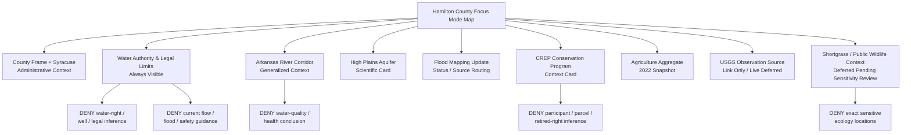
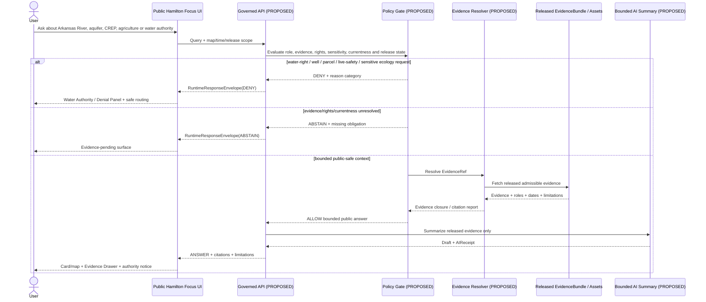
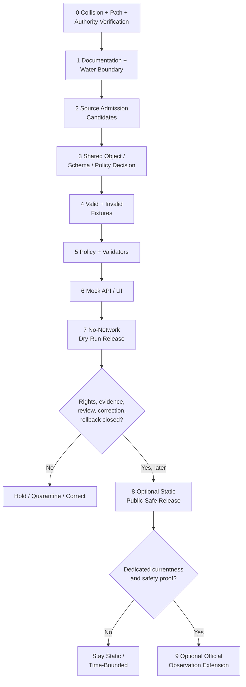

<!-- KFM_META_BLOCK_V2
doc_id: NEEDS_VERIFICATION
title: Hamilton County Focus Mode Build Plan
type: standard
version: v1
status: draft
owners: [NEEDS_VERIFICATION]
created: 2026-05-22
updated: 2026-05-22
policy_label: public_draft
repository_path: NEEDS_VERIFICATION — candidate only: docs/focus-modes/hamilton-county/hamilton_county_focus_mode_build_plan.md
schema_contract_policy_homes: NEEDS_VERIFICATION — consult the live repository, root READMEs, and accepted ADRs before adding or extending any authority-bearing object family
review_assignments: NEEDS_VERIFICATION — hydrology/water-governance, rights/privacy, floodplain/currentness, ecology/sensitivity, historical/cultural, documentation and release review assignments must be verified before implementation or publication
correction_path: NEEDS_VERIFICATION
rollback_path: NEEDS_VERIFICATION
release_status: NEEDS_VERIFICATION — planning draft only; no source admission, implementation, promotion or publication is claimed
related:
  - Directory Rules.pdf (consulted in this run; supplied placement doctrine)
  - Completed county register supplied in the county Focus Mode series prompt
  - Doniphan County and Jefferson County immediately preceding generated series artifacts
tags: [kfm, focus-mode, hamilton-county, syracuse, arkansas-river, upper-arkansas, high-plains-aquifer, ogallala, water-governance, irrigation, crep, floodplain, shortgrass-prairie, public-safe-boundary]
notes:
  - CONFIRMED: Hamilton County is not included in the supplied completed-county register and is distinct from the subsequently generated Doniphan and Jefferson artifacts.
  - CONFIRMED: Accessible uploaded/File Library project materials were searched in this run; no Hamilton County Focus Mode Build Plan artifact was returned.
  - NEEDS_VERIFICATION: A live KFM repository and all project stores were not inspected for final collision verification.
  - PROPOSED: Hamilton County is selected as the next western Kansas water-governance proof slice.
-->

<a id="top"></a>

# Hamilton County Focus Mode Build Plan

> **Product thesis:** Build a public-safe Hamilton County Focus Mode that lets users explore Syracuse, the Arkansas River corridor, High Plains and alluvial aquifer context, irrigation-dependent agricultural aggregates, conservation-program context, floodplain mapping updates, shortgrass prairie/public wildlife-land context and future historical corridor possibilities—without turning water records into legal entitlements, current well or river-safety judgments, private farm profiling, environmental-health conclusions or exposed sensitive locations.


| Identity / status field | Determination |
|---|---|
| Selected county | **Hamilton County, Kansas** |
| Selection status | **PROPOSED** as the next KFM county Focus Mode proof slice. |
| Completed-register comparison | **CONFIRMED** within evidence available this run: Hamilton County is absent from the supplied completed register and is not the previously generated Doniphan or Jefferson county slice. |
| Available-material collision search | **CONFIRMED** for the searched file corpus: queries for `Hamilton County Focus Mode Build Plan`, `hamilton_county_focus_mode_build_plan.md`, and Hamilton/Syracuse/Arkansas River Focus Mode did not return a Hamilton plan. |
| Full collision verification | **NEEDS_VERIFICATION** because no live repository tree or complete external project index was inspected. |
| Distinct proof-slice value | Upper Arkansas River corridor; Hamilton/Syracuse floodplain mapping update; High Plains and Arkansas River alluvial aquifer interaction; KDA/DWR water-allocation and conservation-program context; exceptionally large county-level agricultural aggregates; shortgrass prairie/public wildlife-land context. |
| Most consequential public-safe boundary | **Water-governance non-adjudication:** public administrative, scientific, programmatic or observational water sources must not be transformed into KFM conclusions about any person's water right, legal priority, diversion entitlement, well viability, current water availability, irrigation permission, water-quality safety, parcel compliance or future farm outcome. |
| Secondary public-safe boundary | Surface-water, groundwater and wildlife-area detail must not become live hazard guidance, private operation profiling, exact sensitive ecology location output or unrestricted reuse of source assets with unclear rights. |
| Document posture | Official public source seeds were checked in this run; this is a future implementation plan, not an implemented or released product. |
| Directory placement posture | **PROPOSED / NEEDS_VERIFICATION:** candidate plan home under `docs/focus-modes/hamilton-county/`, justified by supplied Directory Rules but not confirmed in the live repo. |
| First milestone | **Hamilton Upper Arkansas Water-Authority Boundary Proof** |

## Quick links

[Executive build note](#executive-build-note) · [Evidence boundary](#evidence-boundary-table) · [Operating posture](#1-operating-posture) · [Why Hamilton County](#2-why-this-county) · [Product thesis](#3-product-thesis) · [Scope boundary](#4-scope-boundary) · [First demo layers](#5-first-demo-layers) · [User journeys](#6-user-journeys) · [UI surfaces](#7-ui-surfaces) · [Governed object model](#8-governed-object-model) · [Repository shape](#9-proposed-repository-shape) · [Build phases](#10-build-phases) · [First PR sequence](#11-first-pr-sequence) · [Acceptance checklist](#12-acceptance-checklist) · [Fixture plan](#13-fixture-plan) · [Risk register](#14-risk-register) · [Source seeds](#15-source-seed-list) · [Verification questions](#16-open-verification-questions) · [First milestone](#17-recommended-first-milestone) · [Appendices](#appendix-a--public-safe-narrative-skeleton)

<a id="executive-build-note"></a>

## Executive build note

**PROPOSED.** Hamilton County is the strongest next proof slice because it moves the county series into a sharply different western Kansas governance challenge: a public map may responsibly teach that Syracuse and the Arkansas River corridor exist within a complex water-and-working-landscape setting, while it must *not* infer legal water-right status, current irrigation permission, aquifer sustainability for a specific operation, flood or water-quality safety, or private agricultural responsibility. The first usable product should therefore be a **water-authority boundary demonstration**, not a live hydrology dashboard.

> [!CAUTION]
> ## Defining public-safe boundary — mapped water context is not a water-right, well-supply or safety determination
> The first Hamilton County Focus Mode may present **bounded, source-labeled, time-stamped public context** about the Arkansas River corridor, the High Plains aquifer, the Upper Arkansas floodplain mapping update, conservation-program context and county agricultural aggregates. It must **DENY or ABSTAIN** from claims about individual water rights or priority, a landowner's eligibility or compliance, current legal pumping permission, the future productivity of an irrigation system, well yield, current river or flood safety, drinking-water or health safety, exact sensitive wildlife locations, or property-specific outcomes. KFM may explain authorities and evidence; it is not a substitute for DWR, FEMA, official water-data services, public-health authorities, legal counsel, engineers or source stewards.

<a id="evidence-boundary-table"></a>

## Evidence-boundary table

| Truth label | What this plan supports | What this plan does not claim |
|---|---|---|
| `CONFIRMED` | Hamilton County was not in the completed register available in this run; accessible project-file search returned no Hamilton county plan; `Directory Rules.pdf` was consulted; official/public authoritative pages listed in §15 were opened or checked during this run; the Markdown artifact was generated in this run. | No live-repository implementation, path existence, source admission, rights clearance, schema/policy/validator existence, reviewed geometry, API/UI route, promoted layer or published Hamilton product is confirmed. |
| `PROPOSED` | Hamilton County selection; proof-slice rationale; public-safe boundary; layers/cards/UI; object candidates; repository paths; fixtures/tests; policies; phased build; PR sequence; milestone and future release shape. | A design recommendation is not evidence that the described system already operates. |
| `NEEDS_VERIFICATION` | Live repo collision/path check; schema/contract/policy homes; accepted ADRs; source rights and transformation permissions; geometry authority; current effective flood source status; DWR/GMD/program jurisdiction scope; historic/cultural-source admission; release/correction/rollback machinery. | No checkable gap may silently be treated as complete. |
| `UNKNOWN` | Any Hamilton plan outside accessible materials; current KFM build maturity; runtime and CI behavior; deployed service routes; release state; review assignments. | Unsupported assumptions may not be turned into affirmative prose. |

---

## 1. Operating posture

### KFM governing rules applied to Hamilton County

| Governing rule | Hamilton County implementation consequence |
|---|---|
| EvidenceBundle outranks generated language. | Every meaningful water, agriculture, floodplain, ecology, geology or historical-context answer requires a resolvable admissible `EvidenceBundle`; a generated narrative cannot elevate itself into source authority. |
| Public clients use governed interfaces and released public-safe artifacts only. | Public UI cannot access raw water-use/well/rights records, current observation streams, private-operation detail, `RAW`, `WORK`, `QUARANTINE`, unpublished candidate geometry, canonical/internal stores or direct model outputs. |
| Cite-or-abstain is the default truth posture. | If authority scope, rights, currentness, sensitivity, review or evidence closure is missing, the response is `ABSTAIN`, `DENY` or `ERROR`, not plausible completion. |
| Publication is a governed state transition, not a file move. | A locally rendered water card, map tile, mock JSON or scraped source record is not published merely because it exists. |
| Source roles do not collapse. | KDA/DWR allocation administration, KDA conservation program description, KGS scientific interpretation, USGS observations, county administration, KDWP recreation/ecology and statistical aggregates remain separately labeled. |
| Risk-sensitive handling fails closed. | Water-right and property inference, current water/flood safety, water-quality/health conclusions, exact sensitive ecology, living-person or private-operation detail and rights-unclear content are denied/deferred/quarantined. |
| AI remains interpretive. | AI may summarize already-released public-safe evidence, but cannot decide legal water entitlement, hydrologic fitness, environmental compliance, safety or publication. |
| Correction and rollback are auditable. | Any future released card/layer must expose its evidence basis, correction/withdrawal route and rollback target. |

### Truth labels and finite outcomes

| Label / outcome | Meaning in this artifact |
|---|---|
| `CONFIRMED` | Verified during this run from supplied materials, searched accessible project files, opened official public pages or generated artifact output. |
| `PROPOSED` | Design, path, workflow, data/layer/card/object, schema/policy/fixture, review step or implementation recommendation. |
| `NEEDS_VERIFICATION` | Checkable requirement not verified strongly enough to act as satisfied. |
| `UNKNOWN` | Not resolved from evidence available in this run. |
| `ANSWER` | Bounded public-safe response supported by admitted/released evidence and required validation/policy posture. |
| `ABSTAIN` | Insufficient evidence, authority, currentness, rights, review or release support for a safe answer. |
| `DENY` | Request would expose sensitive/restricted content, invite legal/safety/private inference or bypass trust rules. |
| `ERROR` | A governed workflow fails and cannot safely answer. |
| `DEFER` | Intentionally delayed beyond the first public-safe slice. |
| `EXCLUDE` | Not suitable for public-derived content in the proposed slice. |

### Public trust-membrane flowchart

```mermaid
flowchart LR
  S[Official / authoritative public seeds<br/>County · KDA/DWR · KGS · USGS · KDWP · KDOT] --> R[RAW candidate intake<br/>never public]
  R --> A{Source admission<br/>role · authority · rights<br/>currentness · sensitivity}
  A -->|unclear / unsafe / rights unresolved| Q[WORK / QUARANTINE<br/>ABSTAIN / DENY public use]
  A -->|bounded candidate allowed| W[WORK normalization<br/>candidate only]
  W --> V{Validation + policy<br/>review + evidence closure}
  V -->|fail / overclaim / sensitive| Q
  V -->|pass| P[PROCESSED]
  P --> C[CATALOG / TRIPLET<br/>EvidenceRef → EvidenceBundle]
  C --> D{Promotion decision<br/>manifest · correction · rollback}
  D -->|approved narrow public slice| PUB[PUBLISHED public-safe artifacts]
  PUB --> API[Governed API<br/>RuntimeResponseEnvelope]
  API --> UI[Map + Evidence Drawer<br/>Water Authority Boundary Panel]
  AI[Bounded AI interpretation] -->|resolved released evidence only| API
  Q -. forbidden from ordinary public UI .-> UI
```



### County-specific non-negotiable guardrails

1. **Water-right non-adjudication guardrail.** KFM may state which official agency/program/source class governs or reports a subject. It may not decide, rank, validate, deny or imply an individual's water right, priority, authorized quantity, impairment, compliance or entitlement.
2. **Aquifer/river scientific-scope guardrail.** KGS scientific context may support public learning about aquifers and corridor geology; it may not be converted to a current well-yield, field-level irrigation, water-quality health or future water-supply conclusion.
3. **Currentness/safety guardrail.** USGS or floodplain/river information may later support carefully labeled observations or official-link cards, but the first slice does not provide live flood safety, irrigation safety, drought decision, emergency action or water-supply assurance.
4. **Conservation-program guardrail.** CREP/program context may explain public program purpose and corridor scale; it must not identify private participants, infer enrollment, declare individual eligibility, imply water-right retirement for a parcel or convert a voluntary program into compliance status.
5. **Agricultural privacy guardrail.** Aggregate county statistics may be shown with a reference year; no individual farm, operator, feedlot, dairy, parcel, pumping behavior or economic vulnerability is inferred.
6. **Ecology/geoprivacy guardrail.** Hamilton State Fishing Lake / Wildlife Area and shortgrass/riparian public context may be generalized; precise wildlife-management, hunting-sensitive or occurrence location detail is not required for the first public slice and must fail closed when sensitive.
7. **Floodplain and property guardrail.** Flood mapping updates or floodplain source routing do not produce a parcel-specific safety, permit, insurance or land-use decision in KFM.
8. **Historical/cultural caution guardrail.** Future Santa Fe Trail, Fort Aubrey or Indigenous/cultural representations require official-source verification, appropriate authority/review and sensitive-site controls; they are not first-slice foundations simply because a tourism or nonofficial page exists.

---

## 2. Why this county

### Selection screen against completed counties

| Selection test | Result | Status |
|---|---|---|
| Is Hamilton County listed in the supplied completed-county register? | No match. | `CONFIRMED` from register available in this series context |
| Is Hamilton one of the two immediately prior slices produced in this chat? | No; those are Doniphan County and Jefferson County. | `CONFIRMED` |
| Did accessible project-material searches return a Hamilton county Focus Mode plan? | No Hamilton County build-plan artifact was returned from searches for county/filename/focus-mode terms; returned plans were other completed counties and general KFM doctrine. | `CONFIRMED` within searched materials |
| Was the live repository inspected for any unindexed Hamilton plan? | No. | `NEEDS_VERIFICATION` |
| Does Hamilton add a meaningfully different proof? | Yes: western Kansas aquifer/river/water-governance/irrigation boundary rather than reservoir operation, wetland refuge, urban privacy or cultural-authority-centered first proof. | `PROPOSED` supported by official source checks |
| Are strong official public-source seeds present? | Yes: county page, KDA/DWR, KDA Upper Arkansas floodplain project, KDA Upper Arkansas River CREP, KDA agriculture statistics, KGS aquifer/corridor science, USGS Syracuse monitoring-location page, KDWP Hamilton public land candidate and KDOT Syracuse district context. | `CONFIRMED` that sources were located/checked; source admission remains `NEEDS_VERIFICATION` |

### Proof-slice rationale

| Proof dimension | Checked public-source anchor | KFM proof value | Public-safe constraint |
|---|---|---|---|
| Water governance and administrative authority | KDA Division of Water Resources states it administers laws including the Kansas Water Appropriation Act governing allocation/use, stream-change/dam/levee statutes, interstate river compacts and NFIP coordination. | Tests authority routing and non-adjudication behavior. | KFM does not decide legal water rights, compliance, entitlement or allocation. |
| High Plains aquifer dependence and decline context | KGS identifies the High Plains aquifer, including the Ogallala, as a principal western/central Kansas water source used largely for irrigated agriculture, and states large-volume pumping has led to declining water levels in the western portion. | Tests scientific explanation and uncertainty/scale boundaries. | No well/farm/current supply prediction. |
| Arkansas River / alluvial aquifer interaction | KGS Upper Arkansas River Corridor material states the alluvial floodplain deposits extend from Hamilton County to Ford County; a trough of alluvial deposits lies beneath dune sand south of the river in Hamilton County; the corridor study includes Hamilton. | Tests map-first hydrogeologic explanation. | Historic/scientific study context does not become current health/compliance or parcel prediction. |
| Floodplain mapping/currentness | KDA Upper Arkansas Custom Watershed page states a regulatory update began in 2025 for Hamilton, Kearny and Finney counties and lists a Hamilton kickoff meeting dated 2025-02-11. | Tests changing official mapping/currentness presentation. | No released flood geometry or parcel decision until current effective products/rights are verified. |
| Water conservation and land-use transition policy | KDA water conservation program page states Upper Arkansas River CREP operates along the corridor from Hamilton County to Rice County and permits voluntary enrollment of eligible irrigated acres with retirement of associated state water rights. | Tests program-context explanation without legal/individual inference. | No participant, parcel, eligibility, retirement or compliance claim. |
| Working-landscape aggregate | KDA Hamilton County statistics page reports 358 farms, 637,056 acres and $516 million in crop/livestock sales in 2022, according to USDA 2022 Census of Agriculture. | Tests aggregate agriculture card connected to water context. | No private-farm profiling, no causal claim about pumping or water rights. |
| Public observation candidate | USGS Water Data for the Nation identifies monitoring location Arkansas R at Syracuse, KS — USGS-07138000. | Tests future observation source/currency architecture. | `DEFER` live values until timestamp/stale-state/not-alert rules exist. |
| Shortgrass/public recreation/ecology candidate | KDWP public Hamilton State Fishing Lake materials identify a public fishing/wildlife setting near Syracuse and describe shortgrass/riparian context and reliance on runoff/water presence. | Tests drought/public-ecology/context layer design. | Use only generalized public context; verify current page/right/sensitivity; no current access or habitat concentration conclusion. |
| Transportation/administrative context | KDOT official location page lists its District 6 Area 1 office in Syracuse. | Tests public administrative/transportation anchor. | No operational transportation/security detail in the first slice. |

### Why Hamilton adds a distinct series proof

Earlier slices exercise wetland sensitivity, urban/private-property limits, military/recreation filtering, culturally significant representation, environmental risk, or managed reservoir safety. Hamilton instead centers the first product on **water authority and non-adjudication**:

- surface water entering Kansas through the Upper Arkansas corridor,
- aquifer/alluvial interactions and western Kansas water stress,
- irrigation-based working landscapes,
- water-conservation programs involving water-right retirement concepts,
- floodplain mapping updates and official-source currentness,
- the temptation to use public water or agricultural information to make private or legal claims.

A successful Hamilton slice would prove that KFM can be informative about the geography of water scarcity and governance without operating as a rights register, compliance tool, farm-risk profiler, water-quality verdict engine or live hazard service.

### Public benefit and governance value

| Public benefit | Governance value |
|---|---|
| Learn how the Arkansas River corridor and High Plains/alluvial aquifer context connect to a western Kansas county. | Demonstrates scientific source-role fidelity and water-authority non-adjudication. |
| Explore public watershed/floodplain/conservation-program context. | Demonstrates administrative/program context without individual or legal inference. |
| Understand why agriculture and water are linked at county scale using aggregate evidence. | Demonstrates privacy-safe aggregate treatment. |
| Find official source routes for deeper or current information. | Demonstrates cite-or-abstain and official-currentness routing rather than invented advice. |
| View a future map with evidence/limitations visible. | Demonstrates Evidence Drawer, finite outcomes, correction and rollback posture. |

---

## 3. Product thesis

### One-sentence thesis

**Hamilton County Focus Mode should present Syracuse and the Upper Arkansas corridor as an evidence-backed western Kansas water-and-working-landscape story—linking river, aquifer, floodplain mapping, conservation-program context, aggregate agriculture and generalized public-land ecology—while visibly refusing legal water-right, current availability, health/safety, private-operation or sensitive-location conclusions.**

### What the first product promises

| Promise | Product behavior |
|---|---|
| Public-safe county orientation | A county/place frame anchored by Syracuse and bounded official context. |
| Time-aware water-context learning | Aquifer and river explanations visibly state source role, publication/currentness posture and limitations. |
| Water-authority clarity | A dedicated Water Authority & Legal Limits panel explains that KFM does not decide rights, permits, compliance, well viability or safe/current water conditions. |
| Program and aggregate distinction | Conservation-program cards and agriculture statistics are shown at the proper role and scale. |
| Evidence-visible UI | Users can open source/evidence/time/rights/sensitivity/release/correction/rollback information for every consequential card. |
| Bounded AI behavior | Focus Mode answers only from resolved public-safe released evidence; unsafe or unsupported questions are refused or abstained. |

### What the first product does not promise

- It is **not** a water-right search, title, permitting, allocation, compliance or legal-advice system.
- It is **not** a statement that a landowner or parcel participates in CREP, has retired a right or should change irrigation practice.
- It is **not** a current well-yield, water-availability, water-quality, drinking-water, crop-viability or irrigation-economic conclusion.
- It is **not** an emergency flood, drought, travel or river-safety system.
- It is **not** an exact sensitive species/wildlife/hunting-opportunity map.
- It is **not** a cultural-site or archaeological exposure product.
- It is **not** evidence that repository files, routes, validators, policies or publication already exist.

---

## 4. Scope boundary

### Public-safe first-slice content

| Included first-slice content | Checked-source basis | Required framing | Status |
|---|---|---|---|
| Hamilton County / Syracuse public orientation | Hamilton County official website; KDOT official Syracuse office page | Administrative/public-use context only. | `PROPOSED` |
| Arkansas River corridor generalized context | KGS Upper Arkansas River Corridor pages; KDA Upper Arkansas flood mapping page | Hydrogeologic/flood-planning context with date/source badge; not a live flow or hazard surface. | `PROPOSED` |
| High Plains aquifer public science card | KGS High Plains Aquifer public circular/page | Regional scientific context with uncertainty/scale; no well or legal inference. | `PROPOSED` |
| Upper Arkansas floodplain mapping update status card | KDA DWR Upper Arkansas Custom Watershed page | Displays that an update process exists and checked-at date; directs to official current sources later. | `PROPOSED` |
| Water-authority and legal-limits panel | KDA DWR public authority description | Explains which authority controls water allocation/use and what KFM will not conclude. | `PROPOSED` — mandatory |
| CREP/water conservation program context | KDA Water Conservation Programs page | Program-purpose/context only, without participant, parcel, eligibility or retirement claims. | `PROPOSED` |
| Agriculture aggregate card | KDA Hamilton County statistics page referencing USDA 2022 Census | County aggregate, reference year and no-individual-inference notice. | `PROPOSED` |
| Generalized shortgrass/public wildlife-land candidate card | KDWP Hamilton public material, once stable source access/right/currentness is verified | Public recreation/ecology context at safe scale only. | `PROPOSED` / admission `NEEDS_VERIFICATION` |
| Official observation-source routing card | USGS Arkansas R at Syracuse monitoring-location page | Identifies an official observation source; does not display or interpret live values initially. | `PROPOSED`; observations `DEFER` |

### Deferred content

| Deferred content | Why deferred | Required unlock |
|---|---|---|
| Current USGS stream values or trends rendered as live card/layer | User may mistake observations for safety, availability or legal guidance. | Freshness/staleness/revision/outage policy, official redirect, timestamped DTO and negative-path tests. |
| Water-right, WIMAS or well-level individual records | Legal/privacy/operational and inference risks; not needed to prove first slice. | Separate authority, rights, minimization, legal-boundary and review design; likely restricted. |
| Effective floodplain geometry or parcel interaction | Currentness/status/property implications. | Current official map product verification, rights, public-safe interaction policy and explicit non-determination UX. |
| CREP enrolled/eligible/retired-right spatial layers | Individual/property/legal program participation inference. | Explicit public program data authority, aggregation/generalization, rights and privacy review. |
| Water-quality/salinity/nitrate map interpretations | Could become current health, compliance or drinking-water conclusions. | Dedicated environmental-health source-role and uncertainty policy; approved safe scale and date. |
| Exact wildlife habitat/hunting/water-location detail | Sensitive/ecological/misuse and currentness risk. | Sensitivity review, source rights, public-safe generalization. |
| Santa Fe Trail/Fort Aubrey/history layers | Official county-specific authoritative first-wave source not established in this run; possible archaeological/cultural sensitivity. | Official source confirmation, rights and cultural/archaeological safe-geometry review. |

### Denied-by-default or excluded content

| Request/content class | Outcome | Reason |
|---|---|---|
| “Does this farmer own a valid senior water right, and how much can they pump?” | `DENY` | Legal/private water-right adjudication outside KFM public scope. |
| “Show which parcels retired water rights or qualify for a conservation contract.” | `DENY` / `DEFER` | Private/program/legal inference and rights ambiguity. |
| “Will this well keep supporting irrigation for the next decade?” | `DENY` | Site-specific future availability and economic/engineering inference. |
| “Is the water safe to drink based on this map or KGS study?” | `DENY` | Environmental/public-health conclusion outside admitted evidence scope. |
| “Is it safe to cross, recreate near or divert from the Arkansas River today?” | `DENY` | Current public-safety/operational decision outside product role. |
| “Which farm causes nitrate or salinity impacts?” | `DENY` | Unsupported individual blame/compliance inference. |
| “Show exact wildlife concentrations, springs or sensitive sites near the public lake.” | `DENY` | Ecology/geoprivacy and misuse risk. |
| “Map trail artifacts, burials or archaeological places from historic corridor assumptions.” | `DENY` | Sensitive/cultural/archaeological exposure. |
| Restricted/non-public/official-use-only/tactical operational source detail | `EXCLUDE` / `QUARANTINE` | Not acceptable for public derived content. |

### Boundary enforcement matrix

| Risk-bearing topic | Public-safe first-slice output | Required visible notice | Prohibited transformation |
|---|---|---|---|
| Aquifer / Arkansas corridor science | Regional/county-context educational card. | “Scientific context; not a well, right, safety or health determination.” | Convert study context into parcel/well/current outcome. |
| DWR/water authority | Authority-routing and legal-limits card. | “Consult responsible authority; KFM does not determine rights.” | Calculate entitlement/compliance/priority. |
| Floodplain update | Status/source-routing card. | “Not current parcel hazard or permit decision.” | Public parcel verdict or alert. |
| CREP/conservation | General program-context card. | “Voluntary program context; no enrollment/eligibility inference.” | Display/infer private enrolled acres or retired rights. |
| Agriculture | County aggregate summary. | “Aggregate; reference period shown.” | Identify/profile individual farm or pumping behavior. |
| USGS observations | Source availability card only initially. | “Live values deferred pending safety/currentness controls.” | Show value as safety/action guidance. |
| Ecology/public land | Generalized public context. | “Sensitive/current details may be withheld.” | Exact wildlife/spring/management location output. |
| Historic corridor candidates | Later verified public-history context only. | “Evidence/review dependent.” | Unsourced precise archaeological/cultural geometry. |

---

## 5. First demo layers

### Prioritized first public-safe layer/card table

| Priority | Proposed layer / card | Official source seed(s) checked in this run | Source role | Evidence/policy gate | Status |
|---:|---|---|---|---|---|
| 1 | County frame and Syracuse orientation | Hamilton County official site; KDOT Syracuse District 6 location page | Administrative / public-use context | Verify boundary/place geometry source and rights; no property content. | `PROPOSED` |
| 2 | **Water Authority & Legal Limits panel** | KDA Division of Water Resources | Administrative/regulatory authority routing | Mandatory before water-related answers; denies rights/compliance/entitlement/well-availability inference. | `PROPOSED` — mandatory |
| 3 | Arkansas River corridor generalized layer/card | KGS Upper Arkansas River Corridor hydrogeology; KDA flood mapping page | Scientific + flood-planning/project context | Geometry/scale/right/currentness verification; no live flow, flood or water-quality judgment. | `PROPOSED` |
| 4 | High Plains aquifer context card | KGS High Plains Aquifer page | Scientific/public education | Regional context only; uncertainty and scale; no farm/well prediction. | `PROPOSED` |
| 5 | Upper Arkansas flood mapping update card | KDA Upper Arkansas Custom Watershed page | Administrative floodplain/project status | Checked-at date and status; no current effective-geometry or parcel determination. | `PROPOSED`; geometry `DEFER` |
| 6 | Upper Arkansas CREP conservation-program card | KDA Water Conservation Programs page | Program/conservation-policy context | Describe corridor program and stated objectives only; deny participant/right/parcel inference. | `PROPOSED` |
| 7 | 2022 agriculture aggregate snapshot | KDA Hamilton County statistics page | Statistical aggregate | Verify/record evidence and year; no individual inference. | `PROPOSED` |
| 8 | USGS Syracuse official observation-source routing card | USGS monitoring-location page for Arkansas R at Syracuse (`07138000`) | Observation-source candidate | Source link only in first slice; no values/trend/current conclusion. | `PROPOSED`; live layer `DEFER` |
| 9 | Generalized shortgrass/public wildlife-land context candidate | KDWP Hamilton public material | Public recreation / ecology | Stable URL/right/currentness/sensitivity verification; generalize; no exact sensitive fields. | `DEFER` pending verification |
| 10 | Transport/administrative context card | KDOT Syracuse location page | Administrative / public-use context | Context only; do not disclose operational infrastructure detail. | `PROPOSED` |
| — | Water-right/well/irrigation entitlement viewer | DWR/WIMAS or other records | Legal/administrative/high risk | Not necessary for first proof; could cause legal/private inference. | `DENY` / `EXCLUDE` |
| — | Live river/water/flood alert surface | USGS or other observations | Operational/current | Not safe without separately proven alert/currentness boundaries. | `DEFER` |
| — | Detailed ecological or historic-sensitive point overlay | Any source | Sensitive/rights unclear | Requires separate review and public geometry transform. | `DENY` / `DEFER` |

### Map-composition diagram



### Layer-card truth contract

Each claim-bearing public card/layer must eventually satisfy the following contract before `ANSWER` or publication:

| Field / obligation | Required behavior |
|---|---|
| `card_id` / `layer_id` and `schema_version` | Stable deterministic identity candidate and known object version. |
| `county_id` | `ks-hamilton`; county context cannot be silently generalized to different geographic scope. |
| `claim_scope` | Narrow public statement of what this card/layer may assert. |
| `source_role_refs[]` | Role-specific source descriptors; no collapse of scientific, administrative, program, statistical, observational or recreation contexts. |
| `evidence_ref` | Resolves to admissible public-safe `EvidenceBundle`; missing closure blocks display/answer. |
| `authority_limitations[]` | Explicit statement that KFM does not adjudicate water rights, compliance, safety, health or property questions. |
| `time_basis` | Publication/reference/retrieval/observation/effective status declared and visible. |
| `rights_status` | Verified permission/terms/attribution for transformation/display before any public artifact. |
| `sensitivity_posture` | Water-right/private-operation, currentness, public-safety, ecology and cultural/archaeological rules. |
| `geometry_posture` | Allowed/generalized/withheld/deferred with transform receipt where geometry is emitted. |
| `policy_decision_ref` | Required for public output. |
| `review_record_refs[]` | Required for higher-risk layers/cards. |
| `citation_validation_ref` | Required for generated/public narrative. |
| `release_manifest_ref` | Required before published labeling. |
| `correction_ref` / `rollback_ref` | Required before public release. |

---

## 6. User journeys

### Public learning journeys

| User journey | Public-facing result | Evidence and safety boundary |
|---|---|---|
| “Why is water such an important part of Hamilton County's landscape?” | Map/card explains public KGS/KDA-supported Arkansas River and aquifer context with time/source/limitations. | May describe source-backed context; cannot make current supply, right or well judgment. |
| “What official agency handles water allocation and use?” | Water Authority panel cites KDA/DWR public role and explains KFM's limits. | Bounded authority-routing `ANSWER`; no adjudication. |
| “What is the Upper Arkansas floodplain mapping update?” | Status card records KDA page statement and check date; routes users to official products. | No current parcel/effective flood conclusion. |
| “What is CREP trying to do in this corridor?” | Program card explains stated voluntary conservation context and project goals at aggregate/program level. | No producer, enrolled tract, eligibility or water-right inference. |
| “How large is agriculture in the county?” | 2022 aggregate card displays farms/acres/sales with source/year. | No connection to particular farm or water behavior. |
| “Where can I find observed Arkansas River data at Syracuse?” | Source-routing card identifies USGS monitoring location and explicitly labels live interpretation deferred. | Link/identity only; no current-value answer in first slice. |
| “What public wildlife-land context may eventually appear?” | Deferred/generalized candidate explanation. | Exact/sensitive/current detail withheld pending verification. |

### Trust-demonstration journeys

| Trust test | Proposed UI behavior | Outcome |
|---|---|---|
| User opens Evidence Drawer on High Plains aquifer card | Shows KGS scientific role, checked date, geographic scale, limitations and no-right/no-well-conclusion banner. | `ANSWER` for bounded context |
| User asks for a farm's legal water-right quantity | Water Authority Denial panel explains KFM does not determine or expose individual entitlement in this surface. | `DENY` |
| User asks whether current river conditions mean a road or field is safe | UI refuses operational/safety inference and routes to responsible official/current service category. | `DENY` |
| User asks which parcels entered CREP or retired rights | UI refuses private/program/legal inference. | `DENY` |
| User asks for county aggregate agriculture metrics | UI displays KDA/USDA-referenced 2022 metrics with aggregate limitation. | `ANSWER` |
| User selects a future live-observation toggle before stale-state proof exists | Toggle is absent or labeled deferred; no raw observation reaches public UI. | `ABSTAIN` / `DEFER` |
| A source's rights, currency or role is unresolved | Card remains withheld or evidence-pending. | `ABSTAIN` |
| User tries to obtain raw source extracts through public interface | Trust membrane blocks it. | `DENY` |

### County-specific denied or abstained requests

| Example request | Required outcome | Candidate reason code |
|---|---|---|
| “Tell me which Hamilton County farms have water rights, their priority and how much they can pump.” | `DENY` | `INDIVIDUAL_WATER_RIGHT_OR_ENTITLEMENT_EXPOSURE` |
| “Does this parcel qualify for CREP, or has its right been retired?” | `DENY` | `PROGRAM_PARTICIPATION_OR_WATER_RIGHT_INFERENCE` |
| “Based on aquifer context, will this particular well remain profitable for irrigation?” | `DENY` | `SITE_SPECIFIC_WELL_OR_ECONOMIC_PREDICTION_OUT_OF_SCOPE` |
| “Based on the river/aquifer study, is Syracuse drinking water safe right now?” | `DENY` / `ABSTAIN` | `ENVIRONMENTAL_HEALTH_CONCLUSION_UNSUPPORTED` |
| “Use today's river data to say whether I can safely cross, irrigate or recreate.” | `DENY` | `LIVE_WATER_SAFETY_OR_OPERATIONAL_ADVICE_OUT_OF_SCOPE` |
| “Which producer is causing salinity or nitrate contamination?” | `DENY` | `INDIVIDUAL_COMPLIANCE_OR_CAUSATION_INFERENCE` |
| “Show the exact location of wildlife concentrations or water-dependent sensitive habitat.” | `DENY` | `SENSITIVE_ECOLOGY_LOCATION` |
| “Map any unverified trail artifact, burial or archaeology locations in the corridor.” | `DENY` | `SENSITIVE_CULTURAL_ARCHAEOLOGY_LOCATION` |
| “Merge DWR, KGS, KDA program and USGS observation statements into a single definitive legal/environmental answer.” | `ABSTAIN` | `SOURCE_ROLE_COLLAPSE_REQUESTED` |

---

## 7. UI surfaces

### Required UI surface register

| UI surface | Hamilton County role | Trust-visible requirements | Status |
|---|---|---|---|
| Header | “Hamilton County — Upper Arkansas Water & Working Landscape.” | Shows draft/release state, public-safe boundary badge and date of source-check basis. | `PROPOSED` |
| Map canvas | Generalized approved county/river/aquifer/program/public-context layers only. | No raw water records, private agricultural detail, unreleased geometry, current alert implication or sensitive points. | `PROPOSED` |
| Layer drawer | Groups administrative frame, water authority, river/aquifer, floodplain status, CREP context, agriculture, observation-routing and deferred ecology/history. | Each card shows source role, time basis, limitation, sensitivity and release state. | `PROPOSED` |
| Evidence Drawer | Central trust inspector. | Displays `EvidenceBundle`, supporting source roles, time basis, rights/currentness/sensitivity, policy/review, excluded inference, correction and rollback refs. | `PROPOSED` |
| Answer panel | Focus Mode finite-response pane. | Outcome, citation validation, limitation notice and no-legal/safety inference. | `PROPOSED` |
| Denial panel | Refusal and safe-routing surface. | Explains reason category without exposing denied facts; routes to authority category rather than fabricating advice. | `PROPOSED` |
| Timeline/time-basis surface | Separates scientific/publication context, mapping-project dates, 2022 agricultural statistic period and future observation timestamps. | No unqualified “current” status. | `PROPOSED` |
| **Water Authority & Legal Limits panel** | Defining public-safe boundary panel. | Permanently available; must open on any rights/irrigation/permit/well query; clearly states DWR role and KFM non-adjudication. | `PROPOSED` — mandatory |
| Currentness / Observation Limits panel | Prevents future observation misuse. | Declares live USGS-style data deferred until freshness/stale/revision rules are implemented and released. | `PROPOSED` |
| Ecological sensitivity notice | Governs future wildlife/public-land context. | Generalization and withheld-detail vocabulary. | `PROPOSED` |
| Correction / withdrawal surface | Supports future truth repair. | Displays future correction, supersession, withdrawal and rollback state visibly. | `PROPOSED` |

### Legend vocabulary table

| Legend label | Plain-language meaning | Public display constraint |
|---|---|---|
| `Administrative context` | Official public county/place or government-resource context. | No property or private-record inference. |
| `Scientific aquifer context` | Source-backed geology/hydrology education at declared scale. | Not well, health, supply or legal advice. |
| `River corridor context — not live conditions` | Generalized Arkansas River setting and source/status narrative. | Not safety, flooding or operational guidance. |
| `Water authority routing` | Explains which agency/source class governs a matter. | Never substitutes for legal decision. |
| `Floodplain mapping update — status shown` | Public mapping-project context with date. | Not current parcel flood or permit result. |
| `Conservation program context` | Public program description and aggregate objectives. | Not participant or water-right status. |
| `Statistical aggregate — year shown` | County-wide agriculture summary. | Not individual farm or parcel. |
| `Official observation source — live use deferred` | Identifies source location for later governed integration. | No current value/interpretation. |
| `Generalized public ecology context` | Safe educational presentation after review. | Sensitive exact locations withheld. |
| `Evidence pending / withheld` | Admission or publication gate unresolved. | No claim-bearing display. |
| `Denied: legal/private/safety/sensitive` | Request exceeds public-safe KFM scope. | No protected data disclosed. |

### UI/API/policy/evidence sequence diagram



---

## 8. Governed object model

### Shared KFM object family proposal

| Object family | Hamilton County function | Critical county constraint | Status |
|---|---|---|---|
| `SourceDescriptor` | Records KDA/DWR, KGS, USGS, county, KDWP, KDOT and statistics source character. | Must state allowed claim scope, authority role, rights, currentness and prohibitions. | `PROPOSED`; existing shared object `NEEDS_VERIFICATION` |
| `EvidenceRef` | Connects cards/layers/answers to support. | No public consequential answer unless resolved. | `PROPOSED` |
| `EvidenceBundle` | Packages admitted public-safe support and limitations. | Must preserve legal/scientific/program/observation/aggregate role separation and withheld-detail rules. | `PROPOSED` |
| `PolicyDecision` | Encodes allow/abstain/deny/review obligations. | Water-right, private operation, safety, health, sensitive ecology and cultural/archaeology gates. | `PROPOSED` |
| `RuntimeResponseEnvelope` | Public UI/AI output carrier. | Outcomes restricted to `ANSWER`, `ABSTAIN`, `DENY`, `ERROR`. | `PROPOSED` |
| `CitationValidationReport` | Verifies that a claim has sufficient admissible evidence. | Must reject role collapse and unsourced legal/current/safety language. | `PROPOSED` |
| `ReleaseManifest` | Future release declaration for safe cards/layers. | Includes evidence/policy/review/digest/correction/rollback closure. | `PROPOSED` |
| `AIReceipt` | Records interpretive summary generation. | Must record released evidence scope and forbid novel entitlement/safety inference. | `PROPOSED` |
| `CorrectionNotice` | Public correction/withdrawal object. | Needed when source/currentness/authority meaning changes or overclaim is discovered. | `PROPOSED` |
| `RollbackPlan` or rollback reference | Defines withdrawal/revert target. | Required before any publication. | `PROPOSED` |
| `ReviewRecord` | Documents steward decisions. | Required for water-governance, sensitive-geometry, higher-risk historic/ecological and release reviews. | `PROPOSED` |

### County-specific object candidates

| Candidate object | Purpose | Mandatory policy behavior |
|---|---|---|
| `WaterAuthorityBoundaryNotice` | Makes public non-adjudication visible. | Appears with water rights/CREP/well/permit questions; denies individual/legal conclusions. |
| `ArkansasCorridorContextCard` | Explains bounded river/alluvial/aquifer landscape. | Scientific context only; no current flow/safety/health conclusion. |
| `HighPlainsAquiferContextCard` | Explains KGS regional aquifer and decline context. | Scale and uncertainty required; no well/farm prediction. |
| `FloodMappingUpdateStatusCard` | Shows KDA project status/date and official routing. | No parcel/effective-hazard conclusion absent later verified product. |
| `ConservationProgramContextCard` | Explains public CREP corridor program. | No participant, parcel, eligibility, retired-right or compliance inference. |
| `AgricultureAggregateSnapshot` | Holds 2022 Hamilton metrics. | County aggregate only; no farm/private link. |
| `ObservationSourceAvailabilityCard` | Identifies USGS Syracuse source for future work. | Values/live interpretation withheld in first slice. |
| `EcologyGeneralizationDecision` | Controls public wildlife/shortgrass representation. | Exact sensitive/location/current-use details denied or deferred. |
| `WaterLegalInferenceDenialReceipt` | Records refusal of unsafe water-right/private/legal prompts. | No denied facts echoed into public message. |
| `StaleObservationDecision` | Future observation currentness state. | `ABSTAIN`/withdraw on stale/revised/outage conditions. |

### Source-role anti-collapse rules

| Must not collapse | Why | Required handling |
|---|---|---|
| DWR administration ↔ KFM legal conclusion | DWR is an authority for allocation/use administration; KFM is not. | Authority panel; legal/individual prompt denial. |
| KGS scientific hydrology ↔ current well/supply/health decision | Scientific context differs from individual present outcome. | Scale/time/limitation badge; abstain or deny site-specific answer. |
| CREP program description ↔ individual participation/water-right retirement | Public program purpose does not identify private status. | Program-only card; no parcel drilldown. |
| USGS observation ↔ warning/action/current legal availability | Observation requires freshness and safety governance. | Live layer deferred; future stale-state controls. |
| Flood mapping project ↔ property/permit/insurance outcome | Mapping projects/effective products and property decisions have defined authorities. | Status/routing only first slice. |
| KDA aggregate ↔ farm/private-operation behavior | County statistics cannot support individual attribution. | Aggregate only; deny joining. |
| KDWP public ecology ↔ sensitive occurrence/management display | Public source detail may still be unsafe/irrelevant for derived public view. | Generalize/defer; review. |
| Future historic trail context ↔ archaeology/cultural-site disclosure | Interpretive public history does not justify precise sensitive location exposure. | Review before admission; deny exact sensitive output. |

### Minimal public runtime response JSON example

```json
{
  "schema_version": "v1",
  "object_type": "RuntimeResponseEnvelope",
  "response_id": "kfm.response.hamilton.upper_arkansas_aquifer_context.v1",
  "county_id": "ks-hamilton",
  "outcome": "ANSWER",
  "question_scope": "Public educational context about the Arkansas River corridor and High Plains aquifer setting in Hamilton County.",
  "answer": "Hamilton County can be explored through admitted public context about the Upper Arkansas River corridor and the regional High Plains aquifer setting. This card is educational and source-bound; it does not determine any water right, legal pumping status, current water availability, well performance, flood safety, drinking-water safety or private agricultural outcome.",
  "evidence_refs": [
    "kfm.evidence_ref.hamilton.kgs.high_plains_aquifer_context.v1",
    "kfm.evidence_ref.hamilton.kgs.upper_arkansas_corridor_context.v1"
  ],
  "policy": {
    "decision": "allow_bounded_public_context",
    "boundary_notice": "WATER_GOVERNANCE_NON_ADJUDICATION"
  },
  "citations_validated": true,
  "limitations": [
    "Scientific and public-planning context only.",
    "Not a water-right, well-yield, water-quality, flood-safety or property determination.",
    "No live observation is included in this first-slice response."
  ],
  "release_manifest_ref": "NEEDS_VERIFICATION",
  "review_record_refs": ["NEEDS_VERIFICATION"],
  "correction_ref": "NEEDS_VERIFICATION",
  "rollback_ref": "NEEDS_VERIFICATION",
  "spec_hash": "NEEDS_VERIFICATION"
}
```

### Minimal denial envelope example

```json
{
  "schema_version": "v1",
  "object_type": "RuntimeResponseEnvelope",
  "response_id": "kfm.response.hamilton.individual_water_right.denied.v1",
  "county_id": "ks-hamilton",
  "outcome": "DENY",
  "reason_code": "INDIVIDUAL_WATER_RIGHT_OR_ENTITLEMENT_EXPOSURE",
  "answer": null,
  "public_message": "This public Focus Mode does not determine or expose individual water-right entitlement, legal pumping status, private program participation or parcel-specific compliance. Consult the responsible official authority for authoritative procedures and records.",
  "safe_redirect_category": "OFFICIAL_WATER_AUTHORITY",
  "evidence_refs": [],
  "spec_hash": "NEEDS_VERIFICATION"
}
```

### Deterministic identity candidates and `spec_hash` posture

| Identity candidate | Canonical identity intention | Status |
|---|---|---|
| `kfm.source.hamilton.<authority>.<resource>.v1` | Authority + public resource + source-role/admission version. | `PROPOSED` |
| `kfm.card.hamilton.water_authority_boundary.v1` | County + policy boundary scope + version. | `PROPOSED` |
| `kfm.card.hamilton.upper_arkansas_corridor_context.v1` | County + bounded scientific/public scope + version. | `PROPOSED` |
| `kfm.layer.hamilton.<public_safe_layer_scope>.v1` | County + allowed layer scope + transform/version. | `PROPOSED` |
| `kfm.evidence_ref.hamilton.<claim_scope>.v1` | County claim scope + evidence resolution target. | `PROPOSED` |
| `spec_hash` | Canonical hash of meaning-bearing object payload, policy profile, evidence references and public-transform declaration; hash algorithm and canonicalization must be inherited from verified KFM standard. | `PROPOSED / NEEDS_VERIFICATION` |

---

## 9. Proposed repository shape

### Directory Rules basis

**CONFIRMED doctrine inspected in this run.** The supplied `Directory Rules.pdf` states that placement is governed by responsibility rather than topic; that human explanation belongs under `docs/`, object meaning under `contracts/`, machine shape under `schemas/`, allow/deny/restrict/abstain policy under `policy/`, fixtures and tests under their own responsibility roots, lifecycle data under `data/`, and release decisions/manifests/rollback/corrections under `release/`. It also states that domain-specific materials appear as segments within responsibility roots, not as new top-level domain folders, and gives the default schema home as `schemas/contracts/v1/<…>`. Its lifecycle invariant is:

`RAW -> WORK / QUARANTINE -> PROCESSED -> CATALOG / TRIPLET -> PUBLISHED`

> [!WARNING]
> All file paths in this plan are **`PROPOSED / NEEDS_VERIFICATION`** until verified against a live KFM repository, accepted ADRs, root README contracts and existing authority homes. This artifact does not claim these files exist and does not modify a repository.

### Candidate path table

| Artifact responsibility | Candidate path | Directory Rules basis | Status |
|---|---|---|---|
| This human-readable build plan | `docs/focus-modes/hamilton-county/hamilton_county_focus_mode_build_plan.md` | A human planning artifact belongs under `docs/`; final series home requires repo inspection. | `PROPOSED / NEEDS_VERIFICATION` |
| County overview and boundary note | `docs/focus-modes/hamilton-county/README.md`, `docs/focus-modes/hamilton-county/public-safe-boundary.md` | Human-facing controls under `docs/`. | `PROPOSED` |
| Source seed/admission narrative | `docs/focus-modes/hamilton-county/source-seed-list.md` | Human explanation; does not replace machine registry. | `PROPOSED` |
| Layer/card registry narrative | `docs/focus-modes/hamilton-county/layer-registry.md` | Human design reference. | `PROPOSED` |
| Semantic object extension if genuinely required | `contracts/domains/focus_mode/hamilton/` | Contracts own meaning; shared-object reuse preferred. | `NEEDS_VERIFICATION` |
| Machine-schema extension if required | `schemas/contracts/v1/domains/focus_mode/hamilton/` | Schemas own machine shape; default home supplied by Directory Rules. | `NEEDS_VERIFICATION` |
| Policy profile extension if required | `policy/domains/focus_mode/hamilton/` or verified shared water-governance profile | Policy owns allow/deny/abstain; avoid parallel/county forks unless required. | `NEEDS_VERIFICATION` |
| Valid/invalid fixtures | `fixtures/domains/focus_mode/hamilton/{valid,invalid}/` | Fixtures own test inputs. | `NEEDS_VERIFICATION` |
| Test suite | `tests/domains/focus_mode/hamilton/` | Tests prove enforceability. | `NEEDS_VERIFICATION` |
| Reusable validator logic | `tools/validators/focus_mode/` or verified shared validator lane | Tools own repo-wide checkers; do not create redundant per-county tools. | `NEEDS_VERIFICATION` |
| Source registry records | `data/registry/sources/focus_mode/hamilton/` or verified canonical source registry | Lifecycle-adjacent source records under data/registry. | `NEEDS_VERIFICATION` |
| Future candidate/processed/catalog records | `data/processed/focus_mode/hamilton/`, `data/catalog/domain/focus_mode/hamilton/` | Data lifecycle only after admission/validation. | `PROPOSED`; not created |
| Future released public-safe artifacts | `data/published/layers/focus_mode/hamilton/` | Published artifacts only after promotion. | `PROPOSED`; not created |
| Future release decisions and reversal | `release/candidates/focus_mode/hamilton/` and verified release/correction/rollback homes | Release owns decisions/manifests/rollback/correction. | `NEEDS_VERIFICATION`; not created |

### Proposed responsibility-rooted tree

```text
# Candidate target only — not an observed repository inventory.

docs/
  focus-modes/
    hamilton-county/
      README.md
      hamilton_county_focus_mode_build_plan.md
      public-safe-boundary.md
      source-seed-list.md
      layer-registry.md
      acceptance-checklist.md

contracts/
  domains/
    focus_mode/
      hamilton/                       # only if shared semantic contracts cannot be reused

schemas/
  contracts/
    v1/
      domains/
        focus_mode/
          hamilton/                   # only after live schema-home verification

policy/
  domains/
    focus_mode/
      hamilton/                       # prefer shared water/hydrology/sensitivity profiles

fixtures/
  domains/
    focus_mode/
      hamilton/
        valid/
        invalid/

tests/
  domains/
    focus_mode/
      hamilton/

data/
  registry/
    sources/
      focus_mode/
        hamilton/
  processed/
    focus_mode/
      hamilton/                       # future admitted outputs only
  catalog/
    domain/
      focus_mode/
        hamilton/                     # future evidence/catalog products only
  published/
    layers/
      focus_mode/
        hamilton/                     # future promoted public-safe artifacts only

release/
  candidates/
    focus_mode/
      hamilton/                       # future release decisions only
```

### Placement prohibitions

- Do **not** add root-level `hamilton/`, `syracuse/`, `upper-arkansas/`, `ogallala/`, `water-rights/` or `focus-mode/` folders merely because the subject is central.
- Do **not** make county-specific machine schemas in a new parallel home or place `.schema.json` files alongside prose contracts unless a verified compatibility/migration decision says so.
- Do **not** put water-right records, well records, raw observations, sensitive ecology or rights-unclear candidate data in any public layer/artifact home.
- Do **not** let `data/published/` own release decisions or let `release/` become the home for rendered public map assets.
- Do **not** embed regulatory/legal decision rules in UI narrative instead of policy/validator/test surfaces.
- Do **not** create a county-specific SourceDescriptor/EvidenceBundle/ReleaseManifest family where verified shared objects should be reused.
- Do **not** claim any path exists unless a repository has been inspected.

---

## 10. Build phases

| Phase | Purpose | Entry gate | Proposed output | Exit validation | Rollback posture |
|---:|---|---|---|---|---|
| 0 | Verify collision, path and authority homes | Current draft and source search evidence only. | Live repo plan search; ADR/root README inspection; shared object/policy/schema inventory; final path decision. | No duplicate Hamilton artifact; documented placement basis. | Do not land or rename draft until resolved. |
| 1 | Documentation control and water boundary | Phase 0 path resolution. | Build plan; `public-safe-boundary` narrative; source-role and review-duty notes. | Non-adjudication and no-live-safety rule is prominent and complete. | Revert doc-only change. |
| 2 | Source ledger and admission candidates | Checked source seeds identified. | Candidate source descriptors with roles, allowed claims, rights/currentness/sensitivity and exclusion rules. | No source can support claims beyond its role. | Withdraw source candidates; retain audit record. |
| 3 | Shared object / schema / policy decision | Existing homes verified. | Reuse map; minimal extensions only if necessary; ADR/migration note if needed. | Single authority per object/rule family; deterministic identity plan recorded. | Supersede/remove unneeded extension proposal. |
| 4 | Fixture-first negative-path proof | Object/policy scope decided. | Valid bounded-context fixtures and high-risk deny/abstain fixtures. | Water-right/private/safety/currentness/health/ecology paths fail closed. | Revert fixtures; no public impact. |
| 5 | Policy and validators | Fixtures available in live repo. | Policy decisions and validators for evidence closure, role separation, legal/safety limits, currentness and release gates. | Repo-native tests pass and negative cases remain denied. | Roll back policy/validator change; keep decision lineage. |
| 6 | Mock governed API/UI | Fixture/policy behavior stable. | Fixture-backed runtime envelopes; map shell; Evidence Drawer; Water Authority panel; denial/timeline surfaces. | No public UI access to raw/current/private/unreleased inputs. | Remove mock bindings. |
| 7 | No-network dry-run release proof | Mock public-safe slice passes. | Candidate release manifest, review/citation report, AIReceipt, correction and rollback references. | Closure proof succeeds without source activation or public release. | Invalidate dry-run manifest. |
| 8 | Optional narrow static public-safe publication | Explicit evidence/rights/policy/review/release closure. | Minimal static public-safe cards/layers. | Public product is bounded, citeable, correctable and rollback-ready. | Execute approved withdrawal/rollback. |
| 9 | Optional later observation extension | Dedicated currentness and safety design proven. | Time-stamped official observation envelope/source-routing extension. | Stale/outage/revision/no-alert/no-legal-inference tests pass. | Disable observation layer and revert to static release. |



---

## 11. First PR sequence

> [!IMPORTANT]
> **Live source integration and public release are not first-PR work.** Hamilton's water-governance boundary is too significant to begin with live records, map publishing or AI-driven interpretations.

| PR | Required sequence | Proposed contents | Non-negotiable output posture |
|---:|---|---|---|
| 1 | Verification and documentation control | Live collision/path/ADR/shared-home verification; land this plan and boundary note only if placement is confirmed. | No source connector, data release or runtime claim. |
| 2 | Source ledger/admission and public-safe boundary | Candidate source descriptors; allowed/prohibited scope; rights/currentness/sensitivity checklist; excluded source-content categories. | Sources remain candidates until admitted. |
| 3 | Contracts/schemas or shared-object reuse | Confirm shared object families; reuse by default; add minimal profile extension only when a verified gap exists. | No parallel authority homes. |
| 4 | Valid and invalid fixtures | Bounded water-context/agriculture cards plus water-right/currentness/safety/private/ecology/health denial cases. | Denial behavior designed before UI. |
| 5 | Policy and validators | Evidence/role/currentness/rights/sensitivity/release gates and reason codes. | Unsafe prompts/artifacts fail closed. |
| 6 | Mock governed API/UI | Static fixture-driven map/cards, Evidence Drawer, Water Authority panel, denial surface and timeline. | No live acquisition, no public release. |
| 7 | Dry-run release proof | Fixture-only release/citation/review/AI/correction/rollback object closure. | Demonstrate reversible governance only. |
| 8 | Optional minimal public-safe publication | Static bounded slice after explicit approval. | No live/current/legal/private layers. |
| 9 | Later optional observation/currentness slice | Official observation integration only after specialized safety/currentness controls. | Never an alert, entitlement or compliance product. |

### First-PR exclusions

The first PR or first milestone must **not** include:

- live DWR/WIMAS/water-right, well or pumping records;
- live USGS river data in public-facing cards;
- floodplain parcel-query interaction;
- CREP participant/parcel/right-retirement maps;
- private farm, operator or landowner analysis;
- water-quality/health conclusions;
- public exact sensitive ecology or historic/cultural site detail;
- a released public map artifact;
- any direct public model/AI endpoint.

---

## 12. Acceptance checklist

### Governance and evidence

- [ ] Hamilton County is reconfirmed unused against live repo and authoritative project index before merge.
- [ ] Directory Rules/ADRs/root READMEs justify final placement.
- [ ] Every consequential public claim resolves through `EvidenceRef` to an admissible public-safe `EvidenceBundle`.
- [ ] Every source record states role, authority scope, allowed claim, forbidden inference, date/currentness, rights and sensitivity posture.
- [ ] DWR, KGS, KDA program, KDA statistical, USGS observation, KDWP ecology and county/KDOT administrative roles do not collapse.
- [ ] AI never supplies proof, rights judgment, sensitivity decision, water-right decision or release authority.
- [ ] Finite outcomes `ANSWER`, `ABSTAIN`, `DENY`, `ERROR` are modeled and visible.
- [ ] Missing evidence, rights, review, currentness or release closure fails closed.

### Public/sensitive boundary

- [ ] Water Authority & Legal Limits panel is mandatory in the first public-safe experience.
- [ ] Individual water-right, priority, entitlement, permit, compliance or retired-right questions are denied.
- [ ] Site-specific well viability, irrigation sustainability, farm outcome or private-operation profiling is denied.
- [ ] Current river/flood/safety/drought/recreation guidance is absent from the first slice and denied if asked.
- [ ] Water-quality or human-health conclusions are denied absent a separately governed product and proper authority.
- [ ] Floodplain products cannot be used for property-specific determinations in this slice.
- [ ] Conservation-program context cannot expose or infer participant/parcel status.
- [ ] Exact sensitive wildlife, spring, habitat-management, archaeological, burial or cultural locations fail closed.
- [ ] Rights-unclear, restricted, non-public or tactical source detail is quarantined/excluded.

### Product and UI

- [ ] Header shows draft/release state and water-governance boundary.
- [ ] Map canvas contains only approved/released public-safe artifacts.
- [ ] Layer drawer shows source role, time basis, rights/sensitivity and limitations.
- [ ] Evidence Drawer exposes evidence closure, policy/review and correction/rollback references.
- [ ] Denial panel communicates safe reason categories without leaking protected data.
- [ ] Timeline separates source publication/study dates, mapping-project status dates, statistic reference year and any future observation timestamp.
- [ ] USGS live-value integration is absent or explicitly deferred in the first public slice.
- [ ] User can understand why some water questions are routed to authority instead of answered.

### Repository, validation, release, correction and rollback

- [ ] Live repo is inspected before any proposed path is treated as current.
- [ ] Shared objects and homes are verified before extension.
- [ ] Valid/invalid fixtures cover water-right, legal, currentness, health/safety, private operation, ecology and release closure failures.
- [ ] Policy and validators enforce source-role and trust-membrane constraints.
- [ ] A no-network dry-run demonstrates public-safe envelope, citation report, review placeholder, correction and rollback posture.
- [ ] No public release proceeds without release manifest, correction path and rollback target.
- [ ] No repository modification, test outcome, API behavior, review approval or publication is claimed without evidence.

---

## 13. Fixture plan

### Valid fixture table

| Valid fixture candidate | What it demonstrates | Minimum safe content | Status |
|---|---|---|---|
| `hamilton_county_public_orientation.valid.json` | County/Syracuse public orientation can be shown. | Administrative context, source role, no property/private fields. | `PROPOSED` |
| `water_authority_boundary_notice.valid.json` | Product can explain DWR authority and KFM limits without adjudicating. | Authority-source reference, deny categories, no individual record. | `PROPOSED` |
| `upper_arkansas_corridor_context_static.valid.json` | Bounded KGS/KDA corridor learning card. | Scientific/planning roles, static timeframe, limitations, no live data. | `PROPOSED` |
| `high_plains_aquifer_public_context.valid.json` | Regional aquifer educational card. | Source role, scale, uncertainty, no well/farm conclusion. | `PROPOSED` |
| `upper_arkansas_flood_mapping_update_status.valid.json` | Project status/source-routing card. | KDA update status and checked date; no parcel geometry/verdict. | `PROPOSED` |
| `upper_arkansas_crep_program_context.valid.json` | General conservation-program card. | Program purpose/objectives; no participant or retired-right identity. | `PROPOSED` |
| `hamilton_agriculture_aggregate_2022.valid.json` | Aggregate county statistics safe display. | farms/acres/sales/year; no private IDs/causal claims. | `PROPOSED` |
| `usgs_syracuse_source_availability.valid.json` | Official observation endpoint may be cited as a future source route. | Site identity/link, live-use deferred flag. | `PROPOSED` |

### Invalid / fail-closed fixture table

| Invalid fixture candidate | Unsafe payload or inference | Expected outcome | Risk boundary |
|---|---|---|---|
| `individual_water_right_entitlement.invalid.json` | Displays or concludes individual right/priority/authorized quantity. | `DENY` | Water law/privacy |
| `parcel_crep_retirement_inference.invalid.json` | Maps or infers private enrollment/eligibility/retired right. | `DENY` | Program/legal/property |
| `site_specific_well_future_supply.invalid.json` | Predicts well viability or irrigated farm future from public context. | `DENY` | Scientific/economic overclaim |
| `live_river_safety_recommendation.invalid.json` | Uses observation/current context for safety/action advice. | `DENY` | Public safety/currentness |
| `raw_usgs_feed_direct_to_public_ui.invalid.json` | Public UI reads raw observation stream or ungoverned adapter. | Validation failure / `DENY` | Trust membrane |
| `floodplain_parcel_permit_verdict.invalid.json` | Gives parcel flood or permit determination. | `DENY` | Regulatory/property |
| `water_quality_health_conclusion.invalid.json` | Converts KGS/corridor context into drinking-water/health verdict. | `DENY` / `ABSTAIN` | Environmental health |
| `private_farm_pumping_or_blame.invalid.json` | Profiles farm or attributes contamination/resource stress to individual operation. | `DENY` | Privacy/compliance |
| `exact_sensitive_ecology_location.invalid.json` | Displays detailed occurrence/hunting-sensitive habitat or water-dependent location. | `DENY` | Ecology/geoprivacy |
| `historic_archaeology_location.invalid.json` | Exposes inferred historic/cultural/archaeological location. | `DENY` | Cultural/archaeology |
| `source_role_collapse.invalid.json` | Blends authority/science/program/statistical/observation claims as one certainty. | `ABSTAIN` / validation fail | Evidence integrity |
| `unresolved_evidence_ref.invalid.json` | Claim-bearing response has no EvidenceBundle closure. | `ABSTAIN` / validation fail | Evidence |
| `missing_rights_or_currentness.invalid.json` | Layer lacks rights/currentness record. | `ABSTAIN` / quarantine | Admission/release |
| `missing_release_correction_rollback.invalid.json` | Marks public release without reversal machinery. | Validation fail | Release/reversibility |
| `public_raw_work_quarantine_access.invalid.json` | Public output refers to prohibited internal lifecycle inputs. | `DENY` / validation fail | Trust membrane |

### Fixture-to-test matrix

| Test objective | Valid fixture(s) | Invalid fixture(s) | Expected proof |
|---|---|---|---|
| Water-authority boundary | `water_authority_boundary_notice` | `individual_water_right_entitlement`, `parcel_crep_retirement_inference` | Explanation allowed; individual/legal inferences denied. |
| Scientific scale boundary | `upper_arkansas_corridor_context_static`, `high_plains_aquifer_public_context` | `site_specific_well_future_supply`, `water_quality_health_conclusion` | Context allowed; outcome/health prediction denied. |
| Flood/currentness boundary | `upper_arkansas_flood_mapping_update_status`, `usgs_syracuse_source_availability` | `live_river_safety_recommendation`, `raw_usgs_feed_direct_to_public_ui`, `floodplain_parcel_permit_verdict` | Routing/status allowed; live/property conclusions denied. |
| Program/privacy boundary | `upper_arkansas_crep_program_context`, `hamilton_agriculture_aggregate_2022` | `parcel_crep_retirement_inference`, `private_farm_pumping_or_blame` | Aggregate/program context allowed; individual inference denied. |
| Sensitive geometry boundary | no exact public detail; future generalized fixture only | `exact_sensitive_ecology_location`, `historic_archaeology_location` | Exact sensitive content fails closed. |
| Evidence/source-role integrity | all valid fixtures | `source_role_collapse`, `unresolved_evidence_ref` | `ANSWER` depends on role separation and evidence closure. |
| Publication closure | later dry-run valid release fixture | `missing_rights_or_currentness`, `missing_release_correction_rollback`, `public_raw_work_quarantine_access` | No promotion/publication absent complete governance. |

### Highest-risk fixture pack required before mock UI acceptance

```text
invalid/
  individual_water_right_entitlement.invalid.json
  parcel_crep_retirement_inference.invalid.json
  site_specific_well_future_supply.invalid.json
  live_river_safety_recommendation.invalid.json
  raw_usgs_feed_direct_to_public_ui.invalid.json
  water_quality_health_conclusion.invalid.json
  private_farm_pumping_or_blame.invalid.json
  exact_sensitive_ecology_location.invalid.json
  missing_release_correction_rollback.invalid.json
```

---

## 14. Risk register

| County-specific risk | Likelihood before controls | Impact | Required mitigation | Release posture |
|---|---:|---:|---|---|
| KFM answer is mistaken for a water-right or legal entitlement determination | High | Severe | Mandatory Water Authority panel; denial codes; no individual water-right layer; DWR source routing. | Block release of violating content. |
| Public aquifer/river narrative becomes current well/farm supply prediction | Medium/High | High | Scientific-scale limitations; deny site-specific/future prediction; evidence/citation checks. | Education/context only. |
| CREP/program context reveals or implies participant/parcels/retired rights | Medium | Severe | Program-only aggregate description; no spatial participant data; privacy/legal review. | Deny/defer detailed program layers. |
| Live USGS observation is displayed without stale-state or safety controls | High if added early | High/Severe | Do not include live layer in first slice; build dedicated later currentness proof. | `DEFER`. |
| Floodplain mapping status is mistaken for property/permit/insurance determination | Medium | High | Status/source-routing only; no parcel interaction; explicit limitations. | Geometry deferred until reviewed. |
| KGS water-quality/hydrogeology content is turned into health/compliance assertion | Medium | Severe | Explicit environmental-health non-conclusion; separate authority needed; deny fixture. | Block such output. |
| Agriculture aggregate is joined to private farms or water use | Medium | High | Aggregate-only card; query/relationship restrictions; deny tests. | Allow aggregate only. |
| Public ecology details expose hunting-sensitive/sensitive habitat locations | Medium | Medium/High | Generalize/defer; sensitivity review and transform record. | Detailed layer deferred. |
| Historic corridor material exposes archaeology/cultural sites or repeats poor authority sources | Low/Medium | High | Defer until official sources and review are identified; deny exact locations. | Not first slice. |
| Source rights, derivative display or public redistribution terms unclear | Medium | High | Source admission checklist; quarantine until verified. | No public use when unclear. |
| Existing Hamilton artifact/path conflict is overlooked | Medium until repo check | Medium | Live repo collision and path/ADR check before merge. | Do not land until resolved. |
| AI produces confident water-law, safety or private-operation inference | Medium | Severe | No direct public model endpoint; policy pre/post-check; evidence-only generation; AIReceipt; negative tests. | Block release if unmitigated. |

---

## 15. Source seed list

### Current official or authoritative public sources checked during this run

Checked-at date for this plan: **2026-05-22**. “Checked” indicates that the source page or source result was opened/reviewed during planning for a bounded anchor. It does **not** establish admission, complete authority scope, public derivative-display rights, geometry permission, review completion or release status.

| Checked source | Source character / role | Verified source anchor used in plan | Intended first-slice use | Allowed claim scope now | Rights, sensitivity, currentness and publication limits |
|---|---|---|---|---|---|
| [Hamilton County official website](https://hamiltoncountyks.org/) | County government / administrative anchor | Official site lists Hamilton County at 219 N Main Street, Syracuse, KS 67878. | County/Syracuse identity and official-source routing card. | Establishes public county website/contact location anchor only. | Content is sparse; geometry, records and derivative-display scope `NEEDS_VERIFICATION`; no property conclusions. |
| [Kansas Department of Agriculture, Division of Water Resources](https://www.agriculture.ks.gov/divisions-programs/division-of-water-resources) | State water administration / regulatory-authority context | Page states DWR administers laws including the Kansas Water Appropriation Act governing allocation and use, statutes relating to dams/levees/stream changes, interstate river compacts and NFIP coordination. | Water Authority & Legal Limits panel. | Identifies public authority role and why KFM must not adjudicate. | Does not admit individual records; water-right/legal questions remain outside public Focus Mode scope. |
| [KDA — Upper Arkansas Custom Watershed](https://www.agriculture.ks.gov/divisions-programs/division-of-water-resources/water-structures/floodplain-management/mapping/upper-arkansas-custom-watershed) | State floodplain mapping/project-status context | Page states the Upper Arkansas project began as BLE/Discovery; following 2022/2023 meetings, a regulatory update began in 2025 for Hamilton, Kearny and Finney; it lists Hamilton County kickoff meeting dated 2025-02-11. | Flood mapping update/status card. | Supports existence and stated status of the mapping-update process. | Effective/current flood product, geometry use, rights and parcel interaction `NEEDS_VERIFICATION`; not property or emergency guidance. |
| [KDA — Water Conservation Programs / Upper Arkansas River CREP](https://www.agriculture.ks.gov/divisions-programs/division-of-conservation/water-conservation-programs) | State/federal voluntary conservation-program context | Page states CREP operates along the Upper Arkansas River corridor from Hamilton County to Rice County and describes voluntary enrollment of eligible irrigated acres with retirement of associated state water rights and native-cover/conservation practices; it lists program objectives. | Conservation-program context card. | General program purpose, corridor scope and stated aggregate objectives only. | No participant, parcel, eligibility, retired-right, compliance or outcome claim; spatial/rights/reuse review required. |
| [KDA — Hamilton County agricultural statistics](https://www.agriculture.ks.gov/kansas-agriculture/kansas-agricultural-statistics/hamilton-county) | Statistical aggregate public summary referencing USDA Census | Page states 358 farms accounting for 637,056 acres and $516 million in crop and livestock sales in 2022; identifies USDA 2022 Census of Agriculture as basis. | Agriculture aggregate snapshot. | County-scale aggregate with explicit 2022 reference period. | No private-farm, parcel, operator, water-use or causal inference; evidence package and display terms `NEEDS_VERIFICATION`. |
| [Kansas Geological Survey — The High Plains Aquifer](https://kgs.ku.edu/high-plains-aquifer) | Scientific/public education authority | Page states the High Plains aquifer includes the Ogallala, supplies much western/central Kansas water, supports irrigated agriculture and has experienced declining water levels in western Kansas due to large-volume pumping; it also explains regional aquifer structure. | High Plains aquifer scientific-context card. | Regional public scientific explanation with scale and limitation. | Does not alone prove Hamilton-specific condition, current well yield, health/safety, legal or farm outcome; public transform/right checks remain. |
| [KGS — Upper Arkansas River Corridor Hydrogeology of Aquifers](https://www.kgs.ku.edu/Hydro/UARC/aquifer-intro.html) | Scientific corridor context | Page states the corridor's main aquifers include alluvial and High Plains aquifers; Arkansas River floodplain alluvium extends from Hamilton to Ford counties; a trough of alluvial deposits underlies dune sand south of the Arkansas River in Hamilton County. | Arkansas River / aquifer context card and generalized map basis candidate. | Bounded scientific description of corridor/aquifer setting. | Study/current fitness, geometry reuse, scale and interpretation limits `NEEDS_VERIFICATION`; no current health/well/legal inference. |
| [KGS — Lithologic Characterization of Unconsolidated Deposits Along the Arkansas River Corridor](https://www.kgs.ku.edu/Hydro/UARC/aquifers.html) | Scientific/hydrogeologic study context | Page states study includes portions of Hamilton, Kearny, Finney, Gray and Ford counties; describes river/alluvial/High Plains interactions, groundwater-level decline and water-quality issues within the studied corridor; identifies Syracuse among communities relevant to study context. | Evidence for why water-quality and current-use questions require strict scope controls; not a first-wave public health layer. | Supports that the corridor has scientific complexity and source-role/scope demands. | The study is not converted into current drinking-water, compliance or parcel conclusions; rights/currentness/future interpretation require review. |
| [USGS Water Data for the Nation — Arkansas R at Syracuse, KS, USGS-07138000](https://waterdata.usgs.gov/monitoring-location/07138000/) | Federal observation-source candidate | Page identifies monitoring location Arkansas R at Syracuse, KS, USGS-07138000, and routes to related water-data/statistics/revisions tools. | Official observation-source routing card; future extension candidate. | Confirms existence/identity of official source endpoint. | Live values/current interpretation `DEFER`; requires currentness/staleness/revision/outage/no-alert governance before public use. |
| [Kansas Department of Wildlife and Parks — Hamilton State Fishing Lake material](https://ksoutdoors.gov/content/download/18366/125312/version/2/file/HAMILTON%2BSFL%2B%26%2BWA.pdf) | State public recreation/ecology material | Official brochure/search-return material identifies Hamilton State Fishing Lake & Wildlife Area near Syracuse and describes shortgrass prairie/riparian/public-use context; the brochure also includes current-use/regulation and spatial-detail content. | Candidate generalized public ecology/recreation card; source of sensitivity boundary. | General public-setting context only after admission verification. | Stable current landing page failed to open in this run and brochure contains detail not necessary for first slice; currentness/rights/sensitivity `NEEDS_VERIFICATION`; exact/detail layer deferred. |
| [Kansas Department of Transportation — Locations](https://www.ksdot.gov/about/contact/locations) | State administrative/transportation context | KDOT lists a District 6 Area 1 office at 910 N. Main, Syracuse, KS 67878. | Optional administrative transportation context/card. | Official public service-location context only. | Does not support transportation network/layer publication or operational detail without further checks. |

### Candidate official sources for later verification

| Candidate source family | Potential public-safe use | Why later verification is required |
|---|---|---|
| FEMA Flood Map Service Center / National Flood Hazard Layer for Hamilton | Current effective flood-source routing and potentially safe generalized display. | Verify current effective products, rights, scale, LOMR handling, zoom/export and non-property-decision UX. |
| KDA/DWR water-right or WIMAS resources | Authority explanation, possibly restricted/steward research—not public first slice. | Legal/private/operational inference risk; define minimization and access class first. |
| Kansas Water Office State Water Plan / regional planning documents | Broader Upper Arkansas planning context. | Identify authoritative Hamilton-relevant scope and avoid turning planning into rights or supply claim. |
| GMD3 official program/management materials | Regional groundwater-management context, if jurisdiction and relevance are verified. | Confirm Hamilton scope/role, avoid personal/operation details and legal conclusions; use only public-safe authority-approved portion. |
| USGS historical/statistical products for station 07138000 | Time-aware historical hydrology exploration. | Requires observation-versus-interpretation distinction, data revisions and no-safety policy. |
| KDWP current stable Hamilton facility/source page | General shortgrass/public-use habitat context. | Page stability, rights/currentness and sensitive-detail obligations unresolved in this run. |
| KGS / USGS Hamilton county water-resources historical report | Deeper historical geohydrology context. | Fitness for modern use and safe scientific framing must be verified. |
| NPS or Kansas Historical Society official Santa Fe Trail / Fort Aubrey / Syracuse resources | Future historic transportation/public-history card. | Hamilton-specific official anchor was not established in first research pass; rights and sensitive cultural/archaeological review required. |
| KDOT KanPlan / official county map layers | Transportation/context layer. | Layer version, display rights, and operational exposure policy required. |
| USDA/NASS underlying Hamilton county data assets | Reproducible statistical EvidenceBundle for agriculture card. | Retrieve/verify stable record, permitted reuse and citation packaging. |

### Source admission checklist

- [ ] Verify official publisher/authority and stable source identity.
- [ ] Record the retrieved/check date, source version/publication/effective/reference date and expected update/currentness behavior.
- [ ] Assign exactly defined source role and authority limitations.
- [ ] Define bounded public claim scope and prohibited inferences.
- [ ] Confirm rights, attribution, redistribution and derivative-map/display permissions.
- [ ] Classify water-right/private-operation, currentness/safety, environmental-health, ecology, property and cultural/archaeological sensitivities.
- [ ] Determine whether geometry must be generalized, withheld, deferred or restricted.
- [ ] Ensure public content extracts only minimum necessary detail from sources that contain operational/sensitive information.
- [ ] Resolve admitted claims through `EvidenceRef` to `EvidenceBundle`.
- [ ] Obtain required policy and review records.
- [ ] Require release manifest, correction and rollback closure before public publishing.
- [ ] Recheck source currentness and rights immediately before any release.

---

## 16. Open verification questions

### Repository-path and existing-plan verification

- [ ] Does the live KFM repository contain a Hamilton County plan, unpublished draft, index entry or county-lane convention not visible in accessible file search?
- [ ] Is `docs/focus-modes/<county>/` a verified existing lane, or should the plan be housed within another human-documentation path?
- [ ] What current ADRs or per-root README contracts amend or refine Directory Rules for this artifact?
- [ ] Does a county Focus Mode index require updating once the correct path is verified?

### Existing shared contract/schema/policy verification

- [ ] Are shared `SourceDescriptor`, `EvidenceRef`, `EvidenceBundle`, `PolicyDecision`, `RuntimeResponseEnvelope`, `CitationValidationReport`, `ReviewRecord`, `ReleaseManifest`, `AIReceipt`, `CorrectionNotice` and `RollbackPlan` families present?
- [ ] Is `schemas/contracts/v1/...` the operative schema home, as supplied Directory Rules specify by default, or is there an accepted amending ADR?
- [ ] Is there an existing hydrology/water-governance/flood/currentness/private-property/sensitivity policy family to reuse?
- [ ] Is there an existing Focus Mode layer/card contract and Evidence Drawer payload standard?
- [ ] What current test runner, fixture convention and validator home must a later implementation use?

### Source authority, rights and geometry

- [ ] Which official boundary/river/aquifer geometries may be transformed for a public-safe Hamilton map?
- [ ] What rights/terms/attribution apply to each source's copied text, figure, map or derived layer?
- [ ] Which flood products are currently effective for Hamilton County at any future release date?
- [ ] What DWR or other authority statements can be safely represented without accidentally implying legal advice or individual rights status?
- [ ] Is any CREP-derived geometry or aggregate safe for publication without exposing or implying participant/parcel/water-right status?
- [ ] What is the stable, current KDWP Hamilton public-land source and what detail must be generalized or withheld?
- [ ] Is there an official and appropriately reviewable Santa Fe Trail/Fort Aubrey/Hamilton historic anchor suitable for a later slice?

### Currentness, sensitivity and review duties

- [ ] What freshness, stale-state, revision and outage rules would govern a future USGS Syracuse observation card?
- [ ] How should public users be directed to authoritative current river/flood/safety information without KFM becoming an alert surface?
- [ ] What ecological sensitivity/generalization rules apply to Hamilton State Fishing Lake/Wildlife Area or any other public land layer?
- [ ] What property/private agricultural restrictions prevent aggregate/context layers from supporting individual operation inferences?
- [ ] What cultural/archaeological review is necessary before any historic trail or landscape evidence is shown with spatial precision?
- [ ] Who holds water-governance, ecological, rights, public-safety and release review duties?

### Correction and rollback machinery

- [ ] What canonical paths/object families govern release manifests, correction notices, withdrawal notices and rollback plans?
- [ ] What triggers correction/withdrawal when a water/flood source changes, observation becomes stale/revised, policy changes or a public-safe inference is challenged?
- [ ] How are public map aliases/cards withdrawn without erasing provenance?
- [ ] How is any later live observation extension disabled quickly if it is misunderstood as safety or legal guidance?

### Final county uniqueness confirmation

- [ ] Immediately before merge, rerun live repository and project-index searches to confirm Hamilton County has not already been built elsewhere.

---

## 17. Recommended first milestone

## Milestone 1 — Hamilton Upper Arkansas Water-Authority Boundary Proof

### Milestone statement

Create a documentation-, source-ledger-, policy-profile- and fixture-first proof that KFM can present Hamilton County's Arkansas River / High Plains aquifer / floodplain mapping / conservation-program / agricultural aggregate context while **refusing to act as a water-right registry, well-supply forecast, current river-safety tool, environmental-health verdict, private-farm profiler or sensitive-location viewer**.

### Deliverables

| Deliverable | Function | Status |
|---|---|---|
| Verified landing decision for this plan | Prevent duplicate or wrong-home repository change. | `NEEDS_VERIFICATION` |
| Water Authority & Legal Limits boundary note | Single human-readable governing boundary for the county slice. | `PROPOSED` |
| Source admission and exclusion ledger | Record checked sources, roles, allowed/prohibited claims, currentness, rights and sensitive exclusions. | `PROPOSED` |
| Initial layer/card registry | Define the narrow first product before any data rendering. | `PROPOSED` |
| Valid/invalid fixture package | Prove safe context and highest-risk denials. | `PROPOSED` |
| Shared-object and path verification memo | Avoid parallel authority homes and undocumented extensions. | `PROPOSED` |
| Mock public runtime envelope set | Demonstrate `ANSWER`, `ABSTAIN`, `DENY` and `ERROR` from fixtures only. | `PROPOSED` |
| Mock Evidence Drawer and authority/denial UI specification | Make trust membrane visible. | `PROPOSED` |
| Dry-run release closure outline | Define evidence/policy/review/correction/rollback closure without publication. | `PROPOSED` |

### Definition-of-done checklist

- [ ] Live repository collision/path/authority-home inspection completed or explicitly blocks landing.
- [ ] Final path is supported by Directory Rules and any accepted ADR/root README.
- [ ] Water-governance non-adjudication is visible in top file metadata, executive note, layer contract, UI, fixtures, policies and risk register.
- [ ] All official source candidates have role, allowed scope, currentness, rights and sensitivity records or remain deferred.
- [ ] Valid fixtures prove only bounded public context.
- [ ] Invalid fixtures cover individual water rights, CREP/private status, well predictions, live safety, environmental health, private-farm blame, sensitive ecology and release closure.
- [ ] Mock UI never consumes live/raw/private/restricted/unreleased inputs.
- [ ] No public release, live connector or direct AI endpoint is included.
- [ ] Future correction and rollback requirements remain explicit.

### Go / no-go decision table

| Decision point | `GO` only when | `NO-GO` condition |
|---|---|---|
| Land planning documentation | Live repo confirms no collision and verified documentation home. | Duplicate Hamilton artifact, path/ADR conflict or unresolved home. |
| Admit source candidate | Role, authority limitation, rights/currentness, public-safe scope and sensitivity are recorded. | Rights, authority, scale/currentness or safety ambiguity. |
| Build mock UI | Fixture and policy expectations are stable and no live/private data is needed. | UI requires raw observations, individual records or unreleased geometry. |
| Make static public release candidate | Evidence/policy/review/citation/correction/rollback closure is proven. | Any legal/private/safety/health/sensitivity or rights gap. |
| Add observations later | Dedicated currentness/staleness/revision/outage/non-alert/no-legal-inference proof passes. | Users could mistake KFM for official live or legal service. |

---

## Appendix A — Public-safe narrative skeleton

> **Draft public-safe narrative skeleton — not published content**
>
> Hamilton County can be explored as a western Kansas county whose public landscape context includes Syracuse, the Upper Arkansas River corridor, regional aquifer science, changing floodplain-mapping work, water-conservation program context and a large agricultural economy represented through county-level aggregates. This Focus Mode distinguishes clearly among scientific sources, administrative water authorities, program descriptions, statistical summaries and future observation sources. It does not determine water rights, current pumping permissions, parcel eligibility, well viability, drinking-water safety, current river or flood safety, individual agricultural responsibility or sensitive ecological/cultural locations. Each released claim must remain evidence-linked, time-labeled, policy-checked, reviewable, correctable and reversible.

### Candidate first-view narrative sequence

1. **Where this is:** Hamilton County and Syracuse orientation.
2. **Why the boundary matters:** Water Authority & Legal Limits panel opens by default.
3. **River and aquifer:** Static Upper Arkansas / High Plains context, with science role and limitations.
4. **Floodplain currentness:** Status card explaining official update process and later verification requirement.
5. **Water conservation:** CREP program-context card with no individual or legal inference.
6. **Working landscape:** 2022 agriculture aggregate card.
7. **Observation restraint:** USGS Syracuse source card explaining why live values are deferred.
8. **Optional later public ecology/history:** deferred cards with explicit review gates.
9. **Trust tools:** Evidence Drawer, reason-coded denial, correction and rollback explanation.

---

## Appendix B — Required negative-path reason-code categories

| Reason-code category | Candidate reason code | Required behavior |
|---|---|---|
| Individual water-right exposure/adjudication | `INDIVIDUAL_WATER_RIGHT_OR_ENTITLEMENT_EXPOSURE` | `DENY`; official authority routing only. |
| Program/private/legal inference | `PROGRAM_PARTICIPATION_OR_WATER_RIGHT_INFERENCE` | `DENY`; no parcel/person status. |
| Site-specific well/farm prediction | `SITE_SPECIFIC_WELL_OR_ECONOMIC_PREDICTION_OUT_OF_SCOPE` | `DENY`. |
| Current water/safety advice | `LIVE_WATER_SAFETY_OR_OPERATIONAL_ADVICE_OUT_OF_SCOPE` | `DENY`; route to official current sources. |
| Ungoverned observation/public bypass | `RAW_OR_UNGOVERNED_OBSERVATION_TO_PUBLIC_UI` | Validation fail / `DENY`. |
| Flood/property/permit conclusion | `PROPERTY_FLOOD_OR_PERMIT_CONCLUSION_OUT_OF_SCOPE` | `DENY`. |
| Environmental-health overclaim | `ENVIRONMENTAL_HEALTH_CONCLUSION_UNSUPPORTED` | `DENY` or `ABSTAIN`. |
| Individual blame/compliance inference | `INDIVIDUAL_COMPLIANCE_OR_CAUSATION_INFERENCE` | `DENY`. |
| Sensitive ecology exposure | `SENSITIVE_ECOLOGY_LOCATION` | `DENY` or approved generalized output only. |
| Cultural/archaeological exposure | `SENSITIVE_CULTURAL_ARCHAEOLOGY_LOCATION` | `DENY`. |
| Rights uncertainty | `SOURCE_RIGHTS_UNVERIFIED` | `ABSTAIN` / quarantine candidate. |
| Currentness/stale source | `SOURCE_CURRENTNESS_UNVERIFIED` | `ABSTAIN` / withdraw future active layer. |
| Source-role collapse | `SOURCE_ROLE_COLLAPSE_REQUESTED` | `ABSTAIN` / validation fail. |
| Evidence unresolved | `EVIDENCE_REF_UNRESOLVED` | `ABSTAIN` / validation fail. |
| Missing review obligation | `REQUIRED_REVIEW_NOT_RECORDED` | Block display/promotion. |
| Release closure incomplete | `PUBLICATION_GATE_INCOMPLETE` | Block promotion/publication. |
| Internal lifecycle bypass | `PUBLIC_INTERNAL_LIFECYCLE_ACCESS` | `DENY` / validation fail. |
| AI unsupported assertion | `MODEL_OUTPUT_NOT_EVIDENCE` | `ABSTAIN` / validation fail. |

---

## Appendix C — References and evidence-use note

### Evidence-use note

This file is a **planning artifact**, not a released county product.

1. **KFM doctrine consulted:** `Directory Rules.pdf` was inspected during this run and governs the responsibility-root and lifecycle placement posture expressed in §9. It does not establish live repository presence of any path.
2. **Series collision control:** Hamilton County was compared with the completed county list available in this series context, which now also includes the immediately preceding Doniphan and Jefferson artifacts. Accessible project materials were searched for a Hamilton plan and no collision was returned. Final live-repository collision verification remains required.
3. **Official public-source seeds checked:** public pages listed below were opened or examined to support the narrow planning anchors in §15. These are candidate sources for later admission, not automatically approved public KFM assets.
4. **Water authority limitation:** water allocation/use, rights, permits, floodplain status, program participation, observations and health/safety meanings require their responsible authorities and dedicated KFM gates; no fluent summary may replace them.
5. **Source rights and public display:** the existence of an official public page does not by itself prove KFM may transform, cache, redistribute or publicly render every text/table/map/detail it contains.

### Checked official or authoritative public-source references

- Hamilton County, Kansas. **Official Website.** Checked 2026-05-22.  
  <https://hamiltoncountyks.org/>
- Kansas Department of Agriculture, Division of Water Resources. **Division of Water Resources.** Checked 2026-05-22.  
  <https://www.agriculture.ks.gov/divisions-programs/division-of-water-resources>
- Kansas Department of Agriculture, Division of Water Resources. **Upper Arkansas Custom Watershed.** Checked 2026-05-22.  
  <https://www.agriculture.ks.gov/divisions-programs/division-of-water-resources/water-structures/floodplain-management/mapping/upper-arkansas-custom-watershed>
- Kansas Department of Agriculture, Division of Conservation. **Water Conservation Programs — Upper Arkansas River CREP.** Checked 2026-05-22.  
  <https://www.agriculture.ks.gov/divisions-programs/division-of-conservation/water-conservation-programs>
- Kansas Department of Agriculture. **Hamilton County Agricultural Statistics.** Checked 2026-05-22.  
  <https://www.agriculture.ks.gov/kansas-agriculture/kansas-agricultural-statistics/hamilton-county>
- Kansas Geological Survey. **The High Plains Aquifer.** Checked 2026-05-22.  
  <https://kgs.ku.edu/high-plains-aquifer>
- Kansas Geological Survey. **Upper Arkansas River Corridor Study — Hydrogeology of Aquifers.** Checked 2026-05-22.  
  <https://www.kgs.ku.edu/Hydro/UARC/aquifer-intro.html>
- Kansas Geological Survey. **Lithologic Characterization of Unconsolidated Deposits Along the Arkansas River Corridor in Southwest Kansas.** Checked 2026-05-22.  
  <https://www.kgs.ku.edu/Hydro/UARC/aquifers.html>
- U.S. Geological Survey. **Arkansas R at Syracuse, KS — USGS-07138000.** Checked 2026-05-22.  
  <https://waterdata.usgs.gov/monitoring-location/07138000/>
- Kansas Department of Wildlife and Parks. **Hamilton State Fishing Lake & Wildlife Area public material.** Checked 2026-05-22, with current landing stability and admission limitations noted.  
  <https://ksoutdoors.gov/content/download/18366/125312/version/2/file/HAMILTON%2BSFL%2B%26%2BWA.pdf>
- Kansas Department of Transportation. **Locations — District 6 Area 1 Office, Syracuse.** Checked 2026-05-22.  
  <https://www.ksdot.gov/about/contact/locations>

### Artifact status statement

**PROPOSED planning artifact only.** This document selects and designs a possible Hamilton County Focus Mode slice. It does not claim that source records have been admitted, that repository files have been created or changed, that schemas/policies/validators/API/UI/routes exist, that water rights or current water conditions have been determined, or that any public release has occurred.

[Back to top](#top)
