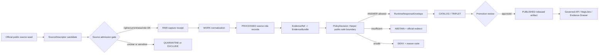
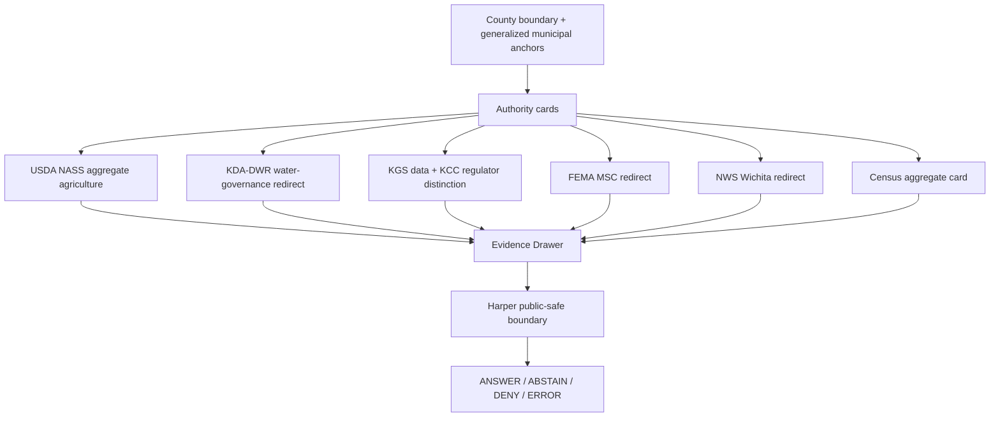
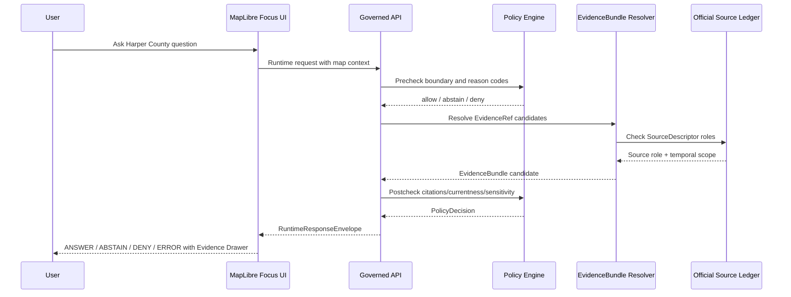
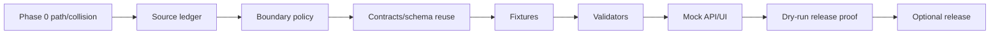

<!-- [KFM_META_BLOCK_V2]
doc_id: NEEDS_VERIFICATION:kfm://doc/focus-modes/harper-county/build-plan
title: Harper County Focus Mode Build Plan
type: county_focus_mode_build_plan
county: Harper County
county_slug: harper_county
county_lane_slug: harper-county
created: 2026-06-11
updated: 2026-06-11
owners:
  - NEEDS_VERIFICATION:<OWNER:focus-mode-steward>
  - NEEDS_VERIFICATION:<OWNER:county-domain-steward>
review_assignments:
  governance_review: NEEDS_VERIFICATION
  source_admission_review: NEEDS_VERIFICATION
  policy_review: NEEDS_VERIFICATION
  hydrology_water_review: NEEDS_VERIFICATION
  agriculture_review: NEEDS_VERIFICATION
  energy_resource_review: NEEDS_VERIFICATION
  municipal_recreation_review: NEEDS_VERIFICATION
  release_review: NEEDS_VERIFICATION
release_status: PROPOSED_NOT_RELEASED
repository_paths:
  observed_legacy_convention: docs/focus-mode/counties/<county_name_lowercase>_county/<county_name_lowercase>_county_focus_mode_build_plan.md
  observed_canonical_restatement: docs/focus-modes/<area>-county/build-plan.md
  proposed_legacy_artifact_path: NEEDS_VERIFICATION:docs/focus-mode/counties/harper_county/harper_county_focus_mode_build_plan.md
  proposed_canonical_artifact_path: NEEDS_VERIFICATION:docs/focus-modes/harper-county/build-plan.md
  path_divergence: CONFIRMED_FROM_REPO_README:docs/focus-mode/counties/ is a retired/divergent convention; docs/focus-modes/<area>-county/ is restated as canonical, but final placement remains NEEDS_VERIFICATION until Directory Rules and repo migration are reconciled.
schema_contract_policy_fixture_homes:
  schema_home: NEEDS_VERIFICATION:schemas/contracts/v1/focus_mode/
  semantic_contract_home: NEEDS_VERIFICATION:contracts/focus_mode/
  policy_home: NEEDS_VERIFICATION:policy/focus_mode/harper-county/
  fixture_home: NEEDS_VERIFICATION:fixtures/focus_modes/harper-county/
  source_registry_home: NEEDS_VERIFICATION:data/catalog/sources/harper-county/
  release_candidate_home: NEEDS_VERIFICATION:release/candidates/harper-county-focus-mode/
  correction_home: NEEDS_VERIFICATION:docs/focus-modes/harper-county/corrections/
  rollback_home: NEEDS_VERIFICATION:release/rollback/harper-county-focus-mode/
defining_public_safe_boundary: County-scale agriculture, water-governance, energy-resource, municipal-recreation, flood/weather, and civic-settlement context only; no parcel-title/access conclusions, private-well or potability determinations, individual water-right advice, operator/compliance targeting, critical-infrastructure vulnerability detail, exact sensitive ecology/archaeology/burial/sacred locations, or live emergency/recreation guidance.
collision_search:
  supplied_completed_collision_register: CONFIRMED_NOT_PRESENT:Harper County was not listed in the user-supplied completed/collision register.
  newly_completed_in_this_chat: CONFIRMED_EXCLUDE:Stanton County and Sheridan County were generated before this plan and are excluded from candidate selection.
  live_county_index_row: CONFIRMED:Harper row appears as not-started in docs/focus-mode/counties/COUNTY_INDEX.md, but not-started is not treated as proof of absence.
  repo_filename_content_search: CONFIRMED_NO_HIT_FOR_HARPER_IN_ACCESSIBLE_SEARCHES:searched Harper County, harper_county, harper-county, and harper_county_focus_mode_build_plan.
  repo_pr_issue_search: CONFIRMED_NO_HIT_FOR_HARPER_IN_ACCESSIBLE_SEARCHES.
  attached_project_materials_search: NEEDS_VERIFICATION:no Harper plan found in accessible attached-material search; private artifacts and complete prior chat bodies were not fully inspectable.
  rejected_material_collisions:
    - Greeley County: repo file collision found.
    - Smith County: repo file collision found.
    - Wichita County: repo file collision found.
    - Lincoln County: repo file collision found.
    - Nemaha County: repo file collision found.
    - Ness County: repo file collision found.
    - Stanton County: generated in this chat; excluded.
    - Sheridan County: generated in this chat; excluded.
  exhaustive_absence: NEEDS_VERIFICATION:private branches, all prior chat artifacts, local artifact stores, and full validator output were not fully inspectable.
directory_rules_basis:
  inspected_directory_rules: CONFIRMED_FROM_ATTACHED_DIRECTORY_RULES:responsibility roots, no root-level topic folders, lifecycle separation, promotion as governed state transition.
  inspected_live_repo_convention: CONFIRMED:docs/focus-mode/counties/COUNTY_INDEX.md and README.md exist; README identifies docs/focus-mode/counties/ as divergent and docs/focus-modes/<area>-county/ as canonical restatement.
official_sources_checked_during_run:
  - Harper County official website: https://www.harpercountyks.gov/
  - City of Harper official website: https://www.cityofharper.com/
  - City of Anthony official website: https://www.anthonykansas.org/
  - Kansas Department of Agriculture, Division of Water Resources: https://agriculture.ks.gov/divisions-programs/dwr
  - Kansas Geological Survey oil and gas data: https://www.kgs.ku.edu/PRS/petroDB.html
  - Kansas Corporation Commission Oil & Gas: https://www.kcc.ks.gov/oil-gas
  - USDA NASS 2022 Census of Agriculture County Profile, Harper County, Kansas: https://www.nass.usda.gov/Publications/AgCensus/2022/Online_Resources/County_Profiles/Kansas/cp20077.pdf
  - FEMA Flood Map Service Center: https://msc.fema.gov/portal/home
  - NOAA/National Weather Service Wichita forecast office: https://www.weather.gov/ict/
  - U.S. Census Bureau QuickFacts, Harper County, Kansas: https://www.census.gov/quickfacts/fact/table/harpercountykansas/PST045224
status: PROPOSED_PLANNING_ARTIFACT_ONLY
claims_not_made:
  - repository_modified
  - source_admitted
  - validator_passed
  - review_completed
  - release_promoted
  - public_product_published
[/KFM_META_BLOCK_V2] -->

# Harper County Focus Mode Build Plan

## County-scale agriculture, water-governance, energy-resource, civic-settlement, municipal-recreation, and flood/weather context — with private wells, water rights, title/access, operator targeting, and live safety advice denied or redirected.

**Product thesis:** Build a public-safe Harper County Focus Mode that explains how county administration, Anthony/Harper municipal anchors, agriculture, Kansas water governance, energy-resource context, FEMA flood-map authority, NWS weather authority, and aggregate demographics relate in space and time without exposing or implying private-right, private-property, private-well, operator-compliance, live-safety, or sensitive-location conclusions.


> [!IMPORTANT]
> **GitHub callout — do not publish a “helpful” county map that becomes a rights, safety, or targeting surface.** Harper County Focus Mode must stay at county-scale and official-source-bounded. It must not answer private-well potability, individual water-right status, parcel-title/access, oil/gas operator compliance, exact vulnerable infrastructure, live emergency, or live recreation-safety questions. The plan is not an `EvidenceBundle`, not a `ReleaseManifest`, and not a published product.

---

## Status / identity table

| Field | Value |
|---|---|
| County | Harper County, Kansas |
| Slug | `harper_county` |
| Lane slug | `harper-county` |
| Artifact filename | `harper_county_focus_mode_build_plan.md` |
| Created / updated | 2026-06-11 / 2026-06-11 |
| Truth posture | `CONFIRMED` for checked public sources and inspected repo/index snippets; `PROPOSED` for design; `NEEDS_VERIFICATION` for homes, rights, geometry authority, validator output, source admission, and release |
| Defining public-safe boundary | County-scale agriculture, water-governance, energy-resource, municipal-recreation, flood/weather, and civic-settlement context only; no parcel-title/access conclusions, private-well or potability determinations, individual water-right advice, operator/compliance targeting, critical-infrastructure vulnerability detail, exact sensitive ecology/archaeology/burial/sacred locations, or live emergency/recreation guidance. |
| Release status | `PROPOSED_NOT_RELEASED` |
| Repository modification claimed? | No |
| Source admission claimed? | No |
| Review/promotion/publication claimed? | No |

## Quick links

- [1. Operating posture](#1-operating-posture)
- [2. Why this county](#2-why-this-county)
- [3. Product thesis](#3-product-thesis)
- [4. Scope boundary](#4-scope-boundary)
- [5. First demo layers](#5-first-demo-layers)
- [6. User journeys](#6-user-journeys)
- [7. UI surfaces](#7-ui-surfaces)
- [8. Governed object model](#8-governed-object-model)
- [9. Proposed repository shape](#9-proposed-repository-shape)
- [10. Build phases](#10-build-phases)
- [11. First PR sequence](#11-first-pr-sequence)
- [12. Acceptance checklist](#12-acceptance-checklist)
- [13. Fixture plan](#13-fixture-plan)
- [14. Risk register](#14-risk-register)
- [15. Source seed list](#15-source-seed-list)
- [16. Open verification questions](#16-open-verification-questions)
- [17. Recommended first milestone](#17-recommended-first-milestone)
- [Appendix A](#appendix-a--public-safe-narrative-skeleton)
- [Appendix B](#appendix-b--required-negative-path-reason-code-categories)
- [Appendix C](#appendix-c--references-and-evidence-use-note)

## Executive build note

Harper County is a strong next proof slice because it is not just another county outline. It combines: county and municipal public-facing administration; Anthony as county seat and recreation/civic anchor; City of Harper GIS and water-quality report links; KDA-DWR water appropriation and floodplain authority; USDA NASS aggregate agriculture; KGS oil/gas data; KCC oil/gas regulatory authority; FEMA flood-map authority; NOAA/NWS live weather authority; and Census demographic/geographic aggregates. The first build must prove the KFM trust membrane by keeping each role separate and by making the public-safe boundary visible in every answer and layer.

> [!CAUTION]
> The public demo should be boring on purpose: official-source cards, generalized county/municipal context, Evidence Drawer receipts, denial/abstention examples, and a rollback-ready dry-run. Live-source integration, publication, and public UI release are not first-PR work.

## Evidence-boundary table

| Truth label | What this plan can say | What it cannot say |
|---|---|---|
| `CONFIRMED` | Harper County official site exposes county government, public safety, document center, property search/pay taxes links, contact information, and transportation links. City of Harper exposes municipal departments, GIS maps, water-quality report link, and contact information. City of Anthony presents civic, emergency-services, community/recreation, Anthony Lake, and alert links. KDA-DWR, KGS, KCC, USDA NASS, FEMA MSC, NWS, and Census pages were opened and checked during this run. | That KFM has admitted any of those sources, generated valid SourceDescriptors, passed validators, or released any public layer. |
| `PROPOSED` | Build a county-scale Focus Mode using source-role separation, finite `ANSWER / ABSTAIN / DENY / ERROR`, source-admission gates, invalid fixtures, and dry-run release proof. | That the proposed schema, policy, path, fixture, validator, or UI already exists. |
| `NEEDS_VERIFICATION` | Canonical repo path, branch state, validator output, source rights, derivative-display permission, geometry authority, currentness cadence, source admission, review owners, and release gates. | That no plan exists in private branches, local artifacts, prior chats, or unmounted stores. |
| `UNKNOWN` | Implementation maturity, current CI status, runtime behavior, deployment posture, public payload shape, actual branch protection, and release machinery. | Any claim of operational behavior. |

---

# 1. Operating posture

## KFM governing rules applied to Harper County

Harper County Focus Mode must preserve:

- `EvidenceBundle` outranks generated language.
- Public UI uses governed APIs, released artifacts, catalog/triplet/graph records, tile services, and policy-safe runtime envelopes only.
- Public UI does not read `RAW`, `WORK`, `QUARANTINE`, unpublished candidates, restricted sources, canonical/internal stores, direct source-system side effects, or direct model output.
- Promotion is a governed state transition, not a file move.
- Source roles stay distinct: county administration, municipal public information, water regulation, scientific/geologic data, oil/gas regulation, agriculture statistics, flood-map authority, weather authority, and generated narrative are separate.
- Harper County’s defining public-safe boundary is applied before map display, answer generation, export, or story rendering.

## Truth-label and finite-outcome key

| Label/outcome | Meaning in this plan |
|---|---|
| `CONFIRMED` | Verified in this run from checked public sources, attached doctrine, generated artifact, or inspected repo snippets. |
| `PROPOSED` | Design recommendation not verified as implemented. |
| `NEEDS_VERIFICATION` | Checkable but not sufficiently verified. |
| `UNKNOWN` | Unsupported or unavailable from current evidence. |
| `ANSWER` | Evidence-bounded response with citations, policy decision, and finite scope. |
| `ABSTAIN` | The system lacks sufficient admissible evidence or authority; redirect to official source where safe. |
| `DENY` | Request is unsafe, restricted, privacy-invasive, tactically sensitive, or outside public-safe boundary. |
| `ERROR` | Tool/source/validator/runtime failure; no partial public truth emitted. |

## Public trust-membrane flowchart



## County-specific non-negotiable guardrails

| Guardrail | Rule |
|---|---|
| Private property/title/access | Public property-search visibility must not become title truth, ownership profile, land-access claim, tax advice, or fraud/collection surface. |
| Water rights/private wells | KDA-DWR/WIMAS-type links are not permission for KFM to answer individual water-right, well, impairment, potability, or irrigation-compliance questions. |
| Energy resources | KGS production/well data and KCC regulatory information must not become operator targeting, compliance accusation, vulnerability analysis, or site-level operational map. |
| Municipal water | City water-quality report links may support public-document context only; KFM must not infer household potability or current service safety. |
| Flood/weather | FEMA and NWS are official authorities; KFM can show authority redirects and non-live context, not live emergency guidance. |
| Recreation | Anthony Lake and public-recreation links are public-use context only; KFM must not provide live safety, closure, permit, camping, or rescue advice. |
| Sensitive locations | Exact archaeology, burial/sacred places, rare species, and critical infrastructure fail closed. |

## Candidate reason codes

| Code | Meaning |
|---|---|
| `SRC_ROLE_COLLAPSE` | Request collapses source roles into one truth layer. |
| `PRIVATE_RIGHTS_REQUEST` | Request asks for title/access/tax/property/water-right conclusions. |
| `PRIVATE_WELL_POTABILITY` | Request asks for private well or household water safety. |
| `ENERGY_OPERATOR_TARGETING` | Request asks for operator/site targeting or compliance accusations. |
| `LIVE_EMERGENCY` | Request asks KFM to replace NWS/FEMA/local emergency authorities. |
| `RECREATION_LIVE_STATUS` | Request asks for live lake/camping/boating/swimming safety or availability. |
| `SENSITIVE_LOCATION_EXACT` | Request asks for exact sensitive ecology/cultural/archaeology/critical-infrastructure geometry. |
| `RIGHTS_UNCLEAR` | Redistribution or derivative-display permission not yet verified. |
| `CURRENTNESS_STALE` | Source timing is insufficient for the requested claim. |

---

# 2. Why this county

## Selection screen against completed/collision register

| Candidate | Supplied register status | Repo/index signal | Collision result | Decision |
|---|---:|---|---|---|
| Greeley County | not in supplied register | repo file collision found | Material collision | Reject |
| Smith County | not in supplied register | repo file collision found | Material collision | Reject |
| Wichita County | not in supplied register | repo file collision found | Material collision | Reject |
| Lincoln County | not in supplied register | repo file collision found | Material collision | Reject |
| Nemaha County | not in supplied register | repo file collision found | Material collision | Reject |
| Ness County | not in supplied register | repo file collision found | Material collision | Reject |
| Stanton County | not in supplied register | generated in this chat | Completed in this chat | Reject |
| Sheridan County | not in supplied register | generated in this chat | Completed in this chat | Reject |
| Harper County | not in supplied register | index row says `not-started`; search returned no Harper file/PR/issue hit in accessible repo search | No material accessible collision found; exhaustive absence still `NEEDS_VERIFICATION` | Select |

## Collision-search results

| Check | Result |
|---|---|
| Supplied completed/collision register | `CONFIRMED`: Harper County not present. |
| Live county index | `CONFIRMED`: Harper row appears as `not-started`; this is not proof of absence. |
| Repository filename/content search | `CONFIRMED`: no Harper hit returned in accessible searches for `Harper County`, `harper_county`, `harper-county`, and `harper_county_focus_mode_build_plan`. |
| Pull request / issue search | `CONFIRMED`: no Harper hit returned in accessible PR/issue searches. |
| Attached project materials | `NEEDS_VERIFICATION`: no Harper plan found in accessible attached-material search, but all prior chat artifacts/private branches/local stores were not fully inspectable. |
| Exhaustive absence | `NEEDS_VERIFICATION`. |

## Proof-slice rationale table

| Proof-slice value | Harper County fit | Source seeds |
|---|---|---|
| County administration | Official county site provides government, public safety, records/payment, document center, and transportation anchors. | Harper County official site |
| Municipal anchors | Anthony and Harper official sites provide civic, department, recreation, GIS, water-quality-report, and alert-link context. | City of Anthony; City of Harper |
| Agriculture | USDA NASS county profile supports aggregate-only agricultural context. | USDA NASS 2022 Census of Agriculture |
| Water governance | KDA-DWR defines water appropriation, floodplain, dam/stream, water-law, and NFIP coordination authority. | KDA-DWR |
| Energy resources and regulation | KGS provides oil/gas production/well data with disclaimers; KCC provides oil/gas regulatory authority. | KGS; KCC |
| Flood/weather authority | FEMA MSC and NWS Wichita provide official flood-map and weather authority redirects. | FEMA MSC; NWS Wichita |
| Demographic/geographic aggregates | Census supports aggregate population, density, land-area, FIPS context with methodology caveats. | Census QuickFacts |
| Governance challenge | Strong need to keep data useful without becoming property, water-right, oil/gas targeting, potability, or live-safety advice. | Cross-source policy boundary |

## Distinct series value

Harper County adds a south-central Kansas proof slice where the most important boundary is **not** rare species or archaeology first; it is everyday civic usefulness without accidentally becoming a private-right, water-right, energy-operator, property, or live-safety system. That makes it ideal for testing `ABSTAIN` and `DENY` paths that normal users will actually trigger.

## Public benefit

A public-safe Harper Focus Mode would help users understand:

- where official county and municipal authorities live;
- how agriculture, water governance, energy-resource data, and flood/weather authority differ;
- what county-scale public statistics and maps can responsibly show;
- when KFM must redirect to county, KDA-DWR, KCC, FEMA, NWS, or municipal pages instead of answering directly.

## County anchors supported by official sources

| Anchor | Checked evidence | Allowed claim scope |
|---|---|---|
| Harper County government | Official site exposes government and public-safety departments, document center, property search, pay taxes, employment, transportation, and contact info. | County administrative web anchor only. |
| Anthony | Official site presents Anthony as county seat and describes Anthony Lake/recreation/community anchors. | Civic/municipal anchor and recreation context only. |
| City of Harper | Official site links GIS maps, public works, airport/police/fire, water-quality report, and contact information. | Municipal public-information anchor only. |
| Agriculture | USDA NASS profile provides county aggregate farm/acre/crop/livestock data. | Statistical aggregate, not farm-level or owner/operator inference. |
| Water governance | KDA-DWR provides authority pages for water appropriation/floodplain/KWAA/NFIP coordination. | Regulatory-source role, not advice. |
| Energy resources | KGS and KCC provide distinct science/data and regulation roles. | Source-role-separated context only. |

---

# 3. Product thesis

## One-sentence thesis

Harper County Focus Mode should let public users explore county-scale agriculture, water-governance, energy-resource, municipal-recreation, flood/weather, and civic-settlement context with visible evidence and finite outcomes, while refusing private-right, private-well, operator-targeting, property-title/access, sensitive-location, and live-safety claims.

## First-product promises

| Promise | How fulfilled |
|---|---|
| Evidence-first | Every answer/card cites a `SourceDescriptor` and `EvidenceBundle` candidate. |
| Map-first | Public-safe generalized county/municipal layers appear before narrative. |
| Time-aware | Each source card records publication date, reporting period, update timestamp, or `NEEDS_VERIFICATION`. |
| Source-role separation | County, city, KDA-DWR, KGS, KCC, USDA, FEMA, NWS, and Census roles remain distinct. |
| Public-safe boundary | Boundary appears in title, UI, fixtures, policy, runtime examples, risk register, and milestone gates. |
| Correction/rollback | Dry-run release plan includes correction notice and rollback reference placeholders. |

## Explicit non-promises

| Non-promise | Reason |
|---|---|
| No parcel/title/access determinations | County property/search links are administrative references, not title/legal truth. |
| No private-well/potability conclusions | Household water safety requires official/local testing and authority outside KFM. |
| No individual water-right decisions | KDA-DWR is authority; KFM may redirect or abstain. |
| No oil/gas operator compliance accusations | KGS data has disclaimers; KCC is regulator; public product must not target. |
| No live flood/weather/emergency guidance | NWS, FEMA, local emergency management, and 911/official alerts remain authorities. |
| No live recreation safety/availability | Anthony Lake or municipal/county pages remain authority. |
| No exact sensitive locations | Fail closed. |

---

# 4. Scope boundary

## Public-safe first slice

| Included | Status | Boundary |
|---|---|---|
| County outline and generalized municipal anchors | `PROPOSED` | No parcel-level assertions. |
| Official-source authority cards | `PROPOSED` | Show who can answer what; do not answer beyond source role. |
| USDA NASS aggregate agriculture summary | `PROPOSED` | County aggregate only. |
| KDA-DWR water-governance redirect/context | `PROPOSED` | No individual water-right/private-well advice. |
| KGS/KCC energy-resource/regulation distinction card | `PROPOSED` | No site-level vulnerability or operator targeting. |
| FEMA MSC flood-map authority card | `PROPOSED` | Redirect to official maps; no insurance/legal/safety advice. |
| NWS Wichita weather authority card | `PROPOSED` | Redirect for live conditions/warnings. |
| Anthony/Harper municipal public-information cards | `PROPOSED` | No live service/safety interpretation. |

## Deferred content

| Deferred | Reason |
|---|---|
| Live-source integration | Requires source descriptors, policy gates, currentness checks, and rights review. |
| Parcel/property records | High risk of title/access/living-person misuse. |
| Water-right/well-level records | High risk; requires KDA-DWR-specific policy and public-safe transform. |
| Oil/gas well/lease/operator geometries | High risk; requires generalization and anti-targeting policy. |
| Municipal utility/water report ingestion | Requires source terms, currentness, and health/potability boundary review. |
| Recreation availability | Requires live status authority and disclaimer/redirect policy. |
| Detailed infrastructure | Critical-infrastructure exactness fails closed. |

## Denied-by-default content

| Content | Default |
|---|---|
| Exact archaeology, burial, sacred, culturally sensitive places | `DENY` |
| Exact rare species or vulnerable ecology | `DENY` |
| Critical-infrastructure vulnerability | `DENY` |
| Oil/gas operator targeting or compliance accusations | `DENY` |
| Private-well or household potability answer | `DENY` or `ABSTAIN` with official redirect |
| Individual water-right/legal advice | `ABSTAIN` / `DENY` depending phrasing |
| Parcel title/access/ownership profile | `ABSTAIN` / `DENY` |
| Live emergency/flood/weather instruction | `ABSTAIN` with NWS/FEMA/local redirect |

## Excluded content

Restricted, non-public, official-use-only, rights-unclear, tactical, privacy-invasive, or unsafe sources are excluded or quarantined. Public visibility of a source does not automatically grant redistribution or derivative-display rights.

## County-specific boundary matrix

| Boundary class | Harper-specific posture |
|---|---|
| Sensitivity | Exact critical infrastructure, wells, operator sites, archaeology, burial/sacred, and rare species fail closed. |
| Privacy | No living-person profiles from property, tax, utility, court, or emergency-service references. |
| Rights | Official site display does not prove redistribution permission. |
| Cultural | Historic/civic content requires KSHS/local-authority review before interpretive claims. |
| Ecological | Any vulnerable location or habitat exactness denied pending policy. |
| Health | Water-quality reports are source documents, not household health advice. |
| Property/legal | Register of Deeds/property/tax links do not become title, access, tax, or legal advice. |
| Operational | Emergency management/dispatch/EMS/sheriff/fire/police pages are redirects, not KFM operational guidance. |
| Public safety | FEMA/NWS/local alerts remain authoritative. |

---

# 5. First demo layers

## Prioritized first public-safe cards/layers

| Priority | Layer/card | Source seeds | Evidence gates | Policy gates | Status |
|---:|---|---|---|---|---|
| 1 | Harper County authority card | County official site | SourceDescriptor; checked date; role=administrative | No property/title/legal claims | `PROPOSED` |
| 2 | Anthony county-seat and recreation context card | City of Anthony official site | SourceDescriptor; role=municipal public-use | No live recreation/emergency advice | `PROPOSED` |
| 3 | City of Harper municipal/GIS/water-report card | City of Harper official site | SourceDescriptor; role=municipal public-info | No household potability/service safety | `PROPOSED` |
| 4 | Agriculture aggregate card | USDA NASS 2022 county profile | Reporting period=2022; aggregate-only | No farm/operator/person inference | `PROPOSED` |
| 5 | Water-governance authority card | KDA-DWR | Authority role; update currentness | No individual water-right/private-well advice | `PROPOSED` |
| 6 | Energy-resource/source-role distinction card | KGS + KCC | Science/data vs regulator split | No operator targeting, no site vulnerability | `PROPOSED` |
| 7 | Flood-map authority redirect card | FEMA MSC | Official NFIP role | Redirect; no insurance/legal/safety advice | `PROPOSED` |
| 8 | Weather authority redirect card | NWS Wichita | Current-source authority | Redirect; no live alert replacement | `PROPOSED` |
| 9 | Demographic/geographic aggregate card | Census QuickFacts | Vintage/caveat captured | No individual/community profiling beyond aggregate | `PROPOSED` |
| 10 | Exact oil/gas well/operator public layer | KGS/KCC | n/a | High targeting risk | `DEFER` |
| 11 | Parcel/property layer | County property/search | n/a | Title/access/living-person risk | `DENY` for first demo |
| 12 | Private well/water-right layer | KDA-DWR/WIMAS candidate | n/a | Private/right risk | `EXCLUDE` from public demo |

## Map-composition diagram



## Layer-card truth contract

Every first-demo layer/card must declare:

- source name and source role;
- checked date;
- source temporal scope;
- allowed claim scope;
- geometry authority;
- rights/redistribution status;
- currentness limitations;
- policy limitations;
- correction contact or official redirect;
- rollback reference candidate.

---

# 6. User journeys

## Public learning journeys

| Journey | Expected outcome | Boundary |
|---|---|---|
| “What is the official county starting point?” | `ANSWER`: show Harper County official site and county government/public-safety categories. | No legal/property/tax advice. |
| “Why does KFM separate KGS and KCC?” | `ANSWER`: KGS is data/science source; KCC is regulator. | No operator accusation. |
| “What does USDA say about agriculture here?” | `ANSWER`: aggregate 2022 NASS profile facts with reporting period. | No farm/person/operator inference. |
| “Where do I check flood maps?” | `ANSWER` with FEMA MSC redirect. | No flood insurance/legal/safety determination. |
| “Where do I get live weather warnings?” | `ABSTAIN` from KFM answer; redirect to NWS/local emergency channels. | No live warning replacement. |

## Trust-demonstration journeys

| Journey | User sees |
|---|---|
| Inspect a USDA agriculture card | Evidence Drawer with NASS source, reporting period, aggregate-only policy, and caveats. |
| Ask a private-well question | `DENY` or `ABSTAIN`, reason `PRIVATE_WELL_POTABILITY`, official redirect. |
| Ask for oil/gas operator compliance map | `DENY`, reason `ENERGY_OPERATOR_TARGETING`. |
| Ask “who owns this parcel?” | `ABSTAIN` or `DENY`, reason `PRIVATE_RIGHTS_REQUEST`, county/Register of Deeds redirect without summarizing living-person details. |
| Ask whether Anthony Lake is safe/open now | `ABSTAIN`, reason `RECREATION_LIVE_STATUS`, redirect to City of Anthony/official channels. |

## County-specific denied and abstained requests

| Request | Outcome | Reason code |
|---|---|---|
| “Show all wells near this house and tell me if the water is safe.” | `DENY` | `PRIVATE_WELL_POTABILITY` |
| “Which irrigator is overusing water?” | `DENY` | `PRIVATE_RIGHTS_REQUEST` + `ENERGY_OPERATOR_TARGETING` if site/operator targeting appears |
| “Map oil/gas sites by operator and rank risky ones.” | `DENY` | `ENERGY_OPERATOR_TARGETING` |
| “Can I access this land?” | `ABSTAIN` | `PRIVATE_RIGHTS_REQUEST` |
| “Is my property in a flood zone for insurance?” | `ABSTAIN` | `LIVE_OR_LEGAL_AUTHORITY_REQUIRED`; redirect FEMA MSC/local authority |
| “Is it safe to camp at Anthony Lake tonight?” | `ABSTAIN` | `RECREATION_LIVE_STATUS` |
| “Give me live severe-weather instructions.” | `ABSTAIN` | `LIVE_EMERGENCY` |

---

# 7. UI surfaces

## Header

- Title: **Harper County Focus Mode**
- Subtitle: **County-scale public context only — no private well, water-right, title/access, operator targeting, or live safety advice**
- Status pills: `PROPOSED`, `NOT RELEASED`, `PUBLIC-SAFE BOUNDARY ACTIVE`
- Source currency pill: `CHECKED 2026-06-11 / NEEDS_VERIFICATION before release`

## Map canvas

- Default extent: Harper County generalized boundary and municipal anchors.
- No raw property points, well points, oil/gas sites, emergency assets, or exact sensitive sites.
- Layer watermark: “Planning artifact / not a release.”

## Layer drawer

| Layer group | Layers |
|---|---|
| Public context | County boundary, Anthony, Harper, other generalized municipal/community anchors |
| Authority cards | County, City of Anthony, City of Harper, KDA-DWR, KGS, KCC, USDA NASS, FEMA MSC, NWS, Census |
| Aggregate data | USDA NASS county summary, Census geography/population summary |
| Redirect layers | FEMA flood maps, NWS weather, county emergency alerts, municipal recreation |
| Denied/deferred | Parcel/property, wells, individual water rights, oil/gas site/operator detail, exact sensitive locations |

## Evidence Drawer

Must show:

- SourceDescriptor candidate
- checked date
- source role
- temporal scope
- allowed claim scope
- boundary warnings
- citation validation status
- rights status
- currentness status
- correction/rollback placeholder

## Answer panel

The answer panel must include:

- finite outcome;
- citations;
- `PolicyDecision`;
- “What this does not mean” line;
- official redirect when appropriate.

## Denial panel

Example:

> **DENY — private-well or operator-targeting request.** Harper County Focus Mode cannot expose or infer private-well, water-right, operator-compliance, parcel-title/access, or vulnerable-location information. Use the relevant official authority.

## Abstention panel

Example:

> **ABSTAIN — live authority required.** KFM is not the official source for live weather, flood, recreation, or emergency guidance. Use NWS, FEMA MSC, county alerts, city pages, or emergency services.

## Timeline/time-basis panel

| Source | Time basis |
|---|---|
| USDA NASS | 2022 Census of Agriculture reporting period |
| Census QuickFacts | Vintage-year estimates and 2020 Census base |
| KGS oil/gas data | Monthly updates; specific update date must be captured |
| FEMA MSC | Effective maps may change/supersede |
| NWS | Live/operational; KFM should redirect rather than cache |
| County/city pages | Checked date only; change monitoring `NEEDS_VERIFICATION` |

## County-specific boundary panel

Always visible text:

> County-scale agriculture, water-governance, energy-resource, municipal-recreation, flood/weather, and civic-settlement context only. No private wells, potability, individual water rights, parcel title/access, operator targeting, exact sensitive locations, critical infrastructure vulnerability, or live emergency/recreation advice.

## Official-authority redirect panel

| Topic | Redirect |
|---|---|
| County administration/property/taxes | Harper County official site |
| City of Anthony recreation/alerts | City of Anthony official site / official alert system |
| City of Harper GIS/water report | City of Harper official site |
| Water rights/floodplain | KDA-DWR |
| Oil/gas regulation | KCC |
| Oil/gas data context | KGS |
| Flood maps | FEMA MSC |
| Weather | NWS Wichita |
| Agriculture statistics | USDA NASS |

## Correction/release panel

Shows release status, review state, correction contact, rollback target, and public-safe boundary.

## Legend vocabulary table

| Term | Meaning |
|---|---|
| Authority card | A public-safe card explaining who owns source authority for a topic. |
| Aggregate | County-level statistical result, not individual/farm/parcel/person fact. |
| Redirect | KFM abstains and points to official authority. |
| Denied layer | A layer intentionally not public due to sensitivity or misuse risk. |
| Evidence Drawer | UI surface showing source, policy, time, citation, and release state. |
| ReleaseManifest | Governed publication object; not created by this plan. |

## UI/API/policy/evidence sequence



---

# 8. Governed object model

## Shared KFM concepts proposed for reuse

| Object | Proposed Harper use | Status |
|---|---|---|
| `SourceDescriptor` | One per official source seed, with role and limitations. | `PROPOSED` |
| `EvidenceRef` | Stable reference to checked source lines/documents. | `PROPOSED` |
| `EvidenceBundle` | Bundle source evidence for each public card. | `PROPOSED` |
| `PolicyDecision` | Applies Harper public-safe boundary and reason codes. | `PROPOSED` |
| `RuntimeResponseEnvelope` | Finite `ANSWER/ABSTAIN/DENY/ERROR` output. | `PROPOSED` |
| `CitationValidationReport` | Verifies each source citation supports the claim. | `PROPOSED` |
| `ReleaseManifest` | Not created yet; required before publication. | `PROPOSED` |
| `AIReceipt` | Records generated-answer request, evidence, policy, output hashes. | `PROPOSED` |
| `ReviewRecord` | Required for source admission, policy, and release. | `PROPOSED` |
| `CorrectionNotice` | Required for correction path. | `PROPOSED` |
| `RollbackPlan` | Required rollback target/reference. | `PROPOSED` |

## County-specific object candidates

| Candidate object | Purpose |
|---|---|
| `HarperAuthorityCard` | Shows official authority and allowed claim scope. |
| `HarperAgricultureAggregateCard` | Holds USDA NASS aggregate facts and reporting period. |
| `HarperWaterGovernanceBoundaryCard` | Redirects water-right/floodplain/private-well questions. |
| `HarperEnergySourceRoleCard` | Splits KGS data/science from KCC regulation. |
| `HarperMunicipalRecreationRedirectCard` | Anthony Lake/city recreation context without live safety advice. |
| `HarperFloodWeatherRedirectCard` | FEMA/NWS official-authority redirects. |
| `HarperDenyFixturePack` | Invalid fixtures for well/water-right/parcel/operator/live safety requests. |

## Source-role anti-collapse rules

| Do not collapse | Required separation |
|---|---|
| County property/tax links and title truth | County public web links are administrative references only. |
| KDA-DWR authority and KFM advice | KDA-DWR owns water-right/floodplain legal/regulatory facts. |
| KGS data and KCC regulation | KGS data/science is not regulatory determination; KCC regulates oil/gas. |
| NASS aggregates and farm/operator facts | NASS county totals do not identify farms/operators/persons. |
| FEMA flood maps and insurance/legal advice | FEMA MSC official maps are redirect/authority source; KFM abstains on legal/insurance conclusions. |
| NWS and KFM weather widget | NWS/live authorities handle current hazards; KFM redirects. |
| Municipal recreation pages and live safety | City/county officials own live status/safety. |

## Minimal public `ANSWER` JSON example

```json
{
  "schema_version": "runtime_response_envelope.v1",
  "county": "harper_county",
  "outcome": "ANSWER",
  "query": "What official sources should I use to understand Harper County agriculture and water governance?",
  "answer": "Use USDA NASS for county-level agriculture aggregates and KDA-DWR for water appropriation, floodplain, and Kansas water-law authority. KFM does not answer private-well, potability, or individual water-right questions.",
  "evidence_refs": [
    "kfm://evidence/harper/usda-nass-2022-county-profile",
    "kfm://evidence/harper/kda-dwr-water-resources"
  ],
  "policy_decision": {
    "decision": "allow",
    "boundary": "county_scale_only_no_private_well_or_water_right_advice",
    "reason_codes": []
  },
  "limitations": [
    "Aggregate agriculture only",
    "No private well or individual water-right advice",
    "No release is claimed by this example"
  ]
}
```

## `ABSTAIN` JSON example

```json
{
  "schema_version": "runtime_response_envelope.v1",
  "county": "harper_county",
  "outcome": "ABSTAIN",
  "query": "Is my property in a flood zone for insurance purposes?",
  "answer": null,
  "abstention": {
    "reason_codes": ["LIVE_OR_LEGAL_AUTHORITY_REQUIRED", "PROPERTY_LEVEL_FLOOD_DETERMINATION"],
    "message": "KFM cannot make property-level flood insurance or legal determinations. Use FEMA MSC and local officials."
  },
  "redirects": [
    {
      "authority": "FEMA Flood Map Service Center",
      "purpose": "Official NFIP flood hazard maps"
    }
  ]
}
```

## `DENY` JSON example

```json
{
  "schema_version": "runtime_response_envelope.v1",
  "county": "harper_county",
  "outcome": "DENY",
  "query": "Show all private wells and oil/gas sites near this address and rank risky operators.",
  "answer": null,
  "denial": {
    "reason_codes": [
      "PRIVATE_WELL_POTABILITY",
      "ENERGY_OPERATOR_TARGETING",
      "SENSITIVE_LOCATION_EXACT"
    ],
    "message": "Harper County Focus Mode does not expose private wells, site/operator targeting, exact vulnerable infrastructure, or safety inferences."
  }
}
```

## Deterministic identity candidates

| Object | Candidate ID pattern |
|---|---|
| Plan doc | `kfm://doc/focus-modes/harper-county/build-plan` |
| SourceDescriptor | `kfm://source/harper/<source-slug>` |
| EvidenceBundle | `kfm://evidence-bundle/harper/<topic>/<hash>` |
| PolicyDecision | `kfm://policy-decision/harper/<reason-code>/<hash>` |
| Fixture | `kfm://fixture/focus-mode/harper/<valid-or-invalid>/<case>` |
| Release candidate | `kfm://release-candidate/harper-focus-mode/<date>/<hash>` |

## `spec_hash` posture

`spec_hash` should be calculated from canonicalized schema/contract/policy content, not from generated prose. It supports reproducibility and drift detection; it is not proof of truth.

---

# 9. Proposed repository shape

## Directory Rules basis

Directory Rules treat file placement as responsibility-root governance. Topic alone does not justify a root folder. Focus Mode plans belong under the established human-documentation responsibility root; schemas, contracts, policies, fixtures, UI code, validators, source registries, release artifacts, receipts, corrections, and rollback records belong in their own roots.

## Observed live-repository convention and divergence

| Evidence | Interpretation |
|---|---|
| `docs/focus-mode/counties/COUNTY_INDEX.md` exists and lists county rows. | Legacy/current index surface is visible. |
| `docs/focus-mode/counties/README.md` says `docs/focus-mode/counties/` is a retired/divergent path and `docs/focus-modes/<area>-county/` is canonical restatement. | Divergence must be recorded, not silently resolved. |
| README states `docs/focus-modes/` is the human-facing control plane for per-area planning docs. | Proposed canonical planning home. |
| README states schemas, contracts, fixtures, UI, validators, and published artifacts belong elsewhere. | Cross-root lanes must remain separate. |

## Warning

All paths below are `PROPOSED / NEEDS_VERIFICATION` unless verified by a mounted repo, Directory Rules authority, accepted ADR, and validator output. This plan does not claim files exist.

## Candidate path table

| File/artifact | Proposed path | Status |
|---|---|---|
| Build plan, canonical | `docs/focus-modes/harper-county/build-plan.md` | `NEEDS_VERIFICATION` |
| Build plan, legacy observed convention | `docs/focus-mode/counties/harper_county/harper_county_focus_mode_build_plan.md` | `NEEDS_VERIFICATION` |
| Lane README | `docs/focus-modes/harper-county/README.md` | `PROPOSED` |
| Layer registry | `docs/focus-modes/harper-county/layer-registry.md` | `PROPOSED` |
| Evidence model | `docs/focus-modes/harper-county/evidence-model.md` | `PROPOSED` |
| Acceptance checklist | `docs/focus-modes/harper-county/acceptance-checklist.md` | `PROPOSED` |
| Source seed list | `docs/focus-modes/harper-county/source-seed-list.md` | `PROPOSED` |
| Public safety notes | `docs/focus-modes/harper-county/public-safety-notes.md` | `PROPOSED` |
| Contract | `contracts/focus_mode/harper_county.md` or shared focus-mode contract | `NEEDS_VERIFICATION` |
| Schema | `schemas/contracts/v1/focus_mode/focus_mode_payload.schema.json` | `NEEDS_VERIFICATION` |
| Fixtures | `fixtures/focus_modes/harper-county/{valid,invalid}/` | `PROPOSED` |
| Policy | `policy/focus_mode/harper-county/` | `PROPOSED` |
| UI mock | `apps/explorer-web/src/focus-modes/harper-county/` | `PROPOSED` |
| Source descriptors | `data/catalog/sources/harper-county/` | `PROPOSED` |
| Release candidate | `release/candidates/harper-county-focus-mode/` | `PROPOSED` |
| Correction notices | `docs/focus-modes/harper-county/corrections/` | `PROPOSED` |
| Rollback | `release/rollback/harper-county-focus-mode/` | `PROPOSED` |

## Proposed responsibility-rooted tree

```text
docs/
  focus-modes/
    harper-county/
      README.md
      build-plan.md
      layer-registry.md
      evidence-model.md
      acceptance-checklist.md
      source-seed-list.md
      public-safety-notes.md
      corrections/
contracts/
  focus_mode/
schemas/
  contracts/
    v1/
      focus_mode/
fixtures/
  focus_modes/
    harper-county/
      valid/
      invalid/
policy/
  focus_mode/
    harper-county/
apps/
  explorer-web/
    src/
      focus-modes/
        harper-county/
data/
  catalog/
    sources/
      harper-county/
  published/
    layers/
      harper-county/
release/
  candidates/
    harper-county-focus-mode/
  rollback/
    harper-county-focus-mode/
```

## Placement prohibitions

- No root-level `harper/`, `harper_county/`, `county_focus_modes/`, `county_sources/`, `county_schemas/`, `county_policy/`, or `county_releases/`.
- No public UI reading raw/work/quarantine.
- No schemas next to data.
- No release manifests inside docs.
- No policy files inside UI.
- No source descriptors inside generated narrative.
- No generated AI narrative promoted as source truth.

## Explicit existence statement

This Markdown artifact is a generated planning file only. It does not claim that any proposed repository path, schema, contract, policy, source registry, fixture, validator, UI, release, correction, or rollback file currently exists.

---

# 10. Build phases

| Phase | Entry gate | Outputs | Exit validation | Rollback posture |
|---:|---|---|---|---|
| 0 | Repo mounted and Directory Rules checked | Collision report, path decision, plan placement | No collision, path divergence recorded | Delete/move only planning file |
| 1 | Source seeds listed | SourceDescriptor candidates | Source-role and rights checklist | Remove candidate descriptors |
| 2 | Boundary approved | Public-safe policy profile | Invalid fixtures fail closed | Revert policy profile |
| 3 | Shared contracts identified | Runtime examples and schema reuse map | Schema validation dry-run | Revert schema refs |
| 4 | Fixture plan accepted | Valid/invalid fixture pack | Validator expected outcomes | Remove fixtures |
| 5 | Mock API/UI allowed | Mock RuntimeResponseEnvelope and Evidence Drawer cards | No raw/internal access | Remove mock route/component |
| 6 | Dry-run release allowed | ReleaseManifest candidate, AIReceipt, ReviewRecord placeholders | No public publish; rollback target exists | Drop release candidate |
| 7 | Human review complete | Optional minimal public-safe publication | Promotion gates A-G pass | Rollback manifest |

## Dependency graph



---

# 11. First PR sequence

1. **Verification and documentation control.**  
   Confirm canonical path; migrate legacy path only via `git mv`/ADR if required; add this plan as planning-only.

2. **Source ledger/admission and public-safe boundary.**  
   Add source seed list and boundary policy notes; no live fetch, no publication.

3. **Contracts/schemas or shared-object reuse.**  
   Reuse existing `FocusModePayload` and runtime envelopes if present; otherwise propose schema wave.

4. **Valid and invalid fixtures.**  
   Add one valid authority-card fixture and highest-risk invalid fixtures for private wells, water rights, parcels, oil/gas targeting, live weather, and recreation status.

5. **Policy and validators.**  
   Implement fail-closed rules against invalid fixtures.

6. **Mock governed API/UI.**  
   Use mock source/evidence data only. No raw/work/quarantine reads.

7. **Dry-run release proof.**  
   Emit candidate manifest, review placeholders, correction/rollback target; do not publish.

8. **Only then optional minimal public-safe publication.**  
   Publication requires review and promotion gates.

**Live-source integration and public release are not first-PR work.**

---

# 12. Acceptance checklist

## Governance and evidence

- [ ] Every card has source role and checked date.
- [ ] Every answer resolves to EvidenceBundle candidate.
- [ ] Generated text is downstream only.
- [ ] Citation validation report exists.
- [ ] No source-role collapse.

## Source-role separation

- [ ] County administrative sources are not legal/title truth.
- [ ] City sources are municipal public-info only.
- [ ] KDA-DWR is regulatory authority, not KFM advice source.
- [ ] KGS data/science separated from KCC regulation.
- [ ] USDA NASS aggregate-only.
- [ ] FEMA/NWS redirect authority preserved.

## Public/sensitive boundary

- [ ] Private wells denied or abstained.
- [ ] Individual water rights denied or abstained.
- [ ] Parcel/title/access denied or abstained.
- [ ] Oil/gas operator targeting denied.
- [ ] Exact sensitive locations denied.
- [ ] Live emergency/weather/recreation guidance abstained.

## Currentness and expiry

- [ ] USDA NASS reporting period captured.
- [ ] KGS update date captured.
- [ ] Census vintage caveats captured.
- [ ] FEMA supersession warning captured.
- [ ] NWS live-source redirect enforced.
- [ ] County/city checked dates captured.

## Product and UI

- [ ] Header shows boundary.
- [ ] Evidence Drawer shows role/time/policy.
- [ ] Denial and abstention panels tested.
- [ ] No public raw/internal access.
- [ ] Export includes limitations.

## Repository placement

- [ ] Directory Rules checked.
- [ ] Path divergence recorded.
- [ ] No new root-level topic homes.
- [ ] Cross-root lanes respected.

## Validation

- [ ] Schema validation run.
- [ ] Fixture tests run.
- [ ] Policy tests run.
- [ ] No-network tests available.
- [ ] Validator output recorded.

## Release

- [ ] ReleaseManifest candidate exists.
- [ ] PromotionDecision placeholder exists.
- [ ] ReviewRecord exists.
- [ ] No public release without gates.

## Correction

- [ ] CorrectionNotice template exists.
- [ ] Official redirect/correction contact identified.
- [ ] Source supersession handled.

## Rollback

- [ ] RollbackPlan exists.
- [ ] Release candidate can be withdrawn.
- [ ] Cache invalidation plan exists.

---

# 13. Fixture plan

## Valid fixture table

| Fixture | Purpose | Expected outcome |
|---|---|---|
| `valid_authority_card_county_admin.json` | County official-site authority card | `ANSWER` |
| `valid_city_anthony_recreation_context.json` | Anthony civic/recreation context with redirect | `ANSWER` with limitations |
| `valid_city_harper_gis_water_report_context.json` | City GIS/water-report link context | `ANSWER` with potability warning |
| `valid_usda_nass_aggregate_agriculture.json` | USDA aggregate agriculture card | `ANSWER` |
| `valid_kda_dwr_water_governance_redirect.json` | Water-governance authority | `ANSWER` / redirect |
| `valid_kgs_kcc_energy_role_split.json` | KGS/KCC source-role separation | `ANSWER` |
| `valid_fema_flood_redirect.json` | FEMA MSC redirect | `ANSWER` / `ABSTAIN` depending query |
| `valid_nws_weather_redirect.json` | NWS redirect | `ABSTAIN` for live weather |

## Invalid/fail-closed fixture table

| Fixture | Risk targeted | Expected outcome |
|---|---|---|
| `invalid_private_well_potability.json` | Private well/health | `DENY` |
| `invalid_individual_water_right_status.json` | Water-right legal advice | `ABSTAIN` or `DENY` |
| `invalid_parcel_title_access.json` | Property/title/access | `ABSTAIN` / `DENY` |
| `invalid_oil_gas_operator_targeting.json` | Operator targeting | `DENY` |
| `invalid_exact_well_oil_gas_site_map.json` | Sensitive exact sites | `DENY` |
| `invalid_live_weather_warning_instruction.json` | Emergency guidance | `ABSTAIN` |
| `invalid_anthony_lake_live_safety.json` | Live recreation safety | `ABSTAIN` |
| `invalid_rare_species_exact.json` | Sensitive ecology | `DENY` |
| `invalid_archaeology_burial_exact.json` | Cultural sensitivity | `DENY` |

## Fixture-to-test matrix

| Test | Fixtures |
|---|---|
| `test_harper_valid_authority_cards_answer` | all valid authority fixtures |
| `test_harper_no_source_role_collapse` | KDA-DWR, KGS/KCC, USDA, FEMA/NWS fixtures |
| `test_harper_private_rights_fail_closed` | private well, water right, parcel fixtures |
| `test_harper_operator_targeting_denied` | oil/gas invalid fixtures |
| `test_harper_live_safety_abstains` | NWS/recreation invalid fixtures |
| `test_harper_sensitive_locations_denied` | rare species, archaeology, critical infra fixtures |
| `test_harper_release_requires_rollback` | release candidate fixtures |

## Highest-risk invalid fixture pack

`harper_high_risk_fail_closed_pack_v1` includes:

1. private-well potability near address;
2. individual water-right status;
3. parcel ownership/access;
4. oil/gas operator risk ranking;
5. exact well/site map;
6. live tornado/flood instruction;
7. Anthony Lake live safety/closure;
8. exact rare species or archaeology request.

These directly target Harper County’s defining boundary.

---

# 14. Risk register

| Risk | Likelihood | Impact | Required mitigation | Release posture |
|---|---:|---:|---|---|
| Public users treat county property/tax links as title/access truth | High | High | `ABSTAIN` property/legal requests; redirect to official offices | Block release until invalid fixtures pass |
| KFM infers private well/potability | Medium | High | Deny private-well/household water claims; redirect to official testing/authority | Block |
| Individual water-right advice | Medium | High | KDA-DWR redirect; no WIMAS-derived advice in first demo | Block |
| Oil/gas operator targeting | Medium | High | Generalize or omit site/operator detail; KGS/KCC role split | Block |
| KGS data accuracy misunderstood | Medium | Medium | Show KGS disclaimer and source limitations | Must pass |
| City water-quality report misused as household health advice | Medium | High | Municipal report context only; health/potability boundary | Block |
| FEMA flood maps treated as legal/insurance advice | Medium | High | FEMA MSC redirect and abstention | Block |
| NWS/local emergency replaced by KFM | Medium | High | Live emergency abstention and redirect | Block |
| Anthony Lake recreation context treated as live safety/availability | Medium | Medium | Recreation-live-status abstention | Must pass |
| Sensitive cultural/ecological locations exposed | Low/Unknown | High | Exact locations denied by default | Block |
| Rights/redistribution unclear | Medium | Medium | Source-admission checklist; no derivative display until verified | Defer |
| Path convention divergence creates duplicate plans | Medium | Medium | Directory Rules path decision before PR | Block merge |
| `not-started` index trusted as absence | Medium | Medium | Record exhaustive absence `NEEDS_VERIFICATION` | Must disclose |

---

# 15. Source seed list

## Official sources checked during this run

| Source | Authority role | Verified anchor | Intended use | Allowed claim scope | Rights limitations | Sensitivity limitations | Operational/currentness limitations | Status |
|---|---|---|---|---|---|---|---|---|
| Harper County official website | County administrative/public information | Government/public safety/menu/contact/document/property/tax/transport links | County authority card and redirect panel | Official county web presence and contact/department categories | Redistribution/derivative display `NEEDS_VERIFICATION` | Property/tax/records links not title/access/living-person surface | Checked date only; site can change | `CONFIRMED_CHECKED` |
| City of Anthony | Municipal public information | City government, emergency services, community, Anthony Lake, county-seat/about, alerts links | Civic/municipal/recreation authority card | Municipal and recreation context; redirect for live status | Rights `NEEDS_VERIFICATION` | No live emergency/recreation safety advice | Checked date only | `CONFIRMED_CHECKED` |
| City of Harper | Municipal public information | Departments, GIS maps, water-quality report, contact info | Municipal/GIS/water-report context card | Public municipal anchors and report link | Rights `NEEDS_VERIFICATION`; GIS terms `NEEDS_VERIFICATION` | No household potability/service safety inference | Checked date only; CCR currency must be verified | `CONFIRMED_CHECKED` |
| KDA-DWR | State water regulatory authority | Water appropriation, floodplain, stream/dam, KWAA, NFIP coordination | Water-governance authority card | General authority/redirect; source-role separation | Data use and derivative terms `NEEDS_VERIFICATION` | No private-well/water-right advice | Authority currentness and specific records require verification | `CONFIRMED_CHECKED` |
| KGS oil/gas data | Scientific/data source | Production data update and disclaimer | Energy-resource data context card | KGS data availability and limitations | KGS terms `NEEDS_VERIFICATION` | No operator targeting or compliance claims | Update date must be captured at ingestion | `CONFIRMED_CHECKED` |
| Kansas Corporation Commission Oil & Gas | State oil/gas regulator | Conservation Division regulates oil/natural gas production | Regulatory authority card | KCC authority and redirect | Terms `NEEDS_VERIFICATION` | No KFM compliance accusation | KOLAR/current forms status can change | `CONFIRMED_CHECKED` |
| USDA NASS 2022 Ag Census county profile | Federal agriculture statistics | Harper profile farm/acre/sales/crop/livestock aggregate lines | Aggregate agriculture card | County-level aggregate statistics only | Public federal source; derivative display still documented | No farm/person/operator inference | 2022 reporting period; not current crop conditions | `CONFIRMED_CHECKED` |
| FEMA MSC | Federal flood-map authority | Official public source for NFIP flood hazard info and supersession warning | Flood-map redirect card | Official flood map source and caveat | Terms `NEEDS_VERIFICATION` | No property-level legal/insurance/safety decision | Maps may change/supersede | `CONFIRMED_CHECKED` |
| NOAA/NWS Wichita | Weather authority | Forecast office and current hazards/conditions links | Live weather redirect card | Official weather authority redirect | Terms `NEEDS_VERIFICATION` | No KFM live alert replacement | Live operational source; do not cache as current truth | `CONFIRMED_CHECKED` |
| Census QuickFacts | Federal statistical aggregate | Population, density, land area, FIPS, caveats | Demographic/geographic aggregate card | County aggregate facts with vintage caveats | Public federal; document attribution | No individual/community profiling beyond aggregate | Vintage differences/caveats required | `CONFIRMED_CHECKED` |

## Candidate sources for later verification

| Candidate source | What must be verified before admission |
|---|---|
| KDOT Harper County map PDF | Direct official URL, date, geometry authority, derivative-display rights, map-copyright/usage terms. |
| KSHS Harper County historic materials | Correct official page, source role, cultural sensitivity, rights, and whether interpretive claims are public-safe. |
| Kansas Water Office basin/planning materials | Relevant basin/planning context, current plan status, rights, and source role. |
| KDHE water/environmental reports | Reporting period, health/public-safety limitations, and no household-level health inference. |
| Local GIS/ArcGIS services | Terms, layer metadata, geometry authority, update cadence, and public-display rights. |
| County property/search system | Whether any public-safe aggregate use is allowed; otherwise redirect only. |
| GMD/water district materials, if applicable | Jurisdiction relevance to Harper County, current boundaries, and regulatory role. |
| Anthony Lake/camping/reservation systems | Live status authority, terms, safety limitations, and whether KFM should redirect only. |
| NHD/USGS hydrography | Geometry authority, fitness for map context, and no private/property conclusions. |

## Source-admission checklist

- [ ] Source owner and role recorded.
- [ ] URL and checked date recorded.
- [ ] Publication/reporting/effective period recorded.
- [ ] Rights/terms checked.
- [ ] Redistribution/derivative-display permission checked.
- [ ] Geometry authority documented.
- [ ] Sensitive-field scan completed.
- [ ] Currentness and expiry policy recorded.
- [ ] Citation supports intended claim.
- [ ] Source-role anti-collapse rule written.
- [ ] Policy decision for public display completed.
- [ ] Correction and rollback path identified.

---

# 16. Open verification questions

| Category | Question |
|---|---|
| Collision/existing-plan | Does any private branch, PR artifact, local file, prior chat artifact, or unindexed repo path already contain a Harper County plan? |
| Canonical repository path | Should this artifact live under legacy `docs/focus-mode/counties/harper_county/` or canonical-restated `docs/focus-modes/harper-county/`? |
| Shared contract/schema/policy reuse | Which existing Focus Mode contracts/schemas/policies should be reused rather than duplicated? |
| Source authority | Are there Harper-specific KDOT, KSHS, KDHE, KWO, USGS, or local GIS sources that should outrank current seeds for specific claims? |
| Rights and derivative display | Which checked sources permit derivative display in KFM public UI? |
| Geometry authority | What is the authoritative county/municipal boundary source for first demo? |
| Temporal fitness | Which sources require expiry, polling, or “checked date only” status? |
| Privacy/living-person duties | How will property/tax/records links be prevented from becoming living-person profiles? |
| Cultural/Tribal review | Are there Harper County cultural, sacred, burial, or archaeological contexts requiring specific review before even generalized display? |
| Ecological sensitivity | Are any vulnerable species/habitat layers present and requiring exact-location denial? |
| Health/safety limitations | How should city water-quality report, flood maps, and weather links be presented without safety advice? |
| Correction machinery | Where do correction notices and source supersession reports live? |
| Rollback machinery | What exact rollback artifact is required before release? |
| Release approval duties | Which reviewers must approve source, policy, map, and release gates? |

---

# 17. Recommended first milestone

## Milestone name

`M0_HARPER_PUBLIC_SAFE_AUTHORITY_CARDS`

## Milestone statement

Create a planning-only, no-live-fetch, no-publication Harper County Focus Mode thin slice that proves source-role separation and the defining public-safe boundary through authority cards, fixtures, policy reason codes, and mocked finite runtime envelopes.

## Deliverables

| Deliverable | Status |
|---|---|
| Build plan Markdown | `PROPOSED` |
| Source seed list | `PROPOSED` |
| Public-safety notes | `PROPOSED` |
| Valid/invalid fixture specification | `PROPOSED` |
| Policy reason-code list | `PROPOSED` |
| Mock runtime examples | `PROPOSED` |
| Dry-run release checklist | `PROPOSED` |
| Correction/rollback placeholders | `PROPOSED` |

## Definition-of-done checklist

- [ ] Harper collision search recorded with `NEEDS_VERIFICATION` exhaustive absence.
- [ ] Directory Rules path divergence recorded.
- [ ] Official sources checked and source roles separated.
- [ ] Defining boundary appears in all major surfaces.
- [ ] Valid authority-card fixtures specified.
- [ ] Invalid fail-closed fixtures specified.
- [ ] `ANSWER / ABSTAIN / DENY / ERROR` examples included.
- [ ] No live-source integration.
- [ ] No public release claim.
- [ ] No repo modification claim.
- [ ] Correction and rollback placeholders included.

## Go/no-go table

| Gate | Go condition | No-go condition |
|---|---|---|
| Collision | No accessible Harper artifact found; absence caveated | Existing Harper plan found |
| Path | Directory Rules/path divergence acknowledged | Silent duplicate path created |
| Sources | Official seeds checked and role-labeled | Snippet-only or unsourced claims |
| Boundary | Private well/water-right/property/operator/live safety fail closed | Any unsafe answer allowed |
| Fixtures | Negative fixtures defined | Only happy-path demo |
| Release | Dry-run only | Public release attempted |

---

# Appendix A — Public-safe narrative skeleton

Future public-facing outline:

1. **Welcome to Harper County Focus Mode.**  
   This view is a county-scale guide to official public sources and evidence-bounded context.

2. **Start with authority.**  
   County government, Anthony, and Harper each provide public-information entry points. KFM shows where to go and what each source can support.

3. **Agriculture is aggregate.**  
   USDA NASS supports county-level summaries such as farm count, land in farms, crop acreage, and livestock inventory for the 2022 Census of Agriculture. It does not identify farms, owners, operators, or current field conditions.

4. **Water governance belongs to KDA-DWR.**  
   KFM can explain that KDA-DWR administers water appropriation/floodplain/NFIP coordination roles, but it does not answer individual water-right, well, or potability questions.

5. **Energy context separates data from regulation.**  
   KGS data and KCC regulatory authority are distinct. KFM does not rank operators, infer compliance, or expose vulnerability.

6. **Flood and weather are official-source redirects.**  
   FEMA MSC and NWS/local officials remain the authorities for flood maps, hazards, and current alerts.

7. **Recreation stays non-live.**  
   Anthony Lake and local recreation links can be displayed as public-use context only. KFM does not provide live safety or availability advice.

8. **When KFM refuses, that is a feature.**  
   Denials and abstentions protect public trust, privacy, safety, rights, and source authority.

---

# Appendix B — Required negative-path reason-code categories

| Reason code | Outcome | Category |
|---|---|---|
| `PRIVATE_RIGHTS_REQUEST` | `ABSTAIN` / `DENY` | Property, title, access, water-right, tax/legal |
| `PRIVATE_WELL_POTABILITY` | `DENY` | Health/private well |
| `ENERGY_OPERATOR_TARGETING` | `DENY` | Oil/gas operator/site targeting |
| `SENSITIVE_LOCATION_EXACT` | `DENY` | Rare species, archaeology, burial/sacred, critical infrastructure |
| `LIVE_EMERGENCY` | `ABSTAIN` | Emergency/weather/flood warnings |
| `RECREATION_LIVE_STATUS` | `ABSTAIN` | Lake/camping/boating/swimming live safety |
| `RIGHTS_UNCLEAR` | `ABSTAIN` | Source redistribution/display not verified |
| `CURRENTNESS_STALE` | `ABSTAIN` | Source time basis not adequate |
| `SRC_ROLE_COLLAPSE` | `ERROR` / `DENY` | Model or data pipeline mixed source roles |
| `NO_EVIDENCE_BUNDLE` | `ABSTAIN` | Evidence cannot be resolved |
| `UNREVIEWED_RELEASE` | `ERROR` | Release state missing |

---

# Appendix C — References and evidence-use note

## References checked during this run

1. Harper County, Kansas official website. Checked 2026-06-11. URL: `https://www.harpercountyks.gov/`  
   **Role:** county administrative/public information.  
   **Limitations:** not title/access/tax/legal advice; public links do not establish redistribution rights.

2. City of Harper official website. Checked 2026-06-11. URL: `https://www.cityofharper.com/`  
   **Role:** municipal public information, GIS link, water-quality-report link.  
   **Limitations:** no household potability or current service-safety inference; GIS/report rights `NEEDS_VERIFICATION`.

3. City of Anthony official website. Checked 2026-06-11. URL: `https://www.anthonykansas.org/`  
   **Role:** municipal/county-seat/recreation/public-information anchor.  
   **Limitations:** no live emergency/recreation/camping/safety guidance.

4. Kansas Department of Agriculture, Division of Water Resources. Checked 2026-06-11. URL: `https://agriculture.ks.gov/divisions-programs/dwr`  
   **Role:** water appropriation, floodplain, stream/dam, KWAA, NFIP coordination authority.  
   **Limitations:** KFM does not make individual water-right/private-well/legal determinations.

5. Kansas Geological Survey oil and gas data. Checked 2026-06-11. URL: `https://www.kgs.ku.edu/PRS/petroDB.html`  
   **Role:** science/data source.  
   **Limitations:** KGS disclaimer required; not regulatory/compliance truth.

6. Kansas Corporation Commission Oil & Gas. Checked 2026-06-11. URL: `https://www.kcc.ks.gov/oil-gas`  
   **Role:** oil/gas regulatory authority.  
   **Limitations:** KFM redirects and avoids operator targeting/compliance accusations.

7. USDA NASS 2022 Census of Agriculture County Profile, Harper County, Kansas. Checked 2026-06-11. URL: `https://www.nass.usda.gov/Publications/AgCensus/2022/Online_Resources/County_Profiles/Kansas/cp20077.pdf`  
   **Role:** aggregate agriculture statistics.  
   **Limitations:** 2022 reporting period; no farm/person/operator inference.

8. FEMA Flood Map Service Center. Checked 2026-06-11. URL: `https://msc.fema.gov/portal/home`  
   **Role:** official NFIP flood hazard map source.  
   **Limitations:** maps may change/supersede; KFM does not provide insurance/legal/safety determinations.

9. NOAA/National Weather Service Wichita. Checked 2026-06-11. URL: `https://www.weather.gov/ict/`  
   **Role:** live weather authority.  
   **Limitations:** KFM redirects and does not replace live warnings or emergency instructions.

10. U.S. Census Bureau QuickFacts, Harper County, Kansas. Checked 2026-06-11. URL: `https://www.census.gov/quickfacts/fact/table/harpercountykansas/PST045224`  
    **Role:** demographic/geographic aggregate statistics.  
    **Limitations:** vintage/methodology caveats; no individual inference.

## Evidence-use note

This plan is **not** an `EvidenceBundle`, legal determination, water-right determination, title/access determination, health or potability advisory, safety advisory, operator-compliance finding, release manifest, or published KFM product. It is a planning artifact that defines how Harper County Focus Mode should be built later under KFM governance.

The first public-safe boundary remains:

> County-scale agriculture, water-governance, energy-resource, municipal-recreation, flood/weather, and civic-settlement context only; no parcel-title/access conclusions, private-well or potability determinations, individual water-right advice, operator/compliance targeting, critical-infrastructure vulnerability detail, exact sensitive ecology/archaeology/burial/sacred locations, or live emergency/recreation guidance.
