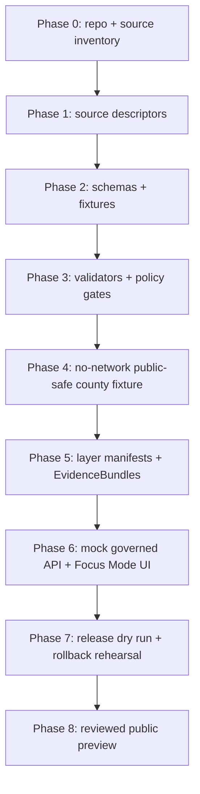
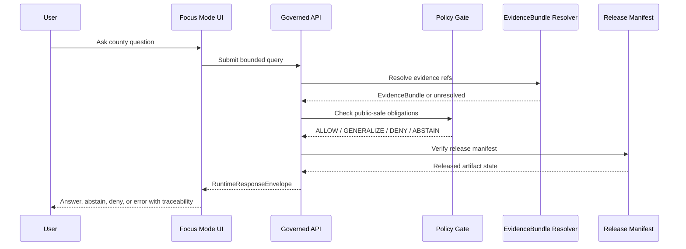

<!--
doc_id: NEEDS_VERIFICATION
title: Harvey County Focus Mode Build Plan
type: standard
version: v0.1
status: draft
owners:
  - NEEDS_VERIFICATION
created: 2026-05-21
updated: 2026-05-21
policy_label: public
related:
  - NEEDS_VERIFICATION: docs/doctrine/directory-rules.md
  - NEEDS_VERIFICATION: docs/domains/hydrology/README.md
  - NEEDS_VERIFICATION: docs/domains/soil/README.md
  - NEEDS_VERIFICATION: docs/domains/agriculture/README.md
  - NEEDS_VERIFICATION: docs/domains/roads-rail-trade-routes/README.md
  - NEEDS_VERIFICATION: docs/domains/settlements-infrastructure/README.md
  - NEEDS_VERIFICATION: docs/domains/archaeology-cultural-heritage/README.md
  - NEEDS_VERIFICATION: docs/product/focus-mode/README.md
tags:
  - kfm
  - focus-mode
  - county
  - harvey-county
  - hydrology
  - agriculture
  - groundwater
  - transportation
  - public-safe
notes:
  - Repo paths in this document are PROPOSED until verified against a mounted Kansas-Frontier-Matrix checkout.
  - Source seeds require source-descriptor review, rights review, freshness checks, and EvidenceBundle binding before promotion.
  - Public context is separated from sensitive operational, parcel-level, archaeological, cemetery, living-person, and infrastructure details.
-->

<a id="top"></a>

# Harvey County Focus Mode Build Plan

> **Kansas Frontier Matrix county proof slice:** a public-safe, evidence-first, map-first, time-aware Focus Mode for Harvey County, Kansas.


**County selected:** Harvey County, Kansas  
**Recommended proof-slice theme:** *Groundwater crossroads, floodplain governance, agriculture, rail/highway movement, and public-safe settlement history around Newton and the Equus Beds.*  
**Implementation posture:** **PROPOSED** — no mounted repo was inspected in this run.  
**Release posture:** **NOT READY FOR PUBLICATION** until source rights, sensitivity, schema home, validators, policies, EvidenceBundles, release manifests, and rollback targets are verified.

---

## Quick links

- [Operating posture](#operating-posture)
- [Why this county](#why-this-county)
- [Product thesis](#product-thesis)
- [Scope boundary](#scope-boundary)
- [First demo layers](#first-demo-layers)
- [User journeys](#user-journeys)
- [UI surfaces](#ui-surfaces)
- [Governed object model](#governed-object-model)
- [Proposed repository shape](#proposed-repository-shape)
- [Build phases](#build-phases)
- [First PR sequence](#first-pr-sequence)
- [Acceptance checklist](#acceptance-checklist)
- [Risk register](#risk-register)
- [Source seed list](#source-seed-list)
- [Open verification questions](#open-verification-questions)
- [Recommended first milestone](#recommended-first-milestone)

---

## Operating posture

Harvey County Focus Mode must behave as a **trust-visible county lens**, not as an uncontrolled map mashup.

| Rule | Harvey County application |
|---|---|
| EvidenceBundle outranks generated language | Any county claim about floodplain status, groundwater, land use, roads, agriculture, or history must resolve to an EvidenceBundle before being shown as an answer. |
| Public clients use governed interfaces | The public UI reads governed APIs, release manifests, tile manifests, catalog/triplet records, and policy-safe runtime envelopes only. |
| RAW / WORK / QUARANTINE never feed public UI | County source downloads, parcel extracts, historical notes, draft geometries, and AI summaries remain internal until promoted. |
| Publication is a governed state transition | A layer becomes public only through validation, policy decision, source-rights review, promotion receipt, release manifest, and rollback target. |
| AI is interpretive, not sovereign | Focus Mode summaries may explain released evidence; they cannot invent county facts or bypass citation gates. |
| Cite-or-abstain | If a Harvey County answer cannot cite an EvidenceBundle, the runtime returns `ABSTAIN`, `DENY`, or `ERROR` rather than guessing. |
| Sensitive details fail closed | Exact sensitive ecology, archaeology, cemeteries, private-property ownership, living-person records, critical infrastructure, operational water-supply details, and restricted safety details are generalized, withheld, or routed to steward review. |

> [!IMPORTANT]
> This build plan is **repo-ready planning**, not a claim that the repository already contains these files, schemas, endpoints, tests, or workflows.

> [!CAUTION]
> Harvey County’s groundwater and water-supply context is a high-value Focus Mode feature, but exact operational well-field details, facility dependencies, and vulnerability claims must be treated as sensitive infrastructure context unless explicitly cleared for public release.

---

## Why this county

Harvey County is a strong next proof slice because it sits at the intersection of **central Kansas movement, groundwater governance, floodplain management, agriculture, and settlement history**.

### Proof-slice strengths

| Strength | Why it matters for KFM |
|---|---|
| Official county GIS exists | Harvey County maintains an official GIS mapping surface that can seed county boundary, parcels, roads, addressing, and planning context after rights review. |
| Floodplain governance is explicit | Harvey County has a floodplain-management page that references FEMA flood hazard mapping and permitting obligations for Special Flood Hazard Areas. |
| Equus Beds / groundwater story is distinctive | KGS sources connect Harvey County to the Equus Beds groundwater system, Wichita water supply history, and long-running water-level sustainability questions. |
| Agriculture is significant but tractable | KDA reports Harvey County has 690 farms, 343,919 farm acres, and about $180 million in 2022 crop/livestock sales. |
| Transportation hub is visible | I-135 and U.S. 50 projects around Newton create a governed transportation-and-settlement slice without needing statewide complexity. |
| Public-safe cultural history is rich | Newton, rail history, Mennonite settlement, trails/crossroads narratives, and historic resources offer story value, while archaeological and cemetery details can be generalized. |

### County-specific product angle

**Harvey County Focus Mode should answer:**  
“How do water, rail/highway movement, agriculture, floodplain exposure, and settlement history explain Harvey County’s present landscape — without exposing sensitive sites, private-property details, or operational infrastructure vulnerabilities?”

---

## Product thesis

Harvey County Focus Mode should become a **county evidence cockpit** with three first-class user outcomes:

1. **See the county as a governed spatial system.**  
   Users can inspect public-safe layers for boundaries, municipalities, roads, rail, hydrology, floodplain zones, agricultural land context, soils, land cover, and historic settlement themes.

2. **Ask bounded questions with traceability.**  
   Focus Mode can answer county-specific questions only when released EvidenceBundles support them.

3. **Teach the trust path.**  
   Every visible layer and answer carries source role, review state, freshness, rights posture, policy decision, and rollback lineage.

### Example bounded questions

| User question | Expected KFM behavior |
|---|---|
| “What makes Harvey County a useful water-governance slice?” | Answer with EvidenceBundle-backed Equus Beds, floodplain, stream, and public water-context sources; abstain from sensitive operational details. |
| “Which public layers explain Newton’s transportation context?” | Show released road/rail/highway layers and KDOT project summaries; do not infer freight vulnerabilities. |
| “Is this parcel in a floodplain?” | Public UI should direct to official viewer and provide general guidance only unless parcel-level claim has explicit source, rights, and policy clearance. |
| “Where are historic or archaeological sites?” | DENY exact sensitive locations; show generalized, public-safe heritage context and official public interpretive sites only. |

---

## Scope boundary

### Included

- County boundary and municipal/census-place context.
- Public-safe hydrology: Little Arkansas River, Sand Creek, Turkey Creek / Emma Creek / related named streams where source-supported.
- Effective floodplain context from FEMA/KDA/Harvey County public viewers.
- Soils, agricultural land-cover, and USDA/KDA agriculture summary metrics.
- Public-safe Equus Beds groundwater narrative and generalized aquifer context.
- Transportation spine: I-135, U.S. 50, BNSF/rail context, and KDOT project records.
- Public-safe settlement and cultural-history themes: Newton, North Newton, Halstead, Hesston, Burrton, Sedgwick, Walton, rail, Mennonite settlement, trail/crossroads context.
- Evidence Drawer, Source Ledger Drawer, Layer Inspector, Policy Badge Strip, and Focus Mode answer cards.

### Excluded unless steward-reviewed

- Exact private parcel ownership claims as public truth.
- Living-person data.
- Cemetery plot-level records or burial coordinates.
- Exact archaeological, sacred, burial, or culturally sensitive locations.
- Exact rare-species occurrences or nesting sites.
- Water-supply well-field vulnerability analysis, pump/facility dependency maps, or operational security details.
- Emergency-alert behavior. KFM may explain released hazard evidence; it must not act as an emergency warning system.
- Unreviewed AI-generated narratives.

---

## First demo layers

### Layer set A — county orientation

| Layer | Source seed | Public posture | Notes |
|---|---|---:|---|
| County boundary | TIGER/Line or Kansas GIS boundary source | Public | Use stable `GeographyVersion`. |
| Cities and places | Census/TIGER + county/city sources | Public | Newton, North Newton, Halstead, Hesston, Burrton, Sedgwick, Walton. |
| Roads | KDOT / TIGER / county centerlines | Public with caveats | Avoid operational routing claims. |
| Rail corridors | Public rail line source, KDOT, FRA, or public data | Public-safe generalized | No facility vulnerability claims. |

### Layer set B — water and floodplain

| Layer | Source seed | Public posture | Notes |
|---|---|---:|---|
| Stream network | NHD / USGS / state hydrography | Public | Focus on public hydrologic context. |
| Effective floodplain | FEMA NFHL / KDA viewer / Harvey County floodplain page | Public with disclaimers | Direct users to official determinations. |
| Generalized Equus Beds context | KGS publications | Public-safe generalized | Do not expose operational well-field vulnerability. |
| Watershed/HUC context | USGS WBD / NHDPlus | Public | Useful for drainage and source lineage. |

### Layer set C — agriculture, soils, land cover

| Layer | Source seed | Public posture | Notes |
|---|---|---:|---|
| 2022 ag summary card | KDA / USDA NASS county profile | Public | County-level statistics only. |
| Cropland Data Layer | USDA NASS CDL | Public after license/freshness check | Use watcher materiality thresholds before rebuild. |
| SSURGO soils | USDA NRCS | Public | Use suitability and limitation classes carefully. |
| NLCD / land cover | USGS / MRLC | Public | Use as context; not parcel-level truth. |

### Layer set D — public-safe history

| Layer | Source seed | Public posture | Notes |
|---|---|---:|---|
| Historic rail / Newton depot interpretive marker | KHRI / local museum / KSHS seed | Public if official/public | Do not infer private ownership. |
| Mennonite settlement context | Harvey County Historical Museum / Kauffman Museum / KSHS seeds | Public narrative | Avoid living-family/person assertions. |
| Trails/crossroads narrative | Public interpretive sources | Generalized | No exact sensitive site coordinates. |

---

## User journeys

### Journey 1 — Public explorer: “Why does Harvey County matter?”

1. User opens Harvey County Focus Mode.
2. Default map shows county outline, towns, roads, major streams, and a “why this county” card.
3. User toggles “Water + Floodplain.”
4. Evidence Drawer shows floodplain source seeds, KGS groundwater source seeds, and public-safe caveats.
5. Focus Mode gives a bounded explanation with citations or abstains.

**Acceptance condition:** No answer appears without EvidenceBundle, source role, policy decision, and release state.

### Journey 2 — Planner/steward: “Can this floodplain layer be released?”

1. Steward opens review console.
2. System shows source descriptor, source terms, freshness, geometry precision, transform receipt, and validation report.
3. Policy gate checks parcel-level exposure, private-property risk, and official-determination disclaimer.
4. Release manifest is generated only after pass conditions are satisfied.

**Acceptance condition:** Draft floodplain geometry cannot be promoted as official or current without explicit source authority and effective date.

### Journey 3 — Educator: “Tell the story of water, rail, and agriculture.”

1. User selects Story Node: “Groundwater crossroads.”
2. Map animates through generalized Equus Beds context, Newton rail/highway crossroads, and agriculture summary.
3. UI distinguishes public context from sensitive infrastructure and private-property data.
4. Story Node ends with source ledger and “what this does not claim.”

**Acceptance condition:** Visual story does not become sovereign truth; it remains a released interpretive carrier with provenance.

---

## UI surfaces

| Surface | Purpose | Harvey County content |
|---|---|---|
| County Focus Header | County identity and status | “Harvey County · Draft proof slice · Public-safe preview” |
| Map Canvas | Public-safe layer viewing | County boundary, towns, streams, roads, generalized water/ag layers |
| Layer Registry Panel | Layer toggles and state | Released / draft / withheld / review-required badges |
| Evidence Drawer | Claim traceability | EvidenceBundle, source role, citation, freshness, rights, sensitivity |
| Policy Badge Strip | Trust posture at a glance | `PUBLIC_SAFE`, `GENERALIZED`, `REVIEW_REQUIRED`, `ABSTAIN`, `DENY` |
| Timeline Slider | Source and release time | Census year, floodplain effective date, CDL year, release version |
| Story Node Rail | Guided county stories | “Water,” “Movement,” “Agriculture,” “Settlement” |
| Focus Mode Ask Box | Bounded Q&A | Only answers through governed API and finite runtime envelope |
| Source Ledger Drawer | Inspect source seeds | County GIS, KDA, KGS, FEMA/KDA floodplain, KDOT, history sources |
| Correction / Feedback Link | Reversibility | Submit correction, stale source flag, sensitivity concern |

---

## Governed object model

### Minimum object families

| Object | Purpose | Harvey County example |
|---|---|---|
| `CountyFocusProfile` | Defines county Focus Mode identity and enabled panels | `harvey-county-focus-profile.v1` |
| `SourceDescriptor` | Records source role, rights, URL, cadence, owner, terms | Harvey County GIS page descriptor |
| `EvidenceRef` | Stable pointer to evidence | Floodplain viewer source ref |
| `EvidenceBundle` | Resolved evidence package | KGS Equus Beds generalized groundwater bundle |
| `GeographyVersion` | Stable county geometry/version | Harvey County boundary version |
| `LayerManifest` | Public-safe layer descriptor | `harvey_floodplain_context_public.v1` |
| `PolicyDecision` | Allow/deny/generalize obligations | `GENERALIZE_GROUNDWATER_INFRASTRUCTURE` |
| `ValidationReport` | Shape/source/freshness checks | CDL histogram materiality check |
| `TransformReceipt` | Records redaction/generalization | Generalized water-supply infrastructure context |
| `PromotionReceipt` | Records governed state transition | `PROCESSED -> CATALOG -> PUBLISHED` |
| `ReleaseManifest` | Public artifact release bundle | County Focus Mode v0.1 preview release |
| `RollbackPlan` | Reversal target | Previous county layer manifest version |
| `RuntimeResponseEnvelope` | Governed AI answer envelope | `ANSWER`, `ABSTAIN`, `DENY`, `ERROR` |

### Runtime answer envelope sketch

```json
{
  "schema_version": "v1",
  "county": "Harvey County, Kansas",
  "mode": "focus",
  "question": "Why is groundwater governance important here?",
  "outcome": "ANSWER",
  "answer_text": "Public-safe answer text generated only from resolved EvidenceBundles.",
  "evidence_bundle_refs": [
    "kfm://evidence-bundle/NEEDS_VERIFICATION"
  ],
  "policy_decision_ref": "kfm://policy-decision/NEEDS_VERIFICATION",
  "release_manifest_ref": "kfm://release/NEEDS_VERIFICATION",
  "limitations": [
    "Generalized groundwater context only.",
    "No operational well-field vulnerability details are exposed."
  ]
}
```

---

## Proposed repository shape

> [!WARNING]
> All paths are **PROPOSED**. A mounted checkout and Directory Rules review must verify final homes before implementation.

Directory Rules basis: responsibility root controls placement. County work should not create a new root-level `harvey/` or `counties/` authority island unless an ADR establishes that root. The proposed shape keeps county Focus Mode material under docs, schemas/contracts, fixtures, policy, tests, source descriptors, data lifecycle lanes, and released artifacts.

```text
docs/
  product/
    focus-mode/
      counties/
        harvey-county.md
  domains/
    hydrology/
      county-slices/
        harvey-county.md
    agriculture/
      county-slices/
        harvey-county.md
    roads-rail-trade-routes/
      county-slices/
        harvey-county.md
    settlements-infrastructure/
      county-slices/
        harvey-county.md
    archaeology-cultural-heritage/
      county-slices/
        harvey-county-public-safe.md

schemas/
  contracts/
    v1/
      focus_mode/
        county_focus_profile.schema.json
        county_focus_layer_manifest.schema.json
        county_focus_story_node.schema.json

fixtures/
  focus_mode/
    counties/
      harvey/
        valid/
          harvey_county_focus_profile.valid.json
          harvey_county_water_context.valid.json
          harvey_county_agriculture_summary.valid.json
        invalid/
          floodplain_claim_without_effective_date.invalid.json
          groundwater_operational_wellfield_exposure.invalid.json
          parcel_owner_public_claim.invalid.json
          archaeology_exact_location_public.invalid.json
          ai_answer_without_evidence_bundle.invalid.json

policy/
  focus_mode/
    county_publication.rego
  hydrology/
    groundwater_public_safe.rego
  archaeology/
    public_location_deny.rego

tools/
  validators/
    focus_mode/
      validate_county_focus_profile.py
      validate_county_layer_manifest.py
      validate_county_runtime_envelope.py

tests/
  focus_mode/
    counties/
      test_harvey_county_focus_profile.py
      test_harvey_county_policy_fail_closed.py

data/
  raw/
    source_mirrors/
      harvey/
        .gitkeep
  work/
    harvey/
      .gitkeep
  quarantine/
    harvey/
      .gitkeep
  processed/
    harvey/
      .gitkeep
  catalog/
    harvey/
      .gitkeep

release/
  focus_mode/
    counties/
      harvey/
        release_manifest.v0_1.NEEDS_VERIFICATION.json
        rollback_plan.v0_1.NEEDS_VERIFICATION.md
```

### Path governance notes

| Path family | Owner root | Why it belongs there |
|---|---|---|
| `docs/product/focus-mode/...` | Product docs | User-facing Focus Mode behavior and county page contract. |
| `docs/domains/.../county-slices/...` | Domain docs | Domain-specific county interpretation and scope. |
| `schemas/contracts/v1/...` | Machine contract root | Schema home per Directory Rules default; verify against repo ADRs. |
| `fixtures/...` | Test fixture root | Valid/invalid examples for CI and validators. |
| `policy/...` | Policy root | Deny/generalize/publication decisions. |
| `tools/validators/...` | Tooling root | Deterministic validation helpers; not source of truth. |
| `data/raw/work/quarantine/processed/catalog/...` | Lifecycle roots | Preserves RAW → WORK/QUARANTINE → PROCESSED → CATALOG separation. |
| `release/...` | Release root | Published artifact manifests and rollback target. |

---

## Build phases



### Phase table

| Phase | Goal | Output | Gate |
|---:|---|---|---|
| 0 | Verify repo shape and current conventions | Repo inventory, ADR check, mounted evidence report | No paths treated as confirmed without inspection |
| 1 | Create source descriptors | Source seed registry for Harvey County | Rights/freshness/source-role fields complete |
| 2 | Define county Focus Mode contracts | Schemas + valid/invalid fixtures | Schema validation passes; invalid fixtures fail |
| 3 | Add validators and policy | Fail-closed checks | Sensitive fixtures denied/generalized |
| 4 | Build no-network county proof fixture | Static Harvey County profile JSON | No live fetch; deterministic spec hashes |
| 5 | Add EvidenceBundles and layer manifests | Public-safe county layer pack | EvidenceRef resolves to EvidenceBundle |
| 6 | Add mock API/UI | Map + Evidence Drawer + Ask Box | Runtime finite outcomes only |
| 7 | Rehearse release and rollback | Release manifest + rollback plan | Promotion is receipt-backed |
| 8 | Steward review | Public preview candidate | No sensitive exposure, no uncited claims |

---

## First PR sequence

### PR-001 — Harvey County source ledger and doctrine stub

- Add Focus Mode county doc.
- Add source seed registry.
- Add explicit evidence boundary.
- Add `NEEDS_VERIFICATION` placeholders for owners, schema homes, and source terms.
- No data ingestion.

### PR-002 — County Focus Mode schema and fixtures

- Add `CountyFocusProfile`.
- Add `CountyFocusLayerManifest`.
- Add `CountyFocusStoryNode`.
- Add Harvey County valid fixture.
- Add invalid fixtures:
  - public parcel owner claim
  - floodplain claim without effective date
  - groundwater infrastructure vulnerability exposure
  - exact archaeological location exposure
  - AI answer without EvidenceBundle

### PR-003 — Validators and policy gates

- Add deterministic validators.
- Add policy rules for:
  - cite-or-abstain
  - public-safe geometry
  - groundwater infrastructure generalization
  - parcel/living-person denial
  - archaeology/cemetery exact-location denial
- Add tests for negative-path fixtures.

### PR-004 — Mock governed API and UI contract

- Add mock runtime envelope for Harvey County.
- Add layer registry and Evidence Drawer payload fixture.
- Add Focus Mode answer examples with `ANSWER`, `ABSTAIN`, `DENY`, and `ERROR`.

### PR-005 — Release dry-run

- Add release manifest candidate.
- Add rollback plan.
- Add proof-pack checklist.
- Do not publish externally.

---

## Acceptance checklist

### Evidence and source controls

- [ ] Every source seed has a `SourceDescriptor`.
- [ ] Every public claim resolves `EvidenceRef -> EvidenceBundle`.
- [ ] Every EvidenceBundle has source role, rights posture, freshness, review state, and limitations.
- [ ] No generated text is treated as evidence.
- [ ] County statistics cite KDA/USDA source records.
- [ ] KGS groundwater/geology claims cite KGS source records.
- [ ] Floodplain claims cite FEMA/KDA/Harvey County source records and include effective date.

### Public-safe controls

- [ ] Parcel ownership is not shown as public truth.
- [ ] Living-person data is denied.
- [ ] Exact archaeological, burial, cemetery, sacred, rare-species, or sensitive ecology locations are denied or generalized.
- [ ] Groundwater and water-supply operational details are generalized.
- [ ] Floodplain UI directs users to official determinations.
- [ ] Transportation layers do not reveal vulnerability or security-sensitive operational details.

### Runtime controls

- [ ] Public UI uses governed API only.
- [ ] Runtime outcomes are finite: `ANSWER`, `ABSTAIN`, `DENY`, `ERROR`.
- [ ] `ANSWER` requires resolved EvidenceBundle and policy allow.
- [ ] `ABSTAIN` triggers when evidence is missing, stale, or unresolved.
- [ ] `DENY` triggers on sensitive exposure.
- [ ] `ERROR` triggers on malformed envelope or system failure.

### Release controls

- [ ] PromotionReceipt exists.
- [ ] ReleaseManifest exists.
- [ ] RollbackPlan exists.
- [ ] Source terms are reviewed.
- [ ] Public layer manifests are versioned.
- [ ] PMTiles/COG/GeoParquet artifacts, if produced, have spec hash/root hash/attestation sidecars.
- [ ] Release dry run can be reversed.

---

## Fixture plans

### Valid fixtures

| Fixture | Purpose |
|---|---|
| `harvey_county_focus_profile.valid.json` | Minimal county profile, source ledger refs, enabled panels. |
| `harvey_county_water_context.valid.json` | Public-safe hydrology + groundwater explanation with generalized geometry. |
| `harvey_county_agriculture_summary.valid.json` | KDA/USDA-backed county-level agriculture summary. |
| `harvey_county_transport_context.valid.json` | I-135 / U.S. 50 public project context with source refs. |
| `harvey_county_story_node_water_rail_ag.valid.json` | Story Node connecting groundwater, rail/highway, and agriculture. |

### Invalid fixtures

| Fixture | Expected result |
|---|---|
| `floodplain_claim_without_effective_date.invalid.json` | Fail validation; floodplain claim must carry source/effective date. |
| `groundwater_operational_wellfield_exposure.invalid.json` | `DENY`; operational infrastructure vulnerability exposure. |
| `parcel_owner_public_claim.invalid.json` | `DENY`; living/private-property claim without policy clearance. |
| `archaeology_exact_location_public.invalid.json` | `DENY`; exact sensitive cultural location. |
| `ai_answer_without_evidence_bundle.invalid.json` | `ABSTAIN`; generated text lacks evidence support. |
| `layer_manifest_without_release_ref.invalid.json` | Fail validation; public layer lacks release manifest. |
| `pmtiles_without_attestation.invalid.json` | Fail validation; tile artifact lacks integrity sidecar. |

---

## Risk register

| ID | Risk | County-specific trigger | Default posture | Mitigation |
|---|---|---|---|---|
| R-001 | Parcel privacy collapse | County parcel/GIS source used as public ownership truth | DENY / GENERALIZE | Show parcel geometry only if rights and policy permit; ownership hidden by default. |
| R-002 | Floodplain misrepresentation | User treats KFM map as official flood determination | ABSTAIN with redirect | Display official-source disclaimer and link to official FEMA/KDA/county viewers. |
| R-003 | Groundwater infrastructure exposure | Well-field or water-supply vulnerability inferred from KGS/public data | DENY / GENERALIZE | Use regional aquifer context only; no vulnerability maps. |
| R-004 | Archaeology/cemetery exposure | Historic/cultural layer includes exact sensitive locations | DENY | Generalized heritage zones; steward review. |
| R-005 | AI hallucinated county history | Model invents rail, trail, or settlement claims | ABSTAIN | EvidenceBundle-only answers; citation validation. |
| R-006 | Source-rights mismatch | County GIS or third-party viewer terms unclear | QUARANTINE | SourceDescriptor rights review before ingest. |
| R-007 | Stale transportation project status | KDOT project status changes | NEEDS_VERIFICATION | Time-stamp source fetch and release date; freshness gate. |
| R-008 | Agricultural data over-precision | CDL/SSURGO interpreted as parcel truth | GENERALIZE | County/block/field-safe aggregation; limitations. |
| R-009 | PMTiles cache drift | Static tile update without versioning | ERROR / rollback | Versioned filenames, root hash, release manifest, no in-place overwrite. |
| R-010 | Compatibility-root drift | County work creates new root authority | BLOCK | Follow Directory Rules; file-home ADR if needed. |

---

## Source seed list

> [!NOTE]
> These are source seeds, not admitted evidence. Each requires `SourceDescriptor`, rights review, freshness check, source role, and policy treatment before use.

| Source seed | Likely role | What it can support | Public posture | URL |
|---|---|---|---|---|
| Harvey County Geographic Information System | Context / local GIS source | County GIS mapping program and possible parcel/road/address context | Public metadata; data rights NEEDS_VERIFICATION | https://www.harveycounty.gov/geographic-information-system |
| Harvey County GIS Parcel Lookup | Context / local GIS viewer | Parcel viewer seed; not title truth | Restricted/generalize for public KFM use | https://www.arcgis.com/apps/webappviewer/index.html?id=3f586d50bb9f420cb6aba3065e6a00a4 |
| Harvey County Floodplain Management | Regulatory context | SFHA permitting context and official viewer pointers | Public with official-determination disclaimer | https://www.harveycounty.gov/floodplainmanagement |
| Kansas Current Effective Floodplain Viewer | Regulatory floodplain context | Effective floodplain viewer statewide | Public with source/effective-date caveat | https://gis2.kda.ks.gov/gis/ksfloodplain/ |
| FEMA Flood Map Service Center | Regulatory floodplain source | NFHL/FIRM availability and flood map service | Public with official-use caveat | https://msc.fema.gov/portal/search |
| KDA Harvey County Agriculture Stats | County ag summary | 690 farms, 343,919 acres, $180M sales in 2022 | Public county-level | https://www.agriculture.ks.gov/kansas-agriculture/kansas-agricultural-statistics/harvey-county |
| USDA NASS 2022 Harvey County profile | Primary ag source | Farm counts, land in farms, value of products sold | Public county-level | https://www.nass.usda.gov/Publications/AgCensus/2022/Online_Resources/County_Profiles/Kansas/cp20079.pdf |
| KGS Equus Beds hydrology report | Hydrology/geology context | Equus Beds groundwater context and Harvey/Sedgwick water-field history | Public-safe generalized | https://www.kgs.ku.edu/Publications/Bulletins/187_2/ |
| KGS Equus Beds progress report | Hydrology/geology context | Equus Beds area extent and geology | Public-safe generalized | https://www.kgs.ku.edu/Publications/Bulletins/119_1/index.html |
| KGS Equus Beds GMD2 sustainability study | Hydrology management context | High Plains aquifer / Equus Beds sustainability framing | Public-safe generalized | https://www.kgs.ku.edu/Hydro/Publications/2017/OFR17_3/index.html |
| KDOT I-135 / SE 36th Street interchange project | Transportation source | Newton-area interchange reconstruction | Public project context | https://www.ksdot.gov/projects/south-central-kansas-projects/i-135-and-se-36th-street-interchange-reconstruction-project |
| KDOT U.S. 50 / Meridian Road interchange project | Transportation source | U.S. 50 bridge/interchange project context | Public project context | https://www.ksdot.gov/projects/south-central-kansas-projects/u-s-50-meridian-road-interchange-improvements |
| City of Newton Flooding Information | Municipal flood context | Newton floodplain lookup guidance and public map direction | Public with official-source caveat | https://www.newtonkansas.com/Departments/Public-Works/Engineering/Building-Zoning-Planning/Flooding-Information |
| Harvey County Historical Museum county history | Public history context | Mennonite settlement, agriculture, railroad-era context | Public narrative; verify source role | https://hchm.org/harvey-county-history/ |
| Kansas Historic Resources Inventory seed | Historic resource context | Newton Santa Fe Depot and public historic resource records | Public record; exact site handling review | https://khri.kansasgis.org/ |

---

## Open verification questions

### Repo and path verification

- [ ] Is `schemas/contracts/v1/` still the accepted schema home in the live repo?
- [ ] Does the repo already have a county Focus Mode pattern?
- [ ] Is there an accepted county directory convention under `docs/product/focus-mode/counties/` or another root?
- [ ] Are `policy/` and `policies/` both present? Which is canonical for Rego?
- [ ] Are validators Python, TypeScript, or mixed?
- [ ] Is `apps/governed_api` the canonical backend path?
- [ ] Does the web UI have an existing Evidence Drawer component?
- [ ] Does MapLibre layer registry already have a county profile schema?

### Source authority and rights

- [ ] What are Harvey County GIS data licensing terms?
- [ ] May county parcel geometry be cached, transformed, or redistributed?
- [ ] What exact FEMA/KDA floodplain layers and effective dates apply?
- [ ] Which KGS Equus Beds source is authoritative for the specific groundwater claim?
- [ ] What KDOT project statuses are current at release time?
- [ ] What historical sources are official enough for public narrative claims?

### Sensitivity and policy

- [ ] What groundwater/water-supply details must be generalized or denied?
- [ ] Which cultural/historic resources require exact-location suppression?
- [ ] Are any ecology layers in Harvey County rare-species sensitive?
- [ ] How should cemetery/burial data be handled?
- [ ] What parcel-level floodplain interaction is allowed in public UI?
- [ ] Which steward role can approve generalized heritage overlays?

### Validation and release

- [ ] What constitutes stale evidence for county Focus Mode?
- [ ] What minimum proof pack is required for a public county preview?
- [ ] Can the release pipeline validate tile sidecars and source descriptors together?
- [ ] What rollback target is required for every released county layer?
- [ ] What metrics define Focus Mode readiness?

---

## Recommended first milestone

### Milestone M-001 — Harvey County public-safe no-network proof slice

**Goal:** Create a deterministic, no-network Focus Mode preview for Harvey County using only static fixtures, source descriptors, policy gates, and mock governed API envelopes.

#### Deliverables

- `harvey_county_focus_profile.valid.json`
- Harvey County source seed registry
- Minimal `CountyFocusProfile` schema
- Minimal `CountyFocusLayerManifest` schema
- Negative fixtures for parcel, floodplain, groundwater, archaeology, and AI-answer failure modes
- Validator stubs
- Policy stubs
- Mock runtime response envelopes
- Draft release checklist
- Rollback rehearsal note

#### Definition of done

- [ ] All valid fixtures pass.
- [ ] All invalid fixtures fail for the expected reason.
- [ ] Every public-facing claim in the fixture resolves to a source seed and mock EvidenceBundle.
- [ ] Groundwater infrastructure details are generalized.
- [ ] Parcel ownership and living-person claims are denied.
- [ ] Cultural exact-location exposure is denied.
- [ ] Floodplain context includes official-source caveat.
- [ ] No public UI path reads RAW, WORK, QUARANTINE, or unpublished candidate objects.
- [ ] Release remains dry-run only.



---

## Final status

| Item | Status |
|---|---|
| County selected | Harvey County |
| Markdown deliverable | Draft |
| Repo access claimed | No |
| Paths | PROPOSED |
| Source seeds | NEEDS_VERIFICATION |
| Public release | Not authorized |
| Recommended next action | M-001 no-network proof slice |

[Back to top](#top)
