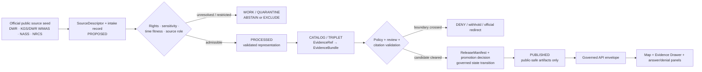
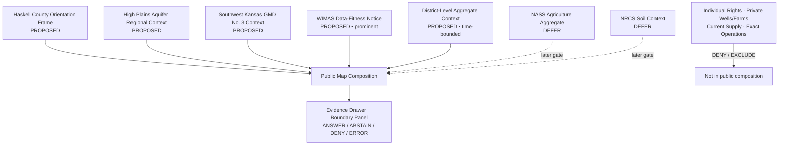
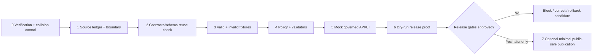

<!-- [KFM_META_BLOCK_V2]
doc_id: NEEDS_VERIFICATION — <REGISTERED_KFM_DOC_ID>
title: Haskell County Focus Mode Build Plan — Administrative Groundwater Context Without Water-Right Determination
type: county-focus-mode-build-plan
version: v0.1-draft
status: draft
owners:
  - NEEDS_VERIFICATION — <OWNER:focus-mode-steward>
  - NEEDS_VERIFICATION — <OWNER:water-governance-reviewer>
created: 2026-05-24
updated: 2026-05-24
policy_label: public_draft
county: Haskell County, Kansas
county_slug: haskell
proof_slice: High Plains aquifer / Southwest Kansas GMD No. 3 / irrigated working-landscape context with administrative-water restraint
primary_public_safe_boundary: Official groundwater, water-right and water-use materials may support dated, source-attributed public context and suitable aggregates; KFM must not determine current water-right standing, lawful use, private-well or farm condition, current supply, drought emergency, or future groundwater availability.
release_status: NOT_RELEASED — planning artifact only
review_assignments:
  - NEEDS_VERIFICATION — source admission and rights reviewer
  - NEEDS_VERIFICATION — water-governance/policy reviewer
  - NEEDS_VERIFICATION — public-safe release reviewer
correction_path: NEEDS_VERIFICATION — no implemented correction path asserted
rollback_path: NEEDS_VERIFICATION — no implemented rollback path asserted
unverified_repository_paths:
  - PROPOSED / NEEDS_VERIFICATION — docs/focus-modes/haskell-county/build-plan.md
  - PROPOSED / NEEDS_VERIFICATION — docs/focus-modes/haskell-county/
  - PROPOSED / NEEDS_VERIFICATION — fixtures/focus_modes/haskell/
schema_contract_policy_homes:
  - PROPOSED / NEEDS_VERIFICATION — contracts/focus_mode/
  - PROPOSED / NEEDS_VERIFICATION — schemas/contracts/v1/focus_mode/
  - PROPOSED / NEEDS_VERIFICATION — policy/runtime/, policy/sensitivity/, policy/release/
collision_search:
  completed_register: CONFIRMED — Haskell County is absent from the user-supplied completed/collision register; Butler, Wilson and Franklin were additionally excluded as completed earlier in the current series.
  available_project_materials: CONFIRMED — Haskell-targeted searches of available uploaded/project materials performed on 2026-05-24 surfaced other county-plan artifacts but did not surface a Haskell County Focus Mode Build Plan.
  live_repository_index: CONFIRMED — docs/focus-mode/counties/COUNTY_INDEX.md on main was inspected and lists Haskell as not-started with validation not-run.
  live_repository_target_search: CONFIRMED — targeted searches for haskell_county_focus_mode_build_plan, Haskell County Focus Mode, haskell-county and Haskell County High Plains Aquifer WIMAS GMD 3 returned no matching live-repository result.
  exhaustive_absence: NEEDS_VERIFICATION — unindexed historical branches, private artifacts or unsearched earlier conversation outputs may still exist.
directory_rules_basis:
  - CONFIRMED — live docs/doctrine/directory-rules.md §6.7 inspected; Focus Modes are multi-root compositional proof slices, not root folders.
  - CONFIRMED — doctrine pattern identifies docs/focus-modes/<area>-<scope>/ and apps/explorer-web/src/focus-modes/<area>/ as the responsibility-rooted patterns.
  - NEEDS_VERIFICATION / DIVERGENCE — observed live index is under docs/focus-mode/counties/ while inspected doctrine identifies the plural docs/focus-modes/ pattern; landing path requires reconciliation before repository work.
source_check_date: 2026-05-24
tags: [kfm, focus-mode, haskell-county, high-plains-aquifer, ogallala, gmd-3, wimas, groundwater, irrigation, agriculture, cite-or-abstain, public-safe]
notes:
  - This document is a planning artifact and does not claim implementation, source admission, policy approval, review completion, promotion, publication, correction readiness or rollback readiness.
  - Checked official public-source seeds are enumerated in section 15 and Appendix C.
  - EvidenceBundle outranks generated language; official source role and temporal fitness must remain visible.
[/KFM_META_BLOCK_V2] -->

<a id="top"></a>

# Haskell County Focus Mode Build Plan
## Administrative Groundwater Context Without Water-Right Determination

> **Product thesis:** Show Haskell County’s irrigated High Plains aquifer and Southwest Kansas GMD No. 3 context with official, dated evidence—while refusing to turn administrative water records into current legal-right, lawful-use, private-well, farm-condition, supply, drought-emergency or future-availability conclusions.


| Identity / status field | Value |
|---|---|
| County selected | **Haskell County, Kansas** |
| Draft status | `PROPOSED` planning artifact; no implementation or publication asserted |
| Distinct proof slice | High Plains aquifer and GMD No. 3 administrative-water context within an irrigated working landscape |
| Most consequential public-safe boundary | **No KFM water-right standing, lawful-use, private-well/farm-condition, current-supply, drought-emergency or future-availability conclusions** |
| Official seeds checked in this run | Kansas Department of Agriculture / Division of Water Resources; KGS + DWR WIMAS limitation page; USDA NASS Quick Stats; USDA NRCS Web Soil Survey |
| Live index collision check | `CONFIRMED` inspected: Haskell row presently says `not-started` / `not-run` |
| Targeted repository search | `CONFIRMED` performed; no Haskell plan collision surfaced |
| Exhaustive collision absence | `NEEDS_VERIFICATION` |
| Intended landing location | `PROPOSED / NEEDS_VERIFICATION` — `docs/focus-modes/haskell-county/build-plan.md` |
| Release / review / rollback | `NOT_RELEASED`; review, correction and rollback mechanisms `NEEDS_VERIFICATION` |

## Quick links

[Operating posture](#1-operating-posture) · [Why this county](#2-why-this-county) · [Product thesis](#3-product-thesis) · [Scope boundary](#4-scope-boundary) · [First demo layers](#5-first-demo-layers) · [User journeys](#6-user-journeys) · [UI surfaces](#7-ui-surfaces) · [Governed object model](#8-governed-object-model) · [Repository shape](#9-proposed-repository-shape) · [Build phases](#10-build-phases) · [First PR sequence](#11-first-pr-sequence) · [Acceptance checklist](#12-acceptance-checklist) · [Fixture plan](#13-fixture-plan) · [Risk register](#14-risk-register) · [Sources](#15-source-seed-list) · [Verification](#16-open-verification-questions) · [First milestone](#17-recommended-first-milestone) · [Appendices](#appendix-a--public-safe-narrative-skeleton)

---

## Executive build note

**Haskell County is selected as a public-safe groundwater-governance proof slice.** Kansas Department of Agriculture / Division of Water Resources (DWR) identifies **Haskell** among the counties or partial counties of **Southwest Kansas Groundwater Management District No. 3**, and its public GMD No. 3 page exposes dated district-level administrative and water-use context. DWR also identifies Southwest Kansas GMD No. 3 in its High Plains aquifer context.[^s2][^s3]

The defining boundary is unusually well evidenced: the official WIMAS entry point links to a KGS/DWR limitation notice stating that WIMAS water-right data represent records as of **05/10/2026**, should not be viewed as current, and cannot determine whether a water right has been lawfully used; current standing for a particular water-right file must be obtained from DWR.[^s4][^s5] The first Haskell product therefore teaches water context and data fitness, not legal or operational verdicts.

> [!CAUTION]
> ## Public-safe boundary — no water-right or groundwater-condition verdicts
>
> **KFM may display admitted, time-bounded public context and suitably generalized aggregates. KFM must not answer whether an individual has a valid/current water right, whether a right has been lawfully used, whether a private well or farm is secure or depleted, whether water is available now or in the future, or whether emergency/drought action is required.**
>
> Requests of that kind resolve to `DENY` or `ABSTAIN` with an official-source redirect, because WIMAS itself says its information is dated, not current and not determinative of lawful use.[^s5]

### Evidence boundary at authoring time

| Label | What is established for this plan | What is not established |
|---|---|---|
| `CONFIRMED` | Haskell is identified on the checked KDA DWR GMD No. 3 page as within the district; KDA DWR provides a High Plains aquifer context page; KDA routes public WIMAS users to KGS/DWR; the checked WIMAS limitation notice makes currentness and lawful-use limits explicit; live repo index and Directory Rules/validator material were inspected; targeted collision searches were performed. | — |
| `PROPOSED` | Focus Mode scope, public-safe demo layers, object candidates, fixtures, UI panels, policy reason codes, build phases, milestone and intended responsibility-rooted paths. | No proposed component is represented as implemented. |
| `NEEDS_VERIFICATION` | Full historical/project-wide collision absence; repository landing decision after singular/plural focus-mode path divergence is reconciled; source admission, rights/redistribution, geometry fitness, contracts/schemas/policies, review assignments, release/correction/rollback machinery. | — |
| `UNKNOWN` | Whether additional unindexed or private county-plan artifacts exist; whether any future reviewer approves any layer for release; what runtime/deployment state exists beyond evidence inspected here. | — |

---

# 1. Operating posture

## 1.1 Governing rules applied to Haskell County

| KFM rule | Haskell County application |
|---|---|
| EvidenceBundle outranks generated language | No explanatory text or AI response is publishable unless its claim-bearing content resolves through admitted evidence. |
| Cite-or-abstain | A groundwater, aquifer, district, agriculture or water-administration statement must expose source, time basis and limitation; unsupported answers resolve to `ABSTAIN`. |
| Public clients consume governed surfaces only | The public map or answer panel consumes released/public-safe artifacts through a governed interface, never `RAW`, `WORK`, `QUARANTINE`, unpublished candidates, internal stores or direct model outputs. |
| Source roles stay separate | Regulatory/administrative water-right records, scientific aquifer context, statistical agriculture aggregates and generated narrative must never collapse into one “truth” layer. |
| Promotion is governed transition | No artifact becomes public merely because a file exists; promotion requires validation, policy, review, release record, correction path and rollback posture. |
| Restricted or unsafe material fails closed | Private-well/farm detail, points-of-diversion precision not cleared for public delivery, operational vulnerabilities, or rights-unclear derivative products remain withheld or quarantined. |
| AI is interpretive only | AI may explain supported public-safe context, but cannot infer current standing, lawful use, water security, compliance or emergency advice. |

## 1.2 Truth labels and finite outcomes

| Token | Meaning in this plan |
|---|---|
| `CONFIRMED` | Verified in this run from checked official public sources, inspected live repository material, or available project-material search results. |
| `PROPOSED` | Design recommendation or planned artifact not verified as implemented. |
| `NEEDS_VERIFICATION` | Checkable before action but not sufficiently verified now. |
| `UNKNOWN` | Not resolved from admissible evidence in this run. |
| `ANSWER` | A public-safe response supported by resolved admitted evidence, required policy clearance and traceable citations. |
| `ABSTAIN` | Evidence, time fitness, source authority or admissibility is unresolved; explain why and narrow/redirect. |
| `DENY` | Requested content crosses the public-safe boundary or discloses prohibited precision/conclusions. |
| `ERROR` | Contract, validation, evidence resolution or runtime failure prevents a trusted response. |

## 1.3 Public trust membrane



## 1.4 County-specific non-negotiable guardrails

| Guardrail | Required posture | Default outcome when violated |
|---|---|---|
| Water-right standing | Do not present KFM as determining current standing for an individual file or person. Redirect to DWR. | `DENY` — `WATER_RIGHT_STANDING_REQUIRES_DWR` |
| Lawful-use interpretation | Do not convert WIMAS or water-use data into lawful-use conclusions. | `DENY` — `LAWFUL_USE_NONDETERMINATION` |
| Time basis | Display as-of dates and dated-source badges for all water/admin claims; stale/unknown time basis cannot answer a current question. | `ABSTAIN` — `TEMPORAL_FITNESS_UNRESOLVED` |
| Private well, farm or parcel inference | Do not display or infer private operational condition, access, compliance, household impact or property-value effect. | `DENY` — `PRIVATE_WELL_FARM_DETAIL_DENIED` |
| Point-level operational exposure | Do not publish exact diversion/well/operational geometry merely because a public source exposes it; admit only after policy and release review. | `DENY` or `EXCLUDE` — `OPERATIONAL_PRECISION_NOT_ADMITTED` |
| Groundwater future projection | Do not answer future availability or security questions without a separately admitted, fit-for-purpose modeled product and explicit limitation posture. | `ABSTAIN` — `FUTURE_AVAILABILITY_UNSUPPORTED` |
| Drought/emergency guidance | KFM is not an emergency, drought-declaration or operational advice surface. | `ABSTAIN` — `OFFICIAL_CURRENT_GUIDANCE_REQUIRED` |
| Agriculture aggregates | Use only admitted statistical aggregation; do not profile an operation or household. | `DENY` — `AGGREGATE_TO_PRIVATE_INFERENCE` |

---

# 2. Why this county

## 2.1 Selection and collision screen

| Screen | Result | Status | Effect on selection |
|---|---|---:|---|
| User-supplied completed/collision register | Haskell County is not listed. | `CONFIRMED` | Eligible to evaluate. |
| Newly produced plans in this continuing chat | Butler, Wilson and Franklin were produced earlier and excluded from reselection. | `CONFIRMED` | Avoids current-session collision. |
| Available uploaded/project materials search | Haskell-targeted searches returned existing plans for other counties, including Reno, Ellsworth, Riley, Cherokee, Barton and Finney, but did not return a Haskell plan. | `CONFIRMED` for performed search; `NEEDS_VERIFICATION` exhaustively | Candidate not rejected. |
| Live repository master county index | Inspected `docs/focus-mode/counties/COUNTY_INDEX.md`; Haskell is listed `not-started` with validation `not-run`. | `CONFIRMED` observation only | Candidate not rejected; status is not release proof. |
| Live repository targeted string search | Searches for `haskell_county_focus_mode_build_plan`, `Haskell County Focus Mode`, `haskell-county`, and Haskell/GMD/WIMAS proof terms returned no result. | `CONFIRMED` for performed searches | No collision discovered. |
| Exhaustive project-wide uniqueness | All branches, private files, earlier conversation artifacts and non-indexed stores were not exhaustively proven absent. | `NEEDS_VERIFICATION` | Keep collision status bounded; recheck before repository landing. |

> [!NOTE]
> Haskell County was selected only after excluding the supplied register and the three new in-conversation plans, checking available project materials, inspecting the live county index, and performing candidate-specific live-repository searches. The absence of a surfaced collision is strong planning evidence, not an exhaustive uniqueness certificate.

## 2.2 Proof-slice rationale

| Selection dimension | Haskell County proof value | Evidence basis / status |
|---|---|---|
| Groundwater context | DWR’s High Plains aquifer context supplies the regional aquifer frame. | `CONFIRMED` official source checked.[^s2] |
| Water-governance context | DWR’s GMD No. 3 page identifies Haskell within Southwest Kansas GMD No. 3. | `CONFIRMED` official source checked.[^s3] |
| Administrative data fitness | WIMAS provides an unusually explicit limitation: dated, not current and not determinative of lawful use. | `CONFIRMED` official source checked.[^s5] |
| Irrigated working landscape | GMD No. 3 page provides district-level administrative/aggregate irrigation and reported-use context with stated source periods. | `CONFIRMED` as district-level context only; Haskell-specific extraction not performed.[^s3] |
| Agriculture extension | USDA NASS Quick Stats exposes agriculture data query dimensions by commodity, location and time; a Haskell extraction is a later admission task. | `CONFIRMED` tool exists; `PROPOSED` county layer.[^s6] |
| Soil extension | NRCS Web Soil Survey is an official science-based soil source; a Haskell AOI/version/rights admission is deferred. | `CONFIRMED` source seed checked; `PROPOSED` layer.[^s7] |
| Governance challenge | Strong risk of a map user reading administrative water data as present individual-right or farm/well certainty. | `PROPOSED` proof objective grounded in explicit WIMAS limitations. |

## 2.3 Distinct series proof

| Completed or collision-identified comparison | What that proof slice already tests | What Haskell adds without duplicating it |
|---|---|---|
| Gove County | Legacy geohydrology currentness, fossil/scientific-locality restraint and private-well non-determination. | Explicit official **water-right/lawful-use non-determination** backed by a current WIMAS limitation notice. |
| Finney County | Broader groundwater, irrigation, labor/immigration, agriculture and resilience framing. | A narrower administrative-water data-fitness proof: district membership, date-bounded water records and official redirect behavior. |
| Barton / Butler | Wetland/reservoir and recreation/ecology safety boundaries. | Southwestern groundwater administration and irrigation-data interpretation rather than habitat or recreation currentness. |
| Wilson / Franklin | Industrial-history/environmental inference and Nation-authoritative/flood-currentness boundaries. | Water-right and lawful-use interpretation boundary with administrative record limitations. |

## 2.4 Public benefit and governance value

The first public-safe product can help a user understand **why groundwater governance and irrigation context matter in Haskell County** while visibly teaching the difference between:

- regional aquifer context and a prediction about a well;
- a district-level aggregate and a conclusion about a farm;
- a public administrative record and current legal standing;
- a map display and an official decision;
- dated evidence and present emergency or supply guidance.

## 2.5 County anchors supported by checked official sources

| Anchor | Supported statement for this plan | Source role | Status |
|---|---|---|---:|
| Southwest Kansas GMD No. 3 | The checked DWR page lists Haskell among counties/partial counties in the district. | Administrative / water-management context | `CONFIRMED` |
| High Plains aquifer | The checked DWR page identifies Kansas High Plains aquifer component regions and lists Southwest Kansas GMD No. 3 among groundwater management districts. | Government educational/scientific context | `CONFIRMED` |
| WIMAS limitation notice | The checked joint KGS/DWR page states as-of date, currentness limitation and lawful-use non-determination. | Administrative data-fitness and redirect authority | `CONFIRMED` |
| Agriculture statistics seed | NASS Quick Stats supports querying published agricultural data by location and time. | Statistical aggregate source seed | `CONFIRMED` source existence; county extraction `PROPOSED` |
| Soil seed | NRCS identifies Web Soil Survey as a source of science-based soil information. | Scientific/land-resource source seed | `CONFIRMED` source existence; Haskell layer `PROPOSED` |

---

# 3. Product thesis

## 3.1 One-sentence thesis

> **Haskell County Focus Mode should let the public explore source-attributed High Plains aquifer, Southwest Kansas GMD No. 3 and aggregated irrigated-landscape context while making it impossible to mistake KFM for the authority on current water-right standing, lawful use, private-well condition or future water availability.**

## 3.2 What the first product promises

| Promise | Implementation meaning |
|---|---|
| A visible Haskell county frame | A public-safe map extent and orientation card once geometry is admitted and released. |
| Evidence-visible water context | Each aquifer/GMD/admin-water statement exposes source role, checked date, temporal basis, limitations and EvidenceBundle link. |
| A central data-fitness warning | WIMAS currentness and lawful-use limitations are a first-class UI panel, not buried metadata. |
| Finite outcomes | Supported context may return `ANSWER`; unsupported current/right/private conclusions yield `ABSTAIN` or `DENY`. |
| Reversibility | Any eventual publication requires correction and rollback references; none are claimed here. |

## 3.3 What the first product does not promise

| Non-promise | Required user-facing posture |
|---|---|
| Current legal status of any water right | Redirect to DWR; no KFM verdict. |
| Whether a right has been lawfully used | Deny determination; cite official WIMAS limitation. |
| Status, productivity or safety of a specific private well or farm | Deny; do not surface or infer. |
| Present drought response, water emergency or available supply | Redirect to current official authorities; no live operational advice. |
| Future groundwater availability | Abstain unless a separately governed modeled product is admitted for its limited purpose. |
| Release readiness | This is a plan; not a released product. |

---

# 4. Scope boundary

## 4.1 First-slice classification

| Content family | First-slice posture | Why | Governing boundary |
|---|---:|---|---|
| Haskell county orientation extent | `PROPOSED` public-safe | Needed to frame the proof slice; authoritative geometry/admission still required. | Do not imply parcel, right or facility conclusions. |
| Southwest Kansas GMD No. 3 membership context | `PROPOSED` public-safe after admission | DWR checked source explicitly includes Haskell. | Administrative context only. |
| High Plains aquifer explanatory context | `PROPOSED` public-safe after admission | DWR checked public explanatory source. | No local well/supply predictions. |
| WIMAS limitation/official redirect card | `PROPOSED` **priority public-safe layer** | Best demonstration of KFM restraint and temporal fitness. | Must retain currentness/lawful-use limitation. |
| District-level irrigation/use aggregate context | `PROPOSED` public-safe if correctly scoped and attributed | DWR page includes dated district aggregate context. | Not Haskell-specific or operation-specific unless separately admitted. |
| County-level NASS statistical agriculture summary | `DEFER` pending extraction/admission | Appropriate aggregate seed, but no Haskell record extracted in this run. | No producer/operation profiling. |
| Soil survey interpretation | `DEFER` pending AOI/version/rights review | NRCS seed is official, but county representation not yet admitted. | Not a farm productivity or compliance judgment. |
| Point-of-diversion / individual water-right detail | `DENY` by default | Risks legal/currentness/operational inference. | DWR authority and policy review required; not first product. |
| Private wells, parcel/farm condition or household impacts | `DENY` | Privacy, property and water-security risk. | Not displayed or inferred. |
| Current emergency/drought or supply advice | `EXCLUDE` / redirect | KFM is not live operational guidance. | Official-current-source redirect only. |
| Internal/restricted/official-use-only source material | `EXCLUDE` or `QUARANTINE` | Public release not established or unsafe. | Minimum necessary exclusion record only. |

## 4.2 Public-safe content requirements

Every first-slice public object must expose, where applicable:

- source authority and source role;
- checked/retrieved date and claim temporal basis;
- evidence resolution state;
- rights/sensitivity review state;
- limitation text stating no individual-right, lawful-use, private-well/farm or current/future-supply conclusion;
- correction and rollback references once release is ever contemplated.

## 4.3 Denied-by-default requests

| Public request example | Outcome | Candidate reason code |
|---|---:|---|
| “Does this Haskell County farmer still have a valid water right?” | `DENY` | `WATER_RIGHT_STANDING_REQUIRES_DWR` |
| “Has this irrigation right been lawfully used?” | `DENY` | `LAWFUL_USE_NONDETERMINATION` |
| “Show me which private wells are about to fail.” | `DENY` | `PRIVATE_WELL_FARM_DETAIL_DENIED` |
| “Is water available for a new operation on this parcel?” | `DENY` | `PROPERTY_WATER_AVAILABILITY_DENIED` |
| “Will Haskell run out of groundwater by a specific date?” | `ABSTAIN` | `FUTURE_AVAILABILITY_UNSUPPORTED` |
| “What should I do about current drought restrictions today?” | `ABSTAIN` | `OFFICIAL_CURRENT_GUIDANCE_REQUIRED` |
| “Show all precise diversion points for vulnerability analysis.” | `DENY` | `OPERATIONAL_PRECISION_NOT_ADMITTED` |

---

# 5. First demo layers

## 5.1 Prioritized first public-safe layer/card set

| Priority | Layer or card | Public purpose | Checked source seed | Evidence / policy gate | Status |
|---:|---|---|---|---|---:|
| 1 | `WaterDataFitnessNotice` — WIMAS boundary card | Teaches that administrative water data are dated and non-determinative of lawful use/current standing. | KDA WIMAS exit page + KGS/DWR WIMAS limitation notice[^s4][^s5] | Preserve source language meaning; source admission; citation validation; redirect behavior. | `PROPOSED` |
| 2 | Haskell county orientation frame | Establishes spatial scope for the map experience. | County geometry source `NEEDS_VERIFICATION` | Verify authority, version, rights and generalized public geometry. | `PROPOSED` |
| 3 | Southwest Kansas GMD No. 3 membership context card | Shows the relevant administrative water-management geography containing Haskell. | KDA DWR GMD No. 3 page[^s3] | EvidenceBundle; source-role badge “administrative context”; temporal badge. | `PROPOSED` |
| 4 | High Plains aquifer regional context | Explains the regional groundwater frame. | KDA DWR aquifer page[^s2] | EvidenceBundle; no well/supply inference; clear regional scale. | `PROPOSED` |
| 5 | District-level irrigation/use context card | Demonstrates dated aggregate context without operation-level inference. | KDA DWR GMD No. 3 page[^s3] | Preserve district scope and date basis; no downscaling to Haskell or farm; reviewer sign-off. | `PROPOSED` |
| 6 | Agricultural statistical aggregate card | Adds county agriculture context after a fit-for-purpose query is admitted. | USDA NASS Quick Stats[^s6] | Query receipt, vintage, suppression/privacy check, rights review, aggregate only. | `DEFER` |
| 7 | Soil context layer | Adds soil/working-landscape interpretation after source admission. | USDA NRCS Web Soil Survey[^s7] | AOI extraction, survey-area/version record, use limitations, no property/compliance inference. | `DEFER` |
| 8 | Individual water-right / diversion point display | Not needed for first public proof and creates interpretation and precision risk. | WIMAS boundary establishes risk. | No public admission for first slice. | `DENY` |
| 9 | Live drought, current water supply or emergency guidance layer | Outside first product’s truth authority. | Candidate official-current routing later. | Must redirect rather than cache or interpret. | `EXCLUDE` |

## 5.2 Map composition



## 5.3 Layer-card truth contract

| Required field | Purpose | Failure posture |
|---|---|---|
| `layer_id` / `card_id` | Deterministic reference candidate for a visible product. | `ERROR` if missing in runtime fixture. |
| `county_scope: haskell` | Prevent scope drift or accidental multi-county claims. | `ABSTAIN` if mismatched. |
| `source_role` | Keep administrative, scientific, statistical and interpretive content separate. | `ABSTAIN` if absent; no release. |
| `temporal_basis` | Surface as-of date, report period or checked date. | `ABSTAIN` for “current” claims without fit source. |
| `evidence_refs` | Require resolvable evidence for claim-bearing content. | `ABSTAIN` if unresolved; fail candidate release. |
| `rights_status` / `sensitivity` | Prevent unauthorized or unsafe publication. | `DENY` / quarantine if unclear or restricted. |
| `policy_decision_ref` | Bind public use to evaluated boundary policy. | Fail closed if absent. |
| `limitations` | Make water-right and lawful-use non-determination visible. | Fail public validation if omitted on water layer. |
| `correction_ref` / `rollback_ref` | Support correction and reversal once release exists. | No publication without required release closure. |

---

# 6. User journeys

## 6.1 Public learning journeys

| Journey | User action | Public-safe response | Trust affordance |
|---|---|---|---|
| Aquifer orientation | Opens Haskell and toggles High Plains aquifer context. | Shows regional aquifer context with DWR attribution and scale/time limitations. | Evidence Drawer identifies government educational context, not local well condition. |
| District context | Selects GMD No. 3 context card. | Shows that DWR lists Haskell within Southwest Kansas GMD No. 3. | Administrative source-role badge and checked-date badge. |
| Why the warning exists | Opens Water Data Fitness panel. | Explains WIMAS’s date/currentness/lawful-use limitations and official DWR redirect. | Boundary callout appears adjacent to layer toggle and AI panel. |
| Working landscape overview | Selects approved aggregate context. | Shows admitted district/county aggregate only, with time basis. | No point-level or operation-level reveal; evidence and limitations visible. |

## 6.2 Trust-demonstration journeys

| Query or interaction | Expected outcome | Demonstrated KFM property |
|---|---:|---|
| “What official evidence connects Haskell to GMD No. 3?” | `ANSWER` after evidence resolution | Source-attributed administrative context. |
| “Are WIMAS water-right results current?” | `ANSWER` with limitation and as-of date | Citation-first data fitness. |
| “Which source should determine current standing of a water-right file?” | `ANSWER` directing to DWR | Proper authority routing. |
| Toggles a proposed but unreleased layer in a mock demo | `ABSTAIN` or visibly `draft/mock` | No mock-to-truth promotion. |
| Opens a candidate layer without resolved EvidenceBundle | `ABSTAIN` | EvidenceRef closure required. |

## 6.3 Denied or abstained requests

| Request | Runtime result | Public explanation seed | Candidate reason code |
|---|---:|---|---|
| “Does water-right file X currently authorize pumping?” | `DENY` | KFM does not determine current standing; contact DWR. | `WATER_RIGHT_STANDING_REQUIRES_DWR` |
| “Prove this water right was legally used last year.” | `DENY` | WIMAS cannot determine lawful use. | `LAWFUL_USE_NONDETERMINATION` |
| “Show the condition of each well on this farm.” | `DENY` | Private operational/farm/well detail is outside public product. | `PRIVATE_WELL_FARM_DETAIL_DENIED` |
| “Tell me whether I should buy land based on water availability.” | `DENY` | KFM does not issue property/water-right or supply judgments. | `PROPERTY_WATER_AVAILABILITY_DENIED` |
| “What is today’s water restriction or emergency advice?” | `ABSTAIN` | Use current official operational guidance. | `OFFICIAL_CURRENT_GUIDANCE_REQUIRED` |
| “Predict the remaining usable aquifer supply for my parcel.” | `DENY` | Unsupported property-level future inference. | `FUTURE_PRIVATE_SUPPLY_DENIED` |
| “Map exact diversion points to target vulnerable systems.” | `DENY` | Operational precision not admitted for public display. | `OPERATIONAL_PRECISION_NOT_ADMITTED` |

---

# 7. UI surfaces

## 7.1 Required surfaces

| Surface | Public function | Haskell-specific trust behavior | Status |
|---|---|---|---:|
| Header | Identifies Focus Mode, county, evidence/release state and boundary. | Persistent badge: “No water-right determination.” | `PROPOSED` |
| Map canvas | Displays released public-safe layer composition. | Haskell frame, GMD/aquifer context only after release; no direct internal-source reads. | `PROPOSED` |
| Layer drawer | Lets users toggle public-safe contextual layers. | Each water layer shows source role, time badge, evidence status and boundary icon. | `PROPOSED` |
| Evidence Drawer | Resolves visible claims to source/evidence and limitations. | Opens directly to WIMAS temporal/lawful-use limitation where relevant. | `PROPOSED` |
| Answer panel | Returns supported contextual explanations. | Cannot answer current-standing, lawful-use, private-well/farm or supply-verdict prompts. | `PROPOSED` |
| Denial panel | Explains denied scope without leaking detail. | Offers DWR redirect for official water-right/current-standing requests. | `PROPOSED` |
| Timeline / time-basis surface | Shows as-of date and valid time window for each layer/card. | Highlights “as-of”, “district aggregate period” and “not current” constraints. | `PROPOSED` |
| **Water Administration Boundary Panel** | Makes the primary public-safe boundary unavoidable. | Displays WIMAS-derived limitation posture and authorized question types. | `PROPOSED` |
| Source-role legend | Separates administrative, scientific, statistical and generated/contextual material. | Prevents “all map layers are equally authoritative” interpretation. | `PROPOSED` |
| Correction / release status panel | Provides future release/correction/rollback visibility. | Must state `NOT_RELEASED` in draft/mocks. | `PROPOSED` |

## 7.2 Legend vocabulary

| Label shown in UI | Meaning | May support | Must not be used as |
|---|---|---|---|
| `Administrative context` | Official agency material describing district or administrative records. | District membership and dated administrative context. | KFM legal determination or current standing. |
| `Scientific context` | Official/accepted explanatory environmental material. | Regional aquifer explanation when admitted. | Specific well condition or future supply verdict. |
| `Statistical aggregate` | Published summary by declared geography/time. | Aggregate agricultural context. | Individual farm or household profile. |
| `Source limitation` | Explicit source-provided fitness or currentness warning. | Boundary explanation and redirect. | Hidden disclaimer. |
| `Draft / mock` | Planning or testing content only. | UI/contract testing. | Published fact or released layer. |
| `Withheld` | Material not allowed for public output. | Disclosure that a class is not shown. | Hint or reconstruction of restricted detail. |

## 7.3 Governed interaction sequence

```mermaid
sequenceDiagram
    actor U as Public user
    participant UI as Explorer UI
    participant API as Governed API
    participant P as Policy gate
    participant E as Evidence resolver
    participant R as Released artifacts
    U->>UI: Open Haskell / ask groundwater question
    UI->>API: Request public context envelope
    API->>P: Evaluate scope, sensitivity, time and authority
    alt Contextual question allowed
        P->>E: Resolve EvidenceRef
        E->>R: Read released public-safe bundle
        R-->>E: EvidenceBundle + time/limitations
        E-->>API: Resolved evidence
        API-->>UI: ANSWER + citations + WaterDataFitnessNotice
        UI-->>U: Map/card + Evidence Drawer + limitation badge
    else Current-right, lawful-use or private-well/farm request
        P-->>API: DENY + official redirect reason
        API-->>UI: DENY envelope; no sensitive detail
        UI-->>U: Boundary panel + DWR redirect
    else Currentness/evidence unresolved
        P-->>API: ABSTAIN
        API-->>UI: ABSTAIN envelope + limitation
        UI-->>U: No verdict; explain unresolved basis
    end
```

---

# 8. Governed object model

## 8.1 Shared KFM object families to reuse or verify

| Object family | Role in the Haskell proof slice | Haskell-specific requirement | Implementation status |
|---|---|---|---:|
| `SourceDescriptor` | Declares official status, role, rights, cadence, sensitivity and temporal basis for each source. | Distinguish DWR administrative material, WIMAS limitation, NASS aggregates and NRCS science context. | `PROPOSED / NEEDS_VERIFICATION` |
| `EvidenceRef` | Stable link from visible claim/card/layer to proof material. | Must be present on claim-bearing aquifer/GMD/WIMAS objects. | `PROPOSED / NEEDS_VERIFICATION` |
| `EvidenceBundle` | Resolved evidence package outranking generated narrative. | Carries WIMAS limitation text meaning and time-basis constraints. | `PROPOSED / NEEDS_VERIFICATION` |
| `PolicyDecision` | Enforces allow/abstain/deny obligations. | Must deny water-right standing and lawful-use determination in public runtime. | `PROPOSED / NEEDS_VERIFICATION` |
| `RuntimeResponseEnvelope` | Finite runtime result: `ANSWER`, `ABSTAIN`, `DENY`, `ERROR`. | Must attach reason code and official redirect for boundary requests. | `PROPOSED / NEEDS_VERIFICATION` |
| `CitationValidationReport` | Confirms visible claims resolve to allowed evidence. | Must fail when WIMAS limitation is omitted from a water-right/currentness answer. | `PROPOSED / NEEDS_VERIFICATION` |
| `ReleaseManifest` | Records public-safe inclusion and release decision context. | Cannot include denied point/private/right-standing products. | `PROPOSED / NEEDS_VERIFICATION` |
| `AIReceipt` | Records generated-answer provenance and bounded outcome. | Generated text cannot replace DWR/KGS evidence or policy. | `PROPOSED / NEEDS_VERIFICATION` |
| `ReviewRecord` | Records review duty, finding and scope. | Water-governance, rights/sensitivity and release review needed before any public promotion. | `PROPOSED / NEEDS_VERIFICATION` |
| `CorrectionNotice` | Corrects released public output if evidence or interpretation changes. | Needed if source currentness or district context changes after release. | `PROPOSED / NEEDS_VERIFICATION` |
| `RollbackPlan` / rollback reference | Identifies reversible release target. | Required before any product is called published. | `PROPOSED / NEEDS_VERIFICATION` |

## 8.2 County-specific object candidates

| Candidate object | Purpose | Public-safe fields | Excluded meaning |
|---|---|---|---|
| `GroundwaterManagementContextCard` | Presents Haskell’s GMD No. 3 public context. | district label, county scope, source role, checked date, EvidenceRef, limitations. | No right standing, compliance or farm conclusions. |
| `AquiferContextCard` | Presents regional High Plains aquifer context. | aquifer label, context scale, source role, temporal note, evidence. | No well/supply prediction. |
| `WaterDataFitnessNotice` | Makes WIMAS limitations central and machine-readable. | as-of date, non-current flag, non-determination flags, DWR redirect. | No extraction of individual right details. |
| `AggregatedIrrigationContext` | Carries admitted aggregate summaries only. | geography level, aggregation period, measure labels, source role and limitation. | No downscaling or operation inference. |
| `OfficialAuthorityRedirect` | Directs current/legal questions to DWR. | authority name, reason code, displayed message. | Not itself a legal answer. |

## 8.3 Source-role anti-collapse rules

| Source family | Valid role in Haskell Focus Mode | Must not collapse into |
|---|---|---|
| KDA DWR division/GMD pages | Administrative and public water-management context. | Individual legal/right determination or current operational guidance. |
| KGS/DWR WIMAS limitation page | Data-fitness rule and official redirect posture. | A replacement water-right record or entitlement decision. |
| DWR aquifer page | Regional explanatory/scientific-government context. | A predicted local/private groundwater condition. |
| USDA NASS | Statistical aggregate agriculture context after admission. | A producer, parcel, farm or household profile. |
| USDA NRCS soil source | Scientific soil interpretation after versioned admission. | Land value, compliance, yield or water availability verdict. |
| Generated AI narrative | Explanation downstream of evidence/policy. | Evidence, authority, review or release state. |

## 8.4 Minimal public runtime response example — allowed context

```json
{
  "schema_version": "v1",
  "object_type": "RuntimeResponseEnvelope",
  "response_id": "kfm.runtime.haskell.gmd3_context.answer.v1",
  "county": "haskell",
  "outcome": "ANSWER",
  "answer_scope": "public_safe_administrative_groundwater_context",
  "answer": "Checked Kansas Division of Water Resources material identifies Haskell among the counties or partial counties in Southwest Kansas Groundwater Management District No. 3.",
  "evidence_refs": [
    "kfm.evidence_ref.haskell.kda_dwr_gmd3_membership.v1"
  ],
  "source_roles": [
    "administrative_context"
  ],
  "temporal_basis": {
    "source_checked_on": "2026-05-24",
    "claim_currentness": "source-page-currentness-only"
  },
  "limitations": [
    "This response does not determine water-right standing, lawful use, private-well condition, farm condition, current supply or future groundwater availability."
  ],
  "policy_label": "public_safe_candidate",
  "review_state": "NEEDS_VERIFICATION",
  "release_state": "NOT_RELEASED",
  "citation_validation": "NEEDS_VERIFICATION",
  "spec_hash": "NEEDS_VERIFICATION"
}
```

## 8.5 Denial example — current water-right standing

```json
{
  "schema_version": "v1",
  "object_type": "RuntimeResponseEnvelope",
  "response_id": "kfm.runtime.haskell.water_right_current_standing.deny.v1",
  "county": "haskell",
  "outcome": "DENY",
  "reason_code": "WATER_RIGHT_STANDING_REQUIRES_DWR",
  "message": "KFM cannot determine current standing or lawful use of an individual water right. The official WIMAS limitation directs users seeking current standing information to the Kansas Division of Water Resources.",
  "evidence_refs": [
    "kfm.evidence_ref.haskell.wimas_limitations.v1"
  ],
  "withheld_fields": [
    "individual_water_right_interpretation",
    "private_well_or_farm_condition",
    "operational_point_precision"
  ],
  "official_redirect": {
    "authority": "Kansas Department of Agriculture, Division of Water Resources",
    "purpose": "current standing information on a particular water-right file"
  },
  "policy_label": "public_deny",
  "review_state": "NEEDS_VERIFICATION",
  "release_state": "NOT_RELEASED",
  "spec_hash": "NEEDS_VERIFICATION"
}
```

## 8.6 Deterministic identity and `spec_hash` posture

| Item | Candidate identity pattern | Hash posture |
|---|---|---|
| Source descriptor | `kfm.source.haskell.<authority>.<source_slug>.v1` | Hash normalized source descriptor content, retrieval/checked date and declared use constraints. |
| Evidence bundle | `kfm.evidence_bundle.haskell.<claim_scope>.v1` | Hash resolved evidence set, admitted versions, limitation fields and transform receipts. |
| Layer/card | `kfm.layer.haskell.<public_safe_layer>.v1` / `kfm.card.haskell.<topic>.v1` | Hash display specification plus evidence and policy references. |
| Response fixture | `kfm.runtime.haskell.<scenario>.<outcome>.v1` | Hash fixture excluding volatile execution timestamps only if contract says so. |
| Release candidate | `kfm.release.haskell.focus_mode.v0_1` | Hash manifest plus validation/policy/review/rollback closure. |

> [!IMPORTANT]
> The identity patterns and `spec_hash` behaviors above are `PROPOSED`. Existing contract fields, canonical identifier grammar and hashing utilities must be verified before implementation.

---

# 9. Proposed repository shape

## 9.1 Directory Rules basis and observed divergence

| Finding | Label | Consequence for this plan |
|---|---:|---|
| Inspected `docs/doctrine/directory-rules.md` §6.7 states a Focus Mode is a compositional proof slice and must not become a new root folder. | `CONFIRMED` | All proposed placement remains inside responsibility roots. |
| Inspected doctrine specifies `docs/focus-modes/<area>-<scope>/` for human-facing Focus Mode lane documents. | `CONFIRMED` doctrine | Intended plan landing is `docs/focus-modes/haskell-county/build-plan.md`, pending reconciliation. |
| Inspected doctrine identifies `apps/explorer-web/src/focus-modes/<area>/` as the canonical UI shell target and calls `apps/web/` drift. | `CONFIRMED` doctrine | Any future UI proposal targets `apps/explorer-web`, not prior draft conventions. |
| Inspected live master index is located at `docs/focus-mode/counties/COUNTY_INDEX.md`, singular `focus-mode`, while doctrine uses plural `focus-modes`. | `CONFIRMED` observed divergence | No automatic repository write; landing/index reconciliation is `NEEDS_VERIFICATION`. |
| Inspected validator exists at `tools/validators/validate_focus_mode_index.py` but self-identifies as `PROPOSED implementation`. | `CONFIRMED` file evidence | Do not claim validation ran or passed. |

> [!WARNING]
> **All repository paths below are `PROPOSED / NEEDS_VERIFICATION` unless separately marked as an observed live file.** This document does not create, modify or authorize repository paths. It follows the inspected Directory Rules responsibility model while recording the observed singular/plural focus-mode divergence for later resolution.

## 9.2 Candidate path table

| Responsibility root | Proposed path | Purpose | Verification gate |
|---|---|---|---|
| Human documentation | `docs/focus-modes/haskell-county/build-plan.md` | This full plan as a county proof-slice document. | Reconcile with live index location and any accepted ADR. |
| Human documentation companions | `docs/focus-modes/haskell-county/{README.md,layer-registry.md,evidence-model.md,acceptance-checklist.md,source-seed-list.md,public-safety-notes.md,administrative-water-boundary-notes.md}` | Control-plane and boundary documentation. | Confirm required lane convention and index update procedure. |
| Semantic shared contracts | `contracts/focus_mode/` | Reuse or extend shared Focus Mode meaning, not Haskell-only schemas. | Inspect existing contracts; no parallel home. |
| Machine schemas | `schemas/contracts/v1/focus_mode/` | Machine-checkable shared shapes. | Inspect schema authority and ADR-0001 state. |
| Fixtures | `fixtures/focus_modes/haskell/{valid,invalid}/` | Haskell scenario payloads and denial/abstention proofs. | Confirm fixture-home convention. |
| UI shell | `apps/explorer-web/src/focus-modes/haskell/` | Mock/public UI composition behind governed API. | Confirm live app conventions and API contracts. |
| Validators | `tools/validators/` | Shared checks for payload/evidence/policy/public-boundary behavior. | Do not create duplicate validators; inspect registry/orchestration. |
| Source catalog | `data/catalog/sources/haskell/source_descriptors.yaml` | Admitted public-source descriptors after source intake. | Rights, sensitivity, time and authority review. |
| Released artifacts | `data/published/layers/haskell/`, `data/published/api_payloads/focus-modes/haskell.json` | Public-safe release outputs only. | Not first-PR; only after governed promotion. |
| Release decision | `release/candidates/haskell-focus-mode/`, `release/manifests/haskell-focus-mode-v<n>.json` | Candidate/manifest/correction/rollback closure. | Not populated unless release workflow verified. |
| Optional pipeline composition | `pipeline_specs/focus_modes/haskell/` | Declarative composition only if needed. | Avoid if shared lanes suffice. |

## 9.3 Proposed responsibility-rooted tree

```text
# PROPOSED / NEEDS_VERIFICATION — no repo changes asserted

docs/
└── focus-modes/
    └── haskell-county/
        ├── README.md
        ├── build-plan.md
        ├── layer-registry.md
        ├── evidence-model.md
        ├── acceptance-checklist.md
        ├── source-seed-list.md
        ├── public-safety-notes.md
        └── administrative-water-boundary-notes.md

contracts/
└── focus_mode/                         # shared semantic family; verify/reuse

schemas/
└── contracts/v1/focus_mode/            # shared machine shape; verify/reuse

fixtures/
└── focus_modes/haskell/
    ├── valid/
    │   ├── focus_mode_payload.public_safe_context.valid.json
    │   ├── evidence_bundle.gmd3_context.valid.json
    │   └── runtime_response.wimas_limitation_answer.valid.json
    └── invalid/
        ├── water_right_standing_determination.invalid.json
        ├── lawful_use_from_wimas.invalid.json
        ├── private_well_farm_detail.invalid.json
        ├── missing_temporal_basis_on_water_claim.invalid.json
        ├── future_availability_as_fact.invalid.json
        ├── operational_precision_public.invalid.json
        ├── model_output_as_evidence.invalid.json
        └── public_raw_work_quarantine_access.invalid.json

apps/
└── explorer-web/src/focus-modes/haskell/       # mock/UI only after contract verification

data/
├── catalog/sources/haskell/                    # admitted descriptors only
└── published/                                  # prohibited until governed promotion

release/
├── candidates/haskell-focus-mode/              # later candidate only
└── manifests/                                  # later governed release only
```

## 9.4 Placement prohibitions

- Do **not** create a top-level `haskell/`, `counties/`, `groundwater/` or `focus_modes/` authority root.
- Do **not** place `.schema.json` definitions inside `contracts/focus_mode/`.
- Do **not** adopt `apps/web/` for new Focus Mode UI work when inspected doctrine specifies `apps/explorer-web/`.
- Do **not** place raw source downloads, unresolved rights/sensitivity material or individual water-right/private-well detail into public artifact paths.
- Do **not** treat a generated map, tile, AI response, narrative card or aggregate as sovereign evidence.
- Do **not** populate `data/published/` or `release/manifests/` merely because this plan exists.

---

# 10. Build phases

| Phase | Goal | Entry gates | Planned outputs | Exit validation | Rollback posture |
|---:|---|---|---|---|---|
| 0 | Verify control-plane placement and collision status | Live index/rules inspected; targeted searches repeated near PR time | Verification note; reconciled intended lane decision; collision receipt candidate | No Haskell collision; singular/plural path issue recorded/resolved or blocked | Stop without repo change if collision/divergence unresolved |
| 1 | Admit source ledger and boundary model | Official seeds checked; rights/sensitivity/time questions enumerated | `SourceDescriptor` candidates; WIMAS data-fitness notice; source-role map | Each source has role, time basis, intended use and limitation; non-public/unsafe material excluded | Discard candidates; preserve only review notes |
| 2 | Confirm/reuse contracts and schemas | Shared family inventory performed | Shared-object reuse decision or ADR/migration note if needed | No parallel contract/schema/policy authority; fields support boundary | Revert proposed extension; keep docs only |
| 3 | Build valid/invalid fixtures | Contracts sufficiently specified | Haskell public-safe answer fixtures and high-risk denial fixtures | Negative paths fail closed: standing, lawful use, private detail, time basis, public raw access | Delete unaccepted fixtures; no public impact |
| 4 | Policy and validator proof | Fixture family exists | Policy candidates, validator wiring, citation/time-fitness checks | `ANSWER / ABSTAIN / DENY / ERROR` exercised; no validation-pass claim without run evidence | Revert validator/policy change; block release |
| 5 | Mock governed API and UI | Contracts + fixtures + policy posture agreed | Mock `RuntimeResponseEnvelope` payloads; map/drawer/boundary panel | UI displays limitations; never reads internal lifecycle stores; denied requests redact safely | Disable mock route/component; no published data |
| 6 | Dry-run release proof | Sources admitted; validations/reviews available | Release candidate dossier, proof report, correction/rollback drafts | No public alias; manifest/proof completeness tested | Withdraw candidate |
| 7 | Optional minimal public-safe publication | Explicit review, validation, policy and release decisions | Only admitted public-safe layers/cards through governed interfaces | Evidence and boundary visible; correction/rollback usable | Activate recorded rollback/correction process |



---

# 11. First PR sequence

> [!IMPORTANT]
> **Live source integration and public release are not first-PR work.** The first contribution should establish verification, source-boundary documentation, shared-object reuse decisions, fixtures and negative-path expectations before any live ingestion or publication.

| Order | Proposed PR objective | Principal content | Acceptance emphasis |
|---:|---|---|---|
| 1 | Verification and documentation control | Confirm no collision, reconcile docs lane/index convention, add control-plane docs only when authorized. | No duplicate county plan; no unverified path treated as canonical. |
| 2 | Source ledger/admission and public-safe boundary | Checked-source descriptor candidates, WIMAS limitations, time/source-role matrix and denial requirements. | Administrative source ≠ legal/current determination. |
| 3 | Contracts/schemas or shared-object reuse | Inventory existing object families; reuse or explicitly govern extensions. | No parallel homes; schema/contract/policy split preserved. |
| 4 | Valid and invalid fixtures | Public-safe context examples plus highest-risk standing/lawful-use/private-detail failures. | Fail-closed proof before live integration. |
| 5 | Policy and validators | Boundary checks, evidence closure, source-role, temporal basis and lifecycle-access checks. | All four finite outcomes represented; negative cases block. |
| 6 | Mock governed API/UI | Mock envelopes and Evidence Drawer/Water Boundary Panel behavior. | UI demonstrates trust without claiming live data or release. |
| 7 | Dry-run release proof | Candidate manifest, validation report, correction and rollback references. | No publication; rehearsal only. |
| 8 | Only then optional minimal public-safe publication | Narrow released composition if gates are approved. | Released content remains bounded and reversible. |

---

# 12. Acceptance checklist

## 12.1 Governance and evidence

- [ ] County collision check repeated immediately before any repository landing.
- [ ] Haskell remains absent from any newly discovered existing county-plan artifact.
- [ ] Every claim-bearing layer/card/response resolves `EvidenceRef` to `EvidenceBundle`.
- [ ] Every source has declared authority role, temporal basis, intended use, rights status and sensitivity posture.
- [ ] Administrative, scientific, statistical and generated source roles remain distinct.
- [ ] Generated text is never accepted as proof.
- [ ] `ANSWER`, `ABSTAIN`, `DENY` and `ERROR` examples are covered.
- [ ] No claim of validation success is made without validator-run evidence.

## 12.2 Public/sensitive boundary

- [ ] The Water Administration Boundary Panel is prominent at initial load and on relevant answers.
- [ ] WIMAS currentness and lawful-use limitations are attached to all water-right/currentness interactions.
- [ ] Public responses cannot determine current water-right standing.
- [ ] Public responses cannot determine lawful use.
- [ ] Private wells, farms, parcels, household water effects and operation-level profiles are excluded.
- [ ] Exact operational/point geometry is denied unless specifically reviewed and admitted; not part of first slice.
- [ ] Future groundwater availability and present emergency/drought advice are denied or redirected appropriately.
- [ ] Dated aggregates retain geography and time period without downscaling inference.

## 12.3 Product and UI

- [ ] Header states county, draft/release posture and “No water-right determination.”
- [ ] Map displays only admitted/released public-safe artifacts in any eventual public mode.
- [ ] Layer drawer exposes source role, time basis, evidence state and limitation badge.
- [ ] Evidence Drawer exposes checked source, EvidenceBundle status and limitation.
- [ ] Answer panel handles supported GMD/aquifer context.
- [ ] Denial panel handles current-standing, lawful-use and private-detail prompts without leaking restricted data.
- [ ] Timeline/time-basis surface communicates as-of and aggregate-period meaning.
- [ ] Mock/demo state is visibly not released.

## 12.4 Repository, validation, release, correction and rollback

- [ ] Directory Rules basis is cited in any future path-bearing PR.
- [ ] `docs/focus-mode/` versus `docs/focus-modes/` divergence is reconciled or explicitly blocked before adding a new lane.
- [ ] Contracts, schemas, policy, fixtures and validators reuse verified authority homes.
- [ ] No parallel source registry, schema, contract, policy, proof, receipt, release or publication home is created.
- [ ] Public UI path has no reference to `RAW`, `WORK` or `QUARANTINE`.
- [ ] Release candidate includes review, validation, evidence closure, citation validation and public-safe boundary proof.
- [ ] Correction and rollback references exist before any eventual publication.
- [ ] Publication, if ever approved, is recorded as a governed transition rather than a file move.

---

# 13. Fixture plan

## 13.1 Valid fixture candidates

| Fixture candidate | Scenario | Evidence requirement | Expected outcome | Status |
|---|---|---|---:|---:|
| `focus_mode_payload.public_safe_context.valid.json` | Initial Haskell payload with only contextual layers and boundary notice. | Resolved public-safe evidence references or explicit mock status. | Schema/policy pass in future harness. | `PROPOSED` |
| `evidence_bundle.gmd3_membership.valid.json` | DWR-supported context that Haskell is in GMD No. 3. | Checked DWR source descriptor and admitted excerpt/claim scope. | `ANSWER` eligible after release. | `PROPOSED` |
| `evidence_bundle.high_plains_context.valid.json` | Regional aquifer context only. | Checked DWR aquifer source descriptor. | `ANSWER` eligible with limitation. | `PROPOSED` |
| `runtime_response.wimas_limitations_answer.valid.json` | User asks why KFM cannot decide water-right standing. | Admitted WIMAS limitation evidence. | `ANSWER` about boundary, not right. | `PROPOSED` |
| `runtime_response.water_right_redirect.deny.valid.json` | User asks current standing for an individual water right. | Policy decision plus WIMAS limitation EvidenceRef. | `DENY` with DWR redirect. | `PROPOSED` |
| `aggregate_context.gmd3_period.valid.json` | Dated district-level aggregate card. | Exact source/time scope retained. | `ANSWER` only at declared district aggregate scope. | `PROPOSED` |

## 13.2 Invalid / fail-closed fixture candidates

| Invalid fixture | Failure being exercised | Expected outcome / failed rule | Primary boundary relevance |
|---|---|---|---|
| `water_right_standing_determination.invalid.json` | KFM asserts a particular right is current/valid. | `DENY`; `WATER_RIGHT_STANDING_REQUIRES_DWR`. | Highest |
| `lawful_use_from_wimas.invalid.json` | KFM interprets WIMAS record as lawful-use proof. | `DENY`; `LAWFUL_USE_NONDETERMINATION`. | Highest |
| `wimas_current_without_as_of_date.invalid.json` | Answer presents WIMAS as current without date limitation. | Fail citation/time-fitness validation; `ABSTAIN`. | Highest |
| `private_well_farm_detail.invalid.json` | Public payload reveals or infers condition of a private well/farm. | `DENY`; `PRIVATE_WELL_FARM_DETAIL_DENIED`. | Highest |
| `district_aggregate_downscaled_to_operation.invalid.json` | District aggregate becomes farm-level claim. | `DENY`; `AGGREGATE_TO_PRIVATE_INFERENCE`. | High |
| `future_availability_as_fact.invalid.json` | Model-free future supply certainty asserted. | `ABSTAIN` or `DENY`; `FUTURE_AVAILABILITY_UNSUPPORTED`. | High |
| `operational_precision_public.invalid.json` | Exact operational point detail included without admission. | `DENY`; `OPERATIONAL_PRECISION_NOT_ADMITTED`. | High |
| `current_drought_guidance_from_stale_context.invalid.json` | Dated context used as present official advice. | `ABSTAIN`; `OFFICIAL_CURRENT_GUIDANCE_REQUIRED`. | High |
| `model_output_as_evidence.invalid.json` | AI narrative cited as supporting evidence. | Validation failure; `AI_NOT_EVIDENCE`. | Core invariant |
| `unresolved_evidence_ref.invalid.json` | Claim visible without resolved EvidenceBundle. | `ABSTAIN`; block release. | Core invariant |
| `missing_policy_label.invalid.json` | Public water layer has no policy posture. | Validation failure; block release. | Core invariant |
| `public_raw_work_quarantine_access.invalid.json` | UI payload references internal lifecycle states. | Validation failure / `DENY`; block release. | Core invariant |

## 13.3 Fixture-to-test matrix

| Test family | Valid fixtures | Invalid fixtures | Required result |
|---|---|---|---|
| Evidence closure | GMD/aquifer bundles | unresolved evidence; AI-as-evidence | Claims fail without resolved evidence. |
| Temporal fitness | WIMAS limitation answer; district aggregate | “current” without as-of; stale drought guidance | Currentness questions abstain unless official fit source exists. |
| Water-right boundary | Redirect-denial fixture | standing and lawful-use invalids | Public runtime denies and redirects. |
| Privacy / precision | Context layers only | private-well/farm and operational precision invalids | Restricted detail absent from public payload. |
| Aggregation discipline | District aggregate card | aggregate downscaled to operation | Geography/time scope cannot silently narrow. |
| Lifecycle membrane | Public payload | raw/work/quarantine access invalid | Public consumer cannot cross membrane. |
| Release closure | Candidate-only fixture | missing policy/review/correction/rollback fields | No published state without closure. |

## 13.4 Highest-risk invalid fixture pack — water-right non-determination

| Pack element | Trigger | Required detection | Expected public behavior |
|---|---|---|---|
| Current-standing claim | `answer` states a named/right-specific entitlement is current. | Detect prohibited determination term plus individual right scope. | `DENY`; display DWR redirect. |
| Lawful-use claim | `answer` says a record proves permitted/lawful use. | Detect WIMAS used beyond official limitation. | `DENY`; cite limitation. |
| Missing as-of disclosure | WIMAS-backed card omits `as_of_date` or limitation. | Temporal-fitness validator fails. | `ABSTAIN`; do not display claim as current. |
| Private farming inference | Layer links water context to farm condition or acquisition advice. | Privacy/property boundary policy fails. | `DENY`; no sensitive attributes exposed. |
| Point precision exposure | Public feature includes unreviewed operational points. | Geometry/sensitivity policy fails. | `DENY` or remove feature; candidate quarantined. |

---

# 14. Risk register

| Risk | Likelihood | Impact | Required mitigation | Release posture |
|---|---:|---:|---|---|
| Administrative water record mistaken for current legal standing | High | Critical | Boundary panel, WIMAS limitations, denial fixture and DWR redirect. | Block unless proven fail-closed. |
| Water-use information mistaken for lawful use | High | Critical | Explicit `LAWFUL_USE_NONDETERMINATION` policy and invalid fixture. | `DENY` by default. |
| Dated dataset presented as current | High | High | Mandatory temporal-basis fields, as-of badges and citation validation. | Block layer/answer without date fitness. |
| Private well/farm/parcel inference | Medium | Critical | Exclusion rules, no point/private detail in first slice, privacy review. | `DENY`; no publication. |
| Aggregate statistics downscaled into private inference | Medium | High | Geography-level enforcement, aggregation metadata and tests. | Withhold offending output. |
| Exact operational geometry used for vulnerability or targeting | Low/Medium | Critical | Deny by default; public-safe generalization only after review. | Exclude from first release. |
| Regional aquifer explanation read as well-specific forecast | Medium | High | Scale warning, no modeled/predicted local claims in first product. | `ABSTAIN` on prediction prompts. |
| Live drought/current guidance overclaim | Medium | High | Redirect to official-current sources; no emergency mode. | Exclude live guidance. |
| Rights/redistribution ambiguity for derived display | Medium | High | Descriptor rights review before derivative map or cache. | Quarantine until resolved. |
| Path convention drift (`focus-mode` vs `focus-modes`) | High | Medium | Reconcile index/control-plane convention before repository landing. | Documentation-only until resolved. |
| Existing Haskell plan discovered late | Low/Medium | Medium | Repeat collision checks just before PR; do not overwrite. | Stop and reconcile collision. |
| Mock content mistaken as released product | Medium | High | Draft banners, no published aliases, release-state enforcement. | Mock only until promotion gates. |

---

# 15. Source seed list

## 15.1 Current official public sources actually checked in this run

| ID | Checked source | Authority / source role | Verified anchor used in this plan | Intended public-safe use | Allowed claim scope | Limitations / admission obligations | Status |
|---|---|---|---|---|---|---|---:|
| `S1` | Kansas Department of Agriculture, Division of Water Resources main page[^s1] | State administrative/regulatory authority surface | DWR states it administers responsibilities including the Kansas Water Appropriation Act, dams/levees/stream-change statutes, interstate compacts and NFIP coordination. | Establish authority routing and why DWR—not KFM—answers official current/right questions. | Agency responsibility context only. | Does not itself establish a Haskell-specific right, right standing or layer publication right. | `CONFIRMED` checked |
| `S2` | KDA DWR, Ogallala–High Plains Aquifer page[^s2] | Government environmental/water context | Identifies Southwest Kansas GMD No. 3 among districts and describes Kansas High Plains aquifer component regions. | Regional aquifer and management-context explanatory layer. | Descriptive regional context only. | No Haskell well-level condition, current supply or future availability inference. | `CONFIRMED` checked |
| `S3` | KDA DWR, G.M.D. No. 3 page[^s3] | Official administrative water-management context | Lists Haskell among counties/partial counties of Southwest Kansas GMD 3; includes dated district aggregate context and map-resource headings. | GMD membership card; time-bounded district-context candidate. | Haskell membership and explicitly scoped district-level statements only. | Dated/aggregate material must retain scope and period; map assets need separate rights/sensitivity/detail admission. | `CONFIRMED` checked |
| `S4` | KDA DWR, Water Right Search Tool (WIMAS) routing page[^s4] | Official source routing | KDA directs users to the KGS-hosted WIMAS destination and notes external-site responsibility. | Records the official route to limitation-bearing tool. | Source-routing fact only. | Does not validate derivative publication or current standing. | `CONFIRMED` checked |
| `S5` | KGS + KDA DWR, WIMAS Disclaimer Acceptance page[^s5] | Joint official administrative-data limitation source | States data are as of 05/10/2026, should not be viewed as current, cannot establish lawful use and directs current standing requests to DWR. | Priority `WaterDataFitnessNotice`; denial/redirect policy basis. | Limitation/currentness/redirect claims only unless specific data are later admitted. | Includes use restrictions; derivative product rights and any data handling require review. | `CONFIRMED` checked |
| `S6` | USDA National Agricultural Statistics Service, Quick Stats page[^s6] | Official statistical aggregate source family | States published agricultural data can be queried by commodity, location and time and exposes county-level information paths. | Candidate agricultural aggregate layer after admission. | Dataset capability/source seed only in this plan. | No Haskell values extracted; confidentiality/suppression, vintage and rights checks required. | `CONFIRMED` checked; layer `DEFER` |
| `S7` | USDA NRCS, Web Soil Survey page[^s7] | Official soil-science source family | NRCS identifies its science-based soil information role. | Candidate soil context layer after survey/version extraction. | Source seed and scientific role only. | No Haskell AOI was extracted; rights/version/interpretation constraints require verification. | `CONFIRMED` checked; layer `DEFER` |

## 15.2 Candidate official sources for later verification

| Candidate source family | Candidate use | Why later, not now | Required pre-admission verification |
|---|---|---|---|
| Haskell County government / GIS source, if available | Civic context and geometry routing. | Not verified in this run. | Authority, access, geometry version, rights and privacy. |
| Kansas official boundary/geospatial source or Census boundary | County frame geometry. | First product needs a verified boundary source. | Authority, vintage, CRS, derivative-display rights and simplification receipt. |
| DWR/KGS well-monitoring or groundwater level products | Time-aware groundwater observation context. | High interpretive and temporal burden. | Observation role, cadence, point precision, rights, generalization, no private/well verdict. |
| Kansas Water Office planning products | Plan/policy context. | Planning document role must not become current legal authority. | Vintage, authority, use limitation and source-role badge. |
| NOAA/NWS or state emergency/drought source surfaces | Official-current redirect only. | KFM must not become operational advice system. | Redirect UX and freshness rules; no cached safety verdict. |
| KDOT official county map / transportation material | Orientation context. | Not necessary for groundwater boundary MVP. | Vintage and cartographic fitness. |

## 15.3 Source admission checklist

- [ ] Create or reuse a verified `SourceDescriptor` contract and registry home.
- [ ] Record authoritative publisher, page/document identity, checked date, access method and version/as-of signals.
- [ ] Classify source role (`administrative`, `scientific_context`, `statistical_aggregate`, `operational_redirect`, etc.).
- [ ] Record rights/terms and derivative-display permissions before copying data, geometry, maps or figures.
- [ ] Record sensitivity and precision posture for point/operation/private information.
- [ ] Record temporal basis and freshness rule; WIMAS limitations must survive normalization.
- [ ] Resolve `EvidenceRef` to `EvidenceBundle` before a claim is promoted.
- [ ] Run citation validation and negative boundary fixtures before any release candidate.
- [ ] Preserve official redirect and non-determination language in outward UX.
- [ ] Keep unresolved sources in `WORK` or `QUARANTINE`; do not summarize them into public truth.

---

# 16. Open verification questions

## 16.1 Repository path and collision verification

- [ ] Has any Haskell County Focus Mode Build Plan been created in an unindexed branch, private artifact store or earlier conversation output not returned by searches?
- [ ] How should the observed live `docs/focus-mode/counties/COUNTY_INDEX.md` convention be reconciled with `docs/doctrine/directory-rules.md` §6.7’s `docs/focus-modes/<area>-county/` doctrine?
- [ ] Is the county index intended to be updated when a standalone plan artifact is drafted, or only when a complete seven-file lane enters the repository?
- [ ] Has the proposed validator ever run successfully on the live branch, and what status changes are authorized by its output?

## 16.2 Existing contract, schema and policy family verification

- [ ] Which shared `SourceDescriptor`, `EvidenceRef`, `EvidenceBundle`, `PolicyDecision`, `RuntimeResponseEnvelope`, `ReviewRecord`, `ReleaseManifest`, `CorrectionNotice` and `RollbackPlan` definitions exist in the current repository?
- [ ] Are `contracts/focus_mode/` and `schemas/contracts/v1/focus_mode/` already established and compatible with Haskell’s required boundary fields?
- [ ] Does a canonical reason-code vocabulary already exist for water-right/currentness/privacy denials?
- [ ] What existing validator or policy bundle enforces no public RAW/WORK/QUARANTINE access?

## 16.3 Source authority, rights and geometry

- [ ] What authoritative county boundary geometry and vintage should be admitted for the public-safe map?
- [ ] What terms govern derivative map/card use of DWR or WIMAS-derived materials beyond linking and limitation quotation?
- [ ] Are district map resources appropriate for public derivative display at the proposed scale?
- [ ] What NASS Haskell aggregate query, period and suppression rule would be fit for a later card?
- [ ] What NRCS survey-area dataset/version and interpretation limits would be fit for a later soil layer?

## 16.4 Sensitivity and review duties

- [ ] Which reviewer role approves the water-right/lawful-use non-determination policy?
- [ ] Must all point-of-diversion or well-related representations be excluded, generalized or steward-only?
- [ ] What threshold prevents aggregation from enabling farm or operation inference?
- [ ] What official-current redirect policy covers drought, emergency or present supply questions?

## 16.5 Correction, rollback and release machinery

- [ ] What release object and manifest naming convention is canonical?
- [ ] What correction mechanism responds if official source limitations, district coverage or data-currentness posture changes?
- [ ] What rollback target disables a released layer or answer path while preserving audit history?
- [ ] What evidence demonstrates review, policy and release gates have passed before publication?

---

# 17. Recommended first milestone

## Milestone 1 — Haskell Administrative-Water Boundary Control Plane

### Milestone statement

> Establish a documentation-and-fixture-first Haskell County proof slice in which the official WIMAS limitation is converted into an enforceable public-safe boundary: users may learn official, dated aquifer/GMD context, but cannot obtain KFM determinations about current water-right standing, lawful use, private wells/farms, current supply or future availability.

### Planned milestone deliverables

| Deliverable | Purpose | Status |
|---|---|---:|
| Placement and collision verification note | Confirms Haskell remains unused and resolves or blocks path divergence. | `PROPOSED` |
| Haskell build plan and companion boundary notes | Establishes public-safe scope and water administration rule. | `PROPOSED` |
| Checked-source seed ledger | Records DWR/KGS/NASS/NRCS roles, limits and admission questions. | `PROPOSED` |
| Shared-object reuse decision | Prevents creation of parallel contract/schema/policy homes. | `PROPOSED` |
| Valid and highest-risk invalid fixture pack | Proves the boundary before UI/live integration. | `PROPOSED` |
| Mock finite-outcome payload examples | Demonstrates `ANSWER`, `ABSTAIN`, `DENY`, `ERROR`. | `PROPOSED` |

### Definition of done

- [ ] Collision checks are rerun and recorded; no Haskell collision is surfaced.
- [ ] Intended document lane is reconciled against Directory Rules and the live index convention.
- [ ] Source seed list identifies each checked source’s authority, role, time basis and limitation.
- [ ] `WaterDataFitnessNotice` requirements preserve the WIMAS as-of/currentness/lawful-use boundary.
- [ ] `DENY` fixtures cover current standing, lawful use, private-well/farm inference and operational precision.
- [ ] `ABSTAIN` fixtures cover temporal fitness, future supply and official-current guidance.
- [ ] Any proposed public card or layer requires EvidenceRef-to-EvidenceBundle closure.
- [ ] No live integration, publication, release-state claim, review-state claim or validator-pass claim is made.
- [ ] Correction and rollback requirements are documented for any later release process.

### Go / no-go decision table

| Decision | Required evidence | Result if absent |
|---|---|---|
| **GO** to documentation/control-plane PR | Resolved landing path, repeated no-collision check, official-source ledger and boundary approval path identified. | No repository landing. |
| **GO** to fixtures/policy PR | Verified shared-object homes and agreed reason-code/boundary contract. | Keep as documentation only. |
| **GO** to mock UI/API | Fixtures and policy tests demonstrate fail-closed finite outcomes. | Do not expose demo as data-bearing feature. |
| **GO** to dry-run release proof | Admitted sources, evidence closure, citation validation, rights/sensitivity review, correction and rollback drafts. | No release candidate. |
| **GO** to public publication | Governed promotion decision and completed release gates. | `NOT_RELEASED`; abstain from publication claims. |

---

# Appendix A — Public-safe narrative skeleton

## A.1 Landing narrative

**Haskell County: groundwater context with a visible boundary**

Haskell County lies within the official public context presented by Kansas DWR for Southwest Kansas Groundwater Management District No. 3. The first Focus Mode experience should allow visitors to inspect an admitted county frame, regional High Plains aquifer context and time-bounded GMD administrative context. Every displayed claim should open an Evidence Drawer showing its source role, temporal basis, limitations and review/release posture.

## A.2 Boundary narrative

Water-right and water-use records are easy to overread. The official KGS/DWR WIMAS limitation notice states that its water-right information is dated and should not be treated as current, and that it cannot determine lawful use. KFM therefore does not answer individual current-standing or lawful-use questions. It explains the source limitation and sends the user to the appropriate official authority.

## A.3 Map narrative

A public-safe map may eventually include:

1. Haskell county orientation geometry from an admitted public source;
2. a generalized GMD No. 3 administrative-context card;
3. a regional High Plains aquifer context card;
4. the prominent WIMAS data-fitness notice;
5. suitably admitted aggregated agricultural or district-context cards.

It does not include private-well or farm-condition data, individual right-standing conclusions, unreviewed operational point precision, live drought guidance or future groundwater certainty.

## A.4 Evidence Drawer narrative

For each visible water-context card, the drawer should show:

- **What this source is:** administrative, scientific context or statistical aggregate;
- **What date/period it supports:** checked date, as-of date or aggregate period;
- **What it can support:** bounded public context;
- **What it cannot support:** current legal standing, lawful use, private operation condition, current emergency guidance or future supply judgment;
- **Where official determination belongs:** the named official authority when redirection is required.

---

# Appendix B — Required negative-path reason-code categories

| Reason-code category | Candidate code | Trigger | Expected outcome |
|---|---|---|---:|
| Official standing required | `WATER_RIGHT_STANDING_REQUIRES_DWR` | Current status/entitlement of a particular water right requested. | `DENY` |
| Lawful-use non-determination | `LAWFUL_USE_NONDETERMINATION` | KFM asked to establish compliance/lawful use from administrative records. | `DENY` |
| Temporal fitness unresolved | `TEMPORAL_FITNESS_UNRESOLVED` | “Current” question lacks fit current source or omits as-of basis. | `ABSTAIN` |
| Private well/farm restriction | `PRIVATE_WELL_FARM_DETAIL_DENIED` | Private operation, well, parcel or household condition sought. | `DENY` |
| Property/supply decision restriction | `PROPERTY_WATER_AVAILABILITY_DENIED` | Purchase, valuation, development or private availability advice sought. | `DENY` |
| Unsupported future availability | `FUTURE_AVAILABILITY_UNSUPPORTED` | Forecast certainty requested without governed model product. | `ABSTAIN` |
| Official-current redirect | `OFFICIAL_CURRENT_GUIDANCE_REQUIRED` | Current drought/emergency/operational advice requested. | `ABSTAIN` |
| Operational precision restriction | `OPERATIONAL_PRECISION_NOT_ADMITTED` | Sensitive/exact operational geometry requested or exposed. | `DENY` |
| Aggregate misuse | `AGGREGATE_TO_PRIVATE_INFERENCE` | District/county aggregate used to infer operation/household condition. | `DENY` |
| Evidence unresolved | `EVIDENCE_BUNDLE_UNRESOLVED` | Claim cannot resolve required evidence. | `ABSTAIN` |
| Generated output misuse | `AI_NOT_EVIDENCE` | Generated language presented as proof. | `ERROR` / release block |
| Trust membrane violation | `PUBLIC_INTERNAL_LIFECYCLE_ACCESS` | Public surface attempts access to RAW/WORK/QUARANTINE. | `ERROR` / release block |
| Rights or sensitivity unresolved | `SOURCE_ADMISSION_UNRESOLVED` | Redistribution/display/sensitivity posture unclear. | `ABSTAIN` / quarantine |

---

# Appendix C — References and evidence-use note

## C.1 Official public sources checked on 2026-05-24

[^s1]: Kansas Department of Agriculture, Division of Water Resources, **Division of Water Resources**. Checked 2026-05-24. <https://www.agriculture.ks.gov/divisions-programs/division-of-water-resources>. Used only for agency-role and authority-routing context.

[^s2]: Kansas Department of Agriculture, Division of Water Resources, **Ogallala–High Plains Aquifer**. Checked 2026-05-24. <https://www.agriculture.ks.gov/divisions-programs/division-of-water-resources/managing-kansas-water-resources/information-about-kansas-water-resources/ogallala-high-plains-aquifer>. Used only for regional aquifer and groundwater-management-district context.

[^s3]: Kansas Department of Agriculture, Division of Water Resources, **G.M.D. No. 3**. Checked 2026-05-24. <https://www.agriculture.ks.gov/divisions-programs/division-of-water-resources/managing-kansas-water-resources/groundwater-management-districts/g-m-d-no-3>. Used for the verified anchor that Haskell is among counties/partial counties in Southwest Kansas GMD No. 3 and for source-scoped, dated district-context planning.

[^s4]: Kansas Department of Agriculture, Division of Water Resources, **Water Right Search Tool (WIMAS)**. Checked 2026-05-24. <https://www.agriculture.ks.gov/divisions-programs/division-of-water-resources/water-appropriation/water-right-search-tool-wimas>. Used to confirm official routing to the KGS-hosted WIMAS interface.

[^s5]: Kansas Geological Survey and Kansas Department of Agriculture, Division of Water Resources, **WIMAS Disclaimer Acceptance**. Checked 2026-05-24. <https://geohydro.kgs.ku.edu/geohydro/wimas/>. Used as the primary public-safe boundary source: its page states the as-of date, non-currentness, lawful-use non-determination and current-standing redirect posture.

[^s6]: United States Department of Agriculture, National Agricultural Statistics Service, **Quick Stats**. Checked 2026-05-24. <https://www.nass.usda.gov/Quick_Stats/>. Used only as a candidate statistical aggregate source family; no Haskell values were extracted or admitted in this plan.

[^s7]: United States Department of Agriculture, Natural Resources Conservation Service, **Web Soil Survey**. Checked 2026-05-24. <https://www.nrcs.usda.gov/resources/data-and-reports/web-soil-survey>. Used only as a candidate soil-science source family; no Haskell area-of-interest product was extracted or admitted in this plan.

## C.2 Repository and project-material evidence checked

| Evidence inspected | Use in this plan | Status |
|---|---|---:|
| Live repository `docs/focus-mode/counties/COUNTY_INDEX.md` on `main` | Collision/index check; Haskell observed as `not-started` / `not-run`; observed singular-path convention. | `CONFIRMED` inspected |
| Live repository `docs/doctrine/directory-rules.md` §6.7 on `main` | Placement basis: Focus Mode is multi-root composition and doctrine specifies `docs/focus-modes/<area>-<scope>/`. | `CONFIRMED` inspected |
| Live repository `tools/validators/validate_focus_mode_index.py` on `main` | Validator/check vocabulary and its self-described proposed status; no validation execution claimed. | `CONFIRMED` inspected |
| Targeted live-repository searches for Haskell plan/county/proof terms | Collision prevention. | `CONFIRMED` performed; no match surfaced |
| Targeted searches across available uploaded/project materials for Haskell county-plan terms | Collision prevention against available corpus. | `CONFIRMED` performed; no Haskell plan surfaced; exhaustive absence `NEEDS_VERIFICATION` |

## C.3 Evidence-use note

This build plan is **not** an evidence bundle, policy decision, source admission record, review record, release manifest or published product. Official source checking in this run justifies the county choice and the proposed public-safe boundary. Any future implementation must separately admit source material, verify rights and sensitivity, resolve evidence references, validate contracts and fixtures, pass policy/review/release gates, and preserve correction and rollback before public publication.

---

[Back to top](#top)
