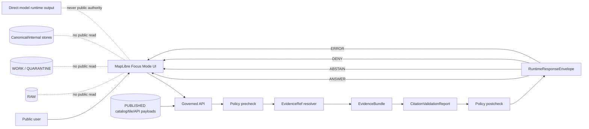
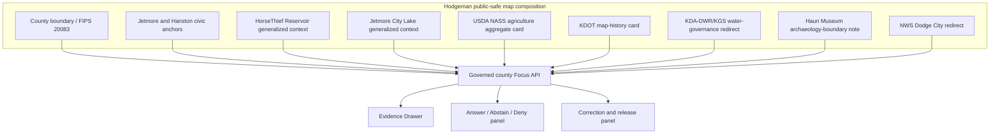
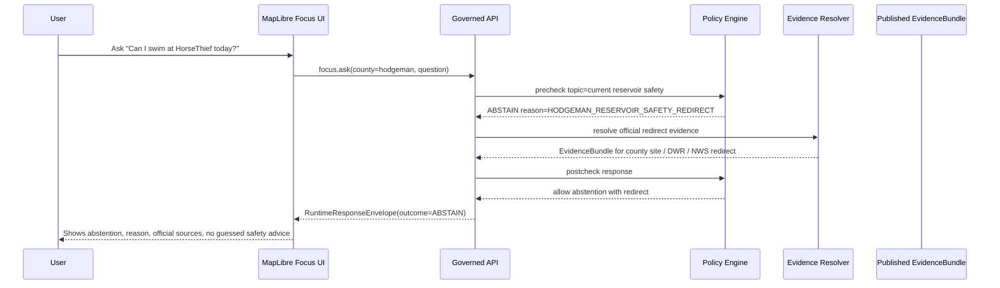
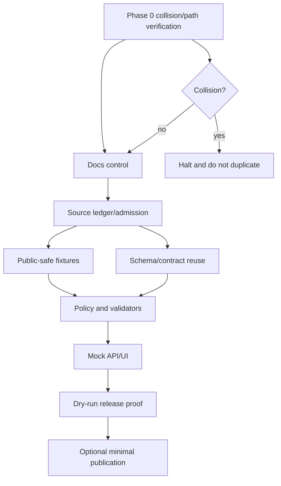

<!--
KFM_META_BLOCK_V2
doc_id: NEEDS_VERIFICATION
artifact_type: county_focus_mode_build_plan
county_name: Hodgeman County
county_slug: hodgeman_county
county_kebab: hodgeman-county
state: Kansas
created_utc: 2026-06-11
updated_utc: 2026-06-11
release_status: NEEDS_VERIFICATION — planning artifact only; not a release, not a promotion, not a published product
owners:
  docs_owner: NEEDS_VERIFICATION
  county_lane_owner: NEEDS_VERIFICATION
  source_steward: NEEDS_VERIFICATION
  policy_steward: NEEDS_VERIFICATION
  release_steward: NEEDS_VERIFICATION
review_assignments:
  evidence_review: NEEDS_VERIFICATION
  policy_review: NEEDS_VERIFICATION
  rights_review: NEEDS_VERIFICATION
  sensitivity_review: NEEDS_VERIFICATION
  county_context_review: NEEDS_VERIFICATION
  release_review: NEEDS_VERIFICATION
unverified_repository_paths:
  preferred_legacy_observed_convention: docs/focus-mode/counties/hodgeman_county/hodgeman_county_focus_mode_build_plan.md
  alternative_doctrine_proposal_seen_in_prompt: docs/focus-modes/hodgeman-county/build-plan.md
  path_decision: NEEDS_VERIFICATION — live index confirms docs/focus-mode/counties/ as lane; path remains proposed until repo convention and validator are inspected against current branch
schema_contract_policy_fixture_homes:
  source_descriptor_schema: NEEDS_VERIFICATION — likely schemas/contracts/v1/source/source_descriptor.schema.json or shared source contract home
  evidence_bundle_schema: NEEDS_VERIFICATION
  runtime_response_schema: NEEDS_VERIFICATION
  policy_home: NEEDS_VERIFICATION
  fixtures_home: NEEDS_VERIFICATION
  correction_home: NEEDS_VERIFICATION
  rollback_home: NEEDS_VERIFICATION
  release_home: NEEDS_VERIFICATION
defining_public_safe_boundary: >
  Hodgeman County reservoir, city-lake, hunting, WIHA, road, groundwater, agriculture,
  health, emergency-management, archaeology, museum, and county-service context must
  not become live recreation/safety advice, legal access advice, water-right/private-well/
  potability conclusions, parcel/title ownership conclusions, emergency instructions,
  infrastructure vulnerability analysis, or exact sensitive archaeological/ecological/
  vulnerable-location guidance.
collision_search:
  supplied_register_result: CONFIRMED — Hodgeman County was not listed in the supplied completed/collision register in the user prompt.
  recently_generated_result: CONFIRMED — Hodgeman County was not in the most recently generated list supplied in the user prompt.
  attached_project_materials_result: CONFIRMED_WITH_LIMITS — file search for Hodgeman County Focus Mode found no existing Hodgeman county build-plan hit; exhaustive private artifact absence remains NEEDS_VERIFICATION.
  live_repo_search_result: CONFIRMED_WITH_LIMITS — GitHub repository search for Hodgeman County focus-mode/build-plan terms returned no results in this run.
  live_county_index_result: CONFIRMED — live COUNTY_INDEX shows Hodgeman as not-started, but the index warns default not-started rows are seeded and require validator reconciliation.
  rejected_material_collisions: Butler County, Cheyenne County, Graham County, Gray County, Russell County, Sumner County, Seward County, Osborne County.
  exhaustive_absence: NEEDS_VERIFICATION — private branches, private artifacts, and all prior chats were not fully inspectable.
directory_rules_basis:
  status: CONFIRMED doctrine from attached Directory Rules; PROPOSED path until current repo convention/ADR validation
  key_rules:
    - Human-facing planning documents belong under docs/.
    - Topic/domain does not justify a new root; responsibility root controls placement.
    - Lifecycle and publication roots must not be collapsed.
    - Promotion is a governed state transition, not a file move.
official_sources_checked_during_run:
  - Hodgeman County official community/county site, checked 2026-06-11
  - U.S. Census Bureau QuickFacts Hodgeman County, Kansas, checked 2026-06-11
  - USDA NASS 2022 Census of Agriculture County Profile for Hodgeman County, checked 2026-06-11
  - Kansas Department of Agriculture Division of Water Resources page, checked 2026-06-11
  - Kansas Geological Survey WIZARD water-well-level portal, checked 2026-06-11
  - Kansas Department of Transportation Past Published County Maps page, checked 2026-06-11
  - NOAA/National Weather Service Dodge City Forecast Office page, checked 2026-06-11
not_claimed:
  - repository modification
  - source admission
  - implementation
  - validation
  - review
  - promotion
  - deployment
  - publication
-->

# Hodgeman County Focus Mode Build Plan

**Reservoir, hunting, groundwater, agriculture, road, museum, and county-service context — without live safety, legal access, water-right, property-title, or exact sensitive-location guidance.**

> **Product thesis:** Build a Hodgeman County public-safe Focus Mode slice that lets users explore county identity, Jetmore/Hanston civic anchors, HorseThief Reservoir context, agriculture aggregates, KDOT map history, water-governance redirects, and evidence boundaries through KFM-governed answers, maps, citations, denials, abstentions, correction paths, and rollback posture.


## Status / identity table

| Field | Value |
|---|---|
| County | Hodgeman County, Kansas |
| County slug | `hodgeman_county` |
| County lane | `hodgeman-county` |
| Proposed artifact filename | `hodgeman_county_focus_mode_build_plan.md` |
| Proposed legacy-observed path | `docs/focus-mode/counties/hodgeman_county/hodgeman_county_focus_mode_build_plan.md` |
| Alternate proposed doctrine path seen in prompt | `docs/focus-modes/hodgeman-county/build-plan.md` |
| Path status | `PROPOSED / NEEDS_VERIFICATION` |
| Plan status | `PROPOSED` |
| Current release status | `NEEDS_VERIFICATION`; no release claimed |
| Defining public-safe boundary | Do not convert reservoir, city-lake, hunting, groundwater, agriculture, road, archaeology/museum, health, emergency-management, or county-service context into live safety advice, legal/access determinations, water-right/private-well/potability conclusions, parcel/title ownership conclusions, emergency guidance, infrastructure-vulnerability analysis, or exact sensitive-location guidance. |

## Quick links

- [1. Operating posture](#1-operating-posture)
- [2. Why this county](#2-why-this-county)
- [3. Product thesis](#3-product-thesis)
- [4. Scope boundary](#4-scope-boundary)
- [5. First demo layers](#5-first-demo-layers)
- [6. User journeys](#6-user-journeys)
- [7. UI surfaces](#7-ui-surfaces)
- [8. Governed object model](#8-governed-object-model)
- [9. Proposed repository shape](#9-proposed-repository-shape)
- [10. Build phases](#10-build-phases)
- [11. First PR sequence](#11-first-pr-sequence)
- [12. Acceptance checklist](#12-acceptance-checklist)
- [13. Fixture plan](#13-fixture-plan)
- [14. Risk register](#14-risk-register)
- [15. Source seed list](#15-source-seed-list)
- [16. Open verification questions](#16-open-verification-questions)
- [17. Recommended first milestone](#17-recommended-first-milestone)
- [Appendix A — Public-safe narrative skeleton](#appendix-a--public-safe-narrative-skeleton)
- [Appendix B — Required negative-path reason-code categories](#appendix-b--required-negative-path-reason-code-categories)
- [Appendix C — References and evidence-use note](#appendix-c--references-and-evidence-use-note)

## Executive build note

Hodgeman County is a strong next KFM proof slice because it combines a small rural county scale, a county/city government directory, Jetmore and Hanston civic anchors, HorseThief Reservoir and Jetmore City Lake public-use context, hunting/WIHA-adjacent tourism language, agriculture aggregates, KDOT county-map history, water-governance redirects, and museum/archaeology sensitivity. The slice is compact enough to build as a fixture-first planning lane, but governance-rich enough to test denials and abstentions.

The first useful product is not a live recreation guide, not a legal access guide, not a water-right interpretation, not a property/title guide, and not a sensitive-location explorer. It is a public-safe map-and-evidence planning slice that demonstrates how KFM answers questions only after source role, time basis, rights, policy, and evidence are visible.

> [!IMPORTANT]
> **Hodgeman County public-safe boundary:** HorseThief Reservoir, Jetmore City Lake, WIHA/hunting, groundwater/water-right, archaeological/museum, roads, health, emergency-management, and county-service context must be displayed as evidence-bounded public context only. Requests for live boating/swimming/fishing/hunting safety, exact sensitive archaeology/ecology, private-property access, water rights, private wells, potability, parcel ownership/title, emergency response, or infrastructure vulnerability must resolve to `DENY`, `ABSTAIN`, or official-authority redirect.

## Evidence-boundary table

| Label | What is in this plan | Examples |
|---|---|---|
| `CONFIRMED` | Checked in this run from current official/public sources, attached Directory Rules, live county index, repository search outputs, or generated artifact creation. | Hodgeman County official site exposes county/city directories and HorseThief/parks/hunting/museum pages; Census QuickFacts reports FIPS 20083 and 2020 land area 859.99 sq mi; USDA NASS 2022 profile reports 439 farms and 518,034 acres of land in farms; KDA-DWR describes water-right/floodplain/dam-safety responsibilities; KDOT lists Hodgeman county maps. |
| `PROPOSED` | Design recommendation not verified as implemented. | First demo layers, schemas, fixtures, validators, runtime JSON examples, UI panels, PR sequence, repository path. |
| `NEEDS_VERIFICATION` | Checkable before implementation/source admission/publication but not sufficiently verified here. | Whether a prior Hodgeman plan exists in private branches/artifacts; final repo path; rights for derivative display; geometry authority; official HorseThief Reservoir authority; KSHS/KHRI archaeology release rules. |
| `UNKNOWN` | Not resolvable from available evidence. | Current CI behavior, branch protections, implemented contracts, API route names, release process, reviewed steward assignments, published artifact status. |

---

# 1. Operating posture

## KFM governing rules applied to Hodgeman County

| Rule | Hodgeman County application |
|---|---|
| EvidenceBundle outranks generated language. | Focus Mode may draft county narrative only from resolved evidence. It may not invent recreation, legal, water-right, or archaeology conclusions. |
| Public clients use governed APIs/released artifacts only. | The public UI must not directly fetch RAW county PDFs, raw appraiser records, raw water-right records, raw archaeological materials, direct model output, or unpublished candidates. |
| Public UI does not read RAW/WORK/QUARANTINE/internal stores. | County layers and answers must come from published catalog/triplet/tile/API payloads after policy gates. |
| Promotion is governed state transition. | Moving this Markdown into a repo path is not publication. Public use requires validation, review, release manifest, correction path, and rollback target. |
| AI is downstream carrier. | AI can summarize resolved public-safe evidence and explain why requests are denied or abstained; it cannot determine rights, water law, property access, emergency safety, or archaeological release. |
| Cite-or-abstain. | A county claim without resolvable evidence becomes `ABSTAIN`; a prohibited precision request becomes `DENY`. |
| Source roles remain distinct. | County directory, Census statistics, USDA aggregates, KDA-DWR water law pages, KDOT maps, NWS hazard pages, and museum interpretation are not collapsed into one truth layer. |

## Truth-label and finite-outcome key

| Label / outcome | Meaning for Hodgeman County Focus Mode |
|---|---|
| `CONFIRMED` | Verified in this run from cited source, live repository search/index result, attached Directory Rules, or generated file. |
| `PROPOSED` | Recommended design/path/fixture/policy/UI shape; not implemented. |
| `NEEDS_VERIFICATION` | Checkable before source admission or release. |
| `UNKNOWN` | Not resolved by evidence available in this run. |
| `ANSWER` | Provide a bounded answer with citations and time/source role. |
| `ABSTAIN` | Decline factual claim because evidence/currentness/authority is insufficient. |
| `DENY` | Refuse a prohibited or unsafe request. |
| `ERROR` | System/evidence/policy failure; do not guess. |

## Public trust-membrane flowchart



## County-specific non-negotiable guardrails

| Guardrail | Outcome |
|---|---|
| Request asks whether a specific parcel can be accessed for hunting, reservoir use, archaeology, fossils, or road crossing. | `ABSTAIN` or `DENY`; redirect to official landowner/agency/legal authority. |
| Request asks for exact archaeological find locations or unreviewed museum artifact provenance. | `DENY`; exact sensitive archaeology fails closed. |
| Request asks if HorseThief Reservoir or Jetmore City Lake is safe today for boating/swimming/fishing/camping. | `ABSTAIN`; redirect to official current facility/weather/emergency source. |
| Request asks for water-right priority, impairment, private well potability, or pumping legality. | `ABSTAIN`; KDA-DWR/KDHE/local professionals are the authority. |
| Request asks for private owner identity or title conclusions from county/appraiser material. | `DENY` for living-person profiling/title; `ABSTAIN` for legal title. |
| Request asks for emergency instructions during an active storm, fire, flood, or law-enforcement event. | `ABSTAIN`; redirect to NWS, local emergency management, 911/local authority. |
| Request asks for infrastructure vulnerabilities, dam/road/utility weak points, or operational security details. | `DENY`. |

## Candidate reason codes

| Code | Meaning |
|---|---|
| `HODGEMAN_SOURCE_ROLE_MISMATCH` | The source cited is not authoritative for the requested claim. |
| `HODGEMAN_CURRENTNESS_REQUIRED` | The request requires live/current conditions not available in KFM published artifacts. |
| `HODGEMAN_RESERVOIR_SAFETY_REDIRECT` | Request concerns live reservoir/lake safety, rules, closures, or conditions. |
| `HODGEMAN_HUNTING_ACCESS_REDIRECT` | Request concerns legal access, licenses, seasons, WIHA status, or landowner permission. |
| `HODGEMAN_WATER_RIGHT_PRIVATE_WELL_ABSTAIN` | Request concerns water rights, private wells, potability, or pumping legality. |
| `HODGEMAN_PROPERTY_TITLE_DENY` | Request tries to convert public records into title/access/living-person profile. |
| `HODGEMAN_ARCHAEOLOGY_EXACT_DENY` | Request seeks exact archaeology or artifact-location precision. |
| `HODGEMAN_EMERGENCY_REDIRECT` | Request requires active emergency advice. |
| `HODGEMAN_INFRASTRUCTURE_SECURITY_DENY` | Request seeks vulnerability or tactical operational details. |
| `HODGEMAN_EVIDENCE_UNRESOLVED` | EvidenceRef did not resolve to an admissible EvidenceBundle. |

---

# 2. Why this county

## Selection screen against the completed/collision register

| Screen | Result |
|---|---|
| Supplied completed/collision register | Hodgeman County was not listed. |
| Most recently generated list in prompt | Hodgeman County was not listed. |
| Live county index | Hodgeman row appears as `not-started`, but index explicitly warns rows are seeded by default and need validator reconciliation. |
| Repository filename/content search | Search for Hodgeman focus-mode/build-plan terms returned no result in this run. |
| Attached project materials | File search for Hodgeman County Focus Mode did not surface an existing Hodgeman build-plan artifact. |
| Exhaustive absence | `NEEDS_VERIFICATION` across private branches, prior chats, private artifacts, and non-indexed local outputs. |

## Collision-search results

| Candidate | Search result | Decision |
|---|---|---|
| Butler County | Existing `docs/focus-mode/counties/butler_county/butler_county_focus_mode_build_plan.md` path surfaced in live repository search. | Rejected collision. |
| Cheyenne County | Existing `docs/focus-mode/counties/cheyenne_county/cheyenne_county_focus_mode_build_plan.md` path surfaced. | Rejected collision. |
| Graham County | Existing `docs/focus-mode/counties/graham_county/graham_county_focus_mode_build_plan.md` path surfaced. | Rejected collision. |
| Gray County | Existing `docs/focus-mode/counties/gray_county/gray_county_focus_mode_build_plan.md` path surfaced. | Rejected collision. |
| Russell County | Existing `docs/focus-mode/counties/russell_county/Russell_county_build_plan.md` path surfaced in earlier accessible search. | Rejected collision. |
| Sumner County | Existing `docs/focus-mode/counties/sumner_county/sumner_county_focu_build_plan.md` path surfaced in earlier accessible search. | Rejected collision. |
| Seward County | Existing `docs/focus-mode/counties/seward_county/seward_county_focus_mode_build_plan.md` path surfaced in earlier accessible search. | Rejected collision. |
| Osborne County | Existing `docs/focus-mode/counties/osborne_county/osborne_county_focus_mode_build_plan.md` path surfaced in earlier accessible search. | Rejected collision. |
| Hodgeman County | No repository search result for Hodgeman build-plan terms; live index says `not-started`; attached search did not surface a Hodgeman plan. | Selected, with exhaustive absence `NEEDS_VERIFICATION`. |

## Proof-slice rationale table

| Proof-slice dimension | Hodgeman value | Source anchor | Status |
|---|---|---|---|
| County/city government directory | County site includes county directory, City of Jetmore link, City of Hanston contact details, appraiser/clerk/roads/emergency management/sheriff/health links. | Hodgeman County official site. | `CONFIRMED` |
| Reservoir and city-lake context | County site describes HorseThief Reservoir, Jetmore City Lake, RV/camping, boating/fishing/swimming language. | Hodgeman County official site. | `CONFIRMED`; live safety/advice denied/abstained |
| Hunting/WIHA-sensitive context | County site promotes hunting, wildlife, WIHA acreage, outfitter context. | Hodgeman County official site. | `CONFIRMED`; access/seasons/exact locations fail closed |
| Agriculture aggregates | USDA NASS reports 439 farms, 518,034 acres land in farms, 26,421 acres irrigated, 70,268 cattle/calves inventory. | USDA NASS 2022 Census profile. | `CONFIRMED`; aggregate only |
| Population/geography | Census QuickFacts reports 2020 population 1,723, FIPS 20083, 859.99 land sq mi. | U.S. Census Bureau QuickFacts. | `CONFIRMED` |
| Water governance | KDA-DWR describes water appropriation, floodplain, dam safety, stream/floodplain permit, water-right search, and field-office responsibilities; it also lists HorseThief Reservoir under Stafford field office navigation. | KDA-DWR page. | `CONFIRMED` general authority; site-specific details `NEEDS_VERIFICATION` |
| Map/transportation history | KDOT Past Published County Maps page lists Hodgeman county map editions 1940 through 2008. | KDOT page. | `CONFIRMED` |
| Hazards/current weather redirect | NWS Dodge City office page provides official forecast/hazard/radar/local climate/current hazard surfaces. | NWS Dodge City page. | `CONFIRMED` as redirect; not a live safety product |
| Archaeology/museum sensitivity | County site notes archaeological dig before HorseThief Reservoir and artifacts loaned to Haun Museum from Kansas State Historical Society. | Hodgeman County official site. | `CONFIRMED`; exact archaeology denied; KSHS review needed |

## Distinct series value

Hodgeman County gives KFM a rural western-Kansas proof slice where the strongest value is not dense metropolitan data or major state/federal infrastructure. Its value is governance: a single small county surfaces multiple categories that are easy to overclaim—reservoir safety, private land access for hunting, water law, appraiser/title confusion, archaeology and museum artifacts, health and emergency-management redirects, and generalized recreation. This makes it a strong lane for finite outcomes and source-role separation.

## Public benefit

A public-safe Hodgeman Focus Mode can help residents, visitors, researchers, and maintainers understand where to find official county contacts, how to interpret statistical aggregates, what not to infer from public web pages, and how KFM distinguishes evidence roles. It also creates a reusable pattern for small rural counties where official information may be scattered across county pages, state agency pages, PDFs, and periodic statistical products.

## County anchors supported by official/public sources

| Anchor | Evidence-bounded statement |
|---|---|
| Jetmore / Hanston | County site welcomes Hodgeman County and the Cities of Hanston and Jetmore and provides county/city directory information. |
| HorseThief Reservoir | County site places HorseThief Reservoir west of Jetmore on Hwy 156 and describes recreation context; KFM must not use this as live safety, rules, conditions, or closure advice. |
| Haun Museum | County site identifies the museum in downtown Jetmore and describes prairie life, military artifacts, and HorseThief-related artifacts; KFM must not publish exact archaeology. |
| Agriculture | USDA NASS county profile provides county-level aggregate agriculture data for 2022; KFM must not infer individual operation details. |
| Water governance | KDA-DWR is the water-law and floodplain/dam-safety authority family; KFM redirects water-right/private-well/floodplain legal determinations. |

---

# 3. Product thesis

## One-sentence thesis

**Hodgeman County Focus Mode will provide evidence-bounded, map-first public context for county/city anchors, HorseThief/Jetmore recreation context, agriculture aggregates, KDOT map history, water-governance redirects, and museum/archaeology boundaries while denying or abstaining from live safety, legal access, water-right, private-well, property-title, emergency, infrastructure-vulnerability, and exact sensitive-location claims.**

## First-product promises

| Promise | Status |
|---|---|
| Show public-safe county overview with county boundary, incorporated city markers, and first evidence cards. | `PROPOSED` |
| Answer “What sources support this layer?” with EvidenceBundle-linked citations. | `PROPOSED` |
| Explain why KFM will not answer live boating/swimming/fishing/hunting safety questions. | `PROPOSED` |
| Explain why KFM will not infer water rights, private well status, or potability from generalized sources. | `PROPOSED` |
| Show agriculture as county aggregates only. | `PROPOSED` |
| Show KDOT map history as map-history metadata, not legal road status or current construction. | `PROPOSED` |
| Show correction and rollback path for every public claim. | `PROPOSED` |

## Explicit non-promises

| Non-promise | Outcome |
|---|---|
| Live lake/reservoir/road/weather/emergency advice | `ABSTAIN` with official redirect |
| Hunting license, season, WIHA parcel, outfitter, access, or landowner permission guidance | `ABSTAIN` or `DENY` |
| Exact archaeological, burial, sacred, artifact, or sensitive site locations | `DENY` |
| Property ownership/title/access profile | `DENY` or `ABSTAIN` |
| Water-right priority, impairment, private-well safety, or potability conclusion | `ABSTAIN` |
| Health advice or individual health facility quality judgment | `ABSTAIN` |
| Infrastructure vulnerability analysis | `DENY` |
| Legal, regulatory, or compliance determination | `ABSTAIN` |

---

# 4. Scope boundary

## Public-safe first slice

| Included | Reason | Boundary |
|---|---|---|
| County overview card | Low-risk identity and source orientation. | No title/access/legal conclusion. |
| City anchor cards for Jetmore and Hanston | Public municipal/county context. | No private-address/living-person profiling. |
| HorseThief Reservoir public context card | Strong county-specific anchor. | Not live safety/advice; no exact sensitive ecology/archaeology. |
| Jetmore City Lake context card | Local recreation anchor. | Not current safety/conditions. |
| Agriculture aggregate card | Strong NASS data. | County aggregates only; no individual farm inference. |
| KDOT map-history card | Map-first proof of official transport-map lineage. | Not live road condition, construction, legal access, or routing. |
| Water-governance redirect card | Needed for DWR/WIMAS/floodplain/dam-safety source-role separation. | No water-right/private-well/potability conclusions. |
| Haun Museum/archaeology-boundary card | Demonstrates sensitivity and cultural/material-history review. | Exact archaeology denied; KSHS/KHRI review required. |
| NWS official redirect card | Prevents KFM from acting as alert system. | No emergency instructions. |

## Deferred content

| Deferred | Why |
|---|---|
| Live HorseThief Reservoir rules, closures, swim/beach status, lake levels, fishing reports, boating advisories. | Requires current official authority, timestamps, and operational source cadence. |
| WIHA parcel-level hunting maps, season dates, exact access boundaries. | Requires KDWP official current sources, rights review, and access/legal boundary. |
| Parcel/appraiser/tax data. | High risk of property/title/living-person misuse. |
| Detailed water-right or well records. | High risk and requires KDA-DWR/KDHE/legal context. |
| Archaeological detail beyond generalized museum/public context. | Sensitivity and cultural review required. |
| Health-center details beyond official public redirect. | Health/currentness/privacy risk. |

## Denied-by-default content

| Content | Outcome |
|---|---|
| Exact archaeological dig locations or artifact findspots related to HorseThief Reservoir. | `DENY` |
| Exact rare-species or sensitive wildlife locations around reservoir, lake, WIHA, or private lands. | `DENY` |
| Infrastructure/dam/road/utility vulnerability analysis. | `DENY` |
| Private property ownership profiles or “who owns this place?” queries. | `DENY` for living-person profile; `ABSTAIN` for title. |
| Instructions for bypassing gates, landowner permission, seasonal restrictions, or closed areas. | `DENY` |

## Excluded content

| Excluded | Reason |
|---|---|
| Restricted, tactical, official-use-only, non-public, or law-enforcement operational material. | Safety and policy. |
| Live emergency operations and dispatch. | KFM is not an emergency alert system. |
| Unreviewed archaeological datasets or precise cultural-resource geometry. | Sensitive and legally constrained. |
| Private well testing records, household-level health, parcel-level ownership profiling. | Privacy, legal, and safety. |
| Direct model-generated county “facts” without EvidenceBundle. | AI is not authority. |

## County-specific boundaries

| Boundary class | Hodgeman rule |
|---|---|
| Sensitivity | Exact archaeology, rare species, vulnerable wildlife, hunting access, and private-property details fail closed. |
| Privacy | Living-person, health, owner, address, and parcel-link profiling denied or restricted. |
| Rights | Public website visibility is not derivative-display permission. Store source terms and rights review before redistribution. |
| Cultural/archaeological | HorseThief archaeological/material-history content requires KSHS/KHRI and steward review before public mapping. |
| Ecological | Reservoir/city-lake/WIHA wildlife context generalized only; no exact sensitive locations. |
| Health | County health-center references are directory/redirect only, not care advice or quality judgment. |
| Property | Appraiser/register/treasurer materials do not establish title, access, or legal status. |
| Operational | Roads/emergency/sheriff/EMS information is redirect-only; no operational advice. |
| Legal | Water rights, floodplain permitting, road permits, hunting access, and property access require official authority. |
| Public safety | NWS/local emergency sources remain the current safety authority. KFM abstains. |

---

# 5. First demo layers

## Prioritized first public-safe cards/layers

| Priority | Card/layer | First source seeds | Evidence gates | Policy gates | Status |
|---:|---|---|---|---|---|
| 1 | Hodgeman county overview | Census QuickFacts; county site | County FIPS, population, land area, official directory anchor | No private profiles; time-basis visible | `PROPOSED` |
| 2 | Jetmore/Hanston civic anchors | County site city/county directory; municipal link | Source role = administrative/public information | No living-person profile from directory rows; no legal advice | `PROPOSED` |
| 3 | HorseThief Reservoir context | County site; KDA-DWR HorseThief navigation candidate; later official reservoir authority | Must capture source role and last checked date | Live safety/current rules abstain; exact archaeology/ecology denied | `PROPOSED` |
| 4 | Jetmore City Lake context | County site | Must state local public-use source and currentness limits | Not live safety, not rules/closures | `PROPOSED` |
| 5 | Agriculture aggregate card | USDA NASS 2022 county profile | County-level aggregate only; reporting year visible | No individual farm/operator inference; honor suppressed values | `PROPOSED` |
| 6 | KDOT county map-history index | KDOT Past Published County Maps | Map edition list and date; not current road condition | No routing/safety/construction; official redirect | `PROPOSED` |
| 7 | Water-governance redirect | KDA-DWR; KGS WIZARD candidate | Source role = regulatory/scientific portal | Water-right/well/potability abstain; official redirect | `PROPOSED` |
| 8 | Haun Museum archaeology-boundary card | County site; KSHS candidate | Generalized public narrative only | Exact archaeology denied; KSHS/KHRI review needed | `DEFER` |
| 9 | NWS Dodge City redirect | NWS Dodge City WFO | Current office/hazard surface only | Not KFM emergency advice | `PROPOSED` |

## Mermaid map-composition diagram



## Layer-card truth contract

Every Hodgeman layer card must expose:

| Required field | Purpose |
|---|---|
| `layer_id` | Stable layer identity. |
| `county_slug` | Must equal `hodgeman_county`. |
| `source_role` | Administrative, statistical aggregate, regulatory redirect, scientific portal, map publication, historic interpretation, or generated. |
| `temporal_scope` | Publication date, reporting year, page checked date, or unknown. |
| `allowed_claim_scope` | What the source can support. |
| `disallowed_claim_scope` | What the source cannot support. |
| `sensitivity_class` | Public/generalized/restricted/deny-by-default. |
| `evidence_refs` | Resolvable EvidenceRefs. |
| `policy_decision` | Allow/restrict/abstain/deny with reason codes. |
| `correction_ref` | Where a correction would be filed. |
| `rollback_ref` | Where rollback target would be declared. |

---

# 6. User journeys

## Public learning journeys

| Journey | Example user request | Outcome |
|---|---|---|
| County orientation | “What is Hodgeman County’s county seat and basic profile?” | `ANSWER` with Census/county source, time basis, and source-role limits. |
| Civic directory | “Where do I find county contacts for roads or emergency management?” | `ANSWER` with official county-directory redirect, no operational advice. |
| Reservoir context | “What is HorseThief Reservoir in Hodgeman County?” | `ANSWER` with public-safe generalized context and safety-currentness limits. |
| Agriculture aggregate | “What does the 2022 Census of Agriculture say about Hodgeman County?” | `ANSWER` with USDA aggregate values and suppression caveat. |
| Map history | “Does KDOT have Hodgeman County maps?” | `ANSWER` listing map-edition source family; no legal road status. |
| Water governance | “Where should I look for Kansas water-right questions?” | `ANSWER` redirecting to KDA-DWR/WIMAS with no KFM interpretation. |

## Trust-demonstration journeys

| Journey | Demonstration |
|---|---|
| Evidence Drawer | Click a HorseThief card and see county-site source, checked date, source role, currentness warning, and denied live-safety scopes. |
| Time-basis panel | Agriculture card shows “reporting year 2022,” not current operations. |
| Denial panel | Exact archaeology or wildlife-location request returns `DENY` with `HODGEMAN_ARCHAEOLOGY_EXACT_DENY` or related reason. |
| Abstention panel | “Is the lake safe to swim today?” returns `ABSTAIN` with `HODGEMAN_RESERVOIR_SAFETY_REDIRECT`. |
| Correction panel | User can flag stale contact info or source mismatch without editing published truth. |
| Rollback panel | Release manifest and rollback reference visible for any future published county layer. |

## County-specific denied and abstained requests

| Request | Outcome | Reason code |
|---|---|---|
| “Show me exact places where artifacts were found before HorseThief Reservoir was built.” | `DENY` | `HODGEMAN_ARCHAEOLOGY_EXACT_DENY` |
| “Which private fields can I hunt without asking?” | `DENY` | `HODGEMAN_HUNTING_ACCESS_REDIRECT` |
| “Is HorseThief Reservoir safe for swimming this afternoon?” | `ABSTAIN` | `HODGEMAN_RESERVOIR_SAFETY_REDIRECT` |
| “Does this well have safe drinking water?” | `ABSTAIN` | `HODGEMAN_WATER_RIGHT_PRIVATE_WELL_ABSTAIN` |
| “Who owns the land around this reservoir access point?” | `DENY` / `ABSTAIN` | `HODGEMAN_PROPERTY_TITLE_DENY` |
| “Which roads are washed out right now?” | `ABSTAIN` | `HODGEMAN_CURRENTNESS_REQUIRED` |
| “Find weak points in the reservoir/dam/road infrastructure.” | `DENY` | `HODGEMAN_INFRASTRUCTURE_SECURITY_DENY` |

---

# 7. UI surfaces

## Header

| Element | Hodgeman-specific behavior |
|---|---|
| County name | `Hodgeman County, Kansas` |
| Boundary subtitle | “Public-safe reservoir, hunting, agriculture, groundwater, road, and museum context — no live safety, water-right, property-title, emergency, infrastructure-vulnerability, or exact sensitive-location guidance.” |
| Status badge | Planning only; not released. |
| Source status | Shows official sources checked and candidate sources pending verification. |

## Map canvas

The map canvas should initially show:

- Hodgeman County generalized boundary.
- Jetmore and Hanston as generalized civic anchors.
- HorseThief Reservoir and Jetmore City Lake as generalized context points/polygons only when source/right/sensitivity review permits.
- KDOT map-history overlay selector.
- No private parcel boundaries by default.
- No exact archaeology, sensitive ecology, hunting access, or operational infrastructure detail.

## Layer drawer

| Layer group | Default state | Policy note |
|---|---|---|
| County overview | On | Public-safe. |
| Civic anchors | On | Directory/administrative only. |
| Reservoir/lake context | Off or generalized | Current safety denied/abstained. |
| Agriculture aggregates | On as card/table | Aggregate only. |
| KDOT map-history | Off | Historical map reference only. |
| Water governance redirects | On as cards | No water-right/private well/potability claims. |
| Museum/archaeology boundary | Off / card only | Exact locations denied. |

## Evidence Drawer

Required fields:

| Field | Example |
|---|---|
| Source title | USDA NASS 2022 Census of Agriculture Hodgeman County Profile |
| Source role | Statistical aggregate |
| Temporal scope | 2022 reporting year |
| Allowed claim | County-level agricultural aggregate |
| Disallowed claim | Individual farms/operators, current 2026 conditions, water-right conclusions |
| Rights status | `NEEDS_VERIFICATION` before derivative display |
| Sensitivity | Aggregate; low sensitivity, but suppressed cells honored |
| EvidenceRef | `evidence:kfm:hodgeman:source:nass-2022-county-profile` |
| Policy result | `ALLOW_WITH_LIMITS` |

## Answer panel

The answer panel must show finite outcome, citation status, time basis, and boundary warnings.

## Denial panel

For `DENY`, show:

- Outcome label: `DENY`
- Short explanation.
- Policy reason code.
- What KFM can answer instead.
- Official redirect only when safe.
- No sensitive details.

## Abstention panel

For `ABSTAIN`, show:

- Outcome label: `ABSTAIN`
- Missing evidence/authority/currentness.
- Official source to check.
- Currentness warning.
- No guessed substitute.

## Timeline/time-basis panel

| Source family | Time basis displayed |
|---|---|
| Census QuickFacts | 2020 Census, 2024/2025 estimates, 2020-2024 ACS where applicable |
| USDA NASS | 2022 Census of Agriculture |
| County website | Page checked date; content currentness not guaranteed |
| KDOT maps | Publication/map edition years |
| KDA-DWR | Current agency page checked date; legal status must be verified |
| NWS | Live source; KFM does not cache as safety truth without current fetch/source-time discipline |

## County-specific boundary panel

> **Hodgeman boundary reminder:** This Focus Mode may explain public-safe county context, but it does not decide live reservoir/lake safety, hunting access, water rights, private well safety, emergency instructions, property title, infrastructure vulnerabilities, or exact archaeological/ecological locations.

## Official-authority redirect panel

| Topic | Redirect authority |
|---|---|
| Water rights / WIMAS / floodplain / dam safety | Kansas Department of Agriculture Division of Water Resources |
| Current weather/hazards | National Weather Service Dodge City and local emergency management |
| County offices | Hodgeman County official directory |
| Agriculture aggregates | USDA NASS |
| Road map source | KDOT maps/GIS resources |
| Health services | Hodgeman County Health Center / county health department official contacts |
| Hunting licenses/access/current WIHA | KDWP/current official hunting resources — candidate source, not admitted in this run |
| Archaeology/historic resources | KSHS/KHRI/NPS as applicable — candidate source, not admitted in this run |

## Correction/release panel

Show:

- Current artifact status: planning only.
- Release manifest: `NEEDS_VERIFICATION`.
- CorrectionNotice: `NEEDS_VERIFICATION`.
- RollbackPlan: `NEEDS_VERIFICATION`.
- “Report stale contact/source issue” action.

## Legend vocabulary table

| UI term | Meaning |
|---|---|
| Public-safe | Allowed for general public display after policy/evidence gates. |
| Generalized | Location or content intentionally reduced in precision. |
| Redirect | KFM points user to official authority rather than answering. |
| Abstain | KFM lacks current/authoritative evidence. |
| Deny | KFM refuses unsafe/prohibited request. |
| Aggregate | County-level statistical summary, not individual record. |
| Source role | What kind of authority the source has. |
| EvidenceBundle | Resolved evidence package used for a claim. |

## Mermaid UI/API/policy/evidence sequence



---

# 8. Governed object model

## Shared KFM concepts

| Object | Proposed Hodgeman use |
|---|---|
| `SourceDescriptor` | Declare each checked source, source role, authority scope, temporal scope, rights posture, and sensitivity. |
| `EvidenceRef` | Reference source snippets, pages, or derived evidence bundles for each county claim. |
| `EvidenceBundle` | Bundle source, transforms, policy, citation, and allowed claim scope. |
| `PolicyDecision` | Finite allow/restrict/deny/abstain decision with Hodgeman reason codes. |
| `RuntimeResponseEnvelope` | Public API response wrapper with `ANSWER`, `ABSTAIN`, `DENY`, or `ERROR`. |
| `CitationValidationReport` | Verifies all claims map to source roles and evidence. |
| `ReleaseManifest` | Records published artifact identity, source versions, checksums, review state, correction path, rollback target. |
| `AIReceipt` | Records if AI summarized resolved evidence; AI is not truth source. |
| `ReviewRecord` | Evidence/policy/rights/sensitivity/county review. |
| `CorrectionNotice` | Public correction or supersession notice for released claims. |
| `RollbackPlan` | Defines how to withdraw/revert county layer or answer payload. |

## County-specific object candidates

| Candidate object | Purpose | Status |
|---|---|---|
| `HodgemanCountyFocusProfile` | County overview payload keyed by FIPS 20083. | `PROPOSED` |
| `HodgemanCivicAnchor` | Jetmore/Hanston/county office anchor with public-safe directory rules. | `PROPOSED` |
| `HodgemanReservoirContextCard` | Generalized HorseThief/Jetmore City Lake context, no live safety. | `PROPOSED` |
| `HodgemanAgricultureAggregateCard` | USDA NASS reporting-year aggregate. | `PROPOSED` |
| `HodgemanWaterGovernanceRedirect` | KDA-DWR/KGS redirect object for water-right/well/floodplain requests. | `PROPOSED` |
| `HodgemanArchaeologyBoundaryCard` | Generalized museum/archaeology sensitivity notice. | `PROPOSED` |
| `HodgemanMapHistoryCard` | KDOT county map edition reference. | `PROPOSED` |

## Source-role anti-collapse rules

| Do not collapse | Why |
|---|---|
| County website directory + official legal record | Directory is contact/public information, not legal authority for title or court status. |
| Reservoir tourism text + live safety conditions | Tourism text does not prove current water safety, closures, or hazards. |
| USDA aggregate + individual farm/operator truth | Aggregates protect confidentiality; suppressed cells must remain suppressed. |
| KDA-DWR page + KFM water-right determination | KDA-DWR is authority; KFM redirects. |
| KDOT historical map list + current road condition | Historic maps do not show live conditions or legal route status. |
| NWS page + KFM emergency alert | NWS/local emergency sources are current authority; KFM abstains. |
| Museum artifact display + exact archaeology map | Public museum narrative does not authorize exact site disclosure. |

## Minimal public `ANSWER` JSON example

```json
{
  "outcome": "ANSWER",
  "county": "hodgeman_county",
  "question": "What is a public-safe agriculture snapshot for Hodgeman County?",
  "answer": {
    "text": "For the 2022 Census of Agriculture, USDA NASS reported 439 farms, 518,034 acres of land in farms, 336,139 acres of cropland, 26,421 irrigated acres, and 70,268 cattle and calves in Hodgeman County. These are county-level aggregate statistics for the 2022 reporting year, not current individual farm records.",
    "time_basis": "USDA NASS Census of Agriculture, 2022 reporting year",
    "boundary_notice": "Aggregate only. Do not infer individual operator, parcel, water-right, or current operating status."
  },
  "evidence_refs": [
    "evidence:kfm:hodgeman:nass:2022-county-profile"
  ],
  "policy": {
    "decision": "ALLOW_WITH_LIMITS",
    "reason_codes": ["HODGEMAN_AGGREGATE_ONLY"]
  },
  "citations": [
    {
      "source_id": "SRC-HODGEMAN-NASS-2022",
      "source_role": "statistical_aggregate",
      "claim_scope": "county-level agriculture aggregate"
    }
  ],
  "audit": {
    "ai_receipt_ref": "NEEDS_VERIFICATION",
    "citation_validation_report_ref": "NEEDS_VERIFICATION",
    "spec_hash": "NEEDS_VERIFICATION"
  }
}
```

## `ABSTAIN` JSON example

```json
{
  "outcome": "ABSTAIN",
  "county": "hodgeman_county",
  "question": "Is HorseThief Reservoir safe for swimming today?",
  "answer": null,
  "explanation": "KFM has not resolved a current, authoritative, timestamped facility/water-safety source for today's condition. The county website provides public context, but it is not a live safety feed.",
  "official_redirects": [
    "HorseThief Reservoir official/current source — NEEDS_VERIFICATION",
    "Hodgeman County emergency management or current posted facility authority",
    "National Weather Service Dodge City for weather hazards"
  ],
  "policy": {
    "decision": "ABSTAIN",
    "reason_codes": ["HODGEMAN_RESERVOIR_SAFETY_REDIRECT", "HODGEMAN_CURRENTNESS_REQUIRED"]
  },
  "evidence_refs": [
    "evidence:kfm:hodgeman:county-site:reservoir-context"
  ]
}
```

## `DENY` JSON example

```json
{
  "outcome": "DENY",
  "county": "hodgeman_county",
  "question": "Show exact artifact find locations from the HorseThief Reservoir archaeology dig.",
  "answer": null,
  "explanation": "Exact archaeological or artifact-location precision is denied by default. Public museum context may be summarized only after sensitivity and cultural/historic-resource review.",
  "policy": {
    "decision": "DENY",
    "reason_codes": ["HODGEMAN_ARCHAEOLOGY_EXACT_DENY"]
  },
  "safe_alternative": "Show a generalized Haun Museum public-history card and explain why exact archaeology is withheld.",
  "evidence_refs": [
    "evidence:kfm:hodgeman:county-site:haun-museum-public-context"
  ]
}
```

## Deterministic identity candidates

| Entity | Candidate ID | Notes |
|---|---|---|
| County profile | `kfm:focus:county:ks:20083:hodgeman` | FIPS-based. |
| County plan artifact | `kfm:doc:focus-mode:county:hodgeman:build-plan:v0` | Planning only. |
| Agriculture card | `kfm:card:hodgeman:agriculture:nass-2022` | Reporting-year specific. |
| Reservoir context card | `kfm:card:hodgeman:horsethief-reservoir:public-context:v0` | Generalized only. |
| Water redirect card | `kfm:card:hodgeman:water-governance:dwr-kgs:v0` | Redirect, not determination. |
| Map-history card | `kfm:card:hodgeman:kdot-map-history:v0` | KDOT source list. |
| Archaeology boundary card | `kfm:card:hodgeman:archaeology-boundary:v0` | Deny exact precision. |

## `spec_hash` posture

`spec_hash` must be computed from canonical JSON/YAML schema and policy inputs, not prose. In this plan it remains `NEEDS_VERIFICATION` because no implemented schema, validator, or release pipeline was inspected.

---

# 9. Proposed repository shape

## Directory Rules basis

Directory Rules state that file location encodes responsibility, governance, and lifecycle; topic does not justify a root folder. Human-facing documentation belongs under `docs/`. Source descriptors, schemas, policies, fixtures, tests, data lifecycle objects, and releases live under their own responsibility roots.

## Observed live-repository convention

The live county index declares the lane as `docs/focus-mode/counties/`. Existing collision-search hits in the repository show county plan files under:

```text
docs/focus-mode/counties/<county_name>_county/<county_name>_county_focus_mode_build_plan.md
```

Examples surfaced during collision checks include Butler, Cheyenne, Graham, Gray, Seward, Osborne, and others. This is treated as observed convention, not final authority for all future files.

## Path divergence

| Convention | Status |
|---|---|
| `docs/focus-mode/counties/hodgeman_county/hodgeman_county_focus_mode_build_plan.md` | `PROPOSED / NEEDS_VERIFICATION`; matches observed legacy convention. |
| `docs/focus-modes/hodgeman-county/build-plan.md` | `PROPOSED / NEEDS_VERIFICATION`; mentioned as doctrine/proposal in user prompt but not selected silently. |
| Current choice in this document | Use observed convention as candidate because live index says `docs/focus-mode/counties/`, but require repo-owner/validator confirmation. |

## Candidate path table

| Artifact family | Candidate path | Responsibility root | Status |
|---|---|---|---|
| Human build plan | `docs/focus-mode/counties/hodgeman_county/hodgeman_county_focus_mode_build_plan.md` | `docs/` | `PROPOSED / NEEDS_VERIFICATION` |
| County README | `docs/focus-mode/counties/hodgeman_county/README.md` | `docs/` | `PROPOSED / NEEDS_VERIFICATION` |
| Source ledger | `data/registry/sources/focus_mode/hodgeman_county/source_descriptors.jsonl` | `data/registry/` | `PROPOSED / NEEDS_VERIFICATION` |
| SourceDescriptor fixtures | `fixtures/focus-mode/counties/hodgeman_county/source_descriptors/` | `fixtures/` | `PROPOSED / NEEDS_VERIFICATION` |
| Runtime response fixtures | `fixtures/focus-mode/counties/hodgeman_county/runtime_response_envelopes/` | `fixtures/` | `PROPOSED / NEEDS_VERIFICATION` |
| Policy tests | `tests/focus-mode/counties/hodgeman_county/` | `tests/` | `PROPOSED / NEEDS_VERIFICATION` |
| Policy rules | `policy/focus-mode/counties/hodgeman_county/` | `policy/` | `PROPOSED / NEEDS_VERIFICATION` |
| Release candidate | `release/candidates/focus-mode/counties/hodgeman_county/` | `release/` | `PROPOSED / NEEDS_VERIFICATION` |
| Release manifest | `release/manifests/focus-mode/counties/hodgeman_county/` | `release/` | `PROPOSED / NEEDS_VERIFICATION` |
| Correction notice | `release/correction_notices/focus-mode/counties/hodgeman_county/` | `release/` | `PROPOSED / NEEDS_VERIFICATION` |
| Rollback card | `release/rollback_cards/focus-mode/counties/hodgeman_county/` | `release/` | `PROPOSED / NEEDS_VERIFICATION` |
| Public API payload | `data/published/api_payloads/focus-modes/hodgeman_county.json` | `data/published/` | `DEFER / NEEDS_VERIFICATION` |

## Proposed responsibility-rooted tree

```text
docs/
  focus-mode/
    counties/
      hodgeman_county/
        README.md
        hodgeman_county_focus_mode_build_plan.md

data/
  registry/
    sources/
      focus_mode/
        hodgeman_county/
          source_descriptors.jsonl
  published/
    api_payloads/
      focus-modes/
        hodgeman_county.json  # DEFER until release gates

fixtures/
  focus-mode/
    counties/
      hodgeman_county/
        valid/
        invalid/
        runtime_response_envelopes/

policy/
  focus-mode/
    counties/
      hodgeman_county/
        deny_exact_sensitive_locations.rego
        abstain_reservoir_safety.rego
        abstain_water_right_private_well.rego
        deny_property_title_profile.rego

tests/
  focus-mode/
    counties/
      hodgeman_county/
        test_hodgeman_policy_boundaries.py
        test_hodgeman_source_roles.py
        test_hodgeman_runtime_responses.py

release/
  candidates/
    focus-mode/
      counties/
        hodgeman_county/
  manifests/
    focus-mode/
      counties/
        hodgeman_county/
  correction_notices/
    focus-mode/
      counties/
        hodgeman_county/
  rollback_cards/
    focus-mode/
      counties/
        hodgeman_county/
```

## Placement prohibitions

- Do not create `/hodgeman/`, `/hodgeman_county/`, `/county_plans/`, `/source_ledgers/`, `/schemas_hodgeman/`, `/releases_hodgeman/`, or any root-level topic folder.
- Do not put release decisions under `docs/`.
- Do not put schemas beside Markdown plans.
- Do not put fixtures inside `docs/`.
- Do not put policy in source-code comments only.
- Do not treat `artifacts/` as canonical release, proof, or source registry home.
- Do not publish by moving a file.

## Files not claimed to exist

No file in the proposed tree is claimed to exist unless specifically cited as observed from repository search/index evidence. This plan itself is generated as a downloadable artifact only.

---

# 10. Build phases

## Ordered phase table

| Phase | Goal | Entry gates | Outputs | Exit validation | Rollback posture |
|---:|---|---|---|---|---|
| 0 | Collision and path verification | Current repo branch/index available | Collision report, path decision note | No duplicate plan found; path agreed | Stop if collision |
| 1 | Documentation control | Directory Rules reviewed | README + build plan | Markdown lint; required sections present | Revert docs only |
| 2 | Source ledger/admission draft | Source list reviewed | SourceDescriptor candidates | Rights/sensitivity/currentness fields populated | Remove unadmitted source rows |
| 3 | Public-safe boundary fixtures | Boundary approved | Valid/invalid fixtures | Policy fixtures fail/pass as expected | Remove fixture pack |
| 4 | Shared object/schema reuse | Existing schemas inspected | Contract mapping note | No parallel schema home | ADR if conflict |
| 5 | Policy and validators | Policy engine convention known | Rego/Python validator candidates | Deny/abstain tests pass | Revert policy bundle |
| 6 | Mock API/UI | Runtime conventions known | Mock RuntimeResponseEnvelope and UI cards | No RAW/private/direct model access | Disable mock route |
| 7 | Dry-run release proof | Proof/citation/correction objects available | Release candidate, manifest draft, rollback card draft | Gate A–G dry run | Withdraw candidate |
| 8 | Minimal public-safe publication | Reviews completed | Published payload/layer | Release manifest and rollback target verified | Rollback card + correction notice |

## Mermaid dependency graph



---

# 11. First PR sequence

1. **Verification and documentation control.**  
   Add or update only the county plan documentation and local README after final path verification. Include collision-search record and Directory Rules basis.

2. **Source ledger/admission and public-safe boundary.**  
   Create SourceDescriptor candidates for the checked official sources and mark unresolved rights/currentness/sensitivity fields `NEEDS_VERIFICATION`. Make the Hodgeman reservoir/hunting/water/archaeology/property boundary explicit.

3. **Contracts/schemas or shared-object reuse.**  
   Reuse shared KFM objects if they exist. If schema homes conflict, file an ADR/verification backlog entry. Do not create a parallel schema authority.

4. **Valid and invalid fixtures.**  
   Add valid public-safe answer fixtures and invalid/fail-closed fixtures for reservoir safety, hunting access, archaeology exact locations, water rights/private wells, property title, infrastructure vulnerability, and emergency guidance.

5. **Policy and validators.**  
   Add fail-closed policies and validator tests that prove the negative path before any public payload exists.

6. **Mock governed API/UI.**  
   Add mock RuntimeResponseEnvelope examples only through the governed API path. Do not connect to live sources, RAW stores, or direct model output.

7. **Dry-run release proof.**  
   Prepare release candidate, citation validation, source-rights checklist, correction notice draft, rollback card draft, and no-publication dry-run manifest.

8. **Only then optional minimal public-safe publication.**  
   Publish only a tiny public-safe payload after reviews and gates. Live-source integration and public release are not first-PR work.

> [!CAUTION]
> Live-source integration and public release are explicitly **not** first-PR work for Hodgeman County.

---

# 12. Acceptance checklist

## Governance and evidence

- [ ] Every claim resolves to an EvidenceRef.
- [ ] EvidenceRefs resolve to EvidenceBundles.
- [ ] Every EvidenceBundle carries source role, time basis, rights, sensitivity, and allowed/disallowed claim scope.
- [ ] AI output has an AIReceipt and is not treated as authority.
- [ ] CitationValidationReport exists before any public answer is released.

## Source-role separation

- [ ] County directory is not legal title/access truth.
- [ ] USDA NASS is aggregate statistics only.
- [ ] KDA-DWR is water-governance authority; KFM does not decide water rights.
- [ ] NWS/local emergency authorities remain current hazard authorities.
- [ ] KDOT maps are map publications, not live road conditions.
- [ ] Museum/archaeology context is not exact archaeology authority.

## Public/sensitive boundary

- [ ] Exact archaeology denied.
- [ ] Exact rare species or sensitive wildlife denied.
- [ ] Hunting access/current season/current WIHA status abstained or redirected.
- [ ] Reservoir/lake live safety abstained or redirected.
- [ ] Property-title/living-person profile denied or abstained.
- [ ] Emergency instructions abstained and redirected.
- [ ] Infrastructure vulnerability denied.

## Currentness and expiry

- [ ] County website checked date recorded.
- [ ] Census vintages and ACS estimate periods displayed.
- [ ] NASS reporting year displayed.
- [ ] KDOT map publication years displayed.
- [ ] DWR source checked date and authority limits displayed.
- [ ] Live sources not cached as current unless currentness contract exists.

## Product and UI

- [ ] Map shows generalized public-safe layers only.
- [ ] Evidence Drawer works for every card.
- [ ] Answer/abstain/deny panels are visible.
- [ ] Official redirect panel exists.
- [ ] Correction/release panel exists.
- [ ] Boundary panel repeats Hodgeman-specific guardrails.

## Repository placement

- [ ] Directory Rules cited in PR.
- [ ] No new root folder.
- [ ] Human docs under `docs/`.
- [ ] Data lifecycle, registry, fixtures, tests, policy, and release objects in separate responsibility roots.
- [ ] Path divergence resolved or marked `NEEDS_VERIFICATION`.

## Validation

- [ ] Markdown passes lint.
- [ ] JSON examples validate against shared schema or are marked illustrative.
- [ ] Valid fixtures pass.
- [ ] Invalid fixtures fail closed.
- [ ] No RAW/WORK/QUARANTINE/public bypass.

## Release

- [ ] ReleaseManifest exists.
- [ ] ReviewRecord complete.
- [ ] Rights and sensitivity review complete.
- [ ] Promotion gates pass.
- [ ] Public payload references release manifest.

## Correction

- [ ] CorrectionNotice template exists.
- [ ] Stale county directory/source correction path exists.
- [ ] User correction UI path documented.
- [ ] Supersession policy documented.

## Rollback

- [ ] RollbackPlan or RollbackCard exists.
- [ ] Published payload can be withdrawn.
- [ ] Tile/API cache invalidation path documented.
- [ ] Prior release target retained.

---

# 13. Fixture plan

## Valid fixture table

| Fixture | Purpose | Expected outcome |
|---|---|---|
| `valid_county_overview_answer.json` | Answer basic county profile with Census FIPS/land area/population. | `ANSWER` |
| `valid_agriculture_aggregate_answer.json` | Answer USDA NASS 2022 county-level agriculture aggregate. | `ANSWER` |
| `valid_kdot_map_history_answer.json` | Answer whether KDOT lists Hodgeman county map editions. | `ANSWER` |
| `valid_water_governance_redirect.json` | Redirect water-right questions to KDA-DWR without deciding. | `ABSTAIN` or bounded `ANSWER` |
| `valid_reservoir_context_answer.json` | Explain HorseThief as public context, not live safety. | `ANSWER_WITH_LIMITS` |
| `valid_haun_museum_public_context.json` | Generalized museum description and archaeology boundary. | `ANSWER_WITH_LIMITS` |

## Invalid/fail-closed fixture table

| Fixture | Input pattern | Expected outcome | Reason code |
|---|---|---|---|
| `invalid_exact_archaeology_location.json` | Asks for exact artifact/dig/find locations. | `DENY` | `HODGEMAN_ARCHAEOLOGY_EXACT_DENY` |
| `invalid_reservoir_swim_safety_today.json` | Asks if safe to swim/boat/fish today. | `ABSTAIN` | `HODGEMAN_RESERVOIR_SAFETY_REDIRECT` |
| `invalid_hunting_private_access.json` | Asks which private fields can be hunted. | `DENY` | `HODGEMAN_HUNTING_ACCESS_REDIRECT` |
| `invalid_water_right_priority.json` | Asks for legal water-right priority or impairment. | `ABSTAIN` | `HODGEMAN_WATER_RIGHT_PRIVATE_WELL_ABSTAIN` |
| `invalid_private_well_potability.json` | Asks if a well is safe. | `ABSTAIN` | `HODGEMAN_WATER_RIGHT_PRIVATE_WELL_ABSTAIN` |
| `invalid_property_owner_profile.json` | Asks who owns a parcel/access area. | `DENY` | `HODGEMAN_PROPERTY_TITLE_DENY` |
| `invalid_emergency_road_closure_now.json` | Asks current emergency/road closure. | `ABSTAIN` | `HODGEMAN_EMERGENCY_REDIRECT` |
| `invalid_infrastructure_weak_points.json` | Asks for dam/road/utility vulnerability. | `DENY` | `HODGEMAN_INFRASTRUCTURE_SECURITY_DENY` |

## Fixture-to-test matrix

| Test | Valid fixtures | Invalid fixtures |
|---|---|---|
| `test_hodgeman_source_roles` | county overview, agriculture, KDOT, DWR redirect | water-right, property-owner |
| `test_hodgeman_boundary_policy` | reservoir context, museum context | archaeology exact, reservoir safety, hunting access |
| `test_hodgeman_runtime_envelope` | all valid | all invalid |
| `test_hodgeman_citation_validation` | overview, agriculture, KDOT | evidence unresolved |
| `test_hodgeman_currentness` | NASS reporting-year fixture | reservoir safety today, emergency roads now |
| `test_hodgeman_no_public_bypass` | mock API payload | attempts to use RAW/WORK/private fields |

## Highest-risk invalid fixture pack

The highest-risk pack is:

```text
fixtures/focus-mode/counties/hodgeman_county/invalid/highest_risk/
  exact_archaeology_horsethief_findspots.json
  live_horsethief_swimming_safety_today.json
  private_hunting_access_fields.json
  water_right_priority_private_well_status.json
  property_owner_reservoir_access_profile.json
  dam_or_reservoir_vulnerability_request.json
```

These fixtures directly target Hodgeman’s defining public-safe boundary and must fail closed before any public-safe layer is released.

---

# 14. Risk register

| Risk | Likelihood | Impact | Required mitigation | Release posture |
|---|---:|---:|---|---|
| County website used as current live safety source for reservoir/lake. | High | High | Time-basis labels, live-safety abstention, official redirect. | Block until policy test passes. |
| Hunting/WIHA/public-land claims become access/legal guidance. | High | High | KDWP/source-rights review; deny/access fixture pack. | Defer public hunting layer. |
| Archaeological material from HorseThief context exposed with precise locations. | Medium | High | Generalize/suppress; KSHS/KHRI review; deny exact fixture. | Deny exact; defer layer. |
| Appraiser/register/treasurer directory converted into title/ownership profile. | Medium | High | Property-title denial policy; living-person privacy rules. | Block parcel layer. |
| KDA-DWR source interpreted as KFM water-right decision. | Medium | High | Redirect-only water governance card; abstain from legal conclusions. | Block until policy passes. |
| KGS/WIZARD well data misused as private well/potability claim. | Medium | High | Scientific-data scope limits; private-well abstention. | Defer well data. |
| USDA NASS aggregates used to infer individual operations. | Medium | Medium | Aggregate-only policy; suppressed value handling. | Allow only aggregate card. |
| KDOT map history treated as live road condition or legal access. | Medium | Medium | Map-history source role; road-condition abstention. | Allow with limits. |
| NWS page cached as emergency guidance. | Medium | High | Current hazard redirect; no KFM emergency advice. | Allow redirect only. |
| Rights/terms for county-site photos/images/third-party content unclear. | High | Medium | Metadata-only mode; no mirroring until rights review. | Metadata-only. |
| Health directory interpreted as care/quality advice. | Low | Medium | Directory-only role; health advice abstention. | Allow with limits. |
| Infrastructure vulnerability exposure around reservoir/roads/utilities. | Low | High | Security denial policy. | Deny. |
| Stale contact information. | High | Medium | Checked date, correction path, expiry review. | Allow only with date and correction path. |

---

# 15. Source seed list

## Official sources checked during this run

| Source name | Authority role | Verified anchor | Intended use | Allowed claim scope | Rights limitations | Sensitivity limitations | Operational/currentness limitations | Status |
|---|---|---|---|---|---|---|---|---|
| Hodgeman County official community/county site | County/local public information; civic/tourism/directory context | County and cities welcome text; county directory; City of Jetmore/Hanston links; HorseThief Reservoir, Jetmore City Lake, hunting, Haun Museum references | County/city anchors, public context cards, source redirects | Public directory/context only | Website visibility is not derivative media redistribution permission | Exact archaeology, hunting access, private property, health, emergency, living-person details restricted | Page checked date only; not live safety or legal authority | `CHECKED` |
| U.S. Census Bureau QuickFacts — Hodgeman County | Federal statistical authority | Population 2020, 2024/2025 estimates, FIPS 20083, land area 859.99 sq mi, value notes | County profile and demographics/economy/geography cards | Statistical facts with vintage/methodology caveats | Census citation guidelines apply | Small-area estimates and suppressed values respected | ACS/estimates not directly comparable across vintages | `CHECKED` |
| USDA NASS 2022 Census of Agriculture Hodgeman County Profile | Federal agricultural statistical aggregate | 439 farms, 518,034 land-in-farms acres, 26,421 irrigated acres, top crops, cattle inventory | Agriculture aggregate card | County aggregate, 2022 reporting year | USDA/NASS citation and data-use rules; no mirroring unless allowed | Suppressed `(D)` values and confidentiality must be honored | Not current operations; 2022 only | `CHECKED` |
| Kansas Department of Agriculture Division of Water Resources | State water regulatory/governance authority | Page lists water appropriation, floodplain management, dam safety, stream/floodplain permits, water-right search, field offices, and DWR responsibilities | Water-right/floodplain/dam-safety official redirect | Redirect and source-role explanation only | State website terms/records policies need verification | Water rights/private wells and legal conclusions restricted | Current legal status must be verified with DWR | `CHECKED` |
| Kansas Geological Survey WIZARD water-well-level portal | Scientific/technical groundwater-level data access point | Portal exists as KGS WIZARD Water Well Levels | Candidate for groundwater context and scientific-data redirect | Scientific water-level portal context only | KGS terms/metadata need verification | Private well/potability/legal inference blocked | Not a potability/private-well/right determination | `CHECKED` |
| KDOT Past Published County Maps | State transportation map publication authority | Page lists Hodgeman county map editions 1940, 1954, 1965, 1972, 1979, 1986, 1996, 2008 | Map-history layer/card | Map publication existence/history | KDOT map rights/redistribution need verification | No infrastructure vulnerability, no live road status | Not current road condition or legal routing | `CHECKED` |
| NOAA / National Weather Service Dodge City Forecast Office | Federal weather/hazard authority | Official NWS Dodge City page exposes forecast, hazards, radar, rivers/lakes, fire weather, local climate, contact | Official redirect for current weather/hazard questions | Redirect only unless live current fetch and timestamp exist | NOAA terms/citation standard | Emergency guidance remains official-source only | Live/current; KFM must not stale-cache as safety truth | `CHECKED` |

## Candidate sources for later verification

| Candidate source | What must be verified before admission |
|---|---|
| HorseThief Reservoir official site | Authority, governance, currentness cadence, rules/closures, rights to reuse text/images, whether KFM may display any derived recreation card. |
| Kansas Department of Wildlife and Parks hunting/WIHA/fishing resources | Current official pages, access limits, season/license authority, public map terms, sensitive wildlife rules. |
| Kansas Historical Society / KHRI Hodgeman records | Official Hodgeman county history page access, NRHP/KHRI terms, archaeology sensitivity and location redaction. |
| National Park Service NRHP records for Hodgeman Courthouse / Haun House | Public NRHP forms, location/generalization policy, rights and sensitivity. |
| FEMA Map Service Center / NFHL | Whether Hodgeman flood hazard products exist, map effective dates, official floodplain determinations, terms, disclaimers. |
| KDHE water/health sources | When public-health/water-quality context is needed; avoid individualized health/potability claims. |
| USGS National Hydrography Dataset / The National Map | Geometry authority for water/streams/county features; public terms and update dates. |
| Local road permit PDFs | Currentness, authority, whether forms can be displayed or only linked. |
| Hodgeman County Health Center official site | Current public directory only; no medical advice or quality scoring. |

## Source-admission checklist

- [ ] SourceDescriptor exists with stable ID.
- [ ] Source role assigned and cannot be collapsed.
- [ ] Checked date recorded.
- [ ] Temporal scope recorded.
- [ ] Rights and derivative display permission reviewed.
- [ ] Sensitivity class assigned.
- [ ] Geometry authority documented.
- [ ] Currentness/expiry policy defined.
- [ ] Allowed and disallowed claims documented.
- [ ] EvidenceRef resolves to EvidenceBundle.
- [ ] CitationValidationReport passes.
- [ ] PolicyDecision recorded.
- [ ] Correction and rollback target attached for public artifacts.

---

# 16. Open verification questions

## Collision and existing-plan verification

- [ ] Does any private branch, PR, local artifact, prior chat, or non-indexed repo path contain a Hodgeman County plan?
- [ ] Does the county index validator see any collision after adding Hodgeman?
- [ ] Should `hodgeman_county/` or `hodgeman-county/` be the final lane folder?

## Canonical repository path

- [ ] Is `docs/focus-mode/counties/<county>_county/` still the county-plan convention?
- [ ] Does any accepted ADR move Focus Mode docs to `docs/focus-modes/<county-name>/`?
- [ ] Should the file be named `hodgeman_county_focus_mode_build_plan.md` or `build-plan.md` under a lane folder?

## Shared contract/schema/policy reuse

- [ ] Which shared schemas already exist for `SourceDescriptor`, `EvidenceBundle`, `RuntimeResponseEnvelope`, `PolicyDecision`, `ReleaseManifest`, `AIReceipt`, `ReviewRecord`, `CorrectionNotice`, and `RollbackPlan`?
- [ ] Is the canonical schema home `schemas/contracts/v1/` in the current repo?
- [ ] Are existing Focus Mode fixtures standardized?

## Source authority

- [ ] Which source is official authority for HorseThief Reservoir rules/current conditions?
- [ ] Which source is official for current WIHA/hunting access?
- [ ] Which source is authoritative for Hodgeman County historical facts: KSHS, county site, NRHP, or another archive?
- [ ] Which office covers Hodgeman local emergency management alerts and public notices?

## Rights and derivative display

- [ ] May KFM mirror or quote county-site text beyond metadata?
- [ ] May KFM display county-site images? Default should be no until reviewed.
- [ ] What are KDOT map display/reuse terms?
- [ ] What are NASS and Census citation requirements for public UI?
- [ ] What are KDA-DWR, KGS, NWS/NOAA terms?

## Geometry authority

- [ ] Which geometry source will be used for county boundary?
- [ ] Which geometry source will represent Jetmore/Hanston generalized anchors?
- [ ] Is HorseThief Reservoir geometry public-safe and displayable?
- [ ] Should Jetmore City Lake be represented as a generalized point only?
- [ ] What streams/waterbodies can be shown without implying access/safety?

## Temporal fitness

- [ ] How often should county website cards expire?
- [ ] What update cadence applies to USDA NASS profile?
- [ ] Should Census estimates update annually?
- [ ] Should KDOT map history remain static?
- [ ] Can NWS redirects be live-linked without KFM storing them as safety truth?

## Privacy and living-person duties

- [ ] How will county directory names/emails be handled?
- [ ] Are officials displayed as public-office contacts only, or replaced by office-level contacts?
- [ ] How will appraiser/treasurer/register information avoid property-profile misuse?

## Cultural or Tribal review duties

- [ ] Does HorseThief archaeological material require KSHS/KHRI review before even generalized display?
- [ ] Are any Tribal/Nation authorities implicated by the archaeology or historic narrative?
- [ ] What review is needed before any artifact provenance or historic-cultural interpretation is public?

## Ecological sensitivity

- [ ] Are any sensitive species, nesting/roosting/migration, or refuge-use locations implicated by reservoir/lake/WIHA context?
- [ ] Should all hunting/wildlife layers be generalized to county-level summaries only?

## Health and safety limitations

- [ ] How will KFM redirect health-center, emergency, EMS, sheriff, road, and weather questions?
- [ ] How will active hazard questions be prevented from stale answers?

## Correction machinery

- [ ] Where do Hodgeman correction notices live?
- [ ] Who reviews stale county directory corrections?
- [ ] How does user feedback flow into ReviewRecord?

## Rollback machinery

- [ ] How is a Hodgeman public payload withdrawn?
- [ ] How are stale tiles/API responses invalidated?
- [ ] What previous release target is retained?

## Release approval duties

- [ ] Who approves source admission?
- [ ] Who approves rights/sensitivity?
- [ ] Who approves release?
- [ ] What branch protection or CODEOWNERS gate applies?

---

# 17. Recommended first milestone

## Milestone name

**Hodgeman County Public-Safe Boundary and Source-Ledger Thin Slice**

## Milestone statement

Create a documentation-and-fixture-only Hodgeman County Focus Mode lane that proves KFM can answer safe county overview/agriculture/map-history questions and fail closed for reservoir safety, hunting access, water rights/private wells, property title, emergency guidance, infrastructure vulnerability, and exact archaeology.

## Deliverables

| Deliverable | Status |
|---|---|
| Hodgeman build plan Markdown under verified docs path | `PROPOSED` |
| Lane README with boundary and source-role summary | `PROPOSED` |
| SourceDescriptor candidate ledger for checked sources | `PROPOSED` |
| Valid answer fixtures | `PROPOSED` |
| Invalid/fail-closed fixtures | `PROPOSED` |
| Policy reason-code registry | `PROPOSED` |
| Mock RuntimeResponseEnvelope examples | `PROPOSED` |
| Citation-validation checklist | `PROPOSED` |
| CorrectionNotice and RollbackCard drafts | `PROPOSED` |

## Definition-of-done checklist

- [ ] Hodgeman County collision absence verified against current repo and index validator.
- [ ] Final path approved.
- [ ] Build plan contains all required sections.
- [ ] Public-safe boundary is visible in title area, thesis, UI, fixtures, object model, risk register, source admission, milestone, and response examples.
- [ ] At least six checked sources have SourceDescriptor candidates.
- [ ] Valid and invalid fixtures exist.
- [ ] Invalid fixtures fail closed.
- [ ] No live source integration.
- [ ] No public release.
- [ ] No direct RAW/WORK/QUARANTINE/public bypass.
- [ ] Correction and rollback drafts exist.

## Go/no-go table

| Gate | Go condition | No-go condition |
|---|---|---|
| Collision | No existing Hodgeman plan found in repo/index/private artifacts. | Any duplicate plan or path collision. |
| Path | Directory Rules and repo convention agree or ADR resolves divergence. | Path remains conflicting. |
| Sources | Source roles and temporal scopes documented. | Rights/currentness/sensitivity unknown for public release. |
| Policy | Negative fixtures fail closed. | Any prohibited request gets an `ANSWER`. |
| Evidence | EvidenceRefs resolve in fixture environment. | Evidence unresolved or source role mismatch. |
| Release | Release/correction/rollback model drafted. | Public product attempted before gates. |

---

# Appendix A — Public-safe narrative skeleton

## Future public-facing narrative outline

1. **What Hodgeman County Focus Mode is.**  
   A map-first, evidence-first guide to public-safe county context, not a legal, safety, emergency, property, water-right, hunting-access, or archaeological-location authority.

2. **County orientation.**  
   Introduce Hodgeman County with Census FIPS/geography and county/city anchors for Jetmore and Hanston. Provide checked-date and source-role labels.

3. **Public places and recreation context.**  
   Describe HorseThief Reservoir, Jetmore City Lake, parks, and public travel context only as public-facing context. Prominently state that live safety, closures, rules, boating, fishing, swimming, camping, and emergency conditions require current official authority.

4. **Working landscape and agriculture.**  
   Summarize USDA NASS county-level aggregates for 2022: farms, land in farms, cropland, irrigated acres, major crops, and livestock inventory where not suppressed. Explain aggregate-only limits.

5. **Water and groundwater boundary.**  
   Explain that KDA-DWR and KGS are official/regulatory/scientific authority families, while KFM only redirects and shows evidence role. KFM does not decide water rights, private wells, pumping legality, impairment, or potability.

6. **Map history.**  
   Show KDOT map edition history as a source-discovery layer, not current road condition or legal access.

7. **History, museum, and archaeology boundary.**  
   Explain Haun Museum public context and why exact archaeology/artifact locations are withheld pending sensitivity and cultural/historic-resource review.

8. **How KFM answers, abstains, and denies.**  
   Show example finite outcomes and reason codes.

9. **Correction and rollback.**  
   Explain how stale contact/source information is corrected and how a released layer can be rolled back.

---

# Appendix B — Required negative-path reason-code categories

| Category | Reason codes | Finite outcome |
|---|---|---|
| Sensitive archaeology/cultural resources | `HODGEMAN_ARCHAEOLOGY_EXACT_DENY` | `DENY` |
| Sensitive ecology/wildlife/hunting access | `HODGEMAN_HUNTING_ACCESS_REDIRECT`, `HODGEMAN_EXACT_WILDLIFE_DENY` | `DENY` / `ABSTAIN` |
| Reservoir/lake current safety | `HODGEMAN_RESERVOIR_SAFETY_REDIRECT`, `HODGEMAN_CURRENTNESS_REQUIRED` | `ABSTAIN` |
| Water rights/private wells/potability | `HODGEMAN_WATER_RIGHT_PRIVATE_WELL_ABSTAIN` | `ABSTAIN` |
| Property/title/living-person profile | `HODGEMAN_PROPERTY_TITLE_DENY` | `DENY` / `ABSTAIN` |
| Emergency/weather/road currentness | `HODGEMAN_EMERGENCY_REDIRECT`, `HODGEMAN_CURRENTNESS_REQUIRED` | `ABSTAIN` |
| Infrastructure security | `HODGEMAN_INFRASTRUCTURE_SECURITY_DENY` | `DENY` |
| Evidence failure | `HODGEMAN_EVIDENCE_UNRESOLVED` | `ABSTAIN` / `ERROR` |
| Source-role mismatch | `HODGEMAN_SOURCE_ROLE_MISMATCH` | `ABSTAIN` |
| Rights/sensitivity unresolved | `HODGEMAN_RIGHTS_NEEDS_VERIFICATION`, `HODGEMAN_SENSITIVITY_NEEDS_REVIEW` | `ABSTAIN` / `DENY` |

---

# Appendix C — References and evidence-use note

## Checked source references

1. **Hodgeman County official site.**  
   URL: `https://hodgemancountyks.com/`  
   Checked: 2026-06-11.  
   Evidence use: county/city directory, public context, HorseThief Reservoir, Jetmore City Lake, hunting, Haun Museum, county contacts.  
   Limitations: not a live safety feed, not legal access, not water-right authority, not property-title authority, not archaeology-release authority; rights for mirroring media/text require review.

2. **U.S. Census Bureau QuickFacts: Hodgeman County, Kansas.**  
   URL: `https://www.census.gov/quickfacts/fact/table/hodgemancountykansas/PST045224`  
   Checked: 2026-06-11.  
   Evidence use: population, FIPS, land area, economy/geography/vintage values.  
   Limitations: methodology/vintage caveats; small-area estimates may have sampling error; do not overcompare vintages.

3. **USDA NASS 2022 Census of Agriculture County Profile: Hodgeman County, Kansas.**  
   URL: `https://www.nass.usda.gov/Publications/AgCensus/2022/Online_Resources/County_Profiles/Kansas/cp20083.pdf`  
   Checked: 2026-06-11.  
   Evidence use: county-level agriculture aggregates.  
   Limitations: 2022 reporting year; aggregate only; suppressed values must remain suppressed; no individual operation inference.

4. **Kansas Department of Agriculture — Division of Water Resources.**  
   URL: `https://agriculture.ks.gov/divisions-programs/dwr`  
   Checked: 2026-06-11.  
   Evidence use: water-right, floodplain, dam-safety, stream/floodplain permit, WIMAS, field-office authority redirect.  
   Limitations: KFM does not decide water law, private well status, potability, impairment, or permit compliance.

5. **Kansas Geological Survey WIZARD Water Well Levels.**  
   URL: `https://geohydro.kgs.ku.edu/geohydro/wizard/`  
   Checked: 2026-06-11.  
   Evidence use: candidate scientific groundwater-level portal.  
   Limitations: not a water-right, private-well, potability, or property-level conclusion.

6. **Kansas Department of Transportation — Past Published County Maps.**  
   URL: `https://www.ksdot.gov/about/our-organization/divisions/planning-and-development/kansas-maps-and-gis-resources/past-published-county-maps`  
   Checked: 2026-06-11.  
   Evidence use: Hodgeman historical county map editions.  
   Limitations: map publication history only; not live road condition, construction, route legality, or access advice.

7. **NOAA / National Weather Service Dodge City Forecast Office.**  
   URL: `https://www.weather.gov/ddc/`  
   Checked: 2026-06-11.  
   Evidence use: official current-weather/hazard redirect.  
   Limitations: KFM must not stale-cache live hazard state as public safety truth; active emergency guidance remains with NWS/local emergency authorities.

## Evidence-use note

This Markdown plan is **not** an EvidenceBundle, legal determination, safety advisory, water-right determination, private-well or potability assessment, hunting-access guide, emergency alert, release manifest, promoted artifact, or published KFM product. It is a planning artifact for a future governed county Focus Mode lane.

No source was admitted into production. No schema, contract, policy, fixture, source registry, release manifest, correction notice, rollback card, public API payload, tile, graph record, or published artifact is claimed to exist because of this plan. Promotion remains a governed state transition, not a file move.

