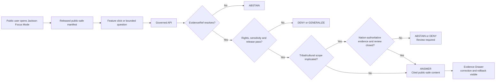
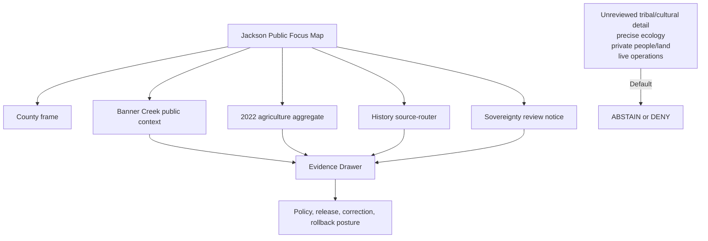
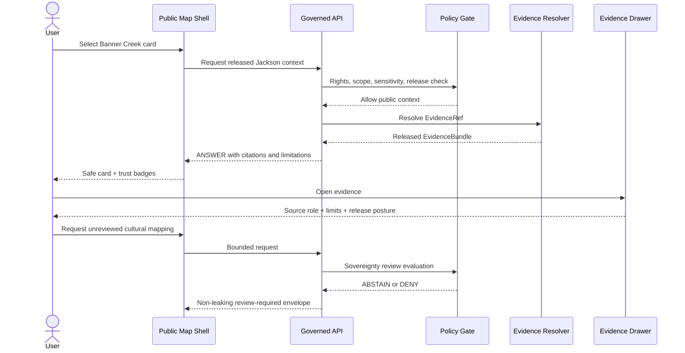
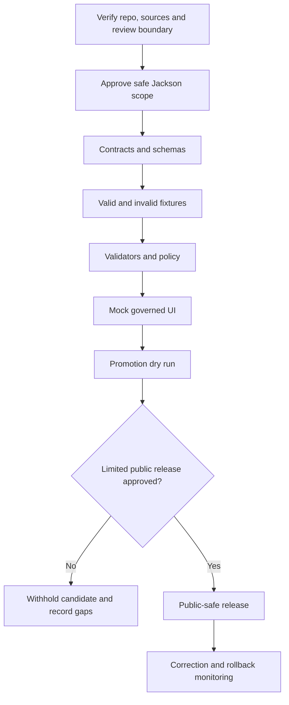

<!--
KFM_META_BLOCK_V2
doc_id: NEEDS_VERIFICATION
title: Jackson County Focus Mode Build Plan
type: standard
version: v0.1
status: draft
owners: [NEEDS_VERIFICATION]
created: 2026-05-22
updated: 2026-05-22
policy_label: public-draft
related:
  - CONFIRMED_DOCTRINE_SOURCE: Directory Rules.pdf
  - PROPOSED / NEEDS_VERIFICATION: docs/dossiers/counties/jackson/jackson_county_focus_mode_build_plan.md
  - PROPOSED / NEEDS_VERIFICATION: contracts/focus/
  - PROPOSED / NEEDS_VERIFICATION: schemas/contracts/v1/focus/
  - PROPOSED / NEEDS_VERIFICATION: policy/focus/
  - PROPOSED / NEEDS_VERIFICATION: release/candidates/focus/counties/jackson/
tags: [kfm, focus-mode, county, jackson-county, banner-creek, agriculture, sovereignty-review, cultural-sensitivity, public-safe]
notes:
  - This file is a PROPOSED county Focus Mode build plan, not a committed repository file or released public artifact.
  - No mounted repository, branch, tests, workflows, runtime trace, dashboard, or release artifact was inspected in this run.
  - All repository paths remain NEEDS_VERIFICATION against current repo evidence, accepted ADRs, and per-root README contracts.
  - Nation-related representation requires Nation-authoritative evidence and appropriate review before public use.
-->

<a id="top"></a>

# Jackson County Focus Mode Build Plan

> **A Banner Creek–Holton public-context proof slice with an explicit sovereignty-review gate for any Prairie Band Potawatomi Nation–related representation.**


| Field | Determination |
|---|---|
| Selected county | **Jackson County, Kansas** |
| Candidate county FIPS | `20085` — **NEEDS_VERIFICATION** before machine-readable fixture creation |
| Build type | County Focus Mode public-safe proof slice |
| Demonstrable first center | **Banner Creek Reservoir + county agriculture aggregate + public scope boundary** |
| High-significance boundary | **Prairie Band Potawatomi Nation–related public representation is withheld until Nation-authoritative evidence and appropriate review are resolved.** |
| Implementation status | **PROPOSED** |
| Repository status in this run | **UNKNOWN** — no repo checkout or implementation evidence inspected |
| Proposed document home | `docs/dossiers/counties/jackson/jackson_county_focus_mode_build_plan.md` — **PROPOSED / NEEDS_VERIFICATION** |
| Recommended milestone | **Jackson Banner Creek Public Context Evidence Drawer Slice** |

**Quick links** — [Operating posture](#1-operating-posture) · [Why this county](#2-why-jackson-county) · [Product thesis](#3-product-thesis) · [Scope boundary](#4-scope-boundary) · [First demo layers](#5-first-demo-layers) · [User journeys](#6-user-journeys) · [UI surfaces](#7-ui-surfaces) · [Governed object model](#8-governed-object-model) · [Repository shape](#9-proposed-repository-shape) · [Build phases](#10-build-phases) · [First PR sequence](#11-first-pr-sequence) · [Acceptance checklist](#12-acceptance-checklist) · [Fixture plan](#13-fixture-plan) · [Risk register](#14-risk-register) · [Source seeds](#15-source-seed-list) · [Verification questions](#16-open-verification-questions) · [First milestone](#17-recommended-first-milestone)

---

## Executive build note

**PROPOSED county choice.** Jackson County is a high-value next proof slice because it can launch with safe, official public context while deliberately proving that certain representations require a higher authority and review threshold. The county’s official site highlights Banner Lake/Banner Creek Reservoir and links public history resources. Its official reservoir page states that more than 25 species of birds have been seen there since the lake opened in 1997. The Kansas Department of Agriculture reports **783 farms**, **263,210 acres**, and **$91 million in crop and livestock sales in 2022**, according to the USDA 2022 Census of Agriculture.[^jackson-home][^banner-reservoir][^kda-ag]

The county is especially useful for KFM governance because a complete public narrative could implicate Prairie Band Potawatomi Nation–related geography, history, culture, language, or cultural resources. This plan does **not** assert or map that scope. It establishes a controlled outcome: such content remains withheld until Nation-authoritative evidence, representation permissions, sensitivity treatment, and appropriate review are verified.

> [!IMPORTANT]
> **The first safe release is intentionally narrow:** county orientation, Banner Creek public context, 2022 agriculture aggregate, a source-router card, and a visible sovereignty/cultural-review boundary.

> [!WARNING]
> A county map, county history link, third-party summary, or generated narrative must never be allowed to stand in for Nation-authoritative evidence or cultural authority.

---

## 1. Operating posture

### 1.1 Governing rules

| KFM rule | Jackson County consequence |
|---|---|
| EvidenceBundle outranks generated language. | Every visible claim resolves to released evidence or returns `ABSTAIN`, `DENY`, or `ERROR`. |
| Public clients use governed interfaces only. | Public UI consumes governed API envelopes and released public-safe artifacts only; never RAW, WORK, QUARANTINE, candidates, internal stores, or direct model output. |
| Publication is a governed state transition. | No card/layer is public until evidence, rights, sensitivity, review, policy, release, correction, and rollback gates close. |
| Sovereignty is not optional metadata. | Nation-related content remains withheld until Nation-authoritative evidence and required review/permission posture are resolved. |
| Public availability is not release permission. | An official public webpage can be a source seed without authorizing transformation, republishing, or map exposure. |
| Maps and AI remain downstream carriers. | Tiles, cards, graph projections, timelines, and generated prose are not sovereign truth. |
| Cite-or-abstain is default. | Missing authority, unclear rights, absent review, stale operations, or unsupported inference blocks the answer. |
| Sensitive detail fails closed. | Cultural/sacred/burial locations, sensitive ecology, living-person/ownership detail, public-safety operations, and vulnerabilities are denied, omitted, or reviewed/generalized. |

### 1.2 Truth labels

| Label | Meaning |
|---|---|
| **CONFIRMED** | Verified in this run from cited official public sources or supplied KFM doctrine. |
| **PROPOSED** | A design or change plan not verified as implemented. |
| **NEEDS_VERIFICATION** | Checkable before implementation or release, but unresolved here. |
| **UNKNOWN** | Not sufficiently supported in this run. |
| **ANSWER / ABSTAIN / DENY / ERROR** | Finite governed public outcomes. |

### 1.3 Trust membrane



### 1.4 Non-negotiable guardrails

> [!WARNING]
> **Sovereignty/cultural boundary.** Do not publish Nation-related land, governance, culture, language, sacred/burial, treaty, cultural-resource, or Indigenous-route narratives or geometry until the appropriate evidence and review posture is established.

> [!CAUTION]
> **Banner Creek ecology boundary.** Public recreation and bird-watching context does not support exact observation, nesting, roosting, sensitive-species, habitat-management, or hunting-condition layers.

> [!WARNING]
> **People/land boundary.** County historical resources or future parcel sources must not produce living-person, family-history, owner, tax, title, or private-access claims on public surfaces.

> [!WARNING]
> **Operations boundary.** Focus Mode is not a current boating, hunting, reservoir safety, flood, road-condition, emergency, or public-safety authority.

---

## 2. Why Jackson County

### 2.1 Proof-slice rationale

| Public question | Jackson anchor | KFM proof requirement |
|---|---|---|
| Can a useful county view begin with safe public information? | Banner Creek Reservoir; Holton orientation; agriculture aggregates. | A limited product can still be evidence-rich and usable. |
| Can recreation/nature context be displayed without harmful precision? | Official Banner Creek nature/recreation content. | Public context allowed; exact ecology and current operations withheld. |
| Can agriculture remain aggregate? | KDA/USDA 2022 totals. | No property, operator, or vulnerability inference. |
| Can omission be transparent? | Withheld tribal/cultural/ecological/private/operational scope. | Evidence Drawer and denial panels state why, without leakage. |
| Can sovereignty be a release gate? | Nation-related representation class. | `sovereignty_review_required` is testable and blocks premature publication. |
| Can history be routed without being invented? | County history source page. | Source-router card precedes narrative synthesis. |

### 2.2 Distinct value in the county series

| Prior series pressure | Jackson County adds |
|---|---|
| Ecology sensitivity in refuge/wetland plans | Reservoir public context coupled to a separate sovereignty/cultural authority boundary. |
| Public-history anchors elsewhere | A requirement to distinguish county history leads from Nation-authoritative history. |
| Parcel/privacy limits | A test that future overlays cannot define tribal/cultural or ownership truth. |
| Aggregates and place cards | A narrow public slice designed specifically to make abstention visible and valuable. |

### 2.3 Public benefit and governance value

**Public benefit:** Users can explore Banner Creek Reservoir and Jackson County’s agricultural scale with visible citations, time basis, limitations, and evidence access.

**Governance value:** KFM demonstrates it will not generate a more dramatic cultural or tribal narrative when authority and review are unresolved.

---

## 3. Product thesis

**Jackson County Focus Mode should launch as a public-safe Banner Creek and agriculture evidence slice, while visibly enforcing a sovereignty-aware review gate that prevents public release of unreviewed Prairie Band Potawatomi Nation–related claims, geometries, or narratives.**

| Product promises | Product does not promise |
|---|---|
| Public-safe county orientation and Banner Creek context. | Tribal/cultural mapping or narrative before appropriate evidence/review. |
| 2022 agriculture aggregate with citations. | Parcel, farm-operator, owner, title, or genealogical inference. |
| Evidence Drawer for each consequential card. | Exact ecological observations or habitat-sensitive guidance. |
| Visible review-required and withheld-detail posture. | Current boating/hunting/safety/flood/road advice. |
| Finite outcomes and rollback-aware release design. | Unbounded AI historical synthesis. |

---

## 4. Scope boundary

### 4.1 Included in the first slice

| Included scope | Use | Public posture |
|---|---|---|
| Jackson County frame and safe named-place orientation | Establish navigation. | Geometry authority/terms **NEEDS_VERIFICATION** before release. |
| Banner Creek Reservoir public context | County-authored place/recreation anchor. | Reservoir-scale representation only. |
| Banner Creek bounded nature-context statement | Demonstrate limited public environmental content. | Text/card only; no location intelligence. |
| County agriculture aggregate | Display 2022 county statistics. | Aggregate-only card. |
| County history portal | Future source intake lead. | Source-router card, not released synthesized history. |
| Sovereignty-review notice | Explain intentional withholding. | Policy explanation only; no unverified Nation-related facts. |

### 4.2 Deferred or denied

| Content class | Outcome | Reason |
|---|---|---|
| Nation-related land/culture/governance/history/language/treaty/cultural-place representation without appropriate authority/review | `ABSTAIN` / `DENY` | Sovereignty and cultural authority. |
| Sacred, burial, archaeological or culturally sensitive locations | `DENY` | Harm and sensitivity risk. |
| Exact ecological observations, nests/roosts, sensitive species or hunting hot spots | `DENY` or reviewed coarse transform only | Geoprivacy/ecological harm. |
| Ownership, title, tax, living-person or genealogical association | `DENY` | Privacy and source-role misuse. |
| Current safety, regulation, emergency, flood or road guidance | `ABSTAIN` and route to official authority | KFM is not an operations service. |
| Critical infrastructure or vulnerability detail | `DENY` or generalize | Public safety risk. |
| RAW, WORK, QUARANTINE, unpublished candidates, canonical/internal stores, direct model outputs | `DENY` | Trust-membrane violation. |

---

## 5. First demo layers

| Priority | Layer / card | Purpose | Source seed | Gate | Status |
|---:|---|---|---|---|---|
| 0 | County frame and safe named places | Orientation. | Boundary/place authority **NEEDS_VERIFICATION**. | Rights/version/release. | **PROPOSED** |
| 1 | Banner Creek public-context card/layer | Safe place anchor. | Official county reservoir page. | Public context only; no operational/sensitive inference. | **PROPOSED** |
| 1 | Agriculture aggregate card | 783 farms / 263,210 acres / $91M in 2022 sales. | KDA/USDA. | Aggregate-only; cited. | **PROPOSED** |
| 1 | Sovereignty-review explainer | Show why specific scope is withheld. | KFM policy + Nation source candidate. | No substantive Nation-related claim without review. | **PROPOSED** |
| 2 | County history source-router card | Show future evidence path. | Official county history page. | “Source lead, not normalized narrative.” | **PROPOSED** |
| 2 | Banner Creek nature-context text card | Bounded official public statement. | Official reservoir page. | No occurrence geometry or safety advice. | **PROPOSED** |
| Deferred | Hydrology/floodplain context | Later water/flood narrative. | State/federal official source **NEEDS_VERIFICATION**. | Status/time/safety/rights checks. | **DEFER** |
| Deferred | Transportation context | Later dated mobility card. | KDOT **NEEDS_VERIFICATION**. | No current routing/status. | **DEFER** |
| Denied initially | Unreviewed cultural/tribal, precise ecology, ownership/genealogy, operations | Prove fail-closed behavior. | Not admitted. | Policy tests. | **DENY** |



---

## 6. User journeys

| Journey | User action | Governed response | Boundary proven |
|---|---|---|---|
| Public place orientation | Open Jackson Focus Mode. | County/Banner Creek safe entry cards. | Narrow scope is explicit. |
| Reservoir context | Select Banner Creek. | Cited public-context card and Evidence Drawer. | No live safety or ecological precision. |
| Agricultural scale | Select agriculture card. | Official 2022 aggregate values and limitations. | No parcel/farmer inference. |
| Source discovery | Select county history resource. | Source-router panel, not AI history. | Intake precedes synthesis. |
| Intentional withholding | Open review-required notice. | Explains sovereignty/cultural safeguard. | No hidden-content leakage. |
| Unreviewed cultural request | Ask for tribal/cultural mapping or narrative. | `ABSTAIN` / `DENY` pending authority and review. | Sovereignty gate. |
| Sensitive ecology request | Ask for exact bird/nest locations. | `DENY`. | Geoprivacy. |
| Ownership/genealogy request | Ask who owns/whose family is tied to land. | `DENY`. | People/land minimization. |
| Live safety request | Ask whether hunting/boating is allowed or safe today. | `ABSTAIN`; official-current-source direction. | Operations boundary. |
| Candidate access | Attempt unreleased layer. | `DENY`. | Trust membrane. |

---

## 7. UI surfaces

| Surface | Jackson content | Must show | Must never do |
|---|---|---|---|
| Focus header | County, Banner Creek scope, release badge, review-required badge. | Public-safe/incomplete-by-design message. | Suggest comprehensive cultural coverage. |
| Map canvas | Safe county context and reservoir-scale layer. | Source-role legend and released state. | Load unreviewed cultural, exact ecology, owner or live-operational data. |
| Layer drawer | Banner Creek, agriculture, source-router, review notice. | Evidence/sensitivity status. | Hide sensitive client-loaded layers. |
| Context card | Bounded summary. | Evidence Drawer, citations, time basis, limitation. | Provide uncited narrative. |
| Evidence Drawer | EvidenceBundle projection. | Source role, scope, policy, release, correction and rollback. | Reveal excluded fields. |
| Sovereignty-review panel | Reason for withheld scope. | Review-required status and safe next step. | Invent or imply Nation-related spatial/history content. |
| Denial panel | Cultural/ecology/privacy/operations refusals. | Non-leaking reason category. | Confirm feature existence. |
| Answer panel | Bounded questions. | `ANSWER / ABSTAIN / DENY / ERROR`. | Direct model or candidate data response. |

### Legend vocabulary

| Label | Meaning | Example |
|---|---|---|
| **Public county context** | Released safe official place description. | Banner Creek card. |
| **Authoritative aggregate** | Official statistic with year/scope. | Agriculture card. |
| **Source lead** | Candidate resource not yet normalized as narrative. | County history portal. |
| **Review required** | Content withheld pending authority/review. | Nation-related representation. |
| **Withheld/generalized** | Detail removed for sensitivity. | Ecology/cultural/private detail. |
| **Not operational advice** | Context cannot guide present action. | Reservoir safety/rules requests. |



---

## 8. Governed object model

| Governed object | Purpose in Jackson slice | Minimum contents | Status |
|---|---|---|---|
| `CountyFocusModeManifest` | Declares public-safe cards/layers. | county ID, scope, layer/card refs, policy profile, evidence/release/correction/rollback refs. | **PROPOSED** |
| `SourceDescriptor` | Registers source role and allowable use. | authority, character, time basis, rights, sensitivity, allowed claims, limitations. | Reuse if present; **NEEDS_VERIFICATION**. |
| `PublicContextCard` | Renders Banner Creek context. | claim, EvidenceRef, time basis, limitation, release/policy refs. | **PROPOSED** |
| `AgricultureAggregateSnapshot` | Carries county statistics. | year, units/measures, source and limitation. | **PROPOSED** |
| `SourceRouterCard` | Shows candidate source without normalized narrative. | source ref, source class, intake status, authority limitation. | **PROPOSED** |
| `SovereigntyReviewRequirement` | Blocks content class pending authority/review. | trigger, required evidence/review, public message, release prohibition. | **PROPOSED** |
| `CulturalSensitivityDecision` | Records deny/generalize/review logic. | scope, outcome, reason, reviewer/transform refs. | **PROPOSED / NEEDS_VERIFICATION** |
| `EvidenceRef` / `EvidenceBundle` | Resolves claims to inspectable support. | source, spatial/time scope, rights, sensitivity, review/release state, limitations. | Reuse shared family if present. |
| `PolicyDecision` | Records allowed outcome and obligations. | outcome, reason codes, transformations/review refs. | Reuse shared family. |
| `CitationValidationReport` | Blocks unsupported language. | claim refs, evidence refs, result and failures. | Reuse if present. |
| `RuntimeResponseEnvelope` | Public finite outcome. | outcome, citations, reason codes, evidence/policy/release refs, limitations. | Reuse if present. |
| `ReleaseManifest` | Records public promotion/rollback. | artifacts/cards, evidence/policy/review closure, correction and rollback targets. | Reuse if present. |
| `AIReceipt` | Records generated interpretation. | evidence refs, process/model ref, citation/policy result, outcome. | Reuse if present. |

### Source-role anti-collapse rules

| Evidence character | Must remain distinct from | Reason |
|---|---|---|
| County reservoir page | Live safety, water quality, ecological occurrence or regulation authority | Public place context is bounded. |
| County history source page | Tribal history, genealogy or cultural authority | A resource link is not comprehensive evidence. |
| Agriculture aggregate | Parcel/farmer/owner inference | Aggregate must remain aggregate. |
| Nation-authoritative source, when obtained | County or third-party narrative | Sovereignty cannot be substituted. |
| Review-required notice | Substantive claim about tribal/cultural places | It supports withholding only. |
| AI output | Evidence, permission, review or release | Generated language is downstream. |

### Minimal public response example

```json
{
  "schema_version": "v1",
  "object_type": "RuntimeResponseEnvelope",
  "scope": {"county": "Jackson County, Kansas", "theme": "banner_creek_public_context"},
  "outcome": "ANSWER",
  "claims": [{
    "claim_id": "jackson-banner-creek-public-context-v1",
    "evidence_bundle_ref": "NEEDS_VERIFICATION",
    "citations": ["SEED-002-JACKSON-BANNER"],
    "limitations": [
      "Public reservoir context only.",
      "Not current safety, regulation, water quality, sensitive ecology or cultural-resource guidance."
    ]
  }],
  "policy_decision_ref": "NEEDS_VERIFICATION",
  "release_manifest_ref": "NEEDS_VERIFICATION",
  "rollback_ref": "NEEDS_VERIFICATION"
}
```

---

## 9. Proposed repository shape

### Directory Rules basis

**CONFIRMED doctrine basis.** *Directory Rules.pdf* states that placement encodes responsibility, lifecycle, and governance; topic alone does not justify a root folder; quoted paths remain proposed until checked against repository evidence; the default schema home is `schemas/contracts/v1/<…>`; and the lifecycle is `RAW → WORK / QUARANTINE → PROCESSED → CATALOG / TRIPLET → PUBLISHED`, with promotion as a governed state transition.

> [!IMPORTANT]
> The paths below are **PROPOSED / NEEDS_VERIFICATION**, not claims about the current repository.

| Responsibility | Proposed path candidate | Status / gate |
|---|---|---|
| County plan | `docs/dossiers/counties/jackson/jackson_county_focus_mode_build_plan.md` | Verify existing county-plan convention. |
| County orientation | `docs/dossiers/counties/jackson/README.md` | Create only if parent convention approved. |
| Semantic contract | `contracts/focus/county_focus_mode_manifest.md` | Verify existing contracts and avoid duplicate family. |
| Schemas | `schemas/contracts/v1/focus/` | Default under doctrine; verify current ADR/repo. |
| Fixtures | `fixtures/focus/counties/jackson/{valid,invalid}/` | Synthetic/public-safe only. |
| Validators | `tools/validators/focus/` | Verify existing validation lane. |
| Policy | `policy/focus/` | Verify current policy root/vocabulary. |
| Tests | `tests/focus/counties/jackson/` | Required for gates and outcomes. |
| Candidate release | `release/candidates/focus/counties/jackson/` | Verify release convention. |
| Published output | `data/published/focus/counties/jackson/` | Public-safe after promotion only. |

```text
# PROPOSED / NEEDS_VERIFICATION — planning tree only
docs/dossiers/counties/jackson/
  README.md
  jackson_county_focus_mode_build_plan.md
contracts/focus/
  county_focus_mode_manifest.md
  sovereignty_review_requirement.md
schemas/contracts/v1/focus/
  county_focus_mode_manifest.schema.json
  public_context_card.schema.json
  agriculture_aggregate_snapshot.schema.json
  source_router_card.schema.json
  sovereignty_review_requirement.schema.json
fixtures/focus/counties/jackson/
  valid/
  invalid/
policy/focus/
  public_county_focus.rego
  jackson_sovereignty_cultural_public_safety.rego
tools/validators/focus/
tests/focus/counties/jackson/
release/candidates/focus/counties/jackson/
data/published/focus/counties/jackson/
```

### Placement prohibitions

| Shortcut rejected | Reason |
|---|---|
| New root `jackson/`, `banner_creek/`, `tribal/`, or `history/` folder | Topic is not a responsibility root. |
| Cultural/review policy hidden in UI or narrative docs | Trust decisions require policy/contracts/tests. |
| Schemas next to source downloads or map artifacts | Separate schema/data/docs/publication responsibilities. |
| Sensitive content in public test fixtures | Testing must not recreate exposure risk. |
| Tribal/cultural layer from county overlays or generated prose | Violates authority and review posture. |
| Direct RAW/candidate/internal/model reads by UI | Violates trust membrane. |

---

## 10. Build phases

| Phase | Goal | Deliverables | Exit gate | Rollback |
|---:|---|---|---|---|
| 0 | Verify repo/source/review boundary | Repo/ADR/README scan, source/rights register, Nation-authority/review plan. | Paths and authority gaps recorded. | No mutation. |
| 1 | Establish safe scope | Approved plan, source seed ledger, exclusion matrix. | Review confirms narrow first slice. | Revert docs. |
| 2 | Define object minimum | Manifest, cards, source-router and review-required contract/schema proposals. | No duplicate authority family; schema checks. | Revert schema wave. |
| 3 | Prove fail-closed fixtures | Valid and invalid fixture suite. | Invalid fixtures deterministically block. | Revert tests/fixtures. |
| 4 | Add validators/policy | Evidence, citation, review-required, sensitivity, rights, release checks. | Finite outcomes and reason codes pass. | Revert gates; release blocked. |
| 5 | Mock governed UI | Released-fixture-only cards/map/Evidence Drawer/denial panels. | No bypass; accessibility validation. | Disable county registration. |
| 6 | Promotion dry run | Candidate manifest, reports, receipts/proofs, correction/rollback mock. | Candidate isolation and rollback proven. | Discard candidate. |
| 7 | Optional release | Explicitly approved limited public scope only. | Monitoring/correction/rollback ready. | Withdraw/rollback. |



---

## 11. First PR sequence

| PR | Purpose | Contents | Must not include | Acceptance |
|---:|---|---|---|---|
| PR-00 | Verification | Repo/path inventory; Directory Rules crosswalk; source/right/review backlog. | Live ingestion or asserted tribal/cultural scope. | Unknowns explicit. |
| PR-01 | Documentation control | Plan; optional README; seed ledger; scope/exclusion matrix. | Map release or sensitive data. | Safe scope reviewed. |
| PR-02 | Contract/schema minimum | Manifest/card/router/review-required shapes and shared-family mapping. | Duplicate trust families. | Shape validity. |
| PR-03 | Fixture suite | Safe public cards and invalid sovereignty/cultural/ecology/privacy/operations/bypass fixtures. | Real sensitive data. | Fail-closed tests. |
| PR-04 | Policy/validator gates | Evidence/citation, review, sensitivity, rights, release checks. | Policy embedded only in UI. | Reason-coded outcomes. |
| PR-05 | Mock UI | Released-fixture map/cards/drawer/refusal states/accessibility. | Live sources/direct model/candidate layers. | Trust visible. |
| PR-06 | Dry-run release | Candidate manifest, receipts/proofs, correction and rollback. | Public deployment. | Rollback succeeds. |
| PR-07 | Limited publication | Approved public-safe content only. | Unresolved tribal/cultural/sensitive/operational scope. | Release review complete. |

---

## 12. Acceptance checklist

### Governance and evidence
- [ ] Every visible claim resolves to released evidence or returns `ABSTAIN`, `DENY`, or `ERROR`.
- [ ] Banner Creek, agriculture, history source-router, review requirement and AI output remain distinct source roles.
- [ ] Nation-related public representation requires Nation-authoritative evidence and appropriate review before promotion.
- [ ] Publication closes policy, evidence, citation, review, release, correction and rollback requirements.
- [ ] AI cannot fill withheld cultural/authority gaps.

### Public/sensitive boundary
- [ ] No unreviewed tribal/cultural/language/sacred/burial/treaty/route representation is exposed.
- [ ] No exact sensitive ecology or discovery guidance is exposed.
- [ ] No owner, family/genealogy, tax, title or living-person data is exposed.
- [ ] No current hunting/boating/safety/flood/road or emergency advice is issued.
- [ ] No denial response leaks protected-content existence.

### Product/UI
- [ ] Public UI uses governed API outputs and released public-safe artifacts only.
- [ ] Banner Creek and agriculture cards have Evidence Drawer actions and limitations.
- [ ] Review-required posture is plainly visible.
- [ ] Outcomes are accessible and non-color-dependent.

### Repository/release
- [ ] Paths are verified against repo evidence, Directory Rules, ADRs and root README contracts.
- [ ] No parallel authority homes are introduced without governance action.
- [ ] Fixtures contain no restricted or private detail.
- [ ] Promotion dry run and rollback drill pass before publication.

---

## 13. Fixture plan

### 13.1 Valid fixtures

| Fixture ID | Scenario | Expected outcome | Proof |
|---|---|---|---|
| `valid_jackson_manifest_public_safe_v1` | Manifest contains safe cards and review notice only. | `ANSWER` eligible. | No denied display layers. |
| `valid_banner_creek_public_context_v1` | County reservoir context card. | `ANSWER`. | Non-operational limitation visible. |
| `valid_banner_nature_text_context_v1` | Bounded bird-watching text card. | `ANSWER`. | No location intelligence. |
| `valid_kda_agriculture_2022_aggregate_v1` | Aggregate statistic card. | `ANSWER`. | No parcel/operator fields. |
| `valid_history_source_router_v1` | Official history resource lead. | `ANSWER`. | Not synthesized narrative. |
| `valid_sovereignty_review_notice_v1` | Withholding explanation. | `ANSWER`. | No implied/hidden content leak. |

### 13.2 Invalid fixtures

| Fixture ID | Invalid condition | Expected outcome | Reason code family |
|---|---|---|---|
| `invalid_unreviewed_tribal_geometry_v1` | Nation-related geometry without authority/review. | `ABSTAIN` / `DENY`. | `sovereignty.authority_review_required` |
| `invalid_generated_nation_history_v1` | Generated Nation-related narrative without admitted support. | `ABSTAIN`. | `sovereignty.authority_review_required` / `citation.missing_support` |
| `invalid_cultural_site_precision_v1` | Sacred/burial/cultural-resource locations. | `DENY`. | `cultural.sensitive_location` |
| `invalid_sensitive_bird_discovery_v1` | Exact species/nest/roost guidance. | `DENY`. | `ecology.exact_sensitive_geometry` |
| `invalid_current_reservoir_advice_v1` | Current legality/safety answer from context source. | `ABSTAIN`. | `operational.current_authority_required` |
| `invalid_owner_genealogy_v1` | Owner or family-land inference. | `DENY`. | `privacy.person_land_detail` |
| `invalid_aggregate_parcel_inference_v1` | Agriculture aggregate to parcel claim. | `DENY`. | `privacy.aggregate_reidentification_risk` |
| `invalid_unresolved_evidence_ref_v1` | Missing evidence bundle. | `ABSTAIN` / `ERROR`. | `evidence.unresolved_ref` |
| `invalid_candidate_layer_v1` | Candidate/RAW/WORK content requested publicly. | `DENY`. | `release.not_published` / `trust_membrane.bypass` |
| `invalid_denial_leak_v1` | Refusal confirms protected feature exists. | `DENY` / rewrite. | `sensitivity.existence_leak` |
| `invalid_rights_unknown_export_v1` | Public derivative without terms decision. | `DENY` / quarantine. | `rights.unknown_for_redistribution` |

### 13.3 Test matrix

| Test family | Required coverage | Pass condition |
|---|---|---|
| Manifest/schema | Valid manifest, unresolved ref, candidate layer. | Valid passes; invalid fails. |
| Sovereignty/cultural | Review notice, unreviewed geometry/narrative/site cases. | No public content before authority/review; no leakage. |
| Ecology | Public context versus exact discovery. | Context allowed; precision denied. |
| People/land | Aggregate versus owner/genealogy/parcel inference. | Aggregate allowed; private inference blocked. |
| Operations | Reservoir context versus current safety/regulation answer. | Context allowed; advice abstains. |
| AI/citation | Supported versus unsupported narrative. | Answer only with resolved cited evidence. |
| Release/rollback | Candidate/public mock/rollback. | Candidate isolated; rollback restores safe state. |

---

## 14. Risk register

| Risk ID | Risk | Impact | Mitigation | Release posture |
|---|---|---:|---|---|
| `JAC-R001` | Unreviewed Nation-related geography/history is rendered as authoritative. | Critical | SovereigntyReviewRequirement, Nation-authoritative evidence, review gate and tests. | Deny until closed. |
| `JAC-R002` | Sacred/burial/cultural locations become exposed or inferable. | Critical | Omit initially; cultural policy and leak tests. | Deny. |
| `JAC-R003` | Reservoir context becomes sensitive ecology discovery. | High | Generalized/text-only initial context; geoprivacy tests. | Context only. |
| `JAC-R004` | History source becomes appropriative or genealogical AI narrative. | High | Source-router state; intake/review; citation/person-land tests. | Defer narratives. |
| `JAC-R005` | Agriculture aggregate is reversed into private inference. | High | Aggregate-only schema; no public joins. | Aggregate only. |
| `JAC-R006` | Reservoir page is used for current safety/regulation advice. | High | Not-operational badge and official-current-source direction. | Context only. |
| `JAC-R007` | Rights/terms are unclear for transformed data. | High | Source descriptor; rights review; quarantine until resolved. | No unresolved publish. |
| `JAC-R008` | UI loads candidate/internal/raw/model data. | Critical | Governed manifest/API/no-bypass tests. | Block release. |
| `JAC-R009` | Denial language leaks protected content existence. | Critical | Denial fixtures and human review. | Block on failure. |
| `JAC-R010` | New paths create parallel authority roots. | High | Repo inspection; Directory Rules; ADR/migration note. | Do not land unresolved. |
| `JAC-R011` | Pressure for completeness expands scope before review. | Critical | Narrow milestone and explicit no-go rules. | Withhold expansion. |
| `JAC-R012` | Release lacks correction/rollback. | Critical | ReleaseManifest validation and rollback drill. | Deny publication. |

---

## 15. Source seed list

### 15.1 Official public sources checked for the initial scope

| Seed ID | Source | Character | Initial use | Status and permitted claim scope | Limitation |
|---|---|---|---|---|---|
| `SEED-001-JACKSON-HOME` | Jackson County official website[^jackson-home] | County orientation page | Official entry-point card. | **CONFIRMED source seed**; supports official links to Banner Creek and history resources. | Does not prove rights for map artifacts. |
| `SEED-002-JACKSON-BANNER` | Jackson County, **Banner Creek Reservoir**[^banner-reservoir] | County public place/recreation page | Banner Creek public-context and bounded nature card. | **CONFIRMED source seed**; supports the official page’s statements as accessed. | No exact ecology/current safety/regulation derivative. |
| `SEED-003-KDA-AG` | Kansas Department of Agriculture, **Jackson County**[^kda-ag] | State aggregate statistics | Agriculture card. | **CONFIRMED:** 783 farms, 263,210 acres, $91M sales in 2022. | Aggregate only. |
| `SEED-004-JACKSON-HISTORY` | Jackson County, **History**[^jackson-history] | County source-router page | Future intake/source-router card. | **CONFIRMED source seed**; links public historical resources and research. | Not Nation-authoritative narrative or released KFM synthesis. |

### 15.2 Priority sources requiring verification before expanded scope

| Seed ID | Candidate source | Intended role | Required verification |
|---|---|---|---|
| `SEED-005-PBPN-OFFICIAL` | Prairie Band Potawatomi Nation official site[^pbpn-official] | Required starting point for any Nation-related representation. | Official content access, allowed use, appropriate review/permission and sensitivity posture. |
| `SEED-006-KDA-FLOODPLAIN` | Kansas Current Effective Floodplain Viewer[^kda-floodplain] | Future floodplain/source-status context. | Jackson applicability, date/status, claim limits, rights. |
| `SEED-007-KDOT` | Kansas Department of Transportation source family[^kdot-seed] | Future dated mobility context. | Exact admitted source and not-live-status limitation. |
| `SEED-008-KGS` | Kansas Geological Survey source family[^kgs-seed] | Future geology context. | Exact source, rights and public-safe claim scope. |
| `SEED-009-USDA` | USDA NASS county profile source family[^usda-profile] | Agriculture corroboration. | Exact profile intake and normalization checks. |

### 15.3 Source admission checklist

- [ ] Source authority matches the claim character.
- [ ] Nation-related content has Nation-authoritative evidence and required review/permission posture.
- [ ] Cultural, ecological, people/land and infrastructure sensitivity is evaluated before public display.
- [ ] Rights and derivative/redistribution terms are resolved before artifact publication.
- [ ] Time-sensitive or operational content has freshness/stale-state rules or stays out of public Focus Mode.
- [ ] Public claims resolve to EvidenceBundles and released artifacts.
- [ ] Public availability is not treated as automatic safe republication.

---

## 16. Open verification questions

| ID | Question | Why it matters | Status |
|---|---|---|---|
| `JAC-V001` | Where do current county Focus Mode plan files canonically live in the repo? | Prevent parallel docs authority. | **NEEDS_VERIFICATION** |
| `JAC-V002` | Do Focus Mode/EvidenceBundle/PolicyDecision/ReleaseManifest/RuntimeResponseEnvelope object families already exist? | Reuse authority, avoid duplicate contracts. | **NEEDS_VERIFICATION** |
| `JAC-V003` | Is `schemas/contracts/v1/focus/` the accepted implementation home? | Directory doctrine is not repo proof. | **NEEDS_VERIFICATION** |
| `JAC-V004` | Which boundary and Banner Creek geometry source may be safely released? | Geometry, rights and identity. | **NEEDS_VERIFICATION** |
| `JAC-V005` | What Nation-authoritative sources and review requirements apply before Nation-related representation? | Central sovereignty gate. | **NEEDS_VERIFICATION / RELEASE BLOCKER FOR THAT SCOPE** |
| `JAC-V006` | What cultural/sacred/burial/language representation constraints apply? | Prevent harmful exposure. | **NEEDS_VERIFICATION** |
| `JAC-V007` | What reuse/derivative terms apply to county content and future services? | Prevent rights errors. | **NEEDS_VERIFICATION** |
| `JAC-V008` | Which hydrology/geology/transport sources belong in a later milestone? | Keep first release narrow. | **NEEDS_VERIFICATION** |
| `JAC-V009` | Which reason-code vocabulary already governs sovereignty/cultural/ecology/privacy/operations refusals? | Deterministic tests and UI. | **NEEDS_VERIFICATION** |
| `JAC-V010` | What correction, withdrawal, cache invalidation and rollback mechanisms exist? | Reversible public output. | **NEEDS_VERIFICATION** |
| `JAC-V011` | Is Jackson already reserved by another county-series artifact? | Avoid duplicate plan. | **NEEDS_VERIFICATION**; it is not listed among completed counties supplied in this conversation. |
| `JAC-V012` | Who owns cultural/sovereignty, policy, source, UI and release review duties? | Accountability and separation of duty. | **NEEDS_VERIFICATION** |

---

## 17. Recommended first milestone

### Jackson Banner Creek Public Context Evidence Drawer Slice

**PROPOSED milestone.** Deliver a fixture-first, no-live-publication proof in which a public user opens Jackson County, sees a safe county/Banner Creek public-context card and 2022 agriculture card, opens an Evidence Drawer for source and limitation inspection, and sees a clear review-required notice stating why Nation-related cultural/geographic scope, precise ecology, private people/land detail, and live operations are not provided in the initial public view.

| Deliverable | Minimum acceptance |
|---|---|
| Approved county plan and source ledger | Truth labels, placement decision, citations and scope boundary reviewed. |
| Valid `CountyFocusModeManifest` fixture | Contains safe cards only; denied/review-required content not rendered. |
| Banner Creek context card | Citation, limitation, release posture and drawer action present. |
| Agriculture aggregate card | Year, units, citation and aggregate-only limitation present. |
| History source-router card | Clearly marked as a source lead rather than synthesized narrative. |
| Sovereignty-review notice | Withholds content without making substantive unverified assertions. |
| Invalid fixture suite | Unreviewed tribal/cultural, ecology, privacy, operational and bypass cases fail closed. |
| Policy/validator harness | Expected reason-coded finite outcomes pass. |
| Promotion dry-run package | Candidate remains non-public; correction/rollback mock succeeds. |

### Definition of done

- [ ] Placement and object-family reuse verified or governed before landing files.
- [ ] No unreviewed Nation-related content is rendered or generated.
- [ ] No precise cultural/ecological/private/operational content is exposed or inferable.
- [ ] Visible claims carry evidence, time basis, limitations and release posture.
- [ ] Invalid fixtures deterministically yield `ABSTAIN`, `DENY`, or `ERROR` without leakage.
- [ ] AI, if included, cannot answer outside released evidence and emits an approved receipt.
- [ ] Promotion dry run proves evidence, policy, review, correction and rollback closure.

### Go / no-go

| Condition | Decision |
|---|---|
| Limited Banner Creek/agriculture/source-router scope passes all gates and receives explicit release approval. | **GO** for limited public-safe release. |
| Rights, evidence, policy, path placement or rollback is unresolved. | **NO-GO**; keep as candidate. |
| Scope expands to Nation-related representation before authority/review closure. | **DENY expansion** pending separate reviewed proposal. |
| Scope expands to precise ecology, private detail or live operations. | **DENY expansion** for normal public Focus Mode. |

---

## Appendix A — Negative-path reason categories

| Reason category | User-visible posture |
|---|---|
| `sovereignty.authority_review_required` | This representation requires appropriate Nation-authoritative evidence and review before it can appear in this public view. |
| `cultural.sensitive_location` | Precise culturally sensitive location detail is not provided in this public view. |
| `ecology.exact_sensitive_geometry` | Sensitive ecological detail is withheld or generalized. |
| `privacy.person_land_detail` | This public view does not disclose individual ownership or family-linked land detail. |
| `privacy.aggregate_reidentification_risk` | County aggregates are not used to infer private parcel or operator detail. |
| `operational.current_authority_required` | Use the responsible official source for current operational or safety decisions. |
| `evidence.unresolved_ref` | This claim cannot be supported from released evidence. |
| `rights.unknown_for_redistribution` | This representation is not approved for public redistribution. |
| `release.not_published` | Candidate or internal material is not available on the public surface. |
| `citation.missing_support` | A supported answer cannot be produced from released cited evidence. |
| `sensitivity.existence_leak` | Additional detail cannot be provided in this public context. |

---

## Appendix B — References

[^jackson-home]: Jackson County, Kansas, official website, accessed 2026-05-22. [Source page](https://www.jacksoncountyks.com/).
[^banner-reservoir]: Jackson County, Kansas, **Banner Creek Reservoir**, official county page, accessed 2026-05-22. [Source page](https://www.jacksoncountyks.com/202/Banner-Creek-Reservoir).
[^kda-ag]: Kansas Department of Agriculture, **Jackson County**, data according to the USDA 2022 Census of Agriculture, accessed 2026-05-22. [Source page](https://www.agriculture.ks.gov/kansas-agriculture/kansas-agricultural-statistics/jackson-county).
[^jackson-history]: Jackson County, Kansas, **History**, official county page, accessed 2026-05-22. [Source page](https://www.jacksoncountyks.com/226/History).
[^pbpn-official]: Prairie Band Potawatomi Nation, official site source seed. Content retrieval was blocked in this planning run; substantive use remains **NEEDS_VERIFICATION**. [Source seed](https://www.pbpindiantribe.com/).
[^kda-floodplain]: Kansas Department of Agriculture, **Kansas Current Effective Floodplain Viewer**, candidate source; Jackson-specific use remains **NEEDS_VERIFICATION**. [Source seed](https://gis2.kda.ks.gov/gis/ksfloodplain/).
[^kdot-seed]: Kansas Department of Transportation, candidate Jackson County source family; exact admitted source remains **NEEDS_VERIFICATION**. [Source seed](https://www.ksdot.gov/).
[^kgs-seed]: Kansas Geological Survey, candidate Jackson County source family; exact admitted source remains **NEEDS_VERIFICATION**. [Source seed](https://www.kgs.ku.edu/).
[^usda-profile]: USDA National Agricultural Statistics Service, candidate Jackson County profile source family; normalized intake remains **NEEDS_VERIFICATION**. [Source seed](https://www.nass.usda.gov/Publications/AgCensus/2022/Online_Resources/County_Profiles/Kansas/).

---

> **Status at handoff:** **PROPOSED** public-safe Jackson County Focus Mode Build Plan. Official county and KDA public source seeds were checked for the initial safe scope. Any Prairie Band Potawatomi Nation–related public representation is intentionally withheld pending Nation-authoritative evidence and appropriate review. Repository implementation, path placement, schemas, validators, policy, release, correction and rollback machinery remain **NEEDS_VERIFICATION** or **UNKNOWN**.
