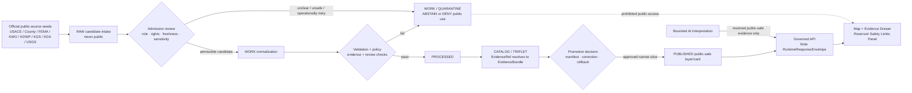
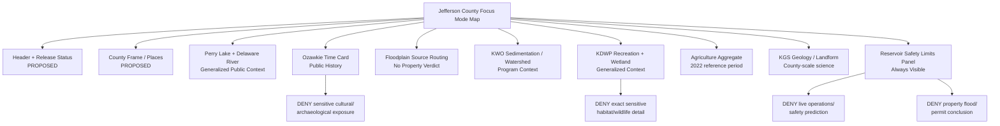
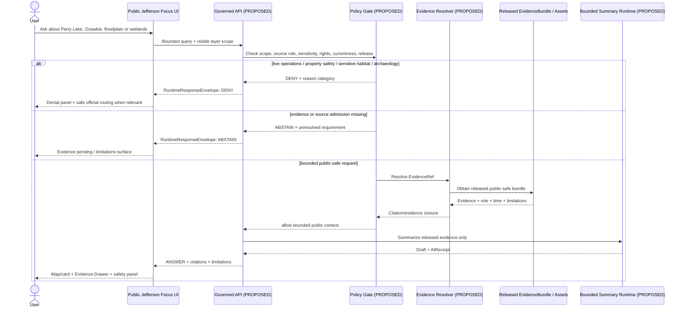
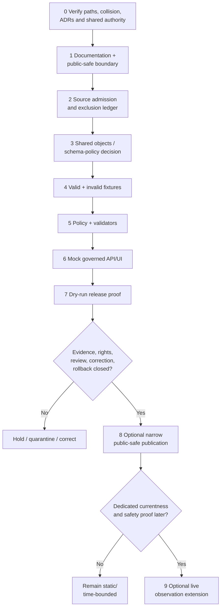

<!-- KFM_META_BLOCK_V2
doc_id: NEEDS_VERIFICATION
title: Jefferson County Focus Mode Build Plan
type: standard
version: v1
status: draft
owners: [NEEDS_VERIFICATION]
created: 2026-05-22
updated: 2026-05-22
policy_label: public_draft
repository_path: NEEDS_VERIFICATION — candidate only: docs/focus-modes/jefferson-county/jefferson_county_focus_mode_build_plan.md
schema_contract_policy_homes: NEEDS_VERIFICATION — verify shared homes and ADRs before creating any county extension
review_assignments: NEEDS_VERIFICATION — reservoir/flood-risk, ecological-sensitivity, cultural/archaeological, rights, documentation and release review duties must be assigned before publication
correction_path: NEEDS_VERIFICATION
rollback_path: NEEDS_VERIFICATION
release_status: NEEDS_VERIFICATION — no implementation, admission, promotion or publication claimed
related:
  - Directory Rules.pdf (consulted during this run; canonical placement doctrine within supplied materials)
  - KFM county Focus Mode completed-county register supplied in the series prompt, with Doniphan County added as completed by the immediately prior run
tags: [kfm, focus-mode, jefferson-county, perry-lake, delaware-river, reservoir, floodplain, sedimentation, wetlands, agriculture, ozawkie, public-safe-boundary]
notes:
  - CONFIRMED: Jefferson County is absent from the supplied completed-county register and is not Doniphan County, the immediately preceding generated slice.
  - CONFIRMED: Available project materials were searched in this run for Jefferson County Focus Mode build-plan collisions; no Jefferson County plan was returned.
  - NEEDS_VERIFICATION: No live KFM repository tree, branch, ADR set, route implementation, schemas, policies, fixtures, releases, dashboards or CI results were inspected in this run.
  - PROPOSED: This plan selects Jefferson County as the next reservoir-governance and public-safety proof slice.
-->

<a id="top"></a>

# Jefferson County Focus Mode Build Plan

> **Product thesis:** Build a public-safe Jefferson County Focus Mode that explains how Perry Lake, the Delaware River, Ozawkie, floodplain governance, reservoir sedimentation, wetlands, public recreation, agriculture and glaciated terrain shape a northeast Kansas county—without exposing operational water-control detail, turning map context into present safety or legal judgment, or publishing sensitive habitat or cultural-site information.


| Identity / status field | Determination |
|---|---|
| Selected county | **Jefferson County, Kansas** |
| Selection status | **PROPOSED** as the next KFM county proof slice. |
| Completed-register status | **CONFIRMED** against the series register provided in the prior request plus the immediately preceding Doniphan output: Jefferson County is not among the completed counties. |
| Available-material collision check | **CONFIRMED** for this run: searches of accessible project materials for `Jefferson County Focus Mode Build Plan`, `jefferson_county_focus_mode_build_plan.md`, and Jefferson/Perry/Focus Mode did not return a Jefferson County plan. |
| Full collision verification | **NEEDS_VERIFICATION** because a live repository and all project stores were not inspected. |
| Distinct proof-slice value | USACE-operated Perry Lake on the Delaware River; county floodplain/NFIP context; Kansas Reservoir Protection Initiative sedimentation/water-supply context; Perry wetlands and public recreation; agricultural aggregates; Ozawkie relocation/public memory; KGS glacial/alluvial geology. |
| Most consequential public-safe boundary | **Reservoir operations and public-safety meaning:** live water levels, flood risk, reservoir releases, dam/outlet operations, closures, protection assumptions or downstream vulnerability must not be presented as KFM-generated operational guidance, engineering judgment or property-safety assurance. |
| Closely linked ecological boundary | Exact marsh-management, wildlife-concentration, sensitive habitat or species-location information is not a default public layer merely because a public source contains detail. |
| Document posture | Planning artifact only; official public-source seeds checked during this run; no source admitted, no artifact published, no repository modified. |
| Directory placement posture | **PROPOSED / NEEDS_VERIFICATION:** candidate human-documentation home under `docs/focus-modes/jefferson-county/`; verify against live repo and ADRs before landing. |
| First milestone | **Jefferson Reservoir-Context Trust Membrane Proof** |

## Quick links

[Executive build note](#executive-build-note) · [Evidence boundary](#evidence-boundary-table) · [Operating posture](#1-operating-posture) · [Why this county](#2-why-this-county) · [Product thesis](#3-product-thesis) · [Scope boundary](#4-scope-boundary) · [First demo layers](#5-first-demo-layers) · [User journeys](#6-user-journeys) · [UI surfaces](#7-ui-surfaces) · [Governed object model](#8-governed-object-model) · [Repository shape](#9-proposed-repository-shape) · [Build phases](#10-build-phases) · [PR sequence](#11-first-pr-sequence) · [Acceptance](#12-acceptance-checklist) · [Fixtures](#13-fixture-plan) · [Risks](#14-risk-register) · [Sources](#15-source-seed-list) · [Verification](#16-open-verification-questions) · [Milestone](#17-recommended-first-milestone) · [Appendices](#appendix-a--public-safe-narrative-skeleton)

## Executive build note

**PROPOSED.** Jefferson County is an unusually productive next KFM proof slice because Perry Lake is simultaneously a constructed reservoir, a flood-control/water-storage/recreation system, a public wildlife and wetland setting, a force in community landscape change, and part of a state sedimentation/watershed-conservation initiative. The first build should not begin by publishing a rich reservoir map. It should begin by proving that KFM can show public evidence about a managed water landscape while refusing to become a live water-operations, flood-safety, wildlife-exposure or property-advice interface.

> [!CAUTION]
> ## Defining public-safe boundary — a managed reservoir is not a safe target for fluent operational inference
> Jefferson County Focus Mode may explain **publicly documented, time-bounded context** about Perry Lake, the Delaware River, floodplain participation, watershed sedimentation, public recreation and generalized wetland habitat. It must **DENY or ABSTAIN** from answers or layers that infer current dam/release operations, flood protection assurance, current access/closure safety, downstream facility vulnerability, parcel-specific flood or permit conclusions, emergency action, or sensitive habitat/wildlife concentrations. Even when an official source publicly describes operational features or detailed wetland locations, KFM must admit only what is necessary and public-safe for the product purpose.

<a id="evidence-boundary-table"></a>

## Evidence-boundary table

| Truth label | What is supported in this artifact | What is not supported or not yet allowed |
|---|---|---|
| `CONFIRMED` | Jefferson County is not in the completed-county register available to this run; project-material searches did not return an existing Jefferson county plan; `Directory Rules.pdf` was inspected; current official public source pages in §15 were opened and checked; a downloadable Markdown artifact was generated in this run. | No live repository path, implementation, contract/schema existence, policy enforcement, source admission, approved geometry, rights clearance, release, review assignment or publication is confirmed. |
| `PROPOSED` | County selection; proof-slice thesis; UI, layer/card, governed-object, fixture, policy, validator, documentation, repository-path, release and milestone recommendations. | Proposed architecture is not a claim that system behavior exists. |
| `NEEDS_VERIFICATION` | Live repository collision check and path landing; exact source rights/redistribution; geometry/display authority; effective/current flood data and reservoir-status use; protected/sensitive ecology handling; cultural/archaeological review; final correction/rollback homes. | These items cannot be treated as passed release gates. |
| `UNKNOWN` | Existing KFM Jefferson work outside searched materials; existing shared Focus Mode contracts/policies; existing current-source connector behavior; deployment and runtime maturity. | The plan does not infer an answer from missing evidence. |

---

## 1. Operating posture

### KFM governing rules applied to Jefferson County

| KFM rule | Jefferson County consequence |
|---|---|
| EvidenceBundle outranks generated language. | Claims about Perry Lake, floodplain rules, wetlands, sedimentation, Ozawkie history, soils/geology or agriculture require resolvable evidence and explicit allowed scope. |
| Public clients use governed interfaces and released public-safe artifacts. | Public map/UI may never read raw water observations, candidate operational notices, `WORK`, `QUARANTINE`, internal source payloads, unreleased geometry or direct model output. |
| Cite-or-abstain is default. | If source role, time basis, rights, operational currentness or safety boundary is missing, the answer is `ABSTAIN` or `DENY`, not a generated explanation. |
| Publication is a governed state transition. | Rendering a Perry map/card or building a mock response does not make it published. |
| Source roles remain distinct. | USACE operational/public project context, county administrative/floodplain material, FEMA flood hazard authority, KWO watershed program information, KDWP public land/ecology context, KGS scientific geology, and KDA statistical aggregate do not become one truth layer. |
| Policy-aware, fail-safe defaults. | Operational water-control detail, live hazard inference, parcel/legal conclusions, exact sensitive habitat/occurrence and cultural/archaeological detail are excluded or denied unless explicitly cleared for an appropriate public product. |
| AI is interpretive only. | AI can summarize released public-safe evidence; it cannot invent safe reservoir operating conditions, decide flood exposure, infer regulatory compliance or expose sensitive ecology. |
| Correction and rollback are visible. | Future public cards/layers must be correctable or withdrawable when source state, public-safety meaning or rights status changes. |

### Truth-label and finite-outcome key

| Label / outcome | Meaning for this plan |
|---|---|
| `CONFIRMED` | Verified in this run from supplied materials, inspected official public pages, searches of accessible project files or generated output. |
| `PROPOSED` | A future design, path, object, gate, layer, card, UI behavior, workflow or implementation recommendation. |
| `NEEDS_VERIFICATION` | Checkable but not sufficiently verified to support implementation or public release. |
| `UNKNOWN` | Not evidenced in this run. |
| `ANSWER` | A bounded, public-safe response supported by admitted and released evidence. |
| `ABSTAIN` | Evidence/authority/currentness/rights/review is insufficient for a safe response. |
| `DENY` | The request would expose protected detail, create unsafe inference or bypass governance. |
| `ERROR` | The system cannot complete the bounded workflow safely due to failure. |
| `DEFER` | Candidate content intentionally not included in the first public-safe slice. |
| `EXCLUDE` | Content not suitable for public product intake or display. |

### Public trust-membrane flow



### County-specific non-negotiable guardrails

1. **Reservoir operations guardrail.** USACE-operated Perry Lake may be represented as a public managed-water landscape only through admitted, time-stamped, role-labeled evidence. Current release decisions, dam/outlet operational mechanics beyond product need, or vulnerability inference are not default public output.
2. **Flood/public-safety guardrail.** County NFIP participation, FEMA/Kansas flood map availability and official floodplain context do not make KFM an emergency, engineering, insurance, permitting or property-safety authority.
3. **Ecology/geoprivacy guardrail.** Perry Wildlife Area and marsh/waterfowl context may be described at safe generalized scale; exact wildlife concentrations, sensitive species occurrences, management-sensitive locations or live habitat conditions are denied or deferred.
4. **Cultural/archaeological guardrail.** Ozawkie relocation and historical/public-landscape context may be described only from admitted public sources; exact archaeological, burial, culturally sensitive or rights-unclear material remains denied by default.
5. **Working-landscape/privacy guardrail.** County-level agricultural statistics can be displayed with their reference period; no individual farm, landowner, leaseholder or property inference may be generated.
6. **Scientific-role guardrail.** KGS geology/geohydrology context supports geologic interpretation at appropriate scale; it is not a well-yield promise, construction advice, contamination conclusion or individual water-supply determination.
7. **Operational-source minimum-necessary rule.** If a public official source contains detail unnecessary for a public educational slice—such as precise operational facilities, sensitive habitats or emergency-related mechanics—the plan records the source class without reproducing those details in public product content.

---

## 2. Why this county

### Selection screen against the completed-county register

| Screening criterion | Result | Status |
|---|---|---|
| County under consideration | Jefferson County | `PROPOSED` selection |
| County appears in completed series register? | No. It is not among Ellsworth, Riley, Shawnee, Ford, Wyandotte, Sedgwick, Douglas, Leavenworth, Reno, Johnson, Barton, Geary, Finney, Cherokee, Saline, Crawford, Lyon, Cowley, Rice, Atchison, Bourbon, Osage, Coffey, Pottawatomie, Chase, Miami, Dickinson, Stafford, Jackson, Linn, McPherson, Morris, Brown, Cloud, Republic, Morton, Phillips, Barber, Trego, Montgomery, Scott, Kiowa or Doniphan Counties. | `CONFIRMED` within available register/context |
| Collision in available KFM materials? | Searches for Jefferson county Focus Mode/build-plan terminology and filename returned other county plans and doctrine, not a Jefferson county plan. | `CONFIRMED` for accessible materials searched this run |
| Collision in live repo? | No live repository was inspected. | `NEEDS_VERIFICATION` |
| Distinct from completed proof slices? | Yes: centered on a major USACE-operated reservoir, downstream flood-risk meaning, public wetlands/recreation, watershed sedimentation protection, and a community relocated through reservoir construction. | `PROPOSED`, grounded in checked public source anchors |
| Official source availability | County, USACE, FEMA/Kansas floodplain, KWO, KDWP, KDA, KGS and USGS public sources were identified/opened in this run. | `CONFIRMED` source checks; admission still `NEEDS_VERIFICATION` |

### Proof-slice rationale

| Proof dimension | Current official public-source anchor checked in this run | What it enables KFM to test | Public-safe constraint |
|---|---|---|---|
| Managed reservoir and tributary landscape | USACE states that it constructed and operates Perry Dam; Perry Lake is on the Delaware River in Jefferson County and receives inflow from the Delaware and tributaries including Slough, Rock and Evans Creeks. | Reservoir-centered map/story composition with water-system source roles. | General context only; do not operationalize public narrative. |
| Flood-control and public-safety meaning | USACE describes flood-control/water-storage/recreation purposes; Jefferson County states it participates in NFIP and requires a floodplain development permit for development in the floodplain; FEMA identifies MSC as official public flood-hazard source. | Demonstrates hazard/currentness/authority separation. | Do not answer “safe or not,” current closure, permit, insurance or operational questions as KFM conclusions. |
| Sedimentation/water-governance | KWO's Kansas Reservoir Protection Initiative currently targets Perry and includes portions of Jefferson County for sediment-reducing watershed conservation implementation. | Watershed stewardship and program-context card. | Program context is not individual land eligibility determination, water-quality diagnosis or compliance conclusion. |
| Wetlands, habitat and public recreation | KDWP describes Perry State Park/wildlife area and broad wetland/marsh context; KDWP also presents public ecological/management information. | Public land/ecology layer with source/sensitivity controls. | Do not simply republish exact management-sensitive/spatial detail; generalize or defer. |
| Settlement/displacement memory | Jefferson County's official history page describes Ozawkie's earlier county-seat context and says the original town was inundated by Perry Lake and rebuilt on higher ground. | Temporal place-change narrative and map time slider. | Avoid unsourced cultural or property narratives; historic interpretation must remain source-bound. |
| Agriculture / working landscape | KDA page displays 846 farms, 187,336 acres, and $77 million in crop and livestock sales in 2022. | County-level aggregate agriculture snapshot. | No individual operation/parcel/landowner inference. |
| Geology / environmental science | KGS page describes glacial drift/loess uplands, Pennsylvanian bedrock, and alluvial/terrace deposits in Kansas and Delaware River valleys. | Geology/landform card linked to reservoir and valley landscape. | Scientific context only; not site-specific engineering or groundwater assurance. |
| Observational water source candidate | USGS page confirms monitoring location `Delaware R at Perry, KS — USGS-06890900` and provides connections to APIs/dashboard/statistics. | Future timestamped observations with source/currentness labels. | `DEFER` live observations until stale-state and not-alert policy is proven. |

### Why Jefferson County adds a distinct series proof

Jefferson County is not simply “another lake county.” It places a **large operated reservoir** at the center of county meaning. That reservoir joins:

- water-control and flood-risk public meaning,
- conservation practice and sedimentation policy,
- wetlands and public recreation,
- settlement relocation memory,
- agriculture and valley landforms,
- official observation sources whose live values could easily be misrepresented by a public-facing AI.

This is a distinct trust problem: the UI must be educational and map-rich while conspicuously refusing to make live reservoir, downstream safety, parcel flood, ecological exposure or operational conclusions.

### Public benefit and governance value

| Public benefit | Governance value |
|---|---|
| Understand how Perry Lake, the Delaware River and Ozawkie relate spatially and historically. | Tests time-aware map narrative without confusing interpretation and operation. |
| Learn why reservoir sedimentation and watershed conservation matter in public water planning. | Tests program/advisory context versus environmental or individual-compliance conclusions. |
| See county-level agriculture alongside generalized watersheds and public-land context. | Tests aggregate data separation from private-property inference. |
| Explore public wetlands/recreation and geological context. | Tests ecological sensitivity and scale-limited scientific presentation. |
| Inspect official evidence and limitations in every card. | Tests the KFM Evidence Drawer, citation validation and finite outcomes. |

---

## 3. Product thesis

### One-sentence thesis

**Jefferson County Focus Mode should show Perry Lake and the Delaware River as an evidence-backed managed-water landscape connected to Ozawkie, floodplain context, reservoir protection, public wetlands, glacial/alluvial geology and agricultural aggregates—while clearly denying operational water, live safety, property-risk and sensitive ecology overclaims.**

### What the first product promises

| Product promise | Public-facing behavior |
|---|---|
| A reservoir-centered, map-first county entry point | Users can view a bounded county frame, Perry Lake/Delaware River context, selected public place cards and safe generalized layers. |
| Transparent source roles | Every card distinguishes county administrative, USACE project/operational-context, FEMA/Kansas flood, KWO program, KDWP ecology/recreation, KGS scientific, KDA statistical and USGS observational roles. |
| Visible time basis | Historic Ozawkie narrative, current source-check dates, statistical years and any future observation timestamp are visible and not flattened. |
| Public-safety restraint | A dedicated Reservoir Operations & Flood Safety Limits panel explains what KFM refuses to answer. |
| Evidence-bearing answers | Focus Mode returns only bounded `ANSWER`, `ABSTAIN`, `DENY` or `ERROR` envelopes with evidence and limitations. |
| Correction-ready planning | Future release decisions require correction and rollback references. |

### What the first product does not promise

- It is **not** a live lake-level, release-operation, dam-safety, evacuation, closure or recreation-safety service.
- It is **not** a flood insurance, floodplain permit, engineering, title or property-specific risk determination.
- It is **not** an ecological monitoring or waterfowl-concentration disclosure surface.
- It is **not** a public display of precise wildlife-management or culturally/archaeologically sensitive locations.
- It is **not** a water-quality, drinking-water, contamination or regulatory-compliance conclusion.
- It is **not** proof that repository files, routes, policies, contracts, data products or public releases exist.

---

## 4. Scope boundary

### Public-safe first-slice content

| Included first-slice content | Source-character basis checked | Required presentation limit | Status |
|---|---|---|---|
| Jefferson County orientation and towns/place index | County official history page | Administrative/public-history orientation only; geometry authority verified before a release layer. | `PROPOSED` |
| Perry Lake and Delaware River generalized context | USACE public Perry Lake page; county history page | Static/generalized geography with USACE role badge; not a current operations display. | `PROPOSED` |
| Ozawkie relocation/time-change story card | County official history page | Source-bound local public-history context; time slider candidate; no private property/cultural inference. | `PROPOSED` |
| Floodplain/NFIP source-routing and limits card | County floodplain page; FEMA MSC; Kansas Floodplain Viewer | Inform users where official information lives and explain time basis; no parcel/risk/permit verdict. | `PROPOSED` |
| Reservoir Protection Initiative context card | KWO page | State program description and Perry/Jefferson eligibility-area context only; no individual eligibility or water-quality conclusion. | `PROPOSED` |
| Perry public recreation/ecology summary | KDWP Perry State Park and Wildlife Area pages | General public-land/wetland narrative; detailed operational/sensitive spatial information withheld. | `PROPOSED` |
| Agriculture aggregate snapshot | KDA Jefferson County statistics page | County aggregate and year shown; no operator or parcel linkage. | `PROPOSED` |
| Geology/landform context | KGS Jefferson County geology page | County/valley-scale geoscience explanation; no site engineering/well promise. | `PROPOSED` |

### Deferred content

| Deferred candidate | Why deferred from first slice | Unlock requirement |
|---|---|---|
| Live USGS/NWS/USACE water-level or reservoir-condition displays | Current values can be mistaken for warnings, closure status or safe action. | Time-aware stale-state policy, official-source redirect, disclaimer, observation DTO and negative tests. |
| Flood hazard geometry for property exploration | High risk of property-level inference and status changes. | Geometry/rights/current-map verification, source role and policy-safe zoom/interaction design. |
| Detailed Perry wetland/marsh or wildlife management layer | Public sources may contain detail unnecessary for public educational output; sensitive wildlife/management risk. | Sensitivity review, generalized transform and release record. |
| Bathymetry, dam/outlet or infrastructure details | Can invite operational or vulnerability interpretation. | Specific necessity finding and public-safety/security review; otherwise exclude. |
| Historic overlays of inundated Ozawkie parcels/sites | Potential property, archaeology or cultural sensitivity; rights unclear. | Rights, cultural/archaeological and property-exposure review. |
| Water-supply, sediment-load or nutrient analytics | Could become health/compliance/resource-allocation conclusion. | Data authority, uncertainty, modeling and policy review. |
| Trails, boating/fishing access or closure status | Operationally current and safety-relevant. | Direct official link-out only unless a safe currentness model exists. |

### Denied-by-default or excluded content

| Content/request class | Outcome | Reason |
|---|---|---|
| “Tell me whether it is safe to boat, camp or cross here today based on reservoir data.” | `DENY` | Live recreation/public-safety advice is out of KFM first-slice scope. |
| “Show exact operational features or weak points of Perry Dam/outlet infrastructure.” | `DENY` / `EXCLUDE` | Operational/security and engineering risk. |
| “Predict whether my property will flood or obtain a permit.” | `DENY` | Property-specific safety/regulatory/legal judgment. |
| “Show exact marsh or wildlife concentration locations for hunting/collecting purposes.” | `DENY` | Ecological sensitivity and misuse risk. |
| “Identify archaeological remains or burial sites exposed by reservoir changes.” | `DENY` | Cultural/archaeological exposure risk. |
| “Use aggregate farm data to identify which parcel has the most productive operation.” | `DENY` | Privacy/property/statistical misuse. |
| Restricted/non-public/tactical/internal operations material | `EXCLUDE` / `QUARANTINE` | Unsuitable for public product. |
| Model-generated interpretation unsupported by evidence | `ABSTAIN` | AI is not sovereign truth. |

### Boundary implementation matrix

| Boundary class | Public-safe display allowed | Always required | Denied/deferred until verified |
|---|---|---|---|
| Reservoir geography | General lake/river relationship and public project context | Source role, date checked, limitations | Live operations or vulnerability inference |
| Floodplain | Official-source routing and bounded policy context | “Not an emergency/property determination” banner | Parcel-level map/answer without governance proof |
| Wetlands/ecology | General habitat/recreation description | Sensitivity label; generalized presentation | Exact sensitive or management-significant locations |
| Settlement history | County-supported Ozawkie story card | Interpretation/source badge, time basis | Archaeological/cultural/property overclaim |
| Agriculture | County aggregate metrics | Statistical year and no-individual rule | Farm/parcel/landowner inference |
| Geology | County/valley geologic context | Scientific-source and scale limits | Engineering, water supply or contamination conclusions |

---

## 5. First demo layers

### Prioritized public-safe layer/card table

| Priority | Proposed public layer or card | Checked source seed(s) | Source role | Evidence/policy gates | Status |
|---:|---|---|---|---|---|
| 1 | Jefferson County frame and place index | Jefferson County official history/maps surfaces | Administrative / public-use context | Public geometry authority and display rights; no parcel content. | `PROPOSED` |
| 2 | Reservoir Safety Limits panel | USACE Perry; County Floodplain; FEMA MSC; Kansas Floodplain Viewer | Operational-context + administrative/regulatory source routing | Must appear before any water/flood interaction; deny live operational/property inference. | `PROPOSED` — mandatory |
| 3 | Perry Lake / Delaware River generalized landscape | USACE Perry Lake information; County history | Federal project/public context + local history | Static/generalized geometry only; operational fields excluded; evidence/time-basis visible. | `PROPOSED` |
| 4 | Ozawkie inundation/rebuilding time card | Jefferson County official history | County public-history interpretation | Citation and temporal framing; cultural/archaeological/property limits. | `PROPOSED` |
| 5 | NFIP / floodplain official-source routing card | County floodplain page; FEMA MSC; Kansas Floodplain Viewer | Administrative + federal flood-hazard authority routing | No property outcome; map-status currentness check; direct official link. | `PROPOSED` / flood geometry `DEFER` |
| 6 | Reservoir sedimentation / watershed protection card | KWO Kansas Reservoir Protection Initiative | State water-planning/program context | State-program scope only; no individual eligibility/water-quality conclusion. | `PROPOSED` |
| 7 | Perry State Park public recreation card | KDWP Perry State Park | Public recreation/ecology context | Public place/recreation narrative; no current safety/closure guarantee. | `PROPOSED` |
| 8 | Perry Wildlife Area generalized wetland context | KDWP Perry Wildlife Area | Wildlife/habitat-management public context | Withhold unnecessary location/management details; sensitivity review before geometry. | `PROPOSED` card; detailed geometry `DEFER` |
| 9 | Agricultural aggregate snapshot | KDA Jefferson County page | Statistical aggregate | Year and source clearly shown; no farm/parcel inference. | `PROPOSED` |
| 10 | Glacial uplands / river-valley alluvium geology card | KGS Jefferson County geology | Scientific/historic publication context | County/valley-scale only; no engineering or well-yield outcome. | `PROPOSED` |
| — | Live Delaware River monitoring tile/card | USGS monitoring location candidate | Observation | Stale-state/currentness and hazard-policy envelope not yet proven. | `DEFER` |
| — | Detailed dam/outlet/infrastructure visualization | USACE public material or other | Operational/infrastructure | Not necessary for public educational slice; vulnerability/safety risk. | `EXCLUDE` |
| — | Exact sensitive habitat/cultural/archaeological map | Any source | Restricted/sensitive | Fails first-slice public-safety requirement. | `DENY` |

### Public map composition diagram



### Layer-card truth contract

Every future visible claim-bearing layer/card is `PROPOSED` to require:

| Required field | Requirement |
|---|---|
| `id` and `schema_version` | Stable object identity and version; deterministic candidate where practical. |
| `county_id` | Fixed county identity for the slice. |
| `layer_or_card_scope` | Narrow statement of what the object can communicate. |
| `source_role_refs[]` | Preserve roles: administrative, flood-hazard authority, operational-context, program/regulatory, scientific, statistical aggregate, historic interpretation, observation, public recreation. |
| `evidence_ref` | Must resolve to an admissible `EvidenceBundle`; unresolved refs cannot support `ANSWER` or claim-bearing display. |
| `time_basis` | Date checked, publication/effective/observation/reference period as applicable. |
| `rights_status` | Known/cleared/public-use status required before public artifact generation. |
| `sensitivity_posture` | Reservoir-operations, property, ecology, cultural/archaeological and safety restrictions. |
| `public_geometry_posture` | Generalized/allowed/withheld/deferred with transform record where applicable. |
| `policy_decision_ref` | Required for display or answer. |
| `review_record_refs[]` | Required for higher-risk geometry or narratives. |
| `citation_validation_ref` | Required for answer-bearing content. |
| `release_manifest_ref` | Required before calling it published. |
| `correction_ref` and `rollback_ref` | Required for every release-bearing artifact. |

---

## 6. User journeys

### Public learning journeys

| Journey | User-facing experience | Safe answer boundary |
|---|---|---|
| “How does Perry Lake shape Jefferson County?” | Generalized Perry Lake/Delaware River map, county place card and evidence drawer. | Explain checked public project/geography context only; not present operations or flood protection assurance. |
| “What happened to Ozawkie when Perry Lake was built?” | Time-aware public-history card based on county official history page. | State source-bounded narrative and date/interpretive role; no property or archaeological inference. |
| “Why does sedimentation matter at Perry?” | KWO reservoir-protection program card. | Explain program purpose and Perry targeting; do not diagnose current water quality or individual land responsibility. |
| “What public nature/recreation context can I see?” | Perry State Park and generalized wildlife/wetland card. | Public recreation/habitat context only; not live closure/safety or exact sensitive habitat. |
| “What does agriculture look like in this county?” | County aggregate farm/acres/sales snapshot with reference period. | No inference about a farm, farmer or parcel. |
| “What makes the landscape geologically distinctive?” | KGS-based landform/geology card. | County-scale educational science; no engineering or water-supply promise. |
| “Where do I find official flood information?” | Floodplain source-routing card leading to county/FEMA/Kansas authoritative interfaces. | Explain KFM limitation; official source redirect without property conclusion. |

### Trust-demonstration journeys

| Trust test | UI behavior | Expected finite outcome |
|---|---|---|
| User opens Evidence Drawer on the Perry Lake layer | Shows USACE role, time checked, public-safe scope, excluded operational meanings and correction/rollback placeholders. | `ANSWER` for bounded context |
| User asks for today's safe boating decision | Denial panel explains KFM does not give live recreation or water-operations safety advice; directs to official current sources. | `DENY` |
| User asks if their parcel is in a hazardous flood zone | UI states that official FEMA/county resources govern map lookup and KFM does not make property-specific determinations. | `DENY` / safe source routing |
| User asks why detailed wildlife-area locations are not shown | Evidence/denial panel explains that public availability does not automatically justify KFM republication of sensitive or management-significant spatial detail. | `ANSWER` about policy; `DENY` exact detail |
| Source rights or freshness record missing | Layer/card remains unpublished and answer panel cites unresolved admission. | `ABSTAIN` |
| User requests raw records or unreleased candidate geometry | Trust-membrane panel rejects direct access. | `DENY` |

### County-specific denied or abstained requests

| Example request | Outcome | Candidate reason code |
|---|---|---|
| “Show the exact components or vulnerabilities of Perry Dam and recommend where flooding would break through.” | `DENY` | `RESERVOIR_OPERATIONAL_VULNERABILITY_EXPOSURE` |
| “Use current lake and river numbers to tell me whether it is safe to boat or camp today.” | `DENY` | `LIVE_PUBLIC_SAFETY_ADVICE_OUT_OF_SCOPE` |
| “Will my house flood, and do I need a floodplain permit?” | `DENY` with official-source routing | `PROPERTY_FLOOD_OR_PERMIT_CONCLUSION_OUT_OF_SCOPE` |
| “Show exact marsh locations where waterfowl are concentrated this season.” | `DENY` | `SENSITIVE_WILDLIFE_OR_MANAGEMENT_LOCATION` |
| “Map any archaeological artifacts, cemeteries or burials exposed by the old Ozawkie inundation area.” | `DENY` | `SENSITIVE_CULTURAL_ARCHAEOLOGY_LOCATION` |
| “Name which farms are responsible for sediment in the reservoir.” | `DENY` | `INDIVIDUAL_LANDOWNER_OR_COMPLIANCE_INFERENCE` |
| “Generate a conclusion that water quality is unsafe from a program description.” | `ABSTAIN` | `ENVIRONMENTAL_HEALTH_CONCLUSION_UNSUPPORTED` |
| “Blend USACE, county, KWO, KDWP and KGS statements as one unquestioned truth story.” | `ABSTAIN` | `SOURCE_ROLE_COLLAPSE_REQUESTED` |

---

## 7. UI surfaces

### Required UI surface register

| Surface | Jefferson County role | Trust-visible controls | Status |
|---|---|---|---|
| Header | Identifies “Jefferson County — Perry Lake / Delaware River Managed-Water Landscape.” | Shows draft/release status, evidence posture and red safety-boundary badge. | `PROPOSED` |
| Map canvas | Hosts only public-safe generalized layers and approved cards. | Unreleased/restricted/sensitive data never displayed as map source. | `PROPOSED` |
| Layer drawer | Organizes county frame, reservoir context, Ozawkie history, flood source routing, watershed protection, ecology/recreation, agriculture and geology. | Each item displays source role, time basis, sensitivity, evidence and release status. | `PROPOSED` |
| Evidence Drawer | Opens claim support and constraints. | Shows `EvidenceBundle`, source roles, checked-at/reference dates, rights/currentness, policy/review, exclusions, correction and rollback. | `PROPOSED` |
| Answer panel | Presents Focus Mode response. | Finite outcome; citation/evidence badge; safety limitation; no unsupported generation. | `PROPOSED` |
| Denial panel | Makes refusal useful and visible. | Reason-category only; safe official-source redirect where appropriate; never reveals denied detail. | `PROPOSED` |
| Timeline/time-basis surface | Separates county history, reservoir-era place change, statistical period, program/current source check and future observation timestamps. | No “current” label absent defined freshness and evidence. | `PROPOSED` |
| **Reservoir Operations & Flood Safety Limits panel** | Defining county boundary surface. | Always visible with any reservoir/flood/water layer; explains no live operations, emergency, property or permit conclusions. | `PROPOSED` — mandatory |
| Ecology sensitivity notice | Explains why detailed wetland/wildlife representation may be generalized/withheld. | No exact sensitive geography reveal. | `PROPOSED` |
| Historic change / Ozawkie panel | Provides bounded temporal narrative of place change. | Public-history role and cultural/archaeological limitation. | `PROPOSED` |
| Correction / withdrawal view | Shows future public correction state. | Release lineage, supersession and rollback visibility. | `PROPOSED` |

### Legend vocabulary

| UI legend phrase | Meaning | Display rule |
|---|---|---|
| `Administrative context` | County/town/public-place reference from admitted administrative source. | May display after geometry/right/release validation. |
| `Managed-water landscape context` | Static, bounded reservoir/river representation. | Not live operation, warning or protection promise. |
| `Official flood-source routing` | Points user to official flood-hazard sources and context. | Not property-specific answer. |
| `Watershed protection program context` | Describes official program purpose/coverage. | Not pollution blame, compliance or eligibility verdict. |
| `Public history interpretation` | Bounded place-change narrative with cited source. | No cultural/archaeological overclaim. |
| `Generalized habitat / recreation context` | Public ecological/recreation narrative at safe scale. | Exact sensitive spatial detail withheld. |
| `Statistical aggregate — period shown` | County-wide statistical summary. | No farm/person/parcel inference. |
| `Scientific landscape context` | County/valley-scale geoscience. | No engineering/well/health conclusion. |
| `Evidence pending / withheld` | Content does not meet public release gates. | No claim-bearing map display. |
| `Operational detail denied` | Requested content exceeds public-safe purpose. | No exposure of denied content. |

### UI / API / policy / evidence sequence diagram



---

## 8. Governed object model

### Shared KFM object-family proposal

| Object family | Jefferson County application | Key gate | Status |
|---|---|---|---|
| `SourceDescriptor` | Describe USACE, county, FEMA/KDA flood, KWO, KDWP, KGS, KDA and USGS sources. | Role, rights, currency, sensitivity, allowed scope, excluded interpretations. | `PROPOSED`; reuse home `NEEDS_VERIFICATION` |
| `EvidenceRef` | Connect a map/card/answer to supporting material. | No consequential public assertion without resolution. | `PROPOSED` |
| `EvidenceBundle` | Carries admitted source evidence, roles, time basis and limitations. | Must exclude/transform unsafe operational or sensitive geometry. | `PROPOSED` |
| `PolicyDecision` | Allows, denies, abstains or requires review. | Reservoir/flood/property/ecology/cultural-sensitivity rules. | `PROPOSED` |
| `RuntimeResponseEnvelope` | Public answer state. | Finite outcomes only. | `PROPOSED` |
| `CitationValidationReport` | Validates evidence-linked display/answer. | Fail on unresolved evidence, source-role collapse or unsupported currentness. | `PROPOSED` |
| `ReleaseManifest` | Future public-safe slice release record. | No release without policy/review/correction/rollback closure. | `PROPOSED` |
| `AIReceipt` | Records bounded summary derivation. | AI output cannot introduce unsupported operational/safety claims. | `PROPOSED` |
| `CorrectionNotice` | Corrects or withdraws future public card/layer. | Required for changed public source/currentness/meaning. | `PROPOSED` |
| `RollbackPlan` or rollback reference | Restores prior safe state. | Required before publication. | `PROPOSED` |
| `ReviewRecord` | Records review of risk-bearing public content. | Required where public geometry, hazard meaning, ecology or cultural history needs review. | `PROPOSED` |

### Jefferson-specific object candidates

| Candidate object | Purpose | Required constraint |
|---|---|---|
| `ManagedReservoirContextCard` | Explains Perry Lake/Delaware River relationship. | No operational fields in public envelope unless separately safe and needed. |
| `ReservoirSafetyBoundaryNotice` | Central UI and policy boundary. | Always displayed with reservoir/flood content. |
| `WaterConditionCurrentnessDecision` | Governs future observation/current data use. | No live public answer until freshness/stale/official-routing rules pass. |
| `FloodSourceRoutingCard` | Links county/FEMA/Kansas official flood information and limitations. | Cannot issue property/risk/permit decision. |
| `WatershedProtectionProgramCard` | Explains KWO reservoir-protection context. | Program description only; no individual or compliance conclusion. |
| `WetlandGeneralizationDecision` | Determines what Perry ecological context is public. | Exact sensitive or management-risk detail withheld by default. |
| `OzawkieLandscapeChangeCard` | Represents public-history time change from county source. | No archaeological/private-property inference. |
| `AgricultureAggregateSnapshot` | Holds year-bound county aggregate. | Prohibits individual inference. |
| `GeologicLandscapeCard` | Connects glacial/alluvial/bedrock context to landscape. | No engineering/water-quality/well guarantee. |
| `OperationalDetailExclusionReceipt` | Records omitted publicly visible but product-unnecessary operational detail. | Must record reason without reproducing sensitive detail. |

### Source-role anti-collapse rules

| Must remain distinct | Why it matters in Jefferson County | Validation/UI requirement |
|---|---|---|
| USACE project/operational-context ↔ KFM safety advice | Operated reservoir facts can be falsely converted into current safety guidance. | Red safety-limit panel; deny operational inference. |
| FEMA/Kansas/county flood sources ↔ parcel safety/permit/insurance conclusion | Official sources have defined authority and changing effective status. | Route user to official source; no KFM property verdict. |
| KWO watershed program ↔ pollution blame/compliance/current water-quality claim | Conservation initiative describes program purpose, not individual causation or health status. | Context badge and limitations. |
| KDWP public ecology/recreation ↔ sensitive habitat/wildlife exposure | Public pages can contain more detail than necessary for a public derived product. | Generalization review; exact-sensitive denial. |
| County public history ↔ archaeological/cultural truth | Public place narrative is not an archaeology inventory or cultural authority. | Historic interpretation badge and suppression rule. |
| KDA aggregate ↔ farm/landowner truth | Aggregates do not establish individual performance/responsibility. | County-only summary and no joining to private identifiers. |
| KGS science ↔ engineering/well/health outcome | Educational geoscience does not guarantee site behavior. | Scale/use limitation. |
| USGS observation candidate ↔ alert/forecast/official instruction | Observation needs time/currentness and safety context. | Deferred until stale-state tests and policy exist. |

### Minimal public runtime response JSON example

```json
{
  "schema_version": "v1",
  "object_type": "RuntimeResponseEnvelope",
  "response_id": "kfm.response.jefferson.perry_landscape_context.v1",
  "county_id": "ks-jefferson",
  "outcome": "ANSWER",
  "question_scope": "Public, time-bounded landscape context for Perry Lake and the Delaware River in Jefferson County.",
  "answer": "Perry Lake is represented here as a managed-water landscape on the Delaware River, supported by public official context. This view does not report current reservoir operations, flood safety, property risk, permit status, recreation safety, or sensitive habitat locations.",
  "evidence_refs": [
    "kfm.evidence_ref.jefferson.usace.perry_public_context.v1",
    "kfm.evidence_ref.jefferson.county.public_history.v1"
  ],
  "policy": {
    "decision": "allow_bounded_public_context",
    "boundary_notice": "RESERVOIR_OPERATIONS_AND_LIVE_SAFETY_OUT_OF_SCOPE"
  },
  "citations_validated": true,
  "limitations": [
    "Not a current reservoir operation or water-level report.",
    "Not a flood, insurance, permit or property-safety determination.",
    "No exact sensitive habitat, archaeological or operational detail is displayed."
  ],
  "release_manifest_ref": "NEEDS_VERIFICATION",
  "review_record_refs": ["NEEDS_VERIFICATION"],
  "correction_ref": "NEEDS_VERIFICATION",
  "rollback_ref": "NEEDS_VERIFICATION",
  "spec_hash": "NEEDS_VERIFICATION"
}
```

### Example denial envelope

```json
{
  "schema_version": "v1",
  "object_type": "RuntimeResponseEnvelope",
  "response_id": "kfm.response.jefferson.live_reservoir_safety.denied.v1",
  "county_id": "ks-jefferson",
  "outcome": "DENY",
  "reason_code": "LIVE_PUBLIC_SAFETY_ADVICE_OUT_OF_SCOPE",
  "answer": null,
  "public_message": "This Focus Mode does not determine current reservoir, flood, access, boating or recreation safety. Consult the responsible official current-information sources.",
  "safe_redirect_category": "OFFICIAL_CURRENT_WATER_AND_SAFETY_SOURCE",
  "evidence_refs": [],
  "spec_hash": "NEEDS_VERIFICATION"
}
```

### Deterministic identity and `spec_hash` posture

| Candidate identity | Intended canonical basis | Status |
|---|---|---|
| `kfm.source.jefferson.<authority>.<resource>.v1` | Authority, public resource, admission version and source role. | `PROPOSED` |
| `kfm.card.jefferson.perry_landscape_context.v1` | County, bounded card scope and object version. | `PROPOSED` |
| `kfm.card.jefferson.reservoir_safety_boundary.v1` | County boundary rule and policy-profile version. | `PROPOSED` |
| `kfm.layer.jefferson.<public_safe_scope>.v1` | County, safe layer scope, geometry transform/version. | `PROPOSED` |
| `spec_hash` | Hash of canonical meaning-bearing payload, policy profile, evidence set and public transform metadata; canonicalization/algorithm inherited from shared KFM standard only after verification. | `PROPOSED / NEEDS_VERIFICATION` |

---

## 9. Proposed repository shape

### Directory Rules basis

**CONFIRMED doctrine consulted in this run.** `Directory Rules.pdf` states that a file's location encodes responsibility, governance and lifecycle; topic does not justify a new root; human-facing explanation belongs under `docs/`; object meaning belongs under `contracts/`; machine-checkable shape belongs under `schemas/`; allow/deny/restrict/abstain logic belongs under `policy/`; tests and fixtures prove behavior; release decisions belong under `release/`; lifecycle data belongs under `data/`; and a domain should appear as a segment within a responsibility root rather than as a top-level folder.

The attached doctrine also states a default schema-home convention of `schemas/contracts/v1/<…>` and the lifecycle invariant:

`RAW -> WORK / QUARANTINE -> PROCESSED -> CATALOG / TRIPLET -> PUBLISHED`

> [!WARNING]
> Every path below is **`PROPOSED / NEEDS_VERIFICATION`** until a live repository inspection confirms the owning roots, existing county-plan lane, schema and policy homes, ADR decisions, compatibility roots and migration requirements. This artifact does not modify the repository and does not claim any path exists.

### Candidate path table

| Responsibility | Candidate path | Directory Rules basis | Status |
|---|---|---|---|
| This plan document | `docs/focus-modes/jefferson-county/jefferson_county_focus_mode_build_plan.md` | Human-facing county planning artifact under `docs/`; prior accessible county artifacts indicate this series pattern but live-repo presence remains unverified. | `PROPOSED / NEEDS_VERIFICATION` |
| County Focus Mode overview | `docs/focus-modes/jefferson-county/README.md` | Human documentation. | `PROPOSED` |
| Public safety boundary | `docs/focus-modes/jefferson-county/public-safe-boundary.md` | Human explanation of enforced safety posture. | `PROPOSED` |
| Source seed/admission prose | `docs/focus-modes/jefferson-county/source-seed-list.md` | Human documentation; does not replace source registry. | `PROPOSED` |
| Layer/card registry prose | `docs/focus-modes/jefferson-county/layer-registry.md` | Human-facing planning index. | `PROPOSED` |
| Semantic contract extension, only if required | `contracts/domains/focus_mode/jefferson/` | `contracts/` owns object meaning; reuse shared family first. | `NEEDS_VERIFICATION` |
| Machine schema extension, only if required | `schemas/contracts/v1/domains/focus_mode/jefferson/` | `schemas/` owns shape; default home from Directory Rules; reuse shared schema first. | `NEEDS_VERIFICATION` |
| Policy profile/rules, only if required | `policy/domains/focus_mode/jefferson/` or verified shared reservoir/hazard/ecology policy profile | `policy/` owns allow/deny/restrict/abstain decisions. | `NEEDS_VERIFICATION` |
| Valid/invalid examples | `fixtures/domains/focus_mode/jefferson/{valid,invalid}/` | `fixtures/` owns golden and negative examples. | `NEEDS_VERIFICATION` |
| Test lane | `tests/domains/focus_mode/jefferson/` | `tests/` proves enforceability. | `NEEDS_VERIFICATION` |
| Reused validators | `tools/validators/focus_mode/` or verified existing validator home | `tools/` owns repo-wide validators; avoid per-county duplication. | `NEEDS_VERIFICATION` |
| Source instance/registry records | `data/registry/sources/focus_mode/jefferson/` or verified established source-registry lane | `data/registry/` holds lifecycle-adjacent source instances. | `NEEDS_VERIFICATION` |
| Future processed/candidate artifacts | `data/processed/focus_mode/jefferson/`, `data/catalog/domain/focus_mode/jefferson/` | Data lifecycle phases only after admitted processing. | `PROPOSED`; not created |
| Future public-safe layers | `data/published/layers/focus_mode/jefferson/` | Published public-safe artifacts only after governed promotion. | `PROPOSED`; not created |
| Future release decisions | `release/candidates/focus_mode/jefferson/` and canonical manifest/correction/rollback homes after verification | `release/` owns release decisions. | `NEEDS_VERIFICATION`; not created |

### Proposed responsibility-rooted tree

```text
# Candidate target shape only — not a claimed repository inventory.

docs/
  focus-modes/
    jefferson-county/
      README.md
      jefferson_county_focus_mode_build_plan.md
      public-safe-boundary.md
      source-seed-list.md
      layer-registry.md
      acceptance-checklist.md

contracts/
  domains/
    focus_mode/
      jefferson/                      # only if shared meaning contracts cannot be reused

schemas/
  contracts/
    v1/
      domains/
        focus_mode/
          jefferson/                  # only after schema-home verification

policy/
  domains/
    focus_mode/
      jefferson/                      # preferably reuse shared reservoir/hazard/ecology profiles

fixtures/
  domains/
    focus_mode/
      jefferson/
        valid/
        invalid/

tests/
  domains/
    focus_mode/
      jefferson/

data/
  registry/
    sources/
      focus_mode/
        jefferson/
  processed/
    focus_mode/
      jefferson/                      # future admitted/processed candidates only
  catalog/
    domain/
      focus_mode/
        jefferson/                    # future evidence/catalog projection only
  published/
    layers/
      focus_mode/
        jefferson/                    # future promoted public-safe artifacts only

release/
  candidates/
    focus_mode/
      jefferson/                      # future decisions/manifests/correction/rollback only
```

### Placement prohibitions

- Do **not** create a new root-level `jefferson/`, `perry-lake/`, `reservoir/`, `floodplain/` or `focus-modes/` authority bucket.
- Do **not** store a release decision or rollback record under `data/published/`.
- Do **not** store public-safe rendered layers under `release/`.
- Do **not** place machine schemas in both `contracts/` and `schemas/`.
- Do **not** create a parallel policy home or copy policy into UI documentation.
- Do **not** land raw observation feeds, water-control candidates, operational notices or sensitive geometry in public UI assets.
- Do **not** fork shared Focus Mode object families merely to serve one county unless a verified gap and migration-safe decision justify it.
- Do **not** assert these paths exist until repository evidence is inspected.

---

## 10. Build phases

| Phase | Goal | Entry gate | Outputs | Exit validation | Rollback posture |
|---:|---|---|---|---|---|
| 0 | Verify county uniqueness, repository lane and authority homes | This draft and available-material search results. | Live repo collision scan; ADR/root README/schema-policy review; final path decision. | Jefferson plan not duplicated; path backed by Directory Rules and repo evidence. | Do not land or rename draft if collision/path conflict found. |
| 1 | Establish documentation control and public-safe boundary | Phase 0 conclusion. | Build plan, public-safe-boundary document, source-role table and review-duty outline. | Reservoir/live-safety and ecology restrictions are prominent and testable. | Revert doc-only change. |
| 2 | Create source admission candidates | Official seeds checked; roles defined. | `SourceDescriptor` candidates, currentness/rights/sensitivity checklist, exclusion register. | Each source has allowed scope and prohibited inference. | Withdraw candidate descriptors; preserve decision history. |
| 3 | Resolve/reuse object, contract and schema families | Shared homes inspected. | Shared-object reuse map; minimal extension only if needed; ADR/migration note if required. | No parallel authority homes; deterministic identity posture documented. | Supersede extension or remove proposal. |
| 4 | Build fixture-first proof package | Object/policy profile selected. | Valid public-safe and invalid/deny fixtures. | Highest-risk negative paths fail closed. | Delete unlanded fixture proposals or revert fixture PR. |
| 5 | Implement/extend policies and validators | Fixtures available in verified repo environment. | Evidence, source-role, live-safety, property/flood, ecology/cultural and release-gate validators/policies. | Tests prove `ANSWER/ABSTAIN/DENY/ERROR` behavior and bypass prevention. | Roll back candidate policy/validator change; no public asset changes. |
| 6 | Mock API/UI proof | Fixture and policy behavior stable. | Mock governed API response envelopes; map shell, drawers, timeline, Reservoir Safety panel and denial flows. | Public UI uses fixtures/released-envelope simulation only, never live/internal sources. | Remove mock registrations. |
| 7 | Dry-run release closure | Mock slice passes tests. | Candidate `ReleaseManifest`, `ReviewRecord`, `CitationValidationReport`, `AIReceipt`, correction and rollback references. | No-network proof demonstrates closure and withdrawal. | Invalidate candidate manifest; preserve receipt trail. |
| 8 | Optional narrow public-safe publication | Explicit evidence, rights, policy, review and release approval. | Minimal released card/layer bundle. | Public product satisfies all gates and can be withdrawn. | Execute approved rollback/withdrawal and correction notice. |
| 9 | Optional live observational extension | Only after first release and dedicated currentness/safety decision. | Time-stamped observation adapter/envelope with official redirect. | Stale-state tests, no-alert behavior and operational safety policy pass. | Disable live layer; revert to static public-safe slice. |



---

## 11. First PR sequence

> [!IMPORTANT]
> **Live source integration and public release are not first-PR work.** Reservoir-operational and flood/currentness implications make a documentation/fixture/policy-first approach mandatory.

| PR | Required ordering | Proposed contents | Why this order matters |
|---:|---|---|---|
| 1 | Verification and documentation control | Inspect live repo for Jefferson collision and approved documentation lane; land corrected plan and public-safe-boundary document only after resolution. | Prevents wrong-home or duplicate artifact and makes reservoir-safety doctrine visible before code. |
| 2 | Source ledger/admission and public-safe boundary | Candidate source descriptors, role/allowed-scope matrix, rights/currentness/sensitivity backlog and excluded-detail register. | Prevents an official page from being treated as automatically publishable public data. |
| 3 | Contracts/schemas or shared-object reuse | Confirm and reuse shared object families; add minimal Jefferson/reservoir-profile extension only where necessary. | Prevents parallel authority and county-specific drift. |
| 4 | Valid and invalid fixtures | Add public-safe card/envelope examples plus high-risk deny/abstain fixtures. | Makes failure behavior concrete before UI or live data. |
| 5 | Policy and validators | Implement evidence closure, role separation, reservoir safety, flood/property, ecological/cultural sensitivity and release-gate checks. | Policy must govern the proof slice before rendering. |
| 6 | Mock governed API/UI | Build fixture-backed map cards, Evidence Drawer, Denial Panel, Timeline and Reservoir Safety Limits Panel. | Demonstrates product behavior without source ingestion or release risk. |
| 7 | Dry-run release proof | Produce candidate release/citation/review/correction/rollback closure for fixture-only slice. | Proves auditability and reversibility. |
| 8 | Only then optional minimal public-safe publication | Publish a narrowly bounded static slice only after review and release decision. | Avoids conflating a demo with a release. |
| 9 | Later optional observation/currentness extension | Evaluate USGS/official live observation path only after dedicated safety/staleness controls exist. | Avoids turning KFM into an alert or operations surface. |

### Explicit first-PR exclusions

The following are **not** first-PR work:

- live USGS, USACE, NWS, FEMA, county GIS or KDWP connector execution;
- public PMTiles/GeoJSON/map publication;
- reservoir release/current water condition display;
- exact floodplain parcel interaction;
- detailed marsh/wildlife location rendering;
- public AI answers based on unadmitted sources;
- any claim of production runtime or published Jefferson product.

---

## 12. Acceptance checklist

### Governance and evidence

- [ ] Jefferson County remains unique against the live repository and project index before merge.
- [ ] Every consequential claim/layer/card has a resolvable `EvidenceRef` to an admissible `EvidenceBundle`.
- [ ] Every checked/admitted source has a declared source role, allowed claim scope, rights posture, time basis, sensitivity posture and currentness rule.
- [ ] USACE operational/public context, FEMA/Kansas/county flood authority, KWO program context, KDWP ecology, KGS science, KDA statistical aggregates and USGS observations remain distinct.
- [ ] AI output is never accepted as source evidence.
- [ ] Public answers use only `ANSWER`, `ABSTAIN`, `DENY` or `ERROR`.
- [ ] Missing rights, evidence, review, currentness or release closure fails closed.

### Public/sensitive boundary

- [ ] Reservoir Operations & Flood Safety Limits panel is mandatory wherever Perry/flood/water content appears.
- [ ] Live reservoir, dam-operation, water-release, closure or boating/camping-safety conclusions are denied unless a future separately governed service is approved.
- [ ] Property-specific flood, permit, insurance, title or safety determinations are denied.
- [ ] Detailed operational infrastructure/vulnerability content is excluded from public product.
- [ ] Sensitive habitat/wildlife-location and management-significant detail is denied/generalized/deferred.
- [ ] Cultural/archaeological/burial/cemetery exposure is denied by default.
- [ ] Aggregate agricultural data cannot be joined into farm/person/landowner inference.
- [ ] Geologic/scientific context cannot be displayed as an engineering, health, water-supply or contamination conclusion.

### Product and UI

- [ ] Header clearly displays draft/release posture and defining safety boundary.
- [ ] Public map is composed only of approved/released public-safe artifacts.
- [ ] Layer drawer shows source role, time basis, sensitivity, evidence and release status.
- [ ] Evidence Drawer shows sources, limitations, policy/review, correction and rollback references.
- [ ] Denial panel provides reason-category and safe official-source routing without revealing withheld detail.
- [ ] Timeline distinguishes historical narrative, statistical year, program/source check date and any future observational timestamp.
- [ ] A user can learn about Perry Lake/Delaware River/Ozawkie without seeing operational or sensitive detail.

### Repository, validation, release, correction and rollback

- [ ] Live repo, ADRs, root READMEs and existing county-plan structure are inspected before file paths are landed.
- [ ] Path placement cites Directory Rules responsibility-root basis.
- [ ] Shared schema, contract, policy, validator, fixture and release homes are verified before extension.
- [ ] Valid and invalid fixtures cover the highest-risk boundary.
- [ ] Validators reject raw/internal public access, unresolved evidence, role collapse and incomplete release closure.
- [ ] A no-network dry-run proof executes before any public publication.
- [ ] A release manifest, correction reference and rollback target exist before anything is labeled published.
- [ ] No repository modification, test pass, API behavior or published output is claimed without inspected evidence.

---

## 13. Fixture plan

### Valid fixture table

| Fixture candidate | Proves | Required properties | Status |
|---|---|---|---|
| `jefferson_county_frame_public_context.valid.json` | County-level administrative context can be shown. | bounded geometry/public context, source role, evidence ref, no parcel attributes. | `PROPOSED` |
| `perry_managed_reservoir_context_static.valid.json` | Static public reservoir/river card may answer bounded geography question. | USACE role, no live fields, safety limitation, policy allow for context. | `PROPOSED` |
| `ozawkie_landscape_change_history.valid.json` | Time-aware county public-history card is possible. | historic-interpretation role, source citation, no private/cultural/archaeological output. | `PROPOSED` |
| `flood_source_routing_only.valid.json` | UI can safely direct users to official flood information. | `not_property_determination`, source roles, no parcel verdict. | `PROPOSED` |
| `kwo_reservoir_protection_context.valid.json` | State program card can show Perry/Jefferson scope. | program role, no individual/compliance inference, date checked. | `PROPOSED` |
| `perry_public_ecology_generalized.valid.json` | General wetland/recreation context can be shown. | generalized representation, no exact sensitive fields, sensitivity label. | `PROPOSED` |
| `jefferson_agriculture_aggregate_2022.valid.json` | Aggregate snapshot is safe. | reference period, aggregate metrics, no identifiers. | `PROPOSED` |
| `jefferson_geology_landform_context.valid.json` | KGS-based educational geoscience card is bounded. | scale limit, scientific role, no engineering outcome. | `PROPOSED` |

### Invalid / fail-closed fixture table

| Invalid fixture candidate | Unsafe payload or behavior | Expected outcome | Boundary tested |
|---|---|---|---|
| `live_reservoir_safety_recommendation.invalid.json` | Uses current water values to tell user if boating/camping/travel is safe. | `DENY` | Live public safety |
| `dam_operation_vulnerability_map.invalid.json` | Displays operational/vulnerability-sensitive dam/outlet detail. | `DENY` / validation fail | Infrastructure/operations |
| `parcel_flood_or_permit_verdict.invalid.json` | Assigns flood/permit/property safety outcome to a parcel. | `DENY` | Property/legal/flood |
| `raw_usgs_observation_direct_to_ui.invalid.json` | UI consumes raw/current observation without governed envelope/currentness policy. | `DENY` / validation fail | Trust membrane/currentness |
| `exact_marsh_wildlife_concentration.invalid.json` | Republicates precise habitat/seasonal concentration/management-sensitive data. | `DENY` | Ecology/geoprivacy |
| `historic_inundation_archaeology_exposure.invalid.json` | Infers/maps sensitive cultural or archaeological content. | `DENY` | Cultural/archaeology |
| `kwo_program_as_pollution_blame.invalid.json` | Attributes sediment/compliance fault to individual landowner or farm. | `DENY` | Program/privacy/legal |
| `farm_aggregate_to_parcel_inference.invalid.json` | Uses county aggregate to profile farm/parcel. | `DENY` | Statistical/privacy |
| `kgs_context_as_well_yield_or_safety_claim.invalid.json` | Converts scientific geology context into site/well/engineering outcome. | `ABSTAIN` / `DENY` | Scientific overclaim |
| `source_role_collapse.invalid.json` | Mixes USACE, flood authority, KDWP, KWO and KGS claims into unlabelled narrative. | `ABSTAIN` / validation fail | Provenance |
| `unresolved_evidence_ref.invalid.json` | Claim-bearing card lacks evidence resolution. | `ABSTAIN` / validation fail | Evidence |
| `missing_release_correction_rollback.invalid.json` | Calls an artifact public without required release closure. | validation fail | Publication reversibility |
| `public_raw_work_quarantine_access.invalid.json` | Public payload references internal lifecycle states. | `DENY` / validation fail | Trust membrane |

### Fixture-to-test matrix

| Test suite purpose | Valid fixtures | Invalid fixtures | Required assertion |
|---|---|---|---|
| Static managed-reservoir public context | `perry_managed_reservoir_context_static` | `live_reservoir_safety_recommendation`, `dam_operation_vulnerability_map` | Static bounded context allowed; operation/safety exposure denied. |
| Flood authority/property boundary | `flood_source_routing_only` | `parcel_flood_or_permit_verdict` | Official routing is safe; KFM parcel verdict is not. |
| Observation/currentness trust membrane | none until future observation design | `raw_usgs_observation_direct_to_ui` | No direct raw/live-to-public path. |
| Ecology and wetland generalization | `perry_public_ecology_generalized` | `exact_marsh_wildlife_concentration` | General context allowed; sensitive detail fails closed. |
| Historical/cultural restraint | `ozawkie_landscape_change_history` | `historic_inundation_archaeology_exposure` | Bounded history allowed; archaeology/sensitive-place exposure denied. |
| Program role and agricultural privacy | `kwo_reservoir_protection_context`, `jefferson_agriculture_aggregate_2022` | `kwo_program_as_pollution_blame`, `farm_aggregate_to_parcel_inference` | Programs/aggregates cannot become individual blame/profile. |
| Scientific scope | `jefferson_geology_landform_context` | `kgs_context_as_well_yield_or_safety_claim` | Educational geology allowed; individual technical conclusion denied/abstained. |
| Evidence and role closure | all valid fixtures | `source_role_collapse`, `unresolved_evidence_ref` | `ANSWER` requires distinct roles and evidence closure. |
| Publication and lifecycle closure | future dry-run manifest fixture | `missing_release_correction_rollback`, `public_raw_work_quarantine_access` | No published label or public bypass absent release trust objects. |

### Highest-risk fixture pack required before mock UI acceptance

```text
invalid/
  live_reservoir_safety_recommendation.invalid.json
  dam_operation_vulnerability_map.invalid.json
  parcel_flood_or_permit_verdict.invalid.json
  raw_usgs_observation_direct_to_ui.invalid.json
  exact_marsh_wildlife_concentration.invalid.json
  historic_inundation_archaeology_exposure.invalid.json
  missing_release_correction_rollback.invalid.json
```

---

## 14. Risk register

| County-specific risk | Likelihood before controls | Impact | Required mitigation | Release posture |
|---|---:|---:|---|---|
| Public map/AI answer is mistaken for current reservoir or flood safety guidance | High | Severe | Mandatory safety panel; deny live-operational/safety prompts; static first slice; official-source routing. | Block any violating release. |
| Dam/outlet/flood-protection operational detail is displayed or interpreted as vulnerability data | Medium | Severe | Minimum-necessary source extraction; exclude operational geometry/detail; negative fixtures and review. | `DENY` / `EXCLUDE`. |
| Flood source routing becomes parcel-specific insurance/permit/property conclusion | Medium | High | No parcel interaction in first slice; explicit official-authority redirection; deny policy. | Block such output. |
| Public-source wetland details expose wildlife concentration or management-sensitive areas | Medium | High | Generalized habitat context only; sensitivity review and transform receipt for future geometry. | Detailed layer deferred/denied. |
| Ozawkie history is used to infer archaeological, cemetery or culturally sensitive sites | Low/Medium | High | History card scope limits; cultural/archaeological denial; no precise historic inundation overlay initially. | Block unsafe content. |
| Reservoir protection program is misconstrued as current water-quality or landowner compliance evidence | Medium | High | Program-context source role; explicit non-conclusion notice; no farm/parcel joining. | Context only. |
| Agricultural aggregate becomes a privacy/property profiling layer | Low/Medium | Medium/High | Aggregate-only schema; prevent identifiers and joins; denial fixture. | Allow aggregate only. |
| KGS geology is interpreted as engineering, groundwater yield or contamination conclusion | Medium | Medium/High | Scientific-scale limitation; abstain on site-specific questions. | Education only. |
| Live observation source is stale, unavailable or misread by AI | High if added prematurely | High | Defer live observations; future currentness/staleness policy and audit. | Not first-slice release. |
| Rights/redistribution conditions for source content or geometry are unclear | Medium | High | Admission checklist and rights verification; no copied layer/assets until cleared. | Quarantine if unclear. |
| Existing Jefferson plan or incompatible repo home is missed | Medium until live check | Medium | Live collision scan, Directory Rules/ADR check, migration/rollback note. | Do not merge until verified. |
| AI generates confident but unsupported safety/ecology/property narrative | Medium | Severe | Governed API, evidence resolution, policy pre/postcheck, citation validation, AIReceipt and negative-path tests. | No direct public model output. |

---

## 15. Source seed list

### Current official / authoritative public sources actually checked during this run

Checked-at date: **2026-05-22**. These pages were opened and reviewed for planning anchors. Checking a page does **not** establish admission, rights for derivative display, geometry authority for KFM release, policy approval or release status.

| Checked source | Source character / authority role | Verified source anchor used in this plan | Intended first-slice use | Allowed claim scope | Limitations and admission gates |
|---|---|---|---|---|---|
| [Jefferson County official history page](https://www.jfcountyks.com/383/History-of-Jefferson-County) | County government; administrative/public-history context | Page states Jefferson County was bounded in 1855, identifies towns, describes it as chiefly agricultural, states the Kansas River forms the southern boundary and Delaware is the largest river in the county, and states Perry Lake inundated the original Ozawkie before it was rebuilt on higher ground. | County identity, public-history and Ozawkie time-change card. | Bounded statements attributable to the county page. | Historic interpretation is not archaeology/cultural authority/property proof; geometry/rights/admission `NEEDS_VERIFICATION`. |
| [Jefferson County official floodplain page](https://www.jfcountyks.com/903/Floodplain) | County administrative/regulatory source routing | Page states Jefferson County participates in NFIP and that a floodplain development permit is required for all development in the floodplain; it routes to FEMA and water-level/river resources. | Flood-source routing and limitations card. | Supports existence of county floodplain/NFIP/permit context and official routing. | KFM must not make permit or property-specific flood conclusions; current products/effective mapping require official verification. |
| [USACE Perry Lake information page](https://www.nwk.usace.army.mil/Locations/District-Lakes/Perry-Lake/Learn-About-the-Lake/) | Federal project owner/operator public context | USACE states it constructed and operates Perry Dam; Perry Lake is on the Delaware River in Jefferson County; tributaries form the lake area; purposes include flood control, water storage and recreation; public page also contains operational/facility detail. | Managed-reservoir landscape card and central safety-boundary trigger. | Static official project/geography/purpose context only. | Operational/facility details beyond minimum public purpose are intentionally not extracted into proposed public content; no live/current safety inference. |
| [FEMA Flood Map Service Center](https://msc.fema.gov/) | Federal flood-hazard information authority | FEMA states MSC is the official public source for flood hazard information produced in support of NFIP, and effective information can change or become superseded. | Flood authority/currentness notice and official-source routing. | Identifies FEMA's official-source role and the need for currentness handling. | County-specific layer retrieval/display and property interaction `DEFER` / `NEEDS_VERIFICATION`. |
| [Kansas Current Effective Floodplain Viewer](https://gis2.kda.ks.gov/gis/ksfloodplain/) | Kansas floodplain viewer / source routing | Viewer labels itself the Kansas Current Effective Floodplain Viewer, reports a last-updated date of 08 January 2026 and directs users to mapping projects/FEMA MSC for recent LOMRs. | Time-basis and effective-source verification requirement. | Supports source availability/currentness posture only. | No Jefferson geometry published in this plan; release-time recheck required. |
| [Kansas Water Office — Kansas Reservoir Protection Initiative](https://www.kwo.ks.gov/projects/kansas-reservoir-protection-initiative) | State water-planning/program context | Page states the initiative supports sediment-reducing conservation practices above federal reservoirs where water-supply storage is affected by sedimentation, targets Perry, includes portions of Jefferson County, and describes SFY 2026 implementation focus. | Reservoir sedimentation/watershed program card. | State program purpose, Perry targeting and Jefferson-area eligibility context at general level. | Not individual eligibility, pollution responsibility, water-quality diagnosis or compliance finding; detail/geometry review required. |
| [KDWP Perry State Park page](https://www.ksoutdoors.gov/about-kdwp/where-we-work/state-parks/perry) | State park/public recreation and ecological context | Page places Perry State Park on Perry Reservoir and describes wooded recreation, lake/shoreline context, trails and broad wildlife-area/marsh setting. | Public recreation/ecology card. | General public recreation and habitat-setting context. | Current access/safety/closure information not guaranteed by KFM; exact location detail not required for first slice. |
| [KDWP Perry Wildlife Area page](https://www.ksoutdoors.gov/about-kdwp/where-we-work/wildlife-areas/perry-wildlife-area) | State wildlife/habitat-management public context | Page states much of the wildlife area lies in the Perry Reservoir flood pool, describes the Delaware River, broad habitat mix, wetlands/migratory bird management and the presence of specific facility/location detail. | Generalized wetlands/habitat context and evidence for sensitivity boundary. | Broad publicly described habitat-management context. | The source includes precise facility/management spatial detail; this plan intentionally does not reproduce that detail for a public KFM slice without sensitivity review. |
| [Kansas Department of Agriculture — Jefferson County statistics](https://www.agriculture.ks.gov/kansas-agriculture/kansas-agricultural-statistics/jefferson-county) | State statistical/economic public summary | Page shows 846 farms, 187,336 acres and $77 million in crop and livestock sales in 2022; page also displays a conflicting/ambiguous line referencing USDA 2012 Census of Agriculture below the 2022 figures. | Agriculture aggregate snapshot with evidence-warning. | The displayed metrics may be recorded as a source-page observation after source-admission/citation packaging. | **NEEDS_VERIFICATION:** reconcile the page's apparent 2022/2012 labeling inconsistency against underlying USDA material before publication-grade use. No individual inference. |
| [Kansas Geological Survey — Jefferson County Geology](https://www.kgs.ku.edu/General/Geology/Jefferson/03_geol.html) | Scientific/geologic reference; web version of older publication | Page describes glacial drift/eolian deposits in uplands, alluvial floodplain deposits, Pennsylvanian bedrock and Kansas/Delaware River valley alluvial/terrace context; web version dated July 2002 from an original 1972 publication. | Educational geology/landform card. | Historic scientific description of county-scale geology and landforms. | Historic/reference source; current interpretation, derivative map rights and use for modern site decisions `NEEDS_VERIFICATION`; no engineering/well outcome. |
| [USGS Water Data for the Nation — Delaware R at Perry, KS, USGS-06890900](https://waterdata.usgs.gov/monitoring-location/USGS-06890900/) | Federal observation-source candidate | Page confirms the monitoring location and routes to water data tools/APIs/statistics/revisions; page also carries a near-term webpage-maintenance notice. | Later observation/currentness source candidate only. | Confirms source endpoint/location identity and observation infrastructure availability. | `DEFER` from first slice: do not ingest/display live observations until stale-state, outage, revision and no-alert policy is implemented. |

### Candidate official sources for later verification

| Candidate source | Potential KFM use | Required verification before admission |
|---|---|---|
| FEMA/NFHL or FEMA product search specific to Jefferson County | Effective flood product/geometry and time-state proof. | Exact dataset/version, rights, scale, LOMR handling, property-interaction denial. |
| USACE final Perry Lake Master Plan and public release materials | Long-term land/recreation/resource management context. | Locate final/current edition, distinguish planning from operations, extract only public-safe content. |
| Kansas Water Office supporting maps/materials for Perry priority sub-watersheds | Generalized sedimentation/watershed stewardship display. | Geometry rights, individual-land exposure and program-status currentness. |
| KDWP Perry Reservoir or public fisheries materials | Broad recreation/fishery context. | Exact location/sensitive ecology, safety/currentness and derivative-display checks. |
| USDA/NASS underlying Jefferson County Census of Agriculture record | Resolve KDA page 2022/2012 ambiguity and package authoritative aggregate. | Underlying year/figures, retrieval record, rights/citation and stable evidence bundle. |
| KGS Jefferson County hydrology page | Historic geohydrology interpretation. | Current fitness for use; no modern water-supply conclusion. |
| Kansas Historical Society/public archives for Ozawkie/Perry Lake | Temporal public-history expansion. | Rights, source-role, sensitive sites and exact-place representation. |
| KDOT county map resources | Public transportation context. | Version, rights and avoidance of operational/infrastructure overexposure. |
| Official Tribal/Nation sources where culturally significant Delaware/Ozawkie landscape claims are contemplated | Appropriate cultural-authority context if relevant and publicly offered. | Nation authority and review; no presumption of reuse, public suitability or sensitive-location display. |

### Source admission checklist

- [ ] Capture publisher/authority and stable source identity.
- [ ] Record the page/dataset checked-at date, version/effective/reference date and anticipated refresh/staleness rule.
- [ ] Classify source role without collapsing authority types.
- [ ] Define the narrow allowed public claim scope and explicitly prohibited inference.
- [ ] Verify rights, attribution, license/terms and permission for any extraction, transform or derivative public display.
- [ ] Determine whether location, ecological, operational, property or cultural information must be generalized, suppressed, deferred or denied.
- [ ] Record the KDA agricultural-page year-label inconsistency and resolve against underlying authoritative USDA evidence before use.
- [ ] Prevent public output from including unnecessary operational/facility detail even when it is on an official public page.
- [ ] Resolve source claims through `EvidenceRef` → `EvidenceBundle`.
- [ ] Require policy and review records appropriate to risk.
- [ ] Require release, correction and rollback closure before public publication.

---

## 16. Open verification questions

### Repository-path and existing-plan verification

- [ ] Does a live repository contain an existing Jefferson County plan, draft, branch or index entry not visible in the accessible material search?
- [ ] Is `docs/focus-modes/<county>/` an approved existing human-documentation lane?
- [ ] Do live ADRs, root READMEs or repository conventions alter the proposed placement?
- [ ] Should this plan be indexed in an existing county Focus Mode register or source ledger?

### Existing shared contract/schema/policy family verification

- [ ] Are `SourceDescriptor`, `EvidenceRef`, `EvidenceBundle`, `PolicyDecision`, `RuntimeResponseEnvelope`, `CitationValidationReport`, `ReviewRecord`, `ReleaseManifest`, `AIReceipt`, `CorrectionNotice` and `RollbackPlan` already implemented or specified?
- [ ] Is the live schema authority `schemas/contracts/v1/...`, as Directory Rules identifies by default, or has an ADR superseded it?
- [ ] Does a shared hydrology/reservoir/hazard/ecology/property-safety policy already cover these boundaries?
- [ ] Does an existing Focus Mode runtime/layer-card contract already support finite outcomes, time basis, safe geometry and evidence drawer payloads?
- [ ] What validator/test conventions exist, and are negative fixtures already standardized?

### Source authority, rights and geometry

- [ ] What official geometry is permissible and necessary for county, Perry Lake, Delaware River and later flood layers?
- [ ] What rights and attribution requirements govern transformed displays from each candidate source?
- [ ] What FEMA/Kansas source state is effective at release time, and how is supersession handled?
- [ ] What is the final/current USACE Perry master-plan document suitable for public-context admission?
- [ ] How should KWO priority watershed/program information be generalized to avoid exposing or implying individual landowner status?
- [ ] How should the apparent KDA Jefferson page 2022/2012 mismatch be resolved against underlying USDA evidence?
- [ ] Which USGS observation/currentness fields, revision states or outages must be modeled before any future live display?

### Sensitivity, safety and review duties

- [ ] Who reviews operational reservoir/flood-safety boundaries and approves public-safe exclusions?
- [ ] What ecological generalization rule is required for Perry wetland/wildlife context?
- [ ] Are there cultural, archaeological, burial or Tribal review obligations for any expanded Ozawkie/inundation/historical overlay?
- [ ] What zoom, query and export restrictions are required to prevent property-level flood inference?
- [ ] When a public official source exposes detailed coordinates or facilities, which content is safe to reference and which must be withheld in KFM-derived output?

### Correction and rollback machinery

- [ ] What canonical release, correction, rollback and withdrawal object shapes/homes exist?
- [ ] What triggers correction or withdrawal: effective flood-map change, KWO program update, official source correction, ecological sensitivity discovery, rights issue or safety misunderstanding?
- [ ] How does a public map/layer/card alias get disabled or repointed without erasing evidence lineage?
- [ ] What staleness banner and withdrawal behavior applies to any later observation/current-status extension?

### Final uniqueness confirmation

- [ ] Re-run live-repository and project-index search immediately before merge to confirm Jefferson County has not already been built elsewhere.

---

## 17. Recommended first milestone

## Milestone 1 — Jefferson Reservoir-Context Trust Membrane Proof

### Milestone statement

Create the documentation, source-admission, negative-path and mock-envelope foundation proving that KFM can explain Jefferson County's Perry Lake / Delaware River / Ozawkie / watershed-protection / wetland / agricultural landscape **without becoming a current water-operations, flood-safety, property-risk, habitat-exposure or archaeological-disclosure product**.

### Deliverables

| Deliverable | Intended function | Status |
|---|---|---|
| Verified landing decision for this Markdown plan | Confirm a non-duplicative docs responsibility path. | `NEEDS_VERIFICATION` |
| Public-safe-boundary companion note | Turn the defining reservoir/safety limit into an inspectable implementation rule. | `PROPOSED` |
| Source admission and exclusion ledger | Record checked official seeds, roles, allowed scopes, rights/currentness/sensitivity questions and excluded-detail policy. | `PROPOSED` |
| Layer/card registry | Bound the first product before rendering data. | `PROPOSED` |
| Valid/invalid fixture package | Test the highest-risk denials first. | `PROPOSED` |
| Shared-object/path verification memorandum | Avoid parallel contract/schema/policy/release homes. | `PROPOSED` |
| Mock response-envelope collection | Demonstrate `ANSWER`, `ABSTAIN`, `DENY` and `ERROR` without live sources. | `PROPOSED` |
| Mock Evidence Drawer + Reservoir Safety panel specification | Make trust membrane visible at the UI level. | `PROPOSED` |
| Dry-run release closure outline | Define later release/correction/rollback acceptance without publishing. | `PROPOSED` |

### Definition-of-done checklist

- [ ] Live repository and existing county-plan collision check performed before landing.
- [ ] Directory Rules and any applicable ADR/root README basis recorded for chosen file location.
- [ ] Safety boundary is dominant in top-level document, source ledger, UI specification, fixture pack and policy backlog.
- [ ] Source roles and allowed claim scopes are explicit; sources are not silently merged.
- [ ] KDA agricultural-page apparent year mismatch is recorded as `NEEDS_VERIFICATION`, not silently repeated as settled fact.
- [ ] Negative fixtures for live safety, operational infrastructure, parcel flood/permit, sensitive ecology and cultural/archaeological exposure are defined and ready for repo-native testing.
- [ ] Mock public answers never access RAW/WORK/QUARANTINE or unreleased sources.
- [ ] No live connector, current operational display or public release is included in the milestone.
- [ ] Correction and rollback placeholders/requirements remain visible in all release-bearing designs.

### Go / no-go table

| Decision point | `GO` only when | `NO-GO` if |
|---|---|---|
| Land this documentation plan | Live repo confirms no duplicate and accepted docs lane/home. | Collision, path conflict or unresolved authority. |
| Admit a source candidate | Source role, authority, rights/currentness, allowed scope and sensitivity posture are documented. | Rights, relevance, currentness or safety burden unresolved. |
| Produce mock map/UI | Fixture-backed envelope and policy expectations are defined. | It requires raw/live/operational/sensitive source display. |
| Create static public-safe release candidate | Evidence, policy, review, rights, citation, correction and rollback closure exists. | Any gate missing, or a layer suggests safety/property/ecology overclaim. |
| Add live observational content later | Dedicated stale-state, outage, revision, safety disclaimer, official redirect and withdrawal tests pass. | Users could mistake KFM for official operational/safety service. |

---

## Appendix A — Public-safe narrative skeleton

> **Draft narrative skeleton — not published content**
>
> Jefferson County is represented in this Focus Mode as a managed-water and working-landscape county shaped by the Delaware River, Perry Lake, public recreation and wildlife settings, agricultural activity, valley geology and community change associated with the reservoir era. The map may explain public, time-bounded context supported by official evidence, including Ozawkie's documented landscape change and state watershed-protection context. It does not provide current reservoir operations, flood safety or property conclusions, detailed sensitive habitat information, or cultural/archaeological exposure. Every public claim must remain linked to admissible evidence, visible limitations, review state and a correction/rollback path.

### Candidate first-view sequence

1. **County orientation:** Oskaloosa, Ozawkie, Perry and generalized county/river setting.
2. **Managed reservoir:** Perry Lake / Delaware River context with Safety Limits panel pinned open.
3. **Landscape change:** Ozawkie time-aware public-history card.
4. **Flood source routing:** County/FEMA/Kansas authority explanation without property verdict.
5. **Watershed stewardship:** KWO reservoir-protection context.
6. **Public nature:** KDWP park/wildlife-area generalized narrative with sensitivity badge.
7. **Working landscape:** Agriculture aggregate snapshot after underlying-year verification.
8. **Geoscience:** KGS upland/valley educational landform card.
9. **Trust tools:** Evidence Drawer, denial behavior, correction/rollback explanation.

---

## Appendix B — Required negative-path reason-code categories

| Reason-code category | Candidate reason code | Required system posture |
|---|---|---|
| Live safety advice | `LIVE_PUBLIC_SAFETY_ADVICE_OUT_OF_SCOPE` | `DENY`; official current-source routing only. |
| Reservoir operations/vulnerability | `RESERVOIR_OPERATIONAL_VULNERABILITY_EXPOSURE` | `DENY` / `EXCLUDE`; no sensitive detail output. |
| Flood/property/permit conclusion | `PROPERTY_FLOOD_OR_PERMIT_CONCLUSION_OUT_OF_SCOPE` | `DENY`; direct user to responsible official source. |
| Stale or ungoverned observation | `OBSERVATION_CURRENTNESS_UNVERIFIED` | `ABSTAIN`; do not show as current answer. |
| Direct raw/internal data path | `PUBLIC_INTERNAL_LIFECYCLE_ACCESS` | `DENY` / validation fail. |
| Sensitive ecology/wildlife detail | `SENSITIVE_WILDLIFE_OR_MANAGEMENT_LOCATION` | `DENY` or publish only approved generalized derivative. |
| Cultural/archaeological exposure | `SENSITIVE_CULTURAL_ARCHAEOLOGY_LOCATION` | `DENY`; require review and safe transform for any future context. |
| Program-as-blame/compliance | `PROGRAM_CONTEXT_NOT_INDIVIDUAL_COMPLIANCE_EVIDENCE` | `DENY` or `ABSTAIN`. |
| Aggregate-to-individual inference | `AGGREGATE_TO_INDIVIDUAL_INFERENCE` | `DENY`. |
| Scientific overclaim | `SCIENTIFIC_CONTEXT_NOT_SITE_SPECIFIC_OUTCOME` | `ABSTAIN` / `DENY` based on request. |
| Source-role collapse | `SOURCE_ROLE_COLLAPSE_REQUESTED` | `ABSTAIN` / validation fail. |
| Rights uncertainty | `SOURCE_RIGHTS_UNVERIFIED` | `ABSTAIN` / quarantine. |
| Evidence unresolved | `EVIDENCE_REF_UNRESOLVED` | `ABSTAIN` / validation fail. |
| Source conflict/ambiguity | `SOURCE_ASSERTION_CONFLICT_UNRESOLVED` | `ABSTAIN`; e.g., statistical year ambiguity. |
| Review missing | `REQUIRED_REVIEW_NOT_RECORDED` | Block display/promotion. |
| Release closure incomplete | `PUBLICATION_GATE_INCOMPLETE` | Block promotion/publication. |
| Model output treated as evidence | `MODEL_OUTPUT_NOT_EVIDENCE` | `ABSTAIN` / validation fail. |

---

## Appendix C — References and evidence-use note

### Evidence-use note

This document is an implementation planning artifact, not a published Jefferson County product.

- **KFM doctrine evidence:** `Directory Rules.pdf` was consulted in this run. It supports the responsibility-root and lifecycle placement posture used in §9; it does not prove that any proposed path presently exists.
- **Series evidence:** the completed-county register supplied in the prior series prompt plus the immediately preceding Doniphan output were used to prevent selecting an already completed county.
- **Collision evidence:** accessible project materials were searched for an existing Jefferson County Focus Mode plan; no Jefferson plan was returned. A live repository collision check remains required.
- **Public source evidence:** the official/authoritative pages listed below were opened or examined in this run. They support only the bounded planning anchors stated in §15.
- **Admission boundary:** a source page being public does not automatically establish rights for KFM redistribution, acceptable derivative geometry, safe public detail, release state or review completion.
- **Currentness boundary:** any live/operational water or flood source must remain deferred until KFM has explicit freshness, revision, outage, denial, official-routing and rollback controls.

### Checked source reference list

1. Jefferson County, Kansas. **History of Jefferson County.** Official county web page. Checked 2026-05-22.  
   Source: <https://www.jfcountyks.com/383/History-of-Jefferson-County>
2. Jefferson County, Kansas. **Floodplain.** Official county web page. Checked 2026-05-22.  
   Source: <https://www.jfcountyks.com/903/Floodplain>
3. U.S. Army Corps of Engineers, Kansas City District. **Perry Lake Information / Learn About the Lake.** Checked 2026-05-22.  
   Source: <https://www.nwk.usace.army.mil/Locations/District-Lakes/Perry-Lake/Learn-About-the-Lake/>
4. Federal Emergency Management Agency. **Flood Map Service Center.** Checked 2026-05-22.  
   Source: <https://msc.fema.gov/>
5. Kansas Department of Agriculture. **Kansas Current Effective Floodplain Viewer.** Checked 2026-05-22.  
   Source: <https://gis2.kda.ks.gov/gis/ksfloodplain/>
6. Kansas Water Office. **Kansas Reservoir Protection Initiative.** Checked 2026-05-22.  
   Source: <https://www.kwo.ks.gov/projects/kansas-reservoir-protection-initiative>
7. Kansas Department of Wildlife and Parks. **Perry State Park.** Checked 2026-05-22.  
   Source: <https://www.ksoutdoors.gov/about-kdwp/where-we-work/state-parks/perry>
8. Kansas Department of Wildlife and Parks. **Perry Wildlife Area.** Checked 2026-05-22.  
   Source: <https://www.ksoutdoors.gov/about-kdwp/where-we-work/wildlife-areas/perry-wildlife-area>
9. Kansas Department of Agriculture. **Jefferson County Agricultural Statistics.** Checked 2026-05-22.  
   Source: <https://www.agriculture.ks.gov/kansas-agriculture/kansas-agricultural-statistics/jefferson-county>
10. Kansas Geological Survey. **Jefferson County Geology.** Checked 2026-05-22.  
    Source: <https://www.kgs.ku.edu/General/Geology/Jefferson/03_geol.html>
11. U.S. Geological Survey. **Delaware R at Perry, KS — USGS-06890900.** Checked 2026-05-22.  
    Source: <https://waterdata.usgs.gov/monitoring-location/USGS-06890900/>

### Artifact status statement

**PROPOSED planning artifact only.** This file records a future-build plan for a Jefferson County Focus Mode slice. It does not assert repository modification, implementation, admission of source material, operational water support, reviewed sensitive geometry, promotion, release or publication.

[Back to top](#top)
