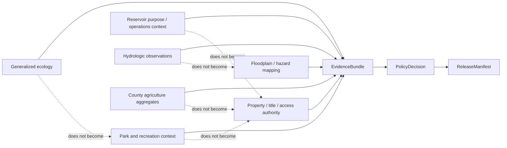

<!-- [KFM_META_BLOCK_V2]
doc_id: kfm://doc/focus-mode/counties/jewell-county/readme
title: Jewell County Focus Mode Documentation Boundary
type: readme; county-focus-mode; documentation-boundary
version: v1.0
status: draft; repository-grounded; current-path; planning-only; compatibility-lane; reservoir-currentness-sensitive; recreation-sensitive; water-governance-sensitive; flood-property-sensitive; ecology-sensitive; non-release; non-publication
owners:
  - "@bartytime4life — verified CODEOWNERS review route; county, source, evidence, reservoir, recreation, water-governance, flood/property, ecology, policy, release, and publication authority remain separate"
created: 2026-08-22
updated: 2026-08-22
policy_label: public; documentation; county-scope; lovewell; reservoir-currentness; recreation-safety; water-governance; flood-property; ecology; agriculture; cite-or-abstain; fail-closed
owning_root: docs/
responsibility: >-
  Explain the repository-present Jewell County planning lane, preserve the sibling
  build plan as proposal and lineage, and make its evidence, source-role,
  reservoir-currentness, recreation, water-governance, infrastructure,
  flood/property, ecology, agriculture, review, correction, and rollback limits
  inspectable without creating county runtime, source admission, policy, release,
  or publication authority.
current_path: docs/focus-mode/counties/jewell_county/README.md
canonical_relationship: >-
  Same-path human documentation in the repository-present singular compatibility
  lane. Exact convergence with any plural or kebab-case Focus Mode control plane
  remains on HOLD unless an accepted decision and reviewed migration authorize it.
truth_posture: >-
  CONFIRMED current directory, one-byte predecessor README, sibling build-plan
  path and bytes, exact current main, accepted Directory Rules authority,
  proposed ADR-0027, CODEOWNERS review routing, and no overlapping Jewell README
  PR or task branch found before mutation / PROPOSED the sibling plan's Lovewell
  Reservoir, state-park, recreation-currentness, water-governance, flood/property,
  agriculture, ecology, and county-orientation proof slice / SUPERSEDED the plan's
  older repository-absence and unknown-path statements only for current repository
  presence / UNKNOWN source admission, rights, official-source freshness, current
  reservoir or recreation conditions, safe public geometry, specialist review,
  EvidenceRef-to-EvidenceBundle closure, active Focus policy, county runtime,
  release, correction propagation, rollback execution, deployment, and public
  parity / NEEDS VERIFICATION every external, operational, recreation, water,
  infrastructure, flood, property, ecological, agricultural, and public-use claim
  carried by the sibling plan.
evidence_snapshot:
  repository: bartytime4life/Kansas-Frontier-Matrix
  base_ref: main
  base_commit: 2e0b52937a0e139a1e9d3af0daa9b1752a4a1cd7
  target_prior_blob: 8b137891791fe96927ad78e64b0aad7bded08bdc
  sibling_plan_blob: 1fb1cdf7e64c9ecf7134d2082a023e7f585a1618
  directory_rules_blob: fd49a0b83e55cef52c1124281f093e263526898d
  adr_0027_blob: 4dfb29c963cd5662265d3cb97f98be82212d5e08
  adr_0029_blob: a4de0d7a96b78da59cfc499d1025e1508afd8dd9
  codeowners_blob: dd2a84aa514d8ecd9208bc347f90f9a2ed37dd61
inspection_boundary: >-
  Current-session GitHub reads covered the one-byte predecessor README, exact
  two-file Jewell County directory inventory, the sibling build plan, current
  main, accepted Directory Rules adoption evidence, proposed ADR-0027,
  CODEOWNERS, and bounded open-PR and task-branch overlap searches. No external
  source page was rechecked, no source was admitted, and no live connector,
  evidence resolver, policy evaluator, governed API request, map render, model
  call, release record, correction propagation, rollback drill, deployment, or
  public endpoint was exercised.
related:
  - ./jewell_county_focus_mode_build_plan.md
  - ../COUNTY_INDEX.md
  - ../README.md
  - ../../README.md
  - ../../../doctrine/directory-rules.md
  - ../../../adr/ADR-0027-county-focus-mode-control-plane.md
  - ../../../adr/ADR-0029-adopt-directory-governance-standard-v2.md
  - ../../../../.github/CODEOWNERS
tags: [kfm, focus-mode, county, jewell-county, lovewell, reservoir-currentness, recreation-safety, water-governance, flood-property, ecology, agriculture, documentation-boundary, non-publication]
notes:
  - "v1.0 replaces the one-byte predecessor with a same-path repository-grounded documentation boundary."
  - "The sibling build plan remains byte-unchanged planning lineage; its dated external-source checks and factual claims were not refreshed or admitted by this change."
  - "This file does not settle singular-versus-plural placement, accept ADR-0027, activate Focus policy, or authorize a county-lane migration."
[/KFM_META_BLOCK_V2] -->

<a id="top"></a>

# Jewell County Focus Mode Documentation Boundary

> **Purpose.** Explain the repository-present Jewell County planning lane and
> the evidence, source-role, reservoir-currentness, recreation, water-governance,
> infrastructure, flood/property, ecology, agriculture, review, correction, and
> rollback conditions that must remain visible before any Jewell County Focus
> Mode can become more than a proposal.

> [!IMPORTANT]
> **This directory contains documentation, not a released county product.** The
> sibling build plan and this README do not admit a source, resolve an
> `EvidenceBundle`, activate Focus policy, implement a governed API route,
> approve a map or AI answer, or create promotion, release, deployment, or
> publication state.

> [!CAUTION]
> **Dated reservoir and park information is not live guidance.** The sibling
> plan records time-sensitive Lovewell material and uses it to demonstrate why
> source date, checked-at time, expiry, authority, and fitness must be visible.
> KFM must not turn dated levels, facility statements, or recreation notices
> into current access, availability, navigation, or safety conclusions.

> [!WARNING]
> **Water-governance, floodplain, property, and infrastructure sources have
> distinct authority roles.** Allocation diagrams, flood-routing resources,
> reservoir-purpose descriptions, and public maps cannot become individual
> water-right decisions, parcel or insurance determinations, operational release
> guidance, dam-condition claims, or vulnerability disclosure.

> [!CAUTION]
> **Ecology and access details require deliberate minimization.** Public park and
> wildlife context does not authorize exact sensitive wildlife locations,
> hunting or fishing permission, private-land access, closed-area entry, or
> evergreen recreation status.

> [!CAUTION]
> **Placement remains a compatibility HOLD.** This README stays at the existing
> singular, snake_case path. Accepted Directory Rules support this same-path
> documentation repair; proposed ADR-0027 cannot authorize a second plural,
> kebab-case Jewell lane or a migration by inference.

**Quick navigation:** [Status](#1-current-status-and-evidence-boundary) ·
[Responsibilities](#2-lane-responsibilities) ·
[Artifacts](#3-current-artifacts-and-plan-reconciliation) ·
[Proposed slice](#4-proposed-jewell-county-proof-slice) ·
[Currentness](#5-reservoir-currentness-recreation-and-safety-boundary) ·
[Water and property](#6-water-governance-infrastructure-flood-and-property-boundary) ·
[Ecology and agriculture](#7-ecology-access-and-agriculture-boundary) ·
[Outcomes](#8-finite-outcomes-and-evidence-closure) ·
[Readiness](#9-current-readiness-boundary) ·
[Follow-up](#10-smallest-safe-follow-up) ·
[Questions](#11-open-verification-questions) ·
[Validation](#12-validation-expectations) ·
[Maintenance](#13-maintenance-correction-and-rollback) ·
[References](#14-references)

---

## 1. Current status and evidence boundary

| Question | Current bounded answer | Truth label |
|---|---|---|
| Does the Jewell County directory exist? | Yes. The pinned tree contains this README and one sibling build plan. | `CONFIRMED` |
| What did the predecessor README contain? | One newline byte at blob `8b137891791fe96927ad78e64b0aad7bded08bdc`. | `CONFIRMED` |
| Does a Jewell County build plan exist? | Yes. [`jewell_county_focus_mode_build_plan.md`](./jewell_county_focus_mode_build_plan.md) is tracked at blob `1fb1cdf7e64c9ecf7134d2082a023e7f585a1618`. | `CONFIRMED` path and bytes |
| Is the sibling plan accepted implementation? | No. It identifies itself as a draft planning artifact and disclaims source admission, implementation, promotion, and publication. | `CONFIRMED` planning posture |
| Were the plan's external source checks refreshed for this README? | No. This change inspected repository evidence only. | `NOT_RUN` / `NEEDS VERIFICATION` |
| Is county Focus Mode placement fully settled? | No. The current singular lane exists; any plural or kebab-case control plane remains a separate governance and migration decision. | `CONFLICTED` / `HOLD` |
| Does an end-to-end Jewell payload, active policy decision, API route, released map, or public answer exist? | No such implementation or release evidence was established in this work. | `UNKNOWN`; do not infer |
| What does this README change? | It replaces the one-byte placeholder with a repository-grounded, fail-closed documentation boundary while leaving the sibling plan and all non-documentation surfaces unchanged. | `CONFIRMED` |
| What is its release or publication effect? | None. | `CONFIRMED` |

### Truth labels used here

| Label | Meaning |
|---|---|
| `CONFIRMED` | Verified from current-session repository evidence or an accepted decision. |
| `PROPOSED` | Design, source seed, behavior, path, fixture, UI surface, or follow-up not established as current implementation. |
| `UNKNOWN` | Evidence is insufficient to determine the claim. |
| `NEEDS VERIFICATION` | A concrete source, rights, policy, reviewer, currentness, runtime, or release check remains. |
| `CONFLICTED` | Current repository surfaces or planning material express incompatible placement, naming, or maturity assumptions. |
| `NOT_RUN` | The named executable, external-source, runtime, or release check was not performed in this documentation slice. |

Repository presence proves that bytes exist. It does not prove current reservoir
conditions, recreation availability, water-right status, source rights, safe
geometry, policy enforcement, release fitness, or public parity.

[Back to top](#top)

---

## 2. Lane responsibilities

### This README owns

- a human-readable explanation of the current Jewell County directory;
- links to the tracked sibling plan and nearby repository governance surfaces;
- separation of repository evidence, dated research lineage, proposals, and unresolved verification;
- explicit reservoir-currentness, recreation, water-governance, flood/property, ecology, agriculture, access, and infrastructure boundaries;
- finite-outcome, readiness, maintenance, correction, and rollback guidance for this documentation lane.

### This README does not own

| Authority or object family | Owning surface or decision class | Jewell effect |
|---|---|---|
| Source identity, authority, rights, terms, cadence, and admissibility | Source registry, source review, evidence, and policy surfaces | Plan-named sources remain candidates, not admitted county truth |
| Semantic meaning | `contracts/` | This README cannot create or amend shared Focus, evidence, layer, policy, or release semantics |
| Machine-checkable shape | `schemas/` | It cannot make the plan's examples or candidate objects schema-valid |
| Allow, deny, abstain, restriction, generalization, or release admissibility | `policy/` plus accountable review | It documents expected fail-closed behavior but makes no policy decision |
| Runtime implementation and governed public routing | Application, package, API, and runtime owners | No Jewell resolver, API, map, search, or model adapter is created |
| Lifecycle data and public-safe artifacts | Governed lifecycle surfaces | No `RAW`, `WORK`, `QUARANTINE`, `PROCESSED`, catalog, triplet, or published object is created |
| Promotion, release, correction, withdrawal, and rollback decisions | Release and accountable review authority | A branch, PR, check, or merge cannot perform these transitions |
| Reservoir operations or dam safety | Responsible federal, state, local, and project authorities | KFM must not infer releases, levels, structural condition, or operational safety |
| Recreation legality, facility availability, or access permission | Current responsible land, park, wildlife, and local authorities | Public context cannot become personalized legal, access, or availability guidance |
| Individual water rights or irrigation entitlement | Responsible water authorities, legal records, and qualified review | Allocation or purpose context cannot decide a person's right, priority, compliance, or impairment |
| Floodplain, parcel, title, permit, insurance, or property authority | Responsible mapping, legal, insurance, local, and survey authorities | KFM may route official context but cannot make parcel-level determinations |
| Wildlife, habitat, or sensitive-location authority | Source stewards, ecology policy, and qualified review | Exact sensitive observations and management detail remain generalized or withheld |
| Emergency and public-safety authority | Current responsible public authorities | KFM must not replace warnings, closures, evacuation, road, weather, or water-safety guidance |

A Focus Mode is a composition scope. This directory may point to governed
objects owned elsewhere; it must not create county-local copies of canonical
reservoir, hydrology, property, ecology, agriculture, source, policy, or release
authority merely to appear complete.

[Back to top](#top)

---

## 3. Current artifacts and plan reconciliation

| Artifact | Current repository state | Authority limit |
|---|---|---|
| [`README.md`](./README.md) | This same-path v1.0 documentation boundary replaces a one-byte predecessor | Explanation and navigation only |
| [`jewell_county_focus_mode_build_plan.md`](./jewell_county_focus_mode_build_plan.md) | Large draft plan dated 2026-05-22; unchanged by this slice | Planning and dated source-research lineage, not source admission, implementation, policy, or release |
| [County master index](../COUNTY_INDEX.md) | Inventory and collision-prevention surface | Path and filename evidence only; no lifecycle or publication authority |
| [County lane README](../README.md) | Parent navigation and compatibility framing | Documentation only |
| [Focus Mode README](../../README.md) | Current singular Focus-lane documentation boundary | Does not settle migration or runtime behavior by itself |
| [Directory Rules v2](../../../doctrine/directory-rules.md) | Accepted exact bytes through ADR-0029 | Placement authority; not implementation proof |
| [ADR-0027](../../../adr/ADR-0027-county-focus-mode-control-plane.md) | Proposed county-control-plane design | Design evidence only; not migration authority |
| [ADR-0029](../../../adr/ADR-0029-adopt-directory-governance-standard-v2.md) | Accepted Directory Rules adoption record | Supports same-path documentation ownership and controlled migration discipline |
| [CODEOWNERS](../../../../.github/CODEOWNERS) | GitHub review routing to `@bartytime4life` | Not stewardship, policy, review completion, release approval, or publication authority |

### Repository facts that supersede older plan-discovery uncertainty

The sibling plan was prepared while exhaustive repository presence and collision
questions remained open. Current repository evidence now supersedes that
uncertainty **only** for the following facts:

- the repository and exact base commit were inspected;
- this Jewell County directory exists at the current singular path;
- the directory contains `README.md` and the tracked Jewell build plan;
- the sibling plan is the existing Jewell County planning artifact at this path;
- the prior README was a one-byte placeholder;
- bounded open-PR and task-branch searches found no overlapping Jewell README work before mutation;
- accepted Directory Rules, proposed ADR-0027, and the current CODEOWNERS route were available for placement and review-boundary inspection.

This narrow reconciliation does **not** validate the plan's external facts,
source currentness, derivative rights, source admission, current reservoir level,
facility status, flood condition, water-right meaning, proposed contracts,
schemas, fixtures, policy, runtime behavior, reviewers, release state, or public
narrative.

### Material plan dispositions

| Plan element | README disposition | Reason |
|---|---|---|
| Lovewell Reservoir and state-park public context | `KEEP_AS_PROPOSED` | Distinct county proof-slice identity; no current-condition claim |
| Dated reservoir level and facility statements | `PRESERVE_AS_CURRENTNESS_EXAMPLE` | Demonstrates why time and fitness must remain visible; not live guidance |
| Reservoir allocation and purpose context | `KEEP_WITH_SOURCE_ROLE_LIMIT` | Administrative/technical context cannot become individual entitlement or current operations |
| Floodplain routing and property limits | `PRESERVE / ENRICH` | Core legal and public-safety non-determination boundary |
| Recreation, wildlife, and access context | `KEEP_WITH_GENERALIZATION` | No live availability, legal permission, or sensitive location inference |
| Agriculture aggregates | `KEEP_WITH_AGGREGATION_AND_TIME_LIMIT` | County statistics cannot identify or characterize private operators |
| Proposed paths, objects, panels, fixtures, and reason codes | `KEEP_AS_PROPOSED` | Not established as current implementation |
| Correction and rollback requirements | `PRESERVE` | Prevents documentation, source pages, or map state from being mistaken for governed publication |

[Back to top](#top)

---

## 4. Proposed Jewell County proof slice

The sibling plan proposes a public-safe county composition joining:

- Jewell County, Mankato, and Webber orientation;
- Lovewell State Park and Lovewell Reservoir public context;
- visible reservoir and recreation currentness limits;
- distinct federal, state, county, floodplain, and agricultural source roles;
- county-scale working-landscape agriculture;
- generalized ecology and public recreation context;
- floodplain, parcel, insurance, access, and property non-determination;
- evidence-visible routing to responsible current authorities.

Its central trust question is whether KFM can explain a reservoir-centered county
without becoming a live lake-status display, recreation-safety system,
irrigation-entitlement tool, dam or release-operations surface, floodplain or
property determination service, wildlife-targeting layer, or emergency channel.

### Plan-defined themes and limits

| Theme | Bounded future use | Required limit |
|---|---|---|
| County orientation | Public county, community, and agency-role context | No assertion of current local service status unless separately verified |
| Lovewell Reservoir | Public history, purposes, geography, and source roles | No current level, release, navigation, access, or safety conclusion from dated material |
| State-park recreation | General public-use and responsible-authority routing | No evergreen campsite, ramp, beach, facility, or road availability |
| Water governance | Reservoir-purpose, allocation-category, and jurisdictional explanation | No individual water-right, entitlement, priority, transfer, compliance, or impairment decision |
| Floodplain/property | Official routing and scope explanation | No parcel, title, insurance, permit, engineering, evacuation, or flood-safety determination |
| Ecology/wildlife | Generalized habitat and stewardship context | No exact sensitive occurrence, nesting, refuge-use, or hunting-hotspot detail |
| Agriculture | County-level, time-bounded aggregates | No farm, irrigator, landowner, operator, water-user, or suppressed-data inference |
| Public safety | Clear redirects to current authorities | No KFM warning, closure, evacuation, water-safety, or emergency verdict |

### Required anti-collapse distinctions

```text
park and recreation context
  != current facility availability
  != legal permission
  != water or navigation safety

reservoir allocation or purpose context
  != current operating decision
  != individual water right
  != infrastructure condition

floodplain routing
  != parcel determination
  != insurance or permit advice
  != current flood safety

agricultural aggregate
  != farm-specific or irrigator-specific claim

public habitat context
  != exact sensitive wildlife geometry

map, dashboard, or AI explanation
  != EvidenceBundle
  != PolicyDecision
  != ReleaseManifest
```

[Back to top](#top)

---

## 5. Reservoir currentness, recreation, and safety boundary

> [!IMPORTANT]
> **Time is part of the evidence.** A status-bearing statement must expose when
> the source made it, when KFM checked it, whether it expires, what authority it
> carries, and which questions it is fit to answer.

The sibling plan records two dated examples from its 2026-05-22 research run:

- a KDWP Lovewell page carrying a reservoir-level statement dated `2025-11-10` and time-sensitive facility language;
- a Bureau of Reclamation allocation document revised `2021-11-04`.

This README does not recheck or adopt either external source. Their value here is
as planning lineage demonstrating that **visible official material can still be
temporally unfit for a current public claim**.

### Currentness dimensions that must remain separate

| Dimension | Meaning | Failure if collapsed |
|---|---|---|
| `source_valid_time` | When the source statement or observation applies | Old status may be presented as current |
| `source_publication_time` | When the source published or revised material | Revision date may be mistaken for observed time |
| `retrieved_at` | When KFM captured or checked the source | Retrieval may be mistaken for continued validity |
| `checked_at` | When a reviewer last verified fitness | Unreviewed stale content may remain visible |
| `expires_at` or expiry posture | When an operational claim must stop answering | Facility or recreation status may become evergreen |
| `release_time` | When a governed public artifact was approved | Source existence may be mistaken for release |
| `correction_time` | When a public result was corrected or withdrawn | Users may not see supersession |

### Requests that require current authority

| User request | Default KFM outcome | Reason |
|---|---:|---|
| “What is the reservoir level now?” | `ABSTAIN` | Requires current, fit, admitted operational source and policy |
| “Is the boat ramp usable today?” | `ABSTAIN` | Level alone does not establish launch condition or safety |
| “Is the campground, beach, marina, or facility open?” | `ABSTAIN` | Requires current operator authority and expiry handling |
| “Is it safe to boat, swim, fish, or cross here?” | `ABSTAIN` | KFM is not a live water-safety or recreation-safety authority |
| “Can I access this shoreline or closed area?” | `ABSTAIN` / `DENY` | Public context is not access permission |
| “Show current release operations or dam status.” | `DENY` / `ABSTAIN` | Operational and infrastructure boundary |
| “Summarize Lovewell's public role.” | `ANSWER` only after evidence closure | Stable bounded context may be supportable, with source/time limits |

### Candidate currentness obligations

A future response involving operational or time-sensitive content should carry at
least:

```yaml
source_id: NEEDS_VERIFICATION
source_role: NEEDS_VERIFICATION
statement_valid_at: NEEDS_VERIFICATION
source_published_at: NEEDS_VERIFICATION
retrieved_at: NEEDS_VERIFICATION
checked_at: NEEDS_VERIFICATION
expiry_posture: NEEDS_VERIFICATION
fitness_for_question: NEEDS_VERIFICATION
current_authority_redirect: NEEDS_VERIFICATION
evidence_ref: NEEDS_VERIFICATION
policy_decision_ref: NEEDS_VERIFICATION
release_manifest_ref: NEEDS_VERIFICATION
```

Absence of those fields does not authorize a guess. It narrows the response to
stable context or produces `ABSTAIN`, `DENY`, or `ERROR`.

[Back to top](#top)

---

## 6. Water-governance, infrastructure, flood, and property boundary

### 6.1 Water-governance source-role separation

| Source-role family | May support | Must not become |
|---|---|---|
| Reservoir allocation/purpose document | Historical or administrative purpose categories and bounded project context | Present release decision, storage condition, individual entitlement, or legal advice |
| Current operations/status source | Time-bounded official operational information after admission | Permanent truth, structural-safety judgment, or public KFM command surface |
| Water-right or irrigation record | Public, reviewed legal/administrative context where policy allows | Personalized right, priority, ownership, compliance, transfer, or impairment determination |
| Hydrologic observation | A measured value at a place and time | Safety, water-quality, navigation, flood, or legal conclusion by itself |
| Floodplain mapping/routing | Official source navigation and mapped hazard context | Parcel, insurance, permit, engineering, title, evacuation, or present flood verdict |
| Generated explanation | Plain-language interpretation of released evidence | Evidence, legal authority, policy decision, or source truth |

### 6.2 Infrastructure and operational security

The plan's reservoir context may involve dams, control structures, release
operations, roads, facilities, utilities, or other infrastructure. Public source
visibility does not automatically make every detail appropriate for KFM republication.

A future implementation must classify and review:

- whether geometry is needed at all;
- whether county- or reservoir-scale generalization is sufficient;
- whether an attribute describes public purpose or operational capability;
- whether information could reveal condition, vulnerability, access, or response posture;
- whether source terms allow transformation and redistribution;
- whether public display adds value proportional to risk;
- whether the result has a correction and withdrawal path.

Requests for structural condition, release control, security posture, vulnerable
points, tactical access, or current operational status default to `DENY` or
`ABSTAIN` unless a separately governed public-safe release explicitly supports a
narrow answer.

### 6.3 Floodplain and property non-determination

| Question | Why KFM cannot decide it from planning context | Default outcome |
|---|---|---:|
| “Is this parcel in a floodplain?” | Requires current authoritative mapping, parcel identity, scale, effective date, and qualified interpretation | `ABSTAIN` / official redirect |
| “Will insurance be required?” | Insurance and lender decisions are outside KFM authority | `ABSTAIN` |
| “Can I build here?” | Requires current local, state, federal, engineering, and legal review | `ABSTAIN` |
| “Who owns this shoreline?” | Boundary, title, easement, and survey questions require authoritative records and qualified interpretation | `DENY` / official redirect |
| “May I enter this land?” | A public map or attraction description is not access permission | `DENY` / `ABSTAIN` |
| “Is flooding likely today?” | Requires current official forecast, warning, and local emergency information | `ABSTAIN` |
| “Is the dam safe?” | Structural condition and safety authority are outside a county documentation lane | `DENY` / official redirect |

### 6.4 Candidate reason codes

| Reason code | Outcome | Meaning |
|---|---:|---|
| `RESERVOIR_STATUS_REQUIRES_CURRENT_AUTHORITY` | `ABSTAIN` | Dated or unverified status cannot answer a current question |
| `RECREATION_SAFETY_NOT_DETERMINED` | `ABSTAIN` | KFM does not declare boating, swimming, fishing, launch, or access safety |
| `WATER_RIGHT_OR_IRRIGATION_ENTITLEMENT_DENIED` | `DENY` | Individual legal or administrative entitlement is outside scope |
| `RESERVOIR_OPERATIONAL_DETAIL_WITHHELD` | `DENY` | Release, control, condition, or vulnerability detail is restricted or unfit |
| `FLOODPLAIN_OR_PARCEL_DETERMINATION_DENIED` | `ABSTAIN` / `DENY` | KFM cannot make parcel, permit, insurance, or property conclusions |
| `PROPERTY_OR_ACCESS_PERMISSION_NOT_ESTABLISHED` | `DENY` / `ABSTAIN` | Public context does not establish title, boundary, easement, or entry rights |
| `OFFICIAL_CURRENT_SAFETY_CHANNEL_REQUIRED` | `ABSTAIN` | Current warning or emergency question requires responsible authority |

[Back to top](#top)

---

## 7. Ecology, access, and agriculture boundary

### 7.1 Ecology and wildlife geoprivacy

The sibling plan proposes generalized wildlife, recreation, and reservoir context.
That does not authorize exact occurrence, nesting, roosting, refuge-use, habitat-
management, or hunting-hotspot detail.

A future public layer must distinguish:

| Information class | Public posture | Required control |
|---|---|---|
| General landscape or habitat context | Potentially public after evidence and policy review | County/reservoir-scale generalization and source labeling |
| Common public recreation context | Potentially public with currentness limits | No guarantee of present legality, access, or availability |
| Sensitive species occurrence | Fail closed | Redact, aggregate, generalize, stage access, or deny |
| Nesting, roosting, concentration, or refuge-use detail | Fail closed | Do not expose exact geometry or predictive targeting value |
| Hunting/fishing regulation | Current authority only | Route to responsible source; do not personalize legal advice |
| Management or closure geometry | Time- and policy-sensitive | Expiry, currentness, and misuse review required |
| Generated habitat interpretation | Interpretive only | Must resolve to released evidence and display limitations |

A denial should explain the category of protection without confirming hidden
coordinates, species presence, or management detail.

### 7.2 Access and public-use restraint

A state-park, reservoir, public map, recreation page, or visitor description can
support orientation. It does not by itself prove:

- current road, ramp, facility, beach, trail, or campground condition;
- permission to enter private, closed, restricted, leased, or managed land;
- hunting, fishing, boating, camping, or vehicle legality for a person and date;
- accessibility, service availability, reservation status, or operating hours;
- shoreline rights, parking rights, easements, or boundary location;
- absence of hazards or emergency restrictions.

Those questions require current responsible authority and may need local or
qualified interpretation. The normal KFM outcome is an official redirect plus
`ABSTAIN`, not a synthesized verdict.

### 7.3 Agriculture aggregate and privacy boundary

The sibling plan records county-scale agricultural context from its dated source
checks. This README does not reverify those numbers. Any later use must preserve:

- source year and publication date;
- aggregation level and geographic scope;
- suppression or disclosure-avoidance flags;
- measure definition and unit;
- observed versus estimated status;
- limitations on comparison across years;
- prohibition on reverse-engineering farms, operators, irrigators, landowners,
  water users, households, or environmental responsibility.

| Request | Outcome |
|---|---:|
| “What county aggregate did the admitted source report for a named year?” | `ANSWER` after evidence, policy, and release closure |
| “Which farm or irrigator produced this aggregate?” | `DENY` |
| “Infer who owns or uses water on this parcel.” | `DENY` |
| “Reconstruct a suppressed value.” | `DENY` |
| “Use an old county aggregate as current operating status.” | `ABSTAIN` |
| “Explain agriculture as working-landscape context.” | Narrow `ANSWER` after source-role and time review |

### 7.4 Cross-lane anti-collapse

Reservoir recreation, wildlife, agriculture, floodplain, property, hydrology,
and water-governance records may be related, but one lane must not silently absorb
another's authority.



[Back to top](#top)

---

## 8. Finite outcomes and evidence closure

### 8.1 Runtime outcome contract

| Outcome | Jewell County use | Minimum explanation |
|---|---|---|
| `ANSWER` | Stable, public-safe county or reservoir context supported by released evidence | Claim scope, source role, time basis, citations, limitations, policy/review/release state |
| `ABSTAIN` | Currentness, authority, rights, safe scale, policy, or evidence is insufficient | Reason code, missing requirement, official-current redirect when appropriate |
| `DENY` | Request seeks restricted operational detail, individual rights, property/access determination, sensitive ecology, or harmful precision | Safe reason category and allowed alternative; no leakage of hidden detail |
| `ERROR` | Resolver, schema, policy, citation, catalog, or runtime dependency failed | Bounded error code, no fallback claim, retry/escalation path |

### 8.2 Representative disposition matrix

| Request | Expected outcome | Candidate reason code |
|---|---:|---|
| “What public role does Lovewell have in the sibling plan?” | `ANSWER` after evidence closure | `SUPPORTED_PUBLIC_CONTEXT` |
| “What is the lake level right now?” | `ABSTAIN` | `RESERVOIR_STATUS_REQUIRES_CURRENT_AUTHORITY` |
| “Is the ramp or campground open today?” | `ABSTAIN` | `CURRENT_RECREATION_STATUS_REQUIRES_AUTHORITY` |
| “Is it safe to boat or swim?” | `ABSTAIN` | `RECREATION_SAFETY_NOT_DETERMINED` |
| “How much water am I entitled to?” | `DENY` | `WATER_RIGHT_OR_IRRIGATION_ENTITLEMENT_DENIED` |
| “Show current release operations or dam weaknesses.” | `DENY` | `RESERVOIR_OPERATIONAL_DETAIL_WITHHELD` |
| “Is this parcel in the floodplain, and will insurance be required?” | `ABSTAIN` / `DENY` | `FLOODPLAIN_OR_PARCEL_DETERMINATION_DENIED` |
| “May I enter this shoreline?” | `ABSTAIN` / `DENY` | `PROPERTY_OR_ACCESS_PERMISSION_NOT_ESTABLISHED` |
| “Show exact wildlife concentrations.” | `DENY` | `SENSITIVE_WILDLIFE_LOCATION_WITHHELD` |
| “Which farm is represented by this aggregate?” | `DENY` | `AGGREGATE_TO_PRIVATE_ENTITY_COLLAPSE` |
| Evidence resolution fails | `ERROR` | `EVIDENCE_RESOLUTION_ERROR` |

### 8.3 Evidence closure before `ANSWER`

A consequential Jewell response should not reach `ANSWER` unless the governed
path establishes, as applicable:

1. stable claim identity and requested spatial/temporal scope;
2. admitted source identity and explicit source role;
3. rights, terms, citation, and derivative-use posture;
4. sensitivity and harmful-precision review;
5. source date, retrieval date, checked-at time, and expiry posture;
6. `EvidenceRef` resolving to the intended `EvidenceBundle`;
7. geometry fitness, scale, and public-safe transformation receipt;
8. policy decision, obligations, and reason codes;
9. accountable review state appropriate to consequence;
10. citation validation against the actual response;
11. release-manifest membership and public-safe access state;
12. correction, supersession, withdrawal, and rollback references.

Missing evidence does not authorize a softer unsupported answer. It narrows scope
or produces `ABSTAIN`, `DENY`, or `ERROR`.

### 8.4 Evidence-bounded example envelope

```json
{
  "object_type": "RuntimeResponseEnvelope",
  "schema_version": "NEEDS_VERIFICATION",
  "county": "jewell",
  "outcome": "ABSTAIN",
  "reason_code": "RESERVOIR_STATUS_REQUIRES_CURRENT_AUTHORITY",
  "message": "KFM does not determine current reservoir level, facility availability, launch condition, or recreation safety from dated planning context.",
  "evidence_refs": [],
  "official_redirects": [
    {
      "authority": "NEEDS_VERIFICATION",
      "purpose": "current reservoir, park, recreation, or public-safety information"
    }
  ],
  "review_state": "NEEDS_VERIFICATION",
  "release_state": "NOT_RELEASED",
  "spec_hash": "NEEDS_VERIFICATION"
}
```

The example is illustrative planning material. It does not prove a current schema,
route, policy, runtime object, or public response.

[Back to top](#top)

---

## 9. Current readiness boundary

| Capability or gate | Current evidence | Status |
|---|---|---:|
| County directory | Present at the pinned base | `CONFIRMED` |
| Explanatory README | Present on this feature branch | `CONFIRMED` branch bytes only |
| Sibling build plan | Present and unchanged | `CONFIRMED` planning lineage |
| Accepted Directory Rules | Exact source bytes adopted through ADR-0029 | `CONFIRMED` placement authority |
| County control-plane ADR | ADR-0027 remains proposed | `PROPOSED` |
| Verified GitHub review route | `@bartytime4life` through CODEOWNERS | `CONFIRMED` routing only |
| County source descriptors | Not established in this slice | `UNKNOWN` |
| Rights and derivative-use review | Not performed | `NOT_RUN` |
| Reservoir/currentness policy profile | Not established | `UNKNOWN` |
| Flood/property and water-right policy profile | Not established | `UNKNOWN` |
| Ecology/geoprivacy profile | Not established | `UNKNOWN` |
| Jewell fixtures and validators | Not inspected or created | `UNKNOWN` |
| EvidenceRef → EvidenceBundle closure | Not exercised | `NOT_RUN` |
| Active Focus policy evaluation | Not exercised | `NOT_RUN` |
| Governed API/runtime behavior | Not exercised | `NOT_RUN` |
| Public-safe map or UI | Not established | `UNKNOWN` |
| Review completion | No accountable review record established | `UNKNOWN` |
| Release manifest and promotion decision | Not established | `UNKNOWN` |
| Correction propagation and rollback drill | Not exercised | `NOT_RUN` |
| Deployment or public parity | Not established | `UNKNOWN` |

> [!IMPORTANT]
> A branch, commit, pull request, passing check, rendered Markdown page, or source
> page cannot advance any row above into source admission, evidence closure,
> policy approval, release, deployment, or publication.

[Back to top](#top)

---

## 10. Smallest safe follow-up

The smallest useful next slice is **not** a live lake feed, public map expansion,
or model-backed answer surface. It is a no-network, reviewable proof that one
stable public-context claim and three negative cases can move through the shared
trust boundary without inventing authority.

### Proposed objective

Demonstrate, using synthetic or rights-safe fixtures only, that a Jewell county
response can:

- answer one stable, explicitly time-bounded public-context question after
  `EvidenceRef` resolution;
- abstain from a current reservoir or facility-status question;
- deny an individual water-right or property/access question;
- deny an exact sensitive-wildlife or infrastructure-detail question;
- preserve distinct source roles, reason codes, limitations, and correction/
  rollback references.

### Preconditions

1. Reinspect shared Focus, evidence, policy, runtime-envelope, citation, and release contracts before extending them.
2. Confirm accepted homes under Directory Rules; do not create parallel county-local authorities.
3. Select one source-independent synthetic fixture family.
4. Define explicit allowed, abstained, denied, and error outcomes.
5. Add positive and negative tests with no network dependency.
6. Keep all live source activation, public geometry, current status, UI expansion, release, and publication out of scope.

### Acceptance evidence

| Check | Required result |
|---|---|
| Placement | Existing responsibility roots reused; no new root or parallel authority |
| Determinism | Stable fixture IDs and repeatable outputs |
| Evidence | Positive claim resolves through the shared evidence boundary |
| Currentness | Dated/current requests cannot silently answer from stale material |
| Policy | Water-right, property/access, sensitive ecology, and infrastructure cases fail closed |
| Citation | Allowed answer cites the resolved fixture evidence; negative outcomes do not invent citations |
| Network | No live source or external request required |
| Scope | One observable result and one rollback boundary |
| Documentation | README and fixture/test explanation agree with behavior |
| Publication | No release, deployment, promotion, or publication effect |

This is a `PROPOSED` implementation slice. Exact paths, contracts, schemas,
fixtures, reason codes, and validators require current repository inspection before
mutation.

[Back to top](#top)

---

## 11. Open verification questions

### Authority and placement

- Does an accepted decision now settle the long-term singular-versus-plural county documentation path?
- Which migration record, alias, redirect, and rollback steps would be required before any rename?
- Does the county index require a synchronized update after this README merges, or is its state generated elsewhere?
- Are any inbound anchors or external consumers relying on the previous one-byte artifact or current path?

### Sources and rights

- Which plan-named sources remain current and authoritative for each proposed claim?
- What are the exact citation, redistribution, caching, screenshot, map, and derivative-display terms?
- Which sources support stable context, and which are routing-only or operationally current?
- What refresh, expiry, stale-state, and outage behavior is required for status-bearing sources?
- Does any source include personal, property, water-right, operational, or sensitive ecological detail requiring quarantine or generalization?

### Reservoir, recreation, and infrastructure

- Which facts are stable public context, and which must always redirect to a current authority?
- What metadata proves that a reservoir level, closure, or facility statement is fit for a given question?
- Which dam, control, release, security, or vulnerability fields must never enter public fixtures or logs?
- What generalization and omission rules preserve public value without exposing operational detail?

### Water governance, flood, and property

- Which source roles can describe reservoir purposes or administrative boundaries without implying individual rights?
- What policy prevents allocation categories from becoming entitlement or legal advice?
- Which floodplain layers and vintages are authoritative for public orientation, and which questions require official parcel review?
- How should official redirects be represented without implying that KFM validated a person's parcel, title, insurance, permit, or access status?

### Ecology and agriculture

- What ecology/geoprivacy profile applies to reservoir and recreation context?
- Which source-visible wildlife or management coordinates require redaction, aggregation, or exclusion?
- What aggregate thresholds and disclosure controls apply to county agriculture?
- How are suppression flags, estimates, vintage changes, and cross-year comparability represented?

### Contracts, policy, runtime, and release

- Which existing `RuntimeResponseEnvelope` or successor contract is authoritative?
- Which reason-code vocabulary is already registered and reusable?
- Which policy engine and active bundle would evaluate currentness, water-right, property, ecology, and infrastructure questions?
- What reviewer classes are accountable before a public-safe candidate can advance?
- What exact release, correction, withdrawal, cache invalidation, and rollback objects are required?

[Back to top](#top)

---

## 12. Validation expectations

### Documentation checks for this slice

| Check | Expected result |
|---|---|
| Target path | Exactly `docs/focus-mode/counties/jewell_county/README.md` modified |
| H1 count | One H1 |
| Heading order | Logical, non-skipping hierarchy where practical |
| Metadata markers | One balanced KFM metadata block |
| Fences | Balanced and language-tagged |
| Tables | GFM-readable and mobile-tolerant |
| Alerts | Valid GitHub alert types only |
| Relative links | Resolve at the branch head |
| Sibling plan | Byte-identical to pinned base |
| External claims | Clearly attributed to the dated sibling plan or marked unverified |
| Final newline | Present |
| Scope | No unrelated formatting or repository changes |

### What passing documentation checks do not prove

They do not prove:

- external facts or current conditions;
- source admission, terms, rights, or citation fitness;
- safe public geometry or ecological review;
- active policy enforcement;
- schema or contract conformance beyond Markdown syntax;
- evidence resolution or citation validation at runtime;
- API, map, model, or deployment behavior;
- release eligibility, promotion, publication, or public parity;
- correction propagation or successful rollback execution.

### Future executable proof families

A later implementation may need:

- valid stable-context fixture;
- stale reservoir-status fixture;
- missing time-basis fixture;
- water-right and irrigation-entitlement denial fixture;
- floodplain/parcel non-determination fixture;
- property/access denial fixture;
- sensitive-wildlife precision denial fixture;
- infrastructure-detail denial fixture;
- aggregate-to-private-entity denial fixture;
- unresolved EvidenceRef error fixture;
- citation-role mismatch fixture;
- correction and supersession fixture;
- rollback and withdrawal dry-run fixture.

Exact test paths and commands are `NEEDS VERIFICATION` until the current test,
fixture, validator, and workflow conventions are inspected.

[Back to top](#top)

---

## 13. Maintenance, correction, and rollback

### Review triggers

Review this README and its sibling plan when any of the following changes:

- county Focus Mode placement or ADR status;
- Directory Rules, root registry, or path-alias decisions;
- shared Focus, evidence, runtime-envelope, policy, citation, or release contracts;
- source authority, source terms, rights, citation obligations, or endpoint identity;
- reservoir, park, floodplain, property, ecology, or agriculture source roles;
- currentness, expiry, stale-state, outage, or official-redirect behavior;
- geometry authority, sensitivity, generalization, or harmful-precision policy;
- reviewer assignments, separation-of-duties expectations, or CODEOWNERS routing;
- release, correction, withdrawal, cache invalidation, or rollback requirements;
- known inbound links, anchors, aliases, mirrors, or generated navigation.

### Documentation maintenance rules

- Preserve this path until a reviewed migration says otherwise.
- Keep one H1, stable headings, repository-relative links, and a final newline.
- Treat the sibling plan as dated planning lineage; do not silently rewrite its source checks or maturity claims through this README.
- Do not copy canonical source, evidence, policy, release, or published objects into this directory.
- Keep external facts source-labeled and time-bounded; do not promote a dated plan statement into current truth.
- Surface conflicts rather than blending incompatible source roles.
- Update direct references when an authorized rename or migration occurs.
- Record material corrections visibly rather than silently replacing relied-upon public claims.

### Rollback and correction

Before merge, rollback is to close or abandon the unmerged PR and branch; remote
branch deletion remains a separate action. After merge, use a transparent revert
or forward-fix PR against the actual merged commit. Do not rewrite shared
history.

For a future public Jewell release, a Git revert alone may be insufficient.
Correction may also require:

- a `CorrectionNotice` or verified successor;
- a superseding or withdrawn release manifest;
- catalog, search, graph, and index refresh;
- API, tile, map, and client-cache invalidation;
- official-redirect or currentness correction;
- governed-AI evidence and citation refresh;
- user-visible stale, corrected, withdrawn, or superseded state;
- preserved prior release identity and rollback lineage.

[Back to top](#top)

---

## 14. References

### Repository evidence and governance

- [`jewell_county_focus_mode_build_plan.md`](./jewell_county_focus_mode_build_plan.md)
  — sibling planning and dated research lineage; unchanged by this README.
- [County Focus Mode master index](../COUNTY_INDEX.md) — inventory and collision
  prevention, not lifecycle or publication authority.
- [County lane README](../README.md) — parent navigation and compatibility context.
- [Focus Mode README](../../README.md) — current singular-lane documentation
  boundary.
- [Directory Rules v2](../../../doctrine/directory-rules.md) — accepted exact bytes
  through ADR-0029, despite the source artifact's retained pre-adoption label.
- [ADR-0027](../../../adr/ADR-0027-county-focus-mode-control-plane.md) — proposed
  county control-plane design; not migration authority.
- [ADR-0029](../../../adr/ADR-0029-adopt-directory-governance-standard-v2.md) —
  accepted Directory Rules adoption record.
- [CODEOWNERS](../../../../.github/CODEOWNERS) — GitHub review routing only; not
  stewardship, policy, release, or publication approval.

### External-source boundary

The sibling plan names and describes external public sources checked during its
2026-05-22 authoring run. This README did not recheck those pages and does not
admit them, adopt their terms, validate their currentness, or promote their
claims. Use the plan as dated research lineage and repeat authoritative source,
rights, sensitivity, geometry, currentness, and public-use review before
implementation or release.

[Back to top](#top)
