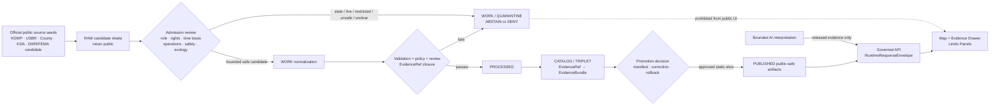
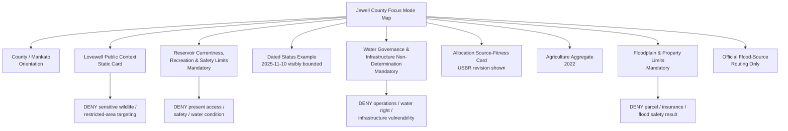
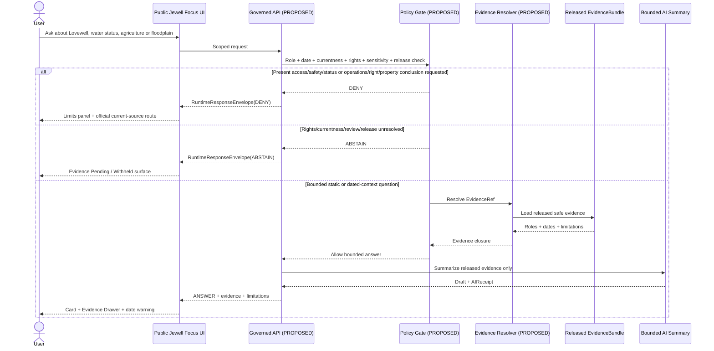
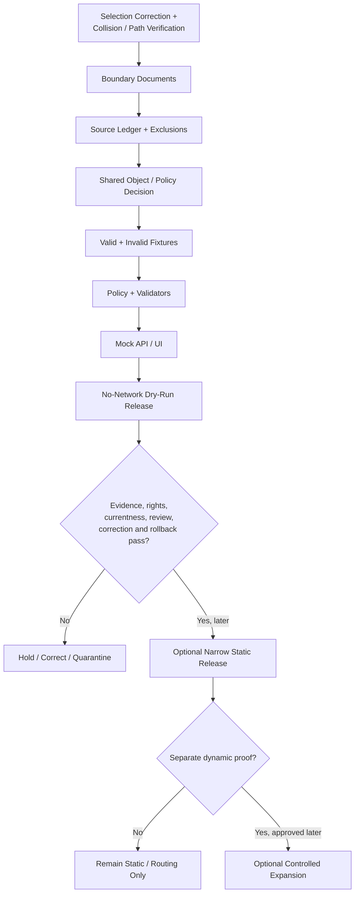

<!-- KFM_META_BLOCK_V2
doc_id: NEEDS_VERIFICATION
title: Jewell County Focus Mode Build Plan
type: standard
version: v1
status: draft
owners: [NEEDS_VERIFICATION]
created: 2026-05-22
updated: 2026-05-22
policy_label: public_draft
repository_path: NEEDS_VERIFICATION - candidate only: docs/focus-mode/counties/jewell_county/jewell_county_focus_mode_build_plan.md
schema_contract_policy_homes: NEEDS_VERIFICATION - inspect live repository authority homes, accepted ADRs, root README contracts and existing shared KFM object families before extending schema, contract, policy, fixture, registry, proof, receipt, release or published-artifact paths
review_assignments: NEEDS_VERIFICATION - reservoir operations/currentness, recreation and public-safety, ecology/wildlife geoprivacy, floodplain/property, water-governance, rights, documentation and release review duties
correction_path: NEEDS_VERIFICATION
rollback_path: NEEDS_VERIFICATION
release_status: NEEDS_VERIFICATION - planning artifact only; no source admission, implementation, promotion or publication claimed
related:
  - Directory Rules.pdf (consulted in this run)
  - KFM county Focus Mode completed-county register supplied by user
  - Existing live-repository county-plan convention searched in this run
tags: [kfm, focus-mode, jewell-county, lovewell, reservoir, state-park, recreation, floodplain, agriculture, water-governance, currentness, public-safe-boundary]
notes:
  - CORRECTION: Doniphan County was rejected as the next-series selection after the user reported it was already completed.
  - CONFIRMED: Jewell County is absent from the completed-county register supplied by the user.
  - CONFIRMED: Targeted searches of accessible uploaded/File Library materials returned no Jewell County Focus Mode Build Plan artifact.
  - CONFIRMED: Targeted search of the accessible live GitHub repository returned no Jewell County Focus Mode Build Plan match under searched terms.
  - CONFIRMED: Directory Rules.pdf was consulted before repository-path proposals were made.
  - CONFIRMED: Current official public pages were checked during this run for Jewell County government, Kansas Department of Wildlife and Parks Lovewell State Park, Kansas Department of Agriculture county agricultural statistics, Kansas effective floodplain routing, and U.S. Bureau of Reclamation Lovewell Reservoir allocation context.
  - CONFIRMED: KDWP's Lovewell page includes time-sensitive park-status statements and a reservoir-level statement dated 2025-11-10; these support a currentness warning, not a present-condition claim.
  - NEEDS_VERIFICATION: Exhaustive all-branch/all-storage collision check, final repository landing, shared authority homes, derivative-display rights, safe geometry, current reservoir/flood/recreation conditions, review assignments, correction and rollback machinery.
  - PROPOSED: Jewell County is the corrected next proof slice for reservoir recreation/currentness, water-governance separation, flood/property non-determination and wildlife/access minimization.
-->

<a id="top"></a>

# Jewell County Focus Mode Build Plan

> **Product thesis:** Build a public-safe Jewell County Focus Mode around Lovewell State Park, Lovewell Reservoir, Mankato/Webber county context, working-landscape agriculture and official floodplain/water-governance routing—without turning dated reservoir or park-status notices, reservoir allocation information, wildlife/recreation context or floodplain sources into live safety, navigation, irrigation-right, infrastructure, parcel, insurance, access or ecological-location conclusions.


| Identity / status field | Determination |
|---|---|
| Corrected selected county | **Jewell County, Kansas** |
| Previous invalid selection | **Doniphan County — rejected as a next-series county after user collision report.** No Doniphan artifact is treated as a valid new addition from that attempt. |
| Selection status | **PROPOSED** as the corrected next KFM county Focus Mode proof slice. |
| Completed-register comparison | **CONFIRMED** within supplied series register: Jewell County is not listed. |
| Accessible-material collision check | **CONFIRMED** within searched uploaded/File Library materials: no Jewell County Focus Mode plan artifact returned. |
| Live repository targeted collision check | **CONFIRMED** within searched live-repository terms: no Jewell County Focus Mode build-plan match returned. |
| Exhaustive collision check | **NEEDS_VERIFICATION** before repository landing because every branch, alias, generated artifact and external storage location has not been exhaustively inventoried. |
| Distinct proof value | Reservoir and state-park context with visible stale/currentness risk; federal reservoir allocation context; recreation/access and wildlife minimization; floodplain/property non-determination; county-scale agriculture; county official routing. |
| Defining public-safe boundary | **Reservoir operations/currentness and recreation non-determination:** KFM may explain Lovewell public context and route official sources; it must not convert dated status, reservoir level, ramp/campground status, allocation data, wildlife or floodplain material into live safety, navigation, access, water-right, release-operation, infrastructure, ecological-targeting, parcel or insurance decisions. |
| Document posture | Future implementation planning artifact only; no implementation, admission, promotion or publication claimed. |
| Proposed placement | `docs/focus-mode/counties/jewell_county/jewell_county_focus_mode_build_plan.md` — `PROPOSED / NEEDS_VERIFICATION`. |
| First milestone | **Jewell Lovewell Reservoir Currentness and Public-Safe Recreation Proof** |

## Quick links

[Executive build note](#executive-build-note) · [Evidence boundary](#evidence-boundary-table) · [Operating posture](#1-operating-posture) · [Why Jewell County](#2-why-this-county) · [Product thesis](#3-product-thesis) · [Scope boundary](#4-scope-boundary) · [First demo layers](#5-first-demo-layers) · [User journeys](#6-user-journeys) · [UI surfaces](#7-ui-surfaces) · [Governed object model](#8-governed-object-model) · [Repository shape](#9-proposed-repository-shape) · [Build phases](#10-build-phases) · [First PR sequence](#11-first-pr-sequence) · [Acceptance checklist](#12-acceptance-checklist) · [Fixture plan](#13-fixture-plan) · [Risk register](#14-risk-register) · [Source seeds](#15-source-seed-list) · [Verification questions](#16-open-verification-questions) · [First milestone](#17-recommended-first-milestone) · [Appendices](#appendix-a---public-safe-narrative-skeleton)

<a id="executive-build-note"></a>

## Executive build note

**PROPOSED.** Jewell County is a strong corrected next proof slice because its most compelling official public source is also an immediate governance test. The Kansas Department of Wildlife and Parks (KDWP) Lovewell State Park page provides public recreation context near Mankato and Webber, but the same page includes operationally time-sensitive park-facility statements and a reservoir-level statement explicitly dated **2025-11-10**. A public KFM product designed on **2026-05-22** must not silently carry those statements forward as current recreation or water conditions. `[SRC-JEW-001]`

The U.S. Bureau of Reclamation public Lovewell Reservoir allocation document supplies a separate source role: reservoir storage/allocation context, including flood-control, active-conservation, fish/wildlife/recreation and irrigation labels, revised **2021-11-04**. That document supports water-governance explanation and the need to preserve purpose/authority boundaries; it does not establish present reservoir operations, individual irrigation rights, public access status, dam safety, release decisions or property outcomes. `[SRC-JEW-002]`

Jewell County's official website supports bounded county-government routing and identifies Mankato as the county contact location, while the Kansas Department of Agriculture reports **433 farms accounting for 462,604 acres** and **$159 million in crop and livestock sales in 2022**, according to the USDA 2022 Census of Agriculture. These sources support county orientation and aggregate working-landscape context, not private landowner, water-right, operator, wildlife or flood-loss conclusions. `[SRC-JEW-003]` `[SRC-JEW-004]`

Kansas Division of Water Resources' current effective floodplain viewer states that it was last updated **08 January 2026** and routes users to mapping projects or the FEMA Map Service Center for recent changes. That makes it a useful official routing seed for a future Floodplain & Property Limits surface, but not evidence that a KFM first product can answer parcel, insurance, permit, flood-safety or present-condition questions. `[SRC-JEW-005]`

The safe first product is therefore a **reservoir currentness and public-safe recreation proof**: broad Jewell/Mankato/Webber orientation; Lovewell public context; a mandatory Reservoir Currentness, Recreation & Safety Limits panel; a Water Governance & Infrastructure Non-Determination panel; a Floodplain & Property Limits panel; county-scale agricultural context; evidence-visible official routing; and negative fixtures proving that KFM denies stale-status reuse, water-right inference, operational release/dam detail, wildlife targeting and parcel/flood determinations.

> [!CAUTION]
> ## Defining public-safe boundary — dated Lovewell status is not live reservoir, access or safety guidance
> The official KDWP Lovewell page checked in this run contained a reservoir-level statement dated **2025-11-10** and operational park-facility language. The Bureau of Reclamation allocation diagram checked in this run was revised **2021-11-04**. These are valuable evidence seeds precisely because they demonstrate why time, role and fitness must remain visible.
>
> KFM may show bounded, attributed public context and route users to responsible current official sources. It must **DENY or ABSTAIN** from treating those materials as present water level, boat-ramp/campground availability, swimming/boating/fishing safety, water-release operation, irrigation entitlement, dam/infrastructure condition, wildlife-location, flood-risk, parcel, insurance or access determinations.

<a id="evidence-boundary-table"></a>

## Evidence-boundary table

| Truth label | Supported in this run | Not established by this document |
|---|---|---|
| `CONFIRMED` | User identified the Doniphan repeat; Jewell is absent from supplied completed register; targeted accessible-material and live-repository searches returned no Jewell plan match; Directory Rules was consulted; official public sources in §15 were checked; KDWP displays dated/time-sensitive Lovewell information; KDA displays Jewell agricultural aggregates; KDA/DWR provides a dated effective-floodplain routing page; Reclamation provides an allocations document; this Markdown artifact was generated. | No full all-branch collision audit, source admission, rights approval, safe released geometry, present reservoir/access/flood condition, implemented policy/schema/test/API/UI, review completion, promotion or publication. |
| `PROPOSED` | Jewell selection; first product; panels, cards, objects, fixtures, path proposals, phases, PR sequence and milestone. | Proposal is not implementation or approval. |
| `NEEDS_VERIFICATION` | Exhaustive repository/project-index uniqueness; accepted ADR/root README fit; shared object homes; derivative rights; current official conditions before future release; safe ecological/detail precision; reviewers; correction and rollback paths. | These may not be assumed passed. |
| `UNKNOWN` | Any Jewell plan outside the searched locations and terms; actual runtime/CI/release maturity; any release state. | Unsupported assumptions remain outside claim scope. |

---

## 1. Operating posture

### KFM governing rules applied to Jewell County

| Governing rule | Jewell County application |
|---|---|
| EvidenceBundle outranks generated language. | Lovewell, county, agriculture, floodplain and water-governance claims require admitted evidence, source role, time basis and limitations. |
| Public clients use governed interfaces and released artifacts only. | Public UI must not read `RAW`, `WORK`, `QUARANTINE`, unpublished reservoir candidates, operational source-system values, sensitive ecology detail, private records or direct model output. |
| Cite-or-abstain is the default truth posture. | Missing freshness, rights, role, safe scale, policy review or release closure yields `ABSTAIN`, `DENY` or `ERROR`. |
| Publication is a governed state transition. | A card, map, alert-looking banner or AI summary is not released truth because it renders. |
| Source roles remain distinct. | KDWP recreation/public notice, Reclamation allocation context, county administration, KDA aggregate statistics and DWR floodplain routing do not collapse into a water-or-safety truth layer. |
| Current/high-stakes outputs fail closed. | Present lake condition, access, safety, operations, rights, flood or property outputs are withheld unless separately governed and approved. |
| AI is interpretive only. | AI may summarize released bounded evidence; it cannot determine current reservoir safety, public access, irrigation rights, wildlife locations or flood/property outcomes. |
| Correction and rollback must be auditable. | Any later release must be withdrawable if stale, mis-scoped, rights-invalid or unsafe. |

### Truth-label and finite-outcome key

| Key | Meaning |
|---|---|
| `CONFIRMED` | Verified in this run from attached doctrine, inspected targeted repository evidence, official current public sources or generated artifact output. |
| `PROPOSED` | Future design or implementation recommendation. |
| `NEEDS_VERIFICATION` | Checkable but not sufficiently closed for implementation or publication. |
| `UNKNOWN` | Not established from available evidence. |
| `ANSWER` | Bounded response supported by released evidence and passed gates. |
| `ABSTAIN` | Insufficient authority, freshness, rights, evidence, safe detail or review. |
| `DENY` | Request conflicts with safety, operational, rights, property, privacy, ecology or release policy. |
| `ERROR` | Governed failure with no unsupported claim returned. |
| `DEFER` | Candidate intentionally withheld for later proof. |
| `EXCLUDE` | Candidate not appropriate for first public product. |

### Public trust-membrane flowchart



### County-specific non-negotiable guardrails

1. **Dated-status separation.** A KDWP dated level or seasonal facility statement is context evidence, not current Lovewell conditions.
2. **No recreation-safety substitution.** KFM never tells a user a ramp, campground, beach, marina, route, boating condition or fishing condition is presently usable or safe.
3. **No operational reservoir decision.** Reclamation allocation context does not authorize display of present release operations, infrastructure condition or vulnerabilities.
4. **No water-right inference.** Irrigation or conservation labels do not establish an individual's right, allocation, compliance, entitlement or legal outcome.
5. **Floodplain non-determination.** Official flood-routing resources cannot become KFM parcel, insurance, permit, evacuation or flood-safety conclusions.
6. **Ecology/access restraint.** Public recreation and wildlife-watching context must not reveal sensitive wildlife locations, management detail or closed/restricted-area operational detail beyond approved public source routing.
7. **Agriculture non-attribution.** County aggregates cannot identify irrigators, landowners, water users, flood losses or environmental responsibility.
8. **Public UI trust membrane.** No raw/current operational source mirroring and no private-property joins in the public path.
9. **Time basis is visible.** Every status-bearing object exposes source date, checked-at date, expiry posture and whether it is static, dated example, routing-only or withheld.
10. **Correction and rollback first.** No future publication absent withdrawal and correction mechanics.

---

## 2. Why this county

### Selection screen against completed and discovered county-plan evidence

| Test | Result | Status |
|---|---|---|
| Previous proposed county valid as new? | No. User reported Doniphan County already completed; it is rejected as the next-series addition. | `CONFIRMED` by user correction |
| Jewell present in supplied completed register? | No. | `CONFIRMED` within supplied register |
| Jewell found in accessible uploaded/File Library materials searched in this run? | No Jewell Focus Mode build-plan artifact returned. | `CONFIRMED` for searched materials |
| Jewell found in targeted live GitHub repository search? | No Jewell Focus Mode plan match returned under searched terms. | `CONFIRMED` for targeted live-repository search |
| Full exhaustive collision certainty? | Not yet; exact final branch/tree/index review should occur before landing. | `NEEDS_VERIFICATION` |
| Distinct proof value? | Lovewell reservoir/recreation with official dated status and allocation context, making temporal fitness, water-governance and public-safety boundaries central. | `PROPOSED`, source-grounded |
| Official seed strength? | KDWP, Reclamation, Jewell County, KDA and KDA/DWR official public pages checked. | `CONFIRMED` source checks |

### Proof-slice rationale table

| Dimension | Official-source anchor checked | KFM value | Public-safe restriction |
|---|---|---|---|
| Reservoir recreation | KDWP Lovewell State Park page | Strong public-facing first card/map anchor. | Public context only; no present usability or safety answer. |
| Currentness hazard | KDWP page contains status language and a dated 2025-11-10 level statement. | Demonstrates stale-state failure and time-basis UI. | Dated material cannot become current condition. |
| Water-governance / allocation | Reclamation Lovewell Reservoir allocations document, revised 2021-11-04. | Demonstrates source-role separation among recreation, irrigation and flood-control context. | No operation, infrastructure or water-right decision. |
| County civic routing | Official Jewell County site | Mankato/county administrative orientation and public-source route. | No private record, emergency or legal decision. |
| Agriculture / working landscape | KDA Jewell statistics page | County-scale aggregate context. | No user/operator/water use/flood inference. |
| Floodplain / property | Kansas Current Effective Floodplain Viewer | Official routing and currentness posture. | No parcel/insurance/permit/safety answer. |
| Wildlife / recreation | KDWP page references wildlife watching and outdoor use. | Demonstrates public benefit of environment context. | No precise sensitive occurrence or restricted-area operational mapping. |

### Why Jewell adds a distinct series proof

Jewell County adds a **reservoir-status fitness and recreation-governance** proof slice. The core challenge is not simply mapping a lake or park: it is preventing a public application from confusing attractive official recreation content and dated operational statements with a live safety or access service. The Lovewell evidence makes the failure mode concrete and testable.

This is distinct from:

| Prior theme already represented in series | Jewell distinction |
|---|---|
| Wetland/wildlife geoprivacy slices | Jewell foregrounds dated reservoir and recreation/access currentness, with ecology as a secondary constraint. |
| Groundwater or irrigation-governance slices | Jewell foregrounds public recreation around a managed reservoir and source-role separation from allocation/legal outcomes. |
| Disaster or severe-weather slices | Jewell focuses on tempting routine status reuse—ramps, facilities and reservoir level—rather than emergency alerts. |
| Smoke/currentness slice | Jewell applies currentness control to recreation/water operations and flood/property non-determination. |

### Public benefit and governance value

| Public benefit | Governance value |
|---|---|
| Explore Jewell County through Lovewell public context. | Map-first, evidence-linked product anchor. |
| Understand why a reservoir supports multiple public purposes. | Source-role separation and anti-overclaim. |
| Learn why dates and current official routes matter before visiting or relying on conditions. | Stale/currentness boundary made visible. |
| See county agricultural context at an aggregate level. | Non-attribution proof. |
| Reach official floodplain information without receiving a property decision. | High-stakes routing instead of inference. |
| Inspect withheld categories and reversal posture. | Trust, correction and rollback visible. |

### Specific Jewell County anchors supported by official sources

| Anchor | Bounded checked evidence | Safe product use |
|---|---|---|
| Jewell County / Mankato | County official website lists its Mankato county contact location and current county-government information. | County orientation/source route. |
| Lovewell State Park | KDWP official page places Lovewell near Mankato/Webber and describes public recreation offerings. | Static recreation-context card. |
| Dated Lovewell condition example | KDWP page includes reservoir-level statement dated 2025-11-10. | Currentness/limitations teaching card only. |
| Reservoir allocations | Reclamation public allocation diagram distinguishes pool purposes and is revised 2021-11-04. | Water-governance source-fitness card. |
| Agricultural working landscape | KDA reports 433 farms, 462,604 acres and $159 million in 2022 sales. | Aggregate card only. |
| Floodplain route | DWR viewer identifies itself as current effective floodplain viewer and shows update date of 08 January 2026. | Official routing and no-determination card. |

---

## 3. Product thesis

### One-sentence thesis

**Jewell County Focus Mode should present Lovewell Reservoir and State Park as a bounded, official-source-linked public learning experience that visibly distinguishes static context, dated status, allocation/governance information and official current routes while denying live recreation-safety, operational-reservoir, water-right, wildlife-targeting and flood/property conclusions.**

### What the first product promises

| Promise | Proposed behavior |
|---|---|
| Broad Jewell / Mankato / Webber orientation | Public county and park context only. |
| Lovewell learning surface | Static card tied to KDWP evidence. |
| Time-aware status literacy | Dated-condition example with prominent no-current-condition warning. |
| Water-purpose role separation | Reclamation allocations shown as source context, not operational truth. |
| Agricultural context | KDA aggregate display with reference year and anti-attribution limitations. |
| Floodplain routing | Official-source route with property/non-determination warning. |
| Governed interactions | Evidence Drawer, finite outcomes, correction/rollback posture. |

### What the first product does not promise

- No present reservoir level, ramp, campsite, facility, swimming, fishing, boating or marina availability/safety guidance.
- No dam, outlet, spillway, release, canal, infrastructure vulnerability or operational status product.
- No irrigation entitlement, water-right, compliance or legal-use determination.
- No wildlife-occurrence, nesting, sensitive habitat, closed-area or targeting layer.
- No parcel, ownership, flood-insurance, permitting or property-safety determination.
- No evidence that any proposed KFM implementation, route, schema, policy, fixture, review, manifest or publication already exists.

---

## 4. Scope boundary

### Public-safe first-slice content

| First-slice content | Source seed | Required limit | Status |
|---|---|---|---|
| Jewell County / Mankato orientation | County official site | Public county source routing only. | `PROPOSED` |
| Lovewell State Park public-context card | KDWP | Static/general recreation description only. | `PROPOSED` |
| **Reservoir Currentness, Recreation & Safety Limits panel** | KDWP | Mandatory; dated status never rendered as current. | `PROPOSED` — mandatory |
| Dated Lovewell status teaching card | KDWP | Must display 2025-11-10 date and no-current-use warning. | `PROPOSED` |
| **Water Governance & Infrastructure Non-Determination panel** | Reclamation allocation document | Mandatory for reservoir-purpose/operations questions. | `PROPOSED` — mandatory |
| Reservoir allocation source-fitness card | Reclamation | Purpose-context only; no current operations or rights. | `PROPOSED` |
| Agriculture aggregate card | KDA | County/year aggregate only. | `PROPOSED` |
| **Floodplain & Property Limits panel** | KDA/DWR viewer | Mandatory before flood/property interaction. | `PROPOSED` — mandatory |
| Official flood-source routing card | KDA/DWR / FEMA candidate | Routing only; no parcel determination. | `PROPOSED` |
| Evidence/correction/release posture card | KFM governance design | Explains not released / future reversal duties. | `PROPOSED` |

### Deferred content

| Candidate | Why deferred | Unlock required |
|---|---|---|
| Any live KDWP reservoir/facility/access integration | Time-sensitive recreation/safety reliance. | Official-source cadence, expiry, outage, policy, display and withdrawal proof. |
| Reservoir current-level chart or live gage | May become navigation/safety/recreation reliance. | Current official authority, freshness and no-safety behavior. |
| Reclamation operations, releases or facility detail | Infrastructure/operations/water-governance sensitivity. | Public purpose, minimum necessary, rights and infrastructure review; likely remain excluded. |
| Irrigation or individual water-use representation | Legal/right/inference risk. | Separate lawful scope and policy review; not first slice. |
| Wildlife area/sensitive ecology map | Targeting and access risk. | Sensitivity/geoprivacy review and generalized permitted scope. |
| Public floodplain map interaction at parcel scale | Property/insurance/permit overreliance. | Current official products and strict no-determination UX; likely link-out. |
| County private property or owner data | Not needed for public learning proof. | Excluded from first slice. |

### Denied-by-default content and requests

| Request | Outcome | Why |
|---|---|---|
| “Are all Lovewell boat ramps open today?” | `DENY` | Present public-access/safety status requires current authority. |
| “Is the water level safe for boating/swimming/fishing today?” | `DENY` | Current safety and condition judgment. |
| “Tell me how the dam is being operated right now.” | `DENY` | Operational/infrastructure detail outside first product. |
| “Does reservoir allocation prove my irrigation water right?” | `DENY` | Administrative/context source is not individual legal entitlement. |
| “Where are wildlife concentrations or restricted hunting areas?” | `DENY` or official route only | Ecological/access sensitivity. |
| “Will my parcel flood, and do I need insurance?” | `DENY` | Property/flood/insurance determination. |
| “Show owners or farms affected by reservoir or flood operations.” | `DENY` | Privacy/private attribution. |
| “Use 2025 park information as today's access status.” | `DENY` | Stale/dated source misuse. |
| “Display outlet/spillway vulnerabilities or operational weak points.” | `DENY` | Critical infrastructure/public safety. |

### County-specific restriction matrix

| Sensitive or high-stakes concern | Safe first-product behavior | Prohibited behavior |
|---|---|---|
| Dated park/reservoir status | Show as dated evidence example with limitation. | Treat as current. |
| Recreation/access | Explain official park context and route current source. | Tell user current availability or safety. |
| Reservoir purposes | Explain official allocation source role. | Infer current operations or legal rights. |
| Infrastructure | State operational detail is excluded. | Publish vulnerability or release-operation detail. |
| Ecology/wildlife | General nature/recreation context only. | Exact occurrence or targeting. |
| Floodplain | Route to official effective sources. | Parcel, insurance, permit or safety decision. |
| Agriculture | County aggregate/year only. | Landowner, water user or impact attribution. |
| County services | Public routing only. | Private records or operational conclusions. |

---

## 5. First demo layers

### Prioritized first public-safe layer/card table

| Priority | Layer/card | Official source seed | Evidence and policy gates | Status |
|---:|---|---|---|---|
| 1 | Jewell County / Mankato public orientation | County official site | General public geometry/source routing only. | `PROPOSED` |
| 2 | **Reservoir Currentness, Recreation & Safety Limits** | KDWP Lovewell | Mandatory; blocks dated-as-current/access/safety inference. | `PROPOSED` |
| 3 | Lovewell State Park public-context card | KDWP Lovewell | Static recreation context; no current conditions. | `PROPOSED` |
| 4 | Dated Lovewell reservoir-status example | KDWP Lovewell | Date visible; no current status. | `PROPOSED` |
| 5 | **Water Governance & Infrastructure Non-Determination** | USBR allocation document | Mandatory; no rights, operation or vulnerability inference. | `PROPOSED` |
| 6 | Reservoir allocation/source-role card | USBR allocation document | Purpose labels only; revision date visible. | `PROPOSED` |
| 7 | Agriculture aggregate card | KDA Jewell stats | 2022 aggregate; no private/water/flood inference. | `PROPOSED` |
| 8 | **Floodplain & Property Limits** | KDA/DWR effective viewer | Mandatory; no parcel/insurance/safety result. | `PROPOSED` |
| 9 | Effective flood-source routing card | KDA/DWR, FEMA later | Link/routing and update date only. | `PROPOSED` |
| — | Live reservoir/access condition layer | Future source integration | Freshness and safety proof absent. | `DEFER` |
| — | Dam/operations/infrastructure layer | USBR future candidate | Operational minimum-necessary proof absent. | `DENY` / `EXCLUDE` |
| — | Wildlife-detail layer | KDWP future candidate | Sensitivity/geoprivacy proof absent. | `DEFER` / `DENY` |
| — | Parcel/flood/owner layer | Flood/property source candidates | Not public-safe first purpose. | `DENY` / `EXCLUDE` |

### Mermaid map-composition diagram



### Layer-card truth contract

| Required field or obligation | Jewell rule |
|---|---|
| `card_id`, `layer_id`, `schema_version` | Deterministic candidate identity and controlled version. |
| `county_id` | `ks-jewell`; broader water-system claims separately scoped. |
| `claim_scope` | Narrow learning/routing purpose and explicit forbidden transformations. |
| `source_role_refs[]` | Keeps KDWP recreation/current page, USBR allocation, county administration, KDA statistics and DWR flood-routing roles separate. |
| `evidence_ref` | Resolves to admitted `EvidenceBundle` before claim display. |
| `time_basis` | Shows publication/revision/as-of/checked dates and static/routing/currentness posture. |
| `currentness_posture` | `static_context`, `dated_example_only`, `official_route_only`, `withheld`, or separately approved current mode. |
| `recreation_safety_posture` | Explicit no present access/safety judgment. |
| `water_governance_posture` | Explicit no water-right, compliance or operations conclusion. |
| `infrastructure_minimization_posture` | No facility vulnerability or operational detail unless separately approved and necessary. |
| `ecology_sensitivity_posture` | Generalized/withheld/denied/review-required detail state. |
| `flood_property_posture` | No parcel, insurance, permit or property-safety determination. |
| `agriculture_anti_attribution_posture` | Aggregate-only use. |
| `rights_status` | Verified before derived/released display. |
| `policy_decision_ref`, `review_record_refs[]` | Required before promotion. |
| `citation_validation_ref`, `release_manifest_ref` | Required before released public claims. |
| `correction_ref`, `rollback_ref` | Required before publication. |

---

## 6. User journeys

### Public learning journeys

| User action | Safe product experience | Boundary behavior |
|---|---|---|
| Explore Jewell County | Orientation card tied to county official source. | No private/property conclusions. |
| Learn about Lovewell | KDWP-backed static recreation-context card. | No live availability/safety assertion. |
| Ask why dates matter | Dated status teaching card displays the 2025-11-10 date and limitation. | Prevents stale-to-current reuse. |
| Ask what reservoir allocation means | USBR source-role card explains public-purpose labels. | No operations or rights decision. |
| Explore agriculture | KDA aggregate card with 2022 year. | No private attribution. |
| Ask about flood maps | Official flood-source routing card. | No parcel/insurance answer. |
| Inspect trust | Evidence Drawer shows source roles, dates, limits and future release/reversal state. | Cite-or-abstain visible. |

### Trust-demonstration journeys

| Trust test | UI response | Outcome |
|---|---|---|
| User asks whether Lovewell ramps are open now | Refusal and current KDWP route. | `DENY` |
| User sees old level statement | Time-basis surface labels it dated example only. | `ANSWER` for provenance, not status |
| User asks for boating or swimming safety | Refusal and responsible current-source routing. | `DENY` |
| User asks for current dam releases | Water Governance panel refuses operational claim. | `DENY` |
| User asks whether allocation implies irrigation right | Legal/non-determination response. | `DENY` |
| User asks for bird/wildlife hotspots | Ecology/access restriction. | `DENY` or `ABSTAIN` |
| User asks whether a property floods | Flood/property limit response and official routing. | `DENY` |
| Source rights/freshness/release missing | Withhold claim-bearing display. | `ABSTAIN` |
| Public UI targets internal candidate state | Block. | `DENY` / `ERROR` |

### Required denied or abstained examples

| Query | Outcome | Candidate reason code |
|---|---|---|
| “Use the KDWP page to tell me today's lake level.” | `DENY` | `DATED_RESERVOIR_STATUS_AS_CURRENT_CONDITION` |
| “Are the ramps and campgrounds available today?” | `DENY` | `CURRENT_RECREATION_ACCESS_STATUS_REQUIRES_OFFICIAL_SOURCE` |
| “Is it safe to boat/swim/fish today?” | `DENY` | `CURRENT_RECREATION_SAFETY_DECISION_OUT_OF_SCOPE` |
| “Map current outlet releases or dam-control behavior.” | `DENY` | `RESERVOIR_OPERATIONAL_DETAIL_WITHHELD` |
| “Does this storage allocation prove my irrigation entitlement?” | `DENY` | `WATER_RIGHT_OR_ENTITLEMENT_INFERENCE_DENIED` |
| “Show sensitive wildlife concentrations or closed-area targets.” | `DENY` | `SENSITIVE_ECOLOGY_OR_ACCESS_DETAIL_WITHHELD` |
| “Tell me whether my parcel needs flood insurance.” | `DENY` | `FLOOD_PROPERTY_INSURANCE_DECISION_OUT_OF_SCOPE` |
| “Identify farms affected by reservoir management.” | `DENY` | `AGGREGATE_TO_PRIVATE_WATER_IMPACT_ATTRIBUTION` |
| “Publish the card without currentness or rollback review.” | Block | `PUBLICATION_GATE_INCOMPLETE` |

---

## 7. UI surfaces

### Required UI surface register

| Surface | Jewell County role | Trust-visible requirements | Status |
|---|---|---|---|
| Header | “Jewell County — Lovewell Reservoir & Public-Safe Recreation Context.” | Draft/release state; dated-status boundary badge. | `PROPOSED` |
| Map canvas | Displays approved broad static public-safe artifacts only. | No current access, operations, wildlife-detail or parcel layer. | `PROPOSED` |
| Layer drawer | Organizes orientation, Lovewell, allocation, agriculture and flood-routing cards. | Role, date, limitation, policy/release visible. | `PROPOSED` |
| Evidence Drawer | Trust inspection surface. | EvidenceBundle, source role, time basis, rights, reviews, correction/rollback. | `PROPOSED` |
| Answer panel | Bounded answer output. | Finite outcome, citations and limitations. | `PROPOSED` |
| Denial panel | Explains blocked request. | Reason category and official route without leaking withheld detail. | `PROPOSED` |
| Timeline/time-basis surface | Separates static context, 2021 allocation revision, 2022 agriculture, dated 2025 park/reservoir statement, 2026 flood-viewer update and future current routes. | Prevents source-date collapse. | `PROPOSED` |
| **Reservoir Currentness, Recreation & Safety Limits** | Primary boundary. | Mandatory on conditions/access/safety questions. | `PROPOSED` — mandatory |
| **Water Governance & Infrastructure Non-Determination** | Operations/rights boundary. | Mandatory on allocation, dam, irrigation or infrastructure questions. | `PROPOSED` — mandatory |
| **Floodplain & Property Limits** | Flood/property boundary. | Mandatory on flood/parcel/insurance/permit questions. | `PROPOSED` — mandatory |
| Correction/withdrawal surface | Future reversibility. | Shows supersession/withdrawal/rollback status if later released. | `PROPOSED` |

### Legend vocabulary table

| Label | User-facing meaning | Constraint |
|---|---|---|
| `Public recreation context — static` | General Lovewell context from official public page. | Not current access or safety. |
| `Dated status example` | Official statement with visible source date. | Not present condition. |
| `Official current-source route` | Responsible authority route for current checks. | KFM does not mirror status. |
| `Reservoir allocation context` | Official purpose/storage document. | Not operations or legal entitlement. |
| `Operational detail withheld` | Detail not needed for public learning. | No vulnerability/release mapping. |
| `Ecology detail generalized/withheld` | Wildlife context constrained for safety. | No targeting. |
| `Statistical aggregate — 2022` | County agriculture summary. | No private inference. |
| `Floodplain route — no determination` | Official effective-source route. | No parcel/insurance/safety decision. |
| `Evidence pending` | Candidate not admitted/released. | No claim-bearing output. |

### UI / API / policy / evidence sequence diagram



---

## 8. Governed object model

### Shared KFM object-family proposal

| Object family | Jewell application | Required control | Status |
|---|---|---|---|
| `SourceDescriptor` | Classifies KDWP, USBR, county, KDA and DWR/FEMA candidate sources. | Role, date, rights, allowed use and forbidden inference. | `PROPOSED`; home verification required |
| `EvidenceRef` | Links cards/responses to admitted evidence. | Must resolve before display. | `PROPOSED` |
| `EvidenceBundle` | Stores admitted source excerpts/records and limitations. | Carries dates/currentness, roles, rights and sensitivity. | `PROPOSED` |
| `PolicyDecision` | Allows/abstains/denies/requires review. | Currentness, safety, operations, ecology, property and release gates. | `PROPOSED` |
| `RuntimeResponseEnvelope` | Public response carrier. | `ANSWER`, `ABSTAIN`, `DENY`, `ERROR` only. | `PROPOSED` |
| `CitationValidationReport` | Validates public narrative scope. | Rejects stale-as-current and high-stakes inference. | `PROPOSED` |
| `ReleaseManifest` | Future released-slice record. | Requires evidence/review/correction/rollback closure. | `PROPOSED` |
| `AIReceipt` | Records generated interpretation. | AI is not current authority or proof. | `PROPOSED` |
| `CorrectionNotice` | Future correction/withdrawal object. | Required for stale or harmful release. | `PROPOSED` |
| `RollbackPlan` | Future reversal target. | Required before publication. | `PROPOSED` |
| `ReviewRecord` | Records steward decisions. | Currentness/safety/rights/ecology/property/release reviews. | `PROPOSED` |

### Jewell-specific object candidates

| Object | Purpose | Mandatory behavior |
|---|---|---|
| `ReservoirCurrentnessBoundaryNotice` | Explains dated/current source distinction. | Deny stale-as-current output. |
| `LovewellPublicContextCard` | Static public recreation explanation. | No present access/safety fields. |
| `DatedReservoirStatusExampleCard` | Teaches time basis from KDWP checked page. | Date and no-current-use warning required. |
| `WaterGovernanceInfrastructureBoundaryNotice` | Separates allocation context from operations/rights. | Deny operations and entitlement claims. |
| `ReservoirAllocationSourceFitnessCard` | Presents bounded USBR document context. | Revision date and limitation visible. |
| `EcologyAccessSensitivityDecision` | Controls wildlife/restricted-area detail. | Generalize, withhold or deny. |
| `AgricultureAggregateSnapshot` | Displays KDA county statistics. | Aggregate only. |
| `FloodplainPropertyBoundaryNotice` | Controls flood/property questions. | Route official source, deny decision. |
| `OfficialFloodSourceRoutingCard` | Explains DWR/FEMA route. | No parcel output. |
| `SourceStalenessDecision` | Records status fitness of dated source. | Publicly identifies withheld stale interpretation. |

### Source-role anti-collapse rules

| Roles that must remain distinct | Why | Enforcement |
|---|---|---|
| KDWP static/recreation page ↔ current access/safety | Status changes and public reliance risk. | Date/currentness fields and deny fixtures. |
| KDWP dated reservoir statement ↔ present water condition | A dated official statement can be stale. | `dated_example_only` posture. |
| USBR allocation document ↔ present operations | Allocation diagram is not live release status. | Source-fitness and operations denial. |
| USBR allocation document ↔ individual water rights | Reservoir purpose does not establish entitlement. | Water-right denial. |
| DWR/FEMA routing ↔ parcel/insurance decision | High-stakes property reliance. | Flood/property panel. |
| KDA aggregate ↔ named operator/farm impact | Aggregate does not identify responsibility. | Anti-attribution test. |
| Ecology/recreation ↔ sensitive wildlife targets | Public enjoyment does not authorize targeting. | Sensitivity policy. |
| AI narrative ↔ source authority/currentness | Generated language cannot refresh evidence. | Evidence, citation and AIReceipt gates. |

### Minimal public runtime response JSON example

```json
{
  "schema_version": "v1",
  "object_type": "RuntimeResponseEnvelope",
  "response_id": "kfm.response.jewell.lovewell_public_context.v1",
  "county_id": "ks-jewell",
  "outcome": "ANSWER",
  "question_scope": "Bounded static public context for Lovewell and Jewell County.",
  "answer": "Kansas Department of Wildlife and Parks publicly describes Lovewell State Park as a recreation setting near Mankato and Webber. The checked official page also contains time-sensitive park information and a reservoir statement dated 2025-11-10; this Focus Mode treats those as dated evidence only, not current lake, access or safety conditions. A U.S. Bureau of Reclamation allocation document may support bounded water-governance context, but it does not determine present operations or individual water rights.",
  "evidence_refs": [
    "kfm.evidence_ref.jewell.kdwp.lovewell_public_context.v1",
    "kfm.evidence_ref.jewell.usbr.lovewell_allocation_context.v1"
  ],
  "policy": {
    "decision": "allow_bounded_static_context",
    "boundary_notice": "RESERVOIR_CURRENTNESS_AND_PUBLIC_SAFETY_LIMITS_APPLY"
  },
  "limitations": [
    "Consult responsible official current sources for present reservoir conditions, access and safety.",
    "No operations, water-right, wildlife-targeting, flood/property or insurance conclusion is displayed."
  ],
  "citations_validated": true,
  "release_manifest_ref": "NEEDS_VERIFICATION",
  "review_record_refs": ["NEEDS_VERIFICATION"],
  "correction_ref": "NEEDS_VERIFICATION",
  "rollback_ref": "NEEDS_VERIFICATION",
  "spec_hash": "NEEDS_VERIFICATION"
}
```

### Deterministic identity candidates and `spec_hash` posture

| Candidate ID | Purpose | Status |
|---|---|---|
| `kfm.source.jewell.<authority>.<resource>.v1` | Candidate authority/resource identity. | `PROPOSED` |
| `kfm.card.jewell.reservoir_currentness_boundary.v1` | Primary boundary card. | `PROPOSED` |
| `kfm.card.jewell.lovewell_public_context.v1` | Static public-context card. | `PROPOSED` |
| `kfm.card.jewell.lovewell_dated_status_example.2025_11_10.v1` | Date-fitness teaching card. | `PROPOSED` |
| `kfm.card.jewell.water_governance_infrastructure_limits.v1` | Allocation/operations boundary card. | `PROPOSED` |
| `kfm.card.jewell.floodplain_property_limits.v1` | Flood/property boundary card. | `PROPOSED` |
| `kfm.layer.jewell.<public_safe_scope>.v1` | Approved static map scope. | `PROPOSED` |
| `kfm.evidence_ref.jewell.<claim_scope>.v1` | Evidence resolution target. | `PROPOSED` |
| `spec_hash` | Hash of meaning-bearing content, source-role/date/currentness state, evidence refs, sensitivity/property/operations posture and release declaration using verified KFM canonicalization. | `PROPOSED / NEEDS_VERIFICATION` |

---

## 9. Proposed repository shape

### Directory Rules basis

**CONFIRMED doctrine inspected during this run.** `Directory Rules.pdf` states that file location encodes responsibility, lifecycle and governance posture; root folders are stable responsibility boundaries; domain/topic depth lives inside lanes; changes must preserve reversibility; domain-specific files appear as segments inside responsibility roots; parallel homes for schemas, contracts, policy, sources, registries, releases, proofs or receipts require an ADR; and the lifecycle remains:

`RAW -> WORK / QUARANTINE -> PROCESSED -> CATALOG / TRIPLET -> PUBLISHED`

**CONFIRMED targeted repository convention observed in this run.** Searchable live-repository county artifacts use a human-documentation pattern under `docs/focus-mode/counties/<county>_county/<county>_county_focus_mode_build_plan.md`. Accordingly, the Jewell path below follows an observed documentation convention while remaining **`PROPOSED / NEEDS_VERIFICATION`** until a final full placement, branch, ADR and root-README verification is performed.

> [!WARNING]
> This artifact does **not** create or modify repository paths. All paths below are candidate locations only. Schema, contract, policy, fixture, source-registry, proof, receipt, release and published-artifact homes must be verified against the live repository and accepted governance before use.

### Candidate path table

| Responsibility | Candidate path | Basis | Status |
|---|---|---|---|
| This build plan | `docs/focus-mode/counties/jewell_county/jewell_county_focus_mode_build_plan.md` | Human-facing document and observed county-plan convention. | `PROPOSED / NEEDS_VERIFICATION` |
| Companion docs | `docs/focus-mode/counties/jewell_county/{README.md,public_safe_boundary.md,source_seed_list.md,layer_registry.md,acceptance_checklist.md}` | Human documentation lane only. | `PROPOSED` |
| Semantic contract extension only if required | `contracts/domains/focus_mode/jewell/` | Contracts own meaning; shared reuse preferred. | `NEEDS_VERIFICATION` |
| Schema extension only if required | `schemas/contracts/v1/domains/focus_mode/jewell/` | Directory Rules default machine-shape home. | `NEEDS_VERIFICATION` |
| Policy extension only if required | `policy/domains/focus_mode/jewell/` or verified shared reservoir/currentness profile | Policy owns exposure and finite outcomes. | `NEEDS_VERIFICATION` |
| Valid/invalid fixtures | `fixtures/domains/focus_mode/jewell/{valid,invalid}/` | Fixtures prove behavior. | `NEEDS_VERIFICATION` |
| Tests | `tests/domains/focus_mode/jewell/` | Tests prove enforceability. | `NEEDS_VERIFICATION` |
| Validators | `tools/validators/focus_mode/` or verified canonical lane | Reusable tool responsibility. | `NEEDS_VERIFICATION` |
| Source registry candidates | `data/registry/sources/focus_mode/jewell/` or verified canonical source lane | Lifecycle/source identity responsibility. | `NEEDS_VERIFICATION` |
| Future processed/catalog products | `data/processed/focus_mode/jewell/`, `data/catalog/domain/focus_mode/jewell/` | Only after source admission/validation. | `PROPOSED`; not created |
| Future public artifacts | `data/published/layers/focus_mode/jewell/` | Only after governed promotion. | `PROPOSED`; not created |
| Future release decisions | `release/candidates/focus_mode/jewell/` and verified manifest/correction/rollback homes | Release owns release decisions and reversal. | `NEEDS_VERIFICATION`; not created |

### Proposed responsibility-rooted tree

```text
# Candidate tree only — not a claim that files exist.

docs/
  focus-mode/
    counties/
      jewell_county/
        README.md
        jewell_county_focus_mode_build_plan.md
        public_safe_boundary.md
        source_seed_list.md
        layer_registry.md
        acceptance_checklist.md

contracts/
  domains/
    focus_mode/
      jewell/                         # only if shared contracts cannot be reused

schemas/
  contracts/
    v1/
      domains/
        focus_mode/
          jewell/                     # only after authority-home verification

policy/
  domains/
    focus_mode/
      jewell/                         # prefer verified shared currentness/recreation policy

fixtures/
  domains/
    focus_mode/
      jewell/
        valid/
        invalid/

tests/
  domains/
    focus_mode/
      jewell/

data/
  registry/
    sources/
      focus_mode/
        jewell/
  processed/
    focus_mode/
      jewell/                         # future admitted products only
  catalog/
    domain/
      focus_mode/
        jewell/                       # future evidence/catalog products only
  published/
    layers/
      focus_mode/
        jewell/                       # future promoted artifacts only

release/
  candidates/
    focus_mode/
      jewell/                         # future decisions/reversal only
```

### Placement prohibitions

- No new top-level `jewell/`, `lovewell/`, `reservoir/`, `water-governance/`, `recreation/`, `floodplain/` or `focus-mode/` authority root.
- No parallel schema, contract, policy, source-registry, receipt, proof, release or published-artifact home without verified ADR/migration decision.
- No raw/live operational status, current condition, private property, sensitive wildlife location or infrastructure detail in public artifact/UI lanes.
- No release decisions in `data/published/`; no public tiles/assets in `release/`.
- No water-right, current reservoir, safety or parcel conclusion derived from a public-context card.
- No existence claim for any candidate path unless directly inspected.

---

## 10. Build phases

| Phase | Goal | Entry gate | Proposed outputs | Exit validation | Rollback posture |
|---:|---|---|---|---|---|
| 0 | Correct selection and verify placement/collision | User collision correction; targeted searches. | Full repo/index/ADR/root README verification; corrected landing decision. | Jewell remains unused; path decision documented. | Do not land while unresolved. |
| 1 | Establish boundary documentation | Phase 0 conclusion. | Plan and companion public-safe-boundary note. | Currentness/operations/flood/ecology limits visible. | Revert docs only. |
| 2 | Build source ledger and exclusion register | Checked sources known. | Candidate SourceDescriptors; date/role/rights/exclusions. | No over-scoped use. | Withdraw/quarantine candidate source. |
| 3 | Resolve shared object/policy reuse | Live authority homes verified. | Reuse map; minimal extensions only where justified. | No parallel authority home. | Supersede proposed extension. |
| 4 | Add fixture-first proof | Scope and roles settled. | Valid and invalid fixtures. | Stale/high-stakes failures defined before UI. | Revert fixtures. |
| 5 | Add policy and validators | Fixtures available. | Evidence/currentness/operations/ecology/property/release gates. | Fail-closed test results in verified environment. | Roll back candidate changes. |
| 6 | Build mock governed API/UI | Validated fixture behavior. | Evidence Drawer, panels, layers/cards, finite outcomes. | Fixture-only released-envelope simulation. | Remove mock integration. |
| 7 | Run no-network release dry-run | Mock slice stable. | Candidate manifest/citations/reviews/AI receipt/correction/rollback proof. | Withdrawal rehearsal works. | Invalidate candidate manifest. |
| 8 | Consider minimal static release | All gates explicitly pass later. | Narrow static context/routing release only. | Safe, time-aware and reversible. | Withdraw/rollback. |
| 9 | Consider later dynamic expansion | Separate currentness/safety proof. | Optional approved current-routing additions. | Never silently becomes safety/rights/property service. | Return to static slice. |



---

## 11. First PR sequence

> [!IMPORTANT]
> **Live source integration and public release are not first-PR work.** The corrected Jewell slice must begin by proving that dated reservoir/recreation information and reservoir-purpose material cannot be misrepresented as live safety, operations, legal-right or property truth.

| PR | Required sequence | Proposed contents | Acceptance emphasis |
|---:|---|---|---|
| 1 | Verification and documentation control | Corrected county selection record; live uniqueness/path/ADR/root README check; build plan and boundary documentation if placement approved. | No duplicate or implementation/release claim. |
| 2 | Source ledger/admission and public-safe boundary | Source-role descriptors, date/currentness fields, rights backlog, withheld-detail/exclusion register. | No stale-as-current or role collapse. |
| 3 | Contracts/schemas or shared-object reuse | Inspect and reuse existing KFM families; extend only if verified necessary. | No parallel homes. |
| 4 | Valid and invalid fixtures | Public context and negative-path fixture pack. | Failure behavior specified before UI. |
| 5 | Policy and validators | Fail-closed gates for currentness, safety, operations, rights, ecology, flood/property and release. | Unsafe candidates denied/abstained. |
| 6 | Mock governed API/UI | Fixture-derived panels/cards/Evidence Drawer/denial behavior. | No raw/live/private/operational data. |
| 7 | Dry-run release proof | Candidate manifest, citation validation, review/correction/rollback rehearsal. | No publication. |
| 8 | Only then optional minimal static publication | Narrow static learning/routing artifact after explicit approvals. | No live safety/rights/property outputs. |

### Explicit first-PR exclusions

- Live reservoir level, ramp, campground, beach, marina, boating, fishing or swimming condition integration.
- Present dam/outlet/spillway/release/canal operations or infrastructure detail.
- Water-right, irrigation-entitlement or regulatory compliance decisions.
- Sensitive wildlife locations or restricted-area targeting.
- Parcel, title, owner, flood-insurance, permitting or property-safety output.
- Public release or direct public AI/model endpoint.

---

## 12. Acceptance checklist

### Governance and evidence

- [ ] Doniphan collision is recorded as corrected and does not count as the new selection.
- [ ] Jewell uniqueness is verified again against live repository/index before landing.
- [ ] Landing path and responsibility root are verified against Directory Rules, ADRs and root README contracts.
- [ ] Every consequential public claim resolves to a public-safe `EvidenceBundle`.
- [ ] Source role, date/currentness, rights, safe detail, allowed claim and forbidden transformation are recorded.
- [ ] KDWP, USBR, County, KDA and DWR/FEMA roles remain distinct.
- [ ] AI cannot refresh, authorize or overrule evidence/currentness.
- [ ] `ANSWER`, `ABSTAIN`, `DENY` and `ERROR` behavior is testable.
- [ ] Missing evidence, rights, currentness, safe scale, policy, review or release closure fails closed.

### Public/sensitive boundary

- [ ] Reservoir Currentness, Recreation & Safety Limits panel is mandatory.
- [ ] Water Governance & Infrastructure Non-Determination panel is mandatory.
- [ ] Floodplain & Property Limits panel is mandatory.
- [ ] Dated KDWP status cannot be rendered as current condition.
- [ ] No present recreation/access/safety conclusion appears.
- [ ] No operational reservoir/infrastructure detail appears.
- [ ] No water-right/irrigation entitlement/compliance conclusion appears.
- [ ] No wildlife hotspot/restricted-target layer appears.
- [ ] No parcel/insurance/permit/property-safety output appears.
- [ ] Agricultural aggregates do not become private or causal attribution.

### Product and UI

- [ ] Header exposes draft/release state and public-safe boundary.
- [ ] Map displays static/generalized approved artifacts only.
- [ ] Layer drawer and Evidence Drawer display role, date/currentness and limitations.
- [ ] Denial panel routes current/high-stakes questions safely.
- [ ] Timeline visibly separates 2021 allocation revision, 2022 agriculture, 2025 dated status, 2026 flood-viewer update and future current official routes.
- [ ] User can learn about Lovewell without relying on KFM for action.

### Repository, validation, release, correction and rollback

- [ ] Shared object/schema/policy/validator/fixture/release homes verified before additions.
- [ ] Valid and invalid fixtures cover highest risks.
- [ ] Public UI cannot access `RAW`, `WORK`, `QUARANTINE` or unresolved/restricted candidate content.
- [ ] Dry-run release demonstrates correction and rollback posture.
- [ ] No public release absent manifest, review, citation validation, correction and rollback.
- [ ] No repository modification, review completion or publication is claimed without evidence.

---

## 13. Fixture plan

### Valid fixture table

| Valid fixture candidate | Demonstrates | Minimum safe content |
|---|---|---|
| `jewell_county_public_orientation.valid.json` | County orientation. | Public county source and safe broad geometry. |
| `lovewell_static_public_context.valid.json` | KDWP public recreation context. | Static context only. |
| `reservoir_currentness_boundary_notice.valid.json` | Date/currentness warning. | Dated-example and official-route fields. |
| `lovewell_dated_status_example_2025_11_10.valid.json` | Safe use of dated official evidence. | Source date and no-current-use limitation. |
| `water_governance_infrastructure_limits.valid.json` | Allocation/non-determination boundary. | No operations/right fields. |
| `lovewell_allocation_source_fitness.valid.json` | USBR context card. | Revision date, role and limitations. |
| `jewell_agriculture_aggregate_2022.valid.json` | KDA aggregate context. | Farm/acres/sales and year. |
| `floodplain_property_limits.valid.json` | Flood/property boundary. | Official routing and no-result warning. |
| `official_flood_source_routing.valid.json` | DWR/FEMA routing. | Update date and no determination. |
| `evidence_release_posture.valid.json` | Future trust display. | Evidence/review/release/correction/rollback placeholders. |

### Invalid / fail-closed fixture table

| Invalid fixture candidate | Unsafe payload or inference | Expected outcome |
|---|---|---|
| `dated_reservoir_status_as_current.invalid.json` | Uses 2025-11-10 statement as present lake condition. | `DENY` / fail |
| `current_ramp_campground_availability.invalid.json` | Asserts present access status from stored content. | `DENY` |
| `boating_swimming_fishing_safety.invalid.json` | Issues current recreation-safety guidance. | `DENY` |
| `reservoir_release_operation_public.invalid.json` | Exposes present release/operational detail. | `DENY` |
| `dam_vulnerability_or_control_detail.invalid.json` | Publishes unnecessary infrastructure detail. | `DENY` / fail |
| `allocation_to_water_right.invalid.json` | Derives individual entitlement from allocation context. | `DENY` |
| `sensitive_wildlife_targeting.invalid.json` | Exposes exact wildlife occurrence or targeting. | `DENY` |
| `restricted_area_access_status.invalid.json` | Republishes operational closure/restriction as KFM status. | `DENY` |
| `floodplain_to_parcel_insurance.invalid.json` | Makes property/flood/insurance determination. | `DENY` |
| `ag_aggregate_to_water_user.invalid.json` | Infers private water user or responsibility. | `DENY` |
| `source_role_collapse.invalid.json` | Blends recreation/allocation/flood/AI into current truth. | `ABSTAIN` / fail |
| `unresolved_evidence_ref.invalid.json` | Claim shown without EvidenceBundle closure. | `ABSTAIN` / fail |
| `rights_or_review_missing.invalid.json` | Public display lacks required clearance. | Block / `ABSTAIN` |
| `missing_release_correction_rollback.invalid.json` | Publishes without reversal path. | Fail |
| `public_internal_lifecycle_access.invalid.json` | Public UI reads internal/candidate state. | `DENY` / fail |

### Fixture-to-test matrix

| Test objective | Valid fixtures | Invalid fixtures | Required proof |
|---|---|---|---|
| Static Lovewell context allowed | `lovewell_static_public_context` | `current_ramp_campground_availability`, `boating_swimming_fishing_safety` | Context allowed; current/safety claims denied. |
| Date/currentness visible | `reservoir_currentness_boundary_notice`, `lovewell_dated_status_example_2025_11_10` | `dated_reservoir_status_as_current` | Dated evidence never refreshes itself. |
| Allocation role bounded | `water_governance_infrastructure_limits`, `lovewell_allocation_source_fitness` | `reservoir_release_operation_public`, `dam_vulnerability_or_control_detail`, `allocation_to_water_right` | Governance context allowed; operations/rights denied. |
| Ecology/access restraint | static context only | `sensitive_wildlife_targeting`, `restricted_area_access_status` | Sensitive or operational detail withheld. |
| Flood/property restraint | `floodplain_property_limits`, `official_flood_source_routing` | `floodplain_to_parcel_insurance` | Routing allowed; decision denied. |
| Aggregate non-attribution | `jewell_agriculture_aggregate_2022` | `ag_aggregate_to_water_user` | Statistics do not identify private actors. |
| Governance closure | all valid | role/evidence/rights/release/internal-access failures | No public output without closure. |

---

## 14. Risk register

| County-specific risk | Likelihood before controls | Impact | Required mitigation | Release posture |
|---|---:|---:|---|---|
| Dated Lovewell status is mistaken for live condition | High | Severe | Mandatory date/currentness panel; deny test; expiry posture. | Block if unresolved. |
| Public relies on KFM for ramp/camping/boating/swimming safety | High | High/Severe | Static-only first product and official-source routing. | Deny live guidance. |
| Allocation diagram becomes operations or water-right claim | Medium/High | Severe | Source-role panel and rights/operations denial tests. | Context only. |
| Dam/release infrastructure detail is overexposed | Medium | Severe | Minimum-necessary and infrastructure exclusion. | Exclude first slice. |
| Wildlife or restricted-area detail enables targeting/access misuse | Medium | High | Generalize/withhold; sensitivity review. | Deny until proven safe. |
| Flood viewer becomes property/insurance answer | High | Severe | Flood/property panel and routing-only behavior. | Deny. |
| Agricultural aggregate is converted into private water-user inference | Medium | High | Aggregate-only policy and fixture. | Deny. |
| Rights or derivative-display terms remain unclear | Medium | High | Admission checklist and no release without clearance. | Hold/quarantine. |
| Duplicate county artifact missed | Medium until complete check | Medium | Final repo/index/branch scan and register update. | No landing until checked. |
| AI produces confident current/safety/legal answer | Medium | Severe | Evidence/policy/citation/receipt gate and finite outcomes. | Block. |
| Release lacks correction/rollback | Medium | Severe | Manifest and withdrawal rehearsal required. | No-go. |

---

## 15. Source seed list

Checked-at date: **2026-05-22**. These public pages were checked as source seeds for planning. They have not been admitted, transformed, approved for derived publication or promoted through KFM.

### Current official public sources actually checked during this run

| Source ID | Checked official source and role | Verified anchor used in this plan | Intended safe use | Limitations and required controls |
|---|---|---|---|---|
| `SRC-JEW-001` | Kansas Department of Wildlife and Parks — **Lovewell** state park page — state recreation/public current-page source | Page identifies Lovewell State Park as near Mankato/Webber and describes recreation; page also displays operationally time-sensitive park statements and a reservoir statement dated `11-10-25`. | Static Lovewell recreation context; dated-currentness teaching card; official-source routing. | Not present access, level or safety truth; verify rights and current conditions before any future release; avoid unnecessary facility coordinates/detail. |
| `SRC-JEW-002` | U.S. Bureau of Reclamation — **Lovewell Reservoir Allocations** PDF — federal reservoir allocation/source-fitness document | Diagram identifies flood-control, active-conservation, fish/wildlife/recreation and irrigation labels and states `Revised 11/04/2021`. | Water-governance/source-role explanation. | Not present operations, entitlement, dam-safety or vulnerability evidence; derivative-display and minimum-necessary review needed. |
| `SRC-JEW-003` | Jewell County, Kansas — official county-government site — county administrative source | Site identifies itself as Jewell County, Kansas and provides public county-government routing/contact at Mankato. | County orientation and official-routing card. | No private records, emergency conclusion or authority beyond public county context. |
| `SRC-JEW-004` | Kansas Department of Agriculture — **Jewell County** Agricultural Statistics — state statistical aggregate | Reports `433 farms accounting for 462,604 acres` and `$159 million in crop and livestock sales in 2022`, according to USDA 2022 Census of Agriculture. | Aggregate working-landscape card. | No individual farm, irrigation, water-right, environmental-impact or flood-loss inference. |
| `SRC-JEW-005` | Kansas Department of Agriculture / Division of Water Resources — **Kansas Current Effective Floodplain Viewer** — state flood-source routing | Viewer names itself current effective floodplain viewer and states `Last updated 08 January 2026`; routes to mapping projects and FEMA MSC for recent LOMRs. | Official flood-routing/currentness panel. | No parcel, insurance, permit, legal or safety determination; county-specific display and rights require verification. |

### Candidate official sources for later verification

| Candidate source family | Potential later use | Required verification before admission |
|---|---|---|
| KDWP Lovewell Wildlife Area or official reservoir/fisheries pages | Generalized ecological/public recreation context. | Sensitive occurrence/access treatment, currentness, rights and safe geometry. |
| Reclamation Bostwick Division / current reservoir operations source | More complete official water-governance routing. | Operational sensitivity, rights, currentness and no-entitlement/no-safety posture. |
| FEMA Map Service Center / Jewell effective flood products | Later source route or official-document link-out. | Effective status and strict no parcel/legal outcome. |
| KGS county geology or regional science source | Broad landform/geologic context. | Official source fit, rights and no operational/property inference. |
| USGS water observation route for verified Jewell/Lovewell feature | Optional source routing later. | Exact feature fit, time status, revisions/outage and no safety/output reliance. |
| Jewell County emergency or notice surfaces | Official current-routing only. | Non-replacement, expiry and no cached-status product. |
| USDA/NASS county source behind KDA summary | Reproducible statistical EvidenceBundle. | Terms and aggregate-only posture. |

### Source admission checklist

- [ ] Verify stable official publisher/source identity and responsible authority.
- [ ] Record retrieval date and every source publication, update, as-of, revision or effective date.
- [ ] Assign precise source role: recreation/current-page, allocation/context, county administrative, statistical aggregate, flood-routing or later scientific/operational candidate.
- [ ] Define the narrow allowed public claim and every forbidden transformation.
- [ ] Verify rights, attribution, redistribution, caching, tiling and derivative-display permissions.
- [ ] Apply reservoir-currentness, recreation-safety, infrastructure/operations, water-right, ecological sensitivity, flood/property and privacy classifications.
- [ ] Establish safe geometry/detail posture and transform receipt where needed.
- [ ] Exclude or quarantine live/operational, restricted, rights-unclear, private or ecologically sensitive detail.
- [ ] Prevent joins that convert context into current safety, rights, property, liability or private attribution.
- [ ] Resolve every claim-bearing object through `EvidenceRef` to `EvidenceBundle`.
- [ ] Record policy decision and review duties.
- [ ] Require manifest, correction and rollback closure before publication.
- [ ] Recheck source status and official current conditions immediately before any release.

---

## 16. Open verification questions

### Repository-path and existing-plan verification

- [ ] Does a complete live repository scan across current branch history, aliases or generated assets reveal an existing Jewell plan?
- [ ] Is `docs/focus-mode/counties/<county>_county/` the approved documentation lane, or merely a currently observed convention subject to a root README or ADR?
- [ ] What register must record the corrected rejection of Doniphan and the Jewell selection?
- [ ] Do any accepted ADRs alter schema, policy, registry or release candidate paths?

### Existing shared contract/schema/policy verification

- [ ] Are `SourceDescriptor`, `EvidenceRef`, `EvidenceBundle`, `PolicyDecision`, `RuntimeResponseEnvelope`, `CitationValidationReport`, `ReviewRecord`, `ReleaseManifest`, `AIReceipt`, `CorrectionNotice` and `RollbackPlan` already implemented?
- [ ] Is `schemas/contracts/v1/...` still the controlling machine-shape home?
- [ ] Is there an existing shared reservoir/recreation/currentness, hydrology/flood, infrastructure or sensitive-ecology policy profile?
- [ ] Which fixture, test, validator and UI lanes are canonical in the present repository?
- [ ] What deterministic identifier and `spec_hash` algorithm is currently authoritative?

### Source authority, rights and geometry

- [ ] What terms govern reuse, caching or transformation of KDWP Lovewell content?
- [ ] What Reclamation content may be shown publicly beyond citation and source routing, and at what level of detail?
- [ ] Is a generalized Lovewell map extent acceptable for first product without specific facility/geospatial detail?
- [ ] What official public geometry source should define the county and permitted public Lovewell context?
- [ ] What ecology/access information is safe to display without enabling wildlife targeting or misrepresenting closures?
- [ ] Is a floodplain card link-out only, or can an official general county-scale representation be displayed under a strict non-determination contract?

### Currentness, safety, water governance and property duties

- [ ] What source controls present Lovewell reservoir level and park/facility status at release time?
- [ ] Should all present-condition recreation questions always route out to the official source rather than render in KFM?
- [ ] What operations/infrastructure details must remain excluded even when publicly findable?
- [ ] What explicit language prevents allocation/purpose context from becoming water-right or regulatory advice?
- [ ] What flood/property wording is required to avoid insurance, permit or safety reliance?
- [ ] What update, expiry, outage and withdrawal behavior would be required for any later dynamic display?

### Correction and rollback machinery

- [ ] What canonical homes and object shapes govern reviews, manifests, correction notices, withdrawals and rollback?
- [ ] How would a released card be withdrawn if a dated statement is misread as current or if a source changes?
- [ ] How are source revisions retained for audit while outdated public claims are removed?
- [ ] How is a failed/dropped county selection recorded to prevent future repeat selection errors?

### Final uniqueness confirmation

- [ ] Immediately before merge, rerun repository and project-material search for a Jewell plan and update the completed-county register.

---

## 17. Recommended first milestone

## Milestone 1 — Jewell Lovewell Reservoir Currentness and Public-Safe Recreation Proof

### Milestone statement

Create the documentation-, source-ledger-, policy-profile- and fixture-first control plane proving that KFM can present **bounded static public context for Jewell County and Lovewell** while refusing to convert dated park/reservoir information, reservoir allocation context, floodplain sources, ecology/access material or agricultural aggregates into live safety, operations, water-right, infrastructure, wildlife-targeting, parcel, insurance or private-attribution outputs.

### Deliverables

| Deliverable | Purpose | Status |
|---|---|---|
| Corrected selection and collision verification memo | Prevent repeat-county error and confirm candidate landing. | `PROPOSED / NEEDS_VERIFICATION` |
| This build-plan artifact | Define scope, boundary and governed implementation sequence. | `CONFIRMED` artifact generated; implementation `PROPOSED` |
| Public-safe boundary companion | Make currentness/operations/flood/ecology limits portable. | `PROPOSED` |
| Source admission/exclusion ledger | Preserve role, rights, dates, scope and withheld detail. | `PROPOSED` |
| Minimal public layer/card registry | Define only approved static/routing scope. | `PROPOSED` |
| Valid/invalid fixture pack | Prove finite outcomes and highest-risk failures. | `PROPOSED` |
| Shared-object/path verification memo | Avoid parallel authority homes. | `PROPOSED` |
| Mock Evidence Drawer/limits panel spec | Demonstrate trust-visible UI without live integration. | `PROPOSED` |
| No-network release dry-run outline | Demonstrate citation/review/correction/rollback closure. | `PROPOSED` |

### Definition-of-done checklist

- [ ] Doniphan is documented as a rejected duplicate selection in the series workflow.
- [ ] Live repository and project-index uniqueness verification for Jewell is completed before landing.
- [ ] Candidate path is verified against Directory Rules, ADRs and repo convention.
- [ ] The primary currentness/recreation boundary appears in metadata, executive note, UI, fixtures, risks and release criteria.
- [ ] The allocation/operations/water-right and flood/property boundaries are visible and testable.
- [ ] No live reservoir/access/safety, operational infrastructure, rights, sensitive ecology, parcel/insurance or private-attribution output enters first product.
- [ ] Fixtures specify `ANSWER`, `ABSTAIN`, `DENY` and `ERROR` behavior.
- [ ] Mock UI uses fixture/released-envelope simulations only.
- [ ] No public release or public direct-model endpoint is included.
- [ ] Correction, withdrawal and rollback posture is explicit.

### Go / no-go decision table

| Decision | `GO` only when | `NO-GO` condition |
|---|---|---|
| Land documentation | No Jewell collision and approved documentation path verified. | Duplicate or placement conflict. |
| Admit static source candidate | Role, rights, dates, limitations and safe use recorded. | Any significant rights/currentness/scope gap. |
| Build mock UI | Fixtures and static routing demonstrate proof without live/high-stakes data. | Requires live access/safety/operations/private output. |
| Make release candidate | Evidence, policy, rights, review, citation, correction and rollback closure complete. | Any currentness, operations, ecology, flood/property or reversal gap. |
| Expand later | Separate dynamic/currentness proof approved. | User reliance or sensitive detail risks unresolved. |

---

## Appendix A — Public-safe narrative skeleton

> **Draft narrative — not published content**
>
> Jewell County may be explored through public, evidence-linked context about Lovewell State Park, Lovewell Reservoir, county administration, agriculture and official flood-source routing. Kansas Department of Wildlife and Parks publicly describes Lovewell as a recreation setting near Mankato and Webber; the checked page also contains time-sensitive statements and a reservoir statement dated November 10, 2025. U.S. Bureau of Reclamation public material provides reservoir-allocation context with a separate revision date and source role. Kansas Department of Agriculture provides county aggregate agriculture statistics for 2022, and Kansas floodplain resources provide official routing for effective floodplain information. A first KFM experience may present these bounded public facts with date and limitation panels. It must not state present lake, ramp, campground or safety conditions; disclose operational reservoir or infrastructure detail; infer water rights; expose sensitive wildlife targeting; determine parcel flood or insurance outcomes; or identify private agricultural actors. Every future released claim must remain evidence-linked, time-aware, source-role-visible, public-safe, correctable and reversible.

### Candidate first-view sequence

1. Jewell County / Mankato orientation.
2. Reservoir Currentness, Recreation & Safety Limits panel.
3. Lovewell static public-context card.
4. Dated official-status teaching card.
5. Water Governance & Infrastructure Non-Determination panel.
6. Reclamation allocation source-fitness card.
7. Agriculture aggregate card.
8. Floodplain & Property Limits panel.
9. Official flood-source routing card.
10. Evidence Drawer, denial outcomes and correction/rollback explanation.

---

## Appendix B — Required negative-path reason-code categories

| Category | Candidate reason code | Required posture |
|---|---|---|
| Dated status treated as current | `DATED_RESERVOIR_STATUS_AS_CURRENT_CONDITION` | `DENY` / validation fail |
| Current access status | `CURRENT_RECREATION_ACCESS_STATUS_REQUIRES_OFFICIAL_SOURCE` | `DENY` |
| Recreation safety judgment | `CURRENT_RECREATION_SAFETY_DECISION_OUT_OF_SCOPE` | `DENY` |
| Reservoir operations | `RESERVOIR_OPERATIONAL_DETAIL_WITHHELD` | `DENY` / `EXCLUDE` |
| Infrastructure vulnerability | `CRITICAL_RESERVOIR_INFRASTRUCTURE_DETAIL_WITHHELD` | `DENY` |
| Water right or entitlement | `WATER_RIGHT_OR_ENTITLEMENT_INFERENCE_DENIED` | `DENY` |
| Sensitive ecology/access | `SENSITIVE_ECOLOGY_OR_ACCESS_DETAIL_WITHHELD` | `DENY` / `ABSTAIN` |
| Flood/property/insurance | `FLOOD_PROPERTY_INSURANCE_DECISION_OUT_OF_SCOPE` | `DENY` |
| Aggregate private inference | `AGGREGATE_TO_PRIVATE_WATER_IMPACT_ATTRIBUTION` | `DENY` |
| Minimum necessary not established | `MINIMUM_NECESSARY_DISPLAY_NOT_ESTABLISHED` | `ABSTAIN` |
| Rights unverified | `SOURCE_RIGHTS_UNVERIFIED` | `ABSTAIN` |
| Currentness unverified | `SOURCE_CURRENTNESS_UNVERIFIED` | `ABSTAIN` |
| Source-role collapse | `SOURCE_ROLE_COLLAPSE_REQUESTED` | `ABSTAIN` / fail |
| Evidence unresolved | `EVIDENCE_REF_UNRESOLVED` | `ABSTAIN` / fail |
| Review missing | `REQUIRED_REVIEW_NOT_RECORDED` | Block |
| Publication closure incomplete | `PUBLICATION_GATE_INCOMPLETE` | Block |
| Internal lifecycle public access | `PUBLIC_INTERNAL_LIFECYCLE_ACCESS` | `DENY` / fail |
| AI output as evidence/current source | `MODEL_OUTPUT_NOT_EVIDENCE_OR_CURRENT_AUTHORITY` | `ABSTAIN` / fail |

---

## Appendix C — References and evidence-use note

### Evidence-use note

This is a **future implementation planning artifact**, not a released Jewell County Focus Mode product.

- `Directory Rules.pdf` was consulted during this run and supports the responsibility-root, domain-lane and lifecycle posture in §9; it does not prove proposed paths exist.
- The earlier Doniphan selection is corrected and rejected as a next-series addition because the user reported that county had already been completed.
- Jewell was compared against the supplied register and searched in accessible project materials and the accessible live repository under targeted terms; exhaustive final landing verification remains required.
- Official public sources below were checked as planning seeds only. Public availability does not by itself grant derivative-display, caching, tiling or publication permission.
- KDWP status material and Reclamation allocation material are time- and role-bounded; they do not authorize current public-safety, operations, rights or property decisions.

### Official public sources checked during this run

| Ref | Publisher / title | Checked evidence use |
|---|---|---|
| `SRC-JEW-001` | Kansas Department of Wildlife and Parks — **Lovewell** | Static public recreation context and dated-status/currentness boundary. |
| `SRC-JEW-002` | U.S. Bureau of Reclamation — **Lovewell Reservoir Allocations** | Reservoir allocation/source-fitness and non-determination boundary. |
| `SRC-JEW-003` | Jewell County, Kansas — official county-government website | County public administration and orientation route. |
| `SRC-JEW-004` | Kansas Department of Agriculture — **Jewell County** Agricultural Statistics | 2022 county aggregate context. |
| `SRC-JEW-005` | Kansas Department of Agriculture / Division of Water Resources — **Kansas Current Effective Floodplain Viewer** | Floodplain routing/currentness and non-determination boundary. |

### Artifact status statement

**PROPOSED planning artifact only.** This document selects and designs a possible Jewell County Focus Mode proof slice. It does not claim repository modification, source admission, rights clearance, approved public geometry, completed currentness/safety/ecology/property review, implemented schemas/policies/tests/runtime, promotion, release or publication.

[Back to top](#top)
