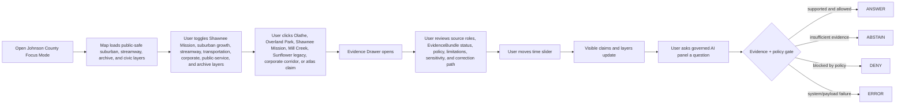
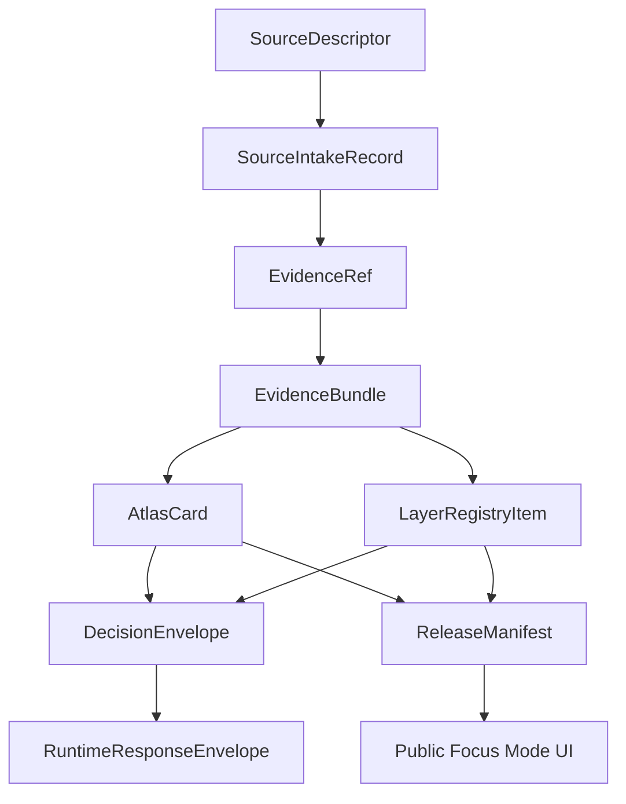

<!--
doc_id: NEEDS_VERIFICATION
title: Johnson County Focus Mode Build Plan
type: standard
version: v1
status: draft
owners: [NEEDS_VERIFICATION]
created: 2026-05-21
updated: 2026-05-21
policy_label: public_draft
related:
  - docs/focus-modes/ellsworth-county/build-plan.md
  - docs/focus-modes/riley-county/build-plan.md
  - docs/focus-modes/shawnee-county/build-plan.md
  - docs/focus-modes/ford-county/build-plan.md
  - docs/focus-modes/wyandotte-county/build-plan.md
  - docs/focus-modes/sedgwick-county/build-plan.md
  - docs/focus-modes/douglas-county/build-plan.md
  - docs/focus-modes/leavenworth-county/build-plan.md
  - docs/focus-modes/reno-county/build-plan.md
  - docs/focus-modes/johnson-county/README.md
  - docs/focus-modes/johnson-county/layer-registry.md
  - docs/focus-modes/johnson-county/acceptance-checklist.md
tags: [kfm, focus-mode, johnson-county, overland-park, olathe, suburban-growth, shawnee-mission, mill-creek, sunflowers]
notes:
  - Draft plan prepared without mounted repository inspection.
  - Paths, owners, doc IDs, schema homes, and validator names require repository verification before merge.
  - Suburban-growth, Indigenous/Shawnee Mission, corporate-campus, transportation, streamway, land-use, housing, property, environmental, and public-service claims require source intake and evidence review before publication.
-->

<a id="top"></a>

# Johnson County Focus Mode Build Plan

> **Purpose:** establish a tenth Kansas Frontier Matrix county proof slice after Ellsworth, Riley, Shawnee, Ford, Wyandotte, Sedgwick, Douglas, Leavenworth, and Reno counties, with a distinct Kansas City suburban-metro profile: **Overland Park, Olathe, Shawnee Mission, Johnson County Museum archives, suburban growth, corporate campuses, Sunflower Army Ammunition Plant legacy, streamway parks, Mill Creek, Kansas River edge, transportation corridors, housing, schools, property/privacy governance, and high-density public-service systems.**


---

## Quick links

- [1. Why Johnson County](#1-why-johnson-county)
- [2. Product thesis](#2-product-thesis)
- [3. Scope boundary](#3-scope-boundary)
- [4. First demo layers](#4-first-demo-layers)
- [5. User journeys](#5-user-journeys)
- [6. UI surfaces](#6-ui-surfaces)
- [7. Governed object model](#7-governed-object-model)
- [8. Proposed repository shape](#8-proposed-repository-shape)
- [9. Build phases](#9-build-phases)
- [10. First PR sequence](#10-first-pr-sequence)
- [11. Acceptance checklist](#11-acceptance-checklist)
- [12. Risk register](#12-risk-register)
- [13. Source seed list](#13-source-seed-list)
- [14. Open verification questions](#14-open-verification-questions)
- [15. Recommended first milestone](#15-recommended-first-milestone)

---

## Operating posture

> [!IMPORTANT]
> Johnson County Focus Mode is a **governed suburban-metro / archives / streamway / land-use proof slice**, not a loose “wealthy suburb” dashboard. It must preserve KFM’s core invariants:
>
> - EvidenceBundle outranks generated language.
> - Public clients use governed APIs, released artifacts, catalog records, tile services, and policy-safe runtime envelopes.
> - Public UI must not read directly from `RAW`, `WORK`, `QUARANTINE`, unpublished candidate data, canonical/internal stores, or direct model runtime outputs.
> - Publication is a governed state transition, not a file move.
> - AI outputs are downstream carriers, not sovereign truth.
> - School, household, property, appraisal, corporate-campus, infrastructure, public-safety, environmental, and private-address claims must remain source-bound, privacy-aware, aggregated where needed, and correction-friendly.

---

# 1. Why Johnson County

Johnson County is the right tenth Focus Mode because it gives KFM a **high-growth suburban, archival, streamway, corporate, and property/privacy proof slice**.

Ellsworth County tests frontier county history, Fort Harker / Kanopolis, settlement, and environmental baseline.

Riley County tests Flint Hills ecology, Fort Riley, Konza Prairie, research-site sensitivity, and river landscapes.

Shawnee County tests state government, civil-rights history, Topeka urban geography, public institutions, and archive-heavy civic memory.

Ford County tests Dodge City, Santa Fe Trail, Fort Dodge, cattle-town public history, Arkansas River water, and High Plains agriculture.

Wyandotte County tests dense urban governance, river confluence, tribal/burial sensitivity, environmental justice, rail/industry, and immigration/labor history.

Sedgwick County tests Wichita metro, aviation, Chisholm Trail, severe weather, public health, and infrastructure sensitivity.

Douglas County tests Free-State / Bleeding Kansas history, KU, Haskell, rivers, archives, and traumatic public memory.

Leavenworth County tests Fort Leavenworth, Missouri River, territorial politics, military education, corrections, and public-safety filtering.

Reno County tests salt mining, the Cosmosphere, wetlands, the Arkansas River, State Fair public-event governance, and subsurface hazard handling.

Johnson County adds:

| KFM capability | Johnson County proof value |
|---|---|
| Suburban growth and land-use change | postwar subdivisions, office parks, retail nodes, annexation, transportation growth |
| High-value property/privacy governance | appraisal/tax parcel context without title claims or household profiling |
| School and public-service geography | public districts, school history, libraries, parks, health services; privacy/security limits |
| Shawnee Mission and Indigenous/removal history | Shawnee Methodist Mission, culturally cautious source framing |
| Streamway parks and green infrastructure | Mill Creek Streamway, Turkey Creek, Indian Creek, Blue River headwaters, parks and trails |
| Corporate-campus and employment geography | Sprint/T-Mobile campus legacy, business parks, logistics, office corridors; security filtering |
| Environmental remediation legacy | Sunflower Army Ammunition Plant / former federal facility context; public-safe source role |
| Archives and museum collections | Johnson County Museum, county records, more than one million photos/archive-rich local history |
| KC metro integration | I-35, I-435, K-10, US-69, suburban commuting, regional growth, edge-city patterns |

> [!NOTE]
> Johnson County should prove KFM can handle affluent/suburban land-use, schools, parcels, corporate campuses, and public services without leaking private household detail or treating appraisal records as title truth.

---

# 2. Product thesis

## User-facing thesis

> **Johnson County Focus Mode lets a user explore how Shawnee Mission history, suburban development, streamway parks, corporate corridors, schools, parks, transportation, environmental remediation, and Kansas City metro growth shaped northeast Kansas — while keeping household, school, parcel, infrastructure, and corporate-security details public-safe and evidence-backed.**

## Internal KFM thesis

Johnson County should prove that Focus Mode can handle:

```text
suburban growth + property/appraisal boundaries + school/public services + streamway green infrastructure + corporate corridors + Indigenous/Shawnee Mission history + environmental remediation + archives
```

without turning high-resolution civic data into household-level exposure.

The system must preserve distinctions between:

- property/tax/appraisal record vs. title truth
- public school district geography vs. private student/school-security data
- suburban trend layer vs. household profile
- corporate-campus public context vs. security/operational detail
- environmental remediation record vs. health/legal conclusion
- streamway/park observation vs. habitat sensitivity or exact rare-species location
- Shawnee Mission public history vs. Indigenous cultural authority
- official record vs. museum/public-history interpretation
- source-backed claim vs. generated explanation

---

# 3. Scope boundary

## 3.1 Geography

Initial scope:

```text
Johnson County, Kansas
```

Priority spatial anchors:

- Johnson County boundary
- Olathe
- Overland Park
- Shawnee
- Lenexa
- Mission / Shawnee Mission context
- Kansas River edge / Nelson Island context
- Mill Creek Streamway / Gary L. Haller Trail context
- Indian Creek / Turkey Creek / Blue River headwaters where source-supported
- Johnson County Museum / Arts & Heritage Center source-routing context
- Shawnee Indian Mission / Shawnee Methodist Mission public-history context
- Sunflower Army Ammunition Plant legacy / remediation context, public-safe and source-role-labeled
- major transportation corridors: I-35, I-435, K-10, US-69, 69 Highway expansion context where source-supported
- suburban/corporate corridors: College Boulevard, Metcalf, Corporate Woods, Sprint/T-Mobile campus legacy where source-supported
- communities where source-supported: Leawood, Prairie Village, Merriam, Mission, Roeland Park, Gardner, De Soto, Spring Hill, Edgerton, Fairway, Westwood, Westwood Hills, Lake Quivira, Mission Hills, and others

## 3.2 Time range

Initial buckets:

| Bucket | Role in demo |
|---|---|
| Before 1800 | Indigenous, prairie/woodland, stream, and pre-territorial context; public-safe and culturally cautious |
| 1800–1839 | removal/treaty context and Shawnee Mission lead-up |
| 1839–1855 | Shawnee Methodist Mission / Indian Manual Labor School context |
| 1855–1865 | county creation, territorial conflict, early settlement, Bleeding Kansas context |
| 1866–1945 | farms, towns, rail/roads, schools, county institutions, interwar development |
| 1946–1975 | postwar suburbanization, highways, schools, subdivisions, retail corridors |
| 1976–2000 | office parks, corporate corridors, streamway parks, Sunflower legacy, suburban expansion |
| 2001–present | high-growth metro, redevelopment, trails, housing, school/public-service pressure, environmental planning |

> [!CAUTION]
> Time buckets are planning scaffolds. They are not publication claims until evidence-reviewed.

## 3.3 Not in MVP

Do **not** include in the first Johnson County MVP:

- private student records
- school security details
- household-level income, health, demographic, or behavioral profiling
- private addresses or exact household-level sensitive records
- parcel ownership treated as title truth
- corporate security, operations, or facility vulnerabilities
- restricted environmental remediation details
- exact rare species / nest / sensitive habitat locations
- active law-enforcement/public-safety operations
- public direct model endpoint

---

# 4. First demo layers

## 4.1 MVP layer registry

| Layer ID | Layer | Domain | Purpose | Initial posture |
|---|---|---:|---|---|
| `kfm.layer.johnson.county_boundary.v1` | Johnson County boundary | civic | establish spatial frame | public draft |
| `kfm.layer.johnson.olathe_overland_park_context.v1` | Olathe / Overland Park civic context | civic/history | county seat and largest-city anchors | public draft |
| `kfm.layer.johnson.shawnee_mission_context.v1` | Shawnee Mission public-history context | Indigenous/history/education | mission, removal, education history | review-required |
| `kfm.layer.johnson.suburban_growth_context.v1` | Suburban growth / land-use context | planning/history | postwar growth and development pattern | public draft, aggregate |
| `kfm.layer.johnson.streamway_parks_context.v1` | Mill Creek / streamway parks | ecology/recreation/hydrology | green infrastructure and trail corridors | public draft |
| `kfm.layer.johnson.transportation_corridors.v1` | Highway / arterial / commute corridors | transportation/planning | metro mobility and growth | public draft |
| `kfm.layer.johnson.corporate_corridors.v1` | Corporate / office / business park context | economic geography | office parks and employment geography | public-safe generalized |
| `kfm.layer.johnson.school_public_services.v1` | School and public-service context | civic/services | aggregated public-service geography | public-safe aggregated |
| `kfm.layer.johnson.sunflower_legacy_context.v1` | Sunflower Army Ammunition Plant legacy | environmental/history | remediation/public-land transition context | review-required |
| `kfm.layer.johnson.archives_museum_context.v1` | Johnson County Museum / archive source routing | archives/public history | evidence discovery and local history | public draft |
| `kfm.layer.johnson.timeline_events.v1` | Timeline events | cross-domain | temporal navigation | public draft |
| `kfm.layer.johnson.atlas_claims.v1` | Atlas claim points / corridors | cross-domain | clickable evidence-backed claims | requires EvidenceRef |

## 4.2 Layer contract

Each layer must have:

```yaml
layer_id: kfm.layer.johnson.<name>.v1
title: NEEDS_VERIFICATION
domain: NEEDS_VERIFICATION
layer_type: observed | derived | interpreted | modeled | administrative
geometry_type: point | line | polygon | raster | tile | mixed
source_refs: []
evidence_refs: []
policy_label: public_draft | restricted | internal | public
review_state: draft | review | published | deprecated
rights_status: unknown | public | open | controlled | restricted
sensitivity: public | generalized | restricted | review_required
temporal_scope:
  start: NEEDS_VERIFICATION
  end: NEEDS_VERIFICATION
limitations: []
correction_path: NEEDS_VERIFICATION
```

---

# 5. User journeys

## 5.1 Primary public journey



## 5.2 Example public questions

Supported after evidence review:

- “How did Johnson County change from farms to suburbs?”
- “Why is Shawnee Mission important to Johnson County history?”
- “What does Mill Creek Streamway show about green infrastructure?”
- “How did highways shape Johnson County growth?”
- “Which layers are aggregated for privacy?”
- “What sources support this suburban-growth atlas card?”
- “How is Sunflower Army Ammunition Plant represented safely?”

Should abstain or deny unless governed release permits them:

- “Show private student records.”
- “Show school security details.”
- “Identify household wealth or health risk by address.”
- “Treat appraisal data as title ownership.”
- “Show corporate facility vulnerabilities.”
- “Treat remediation context as a legal/health conclusion.”
- “Treat generated text as evidence.”
- “Publish a claim with no EvidenceBundle.”

---

# 6. UI surfaces

## 6.1 Map canvas

Required:

- MapLibre GL JS map
- placeholder basemap
- Johnson County boundary
- Olathe / Overland Park / Shawnee Mission / Mill Creek anchors
- clickable mock features
- selected feature highlight
- layer toggles
- scale bar
- attribution
- zoom controls
- compass / orientation affordance
- public-safe layer legend

## 6.2 Layer registry panel

Show for every layer:

| Field | Meaning |
|---|---|
| Layer name | human-readable layer title |
| Domain | civic, planning, Indigenous history, education, hydrology, parks, archives, economy |
| Layer type | observed, derived, interpreted, modeled, administrative |
| Evidence state | resolved, unresolved, not required, pending |
| Policy label | public, public_draft, restricted, internal |
| Review state | draft, review, published, deprecated |
| Sensitivity | public, generalized, restricted, review_required |
| Time coverage | start/end or bucketed range |
| Limitations | short public-facing warning |
| Source-role warning | official record, public-history interpretation, aggregate layer, property/appraisal, environmental remediation, derived indicator |

## 6.3 Timeline panel

Initial buckets:

```text
Before 1800
1800–1839
1839–1855
1855–1865
1866–1945
1946–1975
1976–2000
2001–present
```

Timeline should control:

- visible atlas claims
- Shawnee Mission and early county cards
- suburban-growth and highway cards
- streamway/parks cards
- corporate-corridor and public-service layers
- archive/source-routing layers
- feature styling by temporal relevance

## 6.4 Evidence Drawer

When a user clicks a layer feature or atlas claim, show:

```yaml
title: NEEDS_VERIFICATION
claim_text: NEEDS_VERIFICATION
object_type: AtlasCard | LayerFeature | TimelineEvent | EvidenceBundle
spatial_scope: NEEDS_VERIFICATION
temporal_scope: NEEDS_VERIFICATION
evidence_refs: []
evidence_bundle_status: unresolved | resolved | restricted | missing
source_roles: []
interpretation_status: fact_claim | interpretation | public_history | indigenous_history_context | aggregate_context | property_context | remediation_context | derived_indicator
policy_label: public_draft
rights_status: unknown
sensitivity: review_required
review_state: draft
limitations: []
correction_path: NEEDS_VERIFICATION
```

## 6.5 Atlas Card panel

Minimum atlas card types:

| Card type | Example |
|---|---|
| `suburban_growth_context` | postwar Johnson County development |
| `county_seat_context` | Olathe |
| `metro_city_context` | Overland Park |
| `indigenous_mission_context` | Shawnee Mission / Shawnee Methodist Mission |
| `streamway_green_infrastructure_context` | Mill Creek Streamway |
| `corporate_corridor_context` | College Boulevard / Corporate Woods / campus legacy |
| `environmental_remediation_context` | Sunflower Army Ammunition Plant legacy |
| `public_service_aggregate_context` | school/library/parks/service area |
| `archive_source_context` | Johnson County Museum |
| `derived_layer_context` | land-use, impervious surface, trail, or stream buffer baseline |

## 6.6 Governed AI panel

The AI panel must only emit finite runtime outcomes:

```text
ANSWER
ABSTAIN
DENY
ERROR
```

Example response envelope:

```json
{
  "object_type": "RuntimeResponseEnvelope",
  "schema_version": "v1",
  "question": "How did Johnson County change from farms to suburbs?",
  "outcome": "ABSTAIN",
  "answer": null,
  "reason": "Evidence bundle is not yet resolved for publication-grade response.",
  "evidence_refs": [
    "kfm://evidence-ref/johnson/suburban-growth-context/v1"
  ],
  "policy_label": "public_draft",
  "limitations": [
    "This draft object requires source intake, rights review, and source-specific land-use/suburban-growth framing before publication."
  ]
}
```

---

# 7. Governed object model

## 7.1 Object flow



## 7.2 SourceDescriptor draft

```yaml
id: kfm.source.johnson.suburban_growth.placeholder
title: Johnson County suburban growth source placeholder
domain: suburban_planning_history
source_type: county_museum_or_public_history_reference
role: context_NEEDS_VERIFICATION
rights_status: unknown
spatial_coverage: Johnson County, Kansas
temporal_coverage: NEEDS_VERIFICATION
status: proposed
limitations:
  - Requires source intake and review before claims are published.
  - Must separate aggregate land-use/suburban-growth context from household-level, appraisal, school, and private-address data.
```

## 7.3 EvidenceRef draft

```yaml
id: kfm.evidence_ref.johnson.suburban_growth_context.v1
bundle_id: kfm.evidence_bundle.johnson.suburban_growth_context.v1
claim_scope: Public-safe Johnson County suburban-growth and land-use context within Johnson County Focus Mode
resolution_required: true
```

## 7.4 EvidenceBundle draft

```yaml
id: kfm.evidence_bundle.johnson.suburban_growth_context.v1
resolved: false
source_refs:
  - kfm.source.johnson.suburban_growth.placeholder
policy_label: public_draft
rights_status: unknown
sensitivity: review_required
review_state: draft
limitations:
  - Draft bundle. Do not publish final suburban-growth or land-use claims until source-reviewed.
  - Do not include private household-level, school-security, corporate-security, or title-ownership claims.
```

## 7.5 AtlasCard draft

```yaml
id: kfm.atlas_card.johnson.suburban_growth.v1
title: Johnson County Suburban Growth Context
card_type: suburban_growth_context
spatial_scope: Johnson County, Kansas NEEDS_VERIFICATION
temporal_scope: NEEDS_VERIFICATION
evidence_refs:
  - kfm.evidence_ref.johnson.suburban_growth_context.v1
policy_label: public_draft
review_state: draft
limitations:
  - Draft card. Not a final planning, legal, title, school, environmental, or household authority statement.
```

## 7.6 DecisionEnvelope draft

```yaml
id: kfm.decision.johnson.question.suburban_growth_context.v1
question: How did Johnson County change from farms to suburbs?
outcome: ABSTAIN
reason: Evidence bundle unresolved.
evidence_refs:
  - kfm.evidence_ref.johnson.suburban_growth_context.v1
policy_label: public_draft
```

## 7.7 ReleaseManifest draft

```yaml
id: kfm.release.johnson.focus_mode.v0_1
release_state: draft
included_layers:
  - kfm.layer.johnson.county_boundary.v1
  - kfm.layer.johnson.olathe_overland_park_context.v1
  - kfm.layer.johnson.shawnee_mission_context.v1
  - kfm.layer.johnson.suburban_growth_context.v1
  - kfm.layer.johnson.streamway_parks_context.v1
validation_state: pending
rollback_plan: required_before_publication
correction_path: required_before_publication
```

---

# 8. Proposed repository shape

> [!WARNING]
> Repository access is **not confirmed** in this planning session. Treat all paths as proposed until checked against the live branch and KFM Directory Rules.

```text
docs/
  focus-modes/
    johnson-county/
      README.md
      build-plan.md
      layer-registry.md
      evidence-model.md
      acceptance-checklist.md
      source-seed-list.md
      public-safety-notes.md
      suburban-growth-and-property-notes.md
      school-and-public-service-privacy-notes.md
      shawnee-mission-and-indigenous-history-notes.md
      streamway-parks-and-green-infrastructure-notes.md
      corporate-campus-and-infrastructure-notes.md
      environmental-remediation-notes.md

data/
  catalog/
    sources/
      johnson/
        source_descriptors.yaml
    stac/
      johnson/
        README.md

contracts/
  focus_mode/
    focus_mode_payload.schema.json
  atlas/
    atlas_card.schema.json
  evidence/
    evidence_ref.schema.json
    evidence_bundle.schema.json
  release/
    release_manifest.schema.json

fixtures/
  focus_modes/
    johnson/
      valid/
        focus_mode_payload.valid.json
        layer_registry.valid.json
        atlas_card.suburban_growth.valid.json
        atlas_card.shawnee_mission.valid.json
        atlas_card.streamway.valid.json
        evidence_bundle.suburban_growth.valid.json
        evidence_bundle.shawnee_mission.valid.json
      invalid/
        unresolved_evidence_ref.invalid.json
        private_student_record.invalid.json
        school_security_detail.invalid.json
        household_level_profile.invalid.json
        parcel_as_title_truth.invalid.json
        corporate_security_vulnerability.invalid.json
        remediation_context_as_health_legal_conclusion.invalid.json
        exact_sensitive_species_location.invalid.json
        missing_policy_label.invalid.json
        model_output_as_evidence.invalid.json
        public_raw_access.invalid.json

apps/
  web/
    src/
      focus-modes/
        johnson/
          index.js
          layers.js
          mock-api.js
          mock-data.js
          evidence-drawer.js
          timeline.js
          ai-panel.js
          styles.css

tools/
  validators/
    validate_focus_mode_payload.py
    validate_atlas_card.py
    validate_evidence_bundle.py
    validate_layer_registry.py
```

---

# 9. Build phases

## Phase 1 — Control plane

Goal: establish Johnson County Focus Mode as a governed suburban-growth/property/privacy/streamway/corporate-corridor template.

Deliverables:

- `docs/focus-modes/johnson-county/README.md`
- `build-plan.md`
- `layer-registry.md`
- `source-seed-list.md`
- `public-safety-notes.md`
- `suburban-growth-and-property-notes.md`
- `school-and-public-service-privacy-notes.md`
- `shawnee-mission-and-indigenous-history-notes.md`
- `streamway-parks-and-green-infrastructure-notes.md`
- `corporate-campus-and-infrastructure-notes.md`
- `environmental-remediation-notes.md`
- first schema references
- valid and invalid fixture plan

Definition of done:

```text
[ ] scope is explicit
[ ] suburban-growth layers are aggregate and source-framed
[ ] property/appraisal layers cannot be treated as title truth
[ ] school/public-service layers are privacy-preserving
[ ] Shawnee Mission/Indigenous history layers require source and review posture
[ ] streamway/ecology layers generalize sensitive species where needed
[ ] corporate-campus/infrastructure layers exclude vulnerabilities
[ ] environmental-remediation layers distinguish record/context from health/legal conclusions
[ ] all layers have policy labels
[ ] all claim-bearing objects require EvidenceRef
[ ] placeholders are clearly marked
```

## Phase 2 — Mock governed API

Goal: make Johnson Focus Mode run without live pipelines.

Mock endpoints:

```text
GET /api/focus-modes/johnson
GET /api/layers/johnson
GET /api/evidence/{bundle_id}
GET /api/atlas-cards/{card_id}
POST /api/ai/answer
GET /api/releases/johnson-focus-mode
```

Definition of done:

```text
[ ] mock payloads validate
[ ] unresolved evidence produces ABSTAIN
[ ] school/security/private-household requests produce DENY
[ ] parcel-as-title-truth payloads fail validation
[ ] corporate vulnerability payloads fail validation
[ ] remediation-as-health/legal-conclusion payloads fail validation
[ ] invalid payloads fail closed
[ ] public layer payloads do not reference RAW / WORK / QUARANTINE
```

## Phase 3 — UI prototype

Goal: show the full Johnson Focus Mode surface in a browser.

Deliverables:

- MapLibre map
- layer registry
- clickable mock Olathe, Overland Park, Shawnee Mission, Mill Creek Streamway, suburban growth, corporate corridor, Sunflower legacy, and archive features
- evidence drawer
- timeline
- atlas card panel
- governed AI answer panel

Definition of done:

```text
[ ] user can click suburban-growth context and see aggregate/privacy limitations
[ ] user can click Shawnee Mission context and see source/review posture
[ ] user can click Mill Creek Streamway context and see hydrology/ecology limitations
[ ] user can click corporate-corridor context and see security limitations
[ ] user can click Sunflower legacy context and see remediation/source-role warnings
[ ] user can toggle civic / suburban-growth / streamway / transportation / corporate / public-service / archive layers
[ ] timeline changes visible claim set
[ ] AI panel returns all four finite outcomes through examples
```

## Phase 4 — Validators and negative fixtures

Goal: prove failure modes before publication.

Required invalid fixtures:

| Fixture | Expected failure |
|---|---|
| `unresolved_evidence_ref.invalid.json` | publication attempted with unresolved evidence |
| `private_student_record.invalid.json` | private student data exposed |
| `school_security_detail.invalid.json` | school security details exposed |
| `household_level_profile.invalid.json` | household-level demographic/health/wealth profile exposed |
| `parcel_as_title_truth.invalid.json` | appraisal/tax parcel record treated as title ownership |
| `corporate_security_vulnerability.invalid.json` | corporate campus/facility vulnerability exposed |
| `remediation_context_as_health_legal_conclusion.invalid.json` | environmental record treated as health/legal conclusion |
| `exact_sensitive_species_location.invalid.json` | exact sensitive ecology occurrence exposed |
| `missing_policy_label.invalid.json` | public object lacks policy posture |
| `model_output_as_evidence.invalid.json` | AI output treated as proof |
| `public_raw_access.invalid.json` | public client references RAW/WORK/QUARANTINE |

## Phase 5 — Source intake upgrade

Goal: replace placeholders with inspected sources.

Deliverables:

- source descriptors
- intake records
- rights review notes
- sensitivity review notes
- evidence bundle drafts
- reviewed atlas cards
- limitations notes

Minimum real-evidence targets:

```text
[ ] one Johnson County founding/name/official-history claim
[ ] one Shawnee Mission / Shawnee Methodist Mission public-history claim
[ ] one suburban-growth / postwar-development claim
[ ] one Mill Creek Streamway / parks / green-infrastructure claim
[ ] one transportation-corridor / suburban-growth claim
[ ] one corporate-corridor / office-park public context claim
[ ] one Sunflower Army Ammunition Plant legacy/remediation-context claim
[ ] one Johnson County Museum archive/source-routing claim
```

## Phase 6 — Release candidate

Goal: prepare `v0.1` public-safe release.

Deliverables:

- `ReleaseManifest`
- validation report
- correction path
- rollback plan
- public-safe layer manifest
- known limitations
- release notes

Definition of done:

```text
[ ] public layers have policy labels and review states
[ ] rights status is resolved or blocked
[ ] private household/student/school-security details are excluded
[ ] parcel/appraisal claims do not imply title truth
[ ] corporate/infrastructure vulnerabilities are excluded or generalized
[ ] environmental remediation claims preserve source role and uncertainty
[ ] streamway/ecology claims preserve source role and sensitivity limits
[ ] release can be rolled back
[ ] public UI only consumes governed surfaces
```

---

# 10. First PR sequence

## PR-0001 — Johnson County Focus Mode Control Plane

Files:

```text
docs/focus-modes/johnson-county/README.md
docs/focus-modes/johnson-county/build-plan.md
docs/focus-modes/johnson-county/layer-registry.md
docs/focus-modes/johnson-county/source-seed-list.md
docs/focus-modes/johnson-county/public-safety-notes.md
docs/focus-modes/johnson-county/suburban-growth-and-property-notes.md
docs/focus-modes/johnson-county/school-and-public-service-privacy-notes.md
docs/focus-modes/johnson-county/shawnee-mission-and-indigenous-history-notes.md
docs/focus-modes/johnson-county/streamway-parks-and-green-infrastructure-notes.md
docs/focus-modes/johnson-county/corporate-campus-and-infrastructure-notes.md
docs/focus-modes/johnson-county/environmental-remediation-notes.md
docs/focus-modes/johnson-county/acceptance-checklist.md
```

Acceptance:

```text
[ ] Focus Mode scope is clear.
[ ] Johnson County is justified as a complementary proof slice.
[ ] Every planned layer has a policy posture.
[ ] Suburban-growth and property/privacy boundaries are explicit.
[ ] School/public-service privacy and security boundaries are explicit.
[ ] Shawnee Mission/Indigenous-history source/review rules are explicit.
[ ] Corporate/infrastructure security boundaries are explicit.
[ ] Environmental-remediation source-role boundaries are explicit.
[ ] No publication claims are made from placeholders.
```

## PR-0002 — Johnson Contracts and Fixtures

Files:

```text
fixtures/focus_modes/johnson/valid/focus_mode_payload.valid.json
fixtures/focus_modes/johnson/valid/layer_registry.valid.json
fixtures/focus_modes/johnson/valid/atlas_card.suburban_growth.valid.json
fixtures/focus_modes/johnson/valid/atlas_card.shawnee_mission.valid.json
fixtures/focus_modes/johnson/invalid/private_student_record.invalid.json
fixtures/focus_modes/johnson/invalid/parcel_as_title_truth.invalid.json
fixtures/focus_modes/johnson/invalid/household_level_profile.invalid.json
fixtures/focus_modes/johnson/invalid/missing_policy_label.invalid.json
```

Acceptance:

```text
[ ] Valid fixtures include required governed fields.
[ ] Invalid fixtures represent real failure modes.
[ ] EvidenceRef / EvidenceBundle relationship is explicit.
[ ] Mock cards remain draft until evidence intake.
```

## PR-0003 — Johnson Mock API

Files:

```text
apps/web/src/focus-modes/johnson/mock-api.js
apps/web/src/focus-modes/johnson/layers.js
apps/web/src/focus-modes/johnson/mock-data.js
```

Acceptance:

```text
[ ] Mock API returns finite runtime outcomes.
[ ] Layer registry is API-shaped, not UI-only.
[ ] Public-safe data is separated from restricted mock examples.
[ ] Sensitivity/source-role status is included for property, schools, streamway, corporate, and remediation objects.
```

## PR-0004 — Johnson UI Shell

Files:

```text
apps/web/src/focus-modes/johnson/index.js
apps/web/src/focus-modes/johnson/evidence-drawer.js
apps/web/src/focus-modes/johnson/timeline.js
apps/web/src/focus-modes/johnson/ai-panel.js
apps/web/src/focus-modes/johnson/styles.css
```

Acceptance:

```text
[ ] Map renders.
[ ] Layer panel renders.
[ ] Evidence Drawer renders.
[ ] Atlas Card panel renders.
[ ] Timeline filters mock claims.
[ ] AI panel demonstrates ANSWER / ABSTAIN / DENY / ERROR.
```

## PR-0005 — Validator Hardening

Files:

```text
tools/validators/validate_focus_mode_payload.py
tools/validators/validate_atlas_card.py
tools/validators/validate_evidence_bundle.py
tools/validators/validate_layer_registry.py
```

Acceptance:

```text
[ ] Public RAW / WORK / QUARANTINE references fail.
[ ] Missing EvidenceRef fails for claim-bearing objects.
[ ] Missing policy label fails.
[ ] Private student/school-security detail fails public release.
[ ] Household-level profiling fails public release.
[ ] Parcel-as-title-truth fails.
[ ] Corporate vulnerability exposure fails.
[ ] Environmental remediation as health/legal conclusion fails.
[ ] Model output as proof fails.
```

---

# 11. Acceptance checklist

```text
[ ] Johnson County map loads.
[ ] User can toggle at least 5 public-safe layers.
[ ] User can click Olathe / Overland Park context and open Evidence Drawer.
[ ] User can click Shawnee Mission context and open Evidence Drawer.
[ ] User can click suburban-growth context and open Evidence Drawer.
[ ] User can click Mill Creek Streamway context and open Evidence Drawer.
[ ] User can click Sunflower legacy context and see remediation limitations.
[ ] User can inspect at least 3 Atlas Cards.
[ ] Timeline control changes visible claims/layers.
[ ] Governed AI panel returns ANSWER for supported claims.
[ ] Governed AI panel returns ABSTAIN for unresolved evidence.
[ ] Governed AI panel returns DENY for restricted/sensitive requests.
[ ] Governed AI panel returns ERROR for invalid payload/system failure.
[ ] Every visible claim has EvidenceRef.
[ ] Every EvidenceRef points to an EvidenceBundle.
[ ] Every layer has policy_label.
[ ] Every layer has review_state.
[ ] Every public object has correction path.
[ ] No public UI path reads RAW, WORK, or QUARANTINE.
[ ] Private household/student/school-security details are excluded.
[ ] Parcel/appraisal data is not treated as title truth.
[ ] Corporate/infrastructure vulnerabilities are excluded or generalized.
[ ] Environmental-remediation context is not represented as health/legal conclusion.
[ ] ReleaseManifest exists before anything is called published.
```

---

# 12. Risk register

| Risk | Why it matters | Control |
|---|---|---|
| Parcel/appraisal data becomes title truth | legal/title error risk | explicit assessor/tax/appraisal ≠ title truth rule |
| School layer exposes student/security detail | privacy and safety risk | aggregate public-service geography only |
| Household-level wealth/health/demographic profiling | privacy and harm risk | aggregate/generalize; deny household profiling |
| Corporate campus layer exposes vulnerabilities | security risk | public context only; deny facility vulnerabilities |
| Environmental remediation becomes health/legal conclusion | legal/public-health risk | source-role labels and limitations |
| Shawnee Mission history is flattened | Indigenous/cultural-history harm | source/review posture and limitations |
| Sensitive ecology locations leak | species/habitat risk | generalized streamway/ecology layer |
| Generated narrative treated as source | evidence failure | model output cannot be proof |
| Mock placeholders become doctrine | demo pollution | all placeholders marked draft/unresolved |
| Overland Park/Olathe dominates county view | county-scale imbalance | include smaller cities, streamways, archives, and rural edges where evidence-supported |

---

# 13. Source seed list

> [!NOTE]
> These are **candidate source seeds**, not yet KFM-ingested sources. Each requires `SourceDescriptor`, rights review, sensitivity review, checksum/citation handling, and EvidenceBundle resolution before publication-grade use.

| Seed | Use | Starting URL |
|---|---|---|
| Johnson County official anniversary/history article | county creation / original 33 counties / 1855 context | https://www.jocogov.org/newsroom/johnson-county-celebrates-169th-birthday-aug-25 |
| Johnson County official site | current county civic source routing | https://www.jocogov.org/ |
| Johnson County Park & Recreation — Johnson County History | county history / Shawnee Mission / official public-history context | https://jcprd.com/765/Johnson-County-History |
| Johnson County Museum virtual exhibit | suburban growth / Kansa, Missouria, Osage, Bleeding Kansas, Sunflower, corporate HQ context | https://jcprd.com/2112/Virtual-Museum |
| Johnson County Museum / Arts & Heritage Center | archive-rich local-history source routing | https://jcprd.com/459/Johnson-County-Museum |
| Mill Creek Streamway Park | streamway park, trail, Kansas River to Olathe context | https://www.jocogov.org/contact-us/all-locations/mill-creek-streamway-park |
| Johnson County Park & Recreation — Mill Creek Streamway | Gary L. Haller Trail / National Recreation Trail context | https://www.jcprd.com/facilities/facility/details/Mill-Creek-Streamway-Park-40 |
| Shawnee Indian Mission State Historic Site | Shawnee Mission public-history source routing | https://www.kshs.org/p/shawnee-indian-mission/19562 |
| City of Olathe official site | county-seat/current civic source routing | https://www.olatheks.gov/ |
| City of Overland Park official site | largest-city/current civic and planning source routing | https://www.opkansas.org/ |
| Sunflower Army Ammunition Plant / KDHE source routing | remediation/environmental legacy context | https://www.kdhe.ks.gov/ |
| EPA Envirofacts | regulated facility / environmental record source routing | https://www.epa.gov/enviro |
| FEMA Flood Map Service Center | floodplain/regulatory source routing | https://msc.fema.gov/portal/home |
| USGS National Hydrography | stream and watershed source routing | https://www.usgs.gov/national-hydrography |
| USDA Cropland Data Layer | land-cover / agriculture / urban edge source routing | https://www.nass.usda.gov/Research_and_Science/Cropland/SARS1a.php |

---

# 14. Open verification questions

```text
[ ] What is the canonical repo path for Focus Mode documents?
[ ] Does KFM already have a focus_mode_payload schema?
[ ] Does KFM already define AtlasCard fields differently?
[ ] Does KFM already define property/appraisal/title-truth fields?
[ ] Does KFM already define school/public-service privacy fields?
[ ] Does KFM already define corporate/infrastructure sensitivity fields?
[ ] Does KFM already define environmental-remediation source-role fields?
[ ] Which validators already exist?
[ ] Should Johnson County share contracts with other Focus Modes or define county-specific extensions?
[ ] What public-safe geometry source should be used for county boundary?
[ ] What source authority should define Johnson County founding/name claims?
[ ] What source authority should define Shawnee Mission claims?
[ ] What source authority should define suburban-growth claims?
[ ] What source authority should define Mill Creek Streamway claims?
[ ] What source authority should define Sunflower Army Ammunition Plant legacy claims?
[ ] What exact policy rule controls school/student/security data?
[ ] What exact policy rule controls parcel/appraisal/title boundaries?
[ ] What exact policy rule controls corporate facility vulnerabilities?
[ ] What release manifest naming convention should be used?
[ ] What rollback/correction path should a county Focus Mode use?
```

---

# 15. Recommended first milestone

## Milestone 1: Johnson County Focus Mode Control Plane

Build the documentation, layer registry, source seed list, public-safety notes, suburban-growth/property notes, school/public-service privacy notes, Shawnee Mission/Indigenous history notes, streamway/green-infrastructure notes, corporate-campus notes, environmental-remediation notes, and fixtures before the UI.

This keeps the Johnson proof slice from becoming a high-resolution suburban dashboard that accidentally exposes household, school, property, corporate, or infrastructure-sensitive detail.

The first concrete deliverable should be:

```text
docs/focus-modes/johnson-county/build-plan.md
```

Once this is stable, use it to generate the mock API and single-file UI prototype.

---

[Back to top](#top)
