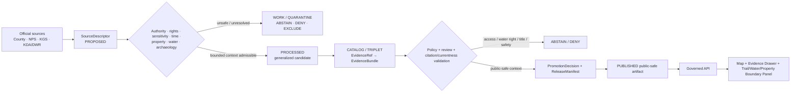
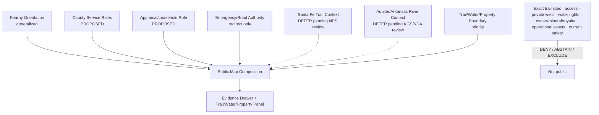
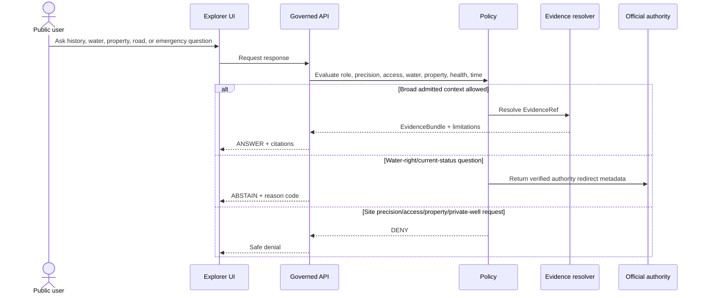
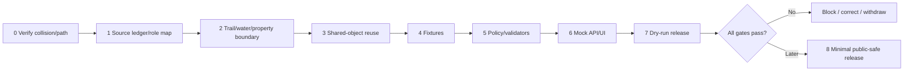

<!-- [KFM_META_BLOCK_V2]
doc_id: NEEDS_VERIFICATION — <REGISTERED_KFM_DOC_ID>
title: Kearny County Focus Mode Build Plan — Santa Fe Trail, Arkansas River, Groundwater, and Property/Energy Boundaries Without Access, Water-Right, Safety, or Title Conclusions
type: county-focus-mode-build-plan
version: v0.1-draft
status: draft
county: Kearny County, Kansas
county_slug: kearny
created: 2026-06-08
updated: 2026-06-08
owners:
  - NEEDS_VERIFICATION — <OWNER:focus-mode-steward>
  - NEEDS_VERIFICATION — <OWNER:historic-trail-and-archaeology-reviewer>
  - NEEDS_VERIFICATION — <OWNER:groundwater-and-water-governance-reviewer>
  - NEEDS_VERIFICATION — <OWNER:property-mineral-and-tax-reviewer>
  - NEEDS_VERIFICATION — <OWNER:emergency-road-and-public-works-reviewer>
release_status: NEEDS_VERIFICATION — NOT_RELEASED
review_assignments: NEEDS_VERIFICATION
correction_path: NEEDS_VERIFICATION
rollback_path: NEEDS_VERIFICATION
unverified_repository_paths:
  - PROPOSED / CONFLICTED / NEEDS_VERIFICATION — docs/focus-modes/kearny-county/build-plan.md
  - PROPOSED / OBSERVED-LEGACY / NEEDS_VERIFICATION — docs/focus-mode/counties/kearny_county/kearny_county_focus_mode_build_plan.md
schema_contract_policy_homes:
  - PROPOSED / NEEDS_VERIFICATION — contracts/focus_mode/
  - PROPOSED / NEEDS_VERIFICATION — schemas/contracts/v1/focus_mode/
  - PROPOSED / NEEDS_VERIFICATION — policy/runtime/, policy/sensitivity/, policy/rights/, policy/release/
proof_slice: Santa Fe Trail and Arkansas River public-history context paired with High Plains aquifer/water-governance, parcel/appraisal, oil-and-gas leasehold, emergency, road, and access non-determination
primary_public_safe_boundary: KFM may present generalized, time-attributed Santa Fe Trail, Arkansas River, county-service, groundwater, and appraisal-role context; it must not disclose sensitive archaeological or trail-site precision, imply permission to enter private land, determine water rights or individual well status, infer groundwater potability or depletion impacts for a property, determine title/mineral ownership or royalty value, expose operational energy or infrastructure detail, or issue road/emergency guidance.
collision_search:
  completed_register: CONFIRMED — Kearny County is absent from the user-supplied completed/collision register.
  generated_in_continuation: CONFIRMED — Cheyenne, Wallace, Elk, Clay, Stevens, Sherman, Decatur, Chautauqua, Rawlins, Butler, Wilson, Franklin, Haskell, Grant, Comanche, Labette, Meade, and Norton were excluded.
  uploaded_project_materials: CONFIRMED — targeted Kearny County Focus Mode searches were performed; no Kearny County plan surfaced among examined results.
  live_repository_index: CONFIRMED — docs/focus-mode/counties/COUNTY_INDEX.md lists Kearny as not-started with validation not-run.
  live_repository_search: CONFIRMED — searches for kearny_county_focus_mode_build_plan and Kearny County Focus Mode returned no matching county plan.
  exhaustive_absence: NEEDS_VERIFICATION — unindexed branches, private artifacts, and prior unsearched outputs may still exist.
directory_rules_basis:
  - CONFIRMED — attached Directory Rules.pdf was inspected during this series.
  - CONFIRMED — location encodes responsibility, governance, and lifecycle; topic alone does not justify a root folder.
  - CONFIRMED — lifecycle is RAW → WORK / QUARANTINE → PROCESSED → CATALOG / TRIPLET → PUBLISHED.
  - CONFIRMED — promotion is a governed state transition, not a file move.
  - CONFLICTED / NEEDS_VERIFICATION — observed repository paths use docs/focus-mode/ while doctrine also identifies docs/focus-modes/.
official_source_checks:
  - CONFIRMED — Kearny County official homepage, checked 2026-06-08.
  - CONFIRMED — Kearny County Emergency Services page, checked 2026-06-08.
  - CONFIRMED — Kearny County Public Works page, checked 2026-06-08.
  - CONFIRMED — Kearny County Road & Bridge Department page, checked 2026-06-08.
  - CONFIRMED — Kearny County Museum / Historical Society page, checked 2026-06-08.
  - CONFIRMED — Kearny County Appraiser page, checked 2026-06-08.
  - NEEDS_VERIFICATION — direct National Park Service Santa Fe Trail Segment 1 page and KGS Kearny County geology/water pages should be admitted before publication.
source_check_date: 2026-06-08
tags: [kfm, focus-mode, kearny-county, santa-fe-trail, arkansas-river, high-plains-aquifer, water-rights, appraisal, oil-gas-leasehold, property-privacy, cite-or-abstain]
notes:
  - Planning artifact only; no implementation, source admission, review, promotion, publication, correction readiness, or rollback readiness is claimed.
  - County appraisal information includes oil-and-gas leasehold valuation and 2026 property-value notices; KFM must not convert that administrative context into title, mineral-right, royalty, tax, or personal financial conclusions.
  - Historic trail resources may cross private land or include sensitive archaeological precision; generalized public history does not confer access.
[/KFM_META_BLOCK_V2] -->

<a id="top"></a>

# Kearny County Focus Mode Build Plan
## Santa Fe Trail, Arkansas River, Groundwater, and Property/Energy Boundaries Without Access, Water-Right, Safety, or Title Conclusions

> **Product thesis:** Explain Kearny County’s Santa Fe Trail, Arkansas River, groundwater, and county-service context while refusing to become an access-permission, archaeological-location, water-right, private-well, groundwater-health, title, mineral-right, royalty-value, road-safety, operational-energy, or emergency authority.


| Identity / status field | Value |
|---|---|
| County | **Kearny County, Kansas** |
| Status | `PROPOSED` planning artifact |
| Distinct proof slice | Santa Fe Trail and Arkansas River history joined to High Plains aquifer/water-governance, appraisal, oil-and-gas leasehold, road, and emergency boundaries |
| Primary public-safe boundary | **Generalized public-history, hydrology, and agency-role context may be shown; KFM must not reveal sensitive site precision, imply access, determine water rights or well status, infer groundwater health, determine title/mineral ownership/royalty value, expose operational infrastructure, or issue road/emergency guidance.** |
| Official sources checked | Kearny County homepage; Emergency Services; Public Works; Road & Bridge; Museum/Historical Society; Appraiser |
| Collision status | No Kearny collision surfaced in checked register, repository index/searches, or examined materials |
| Exhaustive absence | `NEEDS_VERIFICATION` |
| Release state | `NOT_RELEASED` |

## Quick links

[Operating posture](#1-operating-posture) · [Why this county](#2-why-this-county) · [Product thesis](#3-product-thesis) · [Scope](#4-scope-boundary) · [Layers](#5-first-demo-layers) · [Journeys](#6-user-journeys) · [UI](#7-ui-surfaces) · [Objects](#8-governed-object-model) · [Repository](#9-proposed-repository-shape) · [Build](#10-build-phases) · [PRs](#11-first-pr-sequence) · [Acceptance](#12-acceptance-checklist) · [Fixtures](#13-fixture-plan) · [Risks](#14-risk-register) · [Sources](#15-source-seed-list) · [Questions](#16-open-verification-questions) · [Milestone](#17-recommended-first-milestone)

---

## Executive build note

Kearny County is selected because it creates a strong **historic trail + western Kansas water + property and energy administration** proof slice.

The official county website identifies Kearny County’s public functions, including Building & Zoning, County Appraiser, Emergency Services, Health Department, Museum/Historical Society, Public Works, Road & Bridge, and recreation resources.[^s1] This provides a useful county control-plane and routing context, but not authority for KFM to decide access, title, market value, taxation, road safety, emergency status, or land-use legality.

The county’s Emergency Services page states that EMS, Fire & Rescue, and Emergency Management work together through the county’s emergency-services structure.[^s2] The Public Works and Road & Bridge pages establish official departmental routing.[^s3][^s4] These sources support a public agency-role layer, not current incident, closure, passability, infrastructure-condition, or safety conclusions.

The County Appraiser page is especially important. It explains valuation factors for oil-and-gas leasehold properties, discusses royalty tax statements, shut-in wells, reserves, and 2026 market-study notices, and links to public parcel search.[^s5] This creates a high-risk overclaim boundary: KFM must not convert appraisal guidance into title, mineral ownership, lease status, royalty value, tax liability, current production, investment advice, or a person-linked property profile.

Kearny County also has nationally recognized Santa Fe Trail resources and lies in the Arkansas River / High Plains aquifer landscape. Those domains provide excellent future public-history and hydrology layers, but direct NPS/KGS source admission and rights review remain `NEEDS_VERIFICATION`. The plan therefore treats trail interpretation and groundwater mapping as **deferred until authoritative source closure**, while specifying fail-closed behavior for access, archaeology, private wells, water rights, and groundwater-health questions.

> [!CAUTION]
> ## Defining public-safe boundary
>
> **KFM may explain broad Santa Fe Trail, Arkansas River, groundwater, and county-service context. It must not reveal precise archaeological or trail-site locations that are sensitive, imply permission to enter private land, determine a person’s water right or well condition, state whether groundwater is safe, infer property-level depletion or contamination, determine title or mineral ownership, estimate royalty or tax value, expose operational energy or infrastructure detail, or issue current road or emergency guidance.**

### Evidence boundary

| Label | Established | Not established |
|---|---|---|
| `CONFIRMED` | Kearny is absent from the supplied register; live county index lists it `not-started` / `not-run`; targeted repo searches found no Kearny plan; official county service, emergency, public works, museum, road, and appraisal pages were checked. | — |
| `PROPOSED` | Every card, layer, object, fixture, path, policy, UI surface, phase, milestone, and release action below. | No implementation is claimed. |
| `NEEDS_VERIFICATION` | Direct NPS Santa Fe Trail source admission; KGS Kearny geology/water source admission; authoritative water-right and groundwater datasets; source rights; site sensitivity; final repository path; shared contracts/policies; correction and rollback implementation. | — |
| `UNKNOWN` | Present trail access, private-land permission, well status, water rights, groundwater potability, property-level depletion, title/mineral ownership, current production, royalty value, tax liability, road condition, active emergency status, and deployed runtime state. | — |

---

# 1. Operating posture

## 1.1 Governing rules applied to Kearny County

| KFM rule | County application |
|---|---|
| EvidenceBundle outranks generated language | AI cannot create access, water-right, private-well, title, mineral, royalty, road, or emergency truth. |
| Cite-or-abstain | Stable broad context may answer after evidence closure; person/property/current-status questions abstain or deny. |
| Public clients use governed interfaces | No public path to raw well records, restricted archaeological data, unpublished candidates, internal stores, or direct model output. |
| Source roles remain distinct | NPS public history, KGS science, KDA/DWR water administration, county appraisal, county emergency/public works, property records, operator data, and AI narrative remain separate. |
| Publication is governed | Visible source data is not automatically a public KFM layer. |
| Cultural/archaeological precision fails closed | Sensitive trail ruts, campsites, artifacts, and site coordinates are generalized or withheld. |
| Water and health claims fail closed | Aquifer or well data does not establish legal water rights, potability, contamination, or health. |
| Property/energy claims fail closed | Appraisal context does not establish ownership, lease, royalty, production, or investment value. |

## 1.2 Truth labels and finite outcomes

| Token | Meaning |
|---|---|
| `CONFIRMED` | Verified in this run. |
| `PROPOSED` | Design not verified in implementation. |
| `NEEDS_VERIFICATION` | Checkable before action. |
| `UNKNOWN` | Unsupported or unresolved. |
| `ANSWER` | Narrow evidence-supported public-safe context. |
| `ABSTAIN` | Authority, currency, rights, or evidence is insufficient. |
| `DENY` | Request crosses access, archaeology, property, privacy, water, health, or infrastructure boundary. |
| `ERROR` | Contract, evidence, policy, or runtime failure. |

## 1.3 Public trust membrane



## 1.4 County-specific guardrails

| Guardrail | Outcome | Candidate reason code |
|---|---:|---|
| Precise archaeological/trail-site detail | `DENY` | `HISTORIC_OR_ARCHAEOLOGICAL_PRECISION_WITHHELD` |
| Private-land/site access permission | `DENY` / `ABSTAIN` | `HISTORIC_CONTEXT_NOT_ACCESS_PERMISSION` |
| Water-right, permit, priority, or legal entitlement | `ABSTAIN` | `WATER_RIGHT_DETERMINATION_REQUIRES_DWR_AUTHORITY` |
| Private-well status, potability, or contamination | `DENY` / `ABSTAIN` | `PRIVATE_WELL_OR_GROUNDWATER_HEALTH_NOT_DETERMINED` |
| Property-level depletion or agricultural suitability | `ABSTAIN` | `PROPERTY_LEVEL_WATER_IMPACT_NOT_DETERMINED` |
| Title, mineral ownership, lease, royalty, or tax conclusion | `DENY` | `PROPERTY_MINERAL_OR_ROYALTY_DETERMINATION_DENIED` |
| Current well/production or operational energy detail | `DENY` / `ABSTAIN` | `OPERATIONAL_ENERGY_DETAIL_WITHHELD` |
| Road, bridge, fire, rescue, or emergency status | `ABSTAIN` | `OFFICIAL_CURRENT_SAFETY_CHANNEL_REQUIRED` |

---

# 2. Why this county

## 2.1 Collision screen

| Check | Result | Status |
|---|---|---:|
| Supplied completed/collision register | Kearny absent. | `CONFIRMED` |
| Generated counties in continuation | Excluded. | `CONFIRMED` |
| Live county index | Kearny `not-started`, validation `not-run`. | `CONFIRMED` |
| Repository search | No Kearny plan identifier match. | `CONFIRMED` |
| Uploaded/project-material search | No Kearny plan surfaced among examined results. | `CONFIRMED` for performed search |
| Exhaustive absence | Not proved across all unindexed/private material. | `NEEDS_VERIFICATION` |

## 2.2 Proof-slice rationale

| Dimension | Proof value | Basis |
|---|---|---|
| Historic transportation | Kearny County contains documented Santa Fe Trail resources requiring access and site-precision restraint. | Direct NPS admission pending; public record widely established but marked `NEEDS_VERIFICATION` for publication. |
| Hydrology and groundwater | County lies in a western Kansas Arkansas River / High Plains aquifer setting where public data can be misread as water-right or well-health truth. | `PROPOSED` proof rationale; KGS/KDA/DWR admission pending. |
| Property and energy administration | County Appraiser page explicitly discusses oil-and-gas leasehold valuation, royalty tax statements, reserves, shut-in wells, and 2026 value notices. | County official page.[^s5] |
| Emergency/currentness | County Emergency Services includes EMS, Fire & Rescue, and Emergency Management. | County official page.[^s2] |
| Public works/roads | County establishes Public Works and Road & Bridge routes. | County official pages.[^s3][^s4] |
| Historic institution | County maintains Museum/Historical Society routing. | County official page.[^s6] |
| Distinctness | Combines historic-trail sensitivity, western water governance, and appraisal/energy-property nondetermination. | `PROPOSED`. |

## 2.3 Distinct series contribution

Kearny County tests whether KFM can:

1. explain a historic trail without implying access or exposing sensitive sites;
2. distinguish aquifer science from legal water rights and private-well health;
3. distinguish appraisal formulas from title, mineral ownership, royalty value, production, or investment advice;
4. preserve county emergency and road sources as official-current routes;
5. keep generated narrative subordinate to evidence and policy.

## 2.4 Public benefit

A future public-safe product could help users understand:

- how the Santa Fe Trail and Arkansas River shaped the county’s historical geography;
- why groundwater data and water-right administration are different authority domains;
- why appraiser information is administrative valuation context rather than title or financial advice;
- how county Emergency Services, Public Works, Road & Bridge, and Museum roles differ;
- why KFM refuses certain location, property, water, and safety questions.

---

# 3. Product thesis

## 3.1 One-sentence thesis

> **Kearny County Focus Mode should connect historic-trail, river, groundwater, and county-service context while making access, archaeology, water-right, private-well, property, mineral, royalty, operational-energy, road, and emergency boundaries explicit and enforceable.**

## 3.2 First-product promises

| Promise | Meaning |
|---|---|
| Generalized historical orientation | Trail/river context only after direct authoritative admission. |
| Water-governance literacy | Explains science versus administrative/legal authority. |
| Property/energy literacy | Explains appraiser role without title or financial conclusions. |
| Evidence-visible source roles | NPS, KGS, DWR, county, property, operator, and AI remain distinct. |
| Finite outcomes | Supported context answers; high-risk questions abstain or deny. |
| Reversibility | Correction and rollback precede publication. |

## 3.3 Non-promises

- no precise trail/archaeological site locations;
- no access permission or private-land directions;
- no water-right, permit, priority, or legal entitlement determination;
- no private-well potability, contamination, or property-level depletion conclusion;
- no owner, title, mineral, lease, royalty, tax, investment, or current-production conclusion;
- no road, bridge, fire, rescue, or emergency guidance;
- no implementation or publication claim.

---

# 4. Scope boundary

| Content family | Posture | Boundary |
|---|---:|---|
| County/Lakin/Deerfield orientation | `PROPOSED` | Generalized public frame. |
| Santa Fe Trail context | `DEFER` until NPS admission | No exact archaeological precision or access implication. |
| Arkansas River landscape context | `DEFER` until source admission | No water safety/flood/current-flow conclusion. |
| High Plains aquifer context | `DEFER` until KGS/KDA admission | No water-right/well-health/property impact conclusion. |
| County service-role card | `PROPOSED` | Role/routing only. |
| Appraisal and leasehold-role card | `PROPOSED` | Administrative context only. |
| Property/Water/Access Boundary Notice | `PROPOSED` priority | Central fail-closed control. |
| Current road/emergency redirect | `PROPOSED` | No live status. |
| Parcel, well, mineral, royalty, or person-linked data | `DENY` / `EXCLUDE` | Privacy/legal/high-stakes boundary. |
| Exact trail site and operational infrastructure | `DENY` / `EXCLUDE` | Archaeological/security/access boundary. |

---

# 5. First demo layers

## 5.1 Prioritized cards/layers

| Priority | Card/layer | Purpose | Source | Gate | Status |
|---:|---|---|---|---|---:|
| 1 | `TrailWaterPropertyBoundaryNotice` | Makes primary boundary unavoidable. | County + future NPS/KGS/DWR | Highest-risk fixtures. | `PROPOSED` |
| 2 | `KearnyCountyServiceRoleCard` | County departments and routing. | County homepage[^s1] | Role-only. | `PROPOSED` |
| 3 | `AppraisalLeaseholdRoleCard` | Explains appraiser valuation role. | Appraiser[^s5] | No personal/legal/financial inference. | `PROPOSED` |
| 4 | `EmergencyServicesAuthorityCard` | Explains EMS/Fire/EM role. | Emergency Services[^s2] | Redirect-only. | `PROPOSED` |
| 5 | `RoadPublicWorksAuthorityCard` | Explains department routing. | Public Works/Road & Bridge[^s3][^s4] | No condition/safety inference. | `PROPOSED` |
| 6 | `MuseumHistoricalSourceRoleCard` | Identifies local public-history source role. | Museum/Historical Society[^s6] | Not sole historical authority. | `PROPOSED` |
| 7 | `SantaFeTrailGeneralizedContextCard` | Future public-history card. | NPS candidate | Direct admission and site review. | `DEFER` |
| 8 | `HighPlainsAquiferContextCard` | Future groundwater education. | KGS/KDA candidate | Rights, scale, health/legal limits. | `DEFER` |
| 9 | Exact trail sites, private wells, parcels, mineral interests, operations | Unsafe public first slice. | — | Exclude. | `DENY` |

## 5.2 Map composition



## 5.3 Layer-card truth contract

| Field | Purpose | Failure posture |
|---|---|---|
| `source_role` | Separates NPS, museum, KGS, DWR, appraiser, emergency, operator, and AI. | `ABSTAIN`. |
| `temporal_basis` | Shows source date/currentness. | `ABSTAIN` for current claims. |
| `spatial_generalization` | Protects trail, well, property, and infrastructure precision. | `DENY` / quarantine. |
| `access_limitation` | Prevents history from becoming permission. | Release block. |
| `water_legal_scope` | Prevents science from becoming water-right truth. | `ABSTAIN`. |
| `property_minimality` | Prevents title/mineral/royalty/person linkage. | `DENY`. |
| `health_scope` | Prevents groundwater data becoming potability/health conclusion. | `DENY` / `ABSTAIN`. |
| `evidence_refs` | Claim support. | `ABSTAIN`. |
| `policy_decision_ref` | Finite outcome obligations. | Fail closed. |
| `release_state` | Prevents draft from appearing released. | Public alias blocked. |

---

# 6. User journeys

## 6.1 Public learning journeys

| Journey | Safe outcome |
|---|---|
| “Why is Kearny County important to the Santa Fe Trail?” | Deferred until direct NPS evidence is admitted; then broad context only. |
| “What county offices handle roads and emergencies?” | County role and routing explanation. |
| “What does the appraiser do with oil-and-gas leaseholds?” | Administrative valuation-role explanation. |
| “Why can’t KFM tell me who owns the minerals?” | Property/mineral-right boundary explanation. |
| “Why can’t KFM say whether a well is safe?” | Water science, regulatory, health, and private-well role separation. |

## 6.2 Trust-demonstration journeys

| Request | Outcome |
|---|---:|
| “Show exact trail ruts and archaeological sites.” | `DENY` |
| “Can I enter this property to see the trail?” | `DENY` / `ABSTAIN` |
| “Does this parcel have a valid water right?” | `ABSTAIN` |
| “Is this private well safe to drink from?” | `DENY` / `ABSTAIN` |
| “Who owns the minerals and what are the royalties worth?” | `DENY` |
| “Is this gas well active or valuable?” | `ABSTAIN` |
| “Is this road open and safe today?” | `ABSTAIN` |
| “Is there an emergency now?” | `ABSTAIN` |

## 6.3 Candidate reason codes

- `HISTORIC_OR_ARCHAEOLOGICAL_PRECISION_WITHHELD`
- `HISTORIC_CONTEXT_NOT_ACCESS_PERMISSION`
- `WATER_RIGHT_DETERMINATION_REQUIRES_DWR_AUTHORITY`
- `PRIVATE_WELL_OR_GROUNDWATER_HEALTH_NOT_DETERMINED`
- `PROPERTY_LEVEL_WATER_IMPACT_NOT_DETERMINED`
- `PROPERTY_MINERAL_OR_ROYALTY_DETERMINATION_DENIED`
- `OPERATIONAL_ENERGY_DETAIL_WITHHELD`
- `OFFICIAL_CURRENT_SAFETY_CHANNEL_REQUIRED`

---

# 7. UI surfaces

| Surface | Kearny-specific behavior | Status |
|---|---|---:|
| Header | “No access, water-right, well-health, title/mineral, or current-safety verdict.” | `PROPOSED` |
| Map canvas | Generalized county and admitted broad context only. | `PROPOSED` |
| Layer drawer | Source role, time, generalization, sensitivity, release state. | `PROPOSED` |
| Evidence Drawer | Separates NPS, museum, KGS, DWR, appraiser, emergency, roads, operator, and AI. | `PROPOSED` |
| Answer panel | Stable role/context answers. | `PROPOSED` |
| Abstention panel | Water-right, current well/road/emergency, property-level impacts. | `PROPOSED` |
| Denial panel | Exact sites, access, title/mineral/person, private-well health. | `PROPOSED` |
| Timeline/time-basis panel | Historic interpretation versus current administrative status. | `PROPOSED` |
| **Trail / Water / Property Boundary Panel** | Central trust surface. | `PROPOSED` |
| Release/correction panel | `NOT_RELEASED`, review gaps, rollback. | `PROPOSED` |

## 7.1 Legend vocabulary

| Label | Meaning | Must not become |
|---|---|---|
| `National public-history source` | NPS historic interpretation. | Access or unrestricted site map. |
| `Local museum source` | Local collection/public memory. | Sole historical authority. |
| `Scientific groundwater source` | KGS/USGS hydrologic evidence. | Water-right or potability decision. |
| `Water administration source` | DWR/GMD regulatory/administrative role. | KFM legal advice. |
| `Appraisal source` | Tax-purpose valuation context. | Title, ownership, royalty, investment, or production truth. |
| `Official-current emergency/road source` | Current local authority. | Static KFM status. |
| `Generated explanation` | Bounded synthesis. | Evidence or authority. |

## 7.2 Sequence diagram



---

# 8. Governed object model

## 8.1 Shared object families

| Object family | Kearny use | Status |
|---|---|---:|
| `SourceDescriptor` | Authority, role, rights, time, sensitivity, legal/health scope. | `PROPOSED / NEEDS_VERIFICATION` |
| `EvidenceRef` | Claim-to-proof link. | `PROPOSED / NEEDS_VERIFICATION` |
| `EvidenceBundle` | Evidence plus access/water/property limitations. | `PROPOSED / NEEDS_VERIFICATION` |
| `PolicyDecision` | Finite outcome. | `PROPOSED / NEEDS_VERIFICATION` |
| `RuntimeResponseEnvelope` | Public response. | `PROPOSED / NEEDS_VERIFICATION` |
| `CitationValidationReport` | Detects source-role, legal, and currentness overclaim. | `PROPOSED / NEEDS_VERIFICATION` |
| `ReleaseManifest` | Approved public composition. | `PROPOSED / NEEDS_VERIFICATION` |
| `AIReceipt` | Generated output/dependencies. | `PROPOSED / NEEDS_VERIFICATION` |
| `ReviewRecord` | History, archaeology, water, property, infrastructure, release review. | `PROPOSED / NEEDS_VERIFICATION` |
| `CorrectionNotice` | Corrects unsafe/stale output. | `PROPOSED / NEEDS_VERIFICATION` |
| `RollbackPlan` | Withdraws unsafe release. | `PROPOSED / NEEDS_VERIFICATION` |

## 8.2 County-specific candidates

- `SantaFeTrailGeneralizedContextCard`
- `HistoricSiteAccessBoundaryNotice`
- `HighPlainsAquiferContextCard`
- `WaterRightNonDeterminationNotice`
- `PrivateWellHealthNonDeterminationNotice`
- `AppraisalLeaseholdRoleCard`
- `PropertyMineralRoyaltyNonDeterminationNotice`
- `EmergencyRoadAuthorityCard`

## 8.3 Source-role anti-collapse rules

| Source | Valid role | Must not become |
|---|---|---|
| NPS trail source | National historic interpretation. | Private access or exact sensitive-site authority. |
| County museum | Local public-history context. | Sole authority for all trail or cultural claims. |
| KGS/USGS | Scientific geology/hydrology. | Water-right, potability, title, or health authority. |
| KDA/DWR/GMD | Water administration/regulation. | KFM legal advice or private entitlement determination. |
| County Appraiser | Tax-purpose valuation context. | Title, mineral ownership, royalty/investment advice, or current production truth. |
| Emergency Services/Road & Bridge | Official-current routing. | Static KFM status. |
| AI narrative | Bounded explanation. | Evidence, legal advice, health assessment, or emergency authority. |

## 8.4 Minimal public response JSON

```json
{
  "schema_version": "v1",
  "object_type": "RuntimeResponseEnvelope",
  "response_id": "kfm.runtime.kearny.county_roles.answer.v1",
  "county": "kearny",
  "outcome": "ANSWER",
  "answer_scope": "public_safe_agency_role_context",
  "answer": "Checked Kearny County pages identify Emergency Services, Public Works, Road & Bridge, Museum/Historical Society, and County Appraiser functions. The Appraiser page includes tax-purpose oil-and-gas leasehold valuation context.",
  "evidence_refs": [
    "kfm.evidence_ref.kearny.county_roles.v1"
  ],
  "limitations": [
    "This response does not determine access, water rights, private-well safety, title, mineral ownership, lease status, royalty value, tax liability, current production, road safety, or emergency status."
  ],
  "review_state": "NEEDS_VERIFICATION",
  "release_state": "NOT_RELEASED",
  "spec_hash": "NEEDS_VERIFICATION"
}
```

## 8.5 Abstention JSON

```json
{
  "schema_version": "v1",
  "object_type": "RuntimeResponseEnvelope",
  "response_id": "kfm.runtime.kearny.water_right_or_current_status.abstain.v1",
  "county": "kearny",
  "outcome": "ABSTAIN",
  "reason_code": "WATER_RIGHT_DETERMINATION_REQUIRES_DWR_AUTHORITY",
  "message": "KFM does not determine legal water rights, permit priority, current well status, groundwater availability for a property, road condition, or emergency status from general scientific or county context.",
  "official_redirects": [
    {"authority": "Kansas Division of Water Resources or other verified water authority", "purpose": "water-right and permit questions"},
    {"authority": "Kearny County Emergency Services / Road & Bridge", "purpose": "current local safety and road routing"}
  ],
  "release_state": "NOT_RELEASED",
  "spec_hash": "NEEDS_VERIFICATION"
}
```

## 8.6 Denial JSON

```json
{
  "schema_version": "v1",
  "object_type": "RuntimeResponseEnvelope",
  "response_id": "kfm.runtime.kearny.site_property_or_well.deny.v1",
  "county": "kearny",
  "outcome": "DENY",
  "reason_code": "PROPERTY_MINERAL_OR_ROYALTY_DETERMINATION_DENIED",
  "message": "KFM does not disclose sensitive archaeological precision, authorize private-land access, publish private-well or living-person linkage, or determine title, mineral ownership, lease status, royalty value, tax liability, or investment value.",
  "withheld_fields": [
    "exact_sensitive_site_geometry",
    "private_access_route",
    "private_well_location_or_result",
    "owner_or_living_person_linkage",
    "mineral_or_lease_determination",
    "royalty_or_tax_estimate"
  ],
  "release_state": "NOT_RELEASED",
  "spec_hash": "NEEDS_VERIFICATION"
}
```

## 8.7 Deterministic identity candidates

| Item | Pattern |
|---|---|
| Source | `kfm.source.kearny.<authority>.<slug>.v1` |
| Evidence | `kfm.evidence_bundle.kearny.<claim_scope>.v1` |
| Card | `kfm.card.kearny.<card>.v1` |
| Fixture | `kfm.runtime.kearny.<scenario>.<outcome>.v1` |
| Release | `kfm.release.kearny.focus_mode.v0_1` |

`spec_hash` remains `PROPOSED / NEEDS_VERIFICATION`.

---

# 9. Proposed repository shape

## 9.1 Directory Rules basis

Directory Rules require responsibility-root placement, separate docs/contracts/schemas/policy/fixtures/data/release, no topic-as-root folders, and lifecycle:

`RAW → WORK / QUARANTINE → PROCESSED → CATALOG / TRIPLET → PUBLISHED`.

Promotion is a governed state transition.

> [!WARNING]
> The observed `docs/focus-mode/` versus doctrinal `docs/focus-modes/` divergence remains unresolved. Paths below are `PROPOSED / CONFLICTED / NEEDS_VERIFICATION`.

## 9.2 Candidate paths

| Root | Proposed path | Purpose |
|---|---|---|
| Docs | `docs/focus-modes/kearny-county/build-plan.md` | Human plan. |
| Docs companions | `docs/focus-modes/kearny-county/{README.md,trail-access-notes.md,water-governance-notes.md,property-mineral-notes.md,source-seed-list.md,acceptance-checklist.md}` | Governance docs. |
| Contracts | `contracts/focus_mode/` | Shared semantics. |
| Schemas | `schemas/contracts/v1/focus_mode/` | Machine shapes. |
| Fixtures | `fixtures/focus_modes/kearny/{valid,invalid}/` | Proof cases. |
| UI | `apps/explorer-web/src/focus-modes/kearny/` | Mock governed UI. |
| Catalog | `data/catalog/sources/kearny/` | Admitted descriptors. |
| Published | `data/published/layers/kearny/` | Future release only. |
| Release | `release/candidates/kearny-focus-mode/` | Future candidate. |

## 9.3 Proposed tree

```text
# PROPOSED / CONFLICTED / NEEDS_VERIFICATION

docs/
└── focus-modes/
    └── kearny-county/
        ├── README.md
        ├── build-plan.md
        ├── trail-access-notes.md
        ├── water-governance-notes.md
        ├── property-mineral-notes.md
        ├── source-seed-list.md
        ├── evidence-model.md
        └── acceptance-checklist.md

fixtures/
└── focus_modes/kearny/
    ├── valid/
    └── invalid/

contracts/
└── focus_mode/

schemas/
└── contracts/v1/focus_mode/

apps/
└── explorer-web/src/focus-modes/kearny/

data/
├── catalog/sources/kearny/
└── published/layers/kearny/    # future governed output only

release/
└── candidates/kearny-focus-mode/
```

## 9.4 Placement prohibitions

- no root-level `kearny/`, `santa-fe-trail/`, `arkansas-river/`, `aquifer/`, `water-rights/`, or `mineral-rights/`;
- no exact archaeological site, private-well, owner, mineral, lease, royalty, or person-linked records in public fixtures;
- no scientific groundwater map treated as legal or health truth;
- no active road/emergency status frozen into static artifacts;
- no public client access to `RAW`, `WORK`, `QUARANTINE`;
- no publication without manifest, review, correction, and rollback.

---

# 10. Build phases

| Phase | Goal | Entry gate | Output | Exit validation | Rollback |
|---:|---|---|---|---|---|
| 0 | Collision/path verification | Repeat checks | Verification note | No collision; path resolved or blocked | Stop |
| 1 | Source ledger and role map | County/NPS/KGS/DWR roles identified | Source matrix | Roles, rights, sensitivity, currentness explicit | Docs only |
| 2 | Trail/water/property boundary | Review framework accepted | Boundary policies | Unsafe cases fail closed | Withdraw |
| 3 | Shared-object reuse | Existing objects inspected | Reuse/extension decision | No parallel homes | Revert |
| 4 | Fixtures | Boundary accepted | Valid/invalid pack | Unsafe cases fail closed | Remove |
| 5 | Policy/validators | Fixtures exist | Access/water/property/currentness validators | Finite outcomes tested | Block |
| 6 | Mock API/UI | Contracts/policies agreed | Mock cards and panels | No sensitive/legal/health overclaim | Disable |
| 7 | Dry-run release | Reviews/evidence available | Candidate proof pack | No public alias; rollback rehearsed | Withdraw |
| 8 | Optional publication | All gates pass | Minimal generalized release | Traceable and reversible | Rollback |



---

# 11. First PR sequence

1. Verification and documentation control.
2. Source ledger/admission and public-safe boundary.
3. Contracts/schemas or shared-object reuse.
4. Valid and invalid fixtures.
5. Policy and validators.
6. Mock governed API/UI.
7. Dry-run release proof.
8. Only then optional minimal public-safe publication.

**Trail-site ingestion, private-well or water-right integration, parcel/mineral/royalty data ingestion, live road/emergency integration, and public release are not first-PR work.**

---

# 12. Acceptance checklist

## Governance and evidence

- [ ] Collision search rerun.
- [ ] Every public claim resolves to EvidenceBundle.
- [ ] NPS, museum, KGS, DWR, appraiser, roads, emergency, operator, and AI roles remain distinct.
- [ ] Current status exposes checked time and expiry.
- [ ] No AI output is evidence.
- [ ] Finite outcomes exist.

## Public-safe boundary

- [ ] No sensitive trail or archaeological precision.
- [ ] No access permission or private-land directions.
- [ ] No water-right/permit/priority determination.
- [ ] No private-well potability, contamination, or property-level impact conclusion.
- [ ] No owner, title, mineral, lease, royalty, tax, or investment determination.
- [ ] No operational energy/infrastructure detail.
- [ ] No current road/emergency guidance.

## Product and UI

- [ ] Header states boundary and `NOT_RELEASED`.
- [ ] Source roles and time visible.
- [ ] Evidence Drawer shows limitations.
- [ ] Denial/abstention reason codes visible.
- [ ] Official redirects do not masquerade as answers.
- [ ] Deferred NPS/KGS layers remain visibly deferred.

## Repository/release

- [ ] Path conflict resolved.
- [ ] No parallel authority homes.
- [ ] Public UI cannot access internal lifecycle stores.
- [ ] Invalid fixtures fail closed.
- [ ] Correction and rollback actionable.
- [ ] Promotion governed.

---

# 13. Fixture plan

## 13.1 Valid fixtures

| Fixture | Scenario | Outcome |
|---|---|---:|
| `county_service_roles.valid.json` | Explain county roles. | `ANSWER` |
| `appraisal_leasehold_role.valid.json` | Explain tax-purpose valuation role. | `ANSWER` |
| `trail_context_deferred.valid.json` | NPS evidence not yet admitted. | `ABSTAIN` |
| `water_right_redirect.valid.json` | User asks water-right status. | `ABSTAIN` |
| `property_mineral_deny.valid.json` | User asks owner/mineral/royalty. | `DENY` |

## 13.2 Invalid/fail-closed fixtures

| Fixture | Failure | Required result |
|---|---|---:|
| `exact_trail_site_public.invalid.json` | Sensitive site precision exposed. | `DENY` |
| `trail_context_as_access_permission.invalid.json` | Historic context becomes entry permission. | `DENY` / `ABSTAIN` |
| `aquifer_map_as_water_right.invalid.json` | Science becomes legal entitlement. | `ABSTAIN` |
| `groundwater_level_as_well_safe.invalid.json` | Aquifer data becomes potability. | `DENY` / `ABSTAIN` |
| `groundwater_map_as_property_impact.invalid.json` | Regional data becomes parcel conclusion. | `ABSTAIN` |
| `appraiser_page_as_title_or_mineral_owner.invalid.json` | Appraisal becomes ownership truth. | `DENY` |
| `leasehold_formula_as_royalty_value.invalid.json` | Administrative formula becomes financial estimate. | `DENY` |
| `shut_in_reference_as_current_well_status.invalid.json` | General appraisal text becomes asset status. | `ABSTAIN` |
| `road_department_as_safe_passable.invalid.json` | Department page becomes condition verdict. | `ABSTAIN` |
| `emergency_services_page_as_live_incident.invalid.json` | Agency page becomes active emergency. | `ABSTAIN` |
| `unresolved_evidence_ref.invalid.json` | Claim lacks evidence. | `ABSTAIN` |
| `public_internal_store_access.invalid.json` | Public surface reads internal store. | `ERROR` |

## 13.3 Fixture-to-test matrix

| Test family | Must prove |
|---|---|
| Archaeology/access | No sensitive precision or permission inference. |
| Water legal scope | No water-right determination from science. |
| Water health | No potability/contamination conclusion. |
| Property-scale inference | No parcel impact from regional aquifer data. |
| Appraisal/property | No title/mineral/royalty/tax conclusion. |
| Operational currentness | No current well/road/emergency status from context pages. |
| Evidence closure | No claim without EvidenceBundle. |
| Trust membrane | No public internal-store access. |

## 13.4 Highest-risk invalid fixture pack

1. exact trail ruts or archaeological sites published;
2. trail interpretation converted into private-land access;
3. aquifer map converted into water-right entitlement;
4. groundwater data converted into private-well safety;
5. regional decline converted into parcel-level damage conclusion;
6. appraiser guidance converted into title/mineral ownership;
7. leasehold formulas converted into royalty/tax/investment estimates;
8. county pages converted into current road or emergency status.

---

# 14. Risk register

| Risk | Likelihood | Impact | Mitigation | Release posture |
|---|---:|---:|---|---|
| Historic site precision exposed | Medium | Critical | Generalize or exclude; archaeology review. | `DENY` |
| Public history implies access | High | High | Access limitation and fixtures. | `DENY` / `ABSTAIN` |
| Aquifer science becomes water-right answer | High | Critical | DWR authority gate. | `ABSTAIN` |
| Groundwater data becomes well-health conclusion | High | Critical | Health nondetermination. | `DENY` / `ABSTAIN` |
| Regional water data becomes parcel-impact claim | Medium/High | High | Scale validator. | `ABSTAIN` |
| Appraisal context becomes title/mineral truth | High | Critical | Role separation and privacy policy. | `DENY` |
| Leasehold text becomes royalty/tax advice | High | High | Financial/legal nondetermination. | `DENY` |
| General shut-in example becomes current asset status | Medium | High | Current regulator/operator authority required. | `ABSTAIN` |
| Road/emergency page becomes live status | Medium | Critical | Redirect-only. | `ABSTAIN` |
| Operational infrastructure exposed | Medium | Critical | Withhold precise/tactical detail. | `DENY` |
| Existing plan later found | Low/Medium | Medium | Repeat collision check. | Stop |
| Path divergence hardens | High | Medium | Resolve before landing. | Docs only |
| Mock mistaken for release | Medium | High | Persistent `NOT_RELEASED`. | Mock only |

---

# 15. Source seed list

## 15.1 Official sources checked in this run

| ID | Source | Role | Verified anchor | Intended use | Allowed claim scope | Limitations | Status |
|---|---|---|---|---|---|---|---:|
| `S1` | Kearny County official homepage[^s1] | County administrative/routing source | Lists county government, emergency, health, museum, public works, roads, recreation, property-tax and appraiser routes. | County service-role card. | Existence and role of official routes. | No title, access, road, safety, emergency, health, or legal conclusion. | `CONFIRMED` |
| `S2` | Kearny County Emergency Services[^s2] | Official local emergency-role source | EMS, Fire & Rescue, and Emergency Management operate within county emergency services. | Emergency authority card. | Agency-role and contact routing. | No active incident, response-time, road, fire, evacuation, or safety advice. | `CONFIRMED` |
| `S3` | Kearny County Public Works[^s3] | County public-works routing source | Identifies Public Works and noxious-weed route/contact. | Public Works authority card. | Department role only. | No infrastructure condition, treatment, compliance, or vulnerability conclusion. | `CONFIRMED` |
| `S4` | Kearny County Road & Bridge Department[^s4] | County road-routing source | Provides county map route and department identity. | Road authority card. | Department routing only. | No road/bridge condition, safety, passability, or closure conclusion. | `CONFIRMED` |
| `S5` | Kearny County Appraiser[^s5] | Administrative/tax-purpose valuation source | Discusses oil-and-gas leasehold valuation, royalty tax statements, reserves, shut-in wells, 2026 market study, agricultural land values, and parcel search. | Appraisal role and non-determination card. | General administrative valuation context. | No title, mineral owner, lease validity, current production, royalty/tax estimate, investment advice, or person-linked property output. | `CONFIRMED` |
| `S6` | Kearny County Museum / Historical Society[^s6] | Local public-history routing source | Establishes county museum/historical-society route and contact. | Local source-role card. | Existence of institution and source role. | No sole historical authority, archaeological-site precision, rights, or access conclusion. | `CONFIRMED` |

## 15.2 Candidate official/authoritative sources for later verification

| Candidate | Potential use | Required verification |
|---|---|---|
| National Park Service Santa Fe Trail Kearny County Segment 1 | Historic trail context. | Direct page, rights, exact-site sensitivity, access, archaeology, current visitation. |
| Kansas Historical Society / National Register records | Documentary trail history. | Source role, rights, address restrictions, no access implication. |
| Kansas Geological Survey Kearny County geologic map | Geology and aquifer setting. | Direct map admission, rights, scale, version, no legal/health inference. |
| KGS High Plains Aquifer Atlas | Regional groundwater context. | Currentness, units, scale, well privacy, no property-level inference. |
| Kansas Division of Water Resources / GMD 3 | Water-right and groundwater-management routing. | Authority, current status, public fields, legal scope, no KFM adjudication. |
| USGS Arkansas River gauges or hydrography | River context/current redirect. | Gauge fit, currentness, no safety or water-right conclusion. |
| Kansas Corporation Commission / KGS oil-gas records | Regulator/scientific context. | Operational sensitivity, currentness, exact asset policy, no property/royalty inference. |

## 15.3 Source admission checklist

- [ ] Assign authority and source role.
- [ ] Record checked date and temporal fitness.
- [ ] Verify rights and derivative-display permission.
- [ ] Review archaeological/site sensitivity and access implications.
- [ ] Separate groundwater science from water-right administration and health.
- [ ] Separate appraisal from title/mineral/lease/royalty/current production.
- [ ] Define spatial generalization and privacy limits.
- [ ] Resolve EvidenceRef to EvidenceBundle.
- [ ] Run invalid fixture pack.
- [ ] Quarantine unresolved, private, sensitive, rights-unclear, or unsafe material.
- [ ] Require correction and rollback before release.

---

# 16. Open verification questions

## Repository and collision

- [ ] Does any Kearny plan exist in another branch/private artifact?
- [ ] Which Focus Mode documentation path is canonical?
- [ ] What validator updates the county index?
- [ ] What evidence changes `not-started` to `draft`?

## Historic trail and archaeology

- [ ] Which NPS/KSHS source is canonical for Kearny trail segments?
- [ ] Are any addresses or coordinates restricted?
- [ ] What site precision is safe?
- [ ] What access status applies, and may KFM link without implying permission?
- [ ] Are artifacts, campsites, or archaeological resources implicated?

## Water and groundwater

- [ ] Which KGS/KDA/DWR datasets are authoritative for county-scale context?
- [ ] Which source is authoritative for legal water-right status?
- [ ] What well-level fields are private or unsafe?
- [ ] What generalization prevents parcel-level depletion/health inference?
- [ ] What source can support current river or groundwater status without safety overclaim?

## Property, mineral, and energy

- [ ] What county appraisal fields may be cited without person-linked detail?
- [ ] Which source is authoritative for title and mineral ownership?
- [ ] What current regulator source governs well status?
- [ ] Which operational energy fields must never enter public artifacts?
- [ ] What financial/legal disclaimer is required for royalty or tax questions?

## Correction and rollback

- [ ] How is an unsafe exact site withdrawn?
- [ ] How is a stale water or road status suppressed?
- [ ] What rollback removes person-linked property/mineral output?
- [ ] What proof demonstrates that hidden sites, wells, and owners cannot be reconstructed?

---

# 17. Recommended first milestone

## Milestone 1 — Kearny Trail, Water, and Property Non-Determination Control Plane

### Milestone statement

> Establish a documentation-and-fixture-first Kearny County proof slice that can explain county service and appraisal roles while deferring trail and aquifer publication until authoritative admission, and making access, archaeological precision, water-right, private-well, groundwater-health, title, mineral, royalty, operational-energy, road, and emergency claims fail closed.

### Deliverables

| Deliverable | Status |
|---|---:|
| Collision/path verification note | `PROPOSED` |
| Source-role matrix for NPS, museum, KGS, DWR, appraiser, roads, emergency, operator, and AI | `PROPOSED` |
| Trail / Water / Property Boundary Notice | `PROPOSED` |
| Shared-object reuse decision | `PROPOSED` |
| Valid county-role fixtures | `PROPOSED` |
| Highest-risk invalid access/water/property pack | `PROPOSED` |
| Mock finite-outcome UI/API | `PROPOSED` |
| Correction/rollback draft | `PROPOSED` |

### Definition of done

- [ ] Collision checks rerun.
- [ ] Path conflict resolved or blocks landing.
- [ ] NPS/KGS/DWR source-admission requirements are explicit.
- [ ] Sensitive trail precision and access implications fail closed.
- [ ] Groundwater science cannot become water-right or well-health truth.
- [ ] Appraisal cannot become title/mineral/royalty/current-production truth.
- [ ] Roads/emergency remain official-current redirects.
- [ ] No implementation, review completion, promotion, or publication claim is made.

### Go / no-go table

| Decision | Required evidence | If absent |
|---|---|---|
| GO to docs PR | No collision, path authorized, source-role matrix drafted. | No landing. |
| GO to fixtures/policy | Shared homes verified and reason codes accepted. | Docs only. |
| GO to mock UI/API | Invalid fixtures prove fail-closed outcomes. | No mock. |
| GO to dry-run release | NPS/KGS/DWR evidence, rights, reviews, correction, rollback drafted. | No candidate. |
| GO to publication | Governed promotion and all approvals complete. | `NOT_RELEASED`. |

---

# Appendix A — Public-safe narrative skeleton

## A.1 Landing narrative

**Kearny County: trail history, western water, and visible property boundaries**

Kearny County sits at the intersection of nationally significant trail history, the Arkansas River corridor, western Kansas groundwater concerns, and local property and energy administration. KFM can explain these domains only when their authorities remain separate and their boundaries visible.

## A.2 Trail narrative

Historic trail interpretation does not confer permission to enter private land or justify exact archaeological mapping. Sensitive sites remain generalized or absent until reviewed.

## A.3 Water narrative

Aquifer and river science can explain broad conditions and change. It cannot determine a legal water right, the safety of a private well, or the effect on a particular parcel without fit authority and evidence.

## A.4 Property and appraisal narrative

County appraisal pages explain valuation processes. They do not establish title, mineral ownership, lease validity, current well status, royalty value, tax liability, or investment value.

## A.5 Evidence Drawer narrative

Each card should expose:

- source authority and role;
- checked date/currentness;
- spatial generalization;
- access, archaeological, water, health, property, and operational limitations;
- review and release state;
- correction and rollback references.

---

# Appendix B — Required negative-path reason-code categories

| Category | Code | Outcome |
|---|---|---:|
| Historic/archaeological precision | `HISTORIC_OR_ARCHAEOLOGICAL_PRECISION_WITHHELD` | `DENY` |
| Access | `HISTORIC_CONTEXT_NOT_ACCESS_PERMISSION` | `DENY` / `ABSTAIN` |
| Water right | `WATER_RIGHT_DETERMINATION_REQUIRES_DWR_AUTHORITY` | `ABSTAIN` |
| Private well/groundwater health | `PRIVATE_WELL_OR_GROUNDWATER_HEALTH_NOT_DETERMINED` | `DENY` / `ABSTAIN` |
| Property-level water impact | `PROPERTY_LEVEL_WATER_IMPACT_NOT_DETERMINED` | `ABSTAIN` |
| Property/mineral/royalty | `PROPERTY_MINERAL_OR_ROYALTY_DETERMINATION_DENIED` | `DENY` |
| Operational energy | `OPERATIONAL_ENERGY_DETAIL_WITHHELD` | `DENY` / `ABSTAIN` |
| Current safety | `OFFICIAL_CURRENT_SAFETY_CHANNEL_REQUIRED` | `ABSTAIN` |
| Evidence | `EVIDENCE_BUNDLE_UNRESOLVED` | `ABSTAIN` |
| AI misuse | `AI_NOT_EVIDENCE` | `ERROR` |
| Trust membrane | `PUBLIC_INTERNAL_LIFECYCLE_ACCESS` | `ERROR` |

---

# Appendix C — References and evidence-use note

[^s1]: Kearny County, Kansas, **Official Website**. Checked 2026-06-08. <https://www.kearnycountykansas.com/>. Used for official county department, service, recreation, property-tax, and routing context only.

[^s2]: Kearny County, Kansas, **Emergency Services**. Checked 2026-06-08. <https://www.kearnycountykansas.com/emergency-services>. Used for agency-role context identifying EMS, Fire & Rescue, and Emergency Management. It is not used as live incident or safety guidance.

[^s3]: Kearny County, Kansas, **Public Works**. Checked 2026-06-08. <https://www.kearnycountykansas.com/public-works>. Used for official department-role and routing context only.

[^s4]: Kearny County, Kansas, **Road & Bridge Department**. Checked 2026-06-08. <https://www.kearnycountykansas.com/road-bridge-department>. Used for official road-department and county-map routing only.

[^s5]: Kearny County, Kansas, **County Appraiser**. Checked 2026-06-08. <https://www.kearnycountykansas.com/county-appraiser>. Used for tax-purpose valuation context, including oil-and-gas leasehold discussion and 2026 market-study/value notices. It is not used for title, mineral ownership, lease validity, current production, royalty/tax estimate, investment advice, or person-linked property output.

[^s6]: Kearny County, Kansas, **Museum / Historical Society**. Checked 2026-06-08. <https://www.kearnycountykansas.com/museum-historical-society>. Used only to establish the existence and local public-history role of the institution.

## Evidence-use note

This artifact is not an EvidenceBundle, trail-access authorization, archaeological record, water-right determination, well test, groundwater-health assessment, title opinion, mineral-right record, royalty appraisal, tax advice, road inspection, emergency bulletin, release manifest, or published product.

[Back to top](#top)
