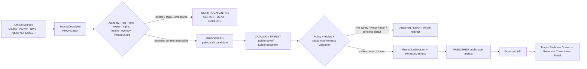
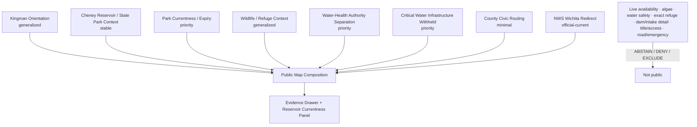
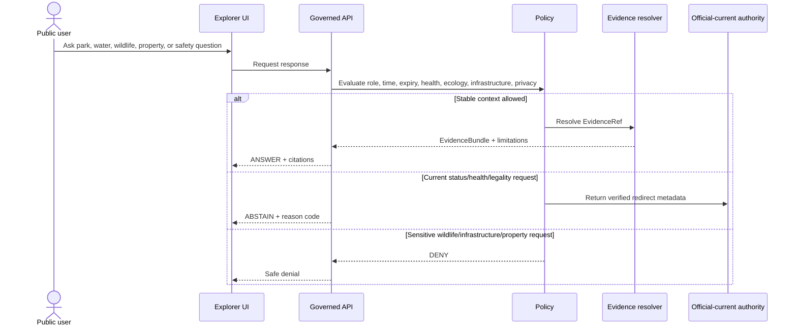
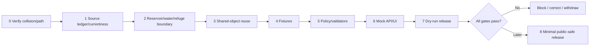

<!-- [KFM_META_BLOCK_V2]
doc_id: NEEDS_VERIFICATION — <REGISTERED_KFM_DOC_ID>
title: Kingman County Focus Mode Build Plan — Cheney Reservoir, Wildlife Refuge, Water-Supply, and Recreation Currentness Without Live Safety, Access, Health, or Infrastructure Conclusions
type: county-focus-mode-build-plan
version: v0.1-draft
status: draft
county: Kingman County, Kansas
county_slug: kingman
created: 2026-06-08
updated: 2026-06-08
owners:
  - NEEDS_VERIFICATION — <OWNER:focus-mode-steward>
  - NEEDS_VERIFICATION — <OWNER:reservoir-and-water-supply-reviewer>
  - NEEDS_VERIFICATION — <OWNER:recreation-currentness-reviewer>
  - NEEDS_VERIFICATION — <OWNER:wildlife-and-refuge-sensitivity-reviewer>
  - NEEDS_VERIFICATION — <OWNER:property-road-and-emergency-reviewer>
release_status: NEEDS_VERIFICATION — NOT_RELEASED
review_assignments: NEEDS_VERIFICATION
correction_path: NEEDS_VERIFICATION
rollback_path: NEEDS_VERIFICATION
unverified_repository_paths:
  - PROPOSED / CONFLICTED / NEEDS_VERIFICATION — docs/focus-modes/kingman-county/build-plan.md
  - PROPOSED / OBSERVED-LEGACY / NEEDS_VERIFICATION — docs/focus-mode/counties/kingman_county/kingman_county_focus_mode_build_plan.md
schema_contract_policy_homes:
  - PROPOSED / NEEDS_VERIFICATION — contracts/focus_mode/
  - PROPOSED / NEEDS_VERIFICATION — schemas/contracts/v1/focus_mode/
  - PROPOSED / NEEDS_VERIFICATION — policy/runtime/, policy/sensitivity/, policy/rights/, policy/release/
proof_slice: Cheney Reservoir and State Park recreation/currentness, municipal-water and reservoir-function context, waterfowl refuge sensitivity, county burn-permit/property routing, and NWS hazard authority
primary_public_safe_boundary: KFM may present generalized, time-attributed reservoir, park, wildlife, county-service, and weather-authority context; it must not determine current campsite or facility availability, boat-ramp or swimming safety, blue-green-algae or drinking-water safety, hunting/fishing legality, exact refuge or wildlife locations, water-supply operational status, dam/infrastructure vulnerability, parcel title/access, burn-permit legality, road safety, or active emergency conditions.
collision_search:
  completed_register: CONFIRMED — Kingman County is absent from the user-supplied completed/collision register.
  generated_in_continuation: CONFIRMED — previously generated counties in this continuation were excluded.
  uploaded_project_materials: CONFIRMED — targeted Kingman County Focus Mode searches were performed; no Kingman County plan surfaced among examined results.
  live_repository_index: CONFIRMED — docs/focus-mode/counties/COUNTY_INDEX.md lists Kingman as not-started with validation not-run.
  live_repository_search: CONFIRMED — search for kingman_county_focus_mode_build_plan returned no matching county plan.
  exhaustive_absence: NEEDS_VERIFICATION — unindexed branches, private artifacts, and prior unsearched outputs may still exist.
directory_rules_basis:
  - CONFIRMED — attached Directory Rules.pdf was inspected during this series.
  - CONFIRMED — location encodes responsibility, governance, and lifecycle; topic alone does not justify a root folder.
  - CONFIRMED — lifecycle is RAW → WORK / QUARANTINE → PROCESSED → CATALOG / TRIPLET → PUBLISHED.
  - CONFIRMED — promotion is a governed state transition, not a file move.
  - CONFLICTED / NEEDS_VERIFICATION — observed repository paths use docs/focus-mode/ while doctrine also identifies docs/focus-modes/.
official_source_checks:
  - CONFIRMED — Kingman County official website, checked 2026-06-08.
  - CONFIRMED — Kansas Department of Wildlife and Parks, Cheney State Park page, checked 2026-06-08.
  - CONFIRMED — National Weather Service Wichita office, checked 2026-06-08.
source_check_date: 2026-06-08
tags: [kfm, focus-mode, kingman-county, cheney-reservoir, cheney-state-park, waterfowl-refuge, water-supply, recreation-currentness, blue-green-algae, burn-permits, cite-or-abstain]
notes:
  - Planning artifact only; no implementation, source admission, review, promotion, publication, correction readiness, or rollback readiness is claimed.
  - KDWP park pages contain dated operational information such as winter water shutoffs, office hours, reservation rules, alerts, and facility availability; KFM must not treat those details as evergreen.
  - County tax-roll and property-tax links are routing surfaces, not title, access, owner-profile, or legal determination sources.
[/KFM_META_BLOCK_V2] -->

<a id="top"></a>

# Kingman County Focus Mode Build Plan
## Cheney Reservoir, Wildlife Refuge, Water-Supply, and Recreation Currentness Without Live Safety, Access, Health, or Infrastructure Conclusions

> **Product thesis:** Explain Kingman County’s Cheney Reservoir, state-park, wildlife, water-supply, and county-service context while refusing to become a live recreation-safety, water-health, hunting-rule, refuge-location, infrastructure, property, burn-permit, road, or emergency authority.


| Identity / status field | Value |
|---|---|
| County | **Kingman County, Kansas** |
| Status | `PROPOSED` planning artifact |
| Distinct proof slice | Cheney Reservoir and State Park, municipal-water context, waterfowl-refuge sensitivity, burn-permit/property routing, and NWS Wichita current-hazard authority |
| Primary public-safe boundary | **Generalized reservoir, park, wildlife, county-service, and weather-authority context may be shown; KFM must not determine live campsite/facility availability, boat-ramp or swimming safety, blue-green-algae or drinking-water safety, hunting/fishing legality, exact wildlife/refuge locations, water-supply operations, infrastructure vulnerability, parcel title/access, burn legality, road safety, or emergency status.** |
| Official seeds checked | Kingman County; KDWP Cheney State Park; NWS Wichita |
| Collision status | No Kingman collision surfaced in checked register, repository index/search, or examined materials |
| Exhaustive absence | `NEEDS_VERIFICATION` |
| Release state | `NOT_RELEASED` |

## Quick links

[Operating posture](#1-operating-posture) · [Why this county](#2-why-this-county) · [Product thesis](#3-product-thesis) · [Scope](#4-scope-boundary) · [Layers](#5-first-demo-layers) · [Journeys](#6-user-journeys) · [UI](#7-ui-surfaces) · [Objects](#8-governed-object-model) · [Repository](#9-proposed-repository-shape) · [Build](#10-build-phases) · [PRs](#11-first-pr-sequence) · [Acceptance](#12-acceptance-checklist) · [Fixtures](#13-fixture-plan) · [Risks](#14-risk-register) · [Sources](#15-source-seed-list) · [Questions](#16-open-verification-questions) · [Milestone](#17-recommended-first-milestone)

---

## Executive build note

Kingman County is selected as a **reservoir, water-supply, wildlife-refuge, and recreation-currentness** proof slice.

The official Kingman County website identifies government and department routes, current notices, burn-permit routing, tax-roll search, and online property-tax payment.[^s1] These are useful civic entry points, but they do not establish title, access, owner identity for public display, burn legality at a given moment, road safety, or emergency status.

The Kansas Department of Wildlife and Parks Cheney State Park page identifies the park as spanning Kingman, Reno, and Sedgwick counties and describes camping, marinas, cabins, boat ramps, docks, trails, and wildlife-area context.[^s2] It also contains dated operational information about seasonal water shutoffs, office hours, reservation rules, campground availability, and park news.[^s2] Stable park context may be interpreted, but dated operational details cannot be cached as live truth.

The same KDWP source family links fishing, boating laws, blue-green-algae information, park alerts, reservations, and wildlife information.[^s2] These are distinct authorities. A park description does not establish safe water, a usable ramp, available campsites, lawful hunting or fishing, or open refuge areas.

The National Weather Service Wichita office publishes current hazards, warnings, observations, radar, river and lake products, fire weather, drought, and safety information.[^s3] KFM should route users to NWS for current hazard status rather than create independent safety judgments.

> [!CAUTION]
> ## Defining public-safe boundary
>
> **KFM may explain Cheney Reservoir and State Park at generalized scale. It must not tell a user whether water is safe to drink or swim in, whether blue-green algae is present, whether a ramp or dock is safe, whether a campsite is available, whether hunting or fishing is lawful, where sensitive wildlife or refuge-use locations are, whether water-supply or dam infrastructure is functioning safely, whether a burn permit authorizes current burning, whether a road is safe, or whether an emergency is active.**

### Evidence boundary

| Label | Established | Not established |
|---|---|---|
| `CONFIRMED` | Kingman is absent from the supplied register; repository index lists Kingman `not-started` / `not-run`; targeted repository search found no Kingman plan; official Kingman County, KDWP Cheney, and NWS Wichita pages were checked. | — |
| `PROPOSED` | Every object, layer, fixture, path, policy, UI, milestone, correction, and release action below. | No implementation is claimed. |
| `NEEDS_VERIFICATION` | Exhaustive collision absence; canonical path; source rights; authoritative water-supply/quality source admission; refuge geoprivacy; current park-alert expiry; road/emergency source integration; correction and rollback machinery. | — |
| `UNKNOWN` | Present facility availability, ramp/dock condition, current algae status, drinking-water safety, hunting/fishing legality, refuge closures, water-supply operations, road condition, active emergency state, and runtime/release state. | — |

---

# 1. Operating posture

## 1.1 Governing rules applied to Kingman County

| KFM rule | County application |
|---|---|
| EvidenceBundle outranks generated language | AI cannot create live park, water-health, wildlife, infrastructure, property, burn, road, or emergency facts. |
| Cite-or-abstain | Stable reservoir/park/county context may answer after evidence closure; live safety, legal, health, and operational requests abstain or deny. |
| Public clients use governed interfaces | No public access to RAW, WORK, QUARANTINE, direct park systems, internal water operations, or direct model output. |
| Source roles remain distinct | KDWP park context, park alerts, fishing rules, boating rules, KDHE algae advisories, NWS hazards, county property/burn routing, water-supply operations, and AI narrative remain separate. |
| Publication is governed | A visible web page or mock card is not a released KFM object. |
| Ecological sensitivity fails closed | Exact refuge-use, nesting, roosting, or sensitive wildlife locations are withheld. |
| Water and health claims fail closed | Reservoir context does not establish drinking-water or recreation-water safety. |
| Critical infrastructure fails closed | Dam, intake, treatment, water-supply, and emergency vulnerabilities are not public map content. |

## 1.2 Truth labels and finite outcomes

| Token | Meaning |
|---|---|
| `CONFIRMED` | Verified in this run. |
| `PROPOSED` | Design not verified in implementation. |
| `NEEDS_VERIFICATION` | Checkable before action. |
| `UNKNOWN` | Unsupported or unresolved. |
| `ANSWER` | Narrow evidence-supported public-safe context. |
| `ABSTAIN` | Authority, currency, rights, or evidence is insufficient. |
| `DENY` | Request crosses safety, health, ecology, property, or infrastructure boundaries. |
| `ERROR` | Contract, evidence, policy, or runtime failure. |

## 1.3 Public trust membrane



## 1.4 County-specific guardrails

| Guardrail | Outcome | Candidate reason code |
|---|---:|---|
| Current campsite, cabin, restroom, water-service, ramp, dock, or marina status | `ABSTAIN` | `CURRENT_PARK_FACILITY_STATUS_REQUIRES_AUTHORITY` |
| Swimming, boating, or launch safety | `ABSTAIN` | `RECREATION_SAFETY_NOT_DETERMINED` |
| Blue-green algae, fish-consumption, drinking-water, or health conclusion | `ABSTAIN` / `DENY` | `WATER_QUALITY_OR_HEALTH_STATUS_REQUIRES_AUTHORITY` |
| Hunting/fishing legality for a person/time/place | `ABSTAIN` / `DENY` | `RECREATION_REGULATION_NOT_PERSONALLY_DETERMINED` |
| Exact refuge, roosting, nesting, or sensitive wildlife location | `DENY` | `SENSITIVE_WILDLIFE_OR_REFUGE_DETAIL_WITHHELD` |
| Dam, intake, treatment, water-supply, or vulnerability detail | `DENY` | `CRITICAL_WATER_INFRASTRUCTURE_DETAIL_WITHHELD` |
| Parcel title/access/owner-profile inference | `DENY` | `PROPERTY_OR_TITLE_DETERMINATION_DENIED` |
| Current burn, road, weather, or emergency guidance | `ABSTAIN` | `OFFICIAL_CURRENT_SAFETY_CHANNEL_REQUIRED` |

---

# 2. Why this county

## 2.1 Collision screen

| Check | Result | Status |
|---|---|---:|
| Supplied completed/collision register | Kingman absent. | `CONFIRMED` |
| Generated counties in continuation | Excluded. | `CONFIRMED` |
| Live county index | Kingman `not-started`, validation `not-run`. | `CONFIRMED` |
| Repository search | No Kingman plan identifier match. | `CONFIRMED` |
| Uploaded/project-material search | No Kingman plan surfaced among examined results. | `CONFIRMED` for performed search |
| Exhaustive absence | Not proved across all unindexed/private material. | `NEEDS_VERIFICATION` |

## 2.2 Proof-slice rationale

| Dimension | Proof value | Basis |
|---|---|---|
| Reservoir and recreation | Cheney State Park spans Kingman, Reno, and Sedgwick counties and contains camping, cabins, marinas, ramps, docks, and trails. | KDWP.[^s2] |
| Dynamic currentness | KDWP publishes dated park news, winter water shutoffs, office hours, and reservation conditions. | KDWP.[^s2] |
| Water supply / infrastructure | Reservoir history and water-supply function create critical-infrastructure and health-overclaim risk. | Future USBR/Wichita source admission required. |
| Wildlife/refuge sensitivity | Wildlife-area and waterfowl-refuge context creates geoprivacy and seasonal-access obligations. | Direct wildlife source admission pending. |
| County civic routing | Burn permits, tax roll, property-tax routes, notifications, and county departments are exposed. | County official page.[^s1] |
| Weather/current hazard | NWS Wichita provides hazards, warnings, radar, fire weather, drought, and river/lake products. | NWS.[^s3] |
| Distinctness | Combines reservoir recreation, water-health, water-supply infrastructure, refuge sensitivity, and county currentness. | `PROPOSED`. |

## 2.3 Distinct series contribution

Kingman County tests whether KFM can:

1. separate stable park context from live facility availability;
2. distinguish recreation-water, blue-green-algae, fish-consumption, and drinking-water authority;
3. explain a public reservoir without exposing critical water infrastructure;
4. present wildlife/refuge context without enabling sensitive-location discovery;
5. distinguish county burn/property routing from legal or safety determinations;
6. route current weather and emergency questions to NWS and local authority.

## 2.4 Public benefit

A future public-safe product could help users understand:

- why Cheney Reservoir and State Park matter to Kingman County;
- how park recreation, wildlife habitat, water supply, and weather authority differ;
- why dated park-news items expire;
- why exact refuge/wildlife and water-infrastructure details are withheld;
- why KFM abstains on live safety, health, legality, and property questions.

---

# 3. Product thesis

## 3.1 One-sentence thesis

> **Kingman County Focus Mode should connect reservoir, recreation, wildlife, water-supply, county-service, and weather-authority context while making live safety, water-health, refuge, infrastructure, property, burn, and emergency boundaries explicit and enforceable.**

## 3.2 First-product promises

| Promise | Meaning |
|---|---|
| Generalized reservoir/park context | Stable KDWP-backed context only. |
| Currentness literacy | Dated park news and facility notices show expiry and source role. |
| Water-authority separation | Park, algae, fish-consumption, drinking-water, and infrastructure roles remain distinct. |
| Ecology sensitivity | Refuge and wildlife context is generalized. |
| Finite outcomes | Stable context may answer; high-risk requests abstain or deny. |
| Reversibility | Correction and rollback precede publication. |

## 3.3 Non-promises

- no current campsite/cabin/facility availability;
- no swimming, boating, ramp, dock, or marina safety assurance;
- no blue-green-algae, fish-consumption, or drinking-water-health conclusion;
- no personalized hunting/fishing legality;
- no exact refuge or sensitive wildlife locations;
- no water-supply or dam operational status;
- no property title/access/owner determination;
- no current burn, road, or emergency guidance;
- no implementation or publication claim.

---

# 4. Scope boundary

| Content family | Posture | Boundary |
|---|---:|---|
| County orientation | `PROPOSED` | Generalized public frame. |
| Cheney Reservoir / State Park context | `PROPOSED` | Stable context only. |
| Park Currentness Notice | `PROPOSED` priority | Dated notices do not become evergreen. |
| Wildlife/refuge context | `PROPOSED` generalized / `DEFER` details | No exact locations or seasonal-action advice. |
| Water Health Authority Card | `PROPOSED` | Explains role separation only. |
| Critical Water Infrastructure Notice | `PROPOSED` priority | No operational/vulnerability detail. |
| County Civic Routing Card | `PROPOSED` | Burn/tax/notification routes only. |
| Live park, algae, road, weather, emergency layer | `DEFER` | Requires current feed, expiry, receipts, correction, rollback. |
| Parcel owner/title/access details | `DENY` / `EXCLUDE` | Privacy/legal boundary. |
| Exact refuge, wildlife, dam, intake, treatment detail | `DENY` / `EXCLUDE` | Ecology/security boundary. |

---

# 5. First demo layers

## 5.1 Prioritized cards/layers

| Priority | Card/layer | Purpose | Source | Gate | Status |
|---:|---|---|---|---|---:|
| 1 | `ReservoirRecreationWaterHealthBoundaryNotice` | Central public-safe boundary. | KDWP + policy | Highest-risk fixtures. | `PROPOSED` |
| 2 | `CheneyStateParkContextCard` | General park/reservoir context. | KDWP[^s2] | EvidenceBundle and rights. | `PROPOSED` |
| 3 | `ParkCurrentnessAndExpiryCard` | Explains dated operational notices. | KDWP[^s2] | Expiry validator. | `PROPOSED` |
| 4 | `WildlifeRefugeGeneralizationCard` | Broad refuge/waterfowl context. | KDWP candidate wildlife page | Ecology review. | `DEFER` / `PROPOSED` |
| 5 | `WaterHealthAuthoritySeparationCard` | Distinguishes algae, fish, recreation, drinking water. | KDWP + future KDHE/Wichita | Health/source-role gate. | `PROPOSED` |
| 6 | `CriticalWaterInfrastructureWithholdNotice` | Explains why operational details are absent. | Policy + future USBR/Wichita | Security review. | `PROPOSED` |
| 7 | `KingmanCountyCivicRoutingCard` | Burn, tax, notification, department routes. | County[^s1] | Routing only. | `PROPOSED` |
| 8 | `NWSWichitaAuthorityCard` | Current hazard redirect. | NWS[^s3] | Redirect-only. | `PROPOSED` |
| 9 | Live facility/algae/road/emergency status | High-risk dynamic data. | Future governed sources | Not first slice. | `DEFER` |
| 10 | Exact refuge/wildlife/infrastructure/property detail | Unsafe. | — | Exclude. | `DENY` |

## 5.2 Map composition



## 5.3 Layer-card truth contract

| Field | Purpose | Failure posture |
|---|---|---|
| `source_role` | Separates park, alert, regulation, algae, water supply, weather, property, and AI roles. | `ABSTAIN`. |
| `temporal_basis` | Shows publication/check date. | `ABSTAIN` for current requests. |
| `expiry_at` | Required for facility/alert/status content. | Suppress if missing/expired. |
| `water_health_scope` | Prevents park context becoming water-health advice. | `DENY` / `ABSTAIN`. |
| `ecology_generalization` | Prevents exact refuge/wildlife precision. | `DENY` / quarantine. |
| `infrastructure_sensitivity` | Prevents critical water-system detail. | `DENY`. |
| `property_privacy` | Prevents title/access/owner-profile display. | `DENY`. |
| `evidence_refs` | Claim support. | `ABSTAIN`. |
| `policy_decision_ref` | Finite outcome obligations. | Fail closed. |
| `release_state` | Prevents draft from appearing released. | Public alias blocked. |

---

# 6. User journeys

## 6.1 Public learning journeys

| Journey | Safe outcome |
|---|---|
| “What is Cheney State Park?” | Generalized KDWP-backed context with citations. |
| “Why do park details expire?” | Currentness/expiry explanation. |
| “Why can’t KFM say whether the water is safe?” | Water-authority role explanation. |
| “Why are wildlife-refuge locations generalized?” | Stewardship/geoprivacy explanation. |
| “Who provides current weather and hazard information?” | NWS Wichita official-current redirect. |
| “Why can’t tax-roll search prove title?” | Property/legal non-determination explanation. |

## 6.2 Trust-demonstration journeys

| Request | Outcome |
|---|---:|
| “Is a campsite available tonight?” | `ABSTAIN` |
| “Is the ramp safe to launch from?” | `ABSTAIN` |
| “Is the lake safe for swimming or drinking?” | `ABSTAIN` / `DENY` |
| “Show exact waterfowl refuge or roosting locations.” | `DENY` |
| “Can I hunt this exact area today?” | `ABSTAIN` / `DENY` |
| “Show dam, intake, or treatment vulnerabilities.” | `DENY` |
| “Who owns this parcel and may I enter?” | `DENY` |
| “Can I burn today?” | `ABSTAIN` |
| “Is there a severe-weather emergency now?” | `ABSTAIN` |

## 6.3 Candidate reason codes

- `CURRENT_PARK_FACILITY_STATUS_REQUIRES_AUTHORITY`
- `RECREATION_SAFETY_NOT_DETERMINED`
- `WATER_QUALITY_OR_HEALTH_STATUS_REQUIRES_AUTHORITY`
- `RECREATION_REGULATION_NOT_PERSONALLY_DETERMINED`
- `SENSITIVE_WILDLIFE_OR_REFUGE_DETAIL_WITHHELD`
- `CRITICAL_WATER_INFRASTRUCTURE_DETAIL_WITHHELD`
- `PROPERTY_OR_TITLE_DETERMINATION_DENIED`
- `OFFICIAL_CURRENT_SAFETY_CHANNEL_REQUIRED`

---

# 7. UI surfaces

| Surface | Kingman-specific behavior | Status |
|---|---|---:|
| Header | “No live park, water-health, refuge, infrastructure, property, or safety verdict.” | `PROPOSED` |
| Map canvas | Generalized reservoir/park/county context only. | `PROPOSED` |
| Layer drawer | Source role, checked time, expiry, sensitivity, release state. | `PROPOSED` |
| Evidence Drawer | Separates KDWP park, alerts, regulations, KDHE, water supply, NWS, county, and AI. | `PROPOSED` |
| Answer panel | Stable context only. | `PROPOSED` |
| Abstention panel | Availability, safety, water-health, legality, road, weather, emergency. | `PROPOSED` |
| Denial panel | Exact refuge, infrastructure, owner/title/access requests. | `PROPOSED` |
| Timeline/time-basis panel | Stable park history versus dated operational notices. | `PROPOSED` |
| **Reservoir Currentness / Water Health / Refuge Panel** | Central trust surface. | `PROPOSED` |
| Official redirect panel | KDWP, KDHE, NWS, county, future water utility/USBR. | `PROPOSED` |
| Release/correction panel | `NOT_RELEASED`, expiry, correction, rollback. | `PROPOSED` |

## 7.1 Legend vocabulary

| Label | Meaning | Must not become |
|---|---|---|
| `Park context` | Stable descriptive material. | Live availability or safety. |
| `Park operational notice` | Dated facility information. | Evergreen truth. |
| `Water-health authority` | KDHE/qualified authority advisory. | KFM health judgment. |
| `Wildlife/refuge context` | Generalized stewardship information. | Exact occurrence/targeting. |
| `Critical water infrastructure withheld` | Security-sensitive operational detail absent. | Confirmation of hidden configuration. |
| `County civic routing` | Burn/tax/notification routes. | Legal or property determination. |
| `Official-current weather source` | NWS hazard products. | KFM-authored warning. |

## 7.2 Sequence diagram



---

# 8. Governed object model

## 8.1 Shared object families

| Object family | Kingman use | Status |
|---|---|---:|
| `SourceDescriptor` | Authority, role, time, rights, expiry, sensitivity. | `PROPOSED / NEEDS_VERIFICATION` |
| `EvidenceRef` | Claim-to-proof link. | `PROPOSED / NEEDS_VERIFICATION` |
| `EvidenceBundle` | Evidence plus health/ecology/infrastructure limits. | `PROPOSED / NEEDS_VERIFICATION` |
| `PolicyDecision` | Finite outcome. | `PROPOSED / NEEDS_VERIFICATION` |
| `RuntimeResponseEnvelope` | Public-safe response. | `PROPOSED / NEEDS_VERIFICATION` |
| `CitationValidationReport` | Detects currentness and source-role overclaim. | `PROPOSED / NEEDS_VERIFICATION` |
| `ReleaseManifest` | Approved public composition. | `PROPOSED / NEEDS_VERIFICATION` |
| `AIReceipt` | Generated output/dependencies. | `PROPOSED / NEEDS_VERIFICATION` |
| `ReviewRecord` | Reservoir, health, ecology, property, infrastructure, release review. | `PROPOSED / NEEDS_VERIFICATION` |
| `CorrectionNotice` | Corrects stale/unsafe output. | `PROPOSED / NEEDS_VERIFICATION` |
| `RollbackPlan` | Withdraws unsafe release. | `PROPOSED / NEEDS_VERIFICATION` |

## 8.2 County-specific candidates

- `CheneyStateParkContextCard`
- `ParkOperationalCurrentnessNotice`
- `WaterHealthAuthoritySeparationCard`
- `WildlifeRefugeGeneralizationRecord`
- `CriticalWaterInfrastructureWithholdNotice`
- `KingmanCountyCivicRoutingCard`
- `OfficialWeatherHazardRedirectCard`
- `CurrentnessExpiryRecord`

## 8.3 Source-role anti-collapse rules

| Source | Valid role | Must not become |
|---|---|---|
| KDWP Cheney State Park | Park/recreation context and dated operational notices. | Water-health, utility, title, or emergency authority. |
| KDWP hunting/fishing/boating pages | Regulatory/public-use source. | Personalized legal advice. |
| KDHE algae/consumption advisories | Health/environmental advisory role. | Drinking-water utility or universal safety conclusion. |
| Water utility/USBR source | Water-supply/project role. | Public vulnerability map or personal health advice. |
| NWS Wichita | Official-current weather/hazard authority. | KFM-authored warning. |
| Kingman County | Civic routing, burn permit, tax/payment source. | Title, access, owner profile, road safety, or emergency verdict. |
| AI narrative | Bounded explanation. | Evidence or authority. |

## 8.4 Minimal public response JSON

```json
{
  "schema_version": "v1",
  "object_type": "RuntimeResponseEnvelope",
  "response_id": "kfm.runtime.kingman.cheney_context.answer.v1",
  "county": "kingman",
  "outcome": "ANSWER",
  "answer_scope": "public_safe_generalized_reservoir_park_context",
  "answer": "Checked Kansas Department of Wildlife and Parks material identifies Cheney State Park as spanning Kingman, Reno, and Sedgwick counties and describes camping, boating, trail, cabin, and wildlife-area context.",
  "evidence_refs": ["kfm.evidence_ref.kingman.kdwp_cheney_context.v1"],
  "limitations": [
    "This response does not determine current availability, ramp or dock safety, water quality, drinking-water safety, hunting or fishing legality, exact wildlife locations, infrastructure condition, property access, burn status, road safety, or emergency conditions."
  ],
  "review_state": "NEEDS_VERIFICATION",
  "release_state": "NOT_RELEASED",
  "spec_hash": "NEEDS_VERIFICATION"
}
```

## 8.5 Abstention JSON

```json
{
  "schema_version": "v1",
  "object_type": "RuntimeResponseEnvelope",
  "response_id": "kfm.runtime.kingman.current_park_or_water_status.abstain.v1",
  "county": "kingman",
  "outcome": "ABSTAIN",
  "reason_code": "WATER_QUALITY_OR_HEALTH_STATUS_REQUIRES_AUTHORITY",
  "message": "KFM does not determine current park-facility availability, launch safety, swimming safety, blue-green-algae status, fish-consumption safety, drinking-water safety, road conditions, or emergency status from cached context.",
  "official_redirects": [
    {"authority": "Kansas Department of Wildlife and Parks", "purpose": "current park, recreation, and regulation information"},
    {"authority": "Kansas Department of Health and Environment or verified water authority", "purpose": "current water-quality or health advisories"},
    {"authority": "National Weather Service Wichita", "purpose": "current weather and hazard information"}
  ],
  "release_state": "NOT_RELEASED",
  "spec_hash": "NEEDS_VERIFICATION"
}
```

## 8.6 Denial JSON

```json
{
  "schema_version": "v1",
  "object_type": "RuntimeResponseEnvelope",
  "response_id": "kfm.runtime.kingman.sensitive_refuge_infrastructure_property.deny.v1",
  "county": "kingman",
  "outcome": "DENY",
  "reason_code": "CRITICAL_WATER_INFRASTRUCTURE_DETAIL_WITHHELD",
  "message": "KFM does not publish exact refuge or sensitive wildlife locations, dam/intake/treatment vulnerability detail, or parcel owner/title/access determinations.",
  "withheld_fields": [
    "exact_refuge_or_roost_geometry",
    "sensitive_species_location",
    "dam_or_intake_operational_detail",
    "water_treatment_vulnerability",
    "owner_or_living_person_linkage",
    "parcel_title_or_access"
  ],
  "release_state": "NOT_RELEASED",
  "spec_hash": "NEEDS_VERIFICATION"
}
```

## 8.7 Deterministic identity candidates

| Item | Pattern |
|---|---|
| Source | `kfm.source.kingman.<authority>.<slug>.v1` |
| Evidence | `kfm.evidence_bundle.kingman.<claim_scope>.v1` |
| Card | `kfm.card.kingman.<card>.v1` |
| Fixture | `kfm.runtime.kingman.<scenario>.<outcome>.v1` |
| Release | `kfm.release.kingman.focus_mode.v0_1` |

`spec_hash` remains `PROPOSED / NEEDS_VERIFICATION`.

---

# 9. Proposed repository shape

## 9.1 Directory Rules basis

Directory Rules require responsibility-root placement, separate docs/contracts/schemas/policy/fixtures/data/release, no topic-as-root folders, and lifecycle:

`RAW → WORK / QUARANTINE → PROCESSED → CATALOG / TRIPLET → PUBLISHED`.

Promotion is a governed state transition.

> [!WARNING]
> The observed `docs/focus-mode/` versus doctrinal `docs/focus-modes/` divergence remains unresolved. Paths below are `PROPOSED / CONFLICTED / NEEDS_VERIFICATION`.

## 9.2 Candidate paths

| Root | Proposed path | Purpose |
|---|---|---|
| Docs | `docs/focus-modes/kingman-county/build-plan.md` | Human plan. |
| Docs companions | `docs/focus-modes/kingman-county/{README.md,reservoir-currentness-notes.md,water-health-notes.md,wildlife-sensitivity-notes.md,infrastructure-boundary-notes.md,source-seed-list.md,acceptance-checklist.md}` | Governance docs. |
| Contracts | `contracts/focus_mode/` | Shared semantics. |
| Schemas | `schemas/contracts/v1/focus_mode/` | Machine shapes. |
| Fixtures | `fixtures/focus_modes/kingman/{valid,invalid}/` | Proof cases. |
| UI | `apps/explorer-web/src/focus-modes/kingman/` | Mock governed UI. |
| Catalog | `data/catalog/sources/kingman/` | Admitted descriptors. |
| Published | `data/published/layers/kingman/` | Future release only. |
| Release | `release/candidates/kingman-focus-mode/` | Future candidate. |

## 9.3 Proposed tree

```text
# PROPOSED / CONFLICTED / NEEDS_VERIFICATION

docs/
└── focus-modes/
    └── kingman-county/
        ├── README.md
        ├── build-plan.md
        ├── reservoir-currentness-notes.md
        ├── water-health-notes.md
        ├── wildlife-sensitivity-notes.md
        ├── infrastructure-boundary-notes.md
        ├── source-seed-list.md
        ├── evidence-model.md
        └── acceptance-checklist.md

fixtures/
└── focus_modes/kingman/
    ├── valid/
    └── invalid/

contracts/
└── focus_mode/

schemas/
└── contracts/v1/focus_mode/

apps/
└── explorer-web/src/focus-modes/kingman/

data/
├── catalog/sources/kingman/
└── published/layers/kingman/    # future governed output only

release/
└── candidates/kingman-focus-mode/
```

## 9.4 Placement prohibitions

- no root-level `kingman/`, `cheney-reservoir/`, `state-park/`, `wildlife-refuge/`, or `water-supply/`;
- no exact refuge, species, dam, intake, treatment, owner, or parcel data in public fixtures;
- no dated park notice copied into evergreen published truth;
- no park description treated as water-health or legal authority;
- no public client access to `RAW`, `WORK`, `QUARANTINE`;
- no publication without manifest, review, correction, and rollback.

---

# 10. Build phases

| Phase | Goal | Entry gate | Output | Exit validation | Rollback |
|---:|---|---|---|---|---|
| 0 | Collision/path verification | Repeat checks | Verification note | No collision; path resolved or blocked | Stop |
| 1 | Source ledger/currentness map | Roles identified | Source/expiry matrix | Stable/current/health/infrastructure roles explicit | Docs only |
| 2 | Reservoir/water/refuge boundary | Review framework accepted | Boundary policies | Unsafe cases fail closed | Withdraw |
| 3 | Shared-object reuse | Existing objects inspected | Reuse/extension decision | No parallel homes | Revert |
| 4 | Fixtures | Boundary accepted | Valid/invalid pack | Unsafe cases fail closed | Remove |
| 5 | Policy/validators | Fixtures exist | Currentness/health/ecology/infrastructure validators | Finite outcomes tested | Block |
| 6 | Mock API/UI | Contracts/policies agreed | Mock cards/panels | No live/sensitive overclaim | Disable |
| 7 | Dry-run release | Reviews/evidence available | Candidate proof pack | No public alias; rollback rehearsed | Withdraw |
| 8 | Optional publication | All gates pass | Minimal generalized release | Traceable and reversible | Rollback |



---

# 11. First PR sequence

1. Verification and documentation control.
2. Source ledger/admission and public-safe boundary.
3. Contracts/schemas or shared-object reuse.
4. Valid and invalid fixtures.
5. Policy and validators.
6. Mock governed API/UI.
7. Dry-run release proof.
8. Only then optional minimal public-safe publication.

**Live park/facility data, blue-green-algae or drinking-water integration, exact wildlife/refuge mapping, critical water-infrastructure data, property detail, road/emergency integration, and public release are not first-PR work.**

---

# 12. Acceptance checklist

## Governance and evidence

- [ ] Kingman collision search rerun.
- [ ] Every public claim resolves to EvidenceBundle.
- [ ] KDWP park, alert, regulation, KDHE, water utility/USBR, NWS, county, property, and AI roles remain distinct.
- [ ] Current status exposes checked time and expiry.
- [ ] No AI output is evidence.
- [ ] Finite outcomes exist.

## Public-safe boundary

- [ ] No live campsite/facility/ramp/dock availability or safety answer.
- [ ] No algae, fish-consumption, swimming, or drinking-water health conclusion.
- [ ] No personalized hunting/fishing legality.
- [ ] No exact refuge, roosting, nesting, or sensitive wildlife locations.
- [ ] No dam/intake/treatment vulnerability or operational status.
- [ ] No parcel title/access/owner-profile conclusion.
- [ ] No current burn, road, weather, or emergency advice.

## Product and UI

- [ ] Header states boundary and `NOT_RELEASED`.
- [ ] Source roles and time visible.
- [ ] Expired operational notices suppressed.
- [ ] Evidence Drawer shows health/ecology/infrastructure limits.
- [ ] Denial/abstention reason codes visible.
- [ ] Official redirects do not masquerade as answers.

## Repository/release

- [ ] Path conflict resolved.
- [ ] No parallel authority homes.
- [ ] Public UI cannot access internal lifecycle stores.
- [ ] Invalid fixtures fail closed.
- [ ] Correction and rollback actionable.
- [ ] Promotion governed.

---

# 13. Fixture plan

## 13.1 Valid fixtures

| Fixture | Scenario | Outcome |
|---|---|---:|
| `cheney_context.valid.json` | General park/reservoir context. | `ANSWER` |
| `park_currentness_notice.valid.json` | Dated facility notice displayed as dated. | `ANSWER` about limitation |
| `facility_status_redirect.valid.json` | User asks current availability. | `ABSTAIN` |
| `water_health_redirect.valid.json` | User asks algae/drinking-water safety. | `ABSTAIN` |
| `sensitive_refuge_deny.valid.json` | User requests exact locations. | `DENY` |
| `infrastructure_detail_deny.valid.json` | User requests vulnerabilities. | `DENY` |

## 13.2 Invalid/fail-closed fixtures

| Fixture | Failure | Required result |
|---|---|---:|
| `dated_park_news_as_current.invalid.json` | Old notice shown current. | `ABSTAIN` / suppress |
| `park_page_as_campsite_available.invalid.json` | Static page becomes availability. | `ABSTAIN` |
| `boat_ramp_as_safe.invalid.json` | Ramp presence becomes safety guarantee. | `ABSTAIN` |
| `park_page_as_water_safe.invalid.json` | Park context becomes health conclusion. | `DENY` / `ABSTAIN` |
| `blue_green_algae_inferred_from_absence.invalid.json` | Missing advisory becomes safe-water claim. | `ABSTAIN` |
| `fishing_hunting_context_as_personal_permission.invalid.json` | General rule becomes legal advice. | `ABSTAIN` |
| `exact_refuge_or_roost_location.invalid.json` | Sensitive wildlife location exposed. | `DENY` |
| `dam_intake_treatment_vulnerability.invalid.json` | Critical infrastructure detail exposed. | `DENY` |
| `tax_roll_as_title_or_access.invalid.json` | County search becomes property truth. | `DENY` |
| `burn_permit_link_as_current_authorization.invalid.json` | Routing link becomes legal permission. | `ABSTAIN` |
| `nws_page_as_kfm_warning.invalid.json` | KFM rewrites official warning. | `ERROR` / `ABSTAIN` |
| `public_internal_store_access.invalid.json` | Public surface reads internal store. | `ERROR` |

## 13.3 Fixture-to-test matrix

| Test family | Must prove |
|---|---|
| Currentness/expiry | Dated notices never become live truth. |
| Recreation scope | Amenities do not become availability/safety. |
| Water health | No algae/drinking-water conclusion from park context. |
| Regulation | No personalized hunting/fishing permission. |
| Ecology | No exact refuge/wildlife precision. |
| Infrastructure | No dam/intake/treatment vulnerability. |
| Property/burn | No title/access or current burn authorization. |
| Evidence/lifecycle | No unsupported claim or internal-store access. |

## 13.4 Highest-risk invalid fixture pack

1. stale park-news item shown as current;
2. static park page shown as live campsite availability;
3. ramp or dock presence shown as safe to use;
4. absence of algae warning treated as proof of safe water;
5. park context used as drinking-water-health advice;
6. exact waterfowl refuge or roosting locations exposed;
7. dam/intake/treatment vulnerability exposed;
8. tax-roll search converted into title/access truth;
9. burn-permit link converted into current legal authorization;
10. NWS warning rewritten as KFM guidance.

---

# 14. Risk register

| Risk | Likelihood | Impact | Mitigation | Release posture |
|---|---:|---:|---|---|
| Dated park notice appears current | High | High | Expiry, checked-time display, suppression. | `ABSTAIN` |
| Amenity list becomes availability/safety guarantee | High | High | Scope validator and fixtures. | `ABSTAIN` |
| Algae/water-health overclaim | High | Critical | Fit-authority requirement. | `ABSTAIN` / `DENY` |
| Hunting/fishing context becomes legal advice | Medium | High | Regulation redirect; no personalization. | `ABSTAIN` |
| Sensitive refuge/wildlife location exposed | Medium | Critical | Generalize or exclude. | `DENY` |
| Critical water infrastructure exposed | Medium | Critical | Withhold operational/tactical detail. | `DENY` |
| County property search becomes title/access truth | High | Critical | Property nondetermination. | `DENY` |
| Burn-permit routing becomes current legal authorization | Medium | High | Current authority and jurisdiction gate. | `ABSTAIN` |
| NWS warning delayed or rewritten | Medium | Critical | Redirect-only. | `ABSTAIN` |
| Rights unclear for maps/images | Medium | High | Rights review. | Quarantine |
| Existing Kingman plan later found | Low/Medium | Medium | Repeat collision search. | Stop |
| Path divergence hardens | High | Medium | Resolve before landing. | Docs only |
| Mock mistaken for release | Medium | High | Persistent `NOT_RELEASED`. | Mock only |

---

# 15. Source seed list

## 15.1 Official sources checked in this run

| ID | Source | Role | Verified anchor | Intended use | Allowed claim scope | Limitations | Status |
|---|---|---|---|---|---|---|---:|
| `S1` | Kingman County official website[^s1] | County administrative/current-routing source | Official county identity; departments; notifications; burn-permit route; tax-roll search; property-tax payment; current notices. | County civic-routing card. | Existence and role of official routes. | No title, access, owner profile, current burn legality, road condition, or emergency conclusion. | `CONFIRMED` |
| `S2` | Kansas Department of Wildlife and Parks, Cheney State Park[^s2] | State park/recreation/wildlife and dated operational source | Park spans Kingman/Reno/Sedgwick; camping, cabins, marinas, ramps, docks, trails; dated water shutoff, office-hour, reservation, and park-news details. | Park context and currentness proof. | Stable context plus explicit dated notices within source scope. | No live availability/safety, algae/water-health, personalized regulation, exact refuge, or infrastructure conclusion. | `CONFIRMED` |
| `S3` | National Weather Service Wichita[^s3] | Federal official-current weather/hazard authority | Current hazards, warnings, observations, radar, fire weather, rivers/lakes, drought, reports, and safety resources. | Official-current redirect. | NWS-issued products within temporal/geographic scope. | KFM must not rewrite, delay, cache, or independently interpret active warnings. | `CONFIRMED` |

## 15.2 Candidate official sources for later verification

| Candidate | Potential use | Required verification |
|---|---|---|
| KDWP Cheney Wildlife Area / Reservoir page | Wildlife/refuge context. | Seasonal closures, geoprivacy, rights, exact-location minimization. |
| KDHE blue-green algae and fish-consumption advisories | Current health/advisory redirect. | Freshness, geographic fit, expiry, no unsupported inference. |
| U.S. Bureau of Reclamation Cheney project | Reservoir project and water-supply history. | Rights, current operations, critical-infrastructure exclusions. |
| City of Wichita water utility | Water-supply role and public reports. | Current report scope, treatment/health boundaries, security. |
| USGS/NWPS gauges | River/lake hydrologic context. | Gauge fit, currentness, no recreation-safety inference. |
| KDOT/KanDrive and county roads | Road-status redirect. | Currentness, expiry, no safety guarantee. |
| Kingman County emergency management/sheriff | Local alert/burn routing. | Current endpoint, jurisdiction, expiry, no KFM legal advice. |

## 15.3 Source admission checklist

- [ ] Assign authority and source role.
- [ ] Record checked date and expiry behavior.
- [ ] Verify rights and derivative display.
- [ ] Separate stable park context from operational notice.
- [ ] Separate recreation-water, algae, fish-consumption, drinking-water, and utility roles.
- [ ] Generalize wildlife/refuge detail.
- [ ] Withhold critical water infrastructure.
- [ ] Minimize property/person data.
- [ ] Resolve EvidenceRef to EvidenceBundle.
- [ ] Run negative fixtures.
- [ ] Quarantine stale, private, sensitive, rights-unclear, or unsafe material.
- [ ] Require correction and rollback before release.

---

# 16. Open verification questions

## Repository and collision

- [ ] Does any Kingman plan exist in another branch/private artifact?
- [ ] Which Focus Mode documentation path is canonical?
- [ ] What validator updates the county index?
- [ ] What evidence changes `not-started` to `draft`?

## Park and currentness

- [ ] What current official endpoint governs park alerts and facility availability?
- [ ] What expiry applies to water shutoff, office hours, and campground notices?
- [ ] May KFM link to reservation systems without ingesting availability?
- [ ] Which park areas fall within Kingman County versus adjacent counties?

## Water and health

- [ ] Which authority governs current algae, fish-consumption, swimming, and drinking-water claims?
- [ ] What reservoir/water-supply data may be safely published?
- [ ] What operational infrastructure must remain entirely excluded?
- [ ] Can USGS/NWPS data support context without safety inference?

## Wildlife and public use

- [ ] What wildlife/refuge details require generalization?
- [ ] What seasonal closures or access rules apply?
- [ ] Which hunting/fishing source is current and authoritative?
- [ ] How should KFM distinguish observation from regulation and stewardship?

## Property, burn, road, and emergency

- [ ] What county property fields must be excluded?
- [ ] What authority and expiry govern burn permits/restrictions?
- [ ] Which road and emergency source is official-current?
- [ ] What correction mechanism removes stale status immediately?

## Correction and rollback

- [ ] How is a stale facility or health card withdrawn?
- [ ] What rollback removes sensitive wildlife/infrastructure detail?
- [ ] What proof demonstrates hidden detail cannot be reconstructed?
- [ ] What separation of duties is required before release?

---

# 17. Recommended first milestone

## Milestone 1 — Kingman Reservoir Currentness, Water-Health, and Refuge Boundary Control Plane

### Milestone statement

> Establish a documentation-and-fixture-first Kingman County proof slice that can explain generalized Cheney Reservoir, State Park, county-service, and weather-authority context while making live facility availability, recreation safety, water-health, personalized regulation, sensitive refuge/wildlife, critical water infrastructure, property, burn, road, and emergency claims fail closed.

### Deliverables

| Deliverable | Status |
|---|---:|
| Collision/path verification note | `PROPOSED` |
| Source-role/currentness matrix | `PROPOSED` |
| Reservoir / Water-Health / Refuge Boundary Notice | `PROPOSED` |
| Shared-object reuse decision | `PROPOSED` |
| Valid context/redirect fixtures | `PROPOSED` |
| Highest-risk invalid fixture pack | `PROPOSED` |
| Mock finite-outcome UI/API | `PROPOSED` |
| Correction/rollback draft | `PROPOSED` |

### Definition of done

- [ ] Collision checks rerun.
- [ ] Path conflict resolved or blocks landing.
- [ ] Stable context and operational notices are separated.
- [ ] Water-health roles remain distinct.
- [ ] Refuge/wildlife detail is generalized or denied.
- [ ] Critical water infrastructure is withheld.
- [ ] Property/burn/road/emergency requests fail closed.
- [ ] No implementation, review completion, promotion, or publication claim is made.

### Go / no-go table

| Decision | Required evidence | If absent |
|---|---|---|
| GO to docs PR | No collision, path authorized, source/currentness matrix drafted. | No landing. |
| GO to fixtures/policy | Shared homes verified and reason codes accepted. | Docs only. |
| GO to mock UI/API | Invalid fixtures prove fail-closed outcomes. | No mock. |
| GO to dry-run release | Rights, reviews, evidence, expiry, correction, rollback drafted. | No candidate. |
| GO to publication | Governed promotion and all approvals complete. | `NOT_RELEASED`. |

---

# Appendix A — Public-safe narrative skeleton

## A.1 Landing narrative

**Kingman County: reservoir recreation, water supply, wildlife stewardship, and visible currentness boundaries**

Cheney Reservoir and State Park provide a strong public map story, but they also connect to live facility status, water-health advisories, wildlife refuges, water supply, county property systems, burn permits, and weather hazards. KFM must keep those authorities separate.

## A.2 Park narrative

KDWP supports a rich park-context card. Dated operational notices—such as winter water shutoffs, office hours, and reservation practices—must display their dates and expire rather than become permanent truth.

## A.3 Water-health narrative

A reservoir may be used for recreation and water supply, but those facts do not prove that water is safe for swimming, fish consumption, or drinking. Current advisories and utility reports require fit authority.

## A.4 Wildlife/refuge narrative

Public stewardship context may be shown at generalized scale. Exact refuge-use, nesting, roosting, or sensitive wildlife locations remain withheld.

## A.5 Evidence Drawer narrative

Each card should expose:

- source authority and role;
- checked date and expiry;
- stable versus operational classification;
- water-health, ecology, infrastructure, property, and safety limitations;
- review and release state;
- correction and rollback references.

---

# Appendix B — Required negative-path reason-code categories

| Category | Code | Outcome |
|---|---|---:|
| Park facility currentness | `CURRENT_PARK_FACILITY_STATUS_REQUIRES_AUTHORITY` | `ABSTAIN` |
| Recreation safety | `RECREATION_SAFETY_NOT_DETERMINED` | `ABSTAIN` |
| Water quality/health | `WATER_QUALITY_OR_HEALTH_STATUS_REQUIRES_AUTHORITY` | `ABSTAIN` / `DENY` |
| Recreation regulation | `RECREATION_REGULATION_NOT_PERSONALLY_DETERMINED` | `ABSTAIN` / `DENY` |
| Wildlife/refuge sensitivity | `SENSITIVE_WILDLIFE_OR_REFUGE_DETAIL_WITHHELD` | `DENY` |
| Critical water infrastructure | `CRITICAL_WATER_INFRASTRUCTURE_DETAIL_WITHHELD` | `DENY` |
| Property/title | `PROPERTY_OR_TITLE_DETERMINATION_DENIED` | `DENY` |
| Current safety/emergency | `OFFICIAL_CURRENT_SAFETY_CHANNEL_REQUIRED` | `ABSTAIN` |
| Evidence | `EVIDENCE_BUNDLE_UNRESOLVED` | `ABSTAIN` |
| AI misuse | `AI_NOT_EVIDENCE` | `ERROR` |
| Trust membrane | `PUBLIC_INTERNAL_LIFECYCLE_ACCESS` | `ERROR` |

---

# Appendix C — References and evidence-use note

[^s1]: Kingman County, Kansas, **Official Website**. Checked 2026-06-08. <https://www.kingmancoks.org/>. Used for official county identity, government/department routing, notices, burn-permit routing, tax-roll search, and property-tax payment context. It is not used for title, access, owner profiling, current burn legality, road safety, or emergency status.

[^s2]: Kansas Department of Wildlife and Parks, **Cheney State Park**. Checked 2026-06-08. <https://ksoutdoors.gov/State-Parks/Locations/Cheney>. Used for park, reservoir, camping, cabin, marina, ramp, dock, trail, county-coverage, and dated park-operational context. It is not used for live availability, safety, water-health, personalized hunting/fishing legality, exact refuge locations, or infrastructure status.

[^s3]: National Weather Service, **Forecast Office Wichita, Kansas**. Checked 2026-06-08. <https://www.weather.gov/ict/>. Used for official-current hazards, warnings, observations, radar, fire-weather, drought, river/lake, and safety-source routing. KFM must not replace or independently reinterpret active NWS products.

## Evidence-use note

This artifact is not an EvidenceBundle, campsite reservation, park alert, water-quality advisory, drinking-water report, hunting/fishing permit decision, refuge-management record, infrastructure assessment, title opinion, burn authorization, road inspection, emergency bulletin, release manifest, or published product.

[Back to top](#top)
