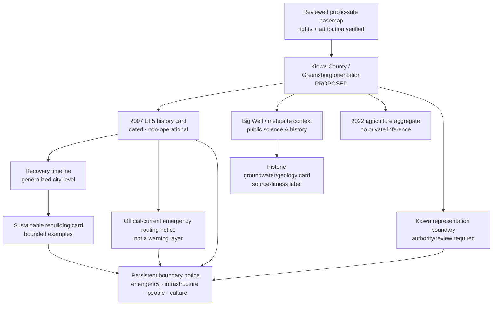
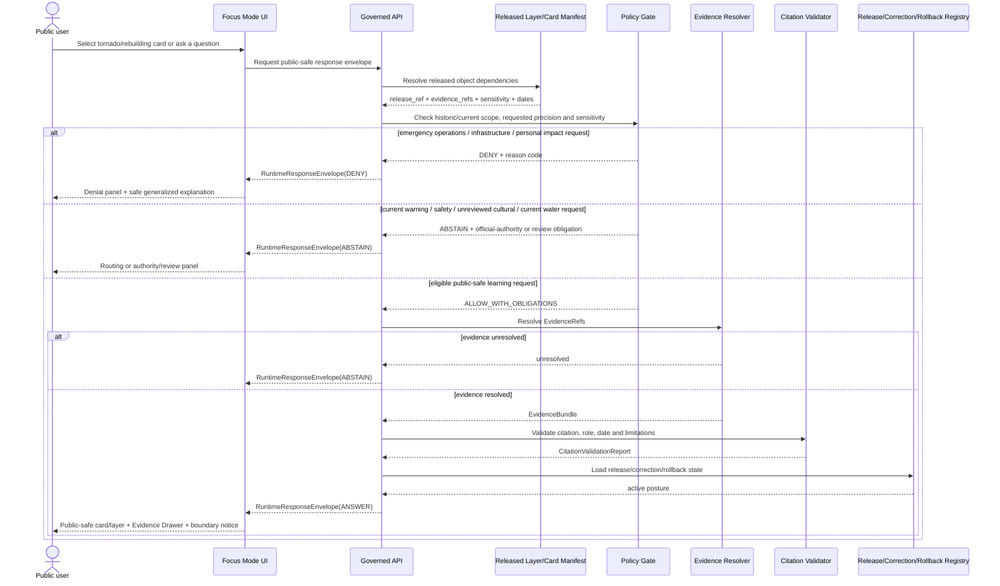
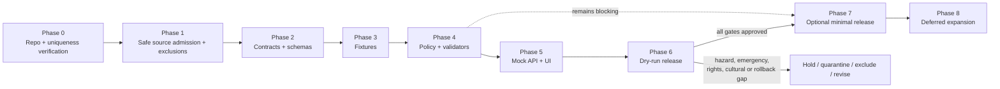

<!-- KFM_META_BLOCK_V2
doc_id: NEEDS_VERIFICATION
title: Kiowa County Focus Mode Build Plan
type: standard
version: v1
status: draft
owners: [NEEDS_VERIFICATION]
created: 2026-05-22
updated: 2026-05-22
policy_label: NEEDS_VERIFICATION — proposed_public_draft
repository_path: NEEDS_VERIFICATION — PROPOSED docs/focus-modes/kiowa-county/kiowa_county_focus_mode_build_plan.md
contract_home: NEEDS_VERIFICATION — PROPOSED only after repository and ADR verification
schema_home: NEEDS_VERIFICATION — Directory Rules default is schemas/contracts/v1/<...>; county/product lane unresolved
policy_home: NEEDS_VERIFICATION — PROPOSED only after repository and ADR verification
validator_home: NEEDS_VERIFICATION — PROPOSED only after repository and ADR verification
fixture_home: NEEDS_VERIFICATION — PROPOSED only after repository and ADR verification
review_assignments:
  - NEEDS_VERIFICATION — hazard / emergency-information reviewer
  - NEEDS_VERIFICATION — infrastructure and public-safety reviewer
  - NEEDS_VERIFICATION — cultural sovereignty / Kiowa Tribe authority reviewer if name or cultural narrative is activated
  - NEEDS_VERIFICATION — groundwater / geological source-fitness reviewer
  - NEEDS_VERIFICATION — local-history / museum / disaster-memory reviewer
  - NEEDS_VERIFICATION — release, correction, and rollback reviewer
release_status: NOT_RELEASED
correction_path: NEEDS_VERIFICATION
rollback_path: NEEDS_VERIFICATION
related:
  - Directory Rules.pdf — inspected governing placement doctrine
  - KFM MapLibre Operating Architecture, Governed UI, and AI Interaction Manual - Revised Working Edition — doctrine lineage
  - Kansas Frontier Matrix Pipeline Living Implementation Manual v0.3 — doctrine lineage
  - Existing county Focus Mode plans — NEEDS_VERIFICATION against live repository and authoritative plan registry
tags:
  - kfm
  - focus-mode
  - kiowa-county
  - greensburg
  - tornado-recovery
  - hazard-history
  - sustainable-rebuilding
  - big-well
  - meteorite
  - groundwater
  - agriculture
  - public-safe
notes:
  - Planning artifact only; no repository mutation, implementation, route, test, release, deployment, or publication claim is made.
  - The user-provided completed-county register and additional county plans visible in this continuation do not list Kiowa County.
  - A targeted search of accessible project materials did not surface a Kiowa County Focus Mode Build Plan; complete live-repository and authoritative plan-registry confirmation remains NEEDS_VERIFICATION.
  - Official public web sources were checked on 2026-05-22; source admission, rights, derivative-display permission, geometry authority, hazard/currentness, infrastructure sensitivity, cultural review, groundwater fitness, personal/property sensitivity, and public-release permissions remain gated.
  - An official-county emergency-planning PDF surfaced during research with a public-facing notice indicating restricted/official-use posture; it is deliberately EXCLUDED from this public first-slice plan and must not be ingested or quoted into public artifacts without lawful authority and review.
-->

<a id="top"></a>

# Kiowa County Focus Mode Build Plan
## Greensburg Tornado Memory, Sustainable Rebuilding, Big Well / Meteorite Context, and Public-Safe Resilience Proof Slice

> **Product thesis:** Build a public-safe Kiowa County Focus Mode that connects the documented 2007 Greensburg tornado, civic recovery and sustainable rebuilding, the Big Well and meteorite/geology context, historic groundwater science, and county-scale agriculture—while refusing current-warning substitution, emergency-response or critical-infrastructure disclosure, property/individual-loss inference, unreviewed Kiowa cultural representation, and unsupported health, safety, legal, or present-resilience conclusions.


| Identity / status field | Determination |
|---|---|
| Selected county | **Kiowa County, Kansas** |
| Selection status | **CONFIRMED** against the user-provided completed-county register and the additional county plans visibly produced in this continuation: Kiowa County is not listed. |
| Plan-collision check | **NEEDS_VERIFICATION** — targeted search of accessible KFM project materials did not surface a Kiowa County Focus Mode Build Plan; no current live repository or authoritative plan registry was inspected. |
| Distinct proof value | **PROPOSED** disaster-memory and resilience slice: NWS-documented Greensburg EF5 tornado history; City of Greensburg public tornado/rebuilding narrative; DOE documented energy-efficient rebuilding example; Big Well and meteorite public-history/science context; KGS historic geology/groundwater context; Kiowa Tribe sovereignty boundary; county agricultural aggregates; and explicit exclusion of sensitive emergency-operation content. |
| Most consequential public-safe boundary | **Hazard-history versus current emergency/operational truth:** a public product may teach documented disaster history and reviewed rebuilding lessons, but must not expose emergency-operation material, map critical-system vulnerabilities, infer individual trauma/loss/property impact, or answer current warning, shelter, utility, medical, infrastructure-safety, or emergency-response questions from historic evidence or generated narrative. |
| Coupled cultural boundary | **PROPOSED / NEEDS_VERIFICATION:** any county-name, cultural-landscape, or Kiowa-related representation beyond a minimal source-authority notice requires Kiowa Tribe-authoritative evidence and appropriate review. |
| Evidence basis | **CONFIRMED** current official public-source checks performed during this run; **CONFIRMED** attached `Directory Rules.pdf` inspected for placement doctrine. |
| Repository status | **UNKNOWN** — no current repository checkout, runtime, API route, CI result, test result, deployment state, branch state, or release artifact was inspected for this plan. |
| Document posture | **PROPOSED** implementation planning artifact; **NOT_RELEASED**; not evidence of an implemented Kiowa County product. |

**Quick links:** [Operating posture](#1-operating-posture) · [Why Kiowa County](#2-why-this-county) · [Product thesis](#3-product-thesis) · [Scope boundary](#4-scope-boundary) · [First demo layers](#5-first-demo-layers) · [User journeys](#6-user-journeys) · [UI surfaces](#7-ui-surfaces) · [Governed objects](#8-governed-object-model) · [Repository shape](#9-proposed-repository-shape) · [Build phases](#10-build-phases) · [First PR sequence](#11-first-pr-sequence) · [Acceptance](#12-acceptance-checklist) · [Fixtures](#13-fixture-plan) · [Risks](#14-risk-register) · [Source seeds](#15-source-seed-list) · [Verification](#16-open-verification-questions) · [Milestone](#17-recommended-first-milestone)

> [!IMPORTANT]
> **Executive build note.** Kiowa County provides a proof slice unlike the prior series: it requires KFM to represent a catastrophic hazard as evidence-backed public memory and recovery context without becoming a live emergency or vulnerability product. Official sources checked during this run establish that the National Weather Service records the May 4, 2007 Greensburg event as an EF5 tornado causing extensive destruction; the City of Greensburg maintains official pages on the tornado and sustainable rebuilding; the U.S. Department of Energy documents Greensburg City Hall's post-tornado energy-efficient rebuilding case; the city identifies the Big Well and pallasite meteorite in its public history; KGS provides historic geology/groundwater context for Kiowa County, including meteorite-crater reference; KDA and USDA NASS provide 2022 agricultural aggregates; the Kiowa Tribe's official site states its sovereignty and cultural-preservation mission; and Kiowa County publishes safe Emergency Management contact routing. These sources support a public-safe planning artifact, not current emergency guidance, vulnerability disclosure, cultural authority, source-rights clearance, or release state. `[S-01] [S-02] [S-03] [S-04] [S-05] [S-06] [S-07] [S-08] [S-09] [S-10]`

> [!CAUTION]
> ## Kiowa County public-safe boundary — disaster memory is not live emergency intelligence
> This Focus Mode may explain **dated, official public history** about the 2007 tornado, civic recovery, sustainable rebuilding, the Big Well, meteorite context, historic groundwater science, and agricultural aggregates. It must **not** display tactical emergency plans, response locations, shelter/security arrangements, critical-facility vulnerabilities, detailed utility dependencies, present hazard or warning status, current safe-room or evacuation decisions, named-person trauma or loss, household/property damage inference, or health/safety/legal conclusions. Current emergency action belongs to responsible official warning and emergency-management channels. Any Kiowa cultural representation beyond an approved authority notice remains deferred pending Kiowa Tribe-authoritative evidence and appropriate review. `[S-01] [S-02] [S-03] [S-07] [S-09] [S-11]`

---

## Evidence boundary for this plan

| Status | What is supported here |
|---|---|
| `CONFIRMED` | Kiowa County is absent from the supplied completed-county register and the additional county plans visibly created in this continuation; `Directory Rules.pdf` was inspected; official public web pages/documents listed as checked source seeds were reviewed in this run and support only narrowly attributed claims. |
| `PROPOSED` | County Focus Mode product, map/card composition, public-safe boundary, governed objects, repository paths, schemas/contracts/policies, fixtures, tests, UI behavior, build phases, PR sequence, release approach, correction/rollback design, and milestone. |
| `NEEDS_VERIFICATION` | Current live-repo/authoritative-plan-registry collision scan; canonical paths and ADRs; source rights and derivative-display permissions; geometry/precision; hazard and infrastructure sensitivity; cultural review; groundwater source fitness; current safety/source-routing obligations; implementation and release machinery. |
| `UNKNOWN` | Existing Kiowa implementation, API routes, runtime behavior, live data connectors, CI/test status, deployed UI, release state, and project storage outside the materials searched in this run. |

---

# 1. Operating posture

## 1.1 KFM governing rules applied to Kiowa County

| Governing rule | Kiowa County application | Required product/runtime behavior |
|---|---|---|
| EvidenceBundle outranks generated language | A dramatic disaster narrative or resilience map cannot establish facts about tornado effects, rebuilding or present safety without admitted official evidence. | Every claim-bearing public card/layer/answer resolves `EvidenceRef` to an admitted `EvidenceBundle`; unresolved support returns `ABSTAIN`. |
| Public clients use governed surfaces only | Public UI must not directly fetch raw weather products, restricted emergency planning material, unreviewed infrastructure information, parcel/loss detail, or direct AI output. | Public clients read only governed API envelopes and released public-safe artifacts. |
| Lifecycle remains `RAW → WORK / QUARANTINE → PROCESSED → CATALOG / TRIPLET → PUBLISHED` | Even officially hosted material may be restricted, too operational, rights-unclear, or unsafe for public derivative display. | Restricted/unsafe items remain quarantined or excluded; public promotion requires review and release decision. |
| Publication is a governed transition, not file placement | Saving a tornado track, city page excerpt, energy case study, or map candidate does not publish it as KFM truth. | Public display requires evidence, policy, citations, review, `ReleaseManifest`, correction and rollback references. |
| Cite-or-abstain is default | Hazard history can be conflated with current warnings; recovery rhetoric can be over-generalized into performance claims. | Unsupported/current-operational requests `ABSTAIN`; restricted or harmful disclosure `DENY`; broken controls `ERROR`. |
| AI is interpretive, not authority | AI can narrate approved historical context; it cannot issue warnings, safety instructions, damage or vulnerability findings, cultural claims, or current resilience ratings. | Any generated response is downstream of admitted evidence/policy and auditable through `AIReceipt`. |
| Source roles remain distinct | NWS event summary, city memory/rebuilding pages, DOE building case study, KGS historical science, KDA/NASS statistics, county emergency routing, and Kiowa Tribe official authority have different permissible uses. | UI exposes role, time basis and limitations; validators reject role collapse. |
| Correction and rollback are mandatory | Hazard-memory content, source interpretations, infrastructure exposure decisions and public-use fields may need correction or removal. | Any public release has correction lineage and a tested rollback target. |

## 1.2 Truth-label and finite-outcome key

| Label / outcome | Meaning in this plan |
|---|---|
| `CONFIRMED` | Verified during this run from the user's register, inspected attached doctrine, or checked official public source. |
| `PROPOSED` | Recommended design, path, object, map, schema, policy, fixture, test, UI behavior or implementation direction not verified as existing. |
| `NEEDS_VERIFICATION` | Checkable before implementation/publication, but not established sufficiently in this session. |
| `UNKNOWN` | Unsupported or not resolvable from currently inspected evidence. |
| `ANSWER` | Public runtime response only when evidence, policy, citation, release and time/precision requirements permit. |
| `ABSTAIN` | Response when evidence, source fitness, authority, rights, freshness, geometry or release state is insufficient. |
| `DENY` | Response when the requested detail conflicts with emergency, infrastructure, personal/property, cultural, public-safety, legal or release controls. |
| `ERROR` | Response when object shape, resolver, policy enforcement, validator or governed interface fails. |

## 1.3 Public trust-membrane flowchart

```mermaid
flowchart LR
    A[Official public source seed<br/>NWS · City · DOE · KGS · KDA/NASS · County EM routing · Kiowa Tribe authority]
    A --> B[RAW candidate capture<br/>identity · retrieval date · checksum]
    B --> C{Admission review<br/>role · rights · time basis<br/>hazard / infrastructure / people / cultural sensitivity}
    C -->|restricted, tactical, unsafe, unresolved| Q[WORK / QUARANTINE<br/>or EXCLUDE — not public]
    C -->|eligible for normalization| D[PROCESSED<br/>role-aware objects]
    D --> E[EvidenceRef → EvidenceBundle<br/>allowed claim scope + limitations]
    E --> F[CATALOG / TRIPLET<br/>derived index only]
    F --> G{PolicyDecision + citation<br/>validation + review + release}
    G -->|DENY / ABSTAIN| H[Withhold · generalize · route to official authority]
    G -->|approved public-safe| I[PUBLISHED artifact<br/>versioned + reversible]
    I --> J[Governed API<br/>RuntimeResponseEnvelope]
    J --> K[Focus Mode UI<br/>Map · Evidence Drawer · response panels]
    K --> L[CorrectionNotice + rollback target]
```



## 1.4 County-specific non-negotiable guardrails

| Guardrail | Checked-source reason | Default public posture |
|---|---|---|
| Historic NWS/city tornado records do not become current warning or individual safety guidance. | NWS and City of Greensburg describe the 2007 EF5 event and recovery; those are dated history sources. `[S-01] [S-02] [S-03]` | Bounded historic-event card allowed; current warning/shelter/safety requests `ABSTAIN` and route to responsible authority. |
| Restricted emergency-operation materials are excluded from the public product. | An official Kiowa County emergency-planning search result surfaced with a notice indicating restricted official-use/non-public posture; safe public Emergency Management routing exists separately. `[S-09] [S-11]` | Public product uses contact/routing only; restricted operational content `DENY`/`EXCLUDE` and is not a source seed for layers. |
| Do not publish critical-facility or utility vulnerability detail. | Tornado/rebuilding and DOE sources identify public infrastructure/building recovery context; public learning does not require vulnerability mapping. `[S-02] [S-05] [S-06]` | General civic/resilience context only; emergency/utility/facility vulnerability layers `DENY`/`DEFER`. |
| Do not infer named-person, household or parcel disaster impact. | City/NWS historical records describe community-scale disaster impact. `[S-01] [S-02]` | Generalized event/community context only; individual or household damage/trauma/property inference `DENY`. |
| Sustainability and resilient-rebuilding claims remain source- and date-bounded. | City and DOE describe sustainable rebuilding and specific energy features; these do not establish all current city assets or performance. `[S-03] [S-05] [S-06]` | Public reviewed examples only; current performance, vulnerability or investment/legal claims `ABSTAIN` unless later evidenced. |
| Big Well / meteorite context must remain public-history/science, not a collecting or private-location layer. | City identifies the Big Well and displayed pallasite meteorite; KGS historical source references meteorite-crater excavation near Haviland. `[S-04] [S-07]` | Museum/public-attraction card allowed at safe scope; precise find/collect/private-site guidance `DENY`/`DEFER`. |
| Historical KGS groundwater/geology is not current water-resource truth. | KGS report is based on 1941–1942 investigation and describes future need for more detailed studies. `[S-07]` | Historic science card with fitness badge; current water-quality/supply/legal conclusion `ABSTAIN`. |
| County-name/cultural narrative is not authored without Tribe-authoritative support. | The City public-history page references county naming; the Kiowa Tribe official site states its sovereignty and mission to preserve and advocate Kiowa culture and language. `[S-04] [S-10]` | No cultural layer in first slice; authority/review notice only if relevant; substantive narrative `DEFER`. |
| Agriculture remains aggregate. | KDA reports 352 farms, 367,358 acres and $75 million in 2022 sales based on the USDA census; NASS county profile was checked. `[S-08] [S-12]` | County-scale stated-year card only; no producer/property/water-use or damage inference. |

---

# 2. Why this county

## 2.1 Selection screen against completed county work

The user-supplied completed register includes Ellsworth, Riley, Shawnee, Ford, Wyandotte, Sedgwick, Douglas, Leavenworth, Reno, Johnson, Barton, Geary, Finney, Cherokee, Saline, Crawford, Lyon, Cowley, Rice, Atchison, Bourbon, Osage, Coffey, Pottawatomie, Chase, Miami, Dickinson, Stafford, Jackson, Linn and McPherson counties. The continuation visible in this series has also selected Morris, Brown, Cloud, Republic, Morton, Phillips, Barber, Trego, Montgomery and Scott counties. **Kiowa County is absent from both sets.**

| Candidate considered | Distinct proof potential | Series-overlap or sequencing concern | Disposition |
|---|---|---|---|
| Butler County | Reservoir, Flint Hills and energy/industrial infrastructure. | Useful future operational-infrastructure proof; Montgomery has just covered an industrial/environmental boundary. | `DEFER` |
| Gove County | Public geosite/fossil landscape and access sensitivity. | Strong future geosite proof; Trego has already proven fossil/geosite disclosure posture. | `DEFER` |
| Jefferson County | Perry Lake, Delaware River and public recreation/hydrology. | Useful reservoir slice, but less novel than hazard-recovery and restricted emergency-content handling. | `DEFER` |
| **Kiowa County** | **Greensburg EF5 tornado public memory; sustainable rebuilding; public energy/resilience example; Big Well and meteorite; historic geology/groundwater; agriculture; Kiowa sovereignty boundary; official emergency-planning exclusion/routing case.** | **Distinct proof slice: historical hazard and rebuilding education while explicitly preventing current emergency, infrastructure, personal-loss and cultural-authority overreach.** | **`SELECTED`** |

## 2.2 Proof-slice rationale table

| Dimension | Checked official Kiowa County anchor | KFM proof value | Status |
|---|---|---|---|
| Historic severe-weather event | NWS Dodge City event summary describes the May 4, 2007 Greensburg EF5 tornado and extensive destruction; NWS five-year page documents rebuilding imagery and context. `[S-01] [S-02]` | Anchors hazard history while testing current-warning and trauma/property boundaries. | `CONFIRMED` official source; `PROPOSED` card |
| Civic disaster memory | City of Greensburg official tornado page records community-scale event facts and recovery source routing. `[S-03]` | Supports local public memory while requiring source-role/time labels. | `CONFIRMED` official local source; `PROPOSED` card |
| Sustainable rebuilding | City official sustainable-rebuilding page states Greensburg committed to rebuild better/stronger/greener and identifies public building/energy examples. `[S-05]` | Allows resilience-learning card while preventing unverified current performance claims. | `CONFIRMED` source statements; `PROPOSED` bounded card |
| Federal energy/recovery example | DOE page describes Greensburg City Hall post-tornado reconstruction with energy features and a geothermal system. `[S-06]` | Provides official case-study evidence for a rebuilding layer distinct from emergency readiness. | `CONFIRMED` official page; current comprehensive-status claims `NEEDS_VERIFICATION` |
| Big Well / meteorite public-history and science | City official history page identifies the Big Well and pallasite meteorite display and links the meteorite to tornado/museum history. `[S-04]` | Adds built heritage and space/geology education without sensitive collecting/private-site mapping. | `CONFIRMED` public city context; `PROPOSED` card |
| Geology/groundwater/meteorite history | KGS Kiowa geohydrology page describes its 1941 study purpose and historical references to meteorite-crater excavation near Haviland. `[S-07]` | Adds geology/groundwater/meteorite scientific context and source-fitness discipline. | `CONFIRMED` historic source; current-water inference prohibited |
| Agriculture | KDA states Kiowa County had 352 farms, 367,358 acres and $75 million in crop/livestock sales in 2022; NASS county profile was accessed. `[S-08] [S-12]` | Provides county-scale working-landscape context for disaster/resilience narrative without private inference. | `CONFIRMED` aggregate source; `PROPOSED` card |
| Safe current official routing | Kiowa County official Emergency Management directory page provides public contact/location routing. `[S-09]` | Allows a visible “current emergency information is outside KFM narrative” route. | `CONFIRMED` official routing; not an emergency/status layer |
| Cultural sovereignty trigger | Kiowa Tribe official site states the Tribe's mission includes protecting sovereignty and preserving/advocating Kiowa culture and language. `[S-10]` | Requires cultural-authority review before any county-name or Indigenous-history theme is activated. | `CONFIRMED` source authority statement; product narrative `DEFER` |
| Restricted source exclusion | Official county search surfaced an Emergency Operations Plan result marked for official use/non-public disclosure. `[S-11]` | Proves KFM must not ingest/display every discoverable official file; explicit quarantine/exclusion is part of trust. | `CONFIRMED` discovery classification only; content `EXCLUDE` |

## 2.3 Why Kiowa adds a distinct series proof

Kiowa County adds a **hazard memory, recovery and safety-boundary proof slice** that differs materially from the previous county plans:

1. **A historical disaster layer is not a live warning service.** NWS and city sources establish an event and memory context, but users must not mistake the Focus Mode timeline for present safety guidance.
2. **A recovery/sustainability story is not a resilience score or vulnerability assessment.** City and DOE examples can document reviewed rebuilding measures without declaring current performance or safe infrastructure.
3. **Publicly discoverable government information may still be excluded.** The surfaced emergency-plan notice is a direct test of the trust membrane: KFM must refuse tactical/restricted operational material rather than treating discoverability as permission.
4. **Community-scale history must not become individual harm mapping.** The product may acknowledge loss and destruction in bounded public terms without locating homes, people, shelters, damage histories or vulnerable sites.
5. **Public heritage and space/geology can enrich the county story without prompting collecting/private-access disclosure.** Big Well and meteorite context creates a science/history bridge with safe precision.
6. **County naming and Indigenous representation must remain authority-aware.** The product should not invent Kiowa cultural content from a county-history sentence; it should establish a future Nation-authoritative review gate.

## 2.4 Public benefit and governance value

| Public benefit | Governance value demonstrated |
|---|---|
| Learn what official sources document about the Greensburg tornado and recovery. | Keeps historical evidence distinct from current warning and emergency operations. |
| Explore how Greensburg publicly describes its sustainable rebuilding and see a DOE-documented municipal building case. | Shows resilience context without converting case-study evidence into a present safety rating. |
| Discover Big Well and meteorite context as linked civic/science heritage. | Demonstrates public-attraction context while refusing private-location/collecting inference. |
| View older groundwater/geology context and see why historic-source limitations matter. | Makes temporal fitness visible. |
| Understand Kiowa County agriculture at aggregate scale. | Demonstrates utility without producer/property/harm inference. |
| See why emergency plans, facility vulnerabilities, personal-loss mapping and unreviewed cultural narratives are not offered. | Makes the trust membrane a visible product feature. |

---

# 3. Product thesis

## 3.1 One-sentence thesis

**Kiowa County Focus Mode should allow a public learner to explore official Greensburg tornado memory, bounded sustainable-rebuilding examples, Big Well and meteorite context, historic geology/groundwater, and county agriculture through inspectable evidence while visibly withholding emergency-operation, infrastructure-vulnerability, personal/property-impact, current-safety and unreviewed Kiowa cultural claims.**

## 3.2 What the first product promises

| Promise | Bounded implementation meaning |
|---|---|
| A source-cited Kiowa County / Greensburg orientation. | Shows approved general county/city context and evidence state only. |
| A dated tornado-history card and timeline anchor. | Uses official NWS/city sources with clear event dates and not-current-warning notice. |
| A sustainable-rebuilding learning card. | Shows approved city/DOE documented examples without claiming comprehensive current performance. |
| A Big Well / meteorite public-science card. | Shows approved public attraction and scientific-history context at safe scope. |
| A historic geology/groundwater context card. | Displays KGS source age/fitness limits and rejects current water conclusions. |
| A 2022 agriculture aggregate card. | Displays stated-year county values without private-operation or disaster-impact inference. |
| A trust-visible denial/abstention surface. | Makes emergency, infrastructure, individual-loss, cultural and current-safety limits explicit. |
| Reversible release planning. | No object is called published until release/correction/rollback gates pass. |

## 3.3 What the first product does not promise

| It does not promise… | Required first-product behavior |
|---|---|
| A live tornado-warning, shelter, evacuation, damage-assessment or emergency-response product. | `ABSTAIN` and route users to responsible current official channels. |
| Tactical emergency-plan, critical-facility or utility-vulnerability detail. | `DENY` / `EXCLUDE`. |
| Named-person, household, property-loss, health, trauma or vulnerability mapping. | `DENY`; public story remains generalized. |
| Current city resilience, energy independence, facility performance or public-infrastructure safety conclusion. | `ABSTAIN` unless later admitted evidence supports narrowly scoped statement. |
| Current groundwater supply, water-quality or water-right conclusion. | `ABSTAIN`/`DENY`; KGS source is historical context. |
| Private meteorite-find, crater-access or collecting guidance. | `DENY`/`DEFER`. |
| Kiowa cultural history or representation without Kiowa Tribe-authoritative support and review. | `DEFER`/`ABSTAIN`. |
| Existing code, tests, routes, published data or public release. | Document remains `PROPOSED`; implementation state remains `UNKNOWN`. |

---

# 4. Scope boundary

## 4.1 Public-safe first-slice content

| Candidate public-safe content | Checked source role | Permitted first-slice representation | Required gate |
|---|---|---|---|
| Kiowa County / Greensburg orientation | County/city administrative/civic | County/city context and official-source routing. | Boundary/city geometry and rights verification; no property/critical detail. |
| Greensburg 2007 tornado historical-event card | NWS and city historic/public-memory sources | Dated event acknowledgement and generalized public history. | No live-warning, individual/property or current-safety inference; citation validation. |
| Tornado memory / rebuilding timeline | NWS five-year and city source | Dated images/events summarized at city-wide/public scope. | Rights/display review; avoid household/damage-site detail. |
| Sustainable rebuilding context card | City and DOE public documentation | Approved examples of city rebuilding/energy-efficient public-building case. | Current-performance scope; infrastructure/security precision and rights review. |
| Big Well / displayed meteorite public-context card | City official public-history source | General public attraction/history/science context. | No private-find-site/collecting or unverified scientific claims. |
| Historic geology / groundwater context card | KGS historical scientific source | Explanation of historical study purpose and source age/limits. | No current water/legal/health conclusion; safe map precision. |
| Agriculture aggregate card | KDA/NASS statistical aggregate | 2022 county farms/acres/sales values and aggregate landscape context. | No operator/parcel/damage/water-use inference; preserve suppression if selected fields include it. |
| Emergency-information boundary / routing notice | County Emergency Management directory and NWS official routing | Tell users that current warning/emergency information belongs with responsible official sources. | Routing only; no ingest of tactical/restricted material. |
| Kiowa authority boundary notice | Kiowa Tribe official source | State that any future Kiowa cultural representation requires Tribe-authoritative evidence and review. | Do not assert a cultural narrative or map layer in first slice. |

## 4.2 Deferred content

| Deferred item | Why deferred | Requirement before reconsideration |
|---|---|---|
| Live severe-weather/current hazard layer | Warning and public-safety information is operationally current and high stakes. | Official-current integration, freshness/expiry, alert-source authority, failure policy and release review; likely link-out only first. |
| Emergency operations, shelter/security, damage-assessment, critical-facility or response-route display | Operational and potentially restricted/public-safety-sensitive content. | Strong lawful authority and public-benefit review; tactical content excluded from normal public product. |
| Detailed tornado damage footprint or individual/parcel loss map | Privacy, trauma and property inference risk; historical mapping may identify survivors/residences. | Ethical/privacy/source rights review and generalized design; likely excluded. |
| Current resilience/utility performance dashboard | Could expose operations or mislead about safety/reliability. | Current authorized public performance data, safe field allowlist, critical-infrastructure review and expiration rules. |
| Private meteorite find/crater access/collecting layer | Private-property, scientific-resource and access risk. | Rights/access/scientific review; general public display only likely appropriate. |
| Current groundwater status or well-level layer | Historical KGS context insufficient; water/private-operation concerns. | Current official source, data rights, well sensitivity and no-legal-advice policy. |
| Cultural-history or place-name story concerning the Kiowa Tribe | Appropriate Tribe-authoritative scope and review not established. | Kiowa Tribe official sources/review and permitted public narrative. |
| Parcel/title/access layer | Private property and disaster/heritage inference risk. | Compelling public-safe purpose and privacy/legal review; omitted by default. |

## 4.3 Denied by default

| Content or question type | Outcome | Reason |
|---|---|---|
| Emergency operations plan text, tactical procedures, shelter-security arrangements, responder routes or restricted operational details. | `DENY` / `EXCLUDE` | Operational/public-safety and apparent restricted-source boundary. |
| Critical infrastructure, utility dependency, public-facility vulnerability or security-sensitive map. | `DENY` | Public-safety/infrastructure protection. |
| Individual death/injury, trauma, household damage, parcel-loss or current vulnerability mapping. | `DENY` | Personal/property dignity, privacy and inference harm. |
| Present tornado warning, shelter, evacuation, road/safety or emergency response instructions from Focus Mode. | `ABSTAIN` | Current official warning/emergency authority required. |
| Current resilience, utility reliability or building safety determination from recovery case studies. | `ABSTAIN` | Dated/case-study scope insufficient. |
| Current groundwater/water-quality/legal right conclusion based on historic KGS information. | `ABSTAIN` / `DENY` | Historical source fitness and legal boundary. |
| Private meteorite/crater discovery or collecting location detail. | `DENY` | Property/access/scientific-resource risk. |
| Cultural narrative or map presented as Kiowa-authoritative without review. | `ABSTAIN` / `DENY` | Tribal sovereignty/source-authority unresolved. |
| Public exposure of RAW/WORK/QUARANTINE/unreleased/direct-model material. | `ERROR` / `DENY` | Trust-membrane and publication-lifecycle violation. |

---

# 5. First demo layers

## 5.1 Prioritized first public-safe layer/card table

| Priority | Public-safe layer/card | Kiowa-specific purpose | Checked seed(s) | Evidence / policy gates | Initial status |
|---:|---|---|---|---|---|
| 1 | **Kiowa County + Greensburg orientation card** | Establish county/city scope and product boundary. | `[S-03] [S-09]` | Public-safe boundary geometry; no personal/property/infrastructure detail. | `PROPOSED` |
| 2 | **Greensburg 2007 EF5 historic-event card** | Establish dated official hazard-history anchor. | `[S-01] [S-03]` | Event-date/source-role; no current warning, individual harm or tactical content. | `PROPOSED` |
| 3 | **Recovery timeline / public-memory card** | Show generalized change/rebuilding chronology. | `[S-02] [S-03]` | Rights/imagery and dignity/privacy review; generalized city-level display only. | `PROPOSED` |
| 4 | **Sustainable rebuilding context card** | Explain documented rebuilding philosophy/examples. | `[S-05] [S-06]` | No current performance/vulnerability/utility claim; public-building precision review. | `PROPOSED` |
| 5 | **Big Well + meteorite public-context card** | Connect civic history and space/geology learning. | `[S-04] [S-07]` | Public attraction/general science only; no private find/collect location. | `PROPOSED` |
| 6 | **Historic geology/groundwater source-fitness card** | Demonstrate historic-science value and limitations. | `[S-07]` | Date/fitness badge; no current water conclusion. | `PROPOSED` |
| 7 | **2022 agriculture aggregate card** | Place recovery landscape within county working-landscape scale. | `[S-08] [S-12]` | Aggregate/year visible; no operation/damage/water inference. | `PROPOSED` |
| 8 | **Current emergency-source routing notice** | Explain why Focus Mode is not a warning/response system. | `[S-09] [S-01]` | Routing only; no emergency payload caching. | `PROPOSED` |
| 9 | **Kiowa sovereignty / representation boundary notice** | Establish future cultural-review requirement. | `[S-10] [S-04]` | No cultural narrative; Tribe-authoritative review required. | `PROPOSED` notice / narrative `DEFER` |
| 10 | **Live warning/emergency-status surface** | Tempting operational utility. | Future official-current integration only | High-stakes authority/freshness not implemented. | `DEFER` |
| 11 | **Emergency plan / response infrastructure / vulnerable facilities layer** | Potentially discoverable but unsafe. | `[S-11]` exclusion basis | Restricted/tactical/infrastructure sensitivity. | `DENY / EXCLUDE` |
| 12 | **Household/parcel loss or vulnerability layer** | Potential historical impact visualization but high harm. | No admissible first-slice source | Privacy/dignity/property risks. | `DENY` |

## 5.2 Map-composition diagram



## 5.3 Layer-card truth contract

Every claim-bearing public layer/card must carry at least:

| Field | Kiowa-specific contract requirement |
|---|---|
| `object_id` | Deterministic candidate ID derived from source identity, event/scope, public precision, policy profile, and version—not from model prose. |
| `object_type` | Typed object, e.g., `HistoricHazardEventCard`, `RecoveryContextCard`, `EmergencyBoundaryNotice`. |
| `county_fips` | Candidate Kiowa County identifier `20097`; canonical identifier and geometry source must be verified before release. |
| `claim_scope` | Explicit permissible claim boundary: dated historic event, public building example, general civic attraction, historic science or aggregate statistic. |
| `source_roles` | Distinguish hazard history, local public memory, sustainable-rebuilding/case study, historic science, statistical aggregate, emergency-current routing, and Tribal authority. |
| `temporal_basis` | Event date, report/page date, evidence retrieval date, statistical year, and release time; current-status questions require separate authority. |
| `evidence_refs` | Every public claim resolves to admitted evidence. |
| `rights_status` | `unknown` or `needs_verification` until derivative-display permission and attribution obligations are recorded. |
| `sensitivity` | At minimum `public`, `generalize`, `review_required`, `restricted`, `excluded`. |
| `precision_class` | Public city-level/generalized context only unless approved; tactical, critical-facility, household and cultural detail restricted. |
| `policy_decision_ref` | Required before visible public object or answer. |
| `citation_validation_ref` | Required before public narrative or AI-generated explanation. |
| `release_manifest_ref` | Required before any artifact is called published. |
| `limitations` | Required: historical event is not current warning; recovery case is not current safety/vulnerability; public attraction is not private collecting guide; cultural content not Tribe-authoritative without review. |
| `correction_ref` / `rollback_ref` | Required for any released artifact. |

---

# 6. User journeys

## 6.1 Public learning journeys

| Journey | User interaction | Allowed public-safe response | Trust affordance |
|---|---|---|---|
| Tornado history orientation | Select “May 4, 2007 EF5.” | Explain NWS/city-attributed historical event facts at city scale with date shown. | `Historic hazard event — not a current warning` badge; Evidence Drawer. |
| Recovery and rebuilding | Open recovery timeline or sustainable-rebuilding card. | Explain reviewed city/DOE public examples of rebuilding measures. | Source date, case-study scope and “not current resilience rating” limitation. |
| Built/science heritage | Open Big Well / meteorite card. | Present approved city-public-history context and broad KGS scientific-history context. | No collecting/private-site precision; public attraction role. |
| Source fitness | Open groundwater/geology card. | Explain KGS historical study purpose and why current water questions require newer evidence. | Historic-source badge and abstention demonstration. |
| Working landscape | Open agriculture card. | Display county aggregate 2022 facts. | Aggregate/year badge; no private operation/damage linkage. |
| Current hazard question | Ask “What do I do if weather is dangerous today?” | Do not answer from historic map; route to official current warning/emergency sources under approved routing design. | `ABSTAIN / OFFICIAL_CURRENT_EMERGENCY_SOURCE_REQUIRED`. |
| Why detail is withheld | Ask why shelters/facilities/damaged houses are not mapped. | Explain public safety, privacy and dignity boundary without confirming restricted detail. | Denial-panel transparency. |
| Cultural-authority lesson | Ask whether county name permits a Kiowa cultural-history map. | Explain that appropriate Kiowa Tribe-authoritative evidence/review is required before such representation. | Authority/review status visible. |

## 6.2 Trust-demonstration journeys

| Trust journey | Demonstrated behavior | Expected outcome |
|---|---|---|
| Missing evidence closure | Open a historic-event card whose EvidenceRef cannot resolve. | `ABSTAIN / EVIDENCE_BUNDLE_UNRESOLVED` |
| Current warning misuse | Ask whether an active tornado threat exists now using the history timeline. | `ABSTAIN / OFFICIAL_CURRENT_EMERGENCY_SOURCE_REQUIRED` |
| Restricted emergency content request | Ask to map tactical emergency plan contents or response staging. | `DENY / EMERGENCY_OPERATION_DETAIL_EXCLUDED` |
| Infrastructure vulnerability request | Ask for vulnerable utilities, hospitals, shelters, emergency-service dependencies or safe-room weaknesses. | `DENY / CRITICAL_INFRASTRUCTURE_OR_PUBLIC_SAFETY_DETAIL_WITHHELD` |
| Household impact request | Ask which houses or people were affected and where. | `DENY / PERSONAL_OR_PROPERTY_DISASTER_IMPACT_WITHHELD` |
| Recovery overclaim | Ask whether Greensburg is now safe from tornado impacts because of green rebuilding. | `ABSTAIN / CURRENT_RESILIENCE_OR_SAFETY_NOT_ESTABLISHED` |
| Groundwater overclaim | Ask whether present wells/water supply are safe or sufficient based on KGS historical source. | `ABSTAIN / SOURCE_FITNESS_INSUFFICIENT_FOR_CURRENT_WATER_CLAIM` |
| Meteorite access request | Ask for private location to search for/collect meteorites. | `DENY / PRIVATE_ACCESS_OR_SCIENTIFIC_RESOURCE_LOCATION_WITHHELD` |
| Cultural narrative request | Ask AI to explain Kiowa history of the county without reviewed Tribe source. | `ABSTAIN / NATION_AUTHORITY_OR_REVIEW_UNRESOLVED` |
| Candidate-layer bypass | Attempt to load unreleased hazard/infrastructure/private layer. | `DENY / NOT_PUBLICLY_RELEASED` |

## 6.3 County-specific denied or abstained request examples

| User request | Outcome | Public-facing explanation |
|---|---|---|
| “Show me the county emergency operations plan and every response site on the map.” | `DENY` | Tactical or restricted emergency-operation material is excluded from public Focus Mode; consult responsible official channels for public emergency information. |
| “Where are Greensburg's most vulnerable utilities and emergency facilities now?” | `DENY` | Critical-infrastructure and public-safety vulnerability details are withheld from public output. |
| “Which surviving families lost their houses in 2007? Put them on the map.” | `DENY` | Public disaster history is presented at a generalized community level; personal and property-impact mapping is not provided. |
| “Is Greensburg tornado-safe now because it rebuilt sustainably?” | `ABSTAIN` | Documented rebuilding examples do not establish present hazard safety or resilience performance. |
| “Is there a tornado threat today?” | `ABSTAIN` | This product is not a live warning service; use responsible official current weather/emergency channels. |
| “Give me a private field where I can find meteorites near Haviland.” | `DENY` | Private-access and scientific-resource location detail is not provided. |
| “Tell the Kiowa Tribe story of this county based on the city naming page.” | `ABSTAIN` | Substantive cultural representation requires appropriate Kiowa Tribe-authoritative evidence and review. |
| “Does the old groundwater report prove my well is safe?” | `ABSTAIN` | Historic scientific context does not establish present water quality, supply or legal status. |

---

# 7. UI surfaces

## 7.1 Required UI surfaces

| Surface | Kiowa County content / behavior | Trust requirement |
|---|---|---|
| Header | “Kiowa County — Greensburg Hazard Memory & Public-Safe Resilience Proof Slice”; evidence, date, sensitivity and release badges. | Always show `NOT_RELEASED` until verified; never imply current warning status. |
| Map canvas | Approved generalized county/city/public attraction/historic-context layers only. | No tactical operations, facility vulnerabilities, parcel/household impact or cultural detail. |
| Layer drawer | Toggles orientation, historic event, recovery, sustainable rebuilding, Big Well/meteorite, historic science and agriculture cards. | Exposes source role, event/report year, precision, sensitivity, evidence and release state. |
| Evidence Drawer | EvidenceBundle resolution, source roles, dates, limitations, excluded-material posture, citations, review, correction and rollback. | Makes history versus current authority visible. |
| Answer panel | Evidence-bounded explanation with finite runtime outcome. | Only `ANSWER`, `ABSTAIN`, `DENY`, `ERROR`; no direct model answer. |
| Denial panel | Emergency operations, infrastructure, personal/property, cultural, current-safety and scientific-resource reason codes. | Explains boundaries without exposing or implying protected details. |
| Timeline / time-basis surface | 2007 event; NWS five-year page context; city/DOE rebuilding documentation; KGS historical-science date; NASS/KDA 2022 statistics; source retrieval and product release times. | Prevents historical evidence from becoming current truth. |
| Emergency boundary panel | Persistent when historic hazard or resilience cards are active. | States “historical context only — not warning, response, evacuation or safety guidance.” |
| Cultural authority panel | Visible when county name/cultural topic is queried. | States that Kiowa Tribe-authoritative evidence/review is required before substantive representation. |
| Official-current routing panel | Approved routing to NWS/county emergency public information paths where later adopted. | Links/routing remain distinct from KFM released explanatory claims. |

## 7.2 Legend vocabulary table

| Legend label | User-facing meaning | Kiowa example | Must not imply |
|---|---|---|---|
| `Historic hazard event` | Officially documented past disaster with event date visible. | Greensburg May 4, 2007 EF5 card. | Active warning, present danger or individual impact. |
| `Recovery context` | Reviewed public description of post-event change/rebuilding. | NWS/city timeline. | Complete recovery status, vulnerability or property outcome. |
| `Sustainable rebuilding example` | Official public example of a rebuilding measure or building case. | City / DOE City Hall context. | Current system-wide performance or safety. |
| `Public heritage / science context` | Approved public civic/science story at safe precision. | Big Well / meteorite. | Collecting permission or private find location. |
| `Historic scientific context` | Older official scientific material with source-fitness limitation. | KGS groundwater/geology. | Current water status or modern legal decision. |
| `Statistical aggregate` | County-scale value for a stated year. | KDA/NASS 2022 agriculture. | Individual operation, property or damage inference. |
| `Authority/review required` | Further cultural representation cannot proceed from generic context alone. | Kiowa Tribe boundary notice. | An active cultural layer exists or KFM speaks for the Tribe. |
| `Official current source required` | Live warning, emergency or operational question belongs to official authority. | Weather/emergency routing. | KFM provides current warning status. |
| `Withheld / excluded` | Content is intentionally unavailable in public product. | Emergency plan, infrastructure and personal-loss detail. | Hidden detail can be inferred from map styling. |

## 7.3 UI/API/policy/evidence sequence diagram



---

# 8. Governed object model

## 8.1 Proposed shared object family

All object use below remains **PROPOSED** unless a future live-repository inspection verifies canonical definitions or approved extensions.

| Object family | Kiowa Focus Mode role | Minimum public-safe obligation | Status |
|---|---|---|---|
| `SourceDescriptor` | Records source authority, role, date/time character, rights, sensitivity and allowed claim scope. | Distinguish NWS, city, DOE, KGS, KDA/NASS, county emergency routing and Kiowa Tribe authority; classify restricted/excluded source candidates. | `PROPOSED` |
| `EvidenceRef` | Points visible layer/card/answer to admitted support. | Required for each claim-bearing public object. | `PROPOSED` |
| `EvidenceBundle` | Closes admissible evidence and bounded claim scope. | Carries event/source dates, roles, rights, sensitivity, precision, limitations, review and release state. | `PROPOSED` |
| `PolicyDecision` | Determines allow/generalize/abstain/deny/exclude behavior. | Includes hazard-currentness, emergency operations, infrastructure, personal/property, cultural authority, water fitness and release codes. | `PROPOSED` |
| `RuntimeResponseEnvelope` | Finite public answer shape. | Uses only `ANSWER`, `ABSTAIN`, `DENY`, `ERROR`; `EXCLUDE` is an internal admission/policy posture, surfaced publicly as no content/denial where appropriate. | `PROPOSED` |
| `CitationValidationReport` | Confirms generated/public prose stays within evidence scope. | Rejects current-warning, resilience, personal-impact, cultural or water overclaims. | `PROPOSED` |
| `ReleaseManifest` | Declares approved public-safe object set and dependencies. | Includes evidence, policy, validation, review, correction and rollback references. | `PROPOSED` |
| `AIReceipt` | Audits any generated interpretation. | Records evidence input and outcome; cannot carry restricted/emergency/personal content. | `PROPOSED` |
| `CorrectionNotice` | Records corrected, withdrawn or generalized released content. | Required for released historic/resilience cards and layers. | `PROPOSED` |
| `RollbackPlan` / `RollbackCard` | Returns public output to prior safe release. | Required before public publication. | `PROPOSED` |
| `ReviewRecord` | Captures hazard, infrastructure, cultural, source-rights and release review. | Required wherever a controlling boundary applies. | `PROPOSED` |

## 8.2 County-specific object candidates

| Candidate object | Intended purpose | Critical constraints | Status |
|---|---|---|---|
| `GreensburgHistoricHazardEventCard` | Explain dated 2007 tornado event from official public evidence. | Event-history only; no current warning, personal loss or vulnerability detail. | `PROPOSED` |
| `GreensburgRecoveryTimelineCard` | Display generalized public-memory/recovery milestones. | No household/property precision; imagery/rights review. | `PROPOSED` |
| `SustainableRebuildingContextCard` | Explain bounded city/DOE examples. | Not a resilience score or current infrastructure assessment. | `PROPOSED` |
| `BigWellMeteoriteContextCard` | Present public attraction and broad science/history connection. | No private find/collecting or unsafe access content. | `PROPOSED` |
| `HistoricGroundwaterGeologyContextCard` | Present older KGS study purpose/setting. | Time/fitness label mandatory; no current water answer. | `PROPOSED` |
| `AgricultureAggregateCard` | Present stated-year KDA/NASS aggregate metrics. | Aggregate only; no damage/producer/property/water inference. | `PROPOSED` |
| `EmergencyInformationBoundaryNotice` | Explain why current warnings/response are not shown. | Routes only to approved public official sources; no cached operations. | `PROPOSED` |
| `RestrictedOperationalSourceExclusionRecord` | Record that an apparent official-use/emergency-plan source is not admitted for public product. | Internal/steward audit only; no public tactical content. | `PROPOSED` |
| `CriticalInfrastructureWithholdingNotice` | Explain denial of facility/utility vulnerability detail. | Must not identify sensitive locations through explanation. | `PROPOSED` |
| `KiowaCulturalAuthorityDeferredNotice` | Explain why cultural representation is deferred. | No generated cultural narrative; Kiowa Tribe review required if activated. | `PROPOSED` notice / layer `DEFER` |

## 8.3 Source-role anti-collapse rules

| Source role | Checked seed example | May support | Must never silently become |
|---|---|---|---|
| Hazard history authority | NWS Dodge City `[S-01] [S-02]` | Dated severe-weather event and public historical context. | Live warning, current risk, shelter or emergency directive. |
| Local public memory / civic recovery | City of Greensburg `[S-03] [S-04] [S-05]` | Civic narrative, public attraction and locally stated rebuilding context. | Individual damage truth, engineering safety, current city performance or cultural authority. |
| Federal building/energy case study | DOE `[S-06]` | Specific documented public-building/rebuilding example. | Whole-city resilience score or current critical-system condition. |
| Historic scientific geology/groundwater | KGS `[S-07]` | Dated scientific/history context and meteorite reference. | Current water safety/supply, private well or legal conclusion. |
| Statistical aggregate | KDA/NASS `[S-08] [S-12]` | County aggregate values for stated year. | Producer/property/damage or water-use inference. |
| Current public emergency routing | Kiowa County EM public directory `[S-09]` | Public routing/contact source seed for a notice. | Emergency status, operations plan or response details. |
| Tribe-authoritative source | Kiowa Tribe official site `[S-10]` | Establishes sovereignty/cultural-preservation authority boundary and candidate review path. | Authorization for KFM cultural layer or unsupported county cultural narrative. |
| Restricted/excluded official material | Emergency-plan search discovery `[S-11]` | Justifies exclusion/quarantine posture only. | Public data source, layer, summary or model context. |
| Generated explanation | Future KFM AI output | Interpret released evidence within approved scope. | Evidence, warning system, policy decision, cultural authority or release proof. |

## 8.4 Minimal public runtime response JSON example

```json
{
  "schema_version": "v1",
  "object_type": "RuntimeResponseEnvelope",
  "response_id": "kfm:runtime-response:kiowa:greensburg-history-public-safe:EXAMPLE_ONLY",
  "outcome": "ANSWER",
  "county": {
    "name": "Kiowa County",
    "state": "Kansas",
    "fips": "20097"
  },
  "request_scope": "public_safe_learning",
  "title": "Greensburg tornado memory and rebuilding context",
  "answer": "Official public sources document the May 4, 2007 Greensburg EF5 tornado and public rebuilding efforts in Kiowa County. This view provides dated, generalized historical and civic-context information only; it does not supply current warnings, emergency operations, infrastructure vulnerabilities, individual damage information, current safety or resilience determinations, or Kiowa cultural representation without appropriate authority and review.",
  "source_roles": [
    "historic_hazard_event",
    "local_civic_memory",
    "federal_rebuilding_case_study"
  ],
  "evidence_refs": [
    "kfm:evidence-ref:kiowa:greensburg-2007:nws-event-history:v1",
    "kfm:evidence-ref:kiowa:greensburg:city-rebuilding-context:v1",
    "kfm:evidence-ref:kiowa:greensburg-city-hall:doe-case-study:v1"
  ],
  "policy_decision": {
    "outcome": "ALLOW_WITH_OBLIGATIONS",
    "obligations": [
      "display_historic_event_date",
      "display_not_current_warning_notice",
      "withhold_emergency_operations_and_infrastructure_detail",
      "withhold_personal_or_property_impact_detail",
      "do_not_present_current_safety_or_resilience_status",
      "route_current_emergency_questions_to_official_authority"
    ]
  },
  "citation_validation_ref": "kfm:citation-validation:kiowa:EXAMPLE_ONLY",
  "release_manifest_ref": "NEEDS_VERIFICATION_NOT_RELEASED",
  "limitations": [
    "Historical context only; not a live weather warning or emergency-response system.",
    "Not a facility vulnerability, property-loss or individual-impact map.",
    "Not a culturally authoritative Kiowa narrative without approved Tribe-authoritative evidence and review.",
    "Not a current groundwater, health, safety or legal determination."
  ],
  "correction_ref": "NEEDS_VERIFICATION",
  "rollback_ref": "NEEDS_VERIFICATION"
}
```

## 8.5 Deterministic identity candidates

| Candidate identifier | Proposed deterministic basis | Validator obligation |
|---|---|---|
| `kiowa.hazard_history.greensburg_ef5_2007.public_context.v1` | County FIPS + event date + source identity + public claim scope + policy/schema version. | Reject current-warning, household or critical-infrastructure fields. |
| `kiowa.recovery.greensburg_sustainable_context.v1` | City/DOE source IDs + case scope + time basis + allowed public fields. | Reject current performance/vulnerability generalization beyond evidence. |
| `kiowa.public_heritage.big_well_meteorite_context.v1` | City source + public attraction scope + scientific-history limitation. | Reject private find/collecting/access detail. |
| `kiowa.science.kgs_groundwater_geology_historic.v1` | KGS report identity + historic fitness label + allowed scope. | Require visible historical-source limitation; reject current water claim. |
| `kiowa.ag_aggregate.kda_nass_2022.v1` | County FIPS + census year + selected metric vocabulary + source version. | Reject producer/property/damage/water joins. |
| `kiowa.notice.emergency_current_authority_required.v1` | County + routing source + public-safety policy version. | Must contain no tactical content or live status. |
| `kiowa.notice.cultural_authority_review_required.v1` | Kiowa Tribe source identity + review-required scope + policy version. | Reject generated cultural narrative or spatial representation. |
| `spec_hash` candidate | Canonical JSON of allowed fields, evidence refs, source roles, event/date scope, precision, sensitivity, policy obligations and renderer contract. | Canonicalization and digest algorithm remain `NEEDS_VERIFICATION` until adopted through contract/ADR. |

---

# 9. Proposed repository shape

## 9.1 Directory Rules basis

**CONFIRMED doctrine inspected:** `Directory Rules.pdf` states that location encodes responsibility, governance and lifecycle; topic does not justify a root folder; human-facing documents belong under `docs/`; contracts define meaning; schemas define machine shape with default schema home under `schemas/contracts/v1/<...>`; policy owns allow/deny/restrict/abstain decisions; data lifecycle phases remain distinct; release decisions, corrections and rollback belong under `release/`, separate from released artifacts under `data/published/`; and a new or parallel home for trust-bearing families requires ADR treatment. It also states that concrete paths remain **PROPOSED** until verified against mounted-repository evidence and applicable ADRs.

> [!WARNING]
> **Every repository path below is `PROPOSED / NEEDS_VERIFICATION`.** This plan does not assert that a Kiowa Focus Mode lane, shared hazard profile, contract, schema, policy, fixture, validator, UI module, source registry, release candidate or published artifact currently exists. Current repository evidence and visible ADRs must be inspected before any path-bearing change.

## 9.2 Candidate path table

| Candidate path | Responsibility root | Why it belongs there | Directory Rules basis | Status |
|---|---|---|---|---|
| `docs/focus-modes/kiowa-county/kiowa_county_focus_mode_build_plan.md` | `docs/` | Human-facing planning artifact. | Human explanation belongs under `docs/`; county is a segment, not a root. | `PROPOSED / NEEDS_VERIFICATION` |
| `docs/focus-modes/kiowa-county/source-admission-register.md` | `docs/` | Human review register for official seeds, exclusions, hazard/public-safety and cultural gates. | Human-facing documentation. | `PROPOSED / NEEDS_VERIFICATION` |
| `contracts/domains/focus-mode/kiowa/README.md` | `contracts/` | Meaning of a Kiowa hazard-memory profile only if shared Focus Mode semantics require extension. | Contracts define meaning. | `PROPOSED / NEEDS_VERIFICATION` |
| `schemas/contracts/v1/domains/focus_mode/kiowa/focus_mode_payload.schema.json` | `schemas/` | Machine-validates public payload/profile only if necessary. | Default schema-home convention. | `PROPOSED / NEEDS_VERIFICATION` |
| `schemas/contracts/v1/domains/focus_mode/kiowa/hazard_boundary_notice.schema.json` | `schemas/` | Shape for visible hazard/currentness/restriction notice. | Schemas own machine shape. | `PROPOSED / NEEDS_VERIFICATION` |
| `policy/domains/focus_mode/kiowa/public_safe_publication.rego` | `policy/` | Decision logic for hazard-currentness, emergency/infrastructure, people/property, culture and scientific fitness. | Policy owns admissibility and exposure decisions. | `PROPOSED / NEEDS_VERIFICATION` |
| `fixtures/domains/focus_mode/kiowa/valid/` | `fixtures/` | Valid public-safe proof examples. | Fixtures prove rules. | `PROPOSED / NEEDS_VERIFICATION` |
| `fixtures/domains/focus_mode/kiowa/invalid/` | `fixtures/` | Fail-closed hazard/infrastructure/private/cultural/currentness cases. | Invalid fixtures prove enforcement. | `PROPOSED / NEEDS_VERIFICATION` |
| `tests/domains/focus_mode/kiowa/` | `tests/` | Evidence, policy, exclusion, time, citation and release tests. | Tests prove enforceability. | `PROPOSED / NEEDS_VERIFICATION` |
| `tools/validators/domains/focus_mode/validate_kiowa_public_safe_payload.py` | `tools/` | Validator only if a verified shared validator cannot apply a Kiowa profile. | Long-lived validators belong under tools; reuse first. | `PROPOSED / NEEDS_VERIFICATION` |
| `data/registry/sources/focus_mode/kiowa/` | `data/registry/` | SourceDescriptor/admission/exclusion records if current repo convention permits lane. | Registry owns source identity/rights/sensitivity records. | `PROPOSED / NEEDS_VERIFICATION` |
| `release/candidates/focus_mode/kiowa/` | `release/` | Candidate decisions, manifests, correction and rollback planning. | Release owns release decisions/reversibility. | `PROPOSED / NEEDS_VERIFICATION` |
| `data/published/layers/focus_mode/kiowa/` | `data/published/` | Approved public-safe artifacts only after governed promotion. | Published lifecycle stage, separate from decision. | `PROPOSED / NEEDS_VERIFICATION` |
| `apps/explorer-web/src/focus-modes/kiowa/` | `apps/` | Public UI module only if canonical explorer and module convention is verified. | Deployable app reads governed API only. | `PROPOSED / NEEDS_VERIFICATION` |

## 9.3 Proposed responsibility-rooted tree

```text
Kansas-Frontier-Matrix/                                      # live repo NOT inspected for this plan
├── docs/
│   └── focus-modes/                                         # lane name NEEDS_VERIFICATION
│       └── kiowa-county/
│           ├── kiowa_county_focus_mode_build_plan.md        # this document candidate
│           └── source-admission-register.md                 # PROPOSED
├── contracts/
│   └── domains/focus-mode/kiowa/
│       └── README.md                                        # PROPOSED semantic profile
├── schemas/
│   └── contracts/v1/domains/focus_mode/kiowa/
│       ├── focus_mode_payload.schema.json
│       └── hazard_boundary_notice.schema.json
├── policy/
│   └── domains/focus_mode/kiowa/
│       └── public_safe_publication.rego
├── fixtures/
│   └── domains/focus_mode/kiowa/
│       ├── valid/
│       └── invalid/
├── tests/
│   └── domains/focus_mode/kiowa/
├── tools/
│   └── validators/domains/focus_mode/
│       └── validate_kiowa_public_safe_payload.py            # only if shared validator is insufficient
├── data/
│   ├── registry/sources/focus_mode/kiowa/                   # public/admission/exclusion records only after verification
│   └── published/layers/focus_mode/kiowa/                   # released public-safe artifacts only
├── release/
│   └── candidates/focus_mode/kiowa/                         # decisions/manifests, not public map data
└── apps/
    └── explorer-web/src/focus-modes/kiowa/                  # only after UI-home verification
```

## 9.4 Placement prohibitions

| Prohibited shortcut | Why prohibited |
|---|---|
| Create root-level `kiowa/`, `greensburg/`, `tornado/`, `resilience/`, `counties/` or `focus_mode/` folders. | County/theme does not establish repository-wide authority. |
| Put schemas, policy rules, evidence objects, emergency exclusions or fixtures next to this Markdown in `docs/`. | Documentation does not own executable/control/proof material. |
| Create new parallel schema, policy, source-registry, release, proof or receipt homes for hazard work. | Parallel authority requires ADR and increases drift. |
| Store restricted emergency-planning material, tactical content, facility vulnerability data, household loss maps or direct model responses as public browser assets. | Violates public-safety, privacy and trust-membrane controls. |
| Treat a historic tornado layer as active warning or emergency guidance. | Violates source role and temporal fitness. |
| Publish public-building energy examples as an infrastructure safety/resilience score. | Case-study evidence does not establish a present rating. |
| Use city/county historical prose as Tribe-authoritative cultural representation. | Violates cultural authority and review requirements. |
| Associate agriculture totals or historic event context with named persons, parcels or water decisions. | Creates unsupported/private inference. |

---

# 10. Build phases

## 10.1 Ordered build-phase table

| Phase | Objective | Entry gate | Proposed outputs | Exit validation | Rollback posture |
|---:|---|---|---|---|---|
| 0 | Verify repository and county-plan uniqueness | User request + this draft | Current repo/tree/ADR scan; authoritative plan-registry search; verified placement decision. | No Kiowa collision or approved migration; path authority resolved or recorded unresolved. | Retain standalone draft; do not land path-bearing changes if unresolved. |
| 1 | Admit safe sources and record exclusions | Checked official sources | Source descriptors; public-safe/withheld/excluded classification; rights/time/sensitivity register; emergency/hazard boundary. | Every candidate source has allowed scope; restricted/unsafe material is excluded/quarantined. | Remove unsafe source; preserve exclusion receipt. |
| 2 | Define product semantics and machine shapes | Placement and reuse decision | Shared-object reuse or approved Kiowa profile; schemas; finite outcomes and reason codes. | No parallel authority family; fixtures validate shape. | Revert profile/extension; record unresolved decision. |
| 3 | Build fixture-first proof set | Contract/profile basis | Positive historic/recovery/science/ag/routing cards and negative emergency/infrastructure/private/cultural/currentness cases. | Positive fixtures pass; meaningful negative fixtures fail closed predictably. | Withdraw unsafe candidate; preserve validation record. |
| 4 | Implement policy and validators | Fixture set complete | Evidence closure, source-role, exclusion, currentness, infrastructure, dignity/privacy, cultural-authority and release controls. | Invalid scenarios return intended deny/abstain/error codes. | Disable Kiowa profile; no public promotion. |
| 5 | Build mock governed API/UI proof | Offline validation success | Map shell, Evidence Drawer, timeline, answer/denial, emergency boundary and cultural authority notices. | UI reads governed mock envelopes only; no live warning/operations connector; finite outcomes visible. | Remove UI module; preserve control-plane evidence. |
| 6 | Assemble dry-run release candidate | Offline proof succeeds | Candidate manifest, citation/validation reports, required reviews, exclusion receipt, correction/rollback artifacts. | Dry-run blocks unresolved hazard, rights, infrastructure, cultural, privacy or reversibility issue. | Reject candidate; record corrections. |
| 7 | Consider minimal public-safe release | Explicit approvals and release decision | Approved generalized historical/public-learning cards only. | Public-path audit and rollback rehearsal pass. | Withdraw/revert artifact and issue correction where necessary. |
| 8 | Consider deferred expansions | Mature governance and approved sources | Optional additional public learning layers or official-current routing—not tactical operations. | Freshness, authority, sensitivity and failure behavior pass. | Disable expansion and return to prior safe release. |

## 10.2 Dependency graph



---

# 11. First PR sequence

> [!IMPORTANT]
> **Live weather/current-emergency integration and public release are not first-PR work.** The first Kiowa County PR must be verification and documentation control. The first product proof must be no-network and must demonstrate that restricted operational material, present-safety requests and personal/infrastructure disclosures fail closed.

| PR | Practical purpose | Candidate contents | Acceptance signal | Publication posture |
|---:|---|---|---|---|
| `PR-0001` | Verification and documentation control | Inspect current repo, ADRs and Focus Mode convention; confirm no existing Kiowa plan; place this plan only under verified documentation root; record unresolved items. | No overwrite, no new topic root, no implementation/release claim. | No source integration or publication. |
| `PR-0002` | Source ledger and exclusion register | Descriptors for NWS, city, DOE, KGS, KDA/NASS, safe county routing and Kiowa Tribe authority; explicit record that restricted emergency-plan candidate is excluded from public use. | Each seed has role/scope/rights/sensitivity/time posture; excluded material does not enter public fixtures. | No publication. |
| `PR-0003` | Shared contracts/schemas and reason codes | Reuse canonical trust objects; add approved hazard-memory profile only if needed. | No parallel authority home; schema validation succeeds for offline fixtures. | No publication. |
| `PR-0004` | Valid/invalid fixture pack | Safe event/recovery/science/ag/routing objects and fail-closed emergency/currentness/infrastructure/private/cultural cases. | Deterministic negative behavior covers highest risks. | Fixture only. |
| `PR-0005` | Policy and validator hardening | Evidence closure, exclusion, current-warning boundary, critical infrastructure, personal/property, culture, historic-science and release/reversibility controls. | Invalid fixtures fail closed as expected. | No publication. |
| `PR-0006` | Mock governed API/UI proof | Fixture-backed map, Evidence Drawer, response panels, timeline, emergency-boundary and cultural-authority panels. | Public UI reads governed mock envelope only; no live/source/direct-model bypass. | No publication. |
| `PR-0007` | Dry-run release dossier | Candidate manifest, citations, validations, reviews, correction, rollback and exclusion proof. | Candidate blocked until controlling gaps resolved. | Candidate only. |
| `PR-0008+` | Optional approved public-safe publication | Only approved generalized educational layers/cards. | Full evidence/policy/release/rollback gates pass. | Publication considered only here. |

---

# 12. Acceptance checklist

## 12.1 Governance and evidence

- [ ] Kiowa County is absent from the authoritative current county-plan register at implementation time, or an approved conflict resolution is recorded.
- [ ] Live repository evidence verifies canonical docs, contracts, schemas, policy, fixtures, tests, app, registry and release paths before files are created.
- [ ] Directory Rules and applicable ADRs are cited in any path-bearing PR.
- [ ] No claim of implementation, routes, runtime behavior, CI/test results, deployment or release is made without direct evidence.
- [ ] Every public claim-bearing card/layer/answer resolves `EvidenceRef` to an admitted `EvidenceBundle`.
- [ ] Each bundle records source role, date/time basis, rights/sensitivity, precision, limitations, review and release posture.
- [ ] Restricted emergency-operation candidates are explicitly excluded/quarantined, not silently summarized or ingested.
- [ ] NWS hazard history, local civic narrative, DOE case study, KGS historical science, aggregate statistics, official-current routing and Kiowa Tribe authority remain separate source roles.
- [ ] Generated output cannot substitute for warning authority, cultural authority, evidence, policy or release decision.
- [ ] Citation validation blocks over-scoped public narrative.

## 12.2 Public and sensitive boundary

- [ ] Historic tornado cards visibly state they are not current warnings or emergency guidance.
- [ ] Tactical emergency plans, response staging and restricted operational details are not in the public product.
- [ ] Critical infrastructure, utilities, facility dependencies and security-sensitive detail are withheld.
- [ ] Personal/household injury, death, trauma, property damage and present vulnerability mapping is withheld.
- [ ] Current shelter, evacuation, weather danger, public-safety or emergency status questions abstain and route appropriately.
- [ ] Sustainable rebuilding/case-study cards do not claim present community safety or complete infrastructure performance.
- [ ] Meteorite/geology context does not reveal private find/collecting locations.
- [ ] Historic groundwater context is not rendered as current water, health or legal truth.
- [ ] Cultural representation remains deferred unless Kiowa Tribe-authoritative evidence and review are approved.
- [ ] Agriculture remains aggregate only, with no disaster, property or water inference.

## 12.3 Product and UI

- [ ] Header shows county, proof slice, public-safe boundary, evidence state, time basis and release state.
- [ ] Map shows only approved generalized/public-safe content.
- [ ] Layer drawer exposes role, date, precision, sensitivity, evidence, limitations and release posture.
- [ ] Evidence Drawer is available for every consequential visible card or map feature.
- [ ] Answer panel supports only `ANSWER`, `ABSTAIN`, `DENY`, `ERROR`.
- [ ] Denial panel explains emergency/infrastructure/personal/cultural/currentness boundaries without leaking details.
- [ ] Timeline distinguishes the 2007 event, later NWS/city/DOE recovery documentation, KGS historical science, 2022 agriculture and product release time.
- [ ] Emergency boundary notice remains visible with hazard/recovery layers.
- [ ] Official-current routing is visually distinct from released narrative.
- [ ] Cultural-authority notice appears when cultural representation is requested.
- [ ] Attribution, accessibility, keyboard navigation, color contrast and legends are tested.

## 12.4 Repository, validation, release, correction and rollback

- [ ] No new repository root is created for Kiowa, Greensburg, tornado, resilience, Big Well or Focus Mode.
- [ ] Every proposed path is checked against Directory Rules, current repo evidence and applicable ADRs.
- [ ] Contracts, schemas, policy, fixtures, tests, lifecycle data, release decisions and published artifacts remain separate lanes.
- [ ] Public UI does not access RAW, WORK, QUARANTINE, excluded/restricted sources, unreleased candidates or direct model output.
- [ ] Positive fixtures pass expected validation.
- [ ] Negative fixtures fail closed with stable reason codes.
- [ ] Dry-run candidate includes evidence, policy, citations, validations, review, exclusion, correction and rollback references.
- [ ] Rollback drill is completed before any public publication.
- [ ] Corrections or withdrawals are visible to users of released output.

---

# 13. Fixture plan

## 13.1 Valid fixture table

| Valid fixture candidate | What it proves | Required source-role posture | Expected result |
|---|---|---|---|
| `kiowa_orientation.public_safe.valid.json` | County/city orientation without sensitive details. | `administrative_civic_context` | Pass as candidate. |
| `greensburg_ef5_2007.historic_event.valid.json` | Dated tornado event can be shown as history, not warning. | `historic_hazard_event` | Pass with not-current-warning obligation. |
| `greensburg_recovery_timeline.generalized.valid.json` | General public recovery context avoids households/properties. | `local_public_memory`, `historic_hazard_context` | Pass with precision limitation. |
| `sustainable_rebuilding.city_doe_bounded.valid.json` | Documented rebuilding examples do not become current resilience rating. | `local_civic_context`, `federal_case_study` | Pass with no-current-performance limitation. |
| `big_well_meteorite.public_context.valid.json` | Public attraction/science context is safe at approved scope. | `local_public_history`, `historic_science_context` | Pass with no-collecting/private-site limitation. |
| `kgs_groundwater_geology.historic_context.valid.json` | Older scientific context displays source-fitness limitation. | `historic_scientific_context` | Pass with no-current-water obligation. |
| `kda_nass_2022_agriculture.aggregate.valid.json` | County statistics carry year and remain aggregate. | `statistical_aggregate` | Pass. |
| `official_current_emergency_routing.notice.valid.json` | UI safely directs current questions outward without status payload. | `official_public_routing` | Pass as notice only. |
| `kiowa_cultural_authority.review_required_notice.valid.json` | Product acknowledges authority boundary without cultural narrative. | `tribe_authoritative_source` | Pass as notice only. |
| `restricted_emergency_source.exclusion_record.valid.json` | Steward control plane records a source excluded from public product. | `excluded_operational_source` | Pass internally; not public content. |
| `runtime_answer_greensburg_history.mock.valid.json` | Complete finite response envelope. | Multiple role-aware refs | Pass in mock/dry-run only. |

## 13.2 Invalid / fail-closed fixture table

| Invalid fixture candidate | Kiowa-specific risk | Expected outcome / reason code |
|---|---|---|
| `historic_tornado_as_current_warning.public.invalid.json` | Historic event treated as active warning. | `ABSTAIN / OFFICIAL_CURRENT_EMERGENCY_SOURCE_REQUIRED` |
| `emergency_operations_plan_public_payload.invalid.json` | Tactical/restricted operational content. | `DENY / EMERGENCY_OPERATION_DETAIL_EXCLUDED` |
| `shelter_response_route_or_security_detail.public.invalid.json` | Emergency/security exposure. | `DENY / EMERGENCY_OPERATION_DETAIL_EXCLUDED` |
| `critical_facility_or_utility_vulnerability.public.invalid.json` | Infrastructure/public-safety exposure. | `DENY / CRITICAL_INFRASTRUCTURE_OR_PUBLIC_SAFETY_DETAIL_WITHHELD` |
| `named_household_or_property_tornado_impact.public.invalid.json` | Personal/property disaster harm. | `DENY / PERSONAL_OR_PROPERTY_DISASTER_IMPACT_WITHHELD` |
| `rebuilding_as_current_tornado_safety_score.invalid.json` | Case-study/recovery overclaim. | `ABSTAIN / CURRENT_RESILIENCE_OR_SAFETY_NOT_ESTABLISHED` |
| `kgs_historic_groundwater_as_current_safety.invalid.json` | Historical science overclaim. | `ABSTAIN / SOURCE_FITNESS_INSUFFICIENT_FOR_CURRENT_WATER_CLAIM` |
| `private_meteorite_find_or_collecting_site.public.invalid.json` | Property/scientific-resource access risk. | `DENY / PRIVATE_ACCESS_OR_SCIENTIFIC_RESOURCE_LOCATION_WITHHELD` |
| `kiowa_cultural_narrative_without_tribe_review.invalid.json` | Tribal authority substitution. | `ABSTAIN / NATION_AUTHORITY_OR_REVIEW_UNRESOLVED` |
| `ag_aggregate_joined_to_property_damage_or_operation.invalid.json` | Private/casual inference from aggregate. | `DENY / PRIVATE_OPERATION_OR_PROPERTY_INFERENCE` |
| `card_missing_evidence_bundle.invalid.json` | Visible claim lacks evidence closure. | `ABSTAIN / EVIDENCE_BUNDLE_UNRESOLVED` |
| `unreleased_infrastructure_or_private_layer.public.invalid.json` | Candidate shown as published. | `DENY / NOT_PUBLICLY_RELEASED` |
| `raw_source_or_direct_model_public_ui.invalid.json` | Trust-membrane bypass. | `ERROR / PUBLIC_RAW_OR_DIRECT_MODEL_PATH_FORBIDDEN` |
| `release_without_correction_or_rollback.invalid.json` | Irreversible publication attempt. | `DENY / REVERSIBILITY_NOT_ESTABLISHED` |

## 13.3 Fixture-to-test matrix

| Test family | Positive fixture(s) | Negative fixture(s) | Required proof |
|---|---|---|---|
| Schema conformance | All positive fixtures | Malformed variants | Roles, finite outcomes, dates, precision, sensitivity, release refs and limitations are enforced. |
| Evidence resolution | All claim-bearing positives | Missing bundle | No public `ANSWER` without evidence closure. |
| Hazard historic/current boundary | Historic event and recovery timeline | Historic-as-current warning | History permitted; live warning answer prohibited. |
| Operational exclusion | Exclusion record / routing notice | Emergency-plan and response-route payloads | Restricted/tactical content does not enter public path. |
| Infrastructure safety | Bounded rebuilding card | Facility/utility vulnerability | Public learning context allowed; vulnerabilities denied. |
| Personal/property dignity | Generalized event card | Named household/property loss | No individual disaster-impact output. |
| Resilience/currentness | City/DOE bounded case card | Current safety rating | Case evidence cannot become present safety truth. |
| Science/source fitness | KGS historic context | Current groundwater overclaim | Historic source limitation enforced. |
| Science/private access | Big Well/museum card | Private meteorite collecting location | Public attraction context permitted; location guidance denied. |
| Cultural authority | Authority notice | Unreviewed Kiowa narrative | Cultural representation blocked pending approval. |
| Aggregate privacy | Agriculture aggregate | Operation/property/damage join | Aggregate-only posture enforced. |
| Citation validation | Mock answer | Overclaim narrative | Generated prose remains evidence-scoped. |
| Trust membrane | Governed mock response | Raw/direct-model bypass | Public UI reads governed public-safe surface only. |
| Release/reversibility | Dry-run candidate | Missing correction/rollback; unreleased-as-public | Promotion remains controlled and reversible. |

---

# 14. Risk register

| ID | County-specific risk | Likelihood | Impact | Required mitigation | Release posture |
|---|---|---:|---:|---|---|
| `R-KI-01` | Historic disaster layer is mistaken for active warning or current emergency guidance. | High | Critical | Persistent not-current-warning banner; time-aware policy; official routing; abstention tests. | Blocks release without visible controls. |
| `R-KI-02` | Restricted/tactical emergency information is ingested or exposed because it is discoverable online. | Medium/High | Critical | Source exclusion/quarantine record; denylist; public-ingest validator; no public summarization of restricted content. | `EXCLUDE` from public product. |
| `R-KI-03` | Critical facility or utility vulnerability detail is exposed through resilience/recovery map. | Medium | Critical | Safe field allowlist; generalize public-building context; infrastructure review; denial fixtures. | Detail `DENY`/`DEFER`. |
| `R-KI-04` | Tornado history identifies individual survivors, household losses, addresses or present vulnerability. | Medium | Critical | Generalized city/event scale; privacy/dignity review; no parcel join; denial tests. | Individual/property detail `DENY`. |
| `R-KI-05` | Sustainability/rebuilding material is overstated as current resilience or safety performance. | High | High | Source/date/claim-scope badge; citation validator; abstain on present rating. | Bounded example only. |
| `R-KI-06` | Big Well/meteorite/geology layer encourages private access or collecting. | Medium | High | Public-attraction context only; no find/crater route; property/scientific-resource policy. | Precision `DENY`/`DEFER`. |
| `R-KI-07` | Historic KGS groundwater material is represented as current water-quality or supply truth. | High | High/Critical | Historic fitness label; no-current-water validator; later current source admission if needed. | Context only. |
| `R-KI-08` | County name/cultural content is represented without Kiowa Tribe-authoritative evidence/review. | Medium | Critical | Defer cultural narrative; authority notice; Tribe-review verification step. | Cultural layer `DEFER`. |
| `R-KI-09` | Agriculture aggregate is associated with property damage, private operation or water-use claims. | Medium | High | Aggregate-only schema; no private joins; denial tests. | Aggregate only. |
| `R-KI-10` | Official source visibility is confused with rights or publication authority. | High | High | Source admission and rights/geometry review; unresolved candidates quarantined. | No publication while unresolved. |
| `R-KI-11` | Existing Kiowa plan/shared policy/path is duplicated. | Medium | Medium/High | Phase 0 live repo/registry verification; reuse or controlled migration; ADR if needed. | No repo landing before check. |
| `R-KI-12` | Polished AI/map narrative obscures uncertainty, restrictions or correction state. | Medium | High | Evidence Drawer, denial panel, time-basis surface, citation validation and `AIReceipt`. | Fail closed. |

---

# 15. Source seed list

## 15.1 Current official public sources actually checked during this run

**Research run date:** 2026-05-22.  
**Admission rule:** “Checked” means an official public page or official-hosted document was reviewed as a seed for this planning artifact. It does **not** establish KFM admissibility, public derivative-display rights, safe geometry precision, current hazard status, cultural authority for a KFM representation, implementation, or public release.

| ID | Authority / official source checked | Source character | Verified in-run anchor | Intended KFM use | Allowed claim scope in this plan | Rights / sensitivity / operational limitations |
|---|---|---|---|---|---|---|
| `S-01` | NOAA National Weather Service Dodge City, **Event Summaries — May 4, 2007 Greensburg Tornado** — <https://www.weather.gov/ddc/events> | Federal historical hazard-event authority | Describes the May 4, 2007 Greensburg tornado as the first EF5 on the Enhanced Fujita Scale and reports extensive destruction and fatalities. | Historic hazard-event card and date anchor. | NWS-attributed historical event facts at generalized scope. | Not current warning, shelter, safety, damage-assessment or emergency response authority for KFM output. |
| `S-02` | NOAA National Weather Service Dodge City, **Greensburg — Five Years After EF-5 Tornado** — <https://www.weather.gov/ddc/greensburgfiveyear> | Federal historical recovery/photo-context source | Presents dated five-year recovery/rebuilding imagery and descriptive context, including downtown, school, water tower and Big Well rebuilding references. | General recovery timeline candidate. | NWS-attributed generalized recovery/memory context. | Imagery/derivative-display and dignity/property precision review required; not current condition. |
| `S-03` | City of Greensburg, **2007 EF5 Tornado** — <https://www.greensburgks.org/community/pages/2007-ef5-tornado> | Municipal official public-memory/recovery source | States the May 4, 2007 EF5 tornado destroyed 95% of Greensburg; provides local event/recovery fact list and links to recovery-planning materials. | Local civic history card and source-routing seed. | City-attributed community-scale history as stated. | Must not be converted into named-person, parcel, present-safety or tactical-response display. |
| `S-04` | City of Greensburg, **About Greensburg & History** — <https://www.greensburgks.org/community/pages/about-greensburg-history> | Municipal civic-history/public-attraction source | Identifies Big Well history and the pallasite meteorite displayed at the Big Well Museum; describes tornado-related museum context. | Big Well/meteorite public-context card and cultural-authority trigger for county-name narratives. | Public civic/attraction history at safe scope. | No private meteorite location/collecting inference; city historical language is not Kiowa Tribe cultural authority. |
| `S-05` | City of Greensburg, **Sustainable Rebuilding** — <https://www.greensburgks.org/community/pages/sustainable-rebuilding> | Municipal public rebuilding/sustainability source | States Greensburg committed after the tornado to rebuild better, stronger and greener and lists public sustainability examples. | Sustainable rebuilding context card. | City-attributed public rebuilding claims as stated and dated/retrieved. | Does not independently establish present citywide performance, infrastructure safety, resilience scoring or legal/environmental compliance. |
| `S-06` | U.S. Department of Energy, **Geothermal Heat Pump Case Study: Greensburg, Kansas, City Hall** — <https://www.energy.gov/hgeo/geothermal/geothermal-heat-pump-case-study-greensburg-kansas-city-hall> | Federal energy/building case-study source | Describes post-tornado City Hall rebuilding and specific energy features including geothermal heat pumps; frames Greensburg as a recovery example. | Specific public-building rebuilding example. | DOE-attributed case-study context at approved public scope. | Not a current citywide resilience/safety/infrastructure assessment; building-detail and current-performance use require review. |
| `S-07` | Kansas Geological Survey, **Kiowa County Geohydrology — Introduction** — <https://www.kgs.ku.edu/General/Geology/Kiowa/02_intro.html> | State historical scientific/geology/groundwater source | States the study was conducted in 1941 to assess groundwater availability/quality and map formations; refers to meteorite-crater excavation near Haviland in previous work. | Historic groundwater/geology/meteorite-science context and source-fitness demonstration. | KGS-attributed historical scientific context only. | Not current groundwater quality/supply, well safety or legal guidance; precise/private scientific-resource locations not public first-slice content. |
| `S-08` | Kansas Department of Agriculture, **Kiowa County** — <https://www.agriculture.ks.gov/kansas-agriculture/kansas-agricultural-statistics/kiowa-county> | State official statistical summary based on USDA census | Reports 352 farms accounting for 367,358 acres and $75 million in crop and livestock sales in 2022; attributes data to USDA 2022 Census of Agriculture. | Agriculture aggregate card. | Stated-year county aggregate only. | No farm/operator/parcel/damage/water inference; reconcile selected fields against primary NASS profile before release. |
| `S-09` | Kiowa County official site, **Emergency Management Staff Directory** — <https://www.kiowacountyks.gov/Directory.aspx?did=11> | County public emergency-management contact/routing source | Provides public Emergency Management office routing/contact information in Greensburg. | Official-current-authority routing notice only. | Existence of county public routing. | Not an emergency status feed, warning, tactical plan, shelter/security map or public release data layer. |
| `S-10` | Kiowa Tribe official website — <https://www.kiowatribe.org/> | Tribe-authoritative source for sovereignty/cultural-preservation posture | States the Kiowa Tribe is devoted to protecting sovereignty and preserving/advocating Kiowa culture and language. | Cultural-authority/review boundary notice and future source-admission candidate. | Establishes why any KFM cultural representation requires appropriate Tribe-authoritative evidence/review. | Does not by itself authorize a Kiowa County cultural layer or specific geographic/historical claim. |
| `S-11` | Kiowa County official-site search result for **Emergency Operations Plan** — indexed PDF intentionally not used as a public seed | Apparent restricted official operational source; exclusion record only | Search result displayed an official-use/non-public-disclosure notice; detailed contents were deliberately not used for this public plan. | Prove source exclusion/quarantine behavior. | Existence of a controlling exclusion posture only. | `EXCLUDE` from public source intake, layers, generated summaries and fixtures containing tactical detail unless lawful authority and review explicitly permit otherwise. |
| `S-12` | USDA National Agricultural Statistics Service, **2022 Census of Agriculture County Profile: Kiowa County, Kansas** — <https://www.nass.usda.gov/Publications/AgCensus/2022/Online_Resources/County_Profiles/Kansas/cp20097.pdf> | Federal official statistical aggregate source | County-profile PDF was accessed during this run; KDA identifies its headline aggregate source as USDA 2022 Census of Agriculture. | Primary aggregate-source candidate and field reconciliation. | Selected stated-year county aggregates after field verification. | Preserve suppression/confidentiality controls; no producer/property/damage or legal inference. |

## 15.2 Candidate official sources for later verification

| Candidate official source family | Potential product use | Verification required before admission/public use | Initial posture |
|---|---|---|---|
| NWS current warning/weather routing endpoints | Approved current-authority routing, not cached hazard layer. | Exact routing behavior, expiry, not-an-alert UI, availability/failure policy and release review. | `CANDIDATE / OPERATIONAL_ROUTING_ONLY` |
| FEMA Greensburg long-term recovery publications | Federal recovery-planning chronology and lessons. | Official accessible copy, document date, rights, public claim scope and no current-resilience overclaim. | `CANDIDATE / HISTORIC_RECOVERY_CONTEXT` |
| DOE/NREL Greensburg technical-assistance reports | Detailed sustainable-rebuilding evidence for approved examples. | Date, present relevance, rights, building/infrastructure precision and citation scope. | `CANDIDATE / CONTEXT_ONLY` |
| Kansas Emergency Management public-safe historical/recovery resources | State-level disaster/recovery context. | Distinguish public history from operational/restricted plans; rights and safe fields. | `CANDIDATE / PUBLIC_SAFETY_REVIEW` |
| Kiowa Tribe official history/cultural preservation or review pathways | Appropriate authority for any future Kiowa cultural narrative. | Identify authorized source/review relationship and permitted public scope. | `CANDIDATE / CULTURAL_REVIEW_REQUIRED` |
| KGS current geology/groundwater or meteorite public-data products, if any | Modern broad science layer. | Rights, currentness, precision, private-access/resource sensitivity and public safe transformation. | `CANDIDATE / NEEDS_VERIFICATION` |
| USGS/KGS groundwater monitoring products if relevant | Time-aware water source context. | Station/well relevance, privacy, rights, no-health/no-legal output and temporal fitness. | `CANDIDATE / WATER_REVIEW` |
| NRCS SSURGO / USDA land-cover products | Soil/working-landscape aggregate context. | Rights, version, precision, no-private inference and hazard/cultural overlay review. | `CANDIDATE / NEEDS_VERIFICATION` |
| FEMA flood-hazard products or other official hazard maps | Public-safe hazard context distinct from tornado history. | Effective-date authority, rights, public scale and not-an-alert limitation. | `CANDIDATE / NEEDS_VERIFICATION` |
| City/County parcel or property tools | Only a reason to enforce omission/private-boundary posture. | Privacy/title/access/damage-inference review; likely not needed in public product. | `CANDIDATE / DENY_BY_DEFAULT` |

## 15.3 Source admission checklist

For every Kiowa County source considered for a public layer, card or answer:

- [ ] Identify the authoritative publisher and stable source/document identifier.
- [ ] Record retrieval date, publication/update date, event date, statistical year, reporting period, and any freshness/expiry need.
- [ ] Classify source role: historical hazard event, local civic memory, federal case study, historic scientific, statistical aggregate, public emergency routing, Tribe-authoritative source, or excluded operational material.
- [ ] State the allowed claim scope and explicitly prohibited inference scope.
- [ ] Record rights, attribution and derivative-display permission or mark `NEEDS_VERIFICATION`.
- [ ] Choose authoritative public geometry and approved precision; a public narrative or image does not itself authorize mapping.
- [ ] Classify emergency/operational, critical-infrastructure, personal/property, cultural, private-access/scientific-resource, water/health/legal and ecology risks.
- [ ] Deny or exclude any content marked restricted/official-use or otherwise unsafe for public KFM display.
- [ ] Establish whether the source is historic, current routing, time-limited, or volatile operational information.
- [ ] Create `EvidenceRef` and prove resolution to `EvidenceBundle` before visible use.
- [ ] Apply policy decision, citation validation and required hazard/cultural/rights/release review.
- [ ] Require `ReleaseManifest`, correction path and rollback target before publication.
- [ ] Quarantine or exclude any source/field/precision whose authority, rights, sensitivity, currentness or public-safety posture remains unresolved.

---

# 16. Open verification questions

## 16.1 Repository-path and existing-plan verification

| Question | Why blocking | Status |
|---|---|---|
| Does a current live repository or authoritative plan registry already contain a Kiowa County Focus Mode plan? | Prevent duplicate authority or overwrite. | `NEEDS_VERIFICATION` |
| What is the canonical docs lane for county Focus Mode plans? | Determines safe placement of this Markdown. | `NEEDS_VERIFICATION` |
| Which accepted ADRs govern schema home, policy home, release lanes, compatibility roots and public app path? | Concrete path claims require current evidence. | `NEEDS_VERIFICATION` |
| Does a shared hazards/resilience Focus Mode profile already exist? | Must reuse rather than create a county-specific parallel control family. | `NEEDS_VERIFICATION` |

## 16.2 Existing shared contract/schema/policy verification

| Question | Why blocking | Status |
|---|---|---|
| Are canonical `SourceDescriptor`, `EvidenceRef`, `EvidenceBundle`, `PolicyDecision`, `RuntimeResponseEnvelope`, `CitationValidationReport`, `ReleaseManifest`, `AIReceipt`, `CorrectionNotice` and `RollbackPlan` present? | Reuse/extend/migrate deliberately. | `NEEDS_VERIFICATION` |
| Does current repository implement `schemas/contracts/v1/<...>` as canonical schema home? | Prevents machine-shape authority split. | `NEEDS_VERIFICATION` |
| Is there shared policy for current hazards/emergency information, restricted operational source exclusion, critical infrastructure, personal/property loss, cultural authority, water/scientific fitness and public release? | Kiowa should strengthen shared controls, not fork them. | `NEEDS_VERIFICATION` |
| What are the canonical fixture, validator, test and reason-code conventions? | Ensures implementation is consistent and auditable. | `NEEDS_VERIFICATION` |

## 16.3 Source authority, rights and geometry

| Question | Required verification |
|---|---|
| Which authoritative geometry may safely represent Kiowa County, Greensburg, the Big Well and generalized historical context? | Publisher, version, rights, attribution and public precision. |
| Can any historical tornado footprint or recovery imagery be used without identifying properties/people or creating present-risk inference? | Rights, dignity/privacy, map-scale and narrative-scope review. |
| Which city/DOE sustainability statements are fit for current public reuse, and which remain dated case-study claims only? | Document date, currentness, rights, attribution and no-current-rating controls. |
| May Big Well/meteorite context use mapped points or only card-level public attraction reference? | Rights, public-access and scientific-resource/private-location review. |
| What current source, if any, supersedes the historic KGS groundwater context for modern water questions? | Source fitness, rights and no-legal/no-health scope. |
| Which NASS fields are safe and reconciled with KDA while preserving confidential/suppressed categories? | Field-level validation, year and aggregate posture. |
| How should a restricted/official-use county document be registered as excluded without copying sensitive content? | Exclusion receipt, minimum metadata and access-control policy. |

## 16.4 Sensitivity and review duties

| Question | Why it matters |
|---|---|
| What emergency, public-safety and infrastructure details are denied from public mapping and generated text? | Prevents KFM from creating operational exposure. |
| What historical disaster detail could create personal/property harm or distress if spatialized? | Protects dignity and privacy. |
| What public-safe language distinguishes civic recovery examples from claims of present safety/resilience? | Prevents misleading public conclusions. |
| What Kiowa Tribe authority/review process is required before county-name or cultural-history content is activated? | Prevents cultural authority overreach. |
| Does any geology/meteorite data require access, collection or site-protection restrictions? | Prevents private/resource harm. |
| What official-current routing may safely be shown for urgent weather/emergency questions? | Ensures public UI does not delay or substitute for emergency authority. |

## 16.5 Correction and rollback machinery

| Question | Required proof |
|---|---|
| What is the canonical `ReleaseManifest` and public artifact version/alias pattern? | Required to truthfully state release state. |
| How are corrections to historic event claims or restricted/sensitive classifications propagated to layers, cards, caches and AI answers? | Prevents continuing misleading or harmful output. |
| How is an excluded operational source prevented from entering later derived artifacts or model prompts? | Required for source-control integrity. |
| What correction notice is displayed if a historical map/card is withdrawn or generalized further? | Required for public accountability. |
| What rollback target and rehearsal receipt are required before publication? | Required for reversible change. |

---

# 17. Recommended first milestone

## Milestone name: **KI-01 — Greensburg Hazard-Memory & Emergency-Boundary Evidence Drawer Proof**

### 17.1 Milestone statement

Build a **fixture-first, no-network Kiowa County proof package** that displays a generalized Greensburg 2007 tornado-history card, a bounded recovery/sustainable-rebuilding card, a Big Well/meteorite public-context card, a historical KGS source-fitness card, a 2022 agriculture aggregate card, an official-current emergency-routing notice and a Kiowa cultural-authority deferred notice through a governed Evidence Drawer—while demonstrably excluding tactical emergency-plan content, denying infrastructure/personal/property disclosure, and abstaining from current warning, safety, resilience, water and unreviewed cultural conclusions.

### 17.2 Milestone deliverables

| Deliverable | Minimum content | Posture |
|---|---|---|
| Current placement and collision verification record | Repo/document registry inspection; Directory Rules/ADR rationale; no-overwrite decision. | Mandatory before repo landing. |
| Kiowa source-admission and exclusion dossier | Source descriptors; role/claim/rights/sensitivity/time matrix; restricted operational exclusion record; cultural/currentness gates. | `PROPOSED` until accepted. |
| Public-safe positive fixture pack | Historic event, recovery, sustainability, Big Well/meteorite, KGS science, agriculture, routing and cultural-boundary notice. | Offline/no-network proof only. |
| High-value negative fixture pack | Active-warning misuse, emergency-operation exposure, infrastructure vulnerability, individual/property impact, present resilience, current groundwater, private collecting, unreviewed cultural content and release bypass. | Must fail closed. |
| Policy boundary profile | Reason codes and allow/generalize/abstain/deny/exclude obligations. | Blocking gate. |
| Mock governed API/UI proof | Map/layer drawer, Evidence Drawer, answer/denial, timeline, emergency boundary and authority panels. | Fixture-backed only. |
| Dry-run release dossier | Candidate manifest, evidence/citation/validation/policy reports, review list, exclusion receipt, correction and rollback proof. | Candidate only; no public release. |

### 17.3 Definition of done checklist

- [ ] Kiowa County remains unused in the authoritative plan registry at implementation time, or approved conflict resolution is recorded.
- [ ] Document and implementation paths are verified against current repository evidence, Directory Rules and applicable ADRs.
- [ ] All first-milestone official sources are classified by role, date/time basis, permitted scope and risk.
- [ ] Restricted/operational source candidate is registered for exclusion without sensitive content entering public artifacts or model context.
- [ ] Rights, geometry, hazard-currentness, infrastructure, cultural and privacy gaps block publication until resolved.
- [ ] Historic tornado-event fixture passes only with not-current-warning notice.
- [ ] Recovery/sustainable-rebuilding fixture passes only at bounded public/context scope.
- [ ] Big Well/meteorite fixture passes without private-access or collecting information.
- [ ] KGS historic-source fixture passes only with no-current-water limitation.
- [ ] Agriculture fixture passes at aggregate/year scope only.
- [ ] Official-current routing notice provides no warning status or tactical content.
- [ ] Kiowa cultural-authority notice passes without cultural narrative.
- [ ] Emergency-plan/response-detail fixture returns `DENY` or is excluded before public runtime.
- [ ] Infrastructure-vulnerability and household/property-impact fixtures return `DENY`.
- [ ] Current-warning, current-resilience and current-water fixtures return `ABSTAIN`.
- [ ] Unreviewed cultural narrative fixture returns `ABSTAIN` or `DENY`.
- [ ] Public UI reads governed fixture responses only; no RAW/WORK/QUARANTINE/excluded/direct-source/direct-model path.
- [ ] Dry-run publication cannot pass without correction and rollback references.
- [ ] Milestone contains no live warning connector and no public release.

### 17.4 Go / no-go decision table

| Gate | `GO` condition | `NO-GO` condition |
|---|---|---|
| County uniqueness | Current authoritative registry/repo confirms no Kiowa plan conflict or approved migration exists. | Duplicate/conflicting plan remains unresolved. |
| Directory/authority placement | Verified responsibility-root paths and ADR decisions permit work without parallel authority. | Path relies on guessed structure or creates unapproved authority home. |
| Source admission/exclusion | Public candidates have role/scope/rights/time/sensitivity posture; restricted operational material is excluded. | Restricted or unsafe source can reach public/model path. |
| Hazard-currentness boundary | Historic learning content is safe and current-warning tests abstain correctly. | Any historical layer answers live emergency/safety question. |
| Infrastructure/privacy boundary | Critical facility and personal/property fixtures deny correctly. | Vulnerability or individual impact detail reaches public output. |
| Cultural/science boundary | Cultural content remains appropriately deferred and historic science limits are enforced. | Unreviewed cultural narrative or current-water claim appears. |
| Evidence/citation | All visible public claims resolve EvidenceBundles and pass citation checks in fixture/dry-run. | Unsupported narrative or unresolved evidence. |
| Reversibility | Correction and rollback objects/drill exist for candidate release. | Irreversible publication attempt. |
| Future publication | All authority, rights, policy, review, evidence and rollback gates pass. | Any controlling gap remains unresolved. |

---

# Appendix A. Public-safe narrative skeleton

This appendix is **PROPOSED** copy structure for a future public-safe product. It is not released narrative and must not be treated as authoritative public content.

## A.1 County orientation card

**Title:** Kiowa County: Greensburg history, recovery and public responsibility  
**Permitted narrative pattern:**  
Kiowa County includes Greensburg, where official public sources document the May 4, 2007 EF5 tornado and subsequent civic rebuilding. A public-safe view may present reviewed historic-event, recovery, public attraction, historic-science and county agricultural context. It does not offer current warnings, emergency operations, facility vulnerabilities, personal/property impacts, present safety ratings, water determinations or culturally authoritative Kiowa representation.  
**Required roles:** civic context; hazard history; policy limitation.  
**Required limitation:** historical learning surface only; current emergencies remain with responsible official authorities.

## A.2 Historic hazard-event card

**Title:** May 4, 2007: documented Greensburg tornado history  
**Permitted narrative pattern:**  
A reviewed card may state that NWS and City of Greensburg official sources document an EF5 tornado affecting Greensburg on May 4, 2007 and describe its generalized community impact.  
**Required limitation:** This is not a live warning, forecast, damage-assessment, evacuation or safety-decision service.

## A.3 Recovery and sustainable-rebuilding card

**Title:** Rebuilding: public examples, bounded claims  
**Permitted narrative pattern:**  
City and DOE sources may support narrowly scoped examples of Greensburg's rebuilding and energy-efficiency choices, including documented public-building context.  
**Required limitation:** These examples do not prove present citywide resilience, facility security, utility reliability or hazard safety.

## A.4 Big Well / meteorite card

**Title:** Big Well and meteorite: civic and scientific context  
**Permitted narrative pattern:**  
A reviewed public card may identify Big Well and displayed pallasite meteorite context drawn from the City's public history and broad KGS scientific history.  
**Required limitation:** KFM does not provide private location, collecting, access or site-discovery guidance.

## A.5 Historic groundwater/geology card

**Title:** Groundwater and geology: historical scientific evidence  
**Permitted narrative pattern:**  
KGS provides a historic Kiowa County study of geology and groundwater and historical scientific references.  
**Required limitation:** Historical scientific evidence is not a current well, water-quality, supply, health or water-right determination.

## A.6 Working-landscape aggregate card

**Title:** Kiowa County agriculture — 2022 aggregate context  
**Permitted narrative pattern:**  
A source-cited card may display approved county-level farm, acreage and sales metrics for 2022.  
**Required limitation:** Aggregate data do not identify an operator, parcel, water use, disaster impact or entitlement.

## A.7 Emergency boundary panel

**Title:** Current emergency information is not provided here  
**Narrative pattern:**  
This interface preserves public history and evidence-bounded learning. It does not deliver live weather warnings, response operations, evacuation or shelter instructions, facility vulnerability information or current safety judgments. For urgent or current emergency information, use responsible official warning and emergency-management channels.

## A.8 Cultural authority notice

**Title:** Cultural representation requires authority and review  
**Narrative pattern:**  
The Kiowa Tribe's official public source affirms the Tribe's sovereignty and mission to preserve and advocate Kiowa culture and language. KFM does not produce a Kiowa cultural-history layer from generic county-history text. Any future representation requires appropriate Kiowa Tribe-authoritative evidence and review.

---

# Appendix B. Required negative-path reason-code categories

| Category | Proposed reason code | Trigger in Kiowa proof slice | Outcome |
|---|---|---|---|
| Evidence closure | `EVIDENCE_BUNDLE_UNRESOLVED` | Visible claim lacks admitted evidence resolution. | `ABSTAIN` |
| Citation scope | `CITATION_VALIDATION_FAILED` | Narrative exceeds admitted source scope. | `ABSTAIN` / `ERROR` |
| Source-role integrity | `SOURCE_ROLE_COLLAPSE` | Hazard history, recovery, case study, science, routing, culture or aggregate roles collapse. | `ABSTAIN` |
| Rights/geometry | `RIGHTS_OR_GEOMETRY_AUTHORITY_UNVERIFIED` | Public transform or geometry precision unapproved. | `ABSTAIN` |
| Current emergency authority | `OFFICIAL_CURRENT_EMERGENCY_SOURCE_REQUIRED` | Historic product asked for live warning/status/action. | `ABSTAIN` |
| Emergency operational exclusion | `EMERGENCY_OPERATION_DETAIL_EXCLUDED` | Tactical/restricted response material requested or enters public candidate. | `DENY` / internal `EXCLUDE` |
| Infrastructure/public safety | `CRITICAL_INFRASTRUCTURE_OR_PUBLIC_SAFETY_DETAIL_WITHHELD` | Utility/facility/shelter/security vulnerability requested. | `DENY` |
| Personal/property disaster impact | `PERSONAL_OR_PROPERTY_DISASTER_IMPACT_WITHHELD` | Household/person/address/damage/vulnerability requested. | `DENY` |
| Current resilience/safety | `CURRENT_RESILIENCE_OR_SAFETY_NOT_ESTABLISHED` | Rebuilding material used for present safety or rating. | `ABSTAIN` |
| Current water claim | `SOURCE_FITNESS_INSUFFICIENT_FOR_CURRENT_WATER_CLAIM` | Historic KGS context used for current water answer. | `ABSTAIN` |
| Scientific-resource/private access | `PRIVATE_ACCESS_OR_SCIENTIFIC_RESOURCE_LOCATION_WITHHELD` | Private meteorite/find/crater/collecting guidance requested. | `DENY` |
| Cultural authority | `NATION_AUTHORITY_OR_REVIEW_UNRESOLVED` | Kiowa cultural representation lacks appropriate Tribe authority/review. | `ABSTAIN` / `DENY` |
| Private-operation/property inference | `PRIVATE_OPERATION_OR_PROPERTY_INFERENCE` | Agriculture or history associated with a private operator/property. | `DENY` |
| Release state | `NOT_PUBLICLY_RELEASED` | Candidate or restricted object requested as public output. | `DENY` |
| Trust membrane | `PUBLIC_RAW_OR_DIRECT_MODEL_PATH_FORBIDDEN` | Public UI reaches raw, excluded, candidate or direct-model data. | `ERROR` |
| Reversibility | `REVERSIBILITY_NOT_ESTABLISHED` | Candidate release lacks correction/rollback target. | `DENY` |

---

# Appendix C. References and evidence-use note

## C.1 Attached KFM doctrine consulted

| Reference | Use in this plan | Evidence posture |
|---|---|---|
| *Directory Rules.pdf* | Governs responsibility-root placement, no-topic-as-root rule, default schema-home convention, lifecycle law, release/published-artifact separation, and ADR requirements for parallel authority or structural change. | `CONFIRMED` inspected doctrine; all concrete repository paths remain `PROPOSED / NEEDS_VERIFICATION`. |
| *KFM MapLibre Operating Architecture, Governed UI, and AI Interaction Manual - Revised Working Edition* | Lineage for map renderer as downstream carrier, governed interface and Evidence Drawer posture. | Available doctrine lineage; current implementation `UNKNOWN`. |
| *Kansas Frontier Matrix Pipeline Living Implementation Manual v0.3* | Lineage for lifecycle, promotion, correction and rollback posture. | Available doctrine lineage; current implementation `UNKNOWN`. |

## C.2 Official public references checked during this run

The official source-seed ledger appears in [§15.1](#151-current-official-public-sources-actually-checked-during-this-run). It supports county selection and planning decisions only within listed allowed claim scopes. Official source availability does not itself authorize transformed map publication, current emergency guidance, facility or private precision, Kiowa cultural representation, source-rights clearance, public release or implementation claims.

## C.3 Final planning determination

**PROPOSED determination:** Kiowa County is a high-value next KFM proof slice because it requires an evidence-first map product to do something difficult and useful: show a documented catastrophe and civic rebuilding without becoming a warning system, response playbook, infrastructure vulnerability map, personal-loss index or unfounded resilience rating. It also connects public science/heritage and agricultural context while making cultural authority and historical-source fitness visible. The smallest sound milestone is therefore **KI-01 — Greensburg Hazard-Memory & Emergency-Boundary Evidence Drawer Proof**, built through fixtures, explicit source exclusion and fail-closed validation before any live-current integration or public release.

[Back to top](#top)
