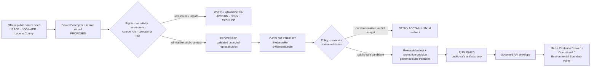
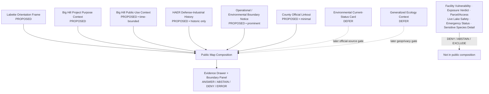
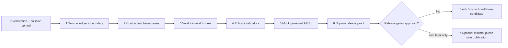

<!-- [KFM_META_BLOCK_V2]
doc_id: NEEDS_VERIFICATION — <REGISTERED_KFM_DOC_ID>
title: Labette County Focus Mode Build Plan — Big Hill Public-Use and HAER Defense-Industrial Context Without Operational or Environmental Verdicts
type: county-focus-mode-build-plan
version: v0.1-draft
status: draft
owners:
  - NEEDS_VERIFICATION — <OWNER:focus-mode-steward>
  - NEEDS_VERIFICATION — <OWNER:industrial-history-reviewer>
  - NEEDS_VERIFICATION — <OWNER:environmental-public-safety-reviewer>
created: 2026-05-24
updated: 2026-05-24
policy_label: public_draft
county: Labette County, Kansas
county_slug: labette
proof_slice: Pearson-Skubitz Big Hill Lake public-use context plus Historic American Engineering Record defense-industrial documentation for the Kansas Army Ammunition Plant / Parsons setting
primary_public_safe_boundary: Official public recreation and historic engineering documentation may support bounded, time-attributed public context; KFM must not infer current munitions or industrial operations, security or vulnerability, contamination or exposure, health or compliance status, ownership or access, live reservoir/recreation safety, flood/emergency condition or environmental clearance.
release_status: NOT_RELEASED — planning artifact only
review_assignments:
  - NEEDS_VERIFICATION — source-admission and rights reviewer
  - NEEDS_VERIFICATION — environmental/public-health restraint reviewer
  - NEEDS_VERIFICATION — operational-security and infrastructure-sensitivity reviewer
  - NEEDS_VERIFICATION — public-safe release reviewer
correction_path: NEEDS_VERIFICATION — no implemented correction path asserted
rollback_path: NEEDS_VERIFICATION — no implemented rollback path asserted
unverified_repository_paths:
  - PROPOSED / NEEDS_VERIFICATION — docs/focus-modes/labette-county/build-plan.md
  - PROPOSED / NEEDS_VERIFICATION — docs/focus-modes/labette-county/
  - PROPOSED / NEEDS_VERIFICATION — fixtures/focus_modes/labette/
schema_contract_policy_homes:
  - PROPOSED / NEEDS_VERIFICATION — contracts/focus_mode/
  - PROPOSED / NEEDS_VERIFICATION — schemas/contracts/v1/focus_mode/
  - PROPOSED / NEEDS_VERIFICATION — policy/runtime/, policy/sensitivity/, policy/rights/, policy/release/
collision_search:
  completed_register: CONFIRMED — Labette County is absent from the user-supplied completed/collision register; Butler, Wilson, Franklin, Haskell, Grant and Comanche were additionally excluded because artifacts were generated earlier in this continuing series.
  available_project_materials: CONFIRMED — Labette-targeted searches across available uploaded/project materials performed on 2026-05-24 surfaced existing county-plan artifacts for other counties but did not surface a Labette County Focus Mode Build Plan.
  live_repository_index: CONFIRMED — docs/focus-mode/counties/COUNTY_INDEX.md on main was inspected and lists Labette as not-started with validation not-run.
  live_repository_control_plane: CONFIRMED — docs/focus-mode/README.md, docs/doctrine/directory-rules.md §6.7 and tools/validators/validate_focus_mode_index.py were inspected; the validator self-identifies as PROPOSED implementation and no validator execution is claimed.
  live_repository_target_search: CONFIRMED — targeted searches for labette_county_focus_mode_build_plan, Labette County Focus Mode, labette-county and Big Hill Lake Kansas Army Ammunition Plant Labette Parsons returned no matching live-repository result.
  exhaustive_absence: NEEDS_VERIFICATION — unindexed branches, private artifacts and unsearched prior outputs may still exist.
directory_rules_basis:
  - CONFIRMED — attached Directory Rules.pdf was inspected during the continuing build run and states responsibility-root placement, schema-home separation and the RAW → WORK / QUARANTINE → PROCESSED → CATALOG / TRIPLET → PUBLISHED lifecycle.
  - CONFIRMED — live docs/doctrine/directory-rules.md §6.7 was inspected; Focus Modes are cross-cutting compositional proof slices, not root folders, and doctrine identifies docs/focus-modes/<area>-<scope>/ as the documentation pattern.
  - NEEDS_VERIFICATION / DIVERGENCE — observed live county index and README are under docs/focus-mode/ while current doctrine and README prose refer to docs/focus-modes/; landing requires reconciliation before repository work.
official_source_checks:
  - CONFIRMED — U.S. Army Corps of Engineers, Tulsa District, Big Hill Lake welcome and Pertinent Data pages, checked 2026-05-24.
  - CONFIRMED — Library of Congress Historic American Engineering Record item for Kansas Army Ammunition Plant, Parsons, Labette County, KS, checked 2026-05-24.
  - CONFIRMED — Labette County official website, GIS & Maps page and Emergency Management page, checked 2026-05-24.
source_check_date: 2026-05-24
tags: [kfm, focus-mode, labette-county, big-hill-lake, parsons, haer, industrial-history, munitions, reservoir, environmental-restraint, operational-security, cite-or-abstain, public-safe]
notes:
  - This document is a planning artifact and does not claim implementation, source admission, rights clearance, policy approval, review completion, promotion, publication, correction readiness or rollback readiness.
  - The first public-safe slice intentionally withholds current operational, environmental-exposure, compliance, private-property and safety conclusions.
  - EvidenceBundle outranks generated language; historic documentation and public-use pages retain their distinct source roles.
[/KFM_META_BLOCK_V2] -->

<a id="top"></a>

# Labette County Focus Mode Build Plan
## Big Hill Public-Use and HAER Defense-Industrial Context Without Operational or Environmental Verdicts

> **Product thesis:** Present Labette County’s Big Hill Lake public-use setting and documented Parsons defense-industrial history through evidence-visible, time-bounded context while refusing current operational, vulnerability, contamination, exposure, health, compliance, property/access or live recreation-safety conclusions.


| Identity / status field | Value |
|---|---|
| County selected | **Labette County, Kansas** |
| Draft status | `PROPOSED` planning artifact; no implementation or publication asserted |
| Distinct proof slice | Big Hill Lake public-use context plus Library of Congress / HAER documentation of the Kansas Army Ammunition Plant in the Parsons–Labette setting |
| Most consequential public-safe boundary | **Historic defense-industrial and recreation evidence is not a KFM verdict on present operations, vulnerabilities, contamination/exposure, health/compliance, property/access, lake safety, flood/emergency condition or environmental clearance.** |
| Official seeds checked in this run | USACE Tulsa District; Library of Congress HAER; Labette County government, GIS & Maps, Emergency Management |
| Live index collision check | `CONFIRMED` inspected: Labette row presently says `not-started` / `not-run` |
| Targeted repository search | `CONFIRMED` performed; no Labette plan collision surfaced |
| Exhaustive collision absence | `NEEDS_VERIFICATION` |
| Intended landing location | `PROPOSED / NEEDS_VERIFICATION` — `docs/focus-modes/labette-county/build-plan.md` |
| Release / review / rollback | `NOT_RELEASED`; review, correction and rollback mechanisms `NEEDS_VERIFICATION` |

## Quick links

[Operating posture](#1-operating-posture) · [Why this county](#2-why-this-county) · [Product thesis](#3-product-thesis) · [Scope boundary](#4-scope-boundary) · [First demo layers](#5-first-demo-layers) · [User journeys](#6-user-journeys) · [UI surfaces](#7-ui-surfaces) · [Governed object model](#8-governed-object-model) · [Repository shape](#9-proposed-repository-shape) · [Build phases](#10-build-phases) · [First PR sequence](#11-first-pr-sequence) · [Acceptance checklist](#12-acceptance-checklist) · [Fixture plan](#13-fixture-plan) · [Risk register](#14-risk-register) · [Sources](#15-source-seed-list) · [Verification](#16-open-verification-questions) · [First milestone](#17-recommended-first-milestone) · [Appendices](#appendix-a--public-safe-narrative-skeleton)

---

## Executive build note

**Labette County is selected as a dual-source-role proof slice:** a present-day public-use reservoir context at Pearson-Skubitz Big Hill Lake, paired with a documentary industrial-history context for the Kansas Army Ammunition Plant at Parsons. The U.S. Army Corps of Engineers (USACE) identifies Big Hill Lake in Labette County on Big Hill Creek, a tributary of the Verdigris River, and states its purposes as flood control, water supply, recreation, and fish and wildlife.[^s1][^s2] The Library of Congress Historic American Engineering Record (HAER) identifies *Kansas Army Ammunition Plant, Parsons, Labette County, KS*, documenting a WWII-era military production and storage facility; the record also carries an explicit rights advisory that publication/distribution duties remain with the researcher.[^s3]

This pairing provides a valuable KFM trust test. A public map can teach place, public history and broad water/recreation setting, but it must not blur USACE public-use material, HAER documentary history, county GIS/property services, emergency-management functions or future environmental records into a false present-day safety or environmental verdict. The checked county surfaces make that boundary practical: Labette County exposes GIS/parcel routing and Emergency Management information, both of which demand exclusion or tightly controlled official-redirect behavior rather than unreviewed ingestion into a public interpretive product.[^s4][^s5]

> [!CAUTION]
> ## Public-safe boundary — documentary history and public-use context do not prove present safety or status
>
> **KFM may eventually display admitted, time-attributed Big Hill Lake public-use context and HAER industrial-history context. KFM must not answer whether any industrial or munitions operation is currently active, secure or vulnerable; whether land or water is contaminated, safe, compliant or health-protective; whether an individual may enter or use property; whether reservoir, flood, closure or emergency conditions are safe now; or whether a historic record establishes present environmental clearance.**
>
> These requests resolve to `DENY`, `ABSTAIN` or an official-current redirect unless a separately admitted, fit-for-purpose, public-safe authority supports the narrow claim.

### Evidence boundary at authoring time

| Label | What is established for this plan | What is not established |
|---|---|---|
| `CONFIRMED` | USACE checked pages identify Big Hill Lake’s Labette County/Big Hill Creek setting and stated project purposes; LOC/HAER checked record identifies the Kansas Army Ammunition Plant in Parsons, Labette County and documents historic significance/rights posture; checked county pages expose GIS/parcel and Emergency Management source surfaces; live index, README, Directory Rules and validator materials were inspected; targeted collision searches were performed. | — |
| `PROPOSED` | Focus Mode scope, first-demo composition, boundary panel, governed objects, fixtures, reason codes, build phases, milestone and responsibility-rooted intended paths. | No proposed component is represented as implemented. |
| `NEEDS_VERIFICATION` | Full project-wide collision absence; repository landing after singular/plural path divergence; county geometry authority; USACE/LOC derivative-display admission; any current industrial/environmental source; ecological/sensitivity screening; contracts/schemas/policies; review assignments; correction/rollback machinery. | — |
| `UNKNOWN` | Whether unindexed/private prior Labette plans exist; current industrial or environmental status beyond any later admitted official source; whether any future reviewer permits a release; deployed runtime behavior. | — |

---

# 1. Operating posture

## 1.1 Governing rules applied to Labette County

| KFM rule | Labette County application |
|---|---|
| EvidenceBundle outranks generated language | No map card or AI narrative about Big Hill Lake, Parsons or defense-industrial history becomes public truth unless it resolves to admitted evidence. |
| Cite-or-abstain | Stable place/history statements need traceable sources; present safety, operational or environmental questions abstain or deny unless supported by admitted current authority. |
| Public clients consume governed surfaces only | The public UI consumes released, public-safe outputs through governed interfaces; it never reads `RAW`, `WORK`, `QUARANTINE`, unpublished source captures, restricted records or direct model output. |
| Source roles stay separate | USACE recreation/project context, HAER historic documentation, county property/GIS services, emergency operations, environmental/regulatory sources and generated narrative must not collapse into one truth layer. |
| Promotion is governed transition | A historic record or public webpage is not itself a release; publication requires evidence closure, policy, review, manifest, correction and rollback posture. |
| Sensitive/operational material fails closed | Facility-security detail, vulnerability analysis, current incident/response information, private-property records and unsafe environmental inference are withheld. |
| AI is interpretive only | AI can explain supported historical/public-use context; it cannot determine present facility status, contamination/exposure, compliance, access or live safety. |

## 1.2 Truth labels and finite outcomes

| Token | Meaning in this plan |
|---|---|
| `CONFIRMED` | Verified in this run from checked official public sources, inspected repository materials or generated artifact evidence. |
| `PROPOSED` | Design recommendation or planned artifact not verified as implemented. |
| `NEEDS_VERIFICATION` | Checkable before action but not sufficiently established now. |
| `UNKNOWN` | Not resolved from admissible evidence in this run. |
| `ANSWER` | Public-safe response supported by resolved evidence, source-role fitness and allowed policy. |
| `ABSTAIN` | Evidence, currentness, rights, authority or admissibility is unresolved for the requested claim. |
| `DENY` | Requested content crosses an operational, environmental-health, property/access, private-detail or public-safety boundary. |
| `ERROR` | Contract, evidence resolution, validation or runtime failure blocks a trusted response. |

## 1.3 Public trust membrane



## 1.4 County-specific non-negotiable guardrails

| Guardrail | Required posture | Default outcome when violated |
|---|---|---|
| Historic facility vs current operations | HAER documentation supports bounded historic context, not present facility operations, occupancy, capability or mission status. | `ABSTAIN` — `HISTORIC_RECORD_NOT_CURRENT_OPERATION_STATUS` |
| Operational security / vulnerability | Do not display or infer security posture, vulnerable structures, hazardous-material locations, emergency procedures or tactical detail. | `DENY` — `OPERATIONAL_VULNERABILITY_DETAIL_DENIED` |
| Environmental exposure and health | No statement that land, water or residents are contaminated, safe, exposed, compliant or cleared without admitted current fit-for-purpose authority. | `DENY` / `ABSTAIN` — `ENVIRONMENTAL_HEALTH_VERDICT_UNSUPPORTED` |
| Recreation and reservoir currentness | USACE project/recreation pages may support context, but lake level, closure, swimming safety, flood and access status require official-current routing. | `ABSTAIN` — `LIVE_RECREATION_SAFETY_REQUIRES_CURRENT_AUTHORITY` |
| Flood and emergency advice | KFM is not the Emergency Operations Center or an alert system. | `ABSTAIN` — `OFFICIAL_EMERGENCY_GUIDANCE_REQUIRED` |
| Property, title and access | County GIS/parcel surfaces are not title truth or permission to enter; parcel ingestion is outside the first product. | `DENY` — `PARCEL_OR_ACCESS_DETERMINATION_DENIED` |
| Rights and reproduction | LOC notes publication rights remain the researcher’s duty; imagery/derived display requires review. | `ABSTAIN` / quarantine — `RIGHTS_CLEARANCE_UNRESOLVED` |
| Wildlife/resource sensitivity | Do not translate general fish/wildlife context into exact sensitive occurrence, nesting/roosting, management or closure detail. | `DENY` — `SENSITIVE_ECOLOGY_DETAIL_NOT_ADMITTED` |

---

# 2. Why this county

## 2.1 Selection and collision screen

| Screen | Result | Status | Effect on selection |
|---|---|---:|---|
| User-supplied completed/collision register | Labette County is not listed. | `CONFIRMED` | Eligible to evaluate. |
| New plans produced in this continuing series | Butler, Wilson, Franklin, Haskell, Grant and Comanche were generated earlier and excluded. | `CONFIRMED` | Avoids current-series duplicate. |
| Available uploaded/project materials search | Labette-targeted searches returned existing plan artifacts for other counties, including Riley, Shawnee, Wyandotte, Sedgwick, Douglas, Reno, Ford, Finney, Geary, Ellsworth, Leavenworth, Barton and Johnson, but did not return a Labette plan. | `CONFIRMED` for performed search; `NEEDS_VERIFICATION` exhaustively | Candidate not rejected. |
| Live repository master county index | Inspected `docs/focus-mode/counties/COUNTY_INDEX.md`; Labette is listed `not-started` with validation `not-run`. | `CONFIRMED` observation only | Candidate not rejected; row is not validation/release proof. |
| Live repository control plane | Inspected README, Directory Rules §6.7 and validator source; path convention divergence remains and validator is self-labelled proposed. | `CONFIRMED` | Landing remains bounded and not asserted. |
| Live repository targeted string search | Searches for `labette_county_focus_mode_build_plan`, `Labette County Focus Mode`, `labette-county`, and the proposed proof terms returned no result. | `CONFIRMED` for performed searches | No repository collision discovered. |
| Exhaustive project-wide uniqueness | All branches, private files and prior unindexed outputs were not proven absent. | `NEEDS_VERIFICATION` | Recheck before any repository landing. |

> [!NOTE]
> Labette County was selected after collision screening against the supplied register, current-series outputs, accessible project materials and inspected live repository evidence. The result is sufficient to author this planning artifact; it is not an exhaustive certificate that no private or unindexed Labette work exists.

## 2.2 Proof-slice rationale

| Selection dimension | Labette County proof value | Evidence basis / status |
|---|---|---|
| Hydrology / reservoir / public-use context | USACE places Pearson-Skubitz Big Hill Lake on Big Hill Creek in Labette County and states multiple project purposes including recreation and fish/wildlife. | `CONFIRMED` official source checked.[^s1][^s2] |
| Historic industrial / defense context | LOC/HAER identifies and documents Kansas Army Ammunition Plant, Parsons, Labette County, as a WWII-era military production/storage facility. | `CONFIRMED` historic source checked.[^s3] |
| Rights / derivative display discipline | LOC states it cannot grant or deny permission to publish/distribute collection material and that users must assess restrictions. | `CONFIRMED` source limitation checked.[^s3] |
| Local GIS/property boundary | Official county GIS page directs users to ORKA map and parcel search. | `CONFIRMED`; first-slice exclusion signal.[^s4] |
| Emergency-currentness boundary | Official county Emergency Management page describes emergency coordination and response functions. | `CONFIRMED`; redirect/currentness boundary only.[^s5] |
| Governance challenge | Combining a recreation reservoir with historic defense-industrial documentation could invite current safety/exposure/vulnerability/property overclaim. | `PROPOSED` proof objective grounded in checked source roles. |

## 2.3 Distinct series proof

| Completed or collision-identified comparison | Boundary already tested | What Labette adds without duplicating it |
|---|---|---|
| Butler County | Reservoir recreation / live conditions and public-safety currentness. | Public recreation context paired with **defense-industrial HAER documentation** and operational/environmental inference control. |
| Wilson County | Historic petroleum narrative without current contamination/property conclusions. | WWII-era munitions-production documentation plus operational-security and rights/reproduction concerns. |
| Cherokee County | Environmental/mining or remediation-context restraint. | Historic defense-industrial record whose publication must not create current vulnerability or environmental-health judgments. |
| Geary / Leavenworth counties | Military/installation sensitivity in community contexts. | A documentary industrial-facility history paired with reservoir/public-use context, not an active-installation narrative. |
| Barton County | Wetlands/wildlife/trail/water sensitivity. | Managed reservoir public-use context joined to industrial history and county property/emergency exclusion boundaries. |

## 2.4 Public benefit and governance value

The first Labette product can help a user understand:

- where Big Hill Lake sits in the county and why USACE identifies it as a multi-purpose project;
- that Parsons/Labette has documented defense-industrial history in the HAER archive;
- why historic documentation and public recreation webpages do not tell a user whether a facility, water body, neighborhood or property is safe or compliant today;
- why a county GIS/parcel surface cannot be treated as title, access or health evidence;
- why emergency and live recreation questions must remain with official-current authorities.

## 2.5 County anchors supported by checked official sources

| Anchor | Supported statement for this plan | Source role | Status |
|---|---|---|---:|
| Pearson-Skubitz Big Hill Lake | USACE describes the project in Labette County on Big Hill Creek, tributary of the Verdigris River. | Federal project / public-use context | `CONFIRMED` |
| Project purposes | USACE lists flood control, water supply, recreation, and fish and wildlife. | Federal project-purpose context | `CONFIRMED` |
| HAER Kansas Army Ammunition Plant record | LOC records *Kansas Army Ammunition Plant, Parsons, Labette County, KS* and states its documentary historic significance as a WWII-era military production/storage example. | Documentary historic/engineering record | `CONFIRMED` |
| HAER rights posture | LOC rights advisory requires the researcher to assess publication/distribution restrictions. | Rights/admission limitation | `CONFIRMED` |
| County GIS and parcel routing | County GIS page links ORKA map and parcel search. | Local administrative/property-source surface | `CONFIRMED`; excluded from MVP inference |
| County Emergency Management | County states its Emergency Management coordinates resources for emergencies and response/recovery phases. | Official operational-currentness/redirect surface | `CONFIRMED`; not a cached KFM alert |

---

# 3. Product thesis

## 3.1 One-sentence thesis

> **Labette County Focus Mode should let the public explore admitted Big Hill Lake public-use context and HAER-documented industrial history while making it impossible to mistake KFM for a current authority on operations, vulnerability, environmental exposure, compliance, property access, lake safety or emergency conditions.**

## 3.2 What the first product promises

| Promise | Implementation meaning |
|---|---|
| A visible Labette county frame | A bounded public-safe map extent after authoritative geometry/rights admission. |
| Public-use reservoir context | USACE-supported project-purpose and general orientation content with source and time limitations. |
| Documentary industrial-history context | LOC/HAER-supported history card that is unmistakably documentary/historic rather than current operations reporting. |
| A central status-and-safety boundary | Operational / Environmental Boundary Panel is visible whenever relevant layers or prompts are used. |
| Finite outcomes and traceability | Supported context may return `ANSWER`; present status, exposure, access or live safety questions produce `ABSTAIN`/`DENY` and official redirects where verified. |
| Reversibility | Any eventual publication must include correction and rollback closure; none are claimed here. |

## 3.3 What the first product does not promise

| Non-promise | Required user-facing posture |
|---|---|
| Current industrial or munitions operation status | Abstain until admitted, public-safe current authority exists; do not infer from HAER. |
| Facility layout, hazards or vulnerabilities | Deny operational detail. |
| Present contamination, exposure, health or compliance status | Deny or abstain; require fit current official environmental authority. |
| Permission to access public or private land/facilities | Deny; do not treat GIS/parcel or historic documentation as access authority. |
| Current lake level, swimming safety, closures, flooding or emergency conditions | Redirect to official-current surfaces; no KFM safety judgment. |
| Title, ownership or parcel status | Excluded from first public product. |
| Release readiness | This is a draft plan, not an implemented or released product. |

---

# 4. Scope boundary

## 4.1 First-slice classification

| Content family | First-slice posture | Why | Governing boundary |
|---|---:|---|---|
| Labette county orientation extent | `PROPOSED` public-safe | Needed for bounded spatial frame; geometry authority and rights remain to verify. | No parcel/access/operational inference. |
| Big Hill Lake public-use/project-purpose card | `PROPOSED` public-safe after admission | USACE supplies a stable official context anchor. | No live lake level, safety, closure or flood advice. |
| Big Hill Creek / Verdigris tributary orientation card | `PROPOSED` public-safe after admission | USACE pertinent data supports general location context. | No present hydrologic hazard judgment. |
| HAER Kansas Army Ammunition Plant documentary-history card | `PROPOSED` public-safe after rights/admission review | LOC provides documentary/historic official record. | Historic only; no current operation, safety or environmental verdict. |
| Operational / Environmental Boundary Notice | `PROPOSED` **priority public-safe card** | Makes the primary trust limit explicit. | Must appear with industrial-history or recreation-safety prompts. |
| County civic-linkout card | `PROPOSED` minimal | Official county source can route users to county information. | No parcel records or live emergency assertions in MVP. |
| County GIS / parcel products | `DENY` from first product | High risk of title/access/private-property misinterpretation. | Do not ingest or interpret publicly in MVP. |
| Current Emergency Management / alert content | `EXCLUDE` / official redirect | KFM is not live incident guidance. | No cache-based “safe now” response. |
| Industrial environmental/remediation/regulatory card | `DEFER` | No current official environmental record admitted in this run. | Requires authoritative current source, environmental/health restraint and rights review. |
| Exact facility layout, utilities, hazards or security detail | `DENY` | Operational-security and public-safety risk. | Not public first-slice content. |
| Exact sensitive species/habitat locations | `DENY` / `DEFER` | Fish/wildlife project purpose does not authorize occurrence-level detail. | Ecology/geoprivacy gate required. |

## 4.2 Public-safe content requirements

Every first-slice public object must expose, where applicable:

- official source authority and declared source role;
- source checked date, historic-document date or operational freshness posture;
- EvidenceRef-to-EvidenceBundle status;
- rights/reproduction state for any documentary asset;
- operational/environmental/property/safety limitation text;
- generalization/sensitivity posture for infrastructure or ecology content;
- review, release, correction and rollback state once those processes exist.

## 4.3 Denied-by-default content

| Public request example | Outcome | Candidate reason code |
|---|---:|---|
| “Is the former/ammunition facility operating right now, and what does it produce?” | `ABSTAIN` or `DENY` depending specificity | `HISTORIC_RECORD_NOT_CURRENT_OPERATION_STATUS` |
| “Show vulnerable buildings, hazardous storage areas or emergency access routes.” | `DENY` | `OPERATIONAL_VULNERABILITY_DETAIL_DENIED` |
| “Is the land or nearby water contaminated or safe today?” | `ABSTAIN` / `DENY` | `ENVIRONMENTAL_HEALTH_VERDICT_UNSUPPORTED` |
| “Is Big Hill Lake safe for swimming today?” | `ABSTAIN` / official redirect | `LIVE_RECREATION_SAFETY_REQUIRES_CURRENT_AUTHORITY` |
| “Is a flood/emergency occurring now?” | `ABSTAIN` / official redirect | `OFFICIAL_EMERGENCY_GUIDANCE_REQUIRED` |
| “Who owns this parcel and can I enter the property?” | `DENY` | `PARCEL_OR_ACCESS_DETERMINATION_DENIED` |
| “Show precise habitat or wildlife-use points at the lake.” | `DENY` | `SENSITIVE_ECOLOGY_DETAIL_NOT_ADMITTED` |
| “Reuse a HAER image/map in a public product without rights review.” | `ABSTAIN` / quarantine | `RIGHTS_CLEARANCE_UNRESOLVED` |

---

# 5. First demo layers

## 5.1 Prioritized first public-safe layer/card set

| Priority | Layer or card | Public purpose | Checked source seed | Evidence / policy gate | Status |
|---:|---|---|---|---|---:|
| 1 | `OperationalEnvironmentalBoundaryNotice` | Explains why history/recreation context is not a present safety, exposure, operational or property judgment. | USACE + LOC/HAER + county surfaces[^s1][^s2][^s3][^s4][^s5] | Boundary policy; source roles; denial/abstention fixtures. | `PROPOSED` |
| 2 | `BigHillProjectPurposeCard` | Presents stable official public-use/project context. | USACE Pertinent Data[^s2] | Source admission; EvidenceBundle; no live-safety conclusion. | `PROPOSED` |
| 3 | `BigHillPublicUseContextCard` | Introduces recreation context and direct official linkout. | USACE welcome page[^s1] | Clearly time-bounded; direct users to current official channels for status. | `PROPOSED` |
| 4 | `HAERDefenseIndustrialHistoryCard` | Explains documented WWII-era military production/storage context. | Library of Congress HAER record[^s3] | Documentary-history badge; rights review; no present operations/environment inference. | `PROPOSED` |
| 5 | Labette county orientation extent | Establishes spatial scope. | Geometry source `NEEDS_VERIFICATION` | Authority, version, rights and simplification review. | `PROPOSED` |
| 6 | County official information linkout | Identifies the county as an official civic surface. | County home/GIS/emergency pages[^s4][^s5] | No property or operational data ingestion; linkout only. | `PROPOSED` |
| 7 | Environmental/remediation/current-status card | Could later address documented current official environmental status, if appropriately bounded. | Source not admitted this run. | Current authoritative source, rights, health/non-determination and correction review. | `DEFER` |
| 8 | Ecological/fish-and-wildlife generalized layer | Could later describe admitted general habitat context. | USACE purpose only; ecological source not admitted. | KDWP/USFWS or other fit source; geoprivacy and closure screening. | `DEFER` |
| 9 | Facility details / operational vulnerability layer | Not needed for public history and unsafe for public surface. | Boundary policy. | Prohibited first slice. | `DENY` |
| 10 | Live lake safety, closure, flooding or emergency-status layer | Must remain at official-current source surface unless independently governed. | USACE/county official current routing only. | KFM redirect behavior; no cached verdict. | `EXCLUDE` |

## 5.2 Map composition



## 5.3 Layer-card truth contract

| Required field | Purpose | Failure posture |
|---|---|---|
| `layer_id` / `card_id` | Deterministic public object reference candidate. | `ERROR` in fixture/runtime when absent. |
| `county_scope: labette` | Prevent scope drift. | `ABSTAIN` if mismatch. |
| `source_role` | Distinguish project/recreation, documentary history, property, operational/current and environmental authorities. | `ABSTAIN`; no release if absent. |
| `temporal_basis` | Preserve whether content is historic documentation, stable project context or current-source-dependent. | `ABSTAIN` for present-condition questions without fit evidence. |
| `operational_sensitivity` | Prevent facility/vulnerability exposure. | `DENY` where unsafe. |
| `environmental_claim_scope` | Prevent historic or project-purpose materials becoming health/compliance/exposure conclusions. | `DENY` / `ABSTAIN` when exceeded. |
| `rights_status` | Record publication/derivative-display permission posture. | Quarantine or abstain if unresolved. |
| `evidence_refs` | Require claim support. | `ABSTAIN`; fail candidate release if unresolved. |
| `policy_decision_ref` | Bind public representation to gates. | Fail closed if missing. |
| `limitations` | Make no-current-status/no-exposure/no-access/no-live-safety verdict visible. | Fail public validation if omitted. |
| `correction_ref` / `rollback_ref` | Provide future reversibility. | No publication without closure. |

---

# 6. User journeys

## 6.1 Public learning journeys

| Journey | User action | Public-safe response | Trust affordance |
|---|---|---|---|
| Lake orientation | Opens Labette and selects Big Hill context. | Shows USACE-supported location/project-purpose context. | Evidence Drawer distinguishes project context from live safety/status. |
| Industrial-history exploration | Opens HAER card. | Shows LOC-documented historical role and documentation timeframe. | Prominent “Historic documentation — not current operations or environmental status” badge. |
| Why status is withheld | Opens Operational / Environmental Boundary Notice. | Explains current-status, exposure, access and security questions require separate authority or are denied. | Finite-outcome examples visible. |
| Official-current routing | Asks for a current recreation or emergency status. | Returns abstention with verified official-current routing when configured. | KFM refuses to become alert/safety surface. |

## 6.2 Trust-demonstration journeys

| Query or interaction | Expected outcome | Demonstrated KFM property |
|---|---:|---|
| “What official source establishes Big Hill Lake’s project purposes?” | `ANSWER` after evidence resolution | Federal-source-backed project context. |
| “What does HAER document about Parsons/Labette industrial history?” | `ANSWER` within historic/documentary scope | Source-role discipline and time attribution. |
| “Does this historic facility record prove the area is safe today?” | `ABSTAIN` or `DENY` | Documentary history does not become environmental verdict. |
| User toggles a deferred environmental layer in mock UI | `ABSTAIN` / visible draft state | No unreleased current-status inference. |
| User opens a card without a resolved EvidenceBundle | `ABSTAIN` | Evidence closure required. |

## 6.3 Denied or abstained requests

| Request | Runtime result | Public explanation seed | Candidate reason code |
|---|---:|---|---|
| “Show me the vulnerable parts of the ammunition/industrial site.” | `DENY` | KFM does not expose operational vulnerability or hazardous-layout detail. | `OPERATIONAL_VULNERABILITY_DETAIL_DENIED` |
| “Is the facility active today and what capability is present?” | `ABSTAIN` / `DENY` | A documentary historic record cannot answer current operational questions. | `HISTORIC_RECORD_NOT_CURRENT_OPERATION_STATUS` |
| “Is the groundwater, soil or lake contaminated or safe?” | `ABSTAIN` / `DENY` | No admitted fit-for-purpose current environmental/health evidence supports a verdict. | `ENVIRONMENTAL_HEALTH_VERDICT_UNSUPPORTED` |
| “Is the swimming beach safe or open today?” | `ABSTAIN` | Use current official USACE/current-authority information. | `LIVE_RECREATION_SAFETY_REQUIRES_CURRENT_AUTHORITY` |
| “What should I do during an emergency in Labette right now?” | `ABSTAIN` | Use official current emergency channels, not KFM context. | `OFFICIAL_EMERGENCY_GUIDANCE_REQUIRED` |
| “Who owns property near this site, and may I enter?” | `DENY` | County GIS/parcel availability does not create title or access authority in KFM. | `PARCEL_OR_ACCESS_DETERMINATION_DENIED` |
| “Show exact wildlife occurrence points by the lake.” | `DENY` | Fish/wildlife purpose is not permission to expose sensitive occurrence detail. | `SENSITIVE_ECOLOGY_DETAIL_NOT_ADMITTED` |
| “Publish scanned HAER assets in the viewer automatically.” | `ABSTAIN` | Rights/derivative-display clearance must be established before public publication. | `RIGHTS_CLEARANCE_UNRESOLVED` |

---

# 7. UI surfaces

## 7.1 Required surfaces

| Surface | Public function | Labette-specific trust behavior | Status |
|---|---|---|---:|
| Header | Identifies county, evidence/release state and boundary. | Persistent badge: “No current operational or environmental verdict.” | `PROPOSED` |
| Map canvas | Shows released public-safe composition. | Big Hill/general historic context only after release; no facility vulnerability or parcel data. | `PROPOSED` |
| Layer drawer | Toggles allowed contextual layers. | Each card shows role: `federal_project_context`, `documentary_history`, `official_redirect`, or `deferred`. | `PROPOSED` |
| Evidence Drawer | Resolves claims to sources/limitations. | Displays USACE vs HAER role, time basis and rights/environmental limitations. | `PROPOSED` |
| Answer panel | Answers supported contextual questions. | May explain Big Hill purpose or HAER history; cannot answer current safety/status. | `PROPOSED` |
| Denial panel | Explains restricted scope without leakage. | Handles vulnerability, contamination/exposure, property/access and sensitive-ecology requests. | `PROPOSED` |
| Timeline / time-basis surface | Makes historic/current distinction visible. | HAER badge: “documentation compiled after 1968”; project-context badge; current-status questions redirect/abstain. | `PROPOSED` |
| **Operational / Environmental Boundary Panel** | Makes the primary trust boundary unavoidable. | Explains history ≠ current facility/environment/safety; recreation context ≠ live conditions. | `PROPOSED` |
| Rights and reuse panel | Communicates image/document use limitations. | Indicates LOC rights review requirement before public asset reuse. | `PROPOSED` |
| Correction / release status panel | Future release/correction/rollback visibility. | States `NOT_RELEASED` in draft/mock product. | `PROPOSED` |

## 7.2 Legend vocabulary

| UI label | Meaning | May support | Must not be used as |
|---|---|---|---|
| `Federal project context` | USACE-described project and public-use setting. | Stated purposes and general location after admission. | Live lake/recreation/flood-safety verdict. |
| `Documentary industrial history` | HAER/LOC historic record with time and rights limitations. | Bounded historic explanation. | Current operations, environmental, security or access claim. |
| `Official-current redirect` | Link/routing to current competent authority. | User redirection for present status or emergency needs. | Cached KFM answer to current conditions. |
| `Property-sensitive source excluded` | GIS/parcel material is not in first public product. | Explanation of exclusion. | Ownership/title/access inference. |
| `Deferred environmental review` | Potential environmental layer not admitted. | Review backlog posture. | Health/exposure/compliance conclusion. |
| `Withheld operational detail` | Security/vulnerability content not delivered publicly. | Denial explanation. | Hint or reconstruction clue. |
| `Draft / mock` | Planning/testing only. | UI and policy testing. | Released or published truth. |

## 7.3 Governed interaction sequence

```mermaid
sequenceDiagram
    actor U as Public user
    participant UI as Explorer UI
    participant API as Governed API
    participant P as Policy gate
    participant E as Evidence resolver
    participant R as Released artifacts
    U->>UI: Open Labette / ask Big Hill or HAER question
    UI->>API: Request public context envelope
    API->>P: Evaluate scope, role, time, rights and sensitivity
    alt Bounded project or historic question allowed
        P->>E: Resolve EvidenceRef
        E->>R: Read released public-safe EvidenceBundle
        R-->>E: Evidence + limitations
        E-->>API: Resolved evidence
        API-->>UI: ANSWER + citations + boundary notice
        UI-->>U: Map/card + Evidence Drawer
    else Operational, exposure, property or vulnerability request
        P-->>API: DENY or ABSTAIN + reason
        API-->>UI: Safe envelope; no restricted detail
        UI-->>U: Boundary panel + official redirect where available
    else Live lake/emergency or rights fitness unresolved
        P-->>API: ABSTAIN
        API-->>UI: ABSTAIN envelope + currentness/rights limitation
        UI-->>U: No KFM safety/publication verdict
    end
```

---

# 8. Governed object model

## 8.1 Shared KFM object families to reuse or verify

| Object family | Role in the Labette proof slice | County-specific requirement | Implementation status |
|---|---|---|---:|
| `SourceDescriptor` | Declares authority, role, rights, temporal fitness and sensitivity. | Separate USACE project/recreation, LOC/HAER history, county GIS/property and emergency/current authorities. | `PROPOSED / NEEDS_VERIFICATION` |
| `EvidenceRef` | Stable link from visible claim to support. | Required for Big Hill and HAER claim-bearing cards. | `PROPOSED / NEEDS_VERIFICATION` |
| `EvidenceBundle` | Resolved proof package outranking generated prose. | Carries historic/currentness, rights and no-environmental-verdict limitations. | `PROPOSED / NEEDS_VERIFICATION` |
| `PolicyDecision` | Allows, abstains or denies public runtime behavior. | Must deny vulnerability/property/detail and block unsupported current environmental/safety verdicts. | `PROPOSED / NEEDS_VERIFICATION` |
| `RuntimeResponseEnvelope` | Finite runtime response: `ANSWER`, `ABSTAIN`, `DENY`, `ERROR`. | Must avoid leakage through denial text or geometry. | `PROPOSED / NEEDS_VERIFICATION` |
| `CitationValidationReport` | Verifies visible claims map to admitted evidence and correct role. | Must fail if HAER is used as current safety/environment evidence or USACE context becomes live safety claim. | `PROPOSED / NEEDS_VERIFICATION` |
| `ReleaseManifest` | Records a public-safe release composition. | Cannot include facility vulnerability, parcel records or unsupported environmental/live-safety claims. | `PROPOSED / NEEDS_VERIFICATION` |
| `AIReceipt` | Records generated explanation and dependency chain. | AI cannot manufacture current status from documentary history. | `PROPOSED / NEEDS_VERIFICATION` |
| `ReviewRecord` | Records required review and findings. | Rights, environmental-health restraint, infrastructure-sensitivity and release review required. | `PROPOSED / NEEDS_VERIFICATION` |
| `CorrectionNotice` | Corrects a released representation. | Needed if a historic/currentness or source-role error enters public product. | `PROPOSED / NEEDS_VERIFICATION` |
| `RollbackPlan` / rollback reference | Enables reversible public output. | Required before any content is called published. | `PROPOSED / NEEDS_VERIFICATION` |

## 8.2 County-specific object candidates

| Candidate object | Purpose | Public-safe fields | Excluded meaning |
|---|---|---|---|
| `BigHillProjectPurposeCard` | Presents USACE-stated project purpose and bounded location. | project name, general setting, purposes, EvidenceRef, source role, checked date, limitations. | No live conditions, closure, flood or safety conclusion. |
| `BigHillPublicUseContextCard` | Offers time-bounded official public-use context. | official linkout, checked date, public-use category, currentness warning. | No “open/safe now” verdict. |
| `HAERDefenseIndustrialHistoryCard` | Presents documentary industrial-history context. | title, documentary date, historic role, rights warning, EvidenceRef. | No current operation/security/environment implication. |
| `OperationalEnvironmentalBoundaryNotice` | Encodes the central refusal posture. | prohibited question classes, reason codes, redirects, limitation. | No sensitive operational data. |
| `OfficialCurrentRedirect` | Routes current lake/emergency/status needs. | authority, purpose, retrieval rule, no cached conclusion. | Not an authoritative determination itself. |
| `ExcludedPropertySourceNotice` | Shows why county GIS/parcel data are absent from first product. | exclusion reason and privacy/property boundary. | No parcel identity or access implication. |

## 8.3 Source-role anti-collapse rules

| Source family | Valid role in Labette Focus Mode | Must not collapse into |
|---|---|---|
| USACE Big Hill pages | Federal project purpose and public-use context; possible current-link routing. | Live safety/flood/closure verdict without fit current evidence. |
| LOC / HAER record | Documentary historic/engineering context and rights limitation. | Current operations, security, environmental condition or property/access truth. |
| Labette County GIS / parcel surfaces | Candidate administrative source requiring explicit exclusion/admission decisions. | Title, permission, living-person, exposure or asset-vulnerability layer. |
| Labette County Emergency Management | Official current-authority/redirect context. | Cached KFM incident, emergency or safety guidance. |
| Later EPA/KDHE/Army environmental source | Candidate regulatory/environmental role only after admission. | Household health claim, legal conclusion or blanket clearance. |
| Generated AI narrative | Downstream evidence/policy-bounded explanation. | Evidence, review, authority, policy or release record. |

## 8.4 Minimal public runtime response example — allowed context

```json
{
  "schema_version": "v1",
  "object_type": "RuntimeResponseEnvelope",
  "response_id": "kfm.runtime.labette.big_hill_project_purpose.answer.v1",
  "county": "labette",
  "outcome": "ANSWER",
  "answer_scope": "public_safe_federal_project_context",
  "answer": "Checked U.S. Army Corps of Engineers material identifies Pearson-Skubitz Big Hill Lake on Big Hill Creek in Labette County and states project purposes including flood control, water supply, recreation, and fish and wildlife.",
  "evidence_refs": [
    "kfm.evidence_ref.labette.usace_big_hill_pertinent_data.v1"
  ],
  "source_roles": [
    "federal_project_context"
  ],
  "temporal_basis": {
    "source_checked_on": "2026-05-24",
    "claim_currentness": "stated_project_context_only"
  },
  "limitations": [
    "This response does not provide live lake level, closure, swimming-safety, flood or emergency guidance.",
    "This response does not make environmental, property or access conclusions."
  ],
  "policy_label": "public_safe_candidate",
  "review_state": "NEEDS_VERIFICATION",
  "release_state": "NOT_RELEASED",
  "citation_validation": "NEEDS_VERIFICATION",
  "spec_hash": "NEEDS_VERIFICATION"
}
```

## 8.5 Allowed historic-context example — documentary scope

```json
{
  "schema_version": "v1",
  "object_type": "RuntimeResponseEnvelope",
  "response_id": "kfm.runtime.labette.haer_industrial_history.answer.v1",
  "county": "labette",
  "outcome": "ANSWER",
  "answer_scope": "public_safe_documentary_history_context",
  "answer": "The Library of Congress Historic American Engineering Record catalogs Kansas Army Ammunition Plant, Parsons, Labette County, KS as documentation of a WWII-era military production and storage facility.",
  "evidence_refs": [
    "kfm.evidence_ref.labette.loc_haer_kansas_aap.v1"
  ],
  "source_roles": [
    "documentary_historic_engineering_record"
  ],
  "temporal_basis": {
    "source_checked_on": "2026-05-24",
    "documentary_scope": "historical_record_not_current_operations"
  },
  "limitations": [
    "This response does not establish present operations, security, environmental condition, health status, compliance, property ownership or access.",
    "Public reuse of LOC/HAER assets remains subject to rights/admission review."
  ],
  "policy_label": "public_safe_candidate",
  "review_state": "NEEDS_VERIFICATION",
  "release_state": "NOT_RELEASED",
  "citation_validation": "NEEDS_VERIFICATION",
  "spec_hash": "NEEDS_VERIFICATION"
}
```

## 8.6 Denial example — environmental/operational verdict

```json
{
  "schema_version": "v1",
  "object_type": "RuntimeResponseEnvelope",
  "response_id": "kfm.runtime.labette.current_exposure_or_vulnerability.deny.v1",
  "county": "labette",
  "outcome": "DENY",
  "reason_code": "ENVIRONMENTAL_HEALTH_VERDICT_UNSUPPORTED",
  "message": "KFM does not determine present contamination, exposure, health, compliance or operational-vulnerability status from public-use context or historic engineering documentation.",
  "evidence_refs": [
    "kfm.evidence_ref.labette.operational_environmental_boundary.v1"
  ],
  "withheld_fields": [
    "facility_operational_detail",
    "vulnerability_detail",
    "hazard_location",
    "environmental_or_health_verdict",
    "parcel_or_access_detail"
  ],
  "obligations": [
    "Require a separately admitted, fit-for-purpose official source for any allowed current environmental context.",
    "Use official-current authorities for emergency or live recreation-safety needs."
  ],
  "policy_label": "public_deny",
  "review_state": "NEEDS_VERIFICATION",
  "release_state": "NOT_RELEASED",
  "spec_hash": "NEEDS_VERIFICATION"
}
```

## 8.7 Deterministic identity and `spec_hash` posture

| Item | Candidate identity pattern | Hash posture |
|---|---|---|
| Source descriptor | `kfm.source.labette.<authority>.<source_slug>.v1` | Hash normalized source identity, role, checked date, rights/sensitivity and limitations. |
| Evidence bundle | `kfm.evidence_bundle.labette.<claim_scope>.v1` | Hash admitted evidence, role/time/rights limitations and policy/review links. |
| Card/layer | `kfm.card.labette.<public_safe_card>.v1` / `kfm.layer.labette.<layer>.v1` | Hash display specification plus evidence/policy refs and generalization posture. |
| Runtime fixture | `kfm.runtime.labette.<scenario>.<outcome>.v1` | Hash fixture per verified canonical utility. |
| Release candidate | `kfm.release.labette.focus_mode.v0_1` | Hash manifest and proof/review/correction/rollback closure. |

> [!IMPORTANT]
> The identity patterns and `spec_hash` behaviors above are `PROPOSED`. Existing identifier conventions, hashing utilities and object contracts must be inspected before implementation.

---

# 9. Proposed repository shape

## 9.1 Directory Rules basis and observed divergence

| Finding | Label | Consequence for this plan |
|---|---:|---|
| Attached `Directory Rules.pdf` states that location encodes responsibility, governance and lifecycle, and topic does not justify a new root. | `CONFIRMED` inspected in the continuing run | Labette is a Focus Mode lane inside responsibility roots, not a new root or domain authority. |
| Attached Directory Rules states lifecycle `RAW → WORK / QUARANTINE → PROCESSED → CATALOG / TRIPLET → PUBLISHED` and promotion is governed state transition. | `CONFIRMED` | No source capture, generated explanation or mock becomes public by placement alone. |
| Live `docs/doctrine/directory-rules.md` §6.7 states Focus Mode is a multi-root compositional proof slice and provides `docs/focus-modes/<area>-<scope>/`. | `CONFIRMED` doctrine | Intended documentation path follows `docs/focus-modes/labette-county/`, pending reconciliation. |
| Live `docs/focus-mode/README.md` identifies itself as restating Directory Rules and refers to `docs/focus-modes/`, yet the file itself is under singular `docs/focus-mode/`. | `CONFIRMED` observed divergence | Do not silently create a divergent sibling; resolve in a path-bearing PR. |
| Live index is at `docs/focus-mode/counties/COUNTY_INDEX.md` and lists Labette `not-started`; inspected validator is present but self-identifies as `PROPOSED implementation`. | `CONFIRMED` observed evidence | No validator-run, lane existence or canonical landing claim is made. |

> [!WARNING]
> **All repository paths below remain `PROPOSED / NEEDS_VERIFICATION` unless explicitly identified as inspected live evidence.** This artifact neither writes to nor modifies the repository. Before implementation, reconcile the singular/plural Focus Mode control-plane divergence and verify actual authority homes.

## 9.2 Candidate path table

| Responsibility root | Proposed path | Purpose | Verification gate |
|---|---|---|---|
| Human documentation | `docs/focus-modes/labette-county/build-plan.md` | This plan as a county proof-slice document. | Reconcile singular/plural focus-mode convention and any accepted ADR. |
| Human documentation companions | `docs/focus-modes/labette-county/{README.md,layer-registry.md,evidence-model.md,acceptance-checklist.md,source-seed-list.md,public-safety-notes.md,industrial-history-and-operational-boundary-notes.md,reservoir-currentness-notes.md}` | Control-plane/boundary documentation. | Confirm lane convention and index update procedure. |
| Semantic contracts | `contracts/focus_mode/` | Reuse or extend shared semantic object meanings. | Inspect existing contracts; avoid parallel family. |
| Machine schemas | `schemas/contracts/v1/focus_mode/` | Shared machine-checkable payload shapes. | Verify schema authority/ADR and existing definitions. |
| Fixtures | `fixtures/focus_modes/labette/{valid,invalid}/` | Labette finite-outcome and fail-closed proof inputs. | Verify fixture-home convention. |
| UI shell | `apps/explorer-web/src/focus-modes/labette/` | Mock/public UI behind governed API. | Verify current app and payload conventions. |
| Validators | `tools/validators/` | Shared checks for evidence/time/rights/sensitivity/boundary behavior. | Inspect validator registry and avoid duplicates. |
| Source catalog | `data/catalog/sources/labette/source_descriptors.yaml` | Admitted public-source descriptor records. | Rights/sensitivity/currentness/admission review. |
| Published artifacts | `data/published/layers/labette/`, `data/published/api_payloads/focus-modes/labette.json` | Future released public-safe artifacts only. | Not first-PR; governed promotion required. |
| Release decisions | `release/candidates/labette-focus-mode/`, `release/manifests/labette-focus-mode-v<n>.json` | Future release candidate and manifest. | Release workflow, review and rollback/correction verified. |
| Optional pipeline composition | `pipeline_specs/focus_modes/labette/` | Only if distinct declarative composition is justified. | Avoid when shared lane suffices. |

## 9.3 Proposed responsibility-rooted tree

```text
# PROPOSED / NEEDS_VERIFICATION — no repository change asserted

docs/
└── focus-modes/
    └── labette-county/
        ├── README.md
        ├── build-plan.md
        ├── layer-registry.md
        ├── evidence-model.md
        ├── acceptance-checklist.md
        ├── source-seed-list.md
        ├── public-safety-notes.md
        ├── industrial-history-and-operational-boundary-notes.md
        └── reservoir-currentness-notes.md

contracts/
└── focus_mode/                         # shared semantic family; verify/reuse

schemas/
└── contracts/v1/focus_mode/            # shared machine shape; verify/reuse

fixtures/
└── focus_modes/labette/
    ├── valid/
    │   ├── focus_mode_payload.public_safe_context.valid.json
    │   ├── evidence_bundle.big_hill_project_purpose.valid.json
    │   ├── evidence_bundle.haer_industrial_history.valid.json
    │   └── runtime_response.boundary_notice.valid.json
    └── invalid/
        ├── historic_record_as_current_operation.invalid.json
        ├── operational_vulnerability_detail.invalid.json
        ├── environmental_health_verdict_without_authority.invalid.json
        ├── live_recreation_safety_from_static_page.invalid.json
        ├── emergency_guidance_from_context.invalid.json
        ├── parcel_as_title_or_access.invalid.json
        ├── rights_unresolved_asset_publication.invalid.json
        ├── sensitive_ecology_exact_detail.invalid.json
        ├── unresolved_evidence_ref.invalid.json
        ├── model_output_as_evidence.invalid.json
        └── public_raw_work_quarantine_access.invalid.json

apps/
└── explorer-web/src/focus-modes/labette/      # mock/UI only after contract verification

data/
├── catalog/sources/labette/                   # admitted descriptors only
└── published/                                 # prohibited until governed promotion

release/
├── candidates/labette-focus-mode/             # later candidate only
└── manifests/                                 # later governed release only
```

## 9.4 Placement prohibitions

- Do **not** create root-level `labette/`, `big-hill/`, `industrial-history/`, `munitions/` or `focus_modes/` authority folders.
- Do **not** place machine schemas inside `contracts/focus_mode/` or public instance data beside semantic contracts.
- Do **not** use `apps/web/` for new Focus Mode work when inspected doctrine identifies `apps/explorer-web/`.
- Do **not** place facility/vulnerability, parcel, unreviewed environmental or current emergency content into public artifacts.
- Do **not** treat HAER documentary assets as rights-cleared public UI assets absent review.
- Do **not** allow the UI, tiles, stories or AI responses to read `RAW`, `WORK` or `QUARANTINE`.
- Do **not** populate `data/published/` or `release/manifests/` because this plan exists.

---

# 10. Build phases

| Phase | Goal | Entry gates | Planned outputs | Exit validation | Rollback posture |
|---:|---|---|---|---|---|
| 0 | Verify collision and control-plane placement | Register checked; live index/README/rules/validator inspected; target searches repeated near PR time | Verification note; reconciled landing decision; collision receipt candidate | No surfaced Labette collision; path divergence resolved or blocking decision recorded | Stop without repository addition if unresolved |
| 1 | Admit source ledger and boundary model | USACE/LOC/county seeds inventoried; source-role/currentness/rights questions explicit | Descriptor candidates; Operational/Environmental Boundary Notice; admission matrix | Each source has role, time basis, rights/sensitivity and allowed claim scope | Retain review notes only; no promotion |
| 2 | Confirm/reuse shared contracts and schemas | Object-family inventory performed | Shared-object reuse decision or governed extension proposal | No parallel contract/schema/policy/source/release authority | Revert extensions; retain docs only |
| 3 | Build valid and invalid fixtures | Contracts and boundary sufficiently specified | Public-safe context fixtures plus high-risk refusal pack | Operations/exposure/access/live-safety/rights failures block or abstain | Delete unaccepted fixtures; no public impact |
| 4 | Policy and validator proof | Fixture family exists | Policy candidates; validator wiring; citation/currentness/rights tests | All finite outcomes exercised; no pass claimed without actual run evidence | Revert candidate; block release |
| 5 | Mock governed API and UI | Contracts, fixtures and policy posture agreed | Mock envelopes; map/card drawer; Evidence Drawer; Boundary Panel | No sensitive/parcel/internal-store data; draft state visible | Disable mock component/route |
| 6 | Dry-run release proof | Sources admitted; reviews and tests available | Candidate dossier, proof report, correction and rollback drafts | No public alias; release closure tested only | Withdraw candidate |
| 7 | Optional minimal public-safe publication | Explicit evidence/policy/rights/review/release approval | Narrow released layers/cards via governed interface only | Limitations visible; correction/rollback actionable | Invoke recorded rollback/correction |



---

# 11. First PR sequence

> [!IMPORTANT]
> **Live source integration and public release are not first-PR work.** The first work must resolve documentation/control-plane placement, establish source-role and public-safe boundaries, and prove negative paths before any data-bearing or release-bearing feature is considered.

| Order | Proposed PR objective | Principal content | Acceptance emphasis |
|---:|---|---|---|
| 1 | Verification and documentation control | Repeat collision search; reconcile/block focus-mode path divergence; authorized control-plane docs only. | No duplicate county plan; no guessed canonical path. |
| 2 | Source ledger/admission and public-safe boundary | USACE/LOC/county source candidates; role/currentness/rights matrix; boundary notice. | Historic and public-use sources do not become present environmental/operational verdicts. |
| 3 | Contracts/schemas or shared-object reuse | Inspect existing object families; reuse or explicitly govern changes. | No parallel homes; schema/contract/policy separation. |
| 4 | Valid and invalid fixtures | Big Hill/HAER context examples plus operations/exposure/access/safety failures. | Fail-closed posture before integration. |
| 5 | Policy and validators | Evidence resolution, time fitness, rights, source-role, infrastructure and trust-membrane checks. | `ANSWER / ABSTAIN / DENY / ERROR` represented; unsafe cases block. |
| 6 | Mock governed API/UI | Mock envelopes; Evidence Drawer; Operational/Environmental Boundary Panel. | Trust demonstration, not live product. |
| 7 | Dry-run release proof | Candidate manifest, report, review/correction/rollback references. | Rehearsal only; no public release. |
| 8 | Only then optional minimal public-safe publication | Narrow allowed composition after completed gates. | Public product remains traceable and reversible. |

---

# 12. Acceptance checklist

## 12.1 Governance and evidence

- [ ] Collision check is repeated immediately before any repository landing.
- [ ] Labette remains absent from newly discovered existing county-plan artifacts.
- [ ] Every claim-bearing public layer/card/answer resolves `EvidenceRef` to `EvidenceBundle`.
- [ ] Each source declares authority role, temporal basis, intended use, rights status and sensitivity posture.
- [ ] USACE, LOC/HAER, county administrative, emergency and any future environmental source roles remain distinct.
- [ ] Generated narrative is never treated as evidence or review approval.
- [ ] `ANSWER`, `ABSTAIN`, `DENY` and `ERROR` fixtures exist.
- [ ] No validation/pass/release claim is made without execution evidence and governance closure.

## 12.2 Public/sensitive boundary

- [ ] Operational / Environmental Boundary Panel is prominent at initial load and with relevant prompts.
- [ ] HAER content is visibly labeled historic/documentary and cannot answer current operations or safety.
- [ ] Facility vulnerability, hazardous layout and operational-security detail are denied.
- [ ] Environmental exposure, health, compliance and clearance verdicts are denied/abstained absent admitted current authority.
- [ ] Big Hill public-use context cannot become live swimming, closure, flood or access guidance.
- [ ] Emergency/current-condition prompts redirect or abstain rather than rely on cached interpretive content.
- [ ] County GIS/parcel content is excluded from the MVP and cannot become title/access truth.
- [ ] Fish/wildlife context does not expose precise sensitive ecological detail.
- [ ] Rights clearance is required before public reuse of documentary assets.

## 12.3 Product and UI

- [ ] Header states county, draft/release state and “No current operational or environmental verdict.”
- [ ] Map renders only admitted/released public-safe artifacts in any eventual public configuration.
- [ ] Layer drawer exposes source role, time fitness, evidence state, rights and limitation badge.
- [ ] Evidence Drawer makes USACE-vs-HAER source role separation visible.
- [ ] Answer panel supports bounded lake-purpose and historic-documentary questions.
- [ ] Denial panel handles security, exposure, property and live-safety prompts without leakage.
- [ ] Timeline/time-basis panel distinguishes historic documentation from current-source-dependent questions.
- [ ] Mock state is visibly `NOT_RELEASED`.

## 12.4 Repository, validation, release, correction and rollback

- [ ] Directory Rules basis is cited in any future path-bearing PR.
- [ ] `docs/focus-mode/` versus `docs/focus-modes/` divergence is reconciled or blocks landing.
- [ ] Existing contracts, schemas, policy, fixtures and validator families are inspected before extension.
- [ ] No parallel schema, contract, policy, source-registry, proof, receipt, release or publication authority home is created.
- [ ] Public UI has no route or payload path to `RAW`, `WORK` or `QUARANTINE`.
- [ ] Candidate release proves no unsupported current operation/environment/live-safety/property claims.
- [ ] Correction and rollback references exist before publication.
- [ ] Promotion, if ever approved, is a governed state transition rather than a file move.

---

# 13. Fixture plan

## 13.1 Valid fixture candidates

| Fixture candidate | Scenario | Evidence requirement | Expected outcome | Status |
|---|---|---|---:|---:|
| `focus_mode_payload.public_safe_context.valid.json` | Initial payload contains only bounded Big Hill, HAER history and boundary notice objects. | Resolved public-safe evidence refs or explicit mock state. | Future schema/policy pass. | `PROPOSED` |
| `evidence_bundle.big_hill_project_purpose.valid.json` | USACE-supported project-purpose context. | Checked USACE descriptor/admitted claim scope. | `ANSWER` eligible after release. | `PROPOSED` |
| `evidence_bundle.haer_industrial_history.valid.json` | LOC/HAER historic-documentary card. | Checked LOC descriptor, rights posture and historic-only limitations. | `ANSWER` eligible after rights/release review. | `PROPOSED` |
| `runtime_response.boundary_notice.valid.json` | User asks why KFM will not answer current operations/environment questions. | Policy explanation and evidence of source-role boundaries. | `ANSWER` about boundary only. | `PROPOSED` |
| `runtime_response.live_recreation_abstain.valid.json` | User asks present lake safety/status. | Current-authority redirect policy. | `ABSTAIN`. | `PROPOSED` |
| `runtime_response.vulnerability_deny.valid.json` | User requests sensitive operational detail. | Boundary policy decision. | `DENY`. | `PROPOSED` |

## 13.2 Invalid / fail-closed fixture candidates

| Invalid fixture | Failure exercised | Expected outcome / failed rule | Primary boundary relevance |
|---|---|---|---|
| `historic_record_as_current_operation.invalid.json` | HAER history used to assert present operational status. | `ABSTAIN` / fail; `HISTORIC_RECORD_NOT_CURRENT_OPERATION_STATUS`. | Highest |
| `operational_vulnerability_detail.invalid.json` | Public map/answer exposes sensitive layout or vulnerabilities. | `DENY`; `OPERATIONAL_VULNERABILITY_DETAIL_DENIED`. | Highest |
| `environmental_health_verdict_without_authority.invalid.json` | Historic/project context used to assert contamination, safety, exposure or compliance. | `DENY` / `ABSTAIN`; `ENVIRONMENTAL_HEALTH_VERDICT_UNSUPPORTED`. | Highest |
| `live_recreation_safety_from_static_page.invalid.json` | Static project/recreation page becomes “safe/open now” answer. | `ABSTAIN`; `LIVE_RECREATION_SAFETY_REQUIRES_CURRENT_AUTHORITY`. | Highest |
| `emergency_guidance_from_context.invalid.json` | Context layer becomes current emergency response advice. | `ABSTAIN`; `OFFICIAL_EMERGENCY_GUIDANCE_REQUIRED`. | High |
| `parcel_as_title_or_access.invalid.json` | County parcel/GIS detail is presented as ownership/access truth. | `DENY`; `PARCEL_OR_ACCESS_DETERMINATION_DENIED`. | High |
| `rights_unresolved_asset_publication.invalid.json` | HAER asset is publicly redistributed without rights review. | `ABSTAIN` / release block; `RIGHTS_CLEARANCE_UNRESOLVED`. | High |
| `sensitive_ecology_exact_detail.invalid.json` | Public layer exposes sensitive fish/wildlife occurrence or management detail. | `DENY`; `SENSITIVE_ECOLOGY_DETAIL_NOT_ADMITTED`. | High |
| `unresolved_evidence_ref.invalid.json` | Visible claim lacks a resolved EvidenceBundle. | `ABSTAIN`; release block. | Core invariant |
| `model_output_as_evidence.invalid.json` | Generated text presented as supporting evidence. | `ERROR` / release block; `AI_NOT_EVIDENCE`. | Core invariant |
| `public_raw_work_quarantine_access.invalid.json` | UI payload references internal lifecycle locations. | `ERROR` / release block; `PUBLIC_INTERNAL_LIFECYCLE_ACCESS`. | Core invariant |

## 13.3 Fixture-to-test matrix

| Test family | Valid fixtures | Invalid fixtures | Required result |
|---|---|---|---|
| Evidence closure | Big Hill and HAER bundles | unresolved evidence; AI-as-evidence | No public claim without resolved evidence. |
| Historic/currentness separation | HAER historic answer | historic-record-as-current-operation | Historic record cannot become present status. |
| Environmental-health restraint | Boundary answer | environmental verdict without authority | No exposure/safety/compliance verdict. |
| Operational security | Bounded history card | vulnerability-detail invalid | Unsafe detail denied without leakage. |
| Recreation/emergency currentness | Project-purpose context | live recreation; emergency guidance invalids | Static context cannot become current safety advice. |
| Property/access restraint | Civic linkout | parcel-as-title/access invalid | No property/access determination. |
| Rights admission | Metadata-only documentary context | unresolved asset publication | No public asset redistribution without review. |
| Lifecycle membrane | Public-safe payload | RAW/WORK/QUARANTINE access invalid | Public surface cannot cross trust membrane. |
| Release closure | Candidate-only output | missing review/correction/rollback | No public release without closure. |

## 13.4 Highest-risk invalid fixture pack — operational and environmental overclaim

| Pack element | Trigger | Required detection | Expected public behavior |
|---|---|---|---|
| Current-operation extrapolation | Historic HAER card or generated narrative states present facility mission/capability. | Source-role + temporal-fitness validator fails. | `ABSTAIN`; no present-status statement. |
| Vulnerability disclosure | Feature/answer contains layout, hazardous storage, critical access or weak-point detail. | Sensitivity/operational policy fails. | `DENY`; no detail returned. |
| Exposure/health verdict | Answer concludes contaminated/safe/compliant/health risk using non-current or non-fit source. | Environmental-claim-scope gate fails. | `DENY` / `ABSTAIN`; require fit official evidence. |
| Lake-safety overclaim | Static USACE context becomes swimming/open/flood-safe-now conclusion. | Currentness gate fails. | `ABSTAIN`; official-current routing. |
| Property/access inference | Map ties historic/context feature to owner/access permission. | Property/privacy gate fails. | `DENY`; parcel content excluded. |
| Rights bypass | Image/document asset placed in public payload before rights review. | Rights gate fails. | Quarantine asset; block release. |

---

# 14. Risk register

| Risk | Likelihood | Impact | Required mitigation | Release posture |
|---|---:|---:|---|---|
| Historic industrial record misread as present operational status | High | High | Historic-source badge, temporal scope, abstention fixture and no-current-status policy. | Block if unresolved. |
| Operational or security vulnerability detail exposed | Medium | Critical | Deny details, generalize or exclude infrastructure, negative fixtures and security review. | `DENY` first slice. |
| Environmental, exposure, health or compliance verdict inferred | High | Critical | Fit-for-purpose current-source admission requirement and explicit no-verdict notice. | `DENY` / `ABSTAIN`. |
| Big Hill public-use material used as live lake-safety or flood advice | High | High | Currentness badge and official-current redirect behavior. | No live-safety layer in first slice. |
| County emergency material becomes cached alert system | Medium | Critical | Redirect only; no operational copy/interpretation. | `EXCLUDE` first slice. |
| GIS/parcel information becomes ownership/access truth | Medium | High | Exclude parcel features and tests; display no property identity. | `DENY`. |
| LOC/HAER asset rights are assumed | Medium | High | Rights descriptor, asset-level review and no publication until cleared. | `DEFER` assets; metadata only initially. |
| General fish/wildlife purpose becomes sensitive ecology detail | Medium | High | Ecology/geoprivacy admission and generalized-only design. | `DEFER` or `DENY`. |
| Source roles collapse in AI narrative | High | High | Role fields, citation validation and prompt/runtime policy. | Block answer/release. |
| Path convention drift (`focus-mode` vs `focus-modes`) hardens | High | Medium | Reconcile before repository landing; record drift/ADR need. | Planning artifact only. |
| Existing Labette plan discovered late | Low/Medium | Medium | Repeat collision checks before PR; never overwrite. | Stop and reconcile. |
| Mock content mistaken as released truth | Medium | High | Draft banners, no released alias, release-state enforcement. | Mock only until gates pass. |

---

# 15. Source seed list

## 15.1 Current official public sources actually checked in this run

| ID | Checked source | Authority / source role | Verified source anchor | Intended public-safe use | Allowed claim scope | Rights, sensitivity, operational/currentness and publication limits | Status |
|---|---|---|---|---|---|---|---:|
| `S1` | U.S. Army Corps of Engineers, Tulsa District, **Pearson-Skubitz Big Hill Lake** welcome page[^s1] | Federal project / public-use context | Page identifies Big Hill as about five miles east of Cherryvale and describes Corps-operated campgrounds/day-use areas and public recreational uses. | Public-use orientation card and official linkout candidate. | General project/public-use context only. | Page is not proof of live level, closure, swimming safety, flooding or current access; some current uses require official-current confirmation. | `CONFIRMED` checked |
| `S2` | U.S. Army Corps of Engineers, Tulsa District, **Big Hill Lake — Pertinent Data**[^s2] | Federal project-purpose and hydrologic infrastructure context | States location on Big Hill Creek, tributary of Verdigris River, in Labette County; states purposes: flood control, water supply, recreation, fish and wildlife. | Project-purpose and general hydrologic-setting card. | Stated project context only. | Page includes technical facility material that is not required for MVP and should not be used for vulnerability or present-safety conclusions. | `CONFIRMED` checked |
| `S3` | Library of Congress, Historic American Engineering Record, **Kansas Army Ammunition Plant, Parsons, Labette County, KS**[^s3] | Documentary historic/engineering record | Record identifies HAER KS-4, documentation compiled after 1968, and notes the WWII-era military production/storage significance; rights advisory is visible. | Documentary industrial-history card and rights-boundary exemplar. | Historic/documentary context only. | Cannot establish current operations, contamination, safety, compliance, access or vulnerability; publication/asset reuse requires rights assessment. | `CONFIRMED` checked |
| `S4` | Labette County, Kansas, **GIS & Maps** official page[^s4] | Local administrative / property-map routing source | Directs users to the Labette County ORKA map and to Real Estate / Parcel Search for parcel information. | Exclusion notice and future source-admission question set. | Source-surface existence and routing only. | Parcel content is outside MVP; not title truth, access permission, environmental condition or living-person/public-display authority. | `CONFIRMED` checked; public data layer `DENY/DEFER` |
| `S5` | Labette County, Kansas, **Emergency Management** official page[^s5] | Local emergency-management / official-current routing surface | States Emergency Management coordinates resources and describes mitigation, preparation, response and recovery phases. | Official-current redirect design and evidence that KFM must not replace emergency functions. | Agency-function context only. | No caching or interpretation as present alert/safety status; do not expose operational response detail beyond public linkout need. | `CONFIRMED` checked |

## 15.2 Candidate official sources for later verification

| Candidate source family | Candidate use | Why later, not now | Required pre-admission verification |
|---|---|---|---|
| Current EPA or KDHE environmental/regulatory records associated with relevant Labette industrial contexts | Time-bounded regulatory/environmental card, if fit and public-safe. | No such official record was admitted in this run. | Current authoritative identity, claim scope, legal/health limitations, rights and sensitive detail posture. |
| U.S. Army/BRAC or other official current-status record for Kansas AAP / successor land use | Current administrative history/status context, if public-safe. | HAER is historic and cannot answer present status. | Current authority, operational-security screening and permitted public fields. |
| USACE current lake-level/closure/safety pages | Official-current linkout or monitored context. | Live information requires freshness and no-cache/expiry behavior. | Retrieval cadence, expiry, status semantics and redirect/abstention policy. |
| KDWP / USFWS official ecology sources | Generalized fish/wildlife or habitat context. | Sensitive-location and management-detail risk. | Geoprivacy, closure, rights and evidence role. |
| Kansas or Census official geometry source | County orientation geometry. | Not admitted in this plan. | Authority, vintage, CRS, rights and simplification receipt. |
| KDOT Labette County map | Transportation/orientation context. | Not essential to first proof slice. | Vintage, display rights and no operational/property inference. |

## 15.3 Source admission checklist

- [ ] Create or reuse a verified `SourceDescriptor` contract and canonical source-registry/catalog home.
- [ ] Record publisher, page/item identity, checked date, stable locator and vintage/as-of indicator.
- [ ] Declare each source role: `federal_project_context`, `documentary_historic_engineering_record`, `property_source_excluded`, `official_current_redirect`, `environmental_regulatory_candidate`, etc.
- [ ] Record rights/terms and derivative-display permission before reusing LOC/HAER or other assets.
- [ ] Record operational/sensitivity posture before admitting any industrial, infrastructure, emergency or ecological representation.
- [ ] Preserve historic/currentness separation; HAER may never silently answer present-status questions.
- [ ] Preserve environmental non-determination; no contamination/exposure/health/compliance claim without fit official evidence.
- [ ] Preserve lake/emergency currentness; live questions require current authority behavior.
- [ ] Resolve `EvidenceRef` to `EvidenceBundle` before claim promotion.
- [ ] Run negative fixtures before any release candidate.
- [ ] Keep unresolved/unsafe records in `WORK` or `QUARANTINE`; do not summarize them into public product content.

---

# 16. Open verification questions

## 16.1 Repository-path and existing-plan verification

- [ ] Has any Labette County Focus Mode Build Plan been created in an unindexed branch, private artifact store or earlier output not returned by available searches?
- [ ] How should `docs/focus-mode/counties/COUNTY_INDEX.md` and `docs/focus-mode/README.md` be reconciled with doctrine references to `docs/focus-modes/`?
- [ ] At what stage should a new county plan change the index: standalone artifact, complete seven-file lane or validated lane?
- [ ] Has `validate_focus_mode_index.py` ever been executed on the current branch, and what status changes are authorized by its results?

## 16.2 Existing shared contract/schema/policy family verification

- [ ] Which shared `SourceDescriptor`, `EvidenceRef`, `EvidenceBundle`, `PolicyDecision`, `RuntimeResponseEnvelope`, `CitationValidationReport`, `ReviewRecord`, `ReleaseManifest`, `CorrectionNotice` and `RollbackPlan` implementations exist?
- [ ] Are `contracts/focus_mode/`, `schemas/contracts/v1/focus_mode/`, `fixtures/focus_modes/<area>/` and `apps/explorer-web/src/focus-modes/<area>/` established in the live tree?
- [ ] Does an existing reason-code vocabulary cover infrastructure, environmental-health, rights and currentness refusal behavior?
- [ ] What validator/policy machinery enforces public trust-membrane and AI-not-evidence rules?

## 16.3 Source authority, rights and geometry

- [ ] What is the authoritative public county-boundary geometry and its allowed derivative/display use?
- [ ] Which USACE representations are stable contextual facts versus live operational/current sources requiring expiry?
- [ ] May any LOC/HAER image or data-page content be embedded in a public artifact, and what asset-level rights check is required?
- [ ] What official current sources, if any, appropriately support a narrowly framed public environmental-status layer without making exposure/health/legal claims?
- [ ] What current official source, if any, can establish a public-safe administrative account of successor industrial land use without operational leakage?

## 16.4 Sensitivity and review duties

- [ ] Which reviewer owns infrastructure/operational-security screening for historic-industrial maps or features?
- [ ] What environmental/public-health reviewer approves language preventing exposure and compliance overclaim?
- [ ] Must any reservoir-adjacent ecological layer be generalized or seasonally restricted?
- [ ] How should county property/GIS and emergency-management surfaces be technically blocked from AI context unless specifically admitted?

## 16.5 Correction, rollback and release machinery

- [ ] What release object and manifest naming convention is canonical?
- [ ] What correction process applies if a public history card is later read as a current environmental/safety claim?
- [ ] What rollback target disables an unsafe industrial or recreation-status output while preserving the audit trail?
- [ ] What proof pack demonstrates no operational, property, environmental-health or live-safety overclaim before publication?

---

# 17. Recommended first milestone

## Milestone 1 — Labette Operational / Environmental Boundary Control Plane

### Milestone statement

> Establish a documentation-and-fixture-first Labette County proof slice in which admitted Big Hill Lake public-use context and HAER documentary industrial history are explainable, while current operational status, vulnerability detail, environmental-exposure or health/compliance conclusions, parcel/access determinations and live recreation/emergency safety are machine-testable fail-closed outcomes.

### Planned milestone deliverables

| Deliverable | Purpose | Status |
|---|---|---:|
| Placement and collision verification note | Confirms Labette remains unused and records/reconciles path divergence. | `PROPOSED` |
| Labette build plan and companion boundary notes | Establishes scope and operational/environmental/currentness policy posture. | `PROPOSED` |
| Checked-source seed ledger | Records USACE, LOC/HAER and county roles, time/rights limits and admission questions. | `PROPOSED` |
| Shared-object reuse decision | Prevents parallel contracts/schemas/policy/source/release homes. | `PROPOSED` |
| Valid public-safe context fixture set | Demonstrates bounded Big Hill and historic HAER answers. | `PROPOSED` |
| Highest-risk invalid overclaim pack | Demonstrates operations, vulnerability, exposure, access and live-safety failures. | `PROPOSED` |
| Mock finite-outcome response examples | Demonstrates `ANSWER`, `ABSTAIN`, `DENY`, `ERROR` without release. | `PROPOSED` |

### Definition of done

- [ ] Collision checks are rerun and recorded; no Labette collision is surfaced.
- [ ] Intended documentation lane is reconciled with Directory Rules and observed live control-plane/index convention.
- [ ] USACE source descriptor candidates retain public-use/project-purpose scope and live-safety/currentness limits.
- [ ] LOC/HAER source descriptor candidate retains documentary-history and rights limitations.
- [ ] County GIS/parcel and Emergency Management surfaces are marked exclusion/redirect sources, not public product truth for MVP.
- [ ] `OperationalEnvironmentalBoundaryNotice` is specified and present in mock/public design.
- [ ] `DENY` fixtures cover vulnerability, environmental-health verdict, parcel/access and sensitive ecology detail.
- [ ] `ABSTAIN` fixtures cover historic-to-current extrapolation, live recreation safety, emergency guidance and rights clearance.
- [ ] No live integration, review-completion, validation-pass, promotion or publication claim is made.
- [ ] Correction and rollback obligations are documented for any future release.

### Go / no-go decision table

| Decision | Required evidence | Result if absent |
|---|---|---|
| **GO** to documentation/control-plane PR | Resolved landing path, repeated no-collision check, source-role ledger and review path. | No repository landing. |
| **GO** to fixtures/policy PR | Verified shared-object homes and agreed boundary/reason-code contract. | Planning docs only. |
| **GO** to mock UI/API | Fixtures and policy tests demonstrate fail-closed finite outcomes. | No data-bearing mock surface. |
| **GO** to dry-run release proof | Admitted sources, rights/sensitivity/currentness review, evidence closure, citation validation and correction/rollback drafts. | No release candidate. |
| **GO** to public publication | Governed promotion decision and completed public-safe gates. | `NOT_RELEASED`; abstain from publication claims. |

---

# Appendix A — Public-safe narrative skeleton

## A.1 Landing narrative

**Labette County: public-use water context and industrial history with a visible status boundary**

Labette County contains public contexts that are compelling but easy to overinterpret. USACE material supports an explanation of Pearson-Skubitz Big Hill Lake’s general project setting and purposes. Library of Congress HAER material supports a documentary account of the Kansas Army Ammunition Plant in Parsons/Labette County as a historic military-production and storage facility. The public Focus Mode should show those contexts only with visible source-role, time-basis and limitation indicators.

## A.2 Boundary narrative

A historic industrial record is not a current environmental investigation, facility-status report, security assessment or permission to enter property. A public recreation/project page is not a live swimming, closure, flood or emergency verdict. KFM therefore denies or abstains from present-operation, vulnerability, contamination/exposure, compliance, property/access and live-safety questions unless an admitted, fit-for-purpose official source and policy decision specifically allow a narrow response.

## A.3 Map narrative

A public-safe composition may eventually include:

1. a verified Labette county orientation frame;
2. a USACE-attributed Big Hill project-purpose card;
3. a time-bounded Big Hill public-use context card;
4. a LOC/HAER documentary industrial-history card;
5. the prominent Operational / Environmental Boundary Notice;
6. official-current redirect pathways, not cached verdict layers.

It does not include operational facility layouts, vulnerability detail, parcel records, environmental-health conclusions, live emergency/safety representations or precise sensitive ecological detail.

## A.4 Evidence Drawer narrative

For each visible card, the drawer should show:

- **Source role:** federal project/public-use context, documentary historic engineering record, official-current redirect or excluded/deferred source;
- **Temporal basis:** checked date and whether content is historical, stable-context or live-source-dependent;
- **Allowed claim scope:** what can be responsibly said;
- **Forbidden inference:** current operations, vulnerability, environmental/health/compliance status, property/access or live safety;
- **Rights status:** whether assets are cleared for any public reuse;
- **Review/release state:** draft or released only after full governance closure.

---

# Appendix B — Required negative-path reason-code categories

| Reason-code category | Candidate code | Trigger | Expected outcome |
|---|---|---|---:|
| Historic record not current status | `HISTORIC_RECORD_NOT_CURRENT_OPERATION_STATUS` | HAER history is used to answer present operations/capability/status. | `ABSTAIN` |
| Operational vulnerability | `OPERATIONAL_VULNERABILITY_DETAIL_DENIED` | Request/output exposes sensitive industrial/security/hazard details. | `DENY` |
| Environmental-health verdict | `ENVIRONMENTAL_HEALTH_VERDICT_UNSUPPORTED` | Contamination/exposure/safety/compliance conclusion sought without fit admitted current source. | `DENY` / `ABSTAIN` |
| Live recreation safety | `LIVE_RECREATION_SAFETY_REQUIRES_CURRENT_AUTHORITY` | Current swimming/access/closure/lake-safety question sought from static context. | `ABSTAIN` |
| Official emergency guidance | `OFFICIAL_EMERGENCY_GUIDANCE_REQUIRED` | Live emergency or response advice requested. | `ABSTAIN` |
| Parcel/title/access restriction | `PARCEL_OR_ACCESS_DETERMINATION_DENIED` | Property, title, owner or access permission claim sought. | `DENY` |
| Rights clearance unresolved | `RIGHTS_CLEARANCE_UNRESOLVED` | Asset publication or derivative display lacks admitted rights posture. | `ABSTAIN` / quarantine |
| Sensitive ecology detail | `SENSITIVE_ECOLOGY_DETAIL_NOT_ADMITTED` | Exact or sensitive wildlife/habitat information requested. | `DENY` |
| Source admission unresolved | `SOURCE_ADMISSION_UNRESOLVED` | Candidate environmental/current source invoked before admission. | `ABSTAIN` / quarantine |
| Evidence unresolved | `EVIDENCE_BUNDLE_UNRESOLVED` | Claim lacks resolved evidence. | `ABSTAIN` |
| Generated output misuse | `AI_NOT_EVIDENCE` | AI output is supplied as evidence. | `ERROR` / release block |
| Trust-membrane violation | `PUBLIC_INTERNAL_LIFECYCLE_ACCESS` | Public surface reads `RAW`, `WORK` or `QUARANTINE`. | `ERROR` / release block |

---

# Appendix C — References and evidence-use note

## C.1 Official public sources checked on 2026-05-24

[^s1]: U.S. Army Corps of Engineers, Tulsa District, **Pearson-Skubitz Big Hill Lake — Welcome Page**. Checked 2026-05-24. <https://www.swt.usace.army.mil/Locations/Tulsa-District-Lakes/Kansas/Big-Hill-Lake/>. Used only for bounded public-use/project context and official-source routing; not used as live lake-safety, closure, flood or emergency evidence.

[^s2]: U.S. Army Corps of Engineers, Tulsa District, **Pearson-Skubitz Big Hill Lake — Pertinent Data**. Checked 2026-05-24. <https://www.swt.usace.army.mil/Locations/Tulsa-District-Lakes/Kansas/Big-Hill-Lake/Pertinent-Data/>. Used for stated Labette County/Big Hill Creek/Verdigris tributary setting and project-purpose context. Technical facility material is excluded from public operational-vulnerability interpretation.

[^s3]: Library of Congress, Historic American Engineering Record, **Kansas Army Ammunition Plant, Parsons, Labette County, KS** (HAER KS-4). Checked 2026-05-24. <https://www.loc.gov/item/ks0074/>. Used only for documentary historic/engineering context and the explicit rights-review posture. It does not establish current operations, safety, environmental condition, compliance, access or vulnerability.

[^s4]: Labette County, Kansas, **GIS & Maps**. Checked 2026-05-24. <https://www.labettecounty.com/gis-and-maps>. Used only to document that the official county surface routes users to GIS/ORKA and parcel search; parcel content is excluded from the first public product and is not treated as title or access evidence.

[^s5]: Labette County, Kansas, **Emergency Management**. Checked 2026-05-24. <https://www.labettecounty.com/emergency-management>. Used only to establish official local emergency-management function and routing posture; it is not ingested as a live KFM alert or safety conclusion.

## C.2 Repository and project-material evidence checked

| Evidence inspected | Use in this plan | Status |
|---|---|---:|
| Uploaded `Directory Rules.pdf` | Responsibility-root doctrine, lifecycle invariant, schema-home and trust-membrane basis. | `CONFIRMED` inspected in continuing run |
| Live repository `docs/doctrine/directory-rules.md` §6.7 on `main` | Current Focus Mode placement doctrine and multi-root composition pattern. | `CONFIRMED` inspected |
| Live repository `docs/focus-mode/counties/COUNTY_INDEX.md` on `main` | Collision/index check; Labette observed as `not-started` / `not-run`; singular path observed. | `CONFIRMED` inspected |
| Live repository `docs/focus-mode/README.md` on `main` | Control-plane evidence and singular/plural path divergence. | `CONFIRMED` inspected |
| Live repository `tools/validators/validate_focus_mode_index.py` on `main` | Validator vocabulary and self-described proposed status; no execution claimed. | `CONFIRMED` inspected |
| Targeted live-repository searches for Labette plan/county/proof terms | Collision prevention. | `CONFIRMED` performed; no match surfaced |
| Targeted searches across accessible uploaded/project materials for Labette plan terms | Collision prevention against visible corpus. | `CONFIRMED` performed; other county plans surfaced; no Labette plan surfaced; exhaustive absence `NEEDS_VERIFICATION` |

## C.3 Evidence-use note

This build plan is **not** an EvidenceBundle, source admission record, PolicyDecision, ReviewRecord, ReleaseManifest or published product. Official source checking in this run supports selection of Labette County and design of a conservative public-safe boundary. Any future implementation must separately admit source material, verify rights and sensitivity, resolve EvidenceRefs, validate contracts and fixtures, pass policy/review/release gates, and preserve correction and rollback before public publication.

---

[Back to top](#top)
