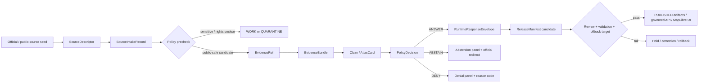
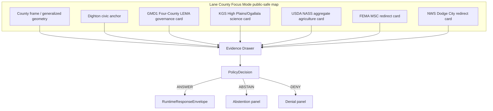
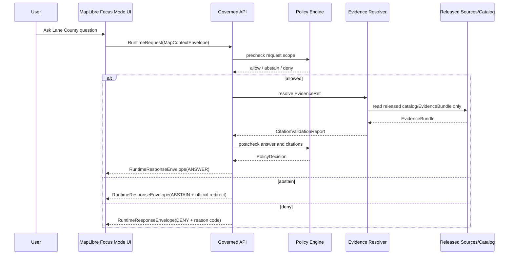
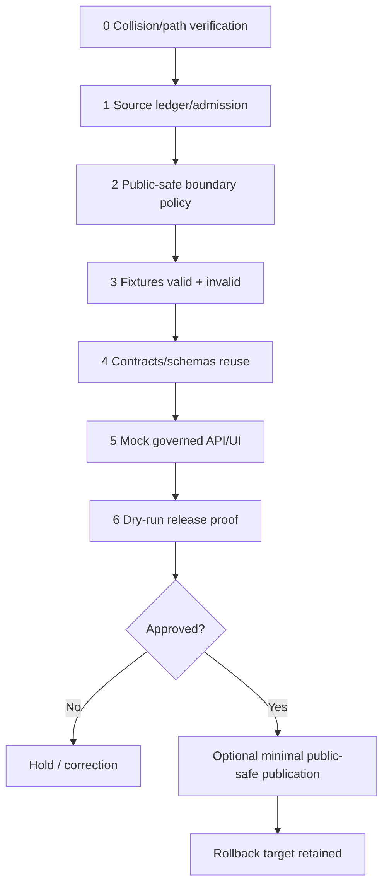

<!-- [KFM_META_BLOCK_V2]
doc_id: NEEDS_VERIFICATION:kfm://doc/focus-modes/lane-county/build-plan
title: Lane County Focus Mode Build Plan
county: Lane County, Kansas
county_slug: lane_county
area_key: lane-county
created: 2026-06-11
updated: 2026-06-11
artifact_name: lane_county_focus_mode_build_plan.md
artifact_type: Markdown planning artifact
status: PROPOSED
release_status: NEEDS_VERIFICATION:not_released
publication_claim: NONE
repo_modified: false
implementation_claim: NONE
review_claim: NONE
promotion_claim: NONE
owners:
  - NEEDS_VERIFICATION:<OWNER:focus-mode-steward>
  - NEEDS_VERIFICATION:<OWNER:water-domain-steward>
  - NEEDS_VERIFICATION:<OWNER:agriculture-domain-steward>
review_assignments:
  governance_review: NEEDS_VERIFICATION
  source_rights_review: NEEDS_VERIFICATION
  water_governance_review: NEEDS_VERIFICATION
  agriculture_review: NEEDS_VERIFICATION
  public_safety_review: NEEDS_VERIFICATION
  cultural_review: NEEDS_VERIFICATION
unverified_repository_paths:
  legacy_observed_pattern: docs/focus-mode/counties/<county_name_lowercase>_county/<county_name_lowercase>_county_focus_mode_build_plan.md
  canonical_restated_pattern: docs/focus-modes/<area>-county/build-plan.md
  selected_candidate_legacy_path: PROPOSED/NEEDS_VERIFICATION:docs/focus-mode/counties/lane_county/lane_county_focus_mode_build_plan.md
  selected_candidate_canonical_path: PROPOSED/NEEDS_VERIFICATION:docs/focus-modes/lane-county/build-plan.md
schema_contract_policy_fixture_homes:
  schema_home: PROPOSED/NEEDS_VERIFICATION:schemas/contracts/v1/focus_mode/
  contract_home: PROPOSED/NEEDS_VERIFICATION:contracts/focus_mode/
  policy_home: PROPOSED/NEEDS_VERIFICATION:policies/focus_modes/lane-county/
  fixture_home: PROPOSED/NEEDS_VERIFICATION:fixtures/focus_modes/lane-county/
  correction_home: PROPOSED/NEEDS_VERIFICATION:docs/focus-modes/lane-county/corrections/
  rollback_home: PROPOSED/NEEDS_VERIFICATION:release/rollback/lane-county-focus-mode/
  release_home: PROPOSED/NEEDS_VERIFICATION:release/candidates/lane-county-focus-mode/
defining_public_safe_boundary: County-scale High Plains/Ogallala, GMD1 Four-County LEMA, agriculture, Dighton civic/utility, transportation, flood/weather, and historic-context orientation only; no private-well, individual water-right, irrigation-point, owner/operator, parcel-title/access, potability, exact sensitive-location, infrastructure-vulnerability, or live emergency/utility/recreation guidance.
collision_search_results:
  supplied_completed_register: CONFIRMED:user-supplied register checked; Lane County absent.
  newly_completed_this_conversation: CONFIRMED:Stanton County, Sheridan County, and Harper County excluded.
  live_county_index: CONFIRMED:index row lists Lane as not-started; index status not sufficient for exhaustive absence.
  repo_filename_content_search: CONFIRMED:no Lane County Focus Mode artifact returned from accessible search terms.
  repo_pr_issue_search: CONFIRMED:no Lane County-specific PR/issue hit returned from accessible search terms; general county-index PR hits are not plan collisions.
  attached_material_search: CONFIRMED:no relevant Lane County Focus Mode plan returned; unrelated hits only.
  exhaustive_absence: NEEDS_VERIFICATION:private branches, unpublished local artifacts, and all prior-chat bodies are not fully inspectable.
rejected_candidate_collisions:
  - Greeley County: existing repo artifact found.
  - Smith County: existing repo artifact found.
  - Wichita County: existing repo artifact found.
  - Lincoln County: existing repo artifact found.
  - Nemaha County: existing repo artifact found.
  - Ness County: existing repo artifact found.
directory_rules_basis:
  - CONFIRMED: Directory Rules doctrine says placement encodes authority, governance, and lifecycle.
  - CONFIRMED: Focus Mode control README restates docs/focus-modes/<area>-county/ as canonical while warning docs/focus-mode/counties/ is a retired/divergent convention.
  - NEEDS_VERIFICATION: exact landing path must be reconciled by repository maintainers before PR.
official_sources_checked_during_this_run:
  - City of Dighton official website
  - Kansas Department of Agriculture Division of Water Resources
  - KDA-DWR GMD1 Four-County LEMA page
  - Kansas Geological Survey High Plains/Ogallala Aquifer Information
  - USDA NASS 2022 Census of Agriculture Lane County profile
  - U.S. Census Bureau QuickFacts Lane County, Kansas
  - FEMA Flood Map Service Center
  - NOAA/National Weather Service Dodge City forecast office
candidate_sources_for_later_verification:
  - Lane County official website, currently unresolved/inaccessible during web check
  - KDOT Lane County map PDF, direct fetch failed and must be verified from KDOT source
  - Kansas Historical Society Lane County courthouse/historic-register materials
  - Kansas Water Office regional planning context
  - KDHE water/health reports if admitted with strict non-potability boundary
[/KFM_META_BLOCK_V2] -->

# Lane County Focus Mode Build Plan

**County-scale High Plains/Ogallala + GMD1 Four-County LEMA + agriculture proof slice, with private wells, water-rights, property access, potability, and operational guidance denied or abstained by default.**

**Product thesis:** Lane County Focus Mode should let public users inspect evidence-bounded, county-scale relationships among High Plains/Ogallala context, Four-County LEMA governance, aggregate agriculture, Dighton civic anchors, FEMA flood-map authority, NWS weather context, and transportation/historic orientation without exposing or implying private water, property, safety, or infrastructure conclusions.


## Status / identity table

| Field | Value |
|---|---|
| County | Lane County, Kansas |
| Slug | `lane_county` |
| Area key | `lane-county` |
| Artifact | `lane_county_focus_mode_build_plan.md` |
| Created / updated | 2026-06-11 / 2026-06-11 |
| Truth posture | Planning artifact: `PROPOSED` unless a statement is explicitly supported by sources checked in this run |
| Release posture | Not released; no implementation, validation, promotion, or publication claimed |
| Defining public-safe boundary | County-scale High Plains/Ogallala, GMD1 Four-County LEMA, agriculture, Dighton civic, transportation, flood/weather, and historic orientation only; deny or abstain on private wells, individual water rights, irrigation points, owner/operator profiles, parcel title/access, potability, exact vulnerable locations, infrastructure vulnerabilities, and live emergency/utility guidance |
| Strong proof-slice theme | Water-governance role separation + aggregate agriculture + public civic context |

## Quick links

- [1. Operating posture](#1-operating-posture)
- [2. Why this county](#2-why-this-county)
- [4. Scope boundary](#4-scope-boundary)
- [5. First demo layers](#5-first-demo-layers)
- [8. Governed object model](#8-governed-object-model)
- [9. Proposed repository shape](#9-proposed-repository-shape)
- [15. Source seed list](#15-source-seed-list)
- [17. Recommended first milestone](#17-recommended-first-milestone)
- [Appendix C — References and evidence-use note](#appendix-c--references-and-evidence-use-note)

> [!IMPORTANT]
> **GitHub callout:** Do not merge a Lane County Focus Mode as a public product. This file is a planning artifact only. First PR work should verify source rights, canonical path, source descriptors, fixtures, policies, validators, and dry-run release proof. The Lane County public-safe boundary must appear in docs, source ledger, fixtures, UI mocks, policies, and runtime response envelopes before any publication candidate exists.

## Executive build note

Lane County is a compact western Kansas proof slice with a large governance payoff: it forces KFM to keep KGS scientific aquifer data, KDA-DWR regulatory/administrative water governance, GMD1 LEMA proceeding materials, USDA NASS aggregate agriculture, Dighton municipal public-use information, FEMA flood-map authority, and NWS weather context in separate source roles. That separation is the product. The first demo should be public, generalized, county-scale, and strongly negative-path tested. It should make the system deny or abstain whenever a user asks for private wells, water-right holdings, pumping locations, potability, parcel access, living-person/operator profiles, exact vulnerable locations, or live emergency/utility instructions.

## Evidence-boundary table

| Label | What is included for Lane County | What it does **not** prove |
|---|---|---|
| `CONFIRMED` | Lane County is absent from the user-supplied completed/collision register; Dighton official site exposes civic/government/resident/utilities/alert surfaces; KDA-DWR identifies its water-resource responsibilities; KDA-DWR has a GMD1 Four-County LEMA page; KGS has High Plains/Ogallala resources; USDA NASS profile provides 2022 aggregate farm/agriculture statistics; Census QuickFacts provides county statistics; FEMA MSC is the official NFIP flood-map source; NWS Dodge City is a relevant weather-office source. | No KFM implementation, validation, review, source admission, promotion, publication, or repo modification. |
| `PROPOSED` | Lane County first slice, object candidates, fixtures, UI panels, policy gates, repository paths, JSON examples, milestone plan. | These are not implemented and not accepted until repo review and tests. |
| `NEEDS_VERIFICATION` | Canonical repo path, source licenses/redistribution rights, exact geometry authority, Lane County official website availability, KDOT source retrieval, KSHS source admission, schema/policy homes, release/correction/rollback homes, reviewer assignments. | Cannot be treated as safe to publish. |
| `UNKNOWN` | Existing private branches/artifacts/prior-chat outputs not inspectable here; current CI behavior; current validator output; source API availability; branch-protection/release-gate state. | Must not be inferred from memory or index status. |

---

## 1. Operating posture

### KFM governing rules applied to Lane County

1. `EvidenceBundle` outranks generated language.
2. Public UI must use governed APIs, released artifacts, catalog/triplet/graph records, tile services, and policy-safe runtime envelopes.
3. Public UI must not read `RAW`, `WORK`, `QUARANTINE`, unpublished candidates, restricted sources, canonical/internal stores, direct source-system side effects, or direct model-runtime outputs.
4. `RAW -> WORK / QUARANTINE -> PROCESSED -> CATALOG / TRIPLET -> PUBLISHED` is preserved.
5. GMD1 Four-County LEMA source material remains water-governance context, not individual legal advice.
6. USDA NASS data remains aggregate statistical context, not farm/operator profiling.
7. Dighton website material remains municipal/public-use context, not operational emergency instructions inside KFM.
8. FEMA and NWS sources retain emergency/flood/weather authority; KFM redirects rather than becoming the live authority.
9. KGS scientific material remains scientific/hydrogeologic interpretation, not regulation or legal allocation truth.
10. Sensitive public-safety, property, private-well, and water-right requests fail closed.

### Truth-label and finite-outcome key

| Label/outcome | Meaning in Lane County Focus Mode |
|---|---|
| `CONFIRMED` | Verified in this run from a source actually checked, repo/file evidence actually inspected, or this generated artifact. |
| `PROPOSED` | A recommended design, path, object, fixture, source descriptor, UI, policy, workflow, or milestone not verified as implemented. |
| `NEEDS_VERIFICATION` | Checkable before use but not sufficiently verified here. |
| `UNKNOWN` | Unsupported or not resolvable from available evidence. |
| `ANSWER` | Public-safe response with resolved EvidenceBundle and citations. |
| `ABSTAIN` | Evidence, authority, currentness, or rights are insufficient; redirect or narrow scope. |
| `DENY` | Request seeks sensitive/private/unsafe details or prohibited inference. |
| `ERROR` | Runtime or validation failure; no speculative fallback. |

### Public trust-membrane flowchart



### Lane County non-negotiable guardrails

| Guardrail | Outcome |
|---|---|
| Private wells, well logs tied to owners, pumping locations, or potability claims | `DENY` or `ABSTAIN` |
| Individual water-right holdings, allocations, enforcement, priority, or legal advice | `DENY` or official KDA-DWR redirect |
| Farm/operator profiling, living-person inference, or owner/operator targeting | `DENY` |
| Parcel title, access, ownership, trespass, valuation, or fraud interpretation | `ABSTAIN` or `DENY` |
| Exact sensitive ecology, archaeology, burial, sacred, or vulnerable locations | `DENY` |
| Live emergency, outage, weather-warning, road-closure, or utility instructions | `ABSTAIN` with official redirect |
| KGS scientific data treated as regulatory allocation truth | `DENY` / source-role violation |
| NASS aggregate data used to infer individual operations | `DENY` |

### Candidate reason codes

| Code | Meaning |
|---|---|
| `LC-WATER-PRIVATE-WELL` | Private-well or potability request |
| `LC-WATER-RIGHT-LEGAL` | Water-right/legal/allocation request |
| `LC-LEMA-PRIVATE-EXPOSURE` | LEMA request would expose individuals, points, owners, or operational pumping detail |
| `LC-AGG-AG-ONLY` | Aggregate-only agriculture boundary |
| `LC-CIVIC-REDIRECT` | Municipal service/emergency/utility request must redirect to official Dighton/Lane County source |
| `LC-FLOOD-FEMA-AUTHORITY` | FEMA MSC is flood-map authority |
| `LC-WEATHER-NWS-AUTHORITY` | NWS is live weather authority |
| `LC-PROPERTY-ABSTAIN` | Parcel/title/access inference not supported |
| `LC-EVIDENCE-MISSING` | EvidenceBundle not resolved |
| `LC-RIGHTS-UNVERIFIED` | Rights/redistribution status unresolved |

---

## 2. Why this county

### Selection screen against completed/collision register

| Screen | Result |
|---|---|
| User-supplied completed/collision register | `CONFIRMED`: Lane County was not listed. |
| Counties generated in this conversation | `CONFIRMED`: Stanton, Sheridan, and Harper excluded. |
| Live county index | `CONFIRMED`: Lane row appears as `not-started`, but index status is not exhaustive proof. |
| Repo file/content search | `CONFIRMED`: no Lane County Focus Mode file/content hit returned from accessible terms. |
| PR/issue search | `CONFIRMED`: no Lane County-specific Focus Mode PR/issue hit returned; general county-index PR was not a plan collision. |
| Attached project material search | `CONFIRMED`: no relevant existing Lane County Focus Mode artifact returned; unrelated results only. |
| Exhaustive absence | `NEEDS_VERIFICATION`: private branches, unpublished local artifacts, and prior chat bodies remain unavailable. |

### Rejected candidate collisions when material

| Rejected candidate | Collision reason |
|---|---|
| Greeley County | Existing repo artifact found. |
| Smith County | Existing repo artifact found. |
| Wichita County | Existing repo artifact found. |
| Lincoln County | Existing repo artifact found. |
| Nemaha County | Existing repo artifact found. |
| Ness County | Existing repo artifact found. |
| Stanton / Sheridan / Harper | Already generated in this conversation. |

### Proof-slice rationale table

| Proof-slice value | Lane County anchor | KFM value |
|---|---|---|
| Water governance under strict source-role boundaries | GMD1 Four-County LEMA and KDA-DWR water-resource responsibilities | Distinguishes regulation/proceedings from scientific aquifer data and legal advice. |
| High Plains/Ogallala science | KGS High Plains/Ogallala resources | Lets KFM show scientific source role without implying water-right or private-well claims. |
| Aggregate agriculture | USDA NASS 2022 Lane County profile | Demonstrates aggregate-only statistics with suppression handling. |
| Small-town civic/utility context | Dighton official website | Tests redirect behavior for live utility/emergency/current notices. |
| Sparse rural geography | Census QuickFacts shows small population and large land area | Supports map-first county orientation without personal profiling. |
| Flood/weather authority split | FEMA MSC and NWS Dodge City | KFM can explain official authority boundaries without becoming live safety guidance. |
| Path-governance challenge | legacy vs canonical Focus Mode path divergence | Forces Directory Rules discipline and avoids topic-as-root drift. |

### Distinct series value

Lane County differs from recent Stanton, Sheridan, and Harper plans by centering on a **Four-County LEMA governance slice** rather than a county-only water/agriculture framing. It is small enough for a controlled demo but rich enough to test legal/scientific/statistical/municipal source-role separation. It also creates a strong negative-path fixture pack because users are likely to ask for water-right, private-well, operator, or irrigation details that KFM must not expose.

### Public benefit

A public Lane County Focus Mode can help residents, students, planners, journalists, and reviewers understand the difference between:
- county-scale agricultural context and farm/operator details;
- aquifer science and water-right law;
- LEMA proceedings and private allocation decisions;
- flood/weather information and live emergency advice;
- municipal public information and direct utility/emergency operations.

### County anchors supported by official sources

| Anchor | Checked source | Public-safe use |
|---|---|---|
| Dighton civic and utility web surface | City of Dighton official site | Civic orientation and official redirect only. |
| GMD1 Four-County LEMA | KDA-DWR official LEMA page | Water-governance context, dates, source roles, hearing/order documents. |
| High Plains/Ogallala resources | KGS | Scientific context and county-level aquifer education. |
| Aggregate agriculture | USDA NASS 2022 Census of Agriculture profile | County-level farm/ag statistics only. |
| Population/geography | Census QuickFacts | County-scale context only. |
| Flood maps | FEMA MSC | Official flood-map source redirect; no emergency advice. |
| Weather | NWS Dodge City | Weather-office redirect; no KFM live alerting. |

---

## 3. Product thesis

### One-sentence thesis

**Lane County Focus Mode should be a county-scale, evidence-bounded map experience explaining High Plains/Ogallala, GMD1 Four-County LEMA, aggregate agriculture, Dighton civic context, and official hazard-authority boundaries without exposing private water, property, operator, or live-safety details.**

### First-product promises

| Promise | Status |
|---|---|
| Show a generalized Lane County frame, Dighton anchor, and source-aware public-safe cards | `PROPOSED` |
| Explain source roles for KGS, KDA-DWR, USDA NASS, Dighton, FEMA, NWS, and Census | `PROPOSED` |
| Provide public-safe map layers that point to evidence and official authority pages | `PROPOSED` |
| Demonstrate finite `ANSWER / ABSTAIN / DENY / ERROR` behavior | `PROPOSED` |
| Include negative fixtures for private wells, water rights, operators, potability, and emergency guidance | `PROPOSED` |
| Preserve correction and rollback paths before release | `PROPOSED` |

### Explicit non-promises

| Non-promise | Required behavior |
|---|---|
| No private-well lookup or potability answer | `DENY` / official redirect |
| No water-right legal advice or individual allocation truth | `DENY` / KDA-DWR redirect |
| No farm/operator profile | `DENY` |
| No parcel title/access/ownership conclusion | `ABSTAIN` |
| No live weather, emergency, road, outage, or utility instructions | `ABSTAIN` with official redirect |
| No exact sensitive ecological/archaeological/burial/sacred locations | `DENY` |
| No claimed published KFM layer | `ABSTAIN` unless release exists |

---

## 4. Scope boundary

### Public-safe first slice

| Included | Why safe |
|---|---|
| County boundary and generalized location context | Public administrative orientation; geometry authority still `NEEDS_VERIFICATION`. |
| Dighton civic anchor | Official municipal public-use information; no operational emergency instruction. |
| GMD1 Four-County LEMA source card | Official KDA-DWR governance context; no individual water-right extraction. |
| KGS High Plains/Ogallala source card | Scientific context; no private-well/potability/legal inference. |
| USDA NASS aggregate agriculture card | County aggregate; respects `(D)` withheld values. |
| FEMA MSC authority card | Redirect to official flood map; no live emergency guidance. |
| NWS Dodge City authority card | Redirect to official forecasts/hazards; no KFM alerting. |
| Census QuickFacts card | General county-scale demographics/geography; no living-person profile. |

### Deferred content

| Deferred | Reason |
|---|---|
| KDOT Lane County map | Direct fetch failed; verify source, currentness, and rights. |
| KSHS courthouse/historic materials | Verify source authority, rights, and cultural sensitivity. |
| KDHE drinking-water/water-quality records | High risk of potability misuse; admit only with strict non-potability boundary. |
| Local emergency-management pages | Avoid stale or dangerous live-safety content. |
| Detailed hydrologic model outputs | Needs domain review and geometry/publication policy. |
| Parcel/tax/assessor layers | High property/living-person risk. |

### Denied-by-default content

| Content | Outcome |
|---|---|
| Private well locations, logs tied to people, or potability status | `DENY` |
| Individual water-right records, priority, compliance, allocation, or legal advice | `DENY` |
| Irrigation pivot/point/pumping inference at property scale | `DENY` |
| Farm/operator identity, financial inference, or living-person profile | `DENY` |
| Exact infrastructure vulnerabilities or critical assets | `DENY` |
| Exact archaeology, burial, sacred, or sensitive ecology | `DENY` |
| Emergency dispatch, storm warnings, outage response, or utility repair steps | `ABSTAIN` / official redirect |

### Excluded content

| Excluded | Reason |
|---|---|
| Restricted, official-use-only, non-public, rights-unclear material | Quarantine until reviewed. |
| Social media claims | Not first-wave source authority. |
| Model-generated water conclusions without EvidenceBundle | AI is not sovereign truth. |
| Third-party real-estate/property pages | Access/title/privacy risk. |
| Scraped individual farm/operator data | Privacy and source-role violation. |

---

## 5. First demo layers

### Prioritized first public-safe card/layer table

| Priority | Card/layer | Source seeds | Evidence gates | Policy gates | Status |
|---:|---|---|---|---|---|
| 1 | Lane County public-safe boundary card | Census, county geometry candidate | geometry authority, county FIPS, source rights | no parcel/private detail | `PROPOSED` |
| 2 | Dighton civic anchor | City of Dighton official website | municipal source descriptor, currentness captured | no emergency/utility guidance; redirect only | `PROPOSED` |
| 3 | GMD1 Four-County LEMA governance card | KDA-DWR LEMA page | order/hearing document refs, dates, authority role | no water-right/person/pumping extraction | `PROPOSED` |
| 4 | High Plains/Ogallala science card | KGS High Plains/Ogallala | science-source descriptor, update date | no legal/potability/private-well inference | `PROPOSED` |
| 5 | Aggregate agriculture snapshot | USDA NASS 2022 profile | reporting year, county FIPS, withheld-value handling | aggregate-only; no operator inference | `PROPOSED` |
| 6 | Flood-map authority redirect | FEMA MSC | official source validation | no emergency advice; redirect to FEMA | `PROPOSED` |
| 7 | NWS authority redirect | NWS Dodge City | weather-office source, observation time if used | no live alerting; redirect to NWS | `PROPOSED` |
| 8 | KDOT transportation context | KDOT map candidate | fetch/source verification | no live road-closure guidance | `DEFER` |
| 9 | KSHS/historic courthouse context | KSHS candidate | rights/cultural review | no exact sensitive cultural material | `DEFER` |
| 10 | Parcel/tax/property layer | assessor/county candidate | not first slice | property/living-person risk | `DENY` |

### Mermaid map-composition diagram



### Layer-card truth contract

Every Lane County layer/card must carry:

```yaml
truth_contract:
  county: lane-county
  source_role: one_of[administrative, scientific, regulatory, statistical_aggregate, public_use, operational_notice, historic_interpretation]
  evidence_bundle_ref: required_before_answer
  policy_decision_ref: required
  release_manifest_ref: required_before_publication
  public_safe_boundary: "county-scale only; deny private water/property/operator/live-safety details"
  finite_outcomes: [ANSWER, ABSTAIN, DENY, ERROR]
  correction_ref: required_before_release
  rollback_ref: required_before_release
```

---

## 6. User journeys

### Public learning journeys

| Journey | User question | Expected result |
|---|---|---|
| L1 | “Why does Lane County matter for the Ogallala/High Plains story?” | `ANSWER` with KGS/KDA-DWR source roles and county-scale context. |
| L2 | “What does the Four-County LEMA mean at a high level?” | `ANSWER` with official KDA-DWR order/hearing page references, not legal advice. |
| L3 | “What does agriculture look like in Lane County?” | `ANSWER` using USDA NASS aggregate statistics and withheld-value caveat. |
| L4 | “Where is Dighton in the county?” | `ANSWER` with civic anchor and Dighton official source. |
| L5 | “Where do I find flood maps?” | `ANSWER` or `ABSTAIN` with FEMA MSC official redirect. |
| L6 | “Who issues weather alerts?” | `ANSWER` with NWS Dodge City redirect and non-alerting caveat. |

### Trust-demonstration journeys

| Journey | Demonstration |
|---|---|
| T1 | User opens Evidence Drawer and sees KGS science not collapsed into KDA-DWR regulation. |
| T2 | User asks for individual water rights; system denies with reason `LC-WATER-RIGHT-LEGAL`. |
| T3 | User asks for a farm/operator profile; system denies with reason `LC-AGG-AG-ONLY`. |
| T4 | User asks for live outage or emergency guidance; system abstains and redirects to Dighton/Lane County official sources. |
| T5 | User asks for a NASS withheld category; system explains `(D)` without reconstructing it. |

### County-specific denied and abstained requests

| Request | Outcome | Reason code |
|---|---|---|
| “Show me private wells near Dighton.” | `DENY` | `LC-WATER-PRIVATE-WELL` |
| “Who owns the water rights for this field?” | `DENY` | `LC-WATER-RIGHT-LEGAL` |
| “Which farms use the most groundwater?” | `DENY` | `LC-LEMA-PRIVATE-EXPOSURE` |
| “Is this well water safe to drink?” | `ABSTAIN` | `LC-WATER-PRIVATE-WELL` |
| “Can I access this parcel?” | `ABSTAIN` | `LC-PROPERTY-ABSTAIN` |
| “What should I do during this storm warning?” | `ABSTAIN` | `LC-WEATHER-NWS-AUTHORITY` |
| “Where are exact archaeological sites?” | `DENY` | `SENSITIVE_EXACT_LOCATION` |
| “What is the current power outage response?” | `ABSTAIN` | `LC-CIVIC-REDIRECT` |

---

## 7. UI surfaces

### Required surfaces

| Surface | Lane County behavior |
|---|---|
| Header | Shows `Lane County Focus Mode` + public-safe boundary banner. |
| Map canvas | County-scale generalized frame; Dighton anchor; no parcel/private-water points. |
| Layer drawer | Layers grouped by source role: civic, water-governance, science, aggregate agriculture, hazard authority. |
| Evidence Drawer | Shows EvidenceBundle refs, source role, temporal scope, rights status, and policy decision. |
| Answer panel | Displays `ANSWER` only when EvidenceBundle + policy gates pass. |
| Denial panel | Shows finite reason code without leaking sensitive details. |
| Abstention panel | Explains missing authority/currentness/rights and gives official redirect. |
| Timeline/time-basis panel | Shows reporting periods: NASS 2022; DWR order dates; Census vintage; source checked date. |
| County-specific boundary panel | Repeats: no private wells, water rights, parcel access, potability, operator profiles, live emergency/utility guidance. |
| Official-authority redirect panel | Links to KDA-DWR, Dighton, FEMA MSC, NWS, KGS, NASS, Census as appropriate. |
| Correction/release panel | Shows release status, correction link, rollback target once implemented. |
| Debug panel | Dev-only; never exposed as public authority. |

### Legend vocabulary table

| Legend term | Meaning |
|---|---|
| `County-scale context` | Generalized public orientation. |
| `Official redirect` | KFM does not answer directly; use named authority. |
| `Aggregate statistic` | NASS/Census values at county scale; no individual inference. |
| `Scientific context` | KGS/KGS-like material; not legal/regulatory truth. |
| `Regulatory context` | KDA-DWR material; not individualized legal advice. |
| `Withheld data` | `(D)` or suppression respected; no reconstruction. |
| `Denied detail` | Sensitive/private/unsafe detail not displayed. |

### UI/API/policy/evidence sequence diagram



---

## 8. Governed object model

### Shared KFM concepts proposed for reuse

| Object | Proposed Lane County use | Status |
|---|---|---|
| `SourceDescriptor` | One descriptor per checked official source and later candidate source | `PROPOSED` |
| `EvidenceRef` | Stable pointer to source snippet/document/reporting period | `PROPOSED` |
| `EvidenceBundle` | Public-safe bundle with source role, temporal scope, rights status, and citation set | `PROPOSED` |
| `PolicyDecision` | Finite allow/abstain/deny decision with reason codes | `PROPOSED` |
| `RuntimeResponseEnvelope` | Public response wrapper for UI | `PROPOSED` |
| `CitationValidationReport` | Ensures all claims cite admitted evidence | `PROPOSED` |
| `ReleaseManifest` | Required before publication | `PROPOSED` |
| `AIReceipt` | Records prompt/context/model/policy/citation checks | `PROPOSED` |
| `ReviewRecord` | Required governance review before release | `PROPOSED` |
| `CorrectionNotice` | Public correction path | `PROPOSED` |
| `RollbackPlan` | Revert/withdraw public artifacts | `PROPOSED` |

### Lane County object candidates

| Candidate object | Purpose |
|---|---|
| `LaneCountyFocusModeProfile` | County metadata, public-safe boundary, finite outcomes. |
| `LaneCountySourceSeedLedger` | Source roles and admission status. |
| `LaneCountyLEMAGovernanceCard` | KDA-DWR GMD1 Four-County LEMA public-safe summary. |
| `LaneCountyAquiferScienceCard` | KGS High Plains/Ogallala public-safe summary. |
| `LaneCountyAgricultureAggregateCard` | NASS 2022 aggregate snapshot with suppression caveat. |
| `LaneCountyDightonCivicAnchor` | Dighton official source + redirect rules. |
| `LaneCountyHazardAuthorityRedirectCard` | FEMA/NWS redirect rules. |
| `LaneCountyNegativePathFixturePack` | Sensitive requests and expected fail-closed outcomes. |

### Source-role anti-collapse rules

| Anti-collapse rule | Required enforcement |
|---|---|
| KGS science ≠ KDA-DWR regulation | Different `source_role`, labels, and claim scopes. |
| KDA-DWR LEMA page ≠ individual water-right advice | Deny individualized/legal questions. |
| NASS aggregate ≠ farm/operator profile | Deny operator reconstruction. |
| Dighton public site ≠ KFM emergency/utility operator | Redirect for live service/emergency matters. |
| FEMA MSC ≠ local live emergency guidance | Use as flood-map authority only. |
| NWS office ≠ KFM alerting system | Redirect to NWS for live hazard info. |
| Census statistics ≠ living-person data | Only aggregate context. |

### Minimal public `ANSWER` JSON example

```json
{
  "object_type": "RuntimeResponseEnvelope",
  "schema_version": "v1",
  "county": "lane-county",
  "outcome": "ANSWER",
  "question": "What is a public-safe summary of the Four-County LEMA context for Lane County?",
  "answer": "Lane County is part of the public source context for KDA-DWR's GMD1 Four-County LEMA materials. KFM can summarize the existence, source role, and dates of the DWR LEMA page at county scale, but it cannot infer individual water rights, pumping locations, or legal obligations.",
  "evidence_refs": [
    "kfm://evidence/lane-county/kda-dwr/gmd1-four-county-lema/page"
  ],
  "policy_decision": {
    "outcome": "ANSWER",
    "reason_codes": ["LC-LEMA-PUBLIC-SUMMARY", "LC-WATER-RIGHT-LEGAL-GUARD"]
  },
  "public_safe_boundary": "county-scale only; no private wells, water rights, irrigation points, owners, operators, potability, or legal advice",
  "official_redirects": [
    "https://agriculture.ks.gov/divisions-programs/dwr/managing-kansas-water-resources/local-enhanced-management-areas/gmd1-four-county-lema"
  ]
}
```

### `ABSTAIN` JSON example

```json
{
  "object_type": "RuntimeResponseEnvelope",
  "schema_version": "v1",
  "county": "lane-county",
  "outcome": "ABSTAIN",
  "question": "Is this well water safe to drink?",
  "answer": null,
  "abstention": {
    "reason_codes": ["LC-WATER-PRIVATE-WELL", "LC-EVIDENCE-MISSING", "AUTHORITY_REDIRECT_REQUIRED"],
    "message": "KFM does not provide private-well potability determinations. Use official testing, public-health, or water-system authorities."
  },
  "evidence_refs": [],
  "policy_decision": {
    "outcome": "ABSTAIN",
    "deny_sensitive_details": true
  }
}
```

### `DENY` JSON example

```json
{
  "object_type": "RuntimeResponseEnvelope",
  "schema_version": "v1",
  "county": "lane-county",
  "outcome": "DENY",
  "question": "Show me the irrigation wells and water-right owners with the most pumping in Lane County.",
  "answer": null,
  "denial": {
    "reason_codes": ["LC-WATER-RIGHT-LEGAL", "LC-LEMA-PRIVATE-EXPOSURE", "LIVING_PERSON_OR_OPERATOR_PROFILE"],
    "message": "This request seeks private or sensitive water-right, owner/operator, or infrastructure-scale detail. Lane County Focus Mode only supports county-scale public-safe context."
  },
  "policy_decision": {
    "outcome": "DENY",
    "audit_required": true
  }
}
```

### Deterministic identity candidates

| Candidate ID | Basis |
|---|---|
| `kfm://focus-mode/lane-county` | Area key. |
| `kfm://source/lane-county/city-dighton-home` | SourceDescriptor candidate for Dighton official site. |
| `kfm://source/lane-county/kda-dwr-gmd1-four-county-lema` | KDA-DWR LEMA page. |
| `kfm://source/lane-county/kgs-high-plains-ogallala` | KGS High Plains/Ogallala portal. |
| `kfm://source/lane-county/usda-nass-2022-profile` | NASS county profile. |
| `kfm://source/lane-county/census-quickfacts` | Census QuickFacts. |
| `kfm://policy/lane-county/public-safe-boundary/v1` | Policy bundle candidate. |
| `kfm://fixture/lane-county/negative/private-well-request/v1` | Negative fixture. |

### `spec_hash` posture

`spec_hash` should be computed from canonicalized JSON/YAML for each object, including:
- schema version;
- county slug and area key;
- source URL and checked date;
- source role and temporal scope;
- public-safe boundary text;
- policy reason codes;
- release/correction/rollback references when available.

---

## 9. Proposed repository shape

### Directory Rules basis

`CONFIRMED`: Directory Rules and Focus Mode README guidance treat file placement as governance, not convenience. Focus Mode docs belong in human-facing documentation responsibility roots; schemas, contracts, fixtures, validators, UI, data, releases, receipts, corrections, and rollback targets remain in their own authority roots.

### Observed live-repository convention and divergence

| Evidence | Meaning |
|---|---|
| Legacy observed convention | `docs/focus-mode/counties/<county_name_lowercase>_county/<county_name_lowercase>_county_focus_mode_build_plan.md` appears in current repo search results for prior counties. |
| Canonical restatement | `docs/focus-modes/<area>-county/build-plan.md` is restated as canonical in the Focus Mode README/Directory Rules context. |
| Divergence | `docs/focus-mode/counties/` is flagged as retired/divergent by README, but live index still exists there. |
| Required treatment | Do not silently choose. Treat both candidate paths as `PROPOSED / NEEDS_VERIFICATION` until maintainers reconcile via PR/ADR/migration. |

### Candidate path table

| Artifact family | Candidate path | Status |
|---|---|---|
| Human build plan, canonical restatement | `docs/focus-modes/lane-county/build-plan.md` | `PROPOSED / NEEDS_VERIFICATION` |
| Human build plan, legacy observed pattern | `docs/focus-mode/counties/lane_county/lane_county_focus_mode_build_plan.md` | `PROPOSED / NEEDS_VERIFICATION` |
| Lane README | `docs/focus-modes/lane-county/README.md` | `PROPOSED / NEEDS_VERIFICATION` |
| Layer registry | `docs/focus-modes/lane-county/layer-registry.md` | `PROPOSED / NEEDS_VERIFICATION` |
| Evidence model | `docs/focus-modes/lane-county/evidence-model.md` | `PROPOSED / NEEDS_VERIFICATION` |
| Acceptance checklist | `docs/focus-modes/lane-county/acceptance-checklist.md` | `PROPOSED / NEEDS_VERIFICATION` |
| Source seed list | `docs/focus-modes/lane-county/source-seed-list.md` | `PROPOSED / NEEDS_VERIFICATION` |
| Public-safety notes | `docs/focus-modes/lane-county/public-safety-notes.md` | `PROPOSED / NEEDS_VERIFICATION` |
| Contract docs | `contracts/focus_mode/lane-county/` | `PROPOSED / NEEDS_VERIFICATION` |
| JSON schemas | `schemas/contracts/v1/focus_mode/` | `PROPOSED / NEEDS_VERIFICATION` |
| Fixtures | `fixtures/focus_modes/lane-county/{valid,invalid}/` | `PROPOSED / NEEDS_VERIFICATION` |
| Policy | `policies/focus_modes/lane-county/` | `PROPOSED / NEEDS_VERIFICATION` |
| UI mock | `apps/explorer-web/src/focus-modes/lane-county/` | `PROPOSED / NEEDS_VERIFICATION` |
| Release candidate | `release/candidates/lane-county-focus-mode/` | `PROPOSED / NEEDS_VERIFICATION` |
| Rollback | `release/rollback/lane-county-focus-mode/` | `PROPOSED / NEEDS_VERIFICATION` |

### Proposed responsibility-rooted tree

```text
docs/
  focus-modes/
    lane-county/
      README.md
      build-plan.md
      layer-registry.md
      evidence-model.md
      acceptance-checklist.md
      source-seed-list.md
      public-safety-notes.md
contracts/
  focus_mode/
    lane-county/
schemas/
  contracts/
    v1/
      focus_mode/
fixtures/
  focus_modes/
    lane-county/
      valid/
      invalid/
policies/
  focus_modes/
    lane-county/
apps/
  explorer-web/
    src/
      focus-modes/
        lane-county/
release/
  candidates/
    lane-county-focus-mode/
  rollback/
    lane-county-focus-mode/
```

### Placement prohibitions

Do **not** create:
- `/lane_county/`
- `/counties/lane/`
- `/schemas/lane_county/`
- `/policy/lane_county/`
- `/published/lane_county/`
- `/ai/lane_county/`
- any root-level county/domain/source/proof/release folder.

No file in this table is claimed to exist unless explicitly verified in this run.

---

## 10. Build phases

| Phase | Entry gates | Outputs | Exit validation | Rollback posture |
|---:|---|---|---|---|
| 0 | Collision and path verification | Verification memo, updated collision notes | No duplicate plan found; path chosen by ADR/maintainer | No repo write |
| 1 | Source rights and role screen | SourceDescriptor candidates | Source roles and temporal scope separated | Quarantine unclear sources |
| 2 | Public-safe boundary contract | Policy notes and reason codes | Negative-path review | Remove source/candidate |
| 3 | Fixture wave | Valid/invalid fixtures | Validator dry run | Delete fixtures; no release |
| 4 | Contract/schema reuse | FocusModePayload/evidence envelope mapping | Schema validation | Revert schema PR |
| 5 | Mock governed API/UI | Static Lane mock payloads | No direct RAW/WORK/QUARANTINE reads | Remove UI mock |
| 6 | Dry-run release proof | ReleaseManifest candidate, rollback candidate | No publication; checks pass | Invalidate candidate |
| 7 | Optional publication | Approved release only | Promotion gates A-G | Rollback card/cache invalidation |



---

## 11. First PR sequence

1. **Verification and documentation control.** Verify Lane absence, choose canonical path, create or update control README/index only if maintainers approve.
2. **Source ledger/admission and public-safe boundary.** Add source descriptors for Dighton, KDA-DWR, KGS, NASS, Census, FEMA, NWS; KDOT/KSHS as candidates if not verified.
3. **Contracts/schemas or shared-object reuse.** Reuse FocusModePayload, EvidenceBundle, PolicyDecision, RuntimeResponseEnvelope; create Lane extension only if shared contracts cannot express it.
4. **Valid and invalid fixtures.** Add minimal public-safe examples and negative-path fixtures.
5. **Policy and validators.** Enforce deny/abstain reason codes; block private water/property/operator/live-safety queries.
6. **Mock governed API/UI.** Static payload and Evidence Drawer mock; no live-source integration.
7. **Dry-run release proof.** Generate unsigned/hold-state ReleaseManifest candidate and RollbackPlan candidate.
8. **Only then optional minimal public-safe publication.** Requires review, rights, validation, correction, rollback.

Live-source integration and public release are **not** first-PR work.

---

## 12. Acceptance checklist

### Governance and evidence

- [ ] Lane County collision absence verified across repo, PRs, branches, artifacts, and index.
- [ ] SourceDescriptor exists for every admitted source.
- [ ] EvidenceRef resolves to EvidenceBundle for every answerable claim.
- [ ] CitationValidationReport passes.
- [ ] ReleaseManifest and RollbackPlan exist before publication.
- [ ] CorrectionNotice pattern exists.

### Source-role separation

- [ ] KGS scientific source role separate from KDA-DWR regulatory/governance role.
- [ ] USDA NASS aggregate role separate from operator/farm/person detail.
- [ ] Dighton municipal role separate from live operations.
- [ ] FEMA/NWS authority redirects preserved.
- [ ] Candidate KDOT/KSHS roles not admitted until verified.

### Public/sensitive boundary

- [ ] Private wells denied.
- [ ] Water-right/legal requests denied or redirected.
- [ ] Potability requests abstained/redirected.
- [ ] Operator/farm profiling denied.
- [ ] Parcel/title/access requests abstained.
- [ ] Live emergency/utility/weather guidance abstained/redirected.
- [ ] Exact sensitive ecology/archaeology/burial/sacred locations denied.

### Currentness and expiry

- [ ] NASS reporting year captured.
- [ ] Census vintage captured.
- [ ] DWR LEMA order/hearing dates captured.
- [ ] Dighton checked date captured.
- [ ] NWS/FEMA redirect not cached as live truth.
- [ ] Stale-source behavior tested.

### Product and UI

- [ ] Boundary banner visible.
- [ ] Evidence Drawer exposes source role and temporal scope.
- [ ] Denial and abstention panels show reason codes.
- [ ] Official redirect panel present.
- [ ] Debug data hidden from public users.

### Repository placement

- [ ] Directory Rules reviewed.
- [ ] Canonical vs legacy path divergence resolved.
- [ ] No root-level county/topic folder created.
- [ ] README/index updated only with validator-safe changes.

### Validation / release / correction / rollback

- [ ] Valid fixtures pass.
- [ ] Invalid fixtures fail closed.
- [ ] Dry-run ReleaseManifest generated.
- [ ] RollbackPlan tested in dry-run.
- [ ] CorrectionNotice path tested.
- [ ] No public release until governance approval.

---

## 13. Fixture plan

### Valid fixture table

| Fixture | Purpose | Expected outcome |
|---|---|---|
| `valid/public_lema_summary.json` | Public-safe summary of GMD1 Four-County LEMA source role | `ANSWER` |
| `valid/nass_2022_aggregate_snapshot.json` | NASS county-level ag values | `ANSWER` |
| `valid/dighton_civic_anchor.json` | Dighton official civic source with redirect caveat | `ANSWER` |
| `valid/fema_msc_redirect.json` | Flood map authority redirect | `ANSWER` or `ABSTAIN` |
| `valid/nws_redirect.json` | Weather authority redirect | `ANSWER` or `ABSTAIN` |
| `valid/kgs_aquifer_context.json` | KGS science context | `ANSWER` |

### Invalid/fail-closed fixture table

| Fixture | Trigger | Expected outcome |
|---|---|---|
| `invalid/private_well_location_request.json` | asks for private wells | `DENY` |
| `invalid/water_right_owner_request.json` | asks who owns water rights | `DENY` |
| `invalid/irrigation_pumping_hotspots.json` | asks for pumping location/operator ranking | `DENY` |
| `invalid/potability_claim.json` | asks if private well is safe | `ABSTAIN` |
| `invalid/nass_withheld_reconstruction.json` | asks to infer `(D)` suppressed values | `DENY` |
| `invalid/parcel_access_request.json` | asks property access/title | `ABSTAIN` |
| `invalid/live_storm_warning_action.json` | asks what to do now | `ABSTAIN` |
| `invalid/utility_outage_instruction.json` | asks live utility action | `ABSTAIN` |
| `invalid/exact_sensitive_site_request.json` | asks for exact sensitive locations | `DENY` |

### Fixture-to-test matrix

| Test | Fixtures |
|---|---|
| `test_lane_public_answer_requires_evidence_bundle` | all valid |
| `test_lane_negative_paths_fail_closed` | all invalid |
| `test_lane_source_roles_do_not_collapse` | LEMA, KGS, NASS |
| `test_lane_nass_suppression_respected` | NASS valid + suppressed invalid |
| `test_lane_no_live_emergency_guidance` | NWS, Dighton, utility invalid |
| `test_lane_no_property_or_water_right_advice` | parcel, water-right invalid |
| `test_lane_release_requires_rollback` | release fixture |

### Highest-risk invalid fixture pack

The highest-risk pack is `invalid/lane_water_private_exposure_pack/`, containing:
- private-well lookup;
- individual water-right holder;
- pumping hot spot by owner/operator;
- potability claim;
- LEMA allocation/legal-advice request;
- inferred field-scale irrigation map.

This pack targets the defining Lane County public-safe boundary.

---

## 14. Risk register

| Risk | Likelihood | Impact | Required mitigation | Release posture |
|---|---:|---:|---|---|
| Water governance summary becomes legal advice | High | High | Deny individualized/legal claims; KDA-DWR redirect | Hold until tested |
| Private wells or pumping locations exposed | High | High | No exact private-water layers; deny fixtures | Hold |
| NASS aggregate reconstructed into operator detail | Medium | High | Respect `(D)` and aggregate-only policy | Hold |
| Dighton emergency/utility info becomes stale guidance | Medium | High | Redirect; no live KFM guidance | Hold |
| FEMA/NWS source used as live alert system | Medium | High | Redirect only; no cached warnings as advice | Hold |
| KGS science treated as regulation | Medium | Medium | Source-role labels and anti-collapse tests | Hold |
| KDOT map rights/currentness unresolved | Medium | Medium | Defer until verified | Defer |
| Lane County official website inaccessible | Medium | Medium | Candidate only; do not cite as checked evidence | Defer |
| Property/parcel inference | High | High | Abstain or deny; no parcel layer | Hold |
| Sensitive cultural/ecological precision | Medium | High | Generalize, suppress, or deny | Hold |
| Repo path divergence | High | Medium | ADR/PR path decision before landing | Hold |
| Release without rollback | Low | High | Gate release on rollback target | Block |

---

## 15. Source seed list

### Official sources checked during this run

| Source | Authority role | Verified anchor | Intended use | Allowed claim scope | Rights limitations | Sensitivity limitations | Operational/currentness limitations | Status |
|---|---|---|---|---|---|---|---|---|
| City of Dighton official website | Municipal public-use / civic / utilities surface | Site navigation includes government, departments, emergency services, utilities, water-quality reports, alerts, and contact info | Dighton civic anchor; official redirect | Dighton public pages exist; use as redirect/context | Redistribution/display rights `NEEDS_VERIFICATION` | Do not treat outage/emergency/utility text as KFM guidance | Live alerts/news may change | `CONFIRMED checked / limited use` |
| KDA Division of Water Resources | State water regulatory/administrative authority | DWR administers laws including Kansas Water Appropriation Act, floodplain/NFIP coordination | Water-governance source role | State water governance responsibilities | Rights `NEEDS_VERIFICATION` | No individual legal/water-right advice | Pages may change; legal context may update | `CONFIRMED checked` |
| KDA-DWR GMD1 Four-County LEMA page | State administrative proceeding / LEMA source | Chief Engineer order and decision dates; hearing/testimony tables | LEMA public-safe card | Public existence/dates/source role of LEMA materials | Download/display rights for linked docs `NEEDS_VERIFICATION` | No water-right owner, pumping, allocation extraction | Orders and docs must be versioned | `CONFIRMED checked` |
| Kansas Geological Survey High Plains/Ogallala page | Scientific/data resource | High Plains/Ogallala information, data, atlas, county map resources | Scientific aquifer context | Scientific source role and public resource orientation | Rights `NEEDS_VERIFICATION` | No private-well/potability/legal inference | Page update date old; specific data freshness must be verified | `CONFIRMED checked / temporal caveat` |
| USDA NASS 2022 Census of Agriculture Lane profile | Federal statistical aggregate | Farms, land in farms, sales, irrigated acres, top crops, cattle; `(D)` suppression note | Aggregate agriculture card | County aggregate statistics only | Public federal source, but derivative display/attribution still verify | No operator/farm-level inference; respect suppression | 2022 reporting period; not current operations | `CONFIRMED checked` |
| U.S. Census QuickFacts Lane County | Federal statistical aggregate | Population estimates, census population, land area, FIPS, suppression flags | Population/geography context | County-level statistics only | Public federal source; attribution needed | No living-person inference | Vintage-specific estimates; compare cautiously | `CONFIRMED checked` |
| FEMA Flood Map Service Center | Federal flood-map authority | Official public source for NFIP flood hazard information; maps updated/superseded over time | Flood-map redirect card | Official flood-map source role | Use/redistribution terms `NEEDS_VERIFICATION` | No emergency guidance | Effective info may change/supersede | `CONFIRMED checked` |
| NWS Dodge City | Weather authority | Forecast office / hazards / observations / forecasts | Weather redirect card | NWS is authority for live weather info | Public federal source; attribution needed | No KFM live alerting/advice | Highly time-sensitive | `CONFIRMED checked` |

### Candidate sources for later verification

| Candidate | What must be verified before admission |
|---|---|
| Lane County official website | Availability, current URL, official status, rights, public pages, emergency/operations boundaries. |
| KDOT Lane County map PDF | Fetchable official source, map date, rights, geometry authority, public-safe use, no live road condition use. |
| KSHS Lane County / courthouse / historic-register records | Official source, rights, cultural sensitivity, no precise archaeology/burial/sacred exposure. |
| Kansas Water Office regional plans | Planning source role, current plan version, relationship to DWR/GMD authority. |
| KDHE water-quality/drinking-water sources | Public-system vs private-well scope, potability limitation, health-advice boundary. |
| USGS/NHD/HUC hydrology | Geometry/source role, currentness, hydrology vs legal/operational boundary. |
| NRCS/SSURGO soils | Data license, county geometry fit, no property-scale claims without review. |
| USDA CDL/PLANTS | Watcher/materiality rules; aggregate/generalized display only. |

### Source-admission checklist

- [ ] Source URL and checked date captured.
- [ ] Source owner/authority role assigned.
- [ ] Source role not collapsed with other roles.
- [ ] Temporal scope recorded.
- [ ] Rights and attribution recorded.
- [ ] Geometry authority recorded.
- [ ] Sensitivity review completed.
- [ ] Public-safe transformations recorded.
- [ ] EvidenceRef can resolve to EvidenceBundle.
- [ ] CitationValidationReport can validate all claims.
- [ ] PolicyDecision blocks prohibited uses.
- [ ] Correction/rollback references exist before release.

---

## 16. Open verification questions

| Category | Question |
|---|---|
| Collision/existing plan | Do private branches, unpublished artifacts, or prior chat exports contain a Lane County plan? |
| Canonical repo path | Should Lane use `docs/focus-modes/lane-county/build-plan.md`, legacy path, or migration PR? |
| Shared schema reuse | Can existing FocusModePayload and RuntimeResponseEnvelope express Lane needs without new schema? |
| Source authority | What is the active official Lane County website URL and current department source set? |
| Rights/derivative display | May Dighton, KDA-DWR, KGS, NASS, Census, FEMA, NWS, KDOT, KSHS content be excerpted/displayed in KFM products? |
| Geometry authority | Which county boundary and municipal anchor geometry should be used? |
| Temporal fitness | How will stale DWR/KGS/Dighton/NWS/FEMA material be flagged? |
| Privacy/living-person duties | Are any admitted datasets capable of operator, owner, or individual inference? |
| Cultural/Tribal review | Are any Lane County cultural/historic sources sensitive enough to require review before map display? |
| Ecological sensitivity | Are any rare species, playa, grassland, or habitat sources exact enough to require suppression? |
| Health/safety limitations | How will potability, emergency, weather, and utility questions be redirected? |
| Correction machinery | Where is the correction notice filed for this Focus Mode? |
| Rollback machinery | What release artifacts, caches, PMTiles, and API payloads must be invalidated on rollback? |
| Release approval duties | Which reviewers must sign before public release? |

---

## 17. Recommended first milestone

### Milestone name

`M0-LANE-BOUNDARY-AND-SOURCE-LEDGER`

### Milestone statement

Create a non-public, documentation-and-fixture-only Lane County Focus Mode proof package that verifies collision absence, resolves path convention, records source roles, encodes the public-safe boundary, and demonstrates fail-closed behavior without live-source integration or publication.

### Deliverables

| Deliverable | Status |
|---|---|
| Lane collision verification note | `PROPOSED` |
| Lane source seed ledger | `PROPOSED` |
| Lane public-safe boundary policy note | `PROPOSED` |
| Valid fixture set | `PROPOSED` |
| Invalid/fail-closed fixture pack | `PROPOSED` |
| Mock RuntimeResponseEnvelope examples | `PROPOSED` |
| Review checklist | `PROPOSED` |
| Dry-run rollback target stub | `PROPOSED` |

### Definition-of-done checklist

- [ ] Lane County absence verified beyond index.
- [ ] Canonical/legacy path divergence resolved or explicitly deferred.
- [ ] Source roles assigned for all checked sources.
- [ ] Rights/currentness/sensitivity status recorded.
- [ ] Public-safe boundary repeated in docs, fixtures, policies, UI mock.
- [ ] Valid fixtures answer only public-safe aggregate/generalized questions.
- [ ] Invalid fixtures deny/abstain private water, property, operator, potability, and live-safety requests.
- [ ] No live-source integration.
- [ ] No release/promotion/publication claim.
- [ ] Rollback/correction path named before any release candidate.

### Go/no-go table

| Gate | Go condition | No-go condition |
|---|---|---|
| Collision | No existing Lane plan found after repo/branch/artifact check | Any existing plan/collision found |
| Path | Maintainer-approved path | Path divergence unresolved and not documented |
| Sources | Source roles and rights review started | Source role collapsed or rights ignored |
| Boundary | Negative fixtures pass fail-closed | Any private water/property/operator detail answered |
| Release | Dry-run only | Any attempt to publish without review/rollback |

---

## Appendix A — Public-safe narrative skeleton

1. **Where Lane County sits in KFM.** Introduce Lane County as a western Kansas county-scale proof slice.
2. **What the map can safely show.** County frame, Dighton anchor, public source cards, official redirects.
3. **The water-governance boundary.** Explain that KDA-DWR/GMD1 LEMA materials can be summarized at public-safe scale, but KFM will not answer individual water-right or well questions.
4. **The science boundary.** Explain KGS High Plains/Ogallala resources as scientific context, not legal or potability authority.
5. **The agriculture boundary.** Present NASS 2022 aggregate statistics with `(D)` suppression caveat.
6. **The civic boundary.** Use Dighton official pages for civic orientation and redirect users for live utility/emergency content.
7. **The hazard boundary.** FEMA and NWS remain official authorities; KFM points outward for flood/weather safety.
8. **How to correct this.** Public users can report stale sources, bad citations, or public-safe boundary concerns.
9. **What KFM will refuse.** Private wells, water rights, operator profiles, parcel access, potability, exact sensitive sites, and live emergency/utility advice.

---

## Appendix B — Required negative-path reason-code categories

| Reason code | Outcome | Description |
|---|---|---|
| `LC-WATER-PRIVATE-WELL` | `DENY` / `ABSTAIN` | Private-well, well-log, or potability issue. |
| `LC-WATER-RIGHT-LEGAL` | `DENY` | Water-right holder/allocation/legal-advice request. |
| `LC-LEMA-PRIVATE-EXPOSURE` | `DENY` | LEMA query would expose individuals, points, operators, or pumping detail. |
| `LC-AGG-AG-ONLY` | `DENY` | User seeks operator/farm reconstruction from aggregate data. |
| `LC-CIVIC-REDIRECT` | `ABSTAIN` | Current municipal service/emergency/utility issue. |
| `LC-FLOOD-FEMA-AUTHORITY` | `ABSTAIN` | Live/current flood-map or flood-safety question requiring FEMA/local authority. |
| `LC-WEATHER-NWS-AUTHORITY` | `ABSTAIN` | Live weather/safety question requiring NWS/local authority. |
| `LC-PROPERTY-ABSTAIN` | `ABSTAIN` | Parcel title/access/ownership/property conclusion. |
| `SENSITIVE_EXACT_LOCATION` | `DENY` | Exact ecology, archaeology, burial, sacred, or vulnerable location. |
| `LC-RIGHTS-UNVERIFIED` | `ABSTAIN` | Rights/redistribution unresolved. |
| `LC-EVIDENCE-MISSING` | `ABSTAIN` | EvidenceBundle not resolved. |
| `RUNTIME_ERROR` | `ERROR` | Runtime/validation failure. |

---

## Appendix C — References and evidence-use note

### References checked during this run

| ID | Reference | URL | Checked date | Source-role limitation |
|---|---|---|---|---|
| `SRC-DIGHTON-HOME` | City of Dighton official website | https://www.dightonkansas.com/ | 2026-06-11 | Municipal public-use/civic/utility redirect; not live KFM emergency or utility instruction. |
| `SRC-KDA-DWR` | Kansas Department of Agriculture Division of Water Resources | https://agriculture.ks.gov/divisions-programs/dwr | 2026-06-11 | Regulatory/administrative water authority context; not individualized legal advice. |
| `SRC-KDA-DWR-GMD1-LEMA` | KDA-DWR GMD1 Four-County LEMA page | https://agriculture.ks.gov/divisions-programs/dwr/managing-kansas-water-resources/local-enhanced-management-areas/gmd1-four-county-lema | 2026-06-11 | Public proceeding/order context; do not expose individual water-rights, pumping, or owner/operator detail. |
| `SRC-KGS-HIGH-PLAINS` | KGS High Plains/Ogallala Aquifer Information | https://www.kgs.ku.edu/HighPlains/index.shtml | 2026-06-11 | Scientific/data context; not regulatory/legal/potability authority; page update date must be captured. |
| `SRC-NASS-LANE-2022` | USDA NASS 2022 Census of Agriculture, Lane County profile | https://www.nass.usda.gov/Publications/AgCensus/2022/Online_Resources/County_Profiles/Kansas/cp20101.pdf | 2026-06-11 | County aggregate statistics only; `(D)` suppression respected. |
| `SRC-CENSUS-QF-LANE` | U.S. Census Bureau QuickFacts, Lane County, Kansas | https://www.census.gov/quickfacts/fact/table/lanecountykansas/PST045224 | 2026-06-11 | County statistics; no living-person inference. |
| `SRC-FEMA-MSC` | FEMA Flood Map Service Center | https://msc.fema.gov/portal/home | 2026-06-11 | Official NFIP flood-map source; KFM redirect only; no live emergency advice. |
| `SRC-NWS-DDC` | National Weather Service Forecast Office Dodge City, KS | https://www.weather.gov/ddc/ | 2026-06-11 | Weather authority redirect; no KFM live alerting or safety instructions. |

### Evidence-use note

This Markdown plan is **not** an `EvidenceBundle`, legal determination, safety advisory, source admission record, release manifest, published product, or validation proof. It is a planning artifact. All KFM public claims must later be backed by admitted `SourceDescriptor` records, resolved `EvidenceRef` values, `EvidenceBundle` objects, `CitationValidationReport`, `PolicyDecision`, `ReviewRecord`, `ReleaseManifest`, `CorrectionNotice`, and `RollbackPlan` before release.

No repository modification, implementation, source admission, review, validation, promotion, deployment, or publication occurred in this run.
