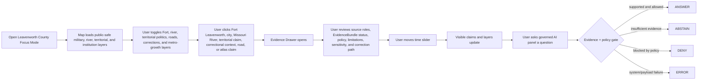
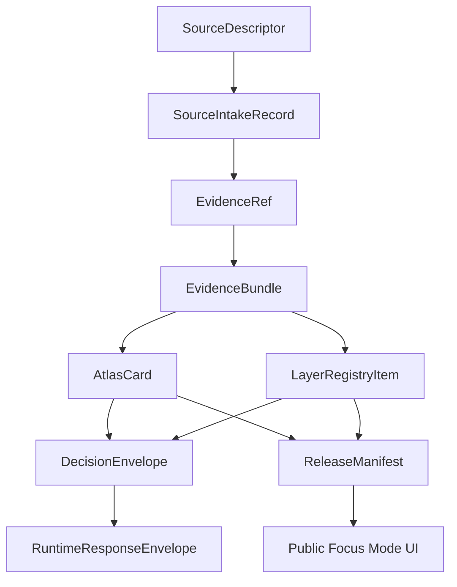

<!--
doc_id: NEEDS_VERIFICATION
title: Leavenworth County Focus Mode Build Plan
type: standard
version: v1
status: draft
owners: [NEEDS_VERIFICATION]
created: 2026-05-21
updated: 2026-05-21
policy_label: public_draft
related:
  - docs/focus-modes/ellsworth-county/build-plan.md
  - docs/focus-modes/riley-county/build-plan.md
  - docs/focus-modes/shawnee-county/build-plan.md
  - docs/focus-modes/ford-county/build-plan.md
  - docs/focus-modes/wyandotte-county/build-plan.md
  - docs/focus-modes/sedgwick-county/build-plan.md
  - docs/focus-modes/douglas-county/build-plan.md
  - docs/focus-modes/leavenworth-county/README.md
  - docs/focus-modes/leavenworth-county/layer-registry.md
  - docs/focus-modes/leavenworth-county/acceptance-checklist.md
tags: [kfm, focus-mode, leavenworth-county, fort-leavenworth, missouri-river, corrections, territorial-kansas, military-education]
notes:
  - Draft plan prepared without mounted repository inspection.
  - Paths, owners, doc IDs, schema homes, and validator names require repository verification before merge.
  - Military, corrections, territorial, Missouri River, transportation, Indigenous, genealogy, and public-safety claims require source intake and evidence review before publication.
-->

<a id="top"></a>

# Leavenworth County Focus Mode Build Plan

> **Purpose:** establish an eighth Kansas Frontier Matrix county proof slice after Ellsworth, Riley, Shawnee, Ford, Wyandotte, Sedgwick, and Douglas counties, with a distinct Missouri River and federal-institution profile: **Fort Leavenworth, the “first city” Leavenworth context, territorial Kansas politics, Missouri River migration and commerce, military education, corrections/prison geography, public-safety controls, trails/roads, and Kansas City metro-edge growth.**


---

## Quick links

- [1. Why Leavenworth County](#1-why-leavenworth-county)
- [2. Product thesis](#2-product-thesis)
- [3. Scope boundary](#3-scope-boundary)
- [4. First demo layers](#4-first-demo-layers)
- [5. User journeys](#5-user-journeys)
- [6. UI surfaces](#6-ui-surfaces)
- [7. Governed object model](#7-governed-object-model)
- [8. Proposed repository shape](#8-proposed-repository-shape)
- [9. Build phases](#9-build-phases)
- [10. First PR sequence](#10-first-pr-sequence)
- [11. Acceptance checklist](#11-acceptance-checklist)
- [12. Risk register](#12-risk-register)
- [13. Source seed list](#13-source-seed-list)
- [14. Open verification questions](#14-open-verification-questions)
- [15. Recommended first milestone](#15-recommended-first-milestone)

---

## Operating posture

> [!IMPORTANT]
> Leavenworth County Focus Mode is a **governed Missouri River / military / corrections / territorial-history proof slice**, not a loose fort-and-prison map. It must preserve KFM’s core invariants:
>
> - EvidenceBundle outranks generated language.
> - Public clients use governed APIs, released artifacts, catalog records, tile services, and policy-safe runtime envelopes.
> - Public UI must not read directly from `RAW`, `WORK`, `QUARANTINE`, unpublished candidate data, canonical/internal stores, or direct model runtime outputs.
> - Publication is a governed state transition, not a file move.
> - AI outputs are downstream carriers, not sovereign truth.
> - Military installation, correctional facility, detention, public safety, Indigenous history, cemetery/burial, immigration, genealogy, and private-address claims must remain source-bound, sensitivity-reviewed, and correction-friendly.

---

# 1. Why Leavenworth County

Leavenworth County is the right eighth Focus Mode because it gives KFM a **federal-institution, Missouri River, military education, corrections, and territorial-politics proof slice**.

Ellsworth County tests frontier county history, Fort Harker / Kanopolis, settlement, and environmental baseline.

Riley County tests Flint Hills ecology, Fort Riley, Konza Prairie, research-site sensitivity, and river landscapes.

Shawnee County tests state government, civil-rights history, Topeka urban geography, public institutions, and archive-heavy civic memory.

Ford County tests Dodge City, Santa Fe Trail, Fort Dodge, cattle-town public history, Arkansas River water, and High Plains agriculture.

Wyandotte County tests dense urban governance, river confluence, tribal/burial sensitivity, environmental justice, rail/industry, and immigration/labor history.

Sedgwick County tests Wichita metro, aviation, Chisholm Trail, severe weather, public health, and infrastructure sensitivity.

Douglas County tests Free-State / Bleeding Kansas history, KU, Haskell, rivers, archives, and traumatic public memory.

Leavenworth County adds:

| KFM capability | Leavenworth County proof value |
|---|---|
| Fort Leavenworth | long-running military installation, military education, doctrine, public-safe base context |
| Missouri River geography | river settlement, ferry/landing, commerce, migration, floodplain, cross-border context |
| Territorial Kansas politics | Leavenworth Constitution, pro-/anti-slavery conflict, early statehood debates |
| Federal/corrections geography | U.S. Penitentiary, state prison context, private detention debates, public-safety filtering |
| “First city” / early settlement context | Leavenworth city and Kansas settlement chronology claims require precision |
| Trails and roads | military roads, river roads, wagon routes, Kansas-Missouri movement corridors |
| Public safety | military, prisons, courts, detention, VA, and infrastructure require safe public abstraction |
| Metro-edge growth | Lansing, Tonganoxie, Basehor, rural-to-suburban transition, KC commuter influence |
| Genealogy/public records caution | prison, military, veterans, cemetery, and household records need privacy and source controls |

> [!NOTE]
> Leavenworth County is ideal for proving KFM can show high-value federal and military history while hiding operational/security-sensitive details.

---

# 2. Product thesis

## User-facing thesis

> **Leavenworth County Focus Mode lets a user explore how Fort Leavenworth, the Missouri River, early Kansas settlement, territorial politics, military education, corrections institutions, trails, and metro-edge growth shaped northeastern Kansas — while keeping base, prison, detention, veteran, household, and security-sensitive details public-safe and evidence-backed.**

## Internal KFM thesis

Leavenworth County should prove that Focus Mode can handle:

```text
military installation + Missouri River + territorial politics + corrections institutions + migration/commerce + metro-edge growth + security-sensitive governance
```

without exposing operational details or turning institutional narratives into unsourced claims.

The system must preserve distinctions between:

- public military history vs. operational military detail
- fort geography vs. installation security
- public prison history vs. corrections/security details
- immigration detention news/current operations vs. historical context
- Missouri River observation vs. floodplain/regulatory layer vs. hydrologic interpretation
- official record vs. public-history interpretation
- genealogy record vs. living-person/private data
- property/tax record vs. title truth
- source-backed claim vs. generated explanation

---

# 3. Scope boundary

## 3.1 Geography

Initial scope:

```text
Leavenworth County, Kansas
```

Priority spatial anchors:

- Leavenworth County boundary
- City of Leavenworth
- Fort Leavenworth public context
- Missouri River corridor
- Lansing public context
- Basehor and Tonganoxie metro-edge context
- Delaware / Kickapoo / other Indigenous and treaty/removal contexts where source-reviewed
- early roads, military roads, ferry/river landings, and wagon routes where source-supported
- Leavenworth Constitution / territorial politics public-history context
- public-safe correctional and detention-institution context
- VA / veterans and military education public context, privacy-reviewed
- cemeteries and memorials, public-safe only

## 3.2 Time range

Initial buckets:

| Bucket | Role in demo |
|---|---|
| Before 1800 | Indigenous, Missouri River, prairie/woodland, and pre-territorial context; public-safe and culturally cautious |
| 1800–1827 | river movement, trade, military route lead-up |
| 1827–1854 | Fort Leavenworth establishment and pre-territorial military/river context |
| 1854–1861 | Kansas-Nebraska Act, Leavenworth city founding, territorial politics, pro-/anti-slavery conflict |
| 1861–1895 | Civil War, military expansion, city growth, river/rail/road transition, early institutional geography |
| 1895–1945 | federal penitentiary era, military education, interwar/WWII institutional development |
| 1946–1990 | Cold War military education, VA/public institutions, suburbanization, transportation |
| 1991–present | metro-edge growth, public institutional change, detention/corrections debates, public-safety governance |

> [!CAUTION]
> Time buckets are planning scaffolds. They are not publication claims until evidence-reviewed.

## 3.3 Not in MVP

Do **not** include in the first Leavenworth County MVP:

- operational Fort Leavenworth security details
- restricted military training, doctrine, personnel, or base infrastructure details
- prison/detention security details
- private inmate, detainee, staff, veteran, or family records
- living-person genealogy
- private addresses or household-level profiling
- exact sensitive burial, sacred, or archaeological sites
- active law-enforcement or corrections operations
- immigration-status conclusions about individuals
- parcel ownership treated as title truth
- public direct model endpoint

---

# 4. First demo layers

## 4.1 MVP layer registry

| Layer ID | Layer | Domain | Purpose | Initial posture |
|---|---|---:|---|---|
| `kfm.layer.leavenworth.county_boundary.v1` | Leavenworth County boundary | civic | establish spatial frame | public draft |
| `kfm.layer.leavenworth.city_context.v1` | City of Leavenworth context | civic/history | early city and county anchor | public draft, evidence-required |
| `kfm.layer.leavenworth.fort_context.v1` | Fort Leavenworth public context | military/history | public military and settlement anchor | public-safe generalized |
| `kfm.layer.leavenworth.military_education_context.v1` | Military education / doctrine context | military/education | Command and General Staff / intellectual-center context | public draft, operational detail excluded |
| `kfm.layer.leavenworth.missouri_river_corridor.v1` | Missouri River corridor | hydrology/transportation | river, settlement, commerce, floodplain | public draft |
| `kfm.layer.leavenworth.territorial_politics.v1` | Territorial politics / Leavenworth Constitution context | territorial history | early Kansas political geography | public draft, evidence-required |
| `kfm.layer.leavenworth.corrections_public_context.v1` | Corrections / detention public context | institutions/public safety | public institutional geography | restricted/public-safe generalized |
| `kfm.layer.leavenworth.trails_roads_context.v1` | Military roads / trails / crossings | transportation/history | river and overland movement | public draft, uncertainty shown |
| `kfm.layer.leavenworth.metro_edge_growth.v1` | Lansing / Basehor / Tonganoxie growth context | planning/civic | metro expansion and land-use change | public draft |
| `kfm.layer.leavenworth.timeline_events.v1` | Timeline events | cross-domain | temporal navigation | public draft |
| `kfm.layer.leavenworth.atlas_claims.v1` | Atlas claim points / corridors | cross-domain | clickable evidence-backed claims | requires EvidenceRef |

## 4.2 Layer contract

Each layer must have:

```yaml
layer_id: kfm.layer.leavenworth.<name>.v1
title: NEEDS_VERIFICATION
domain: NEEDS_VERIFICATION
layer_type: observed | derived | interpreted | modeled | administrative
geometry_type: point | line | polygon | raster | tile | mixed
source_refs: []
evidence_refs: []
policy_label: public_draft | restricted | internal | public
review_state: draft | review | published | deprecated
rights_status: unknown | public | open | controlled | restricted
sensitivity: public | generalized | restricted | review_required
temporal_scope:
  start: NEEDS_VERIFICATION
  end: NEEDS_VERIFICATION
limitations: []
correction_path: NEEDS_VERIFICATION
```

---

# 5. User journeys

## 5.1 Primary public journey



## 5.2 Example public questions

Supported after evidence review:

- “Why is Fort Leavenworth important to Kansas history?”
- “How did the Missouri River shape Leavenworth County?”
- “What evidence supports the ‘first city’ Leavenworth claim?”
- “What was the Leavenworth Constitution?”
- “Which corrections layers are generalized and why?”
- “How did military roads and river crossings shape settlement?”
- “Which layers are public history, official record, regulatory, or derived?”

Should abstain or deny unless governed release permits them:

- “Show restricted Fort Leavenworth infrastructure.”
- “Show prison or detention security layouts.”
- “Show private inmate, detainee, staff, or veteran records.”
- “Show private household-level data.”
- “Treat generated text as evidence.”
- “Make a legal conclusion from a corrections or detention news summary.”
- “Publish a claim with no EvidenceBundle.”

---

# 6. UI surfaces

## 6.1 Map canvas

Required:

- MapLibre GL JS map
- placeholder basemap
- Leavenworth County boundary
- Leavenworth / Fort Leavenworth / Missouri River anchors
- clickable mock features
- selected feature highlight
- layer toggles
- scale bar
- attribution
- zoom controls
- compass / orientation affordance
- public-safe layer legend

## 6.2 Layer registry panel

Show for every layer:

| Field | Meaning |
|---|---|
| Layer name | human-readable layer title |
| Domain | military, hydrology, territorial history, corrections, transportation, planning |
| Layer type | observed, derived, interpreted, modeled, administrative |
| Evidence state | resolved, unresolved, not required, pending |
| Policy label | public, public_draft, restricted, internal |
| Review state | draft, review, published, deprecated |
| Sensitivity | public, generalized, restricted, review_required |
| Time coverage | start/end or bucketed range |
| Limitations | short public-facing warning |
| Source-role warning | official record, public-history interpretation, operationally restricted, regulatory, derived |

## 6.3 Timeline panel

Initial buckets:

```text
Before 1800
1800–1827
1827–1854
1854–1861
1861–1895
1895–1945
1946–1990
1991–present
```

Timeline should control:

- visible atlas claims
- Fort Leavenworth and military education cards
- territorial politics cards
- Missouri River and transportation layers
- corrections/public-institution cards
- metro-edge planning layers
- feature styling by temporal relevance

## 6.4 Evidence Drawer

When a user clicks a layer feature or atlas claim, show:

```yaml
title: NEEDS_VERIFICATION
claim_text: NEEDS_VERIFICATION
object_type: AtlasCard | LayerFeature | TimelineEvent | EvidenceBundle
spatial_scope: NEEDS_VERIFICATION
temporal_scope: NEEDS_VERIFICATION
evidence_refs: []
evidence_bundle_status: unresolved | resolved | restricted | missing
source_roles: []
interpretation_status: fact_claim | interpretation | public_history | military_public_context | corrections_public_context | regulatory_context | derived_indicator
policy_label: public_draft
rights_status: unknown
sensitivity: review_required
review_state: draft
limitations: []
correction_path: NEEDS_VERIFICATION
```

## 6.5 Atlas Card panel

Minimum atlas card types:

| Card type | Example |
|---|---|
| `military_fort_context` | Fort Leavenworth |
| `military_education_context` | Command and General Staff / military education |
| `river_transport_context` | Missouri River corridor |
| `territorial_politics_context` | Leavenworth Constitution |
| `early_city_context` | City of Leavenworth |
| `corrections_public_context` | U.S. Penitentiary / correctional institution public context |
| `road_trail_context` | military roads / river crossings |
| `metro_edge_growth_context` | Lansing / Basehor / Tonganoxie growth |
| `derived_layer_context` | floodplain, land cover, or planning baseline |

## 6.6 Governed AI panel

The AI panel must only emit finite runtime outcomes:

```text
ANSWER
ABSTAIN
DENY
ERROR
```

Example response envelope:

```json
{
  "object_type": "RuntimeResponseEnvelope",
  "schema_version": "v1",
  "question": "Why is Fort Leavenworth important to Kansas history?",
  "outcome": "ABSTAIN",
  "answer": null,
  "reason": "Evidence bundle is not yet resolved for publication-grade response.",
  "evidence_refs": [
    "kfm://evidence-ref/leavenworth/fort-context/v1"
  ],
  "policy_label": "public_draft",
  "limitations": [
    "This draft object requires source intake, rights review, and military public-safety framing before publication."
  ]
}
```

---

# 7. Governed object model

## 7.1 Object flow



## 7.2 SourceDescriptor draft

```yaml
id: kfm.source.leavenworth.fort_leavenworth.placeholder
title: Fort Leavenworth public history source placeholder
domain: military_history
source_type: official_military_or_public_history_reference
role: context_NEEDS_VERIFICATION
rights_status: unknown
spatial_coverage: Fort Leavenworth, Leavenworth County, Kansas
temporal_coverage: NEEDS_VERIFICATION
status: proposed
limitations:
  - Requires source intake and review before claims are published.
  - Must separate public military history from restricted operational, personnel, infrastructure, training, and security details.
```

## 7.3 EvidenceRef draft

```yaml
id: kfm.evidence_ref.leavenworth.fort_context.v1
bundle_id: kfm.evidence_bundle.leavenworth.fort_context.v1
claim_scope: Public-safe Fort Leavenworth historical and military-education context within Leavenworth County Focus Mode
resolution_required: true
```

## 7.4 EvidenceBundle draft

```yaml
id: kfm.evidence_bundle.leavenworth.fort_context.v1
resolved: false
source_refs:
  - kfm.source.leavenworth.fort_leavenworth.placeholder
policy_label: public_draft
rights_status: unknown
sensitivity: review_required
review_state: draft
limitations:
  - Draft bundle. Do not publish final military-history claims until source-reviewed.
  - Do not include restricted operational, personnel, installation-security, or infrastructure detail.
```

## 7.5 AtlasCard draft

```yaml
id: kfm.atlas_card.leavenworth.fort_leavenworth.v1
title: Fort Leavenworth Public Context
card_type: military_fort_context
spatial_scope: Fort Leavenworth, Leavenworth County, Kansas NEEDS_VERIFICATION
temporal_scope: NEEDS_VERIFICATION
evidence_refs:
  - kfm.evidence_ref.leavenworth.fort_context.v1
policy_label: public_draft
review_state: draft
limitations:
  - Draft card. Not a final military, security, legal, operational, or installation authority statement.
```

## 7.6 DecisionEnvelope draft

```yaml
id: kfm.decision.leavenworth.question.fort_context.v1
question: Why is Fort Leavenworth important to Kansas history?
outcome: ABSTAIN
reason: Evidence bundle unresolved.
evidence_refs:
  - kfm.evidence_ref.leavenworth.fort_context.v1
policy_label: public_draft
```

## 7.7 ReleaseManifest draft

```yaml
id: kfm.release.leavenworth.focus_mode.v0_1
release_state: draft
included_layers:
  - kfm.layer.leavenworth.county_boundary.v1
  - kfm.layer.leavenworth.city_context.v1
  - kfm.layer.leavenworth.fort_context.v1
  - kfm.layer.leavenworth.missouri_river_corridor.v1
  - kfm.layer.leavenworth.territorial_politics.v1
validation_state: pending
rollback_plan: required_before_publication
correction_path: required_before_publication
```

---

# 8. Proposed repository shape

> [!WARNING]
> Repository access is **not confirmed** in this planning session. Treat all paths as proposed until checked against the live branch and KFM Directory Rules.

```text
docs/
  focus-modes/
    leavenworth-county/
      README.md
      build-plan.md
      layer-registry.md
      evidence-model.md
      acceptance-checklist.md
      source-seed-list.md
      public-safety-notes.md
      military-and-installation-sensitivity-notes.md
      corrections-and-detention-notes.md
      territorial-history-notes.md
      missouri-river-and-floodplain-notes.md

data/
  catalog/
    sources/
      leavenworth/
        source_descriptors.yaml
    stac/
      leavenworth/
        README.md

contracts/
  focus_mode/
    focus_mode_payload.schema.json
  atlas/
    atlas_card.schema.json
  evidence/
    evidence_ref.schema.json
    evidence_bundle.schema.json
  release/
    release_manifest.schema.json

fixtures/
  focus_modes/
    leavenworth/
      valid/
        focus_mode_payload.valid.json
        layer_registry.valid.json
        atlas_card.fort_leavenworth.valid.json
        atlas_card.missouri_river.valid.json
        atlas_card.territorial_politics.valid.json
        evidence_bundle.fort_leavenworth.valid.json
        evidence_bundle.missouri_river.valid.json
      invalid/
        unresolved_evidence_ref.invalid.json
        restricted_military_installation_detail.invalid.json
        restricted_prison_security_detail.invalid.json
        private_inmate_or_detainee_record.invalid.json
        private_veteran_or_personnel_record.invalid.json
        corrections_news_as_legal_conclusion.invalid.json
        exact_sensitive_burial_site.invalid.json
        parcel_as_title_truth.invalid.json
        missing_policy_label.invalid.json
        model_output_as_evidence.invalid.json
        public_raw_access.invalid.json

apps/
  web/
    src/
      focus-modes/
        leavenworth/
          index.js
          layers.js
          mock-api.js
          mock-data.js
          evidence-drawer.js
          timeline.js
          ai-panel.js
          styles.css

tools/
  validators/
    validate_focus_mode_payload.py
    validate_atlas_card.py
    validate_evidence_bundle.py
    validate_layer_registry.py
```

---

# 9. Build phases

## Phase 1 — Control plane

Goal: establish Leavenworth County Focus Mode as a governed military/river/territorial/corrections template.

Deliverables:

- `docs/focus-modes/leavenworth-county/README.md`
- `build-plan.md`
- `layer-registry.md`
- `source-seed-list.md`
- `public-safety-notes.md`
- `military-and-installation-sensitivity-notes.md`
- `corrections-and-detention-notes.md`
- `territorial-history-notes.md`
- `missouri-river-and-floodplain-notes.md`
- first schema references
- valid and invalid fixture plan

Definition of done:

```text
[ ] scope is explicit
[ ] military/base layers are public-safe and generalized
[ ] corrections/detention layers exclude security and private records
[ ] territorial-history claims require source-role framing
[ ] river/floodplain layers distinguish observed/model/regulatory/derived roles
[ ] all layers have policy labels
[ ] all claim-bearing objects require EvidenceRef
[ ] placeholders are clearly marked
```

## Phase 2 — Mock governed API

Goal: make Leavenworth Focus Mode run without live pipelines.

Mock endpoints:

```text
GET /api/focus-modes/leavenworth
GET /api/layers/leavenworth
GET /api/evidence/{bundle_id}
GET /api/atlas-cards/{card_id}
POST /api/ai/answer
GET /api/releases/leavenworth-focus-mode
```

Definition of done:

```text
[ ] mock payloads validate
[ ] unresolved evidence produces ABSTAIN
[ ] restricted military/prison security requests produce DENY
[ ] private inmate/detainee/veteran/personnel requests produce DENY
[ ] corrections-news-as-legal-conclusion payloads fail validation
[ ] invalid payloads fail closed
[ ] public layer payloads do not reference RAW / WORK / QUARANTINE
```

## Phase 3 — UI prototype

Goal: show the full Leavenworth Focus Mode surface in a browser.

Deliverables:

- MapLibre map
- layer registry
- clickable mock Fort Leavenworth, Leavenworth city, Missouri River, territorial politics, corrections, roads, and metro-edge growth features
- evidence drawer
- timeline
- atlas card panel
- governed AI answer panel

Definition of done:

```text
[ ] user can click Fort Leavenworth context and see military safety limitations
[ ] user can click corrections context and see public-safe generalization
[ ] user can click Missouri River context and see hydrology/source-role status
[ ] user can click territorial politics context and see evidence/source-role framing
[ ] user can toggle military / river / territorial / corrections / roads / growth layers
[ ] timeline changes visible claim set
[ ] AI panel returns all four finite outcomes through examples
```

## Phase 4 — Validators and negative fixtures

Goal: prove failure modes before publication.

Required invalid fixtures:

| Fixture | Expected failure |
|---|---|
| `unresolved_evidence_ref.invalid.json` | publication attempted with unresolved evidence |
| `restricted_military_installation_detail.invalid.json` | restricted base detail exposed |
| `restricted_prison_security_detail.invalid.json` | prison/corrections security detail exposed |
| `private_inmate_or_detainee_record.invalid.json` | private inmate/detainee record exposed |
| `private_veteran_or_personnel_record.invalid.json` | private veteran/personnel record exposed |
| `corrections_news_as_legal_conclusion.invalid.json` | news/current event treated as legal conclusion |
| `exact_sensitive_burial_site.invalid.json` | exact sensitive burial/sacred-site detail in public payload |
| `parcel_as_title_truth.invalid.json` | property/assessor record treated as title truth |
| `missing_policy_label.invalid.json` | public object lacks policy posture |
| `model_output_as_evidence.invalid.json` | AI output treated as proof |
| `public_raw_access.invalid.json` | public client references RAW/WORK/QUARANTINE |

## Phase 5 — Source intake upgrade

Goal: replace placeholders with inspected sources.

Deliverables:

- source descriptors
- intake records
- rights review notes
- sensitivity review notes
- evidence bundle drafts
- reviewed atlas cards
- limitations notes

Minimum real-evidence targets:

```text
[ ] one Fort Leavenworth public-history/military-context claim
[ ] one Leavenworth city early-settlement claim
[ ] one Missouri River settlement/transport/floodplain claim
[ ] one Leavenworth Constitution or territorial-politics claim
[ ] one public-safe corrections/institutional geography claim
[ ] one military road / river crossing / trail claim
[ ] one Lansing/Basehor/Tonganoxie metro-edge growth claim
```

## Phase 6 — Release candidate

Goal: prepare `v0.1` public-safe release.

Deliverables:

- `ReleaseManifest`
- validation report
- correction path
- rollback plan
- public-safe layer manifest
- known limitations
- release notes

Definition of done:

```text
[ ] public layers have policy labels and review states
[ ] rights status is resolved or blocked
[ ] restricted military/prison/corrections/security details are excluded or generalized
[ ] private inmate/detainee/veteran/personnel details are excluded
[ ] territorial-history claims preserve source-role and correction path
[ ] river/floodplain claims preserve source role and uncertainty
[ ] release can be rolled back
[ ] public UI only consumes governed surfaces
```

---

# 10. First PR sequence

## PR-0001 — Leavenworth County Focus Mode Control Plane

Files:

```text
docs/focus-modes/leavenworth-county/README.md
docs/focus-modes/leavenworth-county/build-plan.md
docs/focus-modes/leavenworth-county/layer-registry.md
docs/focus-modes/leavenworth-county/source-seed-list.md
docs/focus-modes/leavenworth-county/public-safety-notes.md
docs/focus-modes/leavenworth-county/military-and-installation-sensitivity-notes.md
docs/focus-modes/leavenworth-county/corrections-and-detention-notes.md
docs/focus-modes/leavenworth-county/territorial-history-notes.md
docs/focus-modes/leavenworth-county/missouri-river-and-floodplain-notes.md
docs/focus-modes/leavenworth-county/acceptance-checklist.md
```

Acceptance:

```text
[ ] Focus Mode scope is clear.
[ ] Leavenworth County is justified as a complementary proof slice.
[ ] Every planned layer has a policy posture.
[ ] Military/base sensitivity rules are explicit.
[ ] Corrections/detention privacy and security boundaries are explicit.
[ ] Territorial history source-role boundaries are explicit.
[ ] Missouri River/floodplain source-role boundaries are explicit.
[ ] No publication claims are made from placeholders.
```

## PR-0002 — Leavenworth Contracts and Fixtures

Files:

```text
fixtures/focus_modes/leavenworth/valid/focus_mode_payload.valid.json
fixtures/focus_modes/leavenworth/valid/layer_registry.valid.json
fixtures/focus_modes/leavenworth/valid/atlas_card.fort_leavenworth.valid.json
fixtures/focus_modes/leavenworth/valid/atlas_card.missouri_river.valid.json
fixtures/focus_modes/leavenworth/invalid/restricted_military_installation_detail.invalid.json
fixtures/focus_modes/leavenworth/invalid/restricted_prison_security_detail.invalid.json
fixtures/focus_modes/leavenworth/invalid/private_inmate_or_detainee_record.invalid.json
fixtures/focus_modes/leavenworth/invalid/missing_policy_label.invalid.json
```

Acceptance:

```text
[ ] Valid fixtures include required governed fields.
[ ] Invalid fixtures represent real failure modes.
[ ] EvidenceRef / EvidenceBundle relationship is explicit.
[ ] Mock cards remain draft until evidence intake.
```

## PR-0003 — Leavenworth Mock API

Files:

```text
apps/web/src/focus-modes/leavenworth/mock-api.js
apps/web/src/focus-modes/leavenworth/layers.js
apps/web/src/focus-modes/leavenworth/mock-data.js
```

Acceptance:

```text
[ ] Mock API returns finite runtime outcomes.
[ ] Layer registry is API-shaped, not UI-only.
[ ] Public-safe data is separated from restricted mock examples.
[ ] Sensitivity/source-role status is included for military, corrections, river, and territorial objects.
```

## PR-0004 — Leavenworth UI Shell

Files:

```text
apps/web/src/focus-modes/leavenworth/index.js
apps/web/src/focus-modes/leavenworth/evidence-drawer.js
apps/web/src/focus-modes/leavenworth/timeline.js
apps/web/src/focus-modes/leavenworth/ai-panel.js
apps/web/src/focus-modes/leavenworth/styles.css
```

Acceptance:

```text
[ ] Map renders.
[ ] Layer panel renders.
[ ] Evidence Drawer renders.
[ ] Atlas Card panel renders.
[ ] Timeline filters mock claims.
[ ] AI panel demonstrates ANSWER / ABSTAIN / DENY / ERROR.
```

## PR-0005 — Validator Hardening

Files:

```text
tools/validators/validate_focus_mode_payload.py
tools/validators/validate_atlas_card.py
tools/validators/validate_evidence_bundle.py
tools/validators/validate_layer_registry.py
```

Acceptance:

```text
[ ] Public RAW / WORK / QUARANTINE references fail.
[ ] Missing EvidenceRef fails for claim-bearing objects.
[ ] Missing policy label fails.
[ ] Restricted military installation detail fails public release.
[ ] Restricted corrections/prison detail fails public release.
[ ] Private inmate/detainee/veteran/personnel detail fails public release.
[ ] Model output as proof fails.
```

---

# 11. Acceptance checklist

```text
[ ] Leavenworth County map loads.
[ ] User can toggle at least 5 public-safe layers.
[ ] User can click Fort Leavenworth context and open Evidence Drawer.
[ ] User can click Leavenworth city context and open Evidence Drawer.
[ ] User can click Missouri River context and open Evidence Drawer.
[ ] User can click territorial politics context and open Evidence Drawer.
[ ] User can inspect at least 3 Atlas Cards.
[ ] Timeline control changes visible claims/layers.
[ ] Governed AI panel returns ANSWER for supported claims.
[ ] Governed AI panel returns ABSTAIN for unresolved evidence.
[ ] Governed AI panel returns DENY for restricted/sensitive requests.
[ ] Governed AI panel returns ERROR for invalid payload/system failure.
[ ] Every visible claim has EvidenceRef.
[ ] Every EvidenceRef points to an EvidenceBundle.
[ ] Every layer has policy_label.
[ ] Every layer has review_state.
[ ] Every public object has correction path.
[ ] No public UI path reads RAW, WORK, or QUARANTINE.
[ ] Restricted military/prison/corrections/security details are excluded or generalized.
[ ] Private inmate/detainee/veteran/personnel details are excluded.
[ ] Corrections/detention news is not treated as legal conclusion.
[ ] ReleaseManifest exists before anything is called published.
```

---

# 12. Risk register

| Risk | Why it matters | Control |
|---|---|---|
| Fort Leavenworth layer exposes operational detail | public safety and military-security risk | public-history/generalized layer only; deny operational requests |
| Corrections/prison layer exposes security detail | safety and institutional-security risk | public-safe context only; no layouts/procedures/security details |
| Private inmate/detainee/veteran/personnel data leaks | privacy and harm risk | deny by default; no individual records |
| Current detention news becomes legal conclusion | legal/factual risk | separate news, official record, legal status, and interpretation |
| Missouri River layer treated as flood/legal advice | regulatory misuse risk | distinguish observed/model/regulatory/derived |
| Territorial politics becomes one-sided narrative | historical trust failure | source-role framing and correction path |
| Generated narrative treated as source | evidence failure | model output cannot be proof |
| Parcel or assessor data treated as title truth | legal/title error risk | explicit assessor/tax ≠ title truth rule |
| Mock placeholders become doctrine | demo pollution | all placeholders marked draft/unresolved |
| Leavenworth city dominates county view | county-scale imbalance | include Lansing, Basehor, Tonganoxie, river, rural matrix where evidence-supported |

---

# 13. Source seed list

> [!NOTE]
> These are **candidate source seeds**, not yet KFM-ingested sources. Each requires `SourceDescriptor`, rights review, sensitivity review, checksum/citation handling, and EvidenceBundle resolution before publication-grade use.

| Seed | Use | Starting URL |
|---|---|---|
| Fort Leavenworth official U.S. Army Garrison site | Fort Leavenworth public history, official military context | https://home.army.mil/leavenworth/ |
| City of Leavenworth — Fort Leavenworth visitor page | city public-history summary for Fort Leavenworth | https://www.leavenworthks.gov/visitors/page/fort-leavenworth |
| City of Leavenworth official site | current city civic source routing | https://www.leavenworthks.gov/ |
| Leavenworth County official site | current county civic source routing | https://www.leavenworthcounty.gov/ |
| Kansas Historical Society markers | marker-based public-history source routing | https://www.kansashistory.gov/p/kansas-historical-markers/14999 |
| Kansas Historical Society — Kansas Memory | territorial documents, maps, images, public-history source routing | https://www.kansasmemory.org/ |
| Library of Congress maps | historic county, river, road, and military maps | https://www.loc.gov/maps/ |
| USGS National Hydrography | Missouri River and stream source routing | https://www.usgs.gov/national-hydrography |
| FEMA Flood Map Service Center | regulatory floodplain source routing | https://msc.fema.gov/portal/home |
| National Archives | military, federal, penitentiary, and territorial source routing | https://www.archives.gov/ |
| Federal Bureau of Prisons | public federal prison source routing; security/private-data limits required | https://www.bop.gov/ |
| Kansas Department of Corrections | state corrections source routing; security/private-data limits required | https://www.doc.ks.gov/ |
| VA Eastern Kansas Health Care / Leavenworth VA | public veterans-health context; private-health limits required | https://www.va.gov/eastern-kansas-health-care/ |
| Leavenworth County Historical Society / local history seed | local public-history source routing | NEEDS_VERIFICATION |

---

# 14. Open verification questions

```text
[ ] What is the canonical repo path for Focus Mode documents?
[ ] Does KFM already have a focus_mode_payload schema?
[ ] Does KFM already define AtlasCard fields differently?
[ ] Does KFM already define military-installation sensitivity fields?
[ ] Does KFM already define corrections/detention sensitivity fields?
[ ] Does KFM already define federal-institution public-context fields?
[ ] Which validators already exist?
[ ] Should Leavenworth County share contracts with other Focus Modes or define county-specific extensions?
[ ] What public-safe geometry source should be used for county boundary?
[ ] What source authority should define Fort Leavenworth claims?
[ ] What source authority should define Leavenworth first-city/early-settlement claims?
[ ] What source authority should define Leavenworth Constitution claims?
[ ] What source authority should define Missouri River claims?
[ ] What source authority should define corrections/institutional public-context claims?
[ ] What exact policy rule controls military/base operational detail?
[ ] What exact policy rule controls corrections/prison/detention detail?
[ ] What exact policy rule controls private inmate/detainee/veteran/personnel records?
[ ] What release manifest naming convention should be used?
[ ] What rollback/correction path should a county Focus Mode use?
```

---

# 15. Recommended first milestone

## Milestone 1: Leavenworth County Focus Mode Control Plane

Build the documentation, layer registry, source seed list, public-safety notes, military/installation notes, corrections/detention notes, territorial-history notes, Missouri River notes, and fixtures before the UI.

This keeps the Leavenworth proof slice from becoming a high-risk fort/prison map with weak evidence and safety boundaries.

The first concrete deliverable should be:

```text
docs/focus-modes/leavenworth-county/build-plan.md
```

Once this is stable, use it to generate the mock API and single-file UI prototype.

---

[Back to top](#top)
