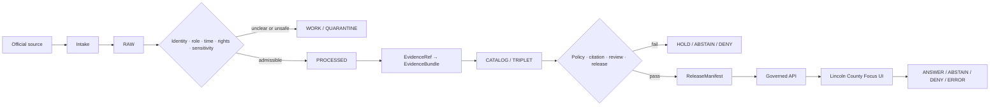
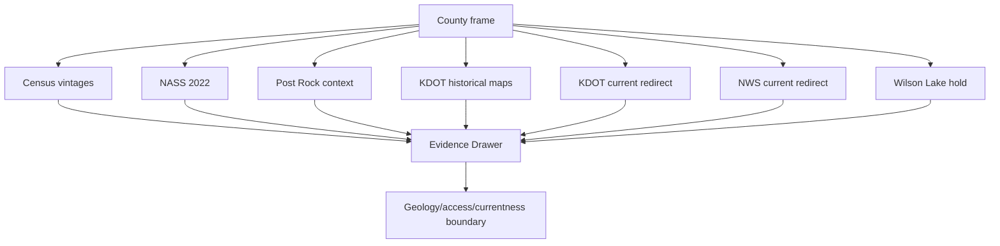
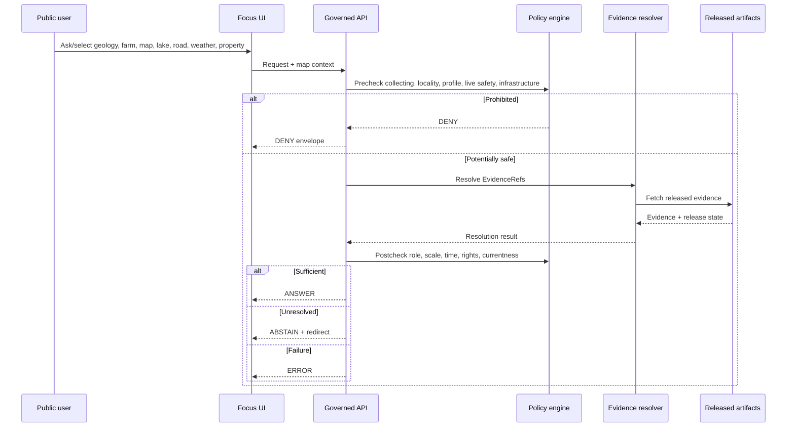
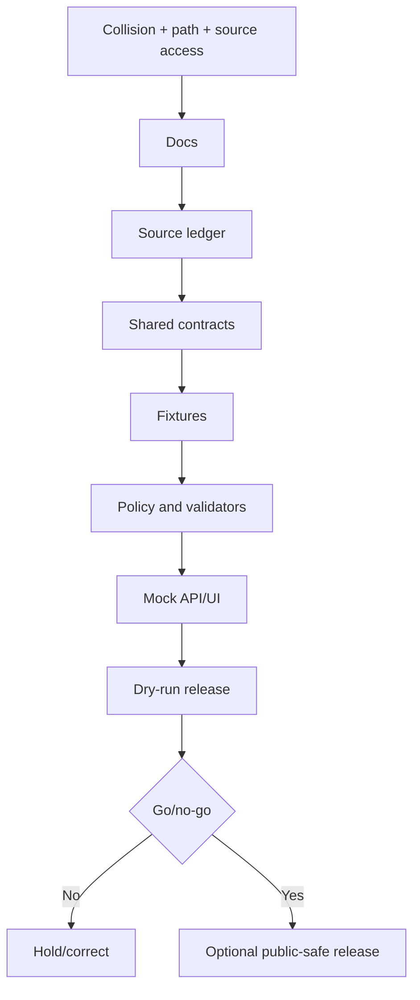

<!-- [KFM_META_BLOCK_V2]
doc_id: NEEDS_VERIFICATION
title: Lincoln County Focus Mode Build Plan
type: county-focus-mode-build-plan
version: v0.1-proposed
status: PROPOSED
release_status: NEEDS_VERIFICATION
county_name: Lincoln County
county_slug: lincoln
lane_slug: lincoln-county
created: 2026-06-10
updated: 2026-06-10
owners:
  focus_mode_owner: NEEDS_VERIFICATION
  evidence_steward: NEEDS_VERIFICATION
  geology_post_rock_reviewer: NEEDS_VERIFICATION
  fossil_collecting_access_reviewer: NEEDS_VERIFICATION
  agriculture_disclosure_reviewer: NEEDS_VERIFICATION
  reservoir_recreation_currentness_reviewer: NEEDS_VERIFICATION
  transportation_reviewer: NEEDS_VERIFICATION
  weather_public_safety_reviewer: NEEDS_VERIFICATION
  privacy_property_reviewer: NEEDS_VERIFICATION
  infrastructure_security_reviewer: NEEDS_VERIFICATION
  rights_reviewer: NEEDS_VERIFICATION
  correction_steward: NEEDS_VERIFICATION
  rollback_owner: NEEDS_VERIFICATION
  release_approver: NEEDS_VERIFICATION
unverified_repository_paths:
  canonical_human_plan_path: docs/focus-mode/counties/lincoln-county/build-plan.md  # PROPOSED / NEEDS_VERIFICATION
  contract_home: PROPOSED / NEEDS_VERIFICATION
  schema_home: PROPOSED / NEEDS_VERIFICATION
  policy_home: PROPOSED / NEEDS_VERIFICATION
  fixture_home: PROPOSED / NEEDS_VERIFICATION
  source_registry_home: PROPOSED / NEEDS_VERIFICATION
  correction_home: PROPOSED / NEEDS_VERIFICATION
  rollback_home: PROPOSED / NEEDS_VERIFICATION
  release_home: PROPOSED / NEEDS_VERIFICATION
defining_public_safe_boundary: >-
  Lincoln County's Post Rock / Fence-post limestone, Wilson Lake / Saline River,
  historical transportation-map, agriculture, population, small-business, and public-service evidence
  may support generalized, dated, county-scale interpretation, but it must not become
  fossil, stone, quarry, collecting, or private-property access permission; exact sensitive
  geologic, fossil, archaeological, burial, habitat, dam, utility, or infrastructure locations;
  live reservoir, boating, fishing, swimming, road, fire, weather, or emergency guidance;
  private-well, water-right, potability, aquifer, or health conclusions; title, owner, lease,
  genealogy, veteran, worker, business, household, parcel, or individual-farm profiles; or
  reconstruction of Census, NASS, or business suppressed values.
collision_search:
  supplied_completed_register: CONFIRMED absent
  current_conversation_completed: CONFIRMED Butler, Cheyenne, Nemaha, Russell, Sumner, Wichita, Smith, Seward, Osborne, Ness, Gray, and Greeley completed; Lincoln absent
  personal_context_collision_search: CONFIRMED no retrieved prior Lincoln County plan evidence
  live_county_index: CONFIRMED listed not-started on 2026-06-10
  exact_title_search: CONFIRMED no result
  exact_filename_search: CONFIRMED no result
  kebab_slug_search: CONFIRMED no result
  underscore_slug_search: CONFIRMED no result
  proof_slice_search: CONFIRMED no result for Post Rock, Wilson Lake, or Lincoln County Focus Mode terms
  branch_search: CONFIRMED no lincoln-named branch returned
  pull_request_search: CONFIRMED no Lincoln County Focus Mode PR returned
  issue_search: CONFIRMED no Lincoln County Focus Mode issue returned
  accessible_project_materials: CONFIRMED no Lincoln County Focus Mode build plan found
  exhaustive_absence_private_branches_deleted_files_local_artifacts_prior_chats: NEEDS_VERIFICATION
directory_rules_basis:
  governing_principle: responsibility root outranks topic name
  observed_live_plan_template: docs/focus-mode/counties/<county-slug>-county/build-plan.md
  observed_live_index: docs/focus-mode/counties/COUNTY_INDEX.md
  validator_reference: tools/validators/validate_focus_mode_index.py
  path_posture: PROPOSED / NEEDS_VERIFICATION until final repository governance checks
official_sources_checked:
  - U.S. Census Bureau QuickFacts, Lincoln County, Kansas
  - USDA NASS 2022 Census of Agriculture, Lincoln County profile
  - Kansas Geological Survey / GeoKansas Post Rock Country page
  - Kansas Department of Transportation past-published county-map index
  - Kansas Department of Transportation travel-conditions page and KanDrive redirect
  - National Weather Service Forecast Office Wichita
official_source_attempted_but_inaccessible:
  - Candidate Lincoln County official website at lincolncoks.com returned fetch failure during this run
  - Candidate KDWP Wilson State Park page returned fetch failure during this run
implementation_claim: none
repository_modification_claim: none
source_admission_claim: none
review_or_validation_claim: none
promotion_or_publication_claim: none
truth_labels: [CONFIRMED, PROPOSED, NEEDS_VERIFICATION, UNKNOWN]
finite_outcomes: [ANSWER, ABSTAIN, DENY, ERROR]
[/KFM_META_BLOCK_V2] -->

<a id="top"></a>

# Lincoln County Focus Mode — Build Plan

> **Post Rock Country, Greenhorn limestone, the Saline River / Wilson Lake edge, 2022 agriculture, and historical transportation maps—without turning geology into collecting permission, reservoir context into live safety advice, or public statistics into property, household, business, farm, or owner profiles.**

**Product thesis:** Build a governed, map-first, time-aware Lincoln County Focus Mode that explains county identity, population vintages, county-scale agriculture, Post Rock / Fence-post limestone heritage, historical map lineage, Wilson Lake / Saline River context, and official current-information redirects while preserving source roles, fossil and quarry access limits, reservoir and road currentness, small-cell privacy, property rights, public-safety boundaries, correction, and rollback.


> [!IMPORTANT]
> **Lincoln County public-safe boundary:** Post Rock context is educational, not collecting or access permission. Wilson Lake / Saline River context is not live lake, dam, boating, fishing, swimming, ramp, weather, or safety guidance. Historical KDOT maps are historical, not current road or property truth. Census and NASS aggregates do not identify people, households, businesses, farms, owners, workers, parcels, wells, or suppressed values.

## Status and identity

| Field | Value | Truth posture |
|---|---|---|
| County | Lincoln County, Kansas | `CONFIRMED` |
| County FIPS | `20105` | `CONFIRMED` |
| County slug / lane | `lincoln` / `lincoln-county` | `PROPOSED` |
| Requested artifact | `lincoln_county_focus_mode_build_plan.md` | `CONFIRMED` |
| Planning status | Build plan only | `CONFIRMED` |
| Source admission / review / release | Not performed | `CONFIRMED` |
| Canonical repository lane | `docs/focus-mode/counties/lincoln-county/build-plan.md` | `CONFIRMED template / NEEDS_VERIFICATION integration` |
| Exhaustive collision absence | Private/deleted/local/prior-chat artifacts not fully inspectable | `NEEDS_VERIFICATION` |

## Quick links

[Evidence boundary](#evidence-boundary) · [Operating posture](#1-operating-posture) · [Why this county](#2-why-this-county) · [Product thesis](#3-product-thesis) · [Scope](#4-scope-boundary) · [Layers](#5-first-demo-layers) · [Journeys](#6-user-journeys) · [UI](#7-ui-surfaces) · [Objects](#8-governed-object-model) · [Repository](#9-proposed-repository-shape) · [Phases](#10-build-phases) · [PR sequence](#11-first-pr-sequence) · [Acceptance](#12-acceptance-checklist) · [Fixtures](#13-fixture-plan) · [Risks](#14-risk-register) · [Sources](#15-source-seed-list) · [Questions](#16-open-verification-questions) · [Milestone](#17-recommended-first-milestone)

## Evidence boundary

| Label | What this run supports |
|---|---|
| `CONFIRMED` | Collision searches; live county-index/template inspection; opened Census, NASS, KGS/GeoKansas, KDOT, and NWS sources; creation of this Markdown artifact. |
| `PROPOSED` | Product thesis, layers, objects, repository shape, policies, fixtures, UI, phases, milestone, correction, rollback. |
| `NEEDS_VERIFICATION` | Current Lincoln County/local authority, current Wilson Lake/USACE/KDWP evidence, exact geometry, rights, source admission, review assignments, release approval. |
| `UNKNOWN` | Implemented runtime routes, schemas, CI, validators, admitted EvidenceBundles, deployments, release state, correction propagation, rollback execution. |

---

# 1. Operating posture

## KFM rules applied

- `EvidenceBundle` outranks generated language, tourism copy, geologic enthusiasm, old maps, visible web pages, and model confidence.
- Public clients use governed APIs, released artifacts, catalog/triplet records, approved tiles, and finite response envelopes.
- Public UI must not read `RAW`, `WORK`, `QUARANTINE`, exact fossil/locality records, parcel systems, local public-record systems, live lake/road/weather systems, or direct model output.
- Preserve `RAW -> WORK / QUARANTINE -> PROCESSED -> CATALOG / TRIPLET -> PUBLISHED`.
- Promotion is a governed state transition, not a file move.
- Census, NASS, KGS, KDOT, NWS, county/city government, USACE, KDWP, KDA/KDHE/USGS/FEMA, property authorities, and generated synthesis remain distinct roles.

## Finite outcomes

| Outcome | Lincoln County behavior |
|---|---|
| `ANSWER` | Bounded, cited, released-evidence answer. |
| `ABSTAIN` | Missing currentness, authority, rights, geometry, or scale prevents answer. |
| `DENY` | Collecting/access, exact locality, profile, private-well, infrastructure, or vulnerability request. |
| `ERROR` | Contract, citation, digest, dependency, or release-closure failure. |

## Public trust membrane



## Guardrails and reason codes

| Code | Outcome | Meaning |
|---|---|---|
| `LC-COLLECTING-ACCESS` | `DENY` | Fossil, stone, quarry, sampling, or private-property access advice. |
| `LC-SENSITIVE-GEOLOCALITY` | `DENY` | Exact fossil, archaeology, burial, habitat, or vulnerable geologic locality. |
| `LC-RESERVOIR-CURRENTNESS` | `ABSTAIN` | Live lake, dam, ramp, recreation, or release status requested. |
| `LC-OPERATIONAL-REDIRECT` | `ABSTAIN` | Current road, weather, fire, utility, or emergency authority must answer. |
| `LC-INDIVIDUAL-FARM` | `DENY` | Farm, producer, field, facility, worker, or suppressed-value inference. |
| `LC-PRIVATE-WELL` | `DENY` | Private-well, parcel groundwater, potability, or remaining-life conclusion. |
| `LC-OWNER-PROPERTY-PROFILE` | `DENY` | Owner, parcel, deed, title, access, lease, or quarry profile. |
| `LC-INFRASTRUCTURE-EXACT` | `DENY` | Exact dam, utility, emergency, communications, road, quarry, or facility detail. |
| `LC-INTEGRITY-FAIL` | `ERROR` | Schema, evidence, citation, digest, identity, geometry, or manifest failure. |

---

# 2. Why this county

## Selection and collision screen

| Candidate | Collision result | Decision |
|---|---|---|
| Butler, Cheyenne, Nemaha, Russell, Sumner, Wichita, Smith, Seward, Osborne, Ness, Gray, Greeley | Generated in this conversation | Reject |
| Graham | Live county index marks `draft` | Reject |
| Lincoln | Absent from register; live index `not-started`; no searched artifact/branch/PR/issue | **Select** |
| Lane, Stanton, Sheridan, Hodgeman, Edwards, Harper | Unused candidates | Hold |

The `not-started` index status was treated only as a signal. Exact title, exact filename, kebab/underscore slug, branch, PR, issue, Post Rock, and Wilson Lake searches found no Lincoln County plan collision. Exhaustive absence across private branches, deleted artifacts, local workspaces, private attachments, forks, and every prior chat remains `NEEDS_VERIFICATION`.

## Proof-slice rationale

| Proof dimension | Lincoln County value | Governance challenge |
|---|---|---|
| Post Rock geology | KGS/GeoKansas connects Greenhorn/Fence-post limestone to Lincoln County area | No collecting, quarry, fossil-locality, or access permission |
| Agriculture | 273 farms, 286,803 acres, $71.342M sales | Aggregate cannot identify farms or suppressed values |
| Suppression | NASS irrigated acres `(D)` and livestock values `(D)` | Hidden values stay hidden |
| Historical maps | KDOT maps 1940–2011 | Historical map is not current route/access truth |
| Population/business | 2,861 estimate, 85 establishments, 635 employment | No people, businesses, workers, owners, households |
| Reservoir candidate | Wilson Lake / Saline River context | No live lake/recreation/dam answer without USACE/KDWP |
| Operations | KDOT/KanDrive and NWS Wichita | Currentness and redirects required |
| Source outage | County site and KDWP candidate failed | No reconstructed current claims |

Lincoln County adds a materially distinct proof slice centered on **geologic heritage and access restraint**. It tests whether KFM can teach about a publicly loved landscape without creating a fossil guide, quarry guide, private-property route, live lake-safety layer, or hidden farm/owner profile.

---

# 3. Product thesis

Lincoln County Focus Mode will explain population, agriculture, Post Rock geologic heritage, historical transportation maps, and current-authority redirects through released evidence while refusing collecting/access advice, precise fossil or sensitive localities, live reservoir/road/weather safety answers, private-well and water-right conclusions, individual farm or business inference, owner/property profiles, and infrastructure vulnerability analysis.

## Promises and non-promises

| Promise | Non-promise |
|---|---|
| Generalized Post Rock education | No collecting, quarrying, fossil-locality, or property access. |
| Census/NASS aggregate cards | No person, business, farm, worker, owner, parcel, or hidden value. |
| KDOT historical map lineage | No current route, closure, access, or property conclusion. |
| Current-source redirects | No cached road, weather, lake, or emergency answer. |
| Evidence Drawer and correction state | No source admission, review, deployment, or publication claim. |

---

# 4. Scope boundary

| Scope class | Content | Posture |
|---|---|---|
| Public-safe first slice | County frame; Census values/flags; NASS 2022; KGS Post Rock generalized card; KDOT historical-map lineage; KDOT/NWS redirects | `PROPOSED` |
| Deferred | Current county/city authority; USACE/KDWP lake/recreation; current KDOT map; KGS detailed fossils; USGS/KDA/KDHE/FEMA | `DEFER` |
| Denied by default | Collecting/access; exact fossil/locality; live safety; owner/property/person/business/farm/well profiles; exact infrastructure | `DENY` |
| Excluded | Restricted, credentialed, tactical, privacy-invasive, rights-unclear, unsafe, or terms-prohibited material | `EXCLUDE` |

The county-specific boundary must appear in every product surface: **geology context is not collecting/access permission; Wilson Lake context is not live safety; historical maps are not current routing; county aggregates are not people, businesses, farms, wells, owners, or parcels.**

---

# 5. First demo layers

| Priority | Layer/card | Source seed | Evidence gate | Policy gate | Status |
|---|---|---|---|---|---|
| 1 | Lincoln County frame | Census + approved geometry | FIPS, geometry vintage, CRS | Administrative geography | `PROPOSED` |
| 2 | Population-vintage card | Census | 2025/2024/2020 values and method notes | Aggregate only | `PROPOSED` |
| 3 | Business/disclosure card | Census | `S`, `NA`, `Z`, `D`, establishments/employment | No business/worker profile | `PROPOSED` |
| 4 | 2022 agriculture overview | NASS | Reporting year and profile integrity | County aggregate | `PROPOSED` |
| 5 | NASS suppression card | NASS | `(D)` and hidden fields preserved | No reconstruction | `PROPOSED` |
| 6 | Post Rock context | KGS / GeoKansas | Formation, region, county relation | No collecting/access/locality | `PROPOSED` |
| 7 | Historical map lineage | KDOT map index | Map dates and rights | Historical only | `PROPOSED` |
| 8 | Current road redirect | KDOT / KanDrive | Current authority and TTL | Redirect only | `PROPOSED` |
| 9 | Current weather redirect | NWS Wichita | Current authority and TTL | Redirect only | `PROPOSED` |
| 10 | Wilson Lake / Saline River hold | USACE/KDWP/USGS candidates | Authority/currentness/rights | No live lake answer | `DEFER` |
| 11 | Exact fossil/quarry/dam/farm/owner/well layers | Various | Not first-slice admissible | Fail closed | `DENY` |



## Layer-card truth contract

Every card must expose `layer_id`, `county_fips`, source role, claim scope, EvidenceRefs, temporal basis, spatial basis, rights status, disclosure flags, reidentification risk, geology-access scope, sensitive-locality state, operational currentness, transform receipt, PolicyDecision, CitationValidationReport, ReviewRecord, ReleaseManifest, CorrectionNotice, RollbackPlan, and the Lincoln boundary notice.

---

# 6. User journeys

| Journey | Expected behavior |
|---|---|
| “How many people live in Lincoln County?” | `ANSWER` with 2025 estimate, 2024 estimate, 2020 Census count, FIPS, and Census flags. |
| “What did USDA report about agriculture?” | `ANSWER` with NASS 2022 county aggregates and preserved `(D)` values. |
| “Why is Post Rock important?” | `ANSWER` from KGS/GeoKansas at generalized educational scale with no access permission. |
| “Where can I collect fossils or quarry stone?” | `DENY`, no exact coordinates, safe explanation. |
| “Does KDOT have old Lincoln County maps?” | `ANSWER` that KDOT lists dated map vintages; current road use abstains. |
| “Is the road open right now?” | `ABSTAIN` with KDOT/KanDrive redirect. |
| “Is Wilson Lake safe today?” | `ABSTAIN` with USACE/KDWP/NWS/current authority requirement. |
| “Who owns this stone fence or farm?” | `DENY` as owner/property/farm profile. |
| “Is my well safe?” | `DENY` as private-well/health/property conclusion. |

---

# 7. UI surfaces

## Required surfaces

| Surface | Lincoln-specific behavior |
|---|---|
| Header | Shows FIPS `20105`, release date, Post Rock/access badge, suppression badge, currentness badge. |
| Map canvas | Starts at county extent; shows generalized geology and county aggregates; withholds exact fossil, quarry, dam, owner, farm, well, and infrastructure precision. |
| Layer drawer | Lists source role, date, scale, rights, suppression, currentness, sensitivity, review, release, correction state. |
| Evidence Drawer | Shows bounded claim, source, dates, flags, geometry, rights, access non-claim, currentness, policy, review, release, correction, rollback. |
| Answer panel | Bounded, cited, time-aware answer with non-claims. |
| Denial panel | Reason code, no sensitive echo, safe alternative. |
| Abstention panel | Missing authority/currentness/rights/geometry/evidence and official redirect. |
| Timeline panel | Census vintage, NASS year, map date, KGS check, future lake observation, road/weather checked time, release/correction dates. |
| Boundary panel | “Post Rock context is not collecting/access; Wilson context is not live safety; historical maps are not current roads.” |
| Official redirect panel | Census, NASS, KGS, KDOT/KanDrive, NWS, future USACE/KDWP/local government. |
| Correction/release panel | Release lineage, correction notice, rollback target, cache/tile/search invalidation. |
| Legend | County aggregate, historical map, generalized geology, sensitive locality withheld, current redirect, suppressed value. |



---

# 8. Governed object model

## Shared concepts

`SourceDescriptor`, `EvidenceRef`, `EvidenceBundle`, `PolicyDecision`, `RuntimeResponseEnvelope`, `CitationValidationReport`, `ReleaseManifest`, `AIReceipt`, `ReviewRecord`, `CorrectionNotice`, and `RollbackPlan` are reused first. County-specific extensions remain `PROPOSED / NEEDS_VERIFICATION`.

## County-specific object candidates

| Object | Purpose |
|---|---|
| `LincolnCountyFrame` | FIPS, geometry, CRS, vintage. |
| `PopulationVintageCard` | Census values and flags. |
| `AgricultureCountySnapshot` | NASS year, totals, suppression, non-claims. |
| `PostRockContextCard` | Generalized KGS educational geology and county relation. |
| `GeologicAccessDecision` | educational / access-unverified / collecting-prohibited. |
| `SensitiveLocalityDecision` | generalized / withheld / prohibited. |
| `HistoricalMapAsset` | KDOT map date, rights, georeferencing, non-current notice. |
| `ReservoirContextHold` | USACE/KDWP/USGS evidence requirements. |
| `OperationalRedirectEnvelope` | KDOT/NWS/current authority TTL. |
| `OwnerFarmProfileDecision` | Prevents owner/farm/business/person joins. |

## Source-role anti-collapse rules

KGS education is not collecting or access authority. KDOT historical maps are not current roads. NASS is not a farm or water-right source. Census business data is not an employer profile. NWS is current weather authority. USACE/KDWP/USGS roles cannot be guessed. Public visibility is not reuse permission. Generated summaries cannot upgrade a contextual source into operational truth.

## Minimal runtime examples

### `ANSWER`

```json
{
  "outcome": "ANSWER",
  "question": "What did USDA report about Lincoln County agriculture in 2022?",
  "answer": "USDA NASS reported 273 farms, 286,803 acres in farms, $71.342 million in products sold, and a 49 percent crop / 51 percent livestock-products sales split. These are county aggregates, not farm, producer, well, owner, or current-condition facts.",
  "county": {"name": "Lincoln County", "state": "Kansas", "fips": "20105"},
  "evidence_refs": ["kfm:evidence-ref:nass:2022:lincoln-county-ks"],
  "policy_decision": {"outcome": "ALLOW", "reason_codes": ["PUBLIC_AGGREGATE", "SUPPRESSION_PRESERVED"]},
  "release_manifest_ref": "NEEDS_VERIFICATION"
}
```

### `ABSTAIN`

```json
{
  "outcome": "ABSTAIN",
  "question": "Is Wilson Lake safe for boating today?",
  "answer": null,
  "reason_codes": ["LC-RESERVOIR-CURRENTNESS", "LC-OPERATIONAL-REDIRECT"],
  "safe_alternative": "Check current USACE, KDWP, NWS, and local public-safety sources."
}
```

### `DENY`

```json
{
  "outcome": "DENY",
  "question": "Show exact fossil roadcuts and where to collect post rock.",
  "answer": null,
  "reason_codes": ["LC-SENSITIVE-GEOLOCALITY", "LC-COLLECTING-ACCESS"],
  "safe_alternative": "View generalized public geology context and consult current land managers and applicable laws."
}
```

## Deterministic identity and `spec_hash`

Candidate identity inputs include FIPS, dataset version, source URL, source digest, map date, policy version, reviewer, and transform digest. `spec_hash` canonicalization remains `NEEDS_VERIFICATION`; JCS plus SHA-256 is `PROPOSED` if compatible with KFM tooling.

---

# 9. Proposed repository shape

## Directory Rules basis and observed convention

The inspected live template says to copy county plans to `docs/focus-mode/counties/<county-slug>-county/build-plan.md`; the county index lives at `docs/focus-mode/counties/COUNTY_INDEX.md`; the validator reference is `tools/validators/validate_focus_mode_index.py`. Other materials still show older plural/underscored conventions, so all paths below remain `PROPOSED / NEEDS_VERIFICATION` until final repository governance checks.

| Responsibility | Candidate path | Status |
|---|---|---|
| Build plan | `docs/focus-mode/counties/lincoln-county/build-plan.md` | `PROPOSED / NEEDS_VERIFICATION` |
| Requested artifact | `lincoln_county_focus_mode_build_plan.md` | Deliverable only |
| Lane README | `docs/focus-mode/counties/lincoln-county/README.md` | `PROPOSED / NEEDS_VERIFICATION` |
| Layer registry | `docs/focus-mode/counties/lincoln-county/layer-registry.md` | `PROPOSED / NEEDS_VERIFICATION` |
| Evidence model | `docs/focus-mode/counties/lincoln-county/evidence-model.md` | `PROPOSED / NEEDS_VERIFICATION` |
| Acceptance checklist | `docs/focus-mode/counties/lincoln-county/acceptance-checklist.md` | `PROPOSED / NEEDS_VERIFICATION` |
| Source seed list | `docs/focus-mode/counties/lincoln-county/source-seed-list.md` | `PROPOSED / NEEDS_VERIFICATION` |
| Public safety notes | `docs/focus-mode/counties/lincoln-county/public-safety-notes.md` | `PROPOSED / NEEDS_VERIFICATION` |
| Contract | `contracts/focus_mode/lincoln_county_focus_mode.md` | `PROPOSED / NEEDS_VERIFICATION` |
| Fixtures | `fixtures/focus_modes/lincoln-county/{valid,invalid}/` | `PROPOSED / NEEDS_VERIFICATION` |
| Policy | `policy/focus_modes/lincoln-county/` | `PROPOSED / NEEDS_VERIFICATION` |
| UI/API | `apps/explorer-web/...` and `apps/governed-api/...` | `PROPOSED / NEEDS_VERIFICATION` |
| Release | `release/candidates/focus-modes/lincoln-county/` | `PROPOSED / NEEDS_VERIFICATION` |

```text
docs/focus-mode/counties/lincoln-county/
  README.md
  build-plan.md
  layer-registry.md
  evidence-model.md
  acceptance-checklist.md
  source-seed-list.md
  public-safety-notes.md
```

Placement prohibitions: no root-level `lincoln/`, `post-rock/`, `fossils/`, `wilson-lake/`, `geology/`, `maps/`, or parallel schema, contract, policy, source, proof, receipt, correction, rollback, or release homes. No proposed file is claimed to exist unless directly inspected.

---

# 10. Build phases

| Phase | Entry gate | Outputs | Exit validation | Rollback |
|---|---|---|---|---|
| 0. Collision/path/source verification | Current repo and sources available | Collision memo, path decision, source-access report | No collision | Stop |
| 1. Documentation control | Phase 0 clear | Seven lane docs | Required labels present | Revert docs PR |
| 2. Source ledger | Docs drafted | Candidate SourceDescriptors | No assumed admission | Remove candidates |
| 3. Shared-object reuse | Shared contracts inspected | Reuse map or extension proposal | No duplicate authority | Revert extension |
| 4. Fixtures | Shapes stable | Valid/invalid fixtures | Schema and negative paths | Remove fixtures |
| 5. Policy/validators | Invalid pack exists | Access, suppression, currentness, profile rules | Fail closed | Revert policy |
| 6. Mock API/UI | Policy tests pass | Static envelopes and UI panels | No direct source reads | Disable feature |
| 7. Dry-run release | Mock flow passes | Manifest, citations, reviews, correction, rollback | No public alias | Delete candidate |
| 8. Optional release | Independent approval | Static versioned payload | Gates A–G | Repoint prior release |



---

# 11. First PR sequence

1. Verification and documentation control.
2. Source ledger/admission and public-safe boundary.
3. Contracts/schemas or shared-object reuse.
4. Valid and invalid fixtures.
5. Policy and validators.
6. Mock governed API/UI.
7. Dry-run release proof.
8. Only then optional minimal public-safe publication.

Live county, USACE, KDWP, KDOT, NWS, property, well, road, weather, emergency, quarry, fossil-locality, or direct-model integration and public release are not first-PR work.

---

# 12. Acceptance checklist

## Governance and evidence

- [ ] Every public claim resolves to an EvidenceBundle.
- [ ] Generated language remains downstream and cited.
- [ ] Source role, date, rights, sensitivity, review, and release state are visible.
- [ ] Public clients cannot read nonreleased stores or source systems.

## County-specific boundary

- [ ] Post Rock context remains generalized and educational.
- [ ] No collecting, quarrying, fossil, or private-property access advice.
- [ ] No exact sensitive locality.
- [ ] No live Wilson Lake, dam, road, weather, fire, or emergency answer.
- [ ] No private-well, water-right, potability, aquifer, or health conclusion.
- [ ] No owner, farm, business, household, worker, veteran, or parcel profile.

## Source-role separation

- [ ] KGS is not access authority.
- [ ] NASS is not farm/operation authority.
- [ ] KDOT archive is not current road authority.
- [ ] KDOT/KanDrive is current road redirect.
- [ ] NWS is current weather redirect.
- [ ] USACE/KDWP current roles are deferred until verified.

## Validation and release

- [ ] Census/NASS flags preserved.
- [ ] Citations resolve.
- [ ] Negative fixtures fail closed.
- [ ] Rights-unclear assets abstain.
- [ ] ReleaseManifest, CorrectionNotice, and RollbackPlan are complete.
- [ ] No publication while high-risk items remain unresolved.

---

# 13. Fixture plan

## Valid fixtures

| Fixture | Expected |
|---|---|
| `valid-answer-county-frame.json` | `ANSWER` |
| `valid-answer-population-vintages.json` | `ANSWER` |
| `valid-answer-nass-2022.json` | `ANSWER` |
| `valid-answer-nass-suppression.json` | `ANSWER` with flags |
| `valid-answer-post-rock-context.json` | `ANSWER` generalized |
| `valid-answer-map-lineage.json` | `ANSWER` historical |
| `valid-abstain-current-road.json` | `ABSTAIN` |
| `valid-abstain-current-weather.json` | `ABSTAIN` |
| `valid-abstain-wilson-lake.json` | `ABSTAIN` |
| `valid-deny-collecting-access.json` | `DENY` |
| `valid-deny-sensitive-locality.json` | `DENY` |
| `valid-deny-owner-farm-profile.json` | `DENY` |
| `valid-error-integrity.json` | `ERROR` |

## Invalid/fail-closed pack

| Fixture | Failure |
|---|---|
| `invalid-irrigated-acres-reconstructed.json` | `DENY` |
| `invalid-exact-fossil-locality.json` | `DENY` |
| `invalid-post-rock-collecting-route.json` | `DENY` |
| `invalid-old-kdot-map-routing.json` | `ABSTAIN` |
| `invalid-stale-road-status.json` | `ABSTAIN` / `ERROR` |
| `invalid-wilson-lake-live-safety.json` | `ABSTAIN` |
| `invalid-dam-vulnerability.json` | `DENY` |
| `invalid-private-well-safe.json` | `DENY` |
| `invalid-owner-parcel-profile.json` | `DENY` |
| `invalid-web-visibility-rights.json` | `ABSTAIN` |
| `invalid-release-no-correction.json` | Gate fail |
| `invalid-release-no-rollback.json` | Gate fail |

## Fixture-to-test matrix

| Test family | Target |
|---|---|
| Schema and evidence closure | All answers |
| Census/NASS flags | Population, business, agriculture |
| Geology/access | Post Rock, fossil, quarry requests |
| Historical/current map | KDOT archive versus KanDrive |
| Reservoir currentness | Wilson Lake requests |
| Privacy/property | owner, farm, worker, household joins |
| Rights | map/image/page reuse |
| Release closure | manifest, correction, rollback |

---

# 14. Risk register

| Risk | Likelihood | Impact | Mitigation | Release posture |
|---|---|---|---|---|
| Geology becomes collecting/access guidance | High | High | Deny policy | Block |
| Exact fossil/locality exposed | Medium | Critical | Sensitive precision review | Block |
| NASS suppression reconstructed | Medium | High | Disclosure tests | Block |
| Historical map used as live route | High | High | Historical/current split | Block |
| Stale road/weather/lake answer | High | Critical | TTL and redirects | Block |
| Dam or infrastructure vulnerability | Medium | Critical | Withhold exact detail | Block |
| Private-well/water-right conclusion | Medium | High | Water/legal boundary | Block |
| Owner/farm/business profile | Medium | High | Cross-source denial | Block |
| Rights assumed from visibility | High | Medium | Asset-level rights review | Hold |
| County source outage filled by guessing | Medium | High | Source-access abstention | Block |
| Correction or rollback missing | Medium | High | Dry-run release proof | Block |

---

# 15. Source seed list

## Official sources checked during this run

| Source | Authority role | Verified anchor | Intended use | Limits | Status |
|---|---|---|---|---|---|
| U.S. Census QuickFacts, Lincoln County | Federal statistical | 2025 estimate 2,861; 2024 estimate 2,928; 2020 count 2,939; FIPS `20105`; flags | Population/business/disclosure cards | No person, household, business, worker, veteran profile | `CONFIRMED checked` |
| USDA NASS 2022 County Profile | Federal agricultural statistics | 273 farms; 286,803 acres; $71.342M sales; `(D)` irrigated acres | Agriculture and suppression cards | No farm/producer/well/suppressed-value inference | `CONFIRMED checked` |
| KGS / GeoKansas Post Rock Country | State geology education | Fence-post limestone; Greenhorn; Lincoln County / Wilson Lake Dam context | Generalized geology card | No collecting, access, exact fossil/quarry locality | `CONFIRMED checked` |
| KDOT Past Published County Maps | Transportation archive | Lincoln map vintages 1940, 1956, 1968, 1974, 1980, 1988, 1999, 2010, 2011 | Historical map lineage | Not current road/access truth; rights review | `CONFIRMED checked` |
| KDOT Travel Conditions | Current road gateway | KanDrive real-time updates | Current road redirect | No durable cached safety answer | `CONFIRMED checked` |
| NWS Wichita | Weather/hazard office candidate | Current hazards/outlooks/reports | Weather redirect | Products expire rapidly; service-area verification pending | `CONFIRMED checked` |

## Candidate sources for later verification

- Current Lincoln County official government source.
- City of Lincoln, Sylvan Grove, Beverly, and Barnard official sources.
- USACE Wilson Lake current pages.
- KDWP Wilson State Park and Wilson Wildlife Area pages.
- KDOT current county/city maps.
- KGS geologic maps and fossil products.
- KSHS/Kansas Memory post-rock architecture and local history.
- USGS streamflow, reservoir, hydrography, and groundwater.
- KDA Division of Water Resources, Kansas Water Office, KDHE, FEMA.

## Source-admission checklist

- [ ] Canonical URL and publisher verified.
- [ ] Role, scope, time, rights, geometry, and sensitivity recorded.
- [ ] Prohibited inferences listed.
- [ ] Flags and suppression preserved.
- [ ] Source access and checksum recorded.
- [ ] Candidate enters `WORK` or `QUARANTINE`.
- [ ] Reviewer decision recorded.
- [ ] Transform receipt, correction, and rollback linked before release.

---

# 16. Open verification questions

1. Does a Lincoln County plan exist in a private branch, fork, deleted artifact, local workspace, private attachment, or prior chat?
2. Which source is the current canonical Lincoln County government site?
3. Which municipal sources are current for Lincoln, Sylvan Grove, Beverly, and Barnard?
4. Which KGS products are authoritative for Greenhorn/Fence-post limestone and county geology?
5. Which fossil, quarry, archaeology, burial, or habitat localities require withholding?
6. What collecting, quarrying, land-access, and sampling rules apply?
7. Which USACE/KDWP/USGS sources are authoritative for Wilson Lake and Saline River?
8. Which portions of Wilson Lake and recreation lands intersect Lincoln County?
9. Which KDOT current map supersedes the 2011 map?
10. What rights apply to each historical KDOT map and KGS image?
11. Which NWS office/product set is authoritative for all of Lincoln County?
12. Which NASS suppressed values can be threatened by cross-source joins?
13. Which Census business/household values are too small for narrowed queries?
14. What correction/rollback paths are canonical?
15. Which unresolved conditions force hold, abstention, denial, withdrawal, or rollback?

---

# 17. Recommended first milestone

## Milestone name

**Lincoln County Post Rock Access, Suppression, and Historical-Currentness Boundary Proof**

## Milestone statement

Create a no-network, fixture-only demonstration that answers one population-vintage question, one NASS 2022 agriculture question, one generalized Post Rock question, and one KDOT historical-map-lineage question; abstains from current road, weather, lake, and source-inaccessible local-government questions; denies collecting, exact localities, owner, farm, business, well, infrastructure, and vulnerability requests; returns `ERROR` on integrity failure; and publishes nothing.

## Deliverables

1. Collision, path, identity, and source-access memo.
2. Seven county-lane documents.
3. Candidate source ledger.
4. Post Rock access boundary contract.
5. Sensitive-locality policy.
6. Agriculture suppression policy.
7. Historical/current map contract.
8. Reservoir-currentness hold model.
9. Valid and invalid fixtures.
10. Mock map, Evidence Drawer, boundary and redirect panels.
11. Dry-run ReleaseManifest.
12. CorrectionNotice and RollbackPlan.
13. Validation report.

## Definition of done

- [ ] Collision rechecked.
- [ ] FIPS and geometry verified.
- [ ] Census/NASS answers are bounded and cited.
- [ ] Suppression preserved.
- [ ] Geology answer has no access permission.
- [ ] Sensitive localities withheld.
- [ ] Historical maps cannot answer current roads.
- [ ] Lake/currentness questions abstain.
- [ ] Profile and infrastructure requests deny.
- [ ] Correction and rollback close.
- [ ] No public alias, route, tile, payload, deployment, promotion, or publication.

## Go/no-go table

| Gate | Go condition | No-go condition |
|---|---|---|
| Collision | No plan collision | Existing plan found |
| Placement | Canonical docs lane | Parallel authority |
| Evidence | EvidenceRefs resolve | Unsupported claim |
| Suppression | Flags preserved | Hidden values inferred |
| Geology | Generalized only | Collecting/access/locality exposed |
| Currentness | Redirects work | Cached safety answer |
| Privacy | Profiles denied | Owner/farm/person exposed |
| Rights | Asset-level posture recorded | Visibility treated as license |
| Release | Correction and rollback complete | Missing closure |

---

# Appendix A — Public-safe narrative skeleton

**Working title:** *Lincoln County: Post Rock Country, Farms, Historical Maps, and Why Geology Is Not a Permission Slip*

1. Resolve Lincoln County and FIPS.
2. Explain population vintages and Census flags.
3. Explain 2022 agriculture and suppression.
4. Explain Post Rock / Fence-post limestone at generalized scale.
5. Explain why collecting, quarrying, and exact fossil localities are denied.
6. Show KDOT map vintages as historical records.
7. Defer Wilson Lake / Saline River currentness to USACE/KDWP/USGS.
8. Redirect current road/weather/safety questions.
9. Explain property, wells, water rights, and health non-claims.
10. Show evidence, correction, and rollback.

# Appendix B — Required negative-path reason-code categories

| Category | Reason codes | Outcome |
|---|---|---|
| Evidence/currentness | `LC-EVIDENCE-MISSING`, `LC-EVIDENCE-STALE`, `LC-OFFICIAL-SOURCE-INACCESSIBLE` | `ABSTAIN` |
| Geology/access | `LC-GEOLOGY-ACCESS-UNVERIFIED`, `LC-COLLECTING-ACCESS`, `LC-SENSITIVE-GEOLOCALITY` | `ABSTAIN` / `DENY` |
| Reservoir/operations | `LC-RESERVOIR-CURRENTNESS`, `LC-OPERATIONAL-REDIRECT` | `ABSTAIN` |
| Rights/geometry | `LC-RIGHTS-UNCLEAR`, `LC-GEOMETRY-AUTHORITY-UNCLEAR` | `ABSTAIN` |
| Privacy/profile | `LC-PERSON-HOUSEHOLD-PROFILE`, `LC-OWNER-PROPERTY-PROFILE`, `LC-BUSINESS-WORKER-PROFILE`, `LC-INDIVIDUAL-FARM` | `DENY` |
| Water/health | `LC-PRIVATE-WELL`, `LC-WATER-RIGHT-LEGAL`, `LC-CONTAMINATION-ATTRIBUTION` | `DENY` / `ABSTAIN` |
| Infrastructure | `LC-INFRASTRUCTURE-EXACT`, `LC-VULNERABILITY-ANALYSIS` | `DENY` |
| Integrity | `LC-INTEGRITY-FAIL`, `LC-SERVICE-UNAVAILABLE`, `LC-RELEASE-CLOSURE-FAIL` | `ERROR` |

# Appendix C — References and evidence-use note

## References checked

1. U.S. Census Bureau QuickFacts — Lincoln County, Kansas. Checked 2026-06-10.  
   https://www.census.gov/quickfacts/fact/table/lincolncountykansas/PST045225

2. USDA NASS 2022 Census of Agriculture County Profile — Lincoln County, Kansas. Checked 2026-06-10.  
   https://www.nass.usda.gov/Publications/AgCensus/2022/Online_Resources/County_Profiles/Kansas/cp20105.pdf

3. Kansas Geological Survey / GeoKansas — Post Rock Country. Checked 2026-06-10.  
   https://geokansas.ku.edu/post-rock-country

4. Kansas Department of Transportation — Past Published County Maps. Checked 2026-06-10.  
   https://www.ksdot.gov/about/our-organization/divisions/planning-and-development/kansas-maps-and-gis-resources/past-published-county-maps

5. Kansas Department of Transportation — Travel Conditions. Checked 2026-06-10.  
   https://www.ksdot.gov/travel/travel-conditions

6. National Weather Service Forecast Office Wichita. Checked 2026-06-10.  
   https://www.weather.gov/ict/

## Attempted but unresolved

- Candidate Lincoln County official site: https://www.lincolncoks.com/ — fetch failure during this run.
- Candidate KDWP Wilson page — fetch failure during this run.

## Evidence-use note

This plan is not an `EvidenceBundle`, source-admission decision, collecting/access guide, fossil-locality map, live reservoir/road/weather service, private-well or water-right determination, property/title/access determination, person/business/farm profile, ReleaseManifest, or published product. It is a `PROPOSED` planning artifact grounded in repository evidence, KFM doctrine, and official sources checked or attempted on 2026-06-10. No repository modification, implementation, source admission, validation, review, promotion, deployment, or publication is claimed.

---

**End of Lincoln County Focus Mode Build Plan**

[Back to top](#top)
