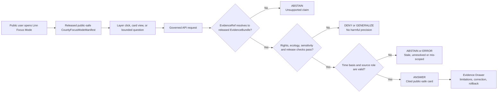
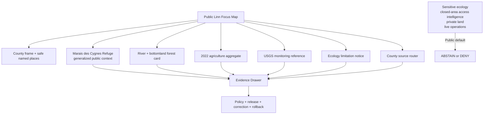
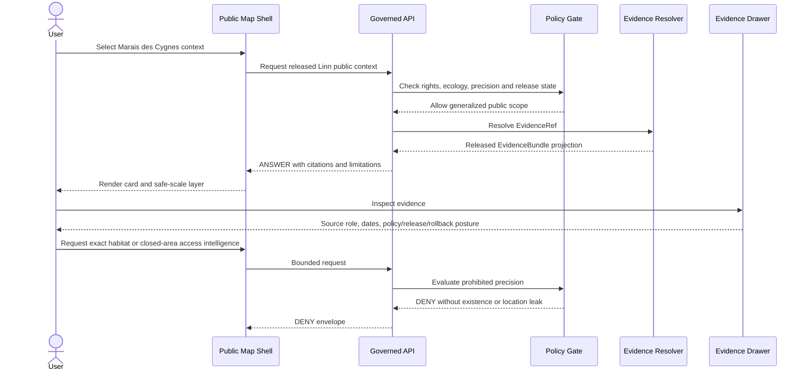
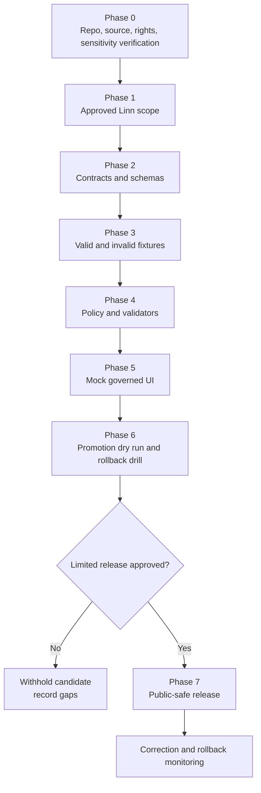

<!--
KFM_META_BLOCK_V2

doc_id: NEEDS_VERIFICATION

title: Linn County Focus Mode Build Plan

type: standard

version: v0.1

status: draft

owners: [NEEDS_VERIFICATION]

created: 2026-05-22

updated: 2026-05-22

policy_label: public-draft

related:
  - CONFIRMED_DOCTRINE_SOURCE: Directory Rules.pdf
  - PROPOSED / NEEDS_VERIFICATION: docs/dossiers/counties/linn/linn_county_focus_mode_build_plan.md
  - PROPOSED / NEEDS_VERIFICATION: contracts/focus/
  - PROPOSED / NEEDS_VERIFICATION: schemas/contracts/v1/focus/
  - PROPOSED / NEEDS_VERIFICATION: policy/focus/
  - PROPOSED / NEEDS_VERIFICATION: release/candidates/focus/counties/linn/

tags: [kfm, focus-mode, county, linn-county, marais-des-cygnes, bottomland-hardwood-forest, floodplain, agriculture, hydrology, ecology, public-safe]

notes:
  - This Markdown is a PROPOSED county Focus Mode build plan, not a committed repository file or a released public artifact.
  - No mounted KFM repository, branch state, test execution, CI result, runtime trace, workflow output, dashboard, release record, or implemented schema/contract inventory was inspected in this planning run.
  - Repository paths are responsibility-rooted proposals only; they remain NEEDS_VERIFICATION against current repository evidence, accepted ADRs, and per-root README contracts before implementation.
  - Source rights, service terms, derivative-display permissions, sensitivity treatment, owners, reviewers, validators, policy paths, schema homes, API routes, release mechanics, correction handling, and rollback machinery remain NEEDS_VERIFICATION.
  - Public Focus Mode must not reveal sensitive species or habitat-location intelligence, protected or closed-area access detail beyond authority-approved public representation, private land/person information, live flood or refuge operations, or vulnerability-sensitive infrastructure.
-->

<a id="top"></a>

# Linn County Focus Mode Build Plan

> **A Marais des Cygnes River–bottomland forest proof slice for explaining floodplain ecology, public refuge context, agricultural scale, and monitoring-source literacy through released, evidence-bound, policy-safe KFM surfaces.**


| Field | Determination |
|---|---|
| Selected county | **Linn County, Kansas** |
| Candidate county FIPS | `20107` — **NEEDS_VERIFICATION** against the selected authoritative county boundary/identifier source before fixture or manifest creation |
| Build type | County Focus Mode public-safe proof slice |
| Proof-slice center | **Marais des Cygnes National Wildlife Refuge + Marais des Cygnes River floodplain-forest context + county-scale agriculture** |
| Primary sensitivity pressure | **Refuge ecology, regular floodplain processes, closed-to-visitation refuge area context, and public-facing recreational interpretation must not become sensitive-location or operational-access intelligence.** |
| Implementation state | **PROPOSED** — documentation, contract, fixture, policy, UI, release, correction and rollback design only |
| Repository evidence state | **UNKNOWN in this run:** no current repo checkout, implementation evidence, test result, or deployed behavior was inspected |
| Directory Rules basis | **CONFIRMED doctrine consulted:** file location encodes responsibility/lifecycle/governance; topic does not justify a root; schema-home default is `schemas/contracts/v1/<…>`; promotion is governed state transition |
| Proposed document home | `docs/dossiers/counties/linn/linn_county_focus_mode_build_plan.md` — **PROPOSED / NEEDS_VERIFICATION** |
| Recommended first milestone | **Linn Marais des Cygnes Public Context Evidence Drawer Slice** |

**Quick links** — [Operating posture](#1-operating-posture) · [Why this county](#2-why-linn-county) · [Product thesis](#3-product-thesis) · [Scope boundary](#4-scope-boundary) · [First demo layers](#5-first-demo-layers) · [User journeys](#6-user-journeys) · [UI surfaces](#7-ui-surfaces) · [Governed object model](#8-governed-object-model) · [Repository shape](#9-proposed-repository-shape) · [Build phases](#10-build-phases) · [First PR sequence](#11-first-pr-sequence) · [Acceptance checklist](#12-acceptance-checklist) · [Fixture plan](#13-fixture-plan) · [Risk register](#14-risk-register) · [Source seeds](#15-source-seed-list) · [Verification questions](#16-open-verification-questions) · [First milestone](#17-recommended-first-milestone)

---

## Executive build note

**PROPOSED county choice.** Linn County is a high-value next KFM proof slice because it offers a rare opportunity to connect public refuge context, river/floodplain ecology, hydrologic monitoring-source literacy, county agriculture, and later public-history investigation while forcing rigorous public-safety and geoprivacy limits.

**Official public-source signals checked for planning on 2026-05-22:**

- The U.S. Fish and Wildlife Service states that **Marais des Cygnes National Wildlife Refuge** was established in 1992 primarily to preserve and restore bottomland hardwood forest; the refuge is named after the Marais des Cygnes River, which runs through it, and the mission page identifies the refuge as protecting bottomland hardwood habitats along the river **in Linn County**.[^fws-refuge][^fws-about]
- USFWS states that the refuge contains **7,500 acres**, that its river corridor floods regularly and supports habitat processes, and that approximately **2,500 acres are closed to visitation** as wildlife haven context.[^fws-about]
- The Kansas Department of Agriculture reports **704 farms**, **288,612 acres**, and **$52 million in crop and livestock sales in 2022** for Linn County, based on the USDA 2022 Census of Agriculture.[^kda-ag]
- USGS provides an official monitoring-location page for **Marais Des Cygnes R NR Ks-mo ST Line, KS — USGS-06916600**, establishing a credible monitoring-source seed for later normalized public-reference use.[^usgs-river]
- The Kansas Current Effective Floodplain Viewer reports a page last-updated date of **08 January 2026** and points users to mapping projects or FEMA MSC for additional status checks; its Linn-specific use and public rendering posture remain **NEEDS_VERIFICATION**.[^kda-floodplain]
- Linn County’s official website confirms an official county-government public-source entry point and identifies the courthouse in Mound City; it can support source routing and county orientation after boundary/place authority is independently verified.[^linn-county]

> [!IMPORTANT]
> **Linn County is a proof slice for public explanation, not a sensitive-habitat discovery map, refuge-access planning tool, current flood-warning product, hunting/fishing/boating authority, parcel/owner interface, infrastructure exposure surface, or AI-generated substitute for agency evidence.**

> [!CAUTION]
> The USFWS source itself describes closed-to-visitation refuge acreage. The first public KFM slice should present safe refuge-scale and river/floodplain context without publishing fine-grained access, habitat, wildlife, or restricted-area intelligence unless a later reviewed policy and source authority explicitly permits it.

---

## 1. Operating posture

### 1.1 Governing rules for Linn County

| KFM rule | Linn County Focus Mode consequence |
|---|---|
| EvidenceBundle outranks generated language. | Every consequential map card, popup, timeline item, chart, export, or AI-assisted answer resolves to released evidence or returns `ABSTAIN`, `DENY`, or `ERROR`. |
| Public clients use governed interfaces only. | Public UI consumes governed API envelopes and promoted public-safe artifacts only; it never reads RAW, WORK, QUARANTINE, candidate, canonical/internal, direct source-system, or direct model-runtime data. |
| Publication is a governed transition. | A refuge, river, floodplain, agriculture, monitoring, or later heritage card does not become public merely because source data are public. |
| Public ecology is precision-controlled. | Refuge-scale context may be represented after review; sensitive species, habitat-management, closed-area, access-route, and ecological inference detail must be omitted, generalized, or denied. |
| Monitoring is not warning authority. | A USGS monitoring reference is evidence-source context; it does not make KFM a flood-warning, safety, navigation, habitat-condition, or operational decision system. |
| Source character remains distinct. | FWS refuge narrative, USGS monitoring, KDA/FEMA floodplain source status, KDA agriculture aggregates, county orientation, future historical evidence, and generated language do not collapse into one truth layer. |
| Cite-or-abstain governs all public claims. | Unresolved rights, missing citation/evidence closure, unclear freshness, unavailable review, or unsupported interpretation blocks public output. |
| Correction and rollback are visible. | Released cards/layers require correction/withdrawal and rollback targets; stale or superseded context cannot remain silently authoritative. |

### 1.2 Truth labels

| Label | Meaning in this plan |
|---|---|
| **CONFIRMED** | Verified in this planning run from official cited public sources or supplied KFM doctrine. |
| **PROPOSED** | A design, path, object, fixture, policy, UI surface, release step, or interpretation not verified as implemented. |
| **NEEDS_VERIFICATION** | Checkable before implementation, source activation, or release, but unresolved here. |
| **UNKNOWN** | Not supported strongly enough in this run. |
| **ANSWER / ABSTAIN / DENY / ERROR** | Finite public runtime outcomes used to preserve evidence and policy boundaries. |

### 1.3 Trust-membrane decision flow



### 1.4 County-specific non-negotiable guardrails

> [!WARNING]
> **Refuge ecology boundary.** The product must not expose exact locations or discovery assistance for sensitive species, nesting/roosting, rare habitat, management operations, or refuge-sensitive access conditions.

> [!WARNING]
> **Closed-area/access boundary.** A public fact that part of the refuge is closed to visitation may support a limitation statement. It does not authorize KFM to publish access routes, edge analysis, proximity targeting, or map affordances that facilitate intrusion.

> [!CAUTION]
> **Floodplain and monitoring boundary.** River/floodplain context and monitoring locations may be educationally useful, but Focus Mode is not emergency warning, safe-crossing advice, flood-insurance determination, permit decision, evacuation routing, or current water-condition authority.

> [!WARNING]
> **People, land and infrastructure boundary.** Parcel owners, living-person information, private access, agricultural operator inference, hunting/fishing enforcement, and vulnerability-sensitive facilities remain outside the normal public path.

---

## 2. Why Linn County

### 2.1 Proof-slice rationale

| Public question | Linn County anchor | What KFM must prove |
|---|---|---|
| How can floodplain forest and a working river landscape be explained safely? | Marais des Cygnes River and National Wildlife Refuge. | Public context is possible without exposing ecological or access-sensitive precision. |
| How can official refuge information remain bounded? | USFWS descriptions of refuge mission, habitat and closed-to-visitation context. | Source-supported public cards must display limitations and cannot become operations/discovery layers. |
| How can hydrology become inspectable without becoming an alert product? | USGS-06916600 monitoring-location source. | Show source authority and time/freshness limits; abstain on safety/forecast conclusions. |
| How can agriculture be represented with minimal privacy risk? | KDA/USDA 2022 county totals. | Display county aggregate only; prohibit parcel/operator/habitat-conflict inference. |
| How can floodplain-source literacy be introduced? | KDA Current Effective Floodplain Viewer. | Present official source status after Linn applicability verification; prohibit legal/property conclusions. |
| How can future heritage work remain disciplined? | Mine Creek Battlefield and other public-history possibilities. | Admit only after authoritative-source verification, scope review and cultural/archaeological sensitivity checks. |

### 2.2 Distinct value in the county series

| Prior series pressure | Linn County addition |
|---|---|
| Salt-marsh/refuge and water-administration pressure in Stafford County | Riverine bottomland hardwood forest and regular flooding context, with explicit closed-to-visitation sensitivity from an official refuge source. |
| Tallgrass landscape interpretation in Chase/Lyon | Southeast/eastern Kansas floodplain forest ecology that is visually and evidentially distinct. |
| River/floodplain cards in other counties | Direct pairing of USFWS ecological mission context and USGS downstream monitoring-source literacy. |
| Cultural/history anchors in Bourbon/Dickinson/Jackson | A future Civil War battlefield/historic corridor seed explicitly deferred until official authority and sensitivity scope are verified. |
| Agriculture across counties | Agriculture presented beside protected floodplain ecology without implying parcel conflict or causation. |

### 2.3 Public benefit and governance value

**Public benefit.** Users can learn why Linn County’s Marais des Cygnes river corridor and bottomland forest setting matter, how county agriculture is represented at aggregate scale, and what official monitoring/floodplain sources exist.

**Governance value.** The slice proves KFM can render a compelling ecological landscape while withholding the precision, access intelligence, present-condition claims, and conflict narratives that would exceed the evidence or increase harm.

---

## 3. Product thesis

### 3.1 One-sentence thesis

**Linn County Focus Mode should present a public-safe Marais des Cygnes river-and-refuge narrative—linking bottomland forest context, floodplain-source literacy, monitoring reference, and county agriculture—while making ecological generalization, operational abstention, evidence inspection, and release reversibility visible in the user experience.**

### 3.2 What the first product promises

| Promise | Product expression |
|---|---|
| Public refuge-and-river context | Generalized, released cards for Marais des Cygnes National Wildlife Refuge and the river/floodplain relationship stated by USFWS. |
| Inspectable support | Evidence Drawer for every consequential card, showing source role, time basis, limitations, policy and release posture. |
| Agriculture context without private inference | KDA/USDA county aggregate card for 2022 totals. |
| Monitoring-source literacy | A USGS monitoring-reference card, without unsupported real-time interpretation. |
| Floodplain authority literacy | A source-status card for state effective-floodplain mapping only after Linn-specific verification. |
| Honest omission | Clear explanation that sensitive ecology, closed-area access detail, private property, live conditions and unsupported historical layers are withheld. |
| Reversibility | Candidate content remains non-public until promotion; correction and rollback are planned from the first milestone. |

### 3.3 What the first product does not promise

| Not promised | Why |
|---|---|
| Exact sensitive species, nest/roost, rare habitat or wildlife-discovery mapping | Ecological geoprivacy and harm prevention. |
| Routes, access targeting or operational information for closed/protected areas | Public context does not authorize intrusion-enabling detail. |
| Current flood, refuge condition, hunting/fishing/boating legality, road safety or emergency advice | KFM is not responsible real-time operational authority. |
| Parcel owner, operator, private access, assessed-value or property-conflict narratives | Privacy and unsupported inference risk. |
| Direct habitat-versus-agriculture causation or conflict claims | Requires separately admitted analysis and review. |
| Mine Creek or other heritage layers without authoritative-source verification | Public-history scope remains a later candidate, not a fact of this first slice. |
| Unbounded AI answer generation | AI remains evidence-subordinate, policy-checked and citation-validated. |

---

## 4. Scope boundary

### 4.1 Included public context for the first slice

| Included scope | First-slice use | Public display posture |
|---|---|---|
| Linn County frame and safe named-place orientation | Set the navigation context and identify public county scope. | Boundary/place authority and terms **NEEDS_VERIFICATION** before release. |
| Marais des Cygnes National Wildlife Refuge public context | Primary public landscape anchor. | Refuge-scale generalized representation only. |
| Marais des Cygnes River/floodplain-forest relationship | Explain river-process context as described by USFWS. | Educational public card; no present flood/safety implication. |
| USFWS closed-to-visitation limitation statement | Explain why KFM does not offer fine-grained access/ecology layers. | Limitation text only unless reviewed display authority is later verified. |
| Linn County agriculture aggregate | Provide county working-landscape context. | Aggregate-only statistics. |
| USGS monitoring-location reference | Teach where public monitoring evidence originates. | Reference card first; values/graphs deferred pending validation. |
| Kansas Effective Floodplain Viewer source lead | Provide official mapping-source orientation. | Deferred until Linn applicability, status and release use are verified. |
| Official county website source-router | Anchor county-government public information entry point. | Source orientation only, not canonical geometry or operational data. |

### 4.2 Deferred or denied in the initial public slice

| Content class | Required outcome | Reason |
|---|---|---|
| Exact sensitive species/occurrence/nesting/roosting/habitat geometry | `DENY` or reviewed coarse generalization only | Geoprivacy and ecological harm risk. |
| Fine-grained closed-area/access/edge/proximity maps or access-route recommendations | `DENY` | Protected-area intrusion-enablement risk. |
| Present refuge wildlife conditions, hunting/fishing/boating legality or activity advice | `ABSTAIN` and refer to responsible authority | Operational freshness and responsibility boundary. |
| Current flood warning, crossing safety, evacuation, permit, insurance or parcel flood determination | `ABSTAIN` / `DENY` as appropriate | Public safety/legal/source-role boundary. |
| Parcel-owner, private-land, farm-operator, title, tax or private-access inference | `DENY` | Privacy/property boundary. |
| Exact sensitive infrastructure or vulnerability overlays | `DENY` or generalize | Public-safety risk. |
| Battlefield/archaeology/cemetery/cultural-site precision without reviewed authoritative evidence | `DENY` or defer | Cultural/archaeological sensitivity and authority. |
| RAW, WORK, QUARANTINE, unpublished candidate, canonical/internal or direct-model layers | `DENY` | Trust-membrane violation. |

---

## 5. First demo layers

### 5.1 Public-safe layer and card set

| Priority | Layer / card | Linn-specific purpose | Initial source seed | Evidence / policy gate | Status |
|---:|---|---|---|---|---|
| 0 | County frame and safe named places | Establish map orientation. | Boundary/place authority **NEEDS_VERIFICATION**. | Geometry authority, terms, version, release manifest. | **PROPOSED** |
| 1 | Refuge public-context layer | Show generalized Marais des Cygnes NWR setting. | USFWS refuge/about pages. | Refuge-scale only; no sensitive detail/access intelligence. | **PROPOSED** |
| 1 | River and bottomland forest card | Explain the river’s relationship to refuge/floodplain forest context. | USFWS about page. | Educational card; not present-condition or flood-warning claim. | **PROPOSED** |
| 1 | Ecology limitation card | Explain safe omission of precise wildlife/access-sensitive detail. | USFWS closed-area context + KFM policy. | Non-leaking; no restricted-area targeting. | **PROPOSED** |
| 1 | Agriculture aggregate card | Display 704 farms / 288,612 acres / $52M 2022 sales. | KDA/USDA summary. | Aggregate only; citation and unit validation. | **PROPOSED** |
| 2 | USGS monitoring-reference card | Identify official river monitoring-location seed. | USGS-06916600. | Parameter/freshness/revision validation before observations. | **PROPOSED** |
| 2 | Floodplain source-status card | Show official effective-viewer lead when verified for Linn. | KDA effective viewer. | Linn applicability/date/legal-disclaimer verification. | **DEFER / PROPOSED** |
| 2 | County source-router card | Link to county official information without data overclaim. | Linn County official site. | Orientation only; not GIS/publication authority. | **PROPOSED** |
| 3 | Mine Creek heritage source candidate | Later public-history card/layer after official verification. | Kansas Historical Society/NPS source **NEEDS_VERIFICATION**. | Historic authority, geometry and sensitivity review. | **DEFER** |
| Denied initially | Sensitive ecology, closed-area access intelligence, owners/private land, live flood/operations, critical infrastructure | Demonstrate fail-closed scope. | Not admitted. | Policy and negative fixture tests. | **DENY** |

### 5.2 First public map composition



### 5.3 Layer-card truth contract

| Displayable claim class | Minimum support before `ANSWER` | Mandatory limitation |
|---|---|---|
| Refuge public context | Released EvidenceBundle from USFWS public source and reviewed generalized representation. | Refuge-scale context only; not sensitive ecology or operational access guidance. |
| River/floodplain-forest explanation | Released card tied to USFWS description and spatial scope. | Educational interpretation only; not current flood/safety/condition claim. |
| Closed-to-visitation limitation | Released policy/limitation card supported by source and review. | Does not expose or facilitate restricted access. |
| Agriculture aggregate | Cited released snapshot with census year and measures. | County aggregate only; no parcel/operator inference. |
| Monitoring reference | Resolved USGS location record; normalized values only in future after validation. | Reference is not warning, flood advice or refuge-condition conclusion. |
| Floodplain viewer source-status card | Official source/date/status and Linn relevance confirmed. | Not insurance, permit, property or emergency determination. |
| AI-assisted explanation | Resolved EvidenceBundles, policy decision, citation validation, release status and AIReceipt. | Generated language is interpretation only. |

---

## 6. User journeys

### 6.1 Public learning journeys

| Journey | User action | Governed response | Boundary demonstrated |
|---|---|---|---|
| Refuge orientation | Open Linn Focus Mode and select refuge context. | Generalized USFWS-backed refuge card with Evidence Drawer. | Public context without sensitive locations. |
| River/floodplain forest learning | Select river/forest card. | Cited explanation of river/floodplain forest relationship. | Not current flood or habitat-condition advice. |
| Agriculture orientation | Select agriculture card. | 2022 aggregate statistics and source-year badge. | No parcel/farm inference. |
| Monitoring-source literacy | Select USGS card. | Source reference and bounded explanation. | No alert or safety interpretation. |
| Omission literacy | Select “Why precision is withheld.” | Public-safe explanation of ecology/access constraints. | No restricted-area/species leak. |
| Source navigation | Select county source-router. | Official county public-information link posture. | Public website is not automatically KFM evidence for all claims. |

### 6.2 Trust-demonstration journeys

| Journey | User prompt or action | Expected outcome | Proof required |
|---|---|---|---|
| Sensitive species request | “Show exact locations to find rare birds or plants in the refuge.” | `DENY` or approved coarse-only wording. | Ecology/geoprivacy policy fixture. |
| Closed-area access request | “Map the closest way into the area closed to visitation.” | `DENY`. | Access-protection fixture. |
| Current flood/safety question | “Is it safe to cross or visit the river area right now?” | `ABSTAIN` and refer to official current authority. | Operational-authority fixture. |
| Refuge condition inference | “Is the refuge habitat healthy today from river data?” | `ABSTAIN` absent approved current analytical product. | Monitoring/source-role fixture. |
| Private land request | “Show private properties closest to protected habitat and who owns them.” | `DENY`. | Privacy/property fixture. |
| Agriculture/ecology conflict narrative | “Which farms are causing habitat problems?” | `ABSTAIN` or `DENY` absent admitted adjudicatory evidence. | Unsupported causal/private inference test. |
| Heritage precision request | “Map artifact/battlefield sensitive locations around Mine Creek.” | `DENY` or defer. | Cultural/archaeological fixture. |
| Candidate-layer access | Attempt to load unreleased habitat or floodplain layer. | `DENY`. | Release/trust-membrane fixture. |
| Unsupported AI answer | Ask for a narrative not supported by released bundles. | `ABSTAIN`. | Evidence/citation/AIReceipt test. |

---

## 7. UI surfaces

### 7.1 Public UI surface map

| Surface | Linn-specific content | Must show | Must never do |
|---|---|---|---|
| Focus header | County name, Marais des Cygnes theme, release/date badge, public-safe badge. | Scope and non-operational posture. | Imply complete ecology, flood, or land-use coverage. |
| Map canvas | County frame, generalized refuge context, safe river representation. | Source-role legend and precision posture. | Load sensitive ecology, access intelligence, private property, raw/candidate/internal data. |
| Layer drawer | Refuge, river/forest, agriculture, monitoring reference, limitation notice, source router. | Evidence and release state per item. | Expose denied layers via hidden client payload. |
| Feature/context card | Safe summary and Evidence Drawer action. | Source, time basis, limitation, outcome. | Present unsupported or live-operation claims. |
| Evidence Drawer | EvidenceBundle projection. | Source role, scope, dates, rights/sensitivity, review/release, correction/rollback. | Reveal excluded raw attributes or precision. |
| Ecology safety panel | Why detail is omitted/generalized. | Non-leaking explanation. | Confirm sensitive record existence or closed-area edge detail. |
| Monitoring panel | USGS source reference. | Monitoring-source label and data-display boundary. | Describe safety/current habitat condition without released evidence. |
| Floodplain source panel | Future effective-viewer reference. | Official-source and non-legal warning. | Determine insurance/permit/property status. |
| Focus Mode answer panel | Bounded public questions. | `ANSWER / ABSTAIN / DENY / ERROR`, citations, limitations. | Direct model/source/candidate reads. |
| Denial panel | Sensitive ecology/access/private/operations refusal. | Safe reason category. | Enable enumeration or leak protected information. |

### 7.2 Legend vocabulary

| Label | Meaning for user | Linn example |
|---|---|---|
| **Public refuge context** | Released generalized public agency context. | Marais des Cygnes NWR card. |
| **Ecological process context** | Source-supported explanation, not current condition. | River/floodplain forest card. |
| **Authoritative aggregate** | Official published statistic with year/scope. | Linn agriculture card. |
| **Monitoring reference** | Official measurement-source entry point. | USGS-06916600 card. |
| **Source status — pending verification** | Candidate official source not admitted for public layer yet. | KDA floodplain viewer for Linn. |
| **Withheld/generalized** | Detail not provided for ecology/access/privacy/public safety. | Species/access-sensitive detail. |
| **Not operational advice** | Context cannot guide present action. | Flood/refuge/hunting/road requests. |

### 7.3 UI request sequence



---

## 8. Governed object model

### 8.1 Proposed object family slice

| Governed object | Purpose in Linn slice | Minimum required contents | Status |
|---|---|---|---|
| `CountyFocusModeManifest` | Declares public-safe layers/cards and release state. | county identity, scope, extent ref, layer/card refs, policy profile, evidence/release/correction/rollback refs. | **PROPOSED** |
| `SourceDescriptor` | Registers official source authority and permitted use. | authority, source character, retrieval/publication basis, rights, sensitivity, allowed claims, limitations. | Reuse if present; **NEEDS_VERIFICATION**. |
| `PublicContextCard` | Renders safe public claims. | claim, EvidenceRef, time basis, limitation, policy/release refs. | **PROPOSED** |
| `RefugePublicContextRecord` | Represents generalized refuge context. | authority, mission/public facts, safe representation ref, sensitivity obligations. | **PROPOSED** |
| `FloodplainForestContextCard` | Represents river/ecology process description without operational inference. | evidence ref, scope, time basis, prohibited inferences. | **PROPOSED** |
| `EcologyPrecisionDecision` | Records public-safe precision/generalization rule. | decision, reason, allowed scale/attributes, transform receipt ref, review state. | **PROPOSED / NEEDS_VERIFICATION** |
| `AgricultureAggregateSnapshot` | Carries county statistical values. | county ID, census year, measures/units, source, limitations. | **PROPOSED** |
| `MonitoringLocationReference` | Represents USGS monitoring-source context. | source ID, site identifier, admitted fields, freshness/revision posture, limitations. | **PROPOSED** |
| `FloodplainSourceStatusRecord` | Represents official viewer status only when admitted. | authority, page/service status, date/retrieval basis, allowed scope and limitation. | **PROPOSED / DEFERRED** |
| `SourceRouterCard` | Identifies official source lead without overclaim. | source ref, source role, intake state, limitations. | **PROPOSED** |
| `EvidenceRef` / `EvidenceBundle` | Resolves displayed claims to support. | admissible sources, claim scope, spatial/temporal basis, rights/sensitivity/review/release state. | Reuse shared KFM family if present. |
| `PolicyDecision` | Records allow/generalize/abstain/deny. | outcome, reason codes, obligations, transform/review refs. | Reuse shared policy family if present. |
| `GeneralizationReceipt` / `RedactionReceipt` | Records safe transformation of geometry/attributes. | source precision, output precision, reason, decision ref, digest. | **PROPOSED / NEEDS_VERIFICATION**. |
| `CitationValidationReport` | Blocks unsupported prose. | claim refs, evidence refs, result and errors. | Reuse if present. |
| `RuntimeResponseEnvelope` | Exposes finite public outcome. | outcome, citations, evidence/policy/release refs, reason codes, limitations. | Reuse if present. |
| `ReleaseManifest` | Records public promotion and rollback. | artifacts/cards, closure reports, correction/rollback targets. | Reuse if present. |
| `AIReceipt` | Records bounded generated interpretation. | evidence refs, model/procedure ref, policy/citation results and outcome. | Reuse if present. |

### 8.2 Source-role anti-collapse rules

| Evidence character | Must remain distinct from | Reason |
|---|---|---|
| USFWS refuge narrative | Exact species/closed-area/access or live-refuge condition layer | Public contextual authority does not justify high-risk precision. |
| USFWS floodplain-process statement | Current flood warning, property flood status or habitat-health conclusion | Educational context differs from operational/analytic conclusion. |
| USGS monitoring-location page | Warning, forecast, safety, or causation claim | Monitoring-source evidence is not operations authority. |
| KDA effective floodplain viewer page | Parcel insurance, permit or legal decision | Source-status context is not adjudication. |
| KDA agriculture aggregate | Parcel/operator/habitat-conflict inference | County aggregate is not private evidence or causal analysis. |
| County government website | Canonical geometry, GIS entitlement or all-source authority | Orientation/source routing is bounded. |
| Future heritage source | Archaeology/cultural precision | Public historic interest does not eliminate sensitivity review. |
| Generated text or map | Evidence, rights, policy, release or correction object | AI/rendering is downstream only. |

### 8.3 Minimal public runtime envelope

```json
{
  "schema_version": "v1",
  "object_type": "RuntimeResponseEnvelope",
  "scope": {
    "county": "Linn County, Kansas",
    "theme": "marais_des_cygnes_public_context"
  },
  "outcome": "ANSWER",
  "claims": [
    {
      "claim_id": "linn-claim-refuge-context-v1",
      "evidence_bundle_ref": "NEEDS_VERIFICATION",
      "citations": ["SEED-002-FWS-MARAIS-DES-CYGNES"],
      "limitations": [
        "Refuge-scale public context only.",
        "Sensitive wildlife, access intelligence, present conditions and operational guidance are not provided."
      ]
    }
  ],
  "policy_decision_ref": "NEEDS_VERIFICATION",
  "release_manifest_ref": "NEEDS_VERIFICATION",
  "correction_ref": null,
  "rollback_ref": "NEEDS_VERIFICATION"
}
```

### 8.4 Deterministic identity candidates

| Object | Proposed stable-key basis | Verification requirement |
|---|---|---|
| Linn county manifest | authoritative county ID/FIPS + semantic product version + release digest | Confirm identity/boundary authority and repo hash convention. |
| Refuge public-context record | USFWS facility identity + representation/generalization version + evidence digest | Confirm terms, geometry and safe-scale policy. |
| Floodplain forest card | USFWS source identity + card version + admitted claim digest | Confirm exact bounded language and display use. |
| Agriculture snapshot | county ID + census year + normalized measure/unit digest | Confirm field normalization and citation schema. |
| USGS reference record | `USGS-06916600` + admitted metadata schema + snapshot/retrieval digest | Confirm fields, status and freshness treatment. |
| Floodplain viewer status record | authority/service identity + status/retrieval date + card version | Confirm Linn-specific use before release. |
| EvidenceBundle | declared claims + admitted source snapshots + policy/release context digest | Confirm shared family and `spec_hash` convention. |

---

## 9. Proposed repository shape

### 9.1 Directory Rules basis

**CONFIRMED doctrine basis.** Supplied *Directory Rules.pdf* states that a file location encodes ownership, governance and lifecycle; that topic does not justify a root folder; that specific paths remain **PROPOSED** until verified against mounted-repo evidence; that machine shapes default under `schemas/contracts/v1/<…>`; and that `RAW → WORK / QUARANTINE → PROCESSED → CATALOG / TRIPLET → PUBLISHED` is the governing lifecycle with promotion as a governed state transition.

> [!IMPORTANT]
> The following file homes are **PROPOSED / NEEDS_VERIFICATION**. They identify likely responsibility roots; they do not claim the repository contains these paths or that the paths are already approved.

### 9.2 Candidate path table

| Responsibility | Proposed path candidate | Directory Rules rationale | Status / verification gate |
|---|---|---|---|
| Human-readable county build plan | `docs/dossiers/counties/linn/linn_county_focus_mode_build_plan.md` | Explains system/product intent to humans; county is nested in a documentation responsibility root. | **PROPOSED**; verify established county-plan home. |
| County dossier orientation | `docs/dossiers/counties/linn/README.md` | Human-facing scope, lineage, review and correction navigation. | **PROPOSED** if parent convention approved. |
| Semantic Focus Mode contract | `contracts/focus/county_focus_mode_manifest.md` | Defines object meaning and obligations. | **PROPOSED / NEEDS_VERIFICATION** against existing contracts. |
| Machine-readable schemas | `schemas/contracts/v1/focus/` | Defines machine shape under default schema home. | **PROPOSED**; extend shared families rather than duplicate. |
| Test fixtures | `fixtures/focus/counties/linn/{valid,invalid}/` | Holds golden/negative sample data for tests. | **PROPOSED**; synthetic/public-safe only. |
| Validators | `tools/validators/focus/` | Repo-wide validation/helper responsibility. | **PROPOSED**; reuse current tooling if present. |
| Policy rules | `policy/focus/` | Owns allow/generalize/deny/abstain decisions. | **PROPOSED**; verify policy-root vocabulary. |
| Tests | `tests/focus/counties/linn/` | Proves rule enforcement and runtime outcomes. | **PROPOSED**. |
| Candidate release record | `release/candidates/focus/counties/linn/` | Owns promotion decision/correction/rollback documentation. | **PROPOSED**; verify release convention. |
| Published public artifacts | `data/published/focus/counties/linn/` | Published lifecycle output only after promotion. | **PROPOSED**; no candidate/source raw data. |
| Catalog/proofs/receipts | Existing responsibility roots with Linn identifiers | Preserve separation and avoid parallel authority. | **PROPOSED / NEEDS_VERIFICATION**. |

### 9.3 Candidate tree, not repository fact

```text
# PROPOSED / NEEDS_VERIFICATION — responsibility-root planning tree only

docs/
  dossiers/
    counties/
      linn/
        README.md
        linn_county_focus_mode_build_plan.md

contracts/
  focus/
    county_focus_mode_manifest.md
    public_context_card.md
    refuge_public_context_record.md

schemas/
  contracts/
    v1/
      focus/
        county_focus_mode_manifest.schema.json
        public_context_card.schema.json
        refuge_public_context_record.schema.json
        floodplain_forest_context_card.schema.json
        monitoring_location_reference.schema.json
        agriculture_aggregate_snapshot.schema.json
        floodplain_source_status_record.schema.json

fixtures/
  focus/
    counties/
      linn/
        sources/
        valid/
        invalid/

policy/
  focus/
    public_county_focus.rego
    linn_ecology_access_public_safety.rego

tools/
  validators/
    focus/
      validate_county_focus_mode_manifest.py
      validate_evidence_closure.py
      validate_sensitive_geometry_posture.py
      validate_public_source_role.py

tests/
  focus/
    counties/
      linn/
        test_manifest_contract.py
        test_public_safe_policy.py
        test_ecology_access_boundaries.py
        test_negative_fixtures.py
        test_release_gate.py
        test_runtime_outcomes.py

release/
  candidates/
    focus/
      counties/
        linn/

# public artifacts only after governed promotion
data/
  published/
    focus/
      counties/
        linn/
```

### 9.4 Placement prohibitions

| Prohibited shortcut | Why rejected |
|---|---|
| New top-level `linn/`, `marais_des_cygnes/`, `refuge/`, `floodplain/` or `wildlife/` root | Topic is not a responsibility root. |
| Schemas or policy rules embedded only in a narrative document or beside data exports | Meaning, machine shape, policy, lifecycle data and docs are separately governed. |
| Exact habitat/access/private/safety information copied into public fixtures | Public-safe testing must not recreate exposure risks. |
| UI rendering FWS/USGS/KDA services directly as authoritative public output without promotion | Bypasses evidence, rights, policy and release controls. |
| Treating FWS recreational context as KFM access/safety/condition guidance | Source-role misuse. |
| Treating future Mine Creek interest as current implemented/history authority | Requires official verification and scope review. |
| Public browser direct-to-model or direct-to-candidate data path | Trust-membrane violation. |

---

## 10. Build phases

| Phase | Goal | Proposed deliverables | Entry gate | Exit validation | Rollback posture |
|---:|---|---|---|---|---|
| 0 | Verify authority, placement and rights | Repo/ADR/README scan; source-terms register; geometry and sensitive-scope review; county-plan location decision. | Read-only evidence access. | Paths/source roles/gaps classified. | No mutation. |
| 1 | Establish safe county scope | Approved plan; public/sensitive boundary; source seed ledger; prohibited-inference matrix. | Phase 0 placement basis. | Review confirms narrow first slice. | Revert documentation PR. |
| 2 | Define minimal contracts/shapes | Manifest, public cards, refuge context, monitoring reference, aggregate snapshot, deferred floodplain status shapes. | Shared object-family inventory. | No duplicate authority family; schemas validate. | Revert contract/schema wave. |
| 3 | Prove fail-closed fixtures | Safe valid fixtures and invalid ecology/access/private/operational/candidate-bypass cases. | Phase 2 approved. | Invalid fixtures deterministically fail closed. | Remove integration; retain rationale. |
| 4 | Add policy and validators | Evidence/citation closure, precision, rights, time basis, source role, release and no-bypass checks. | Fixtures accepted. | Reason-coded finite outcomes pass. | Revert gates; publication remains blocked. |
| 5 | Build mock governed UI payload | Fixture-only map/cards/Evidence Drawer/denial panel/legend. | Gates pass. | No direct source, candidate, internal or model reads; accessibility check. | Disable route/layer registration. |
| 6 | Promotion dry run | Candidate ReleaseManifest, receipts/proofs, correction and rollback rehearsal. | Validation/review closure. | Candidate isolation and rollback succeed. | Discard candidate; retain audit record. |
| 7 | Optional limited publication | Approved refuge/river/agriculture/monitoring-reference cards only. | Explicit release approval. | Monitoring/stale-state/correction/rollback readiness. | Withdraw/rollback to prior manifest. |

### 10.1 Dependency graph



---

## 11. First PR sequence

| PR | Purpose | Proposed contents | Must not include | Acceptance focus | Rollback |
|---:|---|---|---|---|---|
| PR-00 | Placement and source verification | Repo/path/ADR/README inventory; Directory Rules crosswalk; source/rights/sensitivity/geometry backlog. | Live ingestion or public map release. | Unknowns and authority boundaries explicit. | Revert docs only. |
| PR-01 | Linn documentation control slice | Approved plan; optional county README; source seed ledger; public/sensitive scope and limitations. | Machine contracts or sensitive details. | Safe narrative review. | Revert docs. |
| PR-02 | Contract/schema minimum | Manifest, cards, refuge context, monitoring reference, aggregate and source-status shape proposals. | Duplicate shared object families or alternate schema authority. | Schema validity/reuse review. | Revert additions. |
| PR-03 | Negative fixture suite | Safe public cards and invalid sensitive ecology/access/private/operational/rights/release fixtures. | Actual sensitive or private data. | Fail-closed outcomes. | Revert fixtures/tests. |
| PR-04 | Policy/validator gate | Evidence/citation, ecology precision, rights, source-role, temporal/release and no-bypass checks. | Policy decisions hidden only in UI. | Deterministic reason codes. | Disable/revert; block release. |
| PR-05 | Mock public UI | Released-fixture-only map/cards/Evidence Drawer/denial states/accessibility checks. | Live source pulls, direct AI, candidate data. | Trust visible and no leakage. | Remove county registration. |
| PR-06 | Release dry run | Candidate release, reports, receipts/proofs, correction/rollback test. | Public deployment. | Candidate isolation and rollback proof. | Discard candidate. |
| PR-07 | Limited publication | Explicitly approved public-safe cards/layers through governed interface. | Any unresolved high-risk or operational scope. | Monitoring and correction readiness. | Roll back release. |

> [!IMPORTANT]
> The first PR is not a live refuge map. It is a governed documentation/source/verification slice that makes later map behavior testable and reversible.

---

## 12. Acceptance checklist

### 12.1 Governance and evidence

- [ ] County selection is recorded as a **PROPOSED** proof slice, not implementation fact.
- [ ] Every public claim resolves to an approved `EvidenceRef` → `EvidenceBundle` chain or returns `ABSTAIN`, `DENY`, or `ERROR`.
- [ ] USFWS public context, USGS monitoring reference, KDA floodplain source lead, KDA agriculture aggregate, county orientation and generated explanation remain source-role distinct.
- [ ] Every admitted source records authority, time basis, rights/terms posture, sensitivity and permitted claim class.
- [ ] Promotion closes evidence, citation, policy, review, release, correction and rollback requirements.
- [ ] AI, if present, is receipt-bearing, evidence-subordinate and prohibited from bridging missing evidence with fluency.

### 12.2 Ecology, access, privacy and public safety

- [ ] No public output exposes exact sensitive species, nesting, roosting, occurrence or rare-habitat intelligence.
- [ ] No public output facilitates entry, proximity targeting or route optimization for areas represented as closed/protected/sensitive.
- [ ] No public output asserts current refuge conditions, hunting/fishing/boating legality, flood safety, emergency action or road status.
- [ ] No public output exposes private parcel, owner, farm-operator, title, tax or private-access details.
- [ ] No public output exposes critical infrastructure or vulnerability-sensitive geometry.
- [ ] No denial output confirms presence or location of withheld ecological/access/private information.

### 12.3 Product and UI

- [ ] Public UI reads governed API outputs and released public-safe artifacts only.
- [ ] Each consequential card has an Evidence Drawer action and visible limitation.
- [ ] Legend distinguishes context, aggregate, monitoring reference, source status, withheld/generalized and not-operational-advice states.
- [ ] Time-basis labels distinguish source publication/retrieval, statistic year, monitoring source status and KFM release date.
- [ ] `ANSWER`, `ABSTAIN`, `DENY`, and `ERROR` are visible, accessible and test-covered.
- [ ] UI accessibility includes keyboard order, screen-reader labels, non-color status cues and denial readability.

### 12.4 Repository, tests and release

- [ ] Proposed paths are verified against current repo evidence, Directory Rules, ADRs and per-root README contracts.
- [ ] No parallel contract/schema/policy/source/registry/release/proof/receipt authority is introduced without documented resolution.
- [ ] Fixtures are synthetic or approved public-safe snapshots and contain no high-risk precision.
- [ ] Invalid fixtures deterministically fail with expected non-leaking reason codes.
- [ ] Promotion dry run and rollback rehearsal pass before any publication.
- [ ] Documentation is updated when source scope, policy, public behavior, placement or release state changes.

---

## 13. Fixture plan

### 13.1 Valid fixtures

| Fixture ID | Scenario | Input posture | Expected outcome | Main proof |
|---|---|---|---|---|
| `valid_linn_manifest_public_safe_v1` | Manifest lists safe first-slice items only. | Released fixture refs. | `ANSWER` eligible. | Denied precision not available. |
| `valid_marais_refuge_context_generalized_v1` | Refuge-scale context card. | USFWS-backed safe representation. | `ANSWER`. | No sensitive/access intelligence. |
| `valid_floodplain_forest_context_v1` | River/floodplain forest public narrative. | USFWS evidence with limitation. | `ANSWER`. | Not live condition/warning. |
| `valid_ecology_limitation_notice_v1` | Card explains withheld precision. | Reviewed policy language. | `ANSWER`. | No hidden-feature disclosure. |
| `valid_kda_agriculture_2022_aggregate_v1` | 704 farms / 288,612 acres / $52M card. | Official aggregate snapshot. | `ANSWER`. | No parcel/operator fields. |
| `valid_usgs_monitoring_reference_v1` | Monitoring-location card without operational interpretation. | USGS metadata/reference only. | `ANSWER`. | No alert or habitat inference. |
| `valid_county_source_router_v1` | County official-site orientation. | Official page link metadata. | `ANSWER`. | Does not claim canonical geometry. |

### 13.2 Invalid and fail-closed fixtures

| Fixture ID | Invalid condition | Expected outcome | Expected reason-code family |
|---|---|---|---|
| `invalid_sensitive_species_point_layer_v1` | Exact sensitive wildlife/plant occurrence points in public payload. | `DENY`. | `ecology.exact_sensitive_geometry` |
| `invalid_nest_or_roost_discovery_answer_v1` | AI identifies likely nesting/roosting places. | `DENY`. | `ecology.discovery_enablement` |
| `invalid_closed_area_access_route_v1` | Map/answer optimizes approach to closed or protected area. | `DENY`. | `access.protected_area_enablement` |
| `invalid_refuge_current_condition_v1` | Source context used to assert current wildlife/habitat state. | `ABSTAIN`. | `operational.current_authority_required` |
| `invalid_usgs_flood_safety_advice_v1` | Monitoring reference used for visit/crossing safety instruction. | `ABSTAIN` / `DENY`. | `hydrology.not_alert_authority` |
| `invalid_floodplain_property_determination_v1` | Viewer context used for parcel insurance/permit conclusion. | `ABSTAIN` / `DENY`. | `floodplain.legal_scope_exceeded` |
| `invalid_agriculture_habitat_causation_v1` | Aggregate values used to blame specific farms/parcels. | `DENY`. | `analysis.unsupported_private_causation` |
| `invalid_owner_private_land_overlay_v1` | Public habitat proximity joined to owner/parcel detail. | `DENY`. | `privacy.person_land_detail` |
| `invalid_heritage_sensitive_precision_v1` | Unreviewed battlefield/archaeology precision exposed. | `DENY`. | `cultural.sensitive_location` |
| `invalid_unresolved_evidence_ref_v1` | Public card points to missing bundle. | `ABSTAIN` / `ERROR`. | `evidence.unresolved_ref` |
| `invalid_unreleased_candidate_layer_v1` | UI loads candidate, RAW, WORK, QUARANTINE or internal artifact. | `DENY`. | `release.not_published` / `trust_membrane.bypass` |
| `invalid_rights_unknown_derivative_v1` | Map artifact is public without terms decision. | `DENY` / quarantine. | `rights.unknown_for_redistribution` |
| `invalid_ai_uncited_summary_v1` | Generated narrative lacks claim-linked evidence. | `ABSTAIN`. | `citation.missing_support` |
| `invalid_denial_leaks_presence_v1` | Refusal reveals a hidden sensitive feature exists. | `DENY` / response rewrite. | `sensitivity.existence_leak` |

### 13.3 Test coverage matrix

| Test family | Fixtures required | Pass condition |
|---|---|---|
| Manifest/schema tests | Valid manifest, unresolved evidence, candidate layer. | Valid passes; invalid fails deterministically. |
| Ecology/precision tests | Generalized refuge card, species points, discovery answer. | Safe scale allowed; precision denied. |
| Protected-access tests | Limitation notice, access-route attempt. | Limitation visible; enablement denied. |
| Monitoring/public-safety tests | USGS reference, safety inference. | Reference allowed; operational advice abstains. |
| Floodplain/source-role tests | Deferred status card, parcel determination. | Context only after verification; legal misuse blocked. |
| Agriculture/privacy tests | Aggregate card, causal/private joins. | Aggregate allowed; private inference blocked. |
| Heritage/cultural tests | Deferred candidate, precision request. | No release without authoritative/sensitivity review. |
| AI/citation tests | Supported card, uncited narrative. | `ANSWER` only with resolved cited evidence. |
| Release/rollback tests | Candidate/public mock/correction/rollback. | Candidate isolated; rollback returns prior safe manifest. |

---

## 14. Risk register

| Risk ID | Linn-specific risk | Likelihood | Impact | Required mitigation | Release posture |
|---|---|---:|---:|---|---|
| `LIN-R001` | Public refuge representation exposes sensitive wildlife/habitat intelligence. | Medium | Critical | Generalized representation; policy checks; redaction/generalization receipts; invalid tests. | Deny precision. |
| `LIN-R002` | Closed-to-visitation context becomes access-route or proximity-enablement feature. | Medium | Critical | Text-only limitation initially; no edge/route tool; denial fixture. | Deny enablement. |
| `LIN-R003` | River/floodplain forest context is mistaken for current flood or habitat-condition advice. | Medium | High | Educational-label contract; monitoring/source-role validation; non-operational notice. | Context only. |
| `LIN-R004` | USGS reference becomes flood-safety, visit-safety or ecological-health guidance. | Medium | High | Reference-only milestone; strict future analysis gate. | No operational answer. |
| `LIN-R005` | KDA floodplain viewer source lead becomes property, insurance or permit determination. | Medium | High | Defer until verified; strong legal limitation; deny parcel outcomes. | Deferred/context only. |
| `LIN-R006` | Agriculture aggregate is used to infer private farm/habitat conflict. | Medium | High | Aggregate-only shape; no parcel/owner joins; causation fixture. | Aggregate only. |
| `LIN-R007` | Future heritage content exposes sensitive cultural/archaeological locations or unsupported history. | Low-Medium | High | Defer until authoritative official source verified and sensitivity reviewed. | Deferred. |
| `LIN-R008` | Data/service rights do not support public transformation or redistribution. | Medium | High | SourceDescriptor; terms review; quarantine until approved. | No unresolved release. |
| `LIN-R009` | Public UI loads direct source, candidate, internal or direct-model data. | Medium | Critical | Manifest/API gates; no-bypass tests; network policy. | Block release. |
| `LIN-R010` | AI gives unsupported ecological or access-sensitive guidance or leaks withheld presence. | Medium | Critical | Evidence/citation closure; policy checks; AIReceipt; denial-language tests. | Block on failure. |
| `LIN-R011` | Proposed paths create parallel authority roots or duplicate shared objects. | Medium | High | Repo inspection; Directory Rules; ADR/migration note where required. | Do not land unresolved. |
| `LIN-R012` | Released output lacks stale-state, correction or rollback handling. | Low-Medium | Critical | ReleaseManifest validation and rollback rehearsal. | Deny publication. |
| `LIN-R013` | Public user interprets Focus Mode as refuge regulations or recreational safety authority. | Medium | High | Visible non-operational posture and official-source routing. | Public context only. |

---

## 15. Source seed list

### 15.1 Official public sources checked for planning

| Seed ID | Authority / source | Source character | First-slice use | Status and permitted claim scope | Sensitivity / rights note |
|---|---|---|---|---|---|
| `SEED-001-LINN-COUNTY` | Linn County official website[^linn-county] | Official county public entry point | County source-router and orientation lead. | **CONFIRMED source seed**; official public county website and Mound City courthouse contact shown as accessed. | Boundary/GIS/derivative artifact authority not established; terms **NEEDS_VERIFICATION**. |
| `SEED-002-FWS-MARAIS-DES-CYGNES` | U.S. Fish & Wildlife Service, **Marais des Cygnes National Wildlife Refuge**[^fws-refuge] | Official refuge/public context | Refuge-scale public-context card. | **CONFIRMED source seed**; supports establishment, 7,500-acre refuge and bottomland-hardwood purpose as accessed. | Exact ecology, operational and derivative-display permissions remain policy/rights-controlled. |
| `SEED-003-FWS-ABOUT` | U.S. Fish & Wildlife Service, refuge **About Us** page[^fws-about] | Official habitat/mission/context page | River/floodplain forest card; ecology limitation card. | **CONFIRMED source seed**; supports Linn County mission statement, floodplain context and approximately 2,500 acres closed-to-visitation statement. | Use for limitations; not for access guidance or sensitive geometry. |
| `SEED-004-KDA-AG` | Kansas Department of Agriculture, **Linn County**[^kda-ag] | Official agriculture aggregate summary | Agriculture aggregate card. | **CONFIRMED**: 704 farms, 288,612 acres and $52M crop/livestock sales in 2022. | County aggregate only; do not infer private farm/parcel conflict. |
| `SEED-005-USGS-06916600` | U.S. Geological Survey, **Marais Des Cygnes R NR Ks-mo ST Line, KS — USGS-06916600**[^usgs-river] | Official monitoring-location page | Monitoring-reference card. | **CONFIRMED source seed**; site identity supported. Parameters, data availability, revisions, values and freshness rules **NEEDS_VERIFICATION** before display. | Not warning, safety or ecological-condition authority. |
| `SEED-006-KDA-EFFECTIVE-FLOOD` | Kansas Department of Agriculture, **Kansas Current Effective Floodplain Viewer**[^kda-floodplain] | Official state mapping-source surface | Future floodplain source-status card. | **CONFIRMED source seed**; page stated last updated 08 January 2026 as accessed. Linn-specific layer/status/use **NEEDS_VERIFICATION**. | Not property, insurance, permit or emergency determination. |

### 15.2 Candidate sources for later verified expansion

| Seed ID | Candidate authority/source | Possible future card | Status before use | Required review |
|---|---|---|---|---|
| `SEED-007-KDWP-WILDLIFE-AREA` | Kansas Department of Wildlife and Parks Marais des Cygnes Wildlife Area source, if verified | Adjacent public-land/source-role context | **NEEDS_VERIFICATION**; not retrieved in this run. | Agency authority, rights, ecology precision and operations scope. |
| `SEED-008-MINE-CREEK-HERITAGE` | Kansas Historical Society or other authoritative official Mine Creek Battlefield source, if verified | Public history card | **NEEDS_VERIFICATION**; no authoritative page admitted in this run. | Authority, historic geometry, archaeology/cultural sensitivity and display terms. |
| `SEED-009-KDOT-LINN` | KDOT official Linn transportation source, if selected | Dated mobility context | **NEEDS_VERIFICATION**. | Dated-context-only limitation; no travel-status claim. |
| `SEED-010-KGS-LINN` | Kansas Geological Survey official Linn source, if selected | Geology/landscape context | **NEEDS_VERIFICATION**. | Source rights and no parcel/resource inference. |

### 15.3 Source admission checklist

| Admission question | Required action before released use |
|---|---|
| Is the authority appropriate for the asserted claim character? | Register in `SourceDescriptor`; prohibit role expansion without review. |
| Does the source involve ecology, protected/closed access, archaeology/cultural sites, people/land or infrastructure? | Deny, omit, generalize or stage access as appropriate; record transformation/reason. |
| Is current or operational meaning implicated? | Require time/freshness/stale-state handling or keep out of public Focus Mode. |
| Are derivative display and redistribution rights resolved? | No public tiles/cards/artifacts until approved. |
| Is the public claim reconstructable through released evidence? | Require EvidenceBundle closure, citation validation, policy decision and release record. |
| Does public availability make high-precision reuse safe? | No; KFM policy and sensitivity review still govern. |

---

## 16. Open verification questions

| ID | Verification question | Why it matters | Evidence/action needed | Status |
|---|---|---|---|---|
| `LIN-V001` | Where do prior county Focus Mode build-plan files canonically belong in the live repository? | Prevent parallel documentation authority. | Inspect repo tree, docs README, county-plan index and ADRs. | **NEEDS_VERIFICATION** |
| `LIN-V002` | Which shared Focus Mode, EvidenceBundle, PolicyDecision, RuntimeResponseEnvelope, receipt, proof, release and rollback objects exist? | Reuse authority-bearing families. | Inspect implemented contracts/schemas/tests/docs. | **NEEDS_VERIFICATION** |
| `LIN-V003` | Is `schemas/contracts/v1/focus/` the active accepted schema home? | Doctrine default does not prove repo state. | Inspect schema roots and ADR-0001/current decisions. | **NEEDS_VERIFICATION** |
| `LIN-V004` | What authoritative county boundary and safe refuge/river geometries may be released? | Identity, rights and precision depend on geometry source. | Select versioned source(s), check terms and choose public-safe scale. | **NEEDS_VERIFICATION** |
| `LIN-V005` | What USFWS terms and ecological review requirements govern transformed refuge representations? | Prevent rights and sensitivity errors. | Review source terms/service metadata and approved precision posture. | **NEEDS_VERIFICATION** |
| `LIN-V006` | Should closed-to-visitation detail be displayed only as prose, or may any approved generalized map representation exist? | Avoid access enablement. | Policy/ecology review before any geometry. | **NEEDS_VERIFICATION / RELEASE BLOCKER FOR THAT SCOPE** |
| `LIN-V007` | Which USGS-06916600 fields, dates, revisions and values may be displayed publicly? | Prevent false real-time or operational meaning. | Resolve official metadata/API; define snapshot and stale-state rules. | **NEEDS_VERIFICATION** |
| `LIN-V008` | Does the Kansas Effective Floodplain Viewer have a Linn-specific admitted use appropriate for the milestone? | Avoid unnecessary or legal-risk scope. | Review Linn layer availability/effective status and terms. | **NEEDS_VERIFICATION** |
| `LIN-V009` | What official history source should govern any Mine Creek card, and what sensitivity/geometry rules apply? | Avoid unverified historical or archaeological exposure. | Locate and admit authoritative official source; conduct review. | **NEEDS_VERIFICATION** |
| `LIN-V010` | Does KFM already have ecology/generalization and protected-access reason-code vocabularies? | Avoid duplicate policy rules and support deterministic tests. | Inspect policy and validator conventions. | **NEEDS_VERIFICATION** |
| `LIN-V011` | What correction, withdrawal, stale-state, cache invalidation and rollback machinery exists? | Public ecological/map artifacts must remain reversible. | Inspect release/runtime/tests. | **NEEDS_VERIFICATION** |
| `LIN-V012` | Is Linn County already reserved by another county-plan artifact? | Avoid duplicate series work. | Search current repo/index if present. | **NEEDS_VERIFICATION**; Linn is not listed among completed counties supplied in this conversation. |
| `LIN-V013` | Who owns ecology/sensitivity, source rights, UI, policy and release reviews? | Accountability and separation of duty. | Identify CODEOWNERS/workflow/review requirements. | **NEEDS_VERIFICATION** |

---

## 17. Recommended first milestone

### Linn Marais des Cygnes Public Context Evidence Drawer Slice

**PROPOSED milestone.** Deliver a fixture-first, no-live-publication proof in which a public user opens Linn County, sees a generalized Marais des Cygnes refuge card, a river/floodplain forest context card, a 2022 agriculture aggregate card, a USGS monitoring-reference card and an ecology-limitation notice, then opens the Evidence Drawer to inspect source roles, time bases, limitations, policy posture, release state and correction/rollback placeholders.

The milestone must visibly refuse sensitive species-location discovery, closed-area access enablement, current flood/refuge/hunting/safety advice, private land/owner targeting, unsupported agriculture-to-ecology causation, unverified heritage precision and candidate-data bypass.

### 17.1 Deliverables

| Deliverable | Purpose | Minimum acceptance |
|---|---|---|
| Approved Linn scope document | Establish narrative, evidence seeds, exclusions and placement status. | Truth labels, sources, public/sensitive boundary and path decision reviewed. |
| Valid `CountyFocusModeManifest` fixture | Declare safe first-slice items only. | Public cards resolve to mock released evidence; denied content absent. |
| Refuge public-context card | Establish the official public ecological anchor. | USFWS citation, safe-scale limitation, Evidence Drawer access. |
| River/floodplain forest card | Explain public ecological process context. | Cited and non-operational. |
| Agriculture aggregate card | Show working-landscape scale. | Year/measures/units/source and aggregate-only limitation. |
| Monitoring-reference card | Identify public hydrology source seed. | No unvalidated values or safety interpretation. |
| Ecology/access limitation notice | Explain withheld precision. | Non-leaking public rationale. |
| Invalid fixture suite | Prove deny/abstain behavior. | All high-risk cases return expected finite outcomes. |
| Policy/validator harness | Make trust behavior executable. | Reason-code and closure tests pass. |
| Promotion dry-run package | Demonstrate publication discipline. | Candidate isolation and rollback/correction mock succeed. |

### 17.2 Definition of done

- [ ] Repository placement and shared-object reuse are verified or governed before implementation lands.
- [ ] Public payload includes no sensitive ecology, closed-area access intelligence, private land/person detail, operational advice or unreviewed heritage precision.
- [ ] Required cards expose evidence, time basis, limitations and release posture.
- [ ] UI consumes governed API/released-fixture behavior only.
- [ ] Invalid fixtures deterministically return `ABSTAIN`, `DENY`, or `ERROR` without sensitive leakage.
- [ ] AI, if used, cannot answer outside released evidence and is receipt/citation/policy validated.
- [ ] Candidate release closes validation, evidence, policy, review, correction and rollback gates in dry run.
- [ ] Any public release can be withdrawn or rolled back without altering canonical evidence or erasing audit history.

### 17.3 Go / no-go decision

| Condition | Decision |
|---|---|
| Refuge/river/agriculture/monitoring-reference/limitation scope passes source, rights, ecology, time-basis, UI, policy and rollback checks and receives explicit promotion approval. | **GO** for a limited public-safe release. |
| Rights, source authority, path placement, precision posture, policy, temporal handling or rollback remains unresolved. | **NO-GO**; retain as candidate work only. |
| Proposed scope expands to exact ecology, protected-area access intelligence, private-property targeting, live safety/operations or unreviewed heritage precision. | **DENY expansion** for normal public Focus Mode; require separate reviewed access/scope decision where applicable. |

---

## Appendix A — Public-safe narrative skeleton

| Story beat | Safe public question | Required support | Refusal boundary |
|---|---|---|---|
| County orientation | “Why is Linn County selected?” | Released scope card. | No completeness or implementation claim. |
| Refuge anchor | “What is Marais des Cygnes NWR?” | USFWS public refuge evidence. | No sensitive-location/access guidance. |
| River and forest | “How does the river relate to the forest setting?” | USFWS bounded context card. | No current flood/health claim. |
| Working landscape | “What is agriculture at county scale?” | KDA/USDA aggregate snapshot. | No farm/parcel conflict narrative. |
| Monitoring literacy | “What public monitoring source exists?” | USGS reference card. | No warning or safety guidance. |
| Safe omission | “Why is detailed ecology/access not shown?” | Policy and source-backed limitation notice. | No withheld-feature confirmation. |
| Future heritage | “Can history be added later?” | Candidate source-router only. | No heritage layer until authority/sensitivity verified. |

---

## Appendix B — Negative-path reason categories

| Reason code family | Safe public wording posture | Trigger |
|---|---|---|
| `ecology.exact_sensitive_geometry` | “Sensitive ecological location detail is withheld or generalized in this public view.” | Exact species/habitat point request. |
| `ecology.discovery_enablement` | “This view does not provide discovery guidance for sensitive ecological features.” | Nest/roost/rare-species query. |
| `access.protected_area_enablement` | “This public view does not provide access guidance for protected or restricted areas.” | Closed-area route/proximity request. |
| `operational.current_authority_required` | “Use the responsible official source for current conditions or activity rules.” | Refuge/hunting/fishing/boating/current condition request. |
| `hydrology.not_alert_authority` | “Monitoring context is not a warning or safety determination.” | Flood/crossing/visit safety request. |
| `floodplain.legal_scope_exceeded` | “This view cannot determine a parcel, insurance or permit outcome.” | Property floodplain conclusion. |
| `analysis.unsupported_private_causation` | “County aggregate context cannot support a claim about specific private operations.” | Farm/habitat blame query. |
| `privacy.person_land_detail` | “This public view does not disclose private land or ownership detail.” | Owner/parcel request. |
| `cultural.sensitive_location` | “Precise culturally sensitive or archaeological detail is not provided here.” | Unreviewed heritage precision request. |
| `evidence.unresolved_ref` | “This claim cannot be supported from released evidence.” | Missing evidence bundle. |
| `rights.unknown_for_redistribution` | “This representation is not approved for public redistribution.” | Unreviewed derivative. |
| `release.not_published` | “Candidate or internal material is not available on the public surface.” | Candidate access. |
| `citation.missing_support` | “A supported answer cannot be produced from released cited evidence.” | Unsupported AI narrative. |
| `sensitivity.existence_leak` | “Additional detail cannot be provided in this public context.” | Denial that would leak presence. |

---

## Appendix C — References

[^fws-refuge]: U.S. Fish and Wildlife Service, **Marais des Cygnes National Wildlife Refuge**, official refuge page, accessed 2026-05-22. [Source page](https://www.fws.gov/refuge/marais-des-cygnes).
[^fws-about]: U.S. Fish and Wildlife Service, **Marais des Cygnes National Wildlife Refuge — About Us**, official refuge page, accessed 2026-05-22. [Source page](https://www.fws.gov/refuge/marais-des-cygnes/about-us).
[^kda-ag]: Kansas Department of Agriculture, **Linn County**, data according to the USDA 2022 Census of Agriculture, accessed 2026-05-22. [Source page](https://www.agriculture.ks.gov/kansas-agriculture/kansas-agricultural-statistics/linn-county).
[^usgs-river]: U.S. Geological Survey, **Marais Des Cygnes R NR Ks-mo ST Line, KS — USGS-06916600**, Water Data for the Nation, accessed 2026-05-22. [Source page](https://waterdata.usgs.gov/monitoring-location/USGS-06916600/).
[^kda-floodplain]: Kansas Department of Agriculture, **Kansas Current Effective Floodplain Viewer**, accessed 2026-05-22; Linn-specific release use remains **NEEDS_VERIFICATION**. [Source page](https://gis2.kda.ks.gov/gis/ksfloodplain/).
[^linn-county]: Linn County, Kansas, official county website, accessed 2026-05-22. [Source page](https://www.linncountyks.gov/).

---

> **Status at handoff:** **PROPOSED** public-safe Linn County Focus Mode Build Plan. Official public source seeds have been checked for planning. Repository implementation, path placement, geometry source selection, source terms, transformed-display permissions, schemas, validators, policy, review, release, correction and rollback mechanics remain **NEEDS_VERIFICATION** or **UNKNOWN** until governed project work resolves them.
