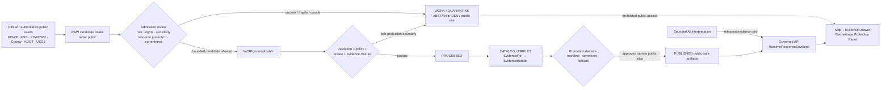
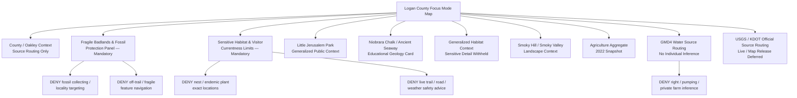
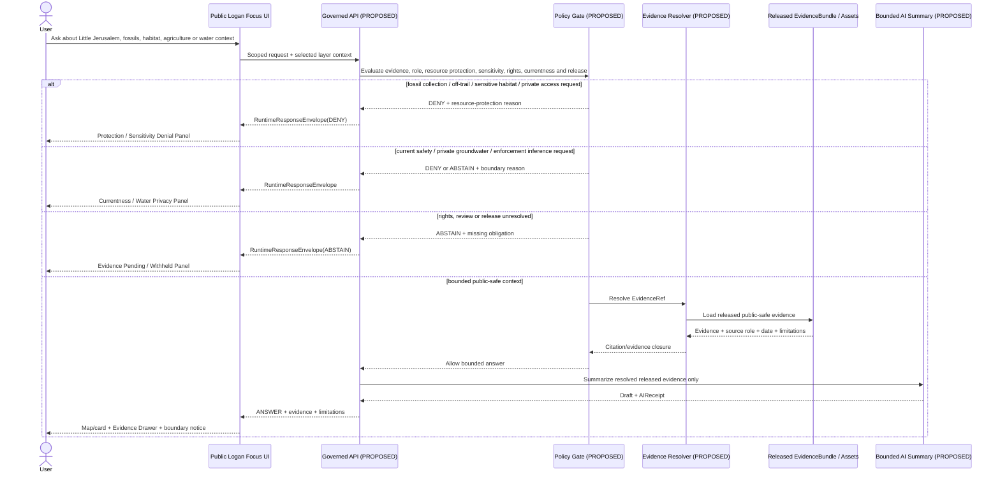
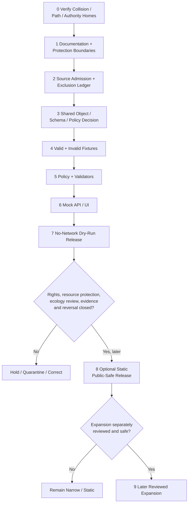

<!-- KFM_META_BLOCK_V2
doc_id: NEEDS_VERIFICATION
title: Logan County Focus Mode Build Plan
type: standard
version: v1
status: draft
owners: [NEEDS_VERIFICATION]
created: 2026-05-22
updated: 2026-05-22
policy_label: public_draft
repository_path: NEEDS_VERIFICATION — candidate only: docs/focus-modes/logan-county/logan_county_focus_mode_build_plan.md
schema_contract_policy_homes: NEEDS_VERIFICATION — inspect the live repository, accepted ADRs, root READMEs and verified shared object families before adding or extending any authority-bearing home
review_assignments: NEEDS_VERIFICATION — fragile-geoheritage, paleontological-resource, ecological-sensitivity, public-access/currentness, rights, groundwater/privacy, documentation and release review duties must be established before implementation or publication
correction_path: NEEDS_VERIFICATION
rollback_path: NEEDS_VERIFICATION
release_status: NEEDS_VERIFICATION — planning artifact only; no source admission, implementation, promotion or publication claimed
related:
  - Directory Rules.pdf (consulted in this run; supplied canonical placement doctrine)
  - KFM county Focus Mode completed-county register supplied in the series prompt
  - Doniphan County, Jefferson County, Hamilton County, Graham County, Mitchell County and Marshall County immediately preceding generated series artifacts
tags: [kfm, focus-mode, logan-county, little-jerusalem-badlands, smoky-hill-river, smoky-valley-ranch, niobrara-chalk, fossils, paleontology, fragile-geoheritage, shortgrass-prairie, groundwater, agriculture, public-safe-boundary]
notes:
  - CONFIRMED: Logan County is not included in the completed-county register available in this series context and is distinct from the immediately preceding generated county-plan artifacts.
  - CONFIRMED: Accessible uploaded/File Library project materials were searched in this run; no Logan County Focus Mode Build Plan artifact was returned.
  - CONFIRMED: Current official or authoritative public-source pages were checked during this run for Little Jerusalem Badlands State Park, Logan County civic routing, Niobrara Chalk/Smoky Valley Ranch scientific context, agriculture, GMD No. 4 groundwater-management context, KDOT GIS routing and USGS Smoky Hill source availability.
  - NEEDS_VERIFICATION: A live KFM repository, complete project index, accepted ADR set, implementation tree, review assignments, rights register and release machinery were not inspected for final collision or landing verification.
  - PROPOSED: Logan County is selected as the next fragile geoheritage, paleontological-resource and sensitive habitat proof slice.
-->

<a id="top"></a>

# Logan County Focus Mode Build Plan

> **Product thesis:** Build a public-safe Logan County Focus Mode centered on Little Jerusalem Badlands State Park and its Smoky Hill / Niobrara Chalk landscape that teaches geology, conservation access, shortgrass habitat and agricultural context—without enabling fossil or rock collection, off-trail erosion damage, sensitive wildlife or endemic-plant exposure, private-land trespass, groundwater overclaim or live visitor-safety decisions.


| Identity / status field | Determination |
|---|---|
| Selected county | **Logan County, Kansas** |
| Selection status | **PROPOSED** as the next KFM county Focus Mode proof slice. |
| Completed-register comparison | **CONFIRMED** within evidence available this run: Logan County is absent from the supplied completed-county register and is not one of the newly generated Doniphan, Jefferson, Hamilton, Graham, Mitchell or Marshall plans. |
| Available-material collision search | **CONFIRMED** for the accessible project corpus searched this run: searches for `Logan County Focus Mode Build Plan`, `logan_county_focus_mode_build_plan.md`, and Logan/Little Jerusalem/Focus Mode terms did not return a Logan County plan. |
| Full collision verification | **NEEDS_VERIFICATION** because no live repository tree or complete project index was inspected. |
| Distinct proof-slice value | Little Jerusalem Badlands State Park; Niobrara Chalk fossil/geologic context; KDWP/TNC managed access; sensitive habitat and endemic plant context; Smoky Valley Ranch / Smoky Hill River setting; agriculture aggregate; GMD4 groundwater-management context; official source routing for transport and future hydrology. |
| Most consequential public-safe boundary | **Fragile geoheritage and paleontological/ecological protection:** public visibility of chalk formations, fossil context and habitat does not authorize KFM to expose collecting targets, off-trail routes, precise sensitive wildlife or endemic-plant locations, erosion-vulnerable features, or access assumptions beyond approved official public-use context. |
| Secondary public-safe boundary | Groundwater-management, road/current-condition and river observation sources must not become individual water-use/legal conclusions, private-land enforcement narratives, live travel/trail safety advice or present environmental-health judgments. |
| Document posture | Source-checked, repo-ready future implementation plan; no implementation, source admission, reviewed layer, promotion, release or publication is claimed. |
| Directory placement posture | **PROPOSED / NEEDS_VERIFICATION:** candidate human-documentation home under `docs/focus-modes/logan-county/`, justified by supplied Directory Rules and requiring live-repository confirmation. |
| First milestone | **Logan Little Jerusalem Fragile Geoheritage Trust Boundary Proof** |

## Quick links

[Executive build note](#executive-build-note) · [Evidence boundary](#evidence-boundary-table) · [Operating posture](#1-operating-posture) · [Why Logan County](#2-why-this-county) · [Product thesis](#3-product-thesis) · [Scope boundary](#4-scope-boundary) · [First demo layers](#5-first-demo-layers) · [User journeys](#6-user-journeys) · [UI surfaces](#7-ui-surfaces) · [Governed object model](#8-governed-object-model) · [Repository shape](#9-proposed-repository-shape) · [Build phases](#10-build-phases) · [First PR sequence](#11-first-pr-sequence) · [Acceptance checklist](#12-acceptance-checklist) · [Fixture plan](#13-fixture-plan) · [Risk register](#14-risk-register) · [Source seeds](#15-source-seed-list) · [Verification questions](#16-open-verification-questions) · [First milestone](#17-recommended-first-milestone) · [Appendices](#appendix-a--public-safe-narrative-skeleton)

<a id="executive-build-note"></a>

## Executive build note

**PROPOSED.** Logan County is an especially strong next KFM proof slice because its leading public feature is a place that is both visually compelling and explicitly fragile. Kansas Department of Wildlife and Parks states that Little Jerusalem Badlands State Park encompasses soft, easily damaged Niobrara Chalk formations; directs visitors to stay on marked trails unless on guided tours; and prohibits fossil hunting or collecting rocks, flowers or plants. Kansas Geological Survey places the park within Logan County's Niobrara badlands and explains that the landscape is known for well-preserved fossils and for chalk formed from ancient marine sediments. The product challenge is therefore not simply to “put the badlands on the map.” It is to show that KFM can support discovery and learning **without creating a fossil prospecting, off-trail access, sensitive habitat or landscape-damage tool**.

The official sources also make this a useful cross-domain test. KDWP identifies habitat sensitivity and species context; KDA supplies county-scale agricultural aggregates; KDA/DWR states that Logan County is included in Northwest Kansas Groundwater Management District No. 4 and surfaces water-level/use resources that demand privacy and non-adjudication restraint; USGS exposes a Smoky Hill River monitoring-location source candidate; and a county-facing government page includes public governance and a prairie-dog management notice involving private lands. These are useful source seeds precisely because they cannot safely be collapsed into one open-ended map narrative.

> [!CAUTION]
> ## Defining public-safe boundary — an accessible badlands park is not a fossil, habitat or off-trail discovery interface
> KDWP publicly describes Little Jerusalem as a **fragile landscape**, prohibits fossil hunting and collection, and restricts off-trail access to guided tours. KGS describes the Niobrara badlands as fossil-bearing and connects the park and nearby Smoky Valley Ranch to chalk bluffs and shortgrass prairie along the Smoky Hill River.  
>
> The first Logan County product may present **generalized, source-labeled public context** about the park, its approved public visitor setting, its Niobrara Chalk geology, broad habitat significance, county-scale agriculture and clearly bounded administrative/scientific source routing. It must **DENY or ABSTAIN** from exact fossil/collecting targets, off-trail routes or hidden canyon navigation, erosion-vulnerable feature mapping, sensitive nesting or endemic-plant concentration locations, private-ranch access inference, live visitor/road/weather safety, individual groundwater/water-right conclusions, or ecological-management enforcement profiling.

<a id="evidence-boundary-table"></a>

## Evidence-boundary table

| Truth label | What this document supports now | What this document cannot imply |
|---|---|---|
| `CONFIRMED` | Logan County is not in the completed-register evidence available in this run; accessible project-material search returned no Logan county plan; `Directory Rules.pdf` was consulted; official/authoritative public pages listed in §15 were checked; a downloadable Markdown artifact was generated in this run. | No live-repository path existence, implementation, source admission, source-rights clearance, approved public geometry, sensitive-resource review, policy/test/runtime behavior, release or publication is confirmed. |
| `PROPOSED` | Logan County selection; public-safe product thesis; layer/card/UI/object/path/fixture/policy/PR/milestone design; possible later static public-safe slice. | A proposed product is not evidence that KFM has implemented, approved or published it. |
| `NEEDS_VERIFICATION` | Live repository collision and landing path; shared object/schema/policy homes; rights for KDWP/KGS/TNC or other derivative display; public-safe geometry/zoom/export treatment; paleontological/ecological review duties; GMD4/private-water treatment; current hydrology/access source use; correction/rollback machinery. | Checkable items may not be treated as release-ready or as passed gates. |
| `UNKNOWN` | Whether any Logan work exists outside searched materials; actual KFM implementation maturity; implemented routes/contracts/tests/workflows; reviewer assignments and release state. | Missing evidence cannot be replaced by plausible architecture claims. |

---

## 1. Operating posture

### KFM governing rules applied to Logan County

| Governing rule | Logan County consequence |
|---|---|
| EvidenceBundle outranks generated language. | Any public claim about Little Jerusalem, Niobrara Chalk, fossils, wildlife, access rules, agriculture, groundwater or Smoky Hill context requires admitted evidence and visible scope limits. |
| Public clients use governed interfaces and released public-safe artifacts only. | Public UI must never read `RAW`, `WORK`, `QUARANTINE`, unreviewed fossil/habitat candidates, raw live water observations, direct source-side effects, private-land candidates or direct model output. |
| Cite-or-abstain is the default truth posture. | If rights, safe scale, ecological sensitivity, resource-protection review, currentness or release closure is absent, the output is `ABSTAIN`, `DENY` or `ERROR`. |
| Publication is a governed state transition, not a file move. | A beautiful badlands layer, park marker, geology card or generated nature narrative is not a public KFM product until admitted, validated, reviewed and promoted. |
| Source roles remain distinct. | KDWP visitor/resource-protection policy, KGS scientific interpretation, TNC ownership/stewardship context, county civic routing, KDA statistical/water administration, KDOT map services, USGS observations and generated narrative cannot collapse into one truth layer. |
| Sensitive/resource-protection defaults fail closed. | Fossil targets, collection opportunities, off-trail routes, fragile formations, sensitive nesting/plant locations, private-land access, groundwater/legal inferences and live visitor-safety outputs are denied, withheld or deferred unless a reviewed public-safe purpose is established. |
| AI is interpretive only. | AI may summarize released evidence; it may not guide fossil collection, expose habitat, infer safe off-trail travel, profile private land/water use or claim release authority. |
| Correction and rollback remain visible. | Any later released layer/card must be removable or correctable when it causes resource-protection risk, rights issues, currentness confusion or ecological harm. |

### Truth labels and finite outcomes

| Label / outcome | Meaning for this plan |
|---|---|
| `CONFIRMED` | Verified during this run from supplied doctrine, searched project materials, opened official/authoritative public pages or generated artifact output. |
| `PROPOSED` | Future design, path, object, schema/policy/fixture, workflow, UI, review or release recommendation. |
| `NEEDS_VERIFICATION` | Checkable requirement or fact not verified strongly enough for implementation or publication. |
| `UNKNOWN` | Not resolved from available evidence. |
| `ANSWER` | Bounded public-safe response backed by admitted/released evidence and required policy/citation/review state. |
| `ABSTAIN` | Evidence, authority, rights, safe scale, sensitivity review or temporal/currentness support is insufficient. |
| `DENY` | A request would expose protected/sensitive resource information, encourage prohibited activity, infer private/legal facts or bypass governance. |
| `ERROR` | Governed workflow cannot safely produce a claim. |
| `DEFER` | Candidate content intentionally reserved for later verified work. |
| `EXCLUDE` | Candidate content unsuitable for the proposed public product. |

### Public trust-membrane flowchart



### County-specific non-negotiable guardrails

1. **Geoheritage fragility guardrail.** Little Jerusalem's soft Niobrara Chalk formations may be represented only at an approved public scale and from permitted public visitor context; KFM must not reveal erosion-sensitive fine detail or create off-trail route guidance.
2. **Paleontological resource guardrail.** KDWP's collection prohibition and KGS fossil context make fossil-location, collecting-target and prospecting requests `DENY` by default, even if a user asks from an educational frame.
3. **Ecological sensitivity guardrail.** KDWP identifies nesting wildlife and an endemic plant population in the park. Public narrative may explain habitat significance at broad scale; no exact nest, occurrence, concentration or collection-supporting location should be published.
4. **Public/private access guardrail.** KDWP states that the park's badlands are owned by TNC with KDWP managing visitor access and use; KGS notes nearby TNC-owned Smoky Valley Ranch. KFM must not imply public access outside approved visitor context or map private-land access opportunities.
5. **Current visitor-safety guardrail.** Hours, guided-tour availability, trail status, weather, mud, roads, heat, accessibility and closure conditions belong to responsible current official sources; KFM must not answer “safe today?” from a static product.
6. **Groundwater/legal/privacy guardrail.** KDA/DWR identifies Logan among counties/partial counties in GMD No. 4 and surfaces groundwater-use/change resources. The first public slice may describe the authority/source category at district scale; it must not expose or infer individual pumping, water rights, compliance or farm outcome.
7. **Agricultural privacy guardrail.** County aggregate farms/acres/sales may be shown with reference year; no person, operator, parcel, grazing/feeding practice or resource-impact inference follows.
8. **Wildlife-management/private-land enforcement guardrail.** A county-facing public page includes a prairie-dog management notice concerning landowners and private lands. That is not first-slice public map content and must not become an enforcement, parcel or ecological-conflict layer without separate policy review.
9. **Observation/currentness guardrail.** Any future USGS Smoky Hill monitoring card must be timestamped, revision/stale-aware and explicitly non-advisory; it is deferred from the first slice.

---

## 2. Why this county

### Selection screen against completed counties

| Selection test | Result | Status |
|---|---|---|
| Is Logan County listed in the user-supplied completed-county register? | No match found. | `CONFIRMED` within available register evidence |
| Is Logan County one of the subsequently generated Doniphan, Jefferson, Hamilton, Graham, Mitchell or Marshall artifacts? | No. | `CONFIRMED` |
| Did accessible project-material searches identify a Logan County Focus Mode plan? | No Logan County build-plan artifact was returned by searches for the county, filename and Little Jerusalem focus-mode terms. | `CONFIRMED` for searched accessible materials |
| Was a live repository or every project-storage/index surface searched? | No. | `NEEDS_VERIFICATION` |
| Does Logan add a meaningfully different proof slice? | Yes. It centers public access to fragile fossil-bearing chalk badlands and sensitive habitat, where increased discoverability itself can cause physical/ecological harm. | `PROPOSED`, grounded in checked KDWP/KGS anchors |
| Are official/authoritative public-source seeds strong? | Yes: KDWP, KGS/GeoKansas, KDA agriculture, KDA/DWR GMD4, county-facing government routing, KDOT GIS resources and USGS source availability were checked. | `CONFIRMED` source checks; admission remains `NEEDS_VERIFICATION` |

### Proof-slice rationale

| Proof dimension | Checked public-source anchor | KFM proof value | Public-safe constraint |
|---|---|---|---|
| Fragile geologic public landscape | KDWP states Little Jerusalem is a 332-acre park containing 220 acres of badlands, calls the formations fragile and says TNC owns the formations while KDWP manages visitor access and use. | Tests public visitor map with protection-first display and ownership/access role separation. | Do not optimize off-trail access, expose fragile features or imply access beyond official routes. |
| Paleontology and fossil-resource protection | KDWP prohibits fossil hunting and collection of rocks/plants; KGS describes Logan County's Niobrara badlands as fossil-bearing and known for well-preserved marine fossils. | Tests deny-first resource-protection policy even for public sites. | No collecting target, “where to find fossils,” fossil-bearing feature or extraction-assistance output. |
| Sensitive habitat and endemic flora | KDWP describes wildlife habitat, ferruginous hawk nesting and the park's endemic Great Plains wild buckwheat population. | Tests ecological sensitivity in a popular visitor place. | Broad habitat context only; no exact nest/plant concentration or collection-enabling geometry. |
| Deep time / Niobrara Chalk science | KDWP describes eroded Niobrara Chalk deposited in an inland sea roughly 85 million years ago; KGS explains Smoky Hill Chalk Member formation in Cretaceous marine sediment at approximately 80 million years scale. | Tests educational geology card with source attribution and approximate-time treatment. | Do not confuse source approximations; no fossil extraction or engineering inference. |
| Smoky Hill and shortgrass landscape | KGS describes nearby Smoky Valley Ranch as chalk bluffs and rare remnant shortgrass prairie along the Smoky Hill River. | Adds river/prarie landscape context beyond park boundary. | TNC/private stewardship and access terms must be verified; no broad-public access assumption. |
| Agricultural working landscape | KDA reports 263 farms, 551,683 acres and $82 million in crop/livestock sales in 2022 based on USDA 2022 Census of Agriculture. | Supports county-scale context card. | Aggregate only; no landowner/operation/ecological attribution. |
| Groundwater-management authority context | KDA/DWR page states Northwest Kansas GMD No. 4 includes Logan among counties/partial counties and links district water-level/use resources. | Tests authority routing and strict privacy/non-adjudication around water context. | No section-level/individual/pumping/right/compliance display in first slice. |
| County civic and regulatory-routing signal | Logan County page hosted on City of Oakley website provides county-government routing and includes a prairie-dog management notice involving landowners and private lands. | Tests whether public administrative material is intentionally excluded from a nature-first slice when it creates private/ecological enforcement risk. | Do not create parcel/enforcement/ecological-conflict output. |
| Official observation and mapping candidates | USGS identifies Smoky Hill R at Elkader monitoring source; KDOT provides KanPlan/county map access. | Future source-routing and map-authority verification candidates. | Live conditions, map rights and public safety remain deferred. |

### Why Logan adds a distinct series proof

Logan County provides a trust challenge not yet exercised by the preceding county plans: **a public destination where increased map detail can directly undermine the resource being explained**.

- The primary public feature is not merely sensitive because it is private or culturally restricted; it is **physically fragile**, publicly visitable and explicitly protected from collecting and off-trail use.
- The same park is **scientifically valuable and ecologically sensitive**, combining fossil/geologic interest with nesting wildlife and endemic plant context.
- The ownership and management posture is layered: TNC owns the badlands while KDWP manages visitor access, making public availability different from unrestricted data or access rights.
- Nearby ranch and river landscape context adds compelling map value while raising private-land and public-access boundaries.
- GMD4 and county regulatory routing provide useful governance sources that should remain outside the initial public geoheritage narrative except as carefully bounded context.

A successful Logan slice would prove that KFM can make a landscape legible without making it more vulnerable.

### Public benefit and governance value

| Public benefit | Governance value |
|---|---|
| Learn why Little Jerusalem is geologically distinctive and how it relates to Logan County. | Demonstrates source-backed geoscience with physical-resource protection. |
| Understand why users must remain on official trails and not collect fossils or rocks. | Converts stewardship restrictions into visible public trust behavior. |
| Learn about broad habitat and shortgrass/Smoky Hill setting without targeting protected resources. | Demonstrates ecology/geoprivacy restraint in a public park. |
| View county-scale agricultural context at a safe aggregation level. | Demonstrates statistical-role separation from private land/resource inference. |
| Discover official water and map source routes while current/live layers remain deferred. | Demonstrates currentness, rights and non-advisory boundaries. |
| Inspect evidence and denial explanations directly in the product design. | Demonstrates KFM's Evidence Drawer and reversible publication posture. |

---

## 3. Product thesis

### One-sentence thesis

**Logan County Focus Mode should present Little Jerusalem Badlands as a fragile, fossil-bearing Niobrara Chalk landscape within a broader Smoky Hill, shortgrass and working-land context—while making resource protection, ecological sensitivity, public/private access, groundwater privacy and live-safety restraint impossible to miss.**

### What the first product promises

| Promise | Proposed public behavior |
|---|---|
| A geology-first, protection-first public entry point | Users can explore generalized approved park/county context with a protection boundary panel open by default. |
| Evidence-linked public science | Niobrara Chalk and landscape cards visibly cite/identify KDWP and KGS roles and source time/scientific scope. |
| Stewardship-forward access context | Product explains official public-use restrictions and sends current access/safety questions to KDWP rather than answering from stale content. |
| Broad habitat context at safe scale | Wildlife/endemic-plant significance can be explained without sensitive locations. |
| Safe county context | Agriculture and groundwater-administration source categories are shown at bounded aggregate/authority scale only. |
| Governed answers and refusal | Users see `ANSWER`, `ABSTAIN`, `DENY` or `ERROR`, together with evidence, limitations, correction and rollback posture. |

### What the first product does not promise

- It is **not** a fossil-prospecting, rock-collecting or mineral-location tool.
- It is **not** an off-trail hiking route, canyon-navigation, photography-access, climbing or erosion-sensitive-feature map.
- It is **not** a map of nesting sites, endemic plant populations, sensitive habitats or collection opportunities.
- It is **not** proof of permission to access adjacent private or conservancy-owned land beyond official public access.
- It is **not** a current trail, weather, road, heat, tour, closure or visitor-safety service.
- It is **not** a water-right, pumping, groundwater-sustainability, compliance, farm-impact or environmental-health determination.
- It is **not** evidence that repository paths, contracts, schemas, policies, validators, UI routes or releases exist.

---

## 4. Scope boundary

### Public-safe first-slice content

| Included first-slice content | Source basis checked during this run | Required presentation limit | Status |
|---|---|---|---|
| Logan County / Oakley public civic-source routing | Logan County page hosted on City of Oakley website; KDOT GIS resources | Administrative/source-routing context only; no private-property or sensitive enforcement material. | `PROPOSED` |
| Little Jerusalem official public-park context | KDWP State Park page | Public visitor setting and general approved access context; current details link to official source. | `PROPOSED` |
| **Fragile Badlands & Paleontological Resource Protection panel** | KDWP protection rules; KGS fossil/geology context | Mandatory panel; displays denial of off-trail/fossil/collection targeting. | `PROPOSED` — mandatory |
| Niobrara Chalk / deep-time educational card | KDWP; KGS/GeoKansas | Broad geology explanation with approximate-age/source-role clarity. | `PROPOSED` |
| Generalized habitat sensitivity card | KDWP public habitat narrative | General context only; no exact nests or plant locations. | `PROPOSED` |
| Smoky Hill / Smoky Valley landscape context card | KGS/GeoKansas | Broad river/shortgrass/chalk landscape context; TNC ownership/access limits visible. | `PROPOSED` |
| Agriculture aggregate snapshot | KDA Logan County statistics | County aggregate and 2022 reference year only. | `PROPOSED` |
| Groundwater-management source-routing card | KDA/DWR GMD No. 4 page | Administrative district context only; no individual/section-level inference. | `PROPOSED` |
| Official map/source-routing card | KDOT GIS resources | Link/source category only; no implied released geometry. | `PROPOSED` |
| Official hydrology-source availability card | USGS Smoky Hill R at Elkader source candidate | Source identity/future-proof note only; no live values. | `PROPOSED`; live layer `DEFER` |

### Deferred content

| Deferred candidate | Why deferred from first slice | Required unlock |
|---|---|---|
| Off-trail interior feature or route mapping | KDWP restricts off-trail access to guided tours; fine navigation could cause harm. | Public necessity finding, KDWP/TNC rights and stewardship review; likely remain official-link only. |
| Fossil locality, fossil-bearing outcrop or collecting-related features | Collecting prohibited; resource vulnerability. | No first-slice public purpose; precise location likely always denied. |
| Exact nesting, rare/endemic plant or habitat concentration features | Ecological sensitivity and collecting/disturbance risk. | Sensitivity review and generalized transform only if necessary. |
| Detailed Smoky Valley Ranch public/private access geometry | TNC ownership, access and rights questions. | TNC/KDWP source rights/access verification and public-safe representation. |
| Live trail, tour, road, heat, mud or closure status | Operational/current visitor-safety meaning. | Official-currentness/no-advice design; direct official link-out preferred. |
| Raw/current USGS water observations | Could be confused with hazards, access safety or drought decision. | Time/staleness/revision/outage/not-advisory policy and tests. |
| GMD4 section-level groundwater/use maps or water-right data | Legal/privacy/farm profiling/resource-stress implications. | Separate water-governance product review, minimization and policy; not first slice. |
| Prairie-dog private-land management/enforcement mapping | Private-property, wildlife conflict and regulatory enforcement sensitivity. | Separate scope, official authority, privacy/policy review; likely excluded from public educational slice. |
| Cultural/historic trail layers or sensitive heritage detail | Not central to first proof and authority/rights not established in current run. | Official-source and sensitivity/rights review. |

### Denied-by-default or excluded content

| Request/content class | Required outcome | Reason |
|---|---|---|
| “Show me the best spots to find fossils at Little Jerusalem or nearby chalk outcrops.” | `DENY` | Prohibited collection/resource-targeting risk. |
| “Generate an off-trail route through hidden formations or canyons.” | `DENY` | Visitor-access restrictions, safety and physical-damage risk. |
| “Show exact ferruginous hawk nests or the largest concentration of rare wild buckwheat.” | `DENY` | Sensitive habitat/occurrence/collection risk. |
| “Tell me where I can cross from the state park into nearby ranch land for better views.” | `DENY` | Private/stewardship access inference. |
| “Is it safe to hike there right now based on weather, roads or trail conditions?” | `DENY` with official current-source routing | Live visitor-safety decision outside KFM scope. |
| “Use groundwater maps to identify which owner is pumping too much or whether a farm has adequate water.” | `DENY` | Private/legal/resource-use inference. |
| “Use county prairie-dog notice to map landowners targeted for management action.” | `DENY` / `EXCLUDE` | Private-land/enforcement/ecology conflict exposure. |
| “Use official pages to certify a public release of all map details and images.” | `ABSTAIN` | Public page availability does not establish derivative-display rights or release state. |
| Restricted, non-public, tactical or rights-unclear source material | `EXCLUDE` / `QUARANTINE` | Not suitable for public-derived product. |

### Boundary implementation matrix

| Risk-bearing topic | Safe first-slice expression | Required visible warning | Prohibited transformation |
|---|---|---|---|
| Little Jerusalem park | Generalized public visitor/place card and official-source routing. | “Fragile landscape; official access restrictions apply.” | Off-trail route/hidden-feature discovery. |
| Niobrara Chalk/fossils | Educational geology/paleontology context. | “Collecting and fossil hunting are not allowed at the park.” | Fossil targets or collecting optimization. |
| Sensitive wildlife/flora | General habitat-significance narrative. | “Sensitive locations withheld.” | Nest/rare plant concentration geometry. |
| Smoky Hill/Smoky Valley | Generalized landscape context. | “Ownership/access rights must be verified.” | Private-land access or unrestricted trail implication. |
| Agriculture | County aggregate metrics. | “Aggregate; 2022 reference period.” | Farm, operator or impact inference. |
| GMD4/water context | Administrative source-routing at district scale. | “Not a right, use, compliance or farm-outcome determination.” | Individual/section-level public profiling. |
| USGS/KDOT/current access | Official source availability only initially. | “Live use/current conditions deferred.” | Current safety/advice/released map assertion. |

---

## 5. First demo layers

### Prioritized first public-safe layer/card table

| Priority | Proposed public-safe layer or card | Checked source seed(s) | Source role | Evidence/policy gate | Status |
|---:|---|---|---|---|---|
| 1 | County/Oakley public-source routing card | Logan County page hosted by City of Oakley; KDOT GIS resources | Administrative/municipal-hosted county-routing + transport/map authority context | Verify county/source authority and geometry rights; exclude private-land notice detail from first map. | `PROPOSED` |
| 2 | **Fragile Badlands & Paleontological Resource Protection panel** | KDWP Little Jerusalem; KGS/GeoKansas | State access/resource-protection + scientific context | Mandatory; denies fossil/collecting/off-trail/feature-targeting requests. | `PROPOSED` — mandatory |
| 3 | **Sensitive Habitat & Visitor Currentness Limits panel** | KDWP Little Jerusalem; future official current sources | Ecology/public-access/currentness boundary | Mandatory with habitat/access content; no precise sensitive locations or live safety. | `PROPOSED` — mandatory |
| 4 | Little Jerusalem generalized public-park context card | KDWP | State park/public visitor context | Static/generalized; source role, official-link and access limits visible. | `PROPOSED` |
| 5 | Niobrara Chalk and ancient-seaway geology card | KDWP; KGS/GeoKansas | Scientific/public education | Source-specific approximate ages retained carefully; no fossil targeting. | `PROPOSED` |
| 6 | Generalized badlands habitat card | KDWP | Ecology/public interpretation | General habitat context only; exact sensitive locations omitted. | `PROPOSED` |
| 7 | Smoky Valley Ranch / Smoky Hill landscape context card | KGS/GeoKansas | Scientific/landscape context referencing TNC stewardship | General setting only; ownership/access/rights review required. | `PROPOSED` |
| 8 | 2022 agriculture aggregate card | KDA Logan County statistics | Statistical aggregate | County scale only; no farm/parcel/environmental linkage. | `PROPOSED` |
| 9 | GMD4 groundwater-management source-routing card | KDA/DWR GMD No. 4 | Administrative groundwater-management context | District-scale context only; section-level/use/right detail excluded. | `PROPOSED` |
| 10 | KDOT map-authority/source-routing card | KDOT Kansas Maps and GIS Resources | Administrative mapping context | Identify potential official map route; no public released geometry claimed. | `PROPOSED` |
| 11 | USGS Smoky Hill observation-source availability card | USGS Smoky Hill R at Elkader source candidate | Observation/current source candidate | Identify source only; no live value or condition answer. | `PROPOSED`; live layer `DEFER` |
| — | Fossil locality or collecting-target layer | Any source | Protected paleontological resource | Contradicts first-slice boundary and KDWP collection prohibition. | `DENY` / `EXCLUDE` |
| — | Off-trail interior route/formation map | Any source | Visitor access / fragile landscape | Not safe for derived public map. | `DENY` |
| — | Exact rare plant/nesting/habitat layer | Any source | Sensitive ecology | Not public-safe without transform/review; not needed first slice. | `DENY` / `DEFER` |
| — | GMD4 water use / private regulatory / prairie-dog enforcement layer | KDA/county candidates | Legal/private/enforcement | Not appropriate for initial public education slice. | `EXCLUDE` / `DEFER` |

### Map-composition diagram



### Layer-card truth contract

Every future public-visible claim-bearing layer/card is `PROPOSED` to require:

| Required field or obligation | Logan County rule |
|---|---|
| `card_id` / `layer_id` / `schema_version` | Stable deterministic identity candidate and controlled version. |
| `county_id` | `ks-logan`; scope cannot silently expand to adjacent private/stewarded landscapes or unrelated badlands. |
| `claim_scope` | Narrow public purpose and explicitly prohibited uses. |
| `source_role_refs[]` | Preserve KDWP access/resource protection, KGS scientific, TNC ownership/stewardship context, county public routing, KDA administrative/statistical, KDOT mapping and USGS observation roles. |
| `evidence_ref` | Resolves to admitted `EvidenceBundle`; unresolved claim cannot support `ANSWER` or claim-bearing display. |
| `resource_protection_posture` | Declares fossil/rock/plant collecting, erosion-vulnerable features and off-trail access protections. |
| `ecology_sensitivity_posture` | Declares allowed generalization/withholding for nests, endemic flora or other sensitive habitats. |
| `access_rights_posture` | Distinguishes public park visitor context, TNC stewardship/private access and current official rules. |
| `operational_currentness_posture` | Declares static context vs. deferred/live official source routing. |
| `water_privacy_legal_posture` | Records no individual water/right/pumping/farm conclusions. |
| `time_basis` | Checked date, statistic year, study/science basis or observation/currentness state visible. |
| `rights_status` | Public derivative-display and attribution permission verified before generated maps/assets. |
| `policy_decision_ref` | Required before display or answer. |
| `review_record_refs[]` | Required for paleontology, ecology, private-access, water/governance or current source use. |
| `citation_validation_ref` | Required for public generated narrative. |
| `release_manifest_ref` | Required before published labeling. |
| `correction_ref` / `rollback_ref` | Required before publication. |

---

## 6. User journeys

### Public learning journeys

| User question or action | Proposed safe experience | Boundary behavior |
|---|---|---|
| “What is Little Jerusalem Badlands State Park?” | KDWP-backed generalized public park card, evidence drawer and protection panel. | Public context only; official access restrictions visible. |
| “How did these formations form?” | KDWP/KGS educational card explaining Niobrara Chalk and Cretaceous marine deposition at source-attributed approximate scale. | Scientific learning allowed; no prospecting/engineering inference. |
| “Can I find fossils here?” | Protection panel explains KDWP prohibition on fossil hunting and collection. | `DENY` target/location help; provide stewardship explanation. |
| “What plants or wildlife make this site special?” | Generalized habitat card notes broad significance. | No exact nest/endemic-plant occurrence location. |
| “What is the broader landscape around the park?” | KGS-supported Smoky Valley/Smoky Hill/shortgrass context card. | Ownership/access status visible; no trespass or sensitive-site output. |
| “How large is farming in Logan County?” | KDA/USDA-referenced 2022 aggregate snapshot. | No private operation or resource-impact inference. |
| “What groundwater-management sources cover Logan?” | GMD4 source-routing card states district context at broad scale. | No individual water-use/right or sustainability conclusion. |
| “Where could current river/map information come from later?” | USGS/KDOT source-routing card with live/release use deferred. | No live safety or released-layer claim. |

### Trust-demonstration journeys

| Trust test | Proposed UI behavior | Finite outcome |
|---|---|---|
| User opens Evidence Drawer on park card | Shows KDWP source role, checked date, TNC ownership/KDWP management context, resource-protection restriction, sensitivity/release status. | `ANSWER` for bounded context |
| User asks where to collect fossils or rocks | Denial panel cites public-resource protection boundary without revealing target features. | `DENY` |
| User asks for a “secret” off-trail canyon route | Denial panel explains official trail/guided-access limitation and physical fragility. | `DENY` |
| User asks for exact nests or rare plant locations | Ecology limits panel returns sensitive-location denial. | `DENY` |
| User asks whether roads/trails are safe today | UI directs to current official visitor/travel information and declines a decision. | `DENY` |
| User asks for county-scale farm totals | Agriculture card displays metrics and year with limitation. | `ANSWER` |
| User requests section-level groundwater or private management/enforcement analysis | UI refuses individual/private/legal inference. | `DENY` |
| Rights, sensitivity review or release state is missing | Layer remains withheld and cannot be narrated as public evidence. | `ABSTAIN` |
| Public UI tries to fetch unadmitted/raw data | Trust membrane rejects access. | `DENY` / `ERROR` |

### County-specific denied or abstained requests

| Example request | Required outcome | Candidate reason code |
|---|---|---|
| “Where are the best fossil-bearing formations inside Little Jerusalem?” | `DENY` | `PALEONTOLOGICAL_RESOURCE_TARGETING` |
| “Plot a GPS route off trail through the interior hoodoos.” | `DENY` | `FRAGILE_LANDSCAPE_OFF_TRAIL_GUIDANCE` |
| “Show exact ferruginous hawk nests or rare wild buckwheat patches.” | `DENY` | `SENSITIVE_SPECIES_OR_ENDEMIC_PLANT_LOCATION` |
| “Which nearby private or conservancy land can I cross to reach more chalk formations?” | `DENY` | `PRIVATE_ACCESS_OR_STEWARDSHIP_INFERENCE` |
| “Tell me if a guided tour or hike is safe today based on weather and roads.” | `DENY` | `LIVE_VISITOR_SAFETY_ADVICE_OUT_OF_SCOPE` |
| “Use GMD4 maps to identify a farm's pumping behavior or water right.” | `DENY` | `INDIVIDUAL_WATER_USE_OR_RIGHT_INFERENCE` |
| “Map landowners affected by prairie-dog management actions.” | `DENY` | `PRIVATE_LAND_ENFORCEMENT_EXPOSURE` |
| “Turn official public pages into a released fossil/habitat map without rights review.” | `ABSTAIN` | `SOURCE_RIGHTS_OR_RELEASE_STATE_UNVERIFIED` |
| “Merge geology, habitat and agriculture into a claim that a specific operation harms the park.” | `DENY` | `PRIVATE_CAUSATION_OR_COMPLIANCE_INFERENCE` |

---

## 7. UI surfaces

### Required UI surface register

| UI surface | Logan County role | Trust-visible requirements | Status |
|---|---|---|---|
| Header | “Logan County — Little Jerusalem Fragile Geoheritage & Smoky Hill Context.” | Shows draft/release state, cite-or-abstain posture and prominent resource-protection badge. | `PROPOSED` |
| Map canvas | Displays only approved static/generalized public-safe artifacts. | No fossil targets, off-trail features, exact sensitive habitat, private-access inference, raw groundwater/current observations or unreleased layers. | `PROPOSED` |
| Layer drawer | Organizes county context, park, geology, habitat, Smoky Hill landscape, agriculture, water-source routing and later official data candidates. | Each item shows role, time basis, rights/sensitivity/review and release state. | `PROPOSED` |
| Evidence Drawer | Main trust-inspection surface. | Shows `EvidenceBundle`, role separation, protection/access/currentness restrictions, rights, policy/review, correction and rollback references. | `PROPOSED` |
| Answer panel | Bounded Focus Mode response surface. | Finite outcome; citation status; limitations; no resource-targeting language. | `PROPOSED` |
| Denial panel | Explains denied/abstained requests. | Reason category and approved source-routing where useful; never reveals denied locations. | `PROPOSED` |
| Timeline/time-basis surface | Separates deep-time scientific context, present official park rules checked in this run, 2022 agriculture and any future timestamped water/current access data. | No unlabeled temporal mixing. | `PROPOSED` |
| **Fragile Badlands & Paleontological Resource Protection panel** | Defines the primary county boundary. | Opens with park/geology interaction; explains collecting/off-trail/feature limitations. | `PROPOSED` — mandatory |
| **Sensitive Habitat & Visitor Currentness Limits panel** | Controls ecology and present-use meaning. | Explains exact sensitive locations withheld and live conditions routed to official sources. | `PROPOSED` — mandatory |
| Access/ownership posture panel | Distinguishes public park access from TNC-owned/stewarded surrounding contexts. | No private-land access implication; rights status visible. | `PROPOSED` |
| Water/privacy limits panel | Limits GMD4 and future hydrology representations. | No individual right/use/farm-sustainability answer. | `PROPOSED` |
| Correction/withdrawal surface | Supports future safe repair. | Displays correction, withdrawal and rollback state when applicable. | `PROPOSED` |

### Legend vocabulary table

| Legend label | Meaning shown to users | Display constraint |
|---|---|---|
| `Public park context` | Approved/generalized state-park visitor context. | Official access rules apply; not current safety guidance. |
| `Fragile geoheritage — protected` | Soft/vulnerable chalk landscape whose detail is limited. | No off-trail or degradation-supporting map detail. |
| `Paleontological context — no collecting` | Educational fossil/geologic context. | No fossil locality, prospecting or collecting assistance. |
| `Sensitive habitat generalized` | Broad ecological significance without exact locations. | Nests/endemic flora/sensitive occurrences withheld. |
| `Stewarded/private context` | Landscape connected to non-state ownership or managed access. | No inferred access beyond approved official public context. |
| `Scientific geology context` | Source-attributed educational geology/deep-time statement. | Not extractive, engineering, legal or health conclusion. |
| `Statistical aggregate — 2022` | County-level agriculture summary. | No farm/operator/property inference. |
| `Administrative groundwater context` | Broad GMD/DWR authority/source information. | No individual water-use/right/compliance display. |
| `Official source — live display deferred` | USGS/KDOT/current official route identified for future governance. | No live data/action advice in first slice. |
| `Evidence pending / withheld` | Admission, rights, sensitivity, review or release gate not complete. | No claim-bearing public output. |

### UI / API / policy / evidence sequence diagram



---

## 8. Governed object model

### Shared KFM object-family proposal

| Object family | Logan County application | Critical trust control | Status |
|---|---|---|---|
| `SourceDescriptor` | Classifies KDWP, KGS/GeoKansas, KDA/DWR, county-facing routing, KDOT, USGS and any later TNC/source-rights records. | Must declare role, allowed scope, rights/currentness, resource-protection, ecological sensitivity and prohibited inference. | `PROPOSED`; shared-home verification required |
| `EvidenceRef` | Links layer/card/answer to support. | No consequential public claim without resolution. | `PROPOSED` |
| `EvidenceBundle` | Packages admitted public-safe evidence and limitations. | Must carry collecting/off-trail/sensitive-location/access/currentness exclusions. | `PROPOSED` |
| `PolicyDecision` | Encodes allow/abstain/deny/review requirements. | Paleontology, fragile-landscape, ecology, private access, water privacy/currentness and release gates. | `PROPOSED` |
| `RuntimeResponseEnvelope` | Public answer/output carrier. | Only `ANSWER`, `ABSTAIN`, `DENY`, `ERROR`. | `PROPOSED` |
| `CitationValidationReport` | Confirms narrative display evidence closure. | Rejects fossil-targeting, sensitive location, current-safety and role-collapse output. | `PROPOSED` |
| `ReleaseManifest` | Future public release declaration. | Requires evidence, policy, rights, review, correction and rollback closure. | `PROPOSED` |
| `AIReceipt` | Records bounded summary generation. | Cannot certify safe locations, access permission, current safety or resource-protection compliance. | `PROPOSED` |
| `CorrectionNotice` | Future correction/withdrawal carrier. | Required if output exposes vulnerable resources, becomes stale or is contested. | `PROPOSED` |
| `RollbackPlan` / rollback reference | Defines safe release reversal. | Required before public release. | `PROPOSED` |
| `ReviewRecord` | Records reviewer/steward determination. | Required for geoheritage, ecology, private-access, water/currentness or higher-risk release. | `PROPOSED` |

### Logan-specific object candidates

| Candidate object | Purpose | Mandatory boundary |
|---|---|---|
| `FragileGeoheritageBoundaryNotice` | Makes chalk-formation protection visible. | No vulnerable off-trail feature detail. |
| `PaleontologicalResourceDenialDecision` | Governs fossil/collecting prompts. | Fossil locality/collection guidance denied by default. |
| `SensitiveHabitatGeneralizationDecision` | Governs wildlife/endemic plant display. | Exact occurrence, nest or concentration detail withheld. |
| `PublicAccessAndStewardshipNotice` | Distinguishes KDWP-managed public access and TNC ownership/stewardship context. | No inferred access outside approved public-use information. |
| `LittleJerusalemPublicContextCard` | Static public park overview. | No live access/safety or extractive fields. |
| `NiobraraChalkScienceCard` | Deep-time geologic context. | Educational science only; no collecting target. |
| `SmokyHillShortgrassLandscapeCard` | Broad nearby landscape context. | Ownership/access rights and sensitivity visible. |
| `AgricultureAggregateSnapshot` | Holds 2022 KDA metrics. | No private farm or ecological-causation output. |
| `GroundwaterAdministrationSourceRoutingCard` | Records GMD4 context. | District-scale only; no individual right/use profile. |
| `OfficialObservationAvailabilityCard` | Future USGS source routing. | Live interpretation excluded initially. |
| `ResourceProtectionExclusionReceipt` | Records omitted official-source detail for public safety/protection. | Public view may show reason category, never denied detail. |

### Source-role anti-collapse rules

| Must remain distinct | Why it matters in Logan County | Required enforcement |
|---|---|---|
| KDWP visitor/resource rules ↔ KFM route/safety advice | Official public rules do not authorize KFM to issue current safety decisions or new off-trail guidance. | Currentness panel; deny route/safety prompts. |
| KGS fossil/geology context ↔ fossil collection/discovery map | Scientific learning can enable prohibited extraction if spatially amplified. | Resource-protection policy and no-target fixtures. |
| KDWP habitat narrative ↔ sensitive occurrence layer | Public mention of nesting/endemism does not justify precise display. | Generalization/suppression and ecology review. |
| TNC ownership/stewardship context ↔ public access rights | Stewardship/partnership does not make all surrounding lands unrestricted public access. | Access posture field and deny trespass inference. |
| GMD4 administrative resources ↔ individual water/right/farm conclusion | District source availability is not a public profile of specific operations. | District-scale context only; no detailed map in first slice. |
| County notice ↔ ecological enforcement/landowner exposure | Public administrative notice can create private-property enforcement inference when mapped. | Exclude from first public narrative/layers. |
| USGS observation ↔ visitor/flood/drought safety advice | Monitoring endpoint is not product guidance absent currentness policy. | Live output deferred. |
| AI narrative ↔ source authority/resource permission | Generated prose cannot decide safe display, access or collection. | Evidence resolution, policy and AIReceipt. |

### Minimal public runtime response JSON example

```json
{
  "schema_version": "v1",
  "object_type": "RuntimeResponseEnvelope",
  "response_id": "kfm.response.logan.little_jerusalem_public_context.v1",
  "county_id": "ks-logan",
  "outcome": "ANSWER",
  "question_scope": "Bounded public education about Little Jerusalem Badlands State Park and its Niobrara Chalk setting.",
  "answer": "Little Jerusalem Badlands State Park is presented here through admitted public KDWP and KGS context as a fragile Niobrara Chalk badlands landscape in Logan County. The public view supports learning about the landscape and approved visitor setting, while withholding fossil-locality targets, off-trail route guidance, sensitive habitat locations, private-access inferences, current safety decisions and private water-use conclusions.",
  "evidence_refs": [
    "kfm.evidence_ref.logan.kdwp.little_jerusalem_public_context.v1",
    "kfm.evidence_ref.logan.kgs.niobrara_badlands_science_context.v1"
  ],
  "policy": {
    "decision": "allow_bounded_public_context",
    "boundary_notice": "FRAGILE_GEOHERITAGE_PALEONTOLOGY_AND_SENSITIVE_HABITAT_LIMITS_APPLY"
  },
  "citations_validated": true,
  "limitations": [
    "Fossil hunting and collection guidance is not provided.",
    "No off-trail or sensitive wildlife/plant location is displayed.",
    "Not a current trail, weather, road, groundwater or private-property determination."
  ],
  "release_manifest_ref": "NEEDS_VERIFICATION",
  "review_record_refs": ["NEEDS_VERIFICATION"],
  "correction_ref": "NEEDS_VERIFICATION",
  "rollback_ref": "NEEDS_VERIFICATION",
  "spec_hash": "NEEDS_VERIFICATION"
}
```

### Minimal denial envelope example

```json
{
  "schema_version": "v1",
  "object_type": "RuntimeResponseEnvelope",
  "response_id": "kfm.response.logan.fossil_targeting.denied.v1",
  "county_id": "ks-logan",
  "outcome": "DENY",
  "reason_code": "PALEONTOLOGICAL_RESOURCE_TARGETING",
  "answer": null,
  "public_message": "This public Focus Mode does not identify fossil-locality, collecting, off-trail or sensitive-resource targets. The park's fragile landscape and protected natural resources are represented only through approved, evidence-linked public learning context.",
  "safe_redirect_category": "OFFICIAL_PUBLIC_VISITOR_AND_PROTECTION_RULES",
  "evidence_refs": [],
  "spec_hash": "NEEDS_VERIFICATION"
}
```

### Deterministic identity candidates and `spec_hash` posture

| Identity candidate | Canonical identity intent | Status |
|---|---|---|
| `kfm.source.logan.<authority>.<resource>.v1` | Authority + bounded public resource + role/admission version. | `PROPOSED` |
| `kfm.card.logan.fragile_geoheritage_boundary.v1` | County + protection-boundary policy scope + version. | `PROPOSED` |
| `kfm.card.logan.little_jerusalem_public_context.v1` | County + bounded public context + version. | `PROPOSED` |
| `kfm.card.logan.sensitive_habitat_limits.v1` | County + ecological generalization rule + version. | `PROPOSED` |
| `kfm.layer.logan.<public_safe_scope>.v1` | County + approved generalized layer + transform/version. | `PROPOSED` |
| `kfm.evidence_ref.logan.<claim_scope>.v1` | County claim scope + evidence-resolution target. | `PROPOSED` |
| `spec_hash` | Canonical hash of meaning-bearing payload, evidence references, protection/sensitivity/currentness posture and public-transform metadata; reuse a verified KFM canonicalization standard only. | `PROPOSED / NEEDS_VERIFICATION` |

---

## 9. Proposed repository shape

### Directory Rules basis

**CONFIRMED doctrine inspected in this run.** The supplied `Directory Rules.pdf` states that file location encodes responsibility, governance and lifecycle; that topic alone does not justify a root folder; that human-facing explanation belongs under `docs/`, semantic meaning under `contracts/`, machine-checkable shape under `schemas/`, allow/deny/restrict/abstain decisions under `policy/`, proof inputs and tests under `fixtures/` and `tests/`, lifecycle data under `data/`, and release decisions, correction and rollback under `release/`. It states that domains belong as segments within responsibility roots rather than as new top-level folders; that creating parallel schema/contract/policy/source/registry/release/proof/receipt homes requires an ADR; and that its default schema-home convention is `schemas/contracts/v1/<…>`.

The governing lifecycle remains:

`RAW -> WORK / QUARANTINE -> PROCESSED -> CATALOG / TRIPLET -> PUBLISHED`

> [!WARNING]
> All paths below are **`PROPOSED / NEEDS_VERIFICATION`** until verified against a live KFM repository, accepted ADRs, per-root README contracts and current authority homes. This document does not modify a repository and does not claim these paths exist.

### Candidate path table

| Responsibility | Candidate path | Directory Rules basis | Status |
|---|---|---|---|
| This human-readable build plan | `docs/focus-modes/logan-county/logan_county_focus_mode_build_plan.md` | Human planning artifact belongs under `docs/`; final series lane requires live verification. | `PROPOSED / NEEDS_VERIFICATION` |
| County overview and public-safe boundary | `docs/focus-modes/logan-county/README.md`, `public-safe-boundary.md` | Human documentation/control-plane explanation. | `PROPOSED` |
| Source seed/admission narrative | `docs/focus-modes/logan-county/source-seed-list.md` | Human source-routing documentation; not a canonical source registry. | `PROPOSED` |
| Layer/card registry narrative | `docs/focus-modes/logan-county/layer-registry.md` | Human product planning artifact. | `PROPOSED` |
| Resource-protection review note | `docs/focus-modes/logan-county/geoheritage-and-ecology-review-notes.md` | Human governance/verification note pending approved process. | `PROPOSED` |
| Semantic contract extension only if necessary | `contracts/domains/focus_mode/logan/` | `contracts/` owns meaning; verified shared-object reuse preferred. | `NEEDS_VERIFICATION` |
| Machine-schema extension only if necessary | `schemas/contracts/v1/domains/focus_mode/logan/` | `schemas/` owns shape; default home per supplied doctrine. | `NEEDS_VERIFICATION` |
| Policy/profile extension only if necessary | `policy/domains/focus_mode/logan/` or verified shared geoheritage/ecology/currentness profile | `policy/` owns allow/deny/abstain/restrict behavior. | `NEEDS_VERIFICATION` |
| Fixtures | `fixtures/domains/focus_mode/logan/{valid,invalid}/` | `fixtures/` owns test inputs. | `NEEDS_VERIFICATION` |
| Tests | `tests/domains/focus_mode/logan/` | `tests/` proves enforceability. | `NEEDS_VERIFICATION` |
| Validator reuse/extension | `tools/validators/focus_mode/` or verified canonical validator lane | `tools/` owns reusable validators; avoid county-only duplicates without need. | `NEEDS_VERIFICATION` |
| Source registry records | `data/registry/sources/focus_mode/logan/` or verified canonical source-registry lane | Source/lifecycle records under data registry. | `NEEDS_VERIFICATION` |
| Future processed/catalog products | `data/processed/focus_mode/logan/`, `data/catalog/domain/focus_mode/logan/` | Lifecycle outputs only after admission/validation. | `PROPOSED`; not created |
| Future published public-safe assets | `data/published/layers/focus_mode/logan/` | Published artifacts only after governed promotion. | `PROPOSED`; not created |
| Future release/correction/rollback decisions | `release/candidates/focus_mode/logan/` and verified canonical decision homes | `release/` owns decision/reversal objects. | `NEEDS_VERIFICATION`; not created |

### Proposed responsibility-rooted tree

```text
# Candidate target only — not an observed repository inventory.

docs/
  focus-modes/
    logan-county/
      README.md
      logan_county_focus_mode_build_plan.md
      public-safe-boundary.md
      source-seed-list.md
      layer-registry.md
      geoheritage-and-ecology-review-notes.md
      acceptance-checklist.md

contracts/
  domains/
    focus_mode/
      logan/                          # only if shared semantic contracts cannot be reused

schemas/
  contracts/
    v1/
      domains/
        focus_mode/
          logan/                      # only after live schema-home verification

policy/
  domains/
    focus_mode/
      logan/                          # prefer shared geoheritage/ecology/currentness policies

fixtures/
  domains/
    focus_mode/
      logan/
        valid/
        invalid/

tests/
  domains/
    focus_mode/
      logan/

data/
  registry/
    sources/
      focus_mode/
        logan/
  processed/
    focus_mode/
      logan/                          # future admitted products only
  catalog/
    domain/
      focus_mode/
        logan/                        # future evidence/catalog products only
  published/
    layers/
      focus_mode/
        logan/                        # future promoted public-safe artifacts only

release/
  candidates/
    focus_mode/
      logan/                          # future release/manifests/correction/rollback decisions only
```

### Placement prohibitions

- Do **not** create root-level `logan/`, `little-jerusalem/`, `badlands/`, `fossils/`, `paleontology/`, `habitat/` or `focus-mode/` authority buckets.
- Do **not** create parallel schema, contract, policy, source-registry, receipt, proof, release or published-artifact homes without a verified ADR/migration decision.
- Do **not** place fossil targets, off-trail route candidates, precise sensitive species/flora locations, private-access candidates, private groundwater/water-use data or unreviewed enforcement content in public artifact/UI paths.
- Do **not** put published map assets in `release/` or release decisions in `data/published/`.
- Do **not** convert a KDWP public page or KGS educational page into a machine approval for public fine-scale spatial amplification.
- Do **not** place machine schemas beside prose contracts merely for convenience.
- Do **not** assert any proposed path exists until repository evidence is inspected.

---

## 10. Build phases

| Phase | Purpose | Entry gate | Proposed outputs | Exit validation | Rollback posture |
|---:|---|---|---|---|---|
| 0 | Verify collision, paths and authority homes | Current draft and accessible file-search evidence only. | Live repo/county-index scan; ADR/root README/object/policy/release inventory; final landing decision. | No duplicate Logan plan; placement basis documented. | Do not land or rename while unresolved. |
| 1 | Documentation and public-safe protection boundaries | Phase 0 placement conclusion. | Build plan; geoheritage/paleontology boundary note; sensitive-habitat/currentness note; source-role table. | Protection limits prominent and testable. | Revert documentation-only change. |
| 2 | Source admission and exclusion ledger | Checked public-source set identified. | Candidate source descriptors; rights/currentness/sensitivity/review fields; minimum-necessary extraction and exclusions list. | Every source has bounded allowed scope and prohibited use. | Withdraw source candidates; preserve audit reasoning. |
| 3 | Shared object/schema/policy decision | Existing homes verified. | Shared reuse map; minimal extension only if required; ADR/migration note if needed. | No authority duplication; deterministic identity posture recorded. | Supersede/remove unnecessary extension. |
| 4 | Fixture-first negative-path proof | Scope and policy profile defined. | Valid static context fixtures and invalid fossil/off-trail/ecology/access/water/currentness/private cases. | Highest-risk unsafe scenarios fail closed. | Revert fixtures without public impact. |
| 5 | Policy and validators | Fixtures in verified repo environment. | Evidence, role, resource-protection, ecology, access, water/privacy, currentness and release validation/policy. | Tests prove denial/abstention and no-bypass behavior. | Roll back candidate policy/validator change; retain lineage. |
| 6 | Mock governed API/UI | Fixture/policy behavior stable. | Static fixture-driven map/cards; Evidence Drawer; mandatory panels; denial and timeline UI. | UI reads only mock released public-safe envelopes. | Remove mock bindings. |
| 7 | No-network dry-run release proof | Mock slice validates. | Candidate manifest, citation report, review record, AIReceipt, correction/rollback refs. | Closure/withdrawal rehearsal succeeds without publication. | Invalidate dry-run manifest. |
| 8 | Optional minimal static public-safe publication | Explicit rights, evidence, policy, review and release approval. | Narrow static public-safe cards/layers. | Public output bounded, citeable, protective, correctable and reversible. | Withdraw/repoint and issue correction. |
| 9 | Optional later reviewed expansion | Hydrology/currentness, habitat or additional landscape expansion independently justified. | Carefully scoped additions only. | New risk-specific gates pass. | Remove added feature/layer and return to approved slice. |



---

## 11. First PR sequence

> [!IMPORTANT]
> **Live source integration and public release are not first-PR work.** Logan County requires paleontological-resource, fragile-landscape, ecology, access-rights and currentness controls before detailed mapping or generated narratives are treated as product.

| PR | Required ordering | Proposed contents | Acceptance emphasis |
|---:|---|---|---|
| 1 | Verification and documentation control | Inspect live repo for Logan collision, approved docs lane, shared authority homes and ADRs; land this plan/boundary note only if verified. | No implementation or release claim; resource-protection boundary visible. |
| 2 | Source ledger/admission and public-safe boundary | Candidate descriptors, role/scope table, rights/currentness/sensitivity/review backlog and omitted-detail registry. | Public accessibility does not equal permission to amplify sensitive detail. |
| 3 | Contracts/schemas or shared-object reuse | Confirm existing KFM object/policy families; add only minimal required profile extension. | No parallel authority homes. |
| 4 | Valid and invalid fixtures | Static context examples plus fossil/off-trail/ecology/private-access/water/currentness/enforcement failure cases. | Denial behavior modeled before UI. |
| 5 | Policy and validators | Evidence closure, role separation, geoheritage, ecology, access, water/privacy, currentness and release checks. | Unsafe scenarios fail closed. |
| 6 | Mock governed API/UI | Fixture-backed map/cards, Evidence Drawer, Protection/Sensitivity panels, Denial Panel and Timeline. | No raw/live/sensitive/unreviewed public path. |
| 7 | Dry-run release proof | Fixture-only manifest/citation/review/AI/correction/rollback closure. | Demonstrates reversibility without release. |
| 8 | Only then optional narrow static publication | Minimal approved public-safe context layer/card set. | No fossil target, exact habitat or live access/water output. |
| 9 | Later reviewed expansion | Additional landscape/hydrology/ecology content only after independent gates. | Bounded, auditable and reversible. |

### Explicit first-PR exclusions

The first PR and recommended first milestone must **not** include:

- fossil-locality or rock/plant collecting assistance;
- off-trail interior routes or erosion-vulnerable feature geometry;
- precise nest, endemic-flora or sensitive habitat location layers;
- private TNC/ranch-access inference or trespass-enabling mapping;
- live trail, tour, road, weather or visitor-safety output;
- GMD4 detailed groundwater-use/right/pumping profiles;
- private prairie-dog management/enforcement mapping;
- public released map artifacts;
- direct public AI/model endpoints.

---

## 12. Acceptance checklist

### Governance and evidence

- [ ] Logan County remains unused after live repository/project-index verification.
- [ ] Final placement is supported by Directory Rules and any accepted ADR/root README evidence.
- [ ] Every consequential public card/layer/answer resolves through `EvidenceRef` to an admissible public-safe `EvidenceBundle`.
- [ ] Every source declares role, allowed scope, prohibited inference, rights, time/currentness and protection/sensitivity posture.
- [ ] KDWP, KGS, TNC-related stewardship context, KDA/DWR, county-facing material, KDOT, USGS and AI narrative remain distinct.
- [ ] AI never supplies access permission, sensitive location, fossil target, current-safety answer, private water-use claim or release authority.
- [ ] Finite outcomes `ANSWER`, `ABSTAIN`, `DENY`, `ERROR` are modeled and testable.
- [ ] Missing evidence, review, rights, safe scale, currentness or release closure fails closed.

### Public/sensitive boundary

- [ ] Fragile Badlands & Paleontological Resource Protection panel is mandatory in the first product.
- [ ] Sensitive Habitat & Visitor Currentness Limits panel is mandatory in the first product.
- [ ] Fossil locality, collecting guidance and rock/plant removal assistance are denied.
- [ ] Off-trail or fragile-feature navigation is denied.
- [ ] Exact nesting/endemic flora/sensitive occurrence locations are denied or withheld.
- [ ] Public/private/TNC access limitations are visible; no inferred access beyond official visitor context.
- [ ] Live trail/road/weather/tour/safety output is absent and denied if requested.
- [ ] Groundwater-management context cannot expose or infer individual water-use/right/compliance or farm outcome.
- [ ] County aggregate agriculture cannot support private-operation or resource-impact inference.
- [ ] Rights-unclear/restricted/unsafe content is excluded or quarantined.

### Product and UI

- [ ] Header shows draft/release state and resource-protection boundary.
- [ ] Map contains only approved static/generalized public-safe artifacts.
- [ ] Layer drawer shows source role, date/time basis, rights/sensitivity, evidence and release state.
- [ ] Evidence Drawer exposes protection/currentness limitations and correction/rollback posture.
- [ ] Denial Panel explains boundaries without surfacing targetable detail.
- [ ] Timeline separates deep geologic context, checked current public rules, 2022 aggregate data and any future observational/currentness state.
- [ ] User can learn about Logan's badlands and science without receiving extraction or unsafe access assistance.

### Repository, validation, release, correction and rollback

- [ ] Live repo and county-plan index are inspected before landing.
- [ ] Shared authority homes are verified before any county-specific additions.
- [ ] Valid/invalid fixtures cover highest-risk resource, ecology, access, privacy and currentness paths.
- [ ] Validators reject public access to `RAW`, `WORK`, `QUARANTINE`, unresolved evidence and incomplete release closure.
- [ ] No-network dry run demonstrates evidence, citation, review, AI receipt, correction and rollback posture.
- [ ] Release manifest, correction route and rollback target exist before anything is labeled published.
- [ ] No implementation, test pass, review completion, public geometry or release is claimed without evidence.

---

## 13. Fixture plan

### Valid fixture table

| Valid fixture candidate | What it demonstrates | Minimum safe content | Status |
|---|---|---|---|
| `logan_county_public_orientation.valid.json` | County/source-routing context can be shown. | Administrative role; no private/property or enforcement attributes. | `PROPOSED` |
| `fragile_geoheritage_boundary_notice.valid.json` | UI can explain protection without exposing target data. | KDWP/KGS evidence refs; deny classes; no fine geometry. | `PROPOSED` |
| `sensitive_habitat_currentness_notice.valid.json` | UI can explain ecology and present-use limits. | Generalized sensitivity and official-current-source routing only. | `PROPOSED` |
| `little_jerusalem_public_context.valid.json` | Bounded public park interpretation is safe. | Public/generalized context, evidence, no target/off-trail output. | `PROPOSED` |
| `niobrara_chalk_science_context.valid.json` | Educational geoscience card is safe. | Scientific role, approximate-source timing, no collection output. | `PROPOSED` |
| `generalized_badlands_habitat.valid.json` | Habitat can be described at safe scale. | No nest/occurrence/rare-plant coordinates. | `PROPOSED` |
| `smoky_hill_landscape_context.valid.json` | Broad nearby landscape card is possible. | Source role, ownership/access limitation, no private route. | `PROPOSED` |
| `logan_agriculture_aggregate_2022.valid.json` | County aggregate card is safe. | year, metrics, aggregate role, no identities/causal inference. | `PROPOSED` |
| `gmd4_source_routing_context.valid.json` | District-level administrative groundwater source may be referenced. | Logan inclusion, broad role, no detailed use/right map. | `PROPOSED` |
| `official_map_and_observation_routing.valid.json` | KDOT/USGS sources may be identified without live interpretation. | source identity/category; live/map publication deferred. | `PROPOSED` |

### Invalid / fail-closed fixture table

| Invalid fixture candidate | Unsafe payload or inference | Expected outcome | Boundary tested |
|---|---|---|---|
| `fossil_locality_targeting.invalid.json` | Reveals likely fossil locations or collecting strategy. | `DENY` | Paleontology/resource protection |
| `off_trail_canyon_route.invalid.json` | Generates off-trail directions/waypoints through fragile formations. | `DENY` | Access/physical fragility |
| `fragile_formation_condition_extraction.invalid.json` | Maps damage-prone feature detail beyond public need. | `DENY` / validation fail | Geoheritage vulnerability |
| `exact_raptor_nest_or_endemic_plant.invalid.json` | Exposes exact sensitive wildlife/flora occurrence. | `DENY` | Ecology/geoprivacy |
| `private_ranch_access_inference.invalid.json` | Infers public access over stewarded/private land. | `DENY` | Access/property |
| `live_visitor_safety_recommendation.invalid.json` | Uses roads/weather/trail or park status to make a current safety decision. | `DENY` | Public safety/currentness |
| `gmd4_private_water_profile.invalid.json` | Displays/infers individual pumping/right/farm-water status. | `DENY` | Water/privacy/legal |
| `prairie_dog_enforcement_property_layer.invalid.json` | Creates landowner/enforcement targeting layer. | `DENY` / `EXCLUDE` | Private property/ecology governance |
| `ag_aggregate_to_private_operation.invalid.json` | Infers operator/environmental responsibility from county aggregate. | `DENY` | Privacy/statistics |
| `source_role_collapse.invalid.json` | Blends protection/science/administration/observation into unqualified truth. | `ABSTAIN` / validation fail | Evidence integrity |
| `unresolved_evidence_ref.invalid.json` | Public claim lacks EvidenceBundle resolution. | `ABSTAIN` / validation fail | Evidence |
| `rights_or_review_missing.invalid.json` | Public artifact uses rights/sensitivity-unresolved content. | Block / `ABSTAIN` | Rights/review |
| `missing_release_correction_rollback.invalid.json` | Artifact marked public without reversal controls. | Validation fail | Publication |
| `public_raw_work_quarantine_access.invalid.json` | Public output reads internal/unreleased candidates. | `DENY` / validation fail | Trust membrane |

### Fixture-to-test matrix

| Test objective | Valid fixtures | Invalid fixtures | Required proof |
|---|---|---|---|
| Geoheritage and fossil protection | `fragile_geoheritage_boundary_notice`, `little_jerusalem_public_context`, `niobrara_chalk_science_context` | `fossil_locality_targeting`, `off_trail_canyon_route`, `fragile_formation_condition_extraction` | Public science/context allowed; resource targeting denied. |
| Ecological generalization | `sensitive_habitat_currentness_notice`, `generalized_badlands_habitat` | `exact_raptor_nest_or_endemic_plant` | General habitat context allowed; exact sensitive location denied. |
| Ownership/access boundary | `smoky_hill_landscape_context` | `private_ranch_access_inference`, `live_visitor_safety_recommendation` | Broad context allowed; access/current-safety inference denied. |
| Water/private governance | `gmd4_source_routing_context` | `gmd4_private_water_profile`, `prairie_dog_enforcement_property_layer` | Authority/routing context allowed; private/regulatory exposure denied. |
| Agricultural privacy | `logan_agriculture_aggregate_2022` | `ag_aggregate_to_private_operation` | Aggregate allowed; private inference denied. |
| Current-source routing | `official_map_and_observation_routing` | `live_visitor_safety_recommendation` | Official source availability may be shown; live advice denied. |
| Evidence/source-role closure | all valid fixtures | `source_role_collapse`, `unresolved_evidence_ref`, `rights_or_review_missing` | Public `ANSWER` requires evidence, rights/review and role fidelity. |
| Release/lifecycle closure | later dry-run valid release fixture | `missing_release_correction_rollback`, `public_raw_work_quarantine_access` | No public state absent governed lifecycle/reversal. |

### Highest-risk fixture pack required before mock UI acceptance

```text
invalid/
  fossil_locality_targeting.invalid.json
  off_trail_canyon_route.invalid.json
  fragile_formation_condition_extraction.invalid.json
  exact_raptor_nest_or_endemic_plant.invalid.json
  private_ranch_access_inference.invalid.json
  live_visitor_safety_recommendation.invalid.json
  gmd4_private_water_profile.invalid.json
  prairie_dog_enforcement_property_layer.invalid.json
  rights_or_review_missing.invalid.json
  missing_release_correction_rollback.invalid.json
```

---

## 14. Risk register

| County-specific risk | Likelihood before controls | Impact | Required mitigation | Release posture |
|---|---:|---:|---|---|
| Public map assists fossil collecting or resource prospecting at/near the park | High absent controls | Severe | Mandatory protection panel; no fossil target layers; denial fixtures; minimum-necessary geometry. | `DENY` / block release. |
| Off-trail feature mapping increases physical erosion/damage or unsafe access | Medium/High | High/Severe | Approved public trail context only; no hidden routes/fine formations; current official routing. | Detailed feature mapping denied. |
| Exact nesting/endemic plant/habitat detail causes disturbance or collection risk | Medium | High | Generalize/suppress; sensitivity review; no exact coordinates. | Exact layer denied/deferred. |
| Public map implies access to TNC-owned/stewarded/private landscape outside approved access | Medium | High | Access/ownership posture panel; source-rights review; no cross-boundary routes. | Deny inference. |
| Static KFM content becomes current visitor/trail/road/weather safety guidance | Medium/High | High | Currentness panel; official-source routing; no live safety output. | Live guidance deferred/denied. |
| GMD4 source information becomes private water-use/right/farm-sustainability output | Medium | Severe | District-scale only; no section/private layer; water/legal/privacy policy. | Detailed water layer excluded first slice. |
| County public prairie-dog notice becomes a landowner/enforcement map or ecological-conflict narrative | Medium | High | Explicit exclusion from first slice; separate future policy review only if necessary. | `EXCLUDE` / `DEFER`. |
| Agricultural aggregate becomes private-operation or resource-impact claim | Low/Medium | High | Aggregate-only schema; no joins; denial fixture. | Aggregate only. |
| Rights for source text/maps/images/derivative display are unclear | Medium | High | Admission checklist; no derived public release until verified. | Quarantine when unclear. |
| Existing Logan artifact or path conflict is missed | Medium until repo inspection | Medium | Live collision/path/ADR inspection before landing. | No merge until verified. |
| AI writes an attractive but harmful fossil/access/habitat or private-water answer | Medium | Severe | No direct public model path; evidence-only generation; policy/citation validation; AIReceipt. | Block release if unmitigated. |

---

## 15. Source seed list

### Current official or authoritative public sources actually checked during this run

Checked-at date: **2026-05-22**. “Checked” means the page was opened or reviewed during planning for a bounded source anchor. It does **not** mean the source has been admitted to KFM, that rights for derivative public display are resolved, that sensitive-resource review is complete, or that any layer may be published.

| Checked source | Source character / authority role | Verified anchor used in this plan | Intended first-slice use | Allowed claim scope now | Rights, sensitivity, operational/currentness and publication limits |
|---|---|---|---|---|---|
| [Kansas Department of Wildlife and Parks — Little Jerusalem Badlands State Park](https://www.ksoutdoors.gov/about-kdwp/where-we-work/state-parks/little-jerusalem-badlands) | State park/public access, resource-protection and ecology context | KDWP states the park was established in 2018 and opened in 2019; the 332-acre park includes 220 acres of fragile badlands owned by TNC with KDWP managing visitor access/use; it is Kansas's largest exposed Niobrara Chalk expanse; it describes wildlife and endemic Great Plains wild buckwheat; it requires staying on marked trails except guided tours and prohibits fossil hunting and collection of rocks, flowers and plants. | Core public park card; Geoheritage Protection panel; Sensitive Habitat/Currentness panel. | Source-attributed, bounded public context and official visitor-protection restrictions. | Public page does not authorize KFM fine-scale resource display, sensitive species mapping, live safety decisions, off-trail routing or derivative map/publication without review. |
| [Kansas Geological Survey / GeoKansas — Little Jerusalem Badlands State Park and Smoky Valley Ranch](https://geokansas.ku.edu/little-jerusalem-badlands-state-park-and-smoky-valley-ranch) | State-university scientific/public education context | KGS states that Little Jerusalem is in Logan County and that the Niobrara badlands are known for well-preserved fossils; explains Smoky Hill Chalk Member / Cretaceous marine deposition; states TNC owns Little Jerusalem and partners with KDWP for public access; describes nearby Smoky Valley Ranch, chalk bluffs, shortgrass prairie and the Smoky Hill River. | Niobrara Chalk/deep-time card and broader landscape context. | Bounded public scientific/landscape explanation with source-role label. | Science/public accessibility does not authorize fossil targeting, private-access assumptions, exact habitat output or public transformed geometry without rights/sensitivity review. |
| [Kansas Department of Agriculture — Logan County agricultural statistics](https://www.agriculture.ks.gov/kansas-agriculture/kansas-agricultural-statistics/logan-county) | State statistical aggregate summary referencing USDA Census | KDA page reports 263 farms, 551,683 acres and $82 million in crop and livestock sales in 2022, according to the USDA 2022 Census of Agriculture. | Agriculture aggregate snapshot. | County-scale aggregate with explicit 2022 reference year. | No farm/operator/property/water-use or ecological causation inference; evidence packaging and display terms `NEEDS_VERIFICATION`. |
| [KDA/DWR — Northwest Kansas G.M.D. No. 4](https://www.agriculture.ks.gov/divisions-programs/division-of-water-resources/managing-kansas-water-resources/groundwater-management-districts/g-m-d-no-4) | State administrative groundwater-management context | KDA/DWR states Northwest Kansas GMD No. 4 includes Logan among counties/partial counties and provides district overview/resources including water-level/use materials; the page reports district-scale metrics. | Groundwater-management authority/source-routing card. | District inclusion and broad administrative-source availability only. | Detailed maps or metrics may support legal/private/resource-stress inference; no individual/section-level public output in first slice; rights/currentness/policy review required. |
| [Logan County page hosted by the City of Oakley](https://cityofoakleyks.gov/logan-county/) | County-facing civic/source-routing page hosted on municipal website; authority scope requires verification | Page identifies Logan County Courthouse in Oakley, routes to county government/communities/history and states the county was organized by gubernatorial proclamation on September 17, 1887; it also contains a public prairie-dog management notice involving landowners/private lands. | County/Oakley source-routing card; evidence for excluding private enforcement/ecology material from initial public product. | Bounded civic routing/organization context only after source-authority verification. | Because it is hosted under a city domain and includes private-land regulatory content, authority and public-product scope require verification; no enforcement/property mapping. |
| [Kansas Department of Transportation — Kansas Maps and GIS Resources](https://www.ksdot.gov/about/our-organization/divisions/planning-and-development/kansas-maps-and-gis-resources) | State administrative mapping/source-routing context | KDOT states it maintains GIS maps through KanPlan and provides county and city map downloads and related public applications. | Candidate official map-source routing and geometry-authority verification path. | Establishes availability of KDOT map/GIS resource pathways. | Does not prove any Logan geometry is suitable/released for KFM; terms, version and public transform must be verified. |
| [USGS Water Data for the Nation — Smoky Hill R at Elkader, KS, USGS-06860000](https://waterdata.usgs.gov/monitoring-location/USGS-06860000/) | Federal observation-source candidate | USGS page identifies the monitoring location and routes to APIs, statistics, revisions, dashboard and WaterAlert; search-result metadata identifies the station within Logan County. The opened page also carries a webpage-maintenance notice beginning May 26. | Future observation/source-currentness card only. | Supports candidate official source identity and why currentness/outage handling is required. | Location metadata, live values and display fitness require later verification; first slice contains no live observation, hazard or visitor-safety answer. |

### Source-detail conflict and minimum-necessary handling notes

| Source issue | Determination in this plan | Required later action |
|---|---|---|
| KGS describes Cretaceous chalk formation at about 80 million years; KDWP describes Niobrara Chalk deposition about 85 million years ago. | `CONFIRMED` as source-specific approximate educational statements, not treated as a release-blocking contradiction at planning stage. | Preserve attribution and use approximate/qualified time language or reconcile to an admitted geological evidence package before public narrative. |
| KGS page describes Smoky Valley Ranch as 17,290 acres, while KDWP describes the adjacent TNC ranch as 18,000 acres. | `NEEDS_VERIFICATION` for any precise ranch-area claim; the first product does not require an exact acreage. | Verify with current TNC/authoritative source or omit exact area. |
| County-facing page contains prairie-dog private-land management/enforcement notice. | `CONFIRMED` that the page contains it; `EXCLUDE/DEFER` from first public geoheritage layer design. | Separate scope/policy review only if the project later needs such administrative context. |

### Candidate official or authoritative sources for later verification

| Candidate source family | Potential later use | Required verification before admission |
|---|---|---|
| The Nature Conservancy official Little Jerusalem / Smoky Valley Ranch pages | Ownership, stewardship, public access and conservation-management context. | Rights, access rules, current visitor status, sensitive ecology and derived-display permission. |
| KDWP current tour/calendar or alert surfaces | Official current visitor routing only. | Do not cache/interpret as safety product; establish refresh/withdrawal and link-out posture. |
| Kansas Biological Survey / official conservation sources for endemic plants or sensitive habitat, if public-safe | Generalized ecological explanation. | Sensitivity, geoprivacy and no-occurrence-location rules; do not assume public suitability. |
| KGS geologic/paleontological resources or park map materials | Extended geologic learning cards. | Rights and strict fossil-resource protection; no prospecting or fine locations. |
| USDA/NASS underlying Logan County record | Reproducible agriculture EvidenceBundle. | Stable record retrieval, citation and public-display terms. |
| KDOT KanPlan Logan County geometry | County/transport public-context geometry candidate. | Dataset version, rights, scale and operational/private exposure limits. |
| USGS official Smoky Hill observation data and revisions | Later timestamped source-routing or carefully bounded observation. | Station relevance, freshness, revision/outage policy, no-safety/no-access/no-hazard posture. |
| FEMA/KDA effective floodplain resources, if Logan source coverage is established | Later official flood-source routing. | Current map/effective status, rights, no property/permit/safety conclusions. |
| GMD4 public management documents or maps | Broad water-management educational context. | No individual/section/private operation or water-right exposure; legal/currentness review. |

### Source admission checklist

- [ ] Verify publisher/authority and stable source identity.
- [ ] Record page/dataset checked date, version/publication/reference/effective date and expected currentness.
- [ ] Assign exact source role: public access/resource protection, scientific education, ownership/stewardship, statistical aggregate, administrative water, mapping, observation/current or county-routing source.
- [ ] Define the narrow allowed public claim scope and prohibited inferences.
- [ ] Confirm rights, attribution, redistribution and derivative-display permissions for text, maps, images, coordinates, data and generated layers.
- [ ] Classify paleontological-resource, fragile-formation, ecology/geoprivacy, private access, live visitor safety, water/legal/privacy and enforcement sensitivity.
- [ ] Determine whether geometry must be generalized, withheld, deferred or denied.
- [ ] Apply minimum-necessary extraction even when official pages publicly provide detailed directions, species or management information.
- [ ] Reconcile or safely bound source-specific approximate facts before public generated narrative.
- [ ] Resolve admitted claims through `EvidenceRef` → `EvidenceBundle`.
- [ ] Obtain required policy decisions and review records.
- [ ] Require release manifest, correction and rollback closure before publication.
- [ ] Recheck rights, currentness and sensitivity immediately before any release.

---

## 16. Open verification questions

### Repository-path and existing-plan verification

- [ ] Does the live KFM repository contain an existing Logan County, Little Jerusalem, Smoky Hill or paleontology Focus Mode artifact not surfaced in accessible file search?
- [ ] Is `docs/focus-modes/<county>/` an approved current human-documentation lane, and is there a canonical county-plan index?
- [ ] Do accepted ADRs or root README contracts amend the proposed documentation, schema, policy, source-registry or release homes?
- [ ] Which existing Focus Mode components, shared object families or validators should be reused?

### Existing shared contract/schema/policy family verification

- [ ] Does KFM already define `SourceDescriptor`, `EvidenceRef`, `EvidenceBundle`, `PolicyDecision`, `RuntimeResponseEnvelope`, `CitationValidationReport`, `ReviewRecord`, `ReleaseManifest`, `AIReceipt`, `CorrectionNotice` and `RollbackPlan`?
- [ ] Is `schemas/contracts/v1/...` the live schema home, consistent with supplied Directory Rules, or has an accepted ADR amended it?
- [ ] Is there an existing paleontology/geoheritage/ecology/private-access/currentness/water-privacy policy profile to reuse?
- [ ] Does Focus Mode already support protection-posture, generalized-geometry, current-source-routing and denied-detail-receipt fields?
- [ ] Which fixture/test/validator convention governs future implementation?

### Geoheritage, ecology, rights and public geometry

- [ ] What KDWP/TNC review or source-rights process applies to public KFM mapping of Little Jerusalem context and public entrance/trails?
- [ ] What generalization scale is safe for formations, overlooks, trails, habitat and broader Smoky Valley/River context?
- [ ] What exact fossil, rock, plant or geologic feature detail must never be emitted publicly?
- [ ] What ecological sensitivity rule applies to ferruginous hawks, Great Plains wild buckwheat and other park habitat contexts?
- [ ] What is the public-safe relation between the KDWP-managed visitor area and nearby TNC-owned lands?
- [ ] What correction/withdrawal process applies if park managers or stewards identify harmful use of a released layer?

### Hydrology, water governance, currentness and private context

- [ ] What USGS monitoring-location metadata and source scope are suitable for a later Logan/Smoky Hill official-source card?
- [ ] What stale/revision/outage/no-safety rules would apply to any future observation layer?
- [ ] What GMD4 material, if any, may be shown safely at broad district context without revealing or inviting private/individual water-use conclusions?
- [ ] What official floodplain sources and current-effective products apply to Logan County at a future release date?
- [ ] Should the county prairie-dog notice remain entirely excluded from public Focus Mode, or does a separately governed policy-context slice ever justify its use?

### Correction and rollback machinery

- [ ] What canonical paths and object shapes govern manifests, reviews, corrections, withdrawals and rollback decisions?
- [ ] How can a released map/card be disabled quickly if it supports fossil hunting, off-trail damage, sensitive habitat disturbance, trespass or private-water inference?
- [ ] How are source updates, rights changes, official visitor rule changes or sensitivity findings propagated to release state?
- [ ] How are prior artifacts retained for audit while public aliases are withdrawn or superseded?

### Final uniqueness confirmation

- [ ] Immediately before merge, rerun live repository and project-index search to confirm Logan County has not already been built elsewhere.

---

## 17. Recommended first milestone

## Milestone 1 — Logan Little Jerusalem Fragile Geoheritage Trust Boundary Proof

### Milestone statement

Create the documentation-, source-ledger-, policy-profile- and fixture-first control plane proving that KFM can present **bounded public context about Little Jerusalem Badlands State Park and Logan County's Niobrara Chalk / Smoky Hill landscape** while refusing fossil or collection targeting, off-trail damage assistance, sensitive habitat exposure, private-access inference, live visitor-safety guidance and private groundwater/enforcement conclusions.

### Deliverables

| Deliverable | Purpose | Status |
|---|---|---|
| Verified landing decision for this plan | Prevent duplicate or wrong-home repository work. | `NEEDS_VERIFICATION` |
| `public-safe-boundary.md` companion candidate | Consolidate fragile geoheritage, paleontology, ecology, access and currentness boundaries. | `PROPOSED` |
| Geoheritage/ecology/currentness review-duty note | Record required KDWP/TNC/rights/sensitivity verification before expansion. | `PROPOSED` |
| Source admission and exclusion ledger | Preserve roles, rights, dates, allowed scope and withheld-detail categories. | `PROPOSED` |
| Minimal layer/card registry | Define the narrow safe first product before mapping. | `PROPOSED` |
| Valid/invalid fixture package | Make highest-risk refusal and abstention behavior testable. | `PROPOSED` |
| Shared-object/path verification memo | Avoid parallel authority homes and implementation overclaim. | `PROPOSED` |
| Mock Evidence Drawer and mandatory-panel specification | Demonstrate trust-visible behavior without publication. | `PROPOSED` |
| No-network dry-run release outline | Define closure, correction and rollback without public release. | `PROPOSED` |

### Definition-of-done checklist

- [ ] Live repository collision, path and authority-home inspection is completed before landing or explicitly blocks it.
- [ ] Final path cites Directory Rules and any applicable accepted ADR/root README.
- [ ] Fragile geoheritage/paleontology and habitat/currentness limits appear in metadata, executive note, UI, source ledger, fixtures, policy backlog and risk register.
- [ ] No fossil target, collecting, off-trail, erosion-vulnerable feature or exact sensitive-habitat layer enters the first public product.
- [ ] No access across TNC-owned/stewarded/private lands is inferred.
- [ ] No live trail/road/weather/hydrology/safety output is included.
- [ ] No GMD4 private water-use/right or county enforcement/private-land output is included.
- [ ] Valid/invalid fixtures specify required finite outcomes and are ready for repo-native implementation.
- [ ] Mock UI uses only fixture/released-envelope simulation and no raw/live/sensitive candidates.
- [ ] No public release or direct public model path is included.
- [ ] Correction and rollback obligations remain explicit.

### Go / no-go decision table

| Decision point | `GO` only when | `NO-GO` condition |
|---|---|---|
| Land documentation | Live repo verifies no collision and approved docs lane. | Existing Logan plan or placement conflict. |
| Admit a source candidate | Role, rights, date/currentness, allowed scope, resource/ecology/access sensitivity and review obligations recorded. | Rights, authority, scale or protection question unresolved. |
| Build mock public UI | Only bounded fixture-derived context and denial behavior are needed. | UI requires targetable resources, sensitive habitat, private access or live safety content. |
| Make static public release candidate | Evidence/policy/rights/review/citation/correction/rollback closure complete. | Any paleontology, fragility, ecology, access, water/privacy or currentness gap. |
| Expand later | Dedicated resource-protection/currentness review and safe-geometry proof approved. | Expansion risks irreversible damage, disturbance, trespass or misleading action. |

---

## Appendix A — Public-safe narrative skeleton

> **Draft public-safe narrative skeleton — not published content**
>
> Logan County may be explored through public, evidence-linked context about Little Jerusalem Badlands State Park, a protected visitor landscape of fragile Niobrara Chalk formations in western Kansas. Kansas Department of Wildlife and Parks states that the park is managed to protect soft formations, habitat and natural resources, requiring visitors to remain on marked trails except on guided tours and prohibiting fossil hunting or collection. Kansas Geological Survey public education places the park within a fossil-bearing Cretaceous chalk landscape connected to nearby shortgrass prairie and the Smoky Hill River. A first KFM experience may present those bounded public facts, county-scale agricultural aggregates and carefully limited official-source routing while withholding fossil-locality targeting, off-trail navigation, sensitive wildlife or endemic-plant geography, private-access assumptions, individual groundwater-use conclusions and live visitor-safety advice. Every released claim must remain evidence-linked, protective, reviewable, correctable and reversible.

### Candidate first-view sequence

1. **Where this is:** Logan County and Oakley public-source orientation.
2. **Protection before exploration:** Fragile Badlands & Paleontological Resource Protection panel.
3. **Sensitivity and currentness:** Sensitive Habitat & Visitor Currentness Limits panel.
4. **Public park context:** Little Jerusalem generalized map/card.
5. **Deep time:** Niobrara Chalk and ancient seaway educational card.
6. **Habitats without targets:** generalized ecological significance card.
7. **Broader landscape:** Smoky Hill / Smoky Valley context with ownership/access warning.
8. **Working landscape:** 2022 agriculture aggregate.
9. **Water source routing:** GMD4 context only; no individual inference.
10. **Future official routing:** KDOT/USGS candidates identified while live use remains deferred.
11. **Trust tools:** Evidence Drawer, denial behavior, correction and rollback explanation.

---

## Appendix B — Required negative-path reason-code categories

| Reason-code category | Candidate reason code | Required system posture |
|---|---|---|
| Paleontological resource targeting | `PALEONTOLOGICAL_RESOURCE_TARGETING` | `DENY`; no locality or collection assistance. |
| Off-trail/fragile landscape guidance | `FRAGILE_LANDSCAPE_OFF_TRAIL_GUIDANCE` | `DENY`; no route or vulnerable feature map. |
| Fragile feature exploitation | `FRAGILE_GEOHERITAGE_FEATURE_EXPOSURE` | `DENY` / block public layer. |
| Sensitive ecology/endemism exposure | `SENSITIVE_SPECIES_OR_ENDEMIC_PLANT_LOCATION` | `DENY` or approved generalized representation only. |
| Private access/stewardship inference | `PRIVATE_ACCESS_OR_STEWARDSHIP_INFERENCE` | `DENY`. |
| Current visitor-safety advice | `LIVE_VISITOR_SAFETY_ADVICE_OUT_OF_SCOPE` | `DENY`; official current-source routing only. |
| Individual water use/right/farm inference | `INDIVIDUAL_WATER_USE_OR_RIGHT_INFERENCE` | `DENY`. |
| Private land enforcement exposure | `PRIVATE_LAND_ENFORCEMENT_EXPOSURE` | `DENY` / `EXCLUDE`. |
| Aggregate-to-private-operation inference | `AGGREGATE_TO_INDIVIDUAL_INFERENCE` | `DENY`. |
| Rights unknown | `SOURCE_RIGHTS_UNVERIFIED` | `ABSTAIN` / quarantine. |
| Source currentness unknown or stale | `SOURCE_CURRENTNESS_UNVERIFIED` | `ABSTAIN`; do not display as current. |
| Source-role collapse | `SOURCE_ROLE_COLLAPSE_REQUESTED` | `ABSTAIN` / validation failure. |
| Evidence unresolved | `EVIDENCE_REF_UNRESOLVED` | `ABSTAIN` / validation failure. |
| Required review missing | `REQUIRED_REVIEW_NOT_RECORDED` | Block display/promotion. |
| Release closure incomplete | `PUBLICATION_GATE_INCOMPLETE` | Block promotion/publication. |
| Public internal lifecycle access | `PUBLIC_INTERNAL_LIFECYCLE_ACCESS` | `DENY` / validation failure. |
| Model output as evidence | `MODEL_OUTPUT_NOT_EVIDENCE` | `ABSTAIN` / validation failure. |

---

## Appendix C — References and evidence-use note

### Evidence-use note

This document is a **future implementation planning artifact**, not a released Logan County Focus Mode product.

1. **KFM doctrine used:** `Directory Rules.pdf` was consulted in this run and supports the responsibility-root, schema-home and lifecycle placement posture in §9. It does not prove that any proposed path exists in a live repository.
2. **Series collision control:** Logan County was compared against the completed-county register available in this series context, including the newly generated Doniphan, Jefferson, Hamilton, Graham, Mitchell and Marshall plans. Accessible project materials were searched and no Logan plan was returned. Final live-repository collision verification remains required.
3. **Official-source checks:** the pages listed below were opened or examined for bounded planning anchors. They are candidate source seeds, not admitted KFM data or approved released artifacts.
4. **Resource-protection boundary:** official public access to a fragile, fossil-bearing landscape does not authorize KFM to amplify fossil, off-trail, rare-species or erosion-sensitive feature locations.
5. **Access/currentness boundary:** KDWP/TNC stewardship and official public visitor rules must remain the source of current access and safety information; KFM's first slice is deliberately static and explanatory.
6. **Water/privacy boundary:** administrative groundwater sources can support authority routing but not individual water-use, legal, farm or private-property conclusions.
7. **Rights/release boundary:** public page access is not itself proof of rights to transform, cache, map, tile or republish source material in a KFM public product.

### Official or authoritative public-source references checked this run

- Kansas Department of Wildlife and Parks. **Little Jerusalem Badlands State Park.** Checked 2026-05-22.  
  <https://www.ksoutdoors.gov/about-kdwp/where-we-work/state-parks/little-jerusalem-badlands>
- Kansas Geological Survey / GeoKansas. **Little Jerusalem Badlands State Park and Smoky Valley Ranch.** Checked 2026-05-22.  
  <https://geokansas.ku.edu/little-jerusalem-badlands-state-park-and-smoky-valley-ranch>
- Kansas Department of Agriculture. **Logan County Agricultural Statistics.** Checked 2026-05-22.  
  <https://www.agriculture.ks.gov/kansas-agriculture/kansas-agricultural-statistics/logan-county>
- Kansas Department of Agriculture / Division of Water Resources. **Northwest Kansas G.M.D. No. 4.** Checked 2026-05-22.  
  <https://www.agriculture.ks.gov/divisions-programs/division-of-water-resources/managing-kansas-water-resources/groundwater-management-districts/g-m-d-no-4>
- City of Oakley-hosted county page. **Logan County.** Checked 2026-05-22, with authority scope retained as requiring verification.  
  <https://cityofoakleyks.gov/logan-county/>
- Kansas Department of Transportation. **Kansas Maps and GIS Resources.** Checked 2026-05-22.  
  <https://www.ksdot.gov/about/our-organization/divisions/planning-and-development/kansas-maps-and-gis-resources>
- U.S. Geological Survey. **Smoky Hill R at Elkader, KS — USGS-06860000.** Checked 2026-05-22 as a future official observation-source candidate only.  
  <https://waterdata.usgs.gov/monitoring-location/USGS-06860000/>

### Artifact status statement

**PROPOSED planning artifact only.** This document selects and designs a possible Logan County Focus Mode slice. It does not claim repository modification, source admission, rights clearance, reviewed sensitive geometry, resource-protection approval, live water or visitor-status support, implemented policies/tests/runtime, promotion, release or publication.

[Back to top](#top)
