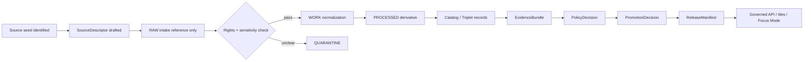
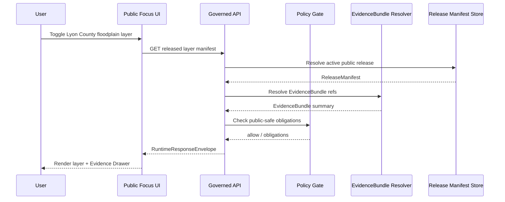
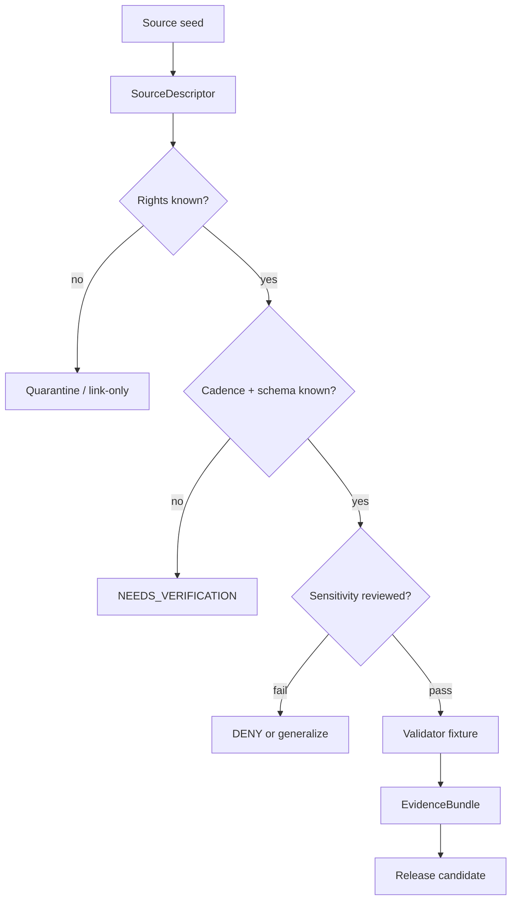

<!--
KFM_META_BLOCK_V2
doc_id: NEEDS_VERIFICATION
title: Lyon County Focus Mode Build Plan
type: standard
version: v0.1
status: draft
owners:
  - NEEDS_VERIFICATION
created: 2026-05-21
updated: 2026-05-21
policy_label: public
related:
  - NEEDS_VERIFICATION: docs/doctrine/directory-rules.md
  - NEEDS_VERIFICATION: docs/domains/hydrology/README.md
  - NEEDS_VERIFICATION: docs/domains/agriculture/README.md
  - NEEDS_VERIFICATION: docs/domains/habitat/README.md
  - NEEDS_VERIFICATION: docs/domains/roads-rail-trade-routes/README.md
  - NEEDS_VERIFICATION: docs/domains/settlements-infrastructure/README.md
tags:
  - kfm
  - focus-mode
  - county
  - lyon-county
  - kansas
notes:
  - Repo paths in this plan are PROPOSED unless verified in a mounted checkout.
  - County-specific source seeds require rights, cadence, schema, and release-state verification before publication.
  - Public UI must use governed APIs, released artifacts, catalog/triplet/graph records, tile services, and policy-safe runtime envelopes.
-->
<a id="top"></a>

# Lyon County Focus Mode Build Plan

> **Kansas Frontier Matrix county proof slice for Lyon County, Kansas — evidence-first, map-first, time-aware, policy-aware, auditable, and reversible.**


**Quick links:** [Operating posture](#operating-posture) · [Why this county](#why-this-county) · [First demo layers](#first-demo-layers) · [Object model](#governed-object-model) · [Repository shape](#proposed-repository-shape) · [PR sequence](#first-pr-sequence) · [Source seeds](#source-seed-list) · [Milestone](#recommended-first-milestone)

---

## Operating posture

Lyon County Focus Mode is a **public-safe county lens**, not a shortcut around KFM governance.

| Rule | Lyon County application |
|---|---|
| EvidenceBundle outranks generated language | Every county claim must resolve to a governed `EvidenceBundle` or abstain. |
| Public UI cannot read internal lifecycle stores | The county UI reads only governed APIs, released artifacts, catalog/triplet records, release manifests, and public-safe tile services. |
| Publication is a governed state transition | A layer appearing on a map is not publication. `PromotionDecision`, `ReleaseManifest`, and rollback target are required. |
| AI is interpretive | Focus Mode text may summarize released evidence; it cannot create source authority, rights status, review state, or public permission. |
| Sensitive details fail closed | Exact archaeology, burial/sacred locations, rare species, private living-person data, private property misuse, critical infrastructure vulnerabilities, and public-safety operational details are denied or generalized. |

> [!IMPORTANT]
> **This plan does not claim repo access.** All repository paths, schema homes, validators, fixtures, workflows, and API routes are **PROPOSED** until checked against a mounted KFM repository and current Directory Rules.

### County proof-slice objective

Build one governed county Focus Mode that lets a public user ask:

> “What does Lyon County look like across settlement, transportation, floodplain, agriculture, soil, geology, habitat, and history — and what evidence supports that view?”

The answer must be delivered through **maps, layer cards, Evidence Drawer, time controls, citations, policy labels, and finite runtime outcomes**.

---

## Why this county

Lyon County is a strong next proof slice because it sits at the intersection of **Emporia**, **I‑35 / U.S. 50 mobility**, **Neosho/Cottonwood watershed context**, **Flint Hills / tallgrass prairie edge context**, **agriculture**, **county GIS parcels**, **floodplain administration**, and **Santa Fe Trail / railroad-era history**.

### Source-backed selection signals

| Signal | Why it matters for KFM |
|---|---|
| County GIS exists | Lyon County GIS/Mapping maintains county GIS data and public mapping support, making it a practical source-seed for parcel/address/road-centerline governance. |
| Floodplain administration exists | The county has a floodplain-management surface and points users toward county/KDA Division of Water Resources support. |
| Agriculture is substantial | KDA reports 826 farms, 469,248 acres in farms, and about $160 million in 2022 crop/livestock sales. |
| Transportation is layered | KDOT has U.S. 50 / I‑35 project and access-management references for Lyon County/Emporia. |
| Geology and groundwater are well documented | KGS has county geologic map and geology/mineral/groundwater resources references. |
| Tallgrass prairie / Flint Hills context is nearby and policy-sensitive | Public-safe habitat context can be shown, but exact sensitive species occurrences must be generalized. |
| Santa Fe Trail / local history context exists | Historic trail layers are valuable, but archaeology and culturally sensitive details require suppression/generalization. |

### Product reason

Lyon County is ideal for a **multi-lane county card**: it is not just a metro county, not just a rural county, and not just an ecological county. It forces KFM to prove that the Focus Mode shell can keep **roads, parcels, floodplain, agriculture, geology, habitat, and history** separate but explainable.

---

## Product thesis

**Lyon County Focus Mode should become a public-safe county evidence cockpit.**

It should answer county-level questions with:

1. **A map-first view** centered on Lyon County.
2. **A layer stack** grouped by domain and release status.
3. **Evidence Drawer cards** that expose source role, date, rights posture, limitations, and review state.
4. **A time-aware county timeline** for settlement, transportation, floodplain revisions, agricultural land-cover updates, and public release versions.
5. **Finite answer outcomes**: `ANSWER`, `ABSTAIN`, `DENY`, or `ERROR`.
6. **Rollback and correction hooks** for every published county artifact.

### Non-goals

This county plan does **not**:

- publish parcel ownership as title truth;
- expose living-person data;
- expose exact sensitive ecological or archaeological locations;
- become an emergency flood-warning or road-closure system;
- make raw county GIS, assessor, or planning records public outside source terms;
- treat AI-generated summaries as evidence;
- imply that proposed repo paths already exist.

---

## Scope boundary

### Included public-safe scope

| Domain | Included county scope |
|---|---|
| Spatial foundation | County boundary, municipal boundaries, public basemap context, generalized PLSS/township/range if rights allow. |
| Settlements | Emporia and other incorporated/unincorporated places, public-safe historic town/community cards. |
| Roads / rail / trade routes | I‑35, U.S. 50, major public roads, generalized rail/trail history, Santa Fe Trail context where public-safe. |
| Hydrology / hazards | Neosho/Cottonwood watershed context, floodplain-management references, FEMA/KDA floodplain overlays after review. |
| Agriculture | Census of Agriculture county stats, cropland/grassland summary, CDL-derived class summaries after source-rights review. |
| Soil | SSURGO/Web Soil Survey county summaries, public-safe soil map-unit generalization. |
| Geology / groundwater | KGS county geologic map, geology/mineral/groundwater resources summary. |
| Habitat / fauna / flora | Public-safe tallgrass/Flint Hills habitat context, generalized species/habitat interpretation only. |
| Cultural heritage | Santa Fe Trail / railroad / settlement history cards with archaeology fail-closed. |

### Excluded or restricted scope

| Material | Default posture |
|---|---|
| Exact archaeology/burial/sacred-site locations | `DENY` public exact geometry; steward/cultural review required. |
| Rare species exact occurrences | `DENY` or generalized H3/grid/county-level context only. |
| Living-person data | `DENY` unless explicit lawful public release and policy review support it. |
| Parcel ownership/title claims | `ABSTAIN` unless evidence-bound title-source role is verified; assessor parcels are not title truth. |
| Critical infrastructure vulnerabilities | `DENY` exact vulnerability or operational detail; public-safe generalized resilience context only. |
| Emergency warnings | `ABSTAIN`; KFM is not an emergency alert system. |
| Raw/WORK/QUARANTINE data | Never public; governed lifecycle only. |

---

## First demo layers

### Layer stack

| Layer group | Demo layer | Source seed | Public posture | Acceptance gate |
|---|---|---|---|---|
| County frame | Lyon County boundary | Census/TIGER or Kansas Geoportal | Public after source-rights check | Boundary has source role, date, geometry version, and release manifest. |
| Settlements | Emporia + county places | Census places / county/city sources | Public | No inferred legal status without source. |
| Transportation | I‑35, U.S. 50, major roads | KDOT / county road centerlines | Public generalized | No real-time closure or vulnerability claim. |
| Floodplain | Effective floodplain reference overlay | KDA/FEMA source chain | Public with limitations | Must say “not emergency warning / verify with official FEMA/KDA.” |
| Agriculture | 2022 farm stats + CDL class summary | KDA / USDA NASS / CDL | Public summary | County stats cite source; CDL derivative includes spec_hash and classmap version. |
| Soils | SSURGO soil map-unit generalized layer | NRCS Web Soil Survey / Kansas Geoportal soils | Public summary | Map-unit legend and limitations present. |
| Geology | KGS geologic map summary | KGS county geologic map | Public | Scale and interpretation limitations visible. |
| Habitat | Tallgrass/Flint Hills context | KBS/TNC/NPS/general habitat sources | Generalized public | No exact sensitive species occurrence. |
| Heritage | Santa Fe Trail / rail context | Lyon County History Center / public historical sources | Public-safe | No archaeological site precision. |

### Layer lifecycle



---

## User journeys

### Journey 1 — Public county overview

**User asks:** “Show me Lyon County.”

Expected behavior:

1. Map opens to county extent.
2. County card shows public summary.
3. Layer stack loads only released public-safe layers.
4. Evidence Drawer lists source seed, limitations, release date, and rollback target.
5. AI summary uses only released EvidenceBundles.

**Finite outcome:** `ANSWER` only if all visible claims are evidence-backed.

### Journey 2 — Floodplain context

**User asks:** “Where are the floodplain areas?”

Expected behavior:

- Show released floodplain reference layer.
- Include official-source warning and date.
- Explain that KFM is not a flood-warning system.
- Link EvidenceBundle and official source seed.
- Abstain from parcel-specific advice unless policy and source allow.

**Finite outcome:** `ANSWER` for general context; `ABSTAIN` for legal/insurance/emergency claim.

### Journey 3 — Agriculture and land-cover change

**User asks:** “How agricultural is Lyon County?”

Expected behavior:

- Show KDA/USDA county stats.
- Show CDL-derived summary if released.
- Link farm-count, acres, sales evidence.
- Make cropland/grassland map a derivative, not source truth.
- Provide material-change watch status if available.

**Finite outcome:** `ANSWER` for evidence-backed summary; `ABSTAIN` for unsupported economic forecast.

### Journey 4 — Trail and settlement history

**User asks:** “What historic travel routes shaped Lyon County?”

Expected behavior:

- Show public-safe Santa Fe Trail / rail context card.
- Display generalized trail corridor where rights/sensitivity allow.
- Keep archaeology exact locations suppressed.
- Distinguish historical interpretation from legal boundary or site proof.

**Finite outcome:** `ANSWER` for public historic context; `DENY` for exact restricted site coordinates.

### Journey 5 — Evidence inspection

**User clicks a layer’s Evidence Drawer.**

Expected behavior:

- Source role visible.
- EvidenceBundle resolution status visible.
- Policy label visible.
- Release and rollback visible.
- Derived artifact hash/spec_hash visible.
- Limitations and update cadence visible.

---

## UI surfaces

| Surface | Lyon County content | Required trust signals |
|---|---|---|
| County Focus Header | “Lyon County, Kansas” + status chips | release version, policy label, last reviewed |
| Map canvas | County extent + released layers | attribution, scale, source labels |
| Layer Registry Panel | Hydrology, agriculture, roads, soils, geology, habitat, heritage groups | per-layer release state and sensitivity chip |
| Evidence Drawer | selected layer/source/object evidence | EvidenceBundle ID, source role, citations, limitations |
| Timeline | source dates, data years, release versions | valid time vs transaction/release time |
| Ask Focus Mode | bounded county Q&A | `ANSWER/ABSTAIN/DENY/ERROR`, citation enforcement |
| Corrections Panel | public issue/correction pathway | CorrectionNotice and rollback reference |
| Steward Review Stub | non-public review notes placeholder | not exposed on public surface |

### UI event boundary



---

## Governed object model

### Minimum county object families

| Object | Purpose | Lyon County fixture |
|---|---|---|
| `CountyFocusManifest` | Declares county scope and layer groups | `lyon_ks_focus_manifest.v1.json` |
| `CountyLayerManifest` | Public-safe layer contract | floodplain, roads, soils, geology, agriculture |
| `SourceDescriptor` | Source identity, role, rights, cadence | county GIS, KDA, KDOT, KGS, NRCS, KDA floodplain |
| `EvidenceRef` | Pointer from claim/layer to evidence | `evidence_ref_lyon_ag_2022` |
| `EvidenceBundle` | Resolved evidence package | farm stats, geologic map, GIS layer metadata |
| `PolicyDecision` | Allow/deny/obligations | rare species and archaeology suppression |
| `PromotionDecision` | Governed transition to public | county release candidate approval |
| `ReleaseManifest` | Public release inventory | `lyon_county_focus_release_YYYYMMDD` |
| `RunReceipt` | Reproducible run evidence | CDL/SSURGO/KGS processing runs |
| `RedactionReceipt` | Records generalized/suppressed details | archaeology/habitat sensitive geometry |
| `CorrectionNotice` | Public correction path | source update or wrong interpretation |
| `RollbackPlan` | Revert target and criteria | previous county release |

### Runtime envelope

```json
{
  "schema_version": "v1",
  "object_type": "RuntimeResponseEnvelope",
  "county": "Lyon County, Kansas",
  "outcome": "ANSWER",
  "policy_label": "public",
  "evidence_bundle_refs": ["kfm://evidence-bundle/NEEDS_VERIFICATION"],
  "release_manifest_ref": "kfm://release/NEEDS_VERIFICATION",
  "limitations": [
    "Public-safe county summary only.",
    "Not an emergency alert, title opinion, engineering determination, or legal floodplain determination."
  ]
}
```

---

## Proposed repository shape

> [!CAUTION]
> Directory Rules are the placement authority. The paths below are **PROPOSED** because this session did not inspect a mounted repository. Before creating files, verify current repo tree, accepted ADRs, schema-home convention, package manager, and existing county-plan locations.

### Directory Rules basis

- **Docs live under `docs/`** because this is a planning/control-plane artifact.
- **Domain source descriptors and schema contracts belong under the appropriate responsibility roots**, not county-topic roots.
- **Generated release artifacts belong under release/artifact roots only after promotion**, not inside docs.
- **Data lifecycle lanes remain separate**: RAW → WORK/QUARANTINE → PROCESSED → CATALOG/TRIPLET → PUBLISHED.

### Proposed homes

| Purpose | Proposed path | Status |
|---|---|---|
| This county build plan | `docs/focus-modes/counties/lyon_county_focus_mode_build_plan.md` | PROPOSED / NEEDS_VERIFICATION |
| County focus manifest fixture | `fixtures/focus_modes/counties/lyon/valid/lyon_county_focus_manifest.v1.json` | PROPOSED |
| Invalid fixtures | `fixtures/focus_modes/counties/lyon/invalid/*.json` | PROPOSED |
| County source descriptors | `data/catalog/source_descriptors/lyon/*.json` or repo-native equivalent | PROPOSED / NEEDS_VERIFICATION |
| Focus Mode schema | `schemas/contracts/v1/focus_mode/county_focus_manifest.schema.json` | PROPOSED / NEEDS_VERIFICATION |
| Layer manifest schema | `schemas/contracts/v1/map/county_layer_manifest.schema.json` | PROPOSED / NEEDS_VERIFICATION |
| Validator | `tools/validators/focus_mode/validate_county_focus_manifest.py` | PROPOSED |
| Policy | `policy/focus_mode/county_public.rego` | PROPOSED / NEEDS_VERIFICATION |
| API contract notes | `contracts/api/focus_mode/county_focus.md` | PROPOSED / NEEDS_VERIFICATION |
| Release manifest example | `fixtures/release/lyon/valid/lyon_county_release_manifest.v1.json` | PROPOSED |

---

## Build phases

### Phase 0 — Evidence and repo verification

- [ ] Mount/inspect actual KFM repo.
- [ ] Confirm current Directory Rules file and accepted ADRs.
- [ ] Confirm schema-home convention.
- [ ] Locate existing county/focus-mode docs.
- [ ] Inventory existing hydrology, agriculture, soils, habitat, roads, settlements, and archaeology lanes.
- [ ] Verify package manager and test runner.
- [ ] Verify source-rights conventions.

### Phase 1 — County focus contract

- [ ] Draft `CountyFocusManifest` schema.
- [ ] Draft `CountyLayerManifest` schema.
- [ ] Define required finite outcomes.
- [ ] Add valid Lyon County fixture.
- [ ] Add invalid fixtures for direct RAW access, missing evidence, sensitive exact geometry, missing release state, and missing rollback.

### Phase 2 — Source seed ledger

- [ ] Create first-wave `SourceDescriptor` candidates.
- [ ] Classify source role: primary / corroborating / context / restricted.
- [ ] Add rights and cadence fields as `NEEDS_VERIFICATION`.
- [ ] Add source limitation notes.

### Phase 3 — Public-safe layer fixtures

- [ ] County boundary.
- [ ] Settlement points/polygons.
- [ ] Major public roads.
- [ ] Floodplain reference overlay.
- [ ] Agriculture stats card.
- [ ] SSURGO generalized soil group.
- [ ] KGS geology summary.
- [ ] Public-safe habitat/heritage context.

### Phase 4 — Evidence Drawer and Focus Mode payload

- [ ] Create EvidenceBundle fixtures.
- [ ] Create policy fixtures.
- [ ] Create release manifest fixture.
- [ ] Create runtime response examples for `ANSWER`, `ABSTAIN`, `DENY`, and `ERROR`.

### Phase 5 — Public demo

- [ ] Static mock layer manifests.
- [ ] MapLibre layer registry stub.
- [ ] County Focus Mode UI shell.
- [ ] Evidence Drawer rendering.
- [ ] No live connectors.
- [ ] No public deployment until release gates pass.

---

## First PR sequence

| PR | Title | Contents | Exit criteria |
|---|---|---|---|
| PR-01 | Lyon County Focus Plan + source seed register | This Markdown, source-seed table, open verification backlog | Review accepts scope and placement. |
| PR-02 | County Focus Mode contract skeleton | Schemas, fixtures, validator stub | Valid fixture passes; invalid fixtures fail. |
| PR-03 | Lyon source descriptors | County GIS, KDA, KDOT, KGS, NRCS, KDA floodplain descriptors | Rights/cadence fields marked or verified. |
| PR-04 | Public-safe layer manifest fixtures | Boundary, roads, floodplain, agriculture, soils, geology, habitat, heritage | No RAW/WORK/QUARANTINE refs. |
| PR-05 | Evidence Drawer payload fixtures | EvidenceBundles, ReleaseManifest, PolicyDecision, RunReceipt examples | UI payload resolves evidence and release. |
| PR-06 | Mock Focus Mode API | No-network mock endpoint and finite outcome examples | `ANSWER/ABSTAIN/DENY/ERROR` covered. |
| PR-07 | MapLibre demo binding | Layer registry mock and UI cards | All layers display trust chips. |
| PR-08 | Release dry-run | PromotionDecision, ReleaseManifest, rollback plan | Reversible dry-run proof exists. |

---

## Acceptance checklist

### Governance

- [ ] Every public claim has an EvidenceBundle or abstains.
- [ ] Every public layer has a ReleaseManifest.
- [ ] Every derivative artifact has a RunReceipt.
- [ ] Every sensitivity transform has a RedactionReceipt.
- [ ] Every release has a rollback target.
- [ ] AI output cannot bypass policy, evidence, or release state.

### Public UI

- [ ] Public UI does not read RAW, WORK, QUARANTINE, unpublished candidates, canonical/internal stores, or direct model outputs.
- [ ] Public map shows source attribution.
- [ ] Evidence Drawer exposes limitations.
- [ ] Sensitive layer requests fail closed.
- [ ] Parcel/title/legal/emergency questions abstain or redirect to official sources.

### Validation

- [ ] Valid manifest passes schema validation.
- [ ] Invalid fixture with missing EvidenceBundle fails.
- [ ] Invalid fixture with exact archaeology location fails.
- [ ] Invalid fixture with rare-species precision fails.
- [ ] Invalid fixture with direct RAW reference fails.
- [ ] Invalid fixture with missing rollback target fails.
- [ ] Invalid fixture with AI-only claim fails.

### Documentation

- [ ] Meta block updated with verified doc ID/owners/date.
- [ ] Source rights notes are present.
- [ ] Directory placement is verified.
- [ ] Open questions remain visible.
- [ ] Changelog records county plan creation.

---

## Fixture plans

### Valid fixtures

| Fixture | Purpose |
|---|---|
| `valid/lyon_county_focus_manifest.v1.json` | Complete public-safe focus manifest. |
| `valid/lyon_agriculture_stats_2022_evidence_bundle.v1.json` | KDA/USDA county stats EvidenceBundle. |
| `valid/lyon_geology_kgs_map_evidence_bundle.v1.json` | KGS geologic map EvidenceBundle. |
| `valid/lyon_floodplain_public_reference_layer.v1.json` | Floodplain layer with limitations and official-source warning. |
| `valid/lyon_public_release_manifest.v1.json` | Release manifest with rollback target. |

### Invalid fixtures

| Fixture | Must fail because |
|---|---|
| `invalid/raw_layer_ref_public_manifest.json` | Public manifest references RAW/WORK/QUARANTINE. |
| `invalid/missing_evidence_bundle.json` | Claim has no EvidenceBundle. |
| `invalid/exact_archaeology_geometry_public.json` | Exact sensitive heritage geometry is exposed. |
| `invalid/rare_species_precise_point_public.json` | Exact sensitive ecology point is exposed. |
| `invalid/parcel_title_claim_from_assessor.json` | Assessor parcel is treated as title truth. |
| `invalid/emergency_flood_warning_claim.json` | KFM claims emergency warning authority. |
| `invalid/no_rollback_release.json` | Release lacks rollback target. |
| `invalid/ai_summary_as_source.json` | Generated text is treated as evidence. |

---

## Risk register

| Risk | County-specific expression | Default response |
|---|---|---|
| Parcel misuse | County GIS parcel maps treated as title/ownership truth | Mark assessor/parcel data as context, not title truth. |
| Floodplain misuse | User treats KFM flood layer as insurance/legal/emergency determination | Add official-source warning; abstain from determinations. |
| Critical infrastructure exposure | Roads/bridges/utility vulnerabilities inferred from map layers | Generalize; deny operational vulnerability detail. |
| Sensitive heritage exposure | Santa Fe Trail / historic site context drifts into exact archaeology | Generalize and require steward review. |
| Rare species exposure | Tallgrass/Flint Hills habitat context used to infer sensitive occurrences | Suppress exact occurrence; county/H3/generalized only. |
| Rights ambiguity | County GIS, state, or historical materials have unclear reuse terms | Quarantine or link-only until rights verified. |
| Temporal confusion | Farm stats, floodplain versions, and road projects from different years combined | Show valid time and release time separately. |
| AI overclaim | Focus Mode invents county interpretation | Require citation validation and EvidenceBundle resolution. |
| Source-role collapse | CDL/SSURGO/KGS/county GIS treated as interchangeable truth | Use source-role labels and limitations. |
| Public safety confusion | Hazards layer treated as live operational alert | Not an emergency system; cite official services. |

---

## Source seed list

> [!NOTE]
> Source seeds are starting points, not activated sources. Each needs source descriptor, rights review, cadence review, schema mapping, sensitivity review, and proof of public-safe release before use.

| Source seed | Role candidate | Use | Current status |
|---|---|---|---|
| Lyon County GIS/Mapping | Primary county GIS context | Parcel/address/road-centerline seed; county GIS metadata | NEEDS_VERIFICATION |
| Lyon County Floodplain Management | Primary county governance context | Local floodplain administration and public guidance | NEEDS_VERIFICATION |
| Kansas Department of Agriculture — Lyon County agriculture profile | Primary agriculture stats | Farms, acres, sales, sector context | NEEDS_VERIFICATION |
| USDA NASS 2022 Census county profile | Primary/corroborating agriculture stats | Detailed 2022 county agriculture profile | NEEDS_VERIFICATION |
| Kansas Floodplain Viewer / KDA DWR | Primary floodplain reference | Effective floodplain context | NEEDS_VERIFICATION |
| KDOT Lyon County / U.S. 50 / I‑35 references | Primary transportation context | Major corridors and project history | NEEDS_VERIFICATION |
| KDOT Access Management — U.S. 50 Emporia plan | Planning/transportation context | Corridor planning / access management | NEEDS_VERIFICATION |
| KGS Geologic Map of Lyon County | Primary geology map source | Geologic map and scale-limited geology context | NEEDS_VERIFICATION |
| KGS geology/mineral/ground-water resources of Lyon County | Primary geology/groundwater context | Rock formations, mineral resources, groundwater resources | NEEDS_VERIFICATION |
| USDA NRCS Web Soil Survey / SSURGO | Primary soil source | Soil map units and interpretations | NEEDS_VERIFICATION |
| Kansas Geoportal soils | Corroborating soil distribution surface | Public GIS soil layer metadata | NEEDS_VERIFICATION |
| Kansas Biological Survey / Flint Hills tallgrass maps | Habitat context | Tallgrass/Flint Hills context | NEEDS_VERIFICATION |
| NPS Tallgrass Prairie National Preserve | Context habitat/cultural landscape | Regional tallgrass prairie explanation | NEEDS_VERIFICATION |
| Lyon County History Center Santa Fe Trail map | Local historical context | Public-safe trail/heritage context | NEEDS_VERIFICATION |
| City of Emporia GIS / comprehensive-plan links | Local planning context | Urban/public planning and GIS links | NEEDS_VERIFICATION |

### Source activation rule

A source seed becomes usable only after:



---

## Open verification questions

1. What is the verified repo home for county Focus Mode plans?
2. Does an accepted ADR already define schema-home authority for Focus Mode contracts?
3. What package manager and validator framework does the current repo use?
4. Are county-level source descriptors already present?
5. What are the reuse rights and API terms for Lyon County GIS/Mapping content?
6. Which floodplain source should be treated as primary for public KFM display: FEMA MSC, KDA Floodplain Viewer, county floodplain pages, or a specific release manifest?
7. Which geometry source is authoritative for county and municipal boundaries?
8. What is the approved public-safe precision for heritage/trail features?
9. Does KFM already define habitat geoprivacy thresholds for county Focus Mode?
10. What is the public-safe map scale for soils and geology?
11. Can KDOT project pages be used as transportation-history evidence, or should KDOT GIS/download services be preferred?
12. What is the release cadence for CDL-derived county summaries?
13. What is the correction workflow when county GIS or state data updates after a release?
14. Which steward roles approve floodplain, archaeology, habitat, and transportation layers?
15. What UI path owns the Focus Mode shell in the current repo?
16. What is the minimum proof pack for a county release?
17. How should source citations be rendered in public UI: raw URLs, EvidenceBundle citations, or catalog records?
18. Are public accessibility/performance budgets already defined for county layer stacks?

---

## Recommended first milestone

### Milestone M1 — Lyon County no-network public-safe proof slice

**Goal:** Land a no-network, fixture-only Lyon County Focus Mode proof slice with one public-safe layer per major domain.

**Deliverables:**

- This build plan committed to the verified docs home.
- `CountyFocusManifest` schema draft.
- Valid Lyon County focus fixture.
- Invalid fixture suite.
- Source seed register with rights fields marked `NEEDS_VERIFICATION`.
- EvidenceBundle fixtures for:
  - agriculture stats,
  - geology map,
  - floodplain reference,
  - roads/transportation context,
  - county GIS context.
- ReleaseManifest fixture with rollback target.
- Mock API payload with `ANSWER/ABSTAIN/DENY/ERROR`.
- Evidence Drawer mock payload.
- Validation command documented.

**Definition of done:**

- No public payload references RAW/WORK/QUARANTINE.
- Every visible claim resolves to EvidenceBundle.
- Sensitive requests fail closed.
- Release fixture includes rollback.
- No live source connector is required.
- All unknown owners, paths, IDs, source terms, and schema homes remain marked `NEEDS_VERIFICATION`.

---

## Appendix A — County-specific public-safe demo story

**Story title:** “Lyon County: roads, rivers, prairie edge, farms, and evidence.”

1. Start at county extent.
2. Toggle settlements and major roads.
3. Toggle floodplain reference and show official-source warning.
4. Toggle agriculture stats card and CDL summary placeholder.
5. Toggle soils and geology with scale limitations.
6. Toggle tallgrass/Flint Hills habitat context at generalized scale.
7. Toggle Santa Fe Trail / rail history card with archaeology suppression notice.
8. Open Evidence Drawer.
9. Ask Focus Mode: “What evidence supports this county view?”
10. Export release proof summary.

---

## Appendix B — AI behavior rules for Lyon County Focus Mode

| User request | Required behavior |
|---|---|
| “Who owns this parcel?” | `ABSTAIN` unless a governed public source and allowed policy support the exact answer; never treat assessor row as title truth. |
| “Is my house in the floodplain?” | `ABSTAIN` from legal determination; show official-source guidance and general map context only if public-safe. |
| “Show archaeological sites near Emporia.” | `DENY` exact locations; offer public-safe historical context. |
| “Where are rare prairie species?” | `DENY` exact occurrence; offer generalized habitat context. |
| “Summarize Lyon County agriculture.” | `ANSWER` only from released KDA/USDA EvidenceBundle. |
| “Why is this geology layer shown?” | `ANSWER` with KGS source, map scale, and limitations. |
| “Is this road closed?” | `ABSTAIN`; KFM is not live operational road-status authority. |

---

## Appendix C — Changelog

| Version | Date | Change |
|---|---|---|
| v0.1 | 2026-05-21 | Initial Lyon County Focus Mode build plan drafted as a repo-ready Markdown artifact. |
