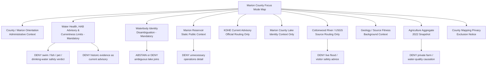
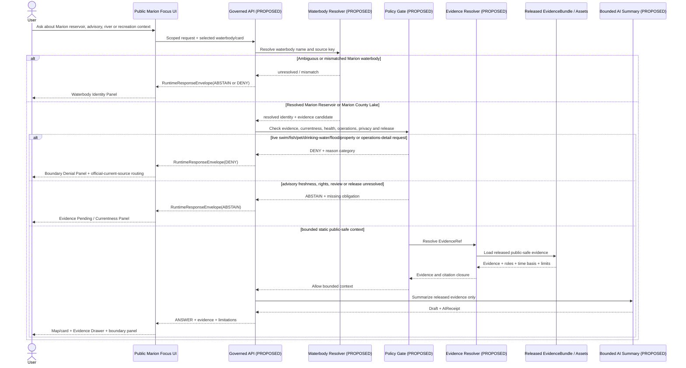
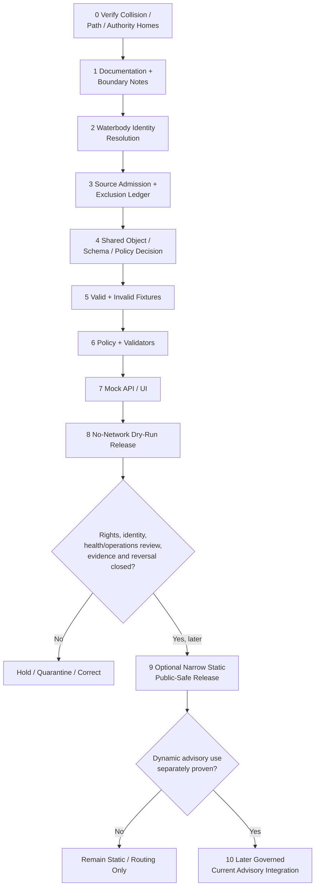

<!-- KFM_META_BLOCK_V2
doc_id: NEEDS_VERIFICATION
title: Marion County Focus Mode Build Plan
type: standard
version: v1
status: draft
owners: [NEEDS_VERIFICATION]
created: 2026-05-22
updated: 2026-05-22
policy_label: public_draft
repository_path: NEEDS_VERIFICATION - candidate only: docs/focus-modes/marion-county/marion_county_focus_mode_build_plan.md
schema_contract_policy_homes: NEEDS_VERIFICATION - inspect the live repository, accepted ADRs, per-root README contracts and verified shared object-family authority before extending contract, schema, policy, fixture, source-registry, evidence, proof, release or published-artifact homes
review_assignments: NEEDS_VERIFICATION - harmful-algal-bloom/public-health, drinking-water/source-water, reservoir-operations, flood/currentness, parcel/privacy, agriculture/watershed, rights, documentation and release review duties must be established before implementation or publication
correction_path: NEEDS_VERIFICATION
rollback_path: NEEDS_VERIFICATION
release_status: NEEDS_VERIFICATION - planning artifact only; no source admission, implementation, promotion or publication claimed
related:
  - Directory Rules.pdf (consulted in this run; supplied canonical placement doctrine)
  - KFM county Focus Mode completed-county register supplied in the series prompt
  - Logan County, Clark County, Harvey County, Allen County and Pawnee County artifacts previously generated in this continuation context
tags: [kfm, focus-mode, marion-county, marion-reservoir, marion-county-lake, cottonwood-river, harmful-algal-bloom, kdhe, usace, usgs, kgs, agriculture, water-quality, public-health, flood-control, source-water, currentness, public-safe-boundary]
notes:
  - CONFIRMED: Marion County is not included in the completed-county register available in this series context and is distinct from previously generated county-plan artifacts known in this continuation context.
  - CONFIRMED: Accessible uploaded/File Library project materials were searched in this run; no Marion County Focus Mode Build Plan artifact was returned.
  - CONFIRMED: Directory Rules.pdf was consulted in this run before repository-path proposals were made.
  - CONFIRMED: Official or authoritative public-source pages were checked in this run for Marion Reservoir, KDHE harmful algal bloom advisory behavior and current advisory table, Marion County administration/mapping, Kansas agriculture aggregates, USGS Cottonwood River monitoring-source availability and KGS Marion County geology source fitness.
  - CONFIRMED: On the KDHE HAB page checked on 2026-05-22, the current advisory table was updated 2026-05-22 and did not list Marion Reservoir or Marion County Lake; this is point-in-time evidence only and must not be assumed persistent.
  - NEEDS_VERIFICATION: The publication date/current fitness of a checked KDHE Marion Lake water-quality fact sheet and the suitability of any resulting claim or spatial transform for KFM release.
  - NEEDS_VERIFICATION: A live KFM repository, complete project index, accepted ADR set, implementation tree, rights register, review assignments and release machinery were not inspected for final collision or landing verification.
  - PROPOSED: Marion County is selected as the next time-critical reservoir public-health, waterbody-identity and operational-minimization proof slice.
-->

<a id="top"></a>

# Marion County Focus Mode Build Plan

> **Product thesis:** Build a public-safe Marion County Focus Mode around Marion Reservoir and the Cottonwood River landscape that teaches reservoir purpose, public recreation, harmful-algal-bloom advisory currentness, geology and county-scale agriculture—without confusing Marion Reservoir with Marion County Lake, turning historical or scientific water-quality evidence into a live health/safety verdict, exposing unnecessary operational dam detail, or issuing drinking-water, flood, parcel, permit, insurance or farm-causation conclusions.


| Identity / status field | Determination |
|---|---|
| Selected county | **Marion County, Kansas** |
| Selection status | **PROPOSED** as the next KFM county Focus Mode proof slice. |
| Completed-register comparison | **CONFIRMED** within available series evidence: Marion County is absent from the user-supplied completed-county register and is not among the Logan, Clark, Harvey, Allen or Pawnee county artifacts previously generated in the visible continuation sequence. |
| Available-material collision search | **CONFIRMED** for accessible uploaded/File Library materials searched in this run: no `marion_county_focus_mode_build_plan.md` or Marion County Focus Mode plan artifact was returned. |
| Full collision verification | **NEEDS_VERIFICATION** because no live repository tree or complete project index was inspected. |
| Distinct proof-slice value | Marion Reservoir on the Cottonwood River; USACE-designated flood control, water supply, water quality and recreation purposes; KDHE HAB monitoring/advisory behavior; two distinct public waterbodies named Marion Reservoir/Marion County Lake; official county mapping with valuation-purpose disclaimer; Cottonwood River USGS observation-source routing; KGS source-fitness limits; agricultural aggregates. |
| Most consequential public-safe boundary | **Water-advisory currentness and public-health non-determination:** KFM may explain Marion Reservoir and route users to current KDHE advisories, but it must not represent a historical/scientific bloom or impairment record as a current health advisory, declare water safe, infer drinking-water treatment or human/animal exposure, or replace official lake-management and public-health decisions. |
| Coupled identity boundary | **Marion Reservoir is not Marion County Lake.** Any future advisory, water-quality, recreation, geometry or citation object must use deterministic waterbody identity and refuse ambiguous “Marion Lake” joins until the intended body is resolved. |
| Operational boundary | USACE public pages contain more structural/operational detail than the first public-safe Focus Mode needs. KFM should use bounded purpose/location/history context and defer or suppress unnecessary outlet, dike, discharge and live-release detail. |
| Document posture | Repo-ready, source-checked future implementation plan; not an implemented, reviewed, promoted or published county product. |
| Directory placement posture | **PROPOSED / NEEDS_VERIFICATION:** candidate human-documentation home under `docs/focus-modes/marion-county/`, justified by supplied Directory Rules but not confirmed in a live repository. |
| First milestone | **Marion Reservoir Advisory-Currentness Trust Boundary Proof** |

## Quick links

[Executive build note](#executive-build-note) · [Evidence boundary](#evidence-boundary-table) · [Operating posture](#1-operating-posture) · [Why Marion County](#2-why-this-county) · [Product thesis](#3-product-thesis) · [Scope boundary](#4-scope-boundary) · [First demo layers](#5-first-demo-layers) · [User journeys](#6-user-journeys) · [UI surfaces](#7-ui-surfaces) · [Governed object model](#8-governed-object-model) · [Repository shape](#9-proposed-repository-shape) · [Build phases](#10-build-phases) · [First PR sequence](#11-first-pr-sequence) · [Acceptance checklist](#12-acceptance-checklist) · [Fixture plan](#13-fixture-plan) · [Risk register](#14-risk-register) · [Source seeds](#15-source-seed-list) · [Verification questions](#16-open-verification-questions) · [First milestone](#17-recommended-first-milestone) · [Appendices](#appendix-a---public-safe-narrative-skeleton)

<a id="executive-build-note"></a>

## Executive build note

**PROPOSED.** Marion County adds a notably different KFM proof slice: a popular multipurpose reservoir whose public meaning can change rapidly when water-health advisories change. The U.S. Army Corps of Engineers identifies Marion Reservoir as a project on the Cottonwood River in Marion County and lists its purposes as flood control, water supply, water quality and recreation. USACE states that the reservoir was placed in full flood-control operation in February 1968 and is one of three projects constructed for flood management and low-flow regulation for the upper Grand (Neosho) River Valley. [SRC-MARION-001] [SRC-MARION-002]

Kansas Department of Health and Environment states that harmful algal bloom monitoring runs concurrently with the water-recreation season from April 1 through October 31; that blooms are unpredictable and can develop rapidly or move across a water body; and that its current advisory table is the responsible current public route for advisory levels. On the page checked for this plan, the table was updated **May 22, 2026** and did **not** list Marion Reservoir or Marion County Lake. That observation is deliberately treated as **point-in-time evidence only**, not proof that either waterbody is generally or durably “safe,” nor a future release state. [SRC-MARION-003]

This county also introduces a critical entity-resolution problem: Marion County contains **Marion Reservoir** and the county website visibly features **Marion County Lake**. Advisory, recreation and water-quality records that simply say “Marion Lake” can be hazardous if they are joined or rendered without deterministic identity and source-context resolution. The first Focus Mode must make this ambiguity visible instead of silently resolving it through generated language. [SRC-MARION-003] [SRC-MARION-006]

The safe first product is therefore not a live lake-health dashboard or a dam-operations viewer. It is a **reservoir advisory-currentness trust proof**: a static Marion Reservoir context card; a separate Marion County Lake identity-warning card; an official KDHE current-advisory routing surface; a water-health/currentness denial panel; bounded USACE purpose/history context; separated Cottonwood River, geology and agriculture cards; and negative fixtures proving that KFM will not claim current safety, identify exposure, conflate waterbodies or expose unnecessary operational detail.

> [!CAUTION]
> ## Defining public-safe boundary — a reservoir story is not a live water-health or recreation-safety decision
> Marion Reservoir is publicly documented as supporting water supply, water quality, flood control and recreation, while KDHE's official HAB program states that blooms can develop rapidly and cause illness to animals and humans. Current-advisory status is time-sensitive and may change after a page is checked.
>
> The first Marion County Focus Mode may display **static, source-attributed reservoir context and a clearly labeled route to current official KDHE advisories**. It must **DENY or ABSTAIN** from: “safe to swim/drink/fish/let pets enter” judgments; historical-advisory-as-current output; dynamic advisory caching without freshness/release controls; ambiguous “Marion Lake” joins; drinking-water treatment or health conclusions; unnecessary dam/outlet/release operational detail; and parcel flood, permit, insurance, property or farm-causation determinations.

<a id="evidence-boundary-table"></a>

## Evidence-boundary table

| Truth label | What this document supports now | What this document cannot imply |
|---|---|---|
| `CONFIRMED` | Marion County is absent from the completed-county register available to this run; accessible project-material search returned no Marion plan; `Directory Rules.pdf` was consulted; official/authoritative public pages listed in §15 were checked; KDHE's checked advisory page was updated 2026-05-22 and did not list Marion Reservoir or Marion County Lake at that point in time; this downloadable Markdown artifact was generated in this run. | No live-repository file presence, admitted source, rights clearance, approved waterbody identity crosswalk, health/operations review, current published advisory layer, schema/policy/test/API/UI behavior, promotion or publication is confirmed. |
| `PROPOSED` | Marion County selection; product thesis; boundary design; layer/card/UI/object/path/fixture/policy/PR/milestone plan; a future static public-safe context product. | Proposed design is not proof that KFM has built, reviewed or released the product. |
| `NEEDS_VERIFICATION` | Live repository collision/path; accepted ADRs and shared object homes; source rights and derivative-display permissions; safe public geometry; canonical identifiers for Marion Reservoir and Marion County Lake; KDHE fact-sheet time fitness; water-supply/drinking-water representation; dam-operations minimization; correction and rollback machinery. | Checkable gaps cannot be treated as passed gates or public truth. |
| `UNKNOWN` | Any Marion plan outside searched accessible materials; actual KFM implementation maturity; deployed routes/contracts/tests/workflows; named reviewers; public release state. | Unsupported assumptions remain outside claim scope. |

### Status of key source-derived statements

| Statement | Truth label | Basis and constraint |
|---|---|---|
| Marion Reservoir is in Marion County on the Cottonwood River and has flood control, water supply, water quality and recreation purposes. | `CONFIRMED` | USACE official pertinent-data page checked in this run. [SRC-MARION-001] |
| Marion Reservoir was placed in full flood-control operation in February 1968 and forms part of an upper Grand/Neosho River Valley flood-management/low-flow context. | `CONFIRMED` | USACE official history page checked in this run. [SRC-MARION-002] |
| KDHE HAB monitoring occurs April 1–October 31; blooms are unpredictable and advisories are time-sensitive. | `CONFIRMED` | KDHE HAB official page checked in this run. [SRC-MARION-003] |
| Marion Reservoir or Marion County Lake currently has an active KDHE advisory. | `UNKNOWN` for any time after page check; **not listed at check time** | KDHE page checked on 2026-05-22 showed a current-advisory table updated 2026-05-22 without either waterbody; status can change. [SRC-MARION-003] |
| A checked KDHE Marion Lake fact sheet describes significant water-quality/public-health context. | `CONFIRMED` as source content; `NEEDS_VERIFICATION` for current use | Publication date/current fitness and admissible KFM claim scope not established in this run. [SRC-MARION-010] |
| County public mapping data can support parcel or valuation conclusions in KFM. | `DENY` for first product | County mapping page states the data were developed for property valuation and disclaims accuracy/completeness liability; no first-slice need for property output. [SRC-MARION-006] |

---

## 1. Operating posture

### KFM governing rules applied to Marion County

| Governing rule | Marion County consequence |
|---|---|
| EvidenceBundle outranks generated language. | Every public claim about reservoir purpose, waterbody identity, HAB advisory routing, Cottonwood River, geology or agriculture must resolve to admitted evidence with source role, date/currentness and limitation. |
| Public clients use governed interfaces and released public-safe artifacts only. | Public UI must never read `RAW`, `WORK`, `QUARANTINE`, unchecked advisories, raw lake/river observations, internal water-supply/operations candidates, parcel/valuation sources or direct model output. |
| Cite-or-abstain is the truth posture. | Missing advisory freshness, identity closure, rights, safe scale, review or release state produces `ABSTAIN`, `DENY` or `ERROR`, not a plausible health or recreation recommendation. |
| Publication is a governed state transition. | A displayed waterbody marker, current-status badge, HAB summary, lake-level graph or AI answer is not public truth because it can be rendered. |
| Source roles remain distinct. | USACE reservoir-purpose/operations context, KDHE health advisories/water-quality context, County administrative/mapping context, USGS observation routing, KGS geology and KDA statistics cannot collapse into one “lake truth.” |
| Risk-sensitive defaults fail closed. | HAB/public-health, drinking-water/source-water, dam operations, flood/property, live recreation and private/valuation inferences are withheld, routed or denied unless specifically governed. |
| AI is interpretive only. | AI may summarize released static evidence; it cannot decide advisory status, water safety, dam operation, drinking-water condition, flood risk, permit status or release state. |
| Corrections and rollback remain auditable. | Any future waterbody/advisory card must support withdrawal immediately when status changes, identity mapping is corrected or an interpretation is found unsafe. |

### Truth labels and finite outcomes

| Label / outcome | Meaning for this artifact |
|---|---|
| `CONFIRMED` | Verified in this run from supplied doctrine, accessible file search, opened official/authoritative public sources or generated artifact output. |
| `PROPOSED` | Future design, path, object, schema/policy/fixture, workflow, UI, review or release recommendation. |
| `NEEDS_VERIFICATION` | Checkable item not verified strongly enough for implementation or publication. |
| `UNKNOWN` | Not resolvable from evidence available in this run. |
| `ANSWER` | Bounded public-safe response based on admitted/released evidence and policy/citation/review closure. |
| `ABSTAIN` | Identity, freshness, authority, rights, safe scale, review or release closure is insufficient. |
| `DENY` | Request would issue a health/safety/property/legal conclusion, expose unnecessary operations or bypass governance. |
| `ERROR` | Governed failure returns no unsupported result. |
| `DEFER` | Candidate intentionally held for later verified work. |
| `EXCLUDE` | Candidate not suitable for the proposed public product. |

### Public trust-membrane flowchart

```mermaid
flowchart LR
  S[Official public source seeds<br/>USACE · KDHE · County · USGS · KGS · KDA] --> R[RAW candidate intake<br/>never public]
  R --> I{Identity resolution<br/>Marion Reservoir vs<br/>Marion County Lake}
  I -->|ambiguous| Q[WORK / QUARANTINE<br/>ABSTAIN]
  I -->|resolved candidate| A{Admission review<br/>role · rights · time basis<br/>health · operations · privacy}
  A -->|unclear / stale / too detailed| Q
  A -->|bounded candidate permitted| W[WORK normalization]
  W --> V{Validation + policy +<br/>review + evidence closure}
  V -->|fails boundary or closure| Q
  V -->|passes| P[PROCESSED]
  P --> C[CATALOG / TRIPLET<br/>EvidenceRef → EvidenceBundle]
  C --> D{Promotion decision<br/>manifest · correction · rollback}
  D -->|approved narrow static slice| PUB[PUBLISHED public-safe artifacts]
  PUB --> API[Governed API<br/>RuntimeResponseEnvelope]
  API --> UI[Map + Evidence Drawer<br/>Advisory Currentness Panel]
  AI[Bounded AI interpretation] -->|released evidence only| API
  Q -. prohibited from public UI .-> UI
```



### County-specific non-negotiable guardrails

1. **Waterbody identity guardrail.** `Marion Reservoir` and `Marion County Lake` are distinct objects. KFM must use deterministic waterbody identity before joining advisory, health, recreation, geometry or citation records. Ambiguous “Marion Lake” material is `ABSTAIN` or held pending resolution.
2. **HAB currentness guardrail.** KDHE advisory levels are dynamic. A checked advisory table is evidence of page state at its stated update time only; a cached or historical status cannot become a current KFM recommendation.
3. **Health non-determination guardrail.** KFM may explain the KDHE advisory framework and direct users to the official current advisory surface. It cannot determine that water is safe for a person, pet, livestock, recreation activity or consumption.
4. **Drinking-water/source-water restraint.** A checked KDHE fact sheet describes Marion Lake as a water-supply and water-quality concern, but its present fitness, terminology and release scope require verification; no household drinking-water or treatment judgment enters the first slice.
5. **Operations minimization guardrail.** USACE pages expose structural and operational reservoir details. The first public product requires only broad project purpose and public context; outlet, dike, spillway, discharge, live-release or security-relevant detail is withheld or deferred unless specifically justified and reviewed.
6. **Flood/property non-determination guardrail.** Flood-control purpose and river-source availability do not authorize KFM to forecast flooding, certify safety or determine parcel, permit or insurance outcomes.
7. **Parcel/privacy guardrail.** Marion County's mapping service is oriented to property valuation and includes disclaimers. Parcel, owner, valuation, tax and living-person-related joins are excluded from the first public slice.
8. **Agriculture anti-causation guardrail.** County aggregate farm/acre/sales figures may be presented with their reference year, but may not be used to identify nutrient contributors, water-quality responsibility or regulatory compliance.
9. **Geology fitness guardrail.** KGS indicates that its Marion county map is extracted from the state geologic map because no detailed digital mapping was done for the county on that page. It supports background context only, not site-level water or engineering conclusions.
10. **Official-health-routing guardrail.** Where a user seeks present water-health advice, KFM must return a bounded denial or abstention and direct attention to KDHE/current lake management sources—not generate its own health recommendation.

---

## 2. Why this county

### Selection screen against completed counties

| Selection test | Result | Status |
|---|---|---|
| Is Marion County listed in the user-supplied completed-county register? | No match found. | `CONFIRMED` within available register evidence |
| Is Marion County one of the previously generated county artifacts visible in this continuation context? | No match among known Logan, Clark, Harvey, Allen and Pawnee outputs. | `CONFIRMED` within current visible continuation evidence |
| Did accessible project-material search identify a Marion County Focus Mode plan? | No Marion County plan artifact returned from searches for the county, expected filename or Marion Reservoir Focus Mode terms. | `CONFIRMED` for searched accessible materials |
| Was a live repository and every project store/index inspected? | No. | `NEEDS_VERIFICATION` |
| Does Marion add a distinct proof slice? | Yes. It centers reservoir water-health currentness, HAB advisory behavior, waterbody identity disambiguation and operational minimization—not historic/cultural authority, groundwater adjudication or site-remediation privacy. | `PROPOSED`, grounded in checked sources |
| Are strong official or authoritative source seeds present? | Yes. USACE, KDHE, Marion County, KDA, USGS and KGS pages were checked in this run. | `CONFIRMED` source checks; admission remains `NEEDS_VERIFICATION` |

### Proof-slice rationale

| Proof dimension | Checked official/authoritative public-source anchor | KFM proof value | Public-safe constraint |
|---|---|---|---|
| Multipurpose reservoir / river setting | USACE identifies Marion Reservoir on the Cottonwood River in Marion County and lists flood control, water supply, water quality and recreation purposes. | Provides clear public map anchor with multiple claim classes. | One feature does not collapse multiple authority roles or safety conclusions. |
| Flood-control and low-flow history | USACE states Marion Reservoir entered full flood-control operation in 1968 and is part of an upper Grand/Neosho flood-management/low-flow context. | Supports historical infrastructure-purpose card. | No operational or flood-safety decision. |
| Harmful algal bloom advisory currentness | KDHE states HAB monitoring runs April 1–October 31; blooms are unpredictable and may rapidly develop or move; current advisory levels are Watch, Warning and Hazard. | Tests dynamic public-health routing, stale-state and denial behavior. | No KFM-generated current water safety; official table controls only at its stated update time. |
| Current-check discipline | KDHE current table was updated May 22, 2026 and did not list Marion Reservoir or Marion County Lake at the checked time. | Tests displaying “checked, not currently listed” without making a durable safe/clear claim. | Must expire or refresh; no “safe” badge. |
| Waterbody identity ambiguity | County official homepage displays Marion County Lake; USACE manages Marion Reservoir; KDHE source families can refer to lake names. | Tests deterministic identity and anti-misjoin design. | Never conflate waterbodies or carry one status to another. |
| Historical/scientific water-quality candidate | Checked KDHE Marion Lake fact sheet describes reservoir water-quality and drinking-water context, including eutrophication/cyanobacterial bloom subject matter. | Tests quarantine/defer when public-health material lacks verified present fitness. | No current release until date, identity, rights, authority and allowed claims are verified. |
| Public mapping/property minimization | Marion County mapping page says data were developed for property valuations, includes disclaimer language and routes to parcel/tax searches. | Tests public-source existence without public product admission. | Parcel/property/owner/valuation information excluded from first slice. |
| Official Cottonwood River observation source | USGS identifies monitoring location `USGS-07180200`, Cottonwood R at Marion, KS, operated in cooperation with USACE Tulsa District. | Tests future time-aware river-source routing. | No live data, flood, quality or recreation-safety interpretation in first slice. |
| Geology/source fitness | KGS states no detailed digital mapping has been done for Marion County on its page and the map is extracted from the state geologic map; cites a 1959 USGS publication. | Tests source fitness and map-scale honesty. | Background only; no present water/engineering conclusion. |
| Agriculture / working landscape aggregate | KDA reports 873 farms, 600,561 acres and $187 million in crop/livestock sales in 2022, according to USDA 2022 Census of Agriculture. | Supports a bounded county context card. | No farm/nutrient/water-quality/liability inference. |

### Why Marion adds a distinct series proof

Marion County requires KFM to govern a situation where a public map's apparent usefulness may be greatest when its claims are most dangerous to cache or simplify. Its proof value differs from recent county slices:

- **Harvey County** centers managed recharge and source-water infrastructure; Marion centers **recreation-facing reservoir advisory currentness and lake identity resolution**.
- **Allen County** centers residential-remediation privacy and environmental-health stigma; Marion centers a **rapidly changing public-health advisory surface** where no current listing must not be presented as enduring safety.
- **Clark County** centers dynamic geohazard/access restraint; Marion centers **water-health, reservoir operations and official advisory routing**.
- **Pawnee County** centers cultural authority and burials; Marion centers **time-critical public environmental information**.

The strongest first proof is intentionally narrow: show that KFM can teach the reservoir's public purpose and landscape while refusing to become an unofficial swim/fish/pet/drinking-water/flood/operations advisory product.

### Public benefit and governance value

| Public benefit | Governance value |
|---|---|
| Learn what Marion Reservoir is and why it exists. | Demonstrates multi-purpose feature context without role collapse. |
| Understand where to check current HAB advisories and why status changes matter. | Demonstrates point-in-time evidence, expiry and safe routing. |
| Avoid confusion between Marion Reservoir and Marion County Lake. | Demonstrates deterministic waterbody identity and citation safety. |
| See Cottonwood River, geology and agricultural context separately. | Demonstrates no unsupported causal joins. |
| Learn why operational and parcel detail is withheld. | Demonstrates minimum-necessary display and privacy/security restraint. |
| Inspect evidence, limitations, denial reasons, correction and rollback posture. | Demonstrates governed public map behavior before implementation. |

### Specific county anchors supported by checked official sources

| County anchor | Verified public statement used in this plan | Source role |
|---|---|---|
| Marion Reservoir | USACE places it on the Cottonwood River in Marion County and lists flood control, water supply, water quality and recreation purposes. | Federal reservoir/project authority context |
| Flood-control history | USACE states full flood-control operation began in February 1968 and identifies upper Grand/Neosho flood-management and low-flow context. | Federal historic/operational-purpose context |
| HAB advisory process | KDHE states the monitoring season, bloom unpredictability, advisory levels and responsible current-advisory routes. | State health/environment advisory authority |
| Current advisory-page check | KDHE table updated May 22, 2026 did not list either Marion Reservoir or Marion County Lake at time of check. | Point-in-time official current-source observation |
| Marion County Lake identity | Marion County official homepage identifies Marion County Lake separately from the USACE reservoir. | County public-place/identity context |
| County mapping constraint | Marion County mapping page states mapping data were developed for property valuations and includes use/misuse disclaimers. | County administrative/privacy constraint |
| Cottonwood River observation route | USGS identifies Cottonwood R at Marion monitoring location and USACE cooperative operation. | Federal observation-source routing |
| Marion geology fitness | KGS states the county map is state-map-derived because no detailed digital mapping was done for the county on its page. | State scientific/source-fitness context |
| Agriculture | KDA reports 873 farms, 600,561 acres and $187 million in 2022 crop/livestock sales. | Statistical aggregate |

---

## 3. Product thesis

### One-sentence thesis

**Marion County Focus Mode should present Marion Reservoir and the Cottonwood River landscape as a source-linked, time-aware reservoir and recreation context, with KDHE current-advisory routing and waterbody-identity protection at its center—while refusing live health/safety, drinking-water, operational, flood/property and agriculture-causation conclusions.**

### What the first product promises

| Promise | Proposed public behavior |
|---|---|
| A clear reservoir/place orientation | Generalized Marion Reservoir and county context backed by official USACE/county evidence. |
| Currentness visible before water-health interpretation | Mandatory Water Health & Advisory Currentness panel with every HAB or water-safety-related interaction. |
| Distinct waterbody identity | Separate Marion Reservoir and Marion County Lake references with no ambiguous status inheritance. |
| Responsible official routing | Users are directed to current KDHE advisory information and USACE/lake-manager sources where appropriate. |
| Bounded contextual layers | Cottonwood River, geology and agriculture appear as separately role-labeled context cards, not causal or safety conclusions. |
| Reversible evidence-centered output | Every future answer exposes finite outcome, evidence, date/scope, limitations, review/release and correction/rollback posture. |

### What the first product does not promise

- It is **not** a live harmful-algal-bloom alert, swim/fish/pet/livestock/recreation or drinking-water safety service.
- It is **not** proof that Marion Reservoir or Marion County Lake is safe because neither appeared in one checked advisory table.
- It is **not** a dam, outlet, gate, release, dike or water-supply operations dashboard.
- It is **not** a flood prediction, emergency guidance, parcel risk, permit, insurance or property-value service.
- It is **not** a nutrient-source, farm-responsibility or water-quality causation product.
- It is **not** evidence that repository paths, contracts, schemas, policies, tests, APIs, UI components, reviews or releases already exist.

---

## 4. Scope boundary

### Public-safe first-slice content

| Included first-slice content | Checked-source basis | Required presentation limit | Status |
|---|---|---|---|
| Marion County and City of Marion orientation card | Marion County official website; USACE Marion Reservoir pages | Administrative/place context only; no parcel/property/person fields. | `PROPOSED` |
| Marion Reservoir generalized context card | USACE welcome, pertinent-data and history pages | Purpose/location/history only; omit detailed operations and live conditions. | `PROPOSED` |
| **Water Health, HAB Advisory & Currentness Limits panel** | KDHE HAB page | Mandatory; directs current-status checks to KDHE and denies KFM safety/health judgments. | `PROPOSED` — mandatory |
| **Waterbody Identity Disambiguation panel** | USACE Marion Reservoir; Marion County homepage; KDHE current-advisory process | Mandatory wherever water-health/advisory content appears; resolves reservoir versus county lake. | `PROPOSED` — mandatory |
| KDHE current-advisory routing card | KDHE HAB page checked 2026-05-22 | May show source checked/update time and “not listed at check time”; no durable `safe` interpretation. | `PROPOSED` |
| USACE project-purpose/history card | USACE pertinent-data and history pages | Static context only; no unnecessary structures/discharges/current operations. | `PROPOSED` |
| Cottonwood River official-source-routing card | USGS monitoring location; USACE location context | Identifies official river observation source category; no live values/flood/safety result. | `PROPOSED` |
| KGS geology/source-fitness card | KGS Marion County geologic-map page | Background/scientific/source-fit explanation only. | `PROPOSED` |
| Agriculture aggregate snapshot | KDA Marion County statistics | County aggregate and 2022 reference year only. | `PROPOSED` |
| Marion County mapping/privacy boundary card | Marion County mapping page | Explains why property/parcel fields are excluded; no parcel display. | `PROPOSED` |
| KDHE Marion Lake water-quality fact-sheet candidate note | Checked KDHE PDF | Records a possible later source; does not surface its substantive water-health claims in first released slice without fitness review. | `DEFER` / `NEEDS_VERIFICATION` |

### Deferred content

| Deferred candidate | Why deferred | Required unlock |
|---|---|---|
| Dynamic KDHE advisory badge or automated alert layer | Advisory status is high-stakes and changes; update, outage, expiry and release behavior are not defined. | Currentness SLA, official-source fetch/admission, expiry/fail-safe, policy tests, correction/withdrawal and explicit non-replacement language. |
| HAB historical advisory timeline | Could be confused with present status or waterbody identity. | Deterministic identity, source-date lineage, non-current styling and public-health review. |
| KDHE Marion Lake fact-sheet narrative or derived water-quality layer | Publication date/fitness and waterbody-identity/currentness not established in this run; public-health implications. | Verify exact date, source status, identity, allowed public claim, rights and review. |
| Live USACE lake-level/release data | Operational/current and not necessary for first public proof. | Need-to-display justification, operational minimization and no-safety/no-flood-advice policy. |
| USACE detailed dam/outlet/dike/spillway representation | Public source contains detailed operational geometry/engineering information not needed for initial public purpose. | Separate operational/security and minimal-display review; likely omit. |
| Live USGS Cottonwood River data | Dynamic and easily misread as flood/recreation safety advice. | Currentness/stale/no-alert/revision policy and safe UI. |
| Floodplain, levee or property interaction | High-stakes regulatory/property/currentness issues. | Current authoritative product, rights, no-determination UX and policy review. |
| County mapping/parcel/tax joins | Valuation/private-property/living-person exposure risk. | Excluded from first slice; separate high-significance public purpose required. |
| Watershed nutrient or agriculture-causation maps | Could attribute public-health/water-quality problems to private operations without adequate evidence/policy. | Separate evidence/review and likely aggregated/suppressed design only. |
| Historic trail/cultural narratives surfaced in USACE reservoir-history text | Not needed for water-health proof; cultural authority and heritage sensitivity not scoped here. | Separate heritage/source-authority review in a later product, if justified. |

### Denied-by-default or excluded content

| Request/content class | Required outcome | Reason |
|---|---|---|
| “Is Marion Reservoir safe to swim in, boat on, fish from or let my dog enter today?” | `DENY` with current KDHE/lake-manager routing | Live health and recreation-safety decision outside first-slice KFM role. |
| “No Marion waterbody is listed on the current KDHE page, so tell me it is safe.” | `DENY` | Absence from one point-in-time table is not a durable health/safety conclusion. |
| “Apply a Marion County Lake advisory to Marion Reservoir, or vice versa.” | `ABSTAIN` / `DENY` | Waterbody-identity mismatch. |
| “Use a historic bloom or eutrophication document to issue today's warning.” | `DENY` | Historical/scientific evidence is not a current advisory. |
| “Show exact dam outlet, gate, release and water-supply connection details in the public map.” | `DENY` / `EXCLUDE` | Minimum-necessary and operational-detail restraint. |
| “Tell me whether reservoir water is safe to drink or whether treatment is adequate.” | `DENY` | Drinking-water/public-health determination outside scope. |
| “Use river stage or reservoir-purpose data to tell me whether my property will flood or needs insurance.” | `DENY` | Flood/property/legal decision outside scope. |
| “Identify farms responsible for blooms or water-quality concerns from county agriculture statistics.” | `DENY` | Unsupported aggregate-to-private causation inference. |
| “Use county parcel maps to show whose land is affected by lake or watershed conditions.” | `DENY` / `EXCLUDE` | Private/property exposure not needed for public proof. |
| Restricted, non-public, operationally sensitive, rights-unclear or unsafe data | `EXCLUDE` / `QUARANTINE` | Not suitable for public-derived product. |

### Boundary implementation matrix

| Risk-bearing topic | Safe first-slice expression | Visible warning | Prohibited transformation |
|---|---|---|---|
| Marion Reservoir | Generalized USACE purpose/history card. | “Static public context; not live lake conditions.” | Operations/status/safety dashboard. |
| KDHE HAB advisories | Official-source routing card with checked/update time. | “Advisories change; consult current KDHE source; absence is not a safety finding.” | KFM-generated safe/unsafe advice. |
| Marion Reservoir vs Marion County Lake | Identity-disambiguation panel and separate IDs. | “These are distinct waterbodies; status does not transfer.” | Ambiguous lake join. |
| Water-quality fact sheet | Deferred source-candidate note only. | “Fitness/date/release scope unresolved.” | Current health/drinking-water narrative. |
| Cottonwood River / USGS | Source-routing card only. | “No live flood or recreation-safety interpretation.” | Stage/safety/property conclusion. |
| Dam/project details | Broad purposes and location only. | “Operational detail minimized.” | Fine structural or release mapping. |
| County mapping | Privacy/exclusion card only. | “Mapping intended for property valuation; not integrated here.” | Parcel/owner/valuation exposure. |
| Agriculture | KDA aggregate snapshot. | “Aggregate; 2022 reference year.” | Farm nutrient/blame/compliance inference. |
| KGS geology | Background/scientific card. | “General state-map-derived context.” | Engineering/water safety result. |

---

## 5. First demo layers

### Prioritized first public-safe layer/card table

| Priority | Proposed public-safe layer or card | Checked source seed(s) | Source role | Evidence/policy gate | Status |
|---:|---|---|---|---|---|
| 1 | Marion County / City of Marion orientation card | County official site; USACE Marion Reservoir | Administrative/public-place context | Verify approved geometry/rights; no parcel/property fields. | `PROPOSED` |
| 2 | **Water Health, HAB Advisory & Currentness Limits panel** | KDHE HAB page | State health/environment advisory authority | Mandatory; no KFM safety, pet, livestock, recreation or drinking-water judgment. | `PROPOSED` — mandatory |
| 3 | **Waterbody Identity Disambiguation panel** | USACE; County; KDHE | Entity-resolution/public-health boundary | Mandatory; distinct identifiers and no ambiguous advisory join. | `PROPOSED` — mandatory |
| 4 | Marion Reservoir generalized public-context card | USACE pertinent data/history/welcome | Federal reservoir/project context | Purpose/history and generalized location only; operations minimized. | `PROPOSED` |
| 5 | KDHE current advisory source-routing card | KDHE HAB page updated 2026-05-22 | Current state health-advisory route | Checked-time visible; no cached durable safe-status label. | `PROPOSED` |
| 6 | Cottonwood River official-source-routing card | USGS `USGS-07180200`; USACE location | Federal observation-source candidate | Source identity only; no live value/safety/flood conclusion. | `PROPOSED`; live use `DEFER` |
| 7 | Marion County Lake identity-only context card | County homepage | County public-place identity | Prevent confusion with reservoir; do not imply advisory or public-health status. | `PROPOSED` |
| 8 | Marion geology/source-fitness card | KGS page | Scientific/cartographic source fitness | General background only; no detailed/source-safe geometry yet. | `PROPOSED` |
| 9 | 2022 agriculture aggregate card | KDA county statistics | Statistical aggregate | County-scale metrics only; no nutrient/quality/operation attribution. | `PROPOSED` |
| 10 | County mapping privacy/exclusion card | Marion County mapping page | Administrative/property service | Explain non-use of parcel/valuation data; no public parcel layer. | `PROPOSED` |
| — | KDHE water-quality fact-sheet layer | KDHE Marion Lake PDF | Scientific/public-health candidate | Time/identity/rights/review unresolved. | `DEFER` / `NEEDS_VERIFICATION` |
| — | Dynamic HAB advisory badge/map | KDHE current advisory source | Current public-health | Requires refresh/expiry/fail-closed/release architecture first. | `DEFER` |
| — | Dam/outlet/release operations layer | USACE detail sources | Operational | Not necessary for initial public proof. | `DENY` / `EXCLUDE` |
| — | Parcel/flood/drinking-water/farm-causation map | Any candidates | High-stakes/private | Not first-slice public purpose. | `DENY` / `EXCLUDE` |

### Mermaid map-composition diagram



### Layer-card truth contract

Every future public-visible claim-bearing card or layer is `PROPOSED` to require:

| Required field or obligation | Marion County rule |
|---|---|
| `card_id` / `layer_id` / `schema_version` | Stable deterministic identity candidate and controlled version. |
| `county_id` | `ks-marion`; does not silently imply other watersheds or counties. |
| `waterbody_id` | Required for any reservoir/lake/advisory/water-quality content; `marion_reservoir` and `marion_county_lake` remain distinct canonical candidates until registry verification. |
| `waterbody_name_as_source` | Preserves exactly how each source identifies the waterbody; ambiguous names require review. |
| `claim_scope` | Narrow public purpose and expressly prohibited transformations. |
| `source_role_refs[]` | Preserve USACE project, KDHE advisory/health, county administrative/property, USGS observation, KGS science and KDA statistics roles. |
| `evidence_ref` | Resolves to admitted `EvidenceBundle`; no closure means no `ANSWER` or claim-bearing public display. |
| `advisory_currentness_posture` | Declares `routing_only`, `checked_at_snapshot`, `current_released_with_expiry`, `stale_withheld` or approved equivalent. |
| `health_non_determination_posture` | Prohibits generated water safety, exposure, pet/livestock, drinking-water or treatment conclusion. |
| `operations_minimization_posture` | Declares what project purpose/context is allowed and what dam/release detail is withheld. |
| `flood_property_posture` | Declares no parcel/flood/insurance/permit determination. |
| `agriculture_anti_causation_posture` | Declares aggregate-only use and prohibits private/cause/compliance inference. |
| `geometry_posture` | Generalized, withheld, deferred or approved scale with transform receipt where required. |
| `time_basis` | Checked time, update time, source period, statistic year or expiry state visible. |
| `rights_status` | Rights/terms/attribution and derivative-display status verified before public artifact generation. |
| `policy_decision_ref` | Required before display or answer. |
| `review_record_refs[]` | Required for health, dynamic currentness, operations, flood/property, parcel privacy or release-significant outputs. |
| `citation_validation_ref` | Required for public narrative. |
| `release_manifest_ref` | Required before published labeling. |
| `correction_ref` / `rollback_ref` | Required before public release, with rapid withdrawal capability for advisory/error cases. |

---

## 6. User journeys

### Public learning journeys

| User question or action | Proposed safe experience | Boundary behavior |
|---|---|---|
| “What is Marion Reservoir?” | Generalized USACE-backed reservoir card explaining location and approved purpose/history scope. | No live water, safety or operations answer. |
| “Can I see current blue-green algae advisories?” | KDHE source-routing panel shows the official advisory source and its checked/update time. | KFM does not substitute for KDHE or guarantee unchanged status. |
| “Is there an advisory at Marion Reservoir right now?” | If no governed dynamic source is implemented, UI routes to current KDHE page and states KFM is not providing a present determination. | `ABSTAIN` or `DENY` absent governed current integration. |
| “Is Marion Reservoir the same as Marion County Lake?” | Identity panel explains they are distinct named waterbodies and status cannot transfer. | Entity safety made visible. |
| “Why are detailed reservoir structures not shown?” | Operations-minimization panel explains only public-purpose context is needed for the first product. | Detail withheld without hiding the reason. |
| “What river is related to the reservoir?” | Cottonwood River static/source-routing card with USGS observation-source category. | No stage/flood/recreation advice. |
| “What is the geological setting?” | KGS source-fitness card shows broad context and limitations. | No engineering/water result. |
| “What is the agricultural context?” | KDA 2022 county aggregate card. | No farm/water-quality causation output. |
| “Can I inspect parcel maps around the lake?” | Privacy panel explains county mapping is not incorporated into the public-safe first slice. | `DENY` for parcel linkage. |

### Trust-demonstration journeys

| Trust test | Proposed UI behavior | Finite outcome |
|---|---|---|
| User opens Evidence Drawer for Marion Reservoir | Shows USACE role, source date/check time, purpose scope, operations-minimized posture, identity key and no-health/no-flood limitations. | `ANSWER` for bounded context |
| User opens advisory card | Shows KDHE role, page check/update time, monitoring-season statement, expiry/currentness warning and current-source link-out. | `ANSWER` for routing/snapshot explanation |
| User asks “safe to swim today?” | Water Health panel refuses a generated verdict and directs to current official authority. | `DENY` |
| User imports an old Marion advisory and labels it current | Currentness validator refuses promotion. | `DENY` / validation fail |
| User tries to associate Marion County Lake status with Marion Reservoir | Identity gate refuses unresolved/mismatched join. | `ABSTAIN` / `DENY` |
| User asks for dam outlet or live release mapping | Operations panel refuses unnecessary detailed output. | `DENY` |
| User requests river reading as a flood/property decision | Currentness/property panel refuses. | `DENY` |
| User requests KDA aggregate facts | Safe aggregate card displays source year and limits. | `ANSWER` |
| Rights, identity, health review or release closure is missing | Candidate content remains withheld. | `ABSTAIN` |
| Public UI attempts to load raw/dynamic/unreleased candidate values | Trust membrane blocks access. | `DENY` / `ERROR` |

### County-specific denied or abstained requests

| Example request | Required outcome | Candidate reason code |
|---|---|---|
| “Tell me Marion Reservoir is safe for swimming today because it is not currently in your table.” | `DENY` | `NO_LISTING_IS_NOT_WATER_SAFETY_DETERMINATION` |
| “Use last summer's advisory to warn me about today.” | `DENY` | `HISTORIC_ADVISORY_AS_CURRENT_STATUS` |
| “Apply Marion County Lake bloom information to Marion Reservoir.” | `ABSTAIN` / `DENY` | `WATERBODY_IDENTITY_MISMATCH` |
| “Can my dog drink from or swim in Marion Reservoir this afternoon?” | `DENY` | `LIVE_HAB_HEALTH_ADVICE_OUT_OF_SCOPE` |
| “Is the reservoir drinking-water source safe and adequately treated?” | `DENY` | `DRINKING_WATER_HEALTH_OR_TREATMENT_CONCLUSION_OUT_OF_SCOPE` |
| “Show exact gates, outlets, municipal connections and current release behavior.” | `DENY` | `RESERVOIR_OPERATIONAL_DETAIL_MINIMIZED` |
| “Use the Cottonwood River station to tell me if my home will flood.” | `DENY` | `LIVE_FLOOD_OR_PROPERTY_DETERMINATION_OUT_OF_SCOPE` |
| “Use agriculture statistics to identify farms causing bloom problems.” | `DENY` | `AGGREGATE_TO_PRIVATE_WATER_QUALITY_CAUSATION` |
| “Join parcel owners to reservoir advisories and display affected properties.” | `DENY` | `PARCEL_OR_LIVING_PERSON_EXPOSURE_DENIED` |
| “Merge every water and reservoir source into a single authoritative lake-health answer.” | `ABSTAIN` | `SOURCE_ROLE_COLLAPSE_REQUESTED` |

---

## 7. UI surfaces

### Required UI surface register

| UI surface | Marion County role | Trust-visible requirements | Status |
|---|---|---|---|
| Header | “Marion County — Reservoir, Cottonwood River & Water-Health Currentness Context.” | Shows draft/release state, cite-or-abstain posture and advisory-currentness/waterbody-identity boundary badge. | `PROPOSED` |
| Map canvas | Renders approved static/generalized public-safe artifacts only. | No live advisory, raw monitoring, precise operations, parcel/owner or unreviewed water-quality layer. | `PROPOSED` |
| Layer drawer | Groups county, Marion Reservoir, KDHE routing, identity boundary, Cottonwood source routing, geology, agriculture and privacy exclusions. | Each item shows source role, waterbody identity, time/currentness, evidence and release state. | `PROPOSED` |
| Evidence Drawer | Main trust-inspection surface. | Displays EvidenceBundle, role separation, identity resolution, advisory checked/updated time, health/operations/property limits, policy/review, correction and rollback references. | `PROPOSED` |
| Answer panel | Presents bounded Focus Mode results. | Finite outcome, citations, date/scope/expiry warnings; no implicit safety judgment. | `PROPOSED` |
| Denial panel | Explains denied or abstained requests. | Safe reason category and responsible current official-source routing where appropriate; never repeats withheld operations/private data. | `PROPOSED` |
| Timeline/time-basis surface | Separates reservoir construction/operation history, KDHE checked/current advisory update time, 2022 agricultural statistics, KGS update/source age and any later governed observations. | Prevents historical/dynamic/current collapse. | `PROPOSED` |
| **Water Health, HAB Advisory & Currentness Limits panel** | Defines primary public-safe boundary. | Opens with lake health/recreation/advisory interaction; makes current-official-source reliance visible. | `PROPOSED` — mandatory |
| **Waterbody Identity Disambiguation panel** | Prevents Marion Reservoir/Marion County Lake confusion. | Appears with any advisory/water-quality interaction; requires identity before joining. | `PROPOSED` — mandatory |
| Reservoir Operations Minimization panel | Controls infrastructure detail. | Explains broad purpose context versus withheld unnecessary detailed operation/structure information. | `PROPOSED` |
| Flood / Property / Parcel Limits panel | Controls river and county mapping interactions. | No live flood, parcel, property, permit, insurance, valuation or owner output. | `PROPOSED` |
| Correction / withdrawal surface | Supports rapid safe repair. | Displays correction, supersession, withdrawal and rollback state when releases exist; dynamic advisory content would require fast expiry/withdrawal. | `PROPOSED` |

### Legend vocabulary table

| Legend label | Meaning shown to users | Display constraint |
|---|---|---|
| `Federal reservoir context — static` | USACE-backed location/purpose/history context. | Not current operations or water-health condition. |
| `Official advisory route — check current source` | KDHE current-advisory information source. | Not a persistent safe/unsafe KFM determination. |
| `Checked snapshot — expires` | Status observed at a documented check/update time. | Cannot remain a current badge without governed refresh/release. |
| `Distinct waterbody identity` | Identifies Marion Reservoir separately from Marion County Lake. | Status and evidence do not transfer between bodies. |
| `River observation source — live interpretation deferred` | USGS source identity and future routing. | Not flood or recreation-safety advice. |
| `Operational detail withheld` | Reservoir engineering/operations information not needed for public slice. | No exact operational output. |
| `Scientific background context` | KGS source-fitness/geology context. | Not detailed site/water/engineering truth. |
| `Statistical aggregate — 2022` | KDA county agricultural summary. | No farm or water-quality attribution. |
| `Parcel/privacy excluded` | County property/mapping data outside public purpose. | No parcel/person/valuation layer. |
| `Evidence pending / withheld` | Identity, rights, review, currentness or release closure incomplete. | No claim-bearing public output. |

### UI / API / policy / evidence sequence diagram



---

## 8. Governed object model

### Shared KFM object-family proposal

| Object family | Marion County application | Critical trust control | Status |
|---|---|---|---|
| `SourceDescriptor` | Classifies USACE, KDHE, County, USGS, KGS and KDA sources. | Declares source role, waterbody identity, allowed scope, rights, date/currentness, health/operations/privacy limits and exclusions. | `PROPOSED`; shared-home verification required |
| `EvidenceRef` | Connects public cards/layers/answers to evidence. | No consequential public output without resolution. | `PROPOSED` |
| `EvidenceBundle` | Packages admitted public-safe evidence and limitations. | Must carry waterbody ID, time basis, advisory currentness and non-determination limitations. | `PROPOSED` |
| `PolicyDecision` | Encodes allow/abstain/deny/review duties. | Waterbody identity, HAB health, currentness, operations, flood/property/privacy and release gates. | `PROPOSED` |
| `RuntimeResponseEnvelope` | Public output carrier. | Only `ANSWER`, `ABSTAIN`, `DENY`, `ERROR`. | `PROPOSED` |
| `CitationValidationReport` | Confirms public narrative evidence support. | Rejects safe/unsafe overclaim, wrong waterbody, stale advisory, operational overexposure and unsupported farm/property conclusions. | `PROPOSED` |
| `ReleaseManifest` | Future released-slice record. | Requires evidence, rights, identity, policy, review, correction and rollback closure. | `PROPOSED` |
| `AIReceipt` | Records bounded AI summarization. | Cannot certify water health/safety/current status, operational detail, property or release state. | `PROPOSED` |
| `CorrectionNotice` | Carries correction or withdrawal. | Required if waterbody identity is corrected, currentness fails or released output misstates status/limits. | `PROPOSED` |
| `RollbackPlan` or rollback reference | Defines public removal/reversion target. | Required before any public release; especially critical for dynamic status. | `PROPOSED` |
| `ReviewRecord` | Records steward decisions. | Required for dynamic advisory, health, water supply, operations, parcel/privacy, geometry or release-significant output. | `PROPOSED` |

### Marion-specific object candidates

| Candidate object | Purpose | Mandatory policy behavior |
|---|---|---|
| `WaterbodyIdentityCrosswalk` | Resolves Marion Reservoir and Marion County Lake without ambiguity. | Blocks unverified or mismatched advisory/water-quality joins. |
| `AdvisoryCurrentnessBoundaryNotice` | Explains why official current source and expiry matter. | Blocks “not listed = safe” and historical-as-current claims. |
| `CurrentAdvisorySnapshot` | Holds a point-in-time official table observation only if later approved. | Requires checked/update time, waterbody ID, expiry, source link and withdrawal behavior. |
| `WaterHealthNonDeterminationDecision` | Defines public-health answer limits. | Denies swim/fish/pet/livestock/drinking-water safety decisions. |
| `ReservoirOperationsMinimizationDecision` | Controls use of detailed USACE operational content. | Allows broad purpose/history; withholds unnecessary facility/release details. |
| `MarionReservoirPublicContextCard` | Presents broad USACE context. | Static, source-attributed and non-operational. |
| `MarionCountyLakeIdentityCard` | Prevents conflation with the reservoir. | Identity only unless separately admitted for any claim. |
| `CottonwoodRiverSourceRoutingCard` | Identifies USGS observation source category. | No live/safety/flood interpretation initially. |
| `GeologySourceFitnessCard` | Presents KGS fitness and background context. | No present site/water/engineering conclusion. |
| `AgricultureAggregateSnapshot` | Holds 2022 KDA metrics. | No private/nutrient/water-quality attribution. |
| `ParcelMappingExclusionNotice` | Explains why county mapping is excluded. | No public parcel/owner/valuation display. |

### Source-role anti-collapse rules

| Must remain distinct | Why it matters in Marion County | Required enforcement |
|---|---|---|
| USACE reservoir-purpose/context ↔ KDHE health advisories | Project purposes do not determine present bloom status or health safety. | Source badges, role fields and health/currentness policy. |
| Marion Reservoir ↔ Marion County Lake | Same-county similar naming can cause incorrect advisory or water-quality attribution. | Deterministic ID crosswalk and mismatch tests. |
| KDHE checked current page ↔ durable public truth | A page table is time-sensitive; non-listing at check time is not a lasting safety decision. | Expiry/stale state and denial of `safe` outputs. |
| KDHE fact sheet/science ↔ current advisory | Scientific/historical water-quality content is not the official current-advisory output. | Fitness/date review and defer. |
| USACE detail ↔ public operations dashboard | Official public detail can still be unnecessary/risk-bearing in a derived product. | Minimum-necessary policy and exclusion. |
| USGS observation routing ↔ flood/recreation safety | Station availability is not a KFM safety answer. | Routing-only initial card. |
| County mapping ↔ public parcel/property outcome | Mapping purpose is valuation and includes disclaimers; not relevant to first public benefit. | Exclusion notice and no join. |
| KDA aggregate ↔ water-quality cause or private compliance | County totals cannot assign responsibility or risk. | Aggregate-only contract and denial fixtures. |
| KGS map ↔ detailed or current site truth | State-map-derived background does not establish local water condition. | Source fitness field. |
| AI-generated language ↔ health authority/release state | Fluent answers could obscure currentness and identity. | Evidence/policy closure and `AIReceipt`. |

### Minimal public runtime response JSON example

```json
{
  "schema_version": "v1",
  "object_type": "RuntimeResponseEnvelope",
  "response_id": "kfm.response.marion.marion_reservoir_public_context.v1",
  "county_id": "ks-marion",
  "waterbody_id": "kfm.waterbody.ks.marion.marion_reservoir",
  "outcome": "ANSWER",
  "question_scope": "Bounded static public context for Marion Reservoir and official advisory routing.",
  "answer": "Marion Reservoir is presented through admitted U.S. Army Corps of Engineers public context as a reservoir on the Cottonwood River in Marion County with flood control, water supply, water quality and recreation purposes. Kansas Department of Health and Environment maintains the responsible current harmful-algal-bloom advisory source. This public view is contextual only: it does not determine current water safety, swimming or pet safety, drinking-water condition, dam operations, flood/property outcomes or farm responsibility, and it does not conflate Marion Reservoir with Marion County Lake.",
  "evidence_refs": [
    "kfm.evidence_ref.marion.usace.reservoir_public_context.v1",
    "kfm.evidence_ref.marion.kdhe.hab_advisory_routing.v1",
    "kfm.evidence_ref.marion.waterbody_identity_boundary.v1"
  ],
  "policy": {
    "decision": "allow_bounded_static_context",
    "boundary_notice": "WATERBODY_IDENTITY_AND_ADVISORY_CURRENTNESS_LIMITS_APPLY"
  },
  "citations_validated": true,
  "limitations": [
    "Static context only; consult current official KDHE sources for advisory status.",
    "Absence from an advisory table at a prior check time is not a safety determination.",
    "No operations, health, drinking-water, flood, property or agricultural-causation result is displayed."
  ],
  "release_manifest_ref": "NEEDS_VERIFICATION",
  "review_record_refs": ["NEEDS_VERIFICATION"],
  "correction_ref": "NEEDS_VERIFICATION",
  "rollback_ref": "NEEDS_VERIFICATION",
  "spec_hash": "NEEDS_VERIFICATION"
}
```

### Minimal currentness-denial envelope example

```json
{
  "schema_version": "v1",
  "object_type": "RuntimeResponseEnvelope",
  "response_id": "kfm.response.marion.safe_to_swim_today.denied.v1",
  "county_id": "ks-marion",
  "waterbody_id": "kfm.waterbody.ks.marion.marion_reservoir",
  "outcome": "DENY",
  "reason_code": "LIVE_HAB_HEALTH_ADVICE_OUT_OF_SCOPE",
  "answer": null,
  "public_message": "This public Focus Mode does not decide whether a lake is safe for swimming, pets, fishing, livestock contact or drinking-water use. Harmful-algal-bloom advisories are time-sensitive; consult the current Kansas Department of Health and Environment advisory source and responsible lake managers.",
  "safe_redirect_category": "CURRENT_OFFICIAL_WATER_HEALTH_ADVISORY_SOURCE",
  "evidence_refs": [],
  "spec_hash": "NEEDS_VERIFICATION"
}
```

### Minimal identity-abstention envelope example

```json
{
  "schema_version": "v1",
  "object_type": "RuntimeResponseEnvelope",
  "response_id": "kfm.response.marion.ambiguous_lake_status.abstain.v1",
  "county_id": "ks-marion",
  "outcome": "ABSTAIN",
  "reason_code": "WATERBODY_IDENTITY_UNRESOLVED",
  "answer": null,
  "public_message": "Marion Reservoir and Marion County Lake are distinct waterbodies. This request does not identify which waterbody is intended strongly enough for a claim-bearing advisory or water-quality response.",
  "safe_redirect_category": "SELECT_RESOLVED_WATERBODY_AND_CHECK_CURRENT_OFFICIAL_SOURCE",
  "evidence_refs": [],
  "spec_hash": "NEEDS_VERIFICATION"
}
```

### Deterministic identity candidates and `spec_hash` posture

| Identity candidate | Canonical identity intent | Status |
|---|---|---|
| `kfm.source.marion.<authority>.<resource>.v1` | Authority + bounded resource + role/admission version. | `PROPOSED` |
| `kfm.waterbody.ks.marion.marion_reservoir` | Distinct reservoir identity used for all reservoir/advisory joins. | `PROPOSED / NEEDS_VERIFICATION` |
| `kfm.waterbody.ks.marion.marion_county_lake` | Distinct county-lake identity used for all county-lake/advisory joins. | `PROPOSED / NEEDS_VERIFICATION` |
| `kfm.card.marion.advisory_currentness_boundary.v1` | County + health/currentness constraint + version. | `PROPOSED` |
| `kfm.card.marion.waterbody_identity_boundary.v1` | County + identity/mismatch constraint + version. | `PROPOSED` |
| `kfm.card.marion.reservoir_public_context.v1` | County + bounded reservoir-context claim + version. | `PROPOSED` |
| `kfm.layer.marion.<public_safe_scope>.v1` | County + approved generalized spatial scope + transform/version. | `PROPOSED` |
| `kfm.evidence_ref.marion.<claim_scope>.v1` | County claim scope + evidence-resolution target. | `PROPOSED` |
| `spec_hash` | Canonical hash of meaning-bearing payload, evidence refs, waterbody ID, time/currentness/expiry state, geometry transform, policy posture and public-release declaration; implementation must reuse a verified KFM standard. | `PROPOSED / NEEDS_VERIFICATION` |

---

## 9. Proposed repository shape

### Directory Rules basis

**CONFIRMED doctrine inspected during this run.** The supplied `Directory Rules.pdf` states that file location encodes responsibility, governance and lifecycle; topic does not justify a repository root; human-facing explanation belongs under `docs/`; semantic meaning belongs under `contracts/`; machine-checkable shape belongs under `schemas/`; allow/deny/restrict/abstain decisions belong under `policy/`; fixtures and tests have their own roots; lifecycle data belongs under `data/`; and release decisions, correction and rollback belong under `release/`. It identifies `schemas/contracts/v1/<...>` as the default schema-home convention and preserves:

`RAW -> WORK / QUARANTINE -> PROCESSED -> CATALOG / TRIPLET -> PUBLISHED`

with promotion as a governed state transition rather than a file move.

> [!WARNING]
> Every repository path below is **`PROPOSED / NEEDS_VERIFICATION`** until checked against a live KFM repository, accepted ADRs, per-root README contracts and current authority homes. This artifact does not modify a repository and does not claim that any proposed path exists.

### Candidate path table

| Responsibility | Candidate path | Directory Rules basis | Status |
|---|---|---|---|
| This build-plan document | `docs/focus-modes/marion-county/marion_county_focus_mode_build_plan.md` | Human planning document belongs under `docs/`; exact Focus Mode lane must be checked in repo. | `PROPOSED / NEEDS_VERIFICATION` |
| County overview and public-safe boundary docs | `docs/focus-modes/marion-county/README.md`, `public-safe-boundary.md` | Human-facing governance/product explanation. | `PROPOSED` |
| Source seed/admission narrative | `docs/focus-modes/marion-county/source-seed-list.md` | Human-readable source planning; does not replace registry. | `PROPOSED` |
| Waterbody identity/currentness note | `docs/focus-modes/marion-county/waterbody-identity-and-advisory-currentness.md` | Human-facing trust-boundary explanation. | `PROPOSED` |
| Layer/card registry narrative | `docs/focus-modes/marion-county/layer-registry.md` | Human-facing product planning. | `PROPOSED` |
| Semantic contract extension only if required | `contracts/domains/focus_mode/marion/` | `contracts/` owns meaning; shared reuse preferred. | `NEEDS_VERIFICATION` |
| Machine-schema extension only if required | `schemas/contracts/v1/domains/focus_mode/marion/` | `schemas/` owns machine shape under supplied default schema-home doctrine. | `NEEDS_VERIFICATION` |
| Policy/profile extension only if required | `policy/domains/focus_mode/marion/` or verified shared water-health/currentness policy | `policy/` owns allow/deny/abstain/restrict behavior; reuse preferred. | `NEEDS_VERIFICATION` |
| Valid/invalid fixtures | `fixtures/domains/focus_mode/marion/{valid,invalid}/` | `fixtures/` owns test inputs. | `NEEDS_VERIFICATION` |
| Tests | `tests/domains/focus_mode/marion/` | `tests/` prove enforceability. | `NEEDS_VERIFICATION` |
| Validator reuse/extension | `tools/validators/focus_mode/` or verified canonical lane | `tools/` owns reusable validators; avoid county-only forks without need. | `NEEDS_VERIFICATION` |
| Source registry records | `data/registry/sources/focus_mode/marion/` or verified canonical source-registry lane | Source/lifecycle records belong under registry responsibilities. | `NEEDS_VERIFICATION` |
| Waterbody crosswalk registry candidate | `data/registry/crosswalks/waterbodies/marion/` or verified existing identity lane | Deterministic source-identity mapping belongs in registry, not UI prose. | `NEEDS_VERIFICATION` |
| Future processed/catalog products | `data/processed/focus_mode/marion/`, `data/catalog/domain/focus_mode/marion/` | Lifecycle products only after admission/validation. | `PROPOSED`; not created |
| Future published public-safe assets | `data/published/layers/focus_mode/marion/` | Public artifacts only after governed promotion. | `PROPOSED`; not created |
| Future release/correction/rollback decisions | `release/candidates/focus_mode/marion/` and verified decision homes | `release/` owns decisions and reversal. | `NEEDS_VERIFICATION`; not created |

### Proposed responsibility-rooted tree

```text
# Candidate target only - not an observed repository inventory.

docs/
  focus-modes/
    marion-county/
      README.md
      marion_county_focus_mode_build_plan.md
      public-safe-boundary.md
      source-seed-list.md
      waterbody-identity-and-advisory-currentness.md
      layer-registry.md
      acceptance-checklist.md

contracts/
  domains/
    focus_mode/
      marion/                         # only if shared semantic contracts cannot be reused

schemas/
  contracts/
    v1/
      domains/
        focus_mode/
          marion/                     # only after live schema-home verification

policy/
  domains/
    focus_mode/
      marion/                         # prefer shared health/currentness/operations policies

fixtures/
  domains/
    focus_mode/
      marion/
        valid/
        invalid/

tests/
  domains/
    focus_mode/
      marion/

data/
  registry/
    sources/
      focus_mode/
        marion/
    crosswalks/
      waterbodies/
        marion/                       # only if this is the verified canonical identity lane
  processed/
    focus_mode/
      marion/                         # future admitted products only
  catalog/
    domain/
      focus_mode/
        marion/                       # future evidence/catalog products only
  published/
    layers/
      focus_mode/
        marion/                       # future promoted public-safe artifacts only

release/
  candidates/
    focus_mode/
      marion/                         # future decisions/manifests/correction/rollback only
```

### Placement prohibitions

- Do **not** create top-level `marion/`, `marion-reservoir/`, `marion-lake/`, `hab/`, `reservoir-operations/`, `water-quality/`, `floodplain/` or `focus-mode/` authority buckets.
- Do **not** create parallel contract, schema, policy, source-registry, proof, receipt, release or published-artifact homes without a verified ADR or migration decision.
- Do **not** place raw/current advisory snapshots, lake/river monitoring, detailed dam operations, private parcel/valuation content or rights-unclear water-health products in public artifact/UI homes.
- Do **not** place released map assets under `release/` or decision/rollback records under `data/published/`.
- Do **not** treat a public map, public official page or live endpoint as automatically admitted/releasable KFM truth.
- Do **not** join ambiguous “Marion Lake” records until waterbody identity has been resolved and reviewed.
- Do **not** claim any proposed file or path exists until repository evidence is inspected.

---

## 10. Build phases

| Phase | Purpose | Entry gate | Proposed outputs | Exit validation | Rollback posture |
|---:|---|---|---|---|---|
| 0 | Verify collision, paths and authority homes | Current artifact and accessible project-file search only. | Live repo/county-index scan; ADR/root README/object/policy/release inventory; final landing decision. | No duplicate Marion plan; documented path basis. | Do not land/rename while unresolved. |
| 1 | Establish documentation and public-safe boundaries | Phase 0 placement result. | Build plan; water-health/currentness boundary note; waterbody identity note; operations/property exclusions. | Defining boundaries prominent and internally consistent. | Revert documentation-only change. |
| 2 | Resolve waterbody identity before any health/status work | Source inventory present. | Candidate crosswalk for Marion Reservoir versus Marion County Lake; ambiguity rules and fixtures. | No mismatched or unresolved status join can pass. | Quarantine ambiguous candidates. |
| 3 | Source admission and exclusion ledger | Checked public sources identified and identities bounded. | Candidate descriptors; allowed/prohibited scope; rights/currentness/health/operations/privacy fields; exclusion register. | No source supports claims beyond role, waterbody or time basis. | Withdraw candidate admission; retain audit note. |
| 4 | Shared object/schema/policy decision | Existing authority homes verified. | Shared reuse map; minimal extension only where proven; ADR/migration note if required. | Single authority per object/rule family; identity and `spec_hash` posture defined. | Supersede unnecessary extension. |
| 5 | Fixture-first negative-path proof | Object/policy/identity scope settled. | Valid static/routing fixtures and invalid health/currentness/identity/operations/flood/property/farm/release fixtures. | Highest-risk cases fail closed before UI work. | Revert fixtures with no public effect. |
| 6 | Policy and validators | Fixtures exist in verified repo environment. | Evidence closure, identity, currentness/expiry, health, operations, flood/property/privacy and release checks. | Repo-native tests pass; unsafe outputs deny/abstain. | Roll back candidate policy/validator change; preserve lineage. |
| 7 | Mock governed API/UI | Fixture and policy behavior stable. | Fixture-backed static cards; Evidence Drawer; mandatory panels; denial/timeline surfaces. | UI reads mock released envelopes only; no raw/live/private/operations candidates. | Remove mock bindings. |
| 8 | No-network dry-run release proof | Mock slice validates. | Candidate manifest, citation report, review record, AIReceipt, correction and rollback references. | Closure/withdrawal rehearsal succeeds without publication. | Invalidate dry-run manifest. |
| 9 | Optional minimal static public-safe publication | Explicit evidence, rights, identity, health/operations review and release approval. | Narrow static reservoir/context/source-routing cards. | Output is bounded, citeable, correctable and reversible. | Execute approved withdrawal/rollback. |
| 10 | Optional later dynamic advisory integration | Dedicated high-stakes currentness/expiry/outage/official-authority proof. | Official-source current advisory integration only if justified. | Dynamic status fails safe and withdraws/refreshes correctly. | Automatic expiry/withdrawal and revert to routing-only mode. |

### Mermaid dependency graph



---

## 11. First PR sequence

> [!IMPORTANT]
> **Live source integration and public release are not first-PR work.** Marion County requires waterbody identity, advisory-currentness, public-health non-determination and operations/property minimization controls before a map or generated answer can be treated as public product.

| PR | Required sequence | Proposed contents | Acceptance emphasis |
|---:|---|---|---|
| 1 | Verification and documentation control | Inspect live repo for Marion collision, approved docs lane, shared authority homes and ADRs; land this plan/boundary note only after verification. | No implementation or release claim; boundary prominent. |
| 2 | Source ledger/admission and public-safe boundary | Candidate descriptors, source-role table, rights/time/health/operations/privacy backlog and withheld-detail register. | Public source access is not release approval. |
| 3 | Contracts/schemas or shared-object reuse | Verify shared KFM object/policy families; minimally extend only for a demonstrated gap. | No parallel authority homes. |
| 4 | Valid and invalid fixtures | Static safe context plus unsafe identity/currentness/health/operations/property/farm and release cases. | Failure behavior defined before UI. |
| 5 | Policy and validators | Evidence, waterbody identity, advisory currentness/expiry, public health, operations, privacy/property and release gates. | Unsafe outputs fail closed. |
| 6 | Mock governed API/UI | Fixture-backed cards/map, Evidence Drawer, mandatory panels, Denial panel and Timeline. | No raw/live/unreviewed/private/operations public path. |
| 7 | Dry-run release proof | Fixture-only manifest/citation/review/AI/correction/rollback closure. | Demonstrates auditability and withdrawal without release. |
| 8 | Only then optional minimal public-safe publication | Narrow static reservoir/context/source-routing slice after explicit approval. | No live health or operational status. |
| 9 | Later governed dynamic advisory capability | Only after explicit currentness/expiry/outage/release and public-health proof. | Default remains official routing if uncertain. |

### Explicit first-PR exclusions

The first PR and recommended first milestone must **not** include:

- live KDHE advisory ingestion as public product behavior;
- safe-to-swim/fish/pet/livestock/drink conclusions;
- historical-advisory timelines represented as current status;
- ambiguous “Marion Lake” joins;
- KDHE fact-sheet-derived water-health display absent date/identity/fitness review;
- detailed USACE dam, gate, outlet, release, municipal-connection or security-relevant mapping;
- live USGS river/flood/recreation-safety output;
- parcel/property/valuation/owner, permit or insurance conclusions;
- private-farm nutrient/blame/compliance output;
- public released map artifacts;
- direct public AI/model endpoints.

---

## 12. Acceptance checklist

### Governance and evidence

- [ ] Marion County remains unused after final live repository/project-index verification.
- [ ] Final landing path is supported by Directory Rules and any applicable accepted ADR/root README evidence.
- [ ] Every consequential public card/layer/answer resolves through `EvidenceRef` to an admissible public-safe `EvidenceBundle`.
- [ ] Every source defines source role, waterbody identity, bounded allowed claim, forbidden inference, rights, date/currentness, safe geometry and required review.
- [ ] USACE, KDHE, County, USGS, KGS and KDA source roles remain distinct.
- [ ] Marion Reservoir and Marion County Lake have separate deterministic identity handling before any status/water-quality join.
- [ ] AI does not provide water-health, advisory-currentness, drinking-water, operations, flood/property or farm-causation conclusions.
- [ ] Finite outcomes `ANSWER`, `ABSTAIN`, `DENY`, `ERROR` are modeled and testable.
- [ ] Missing identity, evidence, rights, freshness, health/operations review or release closure fails closed.

### Public/sensitive boundary

- [ ] Water Health, HAB Advisory & Currentness Limits panel is mandatory.
- [ ] Waterbody Identity Disambiguation panel is mandatory wherever advisory/water-quality information appears.
- [ ] No lack-of-listing on a checked KDHE table becomes a “safe” claim.
- [ ] No historic/scientific HAB or water-quality evidence becomes a present advisory.
- [ ] No KFM-generated swim, fish, pet, livestock, drinking-water or treatment advice is output.
- [ ] No unnecessary reservoir operation/engineering/live-release detail is displayed.
- [ ] No live river/flood/property/permit/insurance result is output.
- [ ] No parcel/owner/valuation data is incorporated in the first slice.
- [ ] No agricultural aggregate becomes private nutrient/blame/compliance attribution.
- [ ] Rights-unclear, stale, operationally unnecessary or high-stakes detail is withheld, excluded or quarantined.

### Product and UI

- [ ] Header shows draft/release posture and water-health/currentness/identity boundary.
- [ ] Map canvas contains only approved static/generalized public-safe artifacts.
- [ ] Layer drawer exposes source role, identity, time basis, evidence, limitation and release state.
- [ ] Evidence Drawer exposes advisory checked/update time, expiry posture, health/operations/property limits and correction/rollback references.
- [ ] Denial panel communicates reason category and official-current-source routing without making a health decision.
- [ ] Timeline separates reservoir construction history, checked KDHE time, 2022 statistics, KGS source age and any later governed status.
- [ ] Users can learn about Marion Reservoir without receiving a water-safety, operations or property judgment.

### Repository, validation, release, correction and rollback

- [ ] Live repository and county-plan index are inspected before landing.
- [ ] Shared contract/schema/policy/validator/fixture/release homes are verified before county-specific additions.
- [ ] Valid/invalid fixtures cover identity, HAB currentness, health, operations, flood/property, parcel privacy, agriculture and release failures.
- [ ] Validators prevent public access to `RAW`, `WORK`, `QUARANTINE`, unresolved evidence or incomplete release closure.
- [ ] No-network dry-run demonstrates bounded response, citation, review, correction and rollback posture.
- [ ] Any future current-advisory output includes expiry/refresh/fail-safe/withdrawal behavior.
- [ ] Release manifest, correction route and rollback target exist before any future published label.
- [ ] No repository modification, test success, review completion, implemented route or publication is claimed without evidence.

---

## 13. Fixture plan

### Valid fixture table

| Valid fixture candidate | What it demonstrates | Minimum safe content | Status |
|---|---|---|---|
| `marion_county_public_orientation.valid.json` | County/city public orientation can be shown. | Administrative role, no parcel/private data. | `PROPOSED` |
| `marion_waterbody_identity_boundary.valid.json` | Distinct waterbody identities can be represented safely. | Separate reservoir/county-lake identifiers, source names and mismatch rules. | `PROPOSED` |
| `water_health_advisory_currentness_notice.valid.json` | UI can explain health/currentness boundary. | KDHE role, no-safety rule, official routing and expiry posture. | `PROPOSED` |
| `marion_reservoir_static_context.valid.json` | Broad USACE reservoir context may be displayed. | Purpose/location/history, operations minimized. | `PROPOSED` |
| `kdhe_advisory_routing_checked_snapshot.valid.json` | A checked-time routing/snapshot statement can be safe. | Page check/update time and “not listed at check time” phrasing without “safe.” | `PROPOSED` |
| `marion_county_lake_identity_only.valid.json` | County lake may be represented only to prevent conflation. | Identity/public-source role; no health/advisory transfer. | `PROPOSED` |
| `cottonwood_usgs_source_routing.valid.json` | River observation-source availability may be acknowledged. | Station/source identity only; no live reading/result. | `PROPOSED` |
| `marion_geology_source_fitness.valid.json` | Background geology can be accurately limited. | KGS source-fitness statement, no detailed/current conclusion. | `PROPOSED` |
| `marion_agriculture_aggregate_2022.valid.json` | County aggregate is safe for display. | Metrics/year/aggregate label; no private/causal fields. | `PROPOSED` |
| `county_mapping_privacy_exclusion.valid.json` | Product can explicitly state why parcel mapping is excluded. | County mapping role/disclaimer and exclusion posture. | `PROPOSED` |

### Invalid / fail-closed fixture table

| Invalid fixture candidate | Unsafe payload or inference | Expected outcome | Boundary tested |
|---|---|---|---|
| `no_current_listing_as_safe_water.invalid.json` | Converts absence from checked advisory table into safe-to-swim/drink claim. | `DENY` | Public health/currentness |
| `historic_hab_as_current_status.invalid.json` | Represents historic or undated bloom evidence as current advisory. | `DENY` / validation fail | Temporal integrity |
| `marion_reservoir_county_lake_mismatch.invalid.json` | Joins advisory/water-quality evidence to wrong Marion waterbody. | `ABSTAIN` / `DENY` | Entity identity |
| `live_pet_swim_or_fishing_advice.invalid.json` | Advises present pet/human/livestock/recreation contact. | `DENY` | Public health |
| `drinking_water_treatment_verdict.invalid.json` | Declares drinking-water condition or treatment adequacy. | `DENY` | Health/source-water |
| `dam_outlet_release_detail_public.invalid.json` | Publishes unnecessary detailed operations/facility/live-release content. | `DENY` / validation fail | Operations minimization |
| `usgs_stage_to_property_flood_verdict.invalid.json` | Converts observation source/data to property/flood advice. | `DENY` | Safety/property |
| `county_parcel_advisory_join.invalid.json` | Links lake/water status to property/owner/valuation data. | `DENY` | Privacy/property |
| `ag_aggregate_to_bloom_causation.invalid.json` | Attributes blooms/nutrients/compliance to farms from aggregate metrics. | `DENY` | Causation/privacy |
| `water_quality_fact_sheet_without_fitness.invalid.json` | Publishes health-significant KDHE fact-sheet claims without verified identity/date/rights/review. | `ABSTAIN` / validation fail | Source fitness |
| `source_role_collapse.invalid.json` | Blends USACE/KDHE/USGS/KGS/KDA/County into an unqualified lake-health answer. | `ABSTAIN` / validation fail | Evidence integrity |
| `unresolved_evidence_ref.invalid.json` | Claim-bearing public output lacks EvidenceBundle resolution. | `ABSTAIN` / validation fail | Evidence |
| `rights_or_health_review_missing.invalid.json` | Public artifact lacks rights/health/currentness/operations-review closure. | Block / `ABSTAIN` | Rights/review |
| `missing_release_correction_rollback.invalid.json` | Artifact marked public without reversal controls. | Validation fail | Publication |
| `public_raw_work_quarantine_access.invalid.json` | Public output reads internal/unreleased candidate/advisory data. | `DENY` / validation fail | Trust membrane |

### Fixture-to-test matrix

| Test objective | Valid fixtures | Invalid fixtures | Required proof |
|---|---|---|---|
| Waterbody identity safety | `marion_waterbody_identity_boundary`, `marion_reservoir_static_context`, `marion_county_lake_identity_only` | `marion_reservoir_county_lake_mismatch` | Distinct identities required; mismatch never answers. |
| HAB currentness and health non-determination | `water_health_advisory_currentness_notice`, `kdhe_advisory_routing_checked_snapshot` | `no_current_listing_as_safe_water`, `historic_hab_as_current_status`, `live_pet_swim_or_fishing_advice` | Routing/snapshot allowed; health/safety conclusions denied. |
| Drinking-water/health and source fitness | boundary fixtures | `drinking_water_treatment_verdict`, `water_quality_fact_sheet_without_fitness` | Health-significant narrative blocked absent verified scope/review. |
| Reservoir operations restraint | `marion_reservoir_static_context` | `dam_outlet_release_detail_public` | Purpose/history allowed; excessive operational detail withheld. |
| Hydrology/flood/property restraint | `cottonwood_usgs_source_routing`, `county_mapping_privacy_exclusion` | `usgs_stage_to_property_flood_verdict`, `county_parcel_advisory_join` | Source routing/exclusion allowed; property result denied. |
| Science/statistics limits | `marion_geology_source_fitness`, `marion_agriculture_aggregate_2022` | `ag_aggregate_to_bloom_causation`, `source_role_collapse` | Context/aggregate allowed; unsupported cause/role collapse denied. |
| Evidence/review closure | all valid fixtures | `unresolved_evidence_ref`, `rights_or_health_review_missing` | `ANSWER` requires evidence, identity, rights/review and role fidelity. |
| Release/lifecycle closure | future valid dry-run release fixture | `missing_release_correction_rollback`, `public_raw_work_quarantine_access` | No public state absent governed lifecycle and reversal. |

### Highest-risk fixture pack required before mock UI acceptance

```text
invalid/
  no_current_listing_as_safe_water.invalid.json
  historic_hab_as_current_status.invalid.json
  marion_reservoir_county_lake_mismatch.invalid.json
  live_pet_swim_or_fishing_advice.invalid.json
  drinking_water_treatment_verdict.invalid.json
  dam_outlet_release_detail_public.invalid.json
  usgs_stage_to_property_flood_verdict.invalid.json
  county_parcel_advisory_join.invalid.json
  water_quality_fact_sheet_without_fitness.invalid.json
  rights_or_health_review_missing.invalid.json
  missing_release_correction_rollback.invalid.json
```

---

## 14. Risk register

| County-specific risk | Likelihood before controls | Impact | Required mitigation | Release posture |
|---|---:|---:|---|---|
| A checked or historical KDHE advisory state is presented as present water safety | High absent controls | Severe | Mandatory currentness panel; official routing; expiry/stale rules; denial fixtures. | Block violating output. |
| Marion Reservoir and Marion County Lake are conflated in a map, answer or advisory join | Medium/High | Severe | Deterministic identity crosswalk; mismatch abstention/denial; EvidenceBundle waterbody field. | Block unresolved/mismatched output. |
| KFM advises human/pet/livestock/recreation contact or drinking-water safety | High absent controls | Severe | Health non-determination policy, denial UI and responsible-official routing. | `DENY` / block release. |
| Historical/scientific KDHE fact-sheet content is treated as current health/advisory truth | Medium/High | Severe | Defer until date/identity/rights/fitness/review closure; time-basis validation. | Withhold initially. |
| Detailed USACE operation/structure/release data is exposed without public need | Medium | High | Minimum-necessary use; operations review; static purpose card only. | Detail excluded/deferred. |
| USGS river source is used for flood/property or recreation-safety judgment | Medium | High/Severe | Routing-only initial card; no-alert/currentness and property-denial rules. | Live layer deferred. |
| County mapping/parcel/valuation data is joined to water/advisory information | Medium | High/Severe | Privacy exclusion; no parcel fields; deny fixture. | Exclude first slice. |
| Agriculture aggregates are used to attribute bloom/nutrient responsibility to operations | Medium | High | Aggregate-only object; no causal joins; denial tests. | Aggregate only. |
| Rights/derivative-display permission for maps/data/documents remains unclear | Medium | High | Source admission/rights checklist; no transformed public layer until verified. | No release while unclear. |
| Existing Marion artifact/path conflict is missed | Medium until live repo check | Medium | Live collision/path/ADR inspection before landing. | No merge until verified. |
| AI produces persuasive but unsupported “safe,” “hazard,” treatment, flood or blame narrative | Medium | Severe | No direct public model path; evidence-only generation; policy/citation validation and AIReceipt. | Block if unmitigated. |
| Dynamic integration fails to update or withdraw after advisory change | High if later attempted without controls | Severe | Default to routing-only; require expiry, refresh, outage, withdrawal and rollback proof before dynamic public use. | Dynamic use no-go until proven. |

---

## 15. Source seed list

### Current official or authoritative public sources actually checked during this run

Checked-at date: **2026-05-22**. “Checked” means the public page or official PDF was opened or reviewed during planning for a bounded source anchor. It does **not** mean that material has been admitted into KFM, that derivative-display rights are resolved, that public-health/operations review is complete, that geometry is approved or that any release exists.

| Source ID | Checked source | Source character / authority role | Verified source anchor used in this plan | Intended first-slice use | Allowed claim scope now | Rights, sensitivity, operational/currentness and publication limits |
|---|---|---|---|---|---|---|
| `SRC-MARION-001` | [USACE Tulsa District — Marion Reservoir Pertinent Data](https://www.swt.usace.army.mil/Locations/Tulsa-District-Lakes/Kansas/Marion-Reservoir/Pertinent-Data/) | Federal reservoir/project authority context | USACE states Marion Reservoir is on the Cottonwood River in Marion County and lists flood control, water supply, water quality and recreation purposes; page also contains detailed structure/outlet information. | Static reservoir purpose/location card and operations-minimization basis. | General purpose/location context only. | Fine structure/outlet/release/connection detail is unnecessary for initial public product and should be withheld pending operations/minimum-necessary review. |
| `SRC-MARION-002` | [USACE Tulsa District — History of Marion Reservoir](https://www.swt.usace.army.mil/Locations/Tulsa-District-Lakes/Kansas/Marion-Reservoir/History/) | Federal reservoir history/public interpretation source | USACE states construction began in 1964, full flood-control operation began in February 1968 and Marion Reservoir is among projects for flood management and low-flow regulation in the upper Grand/Neosho River Valley. | Reservoir history/public-purpose card. | Bounded historical/project context. | Not current operation, flood forecast, public safety or rights authorization for derived map layers. |
| `SRC-MARION-003` | [KDHE — Harmful Algal Blooms](https://www.kdhe.ks.gov/777/Harmful-Algal-Blooms) | State current public-health/environment advisory authority source | KDHE states HAB monitoring is concurrent with water-recreation season April 1–October 31; blooms can develop rapidly and move; current advisory levels are Watch, Warning and Hazard. At check time, table updated May 22, 2026 did not list Marion Reservoir or Marion County Lake. | Mandatory currentness/health boundary and official-current-source routing card. | Advisory framework and point-in-time checked-table observation only. | Dynamic/current; no durable “safe” inference; any public KFM status requires refresh/expiry/fail-safe/release design. |
| `SRC-MARION-004` | [Kansas Department of Agriculture — Marion County Agricultural Statistics](https://www.agriculture.ks.gov/kansas-agriculture/kansas-agricultural-statistics/marion-county) | State statistical aggregate summary referencing USDA Census | KDA reports 873 farms, 600,561 acres and $187 million in crop and livestock sales in 2022, according to USDA 2022 Census of Agriculture. | Agriculture aggregate snapshot. | County-scale aggregate with explicit reference year. | No individual farm, nutrient-source, water-quality, liability, landowner or compliance inference. |
| `SRC-MARION-005` | [Marion County, Kansas — Official Website](https://www.marioncoks.net/) | County government/public-place routing | County official site visibly identifies Marion County Lake and provides county public routing. | County orientation and waterbody identity/disambiguation basis. | Establishes county public source and county-lake name/context only. | Does not establish health/advisory status, rights for derived geometry or parcel/public-data use. |
| `SRC-MARION-006` | [Marion County, Kansas — Mapping](https://www.marioncoks.net/280/Mapping) | County administrative/property mapping source | County states mapping data were developed and collected for property valuations, provides mapping/parcel/tax routing and disclaims representations or warranties regarding completeness/accuracy. | Parcel/privacy exclusion notice. | Supports decision to exclude property mapping from first public slice. | Not admitted as public KFM property layer; no parcel/owner/valuation joins to water/advisory context. |
| `SRC-MARION-007` | [USGS Water Data for the Nation — Cottonwood R at Marion, KS, USGS-07180200](https://waterdata.usgs.gov/monitoring-location/USGS-07180200/) | Federal observation-source routing candidate | USGS identifies the monitoring location and states operation in cooperation with USACE Tulsa District; page includes APIs/statistics/revisions routing. | Cottonwood River source-routing card only. | Supports official observation-source availability and future currentness design. | No live values, flood/recreation-safety/property/water-quality conclusions in first slice; maintenance/revision/currentness handling required before use. |
| `SRC-MARION-008` | [Kansas Geological Survey — Marion County Geologic Map Page](https://www.kgs.ku.edu/General/Geology/County/klm/marion.html) | State-university scientific/cartographic source and fitness statement | KGS states no detailed digital mapping has been done for Marion County on that page; map is extracted from state geologic map; cites a 1959 USGS geology/construction-material publication; page updated December 8, 2020. | Geology/source-fitness card. | General background context and fitness limitation. | Not site-specific engineering, water-health, flood or operational evidence; map transform rights/scale require verification. |
| `SRC-MARION-009` | [USACE Tulsa District — Marion Reservoir Welcome Page](https://www.swt.usace.army.mil/Locations/Tulsa-District-Lakes/Kansas/Marion-Reservoir/) | Federal public recreation/project routing | USACE identifies its Marion Reservoir project office and public recreation/project information routes. | Official reservoir-source routing card. | Identifies responsible official project source route. | Not live closure, current water-health, recreation safety or release approval. |
| `SRC-MARION-010` | [KDHE — Marion Lake Water Quality Status, Trends, and Management Fact Sheet](https://www.kdhe.ks.gov/DocumentCenter/View/14796/Marion-Lake-Fact-Sheet-PDF) | State water-quality/public-health/scientific fact-sheet candidate | Checked PDF describes Marion Lake/Reservoir construction, watershed, water-supply and eutrophication/cyanobacterial-bloom subject matter. | **Deferred source candidate and fitness/currentness warning**, not a first-slice released layer. | Establishes that an official public document exists for later review. | Document date/current fitness, waterbody identity normalization, health-significant claim scope, rights and review remain `NEEDS_VERIFICATION`; do not make current safety/treatment claims. |
| `SRC-MARION-011` | [KDHE — Total Maximum Daily Loads](https://www.kdhe.ks.gov/1443/Total-Maximum-Daily-Loads-TMDLs) | State regulatory water-quality source-routing page | KDHE explains that TMDLs address impaired surface waters and exposes river-basin lists/maps and annual approved materials. | Candidate official source-routing/exclusion card for later water-quality governance. | Supports the existence of state regulatory routing, not a Marion-specific conclusion in this run. | Marion-specific TMDL/effective/current/rights fit requires later verification; no public health or farm-causation inference. |

### Source handling note: public official detail deliberately constrained

| Official detail or capability | Why it is not automatically emitted in KFM public output | Proposed handling |
|---|---|---|
| KDHE current advisory table did not list a Marion waterbody when checked. | Status can change rapidly; absence is not a safe-water finding. | Display only as a checked-time source note or route users directly to current KDHE source; never publish a persistent green/safe status from this fact. |
| KDHE provides Watch/Warning/Hazard guidance. | These are public-health advisory states governed by responsible authority and time. | Show framework/routing with source authority; dynamic state later only after strong currentness controls. |
| KDHE fact sheet contains drinking-water and cyanobacterial-bloom context. | Health-significant content with unresolved date/current fitness can be overclaimed. | Defer until identity/date/rights/review and allowed-claim scope are verified. |
| USACE page exposes detailed structural and outlet information. | Detail is public but not needed for public educational proof and could create operational overexposure. | Use broad purpose/history only; suppress excessive detail. |
| County mapping exposes parcel/tax/property information and usage disclaimers. | Public availability does not make private/property joins necessary or safe. | Use only to document exclusion; no public KFM parcel layer. |
| USGS observation route exists. | Live observations could be treated as flood or recreation safety advice. | Source-routing only first slice; dynamic integration deferred. |
| Agriculture figures are safe at county aggregate scale. | They cannot prove causes of blooms or responsibility of operations. | Separate aggregate card only; prohibit causal joins. |

### Candidate official or authoritative sources for later verification

| Candidate source family | Potential later use | Required verification before admission |
|---|---|---|
| KDHE current HAB advisories map/API/response plan and lake-manager procedure | Later governed current advisory routing or status display. | Source API/terms, waterbody ID mapping, refresh interval, expiry, outage, corrections, official-authority presentation, non-replacement and public-health review. |
| KDHE controlling Marion Reservoir TMDL, Integrated Report or currently operative water-quality documents | Regulatory water-quality context card. | Current controlling document, identity, effective status, rights, no-health/no-causation rules and source-role separation. |
| USACE Marion Reservoir current notices, master plan and approved public maps | Broader recreation/resource-management context. | Public-safe fields, rights, operations minimization, ecology/sensitivity, currentness and transform review. |
| USACE / NWS / USGS current reservoir and Cottonwood River sources | Later current hydrology-source routing. | Refresh/outage/revision/alert policy and no flood/safety/property decision. |
| FEMA/KDA official effective floodplain products and levee information for Marion | Official flood-source routing or highly generalized context. | Effective status, rights, no parcel/insurance/permit/advice UX and sensitive-infrastructure minimization. |
| Marion County Lake official management/current information | Separate waterbody product candidate or identity registry support. | Canonical identity, authority, rights, health/currentness and no-conflation controls. |
| USDA/NASS underlying Marion County Census record | Reproducible agriculture EvidenceBundle. | Stable record retrieval, citation, aggregate-use and public-display terms. |
| KGS or USGS modern scientific products | General geology/watershed science context. | Date/scale/rights and no current engineering/water-health inference. |
| Appropriate cultural/historic authority sources for trail-history references in USACE narrative | Later heritage interpretation, only if product scope expands. | Authority, sensitivity, rights and separate proof-slice justification. |

### Source admission checklist

- [ ] Verify publisher/authority, stable source identity and responsible source role.
- [ ] Resolve waterbody identity before admitting any lake/reservoir/advisory/water-quality content.
- [ ] Record retrieved date, source update time, advisory table update time, statistic year, study period or effective/current state.
- [ ] Define expiry/stale/withdrawal behavior for any current-status candidate.
- [ ] Define the narrow permitted public claim scope and every forbidden transformation.
- [ ] Confirm rights, attribution, redistribution and derivative-display permissions for text, maps, figures, data and generated layers.
- [ ] Apply public-health, drinking-water, operations/security, hydrology/flood, private/property, agriculture/causation and currentness classifications.
- [ ] Determine whether geometry/detail is generalized, withheld, deferred or approved; record transform-receipt requirement.
- [ ] Treat public structural/parcel/operations detail as candidate input, not automatic display permission.
- [ ] Prevent joins that transform safe source routing or aggregates into safety, health, property, operational or blame conclusions.
- [ ] Resolve admitted claims through `EvidenceRef` to `EvidenceBundle`.
- [ ] Obtain required policy decisions and review records.
- [ ] Require release manifest, correction and rollback closure before publication.
- [ ] Recheck official source status, health/currentness posture, identity and rights immediately before any release.

---

## 16. Open verification questions

### Repository-path and existing-plan verification

- [ ] Does the live KFM repository contain an existing Marion County, Marion Reservoir, Marion County Lake, Cottonwood River or HAB Focus Mode artifact not surfaced by accessible file search?
- [ ] Is `docs/focus-modes/<county>/` an approved human-documentation lane, or does the live repo use another responsibility-rooted convention?
- [ ] Do accepted ADRs or per-root README contracts amend the proposed documentation, schema, policy, source-registry, waterbody-identity or release paths?
- [ ] Is there a canonical county-plan index or lineage register that must be updated if this document is landed?

### Existing shared contract/schema/policy verification

- [ ] Does KFM already implement `SourceDescriptor`, `EvidenceRef`, `EvidenceBundle`, `PolicyDecision`, `RuntimeResponseEnvelope`, `CitationValidationReport`, `ReviewRecord`, `ReleaseManifest`, `AIReceipt`, `CorrectionNotice` and `RollbackPlan`?
- [ ] Is `schemas/contracts/v1/...` the live canonical schema home under accepted ADRs, or has it been amended?
- [ ] Is there an existing waterbody identity crosswalk, time-sensitive advisory, public-health, operations-minimization, flood/property or privacy policy family to reuse?
- [ ] Does Focus Mode already carry identity, update time, expiry, withheld-detail, official-routing, reason-code and correction/rollback fields?
- [ ] Which existing fixtures, tests, validators and UI components are canonical?

### Waterbody identity, health, currentness and operations

- [ ] What canonical identifiers and source-name aliases resolve Marion Reservoir versus Marion County Lake across KDHE, USACE, County, USGS and later sources?
- [ ] Is a routing-only KDHE advisory card the correct permanent public design, or can a dynamic status card be justified safely?
- [ ] What refresh interval, expiry window, fail-closed behavior, outage message and withdrawal mechanism are required for any future current advisory feature?
- [ ] What controlling/current KDHE source, if any, permits a bounded Marion Reservoir water-quality narrative beyond advisory routing?
- [ ] What publication date and present fitness attach to the checked KDHE Marion Lake fact sheet?
- [ ] What USACE project/facility details are necessary for public learning, and what must be excluded as unnecessary operational detail?
- [ ] What public-health/water-supply review is required before any narrative mentions drinking-water relevance?

### River, floodplain, mapping, geology and agriculture

- [ ] What USGS Cottonwood River data, if any, may later be shown without creating a live flood/recreation-safety output?
- [ ] What official effective floodplain/flood-risk products apply to Marion County and what UI prevents parcel/insurance/permit conclusions?
- [ ] Should county mapping remain completely outside Focus Mode except for an exclusion notice, given valuation purpose and private-data risk?
- [ ] Should KGS geology be source-routing/background-card only until a more detailed modern admitted product exists?
- [ ] How will agriculture remain separated from nutrient-source, water-quality and compliance attribution?
- [ ] Does Marion Reservoir ecology or sensitive habitat require additional public-scale limits in any later layer expansion?

### Correction and rollback machinery

- [ ] What canonical homes and object shapes govern release manifests, reviews, correction notices, withdrawal notices and rollback plans?
- [ ] How can a released advisory card/layer be immediately expired or removed if the official status changes, a waterbody mismatch is discovered or public-health presentation is unsafe?
- [ ] How are source updates, table timestamps, identity corrections, rights changes and review findings propagated into public release state?
- [ ] How are withdrawn artifacts retained for audit while public aliases are removed or superseded?

### Final uniqueness confirmation

- [ ] Immediately before merge, rerun live repository and project-index search to confirm Marion County has not already been built elsewhere.

---

## 17. Recommended first milestone

## Milestone 1 — Marion Reservoir Advisory-Currentness Trust Boundary Proof

### Milestone statement

Create the documentation-, waterbody-identity-, source-ledger-, policy-profile- and fixture-first control plane proving that KFM can present **bounded static public context about Marion Reservoir and official harmful-algal-bloom advisory routing** while refusing live water-health/safety conclusions, ambiguous Marion-waterbody joins, unnecessary reservoir-operational detail, property/flood determinations and agricultural causation claims.

### Deliverables

| Deliverable | Purpose | Status |
|---|---|---|
| Verified landing decision for this plan | Prevent duplicate or wrong-home repository work. | `NEEDS_VERIFICATION` |
| `public-safe-boundary.md` companion candidate | Consolidate HAB currentness, health, identity, operations, flood/property and agriculture limits. | `PROPOSED` |
| Waterbody identity/currentness note | Establish deterministic disambiguation and checked-time/expiry posture before any health-status work. | `PROPOSED` |
| Water-health/operations review-duty note | Record rights, public-health, operations-minimization and currentness review obligations. | `PROPOSED` |
| Source admission and exclusion ledger | Preserve roles, identities, rights, dates, allowed scope and withheld-detail classes. | `PROPOSED` |
| Minimal layer/card registry | Define only a narrow static safe product before rendering. | `PROPOSED` |
| Valid/invalid fixture package | Make the highest-risk refusal and abstention behavior testable. | `PROPOSED` |
| Shared-object/path verification memo | Avoid authority-home drift and implementation overclaim. | `PROPOSED` |
| Mock Evidence Drawer and mandatory-panel specification | Demonstrate trust-visible UI without publication or dynamic integration. | `PROPOSED` |
| No-network dry-run release outline | Define evidence/policy/review/correction/rollback closure without public release. | `PROPOSED` |

### Definition-of-done checklist

- [ ] Live repository collision, path and authority-home inspection is completed before landing or explicitly blocks it.
- [ ] Final path cites Directory Rules and any applicable accepted ADR/root README.
- [ ] Water-health/advisory-currentness and waterbody-identity boundaries appear in metadata, executive note, UI, source ledger, fixtures, policy backlog and risk register.
- [ ] Marion Reservoir and Marion County Lake cannot be conflated by cards, layers, citations or generated answers.
- [ ] No “not listed today means safe” statement can pass.
- [ ] No historic/scientific water-quality source becomes a current advisory absent explicit governed current integration.
- [ ] No swim/fish/pet/livestock/drinking-water/treatment, flood/property or operations verdict enters the first public product.
- [ ] No parcel/property or private-farm causation output enters the first product.
- [ ] Valid and invalid fixtures specify required finite outcomes and are ready for repo-native implementation.
- [ ] Mock UI uses only fixture/released-envelope simulation and no raw/live/private/unreviewed operational or health candidate data.
- [ ] No public release or direct public model path is included.
- [ ] Correction, expiry, withdrawal and rollback obligations remain explicit.

### Go / no-go decision table

| Decision point | `GO` only when | `NO-GO` condition |
|---|---|---|
| Land documentation | Live repo verifies no collision and approved docs lane. | Existing Marion plan or placement conflict. |
| Admit waterbody/source candidate | Identity, role, rights, time/currentness, health/operations review and permitted use are recorded. | Identity, freshness, health, rights or operations uncertainty. |
| Build mock public UI | Only static fixture-derived context, source routing and denial behavior are needed. | UI requires live advisory, live monitoring, operations detail or parcel output. |
| Make static public release candidate | Evidence/policy/identity/rights/safe-scale/review/citation/correction/rollback closure is complete. | Any waterbody, health, currentness, operations, flood/property or reversal gap. |
| Add dynamic advisory status later | Official source integration, refresh/expiry/outage/fail-safe/correction/withdrawal proof is complete. | Status could be stale, misjoined or mistaken for health advice. |

---

## Appendix A — Public-safe narrative skeleton

> **Draft public-safe narrative skeleton — not published content**
>
> Marion County may be explored through public, evidence-linked context about Marion Reservoir and its Cottonwood River setting. U.S. Army Corps of Engineers public pages identify Marion Reservoir as a project in Marion County with flood control, water supply, water quality and recreation purposes and describe its 1960s construction and flood-management context. Kansas Department of Health and Environment maintains the responsible current harmful-algal-bloom advisory surface and explains that blooms can develop rapidly and may affect humans and animals. Marion Reservoir must be kept distinct from Marion County Lake, which is separately identified in county public context. A first KFM experience may present static reservoir, county, river-source, geology and agricultural context and direct users to official current health information. It must not state that water is safe, reproduce stale advisories as current, conflate waterbodies, issue drinking-water or flood/property conclusions, expose unnecessary project-operational detail or attribute water-quality conditions to private agricultural operations. Every released claim must remain identity-resolved, time-labeled, evidence-linked, reviewable, correctable and reversible.

### Candidate first-view sequence

1. **Where this is:** Marion County and City of Marion orientation.
2. **Boundary before water interaction:** Water Health, HAB Advisory & Currentness Limits panel.
3. **Identity before status:** Waterbody Identity Disambiguation panel.
4. **Reservoir context:** static Marion Reservoir purpose/history card.
5. **Responsible current route:** KDHE advisory-routing card with checked/update-time explanation.
6. **Separate named waterbody:** Marion County Lake identity-only card.
7. **River context without safety claims:** Cottonwood River/USGS source-routing card.
8. **Science with fitness limits:** KGS geology card.
9. **Working landscape:** KDA 2022 agriculture aggregate.
10. **Privacy and minimum necessity:** County mapping exclusion and reservoir-operations-minimization notices.
11. **Trust tools:** Evidence Drawer, denial/abstention behavior, correction/expiry/rollback explanation.

---

## Appendix B — Required negative-path reason-code categories

| Reason-code category | Candidate reason code | Required system posture |
|---|---|---|
| Live HAB/water-health advice | `LIVE_HAB_HEALTH_ADVICE_OUT_OF_SCOPE` | `DENY`; official current-source routing only. |
| Non-listing treated as safe | `NO_LISTING_IS_NOT_WATER_SAFETY_DETERMINATION` | `DENY`. |
| Historic advisory presented as current | `HISTORIC_ADVISORY_AS_CURRENT_STATUS` | `DENY` / validation failure. |
| Waterbody identity unresolved | `WATERBODY_IDENTITY_UNRESOLVED` | `ABSTAIN`; resolve identity first. |
| Waterbody identity mismatch | `WATERBODY_IDENTITY_MISMATCH` | `DENY` / validation failure. |
| Drinking-water/treatment conclusion | `DRINKING_WATER_HEALTH_OR_TREATMENT_CONCLUSION_OUT_OF_SCOPE` | `DENY`. |
| Operational reservoir detail not necessary | `RESERVOIR_OPERATIONAL_DETAIL_MINIMIZED` | `DENY` / `EXCLUDE` or reviewed generalization only. |
| Live flood/property determination | `LIVE_FLOOD_OR_PROPERTY_DETERMINATION_OUT_OF_SCOPE` | `DENY`; official current routing only. |
| Parcel/living-person exposure | `PARCEL_OR_LIVING_PERSON_EXPOSURE_DENIED` | `DENY` / `EXCLUDE`. |
| Aggregate-to-private water-quality causation | `AGGREGATE_TO_PRIVATE_WATER_QUALITY_CAUSATION` | `DENY`. |
| Source fitness/currentness unresolved | `SOURCE_CURRENTNESS_OR_FITNESS_UNVERIFIED` | `ABSTAIN` / quarantine. |
| Minimum-necessary display not established | `MINIMUM_NECESSARY_DISPLAY_NOT_ESTABLISHED` | `ABSTAIN`; withhold excess detail. |
| Source rights unknown | `SOURCE_RIGHTS_UNVERIFIED` | `ABSTAIN` / quarantine. |
| Source-role collapse | `SOURCE_ROLE_COLLAPSE_REQUESTED` | `ABSTAIN` / validation failure. |
| Evidence unresolved | `EVIDENCE_REF_UNRESOLVED` | `ABSTAIN` / validation failure. |
| Required review missing | `REQUIRED_REVIEW_NOT_RECORDED` | Block display/promotion. |
| Publication closure incomplete | `PUBLICATION_GATE_INCOMPLETE` | Block promotion/publication. |
| Public internal lifecycle access | `PUBLIC_INTERNAL_LIFECYCLE_ACCESS` | `DENY` / validation failure. |
| Model output treated as evidence | `MODEL_OUTPUT_NOT_EVIDENCE` | `ABSTAIN` / validation failure. |

---

## Appendix C — References and evidence-use note

### Evidence-use note

This document is a **future implementation planning artifact**, not a released Marion County Focus Mode product.

1. **KFM doctrine used:** `Directory Rules.pdf` was consulted in this run and supports the responsibility-root, schema-home and lifecycle placement posture in §9. It does not prove that any proposed path exists in a live repository.
2. **Series collision control:** Marion County was compared with the completed-county register available in this series context and with previously generated county artifacts visible in this continuation. Accessible project materials were searched and no Marion plan was returned. Final live-repository collision verification remains required.
3. **Official-source checks:** the pages and official PDF listed in §15 were opened or reviewed for bounded planning anchors. They are candidate source seeds, not admitted KFM data or approved released artifacts.
4. **Currentness boundary:** the KDHE advisory page checked in this run was updated May 22, 2026 and did not list Marion Reservoir or Marion County Lake at that checked time. The document intentionally does not translate that observation into a safety claim.
5. **Identity boundary:** Marion Reservoir and Marion County Lake are treated as distinct waterbody candidates. No advisory/water-quality statement may be carried between them without verified identity resolution.
6. **Public-health and operations boundary:** USACE/KDHE public content supports bounded context and official routing; it does not authorize KFM to issue lake-health, drinking-water, flood, operations or exposure judgments.
7. **Rights/release boundary:** public page access is not itself proof of rights to transform, cache, tile, spatially amplify or publish source material in KFM.

### Official or authoritative public-source references checked this run

- `SRC-MARION-001` — U.S. Army Corps of Engineers, Tulsa District. **Marion Reservoir — Pertinent Data.** Checked 2026-05-22.  
  <https://www.swt.usace.army.mil/Locations/Tulsa-District-Lakes/Kansas/Marion-Reservoir/Pertinent-Data/>
- `SRC-MARION-002` — U.S. Army Corps of Engineers, Tulsa District. **History of Marion Reservoir.** Checked 2026-05-22.  
  <https://www.swt.usace.army.mil/Locations/Tulsa-District-Lakes/Kansas/Marion-Reservoir/History/>
- `SRC-MARION-003` — Kansas Department of Health and Environment. **Harmful Algal Blooms.** Checked 2026-05-22; current advisory table stated update date of 2026-05-22.  
  <https://www.kdhe.ks.gov/777/Harmful-Algal-Blooms>
- `SRC-MARION-004` — Kansas Department of Agriculture. **Marion County Agricultural Statistics.** Checked 2026-05-22.  
  <https://www.agriculture.ks.gov/kansas-agriculture/kansas-agricultural-statistics/marion-county>
- `SRC-MARION-005` — Marion County, Kansas. **Official Website.** Checked 2026-05-22.  
  <https://www.marioncoks.net/>
- `SRC-MARION-006` — Marion County, Kansas. **Mapping.** Checked 2026-05-22.  
  <https://www.marioncoks.net/280/Mapping>
- `SRC-MARION-007` — U.S. Geological Survey. **Cottonwood R at Marion, KS — USGS-07180200.** Checked 2026-05-22 as an official observation-source routing candidate only.  
  <https://waterdata.usgs.gov/monitoring-location/USGS-07180200/>
- `SRC-MARION-008` — Kansas Geological Survey. **Marion County Geologic Map Page.** Checked 2026-05-22.  
  <https://www.kgs.ku.edu/General/Geology/County/klm/marion.html>
- `SRC-MARION-009` — U.S. Army Corps of Engineers, Tulsa District. **Marion Reservoir Welcome Page.** Checked 2026-05-22.  
  <https://www.swt.usace.army.mil/Locations/Tulsa-District-Lakes/Kansas/Marion-Reservoir/>
- `SRC-MARION-010` — Kansas Department of Health and Environment. **Marion Lake Water Quality Status, Trends, and Management Fact Sheet.** Checked 2026-05-22 as a deferred/fitness-review candidate only.  
  <https://www.kdhe.ks.gov/DocumentCenter/View/14796/Marion-Lake-Fact-Sheet-PDF>
- `SRC-MARION-011` — Kansas Department of Health and Environment. **Total Maximum Daily Loads.** Checked 2026-05-22 as a later state-regulatory source-routing candidate only.  
  <https://www.kdhe.ks.gov/1443/Total-Maximum-Daily-Loads-TMDLs>

### Artifact status statement

**PROPOSED planning artifact only.** This document selects and designs a possible Marion County Focus Mode slice. It does not claim repository modification, source admission, rights clearance, canonical waterbody identity resolution, approved public/advisory geometry, public-health or reservoir-operations review completion, implemented schemas/policies/tests/runtime, promotion, release or publication.

[Back to top](#top)
