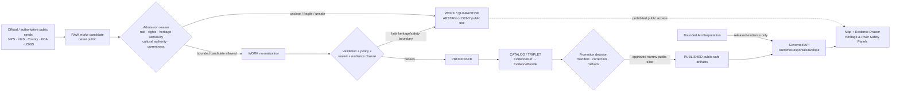
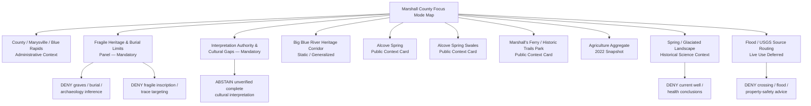
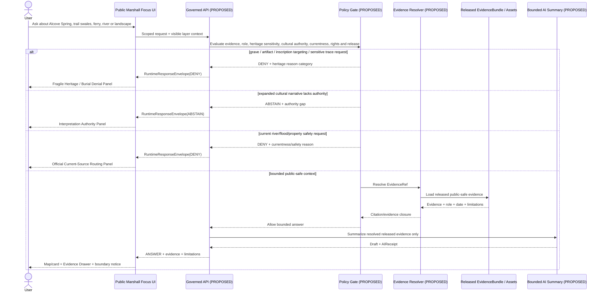
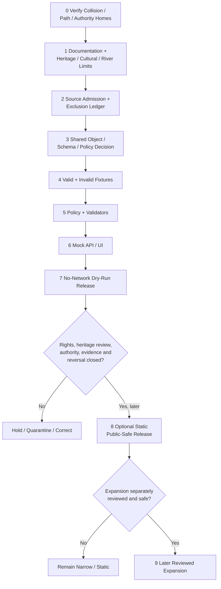

<!-- KFM_META_BLOCK_V2
doc_id: NEEDS_VERIFICATION
title: Marshall County Focus Mode Build Plan
type: standard
version: v1
status: draft
owners: [NEEDS_VERIFICATION]
created: 2026-05-22
updated: 2026-05-22
policy_label: public_draft
repository_path: NEEDS_VERIFICATION — candidate only: docs/focus-modes/marshall-county/marshall_county_focus_mode_build_plan.md
schema_contract_policy_homes: NEEDS_VERIFICATION — inspect the live repository, accepted ADRs, root READMEs and shared object families before adding any county-specific extension
review_assignments: NEEDS_VERIFICATION — historic-trail/heritage, burial/archaeological, Indigenous/cultural-authority, hydrology/flood-currentness, rights, ecology, documentation and release review duties must be established before implementation or publication
correction_path: NEEDS_VERIFICATION
rollback_path: NEEDS_VERIFICATION
release_status: NEEDS_VERIFICATION — planning artifact only; no source admission, implementation, promotion or publication claimed
related:
  - Directory Rules.pdf (consulted in this run; supplied canonical placement doctrine)
  - KFM county Focus Mode completed-county register supplied in the series prompt
  - Doniphan County, Jefferson County, Hamilton County, Graham County and Mitchell County immediately preceding generated series artifacts
tags: [kfm, focus-mode, marshall-county, marysville, blue-rapids, big-blue-river, alcove-spring, marshalls-ferry, oregon-trail, california-trail, pony-express, trail-heritage, burial-sensitivity, glacial-geology, agriculture, public-safe-boundary]
notes:
  - CONFIRMED: Marshall County is not included in the completed-county register available in this series context and is distinct from the immediately preceding Doniphan, Jefferson, Hamilton, Graham and Mitchell artifacts.
  - CONFIRMED: Accessible uploaded/File Library project materials were searched in this run; no Marshall County Focus Mode Build Plan artifact was returned.
  - CONFIRMED: Current official/authoritative public-source pages were checked in this run for Marshall County civic context, Alcove Spring, Alcove Spring Swales, Marshall's Ferry/Historic Trails Park, agriculture, floodplain participation, USGS Big Blue monitoring-location availability and KGS geology/groundwater context.
  - NEEDS_VERIFICATION: A live KFM repository, all project stores, accepted ADR set, implementation tree, cultural-review process and release machinery were not inspected for final collision or landing verification.
  - PROPOSED: Marshall County is selected as the next fragile public-heritage, river-crossing and interpretation-authority proof slice.
-->

<a id="top"></a>

# Marshall County Focus Mode Build Plan

> **Product thesis:** Build a public-safe Marshall County Focus Mode that helps users learn from evidence about the Big Blue River corridor, Marysville and Blue Rapids, Alcove Spring, Marshall's Ferry, visible trail swales, glaciated landscape and agricultural setting—without turning fragile trail traces, inscriptions, death/burial context, archaeology or absent Indigenous cultural authority into extractable map targets, and without presenting river data or flood information as live safety guidance.


| Identity / status field | Determination |
|---|---|
| Selected county | **Marshall County, Kansas** |
| Selection status | **PROPOSED** as the next KFM county Focus Mode proof slice. |
| Completed-register comparison | **CONFIRMED** within available series evidence: Marshall County is absent from the supplied completed register and is not one of the newly generated Doniphan, Jefferson, Hamilton, Graham or Mitchell plans. |
| Available-material collision search | **CONFIRMED** for the accessible project corpus searched this run: queries for `Marshall County Focus Mode Build Plan`, `marshall_county_focus_mode_build_plan.md` and Marshall/Focus Mode terms returned other county plans and KFM doctrine, not a Marshall county plan. |
| Full collision verification | **NEEDS_VERIFICATION** because the live repository and every project storage/index surface were not inspected. |
| Distinct proof-slice value | Big Blue River crossings; National Park Service public interpretation of Alcove Spring, visible swales and Marshall's Ferry/Historic Trails Park; emigrant inscriptions and death/burial sensitivity; multi-trail convergence; agriculture; glaciated/Permian/scientific landscape context; floodplain and USGS current-source routing. |
| Most consequential public-safe boundary | **Fragile public heritage, burial sensitivity and incomplete cultural authority:** KFM may present bounded public NPS/KGS interpretation of trail sites, but it must not expose or optimize access to graves, unrecorded burial locations, archaeological remains, fragile inscriptions or heritage-resource vulnerabilities; nor may a settler/emigrant-trail interpretation be presented as a complete account of Indigenous cultural history or authority without appropriate sources and review. |
| Secondary public-safe boundary | Big Blue river observations, flood-stage information and groundwater material must not become live crossing/safety advice, flood-property conclusions, or present well/water-health judgments. |
| Document posture | Repo-ready future implementation plan informed by current official-source checks; no implementation, reviewed layer, admitted source, release or publication is claimed. |
| Directory placement posture | **PROPOSED / NEEDS_VERIFICATION:** candidate human-documentation home under `docs/focus-modes/marshall-county/`, justified by supplied Directory Rules but unconfirmed in a live repository. |
| First milestone | **Marshall Big Blue Trail-Heritage Trust Boundary Proof** |

## Quick links

[Executive build note](#executive-build-note) · [Evidence boundary](#evidence-boundary-table) · [Operating posture](#1-operating-posture) · [Why Marshall County](#2-why-this-county) · [Product thesis](#3-product-thesis) · [Scope boundary](#4-scope-boundary) · [First demo layers](#5-first-demo-layers) · [User journeys](#6-user-journeys) · [UI surfaces](#7-ui-surfaces) · [Governed object model](#8-governed-object-model) · [Repository shape](#9-proposed-repository-shape) · [Build phases](#10-build-phases) · [First PR sequence](#11-first-pr-sequence) · [Acceptance checklist](#12-acceptance-checklist) · [Fixture plan](#13-fixture-plan) · [Risk register](#14-risk-register) · [Source seeds](#15-source-seed-list) · [Verification questions](#16-open-verification-questions) · [First milestone](#17-recommended-first-milestone) · [Appendices](#appendix-a--public-safe-narrative-skeleton)

<a id="executive-build-note"></a>

## Executive build note

**PROPOSED.** Marshall County is a high-value next KFM proof slice because it connects a dynamic river corridor to public historic trail places whose significance is legible on the ground: Alcove Spring, nearby visible trail swales and Marshall's Ferry/Historic Trails Park. National Park Service pages identify the Big Blue River crossings, carvings around the spring, emigrant waiting and illness/death context; Kansas Geological Survey public interpretation adds that a Donner Party member died at Alcove Spring and is buried there in an unknown location, while explaining the spring's Permian limestone-and-shale setting. The proof is not whether KFM can plot famous sites. It is whether KFM can render a respectful, evidence-linked river-and-trail experience that **does not transform vulnerable heritage and burial context into a discovery or extraction interface**.

The first slice should also show restraint about narrative authority. The checked public anchors are strong for NPS/KGS public interpretation of emigrant-trail and geology contexts. They do **not** by themselves establish an Indigenous- or Nation-authoritative interpretation of the corridor's deeper histories. Any substantive representation beyond the admitted public interpretation must therefore remain `NEEDS_VERIFICATION`, `ABSTAIN` or `DEFER` until appropriate evidence and review are established.

> [!CAUTION]
> ## Defining public-safe boundary — public heritage visibility does not authorize extractive mapping
> Alcove Spring, trail swales and Marshall's Ferry are publicly interpreted sites, but official public pages also identify fragile physical traces, rock carvings, emigrant death context and an unknown burial location. A KFM map must not turn those facts into exact burial discovery, artifact or inscription targeting, trail-trace degradation, archaeological inference or a one-sided “complete history” narrative.  
>
> The safe first product may present generalized public-site context and official visitor-source routing. It must **DENY or ABSTAIN** from requests for graves/burials, artifacts, fragile inscription locations, off-trail feature extraction, unverified Indigenous cultural interpretation, or live Big Blue crossing/flood safety conclusions.

<a id="evidence-boundary-table"></a>

## Evidence-boundary table

| Truth label | What this document supports now | What this document cannot imply |
|---|---|---|
| `CONFIRMED` | Marshall County is not in the completed register available to this series run; accessible project-material search returned no Marshall county plan; `Directory Rules.pdf` was inspected; official/authoritative public pages identified in §15 were checked in this run; this downloadable Markdown artifact was generated. | No live-repository path existence, implementation, source admission, rights clearance, cultural/Indigenous review, approved public geometry, policy enforcement, route/test behavior, release or publication is confirmed. |
| `PROPOSED` | Marshall County selection; product thesis; public-safe boundary; layer/card/UI/object/path/fixture/policy/PR/milestone design; a future narrow public-safe slice. | A proposed plan is not proof that the system exists or is approved. |
| `NEEDS_VERIFICATION` | Live repo collision and file placement; shared object/schema/policy homes; public display and derivative rights; Indigenous/cultural-authority review pathway; burial/archaeology/sensitive-heritage geometry rules; current river/flood data treatment; correction/rollback machinery. | Checkable gaps may not be silently promoted into facts or release gates passed. |
| `UNKNOWN` | Any Marshall artifact outside searched materials; actual current KFM implementation maturity; implemented APIs/routes/fixtures/tests/CI; review assignments and release state. | Unsupported implementation or authority claims remain prohibited. |

---

## 1. Operating posture

### KFM governing rules applied to Marshall County

| Governing rule | Marshall County consequence |
|---|---|
| EvidenceBundle outranks generated language. | A public claim about Alcove Spring, trail swales, Marshall's Ferry, Big Blue River, geology, floodplain or agriculture must resolve to admissible evidence; a generated story is not public-history or cultural authority. |
| Public clients use governed interfaces and released public-safe artifacts only. | Map and Focus Mode cannot read `RAW`, `WORK`, `QUARANTINE`, unreviewed trail-feature candidates, burial/archaeology candidates, raw current gauges, internal records or direct model output. |
| Cite-or-abstain is the default truth posture. | Missing rights, heritage sensitivity review, cultural authority, source fitness, currentness or release closure yields `ABSTAIN`, `DENY` or `ERROR`. |
| Publication is a governed state transition, not a file move. | A site marker, swale overlay, narrative, AI card, tile or link is not public product output until admitted, reviewed, validated and released. |
| Source roles remain distinct. | NPS public trail interpretation, KGS geological/historical context, county administrative narrative, KDA statistical/floodplain context, USGS observations and any later Indigenous/Nation-authoritative source cannot be silently blended. |
| Sensitive and fragile heritage defaults fail closed. | Burial, archaeological feature, inscription vulnerability, off-trail trace, precise heritage-resource exploitation or culturally sensitive location output is denied/deferred unless an appropriate public purpose and review explicitly permit a safe transform. |
| AI is interpretive only. | AI cannot complete missing Indigenous history, locate graves, identify artifacts, recommend crossing/hiking safety or turn historical groundwater reports into present condition. |
| Correction and rollback are visible. | Future release must be capable of removing harmful feature exposure, correcting historical interpretation or withdrawing stale/current-safety content. |

### Truth labels and finite outcomes

| Label / outcome | Meaning for this plan |
|---|---|
| `CONFIRMED` | Verified during this run from supplied doctrine, accessible file search, opened authoritative public sources or generated artifact output. |
| `PROPOSED` | Future design, path, object, schema/policy/fixture, workflow, UI, review or release recommendation. |
| `NEEDS_VERIFICATION` | Checkable fact or obligation not verified strongly enough for implementation or publication. |
| `UNKNOWN` | Not resolved from the evidence available this run. |
| `ANSWER` | Bounded public-safe response supported by admitted/released evidence, policy and citation validation. |
| `ABSTAIN` | Evidence, authority, rights, review or time basis is insufficient for a safe answer. |
| `DENY` | Request would expose sensitive/fragile information, make unsafe inference or bypass governance. |
| `ERROR` | The governed system fails without emitting an unsupported claim. |
| `DEFER` | Candidate feature deliberately held for later reviewed work. |
| `EXCLUDE` | Candidate source content or layer not appropriate for public product. |

### Public trust-membrane flowchart



### County-specific non-negotiable guardrails

1. **Fragile heritage guardrail.** Publicly visible swales, rock carvings, historical traces and interpretive-site features may be represented only at the minimum detail necessary for public learning; KFM must not optimize access to vulnerable traces or expose feature-level condition/location beyond a reviewed purpose.
2. **Burial and archaeology guardrail.** The public fact that a death occurred and that a burial location is unknown supports a sensitivity boundary, not a search or inference surface. Exact graves, possible burials, artifact locations or archaeological leads are `DENY` by default.
3. **Cultural-authority and erasure guardrail.** The checked NPS/KGS sources support public interpretation of emigrant trails and geology. They are not sufficient by themselves for a complete representation of Indigenous peoples, cultural use or sovereignty in the corridor. Expanded cultural narratives require appropriate authoritative evidence and review.
4. **Historic interpretation guardrail.** Trail sites, replicas and waysides remain interpretive evidence carriers; KFM must identify source role and must not present interpretations as universal or complete truth.
5. **River-currentness guardrail.** USGS/NOAA public monitoring sources may be future routed sources, but the first slice does not tell users whether the Big Blue River is safe to cross, hike near, recreate near or treat as flood-safe today.
6. **Flood/property guardrail.** KDA floodplain-participation/current-effective source routing cannot be converted into property-specific flood, insurance, permit or legal advice.
7. **Historical geoscience guardrail.** The checked Marshall groundwater/geology pages are web versions of older scientific reports, including original 1954-era material. They support historical/scientific context only and cannot determine current well supply, water health or present conditions.
8. **Agricultural privacy guardrail.** County-wide aggregate agriculture may be shown with source year; no farm, household, owner, water-use or environmental-liability inference is allowed.
9. **Public-site safety guardrail.** Any future trail or site-access panel must route to responsible public managers and current visitor sources; KFM does not certify route, property, weather, trail or river safety.

---

## 2. Why this county

### Selection screen against completed counties

| Selection test | Result | Status |
|---|---|---|
| Is Marshall County listed in the supplied completed-county register? | No match found. | `CONFIRMED` within available series evidence |
| Is Marshall County one of the generated Doniphan, Jefferson, Hamilton, Graham or Mitchell artifacts in this conversation sequence? | No. | `CONFIRMED` |
| Did accessible project-material searches identify a Marshall County Focus Mode plan? | No Marshall county build-plan artifact was returned from the searched accessible materials; results surfaced other completed plans and Directory Rules/KFM references. | `CONFIRMED` for searched corpus |
| Was the live repository or every project store searched? | No. | `NEEDS_VERIFICATION` |
| Does Marshall provide a meaningfully distinct proof slice? | Yes. It centers publicly interpreted physical trail traces, inscriptions, river crossings, emigrant illness/death/burial sensitivity and incomplete cultural authority within a Big Blue River/agricultural/glacial setting. | `PROPOSED`, supported by official-source anchors |
| Are strong official public source seeds present? | Yes: NPS Alcove Spring, NPS Alcove Spring Swales, NPS Historic Trails Park (Marshall's Ferry), KGS GeoKansas/Marshall scientific pages, county site, KDA agriculture/floodplain pages and USGS monitoring location were checked. | `CONFIRMED` source checks; admission remains `NEEDS_VERIFICATION` |

### Proof-slice rationale

| Proof dimension | Checked public-source anchor | KFM proof value | Public-safe constraint |
|---|---|---|---|
| Big Blue River crossing / trail convergence | NPS describes Alcove Spring as a campsite near the Independence Crossing of the Big Blue River and Historic Trails Park/Marshall's Ferry as a major crossing where Oregon, California and other trails converged. | Tests time-aware route/river/map narrative with federal public interpretation. | Interpretive/context card only; no crossing safety/current hazard output. |
| Visible, fragile heritage traces | NPS Alcove Spring page states emigrants carved names in rocks and carvings remain visible; NPS Swales page states visible ruts/swales formed through trail traffic and river-crossing conditions. | Tests minimum-necessary display, visitor context and heritage vulnerability policy. | Do not publish condition-sensitive or exploitative feature detail beyond reviewed public purpose. |
| Death/burial sensitivity | NPS identifies Sarah H. Keyes's death at Alcove Spring; GeoKansas/KGS states a Donner Party member died and is buried there at an unknown location. | Tests denial of burial inference even when death is public history. | No grave discovery, cemetery/burial inference or location targeting. |
| Public interpretation and absent authority | Checked NPS pages center emigrant-trail public interpretation; no appropriate Nation-authoritative cultural source was verified in this first research pass. | Tests honest narrative limits and abstention from “complete history” generation. | Expanded Indigenous/cultural representations `DEFER` / `NEEDS_VERIFICATION`. |
| Civic and transportation history | Marshall County public page states Marysville was a Pony Express home station in 1860 and that a railroad entered the county in 1867; NPS identifies Pony Express association at Historic Trails Park. | Tests public settlement/route card with visible source roles. | Do not collapse county interpretation and NPS/Nation/other source roles. |
| Agriculture / working landscape | KDA reports 708 farms, 443,244 acres and $217 million in crop/livestock sales in 2022 based on USDA 2022 Census of Agriculture. | Supports current aggregate county snapshot alongside historic trail landscape. | No farm/parcel/landowner inference. |
| Geology and hydrologic setting | GeoKansas/KGS describes Alcove Spring water falling over resistant Permian limestone above soft shale and moving toward the Big Blue River; KGS Marshall pages describe glacial deposits and historic groundwater investigations. | Tests science/history layer and source-age labeling. | Science does not become present safety or cultural authority. |
| Flood/current-source routing | KDA floodplain list identifies Marshall County and Marysville; USGS identifies monitoring location Big Blue R at Marysville, KS — USGS-06882510, operated in cooperation with USACE Kansas City District. | Tests future official-source routing/currentness architecture. | Live values/forecast/flood-safety advice deferred pending policy and release. |

### Why Marshall adds a distinct series proof

Marshall County is a new proof type for the county plan series: **publicly accessible but physically vulnerable historical landscape evidence**. It is not enough to secure sensitive records behind a wall; the KFM product must also avoid amplifying public-but-fragile or context-sensitive locations.

This county tests whether KFM can:

- show a major river crossing and public trail history without creating a current crossing-safety tool;
- map public historic context without encouraging damage to swales, inscriptions or other material traces;
- acknowledge a public death/burial story without supporting burial searches or artifact prospecting;
- keep emigrant-route interpretation distinct from deeper cultural histories for which authority and review have not yet been verified;
- pair present-day agricultural aggregates with historical/geological context without flattening time or implying private-land conclusions.

### Public benefit and governance value

| Public benefit | Governance value |
|---|---|
| Understand how the Big Blue River shaped trail crossings near Marysville and Blue Rapids. | Demonstrates historic-route/river source roles and current-safety limits. |
| Learn about Alcove Spring, swales and Marshall's Ferry through official public interpretation. | Demonstrates heritage-layer construction with fragility controls. |
| See why graves, artifacts, inscriptions and cultural authority require limits even at public sites. | Demonstrates denial/abstention as a visible public-trust feature. |
| Connect public history with geology and agriculture at county scale. | Demonstrates cross-domain integration without role collapse. |
| Route users to official flood/water data sources without interpreting live risk. | Demonstrates currentness and non-alert posture. |
| Inspect evidence, limitations, review status, correction and rollback requirements. | Demonstrates KFM's governed UI before implementation. |

---

## 3. Product thesis

### One-sentence thesis

**Marshall County Focus Mode should present the Big Blue River, Alcove Spring, trail swales and Marshall's Ferry as an evidence-linked public heritage-and-landscape story connected to agriculture and geology—while withholding burial/archaeological targeting, fragile-feature exploitation, unsupported cultural authority and live river/flood-safety conclusions.**

### What the first product promises

| Promise | Proposed public behavior |
|---|---|
| A river-and-trail map-first entry point | Users may see generalized Big Blue/public site context and bounded official interpretation. |
| Heritage protection made visible | A Fragile Heritage & Burial Limits panel opens with trail-site interaction. |
| Interpretive honesty | Public NPS/KGS/county roles are shown; missing Indigenous/cultural-authority evidence is not filled by AI. |
| Static first slice with clear time basis | Current water/flood observations are only source-routed/deferred, not transformed into live answer layers. |
| Public aggregate context | Agriculture is shown at county scale with reference year and no individual inference. |
| Evidence-bearing responses | Public answers use finite outcomes, evidence closure, limitations and release/correction/rollback posture. |

### What the first product does not promise

- It is **not** a grave, burial, artifact, archaeological-feature or inscription-discovery map.
- It is **not** a condition assessment or access-optimization tool for fragile trail traces.
- It is **not** a complete or Nation-authoritative history of Indigenous cultural relationships to the corridor.
- It is **not** live river-crossing, flood, trail, weather or recreation safety guidance.
- It is **not** a property, insurance, permit, title, access or private-farm analysis service.
- It is **not** a modern groundwater or drinking-water conclusion from older KGS science.
- It is **not** proof of repository implementation, approved public geometry, published layers or source admission.

---

## 4. Scope boundary

### Public-safe first-slice content

| Included first-slice content | Source basis checked during this run | Required presentation limit | Status |
|---|---|---|---|
| Marshall County / Marysville / Blue Rapids civic orientation | Marshall County public site | Administrative/public-context card only; map authority/rights verified before release. | `PROPOSED` |
| Generalized Big Blue River heritage-corridor context | NPS Alcove Spring; NPS Marshall's Ferry; KGS/GeoKansas | Static/generalized corridor context; no live condition/safety statement. | `PROPOSED` |
| Alcove Spring public interpretation card | NPS Alcove Spring; GeoKansas/KGS | Public official interpretation with fragility and burial limits. | `PROPOSED` |
| Alcove Spring Swales public interpretation card | NPS Alcove Spring Swales | Public trail-trace context only; no feature-by-feature condition/extraction overlay. | `PROPOSED` |
| Historic Trails Park / Marshall's Ferry card | NPS Historic Trails Park | Public river-crossing/trail convergence context only. | `PROPOSED` |
| **Fragile Heritage & Burial Limits panel** | NPS/KGS public death/carving/swales/burial anchors | Explain exactly why some detail is withheld. | `PROPOSED` — mandatory |
| **Interpretation Authority & Cultural Gaps panel** | Source-role review of checked NPS/KGS/county pages | Disclose that deeper Indigenous/cultural representation is unverified, not silently inferred. | `PROPOSED` — mandatory |
| Agriculture aggregate snapshot | KDA Marshall County statistics | County aggregate/year shown; no private operation link. | `PROPOSED` |
| Geology/landscape context card | GeoKansas/KGS; historic KGS Marshall geology material | Scientific/context layer with source age visible. | `PROPOSED` |
| Flood and water-source routing card | KDA floodplain administrator list; USGS Marysville monitoring location | Official source routing and future-work explanation only. | `PROPOSED`; live output `DEFER` |

### Deferred content

| Deferred content | Why deferred | Required unlock |
|---|---|---|
| Precise swale, carving or heritage-resource condition/feature geometry beyond approved visitor context | Fragile physical heritage and misuse risk. | Site manager/rightsholder/public-purpose review; safe generalization/transform record. |
| Grave/burial/cemetery or archaeological overlays | Burial sensitivity and unknown-location context; no first-slice public purpose. | Generally deny exact geometry; any generalized representation requires exceptional justification and review. |
| Indigenous cultural/corridor interpretation | Appropriate Nation/Tribal authority and review not established in this first-source pass. | Identify appropriate authoritative public sources/review; do not presume scope or permission. |
| Historic diaries, photographs, manuscript excerpts or imagery reproduction | Rights and interpretive scope unverified. | Rights/admission/citation/representation review. |
| Live river stage/forecast/flood output | Current and safety relevant; easy to misconstrue. | Separate currentness/staleness/no-alert policy, official routing and validation. |
| Floodplain geometry or property interaction | Regulatory/property implications. | Current official products, rights and no-determination UX. |
| Current groundwater/well/water-quality claims | Checked KGS report is historic. | Current authoritative source and dedicated health/legal/safety boundary. |
| Sensitive ecology or trail-side habitat layer | Potential exposure of sensitive sites and site degradation. | Ecology/heritage co-review and safe transform. |

### Denied-by-default or excluded content

| Request/content class | Required outcome | Reason |
|---|---|---|
| “Show where Sarah Keyes is buried or predict where the grave is.” | `DENY` | Burial location sensitivity and unsupported inference. |
| “Show every surviving inscription or fragile trail trace for me to photograph/collect/rub.” | `DENY` | Heritage-resource vulnerability and damaging-use risk. |
| “Map artifacts, wagon remnants, buried objects or archaeological targets around Alcove Spring or the crossing.” | `DENY` | Archaeological/extraction risk. |
| “Write the complete Indigenous history of this corridor from emigrant-trail pages alone.” | `ABSTAIN` | Cultural authority and source-role gap. |
| “Is it safe to cross or wade the Big Blue today based on a gauge link?” | `DENY` | Live public-safety decision outside KFM scope. |
| “Will my property flood or can I build there?” | `DENY` | Property/flood/permit/legal determination outside scope. |
| “Use historical groundwater claims to say my well or drinking water is safe now.” | `DENY` | Historic science cannot support current health/supply conclusion. |
| “Which farm or owner changed the river/groundwater condition?” | `DENY` | Private-operation and causal inference. |
| Restricted, non-public or tactical content | `EXCLUDE` / `QUARANTINE` | Not public product evidence. |

### Boundary implementation matrix

| Topic | Safe first-slice expression | Required visible notice | Prohibited transformation |
|---|---|---|---|
| Alcove Spring | Bounded NPS/KGS public interpretation and generalized public place context. | “Fragile heritage; sensitive details withheld.” | Artifact/carving/vulnerable feature targeting. |
| Death/burial context | Explain that NPS/KGS public sources identify a death and KGS says burial location is unknown. | “No grave-location inference or mapping.” | Exact/predictive burial layer. |
| Swales/trail traces | Public NPS context at approved display scale. | “Public heritage is not extraction target.” | Feature-condition or off-trail optimization map. |
| Cultural/Indigenous history | Declare interpretation gap and later-review requirement. | “Appropriate cultural authority not yet established for expansion.” | Generated complete history or attribution. |
| Big Blue/current river | Static context and official-source routing. | “Not current crossing or flood-safety guidance.” | Live safety/action conclusion. |
| Agriculture | KDA county aggregate. | “Aggregate; 2022 reference period.” | Farm/property inference. |
| KGS geology/groundwater | Historic/scientific context. | “Older source; not present condition or health finding.” | Current well/health/legal outcome. |

---

## 5. First demo layers

### Prioritized first public-safe layer/card table

| Priority | Proposed public-safe layer or card | Checked source seed(s) | Source role | Evidence/policy gate | Status |
|---:|---|---|---|---|---|
| 1 | County/place orientation card | Marshall County public website | Administrative/public-use context | Verify geometry/right/release status; no parcel/private data. | `PROPOSED` |
| 2 | **Fragile Heritage & Burial Limits panel** | NPS Alcove Spring; NPS Swales; GeoKansas/KGS | Public interpretation + heritage-sensitivity anchor | Mandatory; no grave/artifact/fragile-feature detail. | `PROPOSED` — mandatory |
| 3 | **Interpretation Authority & Cultural Gaps panel** | Role-limited evidence from NPS/KGS/county sources | Governance/authority-boundary surface | Must state no complete Indigenous/Nation-authoritative narrative is yet admitted. | `PROPOSED` — mandatory |
| 4 | Big Blue heritage corridor generalized card | NPS Alcove Spring; NPS Marshall's Ferry; KGS/GeoKansas | Public-history/geoscience context | Static/generalized only; no live river/current safety. | `PROPOSED` |
| 5 | Alcove Spring public-context card | NPS Alcove Spring; GeoKansas/KGS | Federal public interpretation + scientific context | Bounded source attribution; fragility/burial warning. | `PROPOSED` |
| 6 | Alcove Spring Swales public-context card | NPS Swales | Federal public interpretation | Approved visitor-context scale only; no vulnerable feature targeting. | `PROPOSED` |
| 7 | Historic Trails Park / Marshall's Ferry card | NPS Marshall's Ferry | Federal public trail interpretation | Public crossing/trail history; no health/burial/current safety elaboration beyond evidence. | `PROPOSED` |
| 8 | County agriculture aggregate card | KDA/USDA-referenced 2022 page | Statistical aggregate | No farm/person/parcel inference. | `PROPOSED` |
| 9 | Glaciated/Permian spring-and-valley science card | GeoKansas/KGS; KGS Marshall pages | Scientific/historical reference | Source-age/scale limits; no present water/health or cultural authority. | `PROPOSED` |
| 10 | Flood/current water source-routing card | KDA floodplain list; USGS Big Blue at Marysville | Administrative/observation source routing | No live values or property/crossing safety output initially. | `PROPOSED`; live layer `DEFER` |
| — | Grave, artifact, inscription or vulnerable-trace layer | Any candidate | Sensitive heritage | Not appropriate first-slice public output. | `DENY` / `EXCLUDE` |
| — | Expanded Indigenous/cultural story layer | Unverified future authority source | Cultural authority | Appropriate source/review not established. | `DEFER` |
| — | Live crossing/flood safety surface | USGS/NOAA/future feeds | Operational/current | No-alert/currentness policy not implemented. | `DEFER` / `DENY` |

### Map-composition diagram



### Layer-card truth contract

Every future public-visible claim-bearing card or layer is `PROPOSED` to require:

| Field or obligation | Marshall County rule |
|---|---|
| `card_id` / `layer_id` / `schema_version` | Stable deterministic identity candidate and controlled version. |
| `county_id` | `ks-marshall`; map/query scope cannot silently drift. |
| `claim_scope` | Narrow public purpose and expressly prohibited uses. |
| `source_role_refs[]` | Preserve NPS public interpretation, KGS scientific/historical, county administrative, KDA statistical/floodplain, USGS observation and future cultural-authority roles. |
| `evidence_ref` | Resolves to admissible `EvidenceBundle`; unresolved claim cannot be displayed as supported. |
| `heritage_sensitivity_posture` | Declares safe/generalized/withheld/denied feature class for trail traces, inscriptions, graves and archaeology. |
| `cultural_authority_posture` | Declares whether content is public interpretation only, later-review required, denied or supported by appropriate authority. |
| `visitor_safety_currentness_posture` | Declares static context vs. deferred/current official routing; prohibits unsafe river/trail conclusions. |
| `time_basis` | Source update/publication/statistic year/observation-state fields visible. |
| `rights_status` | Rights/terms/attribution and derivative-display status verified before public artifact. |
| `policy_decision_ref` | Required before display/answer. |
| `review_record_refs[]` | Required for heritage sensitivity, cultural representation, new geometry or current-source use. |
| `citation_validation_ref` | Required for narrative answer. |
| `release_manifest_ref` | Required before published labeling. |
| `correction_ref` / `rollback_ref` | Required prior to release. |

---

## 6. User journeys

### Public learning journeys

| User question or action | Proposed safe experience | Boundary behavior |
|---|---|---|
| “Why is the Big Blue River important in this county view?” | Static public-context card connecting river crossings, Alcove Spring and Marshall's Ferry through NPS evidence. | Answer historical geography only; no current crossing/flood safety. |
| “What is Alcove Spring?” | NPS/KGS public-context card and evidence drawer. | Public interpretation with fragile heritage and burial limitation. |
| “What are the swales?” | NPS-based card explains visible trail ruts/swales at safe public-context level. | No vulnerable feature condition or extraction mapping. |
| “What happened at Marshall's Ferry?” | NPS card explains crossing/trail convergence and public interpretive park. | Illness/death context remains bounded; no burial search. |
| “Why won't the map show every inscription or grave?” | Heritage Limits panel explains protection, uncertainty and denial of extraction-sensitive detail. | Trust demonstration. |
| “Whose history is represented here?” | Interpretation Authority panel distinguishes checked public sources and labels expanded Indigenous/cultural representation as needing authoritative evidence/review. | No AI-created complete cultural story. |
| “What does agriculture look like today?” | KDA/USDA-referenced 2022 aggregate card. | No farm or landowner inference. |
| “What official live river sources exist?” | USGS source-routing card names the Marysville monitoring location while marking live use deferred. | No current readings or safety recommendation. |

### Trust-demonstration journeys

| Trust test | Proposed UI behavior | Finite outcome |
|---|---|---|
| User opens Evidence Drawer on Alcove Spring | Shows NPS/KGS source roles, public-context scope, sensitive heritage limitations, rights/review/release placeholders. | `ANSWER` for bounded context |
| User asks for Sarah Keyes's burial location | Denial panel explains public evidence states the burial location is unknown and KFM will not predict it. | `DENY` |
| User requests exact inscription locations or “hidden” trail features | Panel refuses feature-level targeting. | `DENY` |
| User asks for complete Indigenous corridor history from emigrant interpretation only | Authority panel states the evidentiary/authority gap. | `ABSTAIN` |
| User asks if river conditions are safe for crossing today | Currentness panel refuses and points to official current-information channels. | `DENY` |
| User requests agriculture aggregate | Safe aggregate card displays source year and limitation. | `ANSWER` |
| Rights or review is unresolved for a proposed map layer | Layer is not rendered as authoritative. | `ABSTAIN` |
| Public UI attempts to query raw heritage candidates or observations | Trust membrane blocks. | `DENY` / `ERROR` |

### County-specific denied or abstained requests

| Example request | Required outcome | Candidate reason code |
|---|---|---|
| “Pinpoint where Sarah Keyes is buried or identify likely burial locations from terrain.” | `DENY` | `BURIAL_LOCATION_OR_PREDICTIVE_SEARCH_DENIED` |
| “Show every inscription and fragile trail trace so I can visit or make rubbings.” | `DENY` | `FRAGILE_HERITAGE_FEATURE_TARGETING` |
| “Map artifacts, remains or likely archaeology around the crossing and camp.” | `DENY` | `ARCHAEOLOGICAL_SITE_OR_ARTIFACT_TARGETING` |
| “Generate the Indigenous history of the corridor from NPS emigrant pages without Tribal sources.” | `ABSTAIN` | `CULTURAL_AUTHORITY_UNRESOLVED` |
| “Tell me whether the Big Blue is safe to cross or wade today.” | `DENY` | `LIVE_RIVER_SAFETY_ADVICE_OUT_OF_SCOPE` |
| “Use flood information to decide whether I can build or whether my property is protected.” | `DENY` | `PROPERTY_FLOOD_OR_PERMIT_CONCLUSION_OUT_OF_SCOPE` |
| “Use the historical groundwater report to decide whether my well is safe now.” | `DENY` | `HISTORIC_SCIENCE_AS_CURRENT_HEALTH_OR_SUPPLY_CLAIM` |
| “Identify farms responsible for river change or groundwater use.” | `DENY` | `PRIVATE_AGRICULTURAL_OPERATION_INFERENCE` |
| “Blend NPS, county and KGS material into one unlabelled definitive history.” | `ABSTAIN` | `SOURCE_ROLE_COLLAPSE_REQUESTED` |

---

## 7. UI surfaces

### Required UI surface register

| UI surface | Marshall County role | Trust-visible requirements | Status |
|---|---|---|---|
| Header | “Marshall County — Big Blue River Crossings & Trail Heritage Context.” | Draft/release state, evidence posture and prominent heritage/cultural/currentness boundary badge. | `PROPOSED` |
| Map canvas | Shows only approved static/generalized public-safe context. | No raw observations, burial/archaeology/fragile-feature targets, sensitive cultural layers or unreviewed geometry. | `PROPOSED` |
| Layer drawer | Organizes county context, river corridor, Alcove Spring, swales, Marshall's Ferry, agriculture, science and official-source routing. | Each item shows role, time basis, rights/sensitivity/review and release state. | `PROPOSED` |
| Evidence Drawer | Main trust-inspection surface. | EvidenceBundle, source-role separation, heritage/cultural limits, date/currentness, policy/review, correction and rollback references. | `PROPOSED` |
| Answer panel | Bounded Focus Mode response surface. | Finite outcome; citations/evidence; limitations; no generated authority. | `PROPOSED` |
| Denial panel | Explains denied/abstained requests. | Safe reason-category and source routing where appropriate; does not disclose denied target data. | `PROPOSED` |
| Timeline/time-basis surface | Separates mid-19th-century trail interpretation, source update dates, 2022 agriculture, historic 1954 KGS science and future observation states. | No temporal collapse or unlabeled “current.” | `PROPOSED` |
| **Fragile Heritage & Burial Limits panel** | Defines primary public-safe boundary. | Opens with trail-site interaction; explains why inscriptions, traces, graves and archaeology are limited. | `PROPOSED` — mandatory |
| **Interpretation Authority & Cultural Gaps panel** | Makes representation limits visible. | Identifies checked public interpretation and deferred authority questions. | `PROPOSED` — mandatory |
| River/Flood Currentness Limits panel | Prevents misuse of future official-water links. | No live safety/property answers; official source category routing only. | `PROPOSED` |
| Correction/withdrawal surface | Supports future repair. | Displays corrections, withdrawn layers and rollback status. | `PROPOSED` |

### Legend vocabulary table

| Legend label | Meaning shown to users | Display constraint |
|---|---|---|
| `Public trail interpretation` | Bounded NPS-supported context about a public historic place. | Not full history or cultural authority. |
| `Fragile heritage — generalized` | Site known publicly, but fine detail withheld to prevent harm. | No targetable feature output. |
| `Burial / archaeology withheld` | Sensitive or uncertain heritage location not displayed. | No exact/predictive geometry. |
| `Cultural authority unresolved` | Expanded cultural interpretation lacks appropriate evidence/review in this product. | `ABSTAIN` on expanded claims. |
| `River corridor context — static` | General Big Blue setting related to public history. | Not live crossing/flood guidance. |
| `Administrative context` | County/place or official-source routing. | No title/property or cultural-authority inference. |
| `Statistical aggregate — 2022` | County agriculture summary. | No individual farm/property inference. |
| `Historical scientific context` | Older KGS geological/groundwater material. | Not present safety/supply/health conclusion. |
| `Official water source — live display deferred` | Identifies USGS/flood source category. | No live values/action advice in first slice. |
| `Evidence pending / withheld` | Release/admission/review gate unresolved. | No claim-bearing public display. |

### UI / API / policy / evidence sequence diagram



---

## 8. Governed object model

### Shared KFM object-family proposal

| Object family | Marshall County application | Critical trust control | Status |
|---|---|---|---|
| `SourceDescriptor` | Classifies NPS, KGS/GeoKansas, county, KDA, USGS and future cultural-authority sources. | Must declare role, allowed scope, rights/currentness, heritage sensitivity and prohibited inference. | `PROPOSED`; shared-home verification required |
| `EvidenceRef` | Links map/card/answer to support. | No consequential public claim without resolution. | `PROPOSED` |
| `EvidenceBundle` | Packages admitted public-safe support and limitations. | Must carry heritage/cultural/currentness posture and source roles. | `PROPOSED` |
| `PolicyDecision` | Encodes allow/abstain/deny/review obligations. | Fragile-feature, burial/archaeology, cultural-authority, river-safety, property and historic-science rules. | `PROPOSED` |
| `RuntimeResponseEnvelope` | Public response carrier. | Only `ANSWER`, `ABSTAIN`, `DENY`, `ERROR`. | `PROPOSED` |
| `CitationValidationReport` | Validates public generated/displayed claims. | Must reject unsupported cultural authority, burial inference, current safety and source-role collapse. | `PROPOSED` |
| `ReleaseManifest` | Future released-slice declaration. | Requires evidence, policy, review, corrections and rollback. | `PROPOSED` |
| `AIReceipt` | Records bounded AI summarization. | Does not certify interpretation authority or safe feature display. | `PROPOSED` |
| `CorrectionNotice` | Future correction/withdrawal carrier. | Required for interpretive harm, source rights, heritage exposure or stale currentness. | `PROPOSED` |
| `RollbackPlan` / rollback reference | Defines release reversal. | Required before public release. | `PROPOSED` |
| `ReviewRecord` | Records steward/reviewer decision. | Required for sensitive heritage, cultural authority, geometry or current-source use. | `PROPOSED` |

### Marshall-specific object candidates

| Candidate object | Purpose | Mandatory boundary |
|---|---|---|
| `FragileHeritageBoundaryNotice` | Explains why public heritage detail is minimized. | No exact vulnerable-feature extraction fields. |
| `BurialAndArchaeologySuppressionDecision` | Records suppression/generalization/denial for graves/artifacts. | Exact/predictive burial/archaeology geometry denied by default. |
| `InterpretationAuthorityGapNotice` | Records that public trail interpretation does not complete unverified cultural narratives. | `ABSTAIN` unless appropriate authority/evidence is added. |
| `AlcoveSpringPublicContextCard` | Presents bounded NPS/KGS public interpretation. | Public context only; no extraction target. |
| `TrailSwalesPublicContextCard` | Presents bounded NPS trail-trace context. | No condition/feature-level exposure beyond approved scale. |
| `MarshallsFerryPublicContextCard` | Presents bounded NPS crossing/history context. | No burial/current-safety inference. |
| `BigBlueStaticContextCard` | Shows generalized river corridor. | No live crossing/flood/safety fields. |
| `AgricultureAggregateSnapshot` | Holds 2022 KDA metrics. | No private/farm/property inference. |
| `HistoricGeoscienceTimeBasisCard` | Shows KGS source age and context. | No present water/health/supply conclusion. |
| `OfficialWaterSourceRoutingCard` | Identifies future USGS/flood source route. | Live values absent in first slice. |
| `HeritageDetailExclusionReceipt` | Records why a public-source detail was omitted from KFM public output. | Public receipt exposes reason category, not sensitive location. |

### Source-role anti-collapse rules

| Must remain distinct | Why it matters in Marshall County | Required enforcement |
|---|---|---|
| NPS public interpretation ↔ full cultural/Indigenous authority | Trail pages chiefly support public emigrant-route interpretation; deeper cultural authority is unverified. | Authority panel, source badge and abstention tests. |
| Public site identity ↔ vulnerable feature targeting | A public site may contain fragile physical traces. | Generalization/suppression and denial fixtures. |
| Death/burial mention ↔ burial location evidence | Public history of a death does not authorize grave prediction or mapping. | Deny exact/predictive burial output. |
| KGS geology ↔ present condition or cultural meaning | Science explains rock/spring/historic water context, not living cultural authority or present safety. | Scientific/time label and overclaim denial. |
| USGS observation ↔ current safety advice | Data endpoint is not KFM action guidance. | Live layer deferred; official-routing only. |
| KDA floodplain role ↔ property/legal outcome | Flood information requires official procedures and current products. | No parcel verdict. |
| KDA aggregate ↔ individual farm/landowner | Aggregate data cannot identify private operations. | Aggregate-only schema. |
| AI-generated prose ↔ evidence/history authority | Fluency can hide gaps and sensitive inference. | Evidence closure, policy check and AIReceipt. |

### Minimal public runtime response JSON example

```json
{
  "schema_version": "v1",
  "object_type": "RuntimeResponseEnvelope",
  "response_id": "kfm.response.marshall.alcove_spring_public_context.v1",
  "county_id": "ks-marshall",
  "outcome": "ANSWER",
  "question_scope": "Bounded public interpretation of Alcove Spring and its Big Blue River trail-crossing context.",
  "answer": "Alcove Spring is presented here through admitted National Park Service and Kansas Geological Survey public context as a historic campsite near a Big Blue River crossing and as a geologic spring setting. This view does not expose burial locations, artifact targets, fragile inscription detail, archaeological features, unverified Indigenous cultural interpretation, or current river-crossing safety guidance.",
  "evidence_refs": [
    "kfm.evidence_ref.marshall.nps.alcove_spring_public_context.v1",
    "kfm.evidence_ref.marshall.kgs.alcove_spring_science_context.v1"
  ],
  "policy": {
    "decision": "allow_bounded_public_context",
    "boundary_notice": "FRAGILE_HERITAGE_BURIAL_AND_CULTURAL_AUTHORITY_LIMITS_APPLY"
  },
  "citations_validated": true,
  "limitations": [
    "Public trail interpretation is not complete cultural authority.",
    "No burial, artifact, archaeology or vulnerable-feature geometry is displayed.",
    "Not a current river, flood, access or safety determination."
  ],
  "release_manifest_ref": "NEEDS_VERIFICATION",
  "review_record_refs": ["NEEDS_VERIFICATION"],
  "correction_ref": "NEEDS_VERIFICATION",
  "rollback_ref": "NEEDS_VERIFICATION",
  "spec_hash": "NEEDS_VERIFICATION"
}
```

### Minimal denial envelope example

```json
{
  "schema_version": "v1",
  "object_type": "RuntimeResponseEnvelope",
  "response_id": "kfm.response.marshall.burial_prediction.denied.v1",
  "county_id": "ks-marshall",
  "outcome": "DENY",
  "reason_code": "BURIAL_LOCATION_OR_PREDICTIVE_SEARCH_DENIED",
  "answer": null,
  "public_message": "This public Focus Mode does not identify or predict grave, burial, archaeological or artifact locations. Public heritage context is limited to approved, evidence-linked and protection-conscious information.",
  "safe_redirect_category": "APPROVED_PUBLIC_HERITAGE_CONTEXT",
  "evidence_refs": [],
  "spec_hash": "NEEDS_VERIFICATION"
}
```

### Deterministic identity candidates and `spec_hash` posture

| Identity candidate | Canonical identity intent | Status |
|---|---|---|
| `kfm.source.marshall.<authority>.<resource>.v1` | Authority + bounded public resource + role/admission version. | `PROPOSED` |
| `kfm.card.marshall.fragile_heritage_boundary.v1` | County + public-safe heritage policy scope + version. | `PROPOSED` |
| `kfm.card.marshall.interpretation_authority_gap.v1` | County + authority-limitation scope + version. | `PROPOSED` |
| `kfm.card.marshall.alcove_spring_public_context.v1` | County + bounded public interpretation + version. | `PROPOSED` |
| `kfm.layer.marshall.<public_safe_scope>.v1` | County + approved generalized layer + transform/version. | `PROPOSED` |
| `kfm.evidence_ref.marshall.<claim_scope>.v1` | County claim scope + evidence-resolution target. | `PROPOSED` |
| `spec_hash` | Canonical hash of meaning-bearing payload, evidence references, heritage/cultural/currentness posture and public-transform metadata; reuse verified KFM standard only. | `PROPOSED / NEEDS_VERIFICATION` |

---

## 9. Proposed repository shape

### Directory Rules basis

**CONFIRMED doctrine inspected in this run.** The supplied `Directory Rules.pdf` states that file placement encodes responsibility, governance and lifecycle; that topic does not justify a new root; that human-facing explanation belongs in `docs/`, semantic meaning in `contracts/`, machine shape in `schemas/`, allow/deny/restrict/abstain policy in `policy/`, fixtures and tests in `fixtures/` and `tests/`, lifecycle data in `data/`, and release decisions/corrections/rollback in `release/`. It states that domain-specific material belongs as a segment within responsibility roots rather than as a top-level domain root, identifies `schemas/contracts/v1/<…>` as its default schema-home convention, and preserves this lifecycle:

`RAW -> WORK / QUARANTINE -> PROCESSED -> CATALOG / TRIPLET -> PUBLISHED`

> [!WARNING]
> All paths below are **`PROPOSED / NEEDS_VERIFICATION`** until checked against a live KFM repository, accepted ADRs, root README contracts and currently implemented authority homes. This artifact does not modify a repository and does not claim any path exists.

### Candidate path table

| Responsibility | Candidate path | Directory Rules basis | Status |
|---|---|---|---|
| This human-readable build plan | `docs/focus-modes/marshall-county/marshall_county_focus_mode_build_plan.md` | Human planning artifact under `docs/`; final series lane requires live verification. | `PROPOSED / NEEDS_VERIFICATION` |
| County overview and public-safe boundary | `docs/focus-modes/marshall-county/README.md`, `public-safe-boundary.md` | Human documentation/control-plane explanation. | `PROPOSED` |
| Source seed/admission narrative | `docs/focus-modes/marshall-county/source-seed-list.md` | Human source-routing documentation; not canonical source registry. | `PROPOSED` |
| Layer/card registry narrative | `docs/focus-modes/marshall-county/layer-registry.md` | Human product planning artifact. | `PROPOSED` |
| Heritage/cultural review note | `docs/focus-modes/marshall-county/heritage-and-cultural-review-notes.md` | Human governance/verification note pending approved process. | `PROPOSED` |
| Semantic contract extension only if necessary | `contracts/domains/focus_mode/marshall/` | `contracts/` owns meaning; verified shared object reuse preferred. | `NEEDS_VERIFICATION` |
| Machine-schema extension only if necessary | `schemas/contracts/v1/domains/focus_mode/marshall/` | `schemas/` owns shape; default home per supplied doctrine. | `NEEDS_VERIFICATION` |
| Policy/profile extension only if necessary | `policy/domains/focus_mode/marshall/` or verified shared heritage/currentness policy | `policy/` owns allow/deny/abstain/restrict behavior. | `NEEDS_VERIFICATION` |
| Fixtures | `fixtures/domains/focus_mode/marshall/{valid,invalid}/` | `fixtures/` owns test inputs. | `NEEDS_VERIFICATION` |
| Tests | `tests/domains/focus_mode/marshall/` | `tests/` proves enforceability. | `NEEDS_VERIFICATION` |
| Validator reuse/extension | `tools/validators/focus_mode/` or verified canonical validator lane | Tools own reusable validators; avoid county-only duplicates without need. | `NEEDS_VERIFICATION` |
| Source registry records | `data/registry/sources/focus_mode/marshall/` or verified canonical source-registry lane | Source/lifecycle records under data registry. | `NEEDS_VERIFICATION` |
| Future processed/catalog products | `data/processed/focus_mode/marshall/`, `data/catalog/domain/focus_mode/marshall/` | Lifecycle outputs only after admission/validation. | `PROPOSED`; not created |
| Future published public-safe assets | `data/published/layers/focus_mode/marshall/` | Published artifacts only after governed promotion. | `PROPOSED`; not created |
| Future release/correction/rollback decisions | `release/candidates/focus_mode/marshall/` and verified canonical decision homes | Release root owns decision/reversal objects. | `NEEDS_VERIFICATION`; not created |

### Proposed responsibility-rooted tree

```text
# Candidate target only — not an observed repository inventory.

docs/
  focus-modes/
    marshall-county/
      README.md
      marshall_county_focus_mode_build_plan.md
      public-safe-boundary.md
      source-seed-list.md
      layer-registry.md
      heritage-and-cultural-review-notes.md
      acceptance-checklist.md

contracts/
  domains/
    focus_mode/
      marshall/                       # only if shared semantic contracts cannot be reused

schemas/
  contracts/
    v1/
      domains/
        focus_mode/
          marshall/                   # only after live schema-home verification

policy/
  domains/
    focus_mode/
      marshall/                       # prefer shared heritage/currentness/sensitivity policies

fixtures/
  domains/
    focus_mode/
      marshall/
        valid/
        invalid/

tests/
  domains/
    focus_mode/
      marshall/

data/
  registry/
    sources/
      focus_mode/
        marshall/
  processed/
    focus_mode/
      marshall/                       # future admitted products only
  catalog/
    domain/
      focus_mode/
        marshall/                     # future evidence/catalog products only
  published/
    layers/
      focus_mode/
        marshall/                     # future promoted public-safe artifacts only

release/
  candidates/
    focus_mode/
      marshall/                       # future release/manifests/correction/rollback decisions only
```

### Placement prohibitions

- Do **not** create root-level `marshall/`, `alcove-spring/`, `oregon-trail/`, `burials/`, `big-blue/` or `focus-mode/` authority buckets.
- Do **not** create parallel schema, contract, policy, source-registry, receipt, proof, release or published-artifact authority homes without verified ADR/migration support.
- Do **not** place grave/burial/archaeological, fragile inscription/trace, unreviewed cultural-authority or raw live water observation material in a public artifact/UI home.
- Do **not** place rendered public map assets under `release/` or decision/rollback records under `data/published/`.
- Do **not** convert an NPS public-site description into a machine-readable approval for fine-grained feature exploitation.
- Do **not** author schemas next to prose contracts merely for convenience.
- Do **not** assert any proposed path exists until repository evidence is inspected.

---

## 10. Build phases

| Phase | Purpose | Entry gate | Proposed outputs | Exit validation | Rollback posture |
|---:|---|---|---|---|---|
| 0 | Verify collision, paths and authority homes | Current draft and accessible file-search evidence only. | Live repo/county-index scan; ADR/root README/object/policy/release inventory; final landing decision. | No duplicate Marshall plan; placement basis documented. | Do not land or rename while unresolved. |
| 1 | Documentation and public-safe boundaries | Phase 0 placement conclusion. | Build plan; heritage/burial boundary note; interpretation-authority gap note; river currentness note. | Primary and secondary boundaries visible and testable. | Revert doc-only change. |
| 2 | Source admission and exclusion ledger | Checked public-source set identified. | Candidate source descriptors; rights/currentness/sensitivity/review fields; minimum-necessary extraction exclusion list. | Every source has narrow allowed scope and prohibited use. | Withdraw candidates; preserve audit reasoning. |
| 3 | Shared object/schema/policy decision | Existing homes verified. | Shared reuse map; minimal extension only if required; ADR/migration note if needed. | No authority duplication; deterministic identity posture. | Supersede unnecessary extension. |
| 4 | Fixture-first negative-path proof | Scope and policies defined. | Valid static context fixtures and invalid burial/fragility/cultural/currentness/property/science cases. | Highest-risk unsafe scenarios fail closed. | Revert fixtures without public impact. |
| 5 | Policy and validators | Fixtures in verified repo environment. | Evidence, source-role, heritage sensitivity, cultural authority, currentness, property and release validation/policy. | Tests prove denial/abstention and no-bypass behavior. | Roll back candidate policy/validator change; retain lineage. |
| 6 | Mock governed API/UI | Fixture/policy behavior stable. | Static fixture-driven map/cards, Evidence Drawer, mandatory panels, denial and timeline UI. | UI reads only mock released public-safe envelopes. | Remove mock bindings. |
| 7 | No-network dry-run release proof | Mock slice validates. | Candidate manifest, citation report, review record, AIReceipt, correction/rollback refs. | Closure/withdrawal rehearsal succeeds without publication. | Invalidate dry-run manifest. |
| 8 | Optional minimal static public-safe publication | Explicit rights, evidence, policy, review and release approval. | Narrow static public-safe cards/layers. | Public output bounded, citeable, correctable and reversible. | Withdraw/repoint and issue correction. |
| 9 | Optional later reviewed expansion | Heritage/cultural/current-water expansion independently justified. | Carefully scoped additions only. | New risk-specific gates pass. | Remove added feature/layer and return to approved slice. |



---

## 11. First PR sequence

> [!IMPORTANT]
> **Live source integration and public release are not first-PR work.** Marshall County requires protection of public-but-fragile heritage and clear cultural/currentness boundaries before detailed map interaction or generated narrative.

| PR | Required ordering | Proposed contents | Acceptance emphasis |
|---:|---|---|---|
| 1 | Verification and documentation control | Inspect live repo for Marshall collision, approved docs lane, shared authority homes and ADRs; land plan/boundary note only if verified. | No release or implementation claim; boundary visible. |
| 2 | Source ledger/admission and public-safe boundary | Candidate descriptors, role/scope table, rights/currentness/sensitivity/review backlog and omitted-detail registry. | Public visibility does not equal safe amplification. |
| 3 | Contracts/schemas or shared-object reuse | Confirm existing KFM object and policy families; add only minimal required profile extension. | No parallel authority homes. |
| 4 | Valid and invalid fixtures | Static context examples plus grave/fragile-feature/archaeology/cultural-authority/current-river/property/science overclaim failures. | Failures modeled before UI. |
| 5 | Policy and validators | Implement/extend evidence closure, role separation, sensitive-heritage, authority gap, currentness and release checks. | Unsafe scenarios fail closed. |
| 6 | Mock governed API/UI | Fixture-backed map/cards, Evidence Drawer, Heritage and Authority panels, Denial Panel and Timeline. | No raw/live/sensitive/unreviewed public paths. |
| 7 | Dry-run release proof | Fixture-only manifest/citation/review/AI/correction/rollback closure. | Demonstrates reversibility without release. |
| 8 | Only then optional narrow static publication | Minimal approved public-safe context layer/card set. | No fragile detail, live water or unverified cultural story. |
| 9 | Later reviewed expansion | Expanded cultural, heritage, hydrologic or ecology layers only after independent gates. | Bounded, auditable and reversible. |

### Explicit first-PR exclusions

The first PR and recommended first milestone must **not** include:

- burial/grave prediction or geometry;
- artifact/archaeological prospecting surfaces;
- detailed inscription or fragile-swale targeting;
- a generated complete Indigenous/cultural narrative absent appropriate authority;
- live Big Blue stage/forecast/crossing/flood-safety output;
- property flood/permit/insurance conclusions;
- current groundwater/well/water-health conclusions;
- public release artifacts or public model endpoints.

---

## 12. Acceptance checklist

### Governance and evidence

- [ ] Marshall County remains unused after live repository/project-index verification.
- [ ] Final placement is supported by Directory Rules and any accepted ADR/root README evidence.
- [ ] Every consequential public card/layer/answer resolves through `EvidenceRef` to an admissible public-safe `EvidenceBundle`.
- [ ] Every source defines role, allowed scope, prohibited inference, rights, time/currentness and heritage/cultural/safety posture.
- [ ] NPS, KGS, county, KDA, USGS and future appropriate cultural-authority sources remain distinct.
- [ ] AI never supplies missing cultural authority, burial location, present safety or release authority.
- [ ] Finite outcomes `ANSWER`, `ABSTAIN`, `DENY`, `ERROR` are modeled and testable.
- [ ] Missing evidence, review, rights, authority, currentness or release closure fails closed.

### Public/sensitive boundary

- [ ] Fragile Heritage & Burial Limits panel is mandatory in the first product.
- [ ] Interpretation Authority & Cultural Gaps panel is mandatory in the first product.
- [ ] Exact/predictive grave, burial, artifact or archaeological output is denied.
- [ ] Detailed fragile inscription/swale/heritage-feature targeting is denied or withheld.
- [ ] Expanded Indigenous/cultural interpretation abstains until appropriate authoritative evidence and review exist.
- [ ] Live river crossing/flood/site safety output is absent and denied if requested.
- [ ] Flood/property/permit/insurance answers are denied.
- [ ] Older KGS science is visibly historical and cannot produce current well/health/supply conclusions.
- [ ] Agricultural aggregate cannot support private operation/landowner inference.
- [ ] Rights-unclear/restricted/unsafe detail is excluded or quarantined.

### Product and UI

- [ ] Header shows draft/release status and the defining boundary.
- [ ] Map contains only approved static/generalized public-safe artifacts.
- [ ] Layer drawer shows source role, date/time basis, sensitivity, evidence and release state.
- [ ] Evidence Drawer exposes heritage/cultural/currentness limitations and correction/rollback posture.
- [ ] Denial Panel explains boundaries without surfacing protected targets.
- [ ] Timeline separates historical trail period, public-page update dates, 2022 aggregate data, historic KGS evidence and any future current-source data.
- [ ] User can learn about public trail context without receiving extraction, grave-location or live-safety assistance.

### Repository, validation, release, correction and rollback

- [ ] Live repo and county-plan index inspected before landing.
- [ ] Shared authority homes verified before any county-specific additions.
- [ ] Valid/invalid fixtures cover highest-risk heritage, cultural and currentness paths.
- [ ] Validators reject public access to `RAW`, `WORK`, `QUARANTINE`, unresolved evidence and incomplete release closure.
- [ ] No-network dry-run demonstrates evidence, citation, review, AI receipt, correction and rollback posture.
- [ ] Release manifest, correction route and rollback target exist before anything is labeled published.
- [ ] No implementation, test pass, review completion, public geometry or release is claimed without evidence.

---

## 13. Fixture plan

### Valid fixture table

| Valid fixture candidate | What it demonstrates | Minimum safe content | Status |
|---|---|---|---|
| `marshall_county_public_orientation.valid.json` | County/place source-routing context can be shown. | Administrative role; no private/property attributes. | `PROPOSED` |
| `fragile_heritage_boundary_notice.valid.json` | UI can explain protection without exposing target data. | NPS/KGS evidence refs; deny categories; no fine geometry. | `PROPOSED` |
| `interpretation_authority_gap_notice.valid.json` | UI can disclose missing cultural-authority support. | Source-role distinction; review-needed state. | `PROPOSED` |
| `alcove_spring_public_context.valid.json` | Bounded public site interpretation is safe. | Public context, evidence, no feature/burial output. | `PROPOSED` |
| `alcove_spring_swales_generalized.valid.json` | Public NPS trace context may be represented at safe level. | Generalized/approved visitor context; no condition-target data. | `PROPOSED` |
| `marshalls_ferry_public_context.valid.json` | Crossing/trail convergence card is safe. | Public interpretation role; no live crossing safety. | `PROPOSED` |
| `big_blue_static_corridor_context.valid.json` | Static river-context layer is bounded. | No current observations/forecast/advice. | `PROPOSED` |
| `marshall_agriculture_aggregate_2022.valid.json` | County aggregate card is safe. | year, metrics, aggregate role, no identities. | `PROPOSED` |
| `marshall_historic_geoscience_time_basis.valid.json` | Older KGS context is displayed honestly. | source date/fitness and no-current-outcome constraint. | `PROPOSED` |
| `official_water_source_routing_only.valid.json` | USGS/flood source may be identified without live interpretation. | source identity; live display deferred. | `PROPOSED` |

### Invalid / fail-closed fixture table

| Invalid fixture candidate | Unsafe payload or inference | Expected outcome | Boundary tested |
|---|---|---|---|
| `sarah_keyes_burial_prediction.invalid.json` | Predicts/maps burial location from terrain/history. | `DENY` | Burial sensitivity |
| `fragile_inscription_targeting.invalid.json` | Exposes precise inscription locations/condition for exploitation. | `DENY` | Heritage vulnerability |
| `swale_feature_condition_extraction.invalid.json` | Maps granular trace features beyond safe public purpose. | `DENY` / validation fail | Fragile heritage |
| `artifact_archaeology_prospecting.invalid.json` | Provides likely artifact/site targets. | `DENY` | Archaeology |
| `unsupported_indigenous_narrative.invalid.json` | Creates authoritative cultural story from emigrant interpretation pages. | `ABSTAIN` / validation fail | Cultural authority |
| `live_big_blue_crossing_safety.invalid.json` | Uses gauge/flood data to decide safe crossing/recreation. | `DENY` | Public safety/currentness |
| `parcel_flood_permit_verdict.invalid.json` | Makes property flood/build/permit conclusion. | `DENY` | Property/legal |
| `historic_kgs_as_current_well_health.invalid.json` | Uses old science for present well/drinking-water claim. | `DENY` / `ABSTAIN` | Temporal fitness/health |
| `ag_aggregate_to_private_farm.invalid.json` | Infers operator/landowner/impact from aggregate. | `DENY` | Privacy/statistics |
| `source_role_collapse.invalid.json` | Blends interpretation, science and current-source roles. | `ABSTAIN` / validation fail | Evidence integrity |
| `unresolved_evidence_ref.invalid.json` | Public claim lacks EvidenceBundle resolution. | `ABSTAIN` / validation fail | Evidence |
| `rights_or_review_missing.invalid.json` | Public artifact uses rights/review-unresolved heritage material. | Block / `ABSTAIN` | Rights/review |
| `missing_release_correction_rollback.invalid.json` | Artifact marked public without reversal controls. | Validation fail | Publication |
| `public_raw_work_quarantine_access.invalid.json` | Public output reads internal/unreleased candidates. | `DENY` / validation fail | Trust membrane |

### Fixture-to-test matrix

| Test objective | Valid fixtures | Invalid fixtures | Required proof |
|---|---|---|---|
| Fragile heritage protection | `fragile_heritage_boundary_notice`, `alcove_spring_public_context`, `alcove_spring_swales_generalized` | `fragile_inscription_targeting`, `swale_feature_condition_extraction`, `artifact_archaeology_prospecting` | Bounded public context allowed; extractive detail denied. |
| Burial sensitivity | `fragile_heritage_boundary_notice` | `sarah_keyes_burial_prediction` | Public history of death allowed; burial location search denied. |
| Interpretation authority | `interpretation_authority_gap_notice` | `unsupported_indigenous_narrative` | Gaps disclosed; unsupported authority not generated. |
| River/flood currentness | `big_blue_static_corridor_context`, `official_water_source_routing_only` | `live_big_blue_crossing_safety`, `parcel_flood_permit_verdict` | Static context/routing allowed; safety/property outcomes denied. |
| Historic science scope | `marshall_historic_geoscience_time_basis` | `historic_kgs_as_current_well_health` | Old science context allowed; modern outcome denied. |
| Agricultural privacy | `marshall_agriculture_aggregate_2022` | `ag_aggregate_to_private_farm` | Aggregate allowed; private inference denied. |
| Evidence/source-role closure | all valid fixtures | `source_role_collapse`, `unresolved_evidence_ref`, `rights_or_review_missing` | Public `ANSWER` requires evidence, rights/review and role fidelity. |
| Release/lifecycle closure | later dry-run valid release fixture | `missing_release_correction_rollback`, `public_raw_work_quarantine_access` | Public state unavailable absent governance closure. |

### Highest-risk fixture pack required before mock UI acceptance

```text
invalid/
  sarah_keyes_burial_prediction.invalid.json
  fragile_inscription_targeting.invalid.json
  swale_feature_condition_extraction.invalid.json
  artifact_archaeology_prospecting.invalid.json
  unsupported_indigenous_narrative.invalid.json
  live_big_blue_crossing_safety.invalid.json
  historic_kgs_as_current_well_health.invalid.json
  rights_or_review_missing.invalid.json
  missing_release_correction_rollback.invalid.json
```

---

## 14. Risk register

| County-specific risk | Likelihood before controls | Impact | Required mitigation | Release posture |
|---|---:|---:|---|---|
| Public map amplifies grave/burial search at a publicly interpreted death site | Medium | Severe | No burial geometry; denial fixtures; Heritage Limits panel; review requirement. | `DENY` / block release. |
| Detailed swale/inscription/trace display encourages damage or exploitative use | Medium/High | High | Generalize; minimum-necessary mapping; omit targetable detail; site manager/rights review. | Detailed feature layer deferred/denied. |
| Trail narrative is treated as complete cultural history without appropriate Indigenous authority | High absent controls | High/Severe | Interpretation Authority panel; source-role separation; abstain on unsupported expansion. | Narrow public interpretation only. |
| River observations become live crossing/flood/recreation safety advice | Medium/High if integrated early | Severe | Static first slice; no live data; currentness/no-alert policy required later. | `DEFER` live layer. |
| Flood source routing becomes property/permit/insurance conclusion | Medium | High | Routing-only card; deny property outcome. | Block violating output. |
| Historic groundwater/geology becomes current well/health claim | Medium | High | Source-age panel and temporal fitness policy. | Historical context only. |
| Agricultural aggregate becomes private operation or environmental blame | Low/Medium | High | Aggregate-only schema and deny joins/inference. | Aggregate only. |
| Rights/terms for images, diary excerpts, maps or detailed public heritage features are unclear | Medium | High | Rights checklist; do not republish/transform until verified. | Quarantine when unclear. |
| Existing Marshall artifact or path conflict is missed | Medium until live inspection | Medium | Live collision/path/ADR inspection before landing. | No merge until verified. |
| AI generates a smooth but sensitive, unsupported or one-sided historic narrative | Medium | Severe | No direct public model path; evidence-only generation; policy/citation validation and AIReceipt. | Block if unmitigated. |

---

## 15. Source seed list

### Current official or authoritative public sources actually checked during this run

Checked-at date: **2026-05-22**. “Checked” means the page was opened/reviewed during planning for a bounded anchor. It does **not** mean it has been admitted to KFM, that rights for derivative public display are resolved, that cultural/sensitive-heritage review is complete, or that any layer may be published.

| Checked source | Source character / authority role | Verified anchor used in plan | Intended first-slice use | Allowed claim scope now | Rights, sensitivity, currentness and publication limits |
|---|---|---|---|---|---|
| [Marshall County, Kansas public website](https://ks283.cichosting.com/main/) | County government/public civic and historical source routing | Page identifies Marshall County as organized in 1855, lists its cities including Marysville and Blue Rapids, and states Marysville was established as a Pony Express “home station” in 1860 and that railroad entry occurred in 1867. | County/place/civic-history orientation card. | Bounded county-provided public context only. | Does not establish geometry/rights/public-layer authority or complete historic/cultural interpretation; no property use. |
| [National Park Service — Alcove Spring](https://www.nps.gov/places/000/alcove-spring.htm) | Federal National Historic Trails public interpretation | Page identifies Alcove Spring near Marysville and Blue Rapids as a favorite campsite near Independence Crossing of the Big Blue River, designated on the National Register; states carvings remain visible and records the Donner Party camp/death context; page updated March 5, 2026. | Alcove Spring card, fragile heritage boundary and river-crossing public interpretation. | Attributed bounded NPS public interpretation of site context. | Do not republish vulnerable-feature targets or infer graves/artifacts; image/derivative rights and safe geometry `NEEDS_VERIFICATION`. |
| [National Park Service — Alcove Spring Swales](https://www.nps.gov/places/000/alcove-spring-swales.htm) | Federal public trail-trace interpretation | Page states visible trail ruts/swales are near Alcove Spring, explains their formation through wagon traffic and river-crossing conditions, and records National Register designation; updated March 5, 2026. | Generalized swales/trail trace card. | Attributed public NPS description at safe context level. | Fine-scale feature/condition targeting and transform/display rights require verification; public availability does not equal exploitation permission. |
| [National Park Service — Historic Trails Park (Marshall's Ferry)](https://www.nps.gov/places/000/historic-trails-park-marshalls-ferry.htm) | Federal public historic-trail interpretation | Page identifies Marysville site as a major Big Blue River crossing, states Oregon and California trails and others converged there, describes Marshall's ferry and notes emigrant camps, illness and deaths; page links Oregon, California and Pony Express trails. | Marshall's Ferry / river crossing / multi-trail card. | Attributed NPS public interpretation. | No burial/health/current river-safety inference; later broader cultural history review required. |
| [Kansas Geological Survey / GeoKansas — Alcove Spring](https://geokansas.ku.edu/alcove-spring) | Public state-university geological/history educational reference | Page describes Alcove Spring's role in transportation patterns, its Permian limestone/shale waterfall geology and flow toward the Big Blue River; states a Donner Party member died and is buried there at an unknown location; it describes the park/swales. | Geology/context card and burial-sensitivity evidence. | Historical/scientific and public-place context with attribution. | The burial statement supports suppression, not grave targeting; KGS interpretation is not cultural authority; rights/transform review required. |
| [Kansas Geological Survey — Marshall County Introduction](https://www.kgs.ku.edu/General/Geology/Marshall/03_intro.html) | Historical scientific groundwater/geology source | Web page states Marshall investigation began in 1951 and discusses groundwater importance, earlier studies and data collection; it is part of an older geologic/groundwater report family. | Historic geoscience/time-basis card and source-age boundary. | Historical scientific background only. | Not present groundwater/supply/health evidence; publication fitness and map/figure rights `NEEDS_VERIFICATION`. |
| [Kansas Geological Survey — Marshall County Recharge and Discharge](https://www.kgs.ku.edu/General/Geology/Marshall/05_gw2.html) | Historical scientific groundwater/hydrology source | Page explains stream/groundwater relations and states it is a March 2004 web version of an original March 1954 publication. | Historic hydrology/source-age context. | Bounded historical-scientific interpretation only. | Not present river condition, well supply, health or crossing/flood-safety evidence. |
| [Kansas Department of Agriculture — Marshall County statistics](https://www.agriculture.ks.gov/kansas-agriculture/kansas-agricultural-statistics/marshall-county) | State statistical aggregate summary referencing USDA Census | Page reports 708 farms, 443,244 acres and $217 million in crop and livestock sales in 2022, according to USDA 2022 Census of Agriculture. | Agriculture aggregate snapshot card. | County-level aggregate with explicit reference year. | No farm/operator/landowner/property/water-use inference; evidence packaging and display terms `NEEDS_VERIFICATION`. |
| [KDA/DWR — Floodplain Administrator List](https://www.agriculture.ks.gov/divisions-programs/division-of-water-resources/water-structures/floodplain-management/floodplain-administrator-list) | State administrative floodplain/NFIP source routing | Public list identifies Marshall County and Marysville floodplain administrators among listed communities. | Flood-source routing and non-property/non-alert limitations card. | Supports that official administrative routing exists. | Does not establish effective flood geometry, permit result, property condition, insurance or emergency advice. |
| [USGS Water Data for the Nation — Big Blue R at Marysville, KS, USGS-06882510](https://waterdata.usgs.gov/monitoring-location/USGS-06882510/) | Federal observation-source candidate | Page identifies monitoring location Big Blue R at Marysville, KS — USGS-06882510 and states operation in cooperation with USACE Kansas City District; it provides routes to statistics/APIs/revisions and includes a webpage maintenance notice. | Future official observation-source routing card only. | Confirms official source identity and future-integration candidate. | Live values/current interpretation `DEFER`; requires currentness, outage, revision, not-alert and no-crossing-safety policy before public use. |

### Candidate official sources for later verification

| Candidate source family | Potential later use | Required verification before admission |
|---|---|---|
| Appropriate Tribal/Nation official public sources or review pathway relevant to Big Blue/trail corridor history | Authority-respecting cultural/Indigenous context, only where appropriate and offered for public use. | Do not presume which Nation or scope; establish authority, consent/review, rights and public-safe representation. |
| NPS National Historic Trails interpretive guides/NRHP nomination materials | Richer public history and route context. | Rights, burial/archaeology/fragile-resource controls, scale and narrative balance review. |
| City of Marysville / Alcove Spring Preservation Association official public manager resources | Current official visitor/site-manager routing and potentially safe access context. | Confirm source status, rights, currentness and do not republish targetable resource detail. |
| FEMA/Kansas current effective floodplain products for Marshall County | Official flood-context routing and potentially generalized released layer. | Effective status, rights, geometry, LOMR/currentness, zoom/export and non-property UX. |
| USGS/NOAA official current Big Blue products | Future timestamped official observation/current-source routing. | No-alert/crossing-safety prohibition, stale/revision/outage tests and rollback. |
| USDA/NASS underlying Marshall County record | Reproducible agriculture EvidenceBundle. | Stable retrieval, citation and public-display terms. |
| KGS modern geology/hydrography products | Updated science context. | Source fitness, rights and no present safety/health overclaim. |
| KDWP or other official ecology/public-land sources if relevant | Generalized river-corridor/ecology context. | Sensitive species/habitat and heritage-site co-location review. |
| KDOT/public transport maps | County road/trail-routing context only if needed. | Do not turn heritage route or present infrastructure into access/security detail. |

### Source admission checklist

- [ ] Verify publisher/authority and stable source identity.
- [ ] Record page/dataset checked date, version/publication/reference/effective date and expected currentness.
- [ ] Assign precise source role: public interpretation, scientific/historical, administrative, statistical aggregate, observation/current, cultural authority or site-manager source.
- [ ] Define allowed public claim scope and prohibited inferences.
- [ ] Confirm rights, attribution, redistribution and derivative-display permissions for images, maps, text, coordinates and generated layers.
- [ ] Classify heritage fragility, burial/archaeology, cultural authority, river/flood safety, property/privacy and ecological sensitivity.
- [ ] Determine whether geometry must be generalized, withheld, deferred or denied.
- [ ] Apply minimum-necessary extraction even where detail is publicly visible.
- [ ] Resolve admitted claims through `EvidenceRef` → `EvidenceBundle`.
- [ ] Obtain required policy decisions and review records.
- [ ] Require release manifest, correction and rollback closure before publication.
- [ ] Recheck rights/currentness/sensitivity immediately before release.

---

## 16. Open verification questions

### Repository-path and existing-plan verification

- [ ] Does the live KFM repository contain an existing Marshall County, Alcove Spring, Big Blue or trails Focus Mode plan not surfaced in accessible search?
- [ ] Is `docs/focus-modes/<county>/` an established approved lane, and is there a canonical county-plan index?
- [ ] Do accepted ADRs or root README contracts amend the proposed documentation, schema, policy, source-registry or release homes?
- [ ] Which existing Focus Mode components/object families/validators can be reused?

### Existing shared contract/schema/policy family verification

- [ ] Does KFM already define `SourceDescriptor`, `EvidenceRef`, `EvidenceBundle`, `PolicyDecision`, `RuntimeResponseEnvelope`, `CitationValidationReport`, `ReviewRecord`, `ReleaseManifest`, `AIReceipt`, `CorrectionNotice` and `RollbackPlan`?
- [ ] Is `schemas/contracts/v1/...` the live schema home, consistent with supplied Directory Rules, or has an accepted ADR amended it?
- [ ] Is there an existing cultural/heritage/archaeological/private-property/currentness/ecology policy profile to reuse?
- [ ] Does Focus Mode already provide fields for heritage sensitivity, interpretation authority gaps, safe geometry transforms and current-source routing?
- [ ] Which fixture/test/validator convention governs a future implementation?

### Heritage, cultural authority, rights and public geometry

- [ ] What site-manager/public-purpose review applies to mapping Alcove Spring, swales, carvings or public routes at different scales?
- [ ] What is the correct public posture for death/burial context: contextual narrative only, no geometry, or another reviewed standard?
- [ ] Which precise trail features/inscriptions/resources must be withheld from derived public map output despite source-page visibility?
- [ ] What appropriate cultural/Indigenous authority/review process is necessary before expanding the interpretation beyond checked trail sources?
- [ ] What rights apply to NPS/KGS images, maps, text excerpts, trail data and any derivatives?
- [ ] What correction/withdrawal path applies if site managers or affected communities identify harm after release?

### Hydrology, floodplain and currentness

- [ ] What official current floodplain map/status applies to Marshall County at any future release date?
- [ ] What would be required before any USGS/NOAA observation source is shown, even as timestamped context?
- [ ] How should the UI route users to official river/flood information without becoming crossing/recreation safety guidance?
- [ ] Are KGS historical reports fit only for historical-scientific cards, or is newer source material available for public geography context?
- [ ] Are there ecology/river-corridor sensitivities that overlap with trail-site preservation?

### Correction and rollback machinery

- [ ] What canonical paths and shapes govern manifests, reviews, corrections, withdrawals and rollback decisions?
- [ ] How can a released card/layer be immediately disabled if it amplifies fragile heritage, creates cultural harm or is misused for safety decisions?
- [ ] How are source updates, rights changes, new authoritative context and currentness changes propagated to release state?
- [ ] How are prior artifacts retained for audit while public aliases are withdrawn or superseded?

### Final uniqueness confirmation

- [ ] Immediately before merge, rerun live repository and project-index search to confirm Marshall County has not already been built elsewhere.

---

## 17. Recommended first milestone

## Milestone 1 — Marshall Big Blue Trail-Heritage Trust Boundary Proof

### Milestone statement

Create the documentation-, source-ledger-, policy-profile- and fixture-first control plane proving that KFM can present **bounded public context about Alcove Spring, visible swales, Marshall's Ferry and the Big Blue River landscape** while refusing grave prediction, artifact/fragile-feature targeting, unverified cultural-authority expansion, live river/flood safety inference and present-condition misuse of historical science.

### Deliverables

| Deliverable | Purpose | Status |
|---|---|---|
| Verified landing decision for this plan | Prevent duplicate or wrong-home repository work. | `NEEDS_VERIFICATION` |
| `public-safe-boundary.md` companion candidate | Consolidate fragile heritage, burial, cultural authority and river-currentness boundaries. | `PROPOSED` |
| Heritage/cultural review-duty note | Record required site-manager/cultural/rights verification before expansion. | `PROPOSED` |
| Source admission and exclusion ledger | Preserve roles, rights, dates, permitted scope and withheld-detail categories. | `PROPOSED` |
| Minimal layer/card registry | Define a narrow safe first product before mapping. | `PROPOSED` |
| Valid/invalid fixture package | Make highest-risk refusal and abstention behavior testable. | `PROPOSED` |
| Shared-object/path verification memo | Avoid parallel authority homes and implementation overclaim. | `PROPOSED` |
| Mock Evidence Drawer and mandatory-panel specification | Demonstrate trust-visible behavior without publication. | `PROPOSED` |
| No-network dry-run release outline | Define closure, correction and rollback without public release. | `PROPOSED` |

### Definition-of-done checklist

- [ ] Live repository collision, path and authority-home inspection is completed before landing or explicitly blocks it.
- [ ] Final path cites Directory Rules and any applicable accepted ADR/root README.
- [ ] Fragile heritage/burial and interpretation-authority limits appear in metadata, executive note, UI, source ledger, fixtures, policy backlog and risk register.
- [ ] No grave, artifact, archaeology, inscription-targeting or fine vulnerable-trace layer enters the first public product.
- [ ] No expanded cultural/Indigenous narrative is generated absent appropriate authoritative evidence and review.
- [ ] No live Big Blue/flood/crossing/safety output is included.
- [ ] Older KGS material is explicitly date/role bounded and cannot answer current well/health questions.
- [ ] Valid/invalid fixtures specify required finite outcomes and are ready for repo-native implementation.
- [ ] Mock UI uses only fixture/released-envelope simulation and no raw/live/sensitive candidates.
- [ ] No public release or direct public model path is included.
- [ ] Correction and rollback obligations remain explicit.

### Go / no-go decision table

| Decision point | `GO` only when | `NO-GO` condition |
|---|---|---|
| Land documentation | Live repo verifies no collision and approved docs lane. | Existing Marshall plan or placement conflict. |
| Admit a source candidate | Role, rights, date/currentness, allowed scope, heritage/cultural sensitivity and review obligations recorded. | Rights, authority or fragility question unresolved. |
| Build mock public UI | Only bounded fixture-derived context and denial behavior are needed. | UI requires targetable heritage, unreviewed cultural or live safety content. |
| Make static public release candidate | Evidence/policy/rights/review/citation/correction/rollback closure complete. | Any burial, fragility, authority, property or currentness gap. |
| Expand later | Dedicated heritage/cultural/currentness review and safe-geometry proof approved. | Expansion risks irreversible disclosure or misrepresentation. |

---

## Appendix A — Public-safe narrative skeleton

> **Draft public-safe narrative skeleton — not published content**
>
> Marshall County may be explored through public, evidence-linked context about the Big Blue River and historically interpreted crossing places near Marysville and Blue Rapids. National Park Service public pages identify Alcove Spring as a favored campsite near Independence Crossing, visible swales as traces of heavy wagon travel, and Marshall's Ferry as a major river crossing associated with multiple historic trails. Kansas Geological Survey public educational material explains the limestone-and-shale spring setting and states that a Donner Party member died and is buried there in an unknown location. A first KFM experience may present those bounded public interpretations while withholding grave prediction, artifact or inscription targeting, fine-scale vulnerable trail traces, unsupported Indigenous/cultural authority claims and live river/flood safety advice. Aggregate agriculture and historical-scientific context may be added only with visible role and time limits. Every released claim must remain evidence-linked, reviewable, correctable and reversible.

### Candidate first-view sequence

1. **Where this is:** Marshall County, Marysville and Blue Rapids orientation.
2. **Boundary before trail interaction:** Fragile Heritage & Burial Limits panel.
3. **Authority honesty:** Interpretation Authority & Cultural Gaps panel.
4. **River corridor:** Big Blue static/generalized context.
5. **Alcove Spring:** bounded NPS/KGS public interpretation card.
6. **Swales:** generalized public trail-trace context without targeting detail.
7. **Marshall's Ferry:** crossing/multi-trail public interpretation card.
8. **Working landscape:** 2022 agriculture aggregate.
9. **Science and time:** KGS historic geology/groundwater context.
10. **Official current-source routing:** USGS/flood resources identified but live interpretation deferred.
11. **Trust tools:** Evidence Drawer, denial panel, correction and rollback explanation.

---

## Appendix B — Required negative-path reason-code categories

| Reason-code category | Candidate reason code | Required system posture |
|---|---|---|
| Burial location/predictive search | `BURIAL_LOCATION_OR_PREDICTIVE_SEARCH_DENIED` | `DENY`; no geometry or prediction. |
| Fragile heritage targeting | `FRAGILE_HERITAGE_FEATURE_TARGETING` | `DENY`; no vulnerable feature detail. |
| Archaeological/artifact prospecting | `ARCHAEOLOGICAL_SITE_OR_ARTIFACT_TARGETING` | `DENY`. |
| Cultural authority unresolved | `CULTURAL_AUTHORITY_UNRESOLVED` | `ABSTAIN` on unsupported expanded interpretation. |
| Current river/crossing safety | `LIVE_RIVER_SAFETY_ADVICE_OUT_OF_SCOPE` | `DENY`; official current-source routing only. |
| Flood/property/permit conclusion | `PROPERTY_FLOOD_OR_PERMIT_CONCLUSION_OUT_OF_SCOPE` | `DENY`. |
| Historical science misused as current | `HISTORIC_SCIENCE_AS_CURRENT_HEALTH_OR_SUPPLY_CLAIM` | `DENY` / `ABSTAIN`. |
| Aggregate-to-private-operation inference | `AGGREGATE_TO_INDIVIDUAL_INFERENCE` | `DENY`. |
| Rights unknown | `SOURCE_RIGHTS_UNVERIFIED` | `ABSTAIN` / quarantine. |
| Source currentness unknown or stale | `SOURCE_CURRENTNESS_UNVERIFIED` | `ABSTAIN`; do not display as current. |
| Source-role collapse | `SOURCE_ROLE_COLLAPSE_REQUESTED` | `ABSTAIN` / validation failure. |
| Evidence unresolved | `EVIDENCE_REF_UNRESOLVED` | `ABSTAIN` / validation failure. |
| Required review missing | `REQUIRED_REVIEW_NOT_RECORDED` | Block display/promotion. |
| Release closure incomplete | `PUBLICATION_GATE_INCOMPLETE` | Block promotion/publication. |
| Public internal lifecycle access | `PUBLIC_INTERNAL_LIFECYCLE_ACCESS` | `DENY` / validation failure. |
| Model output as evidence | `MODEL_OUTPUT_NOT_EVIDENCE` | `ABSTAIN` / validation failure. |

---

## Appendix C — References and evidence-use note

### Evidence-use note

This document is a **future implementation planning artifact**, not a released Marshall County Focus Mode product.

1. **KFM doctrine used:** `Directory Rules.pdf` was consulted in this run and supports the responsibility-root, schema-home and lifecycle placement posture in §9. It does not prove that any proposed path exists in a live repository.
2. **Series collision control:** Marshall County was compared with the completed-county register available in this series context, including the newly generated Doniphan, Jefferson, Hamilton, Graham and Mitchell plans. Accessible project materials were searched and no Marshall plan was returned. Final live-repository collision verification remains required.
3. **Official-source checks:** the public pages listed below were opened or examined for bounded planning anchors. They are candidate source seeds, not admitted KFM data or approved released artifacts.
4. **Heritage boundary:** public availability of a trail site, inscription, swale or death/burial statement does not automatically justify derivative fine-scale mapping or public amplification.
5. **Cultural-authority boundary:** the checked public sources chiefly support federal/state/county trail and geological interpretations; they do not alone authorize a complete Indigenous/cultural account of the corridor.
6. **Currentness boundary:** USGS/flood sources identify potential official current-source routing, but live interpretation is deliberately excluded from the first slice.
7. **Rights/release boundary:** public page access is not itself proof of public derivative-map, cached-content, image or generated-narrative rights.

### Official or authoritative public-source references checked this run

- Marshall County, Kansas. **Public Website.** Checked 2026-05-22.  
  <https://ks283.cichosting.com/main/>
- National Park Service. **Alcove Spring.** Checked 2026-05-22.  
  <https://www.nps.gov/places/000/alcove-spring.htm>
- National Park Service. **Alcove Spring Swales.** Checked 2026-05-22.  
  <https://www.nps.gov/places/000/alcove-spring-swales.htm>
- National Park Service. **Historic Trails Park (Marshall's Ferry).** Checked 2026-05-22.  
  <https://www.nps.gov/places/000/historic-trails-park-marshalls-ferry.htm>
- Kansas Geological Survey / GeoKansas. **Alcove Spring.** Checked 2026-05-22.  
  <https://geokansas.ku.edu/alcove-spring>
- Kansas Geological Survey. **Marshall County — Introduction.** Checked 2026-05-22.  
  <https://www.kgs.ku.edu/General/Geology/Marshall/03_intro.html>
- Kansas Geological Survey. **Marshall County — Recharge and Discharge.** Checked 2026-05-22.  
  <https://www.kgs.ku.edu/General/Geology/Marshall/05_gw2.html>
- Kansas Department of Agriculture. **Marshall County Agricultural Statistics.** Checked 2026-05-22.  
  <https://www.agriculture.ks.gov/kansas-agriculture/kansas-agricultural-statistics/marshall-county>
- Kansas Department of Agriculture, Division of Water Resources. **Floodplain Administrator List.** Checked 2026-05-22.  
  <https://www.agriculture.ks.gov/divisions-programs/division-of-water-resources/water-structures/floodplain-management/floodplain-administrator-list>
- U.S. Geological Survey. **Big Blue R at Marysville, KS — USGS-06882510.** Checked 2026-05-22.  
  <https://waterdata.usgs.gov/monitoring-location/USGS-06882510/>

### Artifact status statement

**PROPOSED planning artifact only.** This document selects and designs a possible Marshall County Focus Mode slice. It does not claim repository modification, source admission, heritage/cultural review completion, rights clearance, approved sensitive geometry, live river support, implemented policy/tests/runtime, promotion, release or publication.

[Back to top](#top)
